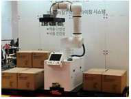
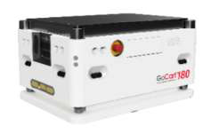
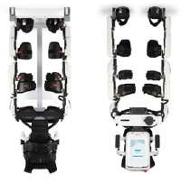
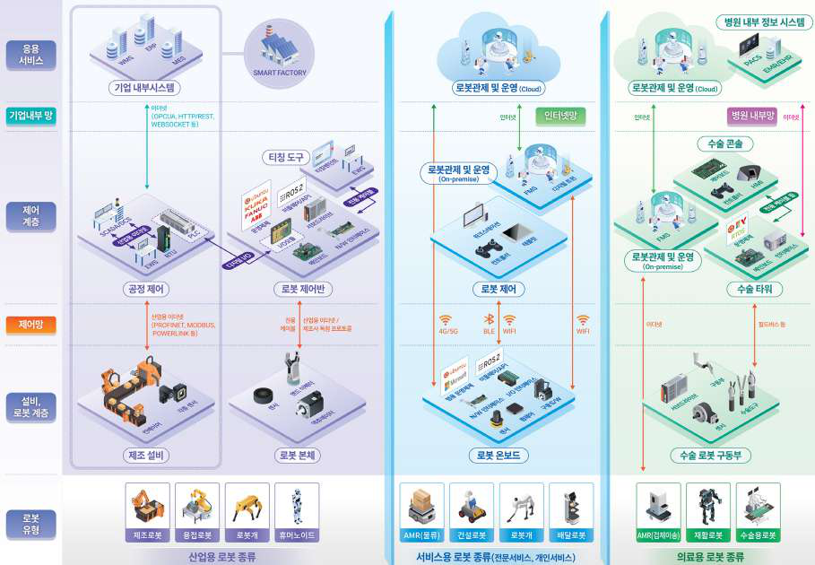
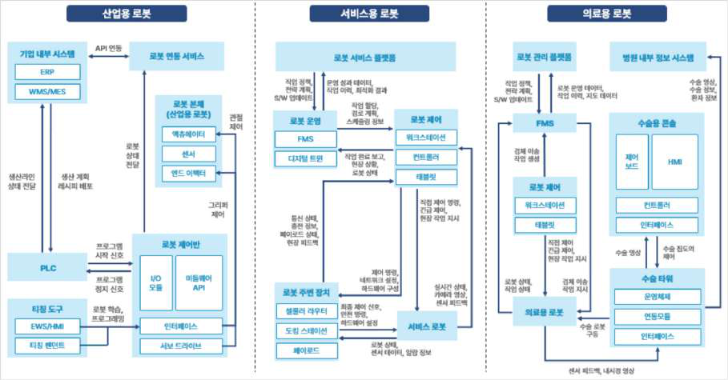
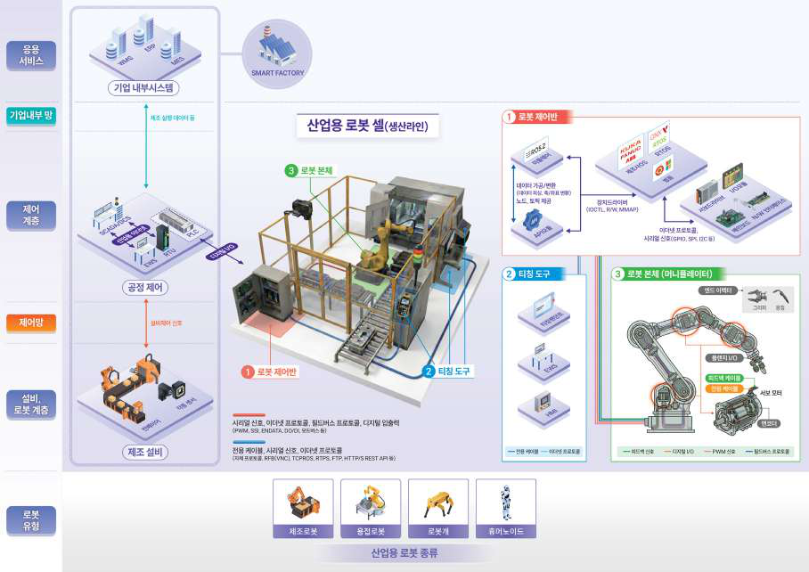
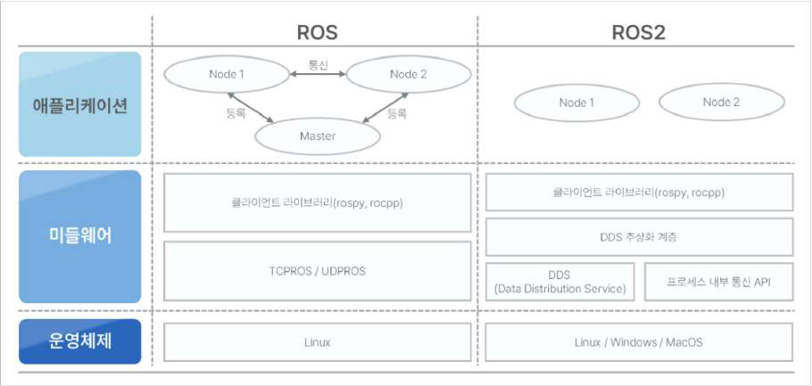
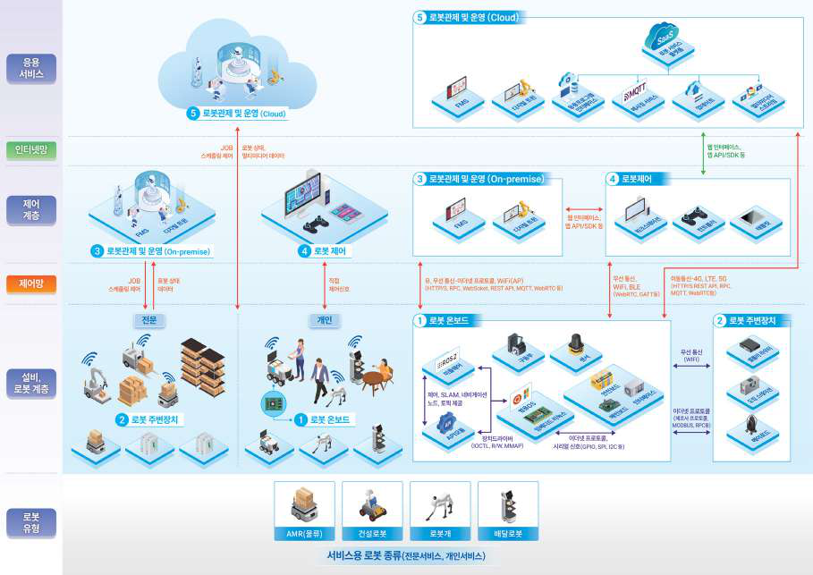
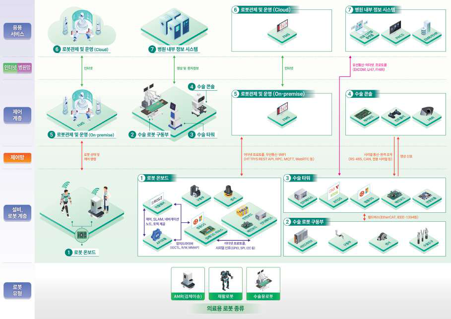

# 로봇 보안모델(고도화).pdf

> Converted: 2026-03-30 06:41

---
<!-- Page 1 -->

---
<!-- Page 2 -->

---
<!-- Page 3 -->

---
<!-- Page 4 -->

---
<!-- Page 5 -->

---
<!-- Page 6 -->
6
개요
01
1.1
배경
로봇 기술이 제조·의료·물류·서비스 등 다양한 산업 분야로 빠르게 확산되면서 산업용 로봇, 서비스용
로봇, 의료용 로봇 등 여러가지 유형의 로봇이 일상과 산업 현장에서 다양하게 활용되고 있다. 특히
사람의 개입이 필수적이었던 작업 환경에도 로봇과 AI를 통합해 실제 물리 세계를 인지하고 이를
바탕으로 이해·추론·계획·행동까지 자율적으로 수행하는 피지컬 AI(Physical AI) 개념이 대두되면서
각 산업에서 로봇 활용은 한층 더 가속화될 것으로 전망된다.
이러한 로봇을 대상으로 사이버공격이 발생할 경우, 생산 중단에 따른 경제적 손실, 의료 현장에
있는 환자의 생명 위협 등 과거 단순한 IT 시스템의 장애와 달리 실제 물리적인 장비의 손상과 인명
피해로까지 이어질 수 있다. 또한 일상생활에서는 각 가정 내 로봇 기기로 인해 심각한 프라이버시
침해가 발생할 수도 있다.
현재 로봇만을 대상으로 하는 국내·외 사이버보안 규제는 별도로 마련되어 있지 않지만, 유럽에서는
무선기기지침(RED, Radio Equipment Directive)을 통해 무선 기능을 포함한 디지털 장비에
대한 보안요구사항이 의무화되었으며, 북미를 중심으로 산업제어시설, 자동차 산업 등 분야에서도
사이버보안 규제 및 표준이 강화되는 추세다. 이러한 흐름을 고려할 때 로봇 분야 역시 향후 별도의 보안
규제 체계가 구축될 가능성이 높으며, 제조사는 증가하는 사이버 위협과 미래 규제 요구에 선제적으로
대응할 수 있는 보안 체계를 마련해야 한다.
이에 본 문서는 글로벌 사이버보안 규제를 분석하여 로봇 시스템에서 발생할 수 있는 위협을 사전에
식별하여, 규제 요구사항을 충족할 수 있도록 로봇 제조사 및 운영자가 실질적으로 활용할 수 있는
가이드를 제공하고자 한다.

---
<!-- Page 7 -->
7
01
02
03
04
05
1.2
적용 범위
본 문서는 로봇의 유형을 로봇 분류에 대한 국제표준(ISO8373)에 따라 산업용 로봇, 서비스용 로봇,
의료용 로봇으로 분류하고, 각 유형별로 보안위협과 보안요구사항을 정의하였으며 적용대상 및 범위는
아래와 같다.
각 로봇 서비스 유형은 운용 특성에 따라 특화된 보안 요구사항을 가진다.
이를 통해 기본 보안 요구사항과 서비스 유형별 특화 보안 요구사항을 모두 포괄하는 통합 보안 모델을
제시한다. 본 보안 모델의 적용 범위는 다음과 같다.
적용 대상
구분
세부 내용
로봇 서비스
산업용 로봇
제조 공정 자동화 및 생산 라인 운용
서비스용 로봇
물류, 청소, 안내 등 상업 및 생활 지원
의료용 로봇
수술 보조, 재활 치료, 환자 케어
구성요소
로봇 단말
제어기, 센서, 액추에이터 등 물리적 로봇 시스템
통신 및 네트워크
내부 통신 버스, 외부 네트워크 인터페이스
로봇 소프트웨어
펌웨어, 운영체제, 응용 프로그램 등
연계 구성요소
HMI, 원격 제어 장치, 통합 관제 시스템 등
구분
보안의 특성
산업용 로봇 서비스
제어 시스템의 안정성 및 안전성이 특히 중요
서비스용 로봇 서비스
이동성 및 외부 시스템 연동 보안이 특히 중요
의료용 로봇 서비스
데이터 무결성 및 시스템 신뢰성이 특히 중요
적용 범위
세부 내용
로봇 서비스 라이프사이클
로봇 서비스의 전체 라이프사이클(설계, 개발, 배포, 운용, 폐기)
로봇 연계 구간
로봇과 연동되는 외부 시스템 간 인터페이스
보안 영역
물리적 보안, 네트워크 보안, 데이터 보안, 응용 보안 전 영역
로봇 보안 모델 적용 대상
로봇 서비스 별 주요 보안 특성
로봇 보안 모델 적용 범위

---
<!-- Page 8 -->

---
<!-- Page 9 -->
9
01
02
03
04
05
개요에서는 로봇 보안 모델 수립의 배경 및 필요성을 설명하고, 본 문서의 적용 범위와 구성을 제시한다.

## 제1장

로봇 서비스별 구성에서는 로봇 서비스를 산업용·서비스용·의료용으로 분류한다. 로봇 서비스의 구성요소를
하드웨어·네트워크·시스템 소프트웨어·응용 소프트웨어의 네 가지 속성으로 정의하고, 식별된 각 서비스의
구성요소와 속성을 연계하여 보호 대상을 명확히 정의한다.

## 제2장

로봇의 보안 위협에서는 로봇 시스템의 보안 목표를 기존 정보보호 3대 요소(기밀성·무결성·가용성)에 확장하여
정확성·신뢰성·안전성(로봇 특화)을 포함한 여섯 가지로 정의한다. 하드웨어·네트워크·시스템 소프트웨어·
응용 소프트웨어 속성별로 발생 가능한 보안 위협을 식별하고, 각 로봇 서비스 유형의 구성요소별 상세 위협을
분석한다. 식별된 위협을 기반으로 실제 발생 가능한 로봇 서비스 보안 위협 시나리오를 제시한다.

## 제3장

보안 아키텍처에서는 식별된 위협에 대응하기 위한 보안 강화 방안을 제시한다. 국내외 규제·표준·가이드라인을
기반으로 개발한 보안 취약점 점검 체크리스트를 11개 카테고리로 제시하고, 로봇 속성별 보안요구사항과 이를
충족하기 위한 보안 솔루션 매핑을 정의한다. 아울러 각 로봇 서비스 유형(산업용·서비스용·의료용)의 구성요소별
상세 보안요구사항을 제공하며, 전체 로봇 서비스 영역을 아우르는 통합 보안 구성도를 통해 체계적인 보안
아키텍처를 제시한다.

## 제4장

부록에서는 로봇 위협 및 보안 취약점 점검 체크리스트의 기반 근거, 로봇 보안위협 사례, 용어 및 약어 정의, 로봇
기술 보안수칙 등 본 문서의 실무 적용을 돕기 위한 참고 자료를 수록한다.

## 제5장

---
<!-- Page 10 -->

---
<!-- Page 11 -->

---
<!-- Page 12 -->
12
로봇 서비스별 구성
02
본 장에서는 로봇 서비스의 보안에 대한 체계적인 접근을 위해 로봇 서비스를 유형별로 분류하고,
각 서비스 유형별 구성요소를 정의한다.
본 장의 목표는 로봇 서비스 유형별 특성을 파악하고, 보안 분석의 토대가 되는 로봇 서비스 구성요소
분류 체계를 확립하는 데 있다. 이를 통해 로봇 서비스의 전체 구조를 정의하고, 각 구성요소에 대한
보안 분석을 위한 명확한 기준을 제공한다.
2.1
로봇 서비스 분류
국제 표준(ISO 8373:2021)에 따라 로봇 서비스를 산업용, 서비스용, 의료용으로 분류하고 각각의
정의와 특성을 제시한다. 유형별 주요 로봇, 운용 환경, 핵심 기능을 실제 사례와 함께 설명한다.

### 2.4 로봇 서비스별 구성요소

각 서비스별 구성도를 통해 구성요소를 식별하고, 식별된 구성요소에 대한 속성을 매핑한다.

### 2.2 로봇 서비스 통합 구성도

산업용, 서비스용, 의료용 로봇 서비스를 통합한 로봇 서비스 통합 구성도를 제시하고, 구성도를 응용
서비스 계층, 내부망(기업·병원) 및 인터넷 망, 제어 계층, 제어망, 설비 및 로봇 계층 다섯 개의 계층으로
분류하여 각 계층의 기능과 역할을 제시한다.
2.3
로봇 서비스 속성 분류
미국 연방 정부의 지원을 받는 사이버보안 관련 비영리 연구 조직인 MITRE의 임베디드 장치에 대한
보안 프레임 워크 (EMB3D – Embedded Device Security) 프레임워크를 기반으로 로봇 서비스
구성요소를 하드웨어, 네트워크, 시스템 및 응용 S/W 네 개의 속성으로 구분하는 분류 체계를 정의한다.

---
<!-- Page 13 -->
13
01
02
03
04
05

#### 2.1.1 산업용 로봇

로봇의 용어에 대한 국제표준(ISO 8373:2021)에 따르면 로봇은 "이동, 조작 또는 위치 지정을
수행하기 위해 일정 수준의 자율성을 갖춘 프로그래밍된 구동 메커니즘"으로 정의된다.
본 절에서는 ISO 8373:2021에서 정의한 로봇 유형 분류를 토대로, 실제 적용되는 서비스 환경과
주요 보안 특성을 반영하여 로봇 서비스를 산업용 로봇, 서비스용 로봇, 의료용 로봇 세 가지 유형으로
분류한다.
산업용 로봇은 "산업 자동화 응용 분야에서 사용되는 자동 제어 및 재프로그래밍 가능한 다목적
조종장치"로 정의되며, 제조 공정 자동화 및 생산 라인 운용을 주목적으로 한다. 이는 고정형 또는
이동형 플랫폼에 기반하여 3축 이상에서 프로그래밍 가능하며, 제조 환경에서 다양한 작업을 수행한다.
산업용 로봇은 금속 및 식품 가공, 물류 창고 팔레트 작업 등 다양한 분야에서 활용되나, 특히 자동차 및
전자 산업에서 활용 비중이 가장 높다. 산업용 로봇의 제조·생산 환경 내 주요 활용 사례는 다음과 같다.
2.1
로봇 서비스 분류
구분
설명
사례
스폿 용접 /
도장 로봇
•	 자동차 및 자동차 부품 제조와 같은 금속 부품에
스폿 용접 작업(융접, 압접, 납땜)을 수행하고, 해당
부위를 도장하는 작업을 수행한다.
•	 일정한 품질을 보장하면서 작업자의 유해 환경
노출을 감소시킨다.
[ 현대로보틱스(국내) ]
팔레타이징/
디팔레타이징
로봇
•	 물품을 팔레트에 체계적으로 쌓거나 (팔레타이징)
팔레트에서 꺼내는(디팔레타이징) 작업을 수행한다.
•	 물류 창고 및 생산 현장에서 효율적인 물품 관리를
가능하게 하며 작업 시간을 단축시킨다.
[ 푸른기술(국내) ]
픽앤플레이스
(Pick & Place)
로봇
•	 특정 위치에서 물품을 집어 다른 위치에 정확하게
배치하는 작업을 수행한다.
•	 전자 부품 조립, 포장 등 반복적인 작업에서 높은
정확도와 속도를 제공한다.
[ KUKA(독일) ]

---
<!-- Page 14 -->
14
휴머노이드
로봇
•	 인간의 형태를 모방하여 두 발로 이동하고 두 팔을
조작할 수 있도록 설계된 로봇이다.
•	 사람과 협력하는 환경에서 다양한 작업을 수행할 수
있는 잠재력을 가지고 있다.
[ 유니트리(중국) ]
주요 산업용 로봇 유형

#### 2.1.2

서비스용 로봇
서비스 로봇은 "인간과 장비에 유용한 작업을 수행하기 위해 개인적 또는 전문적 용도로 사용되는 로봇"
으로 정의되며, 크게 개인 서비스 로봇과 전문 서비스 로봇으로 분류된다.
개인 서비스 로봇은 주로 비상업적 용도로 사용자의 일상생활을 지원하는 작업을 수행하며, 전문 서비스
로봇은 특정 분야에서 주어진 기능을 수행한다. 최근에는 초기 도입 비용 절감을 위해 대여 및 구독
방식으로 로봇 시스템을 제공하는 RaaS(Robotics as a Service) 기반 비즈니스 모델이 확대되고
있다.
전문 서비스 로봇은 물류·이송, 접객(호텔 및 외식), 전문 청소, 농업, 보안·방범 등 다양한 분야에서
활용되고 있다. 각 서비스 로봇의 주요 활용 사례는 다음과 같다.
구분
설명
사례
물류 운송용
자율이동로봇
(AMR)
•	 사람의 개입 없이 자율적으로 이동하며 창고나 공장
내에서 물품을 운송한다.
•	 유연한 경로 설정과 실시간 장애물 회피가 가능하여
효율적인 물류 자동화를 실현한다.
[ 유진로봇(국내) ]
안내용 로봇
•	 병원, 전시회, 박물관 등에서 방문자에게 정보를
제공하고 길을 안내하는 로봇.
•	 자연어 처리, 터치스크린, 음성 인터페이스로 사용자와
상호작용한다.
[ 라스테크(국내) ]

---
<!-- Page 15 -->
15
01
02
03
04
05
경비·감시 로봇
•	 24시간 자율 순찰과 AI 기반 이상 징후 감지로 건물,
주차장, 캠퍼스의 보안을 담당한다.
•	 360도 카메라, 열화상 카메라, 자동 충전 기능으로
지속적인 보안 감시를 수행한다.
[ 도구공간(국내) ]
화재·재난
대응 로봇
•	 극한의 화재 현장에서 소방대원을 대신하여 고압
물분사, 위험 물질 처리, 구조 작업을 수행한다.
[ Boston Robotic(미국) ]
특수환경 로봇
•	 원자력 발전소, 광산, 극한 지형 등 인간이 접근하기
어려운 환경에서 검사, 탐사, 데이터 수집을 수행한다.
•	 뛰어난 기동성, 자율주행, 다양한 센서를 갖춘다.
[ 현대 자동차(국내) ]
주요 서비스용 로봇 유형
의료용 로봇은 "의료 전기 장비 또는 의료 전기 시스템으로 적용되는 로봇"으로 정의되며, 산업용 및
서비스용 로봇과 구별되는 독립적인 유형으로 분류된다. 이는 주로 수술 보조, 재활 치료, 환자 보살핌
등 특수 의료 환경에서 환자의 생명 및 안전과 직결되는 임무를 수행한다. 의료용 로봇의 구체적인 활용
사례는 다음과 같다.
구분
설명
사례
수술용 로봇
•	 의료진을 보조하여 최소 침습 수술을 정밀하게
수행한다.
•	 의사는 원격 조종 콘솔에서 3D 영상을 보면서 로봇
팔을 조종하여 작은 절개로 복잡한 수술을 안전하고
정확하게 실시한다.
[ 인튜이티브(미국) ]
병원 물류 이송로봇
(AMR)
•	 병원 내부의 다양한 부서 간 검체, 의약품, 수술 도구,
멸균 물품 등을 운반한다.
[ 유진로봇(국내) ]

#### 2.1.3

의료용 로봇

---
<!-- Page 16 -->
16
재활 로봇
•	 뇌졸중, 척수손상, 근육질환 등으로 인한 마비 또는
운동 기능 장애가 있는 환자의 재활을 지원한다.
[코스모로보틱스(국내) ]
주요 의료용 로봇 유형
로봇 서비스 통합 구성도
본 절에서는 산업용 로봇, 서비스용 로봇, 의료용 로봇의 실증 사례 및 구현 결과를 분석하여 로봇
서비스 통합 구성도를 작성하였다. 본 로봇 서비스 통합 구성도는 최상위 응용 서비스 계층에서부터
최하위 설비 및 로봇 계층까지 다섯 개의 계층으로 정의된다.
계층
설명
예시
응용 서비스
•	 기업 내부 시스템(제조실행, 생산관리, 자원관리 등)
•	 ERP, WMS, MES, PACS,
EMR/EHR
기업 내부망 및
인터넷 망
•	 응용 서비스와 제어 계층 간 네트워크 계층
•	 보안요구사항 및 규제에 따른 유연한 망 구성
•	 통신 방식
- 이더넷, Wi-Fi, 5G/LTE
•	 통신 프로토콜
- MQTT, API, WebSocket

### 2.2 로봇 서비스 통합 구성도

---
<!-- Page 17 -->
17
01
02
03
04
05
로봇 서비스 통합 구성도 DFD
다음은 로봇 서비스 구성요소간 통신 데이터 흐름을 다이어그램으로 나타낸 것이다.
제어 계층
•	 로봇의 움직임을 제어하는 계층
•	 로봇 센서로부터 지속적으로 상태 정보를 수집
•	 비상 상황 감지 시 즉시 로봇 중지
•	 로봇 관리 시스템(FMS), 디지털 트윈 S/W
•	 다수/이기종 로봇 통합 관제 시스템
•	 EWS, SCADA, PLC, RTU, 로봇
제어반, HMI, 티칭 펜던트, FMS,
태블릿, 수술용 콘솔
제어망
•	 제어 계층과 설비/로봇 계층 간 네트워크 계층
•	 실시간성 및 신뢰성 제공
•	 통신 방식
- 산업용 이더넷, 필드버스, Wi-Fi,
2.4/5 GHz 무선, 제조사 전용
케이블
•	 통신 프로토콜
- PROFINET/PROFIBUS,
EtherCAT, Modbus TCP/RTU,
DeviceNet, CANopen, OPC UA,
ROS/ROS2 DDS, 제조사 전용
프로토콜, MQTT
설비/로봇 계층
•	 물리적 작업을 수행하는 로봇 본체 및 주변 설비
•	 제어 계층의 명령을 받아 물리적 작업 수행
•	 로봇 구동부 및 센서, 제조설비
로봇 서비스 통합 구성도 계층 구분

---
<!-- Page 18 -->
18

#### 2.3.1 하드웨어

본 절에서는 로봇 제조사를 대상으로 수행한 취약점 분석 및 보안취약점 점검 체크리스트 실증 결과에
MITRE의 임베디드 장치에 대한 프레임워크(EMB3D, Embedded Device Security)를 적용하여,
로봇의 공통 속성을 하드웨어·네트워크·시스템 소프트웨어·응용 소프트웨어의 4가지 속성으로
분류한다.
MITRE EMB3D는 임베디드 시스템과 IoT 디바이스의 보안 위협을 체계적으로 분석하기 위한
프레임워크로, 로봇 시스템과 같이 물리적 구동부·제어 소프트웨어·네트워크 통신이 복합적으로 연계된
환경에 적합한 자산 분류 체계를 제공한다.
하드웨어 속성은 로봇 시스템의 물리적 기반을 이루는 구성요소로 로봇 서비스의 특성을 고려하여
다음과 같이 세부적으로 분류한다.
분류
설명
로봇 서비스에서 구성요소
마이크로 프로세서
컴퓨터 명령어를 해석하고 시스템의 연산과 제어를 수행
하는 중앙 처리 장치이다. RTOS·펌웨어를 실행하며, 주변
장치 제어 및 통신 처리를 담당한다.
•	 로봇 제어기의 CPU,
마이크로컨트롤러(MCU)
•	 PLC/RTU의 프로세서
•	 센서 및 액추에이터 내장 프로세서
외부 인터페이스
센서, 액추에이터 등 외부 장치와 저속 직렬 통신을 수행
하는 인터페이스이다. 하드웨어 간 데이터 교환의 중심
역할을 한다.
•	 센서 인터페이스 칩, 모터 드라이버
칩
•	 통신 컨트롤러(CAN, EtherCAT,
PROFINET 컨트롤러)
•	 내부 데이터 버스(I2C, SPI, PCIe)
내부 인터페이스
펌웨어 추출, 테스트, 문제 해결을 위해 사용되는 하드웨어
포트이다. 메모리 접근, 코드 업로드, 실행 제어가 가능하다.
•	 디버깅 포트(UART, JTAG, SWD)
•	 펌웨어 업데이트 포트
•	 진단 및 유지보수 포트
메모리 및 저장
장치
시스템 펌웨어, 설정 파일, 로그 데이터 등을 저장하는
비휘발성 메모리 구성요소와 실행 중인 프로세스의 데이
터를 저장하는 휘발성 메모리를 포함한다.
•	 펌웨어 저장용 플래시 메모리,
EEPROM
•	 작업 메모리(RAM), 로그 저장
장치
•	 설정 파일 및 프로그램 저장소, SD
카드, SSD
2.3
로봇의 공통속성

---
<!-- Page 19 -->
19
01
02
03
04
05

#### 2.3.2 네트워크

네트워크 속성은 로봇 시스템 내부 및 외부와 통신을 담당하며 네트워크 장치, 통신 프로토콜, 네트워크
서비스를 포함하며, 로봇 서비스의 특성을 고려하여 다음과 같이 세부적으로 분류할 수 있다.
분류
설명
세부 항목
원격 네트워크
서비스
로봇 시스템이 외부에 제공하는 네트워크 기반 서비스로,
원격 모니터링, 제어, 데이터 전송 등의 기능을 수행한다.
•	 웹 서버(HTTP/HTTPS), RESTful
API
•	 원격 접속 서비스(SSH, Telnet,
VNC, RDP)
•	 데이터 스트리밍 서비스(MQTT,
WebSocket)
•	 OPC UA 서버, DDS 서비스
•	 파일 전송 서비스(FTP, SFTP)
•	 진단 및 모니터링 서비스
네트워크 메시지
전달 및 라우팅 기능
로봇 시스템 내부 또는 외부 네트워크 간 데이터 패킷을
전달하고 라우팅하는 기능을 수행한다.
•	 산업용 이더넷 스위치
•	 라우터
•	 게이트웨이(Modbus/TCP,
PROFINET, EtherCAT)
•	 프로토콜 변환기
•	 무선 액세스 포인트(Wi-Fi, 5G/
LTE)
•	 방화벽 및 NAT 장치
•	 네트워크 브리지 및 리피터
확장 인터페이스
로봇 시스템과 외부 장치 간의 물리적 연결 인터페이스로,
데이터 전송 및 제어 신호 교환을 담당한다.
•	 USB 포트, 직렬 통신 포트
(RS-232/485)
•	 이더넷 포트, 필드버스 커넥터
•	 티칭 펜던트 연결 포트, HMI
인터페이스
하드웨어 속성 분류
네트워크 속성 분류

---
<!-- Page 20 -->
20

#### 2.3.3 시스템 소프트웨어

시스템 소프트웨어 속성은 로봇의 동작을 제어하고 관리하는 소프트웨어 구성요소를 포함하며
로봇 서비스의 특성을 고려하여 다음과 같이 세부적으로 분류할 수 있다.
분류
설명 및 보안 영향
세부 항목
부트로더
시스템 전원 투입 시 하드웨어 초기화를 수행하고 운영체제
또는 펌웨어를 메모리에 로드하는 소프트웨어이다. 부트로더
변조는 시스템 전체의 무결성을 손상시킬 수 있다.
•	 로봇 제어기 부트로더
•	 PLC/RTU 부트로더
•	 UEFI/BIOS
•	 U-Boot, GRUB
디버깅 기능
소프트웨어 개발, 테스트, 문제 해결을 위한 디버깅 도구
및 인터페이스이다. 디버깅 기능이 운영 환경에서 활성
화된 경우 보안 위협이 될 수 있다.
•	 진단 모드 및 테스트 모드
운영체제/커널
하드웨어 자원을 관리하고 응용 프로그램 실행 환경을
제공하는 운영체제 및 커널이다. 커널 취약점은 시스템
전체에 영향을 미칠 수 있다.
•	 실시간 운영체제(RTOS:
VxWorks, QNX, FreeRTOS)
•	 Linux 커널(Ubuntu, Debian,
임베디드 Linux)
•	 Windows(Windows 10 IoT,
Windows Embedded)
가상화 및 컨테이너
애플리케이션 격리 및 자원 관리를 위한 가상화 기술 및
컨테이너 환경이다. 격리 실패 시 다른 환경으로의 공격
전파가 가능하다.
•	 Docker, Kubernetes
•	 LXC/LXD 컨테이너
•	 하이퍼바이저(KVM, Xen,
VMware)
•	 ROS2의 컨테이너 기반 배포
펌웨어/소프트웨어
업데이트
펌웨어 및 소프트웨어 업데이트 기능의 소프트웨어이다.
업데이트 미지원 시스템은 보안 패치 적용이 불가능하여
알려진 취약점이 지속적으로 노출되며, 업데이트 지원
시스템은 업데이트 과정의 보안이 중요하다.
•	 미지원
- 업데이트 불가능한 레거시 펌웨어,
고정형 ROM 기반 시스템, 단종된
제품의 펌웨어
•	 지원
- OTA(Over-The-Air) 업데이트,
펌웨어 업데이트 서비스, 패키지
관리 시스템(apt, yum, pacman),
제조사 업데이트 도구
시스템 로그
시스템 이벤트, 오류, 보안 이벤트 등을 기록하는 로그
시스템이다. 로그는 보안 모니터링 및 사고 분석에 필수
적이다.
•	 시스템 로그
•	 애플리케이션 로그
•	 보안 감사 로그
•	 이벤트 로그
•	 작업 이력 로그
시스템 소프트웨어 속성 분류

---
<!-- Page 21 -->
21
01
02
03
04
05

#### 2.3.4  응용 소프트웨어

응용 소프트웨어 속성은 로봇 서비스에서 특정 작업과 기능을 수행하는 상위 계층 소프트웨어를
포함하며 로봇 서비스의 특성을 고려하여 다음과 같이 세부적으로 분류할 수 있다.
분류
설명
세부 항목
로봇 애플리케이션
로봇 시스템에서 특정 작업을 수행하기 위해 실행되는
애플리케이션 소프트웨어이다. 애플리케이션 취약점은
시스템 전체의 보안에 영향을 미칠 수 있다.
•	 모션 제어 소프트웨어
•	 경로 계획 및 내비게이션
소프트웨어
•	 비전 처리 및 AI/ML 애플리케이션
•	 데이터 수집 및 분석 소프트웨어
•	 작업 스케줄링 소프트웨어
사용자 정의
프로그램 배포기능
사용자가 작성한 커스텀 프로그램 또는 외부 바이너리를
로봇 시스템에 배포하고 실행할 수 있는 기능이다. 악성
프로그램 배포의 위험이 있다.
•	 로봇 티칭 프로그램
•	 사용자 정의 스크립트
•	 컴파일된 바이너리 업로드
•	 ROS 패키지 배포
대화형 인터페이스
사용자가 로봇 시스템과 상호작용하기 위한 애플리케이션,
서비스, 사용자 인터페이스이다. 인증되지 않은 접근 시
시스템 제어권이 탈취될 수 있다.
•	 HMI, 티칭 펜던트 인터페이스,
CLI
•	 웹 기반 관리 콘솔
•	 모바일 애플리케이션
•	 SCADA/DCS 화면
애플리케이션 로그
애플리케이션 수준의 이벤트, 작업 수행 내역, 오류 정보를
기록하는 로그 시스템이다. 작업 추적 및 보안 감사에 활용
된다.
•	 작업 실행 로그
•	 사용자 액션 로그
•	 애플리케이션 오류 로그
•	 성능 모니터링 로그
•	 보안 이벤트 로그
응용 소프트웨어 속성 분류

---
<!-- Page 22 -->
22

#### 2.4.1

산업용 로봇
산업용 로봇 서비스는 크게 로봇 제어반, 학습(티칭) 도구, 로봇 본체의 세 가지 핵심 구성요소로
정의된다. 구성요소 간 연결은 이더넷, 필드버스 프로토콜, 디지털 입출력, 시리얼 신호, 제조사 전용
케이블 등 다양한 인터페이스를 통해 이루어진다. 이러한 산업용 로봇 서비스는 산업제어시스템(ICS)
설비와 유기적으로 통합되어 전체 생산 라인의 일환으로 운영된다.
산업용 로봇 서비스의 구성도

### 2.4 로봇  서비스별  구성요소

1) 로봇 제어반
로봇 제어반은 로봇의 두뇌 역할을 하는 구성요소로, 상위 시스템으로부터 작업 명령을 받아 로봇의 모든
동작을 실시간으로 제어한다. 하드웨어와 소프트웨어가 결합된 형태로 로봇의 제어 명령을 처리하고
실행한다.
계층
구성요소
설명 및 주요 기능
속성 분류
제어 계층/설비
및 로봇 계층
미들웨어
•	 로봇 소프트웨어 개발용 프레임워크(ROS/ROS2 등)
•	 모듈화된 컴포넌트 간 통신
•	 하드웨어 추상화, 실시간 통신(DDS), 분산 시스템 지원
네트워크,
시스템 S/W,
응용 S/W

---
<!-- Page 23 -->
23
01
02
03
04
05
제어 계층/설비
및 로봇 계층
API 모듈
•	 외부 시스템과 제어반 간 통신을 위한 인터페이스
•	 상위 시스템(PLC, SCADA, MES) 연동
•	 IOCTL, R/W, MMAP 등 고속 데이터 접근
•	 제어 명령 수신 및 처리
네트워크,
응용 S/W
운영체제
•	 로봇 제어반의 운영체제(RTOS, Linux, Windows, 제조사
운영체제)
•	 시스템 리소스(CPU, 메모리, I/O), 프로세스 관리
•	 로봇 제어, 모션 제어, 센서 데이터 처리 프로세스 실행
•	 실시간 스케줄링 및 메모리 관리
네트워크,
시스템 S/W
I/O 모듈
•	 로봇 본체 및 외부 장치와의 신호 입출력 담당
•	 디지털 및 아날로그 I/O, 시리얼 통신(GPIO, SPI, I2C)
•	 필드버스 프로토콜 인터페이스
•	 서보 드라이브, 센서, 엔드이펙터 등과의 신호 교환
하드웨어
메인 보드
•	 로봇 제어반의 중앙처리 및 주요 회로가 탑재된 기판
•	 CPU, 메모리, 버스 컨트롤러 등 핵심 하드웨어 통합
•	 I/O 모듈, 인터페이스, 서보 드라이브와의 물리적 연결 제공
하드웨어
인터페이스
•	 제어반과 외부 장치 간 물리적 연결 인터페이스
•	 이더넷, USB, 직렬 통신 포트
•	 필드버스 커넥터 및 전용 케이블 인터페이스
•	 티칭 펜던트, EWS, 상위 시스템과의 연결 지원
하드웨어
서보
드라이버
•	 로봇 각 관절의 서보 모터를 제어하는 구동 장치
•	 제어반의 명령을 받아 모터에 전력 공급 및 위치 제어
•	 엔코더 피드백 신호 처리 및 실시간 위치 보정
•	 각 축의 정밀한 토크, 속도, 위치 제어 수행
하드웨어
로봇 제어반 구성요소
참고) ROS 기반 로봇 시스템
일본, 독일 스위스 등 주요 산업용 로봇 제조사는 로봇의 독점 운영 체제를 사용하고 있으나 최근에는
서비스 로봇 외에도 일부 산업용 로봇(중국 등)은 ROS (Robot Operating System) 미들웨어를
사용한다.ROS는 로봇 소프트웨어 개발을 위한 오픈소스 프레임워크로, 모듈화된 소프트웨어 컴포넌트
간 통신, 하드웨어 추상화, 센서/액추에이터 드라이버, 시뮬레이션 도구 등을 제공한다.
ROS 기반 로봇은 노드(Node) 단위로 기능이 분리되어 있으며, 각 노드는 토픽(Topic), 서비스
(Service), 액션(Action) 등의 통신 방식으로 데이터를 주고받는다.
ROS는 특히 AMR, 협동로봇, 연구개발용 로봇에서 널리 사용되고 있다. 차세대 버전인 ROS2는
산업 환경의 요구사항을 반영하여 실시간성과 보안이 강화된 DDS(Data Distribution Service) 기반
통신을 채택했으며, 품질 보장(QoS) 설정, 보안 통신, 실시간 스케줄링 등의 기능을 제공한다.

---
<!-- Page 24 -->
24
ROS 통신 구조
2) 티칭 도구
티칭 도구는 작업자가 로봇을 프로그래밍하고 조작하기 위한 인터페이스로, 로봇의 동작을 직접
설정하고 조정한다.
계층
구성요소
설명 및 주요 기능
속성 분류
제어 계층
티칭 펜던트
•	 로봇 제어반에 연결된 휴대용 조작 장치
•	 로봇의 동작 경로 직접 설정, 작업 프로그램 작성 및
편집
•	 로봇 파라미터 설정 및 수정, 수동 조작
•	 그리퍼 연동, 운전 모드 설정
•	 전용 케이블을 통해 제어반과 연결
하드웨어,
네트워크,
시스템 S/W,
응용 S/W
EWS
•	 대량 데이터의 기술적 계산 및 설계를 위한 엔지니어용
전용 시스템
•	 로봇 제어 관련 고성능 계산 처리
•	 로봇 시뮬레이션 및 설계를 위한 고해상도 그래픽
처리
•	 로봇 프로그램 개발 및 테스트 환경 제공
•	 이더넷 기반 프로토콜로 로봇 제어반과 통신
하드웨어,
네트워크,
시스템 S/W,
응용 S/W
HMI
(Human
Machine
Interface)
•	 인간과 기계 사이의 정보 전달 시스템
•	 로봇 작업 공정 데이터를 운영자가 인지할 수 있는
형태로 표현
•	 제어장치의 작업 공정 상태 감시
•	 로봇 제어시스템 내부 동작 및 설정 확인 환경 제공
•	 터치스크린, 태블릿, PC 소프트웨어 등 다양한 형태
하드웨어,
네트워크,
시스템 S/W,
응용 S/W
티칭 도구 구성요소

---
<!-- Page 25 -->
25
01
02
03
04
05
3) 로봇 본체
로봇 본체는 실제 물리적 작업을 수행하는 기계 구조물로, 제어반의 명령을 받아 정밀한 동작을
실행한다. 전원 케이블과 피드백 케이블을 통해 제어반과 실시간으로 연결되며, 물리적 충격 및 배선
변조 등 외부 영향에 가장 민감한 구간이다.
계층
구성요소
설명 및 주요 기능
속성 분류
설비 및 로봇
계층
구동부
•	 서보 모터: 각 관절의 동작을 담당하며 정밀한
위치, 속도, 토크 제어 수행
•	 전원 케이블을 통해 서보 드라이브로부터 전력
공급
하드웨어
센서 및 피드백부
•	 엔코더: 각 관절의 정확한 위치 정보 측정
•	 피드백 케이블: 엔코더 신호 및 피드백 신호를
제어반으로 실시간 전송
•	 위치, 속도, 토크 데이터를 제어반에 전달
•	 일부 로봇은 필드버스 프로토콜(PROFINET,
EtherCAT, DeviceNet 등)을 통해 제어반 및
주변 설비와 실시간 동기화 통신 수행
하드웨어,
네트워크
엔드이펙터
(End effector)
•	 엔드 이펙터: 그리퍼, 용접 토치 등 작업 도구
•	 플랜지 I/O: 엔드 이펙터 제어를 위한 입출력
인터페이스
•	 디지털 I/O, PWM 신호를 통한 그리퍼 개폐,
용접 토치 점화 등 제어
하드웨어,
네트워크
로봇 본체 구성요소

---
<!-- Page 26 -->
26
서비스용 로봇 서비스의 구성도

#### 2.4.2 서비스용 로봇

서비스용 로봇 서비스는 각 로봇이 클라우드 기반 플랫폼 또는 현장 운영 시스템과 연계되는 구조로
정의된다. 구성요소 간 연결 인터페이스는 이더넷, 무선 통신(Wi-Fi, 5G/LTE), 시리얼, CAN 버스 등
다양한 방식을 통해 구현된다. 이러한 서비스용 로봇 구성요소들은 클라우드 기반 로봇 관리 플랫폼
또는 현장 통합 관제 시스템과 통합되어 전체 서비스 환경의 일환으로 운영된다.
1) 로봇 온보드
로봇 온보드(On-board)는 AMR(배송·안내·순찰), 로봇 개, 휴머노이드 등 서비스 환경에서 운용되는
로봇 외형 내부에 탑재되는 구동부, 센서, 메인 보드, 각종 확장 보드 및 통신 인터페이스 등을 통칭한다.
온보드는 상위 시스템으로부터 작업 명령을 수신하고 원격 측정(Telemetry) 정보를 상위로 전송함으로써
로봇의 동작과 상태에 대한 통합적인 관리 및 모니터링을 지원한다.하드웨어와 소프트웨어가 결합된
형태의 서비스용 로봇 온보드는 사용자 안전과 서비스 품질 요건을 충족하는 수준으로 서비스 환경을
인지·판단·제어하며, 공공장소 및 실내외 공간에서 배송·안내·청소·순찰 등의 서비스 작업을 안전하고
신뢰성 있게 수행하도록 하는 핵심 제어 구성요소로 정의된다.

---
<!-- Page 27 -->
27
01
02
03
04
05
계층
구성요소
설명 및 주요 기능
속성 분류
설비 및
로봇 계층
미들웨어
•	 로봇 소프트웨어 개발용 프레임워크(ROS/ROS2 등)
•	 모듈화된 컴포넌트 간 통신
•	 하드웨어 추상화, 실시간 통신(DDS), 분산 시스템 지원
네트워크,
시스템 S/W,
응용 S/W
API 모듈
•	 외부 시스템과 로봇 온보드 간 통신을 위한 인터페이스
•	 상위 시스템(로봇 서비스 플랫폼, 로봇 운영, 로봇 제어) 연동
•	 제어 명령 수신 및 처리
네트워크,
응용 S/W
운영체제
•	 로봇 온보드 운영체제(Linux, Windows, 임베디드 리눅스)
•	 시스템 리소스(CPU, 메모리, I/O), 프로세스 관리, 메모리 관리
•	 센서, 구동부, 인터페이스 연동 처리 및 장치 드라이버 제공
•	 응용 프로그램/미들웨어 실행 환경 제공
네트워크,
시스템 S/W
메인 보드
•	 로봇 온보드의 중앙처리 및 주요 회로가 탑재된 기판
•	 CPU, 메모리, 버스 컨트롤러 등 핵심 하드웨어 통합
•	 인터페이스, 구동부, 센서와의 물리적 연결 제공
하드웨어
안전 보드 및
PLC
•	 로봇과 구동부의 안전 제어를 담당
•	 비상정지 버튼, LiDAR, 카메라, 범퍼 스위치 등 안전 센서 신호
수집
•	 서보 드라이브, 브레이크에 안전 정지, 속도 제한 신호를 출력해
위험 상황에서 로봇을 안전 정지
하드웨어,
네트워크
온보드 구동부
•	 모터 드라이버, 모터가 결합되어 로봇의 관절 또는 바퀴를
움직이는 구동 모듈
•	 미들웨어, API 모듈에서 받은 명령에 따라 관절과 바퀴 동작 제어
•	 센서 피드백을 통해 움직임을 보정하고 정지·저속 등 구동 상태
관리
하드웨어
온보드 센서
•	 LiDAR, 카메라, IMU, IR 등으로 구성된 환경·자세 인지용 센서
묶음
•	 주변 장애물, 사람, 지형을 감지하고 형상, 공간 정보를 수집
•	 로봇의 위치, 자세 추정과 경로 계획, 충돌 회피에 필요한 센서
데이터제공
하드웨어,
네트워크
인터페이스
•	 이더넷, 무선 랜, USB, 직렬 통신 포트, 필드버스 커넥터 및 전용
케이블 등 제공
하드웨어
서비스용 로봇 온보드 구성요소

---
<!-- Page 28 -->
28
계층
구성요소
설명 및 주요 기능
속성 분류
설비 및
로봇 계층
셀룰러 라우터
•	 로봇 내부 또는 외부에 탑재된 4G/5G 셀룰러
네트워크 장치
•	 로봇이 상위 시스템에 연결할 수 있게 하거나
관리자가 셀룰러 네트워크를 통해 로봇에 원격
접속하여 모니터링, 디버깅, 유지보수 수행
하드웨어,
네트워크,
시스템 S/W,
응용 S/W
도킹 스테이션
•	 로봇 자동 충전 및 대기를 위한 충전 스테이션
•	 로봇이 자율적으로 도킹하여 배터리 충전
•	 충전 상태, 배터리 잔량 등 정보를 상위
시스템으로 전송
•	 충전 완료 후 자동 언도킹 및 작업 복귀 지원
하드웨어,
네트워크
페이로드
•	 배송·서빙·이송 서비스를 위한 화물 적재 장치
•	 적재함, 컨테이너, 트레이 등 로봇에 탑재
•	 센서(무게, 개폐 상태)를 통해 적재 여부 및 화물
상태 감지
하드웨어
서비스용 로봇 주변 장치 구성요소
2) 로봇 주변 장치
로봇 주변 장치는 로봇 온보드와 연계되어 통신·충전·운반 등 서비스 수행에 필요한 확장 기능을
제공하는 장치이다.
3) 로봇관제 및 운영(On-Premise)
로봇관제 및 운영(On-Premise)은 다수의 서비스 로봇을 통합 관리하고 최적화된 작업 할당 및 경로
계획을 수행하며 실시간으로 로봇 상태를 모니터링하여 효율적인 서비스 운영을 지원한다.
계층
구성요소
설명 및 주요 기능
속성 분류
제어 계층
FMS
(Fleet
Management
System)
•	 다수의 로봇을 통합 관리(로봇별 작업 할당,
우선순위 조정, 경로 최적화 수행 등)하는 시스템
•	 로봇 간 충돌 회피 및 교통 관리
•	 로봇 상태(배터리, 위치, 작업 진행률) 실시간
모니터링
하드웨어,
네트워크,
응용 S/W
디지털 트윈
•	 로봇의 위치, 상태, 센서 데이터를 실시간으로
동기화하여 가상 환경에서 시각화
•	 시뮬레이션을 통한 작업 계획 검증 및 최적화
•	 이상 징후 예측 및 예방 정비 지원
하드웨어,
네트워크,
응용 S/W
서비스용 로봇관제 및 운영(On-Premise) 영역 구성요소

---
<!-- Page 29 -->
29
01
02
03
04
05
4) 로봇 제어
로봇 제어 영역은 운영자가 서비스 로봇을 모니터링하고 제어하기 위한 인터페이스 장치로 구성된다.
로봇의 상태 확인, 작업 지시, 원격 조작 등을 수행하며, 로봇 관제 및 운영 영역과 연동되어 효율적인
로봇 운영을 지원한다.
계층
구성요소
설명 및 주요 기능
속성 분류
제어 계층
워크스테이션
•	 중앙 관제실에 설치되는 데스크톱 PC 또는
워크스테이션
•	 FMS 및 디지털 트윈 시스템 접속 및 제어
•	 작업 할당, 경로 설정, 긴급 정지 등 관리 기능
수행
하드웨어,
네트워크,
시스템 S/W
응용 S/W
컨트롤러
•	 로봇 원격 조작을 위한 전용 제어기
•	 조이스틱, 버튼 등을 통해 로봇의 이동, 회전,
속도 제어
•	 자율주행 실패 시 수동 조작 모드로 전환하여
로봇 구출
•	 위험 상황 발생 시 긴급 정지 기능 제공
하드웨어,
네트워크,
응용 S/W
태블릿
•	 현장 운영자용 모바일 인터페이스
•	 로봇 상태 확인, 간단한 작업 지시, 로봇 호출
등 수행
•	 터치스크린 기반 직관적인 UI 제공
•	 현장에서 즉각적인 로봇 제어 및 모니터링 가능
하드웨어,
네트워크,
응용 S/W
서비스용 로봇 제어 영역 구성요소
5) 로봇관제 및 운영(Cloud)
로봇관제 및 운영(Cloud) 영역은 서비스 로봇의 원격 관리, 데이터 수집, 소프트웨어 업데이트 등을
제공하는 클라우드 기반 서비스 플랫폼이다. 다양한 통신 프로토콜과 인터페이스를 제공하여 로봇과
상위 시스템 간 연동을 지원하며, 로봇 운영 데이터의 수집·분석·관리를 수행한다.
계층
구성요소
설명 및 주요 기능
속성 분류
응용 서비스
계층
응용프로그램
인터페이스
(API)
•	 HTTP 기반의 RESTful API 인터페이스
•	 로봇 상태 조회, 작업 지시, 설정 변경 등의 기능
제공
•	 외부
시스템(ERP,
WMS
등)과의
연동
인터페이스
네트워크,
응용 S/W
메시징서비스
(MQTT)
•	 경량 메시징 프로토콜 기반 실시간 통신
•	 로봇의 센서 데이터, 원격측정(Telemetry)
정보를 실시간으로 클라우드에 전송
•	 Pub/Sub 방식으로 다수의 로봇과 효율적인
통신
네트워크,
응용 S/W

---
<!-- Page 30 -->
30
업데이트
(OTA)
•	 로봇 온보드의 운영체제, 미들웨어, 응용
프로그램을 원격으로 업데이트
•	 버전 관리, 롤백(Rollback) 기능 지원
•	 다수의 로봇에 대한 일괄 업데이트 지원
네트워크,
응용 S/W
멀티미디어
스트리밍
(WebRTC)
•	 로봇에 장착된 카메라 영상을 운영자에게 실시간
스트리밍
•	 양방향 음성 통신으로 원격 상황 파악 및 안내
방송
네트워크,
응용 S/W
FMS
•	 로봇관제 및 운영(On-Premise)내 FMS, 디지털 트윈과 동일 요소이므로
해당 내용 참고
디지털트윈
서비스용 로봇관제 및 운영(Cloud) 영역 구성요소

#### 2.4.3

의료용 로봇
의료용 로봇 서비스는 각 로봇이 클라우드 또는 병원 내부망과 연계되는 구조를 가지며 구성요소 간
연결은 이더넷 프로토콜, 시리얼 신호, 영상 신호, 필드버스, 전용 케이블, 무선 통신 등 다양한 방식으로
이루어진다. 이러한 의료용 로봇의 구성요소들은 병원 내부 정보시스템 또는 클라우드에서 운영되는
로봇 관리 플랫폼과 통합되어 병원 시스템의 일부로 운영된다.
의료용 로봇 서비스의 구성도

---
<!-- Page 31 -->
31
01
02
03
04
05
1) 로봇 온보드
로봇 온보드는 AMR(임상·멸균·약제·검체 이송), 재활 로봇 등 병원 환경에서 운용되는 로봇 외형
내부에 탑재되는 구동부, 센서, 메인 보드, 각종 확장 보드 및 통신 인터페이스 등을 통칭한다.
온보드는 상위 시스템으로부터 작업 명령을 작업 명령을 수신하고 원격측정 정보를 상위로 전송함으로써
로봇의 동작과 상태를 통합적으로 관리·감시할 수 있도록 한다.
하드웨어와 소프트웨어가 결합된 형태의 의료용 로봇 온보드는 환자 안전과 의료 규제 요건을 충족하는
수준으로 의료 환경을 인지·판단·제어하며 로봇이 병원 내 물리 공간에서 요구되는 진료·간호·물류
작업을 안전하고 신뢰성 있게 수행하도록 하는 핵심 제어 구성요소이다.
계층
구성요소
설명 및 주요 기능
속성 분류
설비 및
로봇 계층
미들웨어
•	 로봇 소프트웨어 개발용 프레임워크(ROS/ROS2 등)
•	 모듈화된 컴포넌트 간 통신
•	 하드웨어 추상화, 실시간 통신(DDS), 분산 시스템 지원
네트워크,
시스템 S/W,
응용 S/W
API 모듈
•	 외부 시스템과 로봇 온보드 간 통신을 위한 인터페이스
•	 상위 시스템(로봇 플랫폼, 로봇 운영제어, 로봇 관리 플랫폼) 연동
•	 제어 명령 수신 및 처리
네트워크,
응용 S/W
운영체제
•	 로봇 온보드 운영체제(Linux, Windows, 임베디드 리눅스)
•	 시스템 리소스(CPU, 메모리, I/O), 프로세스 관리, 메모리 관리
•	 센서, 구동부, 인터페이스 연동 처리 및 장치 드라이버 제공
•	 응용 프로그램/미들웨어 실행 환경 제공
네트워크,
시스템 S/W
메인 보드
•	 로봇 온보드의 중앙처리 및 주요 회로가 탑재된 기판
•	 CPU, 메모리, 버스 컨트롤러 등 핵심 하드웨어 통합
•	 인터페이스, 구동부, 센서와의 물리적 연결 제공
하드웨어
안전 보드 및
PLC
•	 로봇과 구동부의 안전 제어를 담당
•	 비상정지 버튼, LiDAR, 카메라, 범퍼 스위치 등 안전 센서 신호 수집
•	 서보 드라이브, 브레이크에 안전 정지, 속도 제한 신호를 출력해
위험 상황에서 로봇을 안전 정지
하드웨어,
네트워크
온보드 구동부
•	 모터 드라이버, 모터가 결합되어 로봇의 관절 또는 바퀴를
움직이는 구동 모듈
•	 미들웨어, API 모듈에서 받은 명령에 따라 관절과 바퀴 동작
제어
•	 센서 피드백을 통해 움직임을 보정하고 정지·저속 등 구동 상태
관리
하드웨어

---
<!-- Page 32 -->
32
온보드 센서
•	 LiDAR, 카메라, IMU, IR 등으로 구성된 환경·
자세 인지용 센서 묶음
•	 주변 장애물, 사람, 지형을 감지하고 형상, 공간
정보를 수집
•	 로봇의 위치, 자세 추정과 경로 계획, 충돌
회피에 필요한 센서 데이터제공
하드웨어,
네트워크
인터페이스
•	 이더넷, 무선 랜, USB, 직렬 통신 포트, 필드버스
커넥터 및 전용 케이블 등 제공
하드웨어
의료용 로봇 온보드 구성요소
2) 수술 로봇 구동부
수술 로봇의 구동부는 환자의 수술 부위 주변에 배치되며 센서와 서보 드라이브를 통해 로봇 팔을 정밀
제어하고 내시경 및 다양한 수술 도구를 지지, 구동하여 외과의의 조작에 따라 환자 체내 및 체외에서
미세한 수술 동작을 수행하는 장치이다. 수술 로봇 구동부는 수술 콘솔의 컨트롤러(Controller) 동작을
그대로 추종하는 텔레오퍼레이션(Tele-operation)을 기반으로 하되 스케일링, 필터링, 운동 보정 등을
적용하여 실제 수술 동작으로 변환한다. 또한 내시경 카메라 촬영 데이터와 수술 도구의 사용 횟수 등
운영 데이터는 수술 타워와 연동되어 병원 내부 정보 시스템(PACS, EMR/EHR, 수술 정보 시스템 등)
으로 전송 및 저장되어 기록 관리와 사후 분석에 활용된다.
계층
구성요소
설명 및 주요 기능
속성 분류
설비 및
로봇 계층
센서
•	 위치 및 자세 측정용 센서 모듈
•	 모터 및 관절 축 회전을 전기 신호로 변환해
위치와 속도 피드백 제공
•	 절대 각도와 이중 센서(엔코더, 자기각도 센서)
값을 활용해 위치 오차를 보정하고 고장 감지 및
안전 정지 지원
하드웨어
서보 드라이브
•	 로봇 팔에 설치된 서보 모터를 구동하는 장치
•	 수술 콘솔의 컨트롤러 조작 신호, 명령을 수신해
모터에 전력을 공급하고 로봇 팔, 수술 도구의
목표 위치, 자세를 제어
•	 센서 피드백으로 관절, 도구 끝단의 위치 및 속도
오차를 실시간 보정
•	 각 축의 토크, 속도, 위치를 제어하고 이상 시
안전 정지 등 보호 기능 수행
하드웨어
로봇 팔
•	 센서, 수술 도구, 모터, 브레이크 등이 통합된
다관절 기계 구조물로 외과의의 조작을 기반으로
정밀한 수술 동작 수행
하드웨어
수술 도구
•	 로봇 팔 끝단에 장착되는 모듈로 수술 종류와
단계에 따라 탈·부착
•	 집게, 가위 등 미세 절개 등을 수행하는 수술
기구(Instrument) 지원
•	 3D 카메라로 수술 부위 확대 및 시각화 하는
내시경(Endoscopy) 지원
하드웨어
수술로봇 구동부 구성요소

---
<!-- Page 33 -->
33
01
02
03
04
05
3) 수술 타워
수술 타워는 수술 로봇 구동부와 수술 콘솔을 중계·관리하는 중앙 제어 장치로 RTOS가 구동되는 메인
보드를 기반으로 한다. 수술 타워는 각종 인터페이스를 통해 로봇 팔 구동부와 콘솔에서 들어오는 제어
명령, 상태 정보, 영상·센서 데이터를 수집 및 처리하고 연동 모듈을 통해 병원 내부 정보 시스템과의
통신을 담당한다. 이를 통해 수술용 로봇의 동작 제어, 상태 모니터링, 영상 및 데이터 전송, 안전 관련
신호 관리 등을 통합적으로 수행하는 허브 역할을 한다.
계층
구성요소
설명 및 주요 기능
속성 분류
설비 및 로봇
계층
인터페이스
•	 수술 콘솔, 수술 로봇 구동부, 병원 내부 정보 시스템 연동을 위해
다양한 유선 인터페이스를 제공
•	 수술 로봇 구동부와 EtherCAT, IEEE-1394 등 실시간 필드버스
포트 지원
•	 수술 콘솔과 전용 고속 링크, 시리얼 통신 포트 지원
•	 영상 신호를 처리해 수술 콘솔의 3D 뷰어 및 수술용 모니터로 분배
지원
•	 병원 내부 정보 시스템(PACS·EMR 등) 연동용 포트 지원
하드웨어
운영체제
•	 타워 운영체제(Linux, Windows, RTOS 등)는 수술 콘솔 입력, UI,
영상 처리, 병원 내부 정보 시스템 연동 등 비실시간 작업이나 수술
로봇 구동부를 제어하는 실시간 작업을 처리한다.
•	 수술 타워와 수술 로봇 구동부(서보 드라이브) 사이의 실시간 모션 제어
•	 센서 피드백을 주기적으로 처리해 축 및 도구 끝단(TCP)의 위치 및
속도 오차 보정
•	 수술 콘솔의 컨트롤러 입력, UI 이벤트를 수집해 RTOS로 전달
•	 내시경 영상을 수술 콘솔의 3D 뷰어로 전달
시스템 S/W
메인 보드
•	 수술 타워의 중앙처리 및 주요 회로가 탑재된 기판
•	 CPU, 메모리, 버스 컨트롤러 등 핵심 하드웨어 통합
•	 인터페이스를 통한 물리적연결 제공
하드웨어
연동 모듈
•	 병원 내부 정보 시스템(PACS·EMR 등)과 외부 의료 시스템에
연결하는 통신, 연계 전용 모듈
•	 수술 영상, 수술 도구 사용 이력, 상태 정보를 병원 내부 시스템과
연동해 기록, 조회, 관리 지원
•	 장비 및 원격 진단, 업데이트용 서비스와의 데이터 교환을 관리해
수술 워크플로와 유지보수를 지원
네트워크,
응용 S/W
수술 타워 구성요소

---
<!-- Page 34 -->
34
수술 콘솔 구성요소
4) 수술 콘솔
수술 콘솔은 의사가 로봇을 조작하는 인간-기계 인터페이스 장치로 HMI, 컨트롤러의 신호를 처리하는
제어 보드를 기반으로 한다. 수술 콘솔은 컨트롤러(MTM, 풋 페달) 등 입력 장치를 통해 외과의의
조작 명령을 수집하고 HMI(스테레오 뷰어, 암레스트 UI)를 통해 내시경 영상과 시스템 상태 정보를
실시간으로 시각화하며 수술 타워와의 통신을 통해 이러한 조작·표시 데이터를 주고받는다. 이를 통해
수술용 로봇의 자세·도구 동작을 직관적으로 제어하고 수술 진행 상황 및 알람 및 안전 상태를 의사에게
제공하는 사용자 인터페이스 역할을 수행한다.
계층
구성요소
설명 및 주요 기능
속성 분류
제어 계층
제어보드
•	 HMI와 컨트롤러 신호를 수집하고 수술 타워와 통신
•	 마스터 조작기(Master Tool Manipulator, MTM), 풋 페달, UI의 입력
신호를 수술 타워로 전달
•	 수술 타워에서 수신한 상태, 알람, 모드 정보를 HMI로 전달
하드웨어
HMI
•	 3D 수술 시야와 시스템 상태를 보여주고 버튼, 패널로 명령을 입력 받는
사용자 인터페이스 장치
•	 수술 타워에서 전달된 내시경 영상과 상태 정보를 3D 뷰어 및 패널에
표시
•	 모드 전환, 카메라 제어, 시스템 명령 등의 UI 입력을 제어보드로 전달
하드웨어
컨트롤러
•	 손, 발 동작을 로봇 제어 명령으로 변환하는 입력 장치(MTM, 풋 페달)
•	 MTM 관절 위치, 자세를 측정해 로봇 팔, 수술 도구의 목표 움직임으로 전달
•	 풋 페달의 클러치, 카메라 등 발 동작을 모드, 기능 전환 신호로 제공
하드웨어
5) 로봇관제 및 운영(On-Premise)
의료용 AMR의 로봇관제 및 운영(On-Premise)은 서비스 로봇의 로봇관제 및 운영(On-premise)
영역과 동일하므로, 해당 영역의 구성요소에 대한 설명은 서비스 로봇의 로봇관제 및 운영(On-
Premise)을 참조한다.
6) 로봇관제 및 운영(Cloud)
의료용 AMR의 로봇관제 및 운영(Cloud)은 서비스 로봇의 로봇관제 및 운영(Cloud) 영역과 동일하므로,
해당 영역의 구성요소에 대한 설명은 서비스 로봇의 로봇관제 및 운영(Cloud)을 참조한다.

---
<!-- Page 35 -->
35
01
02
03
04
05
7) 병원 내부 정보 시스템
병원 내부 정보 시스템은 의료용 로봇이 취득한 의료 데이터(X-ray 사진, 수술 영상, 개인 건강 정보
(PHI) 등)를 저장·관리·활용하는 영역으로 PACS, EMR/EHR, 의료 디지털 플랫폼으로 구성된다.
이러한 구성요소는 플랫폼 연동 장비, 연동 모듈을 통해 제조사 전용 프로토콜, DICOM, HL7 등을
사용하여 의료용 로봇과 환자 정보, 수술 정보 등을 상호 교환한다.
계층
구성요소
설명 및 주요 기능
속성 분류
응용 서비스
계층
EMR/EHR
•	 환자의 진료·투약·검사·영상·수술 기록 등 의료 정보를
전산화하여 병원 내·외부에서 통합 관리
•	 진료기록, 과거력, 알레르기, 투약·검사·수술 내역 등을
구조화해 저장하고 의료진이 진료 시 신속하게 조회·입력·
수정할 수 있도록 지원
•	 PACS, 처방시스템, 의료용 로봇, 보험 청구 시스템 등과
연동해 데이터를 교환하고 경고 알림(중복 처방, 알레르기),
임상 경로 등 의사결정 지원 기능 제공
하드웨어,
네트워크,
시스템 S/W,
응용 S/W
PACS
•	 X-ray, CT, MRI, 내시경·수술 영상 등 의료 영상을 디지털
형태로 저장·조회·전송·보관하는 시스템으로 필름 없이 병원
내·외부에서 영상 통합 관리
•	 영상 촬영 장비(CT, MRI, 수술 도구 등)에서 생성된 영상을
DICOM 형식으로 수집·저장하고 진료실·판독실·수술실
등에서 조회·비교·주석 할 수 있도록 지원
•	 수술 로봇과 연동해 수술 전 영상(CT/MRI, 3D 재구성 영상)
을 타워 측에 제공하고, 수술 중·수술 후 영상 및 수술 기록을
PACS에 연계 저장하여 재수술 계획, 합병증 추적, 품질 관리
등에 활용
하드웨어,
네트워크,
시스템 S/W,
응용 S/W
의료 디지털
플랫폼
•	 수술 로봇, PACS, EMR/EHR, 병원 내 각종 장비에서
발생하는 데이터를 통합 수집·분석·시각화 하는 플랫폼
•	 PACS, EMR/EHR, 모니터링 장비와의 연동을 통해 수술
계획 정보, 환자 영상, 수술 로그, 알람·이벤트를 한 곳에서
통합 관리 수술실 내/외에서 동일한 화면·정보를 조회할 수
있도록 지원
하드웨어,
네트워크,
시스템 S/W,
응용 S/W
병원 내부 정보 시스템 구성요소

---
<!-- Page 36 -->

---
<!-- Page 37 -->

---
<!-- Page 38 -->
38
로봇의 보안 위협
03
본 장에서는 로봇 서비스에 대한 보안 위협을 체계적으로 식별하고 분석한다. 제2장에서 정의한 로봇
서비스 구성도와 구성요소를 기반으로, 각 로봇 서비스의 구성요소에서 발생 가능한 보안 위협을
도출한다. 본 장의 구성은 다음과 같다.
본 장의 목표는 로봇 시스템의 확장된 보안 목표를 정립하고, 로봇 서비스 전반에 공통적으로 존재하는
보안 위협을 식별함과 동시에 서비스 유형별 운용 환경과 특성을 반영한 특화 위협을 도출하는 데 있다.
이를 통해 로봇 시스템의 보안 위협을 포괄적으로 이해하고, 각 서비스 유형에 적합한 보안 대책을
수립하기 위한 근거를 제공한다.
3.1
3.2
3.3
3.4
로봇 서비스의 보안 목표
보안 위협의 유형
로봇 서비스별 보안 위협
로봇의 보안 위협 시나리오
•	 로봇 시스템의 보안목표를 IT 시스템의 보안 3요소(CIA:기밀성, 무결성, 가용성)를 확장하여
정확성·신뢰성·안전성(로봇 특화)을 포함한 6가지로 정의한다.
•	 IT 시스템과 로봇 서비스의 보안목표 차별적 특성을 비교한다.
•	 2장에서 정의한 속성 분류(하드웨어·네트워크·시스템 소프트웨어·응용 소프트웨어)를 기준으로
보안 위협의 유형을 제시한다.
•	 산업용, 서비스용, 의료용 로봇 시스템의 운용 환경과 기술적 특성을 고려하여 각 서비스
유형별로 특화된 상세한 보안 위협을 식별한다.
•	 식별된 위협을 기반으로 실제 발생 가능한 로봇 보안 위협 시나리오를 제시한다.

---
<!-- Page 39 -->
39
01
02
03
04
05
로봇 서비스는 일반적인 IT 시스템과 달리 데이터 처리뿐 아니라 물리 환경에 직접 영향을 주는 사이버-
물리 시스템(CPS, Cyber-Physical System)이므로, 전통적 보안 목표(C.I.A)에 더해 물리 동작
품질과 안전 확보가 함께 요구된다.
이에 따라 로봇 서비스에 6가지 보안 목표가 필요한 이유와 보안목표 침해 시 예상 영향을 아래 표에
요약하였다.
보안목표 구분
설명
IT 시스템
기밀성
비 인가된 접근으로부터 데이터를 보호하여, 권한이 부여된 사용자만
특정 정보 및 자원에 접근할 수 있도록 통제해야 한다
무결성
비 인가된 수정, 변조, 삭제로부터 데이터를 보호하여 시스템의 신뢰성을
유지해야 한다
가용성
인가된 사용자가 필요한 시점에 시스템 및 데이터에 안정적으로 접근
로봇 특화
정확성
로봇의 목표 위치·자세·속도·힘(토크) 등을 허용 오차 범위 내에서
수행하도록 제어 성능을 보장한다
신뢰성
로봇이 동일 조건에서 예측 가능하고 일관된 동작을 수행,
상태 및 진단 정보가 운영에 활용 가능할 수준으로 유지되도록 한다
안전성
로봇이 사람·설비·환경에 위해를 유발하지 않도록 위험을 통제하고,
이상 징후 발생 시 안전정지/안전상태(Fail-safe) 로 전환되도록 한다
보안목표
보안목표별 보호 필요성
기밀성
로봇의 정보(영상·음성·위치), 동작로그, 공정정보 등 물리 환경 및 운영 정보의 노출을 방지하기 위해 필요
무결성
로봇의 센서 데이터, 제어 명령, 작업 프로그램, 안전 설정의 변조 및 재전송으로 인한 오동작 및 사고를
방지하기 위해 필요
가용성
로봇을 통한 작업(공정, 물류 작업 등)의 중단이 공정 전체의 연쇄 안전정지로 확대될 수 있으므로 운영
연속성과 복구 가능성을 확보하기 위해 필요
정확성
로봇의 위치, 속도, 힘(토크) 제어가 허용 오차를 벗어나면 충돌과 제품 품질 저하로 이어질 수 있으므로
물리 동작의 수행 정확도를 확보하기 위해 필요
신뢰성
로봇이 같은 조건과 방식으로 안정적으로 동작하고, 상태·경보·진단 정보를 통해 안전하게 운영할 수
있도록 위해 필요
안정성
물리 동작이 사람, 설비, 환경에 위해를 줄 수 있으므로 이상 상황 발생 시 안전상태로 전환(Fail-Safe)
되도록 보장하기 위해 필요
로봇 서비스의 6가지 보안목표
3.1
로봇 서비스의 보안 목표
로봇 서비스의 보안목표 보호 필요성

---
<!-- Page 40 -->
40
최종적으로 로봇 서비스의 보안을 위해서 기밀성·무결성·가용성과 정확성·신뢰성·안전성 관점에서의
물리 동작, 운영 안정성까지 함께 보호해야 한다. 따라서 이후 절에서는 보안목표가 침해되는 관점에서
로봇 보안 위협을 유형화하고, 로봇 서비스별 주요 보안 위협과 보안 위협 시나리오 그리고 부록을 통해
과거의 로봇 보안위협 사례까지 제시한다.

---
<!-- Page 41 -->
41
01
02
03
04
05

#### 3.2.1

하드웨어 보안 위협 유형

#### 3.2.2 네트워크 보안 위협 유형

하드웨어 보안 위협은 로봇 시스템의 물리적 자산에 대한 위협으로 물리적 접근, 신호 위조, 터미널 접근
등의 공격을 포함하며, 로봇 시스템의 특성을 고려하여 다음과 같이 위협 유형으로 분류된다.
본 절은 2장에서 정의한 하드웨어, 네트워크, 시스템 소프트웨어, 응용 소프트웨어 4가지 속성에 대한
보안 위협 유형을 분류하였다. 각 속성 별 보안 위협은 다음과 같다.
네트워크 보안 위협은 로봇 시스템의 네트워크 자산에 대한 위협으로 오동작 및 중단 유발, 서비스
거부, 네트워크 도청 등의 공격을 포함하며, 로봇 시스템의 특성을 고려하여 다음과 같이 위협 유형으로
분류된다.
보안 위협
공격기법
영향을 받는
보안 목표
물리적 훼손
영역 내 물리적으로 접근하여 로봇 및 장비, 보호영역 훼손
가용성, 안전성, 신뢰성
신호 위조
영역 내 물리적으로 접근하여 로봇 및 장비에 대한 악성 신호 전송
무결성, 안전성, 정확성
터미널 접근
영역 내 물리적으로 접근하여 키보드기반 터미널 접근하여 운영체제에 접근
기밀성, 무결성, 가용성
부채널 공격
영역에서 측정 가능한 전력·전자기·시간 정보 등을 분석하여 로봇 내부의 비밀
데이터나 연산 값을 간접적으로 유출
기밀성, 무결성, 신뢰성
외장 매체를
통한 데이터
주입/유출
영역에서 외부 미디어(USB 등)를 통해 악성 프로그램이나 설정 파일을
주입하거나 중요 데이터 등을 유출
기밀성, 무결성, 신뢰성
저장 장치 정보
탈취 및 조작
영역 내 물리적으로 접근하여 펌웨어 덤프 또는 저장 장치 탈취를 통해 중요
데이터 등을 유출하거나 장치 내 데이터를 임의로 변경
기밀성, 무결성, 신뢰성
보안 위협
공격기법
영향을 받는
보안 목표
오동작 및 중단
유발
영역 네트워크에 접근하여 직접 제어 명령을 송신해 로봇 오동작 유발
무결성, 가용성, 안전성,
정확성, 신뢰성
서비스 거부
영역 네트워크에 접근하여 취약한 로봇 시스템으로 조작된 패킷을 전달하여
서비스 거부 유발
가용성, 안전성
하드웨어 위협 유형
3.2
보안 위협의 유형

---
<!-- Page 42 -->
42

#### 3.2.3 시스템 소프트웨어 보안 위협 유형

시스템 소프트웨어 보안 위협은 로봇 시스템의 시스템 소프트웨어 자산에 대한 위협으로 취약점 악용,
업데이트 기능 악용 등의 공격을 포함하여, 로봇 시스템의 특성을 고려하여 다음과 같이 위협 유형으로
분류된다.
보안 위협
공격기법
영향을 받는
보안 목표
취약점 악용
알려진 취약점을 스캔·익스플로잇하여 권한 획득 및
악성코드 전파
기밀성, 무결성, 가용성
부트로더 및 초기
신뢰체계 훼손
초기 부팅 단계(부트로더·시큐어 부팅·신뢰 루트)를 조작해
시스템 전체를 악성 상태로 시작
무결성, 신뢰성, 안전성
업데이트 기능 악용
펌웨어 및 소프트웨어의 업데이트 배포, 검증, 설치 절차를
조작하거나 우회하여 보안성을 약화
무결성, 신뢰성
권한 탈취
커널 취약점·드라이버·운영체제 권한 모델 등을 악용해
관리자 권한을 획득
기밀성, 무결성, 가용성
보호기능 우회
보호기능을 우회하여 ROP, 메모리 변조, 프로세스 탈취
등을 수행
무결성, 안전성, 정확성
서비스 구성 악용
운영체제 네트워크 스택 및 시스템 서비스의 오류 또는
취약한 구성을 이용해 네트워크 및 시스템 기능을 비인가로
사용
가용성, 신뢰성
로그 위·변조
이벤트/감사 로그를 삭제·변조·위조해 추적성 훼손
무결성, 신뢰성
진단 기능 악용
시스템에 남아 있는 진단 포트·디버깅 모드·테스트 기능을
악용해 인증을 우회하거나 권한을 획득
기밀성, 무결성, 안전성
메시지 재생 공격
관제용 단말, 메시지 브로커, 라우터로부터 패킷을 수집해 인증 우회 및
악의적인 명령 수행
무결성, 기밀성, 안전성
네트워크 도청
영역 네트워크에 접근하여 암호화되지 않은 통신을 도청하여 민감한
데이터 수집
기밀성
라우팅 기능 남용
로봇 내 또는 인프라에 설치된 라우터를 비인가 라우팅이나 정책 우회
경로로 침해
기밀성, 무결성, 가용성
키·증명서
탈취를 통한
통신 위조
제어 및 관리 영역에서 암호키 및 인증서 탈취를 통해 패키지 서명 및 TLS
통신을 위조함으로써 신뢰 체계를 무력화
기밀성, 무결성, 신뢰성
네트워크 위협 유형
시스템 소프트웨어 위협 유형

---
<!-- Page 43 -->
43
01
02
03
04
05

#### 3.2.4

응용 소프트웨어 보안 위협 유형
응용 소프트웨어 보안 위협은 로봇 시스템의 응용 소프트웨어 자산에 대한 위협으로 취약점 악용,
악성코드 유입/감염 등의 공격을 포함하며, 로봇 시스템의 특성을 고려하여 다음과 같이 위협 유형으로
분류된다.
보안 위협
공격기법
영향도
취약점 악용
알려진 취약점을 스캔·익스플로잇하여 권한 획득 및 악성코드
전파
기밀성, 무결성, 가용성
작업/동작 설정 악용
로봇 동작에 대한 설정을 변경하여 안전 설정 범위를 벗어나는
등 공격자의 의도대로 동작을 유도
무결성, 안전성, 정확성
접근 제어 기능 악용
계정, 인증, 세션 등 접근 관리 요소를 탈취, 우회하여 비인가
접근에 활용
기밀성, 무결성
설정 데이터 변조
설정 데이터(운영/설정 및 파라미터/네트워크 등)의 값을
변경·위조하여 시스템 동작을 왜곡
무결성, 신뢰성, 정확성
데이터 탈취/변조
내부 DB에 저장되거나 전송되는 데이터·파일을 비인가 열람,
유출, 변경, 삭제 수행
기밀성, 무결성
상태 조회/설정 변조
로봇의 CPU, Memory, Disk, Time 등 상태 조회/설정을
조작해 로봇 운영 영향
가용성, 신뢰성
업데이트 기능 악용
업데이트 배포, 검증, 설치 절차를 조작하거나 우회하여
보안성을 약화
무결성, 신뢰성
백업/복원 악용
백업 및 복원 절차를 조작하여 데이터 유출, 롤백(구버전 강제)
를 유발
기밀성, 무결성, 가용성
로그 위·변조
이벤트/감사 로그를 삭제·변조·위조해 추적성 훼손
무결성, 신뢰성
원격지원 기능 악용
원격지원 기능의 약한 인증 또는 설정 오류를 이용해 원격
명령·설정을 주입하고 유지보수 로그를 은닉
기밀성, 무결성, 신뢰성
악성코드 유입/감염
악성코드를 감염시켜 프로세스 비정상종료 또는 추가동작
수행
무결성, 가용성, 안전성
라이센스 인증 위조
라이센스 서버 계정·키를 탈취하거나 서버 가용성을 공격하여
시뮬레이션·개발 도구의 정품검증을 우회하거나 기능을 차단
무결성, 가용성
라이센스 파일 변조로
인한 무단 소프트웨어
실행
라이센스 서버에 접근해 라이센스 파일을 변조하거나 위조
라이센스를 발급해 시뮬레이션/개발 도구를 악용
무결성, 신뢰성
응용 소프트웨어 위협 유형

---
<!-- Page 44 -->

---
<!-- Page 45 -->
45
01
02
03
04
05
제어 계층 / 설비 및 로봇 계층
구성요소
속성
보안 위협
세부 내용
미들웨어
네트워크
네트워크 도청
암호화되지 않은 ROS/DDS 노드 간 통신을 도청하여 제어
명령 및 센서 데이터 탈취
메시지 재생
공격
ROS 토픽 메시지를 수집하여 인증 우회 및 악의적 명령
재전송
라우팅 기능 남용
ROS 마스터 또는 DDS 라우팅을 조작하여 비인가 노드
통신
시스템 S/W
취약점 악용
ROS 패키지 또는 미들웨어 라이브러리의 알려진 취약점을
통한 권한 획득
업데이트 기능 악용
ROS 패키지 업데이트 과정에서 악성 패키지 주입
응용 S/W
악성코드 유입/감염
악의적인 ROS 노드를 시스템에 추가하여 데이터 조작
또는 명령 변조
라이센스 파일 변조로 인한
무단 소프트웨어 실행
ROS 기반 상용 소프트웨어의 라이센스 파일 변조
API 모듈
네트워크
오동작 및 중단 유발
API를 통해 비정상 제어 명령을 전송하여 로봇 오동작
유발
서비스 거부
대량의 API 요청을 전송하여 제어반의 API 서비스 중단
네트워크 도청
API 통신 채널을 도청하여 제어 명령 및 민감 데이터 수집
응용 S/W
접근 제어 기능 악용
API 인증 메커니즘의 취약점을 악용하여 비인가 접근 및
권한 상승
작업/동작 설정 악용
API를 통한 악의적 명령 주입으로 로봇 동작 설정 변조
설정 데이터 변조
API를 통해 로봇 설정 파라미터 및 운영 데이터 변조
운영체제
네트워크
서비스 거부
운영체제 네트워크 스택의 취약점을 악용한 서비스 거부
공격
시스템 S/W
부트로더 및
초기 신뢰체계
훼손
부트로더를 조작하여 악성 운영체제 또는 펌웨어 로드
권한 탈취
커널 취약점을 악용하여 최고 권한 획득 및 악성 드라이버
설치
업데이트 기능 악용
운영체제 패치 및 업데이트 과정에서 악성코드 주입
보호기능 우회
ASLR, DEP 등 운영체제 보안 기능을 우회하여 메모리
조작
로그 위·변조
시스템 로그 삭제 또는 변조를 통한 공격 흔적 은폐
진단 기능 악용
운영체제에 남아 있는 디버깅 모드 또는 테스트 기능을
악용

---
<!-- Page 46 -->
46
I/O 모듈
H/W
신호 위조
GPIO, SPI, I2C 등의 물리적 포트를 통한 악성 신호 주입
저장 장치
정보 탈취 및 조작
I/O 모듈을 통해 연결된 저장 장치의 데이터 탈취 또는
조작
외장 매체를 통한
데이터 주입/유출
USB 포트를 통해 악성 프로그램 주입 또는 데이터 유출
메인 보드
H/W
물리적 훼손
메인 보드 물리적 손상을 통한 제어반 기능 마비
터미널 접근
JTAG, UART 등 디버깅 포트를 통한 펌웨어 덤프 및
메모리 접근
저장 장치
정보 탈취 및 조작
메인 보드의 플래시 메모리 또는 EEPROM 탈취를 통한
펌웨어 및 설정 데이터 유출
신호 위조
메인 보드 버스를 통한 악성 신호 주입
인터페이스
H/W
터미널 접근
이더넷, USB, 직렬 통신 포트를 통한 비인가 터미널 접근
외장 매체를 통한
데이터 주입/유출
USB 인터페이스를 통한 중요 데이터 및 설정 파일 유출
신호 위조
필드버스 커넥터 또는 전용 케이블 인터페이스를 통한
악성 신호 주입
서보 드라이브
H/W
물리적 훼손
서보 드라이브 물리적 손상을 통한 모터 제어 불능
신호 위조
서보 드라이브에 악성 제어 신호를 주입하여 로봇 관절
오동작 유발 및 엔코더 피드백 조작
저장 장치
정보 탈취 및 조작
서보 드라이브 펌웨어 및 설정 데이터 탈취
부채널 공격
신호 패턴을 분석하여 로봇 내부의 데이터를 유출해 제어
정확성 및 동작 신뢰성 저하 유발
로봇 제어반 보안 위협

---
<!-- Page 47 -->
47
01
02
03
04
05
2) 티칭 도구
티칭 도구는 작업자가 로봇을 직접 프로그래밍하고 조작하기 위한 인터페이스로, 로봇 제어반과
긴밀하게 연결되어 제어 명령, 작업 프로그램, 설정 데이터를 전송한다. 티칭 펜던트, EWS, HMI는 각각
전용 케이블, 이더넷, 무선 등 다양한 통신 방식으로 제어반과 연결되며, 로봇의 동작 설정, 파라미터
변경, 프로그램 편집 등 핵심 제어 권한을 보유한다. 물리적 접근이 상대적으로 용이하고 작업자 인증이
취약한 경우가 많아, 비인가 접근 및 악의적 조작의 위험에 노출될 수 있다. 티칭 도구에서 발생 가능한
보안 위협은 다음과 같다.
제어 계층
구성요소
속성
보안 위협
세부 내용
티칭 펜던트
H/W
물리적 훼손
티칭 펜던트 물리적 손상을 통한 로봇 조작 불능
터미널 접근
티칭 펜던트를 통한 비인가 터미널 접근
외장 매체를 통한
데이터 주입/유출
티칭 펜던트 USB 포트를 통한 악성 프로그램 주입 또는
작업 프로그램 유출
저장 장치
정보 탈취 및 조작
티칭 펜던트 내 저장된 로봇 프로그램 및 설정 데이터 탈취
또는 변조
네트워크
오동작 및 중단 유발
티칭 펜던트를 통해 비정상 제어 명령 전송으로 로봇 오동작
유발
티칭 펜던트를 통해 로봇 작업 프로그램 및 파라미터 임의
변경
네트워크 도청
티칭 펜던트와 제어반 간 통신 도청으로 제어 명령 및 작업
프로그램 탈취
시스템
S/W
취약점 악용
티칭 펜던트 소프트웨어의 알려진 취약점을 통한 권한 획득
권한 탈취
티칭 펜던트 운영체제 취약점을 악용하여 관리자 권한 획득
업데이트 기능 악용
티칭 펜던트 소프트웨어 업데이트 과정에서 악성코드 주입
로그 위·변조
티칭 펜던트의 작업 이력 로그 삭제 또는 변조
응용 S/W
접근 제어 기능 악용
티칭 펜던트의 약한 인증을 우회하여 비인가 접근
작업/동작 설정 악용
티칭 펜던트를 통해 로봇 동작 프로그램을 악의적으로
변조하여 안전 설정 범위 벗어남
설정 데이터 변조
로봇 파라미터 및 운영 설정 데이터 변조
데이터 탈취/변조
티칭 펜던트에 저장된 작업 프로그램 및 설정 데이터 유출
또는 삭제
백업/복원 악용
로봇 프로그램 백업 파일 변조 또는 악성 프로그램으로 복원

---
<!-- Page 48 -->
48
EWS
H/W
물리적 훼손
EWS 물리적 손상을 통한 로봇 프로그래밍 및 설계 기능 마비
터미널 접근
EWS에 물리적으로 접근하여 비인가 터미널 접근
외장 매체를 통한
데이터 주입/유출
USB를 통해 악성 프로그램 주입 또는 로봇 설계 데이터
유출
저장 장치
정보 탈취 및 조작
EWS 내 저장된 로봇 프로그램, 시뮬레이션 데이터, 설정
파일 탈취 또는 변조
네트워크
오동작 및 중단 유발
EWS를 통해 제어반에 비정상 제어 명령 전송
EWS를 통해 로봇 제어 시스템 프로그램 변조
서비스 거부
EWS에 대량의 요청을 전송하여 서비스 중단
네트워크 도청
EWS와 제어반 간 이더넷 통신 도청으로 로봇 프로그램 및
설정 데이터 탈취
시스템
S/W
취약점 악용
EWS 운영체제 또는 개발 도구의 알려진 취약점을 통한
침해
권한 탈취
EWS 시스템 권한 획득을 통한 로봇 제어 시스템 전체 접근
업데이트 기능 악용
EWS 소프트웨어 업데이트 과정에서 악성코드 주입
로그 위·변조
EWS의 작업 로그 및 접근 기록 삭제 또는 변조
응용 S/W
접근 제어 기능 악용
EWS의 약한 인증을 우회하여 비인가 접근
작업/동작 설정 악용
EWS를 통해 로봇 프로그램 및 PLC 로직 악의적 변조
설정 데이터 변조
로봇 시뮬레이션 설정 및 제어 파라미터 변조
데이터 탈취/변조
EWS에 저장된 로봇 설계 데이터, 프로그램, 시뮬레이션
결과 유출
원격지원 기능 악용
EWS의 원격 접속 기능을 악용한 비인가 접근
악성코드 유입/감염
EWS에 악성코드를 감염시켜 연결된 제어 시스템으로 전파
라이센스 파일 변조로 인한
무단 소프트웨어 실행
로봇 시뮬레이션 및 개발 도구의 라이센스 파일 변조
HMI
H/W
물리적 훼손
HMI 화면 또는 장치 물리적 손상을 통한 모니터링 및 제어 불능
터미널 접근
HMI 장치에 물리적으로 접근하여 비인가 터미널 접근
외장 매체를 통한
데이터 주입/유출
USB를 통해 악성 프로그램 주입 또는 공정 데이터 유출

---
<!-- Page 49 -->
49
01
02
03
04
05
네트워크
오동작 및 중단 유발
HMI를 통해 비정상 제어 명령 전송으로 로봇 오동작 유발
HMI를 통해 로봇 작업 공정 설정 임의 변경
서비스 거부
HMI에 대량의 요청을 전송하여 모니터링 및 제어 기능 중단
네트워크 도청
HMI와 제어 시스템 간 통신 도청으로 공정 데이터 및 제어
명령 탈취
시스템
S/W
취약점 악용
HMI 소프트웨어의 알려진 취약점을 통한 침해
권한 탈취
HMI 시스템 권한 획득을 통한 제어 시스템 접근
업데이트 기능 악용
HMI 소프트웨어 업데이트 과정에서 악성코드 주입
로그 위·변조
HMI의 작업 로그 및 접근 기록 삭제 또는 변조
응용 S/W
접근 제어 기능 악용
HMI의 약한 인증을 우회하여 비인가 접근 및 조작
작업/동작 설정 악용
HMI를 통해 로봇 작업 공정 설정 악의적 변조
설정 데이터 변조
HMI 화면 설정 및 공정 파라미터 변조
데이터 탈취/변조
HMI에 표시되는 공정 데이터, 생산 정보 유출
상태 조회/설정 변조
HMI의 상태 모니터링 기능을 조작하여 잘못된 정보 표시
원격지원 기능 악용
HMI의 원격 모니터링 기능을 악용한 비인가 접근
티칭 도구 보안 위협
3) 로봇 본체
로봇 본체는 실제 물리적 작업을 수행하는 최종 실행 장치로, 제어반으로부터 전원 케이블과 피드백
케이블을 통해 전력과 제어 신호를 받아 정밀한 동작을 실행한다. 생산 현장에 직접 노출되어 있어
물리적 접근이 가능하며, 케이블 절단, 센서 조작, 엔드 이펙터 변조 등 물리적 공격에 가장 취약한
구간이다. 또한 필드버스 프로토콜을 통한 네트워크 통신이 이루어지는 경우 네트워크 공격에도 노출될
수 있다. 로봇 본체에서 발생 가능한 보안 위협은 다음과 같다.

---
<!-- Page 50 -->
50
로봇 본체 보안 위협
설비 및 로봇 계층
구성요소
속성
보안 위협
세부 내용
구동부
H/W
물리적 훼손
서보 모터 또는 구동부 물리적 손상을 통한 로봇 동작 불능
신호 위조
전원 케이블 또는 제어 신호 라인을 조작하여 서보 모터에
악성 신호 전달
저장 장치
정보 탈취 및 조작
서보 모터 내장 펌웨어 및 설정 데이터 탈취 또는 변조
부채널 공격
신호 패턴을 분석하여 로봇 내부의 데이터를 유출해 제어
정확성 및 동작 신뢰성 저하 유발
센서 및
피드백부
H/W
물리적 훼손
엔코더 또는 센서 물리적 손상을 통한 피드백 신호 차단
신호 위조
피드백 케이블을 조작하여 제어반에 잘못된 위치, 속도,
토크 정보 전달
저장 장치
정보 탈취 및 조작
센서 내장 펌웨어 및 캘리브레이션 데이터 변조
네트워크
네트워크 도청
필드버스 프로토콜 통신을 도청하여 제어 명령 및 센서
데이터 탈취
메시지 재생 공격
필드버스 통신 메시지를 수집하여 악의적 명령 재전송
오동작 및 중단 유발
필드버스 네트워크에 접근하여 제어 명령 변조로 로봇
오동작 유발
서비스 거부
필드버스 네트워크에 조작된 패킷을 전송하여 통신 중단
엔드 이펙터
H/W
물리적 훼손
그리퍼, 용접 토치 등 엔드 이펙터 물리적 손상 또는 교체
신호 위조
플랜지 I/O를 통한 디지털 I/O 또는 PWM 신호 조작으로
그리퍼 오작동 또는 용접 토치 오동작 유발
터미널 접근
플랜지 I/O 포트를 통한 비인가 접근
네트워크
네트워크 도청
엔드 이펙터 제어 신호 도청으로 작업 패턴 분석
오동작 및 중단 유발
플랜지 I/O를 통해 엔드 이펙터 제어 신호 변조로 작업 품질
저하 또는 안전사고 유발

---
<!-- Page 51 -->

---
<!-- Page 52 -->
52
메시지 재생 공격
배송·서빙 로봇 등 제어 신호(이동, 정지, 화물 적재), 작업
완료 신호 등 ROS2/DDS 토픽 메시지를 수집해 인증 우회
및 악의적 명령 재전송
라우팅 기능 남용
ROS 마스터 설정 또는 DDS 라우팅, 포워딩을 조작해 연동
장비, FMS 등 허가된 시스템 외의 비인가 노드(공격자 PC
등)가 로봇 미들웨어 통신에 참여
시스템 S/W
취약점 악용
ROS 패키지(경로 계획, 내비게이션 등) 또는 통신 미들웨어의
알려진 취약점을 통한 권한 획득
업데이트 기능 악용
ROS 패키지 업데이트 과정에서 악성 패키지 주입
응용 S/W
악성코드
유입 및 감염
악의적인 노드를 추가해 토픽 및 액션을 무단 구독 및
발행하여 서비스 파라미터와 제어 명령을 조작 및 변조하거나
악성코드를 다른 노드로 전파
라이센스 파일 변조로 인한
무단 소프트웨어 실행
ROS 기반 상용 소프트웨어(서비스 로봇)의 라이센스 파일
변조
API 모듈
네트워크
오동작 및 중단 유발
API를 악용해 서비스 로봇(배송·서빙 로봇 등)에 속도 및
경로 파라미터를 변경하는 비정상 제어 명령을 전송하여 로봇
오동작을 유발
서비스 거부
대량의 API 요청을 서비스 로봇 제어 API(시작 및 중지, 모드
변경 등)에 전송하여 응답을 지연 및 중단
네트워크 도청
API 통신 채널을 도청하여 제어 명령, 배송 정보, 사용자 정보
등 민감 데이터를 수집
응용 S/W
접근 제어 기능 악용
API 인증 취약점을 악용해 서비스 로봇 제어 및 설정용 API
에 비인가로 접근하거나 운영자, 관리자로 권한 상승
작업/동작설정 악용
API를 통해 악의적 명령을 주입해 서비스 로봇의 작업
프로파일 등 동작 설정을 변조
설정 데이터 변조
API를 통해 서비스 로봇의 속도·경로·작업 범위 등 설정
파라미터와 세션 이력 등 운영 데이터 변조
운영체제
네트워크
서비스 거부
임베디드 운영체제 및 Linux(Ubuntu) 기반 운영체제 네트워크
스택 취약점을 악용해 통신 자원을 고갈시켜 네트워크 기능을
마비

---
<!-- Page 53 -->
53
01
02
03
04
05
운영체제
시스템 S/W
부트로더 및 초기
신뢰체계 훼손
부트로더를 조작하여 악성 운영체제 또는 펌웨어 로드
권한 탈취
커널 취약점을 악용하여 최고 권한 획득 및 악성 드라이버 설치
업데이트 기능 악용
운영체제 패치 및 업데이트 과정에서 악성코드 주입
로그 위·변조
시스템 로그 삭제 또는 변조를 통한 공격 흔적 은폐
진단 기능 악용
운영체제에 남아 있는 디버깅 모드 또는 테스트 기능을 악용
메인 보드
H/W
물리적 훼손
메인 보드 물리적 손상을 통한 로봇 기능 마비
터미널 접근
JTAG, UART 등 디버깅 포트를 통한 펌웨어 덤프 및 메모리 접근
저장 장치
정보 탈취 및 조작
메인 보드의 플래시 메모리 또는 EEPROM 탈취를 통한 펌웨어 및
설정 데이터 유출
안전보드
H/W
물리적 훼손
안전 입력 배선(비상 정지, 안전 스캐너 등)을 쇼트, 손상시켜 안전
기능 우회
신호 위조
안전 센서의 입력 배선 구간 신호 위조를 통해 안전 기능 우회
외장 매체를 통한
데이터 주입/유출
USB 인터페이스를 통한 안전보드 설정 파일 덮어쓰기를 통해 안전
기능 우회 또는 설정 파일 유출
인터페이스
H/W
터미널 접근
이더넷, USB, 직렬 통신 포트, 관리자 기능을 통한 비인가 터미널 접근
외장 매체를 통한
데이터 주입/유출
USB 인터페이스를 통한 중요 데이터, 사용자 정보 및 설정 파일 유출
구동부
H/W
물리적 훼손
모터 또는 구동부의 물리적 손상을 통한 로봇 동작 불능
신호 위조
전원 케이블 또는 제어 신호 라인을 조작하여 모터에 악성 신호 전달
저장 장치
정보 탈취 및 조작
모터 드라이버의 펌웨어 및 설정 데이터 탈취 또는 변조
부채널 공격
신호 패턴을 분석하여 로봇 내부의 데이터를 유출해 제어 정확성 및
동작 신뢰성 저하 유발
센서
H/W
물리적 훼손
영역 내에 물리적으로 접근하여 센서 모듈을 파손하거나 배선을
절단·쇼트시켜 센서 기능을 상실 또는 오동작 상태로 변경
신호 위조
센서에 반사판 사용, 패턴 이미지(QR 등)를 사용해 안전 영역,
장애물 인식 로직을 우회
저장 장치
정보 탈취 및 조작
센서 내장 펌웨어 및 맵 데이터, 영상, 개인정보 등 중요 데이터를
유출
서비스용 로봇 온보드 보안 위협

---
<!-- Page 54 -->
54
2) 로봇 주변 장치
로봇 주변 장치는 셀룰러 라우터, 도킹 스테이션, 페이로드 등으로 구성되어 로봇 온보드와 외부
네트워크, 충전 인프라, 화물 적재 시스템을 연결한다. 유선 및 무선 통신을 통해 다양한 데이터를
주고받으며, 하드웨어와 소프트웨어 계층이 복합적으로 구성되어 있어 여러 경로를 통한 공격에 노출될
수 있다. 로봇 주변 장치에서 발생 가능한 보안 위협은 다음과 같다.
설비 및 로봇 계층
구성요소
속성
보안 위협
세부 내용
셀룰러
라우터
H/W
물리적 훼손
셀룰러 안테나 손상 또는 차단을 통한 원격 통신 두절
터미널 접근
물리적 시리얼 포트(UART) 접근을 통한 루트 쉘 획득
저장 장치
정보 탈취 및 조작
UART/JTAG 디버그 포트 접근을 통한 펌웨어 덤프 및 VPN 인증서,
설정 파일 탈취
네트워크
네트워크 도청
암호화되지 않은 응용 계층 통신 스니핑을 통한 제어 명령 및 데이터 탈취
메시지 재생 공격
응용 계층 메시지 캡처 후 재전송을 통한 악의적 명령 실행
키·증명서 탈취를
통한 통신 위조
설정 파일에서 VPN 인증서 및 PSK 탈취 후 통신 위조 또는 중간자
공격
시스템 S/W
취약점 악용
라우터 펌웨어의 공개된 CVE 취약점 익스플로잇
응용 S/W
접근 제어
기능 악용
약한 Wi-Fi 패스워드 또는 WPS 취약점을 통한 무단 네트워크 접속
기본 관리자 계정(admin/admin) 미변경 또는 약한 웹 관리 비밀번호
사용
설정 데이터 변조
웹 인터페이스를 통한 방화벽 규칙, NAT, 포트 포워딩 설정 변조
원격지원
기능 악용
SSH, Telnet, HTTP 원격 관리 기능의 비인가 접속
취약점 악용
웹 관리 인터페이스의 명령어 인젝션, CSRF, XSS 취약점 악용
도킹
스테이션
H/W
물리적 훼손
충전 단자 물리적 손상 또는 전원 케이블 절단을 통한 충전 불능
네트워크
네트워크 도청
도킹 스테이션과 로봇 간 통신(시리얼, 무선) 스니핑을 통한 충전 상태
정보 탈취
메시지 재생 공격
도킹 인증 메시지 캡처 후 재전송을 통한 비인가 로봇 충전 또는 충전
방해
페이로드
H/W
물리적 훼손
페이로드 적재함 잠금장치 물리적 파손을 통한 화물 탈취
신호 위조
무게 센서에 자석 또는 추가 하중 배치를 통한 허위 적재 상태 생성
개폐 센서 자기장 조작을 통한 잠금 상태 우회
저장 장치
정보 탈취 및 조작
페이로드 제어 보드의 펌웨어 및 센서 캘리브레이션 데이터 변조
로봇 주변 장치 보안 위협

---
<!-- Page 55 -->
55
01
02
03
04
05
3) 로봇관제 및 운영(On-Premise)
로봇관제 및 운영 영역(On-Premise)은 FMS(Fleet Management System)와 디지털 트윈으로
구성되어 다수의 로봇을 통합 관리하고 실시간 모니터링을 수행한다. 클라우드 또는 현장(On-
Premise) 서버에서 운영되며, 네트워크를 통해 로봇 온보드 및 관리 플랫폼과 연동되어 있어 API 통신
악용, 데이터 변조, 권한 탈취 등의 위협에 노출될 수 있다. 로봇관제 및 운영 영역(On-Premise)에서
발생 가능한 보안 위협은 다음과 같다.
제어 계층
구성요소
속성
보안 위협
세부 내용
FMS
네트워크
네트워크 도청
FMS와 로봇 간 암호화되지 않은 통신 도청을 통한 작업 할당, 경로
계획, 로봇 상태 정보 탈취
오동작 및 중단
FMS API를 통해 잘못된 작업 할당 또는 충돌 경로를 전송하여
로봇 충돌 유발
서비스 거부
FMS 서버에 대량의 API 요청 전송을 통한 서비스 중단
메시지 재생 공격
작업 할당 메시지 캡처 후 재전송을 통한 중복 작업 실행 또는
작업 혼란
응용
S/W
접근 제어 기능 악용
약한 인증 또는 기본 계정 사용으로 인한 FMS 관리 인터페이스
무단 접근
API 인증 취약점 악용을 통한 비인가 작업 할당 및 로봇 제어
취약점 악용
FMS 웹 인터페이스의 SQL 인젝션, XSS, CSRF 취약점 악용
작업/동작 설정 악용
작업 할당 알고리즘 파라미터 변조를 통한 로봇 오동작 또는
비효율적 운영
설정 데이터 변조
로봇 우선순위, 경로 설정, 충돌 회피 파라미터 변조
데이터 탈취/변조
FMS 데이터베이스 접근을 통한 로봇 작업 이력, 운영 데이터
탈취 또는 변조
디지털 트윈
네트워크
네트워크 도청
디지털 트윈과 로봇 간 실시간 동기화 데이터(센서, 위치, 상태)
스트림 도청
서비스 거부
디지털 트윈 서버에 대량의 시뮬레이션 요청 전송을 통한 서비스
중단
응용
S/W
접근 제어 기능 악용
약한 인증을 통한 디지털 트윈 시뮬레이션 및 모니터링 인터페이스
무단 접근
설정 데이터 변조
디지털 트윈 환경 파라미터(맵, 장애물, 로봇 특성) 변조를 통한
잘못된 시뮬레이션 결과 생성
로봇 우선순위, 경로 설정, 충돌 회피 파라미터 변조
취약점 악용
시뮬레이션 엔진의 취약점 악용을 통한 서버 권한 획득
데이터 탈취/변조
시뮬레이션 데이터 및 예측 알고리즘 모델 탈취
FMS 데이터베이스 접근을 통한 로봇 작업 이력, 운영 데이터
탈취 또는 변조
서비스용 로봇관제 및 운영 영역(On-Premise) 보안 위협

---
<!-- Page 56 -->
56
4) 로봇 제어
로봇 제어 영역은 워크스테이션, 컨트롤러, 태블릿으로 구성되어 운영자가 로봇을 모니터링하고
제어한다. 네트워크를 통해 로봇 및 운영 시스템과 연동되며, 하드웨어 및 소프트웨어 계층이 복합적으로
구성되어 있어 물리적 접근, 인증 우회, 통신 침해 등의 위협에 노출될 수 있다. 로봇 제어 영역에서 발생
가능한 보안 위협은 다음과 같다.
제어 계층
구성요소
속성
보안 위협
세부 내용
워크스테이션
H/W
물리적 훼손
워크스테이션 하드웨어 손상을 통한 관제 기능 마비
터미널 접근
물리적 접근을 통한 키보드/마우스 조작 및 운영체제 접근
외장 매체를 통한
데이터 주입/유출
USB를 통한 악성코드 주입 또는 로봇 관제 데이터, 설정 파일 유출
네트워크
네트워크 도청
워크스테이션과 FMS/로봇 간 암호화되지 않은 통신 도청을 통한
제어 명령 및 모니터링 데이터 탈취
오동작 및 중단
네트워크를 통해 워크스테이션에 악의적 제어 명령 전송하여 로봇
오동작 유발
시스템
S/W
취약점 악용
워크스테이션 운영체제(Windows, Linux)의 공개된 CVE 취약점
익스플로잇
권한 탈취
운영체제 권한 상승 취약점을 통한 관리자 권한 획득
업데이트 기능악용
운영체제 또는 관제 소프트웨어 업데이트 과정에서 악성코드 주입
응용
S/W
접근 제어
기능 악용
약한 로그인 패스워드 또는 세션 관리 취약점을 통한 관제 시스템 무단
접근
취약점 악용
관제 소프트웨어의 버퍼 오버플로우, SQL 인젝션 등 취약점 악용
작업/동작 설정 악용
관제 인터페이스를 통한 악의적 작업 지시 또는 긴급 정지 명령 전송
원격지원 기능 악용
원격 데스크톱(RDP, VNC) 기능의 비인가 접속
악성코드
유입/감염
이메일, 웹, USB를 통한 악성코드 감염으로 제어 명령 조작 또는
데이터 유출
컨트롤러
H/W
물리적 훼손
컨트롤러 물리적 손상 또는 탈취를 통한 원격 조작 불능
저장 장치
정보 탈취 및 조작
컨트롤러 펌웨어 추출 및 페어링 정보 탈취
네트워크
네트워크 도청
컨트롤러와 로봇 간 무선 통신(Bluetooth, Wi-Fi) 도청을 통한 제어
명령 탈취
메시지 재생 공격
제어 명령 캡처 후 재전송을 통한 로봇 오동작 유발
응용
S/W
접근 제어
기능 악용
약한 페어링 인증(PIN 4자리 등) 또는 페어링 없이 연결 가능한 설정
취약점 악용
컨트롤러 펌웨어의 버퍼 오버플로우 또는 명령어 인젝션 취약점 악용

---
<!-- Page 57 -->
57
01
02
03
04
05
태블릿
H/W
물리적 훼손
태블릿 분실, 도난을 통한 로봇 제어 권한 탈취
외장 매체를 통한
데이터 주입/유출
USB를 통한 악성 앱 설치 또는 로봇 제어 데이터 유출
네트워크
네트워크 도청
태블릿과 로봇/FMS 간 Wi-Fi 통신 도청을 통한 제어 명령 및
데이터 탈취
오동작 및 중단 유발
네트워크를 통해 태블릿 앱에 악의적 명령 전송하여 로봇 오동작
유발
시스템
S/W
취약점 악용
태블릿 운영체제(Android, iOS)의 공개된 CVE 취약점
익스플로잇
권한 탈취
루팅(Rooting) 또는 탈옥(Jailbreak)을 통한 시스템 권한 획득
응용 S/W
접근 제어 기능 악용
약한 화면 잠금 또는 앱 로그인 패스워드를 통한 무단 접근
취약점 악용
로봇 제어 앱의 인증 우회, 세션 하이재킹 취약점 악용
원격지원 기능 악용
MDM(Mobile Device Management) 또는 원격 지원 기능의
비인가 접속
악성코드 유입/감염
악성 앱 설치를 통한 로봇 제어 권한 탈취 또는 데이터 유출
서비스용 로봇 제어 영역 보안 위협
5) 로봇관제 및 운영(Cloud)
로봇관제 및 운영(Cloud) 영역은 응용프로그램 인터페이스(API), 메시징서비스(MQTT), 업데이트
(OTA), 멀티미디어스트리밍(WebRTC) 등을 포함하며 로봇의 원격 관리 및 데이터 수집을 수행한다.
인터넷을 통해 로봇 및 외부 시스템과 연동되며, 다양한 통신 프로토콜을 사용하여 API 인증 우회,
메시지 변조, 업데이트 변조, 영상 스트림 도청 등의 위협에 노출될 수 있다. 로봇관제 및 운영(Cloud)
영역에서 발생 가능한 보안 위협은 다음과 같다.
응용 서비스 계층
구성요소
속성
보안 위협
세부 내용
응용
프로그램
인터페이스
(API)
네트워크
네트워크 도청
HTTPS 미적용 시 HTTP 통신 스니핑을 통한 API 요청/응답 데이터 탈취
오동작 및
중단 유발
API를 통해 로봇에 비정상 제어 명령(속도 초과, 잘못된 경로 등) 전송
서비스 거부
API 엔드포인트에 대량의 요청 전송을 통한 서비스 중단 또는 과금 폭탄
응용
S/W
접근 제어
기능 악용
API 키 하드코딩 또는 GitHub 등 공개 저장소 노출로 인한 비인가 접근
약한 API 인증(Basic Auth, 짧은 토큰) 또는 토큰 만료 미구현
취약점 악용
API의 SQL 인젝션, 명령어 인젝션, IDOR 취약점 악용
설정 데이터
변조
API를 통한 로봇 설정(속도, 경로, 작업 범위) 파라미터 무단 변조
데이터
탈취/변조
API를 통한 로봇 운영 데이터, 센서 데이터, 사용자 정보 무단 조회 또는
변조

---
<!-- Page 58 -->
58
메시징서비스
(MQTT)
네트워크
네트워크 도청
TLS 미적용 시 MQTT 토픽 메시지 스니핑을 통한 센서 데이터 및
제어 명령 탈취
메시지 재생 공격
MQTT 메시지 캡처 후 재전송을 통한 중복 작업 실행 또는 로봇
상태 조작
서비스 거부
MQTT 브로커에 대량의 메시지 발행을 통한 서비스 중단
응용 S/W
접근 제어
기능 악용
MQTT 브로커 인증 미설정 또는 약한 패스워드 사용
MQTT 토픽 구독 권한 미설정으로 비인가 토픽 접근
설정 데이터 변조
악의적 MQTT 메시지 발행을 통한 로봇 제어 명령 조작
업데이트
(OTA)
네트워크
네트워크 도청
HTTPS 미적용 시 펌웨어 다운로드 과정에서 업데이트 파일 탈취
응용 S/W
업데이트 기능 악용
업데이트 서버 URL 변조를 통한 악성 펌웨어 배포
펌웨어 서명 검증 미구현으로 인한 변조된 펌웨어 설치
접근 제어
기능 악용
OTA 관리 인터페이스의 약한 인증을 통한 비인가 업데이트 강제
실행
취약점 악용
OTA 에이전트의 버퍼 오버플로우 또는 경로 탐색 취약점 악용
설정 데이터 변조
롤백 기능 비활성화 또는 업데이트 정책 변조를 통한 안정성 저하
멀티
미디어
스트리밍
(WebRTC)
네트워크
네트워크 도청
DTLS/SRTP 미적용 시 영상 스트림 스니핑을 통한 카메라 영상
및 음성 도청
서비스 거부
WebRTC 시그널링 서버에 대량의 연결 요청을 통한 서비스 중단
응용 S/W
접근 제어
기능 악용
약한 인증 또는 시그널링 서버 인증 미구현으로 인한 영상 스트림
무단 접근
취약점 악용
WebRTC 라이브러리의 메모리 손상 취약점 악용
데이터 탈취/변조
영상 스트림 녹화 및 저장을 통한 프라이버시 침해
FMS
로봇관제 및 운영(On-Premise)내 FMS, 디지털 트윈과 동일 요소이므로, FMS 및 디지털 트윈의 보안
위협은 로봇관제 및 운영(On-Premise)의 보안 위협을 참조한다.
디지털 트윈
서비스용 로봇관제 및 운영(Cloud) 보안 위협

---
<!-- Page 59 -->

---
<!-- Page 60 -->
60
네트워크
메시지 재생 공격
재활 로봇 등 제어 신호(학습, 걷기, 서기), 재활 완료
신호 등 ROS2/DDS 토픽 메시지를 수집해 인증 우회 및
악의적 명령 재전송
라우팅 기능 남용
ROS 마스터 설정 또는 DDS 라우팅, 포워딩을 조작해
연동 장비, FMS 등 허가된 시스템 외의 비인가 노드(
공격자 PC 등)가 로봇 미들웨어 통신에 참여
시스템 S/W
취약점 악용
ROS 패키지(관절 제어, 모션 계획 등) 또는 통신 미들웨어
(Cyclone DDS 등)의 알려진 취약점을 통한 권한 획득
업데이트 기능 악용
ROS 패키지 업데이트 과정에서 악성 패키지 주입
응용 S/W
악성코드 유입/감염
악의적인 노드를 추가해 토픽 및 액션을 무단 구독
및 발행하여 치료 파라미터와 제어 명령을 조작 및
변조하거나 악성코드를 다른 노드로 전파
라이센스 파일 변조로 인한
무단 소프트웨어 실행
ROS 기반 상용 소프트웨어(의료용 로봇)의 라이센스
파일 변조
API 모듈
네트워크
오동작 및 중단 유발
API를 악용해 의료용 로봇(재활 로봇 등)에 속도 및 힘
파라미터를 변경하는 비정상 제어 명령을 전송하여 로봇
오동작을 유발
서비스 거부
대량의 API 요청을 의료용 로봇 제어 API(시작 및 중지,
모드 변경 등)에 전송하여 응답을 지연 및 중단
네트워크 도청
API 통신 채널을 도청하여 제어 명령, 환자 식별 정보,
치료 파라미터 등 민감 의료 데이터를 수집
응용 S/W
접근 제어 기능 악용
API 인증 취약점을 악용해 의료용 로봇 제어 및 설정용
API에 비인가로 접근하거나 의료진, 관리자로 권한 상승
작업/동작 설정 악용
API를 통해 악의적 명령을 주입해 의료용 로봇의
프로파일 등 동작 설정을 변조
설정 데이터 변조
API를 통해 의료용 로봇의 속도·힘·관절 범위 등 설정
파라미터와 세션 이력 등 운영 데이터 변조
운영체제
네트워크
서비스 거부
임베디드 운영체제 및 Linux(Ubuntu) 기반 운영체제
네트워크 스택 취약점을 악용해 통신 자원을 고갈시켜
네트워크 기능을 마비
시스템 S/W
부트로더 및 초기
신뢰체계 훼손
부트로더를 조작하여 악성 운영체제 또는 펌웨어 로드
권한 탈취
커널 취약점을 악용하여 최고 권한 획득 및 악성 드라이버
설치
업데이트 기능 악용
운영체제 패치 및 업데이트 과정에서 악성코드 주입
로그 위·변조
시스템 로그 삭제 또는 변조를 통한 공격 흔적 은폐
진단 기능 악용
운영체제에 남아 있는 디버깅 모드 또는 테스트 기능을
악용
메인 보드
H/W
물리적 훼손
메인 보드 물리적 손상을 통한 온보드 기능 마비
터미널 접근
JTAG, UART 등 디버깅 포트를 통한 펌웨어 덤프 및
메모리 접근
저장 장치
정보 탈취 및 조작
메인 보드의 플래시 메모리 또는 EEPROM 탈취를 통한
펌웨어 및 설정 데이터 유출

---
<!-- Page 61 -->
61
01
02
03
04
05
안전보드
H/W
물리적 훼손
안전 입력 배선(비상 정지, 안전 스캐너 등)을 쇼트,
손상시켜 안전 기능 우회
신호 위조
안전 센서의 입력의 배선 구간 신호 위조를 통해 안전
기능 우회
외장 매체를 통한
데이터 주입/유출
USB 인터페이스를 통한 안전보드 프로젝트 파일/설정
덮어쓰기(악성 래더)를 통해 안전 기능 우회 또는 래더,
설정파일을 유출
인터페이스
H/W
터미널 접근
이더넷, USB, 직렬 통신 포트, 관리자 기능을 통한
비인가 터미널 접근
외장 매체를 통한
데이터 주입/유출
USB 인터페이스를 통한 중요 데이터, 환자 식별 정보 및
설정 파일 유출
구동부
H/W
물리적 훼손
서보 드라이브 또는 구동부의 물리적 손상을 통한 로봇
동작 불능
신호 위조
전원 케이블 또는 제어 신호 라인을 조작하여 서보모터에
악성 신호 전달
저장 장치
정보 탈취 및 조작
서보 드라이브의 펌웨어 및 설정 데이터 탈취 또는 변조
센서
H/W
물리적 훼손
영역 내에 물리적으로 접근하여 센서 모듈을 파손하거나
배선을 절단·쇼트시켜 센서 기능을 상실 또는 오동작
상태로 변경
신호 위조
센서에 반사판 사용, 패턴 이미지(QR 등)를 사용해 안전
영역, 장애물 인식 로직을 변동
저장 장치
정보 탈취 및 조작
센서 내장 펌웨어 및 맵 데이터, 영상, 환자정보 등 중요
데이터를 유출
의료용 로봇 온보드 보안 위협

---
<!-- Page 62 -->
62
2) 수술 로봇 구동부
수술 로봇 구동부는 환자의 수술 부위 바로 인접한 위치에서 서보 드라이브와 각종 센서를 통해 로봇
팔과 수술 도구를 정밀 제어하는 장치로 수술 콘솔의 조작 신호를 텔레오퍼레이션 방식으로 추종하고
스케일링, 필터링, 운동 보정을 거쳐 실제 수술 동작으로 변환한다. 환자 인체에 직접 힘과 움직임을
가하는 특성상 이 영역이 침해되면 의사가 의도한 동작과 다른 움직임이 환자에게 전달되어 환자
안전과 수술 결과에 즉각적인 영향을 미칠 수 있다. 이러한 특성으로 인해 수술 로봇 구동부에서는 서보
드라이브, 모터, 센서 및 관련 제어 회로를 대상으로 한 보안 위협이 발생할 수 있다.
설비, 로봇 계층
구성요소
속성
보안 위협
세부 내용
센서
H/W
물리적 훼손
엔코더 또는 자기 각도 센서 물리적 손상을 통한 위치 피드백 신호
차단
신호 위조
센서 케이블 조작을 통해 서보 드라이브에 잘못된 위치, 속도, 토크
정보 전달
서보 드라이브
H/W
물리적 훼손
서보 드라이브 물리적 손상을 통한 로봇 팔 구동 불능
신호 위조
전원 케이블 또는 제어 신호 라인 조작을 통한 서보 모터 오동작
유발
저장 장치
정보 탈취 및 조작
서보 드라이브 펌웨어 및 제어 파라미터(토크, 속도 제한)탈취 또는
변조
부채널 공격
신호 패턴을 분석하여 로봇 내부의 데이터를 유출해 제어 정확성
및 동작 신뢰성 저하 유발
로봇 팔
H/W
물리적 훼손
로봇 팔 관절부 또는 기계 구조물 물리적 손상을 통한 수술 불능
신호 위조
신호 조작을 통한 로봇 팔 예기치 않은 움직임 유발
수술 도구
H/W
물리적 훼손
수술 기구(집게, 가위) 또는 내시경 물리적 손상을 통한 수술 중단
저장 장치
정보 탈취 및 조작
수술 도구 식별 칩(RFID, EEPROM) 정보 변조를 통한 사용 이력
조작 또는 인증 우회
신호 위조
내시경 영상 신호 조작을 통한 왜곡된 수술 시야 제공
수술 로봇 구동부 보안 위협

---
<!-- Page 63 -->
63
01
02
03
04
05
3) 수술 타워
수술 타워는 인터페이스, 운영체제, 메인 보드, 연동 모듈로 구성되어 수술 로봇 구동부와 수술 콘솔을
중계하는 중앙 제어 장치이다. 실시간 수술 제어와 병원 정보 시스템 연동을 담당하며, 물리적 접근,
시스템 침해, 통신 차단 등의 위협에 노출될 수 있다. 수술 타워에서 발생 가능한 보안 위협은 다음과
같다.
설비, 로봇 계층
구성요소
속성
보안 위협
세부 내용
인터페이스
H/W
물리적 훼손
EtherCAT, IEEE-1394 포트 물리적 손상을 통한 수술 로봇
구동부와의 통신 차단
터미널 접근
관리용 시리얼 포트 또는 이더넷 포트를 통한 수술 타워 시스템
무단 접근
외장 매체를 통한
데이터 주입/유출
USB 포트를 통한 악성코드 주입 또는 수술 영상, 환자 데이터
유출
운영체제
시스템
S/W
취약점 악용
RTOS 또는 Linux/Windows 운영체제의 공개된 CVE 취약점
익스플로잇
권한 탈취
커널 취약점을 통한 루트 권한 획득 및 실시간 제어 시스템 조작
부트로더 및 초기
신뢰체계 훼손
부트로더 변조를 통한 악성 운영체제 로드
업데이트 기능 악용
운영체제 업데이트 과정에서 악성코드 주입
로그 위·변조
수술 이벤트 로그 삭제 또는 변조를 통한 감사 추적 방해
진단 기능 악용
디버깅 모드 악용을 통한 실시간 제어 시스템 접근
메인 보드
H/W
물리적 훼손
메인 보드 물리적 손상을 통한 수술 타워 전체 기능 마비
터미널 접근
JTAG, UART 등 디버깅 포트를 통한 펌웨어 덤프 및 메모리 접근
저장 장치
정보 탈취 및 조작
플래시 메모리 또는 EEPROM 탈취를 통한 펌웨어 및 수술 설정
데이터 유출
신호 위조
메인 보드 버스를 통한 악성 신호 주입
연동 모듈
네트
워크
네트워크 도청
병원 정보 시스템과의 암호화되지 않은 통신 도청을 통한 환자
정보 및 수술 데이터 탈취
메시지 재생 공격
병원 시스템으로 전송되는 수술 데이터 메시지 캡처 후 재전송
키·증명서 탈취를 통한
통신 위조
병원 시스템 연동 인증서 탈취를 통한 위조 데이터 전송
응용
S/W
접근 제어 기능 악용
병원 시스템 연동 인증 우회를 통한 무단 데이터 접근
취약점 악용
연동 모듈 소프트웨어의 버퍼 오버플로우, 인젝션 취약점 악용
데이터 탈취/변조
수술 영상, 환자 정보, 수술 도구 사용 이력 무단 수집 또는 변조
원격지원 기능 악용
원격 진단 및 업데이트 기능의 비인가 접속을 통한 시스템 제어권
탈취
업데이트 기능 악용
연동 모듈 소프트웨어 업데이트 과정에서 악성코드 주입
수술 타워 보안 위협

---
<!-- Page 64 -->
64
4) 수술 콘솔
수술 콘솔은 제어보드, HMI, 컨트롤러로 구성되어 외과의가 수술 로봇을 직접 조작하는 인간-기계
인터페이스 장치이다. 수술 타워와 실시간 통신을 통해 제어 명령 및 영상 데이터를 주고받으며, 물리적
접근, 신호 조작, 펌웨어 변조 등의 위협에 노출될 수 있다.
수술 콘솔에서 발생 가능한 보안 위협은 다음과 같다.
제어계층
구성요소
속성
보안 위협
세부 내용
제어보드
H/W
물리적 훼손
제어보드 물리적 손상을 통한 수술 콘솔 기능 마비
터미널 접근
UART, JTAG 등 디버그 포트 접근을 통한 펌웨어 덤프 및 설정
변조
저장 장치
정보 탈취 및 조작
제어보드 펌웨어 및 캘리브레이션 데이터 탈취 또는 변조
HMI
H/W
물리적 훼손
3D 뷰어 또는 조작 패널 물리적 손상을 통한 수술 시야 차단
저장 장치
정보 탈취 및 조작
HMI 펌웨어 변조를 통한 잘못된 시스템 상태 정보 표시
터미널 접근
HMI 관리 인터페이스 무단 접근을 통한 디스플레이 설정 변조
컨트롤러
H/W
물리적 훼손
MTM 또는 풋 페달 물리적 손상을 통한 수술 제어 불능
저장 장치
정보 탈취 및 조작
컨트롤러 캘리브레이션 데이터 변조를 통한 입력 오차 발생
터미널 접근
컨트롤러 펌웨어 접근을 통한 입력 매핑 설정 변조
수술 콘솔 보안 위협
5) 로봇관제 및 운영(On-Premise)
의료용 AMR의 로봇관제 및 운영(On-Premise)은 서비스 로봇의 로봇관제 및 운영(On-premise)
영역과 동일하므로, 해당 영역의 구성요소에 대한 보안 위협은 서비스 로봇의 로봇관제 및 운영(On-
Premise)을 참조한다.
6) 로봇관제 및 운영(Cloud)
의료용 AMR의 로봇관제 및 운영(Cloud)은 서비스 로봇의 로봇관제 및 운영(Cloud) 영역과 동일하므로,
해당 영역의 구성요소에 대한 보안 위협은 서비스 로봇의 로봇관제 및 운영(Cloud)을 참조한다.
7) 병원 내부 정보 시스템
본 문서는 로봇 서비스 고유의 보안 위협을 중점적으로 다루는 것을 목적으로 하므로, 병원 내부 정보
시스템 구성요소에 대한 보안 위협 및 대응방안은 KISA 의료기기 보안 시험 해설서, KISA헬스케어
보안모델을 참조한다.

---
<!-- Page 65 -->

---
<!-- Page 66 -->
66
로봇 동작 변조 시나리오 – 산업용 로봇
② 티칭 펜던트 인증 우회
시나리오
공격자가 약한 인증을 사용하는 티칭 펜던트를 탈취하여 로봇 작업 프로그램과 속도 제한을 변조
구성요소
티칭 펜던트
상세 위협
접근 제어
기능 악용
티칭 펜던트의 약한 인증을 우회하여 비인가 접근
작업/동작
설정 악용
티칭 펜던트를 통해 로봇 동작 프로그램을 악의적으로 변조하여 안전 설정 범위 벗어남
설정 데이터
변조
로봇 파라미터 및 운영 설정 데이터 변조
③ 변조된 펌웨어 로드
시나리오
공격자가 약한 인증을 사용하는 티칭 펜던트를 탈취하여 로봇 작업 프로그램과 속도 제한을 변조
구성요소
티칭 펜던트
상세 위협
저장 장치
정보 탈취 및
조작
티칭 펜던트 내 저장된 로봇 프로그램 및 설정 데이터 탈취 또는 변조
백업/복원
악용
로봇 프로그램 백업 파일 변조 또는 악성 프로그램으로 복원
④ 오작동 패킷 전송
시나리오
공격자가 보호되지 않은 로봇 셀 네트워크에 접근하여 비정상 제어 명령을 전송하여 로봇 오동작 유발
구성요소
API 모듈
상세 위협
오동작 및
중단 유발
API를 통해 비정상 제어 명령을 전송하여 로봇 오동작 유발
⑤ 원격 유지보수 접속을 통한 프로그램 변조
시나리오
공격자가 EWS의 원격 접속 기능을 악용하여 비인가 접근 후 PLC 로직 또는 로봇 프로그램을 악의적으로
변조하여 지속적인 오동작 유발
구성요소
EWS
상세 위협
원격지원
기능 악용
EWS의 원격 접속 기능을 악용한 비인가 접근
작업/동작
설정 악용
EWS를 통해 로봇 프로그램 및 PLC 로직 악의적 변조
⑥ 필드버스 프로토콜 통신 변조
시나리오
공격자가 필드버스 네트워크에 접근하여 제어 명령을 변조하거나 필드버스 통신 메시지를 수집하여
악의적 명령 재전송으로 로봇 오동작 유발
구성요소
센서 및 피드백부
상세 위협
메시지
재생 공격
필드버스 통신 메시지를 수집하여 악의적 명령 재전송
오동작 및
중단 유발
필드버스 네트워크에 접근하여 제어 명령 변조로 로봇 오동작 유발

---
<!-- Page 67 -->

---
<!-- Page 68 -->
68
로봇 동작 변조 시나리오 – 서비스용 로봇
③ 변조된 펌웨어 로드
시나리오
공격자가 로봇관제 및 운영(Cloud) 같은 상위 시스템에 침투하여 변조된 로봇 펌웨어 업데이트를 명령
구성요소
로봇관제 및 운영(Cloud), 셀룰러 라우터
상세 위협
업데이트
기능 악용
로봇관제 및 운영(Cloud)의 원격 업데이트 기능 요청 변조된 로봇 펌웨어를 셀룰러
라우터를 거쳐 악성 업데이트 수행
④ 필드버스 프로토콜 통신 변조
시나리오
공격자가 필드버스 네트워크에 접근하여 제어 명령을 변조하거나 필드버스 통신 메시지를 수집하여
악의적 명령 재전송으로 로봇 오동작 유발
구성요소
센서 및 구동부
상세 위협
메시지
재생 공격
필드버스 통신 메시지를 수집하여 악의적 명령 재전송
오동작 및
중단
필드버스 네트워크에 접근하여 제어 명령 변조로 로봇 오동작 유발
백업/복원
악용
FMS 로봇 프로그램 백업 및 업데이트 파일 변조 또는 악성 프로그램으로 복원
저장 장치
정보 탈취 및
조작
컨트롤러, 태블릿, FMS 내 저장된 로봇 프로그램 및 설정 데이터 탈취 또는 변조

---
<!-- Page 69 -->

---
<!-- Page 70 -->
70
로봇 동작 변조 시나리오 – 의료용 로봇
③ 미들웨어를 통한 악성코드 동작 조건 만족
시나리오
공격자가 DDS 라우팅/포워딩 설정을 조작해 외부망에 있는 공격자 PC가 미들웨어 통신에 참여할 수
있도록 한 뒤 전자의무기록(EMR/EHR)에 하드웨어 악성코드 동작용으로 조작된 환자 정보를 전달
구성요소
로봇 온보드(의료용 AMR)
상세 위협
라우팅 기능
남용
비인가 노드(공격자 PC)를 미들웨어 통신에 참여시키고 악의적인 환자 식별 정보
저장
④ 서보 드라이브 출력 신호 변조
시나리오
FPGA(Field-Programmable Gate Array) 메인 보드의 비트스트림이 특정 조건을 만족하면 서보
드라이브 펄스폭 변조신호(PWM) 출력을 최대치로 올리는 제어 명령 전달되어 환자와 의료진의 생명을
위협
구성요소
수술 로봇 구동부(서보 드라이브)
상세 위협
신호 위조
전원 케이블 또는 제어 신호 라인 조작을 통한 오동작 유발

---
<!-- Page 71 -->

---
<!-- Page 72 -->
72
악성코드 감염 시나리오 – 산업용 로봇
② 소프트웨어 업데이트 변조
시나리오
공격자가 로봇 제어반, 티칭 도구의 소프트웨어 업데이트 과정을 악용하여 악성코드가 포함된 업데이트
패키지 설치
구성요소
티칭 펜던트, EWS, HMI, 미들웨어(ROS), 운영체제
상세 위협
업데이트 기능 악용
티칭 펜던트 소프트웨어 업데이트 과정에서 악성코드 주입
업데이트 기능 악용
EWS 소프트웨어 업데이트 과정에서 악성코드 주입
업데이트 기능 악용
HMI 소프트웨어 업데이트 과정에서 악성코드 주입
업데이트 기능 악용
운영체제 패치 및 업데이트 과정에서 악성코드 주입
업데이트 기능 악용
ROS 패키지 업데이트 과정에서 악성 패키지 주입
③ 취약점 악용을 통한 악성코드 감염
시나리오
공격자가 티칭 도구 또는 로봇 제어반의 알려진 취약점을 악용하여 악성코드 설치 및 권한 획득
구성요소
티칭 펜던트, EWS, HMI, 미들웨어(ROS)
상세 위협
취약점 악용
HMI 소프트웨어의 알려진 취약점을 통한 시스템 장악
취약점 악용
ROS 패키지 또는 미들웨어 라이브러리의 알려진 취약점을 통한 권한 획득
취약점 악용
EWS 운영체제 또는 개발 도구의 알려진 취약점을 통한 시스템 장악
취약점 악용
티칭 펜던트 소프트웨어의 알려진 취약점을 통한 권한 획득
④ 원격 접속을 통한 악성코드 유입
시나리오
공격자가 EWS의 원격 접속 기능을 악용하여 비인가 접근 후 악성코드 설치 및 제어 시스템으로 전파
구성요소
EWS
상세 위협
악성코드 유입/감염
EWS에 악성코드를 감염시켜 연결된 제어 시스템으로 전파
원격지원 기능 악용
EWS의 원격 접속 기능을 악용한 비인가 접근
⑤ 부트로더 및 펌웨어 변조
시나리오
공격자가 로봇 제어반의 부트로더를 조작하거나 펌웨어를 변조하여 악성 운영체제 또는 펌웨어 로드
구성요소
운영체제, 서보 드라이브, 메인 보드
상세 위협
저장 장치 정보 탈취
및 조작
서보 드라이브 펌웨어 및 설정 데이터 탈취
저장 장치 정보 탈취
및 조작
메인 보드의 플래시 메모리 또는 EEPROM 탈취를 통한 펌웨어 및 설정
데이터 유출
부트로더 및 초기
신뢰체계 훼손
부트로더를 조작하여 악성 운영체제 또는 펌웨어 로드

---
<!-- Page 73 -->

---
<!-- Page 74 -->
74
③ 취약점 악용을 통한 악성코드 감염
시나리오
공격자가 워크스테이션, 태블릿, FMS의 알려진 취약점을 악용하여 악성코드 설치 및 권한 획득
구성요소
워크스테이션, 태블릿, FMS
상세 위협
취약점 악용
워크스테이션 내장 소프트웨어의 알려진 취약점을 통한 침해 및 권한 획득
취약점 악용
태블릿 내장 소프트웨어의 알려진 취약점을 통한 침해 및 권한 획득
취약점 악용
FMS 내장 소프트웨어의 알려진 취약점을 통한 침해 및 권한 획득
취약점 악용
ROS 패키지 또는 미들웨어 라이브러리의 알려진 취약점을 통한 권한 획득
악성코드 감염 시나리오 – 서비스용 로봇
④ 원격 접속을 통한 악성코드 유입
시나리오
공격자가 로봇관제 및 운영(Cloud)의 원격 관리 기능을 악용하여 비인가 접근 후 악성코드 설치 및 제어
시스템으로 전파
구성요소
로봇관제 및 운영(Cloud), 셀룰러 라우터
상세 위협
악성코드
유입/감염
로봇관제 및 운영(Cloud)에 악성코드를 감염시켜 연결된 제어 시스템으로 전파
원격지원
기능 악용
로봇관제 및 운영(Cloud)의 원격 접속 기능을 악용한 비인가 접근
⑤ 부트로더 및 펌웨어 침해
시나리오
공격자가 로봇 구성요소의 부트로더를 조작하거나 펌웨어를 변조하여 악성 운영체제 또는 펌웨어 로드
구성요소
운영체제, 온보드 구동부, 메인 보드
상세 위협
저장 장치
정보 탈취 및
조작
서보 드라이브 펌웨어 및 설정 데이터 탈취
저장 장치
정보 탈취 및
조작
온보드 구동부 펌웨어 및 설정 데이터 탈취
부트로더 및
초기 신뢰체계
훼손
부트로더를 조작하여 악성 운영체제 또는 펌웨어 로드

---
<!-- Page 75 -->

---
<!-- Page 76 -->
76
악성코드 감염 시나리오 – 의료용 로봇
② 소프트웨어 업데이트 악용
시나리오
공격자가 수술 타워, 재활 로봇, FMS, 플랫폼 연동 장비 등의 소프트웨어 업데이트, 패치 채널을
탈취하거나 위조하여 정상 업데이트로 위장한 악성 패키지를 배포 및 설치
구성요소
수술 타워 운영체제 및 제어 소프트웨어, 로봇 온보드 ROS/미들웨어, FMS 서버 소프트웨어, 플랫폼
연동 장비 소프트웨어, 연동 모듈
상세 위협
업데이트 기능 악용
수술 타워 OS 및 제어 애플리케이션 업데이트 과정에서 악성코드가 포함된
패키지 설치
업데이트 기능 악용
ROS 패키지, DDS 미들웨어, 의료용 로봇 제어 모듈 업데이트 채널을
악용해 악성 노드·라이브러리 주입
업데이트 기능 악용
FMS·연동 모듈 소프트웨어 업데이트 시 악성 모듈 삽입으로 중앙 플랫폼을
발판으로 한 대량 감염
③ 취약점 악용을 통한 악성코드 감염
시나리오
공격자가 인터넷·병원망에 노출된 FMS 웹 인터페이스, ROS2/DDS 미들웨어, API 서버, 워크스테이션·
태블릿의 운영체제 및 의료 앱의 취약점을 악용하여 원격 코드 실행(RCE) 권한을 획득하고 악성코드를
설치한 뒤 다른 의료용 로봇 구성요소로 확산
구성요소
로봇 온보드(미들웨어, 시스템 S/W, API 모듈), 워크스테이션, 태블릿, FMS, 연동 모듈
상세 위협
취약점
악용
ROS 패키지·DDS 미들웨어의 알려진 취약점을 악용해 의료용 로봇 제어 노드 권한 획득
취약점
악용
FMS 웹·API 서버의 SQL 인젝션, XSS, 명령 주입 취약점을 이용해 서버 권한 탈취 및
악성코드 설치
취약점
악용
워크스테이션·태블릿 운영체제 및 의료 앱의 공개 CVE 취약점을 통한 루트/관리자 권한
획득
④ 원격 접속을 통한 악성코드 유입 부트로더 및 펌웨어 변조
시나리오
공격자가 공급망 단계 또는 현장 유지보수·업데이트 과정에서 수술 타워 메인 보드, 로봇 온보드,
서보 드라이브, 안전보드(안전 PLC), 센서·수술 도구의 펌웨어와 부트로더를 변조하여, 부팅 시 악성
운영체제 또는 악성 제어 로직을 로드하도록 만들고, 일반 보안 솔루션으로는 탐지하기 어려운 지속적
악성코드를 심는다.
구성요소
수술 타워(메인 보드 및 운영체제), 로봇 온보드(재활 로봇, 의료용 AMR), 서보 드라이브(펌웨어,
파라미터), 안전보드(안전 PLC), 센서 모듈 및 수술 도구 식별 칩
상세 위협
부트로더 및 초기
신뢰체계 훼손
수술 타워·로봇 온보드 부트로더를 변조해 악성 운영체제·RTOS 로드
부트로더 및 초기
신뢰체계 훼손
보안 부팅 체인을 우회하여 서명되지 않은 악성 펌웨어 실행
저장 장치 정보 탈취
및 조작
메인 보드, 센서·수술 도구의 플래시 메모리 또는 EEPROM을 덤프해 제어
로직·맵 데이터·환자 정보 유출
저장 장치 정보 탈취
및 조작
서보 드라이브, 안전보드의 토크·속도 제한 파라미터, 안전보드 프로젝트 파일
(래더·안전 로직)을 변조해 안전 기능 우회
저장 장치 정보 탈취
및 조작
특정 조건(특정 환자 ID등)에서만 동작하는 하드웨어 악성코드 삽입
저장 장치 정보 탈취
및 조작
안전 센서 입력을 조작해 위험한 동작을 허용하거나, 로봇 팔·수술 도구
움직임에 미세한 편차를 지속적으로 주입

---
<!-- Page 77 -->
77
01
02
03
04
05

---
<!-- Page 78 -->

---
<!-- Page 79 -->

---
<!-- Page 80 -->
80
보안 아키텍처
04

## 3장에서 식별된 로봇 시스템 보안 위협에 체계적으로 대응하기 위해서는 로봇 제조사 및 운영기관이

보안 요구사항 준수 여부를 점검할 수 있는 실무 도구가 필요하다.
본 장은 식별된 위협을 두 가지 관점에서 완화하는 방안을 제시한다. 첫째, 글로벌 사이버보안 규제·
표준·가이드라인을 기반으로 개발한 보안 취약점 점검 체크리스트를 통해 국제 규제 준수를 지원한다.
둘째, 로봇 속성별 위협에 대응하는 보안 요구사항을 정의하고 이를 충족하기 위한 보안 솔루션 매핑을
제시하며, 각 서비스 유형의 특성에 맞는 완화 대책을 제공한다. 마지막으로 로봇 서비스 전 영역을
아우르는 통합 보안 구성도를 통해 전체적인 보안 아키텍처를 제시한다.
본 장의 구성은 다음과 같다.
4.1
보안 취약점 점검 체크리스트
글로벌 사이버보안 규제·표준·가이드라인을 분석하여 도출된 11개 카테고리의 보안요구사항을
제시한다.

### 4.4 통합 보안 구성도

식별된 위협과 보안요구사항을 기반으로 로봇 서비스 전 영역을 아우르는 통합 보안 구성도를 제공하여
전체적인 보안 아키텍처를 시각적으로 표현한다.

### 4.2 보안요구사항

## 3장에서 식별된 로봇 속성(하드웨어·네트워크·시스템 소프트웨어·응용 소프트웨어) 분류를 기준으로

보안 위협에 대응하는 보안요구사항을 정의하고, 각 요구사항을 충족하기 위한 보안 솔루션 매핑을
제시한다.

### 4.3 서비스별 보안요구사항

산업용·서비스용·의료용 로봇 서비스 유형별 특성 및 운영 환경 고려하여 각 서비스 유형의 구성요소별
상세 보안요구사항을 제시한다.

---
<!-- Page 81 -->
81
01
02
03
04
05
본 장의 목표는 글로벌 규제·표준을 반영한 실무 활용 가능한 체크리스트를 제공하고, 속성별·서비스별
체계적인 보안요구사항을 정의하는 데 있다. 또한 로봇 제조사 및 운영기관이 적용 가능한 구체적인
완화 대책을 제시하며, 통합 보안 아키텍처 관점의 전체 보안 구성 방향을 수립한다. 이를 통해 로봇
제조사 및 운영기관이 체계적으로 보안요구사항을 점검하고, 서비스 유형별로 요구되는 보안 조치를
명확히 구현할 수 있도록 지원한다.
해당 카테고리는 안전한 로봇 시스템 내의 소프트웨어 개발을 위한 체크리스트를 정의하였다.
보안 소프트웨어 개발 프레임워크를 적용하여 안전한 소프트웨어 개발을 수행하기 위한 가이드인 NIST
SP 800-218을 차용하였으며, 미국 연방정부에 소프트웨어를 판매하는 소프트웨어 생산자의 경우
행정 명령에 따라 해당 가이드를 준수하여야 하며 점차 표준화되는 추세이다.
NIST SP 800-218은 안전한 소프트웨어 개발 관행을 다음과 같이 4가지 실천 영역(Practice Group)
으로 분류하였다.
본 절은 식별된 보안 위협과 글로벌 사이버보안 표준, 규제 및 가이드라인을 기반으로 개발한 보안
취약점 점검 체크리스트를 11개 카테고리로 구분하여 제시하였다. 각 카테고리별 참조 규제 및 표준은
다음과 같다.
4.1
보안 취약점 점검 체크리스트
•  Prepare the Software (PS) : 개발된 소프트웨어를 변조 및 무단 접근으로부터 보호
•  Prepare the Organization (PO) : 조직이 안전한 소프트웨어 개발을 수행할 수 있도록 준비
•  Produce Well-Secured Software (PW) : 보안 취약점을 최소화한 소프트웨어 개발
•  Respond to Vulnerabilities (RV) : 배포된 소프트웨어 취약점을 식별하고 대응
NIST 800-218 실천 영역
① 보안 소프트웨어 개발 프레임워크(SSDF, Secure Software Development Framework)

---
<!-- Page 82 -->
82
해당 카테고리는 최근 증가하고 있는 소프트웨어 공급망 위협에 대응하기 위하여 로봇 시스템의 공급망
전반에 적용되는 체크리스트를 정의하였다.
Log4j 취약점과 SolarWinds 공급망 공격 등 대규모 공급망 보안 사건들이 발생하면서, 하나의
취약점이 수백만 개 소프트웨어에 영향을 미치고 광범위한 피해를 초래할 수 있어 공급망 보안의
중요성이 인식되기 시작했다.
사이버보안 공급망 위험 관리(C-SCRM, Cybersecurity Supply Chain Risk Management)를
적용하여 공급망 보안을 강화하기 위한 가이드인 NIST SP 800-161을 참고하였으며, 조직이 공급망
전체에서 사이버보안 위험을 체계적으로 식별, 평가, 완화할 수 있도록 제시하고 있다.
NIST SP 800-161은 NIST SP 800-53을 보완하는 프레임워크로 기본적인 사이버보안 성숙도를
달성한 후 공급망 보안을 강화하기 위해 광범위하게 채택되고 있는 추세이다.
해당 카테고리는 산업제어시스템(ICS)의 사이버보안을 위해 고안된 국제 표준인 IEC 62443을
참고하여 로봇 시스템의 기본적인 보안 요구사항을 정의하였다.
IEC 62443은 산업 통신망의 위험 완화를 목적으로 고안되었으며, 사이버보안에 대한 전체적인 접근
방식을 제공하는 산업 전반의 선도적인 산업 사이버보안 표준이다.
IEC 62443은 포괄적인 설계 기반 보안 접근 방식으로, 운영 프로세스, 시스템 및 구성요소에 대한
요구사항을 포함하며, 절차적 조치와 기술적 조치를 모두 정의한다.
② 공급망 보안
③ 식별 및 인증
⑦ 데이터 흐름 제한
⑤ 시스템 무결성
⑨ 자원 가용성
④ 사용 통제
⑧ 이벤트 대응
⑥ 데이터 보호
IEC 62443 표준 간 관계성

---
<!-- Page 83 -->
83
01
02
03
04
05
IEC 62443-1-1에서 산업제어시스템의 기본 보안 요구사항(FR, Foundational Requirement)을
다음과 같이 7가지로 분류하였다.
IEC 62443-4-2는 기본 요구사항(CR, Component Requirement)과 강화된 요구사항
(RE, Requirement Enhancement)을 단계적으로 적용하여 보안 수준(SL, Security Level)을
1부터 4까지 4단계의 보안수준으로 정의한다.
해당 카테고리는 유럽의 사이버 복원력 법안인 CRA(Cyber Resilience Act)를 참고하여 로봇
시스템의 침해 후 기능 유지 및 신속 복구를 위한 보안 요구사항을 정의하였다.
최근 사이버 위협이 증가함에 따라 사이버 침해 사고 방지만큼 침해 발생 후 신속하게 시스템을 복구하고
정상 운영 상태로 복귀할 수 있는 능력, 즉 사이버 복원력의 중요성이 강조되고 있다. 사이버 복원력은
공격이나 침해로부터 시스템을 보호하는 것뿐만 아니라, 침해 발생 시에도 핵심 운영 기능을 유지하고
빠르게 복구할 수 있는 종합적인 능력을 의미한다.
CRA는 디지털 제품 및 소프트웨어가 기본적인 사이버보안 요건을 충족하도록 요구하는 규제 법안으로,
2027년 12월에 전면 시행되어 사이버 위협에 대한 보안 인증, 취약점 공개, 보안 업데이트 제공,
SBOM 제출 등을 의무화할 예정이다.
승인되지 않은 장치 또는 정보에 대한 불법적 접근으로부터 보호하기 위한 접근 제어 요구사항
FR 1 - 식별 및 인증(IA, Identification and Authentication)
통신 채널의 승인되지 않은 변경으로부터 보호하기 위한 데이터 무결성 확보 요구사항
FR 3 - 시스템 무결성(SI, System Integrity)
승인되지 않은 정보 공개로부터 보호하기 위한 통신 채널의 데이터 흐름 제한 요구사항
FR 5 - 데이터 흐름 제한(RDF, Restrict Data Flow)
승인되지 않은 장치 작동 또는 정보 사용으로부터 보호하기 위한 사용 통제 요구사항
FR 2 - 사용 통제(UC, Use Control)
도청으로부터 보호하기 위해 선택된 통신 채널의 데이터 기밀성 확보 요구사항
FR 4 - 데이터 보호(DC, Data Confidentiality)
보안 위반을 적절한 담당자에게 알리고, 위반의 포렌식 증거를 보고하며, 긴급 상황에서 시기적절한 시정 조치
를 실시하는 요구사항
FR 6 - 이벤트 대응(TRE, Timely Response to Event)
서비스 거부 공격으로부터 보호하기 위해 모든 네트워크 자원의 가용성을 확보하는 요구사항
FR 7 - 자원 가용성(RA, Resource Availability)
⑩ 사이버 복원력 (Cyber Resilience)

---
<!-- Page 84 -->
84
해당 카테고리는 유럽 연합(EU)의 무선장비지침(RED, Radio Equipment Directive)을 참고하여
무선 통신을 수행하는 로봇 시스템에 대한 요구사항을 정의하였다.
RED는 원래 무선 장비의 전자기 적합성(EMC) 및 전파 사용 적합성을 규정하는 지침이었지만, 2024
년 이후 단계적으로 시행되는 새로운 보안 표준(EN 18031 시리즈)을 통해 무선 장비의 사이버보안을
의무화하는 규제 프레임워크로 확장되었다. RED의 법적 근거 조항인 Article 3.3(d), (e), (f)를
활성화함으로써 무선 기능을 가진 장비들이 최소한의 사이버보안 능력을 갖추도록 요구하고 있다.
유럽 연합의 CE 인증 체계에 2025년 8월부터 RED에 대한 적합성 평가가 의무적으로 포함되었다.
이는 유럽 시장에 판매되는 무선 기능을 포함한 모든 장비, 특히 로봇 시스템이 무선 통신을 활용하는
경우 반드시 RED 규제 요구사항을 충족해야 함을 의미한다.
⑪ 무선 보안
RED (2014/53/EU)에서 요구하는 유럽에서 판매되는 무선 장비에 대한 일반적인 보안 요구사항 1부로, 인터넷 연결 무선 장비
대상으로 규정
EN 18031-1 Common security requirements for radio equipment - Part 1: Internet connected radio equipment
RED (2014/53/EU)에서 요구하는 유럽에서 판매되는 무선 장비에 대한 일반적인 보안 요구사항 2부로, 데이터를 처리하는 무선
장비, 즉 인터넷 연결 무선 장비, 보육용 무선 장비, 장난감 무선 장비 및 착용형 무선 장비 대상으로 규정
EN 18031-2 Common security requirements for radio equipment - Part 2: radio equipment processing data, namely
Internet connected radio equipment, childcare radio equipment, toys radio equipment and wearable radio equipment
RED (2014/53/EU)에서 요구하는 유럽에서 판매되는 무선 장비에 대한 일반적인 보안 요구사항 3부로, 가상 화폐 또는 금전적 가치를
처리하는 인터넷 연결 무선 장비 대상으로 규정
EN 18031-3 Common security requirements for radio equipment - Part 3: Internet connected radio equipment
processing virtual money or monetary value
이외에도 다음과 같은 국제 표준 및 유럽 규제를 종합적으로 반영하였다.
EU의 기본 사이버보안 법령으로, 제조사가 실제로 적용 가능한 보안 요구사항으로 재구성한 규정이다. 보안 정책 수립, 사이버 위협
모니터링, 보안 사건 보고 및 대응 체계를 포함한다.
NIS2 (Network and Information Security Directive 2)
산업제어시스템 제품의 보안 개발 프로세스 요구사항을 규정한다. 설계 단계에서부터 보안을 통합하는 Secure Development
Lifecycle(SDLC) 접근방식을 정의하며, 안전한 코딩 관행과 보안 테스트를 포함한다.
IEC 62443-4-1

---
<!-- Page 85 -->
85
01
02
03
04
05
SSDF 점검 체크리스트는 로봇 소프트웨어 개발 전 과정에서 보안을 내재화하기 위한 것으로, 안전한
개발 생애주기(SDLC, Secure Development Life Cycle), 코드 무결성 확보, 취약점 대응 등을 포함
한다. 개발 단계에서 발생할 수 있는 보안 약점을 사전에 방지하는 것을 목표로 한다.
기계류의 설계 및 운영 단계에서의 안전 요구사항을 규정하는 국제 표준으로, 제5절 사이버 보안에서 로봇 시스템의 보안 지침을
정의한다. 제어 인터페이스 보안, 통신 채널의 무결성, 비인가 제어 명령으로부터의 보호 등 로봇의 자동화 및 원격 제어에 필요한 사이버
보안 요구사항을 포함한다.
ISO/IEC 22166-1
로봇 시스템이 개인정보를 수집·처리하는 경우, 데이터 암호화, 접근 제어, 개인정보 유출 시 신고 의무 등의 보안 조치를 이행해야 한다.
개인정보보호법

#### 4.1.1 SSDF 점검 체크리스트

번호
체크리스트 항목
내용
SSDF-01
소프트웨어 개발
보안 요구사항 정의
소프트웨어 개발 인프라, 프로세스, 제품, 외부 구성요소 전반에 대해
보안요구사항을 정의·문서화하고 정기적으로 검토·갱신해야 한다.
SSDF-02
보안 역할 및 책임 관리
SDLC 전 단계에서 보안 관련 역할과 책임이 명확히 정의되고 주기적으로
검토되어야 하며, 해당 역할을 수행할 인력에게 적절한 교육이 제공되어야
한다.
SSDF-03
보안 개발 툴 체인 관리
SDLC 각 단계에서 사용하는 개발 및 보안 툴체인을 정의·통합·운영하여,
자동화된 보안 검증과 감사 추적성을 확보해야 한다.
SSDF-04
보안 점검 기준
정의 및 데이터 관리
소프트웨어 개발 생명주기 전 과정에서 보안 점검 기준을 정의하고, 해당
기준에 따라 산출되는 보안 점검 결과를 안전하게 수집·보호해야 한다.
SSDF-05
개발 환경 보호
소프트웨어 개발, 빌드, 테스트, 배포 등 각 환경 및 모든 환경 구성요소는
내부·외부 위협으로부터 보호될 수 있도록 강화되어야 한다.
SSDF-06
코드 무단 접근 및
변조 방지
소스 코드, 실행 파일, 구성 스크립트 등 모든 형태의 코드는 무단 접근과
변조로부터 보호되어야 하며, 권한이 부여된 인원, 도구 및 서비스만
접근할 수 있도록 최소 권한 원칙이 적용되어야 한다.
SSDF-07
소프트웨어 배포
무결성 검증 제공
소프트웨어를 배포하거나 제공할 때, 수신자가 배포 파일의 무결성을
검증할 수 있도록 해시값, 전자서명 등 검증 정보를 함께 제공해야 한다.
SSDF-08
소프트웨어 배포
보관 및 보호
소프트웨어 배포 파일과 관련 데이터는 안전하게 보관되어야 하며, 각
배포에 포함된 구성요소의 출처와 변경 이력을 추적할 수 있도록 관리해야
한다.
SSDF-09
보안 설계 및
위험 완화 체계 수립
소프트웨어 설계 단계에서 보안요구사항을 반영하고, 위협 모델링 및 위험
분석을 통해 잠재적 보안 위험을 식별·완화하는 설계 체계를 구축해야
한다.
SSDF-10
보안 설계 검토 수행
소프트웨어 설계가 보안요구사항을 충족하고 식별된 보안 위험을 적절히
완화하고 있는지를 독립적인 검토자 또는 자동화된 검증 절차를 통해
점검해야 한다.

---
<!-- Page 86 -->
86
SSDF-11
검증된 라이브러리 재사용
이미 검증된 보안성이 확보된 외부 또는 내부 소프트웨어 구성요소를
재사용하여 중복 개발을 줄이고, 새로운 보안 취약점이 도입되는 위험을
최소화해야 한다.
SSDF-12
안전한 코딩 가이드 준수
안전한 코딩 가이드를 준수하여 소스코드의 취약점을 최소화해야 한다.
SSDF-13
컴파일러 및
빌드 환경 보안 구성
컴파일러, 인터프리터, 빌드 도구에 대한 보안 설정을 적용하여 실행 파일
수준의 보안을 강화해야 한다.
SSDF-14
코드 검토 및 분석
코드 리뷰와 정적 분석 절차를 수립하고, 이를 통해 보안 취약점을 식별·
관리해야 한다.
SSDF-15
실행 코드 테스트
실행 가능한 코드에 대한 테스트 기준을 정의하고, 정의된 절차에 따라
테스트를 수행하며 결과를 관리해야 한다.
SSDF-16
안전한 초기 보안 설정 구성
소프트웨어 설치 및 초기 구성 시 보안이 강화된 기본 설정을 정의하고,
이를 실제 환경에 적용해 운영 중에도 안전한 보안 상태가 유지되도록
해야 한다.
SSDF-17
취약점 식별 및 관리
로봇 시스템 및 연계 소프트웨어 구성요소에 대한 취약점 정보를
지속적으로 수집하고, 식별된 취약점의 영향을 검증·분석하며, 공개·대응
절차를 통해 신속히 조치해야 한다.
SSDF-18
우선순위 기반 조치
로봇 시스템에서 식별된 취약점에 대해 위험도를 분석하고, 위험 수준에
따라 적절한 조치를 계획·이행해야 한다.
SSDF-19
취약점 근본 원인 분석
로봇 시스템에서 발생한 취약점의 근본 원인을 분석하고, 동일 유형의
취약점이 반복되지 않도록 예방 조치와 프로세스 개선을 수행해야 한다.
SSDF 점검 체크리스트
공급망 보안 점검 체크리스트는 로봇 제품을 구성하는 부품, 펌웨어, 외부 라이브러리 등 전체 공급망
의 신뢰성을 확보하기 위한 것으로, SBOM 관리, 공급업체 검증, 업데이트 소스 확인 등을 포함한다.
공급망 전 주기에서 발생하는 보안 위험을 방지하는 것을 목표로 한다.

#### 4.1.2 공급망 보안 점검 체크리스트

번호
체크리스트 항목
내용
SC-01
오픈소스 소프트웨어
구성요소 관리
제품에 포함되는 오픈소스 소프트웨어와 외부 라이브러리 등 모든
구성요소를 식별·관리해야 한다.
SC-02
EoS 관리
구성요소는 지원 종료 상태가 아니어야 하며, 도입 시점 기준으로 보안
패치 및 기술 지원을 유지하기 위해 EoS를 관리해야 한다.
SC-03
공급업체 보안 역량 평가
기준 수립 및 적용
조직은 공급요소의 공급업체를 선정할 때 보안 위험을 최소화하기 위해
보안 역량 평가 기준을 수립하고 적용해야 한다.
SC-04
공급망 변경 시 보안 영향
평가 및 대처 방안 마련
조직은 공급망이 변경되었을 경우 변경된 공급업체/요소로 인한 보안
영향을 평가하고 대처할 수 있는 방안을 마련해야 한다.

---
<!-- Page 87 -->
87
01
02
03
04
05
SC-05
구성요소 취약점 관리
각 구성요소의 버전, 라이센스, 패치 상태와 함께 알려진 취약점 정보를
식별하고 관리해야 한다.
SC-06
로봇 펌웨어 및
소프트웨어 업데이트의
무결성 검증
조직은 로봇 시스템의 펌웨어 및 소프트웨어 업데이트 과정에서 악성코드
삽입, 무단 변조 등의 보안 위협을 방지하기 위해 무결성 검증 체계를
구축해야 한다.
SC-07
신속한 패치 메커니즘
공급망 구성요소의 취약점 발견 시 신속한 패치 배포 및 적용 메커니즘을
구축해야 한다.
공급망 보안 점검 체크리스트
식별 및 인증 점검 체크리스트는 로봇 시스템 및 구성요소에 접근하는 모든 주체를 정확히 식별하고 인
증하기 위한 것으로, 사용자 및 장치 인증 절차 강화, 권한 부여 확인 등을 포함한다. 무단 접근을 차단
하는 것을 목표로 한다.

#### 4.1.3 식별 및 인증 점검 체크리스트

번호
보안 수준
체크리스트 항목
내용
IA-01
L1
사용자 인증
사용자가 접근 가능한 모든 인터페이스에 대해서 모든 사용자를
인증하는 기능을 제공해야 한다.
L2
유일한 사용자 식별
및 인증
사용자가 접근 가능한 모든 인터페이스에 대해서 모든 사용자를
유일하게 식별하고 인증하는 기능을 제공해야 한다.
L4
다중 사용자 인증
모든 사용자에 대해 다중 인증 기능을 적용해야 한다.
IA-02
L2
장치 인증
로봇 서비스 구성요소를 식별하고 인증하는 기능을 제공해야 한다.
L3
유일한 장치 식별
및 인증
로봇은 다른 로봇 서비스 구성요소를 유일하게 식별하고 인증하는
기능을 제공해야 한다.
IA-03
L1
사용자 패스워드 강도
국제적으로 인정된 사용자 패스워드 지침에 따라 사용자 패스워드
강도를 적용하는 기능을 제공해야 한다.
L3
이전에 사용된 사용자
패스워드 사용 제한
설정에 따라 이전에 사용된 사용자 패스워드를 재사용하지 못하도록
제한하는 기능을 제공해야 한다.
L4
사용자 패스워드
사용기한 제한
사용자 패스워드의 유효한 사용기간을 제한하는 기능을 제공해야
한다.
IA-04
L2
공개키 인증
공개키 기반구조(PKI)를 사용하는 경우, PKI를 운영하거나 기존 PKI
에서 공개키 인증서를 얻을 수 있는 기능을 제공해야 한다.
L3
공개키 인증을 위한
하드웨어 보안
하드웨어 보안 메커니즘을 통해 관련 개인키를 보호하는 기능을
제공해야 한다.
IA-05
L2
대칭키 인증
대칭키를 사용하는 경우, 안전한 키 저장 및 접근 제한, 상호 신뢰
수립, 안전한 암호 알고리즘 사용 기능을 제공해야 한다.

---
<!-- Page 88 -->
88
IA-05
L3
대칭키 인증을
위한 하드웨어
보안
하드웨어 보안 메커니즘을 통해 관련 대칭키를 보호하는 기능을
제공해야 한다.
IA-06
L1
인증 정보 노출 방지
사용자 인증 프로세스 진행 동안에 인증자가 출력장치에 노출되지
않도록 해야 하고, 인증실패 사유에 대한 피드백 정보가 제공되지
않아야 한다.
IA-07
L1
반복된 로그인
시도 제한
모든 사용자(사람, 소프트웨어 프로세스 또는 장치) 인증이 연속적으로
실패하는 경우 해당 사용자의 로그인 시도를 제한해야 한다.
IA-08
L1
시스템 사용 알림
시스템에 중대한 영향을 줄 수 있는 기능에 대해, 해당 위험성을
사용자에게 고지해야 한다.
IA-09
L1
사용자 계정 관리
모든 사용자 계정 추가, 수정, 삭제, 활성화 또는 비활성화를 포함하여
사용자의 모든 계정 관리를 지원하는 기능을 제공해야 한다.
IA-10
L1
사용자 식별자 관리
사용자, 그룹 또는 역할별로 사용자 식별자 관리를 지원하는 기능을
제공해야 한다.
IA-11
L1
사용자 인증자 관리
사용자 인증자 관리 기능은 인증자 초기화, 디폴트 값 변경, 주기적
갱신 및 유효성 검사, 저장·사용·전송 중 보호 기능을 제공해야 한다.
L3
하드웨어 보안을
통한 인증자 보호
하드웨어 보안 메커니즘을 통해 관련 인증자를 보호하는 기능을
제공해야 한다.
식별 및 인증 점검 체크리스트
접근 통제 점검 체크리스트는 정당한 권한을 가진 사용자만 로봇 기능과 데이터를 사용할 수 있도록 통
제하기 위한 것으로, 최소 권한 원칙, 역할 기반 접근 통제(RBAC) 등을 포함한다. 비인가된 조작을 방
지하는 것을 목표로 한다.

#### 4.1.4 사용 통제 점검 체크리스트

번호
보안 수준
체크리스트 항목
내용
UC-01
L1
인간 사용자에
대한 권한 부여
업무 분리 및 최소 권한을 지원하고 모든 인터페이스 사용을 통제하기
위해 인간 사용자에게 할당된 권한을 부여하는 기능을 제공해야 한다.
L2
모든 사용자에
대한 권한 부여
업무 분리 및 최소 권한을 지원하고 모든 인터페이스 사용을 통제하기
위해 모든 사용자에게 할당된 권한을 부여하는 기능을 제공해야 한다.
L2
사용자 역할 기반
권한 부여
사용자의 역할에 대한 권한 매핑을 정의하고 수정할 수 있는 기능을
제공해야 한다.
UC-02
L1
모바일 코드 사용
통제
모바일 코드 기술을 사용하는 경우, 모바일 코드 기술 사용에 관한
보안정책을 강제하는 기능을 제공해야 한다.
L2
모바일 코드
무결성 검사
모바일 코드 실행을 허용하기 전에 모바일 코드의 무결성을 확인하는
기능을 제공해야 한다.

---
<!-- Page 89 -->
89
01
02
03
04
05
UC-03
L1
세션 잠금
로컬 또는 네트워크를 통해 사용자 인터페이스를 제공하는 경우, 세션
잠금 기능을 사용해야 한다.
UC-04
L2
원격 세션 종료
원격 세션을 지원하는 경우, 설정된 시간 동안 아무런 활동이 없는
경우 자동으로, 로컬 담당자에 의해 수동으로 또는 세션을 시작한
사용자에 의해 수동으로 원격 세션을 종료하는 기능을 제공해야 한다.
UC-05
L3
동시 세션 제어
특정한 사용자에 대한 인터페이스별로 동시 세션 수를 제한하는
기능을 제공해야 한다.
UC-06
L1
감사 로그 생성
보안과 관련된 감사 로그, 개별 감사 로그를 생성하는 기능을 제공해야
한다.
UC-07
L1
감사 로그 저장 용량
감사 로그 관리를 위해 충분한 감사 로그 저장 용량을 할당해야 하며
감사 저장 용량에 근접하거나 이를 초과할 경우, 컴포넌트 실패에
대비하는 기능을 제공해야 한다.
L3
감사 저장 용량
임계치 도달 시 경고
감사 로그 저장소가 최대 임계치에 도달할 경우 경고를 발행하는
기능을 제공해야 한다.
UC-08
L1
감사 처리 실패 대응
감사 처리 실패 시 필수 서비스 및 기능의 손실을 방지하는 기능 및
일반적으로 인정되는 업계 관행 및 권장 사항에 따라 감사 처리 실패에
대응하여 적절한 조치를 지원하는 기능을 제공해야 한다.
UC-09
L1
타임 스탬프
감사 로그 생성에 사용되는 타임스탬프를 제공해야 한다.
L2
시간 동기화
내부 시스템 시간을 동기화하는 기능을 제공해야 한다.
L4
시간 소스 무결성
보호
시간 원본 소스는 무단 변경으로부터 보호되어야 하며 변경 시 감사
이벤트를 생성해야 한다.
UC-10
L1
인간 사용자에 대한
부인 방지
인간 사용자 인터페이스를 제공하는 경우, 특정 인간 사용자가 특정
행동을 했는지 여부를 판단하는 기능을 제공해야 한다.
L4
모든 사용자에 대한
부인 방지
특정 사용자가 특정 조치를 취했는지 여부를 판단하는 기능을 제공해야
한다.
UC-11
L2
물리적 진단 및 시험
인터페이스의 보호
물리적 진단 및 시험 인터페이스의 인가되지 않은 사용에 대해서
보호해야 한다.
L3
물리적 진단 및
시험 인터페이스의
능동적 모니터링
물리적 진단 및 시험 인터페이스에 대한 능동적 모니터링을 제공하고,
이러한 인터페이스에 대한 접근 시도가 탐지될 경우 감사 로그를
생성해야 한다.
사용 통제 점검 체크리스트

---
<!-- Page 90 -->
90
시스템 무결성 점검 체크리스트는 로봇 시스템의 구성요소와 데이터가 변조되거나 악의적으로 변경되
지 않도록 보호하기 위한 것으로, 코드 및 펌웨어 무결성 검증, 설정 보호, 승인되지 않은 명령 차단 등
을 포함한다. 시스템의 무결성을 유지하는 것을 목표로 한다.

#### 4.1.5 시스템 무결성 점검 체크리스트

번호
보안 수준
체크리스트 항목
내용
SI-01
L1
통신 신뢰성 보장
전송된 정보의 무결성 및 진본성을 보호하는 기능을 제공해야 한다.
SI-02
L1
악성코드 보호
메커니즘
악성코드나 승인되지 않은 소프트웨어의 영향을 예방, 감지, 보고 및
완화하기 위한 보호 메커니즘을 제공해야 한다. 또한, 보호 메커니즘을
업데이트하는 기능을 제공해야 한다.
L2
악성코드 보호 버전
보고
사용 중인 악성코드 보호 소프트웨어 및 파일 버전을 자동으로
보고해야 한다.
SI-03
L1
보안 기능 검증
보안 기능의 의도된 작동에 대한 검증을 지원하고 무결성이 침해되는
등의 이상이 발견되면 동작을 중단하거나 안전 모드로 전환하고, 로그
기록과 함께 관리자 또는 클라우드에 침해 사실을 자동으로 보고해야
한다.
SI-04
L1
소프트웨어 및
데이터, 장비의
무결성
로봇 내부에 저장되는 소프트웨어, 데이터, 장비의 무결성 등은
무결성을 보장할 수 있는 보호 저장소에 저장되고 해시함수 디지털
서명 등을 적용해야 한다. 또한 부팅, 정해진 주기별로 상태를 점검해
무단 변경을 탐지, 기록 및 보고하는 기능을 제공해야 한다.
L2
무결성 위반 자동
알림
운영 중 또는 무결성 점검 과정에서 로봇 시스템의 주요 소프트웨어,
데이터, 장비에 대해 인가되지 않은 변경 시도 탐지 시 관리자 알림,
자동 차단 등의 대응조치를 제공해야 한다.
L3
소프트웨어 및
정보의 진본성 점검
소프트웨어, 구성 및 기타 정보의 진본성 점검을 수행하고, 이런 점검
결과를 기록하고 보고하는 기능을 제공해야 한다.
SI-05
L1
입력값 검증
제어 입력으로 사용되거나 로봇 서비스의 동작에 직접적인 영향을
미치는 입력 값의 유효성을 검증해야 한다.
SI-06
L1
결정론적 출력
공격 등으로 인해 정상적인 작동을 유지할 수 없는 경우, 미리 결정된
상태로 출력을 설정하는 기능을 제공해야 한다.
SI-07
L1
오류 처리
공격자에 의해 악용될 수 있는 정보를 제공하지 않는 방식으로 오류
조건을 식별하고 처리해야 한다.
SI-08
L2
세션의 무결성 보호
고유한 세션 ID의 안전한 생성 및 검증, 유효하지 않은 세션 ID 거부,
세션 종료 시 세션 ID 무효화 기능과 같은 통신 세션 무결성 보호
기능을 제공해야 한다.
SI-09
L2
감사 관련 정보
보호
인가되지 않은 접근, 변경 및 삭제로부터 감사 정보, 감사 로그 및 감사
도구를 보호해야 한다.
L4
일회용 기록 매체에
감사 레코드 기록
하드웨어 기반 일회용 기록 매체에 감사 레코드를 저장하는 기능을
제공해야 한다.

---
<!-- Page 91 -->
91
01
02
03
04
05
SI-10
L1
업데이트 지원 검증
업데이트 및 업그레이드 기능을 지원해야 한다.
L2
업데이트 파일
진본성 및 무결성
검증
설치 전에 소프트웨어 업데이트 파일의 진본성과 무결성을 검증해야
한다.
SI-11
L2
물리적 변조 방지 및
탐지
장치에 인가되지 않은 물리적 접근을 방지하기 위해 변조 방지 및 탐지
메커니즘을 제공해야 한다.
L3
변조 시도 통보
인가되지 않은 물리적 접근 시도 탐지 시 자동으로 통지하는 기능을
제공해야 한다.
시스템 무결성 점검 체크리스트
데이터 보호 점검 체크리스트는 로봇이 송수신하는 데이터의 기밀성과 무결성을 보장하기 위한 것으로,
암호화, 키 관리, 민감 데이터 보호 등을 포함한다. 데이터의 도청 및 조작을 방지하는 것을 목표로 한다.
데이터 흐름 제한 점검 체크리스트는 로봇 시스템 내·외부 간 데이터 흐름을 통제하기 위한 것으로, 네
트워크 분리, 필터링, 최소 데이터 전달 원칙 등을 포함한다. 불필요하거나 위험한 정보의 외부 유출을
방지하는 것을 목표로 한다.

#### 4.1.6 데이터 보호 점검 체크리스트

#### 4.1.7 데이터 흐름 제한 점검 체크리스트

번호
보안 수준
체크리스트 항목
내용
DP-01
L1
정보의 기밀성
인가되지 않은 공개를 방지하기 위해 저장소에 저장된 정보와 통신
채널을 통해 전송되는 정보의 기밀성을 보호하는 기능을 제공해야
한다.
DP-02
L2
데이터 삭제 관리
활성 서비스가 해제되거나 폐기되는 경우, 명확한 읽기 권한이
지원되는 모든 정보 비휘발성 저장소에 저장된 정보를 삭제하는
기능을 제공해야 한다.
DP-03
L1
안전한 암호
메커니즘 사용
암호화가 필요한 경우 국제적으로 인정된 안전한 암호 메커니즘을
사용해야 한다.
DP-04
L1
개인정보 보호
개인정보 수집 및 처리 시 개인정보 관련 법적 요구사항을 준수해야
한다.
번호
보안 수준
체크리스트 항목
내용
DFR-01
L1
네트워크 기능
지원
구역과 통신경로의 분할을 위해 운영자가 네트워크 설정을 직접 관리·
설정할 수 있는 기능을 제공해야 한다.
데이터 보호 점검 체크리스트

---
<!-- Page 92 -->
92
데이터 흐름 제한 점검 체크리스트
DFR-02
L2
프로토콜 필터링
승인된 프로토콜만 허용하고 승인되지 않은 프로토콜의 사용을
제한하는 기능을 제공해야 한다.
이벤트 대응 점검 체크리스트는 보안 침해 또는 이상 행위 발생 시 이를 식별하고 대응하기 위한 것으
로, 로그 관리, 경보, 진단, 사고 대응 절차 등을 포함한다. 보안 사고의 탐지 및 포렌식에 필요한 기록
확보를 목표로 한다.
자원 가용성 점검 체크리스트는 서비스 거부나 시스템 과부하로 인해 로봇 기능이 중단되지 않도록 자
원을 안정적으로 유지하기 위한 것으로, 성능 보호, 예비 자원 확보, 장애 대비 등을 포함한다. 로봇 시
스템의 지속적인 가용성 보장을 목표로 한다.

#### 4.1.8 이벤트 대응 점검 체크리스트

#### 4.1.9 자원 가용성 점검 체크리스트

번호
보안 수준
체크리스트 항목
내용
ER-01
L1
감사 로그 접근성
인가된 사람 및/또는 도구가 읽기-전용으로 감사 로그에 접근할 수
있는 기능을 제공해야 한다.
L3
감사 로그에 대한
프로그래밍 방식
접근
API를 사용하여 감사 로그에 대한 프로그래밍 방식의 접근을 제공해야
한다.
ER-02
L2
지속적인 모니터링
적시에 보안 위반을 탐지하여 보고하기 위해 지속적으로 모니터링할
수 있는 기능을 제공해야 한다.
ER-03
L2
보안 이벤트 알림
중요 보안 이벤트 발생 시 이메일, SMS, 모바일 앱 푸시 알림, 음성
경고 등 다양한 채널 또는 화면을 통해 관리자에게 알림을 전송할 수
있는 기능을 제공해야 한다.
번호
보안 수준
체크리스트 항목
내용
RA-01
L1
서비스 거부 공격
방지
외부에서 다수의 연결 시도, 과도한 명령 요청, 대용량 데이터 송신
등의 공격에 의해 로봇 시스템이 마비되지 않도록 연결 제한, 큐 설정,
프로세스 자원 제한 등을 적용해야 한다.
L2
통신 부하 방지
DoS 이벤트로 인한 정보 및/또는 메시지 범람 유형의 영향을 완화하는
기능 제공해야 한다.
RA-02
L1
자원 관리
자원 고갈을 방지하기 위해 보안 기능의 자원 사용을 제한하는 기능을
제공해야 한다.
RA-03
L1
자원 상태 진단
CPU, 메모리, 저장소, 통신 채널 등의 사용량 및 상태를 확인할 수
있어야 한다.
이벤트 대응 점검 체크리스트

---
<!-- Page 93 -->
93
01
02
03
04
05
사이버 복원력 점검 체크리스트는 침해 발생 시에도 로봇의 핵심 기능을 유지하고 빠르게 복구할 수 있
도록 보장하기 위한 것으로, 보안 업데이트, 백업 및 복원, 취약점 관리, 운영 지속성 확보 등을 포함한
다. 로봇 시스템의 사이버 복원력 강화를 목표로 한다.

#### 4.1.10 사이버 복원력 점검 체크리스트

보안 수준
체크리스트 항목
내용
CR-01
중요 설정 데이터 정기적
백업 및 관리
로봇 시스템의 중요한 설정과 데이터는 주기적으로 백업하고 관리해야
한다.
CR-02
백업 데이터 무결성 및 복구
검증 절차
로봇 운영의 복구 절차가 문서화되어 있어야 하며, 해당 절차의
실효성을 확보하기 위해 점검 및 검증을 이행해야 한다.
CR-03
사이버 침해사고 대비 복구
절차 문서화 및 테스트
사이버 침해사고 발생 시를 대비하여 로봇 운영 복구 절차를 문서화하고,
정기적으로 모의 테스트를 실시해야 한다.
CR-04
복구 목표 시간(RTO) 및 복구
목표 시점(RPO) 정의
로봇 시스템 장애 발생 시 복구 목표 시간(RTO)과 복구 목표 시점
(RPO)을 명확히 정의하여, 신속한 복구가 가능하도록 관리해야 한다.
CR-05
보안 업데이트 및 패치의
적시 제공과 적용
로봇 소프트웨어와 펌웨어에 대한 보안 업데이트 및 패치는 신속하게
적용될 수 있게끔 제공되어야 한다.
RA-04
L1
목록화 기능 지원
설치된 구성요소들의 현재 목록과 각 컴포넌트의 속성 정보를 보고할
수 있는 기능을 제공해야 한다.
RA-05
L1
시스템 백업
장치 상태를 보호하기 위해 백업 기능을 지원해야 하며, 백업
프로세스는 정상적인 로봇 서비스 운영에 영향을 미치지 않아야 한다.
RA-06
L1
컴포넌트 복구 및
재구성
중단 또는 장애 발생 후 알려진 보안 상태로 복구 및 재구성할 수 있는
기능을 제공해야 한다.
L2
복구 전 무결성
확인
복구를 시작하기 전에 백업 파일의 무결성을 검증하는 기능을 제공해야
한다.
RA-07
L1
네트워크 및 보안
구성 설정
공급자가 제공한 지침에 서술된 권고 네트워크와 보안 구성에 따른
설정 기능을 제공해야 하며, 현재 적용된 네트워크와 보안 구성 설정에
대한 인터페이스를 제공해야 한다.
L3
현재 보안 설정에
대한 보고서 생성
현재 배포된 보안 설정을 컴퓨터 판독 가능 형식으로 나열하는
보고서를 생성하는 기능을 제공해야 한다.
RA-08
L1
불필요한 기능,
포트 및 서비스
제한
불필요한 기능, 포트, 프로토콜, 서비스의 사용을 비활성화하거나
제한하는 기능을 제공해야 한다.
자원 가용성 점검 체크리스트

---
<!-- Page 94 -->
94
CR-06
업데이트 적용 실패 시 롤백
또는 복구 기능 확보
로봇 시스템의 보안 업데이트 적용에 실패할 경우, 이전 안정화
버전으로의 롤백이나 복구가 가능해야 한다.
CR-07
보안 업데이트 지원 정책 및
수명주기 명시
로봇 지원 수명 기간 동안 보안 업데이트 제공 정책을 명확히 수립하고
운영해야 한다.
CR-08
보안 취약점 보고·처리 공식
절차 마련
외부로부터 보안 취약점 보고를 접수하고 신속하게 처리할 수 있는
공식 절차가 존재해야 한다.
CR-09
충분한 로그 확보 및 보안
이벤트 분석 지원
로봇 시스템에서 보안 이벤트 발생 시, 원인 분석과 복구를 지원할 수
있도록 충분한 로그를 확보하고 관리하는 기능을 제공해야 한다.
CR-10
보안 사고/취약점 기반 보안
대책 개선 절차
사고와 취약점 정보를 바탕으로, 보안 대책을 주기적으로 검토하고
지속적으로 개선해야 한다.
CR-11
서비스 연속성 및 필수 기능
유지
로봇 시스템은 부분적 시스템 장애나 DoS 공격 상황에서도 로봇의
필수 안전 및 운영 기능이 유지될 수 있도록 설계해야 한다.
CR-12
비정상 상태에서의 안전 정지
및 모드 전환 구현
통신 두절, 센서 오류 등 비정상 상태에서는 로봇 시스템이 자동으로
안전 정지하거나 안전 모드로 전환될 수 있어야 한다.
CR-13
사용자 정보 등의 인증 데이터
보호
로봇 시스템의 인증, 신원, 액세스 시스템에 사용되는 개인정보
데이터는 제품과 관련 있을 경우만 저장, 전송, 기타 처리되어야 하며
무단 액세스 및 기밀성 침해로부터 보호하여야 한다.
사이버 복원력 점검 체크리스트
무선 보안 점검 체크리스트는 로봇이 사용하는 무선 통신 채널을 보호하고 무선 장비에 대한 최소 보안
요건을 충족하기 위한 것으로, 무선 인증, 암호화, 무선 프로토콜 보호 등을 포함한다. 무선 통신의 도
청 및 위조를 방지하는 것을 목표로 한다.

#### 4.1.11 무선 보안 점검 체크리스트

보안 수준
체크리스트 항목
내용
WS-01
무선 사용자 식별 및 인증
로봇 시스템의 무선 인터페이스에 접근하는 사용자와 단말수준, 모든
사용자 수준에 대해 적절한 인증 메커니즘을 사용하여 인증 및 접근
관리를 수행해야 한다.
WS-02
인증자 유효성 검증
인증 메커니즘은 운영 환경에서 이용 가능한 정보를 바탕으로 사용되는
모든 인증 수단의 관련 속성을 반드시 검증해야 한다.
WS-03
인증자 변경
인증 메커니즘은 보안 목표에 위배되지 않는 한 사용자가 사용하는 인증
수단(비밀번호, 토큰 등)을 변경할 수 있도록 허용해야 한다.
WS-04
비밀번호 강도
설정되는 모든 비밀번호는 충분히 안전하고, 고유해야 하며, 기본
비밀번호는 사용자가 변경하도록 강제하거나 안전하게 관리되어야
한다. 모든 비밀번호는 NIST SP 800-63B 등 국제 표준의 강도
요구사항을 준수하여 설정되어야 한다.
WS-05
무차별 대입 보호
인증 메커니즘은 무차별 대입 공격에 견딜 수 있도록 설계되어야 한다.
즉, 공격자가 반복적으로 인증을 시도하여 패스워드를 알아내거나
서비스 거부(DoS) 상태를 유발하지 못하도록 적절한 방어 조치를
적용해야 한다.

---
<!-- Page 95 -->
95
01
02
03
04
05
WS-06
자산 접근 제어
무선 통신에 참여하는 모든 사용자의 기본 정보 또는 자산에 대한 접근이
무분별하게 이루어지지 않도록, 인가된 사용자만 접근할 수 있도록
통제해야 한다.
WS-07
안전한 데이터 보호
네트워크 내 민감 정보와 개인정보, 그리고 위·변조 위험이 있는 데이터를
안전하게 저장·관리하기 위한 보안 저장 메커니즘을 제공해야 한다.
WS-08
저장 데이터 무결성 검증
장비는 저장된 보안 자산과 개인 정보 자산의 무결성을 보호하여 데이터
변조를 방지하고 탐지할 수 있는 기능을 제공해야 한다.
WS-09
무선 통신 데이터 보호
무선 네트워크를 통해 송수신되는 데이터가 외부에 노출되어 유출되거나
도청되지 않도록, 암호화 등 보안 조치를 적용하여 데이터의 기밀성을
보호해야 한다.
WS-10
무선 통신 데이터 무결성 검증
무선 네트워크를 통해 송수신되는 데이터가 전송 중 변조되지 않았음을
확인할 수 있도록, 해시 값 검증이나 전자서명 등 무결성 검증 메커니즘을
적용해야 한다.
WS-11
무선 통신 재전송 공격 방지
구현
무선 네트워크로 전송되는 데이터가 이전에 전송된 내용이 재전송 공격에
악용되지 않도록 보호해야 한다.
WS-12
업데이트 메커니즘 제공
보안 및 프라이버시 자산에 영향을 미치는 소프트웨어에 대해 업데이트
기능을 반드시 제공해야 한다. 특히 인터넷에 연결된 경우에는 자동 또는
승인 기반 등 다양한 방식으로 업데이트가 이루어질 수 있어야 한다.
WS-13
무선 네트워크 업데이트
무결성 및 진본성 검증
무선 네트워크를 통한 원격 업데이트 시, 자동 또는 수동으로 업데이트되는
소프트웨어 및 펌웨어의 무결성을 반드시 검증해야 한다.
WS-14
암호화 적정성
보안 자산 또는 네트워크 자산을 보호하기 위해 사용하는 암호화 기술이
최신 보안 모범사례를 따라야 한다. 또한 각 암호화 사용 목적과 예상
수명을 명확히 문서화하여 체계적인 암호화 정책 관리가 이루어져야 한다.
WS-15
적절한 암호화 키 사용
사용하는 모든 기밀 암호키는 최소 112비트 이상의 보안 강도를 가져야
하며, 암호키 생성 시에는 최신 보안 모범사례를 따라야 한다.
WS-16
암호화 키 고유성
사전 설치되는 기밀 암호키는 실질적으로 장비별로 고유하게 관리되어야
한다. 단, 초기 신뢰 수립이나 특정 기능 수행을 위해 공유 키가 필요한
경우에는 해당 목적과 보안 조치를 명확히 문서화해야 한다.
WS-17
로그 생성
주요 자산과 관련된 내부 보안 활동 및 이벤트에 대해 로그를 반드시
기록해야 한다.
WS-18
시간 정보 포함
장비의 영구 저장소에 저장되는 모든 로그 데이터에는 타임스탬프 등 시간
관련 정보가 반드시 포함되어야 한다.
WS-19
최신 소프트웨어 및 하드웨어
유지
제품 또는 시스템은 공개적으로 알려진 악용 가능한 취약점이 존재하지
않도록 소프트웨어와 하드웨어를 최신 상태로 유지해야 하며, 업데이트
및 패치가 정기적으로 적용되어야 한다. 알려진 취약점이 있는 구성요소는
즉시 대응이 이루어져야 하며, 위험 수준에 따라 패치 우선순위가
설정되어야 한다.
WS-20
네트워크 인터페이스 노출
최소화
제품 또는 시스템은 네트워크 인터페이스를 통해 노출되는 서비스를
최소화해야 한다. 사용 중인 옵션 서비스와 관련된 인터페이스 구성은
명확히 설정되어야 하며, 노출된 목록은 문서화되어 관리한다.
WS-21
외부 물리 인터페이스 제한
제품 또는 시스템은 불필요한 외부 물리 인터페이스가 존재하는 경우
제거해야 한다.
WS-22
외부 입력 관리
시스템은 외부 입력에 대해 적절한 유효성 검사를 수행해야 하며,
입력으로부터 시스템을 보호할 수 있도록 설계되어야 한다. 외부 감지
센서나 감지 기능이 포함된 경우, 작동 원리와 범위, 연동 방식 등을 명확히
문서화하여 충분한 정보를 제공해야 한다.
WS-23
장비 무결성 보장
물리적 손상, 비인가 변경, 구성요소 교체 등으로부터 장비의 무결성을
유지할 수 있도록 설계되어야 한다.

---
<!-- Page 96 -->
96
본 절은 3장에서 식별된 로봇 속성(하드웨어·네트워크·시스템 소프트웨어·응용 소프트웨어)별 보안
위협에 대응하기 위한 보안 요구사항 및 보안 솔루션을 정의한다.

각 속성별 보안 요구사항은 4.1절의 보안 취약점 점검 체크리스트 항목과 매핑 되어 있다. 11개
카테고리 중 SSDF 점검 체크리스트 항목은 특정 위협의 단일 대응책이 아니라 설계부터 운영까지
전체 개발 생명주기에 적용되는 개발보안 프로세스 기반 통제이므로, 속성별 보안 요구사항과 직접
매핑 되지 않고 상위 개발 프로세스 전반에 걸쳐 적용되는 보안 활동으로 이해해야 한다.

### 4.2 보안 요구사항

솔루션
기능
수행 방안
출입 통제 시스템
중요 구역 출입 제한
사용자 인증, 출입 로그 기록, 유지보수 인력 권한 분리
시건 장치
제어기·캐비닛 물리 보호
잠금 장치 적용, 비인가 조작 방지
탬퍼 방지 장치
개폐·훼손·파손 감지
장치 설치, 안전정지 연계, 정기 점검
IoT 보안 게이트웨이
로봇-클라우드 통신 보호
단말 인증, 암호화, 악성 트래픽 차단
암호화 모듈
데이터 보호
암호화 연산, 키 관리, 보안 채널 구축
산업용 보안 스위치
제어망 안정성 및 보안
산업 프로토콜 지원, 이중화, 포트 보안
서버 접근 통제 솔루션
서버 접근 권한 관리
계정 관리, 명령어 로그, 비인가 접속 차단
매체 제어 솔루션
이동매체 유입 차단
USB 허용정책, 데이터 유출 방지
보안 USB
안전한 데이터 이동
HW 암호화, 무결성 검증, 권한 인증
포트락
물리 포트 차단
USB/포트 잠금, 장비 무단 연결 방지
산업용 방화벽
OT 네트워크 보호
산업 프로토콜 필터링, 트래픽 차단, 망분리
프로토콜 검증 모듈
로봇 제어 프로토콜 검증
메시지 구조 검증, 위변조 탐지
백업 관리 시스템
설정/제어 데이터 보호
안전 저장, 무결성 보장, 백업/복구
네트워크 접근 통제
단말 인증 및 접속 통제
비인가 장비 차단, 단말 보안 등급 관리
산업용 IDS
네트워크 이상 탐지
산업 프로토콜 기반 탐지, 제어명령 모니터링
산업용 IPS
위협 차단
공격 패턴 차단, 비인가 제어명령 방어
보안 AP
로봇·AMR 무선 보호
강력 암호화, 비인가 단말 차단
보안칩
키 보안 저장
인증서·암호키 보관, 고강도 암호 연산
TPM 내장 보드
부팅·펌웨어 무결성 보호
신뢰부팅, 펌웨어 변조 탐지
패치 관리 솔루션
취약점 대응
패치 현황 관리, 자동 배포
소스코드 진단도구
개발 보안 강화
정적 분석, 취약 코드 탐지
보안인증 컨설팅
표준 기반 보안 검증
IEC 62443 등 인증 지원
DB 접근제어 시스템
운영 DB 보호
SQL 접근 통제, 쿼리 로그
데이터 완전삭제 솔루션
데이터 폐기 보호
복구 불가 삭제, 민감정보 보호
산업용 EDR
제어기/운영 PC 위협 탐지
행위 기반 탐지, 위협 차단
백신
악성코드 방어
악성코드 탐지/치료, 실시간 감시
역공학 보호
제어 로직·SW 보호
난독화, 디버깅 방지, 펌웨어 보호
로봇 보안솔루션 구성

---
<!-- Page 97 -->
97
01
02
03
04
05
보안 요구사항
완화 대책
체크리스트 번호
(보안 취약점 점검)
보안 솔루션
장비 무결성 검증
장비의 물리적 변조·개봉을 변조 감지
기능으로 보호
[SI-11] 물리적 변조 방지 및 탐지
[WS-23] 장비 무결성 보장
시건 장치,
출입 통제
시스템, 탬퍼
(Tampering)
방지 장치
안전 상태 전환
(Fail-Safe)
장비의 하드웨어 훼손 시 발생할 수
있는 비정상 동작을 사전 정의된 안전
정지 모드로 전환하여 보호
[CR-12] 비정상 상태에서의 안전
정지/모드 전환 구현
-
기능 지속성 확보
일부 구성요소 손상으로 인한
기능 중단을 대비하여 복구 절차 수립
[CR-11] 서비스 연속성 및 필수기능
유지
-
장비 간 인증
비인가 신호 전송을 장비 간 인증으로
보호
[IA-01] 사용자 식별 및 인증
[IA-02] 장치 식별 및 인증
-
키 관리 강화
신호 위조 시도를 대칭키·공개키 수명주기
관리로 보호
[IA-04] 공개키 관리
[IA-05] 대칭키 관리
암호화 모듈
접근 통제 및
인증 강화
비인가자의 터미널 접근을 인증·세션
통제로 보호
[IA-01] 사용자 식별 및 인증
[UC-06] 감사 로그 생성
-
매체 제어
악성 파일 주입·데이터 유출을 외부매체
화이트리스트 및 스캔 정책으로 보호
[SI-02] 악성코드로부터 보호
[SI-11] 물리적 변조 방지 및 탐지
[UC-06] 감사 로그 생성
매체제어
솔루션,
보안 USB
물리포트 보호
비인가 매체 연결을 포트락 및 물리적
차단 장치로 보호
[UC-11] 물리적 진단 및 시험
인터페이스의 통제
[WS-21] 외부 물리 인터페이스 제한
포트락, 시건
장치
바이너리
심볼 제거
역공학 기반 정보 탈취를 바이너리
심볼 제거로 보호
[DP-01] 정보의 기밀성
-
부채널 공격
저항 패턴 적용
전력·시간·전자기 패턴으로 내부
연산 값이 유출되지 않도록, 암호
연산 및 민감 연산에 난수화, 일정
시간 알고리즘을 적용
[UC-11] 물리적 진단 및 시험
인터페이스의 통제
보안칩
전력·전자기 차폐
장비 외부에서 유출되는 전력·전 자기
신호를 최소화하도록 차폐 설계 적용
[UC-11] 물리적 진단 및 시험
인터페이스의 통제
-
디스크 암호화
물리적 저장 장치 탈취로 인한 데이터
노출을 디스크 암호화로 보호
[DP-01] 정보의 기밀성
TPM 내장
보드, 보안칩
하드웨어 보안 요구사항 및 보안 솔루션
로봇의 물리적 구성요소를 보호하기 위한 보안 요구사항으로, 3장에서 식별된 위협에 대응한다. 세부
보안 요구사항은 다음과 같다.

#### 4.2.1

하드웨어 보안 요구사항

---
<!-- Page 98 -->
98
보안 요구사항
완화 대책
체크리스트 번호
(보안 취약점 점검)
보안 솔루션
통신 신뢰성 확보
변조된 데이터 및 통신을 서명 기반
무결성 검증으로 보호
[SI-01] 통신 신뢰성 보장
IoT 보안
게이트웨이
패킷 검증
비정상 명령 프레임 및 데이터 패킷을
입력값 유효성 검증으로 보호
[SI-05] 입력값 검증
[SI-07] 오류 처리
[WS-22] 외부 입력 관리
산업용 IPS,
산업용 방화벽,
산업용 IDS,
IoT 보안
게이트웨이
서비스 자원 보호
자원 고갈 및 세션 남용을 요청 제한·
세션 분리로 보호
[RA-01] 서비스 거부 방지
산업용 IPS,
산업용 보안
스위치
불필요 기능 및
포트 제한
비인가 접근 및 오남용을 포트·기능
차단 및 화이트리스트 정책으로 보호
[RA-08] 불필요한 기능, 포트 및
서비스 제한
[WS-21] 외부 물리 인터페이스
제한
산업용 IDS,
산업용 IPS
통신 암호화
네트워크 구간의 데이터 도청을
전송구간 암호화(TLS/SSH 등)로
보호
[DP-01] 정보의 기밀성
[DP-03] 안전한 암호 메커니즘 사용
[WS-14] 암호화 적정성
[WS-09] 무선 통신 데이터 보호
보안칩,
보안 AP
세션 무결성 검증
메시지 재전송 공격을 시퀀스·Nonce
기반 검증으로 보호
[SI-08] 세션의 무결성 보호
[WS-11] 무선 통신 재전송 공격
방지 구현
-
인증 기반 라우팅
비인가자의 라우팅 변경을 사용자·
장치 인증 기반 제어로 보호
[IA-01] 사용자 식별 및 인증
[IA-02] 장치 식별 및 인증
[DFR-01] 네트워크 기능 지원
[DFR-02] 프로토콜 필터링
산업용 방화벽
라우팅 내역 관리
라우팅 조작 및 오남용을 변경 로그
기록 및 추적 관리로 보호
[UC-06] 감사 로그 생성
[WS-17] 로그 생성
[WS-18] 시간 정보 포함
-
장치 인증
비인가 장치의 제어명령 송신을 장치
인증으로 보호
[IA-02] 장치 식별 및 인증
IoT 보안
게이트웨이
키 관리 강화
키·인증서 탈취를 안전한 저장소(
보안칩/TPM)와 주기적 키 교체로
보호
[IA-04] 공개키 관리
[WS-14] 암호화 적정성
[WS-16] 암호화 키 고유성
보안칩,
TPM 내장 보드
인증자 보호
인증정보 노출을 민감정보 접근제한
및 즉시 폐기로 보호
[IA-06] 인증 정보 노출 방지
[IA-11] 사용자 인증자 관리
서버 접근 통제
솔루션, IoT보안
게이트웨이
네트워크 보안 요구사항 및 보안 솔루션
로봇 네트워크 통신을 보호하기 위한 보안 요구사항으로, 3장에서 식별된 네트워크 위협에 대응한다.
세부 보안 요구사항은 다음과 같다.

#### 4.2.2 네트워크 보안 요구사항

---
<!-- Page 99 -->
99
01
02
03
04
05
보안 요구사항
완화 대책
체크리스트 번호
(보안 취약점 점검)
보안 솔루션
최소권한 원칙
계정·서비스 간 측면
이동 경로를 최소
권한 구성으로 보호
[IA-01] 사용자 식별 및 인증
[IA-09] 사용자 계정 관리
[IA-10] 사용자 식별자 관리
[UC-01] 사용자 권한 부여
서버 접근
통제 솔루션
세션 관리
세션 남용을 세션
잠금·종료·동시 접속
제어로 보호
[UC-03] 세션 잠금
[UC-04] 원격 세션종료
[UC-05] 동시 세션제어
-
침입 탐지
비정상 로그인 및
이동 행위를 실시간
침입 탐지로 보호
[ER-02] 지속적인 모니터링
[ER-03] 보안 이벤트 알림
산업용 IDS
정기 보안
점검 및
설정 강화
취약점 기반 공격을
정기 스캔·
보안 설정 강화·
불필요 서비스
비활성화로 보호
[SI-05] 입력값 검증
[SI-07] 오류 처리
[RA-07] 보안 구성 설정 관리
[RA-08] 불필요한 기능, 포트 및 서비스 제한
[CR-03] 사이버 침해사고 대비 복구 절차 문서화 및 테스트
[CR-04] 복구 목표 시간(RTO) 및 복구 목표 시점(RPO) 정의
[CR-08] 보안 취약점 보고 처리 공식 절차 마련
[CR-10] 보안 사고/취약점 기반 보안 대책 개선 절차
[WS-20] 네트워크 인터페이스 노출 최소화
소스코드
진단 도구,
산업 EDR,
보안인증
컨설팅
구성요소 관리
오픈소스 및 외부
모듈 취약점을
SBOM 기반
최신화·구성요소
관리로 보호
[SC-01] 오픈소스 소프트웨어 구성요소 관리
[SC-02] EoS 관리
[SC-03] 공급업체 보안 역량 평가기준 수립 및 적용
[SC-04] 공급망 변경 시 보안 영향 평가 및 대처 방안 마련
[SC-05] 구성요소 취약점 관리
[SC-07] 신속한 패치 메커니즘
[WS-19] 최신 소프트웨어 및 하드웨어 유지
소스코드
진단 도구,
패치 관리
솔루션
부트 설정 보호
부트 이미지 및
초기 실행 코드
변조를 무결성
검증 메커니즘으로
보호하고 부트
파라미터 조작을
설정 잠금으로 보호
[UC-11] 물리적 진단 및 시험 인터페이스의 통제
[SI-04] 소프트웨어 및 데이터무결성 검증
[SI-11] 물리적 변조 방지 및 탐지
[SC-06] 로봇 펌웨어 및 소프트웨어 업데이트의 무결성 검증
[SI-04] 소프트웨어 및 데이터 무결성 검증
TPM 내장
보드
운영체제·커널·부트 체인·펌웨어 등 로봇의 핵심 동작을 제어하는 시스템 소프트웨어를 보호하기 위한
보안 요구사항으로, 3장에서 식별된 시스템 소프트웨어 위협에 대응한다. 세부 보안 요구사항은 다음
과 같다.

#### 4.2.3

시스템 소프트웨어 보안 요구사항

---
<!-- Page 100 -->
100
업데이트
검증
변조된 업데이트
패키지를 서명 기반
무결성 검증과 로그
생성으로 보호
[SC-06] 로봇 펌웨어 및 소프트웨어 업데이트의 무결성 검증
[WS-13] 무선 네트워크 업데이트 무결성 및 진본성 검증
[WS-17] 로그 생성
[WS-18] 시간 정보 포함
패치 관리
솔루션
안전한 롤백
패치 실패를 자동
롤백 및 복구
기능으로 보호
[CR-06] 업데이트 적용 실패 시 롤백 또는 복구 기능 확보
패치 관리
솔루션
보안
업데이트
정책
부적절한 업데이트
관리를 정기 패치
제공·적용 절차로
보호
[SI-10] 업데이트 지원 검증
[CR-05] 보안 업데이트 및 패치의 적시 제공과 적용
[WS-12] 업데이트 메커니즘 제공
패치 관리
솔루션
커널
하드닝
커널 메모리 공격을
메모리 보호·주소
난수화(ASLR) 등
하드닝으로 보호
[SI-02] 악성코드로부터 보호
[SC-05] 구성요소 취약점 관리
-
서명된
드라이버만
허용
악성 드라이버·
커널 모듈 실행을
서명 검증 기반 모듈
제한으로 보호
[SI-04] 소프트웨어 및 데이터 무결성 검증
[WS-23] 장비 무결성 보장
-
프로세스
무결성
검증
실행 중 코드 후킹·
변조를 프로세스
무결성 검증으로
보호
[SI-03] 보안 기능 검증
[SI-04] 소프트웨어 및 데이터 무결성 검증
[ER-02] 지속적인 모니터링
산업용
EDR
이벤트 분석
보안 이벤트 누락을
정기 로그 분석으로
보호
[CR-09] 충분한 로그 확보 및 보안 이벤트 분석 지원
-
감사 로그
보호 관리
로그 변조·삭제를
접근 통제·암호화·
로테이션 정책으로
보호
[SI-09] 감사관련 정보 보호
[UC-06] 감사 로그 생성
[UC-07] 감사 로그 저장 용량 관리
[UC-08] 감사 처리 실패 대응
[UC-09] 시간 통제
[CR-09] 충분한 로그 확보 및 보안 이벤트 분석 지원
[WS-18] 시간 정보 포함
[WS-23] 장비 무결성 보장
[ER-01] 감사 로그 접근 관리
백업 관리
시스템
진단 기능
접근 통제
디버그·진단
인터페이스 악용을
인증 기반 접근
통제로 보호
[IA-02] 장치 식별 및 인증
[SI-11] 물리적 변조 방지 및 탐지
[UC-01] 사용자 권한 부여
시스템 소프트웨어 보안 요구사항 및 보안 솔루션

---
<!-- Page 101 -->
101
01
02
03
04
05
보안 요구사항
완화 대책
체크리스트 번호
(보안 취약점 점검)
보안 솔루션
정기 보안
점검 및 설정
강화
취약점 기반
공격을 정기 스캔·
보안 설정 강화·
불필요 기능
비활성화로 보호
[SI-05] 입력값 검증
[SI-07] 오류 처리
[RA-07] 보안 구성 설정 관리
[RA-08] 불필요한 기능, 포트 및 서비스 제한
[WS-20] 네트워크 인터페이스 노출 최소화
[CR-04] 복구 목표 시간(RTO) 및 복구 목표 시점(RPO) 정의
[CR-08] 보안 취약점 보고 처리 공식 절차 마련
[CR-10] 보안 사고/취약점 기반 보안 대책 개선 절차
소스코드
진단 도구,
산업 EDR,
보안인증
컨설팅
보안 업데이트
정책
비적절한 패치
관리를 정기
업데이트 정책
수립으로 보호
[SI-10] 업데이트 지원 검증
[CR-05] 보안 업데이트 및 패치의 적시 제공과 적용
[WS-12] 업데이트 메커니즘 제공
패치 관리
솔루션
공급망 보안
오픈소스·외부
모듈 취약점을
SBOM 관리 및
최신화로 보호
[SC-01] 오픈소스 소프트웨어 구성요소 관리
[SC-02] EoS 관리
[SC-03] 공급업체 보안 역량 평가 기준 수립 및 적용
[SC-04] 공급망 변경 시 보안 영향 평가 및 대처 방안 마련
[SC-05] 구성요소 취약점 관리
[SC-07] 신속한 패치 메커니즘
[CR-07] 보안 업데이트 지원 정책 및 수명주기 명시
[WS-19] 최신 소프트웨어 및 하드웨어 유지
소스코드
진단 도구,
패치 관리
솔루션
인증 기반
접근 통제
비인가 접근 및
작업 변경을 인증
기반 접근 제어와
강력한 인증 정책
(반복 시도 제한
등)으로 보호
[IA-01] 사용자 식별 및 인증
[IA-02] 장치 식별 및 인증
[IA-03] 사용자 패스워드 정책
[IA-06] 인증정보 노출 방지
[IA-07] 반복된 로그인 시도 제한
[UC-10] 사용자에 대한 부인 방지
[CR-13] 사용자 정보 등의 인증 데이터 보호
[WS-01] 무선 사용자 식별 및 인증
[WS-02] 인증자 유효성 검증
[WS-03] 인증자 변경
[WS-04] 비밀번호 강도
[WS-05] 무차별 대입 보호
서버 접근
통제 솔루션
세션 관리
세션 남용을 세션
잠금·종료·동시
접속 제어로 보호
[UC-03] 세션 잠금
[UC-04] 원격 세션종료
[UC-05] 동시 세션제어
-
계정 관리
휴면 계정 악용을
계정 점검·
비활성화로 보호
[IA-09] 사용자 계정 관리
[IA-10] 사용자 식별자 관리
[IA-11] 사용자 인증자 관리
서버 접근
통제 솔루션
로봇의 상위 작업을 수행하는 애플리케이션 계층을 보호하기 위한 보안 요구사항으로, 3장에서 식별된
응용 소프트웨어 위협에 대응한다. 세부 보안 요구사항은 다음과 같다.

#### 4.2.4 응용 소프트웨어 보안 요구사항

---
<!-- Page 102 -->
102
권한 기반
접근 통제
데이터 설정 및 상태
정보 조회를 역할
기반 권한 통제와
권한 분리로 보호
[IA-01] 사용자 식별 및 인증
[UC-01] 사용자 권한 부여
[SI-03] 보안 기능 검증
[WS-06] 자산 접근 제어
서버
접근 통제
솔루션,
DB 접근
제어 시스템
작업 알림
작업 이상 행위를
실시간 모니터링과
알림으로 보호
[ER-02] 지속적인 모니터링
[UC-06] 감사 로그 생성
[WS-17] 로그 생성
[WS-18] 시간 정보 포함
산업용
방화벽
이벤트 분석
이상 행위를
정기적인 로그
분석으로 보호
[CR-09] 충분한 로그 확보 및 보안 이벤트 분석 지원
-
로그 관리
로그 변조를
접근제어·암호화·
로테이션 정책으로
보호
[SI-03] 보안 기능 검증
[SI-07] 오류 처리
[SI-09] 감사관련 정보 보호
[UC-06] 감사 로그 생성
[UC-07] 감사 로그 저장 용량 관리
[UC-08] 감사 처리 실패 대응
[UC-09] 시간 통제
[CR-09] 충분한 로그 확보 및 보안이벤트 분석 지원
[WS-18] 시간 정보 포함
[WS-23] 장비 무결성 보장
백업 관리
시스템
로그
추적성
접근 및 변경 행위를
시간정보 포함 로그
생성으로 보호
[UC-06] 감사 로그 생성
[UC-10] 사용자에 대한 부인 방지
[WS-17] 로그 생성
[WS-18] 시간 정보 포함
서버 접근
통제 솔루션
입력값 검증
비정상 파라미터
입력을 입력값
검증으로 보호
[SI-05] 입력값 검증
-
무결성 검증
데이터 변조를
무결성 검증으로
보호
[WS-23] 장비 무결성 보장
[SI-03] 보안 기능 검증
[SI-04] 소프트웨어 및 데이터 무결성 검증
[WS-08] 저장 데이터 무결성 검증
[WS-10] 무선 통신 데이터 무결성검증
[SC-06] 로봇 펌웨어 및 소프트웨어 업데이트의 무결성 검증
-
데이터
암호화
민감 데이터 노출을
강력한 암호
알고리즘 적용으로
보호
[DP-01] 정보의 기밀성
[DP-03] 안전한 암호 메커니즘 사용
[WS-07] 안전한 데이터 보호
[WS-14] 암호화 적정성
-
개인정보
보호
개인정보 오남용을
최소 수집·암호화
저장·완전 삭제로
보호
[DP-04] 개인정보 보호
데이터 완전
삭제 솔루션

---
<!-- Page 103 -->

---
<!-- Page 104 -->
104
산업용 로봇은 장기간 운영, 레거시 프로토콜 사용, 물리적 접근 가능성 등과 같은 고유 특성을 갖기
때문에, 완화의 측면에서는 이러한 특성을 고려한 보호 통제가 필수적이다. 산업용 로봇 서비스의 각
구성요소에 대한 보안 요구사항을 다음과 같이 식별할 수 있다.
본 문서는 로봇 시스템 고유의 보안 요구사항을 중점적으로 다루는 것을 목적으로 하므로, 산업제어시스템
설비에 대한 보안 위협 및 대응방안은 KISA 스마트공장 보안모델을 참조한다.
로봇 제어반에서 발생 가능한 위협에 대한 보안 요구사항은 다음과 같다.
1) 산업제어시스템 설비
2) 로봇 제어반
구성
요소
속성
보안 위협
보안
요구사항
완화 대책
보안 솔루션
미
들
웨
어
네트
워크
네트워크
도청
통신 암호화
네트워크를 통해 송수신되는미들웨어 데이터를 암호화하여
도청으로부터 보호
보안칩,보안 AP
메시지
재생 공격
세션
무결성 검증
메시지 시퀀스·Nonce 기반 검증으로 미들웨어 데이터
재전송 방지
-
패킷 검증
미들웨어 명령 프레임 및 데이터 패킷 유효성 검증 및
적절한 처리
산업용 IPS,
산업용 방화벽,
산업용 IDS, IoT
보안 게이트웨이
라우팅
기능 남용
인증 기반
라우팅
인증된 사용자·장치만 미들웨어 라우팅 설정 변경
산업용 방화벽
라우팅
내역 관리
미들웨어 라우팅 변경 및 트래픽 흐름 기록
-
시스템
S/W
취약점 악용
정기 보안
점검 및 설정
강화
미들웨어에서 발생한 비정상입력값 탐지
소스코드 진단 도구,
산업용 EDR
알려진 취약점에 대해 정기 스캔과 신속한 패치 적용으로
익스플로잇 차단
소스코드 진단 도구
미들웨어 불필요한 서비스 비활성화 및 보안 설정/관리
보안인증 컨설팅
발견된 미들웨어의 취약점의 공식 보고 및 개선절차 확립
-
공급망 보안
미들웨어 오픈소스 및 외부 모듈의 SBOM 관리 및 최신화
소스코드 진단 도구,
패치 관리 솔루션
미들웨어 서비스 수명주기(EoS) 기반으로 취약점 패치 및
자동 배포 메커니즘 운영
패치 관리솔루션
업데이트
기능 악용
업데이트
검증
미들웨어 서명기반 무결성 검증 및 위변조방지, 관련 로그
생성을 통한 행위증적 저장
패치 관리솔루션
안전한 롤백
미들웨어 패치 실패 시 자동복구 기능 제공
패치 관리솔루션
보안
업데이트
정책
미들웨어 정기적 패치 제공 및 적용 절차 수립
서버 접근 통제
솔루션
응용
S/W
악성코드
유입/감염
로그 추적성
미들웨어 보안 기능 정상 동작 여부 주기적 확인 및
부인방지를 위한 미들웨어 관련 행위
로그 생성
서버 접근 통제
솔루션
악성코드
검사
백신, 샌드박스, 파일 무결성
점검으로 미들웨어의 악성코드탐지
산업용 EDR, 백신

---
<!-- Page 105 -->
105
01
02
03
04
05
라이센스
파일
변조로
인한 무단
소프트웨어
실행
무결성 검증
실행 전 라이센스 파일의 해시·서명 검증
-
악성코드
검사
위조 파일 통한 미들웨어 악성 행위 탐지
산업용 EDR, 백신
로그 추적성
소프트웨어 실행 관련 미들웨어에 행위 로그 생성
서버 접근 통제
솔루션
A
P
I
모
듈
네트
워크
오동작 및
중단 유발
통신 신뢰성
확보
장치 식별 및 인증을 통한 통신 전급제한 및 CRC 확인
등으로 API 모듈 통신 이상 검출
IoT 보안
게이트웨이
패킷 검증
API 모듈 명령 프레임 및 데이터 패킷
유효성 검증 및 적절한 처리
산업용 IPS,
산업용 방화벽
서비스
거부
서비스
자원 보호
연결 요청 제한, 세션 분리 등으로 API 모듈 자원 고갈
방지
산업용 IPS,
산업용 보안
스위치
불필요
기능 및
포트 제한
API 모듈에 대해 터미널 포트 접근 및 필요하지 않은
한 터미널 기능 미제공, 사용목적별 화이트리스트 구성
산업용 IDS,
산업용 IPS
네트워크
도청
통신
암호화
네트워크를 통해 송수신되는 API 모듈 데이터를 암호화하여
도청으로부터 보호
보안칩,
보안 AP
응용
S/W
접근 제어
기능 악용
인증 기반
접근 통제
API 모듈 비밀번호 정책 강화, 무차별 대입 방지, 인증자
주기적 변경
서버 접근
통제 솔루션
세션 관리
API 모듈 동시 세션 제한, 세션 잠금·종료 기능으로 불법
세션 차단
-
계정 관리
API 모듈 불필요한 계정 주기적점검 및 비활성화
서버 접근
통제 솔루션
로그 추적성
API 모듈 로그인, 접근, 실패
이력을 모두 기록하고 시간정보 포함
서버 접근
통제 솔루션
작업/동작
설정 악용
인증 기반
접근 통제
승인된 사용자만 API 모듈 안전 설정 변경 가능하도록 통제
서버 접근
통제 솔루션
입력값 검증
설정 값이 안전 범위를 초과하지 않도록 API 모듈 유효성검사
-
안전 정지
API 모듈에 대해 잘못된 명령 시 비정상 동작 방지를 위한
자동 모드 전환
-
작업 알림
작업 모니터링 실행 및 결과로그 생성, API 모듈 이상 시
알림
산업용 방화벽
설정
데이터
변조
권한 기반
접근 통제
API 모듈 설정 데이터 변경은 관리자 등 특정 권한
사용자만 수행 가능
서버 접근통제
솔루션
입력값 검증
API 모듈 운영 파라미터 입력 시 허용 범위 검증
-
백업 관리
API 모듈 변경이력 기록, 주기적 백업으로 설정 손상 시
복원
백업 관리 시스템
무결성 검증
API 모듈 설정 데이터의 변조 탐지 및 보호
-

---
<!-- Page 106 -->
106
운
영
체
제
네트
워크
서비스
거부
서비스 자원
보호
운영체제 연결 요청 제한, 세션 분리 등으로 자원 고갈 방지
산업용 IPS, 산업용
보안 스위치
불필요 기능
및 포트 제한
운영체제 터미널 포트 접근 및 필요하지 않은 한 터미널
기능 미제공, 사용목적별 화이트리스트 구성
산업용 IDS, 산업용
IPS
시스템
S/W
부트로더
및 초기
신뢰체계
훼손
부트 설정
보호
운영체제
부팅
이미지·부트로더의
서명을
검증해
위변조방지
-
운영체제 펌웨어/커널 로드 전 해시 검증으로 초기 신뢰
유지
TPM 내장 보드
운영체제 부트 파라미터, 디버그 모드, 펌웨어 선택 옵션을
변경 불가로 잠금
-
권한
탈취
최소권한
원칙
운영체제 불필요한 관리자 권한·root 권한 제거로 공격
표면 제거
서버 접근통제
솔루션
커널 하드닝
운영체제 메모리 보호·주소 난수화 등으로 권한 상승 공격
차단
-
서명된
드라이버만
허용
운영체제 악성 드라이버·커널 모듈 로딩을 원천 차단
-
업데이트
기능 악용
업데이트
검증
운영체제 서명기반 무결성 검증 및 위변조방지, 관련 로그
생성을 통한 행위 증적 저장
패치 관리솔루션
안전한 롤백
운영체제 패치 실패 시 자동 복구 기능 제공
패치 관리솔루션
보안
업데이트
정책
운영체제 정기적 패치 제공 및 적용 절차 수립
패치 관리 솔루션
보호기능
우회
프로세스
무결성 검증
운영체제 실행 중 코드 변조·
후킹 여부를 지속 점검
산업용 EDR
로그
위·변조
감사 로그
보호 관리
타임스탬프를 포함한 여러
이벤트, 운영체제 감사 관련 로그 생성 및 저장 수행
-
운영체제 로그 파일 변조 방지를 위한 접근제어·암호화 적용
-
로그 포화 방지를 위한 순환/로테이션 정책 수립
-
이벤트 분석
충분한 운영체제 로그 확보 및 정기적 분석 수행
-
진단 기능
악용
진단 기능
접근 통제
운영체제에 남아 있는 진단관련 개발자·테스트 기능을
인증기반으로 제한
-
I
/
O
모
듈
H/W
신호 위조
장비 간
인증
모든 신호 송수신 시 장치·사용자 상호 인증으로 I/O 모듈
신뢰성 확보
-
키 관리
강화
대칭/공개키 수명주기 및 관리 절차 수립으로 I/O 모듈
위조 신호 방지
암호화 모듈
저장 장치
정보 탈취
및 조작
바이너리
심볼 제거
탈취된 바이너리의 역공학을어렵게 하기 위하여 I/O 모듈
바이너리의 심볼을 제거
-
디스크
암호화
저장 장치 전체에 암호화를적용해 물리적 탈취 시 데이터
노출 방지
TPM 내장
보드, 보안칩
외장
매체를
통한
데이터
주입/유출
매체 제어
보안 USB 등 허용된 매체만 사용 가능토록 제한하고 모든
외부매체는 비허용 또는 스캔 후 허용
매체제어
솔루션, 보안 USB
물리포트
보호
포트락·커넥터 캡 등 I/O 모듈에 간접 영향을 끼칠 수
있는 물리적 차단 장치 적용
포트락,
시건 장치

---
<!-- Page 107 -->
107
01
02
03
04
05
메
인
보
드
H/W
물리적
훼손
장비 무결성
검증
장비 내부의 메인 보드 물리적 변조를 탐지하거나 방지하는
기능을 적용해, 케이스 개봉· 보드 접근 시 알림 및 복구
절차 수행
시건 장치,출입
통제시스템, 탬퍼
방지 장치
안전 상태
전환(Fail-
Safe)
하드웨어 훼손 시 자동으로 안전모드로 전환되어 메인 보드
오작동 방지
-
기능 지속성
확보
메인 보드 일부 손상에도 핵심 기능이 유지되도록 예비 장비
마련과 같은 복구 절차 확보
-
터미널
접근
접근 통제 및
인증 강화
메인 보드 관리용 콘솔 접근 시 사용자 인증, 세션 제한 적용
-
저장 장치
정보 탈취
및 조작
바이너리
심볼 제거
탈취된 바이너리의 역공학을어렵게 하기 위하여 메인 보드
바이너리의 심볼을 제거
-
디스크
암호화
저장 장치 전체에 암호화를 적용해 물리적 탈취 시 메인
보드 데이터 노출 방지
TPM 내장보드,
보안칩
신호 위조
장비 간
인증
모든 신호 송수신 시 장치·사용자 상호 인증으로 메인
보드 신뢰성 확보
-
키 관리
강화
대칭/공개키 수명주기 및 관리 절차 수립으로 메인 보드
위조 신호 방지
암호화 모듈
인
터
페
이
스
H/W
터미널
접근
접근 통제 및
인증 강화
관리용 콘솔 접근 시 사용자인증, 세션 제한 적용
-
외장
매체를
통한
데이터
주입/유출
매체 제어
보안 USB 등 허용된 매체만사용 가능토록 제한하고 모든
외부매체는 비허용 또는 스캔 후 허용
매체 제어솔루션,
보안 USB
물리포트
보호
포트락·커넥터 캡 등 물리적차단 장치 적용
포트락, 시건 장치
신호 위조
장비 간
인증
모든 신호 송수신 시 장치·사용자 상호 인증으로 신뢰성
확보
-
키 관리
강화
대칭/공개키 수명주기 및 관리 절차 수립으로 위조 신호
방지
암호화 모듈
서
보
드
라
이
브
H/W
물리적
훼손
장비 무결성
검증
장비 내부의 서보 드라이브 물리적 변조를 탐지하거나
방지하는 기능을 적용해, 케이스 개봉·보드 접근 시 알림
및 복구 절차 수행
시건 장치,출입
통제 시스템, 탬퍼
방지 장치
안전 상태
전환(Fail-
Safe)
서보 드라이브 하드웨어 훼손 시 자동으로 안전모드로
전환되어 오작동 방지
-
기능 지속성
확보
서보 드라이브 일부 손상에도 핵심 기능이 유지되도록
예비 장비 마련과 같은 복구 절차 확보
-
신호 위조
장비 간
인증
모든 신호 송수신 시 장치·사용자 상호 인증으로 서보
드라이브 신뢰성 확보
-
키 관리
강화
대칭/공개키 수명주기 및 관리 절차 수립으로 서보
드라이브 위조 신호 방지
암호화 모듈
저장 장치
정보 탈취
및 조작
바이너리
심볼 제거
탈취된 서보 드라이브 바이너리의 역공학을 어렵게 하기
위하여 바이너리의 심볼을 제거
-
디스크
암호화
저장 장치 전체에 암호화를 적용해 물리적 탈취 시 데이터
노출 방지
TPM 내장보드,
보안칩
부채널
공격
부채널 공격
저항 패턴
적용
서보 드라이브의 민감 연산이 전력·시간·EM 패턴으로
유출되지 않도록 난수화 및 고정시간 연산을 적용
보안칩
전력·전자기
차폐
서보 드라이브 외부로 방출되는 전력·전자기 신호를
최소화하도록 차폐 설계를 적용
-
로봇 제어반 보안 요구사항 및 보안 솔루션

---
<!-- Page 108 -->
108
티칭 도구에서 발생 가능한 위협에 대한 보안 요구사항은 다음과 같다.
3) 티칭 도구
구성
요소
속성
보안 위협
보안
요구사항
완화 대책
보안 솔루션
티
칭
팬
던
트
H/W
물리적
훼손
장비 무결성
검증
티칭 펜던트 내부의 물리적 변조를 탐지하거나 방지하는
기능을 적용해, 케이스 개봉·보드 접근 시 알림 및 복구 절차
수행
시건 장치,출입 통제
시스템, 탬퍼 방지
장치
안전 상태
전환(Fail-
Safe)
티칭 펜던트 하드웨어 훼손 시 자동으로 안전모드로
전환되어 오작동 방지
-
기능 지속성
확보
티칭 펜던트 일부 손상에도 핵심 기능이 유지되도록 예비
장비 마련과 같은 복구 절차 확보
-
터미널 접근
접근 통제 및
인증 강화
티칭 펜던트 관리용 콘솔 접근 시 사용자 인증, 세션 제한
적용
-
외장 매체를
통한 데이터
주입/유출
매체 제어
티칭 펜던트에서 보안 USB 등 허용된 매체만 사용 가능토록
제한하고 모든 외부매체는 비허용 또는 스캔 후 허용
매체 제어솔루션,
보안 USB
물리포트 보호
포트락·커넥터 캡 등 티칭 펜던트 물리적 차단 장치 적용
포트락, 시건 장치
저장 장치
정보 탈취
및 조작
바이너리 심볼
제거
탈취된 바이너리의 역공학을 어렵게 하기 위하여 티칭
펜던트 바이너리의 심볼을 제거
-
디스크 암호화
저장 장치 전체에 암호화를 적용해 물리적 탈취 시 티칭
펜던트 데이터 노출 방지
TPM 내장보드,
보안칩
네트
워크
오동작 및
중단 유발
통신 신뢰성
확보
티칭 펜던트 장치 식별 및인증을 토한 통신 전급제한 및
CRC 확인 등으로 통신 이상 검출
IoT 보안 게이트웨이
패킷 검증
티칭 펜던트 명령 프레임 및 데이터 패킷 유효성 검증 및
적절한 처리
산업용 IPS, 산업용
방화벽
티칭 펜던트 제어 명령이 정상 범위 내에 있는지 검증하고
오류 시 안전모드로 전환
산업용 IDS, IoT
보안 게이트웨이
장치 인증
인증된 장치만 티칭 펜던트 제어 명령 송신 허용
IoT 보안 게이트웨이
통신 암호화
TLS/SSH 등으로 티칭 펜던트 제어 명령 구간 암호화
보안 AP
네트워크
도청
통신 암호화
네트워크를 통해 송수신되는 API 모듈 데이터를 암호화하여
티칭 펜던트를 도청으로부터 보호
보안칩, 보안 AP
시스템
S/W
취약점
악용
정기 보안
점검 및 설정
강화
티칭 펜던트에서 발생한 비정상 입력값 탐지
산업용 EDR
알려진 취약점에 대해 정기 스캔과 신속한 패치 적용으로
익스플로잇 차단
소스코드 진단 도구
불필요한 티칭 펜던트 서비스 비활성화 및 보안 설정/관리
발견된 티칭 펜던트 취약점의 공식 보고 및 개선절차 확립
보안인증 컨설팅
공급망 보안
티칭 펜던트 오픈소스 및 외부 모듈의 SBOM 관리 및
최신화
소스코드 진단 도구,
패치 관리 솔루션
티칭 펜던트 서비스 수명주기EoS 기반으로 취약점 패치 및
자동 배포 메커니즘 운영
패치 관리 솔루션
권한
탈취
최소권한 원칙
불필요한 관리자 권한·root 권한 제거로 티칭 펜던트
공격면적감소
서버 접근통제
솔루션
커널 하드닝
티칭 펜던트 메모리 보호·주소 난수화 등으로 권한상승
공격차단
-
서명된
드라이버 만
허용
티칭 펜던트의 악성 드라이버·커널 모듈 로딩을 원천 차단
-

---
<!-- Page 109 -->
109
01
02
03
04
05
시스템
S/W
업데이트
기능 악용
업데이트
검증
서명기반 티칭 펜던트 무결성 검증 및 위변조방지, 관련
로그 생성을 통한 행위증적 저장
패치 관리솔루션
안전한 롤백
티칭 펜던트 패치 실패 시자동 복구 기능 제공
패치 관리솔루션
보안
업데이트
정책
티칭 펜던트 정기적 패치 제공 및 적용 절차 수립
패치 관리솔루션
로그
위·변조
감사 로그
보호 관리
타임스탬프를 포함한 여러 티칭 펜던트 이벤트, 감사 관련
로그 생성 및 저장 수행
-
티칭 펜던트 로그 파일 변조 방지를 위한 접근제어·암호화
적용, 로그 포화 방지를 위한 순환/로테이션 정책 수립
이벤트 분석
충분한 티칭 펜던트 로그 확보 및 정기적 분석 수행
응용
S/W
접근 제어
기능 악용
인증 기반
접근 통제
API 키 기반 인증 및 JWT토큰 기반 세션 관리
서버 접근통제
솔루션
권한 기반
접근 통제
사용자 역할별 API 접근 권한 분리 (일반 사용자/운영자/
관리자)
서버 접근통제
솔루션
작업/동작
설정 악용
인증 기반
접근 통제
승인된 사용자만 티칭 펜던트 안전 설정 변경 가능하도록
통제
서버 접근통제
솔루션
입력값 검증
설정값이 티칭 펜던트 안전 범위를 초과하지 않도록
유효성검사
-
안전 정지
잘못된 명령 시 티칭 펜던트 비정상 동작 방지를 위한 자동
모드 전환
-
작업 알림
티칭 펜던트 작업 모니터링 실행 및 결과 로그 생성, 이상
시 알림
산업용 방화벽
설정 데이터
변조
권한 기반
접근 통제
티칭 펜던트 설정 데이터 변경은 관리자 등 특정 권한
사용자만 수행 가능
서버 접근통제
솔루션
입력값 검증
티칭 펜던트 운영 파라미터 입력 시 허용 범위 검증
-
백업 관리
티칭 펜던트 변경이력 기록, 주기적 백업으로 설정 손상시
복원
백업 관리 시스템
무결성 검증
티칭 펜던트 설정 데이터의 변조 탐지 및 보호
-
데이터
탈취/변조
데이터
암호화
중요한 티칭 펜던트 데이터에 대한 강력한 암호 알고리즘
적용
-
권한 기반
접근 통제
티칭 펜던트 민감 데이터 접근 권한 제한 및 감사 로그 생성
DB 접근 제어
시스템
무결성 검증
티칭 펜던트 데이터 변조 방지용 서명·해시 검증
-
개인정보
보호
티칭 펜던트 개인식별정보처리 시 최소 수집·암호화 저장,
필요시 완전한 삭제 수행
데이터 완전 삭제
솔루션
백업 관리
주기적 백업 및 복구 테스트로 티칭 펜던트 데이터 유실
방지
백업 관리 시스템
백업/복원
악용
무결성 검증
티칭 펜던트 백업 데이터의 위변조 여부 검증
-
권한 기반
접근 통제
티칭 펜던트 백업 저장소 접근권한 최소화
서버 접근통제
솔루션
로그 추적성
티칭 펜던트 백업/복원 작업 로그 및 시점 정보 포함 저장
서버 접근 통제
솔루션

---
<!-- Page 110 -->
110
E
W
S
H/W
물리적
훼손
장비 무결성
검증
EWS 장비 내부의 물리적 변조를 탐지하거나 방지하는
기능을 적용해, 케이스 개봉·보드 접근 시 알림 및 복구
절차 수행
시건 장치,출입 통제
시스템, 탬퍼 방지
장치
안전 상태
전환(Fail-
Safe)
EWS 하드웨어 훼손 시 자동으로 안전모드로 전환되어
오작동 방지
-
기능 지속성
확보
EWS 일부 손상에도 핵심 기능이 유지되도록 예비 장비
마련과 같은 복구 절차 확보
-
터미널
접근
접근 통제
및 인증
강화
EWS 관리용 콘솔 접근 시 사용자 인증, 세션 제한 적용
-
외장
매체를
통한
데이터
주입/유출
매체 제어
EWS에서 보안 USB 등 허용된 매체만 사용 가능토록
제한하고 모든 외부매체는 비허용 또는 스캔 후 허용
매체 제어솔루션,
보안 USB
물리포트
보호
포트락·커넥터 캡 등 EWS물리적 차단 장치 적용
포트락, 시건 장치
저장 장치
정보 탈취
및 조작
바이너리
심볼 제거
탈취된 바이너리의 역공학을 어렵게 하기 위하여 EWS
바이너리의 심볼을 제거
-
디스크
암호화
저장 장치 전체에 암호화를 적용해 물리적 탈취 시 EWS
데이터 노출 방지
TPM 내장보드,
보안칩
네트
워크
오동작 및
중단 유발
통신 신뢰성
확보
장치 식별 및 인증을 통한통신 전급제한 및 CRC 확인
등으로 EWS 통신 이상 검출
IoT 보안 게이트웨이
패킷 검증
EWS 명령 프레임 및 데이터 패킷 유효성 검증 및 적절한
처리 IPS, 산업용 방화벽
산업용
IPS, 산업용 방화벽
EWS 제어 명령이 정상 범위 내에 있는지 검증하고 오류
시 안전모드로 전환
산업용 IDS, IoT
보안 게이트웨이
장치 인증
인증된 장치만 EWS 제어 명령 송신 허용
IoT 보안 게이트웨이
통신 암호화
TLS/SSH 등으로 EWS 제어 명령 구간 암호화
보안 AP
서비스
거부
서비스 자원
보호
연결 요청 제한, 세션 분리 등으로 EWS 자원 고갈 방지
산업용 IPS, 산업용
보안 스위치
불필요 기능
및 포트 제한
EWS 터미널 포트 접근 및필요하지 않은 한 터미널 기능
미제공, 사용목적별 화이트리스트 구성
산업용 IDS, 산업용
IPS
네트워크
도청
통신 암호화
네트워크를 통해 송수신되는 API 모듈 데이터를
암호화하여 EWS를 도청으로부터 보호
보안칩, 보안 AP
시스템
S/W
취약점
악용
정기 보안
점검 및
설정 강화
발생한 EWS 비정상 입력값 탐지
산업용 IPS
알려진 취약점에 대해 정기 스캔과 신속한 패치 적용으로
익스플로잇 차단
소스코드 진단 도구
불필요한 EWS 서비스 비활성화 및 보안 설정/관리
-
발견된 EWS 취약점의 공식 보고 및 개선절차 확립
보안 인증 컨설팅
공급망 보안
EWS에서 사용하는 오픈소스 및 외부 모듈의 SBOM
관리 및 최신화
소스코드 진단 도구,
패치 관리 솔루션
서비스 수명주기 EoS 기반으로 EWS 취약점 패치 및
자동 배포 메커니즘 운영
패치 관리솔루션
권한 탈취
최소권한 원칙
불필요한 관리자 권한·root 권한 제거로 EWS 공격 면적 감소
서버 접근
통제 솔루션
커널 하드닝
EWS 메모리 보호·주소 난수화 등으로 권한상승 공격차단
-
서명된
드라이버만
허용
EWS 악성 드라이버·커널 모듈 로딩을 원천 차단
-

---
<!-- Page 111 -->
111
01
02
03
04
05
E
W
S
시스템
S/W
업데이트
기능 악용
업데이트
검증
서명기반 EWS 무결성 검증 및 위변조방지, 관련 로그
생성을 통한 행위 증적 저장
패치 관리
솔루션
안전한 롤백
EWS 패치 실패 시 자동 복구 기능 제공
패치 관리 솔루션
보안
업데이트
정책
정기적 EWS 패치 제공 및 적용 절차 수립
패치 관리 솔루션
로그
위·변조
감사 로그
보호 관리
타임스탬프를 포함한 여러 EWS 이벤트, 감사 관련 로그
생성 및 저장 수행
-
EWS 로그 파일 변조 방지를 위한 접근제어·암호화 적용
-
로그 포화 방지를 위한 순환/로테이션 정책 수립
-
이벤트 분석
충분한 EWS 로그 확보 및 정기적 분석 수행
-
응용
S/W
접근 제어
기능 악용
인증 기반
접근 통제
API 키 기반 인증 및 JWT 토큰 기반 세션 관리
서버 접근통제
솔루션
권한 기반
접근 통제
사용자 역할별 API 접근 권한 분리 (일반 사용자/
운영자/관리자)
서버 접근통제
솔루션
작업/동작
설정 악용
인증 기반
접근 통제
승인된 사용자만 EWS 안전 설정 변경 가능하도록 통제
서버 접근통제
솔루션, 백업 관리
시스템
입력값 검증
설정값이 EWS 안전 범위를 초과하지 않도록 유효성검사
-
안전 정지
잘못된 명령 시 EWS 비정상 동작 방지를 위한 자동 모드 전환
-
작업 알림
EWS 작업 모니터링 실행 및 결과 로그 생성, 이상 시 알림
산업용 방화벽
설정
데이터
변조
권한 기반
접근 통제
EWS 설정 데이터 변경은 관리자 등 특정 권한 사용자만
수행 가능
-
입력값
검증
파라미터 입력 시 EWS 허용 범위 검증
-
백업 관리
EWS 변경이력 기록, 주기적 백업으로 설정 손상시 복원
백업 관리 시스템
무결성
검증
EWS 설정 데이터의 변조 탐지 및 보호
-
데이터
탈취/변조
데이터
암호화
중요한 EWS 데이터에 대한 강력한 암호 알고리즘 적용
DB 접근 제어
시스템
권한 기반
접근 통제
민감 EWS 데이터 접근 권한제한 및 감사 로그 생성
DB 접근 제어
시스템
무결성
검증
EWS 데이터 변조 방지용 서명·해시 검증
-
개인정보
보호
EWS 개인식별정보 처리 시 최소 수집·암호화 저장,
필요시 완전한 삭제 수행
데이터 완전 삭제
솔루션
백업 관리
주기적 백업 및 복구 테스트로 EWS 데이터 유실 방지
백업 관리 시스템

---
<!-- Page 112 -->
112
응용
S/W
원격지원
기능 악용
인증 기반
접근 통제
EWS 비밀번호 정책 강화,무차별 대입 방지, 인증자
주기적 변경
서버 접근통제
솔루션
세션 관리
EWS 동시 세션 제한, 세션 잠금·종료 기능으로 불법 세션
차단
-
계정 관리
EWS 불필요한 계정 주기적 점검 및 비활성화
서버 접근통제
솔루션
로그 추적성
EWS 로그인, 접근, 실패 이력을 모두 기록하고 시간정보
포함
서버 접근 통제
솔루션
악성코드
유입/감염
악성코드
검사
백신, 샌드박스, 파일 무결성 점검으로 EWS 내부의
악성코드 탐지
산업용 EDR, 백신
라이센스
파일변조로
인한 무단
소프트웨어
실행
무결성 검증
실행 전 EWS 라이센스 파일의 해시·서명 검증
-
악성코드
검사
위조 파일 통한 EWS 악성 행위 탐지
산업용 EDR, 백신
로그 추적성
EWS 소프트웨어 실행 관련 행위 로그 생성
서버 접근 통제
솔루션
H
M
I
H/W
물리적 훼손
장비 무결성
검증
HMI 장비 내부의 물리적 변조를 탐지하거나 방지하는
기능을 적용해, 케이스 개봉· 보드 접근 시 알림 및 복구
절차 수행
시건 장치,출입 통제
시스템, 탬퍼 방지
장치
안전 상태
전환(Fail-
Safe)
HMI 하드웨어 훼손 시 자동으로 안전모드로 전환되어
오작동 방지
-
기능 지속성
확보
일부 손상에도 HMI 핵심 기능이 유지되도록 예비 장비
마련과 같은 복구 절차 확보
-
터미널 접근
접근 통제 및
인증 강화
HMI 관리용 콘솔 접근 시 사용자 인증, 세션 제한 적용
-
외장 매체를
통한 데이터
주입/유출
매체 제어
보안 USB 등 HMI는 허용된 매체만 사용 가능토록
제한하고 모든 외부매체는 비허용 또는 스캔 후 허용
매체제어 솔루션,
보안 USB
물리포트
보호
HMI에 포트락·커넥터 캡 등 물리적 차단 장치 적용
포트락, 시건 장치
네트
워크
오동작 및
중단 유발
통신 신뢰성
확보
HMI 장치 식별 및 인증을 토한 통신 전급제한 및 CRC
확인 등으로 통신 이상 검출
IoT 보안 게이트웨이
패킷 검증
HMI 명령 프레임 및 데이터 패킷 유효성 검증 및 적절한
처리
산업용 IPS, 산업용
방화벽
HMI 제어 명령이 정상 범위 내에 있는지 검증하고 오류
시 안전모드로 전환
산업용 IDS, IoT
보안 게이트웨이
통신 암호화
TLS/SSH 등으로 HMI 제어 명령 구간 암호화
보안 AP
장치 인증
인증된 장치만 HMI 제어 명령 송신 허용
IoT 보안 게이트웨이
서비스 거부
서비스 자원
보호
HMI 연결 요청 제한, 세션 분리 등으로 자원 고갈 방지
산업용 IPS, 산업용
보안 스위치
불필요 기능
및 포트 제한
HMI 터미널 포트 접근 및 필요하지 않은 한 터미널 기능
미제공, 사용목적별 화이트리스트 구성
산업용 IDS, 산업용
IPS
네트워크
도청
통신 암호화
네트워크를 통해 송수신되는 API 모듈 데이터를
암호화하여 HMI 도청으로부터 보호
보안칩, 보안 AP
시스템
S/W
취약점 악용
정기 보안
점검 및 설정
강화
발생한 HMI의 비정상 입력값 탐지
산업용 EDR
알려진 취약점에 대해 정기 스캔과 신속한 패치 적용으로
익스플로잇 차단
소스코드 진단 도구
HMI의 불필요한 서비스 비활성화 및 보안 설정/관리
-
발견된 HMI 취약점의 공식 보고 및 개선절차 확립
보안 인증 컨설팅

---
<!-- Page 113 -->
113
01
02
03
04
05
H
M
I
시스템
S/W
취약점
악용
공급망 보안

HMI가 사용하는 오픈소스 및 외부 모듈의 SBOM 관리
및 최신화
소스코드 진단 도구,
패치 관리 솔루션
패치 관리
서비스 수명주기(EoS) 기반으로 HMI 취약점 패치 및 자동
배포 메커니즘 운영
패치 관리솔루션
권한 탈취
최소권한
원칙
불필요한 HMI 관리자 권한·root 권한 제거로 공격면적감소
서버 접근통제
솔루션
커널 하드닝
HMI 메모리 보호·주소 난수화 등으로 권한상승 공격차단
-
서명된
드라이버
만 허용
HMI 악성 드라이버·커널 모듈 로딩을 원천 차단
산업용 IDS
업데이트
기능 악용
업데이트
검증
서명기반 HMI 무결성 검증 및 위변조방지, 관련 로그
생성을 통한 행위증적 저장
패치 관리 솔루션
안전한 롤백
HMI 패치 실패 시 자동 복구 기능 제공
패치 관리 솔루션
보안 정책
정기적 HMI 패치 제공 및 적용 절차 수립
패치 관리 솔루션
업데이트
기능 악용
업데이트
검증
서명기반 HMI 무결성 검증 및 위변조방지, 관련 로그
생성을 통한 행위증적 저장
패치 관리솔루션
안전한 롤백
HMI 패치 실패 시 자동 복구 기능 제공
패치 관리솔루션
보안 정책
정기적 HMI 패치 제공 및 적용 절차 수립
패치 관리솔루션
로그
위·변조
감사 로그
보호 관리
타임스탬프를 포함한 여러 HMI 이벤트, 감사 관련 로그
생성 및 저장 수행
백업 관리 시스템
이벤트 분석
충분한 HMI 로그 확보 및정기적 분석 수행
-
감사 로그
보호 관리
HMI 로그 파일 변조 방지를 위한 접근제어·암호화 적용
-
로그 포화 방지를 위한 순환/로테이션 정책 수립
-
응용
S/W
접근 제어
기능 악용
인증 기반
접근 통제
API 키 기반 인증 및 JWT 토큰 기반 세션 관리
서버 접근통제
솔루션
권한 기반
접근 통제
사용자 역할별 API 접근 권한 분리 (일반 사용자/운영자/
관리자)
서버 접근통제
솔루션
작업/동작
설정 악용
인증 기반
접근 통제
승인된 사용자만 HMI 안전 설정 변경 가능하도록 통제
서버 접근통제
솔루션
입력값 검증
설정값이 HMI 안전 범위를 초과하지 않도록 유효성검사
-
안전 정지
잘못된 명령 시 HMI 비정상 동작 방지를 위한 자동 모드
전환
-
작업 알림
HMI 작업 모니터링 실행 및 결과 로그 생성, 이상 시 알림
산업용 방화벽
설정 데이터
변조
권한 기반
접근 통제
HMI 설정 데이터 변경은 관리자 등 특정 권한 사용자만
수행 가능
서버 접근 통제
솔루션
입력값 검증
운영 파라미터 입력 시 HMI 허용 범위 검증
-
백업 관리
변경이력 기록, 주기적 백업으로 HMI 설정 손상시 복원
백업
백업 관리
시스템
HMI 설정 데이터의 변조 탐지 및 보호
산업용 방화벽
데이터
탈취/변조
데이터
암호화
중요한 HMI 데이터에 대한 강력한 암호 알고리즘 적용
-
접근 통제
민감 HMI 데이터 접근 권한 제한 및 감사 로그 생성
-
무결성 검증
HMI 데이터 변조 방지용 서명·해시 검증
-
개인정보
보호
HMI 개인식별정보 처리 시 최소 수집·암호화 저장,
필요시 완전한 삭제 수행
데이터 완전 삭제
솔루션
백업 관리
주기적 HMI 백업 및 복구 테스트로 데이터 유실 방지
백업 관리 시스템

---
<!-- Page 114 -->
114
구성
요소
속성
보안 위협
보안 요구사항
완화 대책
보안 솔루션
구
동
부
H/W
물리적
훼손
장비 무결성 검증
구동부 물리적 변조를 탐지하거나 방지하는 기능을
적용해, 케이스 개봉·보드 접근 시 알림 및 복구 절차
수행
시건 장치,출입 통제
시스템, 탬퍼 방지
장치
안전 상태 전환
(Fail-Safe)
구동부 하드웨어 훼손 시 자동으로 안전모드로
전환되어 오작동 방지
-
기능 지속성
확보
구동부 일부 손상에도 핵심 기능이 유지되도록 예비
장비 마련과 같은 복구 절차 확보
-
신호 위조
장비 간 인증
모든 신호 송수신 시 장치·사용자 상호 인증으로
구동부 신뢰성 확보
-
키 관리 강화
대칭/공개키 수명주기 및 관리 절차 수립으로 구동부
위조 신호 방지
암호화 모듈
저장 장치
정보 탈취
및 조작
바이너리
심볼제거
탈취된 바이너리의 역공학을 어렵게 하기 위하여
바이너리의 심볼을 제거
-
디스크 암호화
저장 장치 전체에 암호화를 적용해 물리적 탈취 시
데이터 노출 방지
TPM 내장보드,
보안칩
부채널
공격
부채널 공격
저항 패턴 적용
구동부의 민감 연산이 전력·시간·EM 패턴으로
유출되지 않도록 난수화 및 고정시간 연산을 적용
보안칩
전력·전자기
차폐
구동부
외부로
방출되는
전력·전자기
신호를
최소화하도록 차폐 설계를 적용
-
센
서
및
피
드
백
부
H/W
물리적 훼손
장비 무결성 검증
센서 및 피드백부의 물리적 변조를 탐지하거나
방지하는 기능을 적용해, 케이스 개봉·보드 접근 시
알림 및 복구 절차 수행
시건 장치,출입 통제
시스템, 탬퍼 방지
장치
안전 상태 전환
(Fail-Safe)
센서 및 피드백부 하드웨어 훼손 시 자동으로
안전모드로 전환되어 오작동 방지
-
상태 조회/
설정 변조
인증 기반
접근 통제
HMI 장치 상태(CPU, Memory 등) 조회는 인증 사용자에
한해 허용, 접근 및 행위에 대한 로그생성
서버 접근통제
솔루션
권한 기반
접근 통제
HMI 조회와 변경 권한을 구분하고 임의 설정 방지
-
무결성 검증
HMI 상태정보 변조 방지를 위한 보호 메커니즘 적용
-
원격지원
기능 악용
인증 기반
접근 통제
HMI 비밀번호 정책 강화,무차별 대입 방지, 인증자 주기적
변경
서버 접근통제
솔루션
세션 관리
HMI 동시 세션 제한, 세션 잠금·종료 기능으로 불법 세션
차단
-
계정 관리
HMI 불필요한 계정 주기적 점검 및 비활성화
서버 접근통제
솔루션
로그 추적성
HMI 로그인, 접근, 실패 이력을 모두 기록하고 시간정보
포함
서버 접근 통제
솔루션
티칭 도구 보안 요구사항 및 보안 솔루션
로봇 본체에서 발생 가능한 위협에 대한 보안 요구사항은 다음과 같다.
4) 로봇 본체

---
<!-- Page 115 -->
115
01
02
03
04
05
기능 지속성
확보
센서 및 피드백부 일부 손상에도 핵심 기능이 유지되도록
예비 장비 마련과 같은 복구 절차 확보
-
신호 위조
장비 간 인증
모든 신호 송수신 시 장치·사용자 상호 인증으로 센서 및
피드백부 신뢰성 확보
-
키 관리 강화
대칭/공개키 수명주기 및 관리 절차 수립으로 센서 및
피드백부 위조 신호 방지
암호화 모듈
저장 장치
정보 탈취
및 조작
바이너리
심볼제거
탈취된 바이너리의 역공학을 어렵게 하기 위하여
바이너리의 심볼을 제거
-
디스크
암호화
저장 장치 전체에 암호화를 적용해 물리적 탈취 시 데이터
노출 방지
TPM 내장보드,
보안칩
네트
워크
네트워크
도청
통신 암호화
네트워크를 통해 송수신되는 데이터를 암호화하여
도청으로부터 보호
보안칩, 보안 AP
메시지
재생 공격
세션 무결성
검증
메시지 시퀀스·Nonce 기반검증으로 미들웨어 데이터
재전송 방지
-
패킷 검증
미들웨어 명령 프레임 및 데이터 패킷 유효성 검증 및
적절한 처리
산업용 IPS, 산업용
방화벽, 산업용
IDS, IoT 보안
게이트웨이
오동작 및
중단 유발
장치 인증
인증된 장치만 센서 및 피드백부 제어 명령 송신 허용
IoT 보안 게이트웨이
패킷 검증
센서 및 피드백부 제어 명령이 정상 범위 내에 있는지
검증하고 오류 시 안전모드로 전환
-
통신 암호화
TLS/SSH 등으로 센서 및 피드백부 제어 명령 구간 암호화
보안 AP
서비스
거부
서비스 자원
보호
연결 요청 제한, 세션 분리 등으로 자원 고갈 방지
산업용 IPS, 산업용
보안 스위치
불필요 기능
및 포트
제한
터미널 포트 접근 및 필요하지 않은 한 터미널 기능 미제공,
사용목적별 화이트리스트 구성
산업용 IDS, 산업용
IPS
엔
드
이
펙
터
H/W
물리적
훼손
장비 무결성
검증
엔드 이펙터의 물리적 변조를 탐지하거나 방지하는 기능을
적용해, 케이스 개봉·보드 접근 시 알림 및 복구 절차 수행
시건 장치,출입 통제
시스템, 탬퍼 방지
장치
안전 상태
전환(Fail-
Safe)
엔드 이펙터 하드웨어 훼손 시 자동으로 안전모드로
전환되어 오작동 방지
-
기능 지속성
확보
엔드 이펙터 일부 손상에도 핵심 기능이 유지되도록 예비
장비 마련과 같은 복구 절차 확보
-
신호 위조
장비 간 인증
모든 신호 송수신 시 장치·사용자 상호 인증으로
엔드이펙터 신뢰성확보
-
키 관리 강화
대칭/공개키 수명주기 및 관리 절차 수립으로 위조 신호
방지
암호화 모듈
터미널 접근
접근 통제 및
인증 강화
관리용 콘솔 접근 시 사용자 인증, 세션 제한 적용
-
네트워크
네트워크
도청
통신 암호화
네트워크를 통해 송수신되는 API 모듈 데이터를
암호화하여 도청으로부터 보호
보안칩,보안 AP
오동작 및
중단 유발
장치 인증
인증된 장치만 엔드 이펙터 제어 명령 송신 허용
IoT 보안 게이트웨이
입력 값 검증
엔드 이펙터 제어 명령이 정상 범위 내에 있는지 검증하고
오류 시 안전모드로 전환
-
통신 암호화
TLS/SSH 등으로 제어 명령 구간 암호화
보안 AP
로봇 본체 보안 요구사항 및 보안 솔루션

---
<!-- Page 116 -->

---
<!-- Page 117 -->
117
01
02
03
04
05
미
들
웨
어
시스템
S/W
취약점 악용
공급망 보안
ROS 패키지 SBOM 관리 및 오픈소스 라이브러리
최신화
소스코드 진단 도구,
패치 관리 솔루션
ROS 배포판 수명주기 기반 자동 패치 배포 메커니즘
운영
패치 관리솔루션
업데이트
기능 악용
업데이트
검증
ROS 패키지 서명 기반 무결성 검증 및 설치 로그 생성
패치 관리솔루션
안전한 롤백
패키지 업데이트 실패 시 자동 롤백 기능 제공
패치 관리솔루션
응용
S/W
악성코드
유입/감염
악성코드
검사
ROS 노드 실행 파일 무결성 검증 및 악성코드 탐지
산업용 EDR, 백신
라이선스
파일 변조로
인한 무단
소프트웨어
실행
무결성 검증
상용 ROS 패키지 라이센스 파일 해시/서명 검증
-
로그 추적성
소프트웨어 설치 및 실행 관련 행위 로그 생성
서버 접근 통제
솔루션
A
P
I
모
듈
네트워크
오동작 및
중단 유발
패킷 검증
API 요청 파라미터(속도, 경로) 유효성 검증 및 안전 범위
제한
산업용 IPS, 산업용
방화벽, 산업용
IDS, IoT 보안
게이트웨이
서비스 거부
서비스 자원
보호
API 요청 및 동시 연결 수 제한
산업용 IPS, 산업용
보안 스위치
네트워크
도청
통신 암호화
HTTPS/TLS 기반 API 통신암호화로 개인정보 및 제어
명령 보호
보안 AP
응용
S/W
접근 제어
기능 악용
인증 기반
접근 통제
API 키 기반 인증 및 JWT토큰 기반 세션 관리
서버 접근통제
솔루션
권한 기반
접근 통제
사용자 역할별 API 접근 권한 분리 (일반 사용자/운영자/
관리자)
서버 접근통제
솔루션
작업/동작
설정 악용
인증 기반
접근 통제
작업 설정 변경 시 관리자 권한 인증 강제
서버 접근통제
솔루션
백업 관리
작업 프로파일 변경 이력 로그 및 백업 관리
백업 관리 시스템
설정 데이터
변조
권한 기반
접근 통제
로봇 설정 데이터 변경 권한을 인증된 관리자로 제한
서버 접근통제
솔루션
무결성 검증
중요 설정 파라미터 변조 탐지를 위한 무결성 검증
-
운
영
체
제
네트워크
서비스 거부
서비스 자원
보호
네트워크 스택 자원 모니터링 및 과부하 방지
산업용 IPS, 산업용
보안 스위치
시스템
S/W
부트로더 및
초기 신뢰
체계 훼손
부트 설정
보호
부트로더 및 커널 서명 검증으로 무결성 보장
TPM 내장보드
부트 단계별 해시 검증을 통한 변조 탐지
TPM 내장 보드
권한 탈취
최소권한
원칙
시스템 계정 권한 최소화 및 sudo 사용 제한
서버 접근 통제
솔루션
커널 하드닝
ASLR, SMEP/SMAP 등 커널 보안 기능 활성화
-
업데이트
기능 악용
업데이트
검증
운영체제 패키지 서명 검증 및 무결성 확인
패치 관리솔루션
로그 위·변조
시스템 업데이트 실패 시 자동 복구 기능
패치 관리솔루션
로그 위·
변조
감사 로그
보호 관리
시스템 로그 변조 방지 및원격 로그 서버 전송
-
로그 파일 접근 권한 제한 및 암호화 저장
-
진단 기능
악용
진단 기능
접근 통제
디버그 인터페이스 접근 시 강화된 인증 요구
-

---
<!-- Page 118 -->
118
메
인
보
드
H/W
물리적 훼손
장비 무결성
검증
메인 보드 변조 감지 센서 및 물리적 보호 케이스 적용
시건 장치,출입 통제
시스템, 탬퍼 방지
장치
안전 상태
전환(Fail-
Safe)
하드웨어 손상 감지 시 로봇 즉시 안전 정지
-
터미널 접근
접근 통제 및
인증 강화
UART/JTAG 포트 접근 시 하드웨어 인증 요구
-
물리포트
보호
디버그 포트 물리적 차단 또는 잠금 장치 적용
포트락, 시건 장치
저장 장치
정보 탈취
및 조작
디스크
암호화
플래시 메모리 및 EEPROM 데이터 암호화 저장
TPM 내장보드,
보안칩
바이너리
심볼 제거
펌웨어 리버스 엔지니어링방지를 위한 심볼 제거
-
안
전
보
드
H/W
물리적 훼손
장비 무결성
검증
안전 회로 변조 감지 및 이중화 구성
시건 장치,출입 통제
시스템, 탬퍼 방지
장치
기능 지속성
확보
일부 안전 센서 손상 시에도 안전 기능 유지
-
신호 위조
장비 간 인증
안전 센서와 안전보드 간 상호 인증
-
외장 매체를
통한 데이터
주입/유출
매채 제어
USB 포트 화이트리스트 기반 접근 제어
매체 제어솔루션,
보안 USB
물리포트
보호
USB 포트 물리적 차단 또는 비활성화
포트락, 시건 장치
인
터
페
이
스
H/W
터미널 접근
접근 통제 및
인증 강화
관리 포트 접근 시 다단계인증 적용
-
물리포트
보호
불필요한 통신 포트 물리적 차단
포트락, 시건 장치
외장 매체를
통한 데이터
주입/유출
매체 제어
USB 장치 화이트리스트 및 자동 스캔 정책
매체 제어솔루션,
보안 USB
구
동
부
H/W
물리적 훼손
장비 무결성
검증
구동부 물리적 변조 감지 및 보호 커버 적용
시건 장치,출입 통제
시스템, 탬퍼 방지
장치
안전 상태
전환(Fail-
Safe)
구동부 이상 감지 시 즉시안전 정지
-
신호 위조
장비 간 인증
제어기와 구동부 간 상호 인증
-
저장 장치
정보 탈취
및 조작
디스크
암호화
드라이버 설정 데이터 암호화 저장
TPM 내장보드,
보안칩
부채널 공격
부채널 공격
저항 패턴
적용
구동부의 민감 연산이 전력·시간·EM 패턴으로 유출되지
않도록 난수화 및 고정시간 연산을 적용
보안칩
전력·전자기
차폐
구동부 외부로 방출되는 전력·전자기 신호를
최소화하도록 차폐 설계를 적용
-
물리적 훼손
장비 무결성
검증
센서 변조 감지 및 물리적 보호 하우징
보안칩
기능 지속성
확보
센서 이중화 구성 및 장애 시 대체 센서 활용
-

---
<!-- Page 119 -->
119
01
02
03
04
05
센
서
H/W
저장 장치
정보 탈취
및 조작
디스크
암호화
센서 맵 데이터 및 개인정보 암호화 저장
TPM 내장 보드,
보안칩
신호 위조
장비 간 인증
제어기와 센서 간 상호 인증
-
구성
요소
속성
보안 위협
보안 요구사항
완화 대책
보안 솔루션
셀
룰
러
라
우
터
H/W
물리적 훼손
장비 무결성
검증
안테나 물리적 보호 케이스 및 변조 감지 기능 적용
시건 장치,출입 통제
시스템, 탬퍼 방지
장치
기능 지속성
확보
백업 통신 채널(Wi-Fi, 이더넷) 및 자동 전환 기능
제공
-
터미널 접근
접근 통제 및
인증 강화
UART 포트 접근 시 하드웨어 인증 및 암호화된
부트로더 적용
-
물리포트 보호
UART 포트 물리적 차단 또는 케이스 내부 배치
포트락, 시건 장치
저장 장치
정보 탈취
및 조작
디스크 암호화
펌웨어 및 설정 파일 암호화 저장
TPM 내장보드,
보안칩
키 관리 강화
VPN 인증서를 보안칩/TPM 안전 저장소에 보관
보안칩, TPM 내장
보드
바이너리 심볼
제거
펌웨어 리버스 엔지니어링 방지를 위한 심볼 제거
-
네트워크
네트워크
도청
통신 암호화
모든 응용 계층 통신에 TLS/VPN 암호화 적용
보안칩, 보안 AP
메시지
재생 공격
세션 무결성
검증
메시지 시퀀스 번호, 타임스탬프, Nonce 기반 재생
방지
-
키·증명서
탈취를
통한 통신
위조
키 관리 강화
정기적 키 교체 및 안전한 키 배포 메커니즘
보안칩, TPM
내장보드
인증자 보호
VPN 인증서 접근 권한 최소화 및 즉시 폐기 정책
서버 접근통제
솔루션, IoT 보안
게이트웨이
시스템
S/W
취약점 악용
정기 보안 점검
및 설정 강화
펌웨어 취약점 정기 스캔 및 신속한 보안 패치 적용
소스코드 진단 도구,
산업용 EDR
공급망 보안
자동 펌웨어 업데이트 메커니즘 및 보안 패치 배포
패치 관리 솔루션
서비스용 로봇 온보드 보안 요구사항 및 보안 솔루션
로봇 주변 장치에서 발생 가능한 위협에 대한 보안 요구사항은 다음과 같다.
2) 로봇 주변 장치

---
<!-- Page 120 -->
120
응용
S/W
접근 제어
기능 악용
인증 기반
접근 통제
강력한 Wi-Fi 패스워드 정책 및 WPA3 암호화 적용
서버 접근통제
솔루션
정기 보안
점검 및 설정
강화
WPS 기능 비활성화 및 불필요한 무선 프로토콜 차단
-
계정 관리
최초 설정 시 패스워드 변경 강제 및 정기적 변경 정책
서버 접근통제
솔루션
설정 데이터
변조
권한 기반
접근 통제
네트워크 설정 변경 권한을 관리자로 제한
서버 접근통제
솔루션
백업 관리
네트워크 설정 변경 이력 로그 및 백업 관리
백업 관리 시스템
원격지원
기능 악용
인증 기반
접근 통제
원격 접속 시 키 기반 인증 및 다단계 인증 적용
서버 접근통제
솔루션
세션 관리
원격 세션 자동 종료 및 동시 접속 제어
-
취약점
악용
정기 보안
점검 및 설정
강화
웹 인터페이스 보안 스캔 및 취약점 패치
소스코드 진단 도구,
산업용 EDR
입력값 검증
웹 폼 입력값 유효성 검증 및 SQL 인젝션 방지
-
도
킹
스
테
이
션
H/W
물리적 훼손
장비 무결성
검증
충전 단자 보호 커버 및 케이블 보호 덕트 설치
시건 장치,출입 통제
시스템, 탬퍼 방지
장치
기능 지속성
확보
충전 단자 이중화 구성 및예비 충전 포트 제공
-
네트워크
네트워크
도청
통신 암호화
도킹 스테이션과 로봇 간 통신 암호화 적용
보안 AP
메시지 재생
공격
세션 무결성
검증
도킹 인증 시 Nonce 및 타임스탬프 기반 재생 방지
-
페
이
로
드
H/W
물리적 훼손
장비 무결성
검증
강화된 잠금 장치 및 변조감지 센서 적용
시건 장치,출입 통제
시스템, 탬퍼 방지
장치
안전 상태
전환(Fail-
Safe)
잠금장치 파손 감지 시 즉시 알림 및 로봇 정지
-
신호 위조
장비 간 인증
센서와 제어 보드 간 인증 및 신호 암호화
-
저장 장치
정보 탈취
및 조작
디스크
암호화
제어 보드 펌웨어 및 설정데이터 암호화 저장
TPM 내장보드,
보안칩역공학 보호
로봇 주변 장치 보안 요구사항 및 보안 솔루션

---
<!-- Page 121 -->
121
01
02
03
04
05
구성
요소
속성
보안 위협
보안 요구사항
완화 대책
보안 솔루션
F
M
S
네트워크
네트워크
도청
통신 암호화
FMS-로봇 간 모든 통신에 TLS/VPN 암호화 적용
보안칩, 보안 AP
오동작 및
중단 유발
패킷 검증
API 요청 파라미터(경로,작업) 유효성 검증 및 안전
범위 제한
산업용 IPS, 산업용
방화벽
서비스 거부
서비스 자원
보호
API 요청 제한, 요청 큐 관리 및 부하 분산
산업용 IPS, 산업용
보안 스위치
메시지
재생 공격
세션 무결성
검증
작업 할당 메시지에 Nonce, 시퀀스 번호 및
타임스탬프 적용
-
응용
S/W
접근 제어
기능 악용
인증 기반 접근
통제
다단계 인증(MFA) 및 강력한 패스워드 정책 적용 API
키 기반 인증 및 JWT 토큰 관리
서버 접근통제
솔루션
계정 관리
기본 계정 비활성화 및 정기적인 계정 점검
서버 접근통제
솔루션
권한 기반 접근
통제
사용자 역할별 API 접근 권한 분리 및 최소권한 원칙
서버 접근통제
솔루션
취약점 악용
정기 보안 점검
및 설정 강화
웹 애플리케이션 보안 스캔 및 취약점 패치
소스코드 진단 도구
공급망 보안
FMS 소프트웨어 구성요소 SBOM 관리 및 최신화
소스코드 진단 도구,
패치 관리 솔루션
작업/동작
설정 악용
인증 기반 접근
통제
작업 알고리즘 설정 변경 시 관리자 권한 인증
서버 접근통제
솔루션
무결성 검증
작업 파라미터 변조 탐지를 위한 무결성 검증
-
설정 데이터
변조
권한 기반 접근
통제
시스템 설정 변경 권한을 인증된 관리자로 제한
서버 접근통제
솔루션
백업 관리
설정 변경 이력 로그 및 백업 관리
백업 관리 시스템
데이터
탈취/변조
데이터 암호화
데이터베이스 민감 정보 암호화 저장
-
권한 기반 접근
통제
데이터베이스 접근 권한 최소화 및 감사 로그 생성
DB 접근 제어
시스템
개인정보 보호
개인정보 최소 수집 및 즉시 삭제 정책 적용
데이터 완전 삭제
솔루션
디
지
털
트
윈
네트워크
네트워크
도청
통신 암호화
실시간 데이터 스트림 TLS/DTLS 암호화 적용
보안칩, 보안 AP
서비스 거부
서비스 자원
보호
시뮬레이션 요청 제한 및 자원 사용량 모니터링
산업용 IPS, 산업용
보안 스위치
응용
S/W
접근 제어
기능 악용
인증 기반 접근
통제
시뮬레이션 접근 시 사용자 인증 및 세션 관리
서버 접근통제
솔루션
권한 기반 접근
통제
시뮬레이션 조회/실행 권한 분리 및 역할 기반 접근
제어
-
서비스용 로봇관제 및 운영(On-Premise) 영역에서 발생 가능한 위협에 대한 보안요구사항은 다음과
같다.
3) 로봇관제 및 운영(On-Premise)

---
<!-- Page 122 -->
122
구성
요소
속성
보안 위협
보안 요구사항
완화 대책
보안 솔루션
워
크
스
테
이
션
H/W
물리적 훼손
장비 무결성
검증
워크스테이션 물리적 보호 케이스 및 변조 감지 기능
적용
시건 장치,출입 통제
시스템, 탬퍼 방지
장치
기능 지속성
확보
백업 워크스테이션 구성 및 자동 장애 조치
-
터미널 접근
접근 통제 및
인증 강화
스크린 세이버 패스워드 및 자동 잠금 기능 활성화
-
물리적 접근
통제
관제실 출입 통제 및 CCTV 모니터링
출입 통제시스템
외장
매체를 통한
데이터
주입/유출
매체 제어
USB 포트 화이트리스트 및 자동 스캔 정책
매체제어 솔루션,
보안 USB
물리포트 보호
불필요한 USB 포트 물리적 차단 또는 비활성화
포트락,
시건 장치
응용
S/W
설정 데이터
변조
권한 기반
접근 통제
환경 설정 변경 권한을 인증된 관리자로 제한
서버 접근통제
솔루션
로봇 운영 파라미터 변경 권한을 관리자로 제한
서버 접근통제
솔루션
무결성 검증
시뮬레이션 환경 파라미터무결성 검증
-
백업 관리
환경 설정 정기 백업 및 복구 검증
백업
관리 시스템
파라미터 변경 이력 로그 및 백업 관리
입력값 검증
파라미터 값 범위 및 일관성 검증
-
취약점 악용
정기 보안
점검 및
설정 강화
시뮬레이션 엔진 취약점 스캔 및 패치 관리
소스코드 진단 도구
공급망 보안
시뮬레이션 라이브러리 SBOM 관리 및 최신화
소스코드 진단
도구, 패치 관리
솔루션
데이터
탈취/변조
데이터
암호화
시뮬레이션 모델 및 알고리즘 암호화 저장
-
운영 데이터베이스 민감 정보 암호화 저장
-
권한 기반
접근 통제
핵심 알고리즘 접근 권한 최소화 및 감사 추적
DB 접근 제어
시스템
데이터베이스 접근 권한 최소화 및 감사 로그 생성
DB 접근 제어
시스템
무결성 검증
예측 모델 변조 방지를 위한 무결성 검증
-
개인정보
보호
개인정보 포함 데이터 최소 수집 및 즉시 삭제
데이터 완전 삭제
솔루션
서비스용 로봇관제 및 운영(On-Premise) 영역 보안 요구사항 및 보안 솔루션
서비스용 로봇 제어 영역에서 발생 가능한 위협에 대한 보안 요구사항은 다음과 같다.
4) 로봇 제어

---
<!-- Page 123 -->
123
01
02
03
04
05
워
크
스
테
이
션
네트워크
네트워크
도청
통신 암호화
모든 네트워크 통신에 TLS/VPN 암호화 적용
보안칩, 보안 AP
오동작 및
중단 유발
패킷 검증
네트워크를 통한 입력 명령 유효성 검증
산업용 IPS,
산업용 방화벽
시스템
S/W
취약점 악용
정기 보안 점검
및 설정 강화
운영체제 취약점 정기 스캔 및 신속한 패치 적용
소스코드 진단 도구
보안 업데이트
정책
자동 보안 업데이트 및 패치 배포 메커니즘
패치 관리솔루션
권한 탈취
최소권한 원칙
사용자 계정 권한 최소화 및 관리자 권한 제한
서버 접근통제
솔루션
커널 하드닝
운영체제 보안 강화 설정 적용
-
업데이트
기능 악용
업데이트 검증
소프트웨어 업데이트 서명검증
패치 관리솔루션
안전한 롤백
업데이트 실패 시 자동 복구 기능
패치 관리솔루션
응용
S/W
접근 제어
기능 악용
인증 기반 접근
통제
다단계 인증 및 강력한 패스워드 정책 적용
서버 접근통제
솔루션
세션 관리
자동 세션 종료 및 동시 접속 제어
-
취약점 악용
정기 보안 점검
및 설정 강화
관제 소프트웨어 보안 스캔 및 취약점 패치
소스코드 진단 도구
입력값 검증
관제 인터페이스 입력값 유효성 검증
-
작업/동작
설정 악용
인증 기반 접근
통제
중요 작업 실행 시 추가 인증 요구
서버 접근통제
솔루션
작업 알림
중요 작업 실행 시 실시간알림 및 로그 생성
산업용 방화벽
원격지원
기능 악용
인증 기반 접근
통제
원격 접속 시 키 기반 인증 및 VPN 연결 강제
서버 접근통제
솔루션
세션 관리
원격 세션 모니터링 및 자동 종료
-
악성코드
유입/감염
악성코드 검사
백신 소프트웨어 및 EDR 솔루션 운영
산업용 EDR, 백신
컨
트
롤
러
H/W
물리적 훼손
장비 무결성
검증
컨트롤러 물리적 보안 케이스 및 분실 방지 장치
시건 장치,출입
통제 시스템, 탬퍼
방지 장치
장비 간 인증
컨트롤러 고유 식별자 기반 인증
-
저장 장치
정보 탈취
및 조작
디스크 암호화
컨트롤러 펌웨어 및 페어링 정보 암호화 저장
TPM 내장보드,
보안칩
키 관리 강화
페어링 키 안전 저장소 보관 및 정기 교체
보안칩, TPM 내장
보드
네트워크
네트워크
도청
통신 암호화
무선 통신 AES 암호화 및 WPA3 적용
보안 AP
메시지
재생 공격
세션 무결성
검증
명령 시퀀스 번호 및 타임스탬프 기반 재생 방지
-
응용
S/W
접근 제어
기능 악용
인증 기반 접근
통제
강력한 페어링 인증 및 상호 인증 메커니즘
서버 접근통제
솔루션
등록된 컨트롤러만 연결 허용하는 화이트리스트
-
취약점 악용
정기 보안 점검
및 설정 강화
펌웨어 취약점 스캔 및 정기 업데이트
소스코드 진단 도구
입력값 검증
컨트롤러 명령 입력값 범위 및 유효성 검증
-

---
<!-- Page 124 -->
124
태
블
릿
H/W
물리적 훼손
장비 무결성
검증
태블릿 원격 잠금 및 데이터 삭제 기능
시건 장치,출입 통제
시스템, 탬퍼 방지
장치
인증 기반
접근 통제
생체 인증(지문, 얼굴) 및 강력한 화면 잠금
서버 접근통제
솔루션
외장 매체를
통한 데이터
주입/유출
매체 제어
USB 연결 제한 및 화이트리스트 정책
매체 제어솔루션,
보안 USB
네트워크
네트워크
도청
통신 암호화
Wi-Fi 통신 WPA3 암호화 및 VPN 적용
보안 AP
오동작 및
중단 유발
패킷 검증
앱 수신 명령 유효성 검증
산업용 IPS, 산업용
방화벽
시스템
S/W
취약점 악용
정기 보안
점검 및 설정
강화
운영체제 자동 업데이트 및 보안 패치 적용
-
공급망 보안
MDM을 통한 태블릿 보안정책 관리
소스코드 진단 도구,
패치 관리 솔루션
권한 탈취
프로세스
무결성 검증
루팅/탈옥 탐지 및 차단 기능
-
응용
S/W
접근 제어
기능 악용
인증 기반
접근 통제
앱 접근 시 생체 인증 및 강력한 패스워드
-
세션 관리
앱 비활성 시 자동 잠금 및 세션 종료
-
취약점 악용
정기 보안
점검 및 설정
강화
모바일 앱 보안 스캔 및 취약점 패치
소스코드 진단 도구
입력값 검증
앱 입력값 유효성 검증 및
보안 코딩
소스코드 진단 도구
원격지원
기능 악용
원격 접근
관리
원격 지원 기능 사용 시 사용자 승인 및 로그 기록
서버 접근통제
솔루션
악성코드
유입/감염
악성코드
검사
원격 지원 기능 사용 시 사용자 승인 및 로그 기록
산업용 EDR, 백신
모바일 보안 솔루션 및 앱 검증 기능 공식 앱스토어
앱만 설치 허용
-
구성
요소
속성
보안 위협
보안 요구사항
완화 대책
보안 솔루션
네트워크
네트워크
도청
통신 암호화
모든 API 통신에 HTTPS/TLS 1.3 암호화 강제 적용
보안칩, 보안 AP
오동작 및
중단 유발
패킷 검증
API 파라미터 범위 및 유효성 검증
산업용 IPS,
산업용 방화벽
서비스 거부
서비스 자원
보호
API 요청 제한 및 요청 큐 관리
산업용 IPS,
산업용 보안 스위치
[표 423] 서비스용 로봇 제어 영역 보안 요구사항 및 보안 솔루션
서비스용 로봇관제 및 운영(Cloud)에서 발생 가능한 위협에 대한 보안요구사항은 다음과 같다.
5) 로봇관제 및 운영(Cloud)

---
<!-- Page 125 -->
125
01
02
03
04
05
응
용
프
로
그
램
인
터
페
이
스
응용
S/W
접근 제어
기능 악용
권한 기반 접근
통제
API 키 접근 권한 최소화 및 모니터링
서버 접근통제
솔루션
인증 기반 접근
통제
OAuth 2.0/JWT 기반 토큰인증 및 적절한 만료
시간 설정
서버 접근통제
솔루션
세션 관리
토큰 갱신 메커니즘 및 블랙리스트 관리
-
취약점 악용
정기 보안 점검
및 설정 강화
API 보안 스캔 및 취약점 패치
소스코드 진단 도구
입력값 검증
파라미터 및 화이트리스트 검증(sanitization)
산업용 IPS, 산업용
방화벽
설정 데이터
변조
권한 기반 접근
통제
설정 변경 권한을 관리자로 제한
서버 접근통제
솔루션
백업 관리
시스템
설정 변경 이력 추적 및 백업 관리
백업 관리 시스템
데이터
탈취/변조
데이터 암호화
민감 데이터 암호화 저장 및 전송
-
권한 기반 접근
통제
데이터 접근 권한 최소화 및 감사 로그
DB 접근 제어
시스템
개인정보 보호
개인정보 최소 수집 및 즉시 삭제 정책
데이터 완전 삭제
솔루션
메
시
징
서
비
스
네트워크
네트워크
도청
통신 암호화
MQTT over TLS(MQTTS) 암호화 강제 적용
보안칩, 보안 AP
메시지 재생
공격
세션 무결성
검증
메시지 시퀀스 번호 및 타임스탬프 기반 재생 방지
-
서비스 거부
서비스 자원
보호
클라이언트별 메시지 요청 및 큐 크기 제한
산업용 IPS, 산업용
보안 스위치
응용
S/W
접근 제어
기능 악용
인증 기반 접근
통제
MQTT 클라이언트 인증서 기반 인증 및 강력한
패스워드
서버 접근통제
솔루션
권한 기반 접근
통제
토픽별 구독/발행 권한 설정 및 ACL 적용
서버 접근통제
솔루션
설정 데이터
변조
입력값 검증
MQTT 메시지 페이로드 유효성 검증
-
무결성 검증
메시지 무결성 검증 및 서명 적용
산업용 IDS, 산업용
IPS
업
데
이
트
네트워크
네트워크
도청
통신 암호화
펌웨어 다운로드 HTTPS 암호화 강제 적용
보안칩, 보안 AP
응용
S/W
업데이트
기능 악용
업데이트 검증
업데이트 서버 인증서 고정(Certificate Pinning)
패치 관리솔루션
펌웨어 디지털 서명 검증 강제
-
보안 업데이트
정책
신뢰할 수 있는 업데이트 서버만 허용
패치 관리솔루션
무결성 검증
펌웨어 해시 검증 및 체크섬 확인
-
접근 제어
기능 악용
인증 기반 접근
통제
OTA 관리자 인증 강화 및 다단계 인증
서버 접근통제
솔루션
권한 기반 접근
통제
업데이트 권한을 인증된 관리자로 제한
서버 접근통제
솔루션
취약점 악용
정기 보안 점검
및 설정 강화
OTA 에이전트 취약점 스캔 및 패치
소스코드 진단 도구
입력값 검증
업데이트 파일 경로 및 내용 유효성 검증
-
설정 데이터
변조
안전한 롤백
자동 롤백 기능 강제 활성화
패치 관리솔루션
무결성 검증
업데이트 정책 무결성 검증 및 보호
-

---
<!-- Page 126 -->

---
<!-- Page 127 -->
127
01
02
03
04
05
구성
요소
속성
보안 위협
보안 요구사항
완화 대책
보안 솔루션
미
들
웨
어
네트워크
네트워크
도청
통신 암호화
ROS2/DDS 토픽 통신에 TLS/DTLS 암호화
적용으로 제어 명령 및 개인정보 보호
보안칩, 보안 AP
메시지
재생 공격
세션 무결성
검증
메시지 시퀀스, 타임스탬프, Nonce 기반 검증으로
토픽 메시지 재전송 방지
-
패킷 검증
ROS2/DDS 메시지 프레임 유효성 검증 및 비정상
명령 차단
산업용 IPS, 산업용
방화벽
라우팅 기능
남용
인증 기반
라우팅
인증된 노드만 DDS 라우팅 및 포워딩 설정 변경 허용
산업용 방화벽
라우팅 내역
관리
미들웨어 노드 연결 및 라우팅 변경 이력 로그 기록
-
시스템
S/W
취약점
악용
정기 보안점검
및 설정 강화
ROS 패키지 및 DDS 미들웨어 취약점 스캔 및 신속한
패치 적용
소스코드 진단
도구, 산업용 EDR,
보안인증 컨설팅
공급망 보안
ROS 패키지 SBOM 관리 및 오픈소스 라이브러리
최신화
소스코드 진단 도구,
패치 관리 솔루션
ROS 배포판 수명주기 기반 자동 패치 배포 메커니즘
운영
패치 관리솔루션
업데이트
기능 악용
업데이트 검증
ROS 패키지 서명 기반 무결성 검증 및 설치 로그 생성
패치 관리
솔루션
안전한 롤백
패키지 업데이트 실패 시 자동 롤백 기능 제공
패치 관리
솔루션
응용
S/W
악성코드
유입 및
감염
악성코드 검사
ROS 노드 실행 파일 무결성 검증 및 악성코드 탐지
산업용 EDR, 백신
라이센스
파일 변조로
인한 무단
소프트웨어
실행
무결성 검증
상용 ROS 패키지 라이센스 파일 해시/서명 검증
-
로그 추적성
소프트웨어 설치 및 실행 관련 행위 로그 생성
서버 접근 통제
솔루션
A
P
I
모
듈
네트워크
오동작 및
중단 유발
패킷 검증
API 요청 파라미터(속도, 경로) 유효성 검증 및 안전
범위 제한
산업용 IPS, 산업용
방화벽
서비스 거부
서비스 자원
보호
API 요청 및 동시 연결 수 제한
산업용 IPS, 산업용
보안 스위치
네트워크
도청
통신 암호화
HTTPS/TLS 기반 API 통신암호화로 개인정보 및
제어 명령 보호
보안 AP
응용
S/W
접근 제어
기능 악용
인증 기반 접근
통제
API 키 기반 인증 및 JWT토큰 기반 세션 관리
서버 접근통제
솔루션
권한 기반 접근
통제
사용자 역할별 API 접근 권한 분리 (일반 사용자/
운영자 관리자)
서버 접근통제
솔루션
작업/동작
설정 악용
인증 기반 접근
통제
작업 설정 변경 시 관리자권한 인증 강제
서버 접근통제
솔루션
백업 관리
작업 프로파일 변경 이력 로그 및 백업 관리
백업 관리 시스템
의료용 로봇 온보드에서 발생 가능한 위협에 대한 보안 요구사항은 다음과 같다.
1) 로봇 온보드

---
<!-- Page 128 -->
128
설정 데이터
변조
권한 기반
접근 통제
로봇 설정 데이터 변경 권한을 인증된 관리자로 제한
서버 접근통제
솔루션
무결성 검증
중요 설정 파라미터 변조 탐지를 위한 무결성 검증
-
운
영
체
제
네트워크
서비스 거부
서비스 자원
보호
네트워크 스택 자원 모니터링 및 과부하 방지
산업용 IPS, 산업용
보안 스위치
시스템
S/W
부트로더
및 초기
신뢰체계
훼손
부트 설정
보호
부트로더 및 커널 서명 검증으로 무결성 보장
TPM 내장보드
부트 단계별 해시 검증을 통한 변조 탐지
TPM 내장 보드
권한 탈취
최소권한
원칙
시스템 계정 권한 최소화 및 sudo 사용 제한
서버 접근통제
솔루션
커널 하드닝
ASLR, SMEP/SMAP 등 커널 보안 기능 활성화
-
업데이트
기능 악용
업데이트
검증
운영체제 패키지 서명 검증 및 무결성 확인
패치 관리솔루션
안전한 롤백
시스템 업데이트 실패 시 자동 복구 기능
패치 관리솔루션
로그 위·
변조
감사 로그
보호 관리
시스템 로그 변조 방지 및원격 로그 서버 전송
-
로그 파일 접근 권한 제한 및 암호화 저장
-
진단 기능
악용
진단 기능
접근 통제
디버그 인터페이스 접근 시 강화된 인증 요구
-
메
인
보
드
H/W
물리적 훼손
장비 무결성
검증
메인 보드 변조 감지 센서 및 물리적 보호 케이스 적용
시건 장치,출입 통제
시스템, 탬퍼 방지
장치
안전 상태
전환(Fail-
Safe)
하드웨어 손상 감지 시 로봇 즉시 안전 정지
-
터미널 접근
접근 통제 및
인증 강화
UART/JTAG 포트 접근 시 하드웨어 인증 요구
-
물리포트
보호
디버그 포트 물리적 차단 또는 잠금 장치 적용
포트락, 시건 장치
저장 장치
정보 탈취
및 조작
디스크
암호화
플래시 메모리 및 EEPROM 데이터 암호화 저장
TPM 내장보드,
보안칩
바이너리
심볼제거
펌웨어 리버스 엔지니어링방지를 위한 심볼 제거
-
안
전
보
드
H/W
물리적 훼손
장비 무결성
검증
안전 회로 변조 감지 및 이중화 구성
시건 장치,출입 통제
시스템, 탬퍼 방지
장치
기능 지속성
확보
일부 안전 센서 손상 시에도 안전 기능 유지
-
신호 위조
장비 간
인증
안전 센서와 안전보드 간 상호 인증
-
외장 매체를
통한 데이터
주입/유출
매체 제어
USB 포트 화이트리스트 기반 접근 제어
매체 제어솔루션,
보안 USB
물리포트
보호
USB 포트 물리적 차단 또는 비활성화
포트락, 시건 장치
인
터
페
이
스
H/W
터미널 접근
접근 통제 및
인증 강화
관리 포트 접근 시 다단계인증 적용
-
물리포트
보호
불필요한 통신 포트 물리적 차단
포트락, 시건 장치
외장 매체를
통한 데이터
주입/유출
매체 제어
USB 장치 화이트리스트 및 자동 스캔 정책
매체 제어솔루션,
보안 USB

---
<!-- Page 129 -->
129
01
02
03
04
05
구성
요소
속성
보안 위협
보안 요구사항
완화 대책
보안 솔루션
센
서
H/W
물리적 훼손
장비 무결성
검증
센서 변조 감지 및 물리적보호 하우징
시건 장치,출입 통제
시스템, 탬퍼 방지
장치
기능 지속성
확보
센서 이중화 구성 및 장애 시 대체 센서 활용
-
신호 위조
장비 간 인증
센서와 서보 드라이브 간 상호 인증
-
서
보
드
라
이
브
H/W
물리적 훼손
장비 무결성
검증
장비 내부의 서보 드라이브 물리적 변조를 탐지하거나
방지하는 기능을 적용해, 케이스 개봉·보드 접근 시
알림 및 복구 절차 수행
시건 장치,출입 통제
시스템, 탬퍼 방지
장치
안전 상태 전환
(Fail-Safe)
서보 드라이브 하드웨어 훼손 시 자동으로 안전모드로
전환되어 오작동 방지
-
기능 지속성
확보
서보 드라이브 일부 손상에도 핵심 기능이 유지되도록
예비 장비 마련과 같은 및 복구 절차 확보
-
신호 위조
키 관리 강화
대칭/공개키 수명주기 및 관리 절차 수립으로 서보
드라이브 위조 신호 방지
암호화 모듈
저장 장치
정보 탈취
및 조작
바이너리
심볼제거
탈취된 서보 드라이브 바이너리의 역공학을 어렵게
하기 위하여 바이너리의 심볼을 제거
-
디스크 암호화
저장 장치 전체에 암호화를 적용해 물리적 탈취 시
데이터 노출 방지
TPM 내장보드,
보안칩
부채널 공격
부채널 공격
저항 패턴 적용
서보 드라이브의 민감 연산이 전력·시간·EM 패턴으로
유출되지 않도록 난수화 및 고정시간 연산을 적용
보안칩
전력·전자기
차폐
서보 드라이브 외부로 방출되는 전력·전자기 신호를
최소화하도록 차폐 설계를 적용
-
구
동
부
H/W
물리적 훼손
장비 무결성
검증
구동부 물리적 변조 감지 및 보호 커버 적용
시건 장치,출입 통제
시스템, 탬퍼 방지
장치
안전 상태
전환(Fail-
Safe)
구동부 이상 감지 시 즉시 안전 정지
-
신호 위조
장비 간 인증
제어기와 구동부 간 상호 인증
-
저장 장치
정보 탈취
및 조작
디스크
암호화
드라이버 설정 데이터 암호화 저장
TPM 내장보드,
보안칩
센
서
H/W
물리적 훼손
장비 무결성
검증
센서 변조 감지 및 물리적보호 하우징
시건 장치,출입 통제
시스템, 탬퍼 방지
장치
기능 지속성
확보
센서 이중화 구성 및 장애 시 대체 센서 활용
-
저장 장치
정보 탈취
및 조작
디스크
암호화
센서 맵 데이터 및 개인정보 암호화 저장
TPM 내장보드,
보안칩
의료용 로봇 온보드 보안 요구사항 및 보안 솔루션
수술 로봇 구동부에서 발생 가능한 위협에 대한 보안 요구사항은 다음과 같다.
2) 수술 로봇 구동부

---
<!-- Page 130 -->
130
구성
요소
속성
보안 위협
보안
요구사항
완화 대책
보안 솔루션
인
터
페
이
스
H/W
물리적 훼손
장비 무결성
검증
인터페이스 포트의 변조 여부를 감지하는 포트 상태
모니터링 및 물리적 보호 커버 적용
시건 장치,출입 통제
시스템, 탬퍼 방지
장치
기능 지속성
확보
주요 통신포트는 대체 포트로 장애 시 자동 전환 수행
-
터미널 접근
접근 통제 및
인증 강화
관리 포트 접근 시 다단계인증 적용
-
물리포트
보호
불필요한 통신 포트 물리적 차단
포트락,
시건 장치
외장 매체를
통한 데이터
주입/유출
매체 제어
USB 장치 화이트리스트 및 자동 스캔 정책
매체제어 솔루션,
보안 USB
운
영
체
제
시스템
S/W
취약점 악용
정기
보안점검 및
설정 강화
타워 운영체제 구성요소에 대한 취약점 스캔과 의료기기
운영 일정에 맞춘 주기적 보안 설정 점검
소스코드 진단 도구
공급망 보안
수술 타워 내 영상·제어·연동 모듈의 SBOM 관리 및
오픈소스 라이브러리 최신화
소스코드 진단 도구,
패치 관리 솔루션
실시간 제어 영향 최소화를 위해 승인된 패치만 수술
비사용 시간대에 안전 배포 메커니즘 운영
패치 관리솔루션
권한 탈취
최소권한
원칙
시스템 계정 권한 최소화 및 sudo 사용 제한
서버 접근 통제
솔루션
커널 하드닝
ASLR, SMEP/SMAP 등 커널 보안 기능 활성화
-
부트로더
및 초기
신뢰체계
훼손
부트 설정
보호
부트로더 및 커널 서명 검증으로 무결성 보장
TPM 내장 보드
부트 단계별 해시 검증을 통한 변조 탐지
TPM 내장 보드
업데이트
기능 악용
업데이트
검증
운영체제 패키지 서명 검증 및 무결성 확인
패치 관리솔루션
안전한 롤백
시스템 업데이트 실패 시 자동 복구 기능
패치 관리솔루션
로
봇
팔
H/W
물리적 훼손
장비 무결성
검증
관절·브레이크·링크 변형 감지를 위한 토크/위치 이상
모니터링 및 변형 시 검증
시건 장치,출입 통제
시스템, 탬퍼 방지 장치
기능 지속성
확보
조인트 엔코더 예비 장비 마련, 이상 시 안전 정지 유지
수행
-
신호 위조
장비 간 인증
로봇 팔과 서보 드라이브 간 상호 인증
-
수
술
도
구
H/W
물리적 훼손
장비 무결성
검증
도구 장착부 변위·파손 감지를 위한 장착 상태 및 기구
하중 모니터링 및 변조 감지
시건 장치,출입 통제
시스템, 탬퍼 방지 장치
기능 지속성
확보
도구 식별 센서·사용횟수 카운터 이중 확인으로 오작동
방지
-
저장 장치
정보 탈취
및 조작
디스크
암호화
도구 사용이력·내시경 캘리브레이션 데이터 등
저장데이터의 암호화
TPM 내장보드,
보안칩
신호 위조
장비 간 인증
수술 도구와 로봇 팔 간 상호 인증
-
수술 로봇 구동부 보안 요구사항 및 보안 솔루션
수술 타워에서 발생 가능한 위협에 대한 보안 요구사항은 다음과 같다.
3) 수술 타워

---
<!-- Page 131 -->
131
01
02
03
04
05
로그 위·
변조
감사 로그
보호 관리
시스템 로그 변조 방지 및 원격 로그 서버 전송
-
로그 파일 접근 권한 제한 및 암호화 저장
-
진단 기능
악용
진단 기능
접근 통제
디버그 인터페이스 접근 시 강화된 인증 요구
-
메
인
보
드
H/W
물리적 훼손
장비 무결성
검증
메인 보드 변조 감지 센서 및 물리적 보호 케이스 적용
시건 장치,출입 통제
시스템, 탬퍼 방지
장치
기능 지속성
확보
하드웨어 손상 감지 시 로봇 즉시 안전 정지
-
터미널 접근
접근 통제 및
인증 강화
UART/JTAG 포트 접근 시 하드웨어 인증 요구
-
물리포트
보호
디버그 포트 물리적 차단 또는 잠금 장치 적용
포트락, 시건 장치
저장 장치
정보 탈취 및
조작
디스크
암호화
플래시 메모리 및 EEPROM 데이터 암호화 저장
TPM 내장보드,
보안칩
바이너리
심볼 제거
펌웨어 리버스 엔지니어링방지를 위한 심볼 제거
-
연
동
모
듈
네트워크
네트워크
도청
통신 암호화
HTTPS/TLS 기반 API 통신암호화로 개인정보 및 제어
명령 보호
보안 AP
메시지
재생 공격
세션 무결성
검증
수술 영상·상태정보 교환 시 세션 ID·Nonce·타임스탬프
기반 재전송 방지
-
키·증명서
탈취를 통한
통신 위조
명령 구조 및 데이터 패킷유효성 검증 및 적절한 처리
산업용 IPS, 산업용
방화벽
키·증명서
탈취를 통한
통신 위조
키 관리 강화
정기적 키 교체 및 안전한 키 배포 메커니즘
보안칩, TPM 내장
보드
인증자 보호
연동용 API·DICOM 노드 인증서의 정기 교체 및 안전한
배포 관리 정책
서버 접근통제
솔루션, IoT 보안
게이트웨이
응용 S/W
접근 제어
기능 악용
인증 기반
접근 통제
API 키 기반 인증 및 JWT 토큰 기반 세션 관리
서버 접근통제
솔루션
권한 기반
접근 통제
사용자 역할별 API 접근 권한 분리 (일반 사용자/운영자/
관리자)
서버 접근통제
솔루션
취약점 악용
정기 보안
점검 및 설정
강화
타워 연동 서비스에 대한 취약점 점검과 구성 검증 수행
소스코드 진단 도구
공급망 보안
연동 모듈의 라이브러리·게이트웨이 구성요소 SBOM 관리
소스코드 진단 도구,
패치 관리 솔루션
승인된 연동 모듈 패치를 수명주기 기반으로 관리 및 수술
비가동 시간대에만 적용
패치 관리솔루션
데이터
탈취/변조
데이터
암호화
데이터베이스 민감 정보 암호화 저장
-
권한 기반
접근 통제
데이터베이스 접근 권한 최소화 및 감사 로그 생성
DB 접근 제어
시스템
개인정보
보호
개인정보 최소 수집 및 즉시 삭제 정책 적용
데이터 완전 삭제
솔루션
원격지원
기능 악용
인증 기반
접근 통제
원격 지원 기능 사용 시 사용자 승인 및 로그 기록
서버 접근통제
솔루션, 보안 AP
업데이트
기능 악용
업데이트
검증
운영체제 패키지 서명 검증 및 무결성 확인
패치 관리솔루션
안전한 롤백
시스템 업데이트 실패 시 자동 복구 기능
패치 관리솔루션
수술 타워 보안 요구사항 및 보안 솔루션

---
<!-- Page 132 -->
132
수술 콘솔에서 발생 가능한 위협에 대한 보안 요구사항은 다음과 같다.
4) 수술 콘솔
구성
요소
속성
보안 위협
보안
요구사항
완화 대책
보안 솔루션
제
어
보
드
H/W
물리적 훼손
장비 무결성
검증
제어보드·케이블·입력회로 변조 여부 감지 및 물리적 보호
커버 적용
시건 장치,출입 통제
시스템, 탬퍼 방지
장치
기능 지속성
확보
입력 신호 경로 장애 시 대체 기기 활용
-
터미널 접근
접근 통제 및
인증 강화
관리 포트 접근 시 다단계 인증 적용
-
물리포트
보호
불필요한 통신 포트 물리적 차단
포트락, 시건 장치
저장 장치
정보 탈취
및 조작
디스크
암호화
사용자 설정·운영 로그 등 보드 저장 정보는 암호화 저장
TPM 내장보드,
보안칩
H
M
I
H/W
물리적 훼손
장비 무결성
검증
통신 데이터 변조 감지 및물리적 보호 커버 적용
시건 장치,출입 통제
시스템, 탬퍼 방지
장치
기능 지속성
확보
관련 신호 경로 장애 시 대체 기기 활용
-
저장 장치
정보 탈취
및 조작
디스크
암호화
HMI 저장 항목 암호화 저장
TPM 내장보드,
보안칩
터미널 접근
접근 통제 및
인증 강화
HMI 내부 유지보수 포트 접근 시 인증 절차 적용
-
물리포트
보호
불필요한 통신 포트 물리적 차단
포트락, 시건 장치
컨
트
롤
러
H/W
물리적 훼손
장비 무결성
검증
조작 데이터 변조 감지 및 물리적 보호 적용
시건 장치,출입 통제
시스템, 탬퍼 방지
장치
기능 지속성
확보
입력 장애 시 대체 컨트롤러 활용
-
저장 장치
정보 탈취
및 조작
디스크
암호화
컨트롤러 데이터 및 개인정보 암호화 저장
TPM 내장보드,
보안칩
터미널 접근
접근 통제 및
인증 강화
관리 포트 접근 시 다단계인증 적용
-
물리포트
보호
불필요한 통신 포트 물리적 차단
포트락, 시건 장치
수술 콘솔 보안 요구사항 및 보안 솔루션

---
<!-- Page 133 -->

---
<!-- Page 134 -->

---
<!-- Page 135 -->

---
<!-- Page 136 -->
136
부록
05
5.1
로봇 위협과 MITRE의 보안프레임워크 모델(EMB3D) 매핑표
하드웨어 보안 위협
보안 위협
공격기법
관련기법 매핑(EMB3D)
물리적 대상 훼손
영역 내 물리적으로 접근하여 로봇 및 장비, 보호영역 훼손
•	 TID-105, 110, 118
신호 위조
영역 내 물리적으로 접근하여 로봇 및 장비에 대한 조회 및 악성
신호 전송
•	 TID-106, 107, 114
터미널 접근
영역 내 물리적으로 접근하여 키보드기반 터미널 접근하여
운영체제에 접근
•	 TID-116, 119
부채널 공격
영역에서 측정 가능한 전력·전자기·시간 정보 등을 분석하여 로봇
내부의 비밀 데이터나 연산 값을 간접적으로 유출
•	 TID-101, 102, 103
외장 매체를 통한
데이터 주입/유출
영역에서 외부 미디어(USB 등)를 통해 악성 프로그램이나
설정파일을 주입하거나 중요 데이터 등을 유출
•	 TID-111, 113, 115
저장 장치 정보 탈취
및 조작
영역 내 물리적으로 접근하여 펌웨어 덤프 또는 저장 장치 탈취를
통해 중요 데이터 등을 유출하거나 장치 내 데이터를 임의로 변경
•	 TID-108, 109, 115
네트워크 보안 위협
공통 보안 위협
공격기법
관련기법 매핑(EMB3D)
오동작 및 중단 유발
영역 네트워크에 접근하여 직접 제어 명령을 송신해 로봇 오동작
유발
•	 TID-401, 406, 411
서비스 거부
영역 네트워크에 접근하여 취약한 로봇 시스템으로 조작된 패킷을
전달하여 서비스 거부 유발
•	 TID-404, 405
메시지 재생 공격
관제용 단말, 메시지 브로커, 라우터로부터 패킷을 수집해 인증
우회 및 악의적인 명령 수행
•	 TID-406, 407
네트워크 도청
영역 네트워크에 접근하여 암호화되지 않은 통신을 도청하여
민감한 데이터 수집
•	 TID-408, 410, 411
라우팅 기능 남용
로봇 내 또는 인프라에 설치된 라우터를 비인가 라우팅이나 정책
우회 경로로 침해
•	 TID-412
키·증명서 탈취로
인한통신 위조
제어 및 관리 영역에서 암호키 및 인증서 탈취를 통해 패키지 서명
및 TLS 통신을 위조함으로써 신뢰 체계를 무력화
•	 TID-408

---
<!-- Page 137 -->
137
01
02
03
04
05
시스템 소프트웨어 보안 위협
공통 보안 위협
공격기법
관련기법 매핑(EMB3D)
취약점 악용
시스템 내 취약한 부분이나 알려진 취약점을 스캔·익스플로잇하여
권한 획득 및 악성코드 전파
•	 TID-203, 204, 210,
221
부트로더 및 초기
신뢰체계 훼손
초기 부팅 단계(부트로더·시큐어 부팅·신뢰 루트)를 조작해
시스템 전체를 악성 상태로 시작
•	 TID-201, 214, 220
업데이트 기능 악용
펌웨어 및 소프트웨어의 업데이트와 패치 설치기능에 대한 침해
•	 TID-113, 210, 211,
212, 213, 215, 216,
217
권한 탈취
커널 취약점·드라이버·운영체제 권한 모델 등을 악용해 관리자
권한을 획득
•	 TID-203, 204, 205,
218, 219
보호기능 우회
보호기능을 우회하여 ROP, 메모리 변조, 프로세스 탈취 등을
수행
•	 TID-206, 223
서비스 사용 침해
운영체제 네트워크 스택, 시스템 서비스구성 오류 등 내부 자원의
잘못된 설정을 통해 네트워크 및 시스템 기능의 사용 침해
•	 TID-202, 205, 222
로그 침해
이벤트/감사 로그에 대해 침해
•	 TID-225, 226
진단 기능 악용
시스템에 남아 있는 진단 포트·디버깅 모드·테스트 기능을 악용해
인증을 우회하거나 권한을 획득
•	 TID-224
응용 소프트웨어 보안 위협
공통 보안 위협
공격기법
관련기법 매핑(EMB3D)
취약점 악용
알려진 취약점을 스캔·익스플로잇하여 권한 획득 및 악성코드
전파
•	 TID-306, 319, 320,
321, 322, 323, 324,
325, 326, 327, 330
작업/동작 설정 악용
로봇 동작에 대한 설정을 변경하여 안전 설정 범위를 벗어나는 등
공격자의 의도대로 동작을 유도
•	 TID-305, 309, 326
접근 제어 기능 악용
계정, 인증, 세션 등 접근 관리 요소를 탈취, 우회하여 비인가
접근에 활용
•	 TID-310, 311, 312,
313, 314, 315, 317,
328, 329
설정 데이터 변조
설정 데이터(운영/설정 및 파라미터/네트워크 등)의 값을 변경·
위조하여 시스템 동작을 왜곡
•	 TID-303, 320, 323,
324, 326
데이터 탈취/변조
내부 DB에 저장되거나 전송되는 데이터·파일을 비인가 열람,
유출, 변경, 삭제 수행
•	 TID-317, 318, 320,
330
상태 조회/설정 변조
로봇의 CPU, Memory, Disk, Time 등 상태 조회/설정을
조작해 로봇 운영 영향
•	 TID-303, 310
업데이트 기능 악용
업데이트 배포, 검증, 설치 절차를 조작하거나 우회하여 보안성을
약화
•	 TID-301, 302, 303,
316
백업/복원 악용
백업 및 복원 절차를 조작하여 데이터 유출, 롤백(구버전 강제)를
유발
•	 TID-301, 302, 308,
309

---
<!-- Page 138 -->
138
로그 위·변조
이벤트/감사 로그를 삭제·변조·위조해 추적성 훼손
•	 TID-308
원격지원 기능 악용
원격지원 기능의 약한 인증 또는 설정 오류를 이용해 원격 명령·
설정을 주입하고 유지보수 로그를 은닉
•	 TID-310, 311, 316
악성코드 유입/감염
악성코드를 감염시켜 프로세스 비정상종료 또는 추가동작 수행
•	 TID-301, 302, 304,
308, 309
라이센스 인증 위조
라이센스 서버 계정·키를 탈취하거나 서버 가용성을 공격하여
시뮬레이션·개발 도구의 정품검증을 우회하거나 기능을 차단
•	 TID-316, 317, 318
라이센스 파일 변조로
인한 무단 소프트웨어
실행
라이센스 서버에 접근해 라이센스 파일을 변조하거나 위조
라이센스를 발급해 시뮬레이션/개발 도구를 침해
•	 TID-304, 308, 323
로봇 위협과 MITRE EMB3D 매핑표

---
<!-- Page 139 -->
139
01
02
03
04
05

### 5.2 보안 취약점 점검 체크리스트와 글로벌 규제 매핑 표

번호
체크리스트 항목
규제
표준
가이드라인
SSDF 점검 체크리스트
SSDF-01
소프트웨어 개발 보안
요구사항 정의
IEC 62443-4-1
SM-1, SM-3, SM-
5, SM-12, SM-13,
SR-3, SR-4
NIST SP 800-218 PO.1
ISO 22166-1 4.6,
4.8, 5.1, 7.4절
SSDF-02
보안 역할 및 책임 관리
NIS2 제20조
IEC 62443-4-1
SM-2, SM-4
NIST SP 800-218 PO.2
SSDF-03
보안 개발 툴체인 관리
NIST SP 800-218 PO.3
SSDF-04
보안 점검 기준 정의 및 데이터
관리
NIST SP 800-218 PO.4
SSDF-05
개발 환경 보호
IEC 62443-4-1
SM-7
NIST SP 800-218 PO.5
SSDF-06
코드 무단 접근 및 변조 방지
NIST SP 800-218 PS.1
SSDF-07
소프트웨어 배포 무결성 검증
제공
IEC 62443-4-1
SM-6
NIST SP 800-218 PS.2
SSDF-08
소프트웨어 배포 보관 및 보호
NIST SP 800-218 PS.3
SSDF-09
보안 설계 및 위험 완화 체계
수립
CRA Part 1.1
ISO 22166-1 5.1절
NIST SP 800-218
PW.1
IEC 62443-4-1
SD-1, SR-2
SSDF-10
보안 설계 검토 수행
IEC 62443-4-1
SD-3, SD-4, SR-5,
SVV-1
NIST SP 800-218
PW.2
SSDF-11
검증된 라이브러리 재사용
NIST SP 800-218
PW.4
SSDF-12
안전한 코딩 가이드 준수
IEC 62443-4-1
SI-2
NIST SP 800-218
PW.5
SSDF-13
컴파일러 및 빌드 환경 보안
구성
NIST SP 800-218
PW.6
SSDF-14
코드 검토 및 분석
NIST SP 800-218
PW.7
SSDF-15
실행 코드 테스트
RED(d,e,f)
GEC-6
IEC 62443-4-1
SVV-2, SVV-3,
SVV-4
NIST SP 800-218
PW.8
CRA Part 2.3
IEC 62443-4-2
CR3.5
SSDF-16
안전한 초기 보안 설정 구성
IEC 62443-4-1
SR-1
NIST SP 800-218
PW.9
ISO 22166-1 5.2,
8.3, 8.4절

---
<!-- Page 140 -->
140
공급망 보안 점검 체크리스트
SC-01
오픈소스 소프트웨어 구성요소
관리
CRA Part 2.1,
Part 2.6
IEC 62443-4-1
SM-9, SM-10
NIST SP 800-218
PS3.2, PW.4.1, PW.4.2
RED (d,e,f)
GEC-1
NIST SP 800-161 SR-
4, CM-8(9)
SC-02
EoS 관리
NIST SP 800-218
PW.4.4.
NIST SP 800-161
SA-22
SC-03
공급업체 보안 역량 평가 기준
수립 및 적용
NIST SP 800-218
PO.1.3.
NIST SP 800-161 SR-
3(2), SR-5, SR-6
SC-04
공급망 변경 시 보안 영향 평가
및 대처 방안 마련
NIST SP 800-218
PW.4.4.
NIST SP 800-161 RA-
9, SR-13
SC-05
구성요소 취약점 관리
NIST SP 800-218
RV1.1.
NIST SP 800-161 SI-2,
SI-4, SI-5
NIST SP 800-218
RV1.1.
NIST SP 800-161
SC-06
로봇 펌웨어 및 소프트웨어
업데이트의 무결성 검증
RED (d, e, f)
SUM-2,RED
(e) CRY-1
IEC 62443-4-2
CR 3.10
NIST SP 800-161 SI-7
SC-07
신속한 패치 메커니즘
IEC 62443-4-1
SUM-5
NIST SP 800-161 SI-2
SSDF-17
취약점 식별 및 관리
IEC 62443-4-1
DM-1, DM-2,
DM-3, DM-4,
DM-5, DM-6,
SM-11
NIST SP 800-218 RV.1
SSDF-18
취약점 평가 및 대응
NIST SP 800-218 RV.2
SSDF-19
취약점 근본 원인 분석
NIST SP 800-218 RV.3

---
<!-- Page 141 -->
141
01
02
03
04
05
식별 및 인증 점검 체크리스트
IA-01
사용자 식별 및 인증
RED (d,e,f)
ACM-1,2,
AUM-1,2
IEC 62443-4-2
CR 1.1
CRA Part
1.2.d
IA-02
장치 식별 및 인증
RED (d,e,f)
ACM-1,2,
AUM-1,2
IEC 62443-4-2
CR 1.2
IA-03
사용자 패스워드 정책
RED (d,e,f)
ACM-1,2,
AUM-
1,2,5,6
IEC 62443-4-2
CR 1.7
IA-04
공개키 관리
RED (d,e,f)
ACM-1,2,
AUM-1,2
IEC 62443-4-2
CR 1.8, CR 1.9
ISO 22166-1
5.7절
IA-05
대칭키 관리
RED (d,e,f)
ACM-1,2,
AUM-1,2,
CCK-1
IEC 62443-4-2
CR 1.14
IA-06
인증 정보 노출 방지
RED (d,e,f)
ACM-1,2,
AUM-1,2,3
IEC 62443-4-2
CR 1.10
IA-07
반복된 로그인 시도 제한
RED (d,e,f)
ACM-1,2,
AUM-1,2, 6
IEC 62443-4-2
CR 1.11
ISO 22166-1 5.4
IA-08
시스템 사용 알림
RED (d,e,f)
ACM-1,2,
AUM-1,2
IEC 62443-4-2
CR 1.12
IA-09
사용자 계정 관리
RED (d,e,f)
ACM-1,2,
AUM-1,2
IEC 62443-4-2
CR 1.3
IA-10
사용자 식별자 관리
RED (d,e,f)
ACM-1,2,
AUM-1,2
IEC 62443-4-2
CR 1.4
IA-11
사용자 인증자 관리
RED (d,e,f)
ACM-1,2,
AUM-
1,2,3,4
IEC 62443-4-2
CR 1.5

---
<!-- Page 142 -->
142
사용 통제 점검 체크리스트
UC-01
사용자 권한 부여
RED (e)
ACM-3, 4,
5, 6
IEC 62443-4-2
CR 2.1
CRA Part
1.2.j, 1.2.d
ISO 22166-1 5.4
UC-02
모바일 코드 통제
IEC 62443-4-2
CR 2.4
UC-03
세션 잠금
IEC 62443-4-2
CR 2.5
UC-04
원격 세션 종료
IEC 62443-4-2
CR 2.6
UC-05
동시 세션 제어
IEC 62443-4-2
CR 2.7
UC-06
감사 로그 생성
CRA Part 1.2.l
IEC 62443-4-2
CR 2.8
UC-07
감사 로그 저장 용량 관리
RED (e,f)
LGM-1,2,3
IEC 62443-4-2
CR 2.9
UC-08
감사 처리 실패 대응
RED (e,f)
LGM-2,3
IEC 62443-4-2
CR 2.10
UC-09
시간 통제
RED (e,f)
LGM-4
IEC 62443-4-2
CR 2.11
UC-10
사용자에 대한 부인 방지
IEC 62443-4-2
CR 2.12
UC-11
물리적 진단 및 시험
인터페이스의 통제
CRA Part 1.2.j
IEC 62443-4-2
CR 2.13
ISO 22166-1 5.4,
5.6절
시스템 무결성 점검 체크리스트
SI-01
통신 신뢰성 보장
RED (d, e,
f) SSM-1,2,
SCM-1,2,4
IEC 62443-4-2
CR 3.1
SI-02
악성코드로부터 보호
IEC 62443-4-2
CR 3.2
SI-03
보안 기능 검증
IEC 62443-4-2
CR 3.3
SI-04
소프트웨어 및 데이터 무결성
검증
CRA Part 1.2.f,
1.2.l
IEC 62443-4-2
CR 3.4
ISO 22166-1 7.4절
SI-05
입력값 검증
RED (d, e, f)
GEC-6
IEC 62443-4-2
CR 3.5
SI-06
결정론적 출력
IEC 62443-4-2
CR 3.6
SI-07
오류 처리
IEC 62443-4-2
CR 3.7

---
<!-- Page 143 -->
143
01
02
03
04
05
SI-08
세션의 무결성 보호
RED (d, e, f)
SCM-1,2,4
IEC 62443-4-2
CR 3.8
SI-09
감사관련 정보 보호
IEC 62443-4-2
CR 3.9
SI-10
업데이트 지원 검증
RED (d, e,
f) SUM-
1,2,3RED (e)
CRY-1
IEC 62443-4-2
CR 3.10
SI-11
물리적 변조 방지 및 탐지
IEC 62443-4-2
CR 3.11
데이터 보호 점검 체크리스트
DP-01
정보의 기밀성
RED (d, e,
f) SSM-1,3,
SCM-1,2,3
IEC 62443-4-2
CR 4.1
CRA Part
1.2.e
CRA Part 1.2.e
DP-02
데이터 삭제 관리
RED (e)
[DLM-1]
IEC 62443-4-2
CR 4.2
DP-03
안전한 암호 매커니즘 사용
RED (d, e, f)
CCK-1,2,3,
CRY-1
IEC 62443-4-2
CR 4.3
NIS2 제 25조
데이터 흐름 제한 점검 체크리스트
DFR-01
네트워크 기능 지원
IEC 62443-4-2
CR 5.1
DFR-02
프로토콜 필터링
IEC 62443-4-2
CR 5.2
ISO 22166-1 4.4절
이벤트 대응 점검 체크리스트
ER-01
감사 로그 접근 관리
RED (d, e, f)
NMM-1
IEC 62443-4-2
CR 6.1
ER-02
지속적인 모니터링
RED (d, e, f)
NMM-1
IEC 62443-4-2
CR 6.2
ER-03
보안 이벤트 알림
RED (d, e, f)
NMM-1
IEC 62443-4-2
CR 6.2
DP-04
개인정보 보호
개인정보 보호법

## 3장 1절 15조,

16조, 17조, 18
조, 20조, 21조,
22조,4장 29조,
30조
자원 가용성 점검 체크리스트
RA-01
서비스 거부 방지
RED (d) RLM-
1
IEC 62443-4-2
CR 7.1
CRA Part
1.2.h, 1.2.i

---
<!-- Page 144 -->
144
RA-02
자원 관리
RED (d) RLM-
1
IEC 62443-4-2
CR 7.2
RA-03
자원 상태 진단
CRA Part
1.2.h
RA-04
목록화 기능 지원
IEC 62443-4-2
CR 7.8
RA-05
시스템 백업
IEC 62443-4-2
CR 7.3
RA-06
복구 관리
RED (d) RLM-
1
IEC 62443-4-2
CR 7.4
CRA Part
1.2.k
ISO 22166-1 5.3
절, 5.7절
RA-07
보안 구성 설정 관리
RED (d, e, f)
GEC-2,4,7,8
IEC 62443-4-2
CR 7.6
RA-08
불필요한 기능, 포트 및 서비스
제한
RED (d, e, f)
GEC-2,3,5
IEC 62443-4-2
CR 7.7
ISO 22166-1 4.4절
사이버 복원력 점검 체크리스트
CR-01
중요 설정/데이터 정기적 백업
및 관리
CRA Part 2.3,
1.2.b
CR-02
백업 데이터 무결성 및 복구
검증 절차 운영
CRA Part
1.2.f, 2.3
CR-03
사이버 침해사고 대비 복구
절차 문서화 및 테스트
CRA Part 2.3
CR-04
복구 목표 시간(RTO) 및 복구
목표 시점(RPO) 정의
ISO 22166-1 4.7절
CR-05
보안 업데이트 및 패치의 적시
제공과 적용
CRA Part 1.2.i
CR-06
업데이트 적용 실패 시 롤백
또는 복구 기능 확보
CRA Part
1.2.a, 2.2,
2.7, 2.8
CR-07
보안 업데이트 지원 정책 및
수명주기 명시
CRA Part 2.2,
2.4
CR-08
보안 취약점 보고·처리 공식
절차 마련
ISO 22166-1 5.3
절, 5.7절, 8.3절
CR-09
충분한 로그 확보 및 보안
이벤트 분석 지원
CRA Part
1.2.c
CR-10
보안 사고/취약점 기반 보안
대책 개선 절차
CRA Part 2.5,
2.6
CR-11
서비스 연속성 및 필수 기능
유지
CRA Part 1.2.l
CR-12
비정상 상태에서의 안전 정지/
모드 전환 구현
CRA Part 2.1,
2.3
CR-13
사용자 정보 등의 인증 데이터
보호
CRA Part 1.1,
1.2.h, 1.2.i,
1.2.j, 1.2.k

---
<!-- Page 145 -->
145
01
02
03
04
05
무선 보안 점검 체크리스트
WS-01
무선 사용자 식별, 인증 및
접근 관리
RED (d, e, f)
AUM-1,2
IEC 62443-4-2
NDR 1.6, CR 2.2
WS-02
인증자 유효성 검증
RED (d, e, f)
AUM-3
WS-03
인증자 변경
RED (d, e, f)
AUM-4
WS-04
비밀번호 강도
RED (d, e, f)
AUM-5
WS-05
무차별 대입 보호
RED (d, e, f)
AUM-6
WS-06
자산 접근 제어
RED (d, e, f)
ACM-1,2
WS-07
안전한 데이터 보호
RED (d, e, f)
SSM-1,3
WS-08
저장 데이터 무결성 검증
RED (d, e, f)
SSM-1,2
WS-09
무선 통신 데이터 보호
RED (d, e, f)
SCM-1,3
WS-10
무선 통신 데이터 무결성 검증
RED (d, e, f)
SCM-1,2
WS-11
무선 통신 재전송 공격 방지
구현
RED (d, e, f)
SCM-1,4
WS-12
업데이트 메커니즘 제공
RED (d, e, f)
SUM-1,3
WS-13
무선 네트워크 업데이트
무결성 및 진본성 검증
RED (d, e, f)
SUM-2
WS-14
암호화 적정성
RED (d, e, f)
CRY-1
WS-15
적절한 암호화 키 사용
RED (d, e, f)
CCK-1,2
WS-16
암호화 키 고유성
RED (d, e, f)
CCK-3
WS-17
로그 생성
RED (e, f)
LGM-1,2,3
WS-18
시간 정보 포함
RED (e, f)
LGM-4
WS-19
최신 소프트웨어 및 하드웨어
유지
RED (d, e, f)
GEC-1
WS-20
네트워크 인터페이스 노출
최소화
RED (d, e, f)
GEC-2,3,4
ISO 22166-1
5.6절
WS-21
외부 물리 인터페이스 제한
RED (d, e, f)
GEC-5
ISO 22166-1
5.6절
WS-22
외부 입력 관리
RED (d, e, f)
GEC-6, 7
WS-23
장비 무결성 보장
RED (f) GEC-8
로봇 보안취약점 점검 체크리스트의 참조 표준 및 규제 매핑 표

---
<!-- Page 146 -->
146
5.3
로봇 보안위협 사례
연도
사례
설명
관련 국가/기업/환경
영향
보안목표
2015
원격수술 로봇
(Raven II) 해킹
시연
공개 프로토콜과 표준 네트워크를 이용해
원격수술 로봇(Raven II) 공격 시연
미국 University of
Washington 연구용 로봇
Raven II
무결성,가용성,
안전성,정확성
2017
ABB IRB140
산업용 로봇
해킹 시연
Trend Micro와 Politecnico di Milano
연구팀이 산업용 로봇 제어기를 대상으로
원격에서 조작하는 PoC 개발
스위스 ABB IRB140
산업용 로봇
무결성,안전성,
신뢰성
2018
ROS1 기본 설계
(무인증 마스터) 악용
ROS
Master/토픽/서비스가
무방비로
노출되면 토픽 하이재킹·명령 주입·센서 값
위조 가능
ROS 기반 로봇(연구/현장)
무결성,안정성,
신뢰성,정확성,
기밀성
2018
ROS Bridge
Websocket 노출
악용
WebSocket 인터페이스 노출 시 원격에서
토픽 발행/호출로 제어 명령 주입 가능
ROS(웹 연동 환경)
무결성,안전성,
신뢰성,정확성
2019
Universal Robots
협동로봇 랜섬웨어
시연
협동로봇 플랫폼인 UR 시리즈를 대상으로
특화 랜섬웨어(Akerbeltz)를 개발·시연
덴마크 Universal Robots
기반 협동로봇 환경
신뢰성
2019
산업용 로봇
컨트롤러 인터넷
노출
원격 서비스(FTP/Telnet/웹관리 등) 노출 및
기본 설정 미흡 시 침투면 급증
제조망/원격 유지보수 환경
기밀성,무결성,
가용성,신뢰성
2020
Universal Robots
취약
제어/진단/콘솔/확장(플러그인) 경로의 인증·
권한·통신보호 미흡이 결합되면 상태/공정
정보 유출, 레지스터·스크립트 실행을 통한
동작 변조, 서비스 중단으로 확대
덴마크 Universal Robots
기반 협동로봇 환경
기밀성,무결성,
가용성,정확성,
신뢰성,안전성
2020
MiR AMR 취약점
웹관리/업데이트/자격증명/서비스 노출 및
물리 접근 기반 우회가 결합되면 임무·경로
조작, 운영 중단, 정보 유출, 지속성 확보 및
안전 사고 위험으로 확대
덴마크 MiR / 물류·병원·
공장 AMR 환경
기밀성,무결성,
가용성,신뢰성,
안전성
2020
ROS2/DDS
(Navigation 등)
취약점
미들웨어/노드 결함 및 보안 설정 미흡 시
충돌/DoS, 토픽 교란, 원격 기능 영향
ROS2·DDS 기반 로봇
가용성,무결성,
신뢰성,안전성,
정확성
2020
MAVLink 취약점
인증 없이 명령 스푸핑/재전송이 가능하면
이동·임무·안전 동작이 탈취 또한 텔레메트리
및 상태 정보가 암호화 되어있지 않음
MAVLink 기반 로봇
무결성,안전성,
정확성,신뢰성,
기밀성
2020
xArm 취약점
인증 없이 수동제어/명령 입력이 가능 및 약한
인증으로 인한 무차별 대입 후 계정 탈취 가능
UFACTORY xArm
무결성,안정성,
정확성,신뢰성,
기밀성
2020
ABB IRC5 취약점
프로그램/설정 파일 업·다운로드 경로가
취약하면 로직 변조 및 비인가 실행 위험과
연동 채널 인증/계정 관리 미흡 시 공정
데이터·제어 경로가 공격 표면으로 사용
ABB IRC5
무결성,신뢰성,
안전성,정확성,
기밀성
2020
KUKA 시뮬레이터
및 라이선스 서버
취약점
엔지니어링 자산·설정 정보가 노출되어 개발/
운영 체인에 영향을 미칠 수 있으며 도구 및
서비스 중단으로 개발·배포·운영 연속성 저해
KUKA 개발 환경
기밀성,신뢰성,
가용성
2020
산업용 프로그래밍
언어(IRPL) 취약점
Trend Micro와 Politecnico di Milano
연구팀이 산업용 언어를 통한 악성 코드
개발하여 산업에 어떤 영향을 끼치는지 분석
산업용 로봇(KUKA, UR,
ABB 등)
기밀성,신뢰성,
무결성,정확성,
안전성,가용성
2021
DDS(OpenDDS 등)
메시지 처리 취약점
미들웨어 취약점 악용 시 원격 코드 실행/중단
가능 → 로봇 제어 토픽 전반에 파급
DDS 기반 로봇
기밀성,무결성,
가용성,안전성,
신뢰성

---
<!-- Page 147 -->
147
01
02
03
04
05
2022
RoboStudio/
엔지니어링 도구
플러그인 취약점
애드인/확장 기능이 검증 없이 유입되면 개발
PC·프로젝트·배포물로 인해 악성 행위가능
ABB RobotStudio 등 EWS
기밀성,무결성,
신뢰성
2023
FANUC
ROBOGUIDE
HandlingPRO
취약점
ROBOGUIDE-HandlingPRO(버전 9 Rev.
ZD 및 이전 버전)에 경로탐색 취약점이 존재
일본 FANUC
ROBOGUIDE-
HandlingPRO
기밀성,신뢰성
2024
Ecovacs Deebot
X2 로봇청소기 해킹
ABC 연구팀에서 Ecovacs 로봇청소기
제품군을 대상으로 모듈관련 보안취약점 PoC
를 개발·시연
중국 Ecovacs Deebot X2
가정용 로봇청소기
기밀성,안전성

---
<!-- Page 148 -->
148

### 5.4 용어 및 약어

•	 보안 아키텍처
로봇 시스템이 제공해야 하는 보안 서비스를 정의하고, 각 컴포넌트가 어떤 방식으로 위협에 대응해야 하는지를 기술한 구조적
계획
•	 스니핑
통신을 도청하여 정보가 유출되거나 행동 패턴이 분석되는 공격 기법
•	 스푸핑
신뢰받는 대상으로 가장해 통신·신호·데이터를 위조하는 공격 기법
•	 악성코드
로봇 제어 소프트웨어, ROS/RTOS, 운영체제 등의 관련 요소를 교란하거나 비정상 동작을 유도하기 위해 제작된 프로그램
또는 코드
•	 위험
특정 위협이 특정 취약점을 악용하여 로봇 시스템에 손실을 초래할 가능성
•	 위협
로봇 시스템에 해를 끼칠 수 있는 상황·행동·이벤트
•	 제어 네트워크
로봇 컨트롤러, 센서, 엑추에이터 등이 연결되어 제어 명령과 데이터를 주고받는 네트워크
•	 임베디드 장치
로봇 내부에 탑재되어 특정 기능을 수행하는 전용 장치
•	 제어 장치
로봇 컨트롤러, RTOS 기반 제어보드, 로봇 제어반 등 로봇 동작을 관리하는 장치
•	 프로토콜
시스템 간 통신 규약
•	 ROS(Robot Operating System)
로봇 개발을 위한 오픈소스 소프트웨어 프레임워크로, 센서·모터 제어와 메시지 통신 제공
•	 산업제어시스템
산업 공정의 운전 및 제어에 사용되어 로봇·PLC·SCADA 등과 상호작용하는 전체 시스템

---
<!-- Page 149 -->
149
01
02
03
04
05
•	 OPC UA(OPC Unified Architecture)
로봇과 상위 시스템을 안전하게 연결하는 산업용 통신 프로토콜
•	 MQTT(Message Queuing Telemetry Transport)
로봇 상태나 센서 정보를 전송하는데 주로 사용되는 경량 메시지 프로토콜
•	 Modbus
로봇 주변 장치와 데이터를 주고받는 전통적인 산업통신규약
•	 RTOS(Real Time Operating System)
실시간 동작이 필요한 장치에서 사용하는 실시간 운영체제
•	 디지털 트윈 서비스(Digital Twin Service)
로봇과 공정을 가상 모델로 복제해 시뮬레이션·모니터링을 제공하는 서비스
•	 ERP(Enterprise Resource Planning)
로봇이 연동될 수 있는 기업 자원·생산 관리를 담당하는 정보 시스템
•	 HMI(Human Machine Interface)
작업자가 로봇 상태와 공정 데이터를 확인·조작하는 인터페이스
•	 MES(Manufacturing Execution System)
로봇이 참여하는 생산 공정의 실행과 작업 흐름을 관리하는 시스템
•	 NAC(Network Access Control)
네트워크에 접속하는 로봇·단말의 보안 상태를 검사하고 허용 여부를 판단하는 솔루션
•	 OPC(OLE for Process Control)
각종 장치와 시스템 간 데이터를 교환하기 위한 산업용 통신 표준
•	 PACS(Picture Archiving And Communication System)
X-ray, CT, MRI 등 의료 영상을 디지털로 저장·관리하는 병원 내부 정보 시스템
•	 WIPS(Wireless Intrusion Prevention System)
무선 네트워크에서 비인가 접속을 탐지하고 차단하는 보안 시스템
•	 WMS(Warehouse Management System)
창고에서 로봇이 이송하는 자재·재고를 관리하는 시스템

---
<!-- Page 150 -->
150
•	 DCS(Distributed Control System)
공정 장비를 분산 방식으로 제어하는 시스템
•	 EWS(Engineer Workstation)
로봇 제어 설정을 변경하는 엔지니어용 작업 컴퓨터
•	 SCADA(Supervisory Control and Data Acquisition)
공정 설비·로봇의 상태를 원격에서 감시·제어하는 중앙 시스템
•	 FMS(Fleet Management System)
복수의 로봇의 위치, 작업 배정, 충전 등을 관리하는 중앙 시스템
•	 PLC(Programmable Logic Controller)
로봇 제어반 I/O를 통해 공정 시작·정지 신호를 제어하고 로봇과 설비의 공정을 수행·관리하는 제어 장치
•	 안전 PLC(Safety Programmable Logic Controller)
비상정지, 안전 속도 등 로봇의 안전 기능을 담당하는 인증된 PLC
•	 티칭 펜던트(Teach Pendant)
작업자가 로봇 동작을 직접 학습시키거나 제어하는 휴대형 조작 장치
•	 RFID(Radio Frequency Identification)
로봇 물류나 자재 추적에 사용되는 무선 식별 기술
•	 RTU(Remote Terminal Unit)
원격 센서/기기 상태를 수집·전송하는 장치
•	 SDN(Software Defined Networking)
네트워크 흐름을 소프트웨어로 제어하는 방식
•	 UTM(Unified Threat Management)
방화벽·VPN·침입차단 등 여러 보안 기능을 통합 제공하는 장비
•	 필드 I/O(Field I/O)
로봇 주변의 센서·엑추에이터와 제어장치를 연결하는 입출력 인터페이스
•	 서보 드라이브(Servo Drive)
서보모터에 전력을 공급하고 제어 명령을 해석해 모터 동작을 조절하는 장치

---
<!-- Page 151 -->
151
01
02
03
04
05
•	 구동부(Driving System)
로봇 팔·바퀴·리프트 등 로봇의 물리적 움직임을 만들어내는 구동장치
•	 센서(Sensor)
로봇이 주변 환경을 인식하기 위해 사용하는 감지 장치
•	 AMR(Autonomous Mobile Robot)
주행 경로를 스스로 판단하여 이동하는 자율이동로봇
•	 엑추에이터(Actuator)
로봇 팔·바퀴·리프트 등 로봇의 물리적 움직임을 만들어내는 구동장치
•	 휴머노이드(Humanoid)
사람의 신체 구조와 움직임을 모방해 설계된 로봇
•	 수술 로봇(Robotic Surgery)
로봇 팔에 수술 도구, 내시경 장치를 장착해 의사 조작 기반으로 정밀, 최소 침습 수술을 수행하도록 설계된 로봇

---
<!-- Page 152 -->
152
5.5
로봇 서비스의 기본 보안수칙
로봇 보안모델과 관련한 법률/표준에 기반하여 산출된 보안 요구사항에 기반하여 사용/관리 책임을
가진 담당자가 보안수준을 증진하기 위해 다음과 같은 기본 보안수칙을 준수하는 방향을 권장한다.
•	 조직의 로봇 운영환경에 맞는 보안정책 수립

◦운영자·유지보수 담당자·원격 관제 등 역할기반 로봇 제어 권한 구분 정책

◦원격 접속, OTA 업데이트, 로봇–FMS 간 통신 정책

◦로봇 안전기능(Safety)과 보안(Security) 충돌 방지를 위한 우선순위 규정
•	 모든 임직원 및 외부 작업자에게 로봇보안 정책을 교육·공지
•	 로봇 제조사·정비업체와 보안협약 체결

◦펌웨어·OTA 업데이트 시 무결성 검증 및 서명 기반 업데이트 요구

◦외부 정비업체의 로봇 컨트롤러 접근 시 사전 승인 및 활동 로그 기록
•	 USB, 노트북, 무선 장비와 같은 반입 장비의 악성코드 검증
•	 로봇 소프트웨어 공급망(라이브러리, ROS 패키지, 센서 드라이버 등)에 대한 위협 관리
•	 로봇 제어 시스템은 개인 계정 기반으로 운영
•	 디폴트 계정·패스워드 제거 및 강력 인증 적용

◦최소 길이·조합 기준

◦로봇 관제 시스템의 자동 로그인 금지
•	 필요 시 로봇 제어 명령에 2단계 인증 적용
•	 로봇 조작 중 비인가 명령 또는 오작동을 방지하기 위한 보호 설정

◦로봇 컨트롤러(PLC/RTOS 기반) 메모리 쓰기 차단

◦제어 파라미터·경로 파일·작업 레시피 등 민감 파일에 암호화 적용
•	 로봇의 위험 명령 수행 시 관리자 재확인 단계 적용

◦긴급정지(E-Stop) 해제, 힘/속도 제한 변경, 작업 구역 이동 및 경로 변경
로봇 보안정책 및 운영 가이드 수립
수칙 1.
관련 업체 관리
수칙 2.
로봇 사용자 계정·인증관리 강화
수칙 3.
로봇 제어설비·센서·액추에이터 보호 설정
수칙 4.

---
<!-- Page 153 -->
153
01
02
03
04
05
•	 로봇–FMS–관제 서버 간 통신 경로 암호화

◦MQTT, ROS, OPC-UA, Modbus 등 프로토콜별 보안 설정
•	 로봇 제어 네트워크에 접근 가능한 IP·MAC 범위 제한
•	 로봇 Wi-Fi/BLE 통신은 인증키 기반 접근 통제 적용
•	 디버그 포트(JTAG, UART) 차단 또는 인증 기반 사용 제한
•	 로봇 상태(센서 이상, 경로 이상, 통신 지연 등)와 보안 이벤트를 통합 모니터링
•	 주기적인 취약점 점검·로그 분석 수행

◦제어 시스템 로그

◦원격 접속 이력

◦OTA 업데이트 기록
•	 로봇 동작 이상 징후 발생 시 즉시 격리 및 리셋 절차 시행
•	  로봇 컨트롤러, 센서 모듈, 배터리 접근부 등 물리적으로 조작 가능한 부분 잠금·보안 씰 적용
•	 도킹 스테이션·충전 스테이션 물리적 보호
•	 외부인이 접근 가능한 구역의 로봇은 카메라 등 입력센서 변조 방지 절차 적용
•	 로봇 반입·반출 기기는 무선 기능 여부 확인 후 네트워크 격리 처리
로봇 통신·네트워크 보안 강화
수칙 5.
로봇 안전 및 상태 모니터링 기반 주기적 점검
수칙 6.
로봇·설비 자산 및 물리적 접근 통제
수칙 7.

---
<!-- Page 154 -->

---
<!-- Page 155 -->

---
<!-- Page 156 -->
