# 로봇 보안취약점 점검 체크리스트 해설서.pdf

> Converted: 2026-03-30 06:41

---
<!-- Page 1 -->

---
<!-- Page 2 -->

---
<!-- Page 3 -->

---
<!-- Page 4 -->

---
<!-- Page 5 -->

---
<!-- Page 6 -->

---
<!-- Page 7 -->

---
<!-- Page 8 -->
8
본 해설서는 로봇 시스템의 보안취약점 점검 체크리스트에 대한 이해와 체크리스트 충족을 위한 상세한 구현 가이드 및  검증
방안을 제시한다.
01
개요
목적
로봇 시스템의 초기 설계 단계부터 최종 폐기에 이르기까지 모든 라이프사이클 단계에서 보안
취약점 점검 체크리스트를 활용하여 로봇 시스템의 안전성 보장
대상
로봇 시스템 제조사 및 운영자
적용
범위
본 요구사항은  로봇 단일이 아닌 다음 구성요소를 포함한 전체 시스템에 적용된다.
• 로봇 본체 : 제어부, 센서부, 구동부, 시스템 및 응용 소프트웨어 등
• 지원 인프라 : 도킹 / 충전 스테이션, 네트워크 장비, 전력 공급 설비
• 사용자 인터페이스 : HMI/조작 콘솔, 모바일 앱, 웹 대시보드
• 운영 관리 시스템 : 연동 서버, 데이터베이스, 클라우드 플랫폼, 원격 모니터링 및 관리 콘솔
활용
방법
로봇 시스템 제조사
• 설계 및 개발 단계에서 보안 요구사항을 제품에 반영하여 안전한 로봇 시스템 개발
• 배포 전 보안 검증을 통해 취약점을 식별하고 개선
• 운영자에게 적절한 보안 가이드 및 업데이트 정보 제공
로봇 시스템 운영자
• 배포된 로봇 시스템에 대한 정기적인 보안 점검 및 패치 적용
• 운영 및 유지보수 단계에서 보안 요구사항 준수
• 보안 사고 발생 시 신속한 대응 및 복구 체계 구축

### 1.1 개요

---
<!-- Page 9 -->

---
<!-- Page 10 -->
10
① 보안 소프트웨어 개발 프레임워크(SSDF, Secure Software Development Framework)
② 공급망 보안
③ 식별 및 인증
⑦ 데이터 흐름 제한
⑤ 시스템 무결성
⑨ 자원 가용성
④ 사용 통제
⑧ 이벤트 대응
⑥ 데이터 보호
해당 카테고리는 안전한 로봇 시스템 내의 소프트웨어 개발을 위한 보안 요구사항을 정의하였다.
SSDF를 적용하여 안전한 소프트웨어 개발을 수행하기 위한 가이드인 NIST SP 800-218을 차용하였으며, 미국
연방정부에 소프트웨어를 판매하는 소프트웨어 생산자의 경우 행정 명령에 따라 해당 가이드를 준수하여야 하며 점차
표준화되는 추세이다.
NIST SP 800-218은 안전한 소프트웨어 개발 관행을 다음과 같이 4가지 실천 영역(Practice Group)으로 분류하였다.
해당 카테고리는 최근 증가하고 있는 소프트웨어 공급망 위협에 대응하기 위하여 로봇 시스템의 공급망 전반에
적용되는 보안 요구사항을 정의하였다.
Log4j 취약점과 SolarWinds 공급망 공격 등 대규모 공급망 보안 사건들이 발생하면서, 하나의 취약점이 수백만 개
소프트웨어에 영향을 미치고 광범위한 피해를 초래할 수 있어 공급망 보안의 중요성이 인식되기 시작했다.
사이버보안 공급망 위험 관리(C-SCRM, Cybersecurity Supply Chain Risk Management)를 적용하여 공급망
보안을 강화하기 위한 가이드인 NIST SP 800-161을 차용하였으며, 조직이 공급망 전체에서 사이버보안 위험을
체계적으로 식별, 평가, 완화할 수 있도록 제시하고 있다.
NIST SP 800-161은 NIST SP 800-53을 보완하는 프레임워크로 기본적인 사이버보안 성숙도를 달성한 후
공급망 보안을 강화하기 위해 광범위하게 채택되고 있는 추세이다.
해당 카테고리는 산업제어시스템(ICS)의 사이버 보안을 위해 고안된 국제 표준인 IEC 62443의 요구사항을
차용하여 로봇 시스템의 기본적인 보안 요구사항을 정의하였다.
IEC 62443은 산업 통신망의 위험 완화를 목적으로 고안되었으며, 사이버 보안에 대한 전체적인 접근방식을
제공하는 산업 전반의 선도적인 산업 사이버 보안 표준이다. IEC 62443은 포괄적인 설계 기반 보안 접근
방식으로, 운영 프로세스, 시스템 및 구성 요소에 대한 요구사항을 포함하며, 절차적 조치와 기술적 조치를 모두
정의한다.
• Prepare the Software (PS) : 개발된 소프트웨어를 변조 및 무단 접근으로부터 보호
• Prepare the Organization (PO) : 조직이 안전한 소프트웨어 개발을 수행할 수 있도록 준비
• Produce Well-Secured Software (PW) : 보안 취약점을 최소화한 소프트웨어 개발
• Respond to Vulnerabilities (RV) : 배포된 소프트웨어 취약점을 식별하고 대응
NIST SP 800-218 실천 영역

---
<!-- Page 11 -->
01
02
03
11
IEC 62443 표준 간 관계성
IEC 62443-1-1 에서 산업제어시스템의 기본 보안 요구사항(FR, Foundational Requirement)을 다음과 같이 7
가지로 분류하였다.
승인되지 않은 장치 또는 정보에 대한 불법적 접근으로부터 보호하기 위한 접근 제어 요구사항
FR 1 - 식별 및 인증(IA, Identification and Authentication)
통신 채널의 승인되지 않은 변경으로부터 보호하기 위한 데이터 무결성 확보 요구사항
FR 3 - 시스템 무결성(SI, System Integrity)
승인되지 않은 정보 공개로부터 보호하기 위한 통신 채널의 데이터 흐름 제한 요구사항
FR 5 - 데이터 흐름 제한(RDF, Restrict Data Flow)
승인되지 않은 장치 작동 또는 정보 사용으로부터 보호하기 위한 사용 통제 요구사항
FR 2 - 사용 통제(UC, Use Control)
도청으로부터 보호하기 위해 선택된 통신 채널의 데이터 기밀성 확보 요구사항
FR 4 - 데이터 보호(DC, Data Confidentiality)
보안 위반을 적절한 담당자에게 알리고, 위반의 포렌식 증거를 보고하며, 긴급 상황에서 시기적절한 시정 조치를 실
시하는 요구사항
FR 6 - 이벤트 대응(TRE, Timely Response to Event)
서비스 거부 공격으로부터 보호하기 위해 모든 네트워크 자원의 가용성을 확보하는 요구사항
FR 7 - 자원 가용성(RA, Resource Availability)

---
<!-- Page 12 -->
12
⑩ 사이버 복원력 (Cyber Resilience)
⑪ 무선 보안
해당 카테고리는 유럽의 사이버 복원력 법안인 CRA(Cyber Resilience Act)를 차용하여 로봇 시스템의 침해 후 기
능 유지 및 신속 복구를 위한 보안 요구사항을 정의하였다.

최근 사이버 위협이 증가함에 따라 사이버 침해 사고 방지만큼 침해 발생 후 신속하게 시스템을 복구하고 정상운영 상
태로 복귀할 수 있는 능력, 즉 사이버 복원력(Cyber Resilience)의 중요성이 강조되고 있다. 사이버 복원력은 공격이
나 침해로부터 시스템을 보호하는 것뿐만 아니라, 침해 발생 시에도 핵심 운영 기능을 유지하고 빠르게 복구할 수 있
는 종합적인 능력을 의미한다.

CRA는 디지털 제품 및 소프트웨어가 기본적인 사이버 보안 요건을 충족하도록 요구하는 규제 법안으로, 2027년 12
월에 전면 시행되어 사이버 위협에 대한 보안 인증, 취약점 공개, 보안 업데이트 제공, SBOM 제출 등을 의무화할 예
정이다.
해당 카테고리는 유럽 연합(EU)의 무선장비지침(RED, Radio Equipment Directive)을 차용하여 무선 통신을 수행
하는 로봇 시스템에 대한 보안 요구사항을 정의하였다.
RED는 원래 무선 장비의 전자기 적합성(EMC) 및 전파 사용 적합성을 규정하는 지침이었지만, 2024년 이후 단계적
으로 시행되는 새로운 보안 표준(EN 18031 시리즈)을 통해 무선 장비의 사이버 보안을 의무화하는 규제 프레임워크
로 확장되었다. RED의 법적 근거 조항인 Article 3.3(d), (e), (f)를 활성화함으로써 무선 기능을 가진 장비들이 최소
한의 사이버 보안 능력을 갖추도록 요구하고 있다.

유럽 연합의 CE 인증 체계에 2025년 8월부터 RED에 대한 적합성 평가가 의무적으로 포함되었다. 이는 유럽 시장에
판매되는 무선 기능을 포함한 모든 장비, 특히 로봇 시스템이 무선 통신을 활용하는 경우 반드시 RED 규제 요구사항
을 충족해야 함을 의미한다.
RED (2014/53/EU)에서 요구하는 유럽에서 판매되는 무선 장비에 대한 일반적인 보안 요구사항 1부로, 인터넷 연결 무선 장비 대상으로
규정
EN 18031-1 Common security requirements for radio equipment - Part 1 Internet connected radio equipment
RED (2014/53/EU)에서 요구하는 유럽에서 판매되는 무선 장비에 대한 일반적인 보안 요구사항 2부로, 데이터를 처리하는 무선 장비,
즉 인터넷 연결 무선 장비, 보육용 무선 장비, 장난감 무선 장비 및 착용형 무선 장비 대상으로 규정
EN 18031-2 Common security requirements for radio equipment - Part 2 radio equipment processing data, namely
Internet connected radio equipment, childcare radio equipment, toys radio equipment and wearable radio equipment
RED (2014/53/EU)에서 요구하는 유럽에서 판매되는 무선 장비에 대한 일반적인 보안 요구사항 3부로, 가상 화폐 또는 금전적 가치를
처리하는 인터넷 연결 무선 장비 대상으로 규정
EN 18031-3 Common security requirements for radio equipment - Part 3 Internet connected radio
equipment processing virtual money or monetary value

---
<!-- Page 13 -->
01
02
03
13
이외에도 다음과 같은 국제 표준 및 유럽 규제를 종합적으로 반영하였다.
EU의 기본 사이버보안 법령으로, 제조사가 실제로 적용 가능한 보안 요구사항으로 재구성한 규정이다. 보안 정책 수립, 사이버 위협
모니터링, 보안 사건 보고 및 대응 체계를 포함한다.
NIS2 (Network and Information Security Directive 2)
산업제어시스템 제품의 보안 개발 프로세스 요구사항을 규정한다. 설계 단계에서부터 보안을 통합하는 Secure Development
Lifecycle(SDLC) 접근방식을 정의하며, 안전한 코딩 관행과 보안 테스트를 포함한다.
IEC 62443-4-1
기계류의 설계 및 운영 단계에서의 안전 요구사항을 규정하는 국제 표준으로, 제5절 사이버 보안에서 로봇 시스템의 보안 지침을 정의한다.
제어 인터페이스 보안, 통신 채널의 무결성, 비인가 제어 명령으로부터의 보호 등 로봇의 자동화 및 원격 제어에 필요한 사이버 보안
요구사항을 포함한다.
ISO/IEC 22166-1
로봇 시스템이 개인정보를 수집·처리하는 경우, 데이터 암호화, 접근 제어, 개인정보 유출 시 신고 의무 등의 보안 조치를 이행해야 한다.
개인정보보호법

---
<!-- Page 14 -->
14

#### 1.2.2  로봇 보안 취약점 점검 체크리스트의 참조 표준 및 규제

번호
체크리스트 항목
규제
표준
가이드라인
SSDF 점검 체크리스트
SSDF-01
소프트웨어 개발 보안
요구사항 정의
IEC 62443-4-1 SM-1,
SM-3, SM-5, SM-12,
SM-13, SR-3, SR-4
NIST SP 800-218 PO.1
ISO 22166-1 4.6, 4.8,
5.1, 7.4절
SSDF-02
보안 역할 및 책임 관리
NIS2 제20조
IEC 62443-4-1 SM-2,
SM-4
NIST SP 800-218 PO.2
SSDF-03
보안 개발 툴체인 관리
NIST SP 800-218 PO.3
SSDF-04
보안 점검 기준 정의 및
데이터 관리
NIST SP 800-218 PO.4
SSDF-05
개발 환경 보호
IEC 62443-4-1 SM-7
NIST SP 800-218 PO.5
SSDF-06
코드 무단 접근 및 변조
방지
NIST SP 800-218 PS.1
SSDF-07
소프트웨어 배포 무결성
검증 제공
IEC 62443-4-1 SM-6
NIST SP 800-218 PS.2
SSDF-08
소프트웨어 배포 보관 및
보호
NIST SP 800-218 PS.3
SSDF-09
보안 설계 및 위험 완화
체계 수립
CRA Part 1.1
ISO 22166-1 5.1절
NIST SP 800-218 PW.1
IEC 62443-4-1 SD-1,
SR-2
SSDF-10
보안 설계 검토 수행
IEC 62443-4-1 SD-3,
SD-4, SR-5, SVV-1
NIST SP 800-218 PW.2
SSDF-11
검증된
라이브러리
재사용
NIST SP 800-218 PW.4
SSDF-12
안전한 코딩 가이드 준수
IEC 62443-4-1 SI-2
NIST SP 800-218 PW.5
SSDF-13
컴파일러 및 빌드 환경
보안 구성
NIST SP 800-218 PW.6
SSDF-14
코드 검토 및 분석
NIST SP 800-218 PW.7
SSDF-15
실행 코드 테스트
RED(d,e,f) GEC-6
IEC 62443-4-1 SVV-2,
SVV-3, SVV-4
NIST SP 800-218 PW.8
CRA Part 2.3
IEC 62443-4-2 CR3.5
SSDF-16
안전한 초기 보안 설정
구성
IEC 62443-4-1 SR-1
NIST SP 800-218 PW.9
ISO 22166-1 5.2, 8.3,
8.4절
SSDF-17
취약점 식별 및 관리
IEC 62443-4-1 DM-1,
DM-2, DM-3, DM-4,
DM-5, DM-6, SM-11
NIST SP 800-218 RV.1
SSDF-18
취약점 평가 및 대응
NIST SP 800-218 RV.2
SSDF-19
취약점 근본 원인 분석
NIST SP 800-218 RV.3

---
<!-- Page 15 -->
01
02
03
15
공급망 보안 점검 체크리스트
SC-01
오픈소스
소프트웨어
구성요소 관리
CRA Part 2.1, Part
2.6
IEC 62443-4-1 SM-9,
SM-10
NIST SP 800-218 PS3.2,
PW.4.1, PW.4.2
RED (d,e,f) GEC-1
NIST SP 800-161 SR-4,
CM-8(9)
SC-02
EoS 관리
NIST SP 800-218
PW.4.4.
NIST SP 800-161 SA-
22
SC-03
공급업체 보안 역량 평가
기준 수립 및 적용
NIST SP 800-218
PO.1.3.
NIST SP 800-161 SR-
3(2), SR-5, SR-6
SC-04
공급망 변경 시 보안 영향
평가 및 대처 방안 마련
NIST SP 800-218
PW.4.4.
NIST SP 800-161 RA-9,
SR-13
SC-05
구성요소 취약점 관리
NIST SP 800-218
RV1.1.
NIST SP 800-161 SI-2,
SI-4, SI-5
SC-06
로봇 펌웨어 및
소프트웨어 업데이트의
무결성 검증
RED (d, e, f) SUM-2,
RED (e) CRY-1
IEC 62443-4-2 CR 3.10
NIST SP 800-161 SI-7
SC-07
신속한 패치 메커니즘
IEC 62443-4-1 SUM-5
NIST SP 800-161 SI-2
식별 및 인증 점검 체크리스트
IA-01
사용자 식별 및 인증
RED (d,e,f) ACM-1,2,
AUM-1,2
IEC 62443-4-2 CR 1.1
CRA Part 1.2.d
IA-02
장치 식별 및 인증
RED (d,e,f) ACM-1,2,
AUM-1,2
IEC 62443-4-2 CR 1.2
IA-03
사용자 패스워드 정책
RED (d,e,f) ACM-1,2,
AUM-1,2,5,6
IEC 62443-4-2 CR 1.7
IA-04
공개키 관리
RED (d,e,f) ACM-1,2,
AUM-1,2
IEC 62443-4-2 CR 1.8,
CR 1.9
ISO 22166-1 5.7절
IA-05
대칭키 관리
RED (d,e,f) ACM-1,2,
AUM-1,2, CCK-1
IEC 62443-4-2 CR 1.14
IA-06
인증 정보 노출 방지
RED (d,e,f) ACM-1,2,
AUM-1,2,3
IEC 62443-4-2 CR 1.10
IA-07
반복된 로그인 시도 제한
RED (d,e,f) ACM-1,2,
AUM-1,2, 6
IEC 62443-4-2 CR 1.11
ISO 22166-1 5.4
IA-08
시스템 사용 알림
RED (d,e,f) ACM-1,2,
AUM-1,2
IEC 62443-4-2 CR 1.12

---
<!-- Page 16 -->
16
IA-09
사용자 계정 관리
RED (d,e,f) ACM-1,2,
AUM-1,2
IEC 62443-4-2 CR 1.3
IA-10
사용자 식별자 관리
RED (d,e,f) ACM-1,2,
AUM-1,2
IEC 62443-4-2 CR 1.4
IA-11
사용자 인증자 관리
RED (d,e,f) ACM-1,2,
AUM-1,2,3,4
IEC 62443-4-2 CR 1.5
사용 통제 점검 체크리스트
UC-01
사용자 권한 부여
RED (e) ACM-3, 4,
5, 6
IEC 62443-4-2 CR 2.1
CRA Part 1.2.j, 1.2.d
ISO 22166-1 5.4
UC-02
모바일 코드 통제
IEC 62443-4-2 CR 2.4
UC-03
세션 잠금
IEC 62443-4-2 CR 2.5
UC-04
원격 세션 종료
IEC 62443-4-2 CR 2.6
UC-05
동시 세션 제어
IEC 62443-4-2 CR 2.7
UC-06
감사 로그 생성
CRA Part 1.2.l
IEC 62443-4-2 CR 2.8
UC-07
감사 로그 저장 용량 관리
RED (e,f) LGM-1,2,3
IEC 62443-4-2 CR 2.9
UC-08
감사 처리 실패 대응
RED (e,f) LGM-2,3
IEC 62443-4-2 CR 2.10
UC-09
시간 통제
RED (e,f) LGM-4
IEC 62443-4-2 CR 2.11
UC-10
사용자에 대한 부인 방지
IEC 62443-4-2 CR 2.12
UC-11
물리적 진단 및 시험
인터페이스의 통제
CRA Part 1.2.j
IEC 62443-4-2 CR 2.13
ISO 22166-1 5.4, 5.6절
시스템 무결성 점검 체크리스트
SI-01
통신 신뢰성 보장
RED (d, e, f) SSM-
1,2, SCM-1,2,4
IEC 62443-4-2 CR 3.1
SI-02
악성코드로부터 보호
IEC 62443-4-2 CR 3.2
SI-03
보안 기능 검증
IEC 62443-4-2 CR 3.3
SI-04
소프트웨어 및 데이터
무결성 검증
CRA Part 1.2.f, 1.2.l
IEC 62443-4-2 CR 3.4
ISO 22166-1 7.4절
SI-05
입력값 검증
RED (d, e, f) GEC-6
IEC 62443-4-2 CR 3.5
SI-06
결정론적 출력
IEC 62443-4-2 CR 3.6
SI-07
오류 처리
IEC 62443-4-2 CR 3.7
SI-08
세션의 무결성 보호
RED (d, e, f) SCM-
1,2,4
IEC 62443-4-2 CR 3.8
SI-09
감사관련 정보 보호
IEC 62443-4-2 CR 3.9
SI-10
업데이트 지원 검증
RED (d, e, f) SUM-
1,2,3 RED (e) CRY-1
IEC 62443-4-2 CR 3.10
SI-11
물리적 변조 방지 및 탐지
IEC 62443-4-2 CR 3.11
데이터 보호 점검 체크리스트
DP-01
정보의 기밀성
RED (d, e, f) SSM-
1,3, SCM-1,2,3
IEC 62443-4-2 CR 4.1
CRA Part 1.2.e
ISO 22166-1 5.7절
DP-02
데이터 삭제 관리
RED (e) DLM-1
IEC 62443-4-2 CR 4.2
DP-03
안전한 암호 메커니즘
사용
RED (d, e, f) CCK-
1,2,3, CRY-1
IEC 62443-4-2 CR 4.3
NIS2 제 25조

---
<!-- Page 17 -->
01
02
03
17
DP-04
개인정보 보호
개인정보 보호법3장 1절
15조, 16조, 17조, 18
조, 20조, 21조, 22조,4
장 29조, 30조
데이터 흐름 제한 점검 체크리스트
DFR-01
네트워크 기능 지원
IEC 62443-4-2 CR 5.1
DFR-02
프로토콜 필터링
IEC 62443-4-2 CR 5.2
ISO 22166-1 4.4절
이벤트 대응 점검 체크리스트
ER-01
감사로그 접근 관리
RED (d, e, f) NMM-1
IEC 62443-4-2 CR 6.1
ER-02
지속적인 모니터링
RED (d, e, f) NMM-1
IEC 62443-4-2 CR 6.2
ER-03
보안 이벤트 알림
RED (d, e, f) NMM-1
IEC 62443-4-2 CR 6.2
자원 가용성 점검 체크리스트
RA-01
서비스 거부 방지
RED (d) RLM-1
IEC 62443-4-2 CR 7.1
CRA Part 1.2.h, 1.2.i
RA-02
자원 관리
RED (d) RLM-1
IEC 62443-4-2 CR 7.2
RA-03
자원 상태 진단
CRA Part 1.2.h
RA-04
목록화 기능 지원
IEC 62443-4-2 CR 7.8
RA-05
시스템 백업
IEC 62443-4-2 CR 7.3
RA-06
복구 관리
RED (d) RLM-1
IEC 62443-4-2 CR 7.4
CRA Part 1.2.k
ISO 22166-1 5.3절, 5.7절
RA-07
보안 구성 설정 관리
RED (d, e, f) GEC-
2,4,7,8
IEC 62443-4-2 CR 7.6
RA-08
불필요한 기능, 포트 및
서비스 제한
RED (d, e, f) GEC-
2,3,5
IEC 62443-4-2 CR 7.7
ISO 22166-1 4.4절
사이버 복원력 점검 체크리스트
CR-01
중요 설정/데이터 정기적
백업 및 관리
CRA Part 2.3, 1.2.b
CR-02
백업 데이터 무결성 및
복구 검증 절차 운영
CRA Part 1.2.f, 2.3
CR-03
사이버 침해사고 대비
복구 절차 문서화 및
테스트
CRA Part 2.3
CR-04
복구 목표 시간(RTO) 및
복구 목표 시점(RPO)
정의
ISO 22166-1 4.7절
CR-05
보안 업데이트 및 패치의
적시 제공과 적용
CRA Part 1.2.i
CR-06
업데이트 적용 실패 시
롤백 또는 복구 기능 확보
CRA Part 1.2.a, 2.2,
2.7, 2.8
CR-07
보안 업데이트 지원 정책
및 수명주기 명시
CRA Part 2.2, 2.4

---
<!-- Page 18 -->
18
CR-08
보안 취약점 보고·처리
공식 절차 마련
ISO 22166-1 5.3절, 5.7
절, 8.3절
CR-09
충분한 로그 확보 및 보안
이벤트 분석 지원
CRA Part 1.2.c
CR-10
보안 사고/취약점 기반
보안 대책 개선 절차
CRA Part 2.5, 2.6
CR-11
서비스 연속성 및 필수
기능 유지
CRA Part 1.2.l
CR-12
비정상 상태에서의 안전
정지/모드 전환 구현
CRA Part 2.1, 2.3
CR-13
사용자 정보 등의 인증
데이터 보호
CRA Part 1.1, 1.2.h,
1.2.i, 1.2.j, 1.2.k
무선 보안 점검 체크리스트
WS-01
무선 사용자 식별, 인증 및
접근 관리
RED (d, e, f) AUM-
1,2
IEC 62443-4-2 NDR 1.6,
CR 2.2
WS-02
인증자 유효성 검증
RED (d, e, f) AUM-3
WS-03
인증자 변경
RED (d, e, f) AUM-4
WS-04
비밀번호 강도
RED (d, e, f) AUM-5
WS-05
무차별 대입 보호
RED (d, e, f) AUM-6
WS-06
자산 접근 제어
RED (d, e, f) ACM-1,2
WS-07
안전한 데이터 보호
RED (d, e, f) SSM-1,3
WS-08
저장 데이터 무결성 검증
RED (d, e, f) SSM-1,2
WS-09
무선 통신 데이터 보호
RED (d, e, f) SCM-1,3
WS-10
무선 통신 데이터 무결성
검증
RED (d, e, f) SCM-1,2
WS-11
무선 통신 재전송 공격
방지 구현
RED (d, e, f) SCM-1,4
WS-12
업데이트 메커니즘 제공
RED (d, e, f) SUM-
1,3
WS-13
무선 네트워크 업데이트
무결성 및 진본성 검증
RED (d, e, f) SUM-2
WS-14
암호화 적정성
RED (d, e, f) CRY-1
WS-15
적절한 암호화 키 사용
RED (d, e, f) CCK-1,2
WS-16
암호화 키 고유성
RED (d, e, f) CCK-3
WS-17
로그 생성
RED (e, f) LGM-1,2,3
WS-18
시간 정보 포함
RED (e, f) LGM-4
WS-19
최신
소프트웨어
및
하드웨어 유지
RED (d, e, f) GEC-1
WS-20
네트워크
인터페이스
노출 최소화
RED (d, e, f) GEC-
2,3,4
ISO 22166-1 5.6절
WS-21
외부 물리 인터페이스
제한
RED (d, e, f) GEC-5
ISO 22166-1 5.6절

---
<!-- Page 19 -->
01
02
03
19
WS-22
외부 입력 관리
RED (d, e, f) GEC-
6, 7
WS-23
장비 무결성 보장
RED (f) GEC-8
로봇 보안 취약점 점검 체크리스트의 참조 표준 및 규제 매핑 표

---
<!-- Page 20 -->
20

### 1.3 해설서 구성

본 해설서는 다음과 같이 보안 요구사항, 목적, 점검 기준, 구현 및 점검 방안으로 구성된다.
보안
요구사항
(L1) 사용자 인증｜사용자가 접근 가능한 모든 인터페이스에 대해서 모든 사용자를 인증하는 기능을 제공해야 한다.
(L2) 유일한 사용자 식별 및 인증｜사용자가 접근 가능한 모든 인터페이스에 대해서 모든 사용자를 유일하게
식별하고 인증하는 기능을 제공해야 한다.
(L4) 다중 사용자 인증｜모든 사용자에 대해 다중 인증 기능을 적용해야 한다.
목적
모든 접근 인터페이스에서 사용자를 유일하게 식별하고 인증하여 비인가 사용자의 접근 및 오용을 차단하고,
접근 통제의 신뢰성을 보장한다
점검 기준
L1.사용자 인증
L1-1.인간 사용자가 인터페이스 접근 시 사용자 인증 수행 여부
L2.유일한 사용자 식별 및 인증
L2-1.각 사용자 유일 식별 여부
L4.다중 사용자 인증
L4-1.2개 이상의 인증 수단을 통한 사용자 인증 수행 여부
구현 및 점검 방안
L1
L1-1. 인간 사용자가 인터페이스 접근 시 사용자 인증 수행 여부
1) 로봇이 제공하는 인터페이스 및 서비스를 식별한다.
‘2.3. 인터페이스 식별’에서 사용자 인증 수행 대상이 되는 서비스를 식별한다.
다음과 같은 유형의 서비스들이 식별될 수 있다.
통신 유형
통신 인터페이스
제공 서비스
무선
네트워크
Wi-Fi (AP 모드)
무선 네트워크 접속 제공
NFC / RFID
사용자 인증
Wi-Fi (STA 모드)
• HTTP/HTTPS 기반 Web UI
• REST API
• MQTT
• ROS 통신
• WebSocket
• SSH
• Modbus/TCP
• OPC UA
• 자체 개발 프로토콜
4G LTE, 5G
유선
네트워크
이더넷

#### 3.3.1  [IA-01] 사용자 식별 및 인증

해설서 예시(IA-01)
1
2
3
4
5

---
<!-- Page 21 -->
01
02
03
21

### 1.4 용어 정리

해설서 구성 설명
번호
구성 요소
설명
①
보안 요구사항 명
•  해당 보안 요구사항의 고유 ID 및 보안 요구사항 명
②
보안 요구사항
•  시스템 또는 프로세스가 충족해야할 보안 요구사항을 명확히 기술
•  보안수준(Security Level): IEC 62443-4-2는 기본 요구사항(CR, Control Requirement)과
강화된 요구사항(RE, Requirement Enhancement)을 단계적으로 적용하여 SL1부터 SL4
까지 4단계의 보안수준을 정의한다. 본 해설서는 이를 L1~L4로 표기한다.
•  보안수준이 높을수록 요구되는 보안 요구사항의 강도가 상이하므로, 로봇 시스템의 위험도,
운영 환경, 적용 목적을 고려하여 목표 보안 수준을 결정하고, 그에 부합하는 요구사항을 선택
하여 적용해야 한다.
③
목적
•  요구사항이 필요한 이유와 달성하고자 하는 보안 목적을 설명
④
점검 기준
•  요구사항 충족 여부를 판단하기 위한 구체적인 점검 기준을 제시
⑤
구현 및 점검 방안
•  점검 기준을 실제로 검증 또는 적용할 수 있는 방안을 제시
•  문서 검토, 기술 테스트, 설정 확인 등 실무 점검 방안을 포함
SSDL (Secure Software Development Lifecycle)
소프트웨어 개발의 모든 단계(기획, 설계, 개발, 테스트, 배포, 유지보수)에서 보안 요구사항을 정의하고 보안을 체계적으로 적용하는
개발 생명주기
SDLC (Software Development Lifecycle)
소프트웨어를 개발하는 전체 생명주기
SBOM (Software Bill of Materials)
소프트웨어에 포함된 모든 오픈소스, 라이브러리, 의존성 등 구성요소를 목록화하여 관리하는 문서로, 라이선스, 버전, 취약점 정보 포함
IaC(Infrastructure as Code)
클라우드 인프라(서버, 네트워크, 데이터베이스 등)를 코드로 정의하고 관리하는 방식
(예: Terraform, Ansible, HelmChart 등의 도구 사용)
CI/CD 파이프라인
지속적 통합/배포 자동화 파이프라인
보안 게이트 (Security Gate)
CI/CD 파이프라인에서 보안 검사를 통과해야만 다음 단계로 진행할 수 있도록 하는 체크포인트
DevSecOps
개발(Development), 보안(Security), 운영(Operations)을 통합하여 전 개발 과정에서 보안을 고려하는 문화와 방식

---
<!-- Page 22 -->
22
SAST (Static Application Security Test)
소스 코드를 실행하지 않고 분석하여 코드 내 보안 취약점, 코딩 오류, 보안 결함을 찾는 정적 분석 방식
MES (Manufacturing Execution System)
공장의 생산 설비와 공정을 실시간으로 제어하고 모니터링하는 시스템으로, 생산 계획부터 제품 완성까지의 모든 단계를 관리
DAST (Dynamic Application Security Test)
실행 중인 애플리케이션을 대상으로 공격을 시뮬레이션하여 런타임 취약점과 보안 문제를 찾는 동적 분석 방식
EWS (Engineering Workstation)
엔지니어가 로봇 소프트웨어를 개발, 디버깅, 테스트하는 전문 컴퓨터 시스템
IAST (Interaction Application Security Test)
애플리케이션 실행 중 내부 동작을 모니터링하면서 코드 실행 경로와 데이터 흐름을 분석하여 취약점을 찾는 방식
WMS (Warehouse Management System)
창고의 재고와 물류를 효율적으로 관리하는 시스템으로, 상품 입고부터 출고까지의 모든 과정을 자동화하고 추적
LoRa (Long Range)
장거리(10km 이상), 저전력 특성을 가진 광역 무선 통신 기술로, IoT 센서와 기기 간 데이터 전송에 사용되는 무선 통신 방식
CA (Certificate Authority)
디지털 인증서를 발급, 갱신, 폐지하는 신뢰할 수 있는 제3자 기관
SCA (Software Composition Analysis)
프로젝트의 모든 의존성과 오픈소스 라이브러리를 식별하고, 알려진 취약점(CVE) 데이터베이스와 비교하여 보안 위험을 찾는 분석 방식
형상 관리 시스템 (Configuration Management System)
소프트웨어, 하드웨어, 문서 등 모든 산출물의 버전, 변경사항, 설정을 체계적으로 관리하고 추적하는 시스템  (예: Github, GitLab)
AP 모드 (Access Point Mode)
무선 접근점으로 작동하여 다른 기기들이 직접 연결할 수 있게 하는 무선 통신 모드
위협 모델링 (Threat Modeling)
소프트웨어 또는 시스템에 가능한 보안 위협을 식별하고 분석하여 대응 방안을 수립하는 체계적인 프로세스
STA 모드 (Station Mode)
기존의 무선 공유기(AP)에 연결하여 네트워크에 참여하는 무선 클라이언트 모드
SLA (Service Level Agreement)
서비스 제공자와 사용자 간의 계약으로, 서비스의 가용성, 성능, 지원 수준을 명시

---
<!-- Page 23 -->
01
02
03
23
CRL (Certificate Revocation List)
더 이상 유효하지 않은 폐지된 디지털 인증서의 목록으로, CA에서 정기적으로 배포
온프레미스 (On-Premises)
조직이 자체 데이터센터나 사무실에서 직접 시스템을 구축하고 운영하는 방식
OCSP (Online Certificate Status Protocol)
인증서의 폐지 여부를 실시간으로 조회하는 프로토콜로, CRL보다 최신 정보 제공
하드닝 (Hardening)
운영 체제, 애플리케이션, 네트워크의 불필요한 기능을 제거하고 보안 설정을 강화하여 공격 표면을 최소화하는 과정
QoS (Quality of Service)
네트워크 또는 서비스의 품질을 측정하고 관리하는 기준
CISO (Chief Information Security Officer)
조직의 최고 정보보안 책임자로, 보안 전략 수립 및 조직 전체 보안 관리를 담당하는 경영진
패스프레이즈 (Passphrase)
여러 단어를 조합하여 만든 길고 복잡한 비밀번호
아티팩트
소프트웨어 빌드 결과물로, 배포 가능한 최종 산출물 (예: API 문서, 설명서, 컴파일된 바이너리 등)
EoS (End of Support)
제조사가 제품에 대한 기술 지원, 버그 수정, 보안 패치 제공을 중단하는 공식 시점
HMAC (Hash-based Message Authentication Code)
비밀키와 해시 함수를 조합하여 메시지의 출처 확인과 무결성을 동시에 검증하는 메시지 인증 코드
EoL (End of Life)
제조사가 제품에 대한 모든 지원과 개발을 공식적으로 종료하는 시점
MIC (Message Integrity Code)
메시지가 전송 중 변조되지 않았음을 확인하는 코드로, HMAC 기반으로 계산됨
모바일 코드 (Mobile Code)
네트워크를 통해 전송되고, 다양한 시스템에서 실행될 수 있는 코드를 의미  (예: 자바 애플릿, 웹 스크립트, 앱 등)
거버넌스
조직의 정책, 규칙, 절차를 수립하고 준수 여부를 감시하는 조직적 체계 및 의사결정 구조

---
<!-- Page 24 -->
24
ORM (Object-Relational Mapping)
객체 지향 프로그래밍의 객체와 관계형 데이터베이스의 테이블을 자동으로 매핑하는 기술
WORM (Write Once Read Many)
한 번만 데이터를 쓸 수 있고, 그 이후는 여러 번 읽기만 가능한 저장소
스택 트레이스 (Stack Trace)
프로그램 오류 발생 시 함수 호출 경로를 순차적으로 보여주는 디버깅 정보
OTA (Over-The-Air)
네트워크를 통해 로봇에 소프트웨어 업데이트를 원격으로 전달하고 설치하는 방식
RBAC (Role-Based Access Control)
사용자의 역할(관리자, 개발자, 사용자 등)에 따라 접근 권한을 부여하는 접근 제어 방식
툴체인 (Toolchain)
소프트웨어 개발에 필요한 여러 도구를 체계적으로 연결한 통합 개발 환경
Stateless 토큰
서버에 상태를 저장하지 않고 토큰 자체에 정보를 담아서 검증하는 방식
회귀 테스트 (Regression Test)
새로운 기능 또는 버그 수정 후 이전에 정상적으로 동작하던 기능이 손상되지 않았는지 확인하는 테스트
ABAC (Attribute-Based Access Control)
사용자, 자원, 환경 등의 속성을 종합적으로 고려하여 접근 권한을 동적으로 결정하는 접근 제어 방식
SIEM (Security Information and Event Management)
조직 전체의 보안 이벤트를 수집, 분석, 모니터링하여 보안 위협을 탐지하고 대응하는 시스템
MFA (Multi-Factor Authentication)
무선 접근점으로 작동하여 다른 기기들이 직접 연결할 수 있게 하는 무선 통신 모드
SOAR (Security Orchestration Automation and Response)
보안 도구들의 연동과 반복적인 보안 업무를 자동화하고 신속한 대응을 지원하는 플랫폼
JWT (Json Web Token)
JSON 형식의 클레임(정보)을 담고 서명된 토큰 기반 인증 방식
CRC (Cyclic Redundancy Check)
데이터 전송 오류를 감지하기 위한 오류 검사 코드로, 의도적 변조보다는 전송 오류 감지에 사용

---
<!-- Page 25 -->
01
02
03
25
IDS (Intrusion Detection System)
네트워크 트래픽을 모니터링하여 침입 시도를 탐지하는 시스템
A/B 파티션
부팅 파티션을 2개로 분리하여 새 버전 업데이트 실패 시 이전 버전으로 안전하게 복구할 수 있도록 하는 방식
IPS (Intrusion Prevention System)
네트워크 트래픽을 모니터링하면서 침입을 탐지하고 자동으로 차단하는 시스템
CVE (Common Vulnerabilities and Exposures)
알려진 보안 취약점을 등록하고 관리하는 국제 표준 데이터베이스
Fail-safe 모드
시스템 오류 발생 시 안전한 상태로 종료되도록 설계된 모드
RCA (Root Cause Analysis)
보안 사건이나 시스템 장애가 발생한 근본 원인을 체계적으로 분석하는 방법론
PSIRT (Product Security Incident Response Team)
제조사의 보안 사고 대응팀으로, 취약점 보고 및 보안 패치 배포 담당
HSM (Hardware Security Module)
암호화 키를 안전하게 보관하고 암호 연산을 수행하는 독립적인 하드웨어 보안 장비
HMI (Human Machine Interface)
사람과 로봇 또는 기계 간의 상호작용 인터페이스
QoS (Quality of Service)
네트워크 트래픽의 속도와 품질을 보장하기 위해 특정 데이터에 우선순위를 부여하는 기술
ACL (Access Control List)
파일, 네트워크 자원 등에 접근할 수 있는 사용자 또는 그룹의 권한을 명시적으로 나열한 목록
워치독 (Watchdog)
시스템이 무한 루프에 빠지거나 응답 없을 때 자동으로 시스템을 재부팅하는 타이머
페일오버 (Failover)
주 시스템에 장애 발생 시 자동으로 예비 시스템으로 전환하는 방식
지수 백오프 (Exponential Backoff)
네트워크 상에서 일시적인 오류가 발생했을 때, 재시도 간격을 점진적으로 늘려가며 재시도를 수행하는 알고리즘

---
<!-- Page 26 -->
26
TPM (Trusted Platform Module)
컴퓨터 또는 기기에 내장되어 암호화 기능과 보안 저장소를 제공하는 칩
CSPRNG (Cryptographically Secure Pseudo-Random Number Generator)
암호학적으로 안전한 난수 생성기
VLAN (Virtual LAN)
물리적 네트워크를 논리적으로 분할하여 서로 다른 보안 정책을 적용하는 네트워크 구성
키 파생 (Key Derivation)
기본 키(마스터 키)에서 여러 개의 세션 키나 다른 목적의 키를 안전하게 유도하는 과정
PFS (Perfect Forward Secrecy)
장기 비밀키가 노출되어도 과거 통신 내용이 복호화되지 않도록 하는 암호화 기법
신뢰 앵커 (Trust Anchor)
인증서 검증의 시작점이 되는 신뢰할 수 있는 루트 인증서
RNG (Random Number Generator)
난수 생성기
DDS Security 플러그인
DDS 미들웨어에서 보안 기능을 추가하기 위해 플러그인 형태로 제공되는 모듈
COTS (Commercial Off-The-Shelf)
이미 개발되어 시판 중인 상용 제품
PACE (Password Authenticated Connection Establishment)
비밀번호 기반으로 안전하게 연결을 설정하는 프로토콜
Secure Element
스마트카드, SIM 카드 등에 내장된 보안 칩셋으로, 민감한 정보와 암호화 키를 안전하게 저장
신뢰 체인 (Trust Chain)
클라이언트 인증서 검증 시 루트 CA부터 중간 CA, 최종 인증서까지 순차적으로 검증하는 경로
RTC (Real Time Clock)
시스템의 정확한 시간을 유지하는 하드웨어 시계로, 전원이 끊어져도 시간 유지
PKI (Public Key Infrastructure)
공개키 암호화를 기반으로 사용자 또는 기기의 신원을 확인하고 보안 통신을 제공하는 기반시설

---
<!-- Page 27 -->
01
02
03
27
PBKDF
비밀번호에서 강한 암호화 키를 뽑아내기 위해 반복 연산을 적용하는 키 파생 함수
SOG-IS
유럽 내 여러 국가의 정보보호 인증기관들이 모여 만든 IT 보안 평가 및 인증 상호인정 협약

---
<!-- Page 28 -->

---
<!-- Page 29 -->

---
<!-- Page 30 -->
30
02
로봇 시스템 내
보호 자산 식별

### 2.1 자산 식별 프로세스

로봇 보안 취약점 점검을 수행하기에 앞서, 어떤 자산이 보안 위협으로부터 보호받아야 하는지 파악하기 위해 로봇
시스템 내 보호해야 할 자산을 식별해야 한다.
로봇 시스템 내 보호해야 할 자산은 크게 네 가지 범주로 구분된다.
로봇 시스템 전체를 구성하는 하드웨어 및 소프트웨어 요소를 의미하며, 손상되거나 조작될 경우 시스템 전체의
기능을 상실할 수 있다.
① 구성요소
로봇 시스템 구성요소간 또는 사용자와 상호작용하는 모든 경로를 의미하며, 공격자의 진입점이 될 수 있다.
② 인터페이스
로봇 시스템 구성 요소가 수행하는 모든 동작과 프로세스를 의미하며, 각 기능에 필요한 권한 제어, 기능 구현 과정에서
발생할 수 있는 잠재적 취약점, 그리고 구성 요소가 공격자에게 침해되었을 경우 발생할 수 있는 영향을 식별할 수
있다.
③ 기능
로봇 시스템 구성 요소가 수집, 처리, 저장하는 모든 정보를 의미하며, 이에 대한 무결성, 기밀성, 가용성이 보장되어야 한다.
④ 데이터
먼저 로봇 시스템 아키텍처 내에서 모든 구성요소를 식별하여 목록화해야 한다. 다음은 식별될 수 있는 로봇 시스템
구성 요소의 예시이다.

### 2.2  구성요소 식별

구성 요소
주요 역할
예시
로봇 본체
할당된 작업을 자율 또는 반자율로 수행하며, 센서로부터 수집한 정보를
처리하여 액추에이터를 제어함으로써 물리적 동작을 실행하는 핵심 장치
로봇 팔, 휴머노이드, AMR 등
로봇 제어 단말
현장에서 운영자가 로봇을 수동으로 제어하거나 실시간 상태를
모니터링하며, 로봇의 동작을 즉시 조작할 수 있는 휴대용 운영 장치
로봇 제어기, 티칭 펜던트, HMI 등
로봇 관리 서버
배포된 다수의 로봇을 중앙에서 통합 관리하고, 로봇과 외부 시스템 간의
데이터 연동을 담당하는 핵심 제어 서버
FMS 서버, SCADA 등

---
<!-- Page 31 -->
01
02
03
31
데이터 서버 /
클라우드
로봇 운영 중 생성되는 대량의 데이터를 장기간 저장하고, 이를 분석 및
최적화에 활용하며 외부 분석 서비스와 연동되는 저장소
MES, WMS, 로봇 관리 플랫폼 등
운영자 단말
원격 위치에서 관리 서버에 접속하여 로봇을 제어하고, 시스템 설정을
변경하며, 전체 시스템 상태를 모니터링하는 사용자 접근 장치
태블릿, EWS 등
통신 유형
통신 인터페이스
제공 서비스
무선 네트워크
Wi-Fi (AP 모드)
•  무선 네트워크 접속 제공
LoRa / ZigBee
•  센서 데이터 업링크
•  저속 제어 명령
•  노드 상태 보고
Bluetooth
•  모바일 앱 제어
NFC / RFID
•  사용자 인증
•  장치 인증
레거시 RF
•  간단한 로봇 제어
Wi-Fi (STA 모드)
•  HTTP/HTTPS 기반 Web UI
•  REST API
•  MQTT
•  ROS 통신
•  WebSocket
•  SSH
•  Modbus/TCP
•  OPC UA
•  자체 개발 프로토콜
4G LTE, 5G
유선 네트워크
이더넷
물리 인터페이스
USB
•  이동식 저장 매체 연결
•  USB 리시버
디버깅 포트(UART, JTAG)
•  로컬 시리얼 콘솔 접근
•  펌웨어 덤프
직렬 통신
•  센서 및 액추에이터 제어(I2C / SPI)
•  산업용 제어 통신(CAN 버스, Profibus / Profinet)
로봇 시스템 구성요소 예시
로봇 시스템 내 구성요소간의 통신 인터페이스 및 각 인터페이스에서 제공되는 서비스를 식별한다. 다음은 식별
가능한 로봇 시스템 구성요소인터페이스의 예시이다.

### 2.3  인터페이스 식별

로봇 시스템 인터페이스 예시

---
<!-- Page 32 -->
32
로봇 시스템 내 구성 요소가 수행하는 주요 기능을 식별한다. 다음은 식별 가능한 기능의 예시이다.

### 2.4  기능 식별

구분
주요 기능
설명
제어 및 운용 기능
로봇 제어
주행, 이동, 작업 수행 등 로봇의 물리적 동작을 제어
원격 제어 / 명령 전송
관리 서버 또는 원격 운영자 단말에서 로봇으로 제어 명령을 전달
모니터링 및 관리
기능
상태 모니터링
로봇의 전원 상태, 센서 상태, 오류 등을 실시간으로 확인
로그 수집 / 분석
동작 로그, 통신 로그 등을 수집하여 저장 및 분석
이벤트 / 알람 통보
이상 동작 또는 오류 발생 시 운영자에게 알림 전송
업데이트 및
유지보수 기능
소프트웨어 / 펌웨어 업데이트
원격 또는 로컬에서 시스템 소프트웨어를 업데이트
백업 / 복구
로봇의 설정, 로그, 데이터 등을 백업하거나 복구
데이터 관리 기능
데이터 업로드 / 다운로드
작업 기록, 센서 데이터 등을 서버 또는 클라우드로 전송하거나 수신
인증 및 접근 제어
기능
사용자 인증 / 권한 관리
운영자, 관리자, 외부 시스템 등의 인증 및  접근 권한을 검증
통신 및 연동 기능
로봇–서버 간 통신
MQTT, REST, WebSocket 등의 프로토콜을 이용한 양방향 통신 수행
외부 시스템 연동
외부 클라우드, OTA 서버, 관리 플랫폼 등과의 연동 지원
로봇 시스템 기능 예시

---
<!-- Page 33 -->
01
02
03
33
로봇 시스템 내 구성 요소들의 기능에서 수집·처리·저장되는 주요 데이터 항목을 식별한다. 다음은 식별 가능한
데이터의 예시이다.

### 2.5   데이터 식별

데이터 항목
설명
처리 주체
저장 위치
로봇 제어 명령 데이터
이동, 작업 수행 등 로봇의 동작을 제어하기 위한 명령
제어 단말,
관리 서버
로봇 본체 메모리
(임시)
센서 데이터
센서에서 수집된 환경 인식 및 상황 관련 데이터
로봇 본체
로컬 저장소 / 클라우드
로봇 상태 정보 데이터
로봇의 전원, 위치, 오류, 네트워크 상태 등
로봇 본체,
관리 서버
관리 서버 /  DB
운영 로그 /
이벤트 데이터
로봇 및 서버의 동작 로그, 통신 로그, 접근 로그 등
로봇 본체,
관리 서버
관리 서버 / 데이터
서버
사용자 인증 정보
사용자 계정, 비밀번호, 인증 토큰, 접근 권한
관리 서버
DB / 암호화 저장소
업데이트 파일 / 패키지
소프트웨어 또는 펌웨어 업데이트용 바이너리,
서명 메타데이터
관리 서버
데이터 서버
로컬 저장소 / 배포
서버
설정 /
파라미터 데이터
로봇 동작 파라미터, 네트워크 설정, 제어 임계값 등
로봇 본체,
관리 서버
로컬 설정 파일 / DB
학습 데이터 /
분석 결과
로그 기반의 모델 학습 데이터, 예측 결과 등
데이터 서버 /
클라우드
클라우드 저장소
백업 데이터
로봇 설정, 로그, 지도, 인증키 등의 백업 파일
관리 서버,
데이터 서버
백업 스토리지
로봇 시스템 데이터 예시

---
<!-- Page 34 -->

---
<!-- Page 35 -->

---
<!-- Page 36 -->
36
번호
체크리스트 항목
SSDF-01
소프트웨어 개발 보안 요구사항 정의
SSDF-02
보안 역할 및 책임 관리
SSDF-03
보안 개발 툴체인 관리
SSDF-04
보안 점검 기준 정의 및 데이터 관리
SSDF-05
개발 환경 보호
SSDF-06
코드 무단 접근 및 변조 방지
SSDF-07
소프트웨어 배포 무결성 검증 제공
SSDF-08
소프트웨어 배포 보관 및 보호
SSDF-09
보안 설계 및 위험 완화 체계 수립
SSDF-10
보안 설계 검토 수행
SSDF-11
검증된 라이브러리 재사용
SSDF-12
안전한 코딩 가이드 준수
SSDF-13
컴파일러 및 빌드 환경 보안 구성
SSDF-14
코드 검토 및 분석
SSDF-15
실행 코드 테스트
SSDF-16
안전한 초기 보안 설정 구성
SSDF-17
취약점 식별 및 관리
SSDF-18
우선순위 기반 취약점 평가 및 대응 조치
SSDF-19
취약점 근본 원인 분석
SSDF 체크리스트 항목
안전한 로봇 시스템 내의 소프트웨어 개발을 위한 보안 요구사항인 SSDF 체크리스트 항목은 다음과 같다.
3.1 SSDF 점검 체크리스트
03
로봇 보안 취약점 점검 체크리스트
상세 해설

---
<!-- Page 37 -->
01
02
03
37
보안
요구사항
소프트웨어 개발 인프라, 프로세스, 제품, 외부 구성요소 전반에 대해 보안 요구사항을 정의·문서화하고 정기적으로
검토·갱신해야 한다.
목적
개발 전 과정에서 일관된 보안 기준을 적용하여 보안 취약점과 공급망 위험을 예방한다.
점검 기준
소프트웨어 개발 보안 요구사항 정의

## 1. 개발 인프라 및 프로세스 보안 요구사항 정의 여부

## 2. 제조사 개발 소프트웨어 보안 요구사항 정의 여부

## 3. 외부 및 상용 구성요소 보안 요구사항 정의 여부

구현 및 점검 방안
1

## 01.	 로봇 시스템의 소프트웨어 개발 인프라 및 프로세스에 대한 보안 요구사항이 정의되어 있는지 확인한다.

•  소프트웨어 개발 인프라 및 프로세스의 보안은 로봇 시스템의 전체 보안 체계의 기초가 되며 보안 위협이 실제 로봇 시스템
운영 환경까지 확산될 수 있다.
•  보안 요구사항 문서는 제조사의 보안 정책, 표준, 절차서 등과 일관성 있게 연계되어야 하며, 실제 운영환경에 반영 가능한
수준으로 구체화되어야 한다.
[방안 1] 개발 인프라 및 프로세스에 대한 보안 요구사항 정의
개발 인프라 및 프로세스에 대하여 정의될 수 있는 보안 요구사항은 다음과 같다.
항목
보안 요구사항 예시
개발 서버 보안
•  개발 서버에 대한 역할별 접근 제어 정책
•  개발 서버 보안 패치 및 업데이트 절차
•  개발 서버 접근 로그 기록 및 모니터링 정책
•  개발 서버 격리 요구사항
코드 저장소 보안
•  코드 저장소에 대한 접근 제어 정책
•  소스코드 변경 이력 추적 및 감시 절차
•  암호, 인증키, 개인정보 등 민감 정보의 저장 금지 정책
•  코드 리뷰 및 승인 프로세스
•  코드 저장소 백업 및 복구 절차
빌드·배포 환경 보안
•  CI/CD 파이프라인 보안 요구사항
•  빌드 산출물의 무결성 검증 절차
•  배포 전 정적·동적 보안 분석 요구사항
•  배포 로그 및 감사 기록 보관 정책
•  배포 승인 및 검증 절차
개발자 접근 관리
•  개발자 계정 관리 및 최소 권한 원칙에 따른 권한 분리 정책
•  개발자 퇴직 시 접근 권한 회수 절차
•  개발 환경과 운영 환경의 격리 요구사항
•  개발자 보안 교육 및 역할별 책임 정의
보안 검증 및 모니터링
•  정기적인 개발 인프라 보안 감사 및 취약점 평가 계획
•  개발 인프라 보안 사건 발생 시 대응 절차
•  개발 환경 보안 상태에 대한 지속적인 모니터링 정책
개발 인프라 및 프로세스 보안 요구사항 예시

#### 3.1.1  [SSDF-01] 소프트웨어 개발 보안 요구사항 정의

---
<!-- Page 38 -->
38
2

## 01.	  제조사에서 개발하는 소프트웨어의 보안 설계 및 구현 요구사항이 정의되어 있는지 확인한다.

•  안전한 설계와 구현 없이는 이후 보안 검증 단계에서 근본적인 취약점을 제거하기 어려우므로, 제조사는 소프트웨어 개발
시 적용해야 할 보안 코딩 표준, 보안 요구사항을 사전에 명확히 정의하여 개발 조직 전체가 일관되게 따를 수 있도록 정의해
야 한다.
[방안 1] KISA의 소프트웨어 개발 보안 가이드 (2021.11)
해당 가이드는 20개의 보안 설계 기준 및 시큐어 코딩 가이드를 제공하고 있으며, 보안 요구사항을 정의하는 방안도 제시하고
있다.
[방안 2] OWASP Cheat Sheet Series Project
OWASP는 다음과 같은 여러 기능에 대한 구현 가이드라인을 제공하고 있다.
KISA 소프트웨어 개발 보안 가이드 (좌) 보안 설계 기준 / (우) 시큐어 코딩 가이드
OWASP Cheat Sheet Series 웹 페이지

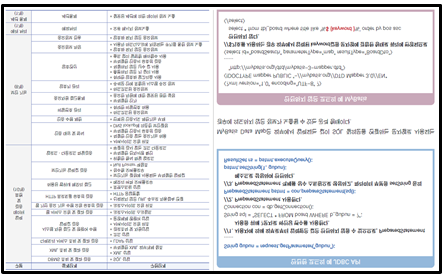

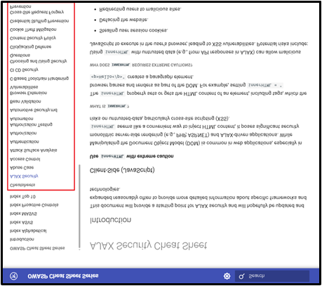

---
<!-- Page 39 -->
01
02
03
39
3

## 01.	 외부 또는 상용 소프트웨어 구성요소를 도입하는 경우, 조직의 보안 요구사항이 계약 문서 또는 보안 검증

절차에 반영되어 있는지 확인한다.
•  외부 또는 상용 소프트웨어 구성요소(Third-party Library, 프레임워크 등)의 도입은 개발 생산성을 높일 수 있으나, 해당
요소를 통해 미검증된 보안 취약점이 시스템에 포함될 수 있다.
•  제조사는 외부 소프트웨어 도입 시 보안 요구사항을 사전에 정의하고, 이를 계약 문서나 검증 절차에 반영해야 한다.
[방안 1] 계약 문서에 보안 요구사항 명시
외부 소프트웨어 도입 시 다음과 같은 보안 요구사항을 계약 문서에 포함시킬 수 있다.
[방안 2] NIST SP 800-53
NIST SP 800-53은 공급망 위험 관리 공급자 선정, 계약 관리, 보안 요구사항 정의 등을 포함한 공급망 보안 통제 항목
제공하므로 외부 소프트웨어 검증 기준을 정의하는데 활용될 수 있다.
항목
내용
보안 취약점 공개
•  공급자가 알려진 보안 취약점을 사전에 공개하고 업데이트 일정 제시
소스코드 검토
•  필요시 소스코드 공개 및 보안 검토 권리 명시
라이선스 및 의존성
•  사용된 오픈소스 라이선스, 의존 라이브러리 목록 제공
보안 업데이트 정책
•  취약점 발견 시 패치 제공 및 지원 기간 명시
감사 및 인증
•  감사 및 인증보안 감사, 취약점 스캔 결과 제출 요구
공급자 보안 요구사항 예시

---
<!-- Page 40 -->
40
보안
요구사항
SDLC 전 단계에서 보안 관련 역할과 책임이 명확히 정의되고 주기적으로 검토되어야 하며, 해당 역할을 수행할
인력에게 적절한 교육이 제공되어야 한다.
목적
조직 내 모든 구성원이 보안 관련 역할과 책임을 명확히 인식하고 수행하도록 하여, 보안이 개발 프로세스 전반에
일관되게 적용되도록 한다.
점검 기준
보안 역할 및 책임 관리

## 1. 보안 역할 및 책임 정의 여부

## 2. 역할 기반 보안 교육 제공 여부

## 3. 경영진의 보안 개발 참여 및 의사전달 체계 여부

구현 및 점검 방안
1

## 01.	 로봇 시스템의 SDLC에 참여하는 인력의 역할과 책임이 정의 및 문서화되어 있는지 확인한다.

•  인력의 역할과 책임이 불명확하면 보안 활동 간 중복이나 누락이 발생할 수 있으므로 제조사는 SDLC의 각 단계에서 누가
어떤 보안 활동을 수행해야 하는지를 명확히 정의하고 문서화하여야 한다.
[방안 1] OWASP SAMM 기술 프레임워크
OWASP SAMM(Software Assurance Maturity Model)은 소프트웨어 보안을 개선하기 위한 기본 프레임워크로, 제조사가
보안 성숙도를 평가하고 어떤 보안 활동을 수행해야 하는가를 정의한다.
OWASP SAMM 기술 프레임워크(Skills Framework)는 OWASP SAMM의 각 보안 활동 스트림을 구체적인 책임에 매핑하는
실행 가이드로 다음과 같이 15개의 직무에 따른 역할을 정의하고 있다.

#### 3.1.2  [SSDF-02] 보안 역할 및 책임 관리

직무
설명
예시 역할
제품 보안전략 수립
제품 보안 프로그램 구축·확장
제품 보안 책임자,  CISO
조직 보안 전략 수립
조직 전체 보안 전략 총괄
CISO, 사업부 정보보안책임자(BISO), 보안
담당자
비즈니스 전략 수립
회사 목표 달성을 위한 고위 의사결정
경영진(C-level), 사업부장, 부회장(VP)
시스템·기술 아키텍처
설계
기술 솔루션이 요구사항에 부합하도록 구조
설계
개발 팀장, 기술 팀장
보안 전파
팀 내 보안 관행 전파 및 SPOC 역할
보안 엔지니어
규제 준수
법·규제·표준 준수 관리
법무 담당자
제품 전략 및 보안 반영
제품 비전·우선순위 설정과 보안 요구 반영
제품 소유자, 제품 관리자
보안 교육
임직원 대상 보안 교육·훈련
제품 보안 책임자, 보안 교육 담당자
개발 기술 리더십
보안 코드 작성·보안 도구 적용·코드 리뷰
개발 팀장
공격적 보안 테스트
공격 시뮬레이션으로 취약점 발견
보안 테스터
방어적 보안 테스트
위협 인텔·취약점 분석·탐지·대응
보안 분석가, QA 엔지니어
공급망 보안
공급업체 선정·계약·평가
구매 담당자, 공급망 관리자
빌드/CI/CD 보안
빌드·CI/CD 자동화 및 보안 게이트 구축
DevOps 엔지니어, 빌드 담당자

---
<!-- Page 41 -->
01
02
03
41
[방안 2] CLASP 개발 보안 방법론
CLASP(Comprehensive, Lightweight Application Security Process)는 SW 개발 보안 방법론으로 7개의 역할을 구분하여
보안 활동에 관한 지침을 제공하고 있다.
보안 운영
실시간 탐지·대응·보안 인프라 운영
보안 엔지니어, 보안 분석가
시스템·네트워크
인프라
하드웨어·OS·네트워크 등 기반 인프라
운영
시스템 엔지니어, DevOps 엔지니어
OWASP SAMM 기술 프레임워크에 정의된 직무에 따른 역할 및 책임
CLASP에 정의된 역할에 따른 보안 활동
역할
보안 활동
프로젝트 관리자
(Project Manager)
•  조직 내 보안 인식 향상
•  조직의 보안 상태 모니터링
•  비즈니스 지표 정의 및 적용
요구사항 명세 담당자
(Requirement
Specifier)
•  보안 관련 비즈니스 요구사항 정의
•  아키텍처의 보안 요구사항 분석
•  보안 수준을 재사용 가능한 형태로 문서화
•  보안 위험 명확화 및 영향 분석
아키텍트 (Architect)
•  보안 메커니즘이 취약점을 만들지 않도록 보장
•  보안 기술이 시스템 전체에 적절히 반영되도록 관리
•  시스템 기반 위협 식별
•  보안 요구 책임 소재 명확화
•  테스트 단계에서 요구사항 구현 확인 지원
설계자 (Designer)
•  보안 요구사항을 충족시킬 기술 판단 및 올바른 사용 방법 이해
•  보안 결함 분석 및 해결 방안 제안
•  공격 표면 문서화
•  타사 소프트웨어 구성요소의 보안 문제 고려
개발자 (Implementer)
•  보안 요구사항을 코드에 정확히 반영
•  보안 기능을 사용자가 안전하게 사용할 수 있도록 구현
테스트 분석가
(Test Analyst)
•  보안 결함 발견을 위한 관련 위험 이해
•  보안 결함 확인을 위한 도구 활용 능력 보유
•  요구사항 테스트, 회귀 테스트 수행
•  보안 중심 테스트 도구 활용
보안 감사자(Security
Auditor)
•  프로젝트 문서 정확성 평가
•  요구사항 적절성 검토
•  보안 제어 적절성 점검
•  구현 상태 기반 결함 파악 및 위험 식별
•  정책 및 규제 준수 여부 평가
•  코드 검토, 설계 검토 수행

---
<!-- Page 42 -->
42
2
01.	 SDLC에 참여하는 인력에게 역할별 보안 교육이 정기적으로 제공되고 있는지 확인한다.
•  로봇 시스템 개발에 참여하는 각 역할별로 필요한 보안 지식과 역량을 파악하여 이에 맞는 교육 프로그램을 제
공해야 한다.
•  교육 프로그램은 전자 학습(E-Learning), 집합 교육, 워크숍, 외부 교육 등으로 제공될 수 있다.
[방안 1] OWASP SAMM 기술 프레임워크
“1. 보안 역할 및 책임 정의 여부” 항목에서 언급된 OWASP SAMM 기술 프레임워크 직무에 대하여 다음과 같은
역량을 명시하고 있다.
[방안 3] RACI 매트릭스
RACI(Responsible, Accountable, Consulted, Informed) 매트릭스는 로봇 시스템 SDLC의 각 보안 활동별로
실무 담당자(R), 최종 책임자(A), 조언자(C), 보고 대상자(I)를 명확히 정의하는 도구로, 각 활동마다 역할과 책임을
명확하게 지정할 수 있다.
RACI 매트릭스 작성 예시
직무
필요 역량
제품 보안 전략 수립
고수준 SDLC 지식, 보안 프레임워크 선정·적용, 위험 평가 전문성
조직 보안 전략 수립
보안 정책 이해, 리스크 관리 전문성, 규제/컴플라이언스 지식
비즈니스 전략 수립
비즈니스 감각, 리스크 관리
시스템·기술 아키텍처 설계
보안 아키텍처, 보안 표준, 위협 모델링
보안 전파
광범위한 고수준의 보안 지식, 교육 및 멘토링, 기술 문서 작성
규제 준수
규제 지식, 컴플라이언스 관리
제품 전략 및 보안 반영
시장 보안 요구 이해, 제품 아키텍처·보안 기본 이해
보안 교육
고수준 보안 지식, 보안 교육 프로그램 개발, 보안 자격증 지식
개발 기술 리더십
고급 프로그래밍 숙련, 코드 품질 및 보안 개발 표준, 개발 프레임워크 보안 이해
공격적 보안 테스트
모의해킹 도구 지식, 취약점 평가 및 보고, 익스플로잇 기술
방어적 보안 테스트
위협 인텔리전스, 모니터링 및 탐지, 사고 대응
공급망 보안
보안 표준 지식, 공급망 보안 평가, 공급업체 계약 보안 조항
빌드/CI/CD 보안
CI/CD 보안, 인프라 보안, 자동화 보안 스캐닝 및 SBOM 지식
보안 운영
사고 대응 전문성, 모니터링·탐지 도구 지식, 네트워크 보안
시스템·네트워크 인프라
시스템 및 인프라 보안, 네트워크 설계·관리, 클라우드 보안
OWASP SAMM 기술 프레임워크에 정의된 직무에 따른 필요 역량

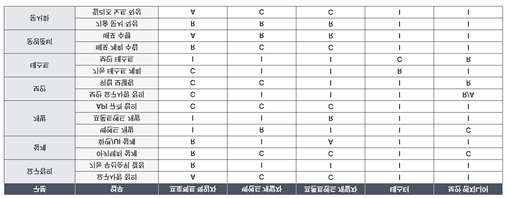

---
<!-- Page 43 -->
01
02
03
43

## 02.	 보안 교육에 대한 정량적 지표와 정성적 평가를 통해 교육의 효과를 측정하고 개선하고 있는지 확인한다.

•  보안 교육의 효과성을 측정하기 위해 활용될 수 있는 지표는 다음과 같다.
3

## 01.	 경영진이 보안 개발 활동에 공식적으로 참여하거나 승인하는 체계를 갖추고 있는지 확인한다.

•  경영진의 공식적 참여 및 승인 없이는 보안 활동이 조직의 우선순위에서 후순위로 밀려날 수 있으므로 보안이 조직 전체의
전략적 과제로 인식되도록 해야 한다.
•  경영진은 사이버보안 정책 및 전략을 승인해야 하며, 정기적으로 검토하고 필요 시 개선해야 한다.
보안 교육 효과 측정 지표 예시
측정 지표
평가 방법
목표값
교육 이수율
대상인원 대비 이수인원 비율
90% 이상
교육 만족도
교육 후 설문조사
3.5점 이상
역량 평가
필기시험, 실습과제
80점 이상
보안 결함 발견
개발 단계 발견 비율
연 5% 증가
취약점 감소
프로덕션 취약점 감소
연 10% 감소

---
<!-- Page 44 -->
44
보안
요구사항
SDLC 각 단계에서 사용하는 개발 및 보안 툴체인을 정의·통합·운영하여, 자동화된 보안 검증과 감사 추적성을
확보해야 한다.
목적
보안 검증, 빌드, 배포 등 SDLC 단계별로 사용되는 툴체인을 일관되게 구성·운영하여, 보안 프로세스의 자동화와
재현성을 확보한다.
점검 기준
보안 개발 툴체인 관리

## 1. 보안 툴체인 구성 정의 여부

## 2. 보안 툴체인 운영 및 유지보수 보안성 확보 여부

## 3. 보안 툴체인 감사 로그 및 아티팩트 관리 여부

구현 및 점검 방안
1

## 01.	 로봇 시스템 개발에 사용되는 툴체인의 구성요소가 명확히 정의 및 문서화되어 있으며, 연동 정책이 수립되어

있는지 확인한다.
•  SDLC 전 과정에서 일관된 개발·보안 기준을 유지하고 자동화 기반의 품질·보안 확보를 가능하게 하기 위하여 툴체인을
통합 관리하여야 한다.
[방안 1] OWASP DevSecOps 가이드라인
OWASP DevSecOps 가이드라인은 안전한 파이프라인 구현을 위한 모범 사례를 제시하고 있으며, 다음과 같은 기본
단계를 구현하는 것을 권고한다.

2

## 01.	 툴체인의 운영 및 유지보수 절차에 대한 보안성이 확보되어 있는지 확인한다.

•  툴체인의 운영 및 유지보수 과정에서 보안 취약점이 발생할 수 있으므로 제조사는 툴체인 구성요소의 보안 절차를
수립하여야 한다.
[방안 1] 툴체인 보안 운영 정책 수립
툴체인 구성 요소의 안전한 운영을 위해 다음과 같은 보안 정책을 수립할 수 있다.

#### 3.1.3  [SSDF-03] 보안 개발 툴체인 관리

OWASP DevSecOps 가이드라인에서 제시된 기본 보안 툴체인
항목
내용
정기적 업데이트 관리
•  보안 패치 및 업데이트 계획 수립
•  테스트 환경에서 사전 검증
•  프로덕션 배포 절차 정의
•  업데이트 이력 기록
항목
내용
잠재적인 자격 증명 유출을 찾기 위해 Git 저장소를 스캔
SAST
•  정적 애플리케이션 보안 테스트
SCA
•  소프트웨어 구성 분석
IAST
•  대화형 애플리케이션 보안 테스트
DAST
•  동적 애플리케이션 보안 테스트
IaC 스캐닝
•  Terraform, HelmChart 코드를 스캐닝하여 잘못된 구성을 찾음
인프라 스캐닝
규정 준수 확인

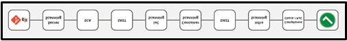

---
<!-- Page 45 -->
01
02
03
45
[방안 2] 툴체인 구성요소보안 관리
툴체인 구성요소마다 다음과 같은 보안 관리 활동을 수행할 수 있다.
3

## 01.	 빌드·검증·배포 로그 등 결과물이 무결성 검증 가능한 형태로 저장·관리되고 있는지 확인한다.

•  빌드·검증·배포 과정의 로그 및 결과물이 변조되지 않고 신뢰성 있게 관리되어야 추적성과 감사 추적(Audit Trail)이
가능하므로, 제조사는 결과물에 대한 무결성 검증 메커니즘을 구현하여야 한다.
[방안 1] 무결성 검증 체계 수립
제조사는 빌드·검증·배포 과정의 결과물이 변조되지 않도록 다음과 같은 방법을 통해 무결성 검증 체계를 구축할 수 있다.
접근 제어
•  툴체인 접근 권한 최소화
•  사용자 인증 강화(MFA)
•  역할 기반 접근 제어(RBAC) 구현
•  주기적 권한 검토
감사 로깅
•  모든 접근 기록 로깅
•  변경사항 추적 및 기록
•  로그 보관 기간 정의
•  로그 변조 방지
보안 모니터링
•  실시간 이상 탐지
•  보안 사고 대응 절차
•  정기적 보안 검토
•  취약점 스캔 실행
백업 및 복구
•  정기적 백업 수행
•  복구 테스트 실행
•  복구 시간 목표(RTO) 정의
•  재해 복구 계획 수립
구성요소
보안 항목
버전 관리 시스템(Git)
접근 권한 관리, 커밋 서명 검증, 저장소 감사 로깅
CI/CD 파이프라인
파이프라인 구성 정기 검토, 비밀값(DB 연결 정보, API 키, 인증서 등) 안전 관리, 보안/품
질 정책 실행 여부 확인
빌드 환경
격리된 빌드 환경 유지, 의존성 관리(SCA), 악성코드·무결성 스캔 수행
코드 분석 도구
규칙(Signatures/Ruleset) 업데이트, 분석 정확도 검증, 결과 검토 및 오탐/미탐 관리
배포 도구
배포 권한 관리, 배포 정책 준수 여부 확인, 변경 기록 및 롤백 절차 검토
항목
활동
해시값 검증
모든 결과물에 해시값 생성 및 저장
디지털 서명
결과물에 디지털 서명 적용 및 검증
접근 제어
로그 및 결과물 접근 권한 제한 및 이력 기록
변조 감지
저장소 읽기 전용 설정 및 정기적 무결성 검사
보관 기간
보관 기간 정책 수립 및 운영
툴체인 보안 정책 예시
툴체인 보안 관리 활동 예시
보안 개발 아티팩트 무결성 검증 방법 예시

---
<!-- Page 46 -->
46
보안
요구사항
소프트웨어 개발 생명주기 전 과정에서 보안 점검 기준을 정의하고, 해당 기준에 따라 산출되는 보안 점검 결과를
안전하게 수집·보호해야 한다.
목적
보안 점검 절차의 일관성과 신뢰성을 확보하여, 개발 과정에서 발생할 수 있는 보안 위험을 체계적으로 관리한다.
점검 기준
보안 점검 기준 정의 및 데이터 관리

## 1. 소프트웨어 보안 점검 기준 정의 및 관리 여부

## 2. 보안 점검 기준 데이터 수집 및 보호 체계 여부

구현 및 점검 방안
1

## 01.	 제조사가 SDLC 전 단계에서 보안 점검을 위한 기준을 명확히 정의하고 지속적으로 관리하고 있는지 확인한다.

•  보안 점검 기준이 명확하지 않으면 각 단계별로 보안 활동의 수준이 불일치할 수 있으므로, 제조사는 SDLC 전 단계에서
수행해야 할 보안 점검 기준을 정량적 지표 또는 정성적 지표로 정의해야 한다.
[방안 1] SDLC 단계별 보안 점검 기준 정의
제조사는 SDLC 각 단계 별로 다음과 같은 보안 점검 기준을 정의하고 운영할 수 있다.
2

## 01.	 보안 점검 결과, 취약점 정보, 승인 이력 등 관련 데이터가 수집·보존되고 있는지 확인한다

•  보안 점검 관련 데이터가 수집 및 보존되지 않으면 추적성 확보가 불가능하므로, 제조사는 관련 데이터를
안전하게 수집하고 정책에 따라 보존해야 한다.

#### 3.1.4  [SSDF-04] 보안 점검 기준 정의 및 데이터 관리

단계
정량적 기준
정성적 기준
계획
•  Security Level(SL) 결정
•  보안 자원 배분 계획
•  보안 요구사항 정의 완료
•  위협 분석 대상 식별 완료
설계
•  위협 모델 커버리지 80% 이상
•  설계 보안 결함 0건
•  위협 모델링 수행 완료
•  보안 아키텍처 검토 완료
개발
•  코드 정적 분석 커버리지 80% 이상
•  의존성 취약점 0건
•  코드 리뷰 100% 완료
•  보안 코딩 표준 준수 확인
•  코드 리뷰 의견 반영 확인
테스트
•  테스트 커버리지 70% 이상
•  Critical 취약점 0건
•  High 취약점 5건 이내
•  테스트 통과율 100%
•  보안 테스트 계획 수립 완료
•  취약점 심각도 평가 완료
•  테스트 결과 검토 완료
배포
•  배포 전 보안 검증 100% 완료
•  배포 위험 평가 완료
•  배포 승인 획득
운영
•  취약점 공개 대응 시간 30일 이내
•  패치 적용률 90% 이상
•  보안 모니터링 항시 운영
•  사고 대응 계획 수립 완료
SDLC 단계 별 보안 점검 기준 예시

---
<!-- Page 47 -->
01
02
03
47
보안
요구사항
소프트웨어 개발, 빌드, 테스트, 배포 등 각 환경 및 모든 환경 구성요소는 내부·외부 위협으로부터 보호될 수 있도록
강화되어야 한다.
목적
개발 및 배포 환경의 불필요한 노출과 권한 남용을 방지하여, 내·외부 공격으로부터 소프트웨어 개발 인프라의
무결성과 안정성을 보장한다.
점검 기준
개발 환경 보호

## 1. 개발 환경 보호 여부

## 2. 개발 엔드포인트 하드닝 여부

구현 및 점검 방안
1

## 01.	 개발, 빌드, 테스트, 배포 등 각 환경이 보호되고 있는지 확인한다.

•  다음은 네트워크 환경 분리 및 보호를 위한 구현 방안이다.
2

## 01.	 개발자 및 운영자가 사용하는 엔드포인트가 하드닝되어 있는지 확인한다.

•  다음은 개발 엔드포인트 하드닝 방안이다.
[방안 1] NCSC 기기 보안 지침
NCSC(National Cyber Security Centre)는 영국에서 일반적으로 사용되는 각 플랫폼을 안전하게 구성하는 방법을 자세히
설명하는 가이드를 관리하며, Android, Chrome OS, iOS, macOS, Windows, Github 등 다양한 플랫폼에 대한 가이드를
제공한다.

#### 3.1.5  [SSDF-05] 개발 환경 보호

구분
보안 강화 방안
VPN
MFA, 강력한 인증, 암호화된 터널
SSH
키 기반 인증, 포트 변경, 데이터 암호화
원격 데스크톱(RDP)
MFA, 포트 제한, 암호화, 강력한 비밀번호
VLAN
DMZ, 내부망, 개발/테스트 환경 분리
방화벽
필요한 포트만 개방, 나머지 차단
L3 게이트웨이
VLAN 간 통신 제어, 라우팅 관리
네트워크 분리
각 네트워크마다 방화벽 규칙 적용
IDS/IPS
악의적 활동 탐지 및 차단, 실시간 모니터링
접근 제어
최소 권한 원칙 적용
감사 로깅
접근자 추적, 이상 징후 감지, 사후 분석
정기적 보안 감사
취약점 및 위협 확인, 개선 사항 도출
개발 네트워크 보호 구현 방안

---
<!-- Page 48 -->
48
NCSC 기기 보안 지침(Device security guidance)

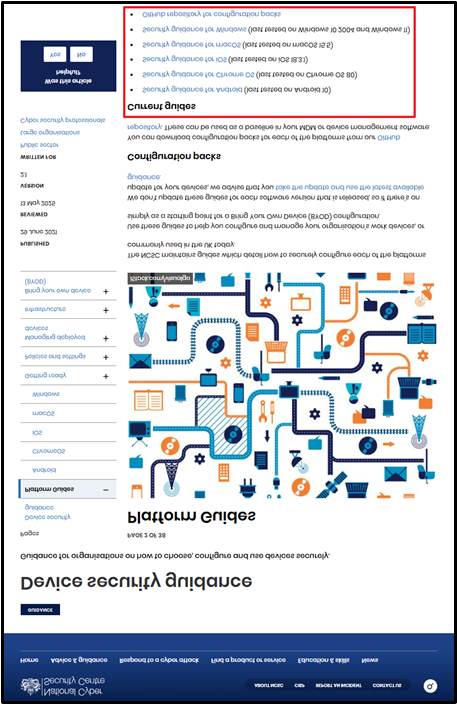

---
<!-- Page 49 -->
01
02
03
49
보안
요구사항
소스 코드, 실행 파일, 구성 스크립트 등 모든 형태의 코드는 무단 접근과 변조로부터 보호되어야 하며, 권한이
부여된 인원, 도구 및 서비스만 접근할 수 있도록 최소 권한 원칙이 적용되어야 한다.
목적
코드 자산의 무결성과 기밀성을 보장하여, 의도치 않은 수정이나 악의적인 변조로 인한 보안 취약점 발생을
예방한다.
점검 기준
코드 무단 접근 및 변조 방지

## 1. 코드 접근 통제 적용 여부

구현 및 점검 방안
1

## 01.	 소스 코드, 실행 코드, 설정 스크립트 등 모든 형태의 코드가 접근 통제 하에 안전하게 저장되어 있는지

확인한다.
•  다음은 코드 보호를 위한 구현 방안의 예시이다.
구분
구현 방안 예시
접근 통제
개인 계정 기반 버전 관리 시스템 접근제어 적용
변경 추적
버전 관리 시스템 커밋 로그 및 리뷰어 승인 이력 보존
무결성 보호
커밋 서명 및 코드 해시 검증 절차 운영
실행 코드 보호
빌드 후 바이너리 파일 서명 적용
구성 스크립트 관리
IaC파일(Dockerfile, Terraform, Kubernetes YAML 등)에 소스코드와 동일한 수준의 보안 정책
적용
코드 보호 구현 방안 예시

#### 3.1.6  [SSDF-06] 코드 무단 접근 및 변조 방지

---
<!-- Page 50 -->
50
보안
요구사항
소프트웨어를 배포하거나 제공할 때, 수신자가 배포 파일의 무결성을 검증할 수 있도록 해시값, 전자서명 등 검증
정보를 함께 제공해야 한다.
목적
배포 과정에서 악성 변조나 위조된 파일이 설치되는 것을 방지하고, 신뢰 가능한 소프트웨어만 사용자 또는 장비에
배포되도록 보장한다.
점검 기준
소프트웨어 배포 무결성 검증 제공

## 1. 배포 무결성 검증 정보 제공 여부

구현 및 점검 방안
1

## 01.	 배포되는 소프트웨어에 대해 무결성 검증 정보가 제공되는지 확인한다

•  다음은 배포 무결성 검증을 구현하기 위한 방안의 예시이다.

#### 3.1.7  [SSDF-07] 소프트웨어 배포 무결성 검증 제공

구분
구현 방안 예시
해시 제공
배포 파일별 해시 값을 배포 시 함께 게시
서명 적용
코드 서명 인증서 기반 서명 적용
자동 검증
배포 스크립트 내 서명 검증 절차 포함
배포 소프트웨어 무결성 구현 방안 예시
웹 사이트 내의 배포 파일 해시 값 게시 예시

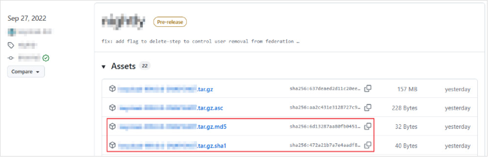

---
<!-- Page 51 -->
01
02
03
51
보안
요구사항
소프트웨어 배포 파일과 관련 데이터는 안전하게 보관되어야 하며, 각 배포에 포함된 구성요소의 출처와 변경 이력을
추적할 수 있도록 관리해야 한다.
목적
소프트웨어 배포 이후 취약점이 발견되더라도 해당 버전의 구성요소와 변경 내역을 신속히 추적하여 취약점 원인을
분석하고 재발을 방지한다.
점검 기준
소프트웨어 배포 파일 보관 및 보호

## 1. 배포 파일 및 관련 데이터 보관 및 보호 여부

## 2. 배포 구성요소 출처(SBOM) 관리 여부

구현 및 점검 방안
1

## 01.	 배포 관련 데이터가 보관되고 있는지 확인한다

•  배포 관련 데이터는 다음과 같은 저장소 유형에 보관될 수 있다.

## 02.	 배포 관련 데이터가 안전하게 저장되는지 확인한다.

•  배포 관련 데이터를 안전하게 보관하기 위한 보호 정책은 다음과 같다.
저장 유형
예시
컨테이너 및 아티팩트
저장소
Artifactory, Nexus Repository, Harbor, Docker Hub, Quay.io, ECR(AWS Elastic
Container Registry),GCR(Google Container Registry / Artifact Registry)
클라우드 저장소
S3(AWS Simple Storage Service), Azure Blob Storage,GCS(Google Cloud Storage)
온프레미스 파일 서버
NAS, SAN, DAS, SFTP
버전 관리 시스템
Git LFS, GitHub, GitLab, Bitbucket, SourceForge
CDN(Contents
Delivery Network)
콘텐츠 배포 네트워크: 사용자가 파일 다운로드 시 가장 가까운 서버를 통해 빠르게 제공
공식 소스 저장소
공식 웹 사이트 또는 소스 저장소

#### 3.1.8.  [SSDF-08] 소프트웨어 배포 파일 보관 및 보호

배포 파일 저장소 유형
배포 관련 데이터 보관 정책
정책
설명
접근 제어
역할 기반 접근 제어, 최소 권한 원칙 적용
암호화
전송 중 암호화, 저장 시 암호화
무결성 검증
해시 값 검증, 디지털 서명, 커밋 서명
감시 및 로깅
접근 로그 기록, 변경 이력 추적
버전 관리
배포 파일 버전 관리, 변경 이력 보존
읽기 전용
배포 후 파일 수정 불가
읽기 전용
배포 후 파일 수정 불가
CDN 작동방식

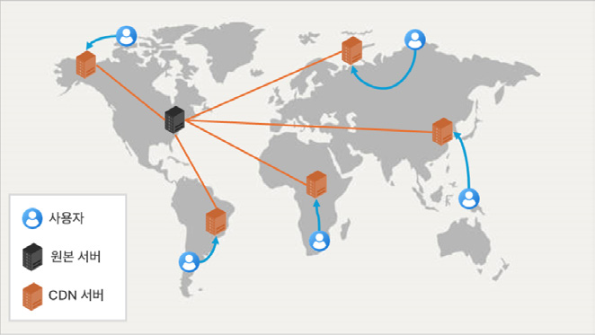

---
<!-- Page 52 -->
52
2

## 01.	 배포된 소프트웨어의 구성요소 및 출처 정보가 문서화되어 관리되고 있는지 확인한다.

•  SBOM 형태로 배포에 포함된 모든 구성요소의 버전, 공급자, 라이선스 정보를 관리해야 한다.
•  SBOM은 소프트웨어 변경 시마다 갱신되어야 하며, 변경 이력은 추적 가능해야 한다.

---
<!-- Page 53 -->
01
02
03
53
보안
요구사항
소프트웨어 설계 단계에서 보안 요구사항을 반영하고, 위협 모델링 및 위험 분석을 통해 잠재적 보안 위험을 식별·
완화하는 설계 체계를 구축해야 한다.
목적
보안 설계 초기 단계에서 취약점을 예방하고, 운영 중 발생할 수 있는 보안 위협을 최소화하기 위한 구조적
방어체계를 마련한다.
점검 기준
보안 설계 및 위험 완화 체계 수립

## 1. 위협 모델링 및 보안 위험 분석 수행 여부

## 2. 보안 요구사항·위험·설계 결정 추적 관리 여부

구현 및 점검 방안
1

## 01.	 배포되는 소프트웨어에 대해 무결성 검증 정보가 제공되는지 확인한다

•  Microsoft社는 위협 모델링 프로세스를 보안 개발 생명 주기(SDL)의 핵심 요소로 언급하고 있으며, 4개의 주요 단계로
구분한다.
Microsoft社에서 정의한 위협 모델링 프로세스

#### 3.1.9  [SSDF-09] 보안 설계 및 위험 완화 체계 수립

위협 모델링
프로세스
검증
위협열거
모델
완화
단계
수행 방법
시스템 모델링
(Model System)
•  데이터 흐름이 어떻게 이루어지는지 정의
•  어떠한 구성 요소가 데이터와 상호작용하는지 정의
•  데이터가 어디에 저장되는지 정의
위협 열거
(Enumerate
Threats)
•  시스템에 대한 위협 식별
•  위협을 개발 결함으로 관리
•  위협의 우선순위 결정
완화(Identify
Mitigations)
•  취약점 악용 확률을 줄이기 위한 완화 방안 식별
•  취약점 악용 영향을 줄이기 위한 완화 방안 식별
검증(Validate)
•  완화 방안이 위협을 제대로 완화하는지 검증
위협 모델링 데이터 흐름 다이어그램(DFD) 예시
위협 모델링 프로세스

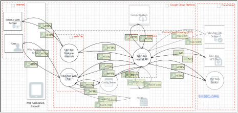

---
<!-- Page 54 -->
54
•  다음과 같은 위협 모델링 방법론이 존재한다.
[방안 1]  STRIDE
STRIDE 방법론은 보안의 세 가지 핵심 요소인 기밀성(Confidentiality), 무결성(Integrity), 가용성(Availability)에 더해
인증(Authentication), 부인 방지(Non-Repudiation), 권한부여(Authorization)라는 여섯 가지 정보보호 목표를 중심으로
하며, 주요 정보보호 목표에 대한 위협인 위장(Spoofing), 변조(Tampering), 부인(Repudiation), 정보 노출(Information
Disclosure), 서비스 거부(Denial of Service), 권한 상승(Elevation of Privilege)을 식별한다.
[방안 2]  P.A.S.T.A
P.A.S.T.A(Process for Attack Simulation and Threat Analysis) 방법론은 비즈니스 목표와 기술적 보안을 연계하는 위협
모델링 방법론이며, 7단계의 구조화된 프로세스를 통해 위협을 식별하고 분석한다.
2

## 01.	 소프트웨어의 보안 요구사항, 위험 식별 결과, 설계 결정이 추적·관리되고 있는지 확인한다.

•  제조사는 다음과 같은 방법을 통해 추적성을 확보하고 모니터링할 수 있다.
STRIDE 방법론
단계
설명
위장
•  다른 사용자·장치로 가장해 접근하는 행위
변조
•  데이터나 코드를 무단으로 변경하는 행위
부인
•  수행한 행동을 부정해도 증명할 수 없는 상황
정보 노출
•  민감한 정보가 비인가자에게 노출되는 상황
서비스 거부
•  서비스가 정상적으로 동작하지 못하도록 방해하는 행위
권한 상승
•  낮은 권한에서 높은 권한을 탈취해 사용하는 행위
단계
절차
설명
1단계
비즈니스 영향 분석
비즈니스 목표 및 위험 허용 수준 정의
2단계
기술 범위 및 자산 정의
보호 대상 자산 및 기술 범위 결정
3단계
애플리케이션 분해
시스템을 구성 요소별로 분석
4단계
위협 분석
공격 벡터 및 공격 시나리오 식별
5단계
취약점 및 약점 분석
시스템의 보안 결함 발굴
6단계
위험 분석 및 영향 모델링
위협과 취약점의 결합으로 인한 위험 평가
7단계
위험 대응 및 완화
식별된 위험에 대한 대응 방안 수립
항목
활동
요구사항 추적
매트릭스
•  각 요구사항이 구현되었는지 추적
•  다음과 같은 핵심 요소를 포함
문서화
•  모든 의사결정 기록
•  리뷰 결과 및 승인 이력 보존
•  변경 사항 문서화
정기적 검토
•  모든 의사결정 기록
•  리뷰 결과 및 승인 이력 보존
요구사항 추적 매트릭스 구성 요소
소프트웨어 보안 요구사항 및 설계 결과 추적 방법 예시

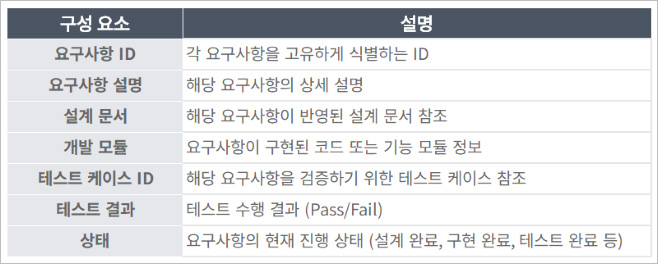

---
<!-- Page 55 -->
01
02
03
55
보안
요구사항
소프트웨어 설계가 보안 요구사항을 충족하고 식별된 보안 위험을 적절히 완화하고 있는지를 독립적인 검토자 또는
자동화된 검증 절차를 통해 점검해야 한다.
목적
설계 단계에서 정의된 보안 요구사항이 실제 설계 구조에 반영되었는지를 확인하여 운영 중 보안 취약점 발생
가능성을 사전에 제거한다.
점검 기준
보안 설계 검토 수행

## 1. 보안 설계 검토 절차 운영 여부

구현 및 점검 방안
1

## 01.	 소프트웨어 설계 산출물이 보안 요구사항 및 위험 정보를 충족하는지 독립적으로 검토하고 있는지 확인한다.

•  다음은 보안 설계 검토 절차를 운영하기 위한 구현 방안의 예시이다.
보안 설계 검토 수행 방안

#### 3.1.10  [SSDF-10] 보안 설계 검토 수행

구분
구현 방안 예시
독립 검토 체계
설계 담당 외 보안 검토자 또는 외부 팀이 검토 수행
자동화 도구 활용
위협 모델링 도구, 정적 설계 검증 도구 활용
검토 체크리스트
보안 요구사항·인증·암호화·로그 관리 등 항목별 검토표 운영
검토 기록
설계 검토 결과 및 개선 내역을 추적 관리 시스템에 기록
재검토 절차
설계 변경 또는 위험도 재평가 시 재검토 수행 의무화

---
<!-- Page 56 -->
56
보안
요구사항
이미 검증된 보안성이 확보된 외부 또는 내부 소프트웨어 구성요소를 재사용하여 중복 개발을 줄이고, 새로운 보안
취약점이 도입되는 위험을 최소화해야 한다.
목적
보안이 검증된 구성요소를 재사용하여 개발 효율성을 높이고, 필요한 코드 중복 및 신규 취약점 유입을 방지한다.
점검 기준
검증된 라이브러리 재사용

## 1. 외부 구성요소 확보 또는 내부 공통 보안 모듈 운영 여부

구현 및 점검 방안
1

## 01.	 상용·오픈소스·서드파티 구성요소 도입 정책이 존재하는지 확인한다.

•  외부에서 도입한 구성요소에 보안 취약점이나 라이선스 문제가 있으면 전체 소프트웨어의 신뢰성이 저하되므로 제조사는
도입하는 모든 구성요소를 관리 정책에 따라 검증하고, 전체 구성요소 목록을 투명하게 유지하며, 취약점 발생 시 신속하게
대응할 수 있도록 체계를 갖춰야 한다.
[방안 1]  구성요소 도입 정책 수립
제조사는 다음과 같은 정책을 수립하여 구성요소의 도입을 관리할 수 있다.
[방안 2]  허용된 출처 관리
제조사는 다음과 같이 신뢰할 수 있는 출처만 사용하도록 통제해야 한다.

## 02.	 인증·암호화·로깅 등 공통 보안 기능을 내부 모듈로 관리하는지 확인한다.

•  제조사는 인증, 암호화, 로깅 등 보안 기능을 공통 모듈로 구축하여 중앙 저장소에서 관리해야 하며, 모든 신규 프로젝트는
자체 구현 전, 기존 공용 모듈을 먼저 검토하여 우선 적용하도록 의무화해야 한다.
세부 항목
내용
도입 기준 정의
•  상용/오픈소스/서드파티 구분
•  승인된 라이선스 정의(MIT, Apache 2.0 등)
•  지원 종료(EoL) 일정 확인
•  보안 업데이트 주기 확인
출처 관리
•  공식 레포지토리만 사용(npm, PyPI, Maven Central 등)
•  서명된 패키지 검증
•  미러 사이트 신뢰성 확인
도입 절차
•  도입 전 보안 검토 필수
•  아키텍처 리뷰 수행
•  라이선스 검토
•  취약점 스캔
승인 프로세스
•  기술팀, 보안팀, 법무팀 승인 절차
•  승인 문서 기록 유지
•  거부된 구성요소 목록 관리
출처 유형
관리 방안
공식 레포지토리
•  npm, PyPI, Maven Central, RubyGems 등 공식 저장소만 사용
•  저장소 URL 화이트리스트 관리• 저장소 접근 시 인증서 검증
서명된 패키지
•  배포자 서명(GPG 등) 검증
•  GPG 공개키 신뢰도 확인
•  서명 검증 실패 시 설치 자동 차단
미러/캐시 서버
•  신뢰할 수 있는 공식/기업 미러만 사용
•  미러 서버 보안 정책 및 운영 현황 확인
•  원본과 미러의 해시값 비교 및 무결성 검증
내부 레포지토리
•  사내 중앙 저장소 운영
•  보안 스캔된 구성요소만 등록 허용
•  접근 제어(ACL) 적용 및 감사 로그 기록/모니터링

#### 3.1.11.  [SSDF-11] 검증된 라이브러리 재사용

구성요소 도입 정책 예시
허용된 출처 관리 방안

---
<!-- Page 57 -->
01
02
03
57
보안
요구사항
안전한 코딩 가이드를 준수하여 소스코드의 취약점을 최소화해야 한다.
목적
보안 취약점이 포함된 소스코드 생성을 방지하고, 개발 단계에서 발생할 수 있는 보안 결함을 최소화한다.
점검 기준
안전한 코딩 관행 준수

## 1. 보안 코딩 표준 준수 여부

구현 및 점검 방안
1

## 01.	 개발 언어와 환경에 맞는 보안 코딩 가이드가 정의되어 있으며, 개발자가 이를 숙지하고 준수하는지

확인한다.
•  제조사는 다음과 같은 보안 코딩 표준 가이드라인을 참고할 수 있다.

#### 3.1.12.  [SSDF-12] 안전한 코딩 가이드 준수

표준명
적용 언어/범위
OWASP Secure Coding Practices Quick Reference Guide
다언어 (언어비종속)
SEI CERT Coding Standards
C, C++, Java, Android 등
OWASP Go Secure Coding Practices Guide
Go 언어
OWASP Python Security
Python 언어
MISRA C/C++
임베디드 시스템 (C, C++)
CWE Top 25 Most Dangerous Software Weaknesses
소프트웨어 보안 약점 (다언어)
OWASP JavaScript Security Cheat Sheet
JavaScript 언어
Microsoft Secure Coding Guidelines
.NET, C# 등
Google Java Security and Style Guide
Java 언어
Rust Security Guidelines
Rust 언어
언어 별 코딩 표준 가이드라인

---
<!-- Page 58 -->
58
보안
요구사항
컴파일러, 인터프리터, 빌드 도구에 대한 보안 설정을 적용하여 실행 파일 수준의 보안을 강화해야 한다.
목적
컴파일 및 빌드 단계에서 잠재적인 취약점을 사전에 제거하여 실행 파일 수준의 보안성을 강화하고, 무결하고
신뢰할 수 있는 빌드 결과물을 확보하기 위함이다.
점검 기준
컴파일러 및 빌드 환경 보안 구성

## 1. 컴파일러 및 빌드 도구 보안 설정 적용 여부

구현 및 점검 방안
1

## 01.	 컴파일러, 인터프리터, 빌드 도구의 보안 기능이 활성화되어 있으며, 승인된 설정이 일관되게 적용되는지

확인한다.
•  제조사는 최신 버전의 컴파일러, 인터프리터, 빌드 도구가 사용되고 있는지 검토해야 한다.
•  컴파일러의 보안 관련 기능이 활성화되어 있는지 확인한다. 도구 별로 다음과 같은 보안 기능이 제공될 수 있다.
•  Clean Build 정책이 적용되어, 모든 컴파일 경고가 오류로 처리되고 불필요한 예외가 존재하지 않는지 검토한다.

#### 3.1.13.  [SSDF-13] 컴파일러 및 빌드 환경 보안 구성

도구
보안 기능
GCC (C/C++)
스택 카나리(stack canary), ASLR, PIE, 정수 오버플로우 감지
Clang (C/C++)
제어 흐름 가드 (Control Flow Guard, CFG), SafeStack, AddressSanitizer
Java Compiler
보안 검사, 보안 관련 경고 활성화
Python
타입 체킹, 보안 정적분석
.NET (C#)
코드 분석, Security Rule Set
Node.js
보안 경고, Strict Mode
Maven (Java)
의존성 검사, 보안 플러그인
Gradle (Java/Kotlin)
의존성 검증, 보안 스캐너
CMake (C/C++)
컴파일러 보안 옵션 설정
GNU Make
컴파일러의 보안 옵션 적용
빌드 도구 별 보안 기능 예시

---
<!-- Page 59 -->
01
02
03
59
보안
요구사항
코드 리뷰와 정적 분석 절차를 수립하고, 이를 통해 보안 취약점을 식별·관리해야 한다.
목적
코드 배포 이전에 취약점을 조기에 식별·수정함으로써 배포 후 악용 가능성을 줄이고, 자동화 도구와 인적 리뷰를
적절히 조합하여 효율적으로 보안결함을 탐지·관리하기 위함이다.
점검 기준
코드 검토 및 분석

## 1. 코드 리뷰 및 정적분석 도입 여부

구현 및 점검 방안
1

## 01.	 조직이 코드 검토와 코드 분석 절차를 정의하고, 적용 기준을 명시하고 있는지 확인한다.

•  제조사는 코드 검토 및 분석 도구의 적용 범위, 수행 주기, 담당자 역할, 분석 절차 등을 명확히 정의해야 한다.
•  다음과 같은 분석 도구가 활용될 수 있다.

#### 3.1.14.  [SSDF-14] 코드 검토 및 분석

도구
분석 대상
특징
SAST (정적 분석)
소스 코드
코드 작성 단계에서 취약점 발견
DAST (동적 분석)
실행 중인 애플리케이션
런타임 취약점 발견
SCA (소프트웨어 구성 분석)
의존성/라이브러리
오픈소스 취약점 발견
IAST (상호작용 분석)
런타임 코드
실행 중 코드 분석
비밀값 스캐닝
소스 코드
하드코딩된 비밀키 감지
소프트웨어 분석 도구 예시

---
<!-- Page 60 -->
60
보안
요구사항
실행 가능한 코드에 대한 테스트 기준을 정의하고, 정의된 절차에 따라 테스트를 수행하며 결과를 관리해야 한다.
목적
배포 전 실행 수준의 취약점을 찾아 수정해, 배포 후 악용을 방지하고 테스트의 추적성·재현성을 확보한다.
점검 기준
실행 코드 테스트

## 1. 코드 테스트 방법 정의 여부

구현 및 점검 방안
1

## 01.	 코드에 대해 언제, 무엇을, 어떤 방식으로 테스트할지 기준이 정의되어 있는지 확인한다.

•  적용 테스트 유형과 수행 주기가 문서화되어 있는지 확인한다.
•  테스트 레벨별(단위/통합/시스템/인수) 기준이 정의되어 있는지 확인한다.
•  테스트 합격 기준이 명확히 제시되어 있는지 확인한다.

## 02.	 정의된 절차에 따라 테스트를 수행하고 결과를 기록·관리하여 보안 이슈가 체계적으로 추적되는지 확인한다.

•  테스트 계획서 및 테스트 결과 보고서가 보관되어 있는지 확인한다.
•  발견된 이슈가 이슈 관리 시스템에 등록되어 심각도 · 담당자 · 처리 기한이 지정되어 있는지 점검한다.
•  조치 완료 후 재검증 결과가 기록되어 있는지 확인한다.

#### 3.1.15.  [SSDF-15] 실행 코드 테스트

테스트 레벨
시점
대상
목표
단위 테스트
(Unit Test)
개발 단계
개별 함수/메서드
코드 로직 검증
통합 테스트
(Integration Test)
개발 완료 후
모듈 간 상호작용
인터페이스 동작 검증
시스템 테스트
(System Test)
통합 완료 후
전체 시스템
요구사항 충족 여부 확인
인수 테스트
(Acceptance Test)
배포 전
전체 시스템
사용자 요구사항 만족
소프트웨어 테스트 레벨

---
<!-- Page 61 -->
01
02
03
61
보안
요구사항
소프트웨어 설치 및 초기 구성 시 보안이 강화된 기본 설정을 정의하고, 이를 실제 환경에 적용해 운영 중에도 안전한
보안 상태가 유지되도록 해야 한다.
목적
보안 기능이 비활성화되거나 취약한 기본 설정으로 배포되는 위험을 방지하고, 시스템·서비스 전반의 보안 수준을
초기 단계부터 균일하게 확보하기 위함이다.
점검 기준
안전한 초기 보안 설정 구성

## 1. 기본 보안 설정 기준 정의 여부

구현 및 점검 방안
1

## 01.	 로봇 시스템에 적용되는 기본 설정 중 보안에 영향을 주는 항목이 안전하게 정의되어 있는지 확인한다.

•  로봇 시스템 소프트웨어의 보안 초기 설정이 강화된 형태로 정의되어 있는지 확인해야 한다. 보안에 영향을 주는 설정은
다음과 같은 카테고리로 분류될 수 있다.
•  이러한 보안 설정이 로봇 시스템 설치 가이드, 유지보수 매뉴얼 등에 명시되어 있어야 한다.

#### 3.1.16.  [SSDF-16] 안전한 초기 보안 설정 구성

구분
설명
신원, 인증 및 액세스 제어
사용자 식별, 인증 메커니즘, 권한 관리
입력 검증 및 인코딩
외부 입력값 검증, 인젝션 공격 방지
암호화
데이터 암호화, 키 관리, 보안 통신
사용자 및 세션 관리
세션 생성, 유지, 종료, 타임아웃 관리
오류 및 예외 처리
정보 노출 방지, 안전한 오류 메시지
감사 및 로깅
보안 이벤트 기록, 접근 로그, 변경 이력 추적

---
<!-- Page 62 -->
62
보안
요구사항
로봇 시스템 및 연계 소프트웨어 구성요소에 대한 취약점 정보를 지속적으로 수집하고, 식별된 취약점의 영향을
검증·분석하며, 공개·대응 절차를 통해 신속히 조치해야 한다.
목적
취약점을 조기에 발견해 공격에 노출되는 시간을 최소화하고, 신속한 대응과 패치를 통해 시스템의 안정성과
신뢰성을 높인다.
점검 기준
취약점 식별 및 관리

## 1. 취약점 정보 수집 및 모니터링 여부

## 2. 취약점 검증 및 테스트 수행 여부

## 3. 취약점 공개·대응 절차 운영 여부

구현 및 점검 방안
1

## 01.	 로봇 시스템 내 구성요소와 관련된 취약점 정보를 주기적으로 수집·분석하고 있는지 확인한다.

•  제조사는 취약점 정보 수집 시 다음과 같은 방법을 사용할 수 있다.
[방안 1] 취약점 정보 모니터링 프로세스 마련
취약점 데이터베이스, 위협 인텔리전스, 보안 메일링 리스트 등을 정기적으로 모니터링하고, 대부분 API나 이메일 알림을
지원하므로 이를 활용해 자동화된 취약점 정보 수집 체계를 구축한다.
[방안 2] 취약점 제보 채널 구축
외부 연구자, 공급업체, 고객 등 다양한 이해관계자가 취약점을 안전하게 보고할 수 있는 공식 제보 채널(웹 기반 취약점
신고 포털, 전용 이메일, 버그 바운티 프로그램 등)을 마련하고 명확한 보고 가이드를 제공한다.

#### 3.1.17.  [SSDF-17] 취약점 식별 및 관리

구분
주요 소스 예시
취약점 데이터베이스
NVD, CVE, CISA known Exploited Vulnerabilities(KEV), KISA 보안공지
위협 인텔리전스
MISP, VirusTotal, Treat Connect, OpenCTI, 국내 CTI 제공 업체
보안 메일링 리스트
Full Disclosure, CERT, OSS-Security, 각 벤더 보안공지 메일
취약점 정보 모니터링 방안 예시
취약점 제보 웹 페이지 예시

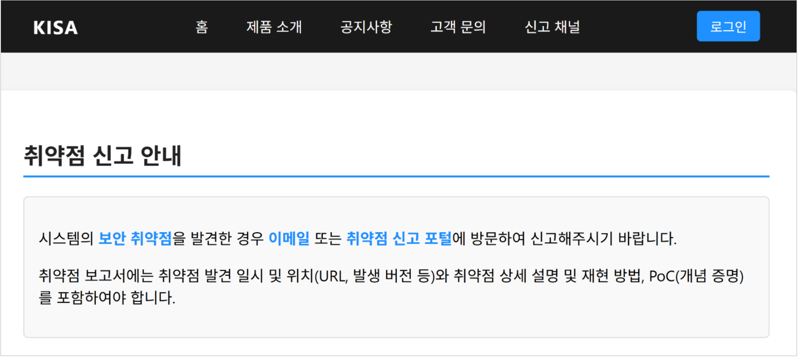

---
<!-- Page 63 -->
01
02
03
63
2

## 01.	 식별된 취약점이 실제 로봇 시스템에 어떠한 영향을 미치는지 검증하는 절차가 있는지 확인한다.

•  취약점 검증 및 테스트 시 다음과 같은 평가 프로세스를 수행할 수 있다.
3

## 01.	 로봇 시스템 관련 취약점 제보 및 대응 절차가 명확히 정의·운영되고 있는지 확인한다.

•  취약점 대응 정책 수립 시 다음과 같은 내용이 포함될 수 있다.
항목
활동
취약점 분석
•  취약점의 기술적 특성 파악
•  악용 난이도 평가
•  필요한 권한 수준 확인
•  공격 벡터 분석
로봇 시스템 영향도
분석
•  안전성 영향(인명 피해, 부상 위험 등)
•  기능 영향(기능 상실, 오작동 등)
•  가용성 영향(서비스 중단 시간)
•  데이터 영향(민감 정보 노출 범위)
심각도 평가
•  CVSS 점수 산출
•  로봇 시스템 특성 반영(물리적 위험, 실시간성 등)
•  최종 심각도 결정(Critical/High/Medium/Low)
우선순위 결정
•  심각도 기반 우선순위 설정
•  실제 악용 가능성 고려
•  영향받는 사용자/시스템 범위 분석
항목
내용
목표 및 범위
•  정책의 목적 명시
•  적용되는 시스템·서비스·제품 범위 정의
역할 및 책임
•  취약점 발견·분석·패치·보고 단계별 책임 부서 및 담당자 명확화
•  의사결정 권한 정의
•  부서 간 협업 구조 명시
취약점 보고 및 분석
프로세스
•  취약점 접수 경로 정의
•  위험도 평가 기준 수립
•  영향도 분석 방법 제시
•  대응 계획 수립 절차 명시
•  조치 완료 후 보고 절차 포함
대외 커뮤니케이션
•  공지 시점 결정 기준
•  공지 대상 범위 정의
•  공지 방식 선택
•  공지 승인 절차 포함
패치 프로세스
•  패치 개발·테스트·배포 절차 정의
•  위험도 등급별 SLA 대응 시간 설정
•  패치 적용 후 재검증 절차 운영
취약점 신고 채널
•  신고 채널 종류 제공
•  운영 방식 정의
•  신고자 보호 방안 포함
•  신고 가이드 제시
기록 관리 및 개선
•  전체 대응 과정 기록 시스템 구축
•  사후 리뷰 주기 설정
•  모의 훈련 주기 운영
•  개선 사항 반영 절차 정의
취약점 검증 방법 예시
취약점 관리 정책 구성 내용 예시

---
<!-- Page 64 -->
64
보안
요구사항
로봇 시스템에서 식별된 취약점에 대해 위험도를 분석하고, 위험 수준에 따라 적절한 조치를 계획·이행해야 한다.
목적
취약점의 심각도와 영향 범위를 기반으로 우선순위를 설정하여, 보안 리스크를 최소화하고 조치 자원의 효율적
배분을 가능하게 하기 위함이다.
점검 기준
취약점 평가 및 대응

## 1. 취약점 위험 평가 수행 여부

## 2. 취약점 대응 및 완화 조치 여부

구현 및 점검 방안
1

## 01.	 식별된 취약점에 대해 위험 수준을 분석하고, 대응 계획 수립에 필요한 정보를 수집하고 있는지 확인한다.

•  다음과 같은 취약점 위험 평가 시 다음과 같은 방법론을 활용할 수 있다.
[방안 1] CVSS 4.0
CVSS 4.0 (Common Vulnerability Scoring System 4.0)은 소프트웨어 취약점의 심각도를 표준화된 방식으로 평가하고
점수화하는 방법론이다.
CVSS 점수는 0~10의 점수로 표현되며, 점수 범위 별로 심각도 등급(Severity Rating)을 None/Low/Medium/High/
Critical로 평가한다.

#### 3.1.18.  [SSDF-18] 우선순위 기반 취약점 평가 및 대응 조치

항목
값
설명
공격 벡터
(Attack Vector)
Network (N)
네트워크를 통한 원격 공격 가능
Adjacent (A)
동일 네트워크/인접한 위치에서만 공격 가능
Local (L)
로컬 접근 필요
Physical (P)
물리적 접근 필요
공격 복잡도
(Attack Complexity)
Low (L)
공격이 간단하고 안정적
High (H)
특정 조건 필요 또는 불안정
필요 권한
(Privileges Required)
None (N)
권한 필요 없음
Low (L)
낮은 권한 필요
High (H)
높은 권한 필요
사용자 상호작용
(User Interaction)
None (N)
사용자 상호작용 없이 악용 가능
Passive (P)
클릭 등 수동적 상호작용 필요
Active (A)
다운로드·설치 등 능동적 상호작용 필요
범위
(Scope)
Unchanged (U)
영향이 취약한 구성요소내에 제한
Changed (C)
다른 구성 요소까지 영향 확산
기밀성 영향
(Confidentiality)
None (N)
정보 노출 없음
Low (L)
제한적 정보 노출
High (H)
광범위한 정보 노출
무결성 영향
(Integrity)
None (N)
무결성 훼손 없음
Low (L)
제한적 훼손
High (H)
광범위한 훼손
가용성 영향 (Availability)
None (N)
서비스 영향 없음
Low (L)
부분적 서비스 중단
High (H)
전체 서비스 중단
CVSS 4.0 평가 항목

---
<!-- Page 65 -->
01
02
03
65
[방안 2] DREAD
DREAD 방법론은 식별된 위협의 심각도를 평가하기 위한 정량적 평가 모델이며, 다음 여섯 가지 요소를 통해 위협의
위험도를 계산한다.
•  Damage Potential (피해 가능성): 위협 발생 시 미칠 수 있는 최대 피해 정도
•  Reproducibility (재현성): 위협을 재현할 수 있는 난이도
•  Exploitability (악용 용이성): 위협을 악용하기 위한 기술적 난이도
•  Affected Users (영향받는 사용자): 위협의 영향을 받을 수 있는 사용자의 범위
•  Discoverability (발견 가능성): 공격자가 위협을 발견할 수 있는 용이성
각 요소를 1~10점으로 평가하여 위험도 점수를 산출한다.
2

## 01.	 위험도 평가 결과에 따라 적절한 대응 조치가 수행되고, 그 이력이 관리되고 있는지 확인한다.

•  다음과 같은 취약점 대응 프로세스를 수립할 수 있다.
순서
대응 프로세스
설명
1
대응 전략 결정
•  위험 회피, 위험 완화, 위험 전가, 위험 수용
2
우선 순위 지정
•  위험도 등급 기반으로 우선 순위 지정
3
대응 계획 수립
•  임시 완화책, 영구 해결책, 자동화 계획 등
4
커뮤니케이션 및 문서화
•  보안 권고문 배포, 경영진 및 고객 보고, 기록 관리 등
5
사후 검토
•  대응 완료 후 재발 방지 프로세스 연계
취약점 대응 프로세스 예시

---
<!-- Page 66 -->
66
보안
요구사항
로봇 시스템에서 발생한 취약점의 근본 원인을 분석하고, 동일 유형의 취약점이 반복되지 않도록 예방 조치와
프로세스 개선을 수행해야 한다.
목적
취약점 발생의 기술적·관리적 원인을 체계적으로 분석해, 향후 동일 원인으로 인한 재발을 방지하고 전반적인 보안
품질을 향상하기 위함이다.
점검 기준
취약점 근본 원인 분석

## 1. 취약점 원인 분석 수행 및 재발 방지 여부

구현 및 점검 방안
1

## 01.	 로봇 시스템 내에서 발견된 취약점에 대해 근본 원인 분석이 수행되는지 확인한다.

•  취약점의 근본 원인 분석 수행 시 다음과 같은 방법론을 적용할 수 있다.
[방안 1] 5 Whys
5 Whys는 문제의 원인을 계속 묻고 답하는 과정을 통해 근본 원인을 파악하는 기법으로, 첫 번째 원인부터 시작하여 “왜?”
라는 질문을 반복하면서 점차 깊은 원인으로 내려가며, 일반적으로 5번의 질문을 통해 근본 원인에 도달한다.
[방안 2] 피쉬본 다이어그램
피쉬본 다이어그램(Fishbone Diagram)은 물고기 뼈 모양으로 원인을 체계적으로 분류하여 시각화하는 기법이다. 아래
그림과 같이 맨 우측엔 문제를 작성하고, 여러 카테고리로 원인을 나누어 분석하여 종합적으로 파악할 수 있다.

#### 3.1.19.  [SSDF-19] 취약점 근본 원인 분석

5 Whys 예시
Q1: 왜 인증 우회 취약점이 발생했는가?
A: 세션 토큰 검증 로직이 없었다.
Q2: 왜 세션 토큰 검증 로직을 구현하지 않았는가?
A: 보안 요구사항에 명시되지 않았다.
Q3: 왜 보안 요구사항에 명시되지 않았는가?
A: 보안팀이 설계 단계에 참여하지 않았다.
Q4: 왜 보안팀이 참여하지 않았는가?
A: 개발 프로세스에 보안 리뷰 단계가 없었다.
Q5: 왜 보안 리뷰 단계가 없었는가?
A: 조직이 보안을 개발 프로세스에 통합하지 않았다. (근본 원인)
피쉬본 다이어그램 예시
문제
프로세스
관리
설계
사람
도구
교육
원인
원인
원인
원인
원인
원인
원인
원인
원인
원인
원인
원인
원인
원인

---
<!-- Page 67 -->
01
02
03
67
[방안 3] CWE 매핑
CWE (Common Weakness Enumeration)는 소프트웨어 약점의 국제 표준 분류체계이다. 식별된 취약점을 CWE 목록과
매핑함으로써 취약점을 표준화된 분류로 정리하고, 유사 취약점을 식별하며, 장기적 개선 전략을 수립할 수 있다.
•  취약점의 근본 원인 분석 수행 시 다음과 같은 결과가 보고서에 작성될 수 있다.

## 02.	 식별된 취약점과 유사 취약점을 사전 탐지하기 위해 근본 원인 패턴을 식별해 조직 차원의 예방 조치를

수행하는지 확인한다.
•  다음은 취약점 재발을 방지하는 실행 지침의 예시이다.
취약점 근본 원인 분석 결과 보고서 구성 예시
취약점 재발 방지 실행 지침 구성 예시
CWE 예시
•   CWE-79: Cross-site Scripting (XSS)
•   CWE-89: SQL Injection
•   CWE-287: Improper Authentication
•   CWE-352: Cross-Site Request Forgery (CSRF)
•   CWE-434: Unrestricted Upload of File with Dangerous Type
내용
설명
기본 정보
•  취약점 고유 식별자
•  발견 일시
•  발견 경로영향을 받는 서비스 및 버전 정보
취약점 세부 정보
•  취약점 유형
•  취약점 영향
•  심각도
근본 원인
•  코드 오류뿐 아니라 시스템 구조, 프로세스 관리 미흡 등 근본 요인 중심으로 작성
탐지 및 대응 타임라인
•  시간 순서 기록: 취약점 발견, 분석, 임시 조치, 영구 패치 적용까지 단계 별 타임라인 작성
•  조치 내용: 조치 방법, 담당 팀, 확인 절차 등 상세 기록
시정 조치
•  임시 조치
•  영구 패치
•  재발 방지 대책
커뮤니케이션 계획
•  공지 시점
•  공지 대상
•  공지 방식
•  승인 절차 포함
구분
세부 내용
검증
•  정적분석, 동적분석, 자동화 테스트, 수동 재현 등으로 취약점의 실제 영향과 재현
케이스를 확인
•  재현 케이스는 회귀 테스트로 저장하여 이후 검증에 활용
사전 제거
•  이미 확인된 취약점의 유사한 유형이 존재할 가능성이 높은 모듈이나 인터페이스를
대상으로 선제적 스캔 및 수정 수행
•  해당 활동을 CI/빌드 파이프라인과 연계해 반복 실행하도록 자동화
패턴 식별
•  모든 취약점 RCA 결과를 중앙화된 DB에 저장
•  동일 원인에서 파생된 여러 취약점 유형을 연결·분석하여 반복 발생 패턴 도출
조직 내 전파
•  재발 방지 가이드·모범 사례 문서화 및 정기 리뷰/개발자 교육 실시
•  도출된 패턴을 규칙, 자동탐지 룰, 회귀 테스트 케이스 등으로 전환해 실무 반영
프로세스 연계
•  재현, 사전제거, 패턴식별 결과가 이슈 트래커 목록에 반영되어 우선순위 및 처리
상태가 관리되는지 확인

---
<!-- Page 68 -->
68
번호
체크리스트 항목
SC-01
오픈소스 소프트웨어 구성요소 관리
SC-02
EoS 관리
SC 03
공급업체 보안 역량 평가 기준 수립 및 적용
SC-04
공급망 변경 시 보안 영향 평가 및 대처 방안 마련
SC-05
구성요소 취약점 관리
SC-06
로봇 펌웨어 및 소프트웨어 업데이트 무결성 검증
SC-07
신속한 패치 메커니즘
로봇 시스템의 공급망 전반에 적용되는 보안 요구사항인 공급망 보안(Supply-Chain) 체크리스트 항목은 다음과
같다.

### 3.2 공급망 보안 점검 체크리스트

공급망 보안 체크리스트 항목

---
<!-- Page 69 -->
01
02
03
69
보안
요구사항
제품에 포함되는 오픈소스 소프트웨어와 외부 라이브러리 등 모든 구성요소를 식별·관리해야 한다.
목적
제품 내 포함된 오픈소스 및 외부 라이브러리를 식별·관리함으로써 라이선스 위반, 알려진 취약점, 불필요한 보안
위험을 사전에 차단한다.
점검 기준
오픈소스 소프트웨어 구성요소 관리

## 1. 제품에 포함된 모든 오픈소스 및 외부 소프트웨어, 라이브러리 목록 문서화 여부

## 2. 최신 버전의 공개/상용 소프트웨어 사용 여부

구현 및 점검 방안
1

## 01.	 로봇 시스템에 포함된 모든 오픈소스, 제3자 소프트웨어, 외부 라이브러리가 식별·목록화되어 문서화되어

있는지 확인한다
•  구성 목록은 SBOM(Software Bill of Materials, 소프트웨어 구성요소 목록) 형식으로 관리하는 것이 권장되며, 변경
사항이 지속적으로 업데이트 되어야 한다.
①  SBOM은 다음과 같은 정보를 포함하여야 한다.
②  SBOM은 .json, .xml 형식 등과 같이 기계 판독이 가능한 형식으로 작성되어야 한다.
•  위와 같은 필수 요건을 만족시키는 SBOM 표준 형식은 다음과 같으며, 공식 사이트에서 SBOM 생성 도구를 확인할 수
있다.
-  SDPX (Software Package Data Exchange)
Linux Foundation이 2011년에 개발한 오픈소스 라이선스 및 저작권 정보 교환 표준으로, 라이선스 준수와 저작권 정보
추적을 주 목적으로 하며 JSON, XML, RDF, Tag-Value 등 다양한 형식을 지원한다.
- CycloneDX
OWASP가 2017년에 개발한 현대적 소프트웨어 공급망 보안 SBOM 표준으로, 보안, 의존성, 취약점 추적을 주 목적으로
하며 JSON과 XML 형식을 지원한다.

#### 3.2.1  [SC-01] 오픈소스 소프트웨어 구성요소 관리

항목
설명
작성자
SBOM 문서 작성자
타임스탬프
SBOM이 마지막으로 업데이트된 날짜와 시간
공급자 명
구성요소 공급자의 이름 또는 식별자
구성요소 명
구성요소의 이름 또는 식별자
버전 정보
구성요소의 버전 정보
고유 식별자
구성요소의 고유 식별자
관계
SBOM 구성요소 간의 관계
SBOM 필수 포함 요소

---
<!-- Page 70 -->
70
2

## 01.	 로봇 시스템에서 사용하는 공개 또는 상용 소프트웨어가 최신 안정화 버전으로 유지되고 있는지 확인한다.

•  시스템에 포함된 각 구성요소의 버전을 SBOM 또는 구성 목록을 통해 확인하고, 공급자의 최신 배포 버전과
비교해 보안패치 적용 여부를 점검한다.
•  상용 소프트웨어의 경우 정품 라이선스가 유지되고, 업데이트 계약 또는 기술지원 체계가 유효한지
확인한다.
•  최신 버전을 사용하기 어렵거나 지원이 종료된 경우, 이에 대한 위험 관리 및 대응책이 명시되어 있어야
한다.
CycloneDX SBOM 생성 파일 예시(JSON)

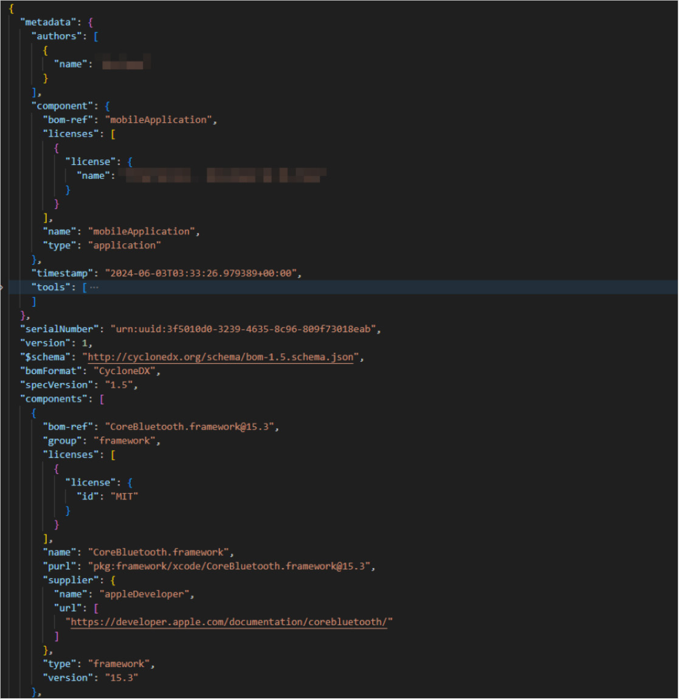

---
<!-- Page 71 -->
01
02
03
71
보안
요구사항
구성요소는 지원 종료 상태가 아니어야 하며, 도입 시점 기준으로 보안 패치 및 기술 지원을 유지하기 위해 EoS를
관리해야 한다.
목적
지원 종료(EoS)된 소프트웨어나 구성요소 사용을 방지하여, 보안 패치와 기술 지원을 지속적으로 받을 수 있도록
하고 보안 공백을 예방한다.
점검 기준
오픈소스 소프트웨어 구성요소 EoS 관리

## 1. 모든 구성요소의 EoS 정보 식별 여부

구현 및 점검 방안
1

## 01.	 로봇 시스템을 구성하는 모든 소프트웨어 및 하드웨어 구성요소에 대해 EoS(End of Support, 지원 종료)

정보를 식별하고 관리하는지 확인한다.
•  SBOM 또는 자산 관리 문서에서 각 구성요소의 공급자, 버전, 지원 종료 예정일을  확인할 수 있어야 한다.
•  공급자가 제공하는 EoS 공지를 모니터링하여 보안 패치 및 업데이트 지원 종료 시점을 주기적으로 점검해야 하며, 미지원
버전 사용 시 보안 리스크로 분류하여 관리 대상에 포함해야 한다.
02.	 EoS 구성요소에 대한 대체, 업그레이드, 보안 우회대책 등의 대응 계획이 수립되어 있는지 확인한다.
•  변경된 구성요소에 대한 교체 또는 업그레이드 계획이 수립되어야 하며, 단기적으로 교체가 불가능한 경우 보안 보완조치
가 마련되어야 한다.
•  EoS 구성요소 대체 계획에는 다음 항목이 포함되어야 한다.

#### 3.2.2  [SC-02] EoS 관리

항목
설명
구성요소 정보
이름, 버전, 공급자
영향 범위
해당 구성요소가 사용하는 서비스, 모듈, 장비
대체 방안
신규 버전, 타사 제품, 커스텀 모듈 등
보완 조치
대체할 수 없을 경우 단기/장기 대응책
일정 및 책임자
교체 시기, 담당 부서 및 담당자
EoS 구성요소 대체

---
<!-- Page 72 -->
72
보안
요구사항
조직은 공급요소의 공급업체를 선정할 때 보안 위험을 최소화하기 위해 보안 역량 평가 기준을 수립하고 적용해야
한다.
목적
공급업체의 보안 성숙도를 평가하여 신뢰할 수 있는 공급자를 선정함으로써 공급망을 통한 보안 위험 유입 가능성을
최소화한다.
점검 기준
공급업체 보안 역량 평가

## 1. 보안 평가 기준 존재 여부

구현 및 점검 방안
1

## 01.	 공급업체의 보안 역량을 평가하기 위한 보안 평가 기준 또는 체크리스트가 존재하는지 확인한다.

•  조직 내부에 공급망 보안 평가 절차가 문서로 정의되어 있으며, 공식 승인된 형태로 관리되고 있는지 확인한다.
•  평가 기준은 다음과 같은 보안 영역을 포함할 수 있다.

#### 3.2.3  [SC-03] 공급업체 보안 역량 평가 기준 수립 및 적용

구분
주요 평가 항목 예시
보안 관리 체계
보안 정책, 조직 내 역할 및 책임, 교육 체계
기술적 보안
보안 코딩, 취약점 점검, 패치 관리
인적 보안
보안 교육, 접근 권한 관리, 인력 검증
사고 대응
사고 탐지·보고 절차, 재발 방지 대책
공급망 관리
SBOM, EoS 구성요소 관리, 하위 공급자 관리
공급업체 평가 항목 예시

---
<!-- Page 73 -->
01
02
03
73
보안
요구사항
조직은 공급망이 변경되었을 경우 변경된 공급업체/요소로 인한 보안 영향을 평가하고 대처할 수 있는 방안을
마련해야 한다.
목적
공급망 변경으로 인한 신규 보안 위험을 신속히 파악하고 대응책을 마련해, 서비스 연속성과 보안 수준을 유지한다.
점검 기준
공급망 변경 영향 평가 및 대응

## 1. 변경된 공급업체 보안 평가 수행 여부

## 2. 공급망 변경으로 인한 영향 분석 및 대응 계획 수립 여부

구현 및 점검 방안
1

## 01.	 공급망 변경으로 인한 영향 분석 및 대응 계획 수립 여부

•  제조사 내에 정의된 공급업체 보안 역량 평가 기준에 따른 평가 결과가 문서화되어 있는지 확인한다.
2

## 01.	 공급망 변경이 시스템 자산, 네트워크 인터페이스, 데이터 흐름에 미친 영향을 분석했는지 확인한다.

•  변경된 공급자 또는 구성요소로 인해 API, 통신 프로토콜, 네트워크 경로에 변화가 발생했는지 점검한다.
•  공급자 변경 과정에서 새로운 외부 접근 경로, 계정, 인증 정보, 권한이 추가되지 않았는지 확인한다.
•  변경된 자산에 대한 위협 모델링 또는 위험 평가 결과가 갱신되었는지 검토한다.
•  영향 분석 결과가 시스템 보안 설계서, 접근 통제 정책 등에 반영되어 있는지 확인한다.

#### 3.2.4.  [SC-04] 공급망 변경 시 보안 영향 평가 및 대처 방안 마련

---
<!-- Page 74 -->
74
보안
요구사항
각 구성요소의 버전, 라이선스, 패치 상태와 함께 알려진 취약점 정보를 식별하고 관리해야 한다.
목적
각 구성요소의 버전·라이선스·패치 상태 및 알려진 취약점을 체계적으로 관리하여, 보안 위협 발생을 조기에
차단한다.
점검 기준
구성요소 취약점 관리

## 1. 구성요소의 알려진 취약점 식별 여부

## 2. 취약점 대응 관리 체계 존재 여부

구현 및 점검 방안
1

## 01.	 로봇 시스템을 구성하는 모든 구성요소에 대한 알려진 취약점을 식별하고 있는지 확인한다.

•  취약점 식별은 다음과 같은 방안으로 수행될 수 있다.
[방안 1] SBOM 연계 취약점 식별 자동화 도구
Anchore에서 제공하는 컨테이너 이미지 및 코드 베이스 분석용 오픈소스 도구들을 활용하여 다음과 같이 Syft를 통해
SBOM을 생성하고, Grype를 통해 생성된 SBOM의 취약점을 자동으로 식별할 수 있다.
[방안 2] 패키지 관리자 내장 기능
패키지 관리자에 내장된 보안 기능을 통해 프로젝트에 선언된 의존성을 분석하고 알려진 취약점을 자동으로 검사할 수도
있다. 주요 패키지 관리자 별 명령어는 다음과 같다.

#### 3.2.5 [SC-05] 구성요소 취약점 관리

① Syft를 통한 SBOM 생성
$ syft <소스코드 경로> -o json > sbom.json
② Grype를 통한 취약점 식별
$ grype sbom:/<SBOM 경로>/sbom.json
③ 결과 확인
자동화 도구를 통해 식별된 알려진 취약점 결과

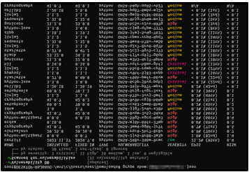

---
<!-- Page 75 -->
01
02
03
75
[방안 3] CI/CD 파이프라인 통합
CI/CD 파이프라인(Github Actions, GitLab CI/CD, Azure DevOps, Jenkins 등)에 취약점 검사 단계를 통합할 수도 있다.
2

## 01.	 매핑된 취약점 각각에 대해 해당 시스템에 미치는 영향을 평가하고, 이를 바탕으로 우선순위를 결정하며

심각도별 대응 체계가 존재하는지 확인한다.
•  영향평가는 취약점의 기술적 익스플로잇 가능성(공개 PoC/악용 여부), 영향을 받는 서비스/모듈/데이터의 중요도, EoS
상태 등을 고려하여 수행되어야 한다.
•  대응계획이 수립되면 해당 작업은 티켓으로 발행되어 책임자, 일정, 적용 방법, 검증 방법이 기록되어야 한다.
•  권장하는 취약점 대응 기록 항목 예시는 다음과 같다.
필드
설명
CVE ID
취약점 식별자
구성요소
영향받는 컴포넌트(이름/버전)
기술적 위험
공개 PoC/익스플로잇 존재 여부, CVSS 점수
비즈니스 영향
영향을 받는 서비스·데이터·운영 영향
EoS 여부
해당 구성요소의 지원상태
우선 순위
P0/P1/P2 또는 High/Medium/Low
대응방안
패치/업그레이드/가상패치/격리 등
SLA
목표 기간
담당자 및 일정
책임부서, 담당자, 완료예정일
검증 방법
재스캔, 기능/회귀 테스트 결과 링크
상태
계획/진행/완료/예외(승인)
식별된 알려진 취약점 대응 기록 항목 예시
Node.js (NPM)
$ npm audit
Python (pip)
$ pip-audit
Java (Maven)
$ mvn dependency-check:check
.NET (Nuget)
$ dotnet list package --vulnerable
Rust (Cargo)
$ cargo audit

---
<!-- Page 76 -->
76
보안
요구사항
조직은 로봇 시스템의 펌웨어 및 소프트웨어 업데이트 과정에서 악성코드 삽입, 무단 변조 등의 보안 위협을
방지하기 위해 무결성 검증 체계를 구축해야 한다.
목적
업데이트 과정에서 악성코드 삽입, 무단 변조 등의 위협을 방지하고, 배포되는 소프트웨어의 신뢰성을 보장한다.
점검 기준
업데이트 파일 무결성 검증

## 1. 업데이트 무결성 검증 여부

## 2. 무결성 검증 실패 시 업데이트 프로세스 중단 및 로깅 여부

구현 및 점검 방안
1

## 01.	 로봇 시스템에 배포되는 모든 소프트웨어 업데이트가 무결성 검증 절차를 거치는지 확인한다.

•  업데이트 아티팩트는 디지털 서명 또는 SHA-256 이상 해시로 검증되어야 한다.
•  검증 메타데이터(서명자, 서명 시각, 해시값, 검증 결과 등)는 배포 로그에 기록되어야 한다.
2

## 01.	 업데이트 무결성 검증이 실패하는 경우 업데이트 설치를 즉시 중단하고, 실패 원인과 메타데이터를 상세히

로깅하는지 확인한다.
•  검증 실패 시 설치/업데이트 프로세스는 즉시 중단되어야 하며, 필요 시 이전 안정 버전으로 롤백하거나 차단 상태를
유지하는 절차가 정의되어야 한다.
•  실패 로그에는 이름, 버전, 배포경로, 검증결과, 검증일시, 검증자, 해시값, 서명자키ID, 오류메시지 등이 포함되어야 한다.

#### 3.2.6  [SC-06] 로봇 펌웨어 및 소프트웨어 업데이트 무결성 검증

펌웨어 검증 로그 예시

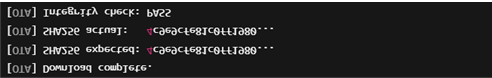

---
<!-- Page 77 -->
01
02
03
77
보안
요구사항
공급망 구성요소의 취약점 발견 시 신속한 패치 배포 및 적용 메커니즘을 구축해야 한다.
목적
새로운 취약점 발견 시 신속히 패치를 배포 및 적용하여 공격자가 이를 악용할 수 있는 시간을 최소화한다.
점검 기준
신속한 패치 메커니즘

## 1. 신속한 패치 배포 및 적용 절차 존재 여부

## 2. 패치 적용 검증 및 추적 관리 여부

구현 및 점검 방안
1

## 01.	 공급망 구성요소에서 취약점이 발견될 경우, 보안 패치를 신속하게 배포·적용할 수 있는 절차가 마련되어

있는지 확인한다.
•  취약점 발견부터 패치 적용까지의 흐름이 문서화되어 있어야 한다.
•  심각도에 따라 대응 기한이 정의되어 있으며, 긴급 취약점은 즉시 또는 일정 기간 내 대응해야 한다.
•  공급업체로부터 제공되는 패치 정보를 주기적으로 수집하고, 적용 여부를 추적·기록해야 한다.
2

## 01.	 배포된 패치가 실제 시스템에 정상 적용되었는지 검증하고, 적용 이력 및 결과가 추적 가능한 형태로

관리되는지 확인한다.
•  패치 적용 후 정상 동작 여부를 테스트하거나 취약점 재검증을 수행해야 한다.
•  패치 적용 로그에는 구성요소 명, 버전, 패치 일시, 담당자, 검증 결과가 포함되어야 한다.
•  미적용 패치 및 예외 승인 내역은 별도로 관리되어야 한다.

#### 3.2.7.  [SC-07] 신속한 패치 메커니즘

---
<!-- Page 78 -->
78
번호
보안 수준
체크리스트 항목
IA-01
L1
사용자 인증
L2
유일한 사용자 식별 및 인증
L4
다중 사용자 인증
IA-02
L2
장치 인증
L3
유일한 장치 식별 및 인증
IA-03
L1
사용자 패스워드 강도
L3
이전에 사용된 사용자 패스워드 사용 제한
L4
사용자 패스워드 사용기한 제한
IA-04
L2
공개키 인증
L3
공개키 인증을 위한 하드웨어 보안
IA-05
L2
대칭키 인증
L3
대칭키 인증을 위한 하드웨어 보안
IA-06
L1
인증 정보 노출 방지
IA-07
L1
반복된 로그인 시도 제한
IA-08
L1
시스템 사용 알림
IA-09
L1
사용자 계정 관리
IA-10
L1
사용자 식별 관리
IA-11
L1
사용자 인증자 관리
L3
하드웨어 보안을 통한 인증자 보호
기기에 대한 접근을 제어하여 무단 접근을 방지하기 위한 식별 및 인증(Identification and Authentication, IA)
체크리스트 항목은 다음과 같다.

### 3.3 식별 및 인증 점검 체크리스트

식별 및 인증 보안 체크리스트 항목

---
<!-- Page 79 -->
01
02
03
79
보안
요구사항
(L1) 사용자 인증 - 사용자가 접근 가능한 모든 인터페이스에 대해서 모든 사용자를 인증하는 기능을 제공해야 한다.
(L2) 유일한 사용자 식별 및 인증 - 사용자가 접근 가능한 모든 인터페이스에 대해서 모든 사용자를 유일하게
식별하고 인증하는 기능을 제공해야 한다.
(L4) 다중 사용자 인증 - 모든 사용자에 대해 다중 인증 기능을 적용해야 한다.
목적
모든 접근 인터페이스에서 사용자를 유일하게 식별하고 인증하여 비인가 사용자의 접근 및 오용을 차단하고, 접근
통제의 신뢰성을 보장한다.
점검 기준
L1. 사용자 인증
L1-1. 인간 사용자가 인터페이스 접근 시 사용자 인증 수행 여부
L2. 유일한 사용자 식별 및 인증
L2-1. 각 사용자 유일 식별 여부
L4. 다중 사용자 인증
L4-1. 2개 이상의 인증 수단을 통한 사용자 인증 수행 여부
구현 및 점검 방안
L1
L1-1. 인간 사용자가 인터페이스 접근 시 사용자 인증 수행 여부

## 01.	 로봇이 제공하는 인터페이스 및 서비스를 식별한다.

•  “2.3. 인터페이스 식별”에서 사용자 인증 수행 대상이 되는 서비스를 식별한다. 다음과 같은 유형의 서비스들이 식별될 수
있다.

## 02.	 식별된 서비스에 접근하는 사용자에 대한 인증을 수행하는지 확인한다.

•  사용자 인증 수행은 다음과 같은 방식으로 수행될 수 있다.

#### 3.3.1  [IA-01] 사용자 식별 및 인증

통신 유형
통신 인터페이스
제공 서비스
무선 네트워크
Wi-Fi (AP 모드)
•  무선 네트워크 접속 제공
NFC / RFID
•  사용자 인증
Wi-Fi (STA 모드)
•  HTTP/HTTPS 기반 Web UI
•  REST API
•  MQTT
•  ROS 통신
•  WebSocket
•  SSH
•  Modbus/TCP
•  OPC UA
•  자체 개발 프로토콜
4G LTE, 5G
유선 네트워크
이더넷
물리 인터페이스
디버깅 포트(UART)
•  로컬 시리얼 콘솔 접근
사용자 인터페이스 예시
구분
방식
자격 증명 기반 인증
•  ID / 비밀번호
•  PIN 번호
암호화 키 기반 인증
•  공개키 인증
•  디지털 인증서

---
<!-- Page 80 -->
80
•  해당 항목은 인터페이스 접근 시 사용자 인증 수행 여부에만 초점을 두므로, 사용자 식별 절차는 필수 요건이 아니다.
따라서, 비밀번호 입력과 같은 단일 인증 절차만으로도 요구사항을 충족할 수 있다.
L2
L2-1. 각 사용자 유일 식별 여부

## 01.	 인증된 사용자를 고유 식별자를 통해 식별하는지 확인한다.

•  사용자를 구분하기 위해 다음과 같은 식별자들이 활용될 수 있다.
L4
L4-1. 2개 이상의 인증 수단을 통한 사용자 인증 수행 여부

## 01.	 사용자 인증 시 2개 이상의 인증 방법을 사용하는지 확인한다.

•  OTP, 모바일 앱, 인증서, 생체 인식, PIN 코드, 스마트카드, 보안키 등이 기존 인증 방식과 조합되어 다중 인증(MFA) 수단
으로 활용될 수 있다.
토큰 기반 인증
•  세션 / 쿠키 기반 인증
•  OAuth / JWT 토큰
외부 연계 인증
•  SAML / OpenID Connect
물리적 접근 인증
•  NFC / RFID 카드 인증
•  보안 토큰 (USB 키, 스마트카드)
임시 인증 / 승인 절차
•  1회용 접근 토큰, 승인 코드
다중 요소 인증(MFA)
•  비밀번호 + OTP / 인증 앱
사용자 인증 방법 예시
ID 및 패스워드를 통한 인증 예시
패스워드를 통한 인증 예시
구분
예시
계정 기반 식별자
사용자 ID, 로그인 계정 명, 이메일 주소
디지털 인증서 정보
인증서의 DN(Distinguished Name), 시리얼 번호
디렉터리 서비스 정보
LDAP DN, Active Directory SID
하드웨어/토큰 식별자
보안 토큰 ID, 스마트카드 ID
생체정보 식별자
지문 ID, 얼굴 인식 템플릿, 홍채 ID
응용 서비스 식별자
사번, 고객번호, 회원번호
세션/토큰 기반 식별자
JWT의 subject, 세션 ID
사용자 식별자 예시

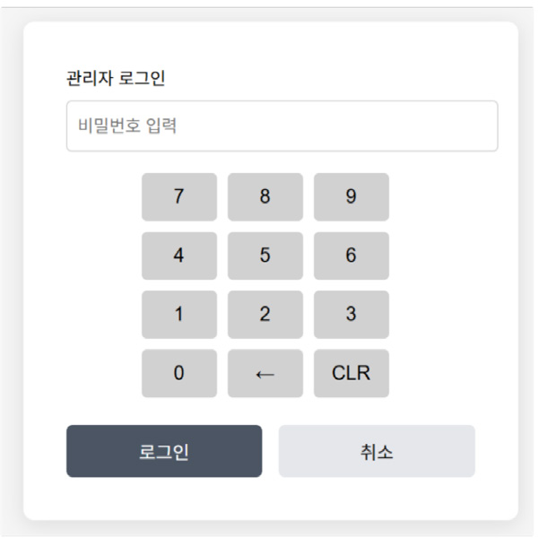

---
<!-- Page 81 -->
01
02
03
81
보안
요구사항
(L2) 장치 인증 - 로봇 서비스 구성요소를 식별하고 인증하는 기능을 제공해야 한다.
(L3) 유일한 장치 식별 및 인증 - 로봇은 다른 로봇 서비스 구성요소를 유일하게 식별하고 인증하는 기능을 제공해야
한다.
목적
네트워크에 연결되는 장치(로봇 본체, 제어기, 센서, 게이트웨이 등)를 고유하게 식별하고 인증하여 비인가 장치의
접속·데이터 위조·중간자 공격 등을 방지하고, 통신 신뢰성을 확보한다.
점검 기준
L2. 장치 인증
L2-1. 로봇과 다른 서비스 구성요소 간 인증 수행 여부
L3. 유일한 장치 식별 및 인증
L3-1. 각 장치 유일 식별 여부
구현 및 점검 방안
L2
L2-1. 장치가 인터페이스 접근 시 장치 인증 수행 여부

## 01.	 로봇이 제공하는 인터페이스 및 서비스를 식별한다.

•  “2.3. 인터페이스 식별”에서 장치 인증 수행 대상이 되는 서비스를 식별한다. 다음과 같은 유형의 서비스들이 식별될 수 있
다.

## 02.	 식별된 서비스에 접근하는 장치에 대한 인증을 수행하는지 확인한다.

•  장치 인증 수행은 다음과 같은 방식으로 수행될 수 있다.
•  해당 항목은 인터페이스 접근 시 장치 인증 수행 여부에만 초점을 두므로, 장치 식별 절차는 필수 요건이 아니다. 따라서, 인
증서 교환이나 키 검증과 같은 단일 인증 절차만으로도 요구사항을 충족할 수 있다.

#### 3.3.2  [IA-02] 장치 식별 및 인증

통신 유형
통신 인터페이스
제공 서비스
무선 네트워크
LoRa / ZigBee
•  센서 데이터 업링크
•  저속 제어 명령
•  노드 상태 보고
Bluetooth
•  사용자 인증
레거시 RF
•  간단한 로봇 제어
NFC / RFID
•  장치 인증
Wi-Fi (STA 모드)
•  OPC UA / TLS 인증서 기반
통신
유선 네트워크
이더넷
통신 유형
통신 인터페이스
인증서 기반 인증
•  X.509 인증서
•  디지털 서명
암호화 키 기반 인증
•  대칭 / 세션 키
•  공개키 기반 인증(PKI)
하드웨어 기반 인증
•  TPM / Secure Element 내 키 서명
•  eSIM / 보안 모듈 인증
물리 인터페이스 기반 인증
•  NFC / RFID 모듈 상호 인증
네트워크 기반 인증
•  MAC 주소 / Device ID 화이트리스트
클라우드 연계
•  장치 토큰
•  JWT
장치 인터페이스 예시
장치 인증 방법 예시

---
<!-- Page 82 -->
82
L3
L3-1. 각 장치 유일 식별 여부

## 01.	 인증된 장치를 고유 식별자를 통해 식별하는지 확인한다.

•  장치를 구분하기 위해 다음과 같은 식별자들이 활용될 수 있다.
구분
예시
하드웨어 기반 식별자
MAC 주소, CPU 시리얼, 장치 보드 ID, TMP/ECC 키 ID
디지털 인증서 정보
인증서의 DN(Distinguished Name), 시리얼 번호
통신 인터페이스 식별자
LoRa 노드 주소(DevAddr), ZigBee IEEE 주소, Bluetooth BD_ADDR
장치 계정 기반 식별자
Device ID, Client ID, 장비 등록 계정 명
보안 모듈 식별자
Secure Element ID, eSIM ICCID/IMSI, HSM 키 핸들
응용 서비스 식별자
로봇 일련번호, 장비 관리용 Asset ID, 클라우드 등록 디바이스 번호
세션/토큰 기반 식별자
MQTT Client ID, OPC UA Session ID, JWT Claim 내 device_subject
장치 식별자 예시

---
<!-- Page 83 -->
01
02
03
83
보안
요구사항
(L1) 사용자 패스워드 강도 - 국제적으로 인정된 사용자 패스워드 지침에 따라 사용자 패스워드 강도를 적용하는
기능을 제공해야 한다. 일반적으로 적용해야 하는 최소 요구사항은 다음과 같다.
•  최소길이 8자 이상
•  영문자(대문자, 소문자), 숫자, 특수문자 중 3가지 이상 필수 조합
(L3) 이전에 사용된 사용자 패스워드 사용 제한 - 설정에 따라 이전에 사용된 사용자 패스워드를 재사용하지
못하도록 제한하는 기능을 제공해야 한다.
(L4) 사용자 패스워드 사용기간 제한 - 사용자 패스워드의 유효한 사용기간을 제한하는 기능을 제공해야 한다.
일반적으로 적용해야 하는 최소 요구사항은 다음과 같다.
•  변경주기는 6개월 이내 권고
목적
비인가 사용자가 약하거나 반복된 패스워드 사용을 통해 시스템 접근 권한을 획득하지 못하도록, 사용자 인증
정보의 복잡도와 주기적 변경을 강제함으로써 인증 보안 수준을 유지한다.
점검 기준
L1. 사용자 패스워드 강도
L1-1. 국제적으로 인정된 보안 가이드라인에 따른 패스워드 강도 정책 적용 여부
L3. 이전에 사용된 사용자 패스워드 사용 제한
L3-1. 이전에 사용된 사용자 패스워드를 사용 제한 여부
L4. 사용자 패스워드 사용기간 제한
L4-1. 사용자 패스워드의 사용기간 제한 여부
구현 및 점검 방안
L1
L1-1. 국제적으로 인정된 보안 가이드라인에 따른 패스워드 강도 정책 적용 여부
01.	 “3.3.1 사용자 식별 및 인증” 및 “3.3.2 장치 식별 및 인증” 요구사항 점검 후 식별된 인증 방법 중 패스워드
기반 인증에 대하여 다음과 같이 국제적으로 인정된 보안 가이드라인에 따른 패스워드 강도 정책이 적용되어
있는지 확인한다.
•  최근 국제 표준의 추세는 단순 복잡도 강제보다는 길이 기반의 패스프레이즈 전략 및 유추·재사용 방지 강화에 중점을 두고
있으므로, 해당 방향성을 고려한 정책 적용 여부를 함께 확인한다.
[방안 1] NIST SP 800-63B
NIST SP 800-63B는 Memorized Secret(패스워드/PIN 등) 설정 시 다음을 권고하고 있다.
•  사용자가 직접 생성하는 비밀번호는 최소 8자 이상으로 설정
•  시스템이 자동 생성하는 경우 무작위 값 6자 이상 사용
[방안 2] OWASP ASVS 4.0
OWASP ASVS 4.0에서는 다음과 같이 패스워드 강도 기준을 권고하고 있다.
•  최소 길이 8자 이상, 일반적으로 12~15자 이상의 길이를 권장
•  사용자 불편을 초래하는 복잡도 규칙의 강제보다는 길이 중심 정책을 권장
•  사전에 기반한 비밀번호, 반복/연속 문자 등 유추 용이한 패턴 사용 금지
•  비밀번호 재사용 방지를 위한 이전 비밀번호 목록 유지 및 검증 정책 권고
L3
L3-1. 이전에 사용된 사용자 패스워드를 사용 제한 여부

## 01.	 이전에 사용된 사용자 패스워드를 사용하지 못하도록 제한하고 있는지 확인한다.

[방안 1] CIS
CIS(Center of Internet Security)는 최근 24개의 패스워드를 사용하지 못하도록 할 것을 권장하고 있다.

#### 3.3.3  [IA-03] 사용자 패스워드 정책

---
<!-- Page 84 -->
84
L4
L4-1. 사용자 패스워드의 사용기간 제한 여부

## 01.	 해당 패스워드에 대한 사용기간을 제한할 수 있는지 확인한다.

[방안 1] CIS
CIS는 최소 60일마다 패스워드를 정기적으로 변경할 것을 권장하고 있다.
이전에 사용된 사용자 패스워드 제한 예시
사용자 패스워드 사용기간 제한 예시

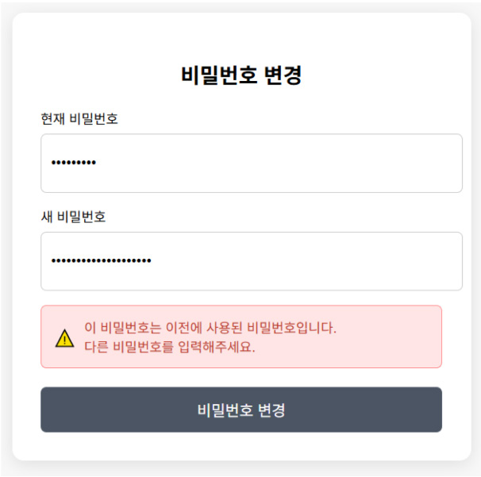

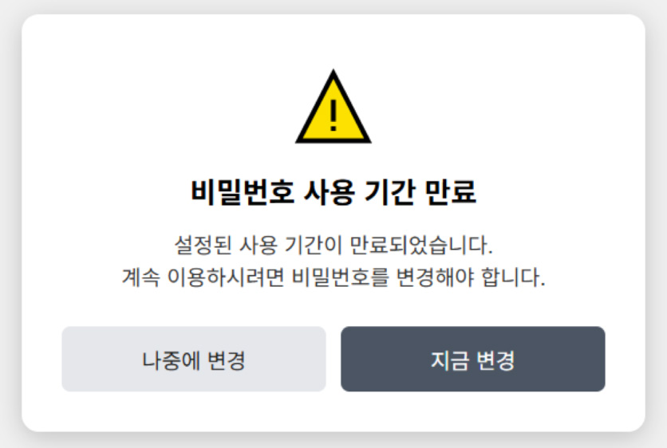

---
<!-- Page 85 -->
01
02
03
85
보안
요구사항
(L2) 공개키 인증 - 공개키 기반구조(PKI)를 사용하는 경우, PKI를 운영하거나 기존 PKI에서 공개키 인증서를 얻을
수 있는 기능을 제공해야 한다. 또한, 공개키 인증 활용 시 하위 기능을 만족해야 한다.
•주어진 인증서의 서명 유효성을 검사하여 인증서를 검증
•인증서가 발행된 대상과 통신하는 모든 호스트에 대하여 종단 인증서 적용하여 자체 서명 인증서나 인증서 체인 검증
•주어진 인증서의 폐지 상태를 확인하여 인증서의 유효성을 검사
•해당 개인키에 대한 사용자(사람, 소프트웨어 프로세스 또는 장치)를 설정
•인증된 신원을 사용자(사람, 소프트웨어 프로세스 또는 장치)에 매핑
•공개키 인증에 사용되는 암호키와 알고리즘의 안전성 보장
(L3) 공개키 인증을 위한 하드웨어 보안 - 하드웨어 보안 메커니즘을 통해 관련 개인키를 보호하는 기능을 제공해야
한다
목적
공개키 기반 인증과 암호화가 안전하게 이루어지도록 키의 생성·배포·저장·폐기를 체계적으로 관리하여 위·변조,
도난, 오용을 방지한다.
점검 기준
L2. 공개키 인증 기능 관리
L2-1. 인증서 서명 유효성 검증 여부
L2-2. 신뢰할 수 있는 종단 인증서 적용 여부
L2-3. 인증서 폐지 상태 확인 여부
L2-4. 개인키에 대한 사용자 설정 여부
L2-5. 인증된 신원과 사용자 매핑 관리 여부
L2-6. 암호키 및 알고리즘 안정성 보장 여부
L3. 하드웨어 보안 메커니즘 사용 여부
L3-1. 하드웨어 보안 메커니즘을 통한 개인키 보호 여부
구현 및 점검 방안
L2
L2-1. 인증서 서명 유효성 검증 여부
01.	 “3.3.1 사용자 식별 및 인증” 및 “3.3.2 장치 식별 및 인증” 항목 점검 후 식별된 인증 방법 중 공개키 기반 인증
(PKI)을 사용하는 서비스를 식별한다.
•  공개키 인증은 다음과 같은 서비스 또는 기능에서 활용될 수 있다.
로봇과 관리 서버 간 보안 통신(TLS/HTTPS/MQTT OPC UA)
장치 간 상호 인증(mTLS)
소프트웨어/펌웨어/백업 데이터 등 무결성 검증

## 02.	 식별된 서비스에 대하여 제공된 인증서 서명이 유효하게 검증되는지 여부를 확인한다.

•  TLS, OPC UA, MQTT 보안 설정 또는 애플리케이션 레벨에서 인증서 서명 검증이 자동 또는 수동으로 수행되는지
확인하며, 검증 기능이 비활성화되어 있거나 verify = false 등 인증서 검증을 우회하는 설정이 적용된 경우 미흡으로
판단한다.
Python (예: TLS 클라이언트 인증서 검증 수행 증적)
import ssl, socket
context = ssl.create_default_context()
context.verify_mode = ssl.CERT_REQUIRED       # 인증서 검증
context.check_hostname = True                           # 인증서 CN/SAN 검증
with socket.create_connection((“server.com”, 443)) as sock:
with context.wrap_socket(sock, server_hostname=”server.com”) as ssock:
print(“TLS Established:”, ssock.version())

#### 3.3.4  [IA-04] 공개키 관리

---
<!-- Page 86 -->
86
L2-2. 신뢰할 수 있는 종단 인증서 적용 여부

## 01.	 인증서가 신뢰 가능한 CA 기반으로 발급된 종단 인증서인지 확인한다.

•  다음 사항을 확인하여 종단 인증서가 신뢰 가능한 인증서인지 판단한다.
인증서의 Issuer가 Self-signed가 아닌지 확인하고, 공인 CA 또는 조직에서 운영하는 신뢰할 수 있는 CA가 발급한
인증서인지 확인한다.
인증서가 체인 검증이 가능한 구조로 구성되어 있으며, 클라이언트가 Root CA만 보유한 상태에서도 검증이 가능한지
확인한다.
L2-3. 인증서 폐지 상태 확인 여부

## 01.	 식별된 서비스에 대하여 인증서 폐지 상태를 확인하는 기능이 적용되어 있는지 여부를 점검한다.

•  CRL(Certificate Revocation List) 또는 OCSP(Online Certificate Status Protocol) 기반 폐지 검증 기능을 사용하여,
폐지된 인증서를 신뢰하지 않도록 차단하는지 확인한다.
•  폐지 상태 확인 기능이 비활성화되어 있거나, CRL/OCSP 설정이 누락된 경우 미흡으로 판단한다.
L2-4. 개인키에 대한 사용자 설정 여부

## 01.	 사용되는 개인키에 대한 소유자(사용자, 소프트웨어 프로세스 또는 장치) 설정 및 관리가 적절히 수행되는지

확인한다.
•  개인키가 인증된 사용자 또는 장치에 적절히 할당되어 있는지 확인하며, 개인키가 공유되거나 무단 사용자에게 노출되는
경우 미준수로 판단한다.
L2-5. 인증된 신원과 키 매핑 관리 여부

## 01.	 인증된 신원과 해당 공개키 또는 인증서를 매핑하여 관리하는지 확인한다.

•  시스템에서 등록된 인증서가 어느 사용자/장치에 속하는지 식별 가능해야 하며, 인증서 또는 키가 회수·폐지될 경우 해당
매핑도 갱신되는지 확인한다.
•  인증서 기반 접근 제어 목록이 존재하지 않거나, 폐지 후에도 허용되는 경우 미준수로 판단한다. 다음과 같은 접근 제어
목록이 있을 수 있다.
•  인증서의 주체 정보(CN/SAN), KeyUsage 및 ExtendedKeyUsage 항목이 해당 서비스 목적(TLS Web Server
Authentication 등)에 적합한지 확인한다.
server.conf (예: OPC UA 서버 인증서 검증 활성화 설정)
ValidateCertificates = True        # 인증서 검증 수행
RejectUnknownCertificates = True   # 검증 실패 시 차단
Bash (예: 인증서 내용 확인 명령어)
# openssl x509 -in server.crt -text -noout
server.conf (예: OPC UA 서버 인증서 폐지 검증 활성화 설정)
ValidateCertificates = True          # 인증서 검증 수행
RevocationCheck = True            # 인증서 폐지 상태 확인 활성화
RejectUnknownCertificates = True   # 검증 실패 시 차단
Bash (예: 개인키 접근 권한 설정)
# chown robot-service:robot-service /etc/robot/keys/device.key
# chmod 600 /etc/robot/keys/device.key  // 파일 소유자만 접근 가능

---
<!-- Page 87 -->
01
02
03
87
L2-6. 암호키 및 알고리즘 안정성

## 01.	 인증서 기반 인증에 사용되는 암호 알고리즘, 키 길이 및 해시 알고리즘이 최신 보안 요구사항을 충족하는지

확인한다.
•  다음과 같은 암호화 알고리즘 기준을 적용할 수 있다.
L3
L3-1. 하드웨어 보안 메커니즘을 통한 개인키 보호 여부

## 01.	 개인키가 하드웨어 기반 보안 메커니즘을 통해 저장·보호되고 있는지 확인한다.

•  개인키가 일반 파일시스템에 평문으로 저장되거나 하드웨어 또는 보안 전용 저장소에서 보호되지 않는 경우 미흡으로
판단한다.
•  적용 가능한 하드웨어 보안 수단은 환경에 따라 다음 중 하나 이상일 수 있다.
HSM(Hardware Security Module)
TPM(Trusted Platform Module)
Secure Element / Secure Enclave / TEE(Trusted Execution Environment)
단말/장치 내 전용 키 저장 영역 (예: IoT/로봇 MCU 보안 영역)

## 02.	 개인키가 외부로 추출되지 않도록 설계되어 있는지 확인한다.

•   개인키가 HSM/TPM 내부에서 생성 및 보관되며, 키 자체가 외부로 유출되지 않는 구조여야 한다.

## 03.	 인증 또는 서명 연산이 하드웨어 내부에서 수행되는지 확인한다.

•   개인키가 외부로 나오지 않고, 하드웨어 내부에서 암호 연산이 수행되는지 확인한다.
구분
예시
일반 서버/클라우드
DB 테이블
OPC UA
/pki/trusted, /pki/rejected 폴더
MQTT mTLS
CA DB, 허용 클라이언트 인증서 목록
로봇 PKI
KV DB, HSM 연동
구분
권고 기준
미흡 기준
키 알고리즘
RSA ≥ 2048bit 또는 ECC P-256 이상
RSA 1024bit 이하, ECC P-192 이하
해시 알고리즘
SHA-256 이상 (SHA-2/SHA-3 계열)
SHA-1, MD5 사용
TLS 프로토콜
TLS 1.2 이상(권장: TLS 1.3)
TLS 1.0 / 1.1 사용
플랫폼 별 인증서 접근 제어 목록 예시
공개키 인증에 사용되는 알고리즘 보안 기준 예시

---
<!-- Page 88 -->
88
보안
요구사항
(L2) 대칭키 인증 - 대칭키를 사용하는 경우, 다음과 같은 기능을 제공해야 한다.
•  대칭키를 사용하여 상호 신뢰 수립
•  공유 비밀키를 안전하게 저장
•  공유 비밀키로의 접근 제한
•  대칭키 인증에 사용되는 암호키와 알고리즘의 안전성
(L3) 대칭키 인증을 위한 하드웨어 보안 - 하드웨어 보안 메커니즘을 통해 관련 대칭키를 보호하는 기능을 제공해야
한다.
목적
안전한 생성·저장·배포·회수·폐기 절차를 통해 키 유출 및 오남용을 방지한다.
점검 기준
L2. 대칭키 인증 기능 관리
L2-1. 대칭키를 통한 상호 신뢰 수립 여부
L2-2. 공유 비밀키 안전 저장 여부
L2-3. 공유 비밀키 접근 통제 여부
L2-4. 대칭키 및 알고리즘 안정성 보장 여부
L3. 하드웨어 보안 메커니즘 사용 여부
L3-1. 하드웨어 보안 메커니즘을 통한 대칭키 보호 여부
구현 및 점검 방안
L2
L2-1. 대칭키를 통한 상호 신뢰 수립 여부
01.	 “3.3.1 사용자 식별 및 인증” 및 “3.3.2 장치 식별 및 인증” 항목 점검 후 식별된 인증 방법 중 대칭키를
사용하는 서비스를 식별한다.
•  대칭키 인증은 사전에 공유된 비밀키를 이용해 두 주체 간 상호 신뢰를 수립하거나 메시지의 무결을 검증하는 방식으로 활
용될 수 있다.
•  대칭키 기반 인증은 다음과 같은 서비스 또는 기능에서 사용될 수 있다.
로봇과 제어 서버 간 사전 공유 키를 이용한 통신 세션 인증
IoT 장치 및 센서 간 메시지 인증 코드(HMAC)를 통한 무결성 검증
제어 프로토콜에서 PSK(Pre-Shared Key)를 이용한 세션 수립

## 02.	 통신 또는 데이터 교환 시 대칭키(공유 비밀키) 를 사용하여 양 단말 간 상호 신뢰가 수립되는지 확인한다.

•  세션 키를 사용한 암호화 통신(AES, HMAC 등)이 구성되어 있으며, 키 교환 및 검증 과정에서 무결성과 인증이 보장되는
경우 충족으로 판단한다.
•  키가 하드코딩되거나, 평문으로 교환되는 경우 미흡으로 판단한다.
•  TLS, DTLS, MQTT over TLS, OPC UA SecureChannel 등 대칭키 세션을 자동 생성하는 프로토콜 사용 시 준수로
인정한다.
L2-2. 공유 비밀키 안전 저장 여부

## 01.	 대칭키가 안전한 저장소에 저장되어 있으며, 평문 노출되지 않는지 확인한다.

•  TLS 통신에서 사용되는 세션 키(공유 비밀키) 는 메모리 내에서 일시적으로 생성·사용 후 폐기되며, 디스크나 파일로
저장되지 않기 때문에 자동으로 충족되는 항목이다.
•  반면, PSK나 고정 대칭키를 사용하는 서비스의 경우, 해당 키가 파일로 직접 저장되거나 코드 내부에 포함되어 있으면
미흡으로 판단한다.
•  대칭키가 암호화된 형태로 별도 Key Store, Vault, HSM, TPM 등 보안 저장소에 보관되는 경우 충족으로 인정한다.

#### 3.3.5  [IA-05] 대칭키 관리

---
<!-- Page 89 -->
01
02
03
89
L2-3. 공유 비밀키 접근 통제 여부

## 01.	 대칭키에 접근 가능한 사용자·프로세스가 최소화되어 있으며, 권한이 엄격히 통제되는지 확인한다.

•  OS 파일 권한, 역할 기반 제어(RBAC), 키 접근 정책 등을 점검한다.
•  다수 서비스가 동일 키를 공유하거나 백업 시 키가 외부로 노출되는 경우 미흡으로 판단한다.
L2-4. 대칭키 및 알고리즘 안정성 보장 여부

## 01.	 대칭키 기반 인증·암호화에 사용되는 암호 알고리즘과 키 길이가 최신 보안 요구사항을 충족하는지

확인한다.
•  다음과 같은 암호화 알고리즘 기준을 적용할 수 있다.
L3
L3-1. 하드웨어 보안 메커니즘을 통한 대칭키 보호 여부

## 01.	 대칭키가 하드웨어 기반 보안 메커니즘을 통해 저장·보호되고 있는지 확인한다.

•  대칭키가 일반 파일시스템에 평문으로 저장되는 경우 미흡으로 판단한다.
•  적용 가능한 하드웨어 보안 수단은 환경에 따라 다음 중 하나 이상일 수 있다.
HSM
TPM
Secure Element / Secure Enclave / TEE(Trusted Execution Environment)
단말/장치 내 전용 키 저장 영역

## 02.	 대칭키가 외부로 추출되지 않도록 설계되어 있는지 확인한다.

•  대칭키가 하드웨어 내부에서 생성 및 관리되며, Export가 제한된 상태여야 한다.
•  외부 백업, 로깅, 디버깅 과정에서 대칭키가 출력되거나 API로 노출되는 경우 미흡으로 판단한다.
•  키 교체 시에도 새 키는 하드웨어 내부에서 생성·갱신되어야 하며, 외부에서 평문 전달되어서는 안 된다.

## 03.	 암호 연산이 하드웨어 내부에서 수행되는지 확인한다.

•  대칭키가 외부 메모리로 로드되지 않고, HSM·TPM 내부에서 직접 암·복호화, MAC 계산 등의 연산이 수행되는 구조일
경우 충족으로 인정한다.
구분
권고 기준
미흡 기준
대칭키
알고리즘
AES 계열(AES-128 이상, 권장 AES-256)
ChaCha20-Poly1305, GCM/CTR 모드 등 현대
블록암호 사용
DES, 3DES, RC4, Blowfish 등 구식
알고리즘 사용
키 길이
AES-128 이상 (권장 AES-256)
64bit 이하 키, 3DES 112bit 이하 등
무결성 검증
방식
HMAC-SHA-256 이상 사용
HMAC-MD5, HMAC-SHA1 등 취약
해시 기반
운영 모드
GCM, CTR, CCM 등 인증 모드
ECB 등 패턴 노출 모드 사용
프로토콜
적용
TLS 1.2 이상 또는 ECDHE 기반 세션 키 교환 사용
TLS 1.0 / 1.1, 정적 PSK만 사용
키 수명 관리
세션별 키 사용, 주기적 교체 수행
동일 키 장기 재사용, 키 갱신 절차 부재
대칭키 인증에 사용되는 알고리즘 보안 기준 예시

---
<!-- Page 90 -->
90
보안
요구사항
(L1) 인증 정보 노출 방지 - 사용자 인증 프로세스 진행 동안에 인증자가 출력장치에 노출되지 않도록 해야 하고,
인증실패 사유에 대한 피드백 정보가 제공되지 않아야 한다.
목적
인증 정보가 화면이나 로그 등에 노출되지 않도록 하면 어깨너머로 보거나 스크린샷·기록을 통해 비밀번호·토큰 등
민감정보가 유출되는 것을 방지한다.
점검 기준
L1. 인증 정보 노출 방지 기능
L1-1. 패스워드 기반 인증 시, 인증자 입력 값 보호 여부
L1-2. 2개 이상의 입력 필드 인증 실패 시, 모호한 피드백의 제공 여부
구현 및 점검 방안
L1
L1-1. 패스워드 기반 인증 시, 인증자 입력 값 보호 여부
01.	 “3.3.1 사용자 식별 및 인증” 및 “3.3.2 장치 식별 및 인증” 항목 점검 후 식별된 인증 방법 중 패스워드 기반
인증에 대하여 사용자가 패스워드 기반 인증을 수행할 때 입력되는 인증 값이 화면이나 로그 등 출력장치를
통해 노출되지 않는지 확인한다.
L1-2. 2개 이상의 입력 필드 인증 실패 시, 모호한 피드백의 제공 여부

## 01.	 아이디(ID)와 패스워드 등 2개 이상의 입력 항목을 사용하는 인증 과정에서, 어떤 항목이 잘못되었는지에 대한

구체적인 피드백을 제공하지 않는지 확인한다.

#### 3.3.6.  [IA-06] 인증 정보 노출 방지

인증자 마스킹 예시
로그인 실패 시 모호한 피드백 제공 예시

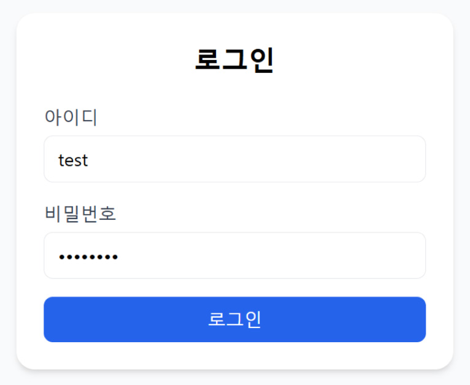

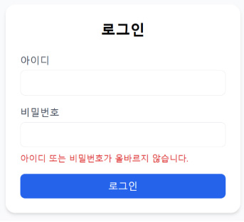

---
<!-- Page 91 -->
01
02
03
91
보안 요구사항
(L1) 반복된 로그인 시도 제한 - 모든 사용자(사람, 소프트웨어 프로세스 또는 장치) 인증이 연속적으로 실패하는
경우 해당 사용자의 로그인 시도를 제한해야 한다.
•  모든 사용자에 대해 연속된 로그인 시도 실패 횟수 제한을 강제해야 한다.
•  로그인 실패 횟수 제한 임계치에 도달할 경우, 정해진 시간 동안 또는 관리자가 잠금 해제할 때까지 접근을
거부해야 한다. 관리자는 타임아웃이 만료되기 전에 잠김 사용자 계정을 잠금 해제할 수도 있다.
목적
비밀번호 추측이나 자동화된 무차별 대입 공격으로부터 계정을 보호한다.
점검 기준
L1. 반복된 로그인 시도 제한
L1-1. 로그인 실패 시도 임계치 초과 시 접근 제한 여부
L1-2. 관리자 계정이 접근 제한된 사용자 잠금 해제 가능 여부
구현 및 점검 방안
L1
L1-1. 로그인 실패 시도 임계치 초과 시 접근 제한 여부
01.	 “3.3.1 사용자 식별 및 인증” 및 “3.3.2 장치 식별 및 인증” 항목 점검 후 식별된 서비스에 대하여 연속된
로그인 실패 시 접근을 제한하는지 확인한다.
•  로그인 실패 임계치는 설정이 이미 되어 있거나, 권한이 있는 사용자가 설정할 수 있어야 하며, 임계치 초과 시 접근을
일정 기간 차단하거나 계정을 잠금하는 기능을 제공하는지 확인한다.
•  차단 대상은 IP 또는 사용자 계정이 될 수 있으며, 차단 방식은 단순 지연 또는 완전 차단으로 동작할 수 있다.
•  차단 동작이 로그에 기록되고, 차단 사유를 포함하는지 확인한다.
L1-2. 관리자 계정이 접근 제한된 사용자 잠금 해제 가능 여부

## 01.	 관리자가 접근 제한된 사용자를 잠금 해제할 수 있는지 확인한다.

•  관리자가 잠긴 사용자 계정을 조회할 수 있는 기능(관리 UI/API/DB 쿼리 등)이 존재하는지 확인하고, 잠금 해제 시
로그가 기록되는지 확인한다.

#### 3.3.7  [IA-07] 반복된 로그인 시도 제한

---
<!-- Page 92 -->
92
보안 요구사항
(L1) 시스템 사용 알림 - 시스템에 중대한 영향을 줄 수 있는 기능에 대해, 해당 위험성을 사용자에게 고지해야
한다.
목적
시스템 접근 전 사용자에게 보안 정책·접근 통제·무단 사용 금지 등을 명시적으로 고지하여, 불법적·비인가 접근 시
법적 책임과 보안 인식을 강화한다.
점검 기준
L1. 시스템 사용 알림 메시지 제공
L1-1. 기능이 시스템에 끼칠 수 있는 영향에 대한 사용자 고지 여부
구현 및 점검 방안
L1
L1-1. 기능이 시스템에 끼칠 수 있는 영향에 대한 사용자 고지 여부

## 01.	 시스템 로그인 또는 주요 기능(예: 제어, 파라미터 변경, 설정 수정) 수행 전, 해당 시스템 사용이 미치는

보안적·법적 영향에 대해 사용자가 명확히 인지할 수 있도록 고지하는 메시지를 제공하는지 확인한다.
•  고지 메시지는 로그인 화면 상단 배너나 별도의 팝업 창 형태로 노출되어, 사용자가 시스템 사용 전 해당 내용을 명확히
인지할 수 있도록 제공될 수 있다.

#### 3.3.8. [IA-08] 시스템 사용 알림

로봇 파라미터 변경에 대한 위험 사용자 고지 예시

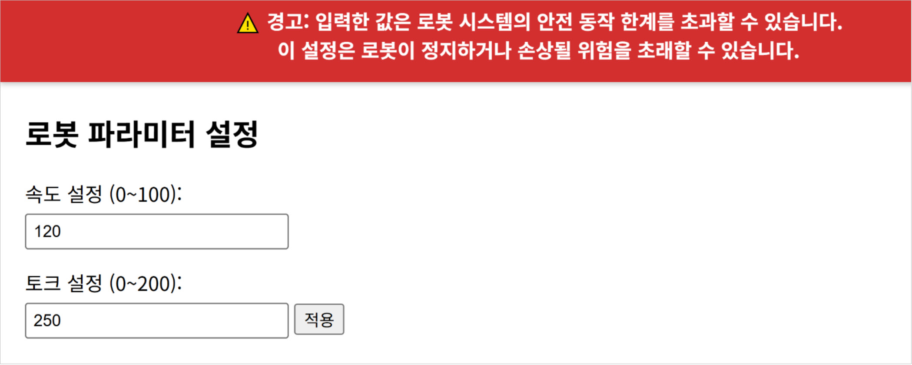

---
<!-- Page 93 -->
01
02
03
93
보안 요구사항
(L1) 사용자 계정 관리 - 모든 사용자 계정 추가, 수정, 삭제, 활성화 또는 비활성화를 포함하여 사용자의 모든 계정
관리를 지원하는 기능을 제공해야 한다.
목적
시스템 내 모든 사용자 계정이 명시적 관리 절차를 통해 생성·변경·삭제되도록 함으로써, 비인가 계정 생성·
유령계정 존재 등을 방지하고 계정 수명 주기 전반의 보안을 유지한다.
점검 기준
L1. 사용자 계정 관리
L1-1. 인가된 관리자에 의한 사용자 계정 추가/수정/삭제/활성화/비활성화 기능 제공 여부
구현 및 점검 방안
L1
L1-1. 인가된 관리자에 의한 사용자 계정 추가/수정/삭제/활성화/비활성화 기능 제공 여부
01.	 “3.3.1 사용자 식별 및 인증” 및 “3.3.2 장치 식별 및 인증” 항목 점검 후 식별된 서비스가 단일 공용 계정을
사용하는지 또는 개별 사용자 계정을 구분 및 관리하는 구조인지 확인한다.
•  사용 환경의 특성에 따라 단일 계정만 존재하고 사용자별 계정이 분리되어 있지 않은 경우, 본 요구사항은 적용 대상에서
제외하거나 일부 충족으로 판단한다.

## 02.	 사용자별 계정이 존재하는 경우 인가된 사용자에 의한 계정의 생성·수정·삭제 및 활성화·비활성화 기능 제공

여부를 확인한다
•  시스템 또는 관리자 콘솔을 통해 계정 관리가 가능해야 하며, 계정 관리 이력은 로그에 기록되어야 한다
사용자 계정 관리 페이지 예시

#### 3.3.9  [IA-09] 사용자 계정 관리

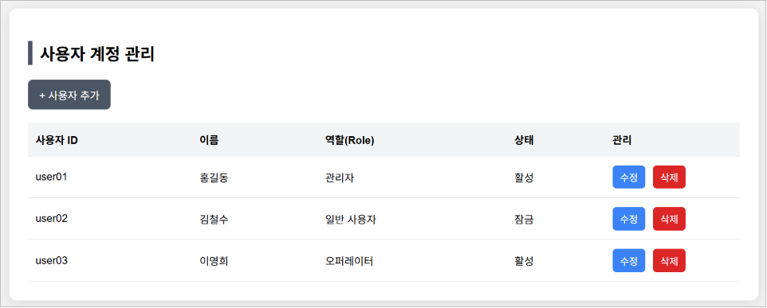

---
<!-- Page 94 -->
94
보안 요구사항
(L1) 사용자 식별자 관리 - 사용자, 그룹 또는 역할별로 사용자 식별자 관리를 지원하는 기능을 제공해야 한다.
목적
사용자, 그룹 또는 역할별로 고유한 식별자를 부여·관리함으로써 시스템 접근 주체를 명확히 구분하고,
행위추적성과 책임성을 확보한다.
점검 기준
L1. 사용자 식별자 관리 기능
L1-1. 인가된 관리자에 의한 사용자 계정 또는 그룹의 식별자 추가, 수정, 삭제 기능 제공 여부
구현 및 점검 방안
L1
L1-1. 인가된 관리자에 의한 사용자 계정 또는 그룹의 식별자 추가, 수정, 삭제 기능 제공 여부
01.	 “3.3.1 사용자 식별 및 인증” 및 “3.3.2 장치 식별 및 인증” 항목 점검 후 식별된 서비스가 단일 공용 계정을
사용하는지 또는 개별 사용자 계정을 구분 및 관리하는 구조인지 확인한다.
•  단일 계정만 존재하고 사용자별 계정이 분리되어 있지 않은 경우, 본 요구사항은 적용 대상에서 제외하거나 일부 충족으로
판단한다.

## 02.	 사용자별 계정이 존재하는 경우 인가된 사용자에 의한 식별자의 생성·수정·삭제 기능 제공 여부를 확인한다

•  시스템 또는 관리자 콘솔(UI, CLI, API 등)을 통해 식별자 관리가 가능해야 하며, 식별자 관리 이력은 로그에 기록되어야
한다.
식별자 변경 페이지 예시

#### 3.3.10  [IA-10] 사용자 식별자 관리

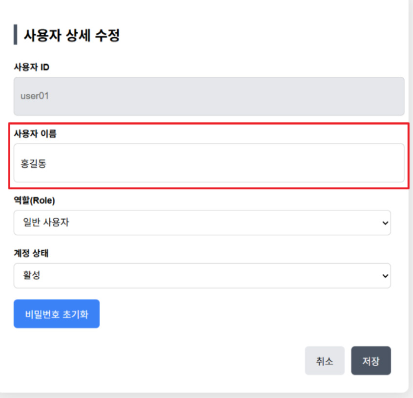

---
<!-- Page 95 -->
01
02
03
95
보안 요구사항
(L1) 사용자 인증자 관리 - 다음과 같은 사용자 인증자 관리 기능을 제공해야 한다.
•  인증자 초기화
•  설치 시에 디폴트 인증자에 대한 변경
•  주기적인 인증자 변경, 유효성 검사, 새로고침 기능을 지원
•  인증자 저장, 사용 및 전송 중에 인가되지 않은 노출 또는 변경으로부터 보호
(L3) 하드웨어 보안을 통한 인증자 보호 - 하드웨어 보안 메커니즘을 통해 관련 인증자를 보호하는 기능을
제공해야 한다.
목적
사용자 인증자(비밀번호, 인증키, 토큰 등)의 생성·저장·변경·전송 전 과정에서 보안성을 유지하여 인증 정보의
유출, 위·변조, 무단 재사용을 방지하고 신뢰할 수 있는 인증 절차를 확보한다.
점검 기준
L1. 사용자 인증자 관리
L1-1. 인증자 초기화
L1-2. 기본 값 변경 여부
L1-3. 주기적인 인증자 변경 강제 여부
L1-4. 인증자 보호(저장·사용·전송) 여부
L3. 하드웨어 보안 메커니즘 사용
L3-1. 하드웨어 보안 메커니즘을 통한 인증자 보호 여부
구현 및 점검 방안
L1
L1-1. 인증자 초기화
01.	 “3.3.1 사용자 식별 및 인증” 및 “3.3.2 장치 식별 및 인증” 항목 점검 후 식별된 서비스에서 사용자 또는
관리자에 의해 인증자를 초기화할 수 있는 기능이 제공되는지 확인한다.
•  비밀번호 분실, 인증키 손상·노출, 디바이스 분실 등과 같은 상황에서 사용자가 새로운 인증자를 안전하게 발급받을 수
있어야 한다
•  초기화된 인증자는 임시 비밀번호 또는 새 토큰 발급 형태로 제공되며, 최초 로그인 시 반드시 사용자 변경을 강제해야
한다.

#### 3.3.11  [IA-11] 사용자 인증자 관리

인증자 초기화 페이지 예시

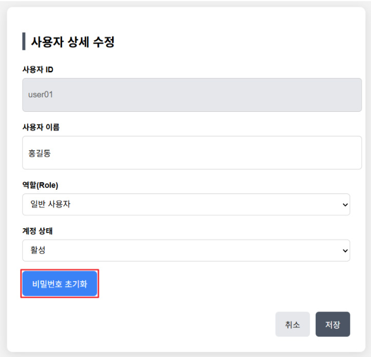

---
<!-- Page 96 -->
96
L1-2. 기본 값 변경 여부

## 01.	 설치 또는 초기 설정 시 제공되는 기본 인증자가 존재하는 경우, 사용자가 시스템을 운영하기 전에 반드시

초기 변경 절차를 거치도록 강제하는지 확인한다.
•  설치 후 최초 로그인 시 비밀번호 변경 팝업 / 초기화 절차 등이 제공되면 충족으로 판단한다.
L1-3. 주기적인 인증자 변경 강제 여부

## 01.	 인증자에 대해 주기적인 변경 주기가 정의되어 있는지 확인한다.

•  인증자 변경 주기 도래 시 사용자에게 갱신 알림 또는 강제 변경 절차가 제공되어야 한다.
L1-4. 인증자 보호(저장·사용·전송) 여부

## 01.	 인증자가 저장될 때 암호화된 형태로 보관되는지 확인한다.

## 02.	 인증자 사용 시 평문 값이 로그, 에러 메시지, 네트워크 패킷에 노출되지 않는지 점검한다.

## 03.	 인증자가 네트워크를 통해 전송될 경우, 반드시 보안 통신 채널을 사용해야 한다.

L3
L3-1. 하드웨어 보안 메커니즘을 통한 인증자 보호 여부

## 01.	 인증자가 하드웨어 기반 보안 메커니즘을 통해 저장·보호되고 있는지 확인한다.

•  인증자가 일반 파일시스템에 평문으로 저장되거나, 코드에 직접 포함된 경우 미흡으로 판단한다.
•  인증자가 하드웨어 보안 모듈 내부의 보안 저장소 또는 암호화된 스토리지에 저장되는 경우 충족으로 판단한다.
•

## 02.	 인증 또는 서명 연산이 하드웨어 내부에서 수행되어, 인증자 값이 외부로 출력되지 않는지 확인한다.

•  하드웨어 보안 모듈 내에서 키를 직접 사용하여 서명 또는 복호화 연산을 수행하는 구조인 경우 충족으로 판단한다.

## 03.	 하드웨어 보안 모듈이 물리적 침입 또는 디버깅으로부터 보호되는지 확인한다.

•  Secure Boot, 암호화 스토리지, 디버그 인터페이스 잠금 등의 기능이 활성화되어 있다면 충족으로 판단한다.
인증자 암호화 저장 예시

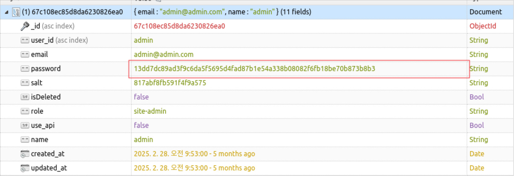

---
<!-- Page 97 -->
01
02
03
97
번호
보안 수준
체크리스트 항목
UC-01
L1
인간 사용자에 대한 권한 부여
L2
모든 사용자에 대한 권한 부여
L2
사용자 역할 기반 권한 부여
UC-02
L1
모바일 코드 사용 통제
L2
모바일 코드 무결성 검사
UC-03
L1
세션 잠금
UC-04
L2
원격 세션 종료
UC-05
L3
동시 세션 제어
UC-06
L1
감사 로그 생성
UC-07
L1
감사 로그 저장 용량
L3
감사 저장 용량 임계치 도달 시 경고
UC-08
L1
감사 처리 실패 대응
UC-09
L1
타임 스탬프
L2
시간 동기화
L4
시간 소스 무결성 보호
UC-10
L1
인간 사용자에 대한 부인 방지
L4
모든 사용자에 대한 부인 방지
UC-11
L2
물리적 진단 및 시험 인터페이스의 보호
L3
물리적 진단 및 시험 인터페이스의 능동적 모니터링
로봇 시스템의 사용 권한을 제어하여 무단 작동 및 데이터 사용을 방지하기 위한 사용 통제(Use Control, UC)
체크리스트 항목은 다음과 같다.

### 3.4 사용 통제 점검 체크리스트

사용 통제 체크리스트 항목

---
<!-- Page 98 -->
98
보안 요구사항
(L1) 인간 사용자에 대한 권한 부여 - 업무 분리 및 최소 권한을 지원하고 모든 인터페이스 사용을 통제하기 위해
인간 사용자에게 할당된 권한을 부여하는 기능을 제공해야 한다.
(L2) 모든 사용자에 대한 권한 부여 - 업무 분리 및 최소 권한을 지원하고 모든 인터페이스 사용을 통제하기 위해
모든 사용자(사람, 소프트웨어 프로세스 및 장치)에게 할당된 권한을 부여하는 기능을 제공해야 한다.
(L2) 사용자 역할 기반 권한 부여 - 사용자의 역할에 대한 권한 매핑을 정의하고 수정할 수 있는 기능을 제공해야
한다.
목적
사용자와 프로세스, 장치별로 필요한 최소 권한만 부여하여 업무 분리와 접근 통제를 보장하고, 역할 기반 권한
관리를 통해 비인가 행위나 권한 남용을 방지한다.
점검 기준
L1. 사용자 권한 부여
L1-1. 인가된 사용자에 의한 사용자 권한 부여 여부
L2. 모든 사용자에 대한 권한 부여
L2-1. 모든 사용자에 대한 권한 부여 여부
L2. 사용자 역할 기반 권한 부여
L2-1. 사용자 역할 기반 권한 부여 여부
구현 및 점검 방안
L1
L1-1. 인가된 사용자에 의한 사용자 권한 부여 여부

## 01.	 사용자 권한이 오직 인가된 사용자에 의해서만 부여·변경되는지 확인한다.

•  권한 부여·변경 절차는 인증된 관리자 세션에서만 수행되어야 하며, 승인·기록 절차를 포함해야 한다.
•  일반 사용자는 스스로 권한을 상승시키거나 다른 사용자에게 권한을 부여할 수 없어야 한다.
•  권한 부여 내역은 감사 로그에 기록되고, 변경 이력이 추적 가능해야 한다.
•  사용 환경의 특성에 따라 단일 계정만 존재하고 사용자별 계정이 분리되어 있지 않은 경우, 본 요구사항은 적용 대상에서
제외하거나 일부 충족으로 판단한다.
L2
L2-1. 모든 사용자에 대한 권한 부여 여부

## 01.	 유일하게 식별된 사용자(인간 사용자, 소프트웨어 프로세스, 장치)에 대해 명시적으로 권한이 부여되는지

확인한다.

#### 3.4.1  [UC-01] 사용자 권한 부여

사용자 권한 부여 페이지 예시

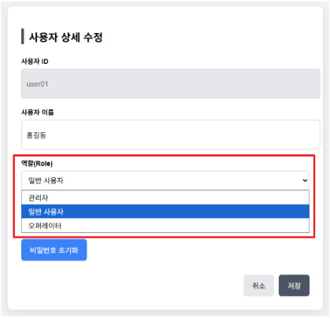

---
<!-- Page 99 -->
01
02
03
99
L2-1. 사용자 역할 기반 권한 부여 여부

## 01.	 시스템이 사용자 역할에 따라 권한을 정의하고 관리할 수 있는 기능을 제공하는지 확인한다.

•  역할별 접근 범위(읽기, 쓰기, 제어 등)가 사전에 정의되어야 하며, 동일 역할 간 권한이 일관되게 적용되어야 한다.
•  역할 및 권한 매핑은 관리자에 의해서만 수정이 가능해야 한다.
•  역할 기반 권한 제어는 다음과 같은 방식으로 구현될 수 있다.
역할 기반 권한 제어 구현 방식 예시
그룹 기반 권한 부여 페이지 예시
구현 방식
설명
역할(Role) 기반
관리자, 개발자, 사용자 등 역할을 정의하고 역할에 권한을 할당하는 방식
그룹(Group) 기반
팀·부서별 그룹을 생성하고 그룹 단위로 권한을 일괄 부여하는 방식
속성(Attribute) 기반
사용자 속성(부서, 직급, 위치 등)을 조합하여 접근 권한을 결정하는 방식
정책(Policy) 기반
조건(IF-THEN) 형태의 정책을 기반으로 접근 권한을 부여하는 방식

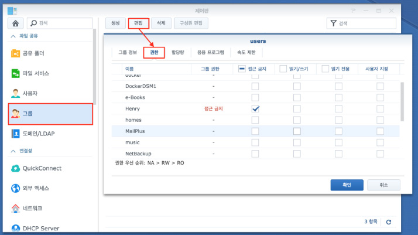

---
<!-- Page 100 -->
100
보안
요구사항
(L1) 모바일 코드 사용 통제 - 모바일 코드 기술을 사용하는 경우, 모바일 코드 기술 사용에 관한 보안정책을
강제하는 기능을 제공해야 한다.
(L2) 모바일 코드 무결성 검사 - 모바일 코드 실행을 허용하기 전에 모바일 코드의 무결성을 확인하는 기능을
제공해야 한다.
목적
모바일 코드가 변조되지 않았음을 검증하여 신뢰할 수 있는 코드만 실행되도록 보장하고 코드 변조를 통한 공격을
차단한다.
점검 기준
L1. 모바일 코드 사용 통제
L1-1. 모바일 코드 사용 통제 여부
L2. 모바일 코드 무결성 검사
L2-1. 모바일 코드 무결성 검증 여부
구현 및 점검 방안
L1
L1-1. 모바일 코드 사용 통제 여부

## 01.	 로봇 시스템이 사용자의 모바일 코드를 실행하는 경우, 해당 코드의 사용이 보안정책에 따라 통제되는지

확인한다.
•  인가된 경로에서 제공되는 코드만 실행이 허용되어야 한다.
•  모바일 코드 실행 프로세스에 최소 권한만 부여되어야 하며 시스템 명령 실행, 파일 접근, 네트워크 송수신 등의 위험 권한은
제한한다.
•  이외의 모바일 코드 보안 정책 예시는 다음과 같다.
L2
L2-1. 모바일 코드 무결성 검증 여부

## 01.	 모바일 코드 실행 전에 코드의 진본성과 무결성을 검증하는 기능이 구현되어 있는지 확인한다.

•  검증은 디지털 서명, 해시, 인증서 검증 등 암호학적 방식으로 수행되어야 한다.
•  실행 전 코드의 해시 값 검증 또는 서명 검증 절차를 거쳐야 하며, 불일치 시 즉시 실행을 차단해야 한다.
•  검증 실패 또는 위·변조 탐지 시, 시스템은 해당 이벤트를 보안 로그에 기록해야 한다.

#### 3.4.2  [UC-02] 모바일 코드 통제

모바일 코드 보안 정책 예시
구분
보안 조치 예시
권한 통제
모바일 코드 실행 프로세스에 최소 권한만 부여
격리 실행
샌드박스, 가상머신, 컨테이너 환경에서 코드 실행
무결성 검증
코드 서명 확인, 해시 비교, HMAC 검증
정책 관리
허용된 코드 출처만 실행, 정책 변경 시 감사 로그 남김
실행 차단
검증 실패 시 자동 차단 및 관리자 경고 발생

---
<!-- Page 101 -->
01
02
03
101
보안
요구사항
(L1) 세션 잠금 - 로컬 또는 네트워크를 통해 사용자 인터페이스를 제공하는 경우, 세션 잠금 기능을 사용해야 한다
목적
사용자가 시스템을 일정 시간 사용하지 않거나 수동으로 잠글 때 세션을 자동으로 잠가 무단 접근을 방지하고
물리적 보안을 강화한다.
점검 기준
L1. 세션 잠금
L1-1. 사용자 자동·수동 세션 잠금 기능 제공 여부
구현 및 점검 방안
L1
L1-1. 사용자 자동·수동 세션 잠금 기능 제공 여부

## 01.	 로봇 시스템이 사용자 세션에 대해 자동 및 수동 잠금 기능을 제공하는지 확인한다.

•  자동 세션 잠금: 지정된 비활성 시간 이상 입력이 없을 경우 자동으로 세션이 잠기며, 재인증 후에만 해제되어야 한다.
•  수동 세션 잠금: 사용자가 임의로 잠금 또는 화면 보호기 기능을 실행할 수 있어야 한다.
•  세션 잠금 상태에서는 모든 제어 명령, 설정 변경, 파일 접근이 차단되어야 하며, 화면에는 민감 정보가 표시되지 않아야 한다.
•  잠금 이벤트(자동 또는 수동 발생 시각, 사용자 ID, 세션 식별자)는 보안 로그에 기록되어야 한다.
•  관리자 정책에 따라 비활성 시간 또는 잠금 해제 절차를 설정할 수 있어야 한다.

#### 3.4.3  [UC-03] 세션 잠금

세션 잠금 정책 설정 페이지 예시

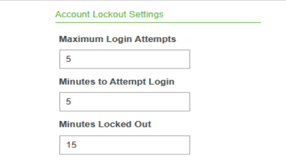

---
<!-- Page 102 -->
102
보안
요구사항
(L2) 원격 세션 종료 - 원격 세션을 지원하는 경우, 설정된 시간 동안 아무런 활동이 없는 경우 자동으로, 로컬
담당자에 의해 수동으로 또는 세션을 시작한 사용자(사람, 소프트웨어 프로세스 또는 장치)에 의해 수동으로 원격
세션을 종료하는 기능을 제공해야 한다.
목적
원격 접속 세션을 관리자가 강제로 종료할 수 있도록 하여 비인가 접속이나 의심스러운 세션을 즉시 차단하고 보안
사고를 최소화한다.
점검 기준
L2. 원격 세션 종료
L2-1. 원격 세션 종료 기능 제공 여부
구현 및 점검 방안
L2
L2-1. 원격 세션 종료 기능 제공 여부

## 01.	 로봇 시스템이 활성화된 원격 세션을 관리자가 명시적으로 종료할 수 있는 기능을 제공하는지 확인한다.

•  관리자는 세션 목록을 조회할 수 있어야 하며, 필요 시 특정 세션을 강제 종료할 수 있어야 한다.
•  세션 종료 이벤트(사용자, 세션 ID, 원격 IP, 종료 사유, 시각 등)는 보안 로그에 기록되어야 한다.

#### 3.4.4  [UC-04] 원격 세션 종료

원격 세션 종료 페이지 예시

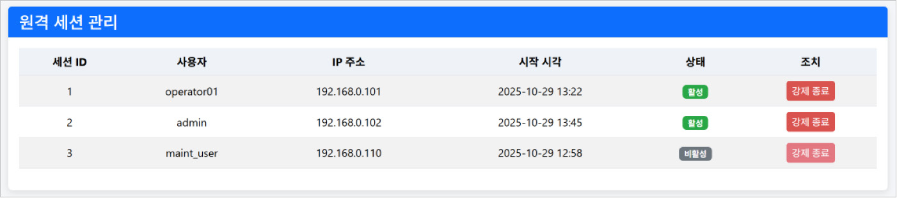

---
<!-- Page 103 -->
01
02
03
103
보안
요구사항
(L3) 동시 세션 제어 - 특정한 사용자(사람, 소프트웨어 프로세스 또는 장치)에 대한 인터페이스별로 동시 세션 수를
제한하는 기능을 제공해야 한다.
목적
동일한 사용자 계정으로 동시에 접속할 수 있는 세션 수를 제한하여 계정 공유 및 무단 사용을 방지하고 시스템
자원을 보호한다.
점검 기준
L3. 동시 세션 제어
L3-1. 동시 세션 제어 기능 제공 여부
구현 및 점검 방안
L3
L3-1. 동시 세션 제어 기능 제공 여부

## 01.	 로봇 시스템이 사용자별 또는 계정별로 동시 세션 수를 제어하거나 제한할 수 있는 기능을 제공하는지

확인한다.
•  허용된 세션 수 초과 시 기존 세션을 자동 종료하거나 새로운 로그인을 차단해야 한다.
•  관리자는 세션 동시 접속 정책을 설정할 수 있어야 한다.
•  동시 세션 관리는 다음과 같은 정책을 통해 수행될 수 있다.

#### 3.4.5  [UC-05] 동시 세션 제어

동시 세션 관리 정책 예시
구분
보안 조치 예시
단일 세션 원칙
동일 계정은 1회만 로그인 가능
제한적 다중 세션
계정 로그인 N개까지만 허용
IP 및 디바이스 기반 제어
다른 IP나 기기에서의 동시 접속 차단
보안 이벤트 기반 강제 종료
세션 하이재킹 의심 시 자동 종료

---
<!-- Page 104 -->
104
보안
요구사항
(L1) 감사 로그 생성 - 보안과 관련된 감사 로그, 개별 감사 로그를 생성하는 기능을 제공해야 한다.
•  사용자 로그인/로그아웃, 설정 변경, 백업 및 복구, 장치 시작 및 종료, 무결성 검증 등
•  개별 감사 로그는 다음과 같은 항목을 포함해야 한다: 타임스탬프, 소스(원본 장치, 소프트웨어 프로세스 또는 인간 사용자 계정),
유형, 이벤트 ID, 이벤트 결과 등
목적
시스템 내에서 발생하는 모든 보안 관련 이벤트와 사용자 활동을 기록하여 사고 발생 시 추적 및 분석이 가능하도록
하고 내부 통제를 강화한다.
점검 기준
L1. 감사 로그 생성
L1-1. 주요 보안 이벤트에 대한 감사 로그 자동 생성 여부
구현 및 점검 방안
L1
L1-1. 주요 보안 이벤트에 대한 감사 로그 자동 생성 여부

## 01.	 로봇 시스템이 주요 보안 이벤트에 대해 감사 로그를 자동으로 생성하는지 확인한다.

•  감사 로그로 기록되어야 하는 주요 보안 이벤트는 다음과 같다.

#### 3.4.6  [UC-06] 감사 로그 생성

보안 이벤트 예시
구분
보안 조치 예시
사용자 로그인/로그아웃
•  로그인 성공 및 실패
•  비밀번호 오류
•  계정 잠김
•  로그아웃 수행
•  세션 타임아웃 발생
설정 변경
•  시스템 설정 변경
•  네트워크 설정 변경
•  사용자 권한/역할 변경
•  보안 정책 변경
•  로그 설정 변경
백업 및 복구
•  백업 시작/완료/실패
•  백업 파일 무결성 검증 결과
•  복구 시작/완료/실패
•  복구 실행 사용자/시점 기록
장치 시작 및 종료
•  장치(시스템) 부팅 이벤트
•  서비스/프로세스 시작
•  서비스/프로세스 종료
•  비정상 종료(크래시, 강제 종료)
무결성 검증
•  펌웨어 무결성 검증 시작/결과
•  소프트웨어 패키지 무결성 검증 결과
•  설정 파일 해시 검증 결과
•  무결성 검증 실패 경고
기타 보안 관련 이벤트 (선택적)
•  비인가 접근 시도
•  중요 파일 접근
•  관리자 권한 상승 시도
•  외부 장치(USB 등) 연결/차단

---
<!-- Page 105 -->
01
02
03
105
•  로그에 필수적으로 포함해야 하는 항목은 다음과 같다.
로그 구성 요소
구분
보안 조치 예시
이벤트 로그 ID
고유 식별자
타임스탬프
YYYY-MM-DD hh:mm:ss (UTC 기준 권장)
소스(발생 주체)
사용자 ID, 프로세스 명, 네트워크 인터페이스 등
로그 유형
보안, 시스템, 네트워크, 장치, 애플리케이션 등
이벤트 심각도 수준
등급별 분류(예: Emergency / Alert / Critical / Error / Warning / Notice /
Informational / Debug)
이벤트 상세 내용
발생 원인, 대상 자원, 결과, 추가 진단 메시지
무결성 보호 정보(선택)
서명 또는 해시 값

---
<!-- Page 106 -->
106
보안
요구사항
(L1) 감사 로그 저장 용량 - 감사로그 관리를 위해 충분한 감사로그 저장 용량을 할당해야 하며 감사 저장 용량에
근접하거나 이를 초과할 경우, 컴포넌트 실패에 대비하는 기능을 제공해야 한다.
(L3) 감사 저장 용량 임계치 도달 시 경고 - 감사로그 저장소가 최대 임계치에 도달할 경우 경고를 발행하는 기능을
제공해야 한다.
목적
감사 로그를 안전하게 보관할 수 있는 충분한 저장 공간을 확보하여 로그 유실을 방지하고 법적 요구사항을
준수한다.
점검 기준
L1. 감사 로그 저장 용량
L1-1. 감사 로그 저장 용량 적정성 여부
L3. 감사 저장 용량 임계치 도달 시 경고
L3-1. 임계치 도달 시 경고 및 알림 여부
구현 및 점검 방안
L1
L1-1. 감사 로그 저장 용량 적정성 여부

## 01.	 감사 로그가 장기간 보관될 수 있도록 충분한 저장 용량이 확보되어 있는지 확인한다.

•  충분한 저장 용량을 계산하기 위해 다음과 같이 Palo Alto Networks 社에서 제공하는 로그 용량 계산 공식을 활용할 수 있다.
•  감사 로그 저장 용량이 적절히 지정되어 있거나 다음과 같이 사용자가 지정할 수 있도록 제공할 수도 있다.
L3
L3-1. 임계치 도달 시 경고 및 알림 여부

## 01.	 로그 저장소의 사용량이 사전 정의된 임계치에 도달하면 관리자에게 자동 경고가 전송되는지 확인한다.

•  알림은 대시보드, 콘솔 경고, 이메일, Syslog, SNMP Trap 등으로 구현될 수 있다.
•  감사 로그 임계치는 적절히 지정되어 있거나 다음과 같이 사용자가 지정할 수도 있다.
임계치 도달 경고 페이지 예시

#### 3.4.7  [UC-07] 감사 로그 저장 용량 관리

로그 용량 계산 공식 예시
감사 로그 저장용량 설정 페이지 예시

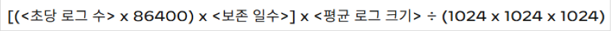

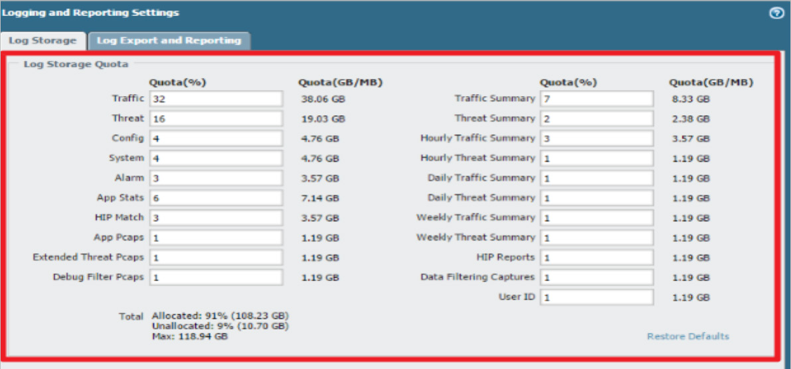

---
<!-- Page 107 -->
01
02
03
107
감사 로그 임계치 설정 예시

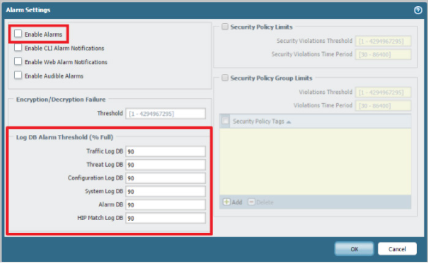

---
<!-- Page 108 -->
108
보안
요구사항
(L1) 감사 처리 실패 대응 - 감사 처리 실패 시 필수 서비스 및 기능의 손실을 방지하는 기능 및 일반적으로 인정되는
업계 관행 및 권장 사항에 따라 감사 처리 실패에 대응하여 적절한 조치를 지원하는 기능을 제공해야 한다.
목적
감사 로그 생성이나 처리 과정에서 실패가 발생할 때 적절한 대응 조치를 취하여 감사 추적성을 보장하고 보안 사고
은닉을 방지한다.
점검 기준
L1. 감사 처리 실패 대응
L1-1. 감사 처리 실패 시 서비스 및 로그 보호를 위한 대응 여부
구현 및 점검 방안
L1
L1-1. 감사 처리 실패 시 서비스 및 로그 보호를 위한 대응 여부

## 01.	 로봇 시스템이 감사 로그 기록 중 오류나 저장 실패가 발생했을 때 서비스 중단 또는 로그 손실을 방지하기

위한 대응 기능을 제공하는지 확인한다.
•  로그 저장소 용량 초과, 파일 손상, 쓰기 권한 오류 등의 상황에서도 감사 로그가 누락되지 않도록 다음과 같은 보호 조치를
수행할 수 있다.
•  감사 처리 실패 및 복구 이력은 보안 로그에 기록되어야 하며, 반복적으로 실패가 발생할 경우 관리자에게 자동 통보되어야 한다.

#### 3.4.8  [UC-08] 감사 처리 실패 대응

감사 처리 실패 시 대응 조치 예시
구분
보안 조치 예시
자동 순환
저장 공간이 가득 차면 오래된 로그를 자동 압축 및 삭제하여 새 로그 저장 가능 유지
대체 저장소 전송
주기적으로 로그를 다른 시스템, 클라우드, 또는 별도 미디어로 전송하여 저장 용량 확보
로그 아카이빙
일정 기간 경과한 로그를 압축 형식(gzip, bzip2)으로 변환하여 저장 공간 절감

---
<!-- Page 109 -->
01
02
03
109
보안
요구사항
(L1) 타임스탬프 - 감사 로그 생성에 사용되는 타임스탬프를 제공해야 한다.
(L2) 시간 동기화 - 내부 시스템 시간을 동기화하는 기능을 제공해야 한다.
(L4) 시간 소스 무결성 보호 - 시간 원본 소스는 무단 변경으로부터 보호되어야 하며 변경 시 감사 이벤트를
생성해야 한다.
목적
모든 시스템 이벤트와 로그에 정확한 시간 정보를 기록하여 사건의 시간적 순서를 파악하고 포렌식 분석의 정확성을
보장한다.
점검 기준
L1. 타임스탬프
L1-1. 감사 로그에 타임스탬프 정보 포함 여부
L2. 시간 동기화
L2-1. 내부 시스템 시간 동기화 기능 제공 여부
L4. 시간 소스 무결성 보호
L4-1. 시간 소스의 무단 변경 보호 여부
구현 및 점검 방안
L1
L1-1. 감사 로그에 타임스탬프 정보 포함 여부

## 01.	 로봇 시스템의 로그, 제어 이벤트, 통신 모듈 등이 동일한 기준시각에 따라 동작하도록 시간 동기화 기능이

구현되어 있는지 확인한다.
•  로그에는 최소한 다음과 같은 2024-01-15 10:30:45형식이어야 하며, ISO 8601에서 권장하는 형식은
2024-01-15T10:30:45Z이다.

#### 3.4.9  [UC-09] 시간 통제

L2
L2-1. 내부 시스템 시간 동기화 기능 제공 여부

## 01.	 로봇 시스템의 로그, 제어 이벤트, 통신 모듈 등이 동일한 기준시각에 따라 동작하도록 시간 동기화 기능이

구현되어 있는지 확인한다.
•  시스템은 내부 및 외부 장치 간 시간 차이를 최소화하기 위해 표준 시간 서버와 주기적으로 동기화해야 한다.
•  네트워크 단절 등으로 외부 동기화가 불가능할 경우, 로컬 클럭 또는 백업 타임 소스를 사용해 기록 시간의 연속성을 유지해야
한다.
•  동기화 실패나 오차가 발생하면 경고 또는 이벤트 로그가 자동 생성되어야 한다.
L4
L4-1. 시간 소스의 무단 변경 보호 여부

## 01.	 시스템의 시간 정보 또는 시간 소스 설정이 인가되지 않은 사용자에 의해 변경되지 않도록 보호되는지

확인한다.
•  시간 변경은 관리자 권한에서만 수행되어야 한다.
•  시간 설정 변경 이력은 감사 로그로 기록되어야 하며, 변경 전·후의 시간 값이 모두 남아있어야 한다.
NTP 서버 동기화 설정 페이지 예시

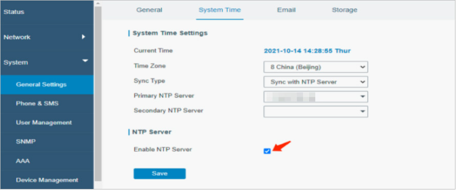

---
<!-- Page 110 -->
110
보안
요구사항
(L1) 인간 사용자에 대한 부인 방지 - 인간 사용자 인터페이스를 제공하는 경우, 특정 인간 사용자가 특정 행동을
했는지 여부를 판단하는 기능을 제공해야 한다.
(L4) 모든 사용자에 대한 부인 방지 - 특정 사용자(사람, 소프트웨어 프로세스 또는 장치)가 특정 조치를 취했는지
여부를 판단하는 기능을 제공해야 한다.
목적
인간 사용자가 수행한 행위에 대해 사후에 부인할 수 없도록 충분한 증거를 수집하여 책임 추적성을 확보하고 법적
대응력을 강화한다.
점검 기준
L1. 인간 사용자에 대한 부인 방지
L1-1. 인간 사용자 행위에 대한 부인 방지 여부
L4. 모든 사용자에 대한 부인 방지
L4-1. 모든 사용자(인간, 프로세스, 장치) 행위에 대한 부인 방지 여부
구현 및 점검 방안
L1
L1-1. 인간 사용자 행위에 대한 부인 방지 여부

## 01.	 인간 사용자의 주요 행위(로그인, 설정 변경, 명령 수행 등)가 모두 로그로 기록되어 사후에 행위 추적이

가능한지 확인한다.
•  로그에는 사용자 ID, 수행 명령, 결과(성공/실패), 타임스탬프 등이 포함되어야 한다.
•  기록된 정보만으로도 “누가, 언제, 무엇을 수행했는지”를 명확히 확인할 수 있어야 하며, 로그 삭제는 관리자만 가능해야 한다.
L4
L4-1. 모든 사용자(인간, 프로세스, 장치) 행위에 대한 부인 방지 여부

## 01.	 인간 사용자뿐 아니라 소프트웨어 프로세스 및 장치 간 통신 행위도 로그로 남아, 사후에 모든 주체의 행위가

추적 가능한지 확인한다.
•  자동화 프로세스, API 호출, 제어 명령 송수신 등 시스템 내부 행위 역시 로그에 기록되어야 한다.
•  로그에는 행위 주체(프로세스명, 장치 ID 등), 수행 내용, 결과, 시각 정보가 포함되어야 한다.

#### 3.4.10  [UC-10] 사용자에 대한 부인 방지

감사 로그 예시

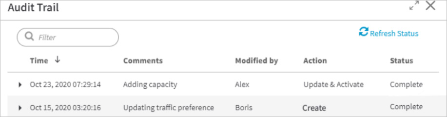

---
<!-- Page 111 -->
01
02
03
111
보안
요구사항
(L2) 물리적 진단 및 시험 인터페이스의 보호 - 물리적 진단 및 시험 인터페이스의 인가되지 않은 사용에 대해서
보호해야 한다.
(L3) 물리적 진단 및 시험 인터페이스의 능동적 모니터링 - 물리적 진단 및 시험 인터페이스에 대한 능동적 모니터링을
제공하고, 이러한 인터페이스에 대한 접근 시도가 탐지될 경우 감사 로그를 생성해야 한다.
목적
물리적 접근을 통한 시스템 침해 및 정보 유출을 방지한다.
점검 기준
L2. 물리적 진단 및 시험 인터페이스의 보호
L2-1. 물리적 진단·시험 인터페이스의 물리 조치나 접근 통제 여부
L3. 물리적 진단 및 시험 인터페이스의 능동적 모니터링
L3-1. 진단·시험 인터페이스 접근 시도 발생 시 감사 로그의 자동 생성 여부
구현 및 점검 방안
L2
L2-1. 물리적 진단·시험 인터페이스의 물리 조치나 접근 통제 여부

## 01.	 로봇 시스템의 진단·시험용 물리 인터페이스에 대해 물리적 차단 또는 접근 통제가 적용되어 있는지 확인한다.

•  사용하지 않는 포트는 비활성화 또는 차폐되어야 하며, 접근이 필요한 포트는 잠금 커버, 보안 나사, 봉인 라벨 등으로 보호해야
한다.
•  유지보수 목적의 인터페이스는 관리자 승인 후에만 사용 가능해야 하며, 접근 시 인증 절차(암호, 인증서, 장치 키 등)가
적용되어야 한다.
L3
L3-1. 진단·시험 인터페이스 접근 시도 발생 시 감사 로그의 자동 생성 여부

## 01.	 물리적 진단·시험 인터페이스에 접근이 발생하거나 연결 시도가 있을 때, 자동으로 감사 로그가 생성되는지

확인한다.
•  로그에는 포트 종류, 접근 시각, 장치 식별자, 접근 결과(성공/거부) 등이 포함되어야 한다.

#### 3.4.11  [UC-11] 물리적 진단 및 시험 인터페이스의 통제

구분
보안 조치 예시
[보안 나사]
드라이버로 열기 어렵도록 특수 나사 적용
[봉인 라벨]
제거 시 흔적이 남는 보안 스티커
[보안 커버]
케이스를 잠그거나 봉인하여 임의 개봉 방지
[USB 포트 잠금 커버]
포트를 봉인하여 임의 개봉 및 비인가 장치 연결을 방지
물리 인터페이스 보호 조치 예시

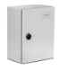

---
<!-- Page 112 -->
112
번호
보안 수준
체크리스트 항목
SI-01
L1
통신 신뢰성 보장
SI -02
L1
악성코드 보호 메커니즘
L2
악성코드 보호 버전 보고
SI-03
L1
보안 기능 검증
SI-04
L1
소프트웨어 및 데이터, 장비의 무결성
L2
무결성 위반 자동 알림
L3
소프트웨어 및 정보의 진본성 점검
SI-05
L1
입력값 검증
SI-06
L1
결정론적 출력
SI-07
L1
오류 처리
SI-08
L2
세션의 무결성 보호
SI-09
L2
감사 관련 정보 보호
L4
일회용 기록 매체에 감사 레코드 기록
SI-10
L1
업데이트 지원
L2
업데이트 파일 진본성 및 무결성 검증
SI-11
L2
물리적 변조 방지 및 탐지
L3
변조 시도 통보
시스템 무결성 체크리스트 항목
로봇 시스템의 사용 권한을 제어하여 무단 작동 및 데이터 사용을 방지하기 위한 시스템 무결성(System Integrity,
SI) 체크리스트 항목은 다음과 같다.

### 3.5 시스템 무결성 점검 체크리스트

---
<!-- Page 113 -->
01
02
03
113
보안
요구사항
(L1) 통신 신뢰성 보장 - 전송된 정보의 무결성 및 진본성을 보호하는 기능을 제공해야 한다.
목적
전송 과정에서 데이터의 변조나 위조를 방지하고, 통신 주체의 신뢰성을 확보하여 로봇 시스템 간 안전한 정보
교환을 보장하기 위함이다.
점검 기준
L1. 전송되는 정보의 무결성 및 진본성 보호
L1-1. 정보 전송 시 무결성 및 진본성 보호 기능을 지원하는 보안 통신 메커니즘의 사용 여부
구현 및 점검 방안
L1
L1-1. 정보 전송 시 무결성 및 진본성 보호 기능을 지원하는 보안 통신 메커니즘의 사용 여부
01.	 “2.3. 인터페이스 식별”에서 로봇 시스템 구성요소 간 통신 구간을 식별한다.

## 02.	 식별된 통신 구간에 대해 전송 데이터의 변조 및 위조를 방지하기 위한 무결성 검증 메커니즘이 적용되어

있는지 확인한다.
•  DTLS, MQTT over TLS, OPC UA SecureChannel 등 무결성 검증 기능이 내장된 프로토콜을 사용하는 경우 충족으로
판단한다.
•  단순 데이터 암호화만 적용되고 메시지 인증 코드(MAC), 서명(Signature) 등 무결성 확인 절차가 누락된 경우 일부
충족으로 판단한다.
•  통신 프로토콜 또는 애플리케이션 코드 내에서 무결성 검증을 비활성화하거나 우회하는 설정이 존재하는 경우 미흡으로
판단한다.

#### 3.5.1  [SI-01] 통신 신뢰성 보장

---
<!-- Page 114 -->
114
보안
요구사항
(L1) 악성코드 보호 메커니즘 - 악성코드나 승인되지 않은 소프트웨어의 영향을 예방, 감지, 보고 및 완화하기 위한
보호 메커니즘을 제공해야 한다. 또한, 보호 메커니즘을 업데이트하는 기능을 제공해야 한다.
목적
로봇 시스템에 악성코드나 승인되지 않은 소프트웨어가 침투하여 동작을 방해하거나 데이터를 손상시키는 것을
방지하고, 탐지·격리·보고·복구 등의 절차를 통해 시스템의 안정적 운영을 보장하기 위함이다.
점검 기준
L1. 악성코드 보호 메커니즘
L1-1. 악성코드 보호 메커니즘의 존재 여부
L1-2. 악성코드 보호 메커니즘의 업데이트 가능 여부
L2. 악성코드 보호 버전 보고
L2-1. 악성코드 보호 메커니즘을 수행하는 소프트웨어 및 파일 버전 정보 확인 여부
구현 및 점검 방안
L1
L1-1. 악성코드 보호 메커니즘의 존재 여부

## 01.	 로봇 시스템 구성요소에 악성코드 탐지 및 차단 기능이 구현되어 있는지 확인한다.

•  각 구성요소에 다음과 같이 구현될 수 있으며, 탐지 및 차단 시 로그를 생성하여야 한다.
L1-2. 악성코드 보호 메커니즘의 업데이트 가능 여부

## 01.	 악성코드 탐지 엔진 또는 서명 데이터베이스가 주기적으로 업데이트 가능한 구조인지 확인한다.

•  자동 업데이트 기능이 제공되거나 관리자가 수동으로 최신 정의 파일을 반영할 수 있으면 충족으로 판단한다.
•   업데이트 기능이 없거나 고정 버전으로만 동작할 경우 미흡으로 판단한다.
L2
L2-1. 악성코드 보호 메커니즘을 수행하는 소프트웨어 및 파일 버전 정보 확인 여부

## 01.	 시스템에서 사용 중인 악성코드 보호 소프트웨어의 제품 명, 엔진 버전, 서명 버전, 검사 일자 등이 자동 또는

수동으로 확인가능한지 점검한다.
•  관리 콘솔, 명령 행, 또는 로그를 통해 버전 및 상태 정보를 출력할 수 있으면 충족으로 판단한다.
악성코드 보호 메커니즘 예시

#### 3.5.2  [SI-02] 악성코드로부터 보호

구분
예시 솔루션
운영체제 내장 백신
•  Windows Defender, Linux Clam AV
전용 보안 솔루션
•  Endpoint Protection, OT 보안 에이전트, 화이트리스트 기반 실행 제어
무결성 검증 모듈
•  SHA-256 해시 기반 파일 서명 검증, 코드 서명

---
<!-- Page 115 -->
01
02
03
115
보안
요구사항
(L1) 보안 기능 검증 - 보안기능의 의도된 작동에 대한 검증을 지원하고 무결성이 침해되는 등의 이상이 발견되면
동작을 중단하거나 안전 모드로 전환하고, 로그 기록과 함께 관리자 또는 클라우드에 침해 사실을 자동으로
보고해야 한다.
목적
로봇 시스템의 핵심 보안 기능이 의도된 대로 동작하고 있는지를 지속적으로 검증하여, 무결성 손상이나 이상 징후
발생 시 즉시 안전 모드로 전환하고 관리자에게 경고함으로써 시스템 피해를 최소화하기 위함이다.
점검 기준
L1. 보안 기능 검증
L1-1. 제품의 보안 기능 침해 탐지 시 대응 체계 동작 여부
구현 및 점검 방안
L1
L1-1. 제품의 보안 기능 침해 탐지 시 대응 체계 동작 여부

## 01.	 로봇 시스템 내 적용된 보안 기능을 식별한다.

•  대표적인 보안 기능은 다음과 같다.

## 02.	 식별된 보안 기능에 대한 침해 감지 및 대응 체계의 존재 여부를 확인한다.

•  무결성 검증 실패, 보안 모듈 중단, 설정 변조, 악성코드 감염 등 보안 기능이 의도된 대로 작동하지 않거나 손상된 경우 이를
탐지할 수 있는지 점검한다.
•   탐지 시 수행되어야 하는 대응은 다음과 같다.
시스템이 안전 모드로 전환되거나 주요 기능 중단
관리자 또는 클라우드 관제 서버에 이상 보고
자동 복구 또는 서비스 재시작 절차 수행

## 03.	 기록 및 보고 여부를 확인한다.

•  보안 기능 침해 이벤트가 발생하면 로그에 다음 항목이 기록되어야 한다.
탐지 시각, 탐지 모듈 명, 감지 유형, 대응 결과, 보고 여부
•  관리자 콘솔 또는 클라우드 관제 화면에서 해당 로그가 조회 가능해야 하며, 단순 파일 로그만 존재할 경우 일부 충족, 감지·
보고 기능이 없는 경우 미흡으로 판단한다.
로봇 시스템 보안 기능 예시

#### 3.5.3  [SI-03] 보안 기능 검증

구분
보안 기능 예시
인증 및 접근 제어
사용자 인증, 장치 인증, 접근 권한 검증
암호화 통신
TLS, DTLS, VPN
무결성 검증
Secure Boot, 코드 서명, 파일 해시 검증
로그 및 감사 기능
감사 로그 기록, 접근 로그 관리
악성코드 보호
백신, 화이트리스트 실행 제어
보안 설정 보호
설정 파일 암호화, 관리자 인증

---
<!-- Page 116 -->
116
보안
요구사항
(L1) 소프트웨어 및 데이터, 장비의 무결성 - 로봇 내부에 저장되는 소프트웨어, 데이터, 장비의 무결성 등은
무결성을 보장할 수 있는 보호 저장소에 저장되고 해시함수 디지털 서명 등을 적용해야 한다. 또한 부팅, 정해진
주기별로 상태를 점검해 무단 변경을 탐지, 기록 및 보고하는 기능을 제공해야 한다.
(L2) 무결성 위반 자동 알림 - 운영 중 또는 무결성 점검 과정에서 로봇 시스템의 주요 소프트웨어, 데이터, 장비에
대해 인가되지 않은 변경 시도 탐지 시 관리자 알림, 자동 차단 등의 대응조치를 제공해야 한다.
(L3) 소프트웨어 및 정보의 진본성 점검 - 소프트웨어, 구성 및 기타 정보의 진본성 점검을 수행하고, 이런 점검
결과를 기록하고 보고하는 기능을 제공해야 한다.
목적
로봇 시스템의 소프트웨어·데이터·장비가 무단으로 변경되거나 위조되는 것을 방지하고, 무결성 위반 발생 시 즉시
탐지·기록·보고하여 안전한 동작 상태를 유지하기 위함이다.
점검 기준
L1. 소프트웨어 및 데이터, 장비의 무결성
L1-1. 로봇 시스템의 주요 소프트웨어, 데이터, 장비 정보에 대한 무결성 검증 알고리즘의 적용 여부
L2. 무결성 위반 자동 알림
L2-1. 로봇 시스템의 주요 소프트웨어, 데이터, 장비에서 인가되지 않은 변경이 탐지될 경우 대응 여부
L3. 소프트웨어 및 정보의 진본성 점검
L3-1. 소프트웨어, 구성 및 기타 주요 정보에 대한 진본성 점검 여부
구현 및 점검 방안
L1
L1-1. 로봇 시스템의 주요 소프트웨어, 데이터, 장비 정보에 대한 무결성 검증 알고리즘의 적용 여부

## 01.	 로봇 시스템 내 무결성 검증 대상을 식별하고 무결성 검증 알고리즘이 적용되어 있는지 확인한다.

•  무결성 검증은 소프트웨어·데이터·장비 등 자산의 특성에 따라 적용 방식이 다르므로, 각 대상의 유형을 구분해야 한다.
•  식별된 로봇 시스템 내 주요 자산은 유형에 따라 다음과 같은 무결성 검증을 적용할 수 있다.
•  정적 자산은 서명 검증 또는 해시 비교를 통해 직접 무결성 검증을 수행해야 하며, 반정적 및 동적 자산은 변경 이력 관리 및
접근 제어를 통해 간접적으로 무결성을 보장할 수 있다.
•  또한 부팅하거나 주기적으로, 또는 업데이트 시에 주요 소프트웨어 및 데이터에 대한 해시 값 비교 또는 서명 검증이
수행되어야 한다.
주요 자산 유형 별 무결성 검증 예시
주요 로봇 프로그램에 대한 해시 목록 파일 예시

#### 3.5.4  [SI-04] 소프트웨어 및 데이터 무결성 검증

구분
예시
인정 수준
정적 자산
실행 파일, 모듈, 펌웨어 이미지
해시 및 서명 검증 수행
반 정적 자산
설정 파일, 파라미터
접근 제어, 변경 시 로그 기록
동적 데이터
운전 기록, 이벤트 로그
추가 전용 구조, 로그 접근 통제, 로그 무결성 점검

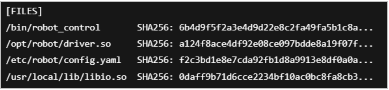

---
<!-- Page 117 -->
01
02
03
117
L2
L2-1. 로봇 시스템의 주요 소프트웨어, 데이터, 장비에서 인가되지 않은 변경이 탐지될 경우 대응 여부

## 01.	 무결성 위반 탐지 시 대응 절차를 확인한다.

•  탐지 시 시스템이 다음 조치 중 하나 이상을 수행해야 한다.
안전 모드 전환 또는 기능 제한
관리자 알림
변경 파일 격리 또는 자동 복원 조치
L3
L3-1. 소프트웨어, 구성 및 기타 주요 정보에 대한 진본성 점검 여부

## 01.	 진본성 검증 메커니즘의 존재 여부를 확인한다.

•  로봇 소프트웨어 및 구성 파일이 신뢰할 수 있는 공급자에 의해 서명되었는지 확인한다.
•  설치 또는 업데이트 시 서명 검증 절차가 수행되는지 점검한다.

## 02.	 검증 결과 기록 및 보고 여부를 확인한다.

•  진본성 검증 결과가 시스템 로그, 관리자 콘솔, 또는 클라우드 관리 화면 등에 기록되어야 한다.
•  검증 실패 시 설치 중단 또는 경고 표시 기능이 있어야 충족으로 판단한다.
파일 변경 탐지 알림 페이지 예시

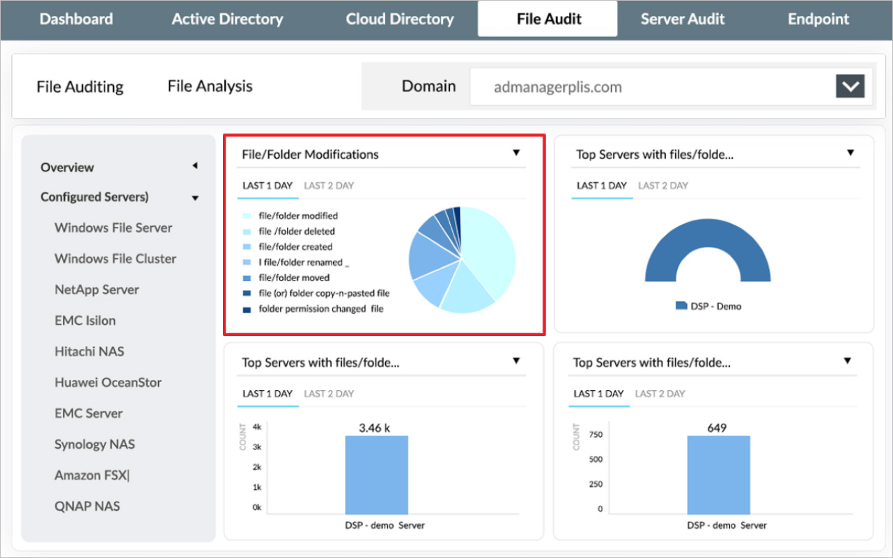

---
<!-- Page 118 -->
118
보안
요구사항
(L1) 입력값 검증 - 제어 입력으로 사용되거나 로봇 서비스의 동작에 직접적인 영향을 미치는 입력 값의 유효성을
검증해야 한다.
목적
로봇 제어나 서비스 동작에 영향을 주는 입력값의 오류·위조·악의적 조작을 방지하여, 시스템 오동작이나 비정상
명령 실행으로부터 안전하게 보호한다.
점검 기준
L1. 입력 값 검증
L1-1. 식별된 입력 지점에 대한 적절한 입력 값 검증 수행 여부
구현 및 점검 방안
L1
L1-1. 식별된 입력 지점에 대한 적절한 입력 값 검증 수행 여부

## 01.	 입력 지점을 식별한다.

•  “2.3. 인터페이스 식별” 결과를 기반으로, 로봇 시스템에서 외부로부터 데이터를 입력받는 모든 경로를 파악한다.
•  주요 입력 지점 예시는 다음과 같다.

## 02.	 입력값 검증이 적용되어 있는지 확인한다.

•  각 입력 경로에서 값의 형식, 범위, 길이, 허용 문자, 메타문자 사용 여부를 점검한다.
•  입력값 검증이 생략되어 있거나, 단순 Null 체크에 그치는 경우 일부 충족, 전혀 검증이 없는 경우 미흡으로 판단한다.
•  주요 입력 값 검증 항목은 다음과 같다.
주요 입력 지점 예시
입력 값 검증 방법 예시
구분
예시
사용자 입력
웹 UI, 터미널 명령, REST API, HMI 조작값
통신 입력
MQTT 메시지, Modbus/TCP, OPC UA Write 요청
파일 입력
설정 파일(config), 로봇 경로 스크립트, 업데이트 패키지
센서 및 장치 입력
센서 측정값, 외부 장비 신호
구분
예시
권장 대응
허용 문자 및 패턴
Command/SQL/LDAP
Injection
화이트리스트만 허용, 정규식 검증
파일 경로
Path Traversal
경로 정규화, 허용 디렉터리 비교
타입/길이/범위 검사
버퍼 오버플로우, 논리 오류
정적 타입 검사, 최대 길이 제한, 범위 검사
외부 명령 호출
Command Injection
시스템 함수에 검증된 값만 전달
DB 호출
SQL Injection
Prepared Statement, ORM 파라미터화 사용
XML 입력 검증
XXE, XML Injection
외부 엔티티 비활성화, 스키마 검증
인증 및 권한 연계 검사
권한 상승, 권한 우회
서버 측 권한 재검증, 역할 및 권한 매핑 검증

#### 3.5.5  [SI-05] 입력값 검증

---
<!-- Page 119 -->
01
02
03
119

## 03.	 검증 실패 시 처리 동작을 확인한다.

•  유효하지 않은 입력 발생 시 시스템은 다음과 같은 조치를 수행해야 하며, 입력 값이 그대로 제어 명령이나 내부 함수로
전달될 경우 미흡으로 판단한다.
예외 처리, 로그 기록 – 민감 정보는 마스킹 후 기록
사용자 오류 메시지 반환 – 내부 구현 정보를 노출하지 않아야 함
차단 및 알림 – 반복적인 공격으로 판단되면 차단 및 경보
Python Pydantic 필드를 통한 입력 값 검증 예시
ORM 기반 데이터베이스 접근 예시
입력 값 검증 실패 처리 알림 예시

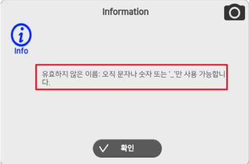

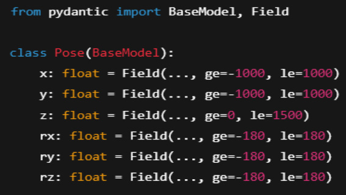

---
<!-- Page 120 -->
120
보안
요구사항
(L1) 결정론적 출력 - 공격 등으로 인해 정상적인 작동을 유지할 수 없는 경우, 미리 결정된 상태로 출력을 설정하는
기능을 제공해야 한다.
목적
공격·오류·비정상 상태 발생 시 로봇이 예측 불가능한 동작을 하지 않도록 미리 정의된 안전한 상태로 출력값을
고정하여 사람·장비·환경의 피해를 최소화한다.
점검 기준
L1. 결정론적 출력
L1-1. 시스템이 비정상 상황 발생 시 미리 정의된 안전 상태로 출력 전환 여부
구현 및 점검 방안
L1
L1-1. 시스템이 비정상 상황 발생 시 미리 정의된 안전 상태로 출력 전환 여부

## 01.	 로봇 시스템이 정상 처리를 수행할 수 없는 상황을 식별한다.

•  대표적인 비정상 상황 예시는 다음과 같다.

## 02.	 각 비정상 상황에 대해 예측 가능한 결정된 응답 상태가 정의되어 있는지 확인한다.

•  비정상 상황 별 결정된 응답 상태 예시는 다음과 같다.
로봇 시스템 비정상 상황 예시
비정상 상황 별 결정된 응답 상태 예시

#### 3.5.6  [SI-06] 결정론적 출력

구분
예시
입력 오류
파라미터 누락, 형식 불일치, 허용 범위 초과
통신 오류
세션 만료, 타임아웃, 패킷 손실
서버 내부 오류
예외, Null 참조, 리소스 부족
보안 이벤트
인증 실패, 무결성 검증 실패, 비인가 접근
제어 오류
센서 이상, 제어 명령 처리 실패, 안전 루프 끊김
구분
상황
결정된 출력
웹 서버 / REST API
유효하지 않은 입력, 권한 없음
HTTP 400, 401, 403 등 표준 응답 코드 반환,
내부 스택 트레이스 노출 금지
API 내부 예외
Null 예외, DB 연결 실패
HTTP 500 등 표준 응답 코드 반환
네트워크 제어 노드
통신 타임아웃, 신호 손실
제어 출력 0 또는 안전 모드로 전환
센서 입력 이상
범위 초과, NaN 등
이전 정상 값 유지 또는 안전 상한 값으로 클램핑
보안 이벤트
인증 실패, 위조 패킷 탐지
세션 종료 및 거부 응답 반환, 로깅 및 관리자 알림
미리 정의된 오류 출력 페이지 예시

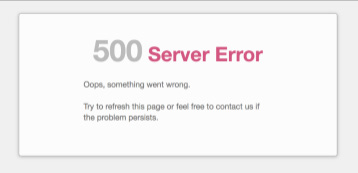

---
<!-- Page 121 -->
01
02
03
121
보안
요구사항
(L1) 오류 처리 - 공격자에 의해 악용될 수 있는 정보를 제공하지 않는 방식으로 오류 조건을 식별하고 처리해야
한다.
목적
오류 처리 시 내부 구현·환경·민감정보가 외부에 노출되어 공격자가 시스템 취약점을 악용하지 못하도록,
사용자에게는 최소한의 안전한 오류 정보를 제공하고 내부에는 조사·복구에 필요한 로그를 안전하게 기록하도록
한다.
점검 기준
L1. 오류 처리
L1-1. 오류 메시지 내 민감 정보 포함 여부
구현 및 점검 방안
L1
L1-1. 오류 메시지 내 민감 정보 포함 여부

## 01.	 로봇 시스템이 외부에 반환하는 오류 메시지를 점검하여, 공격자에게 시스템 구조나 취약점을 유추할 수 있는

정보가 포함되어 있지 않은지 확인한다.
•  외부로 반환되는 오류 메시지는 항상 표준 상태 코드와 일반화된 고정 메시지만 포함해야 하며, 비밀번호, 토큰, 세션 ID,
내부 경로, 쿼리문, 스택 트레이스 등 민감 정보는 포함하면 안 된다.
•  내부 로그에는 상세 오류를 보관할 수 있으나, 로그에 저장되는 민감 정보는 반드시 마스킹 또는 해시 처리하고, 로그 접근은
인가된 사용자에게만 허용해야 한다.
미흡한 오류 처리 페이지 예시

#### 3.5.7  [SI-07] 오류 처리

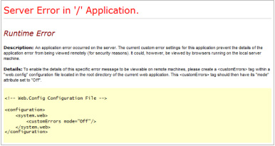

---
<!-- Page 122 -->
122
보안
요구사항
(L2) 세션의 무결성 보호 - 다음과 같이 통신 세션 무결성을 보호하는 기능을 제공해야 한다.
•  세션의 무결성을 보호하는 기능을 제공해야 하며, 유효하지 않은 세션 ID의 사용을 거부해야 한다.
•  사용자 로그아웃 또는 기타 세션 종료(브라우저 세션 포함) 시 세션 ID를 무효화하는 기능을 제공해야 한다.
•  각 세션에 대해 고유한 세션 ID를 생성하고 로봇 서비스가 생성한 세션 ID만을 인지하는 기능을 제공해야 한다.
•  일반적으로 허용되는 난수 발생원을 사용하여 고유한 세션 ID를 생성하는 기능을 제공해야 한다.
목적
서비스가 생성한 고유하고 예측 불가능한 세션 ID만 인정하도록 하여 세션 위조·재생 공격의 가능성을 실질적으로
차단한다.
점검 기준
L2. 세션 무결성
L2-1. 통신 세션의 무결성 보호 여부
L2-2. 사용자 로그아웃 또는 기타 세션 종료 시 세션 ID 즉시 무효화 여부
L2-3. 고유한 세션 ID 생성 여부
L2-4. 세션 ID 예측 불가능 및 복잡도 준수 여부
구현 및 점검 방안
L2
L2-1. 통신 세션의 무결성 보호 여부

## 01.	 세션의 무결성을 확보하기 위한 검증 기능이 구현되어 있는지 확인한다.

•  세션 무결성 보호는 다음과 같은 방식 중 하나 이상으로 구현되어야 한다.
HMAC 서명: 서버만이 보유한 비밀키로 세션 값에 서명하여, 클라이언트가 제공한 세션이 정상적으로 발급된 것임을
검증한다.
서버 저장소 기반 검증: 서버 측 세션 저장소에서 세션 존재 및 상태를 검증하여 비정상 세션 사용을 차단한다.
JWT 또는 디지털 서명 기반 검증: 세션 정보에 암호학적 서명을 부여하여 위조된 토큰 사용을 방지한다.
TLS 통신 보호: 세션 ID 전송 구간을 암호화하여 패킷 가로채기나 변조 위협을 차단한다
L2-2. 사용자 로그아웃 또는 기타 세션 종료 시 세션 ID 즉시 무효화 여부

## 01.	 사용자가 명시적으로 로그아웃하거나 세션이 만료 또는 종료될 때, 해당 세션 ID 및 관련 인증 토큰을 서버

측에서 즉시 무효화되도록 구현되었는지 확인한다.
•  무효화 방식은 다음과 같은 방법 중 하나 이상을 적용한다.
서버 저장소 사용 시 - 해당 세션 레코드를 삭제하거나 상태를 invalid로 변경하여 재사용 차단
JWT/Stateless 토큰 사용 시 - 토큰 블랙리스트 또는 refresh-token 정책을 통해 사용기간 만료 후 즉시 차단
분산 환경 - 세션 무효화 이벤트를 모든 노드에 실시간 전파하여 모든 인스턴스에서 동일하게 무효화
L2-3. 고유한 세션 ID 생성 여부

## 01.	 각 세션에 대한 고유한 세션 ID가 생성되는지 확인한다.

•  세션 발급 과정에서 동일한 ID가 중복 생성되지 않도록 고유성 보장 메커니즘이 적용되어야 한다. 다음과 같은 메커니즘이
적용될 수 있다.
UUID, 난수 기반 ID 생성 로직 사용
세션 스토어 내 기존 세션 키 중복 검사
충돌 시 자동 재생성 로직 적용
L2-4. 세션 ID 예측 불가능 및 복잡도 준수 여부

## 01.	 세션 ID가 충분히 예측 불가능한 난수로 생성되는지 확인한다.

•  세션 ID 생성 시 암호학적 난수 발생원을 사용해야 하며, 시퀀스 번호, 타임스탬프, 사용자 ID 등 예측 가능한 값을 사용하지
않아야 한다.

#### 3.5.8  [SI-08] 세션의 무결성 보호

---
<!-- Page 123 -->
01
02
03
123

## 02.	 세션 ID의 길이와 엔트로피가 충분히 확보되어 있는지 확인한다.

•  최소 128비트 이상의 난수 강도를 가지며, URL-safe Base64 또는 Hex 인코딩 시 22자 이상 길이로 구성되는 것이
권장된다.
•  세션 ID는 영문 대소문자·숫자·특수문자를 혼합하여 패턴이나 규칙성이 없어야 한다.

## 03.	 세션 ID에 예측 가능한 정보가 포함되지 않았는지 확인한다.

•  사용자 정보, 생성 시각, 서버 식별자 등 추론 가능한 값이 포함될 경우 예측 공격에 노출될 수 있다.

---
<!-- Page 124 -->
124
보안
요구사항
(L2) 감사 관련 정보 보호 - 인가되지 않은 접근, 변경 및 삭제로부터 감사 정보, 감사 로그 및 감사 도구를 보호해야
한다.
(L4) 일회용 기록 매체에 감사 레코드 기록 - 하드웨어 기반 일회용 기록 매체에 감사 레코드를 저장하는 기능을 제
공해야 한다.
목적
감사 로그와 감사 도구를 무단 접근이나 변경으로부터 보호하고, 감사 기록의 무결성과 추적 가능성을 유지하여
보안 사고 발생 시 신뢰할 수 있는 증거로 활용할 수 있도록 한다.
점검 기준
L2. 감사관련 정보 보호
L2-1. 감사 관련 정보 접근 통제 여부
L4. 일회용 기록 매체에 감사 레코드 기록
L4-1. 하드웨어 기반 일회용 기록 매체 기록 여부
구현 및 점검 방안
L2
L2-1. 감사 관련 정보 접근 통제 여부

## 01.	 감사 로그, 감사 설정 파일, 감사 도구에 대한 접근이 인가된 사용자로 제한되어 있는지 확인한다.

•  감사 정보는 시스템 관리자, 보안 관리자 등 권한이 부여된 계정만 접근 가능해야 하며, 일반 사용자나 애플리케이션
프로세스는 접근할 수 없어야 한다.
•  접근 통제는 운영체제 수준의 권한 설정 또는 DB 접근 제어 정책으로 구현될 수 있다.
•  원격 접근 경로에 대해서도 동일한 통제가 적용되어야 하며, 접근 시 모든 행위는 감사 로그에 남아야 한다.
L4
L4-1. 하드웨어 기반 일회용 기록 매체 기록 여부

## 01.	 감사 로그가 하드웨어 기반의 일회용(Write Once, Read Many; WORM) 기록 매체에 저장되는지 확인한다.

•  WORM 디스크, 보안 로그 서버, 하드웨어 로그 어플라이언스 등 물리적으로 수정이 불가능한 장치를 사용하여 로그를
기록해야 한다.
•  감사 기록은 변경이 불가능해야 하며, 필요한 경우 추가 기록만 가능하도록 구성한다.
•  기록된 감사 로그는 주기적으로 보존 상태를 점검하고, 변조 방지를 위해 암호학적 해시 또는 디지털 서명 검증 절차를
적용한다.

#### 3.5.9  [SI-09] 감사관련 정보 보호

---
<!-- Page 125 -->
01
02
03
125
보안
요구사항
(L1) 업데이트 지원 - 업데이트 및 업그레이드 기능을 지원해야 한다.
(L2) 업데이트 파일 진본성 및 무결성 검증 - 설치 전에 소프트웨어 업데이트 파일의 진본성과 무결성을 검증해야 한다.
목적
시스템이 안전하게 최신 상태를 유지하도록 업데이트 기능을 제공하고, 설치 전 파일의 진본성과 무결성을 검증하여
위조·변조된 소프트웨어가 적용되는 것을 방지한다.
점검 기준
L1. 업데이트 지원
L1-1. 시스템의 소프트웨어 업데이트 기능 제공 여부
L2. 업데이트 파일 진본성 및 무결성 검증
L2-1. 업데이트 파일 진본성 및 무결성 검증 여부
구현 및 점검 방안
L1
L1-1. 시스템의 소프트웨어 업데이트 기능 제공 여부

## 01.	 시스템이 소프트웨어 업데이트 및 업그레이드 기능을 제공하는지 확인한다.

•  업데이트 기능은 관리자 권한을 통해 수행되어야 한다.
•  자동 업데이트, 수동 업데이트, 네트워크 기반(OTA) 업데이트 등 다양한 방식이 지원될 수 있으며, 적용 시 보안 통신을
사용해야 한다.
L2
L2-1. 업데이트 파일 진본성 및 무결성 검증 여부

## 01.	 업데이트 파일 적용 전에 해당 파일의 진본성과 무결성을 검증하는 기능이 구현되어 있는지 확인한다.

•  서명 기반 검증 방식을 적용하여, 업데이트 파일에 대한 디지털 서명 또는 해시 값을 확인해야 한다.
•  서명 검증 시 제조사 또는 신뢰된 기관의 공개키를 사용하여 위·변조된 파일이 설치되지 않도록 해야 한다.
•  검증 실패 시 업데이트는 중단되어야 하며, 오류 로그 및 경고 메시지를 통해 관리자에게 알림이 제공되어야 한다.

#### 3.5.10  [SI-10] 업데이트 지원 검증

업데이트 페이지 예시

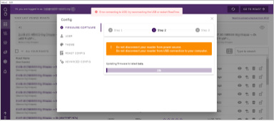

---
<!-- Page 126 -->
126
보안
요구사항
(L2) 물리적 변조 방지 및 탐지 - 장치에 인가되지 않은 물리적 접근을 방지하기 위해 변조 방지 및 탐지 메커니즘을
제공해야 한다.
(L3) 변조 시도 통보 - 인가되지 않은 물리적 접근 시도 탐지 시 자동으로 통지하는 기능을 제공해야 한다.
목적
물리적 접근으로 인한 장치 손상이나 내부 정보 유출을 예방하고, 변조 시도를 즉시 탐지·통보하여 보안 사고를
조기에 인지하고 대응한다.
점검 기준
L2. 물리적 변조 방지 및 탐지
L2-1. 장치에 인가되지 않은 물리적 접근을 방지하기 위한 변조 방지 및 탐지 메커니즘의 존재 여부
L3. 변조 시도 통보
L3-1. 변조 시도 또는 비인가 접근 발생 시 대응 여부
구현 및 점검 방안
L2
L2-1. 장치에 인가되지 않은 물리적 접근을 방지하기 위한 변조 방지 및 탐지 메커니즘의 존재 여부

## 01.	 장치가 비인가자의 물리적 접근을 방지하기 위한 변조 방지 및 변조 탐지 메커니즘을 갖추고 있는지 확인한다.

•  변조 탐지는 다음과 같은 수단을 통하여 이상 행위를 감지하고 이벤트를 생성하는 기능을 포함해야 한다.
•  감지된 변조 이벤트는 시스템 로그 또는 보안 관리 콘솔에 기록되어야 하며, 재부팅 후에도 삭제되거나 초기화되어서는 안
된다.
L3
L3-1. 변조 시도 또는 비인가 접근 발생 시 대응 여부

## 01.	 장치에서 변조 시도나 비인가 물리적 접근이 탐지될 경우, 이에 대한 대응 동작이 수행되는지 확인한다.

•  탐지 시 시스템은 다음과 같은 보호 조치를 수행해야 한다.
알림｜시각적·청각적 경보 또는 네트워크 기반 관리자 알림을 발생한다.
기능 제한｜변조가 확인된 경우, 제어 명령 수행이나 중요 데이터 접근을 일시적으로 제한하거나 시스템을 안전 모드로
전환한다.
로그 기록｜변조 이벤트의 발생 시각, 탐지 센서, 조치 결과 등이 보안 로그에 자동 기록되어야 하며, 로그는 삭제 및
수정이 불가해야 한다.
연동 대응｜보안 관리 시스템과 연동되어 변조 이벤트가 실시간으로 전달될 수 있어야 한다.
•  변조 감지 후 재부팅이나 복구 과정에서 경고 상태가 해제되지 않고, 관리자가 원인을 확인하고 승인하기 전까지는 정상
동작으로 전환되지 않도록 구성되어야 한다.

#### 3.5.11  [SI-11] 물리적 변조 방지 및 탐지

변조 탐지 방안 예시
구분
예시
하우징 감지 스위치
외함 열릴 때 즉시 감지
광센서 기반 개봉 탐지
전원이 강제로 차단될 때 이벤트 기록
전원 차단 탐지 회로
케이스를 잠그거나 봉인하여 임의 개봉 방지
보안 칩
내부 회로 침입·전류 탐지 시 데이터 자동 소거
물리 인터페이스 탐지
USB, UART, JTAG 등 포트 연결 이벤트 로그 기록

---
<!-- Page 127 -->
01
02
03
127
번호
보안 수준
체크리스트 항목
DP-01
L1
정보의 기밀성
DP-02
L2
데이터 삭제 관리
DP-03
L1
안전한 암호 메커니즘 사용
DP-04
L1
개인정보 보호
데이터 보호 체크리스트 항목
로봇 시스템의 통신 채널의 데이터 보호를 위한 데이터 보호(Data Protection, DP) 체크리스트 항목은 다음과 같다.

### 3.6 데이터 보호 점검 체크리스트

---
<!-- Page 128 -->
128
보안
요구사항
(L1) 정보의 기밀성 - 인가되지 않은 공개를 방지하기 위해 저장소에 저장된 정보와 통신 채널을 통해 전송되는 정보
의 기밀성을 보호하는 기능을 제공해야 한다.
목적
저장되거나 전송되는 정보가 비인가자에게 노출되지 않도록 보호하여, 로봇 시스템의 기밀 정보 유출 및 통신
도청을 방지한다.
점검 기준
L1. 저장 및 송수신 정보 보호
L1-1. 네트워크를 통해 전송되는 데이터 보호 여부
L1-2. 시스템에 저장된 주요 데이터 보호 여부
구현 및 점검 방안
L1
L1-1. 네트워크를 통해 전송되는 데이터 보호 여부
01.	 “2.3. 인터페이스 식별”에서 로봇 시스템 구성요소 간 통신 구간을 식별한다.

## 02.	 식별된 통신 구간에 대하여 데이터 암호화 전송이 적용되어 있는지 확인한다.

•  평문으로 전송되는 경우, 중요 데이터(계정 정보, 제어 명령, 인증 토큰 등)가 암호화 또는 난독화되어 송신되는지 검증한다
L1-2. 시스템에 저장된 주요 데이터 보호 여부

## 01.	 로봇 시스템 내에서 저장된 주요 데이터를 식별하고, 암호화되어 보호하는지 확인한다.

•  다음과 같은 데이터 보호 방식이 적용될 수 있다
구분
암호화 필요성
보호 방식
계정 정보
필수
•  비밀번호는 해시로 저장(SHA-256 이상, PBKDF2, bcrypt 등)
인증키 / 비밀키
/ API 키 / 토큰
필수
•  키 저장 시 대칭키 암호화(AES-256 등)
•  하드웨어 보호
제어 파라미터
조건부
•  안전 운영에 직결되는 값은 암호화 또는 무결성 검증 서명 적용
•  단순 UI 설정값은 권한 제어로 대체 가능
로그 파일
조건부 또는 접근 제어
•  로그 전체는 평문 저장 가능하나, 내부 민감 필드(IP, 사용자 ID 등)는 마
스킹 또는 암호화
•  접근 권한 및 변경 통제 필수
설정 파일
조건부
•  인증정보(DB 비밀번호, API 토큰 등)는 암호화
•  일반 환경설정은 평문 허용, 파일 권한(600) 적용
중요 데이터 보호 방안 예시
암호화가 전송된 통신 채널 예시

#### 3.6.1  [DP-01] 정보의 기밀성

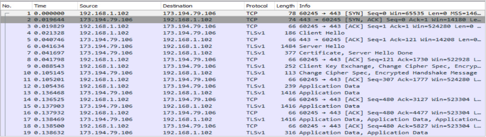

---
<!-- Page 129 -->
01
02
03
129
보안
요구사항
(L2) 데이터 삭제 관리 - 활성 서비스가 해제되거나 폐기되는 경우, 명확한 읽기 권한이 지원되는 모든 정보 비휘발
성 저장소에 저장된 정보를 삭제하는 기능을 제공해야 한다.
목적
저장 장치에 남아 있는 민감 데이터의 잔존을 방지하고, 로봇 시스템 해제·폐기 시 비인가자가 저장 정보에
접근하거나 복구하지 못하도록 보호한다.
점검 기준
L2. 데이터 삭제 기능
L2-1. 시스템에 저장된 모든 민감 정보의 안전한 삭제 기능 제공 여부
구현 및 점검 방안
L2
L2-1. 시스템에 저장된 모든 민감 정보의 안전한 삭제 기능 제공 여부

## 01.	 로봇 시스템에 저장된 민감 정보(계정 정보, 인증키, 사용자 데이터, 로그, 설정 파일 등)가 서비스 비활성화

또는 장치 폐기 시 안전하게 삭제되는 기능을 제공하는지 확인한다.
•  삭제는 다음 중 하나 이상의 방식으로 수행될 수 있다
일괄 삭제 기능을 통한 자동 삭제
암호화 키 파기를 통한 논리적 데이터 무효화
삭제 절차 문서화 및 관리자가 수동 수행하는 보안 삭제 프로세스

#### 3.6.2  [DP-02] 데이터 삭제 관리

데이터 초기화 기능 제공 예시

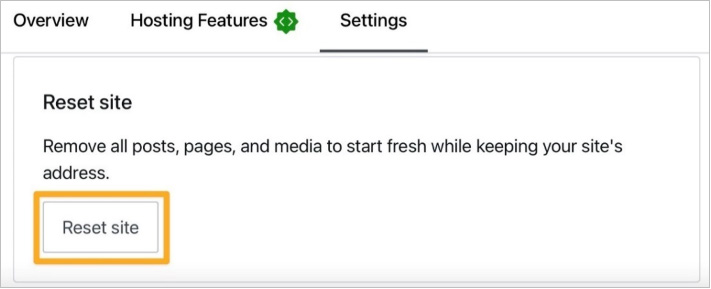

---
<!-- Page 130 -->
130
보안
요구사항
(L1) 안전한 암호 메커니즘 사용 - 암호화가 필요한 경우 국제적으로 인정된 안전한 암호 메커니즘을 사용해야 한다.
목적
국제적으로 검증된 암호 알고리즘과 키 관리 방식을 사용함으로써, 로봇 시스템 내 데이터의 기밀성·무결성을
안정적으로 보호하고 취약하거나 자체 제작된 암호 방식으로 인한 보안 약점을 방지한다.
점검 기준
L1. 안전한 암호 메커니즘 사용
L1-1. 국제적으로 인정된 암호 알고리즘의 사용 여부
구현 및 점검 방안
L1
L1-1. 국제적으로 인정된 암호 알고리즘의 사용 여부
01.	 “3.6.1 정보의 기밀성” 항목 점검 과정에서 식별된 암호화 알고리즘 및 키 길이를 식별한다.

## 02.	 식별된 암호화 알고리즘이 국제적으로 인정된 안전한 알고리즘인지 확인한다.

•  다음과 같은 암호화 알고리즘 기준을 적용할 수 있다.
•  사용된 암호 모듈이 제조사에서 자체 개발되었거나 검증되지 않은 오픈 소스를 사용하는 경우 공인 인증을 받은 모듈인지
확인한다.

#### 3.6.3  [DP-03] 안전한 암호 메커니즘 사용

구분
권고 기준
미흡 기준
대칭키
알고리즘
AES 계열(AES-128 이상, 권장 AES-256),
ChaCha20-Poly1305 등 현대 블록 암호 사용
DES, 3DES, RC4, Blowfish 등
구식 알고리즘 사용
비대칭키
알고리즘
RSA ≥ 2048bit 또는 ECC P-256 이상 (권장
ECC)
RSA 1024bit 이하, ECC P-192
이하
해시 / 무결성
알고리즘
SHA-256 이상 (SHA-2 / SHA-3 계열),
HMAC-SHA-256 이상
SHA-1, MD5, HMAC-MD5 등
취약 해시 사용
운영 모드
인증 모드(GCM, CCM, CTR+HMAC 등) 사용 —
패턴 노출 방지
ECB 등 단순 블록 모드 사용
통신 프로토콜
TLS 1.2 이상 (권장 TLS 1.3), ECDHE 등 임시
세션 키 교환 사용
TLS 1.0 / 1.1, 평문 통신 또는 정적
RSA 세션 사용
프로토콜 적용
MQTT, OPC UA, HTTPS 등에서 mTLS 또는
메시지 서명 적용
verify = false, allow_insecure 등
검증 우회 설정
권장 암호화 알고리즘 기준 예시

---
<!-- Page 131 -->
01
02
03
131
보안
요구사항
(L1) 개인정보 보호 - 개인정보 수집 및 처리 시 개인정보 관련 법적 요구사항을 준수해야 한다.
목적
로봇 시스템에서 수집·처리되는 사용자 개인정보의 무단 수집, 오·남용, 유출을 방지하고, 개인정보 관련 법적·규제
요건(개인정보보호법 등)을 준수한다.
점검 기준
L1. 개인정보 보호법 준수
L1-1. 개인정보 수집 시 수집 항목, 이용 목적, 보유 기간 등을 사용자에게 고지 및 동의 수집 여부
L1-2. 수집된 개인정보의 안전성 확보를 위한 기술적·관리적 조치 시행 여부
L1-3. 보유기간 경과 또는 처리 목적 달성 시 개인정보 파기 여부
구현 및 점검 방안
L1
L1-1. 개인정보 수집 시 수집 항목, 이용 목적, 보유 기간 등을 사용자에게 고지 및 동의 수집 여부

## 01.	 로봇 시스템 또는 관리 서버가 사용자로부터 개인정보를 수집하는 경우, 수집 항목, 이용 목적, 보유 기간, 제

3자 제공 여부 등을 명확히 고지하고 사용자의 사전 동의를 받는 절차가 마련되어 있는지 확인한다.
•  로봇 시스템에서 처리될 수 있는 개인정보 항목은 다음과 같다.
•  수집된 개인정보 항목은 서비스 UI, 앱 초기 설정 화면, 또는 개인정보 처리방침 등을 통해 사용자가 확인할 수 있어야
하며, 사용자 동의 없이 개인정보를 수집·활용하는 경우 미흡으로 판단한다.
L1-2. 수집된 개인정보의 안전성 확보를 위한 기술적·관리적 조치 시행 여부

## 01.	 개인정보 저장 및 전송 구간에서 암호화를 통한 보호 여부를 확인한다.

•  수집된 개인정보(이름, 계정 ID, 비밀번호, 인증키, 영상·음성 데이터 등)는 저장 시 안전한 암호 알고리즘으로 암호화되어
전송되어야 한다.
•  네트워크 전송 구간은 TLS 1.2 이상의 암호화 채널을 통해 보호되어야 한다.

## 02.	 저장된 개인정보에 대한 접근 통제 및 권한 분리 조치가 적용되어 있는지 확인한다.

•  개인정보 접근은 인가된 사용자 및 프로세스에 한정되어야 한다.
개인정보 항목 예시
사용자 개인정보 수집 및 이용 동의 예시

#### 3.6.4  [DP-04] 개인정보 보호

구분
예시 항목
식별 정보
사용자 이름, 계정 ID, 이메일, 전화번호
영상/음성 정보
카메라 영상, 마이크 음성 데이터
인증 정보
비밀번호, 인증 토큰, 공개키 인증서

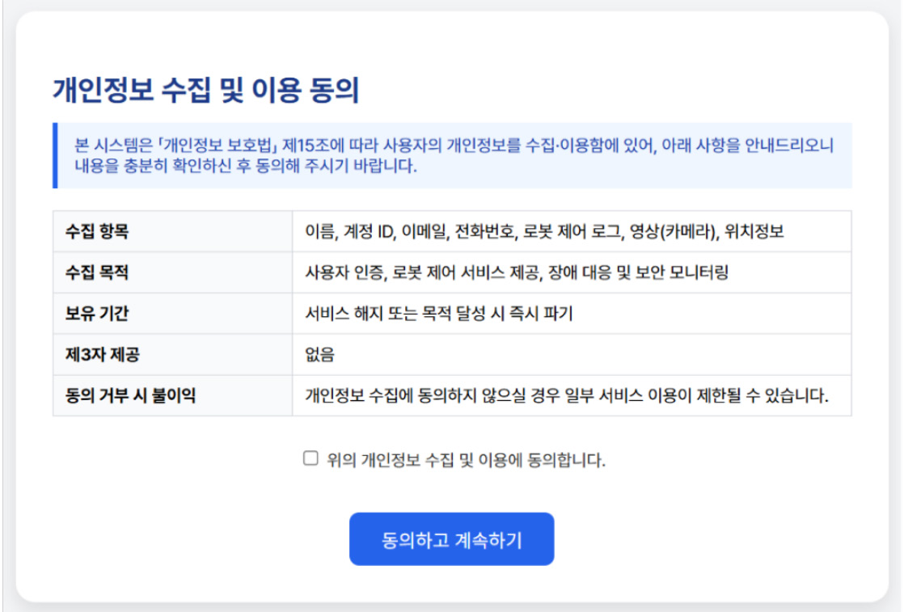

---
<!-- Page 132 -->
132

## 03.	 개인정보 접근 및 처리 이력에 대한 감사 로그가 기록·점검되고 있는지 확인한다.

•  개인정보에 접근하거나 다운로드, 수정, 삭제한 이력은 로그로 자동 기록되어야 하며, 로그는 읽기 전용으로 관리되어야
한다.
•  감사 로그는 최소 6개월 이상 보관되고, 주기적으로 보안 담당자가 점검하는 절차가 존재해야 한다.
L1-3. 보유기간 경과 또는 처리 목적 달성 시 개인정보 파기여부

## 01.	 개인정보 보유 기간이 경과하거나 수집 목적이 달성된 경우, 해당 정보를 지체 없이 안전하게 파기하는

절차가 마련되어 있는지 확인한다.
•  파기는 완전 삭제, 복구 불가능한 덮어쓰기, 또는 암호화 키 파기 방식으로 수행되어야 하며, 단순 논리적 삭제(표시만
변경)는 불충분으로 판단한다.
•  개인정보 파기 내역(대상, 일시, 방법 등)은 별도 로그로 기록되어야 하며,파기 기능이 미제공되거나 수동으로만 수행되는
경우 일부 충족으로 판단한다.

---
<!-- Page 133 -->
01
02
03
133
번호
보안 수준
체크리스트 항목
DFR-01
L1
네트워크 기능 지원
DFR-02
L2
프로토콜 필터링
데이터 흐름 제한 체크리스트 항목
로봇 시스템의 통신 채널의 데이터 흐름을 제한하여 데이터 유출을 방지하기 위한 데이터 흐름 제한(Data From
Restriction, DFR) 체크리스트 항목은 다음과 같다.

### 3.7 데이터 흐름 제한 점검 체크리스트

---
<!-- Page 134 -->
134
보안
요구사항
(L1) 네트워크 기능 지원 - 구역과 통신경로의 분할을 위해 운영자가 네트워크 설정을 직접 관리·
설정할 수 있는 기능을 제공해야 한다.
목적
운영자가 네트워크 구역·통신경로를 직접 분리·제어하여 공격 표면을 축소하고 변경·복구에 신속히 대응할 수
있도록 한다.
점검 기준
L1. 네트워크 기능 지원
L1-1. 사용자가 네트워크 설정을 구성할 수 있는 인터페이스 제공 여부
구현 및 점검 방안
L1
L1-1. 사용자가 네트워크 설정을 구성할 수 있는 인터페이스 제공 여부

## 01.	 로봇이 제공하는 통신 인터페이스를 식별한다.

•  “2.3. 인터페이스 식별”에서 식별된 인터페이스 중 제조사에서 사전 구성되어 수정할 수 없도록 고정된 인터페이스(센서/
액추에이터의 내부 통신, NFC 등)를 제외하고, 일반적으로 사용자가 설정할 수 있는 네트워크 인터페이스 정보는 다음과
같다.

## 02.	 식별된 통신 인터페이스에 대하여 사용자가 설정 정보를 변경할 수 있도록 하나 이상의 사용자 인터페이스를

제공하는지 확인한다.
•  사용자가 설정 정보를 변경하기 위한 인터페이스는 다음과 같이 여러 방식으로 제공될 수 있다.
로봇 시스템 네트워크 설정을 위한 사용자 인터페이스 제공 예시
로봇과 연결된 HMI(예: 티칭 펜던트)
로봇 관리 프로그램

#### 3.7.1  [DFR-01] 네트워크 기능 지원

인터페이스
설정 정보
AP 모드
SSID, 비밀번호, 보안 모드(WPA2/WPA3), 채널, 최대 동시 접속 수 등
STA 모드
연결할 SSID, 비밀번호, 인증 방식, IP 설정(DHCP 또는 정적 구성)
유선 이더넷 포트
IP 설정(DHCP 또는 정적 구성)
사용자가 수정 가능한 네트워크 인터페이스 예시
파일 시스템 터미널 제공(예: SSH, 로컬)
로봇 또는 관리 서버 웹 인터페이스

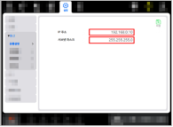

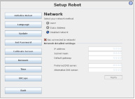

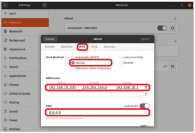

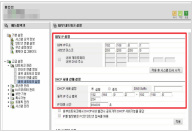

---
<!-- Page 135 -->
01
02
03
135
보안
요구사항
(L2) 프로토콜 필터링 - 승인된 프로토콜만 허용하고 승인되지 않은 프로토콜의 사용을 제한하는 기능을 제공해야
한다.
목적
승인된 프로토콜만 허용해 비인가 또는 취약한 프로토콜의 사용을 차단하고 최소 통신 원칙을 보장한다.
점검 기준
L2. 프로토콜 필터링
L2-1. 운영에 필수적으로 사용되는 서비스 외의 프로토콜을 제한하거나 사용자가 제한할 수 있는 기능을 제공하고
있는지 여부
구현 및 점검 방안
L2
L2-1. 운영에 필수적으로 사용되는 서비스 외의 프로토콜을 제한하거나 사용자가 제한할 수 있는 기능을
제공하고 있는지 여부

## 01.	 로봇이 제공하는 서비스를 식별한다.

•  “2.3. 인터페이스 식별”에서 식별된 서비스 중 IP 기반 통신을 수행하는 서비스를 식별한다.

## 02.	 식별된 서비스 외의 서비스 접근이 제한되어 있는지 확인한다.

•  공격자의 사이버 공격 또는 로봇 운영 중 발생할 수 있는 의도치 않은 서비스 노출을 방지하기 위한 것으로, 심층 방어
원칙에 따라 단일 보안 기능이 실패하더라도 전체 시스템이 보호될 수 있도록 구성해야 한다. 이를 위해 다음과 같은
방식으로 구현할 수 있다.
[방안 1] 호스트 방화벽 적용
운영체제 또는 네트워크 구간에서 승인된 서비스 이외의 접근을 제한하기 위해 로컬 방화벽을 활용한다.
[방안 2] 네트워크 보안 정책 설정 기능 제공
운영자 또는 관리자가 직접 프로토콜이나 IP, MAC 주소 등을 허용 및 차단하는 정책을 설정할 수 있도록 네트워크 보안
정책 설정 기능을 제공한다.

#### 3.7.2 [DFR-02] 프로토콜 필터링

Bash (예: MQTT 및 HTTPS 외의 포트 차단)
# sudo iptables -A INPUT -p tcp --dport 443 -j ACCEPT
# sudo iptables -A INPUT -p tcp --dport 1883 -j ACCEPT
# sudo iptables -A INPUT -j DROP
네트워크 보안 정책 설정 기능 제공 예시

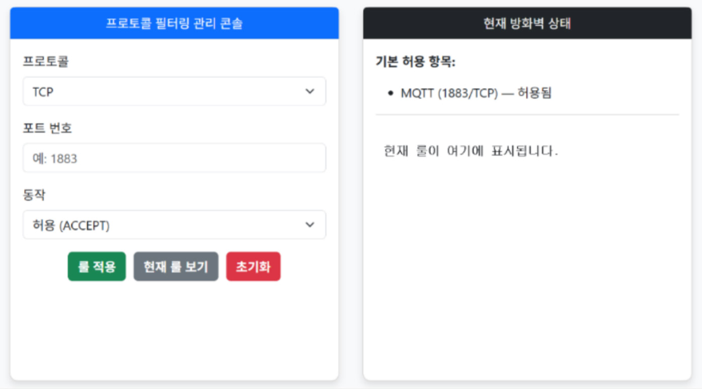

---
<!-- Page 136 -->
136
번호
보안 수준
체크리스트 항목
ER-01
L1
감사 로그 접근성
L3
감사 로그에 대한 프로그래밍 방식 접근
ER-02
L2
지속적인 모니터링
ER-03
L2
보안 이벤트 알림
이벤트 대응 체크리스트 항목
로봇 시스템 침해에 대하여 관리자에게 알리고 침해에 대한 증거를 수집하기 위한 이벤트 대응(Event Response,
ER) 체크리스트 항목은 다음과 같다.

### 3.8 이벤트 대응 점검 체크리스트

---
<!-- Page 137 -->
01
02
03
137
보안
요구사항
(L1) 감사 로그 접근성 - 인가된 사람 및/또는 도구가 읽기-전용으로 감사로그에 접근할 수 있는 기능을 제공해야
한다.
(L3) 감사 로그에 대한 프로그래밍 방식 접근 - API(응용 프로그래밍 인터페이스)를 사용하여 감사로그에 대한 프로
그래밍 방식의 접근을 제공해야 한다.
목적
감사로그의 무결성과 증거성을 보전하고, 인가 주체만 안전하게 열람하도록 하며, 상위 시스템과 연동해 수집·분석·
대응을 자동화한다.
점검 기준
L1. 감사 로그 접근
L1-1. 감사 로그 읽기 전용 여부
L1-2. 감사 로그 접근 제한 여부
L3. 감사 로그에 대한 프로그래밍 방식 접근
L3-1. API를 통한 감사 로그 읽기 전용 여부
L3-2. API를 통한 감사 로그 접근 제한 여부
구현 및 점검 방안
L1
L1-1. 감사 로그 읽기 전용 여부

## 01.	 감사 로그 파일 또는 저장소가 읽기 전용 속성으로 보호되고 있는지 확인한다.

•  시스템, 장치, 애플리케이션에서 생성된 감사 로그가 수정 또는 덮어쓰기 불가능한 구조로 되어 있어야 한다.
•  로그가 별도 로그 서버로 전송되어 원본이 보호되는 경우 충족으로 판단한다.
L1-2. 감사 로그 접근 제한 여부

## 01.	 권한이 인가된 관리자 또는 감사 담당자에게만 부여되어 있는지 확인한다.

•  일반 사용자, 운영 프로세스, 외부 서비스가 감사 로그를 열람·복사·삭제할 수 없어야 한다.
L3
L3-1. API를 통한 감사 로그 읽기 전용 여부
01.	 API를 통해 제공되는 감사 로그가 읽기 전용으로 제공되는지 확인한다.
•  API 요청을 통해 로그 수정·삭제가 불가능하며, 조회 요청 시 로그 서명값 또는 해시값을 함께 반환하여 무결성 검증이
가능한 구조인 경우 충족으로 판단한다.
L3-2. API를 통한 감사 로그 접근 제한 여부

## 01.	 감사 로그 조회 API 접근이 인가된 관리자 또는 감사 담당자에게만 허용되는지 확인한다.

•  로그 조회 API 호출 시 인증 토큰 또는 관리자 세션 검증이 반드시 수행되어야 한다.
•  접근 권한은 최소 권한 원칙에 따라 부여되어야 하며, 로그 API 접근 시 인증자 정보, 접근 시각, IP, API 키 등이 별도
감사 로그에 기록되어야 한다.

#### 3.8.1  [ER-01] 감사로그 접근 관리

API를 통한 로그 조회 요청 및 응답 예시
GET /api/audit/logs
Authorization: Bearer <AdminToken>
HTTP/1.1 200 OK
{
“entries”: [...],
“integrity”: “sha256:f45a...”
}

---
<!-- Page 138 -->
138
보안
요구사항
(L2) 지속적인 모니터링 - 적시에 보안 위반을 탐지하여 보고하기 위해 지속적으로 모니터링할 수 있는 기능을 제공
해야 한다.
목적
위협을 실시간으로 조기 탐지하여 경고를 제공하여 피해를 최소화한다.
점검 기준
L2. 지속적인 모니터링
L2-1. 보안 위협 모니터링 기능 제공 여부
구현 및 점검 방안
L2
L2-1. 보안 위협 모니터링 기능 제공 여부

## 01.	 로봇 본체나 관리 서버에서 보안 이벤트 탐지 기능이 탑재되어 있는지 확인한다.

•  다음과 같은 보안 관련 이벤트가 실시간 또는 주기적으로 수집되어야 한다.
•  해당 요구사항은 상위 시스템과 통합되어 충족될 수 있다.

#### 3.8.2  [ER-02] 지속적인 모니터링

구분
주요 이벤트 예시
인증 및 접근
관련
•  로그인 실패 / 비인가 사용자 로그인 시도
•  비정상 세션 유지 또는 토큰 재사용 탐지
•  관리자 권한 상승 시도 또는 권한 변경
네트워크 통신
관련
•  로봇 제어 포트에 대한 스캔 또는 연결 시도
•  비인가 IP·MAC 주소로부터의 접근
•  통신 오류, CRC 불일치, 패킷 위·변조 탐지
•  TLS/OPC UA 인증서 검증 실패 이벤트
제어 및 동작
관련
•  비인가 제어 명령 수신
•  정상 범위를 벗어난 파라미터 변경 시도
•  긴급 정지 또는 오동작 발생 이벤트
시스템 무결성 및
파일 관련
•  펌웨어/소프트웨어 무결성 검증 실패
•  설정 파일 변경, 로그 삭제, 비정상 프로세스 실행
•  보안 설정 변경
자원 및 서비스
관련
•  CPU/메모리 과다 사용
•  네트워크 지연 또는 패킷 드롭 급증
•  서비스 포트 비정상 종료 또는 재시작 감지
보안 위협 이벤트 예시

---
<!-- Page 139 -->
01
02
03
139
보안
요구사항
(L2) 보안 이벤트 알림 - 중요 보안 이벤트 발생 시 이메일, SMS, 모바일 앱 푸시 알림, 음성 경고 등 다양한 채널 또
는 화면을 통해 관리자에게 알림을 전송할 수 있는 기능을 제공해야 한다.
목적
중대한 이벤트를 즉시 인지하고 적정 채널로 통보해 단축 및 대응 시간을 확보한다.
점검 기준
L2. 보안 이벤트 알림
L2-1. 보안 위반 징후 발생 시 알림 전송 여부
구현 및 점검 방안
L2
L2-1. 보안 위반 징후 발생 시 알림 전송 여부
01.	 “3.8.2 지속적인 모니터링”에서 항목의 보안 관련 이벤트에 대하여 이벤트 발생 시 관리자에게 즉시 알림을
전송하는 기능을 제공하는지 확인한다.
•  관리자 알림은 하나 이상의 채널(이메일, SMS, 모바일 앱 푸시, HMI/웹 대시보드 경고창, 음성 알림 등)을 통해 전송될 수
있어야 한다.

#### 3.8.3  [ER-03] 보안 이벤트 알림

대시보드를 통한 보안 이벤트 관리자 알림 예시

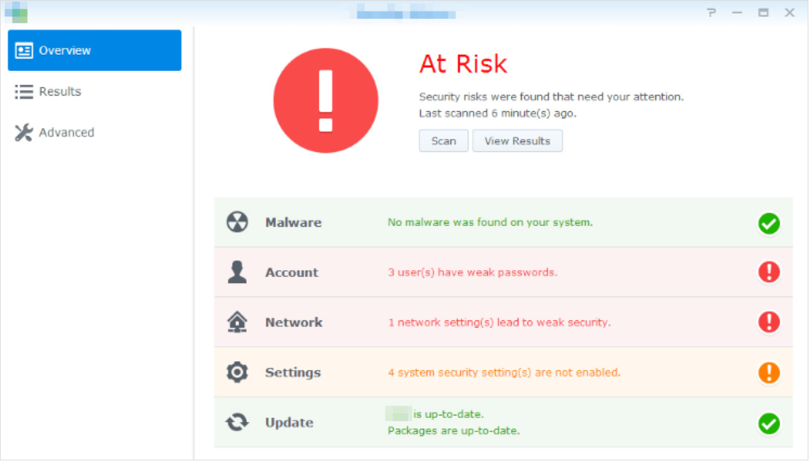

---
<!-- Page 140 -->
140
번호
보안 수준
체크리스트 항목
RA-01
L1
서비스 거부 공격 방지
L2
통신 부하 방지
RA-02
L1
자원 관리
RA-03
L1
자원 상태 진단
RA-04
L1
목록화 기능 지원
RA-05
L1
시스템 백업
RA-06
L1
컴포넌트 복구 및 재구성
L2
복구 전 무결성 확인
RA-07
L1
네트워크 및 보안 구성 설정
L3
현재 보안 설정에 대한 보고서 생성
RA-08
L1
불필요한 기능, 포트 및 서비스 제한
자원 가용성 체크리스트 항목
로봇의 자원 가용성을 보장하여 서비스 거부 공격을 방지하기 위한 자원 가용성(Resource Availabililty, RA)
체크리스트 항목은 다음과 같다.

### 3.9 자원 가용성 점검 체크리스트

---
<!-- Page 141 -->
01
02
03
141
보안
요구사항
(L1) 서비스 거부 공격 방지 - 외부에서 다수의 연결 시도, 과도한 명령 요청, 대용량 데이터 송신 등의 공격에 의해
로봇 시스템이 마비되지 않도록 연결 제한, 큐 설정, 프로세스 자원 제한 등을 적용해야 한다.
(L2) 통신 부하 관리 - DoS 이벤트로 인한 정보 및/또는 메시지 범람 유형의 영향을 완화하는 기능을  제공해야 한
다.
목적
서비스에 대해 발생하는 통신 측면 공격과 영향 이벤트로 인해 로봇 시스템이 마비되지 않게 가용성을 유지한다.
점검 기준
L1. 서비스 거부 공격 방지 기능
L1-1. 서비스 거부 공격 방지를 위한 보안 기능 적용 여부
L2. 통신 부하 관리 여부
L2-1. 통신 부하를 완화하기 위한 보안 기능 적용 여부
구현 및 점검 방안
L1
L1-1. 서비스 거부 공격 방지를 위한 보안 기능 적용 여부

## 01.	 네트워크 또는 시스템에서 서비스 거부 공격 탐지 및 차단 기능이 구현되어 있는지 확인한다.

•  서비스 거부 공격 탐지는 다음과 같은 방안으로 수행될 수 있다.
[방안 1] 요청 속도 및 세션 제한 정책 적용
서버 또는 애플리케이션 수준에서 IP당 요청 빈도 및 동시 연결 수를 제한한다.
[방안 2] 호스트 방화벽 활용
승인되지 않은 트래픽을 차단하기 위해 로컬 방화벽을 구성한다.
[방안 3] 커널 레벨 자원 제한 설정
리눅스 커널 파라미터를 조정하여 TCP 연결 수, 큐 크기, 파일 핸들 수를 제한해 서비스 자원 고갈을 예방한다.

#### 3.9.1  [RA-01] 서비스 거부 방지

Nginx (예: /etc/nginx/nginx.conf)
http {
limit_req_zone $binary_remote_addr zone=req_limit_per_ip:10m rate=10r/s;
server {
listen 443 ssl;
server_name example.com;
location / {
limit_req zone=req_limit_per_ip burst=5 nodelay;
limit_conn conn_limit_per_ip 10;
}
}
}
Bash (예: 호스트 방화벽)
$ sudo iptables -A INPUT -p tcp --dport 22 -j ACCEPT
$ sudo iptables -A INPUT -p tcp --dport 443 -j ACCEPT
$ sudo iptables -A INPUT -j DROP
Bash (예: sysctl 및 ulimit 설정)
$ sudo sysctl -w net.core.somaxconn=128
$ sudo sysctl -w net.ipv4.tcp_max_syn_backlog=256
$ ulimit -n 1024

---
<!-- Page 142 -->
142
[방안 4] 비정상 트래픽 탐지 자동화
DoS 패턴을 감지하는 IPS 룰을 적용해 이상 트래픽 발생 시 자동 차단한다.
해당 요구사항은 상위 시스템과 통합하여 충족될 수 있다.
L2
L2-1. 통신 부하를 완화하기 위한 보안 기능 적용 여부

## 01.	 로봇 시스템에서 다수의 센서·액추에이터·제어 모듈 간 통신 부하를 완화하기 위한 보안 기능이 구현되어

있는지 확인한다.
•  통신 부하를 완화하기 위한 보안 기능은 다음과 같은 방식으로 구현될 수 있다.
[방안 1] QoS 및 대역폭 제어 정책 적용
ROS2 또는 DDS 통신에서 QoS 설정을 통해 중요 데이터의 우선 전송 및 트래픽 제어를 수행한다.
[방안 2] 송신 주기 조정 및 버퍼 관리 기능 적용
로봇 컨트롤러 또는 센서 게이트웨이에서 데이터 송신 주기를 조절하거나, 큐 크기를 제한하여 대용량 통신 트래픽을
방지한다.
[방안 3] 네트워크 세그먼트 분리 및 부하 분산 구성
센서망, 제어망, 관리망을 VLAN 또는 물리 인터페이스 단위로 분리해 트래픽을 분산한다.
•  해당 요구사항은 상위 시스템과 통합하여 충족될 수 있다.
YAML (예: Suricata 룰 예시)
alert tcp any any -> $HOME_NET any (msg:”TCP SYN Flood”; flags:S; threshold: type both, track by_src,
count 50, seconds 1; classtype:attempted-dos; sid:100001;)
YAML (예: ROS2 QoS 프로파일 설정)
QoSProfile:
reliability: RELIABLE
durability: TRANSIENT_LOCAL
history: KEEP_LAST
depth: 10
Bash (예: VLAN 분리)
$ sudo ip link add link eth0 name eth0.10 type vlan id 10   # 제어 망
$ sudo ip link add link eth0 name eth0.20 type vlan id 20   # 센서 망
$ sudo ip link set eth0.10 up
$ sudo ip link set eth0.20 up
C++ (예: ROS Publisher 송신 주기 제한)
ros::Publisher pub = nh.advertise<std_msgs::String>(“sensor_data”, 10);
ros::Rate loop_rate(5);  // 초당 5회 전송 제한
while (ros::ok()) {
std_msgs::String msg;
msg.data = “sensor data”;
pub.publish(msg);
loop_rate.sleep();
}

---
<!-- Page 143 -->
01
02
03
143
보안
요구사항
(L1) 자원 관리 - 자원 고갈을 방지하기 위해 보안기능의 자원 사용을 제한하는 기능을 제공해야 한다.
목적
로봇 시스템의 자원을 모니터링하고, 보안기능으로 인해 성능과 용량 등이 과도하게 사용되지 않게 적절한
자원관리를 수행한다.
점검 기준
L1. 자원 제한 여부
L1-1. 보안 기능 사용 자원 제한 여부
구현 및 점검 방안
L1
L1-1. 보안 기능 사용 자원 제한 여부

## 01.	  로봇 시스템의 보안 기능(암호화, 인증, 로그 기록 등)이 과도한 CPU, 메모리, 네트워크 자원을 점유하지

않도록 자원 사용 제한 기능이 구현되어 있는지 확인한다.
[방안 1] 프로세스 및 스레드 자원 제한 설정
보안 프로세스가 제어 주기나 실시간 동작에 영향을 주지 않도록 CPU·메모리 점유율을 제한한다.
[방안 2] 로그 저장소 용량 제한 및 순환 정책 적용
감사/운영 로그가 로그 저장소 용량을 초과하지 않도록 로그 순환 정책을 설정한다.
[방안 3] 암호화·인증 모듈 경량화 및 하드웨어 가속 활용
CPU 부하가 높은 암호 연산은 하드웨어 보안 모듈 또는 암호화 프로세서를 활용한다.

#### 3.9.2  [RA-02] 자원 관리

Bash (예: cgroups 이용한 자원 제한)
$ sudo cgcreate -g cpu,memory:/robot_security
$ echo 20000 | sudo tee /sys/fs/cgroup/cpu/robot_security/cpu.cfs_quota_us
$ echo 256M | sudo tee /sys/fs/cgroup/memory/robot_security/memory.limit_in_bytes
$ sudo cgclassify -g cpu,memory:/robot_security $(pidof security_agent)
Bash (예: OpenSSL 하드웨어 가속 활성화)
$ openssl engine -t
(dynamic) Dynamic engine loading support
(rdrand) Intel RDRAND engine
(aesni)  Intel AES-NI engine
Bash (예: logrotate 설정)
# /etc/logrotate.d/robot_security
/var/log/robot/security.log {
size 50M
rotate 5
compress
missingok
notifempty
}

---
<!-- Page 144 -->
144
보안
요구사항
(L1) 자원 상태 진단 - CPU, 메모리, 저장소, 통신 채널 등의 사용량 및 상태를 확인할 수 있어야 한다.
목적
CPU, 메모리, 저장소, 통신 채널 등의 사용량 및 상태를 확인하여 주기적인 자원 상태 진단을 통해 시스템의
가용성을 유지한다.
점검 기준
L1. 자원 상태 진단 여부
L1-1. 자원 상태 조회 디스플레이 제공 여부
구현 및 점검 방안
L1
L1-1. 자원 상태 조회 디스플레이 제공 여부

## 01.	 로봇의 사용자 인터페이스를 통해 로봇의 주요 자원 상태를 조회하거나 시각화하는 기능이 제공되는지

확인한다.
•  다음과 같이 운영자 또는 관리자가 사용자 인터페이스를 통해 자원 상태(CPU, 메모리, 디스크, 네트워크 사용률)를
실시간으로 확인할 수 있도록 대시보드를 제공해야 한다.

#### 3.9.3  [RA-03] 자원 상태 진단

시스템 자원상태 조회 대시보드 예시

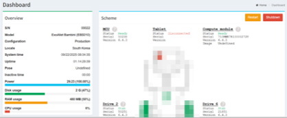

---
<!-- Page 145 -->
01
02
03
145
보안
요구사항
(L1) 목록화 기능 지원 - 설치된 구성요소들의 현재 목록과 각 컴포넌트의 속성 정보를 보고할 수 있는 기능을 제공
해야 한다.
목적
설치된 구성요소들의 현재 목록과 각 컴포넌트의 속성 정보를 확인하여 적절한 자산관리를 수행할 수 있다.
점검 기준
L1. 목록화 기능 지원
L1-1. 시스템에 설치된 컴포넌트의 목록 디스플레이 존재 여부
구현 및 점검 방안
L1
L1-1. 시스템에 설치된 컴포넌트의 목록 디스플레이 존재 여부

## 01.	 로봇은 설치된 구성요소(하드웨어, 소프트웨어, 펌웨어, 라이브러리 등)의 목록과 주요 속성(버전, 제조사,

상태 등)을 조회할 수 있는 기능이 제공되는지 확인한다.
•  운영자 또는 관리자가 HMI나 웹 대시보드 등의 인터페이스를 통해 설치된 모듈의 목록과 버전을 확인할 수 있도록 해야
한다.

#### 3.9.4  [RA-04] 목록화 기능 지원

설치된 구성요소 조회 페이지 예시

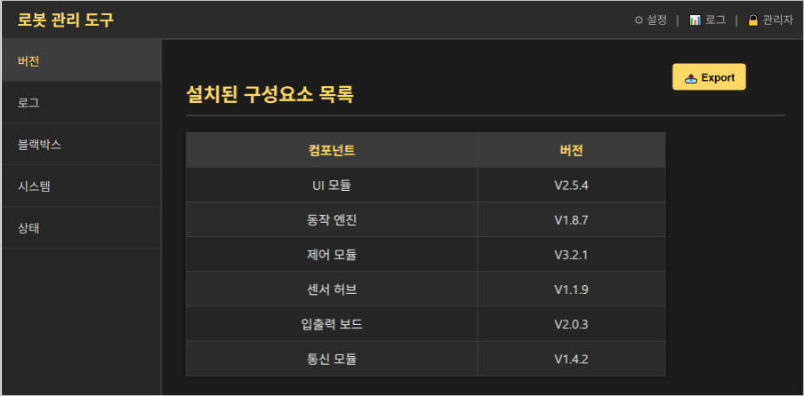

---
<!-- Page 146 -->
146
보안
요구사항
(L1) 시스템 백업 - 장치 상태(사용자/시스템 수준 정보)를 보호하기 위해 백업 기능을 지원해야 하며, 백업
프로세스는 정상적인 로봇 서비스 운영에 영향을 미치지 않아야 한다.
목적
장치 상태(사용자/시스템 수준 정보)를 보호하기 위해 백업 프로세스를 이용하여 주기적인 상태 저장 및 복원을
수행한다.
점검 기준
L1. 컴포넌트 백업 기능
L1-1. 사용자 및 시스템 설정 정보의 백업 기능 존재 여부
구현 및 점검 방안
L1
L1-1. 사용자 및 시스템 설정 정보의 백업 기능 존재 여부

## 01.	 로봇의 사용자 인터페이스에서 사용자 및 시스템 설정 구성을 백업할 수 있는 기능이 제공되는지 확인한다.

•  백업 기능은 운영자 또는 관리자 권한으로만 접근 가능해야 한다.
•  백업 파일은 인간이 읽을 수 있는 구조적 형태로 저장되어야 하며, 프로그램이 직접 읽어 복원할 수 있는 구조화된 형식
(JSON/XML/YAML/CSV/프로토콜 버퍼 등)이어야 한다.
•  백업 기능은 전체 백업 또는 선택적 백업 형태로 제공될 수 있다.
•  백업된 데이터에 암호화되지 않은 민감 정보나, 구조화되지 않은 임의 형식을 사용할 경우 요구사항 미흡으로 판단한다.
로봇 백업 페이지 에시

#### 3.9.5  [RA-05] 시스템 백업

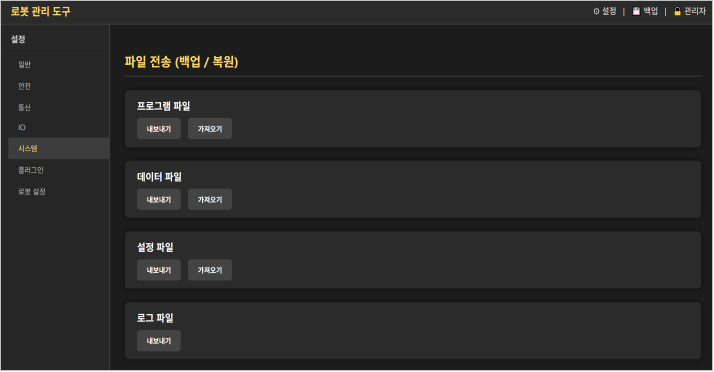

---
<!-- Page 147 -->
01
02
03
147
보안
요구사항
(L1) 컴포넌트 복구 및 재구성 - 중단 또는 장애 발생 후 알려진 보안 상태로 복구 및 재구성할 수 있는 기능을
제공해야 한다.
(L2) 복구 전 무결성 확인 - 복구를 시작하기 전에 백업 파일의 무결성을 검증하는 기능을 제공해야 한다.
목적
장치 상태를 보호하기 위해 복구 프로세스를 이용하여 주기적인 상태 저장 및 복원을 수행하고, 복구 무결성 검증을
통해 정상적인 시스템 복구가 수행되게 한다.
점검 기준
L1. 컴포넌트 복구 기능
L1-1. 컴포넌트 복구 기능 제공 여부
L2. 복구 전 무결성 검증
L2-1. 복구 전 백업 데이터 무결성 검증 여부
구현 및 점검 방안
L1
L1-1. 컴포넌트 복구 기능 제공 여부

## 01.	 로봇 시스템에서 백업된 컴포넌트를 정상적으로 복구할 수 있는 기능이 제공되는지 확인한다.

•  복구 기능은 운영자 또는 관리자 권한으로만 접근 가능해야 하며, 시스템이 백업된 데이터를 자동으로 인식하여 설정값을
재적용할 수 있어야 한다.
•  복구 기능은 전체 복구 또는 선택적 복구 형태로 제공될 수 있으며, 복구 완료 후 결과가 로그에 기록되어야 한다.
L2
L2-1. 복구 전 백업 데이터 무결성 검증 여부

## 01.	 로봇 시스템이 백업된 데이터의 무결성을 검증하는 절차를 제공하는지 확인한다.

•  복구 수행 전 백업 파일의 해시 값 또는 디지털 서명을 검증하여 변조 여부를 판단해야 한다.
•  검증 절차는 자동으로 수행되어야 하며, 검증 실패 시 복구가 중단되고 로그에 기록되어야 한다.
•  무결성 검증에 사용되는 기준 값은 백업 생성 시 함께 저장되어야 하며, 백업 데이터와 별도로 관리되어야 한다.
로봇 복구 페이지 예시

#### 3.9.6  [RA-06] 복구 관리

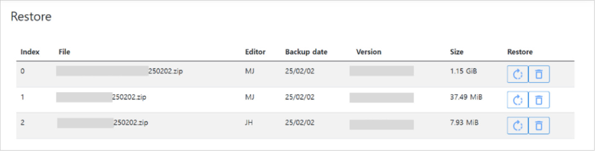

---
<!-- Page 148 -->
148
보안
요구사항
(L1) 네트워크 및 보안 구성 설정 - 공급자가 제공한 지침에 서술된 권고 네트워크와 보안 구성에 따른 설정 기능을
제공해야 하며, 현재 적용된 네트워크와 보안 구성 설정에 대한 인터페이스를 제공해야 한다.
(L3) 현재 보안 설정에 대한 보고서 생성 - 현재 배포된 보안 설정을 컴퓨터 판독 가능 형식으로 나열하는 보고서를
생성하는 기능을 제공해야 한다.
목적
네트워크 및 보안 구성 설정 관리 인터페이스를 통해 시스템이 정상적인 보안 구성 하에서 동작하는지 관리하고
보고서를 생성 및 저장하여 주기적인 검증을 수행한다.
점검 기준
L1. 네트워크 및 보안 구성 설정
L1-1. 네트워크 및 보안 구성 설정 제공 여부
L3. 보안 설정 보고서 생성 기능
L3-1. 현재 보안 설정에 대한 보고서 생성
구현 및 점검 방안
L1
L1-1. 네트워크 및 보안 구성 설정 제공 여부

## 01.	 로봇 시스템에서 네트워크 및 보안 구성을 설정하거나 수정할 수 있는 기능이 제공되는지 확인한다.

•  네트워크 구성(IP, 서브넷, 게이트웨이, DNS, 통신 포트 등)과 보안 구성(인증 정책, 접근제어, 암호화 설정, 방화벽 규칙
등)을 변경할 수 있는 사용자 인터페이스를 제공해야 한다.
•  설정 인터페이스는 관리자만 접근이 가능해야 한다.
L3
L3-1. 현재 보안 설정에 대한 보고서 생성

## 01.	 로봇 시스템이 현재 적용된 보안 설정 정보를 보고서 형태로 생성할 수 있는 기능을 제공하는지 확인한다.

•  생성된 보고서는 주요 보안 설정 항목과 생성 시점, 생성자 정보 등을 포함해야 한다.
•  보고서는 프로그램이 읽을 수 있는 구조화된 형식이어야 한다.

#### 3.9.7  [RA-07] 보안 구성 설정 관리

---
<!-- Page 149 -->
01
02
03
149
보안
요구사항
(L1) 불필요한 기능, 포트 및 서비스 제한 - 불필요한 기능, 포트, 프로토콜 및 서비스의 사용을 비활성화하거나
제한하는 기능을 제공해야 한다.
목적
불필요한 기능, 포트, 프로토콜 및 서비스의 사용을 비활성화하거나 제한하여 공격표면 확대를 방지한다.
점검 기준
L1. 불필요한 기능, 포트 및 서비스 제한 여부
L1-1. 불필요하게 노출된 서비스 존재 여부
L1-2. 불필요한 서비스 비활성화 기능 제공 여부
구현 및 점검 방안
L1
L1-1. 컴포넌트 복구 기능 제공 여부

## 01.	 로봇 시스템 또는 관리 네트워크에서 외부에 불필요하게 노출된 서비스가 존재하는지 확인한다.

•  포트 스캐닝이나 서비스 목록을 확인하여 사용되지 않거나 관리 목적과 무관한 포트, 프로토콜, 서비스가 활성화되어 있는지
점검한다.
•  시스템 기본 설치 시 포함된 테스트용, 디버깅용, 예비 서비스 등이 운영 환경에 그대로 남아 있지 않은지 확인한다.
•  외부에서 접근 가능한 서비스가 최소화되어 있으며, 운영 목적상 필요한 서비스만 허용되어 있는지 검증한다.
[방안 1] 외부 노출 서비스 점검 및 차단
불필요하게 외부로 노출된 서비스를 식별하고, 접근제어 정책으로 차단한다.
[방안 2] 내부 서비스 상태 점검 및 관리
시스템 내부에서 현재 활성화된 서비스 목록을 주기적으로 확인하고, 필요하지 않은 서비스를 비활성화한다.

#### 3.9.8  [RA-08] 불필요한 기능, 포트 및 서비스 제한

Bash (예: nmap을 이용한 포트 점검 및 차단)
# 외부 포트 스캔 (TCP 포트 확인)
$ nmap -sS 192.168.0.10
# 불필요한 포트(예: 21, 23, 69 등) 차단
$ sudo iptables -A INPUT -p tcp --dport 21 -j DROP
$ sudo iptables -A INPUT -p tcp --dport 23 -j DROP
$ sudo iptables -A INPUT -p udp --dport 69 -j DROP
Bash (예: 서비스 상태 확인 및 관리)
현재 활성화된 포트 및 프로세스 확인
$ sudo ss -tulnp
$ sudo netstat -tulnp
# 서비스 상태 확인 및 비활성화
$ sudo systemctl status telnet
$ sudo systemctl disable telnet
$ sudo systemctl stop telnet
서비스 목록 확인 예시

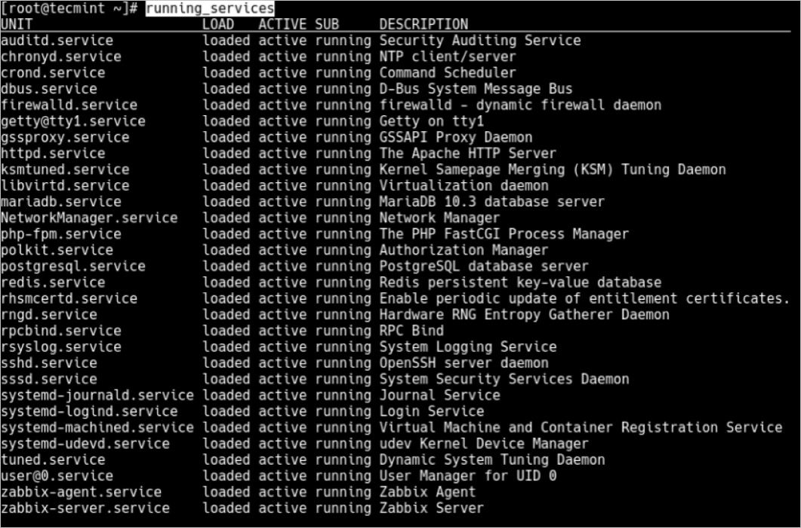

---
<!-- Page 150 -->
150
L1-2. 불필요한 서비스 비활성화 기능 제공 여부

## 01.	 로봇 시스템에서 사용하지 않는 서비스나 포트를 관리자가 직접 비활성화할 수 있는 기능이 제공되는지

확인한다.
•  관리자 권한으로 불필요한 서비스의 활성화/비활성화를 수행할 수 있어야 한다.
•  서비스 상태는 UI 또는 로그를 통해 확인 가능해야 하며, 변경 내역은 감사 로그로 기록되어야 한다.
서비스 관리 제공 페이지 예시

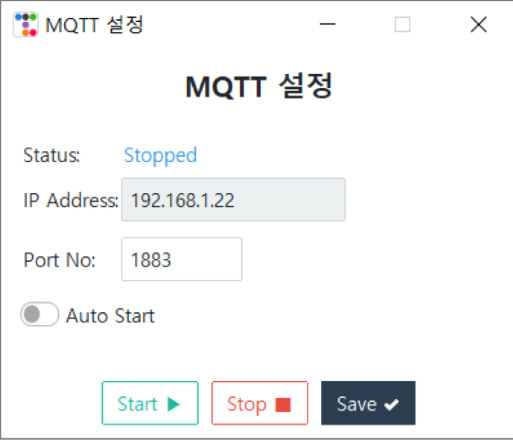

---
<!-- Page 151 -->
01
02
03
151
번호
체크리스트 항목
CR-01
중요 설정 데이터 정기적 백업 및 관리
CR-02
백업 데이터 무결성 및 복구 검증 절차
CR-03
사이버 침해사고 대비 복구 절차 문서화 및 테스트
CR-04
복구 목표 시간(RTO) 및 복구 목표 시점(RPO) 정의
CR-05
보안 업데이트 및 패치의 적시 제공과 적용
CR-06
업데이트 적용 실패 시 롤백 또는 복구 기능 확보
CR-07
보안 업데이트 지원 정책 및 수명주기 명시
CR-08
보안 취약점 보고·처리 공식 절차 마련
CR-09
충분한 로그 확보 및 보안 이벤트 분석 지원
CR-10
보안 사고/취약점 기반 보안 대책 개선 절차
CR-11
서비스 연속성 및 필수 기능 유지
CR-12
비정상 상태에서의 안전 정지/모드 전환 구현
CR-13
사용자 정보 등의 인증 데이터 보호
로봇의 침해 후 기능 유지 및 신속 복구를 수행하기 위한 사이버 복원력(Cyber Resilience, CR) 체크리스트 항목은
다음과 같다.

### 3.10 사이버 복원력 보안 요구사항

사이버 복원력 체크리스트 항목

---
<!-- Page 152 -->
152
보안
요구사항
로봇 시스템의 중요한 설정과 데이터는 주기적으로 백업하고 관리해야 한다.
목적
로봇 시스템의 중요한 설정과 데이터는 주기적으로 백업하고 관리해 소실시의 복원력을 갖춘다.
점검 기준
중요 설정/데이터 정기적 백업 및 관리

## 1. 주요 설정 및 데이터를 백업하는 기능의 제공 여부

## 2. 백업 접근통제 적용 여부

구현 및 점검 방안
1

## 01.	 주요 설정 및 데이터를 백업하는 기능의 제공 여부를 확인한다.

•  주요 설정, 파라미터, 동작 상태, 사용자 정의 값 등 중요 데이터에 대해 백업 기능을 제공하는지 확인한다.
•  제공되는 백업 형태(자동 백업, 수동 백업, 네트워크 백업 등)를 식별하고, 주기적인 백업 시점 및 복구 절차가 존재하는지
확인한다.
•  백업 데이터의 저장 위치(내부 저장소, 외부 서버, 클라우드 등)를 명시하는지 확인한다.
•  백업 데이터에 대한 무결성 검증 기능이 포함되는지 확인한다.
[방안 1] 백업 및 관리기능 제공방안
로봇 관리용 서비스에 백업 및 복원 기능을 추가하여 주요 설정값, 파라미터, 사용자 정의 데이터를 안전하게 보존할 수 있도록
수행한다. 아래와 같은 백업 및 복원 수행방안을 참고하여 기능을 제공할 수 있다.
항목
기능
관리자 권한 검증
•  백업 실행 시 관리자(root) 권한 검증 절차를 필수화
•  백업 요청·진행·완료 이력의 로그 기록
최소권한 저장소 보호
•  백업 데이터 저장소에 최소 권한 원칙 적용
•  디렉토리 권한·파일 ACL을 통해 접근 권한을 세분화하여 제한
백업 파일 암호화 저장
•  백업 파일은 AES 등 표준 암호 알고리즘으로 암호화 저장
•  해시 기반 무결성 검증을 수행하여 변조 여부 탐지·차단
외부 백업 연동 시 추가
인증
•  네트워크 백업 또는 외부 저장소 연동 시, 2차 인증 또는 API 키·토큰 검증
•  외부 경로를 통한 비인가 접근 방지
백업 및 복원 수행방안
설정 및 데이터 백업 예시

#### 3.10.1  [CR-01] 중요 설정/데이터 정기적 백업 및 관리

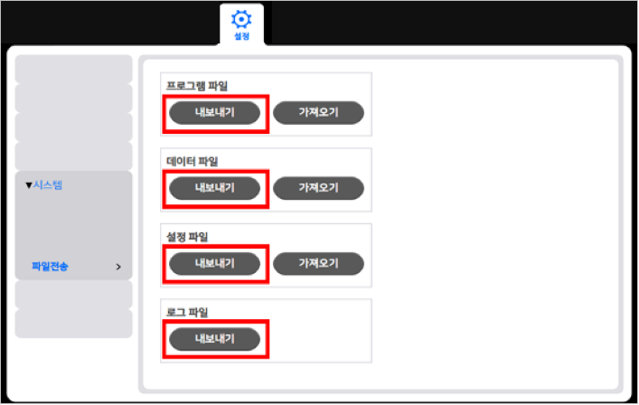

---
<!-- Page 153 -->
01
02
03
153
2

## 01.	 백업 접근통제를 수행하는지 확인한다.

•  백업 절차 수행 시 추가 인증(2차 인증, 관리자 승인 등)이 요구되는지 확인하여 비인가 접근을 방지하는 구조인지 점검한다.
[방안 1] 비인가 접근 방지방안
백업 수행 기능은 중요 자산에 직접 접근하는 행위이므로, 백업 실행·복구·삭제 등 모든 민감 작업은 아래와 같은 비인가 접근
방지방안에 기반하여 권한 상승 승인을 요구해야 한다.
•  관리자/2차 인증 기반 작업허용
•  최소 권한 및 역할 기반 접근 통제
백업 접근통제_사용자 예시
백업 접근통제_관리자 예시

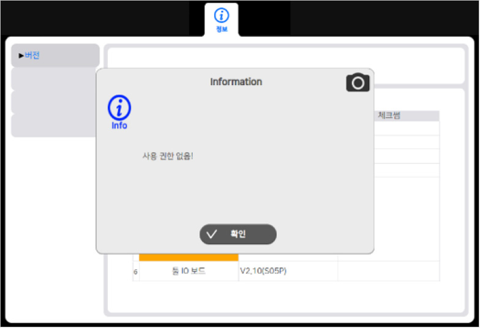

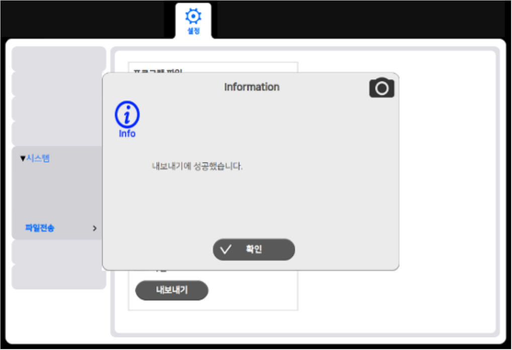

---
<!-- Page 154 -->
154
보안
요구사항
로봇 운영의 복구 절차가 문서화되어 있어야 하며, 해당 절차의 실효성을 확보하기 위해 점검 및 검증을 이행해야
한다.
목적
로봇 운영의 복구 절차의 문서화와 이에 대한 점검 및 검증을 이행하여 복구절차의 실효성을 확보한다.
점검 기준
백업 데이터 무결성 검증

## 1. 백업 데이터 복구 시 무결성 검증 여부

## 2. 무결성 검증 실패시 별도의 감사 로그 생성 여부

구현 및 점검 방안
1

## 01.	 백업 데이터 복구 시 무결성 검증 여부를 확인한다.

•  로봇의 관리 인터페이스, 시스템 설정, 또는 백업 관리 모듈 중 복구 기능을 제공하는 서비스가 존재하는지 확인한다.
•  복구 가능한 데이터의 유형을 식별하고, 복구가 내부 로컬 저장소, 외부 서버 또는 클라우드 백업에서 수행되는지 확인한다.
•  백업 데이터 복구 시 백업 시 생성된 해시, 무결성 체크파일 값을 복구 시점에 비교하는 등의 무결성 검증 메커니즘이
존재하는지 확인한다.
[방안 1] 무결성 검증 메커니즘 도입
백업 데이터의 무결성을 보호하고 복구 시 손상이나 변조가 발생할 경우 이를 방지하는 메커니즘을 수행한다.
2

## 01.	 무결성 실패 시 별도의 감사로그를 생성하는지 확인한다.

•  데이터가 복구되는 동안, 승인되지 않은 조작·수정·전송 오류 등이 탐지될 경우 감사 로그 또는 경보가 발생하는지 확인한다.
•  무결성 검증 실패 시 해당 복구가 중단되고 원래 상태로 돌아가는지 확인한다.
•  무결성 검증 기능이 내장되어 있지 않은 경우라도 관리자가 주기적으로 복구 절차를 테스트하고 결과를 기록하는 절차가
있는지 확인한다.
[방안 1] 무결성 실패 시의 방안
데이터가 복구될 경우, 무결성 실패가 감지된다면 아래 탐지 및 감사로그 복구방안에 기반하여 감사로그를 발생하고 이전
상태로 복구되어야 한다.
무결성 검증 메커니즘 수행방안
항목
내용
무결성 해시 생성 및 비교
•  백업 시점에서 파일별 해시(SHA-256 등)를 자동 생성
•  복구 시 동일 알고리즘으로 비교 수행
서명 기반 검증
•  중요 데이터의 경우 .sig, .asc 등 서명 기반 검증을 수행하여 위변조 여부 식별
검증 실패 처리
•  검증 실패 시 자동으로 로그 생성 및 관리자 알림 발생
비인가 조작 보호
•  승인되지 않은 조작·수정으로부터 복구 데이터·명령·설정·프로그램 보호
•  손상 발생 시 알림수행

#### 3.10.2  [CR-02] 백업 데이터 무결성 및 복구 검증 절차 운영

탐지 및 감사로그 복구방안
항목
복구방안
감사로그 생성
•  데이터 복구 과정에서 승인되지 않은 조작·수정·전송 오류 등 무결성 실패 감지
•  감지 시 즉시 감사로그 생성 및 관리자 경보 발생
복구 프로세스 모니터링
•  복구 과정에서 발생한 오류·변조·권한 상승 시도의 모니터링 및 감사기록 보존
복구 중단 및 이전 정상
상태 복원
•  무결성 검증 실패 시, 복구 절차는 즉시 중단되고 시스템·데이터는 복구 전의 정상 상태
로 자동 롤백

---
<!-- Page 155 -->
01
02
03
155
백업/복구 수행오류 경보 예시
복구 정기점검 절차문서 예시

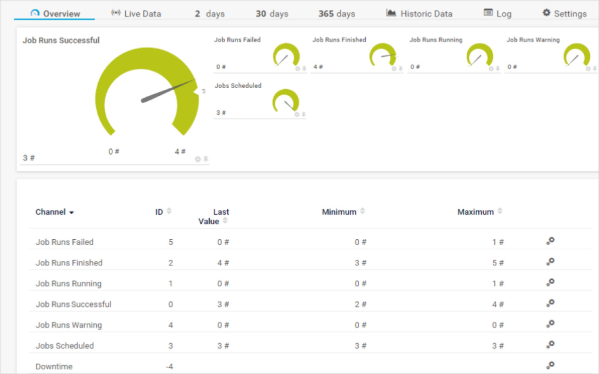

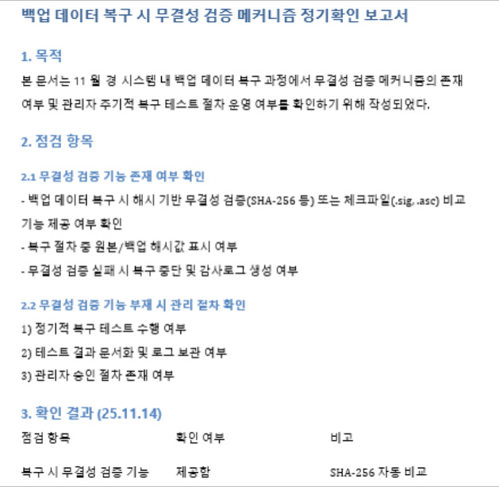

---
<!-- Page 156 -->
156
보안
요구사항
사이버 침해사고 발생 시를 대비하여 로봇 운영 복구 절차를 문서화하고, 정기적으로 모의 테스트를 실시해야 한다.
목적
로봇 운영 복구 절차의 문서화를 수행하여 이에 대해 정기적인 모의 테스트를 실시하여 사이버 침해사고를
대비한다.
점검 기준
사이버 침해사고 대비 복구 절차 문서화 및 테스트

## 1. 사이버 침해사고에 대비한 복구 절차의 존재 여부

구현 및 점검 방안
1

## 01.	 사이버 침해사고 대비 복구 절차가 존재하는지 확인한다.

•  로봇이 침해사고에 대비한 복구 절차를 보유하고 있는지 확인한다.
•  침해사고 발생 시 식별–격리–복원–검증으로 구성된 복구 시나리오가 최신 절차서로 문서화되어 있으며, 책임자와 역할
구분이 명확히 정의되어 있어야 한다.
•  복구에 사용되는 백업·재설정·로그 분석 등 주요 도구가 절차서에 포함되어 있고, 해당 절차는 정기적인 모의테스트를 통해
검증되어야 한다.
•  복구 절차는 표준화된 프로세스에 따라 주기적으로 실행되며 수행 근거자료가 확인 가능하도록 기록·관리되어야 한다.
[방안 1] 침해사고 복구 절차 수행방안
침해사고 복구 절차는 공식 문서로 정립하고, 시나리오별 복구 흐름과 역할을 명확히 하며 단계별 체크리스트와 필요한
도구까지 포함해 누락 없이 수행되도록 관리한다.
정기적인 대응 시뮬레이션과 백업 무결성 검증을 통해 절차의 효과성을 점검하고, 그 결과에 따라 복구 절차와 보안정책을
지속적으로 개선한다.
복구 절차를 가상으로 수행할 경우, 아래와 같은 필수 시뮬레이션 확인사항에 기반하여 수행한다.
•  환경에서 복구 절차, 제어 알고리즘, 인터페이스 복원, 전력 안정성 등을 재현하고 검증
•  실제 운영환경과 호환되며(센서/엑추에이터 인터페이스, 제어 알고리즘 등) 검증 목적과 한계를 명시
•  수행 결과에 따라 복구 절차를 개선하는 피드백 루프가 존재하는지 확인
무결성 검증 메커니즘 수행방안
항목
내용
침해사고 복구절차
•  식별→격리→복원→검증 단계로 절차 수행
•  역할·책임(R&R)을 명확히 정의
복구 절차 문서화
•  침해사고 복구 절차를 공식 문서화
•  주요 시나리오별 복구 흐름과 역할 책임 명시
복구 단계별 체크리스트
•  복구 단계별 체크리스트(복원, 검증, 로그 분석, 알림, 보고 등)를 작성
정기적인 모의훈련
•  정기적인 침해사고 대응 시뮬레이션 수행
•  정기적인 백업 무결성 검증 수행
절차 개선 및 보안정책
•  모의훈련 결과·운영 과정에서 발견된 문제점 개선
•  관련 보안정책을 주기적으로 개선·갱신

#### 3.10.3  [CR-03] 사이버 침해사고 대비 복구 절차 문서화 및 테스트

---
<!-- Page 157 -->
01
02
03
157
침해사고 복구 절차문서 예시
책임자 역할 및 구분문서 예시

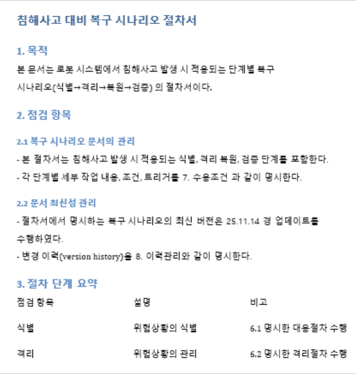

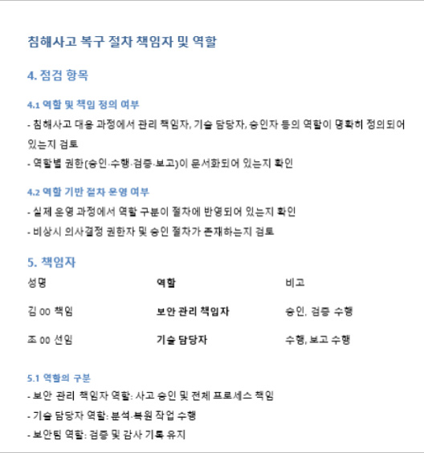

---
<!-- Page 158 -->
158
보안
요구사항
로봇 시스템 장애 발생 시 복구 목표 시간(RTO)과 복구 목표 시점(RPO)을 명확히 정의하여, 신속한 복구가
가능하도록 관리해야 한다.
목적
복구 목표 시간(RTO)과 복구 목표 시점(RPO)을 문서화하여 로봇 시스템에 문제가 발생할 경우 목표 시간과 시점 내
복구하여 가용성과 데이터를 보호한다.
점검 기준
복구 목표 시간(RTO) 및 복구 목표 시점(RPO) 정의
1. RTO, RPO 값의 정의 및 문서화 명시 여부
구현 및 점검 방안
1

## 01.	 복구 목표 시간(RTO), 복구 목표 시점(RPO)에 대한 정의와 문서화가 존재하는지 확인한다.

•  로봇 시스템은 장애·침해사고·데이터 손상 상황을 대비해 RTO·RPO 등 명확한 복구 목표가 문서화되어 있으며, 복구
목표를 명시한 문서는 승인 절차를 통해 최신 상태로 유지되어야 한다.
•  복구 절차는 연결된 장치나 네트워크의 전체 가용성에 영향을 주지 않도록 설계되어야 한다.
•  정기적인 복구 테스트를 통해 RTO/RPO 달성 여부를 검증하고 필요한 개선을 수행해야 한다.
[방안 1] 복구 절차 수행방안
사이버 침해사고에 대비하여 아래와 같은 복구 절차 및 유지관리 수행방안에 기반하여 목표와 절차를 지속적으로 개선한다.
복구목표
복구 절차 및 유지관리 수행방안
항목
내용
자산별 RTO·RPO 기준
수립
•  장애·침해사고·데이터 손상에 대비해 RTO·RPO를 문서화하며, 문서는 승인 절
차를 통해 최신 상태로 유지
•  자산별·라인별 RTO·RPO 표를 작성하여 중요도 기반 회복 목표를 정의하고 주
기적으로 검토
RTO 달성 아키텍처 설계
•  이중화, 페일오버 등 복구 구조를 명시하여 RTO 목표를 달성할 수 있도록 설계
단계적 복원 전략 수립
•  복구 절차는 네트워크·연결 장치 전체 가용성에 영향을 주지 않도록 단계적 복원
전략(순차 복원·부분 복원)을 정의
테스트 기반 검증 및 개선
•  정기적인 복구 테스트를 통해 RTO·RPO 목표 달성 여부를 측정하고, 결과를 기
반으로 재정의·개선
복구 목표
내용
RTO (복구 목표시간)
서비스 중단 후 정상 가동까지의 최대 허용 시간
RPO (복구 목표시점)
복구 시점 기준으로 허용 가능한 데이터 손실 범위

#### 3.10.4  [CR-04] 복구 목표 시간(RTO) 및 복구 목표 시점(RPO) 정의

RTO, RPO 목표정의 문서 예시

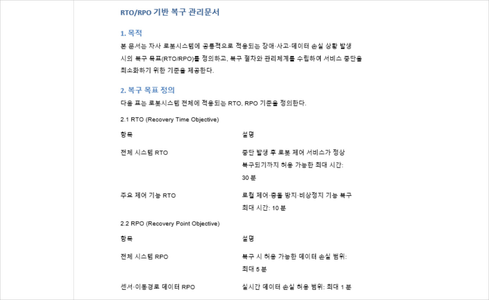

---
<!-- Page 159 -->
01
02
03
159
보안
요구사항
로봇 소프트웨어와 펌웨어에 대한 보안 업데이트 및 패치는 신속하게 적용될 수 있게끔 제공되어야 한다.
목적
로봇 소프트웨어와 펌웨어에 대한 보안 업데이트 및 패치 절차를 제공하여 문제 발생시 신속한 해결이 가능하게끔
적용시킨다.
점검 기준
취약점 발생 최소화

## 1. 업데이트 가능 구조의 해당 여부

## 2. 취약점 발견 시 사용자 또는 시스템에 알리기 위한 적절한 경로의 존재 여부

## 3. 내부 보안 패치 프로세스 존재 여부

## 4. 취약점 대응 이력을 관리하는 프로세스 존재 여부

구현 및 점검 방안
1

## 01.	 로봇이 업데이트가 가능한 구조에 해당하는지 확인한다.

•  로봇 및 연결 기기가 펌웨어·소프트웨어 업데이트를 수신·적용할 수 있는 구조인지 확인한다.
[방안 1] 펌웨어·소프트웨어 업데이트 수행방안
로봇 및 연결 기기가 안전하게 업데이트를 수신·적용할 수 있도록, 업데이트 경로와 적용 절차를 표준화하고 신뢰할 수 있는
채널을 통해 배포되도록 설계한다. 업데이트 패키지는 무결성·서명 검증을 통과한 경우에만 설치되도록 구성하여 비인가된
코드나 변조된 소프트웨어가 적용되지 않도록 보호한다.
업데이트 수신·적용 예시
업데이트 수신·적용 예시

#### 3.10.5  [CR-05] 보안 업데이트 및 패치의 적시 제공과 적용

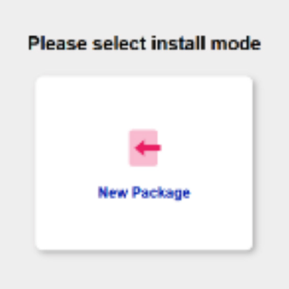

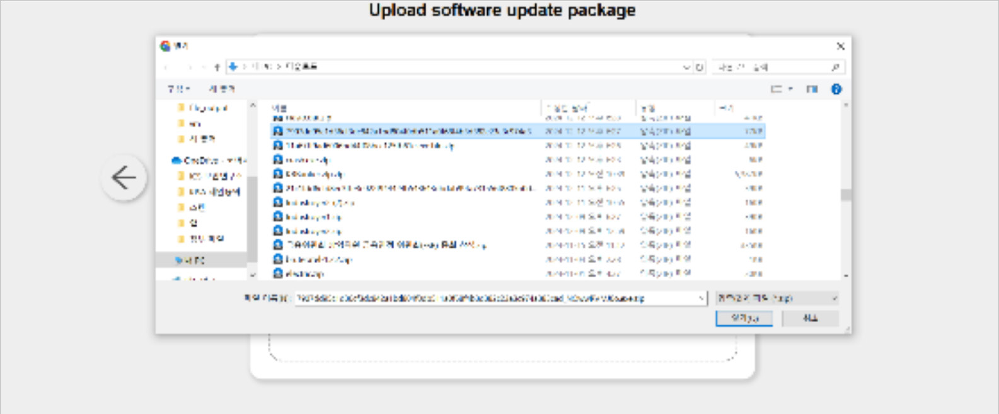

---
<!-- Page 160 -->
160
2

## 01.	 취약점이 발견될 경우 사용자 또는 시스템에 알리기 위한 적절한 경로의 존재 여부를 확인한다.

•  취약점이 식별될 경우 제조사가 사용자·운영자에게 신속히 통지할 수 있는 공식 채널이 운영되는지 확인한다.
[방안 1] 취약점 알림 채널/경로
취약점 식별 시 취약점 보고/처리 절차에 기반해 사용자·운영자에게 통지하기 위한 채널/경로를 아래의 예시를 참고하여
구축 및 운영한다.
취약점 알림 채널/경로
취약점 이메일 알림 예시
단계
필수 취약점 보고/처리 절차 내용
접수
•  취약점 발견/접수 상태
평가
•  심각도 평가를 통해 접수된 취약점의 상태를 Critical·High·Medium로 분류, 처리 우선
순위 설정
•  대응 SLA 지정을 통해 취약점 심각도별 응답/임시완화/정식패치 배포 시간 설정
패치
•  티켓과 담당자 할당에 따른 보안 패치 수행
배포
•  내부 통보·외부 공지 절차에 따른 대응
•  공개 일정의 조율
•  신고자에게 접수 확인·진행상황 통보·종결 통보
모니터링·사후검토
•  상태에 대한 모니터링, 사후검토 수행
취약점 알림 채널/경로 예시
•  PSIRT 연락처
•  취약점 접수 포털/이메일
•  제품 내 관리자 알림
•  보안 공지 페이지

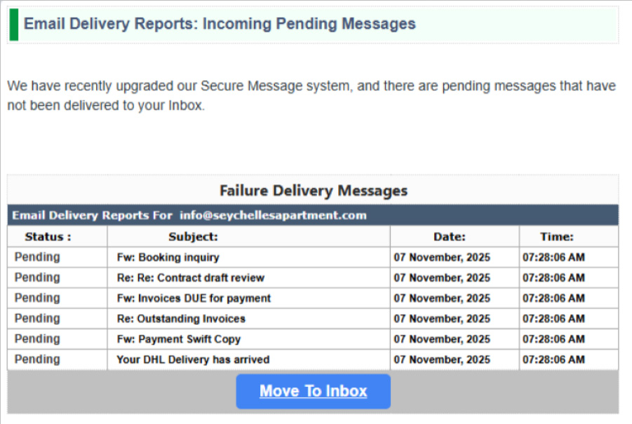

---
<!-- Page 161 -->
01
02
03
161
3

## 01.	 내부 보안 패치 프로세스(재현, 분석, 수정, 테스트, 배포)의 존재 여부를 확인한다.

•  초기 배포 시 악용가능한 취약점이 알려지지 않은 상태로 출시하여야 한다.
•  취약점 접수 후 아래와 같은 단계 하에 지체 없이 수행되는 표준화 프로세스가 존재하고 문서화되어 있는지
검증하며, 각 단계의 책임·산출물이 정의되어 있어야 하며, 테스트·검토는 정기적으로 수행되어야 한다.
•  배포 시 패키지 서명·무결성 검증 및 안전 배포 메커니즘이 적용되어야 한다.
[방안 1] 내부 보안패치 프로세스 방안
취약점 접수 이후 재현·분석·수정·테스트·배포의 표준화된 패치 프로세스를 운영하며, 패키지 서명과 무결성
검증을 통해 안전하게 배포되도록 관리한다.
취약점 알림 채널 예시
내부 보안 패치 프로세스 운영방안
항목
내용
패치 프로세스
•  취약점 접수 후 재현→분석→수정→테스트→배포까지 이어지는 표준화된 보
안 패치 프로세스 문서화
•  책임·산출물·승인 절차의 보안 패치 프로세스 문서화
•  초기 출시 전 사전 보안 검증 수행
•  패치 제공 시 배포노트(CVE 영향, 재시작 여부) 제공
출시 전 보안 취약점 관리
프로세스
•  빌드마다 SBOM을 자동으로 생성
•  SCA(구성요소 CVE) + SAST 자동 실행 및 결과 사용
•  Critical/High CVE = 0일 때만 배포 통과, Low나 Medium의 경우 수용에 따
라 한시허용
보안 및 무결성 보호
•  패치 SLA를 위험도 기반으로 수립
•  모든 패치 패키지에 코드 서명·해시 검증 강제
•  패키지 전송 및 설치 과정에서 안전한 배포 메커니즘(TLS, 무결성 검증, 실패
시 롤백)을 적용
사용자 보호 및 투명성
•  보안 업데이트 무상 정책을 문서·사용자 가이드에 명확히 명시
•  설치 전 사전 알림 제공
안전 배포 메커니즘 제공
•  암호화 전송, 단계적 롤아웃, 자동업데이트 옵션 제공

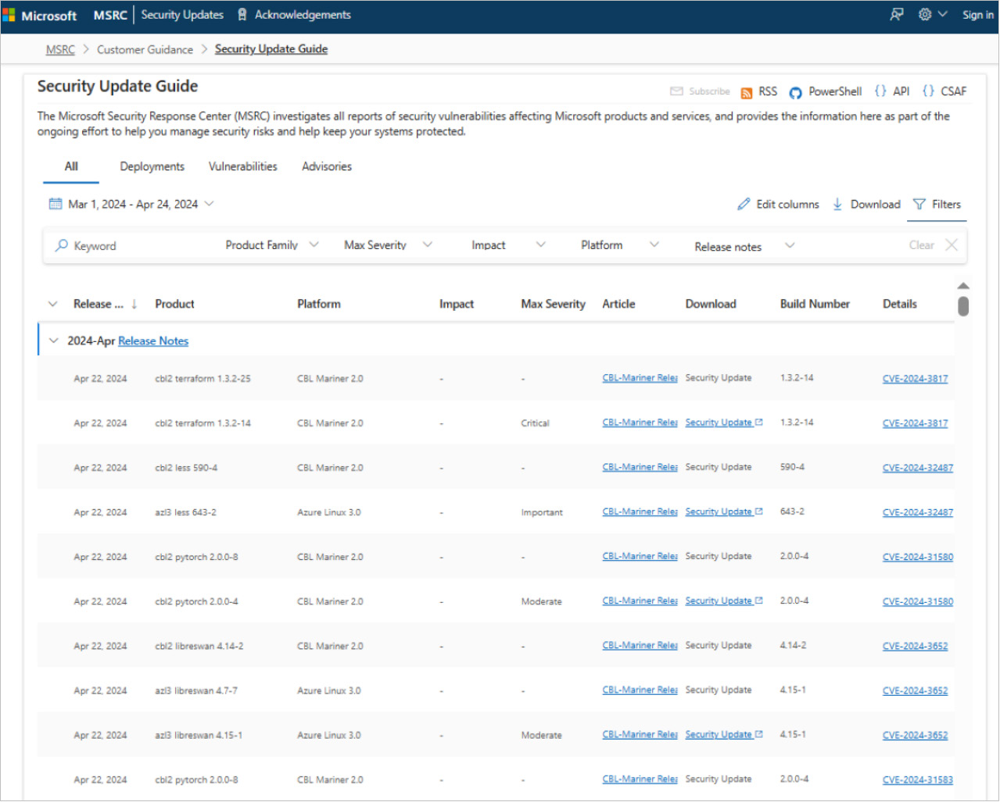

---
<!-- Page 162 -->
162
내부 보안 패치 프로세스를 수행할 시에 각 단계에서 산출되는 산출물은 아래와 같다.
4

## 01.	 취약점 대응 이력을 관리하는 프로세스의 존재 여부를 확인한다.

•  발생한 취약점에 대해 대응 이력을 관리하는 프로세스의 존재 여부를 검증한다.
•  취약점 접수부터 종결까지 이력을 체계적으로 관리하는 프로세스가 존재하는지 확인한다.
•  대응 이력 관리의 경우 우선순위·심각도·담당자·SLA·조치내역(패치 버전·배포일 등) 등이 기록되어야 하며, 알림 이력과
연계되어야 한다.
•  패치는 무료로 배포되고 사용자에게 권고 메시지를 제공하는 절차와의 연계를 수행해야 한다.
[방안 1] 취약점 대응이력 관리 프로세스 방안
취약점 접수부터 종결까지의 이력을 체계적으로 기록·관리하고, 사용자 알림 및 무료 패치 배포 절차와 연계되는 프로세스를
아래의 대응 이력 관리 프로세스에 기반하여 운영한다
보안 패치 프로세스 산출물
대응이력 관리 프로세스
필수 산출물
내용
원인분석 보고서
원인분석 및 재현
패치 산출물
패치
검증결과 보고서
테스트 (회귀·보안·부작용 검증)
배포 산출물
배포 (서명·해시 적용, 암호화 전송 및 단계적 롤아웃 수행)
상태
내용
발견/접수
취약점을 보고받거나 발견한 상태, 티켓과 담당자 할당
진행중
담당 수행자에 의한 취약점 대응 수행
패치검수
취약점을 개선한 패치의 동작 검증
배포/종결
검증이 완료될 경우, 패치 전달 및 종결

---
<!-- Page 163 -->
01
02
03
163
보안
요구사항
로봇 시스템의 보안 업데이트 적용에 실패할 경우, 이전 안정화 버전으로의 롤백이나 복구가 가능해야 한다.
목적
로봇 시스템의 보안 업데이트 적용에 실패할 경우, 이전 안정화 버전으로의 롤백이나 복구를 통해 시스템 가용성과
안정성을 확보한다.
점검 기준
업데이트 실패 시 롤백 또는 복구 기능 확보

## 1. 패치 실패 시 안정화 버전 롤백 가능 여부

구현 및 점검 방안
1

## 01.	 업데이트 실패 시 안정화 버전 롤백/복구 기능의 존재 여부를 확인한다.

•  로봇에 대해 아래와 같은 경우로 나뉘는 보안 업데이트를 지원하는지 확인한다.
보안 업데이트 자동 적용을 지원하는 경우 (*업데이트 알림 및 일시 연기 옵션 제공)
자동 설치·롤백·복구 동작과 사용자 선택을 제공하는 경우
•  업데이트 실패 발생 시 시스템이 자동 또는 수동으로 이전 안정화 버전으로 롤백·복구할 수 있는 기술적 메커니즘이
존재하는지 확인한다.
•  롤백 시 무결성·서명 검증을 통해 악성/변조된 이미지로 되돌아가지 않도록 보호해야 한다.
[방안 1] 업데이트 실패 대응 및 안정화 버전 롤백방안
로봇 시스템은 보안 업데이트 적용 과정에서 실패가 발생하더라도 서비스 중단을 최소화할 수 있도록 자동·수동 롤백 및 복구
기능을 제공해야 한다.

#### 3.10.6  [CR-06] 업데이트 적용 실패 시 롤백 또는 복구 기능 확보

업데이트 롤백 안정성 확보 방안
자동 보안 업데이트 예시
항목
내용
롤백 메커니즘 적용
•  A/B 파티션
•  컨테이너 버전 관리
백업·복구 절차 수행
•  업데이트 전 사전 백업 수행
•  필요 시 즉시 복구할 수 있도록 절차 구비
안정화 버전 별도 관리
•  이전 정상 버전을 별도로 보존·관리하여 롤백 시 신뢰 가능한 상태로 복원
정기 복구 테스트
•  정기적인 롤백/복구 테스트 수행을 통한 실제 동작 가능성을 검증

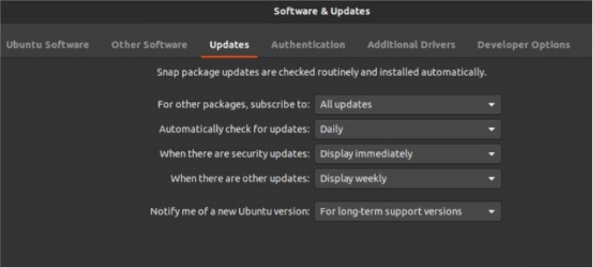

---
<!-- Page 164 -->
164
사용자 선택을 통한 보안 업데이트 예시

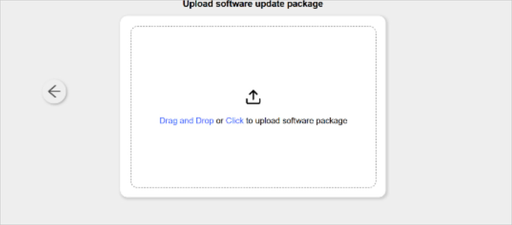

---
<!-- Page 165 -->
01
02
03
165
보안
요구사항
로봇 지원 수명 기간 동안 보안 업데이트 제공 정책을 명확히 수립하고 운영해야 한다.
목적
로봇 지원 수명 기간 동안 적용되는 보안 업데이트 제공 정책을 운영하여 로봇 운영자/사용자에게 지속적인 패치를
제공한다.
점검 기준
보안 업데이트 지원 정책 및 수명주기 명시

## 1. 제품 또는 소프트웨어의 보안 업데이트 지원 종료일 명시 여부

## 2. 지원 종료 전까지 취약점에 대한 보안 업데이트 제공 보장 여부

## 3. 보안 업데이트가 있을 경우 사용자 또는 시스템에 알리기 위한 경로 존재 여부

구현 및 점검 방안
1

## 01.	 제품 또는 소프트웨어의 보안 업데이트 지원 종료일을 명시하는지 확인한다.

•  상위 구성요소와 하위 라이브러리 수준의 구성요소를 파악하고 CVE, EoL(End Of Life), EoS(End Of Service)에
도달하는지를 확인하는 정책이 존재하는지 확인한다.
•  보안 업데이트의 지원 기간과 일반 업데이트 지원 기간의 정책 구분여부를 확인한다.
[방안 1] 보안 업데이트 지원 정책
제품 및 소프트웨어의 구성요소에 대한 EoL/EoS 도달 여부를 주기적으로 점검하고, 보안 업데이트 지원 종료일을 명확히
문서화하여 사용자에게 제공한다. 정책 문서화 시에는 아래와 같은 필수요소를 포함하여야 한다.
•  구성요소 설명
•  악용 가능한 취약점이 알려진 상태로 제품이 출하되지 않도록 차단하는 통제방안
•  CVE·EoL·EoS에 도달하는 구성요소 정보
•  CVE·EoL·EoS에 도달하는 구성요소에 대한 대응원칙
•  보안 업데이트 제공시 사용자에게 제공하는 공개정보
취약점 설명
해당 제품을 식별할 수 있는 정보
취약점의 영향 및 심각성
사용자가 취약점을 해결하는 데 도움이 되는 명확하고 접근 가능한 정보
*다만 제조업체가 공개로 인한 보안상 위험이 공개 이익보다 크다고 판단할 경우, 사용자에게 패치 적용 기회가 제공된 이
후 공개지연
•  제품 수명주기(EoL) 관리 정책
•  보안 업데이트의 지원 기간 정책
•  일반 업데이트 지원 기간 정책

#### 3.10.7  [CR-07] 보안 업데이트 지원 정책 및 수명주기 명시

보안 업데이트 지원 정책문서 예시

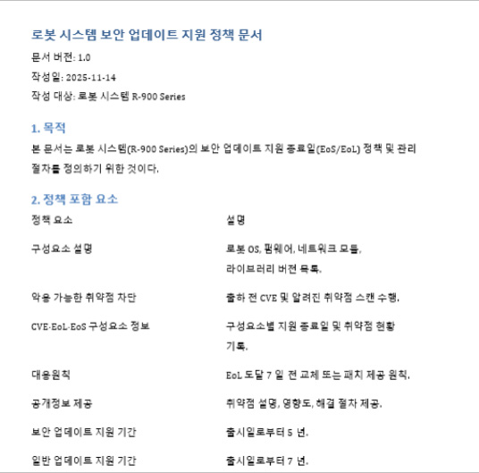

---
<!-- Page 166 -->
166
2

## 01.	 지원 종료 전까지 취약점에 대한 보안 업데이트 제공을 보장하는지 확인한다.

•  로봇의 운영자/사용자에게 하위 정보를 포함한 보안 업데이트 사용자 제공 문서를 제공하는지 확인한다.
[방안 1] 보안 업데이트 사용자 제공 문서
지원 종료일까지 발견된 취약점에 대해 신속한 보안 업데이트 제공을 보장하며, 로봇 운영자·사용자가 이해할 수 있도록
아래와 같은 요소를 포함한 보안 업데이트 문서를 제공한다.
사용자 제공 문서에 포함되어야 할 요소는 다음과 같다.
•  제품 식별 정보(모델·버전·모듈 목록)
•  제품 또는 소프트웨어의 보안 업데이트 지원 종료일
•  제품 지원 종료일 정보
•  보안 업데이트가 제공되는 기간 동안 사용자에게 어떤 경로로 알림이 제공되는지의 정보
•  사용자가 취해야 할 조치
3

## 01.	 보안 업데이트가 있을 경우 사용자 또는 시스템에 알리기 위한 경로 존재 여부를 확인한다.

•  로봇의 운영자/사용자에게 하위 정보를 포함한 보안 업데이트 사용자 제공 문서를 제공하는지 확인한다.
[방안 1] 공지 체계 구축방안
보안 업데이트 발생 시 사용자 또는 시스템에 즉시 통지할 수 있도록 관리자 알림, 제품 내 메시지, 이메일, PSIRT 공지 등
공식 경로를 운영하며 알림에는 하위 구성요소 정보와 패치 상세 내용을 포함한다.
위와 같은 공지체계 수단의 예시로는 이메일, 웹 사이트, 채널을 들 수 있다.
보안 업데이트 사용자 제공문서 예시

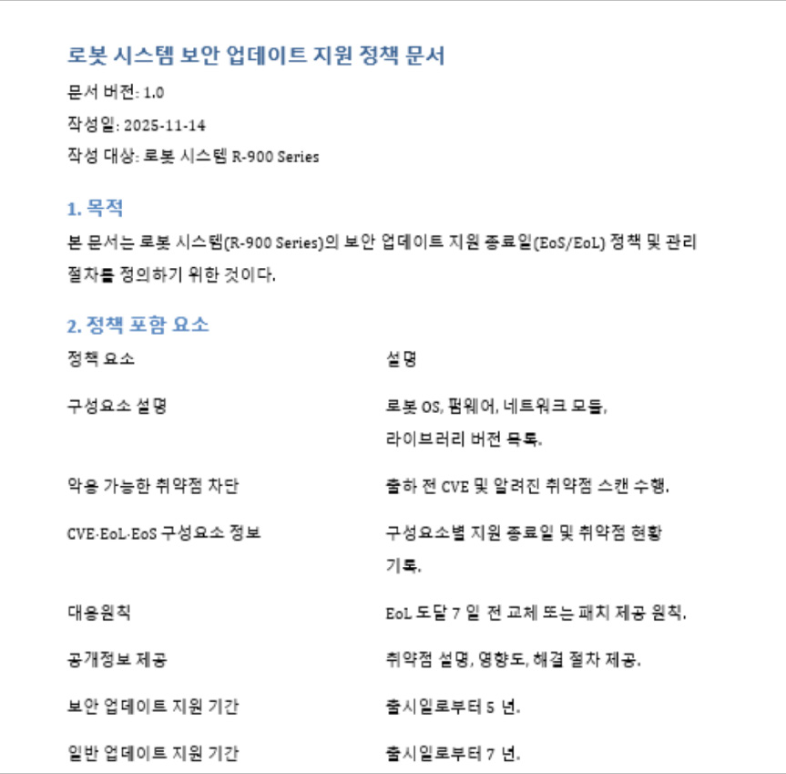

---
<!-- Page 167 -->
01
02
03
167
보안
요구사항
외부로부터 보안 취약점 보고를 접수하고 신속하게 처리할 수 있는 공식 절차가 존재해야 한다.
목적
보안 취약점 보고가 접수될 경우 신속히 처리할 수 있는 공식 절차를 규정하여 취약점 악용 및 공격에 이용되지
않도록 한다.
점검 기준
보안 취약점 보고·처리 공식 절차 마련

## 1. 외부 또는 내부의 취약점 신고 채널 존재 여부

## 2. 신고 접수 후 내부 처리 절차 존재 여부

구현 및 점검 방안
1

## 01.	 외부 또는 내부의 취약점 신고 채널이 존재하는지 확인한다.

보안 취약점 보고 및 처리 절차가 존재하는지 확인한다.
•  로봇에 대해 취약점이 발견될 경우의 보고 및 처리 절차가 문서화되어 있는지 확인한다
•  취약점 접수 시 발생한 대응에 대해서는 상위 대응이력 관리 프로세스에 의거하여 진행한다.
[방안 1] 취약점 신고 채널 및 보고 절차 운영방안
보안 취약점 신고를 위해 공식 신고 채널을 운영하고, 취약점 보고 및 처리 절차를 문서화하여 일관된 절차에 따라 신고할 수
있도록 한다. 상세한 수행 방법은 “3.10.5 [CR-05] 보안 업데이트 및 패치의 적시 제공과 적용”에서 제시하는 취약점 신고
채널 및 보고 절차 방안을 참고한다.
취약점 심각도별 대응시간 목표를 설정하고, 접수 확인부터 패치 배포까지의 단계별 처리 절차 문서화 및 진행 상황 추적
체계를 구축한다. 상세한 수행 방법은 “3.10.5 [CR-05] 보안 업데이트 및 패치의 적시 제공과 적용”에서 제시하는 취약점
신고 채널 및 보고 절차 방안을 참고한다.
2

## 01.	 신고 접수 후 내부 처리 절차 존재 여부를 확인한다.

•  보안 취약점 제보를 위한 공식 신고 창구나 채널이 존재하는지 검증한다.
•  해당 신고창구와 채널이 상시 운영되는지 확인한다.
[방안 1] 취약점 처리 프로세스 표준화 및 SLA 수립
취약점 심각도별 대응 시간 목표를 설정하고, 접수 확인부터 패치 배포까지의 단계별 처리 절차 문서화 및 진행 상황 추적
체계를 구축한다. 상세한 수행 방법은 “2.3. 인터페이스 식별”에서 [CR-05] 보안 업데이트 및 패치의 적시 제공과 적용에서
제시하는 취약점 신고 채널 및 보고 절차 방안을 참고한다.

#### 3.10.8  [CR-08] 보안 취약점 보고·처리 공식 절차 마련

취약점 공식 채널 예시

---
<!-- Page 168 -->
168
취약점 보고 양식 예시

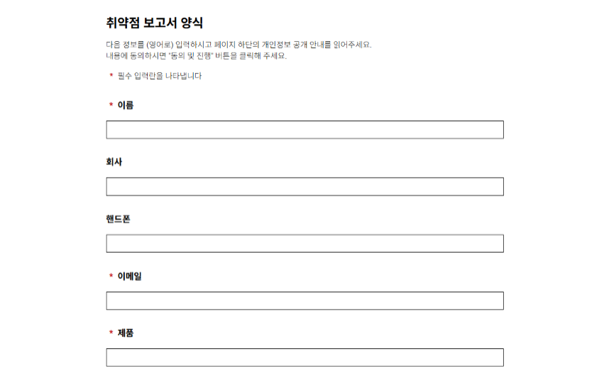

---
<!-- Page 169 -->
01
02
03
169
보안
요구사항
로봇 시스템에서 보안 이벤트 발생 시, 원인 분석과 복구를 지원할 수 있도록 충분한 로그를 확보하고 관리하는
기능을 제공해야 한다.
목적
로봇 시스템에서 보안 이벤트 발생 시, 로그 확보 및 관리 기능을 제공하여 보안 이벤트에 대한 추적과 대책설정을
지원한다.
점검 기준
충분한 로그 확보 및 이벤트 분석 지원

## 1. 데이터, 서비스 또는 기능에 대한 액세스 또는 수정을 포함한 관련 내부 활동 기록 여부

## 2. 이벤트 로그의 충분한 기간 이상 저장 여부

구현 및 점검 방안
1

## 01.	 데이터, 서비스 또는 기능에 대한 액세스 또는 수정을 포함한 관련 내부 활동을 기록하는지 확인한다.

•  인터페이스에 대해 제공되는 모든 서비스 중, 데이터 접근·변경·제어 관련 이벤트가 발생할 수 있는 기능을 목록화하고
기능별 로그 발생 여부를 확인한다.
•  로그가 단순 동작 이력뿐 아니라 보안 관련 이벤트도 포함하는 로그에 해당하는지 확인한다.
•  발생하는 이벤트 로그가 적절한 구조와 정보를 갖추고 있는지 확인한다.
[방안 1] 로그 확보 및 저장방안
로봇 시스템에 기본적인 활동 로그 생성 기능을 추가하고 보존 기간을 정책적으로 정의·적용한다. 보안 사고 대응과 추적
가능성을 확보하기 위해 아래의 로그 운영방안을 참고해서 로그 저장소를 분리하고 장기 보관·무결성 검증 체계를 구비한다.

#### 3.10.9  [CR-09] 충분한 로그 확보 및 보안 이벤트 분석 지원

로그 운영방안
항목
내용
로그 저장소 분리
•  로그 저장소를 일반 운영 데이터 영역과 분리해 별도 저장소 / 외부 로그 서버에 보관
순환 삭제 및 아카이브
•  Log rotation 정책에 따라 오래된 로그를 주기적으로 백업·아카이브하여 서비스 가용성
영향방지
시스템 자원 보호
•  로그 전송·저장을 비동기 구조로 처리하여 메모리·네트워크·CPU 자원점유 최소화
기본 보안 로그 수집
•  인증 실패, 접근 거부, 설정 변경, 비정상 명령 시도 등 핵심 활동 로그 수집
로그 서비스 예시

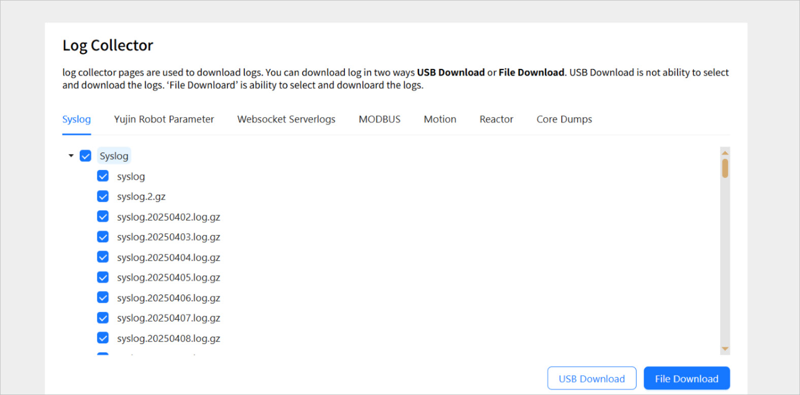

---
<!-- Page 170 -->
170
2

## 01.	 이벤트 로그가 기간 이상 저장되고 있는가를 확인한다.

로그가 정책적으로 정의된 최소 보존 기간 동안 안전하게 저장되는지 확인한다.
[방안 1] 로그 최소 보존 기간 준수방안
로그는 정책적으로 정의된 최소 보존 기간 동안 안전하게 저장되도록 보존 정책을 설정해야 한다.
저장소 사용량 조회 예시

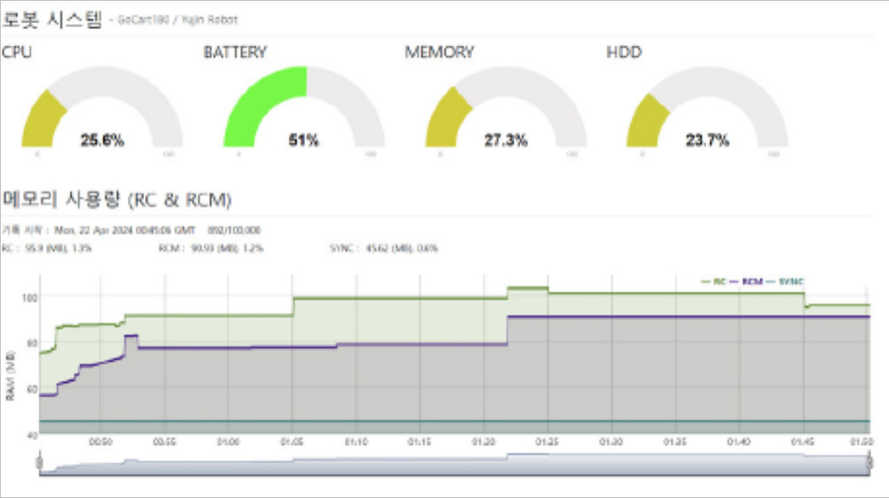

---
<!-- Page 171 -->
01
02
03
171
보안
요구사항
사고와 취약점 정보를 바탕으로, 보안 대책을 주기적으로 검토하고 지속적으로 개선해야 한다.
목적
보안 사고와 취약점 정보에 대해 보안 대책을 주기적으로 검토 및 지속적으로 개선하여 향후 비슷한 사고의
발생방지를 수행한다.
점검 기준
보안 사고/취약점 기반 보안 대책 개선 절차

## 1. 보안 사고, 취약점 발생 또는 정기적인 테스트 수행 및 보안 정책 개선 여부

구현 및 점검 방안
1

## 01.	 보안 사고, 취약점 발생 또는 정기적인 테스트 수행 및 보안 정책을 개선하는지 여부를 확인한다.

•  로봇에 대해 침해사고가 발생할 경우를 대비하기 위한 정기적인 취약점 테스트 수행 프로세스가 존재하는지 검증한다.
•  로봇에 대해 침해사고가 발생할 경우의 취약점 관리 프로세스가 존재하는지 검증한다.
[방안 1] 정기적인 취약점 점검 프로세스 방안
정기 보안 점검 수행 프로세스를 아래의 필수방안들에 기반하여 정의 및 수행하고, 재발 방지를 위한 RCA 절차 기반으로
대응한다. 대응이 종료되면 위험 등급 별 우선순위 정리 및 보안 조치 문서화를 수행한다.

#### 3.10.10  [CR-10] 보안 사고/취약점 기반 보안 대책 개선 절차

항목
예시
자동화 스캔
•  매주/격주와 같은 특정기간 내내 SCA/SAST 수행
빌드시 검증
•  CI/CD 파이프라인 내 자동 SAST/SCA 실행
침투 테스트
•  연 1회 이상
취약점 점검
•  연 4회 이상 SBOM 작성 *최소한 제품 최상위종속성 포함
점검 대상
검증방안
하드웨어
•  물리적 접근통제가 준수되고 있는가?
•  하드웨어 구성요소 보안이 준수되고 있는가?
소프트웨어
•  운영체제 보안이 적절히 준수되고 있는가?
•  응용프로그램 보안이 준수되고 있는가?
•  미들웨어 및 라이브러리 보안이 준수되고 있는가?
•  개발을 수행할 경우 보안 요구사항을 설계에 반영하였으며 개발망과 외부의 네트워크
분리를 수행하고 있는가?
네트워크
•  네트워크 구성과 통신 프로토콜 보안을 준수하고 있는가?
•  네트워크 서비스에 대한 보안이 준수하고 있는가?
•  DoS 등의 네트워크 공격에 대한 대응책을 준수하고 있는가?
펌웨어
•  펌웨어 무결성과 업데이트/롤백 프로세스 보안을 준수하고 있는가?
•  펌웨어 자체 보안(하드코딩, 디버그 포트 등)을 준수하고 있는가?
데이터
•  저장 데이터에 대한 보안을 준수하고 있는가?
•  전송 데이터에 대한 보안을 준수하고 있는가?
사용자 표면
•  사용자가 접근하는 인증 메커니즘이 적절하게 설정되어 있는가?
•  사용자 권한 관리가 적절하게 분류되어 있는가?
단계
검증방안
문서 검토
•  취약점 점검 정책 및 절차서 확인
•  점검 계획서 및 실행 기록 검토
•  침해사고 대응 매뉴얼 확인, 발행한 취약점 점검 보고서 검토
수행 검증
•  정기적인 취약점 점검 수행이력 확인
•  취약점 조치 완료현황 확인
•  미조치 취약점에 대한 대응책(수용/전가/보완 등) 및 적용결과 확인
개선책 설정
•  미흡한 부분이 존재할 경우 이를 개선하기 위한 대응책 설정
취약점 점검 프로세스 방안

---
<!-- Page 172 -->
172
보안
요구사항
로봇 시스템은 부분적 시스템 장애나 DoS 공격 상황에서도 로봇의 필수 안전 및 운영 기능이 유지될 수 있도록
설계해야 한다.
목적
로봇 시스템을 필수 안전 및 운영 기능이 유지될 수 있도록 설계해여 부분적 시스템 장애나 DoS 공격 상황에서
가용성을 유지시켜 운영자/사용자의 안전을 확보한다.
점검 기준
서비스 연속성 및 필수 기능 유지
1. DoS와 같은 공격, 장애상황 예방 및 가용성 유지를 위한 별도 기능 적용 여부
구현 및 점검 방안
1
01.	 DoS와 같은 공격, 장애상황 예방 및 가용성 유지를 위한 별도 기능을 적용하는지 확인한다.
•  DoS와 같은 공격, 장애상황 예방 및 가용성 유지를 위한 기능이 존재하는지 확인한다.
[방안 1] 서비스 연속성과 기능유지 방안
DoS 공격이나 장애 상황에서도 로봇 서비스의 가용성을 유지할 수 있도록 서비스 연속성과 기능유지 방안에 기반하여 연속
운영 기능을 적용해 서비스 중단을 예방한다.
기능유지 방안은 아래와 같은 DoS 방지 검증방안에 기반하여 검증할 수 있다.

#### 3.10.11  [CR-11] 서비스 연속성 및 필수 기능 유지

항목
내용
자원 보호 기능
•  임계치 제한, Rate limiting, QoS 제어 기능 적용
서비스복구 기능
•  장애 발생 시 자동 재시작, 프로세스 모니터링, 헬스체크
장애 격리 기능
•  프로세스·스레드·컨테이너 단위 격리 구조 적용
대체 경로/백업 기능
•  네트워크 또는 로봇 내부 기능의 장애 대비 대체 경로·백업 기능 제공
항목
검증방안
동시 세션
·연결 제한
•  기능 존재 여부: 세션 수/동시 연결 수 제한, IP별/토큰별 연결 제한 구현 여부 확인
•  설정값 검토: 기본값, 최대값, 알림 임계치(예: 동시 연결 80% 초과 시) 확인
•  검증: 동시 연결 부하 시험(증분 연결 생성)으로 정상 서비스(특히 안전 제어 루프)에 영향
없는지 확인
QoS / 트래픽
우선순위
•  기능 존재 여부: 트래픽 분류(안전 vs 비안전), 우선 큐(우선순위 큐) 적용 여부 확인
•  End to End 적용성: 로봇 내부뿐 아니라 게이트웨이/네트워크 스택에서도 QoS가
유지되는지 확인
•  검증: 안전 트래픽과 비안전 트래픽을 동시에 발생시켜 안전 트래픽의 지연/손실률이
허용범위 내인지 측정
자동 복구
•  기능 존재 여부: 서비스 프로세스 모니터링(워치독), 프로세스 재시작, 기능별 최소 동작
모드(예: 수동 제어 허용) 여부 확인
•  장애 시 우회 경로: 통신 실패 시 대체 통신 채널(예: 유선→무선 우회)이 있는지 확인
•  검증: 서비스 프로세스 강제 종료, 네트워크 차단 등 시나리오로 자동 복구 동작이 완료되는
시간 확인
방화벽·접근 제한
•  기능 존재 여부: IP 허용 목록, 포트 제한, 관리 인터페이스 접근 제어(관리자 서브넷/관리
VLAN) 제공 여부 확인
•  관리 편의성: 허용 IP 추가/제거 절차 및 감사 로그 존재 확인
•  검증: 허용되지 않은 IP에서 접근 시 차단되는지, 허용 IP는 정상 접속되는지 확인
리소스 보호·격리
•  CPU/메모리/디스크/네트워크 대역폭 쿼터 설정 여부 확인 (컨테이너/프로세스 수준)
•  로그·모니터링: 리소스 소모를 긴급 알림으로 연결(예: CPU > 90% 알람)
•  검증: 자원 고갈 시 안전 기능(예: 제어 루프 우선 CPU 할당)이 보장되는지 검증
서비스 연속성과 기능유지 방안

---
<!-- Page 173 -->
01
02
03
173
외부 영향 최소화
• 외부 요청 처리로 내부 제어 루프가 차단되지 않도록 비동기/우선 순위 큐 적용 여부 확인
• 네트워크 기반 DoS 확산 방지(라우터/게이트웨이 레벨의 속도 제한, ACL 등) 확인
DoS 방지 검증방안
방화벽 접근제어 예시
장애 상황 조건과 방안 문서화 예시

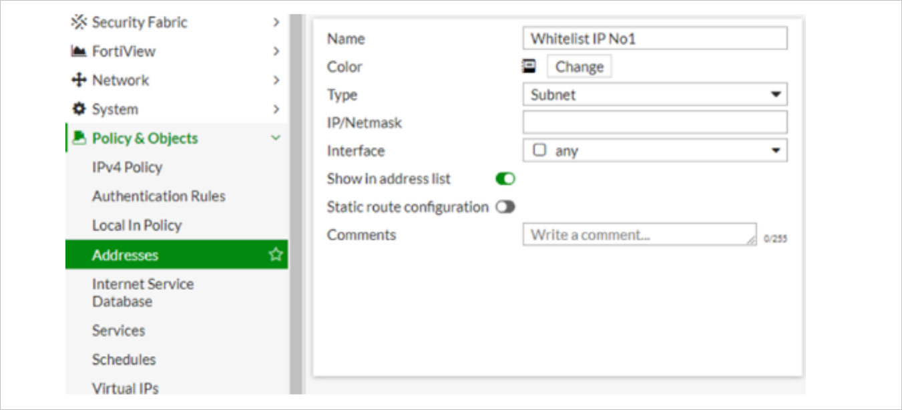

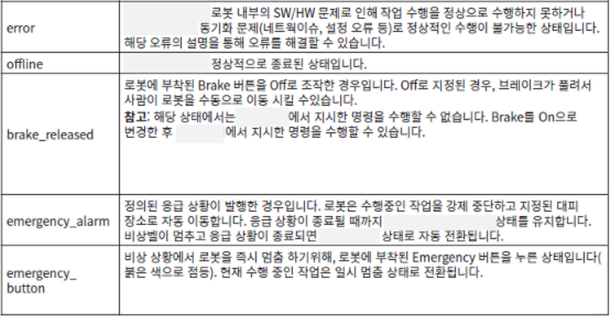

---
<!-- Page 174 -->
174
보안
요구사항
통신 두절, 센서 오류 등 비정상 상태에서는 로봇 시스템이 자동으로 안전 정지하거나 안전 모드로 전환될 수 있어야
한다.
목적
통신 두절, 센서 오류 등 비정상 상태에서 시스템이 자동으로 안전 정지하거나 안전 모드로 전환되는 기능을
제공하여 운영자/사용자의 안전을 확보한다.
점검 기준
비정상 상태에서의 안전 정지/모드 전환 구현

## 1. 비정상 상태에서 영향을 감소하기 위한 설계의 개발 및 구현 여부

## 2. 통신 오류 또는 센서 이상 시 자동으로 정지 또는 안전모드 전환 여부

구현 및 점검 방안
1

## 01.	 비정상 상태 영향 감소 설계의 개발 및 구현 여부를 확인한다.

•  로봇의 설계상 비정상 상태의 정의, 각 상태별 구현대책의 존재를 확인한다.
•  비정상 작동을 대비한 비상 정지 버튼의 존재를 확인한다.
[방안 1] 비정상 상태 영향 감소 설계 개선 방안
비상 정지 버튼 외에도 전원 관리 모듈에 자동 복구(워치독 타이머) 기능을 도입한다. 재부팅 절차를 자동화하여 운영자
개입을 최소화한다.
2

## 01.	 통신 오류 또는 센서 이상 시 자동으로 정지 또는 안전모드로 전환하는지 확인한다.

•  실제 비정상 동작 시에 자동으로 정지하거나 안전모드로 전환하는 기능이 존재하는지 확인한다.
[방안 1] 자동 정지/안전모드 전환 개선 방안
통신 오류·센서 이상 발생 시 안전모드 자동 전환 로직을 추가한다. 예시로 워치독, 자동 안전모드, 전력 차단, 페일오버 등의
로직이 존재한다.

#### 3.10.12  [CR-12] 비정상 상태에서의 안전 정지/모드 전환 구현

비상정지 버튼 예시
안전 설계 구성도 예시
Motor Driver
DRIVING
Signal
E-stop
DCU
PC

---
<!-- Page 175 -->
01
02
03
175
보안
요구사항
로봇 시스템의 인증, 신원, 액세스 시스템에 사용되는 개인정보 데이터는 제품과 관련 있을 경우만 저장, 전송, 기타
처리되어야 하며 무단 액세스 및 기밀성 침해로부터 보호하여야 한다.
목적
인증, 신원, 액세스 시스템에 사용되는 개인정보 데이터는 제품과 관련 있을 경우만 저장, 전송, 기타 처리되어야
하며 무단 액세스 및 기밀성 침해로부터 보호하여 정보 유출을 방지하고 유출 시에도 최소한의 정보만 노출되게
보호한다.
점검 기준
사용자 정보 등의 인증 데이터 보호

## 1. 인증 정보(ID, 패스워드, 인증 토큰 등) 암호화 저장 및 처리 여부

## 2. 무단 액세스를 차단하기 위한 인증/인가 시스템 구현 여부

## 3. 불필요한 개인정보 미수집 및 수집 목적과 기간 명시 여부

## 4. 목적에 부합하는 최소한의 범위 내 사용자 정보 처리 여부

## 5. 사용자 정보, 데이터, 설정의 저장, 전송 또는 기타 처리되는 과정 상 기밀성 보호 여부

구현 및 점검 방안
1

## 01.	 인증 정보(ID, 패스워드, 인증 토큰 등) 암호화 저장 및 처리하는지 확인한다.

•  로봇이 사용자 개인 정보를 수집하는지 확인한다.
•  사용자 개인 정보를 수집 및 저장하는 등의 이용주체에 해당하는지 확인한다.
•  인증 정보는 암호화되어 저장 및 처리되고 있는지 확인한다.
•  모든 인증정보·민감데이터의 경우 충분한 전송 및 저장 보안을 수행하는지 확인한다.
[방안 1] 암호화 저장·처리 방안
사용자 인증정보와 민감데이터는 아래 중요 데이터 저장/처리 방안에 기반하여 충분한 강도의 암호화로 저장·처리하며, 보호
채널을 통해 전송해 기밀성을 보장한다.

#### 3.10.13  [CR-13] 사용자 정보 등의 인증 데이터 보호

중요 데이터 저장/처리 방안
전송 보안 TLS 예시
항목
내용
저장 보안
•  충분한 수준의 암호화(AES-256 권장) 수행
•  전용 데이터베이스에 저장
전송 보안
•  TLS 1.2 이상(상호 인증 포함) 적용
•  평문 포트 사용금지
•  기본 평문통신 프로토콜일 경우, 페이로드 암호화 수행

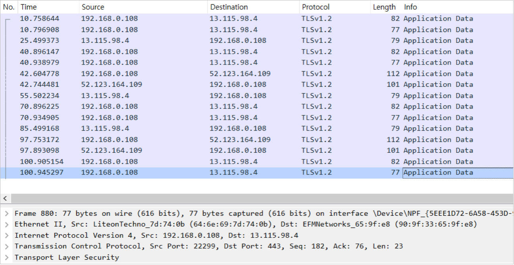

---
<!-- Page 176 -->
176
2

## 01.	 무단 액세스를 차단하기 위한 인증/인가 시스템이 구현되어 있는지 확인한다.

•  모든 인터페이스에 대해 인증·신원·액세스 관리 등을 통해 무단 액세스를 차단하는 시스템이 구현되어 있는지 확인한다.
•  무단 액세스 의심 사건이 발생할 경우 상위 증적에 기반하여 침해사고 보고 체계에 따라 윗선에 보고해야 한다.
[방안 1] 무단 액세스 차단 인증/인가 방안
모든 인터페이스에 최소권한 기반의 인증·인가 체계를 적용하고, 역할·권한 변경·삭제와 같은 권한 변경 이력을 감사로그로
기록해 무단 액세스를 차단한다.
3

## 01.	 불필요한 개인정보는 수집되지 않으며, 수집 목적과 기간이 명시되어 있는지 확인한다.

•  개인정보 수집 영역과 제시정보에 대해 아래와 같이 준수하는지 확인한다.
제품이 의도된 목적과 다른 불필요한 개인정보를 수집
개인정보 수집에 관한 목적과 기간을 사용자에게 제시
[방안 1] 불필요한 개인정보 수집 금지 방안
불필요한 개인정보는 수집하지 않고, 수집 목적·보관 기간을 사용자에게 명확히 고지해 최소정보 원칙을 준수한다.
4

## 01.	 사용자 정보는 목적에 부합하는 최소한의 범위로만 처리되고 있는지 확인한다.

•  사용자 정보 데이터의 보관/처리에 대해 최소한으로 처리하는지 확인한다.
[방안 1] 사용자 정보 최소범위 처리 방안
사용자 정보와 설정은 목적에 필요한 최소 범위로 처리하고, 사용자가 요청하면 저장된 정보를 영구 삭제할 수 있도록
관리한다.
연결 보안 검증 예시
사용자 정보 최소범위 처리 방안
항목
내용
최소처리 원칙
•  사용자 정보를 필요한 최소 범위로만 처리
사용자 삭제 요청 반영
•  사용자 요청 시 저장된 데이터·설정을 영구 삭제
수집 데이터 정책
•  과도한 정보 보관을 금하고 정책에 따른 저장만 허용

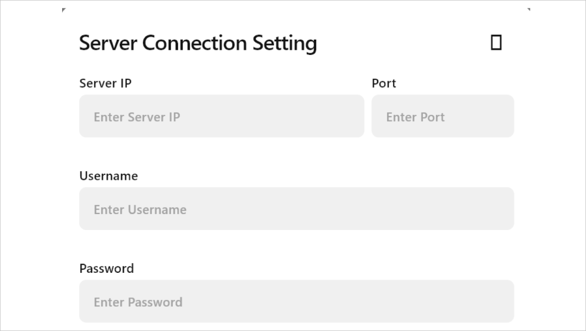

---
<!-- Page 177 -->
01
02
03
177
5

## 01.	 사용자 정보와 데이터, 설정의 저장/전송/처리에 있어 기밀성 보호를 수행하는지 확인한다.

•  데이터 중 사용자 정보, 데이터, 설정의 경우 저장, 전송 또는 기타 처리되는 과정에서 기밀성이 보호되는지 반드시
확인한다.
•  레거시나 산업특수 평문 프로토콜을 사용하는 경우 페이로드 레벨 암호화와 재인증/세션 갱신을 도입해 평문 노출을
제한한다.
[방안 1] 사용자 정보 저장·전송·처리 시 기밀성 보호 방안
사용자 정보·데이터·설정은 저장·전송·처리 전 구간에서 암호화를 적용해 기밀성을 보호하고, 평문 프로토콜이 필요한
경우에는 페이로드 암호화와 재인증·세션 갱신을 통해 노출 위험을 최소화한다.
개인정보 수집 적용대상 예시
개인정보 저장 기간 예시
사용자 정보 최소범위 처리방안
항목
내용
저장 구간 보호
•  사용자 정보·데이터·설정을 저장할 때 강력한 암호화(AES-256 등)를 적용
전송 구간 보호
•  TLS 1.2 이상을 적용해 전송 과정의 데이터 노출을 방지
처리 구간 보호
•  평문 또는 산업용 프로토콜(Modbus, CAN 등)을 사용할 경우 페이로드 암소화, 재인증, 세
션 갱신을 적용
기밀성 점검
•  저장·전송·처리 전체 경로의 보호 상태가 정책대로 유지되는지 주기적으로 점검

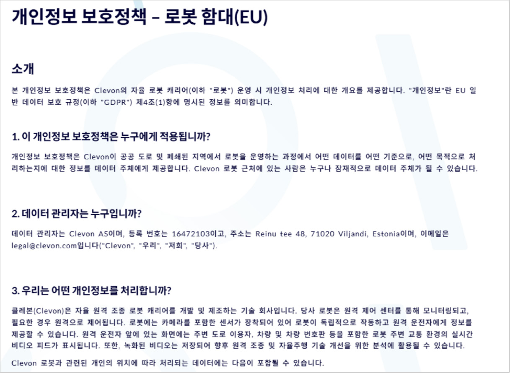

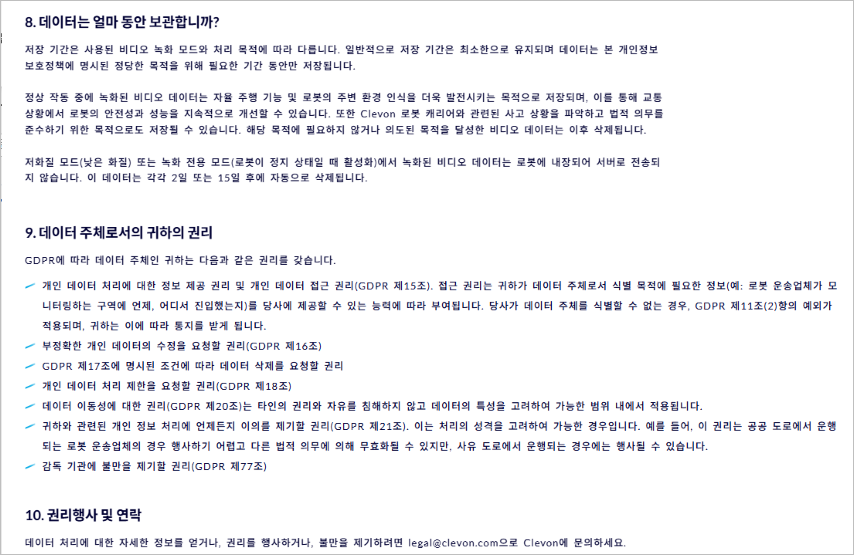

---
<!-- Page 178 -->
178
번호
체크리스트 항목
WS-01
무선 사용자 식별 및 인증
WS-02
인증자 유효성 검증
WS-03
인증자 변경
WS-04
비밀번호 강도
WS-05
무차별 대입 보호
WS-06
자산 접근 제어
WS-07
안전한 데이터 보호
WS-08
저장 데이터 무결성 검증
WS-09
무선 통신 데이터 보호
WS-10
무선 통신 데이터 무결성 검증
WS-11
무선 통신 재전송 공격 방지 구현
WS-12
업데이트 메커니즘 제공
WS-13
무선 네트워크 업데이트 무결성 및 진본성 검증
WS-14
암호화 적정성
WS-15
적절한 암호화 키 사용
WS-16
암호화 키 고유성
WS-17
로그 생성
WS-18
시간 정보 포함
WS-19
최신 소프트웨어 및 하드웨어 유지
WS-20
네트워크 인터페이스 노출 최소화
WS-21
외부 물리 인터페이스 제한
WS-22
외부 입력 관리
WS-23
장비 무결성 보장
무선 보안 체크리스트 항목
유럽에서 판매되는 무선 장비, 즉 로봇의 무선 보안을 준수하기 위한 통합 무선 보안(Wireless Security, WS)
체크리스트 항목은 다음과 같다.

### 3.11 무선 보안 점검 체크리스트

---
<!-- Page 179 -->
01
02
03
179
보안
요구사항
로봇 시스템의 무선 인터페이스에 접근하는 사용자와 단말수준, 모든 사용자(사람, 소프트웨어 프로세스 또는 장치)
수준에 대해 적절한 인증 메커니즘을 사용하여 인증 및 접근 관리를 수행해야 한다.
목적
무선 사용자 식별, 인증 및 접근 관리를 통해 무선 인터페이스와 통신 접근을 관리하여 관련 공격이 발생하지 않게
방지한다.
점검 기준
무선 사용자 식별 및 인증

## 1. 무선 인터페이스를 통한 접근 시 인증 메커니즘 적용 여부

## 2. 접근한 사용자에 대한 네트워크 모니터링 및 접근 제한 가능 여부

## 3. 무선 인터페이스를 통해 접근한 사용자 유일 식별 여부

구현 및 점검 방안
1

## 01.	 무선 인터페이스를 통한 접근 시 인증 메커니즘을 적용하는지 확인한다.

•  “2.3 인터페이스 식별”의 무선 네트워크 통신유형에 해당하는 통신 인터페이스별 대상 서비스를 식별한다.
•  식별된 서비스에 대해 네트워크 자산, 개인정보 자산, 금융 자산 중 하나 이상 처리하는 경우, 로봇 시스템 및 연동된 무선
인터페이스를 통해 접근할 때 사용자 인증을 요구해야 한다.
•  상호작용 가능한 사용자가 접근할 경우, 인증은 접근 제어 매커니즘에 기반하여 지식·소유·고유 기반 인증요소를 기반으로
식별하여야 한다.
•  단, DHCP, ICMP 등과 같이 인증 없이도 동작해야 하는 프로토콜이거나, 장비의 공개 정보에 접근하는 행위일 경우는
예외로 한다.
[방안 1] 사용자 인증 방식
접근 제어 매커니즘에 따라 사용자 접근을 RBAC(역할 기반 접근 제어), ABAC(속성 기반 접근 제어)로 구분할 수 있다.
이러한 접근에 대해 사용되는 인증 방식은 지식, 소유, 고유로 구분할 수 있다.
사용자 인증 방식
상호작용 가능한 사용자(개체) 구분
구분
내용
인간 사용자
•  특정 사용자 계정의 소유자, 기기, 또는 서비스와 같은 개별 인간 개체
그룹
•  특정 자원에 접근하도록 인가된 그룹의 구성원
개체
•  다른 개체로부터 특정 자원 접근 권한을 부여받은 개체
구분
내용
지식
•  사용자가 기억하여 인증에 사용하는 지식정보
•  비밀번호, PIN
소유
•  사용자가 소유하여 인증에 사용하는 데이터정보
•  개인 키, 인증서, 토큰
고유
•  사용자의 신체적 특징으로 인증에 사용하는 고유정보
•  지문, 얼굴인식

#### 3.11.1  [WS-01] 무선 사용자 식별 및 인증

---
<!-- Page 180 -->
180
지식/소유/고유 인증방식의 수행 예시를 아래와 같이 들 수 있다.
•  사용자 인터페이스에서 PIN 코드를 사용한다.
•  네트워크/사용자 인터페이스의 인증을 수행한다. (비밀번호 기반 등)
•  지문 또는 얼굴인식 같은 생체 인증을 수행한다.
•  신뢰된 인증서에 대응하는 개인 키 검증을 수행한다
•  장비 온보딩 시 공유된 비밀 기반의 네트워크 신뢰 관계를 구축한다.
2

## 01.	 접근한 사용자에 대한 네트워크 모니터링 및 접근 제한을 수행하는지 확인한다.

•  접근하는 사용자 네트워크 동작을 모니터링하거나 접근 제한을 수행가능해야 한다.
•  자체에서 지원하지 않는 경우 로봇 시스템이 방화벽, IDS 등의 네트워크 장비와 통합운영이 가능한지 검증해야 한다.
[방안 1] 네트워크 모니터링 및 접근 제한
네트워크 활동을 실시간으로 감시하고, 비정상 트래픽 또는 의심 동작이 탐지될 경우 접근을 제한하기 위해 자체 기능을
제공하거나 방화벽, IDS 등 외부 네트워크 보안 장비와 연동할 수 있다.
네트워크 모니터링 및 접근 제한 기능
사용자 인증 예시
사용자 식별 제한 예시
항목
기능
트래픽 관리
•  애플리케이션 우선 순위 재지정이 가능한 동적 네트워크 규칙 및 구성
가시성 및 분석
•  모든 네트워크 트래픽에 대한 가시성 유지
•  상관관계 분석을 통한 모니터링
위협 대응
•  활동 또는 기계학습 기반 트래픽/동작 탐지, 접근제한
•  방화벽·IDS의 수준에 준하는 탐지, 접근제한

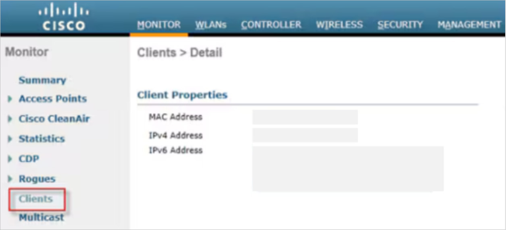

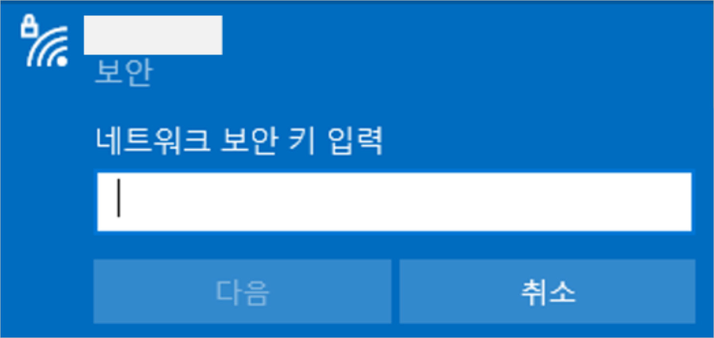

---
<!-- Page 181 -->
01
02
03
181
3

## 01.	 무선 인터페이스를 통해 접근한 사용자를 유일 식별할 수 있는지 확인한다.

•  무선 네트워크에 접근한 사용자를 IP 주소, IPv6 주소 등 유일한 지표에 기반하여 식별할 수 있어야 한다.
[방안 1] 사용자 유일 식별 방식
무선 인터페이스를 통해 접근한 사용자는 단순 식별 외 유일하게 식별할 수 있다. 적인 사용자 유일 식별 방식의 종류는 다음과
같다.
•  MAC 주소
•  IP/IPv6 주소
•  사용자 계정(802.1X EAP Identity)
•  인증서 지문(Cert Fingerprint)
•  RADIUS Accounting-Session-ID
•  PMKID(특정 단말의 로밍/세션을 고유하게 식별)
위와 같은 사용자 유일 식별 방식은 아래와 같이 사용될 수 있다.
•  WPA2/3-Enterprise(EAP-TLS/PEAP) + RADIUS 인증을 적용해 사용자 ID와 인증서 지문을 RADIUS accounting
로그에 남기고, 해당 로그로 세션 단위의 고유 식별자를 확보한다.
•  DHCP/Syslog/RADIUS/AP 로그를 연동해 MAC·할당된 IP/IPv6·AP BSSID·세션ID를 중앙 DB에서 매칭하여 단일
사용자 프로파일로 결합·추적한다.

---
<!-- Page 182 -->
182

#### 3.11.2  [WS-02] 인증자 유효성 검증

보안
요구사항
인증 메커니즘은 운영 환경에서 이용 가능한 정보를 바탕으로 사용되는 모든 인증 수단의 관련 속성을 반드시
검증해야 한다.
목적
인증자의 무결성, 유효성, 만료 상태 등을 포함하여 위조되거나 손상된 인증 정보를 통한 무단 접근을 방지한다.
점검 기준
인증자 유효성 검증

## 1. 인증 시 인증자 유효성 검증 여부

구현 및 점검 방안
1

## 01.	 인증에 사용되는 모든 인증자의 유효성을 검증하는지 확인한다.

•  “2.3 인터페이스 식별”의 무선 네트워크 통신유형에 해당하는 통신 인터페이스별 대상 서비스를 식별한다.
•  식별된 서비스에 대해 네트워크 자산, 개인정보 자산, 금융 자산 중 하나 이상 처리하는 경우, 로봇 시스템 및 연동된 무선
인터페이스를 통해 접근할 때 사용되는 모든 인증자의 속성을 검증해야 한다.
•  로봇 인터페이스별 인증을 수행할 경우 인증자의 유효함을 충분히 검증하는 방법이 존재해야 한다.
•  위/변조 가능성이 있는 인증수단을 사용할 경우, 인증수단에 대해 반드시 검증 절차(예: PKI 인증서 검증, 만료일·서명 확인
등)를 수행해야 한다.
[방안 1] 인증자의 유효성 검증
인증을 수행할 경우 인증자의 유효함을 다음과 같은 인증자 종류별 검사 방안에 기반하여 검증할 수 있다.
인증서의 경우, 각 운영 환경에 따라 다음과 같은 내용을 추가로 검증해야 한다.
인증자 종류별 검증 방안
운영환경 별 인증서 추가 검증 항목
항목
검증방안
일반
•  잘못된 인증자가 인증 성공으로 이어지는지 여부
비밀번호
•  잘못된 비밀번호로 인증이 성공하는지 여부
•  네트워크 인터페이스를 통한 인증 중 교환되는 메시지의 기밀성이 보호되지 않는 경우, 이
전에 성공했던 인증 시도의 재전송 공격이 인증 성공으로 이어지는지 여부
•  올바른 비밀번호의 일부만으로 인증이 가능한지 여부
•  다른 사용자 계정이 존재하거나 생성될 수 있는 경우, 다른 계정의 비밀번호로 인증이 가능
한지 여부
개인키
•  신뢰된 인증서에 대한 잘못된 개인 키로 인증이 성공하는지 여부
•  다른 계정의 신뢰된 인증서에 대한 개인 키로 인증이 가능한지 여부
구분
검증대상
온라인 환경
•  실시간 폐기 목록(CRL/OCSP)
•  시간 동기화 기능
오프라인/
제한 환경
•  내장 신뢰 목록
•  사전 검증된 인증서 집합

---
<!-- Page 183 -->
01
02
03
183

#### 3.11.3  [WS-03] 인증자 변경

보안
요구사항
인증 메커니즘은 보안 목표에 위배되지 않는 한 사용자가 사용하는 인증 수단(비밀번호, 토큰 등)을 변경할 수
있도록 허용해야 한다.
목적
인증자 유출이나 손상 시 신속한 대응을 가능하게 하고, 정기적인 인증자 갱신을 통해 보안 수준을 유지한다.
점검 기준
사용자 인증자 변경 가능

## 1. 인가된 사용자에 의한 사용자 인증자 재설정 기능 제공 여부

구현 및 점검 방안
1

## 01.	 인가된 사용자에 의한 사용자 인증자 재설정 기능을 제공하는지 확인한다.

•  “2.3 인터페이스 식별”의 무선 네트워크 통신유형에 해당하는 통신 인터페이스별 대상 서비스를 식별한다.
•  식별된 서비스에 대해 네트워크 자산, 개인정보 자산, 금융 자산 중 하나 이상 처리하는 경우, 로봇 시스템 및 연동된 무선
인터페이스를 통해 접근할 때 보안 수준을 충족하는 사용자 인증자 재설정 기능을 제공해야 한다.
[방안 1] 사용자 인증자 재설정 보안수준
사용자 인증자 재설정(변경) 기능을 제공할 경우, 다음과 같이 필수 재설정 충족요건에 기반하여 기능을 제공한다.
•  재설정 시 사용자 인증/권한 요구
•  새로 지정된 인증자 기반 자산 접근권한 부여
•  만료된 인증자의 접근권한 제거
•  인증자 변경을 수행해도 운영 중 비정상 종료나 오류 방지
무선 인터페이스 식별 예시
인증자 재설정 예시

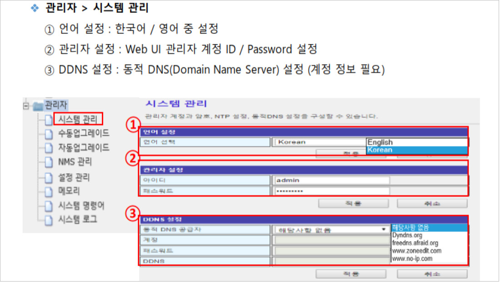

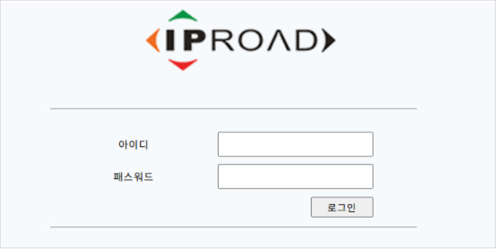

---
<!-- Page 184 -->
184
보안
요구사항
설정되는 모든 비밀번호는 충분히 안전하고, 고유해야 하며, 기본 비밀번호는 사용자가 변경하도록 강제하거나
안전하게 관리되어야 한다. 모든 비밀번호는 NIST SP 800-63B 등 국제 표준의 강도 요구사항을 준수하여
설정되어야 한다.
목적
설정되는 모든 비밀번호는 충분히 안전하고, 고유해야 하며, 기본 비밀번호는 사용자가 변경하도록 강제하거나
안전하게 관리되어 계정 인증정보의 탈취를 방지해야 한다.
점검 기준
비밀번호 강도

## 1. 장비에 기본(출고) 비밀번호가 설정된 경우, 각 장비마다 고유한 비밀번호가 적용되고, 비밀번호가 충분한 강도

기준을 충족하는지 여부

## 2. 최초 사용 전 사용자 본인에 의한 비밀번호 변경 강제 여부

## 3. 적합한 주체만 비밀번호 설정 가능하거나, 비밀번호 강도 기준 충족 여부

구현 및 점검 방안
1

## 01.	 장비마다 고유한 기본 비밀번호가 적용되고 강도 기준을 충족하는지 확인한다.

•  “2.3 인터페이스 식별”의 무선 네트워크 통신유형에 해당하는 통신 인터페이스별 대상 서비스를 식별한다.
•  식별된 서비스에 대해 네트워크 자산, 개인정보 자산, 금융 자산 중 하나 이상 처리하며 비밀번호 기능이 존재하는 경우,
비밀번호의 안전한 관리를 수행하여야 한다.
•  식별된 서비스에 기본 비밀번호가 설정되어 있을 경우 기본 비밀번호 충족요건을 충족해야 한다.
[방안 1] 기본 비밀번호 충족사항
장비별 기본 비밀번호 제공 시, 아래와 같은 기본 비밀번호 충족요건에 의거하여 제공하여야 한다.
•  비밀번호 정책 문서에 기본 비밀번호 관련 내용을 명시하거나 사용자에게 제공
•  장비별 고유한 기본 비밀번호 제공
•  문서에 명시된 비밀번호 생성 규칙에 기반하여 기본 비밀번호 구현
•  기본 비밀번호의 난수기반 생성시 공인 표준 NIST SP 800-90A, NIST SP 800-90B, NIST SP 800-90C,
BSI AIS31에 기반한 생성을 통해 충분한 복잡성 강도 충족
2

## 01.	 비밀번호 최초 사용 시 비밀번호 변경 강제를 수행한다.

•   비밀번호 기능을 최초 사용할 경우, 비밀번호 변경방안에 따라 강제 변경기능을 제공해야 한다.
[방안 1] 최초 비밀번호 변경 강제화
장비에 설정된 비밀번호는 아래 방안에 따라 비밀번호 강제 변경을 제공한다.
•  설치 후 최초 사용 시, 사용자의 비밀번호 변경 요구
•  기본 비밀번호로 로그인할 시, 시스템의 비밀번호 변경을 요구

#### 3.11.4  [WS-04] 비밀번호 강도

최초 비밀번호 변경 예시

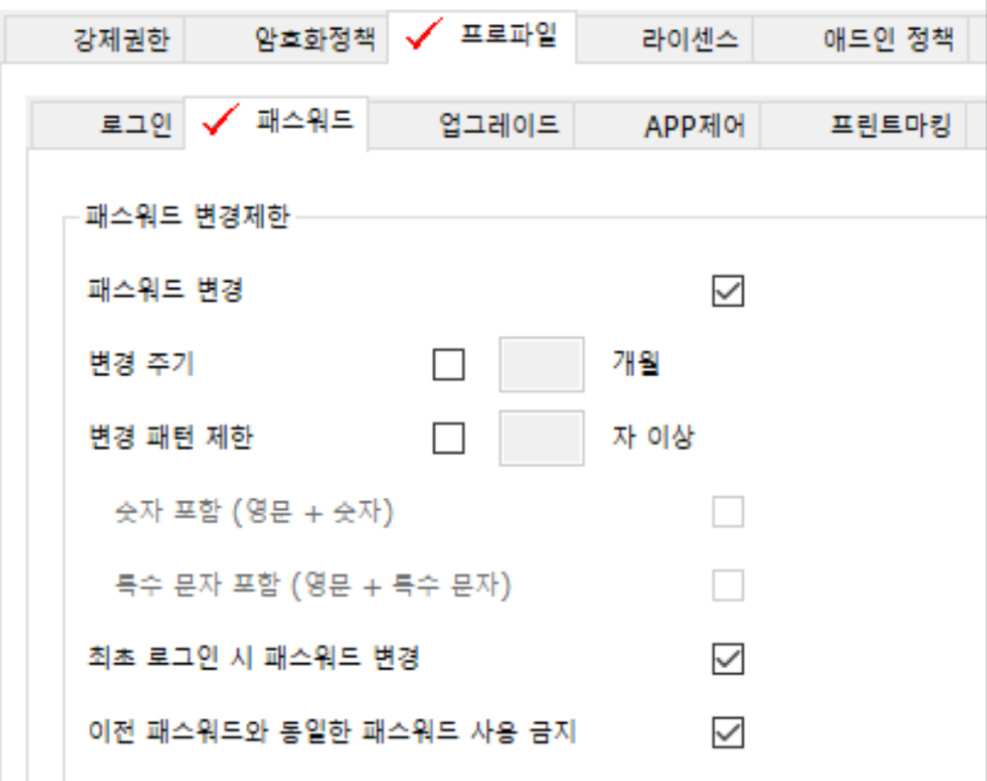

---
<!-- Page 185 -->
01
02
03
185
3

## 01.	 비밀번호의 일반적인 보안관리를 수행한다.

•  로봇 시스템을 사용하는 적합한 주체만 비밀번호 설정이 가능해야 한다.
•  주체에 대한 검증이 없을 경우 최소 비밀번호 강도 기준을 충족해야 한다.
[방안 1] 비밀번호 보안관리
비밀번호는 변경 시 다음과 같은 최소 비밀번호 강도 기준을 적용한다.
최소 비밀번호 강도 기준과 관련하여 다음과 같은 모범 사례집을 참고할 수 있다.
•  NIST SP 800-63B
•  ISO/IEC EN 27002:2022
•  ISO/IEC EN 24760
•  IEC EN 62443-4-2
•  ETSI EN 303 645
최소 비밀번호 강도 기준
비밀번호 변경관리 예시
항목
내용
실시간 강도
검증
•  충분한 복잡성(대소문자/숫자/특수문자 조합) 충족
•  충분한 길이 충족
변경 제한
•  사전, 연속 문자 및 키보드 기반 단순한 패턴 차단
•  개인정보 포함 패턴 차단
•  최근 비밀번호 재사용 금지

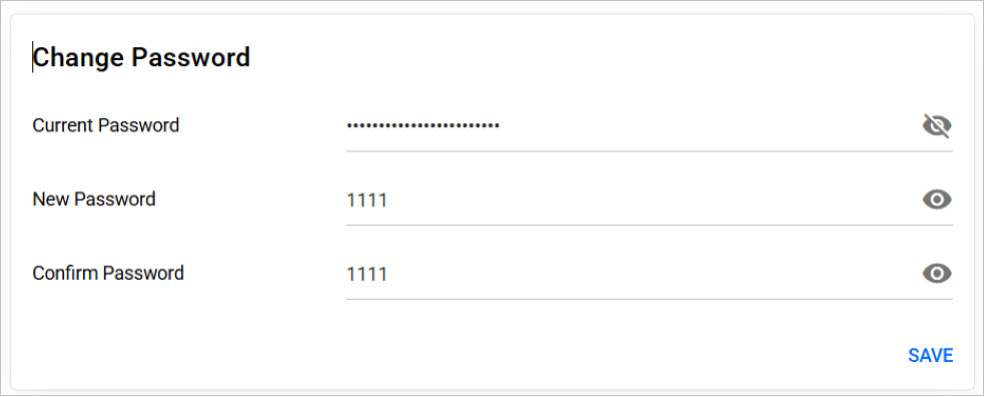

---
<!-- Page 186 -->
186
보안
요구사항
인증 메커니즘은 무차별 대입 공격에 견딜 수 있도록 설계되어야 한다. 즉, 공격자가 반복적으로 인증을 시도하여
패스워드를 알아내거나 서비스 거부(DoS) 상태를 유발하지 못하도록 적절한 방어 조치(지연, 계정 잠금, 다중 인증,
암호 강도, 로그인 시도 제한 등)를 적용해야 한다.
목적
인증 메커니즘을 무차별 대입 공격에 견딜 수 있도록 설계해 공격자의 반복적인 인증을 통한 계정정보 노출과
서비스 거부 상태를 방지해야 한다.
점검 기준
무차별 대입 공격 방지 기능 적용

## 1. 인증 메커니즘에 대한 무차별 대입 공격 방지 기능 적용 여부

구현 및 점검 방안
1

## 01.	  인증 메커니즘에 대한 무차별 대입 공격 방지 기능이 존재하는가를 확인한다.

•  “2.3 인터페이스 식별”의 무선 네트워크 통신유형에 해당하는 통신 인터페이스별 대상 서비스를 식별한다.
•  식별된 서비스에 대해 네트워크 자산, 개인정보 자산, 금융 자산 중 하나 이상 처리하며 인증을 수행할 경우, 인증
메커니즘에 대한 무차별 대입 공격 방지 기능이 존재해야 한다.
[방안 1] 무차별 대입 공격 방지
무차별 대입 공격을 방지하기 위해 다음과 같은 무차별 대입 공격 방지기능을 적용할 수 있다.
위의 조치에 따른 무차별 대입 공격 방지기능이 실제 적합하게 구현되었는지의 여부는 아래와 같은 검증방안에 따라
확인한다.

#### 3.11.5  [WS-05] 무차별 대입 보호

무차별 대입 공격 방지기능
무차별 대입 공격 방지 검증
항목
내용
인증 실패
처리
•  인증 실패 시 시간 지연, 시도 횟수 제한, MFA, 접근 IP 제한 적용
•  연속된 인증 실패 시 클라이언트 MAC 주소를 일정 시간 동안 차단하여 추가 인증 시도 방지
구현
•  단위 시간당 인증 요청 횟수 제한
•  방어 조치가 정상 사용자 접근을 과도하게 차단하지 않게 균형 조정
•  인증 실패에 대한 이벤트 및 차단 로그의 이상패턴 탐지 및 대응
기계간 인증
추가 보호조치
•  16자 이상, 높은 복잡도의 장비 간 비밀번호 사용
•  허용된 IP 주소 목록 기반 접근 제어
•  비정상적인 시도 발생 시 경고 또는 로그 기록 기능 활성화
항목
검증방안
일반
•  무차별 대입 공격을 직접 수행하여 장비가 이에 대한 방어 기능을 제공하는지를 확인
지연
•  잘못된 인증 정보를 반복적으로 입력하여 장비가 연속된 실패 시도 사이에 지연 시간이 실제로 적용
되는지를 측정
횟수
제한
•  잘못된 인증 정보를 반복적으로 입력하여 장비가 몇 회 실패 후 추가 시도를 차단하는지를 확인
복잡도
•  복잡도 기준을 만족하지 않는 인증 정보를 설정하려 시도 후 무차별 대입 공격을 수행하여 인증 강도
가 충분한지를 검증

---
<!-- Page 187 -->
01
02
03
187
인증 무차별 대입방지 검증 예시

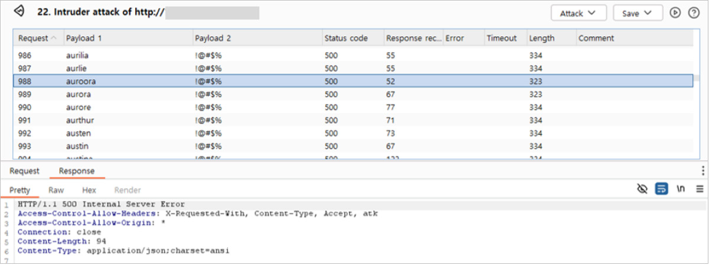

---
<!-- Page 188 -->
188
보안
요구사항
무선 통신에 참여하는 모든 사용자의 기본 정보 또는 자산(보안, 네트워크 등)에 대한 접근이 무분별하게 이루어지지
않도록, 인가된 사용자만 접근할 수 있도록 통제해야 한다.
목적
무선 통신에 참여하는 모든 사용자의 기본 정보 또는 자산(보안, 네트워크 등)에 대한 접근을 인가된 사용자만
가능하게 하여 권한 없는 사용자의 시스템 자산 무단 접근 및 중요 정보 유출을 방지한다.
점검 기준
무선을 통한 자산 접근 제어 메커니즘 적용성 검증

## 1. 로봇 시스템의 주요 자산에 접근하는 엔티티의 접근 권한을 관리·제어할 수 있는 접근통제 메커니즘 구축 여부

구현 및 점검 방안
1

## 01.	  주요 자산에 접근하는 권한을 관리/제어할 수 있는 접근 제어 메커니즘이 존재하는지 확인한다.

•  “2.3 인터페이스 식별”의 무선 네트워크 통신유형에 해당하는 통신 인터페이스별 대상 서비스를 식별한다.
•  식별된 서비스 영역에 해당하는 장비의 모든 소프트웨어 구성요소에 네트워크 자산, 개인정보 자산, 금융 자산 중 하나 이상
처리하는 경우, 접근 권한을 관리/제어하는 기능이 존재해야 한다.
[방안 1] 접근 권한 관리/제어
접근 권한을 관리/제어하는 제어 메커니즘은 보호 대상(보안 자산·네트워크 자산)과 여건을 고려해 적절한 방안을 선택한다.
•  장비의 기술 특성, 사용 환경, 접근 방식
•  자산 접근에 따른 위험 수준
•  장비 기능이 허용하는 접근 형태(읽기/쓰기/변경 등)
•  자산 접근에 사용되는 외부 인터페이스 종류(Local, Remote 등)
•  운용 환경의 보호 수준 (물리적/논리적 접근통제 여부)
접근제어 메커니즘이 인증 기반으로 사용될 경우, 아래와 같은 방식으로 구현될 수 있다.
•  특정 사용자, 계정 소유자, 디바이스 또는 서비스가 인증 후 접근 가능
•  특정 그룹 구성원이 인증 후 접근 가능
•  다른 엔티티에 의해 위임받은 엔티티 접근 가능
접근제어의 검증은 다음과 같은 접근제어 검증방안을 통해 검증할 수 있다

#### 3.11.6  [WS-06] 자산 접근 제어

구분
검증방안
일반
•  자산은 인가된 사용자만 접근가능한지 여부
•  사용자 권한은 최소 권한 원칙을 준수하는지 여부
•  접근 제어 관련 설정이나 사용자 권한 변경은 인가된 사용자만 수행 가능한지 여부
역할 기반
•  각 사용자에게 권한이 부여된 역할의 할당여부
•  각 역할은 최소 권한 원칙을 따르는지 여부
•  자산은 해당 역할을 가진 인가된 사용자만 접근 가능한지 여부
•  역할 변경은 오직 인가된 사용자만 수행할 수 있는지 여부
임의
•  각 사용자에게 식별자와 해당 권한이 부여되어 있는지 여부
•  각 식별자에 대해 최소 권한 원칙 이 적용되는지 여부
•  자산은 인가된 식별자(사용자) 만 접근 가능한지 여부
•  식별자 변경은 인가된 사용자만 수행할 수 있는지 여부
강제
•  자산은 운영체제(OS) 또는 시스템 관리자에 의해 부여된 승인을 받은 사용자만 접근 가능한지
여부
•  승인 부여는 최소 권한 원칙을 기반으로 하는지 여부
•  OS 또는 관리자 권한을 변경할 수 있는 행위는 인가된 시스템 관리자만 수행 가능한지 여부
접근제어 검증 방안

---
<!-- Page 189 -->
01
02
03
189
다음과 같이 로봇 특정 프로토콜별로 접근 제어 정책을 수행할 수 있다.
•  MQTT 사용자 인증 강화를 위해 MQTT 익명 접속 차단, 사용자 인증(아이디 및 패스워드) 도입한다.
•  OS 보안 강화를 위해 SROS(Secure ROS) 사용, ROS 2 마이그레이션을 검토한다.
사용자별 자산 접근제어 예시

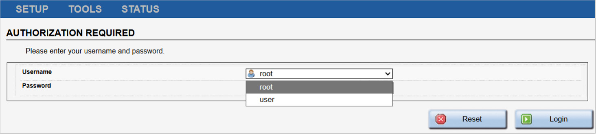

---
<!-- Page 190 -->
190
보안
요구사항
네트워크 내 민감 정보와 개인정보, 그리고 위·변조 위험이 있는 데이터를 안전하게 저장·관리하기 위한 보안 저장
메커니즘을 제공해야 한다.
목적
데이터의 기밀성과 무결성을 보장하고, 무단 접근이나 데이터 유출을 방지하기 위한 암호화, 접근 제어, 하드웨어
보안 모듈 등의 기술적 보호조치를 통해 안전한 데이터 보호를 수행한다.
점검 기준
보안 저장 메커니즘 적용

## 1. 개인정보나 보안 매개변수에 대하여 보안 저장 메커니즘 적용 여부

구현 및 점검 방안
1

## 01.	  개인정보나 보안 매개변수에 대하여 보안 저장 메커니즘을 적용하는지 확인한다.

•  “2.3 인터페이스 식별”의 무선 네트워크 통신유형에 해당하는 통신 인터페이스별 대상 서비스를 식별한다.
•  식별된 서비스에 대해 네트워크 자산, 개인정보 자산, 금융 자산 중 하나 이상 처리하는 경우 안전한 저장 메커니즘을
사용하여 기밀성을 준수해야 한다.
사용자 인증을 통해 접근 통제를 수행하는가?
중요 데이터에 대한 암호화를 통해 보안성을 지키는가?
장비 내부에 문서화되지 않은 기밀 보안 매개변수나 기밀 보안 자산 (네트워크/개인정보/금융) 데이터가 존재하지
않는가?
[방안 1] 안전한 저장 메커니즘
안전한 저장 메커니즘을 위해 아래와 같은 구현방안을 적용한다.

#### 3.11.7  [WS-07] 안전한 데이터 보호

항목
내용
데이터 암호화
/키 관리체계 구축
•  개인정보 및 보안 매개변수의 암호화 적용
•  암호화 키의 안전한 생성, 저장, 로테이션을 위한 키 관리 시스템 구현
안전 저장
메커니즘 설계
데이터의 안전한 저장 메커니즘
•  기밀성을 보장하기 위한 암호화
•  무결성과 진위성을 보장하기 위한 전자서명
•  인증 또는 인가를 통한 접근제어
•  하드웨어 기반 보호조치 (예: HSM, TPM, Secure Element)를 통한 키·인증정보 보관
•  물리적 보호조치 (예: 접근 제한, 봉인, 잠금장치)
위험 수준에 따른 보호수준의 설정
•  자산의 중요도
•  저장되는 자산의 양
•  자산을 저장해야 하는 기간
•  장비의 운용 환경 (실내/야외, 산업용, 이동형 등)
기타 안전 저장방안
•  접근 통제와 인증·인가 절차 병행을 통해 인가된 엔티티만 자산 접근 가능하도록 구성
•  이동식 매체(USB, SD 등)는 원칙적으로 자산 저장용으로 사용하지 않으며, 사용 시 물리적
접근 통제 보호
기밀 자산 접근
권한 설정 방안
기밀 자산 접근권한/제어 설정
•  기밀 보안 매개변수 및 네트워크 설정 정보의 비인가 접근·복사·이동이 불가능한 권한설정
•  최소 권한 원칙에 따른 관리하는 데이터 접근 권한 설정
•  인가된 사용자에게만 관리자 변경·권한 부여
•  암호화 키·인증정보의 별도의 보호 저장영역 저장 / 일반 파일시스템과의 분리 저장
•  개인정보 및 보안 매개변수에 대한 암호화 적용
•  암호화 키의 안전한 생성, 저장, 로테이션을 위한 키 관리 시스템 구현
•  접근제어 외 물리적 보안조치(예: 잠금, 봉인, 안전한 설치 위치)를 병행을 통한 하드웨어 침
입·탈취 공격 대비
보호 정책 설정
방안
보호 정책 설정
•   저장 자산의 위험 수준 평가에 기반한 고위험 자산(예: 인증서, 비밀키, 금융 인증정보 등)의
암호화 및 하드웨어 보호대상 지정
안전한 저장 메커니즘 구현방안

---
<!-- Page 191 -->
01
02
03
191
데이터 암호화 설정 예시

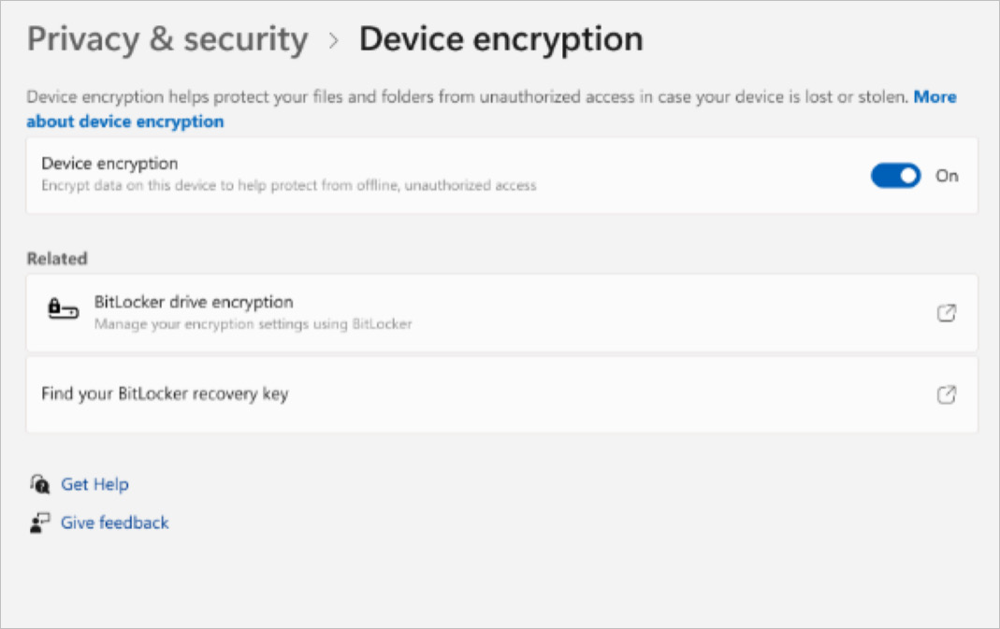

---
<!-- Page 192 -->
192
보안
요구사항
장비는 저장된 보안 자산과 개인 정보 자산의 무결성을 보호하여 데이터 변조를 방지하고 탐지할 수 있는 기능을
제공해야 한다.
목적
저장된 보안 자산과 개인 정보 자산의 무결성을 보호해 데이터 변조 및 시스템 무결성 우회와 같은 훼손 위협을
방지해야 한다.
점검 기준
데이터 무결성 검증

## 1. 주요 자산에 대한 무결성 검증 메커니즘 적용 여부

구현 및 점검 방안
1

## 01.	  주요 자산에 대한 무결성 검증 메커니즘을 적용하는지 확인한다.

•  “2.3 인터페이스 식별”의 무선 네트워크 통신유형에 해당하는 통신 인터페이스별 대상 서비스를 식별한다.
•   식별된 서비스에 대해 네트워크 자산, 개인정보 자산, 금융 자산 중 하나 이상 처리하며 저장하는 경우 아래와 같이 안전한
검증 메커니즘을 사용하여 무결성을 준수해야 한다
장비 내부의 모든 자산 데이터는 문서화되는가?
주요 자산의 변경시도를 방지하는 무결성 검증 방안이 존재하는가?
[방안 1] 자산 변경방지를 위한 무결성 검증방안
자산 데이터의 변경시도의 방지를 위해 아래와 같이 무결성 보호를 위한 자산 변경보호 방안을 적용한다.

#### 3.11.8  [WS-08] 저장 데이터 무결성 검증

항목
내용
암호기반 보호
•  데이터 암호화를 통한 기밀성 보장
•  인증정보(비밀번호, 토큰, 인증서)의 암호화 저장을 통한 기밀성 보장
•  암호키의 독립된 안전 저장소(HSM, TPM 등) 보관
•  암호키 관리 정책 문서화
변경 접근제어
및 인증기반
보호
•  보안 자산 접근 시 사용자 인증 및 권한부여 필수화
•  최소 권한 원칙에 기반한 접근 권한 제한
•  디지털 서명 또는 MAC 검증을 통한 데이터 무결성 및 진위성 보장
•  관리자·사용자·프로세스 단위의 접근 로그를 남겨 이력을 추적한다.
변경 하드웨어
기반 보호
•  민감 자산의 물리적 보호 하드웨어(HSM, TPM, 보안 메모리 영역 등)를 활용한 저장
•  데이터의 불법 복제 방지를 위한 장비의 보드·스토리지 분리 적용
•  데이터의 불법 복제 방지를 위한 장비의 변조 방지 장치 적용
변경 물리적
보호 및 환경적
통제
•  장비 자체의 물리적 접근 제한
•  보안 구역 내에서만 저장 매체(SSD, SD Card, EEPROM 등) 의 물리적 접근 허용
•  분리 가능한 이동식 저장매체는 임시 이송 목적(예: 키 교환, 데이터 백업)한정 사용
•  장비 출하 시 포함되지 않는 저장매체는 지속 저장 대상 미간주
변경 위험 기반
보호수준 설정
•  저장 자산의 중요도, 저장 기간, 저장 용량, 운영 환경 등을 고려한 보호 수준(암호화 강도,
무결성 검증 주기, 접근 권한 수준) 차등 적용
•  불필요하게 높은 보호 수준 방지
•  환경별 리스크별 최적화 수행
변경 이벤트
로깅기능 구현
•  보안 자산 및 개인정보 자산에 대한 생성·수정·삭제 이벤트 로깅
자산 변경보호 방안

---
<!-- Page 193 -->
01
02
03
193
저장 데이터에 대해 무결성이 적절하게 보호되는지는 아래와 같은 무결성 검증 방안을 통해 검증한다.
소프트웨어 및 데이터 해시 목록 파일 예시
무결성 검증방안
구분
검증방안
일반
•  저장된 보안 자산 또는 네트워크 자산에 대해 비인가된 변경이 불가능하거나, 변경이 발생
하면 탐지될 수 있는지 확인
디지털 서명
•  디지털 서명이 올바르게 구현되었는지 확인
•  보안 자산 또는 네트워크 자산에 서명할 때 사용되는 비밀키가 도청, 추론, 추출될 수 없도록
보호되어 있는지 확인
•  유효하지 않은 서명으로 자산이 변경될 경우, 저장 메커니즘이 이를 탐지할 수 있는지 확인
접근 제어
•  저장된 보안 자산에 대한 비인가된 변경이 차단되는지 확인
OT
•  보안 자산의 변경이 불가능하도록 되어 있는지 확인
하드웨어 보호
•  저장된 보안 자산 및 네트워크 자산이 비인가된 변경이 불가능하거나 변경 시 탐지될 수 있
도록 보호되어 있는지 확인

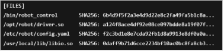

---
<!-- Page 194 -->
194
보안
요구사항
무선 네트워크를 통해 송수신되는 데이터가 외부에 노출되어 유출되거나 도청되지 않도록, 암호화 등 보안 조치를
적용하여 데이터의 기밀성을 보호해야 한다.
목적
무선 네트워크를 통해 송수신되는 데이터가 외부에 노출되어 유출되거나 도청되지 않도록, 암호화 등 보안 조치를
통해 기밀성 훼손 및 통신 정보가 노출되는 것을 방지한다.
점검 기준
무선 통신 데이터 보호

## 1. 무선 네트워크를 통해 송수신되는 모든 데이터의 보안 통신 메커니즘 보호 여부

## 2. 무선 통신에 적용되는 암호화 프로토콜의 최신 보안 기준 충족 여부

구현 및 점검 방안
1

## 01.	  무선 네트워크를 통해 송수신되는 모든 데이터의 보안 통신 메커니즘의 보호를 수행하는지 식별한다.

•  2.3 인터페이스 식별”의 무선 네트워크 통신유형에 해당하는 통신 인터페이스별 대상 서비스를 식별한다.
•   식별된 서비스에 대해 네트워크 자산, 개인정보 자산, 금융 자산 중 하나 이상 처리하는 경우 통신 시 보안통신 메커니즘을
통해 데이터를 보호해야 한다
[방안 1] 보안 통신 메커니즘 보호방안
무선 네트워크를 통해 송수신되는 모든 데이터의 보호를 위해 아래와 같이 보안 통신메커니즘의 보호방안을 적용한다.
데이터에 적용되는 보안 통신 메커니즘이 적절한지는 아래와 같은 무선통신 데이터 보호 검증방안을 통해 검증한다.

#### 3.11.9  [WS-09] 무선 통신 데이터 보호

항목
내용
안전한
통신
프로토콜
구성
•  승인된 보안 통신 프로토콜 사용
•  프로토콜 설정 시 인증, 무결성 보호, 암호화 재전송 방지기능 구현
•  통신 채널 단위 보호 / Endpoint 간 보호 중, 시스템의 보안 목표에 맞는 수준 선택
•  통신 파트너 간 초기 신뢰 관계의 인증서 교환, 키 관리 절차, 안전한 초기 페어링 등에 기반한 구
축
•  안전하지 않은 프로토콜을 사용할 경우, 사용자에게 경고를 제공하고 보안 연결로 전환하도록 안
내
•  사용 중인 통신 프로토콜은 정기적으로 취약점 검토 수행
암호화
구성
•  최신 암호 알고리즘 사용
•  사용 중인 암호화 모듈은 정기적으로 취약점 검토 수행
•  장비 간 통신에서 기밀성이 장기 유지되어야 하는 경우, Perfect Forward Secrecy(PFS)지원 암
호화 방식 사용권장
환경 기반
보안 조치
•  장비가 폐쇄망 / 물리적으로 접근 제한된 환경 내에서만 운영되는 경우, 통신 보안 수준을 환경 위
험도에 맞춰 설정
예외 관리
•  보안 표준을 적용하기 어려운 상호운용성 목적(예: 구형 장비 호환성)에서는 아래와 같은 보완 대
책 병행가능
VPN 터널링 또는 별도의 암호화 게이트웨이 적용
제한된 네트워크 세그먼트(ACL, VLAN 등) 사용
접근 로깅 및 실시간 모니터링 활성화
보안 통신 메커니즘 보호방안

---
<!-- Page 195 -->
01
02
03
195
2

## 01.	  무선 통신에 적용되는 프로토콜이 적합하며 최신 보안 기준을 충족하는지의 여부를 확인한다.

•  대상 자산이 존재할 경우 아래와 같이 안전한 통신 메커니즘을 사용하여 기밀성을 준수해야 한다.
사용하는 암호화 알고리즘이 최신 보안 기준을 충족하는가?
통신 데이터를 TLS 1.2 /1.3 암호화 알고리즘으로 보호하는가?
[방안 1] 무선 통신 최신 보안기준
데이터에 대해 TLS 1.2 /1.3 암호화 알고리즘 보호의 수행과 최신 보안 기준을 충족하는 암호화 알고리즘의 사용을 통해
안전한 통신 메커니즘을 준수한다.
사용하는 암호화 알고리즘이 준수해야 하는 최신 보안 기준은 아래와 같은 내용을 적용한다.
•  국제 표준 기관이 권고하는 최신 암호 알고리즘 권고안 준수
•  사용 금지(Deprecated)된 알고리즘 사용 금지
항목
검증방안
일반
•  메시지를 암호화하는 데 사용되는 비밀키가 도청되거나 가로채지지 않는지의 여부
•  암호화된 메시지의 내용이 도청 또는 노출될 수 없는지의 여부
메시지
암호화
•  메시지 내부의 페이로드를 암호화하는 데 사용되는 키(key)가 노출되지 않는지의 여부
•  통신 중 전송되는 보안 자산 및 네트워크 자산이 도청될 수 없는지의 여부
채널
암호화
•  통신 채널 내 메시지를 암호화하는 데 사용되는 키가 가로채지 못하도록 보호되어야 하는가의
여부
•  통신 중 전송되는 보안 자산 및 네트워크 자산이 도청될 수 없는지의 여부
무선통신 데이터 보호 검증방안
무선전송 보안 TLS 예시

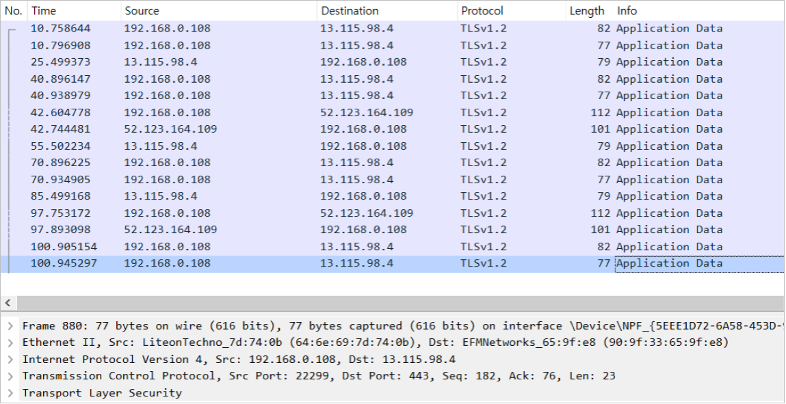

---
<!-- Page 196 -->
196
보안
요구사항
무선 네트워크를 통해 송수신되는 데이터가 전송 중 변조되지 않았음을 확인할 수 있도록, 해시 값 검증이나
전자서명 등 무결성 검증 메커니즘을 적용해야 한다.
목적
무선 네트워크를 통해 송수신되는 데이터의 무결성 검증 메커니즘을 통해 네트워크 공격 위협을 방지한다.
점검 기준
무선 통신 데이터 무결성 검증

## 1. 무선 네트워크를 통해 송수신되는 데이터의 무결성을 검증하기 위한 메커니즘 적용 여부

구현 및 점검 방안
1

## 01.	  무선 네트워크를 통해 송수신되는 데이터의 무결성을 검증하기 위한 메커니즘을 적용하는지 확인한다.

•  “2.3 인터페이스 식별”의 무선 네트워크 통신유형에 해당하는 통신 인터페이스별 대상 서비스를 식별한다.
•   식별된 서비스에 대해 네트워크 자산, 개인정보 자산, 금융 자산 중 하나 이상 처리하며 외부 객체와 통신할 경우 사용하는
보안 통신 매커니즘은 아래와 같은 통신 데이터 무결성 검증방안을 충족하여 무결성 침해 방지를 수행해야 한다
[방안 1] 통신 데이터 무결성 보호방안
무선 네트워크를 통해 송수신되는 모든 데이터의 보호를 위해 아래와 같이 보안 통신 데이터 무결성 보호방안을 적용한다.
통신 데이터 무결성 보호방안
해시, MAC 등의 무결성검증 패킷 예시

#### 3.11.10  [WS-10] 무선 통신 데이터 무결성 검증

항목
내용
보안통신
설계
•  인증, 무결성 보호, 암호화, 재전송 방지를 조합하여 통신 채널 또는 엔드포인트 간 보호 구성
보안
프로토콜
•  Best Practice 통신 프로토콜 지원
TLS (Transport Layer Security)
WPA (Wi-Fi Protected Access)
PACE (Password Authenticated Connection Establishment)
AES (Advanced Encryption Standard)
•  프로토콜 구현 정확성을 검증하기 위한 주기적인 취약점 검토
예외
적용시
보완 조치
•  상호운용성 확보 등으로 인해 보안 수준이 낮은 프로토콜을 사용해야 하는 경우, 다음과 같은 보
완책 적용
해당 장비가 인가된 구역 내에서만 동작하고, 외부 접근이 불가능한 경우
불완전 프로토콜을 VPN(가상 사설망)으로 터널링하여 외부 노출을 방지하는 경우
•  통신이 불안전한 상태로 수행될 때, 사용자에게 인지시킬 수 있는 경고 / 알림 기능 제공
•  물리적·논리적 보호조치가 충분하거나, 신뢰된 인증 기반 구조(예: 인증서, 제조사 체인)를 통해 보
완이 가능한 경우 예외

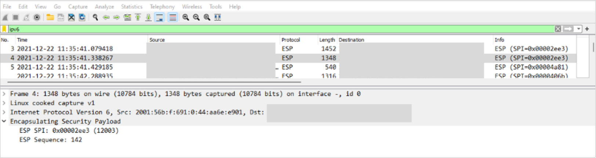

---
<!-- Page 197 -->
01
02
03
197
데이터에 적용되는 보안 통신 메커니즘이 적절한지는 아래와 같은 무선통신 데이터 보호 검증방안을 통해 검증한다.
통신 데이터 무결성 검증 방안
항목
검증방안
일반
•  인증 및 무결성 보호에 사용되는 비밀 값이 노출되거나 악용되지 않는지 여부
•  변조된 메시지가 무결한 것으로 허용되지 않는지 여부
•  비인가된 메시지가 인증된 것으로 허용되지 않는지 여부
•  채널 기반 통신을 사용하는 경우, 중간자 공격이 성공할 수 없는지의 여부
비밀 값
•  생산 과정에서 삽입된 비밀 값이 네트워크 통신 중에 노출되지 않는지 여부
•  변조된 메시지가 무결한 것으로 허용되지 않는지 여부
•  비인가된 메시지가 인증된 것으로 허용되지 않는지 여부
•  채널 기반 통신을 사용하는 경우, 중간자 공격이 성공할 수 없는지의 여부
통신
•  통신 메커니즘을 통해 비밀 값이 노출되지 않는지 여부
•  변조된 메시지가 무결한 것으로 허용되지 않는지 여부
•  비인가된 메시지가 인증된 것으로 허용되지 않는지 여부
•  채널 기반 통신을 사용하는 경우, 중간자 공격이 성공할 수 없는지의 여부
PKI
•  위조된 인증서가 허용되지 않는지 여부
•  변조된 메시지가 무결한 것으로 허용되지 않는지 여부
•  비인가된 메시지가 인증된 것으로 허용되지 않는지 여부
•  채널 기반 통신을 사용하는 경우, 중간자 공격이 성공할 수 없는지의 여부
서드파티
•  제3자의 응답이 조작될 수 있는지 여부
•  변조된 메시지가 무결한 것으로 허용되지 않는지 여부
•  비인가된 메시지가 인증된 것으로 허용되지 않는지 여부
•  채널 기반 통신을 사용하는 경우, 중간자 공격이 성공할 수 없는지의 여부

---
<!-- Page 198 -->
198
보안
요구사항
무선 네트워크로 전송되는 데이터가 이전에 전송된 내용이 재전송 공격에 악용되지 않도록 보호해야 한다.
목적
공격자가 정상적인 통신 패킷을 가로채어 나중에 재전송함으로써 인증 우회나 서비스 오용을 시도하는 것을
방지한다.
점검 기준
재전송 공격 방지

## 1. 무선 네트워크 통신에서 송수신되는 보안·프라이버시 자산에 대해, 재전송 공격 방지 메커니즘의 적용 여부

구현 및 점검 방안
1

## 01.	  무선 네트워크 통신에서 송수신되는 보안·프라이버시 자산에 대해, 재전송 공격 방지 메커니즘을 적용하는지

확인한다.
•  “2.3 인터페이스 식별”의 무선 네트워크 통신유형에 해당하는 통신 인터페이스별 대상 서비스를 식별한다.
•   식별된 서비스에 대해 네트워크 자산, 개인정보 자산, 금융 자산 중 하나 이상 처리하며 외부 객체와 통신할 경우, 사용하는
통신 메커니즘은 아래와 같은 재전송 공격 방지 검증방안을 충족하여 재전송 공격 방지를 수행해야 한다.
[방안 1] 재전송 방지 구현방안
무선 네트워크를 통해 송수신되는 모든 자산의 보호를 위해 아래와 같이 재전송 방지 방안을 적용한다.
•  각 통신 세션의 메시지에 세션 ID와 카운터를 부여하여, 전체 통신 및 개별 메시지의 재전송 차단
•  타임스탬프 또는 1회용 암호화를 사용하여 반복 전송 방지 누락
•  가능한 경우 재전송 방지 기능이 내장된 표준 프로토콜(TLS, SSH, IPsec 등) 우선 적용
•  데이터 요청이 단순 조회 등 수신 측의 상태 변화를 일으키지 않는 경우, 위험 평가 결과에 따라 재전송 방지 기능 적용 생략
자산에 적용되는 재전송 공격 방지방안이 적절한지는 아래와 같은 재전송 공격 방지 검증방안을 통해 검증한다.
항목
검증방안
일반
•  이미 수락된 메시지의 복제본을 다시 수락하는지 여부
순서 번호
•  보안 자산 및 네트워크 자산의 통신 중 중복된 순서 번호를 가진 수신 메시지는 수락되지 않는가의
여부
타임스탬프
•  보안 자산 및 네트워크 자산의 통신 중 비정상적인 타임스탬프를 가진 수신 메시지는 수락되지 않는
가의 여부
1회용
암호키
•  암호화 키가 가로채지거나 추출될 수 없어야 하는가의 여부
•  이미 수락된 메시지의 복제본은 다시 수락되지 않는가의 여부

#### 3.11.11  [WS-11] 무선 통신 재전송 공격 방지 구현

재전송 공격 방지 검증방안

---
<!-- Page 199 -->
01
02
03
199
보안
요구사항
보안 및 프라이버시 자산에 영향을 미치는 소프트웨어(펌웨어 포함)에 대해 업데이트 기능을 반드시 제공해야 한다.
특히 인터넷에 연결된 경우에는 자동 또는 승인 기반 등 다양한 방식으로 업데이트가 이루어질 수 있어야 한다.
(안전 상 이유, 불변 소프트웨어, 대체 보호 조치가 있는 경우는 예외)
목적
보안 및 프라이버시 자산에 영향을 미치는 소프트웨어/펌웨어에 대해 업데이트 기능을 제공하여 소프트웨어 공급망
위협을 방지한다.
점검 기준
업데이트 메커니즘 제공

## 1. 보안·프라이버시 자산에 영향을 미치는 소프트웨어/펌웨어의 업데이트 가능한 메커니즘 제공 여부

## 2. 기능 안전상 예외에 해당하는 경우, 관련 근거와 대체 보호조치 존재 여부

## 3. 인터넷 연결 시, 하나 이상의 업데이트 방식 제공 여부

구현 및 점검 방안
1

## 01.	 보안·프라이버시 자산에 영향을 미치는 소프트웨어/펌웨어의 업데이트 가능한 메커니즘을 제공하는지

확인한다.
•  “2.3 인터페이스 식별”의 무선 네트워크 통신유형에 해당하는 통신 인터페이스별 대상 서비스를 식별한다.
•  식별된 서비스에 대해 네트워크 자산, 개인정보 자산, 금융 자산 중 하나 이상 처리하며 이에 영향을 미치는 업데이트 기능을
제공할 경우, 안전한 업데이트 메커니즘을 제공해야 한다.
•  업데이트 기능은 보안 업데이트가 포함된 소프트웨어에 기반하여 업데이트를 제공해야 하고, 이에 대한 버전정보를 (신규)
업데이트 시마다 제공해야 한다.
[방안 1] 업데이트 메커니즘의 구현
업데이트 메커니즘은 자동 업데이트, 예약 업데이트, 수동 업데이트 방식으로 구분할 수 있으며 각 사용자의 환경에 따라 이중
하나의 방식을 제공하거나 선택할 수 있게 제공해야 한다.
업데이트 메커니즘의 상세한 구현은 아래와 같은 상세 구현방안을 통해 수행할 수 있다. 구현을 수행한 후 업데이트 정책,
주기, 절차 및 롤백 방안을 포함한 종합적인 업데이트 관리 가이드를 문서화 관리해야 한다.
항목
내용
자동 업데이트
•  장비에 대한 인적 개입 없이 자동으로 업데이트 수행
예약 업데이트
•  사용자 승인 하에 예약된 설치 수행
수동 업데이트
•  운영 환경의 안전성 보장 필요 시, 사용자 승인 또는 감독하에 업데이트 수행

#### 3.11.12  [WS-12] 업데이트 메커니즘 제공

업데이트 메커니즘의 분류

---
<!-- Page 200 -->
200
2

## 01.	 기능 안전상 예외에 해당하는 경우, 관련 근거와 대체 보호조치가 존재하는지 확인한다.

•  기능 안전상, 불변 소프트웨어 등 업데이트 기능을 제공하지 않는 예외에 해당해야 한다.
•  업데이트 기능을 제공하지 않을 경우 관련 근거의 문서화와 대체 보호조치를 구현해야 한다.
[방안 1] 예외에 대한 관련 근거와 대체 보호조치
업데이트를 제공하지 않을 경우의 예외에 대한 근거와 대체 보호조치를 구현한다.
예외 근거의 경우 안전상의 이유, 적용상의 이유, 불변 소프트웨어인 점을 제시할 수 있다.
예외 구성요소에 대한 대체 보호조치 방안은 크게 물리적 격리, 접근 제어, 모니터링 강화 등으로 제시할 수 있다.
불변 소프트웨어 예시
업데이트 매커니즘의 상세 구현방안
항목
내용
일반
•  여러 소프트웨어 구성요소가 존재할 경우, 하나의 메커니즘이 복수의 구성요소를 동시에
관리가능
•  업데이트 과정 중 이미지 검증 실패 등 오류 발생 시, 롤백 정책을 통해 이전버전 복원 보장
•  보안 업데이트와 응용 프로그램 업데이트는 분리 가능한 구조로 구현
•  장비의 전력·자원 제약, 장기간 배터리 구동 등의 환경에서는 장비 교체나 격리를 통해 보안성
유지
자동
업데이트
•  기기 자체 또는 중앙 관리 시스템에 의해 업데이트 수행될 수 있으며, 사용자는 승인·예약·알림
수준에서 개입가능
•  보안 관련 중요 취약점에 대해 업데이트 수행
•  자동화 수준은 장비 환경에 따라 달라질 수 있으며 다음과 같이 분류가능
· 완전 자동 업데이트) 장비가 자체 판단으로 업데이트 수행
· 반자동 업데이트) 사용자 승인 후 수행
· 스케줄 기반 업데이트) 관리자가 승인한 일정기반 자동수행
•  안전성, 실시간성, 또는 네트워크 호환성 문제로 인해 완전 자동화가 어려운 경우 사용자 승인
또는 현장 검증 절차를 추가하여 안전한 업데이트 수행
예약
업데이트
•  일반 기능 업데이트에 대한 승인 기반 업데이트 수행
수동
업데이트
•  사용자 요청에 의한 업데이트 수행
•  웹이나 특정 인터페이스를 통한 업데이트 파일 업로드 지원

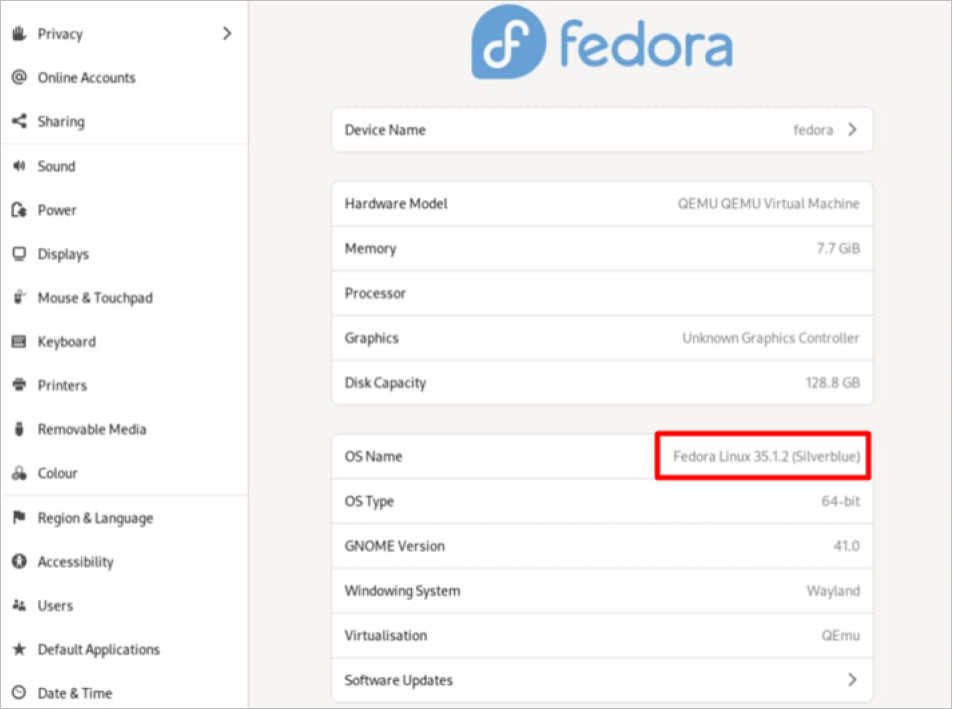

---
<!-- Page 201 -->
01
02
03
201
3

## 01.	  인터넷 연결 시, 하나 이상의 업데이트 방식을 제공하는지 여부를 확인한다.

•  인터넷과의 연결성이 있을 경우, 자동 업데이트, 사용자 승인 하에 업데이트 설치 예약, 수동 업데이트 중에서 하나 이상의
업데이트 방식을 제공해야 한다.
[방안 1] 업데이트 제공방안
인터넷과의 연결성이 있을 경우 자동 업데이트, 사용자 승인 하에 업데이트 설치 예약, 수동 업데이트 중에서 하나 이상의
업데이트 방식을 제공해야 한다.
이를 위한 업데이트 방식의 선택을 아래와 같이 제공할 수 있다.
자동 업데이트 지원 예시
수동 업데이트 지원 예시

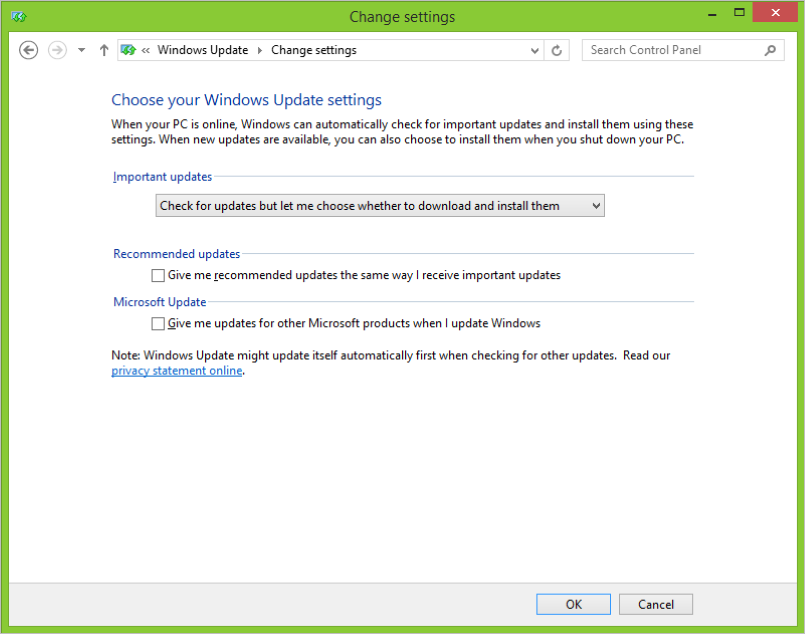

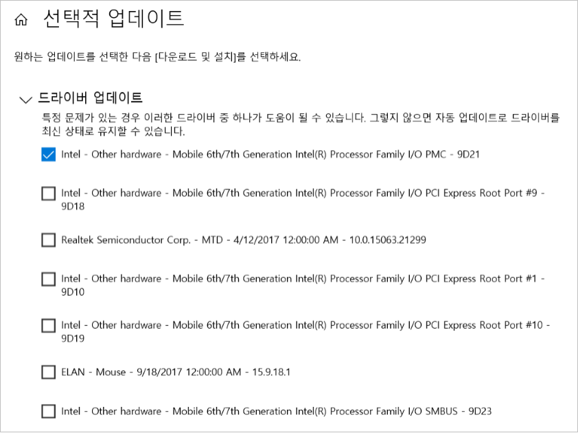

---
<!-- Page 202 -->
202
보안
요구사항
무선 네트워크를 통한 원격 업데이트 시, 자동 또는 수동으로 업데이트되는 소프트웨어 및 펌웨어의 무결성을
반드시 검증해야 한다.
목적
무선 네트워크를 통한 원격 업데이트 시, 자동 또는 수동으로 업데이트되는 소프트웨어 및 펌웨어의 무결성과
진본성을 검증해 소프트웨어 공급망 위협을 방지한다.
점검 기준
무선 네트워크 업데이트 무결성 및 진본성 검증

## 1. 업데이트 시 설치되는 소프트웨어의 무결성 및 진본성을 검증하는 메커니즘 존재 여부

## 2. 무결성 또는 진본성 검증에 실패한 소프트웨어의 설치를 차단하고 복구하는 기능 존재 여부

## 3. 검증 결과 및 관련 이벤트가 로그로 남고, 필요시 관리자 통보 여부

구현 및 점검 방안
1

## 01.	 업데이트 시 설치되는 소프트웨어의 무결성 및 진본성을 검증하는 메커니즘이 존재하는지 확인한다.

•  “2.3 인터페이스 식별”의 무선 네트워크 통신유형에 해당하는 통신 인터페이스별 대상 서비스를 식별한다.
•  식별된 서비스에 대해 네트워크 자산, 개인정보 자산, 금융 자산 중 하나 이상 처리하며 소프트웨어/펌웨어 무선 업데이트
기능이 존재하는 경우, 기능의 수행 시 무결성 및 진본성을 검증하는 메커니즘이 있는지 확인한다.
[방안 1] 소프트웨어 검증 메커니즘
아래와 같은 업데이트 무결성 및 진본성을 검증하는 메커니즘에 기반하여 소프트웨어 업데이트를 수행한다.
업데이트 검증 메커니즘이 적절한지는 아래와 같은 무결성 검증방안을 통해 검증한다.
항목
검증방안
업데이트
메커니즘
•  신뢰 앵커에 기반해 업데이트 파일의 무결성과 인증을 암호학적 검증
•  장비 자체 또는 신뢰된 외부 장비에서 검증 수행
•  외부 장비가 검증을 수행하는 경우 검증된 업데이트는 보안 채널을 통해 안전하게 전송 및 설치
•  보안 채널은 통신 데이터의 기밀성과 무결성을 유지하는 경로로, 인가된 인력에 의한 로컬 설치 절
차 포함
관리방안
•  제조사는 필요 시 공급사 외부의 대체 소프트웨어 설치를 위한 안전한 절차 제공
•  보안 업데이트 적용 후 초기화 또는 인증정보 재입력이 필요한 경우, 해당 절차를 사용자에게 명확
히 고지하고 관리 절차 마련
•  업데이트 과정에서 기밀 암호키가 포함된 경우, 보안 통신 메커니즘을 함께 적용해 키의 노출방
지 수행
항목
검증방안
일반
•  무결성이 유효하지 않은 소프트웨어 업데이트가 설치되지 않은가의 여부
•  인증이 유효하지 않은 소프트웨어 업데이트가 설치되지 않은가의 여부
서명
•  서명되지 않은 소프트웨어 업데이트가 설치되지 않음을 확인
•  변조된 서명이 포함된 소프트웨어 업데이트가 설치되지 않았나의 여부
•  수정된 업데이트 파일이 원본 서명으로 검증 통과하지 않도록 구현되어 있는가 여부
•  인가되지 않은 엔티티의 서명을 포함한 소프트웨어 업데이트가 설치되지 않은가의 여부
보안통신
•  인가되지 않은 출처의 소프트웨어 업데이트가 설치되지 않은가 확인
•  보안 통신 채널이 중간자 공격을 통해 인가된 업데이트 출처를 사칭할 수 없음의 확인여부
•  통신 중 변조된 업데이트 파일이 설치되지 않는가의 여부
접근제어
•  원본 업데이트의 해시를 재사용한 변조된 업데이트 파일이 설치되지 않는가의 여부
•  지원되지 않는 해시 함수로 생성된 해시를 사용하는 업데이트가 설치되지 않는가의 여부
•  인가되지 않은 엔티티가 제공한 소프트웨어 업데이트가 설치되지 않는가의 여부

#### 3.11.13  [WS-13] 무선 네트워크 업데이트 무결성 및 진본성 검증

업데이트 메커니즘 수행방안
업데이트 소프트웨어 검증 방안

---
<!-- Page 203 -->
01
02
03
203
2

## 01.	 무결성/진본성 검증에 실패한 소프트웨어의 설치를 차단하고 복구하는 기능이 존재하는지 확인한다.

•  업데이트 시 설치되는 소프트웨어의 무결성 및 진본성을 검증하는 메커니즘에 기반하여 유효한 소프트웨어만 설치되어야
한다.
•  업데이트 중 무결성/진본성 검증에 실패할 경우 소프트웨어의 설치를 차단하고 복구하는 기능이 존재해야 한다.
[방안 1] 무결성/진본성 검증 실패시 처리방안
업데이트 대상 소프트웨어 파일의 무결성과 진본성의 검증을 실패할 경우 설치 방지 및 검증 실패화면을 사용자에게 제공하고
이전 버전 소프트웨어 상태로의 안전한 복귀를 수행해야 한다.
이전 버전 상태의 소프트웨어로 복귀하였을 때에 기존의 데이터와 설정에 오류가 존재하거나 복귀상태에 대한 이상이
존재해서는 안 된다.
3

## 01.	 검증 결과 및 관련 이벤트가 로그로 남고, 필요시 관리자 통보를 수행하는지 확인한다.

•  업데이트의 검증 결과와 관련 이벤트는 아래와 같은 무결성 검증방안 하에 검증되어 로그로 저장되어야 한다.
•  업데이트의 검증 결과와 관련 이벤트에 대한 정보는 필요시 관리자에게 통보되어야 한다.
[방안 1] 관련 이벤트 저장 및 관리자 보고
업데이트의 검증 결과와 관련 이벤트에 대한 정보는 로그로 저장되어야 하며 필요한 경우 관리자에게 고지되어야 한다.
필요한 상황의 예는 다음과 같이 볼 수 있다.
업데이트 검증이 실패한 경우
•  무결성 검증 실패, 서명(Signature) 불일치, 체크섬 오류, 패키지의 확실한 변조
업데이트가 정상적으로 완료되지 않은 경우
•  설치 중단, 파일 일부만 반영, 롤백 발생, 중간 오류 발생
업데이트 후 정상 초기동작 검증에서 이상 징후 발생
•  서비스 재기동 실패, 특정 모듈 비정상, 기능 장애
업데이트가 보안 패치 또는 중요 기능 패치일 때
정책적으로 관리자 통보가 요구되는 경우
검증 실패화면 예시

---
<!-- Page 204 -->
204
보안
요구사항
보안 자산 또는 네트워크 자산을 보호하기 위해 사용하는 암호화 기술이 최신 보안 모범사례를 따라야 한다. 또한 각
암호화 사용 목적과 예상 수명을 명확히 문서화하여 체계적인 암호화 정책 관리가 이루어져야 한다.
목적
보안 자산 또는 네트워크 자산을 보호하기 위해 사용하는 암호화 기술의 경우 국제 표준 기관(NIST, IETF 등)에서
권장하는 강력한 암호화 알고리즘과 같은 최신 보안 모범사례를 준수하여 암호화 무력화, 데이터노출 및 기밀성
훼손을 방지한다.
점검 기준
암호화 알고리즘 적정성

## 1. 보호해야 할 자산에 적용된 암호 알고리즘의 Best Practice 준수 여부

## 2. 각 암호화 사용 목적의 명확한 문서화 여부

## 3. 해당 암호화 알고리즘의 예상 수명 동안 사용 가능 여부

구현 및 점검 방안
1

## 01.	 보호해야 할 자산에 적용된 암호 알고리즘이 Best Practice (최신 보안 모범사례)를 준수하는지 확인한다.

•  “2.3 인터페이스 식별”의 무선 네트워크 통신유형에 해당하는 통신 인터페이스별 대상 서비스를 식별한다.
•  식별된 서비스에 대해 네트워크 자산, 개인정보 자산, 금융 자산 중 하나 이상 처리하며 암호화 알고리즘이 사용될 경우,
보호 자산에 적용된 알고리즘은 최신 보안 모범사례를 준수해야 한다.
[방안 1] 최신 보안 모범사례
최신 보안 모범사례란 ISO/IEC 관련 표준, SOG-IS의 “SOGIS agreed Cryptographic Mechanisms”, ETSI TS 119 312,
ENISA 및 NIST SP 800 시리즈, BSI TR-02102-1 등에서 제시하는 권고에 해당한다. 암호화 적정성을 준수하기 위해 이를
준수해야 한다.
•  WPA2(WPA2-PSK/AES-CCMP) 이상 사용
•  웹 TLS 1.2 이상만 허용, 서버 설정에서 ssl_protocols 제한 필요
•  AES-GCM 기반 데이터 암호화 적용
2

## 01.	 각 암호화의 사용 목적의 명확한 문서화 여부를 확인한다.

•  각각의 암호화 알고리즘의 사용 목적은 명확히 문서화되어야 한다.
[방안 1] 암호화 알고리즘의 문서화 방안
암호화 알고리즘에 대해 사용하는 암호화 알고리즘의 종류, 적용 목적, 사용 대상을 명시한 보안 정책 문서화를 수행한다.
알고리즘 문서화 정리 예시

#### 3.11.14  [WS-14] 암호화 적정성

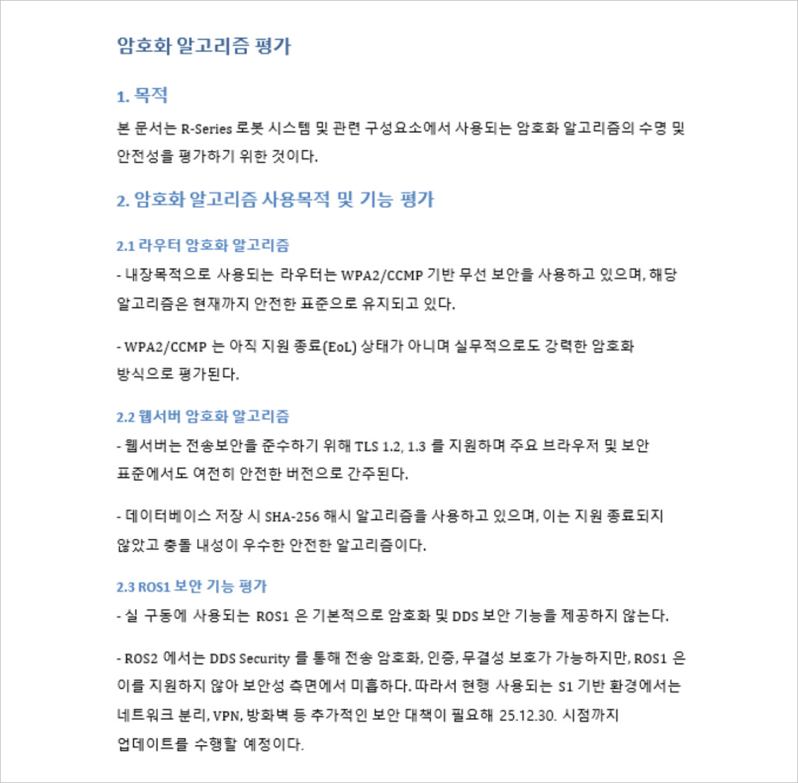

---
<!-- Page 205 -->
01
02
03
205
3

## 01.	 암호 알고리즘의 예상 사용 수명동안 사용 가능한지 확인한다.

•  각각의 암호화 알고리즘이 예상 수명 동안 사용 가능해야 한다.
[방안 1] 암호화 알고리즘의 예상수명 확인방안
암호화 알고리즘에 대해 SOG-IS 등에서 주기적으로 갱신되는 암호 유효기간을 확인하여 암호화 알고리즘 수명 및 폐지
여부를 주기적으로 확인한다.
상호운용성을 위해 구형 암호가 필요한 경우, 단기적인 허용은 가능하지만 보안 보증 수준이 낮아질 수 있다. 하드웨어 기반
Root of Trust 등으로 인해 암호화 교체가 불가능한 장비는, 해당 암호 알고리즘의 권장 사용 기간이 장비의 예상 수명보다
짧지 않도록 보장한다.

---
<!-- Page 206 -->
206
보안
요구사항
사용하는 모든 기밀 암호키는 최소 112비트 이상의 보안 강도를 가져야 하며, 암호키 생성 시에는 최신 보안
모범사례를 따라야 한다.
목적
현재의 컴퓨팅 환경에서 무차별 대입 공격에 견딜 수 있는 충분한 키 길이를 보장하고, 암호학적으로 안전한
난수 생성기(CSPRNG)를 사용한 키 생성, 적절한 키 수명 관리, 키 용도별 분리 사용 등을 통해 암호화 시스템의
전반적인 보안성을 확보한다.
점검 기준
적절한 암호화 키 Best Practice 준수

## 1. 암호화 키의 안전한 방식 생성 여부

## 2. 적절한 수명 관리(만료, 삭제) 여부

## 3. 적절한 보안 강도(112bit 이상) 여부

## 4. 용도 별로 1개의 키 사용 여부

## 5. 여러 장비 간 동일 키 복제 여부

## 6. 사용하는 모든 키에 대한 정보 문서화 여부

구현 및 점검 방안
1

## 01.	 암호화 키가 안전한 방식으로 생성되는지 확인한다.

•  “2.3 인터페이스 식별”의 무선 네트워크 통신유형에 해당하는 통신 인터페이스별 대상 서비스를 식별한다.
•  식별된 서비스에 대해 네트워크 자산, 개인정보 자산, 금융 자산 중 하나 이상 처리하며 암호화 알고리즘이 사용될 경우,
적절한 암호화 키를 사용하는지 확인해야 한다.
•  알고리즘이 사용될 경우 보호해야 할 자산에 적용된 암호화 알고리즘은 안전한 방식으로 생성되어야 한다.
[방안 1] 암호화 키 생성방안
암호화 키는 아래와 같이 안전한 방식을 통해 생성 및 관리한다.
•  신뢰성 있는 RNG(Random Number Generator)를 사용하고, 충분한 엔트로피 보장
•  키 파생은 검증된 표준 절차(NIST SP 800-108r1, SP 800-132, ISO/IEC 11770 등) 기반 수행
•  비밀번호 기반 키 파생(PBKDF 등)을 사용하는 경우, 112비트 미만의 강도를 허용할 수 있으나 위험 문서화 및 보안대책
병행
•  상호운용성/표준 프로토콜 제약으로 인해 강도 편차가 발생하는 경우, 보호 자산에 미치는 위험 평가 및 기록
2

## 01.	 암호화 키가 적절한 수명관리를 사용하는지 확인한다.

•  각각의 암호화 알고리즘이 사용하는 암호화 키는 적절한 보안 강도(112bit 이상)를 준수해야 한다.
[방안 1] 수명 및 정책관리 방안
암호화 키는 아래와 같이 수명 및 정책 관리 방안을 통해 관리한다.
•  CCK의 보안 강도는 RNG(난수 발생기)의 엔트로피, 키 길이, 사용 알고리즘에 따라 결정되므로 이 세 요소의 품질 보장
•  장기 사용되는 CCK는 공격 내성 및 저장 보안성 증진 설계
•  단기 세션 키는 완전 순방향 보안을 고려하여 세션별 재생성 설계
•  동일한 CCK를 여러 장비에 복제·재사용하지 않도록 하고, 사용이 종료된 키는 즉시 안전삭제
•  하나의 CCK는 단일 목적으로만 사용하며, 용도별 분리 원칙 준수.
3

## 01.	 암호화 키가 적절한 보안 강도를 준수하는지 확인한다.

•  각각의 암호화 알고리즘이 사용하는 암호화 키는 적절한 수명 관리(만료, 삭제)를 수행해야 한다.
[방안 1] 보안강도 방안
암호화 키는 보호 대상 자산의 중요도와 위협 수준을 고려하여 적절한 보안 강도를 가진 알고리즘을 선택한다.

#### 3.11.15  [WS-15] 적절한 암호화 키 사용

---
<!-- Page 207 -->
01
02
03
207
3
적절한 보안강도를 가진 알고리즘의 예시는 아래와 같다.
4

## 01.	 암호화 키가 용도별로 고유한 1개의 키를 사용하는지 확인한다.

•  각각의 암호화 알고리즘이 사용하는 암호화 키는 용도 별로 고유한 하나의 키에 해당해야 한다.
[방안 1] 용도별 키 사용방안
암호화 키는 아래와 같은 용도별 키 사용방안을 참고하여 사용 목적에 따라 용도 구분을 적용하고, 동일 키를 복수 목적에
사용하는 것을 금지한다.
•  데이터 암호화용, 서명용, 무결성 검증용, 키 교환용 등 기능별로 별도 키 사용
•  세션 암호화 키와 저장용 암호화 키를 구분하여 운용
•  인증/로그인 관련 키(PBKDF)는 데이터 암호화 키와 혼용 금지
•  장비 간 통신용 키는 시스템 내부 저장용 키와 분리
•  관리 키와 서비스 키는 권한 기준으로 분리 관리
•  공개키 기반구조(PKI) 사용 시, 루트·중간·서버·클라이언트 인증서 키 구분
5

## 01.	 장비간 동일한 키를 복제하여 사용하는지 확인한다.

•  각각의 암호화 알고리즘이 사용하는 암호화 키는 여러 장비 간 동일 키를 복제하여 사용되어서는 안된다.
[방안 1] 동일 키 관리방안
동일 암호화 키 재사용을 금지하고 확산을 방지하여 키 노출 시의 피해 범위를 최소화한다.
•  동일 암호화 키(CCK)를 여러 장비·다른 시스템에 복제하여 배포하는 것을 금지
•  어쩔 수 없이 동일 키가 여러 장비에 존재해야 하는 경우, 해당 위험을 문서화하고 보호조치(보안 영역 저장, 접근통제,
HSM 등) 적용
•  동일 키 재사용 기간 최소화, 주기적 키 롤오버(Key Rotation) 정책 적용
•  동일 키가 재사용되는 프로토콜 환경에서는 추가적인 안전장치(Nonce 관리, IV 중복 방지, AEAD 사용 등) 적용
•  동일 키 노출(Potential Leakage) 징후 발생 시 즉시 폐기 및 신규 키 재배포
•  동일 키의 용도 혼용 방지(Encryption Key ≠ MAC Key)
적절한 보안강도 알고리즘선택 예시
구분
알고리즘
대칭키 암호
AES-128/192/256
비대칭키 암호
RSA-2048/3072, ECC P-256/384
해시
SHA-256/384/512
MAC
HMAC-SHA256 이상
키 교환
ECDH(Elliptic Curve Diffie-Hellman)

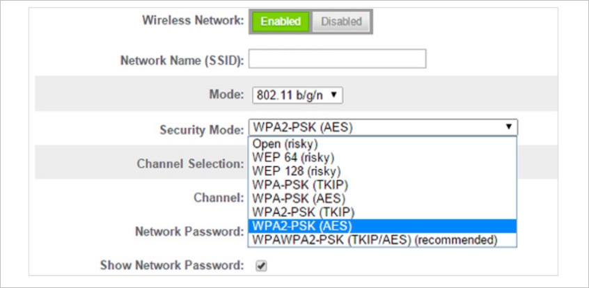

---
<!-- Page 208 -->
208
6

## 01.	 사용하는 모든 키에 대한 문서화를 수행하는지 확인한다.

모든 암호화 알고리즘이 사용하는 암호화 키에 대한 정보는 문서화되어야 한다.
[방안 1] 암호화 키 문서화 방안
암호화 알고리즘에 대해 사용하는 암호화 키의 종류, 길이, 수명, 용도를 명시한 보안 정책 문서화를 수행한다.
알고리즘 문서화 정리 예시

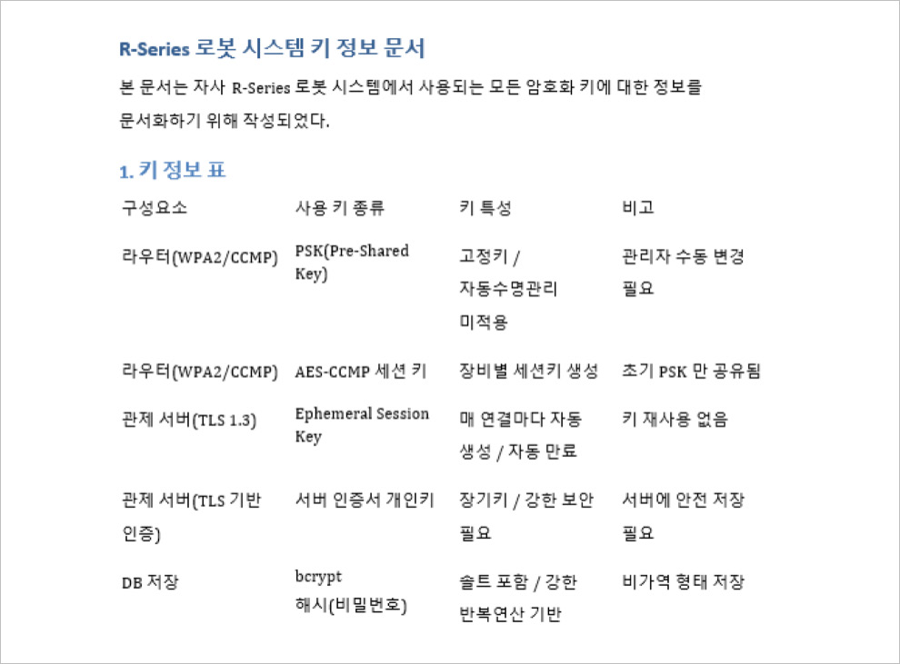

---
<!-- Page 209 -->
01
02
03
209
보안
요구사항
사전 설치되는 기밀 암호키는 실질적으로 장비별로 고유하게 관리되어야 한다. 단, 초기 신뢰 수립이나 특정 기능
수행을 위해 공유 키가 필요한 경우에는 해당 목적과 보안 조치를 명확히 문서화해야 한다.
목적
동일한 암호키를 여러 장비에서 공유할 경우 하나의 장비에서 키가 유출되면 전체 시스템의 암호화 보호가 동시에
무력화될 수 있는 위험을 방지한다.
점검 기준
암호화 키 고유성

## 1. 암호화 키의 장비마다 고유한 값 여부

## 2. 고유하지 않은 경우 초기 신뢰 수립 용이나 특정 기능 수행을 위한 공유 키 값 여부

구현 및 점검 방안
1

## 01.	 암호화 키의 장비마다 고유한 값을 사용하는지 확인한다.

•  “2.3 인터페이스 식별”의 무선 네트워크 통신유형에 해당하는 통신 인터페이스별 대상 서비스를 식별한다.
•  식별된 서비스에 대해 네트워크 자산, 개인정보 자산, 금융 자산 중 하나 이상 처리하며 암호화 알고리즘과 사전 설치된
암호화 키가 존재할 경우 해당 기밀 암호키(CCK)는 장비별로 고유해야 한다.
[방안 1] 암호화 키의 고유성
암호화 키는 아래와 같은 고유성 관리방안을 통해 설계 및 관리한다.
•  제조 단계에서 장비마다 다른 CCK를 자동 생성하도록 프로세스 설계.
•  CCK는 장비 고유 식별정보(MAC, 모델명 등) 으로부터 단순 유도되지 않도록 설계
•  난수 기반 CCK 생성 알고리즘을 사용하여 예측 불가능성 확보
•  장비별 CCK를 안전하게 기록·보관할 수 있는 제조 데이터베이스(보안 영역) 운영 수행
•  동일 제품군 내에서 CCK가 체계적으로 재사용되지 않음을 주기적 검증
2

## 01.	 고유하지 않은 경우 초기 신뢰 수립 용이나 특정 기능 수행을 위한 공유 키 값에 해당하는지 확인한다.

•  암호화 키가 고유하지 않은 경우 초기 신뢰 수립 용도나 특정기능 수행을 위한 공유 키 값에 해당해야 한다.
[방안 1] 암호화 키의 공유키 여부
암호화 키는 아래와 같이 공유키 관리방안을 통해 관리한다.
•  초기 신뢰관계 수립(예: 장비 등록, 인증 서버 초기 핸드셰이크) 등 인가된 조건에서만 사용되는 공유 키는 사용 후 폐기 또는
갱신절차 포함
•  장비 기능 수행상 필수적인 공유 파라미터(예: 네트워크 장비 설정, 업데이트 검증용 키)는 관리 권한 및 접근 통제 절차
별도수립
•  공유 키 사용 시 범위·기간·관리 주체를 명확히 문서화하여 정적 키 남용방지

#### 3.11.16  [WS-16] 암호화 키 고유성

---
<!-- Page 210 -->
210
보안
요구사항
주요 자산과 관련된 내부 보안 활동 및 이벤트에 대해 로그를 반드시 기록해야 한다.
목적
주요 자산과 관련된 내부 보안 활동 및 이벤트에 대한 로그를 기록하여 보안 이벤트 분석 부재 위협을 방지한다.
점검 기준
로그 메커니즘의 적용 가능성

## 1. 개인정보 자산 및 보호와 관련한 내부 이벤트에 대해 로그 메커니즘 적용 여부

## 2. 사용자가 로그에 접근할 경우, 읽기 전용으로만 로그 접근 가능 여부

## 3. 로그 메커니즘은 관련 이벤트에 대한 로그 데이터를 장비의 영구 저장소에 기록하고, 충분한 기간 동안의

보관가능 여부

## 4. 장비의 영구 저장소에 저장되는 로그 데이터의 충분한 개수 보장 여부

구현 및 점검 방안
1

## 01.	 개인정보 자산 및 보호와 관련한 내부 이벤트에 대해 로그 메커니즘을 적용하는지 확인한다.

•  “2.3 인터페이스 식별”의 무선 네트워크 통신유형에 해당하는 통신 인터페이스별 대상 서비스를 식별한다.
•  식별된 서비스에 대해 개인정보 자산, 금융 자산 중 하나 이상 처리하며 관련 개인정보 자산 및 보호와 관련 내부 이벤트가
존재할 경우, 로그 메커니즘이 적용되는지 확인한다.
[방안 1] 로그 메커니즘 적용 대상
로봇 운영 시 발생하는 주요 이벤트(로그인/로그아웃, 설정 변경, 시나리오 실행 /중단, 오류 발생 등)에 대해 감사 로그 생성
기능을 구현한다. 이벤트/감사 로그에는 사용자 ID, 장비 식별자, 이벤트 시간, 이벤트 정보를 필수 포함한다.
설계 시 로그 목적·대상·보존 기간을 명확히 정의하고, 필요 최소한의 개인정보만 포함 및 로그 파일에 대한 접근 통제, 암호화
저장, 삭제·변조 탐지 기능을 적용하도록 설계한다.
2

## 01.	 사용자가 로그에 접근할 경우, 읽기 전용으로만 로그 접근이 가능한지 확인한다.

•  로그 메커니즘이 적용될 경우 접근 시 읽기 전용으로만 로그 접근이 가능해야 한다.
[방안 1] 읽기전용 로그 체계
로그 데이터를 읽기 전용으로만 제공한다. 로그 데이터의 무결성을 확보해야 할 경우 각 로그 레코드 또는 로그 블록을
HMAC 또는 디지털 서명으로 보호하는 로그 서명이나 해시 검증을 적용한다.
읽기전용 로그 예시

#### 3.11.17  [WS-17] 로그 생성

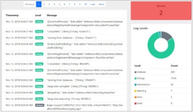

---
<!-- Page 211 -->
01
02
03
211
3

## 01.	 로그 메커니즘은 관련 이벤트에 대한 로그 데이터를 장비의 영구 저장소에 기록하고, 충분한 기간 동안의

보관가능한지 확인한다.
•  로그 메커니즘은 가장 최근 발생한 이벤트에 대한 로그 데이터를 장비의 영구 저장소에 저장해야 한다.
•  로그 메커니즘은 충분한 설정기간동안 로그 데이터를 장비의 영구 저장소에 저장해야 한다.
•  단, 관련 로그 데이터가 장비 외부에 저장되는 경우는 예외로 한다.
[방안 1] 로그 기간 보장
전원 재기동 시에도 로그 손실이 없도록 플래시 메모리 등 영속 저장소에 기록하고, 저장 기간은 정책상 설정한 충분한 기간과
아래와 같은 근거를 감안하여 설정한다.
•  법/규제 요구사항
•  사고 대응 및 포렌식 필요성
•  시스템 수명과 기록 빈도
•  위험평가 기반의 정책 설정
4

## 01.	 장비의 영구 저장소에 저장되는 로그 데이터가 충분한 개수를 보장하는지 확인한다.

•  로그 메커니즘은 최신 이벤트를 포함한 최소 개수 이상의 최근 로그 데이터를 장비의 영구 저장소에 저장해야 한다.
[방안 1] 로그 개수 보장
지정 개수 또는 용량 도달 시 가장 오래된 로그부터 교체하여 일정 개수의 최근 이벤트가 항상 남도록 로그 로테이션 정책을
적용한다.
로그 저장기간의 충분성 예시
로그데이터의 충분성 예시

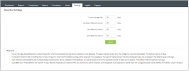

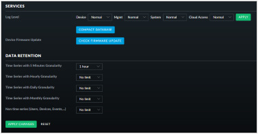

---
<!-- Page 212 -->
212
보안
요구사항
장비의 영구 저장소에 저장되는 모든 로그 데이터에는 타임스탬프 등 시간 관련 정보가 반드시 포함되어야 한다.
목적
장비의 영구 저장소에 저장되는 모든 로그 데이터에는 타임스탬프 등 시간 관련 정보를 포함시켜 타임스탬프 조작
및 부재 위협을 방지한다.
점검 기준
영구 저장된 로그 데이터의 시간 정보

## 1. 장비의 영구 저장소에 저장되는 모든 로그 데이터 타임스탬프 포함 여부

## 2. 장비의 영구 저장소에 저장되는 모든 로그에 타임스탬프를 포함하지 않으면, 시간 관련 정보 포함 여부

구현 및 점검 방안
1

## 01.	 장비의 영구 저장소에 저장되는 모든 로그 데이터가 타임스탬프를 포함하는지 확인한다.

•  “2.3 인터페이스 식별”의 무선 네트워크 통신유형에 해당하는 통신 인터페이스별 대상 서비스를 식별한다.
•  식별된 서비스에 대해 개인정보 자산, 금융 자산 중 하나 이상 처리하며 운영 중 발생하는 내부 이벤트에 대한 로그
메커니즘, 감사 로그 메커니즘이 존재할 경우, 로그는 타임스탬프를 포함해야 한다.
장비가 실시간 정보를 사용하는가?
문서상 로그데이터가 발생한다고 명시된 이벤트를 발생시키는가?
[방안 1] 타임스탬프 기반 로그 관리
장비 내에서 RTC 또는 네트워크 동기화(NTP 등)를 통해 정확한 시간을 유지한다. 이에 따라 발생하는 모든 로그 이벤트에
정확한 발생 시각(YYYY-MM-DD HH:MM:SS 형식)을 기록한다.
로그 분석 및 상호 장비 간 로그 연동 시에는 동일 시간대를 기준으로 비교할 수 있도록 표준 시간대(UTC 또는 KST 등)로 통일
저장한다.
2

## 01.	 장비의 영구 저장소에 저장되는 모든 로그에 타임스탬프를 포함하지 않으면, 시간 관련 정보를 포함하는지

확인한다.
•  실시간 정보가 사용 불가능한 상태인 경우, 장비에 보관된 로그데이터는 타임스탬프를 대체할 시간관련 정보를 포함해야
한다.
[방안 1] 시간정보 미포함 로그 관리
실시간 시계가 없는 장비의 경우, 아래와 같은 시간정보 미포함 로그 관리방안을 통해 시간정보를 대체 기록한다.

#### 3.11.18  [WS-18] 시간 정보 포함

타임스탬프 포함 로그 예시

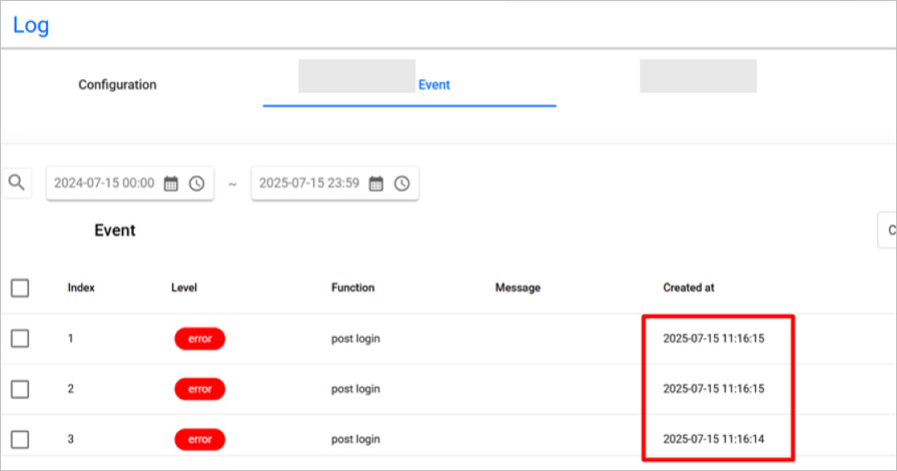

---
<!-- Page 213 -->
01
02
03
213
•  이벤트 발생 순서(Sequence Number) 또는 시작 후 초단위 경과시간 기반의 로그 순차 기록
•  로그를 외부 서버(SIEM, 중앙관리 시스템 등)로 전송 시, 수신 측에서 수신 시각을 기준으로 보정기록
•  장비별 로그 간 시간 또는 발생 순서기반 정렬이 가능하도록 이벤트 순서 정보와 연계 식별자(ID)를 함께 기록
시간 관련 정보 포함 로그 예시

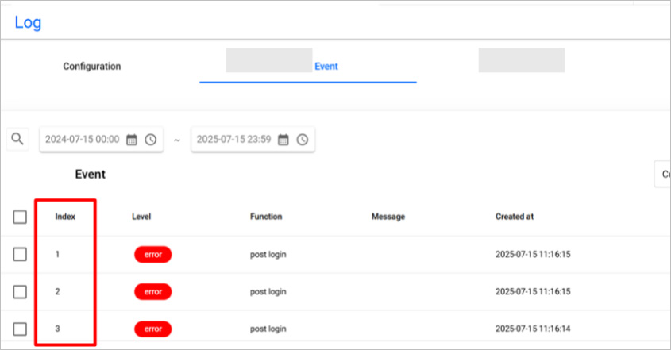

---
<!-- Page 214 -->
214
보안
요구사항
제품 또는 시스템은 공개적으로 알려진 악용 가능한 취약점이 존재하지 않도록 소프트웨어와 하드웨어를 최신
상태로 유지해야 하며, 업데이트 및 패치가 정기적으로 적용되어야 한다. 알려진 취약점이 있는 구성요소는 즉시
대응이 이루어져야 하며, 위험 수준에 따라 패치 우선순위가 설정되어야 한다.
목적
제로데이 공격, CVE 기반 취약점 악용 등으로부터 시스템을 보호하고, 체계적인 취약점 관리 프로세스를 통해 보안
수준을 지속적으로 유지한다.
점검 기준
공개 가능한 악용가능한 취약점이 없는 최신 소프트웨어 및 하드웨어

## 1. 제조사는 장비의 취약점을 아래 사항을 감안한 평가 여부

•  자산에 영향을 미치는 공개된 악용 가능한 취약점을 포함하는가?
•  특정 조건에서 취약점이 악용되지 않는 상태인가?
•  허용가능한 수준의 잔여 위험으로 완화 가능한가?
•  위험 기반으로 수용이 승인되는가?

## 2. 악용될 경우 보안 자산/네트워크 자산/개인정보 자산에 영향을 미치는 공개된 악용 가능한 취약점의 포함 여부

## 3. 위의 사항에 해당되지 않을 경우, 특정 조건에서 취약점이 악용되지 않거나 /허용가능한 수준의 잔여 위험으로

완화 가능하거나/위험 기반으로 수용 승인 또는 해당 여부
구현 및 점검 방안
1

## 01.	 제조사가 장비의 취약점을 아래 사항을 감안하여 평가하는지 확인한다.

•  “2.3 인터페이스 식별”의 무선 네트워크 통신유형에 해당하는 통신 인터페이스별 대상 서비스를 식별한다.
•  식별된 서비스에 대해 네트워크 자산, 개인정보 자산, 금융 자산 중 하나 이상에 영향을 미치는 하드웨어, 소프트웨어
취약점이 존재하는지 확인한다.
•  식별된 서비스에 아래와 같이 장비 취약점의 평가를 수행하는 적절한 프로세스가 존재해야 한다.
자산에 영향을 미치는 공개된 악용 가능한 취약점을 포함하는가?
특정 조건에서 취약점이 악용되지 않는 상태인가?
허용가능한 수준의 잔여 위험으로 완화 가능한가?
위험 기반으로 수용이 승인되는가?
•  소프트웨어/펌웨어는 악용가능한 취약점이 없도록 패치된 최신 상태로 업데이트 수행가능한 구조에 해당해야 한다.
[방안 1] 위험관리 프로세스 및 문서화 방안
장비에 포함된 모든 구성요소의 위험관리 프로세스 기반 평가와 위험관리 문서화를 수행한다. 위험관리 프로세스 문서는
다음과 같은 내용을 포함한다.

#### 3.11.19  [WS-19] 최신 소프트웨어 및 하드웨어 유지

항목
내용
자산 식별
•  각 보안자산/네트워크자산/개인정보자산에 대한 설명
영향 설명
•  자산별 영향을 미치는 장비 내 소프트웨어 및 해당버전에 대한 설명
•  자산별 영향을 미치는 장비의 하드웨어에 대한 설명
위협 식별
및 완화
•  자산에 영향을 미치는 소프트웨어 및 하드웨어의 공개된 악용 가능한 취약점 목록 및 설명
•  취약점 정보의 출처
•  해당 취약점이 어떻게 처리되었는지에 대한 정당화
(취약점을 해결하기 위해 구현된 조치, 취약점이 장비의 특정 조건 하에서는 악용될 수 없는 이유에 대한 설명,
취약점 완화를 위한 조치에 대한 설명, 위험 기반 수용이 이루어진 경우 그에 대한 설명)
위험관리 프로세스 검증방안

---
<!-- Page 215 -->
01
02
03
215
산출된 위협에 대해 CVSS 점수를 매기고, 취약점 위험도 분류 및 패치 우선순위 결정을 수행한다. 이때 Critical(예: 72시간),
High(예: 1주일), Medium(예: 1개월) 등 위험도별 대응 SLA 와 완화방안을 정의하고 준수한다. 이러한 대응 시간은 국제
표준과 업계 모범사례를 참고해 조직의 자산 중요도·운영 환경·규제 요구사항을 종합해서 결정해야 한다.
취약점 평가 프로세스 – 자산산출 예시
취약점 평가 프로세스 – DFD산출 예시
취약점 평가 프로세스 – 위협점수 산출 예시

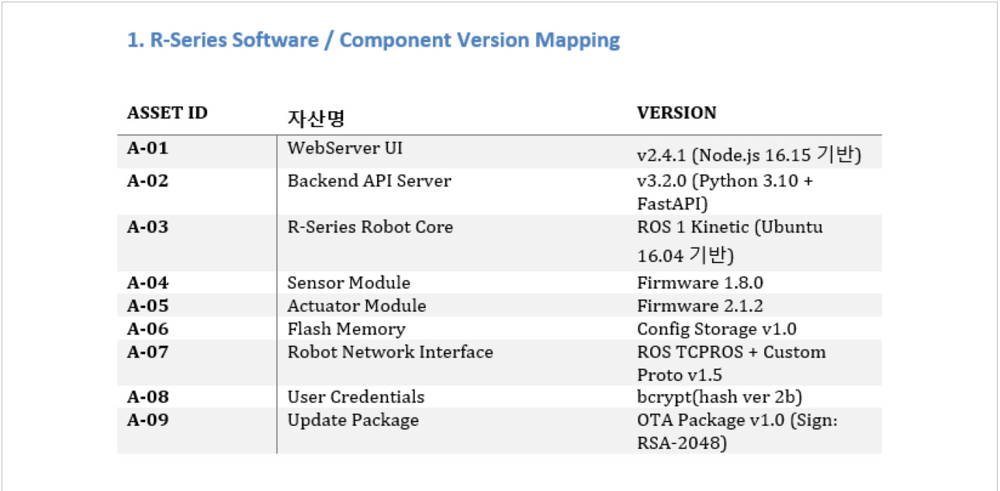

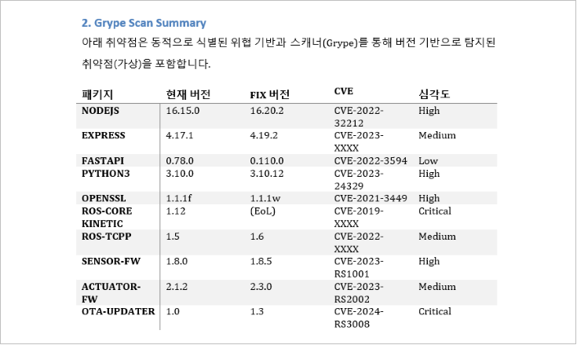

---
<!-- Page 216 -->
216
2

## 01.	 악용될 경우 영향을 미치는 취약점을 포함하는지를 확인한다.

•  장비의 취약점 중 악용 시 보안 자산/네트워크 자산/개인정보 자산에 영향을 미치는 공개된 취약점을 포함해서는 안 된다.
[방안 1] 공개된 악용가능한 취약점 확인방안
공개 취약점 데이터베이스(예: NIST NVD, 유럽 국가별 취약점 DB 등)를 정기적으로 확인하여 구성요소의 취약점이
존재하는지의 여부를 식별한다. 취약점이 존재할 경우, 아래와 같은 관련사항을 감안하여 취약점의 악용가능여부와 우선순위
결정을 수행한다.
취약점의 존재는 수동으로 정기 확인하여도 되나, CVE 데이터베이스 자동 모니터링 시스템 구축을 통해 시스템 구성요소별
취약점 영향도를 평가 가능하다.
3

## 01.	 취약점 영향도 평가를 통해 완화/수용 등의 위험관리를 수행하는지 확인한다.

•  장비의 취약점 중 악용가능한 취약점이 없을 경우, 취약점과 그로 인해 발생하는 위험에 대해 아래 완화방안 중 적합한
방안을 적용하여야 한다.
프로세스상 특정 조건에서 취약점이 악용되지 않는 상태인가?
허용가능한 수준의 잔여 위험으로 완화 가능한가?
취약점으로 인해 발생하는 위험의 수용을 승인가능한가?
[방안 1] 공개된 악용가능한 취약점 확인방안
취약점 영향도 평가를 통해 완화/수용 등의 위험관리를 수행하는지 확인한다.
•  장비의 취약점 중 악용가능한 취약점이 없을 경우, 취약점과 그로 인해 발생하는 위험에 대해 아래 완화방안 중 적합한
방안을 적용하여야 한다.
프로세스상 특정 조건에서 취약점이 악용되지 않는 상태인가?
허용가능한 수준의 잔여 위험으로 완화 가능한가?
취약점으로 인해 발생하는 위험의 수용을 승인가능한가?
알려진 취약점 포함여부 확인 예시
취약점 관련사항
장비의 공격 표면 및 접근 경로(attack surface)
취약점의 공격 코드, PoC, 또는 실제 악용 사례 존재 여부
장비 내 보안 기능 또는 완화 기제의 존재 여부
장비의 의도된 기능 및 운용 환경(예: 네트워크 분리, 제한된 사용자 접근 등)
취약점 관련사항

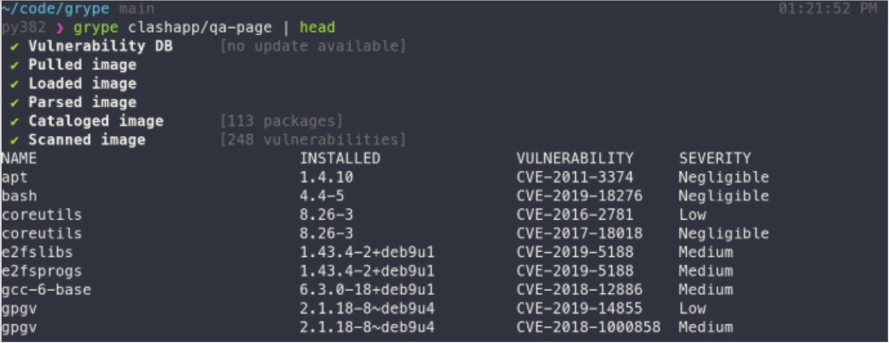

---
<!-- Page 217 -->
01
02
03
217
취약점 평가 프로세스 – 완화산출 예시

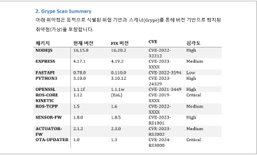

---
<!-- Page 218 -->
218
보안
요구사항
제품 또는 시스템은 네트워크 인터페이스를 통해 노출되는 서비스를 최소화해야 한다. 사용 중인 옵션 서비스와
관련된 인터페이스 구성은 명확히 설정되어야 하며, 노출된 목록은 문서화되어 관리한다.
목적
제품 또는 시스템은 네트워크 인터페이스를 통해 노출되는 서비스를 최소화하여 공격 표면 증가와 시스템 침투
위험을 방지한다.
점검 기준
서비스 노출 제한

## 1. 필요한 네트워크 인터페이스 또는 서비스만 존재하며, 옵션 서비스가 존재할 경우 사용자의 해당 옵션 비활성화

가능 여부

## 2. 노출된 네트워크 인터페이스 및 서비스의 사용자 문서 명시 여부

구현 및 점검 방안
1

## 01.	 필요한 네트워크 인터페이스 또는 서비스만 존재하며, 옵션 서비스가 존재할 경우 사용자의 해당 옵션

비활성화가 가능한지 확인한다.
•  “2.3 인터페이스 식별”의 무선 네트워크 통신유형에 해당하는 통신 인터페이스별 대상 서비스를 식별한다.
•  식별된 서비스에 대해 네트워크 자산, 개인정보 자산, 금융 자산 중 하나 이상 처리하며 관련해 불필요한 네트워크
인터페이스 또는 하위 서비스가 존재하는지 확인한다.
•  불필요한 대상이 존재할 경우 아래와 같은 항목들 중 하나에 해당해야 한다.
공장 기본 상태에서 장비가 보안 자산 및 개인정보에 영향을 주는 항목들 (네트워크 인터페이스, 네트워크 인터페이스를
통해 제공되는 서비스)만 노출하는가?
장비의 기본 동작이나 설정에 필요한 네트워크 인터페이스 또는 서비스만 존재하는 상태인가?
선택적인 네트워크 인터페이스 및 노출된 선택적 서비스가 설정을 통해 구성할 수 있는가?
설정을 통해 구성할 수 있는 경우 권한 있는 사용자가 활성화/비활성화 할 수 있는가?
[방안 1] 최소 노출 수행방안
구성요소로 존재하는 네트워크 인터페이스 및 서비스의 경우 아래와 같은 최소 노출 수행방안을 감안하여 적용한다.

#### 3.11.20  [WS-20] 네트워크 인터페이스 노출 최소화

항목
내용
기본
최소노출
수행방안
•  공장 출하 기본 설정에서 필수적이지 않은 모든 네트워크 인터페이스 및 서비스는 비노출 상태로
두기
•  고정 기능 장비는 기능 수행에 필요한 최소한의 인터페이스만 기본 노출 허용
•  범용 장비는 제조사가 정의한 필수 use-case 범위만 노출 허용
•  장비가 보안 자산·개인정보에 영향을 주는 정도는 위험기반으로 평가
•  위험기반으로 평가 시, 영향도가 높으면 기본 비노출로 설정
•  운영에 필수적이지 않은 관리용 서비스 및 디버깅 인터페이스는 비활성화 또는 로컬 호스트 접근
으로 제한
•  사용자가 선택적으로 서비스를 활성화/비활성화할 수 있는 서비스 관리 인터페이스 제공
•  민감한 관리 서비스에 대한 방화벽 규칙 설정 및 화이트리스트 기반 접근제어 적용
선택적
서비스의
사용자 제어
및 보호
•  공장 기본 상태에 포함된 선택적 서비스는 관리자(권한 있는 사용자)가 명시적으로 활성화하도록
설계
•  활성/비활성 기능(UI·API)은 강한 인증과 적절한 접근제어로 보호
•  활성화 또는 설정 변경 시 로그 및 알림을 기록하여 운영자가 변경 사실을 인지하고 감사·추적
예외·
상호운용성
관리 및
사용자 알림
상호운용성 때문에 불가피하게 약한 프로토콜을 사용해야 하는 경우, 위험 평가와 보완조치를
문서화 및 적용
장비가 비안전한 통신을 수행할 때는 사용자 UI에서 명확한 경고/알림 제공
제조사는 출시 전에 ‘기본 노출 서비스 목록’과 ‘선택적 서비스 보안 설정 절차’를 문서화해 제공
최소 노출 수행방안

---
<!-- Page 219 -->
01
02
03
219
2

## 01.	 노출된 네트워크 인터페이스 및 서비스 문서 명시 여부를 확인한다.

•  불필요한 대상이 노출되어 있을 경우 장비의 사용자 문서에는 아래 내용이 포함되어야 한다.
공장 출하 기본 상태에서 노출되는 모든 네트워크 인터페이스의 설명
네트워크 인터페이스를 통해 노출되는 모든 서비스의 설명
[방안 1] 노출 인터페이스 및 서비스 문서화 방안
사용자에게 장비의 연결성과 잠재 공격 표면에 대한 투명성을 제공하고, 장비 설치·운용 시 네트워크 보안을 적절히 설정할 수
있도록 도울 수 있도록 노출된 대상 구성요소에 대한 문서화를 수행한다.
문서에는 서비스별 기능 요약, 필요 포트, 보안 기능(암호화 여부, 인증 요건 등)을 명시하여 사용자가 위험도를 자체평가하고
필요 보완조치를 적용할 수 있게 한다.
노출 네트워크 인터페이스 문서명시 예시

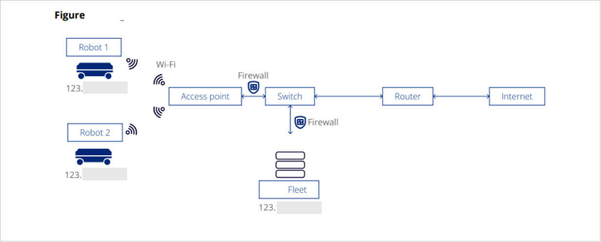

---
<!-- Page 220 -->
220
보안
요구사항
제품 또는 시스템은 불필요한 외부 물리 인터페이스가 존재하는 경우 제거해야 한다.
목적
불필요한 외부 물리 인터페이스가 존재하는 경우 제거하여 하드웨어 기반 침해 위협을 방지한다.
점검 기준
물리 인터페이스 보호

## 1. 의도된 기능을 위해 필요한 경우 외부 인터페이스 노출 여부

## 2. 노출된 외부 인터페이스의 물리적 보호/비활성화/차단 여부

구현 및 점검 방안
1

## 01.	  의도된 기능을 위해 필요한 경우 외부 인터페이스를 노출하는지 확인한다.

•  “2.3 인터페이스 식별”의 무선 네트워크 통신유형에 해당하는 통신 인터페이스별 대상 서비스를 식별한다.
•  식별된 서비스에 대해 네트워크 자산, 개인정보 자산, 금융 자산 중 하나 이상 처리하며 물리 포트가 존재하는지 확인한다.
•  물리 포트가 존재할 경우 해당 포트가 시스템에 활성화되지 않았거나, 문서화되지 않은 외부에서 연결 가능한 물리 포트에
해당해서는 안 된다.
[방안 1] 외부 인터페이스의 노출 점검방안
장비 설계 시 “의도된 사용 목적”과 “운용 환경 조건”에 따라 외부 인터페이스의 필요성을 명시적으로 검증·기록한다. 만약
인터페이스가 내부 시스템 통신, 사용자 UI, 기계 인터페이스 등 필수 기능 수행에 필요하다면, 최소 한 개 이상의 합리적 사용
사례에서 그 필요성이 입증되어야 하는지 확인한다.
설계 및 장비의 의도된 기능 수행에 있어 필수적인 외부 인터페이스 외 직접 관련이 없는 외부 포트, 커넥터, 인터페이스는
제거하거나 비활성화하는지 확인한다. 이때 공장 출하시 디버그 포트(JTAG, UART 등)가 존재한다면, 출하 전 차단 조치를
하는지 확인한다
외부 인터페이스가 노출되지 않은 상태에 해당하는 경우는 다음과 같다.
공폐쇄망 운용, 보안 커버, 봉인 등으로 외부 접근이 불가능한 경우, 해당 인터페이스는 “노출되지 않은 상태”로 간주
외부 인터페이스가 사용자의 환경에서 물리적으로 보호되거나 접근 불가능한 위치에 있다면 “노출되지 않은 상태”로 간주
2

## 01.	  노출된 외부 인터페이스의 물리적 보호/비활성화/차단 여부를 확인한다.

•  노출된 외부 인터페이스는 의도된 기능을 위해 필수적인 대상이어야 한다.
•  필수적인 대상이 아닐 경우, 해당 인터페이스는 아래와 같은 물리적 보호여부나 비활성화 및 차단여부가 적용되어야 한다.
[방안 1] 불필요한 외부 인터페이스의 노출 관리방안
불필요한 외부 인터페이스가 식별된 경우 아래와 같은 물리적 보호/비활성화/차단 방안을 적용한다.
외부 인터페이스의 노출 관리방안

#### 3.11.21  [WS-21] 외부 물리 인터페이스 제한

구분
내용
[보안 나사]
드라이버로 열기 어렵도록 특수 나사 적용
[봉인 라벨]
제거 시 흔적이 남는 보안 스티커
[보안 커버]
케이스를 잠그거나 봉인하여 임의 개봉 방지
[USB 포트 잠금 커버]
포트를 봉인하여 임의 개봉 및 비인가 장치 연결을 방지

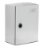

---
<!-- Page 221 -->
01
02
03
221
보안
요구사항
시스템은 외부 입력에 대해 적절한 유효성 검사를 수행해야 하며, 입력으로부터 시스템을 보호할 수 있도록
설계되어야 한다. 외부 감지 센서나 감지 기능이 포함된 경우, 작동 원리와 범위, 연동 방식 등을 명확히 문서화하여
충분한 정보를 제공해야 한다.
목적
외부 입력에 대해 적절한 유효성 검사를 수행해야 하며, 입력으로부터 시스템을 보호할 수 있도록 설계하여 정보
노출 보안 위협을 방지한다.
점검 기준
입력 검증

## 1. 외부 인터페이스를 통해 수신된 입력이 보안 자산, 네트워크 자산, 개인정보 자산에 영향을 줄 수 있는 경우, 해당

입력의 검증 여부

## 2. 장비에 사용자의 개인정보에 관련된 외부 감지 기능이 있는 경우, 사용자가 이를 인지할 수 있도록 해당 기능의

문서화 여부
구현 및 점검 방안
1

## 01.	  외부 인터페이스를 통해 수신된 입력이 보안 자산, 네트워크 자산, 개인정보 자산에 영향을 줄 수 있는 경우,

해당 입력의 검증 여부를 확인한다.
•  “2.3 인터페이스 식별”의 무선 네트워크 통신유형에 해당하는 통신 인터페이스별 대상 서비스를 식별한다.
•  식별된 서비스에 대해 네트워크 자산, 개인정보 자산, 금융 자산 중 하나 이상 처리하며 이러한 자산이 외부 인터페이스를
통해 수신받은 입력의 영향을 받는 대상인지 확인한다.
•  영향을 받을 경우 아래와 같이 외부에서 수신된 입력의 값을 반드시 검증해야 한다.
[방안 1] 외부 입력 검증방안
입력 데이터가 예상된 구조와 형식에 맞는지 확인한다. 이때 아래와 같은 외부 입력 검증방안을 통해 입력값의 값 타당성을
검증해야 하는데, 타당하지 않은 경우는 범위를 벗어난 값, 미래 날짜, SQL 인젝션용 특수문자, 음수 오프셋 등에 해당한다.
외부 입력 검증방안

#### 3.11.22  [WS-22] 외부 입력 관리

항목
검증방안
입력 형식 제한
•  모든 API의 입력값에 대해 길이, 형식, 허용 범위를 명확히 정의하고 검증 로직 추가
특수문자
필터링
•  사용자 입력에서 쉘 명령어나 코드로 해석될 수 있는 특수문자 필터링
•  경로 입력 시 상대 경로(../) 절대 경로(/) 등의 문자열을 검증하거나 차단하여 Path Traversal
방지
시스템 함수
사용 지양
•  eval, exec, os.system, subprocess.call(shell=True), popen 등 직접 코드 실행/명령 실행
함수 사용 금지
•  필수적인 경우 입력값에 대한 화이트리스트 검증 또는 안전한 라이브러리 대체 적용
파일 업로드
크기 제한
•  파일 업로드 시 파일 크기(Content-Length)에 대한 제한을 두어 대용량 파일로 인한 DoS
공격 차단
•  업로드 파일의 확장자 및 MIME 타입 검증 추가
항목
내용
입력 형식 제한
•  모든 API의 입력값에 대해 길이, 형식, 허용 범위를 명확히 정의하고 검증 로직 추가
•  정규표현식 또는 파서를 활용하여 입력값 검증
•  필터링 및 인코딩을 통해 유효성 확보 강화
특수문자
필터링
•  사용자 입력에서 쉘 명령어나 코드로 해석될 수 있는 특수문자 필터링
•  경로 입력 시  상대 경로(../) 절대 경로(/) 등의 문자열을 검증하거나 차단하여 Path Traversal
방지
시스템 함수
사용 지양
•  eval, exec, os.system, subprocess.call(shell=True), popen 등 직접 코드 실행/명령 실행
함수 사용 금지
•  필수적인 경우 입력값에 대한 화이트리스트 검증 또는 안전한 라이브러리 대체 적용

---
<!-- Page 222 -->
222
2

## 01.	  장비에 사용자의 개인정보에 관련된 외부 감지 기능이 있는 경우, 사용자가 이를 인지할 수 있도록 해당

기능을 문서화하는지 확인한다.
•  식별된 서비스 영역에 사용자의 개인정보에 관련된 외부 감지 기능이 존재하는지 확인한다.
•  존재할 경우 사용자가 이를 인지할 수 있도록 해당 기능의 문서화를 수행 및 제공해야 한다.
[방안 1] 문서에 제조사 책임 기반 정보 제공
장비에 사용자의 개인정보에 관련된 외부 감지 기능이 존재할 경우 사용자가 인지할 수 있도록 문서화하여 제공한다.
정보로는 입력 가능한 데이터의 종류(영상, 음성, 생체정보 등)와 수집·처리 목적, 작동 조건, 제어 방법에 대한 정보를
명시한다.
사용자 개인정보 기능 문서화 예시
필수 외부 입력 검증방안
파일 업로드
크기 제한
•  파일 업로드 시 파일 크기(Content-Length)에 대한 제한을 두어 대용량 파일로 인한 DoS
공격 차단
•  업로드 파일의 확장자 및 MIME 타입 검증 추가

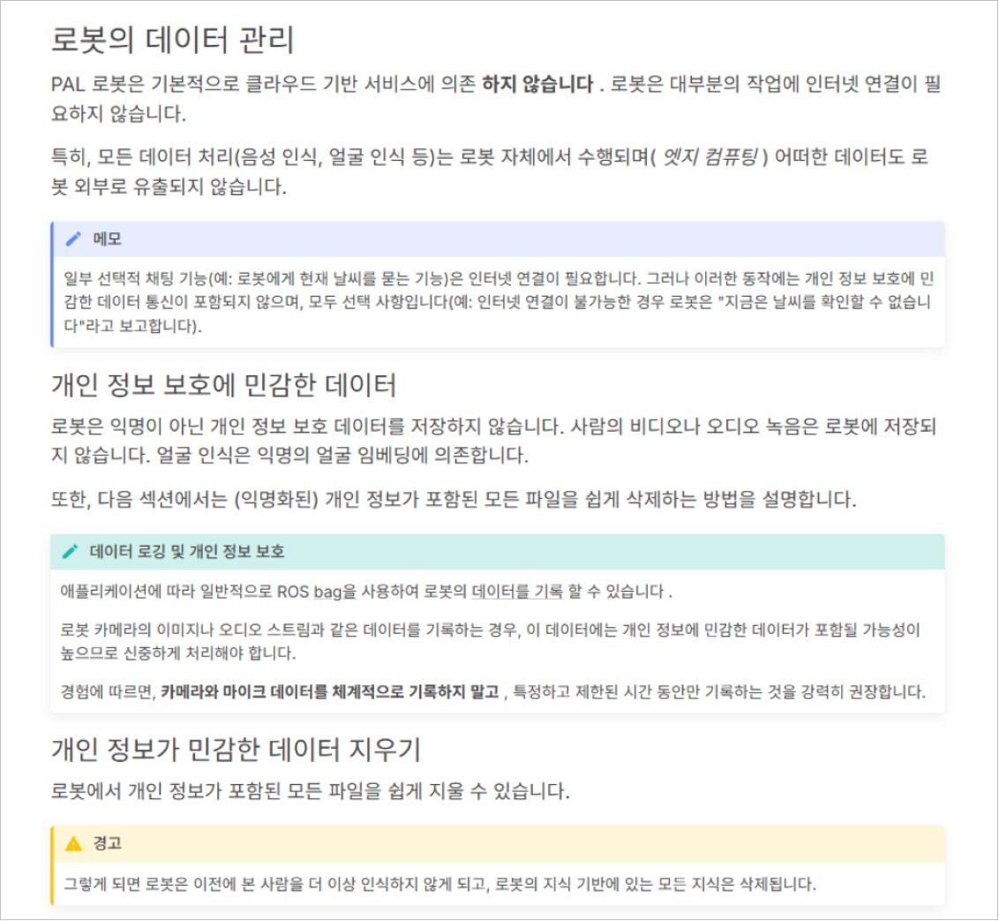

---
<!-- Page 223 -->
01
02
03
223
보안
요구사항
물리적 손상, 비인가 변경, 구성요소 교체 등으로부터 장비의 무결성을 유지할 수 있도록 설계되어야 한다.
목적
물리적 손상, 비인가 변경, 구성요소 교체 등으로부터 장비의 무결성을 유지할 수 있도록 설계하여 무결성 검증
위협을 방지한다.
점검 기준
장비 무결성 보장

## 1. 주요 소프트웨어에 대한 Secure Boot 적용여부

2. Root of Trust가 변경 불가능하거나 변경 가능한 경우 암호학적으로 인증된 절차 변경가능 여부
구현 및 점검 방안
1

## 01.	 주요 소프트웨어에 대한 Secure Boot를 적용하는지 확인한다.

•  “2.3 인터페이스 식별”의 무선 네트워크 통신유형에 해당하는 통신 인터페이스별 대상 서비스를 식별한다.
•  식별된 서비스에 대해 금융 자산을 처리하며 하위 소프트웨어 구성요소가 존재할 경우 Secure Boot 또는 그에 준하는 부팅
무결성 보호조치를 적용해야 한다.
[방안 1] 부팅 무결성 보호방안
UEFI Secure Boot 활성화를 통한 부트로더 및 커널 디지털 서명 검증을 적용한다.
TPM 기반 부트 체인 측정 및 원격 증명 기능을 구현하거나 커널 모듈 서명 검증 및 무결성 확인을 통한 악성
드라이버 로딩을 방지한다.
2
01.	 Root of Trust가 변경 불가능하거나 변경 가능한 경우 암호학적으로 인증된 절차 변경가능한지 확인한다.
•  대상 구성요소가 존재할 경우 Root of Trust가 변경 불가능해야 한다.
•  변경이 가능할 경우, 암호학적으로 인증된 절차에 기반하여 변경 기능을 제공해야 한다.
[방안 1] 암호학적으로 인증된 절차 제공방안
Root of Trust 또는 보안 핵심 구성요소가 변경 가능한 구조일 경우, 모든 변경·업데이트·복구는 암호학적으로 인증된 승인
절차를 통해서만 수행한다. 변경 패키지는 서명 검증·버전 검증·무결성 검증을 모두 통과해야 하며, 인증에 실패한 경우 해당
변경은 거부된다.
인증 실패 또는 변조 징후가 감지되면 장비는 비신뢰 상태로 전환하고 주요 자산 접근을 제한하도록 설계한다. 또한 승인된
Root of Trust 변경 이후에는 재부팅 과정에서 신뢰 사슬을 재구축하여 시스템의 무결성을 보장한다.
부팅 무결성 적용 예시

#### 3.11.23  [WS-23] 장비 무결성 보장

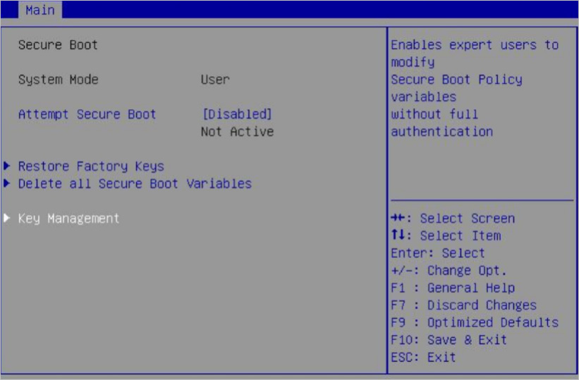

---
<!-- Page 224 -->
로봇 보안취약점 점검 체크리스트

---
<!-- Page 225 -->
