# 투명성확보 가이드라인

> 원본: `1._260126_투명성_확보_가이드라인_최종본(1.22._공개용)_수정본.pdf`  
> 페이지: 33p

---

CONTENTS
인공지능 투명성 확보 가이드라인

1  투명성 확보 의무 개요······························01
2  투명성 조항별 설명···································03
3  사전고지 방법···········································05
4  표시 방법··················································06
5  참고자료···················································19

투명성 확보 의무 개요
투명성 확보 의무 개요
투명성 확보 의무의 취지
l ‘이용자’가 인공지능 기반 제품･서비스를 이용하고 있다는 사실과, 제공되는 결과물이
인공지능에 의해 생성된 것임을 명확히 인식할 수 있도록 함
l 정보 이용 과정에서의 혼동과 오인 방지 및 사회적 신뢰를 제고하기 위한 제도적 장치를 마련하는 데
목적이 있음
투명성 확보 의무 내용
인공지능 기본법 제 31조 “인공지능 투명성 확보 의무”의 주요 의무 사항
(제1항) 사전 고지 의무
(제2항) 표시 의무
(제3항) 딥페이크 생성물 표시 의무
l (제1항) 고영향 인공지능이나 생성형 인공지능을 이용한 제품･서비스의 AI 기반 운용 사실을
사전 고지
l (제2항, 제3항) 인공지능 생성 결과물이 생성형 인공지능 또는 인공지능 시스템에 의해
생성되었다는 사실을 고지 및 표시
법 제 31조
적용 범위
의무사항
제1항
고영향 AI 및 생성형 AI를 이용한
제품･ 서비스 제공시
제품･서비스의 고영향
또는 생성형 AI기반 운용
사실
사전 고지
제2항
생성형 AI 및 이를 이용한
제품･서비스 제공시
결과물이 AI로
생성되었다는 사실
표시
제3항
AI시스템으로 실제와 구분하기 어려운
가상의 생성 결과물 제공시
고지 또는 표시

인공지능 투명성 확보 가이드라인
적용 대상 및 범위
l (적용대상) 인공지능 투명성 확보 의무는 이용자에게 최종적으로 AI 제품 및 서비스를 제공하는
인공지능사업자에게 부과
예) 개발사A가 개발한 파운데이션 모델의 API를 제공하고, 이를 활용하여 B사가 AI 제품·서비스를
이용자에게 제공할 경우 투명성에 대한 의무는 B사에게 부여
- 파운데이션 모델 개발자가 직접 이용자에게 AI 제품·서비스를 제공하는 경우에는 직접적인
투명성 확보 의무가 발생
- 해외 사업자라도 우리 국민에게 영향을 미치면 적용 대상
l (적용되지 않는 경우) 단순히 AI 제품·서비스를 이용한 결과물을 자신의 서비스 등에 활용하는
자는 인공지능사업자에 해당하지 않으며 투명성 확보 의무 적용 대상이 아님
예) AI를 이용하여 CG를 생성한 후 영화에 삽입한 영화제작자는 단순히 AI 서비스를 이용한 결과물을
자신의 콘텐츠에 활용한 것이므로 AI기본법 상 AI사업자가 아니며 이용자에 해당
인공지능사업자의 구분
l (AI개발사업자) 인공지능 제품이나 인공지능 서비스에 활용되는 인공지능을 개발하여 제공하는
자를 의미
설명
【개발】 인공지능 또는 인공지능 기술을 직접 개발하거나, 그 성능에 중대한 영향을 줄 정도로 수정･변경･개량한
것을 의미
【제공】 유료로 제공하는 것 외에도 무상(공공서비스, 오픈소스 등)의 제공도 포함
☞ 하이퍼클로바 개발사인 네이버, ChatGPT 개발사인 OpenAI 등

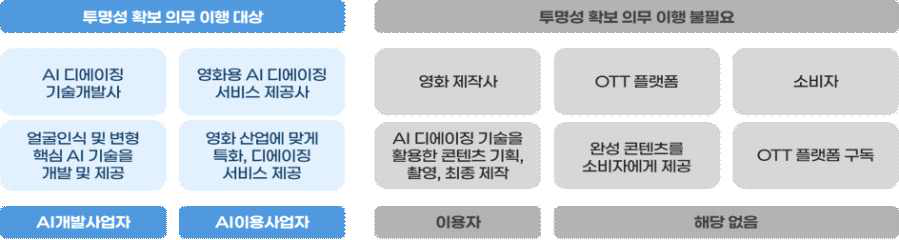

투명성 확보 의무 개요
l (AI이용사업자) AI개발사업자가 제공한 인공지능을 이용하여 인공지능 제품 또는 인공지능
서비스를 제공하는 자를 의미
설명
【이용】 AI개발사업자로부터 직접 제공받은 경우는 물론, 다른 인공지능 이용사업자를 통해 제공받은
경우도 포함
【제공】 인공지능에 기반한 기능을 수행하거나 직접 실행하는 제품을 이용자에게 제공하거나, 또는
인공지능을 활용한 서비스를 이용자의 이용에 제공하는 것으로, 이용자에 대한 제공 행위가
필수적으로 있어야 해당
☞ 기반모델을 기반으로 작문 서비스를 제공하는 뤼튼테크놀로지스 등
※ OpenAI의 Sora를 활용, 콘텐츠를 제작 및 제공하는 유튜버와 같이, 인공지능의 생성물만을 제공하는
경우는 단순 이용자에 해당

인공지능 투명성 확보 가이드라인
투명성 의무별 설명
1) 사전 고지 의무
l AI사업자가 고영향 AI나 생성형 AI를 이용한 제품･서비스를 제공하려는 경우 해당하며,
제품･서비스가 AI에 기반하여 운용된다는 사실을 이용자에게 사전에 고지해야 함(법 제 31조 제 1항)
보충 설명 사전 고지 의무는 인공지능을 이용한 ‘제품/서비스’에 관한 것이며 생성 결과물과는 무관
시행령
사전에 고지하는 방법 (시행령 제23조 제1항)

### 1. 제품 등에 직접 기재하거나, 계약서, 사용설명서, 이용약관 등에 기재

### 2. 이용자의 화면 또는 단말기 등에 표시

### 3. 제품 등을 제공하는 장소(해당 장소와 합리적으로 관련된 범위의 장소를 포함한다)에 인식하기 쉬운

방법으로 게시

### 4. 그 밖에 제품 등의 특성을 고려하여 과학기술정보통신부장관이 인정하는 방법

2) 표시 의무
l AI사업자는 생성형 AI를 활용한 제품･서비스를 제공하는 경우, 그 결과물이 생성형 AI에 의해
생성되었다는 사실을 표시해야 함(법 제 31조 제 2항)
시행령
표시하는 방법 (시행령 제23조 제2항)

### 1. 표시 방법은 사람이 인식할 수 있는 방법과 기계가 판독할 수 있는 방법이 있음

### 2. 기계가 판독할 수 있는 방법을 사용할 경우에는 최소 1회 이상 안내 문구･음성 등을 제공해야 함

투명성 의무별 설명
3) 결과물이 딥페이크인 경우의 표시 의무
l AI사업자는 AI 시스템을 이용해 딥페이크 결과물을 제공하는 경우 해당 결과물이 AI에 의해
생성되었다는 사실을 이용자가 명확히 인식할 수 있는 방식으로 고지 또는 표시해야 함(법 제
31조 제 3항)
보충 설명 ’딥페이크’란 “실제와 구분하기 어려운 가상의 음향, 이미지 또는 영상 등의 결과물”을
의미하며, 텍스트는 해당되지 않음
시행령
표시와 관련하여 고려할 사항 (시행령 제23조 제3항)

### 1. 이용자가 시각, 청각 등을 통하거나 소프트웨어 등을 이용하여 쉽게 내용을 확인할 수 있는 방법으로

고지 또는 표시할 것

### 2. 주된 이용자의 연령, 신체적･사회적 조건 등을 고려하여 고지 또는 표시할 것

l 예술적･창의적 표현물에 해당하는 경우 전시･향유를 저해하지 않는 방식으로 고지 또는 표시할
수 있음(법 제 31조 제 3항)
보충 설명 예술적･창의적 표현물이란 미술, 영화, 문학, 사진, 출판, 만화, 게임, 애니메이션 등
창의적 표현 활동에 따른 결과물

인공지능 투명성 확보 가이드라인
사전고지 방법
l (사전고지 취지) 제품･서비스가 고영향 또는 생성형AI에 기반되어 운용되는 것임을 사전에 알려
이용자가 주의를 기울일 수 있도록 함
➊ (이용약관･계약서 활용) 제공하는 서비스의 이용약관, 서비스 가입 절차 및 계약서에 생성형AI
또는 고영향AI를 활용함을 명시
➋ (화면 표시) S/W, 모바일 어플리케이션 등을 통해 서비스 제공시 화면상에 생성형AI 또는
고영향AI를 활용함을 명시
➌ (제공장소에 게시) 오프라인 서비스의 경우 이용 전 충분히 인식할 수 있는 관련 장소에 게시
➊ 이용약관 - 스캐터랩 제타(Zeta)
➋ 화면 표시 - 카카오 타임톡

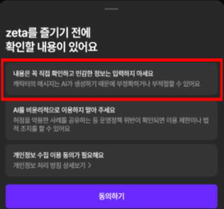

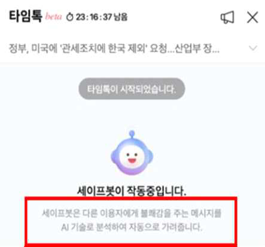

표시 방법
표시 방법
표시 기본원칙
l (표시 방법) AI 생성 결과물이 AI에 의해 생성되었다는 사실을  인지할 수 있도록 표시하여야 하며,
제품·서비스를 직접 이용하는 이용자를 대상으로는 서비스 이용 환경을 통한 표시가 가능
서비스 내 제공
(제품･서비스의 UI, 플랫폼 내)
è
외부 반출
(다운로드, 공유 등)
∙ AI 생성 결과물에 표시
∙ 서비스 UI 등에 이용자가 알 수 있도록 표시
∙ AI 생성 결과물에 표시
※ 서비스 내 제공 단계에서 UI 등에 표시를 하였더라도, 다운로드·공유 등 외부 반출 기능 제공 시에는
결과물을 통해 생성 사실을 알 수 있도록 결과물 내에 표시하여야 함
- 여러 유형의 결과물을 생성할 수 있는 경우(ex. 텍스트･이미지 모두 출력할 수 있는 범용 AI 등)
각 결과물의 유형에 따른 표시 방법을 적용
- 단순 편집 등 ‘생성형 AI’의 본질적 기능이 사용되지 않은 경우 표시 대상에서 제외
예) 동일 제품･서비스 내에서라도 생성형 AI 연계 기능을 적용하지 않고 다른 일반적인 편집
기능(이미지 자르기 등)만 사용된 경우
l (딥페이크) 이용자의 입력, 조작 등에 따라 실제와 구분하기 어려운 가상의 결과물을 생성할 수 있는
AI 제품･서비스의 경우 인공지능사업자가 해당 여부를 판단하여 표시 방법을 적용하여야 하며,
이를 판단･통제할 수 없는 경우 딥페이크의 기준을 적용
예) 이미지 생성 서비스가 일반적인 풍경, 캐릭터 생성뿐만 아니라, 실제 사람과 유사한 이미지를 생성할
가능성이 있는 경우

인공지능 투명성 확보 가이드라인
서비스 내 제공 시 표시 방법
∙ (대상) 서비스 이용 환경(UI 등) 내에서 제한적으로 결과물이 표현되는 경우
∙ (유의점) 단, 해당 AI 생성 결과물을 다운로드･공유 등 서비스 외부로 반출하는 기능을 제공하는 경우
결과물에 표시를 하여야 함
l (일반 생성물) 실제와 구분하기 어려운 수준에 해당하지 않는 AI 생성물
※ ‘일반 생성물’: 딥페이크 생성물과의 구분 및 이해를 돕기 위해 본 가이드라인에서 새롭게 정의된 내용
- (표시 방법) 결과물 내 또는 서비스 내(화면 등) 정보의 표출 등으로 AI 생성물임을 충분히 인지할
수 있는 방법으로 표시
※ 단, 서비스 이용 환경 내에서 기계가 판독할 수 있는 방법을 적용 시 별도 1회 이상 안내 문구･음성 등을
제공하여야 함
- 최종 결과물 이전에 이용자가 프롬프트 입력, 생성 이미지 선택 등 편집 과정의 모든 중간 생성물에
각각 표시할 의무는 없으며 결과물 제공(추출, 저장 등) 단계에서 표시
l (딥페이크 생성물) 실제와 구분하기 어려운 가상의 음향, 이미지 또는 영상 등의 결과물
- (표시 방법) 서비스 이용 환경 내에서 생성물 제공 시 일반 생성물과 동일한 표시 방법을 적용

표시 방법
외부 반출 시 표시 방법 예시
∙ (대상) 다운로드, 공유 등 AI 생성 결과물을 외부로 반출하는 기능을 제공하는 경우
∙ (유의점) 이용자의 입력, 조작에 따라 실제와 구분하기 어려운 결과물을 생성하여 외부로 반출하는 기능
을 제공하는 AI 제품･서비스의 경우 인공지능사업자가 해당 여부를 판단하여 표시 방법을 적용하
여야 하며, 이를 판단･통제할 수 없는 경우 딥페이크의 기준을 적용
l (일반 생성물) 실제와 구분하기 어려운 수준에 해당하지 않는 AI 생성물
※ ‘일반 생성물’: 딥페이크 생성물과의 구분 및 이해를 돕기 위해 본 가이드라인에서 새롭게 정의된 내용
- (표시 방법) 결과물에 로고 삽입 등 사람이 인식할 수 있는 방법 또는 기계가 판독할 수 있는 방법을 적용
※ 단, 서비스 이용 환경 내에서 기계가 판독할 수 있는 방법을 적용 시 1회 이상 안내 문구･음성 등을
제공하여야 함
- 최종 결과물 이전에 이용자가 프롬프트 입력, 생성 이미지 선택 등 편집 과정의 모든 중간 생성물에
각각 표시할 의무는 없으며 결과물 제공(추출, 저장 등) 단계에서 표시
※ 실제와 구분하기 어려운 결과물을 제공할 가능성이 없을 것으로 사업자가 명확하게 판단할 수 있는 AI
제품･서비스의 경우(예: 웹툰･캐릭터･애니메이션 전용 저작도구 등), 일반 생성물의 표시 기준을 적용 가능
l (딥페이크 생성물) 실제와 구분하기 어려운 가상의 음향, 이미지 또는 영상 등의 결과물
- (표시 방법) 사람이 직관적으로 인식할 수 있는 표시 방법 적용
※ 인물의 특성 합성, 딥페이크 등 오인･혼동 또는 피해 발생의 위험성이 있는 결과물의 경우, 해당
위험성을 고려한 추가적인 조치 필요
- (예술적･창의적 표현물) 전시･향유를 저해하지 않는 방법으로 완화된 표시 방법을 허용
※ 시간적으로 주요 콘텐츠와 차이를 두어 표시하거나 비가시적인 표시 방법 적용 등

인공지능 투명성 확보 가이드라인
참고
표시 기본원칙 적용 흐름도

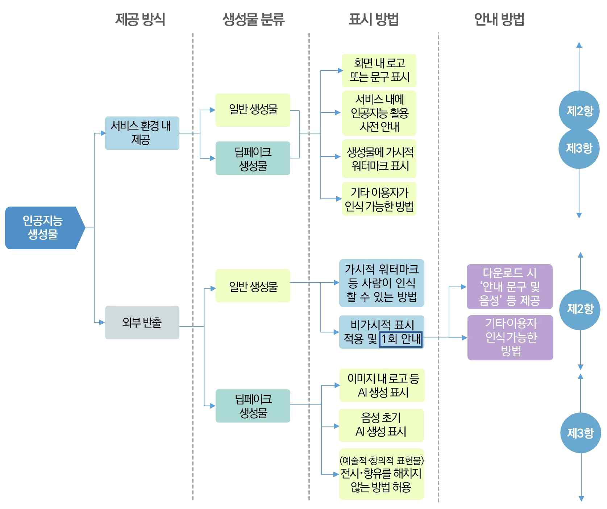

표시 방법
서비스 내 제공 시 표시 방법 예시
1) 대화 기반 서비스
l (적용대상) AI 챗봇, 대화창 등 지속적 상호작용을 통해 결과물이 서비스 이용 환경에 제공되는 경우
l (서비스 예시) 어도비 파이어플라이, 챗GPT, 제미나이, 클로바 X등
l 표시 방법
➊ 채팅창 등 연속적 대화를 통해 명확히 인식할 수 있는 초기 안내 또는 지속 로고 표출 등(반복적
표시 불필요)
(초기 화면 표시) 제미나이
(로고 표시) 제미나이
(초기 화면 표시) 파이어 플라이
(로고 표시) 파이어 플라이
➋ 서비스 화면에서 ‘AI 모델이 실시간 데이터를 생성함’을 표시
➌ 문구 표기 영역이 충분하지 않은 경우 툴팁 등으로 표시
(실시간 생성 중 표시) 챗GPT 이미지 생성
(툴팁 표시) 네이버 클로바

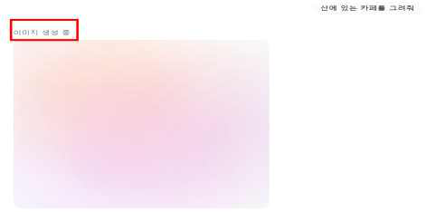

인공지능 투명성 확보 가이드라인
2) 음성 어시스턴트
l (적용대상) AI와 음성 대화를 기반으로 제공되는 서비스
l (서비스 예시) Siri, Google assistant, SKT Nugu, 음성 기반 가전
l 표시 방법
➊ 이용 전 이용자가 인식할 수 있는 음성 또는 화면 문구 등으로 안내
➋ 이용자가 호출하여 시작되는 서비스의 경우 개별 음성마다 반복적인 안내 불필요
➌ 음성 가전 등 실물이 있는 제품의 경우 겉면에 AI를 기반으로 운용됨을 표시
(음성 안내) 창작예시
(사전 동의) 창작예시

표시 방법
3) 게임, 메타버스
l (적용대상) AI와 상호작용 또는 동적인 AI 콘텐츠 생성 기능이 적용된 게임, 메타버스
※ 단순히 생성형 AI 결과물(그림, 음악, 코드 등)을 게임 제작에 활용한 경우 외 AI가 구성요소로 포함되어
그 자체로 AI 제품･서비스로 볼 수 있는 경우
l (서비스 예시) 미르5, 인조이, 던전앤파이터, 언더커버 스모킹건, 마인크래프트 등
l 표시 방법
➊ (게임 내 구성요소에 AI 활용) 이용자가 상호작용하는 캐릭터･NPC명에 AI 캐릭터･NPC임을
알리거나 혹은 초기 대화 시 안내
➋ (AI 기반 음성 서비스) 게임 내 이용자가 로그인 등 플레이 활성화 할 경우 서비스 초기에 AI
기반 음성임을 안내
(AI NPC 대화) 연운
출처: 게임조선
(캐릭터 생성) 로스트 아크
출처: 시사저널e

인공지능 투명성 확보 가이드라인
4) 생산성 향상 서비스
l (적용대상) 생성형 AI를 보조적 수단으로 활용하는 문서 작성 지원 서비스
l (서비스 예시) Google workspace (gemini), MS Copilot 기반의 파워포인트(PPT)/워드(docs),
네이버 클로바 노트 등 AI 지원 서비스
l 표시 방법
➊ 이용 화면 내 로고 표출, 이용 전 안내 등으로 인공지능 활용 여부 표시하며, 개별 결과물에 대해
표시 불필요
※ 단, 실시간으로 동기화되어 파일 등으로 저장하는 경우 ‘서비스 외부 반출 시 표시 방법’에 대한 추가적인
적용 필요

(AI회의록 작성) 노션 AI
(회의록 요약) 파워포인트

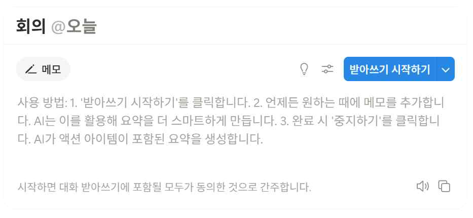

표시 방법
외부 반출 시 표시 방법 예시
1) 텍스트 생성물
l 적용대상: 문자･부호로 구성된 텍스트 결과물 다운로드･공유 등 기능 제공 시
※ 이용자가 클립보드(Copy & Paste) 기능을 이용하는 경우는 해당하지 않음
l 서비스 예시: ChatGPT, 클로드, 제미니, 하이퍼 클로바 등
l 표시 방법
➊ (파일 형태로 제공 시) 문서의 머리말, 파일 메타데이터로 표시
☞ 메타데이터 등 비가시적인 방법을 적용할 경우 다운로드 시 문구·음성 등으로 AI로 생성되었음을
1회 이상 안내
➋ (코드 생성 도구) 프로젝트 설명, 코드 내 주석 등으로 표시
☞ 프로젝트 활용 및 코드 실행에 영향을 미치지 않는 주석 형식의 코드 내 표시 또는 .md 파일 등에 명시
(인공지능 코드 생성) 창작예시

인공지능 투명성 확보 가이드라인
2) 이미지 생성물
l 서비스 예시: Sora, 미드저니, 달리, 나노바나나 등
l 표시 방법
➊ (사람이 인식할 수 있는 방법) 이미지 내 로고 삽입 등을 통한 가시적인 방법
※ 실제와 구분하기 어려운 생성물(딥페이크)은 명확하게 인식할 수 있는 방법으로써 사람이 인식할 수
있는 방법만을 적용
➋ (기계가 판독할 수 있는 방법) 디지털 워터마킹, 메타데이터 등을 활용한 비가시적인 방법
☞ 비가시적인 방법을 사용할 경우 다운로드 시 문구·음성 등으로 인공지능 기반 생성 사실에 대해 1회
이상 안내
(가시적 워터마크 활용) 제미나이
(인공지능 사용 안내)  창작 예시

표시 방법
3) 동영상 생성물
l 서비스 예시: Runway, Sora, Pika Labs 등
l 표시 방법
➊ (사람이 인식할 수 있는 방법) 화면 영역 일부에 로고 등을 표출하거나, 영상 시작 부분에 AI
생성 사실을 안내하는 방법 등
※ 실제와 구분하기 어려운 생성물(딥페이크)은 명확하게 인식할 수 있는 방법으로써 사람이 인식할 수
있는 방법만을 적용하되, AI로 생성된 재생구간 전체에 로고 표출 등으로 AI 생성 사실을 표시하여야 함
➋ (기계가 판독할 수 있는 방법) 디지털 워터마킹, 메타데이터 등을 활용한 비가시적인 방법
☞ 비가시적인 방법을 사용할 경우 다운로드 시 문구·음성 등으로 인공지능 기반 생성 사실에
대해 1회 이상 안내
(가시적 워터마크 활용) 소라AI
(인공지능 사용 안내)  창작 예시

인공지능 투명성 확보 가이드라인
4) 음성 생성물
l 서비스 예시: Suno 등
l 표시 방법
➊ (사람이 인식할 수 있는 방법) 음성 시작 부분에 AI 생성 사실을 안내하는 방법 등
※ 실제와 구분하기 어려운 생성물(딥페이크)은 명확하게 인식할 수 있는 방법으로써 사람이 인식할 수
있는 방법만을 적용
☞ 이용자가 해당 콘텐츠가 생성형AI를 통해 생성된 것임을 인식할 수 있도록 재생 초기에 안내
(예시) 재생시간 전체에 표시할 필요는 없으며, 오디오 콘텐츠 시작 부분에 AI로 생성되었음을
멘트로 간단히 안내
☞ 인공지능이 생성한 텍스트 대본을 인공지능이 음성으로 읽는 경우, ‘AI가 생성한
음성입니다.’ 등의 가청적 방법을 비롯한 이용자가 명확히 알 수 있는 방법으로 표시
➋ (기계가 판독할 수 있는 방법) 사후 식별 가능한 음성 워터마킹 기술, 메타데이터 등을 활용한
비가시적인 방법
☞ 비가시적인 방법을 사용할 경우 다운로드 시 문구·음성 등으로 인공지능 기반 생성 사실에
대해 1회 이상 안내

표시 방법
5) 기타 파일 형식의 생성물
l 적용대상: 이외 파일 형식(슬라이드, PDF 등)의 결과물을 제공하는 경우
l 서비스 예시: Canva, Gamma 등
l 표시 방법
➊ (사람이 인식할 수 있는 방법) 파일 포맷의 특성을 고려하여 적합한 방법으로 표시
☞ 머리말 또는 작성 영역 초반(문서), 첫 슬라이드의 일부 영역(시트 형식) 등에 AI 생성
사실을 표시
➋ (기계가 판독할 수 있는 방법) 메타데이터 활용
☞ 파일 작성자 등 메타데이터 영역에 AI 생성물임을 표시
☞ 비가시적인 방법을 사용할 경우 다운로드 시 문구·음성 등으로 인공지능 기반 생성 사실에
대해 1회 이상 안내

출처: https://www.iptc.org/std/photometadata/documentation/userguide/#_applying_metadata_to_ai_generated_images
｜사진과 문서의 메타데이터 활용 예시｜

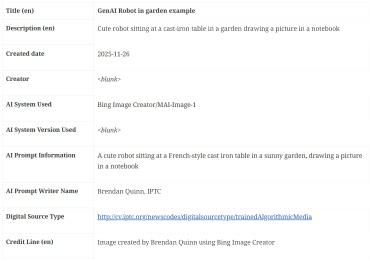

인공지능 투명성 확보 가이드라인
참고 자료
인공지능 생성 서비스 사례
l 이미지 기반 서비스
-  인공지능 기술에 기반하여 예술 작품이나 사실적인 사진, 복잡한 이미지나 효과를 적용하는 등의
방식으로 새로운 이미지를 창작 및 수정
- 대표적인 이미지 인공지능 콘텐츠 생성 서비스로 DALL･EOpenAI, FireFlyAdobe, Stable
DiffusionStability AI 등의 플랫폼이 존재
이미지 생성형 인공지능 서비스를 통한 이미지 생성(좌: Firefly, 우: Stable Diffusion)
l 동영상 기반 서비스
-  영상을 생성하거나 영상의 변환･편집 등 작업을 수행하며1), 주로 사용자가 작성한 각본(Script)과
입력한 명령어에 따라 영상을 자동으로 생성2)
- 텍스트(Text-To-Video) 혹은 이미지(Image-To-Video)를 바탕으로 동영상을 생성하는 서비
스는 SoraOpenAI, VideoFx/Veo3Google, Stable Video DiffusionStability AI 등의 플랫폼이 존재
1) WANG JIAJIA. (2024). 정보 특성과 개인적 특성이 생성형 AI 서비스 사용의도에 미치는 영향에 관한 실증적 연구(박사). 세종대학교
대학원, 박사학위논문
2) 손한빈. (2023). 생성형 인공지능의 서예 콘텐츠 초탐. 동양예술, (59), 5-30.

표시 방법
동영상 생성형 인공지능 서비스 Sora를 통한 동영상 생성 예시
∙ 아래 프롬프트로 생성된 영상 중 한 장면
∙ “한 스타일리시한 여성이 따뜻하고 빛나는 네온과 애니메이
션 도시 간판으로 가득 찬 도쿄 거리를 걷고 있습니다. 그녀
는 검은색 가죽 재킷, 긴 빨간색 드레스, 검은색 부츠를 신
고 검은색 지갑을 들고 있습니다. 선글라스와 빨간색 립스틱
을 바릅니다. 그녀는 자신감 넘치고 캐주얼하게 걷습니다. 거
리는 축축하고 반사적 이어서 다채로운 조명의 거울 효과를
만들어 냅니다. 많은 보행자가 걸어 다닙니다.”
출처: Open AI 공식 홈페이지
l 텍스트 기반 서비스
- 대규모 텍스트 데이터를 기반으로 한 언어 모델을 활용해 인간과 유사한 레벨에서 언어를 이해하고
생성 및 응답함으로써 높은 성능을 발휘
- 대표적으로 ChatGPTOpenAI, GeminiGoogle, ClaudeClaude, HyperCLOVAXNaver 등의
서비스가 존재
텍스트 생성형 인공지능 서비스를 통한 텍스트 생성(좌: ChatGPT, 우: Gemini)
l 오디오 기반 서비스
- 인공지능 기술을 사용하여 사람의 목소리나 음악을 학습하여 새로운 음성이나 오디오 생성
- 텍스트(Text-To-Speech)를 바탕으로 가상 비서, 음성 보조 기기 등에 활용되고 있으며,
WaveNetGoogle, AI SpeechMicrosoft Azure, Amazon PollyAWS 등이 존재

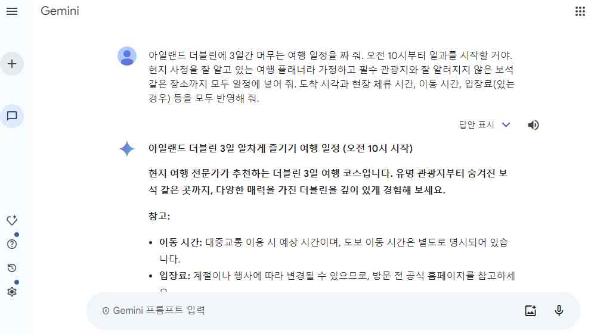

인공지능 투명성 확보 가이드라인
인공지능 생성 콘텐츠 위험사례
l 가짜뉴스 생성(1)
- 가짜뉴스는 뉴스 형태로 제시된 허위 또는 오해의 소지가 있는 정보이며, 종종 개인이나 단체의
평판을 손상시키거나 광고 수익을 통해 돈을 벌려는 목적을 포함3)
- 가짜뉴스에 대한 시민의 인식을 확인하기 위한 통계 조사 결과4), 가짜뉴스를 경험해 보았다는
비율이 43.3%에 달하고, 인공지능이 발달하면서 가짜뉴스 피해도 심화될 것이라는 전망에
84.2%가 동의
⇒ 통계 사례로 볼 수 있듯이 가짜뉴스는 이미 대중의 생활 곳곳에 침투하고 있어, 이에 대한 대책 마련이 시급
➽ 사례 예시(펜타곤 폭발 가짜뉴스 사건)
(출처 : 월드뷰)
펜타곤 폭발 가짜뉴스 사건 및 증시 변동5)
- 2023년 5월 미국에서 펜타곤이 폭발하는 사진이 소셜미디어인 트위터에서 언론까지 광범위하게
퍼지며 큰 혼란을 야기
- 펜타곤 대변인은 "펜타곤은 공격받지 않았다."고 밝혔고, 펜타곤 주변을 관할하는 경찰과 소방
당국 역시 "펜타곤 보호구역이나 근처에서 폭발이나 사고가 발생하지 않았으며 대중에게 위험은
없다."고 전하며 해당 사진은 인공지능 생성물임을 공개
- 그러나, 사진이 유포되자 S&P500 지수가 한때 0.3% 하락하는 등 증시는 출렁였고, 유사시 안전
자산으로 꼽히는 미 국채와 금값도 잠시 상승
3) 가짜뉴스, 위키피디아, https://ko.wikipedia.org/wiki/가짜뉴스
4) 가짜뉴스 피해 심각···허위 사실 유포자, 매체 강력 처벌 필요, 한국 NGO 신문,
https://www.ngonews.kr/news/articleView.html?idxno=143414
5) https://v.daum.net/v/20230523143302235

표시 방법
l 가짜뉴스 생성(2)
- 생성형 인공지능의 활용은 동영상, 이미지, 오디오 등 선거 운동에 필요한 다양한 콘텐츠 제작을
가능하게 하며 선거에 영향력 행사
- 가짜 인공지능 생성 콘텐츠는 유권자들 사이에서 혼란을 야기하고, 특정 후보에 대한 부정적인
인식을 심어줄 수 있는 가능성 존재
| UNESCO & Ipsos(’24), 전 세계 16개국 출신 8,000명 대상 설문조사 |
선거에 대한 가짜뉴스의 영향 유무(%)
온라인 가짜뉴스의 규제 필요 유무(%)
출처: 새로운 디지털 질서 정립 추진계획(24.5)
➽ 사례 예시(美 대통령 선거 딥페이크 이미지 유포 사건)
- 2023년 미국 선거기간에 해당 후보의 지지자들은 흑인 유권자들을 공략하기 위해 흑인들이 후
보를 지지한다는 취지의 사진을 인공지능으로 생성하여 공유
- 후보자를 비방하기 위해서 생성형 AI 모델인 ‘미드저니’를 이용해 후보자가 체포되는 장면과 형을
선고받아 투옥되는 장면 등을 제작한 뒤 소셜미디어에 게시
출처: BBC News 코리아(좌), AI 타임스(우)
생성형 인공지능으로 제작한 트럼프 美 대통령 딥페이크

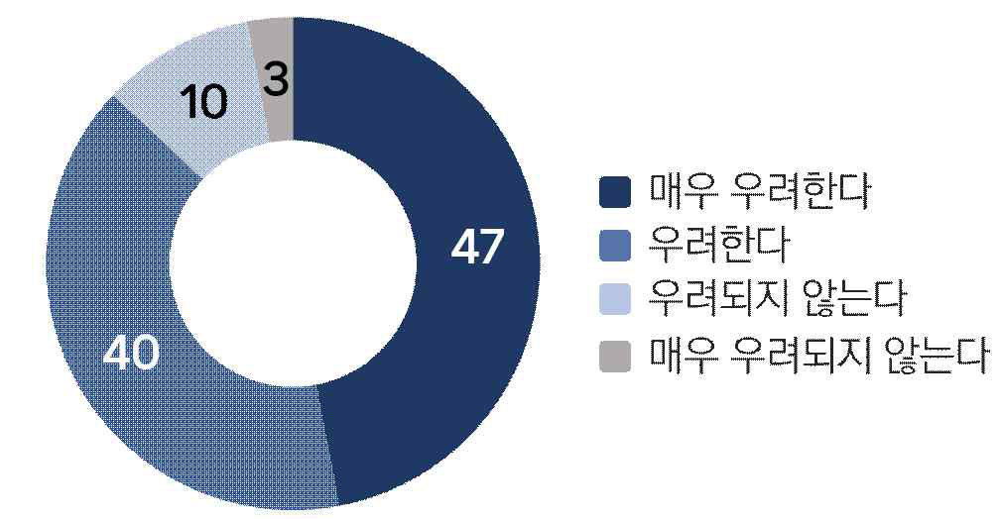

인공지능 투명성 확보 가이드라인
l 디지털 성범죄
- 생성형 인공지능을 오남용하여 성적 허위 영상물(성착취물)을 제작 및 유포하는 행위가 발생하고
있으며, 연예인이나 지인의 얼굴을 음란물과 합성해 유포하는 디지털 성범죄가 빈번히 발생
- 이미지의 유포･합성･소비의 가능성을 무한대로 확장시키기 때문에 디지털 성범죄는 피해와 가해의
구도가 1대 N을 이루고, 생산자와 소비자의 경계가 불분명6)
| 딥페이크 기술을 활용한 디지털 성범죄 사례 |
기간
내용
2024년 9월 ~
서울의 한 고등학교에 다니는 학생들 사이에선 최근 주변 4개 고교에 재학 중인 남학생
5명이 동료 여학생 10여 명의 사진을 불법 합성
2024년 8월 ~
텔레그램 단체 채팅방에서 현역 군인들이 여성 동료 군인들의 얼굴 사진을 딥페이크
방식으로 합성해 성착취물을 제작 및 공유
➽ 사례 예시(생성형 인공지능 활용 아동 성착취물 제작자 기소)
생성형 인공지능 활용 아동 성착취물 제작자 기소7)
- 2023년 4월, 생성형 인공지능 서비스에 ‘나체’, ‘어린이’ 등의 텍스트를 입력하여 360개의 아동 성착취물을
제작한 사건이 발생
- 우리나라 법원에서는 해당 행위가 아동･청소년의 성보호에 관한 법률에 위반되었다고 판시하여 징역 2년
6개월이 선고
- 피고인은 유포할 목적이 없었고, 가상의 이미지를 가지고 있는 것은 처벌 대상이 아니라고 생각했다고 진술
했으나 재판부는 피해자가 없다고 해도 성적 표현물 자체가 명백하게 아동으로 인식될 수 있다면 아동
청소년보호법 위반에 해당할 수 있다고 판시
6) 디지털 성범죄의 특징 및 현황, 찾기 쉬운 생활법령 정보(법제처),
https://www.easylaw.go.kr/CSP/CnpClsMain.laf?csmSeq=1594&ccfNo=1&cciNo=1&cnpClsNo=2
7) AI 프로그램으로 아동 성 착취물 제작해 구속 기소, KBS 뉴스, https://news.kbs.co.kr/news/pc/view/view.do?ncd=7738404

표시 방법
l 학술 및 콘텐츠 윤리 문제
- 생성형 인공지능이 학술논문, 자기소개서, 기사, 논문에 사용하는 그림 등을 생성하여 활용하는
사례가 증가하면서 공동 저자로 등록하고, 서로 다른 논문임에도 유사한 그림, 글이 무분별하게 양산
| 생성형 인공지능의 AI 표절 |
사건
내용
네이처, 인공지능 활용 논문
검증에 대한 주의(’24년 11월)
‘Frontiers in Cell and Developmental Biology’에 실렸던 한 논문을
소개하면서 터무니없이 큰 생식기를 지닌 쥐 이미지가 사용됐는데 알고
보니 생성형 이미지 모델 ‘미드저니’로 만든 것으로 밝혀져 철회된 사례를
집중하며 인공지능을 논문에 활용하는 것을 우려
턴잇인, AI 논문 표절 심각성
발표(’24년 4월)
온라인 표절 검사 서비스(Turnitin) 기업은 ’23년 4월 이후 플랫폼 제출
2억개 논문 중 약 11%가 표절이라고 발표
➽ 사례 예시(공동 저자로 ChatGPT가 등장한 논문이 게재되면서 과학계 반발)
과학기술 저널에 등재된 공동 저자 ‘ChatGPT’
- ChatGPT가 2023년 한해 책/저널을 발표하여 저작권을 보유하고 있는 경우 200여 권이 확인,
네이처의 발표에 따르면 최소 4편 이상이 연구논문에 공동 저자로 등록
- (과학계) ChatGPT가 공동 저자로 등록하는 것이 표절 문제를 동반한다면 최소한의 윤리 지침을
지켜야 한다고 지적하며 네이처 등에서는 저자로서 인정 불가 의사 표시
과학계 반발에 관한 다양한 기사

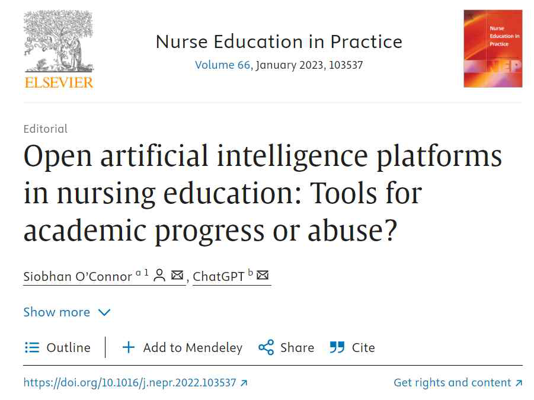

인공지능 투명성 확보 가이드라인
인공지능 생성 콘텐츠 국내외 법안 현황
- 생성형 인공지능이 사회 전반에 미치는 영향이 증대됨에 따라, 딥페이크를 통한 가짜뉴스 확산,
선거 개입, 지적재산권 침해 등 다양한 사회적 부작용이 우려
- 따라서, 각국은 인공지능 생성 콘텐츠의 안전하고 신뢰할 수 있는 활용을 위한 법적 규제 체계 마련
| 국외 인공지능 생성 콘텐츠 관련 법안 현황 |
구분
주요 내용
미국
∙ 행정 명령 14110호(Executive Order, (’23.10))
- 안전하고 신뢰할 수 있는 인공지능 개발 및 사용 행정명령 제 14110호(Executive Order 14110:
Safe, Secure, and Trustworthy Development and Use of Artificial Intelligence)
- AI 기술의 급속한 발전과 그에 따른 잠재적 위험에 대한 우려 및 사회적 으로 발생 가능한 문제(차별,
편견, 허위정보 등)로 인해, 국가 안보에 대한 위험 증가하고 있어 책임감 있는 AI 개발 및 사용을
위한 규제 입법
- 정부 기관들이 240일 내에 합성 콘텐츠를 탐지, 라벨링(워터마킹 등의 방법을 통해), 추적하기 위한
최신 기술을 식별하는 보고서를 작성하도록 의무화
∙ 자율 서약(Voluntary Commitments, (’23.7))
- 美 바이든 정부는 주요 AI 기업 7개와 안전, 보안, 신뢰를 강조하는 8가지 약속에 AI 생성
시청각 콘텐츠 표식(워터마크) 기제 개발 규정 제정
※ 2025년 1월 상기 두 인공지능 정책(Executive Order 14110, Voluntary AI Commitments)은 트럼프
대통령 취임 직후 바이든 행정부의 AI 규제 정책을 전면 폐지하는 행정명령 발표에 의해 폐지
(EO 14179, “Removing Barriers to American Leadership in Artificial Intelligence”)
Ÿ 주(州)별 인공지능 법안 현황
- 캘리포니아, 오하이오 및 뉴욕 등 각 주(州)는 인공지능 생성 콘텐츠에 명시 의무를 요구
하는 조항이 포함된 법안 시행 또는 추진 중
주(州)
번호
법안명
시행일
주요 내용
캘리
포니아
SB942
California AI
Transparency ACT

### 26. 1. 1.

매월 100만 명 이상의 사용자가 있는 시스템은
인공지능 생성물 탐지 도구 및 표시나 메타데이터를
제공하여 사용자가 인공지능 생성 콘텐츠를 쉽게
식별할 수 있도록 규정
오하
이오
SB217
AI Generated
Product Watermark
추진 중
인공지능 생성 콘텐츠에 워터마크를 탑재하고, 개인의
신원을 무단으로 활용한 콘텐츠는 24시간 이내에
삭제하도록 규정
뉴욕
A7106
Political Artificial
Intelligence
Disclaimer(PAID)
Act
추진 중
정치적으로 사용되는 인공지능 생성 콘텐츠는
인공지능 기술 활용 사실을 고지하도록 의무 규정

표시 방법
| 국내 인공지능 생성 콘텐츠 관련 법안 현황 |
제정일
기간
주요 내용
’25. 1
인공지능 발전과
신뢰 기반 조성
등에 관한 기본법
- 인공지능 기술의 급속한 발전과 사회 전반에 걸친 활용 확대에 따라, 기술 혁신과 윤리적
책임 간의 균형을 확보하기 위해 「인공지능의 발전과 신뢰 기반 조성 등에 관한 기본법」 제정
- 제31조(인공지능 투명성 확보 의무)는 고영향 인공지능 또는 생성형 인공지능을 이용한
제품 또는 서비스를 제공하는 인공지능사업자는 해당 사실을 이용자에게 사전에 고지
하여야 하며, 생성형 인공지능 또는 이를 이용한 제품 또는 서비스를 제공하는 경우
그 결과물이 생성형 인공지능에 의하여 생성되었다는 사실을 표시하여야함을 요구
- 인공지능시스템을 이용하여 실제와 구분하기 어려운 가상의 결과물을 제공하는 경우
그 사실을 이용자가 명확하게 알 수 있도록 고지 또는 표시하도록하는 규정을 마련
’24. 12
정보통신망
이용촉진 및
정보보호 등에
관한 법률
- 인공지능 기술을 이용하여 사람의 얼굴･신체 또는 음성을 대상으로 한 촬영물･영상물
또는 음성물을 대상자의 의사에 반하여 편집･합성 또는 가공한 정보의 무분별한 유통
으로 인한 성범죄, 명예훼손 또는 사기 등의 피해를 예방하기 위하여 시책을 마련해야
하는 규정 신설(제42조의2-합성영상등으로 인한 피해 예방을 위한 시책)
’23. 12
공직선거법
- 누구든지 선거일 전 90일부터 선거일까지 인공지능 기술 등을 이용하여 만든 동영상,
이미지, 오디오 등을 게시하는 것이 금지(제82조의8-딥페이크영상등을 이용한 선거
운동)
- 중앙선거관리위원회 규칙으로 정하는 사항을 딥페이크 영상 등에 표시하지 아니하면
처벌하는 규정 마련
※ 제250조(허위사실공표죄) 4항, 제255조(부정선거운동죄), 제261조(과태료의 부과･징수 등)
구분
주요 내용
유럽연합
∙ 인공지능법(EU AI Act, (’24.5))
- 범용 AI 모델 관련 콘텐츠가 AI에 의해 생성되었음을 명시하는 투명성 의무 규정
- 딥페이크를 구성하는 이미지, 음성 또는 비디오 콘텐츠를 생성하거나 조작하는 인공지능시스템의
배포자는 해당 콘텐츠가 인위적으로 생성 또는 조작되었다는 것을 공개
∙ 디지털 서비스법(Digital Services Act, (’22.7))
- 인공지능으로 생성한 콘텐츠(이미지, 오디오, 영상)에 대해 생성 주체를 소비자들이 알 수 있도록
표시할 것을 규정(Article 35-Mitigation of risks-(k) 조항)
중국
∙ 생성형 인공지능 서비스 관리 법 (’23.5)
- 생성형 인공지능 서비스 제공자는 ’인터넷정보서비스 딥페이크 관리 규정‘에 따라 이미지, 비디오
등 인공지능 콘텐츠에 대해 표시할 것을 의무화(제3장)
- 규정 위반 시 시정하도록 명령하며, 시정을 거부하거나 상황이 엄중한 경우 관련 서비스 제공을
잠정 중단하도록 규정
∙ 인터넷정보서비스 딥페이크 관리 규정 (’22.11)
- 기업들이 딥페이크 기술을 사용해 콘텐츠 제작 시 사용 기술 내용을 명시하도록 규정
- 생성형 AI 서비스 공급자들이 텍스트･이미지･오디오 등의 콘텐츠에 인공지능이 생성한 것임을
표시(워터마크 포함)하여 원본 추적이 가능하도록 해야 한다는 ’생성형 AI 규정‘ 마련

인공지능 투명성 확보 가이드라인
인공지능 생성 콘텐츠 국제 사회 논의
l AI 서울 정상회의(‘24.5)
- '안전하고 혁신적이며 포용적인 AI를 위한 서울 선언'과 '프론티어 AI 안전 서약'이 체결
- 구글, LG AI연구소, 세일즈포스, KT, 마이크로소프트, 삼성전자, 앤스로픽, SK텔레콤, IBM, 네이버,
코히어, 카카오, 오픈AI, 어도비 등 총 14개 기업이 서약에 서명하였으며 주요 내용은 다음과 같다.
⦁ AI 안전 연구소 간 네트워크 확대 및 글로벌 협력 촉진
⦁ 워터마크 등 인공지능이 생성하는 콘텐츠 식별을 위한 조치와 국제표준 개발 협력 강화
⦁ AI 모델에 대한 위협 평가를 위한 레드팀 구성 및 안전성 접근 방식을 투명하게 공유
l 히로시마 AI 프로세스 행동강령 발표(’23.12)
- G7*은 ’23년 5월 일본에서 개최된 히로시마 정상회의에서 인공지능의 위험을 관리하는 국제
규범인 ‘히로시마 AI 프로세스’ 수립에 대해 합의
* G7 회원국은 미국･일본･독일･영국･프랑스･이탈리아･캐나다이며, EU는 참가국 자격 활동
- 개발자가 가짜정보의 확산과 프라이버시 침해 위험을 완화하는 방안을 검증받고, 인공지능 콘텐츠에
대한 워터마크 삽입하는 등의 ‘히로시마 AI 프로세스 행동강령’ 발표8)
⇒ 기술적으로 가능한 경우 워터마크 또는 ‘인공지능 콘텐츠임을 알 수 있도록 하는 기타 기술적
조치’ 등 인공지능 콘텐츠의 진본성 및 출처 체제를 개발 이행할 것을 요구9)
l 독일 뮌헨안보회의(MSC) 딥페이크 공동 대응 논의(‘24.2)10)
- 독일 뮌헨안보회의(MSC)에서 20개 글로벌 빅테크 기업들이 공동으로 인공지능 기술을 악용해
선거에 영향을 끼치는 행위에 공동 대응하기로 합의했다고 발표
- 합의문의 제목은 ‘2024년 선거에서 인공지능의 기만적 사용을 방지하기 위한 기술 협약’(Tech
Accord to Combat Deceptive Use of AI in 2024 Elections)
⇒ 해당 합의문에는 선거에 영향을 미치는 인공지능 사기 콘텐츠를 막기 위한 기술 개발, 인공
지능 사기 콘텐츠와 관련하여 발새알 수 있는 위험 평가 모델 수립 등에 대한 조약
8) 디지털 심화대응 실태진단, https://beingdigital.kr/front/iagnosis_view.do?pageView=_11
9) G7, 히로시마 프로세스 행동강령의 주요 내용 및 시사, NIA, 23.12
10) 글로벌 빅테크, 유권자 속이는 ‘AI 페이크’ 공동 대응, https://www.hani.co.kr/arti/economy/economy_general/1128857.html

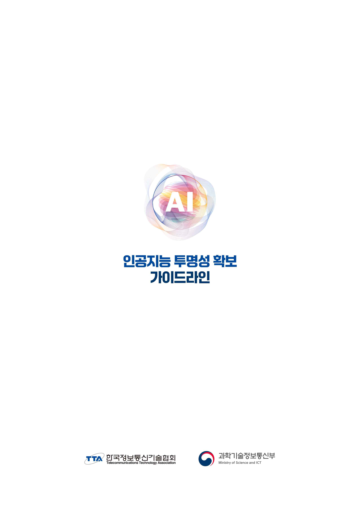
