# 고영향AI 판단 가이드라인 v4

> 원본: 고영향_인공지능_판단_가이드라인 (텍스트 기반 버전 + v.4 이미지)
> 페이지: 216p

---

1.1.1
고영향 인공지능 가이드라인의 수립 배경
► 인공지능기본법 제1조(목적)
이 법은 인공지능의 건전한 발전과 신뢰 기반 조성에 필요한 기본적인 사항을 규정함
으로써 국민의 권익과 존엄성을 보호하고 국민의 삶의 질 향상과 국가경쟁력을 강화하는 데
이바지함을 목적으로 한다.
「인공지능 발전과 신뢰 기반 조성 등에 관한 기본법」(2026.1.22.시행)(이하 ‘인공지능기본법’)은
인공지능의 건전한 발전을 지원하고 인공지능사회의 신뢰 기반 조성에 필요한 기본적인 사항을 규정
하고자 제정되었다.
Ÿ 인공지능기본법에서는 사람의 생명, 신체의 안전 및 기본권에 중대한 영향을 미치거나 위험을
초래할 우려가 있는 분야의 고영향 인공지능사업자에게 일정한 책무를 부여하고 인공지능
이용자를 보호하고자 한다.
► 인공지능기본법 제33조제3항(고영향 인공지능의 확인)
과학기술정보통신부장관은 고영향 인공지능의 기준과 예시 등에 관한 가이드라인을 수립
하여 보급할 수 있다.
본 가이드라인은 인공지능기본법의 입법목적에 따라 사업자가 책무 유무를 스스로 판단할 수 있도록
고영향 인공지능의 기준과 예시 등을 마련하여 사업자의 예측 가능성을 제고하고 산업현장에서의
혼란을 방지하기 위한 목적으로 마련되었다.
Ÿ 본 가이드라인은 인공지능기본법이 추구하는 맥락에 기반한 유연한 규제 성격(참고 1-1-1)을
반영하여 만들어졌으며, 고영향 인공지능 해당 여부를 사업자가 자율적으로 판단할 수 있도록
기준을 제시하고자 한다.
Ÿ 본 가이드라인을 통하여 인공지능사업자로서의 지위를 확정적으로 판단할 수 없는 경우에는
과학기술정보통신부장관에게 고영향 인공지능 해당 여부에 대하여 확인을 요청할 수 있다.
(참고 1-1-2)

1-1-1
(참고) 인공지능기본법의 특징
오늘날 인공지능은 모든 영역에서 생산성을 끌어올리고 새로운 서비스를 탄생시키면서 번영의 기회를
선사하는 반면, 신뢰성과 투명성 그리고 안전성과 관련된 여러 우려도 제기되고 있다. 이에 따라
인공지능 산업을 진흥하고 신뢰 기반을 마련하기 위하여 2025년 1월 21일 「인공지능 발전과 신뢰
기반 조성 등에 관한 기본법」이 제정되어 2026년 1월 22일부터 시행된다.
인공지능기본법은 다음과 같은 특징을 가진다.
Ÿ (맥락에 기반한 규제) 인공지능기본법은 인공지능이 활용되는 개별 영역과 그 안에서의 상호
작용의 관계, 즉 맥락에 따라 위험이 달라진다는 점을 전제로 고영향 인공지능(제31조,
제34조)과 생성형 인공지능(제31조)에 대하여 특정 맥락에서 발생할 수 있는 위험에 대응하여
투명성·신뢰성 규제를 적용한다.
다만, 학습에 사용된 누적 연산량이 일정 기준 이상인 고성능 인공지능시스템(제32조)에
대해서는 인공지능 사용의 맥락과 관계없이 시스템 자체가 보유한 잠재적 능력으로 인해 발생할
수 있는 위험을 전제로 안전성 관련 규제를 적용하는 구조를 취하고 있다.
Ÿ (유연한 규제) 인공지능은 빠르게 발전하는 기술로서 그에 수반되는 위험 역시 지속적으로
변화하므로, 이러한 변화에 적응할 수 있는 유연한 규제가 요구된다. 이러한 유연한 규제는
비(非)법적 수단이나 원칙 중심·절차 중심의 규제 방식을 포함하며, 구체적으로는 자율규제,
적응적 규제, 위험 기반 규제와 같은 형태로 구현된다.
Ÿ 법은 맥락 및 위험 기반 규제 방식을 기본으로 하며, 자율적 검·인증(제30조제1항), 고영향
인공지능 확인(제33조제3항), 영향평가(제35조제3항) 등 절차적·자율적 규제를 중심으로
구성되어 있다. 여기에 「정보통신 진흥 및 융합 활성화 등에 관한 특별법」에 따라 규제특례를
적극적으로 적용하는 적응적 요소를 포함(제19조제3항)하여 유연한 규제를 지향한다.
Ÿ (포괄적 규제) 규제는 영역별 규제(수직적 규제)와 포괄적 규제(수평적 규제)로 구분할
수 있다. 영역별 규제는 각 영역의 특수성을 반영하고 규제의 유연성을 확보할 수 있다는
장점이 있는 반면, 포괄적 규제는 규제 일관성 확보와 규제 비용 절감이라는 장점을 가진다.
이 두 방식은 상호 보완적인 관계에 있으며, 이에 따라 법은 일관성 확보를 위해 포괄적
규제를 기본으로 채택하면서도, 영역별 특수성을 반영하기 위하여 다른 법제와의 연계
조항(제34조제3항)을 두고 있다.

1-1-2
(참고) 고영향 인공지능의 확인 절차
► 인공지능기본법 제33조(고영향 인공지능의 확인)
① 인공지능사업자는 인공지능 또는 이를 이용한 제품ㆍ서비스를 제공하는 경우 그 인공지능이
고영향 인공지능에 해당하는지에 대하여 사전에 검토하여야 하며, 필요한 경우 과학기술정보
통신부장관에게 고영향 인공지능에 해당하는지 여부의 확인을 요청할 수 있다.
► 인공지능기본법 시행령 제24조(고영향 인공지능의 확인 절차 등)
① 인공지능사업자가 법 제33조제1항에 따라 고영향 인공지능 해당 여부의 확인을 요청하려는
경우에는 별지 제1호 서식의 확인 요청서를 과학기술정보통신부장관에게 제출해야 한다.
② 과학기술정보통신부장관은 다음 각 호의 사항을 고려하여 고영향 인공지능 해당 여부를 판단
하여야 한다.

## 1. 인공지능이 법 제2조제4호 각 목의 어느 하나의 영역에서 활용되는지 여부 및 그 목적

## 2. 사람의 생명, 신체의 안전 및 기본권에 초래할 수 있는 위험의 영향, 중대성, 빈도, 활용

영역별 특수성

## 3. 법 제33조제1항에 따른 인공지능사업자의 고영향 인공지능 해당 여부에 대한 사전검토 결과

## 4. 법 제33조제2항에 따라 전문위원회 자문을 거친 경우 그 자문결과

## 5. 그 밖에 고영향 인공지능의 해당 여부를 확인하는 데 필요한 자료로서 과학기술정보통신

부장관이 정하는 사항
③ 과학기술정보통신부장관은 제1항에 따른 요청을 받은 후 30일 이내에 회신하여야 한다.
이 경우 제품 등의 복잡성 및 중요성 등을 고려하여 30일 이내의 기간을 정하여 연장할 수 있다.
④ 제3항에 따라 회신을 받은 인공지능사업자는 회신을 받은 날로부터 10일 이내에 과학기술정보
통신부장관에게 반대되는 증빙 자료와 그 밖에 필요한 사항을 첨부하여 재확인 요청의 취지와
이유를 기재한 문서(전자문서를 포함한다)로서 재확인을 요청할 수 있다.
⑤ 과학기술정보통신부장관은 제4항에 따른 재확인 요청을 받은 때에는 법 제33조제2항에 따른
전문위원회(이하 “전문위원회”라 한다)의 자문을 받아 고영향 인공지능 해당 여부를 재확인하고,
재확인 요청을 받은 날로부터 30일 이내에 회신하여야 한다.
인공지능사업자는 법 제33조제1항에 따른 확인을 요청하려는 경우에는 인공지능기본법 시행령
별지 제1호 서식의 확인 요청서를 과학기술정보통신부장관에게 제출하여야 한다.
과학기술정보통신부장관은 인공지능사업자의 요청을 받은 후 30일 이내에 고영향 인공지능
여부를 판단하여 회신해야 하며, 제품 또는 서비스의 복잡성 및 중요성 등을 고려하여 30일
이내로 판단기간을 1회 연장할 수 있다.

과학기술정보통신부장관은 다양한 요소를 고려하여 고영향 인공지능 해당 여부를 판단한다.
▶ 확인 요청에 따른 고영향 인공지능 해당 여부 판단시 고려사항

## 1. 인공지능이 법 제2조제4호 각 목의 어느 하나의 영역에서 활용되는지 여부 및 그 목적

2. 사람의 생명, 신체의 안전 및 기본권에 초래할 수 있는 위험의 영향, 중대성, 빈도, 활용 영역별 특수성

## 3. 법 제33조제1항에 따른 인공지능사업자의 고영향 인공지능 해당 여부에 대한 사전검토 결과

## 4. 법 제33조제2항에 따라 전문위원회 자문을 거친 경우 그 자문결과

5. 그 밖에 고영향 인공지능의 해당 여부를 확인하는 데 필요한 자료로서 과학기술정보통신부장관이 정하는 사항
[ 고영향 인공지능 확인절차 ]
과학기술정보통신부장관은 필요시 고영향 인공지능 판단과정에서 전문위원회 전문가의 의견을
청취할 수 있다.
Ÿ 과학기술정보통신부장관은 고영향 인공지능 확인 전문위원회 50인 이상의 전문가 풀(pool) 중
전문위원 5명의 회의를 통해 의견을 청취하되, 필요한 경우 전문위원 외의 전문가 의견을
청취할 수 있다.
Ÿ 전문위원회의 판단은 법적 구속력이 없는 자문 역할이며 반드시 거쳐야 하는 절차가 아닌
선택적 절차이지만, 고영향 영역과 인공지능에 관한 전문가들이 제공하는 종합적인 검토
의견으로서 확인에 중요한 참고자료가 된다.
과학기술정보통신부장관의 확인은 행정절차로서 다른 행정해석과 마찬가지로 행정상의 판단에
그치며, 민·형사상 최종적인 판단은 법원의 사법적 판단에 따라 결정된다.
Ÿ 확인 요청 절차를 통한 결과는 행정절차에 활용되거나 사법적으로는 참고적 성격을 가질
뿐이며, 민·형사상의 법적 분쟁이 발생하는 경우 최종적인 법원의 판단에 따라 변경될 수
있다. 따라서 인공지능사업자는 이러한 행정적 확인의 한계를 인지하고 법적 책임에 대비
할 필요가 있다.

1.2.1
인공지능기본법 제2조(정의)에 따른 주요 용어
용어
개념
인공지능
Ÿ 학습, 추론, 지각, 판단, 언어의 이해 등 인간이 가진 지적 능력을 전자적 방법으로 구현한 것을 말한다.
(제1호)
인공지능
시스템
Ÿ 다양한 수준의 자율성과 적응성을 가지고 주어진 목표를 위하여 실제 및 가상환경에 영향을 미치는 예측,
추천, 결정 등의 결과물을 추론하는 인공지능 기반 시스템을 말한다. (제2호)
※ ‘고영향 인공지능’은 고영향 분야의 인공지능시스템을 의미한다.
인공지능기술
Ÿ 인공지능을 구현하기 위하여 필요한 하드웨어ㆍ소프트웨어 기술 또는 그 활용 기술을 말한다. (제3호)
인공지능산업
Ÿ 인공지능 또는 인공지능기술을 활용한 제품(이하 “인공지능제품”이라 한다)을 개발ㆍ제조ㆍ생산 또는
유통하거나 이와 관련한 서비스(이하 “인공지능서비스”라 한다)를 제공하는 산업을 말한다. (제6호)
인공지능
사업자
Ÿ 인공지능산업과 관련된 사업을 하는 자로서 다음 각 목의 어느 하나에 해당하는 법인, 단체, 개인 및 국가
기관등을 말한다. (제7호)
- (인공지능개발사업자) 인공지능을 개발하여 제공하는 자
- (인공지능이용사업자) 인공지능개발사업자가 제공한 인공지능을 이용하여 인공지능제품 또는 인공지능
서비스를 제공하는 자
※ (국내대리인) 국내에 주소 또는 영업소가 없는 인공지능사업자로서 이용자 수, 매출액 등이 대통령령으로
정하는 기준에 해당하는 자로 안전관리의무 이행 결과의 제출(제32조제2항), 고영향 인공지능 해당 확인
요청(제33조제1항), 고영향 인공지능사업자 책무 이행(제34조제1항) 지원 등을 수행하는 자를 말한다. (제36조)
이용자
Ÿ 인공지능제품 또는 인공지능서비스를 제공받는 자를 말한다. (제8호)
영향받는 자
Ÿ 인공지능제품 또는 인공지능서비스에 의하여 자신의 생명, 신체의 안전 및 기본권에 중대한 영향을 받는 자
를 말한다. (제9호)
(인공지능제품) 인공지능시스템 또는 이를 요소로 포함하는 제품으로서, 인공지능시스템에 접속하여
필요로 하는 기능을 수행하는 것을 포함한다.
Ÿ 인공지능 또는 인공지능기술을 물리적․논리적․기능적으로 운용가능한 제품으로, 하드웨어
및 소프트웨어를 포함한다.
Ÿ 인공지능 또는 인공지능기술을 활용한 제품(네트워크를 통해 인공지능에 직접 연결하여 인공지능을
사용할 수 있도록 하거나, 인공지능기술을 활용할 수 있는 전용 단말기, 자율주행자동차 등)
(인공지능서비스) 인공지능, 인공지능시스템 또는 인공지능제품을 활용할 수 있도록 제공하는
서비스로 정보 분석, 예측, 추천, 창작 등의 기능을 제공하는 것을 말한다.
Ÿ 인공지능제품을 활용한 서비스 또는 PC, 스마트폰 등 정보통신기기를 통해 인공지능기술을
이용할 수 있도록 제공되는 서비스

1.2.2
인공지능시스템의 개념
인공지능시스템은 다양한 수준의 2자율성과 3적응성을 가지고 주어진 1목표를 위하여 실제 및
가상환경에 영향을 미치는 예측, 추천, 결정 등의 4결과물을 추론하는 인공지능 기반 시스템을
말한다.
Ÿ (1목표) 인공지능시스템의 목표는 명시적, 암묵적 목표를 모두 포함한다. 즉, 개발자가 직접 입력,
지시한 명시적 목표는 물론, 상황에 따른 규칙이나 학습데이터로 형성된 암묵적 목표를 말한다.
Ÿ (2자율성) 시스템이 사람의 직접적인 개입 없이도 독립적으로 데이터를 학습하고 외부 환경을
판단하며 운영될 수 있는 것을 말한다.
Ÿ (3적응성) 초기 개발 후에도 지속적으로 발전할 수 있는 기계학습 기반 시스템의 특성으로,
배포 전후에 입력되는 데이터와 직접 상호작용하여 스스로 행동 방식을 수정할 수 있음을
의미한다. 입력되는 데이터는 입력하는 자(개발자, 이용자) 또는 입력방법을 불문한다.
Ÿ (4결과물) 시스템의 산출물로서, 과거와 현재의 데이터를 기반으로 미래상황 등을 추측하는
예측, 사용자의 선호도나 행동 패턴을 분석해 선택지를 제안하는 추천, 가장 높은 자율성을
가지고 시스템이 독립적으로 판단하여 실행하는 결정 등이 이에 해당한다.
인공지능기본법의 인공지능시스템의 정의는 OECD의 보고서* 등 국내외 다양한 연구를 통해 확립된
개념 정의를 따르고 있으며, 특정 기술과 기법(예: 기계학습 모델, 기호주의·지식 기반 인공지능 등)에 국한되지
않는 포괄적 개념을 의미한다.
* Explanatory memorandum on the updated OECD definition of an AI system: AI시스템 정의에 반영된 개념 요소를
상세히 설명하는 내용의 OECD 보고서(2024. 3. 5.)
Ÿ 인공지능기본법에서는 ‘인공지능 모델’을 별도로 정의하지 않는다. OECD도 인공지능시스
템을 중심으로 정의하여, 인공지능시스템의 기능과 활용에 따른 영향에 초점을 두고 별도로
‘인공지능 모델’을 정의하지 않는 접근방식을 따르고 있다. 한편, EU AI Act는 ‘범용 인공
지능 모델’을 정의하고 이에 대한 별도의 규율 체계를 마련하고 있다.

1.2.3
인공지능기본법의 인적 적용 범위
(인공지능사업자) 인공지능산업 관련 ‘사업’을 하는 법인, 단체 개인 및 국가기관 등*을 말하는 것으로,
여기서 ‘사업’이란 일정한 목적과 계획에 따라 지속적으로 수행하는 경제적·사회적 활동을 의미하며,
영리적인 활동에만 국한하지는 않는다.
* 국가, 지방자치단체, 「공공기관의 운영에 관한 법률」 제4조에 따른 공공기관(인공지능기본법 제2조제4호 자목)
Ÿ 사업의 해당 여부는 사업의 계속성, 반복성, 영업성, 그 행위의 목적, 규모, 횟수, 기간 등을
종합적으로 고려하여 판단해야 한다(대법원 2012. 3. 29. 선고 2011도1985 판결 등).
Ÿ 사업은 그 목적을 불문하며, 영리 목적의 민간 사업자(법인, 개인)뿐만 아니라 비영리단체 및
공공서비스를 제공하는 국가기관등을 포함한다.
Ÿ 국가, 지방자치단체, 공공기관 등이 관련 법령에 따라 본연의 업무를 수행하는 것은 공법상
행정작용에 해당하지만, 계속성·반복성 및 규모·횟수 등을 고려하여 “넓은 의미의 사업”에 해당한다.
Ÿ 단순히 개인이 자기계발, 취미 등의 목적으로 인공지능을 개발하여 오픈소스로 공개하거나,
공개된 인공지능시스템을 최적화하여 재공개하는 경우 등은 ‘사업’에 해당하지 않는다.
☞ 인공지능사업자는 개발사업자와 이용사업자로 구분되지만, 하나의 사업자가 두 가지 지위를 가지는
것도 가능하다. 즉, 인공지능개발사업자가 인공지능을 개발하여 직접 서비스화(인공지능서비스)
하거나 인공지능제품을 이용자에게 제공한 경우에는 인공지능개발사업자이자 동시에 인공지능
이용사업자에 해당한다.
(인공지능개발사업자) 인공지능제품이나 인공지능서비스에 활용되는 인공지능을 1개발하여 2
제공하는 자를 의미한다.
Ÿ (1개발) 인공지능 또는 인공지능기술을 직접 개발하거나, 그 성능 또는 기능에 중대한 영향을
줄 정도로 수정·변경·개량한 것을 말한다.
→ 개발의 형태에는 제한이 없으며, 인공지능제품 또는 인공지능서비스로 구체화 되지 않은 기술적
형태(예: 소스코드, 개발 산출물) 및 인공지능 모델도 포함한다.
→ 직접 인공지능을 개발하는 경우는 물론, 자신의 권한이나 책임 하에 인공지능의 주요 사양, 기능 등을
지정하여 제3자를 통하여 개발하는 경우(예: 위탁·용역·도급·고용 등)도 해당한다.
Ÿ (2제공) 제공은 유무상 여부를 불문하며, 유료로 제공하는 것 외에도 무상의 제공(예: 공공서비스,
무료 오픈소스)도 포함한다.
→ 제공 대상이 특정인(기업)을 상대로 하는 것을 포함하여 오픈소스 공개와 같이 불특정 다수를
대상으로 하는 경우도 포함한다.
→ 인공지능을 개발하여 ‘제공’하여야 하므로, 제공 행위가 필수적이며, 일반적으로 인공지능개발
사업자는 인공지능이용사업자에게 인공지능을 제공한다.

→ 사업자가 인공지능을 개발하여 직접 서비스화하고 이용자에게 제공하는 경우 인공지능개발
사업자이자 동시에 인공지능이용사업자에 해당하며, 인공지능을 개발하여 내부적인 실험,
테스트 또는 참고 목적으로만 활용하는 경우는 인공지능개발사업자에 해당하지 않는다.
(인공지능이용사업자) 인공지능개발사업자가 제공한 인공지능을 1이용하여 인공지능제품 또는
인공지능서비스를 2제공하는 자를 말한다.
Ÿ (1이용) 인공지능개발사업자로부터 직접 제공받은 경우는 물론, 다른 인공지능이용사업자를 통해
제공받은 경우도 포함한다.
→ 인공지능이용사업자가 제공받은 인공지능을 상용화하는 과정에서 성능 최적화 등의 작업을 수행
할 수 있으나, 이러한 부수적 행위만으로 인공지능개발사업자에 해당하는 것은 아니다.
→ 인공지능이용사업자가 제공받은 인공지능의 중대한 기능의 변경을 초래하는 수정·변경·개량을
한 경우에는 인공지능이용사업자가 아닌 인공지능개발사업자에 해당하며, 중대한 기능 변경에
해당하는지는 인공지능개발사업자의 예측 가능성, 목적 및 용도의 변경, 시스템의 구조 및 기능
변경 등을 핵심 요소로 고려하여 개별적·종합적으로 판단해야 한다.
Ÿ (2제공) 인공지능에 기반한 기능을 수행하거나 직접 실행하는 제품을 이용자에게 제공하거나,
인공지능(또는 인공지능기술)을 활용한 서비스를 이용자의 이용에 제공하는 것으로, 이용자에 대한
제공행위가 필수적으로 있어야 한다.
→ 인공지능개발사업자에게 인공지능을 제공받은 경우에도 자신의 사업에 필요한 제품·서비스 개발에
활용할 뿐, 이용자에게 인공지능제품이나 인공지능서비스를 제공하는 것으로 볼 수 없다면 인공
지능이용사업자에 해당하지 않는다.(이 경우 이용자에 해당할 수 있다)
→ 인공지능이용사업자는 인공지능의 주요한 기능에 대한 권한을 가지고 인공지능제품 또는 인공지능
서비스를 이용자의 이용에 제공한다. 인공지능을 활용하여 생성된 결과물을 제품이나 서비스로
제공하는 경우는 ‘이용자’에 해당한다.
(이용자)　인공지능이용사업자가 이용자에게 인공지능제품 또는 인공지능서비스를 제공하게 되므로,
이용자는 인공지능사업자와의 합의 또는 계약에 따라 인공지능제품 또는 인공지능서비스를
제공받아 이용하는 자를 말한다.
Ÿ 다만, 계약의 형태와 방식에는 제한이 없으므로 명시적·묵시적 계약, 약관 등 다양한 형태로 가능하며,
제품 또는 서비스를 실제로 제공받아야 하므로 제3자를 위하여 제품을 구매하거나 서비스에 가입하여
전달하였다면, 실제 인공지능제품이나 인공지능서비스를 제공받은 자가 “이용자”에 해당한다.
Ÿ 일반적으로 이용자는 제공의 직접 상대방을 의미하고, 간접적으로 해당 인공지능제품 또는 인공지능
서비스에 영향을 받거나 제공 과정에 관여되는 자는 제외한다.

인공지능이용사업자의 “이용”과 이용자의 “이용“의 구분
Ÿ 인공지능이용사업자의 “이용”은 인공지능을 인공지능제품 또는 인공지능서비스로 구현하기 위한
목적으로 이용하는 것을 말하고, 이용자의 “이용”은 제공받은 제품 또는 서비스를 형태나 내용의
변경 없이 그대로 이용하는 것을 의미한다.
→ 이용자의 “이용”은 인공지능제품이나 인공지능서비스의 일부 조정·변경이 있다고 하더라도 UI나
기본적 설정 변경에 그치는 경우에 해당하므로, 인공지능의 주요한 기능에 대한 권한 없이 사용자
인터페이스나 설정을 통해 허용되는 범위 내에서만 그 기능을 사용할 수 있다.
Ÿ 이용자는 반드시 최종적 이용자일 것을 요구하지 않으며, 일반 사업자인 이용자는 인공지능을 활용한
‘결과물’을 사업 활동에 이용하는 것으로 인공지능을 기초로 인공지능 제품 또는 인공지능서비스를
구현하는 인공지능이용사업자와는 구분된다.
(영향받는 자)　이용자와 영향받는 자는 반드시 구분되는 개념이 아니며, 상황에 따라 중첩될 수 있다.
Ÿ 직접 제품이나 서비스를 이용하는 자에 국한되지 않고, 중대한 영향*을 받는 경우라면 간접적으로
영향을 받는 자도 포함한다.
* 중대한 영향 판단시 고려사항 : ① 생명ㆍ신체의 안전과 관련 여부, ② 권리·의무의 주요한 변경 등 여부, ③
수인 한도를 넘는 과도한 책무·채무 여부, ④ 지속적인 제한 발생 여부, ⑤ 회복가능성 여부 등
Ÿ 인공지능제품 또는 인공지능서비스를 제공하는 인공지능이용사업자가 그 제품 및 서비스의
영향받는 자로 상정하거나 염두에 두었는지를 불문하고, 실제로 그 제품 및 서비스에 의하여
“중대한 영향을 받았는지” 제반 사정을 기초로 종합적으로 판단해야 한다.
Ÿ 영향받는 자는 인공지능의 최종결과 도출에 활용된 주요 기준 및 원리 등에 대하여 기술적ㆍ
합리적으로 가능한 범위에서 명확하고 의미 있는 설명을 제공받을 수 있어야 한다.

[ 인공지능기본법 인적 적용 범위 ]
인공지능사업자
이용자
영향받는자
인공지능개발사업자
인공지능이용사업자
개념
Ÿ 인공지능서비스에
사용되는 인공지능을
개발하여 제공하는 자
Ÿ
1)인공지능개발사업자로부터
인공지능을 제공받거나
2)자신이 개발한 인공지능을
기반으로 인공지능제품 또는
인공지능서비스를 제공하는
사업자
Ÿ 인공지능제품이나
인공지능서비스를
제공 받아 직접
이용하는 자
Ÿ 인공지능제품 또는
인공지능서비스에 의하여
자신의 생명, 신체의
안전 및 기본권에 중대한
영향을 받는 자
특징
Ÿ 인공지능제품과 인공지능서비스에 사용되는 인공지능
모두 포함
Ÿ 인공지능에 대한
제어 권한이 없거나
매우 제한적
비고
Ÿ 자기가 개발한 인공지능을 이용하여 서비스를 제공하는 경우 개발사업자와 이용사업자 중복 지위를 가지며
책무를 모두 부담
Ÿ 공공 및 민간 모두 적용 대상

1.2.4
인공지능산업 가치사슬 예시
콘텐츠 산업
투명성 확보 의무 이행
투명성 확보 의무 이행 불필요
AI 디에이징
기술개발사
영화용 AI
디에이징 서비스
제공사
영화제작사
OTT플랫폼
소비자
얼굴 인식 및 변형
핵심 AI기술을
개발하여 제공
AI디에이징 기술을
영화산업에 맞게
특화하여 디에이징
서비스 제공
AI 디에이징 기술을
활용한 콘텐츠
기획/촬영 및
최종제작
완성 콘텐츠를
소비자에게 제공
OTT플랫폼 구독
AI개발사업자
AI이용사업자
이용자
해당없음
보건의료 산업
고영향 AI 사업자 책무 이행
고영향 AI 사업자 책무 이행 불필요
의료 이미지 분석
AI 모델 개발 기업
의료영상 진단
AI 시스템 제공 기업
병원, 의사 등 의료인,
방사선사 및
임상병리사 등
의료기사
환자
의료영상 인식 및 분석
핵심 AI기술을 개발하여
제공
의료진의 진단 정확도
향상을 위한 AI기반 영상
분석 시스템 서비스 제공
AI 진단 보조 시스템을
활용하여 환자에게 정확한
진단 서비스 제공
AI 기반 정밀 진단을
통한 치료
AI개발사업자
AI이용사업자
이용자
영향받는 자
채용분야
고영향 AI 사업자 책무 이행
고영향 AI 사업자 책무 이행 불필요
영상·음성 분석
AI 모델 개발 기업
AI 면접 시스템 제공
기업
채용기업
구직자
사람의 표정, 음성, 언어
패턴을 분석하는 핵심
AI기술을 개발하여 제공
채용 프로세스 효율화를
위한 AI 기반 면접 평가
및 인재 매칭 서비스 제공
AI 면접 시스템을
활용하여 지원자 선별 및
평가 업무 수행
AI 면접 시스템을 통한
채용 과정 참여 및 평가
대상
AI개발사업자
AI이용사업자
이용자
영향받는 자

대출심사 분야
고영향 AI 사업자 책무 이행
고영향 AI 사업자 책무 이행 불필요
신용평가 예측 AI 모델
개발 기업
AI 대출심사 시스템
제공 기업
은행 및 금융기관
대출 신청자
대출자의 신용도 및
상환능력을 예측하는 핵심
AI기술을 개발하여 제공
금융기관의 대출 승인
프로세스 자동화를 위한
AI기반 신용평가 서비스
제공
AI 대출심사 시스템을
활용하여 대출 신청자에
대한 신용평가 및 승인
업무 수행
AI 기반 대출심사를 통한
대출 승인 여부 및 조건
결정
AI개발사업자
AI이용사업자
이용자
영향받는 자

► 제2조(정의)

## 4. “고영향 인공지능”이란 사람의 생명, 신체의 안전 및 기본권에 중대한 영향을 미치거나

위험을 초래할 우려가 있는 인공지능시스템으로서 다음 각 목의 어느 하나의 영역에서
활용되는 것을 말한다.
1.3.1
고영향 인공지능의 판단
(1단계 조건) 다음 중 어느 하나에 해당하는 “영역”에서 사용되는 인공지능을 말한다.
구분
사용되는 영역
에너지
가. 「에너지법」 제2조제1호에 따른 에너지의 공급
먹는물
나. 「먹는물관리법」 제3조제1호에 따른 먹는물의 생산 공정
보건의료
다. 「보건의료기본법」 제3조제1호에 따른 보건의료의 제공 및 이용체계의 구축·운영
의료기기
라. 「의료기기법」 제2조제1항에 따른 의료기기 및 「디지털의료제품법」 제2조제2호에 따른
디지털의료기기의 개발 및 이용
원자력
마. 「원자력시설 등의 방호 및 방사능 방재 대책법」 제2조제1항제1호에 따른 핵물질과  같은 항 제2호에
따른 핵물질과 원자력시설의 안전한 관리 및 운영
범죄 수사·체포
바. 범죄 수사나 체포 업무를 위한 생체인식정보(얼굴ㆍ지문ㆍ홍채 및 손바닥 정맥 등 개인을 식별할
수 있는 신체적ㆍ생리적ㆍ행동적 특징에 관한 개인정보를 말한다)의 분석·활용
채용, 대출 심사 등
사. 채용, 대출 심사 등 개인의 권리·의무 관계에 중대한 영향을 미치는 판단 또는 평가
교통
아. 「교통안전법」 제2조제1호부터 제3호까지에 따른 교통수단, 교통시설, 교통체계의 주요한 작동 및 운영
공공서비스
자. 공공서비스 제공에 필요한 자격 확인, 결정 또는 비용징수 등 국민에게 영향을 미치는 국가, 지방
자치단체, 「공공기관의 운영에 관한 법률」 제4조에 따른 공공기관 등(이하 “국가기관등”이라
한다)의 의사결정
교육
차. 「교육기본법」 제9조제1항에 따른 유아교육ㆍ초등교육 및 중등교육에서의 학생 평가
(2단계 조건) 1단계에 해당하는 영역에서 활용되는 인공지능시스템이 “사람의 생명, 신체의
안전 및 기본권의 보호에 중대한 영향을 미치거나 위험을 초래할 우려”가 있는 경우 고영향
인공지능에 해당하게 된다.

[ 고영향 인공지능의 예시: 원자력 분야(‘마’목) ]

1.3.2
2단계 조건의 판단기준
사람의 권리와 이익에 대한 위험은 인공지능제품이나 서비스를 직접 제공받는 이용자뿐만 아니라
인공지능의 활용에 따라 간접적으로 영향을 받는 자(영향받는자)에게도 해당된다. 생명과 신체의
안전은 인간의 기본적인 권리로서 일반적으로 중대한 권익으로 인정되기 쉽다. 인공지능 활용과
관련된 기본권에는 이 외에도 인간의 존엄성, 평등권, 신체의 자유, 사생활의 비밀과 자유, 표현의
자유, 지식재산권, 소비자 권리, 교육받을 권리 등이 포함된다.
인공지능시스템의 영향은 긍정적, 부정적 또는 양면적일 수 있으나 고영향 인공지능 규제의
입법취지에 따라 주로 부정적 영향에 초점을 둔다.
Ÿ 생명, 신체의 안전 및 기본권에 대한 위험성을 판단함에 있어서는 인공지능시스템의 의도된
목적, 기능, 활용 맥락을 다양한 관점에서 종합적으로 고려해야 한다.
Ÿ 인공지능시스템은 활용 과정에서 생명, 신체의 안전 및 기본권에 대한 새로운 위험을 발생
시키거나, 기존의 위험을 증가, 변화시키는 핵심적인 원인으로 작용할 수 있는 점에서
유의미하다.
Ÿ 위험의 중대성은 권익의 속성과 증가된 위험 정도를 종합적으로 고려하여 판단한다.
위험의 중대성을 판단하기 위하여 가능한 경우 적절한 위험 측정 방법 및 지표를 이용
하는 것이 바람직하지만, 그것에만 전적으로 의지하는 것은 부적절하다. 적절한 위험
측정 방법이나 지표를 이용할 수 없는 경우에는 인공지능시스템의 목적 및 기능과 활용
되는 상황의 맥락(활용에 따른 긍정적·부정적 영향, 위험에 대한 사회적 수용성 등)을
고려하여 판단한다.

[ 영역별 인공지능으로 심화되는 생명, 신체의 안전 및 기본권 침해 상황 ]
구분
생명, 신체의 안전 및 기본권과의 관련성
인공지능이 중대한 영향을 미치거나
위험을 초래하는 경우
에너지
Ÿ 안정적이고 균등한 에너지 공급은
일반적 행동의 자유, 재산권, 경제활동의
자유와 연관
Ÿ 인공지능시스템의 의도하지 않은 작동 등으로 인해,
전력 등 에너지 수급 불균형 상황 발생 시,
병원 및 산업시설 등에 전력 공급이 끊기면서
대규모 생명·안전 피해 발생
먹는물
Ÿ 먹는물은 인간의 생명과 건강 유지에
필수적인 요소로 먹는물의 공급은 생명·신체의
안전과 건강한 환경권, 보건권과 직결
Ÿ 인공지능시스템의 의도하지 않은 작동 등으로 인해
수질 데이터 분석의 오판이 이루어져 오염된 물을
‘적합’으로 분류하면, 다수 국민의 오염수 음용에
따른 건강권 침해
보건의료
의료기기
Ÿ 인공지능시스템을 이용한 질병의 진단, 치료,
의료기기 등은 국민의 생명·신체의 안전 및
보건권에 직접적으로 영향
Ÿ 인공지능시스템이 의료진의 개입 없이 활용되어
의도하지 않은 작동 등으로 오판된 결과가 환자의
질병 판단 근거로 작용할 경우, 조기 치료의 기회를
놓치는 등 환자의 신체·건강에 직접적으로 작용
원자력
Ÿ 원자력시설의 안전은 주변 거주민 및 종사자에
대해서는 생명·신체의 안전과 직결되고,
국가적 차원에서 환경권, 보건의무 등과 관련
Ÿ 원자력시설 내 주요 기기 제어 인공지능시스템의
오작동이나 해킹으로 인한 안전시설 운영 저해 및
핵물질 관리 시스템에 대한 전자적 침해행위 등에
의한 인명 피해 우려
범죄 수사 및
체포
Ÿ 범죄수사나 체포 과정에서 활용되는
생체인식정보의 수집·분석은 그 정보주체의
신체의 자유, 사생활의 비밀과 자유,
개인정보자기결정권 등과 관련
Ÿ 인공지능시스템이 생체정보의 잘못된 분석이나
활용을 할 경우 무고한 사람을 범인으로 식별하거나
절차적 정당성 없이 위법하게 범죄 수사나 체포할
우려
채용
Ÿ 근로계약을 체결하거나 유지하려는 자의
직업선택의 자유 등 노동권 및 평등권과 관련
Ÿ 채용 과정에서 사람에 대한 판단 또는 평가 목적
으로 이용되는 인공지능시스템의 의도하지 않은
작동 등으로 인해 도출되는 결과가 차별, 편향성을
가지고 있음에도 사람에 의한 실질적 개입 없이
채용 여부가 결정되면 지원자는 불합리하게 채용의
기회를 박탈
대출심사
Ÿ 금융소비자의 주거 및 생활안정 등에
필요한 자금의 원활한 공급을 위해 대출심사
과정에서 편향이나 차별 등이 발생하지 않도록
함으로써 금융소비자의 평등권, 재산권,
인간다운 생활을 보장할 권리와 관련
Ÿ 금융회사의 대출심사 등 신용 공여 행위 관련
업무에 사용되는 인공지능시스템의 의도하지 않은
작동 등으로 인해, 금융소비자의 금융거래·계약
체결·유지 등에 중대한 영향을 미칠 우려

구분
생명, 신체의 안전 및 기본권과의 관련성
인공지능이 중대한 영향을 미치거나
위험을 초래하는 경우
교통: 차
Ÿ 차량·선박·항공기 등 사고 시 탑승자,
피해자 등의 생명·신체의 안전과 관련되며,
이용자의 이동권과도 관련
Ÿ 교통체계의 경우 차량 등 이용자의 이동권과
관련되며, 신호등 등 이용영역에 따라 차량
탑승자의 생명·신체의 안전과도 관련
Ÿ 자율주행이 가능한 인공지능시스템이 탑재된 차의
운행 중, 보행자를 장애물로 잘못 인식하거나 회피
기동을 하지 못하면 치명적인 교통사고가 발생하여
탑승자 또는 보행자의 생명·신체의 안전과 재산권을
직접침해
교통: 선박
Ÿ 인공지능시스템이 자율운항선박에 관한 기술인 경우,
시스템의 의도하지 않은 작동 등으로 인한 충돌
위험의 회피나 항로설정 및 변경의 오판은 사람의
생명, 신체의 안전에 영향을 미치거나 위험을 초래
할 우려 발생
교통: 항공
Ÿ 인공지능시스템이 항공기 운항, 항공교통관제 및
운항 통제, 항공기 설계·제작 및 정비 등에 활용되는
경우, 의도하지 않은 동작으로 인해 활주로 진입
시점의 부적절한 조정 등에 의한 사람의 생명, 신
체의 안전에 영향을 미치거나 위험을 초래할 우려
발생
교통: 철도
Ÿ 인공지능시스템이 철도차량 운전, 철도교통관제,
철도 설계·제작 및 유지 보수 등, 안전관리체계에
활용되는 경우, 의도하지 않은 동작 등으로 인한
신호체계의 잘못된 해석으로 열차가 동일 선로에
진입하는 등의 사고 발생으로 사람의 생명, 신체의
안전에 영향을 미치거나 위험을 초래할 우려 발생
공공서비스
Ÿ 모든 국민이 국가 또는 공공영역에서 제공하는
적절한 서비스를 그 필요에 따라 평등하게
제공받을 권리(평등권)와 저소득층 또는
기타 사회적 약자가 법령에 따라 특별한
사회적 서비스를 제공받을 권리와 관련
Ÿ 인공지능시스템을 이용하여 공공서비스 수혜자를
선정하기 위해 평가(소득, 재산 등의 평가)를 실시
하는 경우, 의도하지 않은 작동 등으로 인해 적격자가
부당하게 제외되거나 부적격자가 대신 선정 되면
원래 수혜대상자의 사회적 기본권을 직접적으로
침해 우려
교육
Ÿ 모든 국민이 일정 수준 이상의 교육을 받을 권리
(교육받을 권리와 의무교육),  안전한 환경에서 국가가
제공하는 교육의 기회(무상교육 등)를 공정하게
제공받을 권리 및 평등권과 관련
Ÿ 인공지능시스템을 활용하여 학생 개인의 학습
수준 등을 평가할 경우, 잘못되거나 편향된 기준에
의해 학습 기회가 부당하게 박탈되고 공정한 평가를
받을 권리 침해 우려

1.3.3
고영향 인공지능사업자의 책무
고영향 인공지능사업자(고영향 인공지능 또는 이를 이용한 제품ㆍ서비스를 제공하는 인공지능
사업자)는 인공지능기본법에 따라 다음과 같은 책무를 부담한다.
(고지 의무) 고영향 인공지능사업자는 해당 제품·서비스가 고영향 인공지능에 기반하여 운용된다는
사실을 이용자에게 사전에 고지하여야 한다.
(신뢰성 및 안전성 확보 조치) 고영향 인공지능사업자는 인공지능의 안전성과 신뢰성을 확보하기
위해 아래의 사항을 포함하는 조치를 이행해야 한다(제34조 제1항).
▶ 법 제34조제1항 각호에 다른 조치

## 1. 위험관리방안의 수립ㆍ운영

## 2. 기술적으로 가능한 범위 내에서의 인공지능이 도출한 최종결과, 인공지능의 최종결과 도출에 활용된

주요 기준, 인공지능의 개발ㆍ활용에 사용된 학습용데이터의 개요 등에 대한 설명 방안의 수립ㆍ시행

## 3. 이용자 보호 방안의 수립ㆍ운영

## 4. 고영향 인공지능에 대한 사람의 관리ㆍ감독

## 5. 안전성ㆍ신뢰성 확보를 위한 조치의 내용을 확인할 수 있는 문서의 작성과 보관

## 6. 그 밖에 고영향 인공지능의 안전성ㆍ신뢰성 확보를 위하여 위원회에서 심의ㆍ의결된 사항

▶ 영 제26조(고영향 인공지능과 관련한 사업자의 책무)제3항
법 제34조제1항제1호부터 제3호의 사항의 조치를 모두 또는 일부 이행한 인공지능시스템을 제공받은
인공지능이용사업자가 인공지능시스템의 중대한 기능 변경을 초래하지 않은 경우에는 법 제34조제1항에
따른 조치를 이행한 것으로 본다.

(개발사업자와 이용사업자의 책무) 인공지능기본법은 개발사업자가 법상 고영향 인공지능사업자의
책무를 이행하여 이용자사업자에게 인공지능시스템을 제공하는 경우 중복규제를 피하기 위하여
이용사업자에게 일부 책무를 면제하고 있다.
Ÿ 다만, 책무의 면제는 이용사업자가 ‘인공지능시스템의 중대한 기능 변경을 초래하지 않은 경우’에만
적용되도록 규정한다. 여기서 ‘중대한 기능 변경’이란 개발사업자가 제공한 인공지능과 동일성이
인정되지 않을 수준으로 성능, 안전성(위험성), 용도(목적), 이용 분야와 맥락, 신뢰성의 변화 등을
종합적으로 고려하여 이루어진다.
Ÿ 범용 인공지능모델을 자신의 시스템에 통합하는 등 고영향 인공지능시스템을 만들어 제공하는
사업자는 기존 인공지능의 이용 목적·용도·기능 등을 중대하게 변경한 경우에 해당하므로
고영향 인공지능개발사업자의 지위를 갖게 된다.

► 제2조(정의) 이 법에서 사용하는 용어의 뜻은 다음과 같다.

## 4. “고영향 인공지능”이란 사람의 생명, 신체의 안전 및 기본권에 중대한 영향을 미치거나

위험을 초래할 우려가 있는 인공지능시스템으로서 다음 각 목의 어느 하나의 영역에서
활용되는 인공지능시스템을 말한다.
가. 「에너지법」 제2조제1호에 따른 에너지의 공급
2.1.1
용어의 정의
용어
개념
에너지
Ÿ 연료ㆍ열 및 전기
※ 「에너지법」 제2조제1호
연료
Ÿ 석유·가스·석탄, 그 밖에 열을 발생하는 열원(熱源). 다만, 제품의 원료로 사용되는
것은 제외한다.
※ 「에너지법」 제2조제2호
<에너지의 구분>
신·재생
에너지
신에너지
Ÿ 기존의 화석연료를 변환시켜 이용하거나 수소ㆍ산소 등의 화학 반응을 통하여 전기 또는 열을
이용하는 에너지로서 다음 각 목의 어느 하나에 해당하는 것을 말한다.
가. 수소에너지
나. 연료전지
다. 석탄을 액화ㆍ가스화한 에너지 및 중질잔사유(重質殘渣油)를 가스화한 에너지로서 대통령령
으로 정하는 기준 및 범위에 해당하는 에너지
라. 그 밖에 석유ㆍ석탄ㆍ원자력 또는 천연가스가 아닌 에너지로서 대통령령으로 정하는 에너지
※ 「신에너지 및 재생에너지 개발ㆍ이용ㆍ보급 촉진법」 제2조제1호
재생에너지
Ÿ 햇빛ㆍ물ㆍ지열(地熱)ㆍ강수(降水)ㆍ생물유기체 등을 포함하는 재생 가능한 에너지를 변환시켜
이용하는 에너지로서 다음 각 목의 어느 하나에 해당하는 것을 말한다.
가. 태양에너지
나. 풍력
다. 수력
라. 해양에너지
마. 지열에너지
바. 생물자원을 변환시켜 이용하는 바이오에너지로서 대통령령으로 정하는 기준 및 범위에 해당
하는 에너지
사. 폐기물에너지(비재생폐기물로부터 생산된 것은 제외한다)로서 대통령령으로 정하는 기준 및
범위에 해당하는 에너지
아. 그 밖에 석유ㆍ석탄ㆍ원자력 또는 천연가스가 아닌 에너지로서 대통령령으로 정하는 에너지
※ 「신에너지 및 재생에너지 개발ㆍ이용ㆍ보급 촉진법」 제2조제2호
신·재생에너지 발전
Ÿ 신ㆍ재생에너지를 이용하여 전기를 생산하는 것을 말한다.
※ 「신에너지 및 재생에너지 개발ㆍ이용ㆍ보급 촉진법」 제2조제4호
에너지공급설비
Ÿ 에너지를 생산ㆍ전환ㆍ수송 또는 저장하기 위하여 설치하는 설비
※ 「에너지법」 제2조제6호

2.1.2
적용범위 및 '고영향'의 의미
(적용범위) 「에너지법」, 「신에너지 및 재생에너지 개발ㆍ이용ㆍ보급 촉진법」, 「전기사업법」 등에 따른
전력 공급의 안전하고 효율적인 관리 및 운영을 위하여 발전, 송전, 변전, 배전, 소비 등 전 과정에서 사용
되는 인공지능시스템을 의미한다.
※ 일반적으로 ‘에너지’는 여러 자원을 포함하나, 본 가이드라인에서는 발전·송전·변전·배전·소비로 이어지는 전력 공급의 관리·
운영에 중점을 둔다.
용어
개념
에너지공급자
Ÿ 에너지를 생산ㆍ수입ㆍ전환ㆍ수송ㆍ저장 또는 판매하는 사업자를 말한다.
※ 「에너지법」 제2조제7호
전기사업
Ÿ 발전사업·송전사업·배전사업·전기판매사업 및 구역전기사업
※ 「전기사업법」 제2조제1호
발전사업
Ÿ 전기를 생산하여 이를 전력시장을 통하여 전기판매사업자에게 공급하는 것을
주된 목적으로 하는 사업
※ 「전기사업법」 제2조제3호
송전사업
Ÿ 발전소에서 생산된 전기를 배전사업자에게 송전하는 데 필요한 전기설비를 설치
ㆍ관리하는 것을 주된 목적으로 하는 사업
※ 「전기사업법」 제2조제5호
배전사업
Ÿ 발전소로부터 송전된 전기를 전기사용자에게 배전하는 데 필요한 전기설비
를 설치ㆍ운용하는 것을 주된 목적으로 하는 사업
※ 「전기사업법」 제2조제7호
전기판매사업
Ÿ 전기사용자에게 전기를 공급하는 것을 주된 목적으로 하는 사업(전기자동차
충전사업, 재생에너지전기공급사업 및 재생에너지전기저장판매사업은 제외)
※ 「전기사업법」 제2조제9호
구역전기사업
Ÿ 대통령령으로 정하는 규모 이하의 발전설비를 갖추고 특정한 공급구역의 수요에
맞추어 전기를 생산하여 전력시장을 통하지 아니하고 그 공급구역의 전기사용자
에게 공급하는 것을 주된 목적으로 하는 사업
※ 「전기사업법」 제2조제11호
전기사업자
Ÿ 발전사업자·송전사업자·배전사업자·전기판매사업자 및 구역전기사업자
※ 「전기사업법」 제2조제2호

[ 전력 공급 흐름도 ]
※ 한국전력 자료를 참고하여 작성
('고영향'의 의미) 에너지 공급은 일상생활과 경제활동에 중대한 영향을 미치는 요소이므로 이를 지원하는
인공지능기술, 특히 전력망의 안정성과 신뢰성을 유지하기 위하여 사용되는 인공지능시스템은 고영향 인공
지능에 해당한다.
Ÿ 고영향으로 사용되는 인공지능시스템은 전력 시스템의 안정성과 효율성에 중대한 영향을 미치는 영역
에서 사용되며, 장애 발생 시 심각한 위험을 초래할 수 있는 작업을 지원하거나 개선하는 기술을 의미
한다.
2.1.3
‘고영향’ 확인 기준
Ÿ 에너지 분야에서 사용하는 인공지능시스템의 경우, 다음 기준을 종합적으로 고려하여 고영향 해당 여부를
판단할 수 있다. (참고 2-1-1)
Ÿ (기능 중요도) 인공지능시스템이 전력망의 안정성과 효율성에 직접적인 영향을 미치는 기능을 수행하는지를
평가하여 필수적인 기능일수록 고영향 인공지능에 해당한다.
Ÿ (잠재적 위험성) 인공지능시스템의 의도하지 않은 작동으로 인해 전력망이나 에너지 공급에 미치는 영향
을 평가하여 치명적인 결과를 초래할 수 있는 시스템을 말한다.
Ÿ (시스템 신뢰성) 인공지능시스템의 안전성, 오류 발생 빈도 등을 평가하여 신뢰도가 낮을수록 위험
발생 가능성이 증가하므로 고영향 인공지능에 해당한다.
Ÿ (데이터 정확성 및 처리 능력) 인공지능시스템이 데이터를 정확하게 수집하고 처리하여 올바른 결정을 내
리는 능력을 평가하여 데이터 처리의 오류가 시스템 전체에 영향을 미치는 경우를 말한다.
Ÿ (자율성 및 의사결정 능력) 인공지능시스템이 사람의 개입 없이 자율적으로 의사결정을 내리는 정도를 평가
하여 자율성이 클수록 위험성도 높아진다고 보아 고영향 인공지능에 해당한다.

[ ‘고영향 인공지능’ 해당 여부 확인 절차 ]

2-1-1
(참고) 평가 항목별 인공지능시스템 기능 예시
평가 항목
도출 판단기준
예시
기능
중요도
Ÿ 인공지능이 에너지 공급의 안정성
또는 효율성에 직접적인 필수적 기능을
수행하는가?
Ÿ 발전소 제어: 인공지능이 발전소 장비를 제어하여 발전소의 가동
여부를 결정
Ÿ 전력망 부하 예측: 인공지능이 전력 수요를 예측해 부하를 관리
Ÿ 장비 상태 모니터링: 인공지능이 발전소 및 송전망 장비의 상태를
실시간으로 모니터링
Ÿ 에너지 저장 관리: 인공지능이 배터리와 에너지저장 시스템을
관리해 충전 및 방전 계획을 수립
잠재적
위험성
Ÿ 인공지능이 의도하지 않은 작동으로 인해,
전력망이나 주요 에너지 기반 시설에
중대한 장애를 초래할 수 있는가?
Ÿ 해당 오류나 주요 시스템 업무
또는 전체에 영향을 줄 수 있는가?
Ÿ 발전소 가동 중단: 인공지능 오류로 인해 발전소가 중단되고
대규모 정전이 발생
Ÿ 송전망 이상 탐지 실패: 인공지능이 송전망에서 발생한 이상을
탐지하지 못해 넓은 지역에 전력 공급이 중단됨
Ÿ 전력 부하 분산 실패: 인공지능이 부하 분배를 잘못해 특정 지역에
과부하가 발생, 장비가 고장
Ÿ 변전소 제어 오류: 인공지능이 변전소에서 전력 흐름을 잘못
제어하여 전력 불안정이 발생
시스템
신뢰성
Ÿ 인공지능이 에너지 시스템 환경에서
오류가 잦거나 안정적으로 작동하지
않는가?
Ÿ 발전 예측 오류: 인공지능이 기상 조건을 잘못 예측해 에너지 생
산량이 예상보다 부족
Ÿ 장비 이상 감지 실패: 인공지능이 고장 감지를 제대로 하지 못해
예상치 못한 장비 고장이 발생
Ÿ 전력 흐름 관리 오류: 실시간 데이터를 부정확하게 처리해 전력
망 부하가 불균형 상태로 유지
Ÿ 예방 유지보수 실패: 인공지능이 장비 고장을 사전에 예측하지
못해 발전소가 중단
데이터
정확성 및
처리 능력
Ÿ 인공지능이 처리하는 데이터에
오류나 부정확성이 존재하는가?
Ÿ 실시간 모니터링 실패: 즉각적인 대응 필요
Ÿ 기상 데이터 처리 오류: 인공지능이 잘못된 기상 데이터를 분석해
재생에너지 발전량을 잘못 예측
Ÿ 전력 사용 패턴 분석 실패: 인공지능이 소비자 전력 사용 데이터를
잘못 분석해 부하 관리 실패
Ÿ 변전소 센서 데이터 오류: 인공지능이 변전소 데이터를 부정확
하게 처리해 변압기에 문제가 발생
Ÿ 에너지 소비 예측 오류: 잘못된 데이터로 인해 에너지 수요 예측이
빗나가 에너지 공급 부족이나 과잉 공급이 발생
자율성 및
의사결정
능력
Ÿ 해당 판단 또는 실행이
자율적으로 수행되는가?
Ÿ 자율적 발전량 조절: 인공지능이 독립적으로 발전량을 조절해
잘못된 결정이 내려질 경우 전력 공급 과잉 또는 부족
Ÿ 전력 분배 자율 운영: 인공지능이 전력망에서 부하 분산을 자동
으로 관리하다 오류가 발생해 과부하 발생
Ÿ 에너지 저장 자율 관리: 인공지능이 에너지 저장 시스템의 충전
및 방전을 자율적으로 결정해 잘못된 방전 전략이 에너지 공급
부족을 초래
Ÿ 비상 대응 자동화 실패: 인공지능이 비상 상황에 대응하는 데
실패해 전력망 복구 지연 및 에너지 낭비 발생
2.1.4
사례로 알아보는 ‘고영향’ 확인 기준

해당 사례
A기관이 운영하는 인공지능 기반 자율형 송전 제어 시스템은 전력망에서 전력의 송전을 인간의
제어 없이 완전히 자동으로 제어하고 있다.
(검토) 자율형 송전 제어 시스템은 실시간으로 송전망 상태를 모니터링하며, 송전 경로를 자동으로 조정하여 전
압 및 주파수를 유지한다. 이를 통해 송전망의 효율성을 극대화하고, 에너지 손실을 최소화하며, 과부하 발생 시 자동
으로 우회 경로를 설정한다. 또한, 송전망 내에서 발생할 수 있는 전기적 문제를 사전에 감지하여 대처한
다.
Ÿ 전력망의 핵심적인 역할을 수행하며, 사람의 개입 없이 전력 흐름을 지속적으로 조정하는 자율적인 기
능을 제공한다.
(결론) A기관이 운영하는 인공지능 기반 자율형 송전 제어 시스템은 고영향 인공지능에 해당한다.
Ÿ 해당 인공지능시스템은 에너지 분야의 고영향 여부를 단독으로 판단할 수 있는 자율성 및
의사결정 능력이 있으며, 인공지능시스템이 전력 송전을 담당하고 있으므로 에너지 공급의 안전성 또는
효율성에 필수적인 기능을 수행하고 있고, 인공지능시스템이 오작동할 경우 전력의 흐름에 차질이 생
기는 중대한 장애를 초래할 수 있는 잠재적 위험성을 갖추고 있다.
비해당 사례
B기관이 운영하는 에너지 수요 예측 인공지능시스템은 전력망에서 미래의 전력 수요 예측 데이터를
제공하고 B기관 담당자들의 회의를 거쳐 최종적 에너지 수요 예측을 한다.
(검토) 에너지 수요 예측 시스템은 전력망에서 미래의 전력 수요를 예측하는 기능을 제공한다. 이 시스템은
다양한 외부 데이터를 바탕으로 전력 수요의 변화 패턴을 예측하고, 향후 전력 수급 계획을 세울 수 있도
록 도와준다. 특히 기후 변화, 계절적 요인, 경제 상황 등을 고려해 전력 수요를 예측하며, 불필요한 전
력 생산을 줄이는 데 기여한다. 이때 B기관 담당자들은 시스템의 예측 데이터를 참고하여 에너지 수요
예측을 진행한다.
Ÿ 전력 생산 계획이 정확해지면 발전소의 효율이 높아지고, 전력 낭비가 줄어든다. 이를 통해 비용 절감 효
과를 기대할 수 있으며, 장기적으로는 탄소 배출량 감소에도 기여한다. 또한 예측 결과는 실시간으로 갱신
되며, 긴급 상황에서도 최종적으로 담당자의 대응이 가능하다.
(결론) B기관이 운영하는 에너지 수요 예측 시스템은 고영향 인공지능에 해당하지 않는다.
Ÿ 해당 인공지능시스템은 에너지 분야의 고영향 여부를 단독으로 판단할 수 있는 자율성 및
의사결정 능력이 없으며, 해당 오류가 에너지 예측 전체에 영향을 줄 수는 있으나 해당 예측 판단이 자
율적으로 수행되지는 않는다.

► 제2조(정의) 이 법에서 사용하는 용어의 뜻은 다음과 같다.

## 4. “고영향 인공지능”이란 사람의 생명, 신체의 안전 및 기본권에 중대한 영향을 미치거나

위험을 초래할 우려가 있는 인공지능시스템으로서 다음 각 목의 어느 하나의 영역에서
활용되는 인공지능시스템을 말한다.
나. 「먹는물관리법」 제3조제1호에 따른 먹는물의 생산 공정
2.2.1
용어의 정의
용어
개념
먹는물
Ÿ 먹는 데에 일반적으로 사용하는 자연 상태의 물, 자연 상태의 물을 먹기에 적합하도록 처리한 수돗물,
먹는샘물, 먹는염지하수(鹽地下水), 먹는해양심층수(海洋深層水) 등
※ 「먹는물관리법」 제3조제1호
먹는샘물
Ÿ 샘물을 먹기에 적합하도록 물리적으로 처리하는 등의 방법으로 제조한 물
※ 「먹는물관리법」 제3조제3호
샘물
Ÿ 암반대수층(岩盤帶水層) 안의 지하수 또는 용천수 등
수질의 안전성을 계속 유지할 수 있는 자연 상태의
깨끗한 물을 먹는 용도로 사용할 원수(原水)
※ 「먹는물관리법」 제3조제2호
먹는염지하수
Ÿ 염지하수를 먹기에 적합하도록 물리적으로 처리하는 등의 방법으로 제조한 물
※ 「먹는물관리법」 제3조제3의3호
염지하수
Ÿ 물속에 녹아있는 염분(鹽分) 등의 함량(含量)이 환경부령
으로 정하는 기준 이상인 암반대수층 안의 지하수로서
수질의 안전성을 계속 유지할 수 있는 자연 상태의 물을
먹는 용도로 사용할 원수
※ 「먹는물관리법」 제3조제3의2호
먹는해양심층수
Ÿ 해양심층수를 먹는 데 적합하도록 물리적으로 처리하는 등의 방법으로 제조한 물
※ 「먹는물관리법 제33조」 제4호
해양심층수
Ÿ 기본수준면(基本水準面)으로부터 200미터(수입하는 해양
심층수의 경우 해당 국가에서 정하는 수심) 아래의 바다에
존재하면서 수질의 안전성을 계속 유지할 수 있는 바닷물
로서 해양심층수의 수질기준에 적합한 것
※ 「해양심층수의 개발 및 관리에 관한 법률」 제2조 제1호
※ 「해양심층수의 개발 및 관리에 관한 법률 시행규칙」 제2조
먹는물공동시설
Ÿ 여러 사람에게 먹는물을 공급할 목적으로 개발했거나 저절로 형성된 약수터, 샘터, 우물 등
※ 「먹는물관리법」 제3조제6호
수처리제
Ÿ 수처리제(水處理劑)"란 자연 상태의 물을 정수(淨水) 또는 소독하거나 먹는물 공급시설의 산화방지 등을
위하여 첨가하는 제제
※ 「먹는물관리법」 제3조제5호
2.2.2
적용범위 및 '고영향'의 의미
(적용범위) 「먹는물관리법」 제3조제1호 및 제6호에 따른 먹는물과 먹는물공동시설의 안전한 관리 및 운

영을 위하여 사용되는 인공지능시스템을 의미한다.
('고영향'의 의미) 먹는물 공급은 국민의 신체 건강에 중대한 영향을 미치는 요소이므로, 먹는물과 먹는물공동
시설을 안전하게 관리·운영하는 인공지능시스템의 오작동 또는 오류는 중대한 위험을 발생시킬 우려가 있
다. 특히, 수원 관리·정수 처리, 저장 및 배수 등 안전한 먹는물 공급의 모든 과정에서 수질에 영향을 미칠
수 있는 인공지능시스템은 고영향 인공지능에 해당한다.
※ 단, 하수처리 분야는 공급과 달리 고영향 분야에 해당하지 않는다.
2.2.3
‘고영향’ 확인 기준
수돗물, 먹는샘물, 먹는염지하수, 먹는해양심층수 등 다양한 유형의 먹는물에 공통적으로 적용될 수 있는 프
로세스를 단계별로 구분하여 인공지능시스템의 위험도를 판단한다.
수질관리 단계별 도출 판단기준
단계
내용
도출 판단기준
1단계:
기초 모니터링 및
데이터 수집
Ÿ 인공지능은 먹는물과 관련된 기본적인 데이터 수집 및 모니터 담당
Ÿ 예를 들어, 수질 센서 데이터의 실시간 수집이나 간단한 통계적 분석의
수행
Ÿ 위험도는 낮으나, 데이터의 정확성과 신뢰성이 중요한 기초가 됨
데이터 수집의 정확성
데이터 처리 및
저장의 신뢰성
2단계:
진단 및 예측
Ÿ 인공지능은 수집된 데이터를 바탕으로 수질의 변화를 예측,
잠재적 문제를 조기에 진단
Ÿ 특정 오염물질의 수치가 기준치에 근접하거나 초과할 가능성을 예측하여
조치를 취함
Ÿ 이때 인공지능에 의한 결정은 반드시 인간의 검토를 거쳐야 함
데이터 분석 및
패턴 인식
예측의 정확성
3단계:
자동 조정 및 제어
Ÿ 먹는물의 수질을 자동으로 조정하고 관리하는 시스템
Ÿ 예를 들어, 수질이 기준치를 벗어날 때 자동으로 처리설비를
조정하거나 특정 화학물질을 투입하는 결정
Ÿ 이 단계는 높은 수준의 신뢰성과 정확성을 요구하며, 잘못된 조정은
직접적으로 인간 건강에 영향을 미침
수질 자동 조정의
정확성
실시간 피드백 능력
4단계:
완전 자동화 및
독립적 운영
Ÿ 최종 단계의 인공지능은 거의 모든 운영을 독립적으로 수행하며,
인간 최소한의 간섭으로 관리
Ÿ 이 단계의 인공지능에는 매우 높은 기술 수준이 요구되며, 가능한 모든
시나리오에서 안전성과 효율성을 입증해야 함
Ÿ 오류에 대한 높은 회복성과 자가 진단 능력이 필수적
자율 운영 시스템의
안정성
자가 진단 및
자율 복구 능력
먹는물 분야에서 사용하는 인공지능시스템의 경우, 다음 단계별 기준을 종합적으로 고려하여 ‘고영향’ 해당
여부를 판단한다.
(1단계) 기초 모니터링 및 데이터 수집 단계
Ÿ (데이터 수집의 정확성) 인공지능시스템이 수질, 수량 등의 데이터를 정확하게 수집하고, 오류 없이 실시간
으로 모니터링하는 능력이 있는지를 판단하여야 한다.
Ÿ (데이터 처리 및 저장의 신뢰성) 수집된 데이터를 처리하고 저장하는 과정에서 발생할 수 있는 데이터 손실,

손상 및 위변조 가능성 평가할 수 있어야 한다.
(2단계) 진단 및 예측 단계
Ÿ (데이터 분석 및 패턴 인식) 인공지능시스템이 수집된 데이터를 분석하고, 패턴을 인식하여 수질 상태의
변화를 탐지하는 능력이 있는지를 판단하여야 한다.
Ÿ (예측의 정확성) 분석된 데이터를 바탕으로 수질 변화나 오염 가능성을 사전에 예측하는 정확성. 문제 발생
가능성에 대한 사전 경고 시스템이 작동하는지를 판단하여야 한다.
(3단계) 자동 조정 및 제어
Ÿ (수질 자동 조정의 정확성) 인공지능시스템이 수질이 기준치를 벗어났을 때 자동으로 적절하게 조정할 수 있
는 능력이 있는지를 판단하여야 한다.
Ÿ (실시간 피드백 능력) 자동조정 후 인공지능시스템이 실시간으로 조정의 효과를 피드백하고, 새로운
수질 상태에 맞게 다시 조정이 가능한지 판단하여야 한다.
(4단계) 완전자동화 및 독립적 운영
Ÿ (자율 운영 시스템의 안정성) 인공지능시스템이 인간의 개입 없이 안정적으로 수질 관리시스템을 운영할 수 있
는지를 판단하여야 한다.
Ÿ (자가 진단 및 자율 복구 능력) 인공지능시스템이 수질 관리시스템에서 발생하는 오류를 스스로 진단하고 자
율적으로 문제를 해결할 수 있어야 한다.

[ ‘고영향 인공지능’ 해당 여부 확인 절차 ]

2.2.4
사례로 알아보는 ‘고영향’ 확인 기준
해당 사례
A기관에서는 인공지능 기반의 완전자동화된 수질 관리 시스템을 통해 모든 수질 관리 작업을 독립적
으로 수행한다.
(검토) 완전자동화된 수질 관리 시스템은 인간의 개입 없이 실시간으로 수질을 모니터링하고, 문제가 발생
하면 자동으로 처리한다. 자가 진단 및 복구 기능을 통해 오류가 발생하면 스스로 문제를 해결하려 시도
할 수 있다. 이 시스템은 대규모 상수원에서도 적용이 가능하며, 수질 변화에 신속히 대응할 수 있다.
Ÿ 시스템은 오염 발생 시 자동으로 필터링 및 화학적 처리를 수행하며, 수질 변동에 대한 대응을 빠르게 수행
한다. 이를 통해 수질 관리를 실시간으로 진행할 수 있으며, 관리 효율성을 극대화한다.
(결론) A기관의 인공지능 기반 완전자율형·완전자동화 수질 관리 시스템은 고영향 인공지능에 해당한다.
Ÿ 해당 시스템은 수질/수량 데이터 수집 또는 저장 오류, 오염 탐지 및 예측 실패, 자동 조정 실패의 위험
이 있으며 자율 운영 중 복구 불가능한 오류의 위험이 있다.
비해당 사례
B지방자치단체에서는 인공지능 기반 스마트 수질 모니터링 시스템을 이용하여 상수원에서 나오는
수질을 실시간으로 감시하고 있다.
(검토) 스마트 수질 모니터링 시스템은 다양한 오염물질 농도, pH 수치, 온도, 탁도 등을 실시간으로 감지하고
수질 센서와 연결되어 데이터를 수집한다. 이때 수집된 데이터를 분석하여 상수원 관리자에게 대시보드를 통해 수
질 상태와 특정 오염 물질 초과 자동알림을 제공한다.
Ÿ 시스템은 실시간으로 센서가 지속적으로 데이터를 감지하고 수질 변화 경향을 분석하여 오염 가능성을
조기에 감지한다. 특히, 먹는물 내 박테리아나 화학물질의 농도가 급격히 상승할 경우 빠르게 탐지·경고하여
관리자가 오염 발생 전에 신속한 조치를 취할 수 있게 한다.
(결론) B지방자치단체의 인공지능 기반 스마트 수질 모니터링 시스템은 고영향 인공지능에 해당하지 않는다.
Ÿ 해당 시스템은 수질·수량 데이터 수집 오류나 예측 실패 가능성은 있으나, 탐지·경고 후 관리자가 즉시 대응
하므로 자동 조정 실패의 위험이 없고, 복구 불가능한 오류로 이어지지 않는다.

► 제2조(정의) 이 법에서 사용하는 용어의 뜻은 다음과 같다.

## 4. “고영향 인공지능”이란 사람의 생명, 신체의 안전 및 기본권에 중대한 영향을 미치거

나 위험을 초래할 우려가 있는 인공지능시스템으로서 다음 각 목의 어느 하나의 영
역에서 활용되는 인공지능시스템을 말한다.
다. 「보건의료기본법」 제3조제1호에 따른 보건의료의 제공 및 이용체계의 구축·운영
라. 「의료기기법」 제2조제1항에 따른 의료기기 및 「디지털의료제품법」 제2조제2호에
따른 디지털의료기기의 개발 및 이용
2.3.1
용어의 정의
용어
개념
보건의료
Ÿ 국민의 건강을 보호·증진하기 위하여 국가·지방자치단체·보건의료기관 또는 보건의료인 등이 행하는
모든 활동을 말한다.
※ 「보건의료기본법」 제3조제1호
<보건의료의 구분>
※ 「국민건강증진법」 제2조제1,5호, 「의료사고 피해구제 및 의료분쟁 조정 등에 관한 법률」 제2조제1호,
「의료법 제12조 제1항, 「의료사고 피해구제 및 의료분쟁 조정 등에 관한 법률」 제2조제1호 재구성
보건
건강증진
보건교육, 질병 예방, 영양개선, 신체활동 장려, 건강관리 및 건강생활의 실천 등을
통하여 건강을 증진하는 것을 말한다.
※ 「국민건강증진법」 제2조제1호
건강관리
개인 또는 집단이 건강에 유익한 행위를 지속적으로 수행함으로써 건강한 상태를 유지하는
것을 말한다.
※ 「국민건강증진법」 제2조제5호
의료
Ÿ 보건의료인(「의료법」 제27조 제1항 단서 또는 「약사법」 제23조 제1항 단서에 따라
그 행위가 허용되는 자를 포함한다)이 환자에 대하여 실시하는 진단ㆍ검사ㆍ치료ㆍ
의약품의 처방 및 조제 등의 행위
※ 「의료사고 피해구제 및 의료분쟁 조정 등에 관한 법률 제2조제1호
Ÿ 의료인이 하는 의료ㆍ조산ㆍ간호 등 의료기술의 시행
※ 「의료법 제12조제1항
보건의료
이용체계
Ÿ 국가와 지방자치단체가 보건의료에 관한 인력, 시설, 물자 등 보건의료자원이 지역적으로 고루 분포되어
보건의료서비스의 공급이 균형 있게 이루어지도록 노력하고 양질의 보건의료서비스를 효율적으로
제공하기 위해 마련해야 하는 체계
※ ｢보건의료기본법｣ 제29조

용어
개념
의료기기
Ÿ 사람이나 동물에게 단독 또는 조합하여 사용되는 기구ㆍ기계ㆍ장치ㆍ재료ㆍ소프트웨어 또는 이와 유사한
제품으로서 다음 각 호의 어느 하나에 해당하는 제품으로. 단, 「약사법」에 따른 의약품과 의약외품 및
「장애인복지법」 제65조에 따른 장애인 보조기구 중 의지(義肢)ㆍ보조기(補助器)는 제외한다.
가. 질병을 진단ㆍ치료ㆍ경감ㆍ처치 또는 예방할 목적으로 사용되는 제품
나. 상해(傷害) 또는 장애를 진단ㆍ치료ㆍ경감 또는 보정할 목적으로 사용되는 제품
다. 구조 또는 기능을 검사ㆍ대체 또는 변형할 목적으로 사용되는 제품
라. 임신을 조절할 목적으로 사용되는 제품
※ ｢의료기기법｣ 제2조제1항
체외진단
의료기기
Ÿ 사람이나 동물로부터 유래하는 검체를 체외에서 검사하기 위하여 단독 또는 조합하여 사용되는 시약, 대조ㆍ
보정 물질, 기구ㆍ기계ㆍ장치, 소프트웨어 등 「의료기기법」 제2조제1항에 따른 의료기기로서 다음 각 목의
어느 하나에 해당하는 제품
가. 생리학적 또는 병리학적 상태를 진단할 목적으로 사용되는 제품
나. 질병의 소인(素因)을 판단하거나 질병의 예후를 관찰하기 위한 목적으로 사용되는 제품
다. 선천적인 장애에 대한 정보 제공을 목적으로 사용되는 제품
라. 혈액, 조직 등을 다른 사람에게 수혈하거나 이식하고자 할 때 안전성 및 적합성 판단에 필요한
정보 제공을 목적으로 사용되는 제품
마. 치료 반응 및 치료 결과를 예측하기 위한 목적으로 사용되는 제품
바. 치료 방법을 결정하거나 치료 효과 또는 부작용을 모니터링하기 위한 목적으로 사용되는 제품
※ ｢체외진단의료기기법｣ 제2조제1호
디지털
의료제품
Ÿ 디지털의료기기, 디지털융합의약품 및 디지털의료ㆍ건강지원기기
※ ｢디지털의료제품법｣ 제2조제1호
디지털
의료기기
Ÿ 지능정보기술, 로봇기술, 정보통신기술 등 총리령으로 정하는 첨단 기술(이하 “디지털기술”이라 한다)이
적용된 「의료기기법」 제2조제1항에 따른 의료기기(「체외진단의료기기법」 제2조제1호에 따른 체외진단
의료기기를 포함한다) 또는 이와 디지털의료ㆍ건강지원기기가 조합된 제품으로서 다음 각 목의 어느
하나에 해당하는 제품
가. 질병의 진단ㆍ치료 또는 예후를 관찰하기 위한 목적으로 사용되는 제품
나. 질병의 치료 반응 및 치료 결과를 예측하기 위한 목적으로 사용되는 제품
다. 질병의 치료 효과 또는 부작용을 모니터링하기 위한 목적으로 사용되는 제품
라. 그 밖에 재활을 보조하는 목적으로 사용되는 제품으로서 식품의약품안전처장이 지정하는 제품
※ ｢디지털의료제품법｣ 제2조제2호
의료기기
소프트웨어
Ÿ 내장형 소프트웨어 및 의료기기와 연동되어 사용하는 앱 또는 웹 기반의 소프트웨어, 의료기기 내에서
사용되는 상용 소프트웨어(SOUP, Software of Unknown Provenance)
(제외) 별도 표시기능이나 사용자 화면이 없이 의료기기 제어를 수행하는 펌웨어 수준의 소프트웨어, 의료기기
제조 및 개발을 위해 사용되는 소프트웨어, 구매 및 관리 프로그램 등 의료기기 품질관리를 위해 사용되는
소프트웨어
※ ｢의료기기 소프트웨어 허가·심사 가이드라인(민원인 안내서)｣, 2025.5.7., 1면
독립형
디지털의료기기
소프트웨어
Ÿ 디지털의료제품법의 디지털의료기기 중 전자·기계장치 등 하드웨어에 결합하지 않고 법용 컴퓨터 등과
동등한 환경에서 운영되며 그 자체로 디지털의료기기에 해당하는 독립적인 형태의 소프트웨어(조합되거나
한 벌 구성 포함)
※ ｢독립형 디지털의료기기소프트웨어 사용적합성 허가·심사 가이드라인(민원인 안내서)｣, 2025.1.24., 1면
인공지능 기반
의료기기
Ÿ 의료용 데이터를 분석하여 질병을 진단 또는 관리 하거나 예측하는 기계학습 모델이 적용된 의료기기에
대하여 기계학습 가능 의료기기(Machine Learning-enabled Medical Devices, MLMD). 하드웨어와
함께 구성된 소프트웨어*에도 적용
* 질병을 진단·예측하는 임상결정지원(Clinical Decision Supporting, CDS) 소프트웨어나 의료영상진단보조
(Computer-aided Detection/Diagnosis, CAD) 소프트웨어 등
※ 의료기관 행정사무 지원 소프트웨어, 운동‧레저 등 일상건강관리 목적 소프트웨어, 교육‧연구 목적 소프트웨어, 질병
치료·진단 등과 관계없는 의료기록 관리 목적의 소프트웨어 등은 의료기기가 아님
※ ｢인공지능 의료기기의 허가·심사 가이드라인(민원인 안내서)｣, 2022.5.12., 2, 12면
생성형
인공지능
의료기기
Ÿ 합성 콘텐츠를 생성하기 위해 이미지, 비디오, 오디오, 텍스트 및 기타 디지털 콘텐츠가 포함할 수 있는
훈련데이터의 구조와 특성을 모방(에뮬레이션)하는 인공지능 모델, 디지털의료제품법 제2조에 따라 질병의
진단·치료 또는 예후를 예측하기 위한 목적 등으로 환자에게 적용되며, 파운데이션모델을 활용한 어플리케이션과
의료용 파운데이션모델을 포함한 어플리케이션으로 정함
※ ｢생성형 인공지능 의료기기 허가·심사 가이드라인(민원인 안내서)｣, 2025.1.24., 3면
디지털의료/
건강지원기기
Ÿ 디지털의료기기에 해당하지 아니하나 의료의 지원 또는 건강의 유지ㆍ향상을 목적으로 생체신호를
모니터링ㆍ측정ㆍ수집 및 분석하거나, 생활습관을 기록ㆍ분석하여 식이ㆍ운동 등 건강관리 정보를 제공하는
목적으로 사용되는 디지털기술이 적용된 기구ㆍ기계ㆍ장치ㆍ소프트웨어 또는 이와 유사한 제품으로서
식품의약품안전처장이 지정하는 제품
※ ｢디지털의료제품법｣ 제2조제4호

2.3.2
적용범위 및 '고영향'의 의미
(적용범위) 보건서비스 및 의료서비스 등을 위해 활용되는 인공지능시스템을 의미한다. 인공지능시스템을 통
해 간접적으로 보건의료인의 의사결정 도움 제공, 경과 관찰, 건강관리서비스를 제공하는 경우뿐 아니라
하드웨어 혹은 소프트웨어의 형태로 질병의 진단이나 치료 등을 목적으로 보건의료인 또는 개인이 사용하는
인공지능기술이 적용된 의료기기를 포함한다. 단, 인공지능 기반 의료기기의 경우 식품의약안전처의 인･
허가받은 사례로 한정한다.
※ 2018년부터 2025년 9월까지 ‘인공지능 기반 의료기기’로 인･허가받은 사례는 약 400건
<참고: 의료기기에서의 인공지능 사용 정의>
▶ 인공지능은 학습, 의사결정 및 예측과 같은 행동을 구현하거나 작업을 수행하기 위한 알고리즘 또는 모델을
사용하는 컴퓨터 과학, 통계학 및 공학 기술의 한 분야이다. 인공지능의 한 분야인 기계학습(Machine Learning,
ML)은 프로그래밍 된 모델 없이 데이터 분석을 통해 기계학습 훈련 알고리즘(ML trainning algorithm)을 활용
하여 기계학습 모델을 개발할 수 있다. 기계학습 기술이 적용된 의료기기(Machine Learning-enabled Medical
devices, MLMD)는 기계학습 방식으로 의료용 데이터를 학습하고 특정 패턴을 인식하여 질병을 진단·예측하거나
환자에게 적합한 맞춤 치료법을 제공할 수 있다. 본 가이드라인은 기계학습 모델이 적용 된 의료기기에 대하여 기
계학습 가능 의료기기(Machine Learning-enabledMedical Devices, MLMD)로 정의한다.
※ ｢인공지능 의료기기의 허가·심사 가이드라인(민원인 안내서)｣, 식품의약품안전처, 2022. 5.
('고영향'의 의미) 인공지능시스템이 보건의료인, 비의료인, 환자 등 각 사용자의 의사결정이나 생명·신체·
정신 등 건강권에 직·간접적 영향을 미치게 된다면, 그 기여도와 위험의 중대성에 따라 고영향 해당여부
를 검토한다.
<참고: 의료행위의 정의에 관한 대법원 판례>
▶ 우리나라 대법원은 '의료행위'를 ‘의학적 전문지식을 기초로 하는 경험과 기능으로 진찰, 검안, 처방, 투약 또는
외과적 시술을 시행하여 하는 질병의 예방 또는 치료행위 및 그 밖에 의료인이 행하지 아니하면 보건위생상 위해
가 생길 우려가 있는 행위’로 파악
※ 대법원 2009. 10. 29. 선고 2009도4783 판결, 대법원 2018. 6. 19. 선고 2017도19422 판결, 대법원 2020. 1. 9. 선고 2019두
50014 판결 등 참조
보건의료인*이 인공지능시스템을 활용하여 환자 맞춤형 치료를 제공하거나, 치료 경과를 관찰하는 행위 등은
의료행위의 일종으로 볼 수 있다. 또한 보건의료인이 아니더라도 인공지능시스템을 활용하여 개인의 건강정
보를 기반으로 장래의 건강 상태를 예측하거나, 생활습관 관리·점검 방향을 제시하는 목적의 행위도 포함될
수 있다.
* 보건의료인: 「보건의료인력지원법」 제2조제3호에 따른 보건의료인력을 의미
용어
개념
기술문서
Ÿ 의료기기의 성능과 안전성 등 품질에 관한 자료로서 해당 품목의 원자재, 구조, 사용목적, 사용방법, 작용원리,
사용 시 주의사항, 시험규격 등이 포함된 문서
※ ｢의료기기법｣ 제2조제2항
안전성 등급
Ÿ 위험관리 프로세스를 통해 의료기기 소프트웨어의 고장, 설계 결함 또는 사용 시 발생할 수 있는 잠재적
결함으로부터 환자, 사용자 또는 기타 사람에게 영향을 끼칠 수 있는 위해의 정도에 따라 정하는 등급
※ ｢의료기기 소프트웨어 허가·심사 가이드라인(민원인 안내서)｣, 2025.5.7., 9면

2.3.3
‘고영향’ 확인 기준
(의료기기) 「디지털의료제품법」 제정(‘24.1.23.) 및 시행(‘25.1.24.)에 따라 인공지능기술이 적용된 모든
(체외진단)의료기기는 디지털의료기기로 분류 및 관리되며,  「디지털의료제품법」 및 하위법령에 따라 3등급
이상인 디지털의료기기를 고영향 인공지능이 적용된 디지털의료기기로 한다.
Ÿ 디지털의료기기는 사용목적, 기능 및 잠재적 위해성 등의 차이에 따라 4개의 등급으로 구분되며, 디
지털의료기기의 하드웨어적 요소(체내 침습성, 에너지를 가하는지 여부 등)와 더불어 인공지능기술에
대한 소프트웨어적 위해도 기준이 더해져 최종적인 디지털의료기기에 대한 등급 분류가 이루어진다.
Ÿ 디지털의료기기에 적용되는 인공지능기술에 대한 소프트웨어적 위해도는 인공지능기술을 통하여 하
드웨어를 작동·제어하거나 특정 데이터를 분석하는 특성이 ① 어떠한 의료적 상황 또는 환자(환자)
에게 사용되는 것인지, ② 의료행위에 미치는 영향은 어떠한지, ③ 성능저하, 오작동 시 직간접적으
로 피해를 미칠 수 있는 수준은 어떠한지를 종합적으로 판단하여 결정되며, 3등급 이상의 제품의 경
우 인공지능기술이 진단·치료 등 의학적 판단에 영향을 미칠 수 있거나, 단순한 기능이더라도 매우
심각한 위급 상황에 활용되어 제품의 결함 등이 환자에게 중대한 위해를 끼칠 우려가 있다.
Ÿ 「디지털의료제품법」 에 따라 인허가를 받고 「인공지능기본법」 시행령 별표1에서 인정하는 「디지털의
료제품법」 상의 조치를 이행한 경우에는 「인공지능기본법」 제34조제1항의 조치를 이행한 것으로
본다.
(보건의료 이용체계) 인공지능을 통해 보건의료적 판단(최종 결정이 아니더라도 보건의료인의 판단을 유사
하게 수행하여 의사결정에 영향을 미치는 경우를 포함)에 해당하는 기능을 구현하는 경우로서 서비스 대상자
의 생명·신체·정신에 중대한 피해가 발생할 우려가 있는 경우 ‘고영향’에 해당한다.

[ ‘고영향 인공지능’ 해당 여부 확인 절차 ]
2-3-1 참고: 의료기기(체외진단 제외) 및 체외진단의료기기 등급 분류 및 판단 기준
의료기기(체외진단 제외) 및 체외진단의료기기 등급 분류 및 판단 기준
등급
의미
‘잠재적 위해성’ 판단 기준
공통
Ÿ 의료기기의 사용 목적과 사용 시 인체에 미치는 잠재적 위해성 등의 차이에 따라 등급 분류‧지정
Ÿ 등급은 품목별로 지정하고, 품목 지정 시
①의료기기 부분품 안전성ㆍ유효성 확보가 필요한 경우 별도 의료기기 품목으로 분류
②의료기기를 둘 이상 조합하여 별도 의료기기로 사용하는 경우 그 전체를 하나의 의료기기로 분류 가능
1등급
Ÿ 잠재적 위해성이 거의 없는 의료기기
※ (사례) 수동식부항기, 진료의자, 진료대, 수동식휠체어, 진료용조명등, 시술기구 등
1) 인체와 접촉하고 있는 기간
2) 침습의 정도
3) 약품이나 에너지를 환자에게
전달하는지 여부
4) 환자에게 생물학적 영향을
미치는지 여부
2등급
Ÿ 잠재적 위해성이 낮은 의료기기
※ (사례) 초음파 진단기기, 전자협압계, 전자체온계, 적외선조사기, 기도형보청기,
개인용 온열기 등
3등급
Ÿ 중증도의 잠재적 위해성을 가진 의료기기
※ (사례) 치과용임플란트, 인공호흡기, 복막투석장치, 엑스선투시진단장치 등
4등급
Ÿ 고도의 위해성을 가진 의료기기
※ (사례) 인공심폐장치, 조직수복용생체치료, 인공유방, 인공혈관, 자궁내피임기구 등
※ ①‘｢의료기기법｣제3조제1항’, ②‘「의료기기법 시행규칙」 제2조 관련 [별표 1] 의료기기의 등급분류 및 지정에 관한 기준과 절차’,
③‘｢의료기기 품목 및 품목별 등급에 관한 규정｣(식품의약품안전처 고시) 제2조 및 [별표] 의료기기 품목 및 품목별 등급’ 등

디지털의료제품법상 디지털의료기기 등의 등급 분류 및 판단기준
Ÿ 디지털의료기기의 등급을 ➀ 디지털의료기기의 사용목적, ➁ 사용 시 인체에 미치는 잠재적 위해성(危害
性), ➂ 디지털의료기기에 적용되는 기술의 유형, ➃ 디지털의료기기의 형태를 고려하여 다음의 판단기
준에 따른 안전관리의 수준이 높은 순서에 따라 4등급, 3등급, 2등급 및 1등급으로 구분하여 제품 또는 제
품군별로 지정한다. 다만, 안전관리의 수준이 아직 정해지지 않은 디지털의료기기의 경우에는 그 등급을 지
정하지 않거나 한시적으로 등급 지정한다.

## 1. 디지털의료기기소프트웨어의 경우: 다음 각 목의 사항별 안전관리의 내용 및 수준을 고려할 것

가. 디지털의료기기소프트웨어가 사용되는 의료적 상황 또는 환자의 상태
나. 디지털의료기기소프트웨어가 의료에 미치는 영향
다. 디지털의료기기소프트웨어의 성능저하, 오작동 등으로 발생 가능한 직접적ㆍ간접적 피해의 정도
라. 디지털의료기기소프트웨어의 기능적 특성

## 2. 디지털의료기기의 경우: 다음 각 목의 구분에 따른 기준을 고려할 것

가. 「체외진단의료기기법」 제2조제1호에 따른 체외진단의료기기에 해당하는 디지털의료기기의 경우: 「체외진
단의료기기법 시행규칙」 제2조제2항에 따른 등급지정에 관한 기준을 고려할 것
나. 가목에 해당하지 않는 디지털의료기기의 경우: 「의료기기법 시행규칙」 별표 1 제1호나목에 따른 잠재적
위해성 판단기준을 고려할 것

디지털융합의약품(디지털의료기기와 조합된 경우만 해당)에 대한 허가 등의 경우 디지털의료기기의 분류 및 등급을 고려하고, 그 외
필요한 경우 디지털융합의약품 또는 디지털의료·건강지원기기 분류 및 등급 지정
※ 디지털의료제품법 제3조제1항, 디지털의료제품법 시행규칙 제3조 및 [별표 1]
「디지털의료제품 분류 및 등급 지정 등에 관한 규정 」(식품의약품안전처 고시) 제7조제2항 및 [별표 4]
체외진단의료기기 등급 분류 및 판단 기준
안전관리의 수준에 따라 4개 등급으로 분류하고, 안전관리 수준이 높은 순서에 따라 4등급, 3등급, 2등급 및
1등급으로 구분, 등급 지정시 다음 고려
1) 사용 목적에 따른 안전관리의 내용 및 수준
2) 사용에 따라 개인이나 공중보건에 미치는 잠재적 위해성
3) 사용에 대한 사회적 영향력이나 파급 효과
※ ｢체외진단의료기기법 시행규칙」 제2조 제1항‧제2항

2.3.4
사례로 알아보는 ‘고영향’ 확인 기준
해당 사례
의사 A씨는 인공지능의 머신러닝기술을 이용하여 환자의 인공심폐장치를 개발함에 있어 혈류속도·혈관의
길이를 예측하여 필요한 정량적 수치를 맞춤형으로 제공하는 4등급 의료기기 소프트웨어를 활용하여 심장
질환 환자를 치료하였다.
※ 단, ‘25년 9월 현재 4등급 의료기기 제품 중 인공지능기술을 활용한 의료기기는 존재하지 않음
(검토) 인공심폐장치에 사용된 인공지능기술은 의료인이 질병의 치료를 위한 목적으로 환자의 신체에 ‘직접’
사용되는 것이고, 인공심폐장치는 고도의 위해성을 가진 의료기기로서 의료기기법상 4등급 의료기기로 분류
된다.
(결론) 인공심폐장치의 경우 환자의 신체에 인입되는 것으로 의료기기 4등급에 해당하고 이에 사용된 인공
지능기술로 인해 기기에 오류가 발생할 경우 사람의 생명, 신체의 안전에 직접적으로 중대한 영향을 미칠 우
려가 있으므로 고영향에 해당한다.
비해당 사례
의사 B씨는 인공지능 기술이 적용된 2등급 의료기기 소프트웨어를 활용하여 흉부CT영상을 분석하고,
이를 환자 진단 및 보조적 수단으로 활용하고 있다. 해당 소프트웨어는 촬영된 흉부CT영상을 자동
으로 분석하여, 결절로 의심되는 부위의 위치 표시 및 수치화를 제공한다. 의사 B씨는 이를 참조용
스크리닝 자료로만 활용하며, 이를 바탕으로 환자의 상태를 종합적으로 검토 후 최종 진단을 내리고
치료계획을 수립한다.
(검토) 해당 의료기기는 인공지능 기술을 활용하여 CT영상을 분석하고, 정상과 다른 이상 부위를 검출하여 선
별하여 주는 스크리닝 기능을 포함하고 있다. 의료분야라는 특성에 따라 사람의 생명이나 신체의 안전에 영향
을 미칠 수 있는 영역에서 사용은 되지만, 해당기기는 의사 B씨의 전문적인 진료 의사결정을 돕기 위한 자료로
만 활용되며 보조적 수단으로 기능한다.
(결론) 의료기기 2등급에 해당하며, 영상 판독 과정에서 이상부위의 탐지 정보만을 제공하는 등 진료 행위
를 보조하는 도구로서 최종 판단이 아닌 진단 보조 도구로만 활용되는 소프트웨어는 고영향에 해당하지 않
는다.

► 제2조(정의) 이 법에서 사용하는 용어의 뜻은 다음과 같다.

## 4. “고영향 인공지능”이란 사람의 생명, 신체의 안전 및 기본권에 중대한 영향을 미치

거나 위험을 초래할 우려가 있는 인공지능시스템으로서 다음 각 목의 어느 하나의
영역에서 활용되는 인공지능시스템을 말한다.
마. 「원자력시설 등의 방호 및 방사능 방재 대책법」 제2조제1항제1호에 따른 핵물질
과 같은 항 제2호에 따른 원자력시설의 안전한 관리 및 운영
2.4.1
용어의 정의
용어
개념
원자력
Ÿ 원자핵 변화의 과정에 있어서 원자핵으로부터 방출되는 모든 종류의 에너지
※ ｢원자력안전법｣ 제2조제1호
핵물질
Ÿ 우라늄, 토륨 등 원자력을 발생할 수 있는 물질과 우라늄광, 토륨광, 그 밖의 핵연료물질의 원료가 되는
물질 중 아래 열거된 물질

## 1. 우라늄 233 및 그 화합물

## 2. 우라늄 235 및 그 화합물

## 3. 토륨 및 그 화합물

## 4. 플루토늄(플루토늄 238의 농축도가 80퍼센트 초과한 것을 제외한 플루토늄을 말한다) 및 그 화합물

## 5. 제1호 내지 제4호의 물질이 1 이상 함유된 물질

## 6. 우라늄 및 그 화합물 또는 토륨 및 그 화합물이 함유된 물질로서 제1호 내지 제5호의 물질외의 물질

※ ｢방사능방재법｣ 제2조제1항제1호
원자력시설
Ÿ 발전용 원자로, 연구용 원자로, 핵연료 주기시설, 방사성폐기물의 저장ㆍ처리ㆍ처분시설, 핵물질 사용시설,
그 밖에 아래 열거된 시설

## 1. 발전용 또는 연구용 원자로의 관계시설

## 2. 열출력 100와트 이상인 교육용원자로 및 그 관계시설

## 3. 대한민국의 항구에 입항 또는 출항하는 외국원자력선(「원자력안전법」 제31조제1항 각 호의 어느 하나에

해당하는 자가 소유하는 선박으로서 원자로를 설치한 선박을 말하며, 군함을 제외한다)

## 4. 18.5 페타베크렐 이상의 방사성동위원소를 생산ㆍ판매 또는 사용하는 시설

※ ｢방사능방재법｣ 제2조제1항제2호
* 원자로: 핵연료물질을 연료로 사용하는 장치(원자력안전법 제2조 제9호)
* 방사성폐기물: 방사성물질 또는 그에 따라 오염된 물질로서 폐기의 대상이 되는 물질(원자력안전법 제2조 제18호)
안전등급
Ÿ 원자력안전기능에 따라 원자로시설의 설비에 부여한 등급을 말하며 안전등급 1, 2 및 3으로 분류됨
※ ｢원자로시설의 안전등급과 등급별 규격에 관한 규정｣ 제3조제1호
비안전등급
Ÿ 안전등급 1, 2 또는 3에 속하지 아니하는 원자로시설의 설비에 부여한 등급
※ ｢원자로시설의 안전등급과 등급별 규격에 관한 규정｣ 제3조제2호
물리적방호
Ÿ 핵물질과 원자력시설에 대한 안팎의 위협을 사전에 방지하고, 위협이 발생한 경우 신속하게 탐지하여 적절한
대응조치를 하며, 사고로 인한 피해를 최소화하기 위한 모든 조치
※ ｢방사능방재법｣ 제2조제1항제3호

2.4.2
적용범위 및 '고영향'의 의미
(적용범위) 「원자력시설 등의 방호 및 방사능 방재 대책법」(이하 ‘방사능방재법’) 제2조 제1항 제1호 및
제2호에 따른 핵물질과 원자력시설의 안전한 관리 및 운영을 위하여 사용되는 인공지능시스템을 대상으로
적용된다. 다만 인공지능시스템이 소프트웨어와 하드웨어의 결합이라는 측면을 고려하면 “원자력시설
컴퓨터 및 정보시스템”과 관련된 경우가 많다.
이때 “원자력시설 컴퓨터 및 정보시스템”이란 원자력시설의 전자적 제어ㆍ관리시스템 및 「정보통신망 이용
촉진 및 정보보호 등에 관한 법률」 제2조제1항제1호에 따른 정보통신망을 말한다.
('고영향'의 의미) 핵물질은 외부로 유출되면 ‘사람의 생명, 신체의 안전에 중대한 영향을 미칠 우려’가
있으므로, ‘핵물질과 원자력시설의 안전한 관리 및 운영을 위하여 사용되는 인공지능’은 ‘고영향 인공지능’에 해
당한다.
Ÿ 방사능방재법은 원자력시설의 안정적 운영을 방해하는 사보타주 행위 등도 중요한 위험으로 규제하고
있고, 전자적 침해행위에 대해서 별도로 정의하는 등 원자력시설의 “시스템”에 대한 침해행위도 중요
한 위험으로 보고 있다.
Ÿ 이에 원자력시설 내 주요 기기의 작동을 관제하는 인공지능시스템 등이 오작동하거나 해킹을 당할 경우
방사능이 외부로 유출될 가능성이 있거나 원자력 안전시설의 안정적 운영에 영향을 미칠 수 있는 인공지
능은 고영향 인공지능에 해당한다.
용어
개념
사보타주
Ÿ 정당한 권한 없이 방사성물질을 배출하거나 방사선을 노출하여 사람의 건강ㆍ안전 및 재산 또는 환경을
위태롭게 할 수 있는 다음 각 목의 어느 하나에 해당하는 행위
가. 핵물질 또는 원자력시설을 파괴ㆍ손상하거나 그 원인을 제공하는 행위
나. 원자력시설의 정상적인 운전을 방해하거나 방해를 시도하는 행위
※ ｢방사능방재법｣ 제2조제1항제5호
전자적
침해행위
Ÿ 사용ㆍ저장 중인 핵물질의 불법이전과 원자력시설 및 핵물질의 사보타주를 야기하기 위하여 해킹, 컴퓨터
바이러스, 논리ㆍ메일폭탄, 서비스거부 또는 고출력 전자기파 등의 방법으로 원자력시설 컴퓨터 및 정보
시스템을 공격하는 행위
※ ｢방사능방재법｣ 제2조제1항제5의3호

2.4.3
‘고영향’ 확인 기준
‘인공지능이 사용된 원자력시설’의 설비가 「원자로 시설의 안전등급과 등급별 규격에 관한 규정」(원자력안전위
원회 고시)에 따른 안전등급 1‧2‧3등급의 안전기능을 수행하는 경우 ‘고영향’에 해당한다. (참고 2-4-1)
｢원자로시설의 안전등급과 등급별 규격에 관한 규정｣ 제8조제2항 각 호의 기능을 인공지능이 수행하는 경
우에도 원칙적으로는 ‘고영향’에 해당한다.
다만, ｢원자로시설의 안전등급과 등급별 규격에 관한 규정｣ 제8조제2항 각 호의 기능을 인공지능이 수행한다고
하여도 다음의 경우는 ‘고영향’에 해당되지 않는 것으로 분류한다. (참고 2-4-2)
i) 인공지능이 모니터링 기능만 수행하고 설비나 기능을 직접 운전하지 않는 경우
ii) 기능이 수행되기 전에 사람이 Cross-check를 수행하는 경우
iii) 사람의 판단 및 기능 수행에 인공지능이 보조적인 자료를 제공하는 경우
iv) 기존에 이미 안전 기능이 있는 상태에서 인공지능이 추가적인 안전 기능을 제공하는 경우
[ ‘고영향 인공지능’ 해당 여부 확인 절차 ]

2-4-1
(참고) 원자력시설의 인공지능 기반 소프트웨어 안전등급 분류
원자력시설의 등급은 「원자로 시설의 안전등급과 등급별 규격에 관한 규정」 (원자력안전위원회 고시)에 따
른다.
원자로 시설의 설비에 부여되는 안전등급 분류 및 판단 기준
등급
의미
공통
Ÿ 둘 이상의 설비가 안전기능을 수행할 능력을 가지고 있고 이들 중 하나의 설비가 자체적으로 모든
원자력안전 관련계통의 다중성ㆍ다양성ㆍ용량에 관한 요건들을 만족하는 경우 설계자는 그 설비에
대하여 상응하는 안전등급을 부여하고 나머지 설비들은 비안전등급으로 분류
Ÿ 설비가 지지물의 파손으로 인하여 그 기능이 저하되는 경우에 지지물은 그 설비의 기능에 상응하는
등급으로 분류하여야 하며, 지지물의 파손이 설비의 기능에 영향을 주지 아니하는 때에는 지지물
자체의 고유기능에 상응하는 등급으로 분류
Ÿ 서로 다른 등급이 부여된 설비간의 공유영역은 이들 설비의 등급 중 상위등급으로 분류
다만, 공유영역의 상호영향에 대한 분석을 통해 타당성이 입증되는 경우 하위등급으로 분류
Ÿ 한 설비가 둘 이상의 상이한 등급의 기능을 갖는 경우에는 엄격한 등급으로 분류
안전등급 1
Ÿ 원자로 냉각재 압력 경계를 구성하는 설비의 고장이 원자로냉각재 보충능력을 초과하는 원자로냉각재의
상실을 초래할 수 있을 경우 해당 설비의 내압(耐壓)부분과 그 지지물
안전등급 2
Ÿ 원자로 격납건물의 내압 부분 및 그 지지물, 그리고 안전등급 1에 속하지 아니하면서 다음 각 호의
어느 하나의 안전기능을 수행하는 설비의 내압부분 및 그 지지물

## 1. 핵분열생성물의 유출을 방지하는 역할을 하거나 방사성물질을 원자로격납건물 내에 억류 또는

격리하는 기능

## 2. 비상시 원자로격납건물내에서 발생된 열 또는 방사성물질을 제거하는 기능(예：격납건물살수)

## 3. 비상시 원자로를 미임계 상태로 만들기 위하여 부반응도를 증가시키거나 또는 압력경계설비를

통한 정반응도의 증가를 억제하는 기능(예：붕산주입계통)

## 4. 비상시 노심에 직접 냉각재를 공급하여 노심냉각을 보장하는 기능

(예：잔열제거, 비상노심냉각)

## 5. 비상시 노심의 냉각에 충분한 원자로냉각재를 공급하거나 유지하는 기능

(예：핵연료 재장전용수 저장탱크)
안전등급 3
Ÿ 안전등급 1 또는 안전등급 2에 속하지 아니하며, 다음 각 호의 어느 하나의 안전기능을 수행하는 설비

## 1. 원자로 격납건물 안의 수소농도를 허용 한계치 이내로 제어하는 기능. 다만, 원자로격납건물 경계

확장기능은 제외

## 2. 안전등급 1, 2 또는 3의 설비를 보유하고 있는 원자로격납건물 외부의 한정된 공간

(예：원자로제어실, 핵연료 건물)으로부터 방사성물질을 제거하는 기능

## 3. 원자로를 미임계상태로 만들거나 유지하기 위하여 부반응도를 증가시키는 기능(예：붕산보충)

## 4. 노심냉각을 위해 원자로냉각재를 충분히 공급하거나 유지하는 기능

(예：원자로냉각재 보충수계통)

## 5. 노심반응도 제어 또는 노심냉각능력을 확보하기 위하여 원자로내부의 기하학적 구조를 유지하는

기능 (예：노심지지구조물)

## 6. 안전등급 1, 2 또는 3의 설비에 대하여 그 하중을 지지하거나 보호하는 기능(제9조에 따른 전력

산업기술기준(이하 "KEPIC"이라 한다) MN 또는 이에 상응하는 ASME Code Sec. Ⅲ의 범위에
포함되지 아니한 콘크리트 및 강재구조물에 해당)

## 7. 원자로제어실 또는 원자력발전소 외부의 사람들을 위하여 방사선을 차폐하는 기능

## 8. 습식 저장된 사용후핵연료의 냉각유지기능(예：사용후핵연료 저장조 및 냉각계통)

## 9. 안전등급 1, 2 또는 3의 설비에 의하여 수행되는 안전기능을 보장하는 기능

(예：안전등급 1, 2 또는 3의 열교환기로부터 열을 제거하는 기능, 안전등급 2 또는 3의 펌프
윤활기능, 비상 디젤기관의 연료급유기능)

## 10. 안전등급 1, 2 또는 3의 설비에 구동전원이나 동력을 공급하는 기능

등급
의미

## 11. 안전등급 1, 2 또는 3 설비의 안전기능 수행에 필요한 수동 또는 자동작동을 보장하기 위해 정보를

제공하거나 그 설비를 제어하는 기능

## 12. 안전등급 1, 2 또는 3 설비의 안전기능 수행에 필요한 전원을 공급하거나 신호를 송신하는 기능

## 13. 안전등급 1, 2 또는 3의 설비가 적절한 안전기능을 수행하도록 보장하거나 유지하기 위한 수동

또는 자동의 연동기능

## 14. 안전등급 1, 2 또는 3의 설비와 운전요원을 위하여 적절한 환경조건을 제공하는 기능

15. 압력용기의 설계, 제작에 관한 기준(제9조에 따른 KEPIC MN 또는 이에 상응하는 ASME Code
Sec. Ⅲ)이 적용되지 아니하는 안전등급 2에 해당하는 기능
비안전등급
Ÿ 안전등급 1, 2, 또는 3에 속하지 않는 설비
Ÿ 다만, 비안전등급 설비 중 다음 각호의 어느 하나에 해당하는 기능을 수행하는 설비에 대하여는 그
고유 기능을 수행하는데 필요한 조건을 부여할 수 있다.

## 1. 방사성폐기물을 처리ㆍ추출ㆍ포장 또는 저장하는 기능

## 2. 정상 운전 중에 원자로냉각재계통 또는 핵연료저장 냉각계통으로부터 방사성물질을 정화하는 기능

## 3. 조사된 중성자흡수재의 재사용을 위하여 방사성물질을 추출ㆍ저장 또는 운반하는 기능

(예：붕산화합물)

## 4. 방사성물질의 방출률 및 전체 방출량이 정상 운전 및 과도상태에서 설정된 제한치 이하로 유지

되도록 방사성 유출물을 감시하는 기능

## 5. 안전등급 1, 2 또는 3의 설비가 안전기능을 수행하는 데 지장을 초래할 수 있는 고장을 방지하는

기능

## 6. 원자력발전소 내 인원 및 안전등급 1, 2 또는 3의 설비를 보호하기 위한 영구적인 차폐기능

## 7. 방사성물질과 관련된 운전, 보수 또는 사고후 복구할 때에 공중의 보건 및 안전에 과도한 위험을

유발하지 아니 하도록 하는 기능

## 8. 비상시 원자로제어실로부터 대피한 후 원자로를 안전정지상태로 도달ㆍ유지시키는 데 필요한 안전

등급 1, 2 또는 3의 설비에 적절한 환경을 제공하는 기능

## 9. 핵연료 손상시 다량의 방사성물질이 방출될 우려가 있는 사용후핵연료의 취급에 관한 기능

## 10. 저장 중인 핵연료의 반응도를 제어하는 기능

## 11. 화재발생 시 원자로를 안전 정지시키거나 유지하는 데 필요한 안전등급 2 또는 3의 설비를 보호

하는 기능

## 12. 다음 각 목의 사항을 이행하기 위한 변수를 감시하는 기능

가. 원자력발전소의 운전조건이 운영기술지침서의 제한치 이하임을 확인
(예：핵연료 재장전 저장탱크 수위, 안전 관련 냉각수 온도)
나. 보호계통의 운전에 의하여 자동적으로 제거되지 않은 보호계통 우회상태 지시
다. 안전등급 1, 2 또는 3의 설비상태 지시
라. 사고발생 후 사건의 원인을 조사하고 결과를 판정하기 위한 지원

## 13. 제1호부터 제12호의 어느 하나에 해당하는 기능을 수행하는 비안전등급 설비를 구조적으로 지지

하거나 보호하는 기능

2-4-2
(참고) ｢원자로시설의 안전등급과 등급별 규격에 관한 규정｣ 제8조 제2항
｢원자로시설의 안전등급과 등급별 규격에 관한 규정｣ 제8조 제2항 각호의 내용
제8조 제2항
의미
제1호
Ÿ 방사성폐기물을 처리ㆍ추출ㆍ포장 또는 저장하는 기능
제2호
Ÿ 정상운전 중에 원자로냉각재계통 또는 핵연료저장 냉각계통으로부터 방사성물질을 정화하는 기능
제3호
Ÿ 조사된 중성자흡수재의 재사용을 위하여 방사성물질을 추출ㆍ저장 또는 운반하는 기능(예：붕산화합물)
제4호
Ÿ 방사성물질의 방출률 및 전체 방출량이 정상 운전 및 과도상태에서 설정된 제한치 이하로 유지되도록
방사성유출물을 감시하는 기능
제5호
Ÿ 안전등급 1, 2 또는 3의 설비가 안전기능을 수행하는 데 지장을 초래할 수 있는 고장을 방지하는 기능
제6호
Ÿ 원자력발전소 내 인원 및 안전등급 1, 2 또는 3의 설비를 보호하기 위한 영구적인 차폐기능
제7호
Ÿ 방사성물질과 관련된 운전, 보수 또는 사고 후 복구할 때에 공중의 보건 및 안전에 과도한 위험을 유발
하지 아니하도록 하는 기능
제8호
Ÿ 비상시 원자로제어실로부터 대피한 후 원자로를 안전정지상태로 도달ㆍ유지시키는 데 필요한 안전등급
1, 2 또는 3의 설비에 적절한 환경을 제공하는 기능
제9호
Ÿ 핵연료 손상시 다량의 방사성물질이 방출될 우려가 있는 사용후핵연료의 취급에 관한 기능
제10호
Ÿ 저장 중인 핵연료의 반응도를 제어하는 기능
제11호
Ÿ 화재 발생 시 원자로를 안전 정지시키거나 유지하는 데 필요한 안전등급 2 또는 3의 설비를 보호하는
기능
제12호
Ÿ 다음 각 목의 사항을 이행하기 위한 변수를 감시하는 기능
- 가. 원자력발전소의 운전조건이 운영기술 지침서의 제한치 이하임을 확인
(예: 핵연료 재장전 저장탱크 수위, 안전관련 냉각수 온도)
- 나. 보호계통의 운전에 의하여 자동적으로 제거되지 않은 보호계통 우회상태 지시
- 다. 안전등급 1, 2 또는 3의 설비상태 지시
- 라. 사고발생 후 사건의 원인을 조사하고 결과를 판정하기 위한 지원
제13호
Ÿ 제1호부터 제12호의 어느 하나에 해당하는 기능을 수행하는 비안전등급 설비를 구조적으로 지지하거나
보호하는 기능

2.4.4
사례로 알아보는 ‘고영향’ 확인 기준
해당 사례
A기관에서는 방사성폐기물을 처리·추출·포장·저장하는 과정에 인공지능 기술을 적용하여, 작업
효율성과 방사선 작업자의 안전을 동시에 확보하는 방안을 추진하고 있다. 구체적으로는 AI 기반
로봇팔을 이용해 폐기물 용기를 자동으로 이송·포장하고, AI 영상 인식 시스템을 통해 폐기물 종류
및 방사능 준위를 자동 분류하여 저장 위치를 결정하는 방식이다.
(검토) 방사성폐기물 처리 및 저장 기능을 수행하는 설비는 「원자로 시설의 안전등급과 등급별 규격에 관한
규정」 제8조 제2항 제1호의 비안전 등급에 해당할 수 있다. 그런데 본 사례에서 인공지능은 방사성폐기물
처리 및 저장 기능을 인공지능이 직접 수행하는 것이고 해당 기능을 수행하기 전에 사람의 최종 검토가 있
지도 않으며, 기존에 안전기능이 있는 상태에서 추가적인 안전기능을 제공한다는 사정도 없다.
(결론) ｢원자로 시설의 안전등급과 등급별 규격에 관한 규정」 제8조 제2항 제1호의 비안전 등급에 해당하고
예외 사유에도 해당하지 않으므로 고영향 인공지능에 해당된다.
▶ 제8조(비안전등급)
① 비안전등급은 제5조, 제6조 및 제7조에서 규정된 안전등급 1, 2 또는 3에 속하지 아니하는 설비에 대하여 부여한다.
② 제1항에 따른 비안전등급 설비 중 다음 각 호의 어느 하나에 해당하는 기능을 수행하는 설비에 대해서는
그 고유 기능을 수행하는데 필요한 요건을 부여할 수 있다.

## 1. 방사성폐기물을 처리ㆍ추출ㆍ포장 또는 저장하는 기능

비해당 사례
원자력사업자인 B기관에서는 원자력 관련 업무를 할 때마다 인허가 신청 서류 작성에 소요되는
시간, 인력 등을 감축하기 위해 대형 언어 모델(LLM, Large Language Model)의 인공지능기술을
이용하여 업무시마다 작성하여야 하는 신청 서류를 자동으로 생성하고 있다.
(검토) 원자력사업자가 원자력발전소의 건설, 운영, 해체 등에 관련한 인･허가를 받기 위해서는 ｢원자력안
전법｣에서 규정하고 있는 제반 서류를 원자력 안전 규제기관인 원자력안전위원회에 제출하여 심사를 받
아야 한다. 제출해야 하는 제반 서류의 목차와 내용에 대해서는 ｢원자력안전법｣의 시행규칙에서 규정하
고 있고, 인허가 심사에 대한 허가 기준은 ｢원자력안전법｣에서 규정하고 있으며, 상세한 기술기준은 ‘원자
로시설 등의 기술기준에 관한 규칙’에서 규정하고 있다.
Ÿ 이러한 복잡한 인허가 신청 서류 생성 시 대형 언어 모델의 인공지능기술을 이용하여 신청 서류를 자동
으로 생성하는 자동화 반복적 인허가 프로세스가 사용될 수 있다.
(결론) 안전등급 1, 2, 3에 해당사항이 없어 ‘비안전등급’에 해당하고, ｢원자로시설의 안전등급과 등급별 규
격에 관한 규정｣ 제8조 제2항 각호에 해당하지 않아 고영향 인공지능에 해당하지 않는다.

► 제2조(정의) 이 법에서 사용하는 용어의 뜻은 다음과 같다.

## 4. “고영향 인공지능”이란 사람의 생명, 신체의 안전 및 기본권에 중대한 영향을 미치

거나 위험을 초래할 우려가 있는 인공지능시스템으로서 다음 각 목의 어느 하나의
영역에서 활용되는 인공지능시스템을 말한다.
바. 범죄 수사나 체포 업무를 위한 생체인식정보(얼굴·지문·홍채 및 손바닥 정맥 등
개인을 식별할 수 있는 신체적·생리적·행동적 특징에 관한 개인정보를 말한다)의
분석·활용
2.5.1
용어의 정의
용어
개념
범죄
Ÿ 형식적 범죄개념은 범죄를 형벌법규에 의하여 형벌을 과하는 행위라고 정의하나, 실질적 범죄개념은
사회적 유해성 내지 법익을 침해하는 반사회적 행위를 범죄로 규정한다.
※ 한국법제연구원 법령용어검색
내사
Ÿ 수사기관이 범죄를 인지하고 입건하기 전에 범죄혐의를 확인하기 위한 조사 등 활동을 의미한다.
입건 전에도 수사 개시 여부를 결정하기 위한 사실관계의 확인 등 필요한 조사를 할 수 있으며,
입건하지 않는 결정을 하는 경우 입건 전 조사 종결 처분을 한다.
※ ｢경찰수사규칙」 제19조
수사
Ÿ 범죄가 발생한 때 또는 발생한 것으로 고려되는 사정이 있을 때에는 이를 형사사건으로 처리하기
위하여 범인을 발견, 신병을 확보하고 또 증거를 수집·보존하는 절차를 말한다.
※ 국가법령정보센터 – 법령용어
Ÿ 범죄혐의의 유무를 명백히 하여 공소의 제기와 유지 여부를 결정하기 위하여 범인을 발견, 확보하며 증거를
수집, 보전하는 수사기관의 활동을 의미하며, 공소제기 이후 공소유지를 위한 수사 활동도 포함한다.
※ 대법원 1999. 12. 7. 선고 98도3329 판결 참조
수사의 단서
Ÿ 수사의 단서는 수사개시의 원인을 말하며 수사의 단서로는 현행범인의 체포, 변사자의 검시, 고소, 고발,
자수, 범죄신고, 범죄인지 등이 있다.
※ 국가법령정보센터 – 법령용어
수사의 개시
Ÿ 검사, 경무관, 총경, 경정, 경감, 경위는 사법경찰관으로서 범죄의 혐의가 있다고 사료하는 때에는
범인, 범죄사실과 증거를 수사해야 한다.
※ 형사소송법 제196조 제1항 및 제197조 제1항
Ÿ 검사 또는 사법경찰관이 다음 각 호의 어느 하나에 해당하는 행위에 착수한 때에는 수사를 개시한 것으로
보며, 이 경우 검사 또는 사법경찰관은 해당 사건을 즉시 입건해야 한다.

## 1. 피혐의자의 수사기관 출석조사

## 2. 피의자신문조서의 작성

## 3. 긴급체포

## 4. 체포ㆍ구속영장의 청구 또는 신청

## 5. 사람의 신체, 주거, 관리하는 건조물, 자동차, 선박, 항공기 또는 점유하는 방실에 대한

압수ㆍ수색 또는 검증영장(부검을 위한 검증영장은 제외한다)의 청구 또는 신청
※ 검사와 사법경찰관의 상호협력과 일반적 수사준칙에 관한 규정 제16조
입건
Ÿ 입건이란 수사기관이 수사를 개시하여 형사사건으로 되는 것을 말하며, 입건이 되어 수사대상이
되면 형사소송법상 피의자가 된다.
※ 한국법제연구원 법령용어검색
Ÿ 수사기관이 수사를 개시하여 형사사건의 수사대상으로 삼을 경우, ‘사건부’에 일련번호를 붙여 사건
명·인적사항 등을 기재하는 것을 입건이라고 한다.
※ 경찰청 웹사이트 형사사건절차 안내 페이지

용어
개념
(https://www.police.go.kr/www/security/support/support01/support03.jsp)
임의수사
Ÿ 수사의 방법은 수사 대상자의 자유로운 의사에 따른 임의수사를 원칙으로 하고, 강제수사는 형사
소송법에 특별한 규정이 있는 경우에 한하여 예외적으로 허용된다.
※ 「형사소송법」 제199조 제1항, 검사와 사법경찰관의 상호협력과 일반적 수사준칙에 관한 규정 제10조
Ÿ 임의수사와 강제수사의 구별에 관하여, 헌법재판소는 물리적 강제력의 행사를 판단기준으로 삼고 있다.
※ 헌법재판소 1997. 3. 27. 선고 96헌가11 전원합의체 결정
Ÿ 즉, 임의수사란 물리적 강제력을 행사하지 않고 상대방의 동의나 승낙을 얻어서 하는 수사로서,
출석요구, 임의동행 등이 여기에 속한다.
※ ｢경찰수사규칙」 제3장, 검사와 사법경찰관의 상호협력과 일반적 수사준칙에 관한 규정 제3장 제3절
강제수사
Ÿ 강제수사는 강제처분에 의한 수사를 의미하며, 대인적 강제처분으로 체포·구속, 대물적 강제수사로
압수·수색 등이 여기에 속한다.
※ ｢경찰수사규칙」 제4장, 검사와 사법경찰관의 상호협력과 일반적 수사준칙에 관한 규정 제3장 제4절
Ÿ 형사절차상 강제처분을 행하는 경우, 원칙적으로는 법관이 발부한 영장에 의하여야 한다.
※ ｢헌법」 제12조제3항
체포
Ÿ 죄를 범하였다고 의심할 만한 상당한 이유가 있는 피의자의 신병을 확보하기 위하여 피의자를
단기간 동안 수사관서 등 일정한 장소에 인치하는 제도를 의미함
※ 한국법제연구원 법령용어검색
Ÿ 현행법상 영장에 의한 체포, 긴급체포, (준)현행범의 체포 등이 있음
※ ｢형사소송법」 제200조의2, 제200조의3, 제211조, 제212조
구속
Ÿ 피의자 또는 피고인의 신체의 자유를 장기간에 걸쳐 제한하는 대인적 강제처분을 의미함
※ 한국법제연구원 법령용어검색
지명수배 등
Ÿ 경찰은 위와 같은 체포, 구속을 위한 절차로 지명수배, 지명통보, 공개수배 등을 할 수 있음
※ ｢경찰수사규칙」 제45조, 제47조, 범죄수사규칙 제91조, 제92조, 제101조 내지 제103조
<참고: 형사절차 사건 흐름도>
※ 경찰청 웹사이트 형사사건절차 안내 페이지 (https://www.police.go.kr/www/security/support/support01/support03.jsp)
개인정보
Ÿ 살아 있는 개인에 관한 정보로서 다음 각 목의 어느 하나에 해당하는 정보

## 1. 성명, 주민등록번호 및 영상 등을 통하여 개인을 알아볼 수 있는 정보

## 2. 해당 정보만으로는 특정 개인을 알아볼 수 없더라도 다른 정보와 쉽게 결합하여 알아볼 수 있는

정보로 이 경우 쉽게 결합할 수 있는지 여부는 다른 정보의 입수 가능성 등 개인을 알아보는 데
소요되는 시간, 비용, 기술 등을 합리적으로 고려하여야 한다.

## 3. 가목 또는 나목을 제1호의2에 따라 가명처리함으로써 원래의 상태로 복원하기 위한 추가정보의

사용·결합 없이는 특정 개인을 알아 볼 수 없는 정보(이하 “가명정보”라 한다)
※ 「개인정보 보호법」 제2조
민감정보
Ÿ 사상ㆍ신념, 노동조합ㆍ정당의 가입ㆍ탈퇴, 정치적 견해, 건강, 성생활 등에 관한 개인정보, 그 밖에 정보
주체의 사생활을 현저히 침해할 우려가 있는 개인정보로서 다음 각 호의 어느 하나에 해당하는 정보

## 1. 유전자검사 등의 결과로 얻어진 유전정보

## 2. 「형의 실효 등에 관한 법률」 제2조제5호에 따른 범죄경력자료에 해당하는 정보

## 3. 개인의 신체적, 생리적, 행동적 특징에 관한 정보로서 특정 개인을 알아볼 목적으로 일정한 기술적

수단을 통해 생성한 정보

## 4. 인종이나 민족에 관한 정보

※ 「개인정보 보호법」 제23조 및 동법 시행령 제18조 제3호
생체정보
Ÿ 지문, 얼굴, 홍채, 정맥, 음성, 필적 등 (i) 개인의 신체적, 생리적, 행동적 특징에 관한 정보로서
(ii) 특정 개인을 인증·식별하거나 (iii) 개인에 관한 특징(연령·성별·감정 등)을 알아보기 위해
(iv) 일정한 기술적 수단을 통해 처리되는 정보
※ 「생체정보 보호 안내서」 (개인정보보호위원회, 2024. 12.), 8면
(i)신체적
생리적
Ÿ 신체적 특징 : 지문, 얼굴, 홍채·망막의 혈관 모양, 손바닥·손가락의 정맥 모양, 장문, 귓바퀴의 모양 등

2.5.2
적용범위 및 '고영향'의 의미
(적용범위) ① 범죄 ② 수사나 ③ 체포 업무를 위한 생체인식정보(얼굴ㆍ지문ㆍ홍채 및 손바닥 정맥 등 개
인을 식별할 수 있는 신체적ㆍ생리적ㆍ행동적 특징에 관한 개인정보를 말한다)의 분석ㆍ활용을 위하여 사용되
는 인공지능시스템을 의미한다.
(‘범죄’의 범위) 형법상 범죄는 물론 특별법 등 일반 법률에 따라 징역, 벌금 등이 부과되는 범죄도 포함한다.
다만, 과태료, 범칙금, 과징금, 벌과금 등 행정벌 부과의 대상이 되는 범법행위(법령 위반행위)는 포함되지
않는다.
Ÿ (‘수사’의 범위) ‘수사’란 범죄혐의의 유무를 명백히 하여 공소를 제기·유지할 것인가의 여부를 결정하기
위하여 범인을 발견·확보하고 증거를 수집·보전하는 수사기관의 활동을 의미한다. ｢국가경찰과 자치경찰
용어
개념
생체
정보
행동적 특징
Ÿ 생리적 특징 : 뇌파, 심전도, 유전정보 등
Ÿ 행동적 특징 : 음성, 필적, 걸음걸이, 자판입력 간격·속도 등
※ 「생체정보 보호 안내서」 (개인정보보호위원회, 2024. 12.), 8면
(ii)
특정
개인을
인증∙식별
Ÿ 인증 : 이용 권한이 있는 특정 개인임을 확인하기 위하여 이용자가 입력한 생체정보를 기기 등에 저장된
정보와 대조하여 본인 여부 확인
(예) 지문을 입력하면 본인 여부를 확인한 후 출입을 허용하는 출입통제 시스템
Ÿ 식별 : 개인의 생체정보를 데이터베이스에 저장된 다수의 생체정보와 대조하여 여러 사람 중 특정 개인
을 구분하여 확인
(예) 기 등록된 여러 가족 구성원의 음성 중 지금 말하는 사람을 확인하여 대답하는 인공지능 스피커
※ 「생체정보 보호 안내서」 (개인정보보호위원회, 2024. 12.), 8면
(iii)
개인에 관한
특징을
알아보기
위해
Ÿ 인증·식별 목적이 아닌, 사람의 연령·성별·감정 등의 상태를 확인 또는 분류하는 것
(예) 안면인식을 통해 연령이나 성별 등을 추정하여 이용자를 분류하는 행위
(예) 이용자의 얼굴을 자동 인식해 눈·코·입 위치에 맞는 스티커를 얼굴위에 덧입히는 것
※ 「생체정보 보호 안내서」 (개인정보보호위원회, 2024. 12.), 8면
(iv)
일정한
기술적 수단을
통해 처리
Ÿ 센서 입력장치 등을 통해 이미지 등 원본정보를 수집·입력 하고 해당 원본정보로부터 특징점을 추출하는
등 개인을 인증·식별하거나 개인에 관한 특징을 알아보기 위해 전자적으로 처리되는 전 과정
※ 「생체정보 보호 안내서」 (개인정보보호위원회, 2024. 12.), 8면
생체인식정보
Ÿ 생체정보 중 특정 개인을 인증·식별할 목적으로 처리되는 정보
※ 「생체정보 보호 안내서」 (개인정보보호위원회, 2024. 12.), 8면
생체인식 원본정보/
생체인식 특징정보
Ÿ 생체인식정보는 ① 개인을 인증 또는 식별 목적으로 입력장치 등을 통해 수집·입력되는 ‘생체인식 원본정보’와
② 이로부터 특징점을 추출하는 등의 일정한 기술적 수단을 통해 생성되는 ‘생체인식 특징정보’로 구분
※ 「생체정보 보호 안내서」 (개인정보보호위원회, 2024. 12.), 9면
<참고: 개인정보, 생체정보, 생체인식정보 관계>
※ 「생체정보 보호 안내서」 (개인정보보호위원회, 2024.12.) 11면

의 조직 및 운영에 관한 법률｣ 제3조제2호는 경찰의 임무로서 ‘범죄 수사’를 규정하고 있으며, 나머지 각
호 그 밖의 활동 경우에도 실질적·직접적으로 범죄 수사를 위한 활동으로 볼 수 있다면 범죄 수사에 포함
될 수 있다. ‘내사’인 경우에도 형식적으로 범죄인지서가 작성되기 전이라도 그 실질이 수사에 해당하거
나 직접적인 수사 개시를 목적으로 하는 경우에는 수사로 보는 것이 타당하다.
Ÿ (‘체포’의 범위) ‘체포’란 죄를 범하였다고 의심할 만한 상당한 이유가 있는 피의자의 신병`을
확보하기 위하여 피의자를 단기간 동안 수사관서 등 일정한 장소에 인치하는 제도를 의미하며, 현행법상
영장에 의한 체포, 긴급체포, (준)현행범의 체포 등이 있다. 다만 ‘치안 활동, 범죄의 예방, 예측, 위
험도 분석, 피해자 보호, 출입국 심사, 교정 등은 범죄 수사와 직접 관련이 있다고 보기 어렵기 때문에
‘범죄 수사나 체포 업무’ 범위에는 포함되지 않는다고 해석할 수 있다.
Ÿ (‘분석·활용’의 범위) 생체정보 활용을 통해 범죄 수사 단서 또는 증거를 확보하거나 체포와 관련된 정보
를 확보 및 이용하는 등의 행위를 의미
('고영향'의 의미) 인공지능시스템을 활용하여 국가기관이 ‘범죄 수사나 체포 업무’에 생체정보를 분석·활용
할 때 사생활의 자유 등 국민 개인의 기본권을 침해하거나 침해할 우려가 있는 경우 ‘고영향’에 해당한다.
Ÿ 다만, 범죄 수사나 체포 업무에서 생체정보를 활용한 인공지능시스템을 일률적으로 ‘고영향’으로 단정할 수
없으며 어떤 유형의 범죄 수사나 체포 업무에 활용되는지, 그리고 어떤 유형의 생체정보를 분석·활용하는지
검토하여야 한다. 무엇보다 사람의 생명, 신체의 안전 및 기본권 보호에 중대한 영향을 미칠 우려가 있는 영
역에 사용되는지 여부에 따라 규제 대상인 ‘고영향’ 인공지능 여부를 판단하여야 한다.

2.5.3
‘고영향’ 확인 기준
범죄 수사 및 체포 활동 분야에서의 인공지능시스템 활용의 경우는 ① 범죄 수사나 체포 업무 범위 ② 생
체정보 해당 여부 ③ 분석‧활용 여부를 종합적으로 고려하여 고영향 여부를 판단한다.
내사 단계에서 범죄인지서 작성 전이라도 실질적 수사 활동 과정이나 범죄 수사 및 체포의 과정에서 생체인식정
보를 분석·활용하는 것으로서 다음의 인공지능시스템에 해당하는 경우
i) 특정 사건의 범인 검거 목적으로 CCTV, 인터넷을 활용하여 무작위로 안면 이미지 정보를 수집하고
인식하는 인공지능시스템
ii) 특정인의 범인 여부를 판단할 목적으로 인종, 신체적 특징 등을 추론하거나 추론하기 위하여 사용
되는 생체정보 분류 인공지능시스템
iii) 특정 사건의 범인 검거 목적으로 운영되는 인공지능시스템에 해당하되 불특정 다수에 대한 대량 감시
를 초래하는 경우(단, 납치, 인신매매, 성적 착취의 특정 피해자에 대한 수색 및 실종자 수색인 경우
는 제외)
ⅳ) 인간과의 상호작용이 없는 인공지능시스템, 즉 특정 사건의 범인 검거 과정에서 최종 결정을 내리기 전
에 인공지능시스템의 추천 결과를 인간이 검토하거나 평가할 수 없는 인공지능시스템을 사용하는 경
우
내사 단계의 범죄인지서 작성 전이라도 실질적 수사 활동 과정이나 범죄 수사 및 체포의 과정에서 생체인식정보
를 분석·활용하는 다음의 인공지능시스템의 점수 합이 8점 이상에 해당하는 경우
주요 내용(항목)
A그룹
(각 4점)
범인 특정 관련 위험성
Ÿ 향후 범죄 수사에 활용할 목적으로 개인의 특성 또는 특징에 따른 생체정보를 분류하는
인공지능시스템
Ÿ 프로파일링, 개인의 특성 및 개인의 생체정보 평가를 통해 실제 범행 가능성 또는 재범
가능성을 예측하기 위해 사용되는 인공지능시스템
Ÿ 범죄의 적발, 수사 과정에서 개인의 프로파일링을 위해 사용되는 인공지능시스템
활용 데이터 및
알고리즘 생성과정에
대한 위험성
Ÿ 범죄 수사에 활용하는 인공지능시스템인 경우 훈련용 데이터에 대한 출처 정보를 확인
하고 모델 학습을 위해 필요한 세부 명세자료를 확보하였는지 여부
활용 범위 관련 위험성
Ÿ 범인 검거 과정에서 총기 사용 등 공격 허용 여부를 판단할 수 있는 인공지능시스템
Ÿ 수사 과정에서 증거의 신빙성 평가를 위해 사용되는 인공지능시스템
B그룹
(각 3점)
활용 범위 관련 위험성
Ÿ 거짓말탐지기 또는 유사한 도구 등 수사 과정에서 개인의 감정상태를 파악하기 위해
사용되는 인공지능시스템
활용 데이터 및
알고리즘 생성과정에
대한 위험성
Ÿ 작용 과정 또는 방법에 대해 온전히 설명이 불가능한 인공지능시스템을 범인 특정에
사용하는 경우
시스템 보안 및
운영통제 상의 위험성
Ÿ 범인 검거 과정에서 오작동 시 안전에 위험을 끼칠 수 있는 보안 취약점이 발생하기
쉬운 인공지능시스템
Ÿ 범죄 수사 또는 체포 업무를 목적으로 설계되지 않은 민간 인공지능시스템의 공조를
받아 범죄수사에 필요한 정보를 처리하는 인공지능시스템
Ÿ 범죄를 수사하거나 범인을 검거할 목적으로 공공장소의 공적 시설 또는 설비를 제어할
수 있는 인공지능시스템(예: 범인을 인식하고 자동으로 출입문을 폐쇄시키는 등 시설의
중요 기능을 제어하는 인공지능시스템)

[ ‘고영향 인공지능’ 해당 여부 확인 절차 ]

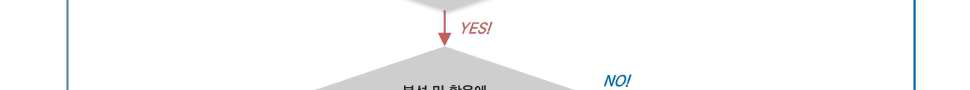

2.5.4
사례로 알아보는 ‘고영향’ 확인 기준
해당 사례
보이스피싱 피해를 당한 시민 A는 경찰에 피해사실을 신고하였는데, 보이스피싱 인출책 B는 이미
A의 계좌에서 900만 원 현금을 인출한 뒤였다. B는 은행 ATM기에서 인출을 할 때 마스크와 선글라스
를 착용하여 CCTV 영상만으로 신원을 확인하기 어려운 상황이다. 경찰관 C는 은행 CCTV에서 촬
영된 영상을 D인공지능시스템(걸음걸이 등 생체정보분석 인공지능시스템)을 활용하여 분석하기로
하였고, 1주일 간의 분석 결과 은행 주변에 설치된 다수의 CCTV가 촬영한 영상에서 동일인의 걸
음걸이로 판단되는 인물이 지나가는 것을 확인하여 B를 검거하였다.
(검토) 경찰관 C가 은행 CCTV에 촬영된 B와 동일한 인물을 찾기 위해 인근에 설치된 다수의 CCTV 영상
에서 수집된 1주일 간의 영상에서 걸어다니는 사람들의 걸음걸이를 인공지능시스템을 활용하여 분석하였다면,
이는 범인 B를 검거하기 위한 ‘범죄 수사나 체포 업무’의 일환으로 ‘생체정보’인 걸음걸이(행동적 특징)를 분
석·활용한 경우에 해당한다.
(결론) 따라서 걸음걸이(생체정보)를 분석하는 D인공지능시스템은 고영향 인공지능에 해당한다.
비해당 사례
시민 A는 자녀 B와 한강 공원으로 나들이를 가서 주말을 보내고 있던 중, 자녀 B가 없어진 것을
뒤늦게 알게 되어 3일 넘게 B를 찾았으나 결국 행방을 알지 못해 경찰에 신고하였다. 관할 지구대
에서 출동한 경찰관 C는 시민 A의 최근 동선을 탐문하여 인근 CCTV 정보를 확인한 뒤 CCTV 관
제센터와 연계된 인공지능시스템을 활용하기 위해 자녀 B의 키, 성별, 안면 사진 등 정보를 전산
에 입력하였다. 해당 인공지능시스템은 3일 전부터 현재까지 CCTV 영상 정보를 실시간으로 분석
하여 자녀 B의 현재 위치를 추적하여 자녀 B의 행방을 찾을 수 있었다.
(검토) 실종아동을 발견하기 위한 활동은 ‘범죄 수사’나 ‘체포’업무에 해당하지 않고, 국가경찰과 자치경찰의
조직 및 운영에 관한 법률 제3조(경찰의 임무) 제1호 소정의 ‘국민의 생명·신체 및 재산의 보호’를 위한 활
동에 불과하다.
(결론) 실종아동의 수색·발견은 「실종아동등의 보호 및 지원에 관한 법률」에 따른 경찰청장의 직무 범위에
따른 단순한 경찰의 행정업무 지원업무 행위로서, 법률의 근거에 따라 법정대리인인 부모 등의 동의를 받아
실종아동 등에 대한 신속한 신고 및 발견 체계를 갖추기 위한 정보시스템에서 인공지능시스템을 활용하는 경우
로 고영향 인공지능에 해당하지 않는다.

► 제2조(정의) 이 법에서 사용하는 용어의 뜻은 다음과 같다.

## 4. “고영향 인공지능”이란 사람의 생명, 신체의 안전 및 기본권에 중대한 영향을 미치

거나 위험을 초래할 우려가 있는 인공지능시스템으로서 다음 각 목의 어느 하나의
영역에서 활용되는 인공지능시스템을 말한다.
사. 채용, 대출 심사 등 개인의 권리·의무 관계에 중대한 영향을 미치는 판단 또는
평가
2.6.1
용어의 정의
구분
주요 내용
채용
Ÿ 채용은 사용자가 필요로 하는 인적자원을 확보하기 위한 모든 활동을 의미하며 크게 모집(Sourcing)과
선발(Selection)로 구분된다.
※ 「공감채용 가이드」 (고용노동부, 2024), 6-7면
Ÿ 채용은 모집 전 적합한 인재의 탐색에서부터 선발과 배치, 그리고 배치된 인재에 대한 관리, 평가,
퇴직의 모든 과정을 아우르는 포괄적인 의미로 사용되나, 본 가이드라인에서는 인재의 탐색에서부터
선발까지 과정을 나타내는 소극적인 의미로 사용한다.
모집
Ÿ 사용자가 필요로 하는 인재를 찾기 위한 일련의 활동을 포괄한다.
선발
Ÿ 지원자들 가운데 사용자가 필요로 하는 인력을 선별하는 활동으로 사용자가 채용 절차 중 선발
과정에서 지원자들이 사용자가 필요로 하는 역량을 갖추었는지, 직무에 적합한지 등을 심사하는
것을 말한다.
판단‧평가
Ÿ 단순히 비교, 분류, 요약, 통계 등의 목적으로 사용되는 인공지능시스템은 제외
Ÿ 인공지능이 도출한 결과를 통해 적성, 역량, 직무 적합성 및 관련성 등 판단 또는 평가
Ÿ 인공지능이 도출한 결과가 일련의 채용 절차에서 지원자를 채용할지 여부에 대해 영향을 미치는 경우
생체정보
Ÿ 지문, 얼굴, 홍채, 정맥, 음성, 필적 등 (i) 개인의 신체적, 생리적, 행동적 특징에 관한 정보로서
(ii) 특정 개인을 인증·식별하거나 (iii) 개인에 관한 특징(연령·성별·감정 등)을 알아보기 위해
(iv) 일정한 기술적 수단을 통해 처리되는 정보
※ 「생체정보 보호 안내서」 (개인정보보호위원회, 2024. 12.), 8면
생체인식정보
Ÿ 생체정보 중 특정 개인을 인증·식별할 목적으로 처리되는 정보를 의미한다.
※ 「생체정보 보호 안내서」 (개인정보보호위원회, 2024. 12.), 8면

2.6.2
적용범위 및 '고영향'의 의미
(적용범위) 채용 전(全) 과정(모집, 서류심사, 필기평가, 면접평가, 실기평가)에서 공정성과 효율성을 높
이기 위하여 사용되는 인공지능시스템을 의미한다.
('고영향'의 의미) 채용 과정에서 활용되는 인공지능시스템이 헌법상 보장된 구직자의 직업선택의 자유 및
평등권에 중대한 영향을 미칠 우려가 있는 판단 또는 평가를 하는 경우 ‘고영향 인공지능’에 해당한다.
2.6.3
‘고영향’ 확인 기준
사용자가 채용 과정에서 활용하는 인공지능시스템이 지원자 채용에 미치는 영향과 실질적인 인적 개입
여부에 따라 고영향 인공지능 해당 여부를 검토할 수 있다. 만약 채용 과정에서 정당한 권한을 가진 사
람에 의한 실질적인 개입이 없거나, 해당 인적 개입이 형식적인 절차만으로 운영되어 실질적으로 인공지
능이 도출한 결과에 의존한다면 이는 ‘고영향 인공지능’에 해당한다.
채용 분야에서 활용되는 인공지능시스템 중 지원자 개인의 의사와 무관하게 인공지능 자체의 분석·결정
에 따라 채용 정보를 제공하거나, 구인자에게 그 지원자의 정보를 제공하는 등 인공지능만으로 후보자
또는 채용 여부를 결정하는 인공지능은 개인의 자율성, 직업선택의 자유, 평등권 등이 제한되어 차별적 결과
를 야기할 위험성이 존재하여 ‘고영향 인공지능’에 해당한다.
ⅰ) 인공지능시스템이 모집 과정에서 스스로 판단하여 개인에게 채용 정보를 제공하는 경우
ⅱ) 인공지능시스템이 구직자의 제출 정보를 프로파일링하고 이를 점수·등급화하여 처리하거나 필기 평가
중 서·논술형 문제를 채점하거나 생체정보를 면접 및 실기에 활용하는 경우
ⅲ) 인공지능시스템이 구인자의 검수 없이 필기 평가 문제를 최종적으로 출제하는 경우
ⅳ) 채용 전 과정에서 인공지능시스템이 도출한 결과만으로 채용 후보자 또는 채용 여부를 결정하는 경
우
※ 단, 채용의 전체적인 절차 및 성격, 특수성, 기업의 제반 사정 등을 종합적으로 고려하여 채용 분야에서의 인공지능시스템 활용에
대한 고영향 여부를 판단한다.

[ ‘고영향 인공지능’ 해당 여부 확인 절차 ]

2.6.4
사례로 알아보는 ‘고영향’ 확인 기준
해당 사례
A 기업에서 활용하는 채용 인공지능시스템인 B시스템은 채용 과정에서의 시간과 비용을
절감하기 위해 사원 채용 지원자의 개인 신상정보와 경력기술서 등 제출 정보를 분석하여
점수·등급화하고, 그 결과에 따라 최적의 지원자를 결정하고 그 지원자에게 합격 통보를 하고
나머지 지원자에게는 탈락 통보를 한다.
(검토) 해당 B인공지능시스템은 구직자의 제출 정보를 프로파일링 및 점수·등급화하며 A기업은 B인공지능
시스템이 도출한 결과만으로 구직자(지원자)들의 채용 여부를 결정하고 있다.
(결론) 따라서 A기업의 경력사원 채용 과정에서의 인공지능 사용은 정당한 권한을 가진 사람에 의한 실질
직인 개입이 없이 구직자(지원자)들의 기본권을 침해할 우려가 있으므로 ‘고영향 인공지능’에 해당한다.
비해당 사례
C 기업에서는 신입사원 채용 과정에서의 공정성을 향상시키기 위해 D인공지능시스템을 활용하여
입사시험 문제를 생성한다. D시스템이 생성한 입사시험 문제는 인사담당자로 지정된 자(E)가
출제된 문제를 감수하여 최종적인 확인(결재)를 하도록 구성되어 있다. 채점과정에서도
D시스템이 활용되며, 인사담당자(E)가 채점 결과를 확인하여 수정·보완 등을 할 수 있는 기능이
제공되고, 오류가 없다는 승인(결재)를 한 경우 최종적으로 채점 결과가 확정된다.
(검토) 해당 D 인공지능시스템은 신입사원의 채용에 활용된 인공지능시스템에는 해당하나 구인자 E의 감수를
거쳐 문제를 출제하였을 뿐 아니라 채점 이후에도 채용자 E가 다시 한번 채점 결과를 확인하는 과정을
수행한다.
(결론) 따라서 인공지능시스템이 출제한 문제를 채용자의 감수한 후에 시험을 시행하였고, 자동으로
채점하였으나 인간이 최종적으로 감수하는 기능을 제공하고 있으므로 ‘고영향 인공지능’에 해당하
지 않는다.

► 제2조(정의) 이 법에서 사용하는 용어의 뜻은 다음과 같다.

## 4. “고영향 인공지능”이란 사람의 생명, 신체의 안전 및 기본권에 중대한 영향을 미치

거나 위험을 초래할 우려가 있는 인공지능시스템으로서 다음 각 목의 어느 하나의
영역에서 활용되는 인공지능시스템을 말한다.
사. 채용, 대출 심사 등 개인의 권리·의무 관계에 중대한 영향을 미치는 판단 또는 평가
2.7.1
용어의 정의
용어
개념
금융회사
Ÿ 다음 각 목의 어느 하나에 해당하는 것을 말한다.
가. 「은행법」에 따른 은행
나. 「중소기업은행법」에 따른 중소기업은행
다. 「한국산업은행법」에 따른 한국산업은행
라. 「한국수출입은행법」에 따른 한국수출입은행
마. 「한국은행법」에 따른 한국은행
바. 「자본시장과 금융투자업에 관한 법률」에 따른 투자매매업자ㆍ투자중개업자ㆍ집합투자업자ㆍ신탁업자ㆍ
증권금융회사ㆍ종합금융회사 및 명의개서대행회사
사. 「상호저축은행법」에 따른 상호저축은행 및 상호저축은행중앙회
아. 「농업협동조합법」에 따른 조합과 그 중앙회 및 농협은행
자. 「수산업협동조합법」에 따른 조합과 그 중앙회 및 수협은행
차. 「신용협동조합법」에 따른 신용협동조합 및 신용협동조합중앙회
카. 「새마을금고법」에 따른 금고 및 중앙회
타. 「보험업법」에 따른 보험회사
파. 「우체국예금ㆍ보험에 관한 법률」에 따른 체신관서
하. 그 밖에 대통령령으로 정하는 기관
거. 「전자금융거래법」에 따른 전자금융업자
※ ｢금융실명거래 및 비밀보장에 관한 법률｣ 제2조제1호 및 ｢전자금융거래법｣ 제2조제3호 등
※ ｢금융실명거래 및 비밀보장에 관한 법률｣ 제2조제1호
금융거래
Ÿ 금융회사 등이 금융자산을 수입(受入)ㆍ매매ㆍ환매ㆍ중개ㆍ할인ㆍ발행ㆍ상환ㆍ환급ㆍ수탁ㆍ등록ㆍ교환
하거나 그 이자, 할인액 또는 배당을 지급하는 것과 이를 대행하는 것 또는 그 밖에 금융자산을 대상
으로 하는 거래로서 총리령으로 정하는 것을 말한다.
※ ｢금융실명거래 및 비밀보장에 관한 법률｣ 제2조제3호
금융상품
Ÿ 다음 각 목의 어느 하나에 해당하는 것을 말한다.
가. 「은행법」에 따른 예금 및 대출
나. 「자본시장과 금융투자업에 관한 법률」에 따른 금융투자상품
다. 「보험업법」에 따른 보험상품
라. 「상호저축은행법」에 따른 예금 및 대출
마. 「여신전문금융업법」에 따른 신용카드, 시설대여, 연불판매, 할부금융
바. 그 밖에 가목부터 마목까지의 상품과 유사한 것으로서 대통령령으로 정하는 것
※ ｢금융소비자 보호에 관한 법률｣ 제2조제1호
대출
Ÿ 개인이나 기업이 필요한 자금을 금융회사로부터 빌리는 것을 말한다.
대출심사
Ÿ 금융회사가 대출 신청인의 신용 및 상환능력을 평가하여 대출 승인 여부와 대출 조건을 결정하는
등 신용 공여 행위 관련 업무처리 과정을 말한다.

2.7.2
적용범위 및 '고영향'의 의미
(적용범위) 대출 심사 등 금융분야에서 ‘고영향 인공지능’의 적용범위는 ➀ 금융업권에서 금융거래나 대고
객서비스에 인공지능시스템을 활용한 경우, 또는 ➁ 비금융업권이라도 인공지능시스템의 활용 결과가 금
융거래에 영향을 미치는 경우 적용한다.
① 금융상품 및 금융서비스의 제공을 위한 업무에 인공지능시스템을 직·간접적으로 활용하거나 활용하고자 하는
금융회사 및 ② 금융상품추천·신용평가 등 금융연관 서비스 제공을 위한 업무에 인공지능시스템을 직·간
접적으로 활용하거나 활용하고자 하는 비금융회사가 이에 해당한다.
Ÿ 금융회사가 신용정보 등에 근거하여 대출 신청인의 신용 및 상환능력을 평가하여 대출의 승인 여부와
대출 조건을 결정하는 데 직접적으로 관련되는 업무에 한한다.
※ 대출 과정에서의 모든 관련 업무(상담, 본인 확인, 신청 접수, 심사 및 승인, 실행 및 사후관리 등)가 ‘대출 심사’에 포함되는 것은 아니
다. 금융회사의 대출 등 신용공여 행위와 직접적으로 관련이 적은 챗봇 서비스, 이상거래탐지서비스(FDS) 등은 ‘대출 심사’에 포함되지
않고, 금융회사 내부 직원관리, 단순 업무 효율화 등 인공지능시스템의 활용으로 고객에게 미치는 영향이 없는 경우도 ‘대출 심사’의 범
위에 포함되지 않는다.
※ 신용공여 행위에 해당하는 경우라도 카드발급, 리스는 대출 희망자의 기본권에 중대한 영향을 미치는 것으로 보기 힘드므로, 해당 업무에
활용되는 인공지능은 고영향 인공지능에 해당하지 않는다.
Ÿ 대출 심사는 “개인의 권리·의무 관계”와 관련되어야 하므로 원칙적으로 개인인 자연인(금융소비자)에 대
한 대출 심사를 의미하지만, 개인사업자가 사업용도로 대출 심사를 받으면서 사업자 정보뿐 아니라 개인
적 정보도 활용되는 경우, 인공지능시스템에 의해 기본권을 침해당할 우려가 있으므로 대출 심사의 적
용범위에 포함된다.
('고영향'의 의미) 인공지능시스템을 통해 대출 심사를 하는 과정에서 금융회사 등이 개인에 대한 부당한 차
별 등 개인의 권익과 안전, 자유에 대해 중대한 영향을 미치는 것을 말한다.
Ÿ 인공지능시스템 활용에 따라 개인의 금융거래계약의 체결·유지 등에 직접적인 차별이 발생하는 경우 개인의
권리에 중대한 영향을 미친다고 볼 수 있으나, 실제 인공지능시스템의 활용 사례별 개인의 권리에 미치는 영
향도를 판단함에 있어서 개별 요소를 종합적으로 고려하는 것이 필요하다.
2.7.3
‘고영향’ 확인 기준
금융회사 등이 사용하는 인공지능시스템이 ‘개인의 권익과 안전, 자유에 대한 중대한 영향을 미칠 수 있는
인공지능시스템’에 해당하는지 또는 ‘금융거래계약의 체결·유지 등에 직접적인 차별을 발생시키는 인공지
능시스템’에 해당하는지를 기준으로 ‘고영향’ 여부를 판단한다.
Ÿ 대출 심사가 이루어지는 맥락적 환경(정책금융인지 일반금융인지 여부, 공공영역인지 민간영역인지 여부
용어
개념
신용평가
Ÿ 신용정보주체의 신용을 판단하는 데 필요한 정보를 수집하고 신용정보주체의 신용상태를 평가하는 것을
말한다.
※ ｢신용정보의 이용 및 보호에 관한 법률｣ 제2조제8호 및 제2조제8호의2 참조
신용공여
Ÿ 대출, 지급보증 및 유가증권의 매입(자금지원적 성격인 것만 해당한다), 그 밖에 금융거래상의 신용위험이
따르는 금융회사의 직접적ㆍ간접적 거래를 말한다.
※ ｢은행법｣ 제2조제1항제7호 참조
정책금융
Ÿ 정부가 정책을 수행하기 위해서 실시하는 대출, 보험, 보증 등 각종 금융 지원을 의미한다.

등)을 고려할 필요가 있으며, 특히 개인에게 유리한 요소로 적용하기 위해 활용되는 데이터의 경우에는
고영향 판단기준을 완화하여 적용할 수 있다.
인공지능시스템이 대출 심사 중간 단계에서 최종 결정에 상당한 영향을 미치는 결정을 하거나 대출 심사
개별 단계를 종합하여 최종 결정을 하는 경우 ‘고영향 인공지능’에 해당하며, 대출 심사에 차별적 데이터
또는 민감한 데이터를 사용하는 경우에도 ‘고영향 인공지능’에 해당한다.
Ÿ 한편, 의사 결정 과정에서 그 결과를 단순 참고하는 경우에는 ‘고영향 인공지능’에 해당하지 않는다.
인공지능시스템이 아래 표 A그룹 2개 항목 이상에 해당하거나 A그룹에 1개 및 B그룹에 2개에 해당하여 4
점 이상인 경우 ‘고영향 인공지능’에 해당한다.
그룹
항목
점수
A
Ÿ 기존 모델보다 파라미터 증가, 학습 데이터 양 또는 유형의 확대 등으로 복잡도가 증가한 신규 모델에
기반한 인공지능시스템
Ÿ 1만명 이상의 금융소비자를 대상으로 하는 인공지능시스템
Ÿ 자동화 정도가 높고 속도가 빨라서 실질적으로 최종 의사결정에 관한 사람의 개입이 불가능한 인공지능
시스템
B
Ÿ 대리 변수(Proxy Variable)1)를 활용하는 빈도가 높은 인공지능시스템
Ÿ 특정 업무영역을 위해 개발 또는 고도화된 인공지능시스템을 다른 업무영역에 일시적으로 또는 단기간
활용하는 경우
Ÿ 국외 데이터를 주로 학습하여 개발된 국외 인공지능시스템을 활용하는 경우
1) 주요 변수를 조사하거나 파악하기 어려울 경우, 그와 상관관계가 높고 조사하기 용이하여 대신 사용할 수 있는 변수

[ ‘고영향 인공지능’ 해당 여부 확인 절차 ]

2.7.4
사례로 알아보는 ‘고영향’ 확인 기준
해당 사례
A은행은 주택담보대출 심사를 위해 개인신용평가 인공지능 모형을 개발하고, 주택담보대출을
신청한 B씨의 개인신용평가심사에 해당 인공지능시스템을 활용하였다.
(검토) A은행은 인공지능기술을 활용하여 개인신용평가 인공지능시스템을 개발하고, 고객에 대한 대출 승인 여
부와 대출 조건을 결정하는 데 활용하였다.
Ÿ 특히 B씨의 대출심사와 직접적으로 관련된 업무에 인공지능시스템을 사용하면서, 인공지능시스템이
“대출 가능 여부 판단”을 전적으로 결정하였다.
(결론) A은행의 개인신용평가 인공지능시스템은 대출 심사 가능여부에 대해 전적으로 결정하였고, 이는 B씨의
권익과 안전, 자유에 대한 중대한 영향을 미칠 수 있으므로, A은행의 개인신용평가 인공지능시스템은 ‘고
영향 인공지능’에 해당한다.
비해당 사례
C상호저축은행은 공공기관과 연계하여 저소득자를 대상으로 한 대출상품을 출시하면서 인공지능
시스템을 활용하여 정책금융 실행 시 최소 기준 충족 여부를 판단한다. 이후 은행원D가 다른
정성적·정량적 요소를 고려하여 저소득자 E씨에 대한 대출 심사를 수행하고 최종 결정하였다.
(검토) C상호저축은행은 일정 기준 이상의 신용도를 가진 고객을 대상으로 대출상품을 출시하면서 소득
수준과 금융지원 필요성 등을 주요 요소로 고려하여 위 대출상품의 대출 승인 여부와 대출 조건을 결정하였
다. 이 과정에서 은행원 D씨는 신용도 관련 인공지능시스템의 정보처리 결과를 단순 참고하여 저소득자 E
씨에 대한 대출을 심사하였다.
(결론) C상호저축은행의 인공지능시스템은 대출 심사 중간 단계에서 최종 결정에 상당한 영향을 미치는 결
정을 하지 않았고, 은행원 D는 인공지능시스템의 판단을 보조적으로 활용하여 E씨에 대한 대출 심사를 수행하였
으므로, C상호저축은행의 인공지능시스템은 ‘고영향 인공지능’에 해당하지 않는다.

► 제2조(정의) 이 법에서 사용하는 용어의 뜻은 다음과 같다.

## 4. “고영향 인공지능”이란 사람의 생명, 신체의 안전 및 기본권에 중대한 영향을 미치

거나 위험을 초래할 우려가 있는 인공지능시스템으로서 다음 각 목의 어느 하나의
영역에서 활용되는 인공지능시스템을 말한다.
아. 「교통안전법」 제2조제1호부터 제3호까지에 따른 교통수단, 교통시설, 교통체계의
주요한 작동 및 운영
2.8.1
용어의 정의
용어
개념
교통수단
Ÿ 사람이 이동하거나 화물을 운송하는데 이용되는 것으로서 다음 각 목의 어느 하나에 해당하는 운송수단을
말한다.
가. 「도로교통법」에 의한 차마 또는 노면전차, 「철도산업발전 기본법」에 의한 철도차량(도시철도를
포함한다) 또는 「궤도운송법」에 따른 궤도에 의하여 교통용으로 사용되는 용구 등 육상교통용으로
사용되는 모든 운송수단(이하 “차량”이라 한다)
나. 「해사안전기본법」에 의한 선박 등 수상 또는 수중의 항행에 사용되는 모든 운송수단(이하 “선박”이라 한다)
다. 「항공안전법」에 의한 항공기 등 항공교통에 사용되는 모든 운송수단(이하 “항공기”라 한다)
교통시설
Ÿ 도로ㆍ철도ㆍ궤도ㆍ항만ㆍ어항ㆍ수로ㆍ공항ㆍ비행장 등 교통수단의 운행ㆍ운항 또는 항행에 필요한 시설과
그 시설에 부속되어 사람의 이동 또는 교통수단의 원활하고 안전한 운행ㆍ운항 또는 항행을 보조하는 교통
안전표지ㆍ교통관제시설ㆍ항행안전시설 등의 시설 또는 공작물을 말한다.
교통체계
Ÿ 사람 또는 화물의 이동ㆍ운송과 관련된 활동을 수행하기 위하여 개별적으로 또는 서로 유기적으로 연계
되어 있는 교통수단 및 교통시설의 이용ㆍ관리ㆍ운영체계 또는 이와 관련된 산업 및 제도 등을 말한다.
차
Ÿ 도로에서 운전되는 교통수단을 의미하며, 자동차, 건설기계, 원동기장치자정거, 자전거 등과 그 밖에 사람·
가축의 힘이나 기타 동력으로 운행되는 교통수단을 포함하여 말한다.
※ ｢도로교통법｣ 제2조제17호
노면전차
Ÿ 도시철도법 제2조제2호에 따른 노면전차로서 도로에서 궤도를 이용하여 운행되는 차를 의미한다.
※ ｢도로교통법｣ 제2조제17호의2
자동차
Ÿ 철길이나 가설된 선을 이용하지 아니하고 원동기를 사용하여 운전되는 차(견인되는 자동차도 자동차의
일부로 본다)로서 다음 각 목의 차를 의미한다.
- 가. 「자동차관리법」 제3조에 따른 다음의 자동차. 다만, 원동기장치자전거는 제외한다.
1) 승용자동차
2) 승합자동차
3) 화물자동차
4) 특수자동차
5) 이륜자동차
- 나. 「건설기계관리법」 제26조제1항 단서에 따른 건설기계
※ ｢도로교통법｣ 제2조제18호
자율주행시스템
Ÿ 자율주행자동차 상용화 촉진 및 지원에 관한 법률 제2조 제1항 제2호에 따른 자율주행시스템을 의미한다.
(이 경우 그 종류는 완전자율주행시스템, 부분 자율주행시스템 등 행정안전부령으로 정하는 바에 따라
세분할 수 있다.)
※ ｢도로교통법｣ 제2조제18호의2

2.8.2
적용범위 및 '고영향'의 의미
(적용범위) 교통안전법 제2조 제1호 가목의 교통수단, 교통시설 및 교통체계에 활용되는 인공지능시스
템을 의미한다.
Ÿ 교통수단 중에서 도로교통법에 의한 차마에 포함되는 ‘자동차’ 특히 자율주행 자동차 등에 활용되는 인공지능시
스템을 포함한다.
용어
개념
부분
자율주행시스템
Ÿ 자율주행시스템의 종류 중 하나로서, 지정된 조건에서 자동차를 운행하되 작동한계상황 등 필요한 경우
운전자의 개입을 요구하는 자율주행 시스템을 말한다.
※ ｢자동차 및 자동차부품의 성능과 기준에 관한 규칙｣ 제111조제1호
조건부 완전
자율주행시스템
Ÿ 자율주행시스템의 종류 중 하나로서, 지정된 조건에서 운전자의 개입 없이 자동차를 운행하는 시스템을
말한다.
※ ｢자동차 및 자동차부품의 성능과 기준에 관한 규칙｣ 제111조제2호
완전
자율주행시스템
Ÿ 자율주행시스템의 종류 중 하나로서, 모든 영역에서 운전자의 개입 없이 자동차를 운행하는 자율주행
시스템을 말한다.
※ ｢자동차 및 자동차부품의 성능과 기준에 관한 규칙｣ 제111조제3호
자율주행자동차
Ÿ 자동차관리법 제2조 제1호의3에 따른 자율주행자동차로서 자율주행시스템을 갖추고 있는 자동차를
의미한다.
※ ｢도로교통법｣ 제2조제18호의3
건설기계
Ÿ 건설기계는 건설공사에서 사용할 수 있는 기계로서 건설기계관리법 시행령 별표 1에 규정된 기계를
의미하고, 건설기계 중에서 건설기계관리법 시행규칙 제73조 제1항에 규정된 건설기계로서 도로교통법
제80조의 운전면허 취득이 필요한 것은 자동차로 분류된다.
※ ｢건설기계관리법｣ 제2조제1호, 제26조제1항 단서, ｢도로교통법｣ 제2조제18호 나목
원동기장치
자전거
Ÿ 다음 각 목의 어느 하나에 해당하는 차를 의미하고, 특별히 규정된 사항을 제외하고 자동차와 동일하게
취급한다.(즉, 자동차와 함께 ‘자동차 등’으로 분류한다.)
- 가. 자동차관리법 제3조에 따른 이륜자동차 가운데 배기량 125CC 이하(전기를 동력으로 하는 경우
에는 최고정격출력 11킬로와트 이하)의 이륜자동차를 의미한다.
- 나. 그 밖에 배기량 125CC 이하(전기를 동력으로 하는 경우에는 최고정격출력 11킬로와트 이하)의
원동기를 단 차(자전거 이용 활성화에 관한 법률 제2조 제1호의2에 따른 전기자전거 및 ｢도로교통법｣
제21호의 3에 따른 실외이동로봇은 제외한다.)를 의미한다.
※ ｢도로교통법｣ 제2조제19호
개인형
이동장치
Ÿ 원동기장치자전거 중 시속 25킬로미터 이상으로 운행할 경우 전동기가 작동하지 아니하고 차체 중량이
30킬로그램 미만인 것으로 행정안전부령으로 정하는 것을 의미하고, 특별히 규정된 사항을 제외하고
자전거와 동일하게 취급한다.(즉, 자전거와 함께 ‘자전거등’으로 분류한다.)
※ ｢도로교통법｣ 제2조제19호의2
자전거
Ÿ 자전거 이용 활성화에 관한 법률 제1조 제1호 및 제1호의2에 따른 자전거 및 전기자전거를 의미한다.
※ ｢도로교통법｣ 제2조제20호
실외이동로봇
(보행자)
Ÿ 지능형 로봇 개발 및 보급 촉진법 제2조 제4호의2에 따른 실외이동로봇 중 제40조의2에 따른 운행안전
인증을 받은 것으로서, 도로교통법상 보행자로 취급되는 실외이동로봇을 의미한다.
※ ｢도로교통법｣ 제2조제21호의3
지능형교통체계
Ÿ 교통수단 및 교통시설에 대하여 전자ㆍ제어 및 통신 등 첨단교통기술과 교통정보를 개발ㆍ활용함으로써
교통체계의 운영 및 관리를 과학화ㆍ자동화하고, 교통의 효율성과 안전성을 향상시키는 교통체계를 의미한다.
※ ｢국가통합교통체계효율화법｣ 제2조제16호
운전
Ÿ 도로에서 차마 또는 노면전차를 그 본래의 사용방법에 따라 사용하는 것(조종 또는 자율주행시스템을
사용하는 것을 포함한다)을 의미한다.
※ ｢도로교통법｣ 제2조제26호

※ 고영향 인공지능의 대상이 되는 교통수단에는 철도, 선박, 항공기도 포함하나 해당 교통수단에 대해서는 영역을 나누어 별도
검토 진행
Ÿ 교통시설 및 교통체계에 관한 인공지능기술은 일반적으로 특정 교통수단과 연계하여 구현되므로, 교통수단
별로 관련 교통시설 및 교통체계에 관한 인공지능시스템도 포함한다.
('고영향'의 의미) 「교통안전법」 제2조 제1호부터 제3호까지에 규정된 교통수단, 교통시설, 교통체계의
안전 보장은 ‘사람의 생명, 신체의 안전’에 직접적인 영향을 미치고, 안전 조치 미비로 인하여 교통사고가
발생하는 경우 사망, 상해 등으로 이어질 수 있다는 점에서 고영향 인공지능으로 판단할 필요성이 있다. 다
만 ‘사람의 생명, 신체의 안전’에 중대한 영향을 미칠 수 있는 교통수단, 교통시설, 교통체계의 ‘주요한 작
동 및 운영’에 사용되는 인공지능시스템으로 한정하여야 한다.
Ÿ 교통수단의 ‘주요한 작동 및 운용’이란 그 주된 사용 목적에 맞게 작동시키거나 운용하는 것을 의미한다.
교통수단 중 도로교통법상 ‘차’의 경우 동 법에 규정된 ‘운전(도로에서 그 본래의 사용방법에 따라 사용)’ 행위를 통해
주요한 작동 및 운용이 이뤄진다. 다만, 도로교통법상 ‘차’에 포함된 건설기계의 경우, ‘주요한 작동 및 운용’
은 도로에서의 사용과 작업 현장에서 그 본래의 사용 방법에 따라 사용한 결과 이뤄지는 동작 및 운용을 포함
한다.(예컨대, 굴삭기의 경우 도로 주행 시와 건설 작업 현장에서 굴삭 작업을 수행하면서 이뤄지는 동작을 포함한다.)
Ÿ 교통시설의 ‘주요한 작동 및 운용’이란 교통안전법의 정의 규정에 따라 그 목적에 맞게 작동 및 운용이
이뤄지는 것을 의미한다. 즉, 교통시설의 ‘주요한 작동 및 운용’이란 교통시설을 통해 사람의 이동 또는
교통수단의 원활하고 안전한 운행, 운항 또는 항행을 보조하는 작동 및 운용을 의미한다. (「교통안전법」
제2조 제2호 참조)
Ÿ 교통체계는 교통수단, 교통시설과 달리 유체물이 아니어서 작동 및 운용의 대상은 아니나, 교통수단 및
교통시설의 이용, 관리, 운영체계 또는 이와 관련된 산업 및 제도를 의미하므로, 교통체계의 ‘주요한 작동
및 운용’은 교통수단과 교통시설의 작동 및 운용을 전제로, 사람 또는 화물의 이동, 운송과 관련된 활동을
수행하기 위하여 개별적으로 또는 서로 유기적으로 연계되어있는 교통수단 및 교통시설을 작동, 운용하는
것을 의미한다. (「교통안전법」 제2조 제3호 참조)

2.8.3
‘고영향’ 확인 기준
자율주행자동차의 자율주행시스템(참고 2-8-2), 자율주행시스템 이외에 차에 적용된 인공지능시스템, 교통시설·교
통체계에 관한 기술로 나누어 ‘고영향’ 인공지능 해당 여부를 검토하기로 한다. 이 밖에도 실무적으로 기타 ‘고영
향’ 인공지능시스템 확인 기준(참고 2-8-1)을 종합적으로 고려하여 판단한다.
(자율주행자동차의 자율주행시스템) 자율주행자동차의 자율주행시스템과 관련된 인공지능시스템은 ① 대체로
도로 주행을 목적으로 하는 기술로서, ② 인공지능시스템이 스스로 판단하여 자동차를 운전하는 데 필요한 의
사결정을 내리고, ③ 자율 도로 주행 중 사고 발생 가능성, 사고 발생 시 인명 피해 가능성을 고려하여야 한
다. 사람의 생명, 신체의 안전에 중대한 영향을 미칠 가능성이 높은 경우, 다른 구체적인 사정이 없는 한
원칙적으로 ‘고영향 인공지능’에 해당한다.
Ÿ (조건부 완전자율주행시스템 이상) 특정 조건(예컨대, 지정된 도로)에 해당하는 경우 어느 상황에서든
운전자의 개입 없이 자동차를 운행하는 것을 전제로 하고 있으므로(자동차 및 자동차부품의 성능과 기준에 관한 규
칙 제111조 제2, 3호 참조), 조건부 완전자율주행시스템 이상의 자율주행시스템과 관련된 인공지능시스템은
‘고영향 인공지능’에 해당한다.
Ÿ (부분 자율주행시스템) 일반적으로 인공지능기술이 주행 제어를 담당하지만 작동 한계 상황 등 필요에 따
라 운전자의 개입을 요구하므로, 자율주행시스템과 관련된 인공지능시스템은 ‘고영향 인공지능’에
해당할 가능성이 높으나, 인공지능시스템이 도로 주행 제어에 관여하지 않고, 법률로 해당 인공지능시
스템에 대한 안전기준이 존재하여 그 기준을 준수하게 되면 사고 발생 시 피해 정도를 현저히 낮출 수
있는 경우 ‘고영향 인공지능’에 해당하지 않는다. 앞선 확인 기준에 따라 ‘고영향 인공지능’에 해당하
는지 여부를 판단하되, 법률로 안전기준이 규정된 기술 유형에 대해서는 이를 참작하여 검토한다.
<참고: 자동차 및 자동차부품의 성능과 기준에 관한 규칙 제111조의3에 따른 별표27>
▸ 1. 자동차로유지기능의 성능기준   (중략)
▸ 2. 운전자모니터링시스템의 성능기준   (중략)
▸ 3. 자율주행정보 기록장치의 성능기준   (중략)
Ÿ (자율주행시스템 미적용 자동차) 인공지능기술이 도로 주행에 관여하더라도, 운전자가 자신의 판단에 따라
직접 운전하는 것을 전제하고 비상 상황에서는 언제든지 운전자가 개입하도록 정해져 있으므로, 인공지능
시스템은 사실상 도로 주행을 위한 의사결정에 보조적인 수단에 해당한다고 보아야 하므로, 원칙적으로
‘고영향 인공지능’에 해당하지 아니한다.

<참고: 자율주행시스템의 기술 분류>
▸ 자율주행시스템은 크게 세 부분(인지, 판단, 제어)으로 분류된다.
▸ 인공지능시스템이 판단, 제어에 관여하는 경우라면 교통수단의 ‘주요한 작동 및 운용’에 관한 의사결정에 관여한다는
의미이므로 고영향 인공지능에 해당할 가능성이 높으나, 인지에 관여하는 경우는 달리 볼 여지가 있다.
▸ 현재 국내에서는 ‘인지(판단을 위한 근거 데이터 제공)’기술에 연구·개발이 집중적으로 이루어진 반면, ‘판단(인지한
바에 따라 의사결정하여 제어 명령)’기술에 대한 연구·개발은 아직 많지 않다. 따라서 자율주행에서의 ‘주요한 작동
및 운영’에 관한 의사결정 과정에서 ‘판단’의 전제가 되는 ‘인지’기술에만 인공지능시스템이 적용되었고, 실질적인
‘판단’ 과정에서는 인공지능시스템이 아니라 규칙 기반의 알고리즘을 따르는 경우라면 단순 의사결정의 근거가 되는
정보를 제공하는 것으로 보아야 하며, 의사결정을 좌우하는 주된 근거에 해당하지 않는다면 고영향 인공지능에 해당하지
않을 수 있다.
▸ 한편 인공지능시스템이 적용된 ‘인지’기술의 경우 자율주행과정의 의사결정에 있어 주된 근거가 되는 경우라 하더라도
추가적인 안전조치가 취해져서 그 의사결정을 교정·번복하여 사람의 생명, 신체의 안전에 대한 중대한 영향을 미칠
가능성을 극히 낮출 수 있다면 고영향 인공지능에 해당하지 않을 수 있다.
(자율주행시스템 이외에 차에 적용된 인공지능시스템) 자율주행시스템 이외에 자동차 또는 그 밖의 차에 적용
된 인공지능시스템의 경우, 차의 주요한 동작에 있어 의사결정에 관여하는 정도, 차의 제어를 위한 의사결정
에 미치는 영향의 정도, 인공지능시스템의 오류 등으로 인한 위험도를 종합적으로 고려하여 ‘고영향 인공
지능’ 해당여부를 판단한다.
Ÿ 다만 인공지능시스템이 차의 기존 필수적 수단을 대체하지 아니하고, 기존의 필수적 수단은 유지한 채
편의 등을 목적으로 추가 요소를 더하는 수준의 보조적 수단에 해당하여, 인공지능시스템의 산출물에 일
부 오류가 발생하더라도 불편을 초래할 뿐 사람의 생명, 신체의 안전에 중대한 영향을 미칠 가능성이 극
히 낮은 경우라면 ‘고영향 인공지능’에 해당하지 아니한다.
(교통시설, 교통체계에 관한 인공지능시스템) 교통시설, 교통체계에 관한 인공지능시스템은 ① 교통시
설, 교통체계의 주요한 동작과 운영과 관련하여 의사결정을 내리는 데 관여하는 정도와 ② 해당 의사결정에
따른 결과로 사고 발생 시 잠재적 피해 정도를 평가하여 ‘고영향 인공지능’ 해당 여부를 정할 필요가 있다.
Ÿ 특히 교통시설, 교통체계에 관한 인공지능시스템의 잠재적 피해 정도를 평가함에 있어서는 아래 예시한
바와 같이 특별한 주의가 필요한 경우를 특정하여 그 경우에 잠재적 피해 정도가 높다고 평가할 수 있다.
① 교통시설, 교통체계에 인공지능시스템이 적용된 결과 교통시설의 주요한 작동, 운용이 연평균 일
교통량이 25,000대 이상인 시가지 도로에 영향을 미치는 경우
※ 도로안전시설 설치 및 관리지침에 따른 교통량이 많아 조명시설을 설치해야 하는 일반도로의 기준은 ‘연평균 일 교통량(AADT)이
25,000대 이상’이다.
② 교통시설, 교통체계에 인공지능시스템이 적용된 결과 교통시설의 주요한 작동, 운용이 스쿨존/교차로/철도건널목
등과 같이 특별히 안전조치가 강화된 곳에 영향을 미치는 경우
Ÿ 다만 법률로 정한 성능평가, 안전기준이 존재하는 경우로서, 인공지능시스템이 해당 기준을 충족하면 사
람의 생명, 신체의 안전에 중대한 영향을 미칠 가능성이 극히 낮다고 평가될 수 있는 경우에는 ‘고영향
인공지능’에 해당하지 않는다.

<참고: 법률로 성능평가기준이 규정된 교통시설 관련 기술 – 자동차·도로교통분야 ITS 성능평가기준 별표 3 내지 별표 9>
‣ [별표 3] 차량번호인식장치(AVI) 성능평가 기준
‣ [별표 4] 차량검지기(VDS) 성능평가 기준
‣ [별표 5] DSRC 교통정보시스템 성능평가 기준
‣ [별표 6] 돌발상황 검지시스템 성능평가 기준
‣ [별표 7] 고속축중기(HS-WIM) 성능평가 기준
‣ [별표 8] 무선접속기술 기반 노변장비(WAVE-RSE) 성능평가
‣ [별표 9] 스마트교차로 시스템(SIS) 성능평가 기준
[ ‘고영향 인공지능’ 해당 여부 확인 절차 ]
2-8-1
(참고) 기타 ‘고영향’ 확인 기준
교통수단 별 확인 외에도 ① 인공지능시스템의 사용 목적, ②주요한 작동 및 운용에 대한 의사결정에 미치

는 영향, ③ 사고 발생 시 잠재적 피해 정도, ④ 별도 규정된 안전기준의 존재 여부 등에 따라서도 ‘고영향
인공지능’  해당여부를 검토해 볼 수 있다.
(인공지능의 사용 목적에 따른 검토) 도로교통법에 의한 ‘차’는 도로에서 주행을 목적으로 운전되는 교통수
단이고, 차의 도로 주행은 해당 차의 운전자를 포함한 탑승자와 도로 주변의 보도를 통행하는 보행자 등
사람의 생명, 신체의 안전에 중대한 영향을 미칠 가능성이 높으므로, 차의 도로 주행과 관련된 인공지능시스
템은 원칙적으로 ‘고영향 인공지능’에 해당한다.
차의 도로 주행과 관련된 인공지능시스템은 차 내·외부에 구현된 요소로서, 차의 외부에서 차의 이동을 제어
하는 교통시설 및 교통체계에 구현된 인공지능도 포함한다.
다만, 차의 도로 주행과 관련된 인공지능이라 하더라도 구체적인 사정을 살펴보아 예외적으로 사람의 생명,
신체의 안전에 중대한 영향을 미칠 가능성이 극히 낮다고 볼 수 있는 경우라면 달리 볼 수 있다.
Ÿ 한편, 차의 운전과 관련된 인공지능시스템이라 하더라도, 도로 주행과 직접적인 관련이 없는 기술이라면
사람의 생명, 신체의 안전에 중대한 영향을 미칠 가능성이 낮을 수 있다. 이 경우에는 원칙적으로 ‘고영
향 인공지능’에 해당하지 않으며, 인공지능시스템의 사용 목적을 구체적으로 살펴보아 ‘고영향 인공지
능’의 해당 여부를 살펴보아야 한다.
Ÿ (주요한 작동 및 운용에 대한 의사결정에 미치는 영향에 따른 분류) 차 또는 교통시설의 주요한 작동 및
운용에 관한 의사결정은 사람의 생명, 신체의 안전에 중대한 영향을 미칠 가능성이 있으므로, ① 인공지
능이 스스로 결정하여 판단한 사항에 따라 사람의 개입 없이 직접 의사결정을 내려 차 또는 교통시설의 주요한
작동 및 운용을 수행하는지 여부, ② 사람이 의사결정을 내리되 인공지능의 산출물이 그 의사결정의 주된
근거가 되는지 여부를 평가하여, 인공지능기술의 결과물로 차 또는 교통시설 등의 주요한 작동 또는 운
용이 어떻게 이뤄질지 결정되는 경우 ‘고영향 인공지능’에 해당한다.
Ÿ 다만, 인공지능의 산출물이 교통수단 등의 주요한 작동 및 운용에 대한 의사결정의 주된 근거가 된다
하더라도, 오류 발생 가능성을 고려한 추가적인 기술적 조치가 적용되어 있어, 적시에 의사결정을 교정
하거나 번복할 수 있고 그 기술적 조치로 사람의 생명, 신체의 안전에 중대한 영향을 미칠 가능성을 극히
낮출 수 있다고 평가될 수 있는 경우에는 ‘고영향 인공지능’에 해당하지 않는다.
Ÿ 한편, 사람이 차 또는 교통시설의 주요한 작동 및 운용을 위한 의사결정을 내리고, 인공지능시스템으로
나타난 결과가 그 사람의 의사결정을 내리는데 있어 크게 영향을 미치지 않고 참고할 수 있는 정보를 제공하
는 정도로서, 인공지능기술이 단순히 사람의 의사결정에 ‘보조적인 역할’을 수행하는 경우라면 ‘고영향
인공지능’에 해당하지 않는다.
Ÿ 인공지능시스템이 스스로 판단하여 교통수단, 교통시설, 교통체계의 주요한 작동 및 운용에 대한 의사결
정을 내린다는 것은, 교통수단, 교통시설 등이 종래의 규칙 기반으로 미리 정해진 논리에 따라 작동 및
운용되지 않고, 인공지능기술이 학습한 데이터에 기반한 추론 결과에 따라 주요한 작동 및 운용에 대
한 의사결정이 내려지는 것을 의미한다.
Ÿ (사고 발생 시 잠재적 피해 정도에 따른 분류) 인공지능시스템의 오류 등으로 인하여 교통수단, 교통시설,
교통체계의 주요한 작동 및 운용에 영향을 미치게 되고, 그 결과 사고가 발생할 가능성이 있는 경우

사고 발생 가능성, 사고 발생 시 인명 피해가 발생할 가능성 및 예상되는 인명 피해의 심각한 정
도에 따라 잠재적 피해 정도를 평가하여 사람의 생명, 신체의 안전에 중대한 영향을 미칠 가능성이 극
히 낮다면 ‘고영향 인공지능’에 해당하지 않는다.
Ÿ 한편, 인공지능기술에 오류가 있다 하더라도, 사고 발생 가능성이 낮고, 사고가 발생한다 하더라도 ‘인
명 피해’ 발생 가능성이 낮으며, 사람의 생명, 신체의 안전에 중대한 영향을 미칠 가능성이 극히 낮
다고 평가되면 고영향 인공지능에 해당하지 않는다.(다만 교통사고 발생 가능성 및 인명 피해 가능성
이 낮다 하더라도 예상되는 인명 피해가 심각한 수준에 이를 수 있다면 ‘고영향 인공지능’에 해당한
다.)
Ÿ (별도로 규정된 안전기준의 존재 여부에 따른 분류) 인공지능시스템에 대한 별도 안전기준을 준수하는 것
으로 사람의 생명, 신체의 안전에 중대한 영향을 미칠 가능성을 극히 낮출 수 있다면 ‘고영향 인공지능’에
해당하지 않는다.
Ÿ 인공지능기술 그 자체에 대한 안전기준이 규정되지 아니한 경우라 하더라도, 인공지능시스템의 일
부로 활용되었음을 전제로 특정 시스템에 대한 안전기준이 규정된 경우에도 안전기준의 준수로 사람의 생
명, 신체의 안전에 중대한 영향을 미칠 가능성을 극히 낮출 수 있다면 ‘고영향 인공지능’에 해당하지 않는
다.

2-8-2
(참고) 자율주행차량 레벨 구분
(자율주행시스템의 유형) 자율주행자동차 상용화 촉진 및 지원에 관한 법률 제2조제1항 제2호에 따
른 자율주행시스템으로서, 그 종류는 자동차 및 자동차부품의 성능과 기준에 관한 규칙 제111조에 따
라 부분 자율주행시스템(레벨3), 조건부 완전자율주행시스템(레벨4), 완전 자율주행시스템(레벨5)으로
구분한다.
① 부분 자율주행시스템(레벨3)은 지정된 조건(예컨대, 특정 구간 내 운전 시)에서 운전자의 개입 없이 자동
차를 운행하되 작동한계상황 등 필요한 경우 운전자의 개입을 요구하는 자율주행시스템을 의미한다.
② 조건부 완전자율주행시스템(레벨4)은 지정된 조건에서 운전자의 개입 없이 자동차를 운행하는 자율주
행시스템을 의미한다. 작동 한계상황과 같은 비상시에도 운전자의 개입 없이 자동차를 운행한다는 점
에서 부분 자율주행시스템(레벨3)과 차이가 있다.
③ 완전 자율주행시스템(레벨5)은 모든 영역에서 운전자의 개입 없이 자동차를 운행하는 자율주행시스템을
의미한다.
2.8.4
사례로 알아보는 ‘고영향’ 확인 기준
□ 자율주행시스템

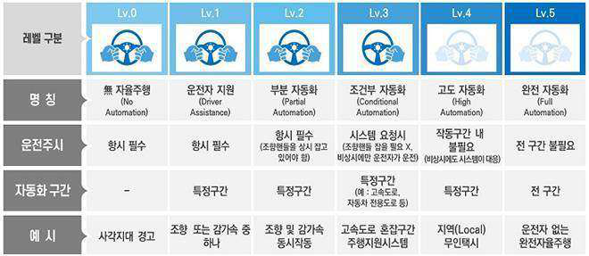

해당 사례
인지단계에서 축적한 정보를 기반으로 인공지능기술을 통해 주행 전략을 결정하는 시스템
(검토) 레벨4 이상 자율주행시스템에 적용되는 인공지능기술로서 지정된 조건에서는 작동한계상황에서도
운전자의 개입없이 인공지능 스스로가 판단한 바에 따라 도로 주행 제어가 이뤄진다.
Ÿ 해당 시스템은 주어진 상황에서 차량의 경로를 생성하고, 전방위험상황을 피한다고 할 때 그래도 정지할 것
인지 혹은 차선을 변경할 것인지 등에 대한 다양한 대안 경로를 고려하여 최적의 선택을 내리게 된다.
(결론) 따라서 시스템 오류로 인하여 사고가 발생하는 경우, 상해·사망 등 중대한 인명 피해가 발생할 가능
성이 있어 ‘고영향 인공지능’에 해당된다.
비해당 사례
운전자의 착석 여부 및 안전띠 착용 여부와 같은 운전자의 상태를 감지하는 운전자모니터링시스템
(검토) 레벨3 자율주행시스템에 적용되는 인공지능시스템으로 운전자가 당연히 인지하고 있어야 하는 사항을
보조하는 수단에 불과하다.
Ÿ 운전자모니터링시스템은 자동차 주행 제어에 필수 요소가 아니며 자동차의 제어를 위한 의사결정에 영향
을 미치는 정도도 낮다. 시스템에 오류가 발생하여 작동 한계 상황인 경우 사람의 개입을 담보할 수는 없
지만, 해당 시스템은 운전자가 당연히 인지해야 하는 사항들을 보조적으로 감지하는 수단에 불과하다.
따라서 사고가 발생한다면 사람의 부주의에 의한 것이므로 인공지능시스템 오류에 따른 사고라고 볼 수
없다.
(결론) 사고 발생 가능성은 사람의 부주의에 따른 것일 뿐이고 인공지능시스템이 사람의 생명, 신체의 안전
에 중대한 영향을 미치는 것은 아니므로 ‘고영향 인공지능’에 해당하지 않는다.
Ÿ 또한, 해당 기술에 대해서는 이미 자동차 및 자동차부품의 성능과 기준에 관한 규칙에 안전기준이 규정
되어 있어 그 기준을 충족한다면 안전이 어느 정도 담보되었다고 볼 수 있다.
Ÿ 특히 운전자모니터링시스템 등 안전성 강화를 위한 인공지능시스템의 경우 안전성에 관련되어 있기는 하
나 인공지능시스템 그 자체의 오류·고장으로 사고 발생 가능성을 증대시키지는 않으므로 고영향에 해
당하지 않는다.
□ 자율주행시스템 이외에 도로교통법에 따른 차
해당 사례
각종 건설 관련 정보를 학습한 인공지능에 의해 건설장비가 작동되고, 인공지능시스템을 통해
분석된 건설장비에 대한 결함 정보도 영상 출력장치를 통해 작업자 등에게 제공되어 원격으로
통제된다.
(검토) 전문 조종사를 대신하여 인공지능기술이 스스로 의사결정을 내려 건설기계를 조작하는 경우에는 사
람의 의사결정을 대체하고 있다.

(결론) 따라서 인공지능의 조작으로 오류 발생 시 건설 현장에서의 사고 발생 가능성, 인명 피해 가능성 및
중상자, 사망자 발생 가능성이 있으므로 원칙적으로 ‘고영향 인공지능’에 해당한다. 다만 사람이 접근하기 어려
운 장소에서만 엄격히 한정하여 활용되는 건설기계에 해당하는 바와 같이 인공지능기술에 오류가 있더라도
인명 피해 가능성이 극히 낮은 경우에는 예외적으로 ‘고영향 인공지능’에 해당하지 않는다.
비해당 사례
인공지능시스템이 전기 자전거에서 사람의 근육 힘과 모터가 내는 동력의 비율을 계산하고
최적의 주행속도ㆍ경로를 적절히 배합하여 주행을 보조한다.
(검토) 자전거의 조작은 전적으로 사람에 의해 이루어지고, 인공지능기술은 사람이 자전거를 조작하고 운
행하는 데 필요한 정보를 제공하거나 이를 단순히 보조하고 사람의 의사결정을 대체한다고 볼 수도 없다. 아
울러 자전거 운행에 보조적인 수단으로 활용되고 있으므로, 사람의 의사결정에 주된 근거로 활용된다고 볼
수도 없다.
(결론) 해당 인공지능시스템은 자전거 운행에 보조적인 수단으로 활용될 뿐이므로 ‘고영향 인공지능’에
해당하지 아니한다.

□ 교통시설·교통체계
해당 사례
도로 지도, 1500개 이상의 교차로 신호 체계를 바탕으로 800여개의 카메라 영상 정보를 함께
분석하여 200개 이상의 대규모 교차로의 통행량을 함께 계산하고, 계산된 데이터를 바탕으로
신호등의 신호를 실시간으로 제어하는 인공지능시스템
(검토) 도로 데이터에 근거하여 신호등의 신호를 자동으로 바꾸는 기술로서, 인공지능기술이 스스로 판단
한 바에 따라 교통시설을 제어하는 기능까지 수행하고 있고, 해당 기술은 광범위한 영역의 신호 체계를 제
어한다.
(결론) 인공지능시스템이 영향을 미치는 대상도 많아져, 교통 사고 발생 가능성의 높고 낮음과 관계없이 잠
재적 사고로 인해 발생할 수 있는 피해 규모가 상당하므로, ‘고영향 인공지능’에 해당한다.
비해당 사례
인공지능기술을 이용하여 교차로에서 차량과 보행자를 실시간으로 감지하여 능동적으로 신호를
생성하는 인공지능 신호시스템
(검토) 인공지능기술은 CCTV로 촬영된 영상에서 차량과 보행자를 인식하는 데 활용될 뿐, 인식된 결과로 교
통신호를 생성하는 시스템은 종래의 규칙 기반에 따른 알고리즘으로 운용되고 있다.
(결론) 교통시설의 주요한 작동·운용에 대한 의사결정이 일부 자동화되었다 하더라도, 신호등의 기본적인
제어는 종래의 규칙 기반에 따른 알고리즘으로 운용되며 해당 알고리즘의 관리는 실질적으로 사람에 의
해 이뤄지므로 ‘고영향 인공지능’에 해당하지 않는다.

► 제2조(정의) 이 법에서 사용하는 용어의 뜻은 다음과 같다.

## 4. “고영향 인공지능”이란 사람의 생명, 신체의 안전 및 기본권에 중대한 영향을 미치거

나 위험을 초래할 우려가 있는 인공지능시스템으로서 다음 각 목의 어느 하나의 영
역에서 활용되는 인공지능시스템을 말한다.
아. 「교통안전법」 제2조제1호부터 제3호까지에 따른 교통수단, 교통시설, 교통체계의
주요한 작동 및 운영
2.9.1
용어의 정의
용어
개념
선박
Ÿ 물에서 항행수단으로 사용하거나 사용할 수 있는 모든 종류의 배로 수상항공기(물 위에서 이동할 수 있는
항공기를 말한다)와 수면비행선박(표면효과 작용을 이용하여 수면 가까이 비행하는 선박을 말한다)을 포함
※ 「해사안전기본법」 제2조 제2호
자율운항
선박
Ÿ 「선박법」 제1조의2에 따른 선박 중 자율단계에 따라 선원, 원격운항자 등 사람의 개입이 전혀 없거나
최소한의 개입 하에 자율운항시스템에 의하여 선박 스스로 운항이 가능한 선박. 자율운항선박의 종류는 다음
각 호와 같이 구분하되, 그 자율등급은 산업통상자원부와 해양수산부의 공동부령으로 정하는 바에 따라 세분화
Ÿ 부분 자율운항선박: 자율운항시스템만으로는 운항할 수 없거나 선원의 승선, 원격운항자의 관리 등 선원,
원격운항자의 개입이 필요한 자율운항선박
Ÿ 완전 자율운항선박: 자율운항시스템만으로 운항할 수 있어 선원, 원격운항자 등 사람의 개입이 필요하지 아니한
자율운항선박
※ 「자율운항선박법」 제2조 제1항
<자율운항선박의 자율화 등급>
단계
내용
자동화된 절차 및
의사지원시스템을 갖춘 선박
Ÿ 일부 기능에 대해 자동화 운용이 가능하지만, 대부분 선원이 승선하여
운용 및 시스템과 기능 제어
원격제어가 가능하며
선원이 승선한 선박
Ÿ 선박이 다른 장소로부터 제어 및 운용되고 있지만 선원은 승선
원격제어가 가능하며
선원이 승선하지 않은 선박
Ÿ 선박이 다른 장소로부터 제어 및 운영되며 선원이 승선하지 않음
완전자율운항선박
Ÿ 선내 운용시스템으로 자체적 결정 및 조치가 가능
※ IMO, “Framework for the regulatory scoping exercise, MSC 99/WP. 9”

2.9.2
적용범위 및 '고영향'의 의미
(적용범위) 선박의 운항과 관련하여 활용되는 인공지능시스템을 의미한다. 특히 해양 안전 향상, 운항 효율
성 증대, 인적 오류 감소, 운항 비용 절감, 환경 보호 등을 목표로 세계 각국에서 활발히 개발 중인 자율
운항선박에 적용되는 인공지능시스템과 관련된 경우가 많다.
Ÿ 해상 교통의 경우 선체의 구조나 시설물에 대한 안전이나 운영에 대한 시스템 안전 규정은 다양하게 마
련되어 있고 해상 교통사고는 중대한 위험으로 파악된다. 반면 선박 시스템에 대한 위험관리 체계는 확
립 중이며, 선박 사고는 규모가 크고 시스템 내·외부의 문제 결합으로 발생되어 복잡성을 띄므로 적용범위
를 신중하게 고려할 필요가 있다.
('고영향'의 의미) 선박 운항에서 인공지능시스템의 오류 또는 잘못된 판단으로 인해 인명 피해나 환경 오염
과 같은 심각한 사고가 발생할 수 있으므로, ‘고영향 인공지능’에 해당된다.
Ÿ 특히, 선원의 개입이 동원되지 않는 완전자율운항선박의 경우, 인공지능이 수행하는 자동 항해, 충돌 회피
시스템, 위급 상황 대응 등의 탐지, 판단, 조치 기능은 인명과 직접적으로 연결된 시스템으로, ‘고영향 인
공지능’으로 관리해야 한다.
용어
개념
자율운항
시스템
Ÿ 자율항해시스템, 자율기관시스템 및 이와 관련된 모든 장치
Ÿ “자율항해시스템”이란 선원의 조작 없이 주변상황에 대한 외부센서 정보, 「지능형 해상교통정보서비스의 제공
및 이용 활성화에 관한 법률」 제2조제2호에 따른 해상교통정보, 「선박교통관제에 관한 법률」 제2조 제1호에
따른 선박교통관제 정보, 자율운항선박의 내부기기 상태에 대한 정보 등 관련 정보를 스스로 인지하고 판단하여
선박을 운항할 수 있게 하는 자율화 장비, 소프트웨어 및 이와 관련된 모든 장치
Ÿ “자율기관시스템”이란 자율운항선박의 추진 및 전력 생산을 담당하는 핵심 기관시스템의 운전 상태를 실시간
모니터링하여 계측 데이터 기반의 진단ㆍ예측을 수행하고 장애 발생 시 원격으로 전문적 정비를 수행할 수
있게 하는 자율화 장비, 소프트웨어 및 이와 관련된 모든 장치
※ 「자율운항선박법」 제2조 제2호

2.9.3
‘고영향’ 확인 기준
선박교통의 위험에 영향을 미치는 인공지능시스템 중 다음의 기능에 따라 ‘고영향 인공지능’ 해당성을
평가한다. (참고 2-9-1)
Ÿ (데이터 정확성 및 처리능력) 인공지능시스템이 수집한 데이터가 얼마나 정확하고, 이를 적절히 분석하여 운
항에 필요한 정확한 정보를 제공하는 지 여부
Ÿ (시스템 신뢰성) 인공지능시스템의 오류 발생 빈도와 시스템 유지보수 필요 빈도
Ÿ (기능 중요도) 인공지능시스템이 수행하는 기능이 선박 운항 및 안전에 얼마나 필수적인지 여부
Ÿ (오작동 시 잠재적 위험성) 인공지능시스템 오류가 발생 시 인명, 환경, 선박 손상에 대한 위험이 발생
할 가능성
Ÿ (비상 시 대응 능력) 비상 상황 발생 시 인공지능시스템의 신속대응능력 및 대체 시스템 존재 여부
[ ‘고영향 인공지능’ 해당 여부 확인 절차 ]

2-9-1
(참고) 자율운항선박의 ‘고영향 인공지능’ 평가 기준
기능 중요도(Criticality of Function): 인공지능이 수행하는 기능이 선박의 안전과 운항에 직접적인 영향을 미치
는 정도를 평가
Ÿ 필수적 기능: 인공지능이 없으면 선박의 안전이 심각하게 위협받는가?
Ÿ 보조적 기능: 인공지능이 없으면 선박의 운항이 일부 제한되지만, 대체할 수 있는 다른 시스템이 존재하는
가?
Ÿ 선택적 기능: 인공지능이 없다 하더라도 선박 운항에 직접적인 영향을 미치지 않는가?
데이터 정확성 및 처리 능력(Data Accuracy and Processing): 인공지능이 선박 운항에 필요한 실시간 데
이터를 얼마나 정확하게 처리하고, 이를 바탕으로 올바른 결정을 내릴 수 있는지를 평가
Ÿ 데이터 수집 정확성: 센서 및 장치로 수집한 데이터가 정확하고 신뢰할 수 있는가?
Ÿ 데이터 분석 신뢰성: 수집된 데이터를 인공지능이 적절히 분석하여 운항에 필요한 정확한 정보를 제공
할 수 있는가?
시스템 신뢰성(Reliability of System): 인공지능이 얼마나 일관되게 기능을 수행하는지 평가하며 오류율
이 낮고 지속적으로 신뢰할 수 있는 시스템일수록 위험성을 낮게 평가
Ÿ 오류 발생 빈도: 시스템에서 오류가 발생할 가능성은 얼마나 되는가?
Ÿ 시스템 유지관리 빈도: 해당 인공지능시스템은 얼마나 자주 유지보수가 필요한가?
오작동 시 잠재적 위험성(Potential Risk of Malfunction): 인공지능이 오작동했을 때 선박, 인명, 환경에
미치는 영향을 평가
Ÿ 인명 안전 위협: 시스템 오류 시 선박 탑승자의 생명에 대한 위협이 발생할 수 있는가?
Ÿ 환경 위험: 오작동 시 해양 오염이나 환경 손상이 발생할 수 있는가?
Ÿ 선박 손상 위험: 선박의 손상이나 고장으로 이어질 수 있는가?
비상 시 대응 능력(Emergency Response Capability): 인공지능이 비상 상황에서 얼마나 신속하고 정
확하게 대응할 수 있는지 평가
Ÿ 비상상황 인지 능력: 비상상황 발생 시 시스템이 상황을 즉각적으로 인지할 수 있는가?
Ÿ 대응 신속성: 비상 상황 발생 시 신속하게 적절한 대응을 할 수 있는가?
Ÿ 대체 시스템 존재 여부: 비상 상황에서 인공지능시스템이 실패했을 때 대체할 수 있는 다른 시스템이 존
재하는가?
2.9.4
사례로 알아보는 ‘고영향’ 확인 기준

해당 사례
A 선사에는 선박 운항의 효율성을 높이기 위해 선박 자율 제어 기술을 통한 자율운항 인공지능
시스템을 활용하고 있다.
(검토) 자율운항시스템 중 선박 자율 제어 기술에 해당되며, 승무원 및 승객들의 생명, 신체 및 안전과 직
접적으로 연관된다.
Ÿ A 선사에서 운영하는 시스템은 선박의 운항상황과 장비 및 시스템의 상태에 따라 항로 재계산과 엔진 제어 등을 포
함한 다양한 기능을 실시간으로 처리한다.
Ÿ 이 과정에서 인공지능시스템은 높은 데이터 정확성과 처리 능력이 요구되며, 오류 발생이나 유지보수 요
구가 과도해서는 안 된다. 또한 수행하는 자율 제어 기능은 선박 운항과 안전에 필수적이고, 오작동 시
인명, 환경, 선박 손상에 대한 위험이 발생할 가능성이 크다. 더불어 비상 상황에서 즉각적인 대응이 어
려울 수 있다.
(결론) 따라서 A 선사에서 사용하는 자율운항 인공지능시스템은 ‘고영향 인공지능’에 해당한다.
비해당 사례
B 선사에서는 원격관제를 위해 자동보고기술을 사용한 인공지능시스템을 통해 육지와 선박,
선박 간 관제를 실시하고 있다.
(검토) 해당 시스템은 원격운영센터 및 항만 트래픽 관리를 위한 자동화 서비스에 관련된 정보를 교환하는
기능을 수행한다.
Ÿ 해당 인공지능시스템은 레이더와 식별 장치의 데이터를 수집하고 항만 내 전체 선박 위치 정보를 종합해 선박
에 제공한다. 다만 비상 상황과 관련된 경우에는 원격운항자가 직접 정보를 확인하고 인공지능 관제시스템을
통해 선박에 전달한다.
Ÿ 시스템은 데이터 정확성과 처리 능력이 요구되며, 오류 발생이나 유지보수 요구가 과도하지 않아야 한다.
그러나 해당 시스템의 주요 역할은 관제 지원으로, 선박 운항과 안전에 필수적인 자율 제어 기능을 직접
수행하지 않는다. 오작동 시 위험이 발생할 가능성은 있으나, 비상시 원격운항자가 직접 대응할 수 있다.
(결론) 따라서 B 선사에서 사용하는 원격관제 인공지능시스템은 ‘고영향 인공지능’에 해당하지 않는다.

► 제2조(정의) 이 법에서 사용하는 용어의 뜻은 다음과 같다.

## 4. “고영향 인공지능”이란 사람의 생명, 신체의 안전 및 기본권에 중대한 영향을 미치거나

위험을 초래할 우려가 있는 인공지능시스템으로서 다음 각 목의 어느 하나의 영역
에서 활용되는 인공지능시스템을 말한다.
아. 「교통안전법」 제2조제1호부터 제3호까지에 따른 교통수단, 교통시설, 교통체계의
주요한 작동 및 운영

### 2.10.1 용어의 정의

용어
개념
항공기
Ÿ 공기의 반작용(지표면 또는 수면에 대한 공기의 반작용은 제외한다. 이하 같다)으로 뜰 수 있는 기기로서
최대이륙중량, 좌석 수 등 국토교통부령으로 정하는 기준에 해당하는 비행기, 헬리콥터, 비행선, 활공기
(滑空機)와 그 밖에 대통령령으로 정하는 기기
Ÿ 위의 “최대이륙중량, 좌석 수 등 국토교통부령으로 정하는 기준”은 아래와 같음

## 1. 비행기 또는 헬리콥터

가. 사람이 탑승하는 경우: 다음의 기준을 모두 충족할 것
1) 최대이륙중량이 600킬로그램(수상비행에 사용하는 경우에는 650킬로그램)을 초과 할 것
2) 조종사 좌석을 포함한 탑승좌석 수가 1개 이상일 것
3) 동력을 일으키는 기계장치(이하 “발동기”라 한다)가 1개 이상일 것
나. 사람이 탑승하지 아니하고 원격조종 등의 방법으로 비행하는 경우: 다음의 기준을 모두 충족할 것
1) 연료의 중량을 제외한 자체중량이 150킬로그램을 초과할 것
2) 발동기가 1개 이상일 것

## 2. 비행선

가. 사람이 탑승하는 경우 다음의 기준을 모두 충족할 것
1) 발동기가 1개 이상일 것
2) 조종사 좌석을 포함한 탑승좌석 수가 1개 이상일 것
나. 사람이 탑승하지 아니하고 원격조종 등의 방법으로 비행하는 경우 다음의 기준을 모두 충족할 것
1) 발동기가 1개 이상일 것
2) 연료의 중량을 제외한 자체중량이 180킬로그램을 초과하거나 비행선의 길이가 20미터를 초과할 것

## 3. 활공기: 자체중량이 70킬로그램을 초과할 것

Ÿ 한편, 위의 “대통령령으로 정하는 기기”란 다음 각 호의 어느 하나에 해당하는 기기를 말함

## 1. 최대이륙중량, 좌석 수, 속도 또는 자체중량 등이 국토교통부령으로 정하는 기준을 초과하는 기기*

## 2. 지구 대기권 내외를 비행할 수 있는 항공우주선

※ 1. ｢항공안전법｣ 시행규칙 제4조제1호부터 제3호까지의 기준 중 어느 하나 이상의 기준을 초과하거나 같은 조 제4호부터
제7호까지의 제한요건 중 어느 하나 이상의 제한요건을 벗어나는 비행기, 헬리콥터, 자이로플레인 및 동력패러슈트

## 2. ｢항공안전법｣ 시행규칙 제5조제5호 각 목의 기준을 초과하는 무인비행장치

운항통제
Ÿ 항공기의 안전성과 비행의 정시성 및 효율성 확보를 위하여 비행의 시작, 지속, 우회 또는 취소에 대한
권한을 행사하는 것
※ ｢고정익항공기를 위한 운항기술기준｣ 1.1.1.4조 제51호

### 2.10.2 적용범위 및 '고영향'의 의미

(적용범위) 항공교통 분야에서 항공기의 직접적인 운항, 안전시설 및 장비 운용에 사용되는 인공지능시
스템을 의미한다.
('고영향'의 의미) 항공교통 분야는 교통수단의 특성상 인공지능시스템의 오류 또는 잘못된 판단으로 인해 다수
의 인명 피해를 수반하는 심각한 사고가 발생할 가능성이 크므로, 항공교통 분야에 사용되는 인공지능은
모두 ‘고영향 인공지능’에 해당한다고도 볼 수 있을 것이다. 다만, 항공교통 분야에서 사용되는 현행 항공
교통 관련 법령에서 정하고 있는 위험도 기준을 적절하게 반영하여 ‘고영향 인공지능’ 해당여부를 판단
한다.
용어
개념
항공교통관제
Ÿ “항공교통관제(인공지능r Traffic Control) 업무”라 함은 공항, 이․착륙 또는 항로상에 있는 항공기의 안
전하고, 질서 있고 원활한 교통을 도모하기 위하여 행하는 업무
※ ｢고정익항공기를 위한 운항기술기준｣ 1.1.1.4조 제83호
항공기사고
Ÿ 사람이 비행을 목적으로 항공기에 탑승하였을 때부터 탑승한 모든 사람이 항공기에서 내릴 때까지 [사람이
탑승하지 아니하고 원격조종 등의 방법으로 비행하는 항공기(이하 “무인항공기”라 한다)의 경우에는 비행을
목적으로 움직이는 순간부터 비행이 종료되어 발동기가 정지되는 순간까지를 말한다] 항공기의 운항과
관련하여 발생한 다음 각 목의 어느 하나에 해당하는 것으로서 국토교통부령으로 정하는 것*
가. 사람의 사망, 중상 또는 행방불명
나. 항공기의 파손 또는 구조적 손상
다. 항공기의 위치를 확인할 수 없거나 항공기에 접근이 불가능한 경우
* 위의 ‘국토교통부령으로 정하는 것’의 적용기준 및 범위는 매우 상세하여 본문에서는 생략함
항공기준사고
Ÿ 항공안전에 중대한 위해를 끼쳐 항공기사고로 이어질 수 있었던 것으로서 국토교통부령으로 정하는 것*
* 위의 ‘국토교통부령으로 정하는 것’은 항공안전법 시행규칙 [별표 2]와 같음
항공안전장애
Ÿ 항공기사고 및 항공기준사고 외에 항공기의 운항 등과 관련하여 항공안전에 영향을 미치거나 미칠 우려가
있는 것
항공안전
위해요인
Ÿ 항공기사고, 항공기준사고 또는 항공안전장애를 발생시킬 수 있거나 발생 가능성의 확대에 기여할 수
있는 상황, 상태 또는 물적·인적요인 등
위험도
(Safety risk)
Ÿ 항공안전위해요인이 항공안전을 저해하는 사례로 발전할 가능성과 그 심각도
도심항공교통
Ÿ 사람 또는 화물의 운송과 관련된 활동을 수행하기 위하여 개별적으로 또는 서로 유기적으로 연계되어
있는 도심형항공기, 버티포트 및 도심항공교통회랑 등의 이용·관리·운영체계
도심형항공기
Ÿ 「항공안전법」 제2조제1호에 따른 항공기 또는 이에 준하는 기기 중 도심에서도 운항하기에 적합한 기기
로서 국토교통부장관이 「국가통합교통체계효율화법」 제106조에 따른 국가교통위원회(이하 “국가교통위원
회”라 한다)의 심의를 거쳐 고시한 것

### 2.10.3 ‘고영향’ 확인 기준

항공교통의 위험에 영향을 미치는 ①운항 ②항공교통관제 및 운항통제 ③항공기 설계·제작 및 정비등
분야에서 사용되는 인공지능시스템 중에서
인공지능이 전부 또는 일부에 대하여 독립적으로 최종 의사결정을 하며,
의사결정의 대상이 심각도가 ‘C’이상이고 (참고 2-10-1, [위해요인별 발생결과의 심각도 구분]), 발생가능성이
‘높음’ 이상(참고 2-10-1, [위해요인별 발생결과의 빈도])인 항공기 사고를 일으킬 위험성이 존재하는
경우 ‘고영향 인공지능’에 해당한다.
※ 「항공안전데이터 처리 및 활용에 관한 규정」(국토교통부 훈령)에 명시된 발생 가능성과 심각도를 기준으로 판단
[ ‘고영향 인공지능’ 해당 여부 확인 절차 ]

2-10-1 참고: 항공교통 분야의 위험도 평가 기준
항공교통 분야에서는 항공안전법이 항공기 등록과 기술기준 및 형식증명, 항공종사자 자격증명, 항공기
운항, 항공교통관리 등에 관한 일반적인 내용을 규정하고 있으며, 항공안전법의 하위 규정인 「국가항공안
전프로그램」(국토교통부고시)은 항공안전에 관한 국가 정책, 달성목표 및 조직체계, 항공안전 위험도 관
리, 항공안전보증, 항공안전증진, 항공안전데이터등의 수집, 처리 및 보호 등에 관한 사항을 규정하고 있
다.
한편, 「항공안전관리시스템 승인 및 모니터링 지침」(국토교통부훈령)이 따라 항공안전관리시스템을 운
용하는 항공운송사업자, 항공기정비업자, 항공교통관제기관, 공항운영자 및 항행안전시설의 설치자·관리
자 등의 항공안전관리시스템을 승인하고, 승인사항에 대한 이행을 지도·감독하기 위해 필요한 사항을 규정
하고 있다.
Ÿ 국제적으로는 ICAO(International Civil Aviation Organization, 국제민간항공기구)가 정한 안전관리기
준이 적용되고 있다.
「국가항공안전프로그램」은 국가항공체계 전반에 영향을 주는 위해요인, 새롭게 출현하는 안전리스크의 경
향 등 안전문제를 식별하고(제35조), 이에 따라 발굴한 위해요인에 따른 잠재결과의 발생빈도 및 심각도를
분석하여 해당 위해요인에 대한 위험도를 평가하고 산출하도록 하면서, 이에 관한 세부 사항은 「항공안전데
이터 처리 및 활용에 관한 규정」(국토교통부훈령)에 따라 실시하도록 규정하고 있다.(제36조)
「항공안전데이터 처리 및 활용에 관한 규정」은 항공교통 분야에서 국가위해요인으로 나타난 발생결과의
‘발생빈도’ 및 ‘심각도’를 아래와 같이 산출한다.(제55조)
Ÿ 단, 도심항공교통 분야의 경우 실증사업구역 또는 시범운용구역에서 규제특례가 적용되어 항공안전법
등의 일부 조항의 적용이 배제되나, 일반적으로는 항공안전법 및 「국가항공안전프로그램」, 「항공안전데
이터 처리 및 활용에 관한 규정」이 적용되므로, 앞서 살펴본 위험도 평가 기준이 동일하게 적용하는 것
을 원칙으로 해석한다.
[ 위해요인별 발생결과의 빈도 ]
구분
발생 가능성
정량적 판정 기준
1회 이상 발생하는 비행시간
2백만 비행시간으로 환산
매우 높음
(Frequent)
~ 1만 시간 미만
일 단위
높음
(Occasional)
1만 시간 이상 ~ 10만 시간 미만
2주 단위
보통
(Remote)
10만 시간 이상 ~ 100만 시간 미만
월~분기 단위
낮음
(Improbable)
100만 시간 이상 ~ 1,000만 시간 미만
반기~연간 단위
매우 낮음
(Extremely Improbable)
1,000만 시간 이상 ~
5년 이상에 해당하는 단위

[ 위해요인별 발생결과의 심각도 구분 ]
구분
위험 구분
인명피해
항공기파손
운영상에 끼친 영향
위해요인 평가결과
A
매우 심각
(Catastrophic)
Ÿ 별표 3에 따른
사망자 발생
Ÿ 별표 3에 따른
항공기 전파
-
Ÿ 항공기 사망사고
Ÿ 해당 위해 요인이 사망사고
또는 항공기 전파 사고에
준하는 것으로 판단되는
경우로 운항 상의 막대한
영향을 미칠 수 있거나,
항공기 탑승자의 위험으로
발전될 수 있는 것으로
판단되는 경우
B
위험
(Hazar dous)
Ÿ 별표 3에 따른
중상자 발생
Ÿ 별표 3에 따른
항공기 대파
Ÿ 항공기에
장착된
주요장비,
구성품의 손상
Ÿ 안전한계(Safety
Margin)가 크게
축소된 경우
Ÿ 종사자가 업무를
정확하게 또는
완전히 수행할 수
없도록 만드는
신체적 고통이나
업무량 부하
Ÿ 항공기 사고(비사망)
Ÿ 해당 위해 요인이 비사망
사고 또는 항공기 대파
사고에 준하는 것으로 판단
되는 경우로 운항 상의
심각한 영향을 미칠 수
있거나, 관련 구체적인
위험정보에 따라 즉각적
안전조치를 요하는 것으로
판단되는 경우
C
중요
(Major)
Ÿ 별표 3에 따른
경상자 발생
- 항공기 파손,
운항영향,
위해요인 평가
등을 고려하여
Ÿ 별표 3에 따른
항공기 대파
- 단, 항공기에
장착된 주요
장비, 구성품의
손상에 해당하는
경우는 제외한다
Ÿ 안전한계가 축소
되어 정상적인 업무
수행이 불가한 경우
Ÿ 항공기 준사고
Ÿ 항공안전장애이나 항공기
준사고에 준하게 운항 상에
영향이 상당하다고 판단
되는 경우
나아가, 「항공안전데이터 처리 및 활용에 관한 규정」은 위와 같은 국가위해요인의 위험도를 다음과 같은
방식으로 평가하고 있으며(제56조), 위험도 평가결과에 따른 조치수준의 기준은 아래와 같다.(제57조)
[ 위험도 평가 매트릭스 ]
구분
심각도
매우심각
A
위험
B
중요
C
경미
D
매우 경미
E
발생가능성
매우높음 5
5A
5B
5C
5D
5E
높음     4
4A
4B
4C
4D
4E
보통     3
3A
3B
3C
3D
3E
낮음     2
2A
2B
2C
2D
2E
매우 낮음 1
1B
1C
1D
1E
※ 평가결과 “1A”는 각종 전문가 의견 등을 고려하여 2등급 또는 3등급으로 구분가능하다.

[ 위험도 평가결과에 따른 조치수준 기준 ]
위험도
위험 경감을 위한 조치 수준
보고범위
1등급
(심각, 수용불가)
① 현재 상태로 수용 불가
② 최우선적 위험도 경감조치 즉시 수행 필요
③ 최우선적 위험도 경감조치가 즉시 수행 불가한 경우 운영 중단
④ 사실조사 실시
항공정책실장
2등급
(경계, 수용가능성 검토)
① 위험도 경감조치를 통해 수용 가능
② 사실조사 실시
항공정책실장
3등급
(주의, 수용가능성 검토)
① 위험도 경감조치를 통해 수용 가능
② 검토를 통해 경감조치 없이도 수용 가능
(전문가 검토, 의사결정 과정 등 필요)
항공안전정책관
4등급
(경미, 수용가능)
① 허용 가능한 상태로서 추가 위험도 경감조치 불필요
담당 부서장

### 2.10.4 사례로 알아보는 ‘고영향’ 확인 기준

해당 사례
A공항에서는 인공지능시스템 기반으로 항공기의 경로를 실시간으로 모니터링하고 공항의 혼잡도를
분석하여, 비행기 간 충돌을 예방하고 효율적인 항로를 제시하는 B인공지능시스템을 항공교통
관제에 사용 중이다.
(검토) 항공교통 관제에 사용되는 인공지능시스템은 항공교통관제 및 운항통제에 해당되며, 승무원 및 승
객들의 생명, 신체 및 안전과 연관이 있다.
Ÿ B인공지능시스템은 기상 정보, 항공기의 위치, 속도, 고도 등 실시간 데이터를 빠르게 분석하고 데이터 기
반으로 비행경로, 항로 혼잡도, 날씨 조건 등을 예측하고 비행경로를 자동으로 조정할 수 있다. 또한 항공기
간 충돌을 방지하기 위해 항공기의 위치, 고도, 속도 등을 실시간으로 추적하고 충동 위험이 있는 상황을 자동으
로 감지하여 관제사에게 자동 경고를 제공한다.
Ÿ 그렇다면 B시스템은 심각도 ‘매우 심각’, 발생 가능성 ‘매우 높음’으로써 위험도 1등급(5A)에 해당하므로
‘고영향 인공지능’으로 평가할 필요가 상당하다.
(결론) 따라서 항공교통 관제에 사용하는 B인공지능시스템은 ‘고영향 인공지능’에 해당한다.
비해당 사례
C항공사는 D인공지능시스템을 통해 운항 중인 객실 내에서 승객의 행동을 분석하여 비상 상황에
대비하여 신속한 대처방안을 승객에게 제시하고 있다.
(검토) D인공지능시스템은 승무원의 업무를 지원하고, 비상 상황에서 빠르고 정확한 대응을 할 수 있도록 하여
객실 내 승객들의 안전을 보장하는 시스템이다.
Ÿ 인공지능시스템은 기내 CCTV를 통해 승객들을 감시하여 승객의 건강과 위험한 행동을 사전에 발견하고,
객실 내의 온도, 습도, 압력 등을 모니터링 하여 객실 내에서 발생할 수 있는 비상 상황을 감지하고 승무원
에게 경고를 보내거나 승객들에게 비상 안내를 할 수 있다.
(결론) 따라서 항공교통의 위험에 영향을 미치는 ①운항 ②항공교통관제 및 운항통제 ③항공기 설계·제작
및 정비 등 분야에서 사용되는 인공지능시스템에 해당하지는 않으므로, D인공지능시스템은 ‘고영향 인공
지능’에 해당하지 않는다.

► 제2조(정의) 이 법에서 사용하는 용어의 뜻은 다음과 같다.

## 4. “고영향 인공지능”이란 사람의 생명, 신체의 안전 및 기본권에 중대한 영향을 미치

거나 위험을 초래할 우려가 있는 인공지능시스템으로서 다음 각 목의 어느 하나의
영역에서 활용되는 인공지능시스템을 말한다.
아. 「교통안전법」 제2조제1호부터 제3호까지에 따른 교통수단, 교통시설, 교통체계의
주요한 작동 및 운영

### 2.11.1 용어의 정의

철도교통은 교통수단으로서의 ‘철도’, 철도의 운행에 필요한 ‘철도시설’, 철도와 철도시설의 이용ㆍ관리
ㆍ운영체계 또는 이와 관련된 산업 및 제도에 해당하는 ‘철도교통체계’를 포괄한다.
Ÿ 이러한 철도교통의 운영은 철도차량의 정비 및 열차의 운행관리를 통해 철도 여객 및 화물을 운송하는
것에서 더 나아가 철도시설·철도차량 및 철도부지 등을 활용한 부대사업개발 및 서비스 제공에 이르는
범위를 아우르게 된다.
용어
개념
철도
Ÿ 여객 또는 화물을 운송하는 데 필요한 철도시설과 철도차량 및 이와 관련된 운영ㆍ지원체계가 유기적으로
구성된 운송체계
※ 「철도산업발전기본법」 제3조제1호, 「철도건설법」 제2조제1호
철도운영
Ÿ 철도와 관련된 다음 각 목의 어느 하나에 해당하는 것을 말함

## 1. 철도 여객 및 화물 운송

## 2. 철도차량의 정비 및 열차의 운행관리

## 3. 철도시설ㆍ철도차량 및 철도부지 등을 활용한 부대사업개발 및 서비스

※ 「철도산업발전기본법」 제3조제3호
철도차량
Ÿ 선로를 운행할 목적으로 제작된 동력차ㆍ객차ㆍ화차 및 특수차
※ 「철도산업발전기본법」 제3조제4호
철도시설
Ÿ 다음 어느 하나에 해당하는 시설(부지를 포함)

## 1. 철도의 선로(선로에 부대되는 시설을 포함한다), 역시설(물류시설ㆍ환승시설 및 편의시설 등을

포함한다) 및 철도운영을 위한 건축물ㆍ건축설비

## 2. 선로 및 철도차량을 보수ㆍ정비하기 위한 선로보수기지, 차량정비기지 및 차량유치시설

## 3. 철도의 전철전력설비, 정보통신설비, 신호 및 열차제어설비

## 4. 철도노선간 또는 다른 교통수단과의 연계운영에 필요한 시설

## 5. 철도기술의 개발ㆍ시험 및 연구를 위한 시설

## 6. 철도경영연수 및 철도전문인력의 교육훈련을 위한 시설

## 7. 그 밖에 철도의 건설ㆍ유지보수 및 운영을 위한 시설

※ 「철도산업발전기본법」 제3조제2호
철도교통체계
Ÿ 사람 또는 화물의 이동ㆍ운송과 관련된 활동을 수행하기 위하여 개별적으로 또는 서로 유기적으로 연계되어
있는 교통수단 및 교통시설의 이용ㆍ관리ㆍ운영체계 또는 이와 관련된 산업 및 제도
※ 「교통안전법」 제2조제3호
선로
Ÿ 철도차량을 운행하기 위한 궤도와 이를 받치는 노반 또는 공작물로 구성된 시설

### 2.11.2 적용범위 및 활용의 의미

(적용범위) 철도분야 전반에서 사용되는 인공지능을 의미하며 철도차량, 철도시설, 철도교통 체계에서 활
용되는 인공지능시스템으로 세분화할 수 있다.
Ÿ (철도차량) 철도차량의 운행 및 철도차량 보수ㆍ정비에 인공지능시스템이 활용되고 있다.
Ÿ (철도시설) 선로, 역 시설(물류시설ㆍ환승시설 및 편의시설 등), 철도 운영을 위한 건축물ㆍ건축설비, 선
로 및 철도차량 보수ㆍ정비 시설(선로보수기지, 차량정비기지, 차량유치시설), 전력설비, 정보통신설비,
신호 및 열차제어설비, 철도노선 간 또는 다른 교통수단과의 연계운영에 필요한 교통연계 시설, 철도안전
관련 시설, 안내시설 등에서 인공지능이 활용되고 있다.
Ÿ (철도교통체계) 철도교통의 이용을 지원하는 기술, 노선조정 및 열차스케줄 최적화 등 효율적인 열차 운행
관리 기술, 철도시설 통합관리 등에서 인공지능이 활용되고 있다.
(활용의 의미) 인공지능시스템 오류 발생 시 인명, 재산 또는 환경에 해로운 결과를 가져오는 철도사고(참고
2-11-1)를 유발할 수 있으므로 ‘고영향 인공지능’에 해당할 가능성이 높다.
Ÿ 인공지능시스템은 철도 분야에서의 위험을 낮추는 목적으로 도입되고 있지만 비상대응에 있어 인공지
능시스템의 도입이 오히려 기존 비상대응 시스템을 무력화함으로써 위험을 증가시킬 여지가 있어
‘고위험 인공지능’에 해당한다.
용어
개념
※ 「철도산업발전기본법」 제3조제5호
철도시설의
유지보수
Ÿ 기존 철도시설의 현상유지 및 성능향상을 위한 점검ㆍ보수ㆍ교체ㆍ개량 등 일상적인 활동
※ 「철도산업발전기본법」 제3조제7호
관제업무
Ÿ 철도차량의 운행을 집중 제어ㆍ통제ㆍ감시하는 업무
※ 「철도안전법」 제2조제10호나목
철도운영자
Ÿ 철도산업발전기본법 제21조제3항에 따라 설립된 한국철도공사 등 철도운영에 관한 업무를 수행하는 자
※ 「철도산업발전기본법」 제2조제10호
안전관리체계
Ÿ 철도운영을 하거나 철도시설을 관리하려는 경우에는 인력, 시설, 차량, 장비, 운영절차, 교육훈련 및 비상
대응계획 등 철도 및 철도시설의 안전관리에 관한 유기적 체계
※ 「철도안전법」 제7조제1항

2-11-1 (참고) 철도사고의 요인과 철도안전
(철도사고의 유형과 기여요인)
Ÿ ‘철도사고’란 철도 운영 또는 철도시설 관리와 관련하여, 발생한 인명·재산·환경에 해로운 결과를 초래
하는 예기치 못한 사고로서, 사망·부상 또는 물건 파손이 있는 경우를 말하며, 세부 사항은 국토교통부
령으로 정한다.
※ 「철도안전법」 제3조제11호
Ÿ 철도사고는 철도교통사고와 철도안전사고로 구분되며 철도교통사고는 철도차량의 운행과 관련된 사고
이고, 철도안전사고는 철도시설 관리와 관련된 사고이다.
※ 「철도안전법」 시행규칙 제1조의2
철도사고
사고유형
내용
철도교통
사고
충돌사고
Ÿ 철도차량이 다른 철도차량 또는 장애물(동물 및 조류는 제외한다)과 충돌하거나 접촉한 사고
(예) 운전제어장치(ATC)고장, 운전제어장치(ATC)차단 운전, 신호모진, 차량 브레이크 고장,
선로상의 장애물/낙하물, 운행성 지장 공사/작업 장비, 차단구간 열차운행
탈선사고
Ÿ 철도차량이 궤도를 이탈하는 사고
(예) 레일 파손, 궤도 이상, 궤도 함몰, 선로상의 장애물/낙하물, 차륜과 분기기 고장,
차량(대차 고장, 차축 파손), 곡선부 과속운행
열차화재사고
Ÿ 철도차량에서 화재가 발생하는 사고
(예) 차량기기 누전/합선, 차량내 방화
기타철도교통
사고
Ÿ 그밖의 철도차량의 운행과 관련된 사고
(예) 열차에서 위험물/위해물품의 누출/폭발, 건널목에서 자동차 또는 사람과의 충돌
철도안전
사고
철도화재사고
Ÿ 철도역사, 기계실 등 철도시설에서 화재가 발생하는 사고
철도시설파손
사고
Ÿ 교량ㆍ터널ㆍ선로, 신호ㆍ전기ㆍ통신 설비 등의 철도시설이 파손되는 사고
기타철도안전
사고
Ÿ 그밖의 철도시설 관리와 관련된 사고
Ÿ 철도화재사고 및 철도시설파손사고를 동반하지 않고 대합실, 승강장, 선로 등 철도시설에서
추락, 감전, 충격 등으로 여객, 공중(公衆), 직원이 사망하거나 부상을 당한 사고
(예) 공중사상: 선로 불법출입, 무단횡단
(예) 여객사상: 승강장 추락, 열차 승차/하차 중 선로추락, 운행 중 차량 출입문 개방
(예) 직원사사상: 허가시간 이외의 작업시행, 운행선 공사/작업 부주의
Ÿ 철도사고를 일으키는 요인에는 인적관리 요인, 외부요인, 기술적 요인을 들 수 있다.
구분
기여요인
구체적 예시
인적관리
요인
정보인식오류
1.작업자의 정신적 상태
2.작업자의 신체적 상태
3.작업자의 지식, 경험, 능력
4.직무의 특성
5.작업장 내 도구 및 장비
6.작업장 내 물리적 환경
7.열차, 기반시설, 외부환경
8.규정 및 절차서
9.작업자 선발, 배치, 교육훈련, 평가
10.작업자 간 의사소통 문제
11.그룹 또는 팀의 특성
12.관리 및 감독의 문제
13.조직의 프로세스, 정책 및 문화
상황판단오류
의사결정오류
실행오류
의사소통오류
절차/규정위반

(철도안전법과 안전지침) 「철도안전법」은 철도에서의 기술적·사회적 안전위협요소가 증가함에 따라 철도
차량·철도시설의 안전기준 마련과 철도종사자의 체계적인 육성 등을 통하여 철도에서 발생할 수 있는 위
험을 방지하고, 철도사고조사위원회로 하여금 철도사고의 발생 시 신속한 대응을 하도록 하는 등 철도
에서의 안전관리 체계를 구축하는 내용을 담고 있으며 동법에 기초하여 안전관리, 기술 수준 등에 관
한 세부지침이 존재한다.
구분
기여요인
구체적 예시
외부요인
기후조건
Ÿ 강우, 강설, 강풍, 안개, 결빙, 폭염, 지진, 낙뢰
환경조건
Ÿ 산사태, 낙석, 수목전도, 낙엽
Ÿ 외부장애물:자동차, 낙하/추락물, 동물방치
Ÿ 시계/조명 불량, 선로오염(모래/기름), 시야방해
불법행위
Ÿ 테러: 방화/폭탄, 철도시설/안전설비 파괴 및 불법취급, 물체 투척/발사, 열차(관제) 점거/탈취
Ÿ 불법침입/행동: 선로 불법침입/무단횡단, 출입금지구역(운전실/관제실) 침입
Ÿ 무단공사/임의작업: 공사열차/작업장비 무단운행, 운행선 지장공사/무단작업
Ÿ 무단설치/방치: 공사장비/도구/재료, 한계지장 시설물 설치/방치
Ÿ 열차운행방해: 차량파손, 운전보안장치 무단취급, 비상제동장치 무단취급,
간섭/교란(통신/신호/전력)
기술적
요인
선로/구조물
결함
Ÿ 레일파손/균열, 궤도틀림, 노반침하, 선로침수/유실
Ÿ 교량/터널 붕괴/탈락물, 역사/건축물 붕괴/탈락물
신호제어설비
결함
Ÿ 주/보조 신호기 고장(결함/파손), 선로전환장치 고장/파손, 연동장치/폐색장치 고장/파손,
열차집중제어장치(ATC)고장, 자동열차정지장치(ATS)고장
정보통신설비
결함
Ÿ 통신서로/설비 고장/파손, 무선통신/정보전송설비 고장
전철전력설비
결함
Ÿ 변전/급전설비 고장/파손, 전차선로 고장/파손, 전기사령설비 고장/ 파손
열차/차량설비
결함
Ÿ 주행장치 고장/파손: 차륜, 차축, 축상, 현수장치, 구동장치
Ÿ 제동장치 고장/파손: 제어, 압력, 제동기
Ÿ 운행제어장치 고장/파손: 신호, 통신, 추진, 제동, 경보
Ÿ 운전보안장치 고장/파손: 비상정지, 열차방호
Ÿ 차량전기장치 고장/파손: 집전, 추진제어, 회로차단, 보호
Ÿ 차량연결기 파손/풀림
Ÿ 충돌변형/에너지흡수장치 파손: 타오름방지, 충돌에너지 흡수
Ÿ 추진제어장치 고장/파손: 엔진, 전력변환장치
안전보안설비
결함
Ÿ 선로변 안전장치 고장/파손
Ÿ 화재 비상대응 설비 고장/파손: 화재검지/경보/진화장치, 비상통신설비, 탈출/대피 유도설비
Ÿ 탈선방지설비 고장/파손: 안전측선, 차막이

### 2.11.3 ‘고영향’ 확인 기준

철도교통과 관련된 법률에는 ‘고영향’에 대한 개념정의는 존재하지 않으나 「항공ㆍ철도 사고조사에 관한
법률 (약칭: 항공철도사고조사법)」에 따라 철도사고 등의 원인 규명과 예방을 위한 위원회를 통해 사고조사
등을 수행해야만 하는 철도사고를 정의하고 있다.
철도사고는 법이 일정한 의무를 부여하는 것이 정당화될 만큼의 위험이 인정된다고 할 수 있으므로 이와 관련
된 사고가 인공지능시스템에 기인한다면 ‘고영향 인공지능’에 해당한다.

▸ 「항공철도사고조사법」 제2조 ①
6. “철도사고”란 철도(도시철도를 포함한다. 이하 같다)에서 철도차량 또는 열차의 운행 중에 사람의 사상이나
물자의 파손이 발생한 사고로서 다음 각 호의 어느 하나에 해당하는 사고를 말한다.
가. 열차의 충돌 또는 탈선사고
나. 철도차량 또는 열차에서 화재가 발생하여 운행을 중지시킨 사고
다. 철도차량 또는 열차의 운행과 관련하여 3명 이상의 사상자가 발생한 사고
라. 철도차량 또는 열차의 운행과 관련하여 5천만원 이상의 재산피해가 발생한 사고
철도차량·철도시설 이용 중 발생하는 사고 또한 유사한 기준에 따라 ‘고영향 인공지능’ 해당여부를 판단
한다. 이에 따라 열차의 충돌 또는 탈선사고, 화재사고와 같은 철도교통사고나 3명 이상의 사상자 또는 5천
만원 이상의 재산피해가 발생할 여지가 있다면 ‘고영향 인공지능’에 해당한다.
Ÿ 철도교통의 위험에 영향을 미치는 ① 철도운행관리 및 유지보수, ② 철도교통관제, ③ 철도시설의 설
치·운영 및 유지보수, ④ 철도안전관리 분야에서 사용되는 인공지능시스템 중에서
Ÿ 인공지능이 전부 또는 일부에 대하여 독립적으로 최종 의사결정을 하며,
인공지능의 의사결정으로 ‘화재·충돌·탈선사고’ 등의 철도교통사고를 일으킬 위험성이 존재하거나, 3명
이상의 사상자가 발생한 철도안전사고를 야기할 수 있는 경우, 또는 재산피해 5천만원 이상의 철도
운행장애 및 시설파손을 유발할 수 있는 경우에는 ‘고영향 인공지능’에 해당한다.(참고 2-11-2)

[ ‘고영향 인공지능’ 해당 여부 확인 절차 ]

2-11-2 (참고) 「철도안전관리체계 기술기준」[별표1] 「철도 위험도 평가에 관한 세부기준」
(위험도 분석)
가. 철도운영자 등은 위험요인을 식별하고, 위험사건의 발생 가능성과 발생에 따른 심각도를 산출하여
조합한 후 위험도를 산정하여야 한다.
나. 위험사건의 발생가능성과 심각도를 결정할 때에는 사고 및 장애의 통계, 이력 등에 대한 정량적인
자료를 원칙적으로 사용하여야 한다. 단 발생가능성과 심각도에 대한 정량적인 자료가 없는 경우에
는 다음 사항을 고려하여 결정한다.
1) 전문가가 참여하는 별도 위원회에서 결정
2) 발생가능성이 명확하지는 않지만 일정한 근거가 있는 경우에는 그 근거를 기초로 추정하여 결
정
3) 심각도는 최악의 상황에서 가장 큰 사망자, 중상자, 경상자를 고려하여 결정
다. 사망자, 중상자, 경상자는 공통의 척도(등가사망)를 사용하는 것이 바람직하며, 등가사망의 환산
은 중상자 10명은 사망자 1명, 경상자 200명은 사망자 1명으로 한다.
라. 사망자, 중상자, 경상자에 대한 기준은 아래와 같다.
1) 사망자 : 사고로 즉시 사망하거나 30일 이내에 사망한 사람
2) 중상자 : 부상자(사고로 24시간 이상 입원 치료한 사람) 중 3주일 이상의 치료를 요하는 부상
을 입은 사람과 신체활동 부분을 상실하거나 혹은 그 기능을 영구적으로 상실한 사람
3) 경상자 : 중상자를 제외한 부상자

### 2.11.4 사례로 알아보는 ‘고영향’ 확인 기준

해당 사례
A철도공사는 열차의 가속, 감속, 정차를 자동으로 제어하는 기술로 완전 자율주행 열차를 운행하는
통실기반 열차제어시스템(CBTC)을 활용한다.
(검토) 비통실기반 열차제어시스템(CBTC)은 ① 철도차량 운전기술에 해당하며 인공지능이 전부 또는 일부
에 대하여 독립적으로 최종 의사결정 즉, 열차의 가속, 감속, 정차를 자동으로 제어하는 의사결정을 함으로써
‘충돌’을 일으킬 위험성이 존재한다.
Ÿ ① 철도교통사고를 일으킬 가능성이 높고 ② 사상 3명 이상 철도안전사고 또는 ③ 재산 피해 5천만 원
이상 철도 운행장애 및 시설파손의 결과를 초래할 여지가 있다.
(결론) 따라서 열차제어시스템(CBTC)은 철도운행관리에 해당하는 것으로서, 인공지능이 독립적으로 최종 의사결
정을 하며 철도교통사고 등의 결과를 초래할 수 있으므로 ‘고영향 인공지능’에 해당한다.
비해당 사례
B교통공사는 LTE 통신망과 카메라, 라이다(Lidar) 센서를 장착한 철도시설물 ‘자율주행 점검 로봇’을
선로유지보수 점검 서비스에 활용하고 있다. 이 로봇은 지정된 장소까지 선로를 자율주행하며,
열차 운행에 방해되는 지장물을 발견하면 영상 및 알람을 작업자에게 실시간으로 전송한다.
(검토) 비철도시설물인 ‘자율주행 점검 로봇’은 비철도시설물로, 고영향 확인 기준[2.11.3]에 따르면 ③
철도설계·제작 및 유지보수에 해당한다. 이는 열차운행에 방해되는 지장물을 발견하면 영상과 알람을
작업자에게 실시간 전송하게 되는데, 적절한 선로유지보수가 이루어지지 않았다면 궤도를 이탈하는
탈선사고를 유발할 수 있다. 그러나, 해당 기술은 인공지능이 열차운행에 방해되는 지장물을 알려주는 역할을
할 뿐 독립적인 최종 의사결정을 하지 않는다.
(결론) 따라서 작업자가 최종 의사결정을 하는데 도움을 주는 영상과 알람을 제공하는 것에 그치기 때문에 ‘고
영향 인공지능’에 해당하지 않는다.

► 제2조(정의) 이 법에서 사용하는 용어의 뜻은 다음과 같다.

## 4. “고영향 인공지능”이란 사람의 생명, 신체의 안전 및 기본권에 중대한 영향을 미치

거나 위험을 초래할 우려가 있는 인공지능시스템으로서 다음 각 목의 어느 하나의
영역에서 활용되는 인공지능시스템을 말한다.
자. 공공서비스 제공에 필요한 자격 확인 및 결정 또는 비용징수 등 국민에게 영향을
미치는 국가, 지방자치단체, 「공공기관의 운영에 관한 법률」 제4조에 따른 공공
기관 등(이하 “국가기관등”이라 한다)의 의사결정

### 2.12.1 용어의 개념

용어
개념
국가기관 등
Ÿ 국가기관, 지방자치단체, 공공기관을 총칭하는 용어로 각 구체적인 의미는 아래와 같다.
- 국가기관: 입법부, 행정부 및 사법부의 기관을 총칭하되, 행정부의 경우에는 통상적으로 ‘중앙행정기관
(대통령·국무총리 소속기관 포함) 및 그 소속기관’의 의미로 사용됨. 중앙행정기관 및 그 소속기관은
현행법 체계상 정부조직법 및 각 부처 직제(대통령령)에 그 설치근거를 두고 있다.
- 지방자치단체: 국가영토의 일부를 그 구역으로 하고, 그 구역안의 모든 주민을 구성원으로 하여, 그 구역
안의 모든 사람과 사물에 대하여 법이 인정하는 범위 안에서의 자치권을 가지는 법인단체로 '광역지방자치
단체인 특별시·광역시·도·특별자치시'와 '기초지방자치단체인 시·군·구'로 구분된다.
- 공공기관: 정부의 투자·출자 또는 정부의 재정지원 등으로 설립·운영되는 기관으로서 일정 요건에
해당하여 기획재정부장관이 매년 지정한 기관을 의미한다.
공공서비스
Ÿ 시민들의 삶의 질을 높이거나 공공의 이익을 위해 정부가 생산이나 공급에 직접적 또는 간접적으로
관여하여 시민들에게 제공하는 재화와 서비스로, 시민생활에 꼭 필요한 필수적 서비스와 선택적 서비스로
구분된다.
의사결정에의
활용
Ÿ 행정기본법은 행정에 관한 의사를 결정하여 표시하는 국가 또는 지방자치단체의 기관 및 법령 등에
따라 행정에 관한 의사를 결정하여 표시하는 권한을 가지고 있거나 그 권한을 위임 또는 위탁받은
공공단체 또는 그 기관이나 사인‘을 행정청으로 정의하고 있다. 따라서 ‘의사결정에의 활용’이란
행정에 관한 의사를 결정하는 모든 활동에의 활용을 의미한다고 볼 수 있다.
Ÿ 참고로 영국 ICO가 배포한 ’Explaining decisions made with AI‘ 가이드라인은 “AI output”과
관련하여 (i) 이러한 AI output이 사람의 개입이나 감독 없이 구현되거나, (ii) 사람이 AI output과
다른 정보를 고려한 후 이를 기반으로 행동하게 될 때(이른바 human in the loop)를 모두 아울러서
인공지능 의사결정으로 정의, 캐나다 정부가 발표한 ’Directive on Automated Decision-Making’의
경우 의회 법률 또는 왕실 특권에 따라 발령된 명령에 의해 부여된 권한에 따라 공공기관의 권한 있는
공무원이 법적 권리, 특권 또는 이익에 영향을 미치는 모든 결정을 행정결정(administrative
decision)으로 정의하고 있다.
자격확인
Ÿ 국가기관 등은 공공서비스의 신청자가 일부 요건을 충족할 필요가 있을 경우 신청자가 해당 요건을 충족하고
있는지 그 자격 여부를 확인한다.
비용징수
Ÿ 국가기관 등은 다수 또는 공공의 이익을 위해 국가기관이 제공하는 서비스 등에 대한 대가를 산정해
국민에 징수한다.
결정
Ÿ 공공서비스를 제공하는 국가기관 등이 공공서비스 제공 대상을 식별하거나 제공 우선순위를 설정한다.
(예) 의료, 사회보장 서비스 수혜 대상 결정 및 경찰·소방·응급 서비스 출동의 우선순위 설정 등 공공서비스 접근·향유와
관련된 결정 등

### 2.12.2 적용 범위 및 활용의 의미

(적용 범위) 국가기관 등이 사용하는 인공지능 중 공공서비스 제공에 필요한 자격 확인, 결정 또는 비
용징수 중 어느 하나에 사용되는 인공지능시스템을 의미한다.
[ 개념도 ]
Ÿ (공공서비스) 생명, 신체의 안전뿐만 아니라 출산, 양육, 실업, 노령, 장애, 질병, 빈곤 및 사망 등의 사
회적 위험으로부터 국민을 보호하는 서비스로 한정할 수 있다. 우리나라에서는 인간다운 생활을 향유할
수 있도록 하는 혜택을 “사회보장”의 형태로 부여하고 있고, 「사회보장기본법」 제3조제1호는 “사회보
장”을 ‘출산, 양육, 실업, 노령, 장애, 질병, 빈곤 및 사망 등의 사회적 위험으로부터 모든 국민을 보호
하고 국민 삶의 질을 향상시키는 데 필요한 소득ㆍ서비스를 보장하는 사회보험, 공공부조, 사회서비
스’로 정의하고 있다.
(활용의 의미) 「행정기본법」 제20조의 자동적 처분 등 기속행위를 제외한 공공서비스에 사용되는 인공지능시스템은 국가
기관, 지방자치단체, 공공기관 등(이하 “국가기관 등”)이 국민의 권리·의무에 직접적으로 영향을 미칠 수 있으므
로 ‘고영향 인공지능’에 해당한다. (참고 2-12-1)
Ÿ 따라서 단순 민원에 대한 자동 답변 제공 서비스 등과 같이 생명, 신체의 안전, 사회적 위험으로부터 국민을
보호하는 서비스와 무관한 영역에 활용되는 인공지능은 국민의 권리·의무에 직접적으로 영향을 미치지
않으므로 ‘고영향 인공지능’에 해당하지 않는다.
2-12-1 (참고) 관련 법령
「행정기본법」 제20조는 행정청에 재량이 없는 경우에 한하여 인공지능기술을 적용하여 완전히 자동화된 시
스템을 통하여 처분을 할 수 있도록 규정하고 있다.

행정기본법
Ÿ 제20조(자동적 처분)
행정청은 법률로 정하는 바에 따라 완전히 자동화된 시스템(인공지능기술을 적용한 시스템을 포함한다)으로 처분을
할 수 있다. 다만, 처분에 재량이 있는 경우는 그러하지 아니하다.
「전자정부법」 제18조의2는 행정기관등의 장이 인공지능기술을 활용한 전자정부서비스 제공할 수 있도록 법적
근거를 마련해두고 있다.
전자정부법
Ÿ 제18조의2(지능형 전자정부서비스의 제공 등)
① 행정기관등의 장은 인공지능 등의 기술을 활용하여 전자정부서비스를 제공할 수 있다.
② 행정안전부장관은 행정기관등의 장이 인공지능 등의 기술을 효율적으로 활용할 수 있도록 행정적 지원 등 필요
한 지원을 할 수 있다.
③ 제1항 및 제2항에 따른 인공지능 등의 기술의 종류, 활용 및 지원에 필요한 사항은 국회규칙, 대법원규칙, 헌법
재판소규칙, 중앙선거관리위원회규칙 및 대통령령으로 정한다.
한편, 일부 법령들은 ‘공공서비스’의 정의에 관한 규정을 마련해 두고 있다.
전자정부법
Ÿ 제12조의2(공공서비스 지정 및 목록 통보 등)
① 중앙행정기관등의 장은 소관 법령(지방자치단체의 조례 및 규칙을 포함한다)에 따라 노인, 장애인, 보훈대상자 등
일정한 요건을 갖춘 사람에게 제공하는 재화, 서비스 등을 공공서비스(이하 “공공서비스”라 한다)로 지정하여 그
목록을 행정안전부장관에게 통보하여야 한다. 공공서비스의 목록이 변경되는 경우에도 또한 같다.
Ÿ 전자정부법 시행령 제14조의2(공공서비스의 지정기준 및 목록 통보 등)
① 법 제12조의2제1항에 따라 중앙행정기관등의 장이 공공서비스로 지정하여야 하는 재화, 서비스 등에는 명칭을
불문하고 급부ㆍ지원 등의 명목으로 제공되는 현금ㆍ현물ㆍ용역(이용권을 포함한다)이나 금전납부의 감면 등을 포
함한다.
농어업인 삶의 질 향상 및 농어촌지역 개발촉진에 관한 특별법
Ÿ 제3조(정의) 이 법에서 사용하는 용어의 뜻은 다음과 같다.

## 5. “공공서비스”란 주거ㆍ교통ㆍ교육ㆍ보건의료ㆍ복지ㆍ문화ㆍ정보통신 서비스 및 그 밖에 이에 준하는 서비스를

말한다.

### 2.12.3 ‘고영향’ 확인 기준

국가기관 지방자치단체 혹은 공공기관, 국가기관이 공공서비스 제공에 활용하는 인공지능서비스(「행정기본
법」 제20조 자동적 처분) 중 다음에 해당하는 경우 ‘고영향 인공지능’에 해당한다.
ⅰ) 자격확인에 활용
Ÿ 국가기관 등의 자격확인은 그 결과에 따라 국민의 공공서비스에의 접근 가능성 자체를 제한할 수 있으므로
원칙적으로 고영향에 해당한다. 다만, 거주지‧국가유공자 여부‧실업급여수급 등의 수급자격 확인 등에 있
어 해당 자격·사실이 객관적이고 단순하여 국가기관 등의 판단 재량 여지가 없는 경우 위험성이 적으므로
고영향에 해당하지 않는다. 또한 기준이 객관적이고 단순하며 재량의 여지가 없는지 여부는 국민이 해당 기
준에 따라 자격을 확인한 결과에 대해 자격확인 과정에 관한 별도 설명 요구 없이 즉각적인 반박 가능성
을 고려하여 판단한다.
ⅱ) 비용징수에 활용
Ÿ 비용징수는 국민의 재산상 손실을 가져온다는 점에서 생활과 직접적으로 연관되기 때문에 인공지능을
통해 비용을 산정해 국민에 징수할 경우 원칙적으로 ‘고영향 인공지능’에 해당한다. 다만 비용이 ‘정액화’
되어 있어 국민이 자신에게 어느 수준의 비용이 징수될지를 쉽게 예상할 수 있고 결정 과정이 투명한 경
우에는 설령 인공지능에 의해 착오 징수된 경우에도 불복 과정 등이 쉽게 진행될 수 있다는 점에서 위험
성이 낮다고 볼 수 있다.
Ÿ 이와 달리 사전에 ‘정액화’되어 있지 않고 비용 산정에 주관적·정책적 판단이 개입되어야 하는 사안에 인
공지능이 활용될 경우 인공지능의 잘못된 판단으로 국민의 재산권이 침해되어도 국민으로서는 착오 징
수된 비용에 대해 다소 복잡한 불복 과정을 거쳐야 할 것으로 예상된다는 점에서 이와 같은 인공지능은
‘고영향 인공지능’에 해당한다.
※ 정액화: 공공서비스 제공 조건에 1대1 대응되는 비용이 사전에 확정되어 있는 경우, 즉, ① 서비스를 이용하는 모두에게 동일한 비용이
부과되거나, ② 비용 산정에 계산이 필요하다고 하더라도 수치화 가능한 객관적 지표가 활용되어 비용이 얼마인지에 대한 논란의 여지가
없는 경우를 의미한다. 다만 비용 산정에 관하여 정액화된 기준이 존재한다고 하더라도 기준이 사전에 국민에게 투명히 공개되지 않은
경우라면, 불복이 어려워질 수 있다는 점에서 ‘고영향 인공지능’에 해당할 수 있다.
ⅲ) 결정에 활용
Ÿ 공공기관등이 국민의 공공서비스 제공 여부나 순위 결정에 인공지능시스템을 활용하는 경우, 인공지능시
스템이 합리적인 기준에 따라 평등하게 설계·사용되는지 여부가 국민의 권리에 직접적인 영향을 미친다.
따라서 이러한 경우는 ‘고영향 인공지능’에 해당한다. 특히 인공지능의 오작동/오판으로 인해 서비스가 제
공되지 않거나 순위가 변동되는 경우 당해 국민에게 회복 불가능한 피해가 발생하는지 여부를 고려하여
판단한다.
ⅳ) 최종 결정을 수행
Ÿ 공공서비스 제공 여부에 대한 결정이 당해 국민에게 회복 불가능한 피해를 발생시키지 않는다고 하더라도
생명·신체 안전, 출산, 양육, 실업, 노령, 장애, 질병, 빈곤, 사망이라는 사회보장 영역은 인간의 존엄성
과 밀접하다는 점을 고려하여, 제공 여부에 관한 최종 결정을 수행하는 인공지능, 즉, 휴먼 인 더 루프
(Human in the Loop, HITL)가 포함되지 않는 인공지능의 경우는 ‘고영향 인공지능’에 해당한다.

Ÿ 국가기관 등이 사람의 개입이나 감독 없이 완전히 자동화된 인공지능시스템으로 최종 결정을 수행하는 형
태의 공공서비스는 ‘고영향 인공지능’으로 판단된다.
[ ‘고영향 인공지능’ 해당 여부 확인 절차 ]

### 2.12.4 사례로 알아보는 ‘고영향’ 확인 기준

해당 사례
행정기관 A는 특정한 공익사업에 드는 경비의 충당을 목적으로 징수하는 부담금 산정시* 인공지능
을 이용하고 있다. * 관련 사업의 특별이해관계가 있는 자를 둘러싼 다양한 변수를 고려하여 산정
(검토) 부담금 산정에 사용되는 인공지능시스템은 ‘공공서비스 비용징수’에 해당한다. 이러한 부담금을 산
정하여 국민(기업)으로부터 징수하는 경우, 이는 국민의 재산권에 대한 제한으로서 기본권의 침해에 해당
될 수 있다.
Ÿ 부담금 산정에 활용된 인공지능은 다양한 변수를 고려하도록 하여 주관적 정책적 판단이 개입되도록 설계
될 가능성이 높다. 이 경우 정액화된 수수료 기준을 적용하는 것이 아니라면 ‘고영향 인공지능’에 해당한다.
Ÿ 더불어 인공지능의 잘못된 판단으로 부담금 관련 국민의 재산권이 침해될 경우 국민으로서는 착오 징수된
부담금에 대해 지나치게 복잡한 불복 과정을 거쳐야 한다는 점에서 아목의 고영향 인공지능에 해당한다.
(결론) 부담금 산정에 활용되는 인공지능은 ‘고영향 인공지능’에 해당된다.
비해당 사례
행정기관 A는 공공서비스 또는 공공시설 이용 신청자가 법정 요금할인대상자 등*인지 여부를 판단하기
위하여, 인공지능을 활용한 자격 확인 서비스를 제공하고 있다.
* 국가유공자 자격여부, 모범납세자 자격 여부, 국민기초생활수급자 사실 여부 등 자격 31종
(검토) 비대면 자격 확인 서비스에 활용되는 인공지능시스템은 기초생활수급 서비스, 임산부 지원 서비스, 장
애인 지원 서비스 등 제공에 필요한 자격확인에 사용된다는 점에서 ‘공공서비스 제공에 필요한 자격 확인에 사
용되는 인공지능’에 해당한다.
Ÿ 위와 같은 자격 확인 서비스에 도입되는 인공지능은 자격 확인 과정에 단계의 자격 검증·추론을 복합적으로
이행하기 보다는 단순히 서비스 이용자의 신원과 행정안전부가 보유하고 있는 데이터의 매칭 여부만을
확인하여 주는 방식으로 활용되고 있어 인공지능시스템에게 별도의 판단 재량의 여지가 없을 가능성이 높
다.
(결론) 따라서 단순 자격·사실 여부에 대한 확인을 위해 인공지능이 사용되는 경우로서 ‘고영향 인공지능’에 해당하지 않
는다.

► 제2조(정의) 이 법에서 사용하는 용어의 뜻은 다음과 같다.

## 4. “고영향 인공지능”이란 사람의 생명, 신체의 안전 및 기본권에 중대한 영향을 미치

거나 위험을 초래할 우려가 있는 인공지능시스템으로서 다음 각 목의 어느 하나의
영역에서 활용되는 인공지능시스템을 말한다.
차. 「교육기본법」 제9조제1항에 따른 유아교육·초등교육 및 중등교육에서의 학생 평가

### 2.13.1 용어의 정의

용어
개념
학습권
Ÿ 평생에 걸쳐 학습하고 능력과 적성에 따라 교육 받을 수 있는 국민의 권리
※ 「교육기본법」 제3조
학교생활기록부
Ÿ 학생의 학업성취도와 인성 등을 종합적으로 관찰·평가하여 학생지도 및 상급학교의 학생 선발에
활용할 수 있도록 교육부령으로 정하는 기준에 따라 작성·관리하는 자료
※ 「초·중등교육법」 제25조
유치원
생활기록부
Ÿ 유아의 생활지도 및 초등학교 교육과의 연계지도에 활용할 수 있도록 유아의 발달 등을 종합적으로
관찰하고 평가하여 교육부장관이 정하는 기준에 따라 작성·관리하는 자료
※ 「유아교육법」 제14조
유아
Ÿ 만3세부터 초등학교 취학 전까지의 어린이
※ 「유아교육법」 제2조 제1호
초·중등교육
Ÿ 초등학교, 중학교, 고등학교, 고등공민학교, 고등기술학교, 특수학교, 각종 학교에서 실시되는 교육
※ 「초·중등교육법」 제2조
수행평가
Ÿ 교육부 훈령*에 근거하여 학교에서 실시하는 학생평가 방법 중 하나이며, 교과 담당교사가 교과
수업시간에 학습자들의 학습과제 수행 과정 및 결과를 직접 관찰하고, 그 관찰 결과를 전문적으로
판단하는 평가 방법
* 「학교생활기록 작성 및 관리 지침」(교육부 훈령)
정기시험
Ÿ 교육부 훈령*에 근거하여 학교에서 실시하는 학생평가 방법 중 하나이며, ‘중간 또는 기말고사(1회,
2회 고사 등)’와 같은 ‘일제식 정기고사’를 의미
※ 「학교생활기록 작성 및 관리 지침」(교육부 훈령)
기초학력
진단검사
Ÿ 학습지원 대상 학생을 조기에 발견하고 효과적으로 지원하기 위해 학생별 기초학력 도달 수준
여부를 진단하는 검사
※ 「기초학력 보장법」 제7조
평가 문항의 작성
Ÿ 교과(목)별 성취수준에 따라 정기시험 문항 및 수행평가 과제를 작성하는 행위
평가 기준의
수립
Ÿ 학생의 학습 정도를 판단하기 위해 각 성취기준에 도달한 정도를 일정 단계로 구분하여 기준을 수립
Ÿ 서·논술형 문항의 답안 또는 학습과제 수행과정을 평가함에 있어 평가항목 별로 구분된 세부
채점기준 또는 부분 배점 기준을 수립
평가결과의 분석
Ÿ 정기시험 및 수행평가 결과를 종합하여 학생의 성취수준을 판별하고 평가문항의 난이도 및 변별도 분석
Ÿ 평가결과를 기반으로 교수·학습 전반을 성찰하고, 학생의 학업적 성장을 돕기 위한 피드백 제공
세부능력 및
특기사항
Ÿ 과목별 성취기준에 따른 성취수준의 특성 및 학습활동 참여도 등 교사가 수업 및 평가 과정에서 수시로
관찰한 내용을 중심으로, 교과의 전 영역을 고려하여 종합적으로 기술한 자료
행동특성 및
종합의견
Ÿ 담임교사가 지속적으로 관찰한 학생의 행동특성을 바탕으로 학생을 총체적으로 이해할 수 있는 종합의견

### 2.13.2 적용범위 및 활용의 의미

(적용범위)  ➀ 초·중등교육 과정에서 실시되는 기초학력 진단검사, ➁ 초등 및 중등교육 과정에서 학생의 학업

성취도와 발달상황에 대해 중·장기적 관점에서 종합적으로 관찰·파악한 내용을 기재하는 학교생활기록부의 작
성, ➂ 학생의 학업성취도를 평가하는 정기시험 및 수행평가에 활용되는 인공지능시스템으로 한정한다.
(활용의 의미) 인공지능시스템으로 시행한 학생평가의 결과가 향후 입시·취업 등에 활용된다면 평가대상자
(학생)의 학습권 및 행복추구권 등 기본권에 중대한 영향을 미치거나 위험을 초래할 가능성이 높아
‘고영향 인공지능’에 해당한다. 다만 ‘학교급(유·초등·중등)’에 따라 미치는 영향력이 다르므로 세분화하
여 판단하여야 한다.
Ÿ 유아교육 과정에서는 일반적으로 정기시험 및 수행평가를 실시하지 않고 교사의 유아 관찰 및 놀이 기록
을 종합한 생활기록부 작성으로 평가를 수행하고 있다. 유치원생활기록부는 유아의 성장과 발달 단계
를 이해하기 위한 자료로 활용되며, 초등학교 취학 등 이후 교육 단계에서의 교육 기회에 직접적으로
영향을 미친다고 보기에는 어렵다.
Ÿ 초등 및 중등교육 과정에서 교사가 작성하는 학교생활기록부에는 학생의 교과학습 발달상황 및 행동발
달 상황이 상세하게 기재되고, 이는 학생의 적성에 맞는 진로 설정 등에 영향을 미친다. 특히 중등학교 학교생
활기록부의 경우 상급학교 입학전형의 중요한 기초자료가 된다. 헌법으로 보장되는 기본권인 ‘교육을 받을
권리’의 핵심인 ‘능력에 따라 균등하게’ 교육을 받을 권리 및 「교육기본법」상 성별, 종교, 경제적 지위,
신체적 조건 등에 따라 교육에서 차별받지 않을 권리를 보장하는 데 있어 중요하다.
Ÿ 초·중등 교육 과정 모두에서 활용되는 기초학력 진단검사는 학습지원대상학생을 조기에 발견하고
효과적으로 지원하기 위해 실시하는 검사로서, 학생 개인의 능력에 맞는 적정 교육을 제공받기 위한 중요한
기초자료가 될 수 있다.

### 2.13.3 ‘고영향’으로의 확인 기준

인공지능시스템이 ➀ 기초학력 진단검사에 활용되거나, ➁ 초등 및 중등교육 과정에서 학교생활기록부 작성
업무의 지원에 사용되거나, ➂ 정기시험·수행평가 과정에서 평가기준의 수립, 평가 시행, 평가결과 분석 등
평가자의 업무에 활용된다면 고영향에서의 사용으로 분류한다.
Ÿ (기초학력 진단검사) 초·중등교육 과정에서 기초학력 진단검사의 평가문항 준비, 평가기준 수립, 평가 시
행, 평가결과의 분석 등 업무의 일부에서 인공지능을 활용하되, 그 과정에서 교사 등 교육 전문가의 검토·
수정·보완 등이 이루어지지 않는 경우에는 ‘고영향 인공지능’에 해당한다.
Ÿ (최종적 정기시험·수행평가) 인공지능시스템이 교사의 정기시험 및 수행평가 업무 중 평가 문항 및 과
제 준비, 평가 기준 수립, 평가 시행, 평가 결과 분석 등의 결과물을 작성하고, 교사가 이에 대한 최종
검토 및 수정‧보완 과정을 거치지 않고 그대로 사용하도록 한 경우 ‘고영향 인공지능’에 해당한다.
Ÿ (평가자의 주관이 개입되는 학교생활기록부 작성 항목) 초등 및 중등교육 과정에서 학교생활기록부 작성
업무 중 교사의 업무 효율화만을 위한 서류 및 이미지 판독, 문서 자동 분류, 보조부 요약 및 정리 등에
인공지능시스템이 활용되는 경우는 제외한다. 다만, 학생의 교과학습 및 행동 발달 상황 등에 대한 분석
이나 종합 평가 등 평가자인 교사의 주관이 개입되는 항목에 대해 인공지능이 작성한 결과물을 교사의
최종 검토 및 수정‧보완 없이 그대로 기재 업무에 사용하는 경우에는 ‘고영향 인공지능’에 해당한다.
[ ‘고영향 인공지능’ 해당 여부 확인 절차 ]

### 2.13.4 사례로 알아보는 ‘고영향’ 확인 기준

해당 사례
고등학교 교사 A씨는 중간·기말고사의 서·논술형 평가 운영 전반에 인공지능을 활용하고 있다.
구체적으로 서·논술형 문항 및 지문 작성, 평가 항목별 채점 기준과 부분 채점 기준 수립, 서·논술형
답안 채점, 학생별 맞춤형 피드백 초안 작성에 인공지능을 사용하고 있다. A씨는 인공지능이 생성한
채점 결과와 피드백 초안을 별도의 검토·수정·보완 과정 없이 그대로 학생들에게 점수와 피드백으로
제공하고 있다.
(검토) 정기시험은 상급학교 진학 및 진로 설정에 중대한 영향을 미치는 교육 활동으로서, 평가 과정에 인
공지능을 활용하는 것 자체가 학생의 기본권에 상당한 영향을 줄 수 있다. 본 사례에서 교사 A씨는 인공지능
이 생성한 채점 결과와 피드백 초안을 최종 검토·수정·보완하는 과정을 거치지 않고 그대로 학생에게 제공하고
있다. 이는 인공지능의 판단이 교사의 전문적 검토 없이 개별 학생의 학업성취도 평가에 직접 반영되는 것
으로, 오류나 편향이 발생할 경우 학생에게 회복하기 어려운 불이익을 초래할 수 있다.
(결론) 인공지능이 생성한 채점 결과와 피드백 초안에 대해 교사가 최종적으로 수정·보완하는 등 최종 검토
및 확인을 거치지 않고 그대로 사용했으므로 '고영향 인공지능'에 해당한다.
비해당 사례
중학교 교사 B씨는 학교생활기록부 작성 과정에서 인공지능을 활용하고 있다. 인공지능 활용 범위는
출결상황, 창의적 체험활동, 자유학기활동의 이수시간 등 객관적 사실정보를 기입하기 위한 증빙
문서의 식별·분류 작업에 한정된다. 학생 성취수준의 특성 및 학습활동 참여도 등 주관적 평가가
필요한 서술 항목은 교사가 직접 작성하고 있으며, 문서 식별·분류 결과도 교사가 최종 확인 후
학교생활기록부에 반영하고 있다.
(검토) 학교생활기록부 작성에 인공지능이 활용되더라도 그 활용 범위와 방식에 따라 '고영향' 해당 여부
가 달라진다. 본 사례에서 교사 B씨의 인공지능 활용은 창의적 체험활동이나 자유학기활동 등 교과 외
활동의 이수 여부를 파악하기 위한 증빙 문서의 식별·분류에 한정되어 있다. 이는 평가자의 주관이 개
입되지 않는 사실정보 확인 영역에 해당하며, 학생의 성취수준이나 학습활동 참여도 등 주관적 평가
사항에는 인공지능을 활용하지 않고 있다. 또한 인공지능의 문서 식별·분류 결과에 대해서도 교사가 최
종 확인 과정을 거치고 있다.
(결론) 교사가 학교생활기록부 작성 시 인공지능을 활용하여 사실 정보의 기입을 보조받고 있으나, 이는 평가
자의 주관이 개입되지 않는 단순 업무 효율화 목적에 해당한다. 또한 인공지능 활용 결과에 대해 교사가 최
종 검토 및 확인을 거치고 있으므로 '고영향 인공지능'에 해당하지 않는다.

에너지 분야에서의 인공지능 활용 사례
에너지 분야에서 인공지능의 적용을 검토할 때는 ‘전력 에너지’와 ‘기타 에너지’로 구분하며,
특히 전력 에너지의 발전, 송전, 변전, 배전, 소비 과정에서의 인공지능 활용 사례를 중점적으로
검토할 필요가 있다.
[ 전력공급에 사용되는 인공지능 ]
단계
유형
내용
인공지능 사용 예시
발전
발전 예측
생산량 예측
Ÿ 기상 데이터를 분석하여 태양광, 풍력 등 재생 가능 에너지의
생산량 예측. 예를 들어, 클라우드 기반 머신 러닝 모델이
일기 예보 데이터를 실시간으로 처리하여 다음 날의 태양광
발전량 예측
부하 예측
Ÿ 과거 데이터를 바탕으로 시간대별, 계절별 전력 수요 예측
및 발전소 운영 계획 최적화
운영 최적화
실시간 최적화
Ÿ 발전소의 실시간 데이터를 분석하여 발전기의 효율성 극대화
및 최적의 연료 혼합 비율 제시
에너지 저장
Ÿ 에너지 저장 시스템(ESS)의 충전 및 방전 전략 최적화하여
재생 가능 에너지의 변동성 관리
예방 유지보수
장비 상태 모니터링
Ÿ 발전소의 각종 센서 데이터를 분석하여 장비 상태 실시간
모니터링 및 고장 사전 예측
예방적 유지보수
Ÿ 데이터 분석을 통해 고장 가능성이 높은 장비 파악 및 사전
유지보수 일정 조정
송전
수요 예측
전력 흐름 분석
Ÿ 실시간 데이터와 과거 데이터를 결합하여 송전망의 전력 흐름
예측 및 최적의 송전 경로 결정
실시간
모니터링
이상탐지
Ÿ 송전망의 실시간 데이터를 분석하여 전력 흐름의 이상 징후
탐지 및 문제 발생 시 즉각 대응
전력 품질 관리
Ÿ 전력의 주파수와 전압 모니터링하여 송전 중 발생할 수
있는 품질 문제 사전 감지 및 조치
부하 균형
동적 부하 관리
Ÿ 송전망의 부하를 실시간으로 분석하고 필요시 전력을 재분배
하여 부하 균형 유지
최적 경로 설정
Ÿ 송전 효율을 높이기 위해 최적의 전력 송전 경로 설정
변전
변압 최적화
변압기 운영
Ÿ 변압기의 효율성을 높이기 위해 최적의 변압기 설정 제공
부하 예측
Ÿ 변전소의 부하를 예측하고 변압기의 최적 운전 전략 수립
장비 상태
모니터링
센서 데이터 분석
Ÿ 변전소의 센서 데이터를 분석하여 장비 상태 모니터링 및
잠재적인 고장 예측
예방적 유지보수
Ÿ 장비의 사용 패턴과 상태를 분석하여 예방적 유지보수 일정
조정
안정성 관리
전력 흐름 분석
Ÿ 변전소의 전력 흐름을 분석하여 전력공급의 안정성 유지
비상 대응
Ÿ 비상 상황 발생 시 자동으로 대응 전략 수립 및 실행

기타 에너지의 안전하고 효율적인 관리 및 운영을 위해 사용되는 인공지능은 기타 에너지의 생산,
전환, 수송, 저장 및 이용에서 활용되며, 안정적인 기타 에너지 공급을 보장하는 데 중점을 둔다.
[ 에너지원별 기타 에너지 공급에 사용되는 인공지능 ]
에너지원
인공지능 사용 예시
천연가스
Ÿ 수요 예측 및 공급 최적화, 누출 감지 시스템, 물류 경로 최적화
석유
Ÿ 탐사 및 추출 최적화, 정제 공정 자동화, 가격 예측
석탄
Ÿ 생산 공정 모니터링, 안전관리, 공급망 최적화
바이오연료
Ÿ 생산 공정 최적화, 배출량 모니터링, 가격 예측
액화석유가스(LPG)
Ÿ 수요 예측, 운송 경로 최적화, 저장 안전관리
액화천연가스(LNG)
Ÿ 저장 및 운송 최적화, 수요 예측, 안전 모니터링
압축천연가스(CNG)
Ÿ 연료 충전 최적화, 운송 안전 모니터링, 수요 예측
수소
Ÿ 생산 및 저장 효율화, 연료전지 성능 최적화, 수요 예측
목재
Ÿ 수요 예측, 저장 및 운송 최적화, 연소 효율 분석
배전
배전망 관리
실시간 모니터링
Ÿ 배전망의 상태를 실시간으로 모니터링하고 고장 발생 시
신속히 대응
배전 최적화
Ÿ 배전 효율성을 높이기 위해 전력 흐름 최적화
스마트 미터
데이터 분석
소비 패턴 분석
Ÿ 스마트 미터 데이터를 분석하여 소비자의 전력 사용 패턴
파악 및 맞춤형 에너지 절약 방안 제시
비용 절감
Ÿ 소비자에게 최적의 전력 사용 시간을 추천하여 전기 요금
절감 지원
부하 관리
부하 예측
Ÿ 배전망의 부하를 예측하고 부하 분산 전략 수립하여 전력
손실 감소
유연한 부하 대응
Ÿ 배전망의 유연성을 높여 예기치 않은 부하 변화에 신속히
대응
소비
에너지 관리
시스템
가정용 에너지 관리
Ÿ 가정의 에너지 사용 패턴을 분석하여 최적의 에너지 절약
방안 제시
기업용 에너지 관리
Ÿ 기업의 에너지 사용 데이터를 분석하여 효율적인 에너지
관리 전략 수립
수요 반응
프로그램
동적 요금제
Ÿ 실시간 전력 요금 변동을 분석하고 소비자가 저렴한 시간
대에 전기 사용 유도
부하 이동
Ÿ 소비자의 부하를 이동시켜 전력망의 부하 평준화
스마트 디바이스
제어
스마트 홈
Ÿ 스마트 가전기기와 연동하여 효율적인 전력 사용 지원.
예를 들어, 기상 정보를 분석하여 에어컨이나 난방 기기의
최적 운전 시간 결정
산업 자동화
Ÿ 산업 시설의 기계와 장비를 자동으로 제어하여 에너지 효율성
극대화

먹는물 분야 인공지능 활용 사례
먹는물 관련 인공지능기술은 초기 시스템 구축 단계에 있으며, 의사결정을 보조하고 에너지
효율을 개선하는 등 비교적 간단한 형태로 사용되고 있다.
Ÿ (적용 예시) 물공급관리(상하수도, 대체수자원 등)의 공정 처리효율 및 생산량 예측, 에너지
관리 최적화 및 설비 예지 보전 등
향후 AI 정수장, 스마트 관망관리 솔루션(SWNM) 등 차세대 기술 도입을 통해 인공지능의
활용 범위를 확대하고, 물 관리의 안전성과 효율성을 크게 향상시킬 계획이다.
Ÿ AI 정수장: 빅데이터 기반의 인공지능을 활용해 주요 정수처리공정을 자율 운영하고, 에너지 관
리, 설비 상태 예측을 기반으로 한 사전 예방 장비, 지능형 영상감시 등이 융합된 차세대 기술
[ 스마트(AI)정수장 개념 ]
※ 한국수자원공사
Ÿ 스마트 관망관리 솔루션(SWNM): 수돗물 공급 전 과정에 IoT, AI 기술을 결합, 누수저감과
누수·수질이상 등 사고 발생 시 선제·능동적 대처 등이 가능한 수돗물 공급 시스템을 구축·
운영하는 최적 관망관리기술

※ 한국수자원공사
[ 주요 적용 사례 ]
구분
인공지능 기능
주요내용
수질모니터링
실시간 수질 데이터
분석 및 이상 감지
Ÿ 수질 센서(pH, 탁도, 온도, 오염물질 등)로부터 수집된 데이터를 AI가 실시간
분석하여 이상 징후를 감지
Ÿ 오염 가능성이 포착되면 관리자에게 즉시 경고 알림을 전달하며, 직관적인 대시
보드로 시각화하는 기능 등을 통해 사용자 접근성 향상
수질오염예측
오염물질의 변화 경향
분석 및 사전 경고
Ÿ 과거 및 실시간 수질 데이터를 학습한 AI가 특정 오염물질의 농도 증가 패턴을
분석하고, 기준 수치 도달 전 사전 경고를 발송
Ÿ 관리자에게 충분한 대응 시간을 제공함으로써 수질 악화 전 선제적 조치가 가능
하도록 지원
자동수질조정
오염 발생 시
자동으로
정수처리 조정
Ÿ AI가 수질 데이터를 기반으로, 특정 기준치를 초과하는 경우 정수 설비에 화학
물질을 자동 투입하거나 밸브 등을 제어
Ÿ 인간의 개입 없이 작동하며, 실시간으로 수질을 복원
Ÿ 단, 시스템 오류 발생 시 직접적인 건강 영향 가능성 발생
지능형 물 순환
관리
상수도 내 유량·압력
자동 조정 및 최적화
Ÿ AI가 상수도 네트워크 내 수압과 흐름을 실시간 감시하며, 누수나 비정상 압력
발생 시 자동으로 흐름을 조절
Ÿ 날씨, 수요 변동, 설비 노후화 등 외부요인까지 반영해 수자원 손실을 최소화하
고 유지보수 효율성 증대
물공급 운영
최적화
공정 처리 효율 및
생산량 예측
Ÿ 상하수도 및 대체 수자원 공급 과정에서 AI가 각 처리 공정의 효율을 분석하고,
수요 패턴에 기반한 생산량을 예측
Ÿ 이를 통해 에너지 낭비를 줄이고 일별·시간대별 최적 운영 방식을 제안함
에너지 관리
설비의 에너지 소비
최적화
Ÿ 정수처리 시설 등 주요 설비의 에너지 사용 데이터를 분석해 AI가 불필요한
소비 구간을 찾아내고, 최적 운전조건을 도출
Ÿ 전력 소비를 줄이면서도 정수처리 효율을 유지할 수 있도록 지원
설비 예지
보전
설비 고장 예측 및
선제적 유지보수
Ÿ AI가 설비의 상태 데이터를 분석하여 이상 징후를 조기에 탐지하고, 고장이 발생하기
전에 유지보수 시점을 안내
Ÿ 이를 통해 예기치 않은 정수 시스템 중단을 방지하고, 장비 수명을 연장하며
관리 효율성을 향상

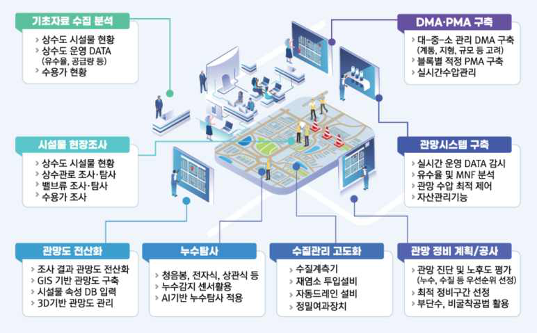

보건·의료 분야 인공지능 활용 사례
보건·의료분야에서의 인공지능은 진단, 치료, 예후 관찰 등 전반적인 의료 제공 과정에 폭넓게
적용되고 있으며, 기계 학습 기반의 예측·의사결정 기능을 중심으로 활용 영역이 지속적으로
확대되고 있다.
특히, 만성질환 관리/맞춤형 치료/의료기기 내 인공지능 탑재 등과 같은 다양한 형태로 활용
되고 있으며, 의료인뿐만 아니라 비의료인의 건강관리 지원 영역에서도 인공지능 기반 서비스가
점차 확대되는 추세이다.
[ 보건의료의 제공 및 이용체계 중 기계학습 등 인공지능이 활용되는 사례(예) ]
구분
사례
질환의 진단, 치료 방법
선택 등 의사(意思) 결정
(Clinical analysis)
Ÿ 치료 전, 치료 중, 치료 후 환자에 대한 의료서비스 제공 개선
환자 상태 악화 등 경과 관찰
(Quality and safety)
Ÿ 프로토콜에 따른 환자의 경과를 관찰하고 주요 위험인자에 의해 발생하는 사고를 감시
비의료 건강관리서비스
Ÿ 건강의 유지･증진과 질병의 사전 예방･악화 방지 목적으로 개인의 위해한 생활 습관
개선 및 올바른 건강관리 유도하기 위한 비의료적 개입인 상담･교육･훈련･실천 프로그램
작성 및 유관 서비스 제공
[ ‘인공지능 기반 의료기기’ 인･허가 사례(예) ]
구분
사례
기계학습 의료기기
(MLMD)
Ÿ 네비게이션의료용입체정위기(2등급): 하드웨어와 소프트웨어로 구성
* ㈜메타시스템즈(제인 호 22-4850, '22.11.07)
Ÿ 정량적전산화단층촬영골밀도측정기(2등급)
*㈜클라리파이(제인 호 22-4785, '22.10.14)
Ÿ 유헬스케어 심전계(3등급): 유헬스케어 심전계(기기) 및 유헬스케어 진단 소프트웨어
*㈜휴이노(제허 21-317호, ‘21.04.22), 변경 ’22.09.19)
Ÿ 1등급의료영상전송장치소프트웨어(1등급)
* 주신회사 민트랩스(제신 22-21호, '22.01.05)
Ÿ 뇌영상분석소프트웨어(2등급)
* ㈜제이엘케이(제인 21-4702호, '21.08.13)
Ÿ 방사선 치료계획 소프트웨어(2등급): 일부 구조물에 대해 인공지능기술 적용
* ㈜베리안메디컬시스템즈코리아(수인21-4020호, ’21.01.14)
Ÿ 2등급의료영상검출·진단보조소프트웨어(2등급)
* ㈜루닛(제허 20-896호, ’20.10.19.)
Ÿ 뇌영상 검출·진단보조 소프트웨어(3등급)
* ㈜뷰노(제허 20-1159호, ’20.12.29)

[ ‘18~’22년 허가‧인증된 인공지능 기반 의료기기(3등급) ]
등급
연번
업체명
품목명
(등급)
허가번호
(허가일자)
사용목적
제품외형
3등급
㈜제이엘케이
인스펙션
의료영상
진단보조
소프트웨어
(3)
제허
18-573호
(’18.8.14)
Ÿ 환자의 뇌 영상 Magnetic Resonance(MR)
자료와 임상자료를 바탕으로 뇌경색 (허혈성
뇌졸중)의 유형 분류 진단을 자동으로
진행하여 의료진의 뇌경색 진단 결정을
보조하는 데 사용하는 소프트웨어
㈜루닛
의료영상
진단보조
소프트웨어
(3)
제허
19-493호
(’19.7.29)
Ÿ 유방촬영술 영상(Mammography)에서
유방암 의심 부위를 검출하여 악성 병변으로
의심되는 위치를 표시하고 악성 병변의
존재 가능성을 확률값으로 나타내어
판독의(Interpreting Physician) 진단을
보조하는 소프트웨어
㈜뷰노
의료영상
진단보조
소프트웨어
(3)
제허
20-244호
(’20.4.1)
Ÿ 안저영상의 이상소견을 자동으로 분석하여
정상 비정상에 대한 결과를 제시하고,
비정상일 경우 이상소견 및 위치를 표시하여
의료진의 진단을 보조하는 소프트웨어
㈜딥바이오
체외진단용
소프트웨어
(3)
제허
20-248호
(’20.4.3)
-조건부허가
허가완료 체외
제허
20-373호
(’20.5.19.)
Ÿ 전립선 질환 의심환자의 전립선 조직을
헤마톡실린- 에오신(H&E) 염색하여
얻은 디지털 이미지에서 암 조직 유무를
소프트웨어로 분석하여 의사의 전립선암
진단을 보조하는 체외진단용 의료기기
㈜모니터
코퍼레이션
의료영상
진단보조
소프트웨어
(3)
제허
20-602호
(’20.7.27)
Ÿ 의료인(Interpreting Physician)이 흉부
CT 영상을 판독할 때 사용하는
소프트웨어로, 의료영상에서 추출한
정보를 바탕으로 폐 결절 악성
가능성과 폐 결절의 위치 및 특성에
대한 정보를 제공하여 사용자의 최종
진단 및 환자 관리의 결정을 보조하는
소프트웨어
㈜지멘스헬시
니어스
의료영상
진단보조
소프트웨어
(3)
수허
20-187호
(’20.8.21)
[제조원:
ScreenPoi nt
Medical B.V.
(네덜란드)]
Ÿ 유방촬영술 영상(Mammography)에서
유방암 의심 부위를 검출하여 악성 병변의
위치를 표시하고 존재 가능성을 점수로
나타내어 판독 의사의 (Interpreting
Physician) 진단을 보조하는 소프트웨어
㈜에임즈
의료영상
진단보조
소프트웨어
(3)
제허
20-847호
(’20.9.28.)
Ÿ 안저 카메라로 촬영한 환자의
망막사진(안저영상)을 바탕으로 의사의
녹내장 진단 결정을 보조하는 데 사용하는
소프트웨어
㈜뷰노
뇌영상
검출·진단보조
소프트웨어
(3)
제허
20-1159호
(’20.12.29)
Ÿ 뇌 T1 weighted MR 영상을 자동으로
분석하여 알츠하이머병 가능성을
수치화함으로써 의료인의 진단 결정을
보조하기 위한 목적의 소프트웨어

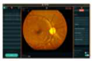

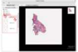

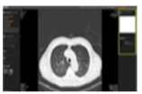

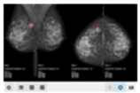

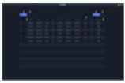

㈜에이아이
인사이트
안과영상
검출·진단보조
소프트웨어
(3)
제허
21-122호
(’21.02.18)
Ÿ 안저카메라로 촬영한 환자의 안저영상을
바탕으로 녹내장 유무를 자동으로 표시하는
소프트웨어로 의료인의 진단 결정 보조에 사용
㈜에이아이
인사이트
안과영상
검출·진단
보조
소프트웨어
(3)
제허
21-123호
(’21.02.18)
Ÿ 안저카메라로 촬영한 환자의 안저영상을
바탕으로 나이 관련 황반변성 (age related
macular degradation) 유무를 자동으로
표시하는 소프트웨어로 의료인의 진단
결정 보조에 사용
㈜에이아이
인사이트
안과영상
검출·진단보조
소프트웨어
(3)
제허
21-124호
(’21.02.18)
Ÿ 안저카메라로 촬영한 환자의 안저영상을
바탕으로 당뇨병성망막병증 유무를 자동으로
표시하여 의료인의 진단 결정 보조에
사용하는 소프트웨어
㈜휴런
뇌영상
검출·진단보조
소프트웨어
(3)
제허
21-257호
(’21.04.05)
Ÿ 뇌 영상을 자동으로 분석하여 의료진
MR의 신경퇴행성 파킨슨증 진단 결정
보조에 사용하는 소프트웨어
㈜제이엘케이
전립선암영상
검출·진단보조
소프트웨어
(3)
제허
21-270호
(’21.04.07)
Ÿ 전립선암이 의심되는 환자의 다중 시퀀스
전립선 영상자료MR를 기반으로 영상을
자동으로 분석하고 전립선암 위치를
검출하여 의료진의 진단 결정 보조에
사용하는 소프트웨어
㈜코어라인
소프트
심혈관영상
검출 진단·보조
소프트웨어
(3)
제허
21-554호
('21.07.02)
Ÿ 인공지능을 기반으로 CT 영상으로부터
관상동맥석회화(calcified coronary
lesion)를 동반한 관상동맥죽상경화증
(coronary atherosclerosis)의 유무를
검출하여 의료인의 진단 결정 보조에
사용하는 소프트웨어
㈜에이아이
인사이트
안과영상 검출
진단·보조
소프트웨어
(3)
제허
21-701호
('21.08.19)
Ÿ 안저 카메라로 촬영한 환자의 안저영상을
바탕으로 병증(녹내장 나이 관련
황반변성, 당뇨병성 망막병증) 유무를
분석하여 의료인의 진단 결정 보조에
사용하는 소프트웨어
SK㈜
뇌영상검출·
진단보조
소프트웨어
(3)
제허
21-720호
('21.08.26)
Ÿ 조영제를 사용하지 않은 뇌 CT 영상에서
뇌출혈로 의심되는 부위를 검출하여 위치를
표시하고 해당 부위가 뇌출혈로 판정될
가능성을 확률값으로 제시하여 의료진의
뇌출혈 발생 여부 및 발생 위치를 진단
보조하는 소프트웨어
㈜딥바이오
병리조직
진단보조
소프트웨어II
(3)
체외 제허
21-898호
('21.11.11)
Ÿ 전립선의 조직생검 H&E WSI 염색에서,
Gleason grading system을 학습한
인공지능으로 슬라이드 이미지 내
전립선암의 조직학적 등급을 자동
분석하는 인공지능 기반
병리조직진단보조 소프트웨어
㈜에이아이
인사이트
안과영상
검출 진단·보조
소프트웨어
(3)
제허
21-974호
('21.12.02)
Ÿ 안저 카메라로 촬영한 환자의 안저영상을
바탕으로 병증(녹내장 나이 관련 황반변성,
당뇨병성 망막병증) 유무를 분석하여
의료인의 진단 결정 보조에 사용하는
소프트웨어

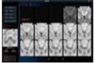

※ ｢2022년 의료기기 허가보고서｣, 2023.4., [표 63], 104~126면
㈜코어라인
소프트
뇌영상검출·
진단보조
소프트웨어
(3)
제허
21-1013호
('21.12.15)
Ÿ 인공지능기술을 사용하여 환자의 뇌 CT
영상으로부터 뇌출혈을 검출(뇌출혈
유무, 뇌출혈량)하여 의료진의 뇌출혈
진단을 보조하는 소프트웨어
㈜휴런
뇌영상검출
진단·보조
소프트웨어
(3)
제허
22-36호
('22.01.19)
Ÿ 뇌 CT 영상을 자동 분석하여 출혈성
뇌졸중 의심 여부를 의료진에게 제공함
으로써 진단 결정을 보조하는 소프트웨어
㈜휴런
뇌영상검출
진단·보조
소프트웨어
(3)
제허
22-332호
('22.05.24)
Ÿ 환자의 뇌 CT 영상으로부터 초기허혈성
변화스코어(ASPECT Score)를
제공함으로써 의사의 허혈성 뇌졸중
진단을 보조하는 소프트웨어. CNN 구조를
사용하여 ASPECTS를 산정
주식회사
아이도트
산부인과학
진료용
소프트웨어
(3)
제허
22-376호
(‘22.06.09)
Ÿ 자궁경부 영상 이미지(카메라 영상)를
인공지능 영상판독 알고리즘 CNN
방식으로 학습하여 자궁경부의 이형성증
및 암으로 의심되는 질환을 진단하는
등 자궁경부암 유무에 대한 가능성 정도
및 중증도에 대한 가능성 정도를 출력
㈜메디웨일
심혈관
위험평가
소프트웨어
(3)
제허
22-513호
(‘22.08.01)
Ÿ 망막 영상 내 망막의 구조 및 망막 내
혈관 모양을 분석하여 심혈관 질환 발생
위험 정도를 (Low: 저위험, Moderate:
중등도 위험, High: 고위험) 표시하는
인공지능 기반의 소프트웨어
㈜휴이노
유헬스케어
심전계
(3)
제허
21-317호
(‘21.04.22)
변경
(’22.09.19)
Ÿ 유헬스케어 심전계 : 심근이 활동할 때
발생하는 활동전위가 신체의 표면에
전달되어 발생하는 전위차를 일정
부위에 전극을 부착시켜 신호를
감지하고 이 심전도 데이터를 무선
신호를 이용하여 표시해 주는 기구이며,
원격진료를 위해 심전도를 기록
재현하는 기기
Ÿ 유헬스케어 진단지원 소프트웨어 :
원격진료를 위해 유헬스케어
게이트웨이에서 수신된 정보를 기반으로
환자의 관리를 위하여 사용자와
의료인에게 정보를 제공하는 소프트웨어
* 작동원리 : 패치형 심전도 기기에서
측정한 데이터가 클라우드 서버로
전송되면 서버는 심전도 데이터를
인공지능 알고리즘(CNN)을 이용한
분석을 통해 부정맥 여부를 판별하며
병원의 의료진은 웹 뷰어 소프트웨어
(MEMO ECG Webviewer)를 통해
심전도 데이터 및 부정맥 판별 결과를
열람할 수 있다
㈜ 엔티엘
헬스케어
산부인과학
진료용
소프트웨어
(3)
제허
22-886호
(‘22.12.23)
Ÿ 자궁경부확대촬영술 이미지 영상에 대하여
RetinaNet 기반의 탐지 모델과
Resnet-50 기반의 분류모델로 학습된
인공지능 소프트웨어로 체외형
자궁경부확대 촬영 영상(JPG) 내에서
자궁경부를 자동으로 표시하고
자궁경부암의 정상/이형성증을 구분하여
의료인의 자궁경부암 진단 결정을
보조하는 데 사용한다.

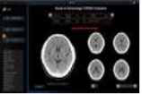

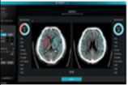

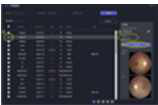

원자력 분야 인공지능 활용 사례
원자력 산업은 생명·안전·기밀성과 직결되는 고위험 산업으로, 인공지능기술의 적용에 있어
고유한 제약과 제한요인이 존재하며, 특히 전 주기에 걸친 인허가 체계, 대중의 안전성 우려,
정보의 독점성과 보안성 등으로 인해 검증되지 않은 인공지능기술은 현장에 도입하기 어려운
구조이다.
그러나, 인공지능기술의 발전과 활용 요구가 커짐에 따라, 국가 차원에서 통일되고 명확한 정책을
수립하여 단계적으로 원자력 인공지능 연구를 해 나가야 하며, 인공지능기술 도입을 위한
선제적 대응이 필요하다.
[ 원자력 분야 주요 활용 사례 ]
구분
인공지능 기능
주요내용
설비상태진단
및 유지보수
설비 고장 예측,
성능 감시
Ÿ 발전소 내부 설비(예: 터빈, 펌프, 열교환기 등)의 상태 데이터를 기반으로, AI가
이상 징후를 조기에 감지하여 예방 정비 및 유지보수 등 일정 최적화에 활용
Ÿ 열화 감지, 진동 분석, 패턴 이상 탐지 등을 통해 예기치 못한 설비고장 방지를
지원
운영 효율
향상
운전조건
최적화
Ÿ 발전소의 운전 데이터를 분석하여 에너지 효율과 안전성 모두를 만족시키는
최적 운전조건을 도출
Ÿ 예를 들어, 운전 출력, 열교환 효율, 연료 사용량 등의 요소를 AI가 실시간으로
분석하여 운영자에게 개선 시나리오를 제시
사고·이상
상황 예측
비정상 상태
조기 탐지
Ÿ 방사능 누출, 냉각 계통 이상, 과열 등 이상 징후가 발생하기 전, 정상 데이터와의
패턴 차이를 분석해 위험을 조기에 경고
Ÿ 훈련 데이터가 충분한 경우, 인간이 인지하지 못한 조기 이상 징후까지 감지할
수 있어 사고 예방 효과가 있음
훈련 및 시뮬
레이션 지원
비상 대응
시나리오 제공
Ÿ 사고 발생 시나리오를 바탕으로, AI가 가상의 사고 상황을 시뮬레이션하고,
대응 전략을 자동 추천
Ÿ 원자력 인력 훈련 시에도 AI가 예측한 위험도를 반영한 시나리오를 제공하여
실제 대응 역량 향상에 기여
방사선 감시 및
측정 자동화
실시간 방사선량 분석
및 이상 경고
Ÿ 방사선량 데이터를 AI가 분석하여, 기준치 초과나 이상 징후 발생 시 즉시 경고
Ÿ 또한 장비 오작동에 따른 측정 오류까지 AI가 자동으로 식별하여 신뢰성 높은
방사선 감시 체계를 구축

범죄 수사 및 체포 분야 인공지능 활용 사례
범죄 수사 및 체포 분야에서 피의자나 참고인을 포함한 일반 국민의 생체정보를 분석·활용하는
인공지능시스템은 그 정확도와 운영 절차의 적법성에 따라 심각한 사생활 침해 및 부당한
수사·체포로 이어질 수 있음에 유의해야 한다.
이에 따라, 생체정보를 활용한 인공지능시스템이 범죄 수사·체포 업무에 사용되면서 사람의 생명,
신체, 기본권 보호에 중대한 영향을 미칠 우려가 있는 경우 유의해야 한다.
[ 범죄 수사 및 체포 분야 주요 활용 사례 ]
구분
인공지능 기능
주요내용
얼굴 인식 기반
용의자 식별
실시간 얼굴 인식
및 대조 분석
Ÿ CCTV, 보안 카메라 등으로 촬영된 인물 영상을 AI가 분석하여 기등록된 인물
정보와 대조함으로써 용의자를 자동 식별
Ÿ 공공장소나 행사장 등에서 실시간 감시 및 추적 기능으로 활용
Ÿ 정확도에 따라 잘못된 식별 가능성이 존재하여, 무고한 시민에 대한 수사 확대
위험 상존
지문·홍채 등
생체정보 분석
지문, 홍채, 정맥
등 생체 특성 기반
인물 확인
Ÿ 수사 과정에서 수집된 지문이나 홍채 데이터를 AI가 분석하여 신속하게 신원
식별 수행
Ÿ 기존 수작업 분석보다 속도와 일관성이 높지만, 분석 오류 시 잘못된 체포나 조
사로 진행 가능
Ÿ 생체정보는 민감정보로 분류되어 보호 기준이 엄격
음성 인식 및
분석
통화 녹음 및 음성
데이터의 화자 식별
Ÿ 도청, 통화 감청 등 수사 자료에서 화자의 음성 특성(톤, 억양, 말투 등)을 분석해
인물을 추정하거나 발언 내용을 분류
Ÿ 정확한 감정 또는 맥락 인식이 어려워 오판의 우려가 있으며, 감청 대상의 적법성
확보가 중요
행동 패턴 분석
AI 기반 이상행동
탐지 및 자동 경보
Ÿ 공공장소의 CCTV 영상에서 수상한 행동 패턴(급박한 이동, 특정 위치 반복
체류 등)을 AI가 실시간 분석해 잠재적 범죄 발생 가능성을 탐지
Ÿ 예방 목적이나, 비정형 행동을 범죄로 오인할 위험 존재하며, 일반인의 이동
자유권 침해 우려 발생
디지털 포렌식
자동화
기기 내 데이터 분석
및 범죄 단서 추출
Ÿ 압수된 스마트폰, 컴퓨터 등에서 AI가 문서, 이미지, 검색 기록 등 다양한 디지털
흔적을 자동 분류 및 연관 분석하여 범죄 단서를 추출
Ÿ 분석 결과의 적법한 활용 절차와 투명성 확보가 필요하며, 사생활 침해 우려
범죄 예측 시스템
범죄 발생 가능성
예측 및 지역 경고
Ÿ 특정 지역의 과거 범죄 기록, 환경 정보, 시간대 패턴 등을 학습한 AI가 범죄
발생 확률이 높은 지역이나 시간대를 예측
Ÿ 이를 기반으로 순찰 배치나 CCTV 집중 관리 등에 활용되지만, 편향된 데이터로
인한 인종·지역 차별 이슈가 제기

채용 분야 인공지능 활용 사례
채용에서 발생할 수 있는 성별, 연령, 장애, 출신, 인종 등에 따른 차별은 다수의 법령에
의해 금지되고 있으며, 이에 따라 인공지능을 채용 과정에 사용하는 경우에도 동일 수준의
차별 방지 원칙이 적용되어야 한다.
[ 채용 분야 인공지능 이용 사례 ]
구분
사례
이력서 스크리닝 및
채용 후보자 발굴
Ÿ 이력서를 스크린하는 AI 알고리즘을 사용하여 상위 후보군을 선별, AI는 주요 단어, 경험 및
자격에 기반하여 이력서를 분석(아마존Amazon)
Ÿ LinkedIn Recruiter과 같은 AI 기반 도구를 사용, LinkedIn Recruiter는 방대한 전문가 네트워크
로부터 특정 직종의 요구사항에 적합한 후보군을 검색하여 추천하는 AI 알고리즘을 사용
(마이크로소프트Microsoft)
Ÿ 다양한 구직 사이트를 통해 지원된 후보자를 스크린하고 파악하는 AI 도구를 사용, 본 도구는
다양한 역할에 적합한 기술과 경험을 가진 후보군을 선별하기 위해 이력서와 온라인 프로필
분석(구글Google)
Ÿ 이력서 및 커버레터(cover letter) 분석하며, 지원자의 기술 및 경험을 평가하는 'Watson
Recruitment' 사용(IBM)
채용 지원자 지원
(챗봇, 가상 비서)
Ÿ 채용 절차에서 지원자의 질문에 답하고 인터뷰 스케줄을 정하는 것을 지원하는 AI 기반 가상비서
또는 챗봇 사용(딜로이트Deloitte, Bank of America, McKinsey & Company, IBM 등)
회사와 후보자 매칭
Ÿ 자사의 AI 기반 채용 플랫폼 또는 도구를 이용하여 기술, 위치, 직업 선호도 등을 고려하여
회사와 지원자를 매칭(페이스북Facebook, 애플Apple, 넷플릭스Netflix)

대출 심사 분야 인공지능 활용 사례
대출 심사 과정에서 인공지능시스템을 활용할 경우, 편향, 차별, 불투명성 등으로 인한 사회적
위험이 발생할 수 있으며, 이에 다양한 법령과 가이드라인을 통해 신뢰성과 공정성 확보를 위한
노력이 진행 중이다.
따라서 대출심사 분야의 인공지능의 경우 별도 규율과 투명한 운영 원칙이 요구되는 분야로
평가된다.
[ 대출심사 분야 주요 활용 사례 ]
구분
인공지능 기능
주요내용
신용평가
자동화
개인 신용도 분석
및 등급 산정
Ÿ AI가 고객의 소득, 자산, 부채, 금융거래 이력 등 다양한 데이터를 분석해 신용
등급을 산출하고, 대출 가능 여부 및 금리를 예측
Ÿ 과거 데이터에 기반한 평가이므로 데이터 편향에 따른 차별 가능성이 존재
상환능력
예측
연체 가능성 및
부도 위험 분석
Ÿ 고객의 과거 금융이력 및 소비 패턴, 소득 흐름 등을 기반으로 향후 상환능력 및
부도 가능성을 예측
Ÿ 리스크 기반 대출 한도 조정에 사용되며, 설명 가능성이 낮을 경우 이의제기
어려움 예상
부동산 담보물
평가
담보 가치
자동 산정
Ÿ 부동산 위치, 시세, 거래 이력 등 데이터를 AI가 분석해 담보의 현재 가치를
자동 산정
Ÿ 대출 승인 여부 및 한도 결정에 반영되나 시장 급변 시 AI 모델의 반응 한계
대출사기 방지
(FDS)
비정상 신청
패턴 탐지
Ÿ AI가 신청 정보 및 과거 기록을 분석하여 의심스러운 대출 패턴을 실시간 탐지
Ÿ 예를 들어, 허위 서류 제출, 동일 IP·기기 중복 신청 등 이상 징후를 자동 식별
되므로 오탐률과 정상 이용자 오판단 가능성 관리 필요

육상 교통수단· 교통시설·교통체계·실외이동로봇 분야에서의 인공지능 활용 사례
[ 자율주행에 사용되는 인공지능시스템 ]
분야
시스템
주요내용
자율주행
네비게이션
연동 자율주행
Ÿ 네비게이션에 목적지를 입력하면, GPS를 통해 위치데이터를 받고, 휴리스틱 탐색을
이용하여 목적지까지 가는 최적의 경로를 탐색하고, 해당 경로를 따라 스스로 운전
하여 이동하는 시스템
다차량
상호작용 예측
Ÿ 인공지능을 활용하여 자율주행 자동차 주변에 존재하는 다수의 차량에 대한 미래 경
로 및 이에 맞는 자기 차량의 경로를 예측
지능형 순항
제어 시스템
Ÿ 자동차가 정속을 기준으로 주행 중 센서를 활용하여 감지하는 도로 상황에 대한 실
시간 정보를 자동차의 전자제어부(ECU)로 연결하여 매 순간 안전상황을 확보하기
위한 조치를 자동으로 취한 후 다시 정속 주행으로 복귀할 수 있도록 제어하는 차세대
첨단 자동차 주행용 안전장치
자동주차
시스템
Ÿ 사람의 조작이 없이 자동차를 (원격으로) 도로에서 주차 공간으로 이동시키는 자율
주행 시스템
오프로드
자율주행
Ÿ 비나 눈이 오면 센서를 바로잡아서 안정적인 상태를 유지하는가 하면 거리와 물체의
형태를 측정하는 센서에 이물질이 붙으면 세척액을 내뿜고 와이퍼로 제거
로봇택시
Ÿ 승객이 앱을 통해 호출하면 자율주행차량이 승객을 픽업하여 목적지까지 무인 운행
하는 서비스
자율주행 관련
기술 이외에
자동차에 적용
차량용
인포테인먼트
Ÿ 자연어 처리(NLP) 기술을 활용하여 운전자의 음성 명령을 인식하고, "음악 틀어줘",
"에어컨 켜줘", "집으로 길안내해줘" 등의 명령을 이해하여 해당 기능을 자동으로 실
행하는 AI 비서 시스템
음성 UI 및
Voice Agent
Ÿ 차량용 음성 AI는 운전자의 습관과 기분을 학습하고 그에 따라 여러 색상으로 변하는
스킨부터 증강 현실 기능을 통해 탑승자가 메타버스에 참여하고 차 안에서 친구 및
가족과 가상으로 연결할 수 있는 기능까지 조정
차량 내 음주
측정
Ÿ 운전자가 벤츠 차량에 설치된 클립 형태에 손가락을 끼우면 피부를 자동으로 스캔
하여 손가락 혈액 내 음주와 관련된 성분을 측정하여 음주 여부가 측정되고, 술을
마셨으면 ‘운전하지 마세요’란 경고 문구 제시
운전자
모니터링
Ÿ 운전자의 운전 습관 데이터를 수집 및 분석하고, 급가속, 안전거리 미준수 및 차선
이탈 여부 등을 종합하여 안전 운전 점수를 산출
운전자 졸음
감지 시스템
Ÿ 차량 내부 카메라가 운전자의 눈꺼풀 움직임, 고개 끄덕임, 시선 방향 등을 실시간
으로 모니터링하고, 컴퓨터 비전과 패턴 인식 알고리즘을 통해 졸음 징후를 감지
하면 경고음이나 진동으로 운전자에게 휴식을 권하는 시스템
지능형 주행
패턴분석
시스템
Ÿ 가속도 센서, GPS, CAN 버스 데이터를 수집하여 머신러닝으로 개별 운전자의
주행 습관(급가속, 급제동, 과속 등)을 분석하고, 연비 향상이나 안전 운전을 위한
개인 맞춤형 피드백을 제공하는 시스템
차량고장 예측
진단 시스템
Ÿ 엔진, 브레이크, 배터리 등 각종 센서 데이터를 AI로 분석하여 부품의 이상 징후나
고장 가능성을 사전에 예측하고, 정비 시기와 교체 필요 부품을 운전자에게 미리
알려주는 예방 정비 시스템
자동차 이외에
도로교통법에
따른 차에 적용
건설장비
고장진단
Ÿ 굴착기에 AI와 사물인터넷(IoT)을 결합한 'AIoT 모듈'을 탑재해 장비의 실시간
데이터를 수집·분석하고, 머신러닝 기술로 장비의 이상 여부를 정밀하게 감지하여
스스로 장비의 고장유형을 판별하고, 수리에 필요한 부품을 추천
자전거 후방감지
시스템
Ÿ 인공지능의 머신러닝 알고리즘을 활용하여 후방 차량과 보행자를 인식하고, 위험
상황 발생 시 음성 경고 및 스마트폰 연동 알림 제공

전동퀵보드 충돌
방지시스템
Ÿ 주행 중 충돌이 발생했을 때 AI의 모션센싱(동작감지) 결과를 서버에 업로드하고
사전에 카메라가 주변 사물, 환경과의 거리도 인식해 너무 가까워지면 속도를 줄이
거나 정지시킴으로써 충돌을 예방
전동 스쿠터 배
터리 최적화 시
스템
Ÿ 사용자의 운행 패턴, 경사도, 무게, 날씨 조건 등을 머신러닝으로 학습하여 배터리
소모량을 예측하고, 모터 출력을 지능적으로 조절해 최대 주행거리를 확보하는
에너지 관리 시스템
지게차 화물 인
식 적재 시스템
Ÿ 카메라와 무게 센서를 통해 팔레트의 크기, 무게, 적재 상태를 자동으로 인식하고,
컴퓨터 비전으로 화물의 무게중심을 계산하여 지게차 포크의 위치와 들어올리는
각도를 최적화해 안전하게 화물을 운반하는 시스템
오토바이 코너링
안전 시스템
Ÿ 자이로스코프와 가속도 센서로 바이크의 기울기와 속도를 측정하고, AI가 노면
상태와 코너 반경을 분석하여 안전한 코너링 속도를 계산해 엔진 출력과 브레
이크를 운전자에게 제안하는 시스템
교통시설,
교통체계에
적용
인공지능
신호운영 체계
Ÿ 자율주행차가 송신하는 운행 데이터를 활용, 도심 신호 교차로의 혼잡을 최소화
차세대 지능형
교통시스템
Ÿ 위치기반 데이터수집, 위치기반 교통정보 제공, 요금징수시스템, 도로위험구간 정보
제공, 노면 기상정보 제공, 도로작업구간 주행지원, 교차로 신호위반 위험경고,
우회전 안전운행 지원, 버스 운행관리, 옐로우버스 운행 안내, 스쿨존 속도제어,
보행자 충돌방지 경고, 차량 추돌방지 지원, 긴급차량 접근경고, 차량 긴급상황
경고등 15가지를 제안
지능형 주차
관리 시스템
Ÿ 도심 내 모든 주차장과 도로변 주차 공간에 설치된 IoT 센서와 카메라를 통해
실시간 주차 현황을 파악하고, 머신러닝 알고리즘으로 주차 수요를 예측하여
운전자에게 최적의 주차 공간을 안내하고 동적 요금제를 적용하는 통합 주차
관리 체계
교통사고 자동
감지 및 대응
시스템
Ÿ 도로 곳곳에 설치된 CCTV와 음향 센서가 수집한 데이터를 딥러닝으로 분석하여
교통사고 발생을 자동으로 감지하고, 사고 심각도를 판단해 구급차, 소방차, 경찰을
자동 출동시키며 우회 경로를 실시간으로 안내하는 긴급 대응 시스템
도로 포트홀
및 노면 손상
자동 탐지 시
스템
Ÿ 도로 순찰 차량이나 일반 차량에 장착된 카메라와 진동 센서로 수집된 데이터를
컴퓨터 비전 기술로 분석하여 포트홀, 균열, 침하 등 도로 손상을 자동으로 탐지
하고 위치를 정확히 파악해 우선순위에 따라 보수 작업을 계획하는 시스템
대중교통 승객
수요 예측 및
운행 최적화
시스템
Ÿ 지하철, 버스 이용 패턴과 날씨, 이벤트, 시간대별 데이터를 AI로 분석하여 승객
수요를 예측하고, 이를 바탕으로 배차 간격을 동적으로 조절하고 추가 차량 투입
여부를 결정하는 대중교통 운영 최적화 시스템
실외이동
로봇
순찰경비
서비스
Ÿ HD카메라·적외선 열화상 카메라·마이크· 증폭 경적/스피커·스트로브 라이트 등을
탑재하고 있으며, 카메라를 통해 주변상황을 인식하고 폐관 후 건물 등에서 동작을
감지하여 유사시 스피커를 통해 경고하거나 관제실로 상황을 전파
교통단속
Ÿ 특정 지역의 주·정차 및 대기 규정 위반 차량을 감지하고 메세지를 스크린에 표시
하거나 음성 경고 알림을 스피커를 통해 재생하여 교통질서를 관리하고, 실시간
영상을 관제실로 송부하는 등 작업을 수행
농업 로봇
Ÿ GPS기술과 센서 등을 활용하여 밭을 탐색하여 작물과 잡초를 구분하고 잡초를 표적
하여 제초작업을 수행
방역 로봇
Ÿ UV-C 자외선을 방출하여 공기 중 유해한 세균과 바이러스 등을 제거하며, 인체에
해당 자외선을 직접 비추는 것은 건강에 악영향을 미치기 때문에 근처 사람을 인식
하면 자동으로 자외선 방출을 중지
실외청소 로봇
Ÿ 카메라, 소나센서, GPS 등을 이용하여 실내·외를 청소하고, 쓰레기 수거가 가능

선박 교통 분야에서의 인공지능 활용 사례
선박교통 분야의 경우 자율운항선박에 인공지능을 사용하고 있거나 사용하기 위한 시도가
진행되고 있다. 인공지능시스템 구성에 따른 자율운항선박의 기술은 크게 자율운항시스템
기술, 원격관제기술, 해상연결성 기술로 구분되며 세부 내용은 다음과 같다.
[ 자율운항선박 기술분류2) ]
2) KISTEP. (2020). 자율운항선박
3) Vessel traffic system, 해상교통관제시스템
4) Very high frequency, 초단파(초고주파)
구분
세부기술명
설명
자율운항시스템
기술
다중센서기반 장애물 탐지 및
상황인지 기술
Ÿ 선박에서 Lidar 및 카메라를 이용하여 장애물을 탐지 및 충돌상황 예측, 회피
방안 제시
통합선교경보관리기술
Ÿ 선박의 다양한 위험 상황을 종합적으로 관리하고, 선박의 위험도에 따라 최적의
대응 방안 제시
선박 자율제어기술
Ÿ 선박의 운항상황 및 장비와 시스템의 상황에 따라 항로 재계산 및 엔진 제어 등
을 포함하여 선박의 모든 장비와 시스템들을 실시간으로 계산하고 효과적으로
처리
선박 시스템 안전성
보장 기술
Ÿ 선박 시스템의 안전성과 신뢰성 확보를 위한 기술. 다양한 이종 시스템과의 통
합 및 상호연결 시 발생하는 선박 소프트웨어의 기능 안전성 및 시스템 오류 및
장애와 문제를 안정적으로 처리
선박 자동 접·이안 기술
Ÿ Tug선이나 도선사의 도움 없이 선박을 자동으로 접·이안하기 위한 기술
육상기반 항해센서기술
Ÿ 선박의 주변 운항 상황을 보다 정확히 판단하고, 선박이 취득하기 힘든 환경
정보를 육상에서 획득하여 선박에 제공, 선박이 정확한 판단을 내릴 수 있도록
보조
원격관제
기술
항로교환정보기술
Ÿ 선박의 원격 제어 및 항로 제어를 위해 기상 정보와 트래픽 관련 다양한 부가
정보를 교환하는 기술
항해안전정보교환 기술
Ÿ 선박의 위험상황이나 주변 상황에 대한 안정정보를 육상에서 제공
VTS3) 자동보고기술
Ÿ 선박이 VTS센터 및 항만과 트래픽 관리와 항해 안전을 위한 자동화 서비스에
관련된 정보를 교환하는 기술
선박 원격 모니터링 및
제어 기술
Ÿ 원격에서 다양한 선박과 장비의 정보를 수집하여, 장비와 선박의 상태를 종합적
으로 점검하고 분석하는 기술. 이 과정에서 선박의 상태를 정확히 분석하기
위해 AR/VR 기술과 디지털 트윈 기술이 함께 사용될 것으로 예상
선박 위험도 관리 기술
Ÿ 선박의 운항 환경, 상태, 해양 트래픽 및 환경 정보를 기반으로 각 선박의
위험도를 판단하고 이를 경감하기 위한 기술
해상연결성
기술
VHF4) 데이터 교환 시스템
(VDES5)) 기술
Ÿ VDES를 통해 선박의 안전 및 해양 당국과 선박 간, 선박 상호 간의 운항 정보를
교환하기 위한 기술
해상항법장비기술
Ÿ 선박의 위치를 정확히 측정하고, 이에 따라 안전운항을 보장하기 위한 고정밀
위성항법장비 기술
이더넷 기반 선내통신기술
Ÿ 선박의 다양한 장비와 시스템을 IoT 기반으로 통합하여 관리하기 위한 선박
네트워크 통합 관리 기술
선박 항해시스템 및
장비의 사이버보안 기술
Ÿ 선박 내 이종 시스템과 선박과 육상 간의 안전하고 신뢰성 있는 서비스를 제공
하기 위한 기술
5G기반 광대역
해상통신시스템
Ÿ 선박의 항상 연결 상태를 유지하기 위해 위성통신과 연근해에서 상황인지 및 원격
관제를 위한 대용량 통신을 지원하는 기술. 이 기술은 서비스 요구사항에 맞춰
저비용으로 안전하고 신뢰성 있는 통신을 제공

(우리나라 자율운항선박 기술 적용사례) 국내 주요 조선사들도 다양한 자율운항기술을 개발하고
실증 중이며, 국가 및 민간 기관들은 무인선박 운항을 위한 기술과 시스템을 적용하고 있다.
[ 자율운항선박 기술 적용사례6) ]
주체
적용 사례 및 기술
현대중공업
Ÿ 통합스마트쉽솔루션 ISS, HiNAS 항해지원시스템, HiBAS 이·접안 지원시스템
대우조선해양
Ÿ 스마트쉽 솔루션 DS4, 무인항해시스템 ANS, 보안 PDA인증
삼성중공업
Ÿ 자율항해시스템 SAS
씨드로닉스
Ÿ 인공지능 선박접안보조 시스템 (여수·울산항 공급)
이커버스
Ÿ 완전자율운항 (12인승 크루즈선박 포항운하에서 완전자율 운항 성공)
선박해양플랜트연구소
Ÿ 아라곤3호 (8m 소형 무인선박 완전무인화 자율운항 실증 성공)
해양수산부
Ÿ LTE 기반 초고속 해상무선통신망 (연안 100km까지 최적항로 추천 등)

5) VHF data exchange system, 초단파 데이터 교환 시스템
6) 한성훈, 송영조. (2022). 자율운항선박을 둘러싼 현황과 법적과제. 법과 정책연구, 22(1), 91-115.

항공 교통 분야에서의 인공지능 활용 사례
항공교통 분야의 경우 항공기 운항, 교통관제 등의 영역에서 다양한 방식으로 인공지능을
사용하고 있거나 사용하기 위한 시도가 진행되고 있다.
(일반 항공 분야) 항공기 운항, 교통관제 등의 영역 중 아래와 같은 분야에서 인공지능이
사용되거나 사용이 추진되고 있다.
Ÿ (운항) ① 교통핫스팟 예측, ② 악기후 예측, ③ 음성인식, ④ 동적 공역섹터 구성, ⑤ 관제사
및 조종사 의사 결정 지원 등
Ÿ (교통관제) ① 공항/관제타워 감시, ② 활주로 운영 최적화 등
Ÿ (기타) 항공기 제작·정비, 항공종사자 자격훈련, 모의비행훈련장치 이용 등
(도심항공교통 분야) 주로 아래와 같은 분야에서 인공지능 사용이 추진되고 있다.
Ÿ (운항) ① 자율 비행, ② 전략적 교통흐름 관리, ③ 우발사태 또는 비상상황 자동 대응 등

철도 교통 분야에서의 인공지능 활용 사례
철도 교통 분야의 경우 철도차량과 철도시설, 철도 교통체계 등 다양한 영역에서 인공지능을
사용하고 있거나 사용하기 위한 시도가 진행되고 있다.
[ 철도 교통 분야별 인공지능 사용례 ]
구분
인공지능시스템
이용사업자에게
제공되는 서비스
이용자에게 제공
되는 최종서비스
교통
수단
(철도)
철도
차량
열차자율주행용 차상제어기술
신호/제어
텔레매틱
화물 및 여객운송
T2T 열차간 통신기술(Train-To-Train)
한국형 열차제어시스템2(KTCS-2)
한국형 열차제어시스템3(KTCS-3)
통신기반 열차제어시스템(CBTC)
자동 열차 운전지원 장치(ATO)
운행 최적화 시스템(Trip Optimizer)
열차 위치정보 기반 열차 내비게이션 시스템(S-NAVI)
영업열차 자동검측시스템
진단/모니터링
상태기반유지보수기술(CBM)
전동차 고장예지시스템
철도 차량 검사 포털
철도교통
시설
선로
실시간 까치집 자동검출 시스템
진단/모니터링
코끼리 열차 충돌 방지 시스템
철도시설물 결함시스템
철도시설물 자율주행 점검 로봇
AI 기반 광섬유 음향분포센서 시스템
선로 상태 점검 시스템
레일 프로파일 형상 기반 고정밀 지능형 레일 자동화 연마
시스템
유지보수
역시설
지하철 역사 공조설비 최적 제어 기술
유지보수
방역로봇
미세먼지 집진전동차
공조설비 예지보전 시스템
진단/모니터링
로봇 점검 체계
영상기반 통합감시시스템
철도
시설물
무인이동체 기반 접근 취약 철도시설물 자동화 점검시스템
진단/모니터링
철도위성추적 기술(RST)
철도건널목 전자식 경보시스템
건축물ㆍ건축
설비
지하 매핑 데이터 분석 기술
진단/모니터링

선로 및 철도
차량 보수ㆍ
정비 시설
무선차량정리 시스템
유지보수
전력설비
전력계통 설비 디지털 지능화시스템
전철전력
조명설비와 전열설비의 통합관리제어
스마트 그리드
스마트 그리드
원격검침설비와 스마트 계량기
정보통신
설비
한국형 통신시스템(KR LTE-R)
임베디드S/W
신호 및
열차제어
설비
한국형 도시철도 열차제어시스템(KTCS-M)
신호/제어
텔레매틱
열차집중제어장치(CTC)
교통
연계 시설
스마트 철도건널목
정보 플랫폼
MaaS (Mobility as a Service)
철도안전
관련 시설
AI기반 대피로 안내 시스템
-
사고대응
피난관제로봇
고속주행 영상 관제 로봇
안전 챗GPT
안내시설
정밀 실내측위 시스템
-
대고객
부가서비스
외국어 동시 대화(음성인식·번역) 시스템
디지털 플랫폼과 고급 챗봇을 활용한 고객서비스
길 안내와 짐 운반을 돕는 로봇 역무원
철도교통
체계
철도교통
이용지원
수도권 전철의 실시간 혼잡도를 분석·공개하는 시스템
철도교통
화물 및 여객운송
AI 기반 카메라 시스템
열차 운행
관리
플릿 네트워크 AI기술
철도교통
열차운행관리시스템(TMS)
대중교통 운영계획 지원 시스템(TRIPS)
열차 스케줄 최적화 기술
사이버 물리 시스템(CPS) 기술
철도시설
통합관리
스마트 스테이션
정보플랫폼
철도시설 종합정보시스템(RAFIS)

공공서비스 분야 인공지능 활용 사례
행정 효율성과 국민 편의 증진을 목적으로 인공지능기술을 도입하고 있으며, 현재 400개 기관
중 약 55%가 인공지능기술을 도입해 활용 중이다. 특히 정부부처 및 광역지자체의 도입률은
80%를 넘는 등 활용이 급속히 확대되는 추세이다.
[ 국내 국가기관 등의 인공지능 활용 사례 ]
구분
사례
행정안전부
Ÿ 국민비서: 국민 개개인에게 필요한 서비스를 적시에 알려주고 대화형으로 편리하게 신청·처리할 수
있도록 하는 인공지능서비스
Ÿ 인파관리지원시스템: 행정안전부에서 개발한 인공지능시스템으로, 휴대전화 신호 등으로 유통
인구수를 파악해 밀집도를 분석하고, 위험을 감지하면 소방·경찰에 전달
농림축산식품부
Ÿ 빅데이터 방역 의사결정 지원 시스템: 농림축산식품부는 닭, 오리, 야생 조류에서 발생하는
급성 바이러스성 전염병인 조류 인플루엔자 바이러스(Avian Influenza virus: AI)의 확산 가능성을
예측하고 대응하기 위해 농장 방문 차량들의 동선, 방문 간격, 방문회수, 농장의 특성 등을 분석하고
시각화된 정보를 제공하는 시스템을 구축7)8)
고용노동부
Ÿ 인력채용 및 매칭 시스템: 구직자, 구인기업 매칭 시스템 더워크 (thework)으로 구직신청서,
이력서 등을 단어 단위로 분석하여 구직자에게는 일자리를, 기업에게는 인재를 추천하는 시스템 도입
Ÿ 취업규칙 모니터링 시스템: 취업규칙의 잦은 변경에 대응하기 위해 신고된 취업규칙이 현행 법·
규정을 준수하고 있는지 여부를 판단하는 AI 모델 개발
경찰청
Ÿ 클루: 경찰청 사업으로 베가스는 2016년부터 2018년 사이에 빅데이터 기반 범죄분석시스템인 ‘클루
(Crime Layout Understanding Engine: CLUE)’를 개발하여 2019년부터 시범 적용을 시도하였다.
베가스의 클루는 경찰청데이터(수사결과 보고서 등)와 공개된 공공데이터를 이용하여 자연어
처리 기술을 통해 범행 장소, 범행 도구 등에 대한 정보를 추출하고 범죄 구성 데이터 간의 상관관계
분석을 통해 유사범죄를 추천해주거나 ‘근접반복행위’ 등의 범죄이론을 접목하여 범죄 위험도가
높은 지역 등을 예측
Ÿ 플봇: 한국전자통신연구원(ETRI) 주관으로 연구개발이 진행 중인 경찰청 ‘폴봇(POLice chatBOT:
POLBOT)’은 경찰청이 182콜센터의 단순/반복 민원 응대 자동화를 통해 시민들에게 편의를 제공하고
상담관 및 경찰 인력을 효율적으로 운용하기 위해 2020년 4월부터 개발을 추진한 음성인식 기반
대화형 챗봇 서비스
관세청
Ÿ 빅파인더: 관세청은 데이터에 기반하여 밀수 추적 및 방지, 세금 체납자 추적, 체납 방지 등을 위해
2018년부터 3년간 빅데이터 분석모델 시스템(Big FINDER)을 체계적으로 구축
국세청
Ÿ 종합소득세 챗봇 서비스: 국세청은 하이퍼클로바X(LLM)를 기반으로 종합소득세 시나리오에
특화된 챗봇 서비스 제공
7) 고기오(2018), 가축전염병, KISTEP 기술동향브리프, 한국과학기술기획평가원(KISTEP), 2018-17호.
8) 행정안전부(2018), 공공서비스, 디지털기술로 날다

구분
사례
공공기관
Ÿ 서울교통공사: 안전 관련 데이터 학습 챗봇을 통해 업무 담당자들에게 실시간으로 정보를 제공하여
안전 전문성 향상 및 의사결정 시간 단축
Ÿ 한국도로공사: 도로포장 결함 자동탐지·점검 시스템으로 카메라 등 센서 탑재 차량이 도로를 주행
하면서 도로포장 상태를 촬영하고 이를 인공지능 알고리즘이 자동으로 분석하여 포트홀과 같은 도로
결함을 자동 탐지하여 시스템에 전송
Ÿ 한국산업인력관리공단: 해외 구직자 대상 초거대 인공지능 모델 기반 챗봇 해외 취업 지원 서비스 제공
Ÿ 한국수자원자력: 사고 위험이 높은 건설현장 안전 사각지대 최소화를 위해 작업자의 동작과 화재
패턴을 감지해 경고하는 화재감시 CCTV관제시스템 운영
Ÿ 대한무역투자진흥공사: 기업 고객에게 맞춤형 잠재 파트너와 수출 유망시장을 추천하고 다양한 분석
정보를 제공하는 무역투자 빅데이터 서비스 트라이빅(TriBIG) 운영
Ÿ 한국특허정보원: 인공지능 사전학습 언어모델 등 지능정보화 기반기술 시스템으로 연구개발 및
특허기술 특징 추출, 기술분류, 유사특허검색 등 지식재산분야의 문제 해결을 위한 다양한 인공
지능 모델 연구개발에 활용
지방자치단체
Ÿ 각 지방자치단체 대내외 행정 서비스에 생성형 인공지능 접목 시도 중
구분
AI 서비스
내용
서울특별시
AI 다산콜 스마트 상담
‣ 민원 상담 서비스
경기도
AI 노인말벗서비스
‣ 주기적인 AI 상담원 전화로 복지 사각지대 발굴
광주광역시
120 빛고을 콜센터
‣ 민원 상담 서비스, 돌봄 서비스와 연계한 복지 서비스
대구광역시
뚜봇
‣ 민원 상담 서비스
경상북도
챗경북
‣ 자료 초안 작성, 홍보자료 등 내부 행정서비스 활용
대전광역시
기상 재난안전 시스템
‣ 인공지능 CCTV 안전 시스템으로 인공지능 CCTV를
활용하여 도시철도 역사에서 일어날 수 있는 전도,
실신 사고 등에 신속하게 대응

교육 분야 인공지능 활용 사례
교육 분야에서 인공지능의 활용은 개별 맞춤형 학습, 자동 채점, 진로 추천 등 다양한 형태로
도입·확산되고 있으며, 학생의 학습 효과 증진과 교사의 행정 업무 경감 등 긍정적인 효과를
가져오고 있다.
[ 교육 분야 주요 활용 사례 ]
구분
인공지능 기능
주요내용
개인 맞춤형
학습 추천
학습 진단 및 콘텐츠
자동 추천
Ÿ 학습자의 정답률, 반응 시간, 문제 유형 선호 등을 분석해 개인 맞춤형 학습
콘텐츠 및 난이도 조정 추천
지능형 튜터링
시스템
실시간 피드백 및
학습 경로 안내
Ÿ AI가 학습자의 이해도와 오류 패턴을 분석하여, 교사처럼 문제 풀이 과정 중
실시간 피드백을 제공하고 학습 방향을 안내
AI 챗봇 상담/
질의응답
과제, 수업, 생활
질문 자동 응대
Ÿ 교내 공지, 과제 문의, 시험 일정 등 반복 질문에 대해 AI 챗봇이 24시간 자동
응답하여, 교사 업무 경감
콘텐츠 생성
지원
문제 자동 생성,
요약, 예시 제시
Ÿ 학습 자료 또는 교재에서 요약본 생성, 자동 문제 출제, 예제 제시 등을 지원.
교사와 학생 모두 활용 가능
행정업무 자동화
출결, 상담일지,
서식 작성
Ÿ AI가 출결 데이터 자동 정리, 상담 요약, 공문 초안 작성 등 교사의 행정 부담을
줄여 수업 집중을 가능하도록 도움

고영향 확인 전문위원회 운영 기본 방향
법 제33조에 따라 사업자는 고영향 인공지능 해당 여부를 자율 검토 후, 필요시 확인 요청할
수 있으며, 이 때에 과학기술정보통신부는 전문위원회에 자문 요청 가능
Ÿ 민원인의 확인 요청서 제출 이후 전문위원회 개최여부를 검토하여 30일 이내 판단 및 결과 통지
※ 복잡성·중요성 등을 고려, 30일 이내 연장 가능(영 제24조③)
전문위원회는 판단을 보조하는 자문기구로서 판단 절차의 예측 가능성을 담보하는 수준의
기준을 정립하여 운영되며, 과도한 형식화는 지양하되, 개별 사안의 기술적 특성·적용 분야·
위험 수준 등을 고려하여 유연하게 활용되는 구조로 설계하여 운영 예정
전문위는 다음의 요소를 종합적으로 고려 공정성‧전문성‧균형성을 원칙으로 하여 구성
Ÿ ① 인공지능 기술 및 시스템에 대한 전문성, ② 법·윤리·안전 등 규제 관련 전문성, ③ 고영향
인공지능 판단 대상이 되는 산업·서비스 분야 전문성 등
검토 대상 안건의 성격에 따라, 특정 산업 또는 기술 분야에 대한 전문성이 요구되는 경우
관련 분야 전문가 포함
<분야별 전문가 확보>  ※ 최초 구성은 가이드라인 집필·검토 등 수행 전문가와 개별 부처 추천 인사로 구성
▸ 법조계(A) : 변호사, 변리사, 학자 등 관련 분야의 유경험자
▸ 기술전문가(B) : 현장 경험이 많은 기술 전문가(13개 분야별)
▸ 시민단체(C) : 관련 분야 사업자 단체, 협회 등 현장 경험이 풍부한 전문가 추천
▸ 부처(D) : 고영향 AI 판정의 공정성과 수용성을 높이기 위한 관계 부처의 참여 보장을 위해,
해당 부처 도메인의 현장 경험이 많은 전문가 및 공무원 추천
- 이해관계 중첩시, 협의체 형태로 다부처 공동참여
※ 예: 금융, 보건·의료 분야 등에서 활용되는 개인정보 관련 고영향 사안의 경우, 개보위 외 금융위, 복지부 등
공동참여 필요 구조로 설계하여 운영 예정

고영향 확인 전문위원회 운영 절차
전문위원은 검토 대상 사안에 대해 실질적인 의견 제시의 기회가 보장되며, 기술적 특성 및
위험요소, 산업적 영향 등을 종합적으로 고려
Ÿ 필요시, 추가 자료 요청 또는 보완 검토 의견 제시가 가능하나, 의견은 고영향 여부를 판단하기
위한 자문 및 참고 자료로만 작용함
전문위원회의 제시 의견은 고영향 인공지능 해당 여부 판단 검토 자료로써 종합적으로 활용
되며, 최종 판단 및 결정 권한은 행정청(과학기술정보통신부)에 귀속

■ 인공지능 발전과 신뢰 기반 조성 등에 관한 기본법 시행령 [별지 서식]
고영향 인공지능 확인[  ] 재확인[  ] 요청서
※ [  ]에는 해당되는 곳에 √표시를 합니다.
(앞쪽)
접수번호
접수일
처리기간
30일
요청인
상      호
(사업자명)
법인등록번호
또는
사업자등록번호
대표자 성명
주        소
업무담당자
(또는
국내대리인)
성명
연락처(전화번호 및 전자우편주소)
요청구분
［  ］인공지능개발사업자           ［  ］인공지능이용사업자
요청
인공지능
인공지능
명칭
(개발국가)
기본모델
(명칭)
(인공지능개발사업자/개발국가)
파생모델
(명칭)
(인공지능개발사업자/개발국가)
용      도
인공지능
적용영역
［    ］에너지              [    ］먹는물              ［    ］보건의료
［    ］의료기기            [    ］원자력              ［    ］범죄 수사ㆍ체포
［    ］채용ㆍ대출 심사     [    ］교통                ［    ］공공서비스
［    ］교육               ［    ］기타
기    타
* 재확인의 경우 재확인 요청의 취지와 이유를 추가적으로 기재하며, 필요한 경우에는 별도의 용
지에 적어 첨부할 수 있습니다.
사전
검토결과
검토결과
[    ］고영향 인공지능에 해당
[    ］고영향 인공지능에 해당하지 않음
[    ］판단할 수 없음
검토근거
「인공지능 발전과 신뢰 기반 조성 등에 관한 기본법」 제33조제1항, 같은 법 시행령 제25조제1항 및 제4항에 따라
고영향 인공지능 확인(재확인)을 요청합니다.
년     월     일
요청인
(서명 또는 인)
과학기술정보통신부장관 귀하
제출서류

## 1. 「인공지능 발전과 신뢰 기반 조성 등에 관한 기본법 시행령」 제25조제1항에 따른 확인 요청시

가. 해당 인공지능제품 또는 인공지능서비스의 개요서
나. 해당 인공지능시스템의 개발 및 학습에 사용된 학습용데이터의 개요
다. 해당 인공지능시스템을 활용하는 과정 및 결과를 확인할 수 있는 자료
라. 그 밖에 고영향 인공지능 해당 여부의 확인에 참고가 될 수 있는 서류

## 2. 「인공지능 발전과 신뢰 기반 조성 등에 관한 기본법 시행령」 제25조제4항에 따른 재확인 요청시

## 1. 기존 확인 요청에 따라 과학기술정보통신부장관이 회신한 결과

## 2. 그 밖에 고영향 인공지능 해당 여부의 재확인에 참고가 될 수 있는 서류

수수료
없음

(뒤쪽)
작성방법

## 1. 법인이 요청하는 경우

가. "요청인" 항목에는 법인에 관한 사항을 적고, “업무담당자” 항목에는 해당 법인의 업무담당자에 관한 사항을 적습니다.
나. "대표자 성명" 항목에는 사업자등록증의 대표자 이름을 모두 적습니다.
다. "상호" 항목에는 주식회사의 경우 (주)의 형태로 적습니다.
라. "법인등록번호 또는 사업자등록번호" 항목에는 법인등록번호 또는 사업자등록번호를 적습니다.(둘 또는 하나만 기재할 수 있습니다.)
마. "요청구분"항목에는 요청인의 구분에 해당하는 항목(인공지능개발사업자 또는 인공지능이용사업자)에 표시합니다.
바. 대표자가 서명하거나 법인의 경우에는 법인인감을 찍습니다.

## 2. 개인이 요청하는 경우

가. "요청인" 항목의 "상호", “법인등록번호 또는 사업자등록번호"는 빈칸으로 두고, "주소" 항목은 주민등록상의 주소를 적습니다.
나. "업무담당자"항목은 요청하는 개인에 관한 사항을 적습니다.
다. 요청하는 개인이 서명 또는 날인합니다.

## 3. "요청 인공지능" 항목의 작성방법

가. "인공지능 명칭" 항목은 요청 대상 인공지능의 정식 명칭을 적으며, 약칭, 별명 등을 적지 않습니다.
나. "기본모델" 항목은 해당 인공지능의 기본이 되는 모델이 있는 경우에만 그 모델명(버전이 있는 경우 버전)과 기본모델의 개발사업자를
적습니다.
다. "파생모델" 항목은 기본모델에서 파생된 세부 모델이 있는 경우에만 그 모델명(버전이 있는 경우 버전)과 파생모델의 개발사업자를
적습니다.
※ 가부터 다까지의 항목에서 개발국가가 대한민국이 아닌 경우 개발국가명을 기재합니다. 요청 인공지능에 적용된 기본모델과 파생모델이
여러 개인 경우 모두 기재합니다. 작성란이 부족한 경우, 별도의 용지에 작성하여 제출할 수 있습니다.
라. "용도" 항목은 해당 인공지능의 주요 사용목적과 기능을 구체적으로 적습니다.
마. "인공지능 적용영역" 항목은 해당 인공지능이 활용되는 영역을 선택합니다.
바. "기타" 항목은 고영향 인공지능 여부의 확인에 필요하거나 확인에 도움이 될 수 있다고 판단되는 추가적인 특이사항이나 참고사항을
적습니다.

## 4. "사전 검토결과“ 항목의 작성방법

가. "검토결과" 항목에는 해당하는 결과에 표시합니다.
나. "검토근거" 항목에는 사전 검토결과에 대한 근거를 기재하고, 필요한 경우 별도의 자료를 제출할 수 있습니다.

## 5. 제출서류

가. "해당 인공지능제품 또는 인공지능서비스의 개요서"는 기본모델, 파생모델 및 요청 인공지능의 제품사양서 등 인공지능의 성능, 기능 등을
확인할 수 있는 문서를 포함하여 작성하며, 인공지능이 사용된 전체 시스템(제품 또는 서비스)의 구성 및 기능 등에 대한 개요가 기재된
서류를 제출합니다.
나. "해당 인공지능시스템의 개발 및 학습에 사용된 학습용데이터의 개요"는 학습용데이터의 종류, 출처, 규모 등을 작성하며, 개인정보(민감정보
및 신용정보 포함), 영업비밀 등을 학습에 사용하였는지 등이 포함된 서류를 제출합니다.
다. "해당 인공지능시스템을 활용하는 과정 및 결과를 확인할 수 있는 자료"는 요청 인공지능의 입력, 처리, 출력 등 활용 과정을 설명하거나
보여줄 수 있는 자료 및 활용 결과물에 대한 예시 또는 설명 자료를 제출합니다.
라. "그 밖에 고영향 인공지능 해당 여부의 확인에 참고가 될 수 있는 서류"는 위의 가부터 다까지의 서류 외에 고영향 인공지능 해당 여부의
확인에 필요하거나 확인에 도움이 될 수 있다고 판단되는 자료를 제출할 수 있습니다.
마. 제출서류의 양식은 별도로 정하지 않으며, 요청인이 자유롭게 작성할 수 있습니다.
바. 제출된 서류는 반환하지 않으며, 필요시 확인을 위하여 전자적 형태로 제출을 요청할 수 있습니다.
사. 제품사양서 등 관련 자료가 영어 등 외국어로 작성된 경우, 필요한 범위에서 국문 번역본을 함께 제출합니다.
처리절차

■ 첨부 1. 인공지능서비스 개요서
인공지능서비스 개요서
서비스명
(국문)
(영문)
(버전)
개요 및 특성

(※ 서비스 또는 제품 안내용 자료가 있을 경우 별첨 또는 링크 기재)
서비스
사양 정보
모델 및
알고리즘
시스템
오작동 방지 및
이용자 보호조치
※ 오작동 및 이용자의 생명·신체 안전, 기본권 보호를 위해 적용된 기술 또는 관리절차가 있는 경우
기재합니다. 관련 자료가 있는 경우 함께 제출(선택사항)합니다.
「인공지능 발전과 신뢰 기반 조성 등에 관한 기본법」제33조제1항 및 같은 법 시행령 제24조제1항과 제4항에 따른
고영향 인공지능 확인(재확인)을 위하여 제출합니다.
년     월     일
신청인
(서명 또는 인)
과학기술정보통신부장관 귀하
210mm×297mm[백상지(80g/㎡)]

■ 첨부 2. 학습용데이터 개요서
학습용데이터 개요서(예시)
※ 고영향 인공지능 확인을 위한 인공지능서비스 개요서 예시입니다.
학습용데이터 개요서는 「고영향 AI 사업자 책무 가이드라인」의 ‘학습용데이터 개요’로 대체할 수 있으며, 아래 내용에서 필요에 따라 항목을
추가/삭제하여 작성할 수 있습니다.
서비스명
(국문)
(영문)
(버전)
학습용데이터
정보
데이터요약
(예시)초등학생을 위한 개인 맞춤형 학습 및 콘텐츠 데
이터
데이터수집 및
전처리 방식
(예시)자체제작, 학습 콘텐츠별 문제, 정답, 난이도 구분
데이터 유형
(예시)비정형 텍스트(csv)
데이터 분포
(예시)국어(30%, 약 3만여건), 수학(40%, 약 4만여건),
과학(30%, 약 3만여건)
기타
(그 밖에 사용된 학습용데이터와 관련하여 중요 사항이
있는 경우 기재합니다)
「인공지능 발전과 신뢰 기반 조성 등에 관한 기본법」제33조제1항 및 같은 법 시행령 제24조제1항과 제4항에 따른
고영향 인공지능 확인(재확인)을 위하여 제출합니다.
년     월     일
신청인
(서명 또는 인)
과학기술정보통신부장관 귀하
210mm×297mm[백상지(80g/㎡)]

인공지능 발전과 신뢰 기반 조성 등에 관한 기본법
인공지능 발전과 신뢰 기반 조성 등에 관한 기본법
( 약칭: 인공지능기본법 )
[시행 2026. 1. 22.] [법률 제20676호, 2025. 1. 21., 제정]
과학기술정보통신부(인공지능기반정책과) 044-202-6275

## 제1장 총칙

제1조(목적) 이 법은 인공지능의 건전한 발전과 신뢰 기반 조성에 필요한 기본적인 사항을 규정함으로써 국민의
권익과 존엄성을 보호하고 국민의 삶의 질 향상과 국가경쟁력을 강화하는 데 이바지함을 목적으로 한다.
제2조(정의) 이 법에서 사용하는 용어의 뜻은 다음과 같다.
1. “인공지능”이란 학습, 추론, 지각, 판단, 언어의 이해 등 인간이 가진 지적 능력을 전자적 방법으로 구현한
것을 말한다.

## 2. “인공지능시스템”이란 다양한 수준의 자율성과 적응성을 가지고 주어진 목표를 위하여 실제 및 가상환경에

영향을 미치는 예측, 추천, 결정 등의 결과물을 추론하는 인공지능 기반 시스템을 말한다.

## 3. “인공지능기술”이란 인공지능을 구현하기 위하여 필요한 하드웨어ㆍ소프트웨어 기술 또는 그 활용 기술을

말한다.
4. “고영향 인공지능”이란 사람의 생명, 신체의 안전 및 기본권에 중대한 영향을 미치거나 위험을 초래할 우려
가 있는 인공지능시스템으로서 다음 각 목의 어느 하나의 영역에서 활용되는 것을 말한다.
가. 「에너지법」 제2조제1호에 따른 에너지의 공급
나. 「먹는물관리법」 제3조제1호에 따른 먹는물의 생산 공정
다. 「보건의료기본법」 제3조제1호에 따른 보건의료의 제공 및 이용체계의 구축ㆍ운영
라. 「의료기기법」 제2조제1항에 따른 의료기기 및 「디지털의료제품법」 제2조제2호에 따른 디지털의료기기의
개발 및 이용
마. 「원자력시설 등의 방호 및 방사능 방재 대책법」 제2조제1항제1호에 따른 핵물질과 같은 항 제2호에
따른 원자력시설의 안전한 관리 및 운영
바. 범죄 수사나 체포 업무를 위한 생체인식정보(얼굴ㆍ지문ㆍ홍채 및 손바닥 정맥 등 개인을 식별할 수
있는 신체적ㆍ생리적ㆍ행동적 특징에 관한 개인정보를 말한다)의 분석ㆍ활용
사. 채용, 대출 심사 등 개인의 권리ㆍ의무 관계에 중대한 영향을 미치는 판단 또는 평가
아. 「교통안전법」 제2조제1호부터 제3호까지에 따른 교통수단, 교통시설, 교통체계의 주요한 작동 및 운영
자. 공공서비스 제공에 필요한 자격 확인 및 결정 또는 비용징수 등 국민에게 영향을 미치는 국가, 지방자치
단체, 「공공기관의 운영에 관한 법률」 제4조에 따른 공공기관 등(이하 “국가기관등”이라 한다)의 의사결정
차. 「교육기본법」 제9조제1항에 따른 유아교육ㆍ초등교육 및 중등교육에서의 학생 평가
카. 그 밖에 사람의 생명ㆍ신체의 안전 및 기본권 보호에 중대한 영향을 미치는 영역으로서 대통령령으로
정하는 영역
5. “생성형 인공지능”이란 입력한 데이터(「데이터 산업진흥 및 이용촉진에 관한 기본법」 제2조제1호에 따른
데이터를 말한다. 이하 같다)의 구조와 특성을 모방하여 글, 소리, 그림, 영상, 그 밖의 다양한 결과물을
생성하는 인공지능시스템을 말한다.

6. “인공지능산업”이란 인공지능 또는 인공지능기술을 활용한 제품(이하 “인공지능제품”이라 한다)을 개발ㆍ제조
ㆍ생산 또는 유통하거나 이와 관련한 서비스(이하 “인공지능서비스”라 한다)를 제공하는 산업을 말한다.
7. “인공지능사업자”란 인공지능산업과 관련된 사업을 하는 자로서 다음 각 목의 어느 하나에 해당하는 법인,
단체, 개인 및 국가기관등을 말한다.
가. 인공지능개발사업자: 인공지능을 개발하여 제공하는 자
나. 인공지능이용사업자: 가목의 사업자가 제공한 인공지능을 이용하여 인공지능제품 또는 인공지능서비스
를 제공하는 자

## 8. “이용자”란 인공지능제품 또는 인공지능서비스를 제공받는 자를 말한다.

9. “영향받는 자”란 인공지능제품 또는 인공지능서비스에 의하여 자신의 생명, 신체의 안전 및 기본권에 중대한
영향을 받는 자를 말한다.
10. “인공지능사회”란 인공지능을 통하여 산업ㆍ경제, 사회ㆍ문화, 행정 등 모든 분야에서 가치를 창출하고 발전
을 이끌어가는 사회를 말한다.
11. “인공지능윤리”란 인간의 존엄성에 대한 존중을 기초로 하여, 국민의 권익과 생명ㆍ재산을 보호할 수 있는
안전하고 신뢰할 수 있는 인공지능사회를 구현하기 위하여 인공지능의 개발, 제공 및 이용 등 모든 영역
에서 사회구성원이 지켜야 할 윤리적 기준을 말한다.
[시행일: 2026. 1. 24.] 제2조제4호라목 중 디지털의료기기에 관한 부분
제3조(기본원칙 및 국가 등의 책무) ① 인공지능기술과 인공지능산업은 안전성과 신뢰성을 제고하여 국민의 삶의
질을 향상시키는 방향으로 발전되어야 한다.
② 영향받는 자는 인공지능의 최종결과 도출에 활용된 주요 기준 및 원리 등에 대하여 기술적ㆍ합리적으로 가
능한 범위에서 명확하고 의미 있는 설명을 제공받을 수 있어야 한다.
③ 국가 및 지방자치단체는 인공지능사업자의 창의정신을 존중하고, 안전한 인공지능 이용환경의 조성을 위하
여 노력하여야 한다.
④ 국가 및 지방자치단체는 인공지능이 가져오는 사회ㆍ경제ㆍ문화와 국민의 일상생활 등 모든 영역에서의 변
화에 대응하여 모든 국민이 안정적으로 적응할 수 있도록 시책을 강구하여야 한다.
제4조(적용범위) ① 이 법은 국외에서 이루어진 행위라도 국내 시장 또는 이용자에게 영향을 미치는 경우에는
적용한다.
② 이 법은 국방 또는 국가안보 목적으로만 개발ㆍ이용되는 인공지능으로서 대통령령으로 정하는 인공지능에
대하여는 적용하지 아니한다.
제5조(다른 법률과의 관계) ① 인공지능, 인공지능기술, 인공지능산업 및 인공지능사회(이하 “인공지능등”이라 한
다)에 관하여 다른 법률에 특별한 규정이 있는 경우를 제외하고는 이 법에서 정하는 바에 따른다.
② 인공지능등에 관하여 다른 법률을 제정하거나 개정하는 경우에는 이 법의 목적에 부합하도록 하여야 한다.

## 제2장 인공지능의 건전한 발전과 신뢰 기반 조성을 위한 추진체계

제6조(인공지능 기본계획의 수립) ① 과학기술정보통신부장관은 관계 중앙행정기관의 장 및 지방자치단체의 장의
의견을 들어 3년마다 인공지능기술 및 인공지능산업의 진흥과 국가경쟁력 강화를 위하여 인공지능 기본계획(이하
“기본계획”이라 한다)을 제7조에 따른 국가인공지능위원회의 심의ㆍ의결을 거쳐 수립ㆍ변경 및 시행하여야 한다.
다만, 기본계획 중 대통령령으로 정하는 경미한 사항을 변경하는 경우에는 그러하지 아니하다.
② 기본계획에는 다음 각 호의 사항이 포함되어야 한다.

## 1. 인공지능등에 관한 정책의 기본 방향과 전략에 관한 사항

2. 인공지능산업의 체계적 육성을 위한 전문인력의 양성 및 인공지능 개발ㆍ활용 촉진 기반 조성 등에 관한 사항

## 3. 인공지능윤리의 확산 등 건전한 인공지능사회 구현을 위한 법ㆍ제도 및 문화에 관한 사항

## 4. 인공지능기술 개발 및 인공지능산업 진흥을 위한 재원의 확보와 투자의 방향 등에 관한 사항

## 5. 인공지능의 공정성ㆍ투명성ㆍ책임성ㆍ안전성 확보 등 신뢰 기반 조성에 관한 사항

6. 인공지능기술의 발전 방향 및 그에 따른 교육ㆍ노동ㆍ경제ㆍ문화 등 사회 각 영역의 변화와 대응에 관한 사항

## 7. 그 밖에 인공지능기술 및 인공지능산업의 진흥과 국제협력 등 국가경쟁력 강화를 위하여 과학기술정보통신

부장관이 필요하다고 인정하는 사항
③ 과학기술정보통신부장관은 기본계획을 수립할 때에는 「지능정보화 기본법」 제6조제1항에 따른 종합계획 및
같은 법 제7조제1항에 따른 실행계획을 고려하여야 한다.
④ 과학기술정보통신부장관은 관계 중앙행정기관, 지방자치단체 및 공공기관(「지능정보화 기본법」 제2조제16호
에 따른 공공기관을 말한다. 이하 같다)의 장에게 기본계획의 수립에 필요한 자료의 제출을 요청할 수 있다.
이 경우 자료의 제출을 요청받은 기관의 장은 특별한 사정이 없으면 이에 따라야 한다.
⑤ 기본계획은 「지능정보화 기본법」 제13조제1항에 따른 인공지능 및 인공지능산업 분야의 부문별 추진계획으로
본다.
⑥ 중앙행정기관의 장 및 지방자치단체의 장은 소관 주요 정책을 수립하고 집행할 때 기본계획을 고려하여야 한다.
⑦ 기본계획의 수립ㆍ변경 및 시행에 필요한 사항은 대통령령으로 정한다.
제7조(국가인공지능위원회) ① 인공지능 발전과 신뢰 기반 조성 등을 위한 주요 정책 등에 관한 사항을 심의ㆍ
의결하기 위하여 대통령 소속으로 국가인공지능위원회(이하 “위원회”라 한다)를 둔다.
② 위원회는 위원장 1명과 부위원장 1명을 포함한 45명 이내의 위원으로 구성한다. 이 경우 제4항제4호에
따른 위원이 전체 위원의 과반수가 되어야 하고, 특정 성(性)으로만 위원회를 구성할 수 없다.
③ 위원회의 위원장은 대통령이 되고, 부위원장은 제4항제4호에 해당하는 사람 중 대통령이 지명하는 사람이
된다.
④ 위원회의 위원은 다음 각 호의 사람이 된다.

## 1. 대통령령으로 정하는 관계 중앙행정기관의 장

## 2. 국가안보실의 인공지능에 관한 업무를 담당하는 차장

## 3. 대통령비서실의 인공지능에 관한 업무를 보좌하는 수석비서관

## 4. 인공지능 관련 전문지식과 경험이 풍부한 사람 중 대통령이 위촉하는 사람

⑤ 위원회의 위원장은 위원회를 대표하고 위원회의 사무를 총괄한다.
⑥ 위원회의 위원장은 필요한 경우 부위원장으로 하여금 그 직무를 대행하게 할 수 있다.
⑦ 제4항제4호에 따른 위원의 임기는 2년으로 하되 한 차례에 한정하여 연임할 수 있다.
⑧ 위원회에 간사위원 1명을 두며, 간사위원은 제4항제3호의 위원이 된다.
⑨ 위원회의 위원은 그 직무상 알게 된 비밀을 타인에게 누설하거나 직무상 목적 외의 용도로 사용하여서는
아니 된다. 다만, 다른 법률에 특별한 규정이 있는 경우에는 그러하지 아니하다.
⑩ 위원회의 위원장은 위원회의 회의를 소집하고 그 의장이 된다.
⑪ 위원회의 회의는 위원 과반수의 출석으로 개의하고, 출석위원 과반수의 찬성으로 의결한다.
⑫ 위원회의 업무 및 운영을 지원하기 위하여 위원회에 지원단을 둔다.
⑬ 위원회는 이 법 시행일부터 5년간 존속한다.
⑭ 그 밖에 위원회와 제12항에 따른 지원단의 구성 및 운영 등에 필요한 사항은 대통령령으로 정한다.
제8조(위원회의 기능) ① 위원회는 다음 각 호의 사항을 심의ㆍ의결한다.

## 1. 기본계획의 수립ㆍ변경 및 시행의 점검ㆍ분석에 관한 사항

## 2. 인공지능등 관련 정책에 관한 사항

## 3. 인공지능등에 관한 연구개발 전략 수립에 관한 사항

## 4. 인공지능등에 관한 투자 전략 수립에 관한 사항

## 5. 인공지능산업 발전과 경쟁력을 저해하는 규제의 발굴 및 개선에 관한 사항

## 6. 인공지능 데이터센터(「지능정보화 기본법」 제40조제1항에 따른 데이터센터를 말한다. 이하 같다) 등

인프라 확충 방안에 관한 사항

## 7. 제조업ㆍ서비스업 등 산업부문 및 공공부문에서의 인공지능 활용 촉진에 관한 사항

## 8. 인공지능 국제규범 마련 등 인공지능 관련 국제협력에 관한 사항

## 9. 제2항에 따른 권고 또는 의견의 표명에 관한 사항

## 10. 고영향 인공지능 규율에 관한 사항

## 11. 고영향 인공지능과 관련된 사회적 변화 양상과 정책적 대응에 관한 사항

## 12. 이 법 또는 다른 법률에서 위원회의 심의사항으로 정한 사항

## 13. 그 밖에 위원회의 위원장이 필요하다고 인정하여 위원회의 회의에 부치는 사항

② 위원회는 국가기관등의 장 및 인공지능사업자 등에 대하여 인공지능의 올바른 사용과 인공지능윤리의 실천,
인공지능기술의 안전성ㆍ신뢰성에 관한 권고 또는 의견의 표명을 할 수 있다.
③ 위원회가 국가기관등의 장에게 법령ㆍ제도의 개선 또는 실천방안의 수립 등에 대하여 제2항에 따른 권고
또는 의견의 표명을 한 때에는 해당 국가기관등의 장은 법령ㆍ제도 등의 개선방안과 실천방안 등을 수립하
여야 한다.
제9조(위원의 제척ㆍ기피 및 회피) ① 위원회의 위원은 업무의 공정성 확보를 위하여 다음 각 호의 어느 하나에
해당하는 경우에는 해당 안건의 심의ㆍ의결에서 제척(除斥)된다.

## 1. 위원 또는 위원이 속한 법인ㆍ단체 등과 직접적인 이해관계가 있는 경우

## 2. 위원의 가족(「민법」 제779조에 따른 가족을 말한다)이 이해관계인인 경우

② 심의 대상 안건의 당사자(당사자가 법인ㆍ단체 등인 경우에는 그 임원 및 직원을 포함한다)는 위원에게 공
정한 직무집행을 기대하기 어려운 사정이 있으면 위원회에 기피 신청을 할 수 있으며, 위원회는 기피 신청
이 타당하다고 인정하면 의결로 기피를 결정하여야 한다.
③ 위원은 제1항 또는 제2항의 사유에 해당하면 스스로 해당 안건의 심의를 회피하여야 한다.
제10조(분과위원회 등) ① 위원회는 위원회의 업무를 전문 분야별로 수행하기 위하여 필요한 경우 분과위원회를 둘 수 있다.
② 위원회는 인공지능등 관련 특정 현안을 논의하기 위하여 필요한 경우 특별위원회를 둘 수 있다.
③ 위원회는 인공지능등 관련 사항을 전문적으로 검토하기 위하여 관계 전문가 등으로 구성된 자문단을 둘 수 있다.
④ 그 밖에 분과위원회, 특별위원회 및 자문단의 구성ㆍ운영 등에 필요한 사항은 대통령령으로 정한다.
제11조(인공지능정책센터) ① 과학기술정보통신부장관은 인공지능 관련 정책의 개발과 국제규범 정립ㆍ확산에
필요한 업무를 종합적으로 수행하기 위하여 인공지능정책센터(이하 “센터”라 한다)를 지정할 수 있다.
② 센터는 다음 각 호의 사업을 수행한다.

## 1. 기본계획의 수립ㆍ시행에 필요한 전문기술의 지원

## 2. 인공지능과 관련한 시책의 개발 및 관련 사업의 기획ㆍ시행에 관한 전문기술의 지원

## 3. 인공지능의 활용 확산에 따른 사회, 경제, 문화 및 국민의 일상생활 등에 미치는 영향의 조사ㆍ분석

## 4. 인공지능 및 인공지능기술 관련 정책 개발을 지원하기 위한 동향 분석，사회ㆍ문화 변화와 미래예측 및

법ㆍ제도의 조사ㆍ연구

## 5. 다른 법령에서 센터의 업무로 정하거나 센터에 위탁한 사업

## 6. 그 밖에 국가기관등의 장이 위탁하는 사업

③ 그 밖에 센터의 지정 등에 필요한 사항은 대통령령으로 정한다.
제12조(인공지능안전연구소) ① 과학기술정보통신부장관은 인공지능과 관련하여 발생할 수 있는 위험으로부터 국
민의 생명ㆍ신체ㆍ재산 등을 보호하고 인공지능사회의 신뢰 기반을 유지하기 위한 상태(이하 “인공지능안전”이
라 한다)를 확보하기 위한 업무를 전문적이고 효율적으로 수행하기 위하여 인공지능안전연구소(이하 “안전연구
소”라 한다)를 운영할 수 있다.
② 안전연구소는 다음 각 호의 사업을 수행한다.

## 1. 인공지능안전 관련 위험 정의 및 분석

## 2. 인공지능안전 정책 연구

## 3. 인공지능안전 평가 기준ㆍ방법 연구

## 4. 인공지능안전 기술 및 표준화 연구

## 5. 인공지능안전 관련 국제교류ㆍ국제협력

## 6. 제32조에 따른 인공지능시스템의 안전성 확보에 관한 지원

## 7. 그 밖에 인공지능안전에 관한 사업으로서 대통령령으로 정하는 사업

③ 정부는 안전연구소의 운영과 사업 추진 등에 필요한 경비를 예산의 범위에서 출연하거나 지원할 수 있다.
④ 그 밖에 안전연구소의 운영 등에 필요한 사항은 대통령령으로 정한다.

## 제3장 인공지능기술 개발 및 산업 육성

### 제1절 인공지능산업 기반 조성

제13조(인공지능기술 개발 및 안전한 이용 지원) ① 정부는 인공지능기술 개발 활성화를 위하여 다음 각 호의
사업을 지원할 수 있다.

## 1. 국내외 인공지능기술 동향ㆍ수준 및 관련 제도의 조사

## 2. 인공지능기술의 연구ㆍ개발, 시험 및 평가 또는 개발된 기술의 활용

## 3. 인공지능기술 확산, 인공지능기술 협력ㆍ이전 등 기술의 실용화 및 사업화 지원

## 4. 인공지능기술의 구현을 위한 정보의 원활한 유통 및 산학협력

## 5. 그 밖에 인공지능기술의 개발 및 연구ㆍ조사와 관련하여 대통령령으로 정하는 사업

② 정부는 인공지능기술의 안전하고 편리한 이용을 위하여 다음 각 호의 사업을 지원할 수 있다.

## 1. 「지능정보화 기본법」 제60조제1항 각 호의 사항을 인공지능기술로 구현하는 연구개발 사업

## 2. 「지능정보화 기본법」 제60조제3항에 따른 비상정지 기능을 인공지능제품 또는 인공지능서비스에서 구현하

기 위한 기술 연구 지원 및 해당 기술의 확산을 위한 사업

## 3. 인공지능기술의 개발에 있어서 「지능정보화 기본법」 제61조제2항에 따른 사생활등의 보호에 적합한 설계

기준 및 기술의 연구개발 및 보급 사업
4. 인공지능기술의 「지능정보화 기본법」 제56조제1항에 따른 사회적 영향평가의 실시와 적용을 위한 연구개발 사업

## 5. 인공지능이 인간의 존엄성 및 기본권을 존중하는 방향으로 개발ㆍ이용될 수 있도록 하는 기술 또는 기준

등의 연구개발 및 보급 사업
6. 인공지능의 안전한 개발과 이용을 위한 인식개선, 올바른 이용방법과 안전 환경 조성을 위한 교육 및 홍보 사업

## 7. 그 밖에 인공지능의 개발과 이용에 있어서 국민의 기본권, 신체와 재산을 보호하기 위하여 필요한 사업

③ 정부는 제2항에 따른 사업의 결과를 누구든지 손쉽게 이용할 수 있도록 공개하고 보급하여야 한다. 이 경
우 기술을 개발한 자를 보호하기 위하여 필요한 경우에는 보호기간을 정하여 기술사용료를 받을 수 있게
하거나 그 밖의 방법으로 보호할 수 있다.
제14조(인공지능기술의 표준화) ① 정부는 인공지능기술, 제15조제1항에 따른 학습용데이터, 인공지능의
안전성ㆍ신뢰성 등과 관련된 표준화를 위하여 다음 각 호의 사업을 추진할 수 있다.

## 1. 인공지능기술 관련 표준의 제정ㆍ개정 및 폐지와 그 보급

## 2. 인공지능기술 관련 국내외 표준의 조사ㆍ연구개발

## 3. 그 밖에 인공지능기술 관련 표준화 사업

② 정부는 제1항제1호에 따라 제정된 표준을 고시하여 관련 사업자에게 그 준수를 권고할 수 있다.
③ 정부는 민간 부문에서 추진하는 인공지능기술 관련 표준화 사업에 필요한 지원을 할 수 있다.
④ 정부는 인공지능기술 표준과 관련된 국제표준기구 또는 국제표준기관과 협력체계를 유지ㆍ강화하여야 한다.
⑤ 그 밖에 제1항 및 제3항에 따른 표준화 사업의 추진 및 지원 등과 관련하여 필요한 사항은 대통령령으로 정한다.
제15조(인공지능 학습용데이터 관련 시책의 수립 등) ① 과학기술정보통신부장관은 관계 중앙행정기관의 장과
협의하여 인공지능의 개발ㆍ활용 등에 사용되는 데이터(이하 “학습용데이터”라 한다)의 생산ㆍ수집ㆍ관리ㆍ유통
및 활용 등을 촉진하기 위하여 필요한 시책을 추진하여야 한다.
② 정부는 학습용데이터의 생산ㆍ수집ㆍ관리ㆍ유통 및 활용 등에 관한 시책을 효율적으로 추진하기 위하여
지원대상사업을 선정하고 예산의 범위에서 지원할 수 있다.
③ 정부는 학습용데이터의 생산ㆍ수집ㆍ관리ㆍ유통 및 활용의 활성화 등을 위하여 다양한 학습용데이터를
제작ㆍ생산하여 제공하는 사업(이하 “학습용데이터 구축사업”이라 한다)을 시행할 수 있다.
④ 과학기술정보통신부장관은 학습용데이터 구축사업의 효율적 수행을 위하여 학습용데이터를 통합적으로 제공
ㆍ관리할 수 있는 시스템(이하 “통합제공시스템”이라 한다)을 구축ㆍ관리하고 민간이 자유롭게 이용할 수
있도록 제공하여야 한다.
⑤ 과학기술정보통신부장관은 통합제공시스템을 이용하는 자에 대하여 비용을 징수할 수 있다.
⑥ 그 밖에 제2항에 따른 지원대상사업의 선정 및 지원, 학습용데이터 구축사업의 시행, 통합제공시스템의
구축ㆍ관리 및 제5항에 따른 비용의 징수 등에 필요한 사항은 대통령령으로 정한다.

### 제2절 인공지능기술 개발 및 인공지능산업 활성화

제16조(인공지능기술 도입ㆍ활용 지원) ① 국가 및 지방자치단체는 기업 및 공공기관의 인공지능기술 도입 촉진
및 활용 확산을 위하여 필요한 경우에는 다음 각 호의 지원을 할 수 있다.

## 1. 인공지능기술, 인공지능제품 또는 인공지능서비스의 개발 지원 및 연구ㆍ개발 성과의 확산

## 2. 인공지능기술을 도입ㆍ활용하고자 하는 기업 및 공공기관에 대한 컨설팅 지원

3. 「중소기업기본법」 제2조제1항에 따른 중소기업, 「벤처기업육성에 관한 특별법」 제2조제1항에 따른 벤처기
업 및 「소상공인기본법」 제2조제1항에 따른 소상공인(이하 “중소기업등”이라 한다)의 임직원에 대한 인공지
능기술 도입 및 활용 관련 교육 지원

## 4. 중소기업등의 인공지능기술 도입 및 활용에 사용되는 자금의 지원

## 5. 그 밖에 기업 및 공공기관의 인공지능기술 도입 및 활용을 촉진하기 위하여 대통령령으로 정하는 사항

② 제1항에 따른 지원에 필요한 사항은 대통령령으로 정한다.
제17조(중소기업등을 위한 특별지원) ① 이 법에 따라 인공지능기술 및 인공지능산업과 관련한 각종 지원시책을
시행할 때에는 중소기업등을 우선 고려하여야 한다.
② 정부는 인공지능산업에 대한 중소기업등의 참여 활성화를 위하여 노력하여야 하며, 이와 관련한 사항을 기
본계획에 반영하여야 한다.
③ 과학기술정보통신부장관은 인공지능의 안전성 및 신뢰성 확보를 위하여 중소기업등의 제34조에 따른 조치
이행 및 제35조에 따른 영향평가를 지원할 수 있다.
제18조(창업의 활성화) ① 정부는 인공지능산업 분야의 창업을 활성화하기 위하여 다음 각 호의 사업을 추진할 수 있다.

## 1. 인공지능산업 분야의 창업자 발굴 및 육성ㆍ지원 등에 관한 사업

## 2. 인공지능산업 분야의 창업 활성화를 위한 교육ㆍ훈련에 관한 사업

## 3. 제21조에 따른 전문인력의 우수 인공지능기술에 대한 사업화 지원

## 4. 인공지능기술의 가치평가 및 창업자금의 금융지원

## 5. 인공지능 관련 연구 및 기술개발 성과의 제공

## 6. 인공지능산업 분야의 창업을 지원하는 기관ㆍ단체의 육성

## 7. 그 밖에 인공지능산업 분야의 창업 활성화를 위하여 필요한 사업

② 지방자치단체는 인공지능산업 분야의 창업을 지원하는 공공기관 등 공공단체에 출연하거나 출자할 수 있다.
제19조(인공지능 융합의 촉진) ① 정부는 인공지능산업과 그 밖의 산업 간 융합을 촉진하고 전 분야에서 인공지능
활용을 활성화하기 위하여 필요한 시책을 수립하여 추진하여야 한다.
② 정부는 인공지능 융합 제품 및 서비스의 개발을 지원하기 위하여 필요한 경우에는 「국가연구개발혁신법」에
따른 국가연구개발사업에 인공지능 융합 제품 및 서비스에 관한 연구개발과제를 우선적으로 반영하여 추진
할 수 있다.
③ 정부는 제2항에 따라 개발된 인공지능 융합 제품 및 서비스에 대하여는 「정보통신 진흥 및 융합 활성화 등
에 관한 특별법」 제37조에 따른 임시허가 및 같은 법 제38조의2에 따른 실증을 위한 규제특례가 원활히
시행될 수 있도록 적극 지원하여야 한다.
제20조(제도개선 등) ① 정부는 인공지능산업의 발전과 신뢰 기반 조성을 위하여 법령의 정비 등 관련 제도를
개선할 수 있도록 노력하여야 한다.
② 정부는 제1항에 따른 제도개선을 촉진하기 위하여 관련 법ㆍ제도의 연구 및 사회 각계의 의견수렴 등에 필
요한 행정적ㆍ재정적 지원을 할 수 있다.
제21조(전문인력의 확보) ① 과학기술정보통신부장관은 인공지능기술의 개발 및 인공지능산업의 발전을 위하여
「지능정보화 기본법」 제23조제1항에 따른 시책에 따라 인공지능 및 인공지능기술 관련 전문인력을 양성하고
지원하여야 한다.

② 정부는 인공지능 및 인공지능기술 관련 해외 전문인력의 확보를 위하여 다음 각 호의 시책을 추진할 수 있다.

## 1. 인공지능 및 인공지능기술 관련 해외 대학ㆍ연구기관ㆍ기업 등의 전문인력에 관한 조사ㆍ분석

## 2. 해외 전문인력의 유치를 위한 국제네트워크 구축

## 3. 해외 전문인력의 국내 취업 지원

## 4. 국내 인공지능 연구기관의 해외진출 및 해외 인공지능 연구기관의 국내 유치 지원

## 5. 인공지능 및 인공지능기술 관련 국제기구 및 국제행사의 국내 유치 지원

## 6. 그 밖에 해외 전문인력의 확보를 위하여 필요한 사항

제22조(국제협력 및 해외시장 진출의 지원) ① 정부는 인공지능과 관련한 국제적 동향을 파악하고 국제협력을
추진하여야 한다.
② 정부는 인공지능산업의 경쟁력 강화와 해외시장 진출을 촉진하기 위하여 인공지능산업에 종사하는 개인ㆍ기
업 또는 단체 등에 대하여 다음 각 호의 지원을 할 수 있다.

## 1. 인공지능산업 관련 정보ㆍ기술ㆍ인력의 국제교류

## 2. 인공지능산업 관련 해외진출에 관한 정보의 수집ㆍ분석 및 제공

## 3. 국가 간 인공지능기술, 인공지능제품 또는 인공지능서비스의 공동 연구ㆍ개발 및 국제표준화

## 4. 인공지능산업 관련 외국자본의 투자유치

## 5. 인공지능등 관련 해외 전문 학회 및 전시회 참가 등 홍보 및 해외 마케팅

## 6. 인공지능제품 또는 인공지능서비스의 수출에 필요한 판매체계ㆍ유통체계 및 협력체계 등의 구축

## 7. 인공지능윤리에 관한 국제적 동향 파악 및 국제협력

## 8. 그 밖에 인공지능산업의 경쟁력 강화와 해외시장 진출 촉진을 위하여 필요한 사항

③ 정부는 제2항 각 호에 따른 지원을 효율적으로 수행하기 위하여 대통령령으로 정하는 바에 따라 공공기관
또는 그 밖의 단체에 이를 위탁하거나 대행하게 할 수 있으며, 이에 필요한 비용을 보조할 수 있다.
제23조(인공지능집적단지 지정 등) ① 국가 및 지방자치단체는 인공지능산업의 진흥과 인공지능 개발ㆍ활용의 경
쟁력 강화를 위하여 인공지능 및 인공지능기술의 연구ㆍ개발을 수행하는 기업, 기관이나 단체의 기능적ㆍ물리
적ㆍ지역적 집적화를 추진할 수 있다.
② 국가 및 지방자치단체는 제1항에 따른 집적화를 위하여 필요한 경우에는 대통령령으로 정하는 바에 따라
인공지능집적단지(이하 “인공지능집적단지”라 한다)를 지정하여 행정적ㆍ재정적ㆍ기술적 지원을 할 수 있다.
③ 국가 및 지방자치단체는 다음 각 호의 어느 하나에 해당하는 경우 인공지능집적단지의 지정을 취소할 수
있다. 다만, 제1호에 해당하는 경우에는 그 지정을 취소하여야 한다.

## 1. 거짓이나 그 밖의 부정한 방법으로 지정을 받은 경우

## 2. 인공지능집적단지 지정의 목적을 달성하기 어렵다고 인공지능집적단지를 지정한 국가 또는 지방자치단체의

장이 인정하는 경우
④ 정부는 제1항에 따른 집적화를 지역에 효과적으로 정착시키기 위하여 관련 업무를 종합적으로 지원하는 전
담기관을 설치하거나 지정할 수 있다.
⑤ 정부는 제4항에 따른 전담기관의 운영 및 사업 수행에 필요한 비용의 전부 또는 일부를 출연하거나 보조할
수 있다.
⑥ 그 밖에 인공지능집적단지의 지정 및 지정취소와 제4항에 따른 전담기관의 설치 또는 지정 등에 필요한 사
항은 대통령령으로 정한다.
제24조(인공지능 실증기반 조성 등) ① 국가 및 지방자치단체는 인공지능사업자가 개발하거나 이전받은 기술의
실증, 성능시험, 제30조에 따른 검ㆍ인증등(이하 “실증시험등”이라 한다)을 지원하기 위하여 시험, 평가 등에
필요한 시설ㆍ장비ㆍ설비 등(이하 “실증기반등”이라 한다)을 구축ㆍ운영할 수 있다.
② 국가 및 지방자치단체는 실증시험등을 촉진하기 위하여 대통령령으로 정하는 기관이 보유하고 있는 실증기
반등을 인공지능사업자에게 개방할 수 있다.
③ 그 밖에 실증기반등의 구축ㆍ운영 및 개방 등에 필요한 사항은 대통령령으로 정한다.

제25조(인공지능 데이터센터 관련 시책의 추진 등) ① 정부는 인공지능의 개발ㆍ활용 등에 이용되는 데이터센터
(이하 “인공지능 데이터센터”라 한다)의 구축 및 운영을 활성화하기 위하여 필요한 시책을 추진하여야 한다.
② 정부는 제1항에 따른 시책을 추진하기 위하여 다음 각 호의 업무를 수행할 수 있다.

## 1. 인공지능 데이터센터의 구축 및 운영에 필요한 행정적ㆍ재정적 지원

## 2. 중소기업, 연구기관 등의 인공지능 데이터센터 이용 지원

## 3. 인공지능 데이터센터 등 인공지능 관련 인프라 시설의 지역별 균형 발전을 위한 지원

제26조(한국인공지능진흥협회의 설립) ① 인공지능등과 관련한 연구 및 업무에 종사하는 자는 인공지능의 개발ㆍ
이용 촉진, 인공지능산업 및 인공지능기술의 진흥, 인공지능등에 대한 교육ㆍ홍보 등을 위하여 대통령령으로
정하는 바에 따라 과학기술정보통신부장관의 인가를 받아 한국인공지능진흥협회(이하 “협회”라 한다)를 설립하
거나 협회로 지정받을 수 있다.
② 협회는 법인으로 한다.
③ 협회는 다음 각 호의 업무를 수행한다.

## 1. 인공지능기술, 인공지능제품 또는 인공지능서비스의 이용 촉진 및 확산

## 2. 인공지능등에 대한 현황 및 관련 통계 조사

## 3. 인공지능사업자를 위한 공동이용시설의 설치ㆍ운영 및 전문인력 양성을 위한 교육 등

## 4. 인공지능사업자 및 인공지능 관련 전문인력의 해외진출 지원

## 5. 안전하고 신뢰할 수 있는 인공지능의 개발ㆍ활용을 위한 교육 및 홍보

## 6. 이 법 또는 다른 법률에 따라 협회가 위탁받은 사업

## 7. 그 밖에 협회의 설립목적을 달성하는 데 필요한 사업으로서 정관으로 정하는 사업

④ 국가 및 지방자치단체는 인공지능산업의 발전과 신뢰 기반 조성을 위하여 필요한 경우 예산의 범위에서 협
회의 사업수행에 필요한 자금을 지원하거나 운영에 필요한 경비를 보조할 수 있다.
⑤ 협회 회원의 자격과 임원에 관한 사항, 협회의 업무 등은 정관으로 정하며, 그 밖에 정관에 포함하여야 할
사항은 대통령령으로 정한다.
⑥ 과학기술정보통신부장관은 제1항에 따른 인가를 한 때에는 그 사실을 공고하여야 한다.
⑦ 협회에 관하여 이 법에 규정된 것을 제외하고는 「민법」 중 사단법인에 관한 규정을 준용한다.

## 제4장 인공지능윤리 및 신뢰성 확보

제27조(인공지능 윤리원칙 등) ① 정부는 인공지능윤리의 확산을 위하여 다음 각 호의 사항을 포함하는 인공지능
윤리원칙(이하 “윤리원칙”이라 한다)을 대통령령으로 정하는 바에 따라 제정ㆍ공표할 수 있다.

## 1. 인공지능의 개발ㆍ활용 등의 과정에서 사람의 생명과 신체, 정신적 건강 등에 해가 되지 아니하도록 하는

안전성과 신뢰성에 관한 사항
2. 인공지능기술이 적용된 제품ㆍ서비스 등을 모든 사람이 자유롭고 편리하게 이용할 수 있는 접근성에 관한 사항

## 3. 사람의 삶과 번영에의 공헌을 위한 인공지능의 개발ㆍ활용 등에 관한 사항

② 과학기술정보통신부장관은 사회 각계의 의견을 수렴하여 윤리원칙이 인공지능의 개발ㆍ활용 등에 관여하는
모든 사람에 의하여 실현될 수 있도록 실천방안을 수립하고 이를 공개 및 홍보ㆍ교육하여야 한다.
③ 중앙행정기관 또는 지방자치단체의 장이 인공지능윤리기준(그 명칭 및 형태를 불문하고 인공지능윤리에 관
한 법령, 기준, 지침, 가이드라인 등을 말한다)을 제정하거나 개정하는 경우 과학기술정보통신부장관은 윤리
원칙 및 제2항에 따른 실천방안과의 연계성ㆍ정합성 등에 관한 권고 또는 의견의 표명을 할 수 있다.
제28조(민간자율인공지능윤리위원회의 설치 등) ① 다음 각 호의 기관 또는 단체는 윤리원칙을 준수하기 위하여
민간자율인공지능윤리위원회(이하 “민간자율위원회”라 한다)를 둘 수 있다.

## 1. 인공지능기술 연구 및 개발을 수행하는 사람이 소속된 교육기관ㆍ연구기관

## 2. 인공지능사업자

## 3. 그 밖에 대통령령으로 정하는 인공지능기술 관련 기관

② 민간자율위원회는 다음 각 호의 업무를 자율적으로 수행한다.

## 1. 인공지능기술 연구ㆍ개발ㆍ활용에 있어서 윤리원칙의 준수 여부 확인

## 2. 인공지능기술 연구ㆍ개발ㆍ활용의 안전 및 인권침해 등에 관한 조사ㆍ연구

## 3. 인공지능기술 연구ㆍ개발ㆍ활용의 절차 및 결과에 관한 조사ㆍ감독

## 4. 해당 기관 또는 단체의 연구자 및 종사자에 대한 윤리원칙 교육

## 5. 인공지능기술 연구ㆍ개발ㆍ활용에 적합한 분야별 인공지능윤리 지침 마련

## 6. 그 밖에 윤리원칙 구현에 필요한 업무

③ 민간자율위원회의 구성ㆍ운영 등에 필요한 사항은 해당 기관 또는 단체 등에서 자율적으로 정한다. 다만,
그 구성을 특정한 성(性)으로만 할 수 없으며, 사회적ㆍ윤리적 타당성을 평가할 수 있는 경험과 지식을 갖
춘 사람 및 그 기관 또는 단체에 종사하지 아니하는 사람을 각각 포함하여야 한다.
④ 과학기술정보통신부장관은 민간자율위원회의 공정하고 중립적인 구성ㆍ운영을 위하여 표준 지침 등을 마련
하여 보급할 수 있다.
제29조(인공지능 신뢰 기반 조성을 위한 시책의 마련) 정부는 인공지능이 국민의 생활에 미치는 잠재적 위험을 최
소화하고 안전한 인공지능의 이용을 위한 신뢰 기반을 조성하기 위하여 다음 각 호의 시책을 마련하여야 한다.

## 1. 안전하고 신뢰할 수 있는 인공지능 이용환경 조성

## 2. 인공지능의 이용이 국민의 일상생활에 미치는 영향 등에 관한 전망과 예측 및 관련 법령ㆍ제도의 정비

## 3. 인공지능의 안전성ㆍ신뢰성 확보를 위한 안전기술 및 인증기술의 개발 및 확산 지원

## 4. 안전하고 신뢰할 수 있는 인공지능사회 구현 및 인공지능윤리 실천을 위한 교육ㆍ홍보

## 5. 인공지능사업자의 안전성ㆍ신뢰성 관련 자율적인 규약의 제정ㆍ시행 지원

6. 인공지능사업자, 이용자 등으로 구성된 인공지능 관련 단체(이하 “단체등”이라 한다)의 인공지능의 안전성ㆍ
신뢰성 증진을 위한 자율적인 협력, 윤리지침 제정 등 민간 활동의 지원 및 확산

## 7. 그 밖에 인공지능의 안전성ㆍ신뢰성 확보를 위하여 대통령령으로 정하는 사항

제30조(인공지능 안전성ㆍ신뢰성 검ㆍ인증등 지원) ① 과학기술정보통신부장관은 단체등이 인공지능의 안전성ㆍ
신뢰성 확보를 위하여 자율적으로 추진하는 검증ㆍ인증 활동(이하 “검ㆍ인증등”이라 한다)을 지원하기 위하여
다음 각 호의 사업을 추진할 수 있다.

## 1. 인공지능의 개발에 관한 가이드라인 보급

## 2. 검ㆍ인증등에 관한 연구의 지원

## 3. 검ㆍ인증등에 이용되는 장비 및 시스템의 구축ㆍ운영 지원

## 4. 검ㆍ인증등에 필요한 전문인력의 양성 지원

## 5. 그 밖에 검ㆍ인증등을 지원하기 위하여 대통령령으로 정하는 사항

② 과학기술정보통신부장관은 검ㆍ인증등을 받고자 하는 중소기업등에 대하여 대통령령으로 정하는 바에 따라
관련 정보를 제공하거나 행정적ㆍ재정적 지원을 할 수 있다.
③ 인공지능사업자가 고영향 인공지능을 제공하는 경우 사전에 검ㆍ인증등을 받도록 노력하여야 한다.
④ 국가기관등이 고영향 인공지능을 이용하려는 경우에는 검ㆍ인증등을 받은 인공지능에 기반한 제품 또는 서
비스를 우선적으로 고려하여야 한다.
제31조(인공지능 투명성 확보 의무) ① 인공지능사업자는 고영향 인공지능이나 생성형 인공지능을 이용한 제품
또는 서비스를 제공하려는 경우 제품 또는 서비스가 해당 인공지능에 기반하여 운용된다는 사실을 이용자에게
사전에 고지하여야 한다.
② 인공지능사업자는 생성형 인공지능 또는 이를 이용한 제품 또는 서비스를 제공하는 경우 그 결과물이 생성
형 인공지능에 의하여 생성되었다는 사실을 표시하여야 한다.
③ 인공지능사업자는 인공지능시스템을 이용하여 실제와 구분하기 어려운 가상의 음향, 이미지 또는 영상 등의 결
과물을 제공하는 경우 해당 결과물이 인공지능시스템에 의하여 생성되었다는 사실을 이용자가 명확하게 인식할
수 있는 방식으로 고지 또는 표시하여야 한다. 이 경우 해당 결과물이 예술적ㆍ창의적 표현물에 해당하거나
그 일부를 구성하는 경우에는 전시 또는 향유 등을 저해하지 아니하는 방식으로 고지 또는 표시할 수 있다.
④ 그 밖에 제1항에 따른 사전고지, 제2항에 따른 표시, 제3항에 따른 고지 또는 표시의 방법 및 그 예외 등
에 관하여 필요한 사항은 대통령령으로 정한다.

제32조(인공지능 안전성 확보 의무) ① 인공지능사업자는 학습에 사용된 누적 연산량이 대통령령으로 정하는 기준
이상인 인공지능시스템의 안전성을 확보하기 위하여 다음 각 호의 사항을 이행하여야 한다.

## 1. 인공지능 수명주기 전반에 걸친 위험의 식별ㆍ평가 및 완화

## 2. 인공지능 관련 안전사고를 모니터링하고 대응하는 위험관리체계 구축

② 인공지능사업자는 제1항 각 호에 따른 사항의 이행 결과를 과학기술정보통신부장관에게 제출하여야 한다.
③ 과학기술정보통신부장관은 제1항 각 호에 따른 사항의 구체적인 이행 방식 및 제2항에 따른 결과 제출 등
에 필요한 사항을 정하여 고시하여야 한다.
제33조(고영향 인공지능의 확인) ① 인공지능사업자는 인공지능 또는 이를 이용한 제품ㆍ서비스를 제공하는 경우
그 인공지능이 고영향 인공지능에 해당하는지에 대하여 사전에 검토하여야 하며, 필요한 경우 과학기술정보통
신부장관에게 고영향 인공지능에 해당하는지 여부의 확인을 요청할 수 있다.
② 과학기술정보통신부장관은 제1항에 따른 요청이 있는 경우 고영향 인공지능 해당 여부를 확인하여야 하며,
필요한 경우 전문위원회를 설치하여 관련 자문을 받을 수 있다.
③ 과학기술정보통신부장관은 고영향 인공지능의 기준과 예시 등에 관한 가이드라인을 수립하여 보급할 수 있다.
④ 그 밖에 제1항에 따른 확인 절차 등에 관하여 필요한 사항은 대통령령으로 정한다.
제34조(고영향 인공지능과 관련한 사업자의 책무) ① 인공지능사업자는 고영향 인공지능 또는 이를 이용한 제품
ㆍ서비스를 제공하는 경우 고영향 인공지능의 안전성ㆍ신뢰성을 확보하기 위하여 다음 각 호의 내용을 포함하
는 조치를 대통령령으로 정하는 바에 따라 이행하여야 한다.

## 1. 위험관리방안의 수립ㆍ운영

## 2. 기술적으로 가능한 범위에서의 인공지능이 도출한 최종결과, 인공지능의 최종결과 도출에 활용된 주요 기

준, 인공지능의 개발ㆍ활용에 사용된 학습용데이터의 개요 등에 대한 설명 방안의 수립ㆍ시행

## 3. 이용자 보호 방안의 수립ㆍ운영

## 4. 고영향 인공지능에 대한 사람의 관리ㆍ감독

## 5. 안전성ㆍ신뢰성 확보를 위한 조치의 내용을 확인할 수 있는 문서의 작성과 보관

## 6. 그 밖에 고영향 인공지능의 안전성ㆍ신뢰성 확보를 위하여 위원회에서 심의ㆍ의결된 사항

② 과학기술정보통신부장관은 제1항 각 호에 따른 조치의 구체적인 사항을 정하여 고시하고, 인공지능사업자에
게 이를 준수하도록 권고할 수 있다.
③ 인공지능사업자가 다른 법령에 따라 제1항 각 호에 준하는 조치를 대통령령으로 정하는 바에 따라 이행한
경우에는 제1항에 따른 조치를 이행한 것으로 본다.
제35조(고영향 인공지능 영향평가) ① 인공지능사업자가 고영향 인공지능을 이용한 제품 또는 서비스를 제공하는
경우 사전에 사람의 기본권에 미치는 영향을 평가(이하 “영향평가”라 한다)하기 위하여 노력하여야 한다.
② 국가기관등이 고영향 인공지능을 이용한 제품 또는 서비스를 이용하려는 경우에는 영향평가를 실시한 제품
또는 서비스를 우선적으로 고려하여야 한다.
③ 그 밖에 영향평가의 구체적인 내용ㆍ방법 등에 관하여 필요한 사항은 대통령령으로 정한다.
제36조(국내대리인 지정) ① 국내에 주소 또는 영업소가 없는 인공지능사업자로서 이용자 수, 매출액 등이 대통
령령으로 정하는 기준에 해당하는 자는 다음 각 호의 사항을 대리하는 자(이하 “국내대리인”이라 한다)를 서면
으로 지정하고, 이를 과학기술정보통신부장관에게 신고하여야 한다.

## 1. 제32조제2항에 따른 이행 결과의 제출

## 2. 제33조제1항에 따른 고영향 인공지능 해당 여부 확인의 요청

3. 제34조제1항 각 호에 따른 안전성ㆍ신뢰성 확보 조치의 이행에 필요한 지원(같은 항 제5호에 따른 문서의
최신성ㆍ정확성에 대한 점검을 포함한다)
② 국내대리인은 국내에 주소 또는 영업소가 있는 자로 한다.
③ 국내대리인이 제1항 각 호와 관련하여 이 법을 위반한 경우에는 해당 국내대리인을 지정한 인공지능사업자
가 그 행위를 한 것으로 본다.

## 제5장 보칙

제37조(인공지능산업의 진흥을 위한 재원의 확충 등) ① 국가는 기본계획 및 이 법에 따른 시책 등을 효과적으
로 추진하기 위하여 필요한 재원을 지속적이고 안정적으로 확충할 수 있는 방안을 마련하여야 한다.
② 과학기술정보통신부장관은 인공지능산업의 진흥을 위하여 필요한 경우에는 공공기관으로 하여금 인공지능산
업의 진흥에 관한 사업 등에 필요한 지원을 하도록 권고할 수 있다.
③ 국가 및 지방자치단체는 기업 등 민간이 적극적으로 인공지능산업의 진흥과 관련된 사업에 투자할 수 있도
록 필요한 조치를 마련하여야 한다.
④ 국가 및 지방자치단체는 인공지능산업의 발전단계 등을 종합적으로 고려하여 투자재원을 효율적으로 집행하
도록 노력하여야 한다.
제38조(실태조사, 통계 및 지표의 작성) ① 과학기술정보통신부장관은 통계청장과 협의하여 기본계획 및 인공지
능등 관련 시책과 사업의 기획ㆍ수립ㆍ추진을 위하여 국내외 인공지능등에 관한 실태조사, 통계 및 지표를
「과학기술기본법」 제26조의2에 따른 통계와 연계하여 작성ㆍ관리하고 공표하여야 한다.
② 과학기술정보통신부장관은 제1항에 따른 통계 및 지표의 작성을 위하여 관계 중앙행정기관의 장, 지방자치
단체의 장 및 공공기관의 장에게 자료의 제출 등 협조를 요청할 수 있다. 이 경우 협조를 요청받은 기관의
장은 특별한 사정이 없으면 이에 따라야 한다.
③ 그 밖에 제1항에 따른 실태조사, 통계 및 지표의 작성ㆍ관리 및 공표 등에 필요한 사항은 대통령령으로 정한다.
제39조(권한의 위임 및 업무의 위탁) ① 과학기술정보통신부장관 또는 관계 중앙행정기관의 장은 이 법에 따른
권한의 일부를 대통령령으로 정하는 바에 따라 소속 기관의 장 또는 특별시장ㆍ광역시장ㆍ특별자치시장ㆍ도지
사ㆍ특별자치도지사(이하 이 조에서 “시ㆍ도지사”라 한다)에게 위임할 수 있다. 이 경우 시ㆍ도지사는 위임받
은 권한의 일부를 시장(「제주특별자치도 설치 및 국제자유도시 조성을 위한 특별법」 제11조제2항에 따른 행정
시장을 포함한다)ㆍ군수ㆍ구청장(자치구의 구청장을 말한다)에게 재위임할 수 있다.
② 정부는 다음 각 호의 업무를 대통령령으로 정하는 바에 따라 관련 기관 또는 단체에 위탁할 수 있다.

## 1. 제13조에 따른 인공지능기술 개발 및 이용 관련 사업에 대한 지원

## 2. 제15조제2항 및 제3항에 따른 학습용데이터의 생산ㆍ수집ㆍ관리ㆍ유통 및 활용 등에 관한 지원대상사업의

선정ㆍ지원과 학습용데이터 구축사업의 추진

## 3. 통합제공시스템의 구축ㆍ운영 및 관리

## 4. 제18조에 따른 창업 활성화를 위하여 과학기술정보통신부장관이 필요하다고 인정하는 사항

## 5. 제30조제2항에 따른 검ㆍ인증등 관련 지원

## 6. 제38조에 따른 실태조사, 통계 및 지표의 작성

## 7. 그 밖에 인공지능산업의 육성 및 인공지능윤리의 확산을 위하여 대통령령으로 정하는 사무

제40조(사실조사 등) ① 과학기술정보통신부장관은 다음 각 호의 어느 하나에 해당하는 경우에는 인공지능사업자
에 대하여 관련 자료를 제출하게 하거나, 소속 공무원으로 하여금 필요한 조사를 하게 할 수 있다.
1. 제31조제2항ㆍ제3항, 제32조제1항ㆍ제2항 또는 제34조제1항에 위반되는 사항을 발견하거나 혐의가 있음
을 알게 된 경우
2. 제31조제2항ㆍ제3항, 제32조제1항ㆍ제2항 또는 제34조제1항의 위반에 대한 신고를 받거나 민원이 접수된 경우
② 과학기술정보통신부장관은 제1항에 따른 조사를 위하여 필요한 경우 소속 공무원으로 하여금 인공지능사업자의
사무소ㆍ사업장에 출입하여 장부ㆍ서류, 그 밖의 자료나 물건을 조사하게 할 수 있다. 이 경우 조사의 내용ㆍ방
법 및 절차 등에 관하여 이 법에서 정하는 사항을 제외하고는 「행정조사기본법」에서 정하는 바에 따른다.
③ 과학기술정보통신부장관은 제1항 및 제2항에 따른 조사 결과 인공지능사업자가 이 법을 위반한 사실이 있
다고 인정되면 인공지능사업자에게 해당 위반행위의 중지나 시정을 위하여 필요한 조치를 명할 수 있다.

제41조(벌칙 적용에서 공무원 의제) ① 위원회의 위원 중 공무원이 아닌 위원은 「형법」 제129조부터 제132조까
지에 따른 벌칙을 적용할 때에는 공무원으로 본다.
② 제39조제2항에 따라 위탁받은 업무에 종사하는 기관 또는 단체의 임직원은 「형법」 제127조 및 제129조부
터 제132조까지에 따른 벌칙을 적용할 때에는 공무원으로 본다.

## 제6장 벌칙

제42조(벌칙) 제7조제9항을 위반하여 직무상 알게 된 비밀을 타인에게 누설하거나 직무상 목적 외의 용도로 사
용한 자는 3년 이하의 징역 또는 3천만원 이하의 벌금에 처한다.
제43조(과태료) ① 다음 각 호의 어느 하나에 해당하는 자에게는 3천만원 이하의 과태료를 부과한다.

## 1. 제31조제1항을 위반하여 고지를 이행하지 아니한 자

## 2. 제36조제1항을 위반하여 국내대리인을 지정하지 아니한 자

## 3. 제40조제3항에 따른 중지명령이나 시정명령을 이행하지 아니한 자

② 제1항에 따른 과태료는 대통령령으로 정하는 바에 따라 과학기술정보통신부장관이 부과ㆍ징수한다.
부칙  <제20676호, 2025. 1. 21.>
제1조(시행일) 이 법은 공포 후 1년이 경과한 날부터 시행한다. 다만, 제2조제4호라목 중 디지털의료기기에 관한
부분은 2026년 1월 24일부터 시행한다.
제2조(이 법 시행을 위한 준비행위) 이 법을 시행하기 위하여 필요한 위원회 위원의 위촉, 분과위원회, 특별위원회,
자문단 및 지원단의 구성 등은 이 법 시행 전에 할 수 있다.
제3조(전담기관에 관한 특례) 이 법 시행 당시 제23조제1항에 따른 집적화를 지역에 효과적으로 정착시키기 위
하여 정부로부터 관련 예산을 지원받아 운영 중인 기관 중 조직, 인력 등 대통령령으로 정하는 요건을 충족한
기관은 제23조제4항에도 불구하고 이 법에 따라 전담기관으로 지정된 것으로 본다.

인공지능 발전과 신뢰 기반 조성 등에 관한 기본법 시행령안
인공지능 발전과 신뢰 기반 조성 등에 관한 기본법 시행령안

## 제1장 총칙

제1조(목적) 이 영은 「인공지능 발전과 신뢰 기반 조성 등에 관한 기본법」에서 위임된 사항과 그 시행에 필요한
사항을 규정함을 목적으로 한다.
제2조(법의 적용 제외 인공지능) 「인공지능 발전과 신뢰 기반 조성 등에 관한 기본법」(이하 “법”이라 한다)
제4조제2항에서 “대통령령으로 정하는 인공지능”이란 다음 각 호에 해당하는 업무만을 수행하기 위하여 개발
ㆍ이용되는 인공지능을 말한다.

## 1. 다음 각 목의 어느 하나에 해당하는 업무로서 국방부장관이 지정하는 업무

가. 「국방정보화 기반조성 및 국방정보자원관리에 관한 법률」 제2조제3호에 따른 국방정보통신망 및 같은
조 제4호에 따른 국방정보시스템의 구축ㆍ운영
나. 「방위사업법」 제3조제3호에 따른 무기체계 및 같은 조 제4호에 따른 전력지원체계의 개발ㆍ운용

## 2. 다음 각 목의 어느 하나에 해당하는 업무로서 국가정보원장이 지정하는 업무

가. 「경제안보를 위한 공급망 안정화 지원 기본법」 제15조제1항에 따른 조기경보시스템의 운영ㆍ관리
나. 「국가연구개발혁신법」 제21조제2항에 따라 보안과제로 분류된 연구개발과제의 보안업무
다. 「국가자원안보 특별법」 제20조제2항에 따른 사이버보안 예방ㆍ대응체계의 구축ㆍ운영
라. 「국가첨단전략산업 경쟁력 강화 및 보호에 관한 특별조치법」 제2조제1호에 따른 국가첨단전략기술의 유
출 및 침해행위 등의 조사 및 조치
마. 「국민보호와 공공안전을 위한 테러방지법」 제2조제6호에 따른 대테러활동
바. 「방위산업기술 보호법」 제2조제1호에 따른 방위산업기술의 보호와 같은 법 제11조에 따른 방위산업기
술의 유출 및 침해를 방지하기 위하여 필요한 조사 및 조치
사. 「산업기술의 유출방지 및 보호에 관한 법률」 제2조제2호에 따른 국가핵심기술의 유출 및 침해를 방지하
기 위하여 필요한 조사 및 조치
아. 「전자정부법」 제56조제3항에 따라 국가정보원장이 안전성을 확인한 보안조치
자. 「통합방위법」 제9조의2제1항에 따른 정보센터 및 같은 조 제2항에 따른 합동정보조사팀의 대공(對共)정보업무
차. 「방첩업무 규정」 제3조에 따른 방첩업무
카. 「국가정보원법」 제4조제1항제1호부터 제5호까지에 해당하는 업무

## 3. 다음 각 목의 어느 하나에 해당하는 업무로서 경찰청장이 지정하는 업무

가. 「국가첨단전략산업 경쟁력 강화 및 보호에 관한 특별조치법」 제2조제1호에 따른 국가첨단전략기술의 유
출 및 침해행위 등의 수사 및 조치
나. 「국민보호와 공공안전을 위한 테러방지법」 제2조제6호에 따른 대테러활동
다. 「방위산업기술 보호법」 제2조제1호에 따른 방위산업기술의 보호와 같은 법 제11조에 따른 방위산업기
술의 유출 및 침해를 방지하기 위하여 필요한 수사 및 조치
라. 「산업기술의 유출방지 및 보호에 관한 법률」 제2조제2호에 따른 국가핵심기술의 유출 및 침해를 방지하기
위하여 필요한 수사 및 조치
마. 「방첩업무 규정」 제3조에 따른 방첩업무
바. 「정보 및 보안 업무 기획ㆍ조정 규정」 제2조제5호에 따른 정보사범 등에 대한 수사 및 체포

## 제2장 인공지능의 건전한 발전과 신뢰 기반 조성을 위한 추진체계

제3조(인공지능 기본계획의 수립) ① 법 제6조제1항 단서에서 “대통령령으로 정하는 경미한 사항을 변경하는 경우”
란 다음 각 호의 어느 하나에 해당하는 경우를 말한다.
1. 법 제6조제1항에 따른 인공지능 기본계획(이하 “기본계획”이라 한다)의 기본 방향, 전략 및 목표가 변경되지
않는 범위에서 기본계획에 포함된 세부과제의 추진체계, 추진일정, 주관기관 또는 관계 기관을 변경하는 경우
2. 기본계획의 기본 방향, 전략 및 목표가 변경되지 않는 범위에서 「지능정보화 기본법」 제6조제1항에 따른 지
능정보사회 종합계획 및 같은 법 제7조제1항에 따른 지능정보사회 실행계획과의 일관성 있는 운영을 위하여
변경하는 경우

## 3. 단순한 착오, 오기(誤記), 누락 또는 명백한 오류를 수정하는 경우

## 4. 법령의 제정ㆍ개정ㆍ폐지에 따라 그 내용을 반영하기 위하여 변경하는 경우

② 과학기술정보통신부장관은 법 제6조제1항에 따라 기본계획을 수립하거나 변경한 경우에는 그 내용을 과학기술정
보통신부의 인터넷 홈페이지에 공고하고, 관계 중앙행정기관의 장 및 지방자치단체의 장에게 통보해야 한다.
제4조(국가인공지능전략위원회의 구성 등) ① 법 제7조제4항제1호에서 “대통령령으로 정하는 관계 중앙행정기관”이
란 다음 각 호의 중앙행정기관을 말한다.

## 1. 재정경제부

## 2. 과학기술정보통신부

## 3. 교육부

## 4. 외교부

## 5. 법무부

## 6. 국방부

## 7. 행정안전부

## 8. 문화체육관광부

## 9. 산업통상부

## 10. 보건복지부

## 11. 기후에너지환경부

## 12. 고용노동부

## 13. 중소벤처기업부

## 14. 기획예산처

## 15. 방송미디어통신위원회

## 16. 개인정보 보호위원회

② 법 제7조제4항제4호에 해당하는 사람으로서 같은 조 제3항에 따라 부위원장이 된 1명은 상근(常勤)으로 한다.
③ 법 제7조제4항제4호에 따른 위원의 사임 등으로 새로 위촉된 위원의 임기는 전임위원 임기의 남은 기간으로 한다.
④ 법 제7조제4항제4호에 따른 위원은 같은 조 제7항에 따른 임기가 만료된 경우에도 후임(後任) 위원이 위촉될
때까지 그 직무를 수행할 수 있다.
⑤ 법 제7조제1항에 따른 국가인공지능전략위원회(이하 “위원회”라 한다)의 위원장(이하 “위원장”이라 한다)은 같은
조 제4항제4호에 따른 위원이 다음 각 호의 어느 하나에 해당하는 경우에는 해당 위원을 해촉(解囑)할 수 있다.

## 1. 심신쇠약 등으로 직무를 수행할 수 없게 된 경우

## 2. 직무와 관련된 비위사실이 있는 경우

## 3. 직무태만, 품위손상이나 그 밖의 사유로 위원으로 적합하지 않다고 인정되는 경우

## 4. 법 제9조제3항에 해당함에도 불구하고 회피하지 않은 경우

## 5. 위원 스스로 직무를 수행하는 것이 곤란하다고 의사를 밝히는 경우

제5조(위원회의 운영) ① 위원회는 위원회의 업무를 수행하기 위하여 필요한 경우에는 관계 전문가의 의견을 듣거
나, 관계 행정기관 및 그 밖의 기관ㆍ법인ㆍ단체 등에 자료 제출 또는 의견 제시 등의 협조를 요청할 수 있다.
② 위원회는 업무를 수행하기 위하여 필요한 경우에는 관계 전문가 또는 기관ㆍ법인ㆍ단체 등에 조사나 연구를
의뢰할 수 있다.
③ 위원회는 업무를 수행하기 위하여 필요한 경우에는 설문조사, 공청회 및 세미나 개최 등을 통하여 여론을 수
렴할 수 있다.
④ 위원회의 위원, 법 제10조제1항에 따른 분과위원회(이하 “분과위원회”라 한다)의 위원, 같은 조 제2항에 따른
특별위원회(이하 “특별위원회”라 한다)의 위원, 관계 공무원 및 관계 전문가 등에게는 예산의 범위에서 수당,
여비와 그 밖에 필요한 경비를 지급할 수 있다. 다만, 공무원이 소관 업무와 직접 관련되어 위원회에 출석하
는 경우에는 지급하지 않는다.
⑤ 제1항부터 제4항까지에서 규정한 사항 외에 위원회 운영에 필요한 사항은 위원회의 의결을 거쳐 위원장이 정한다.
제6조(국가인공지능전략위원회지원단) ① 법 제7조제12항에 따른 지원단(이하 이 조에서 “지원단”이라 한다)에는
단장 1명을 두며, 단장은 다음 각 호의 사람 중에서 위원장이 지명한다.

## 1. 대통령비서실의 인공지능에 관한 업무를 보좌하는 비서관

## 2. 제3항에 따라 파견되거나 겸임하는 공무원(중앙행정기관 소속 고위공무원단에 속하는 공무원으로 한정한다)

② 지원단의 단장은 위원장의 지휘를 받아 지원단의 사무를 총괄하며 소속 직원을 지휘ㆍ감독한다.
③ 위원회는 위원회 또는 지원단의 운영 등을 위하여 필요한 경우 중앙행정기관 및 지방자치단체의 장이나 관계
기관ㆍ법인ㆍ단체 등의 장에게 소속 공무원이나 임직원의 파견 또는 겸임을 요청할 수 있다.
④ 위원회는 위원회 또는 지원단의 업무 수행 등을 위하여 필요한 경우에는 예산의 범위에서 관련 분야 전문가
를 임기제공무원으로 둘 수 있다.
제7조(개선권고의 이행) ① 법 제8조제3항에 따라 위원회로부터 법령ㆍ제도의 개선 또는 실천방안의 수립 등에 대
한 권고 또는 의견의 표명을 받은 국가, 지방자치단체 및 「공공기관의 운영에 관한 법률」 제4조에 따른 공공기
관(이하 “국가기관등”이라 한다)의 장은 권고 또는 의견의 표명을 받은 날부터 3개월 이내에 법령ㆍ제도 등의 개
선방안과 실천방안 등을 수립하여 위원회에 보고해야 한다.
② 국가기관등의 장은 불가피한 사유로 제1항에 따른 기간 내에 개선방안과 실천방안 등을 수립하여 보고하기
어려운 경우에는 위원회에 그 사유를 소명하고 보고기간의 연장을 요청할 수 있다.
제8조(분과위원회 등) ① 분과위원회의 위원장과 특별위원회의 위원장은 위원회의 위원 중 위원장이 지명한다.
② 분과위원회의 위원은 법 제7조제4항제4호에 따른 위원 중에서 위원장이 지명한다. 다만, 필요한 경우에는 부
위원장(제4조제2항에 따른 상근 부위원장을 말한다. 이하 이 조에서 같다)이 해당 분야에서 전문지식과 경험
이 풍부한 민간의 전문가를 분과위원회 위원으로 추가 위촉할 수 있다.
③ 특별위원회의 위원은 위원회의 위원 중에서 위원장이 지명하거나 다음 각 호의 사람 중에서 해당 특별위원회
의 위원장의 의견을 들어 부위원장이 임명 또는 위촉한다.

## 1. 특별위원회에서 논의할 사안에 관하여 학식과 경험이 풍부한 전문가

## 2. 특별위원회에서 논의할 사안과 관련된 중앙행정기관의 장 또는 소속 공무원

3. 특별위원회에서 논의할 사안과 관련된 공공기관(「공공기관의 운영에 관한 법률」 제4조에 따른 공공기관을 말
한다)의 장 또는 소속 임직원
④ 법 제10조제3항에 따른 자문단은 인공지능, 인공지능기술, 인공지능산업 및 인공지능사회(이하 “인공지능등”
이라 한다)와 관련한 전문성이 있다고 인정되는 민간 전문가 중 부위원장이 위촉하는 사람으로 구성한다.
⑤ 법 제10조제4항에 따른 인공지능책임관은 다음 각 호의 사람 중에서 위원회의 요청에 따라 해당 호의 기관
의 장이 지명한다.

## 1. 제4조제1항 각 호에 따른 중앙행정기관의 차관 또는 차관급 공무원

## 2. 특별시ㆍ광역시ㆍ특별자치시ㆍ도ㆍ특별자치도의 부시장 또는 부지사

3. 제1호에 따른 사람 외에 법 제10조제4항에 따른 인공지능책임관협의회(이하 “협의회”라 한다)의 의장이 협의
회 운영을 위하여 필요하다고 인정하는 관계 중앙행정기관의 차관 또는 차관급 공무원(고위공무원단에 속하는
일반직공무원 또는 이에 상당하는 공무원인 부기관장을 포함한다)
⑥ 협의회의 의장은 위원회의 위원 중에서 위원장이 지명한다.
⑦ 제1항부터 제4항까지에서 규정한 사항 외에 분과위원회, 특별위원회, 자문단의 구성ㆍ운영 등에 필요한 사항
은 위원회의 의결을 거쳐 위원장이 정한다.
⑧ 제5항 및 제6항에서 규정한 사항 외에 협의회의 구성ㆍ운영 등에 필요한 사항은 협의회의 의결을 거쳐 협의
회의 의장이 정한다.
제9조(인공지능정책센터의 지정) ① 과학기술정보통신부장관은 법 제11조제1항에 따라 다음 각 호의 어느 하나에
해당하는 기관ㆍ법인 또는 단체를 인공지능정책센터(이하 “인공지능정책센터”라 한다)로 지정한다.

## 1. 「지능정보화 기본법」 제12조제1항에 따른 한국지능정보사회진흥원

## 2. 다음 각 목의 어느 하나에 해당하는 기관ㆍ법인 또는 단체로서 과학기술정보통신부장관이 인공지능에 관한

전문성을 갖추었다고 인정하는 기관ㆍ법인 또는 단체
가. 「고등교육법」 제2조에 따른 학교의 부설연구소
나. 「공공기관의 운영에 관한 법률」 제4조에 따른 공공기관
다. 「민법」 제32조에 따라 설립된 비영리법인으로서 인공지능 관련 정책의 개발과 국제규범 정립ㆍ확산을 위
한 업무를 수행하는 법인
라. 「정부출연연구기관 등의 설립ㆍ운영 및 육성에 관한 법률」 제2조에 따른 정부출연연구기관
② 과학기술정보통신부장관은 제1항에 따라 인공지능정책센터를 지정했을 때에는 그 사실을 과학기술정보통신부
의 인터넷 홈페이지에 공고해야 한다.
제10조(인공지능안전연구소의 운영 등) ① 법 제12조제2항제7호에서 “대통령령으로 정하는 사업”이란 다음 각 호의
사업을 말한다.

## 1. 법 제12조제1항에 따른 인공지능안전(이하 “인공지능안전”이라 한다) 관련 자문 및 교육

## 2. 인공지능안전 관련 평가 시스템의 구축 및 운영

3. 인공지능안전 관련 데이터(「데이터 산업진흥 및 이용촉진에 관한 기본법」 제2조제1호에 따른 데이터를 말한
다)의 확보 및 공개

## 4. 인공지능안전 관련 통계 및 정보의 분석ㆍ제공ㆍ공유

## 5. 그 밖에 인공지능안전을 위하여 과학기술정보통신부장관이 필요하다고 인정하는 사업

② 과학기술정보통신부장관은 법 제12조제1항에 따른 인공지능안전연구소(이하 “안전연구소”라 한다)의 전문적이
고 효율적인 운영 및 우수한 전문인력의 확보 등을 위하여 다음 각 호의 사항이 포함된 운영규정의 기준을
정할 수 있다.

## 1. 조직 및 인사에 관한 사항

## 2. 연구보안 및 윤리에 관한 사항

## 3. 국내외 협력 체계 구축 및 운영에 관한 사항

## 4. 예산 및 회계에 관한 사항

## 5. 그 밖에 안전연구소의 전문적이고 효율적인 운영을 위하여 필요한 사항

③ 안전연구소는 법 제12조제2항 각 호의 사업을 수행하기 위하여 필요한 경우에는 국가기관등에 관련 자료의
제공을 요청할 수 있다.
④ 안전연구소는 전년도 사업실적과 해당 연도의 사업계획을 매년 1월 31일까지 과학기술정보통신부장관에게 제
출해야 한다.

## 제3장 인공지능기술 개발 및 산업 육성

### 제1절 인공지능산업 기반 조성

제11조(인공지능기술 개발 및 안전한 이용 지원) 법 제13조제1항제5호에서 “대통령령으로 정하는 사업”이란 다음
각 호의 사업을 말한다.

## 1. 인공지능기술의 개발ㆍ연구ㆍ조사를 위한 인프라 구축 및 활용 지원

## 2. 외국의 인공지능기술의 개발ㆍ연구ㆍ조사 전문단체 또는 국제기구와의 협업ㆍ공동 연구

## 3. 그 밖에 중앙행정기관의 장이 인공지능기술의 개발ㆍ연구ㆍ조사와 관련하여 필요하다고 인정하는 사업

제12조(인공지능 학습용데이터 지원대상사업 등) ① 중앙행정기관의 장은 법 제15조제2항에 따라 다음 각 호의 사
업을 지원대상사업으로 선정할 수 있다.

## 1. 학습용데이터의 생산 및 가공 기술 개발 사업

2. 인공지능서비스(법 제2조제6호에 따른 인공지능서비스를 말한다. 이하 같다) 개발을 위한 학습용데이터의 생
산ㆍ수집ㆍ관리ㆍ유통ㆍ활용 촉진 및 품질수준 확보 등에 관한 사업

## 3. 관련 법제도 연구 및 학습용데이터 활용 등에 필요한 가이드ㆍ표준계약서 개발 등에 관한 사업

## 4. 그 밖에 중앙행정기관의 장이 학습용데이터의 생산ㆍ수집ㆍ관리ㆍ유통ㆍ활용 촉진 및 품질수준 확보를 위하여

필요하다고 인정하는 사업
② 중앙행정기관의 장은 제1항에 따른 지원대상사업을 선정할 때에는 다음 각 호의 사항을 고려해야 한다.

## 1. 법 제15조제1항에 따라 추진하는 시책과의 연계성

## 2. 학습용데이터의 생산ㆍ수집ㆍ관리ㆍ유통ㆍ활용 촉진 및 품질수준 확보 등에 대한 기여도

3. 인공지능산업에서의 데이터 활용도 제고, 인공지능산업 활성화, 창업ㆍ고용 창출 등 예상되는 경제적 파급효과

## 4. 제도적ㆍ기술적 실현 가능성 및 관련 법령 준수 여부

## 5. 그 밖에 학습용데이터의 생산ㆍ수집ㆍ관리ㆍ유통ㆍ활용 촉진 및 품질수준 확보 등에 관한 시책의 효율적 추

진을 위하여 필요한 사항
③ 중앙행정기관의 장은 법 제15조제3항에 따른 학습용데이터 구축사업의 원활한 시행을 위하여 필요한 경우에
는 국가기관등, 법인, 기관 및 단체와 민관협의체를 구성ㆍ운영할 수 있다.
④ 제1항부터 제3항까지에서 규정한 사항 외에 지원대상사업을 선정하기 위한 평가의 세부 기준과 평가 절차 등
에 관하여 필요한 사항은 과학기술정보통신부장관이 정하여 고시한다.
제13조(학습용데이터 통합제공시스템의 구축 및 관리) ① 과학기술정보통신부장관은 법 제15조제4항에 따른 통합
제공시스템(이하 “통합제공시스템”이라 한다)이 다음 각 호의 기능을 수행할 수 있도록 구축ㆍ관리해야 한다.

## 1. 학습용데이터의 통합 검색

## 2. 학습용데이터의 체계적 분류

## 3. 학습용데이터 출처 제공

## 4. 통합제공시스템과 국가기관등 및 민간단체 등이 운영하는 다른 데이터 플랫폼과의 연계

## 5. 학습용데이터의 가치평가 및 품질관리 관련 정보의 제공

## 6. 그 밖에 과학기술정보통신부장관이 학습용데이터 구축사업의 효율적 수행을 위하여 필요하다고 인정하는 기능

② 과학기술정보통신부장관은 중앙행정기관의 장, 지방자치단체의 장이나 공공기관(「지능정보화 기본법」 제2조제
16호에 따른 공공기관을 말한다. 이하 같다)의 장에게 통합제공시스템과 각 기관이 보유한 개별 시스템 및
데이터와의 연계, 통합제공시스템의 운영을 위하여 필요한 정보 및 자료의 제출 등 협력을 요청할 수 있다.
이 경우 요청을 받은 기관의 장은 특별한 사유가 없으면 이에 따라야 한다.
③ 과학기술정보통신부장관은 통합제공시스템을 통하여 제공하는 학습용데이터의 최신성, 정확성 및 상호 연계성
이 유지되도록 노력해야 한다.

제14조(비용의 징수) ① 과학기술정보통신부장관은 법 제15조제5항에 따라 통합제공시스템을 이용하는 자에 대하
여 비용을 징수할 수 있으며, 학습용데이터의 종류 및 활용 목적에 따라 이용료를 차등 적용할 수 있다.
② 과학기술정보통신부장관은 제1항에도 불구하고 다음 각 호의 어느 하나에 해당하는 경우에는 통합제공시스템
의 이용료를 감면할 수 있다.

## 1. 중앙행정기관, 지방자치단체 또는 공공기관이 이용하는 경우

## 2. 비영리 연구기관 또는 교육기관이 학술연구 또는 교육 목적으로 이용하는 경우

3. 그 밖에 과학기술정보통신부장관이 학습용데이터의 종류 및 활용 목적을 고려하여 감면이 필요하다고 인정하는 경우
③ 통합제공시스템의 이용료 부과 기준, 감면 대상 및 부과 절차 등에 관한 세부사항은 과학기술정보통신부장관
이 정하여 고시한다.

### 제2절 인공지능기술 개발 및 인공지능산업 활성화

제15조(인공지능기술 도입ㆍ활용 지원) ① 법 제16조제2항제5호에서 “대통령령으로 정하는 사항”이란 다음 각 호의
사항을 말한다.

## 1. 인공지능시스템과 인공지능시스템 구축ㆍ실행을 위한 기기ㆍ장비 또는 기반시설의 구축 및 제공

## 2. 인공지능기술 및 국가기관등의 인공지능기술 도입ㆍ활용 사례에 관한 정보 제공

## 3. 이용자 또는 영향받는 자를 보호하기 위하여 필요한 교육 및 기술 지원

4. 그 밖에 인공지능기술 도입 및 활용을 촉진하기 위하여 중앙행정기관의 장 또는 지방자치단체의 장이 필요하
다고 인정하는 사항
② 과학기술정보통신부장관은 관계 중앙행정기관의 장 또는 지방자치단체의 장과 협의하여 법 제16조제2항 각
호에 따른 지원의 구체적 방안을 수립하여 지원할 수 있다.
③ 과학기술정보통신부장관은 제2항에 따라 지원의 구체적 방안을 수립했을 때에는 과학기술정보통신부의 인터넷
홈페이지에 공고하거나 안내 자료를 제작하여 기업 및 공공기관 등에 제공해야 한다.
제16조(국제협력 및 해외시장 진출 지원 위탁) ① 중앙행정기관의 장은 법 제22조제3항에 따라 같은 조 제2항 각
호의 사업을 위탁하거나 대행하게 하려는 경우에는 인공지능산업의 진흥, 연구개발 및 국제협력 관련 업무를 수
행하는 공공기관이나 단체 중에서 선정해야 한다.
② 중앙행정기관의 장은 법 제22조제3항에 따라 업무를 위탁하거나 대행하게 하는 경우에는 위탁받거나 대행하는
기관 또는 단체와 위탁 또는 대행하는 업무의 내용을 해당 중앙행정기관의 인터넷 홈페이지에 공고해야 한다.
제17조(인공지능집적단지 지정 등) ① 과학기술정보통신부장관 또는 지방자치단체의 장은 법 제23조제2항에 따라
인공지능집적단지(이하 “인공지능집적단지”라 한다)를 지정할 때에는 다음 각 호의 사항을 고려해야 한다.

## 1. 기본계획 부합 여부

## 2. 인공지능산업의 지역적 집적화 및 경쟁력 강화 효과

## 3. 일자리 창출 등 지역경제 발전에 대한 기여 가능성

## 4. 다른 인공지능집적단지와의 지역적ㆍ기능적 중복성, 연계성, 접근성 및 효율성

## 5. 그 밖에 전문인력 확보와 지속발전 가능성 등 과학기술정보통신부장관이 정하여 고시하는 사항

② 과학기술정보통신부장관 또는 지방자치단체의 장은 인공지능집적단지를 지정했을 때에는 다음 각 호의 사항을
해당 기관의 인터넷 홈페이지에 공고해야 한다.

## 1. 인공지능집적단지의 지정 사실

## 2. 인공지능집적단지의 위치, 범위 및 구역

3. 인공지능집적단지의 전담기관(법 제23조제4항에 따른 전담기관을 말한다. 이하 같다)이 있는 경우에는 전담기
관의 연락처, 소재지 및 전담기관의 장의 성명

## 4. 인공지능집적단지의 운영에 관한 기본적인 사항

③ 과학기술정보통신부장관 또는 지방자치단체의 장은 법 제23조제3항에 따라 인공지능집적단지의 지정을 취소
한 경우에는 그 사실을 해당 기관의 인터넷 홈페이지에 공고해야 한다.

제18조(인공지능집적단지 전담기관) ① 과학기술정보통신부장관은 법 제23조제4항에 따라 전담기관을 설치하거나
다음 각 호의 요건을 모두 갖춘 기관이나 단체를 전담기관으로 지정할 수 있다. 이 경우 지방자치단체의 장이
인공지능집적단지를 지정한 경우에는 그 지방자치단체의 장의 신청을 받아 전담기관을 지정할 수 있다.

## 1. 다음 각 목의 어느 하나에 해당하는 기관 또는 단체일 것

가. 공공기관
나. 「지방자치단체 출자ㆍ출연 기관의 운영에 관한 법률」 제5조에 따라 지정ㆍ고시된 지방자치단체 출자ㆍ출연 기관
다. 그 밖에 「민법」이나 다른 법률에 따라 설립된 기관ㆍ단체 중 과학기술정보통신부장관이 인공지능집적단지
지원에 관한 전문성을 갖추었다고 인정하는 기관ㆍ단체

## 2. 인공지능집적단지의 지원을 위한 전담인력을 5명 이상 상시 고용할 것

3. 인공지능집적단지로 지정되거나 지정될 지역 내 또는 인접 특별시, 광역시, 특별자치시, 도, 특별자치도에 위
치할 것

## 4. 업무를 수행하기 위한 사무실 및 회의실을 확보할 것

## 5. 업무를 수행하기 위한 회계ㆍ인사관리 등 정보시스템을 확보할 것

② 전담기관은 매 회계연도가 시작되기 전까지 다음 회계연도의 사업운영 계획과 예산에 관하여 과학기술정보통
신부장관에게 보고해야 한다.
③ 과학기술정보통신부장관 또는 지방자치단체의 장이 법 제23조제3항에 따라 인공지능집적단지의 지정을 취소
했을 때에는 해당 인공지능집적단지의 전담기관은 그 지정이 취소된 것으로 본다.
④ 과학기술정보통신부장관은 제1항에 따라 지정한 전담기관이 다음 각 호의 어느 하나에 해당하는 경우에는 그
지정을 취소할 수 있다. 다만, 제1호에 해당하는 경우에는 그 지정을 취소해야 한다.

## 1. 거짓이나 그 밖의 부정한 방법으로 지정받은 경우

## 2. 제1항에 따른 지정기준에 6개월 이상 적합하지 않게 된 경우

⑤ 과학기술정보통신부장관은 전담기관이 제4항제2호에 해당하는 경우에는 같은 항에 따라 지정을 취소하기 전
에 30일 이상의 기간을 정하여 위반사항을 시정하도록 할 수 있다.
제19조(인공지능 실증기반 조성) ① 법 제24조제2항에서 “대통령령으로 정하는 기관”이란 다음 각 호의 어느 하나
에 해당하는 기관을 말한다.

## 1. 「공공기관의 운영에 관한 법률」 제5조제4항제1호에 따른 공기업

2. 「과학기술분야 정부출연연구기관 등의 설립ㆍ운영 및 육성에 관한 법률」 제2조에 따른 과학기술분야 정부출
연연구기관

## 3. 「산업기술혁신 촉진법」 제42조제1항에 따른 전문생산기술연구소

## 4. 「지방공기업법」 제3조제1항에 따른 지방공기업

## 5. 「지방자치단체출연 연구원의 설립 및 운영에 관한 법률」 제2조에 따른 지방자치단체출연 연구원

## 6. 「특정연구기관 육성법」 제2조에 따른 특정연구기관

## 7. 국공립대학

② 중앙행정기관의 장 또는 지방자치단체의 장은 제1항 각 호에 따른 기관에 법 제24조제2항에 따른 개방에 필
요한 다음 각 호의 자료 제출을 요청할 수 있다.

## 1. 법 제24조제1항에 따른 실증기반등(이하 “실증기반등”이라 한다)의 종류 및 위치

## 2. 실증기반등의 이용 조건, 개방 시간 및 이용 절차

## 3. 그 밖에 실증기반등의 개방ㆍ활용을 위해 필요한 자료

③ 중앙행정기관 및 지방자치단체는 법 제24조제2항에 따라 개방하는 실증기반등을 보유하고 있는 기관 및 실증
기반등을 활용하려는 자에게 필요한 행정적ㆍ재정적ㆍ기술적 지원을 할 수 있다.
④ 과학기술정보통신부장관은 법 제24조제1항에 따라 구축하거나 같은 조 제2항에 따라 개방한 실증기반등의
종류, 이용 조건 및 이용 비용을 과학기술정보통신부의 인터넷 홈페이지에 공개해야 한다.

제20조(한국인공지능진흥협회의 설립인가ㆍ지정 등) ① 인공지능등과 관련한 연구 및 업무에 종사하는 자는 법 제
26조제1항에 따라 한국인공지능진흥협회(이하 “협회”라 한다)를 설립하려는 경우에는 인공지능등과 관련한 연구
및 업무에 종사하는 자 50명 이상이 발기인이 되어 정관을 작성한 후 발기인총회의 의결을 거쳐 과학기술정보통
신부장관에게 인가를 신청해야 한다.
② 제1항에 따라 인가를 신청하려는 자는 다음 각 호의 서류를 첨부하여 과학기술정보통신부장관에게 제출해야 한다.

## 1. 정관

## 2. 발기인의 명부 및 이력서

## 3. 사업계획서와 예산의 수입ㆍ지출 계획서

③ 협회의 정관에는 다음 각 호의 사항이 포함되어야 한다.

## 1. 목적

## 2. 명칭

## 3. 사무소의 소재지

## 4. 협회의 업무와 그 집행에 관한 사항

## 5. 회원의 자격, 가입ㆍ탈퇴, 권리ㆍ의무에 관한 사항

## 6. 임원에 관한 사항

## 7. 회비에 관한 사항

## 8. 총회에 관한 사항

## 9. 재정ㆍ회계에 관한 사항

## 10. 정관의 변경에 관한 사항

## 11. 해산과 남은 재산의 처리에 관한 사항

④ 제1항부터 제3항까지에도 불구하고 「민법」 제32조에 따라 설립하고 인공지능등과 관련한 연구 및 업무에 종
사하는 자 50명 이상의 회원을 보유한 비영리법인으로서 법 제26조제1항에 따라 협회로 지정받으려는 자는
다음 각 호의 서류를 첨부하여 과학기술정보통신부장관에게 신청해야 한다.

## 1. 정관(제3항 각 호의 사항이 포함된 정관을 말한다)

## 2. 회원의 명부 및 이력서

## 3. 사업계획서와 예산의 수입ㆍ지출 계획서

## 제4장 인공지능윤리 및 신뢰성 확보

제21조(인공지능 윤리원칙의 제정 및 공표) ① 과학기술정보통신부장관은 법 제27조제1항에 따른 인공지능 윤리원
칙(이하 “윤리원칙”이라 한다)을 관계 중앙행정기관과 협의하여 제정하거나 개정할 수 있다.
② 과학기술정보통신부장관 및 관계 중앙행정기관은 제1항에 따라 제정하거나 개정된 윤리원칙을 해당 기관의
인터넷 홈페이지 등에 공표해야 한다.
제22조(인공지능 안전성ㆍ신뢰성 검ㆍ인증등 지원) ① 법 제30조제1항제5호에서 “대통령령으로 정하는 사항”이란
다음 각 호의 사항을 말한다.
1. 법 제30조제1항에 따른 검증ㆍ인증 활동(이하 “검ㆍ인증등”이라 한다)의 기준, 방법 및 절차 등의 보급

## 2. 검ㆍ인증등 관련 교육 및 컨설팅

## 3. 검ㆍ인증등의 품질 진단 및 관리

## 4. 검ㆍ인증등 관련 연구ㆍ개발 및 국제 협력

## 5. 그 밖에 검ㆍ인증등을 지원하기 위하여 과학기술정보통신부장관이 필요하다고 인정하는 사업

② 과학기술정보통신부장관은 법 제30조제2항에 따라 다음 각 호의 정보를 과학기술정보통신부의 인터넷 홈페이지
등을 통하여 제공할 수 있다.

## 1. 검ㆍ인증등의 기준, 방법 및 절차

## 2. 검ㆍ인증등을 제공하는 기관

## 3. 검ㆍ인증등 관련 지원 사업

## 4. 검ㆍ인증등의 국제기준 및 활용 등에 관한 사항

## 5. 그 밖에 검ㆍ인증등과 관련하여 과학기술정보통신부장관이 필요하다고 인정하는 정보

③ 과학기술정보통신부장관은 법 제30조제2항에 따라 검ㆍ인증등을 받으려는 중소기업등(법 제16조제2항제3호
에 따른 중소기업등을 말한다)에 대하여 예산의 범위에서 검ㆍ인증등에 필요한 비용의 전부 또는 일부를 지
원할 수 있다.
제23조(인공지능 투명성 확보 의무) ① 법 제31조제1항에 따라 인공지능사업자는 고영향 인공지능이나 생성형 인
공지능을 이용한 제품 또는 서비스(이하 “제품등”이라 한다)를 제공하는 경우 다음 각 호의 어느 하나에 해당하
는 방법으로 제품등이 해당 인공지능에 기반하여 운용된다는 사실을 이용자에게 사전에 고지해야 한다.

## 1. 제품등에 직접 기재하거나 계약서, 사용 설명서, 이용약관 등에 기재

## 2. 이용자의 화면 또는 단말기 등에 표시

3. 제품등을 제공하는 장소(해당 장소와 합리적으로 관련된 범위의 장소를 포함한다)에 인식하기 쉬운 방법으로 게시

## 4. 그 밖에 제품등의 특성을 고려하여 과학기술정보통신부장관이 인정하는 방법

② 인공지능사업자가 법 제31조제2항에 따른 표시를 할 때에는 다음 각 호의 어느 하나에 해당하는 방법으로
할 수 있다.

## 1. 사람이 인식할 수 있는 방법

2. 기계가 판독할 수 있는 방법. 이 경우 그 결과물이 생성형 인공지능에 의하여 생성되었다는 사실을 1회 이상
안내 문구ㆍ음성 등으로 제공해야 한다.
③ 법 제31조제3항에 따른 고지 또는 표시는 인공지능사업자가 다음 각 호의 사항을 고려하여 이용자가 명확하
게 인식할 수 있는 방식으로 해야 한다.
1. 이용자가 시각, 청각 등을 통하거나 소프트웨어 등을 이용하여 쉽게 내용을 확인할 수 있는 방법으로 고지
또는 표시할 것

## 2. 주된 이용자의 나이, 신체적ㆍ사회적 조건 등을 고려하여 고지 또는 표시할 것

④ 제1항부터 제3항까지의 규정에도 불구하고 다음 각 호의 어느 하나에 해당하는 경우에는 제1항부터 제3항까
지의 규정 중 전부 또는 일부를 적용하지 않을 수 있다.
1. 제품ㆍ서비스명, 이용자 화면이나 제품 겉면 및 결과물에 표시된 문구 등을 고려할 때 고영향 인공지능 또는
생성형 인공지능을 활용한 사실이 명백한 경우

## 2. 인공지능사업자의 내부 업무 용도로만 사용되는 경우

3. 그 밖에 제품등의 유형ㆍ특성이나 결과물의 내용, 이용형태 및 기술 수준 등을 고려하여 법 제31조제1항부터
제3항까지의 규정 중 전부 또는 일부에 대한 적용 예외가 필요하다고 과학기술정보통신부장관이 정하여 고시
하는 경우
제24조(인공지능 안전성 확보 의무) ① 법 제32조제1항에서 “대통령령으로 정하는 기준 이상인 인공지능시스템”이란
다음 각 호의 기준을 모두 충족하는 인공지능시스템을 말한다.

## 1. 학습에 사용된 누적 연산량이 10의 26승 부동소수점연산 이상일 것

## 2. 인공지능기술의 발전 수준을 고려할 때 현재 인공지능시스템에 활용되는 인공지능기술 중 최첨단의 인공지능

기술을 적용하여 구성ㆍ운영되고 있을 것
3. 인공지능시스템의 위험도가 사람의 생명, 신체의 안전 및 기본권에 광범위하고 중대한 영향을 미칠 우려가 있을 것
② 제1항제1호에 따른 학습에 사용된 누적 연산량의 구체적인 산정 방식은 과학기술정보통신부장관이 정하여 고
시한다.

제25조(고영향 인공지능의 확인 절차 등) ① 인공지능사업자가 법 제33조제1항에 따라 고영향 인공지능에 해당
하는지에 대하여 확인을 요청하려는 경우에는 별지 서식의 고영향 인공지능 확인 요청서에 다음 각 호의 서류
를 첨부하여 과학기술정보통신부장관에게 제출해야 한다.

## 1. 해당 인공지능제품 또는 인공지능서비스의 개요서

## 2. 해당 인공지능시스템의 개발 및 학습에 사용된 학습용데이터의 개요

## 3. 해당 인공지능시스템을 활용하는 과정 및 결과를 확인할 수 있는 자료

## 4. 그 밖에 고영향 인공지능 해당 여부의 확인에 참고가 될 수 있는 서류

② 제1항에 따른 요청을 받은 과학기술정보통신부장관은 다음 각 호의 사항을 고려하여 고영향 인공지능 해당
여부를 판단해야 한다.

## 1. 인공지능이 법 제2조제4호 각 목의 어느 하나의 영역에서 활용되는지 여부

2. 사람의 생명, 신체의 안전 및 기본권에 초래할 수 있는 위험의 영향, 중대성, 빈도 및 활용 영역별 특수성

## 3. 법 제33조제1항에 따라 인공지능사업자가 사전에 검토한 결과

## 4. 법 제33조제2항에 따른 전문위원회(이하 “전문위원회”라 한다)의 자문을 받은 경우에는 그 자문 결과

## 5. 그 밖에 고영향 인공지능의 해당 여부를 확인하는 데 필요한 사항으로서 과학기술정보통신부장관이 정하여

고시하는 사항
③ 과학기술정보통신부장관은 제1항에 따른 요청을 받은 경우에는 요청을 받은 날부터 30일 이내에 그 결과
를 회신해야 한다. 다만, 제품등의 복잡성 및 중요성 등을 고려하여 30일 이내에 회신할 수 없는 경우에는
30일의 범위에서 한 차례 연장할 수 있으며, 이 경우 확인을 요청한 자에게 연장 사유와 연장 기간을 문
서로 알려야 한다.
④ 제3항에 따라 회신을 받은 인공지능사업자는 회신 결과에 이의가 있을 때에는 회신을 받은 날부터 10일
이내에 과학기술정보통신부장관에게 별지 서식의 고영향 인공지능 재확인 요청서에 다음 각 호의 서류를
첨부하여 과학기술정보통신부장관에게 제출해야 한다.

## 1. 기존 확인 요청에 따라 과학기술정보통신부장관이 회신한 결과

## 2. 그 밖에 고영향 인공지능 해당 여부의 재확인에 참고가 될 수 있는 서류

⑤ 제4항에 따른 재확인 요청을 받은 과학기술정보통신부장관은 전문위원회의 자문을 받아 고영향 인공지능에
해당하는지를 재확인하고, 재확인 요청을 받은 날부터 30일 이내에 그 결과를 회신해야 한다.
⑥ 과학기술정보통신부장관은 제1항에 따른 요청 또는 제4항에 따른 재확인 요청과 관련하여 필요한 경우에는
관계 기관에 의견 제출을 요청할 수 있다.
제26조(전문위원회의 설치 및 운영) ① 전문위원회는 50명 이상의 위원으로 구성하며, 다음 각 호의 사람 중에서
과학기술정보통신부장관이 임명하거나 위촉한다.

## 1. 인공지능 관련 업무를 담당하는 중앙행정기관 소속 공무원으로서 해당 중앙행정기관의 장이 추천한 사람

## 2. 인공지능 관련 기술ㆍ윤리ㆍ법률 등의 분야에서 학식과 경험이 풍부한 사람

## 3. 법 제2조제4호 각 목의 분야에 전문성이 있다고 중앙행정기관의 장이 추천한 사람

② 전문위원회의 위원장은 위원 중에서 과학기술정보통신부장관이 지명한다.
③ 전문위원회 위원의 임기는 2년으로 하며, 한 차례만 연임할 수 있다.
④ 전문위원회는 법 제33조제2항에 따른 고영향 인공지능에 대한 자문 업무를 효율적으로 수행하기 위하여
5명의 위원으로 구성되는 소위원회를 둘 수 있다.
⑤ 전문위원회 위원장은 전문위원회의 회의 안건과 관련하여 필요한 경우 관련 전문가를 회의에 출석시켜
발언하게 할 수 있다.
⑥ 제1항부터 제5항까지에서 규정한 사항 외에 전문위원회 운영에 필요한 사항은 과학기술정보통신부장관이
정하여 고시한다.

제27조(고영향 인공지능과 관련한 사업자의 책무) ① 인공지능사업자는 법 제34조제1항 각 호의 조치 중에서 다
음 각 호에 해당하는 내용을 인공지능사업자의 사무소ㆍ사업장 또는 인터넷 홈페이지 등에 게시해야 한다. 다
만, 「부정경쟁방지 및 영업비밀보호에 관한 법률」 제2조제2호에 따른 영업비밀에 해당하는 사항은 제외할 수
있다.

## 1. 위험관리정책 및 조직체계 등 법 제34조제1항제1호에 따른 위험관리방안의 주요 내용

## 2. 법 제34조제1항제2호에 따른 설명 방안의 주요 내용

## 3. 법 제34조제1항제3호에 따른 이용자 보호 방안

## 4. 법 제34조제1항제4호에 따른 해당 고영향 인공지능을 관리ㆍ감독하는 사람의 성명 및 연락처

② 인공지능사업자는 법 제34조제1항 각 호의 조치를 이행하고 그 근거를 문서로 5년간 보관(전자적 방법을
통한 보관을 포함한다)해야 한다.
③ 법 제34조제1항제1호부터 제3호까지의 조치를 모두 또는 일부 이행한 인공지능사업자로부터 인공지능시스
템을 제공받은 인공지능이용사업자가 해당 인공지능시스템의 본래 목적이나 용도를 현저하게 변경하는 등
중대한 기능 변경을 하지 않은 경우에는 법 제34조제1항제1호부터 제3호까지의 조치를 모두 또는 일부
이행한 것으로 본다.
④ 인공지능이용사업자는 인공지능개발사업자에게 법 제34조제1항에 따른 책무를 이행하기 위하여 필요한 자
료의 제공을 요청할 수 있고, 인공지능개발사업자는 이에 협력하도록 노력해야 한다.
⑤ 법 제34조제3항에 따라 인공지능사업자가 같은 조 제1항에 따른 조치를 이행한 것으로 보는 경우는 별표
1과 같다.
제28조(고영향 인공지능 영향평가) ① 법 제35조제1항에 따른 영향평가(이하 “영향평가”라 한다)에는 다음 각 호
의 사항이 포함되어야 한다.
1. 해당 고영향 인공지능을 이용한 제품등에 의하여 사람의 생명, 신체의 안전 및 기본권에 영향을 받을 가능
성이 있는 개인이나 집단에 대한 식별

## 2. 해당 고영향 인공지능과 관련하여 영향을 받을 수 있는 기본권 유형의 식별

3. 해당 고영향 인공지능으로 인하여 발생할 수 있는 사람의 기본권에 대한 사회적ㆍ경제적 영향의 내용 및 범위

## 4. 해당 고영향 인공지능의 사용 행태

## 5. 영향평가에서 활용한 정량적 또는 정성적 평가지표 및 결과산출 방식

## 6. 해당 고영향 인공지능으로 인한 위험의 예방ㆍ완화ㆍ손실 복구 등에 관한 사항

## 7. 영향평가의 결과 개선이 필요한 경우에는 그 이행계획에 관한 사항

② 인공지능사업자는 직접 또는 제3자에 의뢰하여 영향평가를 실시할 수 있다.
③ 제1항 및 제2항에서 규정한 사항 외에 영향평가에 필요한 사항은 과학기술정보통신부장관이 정하여 고시한다.
제29조(국내대리인 지정 사업자의 기준) ① 법 제36조제1항 각 호 외의 부분에서 “대통령령으로 정하는 기준에
해당하는 자”란 다음 각 호의 어느 하나에 해당하는 인공지능사업자를 말한다.

## 1. 전년도(법인인 경우에는 전 사업연도를 말한다) 매출액이 1조원 이상인 인공지능사업자

2. 인공지능서비스 부문 전년도(법인인 경우에는 전 사업연도를 말한다) 매출액이 100억원 이상인 인공지능사업자

## 3. 전년도 말 기준 해당 인공지능사업자의 인공지능제품 및 인공지능서비스에 대한 직전 3개월간 국내 이용자

수가 1일 평균 100만명 이상인 인공지능사업자

## 4. 법 제43조제1항제3호에 따른 과태료를 부과 받은 사실이 있는 인공지능사업자

② 제1항제1호 및 제2호에 따른 매출액은 전년도(법인인 경우에는 전 사업연도를 말한다) 평균환율을 적용하
여 원화로 환산한 금액을 기준으로 한다.

## 제5장 보칙

제30조(실태조사, 통계 및 지표의 작성) ① 법 제38조제1항에 따른 실태조사(이하 “실태조사”라 한다)와 통계
및 지표의 작성 범위는 다음 각 호와 같다.

## 1. 인공지능산업의 현황과 국내외 시장 규모

## 2. 인공지능사업자의 매출 실적 및 사업 현황

## 3. 인공지능산업 종사자의 인력 현황 및 수요ㆍ공급 현황

## 4. 인공지능산업 관련 시설 현황 및 운영 현황

## 5. 인공지능산업 관련 기술 동향 및 연구개발 현황

## 6. 인공지능기술 및 인공지능산업 관련 국제 동향

## 7. 인공지능산업 관련 국내외 주요 법ㆍ제도 동향

## 8. 인공지능산업 관련 투자 유치 현황

## 9. 그 밖에 과학기술정보통신부장관이 기본계획 및 인공지능등에 관한 시책과 사업의 기획ㆍ수립ㆍ추진을 위

하여 필요하다고 인정하는 사항
② 실태조사, 통계 및 지표의 작성은 현장조사, 문헌조사 및 설문조사 등의 방법으로 실시하되, 필요한 경우
에는 정보통신망 및 전자우편을 활용한 전자적 방식으로 실시할 수 있다.
③ 실태조사의 결과, 통계 및 지표는 과학기술정보통신부의 인터넷 홈페이지 등을 통하여 공표해야 한다.
제31조(업무의 위탁) ① 법 제39조제2항제7호에서 “대통령령으로 정하는 사무”란 다음 각 호의 사무를 말한다.

## 1. 법 제19조제2항에 따른 인공지능 융합 제품 및 서비스의 개발 지원

## 2. 법 제25조제2항제2호에 따른 인공지능 데이터센터 이용 지원

## 3. 법 제33조제2항에 따른 전문위원회 운영 지원

## 4. 법 제38조에 따른 실태조사, 통계 및 지표의 작성

② 과학기술정보통신부장관은 법 제39조제2항에 따라 같은 항 각 호 및 이 조 제1항제1호ㆍ제2호ㆍ제4호의
업무를 공공기관 또는 협회에 위탁할 수 있다.
③ 과학기술정보통신부장관은 법 제39조제2항에 따라 이 조 제1항제3호에 관한 업무를 인공지능정책센터
또는 안전연구소에 위탁할 수 있다.
④ 과학기술정보통신부장관은 제2항 및 제3항에 따라 업무를 위탁한 경우에는 위탁받은 기관 또는 단체와
위탁하는 업무의 내용을 과학기술정보통신부의 인터넷 홈페이지에 공고해야 한다.
제32조(과태료의 부과기준) 법 제43조제1항에 따른 과태료의 부과기준은 별표 2와 같다.
제33조(규제의 재검토) 과학기술정보통신부장관은 다음 각 호의 사항에 대하여 2026년 1월 1일을 기준으로
3년마다(매 3년이 되는 해의 1월 1일 전까지를 말한다) 그 타당성을 검토하여 개선 등의 조치를 해야
한다.

## 1. 제18조에 따른 인공지능집적단지 전담기관의 지정 및 지정취소 기준

## 2. 제24조에 따른 인공지능 안전성 확보 의무 대상 시스템의 기준

## 3. 제29조에 따른 국내대리인 지정 사업자의 기준

부      칙
제1조(시행일) 이 영은 2026년 1월 22일부터 시행한다. 다만, 별표 1 중 디지털의료기기에 관한 부분은 2026
년 1월 24일부터 시행한다.
제2조(다른 법령의 폐지) 「국가인공지능전략위원회의 설치 및 운영에 관한 규정」은 폐지한다.
제3조(전담기관에 관한 특례) 법률 제20676호 인공지능 발전과 신뢰 기반 조성 등에 관한 기본법 부칙 제3조
에서 “조직, 인력 등 대통령령으로 정하는 요건”이란 제18조제1항 각 호의 요건을 말한다.
제4조(국가인공지능전략위원회의 사무이관 등에 관한 경과조치) ① 이 영 시행 당시 종전의 「국가인공지능전략
위원회의 설치 및 운영에 관한 규정」 제2조에 따른 국가인공지능전략위원회(이하 “종전 국가인공지능전략위원
회”라 한다)는 법 제7조에 따른 국가인공지능전략위원회로 본다.
② 이 영 시행 당시 종전 국가인공지능전략위원회의 소관 사무는 법 제7조에 따른 국가인공지능전략위원회가
승계한다.
③ 이 영 시행 전에 종전의 「국가인공지능전략위원회의 설치 및 운영에 관한 규정」에 따라 행하여진 종전 국
가인공지능전략위원회의 심의ㆍ의결 및 그 밖의 행위 또는 종전 국가인공지능전략위원회에 대한 행위는
법 제7조에 따른 국가인공지능전략위원회의 심의ㆍ의결 및 그 밖의 행위 또는 법 제7조에 따른 국가인공
지능전략위원회에 대한 행위로 본다.
④ 이 영 시행 전에 종전의 「국가인공지능전략위원회의 설치 및 운영에 관한 규정」 제3조제3항제4호에 따라
위촉된 위원은 법 제7조제4항제4호에 따라 위촉된 것으로 보며, 위촉된 위원의 임기는 그 남은 기간으로
한다.
제5조(국가인공지능전략위원회지원단에 관한 경과조치) ① 이 영 시행 당시 종전의 「국가인공지능전략위원회의
설치 및 운영에 관한 규정」 제10조에 따라 설치된 국가인공지능전략위원회지원단은 제6조에 따른 국가인공지
능전략위원회지원단으로 본다.
② 이 영 시행 당시 종전의 「국가인공지능전략위원회의 설치 및 운영에 관한 규정」 제10조에 따라 설치된
국가인공지능전략위원회지원단의 소관 사무 및 예산은 제6조에 따른 국가인공지능전략위원회지원단이
승계한다.
제6조(파견 공무원 등에 관한 경과조치) 이 영 시행 당시 종전의 「국가인공지능전략위원회의 설치 및 운영에 관
한 규정」 제11조에 따라 국가인공지능전략위원회지원단에 파견되거나 겸임 중인 공무원 또는 임직원은 제6조
제3항에 따라 국가인공지능전략위원회지원단에 파견되거나 겸임 중인 공무원 또는 임직원으로 본다.

[별표 1]
이행조치 인정 기준 및 절차(제27조제5항 관련)

## 1. 인공지능사업자가 개발하거나 제공하는 인공지능제품 또는 인공지능서비스가 다음 각 목의

어느 하나에 해당하는 경우에는 법 제34조제1항제1호에 따른 조치를 이행한 것으로 본다.
가. 법 제2조제4호라목의 「디지털의료제품법」 제2조제2호에 따른 디지털의료기기(이하 “디지털
의료기기”라 한다): 같은 법 제8조제4항 또는 같은 법 제12조제3항에 따라 품질관리체계
를 갖추고, 같은 법 제24조제2항에 따라 디지털의료기기소프트웨어에 대하여 품질관리기준
에 적합하다는 판정을 받은 경우
나. 법 제2조제4호아목에 따른 교통수단 중 「자율주행자동차 상용화 촉진 및 지원에 관한 법
률」 제2조제1항제1호에 따른 자율주행자동차(이하 “자율주행자동차”라 한다): 같은 법 제
40조제1항에 따른 성능인증 및 같은 조 제2항에 따른 변경인증을 받은 경우
다. 법 제2조제4호아목에 따른 교통수단 중 「자동차관리법」 제2조제1호에 따른 자동차: 같은
법 제30조의9제1항 및 제2항에 따른 자동차 사이버보안 관리체계 인증 및 변경인증을 받
고, 같은 법 제34조의5에 따른 책무를 모두 이행한 경우
라. 법 제2조제4호아목에 따른 교통수단 중 「자율운항선박 개발 및 상용화 촉진에 관한 법률」
제2조제1항제1호에 따른 자율운항선박(이하 “자율운항선박”이라 한다): 같은 법 제19조제1
항에 따른 안전성 평가 및 같은 법 제20조제1항에 따른 운항 승인을 받은 경우

## 2. 인공지능사업자가 개발하거나 제공하는 인공지능제품 또는 인공지능서비스가 다음 각 목의 어느

하나에 해당하는 경우에는 법 제34조제1항제2호의 조치를 이행한 것으로 본다.
가. 디지털의료기기에 대하여 다음의 어느 하나에 해당하는 사항을 이행한 경우
1) 「디지털의료제품법」 제8조제3항에 따라 제조허가 또는 제조인증을 받거나 제조신고를 하
고, 같은 법 제22조에 따라 디지털의료기기소프트웨어에 정보를 표시 또는 첨부한 경우
2) 「디지털의료제품법」 제12조제2항에 따라 수입허가 또는 수입인증을 받거나 수입신고를
하고, 같은 법 제22조에 따라 디지털의료기기소프트웨어에 정보를 표시 또는 첨부한 경우
나. 법 제2조제4호마목의 「원자력시설 등의 방호 및 방사능 방재 대책법」 제2조제1항제1호에
따른 핵물질 및 같은 항 제2호에 따른 원자력시설: 「원전비리 방지를 위한 원자력발전사업
자등의 관리ㆍ감독에 관한 법률」 제8조에 따른 원자력발전시설의 관리에 관한 준수사항
또는 같은 법 제13조에 따른 윤리행동강령에 관련 내용이 포함된 경우

다. 법 제2조제4호사목에 따른 대출 심사: 「신용정보의 이용 및 보호에 관한 법률」 제35조의2
에 따른 설명의무를 준수하고, 같은 법 제36조의2제1항에 따른 설명의무 이행을 위한 절차
를 갖춘 경우
라. 자율운항선박: 「자율운항선박 개발 및 상용화 촉진에 관한 법률」 제19조제1항에 따른 안
전성 평가 및 같은 법 제20조제1항에 따른 운항 승인을 받은 경우

## 3. 인공지능사업자가 개발하거나 제공하는 인공지능제품 또는 인공지능서비스가 다음 각 목의 어느

하나에 해당하는 경우에는 법 제34조제1항제3호의 조치를 이행한 것으로 본다.
가. 디지털의료기기: 「디지털의료제품법」 제13조에 따른 준수사항을 모두 이행한 경우
나. 법 제2조제4호사목에 따른 대출 심사: 「금융소비자 보호에 관한 법률」 제10조에 따른 책
무를 모두 이행한 경우
다. 자율주행자동차: 「자율주행자동차 상용화 촉진 및 지원에 관한 법률」 제40조제1항에 따른
성능인증 및 같은 조 제2항에 따른 변경인증을 받은 경우
라. 자율운항선박: 「자율운항선박 개발 및 상용화 촉진에 관한 법률」 제19조제1항에 따른 안
전성 평가 및 같은 법 제20조제1항에 따른 운항 승인을 받은 경우

## 4. 인공지능사업자가 개발하거나 제공하는 인공지능제품 또는 인공지능서비스가 다음 각 목의 어느

하나에 해당하는 경우에는 법 제34조제1항제4호의 조치를 이행한 것으로 본다.
가. 디지털의료기기: 「디지털의료제품법」 제8조제7항에 따라 품질책임자를 둔 경우(같은 법 제
12조제4항에 따라 준용되는 경우를 포함한다)
나. 법 제2조제4호마목의 「원자력시설 등의 방호 및 방사능 방재 대책법」 제2조제1항제1호에
따른 핵물질 및 같은 항 제2호에 따른 원자력시설: 「원전비리 방지를 위한 원자력발전사업
자등의 관리ㆍ감독에 관한 법률」 제8조에 따른 원자력발전시설의 관리에 관한 준수사항
또는 같은 법 제13조에 따른 윤리행동강령에 관련 내용이 포함된 경우
다. 자율주행자동차: 「자율주행자동차 상용화 촉진 및 지원에 관한 법률」 제43조에 따른 책무
를 모두 이행한 경우
라. 자율운항선박: 「자율운항선박 개발 및 상용화 촉진에 관한 법률」 제19조제1항에 따른 안
전성 평가 및 같은 법 제20조제1항에 따른 운항 승인을 받은 경우

## 5. 인공지능사업자가 개발하거나 제공하는 인공지능제품 또는 인공지능서비스가 다음 각 목의 어느

하나에 해당하는 경우에는 법 제34조제1항제5호의 조치를 이행한 것으로 본다.
가. 디지털의료기기에 대하여 다음의 사항을 모두 이행한 경우
1) 「디지털의료제품법」 제8조제4항 또는 같은 법 제12조제3항에 따라 품질관리체계를 갖춘
경우
2) 「디지털의료제품법」 제24조제2항에 따라 디지털의료기기소프트웨어에 대하여 품질관리기
준에 적합하다는 판정을 받은 경우
3) 「디지털의료제품법」 제5조에 따라 준용되는 「의료기기법」 제13조제1항에 따라 품질관리
체계를 갖춘 경우
나. 자율주행자동차: 「자율주행자동차 상용화 촉진 및 지원에 관한 법률」 제40조제1항에 따른
성능인증 및 같은 조 제2항에 따른 변경인증을 받은 경우
다. 자율운항선박: 「자율운항선박 개발 및 상용화 촉진에 관한 법률」 제19조제1항에 따른 안
전성 평가 및 같은 법 제20조제1항에 따른 운항 승인을 받은 경우

## 6. 인공지능사업자가 다음 각 목의 사항을 이행한 경우에는 각 목에서 정하는 바에 따라 법 제

34조제1항 각 호에 따른 조치를 이행한 것으로 본다.
가. 「지능정보화 기본법」 제60조제1항제1호부터 제3호까지 및 제5호에 따른 안전성 보호조치
를 이행한 경우: 법 제34조제1항제1호 및 제2호
나. 「지능정보화 기본법」 제60조제1항제4호에 따른 안전성 보호조치를 이행한 경우: 법 제34
조제1항제4호
7. 인공지능사업자가 「개인정보 보호법」 제29조, 제30조, 제31조, 제31조의2, 제32조의2, 제33조,
제35조, 제35조의2, 제36조, 제37조, 제37조의2 및 제38조에 따른 조치ㆍ의무를 이행한 경우,
개인정보 처리 및 보호에 대해서는 그에 상응하는 법 제34조제1항 각 호의 조치를 이행한 것으
로 본다.

[별표 2]
과태료의 부과기준(제32조 관련)

## 1. 일반기준

가. 위반행위의 횟수에 따른 과태료의 가중된 부과기준은 최근 2년간 같은 위반행위로 과태료
부과처분을 받은 경우에 적용한다. 이 경우 기간의 계산은 위반행위에 대하여 과태료 부과
처분을 받은 날과 그 처분 후 다시 같은 위반행위를 하여 적발된 날을 기준으로 한다.
나. 가목에 따라 가중된 부과처분을 하는 경우 가중처분의 적용차수는 그 위반행위 전 부과처
분 차수(가목에 따른 기간 내에 과태료 부과처분이 둘 이상 있었던 경우에는 높은 차수를
말한다)의 다음 차수로 한다.
다. 부과권자는 다음의 어느 하나에 해당하는 경우에는 제2호의 개별기준에 따른 과태료 금액
의 2분의 1 범위에서 그 금액을 줄여 부과할 수 있다. 다만, 과태료를 체납하고 있는 위
반행위자에 대해서는 그렇지 않다.
1) 위반행위자가 「중소기업기본법」 제2조제1항에 따른 중소기업, 「벤처기업육성에 관한 특
별법」 제2조제1항에 따른 벤처기업 및 「소상공인기본법」 제2조제1항에 따른 소상공인
중 어느 하나에 해당하는 경우
2) 위반행위가 사소한 부주의나 오류로 인한 것으로 인정되는 경우
3) 위반행위자가 법 위반상태를 시정하거나 해소하기 위하여 노력한 것이 인정되는 경우
4) 그 밖에 위반행위의 종류와 정도, 위반행위의 동기와 그 결과 등을 고려하여 줄일 필요
가 있다고 인정되는 경우
라. 부과권자는 다음의 어느 하나에 해당하는 경우에는 제2호의 개별기준에 따른 과태료 금액
의 2분의 1 범위에서 그 금액을 늘려 부과할 수 있다. 다만, 늘려 부과하는 경우에도 법
제43조제1항에 따른 과태료 금액의 상한을 넘을 수 없다.
1) 위반의 내용⋅정도가 중대하여 인공지능산업 및 이용자에게 미치는 피해가 크다고 인정
되는 경우
2) 법 위반상태의 기간이 6개월 이상인 경우
3) 그 밖에 위반행위의 정도, 위반행위의 동기와 그 결과 등을 고려하여 과태료를 늘릴 필
요가 있다고 인정되는 경우

## 2. 개별기준

(단위: 만원)
위반행위
근거 법조문
과태료 금액
1차
위반
2차
위반
3차 이상
위반
가. 법 제31조제1항을 위반하여
고지를 이행하지 않은 경우
법 제43조제1항제1호
1,000
1,500
나. 법 제36조제1항을 위반하여
국내대리인을 지정하지 않은 경우
법 제43조제1항제2호
2,000
2,000
2,000
다. 법 제40조제3항에 따른
중지명령이나 시정명령을 이행하지
않은 경우
법 제43조제1항제3호
1,000
2,000
3,000

FAQ
Q. 목차(질문의 목차 취합)
Ⅰ. 인공지능사업자의 범위

## 1. 인공지능개발사업자와 인공지능이용사업자는 어떻게 구분되며,

각각 어떤 의무를 부담하나요?

## 2. 인공지능제품·서비스를 단순히 이용하는 경우에도 인공지능사업자에 해당하나요?

## 3. 제3자의 인공지능 소프트웨어 라이선스를 받아 그대로 생성형 인공지능 서비스를 제공하는

경우, 인공지능이용사업자인가요?

## 4. 외주를 통해 인공지능을 개발하는 경우 인공지능사업자에 해당하나요?

Ⅱ. 고영향 인공지능의 개념

## 1. 고영향 인공지능이란 무엇이며, 일반 인공지능과 어떻게 다른가요?

## 2. 고영향 인공지능 과EU AI법상 '고위험AI'는 어떻게 다른가요?

## 3. 고영향 인공지능 해당 여부를 어떻게 확인할 수 있나요?

## 4. 고영향 인공지능 확인을 인공지능개발사업자와 인공지능이용사업자가 각각 진행해야 하나요?

Ⅲ. 분야별 고영향 인공지능

## 1. 의료 분야에서 인공지능을 활용하는 경우 고영향 인공지능에 해당하나요?

## 2. 공공기관이 인공지능을 업무에 활용하는 경우 고영향 인공지능에 해당하나요?

Ⅳ. 기타

## 1. 고영향 인공지능 해당 여부 확인을 요청하면 어떤 절차로 진행되며, 기간은 얼마나 걸리나요?

## 2. 고영향 인공지능 가이드라인은 법적 구속력이 있나요?

인공지능개발사업자와 인공지능이용사업자는 어떻게 구분되며,
각각 어떤 의무를 부담하나요?
인공지능기본법은 인공지능사업자를 '인공지능개발사업자'와 '인공지능이용사업자'로
구분합니다(법 제2조제7호).
인공지능개발사업자는 인공지능을 직접 개발하여 제공하는 자를 말합니다. 예를 들
어, 의료 이미지 판독 인공지능을 개발하여 제공하는 기업, 범용 인공지능을 개발하는
기업 등이 이에 해당합니다.
인공지능이용사업자는 인공지능개발사업자가 제공한 인공지능을 이용하여 인공지능
제품 또는 인공지능서비스를 제공하는 자를 말합니다. 예를 들어, 의료 이미지 분석
인공지능을 제공받아, 이를 의료영상 진단 AI 솔루션 서비스를 제공하는 기업, 디에
이징 기술 인공지능을 기반으로 영화용으로 특화된 디에이징 인공지능 서비스를 제공
하는 기업 등이 이에 해당합니다.
두 유형의 사업자 모두 인공지능기본법상 투명성 확보 의무(법 제31조), 안전성 확
보 의무, 고영향 인공지능 관련 사업자 책무(법 제34조) 등을 부담합니다. 다만, 인공
지능이용사업자가 개발사업자로부터 제공받은 인공지능을 다소 변형하는 수준이라면,
개발사업자가 이미 이행한 부분에 대해서는 추가적인 의무를 부담하지 않도록 할 계
획입니다.
참고로, 인공지능사업자란 인공지능산업 관련 사업을 하는 자로서, 단순히 개인이 취
미로 개발하여 오픈소스로 공개한 경우는 ‘사업을 하는 자’가 아니므로 인공지능기본
법 대상이 아닙니다.

인공지능제품·서비스를 단순히 이용하는 경우에도 인공지능사업자에
해당하나요?
아니요, 인공지능제품·서비스를 단순히 이용한 결과물을 자신의 서비스 등에 활용하
는 자는 인공지능기본법상 '이용자'에 해당하며, 사업자 의무를 부담하지 않습니다.
예를 들어, 인공지능 의료기기(인공지능제품)를 이용하여 생성된 판독 결과를 진료에
참고한 의사는 인공지능기본법상 사업자가 아니라 이용자에 해당합니다.
마찬가지로 생성형 인공지능 서비스를 활용하여 CG를 생성한 후 영화에 삽입한 영
화제작자도 단순히 인공지능 서비스를 이용한 결과물을 자신의 콘텐츠에 활용한 것
이므로, 인공지능기본법상 이용자에 해당합니다.
다만, 이용자가 인공지능을 이용한 결과를 제3자에게 제공하거나 유포, 공개하는 과
정에서 발생하는 문제는 「의료법」·「보건의료기본법」(의료행위), 「정보통신망 이용촉
진 및 정보보호 등에 관한 법률」(명예훼손), 「표시·광고의 공정화에 관한 법률」(허
위·과대광고), 「성폭력범죄의 처벌 등에 관한 특례법」 등 다른 법령에 따라 규제 대
상이 될 수도 있습니다.
제3자의 인공지능 소프트웨어 라이선스를 받아 그대로 생성형 인공지능 서비스를
제공하는 경우, 인공지능이용사업자인가요?
네, 이 경우 귀사는 '인공지능이용사업자'에 해당합니다. 제3자의 인공지능 소프트웨
어 라이선스를 받아 중대한 기능 변경 없이 그대로 생성형 인공지능 서비스를 제공
하는 경우, 귀사는 제공받은 인공지능을 이용하여 서비스를 제공하는 '인공지능이용
사업자'로 분류됩니다.

외주를 통해 인공지능을 개발하는 경우 인공지능사업자에 해당하나요?
외주를 통해 인공지능을 개발하는 경우, 단순하게 사양만 요구한 경우와 구조설계에
직접 관여한 경우를 구분하여 판단하여야 합니다.
공공기관이 인공지능의 구조설계에 직접 관여하고 개발에 대한 통제권한을 행사한
경우에는 인공지능개발사업자로 볼 수 있습니다.
반면, 단순히 요구사양만 제시하고 개발은 외주업체가 전적으로 수행한 경우에는 공
공기관은 개발사업자가 아닌 이용사업자 또는 이용자에 해당할 수 있습니다.
또한, 공공기관이 개발된 인공지능을 업무에서 단순하게 사용만 하는 경우는 인공지
능사업자가 아닌 이용자에 해당합니다. 구체적인 사례별로 개발에 대한 관여도, 통제
권한 행사 여부 등을 종합적으로 고려하여 판단하여야 합니다.

고영향 인공지능이란 무엇이며, 일반 인공지능과 어떻게 다른가요?
고영향 인공지능이란 사람의 생명, 신체의 안전 및 기본권에 중대한 영향을 미치거
나 위험을 초래할 우려가 있는 인공지능시스템을 말합니다(법 제2조제4호).
구체적으로 에너지 공급, 먹는물 생산, 보건의료, 의료기기, 핵물질·원자력시설 관
리, 범죄수사용 생체인식정보 활용, 채용·대출심사 등 개인의 권리·의무에 중대한
영향을 미치는 판단, 교통수단·시설·체계의 운영, 공공서비스 관련 국가기관등의 의
사결정, 유아·초등·중등교육에서의 학생 평가 등의 영역에서 활용되는 인공지능이
해당됩니다.
일반적인 인공지능시스템과 달리, 고영향 인공지능을 제공하는 사업자에게는 위험관
리방안 수립·운영, 설명방안 수립·시행, 이용자 보호 방안 마련, 사람의 관리·감독
체계 구축 등 추가적인 안전성·신뢰성 확보 책무가 부과되며(법 제34조), 사전에 기
본권 영향평가를 실시하도록 노력하여야 합니다(법 제35조).
다만, 고영향 인공지능 해당 여부는 단순히 해당 영역에서 인공지능이 활용된다는
사실만으로 결정되는 것이 아니라, 생명·신체·기본권에 대한 중대한 영향 여부, 위
험 초래 우려 등을 종합적으로 고려하여 판단하여야 합니다.

고영향 인공지능 과EU AI법상 '고위험AI'는 어떻게 다른가요?
인공지능기본법상 '고영향 인공지능'은 EU AI법의 '고위험AI(High-risk AI)'와 유사
한 개념이나, 한국의 규제 환경과 산업 특성을 반영하여 설계되었습니다.
EU AI법은 고위험AI를 부속서 I(Annex I)의 제품 안전 법령에 해당하는 AI 시스템
과 부속서 III(Annex III)에서 열거한 특정 영역의 AI 시스템으로 정의하는 방식을
취하고 있습니다. 반면, 인공지능기본법은 법률 본문(제2조제4호)에서 생명·신체 안
전 및 기본권에 중대한 영향을 미치는 11개 영역을 구체적으로 규정하여 법적 명확
성과 예측가능성을 높였습니다.
'고영향(High-impact)'이라는 용어는 '고위험(High-risk)'보다 중립적 표현으로, 부
정적 영향뿐만 아니라 생명·신체·기본권에 미치는 중대한 영향 전반을 포괄합니다.
이는 AI의 긍정적 활용을 장려하면서도 필요한 안전장치를 마련하려는 입법 취지를
반영한 것입니다.
규제 접근 방식에서도 차이가 있습니다. EU AI법이 사전 적합성 평가 및 CE 마킹 등
규제 중심인 반면, 인공지능기본법은 검·인증등 노력의무(제30조제3항), 영향평가 노
력의무(제35조제1항) 등 민간 자율성을 존중하는 단계적 접근을 취하고 있습니다.

고영향 인공지능 해당 여부를 어떻게 확인할 수 있나요?
인공지능사업자는 인공지능 또는 이를 이용한 제품·서비스를 제공하는 경우 그 인공
지능이 고영향 인공지능에 해당하는지에 대하여 사전에 스스로 검토하여야 합니다
(법 제33조제1항).
또한, 과학기술정보통신부장관은 고영향 인공지능의 기준과 예시 등에 관한 가이드
라인을 수립하여 보급할 수 있으며(법 제33조제3항), 이에 따라 수립된 「고영향 인
공지능 판단 가이드라인」을 참고할 수 있습니다.
검토 결과 해당 여부가 어려운 경우, 과학기술정보통신부장관에게 고영향 인공지능
해당 여부의 확인을 요청할 수 있습니다.
과학기술정보통신부장관은 확인 요청이 있는 경우 고영향 인공지능 해당 여부를 확
인하며, 필요한 경우 전문위원회를 설치하여 관련 자문을 받을 수 있습니다(법 제33
조제2항).
전문위원회의 자문 결과에 법적으로 구속되지는 않으나, 전문가 의견을 중요하게 고
려하여 판단할 예정입니다.

고영향 인공지능 확인을 인공지능개발사업자와 인공지능이용사업자가
각각 진행해야 하나요?
원칙적으로 인공지능개발사업자와 인공지능이용사업자 모두 자신이 제공하는 인공지
능 또는 인공지능제품·서비스가 고영향 인공지능에 해당하는지 사전에 검토할 의무
가 있습니다.
다만, 인공지능이용사업자가 인공지능개발사업자로부터 제공받은 인공지능을 다소
변형하는 수준이라면, 개발사업자가 이미 이행한 부분에 대해서는 이용사업자가 추
가적인 의무를 부담하지 않습니다.
즉, 개발사업자가 고영향 인공지능 해당 여부를 확인하고 관련 의무를 이행한 경우,
이용사업자는 해당 부분에 대해 중복으로 의무를 이행할 필요가 없습니다.
(시행령 제27조제3항)
구체적인 의무 분담 방식과 범위는 인공지능기본법 시행령 및 사업자 책무 고시, 사
업자 책무 가이드라인에서 확인하실 수 있습니다.

의료 분야에서 인공지능을 활용하는 경우 고영향 인공지능에 해당하나요?
의료 분야에서 인공지능이 활용된다고 하여 무조건 고영향 인공지능에 해당하는 것
은 아닙니다. 고영향 인공지능 해당 여부는 인공지능이 의사의 판단에 어떤 역할을
하는지, 서비스의 특성상 요구되는 조치를 미이행하는 경우 생명·신체에 위험이 있
는 수준의 결과를 초래하는지 등을 종합적으로 고려하여 판단하여야 합니다.
예를 들어, 의사가 진료 시 인공지능 의료기기의 판독 결과를 단순히 참고로 활용하
고, 최종 진단의 결정과 책임은 의사가 지는 경우라면 해당 인공지능은 고영향 인공
지능에 해당하지 않을 수 있습니다. 반면, 인공지능이 의사의 판단에 주된 역할을 하
거나 결과물을 그대로 적용하는 경우라면 고영향 인공지능에 해당할 수 있습니다.
또한, 인공지능이 연구개발 단계에서 도구로 활용되거나, 의료행위의 보조기기로만
활용되어 의사의 판단에 따라 최종 진단을 내리는 경우에는 의무 대상이 아닙니다.
의료 분야는 전문분야로서 특수성이 있으며, 가이드라인 구성 시 관계부처인 보건복
지부 및 식품의약품안전처와 협의하여 기존 의료기기 등급분류 체계 등을 충분히 고
려하여 기존 의료기기 등급 분류 체계 등을 충분히 고려하였습니다.

공공기관이 인공지능을 업무에 활용하는 경우 고영향 인공지능에 해당하나요?
인공지능기본법 제2조제4호자목은 '공공서비스 제공에 필요한 자격 확인 및 결정 또
는 비용징수 등 국민에게 영향을 미치는 국가기관등의 의사결정'에 활용되는 인공지
능을 고영향 인공지능 영역으로 규정하고 있습니다.
다만, 공공기관이 인공지능을 활용한다고 하여 모두 고영향 인공지능에 해당하는 것
은 아닙니다. 예를 들어, 기초생활수급자의 급여 결정에 인공지능을 사용하고, 그 사
용 결과가 수급자의 생계에 직접적인 영향을 준다면 고영향 인공지능으로 볼 수 있
습니다.
그러나 공무원이 단순한 업무 보조 목적으로만 인공지능을 사용하고, 최종 결정의
책임은 공무원이 지는 경우라면 고영향 인공지능에 해당하지 않을 것입니다.

고영향 인공지능 해당 여부 확인을 요청하면 어떤 절차로 진행되며,
기간은 얼마나 걸리나요?
고영향 인공지능 해당 여부 확인 절차는 다음과 같이 진행됩니다.
첫째, 신청 단계입니다.
인공지능사업자는 자체 검토 결과 고영향 인공지능 해당 여부 판단이 어려운 경우,
고영향 인공지능 확인 요청서에 ① 인공지능제품·서비스 개요서, ② 학습용데이터
개요, ③ 인공지능시스템 활용 과정 및 결과 확인 자료 등을 첨부하여 과학기술정보
통신부장관에게 제출할 수 있습니다(법 제33조제1항, 시행령 제25조제1항).
둘째, 검토 단계입니다.
과학기술정보통신부장관은 ① 법 제2조제4호 각 목의 영역 해당 여부, ② 생명·신
체·기본권에 초래할 수 있는 위험의 영향·중대성·빈도, ③ 사업자의 사전 검토 결
과, ④ 전문위원회 자문 결과 등을 종합적으로 고려하여 고영향 인공지능 해당 여부
를 판단합니다(시행령 제25조제2항). 필요한 경우 50명 이상의 위원으로 구성된 전
문위원회의 자문을 받을 수 있습니다(법 제33조제2항, 시행령 제26조).
셋째, 결과 통보 단계입니다.
과학기술정보통신부장관은 요청을 받은 날부터 30일 이내에 확인 결과를 회신합니
다. 다만, 제품의 복잡성 및 중요성 등을 고려하여 필요한 경우 30일의 범위에서 한
차례 연장할 수 있으며, 이 경우 연장 사유와 기간을 문서로 통지합니다(시행령 제
25조제3항).
넷째, 재확인 요청 단계입니다.
회신 결과에 이의가 있는 경우, 인공지능사업자는 회신을 받은 날부터 10일 이내에
재확인을 요청할 수 있으며, 과학기술정보통신부장관은 전문위원회의 자문을 거쳐
재확인 요청을 받은 날부터 30일 이내에 재확인 결과를 회신합니다(시행령 제25조
제4항·제5항).
따라서 일반적인 경우 30일 이내에 확인이 완료되며, 기간 연장 및 재확인 요청 절
차까지 진행될 경우 최대 90일이 소요될 수 있습니다. 이는 사업자의 예측가능성과
신속한 사업 추진을 위한 것으로, 합리적인 처리 기간으로 설정되었습니다.

고영향 인공지능 가이드라인은 법적 구속력이 있나요?
고영향 인공지능 가이드라인은 법적 구속력이 있는 것은 아니며, 사업자의 의무 이
행을 지원하기 위한 목적으로 마련됩니다. 가이드라인은 사업자가 원활하게 의무를
이행할 수 있도록 구체적인 이행 방법, 사례, 예시 등을 제공하는 것입니다.
