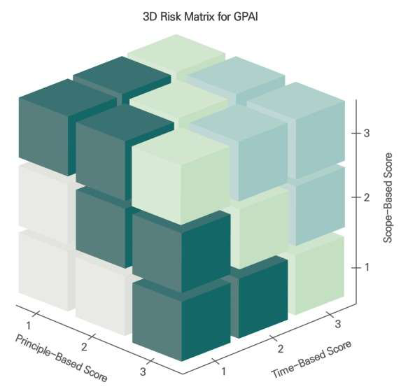
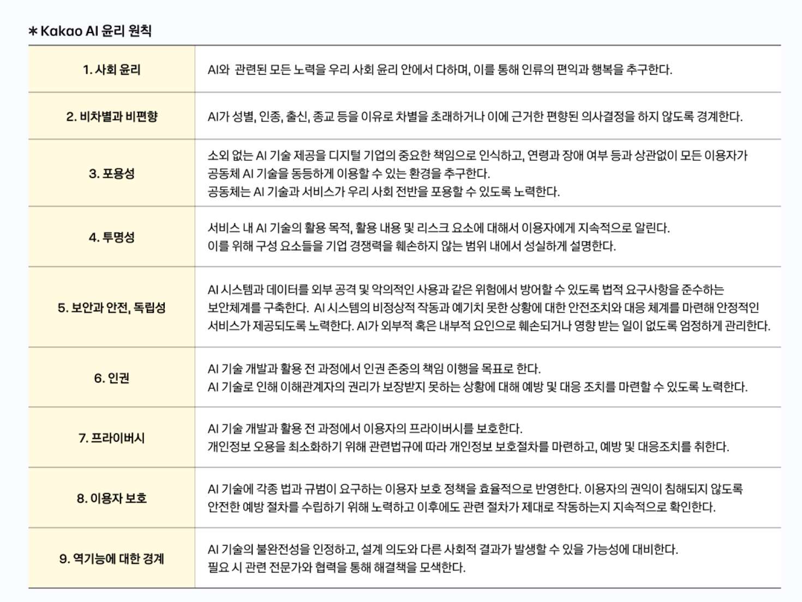
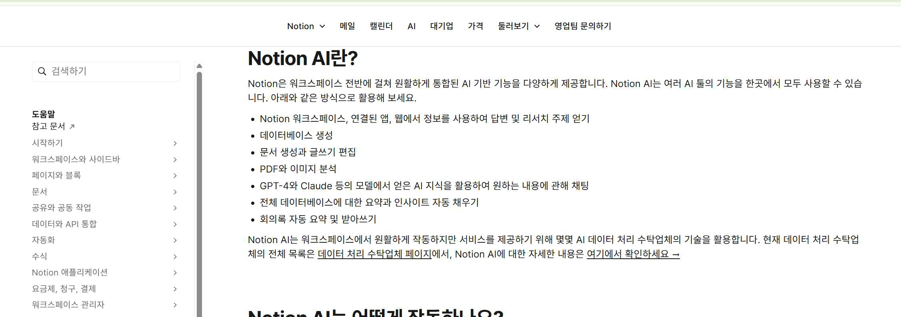
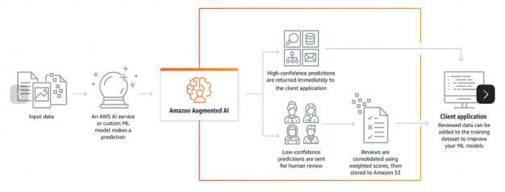
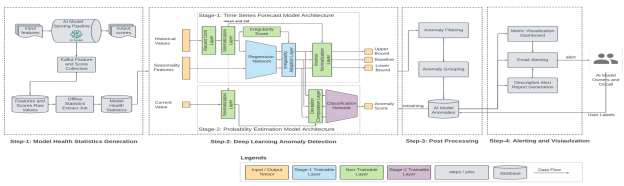
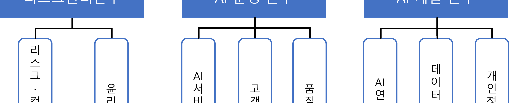
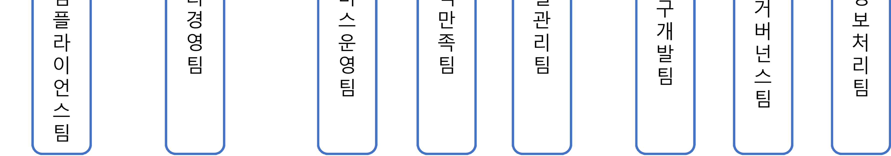

# 고영향AI 사업자책무 가이드라인

> 원본: `4._260122_고영향_인공지능_사업자_책무_가이드라인-1[1].pdf`  
> 페이지: 111p

---

고영향 인공지능 사업자
책무 가이드라인

Table of Contents
추진 배경
장 고영향 인공지능사업자 책무 이행 목적
|
가이드라인 목적
1.1.
가이드라인 적용 방법
1.2.
주요 용어의 개념
1.3.
1.4. FAQ
장 고영향 인공지능사업자 책무 관련 조항
|
관련 법조항
2.1
관련 시행령
2.2
장 고영향 인공지능사업자 책무 조치사항
|
위험관리방안의 수립운영
3.1
·
기술적으로 가능한 범위에서의 인공지능이 도출한 최종결과
3.2
,
인공지능의 최종결과 도출에 활용된 주요 기준

,
인공지능의 개발활용에 사용된 학습용 데이터의 개요

·
등에 대한 설명 방안의 수립시행

·
이용자 보호 방안의 수립운영
3.3
·
고영향 인공지능에 대한 사람의 관리감독
3.4
·
안전성신뢰성 확보를 위한 조치의 내용을 확인할 수
3.5
·
있는 문서의 작성과 보관

부록
안전신뢰문서 양식
1.
작성용
[
]
자가점검 항목
2.
작성 예시
채용분야 작성 예시

추진배경
년
월
일
대한민국 국회는 인공지능 발전과 신뢰 기반 조성 등에 관한 기본법이하 인공지능 기본법을
2024
,
'
'(
'
')
제정하였다
이 법은
년
월부터 시행될 예정이며
인공지능
기술의 발전과 함께 국민의 안전과 기본권 보
.
2026
,
(AI)
호를 위한 법적 기반을 마련하고자 한다.
이 중 인공지능 기본법 제
조고영향 인공지능과 관련한 사업자의 책무는 고영향 인공지능을 제공하거나 이를 이
(
)
용한 제품서비스를 제공하는 사업자에게 다음과 같은 책무를 부과하고 있다
·
:
위험관리방안의 수립운영
1.
·
기술적으로 가능한 범위에서의 인공지능이 도출한 최종결과
인공지능의 최종결과 도출에 활용된 주요 기준
인공
2.
,
,
지능의 개발활용에 사용된 학습용 데이터의 개요 등에 대한 설명 방안의 수립시행
·
·
이용자 보호 방안의 수립운영
3.
·
고영향 인공지능에 대한 사람의 관리감독
4.
·
안전성신뢰성 확보를 위한 조치의 내용을 확인할 수 있는 문서의 작성과 보관
5.
·
그 밖에 고영향 인공지능의 안전성신뢰성 확보를 위하여 위원회에서 심의의결된 사항
6.
·
·
이러한 조치는 고영향 인공지능이 사람의 생명
신체의 안전 및 기본권에 중대한 영향을 미칠 수 있다는 점을 고려
,
하여
사업자가 자율적으로 위험을 관리하고
이용자를 보호하며
인공지능의 운영에 대한 책임을 명확히 하기 위한
,
,
,
것이다.
과학기술정보통신부는 인공지능 기본법의 시행을 위한 하위법령 정비단을 출범시켰으며
고영향 인공지능 사업자의
,
책무를 구체화하고 안내하기 위해 본 가이드라인을 마련하였고
그 구성은 아래와 같다
,
.
제장 인공지능사업자 책무 이행 목적
가이드라인의 목적
적용 방법주요 용어에 대한 설명
(
)
,
,
.
제장 인공지능사업자 책무 관련 조항
인공지능 발전과 신뢰 기반 조성 등에 관한 기본법
제
조 책무를 정의하
(
) ‘
’
는 법조문에 대한 설명.
제장 인공지능사업자 책무 조치사항
사업자 책무 조치사항을 주제별로 나누어 설명
(
)
.
본 가이드라인은 사업자들이 법적 의무를 명확히 이해하고 이행할 수 있도록 지원하며
인공지능 기술의 안전성과
,
신뢰성을 확보하는 데 기여할 것으로 기대된다
특히
본 가이드라인에 포함된 기준과 예시는 사업자들이 자사의 고
.
,
영향 인공지능에 대해 적절한 조치를 취하는 데 도움이 될 것이다
이를 통해
인공지능 기술의 발전과 함께 국민의
.
,
안전과 권리를 보호하는 균형 잡힌 정책이 실현될 것으로 전망된다.

장
고영향 인공지능사업자
책무 이행 목적
가이드라인 목적
1.1
최근 인공지능의 발전과 함께
의료
금융
교육
공공행정 등 다양한 분야에서 고영향 인공지능이 도입되고 있으며
,
,
,
,
,
이에 따라 인공지능의 신뢰성 확보와 윤리적 문제 해결이 필수적인 정책 과제로 떠오르고 있다
특히
인공지능 기
.
,
본법 제
조는 고영향 인공지능사업자에게 위험관리
설명가능성
이용자 보호
인간 감독
문서화 등의 책임을 부과
,
,
,
,
하고 있다
본 가이드라인은 인공지능 기본법 제
조 및 관련 시행령고시를 설명하여 고영향 인공지능의 안전성과
.
·
신뢰성을 확보하고
이를 통해 인공지능 기술이 사회 전반에 걸쳐 책임감 있고 지속 가능한 방식으로 활용될 수 있
,
도록 하기 위해 마련되었다.
본 가이드라인의 목적은 다음과 같이 정리될 수 있다.
첫째
고영향 인공지능사업자가 준수해야 할 안전성과 신뢰성 확보 기준을 제시함으로써
법제도의 실효성을 강화하
,
,
·
는 것이다
즉
가이드라인 자체는 법적 구속력은 없으나 법상 의무 이행을 지원하기 위한 목적으로 제작되었다
인
.
,
.
공지능 기본법 제
조에서 규정하는 사업자의 책무는 개념적 수준에서 제시되어 있어
실제 인공지능 제품서비스를
,
·
개발운영하는 기업 및 기관들이 이를 어떻게 적용해야 하는지에 대한 구체적인 지침이 필요한 상황이다
본 가이드
·
.
라인은 고영향 인공지능의 안전성신뢰성을 보장하기 위한 구체적인 기준과 절차를 제공함으로써
사업자들이 이를
·
,
효과적으로 이행할 수 있도록 돕고
정부의 규제 이행을 지원하는 도구로 활용될 수 있도록 한다
,
.
둘째
인공지능이 신뢰할 수 있고 안전한 방식으로 운영될 수 있도록 기술적 원칙을 소개하는 것이다
인공지능은
,
.
대량의 데이터를 분석하고 의사결정을 자동화하는 과정에서 투명성 부족
설명 불가능성 등의 문제를 초래할 가능성
,
이 있다
이러한 문제들은 사회적 불평등을 심화시키거나
인공지능에 대한 신뢰 저하로 이어질 수 있다
따라서 본
.
,
.
가이드라인은 인공지능의 안전성과 신뢰성을 확보하기 위한 원칙과 기술적제도적 구현 방안을 소개하여
인공지능이
·
,
신뢰받을 수 있도록 지원하는 것을 목적으로 한다.
결론적으로
본 가이드라인은 고영향 인공지능 사업자가 안전성과 신뢰성을 확보할 수 있도록 실효성있는 안내를 제
,
공함으로써
인공지능 기술이 윤리적이고 책임감 있는 방식으로 발전할 수 있도록 지원하는 것을 최우선적인 목표로
,
한다
이를 통해 국내 인공지능 산업이 글로벌 경쟁력을 갖추고 지속 가능한 방식으로 성장할 수 있도록 돕는 동시
.
에인공지능 기술이 사회적 신뢰를 확보하며 널리 확산될 수 있는 환경을 조성할 것이다
,
.

가이드라인 적용 방법
1.2
본 절에서는 국내외 주요 기준과의 연계성을 토대로 이해관계자별 적용 방식과 활용 방안을 제시한다
고영향 인공
.
지능의 사회적 파급력을 고려하여
다양한 이해관계자가 각자의 역할에 따라 이를 효과적으로 적용할 수 있도록 구
,
성하였으며
기술적정책적 지원 체계를 포함하여 실질적인 이행 가능성을 제고하고자 한다
,
·
.
이를 위해 우선 본 가이드라인의 제정 과정에서 국내외 주요 인공지능 관련 정책 및 표준 문서를 심층적으로 분석하
고그 핵심 원칙과 내용을 본 가이드라인에 반영하였다특히한국정보통신기술협회
의 신뢰할 수 있는 인공지능
,
.
,
(TTA)
개발 안내서
미국 국립표준기술연구소
의 인공지능 위험 관리 프레임워크
,
(NIST)
(AI Risk Management Framework,
유럽연합
의 인공지능 법
은 아래와 같은 이유로 주요 참조 문서로써 활용하였다
AI RMF),
(EU)
(AI Act)
.
국내 환경 및 기술적 특성 고려
신뢰할 수 있는 인공지능 개발 안내서
1.
: TTA
신뢰할 수 있는 인공지능 개발 안내서는 국내 환경과 기술적 특성을 고려하여 신뢰할 수 있는 인공지능 개발
TTA
및 활용을 위한 실무적인 지침을 제공한다
이는 국내 사업자들이 인공지능을 개발하고 운영하는 과정에서 직면하는
.
특수한 상황과 요구사항을 반영하는 데 매우 중요하다.
실무적이고 구체적인 지침:
안내서는 인공지능 개발의 전 단계에 걸쳐 고려해야 할 기술적 요구사항을 구체적으로
TTA
제시한다예를 들어데이터 수집 및 처리인공지능 모델 개발시스템 구현운영 및 모니터링 단계별로 신뢰성 확보를
.
,
,
,
,
위한 체크리스트나 권장 사항을 포함하고 있다이러한 실무적인 내용은 본 가이드라인이 추상적인 원칙 나열에 그치지
.
않고사업자들이 실제 업무에 적용할 수 있는 실질적인 방안을 제시하는 데 크게 기여한다
,
.
국내 기술 및 산업 환경 반영:
는 국내
표준화를 선도하는 기관으로서국내 인공지능 기술 수준산업 구조
TTA
ICT
,
,
,
그리고 규제 환경을 가장 잘 이해하고 있다
안내서를 참조함으로써 본 가이드라인은 국내 사업자들의 현실적인
. TTA
역량과 상황을 고려한 책임 기준을 제시할 수 있다이는 사업자들의 수용성을 높이고가이드라인의 실효성을 확보하는
.
,
데 필수적이다.
국내 인공지능 윤리 원칙과의 연계:
안내서는 대한민국 정부가 제시한 인공지능 윤리 기준을 기반으로 하고 있으며
TTA
'
'
,
이를 기술 개발 및 적용의 관점에서 구체화한 문서이다본 가이드라인이
안내서를 참조함으로써정부의 인공지능
.
TTA
,
정책 방향과 일관성을 유지하고
국내 사회가 지향하는 인공지능 윤리 가치를 사업자책무에 효과적으로 반영할 수
,
있습다이는 인공지능이 사회적 신뢰를 얻고 지속적으로 발전하는 데 필요한 국내적 합의를 형성하는 데 기여할 것이다
.
.
포괄성과 범용성
의 위험 관리 접근 방식
2.
: NIST AI RMF
는 인공지능 시스템의 전 수명주기에 걸쳐 발생하는 잠재적 위험을 식별
평가
완화 및 관리하기 위
NIST AI RMF
,
,
한 포괄적인 프레임워크를 제공한다
이 프레임워크는 특정 기술이나 산업에 국한되지 않고
모든 유형의 인공지능
.
,
시스템에 적용될 수 있는 범용성을 지니고 있다.
위험 기반 접근의 체계화:
는 인공지능의 위험을 분류하고
위험 수준에 따른 차등적인 관리 방안을
NIST AI RMF
,
제시함으로써사업자들이 인공지능 시스템의 특성과 잠재적 영향에 따라 합리적이고 효율적인 위험 관리를 수행할 수
,
있도록 돕는다이는 본 가이드라인이 사업자들에게 실질적인 지침을 제공하고불필요한 규제 부담을 최소화하면서도
.
,
책임 있는 인공지능 개발 및 활용을 유도하는 데 필수적인 요소이다.
다양한 이해관계자의 참여 유도:
는 인공지능 위험 관리가 기술 개발자사용자규제 기관 등 다양한
NIST AI RMF
,
,
이해관계자의 협력을 통해 이루어져야 함을 강조한다
이는 본 가이드라인이 제시하는 사업자책무가 단순히 기술적
.
측면에 머무르지 않고사회적 맥락에서의 인공지능 윤리와 신뢰성을 확보하는 데 기여할 수 있도록 한다투명성설명
,
.
,
가능성공정성 등 핵심적인 인공지능 윤리 원칙들이 위험 관리의 관점에서 구체적으로 적용될 수 있는 토대를 제공한다
,
.
자발적 채택 및 유연성:
는 강제적인 규제가 아닌 자발적인 채택을 장려하며조직의 특성과 상황에 맞게
NIST AI RMF
,

유연하게 적용될 수 있도록 설계되었다
이러한 접근 방식은 본 가이드라인이 사업자들에게 규제 준수만을
.
강요하기보다는자율적인 혁신을 저해하지 않으면서도 책임 의식을 내재화할 수 있도록 독려하는 데 적합하다
즉
,
.
,
변화하는 인공지능 기술 환경에 능동적으로 대응할 수 있는 유연한 프레임워크의 필요성을 반영한다.
위험 기반의 선제적 규제
의 규제 프레임워크
3.
: EU AI Act
는 세계 최초의 인공지능 관련 포괄적인 법안으로
인공지능 시스템을 위험 수준에 따라 분류하고 각 위험
EU AI Act
,

수준에 상응하는 규제 요건을 선제적으로 부과하는 방식의 프레임워크를 제시한다.
위험 기반 규제의 선도적 모델:
는 고위험 인공지능 시스템에 대한 시장 출시 전 적합성 평가품질 관리
EU AI Act
,
시스템 구축인간 감독투명성 및 기록 유지 의무 등의 요건을 부과함으로써인공지능 시스템에 대한 선제적인 규제
,
,
,
방안을 제시한다이는 본 가이드라인상 인공지능 시스템의 선제적 위험 관리 프레임워크를 수립하는데 중요한 통찰을
.
제공한다.
글로벌 표준화 동향 반영:
는 전 세계적으로 인공지능 규제 논의를 선도하고 있으며 많은 국가들이 이를
EU AI Act
참고하고 있다본 가이드라인도
를 참조하여국내 인공지능 사업자들이 미래에 직면할 수 있는 글로벌 규제
.
EU AI Act
,
환경에 선제적으로 대비하고국제적인 경쟁력을 확보하는데 기여할 수 있도록 하고 있다
,
.
종합적으로본 가이드라인은
신뢰할 수 있는 인공지능 개발 안내서의 국내 실무적 지침
의 포괄적인
,
TTA
, NIST AI RMF

위험 관리 접근 방식
의 선제적 규제 프레임워크를 상호 보완적으로 활용하여 제정되었다이러한
, EU AI Act
.
다각적인
참조를 통해 본 가이드라인은 글로벌 인공지능 거버넌스 동향을 반영함과 동시에 국내 환경의 특수성을 고려하여,
인공지능 기술의 건전한 발전과 국민의 안전 및 권리 보호라는 두 가지 중요한 목표를 동시에 달성하고자 한다.
관련 문서 매칭
본 가이드라인 제작에 참조한 주요 세 문서의 매칭 결과는 아래와 같다.
제호위험관리방안의 수립운영
.
·
참조문서
설명
韓

인공지능 시스템의 위험 관리 계획 및 수행
01:

인공지능 시스템 수명주기에 걸쳐 나타날 수 있는 위험요소를 분석하였는가
01-1:
?

위험 요소를 제거 및 방지하거나 영향을 완화하기 위한 방안을 마련하였는가
01-2:
?

인공지능 거버넌스 체계 구성
02:

인공지능 거버넌스에 대한 지침 및 규정을 수립하였는가
02-1:
?

인공지능 거버넌스를 위한 조직을 구성하고 인력 구성에 대해 검토하였는가
02-2:
?

서비스 제공 범위 및 상호작용 대상에 대한 설명 제공
15:

인공지능 서비스의 올바른 사용을 유도하기 위한 설명을 제공하는가
15-1:
?

제호
기술적으로 가능한 범위에서의 인공지능이 도출한 최종결과
인공지능의 최종결과 도출에 활용된 주요 기준
.
,
,
인공지능의 개발활용에 사용된 학습용 데이터의 개요 등에 대한 설명 방안의 수립시행
·
·
美
GOVERN 1.3: 조직의 위험 감내
수준 설정을 위해 위험관리 활동 수준을 결정하는 절차 정의

(tolerance)

인공지능 위험 관리 및 효과성을 위해 인공지능 시스템에 적용되는 법률정책규정 등의
GOVERN 2.2:
,
,
정보 제공
GOVERN 4.2: 설계개발배포평가 단계에서 인공지능의 위험 및 잠재적 영향을 문서화 및 의사소통 수행
·
·
·

인공지능 시스템 배포에 따른 위험관리를 위해 정기적인 위험 식별 및 추적 체계 구축
MEASURE 3.1:

인공지능 시스템의 목적 달성 여부 판단을 위해 개발 또는 배포 진행 여부를 결정
MANAGE 1.1:

위험 우선순위 기반의 대응 방안 개발 및 위험처리 옵션 정의
MANAGE 1.3:
MANAGE 4: 인공지능 위험 대응 및 개선을 위해 모니터링사고 대응 등 지속적 개선 활동 수립이행문서화
,
·
·

인공지능 시스템의 지속적인 개선을 위한 프로세스 정립 및 운영
MANAGE 4.2
EU
제조
제항지속적인 인공지능 위험관리 시스템 구축운영 및 문서화
: (
)
·
제항고위험 인공지능의 수명주기 동안 반복적 위험 관리 절차 및 정기 검토 절차 정의
(
)
제항제호인공지능 수명주기 동안 위험 식별분석 및 정기적인 검토갱신
(
a
)


제항제호인공지능 시스템의 잠재적 위험 추정평가
(
b
)

제항제호인공지능 시스템의 잠재적 위험 식별을 위해 모니터링 데이터 기반 위험 평가
(
c
)
제항제호식별한 위험에 대한 적절하고 구체적인 대응 방안 수립
(
d
)
제항위험 처리 이후 남아있는 위험에 대한 식별 및 관리 방안 수립 및 적용
(
)
제항제호고위험 인공지능 시스템 운영 중 위험 감소를 위해 적절한 정보 제공
(
c
)
제항고위험 인공지능이 의도된 목적대로 작동하는지 확인하기 위한 정기 테스트 설계
(
)
제
조
제항고위험 인공지능 시스템의 안전한 사용을 위해 이용자에게 사용 지침 제공
: (
)
참조문서
설명
韓

데이터의 활용을 위한 상세 정보 제공
05.

데이터의 명확한 이해와 활용을 지원하는 상세한 정보를 제공하는가
05-1.
?

데이터의 출처는 기록 및 관리되고 있는가
05-2.
?

인공지능 모델 명세 및 추론 결과에 대한 설명 제공
11:

인공지능 모델의 명세를 투명하게 제공하는가
11-1:
?
美

인공지능 수명주기 전반의 문서화 정책 수립
GOVERN 1.4:

지적재산권 및 기타 권리 침해 위험 관련 정책절차 정의 및 모니터링 수행
GOVERN 6.1:
·

인공지능 시스템의 목적기술 사양성능 기준을 명확히 정의하고 문서화
MAP 2.1:
,
,

인공지능 시스템의 실험 설계데이터 수집 및 선택개념 타당성 관련 요소 식별 및 문서화
MAP 2.3:
,
,

책임 있는 인공지능 시스템 사용을 위해 인공지능 모델 설명을 문서화하고출력 해석
MEASURE 2.9:
,
기준 정의

제호이용자 보호 방안의 수립운영
.
·
EU
제
조
제항인공지능 학습의 신뢰성 확보를 위해 품질 기준을 충족하는 학습데이터 활용
: (
)
제항제호시스템 목적에 부합하는 학습데이터 선택
(
a
)
제항제호데이터 수집목적출처를 포함해 학습데이터를 체계적으로 관리
(
b
)
·
·
제항제호데이터 품질 및 목적 적합성 확보를 위해 전처리 작업을 포함한 데이터 관리 수행
(
c
)
제
조
제항고위험 인공지능 시스템 배포자는 이용자가 시스템 출력을 해석하고 활용할 수 있도록
: (
)
설계 및 개발
제항제호의
인공지능 시스템의 적절한 활용을 위해 입력 및 학습용데이터 사양 제공
(
b
6)
제항제호의
(
b
7) 인공지능 출력 결과의 올바른 해석과 활용을 위해 이용자에게 필요한 정보 제공
제
조인공지능에 의해 생성된 콘텐츠 및 상호작용 대상을 명확히 고지
:
참조문서
설명
韓

인공지능 시스템의 신뢰성 테스트 계획 수립
03:

인공지능 시스템의 특성을 고려한 테스트 환경을 설계하였는가
03-1:
?

데이터 공격에 대한 방어 수단을 강구하였는가
06-2:
?

인공지능 모델 공격에 대한 방어 대책 수립
10:

모델 공격이 가능한 상황을 파악하였는가
10-1:
?

모델 공격에 대한 방어 수단을 강구하였는가
10-2:
?

인공지능 시스템의 안전 모드 구현 및 문제발생 알림 절차 수립
13:

인공지능 시스템의 안전 모드 구현 및 문제발생 알림 절차 수립
13-1:
13-2: 인공지능 시스템에서 문제가 발생할 경우시스템은 이를 운영자에게 전달하는 기능을 수행하는가
,
?
美

위험관리 프로세스가 효과적으로 작동하도록 모니터링 주기 및 조직의 역할 정의
GOVERN 1.5:

인공지능 테스트 및 사고 대응 강화를 위해 정보 공유를 포함한 조직적 수행 기준 정의
GOVERN 4.3:

인공지능 시스템의 사회적 책임을 위해 외부 피드백 수집검토반영하는 절차 마련
GOVERN 5:
·
·

제자로부터 얻은 데이터에 대한 위험 평가 및 관리 프로세스 수립
GOVERN 6.2:

이용자 피드백 반영을 위해 정기적 참여 체계 및 절차와 인력 마련
MAP 5.2:

이용자 의견을 반영한 인공지능 측정 지표의 적정성 및 통제 수단 효과성을 정기적
MEASURE 1.2:
평가갱신


개인의 권리 보호를 위해 프라이버시 관련 위험을 식별하고 문서화 수행
MEASURE 2.10:
MEASURE 3.3: 이해관계자의 의견 반영을 위해 피드백 프로세스 구축 및 인공지능 시스템 평가 지표에 통합

인공지능 시스템의 오작동 위험에 대응하기 위한 위험 식별 및 문서화 수행
MANAGE 2.3:
MANAGE 2.4: 목적 외 결과에 대한 대응을 위해 인공지능 시스템 대체해제 또는 비활성화 메커니즘 마련
,

인공지능 위험 대응 및 개선을 위해 모니터링사고 대응 등 지속적 개선 활동
MANAGE 4:
,
수립이행문서화
·
·

이용자 입력 및 피드백과 사고 대응폐기복구까지 포함한 시스템 모니터링 계획 구현
MANAGE 4.1:



지속적 성능 개선을 위해 이해관계자와의 협의를 포함한 개선 활동을 업데이트에 통합
MANAGE 4.2:

사고 대응 및 복구를 위해 이해관계자에 사고 정보 공유 및 대응 절차 이행
MANAGE 4.3:

제호고영향 인공지능에 대한 사람의 관리감독
.
·
EU
제조
제항실환경 적용 가능성 검증을 위한 실환경 기반 시험 절차 정의
: (
)
제
조학습데이터의 품질 확보를 위한 적정성공정성대표성 기반의 데이터셋 구축
:
,
,
제
조인공지능 시스템의 의도된 목적성능위험 등을 포함한 명확한 사용 지침 제공
:
,
,
제
조정확도 및 견고성을 위해 측정 방법 및 복원력 확보 방안 정의
:
제
조
제항
: (
) 운영 중 발생가능한 위험 대응을 위해 모니터링 수행 및 이상 발생 시 즉시 보고사용 중단
,
제항고위험 인공지능의 추적성 및 책임성 확보를 위해 목적에 맞는 시스템 로그를 최소
(
)
개월간 보관
제
조인공지능 시스템의 안전성 및 규제 준수를 위해 적합성 평가 절차 수행
:
제
조실사용 적합성 검증을 위한 테스트 수행
:
제
조지속적 요구사항 준수 확인을 위해 모니터링 체계 수립 및 운영
:
제항지속적 요구사항 준수 확인을 위해 모니터링 운영
(
)
제
조영향받는 자에게 인공지능 결정에 대한 이해를 위한 설명 제공
:
전문(recital) 10: 데이터 수집처리 시 개인정보보호를 위해 관련 법규 준수 및 데이터 주체의 권리 보장 정의

전문
인공지능 시스템은 안전성투명성다양성 등을 고려하여 설계
(recital) 27:
,
,
전문
영향받는 자의 권리 보장을 위해 인공지능의 결정에 대한 설명 제공
(recital) 171:
참조문서
설명
韓

인공지능 시스템의 안전 모드 구현 및 문제발생 알림 절차 수립
13:

공격성능 저하 및 사회적 이슈 등의 문제 발생 시 대응 가능한 안전 모드를 적용하는가
13-1:
,
?

인공지능 시스템에서 문제가 발생할 경우시스템은 이를 운영자에게 전달하는 기능을
13-2:
,
수행하는가?
美

안전한 인공지능 시스템 폐기를 위해 관련 절차를 수립이행
GOVERN 1.7:
·

인공지능 테스트 및 사고 대응 정보 공유
GOVERN 4.3:

거버넌스 정책에 따른 감독 프로세스 정의평가문서화 수행
MAP 3.5:
,
,

인공지능 시스템 배포 이후 식별된 위험에 대해 정기적으로 재평가
MEASURE 2.6:

이용자 피드백 전달 프로세스 구축 및 인공지능 시스템 평가 지표 마련
MEASURE 3.3:
MEASURE 4.1: 인공지능 위험 식별을 위해 상황별 측정 방법을 외부관계자와 협의 및 접근 방식 문서화 수행
MANAGE 2.4: 목적 외 결과에 대한 대응을 위해 인공지능 시스템 대체해제 또는 비활성화 메커니즘 마련
,
EU
제조책임 있는 인공지능 활용을 위해 이해관계자에게 인공지능 리터러시 교육 운영
:
제
조
제항시스템 이용 중 사람이 통제할 수 있는 방안을 고려하여 인공지능 시스템을 설계개발
: (
)

제항제호위험 수준에 맞는 통제 방안을 위해 배포자가 구현하기 적절한 통제 방안 적용
(
b
)
제항제호위험 통제를 위해 사용자가 인공지능 시스템의 기능 및 한계를 이해하고 점검할 수
(
a
)
있도록 구성
제항제호사람이 직접 제어할 수 있도록 중단 기능 등의 개입 절차를 포함하여 시스템 구성
(
e
)

제호안전성신뢰성 확보를 위한 조치의 내용을 확인할 수 있는 문서의 작성과 보관
.
·
이해관계자 별 적용 방식
기술적정책적 지원 체계 활용
·
본 가이드라인은 정부 및 산학연 기관이 함께 협력하는 인공지능 안전신뢰성 지원 체계를 구축하는데 아래와 같이
·
·
·
활용이 가능하다.
기업 및 공공기관 종사자들이 인공지능 안전성과 신뢰성을 이해하고책임 있는 인공지능 개발 및 운영 방안을 익힐 수
,
있도록 교육을 제공.
인공지능 알고리즘의 편향성 및 안전성을 평가할 수 있는 공공 테스트 환경 제공.
인공지능 신뢰성 거버넌스 협력 네트워크를 운영하여 국내외 주요 인공지능 관계자가 지속적으로 규정을 보완하고 최신
기술 트렌드를 반영.
이해관계자
적용 방식
인공지능 사업자
책임 있는 인공지능 구축 및 내부 거버넌스 체계 강화.
인공지능 개발사업자는 고영향
에 관한 사업자 책무를 준수하기 위한 조직을
AI
지정운영해야 함
·
.
특히 일정 규모 이상의 사업자는 독립성객관성을 갖춘 내부 조직의 평가 또는 외부
·
독립기관의 검인증을 통해 객관성을 확보해야 함
·
.
규제기관 및 정책 결정자
인공지능 정책 수립 강화.
인공지능 기업들이 가이드라인을 자율적으로 준수할 수 있도록혁신적인 인공지능
,
기술이 법적 부담 없이 실험될 수 있는 환경을 제공해야 함.
인공지능 법제도 개선을 위해 산업계
학계
시민사회와 협력하는 공공민간
·
,
,
-
인공지능 협의체 등을 통해 의견을 수렴하며지속적으로 규정을 업데이트해야 함
,
.
인공지능 이용자
인공지능의 신뢰성에 대한 이해 및 권리 보호 강화.
이용자들은 인공지능이 제공하는 정보에 대해 기술적으로 가능한 범위에서
설명가능성을 요구할 권리를 가지며인공지능의 결정이 불합리하다고 판단될 경우
,
이의를 제기할 수 있는 절차를 보장받아야 함.
공공기관은 인공지능을 활용할 때이용자들이 인공지능의 결정 방식과 데이터 활용
,
방식에 대해 알 수 있도록 투명성 보고서 및 인공지능 사용 공시 시스템을 운영하기
위해 노력해야 함.
참조문서
설명
韓

인공지능 시스템의 추적가능성 및 변경이력 확보
04:
美

내 모든
에
항목으로써 별도로 기술
Playbook
function
‘Transparency and Documentation’
EU
제
조규제 준수 입증을 위해 기술 문서 작성 및 최신화 수행
:
제
조안전한 인공지능 활용을 위해 성능 제한위험 등 주요 정보를 이해하기 쉽게 제공
:
,
제
조안전한 시스템 사용을 위해 목적성능위험 등 핵심 정보를 명확히 제공
:
,
,
부속서
인공지능 시스템의 목적구조개발 과정데이터 등 핵심 요소를 기술 문서로 정리
IV:
,
,
,

주요 용어의 개념
1.3
본 가이드라인의 일관된 이해와 적용을 위하여
사용되는 핵심 용어의 정의를 다음과 같이 제시한다
각 용어는 국
,
.
내외 인공지능 관련 기준 및 법령을 참조하여 선정 및 정의되었다.
용어
설명
인공지능
(artificial intelligence, AI)
학습
추론
지각
판단
언어의 이해 등 인간이 가진 지적 능력을 전자적 방법으
,
,
,
,
로 구현한 것 인공지능 기본법 제조제호
(
).
인공지능시스템
(AI system)
다양한 수준의 자율성과 적응성을 가지고 주어진 목표를 위하여 실제 및 가상환경
에 영향을 미치는 예측
추천
결정 등의 결과물을 추론하는 인공지능 기반 시스
,
,
템 인공지능 기본법 제조제호
(
).
고영향 인공지능은 고영향 분야의 인공지능시스템을 의미
‘
’
.
목표인공지능시스템의 목표는 명시적암묵적 목표를 모두 포함즉개발자가 직접
:
,
.
,
입력
지시한 명시적 목표는 물론
상황에 따른 규칙이나 학습데이터로 형성된
,
,
암묵적 목표를 말함.
자율성시스템이 사람의 직접적인 개입 없이도 독립적으로 데이터를 학습하고 외부
:
환경을 판단하며 운영될 수 있는 것을 말함.
적응성
초기 개발 후에도 지속적으로 발전할 수 있는 기계학습 기반 시스템의
:
특성으로배포 전후에 입력되는 데이터와 직접 상호작용하여 스스로 행동 방식을
,
수정할 수 있음을 의미
입력되는 데이터는 입력하는 자개발자
이용자
또는
.
(
,
)
입력방법을 불문함.
결과물
시스템의 산출물로서
과거와 현재의 데이터를 기반으로 미래상황 등을
:
,
추측하는 예측사용자의 선호도나 행동 패턴을 분석해 선택지를 제안하는 추천
,
,
가장 높은 자율성을 가지고 시스템이 독립적으로 판단하여 실행하는 결정 등이 이에
해당함.
인공지능기술
(AI technology)
인공지능을 구현하기 위하여 필요한 하드웨어소프트웨어 기술 또는 그 활용 기술
·
을 말함 인공지능 기본법 제조제호
(
).
고영향 인공지능
(high-impact AI)
사람의 생명
신체의 안전 및 기본권에 중대한 영향을 미치거나 위험을 초래할 우
,
려가 있는 인공지능시스템 인공지능 기본법 제조제호
(
).

에너지의 공급
먹는물의 생산 공정
보건의료 제공이용 체계 및
,
,
·
①
②
③
④
의료기기
원자력시설의 안전한 관리운영
범죄 수사체포 목적 생체인식정보
,
·
,
·
⑤
⑥
분석활용
채용 및 대출 심사
교통 수단시설체계의 주요한 작동운영
·
,
,
·
·
·
,
⑦
⑧
⑨
공공서비스 제공에 필요한 국가기관등의 의사결정
유아초중등교육에서의
,
·
·
⑩
학생평가
인공지능사업자
(AI business operator)
인공지능산업과 관련된 사업을 하는 자로서 다음 각 목의 어느 하나에 해당하는
법인
단체
개인 및 국가기관 등을 말함 인공지능 기본법 제조제호
,
,
(
).
인공지능개발사업자
인공지능을 개발하여 제공하는 자
(AI developer):
.
인공지능이용사업자
인공지능 개발사업자가
(AI-using business operator):
제공한 인공지능을 이용하여 인공지능 제품 또는 인공지능 서비스를 제공하는 자.

용어
설명
국내대리인
(domestic agent)
국내에 주소 또는 영업소가 없는 인공지능사업자로서 이용자 수
매출액 등이 대
,
통령령으로 정하는 기준에 해당하는 자로 안전관리의무 이행 결과의 제출인공지
(
능 기본법 제
조제항
고영향 인공지능 해당 확인 요청인공지능 기본법 제
),
(
조제항
고영향 인공지능 사업자 책무 이행인공지능 기본법 제
조제항
지원
),
(
)
등을 수행하는 자.
이용자
(user)
인공지능 제품 또는 인공지능 서비스를 제공받는 자 인공지능 기본법 제조제
(
호).
영향받는 자
(impacted person)
인공지능제품 또는 인공지능서비스에 의하여 자신의 생명
신체의 안전 및 기본권
,
에 중대한 영향을 받는 자 인공지능 기본법 제조제호
(
).
인공지능제품
(AI product)
인공지능시스템 또는 이를 요소로 포함하는 제품으로서
인공지능시스템에 접속하
,
여 필요로 하는 기능을 수행하는 것을 포함.
인공지능 또는 인공지능 기술을 물리적논리적기능적으로 운용가능한 제품으로
·
·
,
하드웨어 및 소프트웨어를 포함.
인공지능 또는 인공지능기술을 활용한 제품네트워크를 통해 인공지능에 직접
(
연결하여 인공지능을 사용활 수 있도록 하거나인공지능기술을 활용할 수 있는 전용
,
단말기자율주행자동차 등
,
)
인공지능서비스
(AI service)
인공지능
인공지능시스템 또는 인공지능제품을 활용할 수 있도록 제공하는 서비
,
스로 정보 분석
예측
추천
창작 등의 기능을 제공하는 것
,
,
,
.
인공지능제품을 활용한 서비스 또는
스마트폰 등 정보통신기기를 통해
PC,
인공지능기술을 이용할 수 있도록 제공되는 서비스.
인공지능 수명주기
(AI lifecycle)
인공지능의 개발
배포
운영 및 폐기에 이르기까지의 전 과정
,
,
.
위험
(risk)
인공지능 수명주기 전반에 걸쳐 사람의 생명ㆍ신체의 안전 또는 기본권이 침해될
가능성과 그 잠재적 피해의 심각성.
위험관리
(risk management)
위험을 식별
분석
평가하고 이를 허용 가능한 수준으로 처리하기 위한 체계적이
,
,
고 지속적인 관리 활동.

1.4 FAQ
Q
고영향 인공지능에 해당하는지 여부가 불분명할 때는 어떻게 확인해야 하나
'
'
?
A
사업자는 고영향 인공지능 판단 가이드라인한국지능정보사회진흥원을 통해 스스로 사전에 검토해야 하며
판

‘
’(
)
,
단이 어려운 경우 과학기술정보통신부 장관에게 확인을 요청할 수 있다.
Q
고영향 인공지능의 확인 요청은 의무사항인가

?
A
이는 의무가 아닌 사업자의 선택 사항이다
사업자가 스스로 고영향 인공지능이라고 판단하면 별도의 확인 절차

.
없이 책무를 이행하면 된다.
Q
인공지능 개발사업자와 인공지능 이용사업자는 어떻게 다른가
'
'
'
'
?
A
개발사업자는 인공지능을 개발하여 제공하는 자이며
이용사업자는 제공받은 인공지능을 이용하여 제품 또는
'
'
, '
'
서비스를 제공하는 자이다
하나의 기업이 두 가지 지위를 동시에 가질 수도 있다
.
.
Q
일정 규모 이상의 해외 사업자는 어떤 의무가 추가되나

?
A
국내에 주소나 영업소가 없는 해외 사업자 중 매출액이나 이용자 수가 일정 기준예
매출 조원 이상 등을 넘

(
:
)
는 경우
책무 이행 지원 등을 위한 국내대리인을 지정해야 한다
,
'
'
.
Q
개발사업자로부터 시스템을 구매해 단순히 운영만 하는데도 위험관리 계획을 세워야 하나

?
A
이용사업자도 운영 위험관리 계획을 수립해야 한다
다만
개발사업자가 이미 위험관리 조치를 완료한 시스템을

.
,
도입했고 중대한 기능 변경을 초래하지 않았다면개발사업자의 조치 내용을 자신의 계획으로 준용할 수 있다
,
.
Q
위험관리를 위한 별도의 전담 조직을 반드시 새로 만들어야 하나

?
A
사업자의 규모 및 역량을 고려하여 기존 조직이나 인력이 겸임할 수 있다
다만
개발 부서와 분리된 독립성을

.
,
확보하는 것이 권장된다
Q
설명 방안책무를 위해
의 모든 판단 근거를 설명해야 하나
'
'
AI
?
A
기술적으로 가능한 범위에서 이행하면 된다
실질적으로 이용자의 권리에 영향을 미치는 중대한 결과를 상세히

.
설명하고
영향이 적은 출력에 대해서는 시스템 수준의 일반적인 설명을 제공하는 등 차등을 둘 수 있다
,
.
Q
홈페이지에 책무 이행 내용을 게시할 때 영업비밀이 유출될까 우려된다

.
A
시행령에 따르면 부정경쟁방지 및 영업비밀보호에 관한 법률에 따른 영업비밀에 해당하는 사항은 홈페이지 게

「
」
시에서 제외할 수 있다따라서 기술적 사양보다는 관리 체계와 이용자 권리 보호 절차 위주로 공개하면 된다
.
.

Q
개인정보가 포함된 데이터를 학습에 써도 되나

?
A
적법한 동의를 받거나 가명처리 등 개인정보 보호법에 따른 조치를 취한 후 사용해야 하며
데이터의 보유 기

,
간과 파기 절차도 수립해야 한다.
Q
이용자가 인공지능의 결정에 대해 이의를 제기하면 어떤 절차를 거쳐야 하나

?
A
이용사업자는 이용자가 이의를 제기하거나 설명을 요구할 수 있는 절차를 수립해야 한다
이 때 사람 전문가가

.
해당 결정을 재검토하거나
분석 로그 등을 바탕으로 판단 근거를 안내하는 등의 대응 프로세스가 필요하다
, AI
.
Q
사람의 관리감독이란 사람이
시간 감시해야 한다는 뜻인가
'
·
'
?
A
위험 수준에 따라 상시 개입 또는 예외적 개입 등 적절한 수준을 정하면 된다

.
Q
사람의 관리감독을 위해 반드시 인공지능 안전 전문 인력을 새로 고용해야 하나

·
?
A
사업자의 규모와 역량을 고려하여 기존 조직 내에서 담당 인력을 지정하거나 겸임 인력을 두는 것도 가능하다

.
중요한 것은 이상 상태 발생 시 즉각 개입할 수 있는 권한과 기준이 명확히 정의되어 있는가이다.
Q
작성한 안전신뢰문서와 이행 근거 자료는 얼마나 오랫동안 보관해야 하나

'
'
?
A
인공지능사업자는 법 제
조제항 각 호의 조치를 이행하고 그 근거를 문서로 작성하여 년간 보관해야 한다

.
Q
문서는 어떤 양식으로 작성해야 하나

?
A
안전신뢰문서표준 양식을 참고하되
기업의 상황에 맞게 조정할 수 있다
기존 사내 문서 및 관리 시스템이
'
'
,
.
내용을 충족하면 이를 인용하는 것도 가능하다.

장
고영향 인공지능사업자 책무 관련 조항
관련 법조항
2.1
고영향 인공지능사업자고영향 인공지능 또는 이를 이용한 제품서비스를 제공하는 인공지능사업자는 인공지능 기본
(
·
)
법에 따라 다음과 같은 책무를 부담한다.
고지 의무
제
조인공지능 투명성 확보 의무
(
)
인공지능사업자는 고영향 인공지능이나 생성형 인공지능을 이용한 제품 또는
①
서비스를 제공하려는 경우 제품 또는 서비스가 해당 인공지능에 기반하여 운용된다는 사실을 이용자에게 사전에 고
지하여야 한다.
안전성신뢰성 확보 조치
·
제
조고영향 인공지능과 관련한 사업자의 책무
(
)
인공지능사업자는 고영향 인공지능 또는 이를 이용한 제품서

·
①
비스를 제공하는 경우 고영향 인공지능의 안전성신뢰성을 확보하기 위하여 다음 각 호의 내용을 포함하는 조치를
·
대통령령으로 정하는 바에 따라 이행하여야 한다.
위험관리방안의 수립운영
1.
·
기술적으로 가능한 범위 내에서의 인공지능이 도출한 최종결과
인공지능의 최종결과 도출에 활용된 주요 기
2.
,
준
인공지능의 개발활용에 사용된 학습용데이터의 개요 등에 대한 설명 방안의 수립시행
,
·
·
이용자 보호 방안의 수립운영
3.
·
고영향 인공지능에 대한 사람의 관리감독
4.
·
안전성신뢰성 확보를 위한 조치의 내용을 확인할 수 있는 문서의 작성과 보관
5.
·
그 밖에 고영향 인공지능의 안전성신뢰성 확보를 위하여 위원회에서 심의의결된 사항
6.
·
·
과학기술정보통신부장관은 제항 각 호에 따른 조치의 구체적인 사항을 정하여 고시하고
인공지능사업자에게 이
,
②
를 준수하도록 권고할 수 있다.
인공지능사업자가 다른 법령에 따라 제항 각 호에 준하는 조치를 대통령령으로 정하는 바에 따라 이행한 경우
③
에는 제항에 따른 조치를 이행한 것으로 본다
.

관련 시행령
2.2
인공지능 기본법 시행령은 인공지능사업자가 인공지능 기본법상 고영향 인공지능사업자의 책무를 이행하여 인공지능
이용사업자에게 인공지능시스템을 제공하는 경우 중복규제를 피하기 위하여 인공지능이용사업자에게 일부 책무를 면
제하고 있다.
다만
책무의 면제는 인공지능이용사업자가 인공지능시스템의 중대한 기능 변경을 초래하지 않은 경우에만 적용되
,
‘
’
도록 규정한다
여기서 중대한 기능 변경이란 인공지능개발사업자가 제공한 인공지능과 동일성이 인정되지 않을 수
.
‘
’
준으로 성능
안전성위험성
용도목적
이용 분야와 맥락신뢰성의 변화 등을 종합적으로 고려하여 이루어진다
,
(
),
(
),
,
.
범용 인공지능모델을 자신의 시스템에 통합하는 등 고영향 인공지능시스템을 만들어 제공하는 인공지능사업자는 기
존 인공지능의 이용 목적용도기능 등을 중대하게 변경한 경우에 해당하므로 고영향 인공지능개발사업자의 지위를
·
·
갖게 된다.
개발사업자와 이용사업자의 책무
제
조고영향 인공지능과 관련한 사업자의 책무
(
)
인공지능사업자는 법 제
조제항 각 호의 조치 중에서 다음

①
각 호에 해당하는 내용을 인공지능사업자의 사무소ㆍ사업장 또는 인터넷 홈페이지 등에 게시해야 한다
다만
부정
.
, 「
경쟁방지 및 영업비밀보호에 관한 법률
제조제호에 따른 영업비밀에 해당하는 사항은 제외할 수 있다
.
」
위험관리정책 및 조직체계 등 법 제
조제항제호에 따른 위험관리방안의 주요 내용
1.
법 제
조제항제호에 따른 설명 방안의 주요 내용
2.
법 제
조제항제호에 따른 이용자 보호 방안
3.
법 제
조제항제호에 따른 해당 고영향 인공지능을 관리ㆍ감독하는 사람의 성명 및 연락처
4.
인공지능사업자는 법 제
조제항 각 호의 조치를 이행하고 그 근거를 문서로
년간 보관전자적 방법을 통한
(
②
보관을 포함한다해야 한다
)
.
법 제
조제항제호부터 제호까지의 조치를 모두 또는 일부 이행한 인공지능사업자로부터 인공지능시스템을
③
제공받은 인공지능이용사업자가 해당 인공지능시스템의 본래 목적이나 용도를 현저하게 변경하는 등 중대한 기능 변
경을 하지 않은 경우에는 법 제
조제항제호부터 제호까지의 조치를 모두 또는 일부 이행한 것으로 본다
.
인공지능이용사업자는 인공지능개발사업자에게 법 제
조제항에 따른 책무를 이행하기 위하여 필요한 자료의
④
제공을 요청할 수 있고
인공지능개발사업자는 이에 협력하도록 노력해야 한다
,
.
법 제
조제항에 따라 인공지능사업자가 같은 조 제항에 따른 조치를 이행한 것으로 보는 경우는 별표
과
⑤
같다.

장
고영향 인공지능사업자
책무 조치사항
위험관리방안의 수립운영
3.1
·
관련 기술고시 조문
제조위험관리방안의 수립ㆍ운영
(
)
인공지능개발사업자 및 인공지능이용사업자이하 사업자라 한다는 고영향 인

(
“
”
)
①
공지능의 위험관리를 위하여 다음 각 호의 사항이 포함된 위험관리방안을 수립ㆍ운영하여야 한다.
위험관리정책 수립 및 이행
1.
위험관리 조직체계 수립 및 운영
2.
사업자는 제항의 위험관리방안을 인공지능 수명주기의 모든 과정에서 준수하여야 한다
.
②
사업자는 최신의 위험관리방안을 주기적으로 점검ㆍ갱신하고 그 변경내역을 관리하여야 한다.
③
타 법령의 유사 조치사항
법령
조항
내용
지능정보화 기본법
제
조안전성
(
보호조치)
지능정보화 기본법 제
조는 지능정보기술 및 지능정보서비스의 안
전성 확보를 위한 최소한의 보호조치를 명시하고 있다이는 고영향
.
인공지능이 야기할 수 있는 광범위한 위험을 관리하고 안전성을 확
보해야 한다는 인공지능 사업자 책무의 기본 전제와 동일하다
단
.
,
지능정보화 기본법은 안전성 보호조치를 권고할 수 있다고 명시하
여 강제성이 상대적으로 낮다.
소프트웨어 진흥법
제
조소프트웨어안
(
전 확보)
인공지능 역시 소프트웨어를 통해 구현되므로
소프트웨어의 기본적
,
인 안전 원칙이 인공지능의 안전성 확보에도 적용될 수 있다
단
.
,
소프트웨어 진흥법은 일반적인 소프트웨어의 안정성 및 보안 취약
점 등 기술적 결함으로 인한 위험에 중점을 두지만
인공지능 기본
,
법은 알고리즘의 비결정성
인과관계의 불분명성
자율적 학습 및
,
,
진화 등으로 인해 예측 불가능한 결과를 고려한다이러한 인공지능
.
고유의 비기술적
사회적
윤리적 위험에 대한 고려는 소프트웨어
,
,
진흥법에서는 찾아보기 어렵다.

주요 내용
본 절의 사업자 책무사항 주요 내용을 주제별로 분류하면 아래와 같다.
정보통신망
이용촉진 및
정보보호 등에
관한 법률
제
조정보통신망의
(
안정성 확보 등)
정보통신망의 안정성 및 정보의 신뢰성 확보를 위한 보호조치를 요
구하며이는 인공지능이 안정적으로 기능하고 신뢰할 수 있는 정보
,
를 제공해야 한다는 인공지능 사업자 책무의 기본적인 전제와 부합
한다
단
정보통신망법의 위험은 전자적 침해행위 방지
불법 유
.
,
,
출위조변조삭제 방지 등 주로 사이버 보안 및 정보 유출에 초점
·
·
·
을 맞춘 위험 관리이다.
제
조의
정보보호
3(
최고책임자의 지정 등)
인공지능 사업자 책무의 상설 위험관리기구조직
운영중 위험관
'
(
)
'
리 조직체계 구성 및 담당인력 지정과 직접적인 유사성을 가진다.
그러나 정보보호 최고책임자가 주로 정보보안 전문가의 역할을 수
행하는 것과 달리
인공지능 위험관리조직의 책임자 및 담당 인력은
,
기술적 전문성 외에 윤리
법률
사회과학적 지식 등 다양한 분야의
,
,
이해를 바탕으로 인공지능의 복합적인 위험을 평가하고 대응할 수
있는 역량이 요구된다.
개인정보 보호법
제
조안전조치의무
(
)
개인정보가 분실도난유출위조변조 또는 훼손되지 않도록 안전성
·
·
·
·
확보에 필요한 기술적관리적 및 물리적 조치를 요구하며
제
조
·
,
는 이를 총괄할 개인정보 보호책임자를 지정하도록 한다
이는 고영
.
향 인공지능 사업자 책무의 위험관리체계 구축과 상설 위험관리기
'
'
'
구 운영과 매우 흡사하다
단
개인정보 보호법의 위험은 개인정보
'
.
,
침해에 국한되므로
개인의 식별 가능 정보와 관련된 유출
오용
,
,
,
남용 등 프라이버시 침해 위험이 주된 대상이다.
제
조개인정보
(
보호책임자의 지정 등)
개인정보 보호책임자가 업무를 독립적으로 수행할 수 있도록 보장
해야 한다는 조항제
조 제항은 인공지능 위험관리기구의 독립
(
)
성 및 객관성 확보를 위한 중요한 시사점을 제공한다
단
개인정보
.
,
보호책임자의 책임은 주로 개인정보 보호에 한정된다.
책무사항
주제
소주제
위험관리방안의
1.
수립운영
·
위험관리정책 수립 및
1-1.
이행
위험관리 계획의 수립
1-1-1.
위험 식별
1-1-2.
위험 분석 및 평가
1-1-3.
위험 처리
1-1-4.
위험관리정책 개선
1-1-5.
위험관리 조직체계 수립
1-2.
및 운영
위험관리 조직체계 구성
1-2-1.
정보의 제공
1-2-2.
유관 조직과의 협력
1-2-3.

오픈소스 모델 고려사항
오픈소스 모델을 활용하는 사업자는 직접 모델을 개발하는 사업자와 아래와 같은 차이가 있다.
소주제 번호
직접 개발
오픈소스 모델
1-1-1
인공지능 수명주기 전 과정의 위험관리 로드맵
을 자체 수립할 수 있으므로
통제 중심의 계획
,
수립이 가능함.
불확실한 모델에 대한 검증 및 보완 중심의 계
획이 바람직함
필요시
다른 모델로 신속히 전
.
,
환할 수 있는 계획도 수립할 수 있음.
1-1-2
인공지능의 구조적 결함 등 모든 내부 요인을
직접 전수 조사할 수 있음.
공지된 취약점 확인이 우선
모델 카드나 커뮤
.
니티에 보고된 알려진 탈옥 패턴 등을 식별.
1-1-3
내부 파라미터 및 가중치 변화에 따른 위험도를
정밀 분석 가능.
블랙박스그레이박스 테스트 위주
내부 로직을
/
.
알기 어려우므로
입출력 위주의 평가
100%
,
에 집중할 필요가 있음
(Red Teaming)
.
1-1-4
인공지능 모델 재학습
이나 가중치
(Retraining)
수정을 통한 근본적 해결 가능.
필터링 시스템
프롬프트 엔지니어링
파인튜닝
,
,
등으로 보완.
1-1-5
자체 성과 지표를 바탕으로 정책 고도화.
오픈소스 커뮤니티의 보안 패치 및 신규 버전
업데이트 동향을 상시 모니터링하여 정책에 반
영하는 것이 바람직함.
1-2-1
독립적인 검증팀을 두어 개발자와 검증자를 분
리하는 것이 이상적임.
모델 내부를 수정하기보다 운영 및 관제에 특
'
'
화된 조직이 중요
외부 모델의 업데이트나 라
.
이선스 변경에 대응할 법무기술 검토 인력이
/
필요.
1-2-2
인공지능의 의사결정 로직을 직접 소유하고 있
으므로 위험관련 정보 전달 내용을 구체적으로
수립할 수 있음.
모델 원저작자가 공개한 모델 카드 및 기술 문
서에 의존하여 정보를 제공.
1-2-3
사내 부서 간 협력이 핵심.
법무팀은 오픈소스 라이선스 위반 여부를
정보
,
보안팀은 외부 모델 도입에 따른 보안 취약점을
중점적으로 검토하는 것이 바람직함.

1-1
위험관리정책 수립 및 이행
위험관리 계획의 수립
1-1-1.
개발사업자
이용사업자
목표
고영향 인공지능에 대한 위험관리 계획을 수립해야 함.
설명
개발 및 이용사업자는 고영향 인공지능의 설계개발운영 과정에서 발생 가능한 법적사회적 위험을
·
·
,
관리하기 위한 계획을 수립해야 함.
수립되는 위험관리 계획은 인공지능 전 수명주기에 걸쳐 발생할 수 있는 위험을 식별분석평가하고
-
,
,
,
그에 따른 적절한 처리 절차를 포함하는 방향으로 작성.
위험관리를 위해 고영향 인공지능 영향평가 절차인공지능 기본법 제
조제항를 효과적으로 활용할 수
-
(
)
있으며사업자에게 부과된 다양한 법적 책무 또한 수명주기별 위험관리 절차에 통합하여 이행함으로써
,
효율성을 높일 수 있음.
이용사업자는 운영 과정의 위험을 지속적으로 관리하기 위한 계획을 수립해야 함다만개발사업자가
-
.
,
위험을 직접 관리운영하는 경우이용사업자는 개발사업자와의 협력에 따라 개발사업자의 위험관리계획
·
,
중 이용사업자의 책임 범위와 관련된 사항을 자신의 위험관리계획의 일부 또는 전부로 준용할 수 있음.
참고

신뢰할 수 있는 인공지능 개발안내서
韓
요구사항
인공지능 시스템에 대한 위험관리 계획 및 수행
-
01.

NIST AI RMF
美
- GOVERN 1.3: 조직의 위험 감내
수준 설정을 위해 위험관리 활동 수준을 결정하는 절차 정의

(tolerance)
EU AI ACT
- 제조제항지속적인 인공지능 위험관리 시스템 구축운영 및 문서화
:
·
사업자 구분
자가점검
조직은 인공지능 위험관리 계획을 수립하고 책임을 명시하고 있는가?
수립된 위험관리 계획이 위험 식별분석평가처리 절차를 포함하는가
,
,
,
?
위험관리 시 영향 평가 절차를 고려하고 있는가?
위험관리가 지속적으로 이행되고 있는가?
개발 이용
개발

이용

개발

이용

이용
사례
Responsible Scaling Policies (RSPs)
M
의
는 인공지능 개발자가
ETR
'Responsible Scaling Policies (RSPs)'
현재의 보호 조치로 안전하게 관리할 수 있는 인공지능 능력 수준을 명확히
정의하고보호 조치가 개선되기 전까지는 인공지능의 배포나 능력 확장을
,
중단해야 하는 조건을 명시하는 정책으로
그림에서 오른쪽으로 갈수록
,
인공지능의 위험한 능력이 증가하고
위쪽으로 갈수록 보호 조치가
,
강화되는 구조를 가짐.
안전 영역
인공지능이 높은 위험을 초래할 수 있는
(safe region):
능력을 갖추고 있더라도 충분한 보호 조치가 적용된 상태를 의미.
위험 영역
위험한 능력을 가진 인공지능에 충분한 보호
(risky region):
조치가 마련되지 않은 상태를 의미.
는 인공지능 능력의 확장이 보호 조치의 수준과 조화를 이루는지를
RSP
지속적으로 검토하고
위험 관리와 관련된 기준을 설정함으로써 인공지능의 안전성을 확보하기 위한 실질적인
,
가이드라인을 제공함.

위험 식별
1-1-2.
개발사업자
이용사업자
목표
사람의 생명신체의 안전 및 기본권에 중대한 영향을 미칠 수 있는 위험을 식별해야 함
,
.
설명
개발사업자는 인공지능의 설계데이터 수집모델 학습테스트 등 개발 전 과정에서 발생 가능한 사람의
,
,
,
생명신체의 안전 및 기본권에 대한 잠재적 위험을 식별하기 위해 노력해야 함
,
.
이용사업자는 개발사업자로부터 제공받은 정보를 바탕으로실제 환경에서 인공지능이 이용될 때 발생할
,
수 있는 사람의 생명신체의 안전 및 기본권에 대한 위험을 식별하고관련 데이터사고 신고불만 사항
,
,
(
,
,
수리 내역 등를 통해 지속적으로 갱신하기 위해 노력해야 함
)
.
참고

신뢰할 수 있는 인공지능 개발안내서
韓
요구사항
인공지능 시스템에 대한 위험관리 계획 및 수행
-
01.
세부요구사항
인공지능 시스템 수명주기에 걸쳐 나타날 수 있는 위험 요소를 분석하였는가
-
01-1.
?

NIST AI RMF
美
-
인공지능 시스템 배포에 따른 위험관리를 위해 정기적인 위험 식별 및 추적 체계 구축
MEASURE 3.1:
EU AI ACT
- 제조제항제호인공지능 수명주기 동안 위험 식별분석 및 정기적인 검토갱신
a
:


사업자 구분
자가점검
인공지능 개발 과정에서 발생 가능한 위험을 식별하고 있는가?
인공지능 운영 과정에서 발생 가능한 위험을 식별하고 운영 데이터를 통해 관련 내용을
지속적으로 갱신하기 위해 노력하고 있는가?
개발
이용

사례
위험요소 예시
에서는 생성형 인공지능에 대해 아래와 같은 위험 요소를 명시함
OECD
.
인공지능 환각또는 설득력 있지만 부정확한 출력
"
"
허위 및 오해의 소지가 있는 콘텐츠
지적재산권 침해
직업 및 노동 시장 변화 예자동화에 따른 일자리 대체 및 노동시장 내 불균형 심화 가능성
(
:
)
에너지 소비와 환경 예생성형
모델 학습 및 추론 시 높은 에너지 소비로 인한 환경 부담 증가
(
:
AI
)
편견고정관념 증폭 및 개인 정보 보호 문제
,
잠재적인 미래 위험 및 우려 사항

위험 분석 및 평가
1-1-3.
개발사업자
이용사업자
목표
식별된 위험으로 인해 발생가능한 결과를 분석 및 평가해야 함.
설명
개발 및 이용사업자는 인공지능이 활용되는 영역의 특성 및 활용 방법인공지능의 유형생성형 또는
,
(
판별형등을 고려하여 위험의 심각도와 발생빈도를 분석 및 평가할 수 있는 적절한 기준을 마련해야 함
)
.
인공지능의 직접적인 혜택이나 피해를 받을 수 있는 이해관계자 집단을 식별하고그 집단 간 편익과
-
,
위험의 불균형 가능성을 분석해야 하며조직개인커뮤니티집단사회 전반에 대한 결과를 포괄적으로
,
,
,
,
,
고려할 수 있음.
개발사업자는 소프트웨어 및 하드웨어 결함 외에 인공지능 특성에서 나타날 수 있는 위험 요소환각설명
(
,
미제공데이터 중독 등를 분석 및 평가하기 위해 노력해야 함
,
)
.
이용사업자는 인공지능의 본래 활용 목적뿐만 아니라 장애오남용 등으로 인해 발생할 수 있는 위험을
,
분석 및 평가하기 위해 노력해야 함.
참고

신뢰할 수 있는 인공지능 개발안내서
韓
요구사항
인공지능 시스템에 대한 위험관리 계획 및 수행
-
01.
세부요구사항
인공지능 시스템 수명주기에 걸쳐 나타날 수 있는 위험 요소를 분석하였는가
-
01-1.
?

NIST AI RMF
美
- GOVERN 4.2: 설계개발배포평가 단계에서 인공지능의 위험 및 잠재적 영향을 문서화 및 의사소통 수행
·
·
·
EU AI ACT
- 제조제항제호인공지능 시스템의 잠재적 위험 추정평가
b
:

- 제조제항제호인공지능 시스템의 잠재적 위험 식별을 위해 모니터링 데이터 기반 위험 평가
c
:
사업자 구분
자가점검
식별된 위험의 심각도와 발생 빈도를 분석 및 평가하고 있는가?
식별된 위험과 관련된 이해관계자에 대해 정량적 또는 정성적 분석을 수행하기 위해
노력하고 있는가?
인공지능 특성에서 나타날 수 있는 위험 요소환각설명 미제공데이터 중독 등를 분석
(
,
,
)
및 평가하기 위해 노력하고 있는가?
장애 및 오남용 등으로 발생할 수 있는 위험을 분석 및 평가하기 위해 노력하고 있는가?
개발 이용
개발

이용

개발

이용
사례
범용인공지능
위험 매트릭스
(GPAI) 3D
년
한국정보통신기술협회
에서
출판한
범용
2024
(TTA)
‘
인공지능
위험 관리 프레임워크에서는 범용인공지능과
(GPAI)
’
관련한 직관적인 위험 평가도구로써
위험 매트릭스를
3D
제안함각 축의 점수는
점으로 부여되며 총 위험 점수는 이
.
1~3
세 가지 점수를 곱한 값으로 계산됨.
정렬 원칙 기반 점수
인공지능이
(principle-based score):
설정된 목표와 일치하게 작동하는지인간의 권리와 자율성을
,
존중하는지그리고 사회적 가치를 적절히 반영하는지를 평가
,
.
위험 발현 기간 기반 점수
위험이 단기
(time-based score):
,
중기장기적으로 발생하는지에 따라 평가
,
.
영향 범위 기반 점수
위험이 개인이나
(scope-based score):
소규모 그룹에만 영향을 주는 위험인지
특정 지역이나
,
집단까지 미치는 위험인지또는 전 세계에 광범위하게 미치는
,
위험인지를 기준으로 평가.

위험 처리
1-1-4.
개발사업자
이용사업자
목표
위험 분석 및 평가 결과에 따라 위험 요소별로 위험을 처리하는 적절한 조치를 채택해야 함.
설명
개발 및 이용사업자는 이전에 분석 및 평가된 위험 요소별로 인명 피해 및 사고를 방지하거나 부정적
영향을 최소화하기 위한 적절한 처리 방안을 마련하고 실행해야 함.
마련된 방안을 통해 위험이 실제로 처리되었는지를 모니터링하고잔여 위험이 존재하는 경우해당 잔여
-
,
,
위험이 허용할 수 있는 수준이 되도록 노력해야 함.
적절한 위험 처리를 위해 인공지능 기본법
제
조에 따라 구축 및 운영되는 인공지능 실증기반 이용
-
｢
｣
등을 고려할 수 있음.
개발사업자는 개발 중 발생한 위험을 처리하고
필요 시 처리 결과를 확인할 수 있도록 관련 정보를
,
이용사업자에게 제공해야 함.
이용사업자는 운영 중 발생할 수 있는 위험에 대해 별도의 처리 계획을 마련해야 함.
참고

신뢰할 수 있는 인공지능 개발안내서
韓
요구사항
인공지능 시스템에 대한 위험관리 계획 및 수행
-
01.
세부요구사항
위험 요소를 제거 및 방지하거나 영향을 완화하기 위한 방안을 마련하였는가
-
01-2
?

NIST AI RMF
美
-
위험 우선순위 기반의 대응 방안 개발 및 위험처리 옵션 정의
MANAGE 1.3:
EU AI ACT
제조제항제호식별한 위험에 대한 적절하고 구체적인 대응 방안 수립
-
d
:
제조제항위험 처리 이후 남아있는 위험에 대한 식별 및 관리 방안 수립 및 적용
-
:
사업자 구분
자가점검
위험별로 제거완화모니터링수용 등 처리 방안을 명확히 수립하고 실행하고 있는가
,
,
,
?
처리된 위험에 잔여 위험이 존재하는 경우 이는 허용할 수 있는 수준인가?
개발 중 처리한 위험에 대한 기록을 보유하여 필요 시 관계자에게 제공할 수 있는가?
운영 중 발생할 수 있는 위험에 대한 처리 계획예사용 제한알림 등이 존재하는가
(
:
,
)
?
개발 이용
개발

이용

개발

이용
사례
위험처리 방안 예시
제거
위험을 발생시키는 활동을 시작하거나 계속하지 않기로 결정하여 위험 혹은 위험의 원천을 제거
(elimination):
.
예특정 기능이나 시스템을 제거특정 장치 도입
(
:
,
.)
완화
위험의 발생 가능성 또는 결과를 변경하여 위험을 완화
예모델의 해석 가능성을 높이기 위해
(mitigation):
. (
:
새로운 알고리즘 도입.)
모니터링
모든 위험을 완전히 제거하거나 완화하기 어려운 경우
위험을 타 기관과 공유하거나
(monitoring):
,
지속적으로 지켜보면서 피드백을 제공하여 위험을 모니터링하며
재정적 손실에 대비하기 위해 보험이나 계약을
,
활용하는 방법도 포함
예계약 또는 보험 구매배포 이후에도 지속적으로 시스템 모니터링위험 요소 감지
. (
:
,
,
.)
수용
경미한 위험에 적용되며기회를 추구하기 위해 정보를 기반으로 위험을 방치하여 위험을 수용
(acceptance):
,
.
예위험이 있지만 신제품서비스 출시
(
:
·
.)

위험관리정책 개선
1-1-5.
개발사업자
이용사업자
목표
인공지능 수명주기 동안 위험관리정책을 조직 내외부 변화에 대응시키고 지속적으로 개선해야 함.
설명
개발 및 이용사업자는 위험 처리 방안이 적용된 이후에 파급효과를 재평가함으로써 위험 요소가 실제로
제거방지완화되었는지 확인하고이에 대한 피드백을 위험관리체계 개선에 사용해야 함
,
,
,
.
이는
의 모니터링 및 대응과 밀접하며대응 결과를 위험관리정책의 개선에 이용할 수 있음
-
3-2-1
,
.
참고

신뢰할 수 있는 인공지능 개발안내서
韓
요구사항
인공지능 시스템의 위험 관리 계획 및 수행
-
01.
세부요구사항
위험 요소를 제거 및 방지하거나 영향을 완화하기 위한 방안을 마련하였는가
-
01-2
?

NIST AI RMF
美
인공지능 시스템의 목적 달성 여부 판단을 위해 개발 또는 배포 진행 여부를 결정
- MANAGE 1.1:
- MANAGE 4: 인공지능 위험 대응 및 개선을 위해 모니터링사고 대응 등 지속적 개선 활동 수립이행문서화
,
·
·
인공지능 시스템의 지속적인 개선을 위한 프로세스 정립 및 운영
- MANAGE 4.2
EU AI ACT
제조제항고위험 인공지능의 수명주기 동안 반복적 위험 관리 절차 및 정기 검토 절차 정의
-
:
제조제항고위험 인공지능이 의도된 목적대로 작동하는지 확인하기 위한 정기 테스트 설계
-
:
사업자 구분
자가점검
위험 처리 방안 적용 후해당 방안의 파급효과를 재평가하고 있는가
,
?
위험 처리 방안에 대한 피드백을 위험관리정책 개선에 사용하고 있는가?
개발 이용
개발 이용
사례
카카오 그룹의 책임있는
를 위한 가이드라인
AI
카카오 그룹은 인공지능 기술 발전과 이에 따른 새로운 위험 요소에 대응하기 위해
윤리원칙을 계층화하여 정비하고

, AI
,
가이드라인과 체크리스트를 고도화하였음.
좌개정 전우개정 후
(
:
,
:
)

1-2
위험관리 조직체계 수립 및 운영
위험관리 조직체계 구성
1-2-1.
개발사업자
이용사업자
목표
위험을 관리하는 담당 조직을 구성하거나 조직 내 위험관리를 담당하는 인력을 지정해야 함.
사업자의 규모 및 역량을 고려하여 담당 조직을 구성할 수도 있고,
※
겸임 인력을 지정할 수 있음.
설명
개발 및 이용사업자는 인공지능 위험관리를 담당하는 조직을 구성하거나 인력을 지정하여 위험관리
업무를 수행하고 이에 대한 책임을 명시하기 위해 노력해야 함.
위험관리 조직 또는 인력은 기술법률윤리 등 다양한 분야의 전문가 또는 담당자로 구성하도록 노력해야
-
,
,
하며이들의 책임과 권한을 정의해야 함
,
.
이 조직 또는 인력은 인공지능 기획개발 업무와 분리되어야 하며이해상충 방지를 위한 조직적기능적
-
·
,
·
독립성이 최대한 확보되어야 함.
참고

신뢰할 수 있는 인공지능 개발안내서
韓
요구사항
인공지능 거버넌스 체계 구성
-
02.
세부요구사항
인공지능 거버넌스에 대한 지침 및 규정을 수립하였는가
-
02-1.
?
세부요구사항
인공지능 거버넌스를 위한 조직을 구성하고 인력 구성에 대해 검토하였는가
-
02-2.
?

NIST AI RMF
美
- GOVERN 1.3: 조직의 위험 감내
수준 설정을 위해 위험관리 활동 수준을 결정하는 절차 정의

(tolerance)
- GOVERN 4.2: 설계개발배포평가 단계에서 인공지능의 위험 및 잠재적 영향을 문서화 및 의사소통 수행
·
·
·
EU AI ACT
제조제항지속적인 인공지능 위험관리 시스템 구축운영 및 문서화
-
:
·
사업자 구분
자가점검
인공지능 위험관리를 위한 조직 또는 담당이 지정되어 있는가?
위험관리 조직 또는 인력은 기술
법률
윤리 등 다양한 분야의 전문가 또는 담당자로
,
,
구성되어 있는가?
위험관리 조직 또는 인력의 책임과 권한이 명확히 정의되어 있는가?
위험관리 조직 또는 인력이 독립성과 자율성을 보장받고 있는가?
개발 이용
개발

이용

개발

이용

개발 이용

사례
해외 주요기업 인공지능 위험관리 조직 운영

### 1. OpenAI Preparedness Team

–
위치연구안전 부문 산하
:
·
조직 역할:
모델 배포 전 리스크안보악용 가능성 등검증
-
(
,
)
안전 실험 및 레드팀
운영
-
‘
(red-teaming)’
모델 개선 시 위험 평가 프로세스 통합
-
운영 방식
및 보드에 직접 보고
최고 의사결정 레벨과 긴밀히 연결
: CEO
→

### 2. Google DeepMind AI Safety & Alignment Team

–
위치
연구 부문 내 독립적
조직
: DeepMind
Safety
조직 역할:
대규모 언어모델과 강화학습 모델의 안전성 테스트
-
윤리책임성 관련 부서
와 협력
-
·
(Ethics & Society)
운영 방식:
독립적 검증팀
연구팀과 분리하여 개발자검증자가 되지 않도록 구조화
-
"
=
"
→
정기적으로 외부 자문위원단
과 협업
-
(ethics board)

### 3. Microsoft

Responsible AI Office
–
위치
직속
: Chief Responsible AI Officer
조직 역할:
사내 모든
프로젝트의 리스크 리뷰승인
-
AI
·
준수 여부 심사
- “Responsible AI Standard”
기술팀법무팀
팀 등과 교차 기능 조직 운영
-
,
, PR
운영 방식:
중 구조
- AETHER Committee, Office of Responsible AI, Responsible AI Strategy in Engineering
→
각 제품서비스팀이
기능을 배포하기 전
의 심사를 거쳐야 함
-
·
AI
RAIO
조직

### 4. IBM

AI Ethics Board & GRC
–
위치
산하
부문과 연계
: CIO
GRC(Governance, Risk, Compliance)
조직 역할:
제품서비스 출시 전 윤리법적 위험 심사
- AI Ethics Board:
·
·
팀
와 같은 툴을 활용해 리스크 관리 자동화
- GRC
: watsonx.governance
운영 방식:
다학제적 구성 법무엔지니어정책
-
(
,
,
, HR)
모든
프로젝트는 반드시
를 거쳐야 승인 가능
-
AI
Ethics Board

정보의 제공
1-2-2.
개발사업자
이용사업자
목표
개발사업자는 이용사업자 및 이용자에게
이용사업자는 이용자에게 인공지능 위험과 관련된 충분한
,
정보를 제공하기 위해 노력해야 함.
설명
개발사업자는 고영향 인공지능을 개발하거나 이를 고도화하여 제공하는 책임 주체로서인공지능의 주요
,
기능과 작동 원리사용 데이터의 특성자동화된 결정 방식과 한계 등에 대한 정보를 이용사업자에게
,
,
충분히 제공하기 위해 노력해야 함.
인공지능 사용 시 발생할 수 있는 윤리적 문제 및 예기치 않은 오작동 가능성과 그에 대한 대응 절차에
-
대해서 가능한한 충분한 정보를 제공할 필요가 있으며사용자 매뉴얼
동영상 자료 등 다양한
,
, FAQ,
형식의 자료를 마련하여 제공하고이를 주기적으로 최신화하기 위해 노력해야 함
,
.
또한개선 이력이나 보안 업데이트 등의 중요 정보를 지속적으로 공유하여 이용자가 인공지능을 안전하게
-
,
사용할 수 있도록 지원해야 함.
이용사업자는 개발사업자로부터 제공받은 인공지능을 자사의 제품서비스에 활용하는 주체로서
해당
·
,
인공지능이 이용자에게 미치는 영향에 대한 정보를 이용자에게 제공하기 위해 노력해야 함.
우선 제품서비스 내 인공지능 활용 사실을 고지하고인공지능이 수행하는 역할자동화 여부인간의
-
·
,
,
,
개입 범위 및 결정이 이용자의 권리에 미치는 영향을 가능한 충분히 설명해야 함.
또한 이용자가 자신의 정보 처리 방식이의 제기 절차문제 발생 시 신고나 상담 방법에 대해 알 수
-
,
,
있도록 이용약관공지사항홈페이지사용 설명서 등을 통해 정보를 투명하게 제공할 수 있음
,
,
,
.
참고

신뢰할 수 있는 인공지능 개발안내서
韓
요구사항
서비스 제공 범위 및 상호작용 대상에 대한 설명 제공
-
15.
요구사항
인공지능 서비스의 올바른 사용을 유도하기 위한 설명을 제공하는가
-
15-1.
?

NIST AI RMF
美
-
인공지능 위험 관리 및 효과성을 위해 인공지능 시스템에 적용되는 법률정책규정 등의
GOVERN 2.2:
,
,
정보 제공
EU AI ACT
- 제조제항제호고위험 인공지능 시스템 운영 중 위험 감소를 위해 적절한 정보 제공
c
:
- 제
조제항고위험 인공지능 시스템의 안전한 사용을 위해 이용자에게 사용 지침 제공
:
사업자 구분
자가점검
인공지능 위험 정보를 충분히 제공하고 있는가?
정보 제공에 사용되는 자료의 형식 및 방법은 적절한가?
개발 이용
개발 이용
사례
인공지능 정보 제공 방법
인공지능에 대해 충분한 정보를 제공하기 위한 방법은 아래와 같이 다양한 형식으로 제공될 수 있음.
정보제공 대상
예시
이용자
튜토리얼 영상
경고 문구사용 가이드
,
,
이용사업자기업고객
(
)
워크숍
문서
활용 가이드북책임 사용 가이드
, API
,
,
개발사업자내부직원
(
)
문제 발생 대응 매뉴얼

유관 조직과의 협력
1-2-3.
개발사업자
이용사업자
목표
위험관리 담당 조직 또는 인력은 해당 위험 분야에 대한 전문성을 갖춘 조직 및 직원과 긴밀하게 협력해야 함.
설명
개발 및 이용사업자는 관련 전문성을 가진 유관 조직예
법무윤리보안
개인정보고객응대 부서
(
:
,
,
,
,
등와의 지속적 협력 체계를 구축하고 정기적으로 점검해야 함
)
.
개발사업자는 학습 데이터 구성알고리즘 선택모델 설계 시 유관 조직과 사전 협의를 위한 공통 검토
,
,
프로세스를 마련해야 함.
이용사업자는 인공지능 운영 과정에서 발생할 수 있는 위험 징후를 감지보고할 수 있는 체계 마련하고
·
,
문제 발생 시 유관 조직과의 즉각적인 협력 프로토콜을 마련하여 대응해야 함.
참고

신뢰할 수 있는 인공지능 개발안내서
韓
요구사항
인공지능 거버넌스 체계 구성
-
02.

NIST AI RMF
美
- GOVERN 4.2: 설계개발배포평가 단계에서 인공지능 위험 및 잠재적 영향을 문서화 및 의사소통 수행
·
·
·
사업자 구분
자가점검
위험관리 담당 조직 또는 인력은 법무감사개인정보 보호 등 전문성을 갖춘 유관 조직과
,
,
인공지능 위험관리 협업 체계를 구축하고 있는가?
개발 이용
사례
고객상담 자동화 인공지능 도입 프로젝트
기업은 고객상담을 자동화하기 위한 생성형 인공지능 챗봇을 개발하고 있음
이에 따라 인공지능으로 인한
A
.
법적윤리적보안 위험을 통합적으로 관리하기 위해
위험관리 전담조직
를 구성하고사내
·
·
‘AI
(AI Governance TF)’
,
유관 부서와 다음과 같은 방식으로 협력함.
법무팀과의 협력
1.
역할챗봇 응답이 법적 문제허위 정보명예훼손 등를 유발할 가능성 평가
:
(
,
)
.
협력 방식:
인공지능 응답에서 허위 광고의료법 위반지식재산권 침해 등 법적 리스크 사전 검토
-
,
,
.
고위험 콘텐츠에 대한 법적 검수 체크리스트 제공
-
.
윤리팀과의 협력
2.
역할인공지능의 편향차별부적절 응답 가능성 판단
:
,
,
.
협력 방식:
성별인종장애 관련 차별적 표현 필터링 기준 마련
-
,
,
.
챗봇 교육 데이터에 대한 윤리 기준 검토 및 승인 절차 구축
-
.
정보보안팀과의 협력
3.
역할인공지능 시스템 및 학습 인프라의 보안 위협 분석
:
.
협력 방식:
모델
접근 통제입력값 통한 공격
테스트 시행
-
API
,
(fuzzing)
.
인공지능 시스템 내 로그 저장 및 암호화 기준 수립
-
.
개인정보보호팀과의 협력
4.
역할사용자 입력 및 응답에 포함될 수 있는 개인정보 보호 검토
:
.

협력 방식:
챗봇 대화 중 개인정보이름연락처 등자동 마스킹 기능 도입
-
(
,
)
.
사용자 입력 데이터를 학습에 활용할 경우 별도 동의 절차 마련
-
.
고객응대팀
팀과의 협력
5.
(CS
)
역할사용자 불만 및 인공지능 오작동 사례 수집개선 피드백 제공
:
,
.
협력 방식:
실제 상담 중 인공지능 오답 사례 수집 및 위험관리 전담조직에 리포트
-
.
고객 응답 기준이 충족되지 않는 경우 수작업 전환 프로세스 정의
-
.
통합적 협업 결과
6,
각 부서의 전문성을 바탕으로 인공지능 운영 위험 체크리스트사전 리뷰 프로세스비상 대응 매뉴얼을 공동 개발함
,
,
.
전담조직은 정기적으로 각 부서와 리스크 워크숍을 열어 신기능 반영 전 위험을 조율함.

기술적으로 가능한 범위에서의 인공지능이 도출한 최종결과
3.2
,
인공지능의 최종결과 도출에 활용된 주요 기준인공지능의 개발
,
·
활용에 사용된 학습용 데이터의 개요 등에 대한 설명 방안의 수립시행
·
관련 기술고시 조문
제조설명방안의 수립ㆍ시행
(
)
사업자는 고영향 인공지능이 도출한 최종결과 및 기준에 대한 근거를 마련하기 위
①
해 인공지능의 투명성 및 설명가능성을 확보하여야 한다.
② 사업자는 학습용데이터에 관한 정보를 체계적으로 관리하기 위해 학습용데이터의 개요를 정의하고 관리하여야 한다.
사업자는 제항 및 제항과 관련하여 이용자에게 설명 제공이 필요한 사항을 자율적으로 정하여 설명방안을 수
③
립하고 시행하여야 한다.
인공지능이용사업자는 제항에 따른 설명방안의 내용 중 담당부서
설명절차 등 이용자에게 제공이 필요하다고
,
④
판단하는 설명방안의 주요 내용을 홈페이지에 게시하거나 서면전자문서를 포함한다
이하 같다을 교부하는 등의 방
(
.
)
법으로 제공하여 이용자가 쉽게 설명을 받을 수 있도록 하여야 한다.
타 법령의 유사 조치사항
법령
조항
내용
개인정보보호법
제조정보주체의 권리
(
)
인공지능 학습데이터에 개인정보가 포함될 수 있으므로 개인
정보보호법이 인공지능의 설명가능성 및 투명성 확보에 적용
될 수 있다
단
개인정보보호법은 개인정보 처리에 대한 정
.
,
보주체의 통제권 보장에 방향성을 두고 있지만
인공지능 기
,
본법은 인공지능의 최종 결과와 활용된 기준 및 학습데이터의
특성을 이용자에게 명확히 설명하는 데 중점을 두고 있다.
제
조의
자동화된 결정에
2(
대한 정보주체의 권리 등)
개인정보보호법 제
조의는 개인정보 처리 시 완전히 자동
화된 결정이 정보주체의 권리나 의무에 중대한 영향을 줄 경
우
정보주체가 이에 대한 거부와 설명을 요구할 수 있는 권
,
리를 명시한다
이는 인공지능 기본법에서 사업자가 인공지능
.
의 최종 결과 및 주요 기준 등에 대해 설명방안을 수립하고
이용자에게 제공하도록 하는 점과 유사하다
다만
개인정보
.
,
보호법은 정보주체가 자동화된 결정을 직접적으로 거부하거나
인적 개입을 요구하는 실질적인 권리 보장에 방향성을 두고
있지만
인공지능 기본법은 인공지능 사업자가 이용자에게 결
,
과와 기준
데이터 개요 등을 설명할 의무를 부과한다
,
.
신용정보의 이용
및 보호에 관한
법률신용정보법
(
)
제
조의
자동화평가 결과
2(
에 대한 설명 및 이의제기
등)
자동화 시스템이 도출한 결과 및 주요 기준
활용된 데이터에
,
대한 설명 가능성과 투명성을 보장하여 정보주체의 알 권리와
권리보호를 실현하고자 한다
다만 신용정보법은 개인신용평
.
가와 같은 신용정보 분야에 국한하지만 인공지능 기본법은 신
용정보를 포함한 다양한 고영향 인공지능을 대상으로 한다.

주요 내용
본 절의 사업자 책무사항 주요 내용을 주제별로 분류하면 아래와 같다.
오픈소스 모델 고려사항
오픈소스 모델을 활용하는 사업자는 직접 모델을 개발하는 사업자와 아래와 같은 차이가 있다.
책무사항
주제
소주제
기술적으로 가능한
2.
범위에서의 인공지능이 도출한
최종결과
인공지능의 최종결과
,
도출에 활용된 주요 기준,
인공지능의 개발활용에 사용된
·
학습용 데이터의 개요 등에
대한 설명 방안의 수립시행
·
인공지능이 도출한 최종결과
2-1.
및 기준에 대한 근거 마련
투명성 및 설명가능성 확보
2-1-1.
학습용데이터 정보의 관리
2-2.
학습용데이터 개요
2-2-1.
설명 방안의 수립 및 시행
2-3.
설명 방안의 주요 내용 수립
2-3-1.
설명 방안의 시행
2-3-2.
소주제 번호
직접 개발
오픈소스 모델
2-1-1
모델의 학습 구조
알고리즘 아키텍처
추론 방
,
,
식 전체를 상세히 설계하고 문서화할 수 있음.
오픈소스 모델은 원천 기술에 대한 완벽한 통제
가 어려우므로
활용한 기반 모델의 명칭과 버
,
전을 명확히 기록할 필요가 있음
오픈소스 모
.
델을 그대로 쓰지 않고 조정했다면
해당 수정
,
내역을 문서에 반영하여 최신 상태를 유지하는
것이 바람직함.
2-2-1
데이터 수집 범위
전처리 기준
품질 점검 결
,
,
과를 처음부터 끝까지 직접 정의하고 기록할 수
있음.
학습한 데이터의 상세 내역을 알 수 없는 경우,
공개된 데이터또는 제자 라이선스등 수집
'
'
'
'
경로를 유형별로 기록하는 것이 바람직함.
2-3-1
결과 도출에 영향을 미친 주요 특성
을
(feature)
알고 있으므로
이를 근거로 설명 방안을 만들
,
수 있음.
직접 통제하지 않은 모델의 특성상 발생할 수
있는 기술적 제약예
한국어 이해도 부족
최신
(
:
,
데이터 미반영을 더 구체적으로 이용자에게 안
)
내할 필요가 있음.
2-3-2
모델 업데이트 주기에 맞춰 설명 자료를 동기화
하기 용이함.
모델 원저작자가 모델을 업데이트할 경우
이에
,
따라 변화된 동작 방식이나 주의사항을 설명 자
료에 반영할 필요가 있음.

2-1
인공지능이 도출한 최종결과 및 기준에 대한 근거 마련
투명성 및 설명가능성 확보
2-1-1.
개발사업자
목표
인공지능의 투명성 및 설명가능성을 확보하고가능한 범위에서 설명가능성을 높이기 위한 다양한 기술적
,
조치를 마련해야 함.
설명
개발사업자는 인공지능의 주요 작동원리기능 및 한계를 문서화하여 투명성 확보에 기여해야 함
,
.
학습 구조알고리즘 구조인공지능 모델 등을 포함할 수 있음
-
,
,
.
시스템 아키텍처 또는 알고리즘이 조정된 경우 문서화된 자료를 수정할 수 있음
-
.
개발사업자는 기술적인력적으로 가능한 범위에서 이용자가 이해하기 쉽도록 내용을 기재해야 하고
·
,
시각화 도구 또는 요약보고서 등 보조 수단을 활용할 수 있음.
참고

신뢰할 수 있는 인공지능 개발안내서
韓
요구사항
인공지능 모델 명세 및 추론 결과에 대한 설명 제공
-
11.
세부요구사항
인공지능 모델의 명세를 투명하게 제공하는가
-
11-1.
?

NIST AI RMF
美
-
인공지능 수명주기 전반의 문서화 정책 수립
GOVERN 1.4:
-
인공지능 시스템의 목적기술 사양성능 기준을 명확히 정의하고 문서화
MAP 2.1:
,
,
-
책임 있는 인공지능 시스템 사용을 위해 인공지능 모델 설명을 문서화하고출력 해석
MEASURE 2.9:
,
기준 정의
EU AI ACT
- 제
조제항
: 고위험 인공지능 시스템 배포자는 이용자가 시스템 출력을 해석하고 활용할 수 있도록 설계

및 개발
사업자 구분
자가점검
인공지능의 주요 작동원리기능 및 한계를 문서화하여 인공지능의 투명성을 확보하는데
,
기여하고 있는가?
설명 가능성을 확보하기 위한 기술적 조치나 대안 조치를 적용하고 있는가?
개발

개발

2-2
학습용데이터 정보의 관리
학습용데이터 개요
2-2-1.
개발사업자
목표
인공지능에 사용되는 학습용데이터의 일반적 내용과 함께 형식수량크기수집 및 전처리 방식 등의
,
,
,
정보를 정의하여 관리해야 함.
학습용데이터 개요는 개발사업자가 내부적으로 관리하기 위한 정보이며
이용사업자 및 이용자에게
-
,
제공할 내용은 개발사업자가 결정할 수 있음.
설명
개발사업자는 인공지능 모델의 학습 및 운영 과정에서 학습용데이터로 사용되는 자료의 형식크기수량
,
,
등 기술적 사양의 내용을 정의해야 함.
운영 중 이용사업자의 요구사항에 따라 학습용데이터 사양 변경이 필요할 경우시스템 성능 및 오작동
-
,
가능성 등에 미치는 영향을 평가해야 함.
개발사업자는 인공지능 학습 목적에 적합한 수집 범위와 기준을 정의해야 함,
기술적으로 가능한 범위에서 수집 목적데이터 수집 방법구축 시점 등을 포함한 데이터 수집 프로세스를
-
,
,
마련하여 개요에 포함.
개발사업자는 학습용데이터 전처리 작업의 기준절차 및 품질 점검 결과를 문서화하기 위해 노력해야 함
,
.
데이터 라벨링증강정제 등 전처리 작업을 이해할 수 있도록 전처리 전과 후의 주요 특성과 전처리 목적
-
,
,
등을 문서화할 수 있음.
참고

신뢰할 수 있는 인공지능 개발안내서
韓
요구사항
데이터의 활용을 위한 상세 정보 제공
-
05.
세부요구사항
데이터의 명확한 이해와 활용을 지원하는 상세한 정보를 제공하는가
-
05-1.
?
세부요구사항
데이터의 출처는 기록 및 관리되고 있는가
-
05-2.
?

NIST AI RMF
美
-
지적재산권 및 기타 권리 침해 위험 관련 정책절차 정의 및 모니터링 수행
GOVERN 6.1:
·
-
인공지능 시스템의 실험 설계데이터 수집 및 선택개념 타당성 관련 요소 식별 및 문서화
MAP 2.3:
,
,
EU AI ACT
- 제
조제항인공지능 학습의 신뢰성 확보를 위해 품질 기준을 충족하는 학습데이터 활용
:
- 제
조제항제호시스템 목적에 부합하는 학습데이터 선택
a
:
- 제
조제항제호데이터 수집 목적절차출처를 포함해 학습데이터를 체계적으로 관리
b
:


- 제
조제항제호데이터 품질 및 목적 적합성 확보를 위해 전처리 작업을 포함한 데이터 관리 수행
c
:
- 제
조제항제호의
인공지능 시스템의 적절한 활용을 위해 입력 및 학습용데이터 사양 제공
b
6:
사업자 구분
자가점검
학습용데이터의 형식크기차원수량 등 기술적인 사양이 정의되어 있는가
,
,
,
?
학습용데이터 형식 또는 구조 변경 시해당 변경이 시스템에 미치는 영향을 평가하고
,
있는가?
인공지능 학습 목적에 적합한 수집 범위와 기준을 정의하였는가?
데이터 수집 프로세스를 마련하였는가?
전처리 기준절차도구 및 품질 점검 결과를 문서화 하였는가
,
,
?
전처리 전과 후의 주요 특성을 명확히 기술하고 있는가?
개발
개발

개발

개발

개발

개발

양식
학습용데이터 개요 내용예시
(
)
부록
안전신뢰문서 양식에 제공된 학습용데이터 관련 내용은 학습용데이터 정보를 사업자가 관리하기 위해서 고
려할 수 있는 사항들을 나열하였으며
각 항목의 의미는 다음과 같다
,
.
일반 내용
[
]
학습데이터 사용 제품서비스학습데이터가 활용될 제품서비스의 명칭을 기재
·
:
·
.
제품서비스 제공사학습데이터를 활용하는 제품서비스의 주체인 회사 또는 기관의 공식 명칭을 기재
·
:
·
.
연락처제품서비스와 관련하여 문의할 수 있는 담당 부서 또는 인력의 연락처전화번호이메일 주소 등를 기재
:
·
(
,
)
.
제품서비스 요약학습데이터를 활용하는 제품서비스가 어떤 목적으로 제공되는지 간락히 기재
·
:
·
.
학습 데이터 공통 내용
[
]
데이터 이름학습데이터의 이름을 기재하며내부 관리 및 제자 라이선스를 고려하여 자유롭게 작성 가능
예
:
,
. (
:
스마트 물류창고 이미지 데이터셋)
데이터 형식데이터 파일의 확장자를 기재
예
등
:
. (
: jpg, png, json, csv
)
가장 최근의 업데이트 시기학습데이터셋의 가장 최근 업데이트 날짜를 기재
:
.
데이터 수량학습데이터의 총 수량개수을 기재
예
파일
장
:
(
)
.  (
: png
150,000
)
데이터 크기학습데이터의 전체 용량을 기재
:
.
수집 목적학습데이터를 수집한 목적을 기재
예물류창고 재고 관리
를 위한 상품 이미지 및 메타데이터 확보
:
. (
:
AI
)
수집 방법데이터를 수집한 방법에 따라 해당하는 항목에 선택하며여러 유형을 포함하는 경우 복수 선택이 가능
:
,
.
데이터 전처리 방법수집된 원본 데이터를 모델 학습에 활용할 수 있도록 가공한 전처리 과정을 간략히 기재
예
:
. (
:
이미지 크기 정규화데이터 증강 등
,
)
데이터 요약데이터셋이 어떤 종류의 정보로 구성되어 있는지 요약하여 기재
예물류창고 상품의 종류수량위치
:
. (
:
,
,
등에 대한 이미지메타데이터 쌍
-
)
데이터 유형 모달리티
데이터의 유형텍스트이미지오디오비디오기타 등을 선택하며여러 유형을 포함하는
(
):
(
,
,
,
,
)
,
경우 복수 선택이 가능.
데이터 분포데이터 내 클래스분류 항목별 분포를 백분율이나 수량으로 기재
예양품
불량
표면 흠집
:
(
)
. (
:
70%,
30%(
이물질
파손
변형
등
15%,
10%,
5%,
5%)
)
학습 합성 데이터
[
]
합성데이터 요약학습데이터에 인공지능 등이 합성한 데이터가 포함된 경우에만 작성하며합성 데이터를 생성한
:
,
이유어떤 모델이나 상용 제품서비스를 이용하였는지 간략히 기재
예실제 불량 데이터 부족 문제를 해결하기 위해
,
·
. (
:
모델을 활용해 불량 이미지를 추가 생성함
AI
.)

2-3
설명 방안의 수립 및 시행
설명 방안의 주요 내용 수립
2-3-1.
이용사업자
목표

및
에서 수립된 내용을 근거로 이용자가 요구하는 사항을 설명하는 방안을 수립해야 함
2-1
2-2
.
설명
이용사업자는 이용자를 대상으로 주요 내용을 설명할 때 인공지능이 내린 결정의 근거인공지능의 특성
,
및 한계그리고 데이터의 활용 방식 등을 주요 설명 대상으로 제시해야 하며다음의 사항들을 고려할 수
,
,
있음.
인공지능 공급자 정보명칭공인대리인연락처 등
-
:
,
,
.
인공지능의 일반 정보제품서비스 목적기반 모델모델 명칭 등
-
:
·
,
,
.
인공지능 도출한 결과 및 주요 기준사업자의 투명성 및 설명가능성 확보 조치 예적용된
기법등
-
:
(
:
XAI
)
알려진 제한 사항 또는 불확실성
-
.
설명 수준실질적으로 권리에 영향을 미치는 결과에 대해서는 결정별로영향이 적은 출력에 대해서는
-
:
,
코호트 또는 시스템 수준으로 설명 등.
설명 근거구조화된 추론 코드추론 요소
목록재현가능한 추적 기록 등
-
:
,
(factor)
,
.
학습데이터 개요
의 내용 중 공개 가능한 사항
-
: 2-1-1
.
이용사업자는 이용자를 대상으로 설명 방안을 수립하기 위해 아래 육하원칙을 고려할 수 있음.
누가오남용하지 않고 공식적인 절차를 통해 설명을 요청한 이용자에게 이용사업자가
-
:
·
.
언제관련법 또는 이용사업자의 내규에 따라 예서면 통지를 받은
일 이내
-
:
(
:
).
어디서인공지능에서 이용자가 설명을 요청한 기능 또는 모듈
-
:
.
무엇을개발사업자가 수립한 인공지능의 도출결과이에 활용된 주요 기준학습용 데이터의 개요 중
-
:
,
,
공개가 가능한 사항.
어떻게전담부서 연락처 공개 등 이용자가 접근하기 용이한 방법으로 세부 내용은
참고
-
:
(
2-3-2
).
왜이용사업자로서의 책무사항 수행을 위해
-
:
.
참고

신뢰할 수 있는 인공지능 개발안내서
韓
요구사항
인공지능 모델 명세 및 추론 결과에 대한 설명 제공
-
11.

NIST AI RMF
美
-
책임 있는 인공지능 시스템 사용을 위해 인공지능 해석 기준 및 설명의 문서화 및
MEASURE 2.9:
접근성 확보
EU AI ACT
- 제
조제항제호의
인공지능 출력 결과의 올바른 해석과 활용을 위해 이용자에게 필요한 정보 제공
b
7:
- 제
조인공지능에 의해 생성된 콘텐츠 및 상호작용 대상을 명확히 고지
:
사업자 구분
자가점검
설명 방안의 주요 내용을 수립하기 위해 내부적인 검토를 수행하였는가?
설명 방안을 수립하기 전에 관련된 육하원칙을 고려하였는가?
이용
이용

사례
인공지능 제품서비스의 설명 매뉴얼 수립 및 대응예시
·
(
)
의료
제품서비스의 설명 매뉴얼

### 1. ‘

AI
·
’
목적
①
인공지능에 대한 이용자의 이해와 신뢰 증진 및 의사 결정의 투명성 확보.
설명 요청에 대한 신속하고 일관된 대응을 위한 내부 운영 절차를 마련하고인공지능 기본법에 따른 고영향
,
AI
사업자의 책무 이행을 지원.
적용 범위
②
의료
제품서비스에 대한 주요 이용자 설명 요청 건
‘
AI
·
’
.
인공지능의 결과물에 대한 설명기술적 한계 문의학습 데이터 관련 질의 등 인공지능의 주요 내용에 대한 핵심
,
,
유형의 설명 요청을 포함.
담당 조직 및 역할
③
고객지원부 및 인공지능 제품서비스부 필요 시 경영지원팀법률윤리팀 등 타 부서에 자문 또는 업무 협조 가능
·
(
,
/
).
인공지능 제품서비스부
개발팀
데이터팀
기획팀으로 구성된 인공지능 제품서비스 전담 조직
-
·
: AI
, AI
, AI
·
.
고객지원팀
전담팀
-
: CS
.
책임자인공지능 제품서비스부장 또는 이에 준하는 담당자
:
·
.
실무 담당자인공지능 제품서비스부 및 고객지원팀 소속 직원요청 접수보고서 작성문의 대응 등
:
·
(
,
,
).
설명 요청 대응 절차
④
설명 보고서 작성 가이드라인
⑤
단계
담당
주요 활동
요청 접수 및
초기 분류
전담팀
CS
실무 담당자
고객센터 또는 전화 문의를 통한 인공지능 설명 요청 접수
해당 요청을
고영향
설명요청으로 분류하고
인공지능
‘
AI
’
,
제품서비스부 실무 담당자에게 전송
·
상세 자료
준비 및 협의
인공지능
제품서비스부 실무
·
담당자
이용자가 요청한 정보에 대한 응답을 포함하여 설명자료 초안 작성
이용자가 이해하기 쉬운 자유형식보고서메일 등으로 설명하기
(
,
)
위해 노력
설명자료 최종 검토
법률윤리팀 및
/
인공지능
제품서비스부 실무
·
담당자
작성한 설명자료는 인공지능 제품서비스부의 내부 검토를 거침
·
영업비밀보호를 위해 법률팀에게 협조를 요청할 수 있음
이용자에 전달
전담팀
CS
실무 담당자
최종 설명자료를 메일
전화 등을 통해 설명제공을 요청한
,
이용자에게 전달
사후 관리 및 개선
전담팀
CS
실무 담당자
이용자로부터 설명 내용의 이해도
만족도 등에 대한 피드백을
,
수집
항목
작성내용
예시
제품서비스
·
개요
제품서비스 목적
기반 모델
·
,
등제품서비스 일반 내용

·
흉부
이미지를 분석하여 폐렴 징후를 분류하고 의료진의
X-ray
진단 과정을 보조합니다.
기반 모델비전 기반의 딥러닝 모델 활용
:
결과 요약
가 도출한 최종 결과 및
AI
핵심 근거를 간결하게 요약

분석 결과
환자에게 섬유화 진행 패턴이 발견되어
폐렴
AI
,
,
가능성은
이상인 것으로 분석되었습니다
90%
.

주요 설명 요청에 대한 대응 시나리오 및 답변 예시
2.
의 결정 근거에 대한 설명 요청
AI
①
이용자의 요청 내용인공지능이 환자에게 특정 질병 가능성을 높게 제시했는데다른 검사 결과와 차이가 있습니다
:
,
.
가 내린 결정의 근거를 설명해 주세요
AI
.
사업자 대응 절차
요청 접수고객센터 또는 회사 대표 번호를 통해 문의 접수
-
:
.
데이터 추출해당 진단 건의
분석 데이터원본 이미지
분석 로그 등을 추출하고 보안 서버에 저장
-
:
AI
(
, AI
)
.
내부 검토
개발팀과 협의하여
가 해당 진단 결과를 도출한 주요 근거
등확인
-
: AI
AI
(Grad CAM, Attention Map
)
.
설명보고서 작성
의 판단 근거 및 기술적 한계를 명확히 담아 설명 보고서 작성
-
: AI
.
답변예시
진단 결과 신뢰성 설명 보고서
: <Med-AI
>
접수번호: EX-2025-MM-DD-001
안녕하세요
님문의하신
의 진단 결과 신뢰성에 대해 상세히 답변드립니다
,
.
Med-AI
.
○○○
진단 근거
는 첨부된 흉부
이미지 내의 비정형적 음영 패턴을 주요 근거로 해당 결과를 도출했습니다
: Med-AI
X-ray
.
이는
가 학습한 폐암 확진 환자 데이터에서 공통적으로 발견되는 패턴과 높은 유사성을 보였습니다
Med-AI
.
기술적 역할 및 한계
는 의료진의 진단을 보조하는 도구이며최종 진단을 대체하지 않습니다
는 학습에
: Med-AI
,
. AI
포함되지 않은 희귀 질병 또는 비정형적 증상에 대해 정확도가 낮아질 수 있는 기술적 한계를 가집니다다른 검사
.
결과와 차이가 있는 경우
의 분석 결과를 참고하되 환자의 개별적인 임상 정보와 종합하여 최종 판단을 내려주시는
, AI
것이 중요합니다.
② 학습용데이터의 투명성 및 편향성
이용자의 요청 내용귀사의
제품서비스의 학습용데이터에 대한 정보가 필요합니다특정 인구 집단에 편향된
:
AI
·
.
데이터로 학습되었을 가능성은 없나요?
사업자 대응 절차
요청 접수홈페이지 내 결과 설명 요청또는 회사 대표 번호를 통해 문의 접수
-
:
‘
’
데이터 정보 추출
모델 학습에 사용된 데이터셋의 출처구성인종성별연령대 등
수량 전처리 과정 등에 대한
-
: AI
,
(
,
,
),
정보를 추출
보고서 작성데이터의 다양성 확보 노력과 함께 잠재적인 편향성 위험을 투명하게 고지하는 보고서 작성
-
:
판단 근거
가 최종 결과 도출에 활용한
AI

주요 기준패턴특징을 충분히
,
,

명시
흉부
이미지 내에서 특정 영역의 비정상적인 음영 패턴이
X-ray
주요 근거로 활용되었으며이는 학습된 폐렴 관련 패턴과
,
90%
이상의 연관성을 보입니다.
학습용
데이터
개요
모델 개발에 사용된 학습용
AI
데이터의 출처
종류
수량
,
,
등을 설명

는 비식별화된 다수의 흉부
이미지 및 관련 진료
Med-AI
X-ray
기록 수십만건을 학습하여 개발되었으며
보다 자세한 내용은
,
홈페이지의 학습용데이터 정보를 참고해 주십시오.
기술적
한계
의 오류 가능성한계잠재적
AI
,
,

위험 등을 고지
본 진단 결과는 의료진의 판단을 보조하기 위한 참고 정보입니다.
최종적인 의학적 결정은 전문 의료진이 환자의 전체 임상 정보를
종합적으로 검토하여 내려야 합니다
학습용데이터에 충분히
.
포함되지 않은 희귀 질병 또는 비정형적 증상에 대해서는 진단
정확도가 낮을 수 있습니다.

답변예시
학습용데이터 개요 보고서
: <Med-AI
>
접수번호: EX-2025-MM-DD-002
안녕하세요
님
의 학습 데이터 구성에 대해 문의해 주셔서 감사합니다
,
. Med-AI
.
□□□
학습용데이터 구성
는 익명화된 국내외 흉부
이미지 및 환자 진료 기록 수십만건을 기반으로
: Med-AI
X-ray
학습되었습니다
저희는 데이터의 다양성 확보를 위해 국내 여러 의료기관 및 연구소와의 협업을 통해 데이터를
.
수집하고 있습니다.
잠재적 편향성저희는 데이터 편향성을 최소화하기 위해 노력하고 있으나특정 인구 집단 또는 특정 질병에 대한
:
,
데이터가 상대적으로 다양하지 않을 수 있습니다이에 따라
진단 결과는 이러한 점을 참고하여 해석될 수 있도록
.
AI
조언합니다
저희는 이러한 편향성을 지속적으로 모니터링하고 있으며주기적인 모델 업데이트 및 학습용데이터
.
,
수집을 통해 개선하고 있습니다.

사례
의
설명 사례
Notion Labs
AI

는 사용자가 생산성을 높이기 위해 인공지능을 직접 활용하는 도구임
Notion AI
.

는 사용자가 콘텐츠를 생성하거나 수정할 때
가 생성한 결과물에 대해 명확한 설명과 책임 한계를 고지
Notion AI
, AI
작동 방식 설명도움말 센터를 통해
는 사용자가 입력한 텍스트페이지에 있는 기존 콘텐츠연결된 웹
-
:
‘Notion AI
,
,
검색 결과 등을 바탕으로 작동한다고 명시하여
가 무엇을 기반으로 결과를 도출하는지 설명
’
AI
- 기술적 한계 고지
는 최근
개월 내 발생한 사건에 대해 학습되어 있지 않을 수 있으므로부정확하거나
: ‘Notion AI
6~12
,

오래된 내용을 담고 있을 수 있다고 명확히 경고하여
의 한계를 투명하게 밝히고사용자가
결과물을 그대로
’
AI
,
AI
신뢰하지 않도록 유도
사용자가 필요한 시점에 즉각적으로 설명을 제공하는 인라인
방식을 채택하고 있으며
사용자가 별도의
(In-line)
,
페이지나 매뉴얼을 찾아볼 필요 없이
기능 사용 직후에 관련 정보를 바로 얻을 수 있도록 설계됨
, AI
결과 생성 직후
가 텍스트를 생성하거나 요약한 후해당 내용 아래에
가 생성한 콘텐츠임을 명시
-
: AI
,
‘AI
’
- 사용자 질의 시사용자가
결과물에 대해 추가 질문을 하면시스템 내에서 바로 대화를 이어나가며 답변을 보완하여
:
AI
,

가 제공한 결과에 대한 궁금증을 즉시 해결
AI
사용자가
의 전반적인 작동 원리를 심층적으로 이해할 수 있도록 공식 문서와 블로그를 통해 다양한 정보를 제공
AI
보안 및 개인정보 보호
보안 및 개인정보 보호 관행페이지를 통해 고객 데이터가
모델 학습에
-
: ‘Notion AI
’
AI
사용되지 않는다는 점을 명확히 설명하여 이용자의 불안감을 해소하고 신뢰를 확보
공개 블로그노션 블로그에
모델 개발 배경기술적 의사결정 과정 등을 담은 글을 게시하여단순히 기능적
-
:
AI
,
,
설명뿐만 아니라 기술 철학을 공유하며 투명성을 강화

의
페이지 운영 사례
Notion AI
FAQ
▲

설명 방안의 시행
2-3-2.
이용사업자
목표
수립된 설명 방안을 근거로 이용자에게 이를 전달해야 함.
설명
이용사업자는 이용자를 대상으로 설명 방안을 시행하기 위해 아래 절차를 고려할 수 있음.
- 이용자 요청사항 파악이용자가 설명을 필요로 하는 부분을 파악하고 기존
등에 있는지 파악
:
FAQ
.
- 설명자료 작성 및 검토이용자 눈높이에 맞춰 콘텐츠를 작성하기 위해 용어를 통일하고 이미지와 도식을
:
활용하며작성 후 관련 부서에게 검토를 요청
,
.
- 설명 방안 선정이메일
게시판홈페이지 공지 등
:
, Q&A
,
.
- 전달선정된 설명 방안을 통해 이용자에게 전달
:
.
- 개선이용자 피드백 및 제품서비스 갱신에 따라 설명 내부 자료를 최신 상태로 유지
:
·
.
참고

신뢰할 수 있는 인공지능 개발안내서
韓
요구사항
인공지능 모델 명세 및 추론 결과에 대한 설명 제공
-
11.

NIST AI RMF
美
-
책임 있는 인공지능 시스템 사용을 위해 인공지능 해석 기준 및 설명의 문서화 및
MEASURE 2.9:
접근성 확보
EU AI ACT
- 제
조제항제호의
인공지능 출력 결과의 올바른 해석과 활용을 위해 이용자에게 필요한 정보 제공
b
7:
- 제
조인공지능에 의해 생성된 콘텐츠 및 상호작용 대상을 명확히 고지
:
사업자 구분
자가점검
설명 방안을 시행하기 위한 절차가 마련되어 있고 이를 따라서 시행하였는가?
최신 정보는 지속적으로 갱신 및 제공되고 있는가?
이용
이용
사례
이용자에게 설명 방안 시행 절차 및 예시
수립된 설명 방안이 실제 제품서비스에 성공적으로 적용되고이용자에게 효과적으로 전달되기 위해 아래의 절차와
·
,
내용으로 시행할 수 있음.
절차
주요 활동
사례
적용
UI/UX
설명 방안에 맞춰 제품서비스
·
인터페이스에

설명 요소를 직접 구현
챗봇의 초기 화면에 저는
챗봇입니다부정확한
AI
"
AI
.
정보를 제공할 수 있습니다라는 문구를 표시
."
콘텐츠 제작
가이드 문서블로그 글 등 상세 설명
FAQ,
,
콘텐츠를 제작하고 배포
추천 시스템어떻게 작동하나요
와 같은 제목의
"AI
,
?"
블로그 게시글을 통해 원리를 쉽게 설명
내부 교육 시행
개발마케팅고객 지원 등 관련 팀에 설명
,
,
방안의 중요성을 교육하고
질의응답 대응
,
매뉴얼 공유
고객 지원팀 교육
고객이
가 왜 이런 결과를
: "
'AI
냈나요라고 물을 때어떤 근거를 바탕으로 답변해야
?'
,
하는가
에 대한 매뉴얼을 제공
?"
피드백 수집 및
분석
이용자로부터
설명에
대한
피드백을
정기적으로 수집하고 분석하여 개선점 모색
설명 팝업 하단에
이 설명이 도움이 되었나요
"
?
예아니오
버튼을 추가하여 유용성 평가 및 개선
(
/
)"
정기적
업데이트
모델의 업데이트나 새로운 기능이 추가될
AI
때마다 설명 내용과 방식 최신화
모델의 학습 데이터가 갱신되면
이 챗봇은
AI
, "
년
월까지의 데이터를 기반으로 합니다와
2024
."
같은 문구 업데이트

이용자 보호방안의 수립운영
3.3
·
관련 기술고시 조문
제조이용자 보호방안의 수립ㆍ운영
(
)
사업자는 고영향 인공지능 개발 과정에서 이용자 보호 방안을 수립하는 경
①
우 다음 각 호의 사항을 포함하여야 한다.
안전하고 적법한 데이터 수집 및 관리
1.
적대적 공격 등에 대응하기 위한 안전한 설계 및 개발
2.
위험에 대한 지속적인 시험 및 평가 수행
3.
② 사업자는 고영향 인공지능 운영 과정에서 이용자 보호 방안을 수립하는 경우 다음 각 호의 사항을 포함하여야 한다.
위험을 지속적으로 탐지하기 위한 모니터링 및 대응방안 수립
1.
이용자 의견 수렴 및 지속적인 개선 체계의 마련
2.
이용자의 권리를 보장하고 피해 발생 시 이를 보상할 수 있는 방안 수립
3.
타 법령의 유사 조치사항
주요 내용
본 절의 사업자 책무사항 주요 내용을 주제별로 분류하면 아래와 같다.
그리고 인공지능 이용자를 영향을 직접 받는 지위에 있는 이용자이하
영역와
직접 영향을 받지 않는 이용자이
(
‘A
’)
,
(
하
영역로 구분하여 아래와 같이 접근한다
‘B
’)
.
법령
조항
내용
클라우드컴퓨팅 발전
및 이용자 보호에
관한 법률
클라우드컴퓨팅법
(
)
제
조이용자 보호 등을 위
(
한 정보 공개)
제
조이용자 정보의 보호
(
)
클라우드컴퓨팅법은 이용자 보호의 범위를 이용자의 정보
에 중점을 두는 반면
인공지능 기본법은 이용자의 생명
,
·
신체재산 등 더 넓은 범위에 중점을 둔다
·
.
책무사항
주제
소주제
이용자
3.
보호방안의
수립운영
·
인공지능 개발 단계
3-1.
데이터 수집 및 관리
3-1-1.
안전한 설계 및 개발
3-1-2.
시험 및 평가
3-1-3.
인공지능 운영 제품서비스
3-2.
(
·
제공
단계
)
모니터링 및 대응
3-2-1.
피드백 수렴 및 적용
3-2-2.
이용자 권리 보호
3-2-3.
이용자 구분
설명
인공지능 이용에 따라
직접 영향을 받는
이용자
영역
(A
)
법상 실제 의미에 해당하는 영역
이용사업자가 제공하는 인공지능이 이용자에게 직접
.
영향을 끼치는 대부분의 경우에 해당함.

오픈소스 모델 고려사항
오픈소스 모델을 활용하는 사업자는 직접 모델을 개발하는 사업자와 아래와 같은 차이가 있다.
인공지능 이용에 따라
직접 영향을 받지 않는
이용자
영역
(B
)
법상 의미를 벗어나지만 실제 안전하고 신뢰할만한 인공지능을 위해 고려해야 하는
영역
예를 들어 핵물질과 원자력시설의 안전한 관리 및 운영
등에 인공지능이 사용
.
‘
’
될 경우
인공지능 관련 위험 발생 시 이용자보다는 일반 국민이 영향을 받을 가능성
,
이 높음
이 경우
이용자 보호방안은 영향받는 자를 고려하여 설계되어야 함
.
,
‘
’
.
소주제 번호
직접 개발
오픈소스 모델
3-1-1
수집 단계부터 데이터의 투명성
품질
적법성을
,
,
통제할 수 있음.
모델 원저작자가 배포한 데이터 명세서가 있는
지 파악하고
파인튜닝 시에는 적법한 고품질
,
데이터를 사용하여 오픈소스 커뮤니티 등에서
알려진 위험으로부터 이용자를 보호하는 것이
바람직함.
3-1-2
이용자 보호를 위해 아키텍처 설계 단계부터 레
드팀
을 투입하여 보안 취약점
(Red-teaming)
을 사전에 차단할 수 있음.
모델의 가중치 파일에 악성 코드가 포함되어 있
거나 특정 입력값에 오작동하도록 설계된 백도
어 공격에 취약할 수 있으므로
신뢰할 수 있는
,
저장소에서 다운로드하고 파일 해시값 검증 및
보안 스캔을 수행하는 것이 필요.
3-1-3
인공지능 수명주기에 걸쳐 자체적인 테스트 환
경에서 검증 수행이 가능.
모델 원저작자가 발표한 벤치마크 점수는 일반
적인 상황에서의 성능이므로
사업자의 제품서
,
·
비스 환경에서는 성능이 급격히 저하될 수 있
음
자체적인 시험평가 결과를 확보하는 것이
.
필요.
3-2-1
인공지능 내부 로그와 연동하여 세밀한 모니터
링 체계를 구축할 수 있음.
입출력을 검증하는 가드레일 시스템을 별도로
구축하여 모니터링을 수행할 수 있음.
3-2-2
피드백 반영을 위해 인공지능 업데이트 시
모
,
델 아키텍처나 하이퍼파라미터를 직접 수정하여
근본적인 개선이 가능.
수렴된 피드백을 분석하여 업데이트 조치로 연
계하되
모델 자체의 결함인 경우 프롬프트 엔
,
지니어링이나 추가 튜닝을 통해 보완 구조를 마
련하는 것이 바람직함.
3-2-3
시스템 전체에 대한 통제권을 바탕으로 이용자
의 설명 요구 등에 상세히 대응이 가능.
이용자에게 해당 제품서비스가 특정 오픈소스
·
모델에 기반하여 운용된다는 사실을 사전에 고
지하는 것이 바람직함.

3-1
인공지능 개발 단계
데이터 수집 및 관리
3-1-1.
개발사업자
이용사업자
목표
데이터 수집 시 이용자 보호를 위해 적법한 절차대로 데이터를 수집 및 관리하고이 과정에서 데이터 유출
,
및 오용 방지를 위한 기술을 적용해야 함.
설명
개발 및 이용사업자는 데이터 수집 및 관리 과정에서데이터의 수집 목적처리 방식 등을 문서화하고
,
,
체계적으로 관리하여데이터 활용의 적법성과 신뢰성을 확보하기 위해 노력해야 함
,
.
이용사업자는 개발사업자가 제공한 데이터 수집 기준 및 관련 사항을 면밀히 검토하고필요 시 이를
,
반영한 자체적인 데이터 관리 체계를 수립하고 이행하기 위해 노력해야 함.
관련 보안인증의 도입을 고려할 수 있으며
정보보호 및 개인정보보호 관리체계 인증
-
, ISMS-P (
), CSAP
클라우드 서비스 보안인증등이 있음
(
)
.
참고

NIST AI RMF
美
-
제자로부터 얻은 데이터에 대한 위험 평가 및 관리 프로세스 수립
GOVERN 6.2:
-
개인의 권리 보호를 위해 프라이버시 관련 위험을 식별하고 문서화 수행
MEASURE 2.10:
EU AI ACT
- 제
조학습데이터의 품질 확보를 위한 적정성공정성대표성 기반의 데이터셋 구축
:
,
,
- 제
조제항
고위험 인공지능의 추적성 및 책임성 확보를 위해 목적에 맞는 시스템 로그를 최소
:
개월간 보관
- 전문(recital) 10: 데이터 수집처리 시 개인정보보호를 위해 관련 법규 준수 및 데이터 주체의 권리 보장 정의

사업자 구분
자가점검
데이터의 보유 기간 설정파기 절차 및 방법 등 데이터 관리 계획을 수립하고 준수하고
,
있는가?
개인정보 데이터 수집 시정보 주체에게 명확히 고지하고 적법한 동의 절차를 거쳤는가
,
?
데이터 유출
오용
손실 방지를 위해 암호화
접근 권한 관리 등 적절한
,
,
,
기술적관리적물리적 보안 방안을 적용하고 있는가
·
·
?
개발 이용

개발

이용

이용

사례
스피커 프라이버시 정책
NAVER AI

안전한 설계 및 개발
3-1-2.
개발사업자
목표
이용자 보호를 위해 인공지능을 안전하게 설계 및 개발해야 함.
설명
개발사업자는 인공지능의 안전성 확보를 위해 노력해야 함.
안전성인공지능이 판단예측한 결과로 시스템이 동작하거나 기능이 수행됐을 때 사람과 환경에 위험을
-
:
·
줄 가능성이 완화 또는 제거된 상태 출처신뢰할 수 있는 인공지능 개발안내서
(
:
)
시스템 오류 혹은 오작동 발생 시 안전하게 정지하거나 최소한의 기능만 유지할 수 있도록 기술적 조치를
-
마련할 수 있음.
위험 대응력을 향상시키기 위해 오류탐지
비상정지기능 등을 포함할 수 있으며관련 내용은
-
‘
’, ‘
’
,
4-1-2
사람의 개입 방법참고
‘
’
.
개발사업자는 인공지능의 견고성 확보를 위해 노력해야 함.
견고성
인공지능이 외부의 간섭이나 극한적인 운영 환경 등에서도 사용자가 의도한 수준의 성능 및
-
:
기능을 유지하는 상태 출처신뢰할 수 있는 인공지능 개발안내서
(
:
)
- 의도치 않은 입력으로 인한 오작동을 방지하기 위해 입력값 유효성 검증 등의 기술적 조치를 마련할 수 있음.
악의적인 공격비정상 데이터 입력 등의 예측 불가능한 상황에 대응할 수 있도록 적대적 공격에 대한 방어
-
,
능력을 강화하기 위해 노력해야 함.
참고

신뢰할 수 있는 인공지능 개발안내서
韓
세부요구사항
데이터 공격에 대한 방어 수단을 강구하였는가
-
06-2.
?
요구사항
인공지능 모델 공격에 대한 방어 대책 수립
-
10.
세부요구사항
모델 공격이 가능한 상황을 파악하였는가
-
10-1.
?
세부요구사항
모델 공격에 대한 방어 수단을 강구하였는가
-
10-2.
?

NIST AI RMF
美
- MANAGE 2.4: 목적 외 결과에 대한 대응을 위해 인공지능 시스템 대체해제 또는 비활성화 메커니즘 마련
,
EU AI ACT
제
조인공지능 시스템의 의도된 목적성능위험 등을 포함한 명확한 사용 지침 제공
-
:
,
,
제
조정확도 및 견고성을 위해 측정 방법 및 복원력 확보 방안 정의
-
:
전문
인공지능 시스템은 안전성투명성다양성 등을 고려하여 설계
-
(recital) 27:
,
,
사업자 구분
자가점검
개발 단계에서 오류탐지 및 비상정지 등 사람의 개입이 가능하도록 기술적 조치를
마련하였는가?
인공지능 모델 자체의 취약점학습 데이터 오염시스템 접근 등과 관련된 잠재적 보안
,
,
위협 요소를 점검하고 대응책을 마련하였는가?
개발

개발

사례
인공지능 모델 공격 방어를 위한 모델 최적화 방안
방어 대책
설명 및 기법 예시
데이터 유형
Defensive
Distillation
복잡한 신경망의 지식을 간단한 신경망으로 전이시키는 방법
원본 모델의 확률
.
분포를 얻어 증류
모델을 훈련하면
증류 모델은 원본 모델의 특성을
(distillation)
,
보전하게 됨
작업 수행 시 증류 모델을 활용하면 적대적 공격에 대응 가능
.
.
이미지
오디오
Gradient
Regularization
대부분의 적대적 공격은 모델 추론 과정에서의 경사
를 보고 공격이 이
(gradient)
루어지므로 모델의 경사가 출력으로 노출되는 것을 방지하는 것에 중점을 둠.
모델의 경사를 일관된 형태로 유지예
- Gradient Regularization:
(
: Bit Plane
Feature Consistency (BPFC) regularizer, Second-Order Adversarial
Regularizer (SOAR))
출력에 노이즈를 추가하거나
학습 중에 특정 부분을 제
- Gradient masking:
,
거함으로써 모델의 경사를 외부로부터 감춤예
(
: S2SNet)
이미지
오디오
텍스트
Gradient
Masking
Stochastic
Network
학습 모델의 불확실성을 다루기 위한 확률적인 요소를 도입하는 네트워크
이를
.
통해 모델의 결정을 불확실하게 만들어 적대적 사례에 대한 저항성을 향상 예
(
:
defensive dropout, Random Self-Ensemble (RSE)).

시험 및 평가
3-1-3.
개발사업자
이용사업자
목표
이용자 보호를 위해 위험 기반의 지속적인 시험 및 평가를 수행해야 함.
설명
개발 및 이용사업자는 인공지능의 기술적 특성배치 환경을 고려하여 알려져 있거나 합리적으로 예측
,
가능한 위험에 대해 시험 및 평가해야 함.
테스트케이스에 실제 환경에서 발생할 수 있는 다양하고 예외적인 상황을 포함시킬 수 있음
-
.
객관성 확보를 위한 외부 전문가 또는 기관의 검증 절차 도입을 고려할 수 있음
-
.
개발 및 이용사업자는 시험 결과를 평가하여 이용자 보호와 관련된 잠재적 위험을 관리해야 함.
이는
의 위험 평가와 밀접하며평가 결과를 위험 개선과 이용자 보호에 이용할 수 있음
-
1-1-3
,
.
영역에서 개발 및 이용사업자는 실제 영향을 받는 이용자를 대상으로 참여형 평가를 수행해야 함
- A
.
영역에서 개발 및 이용사업자는 최종적으로 영향받는 자의 권익 보호를 목적으로 평가를 수행하기 위해
- B
노력해야 함.
참고

신뢰할 수 있는 인공지능 개발안내서
韓
요구사항
인공지능 시스템의 신뢰성 테스트 계획 수립
-
03.
세부요구사항
인공지능 시스템의 특성을 고려한 테스트 환경을 설계하였는가
-
03-1.
?

NIST AI RMF
美
-
인공지능 테스트 및 사고 대응 강화를 위해 정보 공유를 포함한 조직적 수행 기준 정의
GOVERN 4.3:
-
이용자 의견을 반영한 인공지능 측정 지표의 적정성 및 통제 수단 효과성을 정기적
MEASURE 1.2:
평가갱신

- MANAGE 2.3: 인공지능 시스템의 오작동 위험에 대응하기 위한 위험 식별 및 문서화 수행

EU AI ACT
- 제조제항실환경 적용 가능성 검증을 위한 실환경 기반 시험 절차 정의
:
- 제
조인공지능 시스템의 안전성 및 규제 준수를 위해 적합성 평가 절차 수행
:
- 제
조실사용 적합성 검증을 위한 테스트 수행
:
사업자 구분
자가점검
테스트 케이스가 인공지능의 기술적 특성과 배치환경을 고려하고
필요 시 다양하고
,
예외적인 상황을 포함하고 있는가?
검증의 객관성 확보를 위해 내부 검증체계 운영 또는 외부 전문기관 및 인력 활용을
고려하고 있는가?
시험평가 결과가 위험성 평가로 이어지고 이를 이해관계자에게 공유하고 있는가?
개발 이용

개발

이용

개발 이용
사례
인공지능 시스템 시험 지침
는 인공지능 시스템의 시험에 대한 지침과 개요를 제공하는 기술 사양
ISO/IEC TS 42119-2:2025
(Technical
이며
기존 소프트웨어 시험 표준인
시리즈를 인공지능 시스템에 적용하는
Specification)
,
ISO/IEC/IEEE 29119
방법을 설명함.
위험 기반 접근 방식인공지능 시스템과 관련된 위험을 식별하고이러한 위험을 기반으로 적절한 시험 방법접근
:
,
,
방식 및 기술을 정의.
기존 표준 확장기존 소프트웨어 시험 프레임워크
를 대체하는 것이 아니라데이터 중심
:
(ISO/IEC/IEEE 29119)
,
모델확률적 추론지속적 학습 등
의 고유한 문제와 도전에 맞게 확장하고 적용하는 방법을 제시
,
,
AI
.

수명주기 전반의 시험인공지능 시스템 전체 수명주기 동안 필요한 시험 활동을 다룸
AI
:
.
신뢰성 및 안전성 검증인공지능 기술의 안전성과 신뢰성에 대한 요구사항을 충족하기 위해데이터 품질 시험모델
:
,
,
테스트편향성 검증적대적 시험 등을 포함
,
,
.

3-2
인공지능 운영 단계
모니터링 및 대응
3-2-1.
개발사업자
이용사업자
목표
인공지능 운영 중 발생할 수 있는 문제를 지속적으로 모니터링 할 수 있는 기술적 기반을 마련하고안전
,
제약사전설정된 목적범위등의 대응 절차를 마련해야 함
(
·
)
.
설명
개발사업자는 문제를 지속적으로 모니터링 할 수 있는 기술적 기반을 마련하기 위해 노력해야 함.
모니터링 결과가 저장되고 분석 가능하게 구성되도록 노력해야 함
-
.
이용사업자는 인공지능이 설계된 기능 외의 사용으로 확장되지 않도록안전 제약을 설정하고 대응 절차를
,
마련해야 함.
모니터링 및 대응 결과는
의 위험관리체계 개선에 이용할 수 있음
1-1-5
.
참고

신뢰할 수 있는 인공지능 개발안내서
韓
요구사항
인공지능 시스템의 안전 모드 구현 및 문제발생 알림 절차 수립
-
13.
세부요구사항
공격
성능 저하 및 사회적 이슈 등의 문제 발생 시 대응 가능한 안전 모드를
-
13-1.
,
적용하는가?
세부요구사항
인공지능 시스템에서 문제가 발생할 경우
시스템은 이를 운영자에게 전달하는
-
13-2.
,
기능을 수행하는가?

NIST AI RMF
美
-
위험관리 프로세스가 효과적으로 작동하도록 모니터링 주기 및 조직의 역할 정의
GOVERN 1.5:
-
인공지능 위험 대응 및 개선을 위해 모니터링
사고 대응 등 지속적 개선 활동
MANAGE 4:
,
수립이행문서화
·
·
EU AI ACT
- 제
조제항운영 중 발생가능한 위험 대응을 위해 모니터링 수행 및 이상 발생 시 즉시 보고사용 중단
:
,
- 제
조지속적 요구사항 준수 확인을 위해 모니터링 체계 수립 및 운영
:
사업자 구분
자가점검
인공지능 작동을 지속적으로 모니터링 하고 있는가?
모니터링 결과가 저장되고 분석 가능하게 구성되어 있는가?
오류부작용 발생 시 수동 또는 자동으로 대응할 수 있는 체계가 마련되어 있는가
·
?
위험 상황 발생 시 담당자의 대응 지침이 마련되어 있는가?
이용
개발

이용

개발

이용

이용
사례
AIOps(Artificial Intelligence for IT Operations)
는 인공지능과 머신러닝 기술을
운영에 적용하여 시스템 성능을
AIOps(Artificial Intelligence for IT Operations)
IT
모니터링하고
문제를 자동으로 감지분석해결하는 기술을 의미함
인프라가 복잡해지고 데이터가 폭발적으로
,
·
·
. IT
증가하면서
기존의 수동적인 운영 방식으로는 빠르게 대응하기 어려운 문제들을
가 자동화하고 지능적으로
,
AIOps
처리해주는 것이 핵심.
주요 구성 요소
데이터 수집
다양한
자원에서 발생하는 로그지표트레이스 등을 수집
(Data ingestion):
IT
,
,
.
머신러닝 분석이상 탐지패턴 인식상관 분석 등을 수행
:
,
,
.
자동화된 대응
문제 해결을 위한 경고 알림스크립트 실행작업 자동화 등 수행
(Auto-remediation):
,
,
.
의 장점
AIOps
운영 효율 향상반복적인 수작업을 자동화하여 운영 인력의 부담 감소
:
.

문제 탐지 및 대응 속도 개선이상 징후를 조기에 감지하고 빠르게 대응 가능
:
.
정확도 향상방대한 로그데이터를 분석해 노이즈허위 경고를 줄이고 진짜 문제를 식별
:
·
(
)
.
안정성 강화예측 분석을 통해 장애를 사전에 예방
:
.

자산 최적화비효율적인 리소스 사용을 분석하고 조정 가능
IT
:
.
의 단점
AIOps
도입 비용 및 복잡성초기 구축 비용이 높고통합 작업이 복잡할 수 있음
:
,
.
데이터 품질 의존도 높음잘못된 데이터가 들어가면 오탐이나 대응 실패 가능성 증가
:
.
기술적 전문성 필요머신러닝 모델의 튜닝과 해석에 대한 전문 지식 필요
:
.
기존 시스템과의 충돌 가능성레거시 시스템과의 연계나 운영 방식 변화에 대한 저항 발생 가능
:
.
완전한 자동화는 아직 어려움예외 상황에서는 여전히 사람의 개입이 필요함
:
.

피드백 수렴 및 적용
3-2-2.
개발사업자
이용사업자
목표
이용자의 불만의견을 수렴하고 개선 요구를 반영하여 지속적으로 인공지능을 업데이트해야 함
·
.
설명
개발사업자는 이용사업자에게 기술적 지원을 제공하여이용자의 개선 요구를 반영하기 위해 노력해야 함
,
.
사소한 개선요구와 중대한 위험 징후를 구분하여 대응의 우선순위 및 속도를 다르게 적용할 수 있음
-
.
이용사업자는 민원오류 신고 등 이용자 피드백 경로를 명확히 확보하고이를 업데이트 조치로 연계할 수
,
,
있도록 노력해야 함.
단일 채널예고객센터만이 아니라웹 폼모바일 앱챗봇이메일오프라인 서면 등 다양한 경로를
-
(
:
)
,
,
,
,
,
이용할 수 있음.
피드백 수집 시 접근성이 낮은 집단노령층장애인 등을 고려한 유니버설 디자인 적용도 고려할 수 있음
-
(
,
)
.
영역에서 수렴된 사회적 인식공공 여론제도적 의견은 분기반기 단위로 유형별로 분석하여 관리자의
- B
,
,
·
의사결정에 반영할 수 있음.
참고

NIST AI RMF
美
-
인공지능 시스템의 사회적 책임을 위해 외부 피드백 수집검토반영하는 절차 마련
GOVERN 5:
·
·
-
이용자 피드백 반영을 위해 정기적 참여 체계 및 절차와 인력 마련
MAP 5.2:
- MEASURE 3.3: 이해관계자의 의견 반영을 위해 피드백 프로세스 구축 및 인공지능 시스템 평가 지표에 통합
-
지속적 성능 개선을 위해 이해관계자와의 협의를 포함한 개선 활동을 업데이트에 통합
MANAGE 4.2:
EU AI ACT
제
조제항지속적 요구사항 준수 확인을 위해 모니터링 운영
-
:
사업자 구분
자가점검
수렴된 피드백을 분석하고 업데이트한 기록이 존재하는가?
이용자로부터 피드백을 수렴할 수 있는 채널이 한 개 이상 마련되어 있는가?
개발
이용
사례
피드백 수렴 및 적용 방안
직접적 사용자 피드백 수집
1.
피드백 버튼사용자 인터페이스에 이 응답이 도움이 되었나요
등의 간단한 평가
제공
:
"
?"
UI
.
신고 기능부적절한 결과물편향윤리적 문제 등에 대해 쉽게 신고할 수 있도록 설계
:
,
,
.
별점 평가 및 의견사용자에게 응답 품질을
점 등으로 평가하게 하고 의견을 수집
:
1~5
.
정량적 로그 분석 및 모니터링
2.
사용자 행동 로그 분석사용자의 클릭스크롤응답 무시재입력 등을 분석해 만족도 추정
:
,
,
,
.
비정상 응답 탐지응답이 반복되거나 비논리적일 때 자동으로 로그 수집 및 분석
:
.
오류 로그 수집시스템에서 발생한 예외 상황 및 예측 실패 사례 기록
:
.
이용자 그룹을 통한 사전 테스트 베타 테스트
3.
(
)
파일럿 운영특정 사용자 그룹을 대상으로 제한적 운영 후 피드백 수집
:
.
사용성 테스트
사용자가 인공지능 기능을 사용할 때의 행동과 불편 요소 관찰
(UX Test):
.

테스트여러 모델 버전 또는 기능을 사용자에게 나눠 제공하고 반응 비교
A/B
:
.
전문가 및 윤리 검토 의견 반영
4.
인공지능 윤리 자문단 운영법률인권기술 전문가의 정기적 리뷰 도입
:
,
,
.
내부 검토 프로세스 마련개발자 외부의
팀이나 인공지능 리뷰 위원회 구성
:
QA
.

사용자 커뮤니티 및 공개채널 운영
5.
이용자 포럼피드백 게시판이용자들이 문제를 직접 공유하고 토론할 수 있는 커뮤니티 운영
/
:
.

및 이메일 의견 수렴공식 채널을 통해 제보나 건의사항 접수
SNS
:
.
자동화된 품질 개선 파이프라인 구축
6.
사용자 피드백 기반 모델 재학습수집된 피드백 데이터를 분류하고 주기적으로 학습에 반영
:
.
라벨링 및 검수 도구 활용인간 검수자가 피드백 데이터를 검토하고 분류하여 학습 데이터 품질 보장
:
.
휴리스틱 기반 개선 로직 적용반복되는 오류나 피드백 유형에 대해 규칙 기반 대응 추가
:
.
이용자 보호 관점에서의 추가 조치
7.
피드백 익명성 보장이용자가 자유롭게 의견을 낼 수 있도록 개인정보 비수집 설계
:
.
피해 신고 및 대응 체계 마련인공지능으로 인한 피해예허위정보 노출차별 표현 등발생 시 빠르게 접수조치
:
(
:
,
)
·
.
투명한 개선 결과 공유
이런 피드백을 반영하여 이렇게 바뀌었습니다와 같은 결과 공개
: "
"
.

이용자 권리 보호
3-2-3.
이용사업자
목표
이용자 권리 보호를 위한 체계 및 보호 정책을 수립하고 이를 이용자에게 안내해야 함.
설명
이용사업자는 이용자에게 개인정보 활용 내역 등을 사전에 명확히 고지하고필요한 경우 이용 중단이의
,
,
제기설명 요구 권리를 부여해야 함
,
.
이용사업자는 안전한 사용을 위한 정책을 마련하여 이용자가 오남용하지 않도록 안내하고계약 조건을
,
명확히 규정하여 이용자의 권리 관계나 책임 소지에 대해 인지할 수 있도록 노력해야 함.
이용사업자는 운영 지침에 피해 발생 시의 보상 체계 등을 포함하여 이용자의 권리 보장이 이루어질 수
있는 체계를 도입하기 위해 노력해야 함.
참고

NIST AI RMF
美
- MEASURE 3.3: 이해관계자의 의견 반영을 위해 피드백 프로세스 구축 및 인공지능 시스템 평가 지표에 통합
-
이용자 입력 및 피드백과 사고 대응폐기복구까지 포함한 시스템 모니터링 계획 구현
MANAGE 4.1:


-
사고 대응 및 복구를 위해 이해관계자에 사고 정보 공유 및 대응 절차 이행
MANAGE 4.3:
EU AI ACT
- 제
조영향받는 자에게 인공지능 결정에 대한 이해를 위한 설명 제공
:
- 전문
영향받는 자의 권리 보장을 위해 인공지능의 결정에 대한 설명 제공
(recital) 171:
사업자 구분
자가점검
이용자의 권리 보호를 위한 정보를 충분히 고지했는가?
이용자가 안전한 사용을 할 수 있도록 정책을 마련하고 안내하였는가?
이용자가 권리를 행사할 수 있는 절차를 마련하고 안내하였는가?
이용
이용

이용
사례
이용자 보호를 위한 이용자 안내 및 장애 대응 체계 마련
네이버 대화형 인공지능 서비스
는 이용 시 발생할 수 있는 부적절한 응답 가능성을 사전에 고지하고오류
CLOVA X
,
발생 시 신고 및 문의 가능한 채널을 안내하였다.

사례
이용자 보호를 위한 이용 정책 마련
엔트로픽
의 이용 정책은 사용 정책
소비자 서비스 약관
(Anthropic)
'
(Usage Policy)', '
(Consumer Terms of
그리고 개인정보 보호정책
으로 구성되어 있으며
모델의 안전하고 책임감 있는 사용을
Service)',
'
(Privacy Policy)'
, AI
보장하는 데 중점을 두고 있음
사용 정책
사용자가 금지된 활동에
를 사용하지 않도록 규정
(Usage Policy): AI
Claude
불법 및 유해 활동
불법 행위사기
악성코드 생성
해킹
스팸
테러리즘 등
-
:
,
,
,
,
,
아동 착취
아동 성적 착취물을 생성하거나 유포하는 행위
-
:
혐오 표현
인종
민족종교
성별성적 지향 등에 대한 혐오를 조장하는 콘텐츠
-
:
,
,
,
,
폭력 조장
폭력적 행위
자해
고문 등을 묘사하거나 조장하는 콘텐츠
-
:
,
,
기만적인 사용
딥페이크
허위 정보
선거 조작 등 사람을 속이거나 혼란을 주는 행위
-
:
,
,
개인정보 침해
민감한 개인정보를 무단으로 수집하거나 유출하는 행위
-
:
소비자 서비스 약관
클로드
개인 사용자
와 엔트로픽
(Consumer Terms of Service):
(Claude)
(Free, Pro, Max)
간의 계약 관계 명시
서비스 제공 및 구독
무료 플랜부터 유료 구독 서비스까지 각 서비스에 대한 제공 조건과 결제 방식을 규정
-
:
지적 재산권
사용자가 생성한 콘텐츠에 대한 소유권을 인정하지만
엔트로픽이 서비스를 개선하기 위해 해당
-
:
,
콘텐츠를 사용할 수 있음을 명시
책임 제한
서비스가 있는 그대로제공되며
특정 목적에 대한 보증이나 책임은 제한된다고 명시
-
:
'
'
,
모델 학습 데이터 선택권
사용자가 자신의 대화 데이터가
모델 학습에 사용되는 것에 대해 동의하거나
-
:
AI
거부할 수 있는 선택권을 부여
개인정보 보호정책
엔트로픽이 이용자의 개인정보를 어떻게 수집사용보호하는지에 대해 설명
(Privacy Policy):
,
,
- 수집하는 정보클로드 사용 시 입력하는 콘텐츠사용자 계정 정보이용 기록 등의 데이터를 수집
:
,
,
정보 사용 목적
수집된 데이터는 클로드의 기능을 제공하고
서비스를 개선하며
안전성 문제를 해결하고
-
:
,
,
,
정책 위반을 방지하는 데 사용
데이터 보관 및 권리
모델 학습에 사용되기로 동의한 데이터는 최대
년간 보관될 수 있으나
이용자는
-
:
,
언제든지 자신의 데이터를 삭제하거나 설정을 변경할 수 있음
- 개인정보 공유
법적 의무가 있거나서비스 제공을 위해 신뢰할 수 있는 제자에게 최소한의 정보를 공유할 수
:
,

있음을 명시

고영향 인공지능에 대한 사람의 관리감독
3.4
·
관련 기술고시 조문
제조사람의 관리감독
(
·
)
사업자는 고영향 인공지능 개발 과정에서 사람의 관리ㆍ감독을 위하여 다음 각 호의 사
①
항을 이행하여야 한다.
사람이 인공지능 동작에 개입할 수 있는 기준 확립
1.
긴급 정지 기능 등 사람이 즉각적으로 인공지능을 정지하거나 작동을 변경할 수 있는 개입 방법 마련
2.
사업자는 고영향 인공지능 운영 과정에서 사람의 관리감독을 위해 다음 각 호의 사항을 이행하여야 한다
·
.
②
성능저하 및 오류 발생에 대한 정기적인 점검계획 및 방안 마련
1.
인공지능의 범위 및 수행능력에 대한 이해도를 향상시키기 위한 교육 및 훈련 제공
2.
타 법령의 유사 조치사항
주요 내용
본 절의 사업자 책무사항 주요 내용을 주제별로 분류하면 아래와 같다.
오픈소스 모델 고려사항
오픈소스 모델을 활용하는 사업자는 직접 모델을 개발하는 사업자와 아래와 같은 차이가 있다.
법령
조항
내용
산업안전보건법
제
조고용노동부장관의 시
(
정조치 등)
기계적 또는 자동화된 시스템으로 인한 위험을 사전에 감지하
고
사람의 개입을 통해 사고를 예방하려는 점에서 유사한 보
,
호 원칙을 따른다.
책무사항
주제
소주제
고영향
4.
인공지능에
대한 사람의
관리감독
·
인공지능 개발 단계
4-1.
사람의 개입 기준
4-1-1.
사람의 개입 방법
4-1-2.
인공지능 운영 제품서비스
4-2.
(
·
제공
단계
)
정기적 점검
4-2-1.
교육 및 훈련
4-2-2.
소주제 번호
직접 개발
오픈소스 모델
4-1-1
특정 조건에 따른 세밀한 개입 기준 예
내부
(
:
신뢰도 점수을 설정하고 이를 설계 단계부터
)
반영할 수 있음.
내부 상태보다는 출력 결과의 비정상 여부나 의
도한 목적에서의 이탈 여부를 기준으로 개입 시
나리오를 마련하는 것이 바람직함.
4-1-2
모델의 특정 모듈만 선택적으로 제어하거나
알
,
고리즘 자체에 즉각적인 수정 사항을 반영하는
개입이 상대적으로 용이함.
입출력 단계에서 사람이 직접 결과를 검증하고
보완할 수 있는 절차를 강화하는 것이 현실적
임.

4-2-1
모델의 성능 저하 원인을 파악하기 위해 학습
데이터셋 재검토
가중치 재조정 등 근본적인
,
점검과 유지보수가 가능.
활용 중인 오픈소스 모델의 커뮤니티나 제공처
에서 발표하는 보안 패치
최신 버전 업데이트
,
,
알려진 오류 리포트를 정기적으로 확인하고 이
를 자사 제품서비스 점검 계획에 반영하는 것
·
이 필요함.
4-2-2
직접 설계한 모델의 특수한 로직과 한계를 바탕
으로 맞춤형 교육을 실시할 수 있음.
범위 및 수행능력 한계를 명확히 인지시키고 안
전한 이용 방법을 교육하여 오남용을 방지하는
노력이 더욱 필요함.

4-1
인공지능 개발 단계
사람의 개입 기준
4-1-1.
개발사업자
이용사업자
목표
사람이 인공지능 동작에 개입할 수 있는 기준예의도한 목적과 다른 성능 또는 결과을 정의해야 함
(
:
)
.
설명
개발사업자는 인공지능이 제품서비스 목적에서 벗어난 방식으로 작동하거나 비정상적인 결과를 도출하는
·
경우사람이 이를 식별하고 개입할 수 있도록 설계해야 함
,
.
인공지능이 특정 조건이나 임계값을 초과할 경우자동으로 경고를 발생시키고 사람의 검토 및 승인을
-
,
유도하는 제어 절차를 포함할 수 있음.
과 같이 범용적이고 광범위한 인공지능의 경우
사람 및 사회에 유해한 정도와 같이 넓은 범위에서
- LLM
, '
'
개입 기준을 정의하고제품서비스 범위에 따라 세부사항 예혐오발언차별불법정보 제공악의적
,
·
(
:
/
,
,
허위정보 등을 정할 수 있음
)
.
이용사업자는 비정상적 행동이나 예외 상황 발생 시 이를 분석하고
필요시 시스템 동작을 일시
,
중지하거나 수정할 수 있는 권한과 도구를 갖춰야 함.
이상 징후나 편향 발생이 감지된 경우사람이 해당 문제를 진단하고 조치할 수 있도록 로그데이터 흐름
-
,
,
,
추론 과정 등의 정보를 준비할 수 있음.
참고

신뢰할 수 있는 인공지능 개발안내서
韓
요구사항
인공지능 시스템의 안전 모드 구현 및 문제발생 알림 절차 수립
-
13.

NIST AI RMF
美
안전한 인공지능 시스템 폐기를 위해 관련 절차를 수립이행
- GOVERN 1.7:
·
거버넌스 정책에 따른 감독 프로세스 정의평가문서화 수행
- MAP 3.5:
,
,
- MANAGE 2.4: 목적 외 결과에 대한 대응을 위해 인공지능 시스템 대체해제 또는 비활성화 메커니즘 마련

,
EU AI ACT
제
조제항시스템 이용 중 사람이 통제할 수 있는 방안을 고려하여 인공지능 시스템을 설계개발
-
:

사업자 구분
자가점검
이상 상태 발생 시
인공지능이 자동으로 경고를 발생시키고 사람의 검토를 요청하는
,
절차를 포함하고 있는가?
인공지능을 일시 정지재시작 또는 특정 기능을 비활성화할 수 있는 제어 권한을 가지고
,
있는가?
인공지능의 이상 행동을 분석하기 위한 도구예
실시간 로그 조회
추론 이력 확인
(
:
,
,
입력출력 비교 등를 갖추고 있는가
-
)
?
개발

이용

이용

사례
인공지능 의사결정에 대한 사람의 개입 정의
의
와
ISO/IEC 24028:2020
9.4 Controllability
WEF(World Economic Forum) Companion to the Model AI
에서는 도출된 위험의 심각도 및 발생빈도를 기반으로 인공지능의 의사결정에 대한 사람의
Governance Framework
개입 정도를 아래와 같이 분류
함
(Guiding questions 3.2)
.
구분
설명 및 정의
Human-in-the-loop
인공지능 시스템이 의사결정을 수행하지 않으며 사람이 수행하는 의사결정에
보조적인 용도로 사용
예
의료 진단처방상품 입찰
.
)
/
,
Human-out-of-the-loop
인공지능 시스템이 의사결정을 수행하며 사람이 개입하지 않음.
예
항공사 예비 부품 예측구매 상품 추천
)
,
Human-over-the-loop
인공지능 시스템이 의사결정을 수행하나 사람이 해당 결과를 모니터링하고
최종 결정에 개입
예
내비게이션
.
)

사람의 개입 방법
4-1-2.
개발사업자
이용사업자
목표
사람이 인공지능 동작에 개입할 수 있는 방법을 수립해야 함.
설명
개발 및 이용사업자는 인공지능의 비정상 작동 시 적용할 수 있는 사람의 개입 방법을 마련해야 함.
사림의 개입 여부를 판단할 수 있도록 오류 탐지기능이 마련되고이에 따라 사람이 직접 결과를 검증 및
-
‘
’
,
수정해 보완할 수 있도록 해야 함.
사람의 개입을 위해 인공지능을 즉각 중단할 수 있는 비상정지와 관련된 기능을 고려할 수 있음
-
‘
’
.
참고

신뢰할 수 있는 인공지능 개발안내서
韓
요구사항
인공지능 시스템의 안전 모드 구현 및 문제발생 알림 절차 수립
-
13.
세부요구사항
공격
성능 저하 및 사회적 이슈 등의 문제 발생 시 대응 가능한 안전 모드를
-
13-1.
,
적용하는가?

NIST AI RMF
美
안전한 인공지능 시스템 폐기를 위해 관련 절차를 수립이행
- GOVERN 1.7:
·
- MANAGE 2.4: 목적 외 결과에 대한 대응을 위해 인공지능 시스템 대체해제 또는 비활성화 메커니즘 마련
,
EU AI ACT
제
조제항제호사람이 직접 제어할 수 있도록 중단 기능 등의 개입 절차를 포함하여 시스템 구성
-
e
:
사업자 구분
자가점검
인공지능 시스템의 문제 공격성능 저하 및 사회적 이슈 등발생시 사람이 직접 시스템을
(
,
)
제어하고 복구 할 수 있는 방법을 제공하고 있는가?
개발 이용
사례
절차
Amazon HITL(Human-in-the-loop)
미국 국가 보건 서비스
는
(National Health Service, Business Services Authority)
Amazon A2I(Amazon
를 활용해
절차를 도입함매월 약
만 건에 달하는 종이 기반
Augmented AI)
Human-in-the-Loop(HITL)
.
5,400
처방전과 다양한 문서에서 텍스트 및 구조화된 데이터를 자동으로 추출하고
신뢰도가 일정 기준 이하인 문서에
,
대해서는 사람 검토자가 직접 내용을 확인하고 수정할 수 있도록 설계된 시스템을 운영하여 효율성이 향상됨.

4-2
인공지능 운영 단계
정기적 점검
4-2-1.
개발사업자
이용사업자
목표
인공지능의 성능저하 및 오류 발생을 예방할 수 있도록 정기적인 점검 계획 및 방안을 마련해야 함.
설명
개발 및 이용사업자는 인공지능에 발생할 수 있는 문제를 예방할 수 있도록 정기적인 점검 계획 및 방안을
수립해야 함.
- 정기적 점검의 목적 예성능 최적화보안 패치백업 및 복구하드웨어 및 네트워크 안정성 유지에
(
:
,
,
,
)
따라 점검 담당자 및 점검 주기를 마련할 수 있음.
점검 중 발견한 문제를 관리하기 위한 절차 또는 점검표를 마련할 수 있음
-
.
참고

신뢰할 수 있는 인공지능 개발안내서
韓
요구사항
인공지능 시스템의 안전 모드 구현 및 문제발생 알림 절차 수립
-
13.
세부요구사항
인공지능 시스템에서 문제가 발생할 경우
시스템은 이를 운영자에게 전달하는
-
13-2.
,
기능을 수행하는가?

NIST AI RMF
美
-
인공지능 시스템 배포 이후 식별된 위험에 대해 정기적으로 재평가
MEASURE 2.6:
EU AI ACT
제
조제항제호위험 수준에 맞는 통제 방안을 위해 배포자가 구현하기 적절한 통제 방안 적용
-
b
:
제
조제항제호위험 통제를 위해 사용자가 인공지능 시스템의 기능 및 한계를 이해하고 점검할 수
-
a
:
있도록 구성
사업자 구분
자가점검
정기적 점검 목적에 따라 점검 담당자 및 점검 주기가 적절히 수립되어 있는가?
점검 중 발견한 문제를 관리하기 위한 절차 또는 점검표가 존재하는가?
개발 이용
개발 이용
사례
인공지능 모델 상태 모니터링 시스템
Linkedin-AlerTiger:
은 자사 인공지능 모델 상태를 실시간으로 모니터링하기 위해
라는 딥러닝 기반
시스템을
LinkedIn
AlerTiger
MLOps
개발함이 시스템은 입력 데이터와 출력 결과의 이상 징후를 탐지하고이용자에게 알림을 제공하여 모델의 성능 저하나
.
,
오류를 조기에 감지할 수 있도록 지원함.

교육 및 훈련
4-2-2.
개발사업자
이용사업자
목표
인공지능의 범위 및 수행능력에 대한 이해도를 향상시키기 위한 교육 및 훈련 방안을 제공해야 함.
설명
개발사업자는 이용사업자에게 인공지능 운영에 필요한 지식을 제공하거나절차에 대한 교육 및 훈련을
,
제공하여 원활한 운영이 가능하도록 해야 함.
인공지능 운영 과정에서 발생할 수 있는 대표적인 오류 유형 예입력 오류출력 오류데이터 편향
-
(
:
,
,
,
시스템 중단 등과 그에 대한 대응 방안에 대해 체계적으로 안내하기 위해 노력해야 함
)
.
이용사업자는 이용자에게 인공지능 시스템의 한계 및 오류 가능성에 대한 교육 및 훈련을 제공하여 원활한
이용이 가능하도록 노력해야 함.
참고

신뢰할 수 있는 인공지능 개발안내서
韓
요구사항
인공지능 시스템의 안전 모드 구현 및 문제발생 알림 절차 수립
-
13.

NIST AI RMF
美
-
인공지능 테스트 및 사고 대응 정보 공유
GOVERN 4.3:
-
이용자 피드백 전달 프로세스 구축 및 인공지능 시스템 평가 지표 마련
MEASURE 3.3:
-
인공지능 위험 측정 방법을 외부관계자와 협의 및 문서화 수행
MEASURE 4.1:
EU AI ACT
- 제조책임 있는 인공지능 활용을 위해 이해관계자에게 인공지능 리터러시 교육 운영
:
사업자 구분
자가점검
이용사업자에게 인공지능 운영에 필요한 지식 또는 절차에 대한 교육 및 훈련이 제공되고
있는가?
이용자에게 인공지능의 능력과 한계에 대한 지식교육훈련 등이 제공되고 있는가
,
,
?
개발

이용
사례
제네시스 랩
뷰인터
(Genesis Lab) -
(Viewinter) HR
제네시스 랩은 인공지능 기반 영상 면접 평가
시스템인 뷰인터
의 사용성 향상 및 시스템
HR
신뢰도 강화를 위해주요 이용자층인 응시자개인
,
(
이용자와 고객사기업 인사담당자를 대상으로
)
(
)
정기적인 이용자 설문조사 및 인터뷰를 실시함.

안전성신뢰성 확보를 위한 조치의 내용을 확인할 수 있는 문
3.5
·
서의 작성과 보관
관련 기술고시 조문
제조문서의 작성ㆍ보관
(
)
사업자는 제조부터 제조까지의 사항을 문서로 작성하여 관리하여야 한다

.
①
사업자는 제항에 따른 문서이하 안전신뢰문서라 한다를 주기적으로 점검하고 최신의 기술
방법 등이 적용될
(
“
”
)
,
②
수 있도록 관리하여야 한다.
사업자는 안전신뢰문서에 포함된 각 조항의 내용을 하나의 문서로 통합하여 작성하고 관리할 수 있다.
③
타 법령의 유사 조치사항
주요 내용
본 절의 사업자 책무사항 주요 내용을 주제별로 분류하면 아래와 같다
본 책무는 인공지능사업자에 대하여 추가적
.
인 안전성신뢰성 확보 조치에 대한 의무를 부여하는 것은 아니며
·
, 새로운 조치의무를 부과하기 위해서는 인공지능
기본법 제
조제항제호에 따라 위
원회의 심의의결 절차를 거쳐야 한다
·
.
오픈소스 모델 고려사항
오픈소스 모델을 활용하는 사업자는 직접 모델을 개발하는 사업자와 아래와 같은 차이가 있다.
법령
조항
내용
전자문서 및
전자거래
기본법
제조전자문서
(
의 보관)
전자문서법은 문서의 진본성과 보존 요건을 중심으로 전자문서의 법적 효력을
제도화한다
이는 인공지능 기본법이 고영향 인공지능의 안전성과 신뢰성 확보
.
조치를 문서로 기록 및 관리함함으로써 이를 강화하려는 취지와 부합한다.
정보통신망
이용촉진 및
정보보호 등에
관한 법률
제
조자료의
(
제출 등)
정보통신망 이용촉진 및 정보보호 등에 관한 법률 제
조는 정보통신 서비스
의 안전성과 신뢰성 확보를 위해 문서화 및 관리 의무를 규정하고
과학기술정
,
보통신부장관에게 문서 열람을 요청할 수 있는 권한을 부여하고 있다
인공지
.
능 서비스 역시 정보통신 서비스의 한 유형이므로
이러한 안전성과 신뢰성 확
,
보 조치는 인공지능에도 동일하게 적용될 수 있다
특히 인공지능 기본법은 주
.
기적인 점검
기술의 최신화 반영
문서의 체계적 관리 등 사전 예방적 조치를
,
,
중심으로 안전성과 신뢰성을 확보하는 데 중점을 둔다.
책무사항
주제
소주제
안전성신뢰성 확보를 위한 조치의 내용을
5.
·
확인할 수 있는 문서의 작성과 보관
문서화 및 관리 방안
5-1.
문서화 공통사항
5-1-1.
소주제 번호
직접 개발
오픈소스 모델
5-1-1
모든 문서가 사내 보안 표준에 따라 일관된 체
계로 관리되기 용이함.
외부에서 제공된 모델 정보와 사업자가 추가로
작성한 내용이 서로 모순되지 않도록 일관성을
유지하는 것이 중요함.

5-1
문서화 및 관리 방안
문서화 공통사항
5-1-1.
개발사업자
이용사업자
목표
인공지능 기본법 제
조제항제호 안전성신뢰성 확보를 위한 조치의 내용을 확인할 수 있는
·
안전신뢰문서를 작성하고 보관해야 함.
설명
개발 및 이용사업자는 안전성신뢰성 확보를 위해 사용하는 인공지능 관련 주요 정보를 서면 또는
·
전자문서의 형태로 문서화하며필요 시 정기적으로 점검갱신하여 최신 상태를 유지하기 위해 노력해야 함
,
·
.
문서에는 문서
버전작성 담당자작성일을 기록하고 대상 인공지능의 전반적인 내용과 작동 방식
-
ID,
,
,
,
구성요소 등을 이해할 수 있도록 작성되어야 함.
문서간 추적성이 유지되고각 문서에서 기술하는 내용의 일관성이 유지되어야 함
-
,
.
문서화된 정보의 접근 및 보안이 체계적으로 관리되어야 함
-
.
개발사업자와 이용사업자가 반드시 개별적으로 문서화를 수행해야 하는 것은 아니며한 사업자가 다른
-
,
사업자에게 제공한 내용을 일부 변경추가하거나 함께 문서화 작업을 수행하는 것도 가능함
·
.
개발 및 이용사업자는 이용자과학기술정보통신부장관 등이 열람을 요청할 시안전신뢰문서를 열람할 수
,
,
있도록 제공해야 함.
관계기관이용자 등이 열람을 요청한 문서에 영업비밀 등 이 포함된 경우관련 법령에 따라 해당 내용을
-
,
,
제외한 부분만 선별하여 제공할 수 있음.
참고

신뢰할 수 있는 인공지능 개발안내서
韓
요구사항
인공지능 시스템의 추적가능성 및 변경이력 확보
-
04.

NIST AI RMF
美
내 모든
에
항목으로써 별도로 기술
- Playbook
function
‘Transparency and Documentation’
EU AI ACT
- 제
조규제 준수 입증을 위해 기술 문서 작성 및 최신화 수행
:
- 제
조안전한 인공지능 활용을 위해 성능 제한위험 등 주요 정보를 이해하기 쉽게 제공
:
,
- 제
조안전한 시스템 사용을 위해 목적성능위험 등 핵심 정보를 명확히 제공
:
,
,
- 부속서
인공지능 시스템의 목적구조개발 과정데이터 등 핵심 요소를 기술 문서로 정리
IV:
,
,
,
사업자 구분
자가점검
문서를 정기적으로 점검갱신하여 최신 상태를 유지하고 있는가?

문서
버전작성 담당자작성일이 식별되는가
ID,
,
,
?
문서에 대상 시스템이 식별되고 관련 설명이 있는가?
문서간 추적성이 유지되고각 문서에서 기술하는 내용의 일관성이 유지되고 있는가
,
?
문서화된 정보의 접근 및 보안이 체계적으로 관리되고 있는가?
개발 이용
개발

이용

개발

이용

개발

이용

개발 이용

사례
영업비밀관련 판례 대법원
선고
도
판결
‘
’
(

### 2009. 7. 9.

2006
7916
)
영업비밀이란 공연히 알려져 있지 아니하고 독립된 경제적 가치를 가지는 것으로서 상당한 노력에 의하여 비밀로
‘
’
유지된 생산방법판매방법 그 밖에 영업활동에 유용한 기술상 또는 경영상의 정보를 말하는 것인바여기서 공연히
,
,
‘
알려져 있지 아니하다는 것은 그 정보가 간행물 등의 매체에 실리는 등 불특정 다수인에게 알려져 있지 않기 때문에
’
보유자를 통하지 아니하고는 그 정보를 통상 입수할 수 없는 것을 말하고
독립된 경제적 가치를 가진다는 것은 그
, ‘
’
정보의 보유자가 그 정보의 사용을 통해 경쟁자에 대하여 경쟁상의 이익을 얻을 수 있거나 또는 그 정보의 취득이나
개발을 위해 상당한 비용이나 노력이 필요하다는 것을 말하며
상당한 노력에 의하여 비밀로 유지된다는 것은 그
, ‘
’
정보가 비밀이라고 인식될 수 있는 표시를 하거나 고지를 하고
그 정보에 접근할 수 있는 대상자나 접근 방법을
,
제한하거나 그 정보에 접근한 자에게 비밀준수의무를 부과하는 등 객관적으로 그 정보가 비밀로 유지관리되고 있다는
·
사실이 인식 가능한 상태인 것을 말한다.

부록

### 1. 안전신뢰문서 양식 작성용

[
]
양식 제작 배경
본 부록은 인공지능 기본법 제
조제항제호에 따른 고영향 인공지능 사업자의 책무 이행을 지원하기 위해 마련된
안전성신뢰성 확보를 위한 조치의 내용을 확인할 수 있는 문서
안전신뢰문서의 표준 양식이다인공지능 기본법은
‘
·
’ (
)
.
고영향 인공지능을 제공하는 사업자가 위험관리방안설명방안이용자 보호방안사람의 관리감독 등 핵심 안전성신뢰성
,
,
,
·
·
확보 조치를 이행하고 그 근거를 문서로 작성하여 년간 보관하도록 의무화하고 있다
.
본 양식은 사업자들이 법적 의무 사항을 명확히 이해하고 이행하는 데 실질적인 도움을 제공하고준수의 편의성을 높이기
,
위해 제작되었다특히법 제
조제항에서 규정하는 네 가지 핵심 책무위험관리방안설명 방안이용자 보호 방안
.
,
(
,
,
,
사람의 관리감독의 모든 조치사항을 포괄적으로 통합하여복잡한 법적 요구사항을 하나의 체계적인 문서 형태로 정리할
·
)
,
수 있도록 구성되었다.
사업자가 자율적인 이행을 보다 쉽게 시작할 수 있도록각 책무 조치사항에는 구체적인 이행 방안과 예시를 포함하였다
,
.
이는 가이드라인이 추상적인 원칙 나열에 그치지 않고
사업자가 실제 업무에 적용할 수 있는 실무적인 지침을
,
제시함으로써 법제도의 실효성을 강화하는 데 기여하기 위함이다
따라서
본 양식을 활용하여 실제 작성될
·
.
,
안전신뢰문서의 주요 내용은 법 제
조제항 각 호의 조치를 확인할 수 있도록 작성되는 것이 바람직하다
.
다만이 양식은 법적 의무 이행을 위한 최소한의 틀을 제시하는 도구이며본 양식의 작성 및 활용 자체가 법적 강제사항은
,
,
아니다특히 인공지능 기본법 및 하위법령 등에서 별도로 규정하지 않는 한본 가이드는 사업자의 자율성을 존중하여
.
,
동등성 진술
을 허용하는 방향으로 안내한다이에 따라 사업자가 책무사항을 이미 준비한 경우
(equivalence statement)
.
,
관련 문서를 다시 작성하는 대신 해당 증거 자료를 참조하는 것으로 갈음할 수 있다작성 예시 중 사내 기준이나 기존
.
문서가 더 적합한 경우를 위해 대표적인 문서명을 예시에 포함한 것 역시 이러한 취지이다.
마지막으로고도의 정밀한 관리가 필요한 위험 요소예실시간 모니터링사고 대응 및 복구에 대해서는 본 양식을 넘어
,
(
:
,
)
,
사내의 구체적인 기술 시스템이나 독립적인 내부 거버넌스 체계를 통해 관리 기준을 더욱 강화할 것을 권고한다고영향
.
인공지능의 위험과 기술은 끊임없이 변화하므로사업자는 최신의 기술 및 관리 방법이 적용될 수 있도록 안전신뢰문서와
,
위험관리방안을 주기적으로 점검하고 갱신할 필요가 있다이를 위해 사업자는 법적 규제 이상의 자율적인 노력을 통해
.
혁신을 저해하지 않으면서도 인공지능의 안전성을 실질적으로 확보하기 위해 노력해야 한다.

문서 ID:
『인공지능 프로젝트 명』
안전신뢰문서
소속
직책
이름
날짜
서명
작성자
검토자
승인자
단일 프로젝트에 여러 회사가 같이 작업할 때는 검토자를 회사 별로 둘 수 있다.

안전신뢰문서 시작
본 문서를 포함한 『인공지능 프로젝트 명
관련 정보는
』
프로젝트 참여자로 접근을 한정하며,
프로젝트 참여자 이외에 제공 시승인자의 서면 동의가 필요함
,

변경 이력
버전
작성자팀
(
)
날짜
변경 내용
1.0
김길동
모델팀
(AI
)
2026.1.1.
최초작성

차례
문서 소개
1.
용어 정의
1.1.
적용 문서
1.2.
참조 문서
1.3.
인공지능 위험관리
2.
인공지능 개요
2.1.
위험관리 관련 조직 및 역할
2.2.
위험관리 활동
2.3.
인공지능 설명방안
3.
투명성 및 설명가능성 확보 노력
3.1.
학습용데이터 개요
3.2.
설명방안의 수립 및 시행
3.3.
이용자 보호
4.
데이터 수집 및 관리 활동
4.1.
인공지능의 안전성 및 견고성 확보 활동
4.2.
시험 및 평가 활동
4.3.
모니터링 및 대응 활동
4.4.
피드백 수렴 및 적용 활동
4.5.
이용자 권리 보장 활동
4.6.
사람의 관리감독
5.
·
사람의 개입 기준 및 방법
5.1.
정기적 점검
5.2.
교육 및 훈련
5.3.

문서 소개
본 문서는 인공지능 프로젝트 명과 관련된 사업자책무 이행사항을 관리하기 위한 안전신뢰문서이다.
『
』
용어 정의
본 문서에서 사용되는 용어는 다음과 같다.
적용 문서
본 문서는 아래의 문서에 적용된다.
참조 문서
본 문서는 아래의 문서를 참조한다.
용어
정의
ID
문서종류
문서명
ID
문서종류
문서명
사내규정
직제요령
프로젝트 문서
프로젝트 관리 계획서

인공지능 위험관리
인공지능 개요
위험관리의 대상이 되는 인공지능은 아래와 같다.
위험관리 관련 조직 및 역할
위험관리 관련 조직 및 역할은 아래와 같다.
관련 조직
담당자
권한 및 책임
위험관리 위원회
AI
위원장 홍길동 최고 리
(
스크 책임자, CRO)
위험관리 정책 수립 및 최종 승인
공정성
투명성 등 윤
AI
.
,
리적 위험 검토 및 통제
모델 팀
AI
모델 개발자 김길동
모델 개발 단계의 위험 식별 및 분석
모델 성능정확도 관련
,
/
위험 처리.
데이터 거버넌스 팀
박길동 이사 최고 데이
(
터 책임자, CDO)
데이터 품질 및 적합성 관리
데이터 관련 법규제 준수 관리
,
·
정보보호 팀
개인정보보호 책임자 이
길동(CPO)
데이터의 비식별화보안성
개인정보보호 관련 위험 관리
,
,
.
인공지능 개요
제품서비스 명
·
자동차 부품 불량 탐지
시스템
AI
제품·서비스 제공사
주식회사
테크

연락처
0XX-1234-5678, contact@xxtech.com
제품서비스 요약
·
자동차 제조 공정에서 발생하는 부품 불량을
기반으로 탐지분류하여 품질 관리 효율성을
AI
·
높이는 솔루션이미지 분석 모델을 기반으로 실시간 검출 수행
.
조직도 그림
(
)

위험관리 활동
주요 위험원에 대한 위험관리 할동은 아래와 같다.
본 표는 주요 위험원에 대한 위험관리 활동의 요약을 작성하는 표이며상세 사항은 별도의 기록문서로 관리해야 함
,
.
※
구분
설명
기록문서
주요 위험원
진단 보조의 안전성
가 질병을 잘못 없다고
(False Negative): AI
'
'
판단하여 환자에게 치명적인 오진이 발생할 위험.
위험관리계획서:
(ID: XXX-XX-XXXX)
위험도 정의
위험의 심각도
-
※ 손실 금액
생명신체 안전 등을 고려하여 기업 내부적으로 결과 심각성
,
/
을 정의해야 함.
위험의 발생 가능성
-
※ 실제 빈도
동종유사 제품서비스 빈도를 고려하여 기업 내부적으로 발
,
/
·
생 가능성을 정의해야 함.
- 위험도점수
(
)
※ 결과 심각성과 발생 가능성을 분석한 후
이를 아래 표에 대입하여 위험
,
도를 정함.
결과
심각성
조건
(OR
)
조건1
손실 금액원
(
(
))
조건2
생명신체 안전
(
/
)
발생
가능성
조건
(OR
)
조건1
실제 빈도
(
)
조건2
동종유사 제품서비스 빈도
(
/
·
)
점수(score)
결과심각성
발생가능성
(
+
)
위험도
score >= 9
치명적 위험
score = 8
높은 위험
score = 7
위험
5 <= score <= 6
낮은 위험
score <= 4
매우 낮은 위험
위험관리계획서:
(ID: XXX-XX-XXXX)
위험 식별
활동 예
학습 데이터의 희귀 질병 사례 부족 여부 확인
데이터에 대한 모델
.
의 불확실성 수준 식별 등
위험관리대장:
(ID: XXX-XX-XXXX)
위험 분석 및
평가 활동 예
감도
를 핵심 지표로 설정하고
인간 전문가 수준
(Sensitivity/Recall)
,
대비 성능 열위 여부 및 불확실성 임계치 평가 등
위험관리대장:
(ID: XXX-XX-XXXX)
위험 처리
활동 예
예측 불확실성이 높은 경우
진단 결과 제공 거부
처
AI
(Fallback)
리주기적인 임상 데이터 기반 모델 재검증 등
.
위험관리대장:
(ID: XXX-XX-XXXX)

인공지능 설명방안
투명성 및 설명가능성 확보 노력
투명성 및 설명가능성 확보를 위한 인공지능 시스템 정보는 아래와 같다.
투명성 및 설명가능성 확보를 위한 인공지능 모델 정보는 아래와 같다.
대상 제품서비스를 구성하는 모델이 여러 개인 경우아래 표를 복사하여 작성
·
,
※
시스템 구조
모든 추론 단계는 감사 추적
시스템에 기록
1)
(Audit Trail)
장치에서 추론을 수행하고
중앙 시스템에는 요약된 결과만 전송하는 분산형
2) Edge
,
아키텍처
시스템 구조도 등 첨부 가능
※
추론 방식 및 결과
1) 예측 결과와 함께 예측의 불확실성
수치예신뢰 구간를 함께 제시
(Uncertainty)
(
:
)
.
2) 실시간 처리를 위해 최소 지연 시간
에 초점을 맞춘 추론 방식 채택결
(Low Latency)
.
과는 단순 객체 탐지 또는 분류
관련 문서
시스템 명세서
-
v1.0
시스템 명세구성요소추론 방식 등을 포함한 문서화 자료
,
,
※
인공지능 모델명
불량 탐지
모델
Vision AI
버전
v1.0
목적
부품 양불 탐지
/
모델 유형
객체 검출 모델
알고리즘
경량화된
변형 모델 사용
1)
Transformer
모바일엣지 장치에 최적화된 매우 경량화된 합성곱 신경망
기반 모델
지식
2)
/
(CNN)
.
증류
기법 활용
(Knowledge Distillation)
설명가능성 확보
방안
기법을 모든 결정에 적용하며
설명 보고서 자동 생성
1) SHAP
,
.
영상 처리 결과에 대해 모델이 주목한 영역을 히트맵 형태의
등으로 시
2)
Grad-CAM
각화하여 현장 사용자에게 제공.
인공지능 시스템 출력 결과 해석을 위한 시스템 설명서 제공
3)
관련 문서
- 시스템 설명서 v1.0
- 모델 명세서 v1.0
모델 알고리즘 구조 및 명세
설명가능성 확보 방안 등을 포함한 문서화 자료
,
※

학습용데이터 개요
학습용
데이터
공통
내용
데이터 개요
학습 대상 모델
불량 탐지
모델
Vision AI
v1.0
데이터 이름
자동차 부품 불량 이미지 데이터셋

데이터 형식
png, csv
가장 최근의
업데이트 시기
2024.7.
데이터 수량
장
png 150,000
개
csv 150,000
데이터 크기
513.7GB
데이터 수집 및 전처리 방법
수집 목적
부품 불량 탐지를 위한 학습검증용 데이터 확보

수집방법
[ 
자체구축
]
공개된 데이터
[    ]
제자를 통해 상업적으로 라이선스
[    ]
온라인 크롤링스크래핑
[    ]
/
온라인 크롤링스크래핑을 통해 수집한 데이터는 출처의
및 수집 이력을 별도로 관리할 수 있음

/
URL
.
※
데이터
전처리방법
- 이미지 정규화 및 해상도 통일
- 데이터 라벨링현장 전문가 검증
(
)
- 합성데이터 생성으로 증강
장
(50,000
)
데이터 특성
데이터 요약
자동차 부품의 양품불량 이미지를 불량 유형별로 라벨링한 이미지메타데이터 쌍

-

데이터 유형
모달리티
(
)
텍스트
이미지
오디오
비디오
기타
[
]
[
]
[    ]
[    ]
[    ]


데이터 분포
양품
불량
표면 흠집
이물질
파손
변형

70%,
30%(
15%,
10%,
5%,
5%)
학습
합성
데이터
합성데이터
요약
실제 불량 이미지의 부족한 유형을 보완하기 위해
을 활용하여 합성 이미지 데이터셋을

Yolo v9
추가 생성함.
학습데이터에 인공지능 등이 합성한 데이터가 포함되었는지 여부에 따라 요약 내용을 작성하며
미포함 시 작성하지 않음
,
※

설명방안의 수립 및 시행
설명 목적
인공지능 시스템에 대한 이용자의 이해와 신뢰 증진 및 의사 결정의 투명성 확보
설명 범위
제품서비스에 대한 주요 이용자 설명 요청 건에 대하여
가 도출한 최종 결과 및
·
, AI
핵심 근거를 간결하게 요약
담당 조직 및 역할
고객지원부 및 인공지능 제품서비스부
·
설명 방안
이용자
전달
email
설명 절차
요청 접수
고객센터 또는 회사 대표 번호를 통해 문의 접수
-
:
데이터 추출
해당 진단 건의
분석 데이터원본 이미지
분석 로그 등을 추출
-
:
AI
(
, AI
)
하고 보안 서버에 저장
내부 검토
개발팀과 협의하여
가 해당 진단 결과를 도출한 주요 근거 확인
-
: AI
AI
설명보고서 작성
의 판단 근거 및 기술적 한계를 명확히 담아 작성
-
: AI

이용자 보호
데이터 수집 및 관리 활동
이용자 보호를 위한 데이터 관리 활동은 아래와 같다 학습데이터 개요에 대한 내용은 절 참조
(
).
인공지능의 안전성 및 견고성 확보 활동
이용자 보호를 위한 안전성 및 견고성 확보 활동은 아래와 같다.
활동 내용
설명
기록문서
제어권 이양
모델의 출력값이 사전에 정의된 안전 임계값
AI
(Safety Threshold)
을 지속적으로 초과하거나
외부 감시 시스템인간 모니터링 또는 보
,
(
조
이 통제 불능 상태를 감지했을 때 제어권을 인간에게 넘김
AI)
적대적 훈련
모델이 미세한 노이즈에도 강건하게 예측할 수 있도록 학습하여
실
,
제 공격에 대한 견고성을 높임
데이터셋 ID
법적 준수 요구사항
수집 목적
D2005001
개인정보 포함
사용자 개인의 선호도와 행동 패턴구매 기록
시청 이력
클릭 로
(
,
,
그을 분석하여 맞춤형 상품콘텐츠 추천
)
/
D2005002
저작권 보호를 받는 창작물
라이선스
(
ID: XXXX)
감성 분석 모델 훈련
데이터 유출 및 오용 방지를 위한 기술 적용 설명
예
당사
모델 학습 데이터에 포함된 고객의 고유 식별 정보이름
주민등록번호는 수집 즉시 개인정보
1)
AI
(
,
)
'
비식별 조치 가이드라인
에 따라 가명처리를 적용하여 원본 정보와 분리 보관합니다
가명처리는
(ID: XXXX)'
.
암호화 해시 함수
를 이용하여 원본 값을 복원할 수 없도록 변환하는 방식으로
(Cryptographic Hash Function)
이루어지며
이를 통해 특정 개인을 식별할 수 없는 가명정보 상태에서
학습이 진행됩니다
원본 식별자와
,
AI
.
가명정보의 연결 정보는 별도의 보안 구역에 분리 저장 및 접근 통제되어 데이터 유출 시에도 개인정보의 오용
위험을 최소화합니다.
예
당사위탁사는
학습 데이터의 유출 및 오용 방지를 위해 개인정보가 포함된 데이터 처리 업무를 외부에
2)
(
)
AI
위탁하는 경우
해당 수탁사외주 업체가
인증을 획득했는지 필수적으로 확인하고 있습니다
인증이
,
(
)
ISMS-P
.
확인된 수탁사에 대해서만 계약을 체결하며
계약 시 데이터의 처리 목적
기술적관리적 보호 조치 이행
,
,
/
사항암호화
접근 통제 등을 개인정보보호법에 근거하여 명확히 문서화합니다
또한
계약 기간
(
,
)
(ID: XXXX).
,
동안 수탁사의 보호 조치 이행 여부를 정기적으로 점검 및 감사하여
데이터 처리 과정 전반에 걸친 유출 및
,
오용 위험을 법적기술적으로 관리하고 있습니다
/
.

시험 및 평가 활동
이용자 보호를 위한 시험 및 평가 활동은 아래와 같다.
모니터링 및 대응 활동
이용자 보호를 위한 모니터링 및 대응 활동은 아래와 같다.
데이터 정제
및 증강
학습 데이터 자체에 존재하는 오류
노이즈 또는 편향을 제거하고
,
,
데이터를 변형하거나 인위적으로 생성하여증강
모델의 일반화 능력
(
)
을 향상시켜 특정 공격 벡터에 대한 의존도를 낮춤
활동 내용
설명
기록문서
배포 환경
테스트
개발 환경에서 검증된 모델이 운영 환경으로 배포될 때 경고 및 알
림 기능이 예상대로 작동하는지 확인
성능부하
/
테스트
서비스의 최대 동시 사용자 수
데이터 처리량 등의 환경에서 모델의
,
응답 시간
이 사용자 경험을 저해하지 않는지 확인
(Latency)
오류 대응 시험
오탐미탐 상황 시뮬레이션 테스트에서 경고 및 대응 기능이 정상적
·
으로 동작하는지 확인
활동 내용
설명
기록문서
경고 및 알림
운영 담당자에게 경고 및 알림이 발생함
롤백
오류로 인해 직전 버전의 안정적인 모델로 되돌림
모니터링 및 대응 체계 설명
예
당사의 플랫폼은 모든 배포 모델의 핵심 성능 지표
를 실시간으로 모니터링합니다
예를 들어
추천
1)
(KPI)
.
,
시스템의 클릭률
예측 정확도가 최근
일 평균 대비
이상 하락모델 드리프트하는 현상이 감지되면
(CTR)
5%
(
)
,
시스템은 즉시 운영팀과 데이터 과학자에게 최고 수준의 경고 알림을 발송합니다
이를 통해 성능 저하로 인한
.
비즈니스 손실을 최소화하고
안정적인 제품서비스 운영을 최우선으로 확보합니다
,
·
.
예
당사의
시스템에는 안전 모니터링 모듈이 내장되어 있습니다
이 모듈은
의 의사결정이 사용자에게
2)
AI
.
AI
중대한 영향을 미칠 수 있는 경우예
대출 승인 거부에는 해당 예측을 최고 책임자 검토 대기열로 전환하고
(
:
)
,
제어권 이양 메커니즘을 활성화합니다
이 메커니즘은 운영 중
의 자율적인 행동을 일시 정지시키고 최종적인
.
AI
의사 결정은 인간 전문가의 승인을 거치도록 보장하여
의 오용 및 위험 확산을 방지합니다
, AI
.

피드백 수렴 및 적용 활동
이용자 보호를 위한 피드백 수렴 및 적용 활동은 아래와 같다.
이용자 권리 보장 활동
이용자 보호를 위한 권리 보장 활동은 아래와 같다.
활동 내용
설명
기록문서
제품서비스
·
내 직접
피드백
이 답변이 도움이 되었나요
버튼
"
?"
(Yes/No)
이용자 포커스
그룹
인터뷰(FGI)
특정 그룹예
장애인 이용자
특정 직업군을 대상으로 제품서비스
(
:
,
)
·
를 심층적으로 평가받는 채널 유지
위험관리
AI
위원회
외부 전문가 및 경영진이 참여하는 정기 회의체 연 회
(
)
활동 내용
설명
기록문서
개인정보 활용
내역 사전
명확 고지
학습 및 운영에 사용되는 개인정보의 활용 내역
목적
기간
범
AI
,
,
,
위 등을 제품서비스 이용 시작 전 사전에 명확히 고지하고
필요한
·
,
경우 상세 동의를 받음
설명 요구 및
이의 제기
권리 부여
시스템의 결정으로 불이익을 받은 이용자에게 해당 결정에 대한
AI
설명 요구 권리를 부여하며
이의 제기 시 인간 전문가의 재검토를
,
받을 수 있는 명확한 절차를 보장
안전한 사용을
위한 정책
마련 및 안내
제품서비스의 올바른 사용 범위와 오남용 시의 위험을 구체적으
AI
·
로 명시한 사용 가이드라인을 마련하고
이용자가 이를 인지할 수 있
,
도록 효과적으로 안내

사람의 관리감독
·
사람의 개입 기준 및 방법
인공지능이 의도한 목적에서 벗어난 방식으로 작동하거나 비정상적인 결과를 도출하는 경우 등 사람의 개입이 필요
한 상황에 대한 기준을 아래와 같이 정의한다.
정기적 점검
인공지능에 발생할 수 있는 문제를 예방하기 위한 정기적인 점검 계획 및 방안을 아래와 같이 정의한다.
개입 기준
예시 시나리오
개입 방법
인공지능 추론 결과가 설정된 안전
임계값 미만
이미지를 분석하여 대상일 확률을
로 제시 임계값
85%
(
95%)
동작 기준이 되는 민감도나 임계값
을 사람이 상황에 맞게 수동으로 변
경
인공지능이 모르겠다고 명시적으로
표현
현재 데이터로는 판단이 불가능합
"
니다
라는 답변을 생성함
"
사람이 해답을 작성하고
이 수정된
,
데이터를
모델의 재학습에 활용
AI
하여 정확도를 향상함
재정적 손실 위험이 큼
억원 이상의 금융거래 진행 전
사람이 중간 결과나 최종 결과를 확
인하고 승인
점검명
주기
목적
참조문서
기록문서
모델 드리프트
감지
월 회
성능 저하 예방을 위한 모
델 드리프트 감지
점검표:
(ID: XXX-XX-XXXX)
통합 모델 점검 게시판
보안 점검
분기별
회
보안 취약점 점검 및 패치
점검 절차:
(ID: XXX-XX-XXXX)
점검표:
(ID: XXX-XX-XXXX)
점검대장:
(ID: XXX-XX-XXXX)
입출력 데이터
이상 점검
탐지 시
즉시
모니터링 시스템
에서
XXX
입출력 데이터의 이상 징후
를 탐지하고 오류를 조기에
감지
점검 절차:
(ID: XXX-XX-XXXX)
점검표:
(ID: XXX-XX-XXXX)
로그 저장위치:
(XXX)
통합 모델 점검 게시판

교육 및 훈련
개발사업자는 이용사업자에게
이용사업자는 이용자에게 인공지능 운영에 필요한 지식
절차
대표적인 오류 유형 및
,
,
,
대응 방안에 대한 체계적인 교육 및 훈련을 제공한다.
교육 및 훈련명
대상
수행일주기
/
내용
오류에 대한 일반
교육
기업A
㈜
202X.XX.XX
입력 오류
출력 오류
데이터 편향
시스템 중단 등 대표
,
,
,
적인 오류 유형과 그에 대한 대응 매뉴얼을 체계적으로
안내
오류 특화 교육
XX
기업B
㈜
분기별 회
오류별 특화 교육
오류 발생 시 로그 분석 방법
시
: XX
,
스템의 능력과 기술적 한계 등에 대한 심화 교육 제공
인공지능 리터러시
교육
고객
연 회
책임 있는 인공지능 활용을 위해 이해관계자에게 인공지
능 리터러시 교육을 운영

안전신뢰문서 끝

### 2. 자가점검 항목

과학기술정보통신부 및 한국정보통신기술협회에서 발간한 신뢰할 수 있는 인공지능 개발안내서
이하 개발안내서
(
)
「
」
는 인공지능의 신뢰성을 점검하기 위한
개의 검증항목을 제공하고 있다
개발안내서의 검증항목은 인공지능의 신
.
뢰성을 높이기 위해 사업자 또는 개발자가 자발적으로 고려 및 이행할 수 있는 내용들을 정의하였으므로
사업자 책
,
무의 자가점검 항목과는 성격상 차이가 있다.
본 절에서는 개발안내서의 검증항목과 본 가이드라인의 자가점검 항목이 어떤 관계가 있는지 관련 정보를 제공하고
자 한다
우선 다음 표는 본 가이드라인에서 정의한 자가점검 항목에 가장 관련있는 개발안내서의 검증항목을 연결
.
한 결과이다.

구분
내용
사업자 구분
개발
안내서
검증항목
자가점검결과
Yes  No  N/A
책무
주제
소주제
자가점검
호
1-1
1-1-1
1-1-1-1
조직은 인공지능 위험관리 계획을 수
립하고 책임을 명시하고 있는가?
개발

이용

01-2a
□  □  □
1-1-1-2
수립된 위험관리 계획이 위험 식별,
분석평가처리 절차를 포함하는가
,
,
?
개발

이용

01-1a
□  □  □
1-1-1-3
위험관리 시 영향 평가 절차를 고려
하고 있는가?
개발

이용

01-2b
□  □  □
1-1-1-4
위험관리가 지속적으로 이행되고 있는가?
이용

01-2b
□  □  □
1-1-2
1-1-2-1
인공지능 개발 과정에서 발생 가능한
위험을 식별하고 있는가?
개발

01-1a
□  □  □
1-1-2-2
인공지능 운영 과정에서 발생 가능한
위험을 식별하고 운영 데이터를 통해
관련 내용을 지속적으로 갱신하기 위
해 노력하고 있는가?
이용

01-1a
□  □  □
1-1-3
1-1-3-1
식별된 위험의 심각도와 발생 빈도를
분석 및 평가하고 있는가?
개발

이용

01-1a
□  □  □
1-1-3-2
식별된 위험과 관련된 이해관계자에
대해 정량적 또는 정성적 분석을 수
행하기 위해 노력하고 있는가?
개발

이용

01-1a
□  □  □
1-1-3-3
인공지능 특성에서 나타날 수 있는
위험 요소환각
설명 미제공
데이터
(
,
,
중독 등를 분석 및 평가하기 위해
)
노력하고 있는가?
개발

01-1a
□  □  □
1-1-3-4
장애 및 오남용 등으로 발생할 수
있는 위험을 분석 및 평가하기 위해
노력하고 있는가?
이용

01-1a
□  □  □
1-1-4
1-1-4-1
위험별로 제거
완화
모니터링
수용
,
,
,
등 처리 방안을 명확히 수립하고 실
행하고 있는가?
개발

이용

01-2a
□  □  □
1-1-4-2
처리된 위험에 잔여 위험이 존재하는
경우 이는 허용할 수 있는 수준인가?
개발

이용

01-2b
□  □  □
1-1-4-3
개발 중 처리한 위험에 대한 기록을
보유하여 필요 시 관계자에게 제공할
수 있는가?
개발

01-2b
□  □  □
1-1-4-4
운영 중 발생할 수 있는 위험에 대
한 처리 계획예
사용 제한
알림
(
:
,
등이 존재하는가
)
?
이용

01-2a
□  □  □
1-1-5
1-1-5-1
위험 처리 방안 적용 후
해당 방안
,
의 파급효과를 재평가하고 있는가?
개발

이용

01-2b
□  □  □
1-1-5-2
위험 처리 방안에 대한 피드백을 위
험관리정책 개선에 사용하고 있는가?
개발

이용

01-2b
□  □  □

구분
내용
사업자 구분
개발
안내서
검증항목
자가점검결과
Yes  No  N/A
책무
주제
소주제
자가점검
1-2
1-2-1
1-2-1-1
인공지능 위험관리를 위한 조직 또는
담당이 지정되어 있는가?
개발

이용

02-2a
□  □  □
1-2-1-2
위험관리 조직 또는 인력은 기술
법
,
률
윤리 등 다양한 분야의 전문가
,
또는 담당자로 구성되어 있는가?
개발

이용

02-2b
□  □  □
1-2-1-3
위험관리 조직 또는 인력의 책임과
권한이 명확히 정의되어 있는가?
개발

이용

02-2a
□  □  □
1-2-1-4
위험관리 조직 또는 인력이 독립성과
자율성을 보장받고 있는가?
개발

이용

02-1a
□  □  □
1-2-2
1-2-2-1
인공지능 위험 정보를 충분히 제공하
고 있는가?
개발

이용

15-1b
□  □  □
1-2-2-2
정보 제공에 사용되는 자료의 형식
및 방법은 적절한가?
개발

이용

14-2d
□  □  □
1-2-3
1-2-3-1
위험관리 담당 조직 또는 인력은 법
무
감사
개인정보 보호 등 전문성
,
,
을 갖춘 유관 조직과 인공지능 위험
관리 협업 체계를 구축하고 있는가?
개발

이용

02-2b
□  □  □
호
2-1
2-1-1
2-1-1-1
인공지능의 주요 작동원리기능 및 한
,
계를 문서화하여 인공지능의 투명성을
확보하는데 기여하고 있는가?
개발

11-1a
□  □  □
2-1-1-2
설명 가능성을 확보하기 위한 기술적
조치나 대안 조치를 적용하고 있는가?
개발

11-2a
□  □  □
2-2
2-2-1
2-2-1-1
학습용데이터의 형식크기차원수량
,
,
,
등 기술적인 사양이 정의되어 있는가?
개발

05-1b
□  □  □
2-2-1-2
학습용데이터 형식 또는 구조 변경
시
해당 변경이 시스템에 미치는 영
,
향을 평가하고 있는가?
개발

05-1a
□  □  □
2-2-1-3
인공지능 학습 목적에 적합한 수집
범위와 기준을 정의하였는가?
개발

05-1d
□  □  □
2-2-1-4
데이터 수집 프로세스를 마련하였는가?
개발

05-1d
□  □  □
2-2-1-5
전처리 기준
절차
도구 및 품질 점
,
,
검 결과를 문서화 하였는가?
개발

05-1d
□  □  □
2-2-1-6
전처리 전과 후의 주요 특성을 명확
히 기술하고 있는가?
개발

05-1a
□  □  □
2-3
2-3-1
2-3-1-1
설명 방안의 주요 내용을 수립하기
위해 내부적인 검토를 수행하였는가?
이용

11-1a
□  □  □
2-3-1-2
설명 방안을 수립하기 전에 관련된
육하원칙을 고려하였는가?
이용

11-1a
□  □  □
2-3-2
2-3-2-1
설명 방안을 시행하기 위한 절차가 마련
되어 있고 이를 따라서 시행하였는가?
이용

11-3a
□  □  □
2-3-2-2
최신 정보는 지속적으로 갱신 및 제
공되고 있는가?
이용

11-1a
□  □  □

구분
내용
사업자 구분
개발
안내서
검증항목
자가점검결과
Yes  No  N/A
책무
주제
소주제
자가점검
호
3-1
3-1-1
3-1-1-1
데이터의 보유 기간 설정
파기 절차
,
및 방법 등 데이터 관리 계획을 수
립하고 준수하고 있는가?
개발

이용

04-2c
□  □  □
3-1-1-2
개인정보 데이터 수집 시
정보 주체
,
에게 명확히 고지하고 적법한 동의
절차를 거쳤는가?
개발

이용

15-1a
□  □  □
3-1-1-3
데이터 유출
오용
손실 방지를 위
,
,
해 암호화
접근 권한 관리 등 적절
,
한 기술적관리적물리적 보안 방안
·
·
을 적용하고 있는가?
이용

15-1a
□  □  □
3-1-2
3-1-2-1
개발 단계에서 오류탐지 및 비상정지
등 사람의 개입이 가능하도록 기술적
조치를 마련하였는가?
개발

13-1c
□  □  □
3-1-2-2
인공지능 모델 자체의 취약점
학습
,
데이터 오염
시스템 접근 등과 관련
,
된 잠재적 보안 위협 요소를 점검하
고 대응책을 마련하였는가?
개발

10-2a
□  □  □
3-1-3
3-1-3-1
테스트 케이스가 인공지능의 기술적
특성과 배치환경을 고려하고
팔요
,
시 다양하고 예외적인 상황을 포함하
고 있는가?
개발

이용

03-1a
□  □  □
3-1-3-2
검증의 객관성 확보를 위해 내부 검
증체계 운영 또는 외부 전문기관 및
인력 활용을 고려하고 있는가?
개발

이용

03-1a
□  □  □
3-1-3-3
시험평가 결과가 위험성 평가로 이어
지고 이를 이해관계자에게 공유하고
있는가?
개발

이용

03-1a
□  □  □
3-2
3-2-1
3-2-1-1
인공지능 작동을 지속적으로 모니터
링 하고 있는가?
이용

04-1c
□  □  □
3-2-1-2
모니터링 결과가 저장되고 분석 가능
하게 구성되어 있는가?
개발

이용

04-1b
□  □  □
3-2-1-3
오류부작용 발생 시 수동 또는 자동
·
으로 대응할 수 있는 체계가 마련되
어 있는가?
개발

이용

13-1a
□  □  □
3-2-1-4
위험 상황 발생 시 담당자의 대응
지침이 마련되어 있는가?
이용

13-1a
□  □  □
3-2-2
3-2-2-1
수렴된 피드백을 분석하고 업데이트
한 기록이 존재하는가?
개발

13-2b
□  □  □
3-2-2-2
이용자로부터 피드백을 수렴할 수 있는
채널이 한 개 이상 마련되어 있는가?
이용

13-1d
□  □  □
3-2-3
3-2-3-1
이용자의 권리 보호를 위한 정보를
충분히 고지했는가?
이용

13-2a
□  □  □
3-2-3-2
이용자가 안전한 사용을 할 수 있도
록 정책을 마련하고 안내하였는가?
이용

15-1a
□  □  □
3-2-3-3
이용자가 권리를 행사할 수 있는 절
차를 마련하고 안내하였는가?
이용

13-1a
□  □  □

구분
내용
사업자 구분
개발
안내서
검증항목
자가점검결과
Yes  No  N/A
책무
주제
소주제
자가점검
호
4-1
4-1-1
4-1-1-1
이상 상태 발생 시
인공지능이 자동
,
으로 경고를 발생시키고 사람의 검토
를 요청하는 절차를 포함하고 있는가?
개발

13-2b
□  □  □
4-1-1-2
이용사업자는 인공지능을 일시 정지,
재시작 또는 특정 기능을 비활성화할
수 있는 제어 권한을 가지고 있는가?
이용

13-1c
□  □  □
4-1-1-3
인공지능의 이상 행동을 분석하기 위
한 도구예
실시간 로그 조회
추론
(
:
,
이력 확인
입력출력 비교 등를 제
,
-
)
공하고 있는가?
이용

04-1a
□  □  □
4-1-2
4-1-2-1
인공지능 시스템의 문제 공격
성능
(
,
저하 및 사회적 이슈 등
발생시 사
)
람이 직접 시스템을 제어하고 복구
할 수 있는 방법을 제공하고 있는가?
개발

이용

13-1c
□  □  □
4-2
4-2-1
4-2-1-1
정기적 점검 목적에 따라 점검 담당
자 및 점검 주기가 적절히 수립되어
있는가?
개발

이용

13-2b
□  □  □
4-2-1-2
점검 중 발견한 문제를 관리하기 위
한 절차 또는 점검표가 존재하는가?
개발

이용

13-2b
□  □  □
4-2-2
4-2-2-1
이용사업자에게 인공지능 운영에 필
요한 지식 또는 절차에 대한 교육
및 훈련이 제공되고 있는가?
개발

13-1c
□  □  □
4-2-2-2
이용자에게 인공지능의 능력과 한계
에 대한 지식
교육
훈련 등이 제공
,
,
되고 있는가?
이용

15-1b
□  □  □
호
5-1
5-1-1
5-1-1-1
문서를 정기적으로 점검갱신하여 최

신 상태를 유지하고 있는가?
개발

이용

04-2c
□  □  □
5-1-1-2
문서
버전
작성 담당자
작성일
ID,
,
,
이 식별되는가?
개발

이용

04-2c
□  □  □
5-1-1-3
문서에 대상 시스템이 식별되고 관련
설명이 있는가?
개발

이용

04-2c
□  □  □
5-1-1-4
문서간 추적성이 유지되고
각 문서
,
에서 기술하는 내용의 일관성이 유지
되고 있는가?
개발

이용

04-2c
□  □  □
5-1-1-5
문서화된 정보의 접근 및 보안이 체
계적으로 관리되고 있는가?
개발

이용

04-2d
□  □  □

또한
아래 표에서는 개발안내서를 기준으로 사업자 책무 관련 여부에 대한 정보를 제공한다
다만
사업자 책무와
,
.
,
관련되지 않은 검증항목 또한 인공지능의 신뢰성 향상 측면에서는 여전히 중요하며
법상 책무사항으로 두기에는 다
,
소 구체적인 활동이므로 제외하였다.
ID
개발안내서 검증항목
사업자 책무
관련여부
01-1a
인공지능 시스템의 위험 요소를 도출하고 이의 파급효과를 파악하였는가?
O
01-1b
인공지능 기술 적용을 어렵게 만드는 위험 요소가 있는지 확인하였는가?
X
01-2a
위험 요소별 완화 또는 제거 방안을 마련하였는가?
O
01-2b
위험 요소의 파급효과가 감소하였는지 확인하였는가?
O
02-1a
내부적으로 준수해야 할 인공지능 거버넌스에 대한 지침 및 규정을 마련하였는가?
O
02-2a
인공지능 거버넌스를 위한 조직을 구성하였는가?
O
02-2b
인공지능 거버넌스를 위한 조직은 전문성을 갖춘 인력으로 구성하였는가?
O
02-3a
인공지능 거버넌스에 대한 내부 지침 및 규정 준수 여부를 감독하고 있는가?
X
02-4a
기존 동일 목적의 시스템과 비교하여신규 시스템이 개선할 수 있는 사항을 분석하였는가
,
?
X
03-1a
테스트 환경 결정 시 인공지능 시스템의 운영환경을 고려하였는가?
O
03-1b
가상테스트 환경이 필요한 인공지능 시스템의 경우시뮬레이터를 확보하였는가
,
?
X
03-2a
인공지능 시스템의 기대 출력을 결정하기 위한 협의 체계를 구성하였는가?
O
03-2b
설명가능성 및 해석가능성 확인을 위한 사용자 평가단을 구성하였는가?
X
04-1a
인공지능 시스템의 의사결정에 대한 기여도 추적 방안은 확보하였는가?
O
04-1b
인공지능 시스템의 의사결정 추적을 위한 로그 수집 기능을 구현하였는가?
O
04-1c
지속적인 사용자 경험 모니터링을 위해 사용자 로그를 수집 및 관리하고 있는가?
O
04-2a
데이터 흐름 및 계보를 추적하기 위한 조치를 마련하였는가?
X
04-2b
데이터 소스 변경에 대한 모니터링 방안을 확보하였는가?
X
04-2c
데이터 변경 시버전관리를 수행하였는가
,
?
O
04-2d
데이터 변경 시이해관계자를 위한 정보를 제공하는가
,
?
O
04-3a
인공지능 모델 업데이트 마다 성능 평가를 재수행하였는가?
O
05-1a
정제 전과 후의 데이터 특성을 설명하였는가?
O
05-1b
학습 데이터와 메타데이터를 구분하고 각 명세자료를 확보하였는가?
O
05-1c
보호변수의 선정 이유 및 반영 여부를 설명하였는가?
X
05-1d
라벨링 작업자를 위해 교육을 시행하고 작업 가이드 문서를 마련하였는가?
O
05-2a
신뢰할 수 있는 출처로부터 제공되는 데이터셋을 사용하였는가?
X
05-2b
오픈소스 데이터셋을 활용하는 경우
출처를 명시하였는가
,
?
X
06-1a
전체 학습용 데이터 분포를 시각화하여 발생 가능한 오류들을 확인하였는가?
X
06-1b
학습 데이터 이상값 식별 기법을 적용하였는가?
X
06-2a
데이터 최적화를 통한 방어 대책을 마련하였는가?
O
07-1a
인적 편향을 제거하기 위한 절차적기술적 수단을 적용하였는가
,
?
X
07-1b
데이터의 다양성 확보를 위해 여러 수집 장치를 활용하였는가?
X
07-2a
보호변수 선정 시 충분한 분석을 수행하였는가?
X
07-2b
편향을 발생시킬 수 있는 특성의 영향력을 완화하였는가?
X

ID
개발안내서 검증항목
사업자 책무
관련여부
07-2c
데이터 전처리 시 특성이 과도하게 제거되었는지 검토하였는가?
X
07-3a
데이터 라벨링 기준을 명확히 수립하고 작업자에게 제공하였는가?
X
07-3b
다양한 데이터 라벨링 작업자를 섭외하기 위해 노력하였는가?
X
07-3c
다양한 데이터 라벨링 검수자를 확보하기 위해 노력하였는가?
X
07-4a
편향 방지를 위한 샘플링 기법을 적용하였는가?
X
08-1a
활성화된 오픈소스 라이브러리를 사용하였는가?
X
08-2a
사용 중인 오픈소스 라이브러리의 라이선스 준수사항을 이행하였는가?
X
08-2b
사용 중인 오픈소스 라이브러리의 호환성 및 보안취약점을 확인하였는가?
X
09-1a
개발하려는 모델에 맞게 편향제거 기법을 선택하였는가?
X
09-1b
편향성 평가 및 모니터링을 위한 정량적 지표를 선정하고 관리하는가?
X
10-1a
데이터 유형별 공격 가능한 적대적 사례를 확인하였는가?
O
10-2a
모델 최적화를 통한 방어 대책을 마련하였는가?
O
11-1a
시스템 개발 과정과 모델 작동 방식에 대한 세부 정보가 설명된 문서를 작성하였는가?
O
11-2a
인공지능 모델에 적합한
기술을 적용하였는가
XAI
?
O
11-2b
기술 적용이 불가능한 경우
기술 외 대안을 마련하였는가
XAI
,
?
O
11-3a
모델 추론 결과에 대한 설명이 필요한지 검토하였는가?
O
11-3b
사용자에게 인공지능 모델 추론 결과에 대한 설명을 제공하였는가?
O
12-1a
데이터 접근 방식 구현과정 등 소스 코드에서의 편향 발생 가능성을 확인하였는가?
X
12-1b
사용자 인터페이스 및 상호작용 방식으로 인한 편향을 확인하였는가?
X
13-1a
문제 상황에 대한 예외 처리 정책이 마련되어 있는가?
O
13-1b
인공지능 데이터 및 모델 공격에 대해 시스템 측면의 방어 대책을 마련하였는가?
O
13-1c
인공지능 시스템의 의사결정으로 인한 파급효과가 크고 불확실성이 높은 경우
사람의 개
,
입을 고려하였는가?
O
13-1d
예상되는 사용자 오류에 대한 안내 및 대응을 제공하는가?
O
13-2a
편견
차별 등 윤리적 문제에 대한 알림 절차를 수립하였는가
,
?
O
13-2b
시스템 성능 저하를 평가하기 위한 지표 및 절차를 설정하고 알림 절차를 수립하였는가?
O
14-1a
사용자 특성에 따른 세부 고려사항을 분석하였는가?
X
14-2a
사용자 특성에 따른 설명 평가의 기준을 수립하였는가?
X
14-2b
사용자가 이해하기 어려운 전문 용어 사용을 지양하였는가?
X
14-2c
사용자의 구체적인 행동과 이해를 이끌어낼 수 있도록 명확한 표현을 사용하였는가?
X
14-2d
설명이 필요한 위치와 타이밍은 적절한가?
O
14-2e
사용자 경험을 평가할 수 있는 다양한 사용자 조사 기법을 활용하였는가?
X
15-1a
서비스의 목적과 목표에 대한 설명을 제공하는가?
O
15-1b
서비스의 한계와 범위에 대한 설명을 제공하는가?
O
15-2a
사용자와 인공지능이 상호작용하는 서비스 범위를 명시하였는가?
X
15-2b
서비스 내의 최종 의사결정을 수행하는 주체에 대해 사용자에게 설명하는가?
O

작성 예시
채용분야 작성 예시
문서 ID: RM-REG-0002
채용
시스템
AI
(AI-Career)
『
』
안전신뢰문서
소속
직책
이름
날짜
서명
작성자
커리어
대리
홍길동
2026.1.1
검토자
커리어
차장
김영희
2026.1.1
승인자
커리어
대표이사
박철수
2026.1.1

안전신뢰문서 시작
본 문서를 포함한 『채용
시스템
AI
(AI-Career)
관련 정보는
』
프로젝트 참여자로 접근을 한정하며,
프로젝트 참여자 이외에 제공 시승인자의 서면 동의가 필요함
,

변경 이력
버전
작성자팀
(
)
날짜
변경 내용
1.0
홍길동
서비스팀
(AI
)
2026.1.1.
최초 작성

차례
문서 소개
1.
용어 정의
1.1.
적용 문서
1.2.
참조 문서
1.3.
인공지능 위험관리
2.
인공지능 개요
2.1.
위험관리 관련 조직 및 역할
2.2.
위험관리 활동
2.3.
인공지능 설명방안
3.
투명성 및 설명가능성 확보 노력
3.1.
학습용데이터 개요
3.2.
설명방안의 수립 및 시행
3.3.
이용자 보호
4.
데이터 수집 및 관리 활동
4.1.
인공지능의 안전성 및 견고성 확보 활동
4.2.
시험 및 평가 활동
4.3.
모니터링 및 대응 활동
4.4.
피드백 수렴 및 적용 활동
4.5.
이용자 권리 보장 활동
4.6.
사람의 관리감독
5.
·
사람의 개입 기준 및 방법
5.1.
정기적 점검
5.2.
교육 및 훈련
5.3.

문서 소개
본 문서는 『채용
시스템
AI
(AI-Career) 과 관련된 사업자책무 이행사항을 관리하기 위한 안전신뢰문서이다.
』
용어 정의
본 문서에서 사용되는 용어는 다음과 같다.
적용 문서
본 문서는 아래의 문서에 적용된다.
용어
정의
참고 지표
가 산출한 점수등급추천 결과 중 채용 의사결정의 근거 정보로 제공되는 지표
AI
·
·
.
최종 의사결정
채용 여부단계 통과 여부를 결정하는 행위
·
안전 임계값
(Safety Threshold)
편향품질 저하 등 위험 징후를 판단하기 위해 사전에 설정한 기준값
·
품질 경고
입력 데이터 품질이 기준 미달로 판단될 때 사용자에게 제공되는 알림 기능
이의제기
지원자 또는 고객사가
도출 결과에 대해 설명 요청재검토를 요구하는 행위
AI
·
근거 문장
가 평가 참고를 위해 중요하다고 판단한 지원자 답변 텍스트 구간
AI
근거 구간
가 평가 참고를 위해 중요하다고 판단한 면접 영상 구간
AI
ID
문서종류
문서명
REG-2026-003
내부규정
신뢰성 관리 규정
AI
v1.0
SOP-2026-001
절차서
시스템 운영 절차서
AI
v1.0
SOP-2026-002
절차서
시스템 이슈 대응 절차서
AI
v1.0
REF-2026-001
기타
채용
시스템 개요서
AI
v1.2
REF-2026-002
기타
채용
시스템 사용 가이드
AI
v1.3
SLA-2026-001
기타
표준 계약서
SLA
(AI-Career)
RM-PL-0001
기타
위험관리계획서
RM-PL-0002
기타
인공지능 시험 계획서
RM-REF-0001
기타
위험관리대장
RM-REF-0002
기타
공정성편향성 관리 대장
/
RM-REF-0003
기타
모델 버전 관리대장
RM-REF-0004
기타
시스템 버전 관리대장
RM-REF-0005
기타
데이터 관리 대장
RM-REF-0006
기타
시스템 운영모니터링 대장
·
RM-REF-0007
기타
인공지능 시험 결과서
RM-REF-0008
기타
위험관리 위원회 활동 보고서
RM-REF-0009
기타
개인정보 처리 대장

참조 문서
본 문서는 아래의 문서를 참조한다.
ID
문서종류
문서명
REG-2026-001
내부규정
시스템 관리 규정 v1.0
REG-2026-002
내부규정
개인정보 관리 규정 v1.0
REF-2026-003
기타
개인정보 비식별조치 가이드라인 v1.0
REF-2026-004
기타
학습용 데이터 전처리 절차서
AI
v1.0
A-2026-001
법령
인공지능 발전과 신뢰 기반 조성 등에 관한 기본법
A-2026-002
시행령
인공지능 발전과 신뢰 기반 조성 등에 관한 기본법 시행령
A-2026-003
고시
고영향 인공지능과 관련한 사업자의 책무 고시
A-2026-004
지침가이드
/
고영향
사업자 책무 가이드라인
AI
A-2026-005
국제 표준
위험관리
ISO/IEC 23894:2023(AI
)
A-2026-006
법령
개인정보 보호법
A-2026-007
시행령
개인정보 보호법 시행령

인공지능 위험관리
인공지능 개요
위험관리의 대상이 되는 인공지능은 아래와 같다.
위험관리 관련 조직 및 역할
위험관리 관련 조직 및 역할은 아래와 같다.
인공지능 개요
제품서비스 명
·
채용
시스템
AI
(AI-Career)
제품·서비스 제공사
주식회사
커리어
연락처
0XX-1234-5678, contact@xxcareer.com
제품서비스 요약
·
지원자의 직무 역량을
기반으로 평가하여 이력서 및 자기소개서 검토면접 진행
AI
,
,
합격자 최종 의사결정까지 자동으로 수행하는 채용
시스템
AI
조직도 그림
(
)

관련 조직
담당자
권한 및 책임
위험관리 위원회
AI
박철수 대표이사위원장
(
,
)
위험관리 정책 수립 및 최종 승인
공정성
투명성 등 윤
AI
.
,
리적 위험 검토 및 통제
서비스운영팀
AI
홍길동 운영 담당자
(
)
시스템 운영 시 성능편향 모니터링 및 고객사 운영 지원
/
연구개발팀
AI
이민수 모델 개발자
(
)
모델 개발 단계의 위험 식별 및 분석
모델 성능정확도편향
,
/
/
관련 위험 처리
데이터거버넌스 팀
박길동 최고 데이터 책임자
(
)
데이터 품질 및 적합성 관리데이터 관련 법규제 준수 관리
,
·
개인정보처리팀
유준호 개인정보책임자
(
)
데이터의 비식별화보안성개인정보보호 관련 위험 관리
,
,
품질관리팀
최지은 품질 담당자
(
)
테스트 계획 및 수행
오류 재현 및 개선 확인
,
고객만족팀
김태훈 고객 응대 담당자
(
)
고객사 이의제기 및 설명 요청 응대
처리 현황 및 고객
, CS
피드백 관리

위험관리 활동
주요 위험원에 대한 위험관리 활동은 아래와 같다.
구분
설명
기록문서
주요 위험원
채용 의사결정 영향
인공지능의 채용 의사결정 결과가 특정 집단에
:
불리한 결과차별공정성 저해를 초래할 위험
(
·
)
위험관리계획서:
(ID: RM-PL-0001)
위험도 정의
위험의 심각도
-
위험의 발생 가능성
-
- 위험도점수
(
)
결과
심각성
조건
(OR
)
조건1
손실 금액원
(
(
))
조건2
권익 침해
(
)
억원 이상
대규모구조적 차별 또
·
는 탈락 결정에 직접
영향
중대한 법적 분
,
쟁제재
/
천만원
억원 미만
~1
특정 집단 불리 영향
뚜렷
채용 공정성 신
,
뢰 붕괴 수준
천만원
천만원 미만
~3
일부 지원자 점수 왜
곡오분류 발생
/
,
백만원
천만원 미만
~1
제한된 범위 오류 일
(
부 문항일부 응시자
/
)
백만원 미만
단순
표시
오류
UI/
,
결과 영향 거의 없음
발생
가능성
조건
(OR
)
조건1
실제 빈도
(
)
조건2
동종유사
(
/
제품서비스 빈도
·
)
주 회 이상
상시 발생
다수사례
(
·
기사민원 지속
·
)
월 회 이상
정기적
발생연
회
(
3~4
수준)
분기별 회 이상
간헐적 발생연
회
(
1~2
수준)
연 회 이하
드물게 발생 특정 조
(
건에서만 발생)
발생 이력 없음
업계 사례 확인 어려움
점수(score)
결과심각성
발생가능성
(
+
)
위험도
score >= 9
치명적 위험
score = 8
높은 위험
score = 7
위험
5 <= score <= 6
낮은 위험
score <= 4
매우 낮은 위험
위험관리계획서:
(ID: RM-PL-0001)

위험 식별
활동 예
입력 데이터 품질별 성능 비교를 통한 안정성 확인
대상자 특성인
,
(
종성별
연령 등별 모델 강건성 확보 연구 등
,
,
)
위험관리대장:
(ID: RM-REF-0001)
위험 분석 및
평가 활동 예
다양한 성능 지표를 통해
모델의 편향성 점검
학습데이터셋의 대
AI
,
표성 확보를 위해 집단별 데이터 편중 여부 확인 등
위험관리대장:
(ID: RM-REF-0001)
위험 처리
활동 예
도출 결과의 공정성 평가를 위해 모델 성능 지표 개발
주기적인
AI
,
모델 평가 및 검증 등
위험관리대장:
(ID: RM-REF-0001)

인공지능 설명방안
투명성 및 설명가능성 확보 노력
투명성 및 설명가능성 확보를 위한 인공지능 시스템 정보는 아래와 같다.
투명성 및 설명가능성 확보를 위한 인공지능 모델 정보는 아래와 같다.
인공지능 모델명
영상 분석
모델
AI
버전
v1.0
목적
영상에서 얼굴시선자세행동 특징 추출
·
·
·
모델 유형
시계열 분류 모델영상 분석
및 행동 특징 추출
(
)
알고리즘
얼굴 검출정렬
기반 얼굴 검출 및 랜드마크 추정
1)
/
: CNN
행동상태 추정
기반 헹동 특징 임베딩 추출 및 다중 클래스
2)
/
: Vision Transformer
분류예
면접 중 자리비움
외부자료 검색의심 부정행위 등
(
:
,
)
시계열 통합
기반 프레임 시퀀스 요약
3)
: LSTM, Temporal CNN
설명가능성 확보
방안
결과 제공 시 참고 지표로써 소통 능력
적합성 지표 등 제공
1)
,
사용 가이드를 통해 결과 해석 방법지표 해석임계값 등
및 금지 사용례 등 고지
2)
(
,
)
모델 주목 영역 시각화
기법 활용
3)
(Grad-CAM
)
관련 문서
채용
시스템 개요서
AI
v1.2 (ID: REF-2026-001)
채용
시스템 사용 가이드
AI
v1.3 (ID: REF-2026-002)
시스템 구조
이력서자기소개서 및 면접 영상 업로드
이력서자기소개서 적합성 판단
영상
1)
·
·
→
→
전처리얼굴 검출정렬
시선처리자세 이상 추정부정행위 방지
면접 발화 텍
(
/
)
·
(
)
→
→
스트 분석
최종 지표 산출
채용 최종 의사결정 수행합불
(
/
)
→
→
주요 처리 단계 및 결과는 감사 추적
시스템에 기록
2)
(Audit Trail)
3) 운영 환경은 클라우드 기반
로 제공되며고객사별 테넌트
분리 및 접근
SaaS
,
(Tenant)
통제 적용
추론 방식 및 결과
이력서자기소개서를 검토하여 지원자의 적합성 판단
1)
·
면접 영상의 프레임 단위 특징을 시간축으로 통합하여 참고 지표를 산출
2)
도출 결과와 함께 품질 점수 및 예측의 불확실성
수치예
신뢰 구간
3) AI
(Uncertainty)
(
:
)
를 함께 제시.
도출 결과로써 합격 여부가 제공되며참고 지표로 점수등급 제공
4) AI
,
·
결과 해석 가이드 및 금지 사용례를 제품 내 문서 형태로 제공
5)
(채용
시스템 사용
AI
가이드 v1.3)
관련 문서
채용
시스템 개요서
AI
v1.2 (ID: REF-2026-001)
채용
시스템 사용 가이드
AI
v1.3 (ID: REF-2026-002)

인공지능 모델명
음성 인식
모델
AI
버전
v1.0
목적
면접 영상의 음성을 텍스트로 변환
모델 유형
기반 음성인식 모델
Seq2Seq
알고리즘
특징 추출
또는
기반 표현 생성
1)
: Mel-spectrogram
Wav2Vec
음성 인식 및 텍스트 변환
기반
모델
2)
: Attention
Seq2Seq
설명가능성 확보
방안
변환 텍스트의 오류 가능성 고지 및 원문 음성 재확인 기능 제공
1)
신뢰도 점수
제공
2) STT
(Confidence score)
오디오 입력 품질 저하 시 품질 경고 문구 제공
3)
관련 문서
채용
시스템 개요서
AI
v1.2 (ID: REF-2026-001)
채용
시스템 사용 가이드
AI
v1.3 (ID: REF-2026-002)
인공지능 모델명
텍스트 분석
모델
AI
버전
v1.0
목적
답변 텍스트를 분석하여 지원자의 역량 평가
모델 유형
기반
모델
Transformers
LLM
알고리즘
임베딩 생성
1)
:
이력서자기소개서의 텍스트 데이터를 입력으로 받아

·
①
기반 문장 임
Transformers
베딩 생성
②
변환 텍스트 데이터를 입력으로 받아
기반 문장 임베딩 생성
STT
Transformers
근거 문장 검색
기반으로 역량 검사 결과에 대한 근거 문장 제공
2)
: RAG
설명가능성 확보
방안
분석 결과의 평가 근거 문장 키워드 및 하이라이트 제공
1)
사용 가이드를 통해 점수 산정 로직 안내
2)
집단별 결과 편차 점검성별연령 등
및 결과 보고서 제공
3)
(
·
)
관련 문서
채용
시스템 개요서
AI
v1.2 (ID: REF-2026-001)
채용
시스템 사용 가이드
AI
v1.3 (ID: REF-2026-002)

학습용데이터 개요
학습용
데이터
공통
내용
데이터 개요
학습 대상 모델
영상 분석
모델
AI
v1.0
음성 인식
모델
AI
v1.0
데이터 이름
면접 영상 데이터셋
데이터 형식
.mp4, .wav, .json
가장 최근의
업데이트 시기
2025.7.
데이터 수량
건
시간
.mp4 20,000
(7,000
)
건
시간
.wav 20,000
(7,000
)
개
.json 20,000
데이터 크기
62.3 TB
데이터 수집 및 전처리 방법
수집 목적
영상 내 얼굴시선자세행동 특징 추출 및 발화 음성 인식을 위한 학습검증용 데이터 확보
·
·
·

수집방법
[ 
자체구축
]
공개된 데이터
[    ]
제자를 통해 상업적으로 라이선스
[    ]
온라인 크롤링스크래핑
[    ]
/
온라인 크롤링스크래핑을 통해 수집한 데이터는 출처의
및 수집 이력을 별도로 관리할 수 있음

/
URL
.
※
데이터
전처리방법
영상 분석
모델용 전처리
(
AI
)
- 이미지영상 프레임
정규화 및 해상도 통일
(
)
- 데이터 라벨링얼굴 랜드마크 표시구간별 행동상태 라벨링
(
,
/
)
음성 인식
모델용 전처리
(
AI
)
- 발화 구간 탐지
잡음 제거음량 정규화
,
,
데이터 특성
데이터 요약
얼굴시선자세행동 특징 및 얼굴 랜드마크와 발화 음성텍스트를 라벨링한 영상메타데이터 쌍

·
·
·
-
-
데이터 유형
모달리티
(
)
텍스트
이미지
오디오
비디오
기타
[
]
[    ]
[
]
[
]
[    ]



데이터 분포성별 분포남성
여성
(
)
65%,
35%
산업별 분포
인사재무
금융
제조
영업
(
) IT 20%,
·
25%,
20%,
15%,
20%
학습
합성
데이터
합성데이터
요약
해당사항 없음
학습데이터에 인공지능 등이 합성한 데이터가 포함되었는지 여부에 따라 요약 내용을 작성하며
미포함 시 작성하지 않음
,
※

학습용
데이터
공통
내용
데이터 개요
학습 대상 모델
텍스트 분석
모델
AI
v1.0
데이터 이름
채용 과정 텍스트 데이터셋
데이터 형식
.json
가장 최근의
업데이트 시기
2025.8.
데이터 수량
개
.json 20,000
데이터 크기
1.03GB
데이터 수집 및 전처리 방법
수집 목적
답변 텍스트를 분석하여 지원자의 역량을 평가하기 위한 학습검증용 데이터 확보

수집방법
[ 
자체구축
]
공개된 데이터
[    ]
제자를 통해 상업적으로 라이선스
[    ]
온라인 크롤링스크래핑
[    ]
/
온라인 크롤링스크래핑을 통해 수집한 데이터는 출처의
및 수집 이력을 별도로 관리할 수 있음

/
URL
.
※
데이터
전처리방법
비문반복 제거문장단위 분할
/
,
질문답변기준답변 의미 유사도 계산
-
-
데이터 특성
데이터 요약
자기소개서 질문
면접 질문기준답변
지원자 답변의 의미 유사도 값을 포함한 텍스트 데이터셋
,
,
,
데이터 유형
모달리티
(
)
텍스트
이미지
오디오
비디오
기타
[
]
[    ]
[    ]
[    ]
[    ]

데이터 분포성별 분포남성
여성
(
)
65%,
35%
산업별 분포
인사재무
금융
제조
영업
(
) IT 20%,
·
25%,
20%,
15%,
20%
학습
합성
데이터
합성데이터
요약
해당사항 없음
학습데이터에 인공지능 등이 합성한 데이터가 포함되었는지 여부에 따라 요약 내용을 작성하며
미포함 시 작성하지 않음
,
※

설명방안의 수립 및 시행
설명 목적
인공지능 시스템에 대한 이용자의 이해와 신뢰 증진 및 의사 결정의 투명성 확보
설명 범위
채용
시스템의 이용자 설명 요청 건에 대해
결과참고 지표와 핵심 근거를 간결
AI
AI
(
)
히 제공하며시스템의 한계 및 금지 사용 예시를 함께 안내
,
담당 조직 및 역할
고객만족팀고객사 이의제기 및 설명 요청 응대처리 현황 및 고객 피드백 관리
(
,
)
필요시
서비스운영팀
연구개발팀
데이터거버넌스팀 등 관련 부서 협조
AI
, AI
,
必
※
설명 방안
이용자
전달 혹은 유선 상담 설명 자료는 이메일 제공
email
(
)
설명 절차
요청
접수
고객센터
이메일
또는
회사
대표
:
(contact@xxcareer.com)
번호
를 통해 문의 접수
(0XX-1234-5678)
데이터 추출해당 건의 입력 데이터 품질 지표
결과 리포트답변 텍스트 요약근거
:
, AI
(
,
문장 하이라이트참고 지표별 영상 내 근거 구간를 추출
,
)
내부 검토
서비스운영팀이 품질 저하 여부조명잡음누락 등
점검 및 필요시
: AI
(
/
/
)
연구개발팀과 협의하여 결과 적정성 재확인
AI
설명자료 작성
출력의 의미참고 지표의 한계주요 근거요약문장 하이라이트영상
: AI
,
,
(
,
,
내 근거 구간
재검토 결과 및 권고 조치를 포함하여 설명 자료 작성
),
결과 통지이용자에게 이메일을 통해 설명 자료 제공 및 후속 조치 안내재평가내부 수기
:
(
,
검토 진행 사항 등)
기록 및 개선 반영
설명 요청이의제기 사례를 고객 이의제기 처리 이력
:
·
(ID:
에 기록
RM-REF-0006)

이용자 보호
데이터 수집 및 관리 활동
이용자 보호를 위한 데이터 관리 활동은 아래와 같다 학습데이터 개요에 대한 내용은 절 참조
(
).
데이터셋 ID
법적 준수 요구사항
수집 목적
D2025001
개인정보보호법 준수
영상 분석
모델 및 음성 인식
모델 훈련
AI
AI
D2025002
개인정보보호법 준수
텍스트 분석
모델 훈련
AI
데이터 유출 및 오용 방지를 위한 기술 적용 설명
면접 영상 데이터셋
D2025001
개인정보 비식별 조치
(
) 면접 영상
및 음성
데이터에 포함된 얼굴음성 등 개인 식별 가능 정보에 대해

(.mp4)
(.wav)
·
개인정보 비식별 조치 가이드라인
에 따라 전처리 단계에서 비식별 조치를 적용함
v1.0 (ID: REF-2026-003)
.
「
」
얼굴 랜드마크 추정을 통해 얼굴 영역을 식별한 후
원본 얼굴 이미지가 외부로 노출되지 않도록
,
블러링픽셀화마스킹을 통해 처리하고
모델 학습에는 얼굴 원본 대신 시선자세행동 등 특징 벡터를 활용함
·
·
, AI
·
·
.
음성 데이터는 화자 식별 가능성을 낮추기 위해 원본 음성 대신 음성 특징값
기반으로
(Mel-spectrogram)
AI
모델을 학습함.
서버 보안관리
(
) 면접 영상음성 데이터의 유출 방지를 위해 저장처리 서버의 보안 통제를 강화하여 운영하고 있음

·
·
.
데이터 저장소는 저장 시 암호화
및 전송 시 암호화
를 적용하고접근 권한은 업무 역할 기반으로
(AES-256)
(TLS)
,
최소화하여 관리자 계정에는 다중인증
를 적용하고 있음
또한
데이터 접근
다운로드
반출 행위는 보안
(MFA)
.
,
,
,
로그로 기록하여 추적할 수 있도록 관리하고 있음.
채용 과정 텍스트 데이터셋
D2025002
개인정보 비식별 조치
(
) 채용 과정 텍스트
데이터셋에 포함될 수 있는 개인 식별 정보의 유출 및 오용을

(.json)
방지하기 위해전처리 단계에서 비식별 처리 기술을 적용함개인정보 탐지 규칙정규표현식 기반 패턴 탐지과
,
.
(
)
개체명 인식
기반 탐지 모델을 결합하여 이름연락처이메일주소학교명 등의 개인 식별 가능 정보를 자동
(NER)
,
,
,
,
식별하며탐지된 항목은 마스킹
또는 삭제 처리함
,
(ex:[NAME], [PHONE])
.
데이터 접근 로그 관리
(
) 데이터셋에 대한 접근 이력의 추적성과 사후 감사 가능성 확보를 위해 데이터 저장소 및 분석

환경에 대한 접근 로그 자동 기록 체계를 적용하고 있음데이터 열람다운로드실행 등 주요 행위에 대해 사용자
.
,
,
,
접근 시간요청 행위 유형대상 데이터 범위접속 환경
단말 정보를 로그로 남기며로그는 위변조 방지를 위해
,
,
,
(IP/
)
,
별도 보안 저장소에 분리 보관하고접근 권한을 제한하여 관리함
,
.

인공지능의 안전성 및 견고성 확보 활동
이용자 보호를 위한 안전성 및 견고성 확보 활동은 아래와 같다.
시험 및 평가 활동
이용자 보호를 위한 시험 및 평가 활동은 아래와 같다.
활동 내용
설명
기록문서
자동 중단
모델의 출력값이 사전에 정의된 편향성 안전 임계값
AI
(Safety
을 지속적으로 초과하는 경우
이용자에게 재검토 요청
Threshold)
,
알림 제공
채용
시스템 사용
AI
가이드 v1.3
(ID: REF-2026-002)

시스템 운영 절차서
AI
v1.0
(ID: SOP-2026-001)
운영 환경
변화 대응
고객사별 운영 데이터 분포 변화직무
문항 변경
성별 분포 등를
(
,
,
)
모니터링하고성능 저하 시 재검증 및 모델 업데이트 수행
,
채용
시스템 사용
AI
가이드 v1.3
(ID: REF-2026-002)

시스템 운영 절차서
AI
v1.0
(ID: SOP-2026-001)

표준
SLA
계약서(AI-Career)
(ID: SLA-2026-001)
활동 내용
설명
기록문서
공정성편향성
/
평가
성별
연령
산업 등 집단별 결과 분포 및
도출 결과에 대한 편
,
,
AI
향 지표별 차이를 점검하여 편향 발생 여부 확인
공정성편향성 관리
/
대장
(ID: RM-REF-0001)
공정성 시험 계획서
(ID: RM-PL-0001)
UI/UX
테스트
점수 근거 하이라이트
주요 특징값참고 지표
표시
결과 해석 안내
,
(
)
,
가 정상 제공 되며
이용자에게 편의를 제공하는지 검증
,

테스트 리포트
UI/UX
(ID: RM-REF-0007)
데이터 품질
조건 테스트
조명
소음
해상도 저하 등 입력 품질 저하 상황에서 경고 및 재검
,
,
토 안내 기능이 정상 작동하는지 확인
입력 품질 시험
시나리오
(ID: RM-PL-0002)
품질 조건 테스트
리포트
(ID: RM-REF-0007)

모니터링 및 대응 활동
이용자 보호를 위한 모니터링 및 대응 활동은 아래와 같다.
활동 내용
설명
기록문서
품질 경고 및
알림
입력 데이터 품질 저하 시
운영 담당자에게 경고 및 알림이 발생함
,
품질 기록 로그
서버명
(
: tf-korea_01)
폴더명
(
: ai_qa-log)
접근 탐지
데이터접근 이상징후대량 다운로드
비인가 접속을 탐지하고 계정
(
,
)
잠금접근 차단 등 대응 수행
·
접근 탐지 로그
서버명
(
: tf-korea_01)
폴더명
(
: ai_acs-log)
정기 업데이트
이용자 피드백 반영
모델 업데이트
업데이트 등 업데이
, AI
, UI/UX
트 사항 정기 업데이트분기별 회
(
)
모델 버전 관리대장
(ID: RM-REF-0003)
시스템 버전 관리대장
(ID: RM-REF-0004)
데이터 관리대장
(ID: RM-REF-0005)
모니터링 및 대응 체계 설명
품질 경고 및 알림
1)
입력 데이터 품질 저하 감지 시 운영 담당자에게 경고알림을 즉시 전파하고
품질 임계값 기준에 따라 결과
·
,
제공 제한 또는 재검토 절차를 수행한다
반복 발생 항목은 원인 분석을 통해 입력 가이드설정값을 개선하며
.
·
,
품질 저하 이력과 조치 결과는 처리 대장에 기록관리한다
·
.
접근 탐지이상징후 탐지 및 차단
2)
(
)
데이터 접근 이상징후대량 다운로드
비인가 접속 등
발생 여부를 상시 점검하고
이상 탐지 시 계정 잠금
(
,
)
,
,
접근 차단 등 즉시 대응을 수행한다
접근 권한은 역할 기반으로 최소화하고 변경부여 이력을 관리하며
접속
.
·
,
로그는 보관점검하여 사고 발생 시 추적 가능하도록 관리한다
·
.
정기 업데이트
3)
이용자 피드백과 운영 이슈를 반영하여 분기
회 업데이트 계획을 수립하고
모델 성능 개선
기능 보완
,
,
,
개선 항목을 우선순위로 적용한다
배포 전 시험평가 및 승인 절차를 통해 안정성을 확인하며
배포 후
UI/UX
.
·
,
모니터링을 통해 이상 발생 시 개선 또는 롤백 조치를 수행한다.

피드백 수렴 및 적용 활동
이용자 보호를 위한 피드백 수렴 및 적용 활동은 아래와 같다.
이용자 권리 보장 활동
이용자 보호를 위한 권리 보장 활동은 아래와 같다.
활동 내용
설명
기록문서
서비스 피드백
결과 리포트 및 설명 화면에 이용에 불편함이 있었나요
“
?”(Yes/No)
및 기타 의견주관식
입력 기능을 제공하여 즉시 피드백 수집
(
)

통계 리포트
VoC
(ID: RM-REF-0006)
고객사 정기
설문
이용사업자를 대상으로 사용성
결과 신뢰도 운영상 불편사항을 정기
,
설문 및 인터뷰로 점검
고객사 설문 결과서
폴더명
(
: voc_results)
개선 조치 이력
(ID: RM-REF-0006)
위험관리
위원회 운영
외부 전문가 및 경영진이 참여하는 위험관리 위원회를 통해 주요 리
스크
공정성 이슈개선 필요사항 검토 연 회
,
,
(
)
위원회 회의록
(ID: RM-REF-0008)
활동 내용
설명
기록문서
개인정보 활용
내역 사전
명확 고지
학습 및 운영에 사용되는 개인정보의 활용 내역
목적
기간
범
AI
,
,
,
위 등을 제품서비스 이용 시작 전 사전에 명확히 고지하고
필요한
·
,
경우 상세 동의를 받음
개인정보 처리방침
(ID: REG-2026-002)
개인정보 수집이용
·
동의서
(ID: REG-2026-002)
설명 요구 및
이의 제기
권리 부여
이용자에게
도출 결과에 대한 설명 요구 권리를 부여하며
이의
AI
,
제기 시 인간 전문가의 재검토를 받을 수 있는 명확한 절차를 보장
이의제기 처리 절차서
(ID: SOP-2026-002)
고객 이의제기 처리 이력
(ID: RM-REF-0006)
안전한 사용을
위한 정책
마련 및 안내
시스템 기능 설명
도출 결과의 올바른 활용 범위
금지 사용례
, AI
,
단독 탈락 근거 금지
등을 명시한 사용 가이드 제공
(
)
채용
시스템 사용
AI
가이드 v1.3
(ID: REF-2026-002)
정보주체 권리
대응 체계 운영
학습데이터에 사용된 개인정보에 대해 열람정정삭제처리정지 등을 요
·
·
·
청할 수 있도록 접수 채널을 마련하고 법정 기한 내 처리 절차 운영
개인정보 처리 대장
(ID: RM-REF-0009)
처리 결과 통지서
서버명
(
: tf-korea_02)
폴더명
(
: pipa_results)

사람의 관리감독
·
사람의 개입 기준 및 방법
인공지능이 의도한 목적에서 벗어난 방식으로 작동하거나 비정상적인 결과를 도출하는 경우 등 사람의 개입이 필요
한 상황에 대한 기준을 아래와 같이 정의한다.
정기적 점검
인공지능에 발생할 수 있는 문제를 예방하기 위한 정기적인 점검 계획 및 방안을 아래와 같이 정의한다.
개입 기준
예시 시나리오
개입 방법
결과 신뢰도
가
AI
(confidence)
설정된 임계값 미만
채용 결과 신뢰도
로 산출
0.62
임계값
(
0.80)
결과 제공 시 신뢰도 낮음
알림을
“
”
제공하고
신뢰도 점수 표출
,
도출 결과에 대한 근거 문장
AI
찾지 못함
평가 근거를 생성할 수 없음
또는
“
”
근거 문장 하이라이트 실패
근거 문장 미제공 처리 및 운영 담
당자에게 오류 메시지 표출
특정 집단에 대한 결과 편차가 기준
초과
성별연령 등 특정 집단의 합격
,
추천 비율 차이가 기준을 초과
해당 집단 결과를 일괄 재검토하고,
공정성 점검 후 모델기준 재조정
/
점검명
주기
목적
참조문서
기록문서
공정성편향성
/
평가
월 회
성별
연령
인종 등 집단
,
,
별 결과 편차 확인 및 편
향 위험 예방
규정:
신뢰성 관리
AI
규정 v1.0
(ID: REG-2026-003)
공정성편향성 관리 대장
/
(ID: RM-REF-0002)
점검 대장: 공정성편향성
/
관리 대장 내 점검대장시트
‘
’
(ID: RM-REF-0002)
오류장애 대응
·
점검
분기별
회
오류 발생 시 경고알림
·
기능의 정상 동작 확인
규정:
신뢰성 관리
AI
규정 v1.0
(ID: REG-2026-003)
점검 절차:
시스템
AI
운영 절차서 v1.0
(ID: SOP-2026-001)
점검대장: 시스템
운영모니터링 대장
·
(ID: RM-REF-0006)
접근권한 및
로그 점검
월 회
데이터 유출 및 오용 방지를
위한 접근 통제 및 로그
추적성 확보
규정:
신뢰성 관리
AI
규정 v1.0
(ID: REG-2026-003)
점검 절차:
시스템
AI
운영 절차서 v1.0
(ID: SOP-2026-001)
로그 저장위치:
서버명
(
: tf-korea_01)
폴더명
(
: data_acs-log)

교육 및 훈련
개발사업자는 이용사업자에게
이용사업자는 이용자에게 인공지능 운영에 필요한 지식
절차
대표적인 오류 유형 및
,
,
,
대응 방안에 대한 체계적인 교육 및 훈련을 제공한다.
개인정보 비식별
처리 점검
반기 회
학습운영 데이터 내 개인
/
식별정보 잔존 여부 확인
및 준수 조치
규정:
신뢰성 관리
AI
규정 v1.0
(ID: REG-2026-003)
규정: 개인정보 관리
규정 v1.0
(ID: REG-2026-002)
점검 절차: 개인정보

비식별조치 가이드라인 v1.0
(ID: REF-2026-003)
점검 대장데이터 관리
:
대장의 개인정보처리
‘
점검시트
’
(ID: RM-REF-0005)
교육 및 훈련명
대상
수행일주기
/
내용
시스템 기본 운영 교육
고객사 운영
담당자
채용팀
(HR/
)
도입시 회
시스템 사용 방법
평가 흐름결과 리포트 해석 방법 및
,
,
운영 절차 안내
오류장애 대응 교육
·
고객사
운영담당자
서비스운영
(
)
분기별 회
입력 오류
결과 오류시스템 중단 등 대표 오류 유형과
,
,
대응 매뉴얼 안내
개인정보보안 준수 교육
·
고객사 운영
담당자,
고객사 보안
담당자
연 회
개인정보 처리 범위
보관기간접근권한 관리데이터
,
,
,
반출 금지 등 준수사항 교육
이의제기재검토
·
절차 교육
고객사 운영
담당자
연 회
지원자 이의제기 접수
설명 제공재검토 수행 및 기록
,
,
관리 절차 안내

안전신뢰문서 끝

구분
내용
사업자 구분
개발
안내서
검증항목
자가점검결과
Yes  No  N/A
책무
주제
소주제
자가점검
호
1-1
1-1-1
1-1-1-1
조직은 인공지능 위험관리 계획을 수
립하고 책임을 명시하고 있는가?
개발

이용

01-2a
■  □  □
1-1-1-2
수립된 위험관리 계획이 위험 식별,
분석평가처리 절차를 포함하는가
,
,
?
개발

이용

01-1a
■  □  □
1-1-1-3
위험관리 시 영향 평가 절차를 고려
하고 있는가?
개발

이용

01-2b
■  □  □
1-1-1-4
위험관리가 지속적으로 이행되고 있는가?
이용

01-2b
■  □  □
1-1-2
1-1-2-1
인공지능 개발 과정에서 발생 가능한
위험을 식별하고 있는가?
개발

01-1a
■  □  □
1-1-2-2
인공지능 운영 과정에서 발생 가능한
위험을 식별하고 운영 데이터를 통해
관련 내용을 지속적으로 갱신하기 위
해 노력하고 있는가?
이용

01-1a
■  □  □
1-1-3
1-1-3-1
식별된 위험의 심각도와 발생 빈도를
분석 및 평가하고 있는가?
개발

이용

01-1a
■  □  □
1-1-3-2
식별된 위험과 관련된 이해관계자에
대해 정량적 또는 정성적 분석을 수
행하기 위해 노력하고 있는가?
개발

이용

01-1a
■  □  □
1-1-3-3
인공지능 특성에서 나타날 수 있는
위험 요소환각
설명 미제공
데이터
(
,
,
중독 등를 분석 및 평가하기 위해
)
노력하고 있는가?
개발

01-1a
■  □  □
1-1-3-4
장애 및 오남용 등으로 발생할 수
있는 위험을 분석 및 평가하기 위해
노력하고 있는가?
이용

01-1a
■  □  □
1-1-4
1-1-4-1
위험별로 제거
완화
모니터링
수용
,
,
,
등 처리 방안을 명확히 수립하고 실
행하고 있는가?
개발

이용

01-2a
■  □  □
1-1-4-2
처리된 위험에 잔여 위험이 존재하는
경우 이는 허용할 수 있는 수준인가?
개발

이용

01-2b
■  □  □
1-1-4-3
개발 중 처리한 위험에 대한 기록을
보유하여 필요 시 관계자에게 제공할
수 있는가?
개발

01-2b
■  □  □
1-1-4-4
운영 중 발생할 수 있는 위험에 대
한 처리 계획예
사용 제한
알림
(
:
,
등이 존재하는가
)
?
이용

01-2a
■  □  □
1-1-5
1-1-5-1
위험 처리 방안 적용 후
해당 방안
,
의 파급효과를 재평가하고 있는가?
개발

이용

01-2b
■  □  □
1-1-5-2
위험 처리 방안에 대한 피드백을 위
험관리정책 개선에 사용하고 있는가?
개발

이용

01-2b
■  □  □

구분
내용
사업자 구분
개발
안내서
검증항목
자가점검결과
Yes  No  N/A
책무
주제
소주제
자가점검
1-2
1-2-1
1-2-1-1
인공지능 위험관리를 위한 조직 또는
담당이 지정되어 있는가?
개발

이용

02-2a
■  □  □
1-2-1-2
위험관리 조직 또는 인력은 기술
법
,
률
윤리 등 다양한 분야의 전문가
,
또는 담당자로 구성되어 있는가?
개발

이용

02-2b
■  □  □
1-2-1-3
위험관리 조직 또는 인력의 책임과
권한이 명확히 정의되어 있는가?
개발

이용

02-2a
■  □  □
1-2-1-4
위험관리 조직 또는 인력이 독립성과
자율성을 보장받고 있는가?
개발

이용

02-1a
■  □  □
1-2-2
1-2-2-1
인공지능 위험 정보를 충분히 제공하
고 있는가?
개발

이용

15-1b
■  □  □
1-2-2-2
정보 제공에 사용되는 자료의 형식
및 방법은 적절한가?
개발

이용

14-2d
■  □  □
1-2-3
1-2-3-1
위험관리 담당 조직 또는 인력은 법
무
감사
개인정보 보호 등 전문성
,
,
을 갖춘 유관 조직과 인공지능 위험
관리 협업 체계를 구축하고 있는가?
개발

이용

02-2b
■  □  □
호
2-1
2-1-1
2-1-1-1
인공지능의 주요 작동원리기능 및 한
,
계를 문서화하여 인공지능의 투명성을
확보하는데 기여하고 있는가?
개발

11-1a
■  □  □
2-1-1-2
설명 가능성을 확보하기 위한 기술적
조치나 대안 조치를 적용하고 있는가?
개발

11-2a
■  □  □
2-2
2-2-1
2-2-1-1
학습용데이터의 형식크기차원수량
,
,
,
등 기술적인 사양이 정의되어 있는가?
개발

05-1b
■  □  □
2-2-1-2
학습용데이터 형식 또는 구조 변경
시
해당 변경이 시스템에 미치는 영
,
향을 평가하고 있는가?
개발

05-1a
■  □  □
2-2-1-3
인공지능 학습 목적에 적합한 수집
범위와 기준을 정의하였는가?
개발

05-1d
■  □  □
2-2-1-4
데이터 수집 프로세스를 마련하였는가?
개발

05-1d
■  □  □
2-2-1-5
전처리 기준
절차
도구 및 품질 점
,
,
검 결과를 문서화 하였는가?
개발

05-1d
■  □  □
2-2-1-6
전처리 전과 후의 주요 특성을 명확
히 기술하고 있는가?
개발

05-1a
■  □  □
2-3
2-3-1
2-3-1-1
설명 방안의 주요 내용을 수립하기
위해 내부적인 검토를 수행하였는가?
이용

11-1a
■  □  □
2-3-1-2
설명 방안을 수립하기 전에 관련된
육하원칙을 고려하였는가?
이용

11-1a
■  □  □
2-3-2
2-3-2-1
설명 방안을 시행하기 위한 절차가 마련
되어 있고 이를 따라서 시행하였는가?
이용

11-3a
■  □  □
2-3-2-2
최신 정보는 지속적으로 갱신 및 제
공되고 있는가?
이용

11-1a
■  □  □

구분
내용
사업자 구분
개발
안내서
검증항목
자가점검결과
Yes  No  N/A
책무
주제
소주제
자가점검
호
3-1
3-1-1
3-1-1-1
데이터의 보유 기간 설정
파기 절차
,
및 방법 등 데이터 관리 계획을 수
립하고 준수하고 있는가?
개발

이용

04-2c
■  □  □
3-1-1-2
개인정보 데이터 수집 시
정보 주체
,
에게 명확히 고지하고 적법한 동의
절차를 거쳤는가?
개발

이용

15-1a
■  □  □
3-1-1-3
데이터 유출
오용
손실 방지를 위
,
,
해 암호화
접근 권한 관리 등 적절
,
한 기술적관리적물리적 보안 방안
·
·
을 적용하고 있는가?
이용

15-1a
■  □  □
3-1-2
3-1-2-1
개발 단계에서 오류탐지 및 비상정지
등 사람의 개입이 가능하도록 기술적
조치를 마련하였는가?
개발

13-1c
■  □  □
3-1-2-2
인공지능 모델 자체의 취약점
학습
,
데이터 오염
시스템 접근 등과 관련
,
된 잠재적 보안 위협 요소를 점검하
고 대응책을 마련하였는가?
개발

10-2a
■  □  □
3-1-3
3-1-3-1
테스트 케이스가 인공지능의 기술적
특성과 배치환경을 고려하고
팔요
,
시 다양하고 예외적인 상황을 포함하
고 있는가?
개발

이용

03-1a
■  □  □
3-1-3-2
검증의 객관성 확보를 위해 내부 검
증체계 운영 또는 외부 전문기관 및
인력 활용을 고려하고 있는가?
개발

이용

03-1a
■  □  □
3-1-3-3
시험평가 결과가 위험성 평가로 이어
지고 이를 이해관계자에게 공유하고
있는가?
개발

이용

03-1a
■  □  □
3-2
3-2-1
3-2-1-1
인공지능 작동을 지속적으로 모니터
링 하고 있는가?
이용

04-1c
■  □  □
3-2-1-2
모니터링 결과가 저장되고 분석 가능
하게 구성되어 있는가?
개발

이용

04-1b
■  □  □
3-2-1-3
오류부작용 발생 시 수동 또는 자동
·
으로 대응할 수 있는 체계가 마련되
어 있는가?
개발

이용

13-1a
■  □  □
3-2-1-4
위험 상황 발생 시 담당자의 대응
지침이 마련되어 있는가?
이용

13-1a
■  □  □
3-2-2
3-2-2-1
수렴된 피드백을 분석하고 업데이트
한 기록이 존재하는가?
개발

13-2b
■  □  □
3-2-2-2
이용자로부터 피드백을 수렴할 수 있는
채널이 한 개 이상 마련되어 있는가?
이용

13-1d
■  □  □
3-2-3
3-2-3-1
이용자의 권리 보호를 위한 정보를
충분히 고지했는가?
이용

13-2a
■  □  □
3-2-3-2
이용자가 안전한 사용을 할 수 있도
록 정책을 마련하고 안내하였는가?
이용

15-1a
■  □  □
3-2-3-3
이용자가 권리를 행사할 수 있는 절
차를 마련하고 안내하였는가?
이용

13-1a
■  □  □

구분
내용
사업자 구분
개발
안내서
검증항목
자가점검결과
Yes  No  N/A
책무
주제
소주제
자가점검
호
4-1
4-1-1
4-1-1-1
이상 상태 발생 시
인공지능이 자동
,
으로 경고를 발생시키고 사람의 검토
를 요청하는 절차를 포함하고 있는가?
개발

13-2b
■  □  □
4-1-1-2
이용사업자는 인공지능을 일시 정지,
재시작 또는 특정 기능을 비활성화할
수 있는 제어 권한을 가지고 있는가?
이용

13-1c
■  □  □
4-1-1-3
인공지능의 이상 행동을 분석하기 위
한 도구예
실시간 로그 조회
추론
(
:
,
이력 확인
입력출력 비교 등를 제
,
-
)
공하고 있는가?
이용

04-1a
■  □  □
4-1-2
4-1-2-1
인공지능 시스템의 문제 공격
성능
(
,
저하 및 사회적 이슈 등
발생시 사
)
람이 직접 시스템을 제어하고 복구
할 수 있는 방법을 제공하고 있는가?
개발

이용

13-1c
■  □  □
4-2
4-2-1
4-2-1-1
정기적 점검 목적에 따라 점검 담당
자 및 점검 주기가 적절히 수립되어
있는가?
개발

이용

13-2b
■  □  □
4-2-1-2
점검 중 발견한 문제를 관리하기 위
한 절차 또는 점검표가 존재하는가?
개발

이용

13-2b
■  □  □
4-2-2
4-2-2-1
이용사업자에게 인공지능 운영에 필
요한 지식 또는 절차에 대한 교육
및 훈련이 제공되고 있는가?
개발

13-1c
■  □  □
4-2-2-2
이용자에게 인공지능의 능력과 한계
에 대한 지식
교육
훈련 등이 제공
,
,
되고 있는가?
이용

15-1b
■  □  □
호
5-1
5-1-1
5-1-1-1
문서를 정기적으로 점검갱신하여 최

신 상태를 유지하고 있는가?
개발

이용

04-2c
■  □  □
5-1-1-2
문서
버전
작성 담당자
작성일
ID,
,
,
이 식별되는가?
개발

이용

04-2c
■  □  □
5-1-1-3
문서에 대상 시스템이 식별되고 관련
설명이 있는가?
개발

이용

04-2c
■  □  □
5-1-1-4
문서간 추적성이 유지되고
각 문서
,
에서 기술하는 내용의 일관성이 유지
되고 있는가?
개발

이용

04-2c
■  □  □
5-1-1-5
문서화된 정보의 접근 및 보안이 체
계적으로 관리되고 있는가?
개발

이용

04-2d
■  □  □
