# 인공지능 기본법 종합 문서집

> 인공지능 기본법 지원데스크 발간 자료 통합본
> 생성일: 2026-04-08
> 원본 PDF 10개 → 중복 제거 후 9개 통합

---

## 목차

### Part 1. 법률 체계
- [1-1. 인공지능 기본법 (법률 원문)](#1-1-인공지능-기본법-법률-원문)
- [1-2. 인공지능 기본법 시행령](#1-2-인공지능-기본법-시행령)

### Part 2. 핵심 가이드라인 (5종)
- [2-1. 투명성 확보 가이드라인](#2-1-투명성-확보-가이드라인)
- [2-2. 안전성 확보 가이드라인](#2-2-안전성-확보-가이드라인)
- [2-3. 고영향 인공지능 판단 가이드라인](#2-3-고영향-인공지능-판단-가이드라인)
- [2-4. 고영향 인공지능 사업자 책무 가이드라인](#2-4-고영향-인공지능-사업자-책무-가이드라인)
- [2-5. 인공지능 영향평가 가이드라인](#2-5-인공지능-영향평가-가이드라인)

### Part 3. 절차 안내
- [3-1. 국내대리인 지정 절차 안내](#3-1-국내대리인-지정-절차-안내)

### Part 4. 사례집
- [4-1. 인공지능기본법 지원데스크 사례집](#4-1-인공지능기본법-지원데스크-사례집)

---

> **참고**: 본 문서는 원본 PDF 파일 10개(중복 1개 제거, 동일 내용 2종 통합)를 마크다운으로 변환하여 하나로 통합한 것입니다.
> 「최첨단 인공지능 안전성 확보 가이드라인」은 「안전성 확보 가이드라인」과 99.8% 동일하여 후자로 통합하였습니다.

---


---

# 인공지능 기본법 핵심 다이어그램 모음

> 인공지능 기본법 종합 문서집의 핵심 내용을 시각적으로 정리한 텍스트 블록도입니다.
> 생성일: 2026-04-08

---

## 다이어그램 1. 인공지능 기본법 전체 체계도

```
┌─────────────────────────────────────────────────────────┐
│                  인공지능 기본법 (제21311호)                │
│                   시행일: 2026. 1. 22.                    │
├──────────────┬──────────────┬────────────────────────────┤
│   총칙 (1장)  │  발전 (2장)   │     신뢰 기반 조성 (3장)     │
│  ·목적/정의   │ ·기본계획     │  ┌─────────────────────┐   │
│  ·기본원칙    │ ·전략위원회   │  │  모든 AI 사업자 의무   │   │
│  ·적용범위    │ ·산업진흥     │  │  ·투명성 확보 (§31)   │   │
│              │ ·인재양성     │  │  ·안전성 확보 (§32)   │   │
│              │ ·데이터기반   │  ├─────────────────────┤   │
│              │              │  │ 고영향 AI 추가 의무   │   │
│              │              │  │  ·고영향 확인 (§33)   │   │
│              │              │  │  ·사업자 책무 (§34)   │   │
│              │              │  │  ·영향평가 (§35)      │   │
│              │              │  ├─────────────────────┤   │
│              │              │  │ 해외사업자 의무       │   │
│              │              │  │  ·국내대리인 (§36)    │   │
│              │              │  └─────────────────────┘   │
├──────────────┴──────────────┴────────────────────────────┤
│                    보칙/벌칙 (4~5장)                       │
│         과태료 최대 3억원 / 매출액 3% 이하 과징금           │
└─────────────────────────────────────────────────────────┘
```

---

## 다이어그램 2. AI 사업자 유형별 의무 분류

```
                    ┌──────────────┐
                    │  인공지능     │
                    │  사업자       │
                    └──────┬───────┘
              ┌────────────┼────────────┐
              ▼            ▼            ▼
     ┌────────────┐ ┌────────────┐ ┌────────────┐
     │  개발사업자  │ │  이용사업자  │ │  해외사업자  │
     │ (직접 개발) │ │ (API 활용) │ │ (국내 서비스)│
     └──────┬─────┘ └──────┬─────┘ └──────┬─────┘
            │              │              │
            ▼              ▼              ▼
  ┌──────────────────────────────────────────────┐
  │           공통 의무 (모든 AI 사업자)            │
  │  ✓ 투명성 확보 (AI 생성물 표시, 사전 고지)      │
  │  ✓ 안전성 확보 (위험관리, 사고 대응)            │
  └──────────────────┬───────────────────────────┘
                     │ 고영향 AI 해당 시
                     ▼
  ┌──────────────────────────────────────────────┐
  │         고영향 AI 추가 의무                     │
  │  ✓ 고영향 확인 절차 이행                        │
  │  ✓ 위험관리방안 수립·운영                       │
  │  ✓ 설명가능성 확보 (결과 도출 과정 기록)          │
  │  ✓ 이용자 보호 방안 수립·운영                    │
  │  ✓ 사람의 관리·감독 체계 구축                    │
  │  ✓ 안전·신뢰 문서 작성·보관                     │
  │  ✓ 인공지능 영향평가 수행                       │
  └──────────────────────────────────────────────┘
            │ 해외사업자인 경우
            ▼
  ┌──────────────────────────────────────────────┐
  │         국내대리인 지정 의무                     │
  │  대상: 전년도 매출 10억원 이상                   │
  │        또는 이용자 100만명 이상                  │
  └──────────────────────────────────────────────┘
```

---

## 다이어그램 3. 고영향 인공지능 판단 절차 (2단계)

```
 ┌─────────────────────────────────────────────────────────┐
 │                    1단계: 영역 판단                       │
 │    법 제2조제4호 각 목의 고영향 영역에 해당하는가?          │
 │                                                         │
 │  ┌─────────┐ ┌─────────┐ ┌─────────┐ ┌────────────────┐│
 │  │가. 생명  │ │나. 신체  │ │다. 기본권│ │라~사. 교육/고용/││
 │  │   안전   │ │   안전   │ │   침해  │ │ 사법/공공안전 등││
 │  └────┬────┘ └────┬────┘ └────┬────┘ └───────┬────────┘│
 │       └───────────┴───────────┴──────────────┘          │
 │                        │ 해당                            │
 └────────────────────────┼────────────────────────────────┘
                          ▼
 ┌─────────────────────────────────────────────────────────┐
 │                    2단계: 위험 판단                       │
 │      사람의 권리·이익에 중대한 위험이 있는가?               │
 │                                                         │
 │  고려 요소:                                              │
 │  ① 위험의 영향 범위 및 중대성                             │
 │  ② 위험의 발생 빈도                                      │
 │  ③ 활용 영역별 특수성                                    │
 │  ④ 인간 의사결정 대체·보조 수준                           │
 │  ⑤ 결과의 가역성(되돌릴 수 있는지)                        │
 └────────────────────────┬────────────────────────────────┘
            ┌──────────────┼──────────────┐
            ▼              ▼              ▼
    ┌──────────────┐ ┌──────────────┐ ┌──────────────┐
    │  고영향 해당   │ │  판단 불명확  │ │ 고영향 비해당  │
    │              │ │              │ │              │
    │ → 추가 의무   │ │ → 과기정통부  │ │ → 공통 의무만  │
    │   이행 필요   │ │   확인 요청   │ │              │
    └──────────────┘ └──────┬───────┘ └──────────────┘
                           ▼
              ┌──────────────────────┐
              │  과기정통부 확인 절차  │
              │  ·30일 이내 회신      │
              │  ·전문위원회 자문 가능 │
              │  ·재확인 요청 가능     │
              │   (10일 이내)         │
              └──────────────────────┘
```

---

## 다이어그램 4. 안전성 확보 의무 이행 흐름

```
  ┌─────────────┐
  │ AI 서비스    │
  │ 개발·운영    │
  └──────┬──────┘
         ▼
  ┌──────────────────────────────────────────────┐
  │          Step 1. 적용 대상 판단               │
  │  "안전성 확보 의무가 적용되는 AI인가?"           │
  │  ·법 제32조 기준 확인                          │
  │  ·고영향 + 비고영향 모두 해당 가능              │
  └──────────────────┬───────────────────────────┘
                     ▼
  ┌──────────────────────────────────────────────┐
  │          Step 2. 위험의 식별                   │
  │  ·위험 요인 목록 작성                          │
  │  ·수명주기 단계별 위험 분석                     │
  │    (설계 → 개발 → 검증 → 배포 → 운영 → 폐기)   │
  │  ·데이터 편향, 오작동, 악용 가능성 등            │
  └──────────────────┬───────────────────────────┘
                     ▼
  ┌──────────────────────────────────────────────┐
  │          Step 3. 위험의 평가                   │
  │  ·위험 수준 산정 (영향도 × 발생가능성)           │
  │  ·위험 등급 분류 (높음/중간/낮음)               │
  │  ·허용 가능 위험 수준 결정                      │
  └──────────────────┬───────────────────────────┘
                     ▼
  ┌──────────────────────────────────────────────┐
  │          Step 4. 위험의 완화                   │
  │  ·기술적 조치 (편향 제거, 강건성 확보 등)        │
  │  ·조직적 조치 (교육, 절차 수립 등)              │
  │  ·잔여위험 관리 방안 마련                       │
  └──────────────────┬───────────────────────────┘
                     ▼
  ┌──────────────────────────────────────────────┐
  │          Step 5. 모니터링 및 대응               │
  │  ·위험관리체계 구축·운영                        │
  │  ·안전사고 모니터링 체계                        │
  │  ·사고 발생 시 즉시보고 → 중간보고 → 최종보고    │
  └──────────────────┬───────────────────────────┘
                     ▼
  ┌──────────────────────────────────────────────┐
  │          Step 6. 보고 및 제출                   │
  │  ·안전성 확보 조치 결과 제출                     │
  │  ·안전사고 발생 시 단계별 보고                   │
  │  ·기록 보관 (최소 3년)                          │
  └──────────────────────────────────────────────┘
```

---

## 다이어그램 5. 투명성 확보 의무 체계

```
  ┌─────────────────────────────────────────────────┐
  │              투명성 확보 의무 (§31)               │
  │         모든 AI 사업자에게 적용                    │
  └─────────────────────┬───────────────────────────┘
          ┌─────────────┼─────────────┐
          ▼             ▼             ▼
  ┌──────────────┐ ┌──────────────┐ ┌──────────────┐
  │  사전 고지    │ │  AI 표시     │ │  생성물 표시   │
  │ (이용 전)    │ │ (이용 중)    │ │ (결과물)      │
  ├──────────────┤ ├──────────────┤ ├──────────────┤
  │·AI 활용 사실 │ │·AI 시스템    │ │·AI 생성물     │
  │ 알림         │ │ 작동 중 표시  │ │ 식별 표시     │
  │·수집 데이터  │ │·챗봇/음성봇  │ │·워터마크      │
  │ 유형 안내    │ │ AI 여부 고지 │ │·메타데이터    │
  │·자동화 결정  │ │              │ │·가시적 표시   │
  │ 여부 고지    │ │              │ │              │
  └──────────────┘ └──────────────┘ └──────────────┘
          │
          ▼
  ┌─────────────────────────────────────────────────┐
  │                표시 방법 (4가지)                   │
  │  ① 제품에 직접 기재 / 계약서·이용약관             │
  │  ② 이용자 화면·단말기에 표시                      │
  │  ③ 서비스 제공 장소에 게시                        │
  │  ④ 기타 과기정통부장관 인정 방법                   │
  ├─────────────────────────────────────────────────┤
  │  원칙: 사람이 인식 가능 + 기계 판독 가능           │
  │  고려: 이용자 연령·신체적·사회적 조건 반영          │
  └─────────────────────────────────────────────────┘
```

---

## 다이어그램 6. 인공지능 영향평가 수행 단계

```
  ┌─────────────────────────────────────────────────────────┐
  │                인공지능 영향평가 (§35)                    │
  │            고영향 AI 사업자 대상                          │
  └─────────────────────────┬───────────────────────────────┘
                            ▼
  ┏━━━━━━━━━━━━━━━━━━━━━━━━━━━━━━━━━━━━━━━━━━━━━━━━━━━━━━━┓
  ┃           사전 준비 단계                                 ┃
  ┃  ① 영향평가 필요성 판단                                  ┃
  ┃  ② 평가 범위 및 대상 확정                                ┃
  ┃  ③ 평가 수행 체계 구성 (내부/외부 전문가)                  ┃
  ┃  ④ 이해관계자 식별                                       ┃
  ┗━━━━━━━━━━━━━━━━━━━━━━━━━┳━━━━━━━━━━━━━━━━━━━━━━━━━━━━━┛
                            ▼
  ┏━━━━━━━━━━━━━━━━━━━━━━━━━━━━━━━━━━━━━━━━━━━━━━━━━━━━━━━┓
  ┃           본 평가 수행 단계                               ┃
  ┃  ① AI 시스템 분석                                        ┃
  ┃     ·기능/목적/데이터/알고리즘 분석                       ┃
  ┃  ② 영향 분석                                            ┃
  ┃     ·기본권/안전/사회적 영향 평가                         ┃
  ┃  ③ 위험 평가                                            ┃
  ┃     ·위험도 산정 및 등급 분류                             ┃
  ┃  ④ 완화 조치 도출                                       ┃
  ┃     ·기술적/조직적/법적 대응방안                          ┃
  ┃  ⑤ 영향평가서 작성                                      ┃
  ┗━━━━━━━━━━━━━━━━━━━━━━━━━┳━━━━━━━━━━━━━━━━━━━━━━━━━━━━━┛
                            ▼
  ┏━━━━━━━━━━━━━━━━━━━━━━━━━━━━━━━━━━━━━━━━━━━━━━━━━━━━━━━┓
  ┃           사후 단계                                      ┃
  ┃  ① 완화 조치 이행                                       ┃
  ┃  ② 모니터링 및 재평가                                    ┃
  ┃  ③ 결과 공개 및 소통                                     ┃
  ┃  ④ 정기적 업데이트                                       ┃
  ┗━━━━━━━━━━━━━━━━━━━━━━━━━━━━━━━━━━━━━━━━━━━━━━━━━━━━━━━┛
```

---

## 다이어그램 7. 지원데스크 사례 유형 분류 (20선)

```
  ┌─────────────────────────────────────────────────────────┐
  │         인공지능기본법 지원데스크 20선 사례 분류           │
  └─────────────────────────┬───────────────────────────────┘
       ┌────────────────────┼────────────────────┐
       ▼                    ▼                    ▼
  ┌──────────┐      ┌──────────────┐      ┌──────────────┐
  │ 유형1     │      │ 유형2         │      │ 유형3         │
  │ 의무 주체 │      │ 투명성 의무   │      │ 고영향 판단   │
  │ (사례1~5) │      │ (사례6~13)   │      │ (사례14~18)  │
  ├──────────┤      ├──────────────┤      ├──────────────┤
  │·타사AI    │      │·워터마크      │      │·채용AI       │
  │ 콘텐츠    │      │·챗봇 표시     │      │·대출심사AI   │
  │·공공기관  │      │·커머스 표시   │      │·의료AI       │
  │·납품받은  │      │·수정 콘텐츠   │      │·교육AI       │
  │ 서비스    │      │·멀티LLM      │      │·공공안전AI   │
  │·개인창작  │      │·광고/SNS      │      │              │
  │·내부업무  │      │·예술표현      │      │              │
  │          │      │·소급적용      │      │              │
  └──────────┘      └──────────────┘      └──────────────┘
                                                │
                            ┌────────────────────┘
                            ▼
                    ┌──────────────┐
                    │ 유형4         │
                    │ 기타 의무    │
                    │ (사례19~20)  │
                    ├──────────────┤
                    │·기록/검증    │
                    │ 관리체계     │
                    │·소급/유예    │
                    └──────────────┘
```

---

## 다이어그램 8. 인공지능 기본법 의무 위반 시 제재 프로세스

```
  ┌──────────────┐
  │ 의무 위반 발생│
  └──────┬───────┘
         ▼
  ┌──────────────────────────────────────────┐
  │           시정명령 (1차)                   │
  │  과기정통부장관의 시정 조치 명령            │
  │  ·위반 사항 시정 요구                      │
  │  ·이행 기한 설정                           │
  └──────────────────┬───────────────────────┘
                     ▼
         ┌───────────┴───────────┐
         ▼                       ▼
  ┌──────────────┐       ┌──────────────┐
  │  시정 이행    │       │  미이행       │
  │  → 종결      │       │              │
  └──────────────┘       └──────┬───────┘
                                ▼
                 ┌──────────────────────────┐
                 │     과태료 / 과징금       │
                 ├──────────────────────────┤
                 │ 과태료: 최대 3억원        │
                 │ 과징금: 매출액 3% 이하    │
                 ├──────────────────────────┤
                 │ 주요 위반 유형:           │
                 │ ·투명성 미확보            │
                 │ ·안전성 미확보            │
                 │ ·고영향 확인 미이행       │
                 │ ·국내대리인 미지정        │
                 └──────────────────────────┘
```

---

## 다이어그램 9. 국내대리인 지정 절차

```
  ┌─────────────────────────────────────┐
  │  해외 AI 사업자                      │
  │  (국내에 AI 제품/서비스 제공)         │
  └──────────────┬──────────────────────┘
                 ▼
  ┌─────────────────────────────────────┐
  │  지정 의무 대상 확인                  │
  │  다음 중 하나 이상 해당:              │
  │  ① 전년도 법인 매출 10억원 이상       │
  │  ② 이용자 100만명 이상               │
  │  ③ 기타 대통령령 기준                │
  └──────────────┬──────────────────────┘
                 ▼
  ┌─────────────────────────────────────┐
  │  국내대리인 지정                      │
  │  ·국내 거주/소재 개인 또는 법인       │
  │  ·위임 범위: 법적 의무 이행 대리      │
  └──────────────┬──────────────────────┘
                 ▼
  ┌─────────────────────────────────────┐
  │  과기정통부 신고                      │
  │  ·대리인 정보 제출                   │
  │  ·변경 시 30일 이내 신고             │
  └─────────────────────────────────────┘
```

---

> 본 다이어그램은 인공지능 기본법 종합 문서집의 핵심 내용을 시각적으로 요약한 것입니다.
> 법률 해석의 정확성을 위해서는 반드시 원문을 참조하시기 바랍니다.


---

# Part 1 법률체계

## 1-1. 인공지능 기본법 (법률 원문)


법제처                                                            1                                                       국가법령정보센터
인공지능 발전과 신뢰 기반 조성 등에 관한 기본법

인공지능 발전과 신뢰 기반 조성 등에 관한 기본법 ( 약칭: 인공지능기본법 )
[시행 2026. 1. 22.] [법률 제21311호, 2026. 1. 20., 일부개정]
과학기술정보통신부 (인공지능안전신뢰정책과) 044-202-6293

#### 제1장 총칙


###### 제1조(목적) 이 법은 인공지능의 건전한 발전과 신뢰 기반 조성에 필요한 기본적인 사항을 규정함으로써 국민의 권익과

존엄성을 보호하고 국민의 삶의 질 향상과 국가경쟁력을 강화하는 데 이바지함을 목적으로 한다.


###### 제2조(정의) 이 법에서 사용하는 용어의 뜻은 다음과 같다. <개정 2026. 1. 20.>


##### 1. “인공지능”이란 학습, 추론, 지각, 판단, 언어의 이해 등 인간이 가진 지적 능력을 전자적 방법으로 구현한 것을 말

한다.

##### 2. “인공지능시스템”이란 다양한 수준의 자율성과 적응성을 가지고 주어진 목표를 위하여 실제 및 가상환경에 영향

을 미치는 예측, 추천, 결정 등의 결과물을 추론하는 인공지능 기반 시스템을 말한다.

##### 3. “인공지능기술”이란 인공지능을 구현하기 위하여 필요한 하드웨어ㆍ소프트웨어 기술 또는 그 활용 기술을 말한

다.

##### 4. “고영향 인공지능”이란 사람의 생명, 신체의 안전 및 기본권에 중대한 영향을 미치거나 위험을 초래할 우려가 있

는 인공지능시스템으로서 다음 각 목의 어느 하나의 영역에서 활용되는 것을 말한다.

**가. 「에너지법」 제2조제1호에 따른 에너지의 공급**


**나. 「먹는물관리법」 제3조제1호에 따른 먹는물의 생산 공정**


**다. 「보건의료기본법」 제3조제1호에 따른 보건의료의 제공 및 이용체계의 구축ㆍ운영**

라. 「의료기기법」 제2조제1항에 따른 의료기기 및 「디지털의료제품법」 제2조제2호에 따른 디지털의료기기의 개
발 및 이용
마. 「원자력시설 등의 방호 및 방사능 방재 대책법」 제2조제1항제1호에 따른 핵물질과 같은 항 제2호에 따른 원
자력시설의 안전한 관리 및 운영
바. 범죄 수사나 체포 업무를 위한 생체인식정보(얼굴ㆍ지문ㆍ홍채 및 손바닥 정맥 등 개인을 식별할 수 있는 신
체적ㆍ생리적ㆍ행동적 특징에 관한 개인정보를 말한다)의 분석ㆍ활용

**사. 채용, 대출 심사 등 개인의 권리ㆍ의무 관계에 중대한 영향을 미치는 판단 또는 평가**


**아. 「교통안전법」 제2조제1호부터 제3호까지에 따른 교통수단, 교통시설, 교통체계의 주요한 작동 및 운영**

자. 공공서비스 제공에 필요한 자격 확인 및 결정 또는 비용징수 등 국민에게 영향을 미치는 국가, 지방자치단체,
「공공기관의 운영에 관한 법률」 제4조에 따른 공공기관 등(이하 “국가기관등”이라 한다)의 의사결정

**차. 「교육기본법」 제9조제1항에 따른 유아교육ㆍ초등교육 및 중등교육에서의 학생 평가**

카. 그 밖에 사람의 생명ㆍ신체의 안전 및 기본권 보호에 중대한 영향을 미치는 영역으로서 대통령령으로 정하는
영역

##### 5. “생성형 인공지능”이란 입력한 데이터(「데이터 산업진흥 및 이용촉진에 관한 기본법」 제2조제1호에 따른 데이터

를 말한다. 이하 같다)의 구조와 특성을 모방하여 글, 소리, 그림, 영상, 그 밖의 다양한 결과물을 생성하는 인공지
능시스템을 말한다.

##### 6. “인공지능산업”이란 인공지능 또는 인공지능기술을 활용한 제품(이하 “인공지능제품”이라 한다)을 개발ㆍ제조ㆍ

생산 또는 유통하거나 이와 관련한 서비스(이하 “인공지능서비스”라 한다)를 제공하는 산업을 말한다.

##### 7. “인공지능사업자”란 인공지능산업과 관련된 사업을 하는 자로서 다음 각 목의 어느 하나에 해당하는 법인, 단체,

개인 및 국가기관등을 말한다.

**가. 인공지능개발사업자: 인공지능을 개발하여 제공하는 자**


**나. 인공지능이용사업자: 가목의 사업자가 제공한 인공지능을 이용하여 인공지능제품 또는 인공지능서비스를 제**

공하는 자


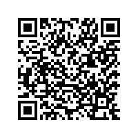

법제처                                                            2                                                       국가법령정보센터
인공지능 발전과 신뢰 기반 조성 등에 관한 기본법

##### 8. “이용자”란 인공지능제품 또는 인공지능서비스를 제공받는 자를 말한다.


##### 9. “영향받는 자”란 인공지능제품 또는 인공지능서비스에 의하여 자신의 생명, 신체의 안전 및 기본권에 중대한 영

향을 받는 자를 말한다.

##### 10. “인공지능사회”란 인공지능을 통하여 산업ㆍ경제, 사회ㆍ문화, 행정 등 모든 분야에서 가치를 창출하고 발전을

이끌어가는 사회를 말한다.

##### 11. “인공지능윤리”란 인간의 존엄성에 대한 존중을 기초로 하여, 국민의 권익과 생명ㆍ재산을 보호할 수 있는 안전

하고 신뢰할 수 있는 인공지능사회를 구현하기 위하여 인공지능의 개발, 제공 및 이용 등 모든 영역에서 사회구성
원이 지켜야 할 윤리적 기준을 말한다.

##### 12. “학습용데이터”란 인공지능의 개발ㆍ활용 등에 사용되는 데이터를 말한다.

[시행일: 2026. 1. 24.] 제2조제4호라목 중 디지털의료기기에 관한 부분


###### 제3조(기본원칙 및 국가 등의 책무) ① 인공지능기술과 인공지능산업은 안전성과 신뢰성을 제고하여 국민의 삶의 질을

향상시키는 방향으로 발전되어야 한다.
② 영향받는 자는 인공지능의 최종결과 도출에 활용된 주요 기준 및 원리 등에 대하여 기술적ㆍ합리적으로 가능한
범위에서 명확하고 의미 있는 설명을 제공받을 수 있어야 한다.
③ 국가 및 지방자치단체는 인공지능사업자의 창의정신을 존중하고, 안전한 인공지능 이용환경의 조성을 위하여 노
력하여야 한다.
④ 국가 및 지방자치단체는 인공지능이 가져오는 사회ㆍ경제ㆍ문화와 국민의 일상생활 등 모든 영역에서의 변화에
대응하여 모든 국민이 안정적으로 적응할 수 있도록 시책을 강구하여야 한다.


###### 제3조(기본원칙 및 국가 등의 책무) ① 인공지능기술과 인공지능산업은 안전성과 신뢰성을 제고하여 국민의 삶의 질을

향상시키는 방향으로 발전되어야 한다.
② 영향받는 자는 인공지능의 최종결과 도출에 활용된 주요 기준 및 원리 등에 대하여 기술적ㆍ합리적으로 가능한
범위에서 명확하고 의미 있는 설명을 제공받을 수 있어야 한다.
③ 국가 및 지방자치단체는 인공지능사업자의 창의정신을 존중하고, 안전한 인공지능 이용환경의 조성을 위하여 노
력하여야 한다.
④ 국가 및 지방자치단체는 인공지능이 가져오는 사회ㆍ경제ㆍ문화와 국민의 일상생활 등 모든 영역에서의 변화에
대응하여 모든 국민이 안정적으로 적응할 수 있도록 시책을 강구하여야 한다.
⑤ 국가 및 지방자치단체는 인공지능 관련 정책의 개발과 수립 과정에 인공지능제품 또는 인공지능서비스의 이용
에 어려움을 겪는 장애인ㆍ고령자 등 대통령령으로 정하는 취약계층(이하 “인공지능취약계층”이라 한다)의 참여를
보장하고 의견이 반영될 수 있도록 노력하여야 한다.<신설 2026. 1. 20.>
[시행일: 2026. 7. 21.] 제3조제5항


###### 제4조(적용범위) ① 이 법은 국외에서 이루어진 행위라도 국내 시장 또는 이용자에게 영향을 미치는 경우에는 적용한다

.
② 이 법은 국방 또는 국가안보 목적으로만 개발ㆍ이용되는 인공지능으로서 대통령령으로 정하는 인공지능에 대하
여는 적용하지 아니한다.


###### 제5조(다른 법률과의 관계) ① 인공지능, 인공지능기술, 인공지능산업 및 인공지능사회(이하 “인공지능등”이라 한다)에

관하여 다른 법률에 특별한 규정이 있는 경우를 제외하고는 이 법에서 정하는 바에 따른다.
② 인공지능등에 관하여 다른 법률을 제정하거나 개정하는 경우에는 이 법의 목적에 부합하도록 하여야 한다.


#### 제2장 인공지능의 건전한 발전과 신뢰 기반 조성을 위한 추진체계


###### 제6조(인공지능 기본계획의 수립) ① 과학기술정보통신부장관은 관계 중앙행정기관의 장 및 지방자치단체의 장의 의견

을 들어 3년마다 인공지능기술 및 인공지능산업의 진흥과 국가경쟁력 강화를 위하여 인공지능 기본계획(이하 “기본

법제처                                                            3                                                       국가법령정보센터
인공지능 발전과 신뢰 기반 조성 등에 관한 기본법
계획”이라 한다)을 제7조에 따른 국가인공지능전략위원회의 심의ㆍ의결을 거쳐 수립ㆍ변경 및 시행하여야 한다. 다
만, 기본계획 중 대통령령으로 정하는 경미한 사항을 변경하는 경우에는 그러하지 아니하다. <개정 2026. 1. 20.>
② 기본계획에는 다음 각 호의 사항이 포함되어야 한다.<개정 2026. 1. 20.>

##### 1. 인공지능등에 관한 정책의 기본 방향과 전략에 관한 사항


##### 2. 인공지능산업의 체계적 육성을 위한 전문인력의 양성 및 인공지능 개발ㆍ활용 촉진 기반 조성 등에 관한 사항


##### 3. 인공지능윤리의 확산 등 건전한 인공지능사회 구현을 위한 법ㆍ제도 및 문화에 관한 사항


##### 4. 인공지능기술 개발 및 인공지능산업 진흥을 위한 재원의 확보와 투자의 방향 등에 관한 사항

4의2. 「공공데이터의 제공 및 이용 활성화에 관한 법률」에 따른 공공데이터를 이용한 학습용데이터 생성, 공공데이
터 제공 등의 범위와 기준 및 그 활성화에 관한 사항

##### 5. 인공지능의 공정성ㆍ투명성ㆍ책임성ㆍ안전성ㆍ접근성 확보 등 신뢰 기반 조성에 관한 사항


##### 6. 인공지능기술의 발전 방향 및 그에 따른 교육ㆍ노동ㆍ경제ㆍ문화 등 사회 각 영역의 변화와 대응에 관한 사항

6의2. 인공지능기술의 이해 및 활용을 위한 교육의 지원 및 홍보에 관한 사항

##### 7. 그 밖에 인공지능기술 및 인공지능산업의 진흥과 국제협력 등 국가경쟁력 강화를 위하여 과학기술정보통신부장

관이 필요하다고 인정하는 사항
③ 과학기술정보통신부장관은 기본계획을 수립할 때에는 「지능정보화 기본법」 제6조제1항에 따른 종합계획 및 같
은 법 제7조제1항에 따른 실행계획을 고려하여야 하며, 제2항제4호의2에 따른 학습용데이터 중 「공공데이터의 제
공 및 이용 활성화에 관한 법률」에 따라 공공데이터를 학습용데이터로 제공하기 위한 사항에 대해서는 행정안전부
장관과 협의하여 정한다.<개정 2026. 1. 20.>
④ 과학기술정보통신부장관은 관계 중앙행정기관, 지방자치단체 및 공공기관(「지능정보화 기본법」 제2조제16호에
따른 공공기관을 말한다. 이하 같다)의 장에게 기본계획의 수립에 필요한 자료의 제출을 요청할 수 있다. 이 경우 자
료의 제출을 요청받은 기관의 장은 특별한 사정이 없으면 이에 따라야 한다.
⑤ 기본계획은 「지능정보화 기본법」 제13조제1항에 따른 인공지능 및 인공지능산업 분야의 부문별 추진계획으로
본다.
⑥ 중앙행정기관의 장 및 지방자치단체의 장은 소관 주요 정책을 수립하고 집행할 때 기본계획을 고려하여야 한다.
⑦ 기본계획의 수립ㆍ변경 및 시행에 필요한 사항은 대통령령으로 정한다.


###### 제6조(인공지능 기본계획의 수립) ① 과학기술정보통신부장관은 관계 중앙행정기관의 장 및 지방자치단체의 장의 의견

을 들어 3년마다 인공지능기술 및 인공지능산업의 진흥과 국가경쟁력 강화를 위하여 인공지능 기본계획(이하 “기본
계획”이라 한다)을 제7조에 따른 국가인공지능전략위원회의 심의ㆍ의결을 거쳐 수립ㆍ변경 및 시행하여야 한다. 다
만, 기본계획 중 대통령령으로 정하는 경미한 사항을 변경하는 경우에는 그러하지 아니하다. <개정 2026. 1. 20.>
② 기본계획에는 다음 각 호의 사항이 포함되어야 한다.<개정 2026. 1. 20.>

##### 1. 인공지능등에 관한 정책의 기본 방향과 전략에 관한 사항


##### 2. 인공지능산업의 체계적 육성을 위한 전문인력의 양성 및 인공지능 개발ㆍ활용 촉진 기반 조성 등에 관한 사항


##### 3. 인공지능윤리의 확산 등 건전한 인공지능사회 구현을 위한 법ㆍ제도 및 문화에 관한 사항


##### 4. 인공지능기술 개발 및 인공지능산업 진흥을 위한 재원의 확보와 투자의 방향 등에 관한 사항

4의2. 「공공데이터의 제공 및 이용 활성화에 관한 법률」에 따른 공공데이터를 이용한 학습용데이터 생성, 공공데이
터 제공 등의 범위와 기준 및 그 활성화에 관한 사항

##### 5. 인공지능의 공정성ㆍ투명성ㆍ책임성ㆍ안전성ㆍ접근성 확보 등 신뢰 기반 조성에 관한 사항


##### 6. 인공지능기술의 발전 방향 및 그에 따른 교육ㆍ노동ㆍ경제ㆍ문화 등 사회 각 영역의 변화와 대응에 관한 사항

6의2. 인공지능기술의 이해 및 활용을 위한 교육의 지원 및 홍보에 관한 사항

##### 7. 인공지능제품 또는 인공지능서비스에 대한 인공지능취약계층의 접근ㆍ이용을 보장하기 위한 사항


##### 8. 그 밖에 인공지능기술 및 인공지능산업의 진흥과 국제협력 등 국가경쟁력 강화를 위하여 과학기술정보통신부장

관이 필요하다고 인정하는 사항

법제처                                                            4                                                       국가법령정보센터
인공지능 발전과 신뢰 기반 조성 등에 관한 기본법
③ 과학기술정보통신부장관은 기본계획을 수립할 때에는 「지능정보화 기본법」 제6조제1항에 따른 종합계획 및 같
은 법 제7조제1항에 따른 실행계획을 고려하여야 하며, 제2항제4호의2에 따른 학습용데이터 중 「공공데이터의 제
공 및 이용 활성화에 관한 법률」에 따라 공공데이터를 학습용데이터로 제공하기 위한 사항에 대해서는 행정안전부
장관과 협의하여 정한다.<개정 2026. 1. 20.>
④ 과학기술정보통신부장관은 관계 중앙행정기관, 지방자치단체 및 공공기관(「지능정보화 기본법」 제2조제16호에
따른 공공기관을 말한다. 이하 같다)의 장에게 기본계획의 수립에 필요한 자료의 제출을 요청할 수 있다. 이 경우 자
료의 제출을 요청받은 기관의 장은 특별한 사정이 없으면 이에 따라야 한다.
⑤ 기본계획은 「지능정보화 기본법」 제13조제1항에 따른 인공지능 및 인공지능산업 분야의 부문별 추진계획으로
본다.
⑥ 중앙행정기관의 장 및 지방자치단체의 장은 소관 주요 정책을 수립하고 집행할 때 기본계획을 고려하여야 한다.
⑦ 기본계획의 수립ㆍ변경 및 시행에 필요한 사항은 대통령령으로 정한다.
[시행일: 2026. 7. 21.] 제6조제2항제7호, 제6조제2항제8호


###### 제7조(국가인공지능전략위원회) ① 인공지능 발전과 신뢰 기반 조성 등을 위한 주요 정책 등에 관한 사항을 심의ㆍ의결

하기 위하여 대통령 소속으로 국가인공지능전략위원회(이하 “위원회”라 한다)를 둔다. <개정 2026. 1. 20.>
② 위원회는 위원장 1명과 3명 이내의 부위원장을 포함한 60명 이내의 위원으로 구성한다. 이 경우 제4항제4호에
따른 위원이 전체 위원의 과반수가 되어야 하고, 특정 성(性)으로만 위원회를 구성할 수 없다.<개정 2026. 1. 20.>
③ 위원회의 위원장은 대통령이 되고, 부위원장은 제4항제1호 또는 제4호에 해당하는 사람 중 대통령이 지명하는
사람이 된다.<개정 2026. 1. 20.>
④ 위원회의 위원은 다음 각 호의 사람이 된다.

##### 1. 대통령령으로 정하는 관계 중앙행정기관의 장


##### 2. 국가안보실의 인공지능에 관한 업무를 담당하는 차장


##### 3. 대통령비서실의 인공지능에 관한 업무를 보좌하는 수석비서관


##### 4. 인공지능 관련 전문지식과 경험이 풍부한 사람 중 대통령이 위촉하는 사람

⑤ 위원회의 위원장은 위원회를 대표하고 위원회의 사무를 총괄한다.
⑥ 위원회의 위원장은 필요한 경우 부위원장으로 하여금 그 직무를 대행하게 할 수 있다.
⑦ 제4항제4호에 따른 위원의 임기는 2년으로 하되 한 차례에 한정하여 연임할 수 있다.
⑧ 위원회에 간사위원 1명을 두며, 간사위원은 제4항제3호의 위원이 된다.
⑨ 위원회의 위원은 그 직무상 알게 된 비밀을 타인에게 누설하거나 직무상 목적 외의 용도로 사용하여서는 아니
된다. 다만, 다른 법률에 특별한 규정이 있는 경우에는 그러하지 아니하다.
⑩ 위원회의 위원장은 위원회의 회의를 소집하고 그 의장이 된다.
⑪ 위원회의 회의는 위원 과반수의 출석으로 개의하고, 출석위원 과반수의 찬성으로 의결한다.
⑫ 위원회의 업무 및 운영을 지원하기 위하여 위원회에 지원단을 둔다.
⑬ 위원회는 이 법 시행일부터 5년간 존속한다.
⑭ 그 밖에 위원회와 제12항에 따른 지원단의 구성 및 운영 등에 필요한 사항은 대통령령으로 정한다.
[제목개정 2026. 1. 20.]


###### 제8조(위원회의 기능) ① 위원회는 다음 각 호의 사항을 심의ㆍ의결한다. <개정 2026. 1. 20.>


##### 1. 기본계획의 수립ㆍ변경 및 시행의 점검ㆍ분석에 관한 사항


##### 2. 인공지능등 관련 국가 비전 및 중장기 전략 수립에 관한 사항

2의2. 인공지능 관련 정책 및 사업 등의 수립ㆍ조정 및 부처 간 조율에 관한 사항
2의3. 인공지능 관련 정책 및 사업 등에 대한 이행점검 및 성과관리에 관한 사항

##### 3. 인공지능등에 관한 연구개발 전략 수립에 관한 사항


##### 4. 인공지능등에 관한 투자 방향 설정 및 투자 전략 수립에 관한 사항


법제처                                                            5                                                       국가법령정보센터
인공지능 발전과 신뢰 기반 조성 등에 관한 기본법

##### 5. 인공지능산업 발전과 경쟁력을 저해하는 규제의 발굴 및 개선에 관한 사항

5의2. 인공지능등 관련 기술ㆍ인력ㆍ입지 등 제도 개선에 관한 사항
5의3. 인공지능 및 인공지능기술 관련 전문인력의 양성 및 지원에 관한 사항

##### 6. 인공지능 데이터센터(「지능정보화 기본법」 제40조제1항에 따른 데이터센터를 말한다. 이하 같다) 등 인프라 확

충 방안에 관한 사항
6의2. 인공지능 발전을 위한 데이터(학습용데이터를 포함한다) 수집ㆍ관리 및 활용 촉진에 관한 사항

##### 7. 제조업ㆍ서비스업 등 산업부문 및 공공부문에서의 인공지능 활용 촉진에 관한 사항


##### 8. 인공지능 국제규범 마련 등 인공지능 관련 국제협력에 관한 사항


##### 9. 제2항에 따른 권고 또는 의견의 표명에 관한 사항


##### 10. 고영향 인공지능 규율에 관한 사항


##### 11. 고영향 인공지능과 관련된 사회적 변화 양상과 정책적 대응에 관한 사항


##### 12. 이 법 또는 다른 법률에서 위원회의 심의사항으로 정한 사항


##### 13. 그 밖에 위원회의 위원장이 필요하다고 인정하여 위원회의 회의에 부치는 사항

② 위원회는 국가기관등의 장 및 인공지능사업자 등에 대하여 인공지능의 올바른 사용과 인공지능윤리의 실천, 인
공지능기술의 안전성ㆍ신뢰성에 관한 권고 또는 의견의 표명을 할 수 있다.
③ 위원회가 국가기관등의 장에게 법령ㆍ제도의 개선 또는 실천방안의 수립 등에 대하여 제2항에 따른 권고 또는
의견의 표명을 한 때에는 해당 국가기관등의 장은 법령ㆍ제도 등의 개선방안과 실천방안 등을 수립하여야 한다.


###### 제9조(위원의 제척ㆍ기피 및 회피) ① 위원회의 위원은 업무의 공정성 확보를 위하여 다음 각 호의 어느 하나에 해당하

는 경우에는 해당 안건의 심의ㆍ의결에서 제척(除斥)된다.

##### 1. 위원 또는 위원이 속한 법인ㆍ단체 등과 직접적인 이해관계가 있는 경우


##### 2. 위원의 가족(「민법」 제779조에 따른 가족을 말한다)이 이해관계인인 경우

② 심의 대상 안건의 당사자(당사자가 법인ㆍ단체 등인 경우에는 그 임원 및 직원을 포함한다)는 위원에게 공정한
직무집행을 기대하기 어려운 사정이 있으면 위원회에 기피 신청을 할 수 있으며, 위원회는 기피 신청이 타당하다고
인정하면 의결로 기피를 결정하여야 한다.
③ 위원은 제1항 또는 제2항의 사유에 해당하면 스스로 해당 안건의 심의를 회피하여야 한다.


###### 제10조(분과위원회 등) ① 위원회는 위원회의 업무를 전문 분야별로 수행하기 위하여 필요한 경우 분과위원회를 둘 수

있다.
② 위원회는 인공지능등 관련 특정 현안을 논의하기 위하여 필요한 경우 특별위원회를 둘 수 있다.
③ 위원회는 인공지능등 관련 사항을 전문적으로 검토하기 위하여 관계 전문가 등으로 구성된 자문단을 둘 수 있다.
④ 위원회는 정부 내 인공지능 주요 시책의 수립과 사업의 효율적인 추진을 위하여 대통령령으로 정하는 인공지능
책임관으로 구성되는 인공지능책임관협의회를 운영할 수 있다.<신설 2026. 1. 20.>
⑤ 그 밖에 분과위원회, 특별위원회, 자문단 및 인공지능책임관협의회의 구성ㆍ운영 등에 필요한 사항은 대통령령
으로 정한다.<개정 2026. 1. 20.>


###### 제11조(인공지능정책센터) ① 과학기술정보통신부장관은 인공지능 관련 정책의 개발과 국제규범 정립ㆍ확산에 필요한

업무를 종합적으로 수행하기 위하여 인공지능정책센터(이하 “센터”라 한다)를 지정할 수 있다.
② 센터는 다음 각 호의 사업을 수행한다.

##### 1. 기본계획의 수립ㆍ시행에 필요한 전문기술의 지원


##### 2. 인공지능과 관련한 시책의 개발 및 관련 사업의 기획ㆍ시행에 관한 전문기술의 지원


##### 3. 인공지능의 활용 확산에 따른 사회, 경제, 문화 및 국민의 일상생활 등에 미치는 영향의 조사ㆍ분석


##### 4. 인공지능 및 인공지능기술 관련 정책 개발을 지원하기 위한 동향 분석，사회ㆍ문화 변화와 미래예측 및 법ㆍ제

도의 조사ㆍ연구

법제처                                                            6                                                       국가법령정보센터
인공지능 발전과 신뢰 기반 조성 등에 관한 기본법

##### 5. 다른 법령에서 센터의 업무로 정하거나 센터에 위탁한 사업


##### 6. 그 밖에 국가기관등의 장이 위탁하는 사업

③ 그 밖에 센터의 지정 등에 필요한 사항은 대통령령으로 정한다.


###### 제12조(인공지능안전연구소) ① 과학기술정보통신부장관은 인공지능과 관련하여 발생할 수 있는 위험으로부터 국민의

생명ㆍ신체ㆍ재산 등을 보호하고 인공지능사회의 신뢰 기반을 유지하기 위한 상태(이하 “인공지능안전”이라 한다)를
확보하기 위한 업무를 전문적이고 효율적으로 수행하기 위하여 인공지능안전연구소(이하 “안전연구소”라 한다)를 운
영할 수 있다.
② 안전연구소는 다음 각 호의 사업을 수행한다.

##### 1. 인공지능안전 관련 위험 정의 및 분석


##### 2. 인공지능안전 정책 연구


##### 3. 인공지능안전 평가 기준ㆍ방법 연구


##### 4. 인공지능안전 기술 및 표준화 연구


##### 5. 인공지능안전 관련 국제교류ㆍ국제협력


##### 6. 제32조에 따른 인공지능시스템의 안전성 확보에 관한 지원


##### 7. 그 밖에 인공지능안전에 관한 사업으로서 대통령령으로 정하는 사업

③ 정부는 안전연구소의 운영과 사업 추진 등에 필요한 경비를 예산의 범위에서 출연하거나 지원할 수 있다.
④ 그 밖에 안전연구소의 운영 등에 필요한 사항은 대통령령으로 정한다.


#### 제3장 인공지능기술 개발 및 산업 육성


##### 제1절 인공지능산업 기반 조성


###### 제13조(인공지능기술 개발 및 안전한 이용 지원) ① 정부는 인공지능기술 개발 활성화를 위하여 다음 각 호의 사업을

지원할 수 있다.

##### 1. 국내외 인공지능기술 동향ㆍ수준 및 관련 제도의 조사


##### 2. 인공지능기술의 연구ㆍ개발, 시험 및 평가 또는 개발된 기술의 활용


##### 3. 인공지능기술 확산, 인공지능기술 협력ㆍ이전 등 기술의 실용화 및 사업화 지원


##### 4. 인공지능기술의 구현을 위한 정보의 원활한 유통 및 산학협력


##### 5. 그 밖에 인공지능기술의 개발 및 연구ㆍ조사와 관련하여 대통령령으로 정하는 사업

② 정부는 인공지능기술의 안전하고 편리한 이용을 위하여 다음 각 호의 사업을 지원할 수 있다.

##### 1. 「지능정보화 기본법」 제60조제1항 각 호의 사항을 인공지능기술로 구현하는 연구개발 사업


##### 2. 「지능정보화 기본법」 제60조제3항에 따른 비상정지 기능을 인공지능제품 또는 인공지능서비스에서 구현하기 위

한 기술 연구 지원 및 해당 기술의 확산을 위한 사업

##### 3. 인공지능기술의 개발에 있어서 「지능정보화 기본법」 제61조제2항에 따른 사생활등의 보호에 적합한 설계 기준

및 기술의 연구개발 및 보급 사업

##### 4. 인공지능기술의 「지능정보화 기본법」 제56조제1항에 따른 사회적 영향평가의 실시와 적용을 위한 연구개발 사

업

##### 5. 인공지능이 인간의 존엄성 및 기본권을 존중하는 방향으로 개발ㆍ이용될 수 있도록 하는 기술 또는 기준 등의 연

구개발 및 보급 사업

##### 6. 인공지능의 안전한 개발과 이용을 위한 인식개선, 올바른 이용방법과 안전 환경 조성을 위한 교육 및 홍보 사업


##### 7. 그 밖에 인공지능의 개발과 이용에 있어서 국민의 기본권, 신체와 재산을 보호하기 위하여 필요한 사업

③ 정부는 제2항에 따른 사업의 결과를 누구든지 손쉽게 이용할 수 있도록 공개하고 보급하여야 한다. 이 경우 기술
을 개발한 자를 보호하기 위하여 필요한 경우에는 보호기간을 정하여 기술사용료를 받을 수 있게 하거나 그 밖의
방법으로 보호할 수 있다.

법제처                                                            7                                                       국가법령정보센터
인공지능 발전과 신뢰 기반 조성 등에 관한 기본법

###### 제14조(인공지능기술의 표준화) ① 정부는 인공지능기술, 학습용데이터, 인공지능의 안전성ㆍ신뢰성 등과 관련된 표준

화를 위하여 다음 각 호의 사업을 추진할 수 있다. <개정 2026. 1. 20.>

##### 1. 인공지능기술 관련 표준의 제정ㆍ개정 및 폐지와 그 보급


##### 2. 인공지능기술 관련 국내외 표준의 조사ㆍ연구개발


##### 3. 그 밖에 인공지능기술 관련 표준화 사업

② 정부는 제1항제1호에 따라 제정된 표준을 고시하여 관련 사업자에게 그 준수를 권고할 수 있다.
③ 정부는 민간 부문에서 추진하는 인공지능기술 관련 표준화 사업에 필요한 지원을 할 수 있다.
④ 정부는 인공지능기술 표준과 관련된 국제표준기구 또는 국제표준기관과 협력체계를 유지ㆍ강화하여야 한다.
⑤ 그 밖에 제1항 및 제3항에 따른 표준화 사업의 추진 및 지원 등과 관련하여 필요한 사항은 대통령령으로 정한다.


###### 제15조(인공지능 학습용데이터 관련 시책의 수립 등) ① 과학기술정보통신부장관은 관계 중앙행정기관의 장과 협의하

여 학습용데이터의 생산ㆍ수집ㆍ관리ㆍ유통ㆍ활용 촉진 및 품질수준 확보 등을 위하여 필요한 시책을 추진하여야
한다. <개정 2026. 1. 20.>
② 정부는 학습용데이터의 생산ㆍ수집ㆍ관리ㆍ유통 및 활용 등에 관한 시책을 효율적으로 추진하기 위하여 지원대
상사업을 선정하고 예산의 범위에서 지원할 수 있다.
③ 정부는 학습용데이터의 생산ㆍ수집ㆍ관리ㆍ유통 및 활용의 활성화 등을 위하여 다양한 학습용데이터를 제작ㆍ
생산하여 제공하는 사업(이하 “학습용데이터 구축사업”이라 한다)을 시행할 수 있다.
④ 과학기술정보통신부장관은 학습용데이터 구축사업의 효율적 수행을 위하여 학습용데이터를 통합적으로 제공ㆍ
관리할 수 있는 시스템(이하 “통합제공시스템”이라 한다)을 구축ㆍ관리하고 민간이 자유롭게 이용할 수 있도록 제
공하여야 한다.
⑤ 과학기술정보통신부장관은 통합제공시스템을 이용하는 자에 대하여 비용을 징수할 수 있다.
⑥ 그 밖에 제2항에 따른 지원대상사업의 선정 및 지원, 학습용데이터 구축사업의 시행, 통합제공시스템의 구축ㆍ
관리 및 제5항에 따른 비용의 징수 등에 필요한 사항은 대통령령으로 정한다.


##### 제2절 인공지능기술 개발 및 인공지능산업 활성화


###### 제16조(인공지능기술 도입ㆍ활용 시책 등) ① 국가 및 지방자치단체는 기업 및 공공기관의 인공지능기술 도입 촉진 및

활용 확산을 위한 시책을 수립ㆍ시행하여야 한다. <신설 2026. 1. 20.>
② 국가 및 지방자치단체는 기업 및 공공기관의 인공지능기술 도입 촉진 및 활용 확산을 위하여 필요한 경우에는
다음 각 호의 지원을 할 수 있다.<개정 2026. 1. 20.>

##### 1. 인공지능기술, 인공지능제품 또는 인공지능서비스의 개발 지원 및 연구ㆍ개발 성과의 확산


##### 2. 인공지능기술을 도입ㆍ활용하고자 하는 기업 및 공공기관에 대한 컨설팅 지원

2의2. 공공기관이 보유ㆍ관리하고 있는 데이터를 학습용데이터로 생성ㆍ제공하고 적절한 품질수준을 확보하기 위
하여 필요한 지원

##### 3. 「중소기업기본법」 제2조제1항에 따른 중소기업, 「벤처기업육성에 관한 특별법」 제2조제1항에 따른 벤처기업 및

「소상공인기본법」 제2조제1항에 따른 소상공인(이하 “중소기업등”이라 한다)의 임직원에 대한 인공지능기술 도
입 및 활용 관련 교육 지원

##### 4. 중소기업등의 인공지능기술 도입 및 활용에 사용되는 자금의 지원


##### 5. 그 밖에 기업 및 공공기관의 인공지능기술 도입 및 활용을 촉진하기 위하여 대통령령으로 정하는 사항

③ 국가기관등은 업무 수행에 필요한 제품 또는 서비스를 구매하거나 용역을 발주하려는 경우 대통령령으로 정하
는 인공지능제품 또는 인공지능서비스를 우선적으로 고려하여야 한다. 다만, 업무 특성상 인공지능기술의 활용이
적합하지 아니한 경우에는 그러하지 아니하다.<신설 2026. 1. 20.>
④ 제3항에 따른 인공지능제품 또는 인공지능서비스의 구매 또는 사용으로 국가기관등에 손해가 발생한 경우에도
그 구매 또는 사용 업무를 담당한 자는 해당 기관의 손해에 대하여 배상할 책임이 없다. 다만, 해당 업무 담당자의

법제처                                                            8                                                       국가법령정보센터
인공지능 발전과 신뢰 기반 조성 등에 관한 기본법
고의 또는 중대한 과실로 손해가 발생한 경우에는 그러하지 아니하다.<신설 2026. 1. 20.>
⑤ 제2항에 따른 지원에 필요한 사항은 대통령령으로 정한다.<개정 2026. 1. 20.>
[제목개정 2026. 1. 20.]
[시행일: 2026. 7. 21.] 제16조제3항부터 제5항까지(제2항제2호의2의 개정규정에 관한 부분에 한정한다)


###### 제17조(중소기업등을 위한 특별지원) ① 이 법에 따라 인공지능기술 및 인공지능산업과 관련한 각종 지원시책을 시행

할 때에는 중소기업등을 우선 고려하여야 한다.
② 정부는 인공지능산업에 대한 중소기업등의 참여 활성화를 위하여 노력하여야 하며, 이와 관련한 사항을 기본계
획에 반영하여야 한다.
③ 과학기술정보통신부장관은 인공지능의 안전성 및 신뢰성 확보를 위하여 중소기업등의 제34조에 따른 조치 이행
및 제35조에 따른 영향평가를 지원할 수 있다.

제17조의2(인공지능제품 및 인공지능서비스 이용비용의 지원) ① 국가와 지방자치단체는 경제적 여건으로 인하여 인
공지능제품 및 인공지능서비스를 이용하기 어려운 사람에 대하여 예산의 범위에서 그 비용의 전부 또는 일부를 지
원할 수 있다.
② 제1항에 따른 비용 지원의 요건과 대상 등에 필요한 사항은 대통령령으로 정한다.
[본조신설 2026. 1. 20.]
[시행일: 2026. 7. 21.] 제17조의2


###### 제18조(창업의 활성화) ① 정부는 인공지능산업 분야의 창업을 활성화하기 위하여 다음 각 호의 사업을 추진할 수 있다

.

##### 1. 인공지능산업 분야의 창업자 발굴 및 육성ㆍ지원 등에 관한 사업


##### 2. 인공지능산업 분야의 창업 활성화를 위한 교육ㆍ훈련에 관한 사업


##### 3. 제21조에 따른 전문인력의 우수 인공지능기술에 대한 사업화 지원


##### 4. 인공지능기술의 가치평가 및 창업자금의 금융지원


##### 5. 인공지능 관련 연구 및 기술개발 성과의 제공


##### 6. 인공지능산업 분야의 창업을 지원하는 기관ㆍ단체의 육성


##### 7. 그 밖에 인공지능산업 분야의 창업 활성화를 위하여 필요한 사업

② 지방자치단체는 인공지능산업 분야의 창업을 지원하는 공공기관 등 공공단체에 출연하거나 출자할 수 있다.


###### 제18조(창업의 활성화 등) ① 정부는 인공지능산업 분야의 창업을 활성화하기 위하여 다음 각 호의 사업을 추진할 수

있다.

##### 1. 인공지능산업 분야의 창업자 발굴 및 육성ㆍ지원 등에 관한 사업


##### 2. 인공지능산업 분야의 창업 활성화를 위한 교육ㆍ훈련에 관한 사업


##### 3. 제21조에 따른 전문인력의 우수 인공지능기술에 대한 사업화 지원


##### 4. 인공지능기술의 가치평가 및 창업자금의 금융지원


##### 5. 인공지능 관련 연구 및 기술개발 성과의 제공


##### 6. 인공지능산업 분야의 창업을 지원하는 기관ㆍ단체의 육성


##### 7. 그 밖에 인공지능산업 분야의 창업 활성화를 위하여 필요한 사업

② 지방자치단체는 인공지능산업 분야의 창업을 지원하는 공공기관 등 공공단체에 출연하거나 출자할 수 있다.
③ 중앙행정기관의 장은 인공지능산업 분야의 창업을 활성화하기 위하여 중소벤처기업부장관과 협의하여 「벤처투
자 촉진에 관한 법률」 제70조에 따른 벤처투자모태조합을 활용한 지원을 할 수 있다.<신설 2026. 1. 20.>
④ 제3항에 따른 지원을 위한 자금은 다음 각 호의 재원으로 조성한다.<신설 2026. 1. 20.>

##### 1. 국가, 지방자치단체 또는 공공기관의 출자금


법제처                                                            9                                                       국가법령정보센터
인공지능 발전과 신뢰 기반 조성 등에 관한 기본법

##### 2. 국가, 지방자치단체 또는 공공기관 외의 자로서 인공지능산업과 관련하여 벤처투자모태조합에 출자를 희망하는

자의 출자금

##### 3. 그 밖의 부대수입

⑤ 제3항에 따른 벤처투자모태조합에의 출자에 필요한 사항은 대통령령으로 정한다.<신설 2026. 1. 20.>
[제목개정 2026. 1. 20.]
[시행일: 2026. 7. 21.] 제18조


###### 제19조(인공지능 융합의 촉진) ① 정부는 인공지능산업과 그 밖의 산업 간 융합을 촉진하고 전 분야에서 인공지능 활용

을 활성화하기 위하여 필요한 시책을 수립하여 추진하여야 한다.
② 정부는 인공지능 융합 제품 및 서비스의 개발을 지원하기 위하여 필요한 경우에는 「국가연구개발혁신법」에 따
른 국가연구개발사업에 인공지능 융합 제품 및 서비스에 관한 연구개발과제를 우선적으로 반영하여 추진할 수 있
다.
③ 정부는 제2항에 따라 개발된 인공지능 융합 제품 및 서비스에 대하여는 「정보통신 진흥 및 융합 활성화 등에 관
한 특별법」 제37조에 따른 임시허가 및 같은 법 제38조의2에 따른 실증을 위한 규제특례가 원활히 시행될 수 있도
록 적극 지원하여야 한다.


###### 제20조(제도개선 등) ① 정부는 인공지능산업의 발전과 신뢰 기반 조성을 위하여 법령의 정비 등 관련 제도를 개선할

수 있도록 노력하여야 한다.
② 정부는 제1항에 따른 제도개선을 촉진하기 위하여 관련 법ㆍ제도의 연구 및 사회 각계의 의견수렴 등에 필요한
행정적ㆍ재정적 지원을 할 수 있다.


###### 제21조(전문인력의 확보) ① 과학기술정보통신부장관은 인공지능기술의 개발 및 인공지능산업의 발전을 위하여 「지능

정보화 기본법」 제23조제1항에 따른 시책에 따라 인공지능 및 인공지능기술 관련 전문인력을 양성하고 지원할 수
있도록 다음 각 호의 사업을 추진할 수 있다. <개정 2026. 1. 20.>

##### 1. 전문인력의 직무역량 강화 및 경력개발을 위한 교육훈련 프로그램 개발ㆍ활용


##### 2. 전문인력의 취업 지원 및 신규 인력유입 활성화 등 고용 촉진


##### 3. 전문인력의 공직 진출 기회 확대 등 진출 다변화 촉진


##### 4. 전문인력의 국내외 연수 지원 및 국제교류 활성화


##### 5. 전문인력의 근로환경 개선과 처우 증진 등 복지 향상


##### 6. 그 밖에 인공지능 및 인공지능기술 관련 전문인력의 양성ㆍ지원을 위한 사업

② 정부는 인공지능 및 인공지능기술 관련 해외 전문인력의 확보를 위하여 다음 각 호의 시책을 추진할 수 있다.

##### 1. 인공지능 및 인공지능기술 관련 해외 대학ㆍ연구기관ㆍ기업 등의 전문인력에 관한 조사ㆍ분석


##### 2. 해외 전문인력의 유치를 위한 국제네트워크 구축


##### 3. 해외 전문인력의 국내 취업 지원


##### 4. 국내 인공지능 연구기관의 해외진출 및 해외 인공지능 연구기관의 국내 유치 지원


##### 5. 인공지능 및 인공지능기술 관련 국제기구 및 국제행사의 국내 유치 지원


##### 6. 그 밖에 해외 전문인력의 확보를 위하여 필요한 사항


###### 제22조(국제협력 및 해외시장 진출의 지원) ① 정부는 인공지능과 관련한 국제적 동향을 파악하고 국제협력을 추진하

여야 한다.
② 정부는 인공지능산업의 경쟁력 강화와 해외시장 진출을 촉진하기 위하여 인공지능산업에 종사하는 개인ㆍ기업
또는 단체 등에 대하여 다음 각 호의 지원을 할 수 있다.

##### 1. 인공지능산업 관련 정보ㆍ기술ㆍ인력의 국제교류


##### 2. 인공지능산업 관련 해외진출에 관한 정보의 수집ㆍ분석 및 제공


법제처                                                            10                                                       국가법령정보센터
인공지능 발전과 신뢰 기반 조성 등에 관한 기본법

##### 3. 국가 간 인공지능기술, 인공지능제품 또는 인공지능서비스의 공동 연구ㆍ개발 및 국제표준화


##### 4. 인공지능산업 관련 외국자본의 투자유치


##### 5. 인공지능등 관련 해외 전문 학회 및 전시회 참가 등 홍보 및 해외 마케팅


##### 6. 인공지능제품 또는 인공지능서비스의 수출에 필요한 판매체계ㆍ유통체계 및 협력체계 등의 구축


##### 7. 인공지능윤리에 관한 국제적 동향 파악 및 국제협력


##### 8. 그 밖에 인공지능산업의 경쟁력 강화와 해외시장 진출 촉진을 위하여 필요한 사항

③ 정부는 제2항 각 호에 따른 지원을 효율적으로 수행하기 위하여 대통령령으로 정하는 바에 따라 공공기관 또는
그 밖의 단체에 이를 위탁하거나 대행하게 할 수 있으며, 이에 필요한 비용을 보조할 수 있다.

제22조의2(인공지능연구소의 설립 및 지원 등) ① 대학, 기업 등 대통령령으로 정하는 자는 단독으로 또는 공동으로 인
공지능의 개발ㆍ활용에 관한 연구소(이하 “인공지능연구소”라 한다)를 설립ㆍ운영할 수 있다.
② 제1항에 따라 대학, 기업 등 대통령령으로 정하는 자가 인공지능연구소를 설립하려는 경우에는 다음 각 호의 요
건을 갖추고 과학기술정보통신부장관의 허가를 받아야 한다.

##### 1. 3명 이상의 발기인(發起人)이 있을 것


##### 2. 제5항의 사업을 수행할 수 있는 인력ㆍ시설 등의 능력을 보유하고 있을 것


##### 3. 그 밖에 인공지능연구소의 설립ㆍ운영을 위하여 필요한 것으로서 대통령령으로 정하는 요건을 갖출 것

③ 인공지능연구소에 소장을 둔다. 인공지능연구소의 소장은 인공지능연구소를 대표하고 인공지능연구소의 업무를
총괄한다.
④ 인공지능연구소의 정관에는 다음 각 호의 사항이 포함되어야 한다.

##### 1. 목적


##### 2. 명칭


##### 3. 사무소의 소재지


##### 4. 자산에 관한 규정


##### 5. 소장의 자격과 임면에 관한 규정


##### 6. 소장의 책임과 권한에 관한 규정

⑤ 인공지능연구소는 업종별ㆍ기능별로 다음 각 호의 사업을 수행한다.

##### 1. 인공지능기술 연구개발


##### 2. 인공지능기술과 다른 기술 및 학제 간 융합에 관한 연구개발


##### 3. 인공지능기술 연구개발 성과 관리ㆍ이전ㆍ활용 및 사업화


##### 4. 인공지능기술 연구개발 전문인력 양성


##### 5. 인공지능기술 연구개발 관련 국제교류ㆍ국제협력


##### 6. 그 밖에 인공지능기술 연구개발에 필요한 사항

⑥ 정부와 지방자치단체는 예산의 범위에서 인공지능연구소의 운영과 사업 추진 등에 필요한 경비를 지원할 수 있
다.
⑦ 인공지능연구소는 운영에 필요한 재원을 조성하기 위하여 정부ㆍ지방자치단체 외의 자로부터 보조금 또는 기부
금 등을 받거나, 정관으로 정하는 바에 따라 수익사업을 할 수 있다.
⑧ 인공지능연구소의 소장은 인공지능기술의 연구개발 등을 위하여 필요한 경우 제1항에 따른 대학, 기업 등 대통
령령으로 정하는 자와 협의하여 임직원을 파견받거나 겸임근무하게 하여 인공지능연구소의 연구 등을 담당하게 할
수 있으며, 파견받은 임직원의 소속 기관에 필요한 지원을 할 수 있다. 이 경우 필요하면 과학기술정보통신부장관에
게 협의를 위한 지원을 요청할 수 있다.
⑨ 인공지능연구소에 관하여 이 법에서 정한 것을 제외하고는 「민법」 중 재단법인에 관한 규정을 준용한다.
⑩ 과학기술정보통신부장관은 인공지능연구소가 다음 각 호의 어느 하나에 해당하는 경우 시정을 명하거나 그 설
립허가를 취소할 수 있다. 다만, 제1호 또는 제2호에 해당하는 경우 그 허가를 취소하여야 한다.

법제처                                                            11                                                       국가법령정보센터
인공지능 발전과 신뢰 기반 조성 등에 관한 기본법

##### 1. 거짓이나 그 밖의 부정한 방법으로 설립허가를 받은 경우


##### 2. 목적 달성이 불가능하게 된 경우


##### 3. 제2항에 따른 허가 요건을 충족하지 못하게 된 경우


##### 4. 목적사업 외의 사업을 한 경우


##### 5. 법령, 정관 또는 이 법에 따른 명령을 위반한 경우


##### 6. 공익을 해치는 행위를 한 경우


##### 7. 정당한 사유 없이 설립허가를 받은 날부터 6개월 이내에 목적사업을 시작하지 아니하거나 1년 이상 사업실적이

없는 경우
⑪ 과학기술정보통신부장관은 제10항에 따라 인공지능연구소의 설립허가를 취소하려는 경우에는 청문을 하여야
한다.
⑫ 그 밖에 인공지능연구소의 설립 절차, 운영, 지원 등에 필요한 사항은 대통령령으로 정한다.
[본조신설 2026. 1. 20.]

제22조의3(인공지능기술 확보를 위한 연구기관의 설립ㆍ운영) 과학기술정보통신부장관은 혁신적인 인공지능기술의 확
보를 위하여 필요한 경우 대통령령으로 정하는 바에 따라 인공지능의 개발ㆍ활용 등에 관한 연구를 수행하는 기관
을 설립ㆍ운영할 수 있다.
[본조신설 2026. 1. 20.]
[시행일: 2026. 7. 21.] 제22조의3


###### 제23조(인공지능집적단지 지정 등) ① 국가 및 지방자치단체는 인공지능산업의 진흥과 인공지능 개발ㆍ활용의 경쟁력

강화를 위하여 인공지능 및 인공지능기술의 연구ㆍ개발을 수행하는 기업, 기관이나 단체의 기능적ㆍ물리적ㆍ지역적
집적화를 추진할 수 있다.
② 국가 및 지방자치단체는 제1항에 따른 집적화를 위하여 필요한 경우에는 대통령령으로 정하는 바에 따라 인공지
능집적단지(이하 “인공지능집적단지”라 한다)를 지정하여 행정적ㆍ재정적ㆍ기술적 지원을 할 수 있다.
③ 국가 및 지방자치단체는 다음 각 호의 어느 하나에 해당하는 경우 인공지능집적단지의 지정을 취소할 수 있다.
다만, 제1호에 해당하는 경우에는 그 지정을 취소하여야 한다.

##### 1. 거짓이나 그 밖의 부정한 방법으로 지정을 받은 경우


##### 2. 인공지능집적단지 지정의 목적을 달성하기 어렵다고 인공지능집적단지를 지정한 국가 또는 지방자치단체의 장

이 인정하는 경우
④ 정부는 제1항에 따른 집적화를 지역에 효과적으로 정착시키기 위하여 관련 업무를 종합적으로 지원하는 전담기
관을 설치하거나 지정할 수 있다.
⑤ 정부는 제4항에 따른 전담기관의 운영 및 사업 수행에 필요한 비용의 전부 또는 일부를 출연하거나 보조할 수
있다.
⑥ 그 밖에 인공지능집적단지의 지정 및 지정취소와 제4항에 따른 전담기관의 설치 또는 지정 등에 필요한 사항은
대통령령으로 정한다.


###### 제24조(인공지능 실증기반 조성 등) ① 국가 및 지방자치단체는 인공지능사업자가 개발하거나 이전받은 기술의 실증,

성능시험, 제30조에 따른 검ㆍ인증등(이하 “실증시험등”이라 한다)을 지원하기 위하여 시험, 평가 등에 필요한 시설
ㆍ장비ㆍ설비 등(이하 “실증기반등”이라 한다)을 구축ㆍ운영할 수 있다.
② 국가 및 지방자치단체는 실증시험등을 촉진하기 위하여 대통령령으로 정하는 기관이 보유하고 있는 실증기반등
을 인공지능사업자에게 개방할 수 있다.
③ 그 밖에 실증기반등의 구축ㆍ운영 및 개방 등에 필요한 사항은 대통령령으로 정한다.


###### 제25조(인공지능 데이터센터 관련 시책의 추진 등) ① 정부는 인공지능의 개발ㆍ활용 등에 이용되는 데이터센터(이하

“인공지능 데이터센터”라 한다)의 구축 및 운영을 활성화하기 위하여 필요한 시책을 추진하여야 한다.

법제처                                                            12                                                       국가법령정보센터
인공지능 발전과 신뢰 기반 조성 등에 관한 기본법
② 정부는 제1항에 따른 시책을 추진하기 위하여 다음 각 호의 업무를 수행할 수 있다.

##### 1. 인공지능 데이터센터의 구축 및 운영에 필요한 행정적ㆍ재정적 지원


##### 2. 중소기업, 연구기관 등의 인공지능 데이터센터 이용 지원


##### 3. 인공지능 데이터센터 등 인공지능 관련 인프라 시설의 지역별 균형 발전을 위한 지원


###### 제26조(한국인공지능진흥협회의 설립) ① 인공지능등과 관련한 연구 및 업무에 종사하는 자는 인공지능의 개발ㆍ이용

촉진, 인공지능산업 및 인공지능기술의 진흥, 인공지능등에 대한 교육ㆍ홍보 등을 위하여 대통령령으로 정하는 바에
따라 과학기술정보통신부장관의 인가를 받아 한국인공지능진흥협회(이하 “협회”라 한다)를 설립하거나 협회로 지정
받을 수 있다.
② 협회는 법인으로 한다.
③ 협회는 다음 각 호의 업무를 수행한다.

##### 1. 인공지능기술, 인공지능제품 또는 인공지능서비스의 이용 촉진 및 확산


##### 2. 인공지능등에 대한 현황 및 관련 통계 조사


##### 3. 인공지능사업자를 위한 공동이용시설의 설치ㆍ운영 및 전문인력 양성을 위한 교육 등


##### 4. 인공지능사업자 및 인공지능 관련 전문인력의 해외진출 지원


##### 5. 안전하고 신뢰할 수 있는 인공지능의 개발ㆍ활용을 위한 교육 및 홍보


##### 6. 이 법 또는 다른 법률에 따라 협회가 위탁받은 사업


##### 7. 그 밖에 협회의 설립목적을 달성하는 데 필요한 사업으로서 정관으로 정하는 사업

④ 국가 및 지방자치단체는 인공지능산업의 발전과 신뢰 기반 조성을 위하여 필요한 경우 예산의 범위에서 협회의
사업수행에 필요한 자금을 지원하거나 운영에 필요한 경비를 보조할 수 있다.
⑤ 협회 회원의 자격과 임원에 관한 사항, 협회의 업무 등은 정관으로 정하며, 그 밖에 정관에 포함하여야 할 사항은
대통령령으로 정한다.
⑥ 과학기술정보통신부장관은 제1항에 따른 인가를 한 때에는 그 사실을 공고하여야 한다.
⑦ 협회에 관하여 이 법에 규정된 것을 제외하고는 「민법」 중 사단법인에 관한 규정을 준용한다.


#### 제4장 인공지능윤리 및 신뢰성 확보


###### 제27조(인공지능 윤리원칙 등) ① 정부는 인공지능윤리의 확산을 위하여 다음 각 호의 사항을 포함하는 인공지능 윤리

원칙(이하 “윤리원칙”이라 한다)을 대통령령으로 정하는 바에 따라 제정ㆍ공표할 수 있다.

##### 1. 인공지능의 개발ㆍ활용 등의 과정에서 사람의 생명과 신체, 정신적 건강 등에 해가 되지 아니하도록 하는 안전성

과 신뢰성에 관한 사항

##### 2. 인공지능기술이 적용된 제품ㆍ서비스 등을 모든 사람이 자유롭고 편리하게 이용할 수 있는 접근성에 관한 사항


##### 3. 사람의 삶과 번영에의 공헌을 위한 인공지능의 개발ㆍ활용 등에 관한 사항

② 과학기술정보통신부장관은 사회 각계의 의견을 수렴하여 윤리원칙이 인공지능의 개발ㆍ활용 등에 관여하는 모
든 사람에 의하여 실현될 수 있도록 실천방안을 수립하고 이를 공개 및 홍보ㆍ교육하여야 한다.
③ 중앙행정기관 또는 지방자치단체의 장이 인공지능윤리기준(그 명칭 및 형태를 불문하고 인공지능윤리에 관한
법령, 기준, 지침, 가이드라인 등을 말한다)을 제정하거나 개정하는 경우 과학기술정보통신부장관은 윤리원칙 및 제
2항에 따른 실천방안과의 연계성ㆍ정합성 등에 관한 권고 또는 의견의 표명을 할 수 있다.


###### 제28조(민간자율인공지능윤리위원회의 설치 등) ① 다음 각 호의 기관 또는 단체는 윤리원칙을 준수하기 위하여 민간

자율인공지능윤리위원회(이하 “민간자율위원회”라 한다)를 둘 수 있다.

##### 1. 인공지능기술 연구 및 개발을 수행하는 사람이 소속된 교육기관ㆍ연구기관


##### 2. 인공지능사업자


##### 3. 그 밖에 대통령령으로 정하는 인공지능기술 관련 기관


법제처                                                            13                                                       국가법령정보센터
인공지능 발전과 신뢰 기반 조성 등에 관한 기본법
② 민간자율위원회는 다음 각 호의 업무를 자율적으로 수행한다.

##### 1. 인공지능기술 연구ㆍ개발ㆍ활용에 있어서 윤리원칙의 준수 여부 확인


##### 2. 인공지능기술 연구ㆍ개발ㆍ활용의 안전 및 인권침해 등에 관한 조사ㆍ연구


##### 3. 인공지능기술 연구ㆍ개발ㆍ활용의 절차 및 결과에 관한 조사ㆍ감독


##### 4. 해당 기관 또는 단체의 연구자 및 종사자에 대한 윤리원칙 교육


##### 5. 인공지능기술 연구ㆍ개발ㆍ활용에 적합한 분야별 인공지능윤리 지침 마련


##### 6. 그 밖에 윤리원칙 구현에 필요한 업무

③ 민간자율위원회의 구성ㆍ운영 등에 필요한 사항은 해당 기관 또는 단체 등에서 자율적으로 정한다. 다만, 그 구
성을 특정한 성(性)으로만 할 수 없으며, 사회적ㆍ윤리적 타당성을 평가할 수 있는 경험과 지식을 갖춘 사람 및 그
기관 또는 단체에 종사하지 아니하는 사람을 각각 포함하여야 한다.
④ 과학기술정보통신부장관은 민간자율위원회의 공정하고 중립적인 구성ㆍ운영을 위하여 표준 지침 등을 마련하
여 보급할 수 있다.


###### 제29조(인공지능 신뢰 기반 조성을 위한 시책의 마련) 정부는 인공지능이 국민의 생활에 미치는 잠재적 위험을 최소화

하고 안전한 인공지능의 이용을 위한 신뢰 기반을 조성하기 위하여 다음 각 호의 시책을 마련하여야 한다.

##### 1. 안전하고 신뢰할 수 있는 인공지능 이용환경 조성


##### 2. 인공지능의 이용이 국민의 일상생활에 미치는 영향 등에 관한 전망과 예측 및 관련 법령ㆍ제도의 정비


##### 3. 인공지능의 안전성ㆍ신뢰성 확보를 위한 안전기술 및 인증기술의 개발 및 확산 지원


##### 4. 안전하고 신뢰할 수 있는 인공지능사회 구현 및 인공지능윤리 실천을 위한 교육ㆍ홍보


##### 5. 인공지능사업자의 안전성ㆍ신뢰성 관련 자율적인 규약의 제정ㆍ시행 지원


##### 6. 인공지능사업자, 이용자 등으로 구성된 인공지능 관련 단체(이하 “단체등”이라 한다)의 인공지능의 안전성ㆍ신뢰

성 증진을 위한 자율적인 협력, 윤리지침 제정 등 민간 활동의 지원 및 확산

##### 7. 그 밖에 인공지능의 안전성ㆍ신뢰성 확보를 위하여 대통령령으로 정하는 사항


###### 제30조(인공지능 안전성ㆍ신뢰성 검ㆍ인증등 지원) ① 과학기술정보통신부장관은 단체등이 인공지능의 안전성ㆍ신뢰

성 확보를 위하여 자율적으로 추진하는 검증ㆍ인증 활동(이하 “검ㆍ인증등”이라 한다)을 지원하기 위하여 다음 각
호의 사업을 추진할 수 있다.

##### 1. 인공지능의 개발에 관한 가이드라인 보급


##### 2. 검ㆍ인증등에 관한 연구의 지원


##### 3. 검ㆍ인증등에 이용되는 장비 및 시스템의 구축ㆍ운영 지원


##### 4. 검ㆍ인증등에 필요한 전문인력의 양성 지원


##### 5. 그 밖에 검ㆍ인증등을 지원하기 위하여 대통령령으로 정하는 사항

② 과학기술정보통신부장관은 검ㆍ인증등을 받고자 하는 중소기업등에 대하여 대통령령으로 정하는 바에 따라 관
련 정보를 제공하거나 행정적ㆍ재정적 지원을 할 수 있다.
③ 인공지능사업자가 고영향 인공지능을 제공하는 경우 사전에 검ㆍ인증등을 받도록 노력하여야 한다.
④ 국가기관등이 고영향 인공지능을 이용하려는 경우에는 검ㆍ인증등을 받은 인공지능에 기반한 제품 또는 서비스
를 우선적으로 고려하여야 한다.


###### 제31조(인공지능 투명성 확보 의무) ① 인공지능사업자는 고영향 인공지능이나 생성형 인공지능을 이용한 제품 또는

서비스를 제공하려는 경우 제품 또는 서비스가 해당 인공지능에 기반하여 운용된다는 사실을 이용자에게 사전에 고
지하여야 한다.
② 인공지능사업자는 생성형 인공지능 또는 이를 이용한 제품 또는 서비스를 제공하는 경우 그 결과물이 생성형 인
공지능에 의하여 생성되었다는 사실을 표시하여야 한다.
③ 인공지능사업자는 인공지능시스템을 이용하여 실제와 구분하기 어려운 가상의 음향, 이미지 또는 영상 등의 결
과물을 제공하는 경우 해당 결과물이 인공지능시스템에 의하여 생성되었다는 사실을 이용자가 명확하게 인식할 수

법제처                                                            14                                                       국가법령정보센터
인공지능 발전과 신뢰 기반 조성 등에 관한 기본법
있는 방식으로 고지 또는 표시하여야 한다. 이 경우 해당 결과물이 예술적ㆍ창의적 표현물에 해당하거나 그 일부를
구성하는 경우에는 전시 또는 향유 등을 저해하지 아니하는 방식으로 고지 또는 표시할 수 있다.
④ 그 밖에 제1항에 따른 사전고지, 제2항에 따른 표시, 제3항에 따른 고지 또는 표시의 방법 및 그 예외 등에 관하
여 필요한 사항은 대통령령으로 정한다.


###### 제32조(인공지능 안전성 확보 의무) ① 인공지능사업자는 학습에 사용된 누적 연산량이 대통령령으로 정하는 기준 이

상인 인공지능시스템의 안전성을 확보하기 위하여 다음 각 호의 사항을 이행하여야 한다.

##### 1. 인공지능 수명주기 전반에 걸친 위험의 식별ㆍ평가 및 완화


##### 2. 인공지능 관련 안전사고를 모니터링하고 대응하는 위험관리체계 구축

② 인공지능사업자는 제1항 각 호에 따른 사항의 이행 결과를 과학기술정보통신부장관에게 제출하여야 한다.
③ 과학기술정보통신부장관은 제1항 각 호에 따른 사항의 구체적인 이행 방식 및 제2항에 따른 결과 제출 등에 필
요한 사항을 정하여 고시하여야 한다.


###### 제33조(고영향 인공지능의 확인) ① 인공지능사업자는 인공지능 또는 이를 이용한 제품ㆍ서비스를 제공하는 경우 그

인공지능이 고영향 인공지능에 해당하는지에 대하여 사전에 검토하여야 하며, 필요한 경우 과학기술정보통신부장관
에게 고영향 인공지능에 해당하는지 여부의 확인을 요청할 수 있다.
② 과학기술정보통신부장관은 제1항에 따른 요청이 있는 경우 고영향 인공지능 해당 여부를 확인하여야 하며, 필요
한 경우 전문위원회를 설치하여 관련 자문을 받을 수 있다.
③ 과학기술정보통신부장관은 고영향 인공지능의 기준과 예시 등에 관한 가이드라인을 수립하여 보급할 수 있다.
④ 그 밖에 제1항에 따른 확인 절차 등에 관하여 필요한 사항은 대통령령으로 정한다.


###### 제34조(고영향 인공지능과 관련한 사업자의 책무) ① 인공지능사업자는 고영향 인공지능 또는 이를 이용한 제품ㆍ서비

스를 제공하는 경우 고영향 인공지능의 안전성ㆍ신뢰성을 확보하기 위하여 다음 각 호의 내용을 포함하는 조치를
대통령령으로 정하는 바에 따라 이행하여야 한다.

##### 1. 위험관리방안의 수립ㆍ운영


##### 2. 기술적으로 가능한 범위에서의 인공지능이 도출한 최종결과, 인공지능의 최종결과 도출에 활용된 주요 기준, 인

공지능의 개발ㆍ활용에 사용된 학습용데이터의 개요 등에 대한 설명 방안의 수립ㆍ시행

##### 3. 이용자 보호 방안의 수립ㆍ운영


##### 4. 고영향 인공지능에 대한 사람의 관리ㆍ감독


##### 5. 안전성ㆍ신뢰성 확보를 위한 조치의 내용을 확인할 수 있는 문서의 작성과 보관


##### 6. 그 밖에 고영향 인공지능의 안전성ㆍ신뢰성 확보를 위하여 위원회에서 심의ㆍ의결된 사항

② 과학기술정보통신부장관은 제1항 각 호에 따른 조치의 구체적인 사항을 정하여 고시하고, 인공지능사업자에게
이를 준수하도록 권고할 수 있다.
③ 인공지능사업자가 다른 법령에 따라 제1항 각 호에 준하는 조치를 대통령령으로 정하는 바에 따라 이행한 경우
에는 제1항에 따른 조치를 이행한 것으로 본다.


###### 제35조(고영향 인공지능 영향평가) ① 인공지능사업자가 고영향 인공지능을 이용한 제품 또는 서비스를 제공하는 경우

사전에 사람의 기본권에 미치는 영향을 평가(이하 “영향평가”라 한다)하기 위하여 노력하여야 한다.
② 국가기관등이 고영향 인공지능을 이용한 제품 또는 서비스를 이용하려는 경우에는 영향평가를 실시한 제품 또
는 서비스를 우선적으로 고려하여야 한다.
③ 그 밖에 영향평가의 구체적인 내용ㆍ방법 등에 관하여 필요한 사항은 대통령령으로 정한다.


###### 제35조(고영향 인공지능 영향평가) ① 인공지능사업자가 고영향 인공지능을 이용한 제품 또는 서비스를 제공하는 경우

사전에 사람의 기본권에 미치는 영향을 평가(이하 “영향평가”라 한다)하기 위하여 노력하여야 한다. 이 경우 영향평
가에는 고영향 인공지능을 이용한 제품 또는 서비스의 성격을 고려하여 인공지능취약계층의 특성이 반영될 수 있도
록 하여야 한다. <개정 2026. 1. 20.>

법제처                                                            15                                                       국가법령정보센터
인공지능 발전과 신뢰 기반 조성 등에 관한 기본법
② 국가기관등이 고영향 인공지능을 이용한 제품 또는 서비스를 이용하려는 경우에는 영향평가를 실시한 제품 또
는 서비스를 우선적으로 고려하여야 한다.
③ 그 밖에 영향평가의 구체적인 내용ㆍ방법 등에 관하여 필요한 사항은 대통령령으로 정한다.
[시행일: 2026. 7. 21.] 제35조제1항 후단


###### 제36조(국내대리인 지정) ① 국내에 주소 또는 영업소가 없는 인공지능사업자로서 이용자 수, 매출액 등이 대통령령으

로 정하는 기준에 해당하는 자는 다음 각 호의 사항을 대리하는 자(이하 “국내대리인”이라 한다)를 서면으로 지정하
고, 이를 과학기술정보통신부장관에게 신고하여야 한다.

##### 1. 제32조제2항에 따른 이행 결과의 제출


##### 2. 제33조제1항에 따른 고영향 인공지능 해당 여부 확인의 요청


##### 3. 제34조제1항 각 호에 따른 안전성ㆍ신뢰성 확보 조치의 이행에 필요한 지원(같은 항 제5호에 따른 문서의 최신

성ㆍ정확성에 대한 점검을 포함한다)
② 국내대리인은 국내에 주소 또는 영업소가 있는 자로 한다.
③ 국내대리인이 제1항 각 호와 관련하여 이 법을 위반한 경우에는 해당 국내대리인을 지정한 인공지능사업자가 그
행위를 한 것으로 본다.


#### 제5장 보칙


###### 제37조(인공지능산업의 진흥을 위한 재원의 확충 등) ① 국가는 기본계획 및 이 법에 따른 시책 등을 효과적으로 추진

하기 위하여 필요한 재원을 지속적이고 안정적으로 확충할 수 있는 방안을 마련하여야 한다.
② 과학기술정보통신부장관은 인공지능산업의 진흥을 위하여 필요한 경우에는 공공기관으로 하여금 인공지능산업
의 진흥에 관한 사업 등에 필요한 지원을 하도록 권고할 수 있다.
③ 국가 및 지방자치단체는 기업 등 민간이 적극적으로 인공지능산업의 진흥과 관련된 사업에 투자할 수 있도록 필
요한 조치를 마련하여야 한다.
④ 국가 및 지방자치단체는 인공지능산업의 발전단계 등을 종합적으로 고려하여 투자재원을 효율적으로 집행하도
록 노력하여야 한다.


###### 제38조(실태조사, 통계 및 지표의 작성) ① 과학기술정보통신부장관은 국가데이터처장과 협의하여 기본계획 및 인공지

능등 관련 시책과 사업의 기획ㆍ수립ㆍ추진을 위하여 국내외 인공지능등에 관한 실태조사, 통계 및 지표를 「과학기
술기본법」 제26조의2에 따른 통계와 연계하여 작성ㆍ관리하고 공표하여야 한다. <개정 2025. 10. 1.>
② 과학기술정보통신부장관은 제1항에 따른 통계 및 지표의 작성을 위하여 관계 중앙행정기관의 장, 지방자치단체
의 장 및 공공기관의 장에게 자료의 제출 등 협조를 요청할 수 있다. 이 경우 협조를 요청받은 기관의 장은 특별한
사정이 없으면 이에 따라야 한다.
③ 그 밖에 제1항에 따른 실태조사, 통계 및 지표의 작성ㆍ관리 및 공표 등에 필요한 사항은 대통령령으로 정한다.


###### 제39조(권한의 위임 및 업무의 위탁) ① 과학기술정보통신부장관 또는 관계 중앙행정기관의 장은 이 법에 따른 권한의

일부를 대통령령으로 정하는 바에 따라 소속 기관의 장 또는 특별시장ㆍ광역시장ㆍ특별자치시장ㆍ도지사ㆍ특별자
치도지사(이하 이 조에서 “시ㆍ도지사”라 한다)에게 위임할 수 있다. 이 경우 시ㆍ도지사는 위임받은 권한의 일부를
시장(「제주특별자치도 설치 및 국제자유도시 조성을 위한 특별법」 제11조제2항에 따른 행정시장을 포함한다)ㆍ군
수ㆍ구청장(자치구의 구청장을 말한다)에게 재위임할 수 있다.
② 정부는 다음 각 호의 업무를 대통령령으로 정하는 바에 따라 관련 기관 또는 단체에 위탁할 수 있다.

##### 1. 제13조에 따른 인공지능기술 개발 및 이용 관련 사업에 대한 지원


##### 2. 제15조제2항 및 제3항에 따른 학습용데이터의 생산ㆍ수집ㆍ관리ㆍ유통 및 활용 등에 관한 지원대상사업의 선정

ㆍ지원과 학습용데이터 구축사업의 추진

법제처                                                            16                                                       국가법령정보센터
인공지능 발전과 신뢰 기반 조성 등에 관한 기본법

##### 3. 통합제공시스템의 구축ㆍ운영 및 관리


##### 4. 제18조에 따른 창업 활성화를 위하여 과학기술정보통신부장관이 필요하다고 인정하는 사항


##### 5. 제30조제2항에 따른 검ㆍ인증등 관련 지원


##### 6. 제38조에 따른 실태조사, 통계 및 지표의 작성


##### 7. 그 밖에 인공지능산업의 육성 및 인공지능윤리의 확산을 위하여 대통령령으로 정하는 사무


###### 제40조(사실조사 등) ① 과학기술정보통신부장관은 다음 각 호의 어느 하나에 해당하는 경우에는 인공지능사업자에 대

하여 관련 자료를 제출하게 하거나, 소속 공무원으로 하여금 필요한 조사를 하게 할 수 있다.

##### 1. 제31조제2항ㆍ제3항, 제32조제1항ㆍ제2항 또는 제34조제1항에 위반되는 사항을 발견하거나 혐의가 있음을 알

게 된 경우

##### 2. 제31조제2항ㆍ제3항, 제32조제1항ㆍ제2항 또는 제34조제1항의 위반에 대한 신고를 받거나 민원이 접수된 경우

② 과학기술정보통신부장관은 제1항에 따른 조사를 위하여 필요한 경우 소속 공무원으로 하여금 인공지능사업자의
사무소ㆍ사업장에 출입하여 장부ㆍ서류, 그 밖의 자료나 물건을 조사하게 할 수 있다. 이 경우 조사의 내용ㆍ방법
및 절차 등에 관하여 이 법에서 정하는 사항을 제외하고는 「행정조사기본법」에서 정하는 바에 따른다.
③ 과학기술정보통신부장관은 제1항 및 제2항에 따른 조사 결과 인공지능사업자가 이 법을 위반한 사실이 있다고
인정되면 인공지능사업자에게 해당 위반행위의 중지나 시정을 위하여 필요한 조치를 명할 수 있다.


###### 제41조(벌칙 적용에서 공무원 의제) ① 위원회의 위원 중 공무원이 아닌 위원은 「형법」 제129조부터 제132조까지에 따

른 벌칙을 적용할 때에는 공무원으로 본다.
② 제39조제2항에 따라 위탁받은 업무에 종사하는 기관 또는 단체의 임직원은 「형법」 제127조 및 제129조부터 제
132조까지에 따른 벌칙을 적용할 때에는 공무원으로 본다.


#### 제6장 벌칙


###### 제42조(벌칙) 제7조제9항을 위반하여 직무상 알게 된 비밀을 타인에게 누설하거나 직무상 목적 외의 용도로 사용한 자

는 3년 이하의 징역 또는 3천만원 이하의 벌금에 처한다.


###### 제43조(과태료) ① 다음 각 호의 어느 하나에 해당하는 자에게는 3천만원 이하의 과태료를 부과한다.


##### 1. 제31조제1항을 위반하여 고지를 이행하지 아니한 자


##### 2. 제36조제1항을 위반하여 국내대리인을 지정하지 아니한 자


##### 3. 제40조제3항에 따른 중지명령이나 시정명령을 이행하지 아니한 자

② 제1항에 따른 과태료는 대통령령으로 정하는 바에 따라 과학기술정보통신부장관이 부과ㆍ징수한다.

부칙 <제21311호,2026. 1. 20.>
이 법은 2026년 1월 22일부터 시행한다. 다만, 제3조제5항, 제6조제2항제7호ㆍ제8호, 제16조제3항부터 제5항까지(제
2항제2호의2의 개정규정에 관한 부분에 한정한다), 제17조의2, 제18조, 제22조의3 및 제35조제1항 후단의 개정규정은
공포 후 6개월이 경과한 날부터 시행한다.


---

## 1-2. 인공지능 기본법 시행령


대통령령
제36053 호
인공지능발전과신뢰기반조성등에관한기본법시행령안
제1장총칙

###### 제1조(목적) 이영은「인공지능발전과신뢰기반조성등에관한기본

법」에서위임된사항과그시행에필요한사항을규정함을목적으로
한다.

###### 제2조(법의적용제외인공지능) 「인공지능발전과신뢰기반조성등

에관한기본법」(이하“법”이라한다) 제4조제2항에서“대통령령으로
정하는인공지능”이란다음각호에해당하는업무만을수행하기위
하여개발ㆍ이용되는인공지능을말한다.

##### 1. 다음각목의어느하나에해당하는업무로서국방부장관이지정하

는업무

**가. 「국방정보화기반조성및국방정보자원관리에관한법률」제2**

조제3호에따른국방정보통신망및같은조제4호에따른국방정
보시스템의구축ㆍ운영

**나. 「방위사업법」제3조제3호에따른무기체계및같은조제4호**

에따른전력지원체계의개발ㆍ운용

##### 2. 다음각목의어느하나에해당하는업무로서국가정보원장이지정

법제처심사를마침

하는업무

**가. 「경제안보를위한공급망안정화지원기본법」제15조제1항에**

따른조기경보시스템의운영ㆍ관리

**나. 「국가연구개발혁신법」제21조제2항에따라보안과제로분류**

된연구개발과제의보안업무

**다. 「국가자원안보특별법」제20조제2항에따른사이버보안예방**

ㆍ대응체계의구축ㆍ운영

**라. 「국가첨단전략산업경쟁력강화및보호에관한특별조치법」**

제2조제1호에따른국가첨단전략기술의유출및침해행위등의
조사및조치

**마. 「국민보호와공공안전을위한테러방지법」제2조제6호에따**

른대테러활동

**바. 「방위산업기술보호법」제2조제1호에따른방위산업기술의**

보호와같은법제11조에따른방위산업기술의유출및침해를
방지하기위하여필요한조사및조치

**사. 「산업기술의유출방지및보호에관한법률」제2조제2호에따**

른국가핵심기술의유출및침해를방지하기위하여필요한조사
및조치

**아. 「전자정부법」제56조제3항에따라국가정보원장이안전성을**

확인한보안조치

**자. 「통합방위법」제9조의2제1항에따른정보센터및같은조제2**


항에따른합동정보조사팀의대공(對共)정보업무

**차. 「방첩업무규정」제3조에따른방첩업무**


**카. 「국가정보원법」제4조제1항제1호부터제5호까지에해당하는**

업무

##### 3. 다음각목의어느하나에해당하는업무로서경찰청장이지정하는

업무

**가. 「국가첨단전략산업경쟁력강화및보호에관한특별조치법」**

제2조제1호에따른국가첨단전략기술의유출및침해행위등의
수사및조치

**나. 「국민보호와공공안전을위한테러방지법」제2조제6호에따**

른대테러활동

**다. 「방위산업기술보호법」제2조제1호에따른방위산업기술의**

보호와같은법제11조에따른방위산업기술의유출및침해를
방지하기위하여필요한수사및조치

**라. 「산업기술의유출방지및보호에관한법률」제2조제2호에따**

른국가핵심기술의유출및침해를방지하기위하여필요한수사
및조치

**마. 「방첩업무규정」제3조에따른방첩업무**


**바. 「정보및보안업무기획ㆍ조정규정」제2조제5호에따른정**

보사범등에대한수사및체포

제2장인공지능의건전한발전과신뢰기반조성을위한추진체계

###### 제3조(인공지능기본계획의수립) ①법제6조제1항단서에서“대통령령

으로정하는경미한사항을변경하는경우”란다음각호의어느하나
에해당하는경우를말한다.

##### 1. 법제6조제1항에따른인공지능기본계획(이하“기본계획”이라한

다)의기본방향, 전략및목표가변경되지않는범위에서기본계획
에포함된세부과제의추진체계, 추진일정, 주관기관또는관계기관
을변경하는경우

##### 2. 기본계획의기본방향, 전략및목표가변경되지않는범위에서

「지능정보화기본법」제6조제1항에따른지능정보사회종합계획
및같은법제7조제1항에따른지능정보사회실행계획과의일관성
있는운영을위하여변경하는경우

##### 3. 단순한착오, 오기(誤記), 누락또는명백한오류를수정하는경우


##### 4. 법령의제정ㆍ개정ㆍ폐지에따라그내용을반영하기위하여변경

하는경우
②과학기술정보통신부장관은법제6조제1항에따라기본계획을수립
하거나변경한경우에는그내용을과학기술정보통신부의인터넷홈
페이지에공고하고, 관계중앙행정기관의장및지방자치단체의장에
게통보해야한다.

###### 제4조(국가인공지능전략위원회의구성등) ①법제7조제4항제1호에서


“대통령령으로정하는관계중앙행정기관”이란다음각호의중앙행
정기관을말한다.

##### 1. 재정경제부


##### 2. 과학기술정보통신부


##### 3. 교육부


##### 4. 외교부


##### 5. 법무부


##### 6. 국방부


##### 7. 행정안전부


##### 8. 문화체육관광부


##### 9. 산업통상부


##### 10. 보건복지부


##### 11. 기후에너지환경부


##### 12. 고용노동부


##### 13. 중소벤처기업부


##### 14. 기획예산처


##### 15. 방송미디어통신위원회


##### 16. 개인정보보호위원회

②법제7조제4항제4호에해당하는사람으로서같은조제3항에따라
부위원장이된1명은상근(常勤)으로한다.
③법제7조제4항제4호에따른위원의사임등으로새로위촉된위원

의임기는전임위원임기의남은기간으로한다.
④법제7조제4항제4호에따른위원은같은조제7항에따른임기가
만료된경우에도후임(後任) 위원이위촉될때까지그직무를수행할
수있다.
⑤법제7조제1항에따른국가인공지능전략위원회(이하“위원회”라
한다)의위원장(이하“위원장”이라한다)은같은조제4항제4호에따
른위원이다음각호의어느하나에해당하는경우에는해당위원을
해촉(解囑)할수있다.

##### 1. 심신쇠약등으로직무를수행할수없게된경우


##### 2. 직무와관련된비위사실이있는경우


##### 3. 직무태만, 품위손상이나그밖의사유로위원으로적합하지않다고

인정되는경우

##### 4. 법제9조제3항에해당함에도불구하고회피하지않은경우


##### 5. 위원스스로직무를수행하는것이곤란하다고의사를밝히는경우


###### 제5조(위원회의운영) ①위원회는위원회의업무를수행하기위하여필

요한경우에는관계전문가의의견을듣거나, 관계행정기관및그밖
의기관ㆍ법인ㆍ단체등에자료제출또는의견제시등의협조를요
청할수있다.
②위원회는업무를수행하기위하여필요한경우에는관계전문가또
는기관ㆍ법인ㆍ단체등에조사나연구를의뢰할수있다.
③위원회는업무를수행하기위하여필요한경우에는설문조사, 공청

회및세미나개최등을통하여여론을수렴할수있다.
④위원회의위원, 법제10조제1항에따른분과위원회(이하“분과위원
회”라한다)의위원, 같은조제2항에따른특별위원회(이하“특별위원
회”라한다)의위원, 관계공무원및관계전문가등에게는예산의범
위에서수당, 여비와그밖에필요한경비를지급할수있다. 다만, 공
무원이소관업무와직접관련되어위원회에출석하는경우에는지급
하지않는다.
⑤제1항부터제4항까지에서규정한사항외에위원회운영에필요한
사항은위원회의의결을거쳐위원장이정한다.

###### 제6조(국가인공지능전략위원회지원단) ①법제7조제12항에따른지원

단(이하이조에서“지원단”이라한다)에는단장1명을두며, 단장은
다음각호의사람중에서위원장이지명한다.

##### 1. 대통령비서실의인공지능에관한업무를보좌하는비서관


##### 2. 제3항에따라파견되거나겸임하는공무원(중앙행정기관소속고위

공무원단에속하는공무원으로한정한다)
②지원단의단장은위원장의지휘를받아지원단의사무를총괄하며
소속직원을지휘ㆍ감독한다.
③위원회는위원회또는지원단의운영등을위하여필요한경우중
앙행정기관및지방자치단체의장이나관계기관ㆍ법인ㆍ단체등의
장에게소속공무원이나임직원의파견또는겸임을요청할수있다.
④위원회는위원회또는지원단의업무수행등을위하여필요한경

우에는예산의범위에서관련분야전문가를임기제공무원으로둘수
있다.

###### 제7조(개선권고의이행) ①법제8조제3항에따라위원회로부터법령ㆍ

제도의개선또는실천방안의수립등에대한권고또는의견의표명
을받은국가, 지방자치단체및「공공기관의운영에관한법률」제4
조에따른공공기관(이하“국가기관등”이라한다)의장은권고또는
의견의표명을받은날부터3개월이내에법령ㆍ제도등의개선방안
과실천방안등을수립하여위원회에보고해야한다.
②국가기관등의장은불가피한사유로제1항에따른기간내에개선
방안과실천방안등을수립하여보고하기어려운경우에는위원회에
그사유를소명하고보고기간의연장을요청할수있다.

###### 제8조(분과위원회등) ①분과위원회의위원장과특별위원회의위원장

은위원회의위원중위원장이지명한다.
②분과위원회의위원은법제7조제4항제4호에따른위원중에서위
원장이지명한다. 다만, 필요한경우에는부위원장(제4조제2항에따른
상근부위원장을말한다. 이하이조에서같다)이해당분야에서전문
지식과경험이풍부한민간의전문가를분과위원회위원으로추가위
촉할수있다.
③특별위원회의위원은위원회의위원중에서위원장이지명하거나
다음각호의사람중에서해당특별위원회의위원장의의견을들어
부위원장이임명또는위촉한다.


##### 1. 특별위원회에서논의할사안에관하여학식과경험이풍부한전문

가

##### 2. 특별위원회에서논의할사안과관련된중앙행정기관의장또는소

속공무원

##### 3. 특별위원회에서논의할사안과관련된공공기관(「공공기관의운영

에관한법률」제4조에따른공공기관을말한다)의장또는소속임
직원
④법제10조제3항에따른자문단은인공지능, 인공지능기술, 인공지
능산업및인공지능사회(이하“인공지능등”이라한다)와관련한전문
성이있다고인정되는민간전문가중부위원장이위촉하는사람으로
구성한다.
⑤법제10조제4항에따른인공지능책임관은다음각호의사람중에
서위원회의요청에따라해당호의기관의장이지명한다.

##### 1. 제4조제1항각호에따른중앙행정기관의차관또는차관급공무원


##### 2. 특별시ㆍ광역시ㆍ특별자치시ㆍ도ㆍ특별자치도의부시장또는부지

사

##### 3. 제1호에따른사람외에법제10조제4항에따른인공지능책임관협

의회(이하“협의회”라한다)의의장이협의회운영을위하여필요하
다고인정하는관계중앙행정기관의차관또는차관급공무원(고위
공무원단에속하는일반직공무원또는이에상당하는공무원인부기
관장을포함한다)

⑥협의회의의장은위원회의위원중에서위원장이지명한다.
⑦제1항부터제4항까지에서규정한사항외에분과위원회, 특별위원
회, 자문단의구성ㆍ운영등에필요한사항은위원회의의결을거쳐
위원장이정한다.
⑧제5항및제6항에서규정한사항외에협의회의구성ㆍ운영등에
필요한사항은협의회의의결을거쳐협의회의의장이정한다.

###### 제9조(인공지능정책센터의지정) ①과학기술정보통신부장관은법제11

조제1항에따라다음각호의어느하나에해당하는기관ㆍ법인또는
단체를인공지능정책센터(이하“인공지능정책센터”라한다)로지정한
다.

##### 1. 「지능정보화기본법」제12조제1항에따른한국지능정보사회진흥

원

##### 2. 다음각목의어느하나에해당하는기관ㆍ법인또는단체로서과

학기술정보통신부장관이인공지능에관한전문성을갖추었다고인
정하는기관ㆍ법인또는단체

**가. 「고등교육법」제2조에따른학교의부설연구소**


**나. 「공공기관의운영에관한법률」제4조에따른공공기관**


**다. 「민법」제32조에따라설립된비영리법인으로서인공지능관**

련정책의개발과국제규범정립ㆍ확산을위한업무를수행하는
법인

**라. 「정부출연연구기관등의설립ㆍ운영및육성에관한법률」제**


2조에따른정부출연연구기관
②과학기술정보통신부장관은제1항에따라인공지능정책센터를지정
했을때에는그사실을과학기술정보통신부의인터넷홈페이지에공
고해야한다.

###### 제10조(인공지능안전연구소의운영등) ①법제12조제2항제7호에서

“대통령령으로정하는사업”이란다음각호의사업을말한다.

##### 1. 법제12조제1항에따른인공지능안전(이하“인공지능안전”이라한

다) 관련자문및교육

##### 2. 인공지능안전관련평가시스템의구축및운영


##### 3. 인공지능안전관련데이터(「데이터산업진흥및이용촉진에관한

기본법」제2조제1호에따른데이터를말한다)의확보및공개

##### 4. 인공지능안전관련통계및정보의분석ㆍ제공ㆍ공유


##### 5. 그밖에인공지능안전을위하여과학기술정보통신부장관이필요하

다고인정하는사업
②과학기술정보통신부장관은법제12조제1항에따른인공지능안전연
구소(이하“안전연구소”라한다)의전문적이고효율적인운영및우수
한전문인력의확보등을위하여다음각호의사항이포함된운영규
정의기준을정할수있다.

##### 1. 조직및인사에관한사항


##### 2. 연구보안및윤리에관한사항


##### 3. 국내외협력체계구축및운영에관한사항


##### 4. 예산및회계에관한사항


##### 5. 그밖에안전연구소의전문적이고효율적인운영을위하여필요한

사항
③안전연구소는법제12조제2항각호의사업을수행하기위하여필
요한경우에는국가기관등에관련자료의제공을요청할수있다.
④안전연구소는전년도사업실적과해당연도의사업계획을매년1
월31일까지과학기술정보통신부장관에게제출해야한다.
제3장인공지능기술개발및산업육성
제1절인공지능산업기반조성

###### 제11조(인공지능기술개발및안전한이용지원) 법제13조제1항제5호에

서“대통령령으로정하는사업”이란다음각호의사업을말한다.

##### 1. 인공지능기술의개발ㆍ연구ㆍ조사를위한인프라구축및활용지

원

##### 2. 외국의인공지능기술의개발ㆍ연구ㆍ조사전문단체또는국제기구

와의협업ㆍ공동연구

##### 3. 그밖에중앙행정기관의장이인공지능기술의개발ㆍ연구ㆍ조사와

관련하여필요하다고인정하는사업

###### 제12조(인공지능학습용데이터지원대상사업등) ①중앙행정기관의장


은법제15조제2항에따라다음각호의사업을지원대상사업으로선
정할수있다.

##### 1. 학습용데이터의생산및가공기술개발사업


##### 2. 인공지능서비스(법제2조제6호에따른인공지능서비스를말한다.

이하같다) 개발을위한학습용데이터의생산ㆍ수집ㆍ관리ㆍ유통ㆍ
활용촉진및품질수준확보등에관한사업

##### 3. 관련법제도연구및학습용데이터활용등에필요한가이드ㆍ표준

계약서개발등에관한사업

##### 4. 그밖에중앙행정기관의장이학습용데이터의생산ㆍ수집ㆍ관리ㆍ

유통ㆍ활용촉진및품질수준확보를위하여필요하다고인정하는
사업
②중앙행정기관의장은제1항에따른지원대상사업을선정할때에는
다음각호의사항을고려해야한다.

##### 1. 법제15조제1항에따라추진하는시책과의연계성


##### 2. 학습용데이터의생산ㆍ수집ㆍ관리ㆍ유통ㆍ활용촉진및품질수준

확보등에대한기여도

##### 3. 인공지능산업에서의데이터활용도제고, 인공지능산업활성화, 창

업ㆍ고용창출등예상되는경제적파급효과

##### 4. 제도적ㆍ기술적실현가능성및관련법령준수여부


##### 5. 그밖에학습용데이터의생산ㆍ수집ㆍ관리ㆍ유통ㆍ활용촉진및품

질수준확보등에관한시책의효율적추진을위하여필요한사항

③중앙행정기관의장은법제15조제3항에따른학습용데이터구축사
업의원활한시행을위하여필요한경우에는국가기관등, 법인, 기관
및단체와민관협의체를구성ㆍ운영할수있다.
④제1항부터제3항까지에서규정한사항외에지원대상사업을선정
하기위한평가의세부기준과평가절차등에관하여필요한사항은
과학기술정보통신부장관이정하여고시한다.

###### 제13조(학습용데이터통합제공시스템의구축및관리) ①과학기술정보

통신부장관은법제15조제4항에따른통합제공시스템(이하“통합제공
시스템”이라한다)이다음각호의기능을수행할수있도록구축ㆍ관
리해야한다.

##### 1. 학습용데이터의통합검색


##### 2. 학습용데이터의체계적분류


##### 3. 학습용데이터출처제공


##### 4. 통합제공시스템과국가기관등및민간단체등이운영하는다른데

이터플랫폼과의연계

##### 5. 학습용데이터의가치평가및품질관리관련정보의제공


##### 6. 그밖에과학기술정보통신부장관이학습용데이터구축사업의효율

적수행을위하여필요하다고인정하는기능
②과학기술정보통신부장관은중앙행정기관의장, 지방자치단체의장
이나공공기관(「지능정보화기본법」제2조제16호에따른공공기관
을말한다. 이하같다)의장에게통합제공시스템과각기관이보유한

개별시스템및데이터와의연계, 통합제공시스템의운영을위하여필
요한정보및자료의제출등협력을요청할수있다. 이경우요청을
받은기관의장은특별한사유가없으면이에따라야한다.
③과학기술정보통신부장관은통합제공시스템을통하여제공하는학
습용데이터의최신성, 정확성및상호연계성이유지되도록노력해야
한다.

###### 제14조(비용의징수) ①과학기술정보통신부장관은법제15조제5항에

따라통합제공시스템을이용하는자에대하여비용을징수할수있으
며, 학습용데이터의종류및활용목적에따라이용료를차등적용할
수있다.
②과학기술정보통신부장관은제1항에도불구하고다음각호의어느
하나에해당하는경우에는통합제공시스템의이용료를감면할수있
다.

##### 1. 중앙행정기관, 지방자치단체또는공공기관이이용하는경우


##### 2. 비영리연구기관또는교육기관이학술연구또는교육목적으로이

용하는경우

##### 3. 그밖에과학기술정보통신부장관이학습용데이터의종류및활용

목적을고려하여감면이필요하다고인정하는경우
③통합제공시스템의이용료부과기준, 감면대상및부과절차등에
관한세부사항은과학기술정보통신부장관이정하여고시한다.

제2절인공지능기술개발및인공지능산업활성화

###### 제15조(인공지능기술도입ㆍ활용지원) ①법제16조제2항제5호에서

“대통령령으로정하는사항”이란다음각호의사항을말한다.

##### 1. 인공지능시스템과인공지능시스템구축ㆍ실행을위한기기ㆍ장비

또는기반시설의구축및제공

##### 2. 인공지능기술및국가기관등의인공지능기술도입ㆍ활용사례에관

한정보제공

##### 3. 이용자또는영향받는자를보호하기위하여필요한교육및기술

지원

##### 4. 그밖에인공지능기술도입및활용을촉진하기위하여중앙행정기

관의장또는지방자치단체의장이필요하다고인정하는사항
②과학기술정보통신부장관은관계중앙행정기관의장또는지방자치
단체의장과협의하여법제16조제2항각호에따른지원의구체적방
안을수립하여지원할수있다.
③과학기술정보통신부장관은제2항에따라지원의구체적방안을수
립했을때에는과학기술정보통신부의인터넷홈페이지에공고하거나
안내자료를제작하여기업및공공기관등에제공해야한다.

###### 제16조(국제협력및해외시장진출지원위탁) ①중앙행정기관의장은

법제22조제3항에따라같은조제2항각호의사업을위탁하거나대
행하게하려는경우에는인공지능산업의진흥, 연구개발및국제협력

관련업무를수행하는공공기관이나단체중에서선정해야한다.
②중앙행정기관의장은법제22조제3항에따라업무를위탁하거나
대행하게하는경우에는위탁받거나대행하는기관또는단체와위탁
또는대행하는업무의내용을해당중앙행정기관의인터넷홈페이지
에공고해야한다.

###### 제17조(인공지능집적단지지정등) ①과학기술정보통신부장관또는지

방자치단체의장은법제23조제2항에따라인공지능집적단지(이하
“인공지능집적단지”라한다)를지정할때에는다음각호의사항을고
려해야한다.

##### 1. 기본계획부합여부


##### 2. 인공지능산업의지역적집적화및경쟁력강화효과


##### 3. 일자리창출등지역경제발전에대한기여가능성


##### 4. 다른인공지능집적단지와의지역적ㆍ기능적중복성, 연계성, 접근

성및효율성

##### 5. 그밖에전문인력확보와지속발전가능성등과학기술정보통신부

장관이정하여고시하는사항
②과학기술정보통신부장관또는지방자치단체의장은인공지능집적
단지를지정했을때에는다음각호의사항을해당기관의인터넷홈
페이지에공고해야한다.

##### 1. 인공지능집적단지의지정사실


##### 2. 인공지능집적단지의위치, 범위및구역


##### 3. 인공지능집적단지의전담기관(법제23조제4항에따른전담기관을

말한다. 이하같다)이있는경우에는전담기관의연락처, 소재지및
전담기관의장의성명

##### 4. 인공지능집적단지의운영에관한기본적인사항

③과학기술정보통신부장관또는지방자치단체의장은법제23조제3
항에따라인공지능집적단지의지정을취소한경우에는그사실을해
당기관의인터넷홈페이지에공고해야한다.

###### 제18조(인공지능집적단지전담기관) ①과학기술정보통신부장관은법

제23조제4항에따라전담기관을설치하거나다음각호의요건을모
두갖춘기관이나단체를전담기관으로지정할수있다. 이경우지방
자치단체의장이인공지능집적단지를지정한경우에는그지방자치단
체의장의신청을받아전담기관을지정할수있다.

##### 1. 다음각목의어느하나에해당하는기관또는단체일것


**가. 공공기관**


**나. 「지방자치단체출자ㆍ출연기관의운영에관한법률」제5조에**

따라지정ㆍ고시된지방자치단체출자ㆍ출연기관

**다. 그밖에「민법」이나다른법률에따라설립된기관ㆍ단체중**

과학기술정보통신부장관이인공지능집적단지지원에관한전문
성을갖추었다고인정하는기관ㆍ단체

##### 2. 인공지능집적단지의지원을위한전담인력을5명이상상시고용할

것


##### 3. 인공지능집적단지로지정되거나지정될지역내또는인접특별시,

광역시, 특별자치시, 도, 특별자치도에위치할것

##### 4. 업무를수행하기위한사무실및회의실을확보할것


##### 5. 업무를수행하기위한회계ㆍ인사관리등정보시스템을확보할것

②전담기관은매회계연도가시작되기전까지다음회계연도의사업
운영계획과예산에관하여과학기술정보통신부장관에게보고해야한
다.
③과학기술정보통신부장관또는지방자치단체의장이법제23조제3
항에따라인공지능집적단지의지정을취소했을때에는해당인공지
능집적단지의전담기관은그지정이취소된것으로본다.
④과학기술정보통신부장관은제1항에따라지정한전담기관이다음
각호의어느하나에해당하는경우에는그지정을취소할수있다. 다
만, 제1호에해당하는경우에는그지정을취소해야한다.

##### 1. 거짓이나그밖의부정한방법으로지정받은경우


##### 2. 제1항에따른지정기준에6개월이상적합하지않게된경우

⑤과학기술정보통신부장관은전담기관이제4항제2호에해당하는경
우에는같은항에따라지정을취소하기전에30일이상의기간을정
하여위반사항을시정하도록할수있다.

###### 제19조(인공지능실증기반조성) ①법제24조제2항에서“대통령령으로

정하는기관”이란다음각호의어느하나에해당하는기관을말한다.

##### 1. 「공공기관의운영에관한법률」제5조제4항제1호에따른공기업


##### 2. 「과학기술분야정부출연연구기관등의설립ㆍ운영및육성에관한

법률」제2조에따른과학기술분야정부출연연구기관

##### 3. 「산업기술혁신촉진법」제42조제1항에따른전문생산기술연구소


##### 4. 「지방공기업법」제3조제1항에따른지방공기업


##### 5. 「지방자치단체출연연구원의설립및운영에관한법률」제2조에

따른지방자치단체출연연구원

##### 6. 「특정연구기관육성법」제2조에따른특정연구기관


##### 7. 국공립대학

②중앙행정기관의장또는지방자치단체의장은제1항각호에따른
기관에법제24조제2항에따른개방에필요한다음각호의자료제출
을요청할수있다.

##### 1. 법제24조제1항에따른실증기반등(이하“실증기반등”이라한다)의

종류및위치

##### 2. 실증기반등의이용조건, 개방시간및이용절차


##### 3. 그밖에실증기반등의개방ㆍ활용을위해필요한자료

③중앙행정기관및지방자치단체는법제24조제2항에따라개방하는
실증기반등을보유하고있는기관및실증기반등을활용하려는자에
게필요한행정적ㆍ재정적ㆍ기술적지원을할수있다.
④과학기술정보통신부장관은법제24조제1항에따라구축하거나같
은조제2항에따라개방한실증기반등의종류, 이용조건및이용비
용을과학기술정보통신부의인터넷홈페이지에공개해야한다.


###### 제20조(한국인공지능진흥협회의설립인가ㆍ지정등) ①인공지능등과

관련한연구및업무에종사하는자는법제26조제1항에따라한국인
공지능진흥협회(이하“협회”라한다)를설립하려는경우에는인공지
능등과관련한연구및업무에종사하는자50명이상이발기인이되
어정관을작성한후발기인총회의의결을거쳐과학기술정보통신부
장관에게인가를신청해야한다.
②제1항에따라인가를신청하려는자는다음각호의서류를첨부하
여과학기술정보통신부장관에게제출해야한다.

##### 1. 정관


##### 2. 발기인의명부및이력서


##### 3. 사업계획서와예산의수입ㆍ지출계획서

③협회의정관에는다음각호의사항이포함되어야한다.

##### 1. 목적


##### 2. 명칭


##### 3. 사무소의소재지


##### 4. 협회의업무와그집행에관한사항


##### 5. 회원의자격, 가입ㆍ탈퇴, 권리ㆍ의무에관한사항


##### 6. 임원에관한사항


##### 7. 회비에관한사항


##### 8. 총회에관한사항


##### 9. 재정ㆍ회계에관한사항


##### 10. 정관의변경에관한사항


##### 11. 해산과남은재산의처리에관한사항

④제1항부터제3항까지에도불구하고「민법」제32조에따라설립
하고인공지능등과관련한연구및업무에종사하는자50명이상의
회원을보유한비영리법인으로서법제26조제1항에따라협회로지정
받으려는자는다음각호의서류를첨부하여과학기술정보통신부장
관에게신청해야한다.

##### 1. 정관(제3항각호의사항이포함된정관을말한다)


##### 2. 회원의명부및이력서


##### 3. 사업계획서와예산의수입ㆍ지출계획서

제4장인공지능윤리및신뢰성확보

###### 제21조(인공지능윤리원칙의제정및공표) ①과학기술정보통신부장관

은법제27조제1항에따른인공지능윤리원칙(이하“윤리원칙”이라
한다)을관계중앙행정기관과협의하여제정하거나개정할수있다.
②과학기술정보통신부장관및관계중앙행정기관은제1항에따라제
정하거나개정된윤리원칙을해당기관의인터넷홈페이지등에공표
해야한다.

###### 제22조(인공지능안전성ㆍ신뢰성검ㆍ인증등지원) ①법제30조제1항

제5호에서“대통령령으로정하는사항”이란다음각호의사항을말한

다.

##### 1. 법제30조제1항에따른검증ㆍ인증활동(이하“검ㆍ인증등”이라한

다)의기준, 방법및절차등의보급

##### 2. 검ㆍ인증등관련교육및컨설팅


##### 3. 검ㆍ인증등의품질진단및관리


##### 4. 검ㆍ인증등관련연구ㆍ개발및국제협력


##### 5. 그밖에검ㆍ인증등을지원하기위하여과학기술정보통신부장관이

필요하다고인정하는사업
②과학기술정보통신부장관은법제30조제2항에따라다음각호의
정보를과학기술정보통신부의인터넷홈페이지등을통하여제공할
수있다.

##### 1. 검ㆍ인증등의기준, 방법및절차


##### 2. 검ㆍ인증등을제공하는기관


##### 3. 검ㆍ인증등관련지원사업


##### 4. 검ㆍ인증등의국제기준및활용등에관한사항


##### 5. 그밖에검ㆍ인증등과관련하여과학기술정보통신부장관이필요하

다고인정하는정보
③과학기술정보통신부장관은법제30조제2항에따라검ㆍ인증등을
받으려는중소기업등(법제16조제2항제3호에따른중소기업등을말한
다)에대하여예산의범위에서검ㆍ인증등에필요한비용의전부또는
일부를지원할수있다.


###### 제23조(인공지능투명성확보의무) ①법제31조제1항에따라인공지능

사업자는고영향인공지능이나생성형인공지능을이용한제품또는
서비스(이하“제품등”이라한다)를제공하는경우다음각호의어느
하나에해당하는방법으로제품등이해당인공지능에기반하여운용
된다는사실을이용자에게사전에고지해야한다.

##### 1. 제품등에직접기재하거나계약서, 사용설명서, 이용약관등에기

재

##### 2. 이용자의화면또는단말기등에표시


##### 3. 제품등을제공하는장소(해당장소와합리적으로관련된범위의장

소를포함한다)에인식하기쉬운방법으로게시

##### 4. 그밖에제품등의특성을고려하여과학기술정보통신부장관이인정

하는방법
②인공지능사업자가법제31조제2항에따른표시를할때에는다음
각호의어느하나에해당하는방법으로할수있다.

##### 1. 사람이인식할수있는방법


##### 2. 기계가판독할수있는방법. 이경우그결과물이생성형인공지능

에의하여생성되었다는사실을1회이상안내문구ㆍ음성등으로
제공해야한다.
③법제31조제3항에따른고지또는표시는인공지능사업자가다음
각호의사항을고려하여이용자가명확하게인식할수있는방식으로
해야한다.


##### 1. 이용자가시각, 청각등을통하거나소프트웨어등을이용하여쉽게

내용을확인할수있는방법으로고지또는표시할것

##### 2. 주된이용자의나이, 신체적ㆍ사회적조건등을고려하여고지또는

표시할것
④제1항부터제3항까지의규정에도불구하고다음각호의어느하나
에해당하는경우에는제1항부터제3항까지의규정중전부또는일부
를적용하지않을수있다.

##### 1. 제품ㆍ서비스명, 이용자화면이나제품겉면및결과물에표시된문

구등을고려할때고영향인공지능또는생성형인공지능을활용한
사실이명백한경우

##### 2. 인공지능사업자의내부업무용도로만사용되는경우


##### 3. 그밖에제품등의유형ㆍ특성이나결과물의내용, 이용형태및기술

수준등을고려하여법제31조제1항부터제3항까지의규정중전부
또는일부에대한적용예외가필요하다고과학기술정보통신부장관
이정하여고시하는경우

###### 제24조(인공지능안전성확보의무) ①법제32조제1항에서“대통령령으

로정하는기준이상인인공지능시스템”이란다음각호의기준을모
두충족하는인공지능시스템을말한다.

##### 1. 학습에사용된누적연산량이10의26승부동소수점연산이상일것


##### 2. 인공지능기술의발전수준을고려할때현재인공지능시스템에활

용되는인공지능기술중최첨단의인공지능기술을적용하여구성ㆍ

운영되고있을것

##### 3. 인공지능시스템의위험도가사람의생명, 신체의안전및기본권에

광범위하고중대한영향을미칠우려가있을것
②제1항제1호에따른학습에사용된누적연산량의구체적인산정방
식은과학기술정보통신부장관이정하여고시한다.

###### 제25조(고영향인공지능의확인절차등) ①인공지능사업자가법제33

조제1항에따라고영향인공지능에해당하는지에대하여확인을요청
하려는경우에는별지서식의고영향인공지능확인요청서에다음각
호의서류를첨부하여과학기술정보통신부장관에게제출해야한다.

##### 1. 해당인공지능제품또는인공지능서비스의개요서


##### 2. 해당인공지능시스템의개발및학습에사용된학습용데이터의개

요

##### 3. 해당인공지능시스템을활용하는과정및결과를확인할수있는

자료

##### 4. 그밖에고영향인공지능해당여부의확인에참고가될수있는서

류
②제1항에따른요청을받은과학기술정보통신부장관은다음각호
의사항을고려하여고영향인공지능해당여부를판단해야한다.

##### 1. 인공지능이법제2조제4호각목의어느하나의영역에서활용되는

지여부

##### 2. 사람의생명, 신체의안전및기본권에초래할수있는위험의영향,


중대성, 빈도및활용영역별특수성

##### 3. 법제33조제1항에따라인공지능사업자가사전에검토한결과


##### 4. 법제33조제2항에따른전문위원회(이하“전문위원회”라한다)의

자문을받은경우에는그자문결과

##### 5. 그밖에고영향인공지능의해당여부를확인하는데필요한사항

으로서과학기술정보통신부장관이정하여고시하는사항
③과학기술정보통신부장관은제1항에따른요청을받은경우에는요
청을받은날부터30일이내에그결과를회신해야한다. 다만, 제품등
의복잡성및중요성등을고려하여30일이내에회신할수없는경우
에는30일의범위에서한차례연장할수있으며, 이경우확인을요청
한자에게연장사유와연장기간을문서로알려야한다.
④제3항에따라회신을받은인공지능사업자는회신결과에이의가
있을때에는회신을받은날부터10일이내에과학기술정보통신부장
관에게별지서식의고영향인공지능재확인요청서에다음각호의
서류를첨부하여과학기술정보통신부장관에게제출해야한다.

##### 1. 기존확인요청에따라과학기술정보통신부장관이회신한결과


##### 2. 그밖에고영향인공지능해당여부의재확인에참고가될수있는

서류
⑤제4항에따른재확인요청을받은과학기술정보통신부장관은전문
위원회의자문을받아고영향인공지능에해당하는지를재확인하고,
재확인요청을받은날부터30일이내에그결과를회신해야한다.

⑥과학기술정보통신부장관은제1항에따른요청또는제4항에따른
재확인요청과관련하여필요한경우에는관계기관에의견제출을요
청할수있다.

###### 제26조(전문위원회의설치및운영) ①전문위원회는50명이상의위원

으로구성하며, 다음각호의사람중에서과학기술정보통신부장관이
임명하거나위촉한다.

##### 1. 인공지능관련업무를담당하는중앙행정기관소속공무원으로서

해당중앙행정기관의장이추천한사람

##### 2. 인공지능관련기술ㆍ윤리ㆍ법률등의분야에서학식과경험이풍

부한사람

##### 3. 법제2조제4호각목의분야에전문성이있다고중앙행정기관의장

이추천한사람
②전문위원회의위원장은위원중에서과학기술정보통신부장관이지
명한다.
③전문위원회위원의임기는2년으로하며, 한차례만연임할수있
다.
④전문위원회는법제33조제2항에따른고영향인공지능에대한자
문업무를효율적으로수행하기위하여5명의위원으로구성되는소
위원회를둘수있다.
⑤전문위원회위원장은전문위원회의회의안건과관련하여필요한
경우관련전문가를회의에출석시켜발언하게할수있다.

⑥제1항부터제5항까지에서규정한사항외에전문위원회운영에필
요한사항은과학기술정보통신부장관이정하여고시한다.

###### 제27조(고영향인공지능과관련한사업자의책무) ①인공지능사업자는

법제34조제1항각호의조치중에서다음각호에해당하는내용을
인공지능사업자의사무소ㆍ사업장또는인터넷홈페이지등에게시해
야한다. 다만, 「부정경쟁방지및영업비밀보호에관한법률」제2조
제2호에따른영업비밀에해당하는사항은제외할수있다.

##### 1. 위험관리정책및조직체계등법제34조제1항제1호에따른위험관

리방안의주요내용

##### 2. 법제34조제1항제2호에따른설명방안의주요내용


##### 3. 법제34조제1항제3호에따른이용자보호방안


##### 4. 법제34조제1항제4호에따른해당고영향인공지능을관리ㆍ감독하

는사람의성명및연락처
②인공지능사업자는법제34조제1항각호의조치를이행하고그근
거를문서로5년간보관(전자적방법을통한보관을포함한다)해야한
다.
③법제34조제1항제1호부터제3호까지의조치를모두또는일부이
행한인공지능사업자로부터인공지능시스템을제공받은인공지능이
용사업자가해당인공지능시스템의본래목적이나용도를현저하게
변경하는등중대한기능변경을하지않은경우에는법제34조제1항
제1호부터제3호까지의조치를모두또는일부이행한것으로본다.

④인공지능이용사업자는인공지능개발사업자에게법제34조제1항에
따른책무를이행하기위하여필요한자료의제공을요청할수있고,
인공지능개발사업자는이에협력하도록노력해야한다.
⑤법제34조제3항에따라인공지능사업자가같은조제1항에따른조
치를이행한것으로보는경우는별표1과같다.

###### 제28조(고영향인공지능영향평가) ①법제35조제1항에따른영향평가

(이하“영향평가”라한다)에는다음각호의사항이포함되어야한다.

##### 1. 해당고영향인공지능을이용한제품등에의하여사람의생명, 신체

의안전및기본권에영향을받을가능성이있는개인이나집단에
대한식별

##### 2. 해당고영향인공지능과관련하여영향을받을수있는기본권유

형의식별

##### 3. 해당고영향인공지능으로인하여발생할수있는사람의기본권에

대한사회적ㆍ경제적영향의내용및범위

##### 4. 해당고영향인공지능의사용행태


##### 5. 영향평가에서활용한정량적또는정성적평가지표및결과산출방

식

##### 6. 해당고영향인공지능으로인한위험의예방ㆍ완화ㆍ손실복구등

에관한사항

##### 7. 영향평가의결과개선이필요한경우에는그이행계획에관한사항

②인공지능사업자는직접또는제3자에의뢰하여영향평가를실시할

수있다.
③제1항및제2항에서규정한사항외에영향평가에필요한사항은
과학기술정보통신부장관이정하여고시한다.

###### 제29조(국내대리인지정사업자의기준) ①법제36조제1항각호외의

부분에서“대통령령으로정하는기준에해당하는자”란다음각호의
어느하나에해당하는인공지능사업자를말한다.

##### 1. 전년도(법인인경우에는전사업연도를말한다) 매출액이1조원이

상인인공지능사업자

##### 2. 인공지능서비스부문전년도(법인인경우에는전사업연도를말한

다) 매출액이100억원이상인인공지능사업자

##### 3. 전년도말기준해당인공지능사업자의인공지능제품및인공지능

서비스에대한직전3개월간국내이용자수가1일평균100만명이
상인인공지능사업자

##### 4. 법제43조제1항제3호에따른과태료를부과받은사실이있는인공

지능사업자
②제1항제1호및제2호에따른매출액은전년도(법인인경우에는전
사업연도를말한다) 평균환율을적용하여원화로환산한금액을기준
으로한다.
제5장보칙


###### 제30조(실태조사, 통계및지표의작성) ①법제38조제1항에따른실태

조사(이하“실태조사”라한다)와통계및지표의작성범위는다음각
호와같다.

##### 1. 인공지능산업의현황과국내외시장규모


##### 2. 인공지능사업자의매출실적및사업현황


##### 3. 인공지능산업종사자의인력현황및수요ㆍ공급현황


##### 4. 인공지능산업관련시설현황및운영현황


##### 5. 인공지능산업관련기술동향및연구개발현황


##### 6. 인공지능기술및인공지능산업관련국제동향


##### 7. 인공지능산업관련국내외주요법ㆍ제도동향


##### 8. 인공지능산업관련투자유치현황


##### 9. 그밖에과학기술정보통신부장관이기본계획및인공지능등에관한

시책과사업의기획ㆍ수립ㆍ추진을위하여필요하다고인정하는사
항
②실태조사, 통계및지표의작성은현장조사, 문헌조사및설문조사
등의방법으로실시하되, 필요한경우에는정보통신망및전자우편을
활용한전자적방식으로실시할수있다.
③실태조사의결과, 통계및지표는과학기술정보통신부의인터넷홈
페이지등을통하여공표해야한다.

###### 제31조(업무의위탁) ①법제39조제2항제7호에서“대통령령으로정하

는사무”란다음각호의사무를말한다.


##### 1. 법제19조제2항에따른인공지능융합제품및서비스의개발지원


##### 2. 법제25조제2항제2호에따른인공지능데이터센터이용지원


##### 3. 법제33조제2항에따른전문위원회운영지원


##### 4. 법제38조에따른실태조사, 통계및지표의작성

②과학기술정보통신부장관은법제39조제2항에따라같은항각호
및이조제1항제1호ㆍ제2호ㆍ제4호의업무를공공기관또는협회에
위탁할수있다.
③과학기술정보통신부장관은법제39조제2항에따라이조제1항제3
호에관한업무를인공지능정책센터또는안전연구소에위탁할수있
다.
④과학기술정보통신부장관은제2항및제3항에따라업무를위탁한
경우에는위탁받은기관또는단체와위탁하는업무의내용을과학기
술정보통신부의인터넷홈페이지에공고해야한다.

###### 제32조(과태료의부과기준) 법제43조제1항에따른과태료의부과기준

은별표2와같다.

###### 제33조(규제의재검토) 과학기술정보통신부장관은다음각호의사항에

대하여2026년1월1일을기준으로3년마다(매3년이되는해의1월1
일전까지를말한다) 그타당성을검토하여개선등의조치를해야한
다.

##### 1. 제18조에따른인공지능집적단지전담기관의지정및지정취소기

준


##### 2. 제24조에따른인공지능안전성확보의무대상시스템의기준


##### 3. 제29조에따른국내대리인지정사업자의기준

부
칙

###### 제1조(시행일) 이영은2026년1월22일부터시행한다. 다만, 별표1 중

디지털의료기기에관한부분은2026년1월24일부터시행한다.

###### 제2조(다른법령의폐지) 「국가인공지능전략위원회의설치및운영에

관한규정」은폐지한다.

###### 제3조(전담기관에관한특례) 법률제20676호인공지능발전과신뢰기

반조성등에관한기본법부칙제3조에서“조직, 인력등대통령령으
로정하는요건”이란제18조제1항각호의요건을말한다.

###### 제4조(국가인공지능전략위원회의사무이관등에관한경과조치) ①이

영시행당시종전의「국가인공지능전략위원회의설치및운영에관
한규정」제2조에따른국가인공지능전략위원회(이하“종전국가인
공지능전략위원회”라한다)는법제7조에따른국가인공지능전략위원
회로본다.
②이영시행당시종전국가인공지능전략위원회의소관사무는법
제7조에따른국가인공지능전략위원회가승계한다.
③이영시행전에종전의「국가인공지능전략위원회의설치및운영
에관한규정」에따라행하여진종전국가인공지능전략위원회의심

의ㆍ의결및그밖의행위또는종전국가인공지능전략위원회에대한
행위는법제7조에따른국가인공지능전략위원회의심의ㆍ의결및그
밖의행위또는법제7조에따른국가인공지능전략위원회에대한행
위로본다.
④이영시행전에종전의「국가인공지능전략위원회의설치및운영
에관한규정」제3조제3항제4호에따라위촉된위원은법제7조제4
항제4호에따라위촉된것으로보며, 위촉된위원의임기는그남은
기간으로한다.

###### 제5조(국가인공지능전략위원회지원단에관한경과조치) ①이영시행

당시종전의「국가인공지능전략위원회의설치및운영에관한규
정」제10조에따라설치된국가인공지능전략위원회지원단은제6조에
따른국가인공지능전략위원회지원단으로본다.
②이영시행당시종전의「국가인공지능전략위원회의설치및운영
에관한규정」제10조에따라설치된국가인공지능전략위원회지원단
의소관사무및예산은제6조에따른국가인공지능전략위원회지원단
이승계한다.

###### 제6조(파견공무원등에관한경과조치) 이영시행당시종전의「국가

인공지능전략위원회의설치및운영에관한규정」제11조에따라국
가인공지능전략위원회지원단에파견되거나겸임중인공무원또는임
직원은제6조제3항에따라국가인공지능전략위원회지원단에파견되
거나겸임중인공무원또는임직원으로본다.

[별표1]
이행조치인정기준및절차(제27조제5항관련)

##### 1. 인공지능사업자가개발하거나제공하는인공지능제품또는인공지능서비스가

다음각목의어느하나에해당하는경우에는법제34조제1항제1호에따른조치
를이행한것으로본다.

**가. 법제2조제4호라목의「디지털의료제품법」제2조제2호에따른디지털의료**

기기(이하“디지털의료기기”라한다): 같은법제8조제4항또는같은법제12
조제3항에따라품질관리체계를갖추고, 같은법제24조제2항에따라디지털
의료기기소프트웨어에대하여품질관리기준에적합하다는판정을받은경우

**나. 법제2조제4호아목에따른교통수단중「자율주행자동차상용화촉진및**

지원에관한법률」제2조제1항제1호에따른자율주행자동차(이하“자율주행
자동차”라한다): 같은법제40조제1항에따른성능인증및같은조제2항에
따른변경인증을받은경우

**다. 법제2조제4호아목에따른교통수단중「자동차관리법」제2조제1호에따**

른자동차: 같은법제30조의9제1항및제2항에따른자동차사이버보안관
리체계인증및변경인증을받고, 같은법제34조의5에따른책무를모두이
행한경우

**라. 법제2조제4호아목에따른교통수단중「자율운항선박개발및상용화촉**

진에관한법률」제2조제1항제1호에따른자율운항선박(이하“자율운항선
박”이라한다): 같은법제19조제1항에따른안전성평가및같은법제20조
제1항에따른운항승인을받은경우

##### 2. 인공지능사업자가개발하거나제공하는인공지능제품또는인공지능서비스가

다음각목의어느하나에해당하는경우에는법제34조제1항제2호의조치를이
행한것으로본다.

**가. 디지털의료기기에대하여다음의어느하나에해당하는사항을이행한경우**

1) 「디지털의료제품법」제8조제3항에따라제조허가또는제조인증을받거
나제조신고를하고, 같은법제22조에따라디지털의료기기소프트웨어에
정보를표시또는첨부한경우
2) 「디지털의료제품법」제12조제2항에따라수입허가또는수입인증을받
거나수입신고를하고, 같은법제22조에따라디지털의료기기소프트웨어에

정보를표시또는첨부한경우

**나. 법제2조제4호마목의「원자력시설등의방호및방사능방재대책법」제2**

조제1항제1호에따른핵물질및같은항제2호에따른원자력시설: 「원전비
리방지를위한원자력발전사업자등의관리ㆍ감독에관한법률」제8조에따
른원자력발전시설의관리에관한준수사항또는같은법제13조에따른윤
리행동강령에관련내용이포함된경우

**다. 법제2조제4호사목에따른대출심사: 「신용정보의이용및보호에관한**

법률」제35조의2에따른설명의무를준수하고, 같은법제36조의2제1항에
따른설명의무이행을위한절차를갖춘경우

**라. 자율운항선박: 「자율운항선박개발및상용화촉진에관한법률」제19조**

제1항에따른안전성평가및같은법제20조제1항에따른운항승인을받은
경우

##### 3. 인공지능사업자가개발하거나제공하는인공지능제품또는인공지능서비스가

다음각목의어느하나에해당하는경우에는법제34조제1항제3호의조치를이
행한것으로본다.

**가. 디지털의료기기: 「디지털의료제품법」제13조에따른준수사항을모두이**

행한경우

**나. 법제2조제4호사목에따른대출심사: 「금융소비자보호에관한법률」제**

10조에따른책무를모두이행한경우

**다. 자율주행자동차: 「자율주행자동차상용화촉진및지원에관한법률」제**

40조제1항에따른성능인증및같은조제2항에따른변경인증을받은경우

**라. 자율운항선박: 「자율운항선박개발및상용화촉진에관한법률」제19조**

제1항에따른안전성평가및같은법제20조제1항에따른운항승인을받은
경우

##### 4. 인공지능사업자가개발하거나제공하는인공지능제품또는인공지능서비스가

다음각목의어느하나에해당하는경우에는법제34조제1항제4호의조치를이
행한것으로본다.

**가. 디지털의료기기: 「디지털의료제품법」제8조제7항에따라품질책임자를둔**

경우(같은법제12조제4항에따라준용되는경우를포함한다)

**나. 법제2조제4호마목의「원자력시설등의방호및방사능방재대책법」제2**

조제1항제1호에따른핵물질및같은항제2호에따른원자력시설: 「원전비

리방지를위한원자력발전사업자등의관리ㆍ감독에관한법률」제8조에따
른원자력발전시설의관리에관한준수사항또는같은법제13조에따른윤
리행동강령에관련내용이포함된경우

**다. 자율주행자동차: 「자율주행자동차상용화촉진및지원에관한법률」제43**

조에따른책무를모두이행한경우

**라. 자율운항선박: 「자율운항선박개발및상용화촉진에관한법률」제19조**

제1항에따른안전성평가및같은법제20조제1항에따른운항승인을받은
경우

##### 5. 인공지능사업자가개발하거나제공하는인공지능제품또는인공지능서비스가

다음각목의어느하나에해당하는경우에는법제34조제1항제5호의조치를이
행한것으로본다.

**가. 디지털의료기기에대하여다음의사항을모두이행한경우**

1) 「디지털의료제품법」제8조제4항또는같은법제12조제3항에따라품질
관리체계를갖춘경우
2)
「디지털의료제품법」
제24조제2항에
따라
디지털의료기기소프트웨어에
대하여품질관리기준에적합하다는판정을받은경우
3) 「디지털의료제품법」제5조에따라준용되는「의료기기법」제13조제1
항에따라품질관리체계를갖춘경우

**나. 자율주행자동차: 「자율주행자동차상용화촉진및지원에관한법률」제40**

조제1항에따른성능인증및같은조제2항에따른변경인증을받은경우

**다. 자율운항선박: 「자율운항선박개발및상용화촉진에관한법률」제19조**

제1항에따른안전성평가및같은법제20조제1항에따른운항승인을받은
경우

##### 6. 인공지능사업자가다음각목의사항을이행한경우에는각목에서정하는바에

따라법제34조제1항각호에따른조치를이행한것으로본다.

**가. 「지능정보화기본법」제60조제1항제1호부터제3호까지및제5호에따른안**

전성보호조치를이행한경우: 법제34조제1항제1호및제2호

**나. 「지능정보화기본법」제60조제1항제4호에따른안전성보호조치를이행한**

경우: 법제34조제1항제4호

##### 7. 인공지능사업자가「개인정보보호법」제29조, 제30조, 제31조, 제31조의2, 제

32조의2, 제33조, 제35조, 제35조의2, 제36조, 제37조, 제37조의2 및제38조에따

른조치ㆍ의무를이행한경우, 개인정보처리및보호에대해서는그에상응하
는법제34조제1항각호의조치를이행한것으로본다.

[별표2]
과태료의부과기준(제32조관련)

##### 1. 일반기준


**가. 위반행위의횟수에따른과태료의가중된부과기준은최근2년간같은위반**

행위로과태료부과처분을받은경우에적용한다. 이경우기간의계산은위
반행위에대하여과태료부과처분을받은날과그처분후다시같은위반행
위를하여적발된날을기준으로한다.

**나. 가목에따라가중된부과처분을하는경우가중처분의적용차수는그위반**

행위전부과처분차수(가목에따른기간내에과태료부과처분이둘이상
있었던경우에는높은차수를말한다)의다음차수로한다.

**다. 부과권자는다음의어느하나에해당하는경우에는제2호의개별기준에따**

른과태료금액의2분의1 범위에서그금액을줄여부과할수있다. 다만,
과태료를체납하고있는위반행위자에대해서는그렇지않다.
1) 위반행위자가「중소기업기본법」제2조제1항에따른중소기업, 「벤처기
업육성에관한특별법」제2조제1항에따른벤처기업및「소상공인기본
법」제2조제1항에따른소상공인중어느하나에해당하는경우
2) 위반행위가사소한부주의나오류로인한것으로인정되는경우
3) 위반행위자가법위반상태를시정하거나해소하기위하여노력한것이인
정되는경우
4) 그밖에위반행위의종류와정도, 위반행위의동기와그결과등을고려하
여줄일필요가있다고인정되는경우

**라. 부과권자는다음의어느하나에해당하는경우에는제2호의개별기준에따**

른과태료금액의2분의1 범위에서그금액을늘려부과할수있다. 다만,
늘려부과하는경우에도법제43조제1항에따른과태료금액의상한을넘을
수없다.
1) 위반의내용⋅정도가중대하여인공지능산업및이용자에게미치는피해
가크다고인정되는경우
2) 법위반상태의기간이6개월이상인경우
3) 그밖에위반행위의정도, 위반행위의동기와그결과등을고려하여과태
료를늘릴필요가있다고인정되는경우


##### 2. 개별기준

(단위: 만원)
위반행위
근거법조문
과태료금액
1차
위반
2차
위반
3차이상
위반
가.
법
제31조제1항을
위반
하여고지를이행하지않
은경우
법제43조제1항제1호
1,000
1,500

**나. 법제36조제1항을위반하**

여
국내대리인을
지정하
지않은경우
법제43조제1항제2호
2,000
2,000
2,000
다.
법
제40조제3항에
따른
중지명령이나
시정명령을
이행하지않은경우
법제43조제1항제3호
1,000
2,000
3,000

■ 인공지능 발전과 신뢰 기반 조성 등에 관한 기본법 시행령 [별지 서식]
고영향인공지능확인[
] 재확인[
] 요청서
※ [  ]에는 해당되는 곳에 √표시를 합니다.
(앞쪽)
접수번호
접수일
처리기간
30일
요청인
상      호
(사업자명)
법인등록번호
또는
사업자등록번호
대표자 성명
주        소
업무담당자
(또는
국내대리인)
성명
연락처(전화번호 및 전자우편주소)
요청구분
［  ］인공지능개발사업자           ［  ］인공지능이용사업자
요청
인공지능
인공지능
명칭
(개발국가)
기본모델
(명칭)
(인공지능개발사업자/개발국가)
파생모델
(명칭)
(인공지능개발사업자/개발국가)
용      도
인공지능
적용영역
［    ］에너지              [    ］먹는물              ［    ］보건의료
［    ］의료기기            [    ］원자력              ［    ］범죄 수사ㆍ체포
［    ］채용ㆍ대출 심사     [    ］교통                ［    ］공공서비스
［    ］교육               ［    ］기타
기    타
* 재확인의 경우 재확인 요청의 취지와 이유를 추가적으로 기재하며, 필요한 경우에는
별도의 용지에 적어 첨부할 수 있습니다.
사전
검토결과
검토결과
[    ］고영향 인공지능에 해당
[    ］고영향 인공지능에 해당하지 않음
[    ］판단할 수 없음
검토근거
「인공지능 발전과 신뢰 기반 조성 등에 관한 기본법」 제33조제1항, 같은 법 시행령 제25조제1항 및
제4항에 따라 고영향 인공지능 확인(재확인)을 요청합니다.
년     월     일
요청인
(서명 또는 인)
과학기술정보통신부장관 귀하
제출서류

##### 1. 「인공지능 발전과 신뢰 기반 조성 등에 관한 기본법 시행령」 제25조제1항에 따른

확인 요청시

**가. 해당 인공지능제품 또는 인공지능서비스의 개요서**


**나. 해당 인공지능시스템의 개발 및 학습에 사용된 학습용데이터의 개요**


**다. 해당 인공지능시스템을 활용하는 과정 및 결과를 확인할 수 있는 자료**


**라. 그 밖에 고영향 인공지능 해당 여부의 확인에 참고가 될 수 있는 서류**


##### 2. 「인공지능 발전과 신뢰 기반 조성 등에 관한 기본법 시행령」 제25조제4항에 따른

재확인 요청시

##### 1. 기존 확인 요청에 따라 과학기술정보통신부장관이 회신한 결과


##### 2. 그 밖에 고영향 인공지능 해당 여부의 재확인에 참고가 될 수 있는 서류

수수료
없음

(뒤쪽)
작성방법

##### 1. 법인이 요청하는 경우

가. "요청인" 항목에는 법인에 관한 사항을 적고, “업무담당자” 항목에는 해당 법인의 업무담당자에 관한 사항을 적습니다.

**나. "대표자 성명" 항목에는 사업자등록증의 대표자 이름을 모두 적습니다.**


**다. "상호" 항목에는 주식회사의 경우 (주)의 형태로 적습니다.**

라. "법인등록번호 또는 사업자등록번호" 항목에는 법인등록번호 또는 사업자등록번호를 적습니다.(둘 또는 하나만 기재할 수
있습니다.)
마. "요청구분"항목에는 요청인의 구분에 해당하는 항목(인공지능개발사업자 또는 인공지능이용사업자)에 표시합니다.

**바. 대표자가 서명하거나 법인의 경우에는 법인인감을 찍습니다.**


##### 2. 개인이 요청하는 경우

가. "요청인" 항목의 "상호", “법인등록번호 또는 사업자등록번호"는 빈칸으로 두고, "주소" 항목은 주민등록상의 주소를 적습니
다.

**나. "업무담당자"항목은 요청하는 개인에 관한 사항을 적습니다.**


**다. 요청하는 개인이 서명 또는 날인합니다.**


##### 3. "요청 인공지능" 항목의 작성방법


**가. "인공지능 명칭" 항목은 요청 대상 인공지능의 정식 명칭을 적으며, 약칭, 별명 등을 적지 않습니다.**

나. "기본모델" 항목은 해당 인공지능의 기본이 되는 모델이 있는 경우에만 그 모델명(버전이 있는 경우 버전)과 기본모델의 개
발사업자를 적습니다.
다. "파생모델" 항목은 기본모델에서 파생된 세부 모델이 있는 경우에만 그 모델명(버전이 있는 경우 버전)과 파생모델의 개발
사업자를 적습니다.
※ 가부터 다까지의 항목에서 개발국가가 대한민국이 아닌 경우 개발국가명을 기재합니다. 요청 인공지능에 적용된 기본모델
과 파생모델이 여러 개인 경우 모두 기재합니다. 작성란이 부족한 경우, 별도의 용지에 작성하여 제출할 수 있습니다.

**라. "용도" 항목은 해당 인공지능의 주요 사용목적과 기능을 구체적으로 적습니다.**


**마. "인공지능 적용영역" 항목은 해당 인공지능이 활용되는 영역을 선택합니다.**

바. "기타" 항목은 고영향 인공지능 여부의 확인에 필요하거나 확인에 도움이 될 수 있다고 판단되는 추가적인 특이사항이나
참고사항을 적습니다.

##### 4. "사전 검토결과“ 항목의 작성방법


**가. "검토결과" 항목에는 해당하는 결과에 표시합니다.**

나. "검토근거" 항목에는 사전 검토결과에 대한 근거를 기재하고, 필요한 경우 별도의 자료를 제출할 수 있습니다.

##### 5. 제출서류

가. "해당 인공지능제품 또는 인공지능서비스의 개요서"는 기본모델, 파생모델 및 요청 인공지능의 제품사양서 등 인공지능의
성능, 기능 등을 확인할 수 있는 문서를 포함하여 작성하며, 인공지능이 사용된 전체 시스템(제품 또는 서비스)의 구성 및
기능 등에 대한 개요가 기재된 서류를 제출합니다.
나. "해당 인공지능시스템의 개발 및 학습에 사용된 학습용데이터의 개요"는 학습용데이터의 종류, 출처, 규모 등을 작성하며,
개인정보(민감정보 및 신용정보 포함), 영업비밀 등을 학습에 사용하였는지 등이 포함된 서류를 제출합니다.
다. "해당 인공지능시스템을 활용하는 과정 및 결과를 확인할 수 있는 자료"는 요청 인공지능의 입력, 처리, 출력 등 활용 과정
을 설명하거나 보여줄 수 있는 자료 및 활용 결과물에 대한 예시 또는 설명 자료를 제출합니다.
라. "그 밖에 고영향 인공지능 해당 여부의 확인에 참고가 될 수 있는 서류"는 위의 가부터 다까지의 서류 외에 고영향 인공지능
해당 여부의 확인에 필요하거나 확인에 도움이 될 수 있다고 판단되는 자료를 제출할 수 있습니다.

**마. 제출서류의 양식은 별도로 정하지 않으며, 요청인이 자유롭게 작성할 수 있습니다.**


**바. 제출된 서류는 반환하지 않으며, 필요시 확인을 위하여 전자적 형태로 제출을 요청할 수 있습니다.**

사. 제품사양서 등 관련 자료가 영어 등 외국어로 작성된 경우, 필요한 범위에서 국문 번역본을 함께 제출합니다.
처리절차
확인 요청서
작성 및 제출
‣
접 수
‣
과학기술정보통신부 검토
(전문위원회 자문)
‣
판단 및 회신
‣
결과 통보
요청인
처리기관: 과학기술정보통신부

〈의안소관부서명〉
과학기술정보통신부
인공지능안전신뢰정책과
연
락
처
(044) 202 - 6293


---

# Part 2 핵심가이드라인

## 2-1. 투명성 확보 가이드라인


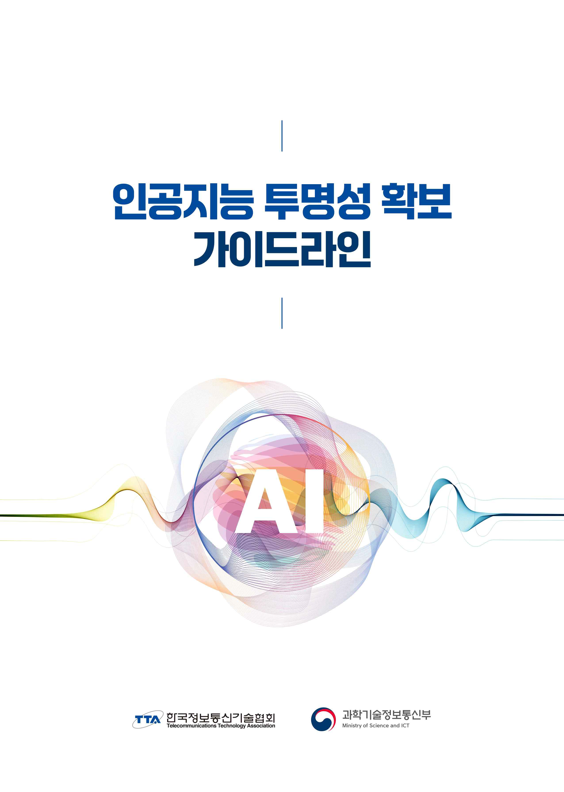

CONTENTS
인공지능 투명성 확보 가이드라인

1  투명성 확보 의무 개요······························01
2  투명성 조항별 설명···································03
3  사전고지 방법···········································05
4  표시 방법··················································06
5  참고자료···················································19


투명성 확보 의무 개요
투명성 확보 의무 개요
투명성 확보 의무의 취지
l ‘이용자’가 인공지능 기반 제품･서비스를 이용하고 있다는 사실과, 제공되는 결과물이
인공지능에 의해 생성된 것임을 명확히 인식할 수 있도록 함
l 정보 이용 과정에서의 혼동과 오인 방지 및 사회적 신뢰를 제고하기 위한 제도적 장치를 마련하는 데
목적이 있음
투명성 확보 의무 내용
인공지능 기본법 제 31조 “인공지능 투명성 확보 의무”의 주요 의무 사항
(제1항) 사전 고지 의무
(제2항) 표시 의무
(제3항) 딥페이크 생성물 표시 의무
l (제1항) 고영향 인공지능이나 생성형 인공지능을 이용한 제품･서비스의 AI 기반 운용 사실을
사전 고지
l (제2항, 제3항) 인공지능 생성 결과물이 생성형 인공지능 또는 인공지능 시스템에 의해
생성되었다는 사실을 고지 및 표시
법 제 31조
적용 범위
의무사항
제1항
고영향 AI 및 생성형 AI를 이용한
제품･ 서비스 제공시
제품･서비스의 고영향
또는 생성형 AI기반 운용
사실
사전 고지
제2항
생성형 AI 및 이를 이용한
제품･서비스 제공시
결과물이 AI로
생성되었다는 사실
표시
제3항
AI시스템으로 실제와 구분하기 어려운
가상의 생성 결과물 제공시
고지 또는 표시


인공지능 투명성 확보 가이드라인
적용 대상 및 범위
l (적용대상) 인공지능 투명성 확보 의무는 이용자에게 최종적으로 AI 제품 및 서비스를 제공하는
인공지능사업자에게 부과
예) 개발사A가 개발한 파운데이션 모델의 API를 제공하고, 이를 활용하여 B사가 AI 제품·서비스를
이용자에게 제공할 경우 투명성에 대한 의무는 B사에게 부여
- 파운데이션 모델 개발자가 직접 이용자에게 AI 제품·서비스를 제공하는 경우에는 직접적인
투명성 확보 의무가 발생
- 해외 사업자라도 우리 국민에게 영향을 미치면 적용 대상
l (적용되지 않는 경우) 단순히 AI 제품·서비스를 이용한 결과물을 자신의 서비스 등에 활용하는
자는 인공지능사업자에 해당하지 않으며 투명성 확보 의무 적용 대상이 아님
예) AI를 이용하여 CG를 생성한 후 영화에 삽입한 영화제작자는 단순히 AI 서비스를 이용한 결과물을
자신의 콘텐츠에 활용한 것이므로 AI기본법 상 AI사업자가 아니며 이용자에 해당
인공지능사업자의 구분
l (AI개발사업자) 인공지능 제품이나 인공지능 서비스에 활용되는 인공지능을 개발하여 제공하는
자를 의미
설명
【개발】 인공지능 또는 인공지능 기술을 직접 개발하거나, 그 성능에 중대한 영향을 줄 정도로 수정･변경･개량한
것을 의미
【제공】 유료로 제공하는 것 외에도 무상(공공서비스, 오픈소스 등)의 제공도 포함
☞ 하이퍼클로바 개발사인 네이버, ChatGPT 개발사인 OpenAI 등


투명성 확보 의무 개요
l (AI이용사업자) AI개발사업자가 제공한 인공지능을 이용하여 인공지능 제품 또는 인공지능
서비스를 제공하는 자를 의미
설명
【이용】 AI개발사업자로부터 직접 제공받은 경우는 물론, 다른 인공지능 이용사업자를 통해 제공받은
경우도 포함
【제공】 인공지능에 기반한 기능을 수행하거나 직접 실행하는 제품을 이용자에게 제공하거나, 또는
인공지능을 활용한 서비스를 이용자의 이용에 제공하는 것으로, 이용자에 대한 제공 행위가
필수적으로 있어야 해당
☞ 기반모델을 기반으로 작문 서비스를 제공하는 뤼튼테크놀로지스 등
※ OpenAI의 Sora를 활용, 콘텐츠를 제작 및 제공하는 유튜버와 같이, 인공지능의 생성물만을 제공하는
경우는 단순 이용자에 해당


인공지능 투명성 확보 가이드라인
투명성 의무별 설명
1) 사전 고지 의무
l AI사업자가 고영향 AI나 생성형 AI를 이용한 제품･서비스를 제공하려는 경우 해당하며,
제품･서비스가 AI에 기반하여 운용된다는 사실을 이용자에게 사전에 고지해야 함(법 제 31조 제 1항)
보충 설명 사전 고지 의무는 인공지능을 이용한 ‘제품/서비스’에 관한 것이며 생성 결과물과는 무관
시행령
사전에 고지하는 방법 (시행령 제23조 제1항)

##### 1. 제품 등에 직접 기재하거나, 계약서, 사용설명서, 이용약관 등에 기재


##### 2. 이용자의 화면 또는 단말기 등에 표시


##### 3. 제품 등을 제공하는 장소(해당 장소와 합리적으로 관련된 범위의 장소를 포함한다)에 인식하기 쉬운

방법으로 게시

##### 4. 그 밖에 제품 등의 특성을 고려하여 과학기술정보통신부장관이 인정하는 방법

2) 표시 의무
l AI사업자는 생성형 AI를 활용한 제품･서비스를 제공하는 경우, 그 결과물이 생성형 AI에 의해
생성되었다는 사실을 표시해야 함(법 제 31조 제 2항)
시행령
표시하는 방법 (시행령 제23조 제2항)

##### 1. 표시 방법은 사람이 인식할 수 있는 방법과 기계가 판독할 수 있는 방법이 있음


##### 2. 기계가 판독할 수 있는 방법을 사용할 경우에는 최소 1회 이상 안내 문구･음성 등을 제공해야 함


투명성 의무별 설명
3) 결과물이 딥페이크인 경우의 표시 의무
l AI사업자는 AI 시스템을 이용해 딥페이크 결과물을 제공하는 경우 해당 결과물이 AI에 의해
생성되었다는 사실을 이용자가 명확히 인식할 수 있는 방식으로 고지 또는 표시해야 함(법 제
31조 제 3항)
보충 설명 ’딥페이크’란 “실제와 구분하기 어려운 가상의 음향, 이미지 또는 영상 등의 결과물”을
의미하며, 텍스트는 해당되지 않음
시행령
표시와 관련하여 고려할 사항 (시행령 제23조 제3항)

##### 1. 이용자가 시각, 청각 등을 통하거나 소프트웨어 등을 이용하여 쉽게 내용을 확인할 수 있는 방법으로

고지 또는 표시할 것

##### 2. 주된 이용자의 연령, 신체적･사회적 조건 등을 고려하여 고지 또는 표시할 것

l 예술적･창의적 표현물에 해당하는 경우 전시･향유를 저해하지 않는 방식으로 고지 또는 표시할
수 있음(법 제 31조 제 3항)
보충 설명 예술적･창의적 표현물이란 미술, 영화, 문학, 사진, 출판, 만화, 게임, 애니메이션 등
창의적 표현 활동에 따른 결과물


인공지능 투명성 확보 가이드라인
사전고지 방법
l (사전고지 취지) 제품･서비스가 고영향 또는 생성형AI에 기반되어 운용되는 것임을 사전에 알려
이용자가 주의를 기울일 수 있도록 함
➊ (이용약관･계약서 활용) 제공하는 서비스의 이용약관, 서비스 가입 절차 및 계약서에 생성형AI
또는 고영향AI를 활용함을 명시
➋ (화면 표시) S/W, 모바일 어플리케이션 등을 통해 서비스 제공시 화면상에 생성형AI 또는
고영향AI를 활용함을 명시
➌ (제공장소에 게시) 오프라인 서비스의 경우 이용 전 충분히 인식할 수 있는 관련 장소에 게시
➊ 이용약관 - 스캐터랩 제타(Zeta)
➋ 화면 표시 - 카카오 타임톡


표시 방법
표시 방법
표시 기본원칙
l (표시 방법) AI 생성 결과물이 AI에 의해 생성되었다는 사실을  인지할 수 있도록 표시하여야 하며,
제품·서비스를 직접 이용하는 이용자를 대상으로는 서비스 이용 환경을 통한 표시가 가능
서비스 내 제공
(제품･서비스의 UI, 플랫폼 내)
è
외부 반출
(다운로드, 공유 등)
∙ AI 생성 결과물에 표시
∙ 서비스 UI 등에 이용자가 알 수 있도록 표시
∙ AI 생성 결과물에 표시
※ 서비스 내 제공 단계에서 UI 등에 표시를 하였더라도, 다운로드·공유 등 외부 반출 기능 제공 시에는
결과물을 통해 생성 사실을 알 수 있도록 결과물 내에 표시하여야 함
- 여러 유형의 결과물을 생성할 수 있는 경우(ex. 텍스트･이미지 모두 출력할 수 있는 범용 AI 등)
각 결과물의 유형에 따른 표시 방법을 적용
- 단순 편집 등 ‘생성형 AI’의 본질적 기능이 사용되지 않은 경우 표시 대상에서 제외
예) 동일 제품･서비스 내에서라도 생성형 AI 연계 기능을 적용하지 않고 다른 일반적인 편집
기능(이미지 자르기 등)만 사용된 경우
l (딥페이크) 이용자의 입력, 조작 등에 따라 실제와 구분하기 어려운 가상의 결과물을 생성할 수 있는
AI 제품･서비스의 경우 인공지능사업자가 해당 여부를 판단하여 표시 방법을 적용하여야 하며,
이를 판단･통제할 수 없는 경우 딥페이크의 기준을 적용
예) 이미지 생성 서비스가 일반적인 풍경, 캐릭터 생성뿐만 아니라, 실제 사람과 유사한 이미지를 생성할
가능성이 있는 경우


인공지능 투명성 확보 가이드라인
서비스 내 제공 시 표시 방법
∙ (대상) 서비스 이용 환경(UI 등) 내에서 제한적으로 결과물이 표현되는 경우
∙ (유의점) 단, 해당 AI 생성 결과물을 다운로드･공유 등 서비스 외부로 반출하는 기능을 제공하는 경우
결과물에 표시를 하여야 함
l (일반 생성물) 실제와 구분하기 어려운 수준에 해당하지 않는 AI 생성물
※ ‘일반 생성물’: 딥페이크 생성물과의 구분 및 이해를 돕기 위해 본 가이드라인에서 새롭게 정의된 내용
- (표시 방법) 결과물 내 또는 서비스 내(화면 등) 정보의 표출 등으로 AI 생성물임을 충분히 인지할
수 있는 방법으로 표시
※ 단, 서비스 이용 환경 내에서 기계가 판독할 수 있는 방법을 적용 시 별도 1회 이상 안내 문구･음성 등을
제공하여야 함
- 최종 결과물 이전에 이용자가 프롬프트 입력, 생성 이미지 선택 등 편집 과정의 모든 중간 생성물에
각각 표시할 의무는 없으며 결과물 제공(추출, 저장 등) 단계에서 표시
l (딥페이크 생성물) 실제와 구분하기 어려운 가상의 음향, 이미지 또는 영상 등의 결과물
- (표시 방법) 서비스 이용 환경 내에서 생성물 제공 시 일반 생성물과 동일한 표시 방법을 적용


표시 방법
외부 반출 시 표시 방법 예시
∙ (대상) 다운로드, 공유 등 AI 생성 결과물을 외부로 반출하는 기능을 제공하는 경우
∙ (유의점) 이용자의 입력, 조작에 따라 실제와 구분하기 어려운 결과물을 생성하여 외부로 반출하는 기능
을 제공하는 AI 제품･서비스의 경우 인공지능사업자가 해당 여부를 판단하여 표시 방법을 적용하
여야 하며, 이를 판단･통제할 수 없는 경우 딥페이크의 기준을 적용
l (일반 생성물) 실제와 구분하기 어려운 수준에 해당하지 않는 AI 생성물
※ ‘일반 생성물’: 딥페이크 생성물과의 구분 및 이해를 돕기 위해 본 가이드라인에서 새롭게 정의된 내용
- (표시 방법) 결과물에 로고 삽입 등 사람이 인식할 수 있는 방법 또는 기계가 판독할 수 있는 방법을 적용
※ 단, 서비스 이용 환경 내에서 기계가 판독할 수 있는 방법을 적용 시 1회 이상 안내 문구･음성 등을
제공하여야 함
- 최종 결과물 이전에 이용자가 프롬프트 입력, 생성 이미지 선택 등 편집 과정의 모든 중간 생성물에
각각 표시할 의무는 없으며 결과물 제공(추출, 저장 등) 단계에서 표시
※ 실제와 구분하기 어려운 결과물을 제공할 가능성이 없을 것으로 사업자가 명확하게 판단할 수 있는 AI
제품･서비스의 경우(예: 웹툰･캐릭터･애니메이션 전용 저작도구 등), 일반 생성물의 표시 기준을 적용 가능
l (딥페이크 생성물) 실제와 구분하기 어려운 가상의 음향, 이미지 또는 영상 등의 결과물
- (표시 방법) 사람이 직관적으로 인식할 수 있는 표시 방법 적용
※ 인물의 특성 합성, 딥페이크 등 오인･혼동 또는 피해 발생의 위험성이 있는 결과물의 경우, 해당
위험성을 고려한 추가적인 조치 필요
- (예술적･창의적 표현물) 전시･향유를 저해하지 않는 방법으로 완화된 표시 방법을 허용
※ 시간적으로 주요 콘텐츠와 차이를 두어 표시하거나 비가시적인 표시 방법 적용 등


인공지능 투명성 확보 가이드라인
참고
표시 기본원칙 적용 흐름도


표시 방법
서비스 내 제공 시 표시 방법 예시
1) 대화 기반 서비스
l (적용대상) AI 챗봇, 대화창 등 지속적 상호작용을 통해 결과물이 서비스 이용 환경에 제공되는 경우
l (서비스 예시) 어도비 파이어플라이, 챗GPT, 제미나이, 클로바 X등
l 표시 방법
➊ 채팅창 등 연속적 대화를 통해 명확히 인식할 수 있는 초기 안내 또는 지속 로고 표출 등(반복적
표시 불필요)
(초기 화면 표시) 제미나이
(로고 표시) 제미나이
(초기 화면 표시) 파이어 플라이
(로고 표시) 파이어 플라이
➋ 서비스 화면에서 ‘AI 모델이 실시간 데이터를 생성함’을 표시
➌ 문구 표기 영역이 충분하지 않은 경우 툴팁 등으로 표시
(실시간 생성 중 표시) 챗GPT 이미지 생성
(툴팁 표시) 네이버 클로바


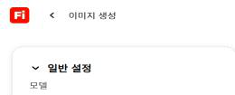


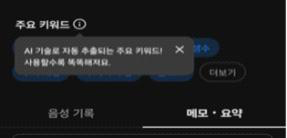


인공지능 투명성 확보 가이드라인
2) 음성 어시스턴트
l (적용대상) AI와 음성 대화를 기반으로 제공되는 서비스
l (서비스 예시) Siri, Google assistant, SKT Nugu, 음성 기반 가전
l 표시 방법
➊ 이용 전 이용자가 인식할 수 있는 음성 또는 화면 문구 등으로 안내
➋ 이용자가 호출하여 시작되는 서비스의 경우 개별 음성마다 반복적인 안내 불필요
➌ 음성 가전 등 실물이 있는 제품의 경우 겉면에 AI를 기반으로 운용됨을 표시
(음성 안내) 창작예시
(사전 동의) 창작예시


표시 방법
3) 게임, 메타버스
l (적용대상) AI와 상호작용 또는 동적인 AI 콘텐츠 생성 기능이 적용된 게임, 메타버스
※ 단순히 생성형 AI 결과물(그림, 음악, 코드 등)을 게임 제작에 활용한 경우 외 AI가 구성요소로 포함되어
그 자체로 AI 제품･서비스로 볼 수 있는 경우
l (서비스 예시) 미르5, 인조이, 던전앤파이터, 언더커버 스모킹건, 마인크래프트 등
l 표시 방법
➊ (게임 내 구성요소에 AI 활용) 이용자가 상호작용하는 캐릭터･NPC명에 AI 캐릭터･NPC임을
알리거나 혹은 초기 대화 시 안내
➋ (AI 기반 음성 서비스) 게임 내 이용자가 로그인 등 플레이 활성화 할 경우 서비스 초기에 AI
기반 음성임을 안내
(AI NPC 대화) 연운
출처: 게임조선
(캐릭터 생성) 로스트 아크
출처: 시사저널e


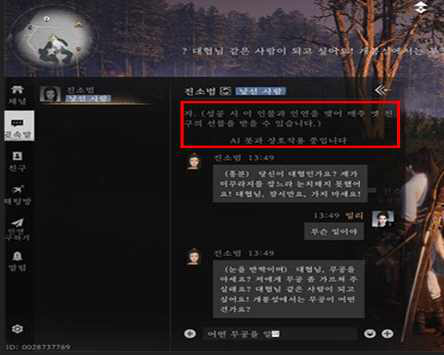


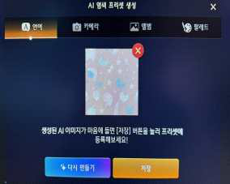


인공지능 투명성 확보 가이드라인
4) 생산성 향상 서비스
l (적용대상) 생성형 AI를 보조적 수단으로 활용하는 문서 작성 지원 서비스
l (서비스 예시) Google workspace (gemini), MS Copilot 기반의 파워포인트(PPT)/워드(docs),
네이버 클로바 노트 등 AI 지원 서비스
l 표시 방법
➊ 이용 화면 내 로고 표출, 이용 전 안내 등으로 인공지능 활용 여부 표시하며, 개별 결과물에 대해
표시 불필요
※ 단, 실시간으로 동기화되어 파일 등으로 저장하는 경우 ‘서비스 외부 반출 시 표시 방법’에 대한 추가적인
적용 필요

(AI회의록 작성) 노션 AI
(회의록 요약) 파워포인트


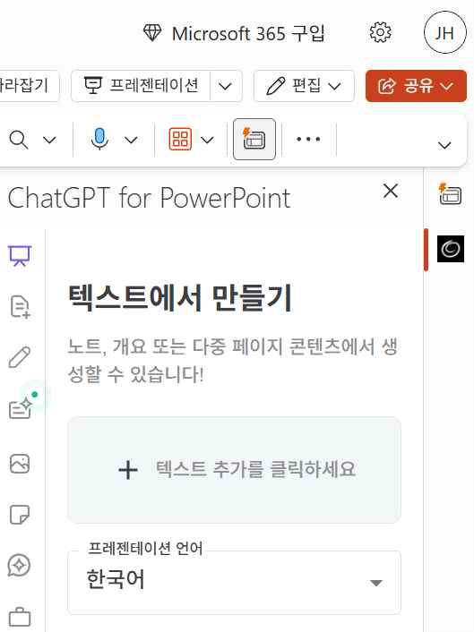

표시 방법
외부 반출 시 표시 방법 예시
1) 텍스트 생성물
l 적용대상: 문자･부호로 구성된 텍스트 결과물 다운로드･공유 등 기능 제공 시
※ 이용자가 클립보드(Copy & Paste) 기능을 이용하는 경우는 해당하지 않음
l 서비스 예시: ChatGPT, 클로드, 제미니, 하이퍼 클로바 등
l 표시 방법
➊ (파일 형태로 제공 시) 문서의 머리말, 파일 메타데이터로 표시
☞ 메타데이터 등 비가시적인 방법을 적용할 경우 다운로드 시 문구·음성 등으로 AI로 생성되었음을
1회 이상 안내
➋ (코드 생성 도구) 프로젝트 설명, 코드 내 주석 등으로 표시
☞ 프로젝트 활용 및 코드 실행에 영향을 미치지 않는 주석 형식의 코드 내 표시 또는 .md 파일 등에 명시
(인공지능 코드 생성) 창작예시


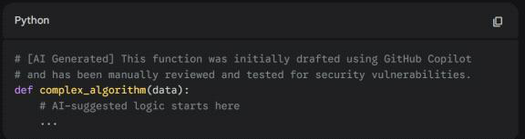


인공지능 투명성 확보 가이드라인
2) 이미지 생성물
l 서비스 예시: Sora, 미드저니, 달리, 나노바나나 등
l 표시 방법
➊ (사람이 인식할 수 있는 방법) 이미지 내 로고 삽입 등을 통한 가시적인 방법
※ 실제와 구분하기 어려운 생성물(딥페이크)은 명확하게 인식할 수 있는 방법으로써 사람이 인식할 수
있는 방법만을 적용
➋ (기계가 판독할 수 있는 방법) 디지털 워터마킹, 메타데이터 등을 활용한 비가시적인 방법
☞ 비가시적인 방법을 사용할 경우 다운로드 시 문구·음성 등으로 인공지능 기반 생성 사실에 대해 1회
이상 안내
(가시적 워터마크 활용) 제미나이
(인공지능 사용 안내)  창작 예시


표시 방법
3) 동영상 생성물
l 서비스 예시: Runway, Sora, Pika Labs 등
l 표시 방법
➊ (사람이 인식할 수 있는 방법) 화면 영역 일부에 로고 등을 표출하거나, 영상 시작 부분에 AI
생성 사실을 안내하는 방법 등
※ 실제와 구분하기 어려운 생성물(딥페이크)은 명확하게 인식할 수 있는 방법으로써 사람이 인식할 수
있는 방법만을 적용하되, AI로 생성된 재생구간 전체에 로고 표출 등으로 AI 생성 사실을 표시하여야 함
➋ (기계가 판독할 수 있는 방법) 디지털 워터마킹, 메타데이터 등을 활용한 비가시적인 방법
☞ 비가시적인 방법을 사용할 경우 다운로드 시 문구·음성 등으로 인공지능 기반 생성 사실에
대해 1회 이상 안내
(가시적 워터마크 활용) 소라AI
(인공지능 사용 안내)  창작 예시


인공지능 투명성 확보 가이드라인
4) 음성 생성물
l 서비스 예시: Suno 등
l 표시 방법
➊ (사람이 인식할 수 있는 방법) 음성 시작 부분에 AI 생성 사실을 안내하는 방법 등
※ 실제와 구분하기 어려운 생성물(딥페이크)은 명확하게 인식할 수 있는 방법으로써 사람이 인식할 수
있는 방법만을 적용
☞ 이용자가 해당 콘텐츠가 생성형AI를 통해 생성된 것임을 인식할 수 있도록 재생 초기에 안내
(예시) 재생시간 전체에 표시할 필요는 없으며, 오디오 콘텐츠 시작 부분에 AI로 생성되었음을
멘트로 간단히 안내
☞ 인공지능이 생성한 텍스트 대본을 인공지능이 음성으로 읽는 경우, ‘AI가 생성한
음성입니다.’ 등의 가청적 방법을 비롯한 이용자가 명확히 알 수 있는 방법으로 표시
➋ (기계가 판독할 수 있는 방법) 사후 식별 가능한 음성 워터마킹 기술, 메타데이터 등을 활용한
비가시적인 방법
☞ 비가시적인 방법을 사용할 경우 다운로드 시 문구·음성 등으로 인공지능 기반 생성 사실에
대해 1회 이상 안내

표시 방법
5) 기타 파일 형식의 생성물
l 적용대상: 이외 파일 형식(슬라이드, PDF 등)의 결과물을 제공하는 경우
l 서비스 예시: Canva, Gamma 등
l 표시 방법
➊ (사람이 인식할 수 있는 방법) 파일 포맷의 특성을 고려하여 적합한 방법으로 표시
☞ 머리말 또는 작성 영역 초반(문서), 첫 슬라이드의 일부 영역(시트 형식) 등에 AI 생성
사실을 표시
➋ (기계가 판독할 수 있는 방법) 메타데이터 활용
☞ 파일 작성자 등 메타데이터 영역에 AI 생성물임을 표시
☞ 비가시적인 방법을 사용할 경우 다운로드 시 문구·음성 등으로 인공지능 기반 생성 사실에
대해 1회 이상 안내

출처: https://www.iptc.org/std/photometadata/documentation/userguide/#_applying_metadata_to_ai_generated_images
｜사진과 문서의 메타데이터 활용 예시｜


인공지능 투명성 확보 가이드라인
참고 자료
인공지능 생성 서비스 사례
l 이미지 기반 서비스
-  인공지능 기술에 기반하여 예술 작품이나 사실적인 사진, 복잡한 이미지나 효과를 적용하는 등의
방식으로 새로운 이미지를 창작 및 수정
- 대표적인 이미지 인공지능 콘텐츠 생성 서비스로 DALL･EOpenAI, FireFlyAdobe, Stable
DiffusionStability AI 등의 플랫폼이 존재
이미지 생성형 인공지능 서비스를 통한 이미지 생성(좌: Firefly, 우: Stable Diffusion)
l 동영상 기반 서비스
-  영상을 생성하거나 영상의 변환･편집 등 작업을 수행하며1), 주로 사용자가 작성한 각본(Script)과
입력한 명령어에 따라 영상을 자동으로 생성2)
- 텍스트(Text-To-Video) 혹은 이미지(Image-To-Video)를 바탕으로 동영상을 생성하는 서비
스는 SoraOpenAI, VideoFx/Veo3Google, Stable Video DiffusionStability AI 등의 플랫폼이 존재
1) WANG JIAJIA. (2024). 정보 특성과 개인적 특성이 생성형 AI 서비스 사용의도에 미치는 영향에 관한 실증적 연구(박사). 세종대학교
대학원, 박사학위논문
2) 손한빈. (2023). 생성형 인공지능의 서예 콘텐츠 초탐. 동양예술, (59), 5-30.


표시 방법
동영상 생성형 인공지능 서비스 Sora를 통한 동영상 생성 예시
∙ 아래 프롬프트로 생성된 영상 중 한 장면
∙ “한 스타일리시한 여성이 따뜻하고 빛나는 네온과 애니메이
션 도시 간판으로 가득 찬 도쿄 거리를 걷고 있습니다. 그녀
는 검은색 가죽 재킷, 긴 빨간색 드레스, 검은색 부츠를 신
고 검은색 지갑을 들고 있습니다. 선글라스와 빨간색 립스틱
을 바릅니다. 그녀는 자신감 넘치고 캐주얼하게 걷습니다. 거
리는 축축하고 반사적 이어서 다채로운 조명의 거울 효과를
만들어 냅니다. 많은 보행자가 걸어 다닙니다.”
출처: Open AI 공식 홈페이지
l 텍스트 기반 서비스
- 대규모 텍스트 데이터를 기반으로 한 언어 모델을 활용해 인간과 유사한 레벨에서 언어를 이해하고
생성 및 응답함으로써 높은 성능을 발휘
- 대표적으로 ChatGPTOpenAI, GeminiGoogle, ClaudeClaude, HyperCLOVAXNaver 등의
서비스가 존재
텍스트 생성형 인공지능 서비스를 통한 텍스트 생성(좌: ChatGPT, 우: Gemini)
l 오디오 기반 서비스
- 인공지능 기술을 사용하여 사람의 목소리나 음악을 학습하여 새로운 음성이나 오디오 생성
- 텍스트(Text-To-Speech)를 바탕으로 가상 비서, 음성 보조 기기 등에 활용되고 있으며,
WaveNetGoogle, AI SpeechMicrosoft Azure, Amazon PollyAWS 등이 존재


인공지능 투명성 확보 가이드라인
인공지능 생성 콘텐츠 위험사례
l 가짜뉴스 생성(1)
- 가짜뉴스는 뉴스 형태로 제시된 허위 또는 오해의 소지가 있는 정보이며, 종종 개인이나 단체의
평판을 손상시키거나 광고 수익을 통해 돈을 벌려는 목적을 포함3)
- 가짜뉴스에 대한 시민의 인식을 확인하기 위한 통계 조사 결과4), 가짜뉴스를 경험해 보았다는
비율이 43.3%에 달하고, 인공지능이 발달하면서 가짜뉴스 피해도 심화될 것이라는 전망에
84.2%가 동의
⇒ 통계 사례로 볼 수 있듯이 가짜뉴스는 이미 대중의 생활 곳곳에 침투하고 있어, 이에 대한 대책 마련이 시급
➽ 사례 예시(펜타곤 폭발 가짜뉴스 사건)
(출처 : 월드뷰)
펜타곤 폭발 가짜뉴스 사건 및 증시 변동5)
- 2023년 5월 미국에서 펜타곤이 폭발하는 사진이 소셜미디어인 트위터에서 언론까지 광범위하게
퍼지며 큰 혼란을 야기
- 펜타곤 대변인은 "펜타곤은 공격받지 않았다."고 밝혔고, 펜타곤 주변을 관할하는 경찰과 소방
당국 역시 "펜타곤 보호구역이나 근처에서 폭발이나 사고가 발생하지 않았으며 대중에게 위험은
없다."고 전하며 해당 사진은 인공지능 생성물임을 공개
- 그러나, 사진이 유포되자 S&P500 지수가 한때 0.3% 하락하는 등 증시는 출렁였고, 유사시 안전
자산으로 꼽히는 미 국채와 금값도 잠시 상승
3) 가짜뉴스, 위키피디아, https://ko.wikipedia.org/wiki/가짜뉴스
4) 가짜뉴스 피해 심각···허위 사실 유포자, 매체 강력 처벌 필요, 한국 NGO 신문,
https://www.ngonews.kr/news/articleView.html?idxno=143414
5) https://v.daum.net/v/20230523143302235


표시 방법
l 가짜뉴스 생성(2)
- 생성형 인공지능의 활용은 동영상, 이미지, 오디오 등 선거 운동에 필요한 다양한 콘텐츠 제작을
가능하게 하며 선거에 영향력 행사
- 가짜 인공지능 생성 콘텐츠는 유권자들 사이에서 혼란을 야기하고, 특정 후보에 대한 부정적인
인식을 심어줄 수 있는 가능성 존재
| UNESCO & Ipsos(’24), 전 세계 16개국 출신 8,000명 대상 설문조사 |
선거에 대한 가짜뉴스의 영향 유무(%)
온라인 가짜뉴스의 규제 필요 유무(%)
출처: 새로운 디지털 질서 정립 추진계획(24.5)
➽ 사례 예시(美 대통령 선거 딥페이크 이미지 유포 사건)
- 2023년 미국 선거기간에 해당 후보의 지지자들은 흑인 유권자들을 공략하기 위해 흑인들이 후
보를 지지한다는 취지의 사진을 인공지능으로 생성하여 공유
- 후보자를 비방하기 위해서 생성형 AI 모델인 ‘미드저니’를 이용해 후보자가 체포되는 장면과 형을
선고받아 투옥되는 장면 등을 제작한 뒤 소셜미디어에 게시
출처: BBC News 코리아(좌), AI 타임스(우)
생성형 인공지능으로 제작한 트럼프 美 대통령 딥페이크


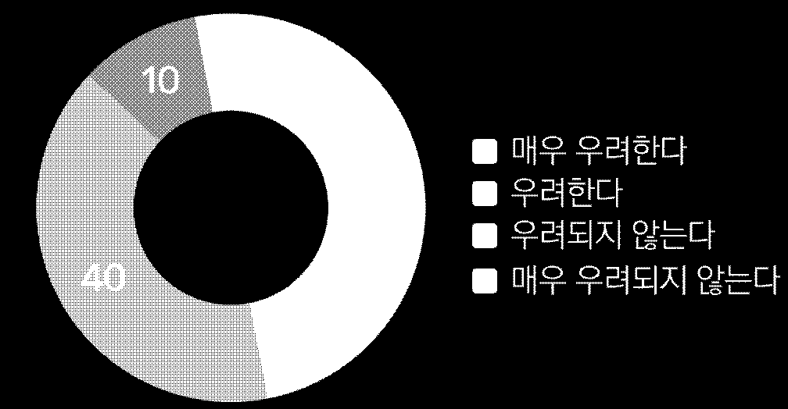


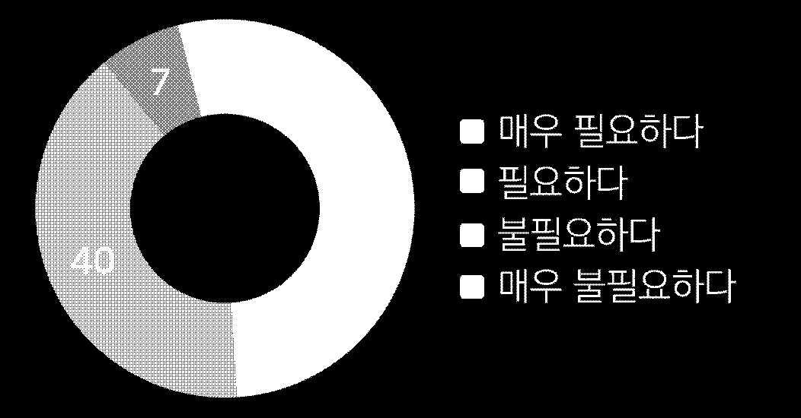


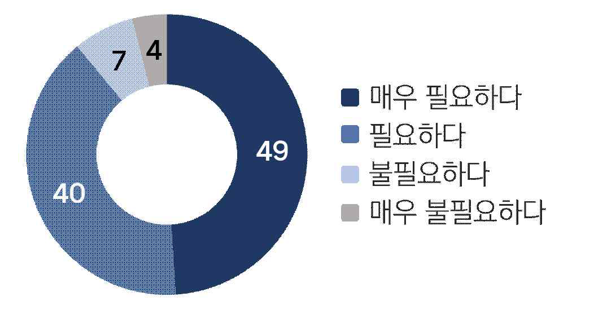


인공지능 투명성 확보 가이드라인
l 디지털 성범죄
- 생성형 인공지능을 오남용하여 성적 허위 영상물(성착취물)을 제작 및 유포하는 행위가 발생하고
있으며, 연예인이나 지인의 얼굴을 음란물과 합성해 유포하는 디지털 성범죄가 빈번히 발생
- 이미지의 유포･합성･소비의 가능성을 무한대로 확장시키기 때문에 디지털 성범죄는 피해와 가해의
구도가 1대 N을 이루고, 생산자와 소비자의 경계가 불분명6)
| 딥페이크 기술을 활용한 디지털 성범죄 사례 |
기간
내용
2024년 9월 ~
서울의 한 고등학교에 다니는 학생들 사이에선 최근 주변 4개 고교에 재학 중인 남학생
5명이 동료 여학생 10여 명의 사진을 불법 합성
2024년 8월 ~
텔레그램 단체 채팅방에서 현역 군인들이 여성 동료 군인들의 얼굴 사진을 딥페이크
방식으로 합성해 성착취물을 제작 및 공유
➽ 사례 예시(생성형 인공지능 활용 아동 성착취물 제작자 기소)
생성형 인공지능 활용 아동 성착취물 제작자 기소7)
- 2023년 4월, 생성형 인공지능 서비스에 ‘나체’, ‘어린이’ 등의 텍스트를 입력하여 360개의 아동 성착취물을
제작한 사건이 발생
- 우리나라 법원에서는 해당 행위가 아동･청소년의 성보호에 관한 법률에 위반되었다고 판시하여 징역 2년
6개월이 선고
- 피고인은 유포할 목적이 없었고, 가상의 이미지를 가지고 있는 것은 처벌 대상이 아니라고 생각했다고 진술
했으나 재판부는 피해자가 없다고 해도 성적 표현물 자체가 명백하게 아동으로 인식될 수 있다면 아동
청소년보호법 위반에 해당할 수 있다고 판시
6) 디지털 성범죄의 특징 및 현황, 찾기 쉬운 생활법령 정보(법제처),
https://www.easylaw.go.kr/CSP/CnpClsMain.laf?csmSeq=1594&ccfNo=1&cciNo=1&cnpClsNo=2
7) AI 프로그램으로 아동 성 착취물 제작해 구속 기소, KBS 뉴스, https://news.kbs.co.kr/news/pc/view/view.do?ncd=7738404


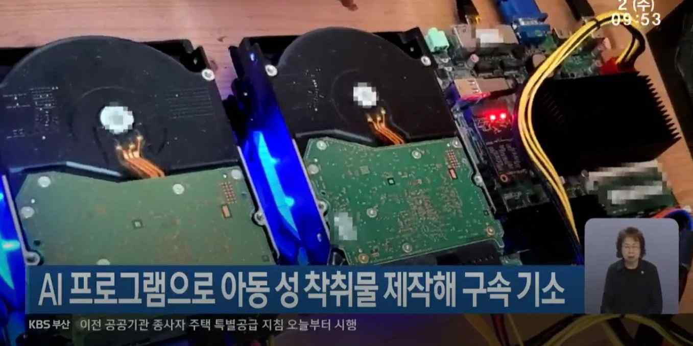

표시 방법
l 학술 및 콘텐츠 윤리 문제
- 생성형 인공지능이 학술논문, 자기소개서, 기사, 논문에 사용하는 그림 등을 생성하여 활용하는
사례가 증가하면서 공동 저자로 등록하고, 서로 다른 논문임에도 유사한 그림, 글이 무분별하게 양산
| 생성형 인공지능의 AI 표절 |
사건
내용
네이처, 인공지능 활용 논문
검증에 대한 주의(’24년 11월)
‘Frontiers in Cell and Developmental Biology’에 실렸던 한 논문을
소개하면서 터무니없이 큰 생식기를 지닌 쥐 이미지가 사용됐는데 알고
보니 생성형 이미지 모델 ‘미드저니’로 만든 것으로 밝혀져 철회된 사례를
집중하며 인공지능을 논문에 활용하는 것을 우려
턴잇인, AI 논문 표절 심각성
발표(’24년 4월)
온라인 표절 검사 서비스(Turnitin) 기업은 ’23년 4월 이후 플랫폼 제출
2억개 논문 중 약 11%가 표절이라고 발표
➽ 사례 예시(공동 저자로 ChatGPT가 등장한 논문이 게재되면서 과학계 반발)
과학기술 저널에 등재된 공동 저자 ‘ChatGPT’
- ChatGPT가 2023년 한해 책/저널을 발표하여 저작권을 보유하고 있는 경우 200여 권이 확인,
네이처의 발표에 따르면 최소 4편 이상이 연구논문에 공동 저자로 등록
- (과학계) ChatGPT가 공동 저자로 등록하는 것이 표절 문제를 동반한다면 최소한의 윤리 지침을
지켜야 한다고 지적하며 네이처 등에서는 저자로서 인정 불가 의사 표시
과학계 반발에 관한 다양한 기사


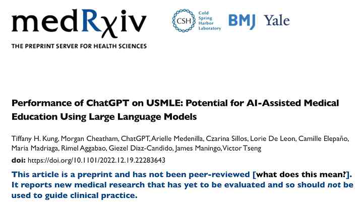


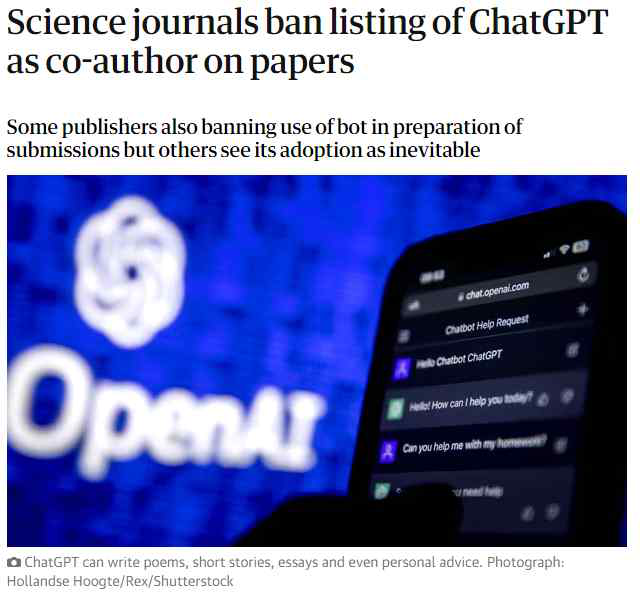


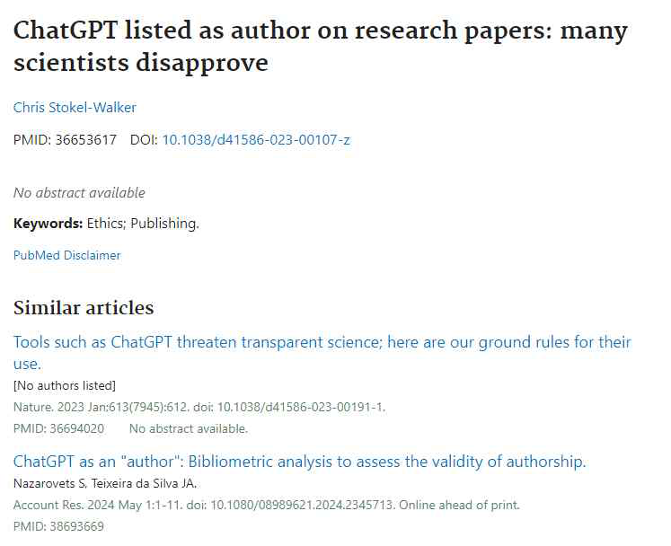

인공지능 투명성 확보 가이드라인
인공지능 생성 콘텐츠 국내외 법안 현황
- 생성형 인공지능이 사회 전반에 미치는 영향이 증대됨에 따라, 딥페이크를 통한 가짜뉴스 확산,
선거 개입, 지적재산권 침해 등 다양한 사회적 부작용이 우려
- 따라서, 각국은 인공지능 생성 콘텐츠의 안전하고 신뢰할 수 있는 활용을 위한 법적 규제 체계 마련
| 국외 인공지능 생성 콘텐츠 관련 법안 현황 |
구분
주요 내용
미국
∙ 행정 명령 14110호(Executive Order, (’23.10))
- 안전하고 신뢰할 수 있는 인공지능 개발 및 사용 행정명령 제 14110호(Executive Order 14110:
Safe, Secure, and Trustworthy Development and Use of Artificial Intelligence)
- AI 기술의 급속한 발전과 그에 따른 잠재적 위험에 대한 우려 및 사회적 으로 발생 가능한 문제(차별,
편견, 허위정보 등)로 인해, 국가 안보에 대한 위험 증가하고 있어 책임감 있는 AI 개발 및 사용을
위한 규제 입법
- 정부 기관들이 240일 내에 합성 콘텐츠를 탐지, 라벨링(워터마킹 등의 방법을 통해), 추적하기 위한
최신 기술을 식별하는 보고서를 작성하도록 의무화
∙ 자율 서약(Voluntary Commitments, (’23.7))
- 美 바이든 정부는 주요 AI 기업 7개와 안전, 보안, 신뢰를 강조하는 8가지 약속에 AI 생성
시청각 콘텐츠 표식(워터마크) 기제 개발 규정 제정
※ 2025년 1월 상기 두 인공지능 정책(Executive Order 14110, Voluntary AI Commitments)은 트럼프
대통령 취임 직후 바이든 행정부의 AI 규제 정책을 전면 폐지하는 행정명령 발표에 의해 폐지
(EO 14179, “Removing Barriers to American Leadership in Artificial Intelligence”)
Ÿ 주(州)별 인공지능 법안 현황
- 캘리포니아, 오하이오 및 뉴욕 등 각 주(州)는 인공지능 생성 콘텐츠에 명시 의무를 요구
하는 조항이 포함된 법안 시행 또는 추진 중
주(州)
번호
법안명
시행일
주요 내용
캘리
포니아
SB942
California AI
Transparency ACT

##### 26. 1. 1.

매월 100만 명 이상의 사용자가 있는 시스템은
인공지능 생성물 탐지 도구 및 표시나 메타데이터를
제공하여 사용자가 인공지능 생성 콘텐츠를 쉽게
식별할 수 있도록 규정
오하
이오
SB217
AI Generated
Product Watermark
추진 중
인공지능 생성 콘텐츠에 워터마크를 탑재하고, 개인의
신원을 무단으로 활용한 콘텐츠는 24시간 이내에
삭제하도록 규정
뉴욕
A7106
Political Artificial
Intelligence
Disclaimer(PAID)
Act
추진 중
정치적으로 사용되는 인공지능 생성 콘텐츠는
인공지능 기술 활용 사실을 고지하도록 의무 규정


표시 방법
| 국내 인공지능 생성 콘텐츠 관련 법안 현황 |
제정일
기간
주요 내용
’25. 1
인공지능 발전과
신뢰 기반 조성
등에 관한 기본법
- 인공지능 기술의 급속한 발전과 사회 전반에 걸친 활용 확대에 따라, 기술 혁신과 윤리적
책임 간의 균형을 확보하기 위해 「인공지능의 발전과 신뢰 기반 조성 등에 관한 기본법」 제정
- 제31조(인공지능 투명성 확보 의무)는 고영향 인공지능 또는 생성형 인공지능을 이용한
제품 또는 서비스를 제공하는 인공지능사업자는 해당 사실을 이용자에게 사전에 고지
하여야 하며, 생성형 인공지능 또는 이를 이용한 제품 또는 서비스를 제공하는 경우
그 결과물이 생성형 인공지능에 의하여 생성되었다는 사실을 표시하여야함을 요구
- 인공지능시스템을 이용하여 실제와 구분하기 어려운 가상의 결과물을 제공하는 경우
그 사실을 이용자가 명확하게 알 수 있도록 고지 또는 표시하도록하는 규정을 마련
’24. 12
정보통신망
이용촉진 및
정보보호 등에
관한 법률
- 인공지능 기술을 이용하여 사람의 얼굴･신체 또는 음성을 대상으로 한 촬영물･영상물
또는 음성물을 대상자의 의사에 반하여 편집･합성 또는 가공한 정보의 무분별한 유통
으로 인한 성범죄, 명예훼손 또는 사기 등의 피해를 예방하기 위하여 시책을 마련해야
하는 규정 신설(제42조의2-합성영상등으로 인한 피해 예방을 위한 시책)
’23. 12
공직선거법
- 누구든지 선거일 전 90일부터 선거일까지 인공지능 기술 등을 이용하여 만든 동영상,
이미지, 오디오 등을 게시하는 것이 금지(제82조의8-딥페이크영상등을 이용한 선거
운동)
- 중앙선거관리위원회 규칙으로 정하는 사항을 딥페이크 영상 등에 표시하지 아니하면
처벌하는 규정 마련
※ 제250조(허위사실공표죄) 4항, 제255조(부정선거운동죄), 제261조(과태료의 부과･징수 등)
구분
주요 내용
유럽연합
∙ 인공지능법(EU AI Act, (’24.5))
- 범용 AI 모델 관련 콘텐츠가 AI에 의해 생성되었음을 명시하는 투명성 의무 규정
- 딥페이크를 구성하는 이미지, 음성 또는 비디오 콘텐츠를 생성하거나 조작하는 인공지능시스템의
배포자는 해당 콘텐츠가 인위적으로 생성 또는 조작되었다는 것을 공개
∙ 디지털 서비스법(Digital Services Act, (’22.7))
- 인공지능으로 생성한 콘텐츠(이미지, 오디오, 영상)에 대해 생성 주체를 소비자들이 알 수 있도록
표시할 것을 규정(Article 35-Mitigation of risks-(k) 조항)
중국
∙ 생성형 인공지능 서비스 관리 법 (’23.5)
- 생성형 인공지능 서비스 제공자는 ’인터넷정보서비스 딥페이크 관리 규정‘에 따라 이미지, 비디오
등 인공지능 콘텐츠에 대해 표시할 것을 의무화(제3장)
- 규정 위반 시 시정하도록 명령하며, 시정을 거부하거나 상황이 엄중한 경우 관련 서비스 제공을
잠정 중단하도록 규정
∙ 인터넷정보서비스 딥페이크 관리 규정 (’22.11)
- 기업들이 딥페이크 기술을 사용해 콘텐츠 제작 시 사용 기술 내용을 명시하도록 규정
- 생성형 AI 서비스 공급자들이 텍스트･이미지･오디오 등의 콘텐츠에 인공지능이 생성한 것임을
표시(워터마크 포함)하여 원본 추적이 가능하도록 해야 한다는 ’생성형 AI 규정‘ 마련


인공지능 투명성 확보 가이드라인
인공지능 생성 콘텐츠 국제 사회 논의
l AI 서울 정상회의(‘24.5)
- '안전하고 혁신적이며 포용적인 AI를 위한 서울 선언'과 '프론티어 AI 안전 서약'이 체결
- 구글, LG AI연구소, 세일즈포스, KT, 마이크로소프트, 삼성전자, 앤스로픽, SK텔레콤, IBM, 네이버,
코히어, 카카오, 오픈AI, 어도비 등 총 14개 기업이 서약에 서명하였으며 주요 내용은 다음과 같다.
⦁ AI 안전 연구소 간 네트워크 확대 및 글로벌 협력 촉진
⦁ 워터마크 등 인공지능이 생성하는 콘텐츠 식별을 위한 조치와 국제표준 개발 협력 강화
⦁ AI 모델에 대한 위협 평가를 위한 레드팀 구성 및 안전성 접근 방식을 투명하게 공유
l 히로시마 AI 프로세스 행동강령 발표(’23.12)
- G7*은 ’23년 5월 일본에서 개최된 히로시마 정상회의에서 인공지능의 위험을 관리하는 국제
규범인 ‘히로시마 AI 프로세스’ 수립에 대해 합의
* G7 회원국은 미국･일본･독일･영국･프랑스･이탈리아･캐나다이며, EU는 참가국 자격 활동
- 개발자가 가짜정보의 확산과 프라이버시 침해 위험을 완화하는 방안을 검증받고, 인공지능 콘텐츠에
대한 워터마크 삽입하는 등의 ‘히로시마 AI 프로세스 행동강령’ 발표8)
⇒ 기술적으로 가능한 경우 워터마크 또는 ‘인공지능 콘텐츠임을 알 수 있도록 하는 기타 기술적
조치’ 등 인공지능 콘텐츠의 진본성 및 출처 체제를 개발 이행할 것을 요구9)
l 독일 뮌헨안보회의(MSC) 딥페이크 공동 대응 논의(‘24.2)10)
- 독일 뮌헨안보회의(MSC)에서 20개 글로벌 빅테크 기업들이 공동으로 인공지능 기술을 악용해
선거에 영향을 끼치는 행위에 공동 대응하기로 합의했다고 발표
- 합의문의 제목은 ‘2024년 선거에서 인공지능의 기만적 사용을 방지하기 위한 기술 협약’(Tech
Accord to Combat Deceptive Use of AI in 2024 Elections)
⇒ 해당 합의문에는 선거에 영향을 미치는 인공지능 사기 콘텐츠를 막기 위한 기술 개발, 인공
지능 사기 콘텐츠와 관련하여 발새알 수 있는 위험 평가 모델 수립 등에 대한 조약
8) 디지털 심화대응 실태진단, https://beingdigital.kr/front/iagnosis_view.do?pageView=_11
9) G7, 히로시마 프로세스 행동강령의 주요 내용 및 시사, NIA, 23.12
10) 글로벌 빅테크, 유권자 속이는 ‘AI 페이크’ 공동 대응, https://www.hani.co.kr/arti/economy/economy_general/1128857.html


---

## 2-2. 안전성 확보 가이드라인


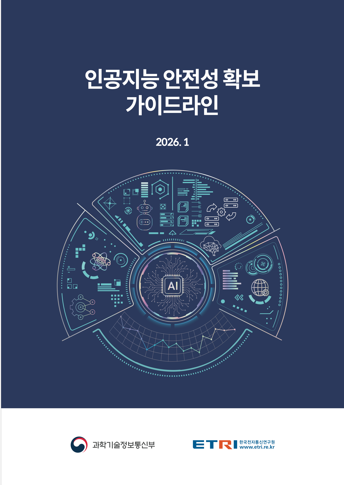

이 가이드라인(안)은 전문가, 실무자, 그리고 다양한 이해관계자의 의견을 모아,
해외 동향과 인공지능 기술의 발전, 서비스 형태 등을 종합적으로 반영해 작성 중인 자료입니다.
따라서 여기에 담긴 내용은 앞으로 공개될 최종본과는 달라질 수 있습니다.

❘개요䞻䞻䞻䞻䞻䞻䞻䞻䞻䞻䞻䞻䞻䞻䞻䞻䞻䞻䞻䞻䞻䞻䞻䞻䞻䞻䞻䞻䞻䞻䞻䞻䞻䞻䞻䞻䞻䞻䞻䞻䞻䞻䞻䞻䞻䞻䞻䞻䞻䞻䞻䞻䞻䞻䞻䞻䞻䞻5

##### 1. 목적 및 체계䞻䞻䞻䞻䞻䞻䞻䞻䞻䞻䞻䞻䞻䞻䞻䞻䞻䞻䞻䞻䞻䞻䞻䞻䞻䞻䞻䞻䞻䞻䞻䞻䞻䞻䞻䞻䞻䞻䞻䞻䞻䞻䞻䞻5


##### 2. 근거 규정䞻䞻䞻䞻䞻䞻䞻䞻䞻䞻䞻䞻䞻䞻䞻䞻䞻䞻䞻䞻䞻䞻䞻䞻䞻䞻䞻䞻䞻䞻䞻䞻䞻䞻䞻䞻䞻䞻䞻䞻䞻䞻䞻䞻䞻䞻䞻䞻䞻8


##### 3. 주요 용어 및 참고자료䞻䞻䞻䞻䞻䞻䞻䞻䞻䞻䞻䞻䞻䞻䞻䞻䞻䞻䞻䞻䞻䞻䞻䞻䞻䞻䞻䞻13

❘적용 대상 및 의무 주체 판단䞻䞻䞻䞻䞻䞻䞻䞻䞻䞻䞻14

##### 1. 적용 대상 판단䞻䞻䞻䞻䞻䞻䞻䞻䞻䞻䞻䞻䞻䞻䞻䞻䞻䞻䞻䞻䞻䞻䞻䞻䞻䞻䞻䞻䞻䞻䞻䞻䞻䞻䞻䞻䞻䞻䞻14


##### 2. 의무 주체 판단䞻䞻䞻䞻䞻䞻䞻䞻䞻䞻䞻䞻䞻䞻䞻䞻䞻䞻䞻䞻䞻䞻䞻䞻䞻䞻䞻䞻䞻䞻䞻䞻䞻䞻䞻䞻䞻䞻䞻22

❘수명주기 전반에 걸친 위험관리䞻䞻䞻䞻䞻䞻䞻䞻䞻䞻䞻26

##### 1. 위험의 식별䞻䞻䞻䞻䞻䞻䞻䞻䞻䞻䞻䞻䞻䞻䞻䞻䞻䞻䞻䞻䞻䞻䞻䞻䞻䞻䞻䞻䞻䞻䞻䞻䞻䞻䞻䞻䞻䞻䞻䞻䞻䞻䞻26


##### 2. 위험의 평가䞻䞻䞻䞻䞻䞻䞻䞻䞻䞻䞻䞻䞻䞻䞻䞻䞻䞻䞻䞻䞻䞻䞻䞻䞻䞻䞻䞻䞻䞻䞻䞻䞻䞻䞻䞻䞻䞻䞻䞻䞻䞻䞻37


##### 3. 위험의 완화䞻䞻䞻䞻䞻䞻䞻䞻䞻䞻䞻䞻䞻䞻䞻䞻䞻䞻䞻䞻䞻䞻䞻䞻䞻䞻䞻䞻䞻䞻䞻䞻䞻䞻䞻䞻䞻䞻䞻䞻䞻䞻䞻47

❘ 안전사고 모니터링 및 대응䞻䞻䞻䞻䞻䞻䞻䞻䞻䞻䞻䞻54

##### 1. 위험관리체계의 구축䞻䞻䞻䞻䞻䞻䞻䞻䞻䞻䞻䞻䞻䞻䞻䞻䞻䞻䞻䞻䞻䞻䞻䞻䞻䞻䞻䞻䞻䞻54

❘ 보고 및 제출䞻䞻䞻䞻䞻䞻䞻䞻䞻䞻䞻䞻䞻䞻䞻䞻䞻䞻䞻䞻䞻䞻䞻䞻䞻䞻䞻䞻䞻䞻䞻䞻䞻䞻䞻䞻䞻䞻䞻61

##### 1. 안전성 확보 조치 결과 제출䞻䞻䞻䞻䞻䞻䞻䞻䞻䞻䞻䞻䞻䞻䞻䞻䞻䞻䞻䞻61


##### 2. 안전사고 발생 시 단계별 보고䞻䞻䞻䞻䞻䞻䞻䞻䞻䞻䞻䞻䞻䞻䞻䞻䞻67


01 개요
개요
목적 및 체계
1-1. 가이드라인의 목적
본 가이드라인은 「인공지능 발전과 신뢰 기반 조성 등에 관한 기본법」(이하 “법”이라 한다) 제32조 및
같은 법 시행령(이하 “영”이라 한다) 제24조에 따라 제정된 「인공지능 안전성 확보 의무의 이행방법 등에
관한 고시」(과학기술정보통신부 고시 제2026-○○호, 이하 “고시”라 한다)의 내용을, 안전성 확보
의무가 적용되는 인공지능을 개발䞻운영하는 인공지능사업자(이하 “사업자”라 한다)가 정확히 이해하고
성실히 이행할 수 있도록 지원하기 위하여 마련되었다.
본 가이드라인은 고시에서 규정한 인공지능 안전성 확보 의무를 실제 이행하는 데 필요한 기준과 절차를
체계적으로 정리한 참고 문서로서, 법령이나 고시를 대체하거나 새로운 의무를 부과하는 것을 목적으로
하지 않는다.
본 가이드라인은 안전성 확보 의무의 적용 대상이 되는 인공지능과 이를 개발䞻운영하는 사업자를 주된
대상으로 하며, 인공지능의 적용 대상 판단, 위험관리, 안전사고 대응, 보고 및 제출 등 법, 영, 고시 전반의
이행과 관련된 사항을 포괄한다.
법 제32조에 따른 안전성 확보 의무의 직접적인 적용 대상에 해당하지 아니하는 사업자라 하더라도,
자율적인 위험관리체계의 구축과 인공지능의 안전성 및 신뢰성 수준 향상을 위하여 본 가이드라인의
내용을 참고하여 활용할 수 있다.
1-2. 가이드라인의 적용 방법
본 가이드라인은 사업자가 법, 영, 고시에서 요구하는 인공지능 안전성 확보 의무를 효과적으로 이행할
수 있도록, 이행 과정에서 참고할 수 있는 절차적 흐름, 실무적 기준 및 고려사항을 제시한다.
정부의 감독䞻점검 및 평가 과정에서는 사업자가 안전성 확보 의무를 이행하였는지 여부를 검토함에 있어
본 가이드라인을 참고 자료로 활용할 수 있다.


인공지능 안정성 확보 가이드라인
인공지능 안정성 확보 가이드라인
법, 영, 고시에서 구체적인 이행 방법이나 세부 기준을 명시하지 않은 사항에 대하여는 사업자가 안전성
확보 의무를 이행하는 과정에서 본 가이드라인을 참고하여 합리적으로 판단할 수 있다. 여기에는 위험의
식별䞻평가䞻완화, 인공지능 관련 안전사고(이하 “안전사고”라 한다)의 예방, 상시적 모니터링 및 사고 대응
등 각 단계별 실무적 사항이 포함된다.
본 가이드라인에 명시되지 않은 세부 사항에 대해서는 관련 법령, 정부가 별도로 제시하는 기술적 권고,
분야별 또는 목적별 가이드라인 등을 함께 참고할 수 있다.
본 가이드라인은 법령의 개정, 제도 운영상의 필요 또는 인공지능 기술 및 활용 환경의 변화 등을 고려하여
정기적으로 검토하며, 필요한 경우 수시로 개정할 수 있다. 또한 신기술의 출현이나 새로운 위험 유형이
확인되는 경우에는 별도의 부속서 또는 보완 지침을 통해 세부 기준을 추가할 수 있다.
1-3. 가이드라인의 구성
본 가이드라인은 법, 영, 고시의 규정 체계를 충실히 반영하여 구성하였다. 특히 인공지능 안전성 확보
의무를 사업자가 실제로 이행할 수 있도록, 각 조문에 내재된 의무를 책무 단위로 세분화하고 이를
단계적䞻체계적으로 배열하였다.
책무사항
주제
소주제
관련 조항

##### 1. 적용 대상및

의무 주체
판단
1-1. 적용 대상
판단
1-1-1. 시행령 제24조제1항 해당 판단
시행령 제24조제1항
1-1-2. 시행령 제24조제1항제1호 해당 판단
시행령 제24조 제1항제1호
1-1-3. 시행령 제24조제1항제2호 해당 판단
시행령 제24조 제1항제2호
1-2. 의무 주체 판단1-2-1. 개발 또는 실질적 변경 해당 판단
고시 제3조제3항

##### 2. 수명주기

전반에 걸친
위험관리
2-1. 위험의 식별
2-1-1. 합리적으로 예상 가능한 위험 식별
고시 제4조제1,2항
2-1-2. 위험 식별 절차 및 방법 마련
고시 제4조제3항
2-1-3. 위험 식별 결과의 문서화 및 관리
고시 제4조제4항
2-2. 위험의 평가
2-2-1. 위험의 중대성 및 실현 가능성 평가
고시 제5조제1항
2-2-2. 위험 평가 조직 구성 및 운영
고시 제5조제2항
2-2-3. 위험 평가 기준䞻방법䞻절차 설정
고시 제5조제3항
2-2-4. 위험 평가 결과 검증
고시 제5조제4항
2-2-5. 위험 평가 결과의 문서화 및 관리
고시 제5조제5항
2-3. 위험의 완화
2-3-1. 위험 완화 조치 수립 및 시행
고시 제6조제1,2,3항
2-3-2. 위험 완화 조치의 문서화 및 관리
고시 제6조제4항
2-3-3. 긴급 대응 계획 수립
고시 제6조제5항


01 개요
이에 따라, 본 가이드라인을 총 5개 장으로 구성했다. 특히, 제2장부터 제5장까지는 고시에서 규정한
핵심 책무사항 1부터 4까지를 각각 하나의 장으로 구성하고, 각 장 아래에 세부 주제와 소주제를 절과
항의 형태로 배치하였다.
제1장은 가이드라인의 개요에 관한 사항으로, 고시 제1조 및 제2조에 근거하여 가이드라인의 목적, 적용
범위 및 활용 방법을 설명하고, 본 가이드라인 전반에 걸쳐 사용되는 주요 용어의 의미를 정리한다.
제2장은 적용 대상 및 의무 주체 판단에 관한 장으로, 고시 제3조를 중심으로 인공지능 안전성 확보 의무의
적용 대상이 되는 인공지능의 범위와 판단 기준을 다룬다. 이 장에서는 학습 누적연산량 기준, 최첨단
인공지능기술 적용 인공지능 해당 여부, 시행령 제24조제1항제2호 해당 여부 등 적용 대상 판단에 관한
사항과 함께, 개발자 또는 실질적 변경을 가한 자 중 안전성 확보 의무를 부담하는 주체를 판단하는 기준을
설명한다.
제3장은 인공지능 수명주기 전반에 걸친 위험관리에 관한 장으로, 고시 제4조부터 제6조까지의 규정을
바탕으로 위험의 식별, 위험의 평가, 위험의 완화에 관한 책무를 단계적으로 설명한다. 이 장에서는
인공지능의 개발䞻배포䞻운영䞻폐기에 이르는 전 과정에서 인공지능사업자가 수행하여야 할 위험관리
절차와 각 단계별 이행 기준을 구체적으로 제시한다.
제4장은 안전사고의 모니터링 및 대응에 관한 장으로, 고시 제7조에 따라 안전사고를 상시적으로
관리하기 위한 위험관리체계의 구축 및 운영에 관한 사항을 다룬다. 여기에는 안전사고 대응 조직의 구성,
사고 발생 시 대응 절차의 마련, 사고 예방을 위한 교육䞻훈련 등 조직적䞻관리적 차원의 책무가 포함된다.
제5장은 보고 및 제출에 관한 장으로, 고시 제8조에 근거하여 인공지능 안전성 확보 조치의 이행 결과를
제출하는 절차와 안전사고 발생 시 단계별 보고 의무를 설명한다. 이 장에서는 적용 대상 인지 후의 초기
제출, 특정 사유 발생 시의 추가 제출, 사고 발생 시 단계별 보고 등 기한과 사유에 따른 보고䞻제출 책무를
체계적으로 정리한다.
책무사항
주제
소주제
관련 조항

##### 3. 위험관리

체계의 구축
3-1. 안전사고
대응 및 예방
3-1-1. 안전사고 대응 조직 구성
고시 제7조제2항제1호
3-1-2. 안전사고 대응 절차 마련
고시 제7조제2항제2호
3-1-3. 안전사고 예방을 위한 교육䞻훈련 실시
고시 제7조제2항제3호

##### 4. 보고 및

제출
4-1. 안전성 확보
조치 결과 제출
4-1-1. 적용 대상 인지 후 초기 제출
고시 제8조제1항
4-1-2. 특정 사유로 인한 추가 제출
고시 제8조제2항
4-2. 안전사고
발생 시
단계별 보고
4-2-1. 사고 인지 24시간 최초 보고
고시 제8조제3항제1호
4-2-2. 사고 발생 7일 초동조치 보고
고시 제8조제3항제2호
4-2-3. 사고 발생 15일 사고 처리 결과 보고
고시 제8조제3항제3호


인공지능 안정성 확보 가이드라인
인공지능 안정성 확보 가이드라인
근거 규정
2-1. 인공지능 발전과 신뢰 기반 조성 등에 관한 기본법
제32조(인공지능 안전성 확보 의무)
① 인공지능사업자는 학습에 사용된 누적 연산량이 대통령령으로 정하는 기준 이상인 인공지능시스템의
안전성을 확보하기 위해 다음 각 호의 사항을 이행해야 한다.

##### 1. 인공지능 수명주기 전반에 걸친 위험의 식별ㆍ평가 및 완화


##### 2. 인공지능 관련 안전사고를 모니터링하고 대응하는 위험관리체계 구축

② 인공지능사업자는 제1항 각 호에 따른 사항의 이행 결과를 과학기술정보통신부장관에게 제출해야 한다.
③ 과학기술정보통신부장관은 제1항 각 호에 따른 사항의 구체적인 이행 방식 및 제2항에 따른 결과 제출
등에 필요한 사항을 정해 고시해야 한다.
2-2. 인공지능 발전과 신뢰 기반 조성 등에 관한 기본법 시행령
제24조(인공지능 안전성 확보 의무)
① 법 제32조제1항에서 “대통령령으로 정하는 기준 이상인 인공지능시스템”이란 다음 각 호의 기준을
모두 충족하는 인공지능시스템을 말한다.

##### 1. 학습에 사용된 누적 연산량이 10의 26승 부동소수점연산 이상일 것


##### 2. 인공지능기술의 발전 수준을 고려할 때 현재 인공지능시스템에 활용되는 인공지능기술 중 최첨단의

인공지능기술을 적용하여 구성ㆍ운영되고 있을 것

##### 3. 인공지능시스템의 위험도가 사람의 생명, 신체의 안전 및 기본권에 광범위하고 중대한 영향을 미칠

우려가 있을 것
② 제1항제1호에 따른 학습에 사용된 누적 연산량의 구체적인 산정 방식은 과학기술정보통신부장관이
정하여 고시한다.
2-3. 인공지능 안전성 확보 의무의 이행방법 등에 관한 고시(안)
제1조(목적) 이 고시는 「인공지능 발전과 신뢰 기반 조성 등에 관한 기본법」제32조제3항 및 같은 법 시행령
제24조에서 위임된 사항과 그 시행에 필요한 사항을 규정함을 목적으로 한다.


01 개요
제2조(정의) 이 고시에서 사용하는 용어의 뜻은 다음과 같다.

##### 1. “위험”이란 인공지능 수명주기 전반에 걸쳐, 사람의 생명䞻신체의 안전 또는 기본권이 침해될

가능성과 그 잠재적 피해의 심각성을 말한다.

##### 2. “누적연산량”이란 인공지능 학습에 사용된 총 연산량을 말하며, 부동소수점연산(Floating Point

Operations, FLOPs)으로 표기한다.

##### 3. “인공지능 수명주기”란 인공지능의 개발, 배포, 운영 및 폐기에 이르기까지의 전 과정을 말한다.


##### 4. “인공지능 관련 안전사고”란 인공지능의 장애 등으로 인하여 위험이 현실적으로 발생하거나 공공의

안전에 중대한 위해가 발생한 경우를 말한다.

##### 5. “위험관리체계”란 인공지능 관련 안전사고를 모니터링하고 대응하는 책임 주체의 권한과 의무 등을

규정한 체계를 말한다.
제3조(적용 대상)
① 「인공지능 발전과 신뢰 기반 조성 등에 관한 기본법」(이하 “법”이라고 한다) 제32조제2항에 따라 이행
결과를 제출하여야 하는 인공지능사업자는 다음 각 호와 같다.

##### 1. 인공지능이 개발되어 타인에게 제공되는 시점부터 「인공지능 발전과 신뢰 기반 조성 등에 관한

기본법 시행령」(이하 “영”이라고 한다) 제24조제1항에 따른 인공지능에 해당한 경우 : 해당
인공지능을 개발한 인공지능개발사업자

##### 2. 영 제24조제1항에 해당하지 않는 인공지능에 대해 실질적으로 변경을 가하여 이에 해당하게 한

경우 : 해당 변경을 가한 인공지능사업자
② 영 제24조제2항에 따른 누적연산량은 인공지능 학습 과정에서 기록된 데이터 및 시스템 로그 등 객관적
지표를 활용하여 산출하되, 데이터 전처리, 미세조정 등 모든 학습 관련 연산량을 포괄적으로 반영하여
산출한다. 단, 사전 단계의 연산 등 실제 인공지능의 능력 향상에 실질적인 기여가 없었던 연산은
누적연산량에서 제외할 수 있다.
③ 영 제24조제2항에 따른 누적연산량의 대표적인 산정 방식은 다음과 같다.

##### 1. 인공지능의 설계 정보나 구조를 바탕으로 수학적으로 연산량을 추정하는 이론적 산정 방식


##### 2. 관찰된 경험적 수치에 기반해 일부 지표로 연산량을 계산하는 경험적 䞻 통계적 산정 방식


##### 3. 하드웨어 자원의 실제 사용량을 기반으로 연산량을 계산하는 하드웨어적 산정 방식

④ 과학기술정보통신부장관은 필요한 경우 인공지능사업자가 제출한 누적 연산량 관련 자료의 검증을
인공지능사업자의 동의를 받아 전문기관에 의뢰할 수 있다.


인공지능 안정성 확보 가이드라인
인공지능 안정성 확보 가이드라인
제4조(위험의 식별)
① 인공지능사업자는 이용자 및 영향받는 자의 안전성을 확보하기 위하여 위험을 합리적으로 예상가능한
범위 내에서 식별하여야 한다.
② 인공지능사업자는 제1항에 따른 위험을 식별하기 위하여 다음 각 호의 사항을 고려하여야 한다.

##### 1. 인공지능의 수명주기 및 특수성


##### 2. 인공지능의 기능적 오류 및 데이터 편향 가능성, 보안 취약점 등 기술적 특성


##### 3. 인공지능의 오남용 및 악용 가능성

③ 인공지능사업자는 제1항에 따른 위험을 체계적으로 식별하기 위한 절차 및 방법을 마련하여야 한다.
④ 인공지능사업자는 제1항에 따른 위험 식별과 관련하여 다음 각 호의 사항을 포함하여 문서화하고
체계적으로 관리하여야 한다.

##### 1. 위험의 식별번호 및 명칭


##### 2. 위험식별 시점


##### 3. 위험식별 방법


##### 4. 위험식별 결과

제5조(위험의 평가 등)
① 인공지능사업자는 제4조에 따라 식별된 위험을 체계적으로 관리하고 적절한 대응 방안을 마련하기
위하여 위험의 중대성䞻관리가능성, 위험의 실현가능성 및 그 영향의 심각성䞻빈도 등을 평가하여야 한다.
② 인공지능사업자는 위험을 평가하기 위하여 위험평가조직을 구성하고, 필요한 경우 외부 기관 또는
전문가를 위험평가 조직에 참여시킬 수 있다.
③ 인공지능사업자는 객관적으로 위험을 평가하기 위하여 평가 기준, 평가 방법 및 절차를 마련하며,
제2항에 따른 위험평가조직이 독립적으로 운영될 수 있도록 노력하여야 한다.
④ 인공지능사업자는 제1항에 따른 위험평가의 결과를 검증하기 위하여 외부 기관 또는 전문가의 도움을
받을 수 있다.
⑤ 인공지능사업자는 제1항에 따른 위험평가와 관련하여 다음 각 호의 사항을 포함하여 문서화하고
체계적으로 관리하여야 한다.

##### 1. 위험의 식별번호 및 명칭


##### 2. 위험평가 시점


01 개요

##### 3. 위험평가 방법


##### 4. 위험평가 결과

제6조(위험의 완화 조치)
① 인공지능사업자는 제5조에 따른 위험평가 결과를 바탕으로 위험을 완화하기 위한 조치(이하 “위험
완화조치”라 한다)를 수립 및 시행하여야 한다.
② 인공지능사업자는 제1항에 따라 위험완화조치를 수립하는 경우 다음 각 호의 사항을 고려하여야 한다.

##### 1. 제5조에 따른 위험평가 결과


##### 2. 위험완화조치의 시급성 및 효과


##### 3. 비용䞻인력䞻기술적 한계 등 위험완화조치의 실행가능성


##### 4. 위험완화조치 시행으로 기대되는 효과

③ 인공지능사업자는 제1항에 따른 위험완화조치 이후 제5조에 따른 위험평가를 재실시하여 그 효과를
확인해야 하며, 필요한 경우 위험완화조치를 수정䞻보완해야 한다.
④ 인공지능사업자는 제1항에 따른 위험완화조치를 시행한 경우, 다음 각 호의 사항을 포함하여 문서화
하고 기록䞻관리하여야 한다.

##### 1. 위험의 식별번호 및 명칭


##### 2. 위험완화조치 시행 시점


##### 3. 위험완화조치 방법


##### 4. 위험완화조치 결과(위험평가를 재실시한 경우 그 결과 포함)

⑤ 인공지능사업자는 위험완화조치를 신속히 시행하기 어려운 경우에는 피해를 최소화하기 위한 긴급
대응 계획을 수립하여야 하며, 이 경우 외부 기관 또는 전문가의 도움을 받을 수 있다.
제7조(위험관리체계의 구축)
① 인공지능사업자는 인공지능 관련 안전사고를 모니터링하고 대응할 수 있는 위험관리체계를 구축
하여야 한다.
② 제1항의 위험관리체계에는 다음 각 호의 사항이 포함되어야 한다.

##### 1. 인공지능 관련 안전사고 발생 시 대응을 위한 조직의 구성 및 구성원의 역할


##### 2. 인공지능 관련 안전사고 발생 시 이용자䞻영향받는 자에 대한 안내 등 대응 절차


##### 3. 관계기관 신고, 사후 조치, 피해보상 방안 등 인공지능 관련 안전사고 처리 절차


인공지능 안정성 확보 가이드라인
인공지능 안정성 확보 가이드라인

##### 4. 직원 교육䞻훈련 등 인공지능 관련 안전사고 예방을 위한 조치

제8조(결과 제출)
① 인공지능사업자는 인공지능이 영 제24조제1항에 해당된다고 인지한 날로부터 3개월 이내에
제4조부터 제7조까지에 따른 조치(이하 “안전성 확보 조치”라 한다) 사항을 문서로 작성하여
과학기술정보통신부장관에게 제출하여야 한다.
② 인공지능사업자는 다음 각 호의 구분에 따라 안전성 확보 조치를 이행하고 그 사항을 문서로 작성하여
과학기술정보통신부장관에게 제출하여야 한다. 다만, 인공지능사업자에게 부득이한 사정이 있는 경우
인공지능사업자는 미리 과학기술정보통신부장관과 협의하여 제출기간을 연장할 수 있다.

##### 1. 인공지능에 대한 실질적 변경으로 인해 위험의 증가가 수반되는 경우 : 실질적 변경이 이루어진

날부터 1개월 이내

##### 2. 새로운 위험이 발생하거나 발생할 것이 예상되는 경우 : 새로운 위험의 발생 등을 인지한 날부터

1개월 이내
③ 인공지능사업자는 인공지능 관련 안전사고가 발생한 경우, 각 호의 구분에 따라 과학기술정보
통신부장관에게 보고하여야 한다.

##### 1. 다음 각 목의 사항을 포함한 사고발생 보고 : 사고발생 인지 시점으로부터 24시간 이내


**가. 사고 발생 시점 및 인지 시점**


**나. 사고가 발생한 인공지능**


**다. 사고 유형**


**라. 보고 당시까지 확인된 피해**


##### 2. 사고발생 보고일부터 7일 이내 초동조치 보고: 제7조에 따른 위험관리체계 구축 및 운영 내역, 초동

조치 내용 및 결과, 필요한 추가 조치 및 사고처리 계획, 관계기관에 대한 지원 요청 등 포함

##### 3. 사고발생 보고일로부터 15일 이내 사고처리 결과에 관한 보고: 사고의 원인, 피해 규모, 잔존 위험

및 위험 제거 등 후속 조치 방안, 재발 방지 계획 등 포함
제9조(재검토 기한)
과학기술정보통신부장관은「훈령ㆍ예규 등의 발령 및 관리에 관한 규정」에 따라 이 고시에 대하여
2026년 7월 1일 기준으로 매 3년이 되는 시점(매 3년이 되는 해의 6월 30일까지를 말한다)마다 그
타당성을 검토하여 개선 등의 조치를 하여야 한다.


01 개요
주요 용어 및 참고자료
3-1. 주요 용어
용어
정의
출처
인공지능
∙ 학습, 추론, 지각, 판단, 언어의 이해 등 인간이 가진 지적 능력을 전자적
방법으로 구현한 것
법 제2조
인공지능시스템
∙ 다양한 수준의 자율성과 적응성을 가지고 주어진 목표를 위하여 실제 및
가상환경에 영향을 미치는 예측, 추천, 결정 등의 결과물을 추론하는 인공지능
기반 시스템
인공지능기술
∙ 인공지능을 구현하기 위하여 필요한 하드웨어ㆍ소프트웨어 기술 또는 그 활용
기술
인공지능사업자
∙ 인공지능산업과 관련된 사업을 하는 자로서 다음 각 목의 어느 하나에 해당하는
법인, 단체, 개인 및 국가기관등을 말한다.
- 가. 인공지능개발사업자: 인공지능을 개발하여 제공하는 자
- 나. 인공지능이용사업자: 가목의 사업자가 제공한 인공지능을 이용하여
인공지능제품 또는 인공지능서비스를 제공하는 자
이용자
∙ 인공지능제품 또는 인공지능서비스를 제공받는 자
영향받는 자
∙ 인공지능제품 또는 인공지능서비스에 의하여 자신의 생명, 신체의 안전 및
기본권에 중대한 영향을 받는 자
위험
∙ 인공지능 수명주기 전반에 걸쳐, 사람의 생명䞻신체의 안전 또는 기본권이 침해될
가능성과 그 잠재적 피해의 심각성
고시
제2조
누적연산량
∙ 인공지능 학습에 사용된 총 연산량을 말하며, 부동소수점연산(Floating Point
Operations, FLOPs)으로 표기
인공지능 수명주기∙ 인공지능의 개발, 배포, 운영 및 폐기에 이르기까지의 전 과정
인공지능 관련
안전사고
∙ 인공지능의 장애 등으로 인하여 사람의 생명䞻신체의 안전 또는 기본권에
직접적인 피해가 발생하거나 공공의 안전에 중대한 위해가 발생한 경우
위험관리체계
∙ 인공지능 관련 안전사고를 모니터링하고 대응하는 책임 주체의 권한과 의무 등을
규정한 체계
3-2. 주요 참고자료
NIST - Artificial Intelligence Risk Management Framework 1.0
https://nvlpubs.nist.gov/nistpubs/ai/NIST.AI.100-1.pdf
European Commission, AI Office - General-Purpose AI Code of Practice
https://digital-strategy.ec.europa.eu/en/policies/contents-code-gpai
UK AI Safety Institute (UK AISI) - International AI Safety Report
https://internationalaisafetyreport.org


인공지능 안정성 확보 가이드라인
인공지능 안정성 확보 가이드라인
적용 대상 및 의무 주체 판단
책무사항
주제
소주제
관련 조항

##### 1. 적용 대상 및

의무 주체 판단
1-1. 적용 대상 판단
1-1-1. 시행령 제24조제1항 해당 판단
시행령  제24조제1항
1-1-2. 시행령 제24조제1항제1호 해당 판단시행령 제24조제1항제1호
1-1-3. 시행령 제24조제1항제2호 해당 판단시행령 제24조제1항제2호
1-2. 의무 주체 판단1-2-1. 개발 또는 실질적 변경 해당 판단
고시 제3조제3항
적용 대상 판단
본 가이드라인은 아래의 요건을 모두 충족하는 인공지능에 적용
① 학습에 사용된 누적 연산량이 10^26 FLOPs 이상일 것
② 인공지능기술 발전 수준을 고려할 때, 최첨단의 인공지능기술을 적용하여 구성䞻운영될 것
③ 위험도를 고려할 때, 사람의 생명䞻신체의 안전 또는 기본권, 공공의 안전에 광범위하고 중대한 영향을
미칠 가능성이 있을 것
위 요건 중 어느 하나라도 충족되지 않는 경우에는 안전성 확보 의무의 적용 대상에 해당하지 않으며,
이하에서는 각 요건별 판단 기준과 고려사항을 순차적으로 설명
1-1. 시행령 제24조제1항 해당 판단
[목표] 인공지능 학습에 사용된 누적 연산량이 고시에서 정한 기준을 충족하는지 여부를 합리적이고
일관된 방식으로 판단
[목표 달성을 위해 고려해야 할 사항] 이 목표를 달성하기 위하여 사업자는 다음 사항을 종합적으로 고려


02 적용 대상 및 의무 주체 판단
(1) 누적 연산량 판단 기준
• 학습에 사용된 총 연산량이 10²乀 부동소수점연산(FLOPs) 이상인지 여부를 기준으로 판단
• 누적 연산량은 이론적 계산식, 하드웨어 사용 로그 등 객관적인 자료에 기반한 실측 또는 이에 준하는
방식으로 산정
(2) 학습 과정에 대한 모니터링
• 연산량은 학습 과정에서 동적으로 변동될 수 있으므로, 실제 연산 사용량에 대한 실시간 또는 주기적인
모니터링 체계를 유지
• 초기 설계 단계에서의 연산량 추정 결과가 기준치에 미달하더라도, 후속 학습이나 추가 학습으로
인해 누적 연산량이 기준치를 초과하는 경우에는 해당 기준을 충족한 것으로 판단
(3) 누적 연산량의 포함 범위
• 누적 연산량에는 인공지능 구성과 성능에 실질적으로 기여한 모든 학습 연산을 포함
• 포함되는 연산의 예시
- 사전학습, 사후학습, 파인튜닝 등 모델 성능에 직접 기여하는 기본 학습 연산- 모델 병합, 가중치
평균, 혼합전문가(MoE) 구조 등 여러 모델을 통합한 경우의 각 구성 모델 학습 연산량
- 학습용 합성 데이터 생성에 사용된 연산량으로서, 가능한 범위에서 외부 기관 또는 제3자가 제공한
합성 데이터의 생성 연산량을 포함한 경우
(4) 누적 연산량의 제외 범위
• 다음과 같은 연산은 실제 성능 향상에 실질적으로 기여하지 않는 경우 누적 연산량에서 제외:
- 프로토타입 개발, 탐색적 실험, 하이퍼파라미터 튜닝, 레드팀 평가 등 실험적 성격의 연산
- 증류용 부모 모델, 가치 함수, 보상 모델 등 직접적인 성능 발휘 주체가 아닌 보조 모델의 학습 연산
(5) 누적 연산량의 산정 및 추정
• 실제 연산량 확인이 불가능하거나 현저히 어려운 경우에는 합리적인 추정을 통해 누적 연산량을 산정
• 이 경우 대표적인 계산 방법론이나 공개된 벤치마크를 활용하여 합리적인 추정치를 산출할 수 있으며,
산정 결과에는 계산 과정, 근거, 전제 조건 및 불확실성 범위를 함께 제시
• 추정 방식, 산정 대상, 근거 수치 및 보정 계수 등은 문서화하여 보존하고, 필요 시 제3자의 검증이
가능하도록 관리


인공지능 안정성 확보 가이드라인
인공지능 안정성 확보 가이드라인
참고
누적 연산량 확인 방식
[대표적 추정 방법] 사업자는 인공지능 모델 학습에 사용된 누적 연산량을 확인하기 위해 다양한 측정 방식을
활용. 누적 연산량 측정 방식은 일반적으로 (1) 이론적 계산식, (2) 경험적䞻통계적 추정식, (3) GPU 사용량 기반
추정식의 세 가지 범주로 구분
- 사업자는 각 방식의 활용 가능 정보, 정확도, 외부 검증 가능성, 자원 및 기술적 제약 등을 고려해
자율적으로 측정 방식을 선택
- 다만, 어떤 방식을 사용하든 추정치는 가능한 최선의 판단을 반영하여 오차 범위를 최소화
| 누적 연산량 측정방식 비교 |
측정방식
이점
한계
이론적 계산식
 간단 계산, 비용 저렴
 설계 가정에 따라 오차 발생 가능
 연산반복횟수 등 내부 설정 필요, 외부자가 알기 어려움
경험적･통계적
추정식
 공개된 파라미터, 토큰 수로
계산 가능
 모델별 계수 편차 존재
 비공개 모델의 경우 부정확
GPU 사용량 기반
추정식
 실제 실행량 기준, 높은
정확도
 실행 로그 䞻 자원 사용량 필요
 외부 제3자는 측정 한계
[이론적 계산식] 인공지능 모델의 설계 정보나 모델 구조를 바탕으로 수학적으로 연산량을 추정하는 방식
- (설계 정보 기반 방식) 모델의 파라미터 수(N), 훈련 데이터의 토큰 수(D), 그리고 연산반복횟수를 곱해
연산량을 계산하는 방식으로, 단순하고 비용이 거의 들지 않으며, 설계 정보가 명확한 경우 빠르게 계산할
수 있다는 장점이 있으나, 연산반복횟수나 실제 사용된 데이터 크기 등 내부 정보가 외부에 공개되지 않은
경우 오차가 발생
누적 연산량(C) = N(파라미터 수) × D(토큰 수) × 연산반복횟수
- (모델 구조 기반 방식) 모델 내 연산 연결 수, 학습 예제 수, 연산반복횟수 등 구조적 요소를 기반으로
연산량을 산출하는 방식으로, 구조 분석이 가능할 경우 비교적 정밀한 추정이 가능하나, 고도의 기술적인
정보가 요구된다는 한계
C = 2 × 모델 내 연산 연결 수 × 3 × 학습 예제 수 × 연산반복횟수
[경험적 ･통계적 추정식] 학계나 산업계에서 관찰된 경험적 수치를 기반으로 파라미터 수, 토큰 수 등 일부 지표만
으로 연산량을 예측하는 방식
- (경험적 계수 기반 방식) 모델의 파라미터 수와 학습 토큰 수에 역전파를 고려한 계수(예: 6)를 곱해 누적


02 적용 대상 및 의무 주체 판단
연산량을 추정하는 방식이다. 단점으로는 경험적 계수가 모델마다 다를 수 있고, 비공개 모델에는 적용에 한계
C = 6 × N(파라미터 수) × D(토큰 수)
| 스케일링 법칙 기준 계산 사례 |
대상 모델
계산결과
측정기관(연구진)
GPT-3
𝑁=1.75×1011, 𝐷=3×1011
C ≈ 3.15×1023䞱FLOPs
O社
Llama3 400B
𝑁= 4 × 1011, 𝐷=1.5 × 1013
C ≈ 3.6×1025 FLOPs
Andrej Karpathy
- (시퀸스 기반 방식) 보다 정밀한 추정 방식으로 시퀀스 단위의 실제 연산량과 입력 길이를 기반으로 하며,
모델의 구조적 효율성과 데이터 사용 균형을 반영한 연산량을 추정. 이는 시퀀스당 부동소수점연산 수,
토큰 수, 시퀀스 길이 등을 변수로 활용
C = 3 × (시퀸스당 부동소수점연산 수) × D(토큰 수) / n_ctx(시퀸스 길이)
[GPU 사용량 기반 추정식] 가장 실측에 가까운 방식으로 GPU 또는 TPU와 같은 하드웨어 자원의 실제 사용량을
기반으로 연산량을 계산하는 방식
- (단일 GPU 장비 기반 방식) GPU의 초당 연산 성능(FLOPs/s)에 실제 사용 시간을 곱해 총 연산량을 산출.
단순하면서도 실행 기록만 확보하면 정확도가 높은 방식
C = 𝜏(GPU 또는 TPU 성능, FLOPs/s) × 𝑇(총 사용시간)
- (다중 GPU 장비 기반 방식) 전체 학습 시간, 사용된 GPU 또는 TPU 수, 각 장비의 최대 FLOPs/s 성능,
그리고 평균 가동률을 모두 고려해 총 연산량을 계산하는 방식
C = 학습시간 × GPU 또는 TPU 수 × 1대당 최대 FLOPs/s × 평균 가동률
[보조적 방법] 위에서 제시한 방식 외에도 합리적인 연산량 추정을 위한 다양한 보조적 방법이 존재
- 예를 들어, 클라우드 서비스 제공업체의 사용량 기반 과금 정보, 실행 로그나 시스템 모니터링 툴, 또는
단위 전력당 연산량을 기준으로 하는 에너지 사용 기반 추정 등이 있다. 이러한 방식은 직접 측정이 어려운
경우 간접적인 수단으로 활용 가능


인공지능 안정성 확보 가이드라인
인공지능 안정성 확보 가이드라인
참고자료
 EU 규정 (2024/1689호, AI법)에 의해 제정된 범용 인공지능 모델에 대한 의무의 범위에 관한 가이드라인 부속서
(Guidelines on the scope of the obligations for general-purpose AI models established by
Regulation (EU) 2024/1689 (AI Act))
- 부속서(Annex): 범용 인공지능 모델의 훈련 연산량(Training compute of general-purpose AI models)
1-2. 시행령 제24조제1항제1호 해당 판단
[목표] 해당 인공지능이 인공지능기술의 발전 수준을 고려할 때 최첨단의 인공지능기술을 적용하여
구성䞻운영되고 있는지 여부를 합리적이고 객관적인 근거에 따라 판단
<자가점검 체크리스트>
□ 학습에 사용된 누적 연산량이 기준치(10²乀 FLOPs)를 초과하는지 여부를 판단하였는가?
□ 누적 연산량 산정 또는 추정을 위한 자료와 근거를 확보하였는가?
□ 누적 연산량에 포함䞻제외되는 연산의 범위를 정리하였는가?
□ 학습 과정에서 연산량 변동을 확인하기 위한 모니터링 체계를 유지하고 있는가?
□ 초기 추정 이후 추가 학습에 따른 누적 연산량 변화를 반영하였는가?
□ 산정 또는 추정 결과와 그 근거가 문서화되어 있으며, 사후 검증이 가능한가?
[주체별 측정 방법 예시] 인공지능 생태계 내의 다양한 주체는 보유한 정보의 범위와 역할에 따라 누적 연산량
측정 방식을 선택적으로 적용
- 인공지능 개발사업자는 모델의 설계 정보, 구조 구성, 하드웨어 사양, 학습 자원 사용 로그 등에 대한
직접적인 접근 권한을 가지고 있으므로, 앞서 설명한 이론적 계산식, 경험적䞻통계적 추정식, GPU 사용
기반 추정식 등 모든 측정 방식을 자유롭게 활용. 이들은 내부 개발 환경에서 정확한 학습 파라미터, 연산
반복 횟수 등의 데이터를 직접 수집䞻산출할 수 있다는 점에서 가장 신뢰도 높은 추정치를 제공할 수 있는
위치
- 인공지능 이용사업자 및 제3자 기관은 모델 개발에 직접 참여하지 않으므로, 일반적으로는 공개된 기술
자료, 논문, 블로그, 사용자 문서 또는 개발사업자로부터 제공받은 제한된 정보에 의존. 이러한 주체들은
보유한 정보의 제약으로 인해 주로 경험적䞻통계적 추정식이나 GPU 사용 기반 추정식을 활용해 누적
연산량을 산출하게 되며, 추정 과정에서의 전제, 한계, 불확실성 요인을 명시
- 이와 같은 주체별 차이는 동일 모델 또는 유사한 모델에 대한 누적 연산량 추정치의 편차를 설명하는
요인이 될 수 있으며, 투명성과 일관성 확보를 위해 각 주체는 추정 방식 및 근거를 명확히 문서화


02 적용 대상 및 의무 주체 판단
[목표 달성을 위해 고려해야 할 사항] 이 목표를 달성하기 위하여 사업자는 다음 사항을 종합적으로 고려
(1) 판단 시점
• 최첨단 인공지능기술 적용 인공지능 해당 여부는 학습 착수 또는 인공지능 설계 단계에서 선제적으로 판단.
• 이후 대규모 추가 학습, 모델 구조 변경, 활용 범위의 실질적 확장 등으로 기술적 성격이 변경된
경우에는 해당 판단을 재검토
(2) 최첨단(State-of-the-Art, SOTA) 지향성에 대한 설계 목표
• 최첨단 인공지능기술 해당 여부를 판단함에 있어, 해당 인공지능이 동시점의 인공지능 기술 발전
수준 대비 SOTA에 도달하거나 이에 근접한 기술적 위치를 목표로 설계䞻개발되었는지 여부를 고려
• 다음과 같은 경우에는 SOTA 지향적 설계로 간주:
- 동시점의 최고 성능 모델을 명시적인 비교 기준(reference)으로 설정한 경우
- 특정 벤치마크 또는 과제에서 기존 최고 성능을 달성하거나 초과하는 것을 목표로 설정한 경우
- 기존 SOTA 모델의 한계를 극복하기 위한 새로운 아키텍처, 학습 방식 또는 결합 기법을 채택한
경우
- 성능의 상한을 탐색하거나 기술적 한계를 확장하는 것을 주요 개발 목표로 설정한 경우
(3) 기술적 구현 수준(SOTA급 수단의 적용)
• 설계 목표를 달성하기 위하여 다음과 같은 기술적 요소가 적용되었는지 여부를 종합적으로 고려:
- 최신 또는 고도화된 모델 아키텍처 및 구조
- 대규모 파라미터 규모 또는 이에 준하는 고급 효율화䞻확장 기법
- 대규모䞻고품질 데이터 또는 독자적인 데이터 파이프라인
- 대규모 분산 학습, 강화학습 기반 미세조정(RLHF), 합성 데이터 활용 등 최신 학습 기법
(4) 결과 단계에서의 상대적 기술 위치
• 공개 벤치마크, 내부 평가 또는 비교 분석을 통해, 해당 인공지능이 동시점의 최고 수준 기술과 동급
또는 그에 근접한 성능䞻범용성䞻기술적 영향력을 보유하고 있는지 여부를 고려
• 공개되지 않은 모델의 경우에도, 내부 평가 결과나 기술적 특성을 근거로 SOTA급 모델과의 비교
가능성이 합리적으로 설명되는 경우에는 이를 고려
(5) 요건 충족 판단
• 위 사항을 종합적으로 검토한 결과, 해당 인공지능이 기술적 측면에서 인공지능 기술 발전의 최전선에
위치한다고 합리적으로 판단되는 경우에는 최첨단 인공지능기술 적용 인공지능에 해당


인공지능 안정성 확보 가이드라인
인공지능 안정성 확보 가이드라인
• 이 판단은 기술의 절대적 우열이 아니라, 동시점 대비 상대적 위치와 설계 의도, 구현 수준을 함께
고려
<자가점검 체크리스트>
□ 해당 인공지능에 대해 최첨단 인공지능기술 적용 인공지능 해당 여부를 판단할 필요성이 있는가?
□ 학습 착수 또는 설계 단계에서 동시점의 SOTA(State of the Art) 모델 또는 기술을 비교 기준으로
설정하고 기술적 목표를 수립하였는가?
□ 해당 목표를 달성하기 위하여 최신 또는 고급 인공지능 아키텍처, 학습 방식, 데이터 구성 등 SOTA급
기술 수단을 적용하였는가?
□ 공개 벤치마크, 내부 평가 또는 비교 분석을 통해 동시점의 최고 수준 기술과의 상대적 위치(SOTA 도달
또는 근접 여부)를 검토하였는가?
□ 위 검토 결과를 종합하여, 해당 인공지능이 기술 발전의 최전선에 위치한다고 합리적으로
판단하였는가?
□ 최첨단 인공지능기술 적용 인공지능 해당 여부에 대한 판단 결과와 근거가 문서화되어 있으며, 사후
검증이 가능한가?
1-3. 시행령 제24조제1항제2호 해당 판단
[목표] 해당 인공지능이 사람의 생명䞻신체의 안전 또는 기본권, 공공의 안전에 광범위하고 중대한 영향을
미칠 가능성이 있는지 여부를 합리적이고 구조적인 방식으로 사전 판단
[목표 달성을 위해 고려해야 할 사항] 이 목표를 달성하기 위하여 인공지능사업자는 다음 사항을 종합적으로
고려
(1) 판단 시점 및 판단의 성격
• 시행령 제24조제1항제2호 해당 여부는 학습 착수 또는 인공지능 설계 단계에서, 합리적으로 예상
가능한 위험을 중심으로 구조적으로 판단
• 이 판단은 인공지능의 위험성을 확정적으로 규명하는 것이 아니라, 중대한 위험 가능성의 존재 여부를
사전적으로 식별䞻판단하는 단계
• 이 판단은 정식 위험 식별䞻평가䞻완화 절차에 앞서 이루어지는 사전적 위험 판단으로서, 이후 수행되는
정식 위험관리 절차를 대체하는 것은 아님
(2) 판단 기준(위험 영향의 범위와 심각성)
• 시행령 제24조제1항제2호 해당 여부는 다음과 같은 요소를 종합적으로 고려하여 판단:
- 인공지능의 사용 목적 및 적용 분야


02 적용 대상 및 의무 주체 판단
- 인공지능의 오용 또는 악용 가능성(합리적으로 예측 가능한 수준)
- 유사한 인공지능 또는 기존 시스템에서 발생한 위험 사례
- 잠재적 피해의 범위, 지속성 및 회복 가능성
- 사람의 생명䞻신체의 안전, 기본권 또는 공공의 안전에 미칠 영향의 심각성
(3) ‘광범위하고 중대한 영향’의 해석
• 고시에서 말하는 “광범위하고 중대한 영향”이란, 특정 개인이나 제한된 상황에 국한되지 아니하고,
다수의 이용자 또는 사회 전반에 걸쳐 중대한 피해가 발생할 가능성을 의미
• 위험이 특정 영역에 한정되지 않고, 다양한 맥락에서 반복적 또는 연쇄적으로 발생할 가능성이 있는
경우에 이에 해당되는 것으로 판단
(4) 사전 검토 및 공적 대응 준비
• 정식 위험 평가 이전이라 하더라도, 중대한 위험 가능성이 예상되는 경우에는 관계기관에 대한 자문
요청, 사전 통지 또는 내부 보고 절차를 준비
• 이는 위험을 확정하는 행위가 아니라, 불확실성이 큰 광범위하고 중대한 영향에 대한 관리 책임을
선제적으로 이행하기 위한 조치
(5) 판단 대상의 범위(인공지능 단위 판단)
• 시행령 제24조제1항제2호 해당 여부는 개별 모델이나 단일 기술 요소뿐만 아니라, 구체적인 목적과
기능을 가지고 구현䞻운영되는 인공지능을 단위로 판단
• 동일한 모델이 사용되더라도, 인공지능의 목적, 설계, 기능 결합 방식, 입출력 구조 등에 따라 서로
다른 인공지능으로 간주
<자가점검 체크리스트>
□ 해당 인공지능에 대해 사람의 생명䞻신체의 안전 또는 기본권, 공공의 안전에 미칠 위험을 사전적으로
검토할 필요성이 있는가?
□ 해당 판단이 개별 모델이 아니라 구체적인 인공지능의 목적䞻기능䞻운영 방식 전체를 기준으로
이루어졌는가?
□ 사용 목적, 적용 분야, 오용 가능성 등을 고려하여 잠재적 위험을 구조적으로 검토하였는가?
□ 잠재적 피해가 특정 상황에 국한되지 않고 광범위하게 발생할 가능성이 있는지 검토하였는가?
□ 위험이 발생할 경우 그 영향이 중대하다고 볼 합리적 근거가 있는가?
□ 시행령 제24조제1항제2호 해당 여부에 대한 판단 결과와 근거가 문서화되어 있으며, 이후 위험관리
절차와 연계될 수 있는가?


인공지능 안정성 확보 가이드라인
인공지능 안정성 확보 가이드라인
의무 주체 판단
2-1. 개발 또는 실질적 변경 해당 판단
[목표] 적용 대상 인공지능에 대하여 인공지능 안전성 확보 조치의 이행 결과를 제출하여야 하는 의무
주체가 누구인지, 즉 해당 인공지능을 개발한 사업자인지 또는 기존 인공지능을 실질적으로 변경한
사업자인지를 명확히 판단
[목표 달성을 위해 고려해야 할 사항] 이 목표를 달성하기 위하여 사업자는 다음 사항을 종합적으로 고려
(1) 의무 주체 판단의 기본 원칙
• 인공지능 안전성 확보 조치 이행 결과 제출 의무는 해당 인공지능이 적용 대상 인공지능에 해당하게
된 원인 행위를 수행한 사업자에게 귀속
• 이에 따라, 적용 대상 인공지능을 처음부터 개발하여 타인에게 제공한 경우와 기 개발된 인공지능을
실질적으로 변경하여 적용 대상 인공지능에 해당하게 한 경우를 구분하여 판단
- 인공지능이 개발되어 타인에게 제공되는 시점부터 적용 대상 인공지능에 해당하는 경우에는 해당
인공지능이 적용 대상 인공지능에 해당하게 된 원인이 개발 단계의 설계䞻학습䞻구현 행위에 있는
것으로 보아 인공지능개발사업자를 의무 주체로 판단
- 사업자의 변경 행위로 인해 인공지능이 새롭게 적용 대상 인공지능에 해당하게 된 경우에는 기존
인공지능에 실질적 변경을 가한 인공지능사업자를 인공지능 안전성 확보 조치 이행 결과 제출
의무의 주체로 간주
(2) 실질적 변경의 판단
• 실질적 변경은 변경의 내용과 효과에 비추어 인공지능의 누적 연산량, 기술 수준, 또는 위험 특성이
본질적으로 변화한 경우를 지칭
• 다음 중 어느 하나에 해당하는 경우에는 실질적 변경에 해당:
- 기존 인공지능의 파라미터 일부(예. 1/3 이상) 또는 전부를 재학습하거나, 전체 학습량의 상당
부분을 추가 학습하여 기능 또는 성능에 중대한 변화가 발생한 경우
- 특정 목적 또는 고영향 분야에의 활용을 위하여 지속적䞻체계적인 파인튜닝을 수행함으로써,
인공지능의 적용 범위 또는 위험 특성이 실질적으로 변경된 경우
- 인공지능의 입출력 구조, 추론 방식 또는 의사결정 흐름이 변경되어 기능적 성격이 달라진 경우
- 고영향 인공지능, 자율 실행 시스템 또는 외부 서비스와의 결합으로 인해 인공지능의 위험 수준이나
통제 요건이 중대하게 변동된 경우
- 배포䞻운영 구조 또는 활용 환경의 변경으로 인공지능의 사용 방식이 본질적으로 확대䞻전환된 경우


02 적용 대상 및 의무 주체 판단
• 실질적 변경 여부는 변경 전후 인공지능의 목적, 기능, 성능, 위험 특성 및 적용 범위를 종합적으로
고려하여, 해당 변경으로 인해 사실상 새로운 인공지능으로 평가될 수 있는지 여부를 기준으로 판단.
(3) 공동 관여 또는 책임 중첩 가능성
• 인공지능의 개발 및 변경 과정에 복수의 사업자가 관여한 경우에는 각 사업자의 역할과 책임 범위를
명확히 구분하여 의무 주체를 판단
• 필요한 경우, 관련 사실관계를 문서로 정리하여 책임 귀속의 근거로 활용
<자가점검 체크리스트>
□ 해당 인공지능을 처음부터 개발하여 제공한 인공지능개발사업자인지 여부를 검토하였는가?
□ 기존 인공지능에 대한 변경이 실질적 변경에 해당하는지 여부를 검토하였는가?
□ 변경 전후 인공지능의 누적 연산량, 성능, 위험 특성을 비교하여 판단하였는가?
□ 의무 주체 판단 결과와 그 근거를 문서화하였는가?
□ 복수 사업자가 관여한 경우 책임 귀속 기준을 정리하였는가?
<실질적 변경 시나리오>
① 최초 개발 단계에서 이미 적용 대상인 경우
A사는 시행령 제24조제1항제1호이 적용된 10^25 FLOPs 규모의 인공지능을 설계하였으나, 학습
단계에서 누적 연산량이 10^26 FLOPs 규모로 늘어나 기준을 초과하였고, 내부 검토 결과 중대한 영향
기준을 충족하는 것으로 판단되었다. 이 경우, 인공지능 안전성 확보 조치 이행 결과 제출 의무의
주체는 A사, 즉 인공지능개발사업자이다.
② 타인이 개발한 비대상 인공지능을 실질적으로 변경하여 대상이 된 경우
B사는 A사가 개발한 10^25 FLOPs 규모의 인공지능을 도입하였다. 해당 모델은 도입 시점에는 누적
연산량 기준을 충족하지 않았고, 최첨단 기술이 적용 대상 인공지능에도 해당하지 않았다. 이후 B사는
수개월에 걸쳐 대규모 추가 학습을 실시하여 전체 학습량의 50% 이상을 추가하였고, 물리적 시스템과
직접 결합하는 시행령 제24조제1항제1호을 적용해, 금융 신용평가 및 대출 한도 산정에 활용되는 자동
의사결정 시스템을 구축하였다. 내부 검토 결과 개인의 경제적 기본권에 광범위하고 중대한 영향을 미칠
가능성이 있는 것으로 판단되었다. 이 경우, 인공지능이 새롭게 적용 대상 인공지능에 해당하게 된 원인
행위는 B사의 변경 행위에 있으므로, B사는 실질적 변경을 가한 인공지능사업자로서 의무 주체가 된다.
③ 이미 적용 대상인 AI를 타인이 변경한 경우
A사가 개발하여 제공한 인공지능은 제공 시점부터 이미 적용 대상 인공지능에 해당하였다. 이후 B사는
해당 인공지능을 도입하여 자율 실행 기능을 추가하고, 외부 시스템과의 연계를 통해 독립적으로
의사결정을 수행하도록 변경하였다. 이 변경으로 인해 인공지능의 위험 특성과 통제 필요성이 더욱
증대되었다. 이 경우, 적용 대상 인공지능에 해당하게 된 초기 원인 행위는 A사의 개발 행위에 있으므로
A사는 여전히 의무 주체에 해당한다. 동시에, B사의 변경 행위는 위험 특성의 실질적 변화에
기여하였으므로, 사안에 따라 B사 역시 실질적 변경을 가한 사업자로서 의무 주체로 판단될 수 있다.


인공지능 안정성 확보 가이드라인
인공지능 안정성 확보 가이드라인
참고
안전성 확보 대상 사업자의 책무 사항 일람

##### 1. 적용 대상 및 의무 주체 판단

(관련 조항: 시행령 제24조 / 본문 제2장 참조)
인공지능사업자는 다음 사항에 대하여 사전에 판단하고, 그 결과를 문서로 관리
- 학습에 사용된 누적 연산량이 기준치(10²乀 FLOPs)를 충족하는지 여부
- 해당 인공지능이 제3조제2항제1호에 해당하는지 여부
- 해당 인공지능이 사람의 생명䞻신체의 안전 또는 기본권, 공공의 안전에 광범위하고 중대한 영향을 미칠
가능성이 있는지 여부
- 해당 인공지능에 대한 안전성 확보 조치 이행 결과 제출 의무의 주체가 인공지능개발사업자인지, 또는 기존
인공지능을 실질적으로 변경한 사업자인지 여부

##### 2. 수명주기 전반에 걸친 위험 관리

(관련 조항: 고시 제4조~제6조 / 본문 제3장 참조)
적용 대상 인공지능을 개발하거나 실질적으로 변경한 사업자는 인공지능의 개발, 배포 및 운영 전반에 걸쳐 다음
의 위험 관리 의무를 이행
2-1. 위험의 식별
• 인공지능의 목적, 기능, 활용 방식 등을 고려하여 합리적으로 예상 가능한 위험을 사전에 식별
• 위험 식별을 위한 절차와 방법을 마련하고, 그 결과를 문서화䞻관리
2-2. 위험의 평가
• 식별된 위험에 대하여 중대성, 실현 가능성, 피해의 범위 및 심각성을 평가
• 위험 평가 조직을 구성䞻운영하고, 평가 기준䞻방법䞻절차를 설정
• 필요 시 외부 기관 또는 전문가를 통한 평가 결과 검증 수행
• 위험 평가 결과를 문서화䞻관리
2-3. 위험의 완화
• 위험 평가 결과를 바탕으로 위험 완화 조치를 수립䞻시행
• 위험 완화 조치의 내용과 결과를 문서화䞻관리
• 위험 완화가 지연되거나 곤란한 경우 긴급 대응 계획을 수립

##### 3. 안전사고 모니터링 및 대응

(관련 조항: 고시 제7조 / 본문 제4장 참조)
사업자는 인공지능 운영 과정에서 발생할 수 있는 안전사고에 대비하여 다음 사항을 포함하는 위험관리체계를
구축䞻운영


02 적용 대상 및 의무 주체 판단
- 안전사고 대응을 위한 조직의 구성 및 역할 정의
- 사고 발생 시 이용자 및 영향받는 자에 대한 안내를 포함한 대응 절차 마련
- 사고 예방을 위한 직원 교육 및 훈련 실시

##### 4. 보고 및 제출

(관련 조항: 고시 제8조 / 본문 제5장 참조)
사업자는 다음 각 경우에 해당하는 경우, 안전성 확보 조치의 이행 결과 또는 사고 관련 사항을 과학기술정보통신
부장관에게 보고䞻제출
- 적용 대상 인공지능 해당 사실을 인지한 경우의 초기 제출
- 실질적 변경 또는 새로운 위험 발생 시 추가 제출
- 안전사고 발생 시
丼 24시간 이내 최초 보고
丼 7일 이내 초동조치 보고
丼 15일 이내 사고 처리 결과 보고

##### 5. 검증 협조

(관련 조항: 고시 제3조제6항 등)
사업자는 위 각 책무의 이행 여부에 대한 검증 과정에서, 영업비밀을 해하지 않는 범위 내에서 설명 및 자료 제출
등 검증에 협조
- 검증 자료에는 설계 문서, 로그, 위험 식별䞻평가䞻완화 결과, 테스트 및 점검 자료 등이 포함
- 과학기술정보통신부장관은 필요한 경우 사업자의 동의를 받아 전문기관에 검증을 의뢰


인공지능 안정성 확보 가이드라인
인공지능 안정성 확보 가이드라인
수명주기 전반에 걸친 위험관리
책무사항
주제
소주제
관련 조항

##### 2. 수명주기

전반에 걸친
위험관리
2-1. 위험의 식별
2-1-1. 합리적으로 예상 가능한 위험 식별
고시 제4조제1,2항
2-1-2. 위험 식별 절차 및 방법 마련
고시 제4조제3항
2-1-3. 위험 식별 결과의 문서화 및 관리
고시 제4조제4항
2-2. 위험의 평가
2-2-1. 위험의 중대성 및 실현 가능성 평가
고시 제5조제1항
2-2-2. 위험 평가 조직 구성 및 운영
고시 제5조제2항
2-2-3. 위험 평가 기준䞻방법䞻절차 설정
고시 제5조제3항
2-2-4. 위험 평가 결과 검증
고시 제5조제4항
2-2-5. 위험 평가 결과의 문서화 및 관리
고시 제5조제5항
2-3. 위험의 완화
2-3-1. 위험 완화 조치 수립 및 시행
고시 제6조제1,2,3항
2-3-2. 위험 완화 조치의 문서화 및 관리
고시 제6조제4항
2-3-3. 긴급 대응 계획 수립
고시 제6조제5항
위험의 식별
1-1. 합리적으로 예상 가능한 위험 식별
[목표] 합리적으로 예상 가능한 범위 내의 위험을 사전에 식별하고, 해당 위험에 대한 이해를 축적함으로써
이후 위험 평가 및 위험 완화 조치의 기초를 마련
[목표 달성을 위해 고려해야 할 사항] 이 목표를 달성하기 위하여 인공지능사업자는 다음 사항을 종합적으로
고려
(1) 식별 대상 위험의 범위와 성격
• 위험 정의에 따라, 다수의 사람이나 사회 전반에 영향을 미칠 수 있는 위험을 중심으로 위험 후보를
도출하는 데 초점(예: 인공지능의 구조적 특성, 확산 가능성, 자동화, 연동 방식 등으로 인해영향이
누적䞻증폭되거나 광범위하게 전파될 수 있는 시스템적 위험)
• 식별된 위험은 현존 위험과 잠재적 위험으로 구분하여 정리할 수 있으며, 각 위험에 대하여 발생 조건,
관련 단계, 잠재적 피해의 성격 등을 함께 파악함으로써 이후 위험 평가 단계에서 과도하거나 불충분한
대응이 이루어지는 것을 방지


03 수명주기 전반에 걸친 위험관리
(2) 위험 식별의 범위
• 위험 식별은 인공지능이 기획䞻계획에서 종료䞻폐기까지 거치는 수명주기 전 과정을 대상으로 수행
• 주요 단계는 기획䞻계획, 데이터 수집 및 전처리, 모델 설계 및 학습, 검증 및 평가, 배포 및 통합, 운영
및 유지보수, 종료 또는 철회를 포함
| 단계별 식별 위험 예시 |
수명주기 단계
주요 활동
탐색해야 할 위험 유형 (예시)
기획/계획
• 목적 정의, 요구 분석
• 위험 허용 수준 미정의, 민감 영역 사용
가능성, 사회적 영향 과소 평가
데이터 수집 및 전처리• 데이터 확보, 정제, 라벨링
• 개인정보 침해, 라이선스 미준수, 대표성 결여
모델 설계 및 학습
• 모델 구조 설계, 학습 수행
• 조작 유도 가능성, 학습 편향, 부적절한
강화학습
검증 및 평가
• 성능 테스트, 위험 평가
• 고위험 능력 미탐지, 인간 중심 평가 부족,
외부 오용 테스트 미비
배포 및 통합
• 시스템 통합, 사용자 인터페이스 설계• 안전장치 우회 가능성, 허위 정보 생성, UI
통한 오용 가능성
운영 및 유지보수
• 실제 사용자 사용, 업데이트
• 오용/남용 모니터링 실패, 부적절한 업데이트로
인한 기능 변화, 기능 악화 탐지 미비
종료 또는 철회
• 모델 사용 중단 또는 회수
• 남은 API 위험, 데이터 잔존성, 대체 기술 미비,
안전 폐기 실패
• 재학습䞻미세조정은 원칙적으로 운영 단계의 연속으로 볼 수 있지만, 실질적 변경이 이루어진 경우에는
새로운 위험의 출현 가능성이 있으므로 위험 식별을 재실시
(3) 합리적으로 예상 가능한 범위의 기준
• 고시의 취지에 따라, 위험 식별 책임은 기술적䞻과학적 근거에 비추어 객관적으로 예측 가능한 범위로
한정됨. 사업자는 다음과 같은 요소를 근거로 객관적으로 예측 가능한 위험을 식별:
- 기술 분석 및 연구 문헌 등 과학적 근거
- 과거 사고 사례 및 공개된 침해䞻오남용 사례
- 동일하거나 유사한 능력을 가진 인공지능에서 확인된 위험
- 내부䞻외부 전문가의 의견 및 자문
- 레드팀 테스트, 위협 모델링 등 공격 관점의 점검 결과
• 이러한 근거에 비추어 현실적으로 식별 가능한 위험을 포함하되, 현존 기술 수준이나 운영 환경을
현저히 벗어난 추상적 가설이나 과도한 가정에 기반한 위험은 제외


인공지능 안정성 확보 가이드라인
인공지능 안정성 확보 가이드라인
• 최근 발생한 사례(예: 최근 2년 이내), 복수의 연구에서 반복적으로 확인된 위험(예: 3개 이상 연구),
직접적 또는 1차적 간접 인과관계를 가진 위험을 우선 고려. 다만 이는 인공지능의 특성과 적용 분야에
따라 조정䞻보완
(4) 위험 식별 시 고려 요소
• 인공지능의 수명주기 및 특수성:
- 인공지능은 기획䞻개발䞻배포䞻운영䞻종료에 이르는 각 단계에서 서로 다른 성격의 위험을 내포
하므로, 특정 단계에 국한하지 않고 전 과정에서 잠재적 위험을 점검
- 범용성 여부, 재학습䞻미세조정의 빈도, 적용 산업 분야, 자율성 및 외부 시스템과의 연동 수준 등에
따라 위험의 유형과 영향 범위는 달라질 수 있음. 이에 따라 사업자는 자사 인공지능의 고유한
특성을 면밀히 분석하여, 일반적으로 알려진 위험 목록 외에도 해당 인공지능에 특화된 위험을
추가로 식별
| 인공지능의 특수성에 따른 식별 위험 예시 |
인공지능 특수성
식별 위험 예시
범용 AI
• 다양한 전용 가능성으로 예측하기 어려운 위험
특화 AI
• 해당 분야 특유의 고영향 요소 집중 관리
의료 AI
• 오진으로 인한 생명 위험
금융 AI
• 잘못된 투자 조언으로 인한 재산 손실
자율주행
• 물리적 안전사고
자율성/연동성 높은 시스템
• 외부 API 연계로 영향 범위 확대
- 또한 위험은 그 사용 맥락과 대상 사용자, 기술적 구성에 따라 다르게 발현. 따라서 다음의 특성들을
종합적으로 고려
| 인공지능의 특수성에 따른 고려사항 |
인공지능 특수성
식별 위험 예시
시스템 기능 및 범용성
• 범용 생성모델일수록 예측 불가능성과 전이 위험이 높기 때문에, 범용성 및
오용 가능성을 기반으로 위험 범위 확장
모델 능력 및 임계치 수준
• 고도화된 자율성, 자기개선, 조작 능력 등은 위험성 증가 요인이므로, 역량
임계치 기반 위험 시나리오 수립
사용자 특성 및 사용 방식
• 비전문가 사용자, 자동화 환경, 불충분한 사용자 교육은 위험을 증가시킬 수
있으므로, 사용자 오류 가능성과 인간-시스템 상호작용 오류를 포함해 위험 식별
상호작용 및 연계성
• 외부 시스템, API, 툴과의 연결은 새로운 위험 벡터를 제공하기 때문에, 도구
사용 능력 및 방식의 맥락 분석 필요
운영 환경 및 사회적 영향
• 특정 정치 䞻 문화 䞻 법적 환경에서의 위험성이 상이할 수 있으므로, 사회적 맥락
기반 위험 요소를 별도로 식별


03 수명주기 전반에 걸친 위험관리
• 인공지능의 기능적 오류 및 데이터 편향 가능성, 보안 취약점 등 기술적 특성:
- 기능적 오류, 데이터 편향, 보안 취약점과 같은 기술적 한계와 취약점은 인공지능 전반에 공통적
으로 나타날 수 있는 주요 위험 요소로서, 체계적인 검토 대상에 포함
| 위험 요소의 정의, 설명, 예시 |
위험 요소
정의 및 설명
예시
① 기능적 오류
(Functional
Failures)
• 인공지능 시스템이 의도한 방식으로
작동하지 않거나, 예측 성능이 허용
가능한 수준을 벗어난 상태
• 과도한 환각, 목표 설정 오류,
설명불가능한 의사결정
② 데이터 편향
(Data Bias)
• 학습 또는 평가에 사용된 데이터가
불균형하거나 특정 집단에 편향된 정보를
포함하는 상태
• 얼굴 인식 모델의 인종 편향, 언어 모델의
성별 고정관념 재생산
③ 보안 취약점
(Security
Vulnerabilities)
• 외부 또는 내부 위협자에 의해 시스템이
침해될 수 있는 기술적 약점
• 적대적 공격, 모델 추출, 백도어 삽입,
무단 접근
④ 악용 가능성
(Misuse Potential)
• 시스템의 설계 의도와 달리 악의적 목적
또는 비정상적 방식으로 사용될 위험
• 사이버 공격 자동화, 생물학적 무기 설계
지원, 정치적 조작 캠페인 등
• 인공지능의 오남용 및 악용 가능성:
- 인공지능은 본래의 설계 목적과 달리 사용되거나 악의적으로 활용될 수 있으므로, 사업자는 이를
합리적으로 예상 가능한 범위에서 위험 식별 대상에 포함
- 오남용의 예로는 비전문가가 의료䞻법률 분야 인공지능의 결과를 그대로 활용하여 발생하는 피해가
있으며, 악용의 예로는 딥페이크를 이용한 신원 도용, 자동화된 피싱 공격, 허위정보의 대규모 확산
사례 존재
- 이러한 위험은 최근 발생 사례의 존재 여부, 기술적 실행 용이성, 경제적䞻사회적 유인의 존재 여부
등을 종합적으로 고려하여 식별
- 발생 가능성이 극히 낮거나 실행이 사실상 불가능한 시나리오는 제외할 수 있으나, 이미 유사 사례가
존재하거나 공개 도구를 통해 비교적 손쉽게 실행 가능한 경우에는 반드시 위험 후보로 포함
<자가점검 체크리스트>
□ 위험 식별의 범위를 인공지능 수명주기 전 과정으로 설정하고, 단계별 위험 후보를 검토하였는가?
□ 객관적 근거에 기반하여 "합리적으로 예상 가능한 범위"를 설정하였는가?
□ 인공지능의 특수성과 기술적 특성을 함께 고려하여 위험을 식별하였는가?
□ 합리적으로 예상 가능한 오남용䞻악용 시나리오를 포함하여 위험을 식별하였는가?
□ 식별된 위험을 현존/잠재로 구분하고, 발생 조건䞻영향 경로 등 핵심 맥락 정보를 함께 정리하였는가?


인공지능 안정성 확보 가이드라인
인공지능 안정성 확보 가이드라인
참고
NIST AI 800-1 2pd
 목표 1: 잠재적 오남용 위험 식별(Objective 1: Identify potential misuse risk)
∙ 위험식별 절차
NIST의 위험 식별은 세 단계로 진행된다.
첫째, 모델 능력을 사전에 예측한다. 개발하려는 모델과 유사한 기존 모델(프록시 모델)의 오용 사례를 분석해
잠재적 위험을 파악한다. 예를 들어 GPT-4 수준의 모델을 개발한다면, 기존 GPT-4의 생물학적 정보 제공
능력이나 코드 생성 능력을 검토한다.
둘째, 구체적인 위협 프로파일을 작성한다. 누가(위협 행위자), 어떻게(과업 체인), 왜(동기) 모델을 악용할 수
있는지 시나리오를 구성한다. 테러 조직이 AI를 활용해 병원체 합성 정보를 얻거나, 해커가 자동화된 사이버
공격을 수행하는 경로를 구체적으로 분석한다.
셋째, 각 위협의 위험도를 평가한다. 발생 가능성과 잠재적 영향을 정량적 䞻 정성적으로 분석하며, 기존 도구
대비 AI가 추가로 야기하는 한계 위험을 중점적으로 평가한다. 사이버 공격의 경우 기술적 장벽이 낮아
가능성이 높고, 핵심 인프라 마비로 영향도도 높다고 평가.
이러한 평가는 일회성이 아니라 새로운 연구 결과, 실제 오용 사례, 외부 환경 변화를 반영해 지속적으로
업데이트된다. 특히 모델 개발 과정에서 예상과 다른 능력이 발현되면 즉시 재평가를 실시한다.
∙ 위험식별 예시
생물학적 위협은 GPT-4 등이 병원체 구조와 실험 프로토콜을 상세히 제공하는 능력에서 시작된다. 테러
조직이 이를 활용해 병원체 정보를 수집하고 합성 방법을 학습한 후 실제 제조에 나설 수 있다. 실험실 접근이
필요해 가능성은 중간이나, 팬데믹 수준의 피해로 영향도는 매우 높다.
사이버 공격 자동화는 코덱스(Codex) 등이 실제로 취약점 탐지와 익스플로잇 코드(Exploit code)를 생성한
사례에 기반한다. 국가 지원 해커가 인공지능으로 취약점을 자동 스캔하고 공격 코드를 대량 생성해
동시다발적으로 국가 인프라를 공격. 기술 장벽이 낮아 가능성이 높고, 전력망이나 금융 시스템 마비로 영향도
역시 높다.
대규모 조작 캠페인은 DALL-E의 사실적 이미지 생성과 GPT-4의 설득적 텍스트 작성 능력을 악용한다. 정치
조직이 유권자를 분석하고 맞춤형 딥페이크와 가짜뉴스를 대량 생산해 선거에 개입. 진입 장벽이 극히 낮아
가능성이 매우 높으며, 민주주의를 훼손할 수 있어 영향도는 중간에서 높은 수준이다.
위험 유형
1단계: 모델 능력 예측
2단계: 위협 프로파일
3단계: 위험도 평가
생물학적
위협
• 프록시 모델: GPT-4, Claude
• 능력: 병원체 구조, 유전자 편집, 실험
프로토콜 제공
• 행위자: 테러 조직
• 과업: AI 정보 수집 → 합성법 학습 → 제조
• 동기: 대규모 피해
• 가능성: 중간
• 영향도: 매우 높음
사이버
공격
• 프록시 모델: Codex, Copilo
• 능력: 취약점 탐지, 익스플로잇 생성
• 행위자: 국가 지원 해커
• 과업: 자동 스캔 → 코드 생성 → 동시 공격
• 동기: 인프라 마비
• 가능성: 높음
• 영향도: 높음
조작
캠페인
• 프록시 모델: DALL-E, GPT-4
• 능력: 사실적 이미지, 설득적 텍스트
• 행위자: 정치 조직
• 과업: 프로필 분석 → 콘텐츠 생성 → 대량
유포
• 동기: 선거 조작
• 가능성: 매우 높음
• 영향도: 중간~높음


03 수명주기 전반에 걸친 위험관리
1-2. 위험 식별 절차 및 방법 마련
[목표] 인공지능의 특성과 수명주기에 적합한 체계적이고 반복 가능한 위험 식별 절차와 방법을 마련
[목표 달성을 위해 고려해야 할 사항] 이 목표를 달성하기 위하여 인공지능사업자는 다음 사항을 종합적으로
고려
(1) 위험 식별 절차의 단계적 구조화
• 위험 식별은 준비에서 갱신에 이르는 단계적 절차로 구성. 예컨대 사업자는 다음의 6단계 절차를 통해
위험을 식별
| 6단계 위험 식별 절차 |
(1단계) 준비
(2단계) 정보 수집
(3단계) 위험 발굴
• 범위와 목적 정의, 책임 부서䞻담당자
지정
• 식별 범위(대상 시스템, 평가 기간,
중점 검토 영역) 설정
• TF 구성, 역할과 책임 명시
• 일정 수립(단계별 마일스톤 및 완료
기한)
• 내부 자료: 모델 설계 문서, 데이터셋
정보, 시스템 로그, 과거 사고 기록
• 외부 자료: 유사 모델 사례, 규제
가이드라인, 안전 보고서, 전문가
의견
• 수집 방법: 문서 검토, 인터뷰,
설문조사, 벤치마킹
• 필수 방법론: 관리 후보 위험 목록
또는 위험 분류체계 중 최소 1개
• 선택 방법론: 시나리오 분석,
위협 모델링, 레드팀 테스트 등
• 최소 기준: 필수 1개 포함하여 총
2개 이상 방법론 병행
(4단계) 기록 관리
(5단계) 검증
(6단계) 갱신
• 표준 양식에 따라 체계적으로 문서화
• 필수 항목: 고유 식별번호, 위험 명칭,
식별 시점, 현존/잠재 구분
• 추가 항목: 발생 가능 단계, 영향도,
발생 가능성, 식별 근거, 관련 규제 등
• 원칙: 명확성, 일관성, 추적가능성 확보
• 내부 검증: 위험관리조직 또는
품질보증팀의 교차 검토
• 외부 검증: 필요시 외부
전문가䞻제3자 기관 검토
• 검증 기준: 누락 위험, 과대䞻과소
평가 여부, 근거 적정성
• 정기 갱신: 분기별 1회 이상
• 수시 갱신: 시스템 변경, 신규
위협 발견, 중대 사고 발생 시
• 갱신 내용: 신규 위험 추가, 기존
위험 재평가, 절차 개선
(2) 위험 식별 방법론의 선택과 조합
• 인공지능의 위험은 기술적䞻사회적䞻운영상 요소가 복합적으로 작용하므로, 단일한 위험 식별 방법론
만으로는 불충분
• 이에 따라 사업자는 사전 정의된 최소 기준을 제공하는 방법론과, 인공지능 특성에 따라 보완적으로
활용되는 방법론을 조합
• 사업자는 주요 방법론 중 최소 1개 이상을 포함하여 총 2개 이상의 방법론을 병행함으로써, 정적
위험과 동적 위험을 함께 식별. 예를 들어 다음과 같이 구성하여 활용
• 인공지능 기술의 급속한 발전을 고려하여, 분기별로 방법론의 적절성을 재검토하고 필요시 새로운
방법론을 추가 도입


인공지능 안정성 확보 가이드라인
인공지능 안정성 확보 가이드라인
| 주요, 권장, 선택 방법론 예시 |
주요 방법론
권장 방법론
선택 방법론
• 관리 후보 위험 목록: EU의 AI법
「범용인공지능 실천강령(Code of
Practice)」에서 규정한 4대 위험
(사이버공격, 화생방, 대규모 조작,
통제 상실) 등 사전 정의된 위험
체크리스트
• 위험 분류체계(Taxonomy): 「국제 AI
안전 보고서」의 구조화된 위험 분류
체계
• 개발 초기: 유사 모델 참조(기존
유사 AI의 위험 사례 활용),
시나리오 분석(미래 위험
시나리오 예측)
• 배포 전: 레드팀 테스트(악의적
공격 시뮬레이션), 위협
모델링(체계적 취약점 식별)
• 운영 중: 시스템 모니터링(실시간
위험 탐지), 오용 사례 분석(실제
악용 패턴 파악)
• 모델 능력 경계 테스트: 특정
임계값 초과 여부 평가 (프론티어
AI 해당)
• 전문가 협력: 외부 전문가 집단의
통찰 활용 (고영향 인공지능시스템)
• 델파이 기법: 반복 설문을 통한
전문가 합의 도출 (복잡한 위험)
(3) 개발 단계䞻운영 단계별 방법론의 차별적 적용
• 위험 식별 방법론은 인공지능의 개발 단계와 운영 단계에 따라 달리 적용하는 것이 효과적:
- 개발 초기 단계에서는 유사 인공지능 사례 분석이나 시나리오 분석을 통해 구조적䞻장기적 위험을
탐색
- 배포 전 단계에서는 레드팀 테스트나 위협 모델링을 통해 악의적 공격 가능성과 취약점을 집중적
으로 점검
- 운영 단계에서는 시스템 모니터링과 실제 오용 사례 분석을 통해 예상하지 못한 위험을 조기에 탐지
• 이러한 단계별 적용은 위험 식별을 일회적 점검이 아닌 동적인 순환 과정으로 만드는 데 기여
(4) 최소 기준 설정과 절차 운영의 유연성 확보
• 고시의 취지에 부합하도록, 사업자는 위험 식별 절차와 방법에 대해 최소한의 운영 기준을 명확히
설정. 예컨대 절차의 단계 구성, 적용 방법론 수, 정기 갱신 주기 등이 이에 해당
• 동시에 인공지능 기술의 급속한 발전과 새로운 위험 유형의 출현을 고려하여, 기존 절차나 방법론을
경직되게 고정하지 않고 필요 시 신속히 보완䞻확장할 수 있는 유연성을 확보
• 이를 위해 분기별 또는 주기적으로 위험 식별 절차와 방법론의 적절성을 재검토
(5) 책임과 역할의 명확화
• 위험 식별 절차가 형식적으로 운영되지 않도록, 각 단계별 책임 부서와 담당자, 의사결정 권한을
명확히 정의
• 특히 위험 식별 결과가 이후 위험 평가 및 위험 완화 단계로 어떻게 연계되는지에 대한 내부 흐름을
명확히 함으로써, 절차 간 단절을 방지


03 수명주기 전반에 걸친 위험관리
<자가점검 체크리스트>
□ 위험 식별을 위한 단계적 절차가 마련되어 있는가?
□ 개발䞻배포䞻운영 단계별로 적절한 위험 식별 방법론을 차별적으로 적용하고 있는가?
□ 필수 방법론을 포함하여 최소 2개 이상의 위험 식별 방법론을 병행하고 있는가?
□ 위험 식별 결과에 대한 내부 검증 또는 교차 검토 절차가 마련되어 있는가?
□ 위험 식별 절차와 방법론을 정기적으로 재검토䞻갱신하고 있는가?
참고
위험 식별 방법론
관리 후보 위험 목록은 사전에 정의된 위험 요소들을 목록화해 체크리스트처럼 활용하는 방식이다. EU AI법
GPAI CoP가 대표적인 예로, 고도화된 인공지능 모델 특유의 위험, 대규모 영향, 빠른 전개, 회복 불가능의 특징
을 가진, 반드시 고려해야 할 4가지 위험 유형(①사이버 공격 위험 ②화생방 위험 ③유해한 대규모 조작 ④통제
상실 위험)을 제시하고 있다.
위험 분류체계(Taxonomy) 역시 유사한 접근으로, 『2025 국제 AI 안전 보고서』에서는 구조화된 위험 분류를
통해 체계적인 위험 관리를 가능하게 한다.
유사 능력 모델 이용 방법론은 기존에 개발된 유사한 인공지능 모델의 위험을 참고해 새로운 모델의 위험을 예측
하는 방식이다. NIST RMF 에서는 이러한 접근을 통해 효율적인 위험 식별을 권고한다.
모델 능력 경계 평가(Threshold Evaluation)는 인공지능 모델의 능력이 특정 임계값을 초과하는지 평가해 위
험을 식별하는 방법으로, 예를 들면, AI 서울 정상회의 「프론티어 인공지능안전 서약(Frontier AI Safety
Commitment)」 등에서 도입하고 있다.
위협 모델링은 전통적인 사이버보안 분야에서 차용한 방법론으로, 체계적인 위협과 취약점 식별 절차를 인공지
능 모델에 적용한다. NIST RMF에서는 이를 인공지능 모델의 특성에 맞게 조정해 제시하고 있다.
시나리오 분석은 미래에 발생 가능한 위험 시나리오를 예측하고 분석하는 방법으로, 주요 인공지능 사업자들이
장기적 인공지능 안전성 평가에 적극 활용하고 있다.
전문가 䞻 커뮤니티 협력은 다양한 분야의 전문가들과 협업해 위험을 식별하는 방식으로, EU AI법 GPAI CoP와
G7 「히로시마 프로세스」에서 강조되고 있다.
델파이 기법은 전문가 집단의 반복적인 설문을 통해 합의를 도출하는 구조화된 방법론으로, 『2025 국제 AI 안전
보고서』작성 과정에서 활용되었다.
오용 사례 분석은 인공지능시스템의 악의적 사용 가능성을 체계적으로 분석하는 방법이다. NIST RMF 등에서
는 이를 통해 잠재적 위험을 사전에 식별한다.


인공지능 안정성 확보 가이드라인
인공지능 안정성 확보 가이드라인
1-3. 위험 식별 결과의 문서화 및 관리
[목표] 위험 평가䞻위험 완화䞻사고 대응 및 보고 단계까지 연속적으로 활용될 수 있도록 위험 식별 결과를
체계적으로 문서화하고 관리
[목표 달성을 위해 고려해야 할 사항] 이 목표를 달성하기 위하여 인공지능사업자는 다음 사항을 종합적으로
고려
(1) 위험 식별 결과의 표준화된 문서화
• 사업자는 자사의 인공지능시스템이 초래할 수 있는 위험을 사전에 식별할 책임이 있으며, 그 식별
과정은 객관성과 검증가능성을 갖추어야 함. 이는 단순한 직관적 판단이나 일회성 점검이 아니라,
구조화된 방법론에 기반해 제3자도 이해 䞻 평가 가능한 방식으로 문서화되어야 함을 의미
• 고시에 따라, 사업자는 위험 식별과 관련하여 최소한 다음 각 항목을 포함하여 문서화:
- 위험의 식별번호 및 명칭
- 위험식별 시점
- 위험식별 방법
- 위험식별 결과
• 위 항목들은 위험 식별의 존재 여부와 절차적 정당성을 확인하기 위한 최소 요건으로서, 추가적으로
다음과 같은 항목을 포함:
- 위험의 유형 및 관련 수명주기 단계
- 현존 위험 또는 잠재적 위험 여부
- 식별 근거(사례, 분석 결과, 테스트 방법 등)
(2) 고유 식별번호 부여 및 이력 관리
• 각 위험에는 고유한 식별번호를 부여하여야 하며, 이를 통해 동일 위험이 반복적으로 식별䞻검토되는
경우에도 일관되게 관리
레드팀 테스트는 실제 공격자의 관점에서 창의적이고 악의적인 공격을 시도해 취약점을 발견하는 방법으로,
주요 인공지능 사업자들이 모델 출시 전 필수적으로 수행한다.
시스템 수준 모니터링은 인공지능시스템이 실제 운영되는 과정에서 발생하는 위험을 실시간으로 탐지하는 방법
이다. 주요 인공지능 사업자들은 배포된 모델의 사용 패턴을 지속적으로 모니터링해 예상치 못한 위험이나 오용
사례를 조기에 발견하고 대응한다.


03 수명주기 전반에 걸친 위험관리
• 위험 명칭은 해당 위험의 핵심 내용을 명확하고 직관적으로 나타낼 수 있도록 설정하되, 필요한 경우
간단한 설명을 병기:
- 위험 명칭은 명확하고 직관적인 표현을 사용하되, 국제적으로 통용되는 용어나 표준 분류체계를 참고
- 조직 차원에서 표준 용어집을 유지䞻갱신하여 명칭의 일관성을 확보
• 동일 위험이 재검토䞻재식별되는 경우에는 식별번호를 유지하되, 내부 관리상 버전 또는 변경 이력
으로 구분하여 관리
(3) 위험의 구분 및 관리 체계
• 위험 목록은 위험 간의 관계, 중첩 여부, 공통 원인 등을 함께 검토할 수 있도록 구성.
• 예컨대 식별된 위험은 그 성격에 따라 현존 위험과 잠재적 위험으로 구분하여 관리:
- 현존 위험은 이미 확인된 위험으로서, 즉각적인 위험 평가 및 대응 계획 수립이 필요한 대상.
- 잠재적 위험은 현재는 발생하지 않았으나 합리적으로 예상 가능한 위험으로서, 지속적인 모니터링과
정기적 재검토 대상
(4) 위험 목록의 정기적 갱신 및 변경 관리
• 위험 목록은 인공지능의 변경, 운영 환경 변화, 신규 위협 등장 등에 따라 지속적으로 관리䞻갱신되는
대상으로 취급
• 이에 따라 사업자는 정기적으로(예: 분기별 1회 이상) 위험 목록을 재검토하고, 신규 위험 추가, 기존
위험의 재정의, 삭제 또는 통합 등의 변경 사항을 반영
• 시스템의 실질적 변경, 신규 기능 추가, 외부 환경 변화, 사고 발생 등 중대한 사유가 있는 경우에는
정기 주기와 무관하게 수시 갱신을 수행
• 갱신이 이루어진 경우에는 갱신 사유와 시점을 함께 기록하여, 위험 관리 과정의 연속성과 투명성을 확보
(5) 위험 식별 결과의 활용과 연계
• 문서화된 위험 식별 결과는 이후 단계인 위험의 평가, 위험의 완화, 안전사고 대응, 보고 및 제출의
공통 기초 자료로 활용
• 이를 위해 위험 식별 문서와 위험 평가䞻완화 문서 간의 연계성을 확보하고, 동일 위험에 대해 일관된
식별번호와 명칭을 사용
(6) 보관 및 접근 관리
• 위험 식별과 관련된 문서는 인공지능 운영 종료 이후에도 일정 기간 보관(예: 3년)하는 것이 바람직
하며, 관련 법령에서 별도로 보관 기간이 규정된 경우, 해당 규정 우선 적용
• 문서에 대한 접근 권한은 업무 필요성에 따라 관리하되, 내부 검토䞻외부 검증䞻감독기관 요청 등에
대응할 수 있도록 적정한 접근성과 보존성을 함께 고려


인공지능 안정성 확보 가이드라인
인공지능 안정성 확보 가이드라인
<자가점검 체크리스트>
□ 식별된 각 위험에 대해 위험 식별번호 및 명칭, 위험식별 시점, 위험식별 방법, 위험식별 결과를 포함하여
문서화하고 있는가?
□ 동일 위험이 반복적으로 식별䞻재검토되는 경우, 식별번호를 유지한 채 이력 또는 버전 관리가 이루어지고
있는가?
□ 위험 식별 결과가 해당 위험의 핵심 내용과 발생 맥락을 이해할 수 있도록 정리되어 있는가?
□ 인공지능의 변경, 운영 환경 변화, 신규 위협 등장 시 위험 목록을 정기 또는 수시로 갱신하고 그 사유를
기록하고 있는가?
□ 위험 식별 결과가 이후 위험 평가, 위험 완화, 안전사고 대응 및 보고 단계에서 활용될 수 있도록 연계되어
관리되고 있는가?
위험 식별 문서화 예시
위험 ID
R-2025-A00001
위험 명칭
프롬프트 인젝션에 의한 시스템 응답 왜곡 가능성
위험식별 시점
- 최초 식별: 2025.12.15
- 재식별: 2026.03.15
위험식별 방법
- 배포 전 레드팀 테스트 수행 결과
- 공개된 유사 인공지능의 프롬프트 인젝션 악용 사례 분석 병행
위험식별 결과
- 외부 입력을 통해 시스템 지침을 우회하거나 응답을 왜곡할 수 있는 가능성이 확인됨
- 악의적 사용자가 특정 지시를 삽입할 경우, 의도하지 않은 정보 제공 또는 정책 위반 응답이 발생할 수 있음
- 다수 이용자를 대상으로 반복적䞻확산적으로 영향을 미칠 수 있는 구조적 취약점으로 판단됨
위험 구분
현존 위험
관련 수명주기 단계
배포 단계 / 운영 단계
변경 이력
- 2026.03.15 정기 점검 결과, 신규 공격 패턴 확인에 따라 위험 심각도 상향 조정(중 → 고)


03 수명주기 전반에 걸친 위험관리
위험의 평가
2-1. 위험의 중대성 및 실현 가능성 평가
[목표] 식별된 각 위험을 종합적으로 평가함으로써, 해당 위험이 인공지능의 안전성 확보 측면에서 갖는
상대적 중요도를 판단하고 이후 완화 방안을 합리적으로 설계
[목표 달성을 위해 고려해야 할 사항] 이 목표를 달성하기 위하여 인공지능사업자는 다음 사항을 종합적으로
고려
(1) 평가 대상의 범위와 기준
• 위험 평가는 2-1 단계에서 식별되어 문서화된 위험을 대상으로 하며, 위험 식별번호를 기준으로 개별
위험 단위별로 수행
• 동일 위험에 대해 과거 평가 이력이 있는 경우에는, 이전 평가 결과와 이후의 기술적䞻운영상 변화,
신규 사고 사례 또는 외부 환경 변화를 함께 고려
(2) 평가 항목의 구성
• 고시에 따라, 사업자는 다음의 요소들을 중심으로 위험을 평가:
- 영향의 심각성: 위험이 현실화될 경우 사람의 생명䞻신체의 안전 또는 기본권, 공공의 안전에 미칠
수 있는 피해의 크기
- 중대성: 위험이 실현될 경우 사회적䞻경제적䞻윤리적으로 미칠 수 있는 파급력의 범위와 정도
- 실현 가능성: 위험이 실제로 발생할 수 있는 가능성으로서, 기술적 전제조건의 충족 여부, 악용
또는 오남용의 용이성, 과거 발생 사례 등을 종합적으로 고려
- 빈도: 위험이 일회성에 그치지 않고 반복적으로 발생할 가능성
- 관리 가능성: 위험 발생 시 기술적䞻조직적 수단을 통해 통제䞻완화할 수 있는 정도
| 평가 항목 및 기준 예시 |
항목
1점 (낮음)
3점 (중간)
5점 (높음)
심각성
경미한 손실 또는 제한적 피해
중대한 피해 발생 가능
치명적 손상 발생 가능(인명
피해, 핵심 인프라 영향 등)
중대성
국소적 불편 또는 제한된 영향
조직 또는 특정 고객군 단위 영향
광범위한 사회적䞻국가적 파급
실현 가능성
위험 발생을 위한 전제조건이
거의 부재
일부 전제조건이 충족됨
전제조건이 광범위하게 충족됨
빈도
극히 드물게 발생
때때로 발생
상시적 또는 빈발
관리 가능성
통제 수단 부재 또는 통제 지연
제한적 통제 가능
즉시 차단 또는 신속한 복구 가능


인공지능 안정성 확보 가이드라인
인공지능 안정성 확보 가이드라인
• 이러한 요소들은 상호 연관되어 있으므로, 단일 항목만을 기준으로 판단하기보다는 종합적 관점에서 평가
위험 점수 산출 방식 예시
위험 점수 = (심각성 × 중대성) × (실현가능성 × 빈도) × (1/관리가능성)
- 100점 이상: 즉시 조치 필요
- 20-99점: 1개월 내 대응
- 20점 미만: 정기 모니터링
(3) 평가의 수준과 방식
• 위험의 성격과 영향 범위에 따라, 모든 위험을 동일한 수준의 정밀도로 평가 불필요
• 다만, 사람의 생명䞻신체, 기본권 또는 공공의 안전에 중대한 영향을 미칠 가능성이 있는 위험에
대해서는 보다 보수적이고 정교한 평가 필요
• 평가 결과는 위험 간의 상대적 수준을 비교하고, 고위험䞻중위험䞻저위험 등으로 구분할 수 있는 정도의
명확성 필요
(4) 평가 결과의 활용 방향
• 위험의 중대성 및 실현 가능성에 대한 평가는 위험 완화 조치의 수립䞻시행, 안전사고 모니터링 및
대응 체계 구축, 보고 및 제출 여부䞻시점 판단의 기초 자료로 활용
• 특히 중대성이 높거나 실현 가능성이 큰 위험으로 평가된 경우에는, 후속 단계에서 우선적으로
관리䞻대응
<자가점검 체크리스트>
□ 식별된 각 위험에 대해 평가를 수행하였는가?
□ 위험 평가 시 심각성, 중대성, 가능성, 빈도, 관리䞻통제 가능성 등을 고려하였는가?
□ 사람의 생명䞻신체, 기본권 또는 공공의 안전에 중대한 영향을 미칠 가능성이 있는 위험에 대해 보다
보수적이거나 정밀한 평가를 수행하였는가?
□ 평가 결과를 통해 위험 간 상대적 수준(우선순위 또는 등급)을 구분할 수 있는가?
□ 위험 평가 결과가 이후 위험 완화 조치, 안전사고 대응, 보고, 판단의 기초 자료로 활용될 수 있도록
정리되어 있는가?
2-2. 위험 평가 조직 구성 및 운영
[목표] 식별된 위험을 객관적이고 신뢰성 있게 평가하기 위하여, 위험 평가를 전담하는 조직을 구성䞻
운영하고, 필요한 경우 외부 기관 또는 전문가의 참여를 통해 위험 평가의 정당성과 신뢰성을 확보


03 수명주기 전반에 걸친 위험관리
[목표 달성을 위해 고려해야 할 사항] 이 목표를 달성하기 위하여 사업자는 다음 사항을 종합적으로 고려
(1) 위험 평가 조직의 설치 및 역할
• 인공지능사업자는 식별된 위험을 평가하기 위하여 위험 평가를 전담하는 조직(이하 “위험평가 조직”)
을 구성
• 위험평가조직은 위험 평가의 기획䞻수행, 평가 결과의 정리 및 내부 보고, 필요 시 외부 검토 연계를
담당하는 핵심적 관리 주체로 기능
(2) 구성 원칙 및 전문성 확보
• 인공지능 위험은 기술적 복잡성과 사회적䞻윤리적 민감성을 동시에 지니므로, 위험평가조직은 다학제적
관점이 반영된 구성 필요
• 예를 들어 다음과 같은 전문성이 조직 내에 포함:
- 모델 아키텍처, 학습 데이터, 성능 평가를 이해할 수 있는 기술 전문가
- 인권, 개인정보 보호, 사회적 영향 등을 검토할 수 있는 정책䞻윤리 전문가
- 보안 취약점과 악용 가능성을 평가할 수 있는 사이버보안 전문가
• 이를 통해 위험 평가가 특정 부서나 단일 관점에 편중되지 않도록 하는 것이 중요
(3) 조직의 독립성 및 객관성 확보
• 위험평가조직은 기술 개발 부서, 사업 운영 부서, 마케팅 부서 등과 조직적으로 분리된 위치에서 운영
필요
• 특히 평가 결과가 사업 일정이나 성과 압박에 의해 왜곡되지 않도록, 평가 결과를 최고책임자 또는
독립된 의사결정 라인에 직접 보고할 수 있는 체계를 마련하는 것이 중요
• 아울러 평가자와 평가 대상 간의 이해 충돌을 방지하기 위해, 평가자가 자신이 직접 관여한 개발
프로젝트를 평가하지 않도록 하는 내부 기준을 마련하거나 평가 기준과 절차를 표준화하여 개인적
판단의 영향을 최소화하는 방식도 고려
(4) 외부 기관 또는 전문가의 참여
• 사업자는 필요한 경우 외부 기관 또는 전문가를 위험평가조직에 참여시킬 수 있으며, 다음과 같은
주체를 포함
- 독립적인 감사기관 또는 연구기관
- 학계 전문가
- 법률䞻인권䞻윤리 분야 전문가
- 소비자 보호 또는 시민사회 분야 전문가


인공지능 안정성 확보 가이드라인
인공지능 안정성 확보 가이드라인
• 외부 참여는 모든 위험 평가에 필수적인 것은 아니나, 위험의 사회적 파급력이 크거나 기술적 판단을
넘어선 가치 판단이 요구되는 경우에 유용
(5) 외부 자문 절차의 운영
• 사업자는 위험 평가 결과에 대한 해석이 기술 영역을 넘어 사회적 판단을 필요로 하는 경우, 외부
전문가의 의견을 수렴하기 위해 노력
• 이를 위해 외부 자문위원회 또는 위험 해석 자문단을 운영할 수 있으며, 자문은 서면 의견서, 간담회,
평가 보고서 검토 등의 방식 활용
• 외부 자문 결과는 최종 평가 결과에 어떻게 반영되었는지, 또는 반영하지 않은 경우 그 사유를 함께
문서화하여 관리
(6) 운영의 투명성과 기록 관리
• 위험평가조직의 구성, 역할, 운영 방식, 외부 참여 여부 등은 내부 규정이나 운영 문서로 명확히 정리
• 또한 평가 과정에서 사용된 기준, 판단 근거, 의사결정 이력은 이후 검증이나 재평가 시 참고할 수
있도록 기록䞻관리
<자가점검 체크리스트>
□ 위험 평가를 전담하는 조직 또는 이에 준하는 체계를 구성䞻운영하고 있는가?
□ 위험평가조직이 기술䞻윤리䞻정책䞻보안 등 다양한 관점을 반영할 수 있는 전문성을 갖추고 있는가?
□ 위험평가조직이 개발䞻사업 부서로부터 조직적䞻의사결정상 독립성을 유지하도록 설계되어 있는가?
□ 평가자와 평가 대상 간의 이해 충돌을 방지하기 위한 기준이나 절차를 마련하고 있는가?
□ 위험의 성격에 따라 외부 기관 또는 전문가의 참여䞻자문을 활용할 수 있는 절차를 갖추고 있는가?
□ 위험평가조직의 운영 방식과 평가 과정이 투명하게 기록䞻관리되고 있는가?
2-3. 위험 평가 기준䞻방법䞻절차 설정
[목표] 식별된 위험을 객관적이고 일관되게 평가하기 위하여 위험 평가 기준, 평가 방법 및 평가 절차를
사전에 마련하고, 이를 체계적으로 적용
[목표 달성을 위해 고려해야 할 사항] 이 목표를 달성하기 위하여 사업자는 다음 사항을 종합적으로 고려
(1) 평가 체계 설정의 기본 원칙
• 현 시점에서 인공지능 위험을 평가하는 통일되거나 지배적인 단일 방법은 존재하지 않음


03 수명주기 전반에 걸친 위험관리
• 이에 따라 사업자는 위험의 성격, 영향 범위, 데이터 가용성 등을 고려하여, 전통적 위험관리 기법과
인공지능에 특화된 평가 방법, 그리고 미래 지향적 접근법을 적절히 선택䞻조합
• 다만, 어떠한 평가 체계를 선택하더라도 위험 평가는 명확한 기준과 절차에 근거하여 수행되어야
하며, 선택䞻배제의 사유 설명 필요
(2) 평가 방법의 선택 및 병행 적용
• 사업자는 위험 평가 시 정성䞻서열 평가, 준정량 점수화, 정량 분석, 시나리오 기반 분석 중 최소 1종
이상의 평가 방법을 적용
• 사람의 생명䞻신체, 기본권 또는 공공의 안전에 중대한 영향을 미칠 가능성이 있는 고위험 사안에
대해서는 2종 이상의 평가 방법을 병행
• 대표적인 평가 방법의 예시:
- 정성䞻서열 평가: 초기 스크리닝 단계나 전문가 판단이 필요한 경우에 적합하며, 등급 또는 색상
기반 리스크 매트릭스를 활용
- 준정량 점수화: 복수 위험 요소를 비교하기 위해 항목별 가중치와 산식을 사전에 설정하여 위험
점수 산출
- 정량 분석: 벤치마크 결과, 레드팀 테스트 성공률, 운영 로그 등 객관적 데이터를 활용하여 통계적
근거를 제시
- 시나리오 기반 분석: Bow-tie 분석, FTA, FMEA 등 기법을 활용하여 원인-사건-결과 및 통제
수단을 구조적으로 분석
(3) 평가 방법 적용 요건 및 근거 관리
• 평가 방법을 선택하거나 제외한 경우에는 그 사유를 기록
• 평가에 사용된 모든 증거에 대해 출처, 신뢰도, 수집 시점을 명시하고, 데이터 품질의 한계(대표성,
최신성, 편향 등)를 함께 기록. 예를 들어:
- 데이터가 부족하거나 새로운 유형의 위험인 경우에는 정성䞻서열 평가와 시나리오 기반 분석을 병행
- 운영 로그와 정량 지표가 충분한 경우에는 정량 분석과 준정량 점수화를 결합하여 적용
- 논쟁적이거나 중대한 고위험 사안에 대해서는 정량 또는 준정량 방법을 최소 1종 포함하여 2종
이상을 적용하고, 내부 테스트 결과䞻외부 사례를 활용한 삼각 검증을 수행
(4) 평가 절차의 단계적 구성
• 위험 평가는 위와 같은 단계적 절차를 참고하여 수행할 수 있으며, 위험의 성격䞻규모䞻영향 범위에
따라 일부 단계는 통합하거나 반복하여 적용


인공지능 안정성 확보 가이드라인
인공지능 안정성 확보 가이드라인
| 위험 평가의 단계 예시 |
단계
단계명
주요 내용
산출물䞻기록
1단계
평가 준비
위험 식별 단계에서 도출된 위험 항목을 평가 대상으로
정제하고, 위험 ID䞻명칭䞻식별 시점䞻관련 인공지능 정보를
확인함. 이전 평가 이력이 있는 경우 이를 함께 검토함.
평가 대상 위험 목록,
메타데이터 정리표
2단계
평가 범위 확정
모든 위험을 동일 수준으로 평가하기 어려우므로, 위험의
성격䞻영향 범위를 고려하여 평가 범위와 우선순위를 확정함.
필요 시 내부 책임자 또는 위원회 승인 절차를 거침.
평가 범위 설정 문서,
우선순위 결정 기록
3단계
평가 실시
사전에 정의된 평가 지표와 평가 방법을 각 위험에 매핑하여
정성䞻정량 평가를 수행함. 필요 시 시나리오 분석, 레드팀
결과, 운영 로그 등을 병행 활용함.
위험별 평가 시트,
점수䞻등급 산출 내역
4단계
위험 수준 산정
평가 결과를 종합하여 위험 수준을 산정하고, 고䞻중䞻저 위험
등급 또는 점수 구간으로 분류함. 일정 수준 이상일 경우
외부 자문 연계 여부를 검토함.
위험 등급 분류표, 위험
매트릭스
5단계
사후 검증
평가 결과의 타당성을 내부 검토 회의 또는 책임자 승인
절차를 통해 확인함. 필요 시 외부 기관 또는 전문가 검토를
병행할 수 있음.
검증 의견서, 승인 기록
6단계
대응 우선순위
결정
위험 등급에 따라 대응 조치의 우선순위를 결정하고, 즉각
조치䞻단기 조치䞻모니터링 등 후속 계획과 연계함.
대응 우선순위 목록,
후속 조치 계획
7단계
문서화 및 보관
평가 전 과정과 결과를 표준화된 형식으로 문서화하고,
재평가䞻감독䞻외부 검증에 대비하여 체계적으로 보관함.
위험 평가 기록,
보관䞻관리 로그
(5) 품질 보증 및 평가의 일관성 확보
• 평가의 신뢰성과 재현성을 확보하기 위해, 평가자 간 기준 해석의 차이를 줄이기 위한 캘리브레이션
또는 상호 검토 절차를 운영
• 모든 평가 결과는 리스크 매트릭스나 점수표 등 가시화된 형태로 제시하고, 평가 기준, 방법 선택
사유, 데이터 품질 한계 및 주요 판단 근거를 함께 문서화
<자가점검 체크리스트>
□ 위험 평가를 위한 기준, 방법 및 절차를 사전에 정의하고 있는가?
□ 위험 평가 절차가 단계적으로 구성되어 있고 일관되게 적용되고 있는가?
□ 위험 평가 시 최소 1종 이상의 평가 방법을 적용하고 있는가?
□ 평가 방법 선택䞻제외 사유와 데이터 품질 한계를 기록하고 있는가?
□ 평가 결과가 가시화된 형태로 정리되어 후속 대응에 활용 가능한가?


03 수명주기 전반에 걸친 위험관리
참고
국제 AI 안전 보고서 2025(International AI Safety Report 2025)
 3.1 위험 관리 개요(3.1 Risk management overview)
위험 관리
실천/방법
설명
활용 분야
영향 평가
(Impact
Assessment)
• 기술이나 프로젝트의 잠재적 영향을
평가하는 도구
• EU AI법은 고위험 인공지능시스템 개발자에게
기본권 영향 평가를 수행하도록 요구함
감사(Audits)
• 조직이 기준, 정책, 절차를 준수하고
있는지를 공식적으로 검토하는 절차로,
일반적으로 외부 기관이 수행
• 인공지능 감사는 빠르게 성장하는 분야이며, 금융,
환경, 보건 규제 등 타 분야의 감사 역사를
기반으로 발전하고 있음
레드티밍
(Red-Teaming)
• 사람이나 자동화 시스템이 모의 적대자로서
조직의 시스템을 공격해 취약점을 식별하는
연습
• 주로 사이버보안 분야에서 수행되었으나 인공지능
분야에서도 일반화되고 있음
벤치마크
(Benchmarks)
• 실제 사용 사례를 대표하도록 설계된 고정된
과제 집합에 대해 인공지능 모델의 성능을
평가하고 비교하는 표준화된 정량적 시험
또는 지표
• 2023년 기준으로 인공지능은 주요 벤치마크에서
인간 수준의 성능에 도달함
모델 평가
(Model
Evaluation)
• 인공지능 모델의 특정 과제에 대한 성능을
평가하고 측정하는 절차
• 보안 등을 포함한 다양한 역량과 위험을 평가하기
위해 무수한 인공지능 평가가 존재함
안전 분석
(Safety Analysis)
• 구성 요소와 그것이 속한 시스템 간의 상호
의존성을 이해하는 데 도움을 주며, 이를
통해 특정 구성 요소의 실패가 어떻게
시스템 전체 수준의 위험으로 이어질 수
있는지를 예측
• 이 접근법은 항공기 추락이나 원자로 노심 붕괴와
같은 안전 필수 분야에서 잠재적 사고를 사전에
예측하고 예방하기 위해 널리 활용됨
위험 감수 한도
(Risk Tolerance)
• 조직이 감수할 의지가 있는 위험 수준 AI
분야에서는 주로 기업이 자체적으로 정하나,
규제 체계는 법적으로 금지되는 '수용 불가
위험'을 식별하는 역할을 수행
• 인공지능 분야에서는 기업이 위험 한도를 스스로
정하는 경우가 많지만, 규제 기관은 법적 기준을
통해 수용 불가한 위험을 명확히 제시함
위험 임계값
(Risk Thresholds)
• 정량적 및 정성적 기준을 통해 수용 가능한
위험과 불가한 위험을 구분 임계값 초과 시
특정 위험 관리 조치가 발동
• 범용 인공지능의 위험 임계값은 역량, 영향, 연산
자원, 파급력 등 다양한 요소의 평가를 종합하여
결정됨
위험 행렬
(Risk Matrices)
• 발생 가능성과 잠재적 영향을 기준으로
위험을 우선순위화하는 시각적 도구 위험의
심각도를 한눈에 파악 가능
• 위험 행렬은 금융기관이 신용위험을 평가하거나
기업이 공급망 차질 가능성을 평가할 때 활용됨
보타이 기법
(Bowtie Method)
• 위험을 정량 및 정성적으로 시각화하는 기법
사전적 관리와 사후적 관리의 차이를 명확히
구분 대형 사고 위험 예방 및 완화에 도움
• 보타이 기법은 석유회사는 물론 여러 국가
정부에서도 주요 사고 위험을 관리하기 위해
활용됨


인공지능 안정성 확보 가이드라인
인공지능 안정성 확보 가이드라인
2-4. 위험 평가 결과 검증
[목표] 위험 평가 결과의 객관성䞻신뢰성䞻정당성을 확보하기 위하여, 평가 과정과 결론이 합리적인 기준과
근거에 따라 도출되었는지를 검증하는 체계를 마련
[목표 달성을 위해 고려해야 할 사항] 이 목표를 달성하기 위하여 사업자는 다음 사항을 종합적으로 고려
(1) 검증의 범위와 대상
• 위험 평가 결과 검증은 개별 위험의 평가 점수뿐만 아니라, 평가 기준의 적용 적정성, 사용된 데이터와
증거의 타당성, 평가 방법 선택의 합리성 등을 포함
• 특히 고위험으로 분류된 위험, 사회적䞻윤리적 판단이 수반되는 위험, 이해관계자에게 중대한 영향을
미칠 수 있는 위험은 우선적인 검증 대상
• 동일한 위험이 반복적으로 평가되는 경우에는 이전 평가 결과와의 일관성 여부 또한 검증 대상에 포함
(2) 내부 검증 절차의 마련
• 사업자는 위험평가조직 또는 이에 준하는 내부 검토 주체를 통해 평가 결과에 대한 교차 검토
(cross-check)를 수행
• 내부 검증 과정에서는 평가자 간 판단 편차, 평가 기준 오적용 여부, 과대䞻과소 평가 가능성 등을
중점적으로 점검
• 평가에 관여하지 않은 부서 또는 인력이 검증에 참여하도록 함으로써 이해충돌을 최소화하고
객관성을 보완
(3) 외부 기관 또는 전문가를 통한 검증
• 고시에 따라, 사업자는 위험 평가 결과의 검증을 위하여 외부 기관 또는 전문가 활용 가능
• 외부 검증은 내부 평가만으로는 판단의 정당성을 충분히 확보하기 어려운 경우, 또는 기술적 판단을
넘어 사회적䞻법적䞻윤리적 고려가 요구되는 경우에 유용
• 외부 검증 주체는 학계䞻연구기관, 법률䞻윤리䞻인권 전문가, 보안 전문기관 등 위험의 성격에 적합한
주체로 구성
(4) 검증 방식과 기준
• 검증은 서면 검토, 평가 보고서 리뷰, 질의䞻응답, 회의 또는 워크숍 등 다양한 방식으로 수행
• 이 과정에서 사전에 설정된 평가 기준䞻방법䞻절차에 대한 적합성 여부, 증거의 신뢰도, 결론 도출의
논리적 일관성 등을 검증 기준으로 설정
• 외부 검증 결과가 내부 평가와 상이한 경우에는 그 사유를 검토하고, 필요 시 평가 결과를 수정하거나
보완


03 수명주기 전반에 걸친 위험관리
(5) 검증 결과의 반영 및 기록
• 검증 결과는 최종 위험 평가 결과에 반영 여부와 그 사유를 명확히 구분하여 기록
• 검증 과정에서 제시된 권고사항, 이견, 보완 요구 사항 등은 이후 위험 완화 조치 수립 및 재평가 시
중요한 참고 자료로 활용
• 검증의 전 과정은 문서화하여 관리함으로써, 감독기관의 요청이나 외부 감사 시 평가 결과의 정당성을 설명
<자가점검 체크리스트>
□ 위험 평가 결과에 대해 사전에 정의된 검증 대상과 범위가 설정되어 있는가?
□ 검증 과정에서 평가 기준 적용의 적정성, 증거의 신뢰도, 결론의 논리적 일관성이 점검되었는가?
□ 위험 평가에 직접 관여하지 않은 내부 주체에 의한 교차 검증 절차가 마련되어 있는가?
□ 필요 시 외부 기관 또는 전문가 참여를 통한 검증 절차를 가동할 수 있는 체계가 마련되어 있는가?
□ 검증 과정 전반이 문서화되어 추후 재평가䞻외부 점검䞻감독기관 요청에 대응 가능한 상태로 관리되고
있는가?
2-5. 위험 평가 결과의 문서화 및 관리
[목표] 인공지능 위험 평가의 절차와 결과를 명확한 형식에 따라 문서화하고 체계적으로 관리함으로써,
위험 평가의 객관성䞻추적 가능성䞻재현성을 확보하고, 이후 위험 완화, 안전사고 대응, 보고 및 제출
단계에서 신뢰 가능한 근거 자료로 활용
[목표 달성을 위해 고려해야 할 사항] 이 목표를 달성하기 위하여 사업자는 다음 사항을 종합적으로 고려
(1) 고유 식별 번호
• 위험 평가 기록은 위험 식별 단계에서 부여된 고유 식별번호를 기준으로 연계하여 관리
• 동일 위험에 대해 반복적 평가 또는 재검토가 이루어진 경우에는, 식별번호를 유지하되 버전 또는
회차 정보를 추가하여 관리 필요(예: R-2025-A00001-v2, R-2025-A00001-2025Q3)
• 식별번호 체계는 조직 내에서 표준화되어야 하며, 임의로 변경되거나 중복되지 않도록 관리. 이를
통해 위험 관리 전 과정의 추적 가능성을 확보
(2) 평가 시점
• 위험 평가 기록에는 평가가 실제로 수행된 날짜와 시간, 또는 최종 의사결정이 확정된 시점을 명확히 기재
• 추가적으로 평가 주체(담당 부서, 책임자, 외부 참여자 여부), 평가 유형(정기 평가 또는 수시 평가)을
함께 기록함으로써, 평가 맥락을 명확화


인공지능 안정성 확보 가이드라인
인공지능 안정성 확보 가이드라인
• 재평가가 이루어진 경우에는 이전 평가 시점과의 관계를 명확히 구분하여 기록
(3) 평가 방법
• 위험 평가 결과에는 실제로 적용된 평가 방법을 구체적으로 기록
• 여기에는 사용된 평가 체계(예: 내부 AI 위험 평가 매트릭스, 국제 표준 기반 체계), 평가 지표(예:
발생 가능성, 피해 규모, 관리 가능성 등), 분석 도구(예: 체크리스트, 시뮬레이션 도구, 외부 검증
도구 등)가 포함
• 복수의 평가 방법을 병행한 경우에는 각 방법의 적용 범위와 역할을 구분하여 기록하고, 특정 방법을
선택하거나 제외한 사유도 함께 문서화하는 것이 필요
(4) 평가 결과
• 위험 평가 기록에는 평가를 통해 도출된 결론을 명확히 기재
• 여기에는 위험 수준 등급(예: 낮음䞻중간䞻높음 또는 수치화된 등급), 대응 우선순위(예: 즉시 조치, 단기
조치, 모니터링 대상), 권고되는 조치 사항(예: 모델 수정, 사용 제한, 사용자 고지 강화 등)이 포함
• 외부 기관 또는 전문가의 검토가 이루어진 경우에는 그 여부와 주요 의견을 함께 기록하여야 하며,
외부 검토를 실시하지 않은 경우에도 그 사유를 명시
(5) 기록의 갱신䞻보관 및 접근 관리
• 위험 평가 기록은 인공지능의 변경, 운영 환경 변화, 신규 위험 등장 등에 따라 갱신될 수 있는 살아있는
문서로 관리
• 재평가 또는 변경이 이루어진 경우에는 변경 사유와 변경 내용을 함께 기록하여 이력을 관리
• 위험 평가 관련 문서는 인공지능 운영 종료 이후에도 일정 기간 보관하여야 하며, 관련 법령에서 정한
보관 기간이 있는 경우 이를 준수
• 문서 접근 권한은 업무 필요성에 따라 관리하되, 내부 감사, 외부 검증, 감독기관 요청 등에 적절히
대응할 수 있도록 관리 체계를 유지
<자가점검 체크리스트>
□ 위험 평가 기록이 위험 식별 단계의 고유 식별번호와 연계되어 관리되고 있는가?
□ 평가 시점, 평가 주체, 평가 유형이 명확히 기록되어 있는가?
□ 실제로 적용된 평가 방법과 사용된 지표䞻도구가 구체적으로 문서화되어 있는가?
□ 위험 수준, 대응 우선순위, 권고 조치가 평가 결과로 명확히 제시되어 있는가?
□ 평가 기록이 갱신䞻보관䞻접근 관리 체계 하에 지속적으로 관리되고 있는가?


03 수명주기 전반에 걸친 위험관리
위험의 완화
3-1. 위험 완화 조치 수립 및 시행
[목표] 위험 평가 결과에 따라 식별된 인공지능 위험을 수용 가능한 수준으로 제거하거나 완화하기 위한
조치를 체계적으로 수립䞻시행함으로써, 인공지능의 안전한 개발䞻배포䞻운영을 보장
[목표 달성을 위해 고려해야 할 사항] 이 목표를 달성하기 위하여 사업자는 다음 사항을 종합적으로 고려
(1) 위험 평가 결과에 기반한 조치 수립
• 위험 완화 조치는 반드시 위험 평가 결과와 직접적으로 연계되어야 하며, 직관이나 관행이 아닌 평가
지표와 우선순위에 근거하여 수립
• 사업자는 위험의 심각성䞻중대성䞻실현 가능성䞻빈도䞻관리 가능성을 종합적으로 고려하여, 고위험으로
평가된 위험부터 우선적으로 조치
• 동일 수준의 위험이 다수 존재하는 경우에는 취약계층에 대한 영향, 핵심 인프라 또는 공공 안전에
대한 파급 가능성을 추가 기준으로 삼아 우선순위를 설정
• 위험이 원인-사건-결과의 연쇄 구조를 갖는 경우에는, 예방䞻탐지䞻대응 중 어느 단계에서 제거 또는
완화할 것인지를 명확히 설정
(2) 조치의 시급성䞻효과䞻실행 가능성 종합 고려
• 위험 완화 조치를 설계할 때에는 다음 요소를 종합적으로 검토:
- 시급성: 즉각적 피해 발생 가능성, 확산 속도, 노출 규모
- 효과성: 위험 감소 폭, 재발 방지 가능성, 목표 지표 달성 여부
- 실행 가능성: 비용䞻인력䞻기술적 한계, 일정䞻운영 제약, 규제 준수 여부
• 시급성과 효과가 모두 높은 조치를 최우선으로 시행하되, 조치로 인한 성능 저하, 공정성 저해, 가용성
감소 등 부작용도 함께 평가하여 균형 있는 결정 필요
• 즉각적인 완화가 곤란한 경우에는 위험 노출 범위 축소, 기능 제한, 인간 검토 강화 등 임시 조치를
병행
(3) 조직적 책임 구조 및 승인 절차
• 위험 완화 조치는 책임 주체와 승인 절차가 명확히 설정된 상태에서 시행
• 위험 수준에 따라 다음과 같은 차등적 승인 구조를 설정:
- 저위험䞻중위험: 실무 부서 책임자 승인 후 즉시 시행


인공지능 안정성 확보 가이드라인
인공지능 안정성 확보 가이드라인
- 고위험: 위험관리전담부서 검토 → 위험관리위원회 또는 경영진 최종 승인 후 시행
- 긴급 상황: 실무 부서가 임시 조치를 우선 시행하되, 사후에 공식 승인 절차를 진행
• 이러한 승인 체계는 사전에 문서화되어야 하며, 실제 운영 과정에서 반복적으로 적용䞻점검
(4) 수명주기 전반을 고려한 완화 조치 설계
• 위험 완화 조치는 인공지능의 특정 단계에 국한되지 않고, 개발䞻배포䞻운영 전반에 걸쳐 설계䞻
이행하되, 다음과 같은 접근을 병행:
- 모델 설계 단계: 위험한 기능 제한, 유해 요청 거부 학습, 안전 중심 설계
- 보안 강화: 접근 통제, 암호화, 내부자 위협 대응, 보안 감사
- 배포 전략: 제한적 공개, 단계적 롤아웃, 조건부 기능 활성화
- 운영 단계: 실시간 모니터링, 위협 모델 갱신, 사용자 신고 채널 운영
• 위험 완화는 사전 예방과 사후 대응이 결합된 다층적 구조로 설계되어야 하며, 단발성 조치가 아닌
지속적 관리 체계로 운영
(5) 조치 이후 효과 확인 및 재평가
• 위험 완화 조치 시행 이후에는 동일 위험에 대해 위험 평가를 재실시하여, 실제로 위험 수준이
감소하였는지를 확인
• 재평가는 기존 평가 지표를 기준으로 수행하되, 필요 시 추가 지표를 활용
• 조치 후에도 잔여 위험이 수용 가능 수준을 초과하는 경우에는 추가 조치 또는 조치 방식의
수정䞻보완이 필요
<자가점검 체크리스트>
□ 위험 완화 조치가 위험 평가 결과와 명확히 연계되어 수립되었는가?
□ 완화 조치가 인공지능 수명주기 전반을 고려하여 설계되었는가?
□ 조치의 시급성, 효과, 실행 가능성이 종합적으로 검토되었는가?
□ 위험 수준에 따른 책임 주체와 승인 절차가 명확히 설정䞻운영되고 있는가?
□ 조치 시행 이후 위험 수준 재평가가 이루어졌는가?


03 수명주기 전반에 걸친 위험관리
3-2. 위험 완화 조치의 문서화 및 관리
[목표] 인공지능 위험 완화 조치의 수립䞻시행 내역과 그 결과를 체계적으로 문서화하고 관리함으로써,
위험 관리의 연속성䞻추적 가능성䞻책임성을 확보하고, 향후 위험 재평가, 유사 사례 대응, 외부 점검 및
감독기관 보고에 활용
[목표 달성을 위해 고려해야 할 사항] 이 목표를 달성하기 위하여 사업자는 다음 사항을 종합적으로 고려
(1) 위험 식별번호 연계 및 관리 일관성 확보
• 위험 완화 조치 기록은 반드시 해당 위험의 고유 식별번호와 연계하여 관리
• 이 식별번호는 위험 식별 및 위험 평가 단계에서 사용된 번호 체계를 그대로 유지함으로써, 동일
위험에 대한 식별-평가-완화-사후 관리 전 과정을 하나의 연속된 흐름으로 추적
• 동일 위험에 대해 복수의 완화 조치가 단계적으로 이루어진 경우에는, 각 조치를 구분하여 기록하되
식별번호의 일관성을 유지
(2) 위험 완화 조치 시행 시점의 명확한 기록
•위험 완화 조치가 실제로 시행된 날짜와 시점을 명확히 기록
• 다단계 조치 또는 단계적 롤아웃 방식이 적용된 경우에는 각 단계별 시행 시점을 구분하여 기록
• 조치 시행 이전에 사전 승인, 시험 적용, 임시 조치가 이루어진 경우에도 해당 내역을 함께 기록하여,
조치의 시의성과 적정성을 입증
(3) 위험 완화䞻제거 방법의 구체적 기술
• 위험 완화 조치 기록에는 어떤 방식의 조치가 이루어졌는지를 구체적으로 기술
• 조치는 그 성격에 따라 다음과 같이 구분하여 기록:
- 기술적 조치: 기능 제한, 프롬프트 필터링, 알고리즘 수정, 모델 재학습 등
- 운영적 조치: 사용자 접근 제한, API 사용 정책 변경, 서비스 범위 축소 등
- 조직적䞻제도적 조치: 외부 전문가 자문, 승인 체계 강화, 위험 게이팅 적용 등
• 조치의 책임 부서, 담당자, 승인 경로를 함께 기록함으로써 조치 책임 소재 명확화
(4) 위험 완화 조치 결과 및 잔여 위험 관리
• 위험 완화 조치 이후에는 해당 조치가 실제로 위험 수준을 얼마나 감소시켰는지를 평가하여 그 결과를 기록
• 조치 전䞻후의 위험 수준을 동일한 평가 지표로 비교하는 것을 원칙으로 하되, 필요 시 보조 지표를 추가
• 완화 이후에도 잔여 위험이 존재하는 경우에는, 그 수준이 수용 가능한지 여부와 추가 조치 또는
모니터링 계획을 함께 기록


인공지능 안정성 확보 가이드라인
인공지능 안정성 확보 가이드라인
• 고위험군에 해당하는 조치의 경우에는 테스트 로그, 모니터링 결과, 사용자 반응 등 객관적 증거
자료를 함께 확보䞻보존
(5) 기록의 보관䞻접근 및 활용 관리
• 위험 완화 조치 관련 문서는 단순한 이력 기록이 아니라, 향후 위험 재평가 및 유사 위험 예방을 위한
핵심 관리 자산으로 취급
• 관련 문서는 인공지능 운영 종료 이후에도 일정 기간 보관하는 것이 바람직하며, 관련 법령에서 별도로
정한 보관 기간이 있는 경우 이를 준수
• 문서 접근 권한은 업무 필요성에 따라 관리하되, 내부 감사, 외부 검증, 감독기관 요청 등에 대응할
수 있도록 적정한 접근성과 보존성을 확보
<자가점검 체크리스트>
□ 위험 완화 조치 기록이 해당 위험의 고유 식별번호와 연계되어 있는가?
□ 위험 완화 조치의 시행 시점과 단계가 명확히 기록되어 있는가?
□ 완화䞻제거 방법이 기술적䞻운영적䞻조직적 측면에서 구체적으로 기술되어 있는가?
□ 조치 이후 위험 수준 변화 및 잔여 위험이 평가䞻기록되었는가?
□ 완화 조치 기록이 향후 재평가䞻외부 점검에 활용 가능하도록 관리되고 있는가?
3-3. 긴급 대응 계획 수립
[목표] 위험 완화 조치를 신속히 시행하기 어려운 상황에서도 인공지능으로 인한 피해를 최소화할 수
있도록, 사전에 실행 가능한 긴급 대응 계획을 수립䞻유지
[목표 달성을 위해 고려해야 할 사항] 이 목표를 달성하기 위하여 사업자는 다음 사항을 종합적으로 고려
(1) 긴급 대응 계획의 적용 대상 및 발동 조건
• 긴급 대응 계획은 고위험으로 평가된 위험이 현실화될 우려가 있거나, 위험의 실현 속도가 빠르거나
파급 범위가 큰 경우가 주요 적용 대상
• 특히 기술적 수정, 모델 재학습, 구조적 변경 등 근본적 완화 조치에 시간이 소요되는 위험에 대해
우선적으로 마련
• 사업자는 긴급 대응 계획의 발동 조건을 사전에 정의하여, 위험 발생 징후가 확인되는 즉시 대응
• 발동 조건에는 이상 사용 패턴 탐지, 레드팀䞻모니터링 결과, 외부 제보, 사고 발생 등이 포함


03 수명주기 전반에 걸친 위험관리
(2) 대응 우선순위 및 피해 최소화 전략
• 긴급 대응 계획 수립 시에는 위험의 실현 가능성, 피해 규모, 확산 속도를 기준으로 대응 우선순위를
설정
• 대응 전략에는 다음과 같은 피해 최소화 조치를 포함:
- 고위험 기능의 일시적 비활성화 또는 사용 제한
- 특정 사용자군 또는 사용 맥락에 대한 접근 차단
- 입력䞻출력 제한, 프롬프트 차단, 응답 강도 축소
- 서비스 범위 축소 또는 임시 중단
• 이러한 조치는 근본적 위험 완화 조치가 완료될 때까지의 임시적 통제 수단으로 설계
(3) 의사결정 체계 및 책임 분장
• 긴급 상황에서는 신속한 의사결정이 가능하도록 책임자, 승인 권한, 보고 체계를 사전에 명확히 정의.
• 대응 계획에는 위기 발생 시점의 의사결정 책임자, 기술䞻보안 담당자의 역할, 내부 보고 라인, 외부
통지 절차 포함
• 특히 광범위하고 중대한 영향의 경우, 외부 전문가 또는 관계 기관과의 협력 체계를 사전에 설정하여
대응의 실효성 확보 필요
(4) 실행 가능성 중심의 계획 설계 및 문서화
• 긴급 대응 계획은 실제 운영 환경에서 즉시 실행 가능한 절차와 행동 요령을 포함
• 계획 문서에는 다음 사항이 포함:
- 대응 단계별 조치 내용과 실행 조건
- 담당 조직 및 담당자의 연락 체계
- 내부䞻외부 커뮤니케이션 채널
- 조치 이후의 점검 및 후속 보고 절차
• 이러한 계획은 정형화된 문서로 관리되어야 하며, 관련 구성원이 접근䞻이해할 수 있도록 공유
(5) 점검䞻훈련 및 지속적 보완
• 긴급 대응 계획은 수립 이후에도 정기적으로 점검䞻갱신
• 모의 훈련, 테이블탑 연습 등을 통해 실제 상황에서 계획이 작동 가능한지를 점검하고, 발견된
문제점을 반영하여 보완
• 인공지능의 기능 변경, 운영 환경 변화, 신규 위험 식별 시에는 긴급 대응 계획도 함께 재검토


인공지능 안정성 확보 가이드라인
인공지능 안정성 확보 가이드라인
<자가점검 체크리스트>
□ 즉각적 위험 완화가 어려운 상황을 전제로 한 긴급 대응 계획이 마련되어 있는가?
□ 긴급 대응 계획의 발동 조건과 적용 대상이 사전에 명확히 정의되어 있는가?
□ 피해 최소화를 위한 임시 통제 수단과 대응 우선순위가 설정되어 있는가?
□ 긴급 상황에서의 의사결정 책임자와 보고䞻승인 체계가 명확한가?
□ 대응 계획이 실제 운영 환경에서 즉시 실행 가능한 수준으로 문서화되어 있는가?
□ 긴급 대응 계획에 대한 정기적 점검䞻훈련 및 갱신이 이루어지고 있는가?
참고
국제 AI 안전 보고서 2025(International AI Safety Report 2025)
 3.1 위험 관리 개요(3.1 Risk management overview)
위험 관리
실천/방법
설명
활용 분야
안전 중심 설계
(Safety by
Design)
• 제품 및 서비스의 설계 䞻 개발 단계에서
사용자 안전을 중심에 두는 접근법
• 항공, 에너지 등 안전이 중요한 공학 분야
전반에서 일반적으로 활용됨
의도된 기능의
안전(SOTIF)
• 시스템이 의도된 대로 작동할 때 안전함을
입증하도록 엔지니어에게 요구하는 접근법
• 도로 차량의 설계 및 시험 등 다양한 공학
분야에서 사용됨
다중 방어
(Defence in
Depth)
• 다수의 독립적이고 중첩된 방어 계층을
구현해 하나가 실패하더라도 다른 계층이
효과를 유지하도록 하는 개념
• 감염병 분야에서 예방접종, 마스크, 손 씻기 등
여러 예방조치를 중첩해 전체 위험을 낮추는
사례가 대표적
조건부 이행 약속
(If-Then
Commitments)
• 인공지능 모델의 역량이 높아짐에 따라
다양한 수준의 위험을 관리하기 위한 기술적
䞻 조직적 프로토콜과 약속
• 일부 범용 인공지능 개발 기업은 책임 있는 확장
정책이나 유사한 체계로 이러한 약속을 운영함
책임 있는 공개 및
배포 전략
(Responsible
Release and
Deployment
Strategies)
• 인공지능에 대한 공개 및 배포 전략에는
단계적 공개, 클라우드 기반 또는 API 접근,
배포 안전 통제, 허용 가능한 사용 정책 등
다양한 방식이 있음
• 범용 인공지능의 공개 및 배포 전략에 중점을 둔
산업계 모범 사례가 점차 등장하고 있음
안전 사례
(Safety Cases)
• 특정 맥락에서 시스템이 운영 가능할 만큼
충분히 안전함을 증거 기반으로 구조적으로
주장하는 문서화된 논리체계
• 방위산업, 항공우주, 철도 등 다양한 산업
분야에서 일반적으로 활용됨


03 수명주기 전반에 걸친 위험관리
참고
위험 방지 완화를 위한 사업자 조치 사례 (NIST AI 800-1 기반 재구성)
[사이버 오용 위험 대응 예시]
인공지능시스템이 악의적 사이버 활동(예: 악성코드 작성, 취약점 분석, 피싱 콘텐츠 자동 생성)을 지원하거나
자동화하는 데 오용될 수 있는 경우, 해당 시스템이 공격자에게 작용할 수 있는 전 단계별 기능을 분석하고 제어
하는 위험 완화 방안을 마련한다.
이를 위해, 먼저 사이버보안 전문가 및 레드팀(red team)과 협력해 공격자 유형별 시나리오(예: 국가 기반 행위
자, 사이버범죄조직, 해커팀 등)를 설정하고, 모델이 공격 준비, 실행, 확산 단계에서 어떠한 역할을 수행할 수
있는지를 구체적으로 분석한다. 이 분석은 사이버 킬체인 또는 TTP(Tactics, Techniques, Procedures) 체
계를 참조.
이후, 악용 우려가 높은 기능(예: 자동화된 침투 스크립트, CTF 문제 해결 지원, 권한 상승 코드 작성 등)에 대해
서는 출력 제한, 자동 거부 응답, 프롬프트 패턴 차단 알고리즘을 설계하고, 필요 시 모델의 기능 자체를 제거하거
나 비활성화한다. 또한, 학습데이터에 오픈소스 취약점 정보, 해킹 툴 설명서 등이 포함되지 않도록 사전 정제
및 필터링 기준을 수립한다.
사업자는 API 또는 인터페이스 기반으로 모델을 제공하는 경우, 관련 기능에 대한 사용자 인증, 사용 이력 추적,
장기 모니터링 체계를 마련해야 하며, 의심 사용자에 대해서는 자동 알림 및 제한 조치를 신속히 수행할 수 있어
야 한다. 특히 위험이 높은 기능은 일반에 공개하지 않고, 보안 대응 주체에게 선제적으로 제공한 뒤 점진적 접근
이 가능하도록 단계적 배포 전략을 채택한다.
사이버 오용 관련 징후가 실제 운영 중에 발생한 경우, 사업자는 즉시 오용 정황을 탐지 䞻 기록 䞻 차단하고, 외부
전문가 또는 유관기관에 통보함으로써 사후적 대응을 병행해야 한다. 이와 더불어, 실사용 사례, 유사기업의 운영
경험 등을 분석해 위험 관리 절차를 지속적으로 갱신할 수 있는 적응형 방어 체계를 갖추는 것이 바람직하다.


인공지능 안정성 확보 가이드라인
인공지능 안정성 확보 가이드라인
안전사고 모니터링 및 대응
책무사항
주제
소주제
관련 조항

##### 3. 위험관리체계의

구축
3-1. 안전사고 대응
및 예방
3-1-1. 안전사고 대응 조직 구성
고시 제7조제2항제1호
3-1-2. 안전사고 대응 절차 마련
고시 제7조제2항제2호
3-1-3. 안전사고 예방을 위한 교육䞻훈련 실시
고시 제7조제2항제3호
위험관리체계의 구축
1-1. 안전사고 대응 조직 구성
[목표] 안전사고를 예방䞻탐지䞻대응하기 위한 조직적 기반을 마련하기 위하여, 사업자가 안전사고 대응
조직을 체계적으로 구성䞻운영
[목표 달성을 위해 고려해야 할 사항] 이 목표를 달성하기 위하여 사업자는 다음 사항을 종합적으로 고려
(1) 대응 조직 구성의 기본 원칙
• 안전사고 대응 조직은 인공지능시스템의 설계, 개발, 배포, 운영 전반에서 발생 가능한 사고를 종합적
으로 관리할 수 있도록 구성
• 인공지능의 비가시성, 자율성, 예측 불가능성을 고려할 때, 대응 조직은 기술 부서에 한정되지 않고
윤리, 법률, 정책, 보안, 사용자 보호 등 다양한 관점을 통합하는 다학제적 구조 필요
• 조직 구성 시 사고 대응의 신속성과 책임성을 확보할 수 있도록 역할과 권한을 명확히 정의
(2) 책임 구조 및 최고 책임자의 지정
• 안전사고 대응의 최종 책임은 최고위 정책결정자, 최고 인공지능 책임자(CAIO) 또는 최고 인공지능
안전 책임자(CAISO) 등 명확한 책임 주체에게 부여
• 해당 책임자는 안전사고 대응 조직의 구축䞻운영에 대한 총괄 책임을 지며, 사고 발생 시 대응 여부,
시스템 중단, 외부 보고 등 주요 의사결정을 수행
• 책임자의 권한과 책임 범위는 내부 규정 또는 대응 매뉴얼을 통해 명확히 문서화
(3) 전담 조직 및 현장 대응 체계의 구축


04 안전사고 모니터링 및 대응
• 안전사고의 중요성과 복잡성을 고려할 때, 전담 대응 조직 별도 설치 권장
• 전담 조직은 안전사고 모니터링, 사고 분석, 대응 조치 설계 및 이행 관리 등 핵심 기능을 수행할 수
있도록 구성
• 아울러, 개발䞻운영 부서별로 안전 담당자를 지정하여 현장 중심의 1차 대응자 역할을 수행하도록
함으로써, 위험 징후의 조기 식별과 신속한 보고 수행
(4) 조직의 독립성 및 판단 자율성 보장
• 안전사고 대응 조직은 개발 일정, 사업 성과, 마케팅 목표 등과 같은 내부 이해관계로부터 독립적으로
판단할 수 있도록 운영 필요
• 이는 단순한 조직도상의 분리를 넘어, 대응 조직이 안전을 이유로 한 서비스 중단䞻제한, 기능 비활성화
등의 결정을 실질적으로 제안䞻권고할 수 있는 자율성 보장
• 대응 조직이 최고 책임자에게 직접 보고할 수 있는 체계를 마련하는 것은 이러한 독립성을 제도적으로
확보하는 하나의 방식
(5) 외부 협력 구조의 포함
• 안전사고의 성격상 내부 조직만으로 모든 위험을 충분히 판단하기 어려운 경우가 있으므로, 외부
기관 또는 전문가와의 협력 구조를 마련
• 외부 협력 대상에는 학계䞻연구기관, 법률䞻인권 전문가, 사이버보안 전문기관, 시민사회 또는 소비자
보호 단체 등이 포함
• 이러한 외부 협력은 상시 조직 구성원으로 참여시키는 방식뿐 아니라, 특정 사고나 고위험 사안 발생
시 자문 또는 검토를 요청하는 방식으로도 운영
(6) 지속적 운영 및 점검 체계
• 안전사고 대응 조직은 일회성 점검이나 형식적 구성에 그치지 않고, 지속적으로 운영䞻점검되는 체계로
설계
• 이를 위해 조직의 역할, 대응 절차, 협업 구조를 정기적으로 검토䞻개선하고, 조직 구성원에 대한
교육䞻훈련을 병행
• 이러한 지속적 운영 체계는 이후 안전사고 모니터링, 사고 대응, 사후 예방 조치로 자연스럽게 연계


인공지능 안정성 확보 가이드라인
인공지능 안정성 확보 가이드라인
<자가점검 체크리스트>
□ 안전사고를 전담하거나 총괄하는 대응 조직 또는 기능이 공식적으로 지정되어 있는가?
□ 안전사고 대응에 대한 최종 책임자 및 의사결정 권한이 명확히 설정되어 있는가?
□ 보안䞻법률䞻윤리䞻정책 등 다양한 관점이 대응 조직 또는 협업 구조에 반영되어 있는가?
□ 대응 조직이 내부 이해관계로부터 독립적으로 안전 판단을 내릴 수 있는 구조인가?
□ 사고 징후를 신속히 인지하고 대응 조직으로 보고할 수 있는 내부 전달 체계가 마련되어 있는가?
□ 외부 전문가 또는 전문기관과 협력할 수 있는 절차가 사전에 준비되어 있는가?
참고
국제 AI 안전 보고서 2025(International AI Safety Report 2025)
 3.1 위험 관리 개요(3.1 Risk management overview)
위험 관리
실천/방법
설명
활용 분야
문서화
(Documentaion)
• 학습 데이터, 모델 설계와 기능, 의도된
사용 사례, 한계 및 위험 등을 추적하기
위한 인공지능시스템 문서화 모범사례,
지침 및 요구사항이 다수 존재
• ‘모델 카드(Model Cards)’와 ‘시스템
카드(System Cards)’는 대표적인 인공지능
문서화 기준 사례임
위험 등록부
(Risk Register)
• 모든 위험을 기록하고 우선순위, 책임자,
대응 계획을 저장하는 위험 관리 도구로,
규제 준수를 위해 활용되기도 함
• 사이버보안을 비롯한 다양한 산업에서 일반적으로
사용되며 최근에는 인공지능 분야에도 적용됨
내부고발자 보호
(Whistleblower
Protection)
• 많은 인공지능 기술 발전이 독점적으로
이루어지므로, 내부고발자는 인공지능
사업자 내 위험성을 당국에 알리는 중요한
역할을 수행할 수 있음
• 내부고발자에 대한 인센티브 및 보호는 고도화된
인공지능 위험 거버넌스의 핵심 요소가 될 것으로
예상됨
사고 보고
(Incident
Reporting)
• 인공지능 개발 또는 배포 과정에서 발생한
직접적 䞻 간접적 피해 사례를 체계적으로
기록 䞻 공유하는 절차
• 인사, 사이버보안 등 다양한 분야에서 일반화되어
있으며, 인공지능 분야에서도 점차 확대되고 있음
위험 관리 체계 (Risk
Management
Frameworks)
• 조직 전체의 위험 관리 공백을 줄이고
다양한 위험 관리 활동(상기 모든 절차
포함)을 통합 䞻 구조화하며, 위험 관련
역할과 책임을 명확히 하고 이해 상충을
방지하기 위한 견제와 균형 장치를
포함하는 체계
• 다른 안전 중시 산업에서는 ‘3선 방어(Three
Lines of Defence)’ 체계(위험 소유, 감독,
감사의 분리)가 널리 사용되며, 고도화된
인공지능을 개발하는 사업자에도 유용하게 적용
가능함


04 안전사고 모니터링 및 대응
1-2. 안전사고 대응 절차 마련
[목표] 안전사고 또는 그 징후가 식별된 경우, 조직이 즉각적이고 일관된 방식으로 대응할 수 있도록 사고
대응 절차를 사전에 정의䞻정비
[목표 달성을 위해 고려해야 할 사항] 이 목표를 달성하기 위하여 사업자는 다음 사항을 종합적으로 고려
(1) 안전사고의 범위 및 대응 개시 기준 설정
• 안전사고는 단순한 정보보안 침해에 한정되지 않고, 시스템 오작동, 비의도적 기능 발현, 알고리즘적
편향, 오남용䞻악용으로 인한 피해 가능성 등 인공지능 특유의 위험을 포함한다는 점을 전제
• 사업자는 어떤 상황을 ‘안전사고’ 또는 ‘대응이 필요한 사고 징후’로 간주할 것인지 사전에 정의하고,
대응 절차가 개시되는 기준을 명확히 설정
• 이 기준에는 실제 피해 발생뿐 아니라, 피해가 발생하지 않았더라도 생명䞻신체䞻기본권 침해로 이어질
수 있는 합리적인 위험 징후가 포함
참고
정보통신망 이용촉진 및 정보보호 등에 관한 법률(정보통신망법)

##### 1. 정의

제2조(정의) 제1항 7. “침해사고”란 다음 각 목의 방법으로 정보통신망 또는 이와 관련된 정보시스템을 공격하
는 행위로 인해 발생한 사태를 말한다.

**가. 해킹, 컴퓨터바이러스, 논리폭탄, 메일폭탄, 서비스거부 또는 고출력 전자기파 등의 방법**


**나. 정보통신망의 정상적인 보호 䞻 인증 절차를 우회해 정보통신망에 접근할 수 있도록 하는 프로그램이나**

기술적 장치 등을 정보통신망 또는 이와 관련된 정보시스템에 설치하는 방법

##### 2. 침해사고의 신고 등

제48조의3(침해사고의 신고 등) 제1항 정보통신서비스 제공자는 침해사고가 발생하면 즉시 그 사실을 과학기
술정보통신부장관이나 한국인터넷진흥원에 신고해야 한다. 이 경우 정보통신서비스 제공자가 이미 다른 법률
에 따른 침해사고 통지 또는 신고를 했으면 전단에 따른 신고를 한 것으로 본다.
(2) 단계별 사고 대응 절차의 구조화
• 사고 대응 절차는 일반적으로 사고 인지 → 초기 판단 → 조치 결정 → 실행 → 사후 점검의 단계로 구성
• 각 단계별로 수행해야 할 핵심 행위와 판단 기준을 명확히 하여, 사고 대응이 특정 개인의 경험이나
재량에 과도하게 의존하지 않도록 유의
• 특히 초기 판단 단계에서는 사고의 심각성, 확산 가능성, 시스템 관여 정도 등을 신속히 분류할 수
있는 기준을 마련


인공지능 안정성 확보 가이드라인
인공지능 안정성 확보 가이드라인
(3) 중단䞻제한䞻통제 조치에 대한 사전 규칙 마련
• 안전사고 대응 절차에는 시스템의 전면 중단, 기능 제한, 접근 통제, 배포 중단, 롤백 등 가능한 조치
유형과 그 적용 조건을 사전에 포함
• 이러한 조치는 “사후 책임 회피”가 아니라 피해 최소화를 위한 예방적 수단이라는 점에서, 보수적
기준을 적용하는 것이 허용
• 조치 결정 시에는 즉시성, 가역성, 최소 권한 원칙을 함께 고려하여 과도한 대응과 대응 지연을 모두 방지
(4) 내부 보고䞻의사결정䞻기록 절차의 연계
• 사고 대응 절차는 단순한 기술적 조치에 그치지 않고, 내부 보고 및 의사결정 구조와 유기적으로 연결
• 사고 인지 시점, 판단 결과, 조치 내용, 책임자, 근거 등은 즉시 기록되어야 하며, 이는 이후 사고
분석䞻외부 보고䞻재발 방지의 기초 자료로 활용
• 특히 고위험 사고의 경우, 최고 책임자 또는 지정된 의사결정 라인으로 신속히 보고되도록 절차를 명시
(5) 외부 통지䞻보고 절차와의 정합성 확보
• 안전사고 대응 절차는 과학기술정보통신부 보고, 관계 기관 통지, 이용자 안내 등 외부 대응 절차와
충돌하지 않도록 사전에 정합성을 확보
• 내부 대응이 종료된 이후에야 외부 보고를 검토하는 구조가 아니라, 사고 유형에 따라 내부 대응과
외부 보고가 병행될 수 있도록 설계
• 이를 통해 사고 대응 과정에서의 혼선, 책임 공백, 보고 지연을 예방
<자가점검 체크리스트>
□ 안전사고 및 대응 대상이 되는 사고 징후의 범위가 사전에 정의되어 있는가?
□ 사고 인지부터 조치 실행까지의 단계별 대응 절차가 명확히 구분되어 있는가?
□ 사고의 심각도에 따라 중단䞻제한䞻통제 조치를 선택할 수 있는 기준이 마련되어 있는가?
□ 사고 대응 과정에서의 내부 보고 및 의사결정 절차가 명확히 정리되어 있는가?
□ 사고 대응 과정의 주요 판단과 조치가 기록䞻관리되도록 설계되어 있는가?
1-3. 안전사고 예방을 위한 교육䞻훈련
[목표] 안전사고 대응 조직과 절차가 실제 상황에서 효과적으로 작동할 수 있도록, 관련 인력에 대한
교육䞻훈련을 정기적으로 실시함으로써 사고 예방 역량과 대응 숙련도를 조직 전반에 내재화
[목표 달성을 위해 고려해야 할 사항] 이 목표를 달성하기 위하여 사업자는 다음 사항을 종합적으로 고려


04 안전사고 모니터링 및 대응
(1) 교육䞻훈련 대상의 범위 설정
• 안전사고 예방을 위한 교육䞻훈련은 특정 기술 인력이나 대응 조직에만 한정되지 않고, 인공지능
시스템의 설계䞻개발䞻운영䞻배포에 직간접적으로 관여하는 인력을 폭넓게 포함
• 특히 사고 대응의 1차 접점이 되는 개발자, 운영 담당자, 고객 대응 인력, 정책䞻법무 담당자 등은 역할에
맞는 차등화된 교육 필요
• 고위험의 경우, 경영진 및 의사결정 책임자에 대한 교육도 포함하여 조직 차원의 책임 인식을 확보
(2) 교육 내용의 구조화 및 역할별 차별화
• 교육䞻훈련 내용은 안전사고의 개념, 유형, 발생 경로, 조직의 대응 원칙 등 공통 기초 교육과, 역할별로
요구되는 전문 교육으로 구분하여 구성
• 예컨대 기술 인력에게는 시스템 오작동, 편향, 보안 취약점 등 기술적 위험에 대한 교육이, 운영䞻관리
인력에게는 사고 인지, 보고, 사용자 안내 절차에 대한 교육이 중점적으로 제공
• 이를 통해 교육이 형식적 전달에 그치지 않고 실제 업무 수행과 연결되도록 노력
(3) 시나리오 기반 모의 훈련의 도입
• 교육은 단순한 이론 전달을 넘어, 실제 사고 상황을 가정한 시나리오 기반 훈련을 포함
• 이러한 훈련을 통해 사고 인지부터 조치 결정, 내부 보고, 외부 소통에 이르는 전 과정을 점검하고,
절차상의 미비점이나 의사결정 지연 가능성을 사전에 확인
• 특히 고위험 시나리오나 과거 실제 사고 사례를 활용한 훈련은 조직의 대응 현실성 제고에 효과적
(4) 교육䞻훈련의 정기성 및 갱신 체계
• 인공지능 기술과 활용 환경은 빠르게 변화하므로, 안전사고 예방 교육䞻훈련은 일회성으로 종료되어서는
안 되며 정기적으로 실시 필요
• 신규 인력에 대한 초기 교육, 기존 인력에 대한 정기 교육, 시스템 변경 또는 사고 발생 이후의 보완
교육 등을 구분하여 운영
• 교육 내용 역시 신규 위험 유형, 내부 사고 사례, 외부 환경 변화 등을 반영하여 주기적으로 갱신
(5) 교육䞻훈련 결과의 평가 및 개선 연계
• 교육䞻훈련의 효과는 단순한 이수 여부가 아니라, 실제 사고 대응 역량의 향상 여부를 기준으로 평가
• 훈련 과정에서 드러난 문제점, 혼선, 절차 미숙 등은 기록하여 사고 대응 절차 및 위험관리체계의
개선으로 환류
• 이를 통해 교육䞻훈련이 위험관리체계의 지속적 개선을 촉진하는 기능을 수행


인공지능 안정성 확보 가이드라인
인공지능 안정성 확보 가이드라인
<자가점검 체크리스트>
□ 안전사고 예방을 위한 교육䞻훈련 대상 범위가 역할별로 적절히 설정되어 있는가?
□ 교육 내용이 공통 교육과 역할별 전문 교육로 구조화되어 있는가?
□ 실제 사고 상황을 가정한 시나리오 기반 모의 훈련이 포함되어 있는가?
□ 교육䞻훈련이 일회성이 아닌 정기적䞻지속적으로 운영되고 있는가?
□ 시스템 변경이나 사고 발생 이후 교육 내용이 적시에 보완䞻갱신되고 있는가?
□ 교육䞻훈련 결과가 사고 대응 절차 및 위험관리체계 개선으로 연계되고 있는가?


05 보고 및 제출
보고 및 제출
책무사항
주제
소주제
관련 조항

##### 4. 보고 및 제출

4-1. 안전성 확보
조치 결과 제출
4-1-1. 적용 대상 인지 후 초기 제출
고시 제8조제1항
4-1-2. 특정 사유로 인한 추가 제출
고시 제8조제2항
4-2. 안전사고 발생
시 단계별 보고
4-2-1. 사고 인지 24시간 최초 보고
고시 제8조제3항제1호
4-2-2. 사고 발생 7일 초동조치 보고
고시 제8조제3항제2호
4-2-3. 사고 발생 15일 사고 처리 결과 보고
고시 제8조제3항제3호
안전성 확보 조치 결과 제출
1-1. 적용 대상 인지 후 초기 제출
[목표] 인공지능이 적용 대상에 해당한다고 사업자가 인지한 경우, 안전성 확보 조치 이행 사항을 문서로
작성하여 과학기술정보통신부장관에게 제출
[목표 달성을 위해 고려해야 할 사항] 이 목표를 달성하기 위하여 사업자는 다음 사항을 종합적으로 고려
(1) 제출 의무의 발생 요건 및 인지 시점
• 제출 의무는 사업자가 해당 인공지능이 요건을 충족한다고 인지한 날을 기준으로 발생
• 여기서 '인지'란 적용 대상에 해당한다고 합리적으로 판단한 경우를 의미
• 사업자는 적용 대상 해당 여부를 판단한 시점과 그 근거를 내부적으로 기록䞻관리하여, 제출 기산일의
명확성을 확보
(2) 제출 기한의 준수
• 적용 대상에 해당함을 인지한 날로부터 3개월 이내에 안전성 확보 조치 사항을 문서로 작성하여 제출
• 해당 기한은 안전성 확보 조치의 완결을 요구하는 것이 아니라, 인지 시점까지 이행한 조치와 계획을
포함하여 성실히 정리䞻제출할 것을 요구하는 것으로 이해
(3) 제출 대상 내용의 범위
• 제출 문서는 다음 사항을 포괄:
- 위험의 식별䞻평가䞻완화 조치의 이행 내용


인공지능 안정성 확보 가이드라인
인공지능 안정성 확보 가이드라인
- 인공지능 안전사고 모니터링 및 대응체계의 구축䞻운영 현황
- 관련 조직, 절차, 문서화 및 관리 체계
• 각 항목은 실제 이행 여부와 수준을 확인할 수 있도록 구체적으로 기술.
• 다만, 영업비밀 등 다른 법령에 따라 보호되는 정보는 해당 범위 내에서 제출 대상에서 제외
(4) 제출 전 내부 검토 및 승인
• 안전성 확보 조치 결과 제출은 사업자의 공식적 책임 행위에 해당하므로, 제출 전에 내부 검토 및 승인
절차 필요
• 내부 검토 과정에서는 다음 사항을 점검:
- 제출 내용의 사실성 및 최신성
- 고시상 책무와의 대응 관계
- 문서화의 충실도 및 근거 자료의 존재 여부
• 필요 시 법무䞻기술䞻정책䞻경영 부문 간 교차 검토를 통해 제출 문서의 정확성과 책임성을 확보
(5) 제출 형식 및 제출 이후 관리
• 제출 문서는 체계적인 양식에 따라 작성䞻제출
• 제출 이후에도 해당 문서와 근거 자료는 특정 사유로 인한 추가 제출 또는 안전사고 보고에 대비하여
체계적으로 보관䞻관리
<자가점검 체크리스트>
□ 해당 인공지능이 제3조제1항에 해당함을 인지한 시점과 근거가 내부적으로 기록되어 있는가?
□ 적용 대상 인지일을 기준으로 3개월 이내 제출 기한이 관리되고 있는가?
□ 제출 문서에 제4조부터 제7조까지의 안전성 확보 조치가 모두 반영되어 있는가?
□ 제출 전 내부 검토 및 승인 절차가 실질적으로 이루어졌는가?
□ 제출 문서가 공식 양식과 지정된 제출 경로를 준수하고 있는가?
□ 제출 이후 추가 보고나 사고 보고에 대비한 문서 관리 체계가 마련되어 있는가?
1-2. 특정 사유로 인한 추가 제출
[목표] 인공지능의 실질적 변경 또는 새로운 위험의 발생䞻예상이 확인된 경우, 기존에 제출한 안전성 확보
조치의 적정성을 재점검하고 변경된 위험 수준을 반영한 추가 조치 이행 결과를 과학기술정보
통신부장관에게 적시에 제출


05 보고 및 제출
[목표 달성을 위해 고려해야 할 사항] 이 목표를 달성하기 위하여 사업자는 다음 사항을 종합적으로 고려
(1) 추가 제출 의무의 발생 사유
• 고시 제8조 제1항에 따른 결과를 제출한 이후, 다음 각 사유가 발생한 경우 추가 제출 의무가 발생:
- 인공지능에 대한 실질적 변경으로 인해 위험의 증가가 수반되는 경우
- 기존에 식별되지 않았던 새로운 위험이 발생하거나 발생할 것이 예상되는 경우
• 여기서 '실질적 변경'이란, 단순한 유지보수나 경미한 조정이 아니라, 인공지능의 기능, 성능, 적용
범위 또는 위험 특성에 중대한 영향을 미치는 변경을 의미
• '새로운 위험'에는 기존 위험과 질적으로 다른 위험뿐 아니라, 기존에는 합리적으로 예상되지
않았으나 기술䞻운영 환경 변화로 새롭게 인지된 위험도 포함
(2) 제출 기산점과 제출 기한
• 추가 제출은 다음 각 사유별 기산일을 기준으로 1개월 이내:
- 실질적 변경의 경우: 해당 변경이 이루어진 날
- 새로운 위험의 경우: 위험의 발생 또는 발생 가능성을 인지한 날
• 사업자는 추가 제출 의무 발생 여부를 판단한 시점과 그 근거를 내부적으로 기록하여, 제출 기한
산정의 명확성을 확보
(3) 추가 제출 대상 문서의 범위
• 추가 제출 문서는 기존 제출 문서를 전면적으로 다시 작성하는 것을 요구하지 않으며, 변경 또는 신규
위험과 직접적으로 관련된 사항을 중심으로 작성
• 특히 다음 사항을 포함:
- 변경 또는 신규 위험의 내용과 발생 배경
- 해당 위험에 대한 추가적인 식별䞻평가 결과
- 위험 증가에 대응하기 위해 새롭게 수립䞻이행한 완화 조치
- 기존 안전사고 모니터링 및 대응체계의 조정 여부
• 이미 제출된 내용 중 변경되지 않은 사항은 중복 제출하지 않을 수 있음
(4) 제출 기한 연장 협의
• 고시에 따라, 사업자에게 부득이한 사정이 있는 경우 과학기술정보통신부장관과 사전 협의를 통해
제출 기한을 연장
• 이 경우 사업자는 지연 사유, 예상 제출 시점, 임시 위험관리 조치 현황 등을 명확히 설명


인공지능 안정성 확보 가이드라인
인공지능 안정성 확보 가이드라인
(5) 내부 관리 및 후속 조치 연계
• 추가 제출 사유에 해당하는 변경 또는 신규 위험은 이후 위험 재평가, 위험 완화 조치, 사고 대응 체계
점검의 주요 트리거로 활용
• 사업자는 추가 제출 이력을 기존 위험관리 문서와 연계해 관리함으로써, 동일 또는 유사 위험에 대한
반복적 대응의 일관성을 확보
<자가점검 체크리스트>
□ 인공지능에 대한 실질적 변경 또는 새로운 위험 발생 여부를 점검하는 절차가 마련되어 있는가?
□ 실질적 변경 또는 신규 위험을 인지한 시점과 판단 근거가 기록되어 있는가?
□ 추가 제출 문서에 변경䞻신규 위험과 직접 관련된 사항이 명확히 구분되어 기술되어 있는가?
□ 기존 제출 내용과의 중복을 최소화하고 변경 사항 중심으로 정리하였는가?
□ 제출 기한 연장이 필요한 경우 사전 협의 절차가 준비되어 있는가?
참고
제출 절차

##### 1. 제출 주체

원칙: 인공지능시스템을 개발한 사업자가 직접 제출
예외: 개발 사업자가 국외에 소재한 경우 국내대리인을 지정할 수 있으며, 이때 대리인 선임 사실을 증명하는
공식 문서(위임 계약서, 공증 문서 등)를 첨부

##### 2. 제출 방법

제출 문서는 과기정통부가 정한 양식(별지 ‘안전성 확보 결과 제출서’)에 따라 작성
- 문서 표지에 내부 검토자䞻승인자 서명 및 제출일을 기재
- 문서는 간결하되 필수 항목을 누락 없이 포함하며, 필요 시 첨부 문서(예: 데이터 요약표, 위험 평가표 등)를 활용
제출 경로
- 정부 운영 제출 웹사이트 (예: www.0000.go.kr)
- 담당 부서 이메일 주소 (예: submit@000.go.kr)
긴급 제출 또는 기술적 문제 발생 시, 과기정통부 또는 인공지능안전연구소와 전화
(예: 000-0000-0000)로 사전 협의.

##### 3. 보완 절차

제출 문서가 미비하거나 불충분한 경우, 과기정통부 또는 담당기관은 보완을 요청
사업자는 해당 요청에 따라 문서를 보완䞻제출해야 하며, 이때 보완 문서는 원본 형식에 준하여 작성하고, 대응
내역 및 이력도 함께 관리


05 보고 및 제출
안전성 확보를 위한 결과 제출서 예시

##### 1. 기본 정보


**가. 회사 정보**

(대상 사업자 명칭) ◯◯◯◯ 주식회사
(소재지) ◯◯시◯◯구◯◯로◯◯
(사업자등록번호) 123-12-12345
(국내대리인 지정 대상인 경우 국내대리인의 성명/주소/전화번호/전자우편 주소)

**나. 인공지능모델정보**

(인공지능 모델이 여러 개인 경우 각 인공지능 모델 별 기재 필요)
(대상 인공지능 모델 이름) ◯◯◯◯
(버전) ◯.◯
(출시일) 1234.12.12.
(모델의파라미터수) ◯◯개
(모델의훈련기간) ◯개월
(모델훈련에사용된계산자원) ◯◯FLOPs
(계산자원측정방법및기준)
(모델이수행하려는업무분야) 금융(생성형챗봇) 등
(고영향인공지능여부) 미해당
(통합될수있는인공지능시스템의종류) ChatGPT-4o
(모델의입출력형식(예. 텍스트, 이미지, 멀티모달등)) 멀티모달
(모델의 이용 정책) 별첨
(대상 인공지능시스템에 대한 추가 설명(자유기재))
(설명가능성 및 책임성을 위한 노력 사항 기재)
(장애 및 사고, 시정조치 이력)
(성능 및 안전성 테스트 실시 결과)

##### 2. 위험의 식별 䞻 평가 및 완화를 위한 조치

관련 예시는 제3장3.5 참조

##### 3. 안전사고 모니터링 및 대응을 위한 위험관리체계

관련 예시는 제4장4.4 참조

##### 4. 검토자 및 승인자의 서명 및 제출일


인공지능 안정성 확보 가이드라인
인공지능 안정성 확보 가이드라인
기존에 알려지지 않은 위험 발견 또는 중대한 안전사고 발생 시 관련 내용과 함께 취한 조치사항의 보고 예시

##### 1. 기본 정보

(대상 사업자 명칭) ◯◯◯◯ 주식회사
(소재지) ◯◯시◯◯구◯◯로◯◯
(사업자등록번호) 123-12-12345
(국내대리인 지정 대상인 경우 국내대리인의 성명/주소/전화번호/전자우편 주소)
(대상 인공지능 모델 이름) ◯◯◯◯
(버전) ◯.◯
(출시일) 1234.12.12

##### 2. 위험 또는 사고의 개요


##### 3. 추정 원인


##### 4. 조치사항


##### 5. 사고/위험 현황


##### 6. 향후 재발 방지 대책


##### 7. 검토자 및 승인자의 서명 및 제출일

참고자료 1
NIST AI 800-1 2pd
 목표 7: 오남용 위험 관리 관행 공개(Objective 7: Disclose misuse risk management practices)
참고자료 2
EU AI법 GPAI 행동강령(CoP)
 5. 범용 인공지능(AI) 모델 제공자에 대한 의무의 집행(5. Enforcement of the obligations for providers of
general-purpose AI models)


05 보고 및 제출
안전사고 발생 시 단계별 보고
2-1. 사고 인지 24시간 최초 보고
[목표] 안전사고를 인지한 경우, 사고의 확산과 추가 피해를 방지하고 관계기관이 초기 상황을 신속히
파악할 수 있도록 사고 인지 시점으로부터 24시간 이내에 핵심 정보를 중심으로 최초 보고를 이행
[목표 달성을 위해 고려해야 할 사항] 이 목표를 달성하기 위하여 사업자는 다음 사항을 종합적으로 고려
(1) 최초 보고의 대상이 되는 안전사고의 범위
• ‘안전사고’는 인공지능의 설계䞻학습䞻배포䞻운영 과정에서 발생하여 사람의 생명䞻신체의 안전, 기본권
또는 공공의 안전에 중대한 영향을 미치는 사고를 의미
• 이는 정보통신망법상 해킹 등 전통적 침해사고에 한정되지 않으며, 다음과 같은 인공지능 특유의
사고를 포함:
- 유해하거나 위법한 출력의 반복적 생성
- 개인정보䞻민감정보의 비의도적 노출
- 시스템 오작동 또는 통제 실패
- 인공지능 출력에 따른 실제 물리적䞻사회적 피해 발생
• 사고의 법적 책임 귀속이나 원인이 확정되지 않은 단계라도, 일정 수준 이상의 피해 가능성이 합리적
으로 인지된 경우 최초 보고 대상에 포함
(2) 사고 인지 시점의 판단
• ‘사고 인지 시점’은 사업자가 다음 중 어느 하나를 통해 사고 발생 사실 또는 중대한 위험 현실화를
인식한 시점을 의미:
- 내부 모니터링 또는 점검 결과
- 임직원, 이용자, 제3자로부터의 신고 또는 제보
- 언론 보도, 외부 연구자 분석, 감독기관 통지
• 최초 보고 기한인 24시간은 사고 발생 시점이 아니라, 사업자가 사고를 인지한 시점을 기준으로 산정
(3) 최초 보고의 목적과 성격
• 24시간 이내 최초 보고는 사고의 모든 원인과 결과를 확정적으로 보고하는 단계가 아니라, 사고의
개요와 현재까지 확인된 피해 상황을 신속히 공유하기 위한 절차


인공지능 안정성 확보 가이드라인
인공지능 안정성 확보 가이드라인
• 따라서 정보가 제한적인 경우에도, 확인된 범위 내에서 사실 중심으로 보고하되, 조사 중인 사항과
미확정 정보는 그 취지를 명확히 표시
(4) 최초 보고에 포함되어야 할 필수 항목
• 고시에 따라, 최초 보고에는 다음 각 사항을 포함
- 사고 발생 시점 및 사고를 인지한 시점
- 사고가 발생한 인공지능의 명칭, 버전 또는 식별 정보
- 사고 유형(예: 유해 출력, 개인정보 노출, 시스템 오작동 등)
- 보고 시점까지 확인된 피해 내용 및 범위
• 추가로, 사고 대응의 맥락을 이해하는 데 필요한 경우 초동 조치의 개요를 함께 포함
(5) 보고 방식 및 내부 연계
• 최초 보고는 과학기술정보통신부장관이 정한 제출 경로 또는 사전 협의된 방식에 따라 수행
• 보고 이전 또는 동시에, 조직 내부의 사고 대응 책임자와 최고 책임자에게 사고 사실과 보고 여부 공유
필요
• 최초 보고 내용은 이후 7일 초동조치 보고 및 15일 사고처리 결과 보고의 기초 자료로 활용되므로,
내부 기록과의 정합성을 유지
<자가점검 체크리스트>
□ 인공지능 안전사고의 범위와 보고 대상 여부를 판단하는 내부 기준이 마련되어 있는가?
□ 사고 인지 시점을 명확히 판단하고 기록하는 절차가 존재하는가?
□ 사고 인지 후 24시간 이내 보고 기한을 관리하는 체계가 마련되어 있는가?
□ 최초 보고에 필수 항목이 모두 포함되어 있는가?
□ 최초 보고 내용이 이후 단계별 보고와 연계될 수 있도록 내부 기록으로 관리되고 있는가?
□ 기존 제출 내용과의 중복을 최소화하고 변경 사항 중심으로 정리하였는가?
□ 제출 기한 연장이 필요한 경우 사전 협의 절차가 준비되어 있는가?
2-2. 사고 발생 7일 초동조치 보고
[목표] 안전사고가 발생한 경우, 사고 인지 이후 초기 대응 단계에서 이루어진 조치의 내용과 그 결과를
체계적으로 정리하여 사고 발생 보고일로부터 7일 이내에 보고
[목표 달성을 위해 고려해야 할 사항] 이 목표를 달성하기 위하여 사업자는 다음 사항을 종합적으로 고려


05 보고 및 제출
(1) 초동조치 보고의 위치와 성격
• 초동조치 보고는 24시간 이내 최초 보고 이후 이루어지는 두 번째 단계의 공식 보고로서 실제로 수행된
대응 조치의 내용과 효과를 중심으로 작성
• 이 단계에서는 사고의 모든 원인이 확정되지 않았더라도, 사고 대응 체계가 실질적으로 작동했는지
여부와 그 적정성이 핵심 검토 대상
(2) 보고 기산점과 제출 기한
• 고시에 따라, 초동조치 보고는 최초 사고 발생 보고일로부터 7일 이내에 제출
• 사업자는 최초 보고일과 초동조치 보고 기한을 내부 사고 관리 기록에 명확히 연계하여 관리
(3) 초동조치 보고에 포함되어야 할 주요 내용
• 초동조치 보고에는 다음 사항 포함:
- 위험관리체계의 구축 및 운영 내역
- 안전사고 인지 이후 시행한 초동 조치의 구체적 내용
- 초동 조치의 결과 및 현재까지의 효과 평가
- 안전사고 대응 과정에서 추가로 필요한 조치 및 향후 사고 처리 계획
- 관계기관에 대한 지원 요청 여부 및 그 내용
• 특히 위험관리체계 운영 내역에는 안전사고 대응 조직의 가동 여부, 의사결정 구조, 책임자 지정,
내부 보고 체계 등이 포함
(4) 초동조치의 범위와 유형
• 초동조치는 사고의 성격과 심각도에 따라 다음과 같은 기술적䞻운영적䞻조직적 조치를 포괄:
- 문제 기능의 일시 중단 또는 제한
- 모델 또는 서비스의 부분적䞻전면적 중단
- 사용자 접근 제한, 출력 필터 강화
- 사고 관련 로그 확보 및 증거 보존
- 이용자 또는 이해관계자에 대한 초기 고지
• 사업자는 조치의 선택 근거와 우선순위를 명확히 설명함으로써, 대응의 합리성을 입증
(5) 향후 처리 계획과의 연계
• 초동조치 보고에는 사고의 원인 분석, 잔여 위험 관리, 재발 방지 조치 등 중䞻장기적 처리 계획의 개요를
포함
• 이는 이후 15일 이내에 제출되는 사고처리 결과 보고의 방향성과 범위를 예고하는 기능 수행


인공지능 안정성 확보 가이드라인
인공지능 안정성 확보 가이드라인
(6) 내부 기록 및 후속 보고와의 정합성
• 초동조치 보고의 내용은 내부 사고 대응 기록, 위험관리 문서, 운영 로그 등과 일관되게 관리
• 이 단계에서 보고된 사실과 조치는 이후 단계별 보고에서 정정䞻보완될 수 있으나, 변경이 발생한 경우
그 사유를 명확히 설명
<자가점검 체크리스트>
□ 7일 이내 초동조치 보고 기한을 관리하는 체계가 마련되어 있는가?
□ 사고 대응을 위해 실제로 가동된 위험관리체계의 운영 내역이 명확히 기술되어 있는가?
□ 시행된 초동 조치의 내용과 선택 근거가 구체적으로 설명되어 있는가?
□ 초동 조치의 결과와 현재까지의 효과가 평가되어 있는가?
□ 추가로 필요한 조치와 향후 사고 처리 계획이 포함되어 있는가?
□ 초동조치 보고 내용이 이후 사고처리 결과 보고와 논리적으로 연계되도록 관리되고 있는가?
2-3. 사고 발생 15일 사고 처리 결과 보고
[목표] 안전사고에 대한 조사䞻대응䞻조치 과정을 종합적으로 정리하여, 사고 발생 보고일로부터 15일
이내에 사고의 원인, 피해 규모, 잔존 위험 및 재발 방지 대책을 포함한 최종 처리 결과를 보고
[목표 달성을 위해 고려해야 할 사항] 이 목표를 달성하기 위하여 사업자는 다음 사항을 종합적으로 고려
(1) 사고 처리 결과 보고의 성격
• 사고 처리 결과 보고는 단계별 보고의 마지막 단계로서, 사고에 대한 종합적 판단과 후속 관리 방안을
제시하는 문서
• 이 보고는 사고 대응의 적정성과 위험관리 체계의 개선 가능성을 평가하기 위한 행정적䞻관리적
보고라는 점을 명확히 인식
(2) 보고 기산점과 제출 기한
• 고시에 따라, 사고 처리 결과 보고는 최초 사고 발생 보고일로부터 15일 이내에 제출
• 사업자는 최초 보고, 7일 초동조치 보고, 15일 결과 보고 간의 시간적䞻내용적 연계를 명확히 관리
(3) 사고 처리 결과 보고에 포함되어야 할 핵심 내용
• 고시에 따라, 사고 처리 결과 보고에는 다음 사항을 포함:
- 사고의 원인에 대한 분석 결과


05 보고 및 제출
- 사고로 인해 발생한 피해의 범위 및 규모
- 사고 이후에도 잔존하는 위험에 대한 평가
- 위험 제거 또는 완화를 위해 시행한 후속 조치 내용
- 향후 동일 또는 유사 사고의 재발을 방지하기 위한 계획
• 사고 원인 분석에는 기술적 요인뿐만 아니라, 운영 절차, 조직적 판단, 의사결정 구조 등 비기술적
요인도 함께 포함
(4) 잔존 위험 및 후속 관리 계획
• 사고 처리 결과 보고에서는 모든 위험이 완전히 제거되지 않았을 수 있음을 전제로, 잔존 위험의
성격과 관리 방안을 명확히 제시
• 잔존 위험에 대해서는 추가 모니터링, 재평가 일정, 조건부 운영, 기능 제한 등의 관리 전략을 포함
(5) 재발 방지 계획과 위험관리 체계 개선
• 재발 방지 계획은 단순한 선언적 조치가 아니라, 기존 위험 식별䞻평가䞻완화 절차의 개선 사항을
구체적으로 반영
• 필요시 위험 평가 기준의 수정, 완화 조치 강화, 사고 대응 절차 개편, 교육䞻훈련 보완 등의 계획을 포함.
• 이러한 계획은 이후 정기 위험관리 활동 및 차기 안전성 확보 조치 결과 제출 시 반영
(6) 내부 기록 및 외부 보고의 일관성 확보
• 사고 처리 결과 보고의 내용은 내부 사고 기록, 위험 관리 문서, 완화 조치 이력 등과 정합성을 유지
• 단계별 보고 과정에서 내용이 변경되거나 추가된 경우, 그 사유와 경과를 명확히 설명함으로써 보고의
신뢰성을 확보
<자가점검 체크리스트>
□ 15일 이내 사고 처리 결과 보고 기한을 관리하는 체계가 마련되어 있는가?
□ 사고의 기술적䞻운영적䞻조직적 원인이 종합적으로 분석되어 있는가?
□ 피해 규모와 영향 범위가 가능한 범위 내에서 구체적으로 정리되어 있는가?
□ 사고 이후 잔존 위험과 그 관리 방안이 명확히 제시되어 있는가?
□ 재발 방지 계획이 기존 위험관리 체계의 개선으로 연결되고 있는가?
□ 단계별 보고 내용 간의 불일치가 발생한 경우 그 사유가 명확히 설명되어 있는가?


---

## 2-3. 고영향 인공지능 판단 가이드라인


1.1.1
고영향 인공지능 가이드라인의 수립 배경
► 인공지능기본법 제1조(목적)
이 법은 인공지능의 건전한 발전과 신뢰 기반 조성에 필요한 기본적인 사항을 규정함
으로써 국민의 권익과 존엄성을 보호하고 국민의 삶의 질 향상과 국가경쟁력을 강화하는 데
이바지함을 목적으로 한다.
「인공지능 발전과 신뢰 기반 조성 등에 관한 기본법」(2026.1.22.시행)(이하 ‘인공지능기본법’)은
인공지능의 건전한 발전을 지원하고 인공지능사회의 신뢰 기반 조성에 필요한 기본적인 사항을 규정
하고자 제정되었다.
Ÿ 인공지능기본법에서는 사람의 생명, 신체의 안전 및 기본권에 중대한 영향을 미치거나 위험을
초래할 우려가 있는 분야의 고영향 인공지능사업자에게 일정한 책무를 부여하고 인공지능
이용자를 보호하고자 한다.
► 인공지능기본법 제33조제3항(고영향 인공지능의 확인)
과학기술정보통신부장관은 고영향 인공지능의 기준과 예시 등에 관한 가이드라인을 수립
하여 보급할 수 있다.
본 가이드라인은 인공지능기본법의 입법목적에 따라 사업자가 책무 유무를 스스로 판단할 수 있도록
고영향 인공지능의 기준과 예시 등을 마련하여 사업자의 예측 가능성을 제고하고 산업현장에서의
혼란을 방지하기 위한 목적으로 마련되었다.
Ÿ 본 가이드라인은 인공지능기본법이 추구하는 맥락에 기반한 유연한 규제 성격(참고 1-1-1)을
반영하여 만들어졌으며, 고영향 인공지능 해당 여부를 사업자가 자율적으로 판단할 수 있도록
기준을 제시하고자 한다.
Ÿ 본 가이드라인을 통하여 인공지능사업자로서의 지위를 확정적으로 판단할 수 없는 경우에는
과학기술정보통신부장관에게 고영향 인공지능 해당 여부에 대하여 확인을 요청할 수 있다.
(참고 1-1-2)

1-1-1
(참고) 인공지능기본법의 특징
오늘날 인공지능은 모든 영역에서 생산성을 끌어올리고 새로운 서비스를 탄생시키면서 번영의 기회를
선사하는 반면, 신뢰성과 투명성 그리고 안전성과 관련된 여러 우려도 제기되고 있다. 이에 따라
인공지능 산업을 진흥하고 신뢰 기반을 마련하기 위하여 2025년 1월 21일 「인공지능 발전과 신뢰
기반 조성 등에 관한 기본법」이 제정되어 2026년 1월 22일부터 시행된다.
인공지능기본법은 다음과 같은 특징을 가진다.
Ÿ (맥락에 기반한 규제) 인공지능기본법은 인공지능이 활용되는 개별 영역과 그 안에서의 상호
작용의 관계, 즉 맥락에 따라 위험이 달라진다는 점을 전제로 고영향 인공지능(제31조,
제34조)과 생성형 인공지능(제31조)에 대하여 특정 맥락에서 발생할 수 있는 위험에 대응하여
투명성·신뢰성 규제를 적용한다.
다만, 학습에 사용된 누적 연산량이 일정 기준 이상인 고성능 인공지능시스템(제32조)에
대해서는 인공지능 사용의 맥락과 관계없이 시스템 자체가 보유한 잠재적 능력으로 인해 발생할
수 있는 위험을 전제로 안전성 관련 규제를 적용하는 구조를 취하고 있다.
Ÿ (유연한 규제) 인공지능은 빠르게 발전하는 기술로서 그에 수반되는 위험 역시 지속적으로
변화하므로, 이러한 변화에 적응할 수 있는 유연한 규제가 요구된다. 이러한 유연한 규제는
비(非)법적 수단이나 원칙 중심·절차 중심의 규제 방식을 포함하며, 구체적으로는 자율규제,
적응적 규제, 위험 기반 규제와 같은 형태로 구현된다.
Ÿ 법은 맥락 및 위험 기반 규제 방식을 기본으로 하며, 자율적 검·인증(제30조제1항), 고영향
인공지능 확인(제33조제3항), 영향평가(제35조제3항) 등 절차적·자율적 규제를 중심으로
구성되어 있다. 여기에 「정보통신 진흥 및 융합 활성화 등에 관한 특별법」에 따라 규제특례를
적극적으로 적용하는 적응적 요소를 포함(제19조제3항)하여 유연한 규제를 지향한다.
Ÿ (포괄적 규제) 규제는 영역별 규제(수직적 규제)와 포괄적 규제(수평적 규제)로 구분할
수 있다. 영역별 규제는 각 영역의 특수성을 반영하고 규제의 유연성을 확보할 수 있다는
장점이 있는 반면, 포괄적 규제는 규제 일관성 확보와 규제 비용 절감이라는 장점을 가진다.
이 두 방식은 상호 보완적인 관계에 있으며, 이에 따라 법은 일관성 확보를 위해 포괄적
규제를 기본으로 채택하면서도, 영역별 특수성을 반영하기 위하여 다른 법제와의 연계
조항(제34조제3항)을 두고 있다.

1-1-2
(참고) 고영향 인공지능의 확인 절차
► 인공지능기본법 제33조(고영향 인공지능의 확인)
① 인공지능사업자는 인공지능 또는 이를 이용한 제품ㆍ서비스를 제공하는 경우 그 인공지능이
고영향 인공지능에 해당하는지에 대하여 사전에 검토하여야 하며, 필요한 경우 과학기술정보
통신부장관에게 고영향 인공지능에 해당하는지 여부의 확인을 요청할 수 있다.
► 인공지능기본법 시행령 제24조(고영향 인공지능의 확인 절차 등)
① 인공지능사업자가 법 제33조제1항에 따라 고영향 인공지능 해당 여부의 확인을 요청하려는
경우에는 별지 제1호 서식의 확인 요청서를 과학기술정보통신부장관에게 제출해야 한다.
② 과학기술정보통신부장관은 다음 각 호의 사항을 고려하여 고영향 인공지능 해당 여부를 판단
하여야 한다.

#### 1. 인공지능이 법 제2조제4호 각 목의 어느 하나의 영역에서 활용되는지 여부 및 그 목적


#### 2. 사람의 생명, 신체의 안전 및 기본권에 초래할 수 있는 위험의 영향, 중대성, 빈도, 활용

영역별 특수성

#### 3. 법 제33조제1항에 따른 인공지능사업자의 고영향 인공지능 해당 여부에 대한 사전검토 결과


#### 4. 법 제33조제2항에 따라 전문위원회 자문을 거친 경우 그 자문결과


#### 5. 그 밖에 고영향 인공지능의 해당 여부를 확인하는 데 필요한 자료로서 과학기술정보통신

부장관이 정하는 사항
③ 과학기술정보통신부장관은 제1항에 따른 요청을 받은 후 30일 이내에 회신하여야 한다.
이 경우 제품 등의 복잡성 및 중요성 등을 고려하여 30일 이내의 기간을 정하여 연장할 수 있다.
④ 제3항에 따라 회신을 받은 인공지능사업자는 회신을 받은 날로부터 10일 이내에 과학기술정보
통신부장관에게 반대되는 증빙 자료와 그 밖에 필요한 사항을 첨부하여 재확인 요청의 취지와
이유를 기재한 문서(전자문서를 포함한다)로서 재확인을 요청할 수 있다.
⑤ 과학기술정보통신부장관은 제4항에 따른 재확인 요청을 받은 때에는 법 제33조제2항에 따른
전문위원회(이하 “전문위원회”라 한다)의 자문을 받아 고영향 인공지능 해당 여부를 재확인하고,
재확인 요청을 받은 날로부터 30일 이내에 회신하여야 한다.
인공지능사업자는 법 제33조제1항에 따른 확인을 요청하려는 경우에는 인공지능기본법 시행령
별지 제1호 서식의 확인 요청서를 과학기술정보통신부장관에게 제출하여야 한다.
과학기술정보통신부장관은 인공지능사업자의 요청을 받은 후 30일 이내에 고영향 인공지능
여부를 판단하여 회신해야 하며, 제품 또는 서비스의 복잡성 및 중요성 등을 고려하여 30일
이내로 판단기간을 1회 연장할 수 있다.

과학기술정보통신부장관은 다양한 요소를 고려하여 고영향 인공지능 해당 여부를 판단한다.
▶ 확인 요청에 따른 고영향 인공지능 해당 여부 판단시 고려사항

#### 1. 인공지능이 법 제2조제4호 각 목의 어느 하나의 영역에서 활용되는지 여부 및 그 목적

2. 사람의 생명, 신체의 안전 및 기본권에 초래할 수 있는 위험의 영향, 중대성, 빈도, 활용 영역별 특수성

#### 3. 법 제33조제1항에 따른 인공지능사업자의 고영향 인공지능 해당 여부에 대한 사전검토 결과


#### 4. 법 제33조제2항에 따라 전문위원회 자문을 거친 경우 그 자문결과

5. 그 밖에 고영향 인공지능의 해당 여부를 확인하는 데 필요한 자료로서 과학기술정보통신부장관이 정하는 사항
[ 고영향 인공지능 확인절차 ]
과학기술정보통신부장관은 필요시 고영향 인공지능 판단과정에서 전문위원회 전문가의 의견을
청취할 수 있다.
Ÿ 과학기술정보통신부장관은 고영향 인공지능 확인 전문위원회 50인 이상의 전문가 풀(pool) 중
전문위원 5명의 회의를 통해 의견을 청취하되, 필요한 경우 전문위원 외의 전문가 의견을
청취할 수 있다.
Ÿ 전문위원회의 판단은 법적 구속력이 없는 자문 역할이며 반드시 거쳐야 하는 절차가 아닌
선택적 절차이지만, 고영향 영역과 인공지능에 관한 전문가들이 제공하는 종합적인 검토
의견으로서 확인에 중요한 참고자료가 된다.
과학기술정보통신부장관의 확인은 행정절차로서 다른 행정해석과 마찬가지로 행정상의 판단에
그치며, 민·형사상 최종적인 판단은 법원의 사법적 판단에 따라 결정된다.
Ÿ 확인 요청 절차를 통한 결과는 행정절차에 활용되거나 사법적으로는 참고적 성격을 가질
뿐이며, 민·형사상의 법적 분쟁이 발생하는 경우 최종적인 법원의 판단에 따라 변경될 수
있다. 따라서 인공지능사업자는 이러한 행정적 확인의 한계를 인지하고 법적 책임에 대비
할 필요가 있다.

1.2.1
인공지능기본법 제2조(정의)에 따른 주요 용어
용어
개념
인공지능
Ÿ 학습, 추론, 지각, 판단, 언어의 이해 등 인간이 가진 지적 능력을 전자적 방법으로 구현한 것을 말한다.
(제1호)
인공지능
시스템
Ÿ 다양한 수준의 자율성과 적응성을 가지고 주어진 목표를 위하여 실제 및 가상환경에 영향을 미치는 예측,
추천, 결정 등의 결과물을 추론하는 인공지능 기반 시스템을 말한다. (제2호)
※ ‘고영향 인공지능’은 고영향 분야의 인공지능시스템을 의미한다.
인공지능기술
Ÿ 인공지능을 구현하기 위하여 필요한 하드웨어ㆍ소프트웨어 기술 또는 그 활용 기술을 말한다. (제3호)
인공지능산업
Ÿ 인공지능 또는 인공지능기술을 활용한 제품(이하 “인공지능제품”이라 한다)을 개발ㆍ제조ㆍ생산 또는
유통하거나 이와 관련한 서비스(이하 “인공지능서비스”라 한다)를 제공하는 산업을 말한다. (제6호)
인공지능
사업자
Ÿ 인공지능산업과 관련된 사업을 하는 자로서 다음 각 목의 어느 하나에 해당하는 법인, 단체, 개인 및 국가
기관등을 말한다. (제7호)
- (인공지능개발사업자) 인공지능을 개발하여 제공하는 자
- (인공지능이용사업자) 인공지능개발사업자가 제공한 인공지능을 이용하여 인공지능제품 또는 인공지능
서비스를 제공하는 자
※ (국내대리인) 국내에 주소 또는 영업소가 없는 인공지능사업자로서 이용자 수, 매출액 등이 대통령령으로
정하는 기준에 해당하는 자로 안전관리의무 이행 결과의 제출(제32조제2항), 고영향 인공지능 해당 확인
요청(제33조제1항), 고영향 인공지능사업자 책무 이행(제34조제1항) 지원 등을 수행하는 자를 말한다. (제36조)
이용자
Ÿ 인공지능제품 또는 인공지능서비스를 제공받는 자를 말한다. (제8호)
영향받는 자
Ÿ 인공지능제품 또는 인공지능서비스에 의하여 자신의 생명, 신체의 안전 및 기본권에 중대한 영향을 받는 자
를 말한다. (제9호)
(인공지능제품) 인공지능시스템 또는 이를 요소로 포함하는 제품으로서, 인공지능시스템에 접속하여
필요로 하는 기능을 수행하는 것을 포함한다.
Ÿ 인공지능 또는 인공지능기술을 물리적․논리적․기능적으로 운용가능한 제품으로, 하드웨어
및 소프트웨어를 포함한다.
Ÿ 인공지능 또는 인공지능기술을 활용한 제품(네트워크를 통해 인공지능에 직접 연결하여 인공지능을
사용할 수 있도록 하거나, 인공지능기술을 활용할 수 있는 전용 단말기, 자율주행자동차 등)
(인공지능서비스) 인공지능, 인공지능시스템 또는 인공지능제품을 활용할 수 있도록 제공하는
서비스로 정보 분석, 예측, 추천, 창작 등의 기능을 제공하는 것을 말한다.
Ÿ 인공지능제품을 활용한 서비스 또는 PC, 스마트폰 등 정보통신기기를 통해 인공지능기술을
이용할 수 있도록 제공되는 서비스

1.2.2
인공지능시스템의 개념
인공지능시스템은 다양한 수준의 2자율성과 3적응성을 가지고 주어진 1목표를 위하여 실제 및
가상환경에 영향을 미치는 예측, 추천, 결정 등의 4결과물을 추론하는 인공지능 기반 시스템을
말한다.
Ÿ (1목표) 인공지능시스템의 목표는 명시적, 암묵적 목표를 모두 포함한다. 즉, 개발자가 직접 입력,
지시한 명시적 목표는 물론, 상황에 따른 규칙이나 학습데이터로 형성된 암묵적 목표를 말한다.
Ÿ (2자율성) 시스템이 사람의 직접적인 개입 없이도 독립적으로 데이터를 학습하고 외부 환경을
판단하며 운영될 수 있는 것을 말한다.
Ÿ (3적응성) 초기 개발 후에도 지속적으로 발전할 수 있는 기계학습 기반 시스템의 특성으로,
배포 전후에 입력되는 데이터와 직접 상호작용하여 스스로 행동 방식을 수정할 수 있음을
의미한다. 입력되는 데이터는 입력하는 자(개발자, 이용자) 또는 입력방법을 불문한다.
Ÿ (4결과물) 시스템의 산출물로서, 과거와 현재의 데이터를 기반으로 미래상황 등을 추측하는
예측, 사용자의 선호도나 행동 패턴을 분석해 선택지를 제안하는 추천, 가장 높은 자율성을
가지고 시스템이 독립적으로 판단하여 실행하는 결정 등이 이에 해당한다.
인공지능기본법의 인공지능시스템의 정의는 OECD의 보고서* 등 국내외 다양한 연구를 통해 확립된
개념 정의를 따르고 있으며, 특정 기술과 기법(예: 기계학습 모델, 기호주의·지식 기반 인공지능 등)에 국한되지
않는 포괄적 개념을 의미한다.
* Explanatory memorandum on the updated OECD definition of an AI system: AI시스템 정의에 반영된 개념 요소를
상세히 설명하는 내용의 OECD 보고서(2024. 3. 5.)
Ÿ 인공지능기본법에서는 ‘인공지능 모델’을 별도로 정의하지 않는다. OECD도 인공지능시스
템을 중심으로 정의하여, 인공지능시스템의 기능과 활용에 따른 영향에 초점을 두고 별도로
‘인공지능 모델’을 정의하지 않는 접근방식을 따르고 있다. 한편, EU AI Act는 ‘범용 인공
지능 모델’을 정의하고 이에 대한 별도의 규율 체계를 마련하고 있다.

1.2.3
인공지능기본법의 인적 적용 범위
(인공지능사업자) 인공지능산업 관련 ‘사업’을 하는 법인, 단체 개인 및 국가기관 등*을 말하는 것으로,
여기서 ‘사업’이란 일정한 목적과 계획에 따라 지속적으로 수행하는 경제적·사회적 활동을 의미하며,
영리적인 활동에만 국한하지는 않는다.
* 국가, 지방자치단체, 「공공기관의 운영에 관한 법률」 제4조에 따른 공공기관(인공지능기본법 제2조제4호 자목)
Ÿ 사업의 해당 여부는 사업의 계속성, 반복성, 영업성, 그 행위의 목적, 규모, 횟수, 기간 등을
종합적으로 고려하여 판단해야 한다(대법원 2012. 3. 29. 선고 2011도1985 판결 등).
Ÿ 사업은 그 목적을 불문하며, 영리 목적의 민간 사업자(법인, 개인)뿐만 아니라 비영리단체 및
공공서비스를 제공하는 국가기관등을 포함한다.
Ÿ 국가, 지방자치단체, 공공기관 등이 관련 법령에 따라 본연의 업무를 수행하는 것은 공법상
행정작용에 해당하지만, 계속성·반복성 및 규모·횟수 등을 고려하여 “넓은 의미의 사업”에 해당한다.
Ÿ 단순히 개인이 자기계발, 취미 등의 목적으로 인공지능을 개발하여 오픈소스로 공개하거나,
공개된 인공지능시스템을 최적화하여 재공개하는 경우 등은 ‘사업’에 해당하지 않는다.
☞ 인공지능사업자는 개발사업자와 이용사업자로 구분되지만, 하나의 사업자가 두 가지 지위를 가지는
것도 가능하다. 즉, 인공지능개발사업자가 인공지능을 개발하여 직접 서비스화(인공지능서비스)
하거나 인공지능제품을 이용자에게 제공한 경우에는 인공지능개발사업자이자 동시에 인공지능
이용사업자에 해당한다.
(인공지능개발사업자) 인공지능제품이나 인공지능서비스에 활용되는 인공지능을 1개발하여 2
제공하는 자를 의미한다.
Ÿ (1개발) 인공지능 또는 인공지능기술을 직접 개발하거나, 그 성능 또는 기능에 중대한 영향을
줄 정도로 수정·변경·개량한 것을 말한다.
→ 개발의 형태에는 제한이 없으며, 인공지능제품 또는 인공지능서비스로 구체화 되지 않은 기술적
형태(예: 소스코드, 개발 산출물) 및 인공지능 모델도 포함한다.
→ 직접 인공지능을 개발하는 경우는 물론, 자신의 권한이나 책임 하에 인공지능의 주요 사양, 기능 등을
지정하여 제3자를 통하여 개발하는 경우(예: 위탁·용역·도급·고용 등)도 해당한다.
Ÿ (2제공) 제공은 유무상 여부를 불문하며, 유료로 제공하는 것 외에도 무상의 제공(예: 공공서비스,
무료 오픈소스)도 포함한다.
→ 제공 대상이 특정인(기업)을 상대로 하는 것을 포함하여 오픈소스 공개와 같이 불특정 다수를
대상으로 하는 경우도 포함한다.
→ 인공지능을 개발하여 ‘제공’하여야 하므로, 제공 행위가 필수적이며, 일반적으로 인공지능개발
사업자는 인공지능이용사업자에게 인공지능을 제공한다.

→ 사업자가 인공지능을 개발하여 직접 서비스화하고 이용자에게 제공하는 경우 인공지능개발
사업자이자 동시에 인공지능이용사업자에 해당하며, 인공지능을 개발하여 내부적인 실험,
테스트 또는 참고 목적으로만 활용하는 경우는 인공지능개발사업자에 해당하지 않는다.
(인공지능이용사업자) 인공지능개발사업자가 제공한 인공지능을 1이용하여 인공지능제품 또는
인공지능서비스를 2제공하는 자를 말한다.
Ÿ (1이용) 인공지능개발사업자로부터 직접 제공받은 경우는 물론, 다른 인공지능이용사업자를 통해
제공받은 경우도 포함한다.
→ 인공지능이용사업자가 제공받은 인공지능을 상용화하는 과정에서 성능 최적화 등의 작업을 수행
할 수 있으나, 이러한 부수적 행위만으로 인공지능개발사업자에 해당하는 것은 아니다.
→ 인공지능이용사업자가 제공받은 인공지능의 중대한 기능의 변경을 초래하는 수정·변경·개량을
한 경우에는 인공지능이용사업자가 아닌 인공지능개발사업자에 해당하며, 중대한 기능 변경에
해당하는지는 인공지능개발사업자의 예측 가능성, 목적 및 용도의 변경, 시스템의 구조 및 기능
변경 등을 핵심 요소로 고려하여 개별적·종합적으로 판단해야 한다.
Ÿ (2제공) 인공지능에 기반한 기능을 수행하거나 직접 실행하는 제품을 이용자에게 제공하거나,
인공지능(또는 인공지능기술)을 활용한 서비스를 이용자의 이용에 제공하는 것으로, 이용자에 대한
제공행위가 필수적으로 있어야 한다.
→ 인공지능개발사업자에게 인공지능을 제공받은 경우에도 자신의 사업에 필요한 제품·서비스 개발에
활용할 뿐, 이용자에게 인공지능제품이나 인공지능서비스를 제공하는 것으로 볼 수 없다면 인공
지능이용사업자에 해당하지 않는다.(이 경우 이용자에 해당할 수 있다)
→ 인공지능이용사업자는 인공지능의 주요한 기능에 대한 권한을 가지고 인공지능제품 또는 인공지능
서비스를 이용자의 이용에 제공한다. 인공지능을 활용하여 생성된 결과물을 제품이나 서비스로
제공하는 경우는 ‘이용자’에 해당한다.
(이용자)　인공지능이용사업자가 이용자에게 인공지능제품 또는 인공지능서비스를 제공하게 되므로,
이용자는 인공지능사업자와의 합의 또는 계약에 따라 인공지능제품 또는 인공지능서비스를
제공받아 이용하는 자를 말한다.
Ÿ 다만, 계약의 형태와 방식에는 제한이 없으므로 명시적·묵시적 계약, 약관 등 다양한 형태로 가능하며,
제품 또는 서비스를 실제로 제공받아야 하므로 제3자를 위하여 제품을 구매하거나 서비스에 가입하여
전달하였다면, 실제 인공지능제품이나 인공지능서비스를 제공받은 자가 “이용자”에 해당한다.
Ÿ 일반적으로 이용자는 제공의 직접 상대방을 의미하고, 간접적으로 해당 인공지능제품 또는 인공지능
서비스에 영향을 받거나 제공 과정에 관여되는 자는 제외한다.

인공지능이용사업자의 “이용”과 이용자의 “이용“의 구분
Ÿ 인공지능이용사업자의 “이용”은 인공지능을 인공지능제품 또는 인공지능서비스로 구현하기 위한
목적으로 이용하는 것을 말하고, 이용자의 “이용”은 제공받은 제품 또는 서비스를 형태나 내용의
변경 없이 그대로 이용하는 것을 의미한다.
→ 이용자의 “이용”은 인공지능제품이나 인공지능서비스의 일부 조정·변경이 있다고 하더라도 UI나
기본적 설정 변경에 그치는 경우에 해당하므로, 인공지능의 주요한 기능에 대한 권한 없이 사용자
인터페이스나 설정을 통해 허용되는 범위 내에서만 그 기능을 사용할 수 있다.
Ÿ 이용자는 반드시 최종적 이용자일 것을 요구하지 않으며, 일반 사업자인 이용자는 인공지능을 활용한
‘결과물’을 사업 활동에 이용하는 것으로 인공지능을 기초로 인공지능 제품 또는 인공지능서비스를
구현하는 인공지능이용사업자와는 구분된다.
(영향받는 자)　이용자와 영향받는 자는 반드시 구분되는 개념이 아니며, 상황에 따라 중첩될 수 있다.
Ÿ 직접 제품이나 서비스를 이용하는 자에 국한되지 않고, 중대한 영향*을 받는 경우라면 간접적으로
영향을 받는 자도 포함한다.
* 중대한 영향 판단시 고려사항 : ① 생명ㆍ신체의 안전과 관련 여부, ② 권리·의무의 주요한 변경 등 여부, ③
수인 한도를 넘는 과도한 책무·채무 여부, ④ 지속적인 제한 발생 여부, ⑤ 회복가능성 여부 등
Ÿ 인공지능제품 또는 인공지능서비스를 제공하는 인공지능이용사업자가 그 제품 및 서비스의
영향받는 자로 상정하거나 염두에 두었는지를 불문하고, 실제로 그 제품 및 서비스에 의하여
“중대한 영향을 받았는지” 제반 사정을 기초로 종합적으로 판단해야 한다.
Ÿ 영향받는 자는 인공지능의 최종결과 도출에 활용된 주요 기준 및 원리 등에 대하여 기술적ㆍ
합리적으로 가능한 범위에서 명확하고 의미 있는 설명을 제공받을 수 있어야 한다.

[ 인공지능기본법 인적 적용 범위 ]
인공지능사업자
이용자
영향받는자
인공지능개발사업자
인공지능이용사업자
개념
Ÿ 인공지능서비스에
사용되는 인공지능을
개발하여 제공하는 자
Ÿ
1)인공지능개발사업자로부터
인공지능을 제공받거나
2)자신이 개발한 인공지능을
기반으로 인공지능제품 또는
인공지능서비스를 제공하는
사업자
Ÿ 인공지능제품이나
인공지능서비스를
제공 받아 직접
이용하는 자
Ÿ 인공지능제품 또는
인공지능서비스에 의하여
자신의 생명, 신체의
안전 및 기본권에 중대한
영향을 받는 자
특징
Ÿ 인공지능제품과 인공지능서비스에 사용되는 인공지능
모두 포함
Ÿ 인공지능에 대한
제어 권한이 없거나
매우 제한적
비고
Ÿ 자기가 개발한 인공지능을 이용하여 서비스를 제공하는 경우 개발사업자와 이용사업자 중복 지위를 가지며
책무를 모두 부담
Ÿ 공공 및 민간 모두 적용 대상

1.2.4
인공지능산업 가치사슬 예시
콘텐츠 산업
투명성 확보 의무 이행
투명성 확보 의무 이행 불필요
AI 디에이징
기술개발사
영화용 AI
디에이징 서비스
제공사
영화제작사
OTT플랫폼
소비자
얼굴 인식 및 변형
핵심 AI기술을
개발하여 제공
AI디에이징 기술을
영화산업에 맞게
특화하여 디에이징
서비스 제공
AI 디에이징 기술을
활용한 콘텐츠
기획/촬영 및
최종제작
완성 콘텐츠를
소비자에게 제공
OTT플랫폼 구독
AI개발사업자
AI이용사업자
이용자
해당없음
보건의료 산업
고영향 AI 사업자 책무 이행
고영향 AI 사업자 책무 이행 불필요
의료 이미지 분석
AI 모델 개발 기업
의료영상 진단
AI 시스템 제공 기업
병원, 의사 등 의료인,
방사선사 및
임상병리사 등
의료기사
환자
의료영상 인식 및 분석
핵심 AI기술을 개발하여
제공
의료진의 진단 정확도
향상을 위한 AI기반 영상
분석 시스템 서비스 제공
AI 진단 보조 시스템을
활용하여 환자에게 정확한
진단 서비스 제공
AI 기반 정밀 진단을
통한 치료
AI개발사업자
AI이용사업자
이용자
영향받는 자
채용분야
고영향 AI 사업자 책무 이행
고영향 AI 사업자 책무 이행 불필요
영상·음성 분석
AI 모델 개발 기업
AI 면접 시스템 제공
기업
채용기업
구직자
사람의 표정, 음성, 언어
패턴을 분석하는 핵심
AI기술을 개발하여 제공
채용 프로세스 효율화를
위한 AI 기반 면접 평가
및 인재 매칭 서비스 제공
AI 면접 시스템을
활용하여 지원자 선별 및
평가 업무 수행
AI 면접 시스템을 통한
채용 과정 참여 및 평가
대상
AI개발사업자
AI이용사업자
이용자
영향받는 자

대출심사 분야
고영향 AI 사업자 책무 이행
고영향 AI 사업자 책무 이행 불필요
신용평가 예측 AI 모델
개발 기업
AI 대출심사 시스템
제공 기업
은행 및 금융기관
대출 신청자
대출자의 신용도 및
상환능력을 예측하는 핵심
AI기술을 개발하여 제공
금융기관의 대출 승인
프로세스 자동화를 위한
AI기반 신용평가 서비스
제공
AI 대출심사 시스템을
활용하여 대출 신청자에
대한 신용평가 및 승인
업무 수행
AI 기반 대출심사를 통한
대출 승인 여부 및 조건
결정
AI개발사업자
AI이용사업자
이용자
영향받는 자

► 제2조(정의)

#### 4. “고영향 인공지능”이란 사람의 생명, 신체의 안전 및 기본권에 중대한 영향을 미치거나

위험을 초래할 우려가 있는 인공지능시스템으로서 다음 각 목의 어느 하나의 영역에서
활용되는 것을 말한다.
1.3.1
고영향 인공지능의 판단
(1단계 조건) 다음 중 어느 하나에 해당하는 “영역”에서 사용되는 인공지능을 말한다.
구분
사용되는 영역
에너지
가. 「에너지법」 제2조제1호에 따른 에너지의 공급
먹는물
나. 「먹는물관리법」 제3조제1호에 따른 먹는물의 생산 공정
보건의료
다. 「보건의료기본법」 제3조제1호에 따른 보건의료의 제공 및 이용체계의 구축·운영
의료기기
라. 「의료기기법」 제2조제1항에 따른 의료기기 및 「디지털의료제품법」 제2조제2호에 따른
디지털의료기기의 개발 및 이용
원자력
마. 「원자력시설 등의 방호 및 방사능 방재 대책법」 제2조제1항제1호에 따른 핵물질과  같은 항 제2호에
따른 핵물질과 원자력시설의 안전한 관리 및 운영
범죄 수사·체포
바. 범죄 수사나 체포 업무를 위한 생체인식정보(얼굴ㆍ지문ㆍ홍채 및 손바닥 정맥 등 개인을 식별할
수 있는 신체적ㆍ생리적ㆍ행동적 특징에 관한 개인정보를 말한다)의 분석·활용
채용, 대출 심사 등
사. 채용, 대출 심사 등 개인의 권리·의무 관계에 중대한 영향을 미치는 판단 또는 평가
교통
아. 「교통안전법」 제2조제1호부터 제3호까지에 따른 교통수단, 교통시설, 교통체계의 주요한 작동 및 운영
공공서비스
자. 공공서비스 제공에 필요한 자격 확인, 결정 또는 비용징수 등 국민에게 영향을 미치는 국가, 지방
자치단체, 「공공기관의 운영에 관한 법률」 제4조에 따른 공공기관 등(이하 “국가기관등”이라
한다)의 의사결정
교육
차. 「교육기본법」 제9조제1항에 따른 유아교육ㆍ초등교육 및 중등교육에서의 학생 평가
(2단계 조건) 1단계에 해당하는 영역에서 활용되는 인공지능시스템이 “사람의 생명, 신체의
안전 및 기본권의 보호에 중대한 영향을 미치거나 위험을 초래할 우려”가 있는 경우 고영향
인공지능에 해당하게 된다.

[ 고영향 인공지능의 예시: 원자력 분야(‘마’목) ]

1.3.2
2단계 조건의 판단기준
사람의 권리와 이익에 대한 위험은 인공지능제품이나 서비스를 직접 제공받는 이용자뿐만 아니라
인공지능의 활용에 따라 간접적으로 영향을 받는 자(영향받는자)에게도 해당된다. 생명과 신체의
안전은 인간의 기본적인 권리로서 일반적으로 중대한 권익으로 인정되기 쉽다. 인공지능 활용과
관련된 기본권에는 이 외에도 인간의 존엄성, 평등권, 신체의 자유, 사생활의 비밀과 자유, 표현의
자유, 지식재산권, 소비자 권리, 교육받을 권리 등이 포함된다.
인공지능시스템의 영향은 긍정적, 부정적 또는 양면적일 수 있으나 고영향 인공지능 규제의
입법취지에 따라 주로 부정적 영향에 초점을 둔다.
Ÿ 생명, 신체의 안전 및 기본권에 대한 위험성을 판단함에 있어서는 인공지능시스템의 의도된
목적, 기능, 활용 맥락을 다양한 관점에서 종합적으로 고려해야 한다.
Ÿ 인공지능시스템은 활용 과정에서 생명, 신체의 안전 및 기본권에 대한 새로운 위험을 발생
시키거나, 기존의 위험을 증가, 변화시키는 핵심적인 원인으로 작용할 수 있는 점에서
유의미하다.
Ÿ 위험의 중대성은 권익의 속성과 증가된 위험 정도를 종합적으로 고려하여 판단한다.
위험의 중대성을 판단하기 위하여 가능한 경우 적절한 위험 측정 방법 및 지표를 이용
하는 것이 바람직하지만, 그것에만 전적으로 의지하는 것은 부적절하다. 적절한 위험
측정 방법이나 지표를 이용할 수 없는 경우에는 인공지능시스템의 목적 및 기능과 활용
되는 상황의 맥락(활용에 따른 긍정적·부정적 영향, 위험에 대한 사회적 수용성 등)을
고려하여 판단한다.


[ 영역별 인공지능으로 심화되는 생명, 신체의 안전 및 기본권 침해 상황 ]
구분
생명, 신체의 안전 및 기본권과의 관련성
인공지능이 중대한 영향을 미치거나
위험을 초래하는 경우
에너지
Ÿ 안정적이고 균등한 에너지 공급은
일반적 행동의 자유, 재산권, 경제활동의
자유와 연관
Ÿ 인공지능시스템의 의도하지 않은 작동 등으로 인해,
전력 등 에너지 수급 불균형 상황 발생 시,
병원 및 산업시설 등에 전력 공급이 끊기면서
대규모 생명·안전 피해 발생
먹는물
Ÿ 먹는물은 인간의 생명과 건강 유지에
필수적인 요소로 먹는물의 공급은 생명·신체의
안전과 건강한 환경권, 보건권과 직결
Ÿ 인공지능시스템의 의도하지 않은 작동 등으로 인해
수질 데이터 분석의 오판이 이루어져 오염된 물을
‘적합’으로 분류하면, 다수 국민의 오염수 음용에
따른 건강권 침해
보건의료
의료기기
Ÿ 인공지능시스템을 이용한 질병의 진단, 치료,
의료기기 등은 국민의 생명·신체의 안전 및
보건권에 직접적으로 영향
Ÿ 인공지능시스템이 의료진의 개입 없이 활용되어
의도하지 않은 작동 등으로 오판된 결과가 환자의
질병 판단 근거로 작용할 경우, 조기 치료의 기회를
놓치는 등 환자의 신체·건강에 직접적으로 작용
원자력
Ÿ 원자력시설의 안전은 주변 거주민 및 종사자에
대해서는 생명·신체의 안전과 직결되고,
국가적 차원에서 환경권, 보건의무 등과 관련
Ÿ 원자력시설 내 주요 기기 제어 인공지능시스템의
오작동이나 해킹으로 인한 안전시설 운영 저해 및
핵물질 관리 시스템에 대한 전자적 침해행위 등에
의한 인명 피해 우려
범죄 수사 및
체포
Ÿ 범죄수사나 체포 과정에서 활용되는
생체인식정보의 수집·분석은 그 정보주체의
신체의 자유, 사생활의 비밀과 자유,
개인정보자기결정권 등과 관련
Ÿ 인공지능시스템이 생체정보의 잘못된 분석이나
활용을 할 경우 무고한 사람을 범인으로 식별하거나
절차적 정당성 없이 위법하게 범죄 수사나 체포할
우려
채용
Ÿ 근로계약을 체결하거나 유지하려는 자의
직업선택의 자유 등 노동권 및 평등권과 관련
Ÿ 채용 과정에서 사람에 대한 판단 또는 평가 목적
으로 이용되는 인공지능시스템의 의도하지 않은
작동 등으로 인해 도출되는 결과가 차별, 편향성을
가지고 있음에도 사람에 의한 실질적 개입 없이
채용 여부가 결정되면 지원자는 불합리하게 채용의
기회를 박탈
대출심사
Ÿ 금융소비자의 주거 및 생활안정 등에
필요한 자금의 원활한 공급을 위해 대출심사
과정에서 편향이나 차별 등이 발생하지 않도록
함으로써 금융소비자의 평등권, 재산권,
인간다운 생활을 보장할 권리와 관련
Ÿ 금융회사의 대출심사 등 신용 공여 행위 관련
업무에 사용되는 인공지능시스템의 의도하지 않은
작동 등으로 인해, 금융소비자의 금융거래·계약
체결·유지 등에 중대한 영향을 미칠 우려

구분
생명, 신체의 안전 및 기본권과의 관련성
인공지능이 중대한 영향을 미치거나
위험을 초래하는 경우
교통: 차
Ÿ 차량·선박·항공기 등 사고 시 탑승자,
피해자 등의 생명·신체의 안전과 관련되며,
이용자의 이동권과도 관련
Ÿ 교통체계의 경우 차량 등 이용자의 이동권과
관련되며, 신호등 등 이용영역에 따라 차량
탑승자의 생명·신체의 안전과도 관련
Ÿ 자율주행이 가능한 인공지능시스템이 탑재된 차의
운행 중, 보행자를 장애물로 잘못 인식하거나 회피
기동을 하지 못하면 치명적인 교통사고가 발생하여
탑승자 또는 보행자의 생명·신체의 안전과 재산권을
직접침해
교통: 선박
Ÿ 인공지능시스템이 자율운항선박에 관한 기술인 경우,
시스템의 의도하지 않은 작동 등으로 인한 충돌
위험의 회피나 항로설정 및 변경의 오판은 사람의
생명, 신체의 안전에 영향을 미치거나 위험을 초래
할 우려 발생
교통: 항공
Ÿ 인공지능시스템이 항공기 운항, 항공교통관제 및
운항 통제, 항공기 설계·제작 및 정비 등에 활용되는
경우, 의도하지 않은 동작으로 인해 활주로 진입
시점의 부적절한 조정 등에 의한 사람의 생명, 신
체의 안전에 영향을 미치거나 위험을 초래할 우려
발생
교통: 철도
Ÿ 인공지능시스템이 철도차량 운전, 철도교통관제,
철도 설계·제작 및 유지 보수 등, 안전관리체계에
활용되는 경우, 의도하지 않은 동작 등으로 인한
신호체계의 잘못된 해석으로 열차가 동일 선로에
진입하는 등의 사고 발생으로 사람의 생명, 신체의
안전에 영향을 미치거나 위험을 초래할 우려 발생
공공서비스
Ÿ 모든 국민이 국가 또는 공공영역에서 제공하는
적절한 서비스를 그 필요에 따라 평등하게
제공받을 권리(평등권)와 저소득층 또는
기타 사회적 약자가 법령에 따라 특별한
사회적 서비스를 제공받을 권리와 관련
Ÿ 인공지능시스템을 이용하여 공공서비스 수혜자를
선정하기 위해 평가(소득, 재산 등의 평가)를 실시
하는 경우, 의도하지 않은 작동 등으로 인해 적격자가
부당하게 제외되거나 부적격자가 대신 선정 되면
원래 수혜대상자의 사회적 기본권을 직접적으로
침해 우려
교육
Ÿ 모든 국민이 일정 수준 이상의 교육을 받을 권리
(교육받을 권리와 의무교육),  안전한 환경에서 국가가
제공하는 교육의 기회(무상교육 등)를 공정하게
제공받을 권리 및 평등권과 관련
Ÿ 인공지능시스템을 활용하여 학생 개인의 학습
수준 등을 평가할 경우, 잘못되거나 편향된 기준에
의해 학습 기회가 부당하게 박탈되고 공정한 평가를
받을 권리 침해 우려

1.3.3
고영향 인공지능사업자의 책무
고영향 인공지능사업자(고영향 인공지능 또는 이를 이용한 제품ㆍ서비스를 제공하는 인공지능
사업자)는 인공지능기본법에 따라 다음과 같은 책무를 부담한다.
(고지 의무) 고영향 인공지능사업자는 해당 제품·서비스가 고영향 인공지능에 기반하여 운용된다는
사실을 이용자에게 사전에 고지하여야 한다.
(신뢰성 및 안전성 확보 조치) 고영향 인공지능사업자는 인공지능의 안전성과 신뢰성을 확보하기
위해 아래의 사항을 포함하는 조치를 이행해야 한다(제34조 제1항).
▶ 법 제34조제1항 각호에 다른 조치

#### 1. 위험관리방안의 수립ㆍ운영


#### 2. 기술적으로 가능한 범위 내에서의 인공지능이 도출한 최종결과, 인공지능의 최종결과 도출에 활용된

주요 기준, 인공지능의 개발ㆍ활용에 사용된 학습용데이터의 개요 등에 대한 설명 방안의 수립ㆍ시행

#### 3. 이용자 보호 방안의 수립ㆍ운영


#### 4. 고영향 인공지능에 대한 사람의 관리ㆍ감독


#### 5. 안전성ㆍ신뢰성 확보를 위한 조치의 내용을 확인할 수 있는 문서의 작성과 보관


#### 6. 그 밖에 고영향 인공지능의 안전성ㆍ신뢰성 확보를 위하여 위원회에서 심의ㆍ의결된 사항

▶ 영 제26조(고영향 인공지능과 관련한 사업자의 책무)제3항
법 제34조제1항제1호부터 제3호의 사항의 조치를 모두 또는 일부 이행한 인공지능시스템을 제공받은
인공지능이용사업자가 인공지능시스템의 중대한 기능 변경을 초래하지 않은 경우에는 법 제34조제1항에
따른 조치를 이행한 것으로 본다.

(개발사업자와 이용사업자의 책무) 인공지능기본법은 개발사업자가 법상 고영향 인공지능사업자의
책무를 이행하여 이용자사업자에게 인공지능시스템을 제공하는 경우 중복규제를 피하기 위하여
이용사업자에게 일부 책무를 면제하고 있다.
Ÿ 다만, 책무의 면제는 이용사업자가 ‘인공지능시스템의 중대한 기능 변경을 초래하지 않은 경우’에만
적용되도록 규정한다. 여기서 ‘중대한 기능 변경’이란 개발사업자가 제공한 인공지능과 동일성이
인정되지 않을 수준으로 성능, 안전성(위험성), 용도(목적), 이용 분야와 맥락, 신뢰성의 변화 등을
종합적으로 고려하여 이루어진다.
Ÿ 범용 인공지능모델을 자신의 시스템에 통합하는 등 고영향 인공지능시스템을 만들어 제공하는
사업자는 기존 인공지능의 이용 목적·용도·기능 등을 중대하게 변경한 경우에 해당하므로
고영향 인공지능개발사업자의 지위를 갖게 된다.

► 제2조(정의) 이 법에서 사용하는 용어의 뜻은 다음과 같다.

#### 4. “고영향 인공지능”이란 사람의 생명, 신체의 안전 및 기본권에 중대한 영향을 미치거나

위험을 초래할 우려가 있는 인공지능시스템으로서 다음 각 목의 어느 하나의 영역에서
활용되는 인공지능시스템을 말한다.
가. 「에너지법」 제2조제1호에 따른 에너지의 공급
2.1.1
용어의 정의
용어
개념
에너지
Ÿ 연료ㆍ열 및 전기
※ 「에너지법」 제2조제1호
연료
Ÿ 석유·가스·석탄, 그 밖에 열을 발생하는 열원(熱源). 다만, 제품의 원료로 사용되는
것은 제외한다.
※ 「에너지법」 제2조제2호
<에너지의 구분>
신·재생
에너지
신에너지
Ÿ 기존의 화석연료를 변환시켜 이용하거나 수소ㆍ산소 등의 화학 반응을 통하여 전기 또는 열을
이용하는 에너지로서 다음 각 목의 어느 하나에 해당하는 것을 말한다.
가. 수소에너지
나. 연료전지
다. 석탄을 액화ㆍ가스화한 에너지 및 중질잔사유(重質殘渣油)를 가스화한 에너지로서 대통령령
으로 정하는 기준 및 범위에 해당하는 에너지
라. 그 밖에 석유ㆍ석탄ㆍ원자력 또는 천연가스가 아닌 에너지로서 대통령령으로 정하는 에너지
※ 「신에너지 및 재생에너지 개발ㆍ이용ㆍ보급 촉진법」 제2조제1호
재생에너지
Ÿ 햇빛ㆍ물ㆍ지열(地熱)ㆍ강수(降水)ㆍ생물유기체 등을 포함하는 재생 가능한 에너지를 변환시켜
이용하는 에너지로서 다음 각 목의 어느 하나에 해당하는 것을 말한다.
가. 태양에너지
나. 풍력
다. 수력
라. 해양에너지
마. 지열에너지
바. 생물자원을 변환시켜 이용하는 바이오에너지로서 대통령령으로 정하는 기준 및 범위에 해당
하는 에너지
사. 폐기물에너지(비재생폐기물로부터 생산된 것은 제외한다)로서 대통령령으로 정하는 기준 및
범위에 해당하는 에너지
아. 그 밖에 석유ㆍ석탄ㆍ원자력 또는 천연가스가 아닌 에너지로서 대통령령으로 정하는 에너지
※ 「신에너지 및 재생에너지 개발ㆍ이용ㆍ보급 촉진법」 제2조제2호
신·재생에너지 발전
Ÿ 신ㆍ재생에너지를 이용하여 전기를 생산하는 것을 말한다.
※ 「신에너지 및 재생에너지 개발ㆍ이용ㆍ보급 촉진법」 제2조제4호
에너지공급설비
Ÿ 에너지를 생산ㆍ전환ㆍ수송 또는 저장하기 위하여 설치하는 설비
※ 「에너지법」 제2조제6호

2.1.2
적용범위 및 '고영향'의 의미
(적용범위) 「에너지법」, 「신에너지 및 재생에너지 개발ㆍ이용ㆍ보급 촉진법」, 「전기사업법」 등에 따른
전력 공급의 안전하고 효율적인 관리 및 운영을 위하여 발전, 송전, 변전, 배전, 소비 등 전 과정에서 사용
되는 인공지능시스템을 의미한다.
※ 일반적으로 ‘에너지’는 여러 자원을 포함하나, 본 가이드라인에서는 발전·송전·변전·배전·소비로 이어지는 전력 공급의 관리·
운영에 중점을 둔다.
용어
개념
에너지공급자
Ÿ 에너지를 생산ㆍ수입ㆍ전환ㆍ수송ㆍ저장 또는 판매하는 사업자를 말한다.
※ 「에너지법」 제2조제7호
전기사업
Ÿ 발전사업·송전사업·배전사업·전기판매사업 및 구역전기사업
※ 「전기사업법」 제2조제1호
발전사업
Ÿ 전기를 생산하여 이를 전력시장을 통하여 전기판매사업자에게 공급하는 것을
주된 목적으로 하는 사업
※ 「전기사업법」 제2조제3호
송전사업
Ÿ 발전소에서 생산된 전기를 배전사업자에게 송전하는 데 필요한 전기설비를 설치
ㆍ관리하는 것을 주된 목적으로 하는 사업
※ 「전기사업법」 제2조제5호
배전사업
Ÿ 발전소로부터 송전된 전기를 전기사용자에게 배전하는 데 필요한 전기설비
를 설치ㆍ운용하는 것을 주된 목적으로 하는 사업
※ 「전기사업법」 제2조제7호
전기판매사업
Ÿ 전기사용자에게 전기를 공급하는 것을 주된 목적으로 하는 사업(전기자동차
충전사업, 재생에너지전기공급사업 및 재생에너지전기저장판매사업은 제외)
※ 「전기사업법」 제2조제9호
구역전기사업
Ÿ 대통령령으로 정하는 규모 이하의 발전설비를 갖추고 특정한 공급구역의 수요에
맞추어 전기를 생산하여 전력시장을 통하지 아니하고 그 공급구역의 전기사용자
에게 공급하는 것을 주된 목적으로 하는 사업
※ 「전기사업법」 제2조제11호
전기사업자
Ÿ 발전사업자·송전사업자·배전사업자·전기판매사업자 및 구역전기사업자
※ 「전기사업법」 제2조제2호

[ 전력 공급 흐름도 ]
※ 한국전력 자료를 참고하여 작성
('고영향'의 의미) 에너지 공급은 일상생활과 경제활동에 중대한 영향을 미치는 요소이므로 이를 지원하는
인공지능기술, 특히 전력망의 안정성과 신뢰성을 유지하기 위하여 사용되는 인공지능시스템은 고영향 인공
지능에 해당한다.
Ÿ 고영향으로 사용되는 인공지능시스템은 전력 시스템의 안정성과 효율성에 중대한 영향을 미치는 영역
에서 사용되며, 장애 발생 시 심각한 위험을 초래할 수 있는 작업을 지원하거나 개선하는 기술을 의미
한다.
2.1.3
‘고영향’ 확인 기준
Ÿ 에너지 분야에서 사용하는 인공지능시스템의 경우, 다음 기준을 종합적으로 고려하여 고영향 해당 여부를
판단할 수 있다. (참고 2-1-1)
Ÿ (기능 중요도) 인공지능시스템이 전력망의 안정성과 효율성에 직접적인 영향을 미치는 기능을 수행하는지를
평가하여 필수적인 기능일수록 고영향 인공지능에 해당한다.
Ÿ (잠재적 위험성) 인공지능시스템의 의도하지 않은 작동으로 인해 전력망이나 에너지 공급에 미치는 영향
을 평가하여 치명적인 결과를 초래할 수 있는 시스템을 말한다.
Ÿ (시스템 신뢰성) 인공지능시스템의 안전성, 오류 발생 빈도 등을 평가하여 신뢰도가 낮을수록 위험
발생 가능성이 증가하므로 고영향 인공지능에 해당한다.
Ÿ (데이터 정확성 및 처리 능력) 인공지능시스템이 데이터를 정확하게 수집하고 처리하여 올바른 결정을 내
리는 능력을 평가하여 데이터 처리의 오류가 시스템 전체에 영향을 미치는 경우를 말한다.
Ÿ (자율성 및 의사결정 능력) 인공지능시스템이 사람의 개입 없이 자율적으로 의사결정을 내리는 정도를 평가
하여 자율성이 클수록 위험성도 높아진다고 보아 고영향 인공지능에 해당한다.

[ ‘고영향 인공지능’ 해당 여부 확인 절차 ]

2-1-1
(참고) 평가 항목별 인공지능시스템 기능 예시
평가 항목
도출 판단기준
예시
기능
중요도
Ÿ 인공지능이 에너지 공급의 안정성
또는 효율성에 직접적인 필수적 기능을
수행하는가?
Ÿ 발전소 제어: 인공지능이 발전소 장비를 제어하여 발전소의 가동
여부를 결정
Ÿ 전력망 부하 예측: 인공지능이 전력 수요를 예측해 부하를 관리
Ÿ 장비 상태 모니터링: 인공지능이 발전소 및 송전망 장비의 상태를
실시간으로 모니터링
Ÿ 에너지 저장 관리: 인공지능이 배터리와 에너지저장 시스템을
관리해 충전 및 방전 계획을 수립
잠재적
위험성
Ÿ 인공지능이 의도하지 않은 작동으로 인해,
전력망이나 주요 에너지 기반 시설에
중대한 장애를 초래할 수 있는가?
Ÿ 해당 오류나 주요 시스템 업무
또는 전체에 영향을 줄 수 있는가?
Ÿ 발전소 가동 중단: 인공지능 오류로 인해 발전소가 중단되고
대규모 정전이 발생
Ÿ 송전망 이상 탐지 실패: 인공지능이 송전망에서 발생한 이상을
탐지하지 못해 넓은 지역에 전력 공급이 중단됨
Ÿ 전력 부하 분산 실패: 인공지능이 부하 분배를 잘못해 특정 지역에
과부하가 발생, 장비가 고장
Ÿ 변전소 제어 오류: 인공지능이 변전소에서 전력 흐름을 잘못
제어하여 전력 불안정이 발생
시스템
신뢰성
Ÿ 인공지능이 에너지 시스템 환경에서
오류가 잦거나 안정적으로 작동하지
않는가?
Ÿ 발전 예측 오류: 인공지능이 기상 조건을 잘못 예측해 에너지 생
산량이 예상보다 부족
Ÿ 장비 이상 감지 실패: 인공지능이 고장 감지를 제대로 하지 못해
예상치 못한 장비 고장이 발생
Ÿ 전력 흐름 관리 오류: 실시간 데이터를 부정확하게 처리해 전력
망 부하가 불균형 상태로 유지
Ÿ 예방 유지보수 실패: 인공지능이 장비 고장을 사전에 예측하지
못해 발전소가 중단
데이터
정확성 및
처리 능력
Ÿ 인공지능이 처리하는 데이터에
오류나 부정확성이 존재하는가?
Ÿ 실시간 모니터링 실패: 즉각적인 대응 필요
Ÿ 기상 데이터 처리 오류: 인공지능이 잘못된 기상 데이터를 분석해
재생에너지 발전량을 잘못 예측
Ÿ 전력 사용 패턴 분석 실패: 인공지능이 소비자 전력 사용 데이터를
잘못 분석해 부하 관리 실패
Ÿ 변전소 센서 데이터 오류: 인공지능이 변전소 데이터를 부정확
하게 처리해 변압기에 문제가 발생
Ÿ 에너지 소비 예측 오류: 잘못된 데이터로 인해 에너지 수요 예측이
빗나가 에너지 공급 부족이나 과잉 공급이 발생
자율성 및
의사결정
능력
Ÿ 해당 판단 또는 실행이
자율적으로 수행되는가?
Ÿ 자율적 발전량 조절: 인공지능이 독립적으로 발전량을 조절해
잘못된 결정이 내려질 경우 전력 공급 과잉 또는 부족
Ÿ 전력 분배 자율 운영: 인공지능이 전력망에서 부하 분산을 자동
으로 관리하다 오류가 발생해 과부하 발생
Ÿ 에너지 저장 자율 관리: 인공지능이 에너지 저장 시스템의 충전
및 방전을 자율적으로 결정해 잘못된 방전 전략이 에너지 공급
부족을 초래
Ÿ 비상 대응 자동화 실패: 인공지능이 비상 상황에 대응하는 데
실패해 전력망 복구 지연 및 에너지 낭비 발생
2.1.4
사례로 알아보는 ‘고영향’ 확인 기준

해당 사례
A기관이 운영하는 인공지능 기반 자율형 송전 제어 시스템은 전력망에서 전력의 송전을 인간의
제어 없이 완전히 자동으로 제어하고 있다.
(검토) 자율형 송전 제어 시스템은 실시간으로 송전망 상태를 모니터링하며, 송전 경로를 자동으로 조정하여 전
압 및 주파수를 유지한다. 이를 통해 송전망의 효율성을 극대화하고, 에너지 손실을 최소화하며, 과부하 발생 시 자동
으로 우회 경로를 설정한다. 또한, 송전망 내에서 발생할 수 있는 전기적 문제를 사전에 감지하여 대처한
다.
Ÿ 전력망의 핵심적인 역할을 수행하며, 사람의 개입 없이 전력 흐름을 지속적으로 조정하는 자율적인 기
능을 제공한다.
(결론) A기관이 운영하는 인공지능 기반 자율형 송전 제어 시스템은 고영향 인공지능에 해당한다.
Ÿ 해당 인공지능시스템은 에너지 분야의 고영향 여부를 단독으로 판단할 수 있는 자율성 및
의사결정 능력이 있으며, 인공지능시스템이 전력 송전을 담당하고 있으므로 에너지 공급의 안전성 또는
효율성에 필수적인 기능을 수행하고 있고, 인공지능시스템이 오작동할 경우 전력의 흐름에 차질이 생
기는 중대한 장애를 초래할 수 있는 잠재적 위험성을 갖추고 있다.
비해당 사례
B기관이 운영하는 에너지 수요 예측 인공지능시스템은 전력망에서 미래의 전력 수요 예측 데이터를
제공하고 B기관 담당자들의 회의를 거쳐 최종적 에너지 수요 예측을 한다.
(검토) 에너지 수요 예측 시스템은 전력망에서 미래의 전력 수요를 예측하는 기능을 제공한다. 이 시스템은
다양한 외부 데이터를 바탕으로 전력 수요의 변화 패턴을 예측하고, 향후 전력 수급 계획을 세울 수 있도
록 도와준다. 특히 기후 변화, 계절적 요인, 경제 상황 등을 고려해 전력 수요를 예측하며, 불필요한 전
력 생산을 줄이는 데 기여한다. 이때 B기관 담당자들은 시스템의 예측 데이터를 참고하여 에너지 수요
예측을 진행한다.
Ÿ 전력 생산 계획이 정확해지면 발전소의 효율이 높아지고, 전력 낭비가 줄어든다. 이를 통해 비용 절감 효
과를 기대할 수 있으며, 장기적으로는 탄소 배출량 감소에도 기여한다. 또한 예측 결과는 실시간으로 갱신
되며, 긴급 상황에서도 최종적으로 담당자의 대응이 가능하다.
(결론) B기관이 운영하는 에너지 수요 예측 시스템은 고영향 인공지능에 해당하지 않는다.
Ÿ 해당 인공지능시스템은 에너지 분야의 고영향 여부를 단독으로 판단할 수 있는 자율성 및
의사결정 능력이 없으며, 해당 오류가 에너지 예측 전체에 영향을 줄 수는 있으나 해당 예측 판단이 자
율적으로 수행되지는 않는다.

► 제2조(정의) 이 법에서 사용하는 용어의 뜻은 다음과 같다.

#### 4. “고영향 인공지능”이란 사람의 생명, 신체의 안전 및 기본권에 중대한 영향을 미치거나

위험을 초래할 우려가 있는 인공지능시스템으로서 다음 각 목의 어느 하나의 영역에서
활용되는 인공지능시스템을 말한다.
나. 「먹는물관리법」 제3조제1호에 따른 먹는물의 생산 공정
2.2.1
용어의 정의
용어
개념
먹는물
Ÿ 먹는 데에 일반적으로 사용하는 자연 상태의 물, 자연 상태의 물을 먹기에 적합하도록 처리한 수돗물,
먹는샘물, 먹는염지하수(鹽地下水), 먹는해양심층수(海洋深層水) 등
※ 「먹는물관리법」 제3조제1호
먹는샘물
Ÿ 샘물을 먹기에 적합하도록 물리적으로 처리하는 등의 방법으로 제조한 물
※ 「먹는물관리법」 제3조제3호
샘물
Ÿ 암반대수층(岩盤帶水層) 안의 지하수 또는 용천수 등
수질의 안전성을 계속 유지할 수 있는 자연 상태의
깨끗한 물을 먹는 용도로 사용할 원수(原水)
※ 「먹는물관리법」 제3조제2호
먹는염지하수
Ÿ 염지하수를 먹기에 적합하도록 물리적으로 처리하는 등의 방법으로 제조한 물
※ 「먹는물관리법」 제3조제3의3호
염지하수
Ÿ 물속에 녹아있는 염분(鹽分) 등의 함량(含量)이 환경부령
으로 정하는 기준 이상인 암반대수층 안의 지하수로서
수질의 안전성을 계속 유지할 수 있는 자연 상태의 물을
먹는 용도로 사용할 원수
※ 「먹는물관리법」 제3조제3의2호
먹는해양심층수
Ÿ 해양심층수를 먹는 데 적합하도록 물리적으로 처리하는 등의 방법으로 제조한 물
※ 「먹는물관리법 제33조」 제4호
해양심층수
Ÿ 기본수준면(基本水準面)으로부터 200미터(수입하는 해양
심층수의 경우 해당 국가에서 정하는 수심) 아래의 바다에
존재하면서 수질의 안전성을 계속 유지할 수 있는 바닷물
로서 해양심층수의 수질기준에 적합한 것
※ 「해양심층수의 개발 및 관리에 관한 법률」 제2조 제1호
※ 「해양심층수의 개발 및 관리에 관한 법률 시행규칙」 제2조
먹는물공동시설
Ÿ 여러 사람에게 먹는물을 공급할 목적으로 개발했거나 저절로 형성된 약수터, 샘터, 우물 등
※ 「먹는물관리법」 제3조제6호
수처리제
Ÿ 수처리제(水處理劑)"란 자연 상태의 물을 정수(淨水) 또는 소독하거나 먹는물 공급시설의 산화방지 등을
위하여 첨가하는 제제
※ 「먹는물관리법」 제3조제5호
2.2.2
적용범위 및 '고영향'의 의미
(적용범위) 「먹는물관리법」 제3조제1호 및 제6호에 따른 먹는물과 먹는물공동시설의 안전한 관리 및 운

영을 위하여 사용되는 인공지능시스템을 의미한다.
('고영향'의 의미) 먹는물 공급은 국민의 신체 건강에 중대한 영향을 미치는 요소이므로, 먹는물과 먹는물공동
시설을 안전하게 관리·운영하는 인공지능시스템의 오작동 또는 오류는 중대한 위험을 발생시킬 우려가 있
다. 특히, 수원 관리·정수 처리, 저장 및 배수 등 안전한 먹는물 공급의 모든 과정에서 수질에 영향을 미칠
수 있는 인공지능시스템은 고영향 인공지능에 해당한다.
※ 단, 하수처리 분야는 공급과 달리 고영향 분야에 해당하지 않는다.
2.2.3
‘고영향’ 확인 기준
수돗물, 먹는샘물, 먹는염지하수, 먹는해양심층수 등 다양한 유형의 먹는물에 공통적으로 적용될 수 있는 프
로세스를 단계별로 구분하여 인공지능시스템의 위험도를 판단한다.
수질관리 단계별 도출 판단기준
단계
내용
도출 판단기준
1단계:
기초 모니터링 및
데이터 수집
Ÿ 인공지능은 먹는물과 관련된 기본적인 데이터 수집 및 모니터 담당
Ÿ 예를 들어, 수질 센서 데이터의 실시간 수집이나 간단한 통계적 분석의
수행
Ÿ 위험도는 낮으나, 데이터의 정확성과 신뢰성이 중요한 기초가 됨
데이터 수집의 정확성
데이터 처리 및
저장의 신뢰성
2단계:
진단 및 예측
Ÿ 인공지능은 수집된 데이터를 바탕으로 수질의 변화를 예측,
잠재적 문제를 조기에 진단
Ÿ 특정 오염물질의 수치가 기준치에 근접하거나 초과할 가능성을 예측하여
조치를 취함
Ÿ 이때 인공지능에 의한 결정은 반드시 인간의 검토를 거쳐야 함
데이터 분석 및
패턴 인식
예측의 정확성
3단계:
자동 조정 및 제어
Ÿ 먹는물의 수질을 자동으로 조정하고 관리하는 시스템
Ÿ 예를 들어, 수질이 기준치를 벗어날 때 자동으로 처리설비를
조정하거나 특정 화학물질을 투입하는 결정
Ÿ 이 단계는 높은 수준의 신뢰성과 정확성을 요구하며, 잘못된 조정은
직접적으로 인간 건강에 영향을 미침
수질 자동 조정의
정확성
실시간 피드백 능력
4단계:
완전 자동화 및
독립적 운영
Ÿ 최종 단계의 인공지능은 거의 모든 운영을 독립적으로 수행하며,
인간 최소한의 간섭으로 관리
Ÿ 이 단계의 인공지능에는 매우 높은 기술 수준이 요구되며, 가능한 모든
시나리오에서 안전성과 효율성을 입증해야 함
Ÿ 오류에 대한 높은 회복성과 자가 진단 능력이 필수적
자율 운영 시스템의
안정성
자가 진단 및
자율 복구 능력
먹는물 분야에서 사용하는 인공지능시스템의 경우, 다음 단계별 기준을 종합적으로 고려하여 ‘고영향’ 해당
여부를 판단한다.
(1단계) 기초 모니터링 및 데이터 수집 단계
Ÿ (데이터 수집의 정확성) 인공지능시스템이 수질, 수량 등의 데이터를 정확하게 수집하고, 오류 없이 실시간
으로 모니터링하는 능력이 있는지를 판단하여야 한다.
Ÿ (데이터 처리 및 저장의 신뢰성) 수집된 데이터를 처리하고 저장하는 과정에서 발생할 수 있는 데이터 손실,

손상 및 위변조 가능성 평가할 수 있어야 한다.
(2단계) 진단 및 예측 단계
Ÿ (데이터 분석 및 패턴 인식) 인공지능시스템이 수집된 데이터를 분석하고, 패턴을 인식하여 수질 상태의
변화를 탐지하는 능력이 있는지를 판단하여야 한다.
Ÿ (예측의 정확성) 분석된 데이터를 바탕으로 수질 변화나 오염 가능성을 사전에 예측하는 정확성. 문제 발생
가능성에 대한 사전 경고 시스템이 작동하는지를 판단하여야 한다.
(3단계) 자동 조정 및 제어
Ÿ (수질 자동 조정의 정확성) 인공지능시스템이 수질이 기준치를 벗어났을 때 자동으로 적절하게 조정할 수 있
는 능력이 있는지를 판단하여야 한다.
Ÿ (실시간 피드백 능력) 자동조정 후 인공지능시스템이 실시간으로 조정의 효과를 피드백하고, 새로운
수질 상태에 맞게 다시 조정이 가능한지 판단하여야 한다.
(4단계) 완전자동화 및 독립적 운영
Ÿ (자율 운영 시스템의 안정성) 인공지능시스템이 인간의 개입 없이 안정적으로 수질 관리시스템을 운영할 수 있
는지를 판단하여야 한다.
Ÿ (자가 진단 및 자율 복구 능력) 인공지능시스템이 수질 관리시스템에서 발생하는 오류를 스스로 진단하고 자
율적으로 문제를 해결할 수 있어야 한다.

[ ‘고영향 인공지능’ 해당 여부 확인 절차 ]

2.2.4
사례로 알아보는 ‘고영향’ 확인 기준
해당 사례
A기관에서는 인공지능 기반의 완전자동화된 수질 관리 시스템을 통해 모든 수질 관리 작업을 독립적
으로 수행한다.
(검토) 완전자동화된 수질 관리 시스템은 인간의 개입 없이 실시간으로 수질을 모니터링하고, 문제가 발생
하면 자동으로 처리한다. 자가 진단 및 복구 기능을 통해 오류가 발생하면 스스로 문제를 해결하려 시도
할 수 있다. 이 시스템은 대규모 상수원에서도 적용이 가능하며, 수질 변화에 신속히 대응할 수 있다.
Ÿ 시스템은 오염 발생 시 자동으로 필터링 및 화학적 처리를 수행하며, 수질 변동에 대한 대응을 빠르게 수행
한다. 이를 통해 수질 관리를 실시간으로 진행할 수 있으며, 관리 효율성을 극대화한다.
(결론) A기관의 인공지능 기반 완전자율형·완전자동화 수질 관리 시스템은 고영향 인공지능에 해당한다.
Ÿ 해당 시스템은 수질/수량 데이터 수집 또는 저장 오류, 오염 탐지 및 예측 실패, 자동 조정 실패의 위험
이 있으며 자율 운영 중 복구 불가능한 오류의 위험이 있다.
비해당 사례
B지방자치단체에서는 인공지능 기반 스마트 수질 모니터링 시스템을 이용하여 상수원에서 나오는
수질을 실시간으로 감시하고 있다.
(검토) 스마트 수질 모니터링 시스템은 다양한 오염물질 농도, pH 수치, 온도, 탁도 등을 실시간으로 감지하고
수질 센서와 연결되어 데이터를 수집한다. 이때 수집된 데이터를 분석하여 상수원 관리자에게 대시보드를 통해 수
질 상태와 특정 오염 물질 초과 자동알림을 제공한다.
Ÿ 시스템은 실시간으로 센서가 지속적으로 데이터를 감지하고 수질 변화 경향을 분석하여 오염 가능성을
조기에 감지한다. 특히, 먹는물 내 박테리아나 화학물질의 농도가 급격히 상승할 경우 빠르게 탐지·경고하여
관리자가 오염 발생 전에 신속한 조치를 취할 수 있게 한다.
(결론) B지방자치단체의 인공지능 기반 스마트 수질 모니터링 시스템은 고영향 인공지능에 해당하지 않는다.
Ÿ 해당 시스템은 수질·수량 데이터 수집 오류나 예측 실패 가능성은 있으나, 탐지·경고 후 관리자가 즉시 대응
하므로 자동 조정 실패의 위험이 없고, 복구 불가능한 오류로 이어지지 않는다.

► 제2조(정의) 이 법에서 사용하는 용어의 뜻은 다음과 같다.

#### 4. “고영향 인공지능”이란 사람의 생명, 신체의 안전 및 기본권에 중대한 영향을 미치거

나 위험을 초래할 우려가 있는 인공지능시스템으로서 다음 각 목의 어느 하나의 영
역에서 활용되는 인공지능시스템을 말한다.
다. 「보건의료기본법」 제3조제1호에 따른 보건의료의 제공 및 이용체계의 구축·운영
라. 「의료기기법」 제2조제1항에 따른 의료기기 및 「디지털의료제품법」 제2조제2호에
따른 디지털의료기기의 개발 및 이용
2.3.1
용어의 정의
용어
개념
보건의료
Ÿ 국민의 건강을 보호·증진하기 위하여 국가·지방자치단체·보건의료기관 또는 보건의료인 등이 행하는
모든 활동을 말한다.
※ 「보건의료기본법」 제3조제1호
<보건의료의 구분>
※ 「국민건강증진법」 제2조제1,5호, 「의료사고 피해구제 및 의료분쟁 조정 등에 관한 법률」 제2조제1호,
「의료법 제12조 제1항, 「의료사고 피해구제 및 의료분쟁 조정 등에 관한 법률」 제2조제1호 재구성
보건
건강증진
보건교육, 질병 예방, 영양개선, 신체활동 장려, 건강관리 및 건강생활의 실천 등을
통하여 건강을 증진하는 것을 말한다.
※ 「국민건강증진법」 제2조제1호
건강관리
개인 또는 집단이 건강에 유익한 행위를 지속적으로 수행함으로써 건강한 상태를 유지하는
것을 말한다.
※ 「국민건강증진법」 제2조제5호
의료
Ÿ 보건의료인(「의료법」 제27조 제1항 단서 또는 「약사법」 제23조 제1항 단서에 따라
그 행위가 허용되는 자를 포함한다)이 환자에 대하여 실시하는 진단ㆍ검사ㆍ치료ㆍ
의약품의 처방 및 조제 등의 행위
※ 「의료사고 피해구제 및 의료분쟁 조정 등에 관한 법률 제2조제1호
Ÿ 의료인이 하는 의료ㆍ조산ㆍ간호 등 의료기술의 시행
※ 「의료법 제12조제1항
보건의료
이용체계
Ÿ 국가와 지방자치단체가 보건의료에 관한 인력, 시설, 물자 등 보건의료자원이 지역적으로 고루 분포되어
보건의료서비스의 공급이 균형 있게 이루어지도록 노력하고 양질의 보건의료서비스를 효율적으로
제공하기 위해 마련해야 하는 체계
※ ｢보건의료기본법｣ 제29조

용어
개념
의료기기
Ÿ 사람이나 동물에게 단독 또는 조합하여 사용되는 기구ㆍ기계ㆍ장치ㆍ재료ㆍ소프트웨어 또는 이와 유사한
제품으로서 다음 각 호의 어느 하나에 해당하는 제품으로. 단, 「약사법」에 따른 의약품과 의약외품 및
「장애인복지법」 제65조에 따른 장애인 보조기구 중 의지(義肢)ㆍ보조기(補助器)는 제외한다.
가. 질병을 진단ㆍ치료ㆍ경감ㆍ처치 또는 예방할 목적으로 사용되는 제품
나. 상해(傷害) 또는 장애를 진단ㆍ치료ㆍ경감 또는 보정할 목적으로 사용되는 제품
다. 구조 또는 기능을 검사ㆍ대체 또는 변형할 목적으로 사용되는 제품
라. 임신을 조절할 목적으로 사용되는 제품
※ ｢의료기기법｣ 제2조제1항
체외진단
의료기기
Ÿ 사람이나 동물로부터 유래하는 검체를 체외에서 검사하기 위하여 단독 또는 조합하여 사용되는 시약, 대조ㆍ
보정 물질, 기구ㆍ기계ㆍ장치, 소프트웨어 등 「의료기기법」 제2조제1항에 따른 의료기기로서 다음 각 목의
어느 하나에 해당하는 제품
가. 생리학적 또는 병리학적 상태를 진단할 목적으로 사용되는 제품
나. 질병의 소인(素因)을 판단하거나 질병의 예후를 관찰하기 위한 목적으로 사용되는 제품
다. 선천적인 장애에 대한 정보 제공을 목적으로 사용되는 제품
라. 혈액, 조직 등을 다른 사람에게 수혈하거나 이식하고자 할 때 안전성 및 적합성 판단에 필요한
정보 제공을 목적으로 사용되는 제품
마. 치료 반응 및 치료 결과를 예측하기 위한 목적으로 사용되는 제품
바. 치료 방법을 결정하거나 치료 효과 또는 부작용을 모니터링하기 위한 목적으로 사용되는 제품
※ ｢체외진단의료기기법｣ 제2조제1호
디지털
의료제품
Ÿ 디지털의료기기, 디지털융합의약품 및 디지털의료ㆍ건강지원기기
※ ｢디지털의료제품법｣ 제2조제1호
디지털
의료기기
Ÿ 지능정보기술, 로봇기술, 정보통신기술 등 총리령으로 정하는 첨단 기술(이하 “디지털기술”이라 한다)이
적용된 「의료기기법」 제2조제1항에 따른 의료기기(「체외진단의료기기법」 제2조제1호에 따른 체외진단
의료기기를 포함한다) 또는 이와 디지털의료ㆍ건강지원기기가 조합된 제품으로서 다음 각 목의 어느
하나에 해당하는 제품
가. 질병의 진단ㆍ치료 또는 예후를 관찰하기 위한 목적으로 사용되는 제품
나. 질병의 치료 반응 및 치료 결과를 예측하기 위한 목적으로 사용되는 제품
다. 질병의 치료 효과 또는 부작용을 모니터링하기 위한 목적으로 사용되는 제품
라. 그 밖에 재활을 보조하는 목적으로 사용되는 제품으로서 식품의약품안전처장이 지정하는 제품
※ ｢디지털의료제품법｣ 제2조제2호
의료기기
소프트웨어
Ÿ 내장형 소프트웨어 및 의료기기와 연동되어 사용하는 앱 또는 웹 기반의 소프트웨어, 의료기기 내에서
사용되는 상용 소프트웨어(SOUP, Software of Unknown Provenance)
(제외) 별도 표시기능이나 사용자 화면이 없이 의료기기 제어를 수행하는 펌웨어 수준의 소프트웨어, 의료기기
제조 및 개발을 위해 사용되는 소프트웨어, 구매 및 관리 프로그램 등 의료기기 품질관리를 위해 사용되는
소프트웨어
※ ｢의료기기 소프트웨어 허가·심사 가이드라인(민원인 안내서)｣, 2025.5.7., 1면
독립형
디지털의료기기
소프트웨어
Ÿ 디지털의료제품법의 디지털의료기기 중 전자·기계장치 등 하드웨어에 결합하지 않고 법용 컴퓨터 등과
동등한 환경에서 운영되며 그 자체로 디지털의료기기에 해당하는 독립적인 형태의 소프트웨어(조합되거나
한 벌 구성 포함)
※ ｢독립형 디지털의료기기소프트웨어 사용적합성 허가·심사 가이드라인(민원인 안내서)｣, 2025.1.24., 1면
인공지능 기반
의료기기
Ÿ 의료용 데이터를 분석하여 질병을 진단 또는 관리 하거나 예측하는 기계학습 모델이 적용된 의료기기에
대하여 기계학습 가능 의료기기(Machine Learning-enabled Medical Devices, MLMD). 하드웨어와
함께 구성된 소프트웨어*에도 적용
* 질병을 진단·예측하는 임상결정지원(Clinical Decision Supporting, CDS) 소프트웨어나 의료영상진단보조
(Computer-aided Detection/Diagnosis, CAD) 소프트웨어 등
※ 의료기관 행정사무 지원 소프트웨어, 운동‧레저 등 일상건강관리 목적 소프트웨어, 교육‧연구 목적 소프트웨어, 질병
치료·진단 등과 관계없는 의료기록 관리 목적의 소프트웨어 등은 의료기기가 아님
※ ｢인공지능 의료기기의 허가·심사 가이드라인(민원인 안내서)｣, 2022.5.12., 2, 12면
생성형
인공지능
의료기기
Ÿ 합성 콘텐츠를 생성하기 위해 이미지, 비디오, 오디오, 텍스트 및 기타 디지털 콘텐츠가 포함할 수 있는
훈련데이터의 구조와 특성을 모방(에뮬레이션)하는 인공지능 모델, 디지털의료제품법 제2조에 따라 질병의
진단·치료 또는 예후를 예측하기 위한 목적 등으로 환자에게 적용되며, 파운데이션모델을 활용한 어플리케이션과
의료용 파운데이션모델을 포함한 어플리케이션으로 정함
※ ｢생성형 인공지능 의료기기 허가·심사 가이드라인(민원인 안내서)｣, 2025.1.24., 3면
디지털의료/
건강지원기기
Ÿ 디지털의료기기에 해당하지 아니하나 의료의 지원 또는 건강의 유지ㆍ향상을 목적으로 생체신호를
모니터링ㆍ측정ㆍ수집 및 분석하거나, 생활습관을 기록ㆍ분석하여 식이ㆍ운동 등 건강관리 정보를 제공하는
목적으로 사용되는 디지털기술이 적용된 기구ㆍ기계ㆍ장치ㆍ소프트웨어 또는 이와 유사한 제품으로서
식품의약품안전처장이 지정하는 제품
※ ｢디지털의료제품법｣ 제2조제4호

2.3.2
적용범위 및 '고영향'의 의미
(적용범위) 보건서비스 및 의료서비스 등을 위해 활용되는 인공지능시스템을 의미한다. 인공지능시스템을 통
해 간접적으로 보건의료인의 의사결정 도움 제공, 경과 관찰, 건강관리서비스를 제공하는 경우뿐 아니라
하드웨어 혹은 소프트웨어의 형태로 질병의 진단이나 치료 등을 목적으로 보건의료인 또는 개인이 사용하는
인공지능기술이 적용된 의료기기를 포함한다. 단, 인공지능 기반 의료기기의 경우 식품의약안전처의 인･
허가받은 사례로 한정한다.
※ 2018년부터 2025년 9월까지 ‘인공지능 기반 의료기기’로 인･허가받은 사례는 약 400건
<참고: 의료기기에서의 인공지능 사용 정의>
▶ 인공지능은 학습, 의사결정 및 예측과 같은 행동을 구현하거나 작업을 수행하기 위한 알고리즘 또는 모델을
사용하는 컴퓨터 과학, 통계학 및 공학 기술의 한 분야이다. 인공지능의 한 분야인 기계학습(Machine Learning,
ML)은 프로그래밍 된 모델 없이 데이터 분석을 통해 기계학습 훈련 알고리즘(ML trainning algorithm)을 활용
하여 기계학습 모델을 개발할 수 있다. 기계학습 기술이 적용된 의료기기(Machine Learning-enabled Medical
devices, MLMD)는 기계학습 방식으로 의료용 데이터를 학습하고 특정 패턴을 인식하여 질병을 진단·예측하거나
환자에게 적합한 맞춤 치료법을 제공할 수 있다. 본 가이드라인은 기계학습 모델이 적용 된 의료기기에 대하여 기
계학습 가능 의료기기(Machine Learning-enabledMedical Devices, MLMD)로 정의한다.
※ ｢인공지능 의료기기의 허가·심사 가이드라인(민원인 안내서)｣, 식품의약품안전처, 2022. 5.
('고영향'의 의미) 인공지능시스템이 보건의료인, 비의료인, 환자 등 각 사용자의 의사결정이나 생명·신체·
정신 등 건강권에 직·간접적 영향을 미치게 된다면, 그 기여도와 위험의 중대성에 따라 고영향 해당여부
를 검토한다.
<참고: 의료행위의 정의에 관한 대법원 판례>
▶ 우리나라 대법원은 '의료행위'를 ‘의학적 전문지식을 기초로 하는 경험과 기능으로 진찰, 검안, 처방, 투약 또는
외과적 시술을 시행하여 하는 질병의 예방 또는 치료행위 및 그 밖에 의료인이 행하지 아니하면 보건위생상 위해
가 생길 우려가 있는 행위’로 파악
※ 대법원 2009. 10. 29. 선고 2009도4783 판결, 대법원 2018. 6. 19. 선고 2017도19422 판결, 대법원 2020. 1. 9. 선고 2019두
50014 판결 등 참조
보건의료인*이 인공지능시스템을 활용하여 환자 맞춤형 치료를 제공하거나, 치료 경과를 관찰하는 행위 등은
의료행위의 일종으로 볼 수 있다. 또한 보건의료인이 아니더라도 인공지능시스템을 활용하여 개인의 건강정
보를 기반으로 장래의 건강 상태를 예측하거나, 생활습관 관리·점검 방향을 제시하는 목적의 행위도 포함될
수 있다.
* 보건의료인: 「보건의료인력지원법」 제2조제3호에 따른 보건의료인력을 의미
용어
개념
기술문서
Ÿ 의료기기의 성능과 안전성 등 품질에 관한 자료로서 해당 품목의 원자재, 구조, 사용목적, 사용방법, 작용원리,
사용 시 주의사항, 시험규격 등이 포함된 문서
※ ｢의료기기법｣ 제2조제2항
안전성 등급
Ÿ 위험관리 프로세스를 통해 의료기기 소프트웨어의 고장, 설계 결함 또는 사용 시 발생할 수 있는 잠재적
결함으로부터 환자, 사용자 또는 기타 사람에게 영향을 끼칠 수 있는 위해의 정도에 따라 정하는 등급
※ ｢의료기기 소프트웨어 허가·심사 가이드라인(민원인 안내서)｣, 2025.5.7., 9면

2.3.3
‘고영향’ 확인 기준
(의료기기) 「디지털의료제품법」 제정(‘24.1.23.) 및 시행(‘25.1.24.)에 따라 인공지능기술이 적용된 모든
(체외진단)의료기기는 디지털의료기기로 분류 및 관리되며,  「디지털의료제품법」 및 하위법령에 따라 3등급
이상인 디지털의료기기를 고영향 인공지능이 적용된 디지털의료기기로 한다.
Ÿ 디지털의료기기는 사용목적, 기능 및 잠재적 위해성 등의 차이에 따라 4개의 등급으로 구분되며, 디
지털의료기기의 하드웨어적 요소(체내 침습성, 에너지를 가하는지 여부 등)와 더불어 인공지능기술에
대한 소프트웨어적 위해도 기준이 더해져 최종적인 디지털의료기기에 대한 등급 분류가 이루어진다.
Ÿ 디지털의료기기에 적용되는 인공지능기술에 대한 소프트웨어적 위해도는 인공지능기술을 통하여 하
드웨어를 작동·제어하거나 특정 데이터를 분석하는 특성이 ① 어떠한 의료적 상황 또는 환자(환자)
에게 사용되는 것인지, ② 의료행위에 미치는 영향은 어떠한지, ③ 성능저하, 오작동 시 직간접적으
로 피해를 미칠 수 있는 수준은 어떠한지를 종합적으로 판단하여 결정되며, 3등급 이상의 제품의 경
우 인공지능기술이 진단·치료 등 의학적 판단에 영향을 미칠 수 있거나, 단순한 기능이더라도 매우
심각한 위급 상황에 활용되어 제품의 결함 등이 환자에게 중대한 위해를 끼칠 우려가 있다.
Ÿ 「디지털의료제품법」 에 따라 인허가를 받고 「인공지능기본법」 시행령 별표1에서 인정하는 「디지털의
료제품법」 상의 조치를 이행한 경우에는 「인공지능기본법」 제34조제1항의 조치를 이행한 것으로
본다.
(보건의료 이용체계) 인공지능을 통해 보건의료적 판단(최종 결정이 아니더라도 보건의료인의 판단을 유사
하게 수행하여 의사결정에 영향을 미치는 경우를 포함)에 해당하는 기능을 구현하는 경우로서 서비스 대상자
의 생명·신체·정신에 중대한 피해가 발생할 우려가 있는 경우 ‘고영향’에 해당한다.

[ ‘고영향 인공지능’ 해당 여부 확인 절차 ]
2-3-1 참고: 의료기기(체외진단 제외) 및 체외진단의료기기 등급 분류 및 판단 기준
의료기기(체외진단 제외) 및 체외진단의료기기 등급 분류 및 판단 기준
등급
의미
‘잠재적 위해성’ 판단 기준
공통
Ÿ 의료기기의 사용 목적과 사용 시 인체에 미치는 잠재적 위해성 등의 차이에 따라 등급 분류‧지정
Ÿ 등급은 품목별로 지정하고, 품목 지정 시
①의료기기 부분품 안전성ㆍ유효성 확보가 필요한 경우 별도 의료기기 품목으로 분류
②의료기기를 둘 이상 조합하여 별도 의료기기로 사용하는 경우 그 전체를 하나의 의료기기로 분류 가능
1등급
Ÿ 잠재적 위해성이 거의 없는 의료기기
※ (사례) 수동식부항기, 진료의자, 진료대, 수동식휠체어, 진료용조명등, 시술기구 등
1) 인체와 접촉하고 있는 기간
2) 침습의 정도
3) 약품이나 에너지를 환자에게
전달하는지 여부
4) 환자에게 생물학적 영향을
미치는지 여부
2등급
Ÿ 잠재적 위해성이 낮은 의료기기
※ (사례) 초음파 진단기기, 전자협압계, 전자체온계, 적외선조사기, 기도형보청기,
개인용 온열기 등
3등급
Ÿ 중증도의 잠재적 위해성을 가진 의료기기
※ (사례) 치과용임플란트, 인공호흡기, 복막투석장치, 엑스선투시진단장치 등
4등급
Ÿ 고도의 위해성을 가진 의료기기
※ (사례) 인공심폐장치, 조직수복용생체치료, 인공유방, 인공혈관, 자궁내피임기구 등
※ ①‘｢의료기기법｣제3조제1항’, ②‘「의료기기법 시행규칙」 제2조 관련 [별표 1] 의료기기의 등급분류 및 지정에 관한 기준과 절차’,
③‘｢의료기기 품목 및 품목별 등급에 관한 규정｣(식품의약품안전처 고시) 제2조 및 [별표] 의료기기 품목 및 품목별 등급’ 등

디지털의료제품법상 디지털의료기기 등의 등급 분류 및 판단기준
Ÿ 디지털의료기기의 등급을 ➀ 디지털의료기기의 사용목적, ➁ 사용 시 인체에 미치는 잠재적 위해성(危害
性), ➂ 디지털의료기기에 적용되는 기술의 유형, ➃ 디지털의료기기의 형태를 고려하여 다음의 판단기
준에 따른 안전관리의 수준이 높은 순서에 따라 4등급, 3등급, 2등급 및 1등급으로 구분하여 제품 또는 제
품군별로 지정한다. 다만, 안전관리의 수준이 아직 정해지지 않은 디지털의료기기의 경우에는 그 등급을 지
정하지 않거나 한시적으로 등급 지정한다.

#### 1. 디지털의료기기소프트웨어의 경우: 다음 각 목의 사항별 안전관리의 내용 및 수준을 고려할 것

가. 디지털의료기기소프트웨어가 사용되는 의료적 상황 또는 환자의 상태
나. 디지털의료기기소프트웨어가 의료에 미치는 영향
다. 디지털의료기기소프트웨어의 성능저하, 오작동 등으로 발생 가능한 직접적ㆍ간접적 피해의 정도
라. 디지털의료기기소프트웨어의 기능적 특성

#### 2. 디지털의료기기의 경우: 다음 각 목의 구분에 따른 기준을 고려할 것

가. 「체외진단의료기기법」 제2조제1호에 따른 체외진단의료기기에 해당하는 디지털의료기기의 경우: 「체외진
단의료기기법 시행규칙」 제2조제2항에 따른 등급지정에 관한 기준을 고려할 것
나. 가목에 해당하지 않는 디지털의료기기의 경우: 「의료기기법 시행규칙」 별표 1 제1호나목에 따른 잠재적
위해성 판단기준을 고려할 것

디지털융합의약품(디지털의료기기와 조합된 경우만 해당)에 대한 허가 등의 경우 디지털의료기기의 분류 및 등급을 고려하고, 그 외
필요한 경우 디지털융합의약품 또는 디지털의료·건강지원기기 분류 및 등급 지정
※ 디지털의료제품법 제3조제1항, 디지털의료제품법 시행규칙 제3조 및 [별표 1]
「디지털의료제품 분류 및 등급 지정 등에 관한 규정 」(식품의약품안전처 고시) 제7조제2항 및 [별표 4]
체외진단의료기기 등급 분류 및 판단 기준
안전관리의 수준에 따라 4개 등급으로 분류하고, 안전관리 수준이 높은 순서에 따라 4등급, 3등급, 2등급 및
1등급으로 구분, 등급 지정시 다음 고려
1) 사용 목적에 따른 안전관리의 내용 및 수준
2) 사용에 따라 개인이나 공중보건에 미치는 잠재적 위해성
3) 사용에 대한 사회적 영향력이나 파급 효과
※ ｢체외진단의료기기법 시행규칙」 제2조 제1항‧제2항

2.3.4
사례로 알아보는 ‘고영향’ 확인 기준
해당 사례
의사 A씨는 인공지능의 머신러닝기술을 이용하여 환자의 인공심폐장치를 개발함에 있어 혈류속도·혈관의
길이를 예측하여 필요한 정량적 수치를 맞춤형으로 제공하는 4등급 의료기기 소프트웨어를 활용하여 심장
질환 환자를 치료하였다.
※ 단, ‘25년 9월 현재 4등급 의료기기 제품 중 인공지능기술을 활용한 의료기기는 존재하지 않음
(검토) 인공심폐장치에 사용된 인공지능기술은 의료인이 질병의 치료를 위한 목적으로 환자의 신체에 ‘직접’
사용되는 것이고, 인공심폐장치는 고도의 위해성을 가진 의료기기로서 의료기기법상 4등급 의료기기로 분류
된다.
(결론) 인공심폐장치의 경우 환자의 신체에 인입되는 것으로 의료기기 4등급에 해당하고 이에 사용된 인공
지능기술로 인해 기기에 오류가 발생할 경우 사람의 생명, 신체의 안전에 직접적으로 중대한 영향을 미칠 우
려가 있으므로 고영향에 해당한다.
비해당 사례
의사 B씨는 인공지능 기술이 적용된 2등급 의료기기 소프트웨어를 활용하여 흉부CT영상을 분석하고,
이를 환자 진단 및 보조적 수단으로 활용하고 있다. 해당 소프트웨어는 촬영된 흉부CT영상을 자동
으로 분석하여, 결절로 의심되는 부위의 위치 표시 및 수치화를 제공한다. 의사 B씨는 이를 참조용
스크리닝 자료로만 활용하며, 이를 바탕으로 환자의 상태를 종합적으로 검토 후 최종 진단을 내리고
치료계획을 수립한다.
(검토) 해당 의료기기는 인공지능 기술을 활용하여 CT영상을 분석하고, 정상과 다른 이상 부위를 검출하여 선
별하여 주는 스크리닝 기능을 포함하고 있다. 의료분야라는 특성에 따라 사람의 생명이나 신체의 안전에 영향
을 미칠 수 있는 영역에서 사용은 되지만, 해당기기는 의사 B씨의 전문적인 진료 의사결정을 돕기 위한 자료로
만 활용되며 보조적 수단으로 기능한다.
(결론) 의료기기 2등급에 해당하며, 영상 판독 과정에서 이상부위의 탐지 정보만을 제공하는 등 진료 행위
를 보조하는 도구로서 최종 판단이 아닌 진단 보조 도구로만 활용되는 소프트웨어는 고영향에 해당하지 않
는다.

► 제2조(정의) 이 법에서 사용하는 용어의 뜻은 다음과 같다.

#### 4. “고영향 인공지능”이란 사람의 생명, 신체의 안전 및 기본권에 중대한 영향을 미치

거나 위험을 초래할 우려가 있는 인공지능시스템으로서 다음 각 목의 어느 하나의
영역에서 활용되는 인공지능시스템을 말한다.
마. 「원자력시설 등의 방호 및 방사능 방재 대책법」 제2조제1항제1호에 따른 핵물질
과 같은 항 제2호에 따른 원자력시설의 안전한 관리 및 운영
2.4.1
용어의 정의
용어
개념
원자력
Ÿ 원자핵 변화의 과정에 있어서 원자핵으로부터 방출되는 모든 종류의 에너지
※ ｢원자력안전법｣ 제2조제1호
핵물질
Ÿ 우라늄, 토륨 등 원자력을 발생할 수 있는 물질과 우라늄광, 토륨광, 그 밖의 핵연료물질의 원료가 되는
물질 중 아래 열거된 물질

#### 1. 우라늄 233 및 그 화합물


#### 2. 우라늄 235 및 그 화합물


#### 3. 토륨 및 그 화합물


#### 4. 플루토늄(플루토늄 238의 농축도가 80퍼센트 초과한 것을 제외한 플루토늄을 말한다) 및 그 화합물


#### 5. 제1호 내지 제4호의 물질이 1 이상 함유된 물질


#### 6. 우라늄 및 그 화합물 또는 토륨 및 그 화합물이 함유된 물질로서 제1호 내지 제5호의 물질외의 물질

※ ｢방사능방재법｣ 제2조제1항제1호
원자력시설
Ÿ 발전용 원자로, 연구용 원자로, 핵연료 주기시설, 방사성폐기물의 저장ㆍ처리ㆍ처분시설, 핵물질 사용시설,
그 밖에 아래 열거된 시설

#### 1. 발전용 또는 연구용 원자로의 관계시설


#### 2. 열출력 100와트 이상인 교육용원자로 및 그 관계시설


#### 3. 대한민국의 항구에 입항 또는 출항하는 외국원자력선(「원자력안전법」 제31조제1항 각 호의 어느 하나에

해당하는 자가 소유하는 선박으로서 원자로를 설치한 선박을 말하며, 군함을 제외한다)

#### 4. 18.5 페타베크렐 이상의 방사성동위원소를 생산ㆍ판매 또는 사용하는 시설

※ ｢방사능방재법｣ 제2조제1항제2호
* 원자로: 핵연료물질을 연료로 사용하는 장치(원자력안전법 제2조 제9호)
* 방사성폐기물: 방사성물질 또는 그에 따라 오염된 물질로서 폐기의 대상이 되는 물질(원자력안전법 제2조 제18호)
안전등급
Ÿ 원자력안전기능에 따라 원자로시설의 설비에 부여한 등급을 말하며 안전등급 1, 2 및 3으로 분류됨
※ ｢원자로시설의 안전등급과 등급별 규격에 관한 규정｣ 제3조제1호
비안전등급
Ÿ 안전등급 1, 2 또는 3에 속하지 아니하는 원자로시설의 설비에 부여한 등급
※ ｢원자로시설의 안전등급과 등급별 규격에 관한 규정｣ 제3조제2호
물리적방호
Ÿ 핵물질과 원자력시설에 대한 안팎의 위협을 사전에 방지하고, 위협이 발생한 경우 신속하게 탐지하여 적절한
대응조치를 하며, 사고로 인한 피해를 최소화하기 위한 모든 조치
※ ｢방사능방재법｣ 제2조제1항제3호

2.4.2
적용범위 및 '고영향'의 의미
(적용범위) 「원자력시설 등의 방호 및 방사능 방재 대책법」(이하 ‘방사능방재법’) 제2조 제1항 제1호 및
제2호에 따른 핵물질과 원자력시설의 안전한 관리 및 운영을 위하여 사용되는 인공지능시스템을 대상으로
적용된다. 다만 인공지능시스템이 소프트웨어와 하드웨어의 결합이라는 측면을 고려하면 “원자력시설
컴퓨터 및 정보시스템”과 관련된 경우가 많다.
이때 “원자력시설 컴퓨터 및 정보시스템”이란 원자력시설의 전자적 제어ㆍ관리시스템 및 「정보통신망 이용
촉진 및 정보보호 등에 관한 법률」 제2조제1항제1호에 따른 정보통신망을 말한다.
('고영향'의 의미) 핵물질은 외부로 유출되면 ‘사람의 생명, 신체의 안전에 중대한 영향을 미칠 우려’가
있으므로, ‘핵물질과 원자력시설의 안전한 관리 및 운영을 위하여 사용되는 인공지능’은 ‘고영향 인공지능’에 해
당한다.
Ÿ 방사능방재법은 원자력시설의 안정적 운영을 방해하는 사보타주 행위 등도 중요한 위험으로 규제하고
있고, 전자적 침해행위에 대해서 별도로 정의하는 등 원자력시설의 “시스템”에 대한 침해행위도 중요
한 위험으로 보고 있다.
Ÿ 이에 원자력시설 내 주요 기기의 작동을 관제하는 인공지능시스템 등이 오작동하거나 해킹을 당할 경우
방사능이 외부로 유출될 가능성이 있거나 원자력 안전시설의 안정적 운영에 영향을 미칠 수 있는 인공지
능은 고영향 인공지능에 해당한다.
용어
개념
사보타주
Ÿ 정당한 권한 없이 방사성물질을 배출하거나 방사선을 노출하여 사람의 건강ㆍ안전 및 재산 또는 환경을
위태롭게 할 수 있는 다음 각 목의 어느 하나에 해당하는 행위
가. 핵물질 또는 원자력시설을 파괴ㆍ손상하거나 그 원인을 제공하는 행위
나. 원자력시설의 정상적인 운전을 방해하거나 방해를 시도하는 행위
※ ｢방사능방재법｣ 제2조제1항제5호
전자적
침해행위
Ÿ 사용ㆍ저장 중인 핵물질의 불법이전과 원자력시설 및 핵물질의 사보타주를 야기하기 위하여 해킹, 컴퓨터
바이러스, 논리ㆍ메일폭탄, 서비스거부 또는 고출력 전자기파 등의 방법으로 원자력시설 컴퓨터 및 정보
시스템을 공격하는 행위
※ ｢방사능방재법｣ 제2조제1항제5의3호

2.4.3
‘고영향’ 확인 기준
‘인공지능이 사용된 원자력시설’의 설비가 「원자로 시설의 안전등급과 등급별 규격에 관한 규정」(원자력안전위
원회 고시)에 따른 안전등급 1‧2‧3등급의 안전기능을 수행하는 경우 ‘고영향’에 해당한다. (참고 2-4-1)
｢원자로시설의 안전등급과 등급별 규격에 관한 규정｣ 제8조제2항 각 호의 기능을 인공지능이 수행하는 경
우에도 원칙적으로는 ‘고영향’에 해당한다.
다만, ｢원자로시설의 안전등급과 등급별 규격에 관한 규정｣ 제8조제2항 각 호의 기능을 인공지능이 수행한다고
하여도 다음의 경우는 ‘고영향’에 해당되지 않는 것으로 분류한다. (참고 2-4-2)
i) 인공지능이 모니터링 기능만 수행하고 설비나 기능을 직접 운전하지 않는 경우
ii) 기능이 수행되기 전에 사람이 Cross-check를 수행하는 경우
iii) 사람의 판단 및 기능 수행에 인공지능이 보조적인 자료를 제공하는 경우
iv) 기존에 이미 안전 기능이 있는 상태에서 인공지능이 추가적인 안전 기능을 제공하는 경우
[ ‘고영향 인공지능’ 해당 여부 확인 절차 ]

2-4-1
(참고) 원자력시설의 인공지능 기반 소프트웨어 안전등급 분류
원자력시설의 등급은 「원자로 시설의 안전등급과 등급별 규격에 관한 규정」 (원자력안전위원회 고시)에 따
른다.
원자로 시설의 설비에 부여되는 안전등급 분류 및 판단 기준
등급
의미
공통
Ÿ 둘 이상의 설비가 안전기능을 수행할 능력을 가지고 있고 이들 중 하나의 설비가 자체적으로 모든
원자력안전 관련계통의 다중성ㆍ다양성ㆍ용량에 관한 요건들을 만족하는 경우 설계자는 그 설비에
대하여 상응하는 안전등급을 부여하고 나머지 설비들은 비안전등급으로 분류
Ÿ 설비가 지지물의 파손으로 인하여 그 기능이 저하되는 경우에 지지물은 그 설비의 기능에 상응하는
등급으로 분류하여야 하며, 지지물의 파손이 설비의 기능에 영향을 주지 아니하는 때에는 지지물
자체의 고유기능에 상응하는 등급으로 분류
Ÿ 서로 다른 등급이 부여된 설비간의 공유영역은 이들 설비의 등급 중 상위등급으로 분류
다만, 공유영역의 상호영향에 대한 분석을 통해 타당성이 입증되는 경우 하위등급으로 분류
Ÿ 한 설비가 둘 이상의 상이한 등급의 기능을 갖는 경우에는 엄격한 등급으로 분류
안전등급 1
Ÿ 원자로 냉각재 압력 경계를 구성하는 설비의 고장이 원자로냉각재 보충능력을 초과하는 원자로냉각재의
상실을 초래할 수 있을 경우 해당 설비의 내압(耐壓)부분과 그 지지물
안전등급 2
Ÿ 원자로 격납건물의 내압 부분 및 그 지지물, 그리고 안전등급 1에 속하지 아니하면서 다음 각 호의
어느 하나의 안전기능을 수행하는 설비의 내압부분 및 그 지지물

#### 1. 핵분열생성물의 유출을 방지하는 역할을 하거나 방사성물질을 원자로격납건물 내에 억류 또는

격리하는 기능

#### 2. 비상시 원자로격납건물내에서 발생된 열 또는 방사성물질을 제거하는 기능(예：격납건물살수)


#### 3. 비상시 원자로를 미임계 상태로 만들기 위하여 부반응도를 증가시키거나 또는 압력경계설비를

통한 정반응도의 증가를 억제하는 기능(예：붕산주입계통)

#### 4. 비상시 노심에 직접 냉각재를 공급하여 노심냉각을 보장하는 기능

(예：잔열제거, 비상노심냉각)

#### 5. 비상시 노심의 냉각에 충분한 원자로냉각재를 공급하거나 유지하는 기능

(예：핵연료 재장전용수 저장탱크)
안전등급 3
Ÿ 안전등급 1 또는 안전등급 2에 속하지 아니하며, 다음 각 호의 어느 하나의 안전기능을 수행하는 설비

#### 1. 원자로 격납건물 안의 수소농도를 허용 한계치 이내로 제어하는 기능. 다만, 원자로격납건물 경계

확장기능은 제외

#### 2. 안전등급 1, 2 또는 3의 설비를 보유하고 있는 원자로격납건물 외부의 한정된 공간

(예：원자로제어실, 핵연료 건물)으로부터 방사성물질을 제거하는 기능

#### 3. 원자로를 미임계상태로 만들거나 유지하기 위하여 부반응도를 증가시키는 기능(예：붕산보충)


#### 4. 노심냉각을 위해 원자로냉각재를 충분히 공급하거나 유지하는 기능

(예：원자로냉각재 보충수계통)

#### 5. 노심반응도 제어 또는 노심냉각능력을 확보하기 위하여 원자로내부의 기하학적 구조를 유지하는

기능 (예：노심지지구조물)

#### 6. 안전등급 1, 2 또는 3의 설비에 대하여 그 하중을 지지하거나 보호하는 기능(제9조에 따른 전력

산업기술기준(이하 "KEPIC"이라 한다) MN 또는 이에 상응하는 ASME Code Sec. Ⅲ의 범위에
포함되지 아니한 콘크리트 및 강재구조물에 해당)

#### 7. 원자로제어실 또는 원자력발전소 외부의 사람들을 위하여 방사선을 차폐하는 기능


#### 8. 습식 저장된 사용후핵연료의 냉각유지기능(예：사용후핵연료 저장조 및 냉각계통)


#### 9. 안전등급 1, 2 또는 3의 설비에 의하여 수행되는 안전기능을 보장하는 기능

(예：안전등급 1, 2 또는 3의 열교환기로부터 열을 제거하는 기능, 안전등급 2 또는 3의 펌프
윤활기능, 비상 디젤기관의 연료급유기능)

#### 10. 안전등급 1, 2 또는 3의 설비에 구동전원이나 동력을 공급하는 기능


등급
의미

#### 11. 안전등급 1, 2 또는 3 설비의 안전기능 수행에 필요한 수동 또는 자동작동을 보장하기 위해 정보를

제공하거나 그 설비를 제어하는 기능

#### 12. 안전등급 1, 2 또는 3 설비의 안전기능 수행에 필요한 전원을 공급하거나 신호를 송신하는 기능


#### 13. 안전등급 1, 2 또는 3의 설비가 적절한 안전기능을 수행하도록 보장하거나 유지하기 위한 수동

또는 자동의 연동기능

#### 14. 안전등급 1, 2 또는 3의 설비와 운전요원을 위하여 적절한 환경조건을 제공하는 기능

15. 압력용기의 설계, 제작에 관한 기준(제9조에 따른 KEPIC MN 또는 이에 상응하는 ASME Code
Sec. Ⅲ)이 적용되지 아니하는 안전등급 2에 해당하는 기능
비안전등급
Ÿ 안전등급 1, 2, 또는 3에 속하지 않는 설비
Ÿ 다만, 비안전등급 설비 중 다음 각호의 어느 하나에 해당하는 기능을 수행하는 설비에 대하여는 그
고유 기능을 수행하는데 필요한 조건을 부여할 수 있다.

#### 1. 방사성폐기물을 처리ㆍ추출ㆍ포장 또는 저장하는 기능


#### 2. 정상 운전 중에 원자로냉각재계통 또는 핵연료저장 냉각계통으로부터 방사성물질을 정화하는 기능


#### 3. 조사된 중성자흡수재의 재사용을 위하여 방사성물질을 추출ㆍ저장 또는 운반하는 기능

(예：붕산화합물)

#### 4. 방사성물질의 방출률 및 전체 방출량이 정상 운전 및 과도상태에서 설정된 제한치 이하로 유지

되도록 방사성 유출물을 감시하는 기능

#### 5. 안전등급 1, 2 또는 3의 설비가 안전기능을 수행하는 데 지장을 초래할 수 있는 고장을 방지하는

기능

#### 6. 원자력발전소 내 인원 및 안전등급 1, 2 또는 3의 설비를 보호하기 위한 영구적인 차폐기능


#### 7. 방사성물질과 관련된 운전, 보수 또는 사고후 복구할 때에 공중의 보건 및 안전에 과도한 위험을

유발하지 아니 하도록 하는 기능

#### 8. 비상시 원자로제어실로부터 대피한 후 원자로를 안전정지상태로 도달ㆍ유지시키는 데 필요한 안전

등급 1, 2 또는 3의 설비에 적절한 환경을 제공하는 기능

#### 9. 핵연료 손상시 다량의 방사성물질이 방출될 우려가 있는 사용후핵연료의 취급에 관한 기능


#### 10. 저장 중인 핵연료의 반응도를 제어하는 기능


#### 11. 화재발생 시 원자로를 안전 정지시키거나 유지하는 데 필요한 안전등급 2 또는 3의 설비를 보호

하는 기능

#### 12. 다음 각 목의 사항을 이행하기 위한 변수를 감시하는 기능

가. 원자력발전소의 운전조건이 운영기술지침서의 제한치 이하임을 확인
(예：핵연료 재장전 저장탱크 수위, 안전 관련 냉각수 온도)
나. 보호계통의 운전에 의하여 자동적으로 제거되지 않은 보호계통 우회상태 지시
다. 안전등급 1, 2 또는 3의 설비상태 지시
라. 사고발생 후 사건의 원인을 조사하고 결과를 판정하기 위한 지원

#### 13. 제1호부터 제12호의 어느 하나에 해당하는 기능을 수행하는 비안전등급 설비를 구조적으로 지지

하거나 보호하는 기능

2-4-2
(참고) ｢원자로시설의 안전등급과 등급별 규격에 관한 규정｣ 제8조 제2항
｢원자로시설의 안전등급과 등급별 규격에 관한 규정｣ 제8조 제2항 각호의 내용
제8조 제2항
의미
제1호
Ÿ 방사성폐기물을 처리ㆍ추출ㆍ포장 또는 저장하는 기능
제2호
Ÿ 정상운전 중에 원자로냉각재계통 또는 핵연료저장 냉각계통으로부터 방사성물질을 정화하는 기능
제3호
Ÿ 조사된 중성자흡수재의 재사용을 위하여 방사성물질을 추출ㆍ저장 또는 운반하는 기능(예：붕산화합물)
제4호
Ÿ 방사성물질의 방출률 및 전체 방출량이 정상 운전 및 과도상태에서 설정된 제한치 이하로 유지되도록
방사성유출물을 감시하는 기능
제5호
Ÿ 안전등급 1, 2 또는 3의 설비가 안전기능을 수행하는 데 지장을 초래할 수 있는 고장을 방지하는 기능
제6호
Ÿ 원자력발전소 내 인원 및 안전등급 1, 2 또는 3의 설비를 보호하기 위한 영구적인 차폐기능
제7호
Ÿ 방사성물질과 관련된 운전, 보수 또는 사고 후 복구할 때에 공중의 보건 및 안전에 과도한 위험을 유발
하지 아니하도록 하는 기능
제8호
Ÿ 비상시 원자로제어실로부터 대피한 후 원자로를 안전정지상태로 도달ㆍ유지시키는 데 필요한 안전등급
1, 2 또는 3의 설비에 적절한 환경을 제공하는 기능
제9호
Ÿ 핵연료 손상시 다량의 방사성물질이 방출될 우려가 있는 사용후핵연료의 취급에 관한 기능
제10호
Ÿ 저장 중인 핵연료의 반응도를 제어하는 기능
제11호
Ÿ 화재 발생 시 원자로를 안전 정지시키거나 유지하는 데 필요한 안전등급 2 또는 3의 설비를 보호하는
기능
제12호
Ÿ 다음 각 목의 사항을 이행하기 위한 변수를 감시하는 기능
- 가. 원자력발전소의 운전조건이 운영기술 지침서의 제한치 이하임을 확인
(예: 핵연료 재장전 저장탱크 수위, 안전관련 냉각수 온도)
- 나. 보호계통의 운전에 의하여 자동적으로 제거되지 않은 보호계통 우회상태 지시
- 다. 안전등급 1, 2 또는 3의 설비상태 지시
- 라. 사고발생 후 사건의 원인을 조사하고 결과를 판정하기 위한 지원
제13호
Ÿ 제1호부터 제12호의 어느 하나에 해당하는 기능을 수행하는 비안전등급 설비를 구조적으로 지지하거나
보호하는 기능

2.4.4
사례로 알아보는 ‘고영향’ 확인 기준
해당 사례
A기관에서는 방사성폐기물을 처리·추출·포장·저장하는 과정에 인공지능 기술을 적용하여, 작업
효율성과 방사선 작업자의 안전을 동시에 확보하는 방안을 추진하고 있다. 구체적으로는 AI 기반
로봇팔을 이용해 폐기물 용기를 자동으로 이송·포장하고, AI 영상 인식 시스템을 통해 폐기물 종류
및 방사능 준위를 자동 분류하여 저장 위치를 결정하는 방식이다.
(검토) 방사성폐기물 처리 및 저장 기능을 수행하는 설비는 「원자로 시설의 안전등급과 등급별 규격에 관한
규정」 제8조 제2항 제1호의 비안전 등급에 해당할 수 있다. 그런데 본 사례에서 인공지능은 방사성폐기물
처리 및 저장 기능을 인공지능이 직접 수행하는 것이고 해당 기능을 수행하기 전에 사람의 최종 검토가 있
지도 않으며, 기존에 안전기능이 있는 상태에서 추가적인 안전기능을 제공한다는 사정도 없다.
(결론) ｢원자로 시설의 안전등급과 등급별 규격에 관한 규정」 제8조 제2항 제1호의 비안전 등급에 해당하고
예외 사유에도 해당하지 않으므로 고영향 인공지능에 해당된다.
▶ 제8조(비안전등급)
① 비안전등급은 제5조, 제6조 및 제7조에서 규정된 안전등급 1, 2 또는 3에 속하지 아니하는 설비에 대하여 부여한다.
② 제1항에 따른 비안전등급 설비 중 다음 각 호의 어느 하나에 해당하는 기능을 수행하는 설비에 대해서는
그 고유 기능을 수행하는데 필요한 요건을 부여할 수 있다.

#### 1. 방사성폐기물을 처리ㆍ추출ㆍ포장 또는 저장하는 기능

비해당 사례
원자력사업자인 B기관에서는 원자력 관련 업무를 할 때마다 인허가 신청 서류 작성에 소요되는
시간, 인력 등을 감축하기 위해 대형 언어 모델(LLM, Large Language Model)의 인공지능기술을
이용하여 업무시마다 작성하여야 하는 신청 서류를 자동으로 생성하고 있다.
(검토) 원자력사업자가 원자력발전소의 건설, 운영, 해체 등에 관련한 인･허가를 받기 위해서는 ｢원자력안
전법｣에서 규정하고 있는 제반 서류를 원자력 안전 규제기관인 원자력안전위원회에 제출하여 심사를 받
아야 한다. 제출해야 하는 제반 서류의 목차와 내용에 대해서는 ｢원자력안전법｣의 시행규칙에서 규정하
고 있고, 인허가 심사에 대한 허가 기준은 ｢원자력안전법｣에서 규정하고 있으며, 상세한 기술기준은 ‘원자
로시설 등의 기술기준에 관한 규칙’에서 규정하고 있다.
Ÿ 이러한 복잡한 인허가 신청 서류 생성 시 대형 언어 모델의 인공지능기술을 이용하여 신청 서류를 자동
으로 생성하는 자동화 반복적 인허가 프로세스가 사용될 수 있다.
(결론) 안전등급 1, 2, 3에 해당사항이 없어 ‘비안전등급’에 해당하고, ｢원자로시설의 안전등급과 등급별 규
격에 관한 규정｣ 제8조 제2항 각호에 해당하지 않아 고영향 인공지능에 해당하지 않는다.

► 제2조(정의) 이 법에서 사용하는 용어의 뜻은 다음과 같다.

#### 4. “고영향 인공지능”이란 사람의 생명, 신체의 안전 및 기본권에 중대한 영향을 미치

거나 위험을 초래할 우려가 있는 인공지능시스템으로서 다음 각 목의 어느 하나의
영역에서 활용되는 인공지능시스템을 말한다.
바. 범죄 수사나 체포 업무를 위한 생체인식정보(얼굴·지문·홍채 및 손바닥 정맥 등
개인을 식별할 수 있는 신체적·생리적·행동적 특징에 관한 개인정보를 말한다)의
분석·활용
2.5.1
용어의 정의
용어
개념
범죄
Ÿ 형식적 범죄개념은 범죄를 형벌법규에 의하여 형벌을 과하는 행위라고 정의하나, 실질적 범죄개념은
사회적 유해성 내지 법익을 침해하는 반사회적 행위를 범죄로 규정한다.
※ 한국법제연구원 법령용어검색
내사
Ÿ 수사기관이 범죄를 인지하고 입건하기 전에 범죄혐의를 확인하기 위한 조사 등 활동을 의미한다.
입건 전에도 수사 개시 여부를 결정하기 위한 사실관계의 확인 등 필요한 조사를 할 수 있으며,
입건하지 않는 결정을 하는 경우 입건 전 조사 종결 처분을 한다.
※ ｢경찰수사규칙」 제19조
수사
Ÿ 범죄가 발생한 때 또는 발생한 것으로 고려되는 사정이 있을 때에는 이를 형사사건으로 처리하기
위하여 범인을 발견, 신병을 확보하고 또 증거를 수집·보존하는 절차를 말한다.
※ 국가법령정보센터 – 법령용어
Ÿ 범죄혐의의 유무를 명백히 하여 공소의 제기와 유지 여부를 결정하기 위하여 범인을 발견, 확보하며 증거를
수집, 보전하는 수사기관의 활동을 의미하며, 공소제기 이후 공소유지를 위한 수사 활동도 포함한다.
※ 대법원 1999. 12. 7. 선고 98도3329 판결 참조
수사의 단서
Ÿ 수사의 단서는 수사개시의 원인을 말하며 수사의 단서로는 현행범인의 체포, 변사자의 검시, 고소, 고발,
자수, 범죄신고, 범죄인지 등이 있다.
※ 국가법령정보센터 – 법령용어
수사의 개시
Ÿ 검사, 경무관, 총경, 경정, 경감, 경위는 사법경찰관으로서 범죄의 혐의가 있다고 사료하는 때에는
범인, 범죄사실과 증거를 수사해야 한다.
※ 형사소송법 제196조 제1항 및 제197조 제1항
Ÿ 검사 또는 사법경찰관이 다음 각 호의 어느 하나에 해당하는 행위에 착수한 때에는 수사를 개시한 것으로
보며, 이 경우 검사 또는 사법경찰관은 해당 사건을 즉시 입건해야 한다.

#### 1. 피혐의자의 수사기관 출석조사


#### 2. 피의자신문조서의 작성


#### 3. 긴급체포


#### 4. 체포ㆍ구속영장의 청구 또는 신청


#### 5. 사람의 신체, 주거, 관리하는 건조물, 자동차, 선박, 항공기 또는 점유하는 방실에 대한

압수ㆍ수색 또는 검증영장(부검을 위한 검증영장은 제외한다)의 청구 또는 신청
※ 검사와 사법경찰관의 상호협력과 일반적 수사준칙에 관한 규정 제16조
입건
Ÿ 입건이란 수사기관이 수사를 개시하여 형사사건으로 되는 것을 말하며, 입건이 되어 수사대상이
되면 형사소송법상 피의자가 된다.
※ 한국법제연구원 법령용어검색
Ÿ 수사기관이 수사를 개시하여 형사사건의 수사대상으로 삼을 경우, ‘사건부’에 일련번호를 붙여 사건
명·인적사항 등을 기재하는 것을 입건이라고 한다.
※ 경찰청 웹사이트 형사사건절차 안내 페이지

용어
개념
(https://www.police.go.kr/www/security/support/support01/support03.jsp)
임의수사
Ÿ 수사의 방법은 수사 대상자의 자유로운 의사에 따른 임의수사를 원칙으로 하고, 강제수사는 형사
소송법에 특별한 규정이 있는 경우에 한하여 예외적으로 허용된다.
※ 「형사소송법」 제199조 제1항, 검사와 사법경찰관의 상호협력과 일반적 수사준칙에 관한 규정 제10조
Ÿ 임의수사와 강제수사의 구별에 관하여, 헌법재판소는 물리적 강제력의 행사를 판단기준으로 삼고 있다.
※ 헌법재판소 1997. 3. 27. 선고 96헌가11 전원합의체 결정
Ÿ 즉, 임의수사란 물리적 강제력을 행사하지 않고 상대방의 동의나 승낙을 얻어서 하는 수사로서,
출석요구, 임의동행 등이 여기에 속한다.
※ ｢경찰수사규칙」 제3장, 검사와 사법경찰관의 상호협력과 일반적 수사준칙에 관한 규정 제3장 제3절
강제수사
Ÿ 강제수사는 강제처분에 의한 수사를 의미하며, 대인적 강제처분으로 체포·구속, 대물적 강제수사로
압수·수색 등이 여기에 속한다.
※ ｢경찰수사규칙」 제4장, 검사와 사법경찰관의 상호협력과 일반적 수사준칙에 관한 규정 제3장 제4절
Ÿ 형사절차상 강제처분을 행하는 경우, 원칙적으로는 법관이 발부한 영장에 의하여야 한다.
※ ｢헌법」 제12조제3항
체포
Ÿ 죄를 범하였다고 의심할 만한 상당한 이유가 있는 피의자의 신병을 확보하기 위하여 피의자를
단기간 동안 수사관서 등 일정한 장소에 인치하는 제도를 의미함
※ 한국법제연구원 법령용어검색
Ÿ 현행법상 영장에 의한 체포, 긴급체포, (준)현행범의 체포 등이 있음
※ ｢형사소송법」 제200조의2, 제200조의3, 제211조, 제212조
구속
Ÿ 피의자 또는 피고인의 신체의 자유를 장기간에 걸쳐 제한하는 대인적 강제처분을 의미함
※ 한국법제연구원 법령용어검색
지명수배 등
Ÿ 경찰은 위와 같은 체포, 구속을 위한 절차로 지명수배, 지명통보, 공개수배 등을 할 수 있음
※ ｢경찰수사규칙」 제45조, 제47조, 범죄수사규칙 제91조, 제92조, 제101조 내지 제103조
<참고: 형사절차 사건 흐름도>
※ 경찰청 웹사이트 형사사건절차 안내 페이지 (https://www.police.go.kr/www/security/support/support01/support03.jsp)
개인정보
Ÿ 살아 있는 개인에 관한 정보로서 다음 각 목의 어느 하나에 해당하는 정보

#### 1. 성명, 주민등록번호 및 영상 등을 통하여 개인을 알아볼 수 있는 정보


#### 2. 해당 정보만으로는 특정 개인을 알아볼 수 없더라도 다른 정보와 쉽게 결합하여 알아볼 수 있는

정보로 이 경우 쉽게 결합할 수 있는지 여부는 다른 정보의 입수 가능성 등 개인을 알아보는 데
소요되는 시간, 비용, 기술 등을 합리적으로 고려하여야 한다.

#### 3. 가목 또는 나목을 제1호의2에 따라 가명처리함으로써 원래의 상태로 복원하기 위한 추가정보의

사용·결합 없이는 특정 개인을 알아 볼 수 없는 정보(이하 “가명정보”라 한다)
※ 「개인정보 보호법」 제2조
민감정보
Ÿ 사상ㆍ신념, 노동조합ㆍ정당의 가입ㆍ탈퇴, 정치적 견해, 건강, 성생활 등에 관한 개인정보, 그 밖에 정보
주체의 사생활을 현저히 침해할 우려가 있는 개인정보로서 다음 각 호의 어느 하나에 해당하는 정보

#### 1. 유전자검사 등의 결과로 얻어진 유전정보


#### 2. 「형의 실효 등에 관한 법률」 제2조제5호에 따른 범죄경력자료에 해당하는 정보


#### 3. 개인의 신체적, 생리적, 행동적 특징에 관한 정보로서 특정 개인을 알아볼 목적으로 일정한 기술적

수단을 통해 생성한 정보

#### 4. 인종이나 민족에 관한 정보

※ 「개인정보 보호법」 제23조 및 동법 시행령 제18조 제3호
생체정보
Ÿ 지문, 얼굴, 홍채, 정맥, 음성, 필적 등 (i) 개인의 신체적, 생리적, 행동적 특징에 관한 정보로서
(ii) 특정 개인을 인증·식별하거나 (iii) 개인에 관한 특징(연령·성별·감정 등)을 알아보기 위해
(iv) 일정한 기술적 수단을 통해 처리되는 정보
※ 「생체정보 보호 안내서」 (개인정보보호위원회, 2024. 12.), 8면
(i)신체적
생리적
Ÿ 신체적 특징 : 지문, 얼굴, 홍채·망막의 혈관 모양, 손바닥·손가락의 정맥 모양, 장문, 귓바퀴의 모양 등

2.5.2
적용범위 및 '고영향'의 의미
(적용범위) ① 범죄 ② 수사나 ③ 체포 업무를 위한 생체인식정보(얼굴ㆍ지문ㆍ홍채 및 손바닥 정맥 등 개
인을 식별할 수 있는 신체적ㆍ생리적ㆍ행동적 특징에 관한 개인정보를 말한다)의 분석ㆍ활용을 위하여 사용되
는 인공지능시스템을 의미한다.
(‘범죄’의 범위) 형법상 범죄는 물론 특별법 등 일반 법률에 따라 징역, 벌금 등이 부과되는 범죄도 포함한다.
다만, 과태료, 범칙금, 과징금, 벌과금 등 행정벌 부과의 대상이 되는 범법행위(법령 위반행위)는 포함되지
않는다.
Ÿ (‘수사’의 범위) ‘수사’란 범죄혐의의 유무를 명백히 하여 공소를 제기·유지할 것인가의 여부를 결정하기
위하여 범인을 발견·확보하고 증거를 수집·보전하는 수사기관의 활동을 의미한다. ｢국가경찰과 자치경찰
용어
개념
생체
정보
행동적 특징
Ÿ 생리적 특징 : 뇌파, 심전도, 유전정보 등
Ÿ 행동적 특징 : 음성, 필적, 걸음걸이, 자판입력 간격·속도 등
※ 「생체정보 보호 안내서」 (개인정보보호위원회, 2024. 12.), 8면
(ii)
특정
개인을
인증∙식별
Ÿ 인증 : 이용 권한이 있는 특정 개인임을 확인하기 위하여 이용자가 입력한 생체정보를 기기 등에 저장된
정보와 대조하여 본인 여부 확인
(예) 지문을 입력하면 본인 여부를 확인한 후 출입을 허용하는 출입통제 시스템
Ÿ 식별 : 개인의 생체정보를 데이터베이스에 저장된 다수의 생체정보와 대조하여 여러 사람 중 특정 개인
을 구분하여 확인
(예) 기 등록된 여러 가족 구성원의 음성 중 지금 말하는 사람을 확인하여 대답하는 인공지능 스피커
※ 「생체정보 보호 안내서」 (개인정보보호위원회, 2024. 12.), 8면
(iii)
개인에 관한
특징을
알아보기
위해
Ÿ 인증·식별 목적이 아닌, 사람의 연령·성별·감정 등의 상태를 확인 또는 분류하는 것
(예) 안면인식을 통해 연령이나 성별 등을 추정하여 이용자를 분류하는 행위
(예) 이용자의 얼굴을 자동 인식해 눈·코·입 위치에 맞는 스티커를 얼굴위에 덧입히는 것
※ 「생체정보 보호 안내서」 (개인정보보호위원회, 2024. 12.), 8면
(iv)
일정한
기술적 수단을
통해 처리
Ÿ 센서 입력장치 등을 통해 이미지 등 원본정보를 수집·입력 하고 해당 원본정보로부터 특징점을 추출하는
등 개인을 인증·식별하거나 개인에 관한 특징을 알아보기 위해 전자적으로 처리되는 전 과정
※ 「생체정보 보호 안내서」 (개인정보보호위원회, 2024. 12.), 8면
생체인식정보
Ÿ 생체정보 중 특정 개인을 인증·식별할 목적으로 처리되는 정보
※ 「생체정보 보호 안내서」 (개인정보보호위원회, 2024. 12.), 8면
생체인식 원본정보/
생체인식 특징정보
Ÿ 생체인식정보는 ① 개인을 인증 또는 식별 목적으로 입력장치 등을 통해 수집·입력되는 ‘생체인식 원본정보’와
② 이로부터 특징점을 추출하는 등의 일정한 기술적 수단을 통해 생성되는 ‘생체인식 특징정보’로 구분
※ 「생체정보 보호 안내서」 (개인정보보호위원회, 2024. 12.), 9면
<참고: 개인정보, 생체정보, 생체인식정보 관계>
※ 「생체정보 보호 안내서」 (개인정보보호위원회, 2024.12.) 11면

의 조직 및 운영에 관한 법률｣ 제3조제2호는 경찰의 임무로서 ‘범죄 수사’를 규정하고 있으며, 나머지 각
호 그 밖의 활동 경우에도 실질적·직접적으로 범죄 수사를 위한 활동으로 볼 수 있다면 범죄 수사에 포함
될 수 있다. ‘내사’인 경우에도 형식적으로 범죄인지서가 작성되기 전이라도 그 실질이 수사에 해당하거
나 직접적인 수사 개시를 목적으로 하는 경우에는 수사로 보는 것이 타당하다.
Ÿ (‘체포’의 범위) ‘체포’란 죄를 범하였다고 의심할 만한 상당한 이유가 있는 피의자의 신병`을
확보하기 위하여 피의자를 단기간 동안 수사관서 등 일정한 장소에 인치하는 제도를 의미하며, 현행법상
영장에 의한 체포, 긴급체포, (준)현행범의 체포 등이 있다. 다만 ‘치안 활동, 범죄의 예방, 예측, 위
험도 분석, 피해자 보호, 출입국 심사, 교정 등은 범죄 수사와 직접 관련이 있다고 보기 어렵기 때문에
‘범죄 수사나 체포 업무’ 범위에는 포함되지 않는다고 해석할 수 있다.
Ÿ (‘분석·활용’의 범위) 생체정보 활용을 통해 범죄 수사 단서 또는 증거를 확보하거나 체포와 관련된 정보
를 확보 및 이용하는 등의 행위를 의미
('고영향'의 의미) 인공지능시스템을 활용하여 국가기관이 ‘범죄 수사나 체포 업무’에 생체정보를 분석·활용
할 때 사생활의 자유 등 국민 개인의 기본권을 침해하거나 침해할 우려가 있는 경우 ‘고영향’에 해당한다.
Ÿ 다만, 범죄 수사나 체포 업무에서 생체정보를 활용한 인공지능시스템을 일률적으로 ‘고영향’으로 단정할 수
없으며 어떤 유형의 범죄 수사나 체포 업무에 활용되는지, 그리고 어떤 유형의 생체정보를 분석·활용하는지
검토하여야 한다. 무엇보다 사람의 생명, 신체의 안전 및 기본권 보호에 중대한 영향을 미칠 우려가 있는 영
역에 사용되는지 여부에 따라 규제 대상인 ‘고영향’ 인공지능 여부를 판단하여야 한다.

2.5.3
‘고영향’ 확인 기준
범죄 수사 및 체포 활동 분야에서의 인공지능시스템 활용의 경우는 ① 범죄 수사나 체포 업무 범위 ② 생
체정보 해당 여부 ③ 분석‧활용 여부를 종합적으로 고려하여 고영향 여부를 판단한다.
내사 단계에서 범죄인지서 작성 전이라도 실질적 수사 활동 과정이나 범죄 수사 및 체포의 과정에서 생체인식정
보를 분석·활용하는 것으로서 다음의 인공지능시스템에 해당하는 경우
i) 특정 사건의 범인 검거 목적으로 CCTV, 인터넷을 활용하여 무작위로 안면 이미지 정보를 수집하고
인식하는 인공지능시스템
ii) 특정인의 범인 여부를 판단할 목적으로 인종, 신체적 특징 등을 추론하거나 추론하기 위하여 사용
되는 생체정보 분류 인공지능시스템
iii) 특정 사건의 범인 검거 목적으로 운영되는 인공지능시스템에 해당하되 불특정 다수에 대한 대량 감시
를 초래하는 경우(단, 납치, 인신매매, 성적 착취의 특정 피해자에 대한 수색 및 실종자 수색인 경우
는 제외)
ⅳ) 인간과의 상호작용이 없는 인공지능시스템, 즉 특정 사건의 범인 검거 과정에서 최종 결정을 내리기 전
에 인공지능시스템의 추천 결과를 인간이 검토하거나 평가할 수 없는 인공지능시스템을 사용하는 경
우
내사 단계의 범죄인지서 작성 전이라도 실질적 수사 활동 과정이나 범죄 수사 및 체포의 과정에서 생체인식정보
를 분석·활용하는 다음의 인공지능시스템의 점수 합이 8점 이상에 해당하는 경우
주요 내용(항목)
A그룹
(각 4점)
범인 특정 관련 위험성
Ÿ 향후 범죄 수사에 활용할 목적으로 개인의 특성 또는 특징에 따른 생체정보를 분류하는
인공지능시스템
Ÿ 프로파일링, 개인의 특성 및 개인의 생체정보 평가를 통해 실제 범행 가능성 또는 재범
가능성을 예측하기 위해 사용되는 인공지능시스템
Ÿ 범죄의 적발, 수사 과정에서 개인의 프로파일링을 위해 사용되는 인공지능시스템
활용 데이터 및
알고리즘 생성과정에
대한 위험성
Ÿ 범죄 수사에 활용하는 인공지능시스템인 경우 훈련용 데이터에 대한 출처 정보를 확인
하고 모델 학습을 위해 필요한 세부 명세자료를 확보하였는지 여부
활용 범위 관련 위험성
Ÿ 범인 검거 과정에서 총기 사용 등 공격 허용 여부를 판단할 수 있는 인공지능시스템
Ÿ 수사 과정에서 증거의 신빙성 평가를 위해 사용되는 인공지능시스템
B그룹
(각 3점)
활용 범위 관련 위험성
Ÿ 거짓말탐지기 또는 유사한 도구 등 수사 과정에서 개인의 감정상태를 파악하기 위해
사용되는 인공지능시스템
활용 데이터 및
알고리즘 생성과정에
대한 위험성
Ÿ 작용 과정 또는 방법에 대해 온전히 설명이 불가능한 인공지능시스템을 범인 특정에
사용하는 경우
시스템 보안 및
운영통제 상의 위험성
Ÿ 범인 검거 과정에서 오작동 시 안전에 위험을 끼칠 수 있는 보안 취약점이 발생하기
쉬운 인공지능시스템
Ÿ 범죄 수사 또는 체포 업무를 목적으로 설계되지 않은 민간 인공지능시스템의 공조를
받아 범죄수사에 필요한 정보를 처리하는 인공지능시스템
Ÿ 범죄를 수사하거나 범인을 검거할 목적으로 공공장소의 공적 시설 또는 설비를 제어할
수 있는 인공지능시스템(예: 범인을 인식하고 자동으로 출입문을 폐쇄시키는 등 시설의
중요 기능을 제어하는 인공지능시스템)

[ ‘고영향 인공지능’ 해당 여부 확인 절차 ]


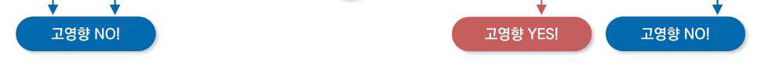

2.5.4
사례로 알아보는 ‘고영향’ 확인 기준
해당 사례
보이스피싱 피해를 당한 시민 A는 경찰에 피해사실을 신고하였는데, 보이스피싱 인출책 B는 이미
A의 계좌에서 900만 원 현금을 인출한 뒤였다. B는 은행 ATM기에서 인출을 할 때 마스크와 선글라스
를 착용하여 CCTV 영상만으로 신원을 확인하기 어려운 상황이다. 경찰관 C는 은행 CCTV에서 촬
영된 영상을 D인공지능시스템(걸음걸이 등 생체정보분석 인공지능시스템)을 활용하여 분석하기로
하였고, 1주일 간의 분석 결과 은행 주변에 설치된 다수의 CCTV가 촬영한 영상에서 동일인의 걸
음걸이로 판단되는 인물이 지나가는 것을 확인하여 B를 검거하였다.
(검토) 경찰관 C가 은행 CCTV에 촬영된 B와 동일한 인물을 찾기 위해 인근에 설치된 다수의 CCTV 영상
에서 수집된 1주일 간의 영상에서 걸어다니는 사람들의 걸음걸이를 인공지능시스템을 활용하여 분석하였다면,
이는 범인 B를 검거하기 위한 ‘범죄 수사나 체포 업무’의 일환으로 ‘생체정보’인 걸음걸이(행동적 특징)를 분
석·활용한 경우에 해당한다.
(결론) 따라서 걸음걸이(생체정보)를 분석하는 D인공지능시스템은 고영향 인공지능에 해당한다.
비해당 사례
시민 A는 자녀 B와 한강 공원으로 나들이를 가서 주말을 보내고 있던 중, 자녀 B가 없어진 것을
뒤늦게 알게 되어 3일 넘게 B를 찾았으나 결국 행방을 알지 못해 경찰에 신고하였다. 관할 지구대
에서 출동한 경찰관 C는 시민 A의 최근 동선을 탐문하여 인근 CCTV 정보를 확인한 뒤 CCTV 관
제센터와 연계된 인공지능시스템을 활용하기 위해 자녀 B의 키, 성별, 안면 사진 등 정보를 전산
에 입력하였다. 해당 인공지능시스템은 3일 전부터 현재까지 CCTV 영상 정보를 실시간으로 분석
하여 자녀 B의 현재 위치를 추적하여 자녀 B의 행방을 찾을 수 있었다.
(검토) 실종아동을 발견하기 위한 활동은 ‘범죄 수사’나 ‘체포’업무에 해당하지 않고, 국가경찰과 자치경찰의
조직 및 운영에 관한 법률 제3조(경찰의 임무) 제1호 소정의 ‘국민의 생명·신체 및 재산의 보호’를 위한 활
동에 불과하다.
(결론) 실종아동의 수색·발견은 「실종아동등의 보호 및 지원에 관한 법률」에 따른 경찰청장의 직무 범위에
따른 단순한 경찰의 행정업무 지원업무 행위로서, 법률의 근거에 따라 법정대리인인 부모 등의 동의를 받아
실종아동 등에 대한 신속한 신고 및 발견 체계를 갖추기 위한 정보시스템에서 인공지능시스템을 활용하는 경우
로 고영향 인공지능에 해당하지 않는다.

► 제2조(정의) 이 법에서 사용하는 용어의 뜻은 다음과 같다.

#### 4. “고영향 인공지능”이란 사람의 생명, 신체의 안전 및 기본권에 중대한 영향을 미치

거나 위험을 초래할 우려가 있는 인공지능시스템으로서 다음 각 목의 어느 하나의
영역에서 활용되는 인공지능시스템을 말한다.
사. 채용, 대출 심사 등 개인의 권리·의무 관계에 중대한 영향을 미치는 판단 또는
평가
2.6.1
용어의 정의
구분
주요 내용
채용
Ÿ 채용은 사용자가 필요로 하는 인적자원을 확보하기 위한 모든 활동을 의미하며 크게 모집(Sourcing)과
선발(Selection)로 구분된다.
※ 「공감채용 가이드」 (고용노동부, 2024), 6-7면
Ÿ 채용은 모집 전 적합한 인재의 탐색에서부터 선발과 배치, 그리고 배치된 인재에 대한 관리, 평가,
퇴직의 모든 과정을 아우르는 포괄적인 의미로 사용되나, 본 가이드라인에서는 인재의 탐색에서부터
선발까지 과정을 나타내는 소극적인 의미로 사용한다.
모집
Ÿ 사용자가 필요로 하는 인재를 찾기 위한 일련의 활동을 포괄한다.
선발
Ÿ 지원자들 가운데 사용자가 필요로 하는 인력을 선별하는 활동으로 사용자가 채용 절차 중 선발
과정에서 지원자들이 사용자가 필요로 하는 역량을 갖추었는지, 직무에 적합한지 등을 심사하는
것을 말한다.
판단‧평가
Ÿ 단순히 비교, 분류, 요약, 통계 등의 목적으로 사용되는 인공지능시스템은 제외
Ÿ 인공지능이 도출한 결과를 통해 적성, 역량, 직무 적합성 및 관련성 등 판단 또는 평가
Ÿ 인공지능이 도출한 결과가 일련의 채용 절차에서 지원자를 채용할지 여부에 대해 영향을 미치는 경우
생체정보
Ÿ 지문, 얼굴, 홍채, 정맥, 음성, 필적 등 (i) 개인의 신체적, 생리적, 행동적 특징에 관한 정보로서
(ii) 특정 개인을 인증·식별하거나 (iii) 개인에 관한 특징(연령·성별·감정 등)을 알아보기 위해
(iv) 일정한 기술적 수단을 통해 처리되는 정보
※ 「생체정보 보호 안내서」 (개인정보보호위원회, 2024. 12.), 8면
생체인식정보
Ÿ 생체정보 중 특정 개인을 인증·식별할 목적으로 처리되는 정보를 의미한다.
※ 「생체정보 보호 안내서」 (개인정보보호위원회, 2024. 12.), 8면

2.6.2
적용범위 및 '고영향'의 의미
(적용범위) 채용 전(全) 과정(모집, 서류심사, 필기평가, 면접평가, 실기평가)에서 공정성과 효율성을 높
이기 위하여 사용되는 인공지능시스템을 의미한다.
('고영향'의 의미) 채용 과정에서 활용되는 인공지능시스템이 헌법상 보장된 구직자의 직업선택의 자유 및
평등권에 중대한 영향을 미칠 우려가 있는 판단 또는 평가를 하는 경우 ‘고영향 인공지능’에 해당한다.
2.6.3
‘고영향’ 확인 기준
사용자가 채용 과정에서 활용하는 인공지능시스템이 지원자 채용에 미치는 영향과 실질적인 인적 개입
여부에 따라 고영향 인공지능 해당 여부를 검토할 수 있다. 만약 채용 과정에서 정당한 권한을 가진 사
람에 의한 실질적인 개입이 없거나, 해당 인적 개입이 형식적인 절차만으로 운영되어 실질적으로 인공지
능이 도출한 결과에 의존한다면 이는 ‘고영향 인공지능’에 해당한다.
채용 분야에서 활용되는 인공지능시스템 중 지원자 개인의 의사와 무관하게 인공지능 자체의 분석·결정
에 따라 채용 정보를 제공하거나, 구인자에게 그 지원자의 정보를 제공하는 등 인공지능만으로 후보자
또는 채용 여부를 결정하는 인공지능은 개인의 자율성, 직업선택의 자유, 평등권 등이 제한되어 차별적 결과
를 야기할 위험성이 존재하여 ‘고영향 인공지능’에 해당한다.
ⅰ) 인공지능시스템이 모집 과정에서 스스로 판단하여 개인에게 채용 정보를 제공하는 경우
ⅱ) 인공지능시스템이 구직자의 제출 정보를 프로파일링하고 이를 점수·등급화하여 처리하거나 필기 평가
중 서·논술형 문제를 채점하거나 생체정보를 면접 및 실기에 활용하는 경우
ⅲ) 인공지능시스템이 구인자의 검수 없이 필기 평가 문제를 최종적으로 출제하는 경우
ⅳ) 채용 전 과정에서 인공지능시스템이 도출한 결과만으로 채용 후보자 또는 채용 여부를 결정하는 경
우
※ 단, 채용의 전체적인 절차 및 성격, 특수성, 기업의 제반 사정 등을 종합적으로 고려하여 채용 분야에서의 인공지능시스템 활용에
대한 고영향 여부를 판단한다.

[ ‘고영향 인공지능’ 해당 여부 확인 절차 ]

2.6.4
사례로 알아보는 ‘고영향’ 확인 기준
해당 사례
A 기업에서 활용하는 채용 인공지능시스템인 B시스템은 채용 과정에서의 시간과 비용을
절감하기 위해 사원 채용 지원자의 개인 신상정보와 경력기술서 등 제출 정보를 분석하여
점수·등급화하고, 그 결과에 따라 최적의 지원자를 결정하고 그 지원자에게 합격 통보를 하고
나머지 지원자에게는 탈락 통보를 한다.
(검토) 해당 B인공지능시스템은 구직자의 제출 정보를 프로파일링 및 점수·등급화하며 A기업은 B인공지능
시스템이 도출한 결과만으로 구직자(지원자)들의 채용 여부를 결정하고 있다.
(결론) 따라서 A기업의 경력사원 채용 과정에서의 인공지능 사용은 정당한 권한을 가진 사람에 의한 실질
직인 개입이 없이 구직자(지원자)들의 기본권을 침해할 우려가 있으므로 ‘고영향 인공지능’에 해당한다.
비해당 사례
C 기업에서는 신입사원 채용 과정에서의 공정성을 향상시키기 위해 D인공지능시스템을 활용하여
입사시험 문제를 생성한다. D시스템이 생성한 입사시험 문제는 인사담당자로 지정된 자(E)가
출제된 문제를 감수하여 최종적인 확인(결재)를 하도록 구성되어 있다. 채점과정에서도
D시스템이 활용되며, 인사담당자(E)가 채점 결과를 확인하여 수정·보완 등을 할 수 있는 기능이
제공되고, 오류가 없다는 승인(결재)를 한 경우 최종적으로 채점 결과가 확정된다.
(검토) 해당 D 인공지능시스템은 신입사원의 채용에 활용된 인공지능시스템에는 해당하나 구인자 E의 감수를
거쳐 문제를 출제하였을 뿐 아니라 채점 이후에도 채용자 E가 다시 한번 채점 결과를 확인하는 과정을
수행한다.
(결론) 따라서 인공지능시스템이 출제한 문제를 채용자의 감수한 후에 시험을 시행하였고, 자동으로
채점하였으나 인간이 최종적으로 감수하는 기능을 제공하고 있으므로 ‘고영향 인공지능’에 해당하
지 않는다.

► 제2조(정의) 이 법에서 사용하는 용어의 뜻은 다음과 같다.

#### 4. “고영향 인공지능”이란 사람의 생명, 신체의 안전 및 기본권에 중대한 영향을 미치

거나 위험을 초래할 우려가 있는 인공지능시스템으로서 다음 각 목의 어느 하나의
영역에서 활용되는 인공지능시스템을 말한다.
사. 채용, 대출 심사 등 개인의 권리·의무 관계에 중대한 영향을 미치는 판단 또는 평가
2.7.1
용어의 정의
용어
개념
금융회사
Ÿ 다음 각 목의 어느 하나에 해당하는 것을 말한다.
가. 「은행법」에 따른 은행
나. 「중소기업은행법」에 따른 중소기업은행
다. 「한국산업은행법」에 따른 한국산업은행
라. 「한국수출입은행법」에 따른 한국수출입은행
마. 「한국은행법」에 따른 한국은행
바. 「자본시장과 금융투자업에 관한 법률」에 따른 투자매매업자ㆍ투자중개업자ㆍ집합투자업자ㆍ신탁업자ㆍ
증권금융회사ㆍ종합금융회사 및 명의개서대행회사
사. 「상호저축은행법」에 따른 상호저축은행 및 상호저축은행중앙회
아. 「농업협동조합법」에 따른 조합과 그 중앙회 및 농협은행
자. 「수산업협동조합법」에 따른 조합과 그 중앙회 및 수협은행
차. 「신용협동조합법」에 따른 신용협동조합 및 신용협동조합중앙회
카. 「새마을금고법」에 따른 금고 및 중앙회
타. 「보험업법」에 따른 보험회사
파. 「우체국예금ㆍ보험에 관한 법률」에 따른 체신관서
하. 그 밖에 대통령령으로 정하는 기관
거. 「전자금융거래법」에 따른 전자금융업자
※ ｢금융실명거래 및 비밀보장에 관한 법률｣ 제2조제1호 및 ｢전자금융거래법｣ 제2조제3호 등
※ ｢금융실명거래 및 비밀보장에 관한 법률｣ 제2조제1호
금융거래
Ÿ 금융회사 등이 금융자산을 수입(受入)ㆍ매매ㆍ환매ㆍ중개ㆍ할인ㆍ발행ㆍ상환ㆍ환급ㆍ수탁ㆍ등록ㆍ교환
하거나 그 이자, 할인액 또는 배당을 지급하는 것과 이를 대행하는 것 또는 그 밖에 금융자산을 대상
으로 하는 거래로서 총리령으로 정하는 것을 말한다.
※ ｢금융실명거래 및 비밀보장에 관한 법률｣ 제2조제3호
금융상품
Ÿ 다음 각 목의 어느 하나에 해당하는 것을 말한다.
가. 「은행법」에 따른 예금 및 대출
나. 「자본시장과 금융투자업에 관한 법률」에 따른 금융투자상품
다. 「보험업법」에 따른 보험상품
라. 「상호저축은행법」에 따른 예금 및 대출
마. 「여신전문금융업법」에 따른 신용카드, 시설대여, 연불판매, 할부금융
바. 그 밖에 가목부터 마목까지의 상품과 유사한 것으로서 대통령령으로 정하는 것
※ ｢금융소비자 보호에 관한 법률｣ 제2조제1호
대출
Ÿ 개인이나 기업이 필요한 자금을 금융회사로부터 빌리는 것을 말한다.
대출심사
Ÿ 금융회사가 대출 신청인의 신용 및 상환능력을 평가하여 대출 승인 여부와 대출 조건을 결정하는
등 신용 공여 행위 관련 업무처리 과정을 말한다.

2.7.2
적용범위 및 '고영향'의 의미
(적용범위) 대출 심사 등 금융분야에서 ‘고영향 인공지능’의 적용범위는 ➀ 금융업권에서 금융거래나 대고
객서비스에 인공지능시스템을 활용한 경우, 또는 ➁ 비금융업권이라도 인공지능시스템의 활용 결과가 금
융거래에 영향을 미치는 경우 적용한다.
① 금융상품 및 금융서비스의 제공을 위한 업무에 인공지능시스템을 직·간접적으로 활용하거나 활용하고자 하는
금융회사 및 ② 금융상품추천·신용평가 등 금융연관 서비스 제공을 위한 업무에 인공지능시스템을 직·간
접적으로 활용하거나 활용하고자 하는 비금융회사가 이에 해당한다.
Ÿ 금융회사가 신용정보 등에 근거하여 대출 신청인의 신용 및 상환능력을 평가하여 대출의 승인 여부와
대출 조건을 결정하는 데 직접적으로 관련되는 업무에 한한다.
※ 대출 과정에서의 모든 관련 업무(상담, 본인 확인, 신청 접수, 심사 및 승인, 실행 및 사후관리 등)가 ‘대출 심사’에 포함되는 것은 아니
다. 금융회사의 대출 등 신용공여 행위와 직접적으로 관련이 적은 챗봇 서비스, 이상거래탐지서비스(FDS) 등은 ‘대출 심사’에 포함되지
않고, 금융회사 내부 직원관리, 단순 업무 효율화 등 인공지능시스템의 활용으로 고객에게 미치는 영향이 없는 경우도 ‘대출 심사’의 범
위에 포함되지 않는다.
※ 신용공여 행위에 해당하는 경우라도 카드발급, 리스는 대출 희망자의 기본권에 중대한 영향을 미치는 것으로 보기 힘드므로, 해당 업무에
활용되는 인공지능은 고영향 인공지능에 해당하지 않는다.
Ÿ 대출 심사는 “개인의 권리·의무 관계”와 관련되어야 하므로 원칙적으로 개인인 자연인(금융소비자)에 대
한 대출 심사를 의미하지만, 개인사업자가 사업용도로 대출 심사를 받으면서 사업자 정보뿐 아니라 개인
적 정보도 활용되는 경우, 인공지능시스템에 의해 기본권을 침해당할 우려가 있으므로 대출 심사의 적
용범위에 포함된다.
('고영향'의 의미) 인공지능시스템을 통해 대출 심사를 하는 과정에서 금융회사 등이 개인에 대한 부당한 차
별 등 개인의 권익과 안전, 자유에 대해 중대한 영향을 미치는 것을 말한다.
Ÿ 인공지능시스템 활용에 따라 개인의 금융거래계약의 체결·유지 등에 직접적인 차별이 발생하는 경우 개인의
권리에 중대한 영향을 미친다고 볼 수 있으나, 실제 인공지능시스템의 활용 사례별 개인의 권리에 미치는 영
향도를 판단함에 있어서 개별 요소를 종합적으로 고려하는 것이 필요하다.
2.7.3
‘고영향’ 확인 기준
금융회사 등이 사용하는 인공지능시스템이 ‘개인의 권익과 안전, 자유에 대한 중대한 영향을 미칠 수 있는
인공지능시스템’에 해당하는지 또는 ‘금융거래계약의 체결·유지 등에 직접적인 차별을 발생시키는 인공지
능시스템’에 해당하는지를 기준으로 ‘고영향’ 여부를 판단한다.
Ÿ 대출 심사가 이루어지는 맥락적 환경(정책금융인지 일반금융인지 여부, 공공영역인지 민간영역인지 여부
용어
개념
신용평가
Ÿ 신용정보주체의 신용을 판단하는 데 필요한 정보를 수집하고 신용정보주체의 신용상태를 평가하는 것을
말한다.
※ ｢신용정보의 이용 및 보호에 관한 법률｣ 제2조제8호 및 제2조제8호의2 참조
신용공여
Ÿ 대출, 지급보증 및 유가증권의 매입(자금지원적 성격인 것만 해당한다), 그 밖에 금융거래상의 신용위험이
따르는 금융회사의 직접적ㆍ간접적 거래를 말한다.
※ ｢은행법｣ 제2조제1항제7호 참조
정책금융
Ÿ 정부가 정책을 수행하기 위해서 실시하는 대출, 보험, 보증 등 각종 금융 지원을 의미한다.

등)을 고려할 필요가 있으며, 특히 개인에게 유리한 요소로 적용하기 위해 활용되는 데이터의 경우에는
고영향 판단기준을 완화하여 적용할 수 있다.
인공지능시스템이 대출 심사 중간 단계에서 최종 결정에 상당한 영향을 미치는 결정을 하거나 대출 심사
개별 단계를 종합하여 최종 결정을 하는 경우 ‘고영향 인공지능’에 해당하며, 대출 심사에 차별적 데이터
또는 민감한 데이터를 사용하는 경우에도 ‘고영향 인공지능’에 해당한다.
Ÿ 한편, 의사 결정 과정에서 그 결과를 단순 참고하는 경우에는 ‘고영향 인공지능’에 해당하지 않는다.
인공지능시스템이 아래 표 A그룹 2개 항목 이상에 해당하거나 A그룹에 1개 및 B그룹에 2개에 해당하여 4
점 이상인 경우 ‘고영향 인공지능’에 해당한다.
그룹
항목
점수
A
Ÿ 기존 모델보다 파라미터 증가, 학습 데이터 양 또는 유형의 확대 등으로 복잡도가 증가한 신규 모델에
기반한 인공지능시스템
Ÿ 1만명 이상의 금융소비자를 대상으로 하는 인공지능시스템
Ÿ 자동화 정도가 높고 속도가 빨라서 실질적으로 최종 의사결정에 관한 사람의 개입이 불가능한 인공지능
시스템
B
Ÿ 대리 변수(Proxy Variable)1)를 활용하는 빈도가 높은 인공지능시스템
Ÿ 특정 업무영역을 위해 개발 또는 고도화된 인공지능시스템을 다른 업무영역에 일시적으로 또는 단기간
활용하는 경우
Ÿ 국외 데이터를 주로 학습하여 개발된 국외 인공지능시스템을 활용하는 경우
1) 주요 변수를 조사하거나 파악하기 어려울 경우, 그와 상관관계가 높고 조사하기 용이하여 대신 사용할 수 있는 변수

[ ‘고영향 인공지능’ 해당 여부 확인 절차 ]

2.7.4
사례로 알아보는 ‘고영향’ 확인 기준
해당 사례
A은행은 주택담보대출 심사를 위해 개인신용평가 인공지능 모형을 개발하고, 주택담보대출을
신청한 B씨의 개인신용평가심사에 해당 인공지능시스템을 활용하였다.
(검토) A은행은 인공지능기술을 활용하여 개인신용평가 인공지능시스템을 개발하고, 고객에 대한 대출 승인 여
부와 대출 조건을 결정하는 데 활용하였다.
Ÿ 특히 B씨의 대출심사와 직접적으로 관련된 업무에 인공지능시스템을 사용하면서, 인공지능시스템이
“대출 가능 여부 판단”을 전적으로 결정하였다.
(결론) A은행의 개인신용평가 인공지능시스템은 대출 심사 가능여부에 대해 전적으로 결정하였고, 이는 B씨의
권익과 안전, 자유에 대한 중대한 영향을 미칠 수 있으므로, A은행의 개인신용평가 인공지능시스템은 ‘고
영향 인공지능’에 해당한다.
비해당 사례
C상호저축은행은 공공기관과 연계하여 저소득자를 대상으로 한 대출상품을 출시하면서 인공지능
시스템을 활용하여 정책금융 실행 시 최소 기준 충족 여부를 판단한다. 이후 은행원D가 다른
정성적·정량적 요소를 고려하여 저소득자 E씨에 대한 대출 심사를 수행하고 최종 결정하였다.
(검토) C상호저축은행은 일정 기준 이상의 신용도를 가진 고객을 대상으로 대출상품을 출시하면서 소득
수준과 금융지원 필요성 등을 주요 요소로 고려하여 위 대출상품의 대출 승인 여부와 대출 조건을 결정하였
다. 이 과정에서 은행원 D씨는 신용도 관련 인공지능시스템의 정보처리 결과를 단순 참고하여 저소득자 E
씨에 대한 대출을 심사하였다.
(결론) C상호저축은행의 인공지능시스템은 대출 심사 중간 단계에서 최종 결정에 상당한 영향을 미치는 결
정을 하지 않았고, 은행원 D는 인공지능시스템의 판단을 보조적으로 활용하여 E씨에 대한 대출 심사를 수행하였
으므로, C상호저축은행의 인공지능시스템은 ‘고영향 인공지능’에 해당하지 않는다.

► 제2조(정의) 이 법에서 사용하는 용어의 뜻은 다음과 같다.

#### 4. “고영향 인공지능”이란 사람의 생명, 신체의 안전 및 기본권에 중대한 영향을 미치

거나 위험을 초래할 우려가 있는 인공지능시스템으로서 다음 각 목의 어느 하나의
영역에서 활용되는 인공지능시스템을 말한다.
아. 「교통안전법」 제2조제1호부터 제3호까지에 따른 교통수단, 교통시설, 교통체계의
주요한 작동 및 운영
2.8.1
용어의 정의
용어
개념
교통수단
Ÿ 사람이 이동하거나 화물을 운송하는데 이용되는 것으로서 다음 각 목의 어느 하나에 해당하는 운송수단을
말한다.
가. 「도로교통법」에 의한 차마 또는 노면전차, 「철도산업발전 기본법」에 의한 철도차량(도시철도를
포함한다) 또는 「궤도운송법」에 따른 궤도에 의하여 교통용으로 사용되는 용구 등 육상교통용으로
사용되는 모든 운송수단(이하 “차량”이라 한다)
나. 「해사안전기본법」에 의한 선박 등 수상 또는 수중의 항행에 사용되는 모든 운송수단(이하 “선박”이라 한다)
다. 「항공안전법」에 의한 항공기 등 항공교통에 사용되는 모든 운송수단(이하 “항공기”라 한다)
교통시설
Ÿ 도로ㆍ철도ㆍ궤도ㆍ항만ㆍ어항ㆍ수로ㆍ공항ㆍ비행장 등 교통수단의 운행ㆍ운항 또는 항행에 필요한 시설과
그 시설에 부속되어 사람의 이동 또는 교통수단의 원활하고 안전한 운행ㆍ운항 또는 항행을 보조하는 교통
안전표지ㆍ교통관제시설ㆍ항행안전시설 등의 시설 또는 공작물을 말한다.
교통체계
Ÿ 사람 또는 화물의 이동ㆍ운송과 관련된 활동을 수행하기 위하여 개별적으로 또는 서로 유기적으로 연계
되어 있는 교통수단 및 교통시설의 이용ㆍ관리ㆍ운영체계 또는 이와 관련된 산업 및 제도 등을 말한다.
차
Ÿ 도로에서 운전되는 교통수단을 의미하며, 자동차, 건설기계, 원동기장치자정거, 자전거 등과 그 밖에 사람·
가축의 힘이나 기타 동력으로 운행되는 교통수단을 포함하여 말한다.
※ ｢도로교통법｣ 제2조제17호
노면전차
Ÿ 도시철도법 제2조제2호에 따른 노면전차로서 도로에서 궤도를 이용하여 운행되는 차를 의미한다.
※ ｢도로교통법｣ 제2조제17호의2
자동차
Ÿ 철길이나 가설된 선을 이용하지 아니하고 원동기를 사용하여 운전되는 차(견인되는 자동차도 자동차의
일부로 본다)로서 다음 각 목의 차를 의미한다.
- 가. 「자동차관리법」 제3조에 따른 다음의 자동차. 다만, 원동기장치자전거는 제외한다.
1) 승용자동차
2) 승합자동차
3) 화물자동차
4) 특수자동차
5) 이륜자동차
- 나. 「건설기계관리법」 제26조제1항 단서에 따른 건설기계
※ ｢도로교통법｣ 제2조제18호
자율주행시스템
Ÿ 자율주행자동차 상용화 촉진 및 지원에 관한 법률 제2조 제1항 제2호에 따른 자율주행시스템을 의미한다.
(이 경우 그 종류는 완전자율주행시스템, 부분 자율주행시스템 등 행정안전부령으로 정하는 바에 따라
세분할 수 있다.)
※ ｢도로교통법｣ 제2조제18호의2

2.8.2
적용범위 및 '고영향'의 의미
(적용범위) 교통안전법 제2조 제1호 가목의 교통수단, 교통시설 및 교통체계에 활용되는 인공지능시스
템을 의미한다.
Ÿ 교통수단 중에서 도로교통법에 의한 차마에 포함되는 ‘자동차’ 특히 자율주행 자동차 등에 활용되는 인공지능시
스템을 포함한다.
용어
개념
부분
자율주행시스템
Ÿ 자율주행시스템의 종류 중 하나로서, 지정된 조건에서 자동차를 운행하되 작동한계상황 등 필요한 경우
운전자의 개입을 요구하는 자율주행 시스템을 말한다.
※ ｢자동차 및 자동차부품의 성능과 기준에 관한 규칙｣ 제111조제1호
조건부 완전
자율주행시스템
Ÿ 자율주행시스템의 종류 중 하나로서, 지정된 조건에서 운전자의 개입 없이 자동차를 운행하는 시스템을
말한다.
※ ｢자동차 및 자동차부품의 성능과 기준에 관한 규칙｣ 제111조제2호
완전
자율주행시스템
Ÿ 자율주행시스템의 종류 중 하나로서, 모든 영역에서 운전자의 개입 없이 자동차를 운행하는 자율주행
시스템을 말한다.
※ ｢자동차 및 자동차부품의 성능과 기준에 관한 규칙｣ 제111조제3호
자율주행자동차
Ÿ 자동차관리법 제2조 제1호의3에 따른 자율주행자동차로서 자율주행시스템을 갖추고 있는 자동차를
의미한다.
※ ｢도로교통법｣ 제2조제18호의3
건설기계
Ÿ 건설기계는 건설공사에서 사용할 수 있는 기계로서 건설기계관리법 시행령 별표 1에 규정된 기계를
의미하고, 건설기계 중에서 건설기계관리법 시행규칙 제73조 제1항에 규정된 건설기계로서 도로교통법
제80조의 운전면허 취득이 필요한 것은 자동차로 분류된다.
※ ｢건설기계관리법｣ 제2조제1호, 제26조제1항 단서, ｢도로교통법｣ 제2조제18호 나목
원동기장치
자전거
Ÿ 다음 각 목의 어느 하나에 해당하는 차를 의미하고, 특별히 규정된 사항을 제외하고 자동차와 동일하게
취급한다.(즉, 자동차와 함께 ‘자동차 등’으로 분류한다.)
- 가. 자동차관리법 제3조에 따른 이륜자동차 가운데 배기량 125CC 이하(전기를 동력으로 하는 경우
에는 최고정격출력 11킬로와트 이하)의 이륜자동차를 의미한다.
- 나. 그 밖에 배기량 125CC 이하(전기를 동력으로 하는 경우에는 최고정격출력 11킬로와트 이하)의
원동기를 단 차(자전거 이용 활성화에 관한 법률 제2조 제1호의2에 따른 전기자전거 및 ｢도로교통법｣
제21호의 3에 따른 실외이동로봇은 제외한다.)를 의미한다.
※ ｢도로교통법｣ 제2조제19호
개인형
이동장치
Ÿ 원동기장치자전거 중 시속 25킬로미터 이상으로 운행할 경우 전동기가 작동하지 아니하고 차체 중량이
30킬로그램 미만인 것으로 행정안전부령으로 정하는 것을 의미하고, 특별히 규정된 사항을 제외하고
자전거와 동일하게 취급한다.(즉, 자전거와 함께 ‘자전거등’으로 분류한다.)
※ ｢도로교통법｣ 제2조제19호의2
자전거
Ÿ 자전거 이용 활성화에 관한 법률 제1조 제1호 및 제1호의2에 따른 자전거 및 전기자전거를 의미한다.
※ ｢도로교통법｣ 제2조제20호
실외이동로봇
(보행자)
Ÿ 지능형 로봇 개발 및 보급 촉진법 제2조 제4호의2에 따른 실외이동로봇 중 제40조의2에 따른 운행안전
인증을 받은 것으로서, 도로교통법상 보행자로 취급되는 실외이동로봇을 의미한다.
※ ｢도로교통법｣ 제2조제21호의3
지능형교통체계
Ÿ 교통수단 및 교통시설에 대하여 전자ㆍ제어 및 통신 등 첨단교통기술과 교통정보를 개발ㆍ활용함으로써
교통체계의 운영 및 관리를 과학화ㆍ자동화하고, 교통의 효율성과 안전성을 향상시키는 교통체계를 의미한다.
※ ｢국가통합교통체계효율화법｣ 제2조제16호
운전
Ÿ 도로에서 차마 또는 노면전차를 그 본래의 사용방법에 따라 사용하는 것(조종 또는 자율주행시스템을
사용하는 것을 포함한다)을 의미한다.
※ ｢도로교통법｣ 제2조제26호

※ 고영향 인공지능의 대상이 되는 교통수단에는 철도, 선박, 항공기도 포함하나 해당 교통수단에 대해서는 영역을 나누어 별도
검토 진행
Ÿ 교통시설 및 교통체계에 관한 인공지능기술은 일반적으로 특정 교통수단과 연계하여 구현되므로, 교통수단
별로 관련 교통시설 및 교통체계에 관한 인공지능시스템도 포함한다.
('고영향'의 의미) 「교통안전법」 제2조 제1호부터 제3호까지에 규정된 교통수단, 교통시설, 교통체계의
안전 보장은 ‘사람의 생명, 신체의 안전’에 직접적인 영향을 미치고, 안전 조치 미비로 인하여 교통사고가
발생하는 경우 사망, 상해 등으로 이어질 수 있다는 점에서 고영향 인공지능으로 판단할 필요성이 있다. 다
만 ‘사람의 생명, 신체의 안전’에 중대한 영향을 미칠 수 있는 교통수단, 교통시설, 교통체계의 ‘주요한 작
동 및 운영’에 사용되는 인공지능시스템으로 한정하여야 한다.
Ÿ 교통수단의 ‘주요한 작동 및 운용’이란 그 주된 사용 목적에 맞게 작동시키거나 운용하는 것을 의미한다.
교통수단 중 도로교통법상 ‘차’의 경우 동 법에 규정된 ‘운전(도로에서 그 본래의 사용방법에 따라 사용)’ 행위를 통해
주요한 작동 및 운용이 이뤄진다. 다만, 도로교통법상 ‘차’에 포함된 건설기계의 경우, ‘주요한 작동 및 운용’
은 도로에서의 사용과 작업 현장에서 그 본래의 사용 방법에 따라 사용한 결과 이뤄지는 동작 및 운용을 포함
한다.(예컨대, 굴삭기의 경우 도로 주행 시와 건설 작업 현장에서 굴삭 작업을 수행하면서 이뤄지는 동작을 포함한다.)
Ÿ 교통시설의 ‘주요한 작동 및 운용’이란 교통안전법의 정의 규정에 따라 그 목적에 맞게 작동 및 운용이
이뤄지는 것을 의미한다. 즉, 교통시설의 ‘주요한 작동 및 운용’이란 교통시설을 통해 사람의 이동 또는
교통수단의 원활하고 안전한 운행, 운항 또는 항행을 보조하는 작동 및 운용을 의미한다. (「교통안전법」
제2조 제2호 참조)
Ÿ 교통체계는 교통수단, 교통시설과 달리 유체물이 아니어서 작동 및 운용의 대상은 아니나, 교통수단 및
교통시설의 이용, 관리, 운영체계 또는 이와 관련된 산업 및 제도를 의미하므로, 교통체계의 ‘주요한 작동
및 운용’은 교통수단과 교통시설의 작동 및 운용을 전제로, 사람 또는 화물의 이동, 운송과 관련된 활동을
수행하기 위하여 개별적으로 또는 서로 유기적으로 연계되어있는 교통수단 및 교통시설을 작동, 운용하는
것을 의미한다. (「교통안전법」 제2조 제3호 참조)

2.8.3
‘고영향’ 확인 기준
자율주행자동차의 자율주행시스템(참고 2-8-2), 자율주행시스템 이외에 차에 적용된 인공지능시스템, 교통시설·교
통체계에 관한 기술로 나누어 ‘고영향’ 인공지능 해당 여부를 검토하기로 한다. 이 밖에도 실무적으로 기타 ‘고영
향’ 인공지능시스템 확인 기준(참고 2-8-1)을 종합적으로 고려하여 판단한다.
(자율주행자동차의 자율주행시스템) 자율주행자동차의 자율주행시스템과 관련된 인공지능시스템은 ① 대체로
도로 주행을 목적으로 하는 기술로서, ② 인공지능시스템이 스스로 판단하여 자동차를 운전하는 데 필요한 의
사결정을 내리고, ③ 자율 도로 주행 중 사고 발생 가능성, 사고 발생 시 인명 피해 가능성을 고려하여야 한
다. 사람의 생명, 신체의 안전에 중대한 영향을 미칠 가능성이 높은 경우, 다른 구체적인 사정이 없는 한
원칙적으로 ‘고영향 인공지능’에 해당한다.
Ÿ (조건부 완전자율주행시스템 이상) 특정 조건(예컨대, 지정된 도로)에 해당하는 경우 어느 상황에서든
운전자의 개입 없이 자동차를 운행하는 것을 전제로 하고 있으므로(자동차 및 자동차부품의 성능과 기준에 관한 규
칙 제111조 제2, 3호 참조), 조건부 완전자율주행시스템 이상의 자율주행시스템과 관련된 인공지능시스템은
‘고영향 인공지능’에 해당한다.
Ÿ (부분 자율주행시스템) 일반적으로 인공지능기술이 주행 제어를 담당하지만 작동 한계 상황 등 필요에 따
라 운전자의 개입을 요구하므로, 자율주행시스템과 관련된 인공지능시스템은 ‘고영향 인공지능’에
해당할 가능성이 높으나, 인공지능시스템이 도로 주행 제어에 관여하지 않고, 법률로 해당 인공지능시
스템에 대한 안전기준이 존재하여 그 기준을 준수하게 되면 사고 발생 시 피해 정도를 현저히 낮출 수
있는 경우 ‘고영향 인공지능’에 해당하지 않는다. 앞선 확인 기준에 따라 ‘고영향 인공지능’에 해당하
는지 여부를 판단하되, 법률로 안전기준이 규정된 기술 유형에 대해서는 이를 참작하여 검토한다.
<참고: 자동차 및 자동차부품의 성능과 기준에 관한 규칙 제111조의3에 따른 별표27>
▸ 1. 자동차로유지기능의 성능기준   (중략)
▸ 2. 운전자모니터링시스템의 성능기준   (중략)
▸ 3. 자율주행정보 기록장치의 성능기준   (중략)
Ÿ (자율주행시스템 미적용 자동차) 인공지능기술이 도로 주행에 관여하더라도, 운전자가 자신의 판단에 따라
직접 운전하는 것을 전제하고 비상 상황에서는 언제든지 운전자가 개입하도록 정해져 있으므로, 인공지능
시스템은 사실상 도로 주행을 위한 의사결정에 보조적인 수단에 해당한다고 보아야 하므로, 원칙적으로
‘고영향 인공지능’에 해당하지 아니한다.

<참고: 자율주행시스템의 기술 분류>
▸ 자율주행시스템은 크게 세 부분(인지, 판단, 제어)으로 분류된다.
▸ 인공지능시스템이 판단, 제어에 관여하는 경우라면 교통수단의 ‘주요한 작동 및 운용’에 관한 의사결정에 관여한다는
의미이므로 고영향 인공지능에 해당할 가능성이 높으나, 인지에 관여하는 경우는 달리 볼 여지가 있다.
▸ 현재 국내에서는 ‘인지(판단을 위한 근거 데이터 제공)’기술에 연구·개발이 집중적으로 이루어진 반면, ‘판단(인지한
바에 따라 의사결정하여 제어 명령)’기술에 대한 연구·개발은 아직 많지 않다. 따라서 자율주행에서의 ‘주요한 작동
및 운영’에 관한 의사결정 과정에서 ‘판단’의 전제가 되는 ‘인지’기술에만 인공지능시스템이 적용되었고, 실질적인
‘판단’ 과정에서는 인공지능시스템이 아니라 규칙 기반의 알고리즘을 따르는 경우라면 단순 의사결정의 근거가 되는
정보를 제공하는 것으로 보아야 하며, 의사결정을 좌우하는 주된 근거에 해당하지 않는다면 고영향 인공지능에 해당하지
않을 수 있다.
▸ 한편 인공지능시스템이 적용된 ‘인지’기술의 경우 자율주행과정의 의사결정에 있어 주된 근거가 되는 경우라 하더라도
추가적인 안전조치가 취해져서 그 의사결정을 교정·번복하여 사람의 생명, 신체의 안전에 대한 중대한 영향을 미칠
가능성을 극히 낮출 수 있다면 고영향 인공지능에 해당하지 않을 수 있다.
(자율주행시스템 이외에 차에 적용된 인공지능시스템) 자율주행시스템 이외에 자동차 또는 그 밖의 차에 적용
된 인공지능시스템의 경우, 차의 주요한 동작에 있어 의사결정에 관여하는 정도, 차의 제어를 위한 의사결정
에 미치는 영향의 정도, 인공지능시스템의 오류 등으로 인한 위험도를 종합적으로 고려하여 ‘고영향 인공
지능’ 해당여부를 판단한다.
Ÿ 다만 인공지능시스템이 차의 기존 필수적 수단을 대체하지 아니하고, 기존의 필수적 수단은 유지한 채
편의 등을 목적으로 추가 요소를 더하는 수준의 보조적 수단에 해당하여, 인공지능시스템의 산출물에 일
부 오류가 발생하더라도 불편을 초래할 뿐 사람의 생명, 신체의 안전에 중대한 영향을 미칠 가능성이 극
히 낮은 경우라면 ‘고영향 인공지능’에 해당하지 아니한다.
(교통시설, 교통체계에 관한 인공지능시스템) 교통시설, 교통체계에 관한 인공지능시스템은 ① 교통시
설, 교통체계의 주요한 동작과 운영과 관련하여 의사결정을 내리는 데 관여하는 정도와 ② 해당 의사결정에
따른 결과로 사고 발생 시 잠재적 피해 정도를 평가하여 ‘고영향 인공지능’ 해당 여부를 정할 필요가 있다.
Ÿ 특히 교통시설, 교통체계에 관한 인공지능시스템의 잠재적 피해 정도를 평가함에 있어서는 아래 예시한
바와 같이 특별한 주의가 필요한 경우를 특정하여 그 경우에 잠재적 피해 정도가 높다고 평가할 수 있다.
① 교통시설, 교통체계에 인공지능시스템이 적용된 결과 교통시설의 주요한 작동, 운용이 연평균 일
교통량이 25,000대 이상인 시가지 도로에 영향을 미치는 경우
※ 도로안전시설 설치 및 관리지침에 따른 교통량이 많아 조명시설을 설치해야 하는 일반도로의 기준은 ‘연평균 일 교통량(AADT)이
25,000대 이상’이다.
② 교통시설, 교통체계에 인공지능시스템이 적용된 결과 교통시설의 주요한 작동, 운용이 스쿨존/교차로/철도건널목
등과 같이 특별히 안전조치가 강화된 곳에 영향을 미치는 경우
Ÿ 다만 법률로 정한 성능평가, 안전기준이 존재하는 경우로서, 인공지능시스템이 해당 기준을 충족하면 사
람의 생명, 신체의 안전에 중대한 영향을 미칠 가능성이 극히 낮다고 평가될 수 있는 경우에는 ‘고영향
인공지능’에 해당하지 않는다.

<참고: 법률로 성능평가기준이 규정된 교통시설 관련 기술 – 자동차·도로교통분야 ITS 성능평가기준 별표 3 내지 별표 9>
‣ [별표 3] 차량번호인식장치(AVI) 성능평가 기준
‣ [별표 4] 차량검지기(VDS) 성능평가 기준
‣ [별표 5] DSRC 교통정보시스템 성능평가 기준
‣ [별표 6] 돌발상황 검지시스템 성능평가 기준
‣ [별표 7] 고속축중기(HS-WIM) 성능평가 기준
‣ [별표 8] 무선접속기술 기반 노변장비(WAVE-RSE) 성능평가
‣ [별표 9] 스마트교차로 시스템(SIS) 성능평가 기준
[ ‘고영향 인공지능’ 해당 여부 확인 절차 ]
2-8-1
(참고) 기타 ‘고영향’ 확인 기준
교통수단 별 확인 외에도 ① 인공지능시스템의 사용 목적, ②주요한 작동 및 운용에 대한 의사결정에 미치

는 영향, ③ 사고 발생 시 잠재적 피해 정도, ④ 별도 규정된 안전기준의 존재 여부 등에 따라서도 ‘고영향
인공지능’  해당여부를 검토해 볼 수 있다.
(인공지능의 사용 목적에 따른 검토) 도로교통법에 의한 ‘차’는 도로에서 주행을 목적으로 운전되는 교통수
단이고, 차의 도로 주행은 해당 차의 운전자를 포함한 탑승자와 도로 주변의 보도를 통행하는 보행자 등
사람의 생명, 신체의 안전에 중대한 영향을 미칠 가능성이 높으므로, 차의 도로 주행과 관련된 인공지능시스
템은 원칙적으로 ‘고영향 인공지능’에 해당한다.
차의 도로 주행과 관련된 인공지능시스템은 차 내·외부에 구현된 요소로서, 차의 외부에서 차의 이동을 제어
하는 교통시설 및 교통체계에 구현된 인공지능도 포함한다.
다만, 차의 도로 주행과 관련된 인공지능이라 하더라도 구체적인 사정을 살펴보아 예외적으로 사람의 생명,
신체의 안전에 중대한 영향을 미칠 가능성이 극히 낮다고 볼 수 있는 경우라면 달리 볼 수 있다.
Ÿ 한편, 차의 운전과 관련된 인공지능시스템이라 하더라도, 도로 주행과 직접적인 관련이 없는 기술이라면
사람의 생명, 신체의 안전에 중대한 영향을 미칠 가능성이 낮을 수 있다. 이 경우에는 원칙적으로 ‘고영
향 인공지능’에 해당하지 않으며, 인공지능시스템의 사용 목적을 구체적으로 살펴보아 ‘고영향 인공지
능’의 해당 여부를 살펴보아야 한다.
Ÿ (주요한 작동 및 운용에 대한 의사결정에 미치는 영향에 따른 분류) 차 또는 교통시설의 주요한 작동 및
운용에 관한 의사결정은 사람의 생명, 신체의 안전에 중대한 영향을 미칠 가능성이 있으므로, ① 인공지
능이 스스로 결정하여 판단한 사항에 따라 사람의 개입 없이 직접 의사결정을 내려 차 또는 교통시설의 주요한
작동 및 운용을 수행하는지 여부, ② 사람이 의사결정을 내리되 인공지능의 산출물이 그 의사결정의 주된
근거가 되는지 여부를 평가하여, 인공지능기술의 결과물로 차 또는 교통시설 등의 주요한 작동 또는 운
용이 어떻게 이뤄질지 결정되는 경우 ‘고영향 인공지능’에 해당한다.
Ÿ 다만, 인공지능의 산출물이 교통수단 등의 주요한 작동 및 운용에 대한 의사결정의 주된 근거가 된다
하더라도, 오류 발생 가능성을 고려한 추가적인 기술적 조치가 적용되어 있어, 적시에 의사결정을 교정
하거나 번복할 수 있고 그 기술적 조치로 사람의 생명, 신체의 안전에 중대한 영향을 미칠 가능성을 극히
낮출 수 있다고 평가될 수 있는 경우에는 ‘고영향 인공지능’에 해당하지 않는다.
Ÿ 한편, 사람이 차 또는 교통시설의 주요한 작동 및 운용을 위한 의사결정을 내리고, 인공지능시스템으로
나타난 결과가 그 사람의 의사결정을 내리는데 있어 크게 영향을 미치지 않고 참고할 수 있는 정보를 제공하
는 정도로서, 인공지능기술이 단순히 사람의 의사결정에 ‘보조적인 역할’을 수행하는 경우라면 ‘고영향
인공지능’에 해당하지 않는다.
Ÿ 인공지능시스템이 스스로 판단하여 교통수단, 교통시설, 교통체계의 주요한 작동 및 운용에 대한 의사결
정을 내린다는 것은, 교통수단, 교통시설 등이 종래의 규칙 기반으로 미리 정해진 논리에 따라 작동 및
운용되지 않고, 인공지능기술이 학습한 데이터에 기반한 추론 결과에 따라 주요한 작동 및 운용에 대
한 의사결정이 내려지는 것을 의미한다.
Ÿ (사고 발생 시 잠재적 피해 정도에 따른 분류) 인공지능시스템의 오류 등으로 인하여 교통수단, 교통시설,
교통체계의 주요한 작동 및 운용에 영향을 미치게 되고, 그 결과 사고가 발생할 가능성이 있는 경우

사고 발생 가능성, 사고 발생 시 인명 피해가 발생할 가능성 및 예상되는 인명 피해의 심각한 정
도에 따라 잠재적 피해 정도를 평가하여 사람의 생명, 신체의 안전에 중대한 영향을 미칠 가능성이 극
히 낮다면 ‘고영향 인공지능’에 해당하지 않는다.
Ÿ 한편, 인공지능기술에 오류가 있다 하더라도, 사고 발생 가능성이 낮고, 사고가 발생한다 하더라도 ‘인
명 피해’ 발생 가능성이 낮으며, 사람의 생명, 신체의 안전에 중대한 영향을 미칠 가능성이 극히 낮
다고 평가되면 고영향 인공지능에 해당하지 않는다.(다만 교통사고 발생 가능성 및 인명 피해 가능성
이 낮다 하더라도 예상되는 인명 피해가 심각한 수준에 이를 수 있다면 ‘고영향 인공지능’에 해당한
다.)
Ÿ (별도로 규정된 안전기준의 존재 여부에 따른 분류) 인공지능시스템에 대한 별도 안전기준을 준수하는 것
으로 사람의 생명, 신체의 안전에 중대한 영향을 미칠 가능성을 극히 낮출 수 있다면 ‘고영향 인공지능’에
해당하지 않는다.
Ÿ 인공지능기술 그 자체에 대한 안전기준이 규정되지 아니한 경우라 하더라도, 인공지능시스템의 일
부로 활용되었음을 전제로 특정 시스템에 대한 안전기준이 규정된 경우에도 안전기준의 준수로 사람의 생
명, 신체의 안전에 중대한 영향을 미칠 가능성을 극히 낮출 수 있다면 ‘고영향 인공지능’에 해당하지 않는
다.

2-8-2
(참고) 자율주행차량 레벨 구분
(자율주행시스템의 유형) 자율주행자동차 상용화 촉진 및 지원에 관한 법률 제2조제1항 제2호에 따
른 자율주행시스템으로서, 그 종류는 자동차 및 자동차부품의 성능과 기준에 관한 규칙 제111조에 따
라 부분 자율주행시스템(레벨3), 조건부 완전자율주행시스템(레벨4), 완전 자율주행시스템(레벨5)으로
구분한다.
① 부분 자율주행시스템(레벨3)은 지정된 조건(예컨대, 특정 구간 내 운전 시)에서 운전자의 개입 없이 자동
차를 운행하되 작동한계상황 등 필요한 경우 운전자의 개입을 요구하는 자율주행시스템을 의미한다.
② 조건부 완전자율주행시스템(레벨4)은 지정된 조건에서 운전자의 개입 없이 자동차를 운행하는 자율주
행시스템을 의미한다. 작동 한계상황과 같은 비상시에도 운전자의 개입 없이 자동차를 운행한다는 점
에서 부분 자율주행시스템(레벨3)과 차이가 있다.
③ 완전 자율주행시스템(레벨5)은 모든 영역에서 운전자의 개입 없이 자동차를 운행하는 자율주행시스템을
의미한다.
2.8.4
사례로 알아보는 ‘고영향’ 확인 기준
□ 자율주행시스템


해당 사례
인지단계에서 축적한 정보를 기반으로 인공지능기술을 통해 주행 전략을 결정하는 시스템
(검토) 레벨4 이상 자율주행시스템에 적용되는 인공지능기술로서 지정된 조건에서는 작동한계상황에서도
운전자의 개입없이 인공지능 스스로가 판단한 바에 따라 도로 주행 제어가 이뤄진다.
Ÿ 해당 시스템은 주어진 상황에서 차량의 경로를 생성하고, 전방위험상황을 피한다고 할 때 그래도 정지할 것
인지 혹은 차선을 변경할 것인지 등에 대한 다양한 대안 경로를 고려하여 최적의 선택을 내리게 된다.
(결론) 따라서 시스템 오류로 인하여 사고가 발생하는 경우, 상해·사망 등 중대한 인명 피해가 발생할 가능
성이 있어 ‘고영향 인공지능’에 해당된다.
비해당 사례
운전자의 착석 여부 및 안전띠 착용 여부와 같은 운전자의 상태를 감지하는 운전자모니터링시스템
(검토) 레벨3 자율주행시스템에 적용되는 인공지능시스템으로 운전자가 당연히 인지하고 있어야 하는 사항을
보조하는 수단에 불과하다.
Ÿ 운전자모니터링시스템은 자동차 주행 제어에 필수 요소가 아니며 자동차의 제어를 위한 의사결정에 영향
을 미치는 정도도 낮다. 시스템에 오류가 발생하여 작동 한계 상황인 경우 사람의 개입을 담보할 수는 없
지만, 해당 시스템은 운전자가 당연히 인지해야 하는 사항들을 보조적으로 감지하는 수단에 불과하다.
따라서 사고가 발생한다면 사람의 부주의에 의한 것이므로 인공지능시스템 오류에 따른 사고라고 볼 수
없다.
(결론) 사고 발생 가능성은 사람의 부주의에 따른 것일 뿐이고 인공지능시스템이 사람의 생명, 신체의 안전
에 중대한 영향을 미치는 것은 아니므로 ‘고영향 인공지능’에 해당하지 않는다.
Ÿ 또한, 해당 기술에 대해서는 이미 자동차 및 자동차부품의 성능과 기준에 관한 규칙에 안전기준이 규정
되어 있어 그 기준을 충족한다면 안전이 어느 정도 담보되었다고 볼 수 있다.
Ÿ 특히 운전자모니터링시스템 등 안전성 강화를 위한 인공지능시스템의 경우 안전성에 관련되어 있기는 하
나 인공지능시스템 그 자체의 오류·고장으로 사고 발생 가능성을 증대시키지는 않으므로 고영향에 해
당하지 않는다.
□ 자율주행시스템 이외에 도로교통법에 따른 차
해당 사례
각종 건설 관련 정보를 학습한 인공지능에 의해 건설장비가 작동되고, 인공지능시스템을 통해
분석된 건설장비에 대한 결함 정보도 영상 출력장치를 통해 작업자 등에게 제공되어 원격으로
통제된다.
(검토) 전문 조종사를 대신하여 인공지능기술이 스스로 의사결정을 내려 건설기계를 조작하는 경우에는 사
람의 의사결정을 대체하고 있다.

(결론) 따라서 인공지능의 조작으로 오류 발생 시 건설 현장에서의 사고 발생 가능성, 인명 피해 가능성 및
중상자, 사망자 발생 가능성이 있으므로 원칙적으로 ‘고영향 인공지능’에 해당한다. 다만 사람이 접근하기 어려
운 장소에서만 엄격히 한정하여 활용되는 건설기계에 해당하는 바와 같이 인공지능기술에 오류가 있더라도
인명 피해 가능성이 극히 낮은 경우에는 예외적으로 ‘고영향 인공지능’에 해당하지 않는다.
비해당 사례
인공지능시스템이 전기 자전거에서 사람의 근육 힘과 모터가 내는 동력의 비율을 계산하고
최적의 주행속도ㆍ경로를 적절히 배합하여 주행을 보조한다.
(검토) 자전거의 조작은 전적으로 사람에 의해 이루어지고, 인공지능기술은 사람이 자전거를 조작하고 운
행하는 데 필요한 정보를 제공하거나 이를 단순히 보조하고 사람의 의사결정을 대체한다고 볼 수도 없다. 아
울러 자전거 운행에 보조적인 수단으로 활용되고 있으므로, 사람의 의사결정에 주된 근거로 활용된다고 볼
수도 없다.
(결론) 해당 인공지능시스템은 자전거 운행에 보조적인 수단으로 활용될 뿐이므로 ‘고영향 인공지능’에
해당하지 아니한다.

□ 교통시설·교통체계
해당 사례
도로 지도, 1500개 이상의 교차로 신호 체계를 바탕으로 800여개의 카메라 영상 정보를 함께
분석하여 200개 이상의 대규모 교차로의 통행량을 함께 계산하고, 계산된 데이터를 바탕으로
신호등의 신호를 실시간으로 제어하는 인공지능시스템
(검토) 도로 데이터에 근거하여 신호등의 신호를 자동으로 바꾸는 기술로서, 인공지능기술이 스스로 판단
한 바에 따라 교통시설을 제어하는 기능까지 수행하고 있고, 해당 기술은 광범위한 영역의 신호 체계를 제
어한다.
(결론) 인공지능시스템이 영향을 미치는 대상도 많아져, 교통 사고 발생 가능성의 높고 낮음과 관계없이 잠
재적 사고로 인해 발생할 수 있는 피해 규모가 상당하므로, ‘고영향 인공지능’에 해당한다.
비해당 사례
인공지능기술을 이용하여 교차로에서 차량과 보행자를 실시간으로 감지하여 능동적으로 신호를
생성하는 인공지능 신호시스템
(검토) 인공지능기술은 CCTV로 촬영된 영상에서 차량과 보행자를 인식하는 데 활용될 뿐, 인식된 결과로 교
통신호를 생성하는 시스템은 종래의 규칙 기반에 따른 알고리즘으로 운용되고 있다.
(결론) 교통시설의 주요한 작동·운용에 대한 의사결정이 일부 자동화되었다 하더라도, 신호등의 기본적인
제어는 종래의 규칙 기반에 따른 알고리즘으로 운용되며 해당 알고리즘의 관리는 실질적으로 사람에 의
해 이뤄지므로 ‘고영향 인공지능’에 해당하지 않는다.

► 제2조(정의) 이 법에서 사용하는 용어의 뜻은 다음과 같다.

#### 4. “고영향 인공지능”이란 사람의 생명, 신체의 안전 및 기본권에 중대한 영향을 미치거

나 위험을 초래할 우려가 있는 인공지능시스템으로서 다음 각 목의 어느 하나의 영
역에서 활용되는 인공지능시스템을 말한다.
아. 「교통안전법」 제2조제1호부터 제3호까지에 따른 교통수단, 교통시설, 교통체계의
주요한 작동 및 운영
2.9.1
용어의 정의
용어
개념
선박
Ÿ 물에서 항행수단으로 사용하거나 사용할 수 있는 모든 종류의 배로 수상항공기(물 위에서 이동할 수 있는
항공기를 말한다)와 수면비행선박(표면효과 작용을 이용하여 수면 가까이 비행하는 선박을 말한다)을 포함
※ 「해사안전기본법」 제2조 제2호
자율운항
선박
Ÿ 「선박법」 제1조의2에 따른 선박 중 자율단계에 따라 선원, 원격운항자 등 사람의 개입이 전혀 없거나
최소한의 개입 하에 자율운항시스템에 의하여 선박 스스로 운항이 가능한 선박. 자율운항선박의 종류는 다음
각 호와 같이 구분하되, 그 자율등급은 산업통상자원부와 해양수산부의 공동부령으로 정하는 바에 따라 세분화
Ÿ 부분 자율운항선박: 자율운항시스템만으로는 운항할 수 없거나 선원의 승선, 원격운항자의 관리 등 선원,
원격운항자의 개입이 필요한 자율운항선박
Ÿ 완전 자율운항선박: 자율운항시스템만으로 운항할 수 있어 선원, 원격운항자 등 사람의 개입이 필요하지 아니한
자율운항선박
※ 「자율운항선박법」 제2조 제1항
<자율운항선박의 자율화 등급>
단계
내용
자동화된 절차 및
의사지원시스템을 갖춘 선박
Ÿ 일부 기능에 대해 자동화 운용이 가능하지만, 대부분 선원이 승선하여
운용 및 시스템과 기능 제어
원격제어가 가능하며
선원이 승선한 선박
Ÿ 선박이 다른 장소로부터 제어 및 운용되고 있지만 선원은 승선
원격제어가 가능하며
선원이 승선하지 않은 선박
Ÿ 선박이 다른 장소로부터 제어 및 운영되며 선원이 승선하지 않음
완전자율운항선박
Ÿ 선내 운용시스템으로 자체적 결정 및 조치가 가능
※ IMO, “Framework for the regulatory scoping exercise, MSC 99/WP. 9”

2.9.2
적용범위 및 '고영향'의 의미
(적용범위) 선박의 운항과 관련하여 활용되는 인공지능시스템을 의미한다. 특히 해양 안전 향상, 운항 효율
성 증대, 인적 오류 감소, 운항 비용 절감, 환경 보호 등을 목표로 세계 각국에서 활발히 개발 중인 자율
운항선박에 적용되는 인공지능시스템과 관련된 경우가 많다.
Ÿ 해상 교통의 경우 선체의 구조나 시설물에 대한 안전이나 운영에 대한 시스템 안전 규정은 다양하게 마
련되어 있고 해상 교통사고는 중대한 위험으로 파악된다. 반면 선박 시스템에 대한 위험관리 체계는 확
립 중이며, 선박 사고는 규모가 크고 시스템 내·외부의 문제 결합으로 발생되어 복잡성을 띄므로 적용범위
를 신중하게 고려할 필요가 있다.
('고영향'의 의미) 선박 운항에서 인공지능시스템의 오류 또는 잘못된 판단으로 인해 인명 피해나 환경 오염
과 같은 심각한 사고가 발생할 수 있으므로, ‘고영향 인공지능’에 해당된다.
Ÿ 특히, 선원의 개입이 동원되지 않는 완전자율운항선박의 경우, 인공지능이 수행하는 자동 항해, 충돌 회피
시스템, 위급 상황 대응 등의 탐지, 판단, 조치 기능은 인명과 직접적으로 연결된 시스템으로, ‘고영향 인
공지능’으로 관리해야 한다.
용어
개념
자율운항
시스템
Ÿ 자율항해시스템, 자율기관시스템 및 이와 관련된 모든 장치
Ÿ “자율항해시스템”이란 선원의 조작 없이 주변상황에 대한 외부센서 정보, 「지능형 해상교통정보서비스의 제공
및 이용 활성화에 관한 법률」 제2조제2호에 따른 해상교통정보, 「선박교통관제에 관한 법률」 제2조 제1호에
따른 선박교통관제 정보, 자율운항선박의 내부기기 상태에 대한 정보 등 관련 정보를 스스로 인지하고 판단하여
선박을 운항할 수 있게 하는 자율화 장비, 소프트웨어 및 이와 관련된 모든 장치
Ÿ “자율기관시스템”이란 자율운항선박의 추진 및 전력 생산을 담당하는 핵심 기관시스템의 운전 상태를 실시간
모니터링하여 계측 데이터 기반의 진단ㆍ예측을 수행하고 장애 발생 시 원격으로 전문적 정비를 수행할 수
있게 하는 자율화 장비, 소프트웨어 및 이와 관련된 모든 장치
※ 「자율운항선박법」 제2조 제2호

2.9.3
‘고영향’ 확인 기준
선박교통의 위험에 영향을 미치는 인공지능시스템 중 다음의 기능에 따라 ‘고영향 인공지능’ 해당성을
평가한다. (참고 2-9-1)
Ÿ (데이터 정확성 및 처리능력) 인공지능시스템이 수집한 데이터가 얼마나 정확하고, 이를 적절히 분석하여 운
항에 필요한 정확한 정보를 제공하는 지 여부
Ÿ (시스템 신뢰성) 인공지능시스템의 오류 발생 빈도와 시스템 유지보수 필요 빈도
Ÿ (기능 중요도) 인공지능시스템이 수행하는 기능이 선박 운항 및 안전에 얼마나 필수적인지 여부
Ÿ (오작동 시 잠재적 위험성) 인공지능시스템 오류가 발생 시 인명, 환경, 선박 손상에 대한 위험이 발생
할 가능성
Ÿ (비상 시 대응 능력) 비상 상황 발생 시 인공지능시스템의 신속대응능력 및 대체 시스템 존재 여부
[ ‘고영향 인공지능’ 해당 여부 확인 절차 ]

2-9-1
(참고) 자율운항선박의 ‘고영향 인공지능’ 평가 기준
기능 중요도(Criticality of Function): 인공지능이 수행하는 기능이 선박의 안전과 운항에 직접적인 영향을 미치
는 정도를 평가
Ÿ 필수적 기능: 인공지능이 없으면 선박의 안전이 심각하게 위협받는가?
Ÿ 보조적 기능: 인공지능이 없으면 선박의 운항이 일부 제한되지만, 대체할 수 있는 다른 시스템이 존재하는
가?
Ÿ 선택적 기능: 인공지능이 없다 하더라도 선박 운항에 직접적인 영향을 미치지 않는가?
데이터 정확성 및 처리 능력(Data Accuracy and Processing): 인공지능이 선박 운항에 필요한 실시간 데
이터를 얼마나 정확하게 처리하고, 이를 바탕으로 올바른 결정을 내릴 수 있는지를 평가
Ÿ 데이터 수집 정확성: 센서 및 장치로 수집한 데이터가 정확하고 신뢰할 수 있는가?
Ÿ 데이터 분석 신뢰성: 수집된 데이터를 인공지능이 적절히 분석하여 운항에 필요한 정확한 정보를 제공
할 수 있는가?
시스템 신뢰성(Reliability of System): 인공지능이 얼마나 일관되게 기능을 수행하는지 평가하며 오류율
이 낮고 지속적으로 신뢰할 수 있는 시스템일수록 위험성을 낮게 평가
Ÿ 오류 발생 빈도: 시스템에서 오류가 발생할 가능성은 얼마나 되는가?
Ÿ 시스템 유지관리 빈도: 해당 인공지능시스템은 얼마나 자주 유지보수가 필요한가?
오작동 시 잠재적 위험성(Potential Risk of Malfunction): 인공지능이 오작동했을 때 선박, 인명, 환경에
미치는 영향을 평가
Ÿ 인명 안전 위협: 시스템 오류 시 선박 탑승자의 생명에 대한 위협이 발생할 수 있는가?
Ÿ 환경 위험: 오작동 시 해양 오염이나 환경 손상이 발생할 수 있는가?
Ÿ 선박 손상 위험: 선박의 손상이나 고장으로 이어질 수 있는가?
비상 시 대응 능력(Emergency Response Capability): 인공지능이 비상 상황에서 얼마나 신속하고 정
확하게 대응할 수 있는지 평가
Ÿ 비상상황 인지 능력: 비상상황 발생 시 시스템이 상황을 즉각적으로 인지할 수 있는가?
Ÿ 대응 신속성: 비상 상황 발생 시 신속하게 적절한 대응을 할 수 있는가?
Ÿ 대체 시스템 존재 여부: 비상 상황에서 인공지능시스템이 실패했을 때 대체할 수 있는 다른 시스템이 존
재하는가?
2.9.4
사례로 알아보는 ‘고영향’ 확인 기준

해당 사례
A 선사에는 선박 운항의 효율성을 높이기 위해 선박 자율 제어 기술을 통한 자율운항 인공지능
시스템을 활용하고 있다.
(검토) 자율운항시스템 중 선박 자율 제어 기술에 해당되며, 승무원 및 승객들의 생명, 신체 및 안전과 직
접적으로 연관된다.
Ÿ A 선사에서 운영하는 시스템은 선박의 운항상황과 장비 및 시스템의 상태에 따라 항로 재계산과 엔진 제어 등을 포
함한 다양한 기능을 실시간으로 처리한다.
Ÿ 이 과정에서 인공지능시스템은 높은 데이터 정확성과 처리 능력이 요구되며, 오류 발생이나 유지보수 요
구가 과도해서는 안 된다. 또한 수행하는 자율 제어 기능은 선박 운항과 안전에 필수적이고, 오작동 시
인명, 환경, 선박 손상에 대한 위험이 발생할 가능성이 크다. 더불어 비상 상황에서 즉각적인 대응이 어
려울 수 있다.
(결론) 따라서 A 선사에서 사용하는 자율운항 인공지능시스템은 ‘고영향 인공지능’에 해당한다.
비해당 사례
B 선사에서는 원격관제를 위해 자동보고기술을 사용한 인공지능시스템을 통해 육지와 선박,
선박 간 관제를 실시하고 있다.
(검토) 해당 시스템은 원격운영센터 및 항만 트래픽 관리를 위한 자동화 서비스에 관련된 정보를 교환하는
기능을 수행한다.
Ÿ 해당 인공지능시스템은 레이더와 식별 장치의 데이터를 수집하고 항만 내 전체 선박 위치 정보를 종합해 선박
에 제공한다. 다만 비상 상황과 관련된 경우에는 원격운항자가 직접 정보를 확인하고 인공지능 관제시스템을
통해 선박에 전달한다.
Ÿ 시스템은 데이터 정확성과 처리 능력이 요구되며, 오류 발생이나 유지보수 요구가 과도하지 않아야 한다.
그러나 해당 시스템의 주요 역할은 관제 지원으로, 선박 운항과 안전에 필수적인 자율 제어 기능을 직접
수행하지 않는다. 오작동 시 위험이 발생할 가능성은 있으나, 비상시 원격운항자가 직접 대응할 수 있다.
(결론) 따라서 B 선사에서 사용하는 원격관제 인공지능시스템은 ‘고영향 인공지능’에 해당하지 않는다.

► 제2조(정의) 이 법에서 사용하는 용어의 뜻은 다음과 같다.

#### 4. “고영향 인공지능”이란 사람의 생명, 신체의 안전 및 기본권에 중대한 영향을 미치거나

위험을 초래할 우려가 있는 인공지능시스템으로서 다음 각 목의 어느 하나의 영역
에서 활용되는 인공지능시스템을 말한다.
아. 「교통안전법」 제2조제1호부터 제3호까지에 따른 교통수단, 교통시설, 교통체계의
주요한 작동 및 운영

##### 2.10.1 용어의 정의

용어
개념
항공기
Ÿ 공기의 반작용(지표면 또는 수면에 대한 공기의 반작용은 제외한다. 이하 같다)으로 뜰 수 있는 기기로서
최대이륙중량, 좌석 수 등 국토교통부령으로 정하는 기준에 해당하는 비행기, 헬리콥터, 비행선, 활공기
(滑空機)와 그 밖에 대통령령으로 정하는 기기
Ÿ 위의 “최대이륙중량, 좌석 수 등 국토교통부령으로 정하는 기준”은 아래와 같음

#### 1. 비행기 또는 헬리콥터

가. 사람이 탑승하는 경우: 다음의 기준을 모두 충족할 것
1) 최대이륙중량이 600킬로그램(수상비행에 사용하는 경우에는 650킬로그램)을 초과 할 것
2) 조종사 좌석을 포함한 탑승좌석 수가 1개 이상일 것
3) 동력을 일으키는 기계장치(이하 “발동기”라 한다)가 1개 이상일 것
나. 사람이 탑승하지 아니하고 원격조종 등의 방법으로 비행하는 경우: 다음의 기준을 모두 충족할 것
1) 연료의 중량을 제외한 자체중량이 150킬로그램을 초과할 것
2) 발동기가 1개 이상일 것

#### 2. 비행선

가. 사람이 탑승하는 경우 다음의 기준을 모두 충족할 것
1) 발동기가 1개 이상일 것
2) 조종사 좌석을 포함한 탑승좌석 수가 1개 이상일 것
나. 사람이 탑승하지 아니하고 원격조종 등의 방법으로 비행하는 경우 다음의 기준을 모두 충족할 것
1) 발동기가 1개 이상일 것
2) 연료의 중량을 제외한 자체중량이 180킬로그램을 초과하거나 비행선의 길이가 20미터를 초과할 것

#### 3. 활공기: 자체중량이 70킬로그램을 초과할 것

Ÿ 한편, 위의 “대통령령으로 정하는 기기”란 다음 각 호의 어느 하나에 해당하는 기기를 말함

#### 1. 최대이륙중량, 좌석 수, 속도 또는 자체중량 등이 국토교통부령으로 정하는 기준을 초과하는 기기*


#### 2. 지구 대기권 내외를 비행할 수 있는 항공우주선

※ 1. ｢항공안전법｣ 시행규칙 제4조제1호부터 제3호까지의 기준 중 어느 하나 이상의 기준을 초과하거나 같은 조 제4호부터
제7호까지의 제한요건 중 어느 하나 이상의 제한요건을 벗어나는 비행기, 헬리콥터, 자이로플레인 및 동력패러슈트

#### 2. ｢항공안전법｣ 시행규칙 제5조제5호 각 목의 기준을 초과하는 무인비행장치

운항통제
Ÿ 항공기의 안전성과 비행의 정시성 및 효율성 확보를 위하여 비행의 시작, 지속, 우회 또는 취소에 대한
권한을 행사하는 것
※ ｢고정익항공기를 위한 운항기술기준｣ 1.1.1.4조 제51호


##### 2.10.2 적용범위 및 '고영향'의 의미

(적용범위) 항공교통 분야에서 항공기의 직접적인 운항, 안전시설 및 장비 운용에 사용되는 인공지능시
스템을 의미한다.
('고영향'의 의미) 항공교통 분야는 교통수단의 특성상 인공지능시스템의 오류 또는 잘못된 판단으로 인해 다수
의 인명 피해를 수반하는 심각한 사고가 발생할 가능성이 크므로, 항공교통 분야에 사용되는 인공지능은
모두 ‘고영향 인공지능’에 해당한다고도 볼 수 있을 것이다. 다만, 항공교통 분야에서 사용되는 현행 항공
교통 관련 법령에서 정하고 있는 위험도 기준을 적절하게 반영하여 ‘고영향 인공지능’ 해당여부를 판단
한다.
용어
개념
항공교통관제
Ÿ “항공교통관제(인공지능r Traffic Control) 업무”라 함은 공항, 이․착륙 또는 항로상에 있는 항공기의 안
전하고, 질서 있고 원활한 교통을 도모하기 위하여 행하는 업무
※ ｢고정익항공기를 위한 운항기술기준｣ 1.1.1.4조 제83호
항공기사고
Ÿ 사람이 비행을 목적으로 항공기에 탑승하였을 때부터 탑승한 모든 사람이 항공기에서 내릴 때까지 [사람이
탑승하지 아니하고 원격조종 등의 방법으로 비행하는 항공기(이하 “무인항공기”라 한다)의 경우에는 비행을
목적으로 움직이는 순간부터 비행이 종료되어 발동기가 정지되는 순간까지를 말한다] 항공기의 운항과
관련하여 발생한 다음 각 목의 어느 하나에 해당하는 것으로서 국토교통부령으로 정하는 것*
가. 사람의 사망, 중상 또는 행방불명
나. 항공기의 파손 또는 구조적 손상
다. 항공기의 위치를 확인할 수 없거나 항공기에 접근이 불가능한 경우
* 위의 ‘국토교통부령으로 정하는 것’의 적용기준 및 범위는 매우 상세하여 본문에서는 생략함
항공기준사고
Ÿ 항공안전에 중대한 위해를 끼쳐 항공기사고로 이어질 수 있었던 것으로서 국토교통부령으로 정하는 것*
* 위의 ‘국토교통부령으로 정하는 것’은 항공안전법 시행규칙 [별표 2]와 같음
항공안전장애
Ÿ 항공기사고 및 항공기준사고 외에 항공기의 운항 등과 관련하여 항공안전에 영향을 미치거나 미칠 우려가
있는 것
항공안전
위해요인
Ÿ 항공기사고, 항공기준사고 또는 항공안전장애를 발생시킬 수 있거나 발생 가능성의 확대에 기여할 수
있는 상황, 상태 또는 물적·인적요인 등
위험도
(Safety risk)
Ÿ 항공안전위해요인이 항공안전을 저해하는 사례로 발전할 가능성과 그 심각도
도심항공교통
Ÿ 사람 또는 화물의 운송과 관련된 활동을 수행하기 위하여 개별적으로 또는 서로 유기적으로 연계되어
있는 도심형항공기, 버티포트 및 도심항공교통회랑 등의 이용·관리·운영체계
도심형항공기
Ÿ 「항공안전법」 제2조제1호에 따른 항공기 또는 이에 준하는 기기 중 도심에서도 운항하기에 적합한 기기
로서 국토교통부장관이 「국가통합교통체계효율화법」 제106조에 따른 국가교통위원회(이하 “국가교통위원
회”라 한다)의 심의를 거쳐 고시한 것


##### 2.10.3 ‘고영향’ 확인 기준

항공교통의 위험에 영향을 미치는 ①운항 ②항공교통관제 및 운항통제 ③항공기 설계·제작 및 정비등
분야에서 사용되는 인공지능시스템 중에서
인공지능이 전부 또는 일부에 대하여 독립적으로 최종 의사결정을 하며,
의사결정의 대상이 심각도가 ‘C’이상이고 (참고 2-10-1, [위해요인별 발생결과의 심각도 구분]), 발생가능성이
‘높음’ 이상(참고 2-10-1, [위해요인별 발생결과의 빈도])인 항공기 사고를 일으킬 위험성이 존재하는
경우 ‘고영향 인공지능’에 해당한다.
※ 「항공안전데이터 처리 및 활용에 관한 규정」(국토교통부 훈령)에 명시된 발생 가능성과 심각도를 기준으로 판단
[ ‘고영향 인공지능’ 해당 여부 확인 절차 ]

2-10-1 참고: 항공교통 분야의 위험도 평가 기준
항공교통 분야에서는 항공안전법이 항공기 등록과 기술기준 및 형식증명, 항공종사자 자격증명, 항공기
운항, 항공교통관리 등에 관한 일반적인 내용을 규정하고 있으며, 항공안전법의 하위 규정인 「국가항공안
전프로그램」(국토교통부고시)은 항공안전에 관한 국가 정책, 달성목표 및 조직체계, 항공안전 위험도 관
리, 항공안전보증, 항공안전증진, 항공안전데이터등의 수집, 처리 및 보호 등에 관한 사항을 규정하고 있
다.
한편, 「항공안전관리시스템 승인 및 모니터링 지침」(국토교통부훈령)이 따라 항공안전관리시스템을 운
용하는 항공운송사업자, 항공기정비업자, 항공교통관제기관, 공항운영자 및 항행안전시설의 설치자·관리
자 등의 항공안전관리시스템을 승인하고, 승인사항에 대한 이행을 지도·감독하기 위해 필요한 사항을 규정
하고 있다.
Ÿ 국제적으로는 ICAO(International Civil Aviation Organization, 국제민간항공기구)가 정한 안전관리기
준이 적용되고 있다.
「국가항공안전프로그램」은 국가항공체계 전반에 영향을 주는 위해요인, 새롭게 출현하는 안전리스크의 경
향 등 안전문제를 식별하고(제35조), 이에 따라 발굴한 위해요인에 따른 잠재결과의 발생빈도 및 심각도를
분석하여 해당 위해요인에 대한 위험도를 평가하고 산출하도록 하면서, 이에 관한 세부 사항은 「항공안전데
이터 처리 및 활용에 관한 규정」(국토교통부훈령)에 따라 실시하도록 규정하고 있다.(제36조)
「항공안전데이터 처리 및 활용에 관한 규정」은 항공교통 분야에서 국가위해요인으로 나타난 발생결과의
‘발생빈도’ 및 ‘심각도’를 아래와 같이 산출한다.(제55조)
Ÿ 단, 도심항공교통 분야의 경우 실증사업구역 또는 시범운용구역에서 규제특례가 적용되어 항공안전법
등의 일부 조항의 적용이 배제되나, 일반적으로는 항공안전법 및 「국가항공안전프로그램」, 「항공안전데
이터 처리 및 활용에 관한 규정」이 적용되므로, 앞서 살펴본 위험도 평가 기준이 동일하게 적용하는 것
을 원칙으로 해석한다.
[ 위해요인별 발생결과의 빈도 ]
구분
발생 가능성
정량적 판정 기준
1회 이상 발생하는 비행시간
2백만 비행시간으로 환산
매우 높음
(Frequent)
~ 1만 시간 미만
일 단위
높음
(Occasional)
1만 시간 이상 ~ 10만 시간 미만
2주 단위
보통
(Remote)
10만 시간 이상 ~ 100만 시간 미만
월~분기 단위
낮음
(Improbable)
100만 시간 이상 ~ 1,000만 시간 미만
반기~연간 단위
매우 낮음
(Extremely Improbable)
1,000만 시간 이상 ~
5년 이상에 해당하는 단위

[ 위해요인별 발생결과의 심각도 구분 ]
구분
위험 구분
인명피해
항공기파손
운영상에 끼친 영향
위해요인 평가결과
A
매우 심각
(Catastrophic)
Ÿ 별표 3에 따른
사망자 발생
Ÿ 별표 3에 따른
항공기 전파
-
Ÿ 항공기 사망사고
Ÿ 해당 위해 요인이 사망사고
또는 항공기 전파 사고에
준하는 것으로 판단되는
경우로 운항 상의 막대한
영향을 미칠 수 있거나,
항공기 탑승자의 위험으로
발전될 수 있는 것으로
판단되는 경우
B
위험
(Hazar dous)
Ÿ 별표 3에 따른
중상자 발생
Ÿ 별표 3에 따른
항공기 대파
Ÿ 항공기에
장착된
주요장비,
구성품의 손상
Ÿ 안전한계(Safety
Margin)가 크게
축소된 경우
Ÿ 종사자가 업무를
정확하게 또는
완전히 수행할 수
없도록 만드는
신체적 고통이나
업무량 부하
Ÿ 항공기 사고(비사망)
Ÿ 해당 위해 요인이 비사망
사고 또는 항공기 대파
사고에 준하는 것으로 판단
되는 경우로 운항 상의
심각한 영향을 미칠 수
있거나, 관련 구체적인
위험정보에 따라 즉각적
안전조치를 요하는 것으로
판단되는 경우
C
중요
(Major)
Ÿ 별표 3에 따른
경상자 발생
- 항공기 파손,
운항영향,
위해요인 평가
등을 고려하여
Ÿ 별표 3에 따른
항공기 대파
- 단, 항공기에
장착된 주요
장비, 구성품의
손상에 해당하는
경우는 제외한다
Ÿ 안전한계가 축소
되어 정상적인 업무
수행이 불가한 경우
Ÿ 항공기 준사고
Ÿ 항공안전장애이나 항공기
준사고에 준하게 운항 상에
영향이 상당하다고 판단
되는 경우
나아가, 「항공안전데이터 처리 및 활용에 관한 규정」은 위와 같은 국가위해요인의 위험도를 다음과 같은
방식으로 평가하고 있으며(제56조), 위험도 평가결과에 따른 조치수준의 기준은 아래와 같다.(제57조)
[ 위험도 평가 매트릭스 ]
구분
심각도
매우심각
A
위험
B
중요
C
경미
D
매우 경미
E
발생가능성
매우높음 5
5A
5B
5C
5D
5E
높음     4
4A
4B
4C
4D
4E
보통     3
3A
3B
3C
3D
3E
낮음     2
2A
2B
2C
2D
2E
매우 낮음 1
1B
1C
1D
1E
※ 평가결과 “1A”는 각종 전문가 의견 등을 고려하여 2등급 또는 3등급으로 구분가능하다.

[ 위험도 평가결과에 따른 조치수준 기준 ]
위험도
위험 경감을 위한 조치 수준
보고범위
1등급
(심각, 수용불가)
① 현재 상태로 수용 불가
② 최우선적 위험도 경감조치 즉시 수행 필요
③ 최우선적 위험도 경감조치가 즉시 수행 불가한 경우 운영 중단
④ 사실조사 실시
항공정책실장
2등급
(경계, 수용가능성 검토)
① 위험도 경감조치를 통해 수용 가능
② 사실조사 실시
항공정책실장
3등급
(주의, 수용가능성 검토)
① 위험도 경감조치를 통해 수용 가능
② 검토를 통해 경감조치 없이도 수용 가능
(전문가 검토, 의사결정 과정 등 필요)
항공안전정책관
4등급
(경미, 수용가능)
① 허용 가능한 상태로서 추가 위험도 경감조치 불필요
담당 부서장


##### 2.10.4 사례로 알아보는 ‘고영향’ 확인 기준

해당 사례
A공항에서는 인공지능시스템 기반으로 항공기의 경로를 실시간으로 모니터링하고 공항의 혼잡도를
분석하여, 비행기 간 충돌을 예방하고 효율적인 항로를 제시하는 B인공지능시스템을 항공교통
관제에 사용 중이다.
(검토) 항공교통 관제에 사용되는 인공지능시스템은 항공교통관제 및 운항통제에 해당되며, 승무원 및 승
객들의 생명, 신체 및 안전과 연관이 있다.
Ÿ B인공지능시스템은 기상 정보, 항공기의 위치, 속도, 고도 등 실시간 데이터를 빠르게 분석하고 데이터 기
반으로 비행경로, 항로 혼잡도, 날씨 조건 등을 예측하고 비행경로를 자동으로 조정할 수 있다. 또한 항공기
간 충돌을 방지하기 위해 항공기의 위치, 고도, 속도 등을 실시간으로 추적하고 충동 위험이 있는 상황을 자동으
로 감지하여 관제사에게 자동 경고를 제공한다.
Ÿ 그렇다면 B시스템은 심각도 ‘매우 심각’, 발생 가능성 ‘매우 높음’으로써 위험도 1등급(5A)에 해당하므로
‘고영향 인공지능’으로 평가할 필요가 상당하다.
(결론) 따라서 항공교통 관제에 사용하는 B인공지능시스템은 ‘고영향 인공지능’에 해당한다.
비해당 사례
C항공사는 D인공지능시스템을 통해 운항 중인 객실 내에서 승객의 행동을 분석하여 비상 상황에
대비하여 신속한 대처방안을 승객에게 제시하고 있다.
(검토) D인공지능시스템은 승무원의 업무를 지원하고, 비상 상황에서 빠르고 정확한 대응을 할 수 있도록 하여
객실 내 승객들의 안전을 보장하는 시스템이다.
Ÿ 인공지능시스템은 기내 CCTV를 통해 승객들을 감시하여 승객의 건강과 위험한 행동을 사전에 발견하고,
객실 내의 온도, 습도, 압력 등을 모니터링 하여 객실 내에서 발생할 수 있는 비상 상황을 감지하고 승무원
에게 경고를 보내거나 승객들에게 비상 안내를 할 수 있다.
(결론) 따라서 항공교통의 위험에 영향을 미치는 ①운항 ②항공교통관제 및 운항통제 ③항공기 설계·제작
및 정비 등 분야에서 사용되는 인공지능시스템에 해당하지는 않으므로, D인공지능시스템은 ‘고영향 인공
지능’에 해당하지 않는다.

► 제2조(정의) 이 법에서 사용하는 용어의 뜻은 다음과 같다.

#### 4. “고영향 인공지능”이란 사람의 생명, 신체의 안전 및 기본권에 중대한 영향을 미치

거나 위험을 초래할 우려가 있는 인공지능시스템으로서 다음 각 목의 어느 하나의
영역에서 활용되는 인공지능시스템을 말한다.
아. 「교통안전법」 제2조제1호부터 제3호까지에 따른 교통수단, 교통시설, 교통체계의
주요한 작동 및 운영

##### 2.11.1 용어의 정의

철도교통은 교통수단으로서의 ‘철도’, 철도의 운행에 필요한 ‘철도시설’, 철도와 철도시설의 이용ㆍ관리
ㆍ운영체계 또는 이와 관련된 산업 및 제도에 해당하는 ‘철도교통체계’를 포괄한다.
Ÿ 이러한 철도교통의 운영은 철도차량의 정비 및 열차의 운행관리를 통해 철도 여객 및 화물을 운송하는
것에서 더 나아가 철도시설·철도차량 및 철도부지 등을 활용한 부대사업개발 및 서비스 제공에 이르는
범위를 아우르게 된다.
용어
개념
철도
Ÿ 여객 또는 화물을 운송하는 데 필요한 철도시설과 철도차량 및 이와 관련된 운영ㆍ지원체계가 유기적으로
구성된 운송체계
※ 「철도산업발전기본법」 제3조제1호, 「철도건설법」 제2조제1호
철도운영
Ÿ 철도와 관련된 다음 각 목의 어느 하나에 해당하는 것을 말함

#### 1. 철도 여객 및 화물 운송


#### 2. 철도차량의 정비 및 열차의 운행관리


#### 3. 철도시설ㆍ철도차량 및 철도부지 등을 활용한 부대사업개발 및 서비스

※ 「철도산업발전기본법」 제3조제3호
철도차량
Ÿ 선로를 운행할 목적으로 제작된 동력차ㆍ객차ㆍ화차 및 특수차
※ 「철도산업발전기본법」 제3조제4호
철도시설
Ÿ 다음 어느 하나에 해당하는 시설(부지를 포함)

#### 1. 철도의 선로(선로에 부대되는 시설을 포함한다), 역시설(물류시설ㆍ환승시설 및 편의시설 등을

포함한다) 및 철도운영을 위한 건축물ㆍ건축설비

#### 2. 선로 및 철도차량을 보수ㆍ정비하기 위한 선로보수기지, 차량정비기지 및 차량유치시설


#### 3. 철도의 전철전력설비, 정보통신설비, 신호 및 열차제어설비


#### 4. 철도노선간 또는 다른 교통수단과의 연계운영에 필요한 시설


#### 5. 철도기술의 개발ㆍ시험 및 연구를 위한 시설


#### 6. 철도경영연수 및 철도전문인력의 교육훈련을 위한 시설


#### 7. 그 밖에 철도의 건설ㆍ유지보수 및 운영을 위한 시설

※ 「철도산업발전기본법」 제3조제2호
철도교통체계
Ÿ 사람 또는 화물의 이동ㆍ운송과 관련된 활동을 수행하기 위하여 개별적으로 또는 서로 유기적으로 연계되어
있는 교통수단 및 교통시설의 이용ㆍ관리ㆍ운영체계 또는 이와 관련된 산업 및 제도
※ 「교통안전법」 제2조제3호
선로
Ÿ 철도차량을 운행하기 위한 궤도와 이를 받치는 노반 또는 공작물로 구성된 시설


##### 2.11.2 적용범위 및 활용의 의미

(적용범위) 철도분야 전반에서 사용되는 인공지능을 의미하며 철도차량, 철도시설, 철도교통 체계에서 활
용되는 인공지능시스템으로 세분화할 수 있다.
Ÿ (철도차량) 철도차량의 운행 및 철도차량 보수ㆍ정비에 인공지능시스템이 활용되고 있다.
Ÿ (철도시설) 선로, 역 시설(물류시설ㆍ환승시설 및 편의시설 등), 철도 운영을 위한 건축물ㆍ건축설비, 선
로 및 철도차량 보수ㆍ정비 시설(선로보수기지, 차량정비기지, 차량유치시설), 전력설비, 정보통신설비,
신호 및 열차제어설비, 철도노선 간 또는 다른 교통수단과의 연계운영에 필요한 교통연계 시설, 철도안전
관련 시설, 안내시설 등에서 인공지능이 활용되고 있다.
Ÿ (철도교통체계) 철도교통의 이용을 지원하는 기술, 노선조정 및 열차스케줄 최적화 등 효율적인 열차 운행
관리 기술, 철도시설 통합관리 등에서 인공지능이 활용되고 있다.
(활용의 의미) 인공지능시스템 오류 발생 시 인명, 재산 또는 환경에 해로운 결과를 가져오는 철도사고(참고
2-11-1)를 유발할 수 있으므로 ‘고영향 인공지능’에 해당할 가능성이 높다.
Ÿ 인공지능시스템은 철도 분야에서의 위험을 낮추는 목적으로 도입되고 있지만 비상대응에 있어 인공지
능시스템의 도입이 오히려 기존 비상대응 시스템을 무력화함으로써 위험을 증가시킬 여지가 있어
‘고위험 인공지능’에 해당한다.
용어
개념
※ 「철도산업발전기본법」 제3조제5호
철도시설의
유지보수
Ÿ 기존 철도시설의 현상유지 및 성능향상을 위한 점검ㆍ보수ㆍ교체ㆍ개량 등 일상적인 활동
※ 「철도산업발전기본법」 제3조제7호
관제업무
Ÿ 철도차량의 운행을 집중 제어ㆍ통제ㆍ감시하는 업무
※ 「철도안전법」 제2조제10호나목
철도운영자
Ÿ 철도산업발전기본법 제21조제3항에 따라 설립된 한국철도공사 등 철도운영에 관한 업무를 수행하는 자
※ 「철도산업발전기본법」 제2조제10호
안전관리체계
Ÿ 철도운영을 하거나 철도시설을 관리하려는 경우에는 인력, 시설, 차량, 장비, 운영절차, 교육훈련 및 비상
대응계획 등 철도 및 철도시설의 안전관리에 관한 유기적 체계
※ 「철도안전법」 제7조제1항

2-11-1 (참고) 철도사고의 요인과 철도안전
(철도사고의 유형과 기여요인)
Ÿ ‘철도사고’란 철도 운영 또는 철도시설 관리와 관련하여, 발생한 인명·재산·환경에 해로운 결과를 초래
하는 예기치 못한 사고로서, 사망·부상 또는 물건 파손이 있는 경우를 말하며, 세부 사항은 국토교통부
령으로 정한다.
※ 「철도안전법」 제3조제11호
Ÿ 철도사고는 철도교통사고와 철도안전사고로 구분되며 철도교통사고는 철도차량의 운행과 관련된 사고
이고, 철도안전사고는 철도시설 관리와 관련된 사고이다.
※ 「철도안전법」 시행규칙 제1조의2
철도사고
사고유형
내용
철도교통
사고
충돌사고
Ÿ 철도차량이 다른 철도차량 또는 장애물(동물 및 조류는 제외한다)과 충돌하거나 접촉한 사고
(예) 운전제어장치(ATC)고장, 운전제어장치(ATC)차단 운전, 신호모진, 차량 브레이크 고장,
선로상의 장애물/낙하물, 운행성 지장 공사/작업 장비, 차단구간 열차운행
탈선사고
Ÿ 철도차량이 궤도를 이탈하는 사고
(예) 레일 파손, 궤도 이상, 궤도 함몰, 선로상의 장애물/낙하물, 차륜과 분기기 고장,
차량(대차 고장, 차축 파손), 곡선부 과속운행
열차화재사고
Ÿ 철도차량에서 화재가 발생하는 사고
(예) 차량기기 누전/합선, 차량내 방화
기타철도교통
사고
Ÿ 그밖의 철도차량의 운행과 관련된 사고
(예) 열차에서 위험물/위해물품의 누출/폭발, 건널목에서 자동차 또는 사람과의 충돌
철도안전
사고
철도화재사고
Ÿ 철도역사, 기계실 등 철도시설에서 화재가 발생하는 사고
철도시설파손
사고
Ÿ 교량ㆍ터널ㆍ선로, 신호ㆍ전기ㆍ통신 설비 등의 철도시설이 파손되는 사고
기타철도안전
사고
Ÿ 그밖의 철도시설 관리와 관련된 사고
Ÿ 철도화재사고 및 철도시설파손사고를 동반하지 않고 대합실, 승강장, 선로 등 철도시설에서
추락, 감전, 충격 등으로 여객, 공중(公衆), 직원이 사망하거나 부상을 당한 사고
(예) 공중사상: 선로 불법출입, 무단횡단
(예) 여객사상: 승강장 추락, 열차 승차/하차 중 선로추락, 운행 중 차량 출입문 개방
(예) 직원사사상: 허가시간 이외의 작업시행, 운행선 공사/작업 부주의
Ÿ 철도사고를 일으키는 요인에는 인적관리 요인, 외부요인, 기술적 요인을 들 수 있다.
구분
기여요인
구체적 예시
인적관리
요인
정보인식오류
1.작업자의 정신적 상태
2.작업자의 신체적 상태
3.작업자의 지식, 경험, 능력
4.직무의 특성
5.작업장 내 도구 및 장비
6.작업장 내 물리적 환경
7.열차, 기반시설, 외부환경
8.규정 및 절차서
9.작업자 선발, 배치, 교육훈련, 평가
10.작업자 간 의사소통 문제
11.그룹 또는 팀의 특성
12.관리 및 감독의 문제
13.조직의 프로세스, 정책 및 문화
상황판단오류
의사결정오류
실행오류
의사소통오류
절차/규정위반

(철도안전법과 안전지침) 「철도안전법」은 철도에서의 기술적·사회적 안전위협요소가 증가함에 따라 철도
차량·철도시설의 안전기준 마련과 철도종사자의 체계적인 육성 등을 통하여 철도에서 발생할 수 있는 위
험을 방지하고, 철도사고조사위원회로 하여금 철도사고의 발생 시 신속한 대응을 하도록 하는 등 철도
에서의 안전관리 체계를 구축하는 내용을 담고 있으며 동법에 기초하여 안전관리, 기술 수준 등에 관
한 세부지침이 존재한다.
구분
기여요인
구체적 예시
외부요인
기후조건
Ÿ 강우, 강설, 강풍, 안개, 결빙, 폭염, 지진, 낙뢰
환경조건
Ÿ 산사태, 낙석, 수목전도, 낙엽
Ÿ 외부장애물:자동차, 낙하/추락물, 동물방치
Ÿ 시계/조명 불량, 선로오염(모래/기름), 시야방해
불법행위
Ÿ 테러: 방화/폭탄, 철도시설/안전설비 파괴 및 불법취급, 물체 투척/발사, 열차(관제) 점거/탈취
Ÿ 불법침입/행동: 선로 불법침입/무단횡단, 출입금지구역(운전실/관제실) 침입
Ÿ 무단공사/임의작업: 공사열차/작업장비 무단운행, 운행선 지장공사/무단작업
Ÿ 무단설치/방치: 공사장비/도구/재료, 한계지장 시설물 설치/방치
Ÿ 열차운행방해: 차량파손, 운전보안장치 무단취급, 비상제동장치 무단취급,
간섭/교란(통신/신호/전력)
기술적
요인
선로/구조물
결함
Ÿ 레일파손/균열, 궤도틀림, 노반침하, 선로침수/유실
Ÿ 교량/터널 붕괴/탈락물, 역사/건축물 붕괴/탈락물
신호제어설비
결함
Ÿ 주/보조 신호기 고장(결함/파손), 선로전환장치 고장/파손, 연동장치/폐색장치 고장/파손,
열차집중제어장치(ATC)고장, 자동열차정지장치(ATS)고장
정보통신설비
결함
Ÿ 통신서로/설비 고장/파손, 무선통신/정보전송설비 고장
전철전력설비
결함
Ÿ 변전/급전설비 고장/파손, 전차선로 고장/파손, 전기사령설비 고장/ 파손
열차/차량설비
결함
Ÿ 주행장치 고장/파손: 차륜, 차축, 축상, 현수장치, 구동장치
Ÿ 제동장치 고장/파손: 제어, 압력, 제동기
Ÿ 운행제어장치 고장/파손: 신호, 통신, 추진, 제동, 경보
Ÿ 운전보안장치 고장/파손: 비상정지, 열차방호
Ÿ 차량전기장치 고장/파손: 집전, 추진제어, 회로차단, 보호
Ÿ 차량연결기 파손/풀림
Ÿ 충돌변형/에너지흡수장치 파손: 타오름방지, 충돌에너지 흡수
Ÿ 추진제어장치 고장/파손: 엔진, 전력변환장치
안전보안설비
결함
Ÿ 선로변 안전장치 고장/파손
Ÿ 화재 비상대응 설비 고장/파손: 화재검지/경보/진화장치, 비상통신설비, 탈출/대피 유도설비
Ÿ 탈선방지설비 고장/파손: 안전측선, 차막이


##### 2.11.3 ‘고영향’ 확인 기준

철도교통과 관련된 법률에는 ‘고영향’에 대한 개념정의는 존재하지 않으나 「항공ㆍ철도 사고조사에 관한
법률 (약칭: 항공철도사고조사법)」에 따라 철도사고 등의 원인 규명과 예방을 위한 위원회를 통해 사고조사
등을 수행해야만 하는 철도사고를 정의하고 있다.
철도사고는 법이 일정한 의무를 부여하는 것이 정당화될 만큼의 위험이 인정된다고 할 수 있으므로 이와 관련
된 사고가 인공지능시스템에 기인한다면 ‘고영향 인공지능’에 해당한다.

▸ 「항공철도사고조사법」 제2조 ①
6. “철도사고”란 철도(도시철도를 포함한다. 이하 같다)에서 철도차량 또는 열차의 운행 중에 사람의 사상이나
물자의 파손이 발생한 사고로서 다음 각 호의 어느 하나에 해당하는 사고를 말한다.
가. 열차의 충돌 또는 탈선사고
나. 철도차량 또는 열차에서 화재가 발생하여 운행을 중지시킨 사고
다. 철도차량 또는 열차의 운행과 관련하여 3명 이상의 사상자가 발생한 사고
라. 철도차량 또는 열차의 운행과 관련하여 5천만원 이상의 재산피해가 발생한 사고
철도차량·철도시설 이용 중 발생하는 사고 또한 유사한 기준에 따라 ‘고영향 인공지능’ 해당여부를 판단
한다. 이에 따라 열차의 충돌 또는 탈선사고, 화재사고와 같은 철도교통사고나 3명 이상의 사상자 또는 5천
만원 이상의 재산피해가 발생할 여지가 있다면 ‘고영향 인공지능’에 해당한다.
Ÿ 철도교통의 위험에 영향을 미치는 ① 철도운행관리 및 유지보수, ② 철도교통관제, ③ 철도시설의 설
치·운영 및 유지보수, ④ 철도안전관리 분야에서 사용되는 인공지능시스템 중에서
Ÿ 인공지능이 전부 또는 일부에 대하여 독립적으로 최종 의사결정을 하며,
인공지능의 의사결정으로 ‘화재·충돌·탈선사고’ 등의 철도교통사고를 일으킬 위험성이 존재하거나, 3명
이상의 사상자가 발생한 철도안전사고를 야기할 수 있는 경우, 또는 재산피해 5천만원 이상의 철도
운행장애 및 시설파손을 유발할 수 있는 경우에는 ‘고영향 인공지능’에 해당한다.(참고 2-11-2)

[ ‘고영향 인공지능’ 해당 여부 확인 절차 ]

2-11-2 (참고) 「철도안전관리체계 기술기준」[별표1] 「철도 위험도 평가에 관한 세부기준」
(위험도 분석)
가. 철도운영자 등은 위험요인을 식별하고, 위험사건의 발생 가능성과 발생에 따른 심각도를 산출하여
조합한 후 위험도를 산정하여야 한다.
나. 위험사건의 발생가능성과 심각도를 결정할 때에는 사고 및 장애의 통계, 이력 등에 대한 정량적인
자료를 원칙적으로 사용하여야 한다. 단 발생가능성과 심각도에 대한 정량적인 자료가 없는 경우에
는 다음 사항을 고려하여 결정한다.
1) 전문가가 참여하는 별도 위원회에서 결정
2) 발생가능성이 명확하지는 않지만 일정한 근거가 있는 경우에는 그 근거를 기초로 추정하여 결
정
3) 심각도는 최악의 상황에서 가장 큰 사망자, 중상자, 경상자를 고려하여 결정
다. 사망자, 중상자, 경상자는 공통의 척도(등가사망)를 사용하는 것이 바람직하며, 등가사망의 환산
은 중상자 10명은 사망자 1명, 경상자 200명은 사망자 1명으로 한다.
라. 사망자, 중상자, 경상자에 대한 기준은 아래와 같다.
1) 사망자 : 사고로 즉시 사망하거나 30일 이내에 사망한 사람
2) 중상자 : 부상자(사고로 24시간 이상 입원 치료한 사람) 중 3주일 이상의 치료를 요하는 부상
을 입은 사람과 신체활동 부분을 상실하거나 혹은 그 기능을 영구적으로 상실한 사람
3) 경상자 : 중상자를 제외한 부상자


##### 2.11.4 사례로 알아보는 ‘고영향’ 확인 기준

해당 사례
A철도공사는 열차의 가속, 감속, 정차를 자동으로 제어하는 기술로 완전 자율주행 열차를 운행하는
통실기반 열차제어시스템(CBTC)을 활용한다.
(검토) 비통실기반 열차제어시스템(CBTC)은 ① 철도차량 운전기술에 해당하며 인공지능이 전부 또는 일부
에 대하여 독립적으로 최종 의사결정 즉, 열차의 가속, 감속, 정차를 자동으로 제어하는 의사결정을 함으로써
‘충돌’을 일으킬 위험성이 존재한다.
Ÿ ① 철도교통사고를 일으킬 가능성이 높고 ② 사상 3명 이상 철도안전사고 또는 ③ 재산 피해 5천만 원
이상 철도 운행장애 및 시설파손의 결과를 초래할 여지가 있다.
(결론) 따라서 열차제어시스템(CBTC)은 철도운행관리에 해당하는 것으로서, 인공지능이 독립적으로 최종 의사결
정을 하며 철도교통사고 등의 결과를 초래할 수 있으므로 ‘고영향 인공지능’에 해당한다.
비해당 사례
B교통공사는 LTE 통신망과 카메라, 라이다(Lidar) 센서를 장착한 철도시설물 ‘자율주행 점검 로봇’을
선로유지보수 점검 서비스에 활용하고 있다. 이 로봇은 지정된 장소까지 선로를 자율주행하며,
열차 운행에 방해되는 지장물을 발견하면 영상 및 알람을 작업자에게 실시간으로 전송한다.
(검토) 비철도시설물인 ‘자율주행 점검 로봇’은 비철도시설물로, 고영향 확인 기준[2.11.3]에 따르면 ③
철도설계·제작 및 유지보수에 해당한다. 이는 열차운행에 방해되는 지장물을 발견하면 영상과 알람을
작업자에게 실시간 전송하게 되는데, 적절한 선로유지보수가 이루어지지 않았다면 궤도를 이탈하는
탈선사고를 유발할 수 있다. 그러나, 해당 기술은 인공지능이 열차운행에 방해되는 지장물을 알려주는 역할을
할 뿐 독립적인 최종 의사결정을 하지 않는다.
(결론) 따라서 작업자가 최종 의사결정을 하는데 도움을 주는 영상과 알람을 제공하는 것에 그치기 때문에 ‘고
영향 인공지능’에 해당하지 않는다.

► 제2조(정의) 이 법에서 사용하는 용어의 뜻은 다음과 같다.

#### 4. “고영향 인공지능”이란 사람의 생명, 신체의 안전 및 기본권에 중대한 영향을 미치

거나 위험을 초래할 우려가 있는 인공지능시스템으로서 다음 각 목의 어느 하나의
영역에서 활용되는 인공지능시스템을 말한다.
자. 공공서비스 제공에 필요한 자격 확인 및 결정 또는 비용징수 등 국민에게 영향을
미치는 국가, 지방자치단체, 「공공기관의 운영에 관한 법률」 제4조에 따른 공공
기관 등(이하 “국가기관등”이라 한다)의 의사결정

##### 2.12.1 용어의 개념

용어
개념
국가기관 등
Ÿ 국가기관, 지방자치단체, 공공기관을 총칭하는 용어로 각 구체적인 의미는 아래와 같다.
- 국가기관: 입법부, 행정부 및 사법부의 기관을 총칭하되, 행정부의 경우에는 통상적으로 ‘중앙행정기관
(대통령·국무총리 소속기관 포함) 및 그 소속기관’의 의미로 사용됨. 중앙행정기관 및 그 소속기관은
현행법 체계상 정부조직법 및 각 부처 직제(대통령령)에 그 설치근거를 두고 있다.
- 지방자치단체: 국가영토의 일부를 그 구역으로 하고, 그 구역안의 모든 주민을 구성원으로 하여, 그 구역
안의 모든 사람과 사물에 대하여 법이 인정하는 범위 안에서의 자치권을 가지는 법인단체로 '광역지방자치
단체인 특별시·광역시·도·특별자치시'와 '기초지방자치단체인 시·군·구'로 구분된다.
- 공공기관: 정부의 투자·출자 또는 정부의 재정지원 등으로 설립·운영되는 기관으로서 일정 요건에
해당하여 기획재정부장관이 매년 지정한 기관을 의미한다.
공공서비스
Ÿ 시민들의 삶의 질을 높이거나 공공의 이익을 위해 정부가 생산이나 공급에 직접적 또는 간접적으로
관여하여 시민들에게 제공하는 재화와 서비스로, 시민생활에 꼭 필요한 필수적 서비스와 선택적 서비스로
구분된다.
의사결정에의
활용
Ÿ 행정기본법은 행정에 관한 의사를 결정하여 표시하는 국가 또는 지방자치단체의 기관 및 법령 등에
따라 행정에 관한 의사를 결정하여 표시하는 권한을 가지고 있거나 그 권한을 위임 또는 위탁받은
공공단체 또는 그 기관이나 사인‘을 행정청으로 정의하고 있다. 따라서 ‘의사결정에의 활용’이란
행정에 관한 의사를 결정하는 모든 활동에의 활용을 의미한다고 볼 수 있다.
Ÿ 참고로 영국 ICO가 배포한 ’Explaining decisions made with AI‘ 가이드라인은 “AI output”과
관련하여 (i) 이러한 AI output이 사람의 개입이나 감독 없이 구현되거나, (ii) 사람이 AI output과
다른 정보를 고려한 후 이를 기반으로 행동하게 될 때(이른바 human in the loop)를 모두 아울러서
인공지능 의사결정으로 정의, 캐나다 정부가 발표한 ’Directive on Automated Decision-Making’의
경우 의회 법률 또는 왕실 특권에 따라 발령된 명령에 의해 부여된 권한에 따라 공공기관의 권한 있는
공무원이 법적 권리, 특권 또는 이익에 영향을 미치는 모든 결정을 행정결정(administrative
decision)으로 정의하고 있다.
자격확인
Ÿ 국가기관 등은 공공서비스의 신청자가 일부 요건을 충족할 필요가 있을 경우 신청자가 해당 요건을 충족하고
있는지 그 자격 여부를 확인한다.
비용징수
Ÿ 국가기관 등은 다수 또는 공공의 이익을 위해 국가기관이 제공하는 서비스 등에 대한 대가를 산정해
국민에 징수한다.
결정
Ÿ 공공서비스를 제공하는 국가기관 등이 공공서비스 제공 대상을 식별하거나 제공 우선순위를 설정한다.
(예) 의료, 사회보장 서비스 수혜 대상 결정 및 경찰·소방·응급 서비스 출동의 우선순위 설정 등 공공서비스 접근·향유와
관련된 결정 등

##### 2.12.2 적용 범위 및 활용의 의미


(적용 범위) 국가기관 등이 사용하는 인공지능 중 공공서비스 제공에 필요한 자격 확인, 결정 또는 비
용징수 중 어느 하나에 사용되는 인공지능시스템을 의미한다.
[ 개념도 ]
Ÿ (공공서비스) 생명, 신체의 안전뿐만 아니라 출산, 양육, 실업, 노령, 장애, 질병, 빈곤 및 사망 등의 사
회적 위험으로부터 국민을 보호하는 서비스로 한정할 수 있다. 우리나라에서는 인간다운 생활을 향유할
수 있도록 하는 혜택을 “사회보장”의 형태로 부여하고 있고, 「사회보장기본법」 제3조제1호는 “사회보
장”을 ‘출산, 양육, 실업, 노령, 장애, 질병, 빈곤 및 사망 등의 사회적 위험으로부터 모든 국민을 보호
하고 국민 삶의 질을 향상시키는 데 필요한 소득ㆍ서비스를 보장하는 사회보험, 공공부조, 사회서비
스’로 정의하고 있다.
(활용의 의미) 「행정기본법」 제20조의 자동적 처분 등 기속행위를 제외한 공공서비스에 사용되는 인공지능시스템은 국가
기관, 지방자치단체, 공공기관 등(이하 “국가기관 등”)이 국민의 권리·의무에 직접적으로 영향을 미칠 수 있으므
로 ‘고영향 인공지능’에 해당한다. (참고 2-12-1)
Ÿ 따라서 단순 민원에 대한 자동 답변 제공 서비스 등과 같이 생명, 신체의 안전, 사회적 위험으로부터 국민을
보호하는 서비스와 무관한 영역에 활용되는 인공지능은 국민의 권리·의무에 직접적으로 영향을 미치지
않으므로 ‘고영향 인공지능’에 해당하지 않는다.
2-12-1 (참고) 관련 법령
「행정기본법」 제20조는 행정청에 재량이 없는 경우에 한하여 인공지능기술을 적용하여 완전히 자동화된 시
스템을 통하여 처분을 할 수 있도록 규정하고 있다.

행정기본법
Ÿ 제20조(자동적 처분)
행정청은 법률로 정하는 바에 따라 완전히 자동화된 시스템(인공지능기술을 적용한 시스템을 포함한다)으로 처분을
할 수 있다. 다만, 처분에 재량이 있는 경우는 그러하지 아니하다.
「전자정부법」 제18조의2는 행정기관등의 장이 인공지능기술을 활용한 전자정부서비스 제공할 수 있도록 법적
근거를 마련해두고 있다.
전자정부법
Ÿ 제18조의2(지능형 전자정부서비스의 제공 등)
① 행정기관등의 장은 인공지능 등의 기술을 활용하여 전자정부서비스를 제공할 수 있다.
② 행정안전부장관은 행정기관등의 장이 인공지능 등의 기술을 효율적으로 활용할 수 있도록 행정적 지원 등 필요
한 지원을 할 수 있다.
③ 제1항 및 제2항에 따른 인공지능 등의 기술의 종류, 활용 및 지원에 필요한 사항은 국회규칙, 대법원규칙, 헌법
재판소규칙, 중앙선거관리위원회규칙 및 대통령령으로 정한다.
한편, 일부 법령들은 ‘공공서비스’의 정의에 관한 규정을 마련해 두고 있다.
전자정부법
Ÿ 제12조의2(공공서비스 지정 및 목록 통보 등)
① 중앙행정기관등의 장은 소관 법령(지방자치단체의 조례 및 규칙을 포함한다)에 따라 노인, 장애인, 보훈대상자 등
일정한 요건을 갖춘 사람에게 제공하는 재화, 서비스 등을 공공서비스(이하 “공공서비스”라 한다)로 지정하여 그
목록을 행정안전부장관에게 통보하여야 한다. 공공서비스의 목록이 변경되는 경우에도 또한 같다.
Ÿ 전자정부법 시행령 제14조의2(공공서비스의 지정기준 및 목록 통보 등)
① 법 제12조의2제1항에 따라 중앙행정기관등의 장이 공공서비스로 지정하여야 하는 재화, 서비스 등에는 명칭을
불문하고 급부ㆍ지원 등의 명목으로 제공되는 현금ㆍ현물ㆍ용역(이용권을 포함한다)이나 금전납부의 감면 등을 포
함한다.
농어업인 삶의 질 향상 및 농어촌지역 개발촉진에 관한 특별법
Ÿ 제3조(정의) 이 법에서 사용하는 용어의 뜻은 다음과 같다.

#### 5. “공공서비스”란 주거ㆍ교통ㆍ교육ㆍ보건의료ㆍ복지ㆍ문화ㆍ정보통신 서비스 및 그 밖에 이에 준하는 서비스를

말한다.


##### 2.12.3 ‘고영향’ 확인 기준

국가기관 지방자치단체 혹은 공공기관, 국가기관이 공공서비스 제공에 활용하는 인공지능서비스(「행정기본
법」 제20조 자동적 처분) 중 다음에 해당하는 경우 ‘고영향 인공지능’에 해당한다.
ⅰ) 자격확인에 활용
Ÿ 국가기관 등의 자격확인은 그 결과에 따라 국민의 공공서비스에의 접근 가능성 자체를 제한할 수 있으므로
원칙적으로 고영향에 해당한다. 다만, 거주지‧국가유공자 여부‧실업급여수급 등의 수급자격 확인 등에 있
어 해당 자격·사실이 객관적이고 단순하여 국가기관 등의 판단 재량 여지가 없는 경우 위험성이 적으므로
고영향에 해당하지 않는다. 또한 기준이 객관적이고 단순하며 재량의 여지가 없는지 여부는 국민이 해당 기
준에 따라 자격을 확인한 결과에 대해 자격확인 과정에 관한 별도 설명 요구 없이 즉각적인 반박 가능성
을 고려하여 판단한다.
ⅱ) 비용징수에 활용
Ÿ 비용징수는 국민의 재산상 손실을 가져온다는 점에서 생활과 직접적으로 연관되기 때문에 인공지능을
통해 비용을 산정해 국민에 징수할 경우 원칙적으로 ‘고영향 인공지능’에 해당한다. 다만 비용이 ‘정액화’
되어 있어 국민이 자신에게 어느 수준의 비용이 징수될지를 쉽게 예상할 수 있고 결정 과정이 투명한 경
우에는 설령 인공지능에 의해 착오 징수된 경우에도 불복 과정 등이 쉽게 진행될 수 있다는 점에서 위험
성이 낮다고 볼 수 있다.
Ÿ 이와 달리 사전에 ‘정액화’되어 있지 않고 비용 산정에 주관적·정책적 판단이 개입되어야 하는 사안에 인
공지능이 활용될 경우 인공지능의 잘못된 판단으로 국민의 재산권이 침해되어도 국민으로서는 착오 징
수된 비용에 대해 다소 복잡한 불복 과정을 거쳐야 할 것으로 예상된다는 점에서 이와 같은 인공지능은
‘고영향 인공지능’에 해당한다.
※ 정액화: 공공서비스 제공 조건에 1대1 대응되는 비용이 사전에 확정되어 있는 경우, 즉, ① 서비스를 이용하는 모두에게 동일한 비용이
부과되거나, ② 비용 산정에 계산이 필요하다고 하더라도 수치화 가능한 객관적 지표가 활용되어 비용이 얼마인지에 대한 논란의 여지가
없는 경우를 의미한다. 다만 비용 산정에 관하여 정액화된 기준이 존재한다고 하더라도 기준이 사전에 국민에게 투명히 공개되지 않은
경우라면, 불복이 어려워질 수 있다는 점에서 ‘고영향 인공지능’에 해당할 수 있다.
ⅲ) 결정에 활용
Ÿ 공공기관등이 국민의 공공서비스 제공 여부나 순위 결정에 인공지능시스템을 활용하는 경우, 인공지능시
스템이 합리적인 기준에 따라 평등하게 설계·사용되는지 여부가 국민의 권리에 직접적인 영향을 미친다.
따라서 이러한 경우는 ‘고영향 인공지능’에 해당한다. 특히 인공지능의 오작동/오판으로 인해 서비스가 제
공되지 않거나 순위가 변동되는 경우 당해 국민에게 회복 불가능한 피해가 발생하는지 여부를 고려하여
판단한다.
ⅳ) 최종 결정을 수행
Ÿ 공공서비스 제공 여부에 대한 결정이 당해 국민에게 회복 불가능한 피해를 발생시키지 않는다고 하더라도
생명·신체 안전, 출산, 양육, 실업, 노령, 장애, 질병, 빈곤, 사망이라는 사회보장 영역은 인간의 존엄성
과 밀접하다는 점을 고려하여, 제공 여부에 관한 최종 결정을 수행하는 인공지능, 즉, 휴먼 인 더 루프
(Human in the Loop, HITL)가 포함되지 않는 인공지능의 경우는 ‘고영향 인공지능’에 해당한다.

Ÿ 국가기관 등이 사람의 개입이나 감독 없이 완전히 자동화된 인공지능시스템으로 최종 결정을 수행하는 형
태의 공공서비스는 ‘고영향 인공지능’으로 판단된다.
[ ‘고영향 인공지능’ 해당 여부 확인 절차 ]


##### 2.12.4 사례로 알아보는 ‘고영향’ 확인 기준

해당 사례
행정기관 A는 특정한 공익사업에 드는 경비의 충당을 목적으로 징수하는 부담금 산정시* 인공지능
을 이용하고 있다. * 관련 사업의 특별이해관계가 있는 자를 둘러싼 다양한 변수를 고려하여 산정
(검토) 부담금 산정에 사용되는 인공지능시스템은 ‘공공서비스 비용징수’에 해당한다. 이러한 부담금을 산
정하여 국민(기업)으로부터 징수하는 경우, 이는 국민의 재산권에 대한 제한으로서 기본권의 침해에 해당
될 수 있다.
Ÿ 부담금 산정에 활용된 인공지능은 다양한 변수를 고려하도록 하여 주관적 정책적 판단이 개입되도록 설계
될 가능성이 높다. 이 경우 정액화된 수수료 기준을 적용하는 것이 아니라면 ‘고영향 인공지능’에 해당한다.
Ÿ 더불어 인공지능의 잘못된 판단으로 부담금 관련 국민의 재산권이 침해될 경우 국민으로서는 착오 징수된
부담금에 대해 지나치게 복잡한 불복 과정을 거쳐야 한다는 점에서 아목의 고영향 인공지능에 해당한다.
(결론) 부담금 산정에 활용되는 인공지능은 ‘고영향 인공지능’에 해당된다.
비해당 사례
행정기관 A는 공공서비스 또는 공공시설 이용 신청자가 법정 요금할인대상자 등*인지 여부를 판단하기
위하여, 인공지능을 활용한 자격 확인 서비스를 제공하고 있다.
* 국가유공자 자격여부, 모범납세자 자격 여부, 국민기초생활수급자 사실 여부 등 자격 31종
(검토) 비대면 자격 확인 서비스에 활용되는 인공지능시스템은 기초생활수급 서비스, 임산부 지원 서비스, 장
애인 지원 서비스 등 제공에 필요한 자격확인에 사용된다는 점에서 ‘공공서비스 제공에 필요한 자격 확인에 사
용되는 인공지능’에 해당한다.
Ÿ 위와 같은 자격 확인 서비스에 도입되는 인공지능은 자격 확인 과정에 단계의 자격 검증·추론을 복합적으로
이행하기 보다는 단순히 서비스 이용자의 신원과 행정안전부가 보유하고 있는 데이터의 매칭 여부만을
확인하여 주는 방식으로 활용되고 있어 인공지능시스템에게 별도의 판단 재량의 여지가 없을 가능성이 높
다.
(결론) 따라서 단순 자격·사실 여부에 대한 확인을 위해 인공지능이 사용되는 경우로서 ‘고영향 인공지능’에 해당하지 않
는다.

► 제2조(정의) 이 법에서 사용하는 용어의 뜻은 다음과 같다.

#### 4. “고영향 인공지능”이란 사람의 생명, 신체의 안전 및 기본권에 중대한 영향을 미치

거나 위험을 초래할 우려가 있는 인공지능시스템으로서 다음 각 목의 어느 하나의
영역에서 활용되는 인공지능시스템을 말한다.
차. 「교육기본법」 제9조제1항에 따른 유아교육·초등교육 및 중등교육에서의 학생 평가

##### 2.13.1 용어의 정의

용어
개념
학습권
Ÿ 평생에 걸쳐 학습하고 능력과 적성에 따라 교육 받을 수 있는 국민의 권리
※ 「교육기본법」 제3조
학교생활기록부
Ÿ 학생의 학업성취도와 인성 등을 종합적으로 관찰·평가하여 학생지도 및 상급학교의 학생 선발에
활용할 수 있도록 교육부령으로 정하는 기준에 따라 작성·관리하는 자료
※ 「초·중등교육법」 제25조
유치원
생활기록부
Ÿ 유아의 생활지도 및 초등학교 교육과의 연계지도에 활용할 수 있도록 유아의 발달 등을 종합적으로
관찰하고 평가하여 교육부장관이 정하는 기준에 따라 작성·관리하는 자료
※ 「유아교육법」 제14조
유아
Ÿ 만3세부터 초등학교 취학 전까지의 어린이
※ 「유아교육법」 제2조 제1호
초·중등교육
Ÿ 초등학교, 중학교, 고등학교, 고등공민학교, 고등기술학교, 특수학교, 각종 학교에서 실시되는 교육
※ 「초·중등교육법」 제2조
수행평가
Ÿ 교육부 훈령*에 근거하여 학교에서 실시하는 학생평가 방법 중 하나이며, 교과 담당교사가 교과
수업시간에 학습자들의 학습과제 수행 과정 및 결과를 직접 관찰하고, 그 관찰 결과를 전문적으로
판단하는 평가 방법
* 「학교생활기록 작성 및 관리 지침」(교육부 훈령)
정기시험
Ÿ 교육부 훈령*에 근거하여 학교에서 실시하는 학생평가 방법 중 하나이며, ‘중간 또는 기말고사(1회,
2회 고사 등)’와 같은 ‘일제식 정기고사’를 의미
※ 「학교생활기록 작성 및 관리 지침」(교육부 훈령)
기초학력
진단검사
Ÿ 학습지원 대상 학생을 조기에 발견하고 효과적으로 지원하기 위해 학생별 기초학력 도달 수준
여부를 진단하는 검사
※ 「기초학력 보장법」 제7조
평가 문항의 작성
Ÿ 교과(목)별 성취수준에 따라 정기시험 문항 및 수행평가 과제를 작성하는 행위
평가 기준의
수립
Ÿ 학생의 학습 정도를 판단하기 위해 각 성취기준에 도달한 정도를 일정 단계로 구분하여 기준을 수립
Ÿ 서·논술형 문항의 답안 또는 학습과제 수행과정을 평가함에 있어 평가항목 별로 구분된 세부
채점기준 또는 부분 배점 기준을 수립
평가결과의 분석
Ÿ 정기시험 및 수행평가 결과를 종합하여 학생의 성취수준을 판별하고 평가문항의 난이도 및 변별도 분석
Ÿ 평가결과를 기반으로 교수·학습 전반을 성찰하고, 학생의 학업적 성장을 돕기 위한 피드백 제공
세부능력 및
특기사항
Ÿ 과목별 성취기준에 따른 성취수준의 특성 및 학습활동 참여도 등 교사가 수업 및 평가 과정에서 수시로
관찰한 내용을 중심으로, 교과의 전 영역을 고려하여 종합적으로 기술한 자료
행동특성 및
종합의견
Ÿ 담임교사가 지속적으로 관찰한 학생의 행동특성을 바탕으로 학생을 총체적으로 이해할 수 있는 종합의견

##### 2.13.2 적용범위 및 활용의 의미

(적용범위)  ➀ 초·중등교육 과정에서 실시되는 기초학력 진단검사, ➁ 초등 및 중등교육 과정에서 학생의 학업

성취도와 발달상황에 대해 중·장기적 관점에서 종합적으로 관찰·파악한 내용을 기재하는 학교생활기록부의 작
성, ➂ 학생의 학업성취도를 평가하는 정기시험 및 수행평가에 활용되는 인공지능시스템으로 한정한다.
(활용의 의미) 인공지능시스템으로 시행한 학생평가의 결과가 향후 입시·취업 등에 활용된다면 평가대상자
(학생)의 학습권 및 행복추구권 등 기본권에 중대한 영향을 미치거나 위험을 초래할 가능성이 높아
‘고영향 인공지능’에 해당한다. 다만 ‘학교급(유·초등·중등)’에 따라 미치는 영향력이 다르므로 세분화하
여 판단하여야 한다.
Ÿ 유아교육 과정에서는 일반적으로 정기시험 및 수행평가를 실시하지 않고 교사의 유아 관찰 및 놀이 기록
을 종합한 생활기록부 작성으로 평가를 수행하고 있다. 유치원생활기록부는 유아의 성장과 발달 단계
를 이해하기 위한 자료로 활용되며, 초등학교 취학 등 이후 교육 단계에서의 교육 기회에 직접적으로
영향을 미친다고 보기에는 어렵다.
Ÿ 초등 및 중등교육 과정에서 교사가 작성하는 학교생활기록부에는 학생의 교과학습 발달상황 및 행동발
달 상황이 상세하게 기재되고, 이는 학생의 적성에 맞는 진로 설정 등에 영향을 미친다. 특히 중등학교 학교생
활기록부의 경우 상급학교 입학전형의 중요한 기초자료가 된다. 헌법으로 보장되는 기본권인 ‘교육을 받을
권리’의 핵심인 ‘능력에 따라 균등하게’ 교육을 받을 권리 및 「교육기본법」상 성별, 종교, 경제적 지위,
신체적 조건 등에 따라 교육에서 차별받지 않을 권리를 보장하는 데 있어 중요하다.
Ÿ 초·중등 교육 과정 모두에서 활용되는 기초학력 진단검사는 학습지원대상학생을 조기에 발견하고
효과적으로 지원하기 위해 실시하는 검사로서, 학생 개인의 능력에 맞는 적정 교육을 제공받기 위한 중요한
기초자료가 될 수 있다.


##### 2.13.3 ‘고영향’으로의 확인 기준

인공지능시스템이 ➀ 기초학력 진단검사에 활용되거나, ➁ 초등 및 중등교육 과정에서 학교생활기록부 작성
업무의 지원에 사용되거나, ➂ 정기시험·수행평가 과정에서 평가기준의 수립, 평가 시행, 평가결과 분석 등
평가자의 업무에 활용된다면 고영향에서의 사용으로 분류한다.
Ÿ (기초학력 진단검사) 초·중등교육 과정에서 기초학력 진단검사의 평가문항 준비, 평가기준 수립, 평가 시
행, 평가결과의 분석 등 업무의 일부에서 인공지능을 활용하되, 그 과정에서 교사 등 교육 전문가의 검토·
수정·보완 등이 이루어지지 않는 경우에는 ‘고영향 인공지능’에 해당한다.
Ÿ (최종적 정기시험·수행평가) 인공지능시스템이 교사의 정기시험 및 수행평가 업무 중 평가 문항 및 과
제 준비, 평가 기준 수립, 평가 시행, 평가 결과 분석 등의 결과물을 작성하고, 교사가 이에 대한 최종
검토 및 수정‧보완 과정을 거치지 않고 그대로 사용하도록 한 경우 ‘고영향 인공지능’에 해당한다.
Ÿ (평가자의 주관이 개입되는 학교생활기록부 작성 항목) 초등 및 중등교육 과정에서 학교생활기록부 작성
업무 중 교사의 업무 효율화만을 위한 서류 및 이미지 판독, 문서 자동 분류, 보조부 요약 및 정리 등에
인공지능시스템이 활용되는 경우는 제외한다. 다만, 학생의 교과학습 및 행동 발달 상황 등에 대한 분석
이나 종합 평가 등 평가자인 교사의 주관이 개입되는 항목에 대해 인공지능이 작성한 결과물을 교사의
최종 검토 및 수정‧보완 없이 그대로 기재 업무에 사용하는 경우에는 ‘고영향 인공지능’에 해당한다.
[ ‘고영향 인공지능’ 해당 여부 확인 절차 ]

##### 2.13.4 사례로 알아보는 ‘고영향’ 확인 기준


해당 사례
고등학교 교사 A씨는 중간·기말고사의 서·논술형 평가 운영 전반에 인공지능을 활용하고 있다.
구체적으로 서·논술형 문항 및 지문 작성, 평가 항목별 채점 기준과 부분 채점 기준 수립, 서·논술형
답안 채점, 학생별 맞춤형 피드백 초안 작성에 인공지능을 사용하고 있다. A씨는 인공지능이 생성한
채점 결과와 피드백 초안을 별도의 검토·수정·보완 과정 없이 그대로 학생들에게 점수와 피드백으로
제공하고 있다.
(검토) 정기시험은 상급학교 진학 및 진로 설정에 중대한 영향을 미치는 교육 활동으로서, 평가 과정에 인
공지능을 활용하는 것 자체가 학생의 기본권에 상당한 영향을 줄 수 있다. 본 사례에서 교사 A씨는 인공지능
이 생성한 채점 결과와 피드백 초안을 최종 검토·수정·보완하는 과정을 거치지 않고 그대로 학생에게 제공하고
있다. 이는 인공지능의 판단이 교사의 전문적 검토 없이 개별 학생의 학업성취도 평가에 직접 반영되는 것
으로, 오류나 편향이 발생할 경우 학생에게 회복하기 어려운 불이익을 초래할 수 있다.
(결론) 인공지능이 생성한 채점 결과와 피드백 초안에 대해 교사가 최종적으로 수정·보완하는 등 최종 검토
및 확인을 거치지 않고 그대로 사용했으므로 '고영향 인공지능'에 해당한다.
비해당 사례
중학교 교사 B씨는 학교생활기록부 작성 과정에서 인공지능을 활용하고 있다. 인공지능 활용 범위는
출결상황, 창의적 체험활동, 자유학기활동의 이수시간 등 객관적 사실정보를 기입하기 위한 증빙
문서의 식별·분류 작업에 한정된다. 학생 성취수준의 특성 및 학습활동 참여도 등 주관적 평가가
필요한 서술 항목은 교사가 직접 작성하고 있으며, 문서 식별·분류 결과도 교사가 최종 확인 후
학교생활기록부에 반영하고 있다.
(검토) 학교생활기록부 작성에 인공지능이 활용되더라도 그 활용 범위와 방식에 따라 '고영향' 해당 여부
가 달라진다. 본 사례에서 교사 B씨의 인공지능 활용은 창의적 체험활동이나 자유학기활동 등 교과 외
활동의 이수 여부를 파악하기 위한 증빙 문서의 식별·분류에 한정되어 있다. 이는 평가자의 주관이 개
입되지 않는 사실정보 확인 영역에 해당하며, 학생의 성취수준이나 학습활동 참여도 등 주관적 평가
사항에는 인공지능을 활용하지 않고 있다. 또한 인공지능의 문서 식별·분류 결과에 대해서도 교사가 최
종 확인 과정을 거치고 있다.
(결론) 교사가 학교생활기록부 작성 시 인공지능을 활용하여 사실 정보의 기입을 보조받고 있으나, 이는 평가
자의 주관이 개입되지 않는 단순 업무 효율화 목적에 해당한다. 또한 인공지능 활용 결과에 대해 교사가 최
종 검토 및 확인을 거치고 있으므로 '고영향 인공지능'에 해당하지 않는다.

에너지 분야에서의 인공지능 활용 사례
에너지 분야에서 인공지능의 적용을 검토할 때는 ‘전력 에너지’와 ‘기타 에너지’로 구분하며,
특히 전력 에너지의 발전, 송전, 변전, 배전, 소비 과정에서의 인공지능 활용 사례를 중점적으로
검토할 필요가 있다.
[ 전력공급에 사용되는 인공지능 ]
단계
유형
내용
인공지능 사용 예시
발전
발전 예측
생산량 예측
Ÿ 기상 데이터를 분석하여 태양광, 풍력 등 재생 가능 에너지의
생산량 예측. 예를 들어, 클라우드 기반 머신 러닝 모델이
일기 예보 데이터를 실시간으로 처리하여 다음 날의 태양광
발전량 예측
부하 예측
Ÿ 과거 데이터를 바탕으로 시간대별, 계절별 전력 수요 예측
및 발전소 운영 계획 최적화
운영 최적화
실시간 최적화
Ÿ 발전소의 실시간 데이터를 분석하여 발전기의 효율성 극대화
및 최적의 연료 혼합 비율 제시
에너지 저장
Ÿ 에너지 저장 시스템(ESS)의 충전 및 방전 전략 최적화하여
재생 가능 에너지의 변동성 관리
예방 유지보수
장비 상태 모니터링
Ÿ 발전소의 각종 센서 데이터를 분석하여 장비 상태 실시간
모니터링 및 고장 사전 예측
예방적 유지보수
Ÿ 데이터 분석을 통해 고장 가능성이 높은 장비 파악 및 사전
유지보수 일정 조정
송전
수요 예측
전력 흐름 분석
Ÿ 실시간 데이터와 과거 데이터를 결합하여 송전망의 전력 흐름
예측 및 최적의 송전 경로 결정
실시간
모니터링
이상탐지
Ÿ 송전망의 실시간 데이터를 분석하여 전력 흐름의 이상 징후
탐지 및 문제 발생 시 즉각 대응
전력 품질 관리
Ÿ 전력의 주파수와 전압 모니터링하여 송전 중 발생할 수
있는 품질 문제 사전 감지 및 조치
부하 균형
동적 부하 관리
Ÿ 송전망의 부하를 실시간으로 분석하고 필요시 전력을 재분배
하여 부하 균형 유지
최적 경로 설정
Ÿ 송전 효율을 높이기 위해 최적의 전력 송전 경로 설정
변전
변압 최적화
변압기 운영
Ÿ 변압기의 효율성을 높이기 위해 최적의 변압기 설정 제공
부하 예측
Ÿ 변전소의 부하를 예측하고 변압기의 최적 운전 전략 수립
장비 상태
모니터링
센서 데이터 분석
Ÿ 변전소의 센서 데이터를 분석하여 장비 상태 모니터링 및
잠재적인 고장 예측
예방적 유지보수
Ÿ 장비의 사용 패턴과 상태를 분석하여 예방적 유지보수 일정
조정
안정성 관리
전력 흐름 분석
Ÿ 변전소의 전력 흐름을 분석하여 전력공급의 안정성 유지
비상 대응
Ÿ 비상 상황 발생 시 자동으로 대응 전략 수립 및 실행

기타 에너지의 안전하고 효율적인 관리 및 운영을 위해 사용되는 인공지능은 기타 에너지의 생산,
전환, 수송, 저장 및 이용에서 활용되며, 안정적인 기타 에너지 공급을 보장하는 데 중점을 둔다.
[ 에너지원별 기타 에너지 공급에 사용되는 인공지능 ]
에너지원
인공지능 사용 예시
천연가스
Ÿ 수요 예측 및 공급 최적화, 누출 감지 시스템, 물류 경로 최적화
석유
Ÿ 탐사 및 추출 최적화, 정제 공정 자동화, 가격 예측
석탄
Ÿ 생산 공정 모니터링, 안전관리, 공급망 최적화
바이오연료
Ÿ 생산 공정 최적화, 배출량 모니터링, 가격 예측
액화석유가스(LPG)
Ÿ 수요 예측, 운송 경로 최적화, 저장 안전관리
액화천연가스(LNG)
Ÿ 저장 및 운송 최적화, 수요 예측, 안전 모니터링
압축천연가스(CNG)
Ÿ 연료 충전 최적화, 운송 안전 모니터링, 수요 예측
수소
Ÿ 생산 및 저장 효율화, 연료전지 성능 최적화, 수요 예측
목재
Ÿ 수요 예측, 저장 및 운송 최적화, 연소 효율 분석
배전
배전망 관리
실시간 모니터링
Ÿ 배전망의 상태를 실시간으로 모니터링하고 고장 발생 시
신속히 대응
배전 최적화
Ÿ 배전 효율성을 높이기 위해 전력 흐름 최적화
스마트 미터
데이터 분석
소비 패턴 분석
Ÿ 스마트 미터 데이터를 분석하여 소비자의 전력 사용 패턴
파악 및 맞춤형 에너지 절약 방안 제시
비용 절감
Ÿ 소비자에게 최적의 전력 사용 시간을 추천하여 전기 요금
절감 지원
부하 관리
부하 예측
Ÿ 배전망의 부하를 예측하고 부하 분산 전략 수립하여 전력
손실 감소
유연한 부하 대응
Ÿ 배전망의 유연성을 높여 예기치 않은 부하 변화에 신속히
대응
소비
에너지 관리
시스템
가정용 에너지 관리
Ÿ 가정의 에너지 사용 패턴을 분석하여 최적의 에너지 절약
방안 제시
기업용 에너지 관리
Ÿ 기업의 에너지 사용 데이터를 분석하여 효율적인 에너지
관리 전략 수립
수요 반응
프로그램
동적 요금제
Ÿ 실시간 전력 요금 변동을 분석하고 소비자가 저렴한 시간
대에 전기 사용 유도
부하 이동
Ÿ 소비자의 부하를 이동시켜 전력망의 부하 평준화
스마트 디바이스
제어
스마트 홈
Ÿ 스마트 가전기기와 연동하여 효율적인 전력 사용 지원.
예를 들어, 기상 정보를 분석하여 에어컨이나 난방 기기의
최적 운전 시간 결정
산업 자동화
Ÿ 산업 시설의 기계와 장비를 자동으로 제어하여 에너지 효율성
극대화

먹는물 분야 인공지능 활용 사례
먹는물 관련 인공지능기술은 초기 시스템 구축 단계에 있으며, 의사결정을 보조하고 에너지
효율을 개선하는 등 비교적 간단한 형태로 사용되고 있다.
Ÿ (적용 예시) 물공급관리(상하수도, 대체수자원 등)의 공정 처리효율 및 생산량 예측, 에너지
관리 최적화 및 설비 예지 보전 등
향후 AI 정수장, 스마트 관망관리 솔루션(SWNM) 등 차세대 기술 도입을 통해 인공지능의
활용 범위를 확대하고, 물 관리의 안전성과 효율성을 크게 향상시킬 계획이다.
Ÿ AI 정수장: 빅데이터 기반의 인공지능을 활용해 주요 정수처리공정을 자율 운영하고, 에너지 관
리, 설비 상태 예측을 기반으로 한 사전 예방 장비, 지능형 영상감시 등이 융합된 차세대 기술
[ 스마트(AI)정수장 개념 ]
※ 한국수자원공사
Ÿ 스마트 관망관리 솔루션(SWNM): 수돗물 공급 전 과정에 IoT, AI 기술을 결합, 누수저감과
누수·수질이상 등 사고 발생 시 선제·능동적 대처 등이 가능한 수돗물 공급 시스템을 구축·
운영하는 최적 관망관리기술


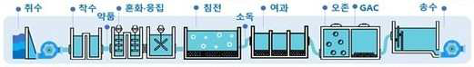

※ 한국수자원공사
[ 주요 적용 사례 ]
구분
인공지능 기능
주요내용
수질모니터링
실시간 수질 데이터
분석 및 이상 감지
Ÿ 수질 센서(pH, 탁도, 온도, 오염물질 등)로부터 수집된 데이터를 AI가 실시간
분석하여 이상 징후를 감지
Ÿ 오염 가능성이 포착되면 관리자에게 즉시 경고 알림을 전달하며, 직관적인 대시
보드로 시각화하는 기능 등을 통해 사용자 접근성 향상
수질오염예측
오염물질의 변화 경향
분석 및 사전 경고
Ÿ 과거 및 실시간 수질 데이터를 학습한 AI가 특정 오염물질의 농도 증가 패턴을
분석하고, 기준 수치 도달 전 사전 경고를 발송
Ÿ 관리자에게 충분한 대응 시간을 제공함으로써 수질 악화 전 선제적 조치가 가능
하도록 지원
자동수질조정
오염 발생 시
자동으로
정수처리 조정
Ÿ AI가 수질 데이터를 기반으로, 특정 기준치를 초과하는 경우 정수 설비에 화학
물질을 자동 투입하거나 밸브 등을 제어
Ÿ 인간의 개입 없이 작동하며, 실시간으로 수질을 복원
Ÿ 단, 시스템 오류 발생 시 직접적인 건강 영향 가능성 발생
지능형 물 순환
관리
상수도 내 유량·압력
자동 조정 및 최적화
Ÿ AI가 상수도 네트워크 내 수압과 흐름을 실시간 감시하며, 누수나 비정상 압력
발생 시 자동으로 흐름을 조절
Ÿ 날씨, 수요 변동, 설비 노후화 등 외부요인까지 반영해 수자원 손실을 최소화하
고 유지보수 효율성 증대
물공급 운영
최적화
공정 처리 효율 및
생산량 예측
Ÿ 상하수도 및 대체 수자원 공급 과정에서 AI가 각 처리 공정의 효율을 분석하고,
수요 패턴에 기반한 생산량을 예측
Ÿ 이를 통해 에너지 낭비를 줄이고 일별·시간대별 최적 운영 방식을 제안함
에너지 관리
설비의 에너지 소비
최적화
Ÿ 정수처리 시설 등 주요 설비의 에너지 사용 데이터를 분석해 AI가 불필요한
소비 구간을 찾아내고, 최적 운전조건을 도출
Ÿ 전력 소비를 줄이면서도 정수처리 효율을 유지할 수 있도록 지원
설비 예지
보전
설비 고장 예측 및
선제적 유지보수
Ÿ AI가 설비의 상태 데이터를 분석하여 이상 징후를 조기에 탐지하고, 고장이 발생하기
전에 유지보수 시점을 안내
Ÿ 이를 통해 예기치 않은 정수 시스템 중단을 방지하고, 장비 수명을 연장하며
관리 효율성을 향상


보건·의료 분야 인공지능 활용 사례
보건·의료분야에서의 인공지능은 진단, 치료, 예후 관찰 등 전반적인 의료 제공 과정에 폭넓게
적용되고 있으며, 기계 학습 기반의 예측·의사결정 기능을 중심으로 활용 영역이 지속적으로
확대되고 있다.
특히, 만성질환 관리/맞춤형 치료/의료기기 내 인공지능 탑재 등과 같은 다양한 형태로 활용
되고 있으며, 의료인뿐만 아니라 비의료인의 건강관리 지원 영역에서도 인공지능 기반 서비스가
점차 확대되는 추세이다.
[ 보건의료의 제공 및 이용체계 중 기계학습 등 인공지능이 활용되는 사례(예) ]
구분
사례
질환의 진단, 치료 방법
선택 등 의사(意思) 결정
(Clinical analysis)
Ÿ 치료 전, 치료 중, 치료 후 환자에 대한 의료서비스 제공 개선
환자 상태 악화 등 경과 관찰
(Quality and safety)
Ÿ 프로토콜에 따른 환자의 경과를 관찰하고 주요 위험인자에 의해 발생하는 사고를 감시
비의료 건강관리서비스
Ÿ 건강의 유지･증진과 질병의 사전 예방･악화 방지 목적으로 개인의 위해한 생활 습관
개선 및 올바른 건강관리 유도하기 위한 비의료적 개입인 상담･교육･훈련･실천 프로그램
작성 및 유관 서비스 제공
[ ‘인공지능 기반 의료기기’ 인･허가 사례(예) ]
구분
사례
기계학습 의료기기
(MLMD)
Ÿ 네비게이션의료용입체정위기(2등급): 하드웨어와 소프트웨어로 구성
* ㈜메타시스템즈(제인 호 22-4850, '22.11.07)
Ÿ 정량적전산화단층촬영골밀도측정기(2등급)
*㈜클라리파이(제인 호 22-4785, '22.10.14)
Ÿ 유헬스케어 심전계(3등급): 유헬스케어 심전계(기기) 및 유헬스케어 진단 소프트웨어
*㈜휴이노(제허 21-317호, ‘21.04.22), 변경 ’22.09.19)
Ÿ 1등급의료영상전송장치소프트웨어(1등급)
* 주신회사 민트랩스(제신 22-21호, '22.01.05)
Ÿ 뇌영상분석소프트웨어(2등급)
* ㈜제이엘케이(제인 21-4702호, '21.08.13)
Ÿ 방사선 치료계획 소프트웨어(2등급): 일부 구조물에 대해 인공지능기술 적용
* ㈜베리안메디컬시스템즈코리아(수인21-4020호, ’21.01.14)
Ÿ 2등급의료영상검출·진단보조소프트웨어(2등급)
* ㈜루닛(제허 20-896호, ’20.10.19.)
Ÿ 뇌영상 검출·진단보조 소프트웨어(3등급)
* ㈜뷰노(제허 20-1159호, ’20.12.29)

[ ‘18~’22년 허가‧인증된 인공지능 기반 의료기기(3등급) ]
등급
연번
업체명
품목명
(등급)
허가번호
(허가일자)
사용목적
제품외형
3등급
㈜제이엘케이
인스펙션
의료영상
진단보조
소프트웨어
(3)
제허
18-573호
(’18.8.14)
Ÿ 환자의 뇌 영상 Magnetic Resonance(MR)
자료와 임상자료를 바탕으로 뇌경색 (허혈성
뇌졸중)의 유형 분류 진단을 자동으로
진행하여 의료진의 뇌경색 진단 결정을
보조하는 데 사용하는 소프트웨어
㈜루닛
의료영상
진단보조
소프트웨어
(3)
제허
19-493호
(’19.7.29)
Ÿ 유방촬영술 영상(Mammography)에서
유방암 의심 부위를 검출하여 악성 병변으로
의심되는 위치를 표시하고 악성 병변의
존재 가능성을 확률값으로 나타내어
판독의(Interpreting Physician) 진단을
보조하는 소프트웨어
㈜뷰노
의료영상
진단보조
소프트웨어
(3)
제허
20-244호
(’20.4.1)
Ÿ 안저영상의 이상소견을 자동으로 분석하여
정상 비정상에 대한 결과를 제시하고,
비정상일 경우 이상소견 및 위치를 표시하여
의료진의 진단을 보조하는 소프트웨어
㈜딥바이오
체외진단용
소프트웨어
(3)
제허
20-248호
(’20.4.3)
-조건부허가
허가완료 체외
제허
20-373호
(’20.5.19.)
Ÿ 전립선 질환 의심환자의 전립선 조직을
헤마톡실린- 에오신(H&E) 염색하여
얻은 디지털 이미지에서 암 조직 유무를
소프트웨어로 분석하여 의사의 전립선암
진단을 보조하는 체외진단용 의료기기
㈜모니터
코퍼레이션
의료영상
진단보조
소프트웨어
(3)
제허
20-602호
(’20.7.27)
Ÿ 의료인(Interpreting Physician)이 흉부
CT 영상을 판독할 때 사용하는
소프트웨어로, 의료영상에서 추출한
정보를 바탕으로 폐 결절 악성
가능성과 폐 결절의 위치 및 특성에
대한 정보를 제공하여 사용자의 최종
진단 및 환자 관리의 결정을 보조하는
소프트웨어
㈜지멘스헬시
니어스
의료영상
진단보조
소프트웨어
(3)
수허
20-187호
(’20.8.21)
[제조원:
ScreenPoi nt
Medical B.V.
(네덜란드)]
Ÿ 유방촬영술 영상(Mammography)에서
유방암 의심 부위를 검출하여 악성 병변의
위치를 표시하고 존재 가능성을 점수로
나타내어 판독 의사의 (Interpreting
Physician) 진단을 보조하는 소프트웨어
㈜에임즈
의료영상
진단보조
소프트웨어
(3)
제허
20-847호
(’20.9.28.)
Ÿ 안저 카메라로 촬영한 환자의
망막사진(안저영상)을 바탕으로 의사의
녹내장 진단 결정을 보조하는 데 사용하는
소프트웨어
㈜뷰노
뇌영상
검출·진단보조
소프트웨어
(3)
제허
20-1159호
(’20.12.29)
Ÿ 뇌 T1 weighted MR 영상을 자동으로
분석하여 알츠하이머병 가능성을
수치화함으로써 의료인의 진단 결정을
보조하기 위한 목적의 소프트웨어


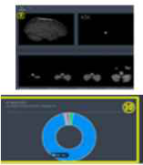


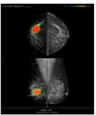


㈜에이아이
인사이트
안과영상
검출·진단보조
소프트웨어
(3)
제허
21-122호
(’21.02.18)
Ÿ 안저카메라로 촬영한 환자의 안저영상을
바탕으로 녹내장 유무를 자동으로 표시하는
소프트웨어로 의료인의 진단 결정 보조에 사용
㈜에이아이
인사이트
안과영상
검출·진단
보조
소프트웨어
(3)
제허
21-123호
(’21.02.18)
Ÿ 안저카메라로 촬영한 환자의 안저영상을
바탕으로 나이 관련 황반변성 (age related
macular degradation) 유무를 자동으로
표시하는 소프트웨어로 의료인의 진단
결정 보조에 사용
㈜에이아이
인사이트
안과영상
검출·진단보조
소프트웨어
(3)
제허
21-124호
(’21.02.18)
Ÿ 안저카메라로 촬영한 환자의 안저영상을
바탕으로 당뇨병성망막병증 유무를 자동으로
표시하여 의료인의 진단 결정 보조에
사용하는 소프트웨어
㈜휴런
뇌영상
검출·진단보조
소프트웨어
(3)
제허
21-257호
(’21.04.05)
Ÿ 뇌 영상을 자동으로 분석하여 의료진
MR의 신경퇴행성 파킨슨증 진단 결정
보조에 사용하는 소프트웨어
㈜제이엘케이
전립선암영상
검출·진단보조
소프트웨어
(3)
제허
21-270호
(’21.04.07)
Ÿ 전립선암이 의심되는 환자의 다중 시퀀스
전립선 영상자료MR를 기반으로 영상을
자동으로 분석하고 전립선암 위치를
검출하여 의료진의 진단 결정 보조에
사용하는 소프트웨어
㈜코어라인
소프트
심혈관영상
검출 진단·보조
소프트웨어
(3)
제허
21-554호
('21.07.02)
Ÿ 인공지능을 기반으로 CT 영상으로부터
관상동맥석회화(calcified coronary
lesion)를 동반한 관상동맥죽상경화증
(coronary atherosclerosis)의 유무를
검출하여 의료인의 진단 결정 보조에
사용하는 소프트웨어
㈜에이아이
인사이트
안과영상 검출
진단·보조
소프트웨어
(3)
제허
21-701호
('21.08.19)
Ÿ 안저 카메라로 촬영한 환자의 안저영상을
바탕으로 병증(녹내장 나이 관련
황반변성, 당뇨병성 망막병증) 유무를
분석하여 의료인의 진단 결정 보조에
사용하는 소프트웨어
SK㈜
뇌영상검출·
진단보조
소프트웨어
(3)
제허
21-720호
('21.08.26)
Ÿ 조영제를 사용하지 않은 뇌 CT 영상에서
뇌출혈로 의심되는 부위를 검출하여 위치를
표시하고 해당 부위가 뇌출혈로 판정될
가능성을 확률값으로 제시하여 의료진의
뇌출혈 발생 여부 및 발생 위치를 진단
보조하는 소프트웨어
㈜딥바이오
병리조직
진단보조
소프트웨어II
(3)
체외 제허
21-898호
('21.11.11)
Ÿ 전립선의 조직생검 H&E WSI 염색에서,
Gleason grading system을 학습한
인공지능으로 슬라이드 이미지 내
전립선암의 조직학적 등급을 자동
분석하는 인공지능 기반
병리조직진단보조 소프트웨어
㈜에이아이
인사이트
안과영상
검출 진단·보조
소프트웨어
(3)
제허
21-974호
('21.12.02)
Ÿ 안저 카메라로 촬영한 환자의 안저영상을
바탕으로 병증(녹내장 나이 관련 황반변성,
당뇨병성 망막병증) 유무를 분석하여
의료인의 진단 결정 보조에 사용하는
소프트웨어


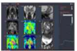


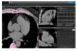


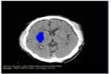


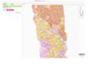


※ ｢2022년 의료기기 허가보고서｣, 2023.4., [표 63], 104~126면
㈜코어라인
소프트
뇌영상검출·
진단보조
소프트웨어
(3)
제허
21-1013호
('21.12.15)
Ÿ 인공지능기술을 사용하여 환자의 뇌 CT
영상으로부터 뇌출혈을 검출(뇌출혈
유무, 뇌출혈량)하여 의료진의 뇌출혈
진단을 보조하는 소프트웨어
㈜휴런
뇌영상검출
진단·보조
소프트웨어
(3)
제허
22-36호
('22.01.19)
Ÿ 뇌 CT 영상을 자동 분석하여 출혈성
뇌졸중 의심 여부를 의료진에게 제공함
으로써 진단 결정을 보조하는 소프트웨어
㈜휴런
뇌영상검출
진단·보조
소프트웨어
(3)
제허
22-332호
('22.05.24)
Ÿ 환자의 뇌 CT 영상으로부터 초기허혈성
변화스코어(ASPECT Score)를
제공함으로써 의사의 허혈성 뇌졸중
진단을 보조하는 소프트웨어. CNN 구조를
사용하여 ASPECTS를 산정
주식회사
아이도트
산부인과학
진료용
소프트웨어
(3)
제허
22-376호
(‘22.06.09)
Ÿ 자궁경부 영상 이미지(카메라 영상)를
인공지능 영상판독 알고리즘 CNN
방식으로 학습하여 자궁경부의 이형성증
및 암으로 의심되는 질환을 진단하는
등 자궁경부암 유무에 대한 가능성 정도
및 중증도에 대한 가능성 정도를 출력
㈜메디웨일
심혈관
위험평가
소프트웨어
(3)
제허
22-513호
(‘22.08.01)
Ÿ 망막 영상 내 망막의 구조 및 망막 내
혈관 모양을 분석하여 심혈관 질환 발생
위험 정도를 (Low: 저위험, Moderate:
중등도 위험, High: 고위험) 표시하는
인공지능 기반의 소프트웨어
㈜휴이노
유헬스케어
심전계
(3)
제허
21-317호
(‘21.04.22)
변경
(’22.09.19)
Ÿ 유헬스케어 심전계 : 심근이 활동할 때
발생하는 활동전위가 신체의 표면에
전달되어 발생하는 전위차를 일정
부위에 전극을 부착시켜 신호를
감지하고 이 심전도 데이터를 무선
신호를 이용하여 표시해 주는 기구이며,
원격진료를 위해 심전도를 기록
재현하는 기기
Ÿ 유헬스케어 진단지원 소프트웨어 :
원격진료를 위해 유헬스케어
게이트웨이에서 수신된 정보를 기반으로
환자의 관리를 위하여 사용자와
의료인에게 정보를 제공하는 소프트웨어
* 작동원리 : 패치형 심전도 기기에서
측정한 데이터가 클라우드 서버로
전송되면 서버는 심전도 데이터를
인공지능 알고리즘(CNN)을 이용한
분석을 통해 부정맥 여부를 판별하며
병원의 의료진은 웹 뷰어 소프트웨어
(MEMO ECG Webviewer)를 통해
심전도 데이터 및 부정맥 판별 결과를
열람할 수 있다
㈜ 엔티엘
헬스케어
산부인과학
진료용
소프트웨어
(3)
제허
22-886호
(‘22.12.23)
Ÿ 자궁경부확대촬영술 이미지 영상에 대하여
RetinaNet 기반의 탐지 모델과
Resnet-50 기반의 분류모델로 학습된
인공지능 소프트웨어로 체외형
자궁경부확대 촬영 영상(JPG) 내에서
자궁경부를 자동으로 표시하고
자궁경부암의 정상/이형성증을 구분하여
의료인의 자궁경부암 진단 결정을
보조하는 데 사용한다.


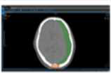


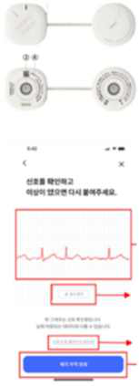


원자력 분야 인공지능 활용 사례
원자력 산업은 생명·안전·기밀성과 직결되는 고위험 산업으로, 인공지능기술의 적용에 있어
고유한 제약과 제한요인이 존재하며, 특히 전 주기에 걸친 인허가 체계, 대중의 안전성 우려,
정보의 독점성과 보안성 등으로 인해 검증되지 않은 인공지능기술은 현장에 도입하기 어려운
구조이다.
그러나, 인공지능기술의 발전과 활용 요구가 커짐에 따라, 국가 차원에서 통일되고 명확한 정책을
수립하여 단계적으로 원자력 인공지능 연구를 해 나가야 하며, 인공지능기술 도입을 위한
선제적 대응이 필요하다.
[ 원자력 분야 주요 활용 사례 ]
구분
인공지능 기능
주요내용
설비상태진단
및 유지보수
설비 고장 예측,
성능 감시
Ÿ 발전소 내부 설비(예: 터빈, 펌프, 열교환기 등)의 상태 데이터를 기반으로, AI가
이상 징후를 조기에 감지하여 예방 정비 및 유지보수 등 일정 최적화에 활용
Ÿ 열화 감지, 진동 분석, 패턴 이상 탐지 등을 통해 예기치 못한 설비고장 방지를
지원
운영 효율
향상
운전조건
최적화
Ÿ 발전소의 운전 데이터를 분석하여 에너지 효율과 안전성 모두를 만족시키는
최적 운전조건을 도출
Ÿ 예를 들어, 운전 출력, 열교환 효율, 연료 사용량 등의 요소를 AI가 실시간으로
분석하여 운영자에게 개선 시나리오를 제시
사고·이상
상황 예측
비정상 상태
조기 탐지
Ÿ 방사능 누출, 냉각 계통 이상, 과열 등 이상 징후가 발생하기 전, 정상 데이터와의
패턴 차이를 분석해 위험을 조기에 경고
Ÿ 훈련 데이터가 충분한 경우, 인간이 인지하지 못한 조기 이상 징후까지 감지할
수 있어 사고 예방 효과가 있음
훈련 및 시뮬
레이션 지원
비상 대응
시나리오 제공
Ÿ 사고 발생 시나리오를 바탕으로, AI가 가상의 사고 상황을 시뮬레이션하고,
대응 전략을 자동 추천
Ÿ 원자력 인력 훈련 시에도 AI가 예측한 위험도를 반영한 시나리오를 제공하여
실제 대응 역량 향상에 기여
방사선 감시 및
측정 자동화
실시간 방사선량 분석
및 이상 경고
Ÿ 방사선량 데이터를 AI가 분석하여, 기준치 초과나 이상 징후 발생 시 즉시 경고
Ÿ 또한 장비 오작동에 따른 측정 오류까지 AI가 자동으로 식별하여 신뢰성 높은
방사선 감시 체계를 구축

범죄 수사 및 체포 분야 인공지능 활용 사례
범죄 수사 및 체포 분야에서 피의자나 참고인을 포함한 일반 국민의 생체정보를 분석·활용하는
인공지능시스템은 그 정확도와 운영 절차의 적법성에 따라 심각한 사생활 침해 및 부당한
수사·체포로 이어질 수 있음에 유의해야 한다.
이에 따라, 생체정보를 활용한 인공지능시스템이 범죄 수사·체포 업무에 사용되면서 사람의 생명,
신체, 기본권 보호에 중대한 영향을 미칠 우려가 있는 경우 유의해야 한다.
[ 범죄 수사 및 체포 분야 주요 활용 사례 ]
구분
인공지능 기능
주요내용
얼굴 인식 기반
용의자 식별
실시간 얼굴 인식
및 대조 분석
Ÿ CCTV, 보안 카메라 등으로 촬영된 인물 영상을 AI가 분석하여 기등록된 인물
정보와 대조함으로써 용의자를 자동 식별
Ÿ 공공장소나 행사장 등에서 실시간 감시 및 추적 기능으로 활용
Ÿ 정확도에 따라 잘못된 식별 가능성이 존재하여, 무고한 시민에 대한 수사 확대
위험 상존
지문·홍채 등
생체정보 분석
지문, 홍채, 정맥
등 생체 특성 기반
인물 확인
Ÿ 수사 과정에서 수집된 지문이나 홍채 데이터를 AI가 분석하여 신속하게 신원
식별 수행
Ÿ 기존 수작업 분석보다 속도와 일관성이 높지만, 분석 오류 시 잘못된 체포나 조
사로 진행 가능
Ÿ 생체정보는 민감정보로 분류되어 보호 기준이 엄격
음성 인식 및
분석
통화 녹음 및 음성
데이터의 화자 식별
Ÿ 도청, 통화 감청 등 수사 자료에서 화자의 음성 특성(톤, 억양, 말투 등)을 분석해
인물을 추정하거나 발언 내용을 분류
Ÿ 정확한 감정 또는 맥락 인식이 어려워 오판의 우려가 있으며, 감청 대상의 적법성
확보가 중요
행동 패턴 분석
AI 기반 이상행동
탐지 및 자동 경보
Ÿ 공공장소의 CCTV 영상에서 수상한 행동 패턴(급박한 이동, 특정 위치 반복
체류 등)을 AI가 실시간 분석해 잠재적 범죄 발생 가능성을 탐지
Ÿ 예방 목적이나, 비정형 행동을 범죄로 오인할 위험 존재하며, 일반인의 이동
자유권 침해 우려 발생
디지털 포렌식
자동화
기기 내 데이터 분석
및 범죄 단서 추출
Ÿ 압수된 스마트폰, 컴퓨터 등에서 AI가 문서, 이미지, 검색 기록 등 다양한 디지털
흔적을 자동 분류 및 연관 분석하여 범죄 단서를 추출
Ÿ 분석 결과의 적법한 활용 절차와 투명성 확보가 필요하며, 사생활 침해 우려
범죄 예측 시스템
범죄 발생 가능성
예측 및 지역 경고
Ÿ 특정 지역의 과거 범죄 기록, 환경 정보, 시간대 패턴 등을 학습한 AI가 범죄
발생 확률이 높은 지역이나 시간대를 예측
Ÿ 이를 기반으로 순찰 배치나 CCTV 집중 관리 등에 활용되지만, 편향된 데이터로
인한 인종·지역 차별 이슈가 제기

채용 분야 인공지능 활용 사례
채용에서 발생할 수 있는 성별, 연령, 장애, 출신, 인종 등에 따른 차별은 다수의 법령에
의해 금지되고 있으며, 이에 따라 인공지능을 채용 과정에 사용하는 경우에도 동일 수준의
차별 방지 원칙이 적용되어야 한다.
[ 채용 분야 인공지능 이용 사례 ]
구분
사례
이력서 스크리닝 및
채용 후보자 발굴
Ÿ 이력서를 스크린하는 AI 알고리즘을 사용하여 상위 후보군을 선별, AI는 주요 단어, 경험 및
자격에 기반하여 이력서를 분석(아마존Amazon)
Ÿ LinkedIn Recruiter과 같은 AI 기반 도구를 사용, LinkedIn Recruiter는 방대한 전문가 네트워크
로부터 특정 직종의 요구사항에 적합한 후보군을 검색하여 추천하는 AI 알고리즘을 사용
(마이크로소프트Microsoft)
Ÿ 다양한 구직 사이트를 통해 지원된 후보자를 스크린하고 파악하는 AI 도구를 사용, 본 도구는
다양한 역할에 적합한 기술과 경험을 가진 후보군을 선별하기 위해 이력서와 온라인 프로필
분석(구글Google)
Ÿ 이력서 및 커버레터(cover letter) 분석하며, 지원자의 기술 및 경험을 평가하는 'Watson
Recruitment' 사용(IBM)
채용 지원자 지원
(챗봇, 가상 비서)
Ÿ 채용 절차에서 지원자의 질문에 답하고 인터뷰 스케줄을 정하는 것을 지원하는 AI 기반 가상비서
또는 챗봇 사용(딜로이트Deloitte, Bank of America, McKinsey & Company, IBM 등)
회사와 후보자 매칭
Ÿ 자사의 AI 기반 채용 플랫폼 또는 도구를 이용하여 기술, 위치, 직업 선호도 등을 고려하여
회사와 지원자를 매칭(페이스북Facebook, 애플Apple, 넷플릭스Netflix)

대출 심사 분야 인공지능 활용 사례
대출 심사 과정에서 인공지능시스템을 활용할 경우, 편향, 차별, 불투명성 등으로 인한 사회적
위험이 발생할 수 있으며, 이에 다양한 법령과 가이드라인을 통해 신뢰성과 공정성 확보를 위한
노력이 진행 중이다.
따라서 대출심사 분야의 인공지능의 경우 별도 규율과 투명한 운영 원칙이 요구되는 분야로
평가된다.
[ 대출심사 분야 주요 활용 사례 ]
구분
인공지능 기능
주요내용
신용평가
자동화
개인 신용도 분석
및 등급 산정
Ÿ AI가 고객의 소득, 자산, 부채, 금융거래 이력 등 다양한 데이터를 분석해 신용
등급을 산출하고, 대출 가능 여부 및 금리를 예측
Ÿ 과거 데이터에 기반한 평가이므로 데이터 편향에 따른 차별 가능성이 존재
상환능력
예측
연체 가능성 및
부도 위험 분석
Ÿ 고객의 과거 금융이력 및 소비 패턴, 소득 흐름 등을 기반으로 향후 상환능력 및
부도 가능성을 예측
Ÿ 리스크 기반 대출 한도 조정에 사용되며, 설명 가능성이 낮을 경우 이의제기
어려움 예상
부동산 담보물
평가
담보 가치
자동 산정
Ÿ 부동산 위치, 시세, 거래 이력 등 데이터를 AI가 분석해 담보의 현재 가치를
자동 산정
Ÿ 대출 승인 여부 및 한도 결정에 반영되나 시장 급변 시 AI 모델의 반응 한계
대출사기 방지
(FDS)
비정상 신청
패턴 탐지
Ÿ AI가 신청 정보 및 과거 기록을 분석하여 의심스러운 대출 패턴을 실시간 탐지
Ÿ 예를 들어, 허위 서류 제출, 동일 IP·기기 중복 신청 등 이상 징후를 자동 식별
되므로 오탐률과 정상 이용자 오판단 가능성 관리 필요

육상 교통수단· 교통시설·교통체계·실외이동로봇 분야에서의 인공지능 활용 사례
[ 자율주행에 사용되는 인공지능시스템 ]
분야
시스템
주요내용
자율주행
네비게이션
연동 자율주행
Ÿ 네비게이션에 목적지를 입력하면, GPS를 통해 위치데이터를 받고, 휴리스틱 탐색을
이용하여 목적지까지 가는 최적의 경로를 탐색하고, 해당 경로를 따라 스스로 운전
하여 이동하는 시스템
다차량
상호작용 예측
Ÿ 인공지능을 활용하여 자율주행 자동차 주변에 존재하는 다수의 차량에 대한 미래 경
로 및 이에 맞는 자기 차량의 경로를 예측
지능형 순항
제어 시스템
Ÿ 자동차가 정속을 기준으로 주행 중 센서를 활용하여 감지하는 도로 상황에 대한 실
시간 정보를 자동차의 전자제어부(ECU)로 연결하여 매 순간 안전상황을 확보하기
위한 조치를 자동으로 취한 후 다시 정속 주행으로 복귀할 수 있도록 제어하는 차세대
첨단 자동차 주행용 안전장치
자동주차
시스템
Ÿ 사람의 조작이 없이 자동차를 (원격으로) 도로에서 주차 공간으로 이동시키는 자율
주행 시스템
오프로드
자율주행
Ÿ 비나 눈이 오면 센서를 바로잡아서 안정적인 상태를 유지하는가 하면 거리와 물체의
형태를 측정하는 센서에 이물질이 붙으면 세척액을 내뿜고 와이퍼로 제거
로봇택시
Ÿ 승객이 앱을 통해 호출하면 자율주행차량이 승객을 픽업하여 목적지까지 무인 운행
하는 서비스
자율주행 관련
기술 이외에
자동차에 적용
차량용
인포테인먼트
Ÿ 자연어 처리(NLP) 기술을 활용하여 운전자의 음성 명령을 인식하고, "음악 틀어줘",
"에어컨 켜줘", "집으로 길안내해줘" 등의 명령을 이해하여 해당 기능을 자동으로 실
행하는 AI 비서 시스템
음성 UI 및
Voice Agent
Ÿ 차량용 음성 AI는 운전자의 습관과 기분을 학습하고 그에 따라 여러 색상으로 변하는
스킨부터 증강 현실 기능을 통해 탑승자가 메타버스에 참여하고 차 안에서 친구 및
가족과 가상으로 연결할 수 있는 기능까지 조정
차량 내 음주
측정
Ÿ 운전자가 벤츠 차량에 설치된 클립 형태에 손가락을 끼우면 피부를 자동으로 스캔
하여 손가락 혈액 내 음주와 관련된 성분을 측정하여 음주 여부가 측정되고, 술을
마셨으면 ‘운전하지 마세요’란 경고 문구 제시
운전자
모니터링
Ÿ 운전자의 운전 습관 데이터를 수집 및 분석하고, 급가속, 안전거리 미준수 및 차선
이탈 여부 등을 종합하여 안전 운전 점수를 산출
운전자 졸음
감지 시스템
Ÿ 차량 내부 카메라가 운전자의 눈꺼풀 움직임, 고개 끄덕임, 시선 방향 등을 실시간
으로 모니터링하고, 컴퓨터 비전과 패턴 인식 알고리즘을 통해 졸음 징후를 감지
하면 경고음이나 진동으로 운전자에게 휴식을 권하는 시스템
지능형 주행
패턴분석
시스템
Ÿ 가속도 센서, GPS, CAN 버스 데이터를 수집하여 머신러닝으로 개별 운전자의
주행 습관(급가속, 급제동, 과속 등)을 분석하고, 연비 향상이나 안전 운전을 위한
개인 맞춤형 피드백을 제공하는 시스템
차량고장 예측
진단 시스템
Ÿ 엔진, 브레이크, 배터리 등 각종 센서 데이터를 AI로 분석하여 부품의 이상 징후나
고장 가능성을 사전에 예측하고, 정비 시기와 교체 필요 부품을 운전자에게 미리
알려주는 예방 정비 시스템
자동차 이외에
도로교통법에
따른 차에 적용
건설장비
고장진단
Ÿ 굴착기에 AI와 사물인터넷(IoT)을 결합한 'AIoT 모듈'을 탑재해 장비의 실시간
데이터를 수집·분석하고, 머신러닝 기술로 장비의 이상 여부를 정밀하게 감지하여
스스로 장비의 고장유형을 판별하고, 수리에 필요한 부품을 추천
자전거 후방감지
시스템
Ÿ 인공지능의 머신러닝 알고리즘을 활용하여 후방 차량과 보행자를 인식하고, 위험
상황 발생 시 음성 경고 및 스마트폰 연동 알림 제공

전동퀵보드 충돌
방지시스템
Ÿ 주행 중 충돌이 발생했을 때 AI의 모션센싱(동작감지) 결과를 서버에 업로드하고
사전에 카메라가 주변 사물, 환경과의 거리도 인식해 너무 가까워지면 속도를 줄이
거나 정지시킴으로써 충돌을 예방
전동 스쿠터 배
터리 최적화 시
스템
Ÿ 사용자의 운행 패턴, 경사도, 무게, 날씨 조건 등을 머신러닝으로 학습하여 배터리
소모량을 예측하고, 모터 출력을 지능적으로 조절해 최대 주행거리를 확보하는
에너지 관리 시스템
지게차 화물 인
식 적재 시스템
Ÿ 카메라와 무게 센서를 통해 팔레트의 크기, 무게, 적재 상태를 자동으로 인식하고,
컴퓨터 비전으로 화물의 무게중심을 계산하여 지게차 포크의 위치와 들어올리는
각도를 최적화해 안전하게 화물을 운반하는 시스템
오토바이 코너링
안전 시스템
Ÿ 자이로스코프와 가속도 센서로 바이크의 기울기와 속도를 측정하고, AI가 노면
상태와 코너 반경을 분석하여 안전한 코너링 속도를 계산해 엔진 출력과 브레
이크를 운전자에게 제안하는 시스템
교통시설,
교통체계에
적용
인공지능
신호운영 체계
Ÿ 자율주행차가 송신하는 운행 데이터를 활용, 도심 신호 교차로의 혼잡을 최소화
차세대 지능형
교통시스템
Ÿ 위치기반 데이터수집, 위치기반 교통정보 제공, 요금징수시스템, 도로위험구간 정보
제공, 노면 기상정보 제공, 도로작업구간 주행지원, 교차로 신호위반 위험경고,
우회전 안전운행 지원, 버스 운행관리, 옐로우버스 운행 안내, 스쿨존 속도제어,
보행자 충돌방지 경고, 차량 추돌방지 지원, 긴급차량 접근경고, 차량 긴급상황
경고등 15가지를 제안
지능형 주차
관리 시스템
Ÿ 도심 내 모든 주차장과 도로변 주차 공간에 설치된 IoT 센서와 카메라를 통해
실시간 주차 현황을 파악하고, 머신러닝 알고리즘으로 주차 수요를 예측하여
운전자에게 최적의 주차 공간을 안내하고 동적 요금제를 적용하는 통합 주차
관리 체계
교통사고 자동
감지 및 대응
시스템
Ÿ 도로 곳곳에 설치된 CCTV와 음향 센서가 수집한 데이터를 딥러닝으로 분석하여
교통사고 발생을 자동으로 감지하고, 사고 심각도를 판단해 구급차, 소방차, 경찰을
자동 출동시키며 우회 경로를 실시간으로 안내하는 긴급 대응 시스템
도로 포트홀
및 노면 손상
자동 탐지 시
스템
Ÿ 도로 순찰 차량이나 일반 차량에 장착된 카메라와 진동 센서로 수집된 데이터를
컴퓨터 비전 기술로 분석하여 포트홀, 균열, 침하 등 도로 손상을 자동으로 탐지
하고 위치를 정확히 파악해 우선순위에 따라 보수 작업을 계획하는 시스템
대중교통 승객
수요 예측 및
운행 최적화
시스템
Ÿ 지하철, 버스 이용 패턴과 날씨, 이벤트, 시간대별 데이터를 AI로 분석하여 승객
수요를 예측하고, 이를 바탕으로 배차 간격을 동적으로 조절하고 추가 차량 투입
여부를 결정하는 대중교통 운영 최적화 시스템
실외이동
로봇
순찰경비
서비스
Ÿ HD카메라·적외선 열화상 카메라·마이크· 증폭 경적/스피커·스트로브 라이트 등을
탑재하고 있으며, 카메라를 통해 주변상황을 인식하고 폐관 후 건물 등에서 동작을
감지하여 유사시 스피커를 통해 경고하거나 관제실로 상황을 전파
교통단속
Ÿ 특정 지역의 주·정차 및 대기 규정 위반 차량을 감지하고 메세지를 스크린에 표시
하거나 음성 경고 알림을 스피커를 통해 재생하여 교통질서를 관리하고, 실시간
영상을 관제실로 송부하는 등 작업을 수행
농업 로봇
Ÿ GPS기술과 센서 등을 활용하여 밭을 탐색하여 작물과 잡초를 구분하고 잡초를 표적
하여 제초작업을 수행
방역 로봇
Ÿ UV-C 자외선을 방출하여 공기 중 유해한 세균과 바이러스 등을 제거하며, 인체에
해당 자외선을 직접 비추는 것은 건강에 악영향을 미치기 때문에 근처 사람을 인식
하면 자동으로 자외선 방출을 중지
실외청소 로봇
Ÿ 카메라, 소나센서, GPS 등을 이용하여 실내·외를 청소하고, 쓰레기 수거가 가능

선박 교통 분야에서의 인공지능 활용 사례
선박교통 분야의 경우 자율운항선박에 인공지능을 사용하고 있거나 사용하기 위한 시도가
진행되고 있다. 인공지능시스템 구성에 따른 자율운항선박의 기술은 크게 자율운항시스템
기술, 원격관제기술, 해상연결성 기술로 구분되며 세부 내용은 다음과 같다.
[ 자율운항선박 기술분류2) ]
2) KISTEP. (2020). 자율운항선박
3) Vessel traffic system, 해상교통관제시스템
4) Very high frequency, 초단파(초고주파)
구분
세부기술명
설명
자율운항시스템
기술
다중센서기반 장애물 탐지 및
상황인지 기술
Ÿ 선박에서 Lidar 및 카메라를 이용하여 장애물을 탐지 및 충돌상황 예측, 회피
방안 제시
통합선교경보관리기술
Ÿ 선박의 다양한 위험 상황을 종합적으로 관리하고, 선박의 위험도에 따라 최적의
대응 방안 제시
선박 자율제어기술
Ÿ 선박의 운항상황 및 장비와 시스템의 상황에 따라 항로 재계산 및 엔진 제어 등
을 포함하여 선박의 모든 장비와 시스템들을 실시간으로 계산하고 효과적으로
처리
선박 시스템 안전성
보장 기술
Ÿ 선박 시스템의 안전성과 신뢰성 확보를 위한 기술. 다양한 이종 시스템과의 통
합 및 상호연결 시 발생하는 선박 소프트웨어의 기능 안전성 및 시스템 오류 및
장애와 문제를 안정적으로 처리
선박 자동 접·이안 기술
Ÿ Tug선이나 도선사의 도움 없이 선박을 자동으로 접·이안하기 위한 기술
육상기반 항해센서기술
Ÿ 선박의 주변 운항 상황을 보다 정확히 판단하고, 선박이 취득하기 힘든 환경
정보를 육상에서 획득하여 선박에 제공, 선박이 정확한 판단을 내릴 수 있도록
보조
원격관제
기술
항로교환정보기술
Ÿ 선박의 원격 제어 및 항로 제어를 위해 기상 정보와 트래픽 관련 다양한 부가
정보를 교환하는 기술
항해안전정보교환 기술
Ÿ 선박의 위험상황이나 주변 상황에 대한 안정정보를 육상에서 제공
VTS3) 자동보고기술
Ÿ 선박이 VTS센터 및 항만과 트래픽 관리와 항해 안전을 위한 자동화 서비스에
관련된 정보를 교환하는 기술
선박 원격 모니터링 및
제어 기술
Ÿ 원격에서 다양한 선박과 장비의 정보를 수집하여, 장비와 선박의 상태를 종합적
으로 점검하고 분석하는 기술. 이 과정에서 선박의 상태를 정확히 분석하기
위해 AR/VR 기술과 디지털 트윈 기술이 함께 사용될 것으로 예상
선박 위험도 관리 기술
Ÿ 선박의 운항 환경, 상태, 해양 트래픽 및 환경 정보를 기반으로 각 선박의
위험도를 판단하고 이를 경감하기 위한 기술
해상연결성
기술
VHF4) 데이터 교환 시스템
(VDES5)) 기술
Ÿ VDES를 통해 선박의 안전 및 해양 당국과 선박 간, 선박 상호 간의 운항 정보를
교환하기 위한 기술
해상항법장비기술
Ÿ 선박의 위치를 정확히 측정하고, 이에 따라 안전운항을 보장하기 위한 고정밀
위성항법장비 기술
이더넷 기반 선내통신기술
Ÿ 선박의 다양한 장비와 시스템을 IoT 기반으로 통합하여 관리하기 위한 선박
네트워크 통합 관리 기술
선박 항해시스템 및
장비의 사이버보안 기술
Ÿ 선박 내 이종 시스템과 선박과 육상 간의 안전하고 신뢰성 있는 서비스를 제공
하기 위한 기술
5G기반 광대역
해상통신시스템
Ÿ 선박의 항상 연결 상태를 유지하기 위해 위성통신과 연근해에서 상황인지 및 원격
관제를 위한 대용량 통신을 지원하는 기술. 이 기술은 서비스 요구사항에 맞춰
저비용으로 안전하고 신뢰성 있는 통신을 제공

(우리나라 자율운항선박 기술 적용사례) 국내 주요 조선사들도 다양한 자율운항기술을 개발하고
실증 중이며, 국가 및 민간 기관들은 무인선박 운항을 위한 기술과 시스템을 적용하고 있다.
[ 자율운항선박 기술 적용사례6) ]
주체
적용 사례 및 기술
현대중공업
Ÿ 통합스마트쉽솔루션 ISS, HiNAS 항해지원시스템, HiBAS 이·접안 지원시스템
대우조선해양
Ÿ 스마트쉽 솔루션 DS4, 무인항해시스템 ANS, 보안 PDA인증
삼성중공업
Ÿ 자율항해시스템 SAS
씨드로닉스
Ÿ 인공지능 선박접안보조 시스템 (여수·울산항 공급)
이커버스
Ÿ 완전자율운항 (12인승 크루즈선박 포항운하에서 완전자율 운항 성공)
선박해양플랜트연구소
Ÿ 아라곤3호 (8m 소형 무인선박 완전무인화 자율운항 실증 성공)
해양수산부
Ÿ LTE 기반 초고속 해상무선통신망 (연안 100km까지 최적항로 추천 등)

5) VHF data exchange system, 초단파 데이터 교환 시스템
6) 한성훈, 송영조. (2022). 자율운항선박을 둘러싼 현황과 법적과제. 법과 정책연구, 22(1), 91-115.

항공 교통 분야에서의 인공지능 활용 사례
항공교통 분야의 경우 항공기 운항, 교통관제 등의 영역에서 다양한 방식으로 인공지능을
사용하고 있거나 사용하기 위한 시도가 진행되고 있다.
(일반 항공 분야) 항공기 운항, 교통관제 등의 영역 중 아래와 같은 분야에서 인공지능이
사용되거나 사용이 추진되고 있다.
Ÿ (운항) ① 교통핫스팟 예측, ② 악기후 예측, ③ 음성인식, ④ 동적 공역섹터 구성, ⑤ 관제사
및 조종사 의사 결정 지원 등
Ÿ (교통관제) ① 공항/관제타워 감시, ② 활주로 운영 최적화 등
Ÿ (기타) 항공기 제작·정비, 항공종사자 자격훈련, 모의비행훈련장치 이용 등
(도심항공교통 분야) 주로 아래와 같은 분야에서 인공지능 사용이 추진되고 있다.
Ÿ (운항) ① 자율 비행, ② 전략적 교통흐름 관리, ③ 우발사태 또는 비상상황 자동 대응 등

철도 교통 분야에서의 인공지능 활용 사례
철도 교통 분야의 경우 철도차량과 철도시설, 철도 교통체계 등 다양한 영역에서 인공지능을
사용하고 있거나 사용하기 위한 시도가 진행되고 있다.
[ 철도 교통 분야별 인공지능 사용례 ]
구분
인공지능시스템
이용사업자에게
제공되는 서비스
이용자에게 제공
되는 최종서비스
교통
수단
(철도)
철도
차량
열차자율주행용 차상제어기술
신호/제어
텔레매틱
화물 및 여객운송
T2T 열차간 통신기술(Train-To-Train)
한국형 열차제어시스템2(KTCS-2)
한국형 열차제어시스템3(KTCS-3)
통신기반 열차제어시스템(CBTC)
자동 열차 운전지원 장치(ATO)
운행 최적화 시스템(Trip Optimizer)
열차 위치정보 기반 열차 내비게이션 시스템(S-NAVI)
영업열차 자동검측시스템
진단/모니터링
상태기반유지보수기술(CBM)
전동차 고장예지시스템
철도 차량 검사 포털
철도교통
시설
선로
실시간 까치집 자동검출 시스템
진단/모니터링
코끼리 열차 충돌 방지 시스템
철도시설물 결함시스템
철도시설물 자율주행 점검 로봇
AI 기반 광섬유 음향분포센서 시스템
선로 상태 점검 시스템
레일 프로파일 형상 기반 고정밀 지능형 레일 자동화 연마
시스템
유지보수
역시설
지하철 역사 공조설비 최적 제어 기술
유지보수
방역로봇
미세먼지 집진전동차
공조설비 예지보전 시스템
진단/모니터링
로봇 점검 체계
영상기반 통합감시시스템
철도
시설물
무인이동체 기반 접근 취약 철도시설물 자동화 점검시스템
진단/모니터링
철도위성추적 기술(RST)
철도건널목 전자식 경보시스템
건축물ㆍ건축
설비
지하 매핑 데이터 분석 기술
진단/모니터링

선로 및 철도
차량 보수ㆍ
정비 시설
무선차량정리 시스템
유지보수
전력설비
전력계통 설비 디지털 지능화시스템
전철전력
조명설비와 전열설비의 통합관리제어
스마트 그리드
스마트 그리드
원격검침설비와 스마트 계량기
정보통신
설비
한국형 통신시스템(KR LTE-R)
임베디드S/W
신호 및
열차제어
설비
한국형 도시철도 열차제어시스템(KTCS-M)
신호/제어
텔레매틱
열차집중제어장치(CTC)
교통
연계 시설
스마트 철도건널목
정보 플랫폼
MaaS (Mobility as a Service)
철도안전
관련 시설
AI기반 대피로 안내 시스템
-
사고대응
피난관제로봇
고속주행 영상 관제 로봇
안전 챗GPT
안내시설
정밀 실내측위 시스템
-
대고객
부가서비스
외국어 동시 대화(음성인식·번역) 시스템
디지털 플랫폼과 고급 챗봇을 활용한 고객서비스
길 안내와 짐 운반을 돕는 로봇 역무원
철도교통
체계
철도교통
이용지원
수도권 전철의 실시간 혼잡도를 분석·공개하는 시스템
철도교통
화물 및 여객운송
AI 기반 카메라 시스템
열차 운행
관리
플릿 네트워크 AI기술
철도교통
열차운행관리시스템(TMS)
대중교통 운영계획 지원 시스템(TRIPS)
열차 스케줄 최적화 기술
사이버 물리 시스템(CPS) 기술
철도시설
통합관리
스마트 스테이션
정보플랫폼
철도시설 종합정보시스템(RAFIS)

공공서비스 분야 인공지능 활용 사례
행정 효율성과 국민 편의 증진을 목적으로 인공지능기술을 도입하고 있으며, 현재 400개 기관
중 약 55%가 인공지능기술을 도입해 활용 중이다. 특히 정부부처 및 광역지자체의 도입률은
80%를 넘는 등 활용이 급속히 확대되는 추세이다.
[ 국내 국가기관 등의 인공지능 활용 사례 ]
구분
사례
행정안전부
Ÿ 국민비서: 국민 개개인에게 필요한 서비스를 적시에 알려주고 대화형으로 편리하게 신청·처리할 수
있도록 하는 인공지능서비스
Ÿ 인파관리지원시스템: 행정안전부에서 개발한 인공지능시스템으로, 휴대전화 신호 등으로 유통
인구수를 파악해 밀집도를 분석하고, 위험을 감지하면 소방·경찰에 전달
농림축산식품부
Ÿ 빅데이터 방역 의사결정 지원 시스템: 농림축산식품부는 닭, 오리, 야생 조류에서 발생하는
급성 바이러스성 전염병인 조류 인플루엔자 바이러스(Avian Influenza virus: AI)의 확산 가능성을
예측하고 대응하기 위해 농장 방문 차량들의 동선, 방문 간격, 방문회수, 농장의 특성 등을 분석하고
시각화된 정보를 제공하는 시스템을 구축7)8)
고용노동부
Ÿ 인력채용 및 매칭 시스템: 구직자, 구인기업 매칭 시스템 더워크 (thework)으로 구직신청서,
이력서 등을 단어 단위로 분석하여 구직자에게는 일자리를, 기업에게는 인재를 추천하는 시스템 도입
Ÿ 취업규칙 모니터링 시스템: 취업규칙의 잦은 변경에 대응하기 위해 신고된 취업규칙이 현행 법·
규정을 준수하고 있는지 여부를 판단하는 AI 모델 개발
경찰청
Ÿ 클루: 경찰청 사업으로 베가스는 2016년부터 2018년 사이에 빅데이터 기반 범죄분석시스템인 ‘클루
(Crime Layout Understanding Engine: CLUE)’를 개발하여 2019년부터 시범 적용을 시도하였다.
베가스의 클루는 경찰청데이터(수사결과 보고서 등)와 공개된 공공데이터를 이용하여 자연어
처리 기술을 통해 범행 장소, 범행 도구 등에 대한 정보를 추출하고 범죄 구성 데이터 간의 상관관계
분석을 통해 유사범죄를 추천해주거나 ‘근접반복행위’ 등의 범죄이론을 접목하여 범죄 위험도가
높은 지역 등을 예측
Ÿ 플봇: 한국전자통신연구원(ETRI) 주관으로 연구개발이 진행 중인 경찰청 ‘폴봇(POLice chatBOT:
POLBOT)’은 경찰청이 182콜센터의 단순/반복 민원 응대 자동화를 통해 시민들에게 편의를 제공하고
상담관 및 경찰 인력을 효율적으로 운용하기 위해 2020년 4월부터 개발을 추진한 음성인식 기반
대화형 챗봇 서비스
관세청
Ÿ 빅파인더: 관세청은 데이터에 기반하여 밀수 추적 및 방지, 세금 체납자 추적, 체납 방지 등을 위해
2018년부터 3년간 빅데이터 분석모델 시스템(Big FINDER)을 체계적으로 구축
국세청
Ÿ 종합소득세 챗봇 서비스: 국세청은 하이퍼클로바X(LLM)를 기반으로 종합소득세 시나리오에
특화된 챗봇 서비스 제공
7) 고기오(2018), 가축전염병, KISTEP 기술동향브리프, 한국과학기술기획평가원(KISTEP), 2018-17호.
8) 행정안전부(2018), 공공서비스, 디지털기술로 날다

구분
사례
공공기관
Ÿ 서울교통공사: 안전 관련 데이터 학습 챗봇을 통해 업무 담당자들에게 실시간으로 정보를 제공하여
안전 전문성 향상 및 의사결정 시간 단축
Ÿ 한국도로공사: 도로포장 결함 자동탐지·점검 시스템으로 카메라 등 센서 탑재 차량이 도로를 주행
하면서 도로포장 상태를 촬영하고 이를 인공지능 알고리즘이 자동으로 분석하여 포트홀과 같은 도로
결함을 자동 탐지하여 시스템에 전송
Ÿ 한국산업인력관리공단: 해외 구직자 대상 초거대 인공지능 모델 기반 챗봇 해외 취업 지원 서비스 제공
Ÿ 한국수자원자력: 사고 위험이 높은 건설현장 안전 사각지대 최소화를 위해 작업자의 동작과 화재
패턴을 감지해 경고하는 화재감시 CCTV관제시스템 운영
Ÿ 대한무역투자진흥공사: 기업 고객에게 맞춤형 잠재 파트너와 수출 유망시장을 추천하고 다양한 분석
정보를 제공하는 무역투자 빅데이터 서비스 트라이빅(TriBIG) 운영
Ÿ 한국특허정보원: 인공지능 사전학습 언어모델 등 지능정보화 기반기술 시스템으로 연구개발 및
특허기술 특징 추출, 기술분류, 유사특허검색 등 지식재산분야의 문제 해결을 위한 다양한 인공
지능 모델 연구개발에 활용
지방자치단체
Ÿ 각 지방자치단체 대내외 행정 서비스에 생성형 인공지능 접목 시도 중
구분
AI 서비스
내용
서울특별시
AI 다산콜 스마트 상담
‣ 민원 상담 서비스
경기도
AI 노인말벗서비스
‣ 주기적인 AI 상담원 전화로 복지 사각지대 발굴
광주광역시
120 빛고을 콜센터
‣ 민원 상담 서비스, 돌봄 서비스와 연계한 복지 서비스
대구광역시
뚜봇
‣ 민원 상담 서비스
경상북도
챗경북
‣ 자료 초안 작성, 홍보자료 등 내부 행정서비스 활용
대전광역시
기상 재난안전 시스템
‣ 인공지능 CCTV 안전 시스템으로 인공지능 CCTV를
활용하여 도시철도 역사에서 일어날 수 있는 전도,
실신 사고 등에 신속하게 대응

교육 분야 인공지능 활용 사례
교육 분야에서 인공지능의 활용은 개별 맞춤형 학습, 자동 채점, 진로 추천 등 다양한 형태로
도입·확산되고 있으며, 학생의 학습 효과 증진과 교사의 행정 업무 경감 등 긍정적인 효과를
가져오고 있다.
[ 교육 분야 주요 활용 사례 ]
구분
인공지능 기능
주요내용
개인 맞춤형
학습 추천
학습 진단 및 콘텐츠
자동 추천
Ÿ 학습자의 정답률, 반응 시간, 문제 유형 선호 등을 분석해 개인 맞춤형 학습
콘텐츠 및 난이도 조정 추천
지능형 튜터링
시스템
실시간 피드백 및
학습 경로 안내
Ÿ AI가 학습자의 이해도와 오류 패턴을 분석하여, 교사처럼 문제 풀이 과정 중
실시간 피드백을 제공하고 학습 방향을 안내
AI 챗봇 상담/
질의응답
과제, 수업, 생활
질문 자동 응대
Ÿ 교내 공지, 과제 문의, 시험 일정 등 반복 질문에 대해 AI 챗봇이 24시간 자동
응답하여, 교사 업무 경감
콘텐츠 생성
지원
문제 자동 생성,
요약, 예시 제시
Ÿ 학습 자료 또는 교재에서 요약본 생성, 자동 문제 출제, 예제 제시 등을 지원.
교사와 학생 모두 활용 가능
행정업무 자동화
출결, 상담일지,
서식 작성
Ÿ AI가 출결 데이터 자동 정리, 상담 요약, 공문 초안 작성 등 교사의 행정 부담을
줄여 수업 집중을 가능하도록 도움

고영향 확인 전문위원회 운영 기본 방향
법 제33조에 따라 사업자는 고영향 인공지능 해당 여부를 자율 검토 후, 필요시 확인 요청할
수 있으며, 이 때에 과학기술정보통신부는 전문위원회에 자문 요청 가능
Ÿ 민원인의 확인 요청서 제출 이후 전문위원회 개최여부를 검토하여 30일 이내 판단 및 결과 통지
※ 복잡성·중요성 등을 고려, 30일 이내 연장 가능(영 제24조③)
전문위원회는 판단을 보조하는 자문기구로서 판단 절차의 예측 가능성을 담보하는 수준의
기준을 정립하여 운영되며, 과도한 형식화는 지양하되, 개별 사안의 기술적 특성·적용 분야·
위험 수준 등을 고려하여 유연하게 활용되는 구조로 설계하여 운영 예정
전문위는 다음의 요소를 종합적으로 고려 공정성‧전문성‧균형성을 원칙으로 하여 구성
Ÿ ① 인공지능 기술 및 시스템에 대한 전문성, ② 법·윤리·안전 등 규제 관련 전문성, ③ 고영향
인공지능 판단 대상이 되는 산업·서비스 분야 전문성 등
검토 대상 안건의 성격에 따라, 특정 산업 또는 기술 분야에 대한 전문성이 요구되는 경우
관련 분야 전문가 포함
<분야별 전문가 확보>  ※ 최초 구성은 가이드라인 집필·검토 등 수행 전문가와 개별 부처 추천 인사로 구성
▸ 법조계(A) : 변호사, 변리사, 학자 등 관련 분야의 유경험자
▸ 기술전문가(B) : 현장 경험이 많은 기술 전문가(13개 분야별)
▸ 시민단체(C) : 관련 분야 사업자 단체, 협회 등 현장 경험이 풍부한 전문가 추천
▸ 부처(D) : 고영향 AI 판정의 공정성과 수용성을 높이기 위한 관계 부처의 참여 보장을 위해,
해당 부처 도메인의 현장 경험이 많은 전문가 및 공무원 추천
- 이해관계 중첩시, 협의체 형태로 다부처 공동참여
※ 예: 금융, 보건·의료 분야 등에서 활용되는 개인정보 관련 고영향 사안의 경우, 개보위 외 금융위, 복지부 등
공동참여 필요 구조로 설계하여 운영 예정

고영향 확인 전문위원회 운영 절차
전문위원은 검토 대상 사안에 대해 실질적인 의견 제시의 기회가 보장되며, 기술적 특성 및
위험요소, 산업적 영향 등을 종합적으로 고려
Ÿ 필요시, 추가 자료 요청 또는 보완 검토 의견 제시가 가능하나, 의견은 고영향 여부를 판단하기
위한 자문 및 참고 자료로만 작용함
전문위원회의 제시 의견은 고영향 인공지능 해당 여부 판단 검토 자료로써 종합적으로 활용
되며, 최종 판단 및 결정 권한은 행정청(과학기술정보통신부)에 귀속

■ 인공지능 발전과 신뢰 기반 조성 등에 관한 기본법 시행령 [별지 서식]
고영향 인공지능 확인[  ] 재확인[  ] 요청서
※ [  ]에는 해당되는 곳에 √표시를 합니다.
(앞쪽)
접수번호
접수일
처리기간
30일
요청인
상      호
(사업자명)
법인등록번호
또는
사업자등록번호
대표자 성명
주        소
업무담당자
(또는
국내대리인)
성명
연락처(전화번호 및 전자우편주소)
요청구분
［  ］인공지능개발사업자           ［  ］인공지능이용사업자
요청
인공지능
인공지능
명칭
(개발국가)
기본모델
(명칭)
(인공지능개발사업자/개발국가)
파생모델
(명칭)
(인공지능개발사업자/개발국가)
용      도
인공지능
적용영역
［    ］에너지              [    ］먹는물              ［    ］보건의료
［    ］의료기기            [    ］원자력              ［    ］범죄 수사ㆍ체포
［    ］채용ㆍ대출 심사     [    ］교통                ［    ］공공서비스
［    ］교육               ［    ］기타
기    타
* 재확인의 경우 재확인 요청의 취지와 이유를 추가적으로 기재하며, 필요한 경우에는 별도의 용
지에 적어 첨부할 수 있습니다.
사전
검토결과
검토결과
[    ］고영향 인공지능에 해당
[    ］고영향 인공지능에 해당하지 않음
[    ］판단할 수 없음
검토근거
「인공지능 발전과 신뢰 기반 조성 등에 관한 기본법」 제33조제1항, 같은 법 시행령 제25조제1항 및 제4항에 따라
고영향 인공지능 확인(재확인)을 요청합니다.
년     월     일
요청인
(서명 또는 인)
과학기술정보통신부장관 귀하
제출서류

#### 1. 「인공지능 발전과 신뢰 기반 조성 등에 관한 기본법 시행령」 제25조제1항에 따른 확인 요청시

가. 해당 인공지능제품 또는 인공지능서비스의 개요서
나. 해당 인공지능시스템의 개발 및 학습에 사용된 학습용데이터의 개요
다. 해당 인공지능시스템을 활용하는 과정 및 결과를 확인할 수 있는 자료
라. 그 밖에 고영향 인공지능 해당 여부의 확인에 참고가 될 수 있는 서류

#### 2. 「인공지능 발전과 신뢰 기반 조성 등에 관한 기본법 시행령」 제25조제4항에 따른 재확인 요청시


#### 1. 기존 확인 요청에 따라 과학기술정보통신부장관이 회신한 결과


#### 2. 그 밖에 고영향 인공지능 해당 여부의 재확인에 참고가 될 수 있는 서류

수수료
없음

(뒤쪽)
작성방법

#### 1. 법인이 요청하는 경우

가. "요청인" 항목에는 법인에 관한 사항을 적고, “업무담당자” 항목에는 해당 법인의 업무담당자에 관한 사항을 적습니다.
나. "대표자 성명" 항목에는 사업자등록증의 대표자 이름을 모두 적습니다.
다. "상호" 항목에는 주식회사의 경우 (주)의 형태로 적습니다.
라. "법인등록번호 또는 사업자등록번호" 항목에는 법인등록번호 또는 사업자등록번호를 적습니다.(둘 또는 하나만 기재할 수 있습니다.)
마. "요청구분"항목에는 요청인의 구분에 해당하는 항목(인공지능개발사업자 또는 인공지능이용사업자)에 표시합니다.
바. 대표자가 서명하거나 법인의 경우에는 법인인감을 찍습니다.

#### 2. 개인이 요청하는 경우

가. "요청인" 항목의 "상호", “법인등록번호 또는 사업자등록번호"는 빈칸으로 두고, "주소" 항목은 주민등록상의 주소를 적습니다.
나. "업무담당자"항목은 요청하는 개인에 관한 사항을 적습니다.
다. 요청하는 개인이 서명 또는 날인합니다.

#### 3. "요청 인공지능" 항목의 작성방법

가. "인공지능 명칭" 항목은 요청 대상 인공지능의 정식 명칭을 적으며, 약칭, 별명 등을 적지 않습니다.
나. "기본모델" 항목은 해당 인공지능의 기본이 되는 모델이 있는 경우에만 그 모델명(버전이 있는 경우 버전)과 기본모델의 개발사업자를
적습니다.
다. "파생모델" 항목은 기본모델에서 파생된 세부 모델이 있는 경우에만 그 모델명(버전이 있는 경우 버전)과 파생모델의 개발사업자를
적습니다.
※ 가부터 다까지의 항목에서 개발국가가 대한민국이 아닌 경우 개발국가명을 기재합니다. 요청 인공지능에 적용된 기본모델과 파생모델이
여러 개인 경우 모두 기재합니다. 작성란이 부족한 경우, 별도의 용지에 작성하여 제출할 수 있습니다.
라. "용도" 항목은 해당 인공지능의 주요 사용목적과 기능을 구체적으로 적습니다.
마. "인공지능 적용영역" 항목은 해당 인공지능이 활용되는 영역을 선택합니다.
바. "기타" 항목은 고영향 인공지능 여부의 확인에 필요하거나 확인에 도움이 될 수 있다고 판단되는 추가적인 특이사항이나 참고사항을
적습니다.

#### 4. "사전 검토결과“ 항목의 작성방법

가. "검토결과" 항목에는 해당하는 결과에 표시합니다.
나. "검토근거" 항목에는 사전 검토결과에 대한 근거를 기재하고, 필요한 경우 별도의 자료를 제출할 수 있습니다.

#### 5. 제출서류

가. "해당 인공지능제품 또는 인공지능서비스의 개요서"는 기본모델, 파생모델 및 요청 인공지능의 제품사양서 등 인공지능의 성능, 기능 등을
확인할 수 있는 문서를 포함하여 작성하며, 인공지능이 사용된 전체 시스템(제품 또는 서비스)의 구성 및 기능 등에 대한 개요가 기재된
서류를 제출합니다.
나. "해당 인공지능시스템의 개발 및 학습에 사용된 학습용데이터의 개요"는 학습용데이터의 종류, 출처, 규모 등을 작성하며, 개인정보(민감정보
및 신용정보 포함), 영업비밀 등을 학습에 사용하였는지 등이 포함된 서류를 제출합니다.
다. "해당 인공지능시스템을 활용하는 과정 및 결과를 확인할 수 있는 자료"는 요청 인공지능의 입력, 처리, 출력 등 활용 과정을 설명하거나
보여줄 수 있는 자료 및 활용 결과물에 대한 예시 또는 설명 자료를 제출합니다.
라. "그 밖에 고영향 인공지능 해당 여부의 확인에 참고가 될 수 있는 서류"는 위의 가부터 다까지의 서류 외에 고영향 인공지능 해당 여부의
확인에 필요하거나 확인에 도움이 될 수 있다고 판단되는 자료를 제출할 수 있습니다.
마. 제출서류의 양식은 별도로 정하지 않으며, 요청인이 자유롭게 작성할 수 있습니다.
바. 제출된 서류는 반환하지 않으며, 필요시 확인을 위하여 전자적 형태로 제출을 요청할 수 있습니다.
사. 제품사양서 등 관련 자료가 영어 등 외국어로 작성된 경우, 필요한 범위에서 국문 번역본을 함께 제출합니다.
처리절차

■ 첨부 1. 인공지능서비스 개요서
인공지능서비스 개요서
서비스명
(국문)
(영문)
(버전)
개요 및 특성

(※ 서비스 또는 제품 안내용 자료가 있을 경우 별첨 또는 링크 기재)
서비스
사양 정보
모델 및
알고리즘
시스템
오작동 방지 및
이용자 보호조치
※ 오작동 및 이용자의 생명·신체 안전, 기본권 보호를 위해 적용된 기술 또는 관리절차가 있는 경우
기재합니다. 관련 자료가 있는 경우 함께 제출(선택사항)합니다.
「인공지능 발전과 신뢰 기반 조성 등에 관한 기본법」제33조제1항 및 같은 법 시행령 제24조제1항과 제4항에 따른
고영향 인공지능 확인(재확인)을 위하여 제출합니다.
년     월     일
신청인
(서명 또는 인)
과학기술정보통신부장관 귀하
210mm×297mm[백상지(80g/㎡)]

■ 첨부 2. 학습용데이터 개요서
학습용데이터 개요서(예시)
※ 고영향 인공지능 확인을 위한 인공지능서비스 개요서 예시입니다.
학습용데이터 개요서는 「고영향 AI 사업자 책무 가이드라인」의 ‘학습용데이터 개요’로 대체할 수 있으며, 아래 내용에서 필요에 따라 항목을
추가/삭제하여 작성할 수 있습니다.
서비스명
(국문)
(영문)
(버전)
학습용데이터
정보
데이터요약
(예시)초등학생을 위한 개인 맞춤형 학습 및 콘텐츠 데
이터
데이터수집 및
전처리 방식
(예시)자체제작, 학습 콘텐츠별 문제, 정답, 난이도 구분
데이터 유형
(예시)비정형 텍스트(csv)
데이터 분포
(예시)국어(30%, 약 3만여건), 수학(40%, 약 4만여건),
과학(30%, 약 3만여건)
기타
(그 밖에 사용된 학습용데이터와 관련하여 중요 사항이
있는 경우 기재합니다)
「인공지능 발전과 신뢰 기반 조성 등에 관한 기본법」제33조제1항 및 같은 법 시행령 제24조제1항과 제4항에 따른
고영향 인공지능 확인(재확인)을 위하여 제출합니다.
년     월     일
신청인
(서명 또는 인)
과학기술정보통신부장관 귀하
210mm×297mm[백상지(80g/㎡)]

인공지능 발전과 신뢰 기반 조성 등에 관한 기본법
인공지능 발전과 신뢰 기반 조성 등에 관한 기본법
( 약칭: 인공지능기본법 )
[시행 2026. 1. 22.] [법률 제20676호, 2025. 1. 21., 제정]
과학기술정보통신부(인공지능기반정책과) 044-202-6275

#### 제1장 총칙

제1조(목적) 이 법은 인공지능의 건전한 발전과 신뢰 기반 조성에 필요한 기본적인 사항을 규정함으로써 국민의
권익과 존엄성을 보호하고 국민의 삶의 질 향상과 국가경쟁력을 강화하는 데 이바지함을 목적으로 한다.
제2조(정의) 이 법에서 사용하는 용어의 뜻은 다음과 같다.
1. “인공지능”이란 학습, 추론, 지각, 판단, 언어의 이해 등 인간이 가진 지적 능력을 전자적 방법으로 구현한
것을 말한다.

#### 2. “인공지능시스템”이란 다양한 수준의 자율성과 적응성을 가지고 주어진 목표를 위하여 실제 및 가상환경에

영향을 미치는 예측, 추천, 결정 등의 결과물을 추론하는 인공지능 기반 시스템을 말한다.

#### 3. “인공지능기술”이란 인공지능을 구현하기 위하여 필요한 하드웨어ㆍ소프트웨어 기술 또는 그 활용 기술을

말한다.
4. “고영향 인공지능”이란 사람의 생명, 신체의 안전 및 기본권에 중대한 영향을 미치거나 위험을 초래할 우려
가 있는 인공지능시스템으로서 다음 각 목의 어느 하나의 영역에서 활용되는 것을 말한다.
가. 「에너지법」 제2조제1호에 따른 에너지의 공급
나. 「먹는물관리법」 제3조제1호에 따른 먹는물의 생산 공정
다. 「보건의료기본법」 제3조제1호에 따른 보건의료의 제공 및 이용체계의 구축ㆍ운영
라. 「의료기기법」 제2조제1항에 따른 의료기기 및 「디지털의료제품법」 제2조제2호에 따른 디지털의료기기의
개발 및 이용
마. 「원자력시설 등의 방호 및 방사능 방재 대책법」 제2조제1항제1호에 따른 핵물질과 같은 항 제2호에
따른 원자력시설의 안전한 관리 및 운영
바. 범죄 수사나 체포 업무를 위한 생체인식정보(얼굴ㆍ지문ㆍ홍채 및 손바닥 정맥 등 개인을 식별할 수
있는 신체적ㆍ생리적ㆍ행동적 특징에 관한 개인정보를 말한다)의 분석ㆍ활용
사. 채용, 대출 심사 등 개인의 권리ㆍ의무 관계에 중대한 영향을 미치는 판단 또는 평가
아. 「교통안전법」 제2조제1호부터 제3호까지에 따른 교통수단, 교통시설, 교통체계의 주요한 작동 및 운영
자. 공공서비스 제공에 필요한 자격 확인 및 결정 또는 비용징수 등 국민에게 영향을 미치는 국가, 지방자치
단체, 「공공기관의 운영에 관한 법률」 제4조에 따른 공공기관 등(이하 “국가기관등”이라 한다)의 의사결정
차. 「교육기본법」 제9조제1항에 따른 유아교육ㆍ초등교육 및 중등교육에서의 학생 평가
카. 그 밖에 사람의 생명ㆍ신체의 안전 및 기본권 보호에 중대한 영향을 미치는 영역으로서 대통령령으로
정하는 영역
5. “생성형 인공지능”이란 입력한 데이터(「데이터 산업진흥 및 이용촉진에 관한 기본법」 제2조제1호에 따른
데이터를 말한다. 이하 같다)의 구조와 특성을 모방하여 글, 소리, 그림, 영상, 그 밖의 다양한 결과물을
생성하는 인공지능시스템을 말한다.

6. “인공지능산업”이란 인공지능 또는 인공지능기술을 활용한 제품(이하 “인공지능제품”이라 한다)을 개발ㆍ제조
ㆍ생산 또는 유통하거나 이와 관련한 서비스(이하 “인공지능서비스”라 한다)를 제공하는 산업을 말한다.
7. “인공지능사업자”란 인공지능산업과 관련된 사업을 하는 자로서 다음 각 목의 어느 하나에 해당하는 법인,
단체, 개인 및 국가기관등을 말한다.
가. 인공지능개발사업자: 인공지능을 개발하여 제공하는 자
나. 인공지능이용사업자: 가목의 사업자가 제공한 인공지능을 이용하여 인공지능제품 또는 인공지능서비스
를 제공하는 자

#### 8. “이용자”란 인공지능제품 또는 인공지능서비스를 제공받는 자를 말한다.

9. “영향받는 자”란 인공지능제품 또는 인공지능서비스에 의하여 자신의 생명, 신체의 안전 및 기본권에 중대한
영향을 받는 자를 말한다.
10. “인공지능사회”란 인공지능을 통하여 산업ㆍ경제, 사회ㆍ문화, 행정 등 모든 분야에서 가치를 창출하고 발전
을 이끌어가는 사회를 말한다.
11. “인공지능윤리”란 인간의 존엄성에 대한 존중을 기초로 하여, 국민의 권익과 생명ㆍ재산을 보호할 수 있는
안전하고 신뢰할 수 있는 인공지능사회를 구현하기 위하여 인공지능의 개발, 제공 및 이용 등 모든 영역
에서 사회구성원이 지켜야 할 윤리적 기준을 말한다.
[시행일: 2026. 1. 24.] 제2조제4호라목 중 디지털의료기기에 관한 부분
제3조(기본원칙 및 국가 등의 책무) ① 인공지능기술과 인공지능산업은 안전성과 신뢰성을 제고하여 국민의 삶의
질을 향상시키는 방향으로 발전되어야 한다.
② 영향받는 자는 인공지능의 최종결과 도출에 활용된 주요 기준 및 원리 등에 대하여 기술적ㆍ합리적으로 가
능한 범위에서 명확하고 의미 있는 설명을 제공받을 수 있어야 한다.
③ 국가 및 지방자치단체는 인공지능사업자의 창의정신을 존중하고, 안전한 인공지능 이용환경의 조성을 위하
여 노력하여야 한다.
④ 국가 및 지방자치단체는 인공지능이 가져오는 사회ㆍ경제ㆍ문화와 국민의 일상생활 등 모든 영역에서의 변
화에 대응하여 모든 국민이 안정적으로 적응할 수 있도록 시책을 강구하여야 한다.
제4조(적용범위) ① 이 법은 국외에서 이루어진 행위라도 국내 시장 또는 이용자에게 영향을 미치는 경우에는
적용한다.
② 이 법은 국방 또는 국가안보 목적으로만 개발ㆍ이용되는 인공지능으로서 대통령령으로 정하는 인공지능에
대하여는 적용하지 아니한다.
제5조(다른 법률과의 관계) ① 인공지능, 인공지능기술, 인공지능산업 및 인공지능사회(이하 “인공지능등”이라 한
다)에 관하여 다른 법률에 특별한 규정이 있는 경우를 제외하고는 이 법에서 정하는 바에 따른다.
② 인공지능등에 관하여 다른 법률을 제정하거나 개정하는 경우에는 이 법의 목적에 부합하도록 하여야 한다.

#### 제2장 인공지능의 건전한 발전과 신뢰 기반 조성을 위한 추진체계

제6조(인공지능 기본계획의 수립) ① 과학기술정보통신부장관은 관계 중앙행정기관의 장 및 지방자치단체의 장의
의견을 들어 3년마다 인공지능기술 및 인공지능산업의 진흥과 국가경쟁력 강화를 위하여 인공지능 기본계획(이하
“기본계획”이라 한다)을 제7조에 따른 국가인공지능위원회의 심의ㆍ의결을 거쳐 수립ㆍ변경 및 시행하여야 한다.
다만, 기본계획 중 대통령령으로 정하는 경미한 사항을 변경하는 경우에는 그러하지 아니하다.
② 기본계획에는 다음 각 호의 사항이 포함되어야 한다.

#### 1. 인공지능등에 관한 정책의 기본 방향과 전략에 관한 사항

2. 인공지능산업의 체계적 육성을 위한 전문인력의 양성 및 인공지능 개발ㆍ활용 촉진 기반 조성 등에 관한 사항

#### 3. 인공지능윤리의 확산 등 건전한 인공지능사회 구현을 위한 법ㆍ제도 및 문화에 관한 사항


#### 4. 인공지능기술 개발 및 인공지능산업 진흥을 위한 재원의 확보와 투자의 방향 등에 관한 사항


#### 5. 인공지능의 공정성ㆍ투명성ㆍ책임성ㆍ안전성 확보 등 신뢰 기반 조성에 관한 사항


6. 인공지능기술의 발전 방향 및 그에 따른 교육ㆍ노동ㆍ경제ㆍ문화 등 사회 각 영역의 변화와 대응에 관한 사항

#### 7. 그 밖에 인공지능기술 및 인공지능산업의 진흥과 국제협력 등 국가경쟁력 강화를 위하여 과학기술정보통신

부장관이 필요하다고 인정하는 사항
③ 과학기술정보통신부장관은 기본계획을 수립할 때에는 「지능정보화 기본법」 제6조제1항에 따른 종합계획 및
같은 법 제7조제1항에 따른 실행계획을 고려하여야 한다.
④ 과학기술정보통신부장관은 관계 중앙행정기관, 지방자치단체 및 공공기관(「지능정보화 기본법」 제2조제16호
에 따른 공공기관을 말한다. 이하 같다)의 장에게 기본계획의 수립에 필요한 자료의 제출을 요청할 수 있다.
이 경우 자료의 제출을 요청받은 기관의 장은 특별한 사정이 없으면 이에 따라야 한다.
⑤ 기본계획은 「지능정보화 기본법」 제13조제1항에 따른 인공지능 및 인공지능산업 분야의 부문별 추진계획으로
본다.
⑥ 중앙행정기관의 장 및 지방자치단체의 장은 소관 주요 정책을 수립하고 집행할 때 기본계획을 고려하여야 한다.
⑦ 기본계획의 수립ㆍ변경 및 시행에 필요한 사항은 대통령령으로 정한다.
제7조(국가인공지능위원회) ① 인공지능 발전과 신뢰 기반 조성 등을 위한 주요 정책 등에 관한 사항을 심의ㆍ
의결하기 위하여 대통령 소속으로 국가인공지능위원회(이하 “위원회”라 한다)를 둔다.
② 위원회는 위원장 1명과 부위원장 1명을 포함한 45명 이내의 위원으로 구성한다. 이 경우 제4항제4호에
따른 위원이 전체 위원의 과반수가 되어야 하고, 특정 성(性)으로만 위원회를 구성할 수 없다.
③ 위원회의 위원장은 대통령이 되고, 부위원장은 제4항제4호에 해당하는 사람 중 대통령이 지명하는 사람이
된다.
④ 위원회의 위원은 다음 각 호의 사람이 된다.

#### 1. 대통령령으로 정하는 관계 중앙행정기관의 장


#### 2. 국가안보실의 인공지능에 관한 업무를 담당하는 차장


#### 3. 대통령비서실의 인공지능에 관한 업무를 보좌하는 수석비서관


#### 4. 인공지능 관련 전문지식과 경험이 풍부한 사람 중 대통령이 위촉하는 사람

⑤ 위원회의 위원장은 위원회를 대표하고 위원회의 사무를 총괄한다.
⑥ 위원회의 위원장은 필요한 경우 부위원장으로 하여금 그 직무를 대행하게 할 수 있다.
⑦ 제4항제4호에 따른 위원의 임기는 2년으로 하되 한 차례에 한정하여 연임할 수 있다.
⑧ 위원회에 간사위원 1명을 두며, 간사위원은 제4항제3호의 위원이 된다.
⑨ 위원회의 위원은 그 직무상 알게 된 비밀을 타인에게 누설하거나 직무상 목적 외의 용도로 사용하여서는
아니 된다. 다만, 다른 법률에 특별한 규정이 있는 경우에는 그러하지 아니하다.
⑩ 위원회의 위원장은 위원회의 회의를 소집하고 그 의장이 된다.
⑪ 위원회의 회의는 위원 과반수의 출석으로 개의하고, 출석위원 과반수의 찬성으로 의결한다.
⑫ 위원회의 업무 및 운영을 지원하기 위하여 위원회에 지원단을 둔다.
⑬ 위원회는 이 법 시행일부터 5년간 존속한다.
⑭ 그 밖에 위원회와 제12항에 따른 지원단의 구성 및 운영 등에 필요한 사항은 대통령령으로 정한다.
제8조(위원회의 기능) ① 위원회는 다음 각 호의 사항을 심의ㆍ의결한다.

#### 1. 기본계획의 수립ㆍ변경 및 시행의 점검ㆍ분석에 관한 사항


#### 2. 인공지능등 관련 정책에 관한 사항


#### 3. 인공지능등에 관한 연구개발 전략 수립에 관한 사항


#### 4. 인공지능등에 관한 투자 전략 수립에 관한 사항


#### 5. 인공지능산업 발전과 경쟁력을 저해하는 규제의 발굴 및 개선에 관한 사항


#### 6. 인공지능 데이터센터(「지능정보화 기본법」 제40조제1항에 따른 데이터센터를 말한다. 이하 같다) 등

인프라 확충 방안에 관한 사항

#### 7. 제조업ㆍ서비스업 등 산업부문 및 공공부문에서의 인공지능 활용 촉진에 관한 사항


#### 8. 인공지능 국제규범 마련 등 인공지능 관련 국제협력에 관한 사항


#### 9. 제2항에 따른 권고 또는 의견의 표명에 관한 사항


#### 10. 고영향 인공지능 규율에 관한 사항


#### 11. 고영향 인공지능과 관련된 사회적 변화 양상과 정책적 대응에 관한 사항


#### 12. 이 법 또는 다른 법률에서 위원회의 심의사항으로 정한 사항


#### 13. 그 밖에 위원회의 위원장이 필요하다고 인정하여 위원회의 회의에 부치는 사항

② 위원회는 국가기관등의 장 및 인공지능사업자 등에 대하여 인공지능의 올바른 사용과 인공지능윤리의 실천,
인공지능기술의 안전성ㆍ신뢰성에 관한 권고 또는 의견의 표명을 할 수 있다.
③ 위원회가 국가기관등의 장에게 법령ㆍ제도의 개선 또는 실천방안의 수립 등에 대하여 제2항에 따른 권고
또는 의견의 표명을 한 때에는 해당 국가기관등의 장은 법령ㆍ제도 등의 개선방안과 실천방안 등을 수립하
여야 한다.
제9조(위원의 제척ㆍ기피 및 회피) ① 위원회의 위원은 업무의 공정성 확보를 위하여 다음 각 호의 어느 하나에
해당하는 경우에는 해당 안건의 심의ㆍ의결에서 제척(除斥)된다.

#### 1. 위원 또는 위원이 속한 법인ㆍ단체 등과 직접적인 이해관계가 있는 경우


#### 2. 위원의 가족(「민법」 제779조에 따른 가족을 말한다)이 이해관계인인 경우

② 심의 대상 안건의 당사자(당사자가 법인ㆍ단체 등인 경우에는 그 임원 및 직원을 포함한다)는 위원에게 공
정한 직무집행을 기대하기 어려운 사정이 있으면 위원회에 기피 신청을 할 수 있으며, 위원회는 기피 신청
이 타당하다고 인정하면 의결로 기피를 결정하여야 한다.
③ 위원은 제1항 또는 제2항의 사유에 해당하면 스스로 해당 안건의 심의를 회피하여야 한다.
제10조(분과위원회 등) ① 위원회는 위원회의 업무를 전문 분야별로 수행하기 위하여 필요한 경우 분과위원회를 둘 수 있다.
② 위원회는 인공지능등 관련 특정 현안을 논의하기 위하여 필요한 경우 특별위원회를 둘 수 있다.
③ 위원회는 인공지능등 관련 사항을 전문적으로 검토하기 위하여 관계 전문가 등으로 구성된 자문단을 둘 수 있다.
④ 그 밖에 분과위원회, 특별위원회 및 자문단의 구성ㆍ운영 등에 필요한 사항은 대통령령으로 정한다.
제11조(인공지능정책센터) ① 과학기술정보통신부장관은 인공지능 관련 정책의 개발과 국제규범 정립ㆍ확산에
필요한 업무를 종합적으로 수행하기 위하여 인공지능정책센터(이하 “센터”라 한다)를 지정할 수 있다.
② 센터는 다음 각 호의 사업을 수행한다.

#### 1. 기본계획의 수립ㆍ시행에 필요한 전문기술의 지원


#### 2. 인공지능과 관련한 시책의 개발 및 관련 사업의 기획ㆍ시행에 관한 전문기술의 지원


#### 3. 인공지능의 활용 확산에 따른 사회, 경제, 문화 및 국민의 일상생활 등에 미치는 영향의 조사ㆍ분석


#### 4. 인공지능 및 인공지능기술 관련 정책 개발을 지원하기 위한 동향 분석，사회ㆍ문화 변화와 미래예측 및

법ㆍ제도의 조사ㆍ연구

#### 5. 다른 법령에서 센터의 업무로 정하거나 센터에 위탁한 사업


#### 6. 그 밖에 국가기관등의 장이 위탁하는 사업

③ 그 밖에 센터의 지정 등에 필요한 사항은 대통령령으로 정한다.
제12조(인공지능안전연구소) ① 과학기술정보통신부장관은 인공지능과 관련하여 발생할 수 있는 위험으로부터 국
민의 생명ㆍ신체ㆍ재산 등을 보호하고 인공지능사회의 신뢰 기반을 유지하기 위한 상태(이하 “인공지능안전”이
라 한다)를 확보하기 위한 업무를 전문적이고 효율적으로 수행하기 위하여 인공지능안전연구소(이하 “안전연구
소”라 한다)를 운영할 수 있다.
② 안전연구소는 다음 각 호의 사업을 수행한다.

#### 1. 인공지능안전 관련 위험 정의 및 분석


#### 2. 인공지능안전 정책 연구


#### 3. 인공지능안전 평가 기준ㆍ방법 연구


#### 4. 인공지능안전 기술 및 표준화 연구


#### 5. 인공지능안전 관련 국제교류ㆍ국제협력


#### 6. 제32조에 따른 인공지능시스템의 안전성 확보에 관한 지원


#### 7. 그 밖에 인공지능안전에 관한 사업으로서 대통령령으로 정하는 사업

③ 정부는 안전연구소의 운영과 사업 추진 등에 필요한 경비를 예산의 범위에서 출연하거나 지원할 수 있다.
④ 그 밖에 안전연구소의 운영 등에 필요한 사항은 대통령령으로 정한다.


#### 제3장 인공지능기술 개발 및 산업 육성


##### 제1절 인공지능산업 기반 조성

제13조(인공지능기술 개발 및 안전한 이용 지원) ① 정부는 인공지능기술 개발 활성화를 위하여 다음 각 호의
사업을 지원할 수 있다.

#### 1. 국내외 인공지능기술 동향ㆍ수준 및 관련 제도의 조사


#### 2. 인공지능기술의 연구ㆍ개발, 시험 및 평가 또는 개발된 기술의 활용


#### 3. 인공지능기술 확산, 인공지능기술 협력ㆍ이전 등 기술의 실용화 및 사업화 지원


#### 4. 인공지능기술의 구현을 위한 정보의 원활한 유통 및 산학협력


#### 5. 그 밖에 인공지능기술의 개발 및 연구ㆍ조사와 관련하여 대통령령으로 정하는 사업

② 정부는 인공지능기술의 안전하고 편리한 이용을 위하여 다음 각 호의 사업을 지원할 수 있다.

#### 1. 「지능정보화 기본법」 제60조제1항 각 호의 사항을 인공지능기술로 구현하는 연구개발 사업


#### 2. 「지능정보화 기본법」 제60조제3항에 따른 비상정지 기능을 인공지능제품 또는 인공지능서비스에서 구현하

기 위한 기술 연구 지원 및 해당 기술의 확산을 위한 사업

#### 3. 인공지능기술의 개발에 있어서 「지능정보화 기본법」 제61조제2항에 따른 사생활등의 보호에 적합한 설계

기준 및 기술의 연구개발 및 보급 사업
4. 인공지능기술의 「지능정보화 기본법」 제56조제1항에 따른 사회적 영향평가의 실시와 적용을 위한 연구개발 사업

#### 5. 인공지능이 인간의 존엄성 및 기본권을 존중하는 방향으로 개발ㆍ이용될 수 있도록 하는 기술 또는 기준

등의 연구개발 및 보급 사업
6. 인공지능의 안전한 개발과 이용을 위한 인식개선, 올바른 이용방법과 안전 환경 조성을 위한 교육 및 홍보 사업

#### 7. 그 밖에 인공지능의 개발과 이용에 있어서 국민의 기본권, 신체와 재산을 보호하기 위하여 필요한 사업

③ 정부는 제2항에 따른 사업의 결과를 누구든지 손쉽게 이용할 수 있도록 공개하고 보급하여야 한다. 이 경
우 기술을 개발한 자를 보호하기 위하여 필요한 경우에는 보호기간을 정하여 기술사용료를 받을 수 있게
하거나 그 밖의 방법으로 보호할 수 있다.
제14조(인공지능기술의 표준화) ① 정부는 인공지능기술, 제15조제1항에 따른 학습용데이터, 인공지능의
안전성ㆍ신뢰성 등과 관련된 표준화를 위하여 다음 각 호의 사업을 추진할 수 있다.

#### 1. 인공지능기술 관련 표준의 제정ㆍ개정 및 폐지와 그 보급


#### 2. 인공지능기술 관련 국내외 표준의 조사ㆍ연구개발


#### 3. 그 밖에 인공지능기술 관련 표준화 사업

② 정부는 제1항제1호에 따라 제정된 표준을 고시하여 관련 사업자에게 그 준수를 권고할 수 있다.
③ 정부는 민간 부문에서 추진하는 인공지능기술 관련 표준화 사업에 필요한 지원을 할 수 있다.
④ 정부는 인공지능기술 표준과 관련된 국제표준기구 또는 국제표준기관과 협력체계를 유지ㆍ강화하여야 한다.
⑤ 그 밖에 제1항 및 제3항에 따른 표준화 사업의 추진 및 지원 등과 관련하여 필요한 사항은 대통령령으로 정한다.
제15조(인공지능 학습용데이터 관련 시책의 수립 등) ① 과학기술정보통신부장관은 관계 중앙행정기관의 장과
협의하여 인공지능의 개발ㆍ활용 등에 사용되는 데이터(이하 “학습용데이터”라 한다)의 생산ㆍ수집ㆍ관리ㆍ유통
및 활용 등을 촉진하기 위하여 필요한 시책을 추진하여야 한다.
② 정부는 학습용데이터의 생산ㆍ수집ㆍ관리ㆍ유통 및 활용 등에 관한 시책을 효율적으로 추진하기 위하여
지원대상사업을 선정하고 예산의 범위에서 지원할 수 있다.
③ 정부는 학습용데이터의 생산ㆍ수집ㆍ관리ㆍ유통 및 활용의 활성화 등을 위하여 다양한 학습용데이터를
제작ㆍ생산하여 제공하는 사업(이하 “학습용데이터 구축사업”이라 한다)을 시행할 수 있다.
④ 과학기술정보통신부장관은 학습용데이터 구축사업의 효율적 수행을 위하여 학습용데이터를 통합적으로 제공
ㆍ관리할 수 있는 시스템(이하 “통합제공시스템”이라 한다)을 구축ㆍ관리하고 민간이 자유롭게 이용할 수
있도록 제공하여야 한다.
⑤ 과학기술정보통신부장관은 통합제공시스템을 이용하는 자에 대하여 비용을 징수할 수 있다.
⑥ 그 밖에 제2항에 따른 지원대상사업의 선정 및 지원, 학습용데이터 구축사업의 시행, 통합제공시스템의
구축ㆍ관리 및 제5항에 따른 비용의 징수 등에 필요한 사항은 대통령령으로 정한다.


##### 제2절 인공지능기술 개발 및 인공지능산업 활성화

제16조(인공지능기술 도입ㆍ활용 지원) ① 국가 및 지방자치단체는 기업 및 공공기관의 인공지능기술 도입 촉진
및 활용 확산을 위하여 필요한 경우에는 다음 각 호의 지원을 할 수 있다.

#### 1. 인공지능기술, 인공지능제품 또는 인공지능서비스의 개발 지원 및 연구ㆍ개발 성과의 확산


#### 2. 인공지능기술을 도입ㆍ활용하고자 하는 기업 및 공공기관에 대한 컨설팅 지원

3. 「중소기업기본법」 제2조제1항에 따른 중소기업, 「벤처기업육성에 관한 특별법」 제2조제1항에 따른 벤처기
업 및 「소상공인기본법」 제2조제1항에 따른 소상공인(이하 “중소기업등”이라 한다)의 임직원에 대한 인공지
능기술 도입 및 활용 관련 교육 지원

#### 4. 중소기업등의 인공지능기술 도입 및 활용에 사용되는 자금의 지원


#### 5. 그 밖에 기업 및 공공기관의 인공지능기술 도입 및 활용을 촉진하기 위하여 대통령령으로 정하는 사항

② 제1항에 따른 지원에 필요한 사항은 대통령령으로 정한다.
제17조(중소기업등을 위한 특별지원) ① 이 법에 따라 인공지능기술 및 인공지능산업과 관련한 각종 지원시책을
시행할 때에는 중소기업등을 우선 고려하여야 한다.
② 정부는 인공지능산업에 대한 중소기업등의 참여 활성화를 위하여 노력하여야 하며, 이와 관련한 사항을 기
본계획에 반영하여야 한다.
③ 과학기술정보통신부장관은 인공지능의 안전성 및 신뢰성 확보를 위하여 중소기업등의 제34조에 따른 조치
이행 및 제35조에 따른 영향평가를 지원할 수 있다.
제18조(창업의 활성화) ① 정부는 인공지능산업 분야의 창업을 활성화하기 위하여 다음 각 호의 사업을 추진할 수 있다.

#### 1. 인공지능산업 분야의 창업자 발굴 및 육성ㆍ지원 등에 관한 사업


#### 2. 인공지능산업 분야의 창업 활성화를 위한 교육ㆍ훈련에 관한 사업


#### 3. 제21조에 따른 전문인력의 우수 인공지능기술에 대한 사업화 지원


#### 4. 인공지능기술의 가치평가 및 창업자금의 금융지원


#### 5. 인공지능 관련 연구 및 기술개발 성과의 제공


#### 6. 인공지능산업 분야의 창업을 지원하는 기관ㆍ단체의 육성


#### 7. 그 밖에 인공지능산업 분야의 창업 활성화를 위하여 필요한 사업

② 지방자치단체는 인공지능산업 분야의 창업을 지원하는 공공기관 등 공공단체에 출연하거나 출자할 수 있다.
제19조(인공지능 융합의 촉진) ① 정부는 인공지능산업과 그 밖의 산업 간 융합을 촉진하고 전 분야에서 인공지능
활용을 활성화하기 위하여 필요한 시책을 수립하여 추진하여야 한다.
② 정부는 인공지능 융합 제품 및 서비스의 개발을 지원하기 위하여 필요한 경우에는 「국가연구개발혁신법」에
따른 국가연구개발사업에 인공지능 융합 제품 및 서비스에 관한 연구개발과제를 우선적으로 반영하여 추진
할 수 있다.
③ 정부는 제2항에 따라 개발된 인공지능 융합 제품 및 서비스에 대하여는 「정보통신 진흥 및 융합 활성화 등
에 관한 특별법」 제37조에 따른 임시허가 및 같은 법 제38조의2에 따른 실증을 위한 규제특례가 원활히
시행될 수 있도록 적극 지원하여야 한다.
제20조(제도개선 등) ① 정부는 인공지능산업의 발전과 신뢰 기반 조성을 위하여 법령의 정비 등 관련 제도를
개선할 수 있도록 노력하여야 한다.
② 정부는 제1항에 따른 제도개선을 촉진하기 위하여 관련 법ㆍ제도의 연구 및 사회 각계의 의견수렴 등에 필
요한 행정적ㆍ재정적 지원을 할 수 있다.
제21조(전문인력의 확보) ① 과학기술정보통신부장관은 인공지능기술의 개발 및 인공지능산업의 발전을 위하여
「지능정보화 기본법」 제23조제1항에 따른 시책에 따라 인공지능 및 인공지능기술 관련 전문인력을 양성하고
지원하여야 한다.

② 정부는 인공지능 및 인공지능기술 관련 해외 전문인력의 확보를 위하여 다음 각 호의 시책을 추진할 수 있다.

#### 1. 인공지능 및 인공지능기술 관련 해외 대학ㆍ연구기관ㆍ기업 등의 전문인력에 관한 조사ㆍ분석


#### 2. 해외 전문인력의 유치를 위한 국제네트워크 구축


#### 3. 해외 전문인력의 국내 취업 지원


#### 4. 국내 인공지능 연구기관의 해외진출 및 해외 인공지능 연구기관의 국내 유치 지원


#### 5. 인공지능 및 인공지능기술 관련 국제기구 및 국제행사의 국내 유치 지원


#### 6. 그 밖에 해외 전문인력의 확보를 위하여 필요한 사항

제22조(국제협력 및 해외시장 진출의 지원) ① 정부는 인공지능과 관련한 국제적 동향을 파악하고 국제협력을
추진하여야 한다.
② 정부는 인공지능산업의 경쟁력 강화와 해외시장 진출을 촉진하기 위하여 인공지능산업에 종사하는 개인ㆍ기
업 또는 단체 등에 대하여 다음 각 호의 지원을 할 수 있다.

#### 1. 인공지능산업 관련 정보ㆍ기술ㆍ인력의 국제교류


#### 2. 인공지능산업 관련 해외진출에 관한 정보의 수집ㆍ분석 및 제공


#### 3. 국가 간 인공지능기술, 인공지능제품 또는 인공지능서비스의 공동 연구ㆍ개발 및 국제표준화


#### 4. 인공지능산업 관련 외국자본의 투자유치


#### 5. 인공지능등 관련 해외 전문 학회 및 전시회 참가 등 홍보 및 해외 마케팅


#### 6. 인공지능제품 또는 인공지능서비스의 수출에 필요한 판매체계ㆍ유통체계 및 협력체계 등의 구축


#### 7. 인공지능윤리에 관한 국제적 동향 파악 및 국제협력


#### 8. 그 밖에 인공지능산업의 경쟁력 강화와 해외시장 진출 촉진을 위하여 필요한 사항

③ 정부는 제2항 각 호에 따른 지원을 효율적으로 수행하기 위하여 대통령령으로 정하는 바에 따라 공공기관
또는 그 밖의 단체에 이를 위탁하거나 대행하게 할 수 있으며, 이에 필요한 비용을 보조할 수 있다.
제23조(인공지능집적단지 지정 등) ① 국가 및 지방자치단체는 인공지능산업의 진흥과 인공지능 개발ㆍ활용의 경
쟁력 강화를 위하여 인공지능 및 인공지능기술의 연구ㆍ개발을 수행하는 기업, 기관이나 단체의 기능적ㆍ물리
적ㆍ지역적 집적화를 추진할 수 있다.
② 국가 및 지방자치단체는 제1항에 따른 집적화를 위하여 필요한 경우에는 대통령령으로 정하는 바에 따라
인공지능집적단지(이하 “인공지능집적단지”라 한다)를 지정하여 행정적ㆍ재정적ㆍ기술적 지원을 할 수 있다.
③ 국가 및 지방자치단체는 다음 각 호의 어느 하나에 해당하는 경우 인공지능집적단지의 지정을 취소할 수
있다. 다만, 제1호에 해당하는 경우에는 그 지정을 취소하여야 한다.

#### 1. 거짓이나 그 밖의 부정한 방법으로 지정을 받은 경우


#### 2. 인공지능집적단지 지정의 목적을 달성하기 어렵다고 인공지능집적단지를 지정한 국가 또는 지방자치단체의

장이 인정하는 경우
④ 정부는 제1항에 따른 집적화를 지역에 효과적으로 정착시키기 위하여 관련 업무를 종합적으로 지원하는 전
담기관을 설치하거나 지정할 수 있다.
⑤ 정부는 제4항에 따른 전담기관의 운영 및 사업 수행에 필요한 비용의 전부 또는 일부를 출연하거나 보조할
수 있다.
⑥ 그 밖에 인공지능집적단지의 지정 및 지정취소와 제4항에 따른 전담기관의 설치 또는 지정 등에 필요한 사
항은 대통령령으로 정한다.
제24조(인공지능 실증기반 조성 등) ① 국가 및 지방자치단체는 인공지능사업자가 개발하거나 이전받은 기술의
실증, 성능시험, 제30조에 따른 검ㆍ인증등(이하 “실증시험등”이라 한다)을 지원하기 위하여 시험, 평가 등에
필요한 시설ㆍ장비ㆍ설비 등(이하 “실증기반등”이라 한다)을 구축ㆍ운영할 수 있다.
② 국가 및 지방자치단체는 실증시험등을 촉진하기 위하여 대통령령으로 정하는 기관이 보유하고 있는 실증기
반등을 인공지능사업자에게 개방할 수 있다.
③ 그 밖에 실증기반등의 구축ㆍ운영 및 개방 등에 필요한 사항은 대통령령으로 정한다.

제25조(인공지능 데이터센터 관련 시책의 추진 등) ① 정부는 인공지능의 개발ㆍ활용 등에 이용되는 데이터센터
(이하 “인공지능 데이터센터”라 한다)의 구축 및 운영을 활성화하기 위하여 필요한 시책을 추진하여야 한다.
② 정부는 제1항에 따른 시책을 추진하기 위하여 다음 각 호의 업무를 수행할 수 있다.

#### 1. 인공지능 데이터센터의 구축 및 운영에 필요한 행정적ㆍ재정적 지원


#### 2. 중소기업, 연구기관 등의 인공지능 데이터센터 이용 지원


#### 3. 인공지능 데이터센터 등 인공지능 관련 인프라 시설의 지역별 균형 발전을 위한 지원

제26조(한국인공지능진흥협회의 설립) ① 인공지능등과 관련한 연구 및 업무에 종사하는 자는 인공지능의 개발ㆍ
이용 촉진, 인공지능산업 및 인공지능기술의 진흥, 인공지능등에 대한 교육ㆍ홍보 등을 위하여 대통령령으로
정하는 바에 따라 과학기술정보통신부장관의 인가를 받아 한국인공지능진흥협회(이하 “협회”라 한다)를 설립하
거나 협회로 지정받을 수 있다.
② 협회는 법인으로 한다.
③ 협회는 다음 각 호의 업무를 수행한다.

#### 1. 인공지능기술, 인공지능제품 또는 인공지능서비스의 이용 촉진 및 확산


#### 2. 인공지능등에 대한 현황 및 관련 통계 조사


#### 3. 인공지능사업자를 위한 공동이용시설의 설치ㆍ운영 및 전문인력 양성을 위한 교육 등


#### 4. 인공지능사업자 및 인공지능 관련 전문인력의 해외진출 지원


#### 5. 안전하고 신뢰할 수 있는 인공지능의 개발ㆍ활용을 위한 교육 및 홍보


#### 6. 이 법 또는 다른 법률에 따라 협회가 위탁받은 사업


#### 7. 그 밖에 협회의 설립목적을 달성하는 데 필요한 사업으로서 정관으로 정하는 사업

④ 국가 및 지방자치단체는 인공지능산업의 발전과 신뢰 기반 조성을 위하여 필요한 경우 예산의 범위에서 협
회의 사업수행에 필요한 자금을 지원하거나 운영에 필요한 경비를 보조할 수 있다.
⑤ 협회 회원의 자격과 임원에 관한 사항, 협회의 업무 등은 정관으로 정하며, 그 밖에 정관에 포함하여야 할
사항은 대통령령으로 정한다.
⑥ 과학기술정보통신부장관은 제1항에 따른 인가를 한 때에는 그 사실을 공고하여야 한다.
⑦ 협회에 관하여 이 법에 규정된 것을 제외하고는 「민법」 중 사단법인에 관한 규정을 준용한다.

#### 제4장 인공지능윤리 및 신뢰성 확보

제27조(인공지능 윤리원칙 등) ① 정부는 인공지능윤리의 확산을 위하여 다음 각 호의 사항을 포함하는 인공지능
윤리원칙(이하 “윤리원칙”이라 한다)을 대통령령으로 정하는 바에 따라 제정ㆍ공표할 수 있다.

#### 1. 인공지능의 개발ㆍ활용 등의 과정에서 사람의 생명과 신체, 정신적 건강 등에 해가 되지 아니하도록 하는

안전성과 신뢰성에 관한 사항
2. 인공지능기술이 적용된 제품ㆍ서비스 등을 모든 사람이 자유롭고 편리하게 이용할 수 있는 접근성에 관한 사항

#### 3. 사람의 삶과 번영에의 공헌을 위한 인공지능의 개발ㆍ활용 등에 관한 사항

② 과학기술정보통신부장관은 사회 각계의 의견을 수렴하여 윤리원칙이 인공지능의 개발ㆍ활용 등에 관여하는
모든 사람에 의하여 실현될 수 있도록 실천방안을 수립하고 이를 공개 및 홍보ㆍ교육하여야 한다.
③ 중앙행정기관 또는 지방자치단체의 장이 인공지능윤리기준(그 명칭 및 형태를 불문하고 인공지능윤리에 관
한 법령, 기준, 지침, 가이드라인 등을 말한다)을 제정하거나 개정하는 경우 과학기술정보통신부장관은 윤리
원칙 및 제2항에 따른 실천방안과의 연계성ㆍ정합성 등에 관한 권고 또는 의견의 표명을 할 수 있다.
제28조(민간자율인공지능윤리위원회의 설치 등) ① 다음 각 호의 기관 또는 단체는 윤리원칙을 준수하기 위하여
민간자율인공지능윤리위원회(이하 “민간자율위원회”라 한다)를 둘 수 있다.

#### 1. 인공지능기술 연구 및 개발을 수행하는 사람이 소속된 교육기관ㆍ연구기관


#### 2. 인공지능사업자


#### 3. 그 밖에 대통령령으로 정하는 인공지능기술 관련 기관


② 민간자율위원회는 다음 각 호의 업무를 자율적으로 수행한다.

#### 1. 인공지능기술 연구ㆍ개발ㆍ활용에 있어서 윤리원칙의 준수 여부 확인


#### 2. 인공지능기술 연구ㆍ개발ㆍ활용의 안전 및 인권침해 등에 관한 조사ㆍ연구


#### 3. 인공지능기술 연구ㆍ개발ㆍ활용의 절차 및 결과에 관한 조사ㆍ감독


#### 4. 해당 기관 또는 단체의 연구자 및 종사자에 대한 윤리원칙 교육


#### 5. 인공지능기술 연구ㆍ개발ㆍ활용에 적합한 분야별 인공지능윤리 지침 마련


#### 6. 그 밖에 윤리원칙 구현에 필요한 업무

③ 민간자율위원회의 구성ㆍ운영 등에 필요한 사항은 해당 기관 또는 단체 등에서 자율적으로 정한다. 다만,
그 구성을 특정한 성(性)으로만 할 수 없으며, 사회적ㆍ윤리적 타당성을 평가할 수 있는 경험과 지식을 갖
춘 사람 및 그 기관 또는 단체에 종사하지 아니하는 사람을 각각 포함하여야 한다.
④ 과학기술정보통신부장관은 민간자율위원회의 공정하고 중립적인 구성ㆍ운영을 위하여 표준 지침 등을 마련
하여 보급할 수 있다.
제29조(인공지능 신뢰 기반 조성을 위한 시책의 마련) 정부는 인공지능이 국민의 생활에 미치는 잠재적 위험을 최
소화하고 안전한 인공지능의 이용을 위한 신뢰 기반을 조성하기 위하여 다음 각 호의 시책을 마련하여야 한다.

#### 1. 안전하고 신뢰할 수 있는 인공지능 이용환경 조성


#### 2. 인공지능의 이용이 국민의 일상생활에 미치는 영향 등에 관한 전망과 예측 및 관련 법령ㆍ제도의 정비


#### 3. 인공지능의 안전성ㆍ신뢰성 확보를 위한 안전기술 및 인증기술의 개발 및 확산 지원


#### 4. 안전하고 신뢰할 수 있는 인공지능사회 구현 및 인공지능윤리 실천을 위한 교육ㆍ홍보


#### 5. 인공지능사업자의 안전성ㆍ신뢰성 관련 자율적인 규약의 제정ㆍ시행 지원

6. 인공지능사업자, 이용자 등으로 구성된 인공지능 관련 단체(이하 “단체등”이라 한다)의 인공지능의 안전성ㆍ
신뢰성 증진을 위한 자율적인 협력, 윤리지침 제정 등 민간 활동의 지원 및 확산

#### 7. 그 밖에 인공지능의 안전성ㆍ신뢰성 확보를 위하여 대통령령으로 정하는 사항

제30조(인공지능 안전성ㆍ신뢰성 검ㆍ인증등 지원) ① 과학기술정보통신부장관은 단체등이 인공지능의 안전성ㆍ
신뢰성 확보를 위하여 자율적으로 추진하는 검증ㆍ인증 활동(이하 “검ㆍ인증등”이라 한다)을 지원하기 위하여
다음 각 호의 사업을 추진할 수 있다.

#### 1. 인공지능의 개발에 관한 가이드라인 보급


#### 2. 검ㆍ인증등에 관한 연구의 지원


#### 3. 검ㆍ인증등에 이용되는 장비 및 시스템의 구축ㆍ운영 지원


#### 4. 검ㆍ인증등에 필요한 전문인력의 양성 지원


#### 5. 그 밖에 검ㆍ인증등을 지원하기 위하여 대통령령으로 정하는 사항

② 과학기술정보통신부장관은 검ㆍ인증등을 받고자 하는 중소기업등에 대하여 대통령령으로 정하는 바에 따라
관련 정보를 제공하거나 행정적ㆍ재정적 지원을 할 수 있다.
③ 인공지능사업자가 고영향 인공지능을 제공하는 경우 사전에 검ㆍ인증등을 받도록 노력하여야 한다.
④ 국가기관등이 고영향 인공지능을 이용하려는 경우에는 검ㆍ인증등을 받은 인공지능에 기반한 제품 또는 서
비스를 우선적으로 고려하여야 한다.
제31조(인공지능 투명성 확보 의무) ① 인공지능사업자는 고영향 인공지능이나 생성형 인공지능을 이용한 제품
또는 서비스를 제공하려는 경우 제품 또는 서비스가 해당 인공지능에 기반하여 운용된다는 사실을 이용자에게
사전에 고지하여야 한다.
② 인공지능사업자는 생성형 인공지능 또는 이를 이용한 제품 또는 서비스를 제공하는 경우 그 결과물이 생성
형 인공지능에 의하여 생성되었다는 사실을 표시하여야 한다.
③ 인공지능사업자는 인공지능시스템을 이용하여 실제와 구분하기 어려운 가상의 음향, 이미지 또는 영상 등의 결
과물을 제공하는 경우 해당 결과물이 인공지능시스템에 의하여 생성되었다는 사실을 이용자가 명확하게 인식할
수 있는 방식으로 고지 또는 표시하여야 한다. 이 경우 해당 결과물이 예술적ㆍ창의적 표현물에 해당하거나
그 일부를 구성하는 경우에는 전시 또는 향유 등을 저해하지 아니하는 방식으로 고지 또는 표시할 수 있다.
④ 그 밖에 제1항에 따른 사전고지, 제2항에 따른 표시, 제3항에 따른 고지 또는 표시의 방법 및 그 예외 등
에 관하여 필요한 사항은 대통령령으로 정한다.

제32조(인공지능 안전성 확보 의무) ① 인공지능사업자는 학습에 사용된 누적 연산량이 대통령령으로 정하는 기준
이상인 인공지능시스템의 안전성을 확보하기 위하여 다음 각 호의 사항을 이행하여야 한다.

#### 1. 인공지능 수명주기 전반에 걸친 위험의 식별ㆍ평가 및 완화


#### 2. 인공지능 관련 안전사고를 모니터링하고 대응하는 위험관리체계 구축

② 인공지능사업자는 제1항 각 호에 따른 사항의 이행 결과를 과학기술정보통신부장관에게 제출하여야 한다.
③ 과학기술정보통신부장관은 제1항 각 호에 따른 사항의 구체적인 이행 방식 및 제2항에 따른 결과 제출 등
에 필요한 사항을 정하여 고시하여야 한다.
제33조(고영향 인공지능의 확인) ① 인공지능사업자는 인공지능 또는 이를 이용한 제품ㆍ서비스를 제공하는 경우
그 인공지능이 고영향 인공지능에 해당하는지에 대하여 사전에 검토하여야 하며, 필요한 경우 과학기술정보통
신부장관에게 고영향 인공지능에 해당하는지 여부의 확인을 요청할 수 있다.
② 과학기술정보통신부장관은 제1항에 따른 요청이 있는 경우 고영향 인공지능 해당 여부를 확인하여야 하며,
필요한 경우 전문위원회를 설치하여 관련 자문을 받을 수 있다.
③ 과학기술정보통신부장관은 고영향 인공지능의 기준과 예시 등에 관한 가이드라인을 수립하여 보급할 수 있다.
④ 그 밖에 제1항에 따른 확인 절차 등에 관하여 필요한 사항은 대통령령으로 정한다.
제34조(고영향 인공지능과 관련한 사업자의 책무) ① 인공지능사업자는 고영향 인공지능 또는 이를 이용한 제품
ㆍ서비스를 제공하는 경우 고영향 인공지능의 안전성ㆍ신뢰성을 확보하기 위하여 다음 각 호의 내용을 포함하
는 조치를 대통령령으로 정하는 바에 따라 이행하여야 한다.

#### 1. 위험관리방안의 수립ㆍ운영


#### 2. 기술적으로 가능한 범위에서의 인공지능이 도출한 최종결과, 인공지능의 최종결과 도출에 활용된 주요 기

준, 인공지능의 개발ㆍ활용에 사용된 학습용데이터의 개요 등에 대한 설명 방안의 수립ㆍ시행

#### 3. 이용자 보호 방안의 수립ㆍ운영


#### 4. 고영향 인공지능에 대한 사람의 관리ㆍ감독


#### 5. 안전성ㆍ신뢰성 확보를 위한 조치의 내용을 확인할 수 있는 문서의 작성과 보관


#### 6. 그 밖에 고영향 인공지능의 안전성ㆍ신뢰성 확보를 위하여 위원회에서 심의ㆍ의결된 사항

② 과학기술정보통신부장관은 제1항 각 호에 따른 조치의 구체적인 사항을 정하여 고시하고, 인공지능사업자에
게 이를 준수하도록 권고할 수 있다.
③ 인공지능사업자가 다른 법령에 따라 제1항 각 호에 준하는 조치를 대통령령으로 정하는 바에 따라 이행한
경우에는 제1항에 따른 조치를 이행한 것으로 본다.
제35조(고영향 인공지능 영향평가) ① 인공지능사업자가 고영향 인공지능을 이용한 제품 또는 서비스를 제공하는
경우 사전에 사람의 기본권에 미치는 영향을 평가(이하 “영향평가”라 한다)하기 위하여 노력하여야 한다.
② 국가기관등이 고영향 인공지능을 이용한 제품 또는 서비스를 이용하려는 경우에는 영향평가를 실시한 제품
또는 서비스를 우선적으로 고려하여야 한다.
③ 그 밖에 영향평가의 구체적인 내용ㆍ방법 등에 관하여 필요한 사항은 대통령령으로 정한다.
제36조(국내대리인 지정) ① 국내에 주소 또는 영업소가 없는 인공지능사업자로서 이용자 수, 매출액 등이 대통
령령으로 정하는 기준에 해당하는 자는 다음 각 호의 사항을 대리하는 자(이하 “국내대리인”이라 한다)를 서면
으로 지정하고, 이를 과학기술정보통신부장관에게 신고하여야 한다.

#### 1. 제32조제2항에 따른 이행 결과의 제출


#### 2. 제33조제1항에 따른 고영향 인공지능 해당 여부 확인의 요청

3. 제34조제1항 각 호에 따른 안전성ㆍ신뢰성 확보 조치의 이행에 필요한 지원(같은 항 제5호에 따른 문서의
최신성ㆍ정확성에 대한 점검을 포함한다)
② 국내대리인은 국내에 주소 또는 영업소가 있는 자로 한다.
③ 국내대리인이 제1항 각 호와 관련하여 이 법을 위반한 경우에는 해당 국내대리인을 지정한 인공지능사업자
가 그 행위를 한 것으로 본다.


#### 제5장 보칙

제37조(인공지능산업의 진흥을 위한 재원의 확충 등) ① 국가는 기본계획 및 이 법에 따른 시책 등을 효과적으
로 추진하기 위하여 필요한 재원을 지속적이고 안정적으로 확충할 수 있는 방안을 마련하여야 한다.
② 과학기술정보통신부장관은 인공지능산업의 진흥을 위하여 필요한 경우에는 공공기관으로 하여금 인공지능산
업의 진흥에 관한 사업 등에 필요한 지원을 하도록 권고할 수 있다.
③ 국가 및 지방자치단체는 기업 등 민간이 적극적으로 인공지능산업의 진흥과 관련된 사업에 투자할 수 있도
록 필요한 조치를 마련하여야 한다.
④ 국가 및 지방자치단체는 인공지능산업의 발전단계 등을 종합적으로 고려하여 투자재원을 효율적으로 집행하
도록 노력하여야 한다.
제38조(실태조사, 통계 및 지표의 작성) ① 과학기술정보통신부장관은 통계청장과 협의하여 기본계획 및 인공지
능등 관련 시책과 사업의 기획ㆍ수립ㆍ추진을 위하여 국내외 인공지능등에 관한 실태조사, 통계 및 지표를
「과학기술기본법」 제26조의2에 따른 통계와 연계하여 작성ㆍ관리하고 공표하여야 한다.
② 과학기술정보통신부장관은 제1항에 따른 통계 및 지표의 작성을 위하여 관계 중앙행정기관의 장, 지방자치
단체의 장 및 공공기관의 장에게 자료의 제출 등 협조를 요청할 수 있다. 이 경우 협조를 요청받은 기관의
장은 특별한 사정이 없으면 이에 따라야 한다.
③ 그 밖에 제1항에 따른 실태조사, 통계 및 지표의 작성ㆍ관리 및 공표 등에 필요한 사항은 대통령령으로 정한다.
제39조(권한의 위임 및 업무의 위탁) ① 과학기술정보통신부장관 또는 관계 중앙행정기관의 장은 이 법에 따른
권한의 일부를 대통령령으로 정하는 바에 따라 소속 기관의 장 또는 특별시장ㆍ광역시장ㆍ특별자치시장ㆍ도지
사ㆍ특별자치도지사(이하 이 조에서 “시ㆍ도지사”라 한다)에게 위임할 수 있다. 이 경우 시ㆍ도지사는 위임받
은 권한의 일부를 시장(「제주특별자치도 설치 및 국제자유도시 조성을 위한 특별법」 제11조제2항에 따른 행정
시장을 포함한다)ㆍ군수ㆍ구청장(자치구의 구청장을 말한다)에게 재위임할 수 있다.
② 정부는 다음 각 호의 업무를 대통령령으로 정하는 바에 따라 관련 기관 또는 단체에 위탁할 수 있다.

#### 1. 제13조에 따른 인공지능기술 개발 및 이용 관련 사업에 대한 지원


#### 2. 제15조제2항 및 제3항에 따른 학습용데이터의 생산ㆍ수집ㆍ관리ㆍ유통 및 활용 등에 관한 지원대상사업의

선정ㆍ지원과 학습용데이터 구축사업의 추진

#### 3. 통합제공시스템의 구축ㆍ운영 및 관리


#### 4. 제18조에 따른 창업 활성화를 위하여 과학기술정보통신부장관이 필요하다고 인정하는 사항


#### 5. 제30조제2항에 따른 검ㆍ인증등 관련 지원


#### 6. 제38조에 따른 실태조사, 통계 및 지표의 작성


#### 7. 그 밖에 인공지능산업의 육성 및 인공지능윤리의 확산을 위하여 대통령령으로 정하는 사무

제40조(사실조사 등) ① 과학기술정보통신부장관은 다음 각 호의 어느 하나에 해당하는 경우에는 인공지능사업자
에 대하여 관련 자료를 제출하게 하거나, 소속 공무원으로 하여금 필요한 조사를 하게 할 수 있다.
1. 제31조제2항ㆍ제3항, 제32조제1항ㆍ제2항 또는 제34조제1항에 위반되는 사항을 발견하거나 혐의가 있음
을 알게 된 경우
2. 제31조제2항ㆍ제3항, 제32조제1항ㆍ제2항 또는 제34조제1항의 위반에 대한 신고를 받거나 민원이 접수된 경우
② 과학기술정보통신부장관은 제1항에 따른 조사를 위하여 필요한 경우 소속 공무원으로 하여금 인공지능사업자의
사무소ㆍ사업장에 출입하여 장부ㆍ서류, 그 밖의 자료나 물건을 조사하게 할 수 있다. 이 경우 조사의 내용ㆍ방
법 및 절차 등에 관하여 이 법에서 정하는 사항을 제외하고는 「행정조사기본법」에서 정하는 바에 따른다.
③ 과학기술정보통신부장관은 제1항 및 제2항에 따른 조사 결과 인공지능사업자가 이 법을 위반한 사실이 있
다고 인정되면 인공지능사업자에게 해당 위반행위의 중지나 시정을 위하여 필요한 조치를 명할 수 있다.

제41조(벌칙 적용에서 공무원 의제) ① 위원회의 위원 중 공무원이 아닌 위원은 「형법」 제129조부터 제132조까
지에 따른 벌칙을 적용할 때에는 공무원으로 본다.
② 제39조제2항에 따라 위탁받은 업무에 종사하는 기관 또는 단체의 임직원은 「형법」 제127조 및 제129조부
터 제132조까지에 따른 벌칙을 적용할 때에는 공무원으로 본다.

#### 제6장 벌칙

제42조(벌칙) 제7조제9항을 위반하여 직무상 알게 된 비밀을 타인에게 누설하거나 직무상 목적 외의 용도로 사
용한 자는 3년 이하의 징역 또는 3천만원 이하의 벌금에 처한다.
제43조(과태료) ① 다음 각 호의 어느 하나에 해당하는 자에게는 3천만원 이하의 과태료를 부과한다.

#### 1. 제31조제1항을 위반하여 고지를 이행하지 아니한 자


#### 2. 제36조제1항을 위반하여 국내대리인을 지정하지 아니한 자


#### 3. 제40조제3항에 따른 중지명령이나 시정명령을 이행하지 아니한 자

② 제1항에 따른 과태료는 대통령령으로 정하는 바에 따라 과학기술정보통신부장관이 부과ㆍ징수한다.
부칙  <제20676호, 2025. 1. 21.>
제1조(시행일) 이 법은 공포 후 1년이 경과한 날부터 시행한다. 다만, 제2조제4호라목 중 디지털의료기기에 관한
부분은 2026년 1월 24일부터 시행한다.
제2조(이 법 시행을 위한 준비행위) 이 법을 시행하기 위하여 필요한 위원회 위원의 위촉, 분과위원회, 특별위원회,
자문단 및 지원단의 구성 등은 이 법 시행 전에 할 수 있다.
제3조(전담기관에 관한 특례) 이 법 시행 당시 제23조제1항에 따른 집적화를 지역에 효과적으로 정착시키기 위
하여 정부로부터 관련 예산을 지원받아 운영 중인 기관 중 조직, 인력 등 대통령령으로 정하는 요건을 충족한
기관은 제23조제4항에도 불구하고 이 법에 따라 전담기관으로 지정된 것으로 본다.

인공지능 발전과 신뢰 기반 조성 등에 관한 기본법 시행령안
인공지능 발전과 신뢰 기반 조성 등에 관한 기본법 시행령안

#### 제1장 총칙

제1조(목적) 이 영은 「인공지능 발전과 신뢰 기반 조성 등에 관한 기본법」에서 위임된 사항과 그 시행에 필요한
사항을 규정함을 목적으로 한다.
제2조(법의 적용 제외 인공지능) 「인공지능 발전과 신뢰 기반 조성 등에 관한 기본법」(이하 “법”이라 한다)
제4조제2항에서 “대통령령으로 정하는 인공지능”이란 다음 각 호에 해당하는 업무만을 수행하기 위하여 개발
ㆍ이용되는 인공지능을 말한다.

#### 1. 다음 각 목의 어느 하나에 해당하는 업무로서 국방부장관이 지정하는 업무

가. 「국방정보화 기반조성 및 국방정보자원관리에 관한 법률」 제2조제3호에 따른 국방정보통신망 및 같은
조 제4호에 따른 국방정보시스템의 구축ㆍ운영
나. 「방위사업법」 제3조제3호에 따른 무기체계 및 같은 조 제4호에 따른 전력지원체계의 개발ㆍ운용

#### 2. 다음 각 목의 어느 하나에 해당하는 업무로서 국가정보원장이 지정하는 업무

가. 「경제안보를 위한 공급망 안정화 지원 기본법」 제15조제1항에 따른 조기경보시스템의 운영ㆍ관리
나. 「국가연구개발혁신법」 제21조제2항에 따라 보안과제로 분류된 연구개발과제의 보안업무
다. 「국가자원안보 특별법」 제20조제2항에 따른 사이버보안 예방ㆍ대응체계의 구축ㆍ운영
라. 「국가첨단전략산업 경쟁력 강화 및 보호에 관한 특별조치법」 제2조제1호에 따른 국가첨단전략기술의 유
출 및 침해행위 등의 조사 및 조치
마. 「국민보호와 공공안전을 위한 테러방지법」 제2조제6호에 따른 대테러활동
바. 「방위산업기술 보호법」 제2조제1호에 따른 방위산업기술의 보호와 같은 법 제11조에 따른 방위산업기
술의 유출 및 침해를 방지하기 위하여 필요한 조사 및 조치
사. 「산업기술의 유출방지 및 보호에 관한 법률」 제2조제2호에 따른 국가핵심기술의 유출 및 침해를 방지하
기 위하여 필요한 조사 및 조치
아. 「전자정부법」 제56조제3항에 따라 국가정보원장이 안전성을 확인한 보안조치
자. 「통합방위법」 제9조의2제1항에 따른 정보센터 및 같은 조 제2항에 따른 합동정보조사팀의 대공(對共)정보업무
차. 「방첩업무 규정」 제3조에 따른 방첩업무
카. 「국가정보원법」 제4조제1항제1호부터 제5호까지에 해당하는 업무

#### 3. 다음 각 목의 어느 하나에 해당하는 업무로서 경찰청장이 지정하는 업무

가. 「국가첨단전략산업 경쟁력 강화 및 보호에 관한 특별조치법」 제2조제1호에 따른 국가첨단전략기술의 유
출 및 침해행위 등의 수사 및 조치
나. 「국민보호와 공공안전을 위한 테러방지법」 제2조제6호에 따른 대테러활동
다. 「방위산업기술 보호법」 제2조제1호에 따른 방위산업기술의 보호와 같은 법 제11조에 따른 방위산업기
술의 유출 및 침해를 방지하기 위하여 필요한 수사 및 조치
라. 「산업기술의 유출방지 및 보호에 관한 법률」 제2조제2호에 따른 국가핵심기술의 유출 및 침해를 방지하기
위하여 필요한 수사 및 조치
마. 「방첩업무 규정」 제3조에 따른 방첩업무
바. 「정보 및 보안 업무 기획ㆍ조정 규정」 제2조제5호에 따른 정보사범 등에 대한 수사 및 체포


#### 제2장 인공지능의 건전한 발전과 신뢰 기반 조성을 위한 추진체계

제3조(인공지능 기본계획의 수립) ① 법 제6조제1항 단서에서 “대통령령으로 정하는 경미한 사항을 변경하는 경우”
란 다음 각 호의 어느 하나에 해당하는 경우를 말한다.
1. 법 제6조제1항에 따른 인공지능 기본계획(이하 “기본계획”이라 한다)의 기본 방향, 전략 및 목표가 변경되지
않는 범위에서 기본계획에 포함된 세부과제의 추진체계, 추진일정, 주관기관 또는 관계 기관을 변경하는 경우
2. 기본계획의 기본 방향, 전략 및 목표가 변경되지 않는 범위에서 「지능정보화 기본법」 제6조제1항에 따른 지
능정보사회 종합계획 및 같은 법 제7조제1항에 따른 지능정보사회 실행계획과의 일관성 있는 운영을 위하여
변경하는 경우

#### 3. 단순한 착오, 오기(誤記), 누락 또는 명백한 오류를 수정하는 경우


#### 4. 법령의 제정ㆍ개정ㆍ폐지에 따라 그 내용을 반영하기 위하여 변경하는 경우

② 과학기술정보통신부장관은 법 제6조제1항에 따라 기본계획을 수립하거나 변경한 경우에는 그 내용을 과학기술정
보통신부의 인터넷 홈페이지에 공고하고, 관계 중앙행정기관의 장 및 지방자치단체의 장에게 통보해야 한다.
제4조(국가인공지능전략위원회의 구성 등) ① 법 제7조제4항제1호에서 “대통령령으로 정하는 관계 중앙행정기관”이
란 다음 각 호의 중앙행정기관을 말한다.

#### 1. 재정경제부


#### 2. 과학기술정보통신부


#### 3. 교육부


#### 4. 외교부


#### 5. 법무부


#### 6. 국방부


#### 7. 행정안전부


#### 8. 문화체육관광부


#### 9. 산업통상부


#### 10. 보건복지부


#### 11. 기후에너지환경부


#### 12. 고용노동부


#### 13. 중소벤처기업부


#### 14. 기획예산처


#### 15. 방송미디어통신위원회


#### 16. 개인정보 보호위원회

② 법 제7조제4항제4호에 해당하는 사람으로서 같은 조 제3항에 따라 부위원장이 된 1명은 상근(常勤)으로 한다.
③ 법 제7조제4항제4호에 따른 위원의 사임 등으로 새로 위촉된 위원의 임기는 전임위원 임기의 남은 기간으로 한다.
④ 법 제7조제4항제4호에 따른 위원은 같은 조 제7항에 따른 임기가 만료된 경우에도 후임(後任) 위원이 위촉될
때까지 그 직무를 수행할 수 있다.
⑤ 법 제7조제1항에 따른 국가인공지능전략위원회(이하 “위원회”라 한다)의 위원장(이하 “위원장”이라 한다)은 같은
조 제4항제4호에 따른 위원이 다음 각 호의 어느 하나에 해당하는 경우에는 해당 위원을 해촉(解囑)할 수 있다.

#### 1. 심신쇠약 등으로 직무를 수행할 수 없게 된 경우


#### 2. 직무와 관련된 비위사실이 있는 경우


#### 3. 직무태만, 품위손상이나 그 밖의 사유로 위원으로 적합하지 않다고 인정되는 경우


#### 4. 법 제9조제3항에 해당함에도 불구하고 회피하지 않은 경우


#### 5. 위원 스스로 직무를 수행하는 것이 곤란하다고 의사를 밝히는 경우


제5조(위원회의 운영) ① 위원회는 위원회의 업무를 수행하기 위하여 필요한 경우에는 관계 전문가의 의견을 듣거
나, 관계 행정기관 및 그 밖의 기관ㆍ법인ㆍ단체 등에 자료 제출 또는 의견 제시 등의 협조를 요청할 수 있다.
② 위원회는 업무를 수행하기 위하여 필요한 경우에는 관계 전문가 또는 기관ㆍ법인ㆍ단체 등에 조사나 연구를
의뢰할 수 있다.
③ 위원회는 업무를 수행하기 위하여 필요한 경우에는 설문조사, 공청회 및 세미나 개최 등을 통하여 여론을 수
렴할 수 있다.
④ 위원회의 위원, 법 제10조제1항에 따른 분과위원회(이하 “분과위원회”라 한다)의 위원, 같은 조 제2항에 따른
특별위원회(이하 “특별위원회”라 한다)의 위원, 관계 공무원 및 관계 전문가 등에게는 예산의 범위에서 수당,
여비와 그 밖에 필요한 경비를 지급할 수 있다. 다만, 공무원이 소관 업무와 직접 관련되어 위원회에 출석하
는 경우에는 지급하지 않는다.
⑤ 제1항부터 제4항까지에서 규정한 사항 외에 위원회 운영에 필요한 사항은 위원회의 의결을 거쳐 위원장이 정한다.
제6조(국가인공지능전략위원회지원단) ① 법 제7조제12항에 따른 지원단(이하 이 조에서 “지원단”이라 한다)에는
단장 1명을 두며, 단장은 다음 각 호의 사람 중에서 위원장이 지명한다.

#### 1. 대통령비서실의 인공지능에 관한 업무를 보좌하는 비서관


#### 2. 제3항에 따라 파견되거나 겸임하는 공무원(중앙행정기관 소속 고위공무원단에 속하는 공무원으로 한정한다)

② 지원단의 단장은 위원장의 지휘를 받아 지원단의 사무를 총괄하며 소속 직원을 지휘ㆍ감독한다.
③ 위원회는 위원회 또는 지원단의 운영 등을 위하여 필요한 경우 중앙행정기관 및 지방자치단체의 장이나 관계
기관ㆍ법인ㆍ단체 등의 장에게 소속 공무원이나 임직원의 파견 또는 겸임을 요청할 수 있다.
④ 위원회는 위원회 또는 지원단의 업무 수행 등을 위하여 필요한 경우에는 예산의 범위에서 관련 분야 전문가
를 임기제공무원으로 둘 수 있다.
제7조(개선권고의 이행) ① 법 제8조제3항에 따라 위원회로부터 법령ㆍ제도의 개선 또는 실천방안의 수립 등에 대
한 권고 또는 의견의 표명을 받은 국가, 지방자치단체 및 「공공기관의 운영에 관한 법률」 제4조에 따른 공공기
관(이하 “국가기관등”이라 한다)의 장은 권고 또는 의견의 표명을 받은 날부터 3개월 이내에 법령ㆍ제도 등의 개
선방안과 실천방안 등을 수립하여 위원회에 보고해야 한다.
② 국가기관등의 장은 불가피한 사유로 제1항에 따른 기간 내에 개선방안과 실천방안 등을 수립하여 보고하기
어려운 경우에는 위원회에 그 사유를 소명하고 보고기간의 연장을 요청할 수 있다.
제8조(분과위원회 등) ① 분과위원회의 위원장과 특별위원회의 위원장은 위원회의 위원 중 위원장이 지명한다.
② 분과위원회의 위원은 법 제7조제4항제4호에 따른 위원 중에서 위원장이 지명한다. 다만, 필요한 경우에는 부
위원장(제4조제2항에 따른 상근 부위원장을 말한다. 이하 이 조에서 같다)이 해당 분야에서 전문지식과 경험
이 풍부한 민간의 전문가를 분과위원회 위원으로 추가 위촉할 수 있다.
③ 특별위원회의 위원은 위원회의 위원 중에서 위원장이 지명하거나 다음 각 호의 사람 중에서 해당 특별위원회
의 위원장의 의견을 들어 부위원장이 임명 또는 위촉한다.

#### 1. 특별위원회에서 논의할 사안에 관하여 학식과 경험이 풍부한 전문가


#### 2. 특별위원회에서 논의할 사안과 관련된 중앙행정기관의 장 또는 소속 공무원

3. 특별위원회에서 논의할 사안과 관련된 공공기관(「공공기관의 운영에 관한 법률」 제4조에 따른 공공기관을 말
한다)의 장 또는 소속 임직원
④ 법 제10조제3항에 따른 자문단은 인공지능, 인공지능기술, 인공지능산업 및 인공지능사회(이하 “인공지능등”
이라 한다)와 관련한 전문성이 있다고 인정되는 민간 전문가 중 부위원장이 위촉하는 사람으로 구성한다.
⑤ 법 제10조제4항에 따른 인공지능책임관은 다음 각 호의 사람 중에서 위원회의 요청에 따라 해당 호의 기관
의 장이 지명한다.

#### 1. 제4조제1항 각 호에 따른 중앙행정기관의 차관 또는 차관급 공무원


#### 2. 특별시ㆍ광역시ㆍ특별자치시ㆍ도ㆍ특별자치도의 부시장 또는 부지사


3. 제1호에 따른 사람 외에 법 제10조제4항에 따른 인공지능책임관협의회(이하 “협의회”라 한다)의 의장이 협의
회 운영을 위하여 필요하다고 인정하는 관계 중앙행정기관의 차관 또는 차관급 공무원(고위공무원단에 속하는
일반직공무원 또는 이에 상당하는 공무원인 부기관장을 포함한다)
⑥ 협의회의 의장은 위원회의 위원 중에서 위원장이 지명한다.
⑦ 제1항부터 제4항까지에서 규정한 사항 외에 분과위원회, 특별위원회, 자문단의 구성ㆍ운영 등에 필요한 사항
은 위원회의 의결을 거쳐 위원장이 정한다.
⑧ 제5항 및 제6항에서 규정한 사항 외에 협의회의 구성ㆍ운영 등에 필요한 사항은 협의회의 의결을 거쳐 협의
회의 의장이 정한다.
제9조(인공지능정책센터의 지정) ① 과학기술정보통신부장관은 법 제11조제1항에 따라 다음 각 호의 어느 하나에
해당하는 기관ㆍ법인 또는 단체를 인공지능정책센터(이하 “인공지능정책센터”라 한다)로 지정한다.

#### 1. 「지능정보화 기본법」 제12조제1항에 따른 한국지능정보사회진흥원


#### 2. 다음 각 목의 어느 하나에 해당하는 기관ㆍ법인 또는 단체로서 과학기술정보통신부장관이 인공지능에 관한

전문성을 갖추었다고 인정하는 기관ㆍ법인 또는 단체
가. 「고등교육법」 제2조에 따른 학교의 부설연구소
나. 「공공기관의 운영에 관한 법률」 제4조에 따른 공공기관
다. 「민법」 제32조에 따라 설립된 비영리법인으로서 인공지능 관련 정책의 개발과 국제규범 정립ㆍ확산을 위
한 업무를 수행하는 법인
라. 「정부출연연구기관 등의 설립ㆍ운영 및 육성에 관한 법률」 제2조에 따른 정부출연연구기관
② 과학기술정보통신부장관은 제1항에 따라 인공지능정책센터를 지정했을 때에는 그 사실을 과학기술정보통신부
의 인터넷 홈페이지에 공고해야 한다.
제10조(인공지능안전연구소의 운영 등) ① 법 제12조제2항제7호에서 “대통령령으로 정하는 사업”이란 다음 각 호의
사업을 말한다.

#### 1. 법 제12조제1항에 따른 인공지능안전(이하 “인공지능안전”이라 한다) 관련 자문 및 교육


#### 2. 인공지능안전 관련 평가 시스템의 구축 및 운영

3. 인공지능안전 관련 데이터(「데이터 산업진흥 및 이용촉진에 관한 기본법」 제2조제1호에 따른 데이터를 말한
다)의 확보 및 공개

#### 4. 인공지능안전 관련 통계 및 정보의 분석ㆍ제공ㆍ공유


#### 5. 그 밖에 인공지능안전을 위하여 과학기술정보통신부장관이 필요하다고 인정하는 사업

② 과학기술정보통신부장관은 법 제12조제1항에 따른 인공지능안전연구소(이하 “안전연구소”라 한다)의 전문적이
고 효율적인 운영 및 우수한 전문인력의 확보 등을 위하여 다음 각 호의 사항이 포함된 운영규정의 기준을
정할 수 있다.

#### 1. 조직 및 인사에 관한 사항


#### 2. 연구보안 및 윤리에 관한 사항


#### 3. 국내외 협력 체계 구축 및 운영에 관한 사항


#### 4. 예산 및 회계에 관한 사항


#### 5. 그 밖에 안전연구소의 전문적이고 효율적인 운영을 위하여 필요한 사항

③ 안전연구소는 법 제12조제2항 각 호의 사업을 수행하기 위하여 필요한 경우에는 국가기관등에 관련 자료의
제공을 요청할 수 있다.
④ 안전연구소는 전년도 사업실적과 해당 연도의 사업계획을 매년 1월 31일까지 과학기술정보통신부장관에게 제
출해야 한다.


#### 제3장 인공지능기술 개발 및 산업 육성


##### 제1절 인공지능산업 기반 조성

제11조(인공지능기술 개발 및 안전한 이용 지원) 법 제13조제1항제5호에서 “대통령령으로 정하는 사업”이란 다음
각 호의 사업을 말한다.

#### 1. 인공지능기술의 개발ㆍ연구ㆍ조사를 위한 인프라 구축 및 활용 지원


#### 2. 외국의 인공지능기술의 개발ㆍ연구ㆍ조사 전문단체 또는 국제기구와의 협업ㆍ공동 연구


#### 3. 그 밖에 중앙행정기관의 장이 인공지능기술의 개발ㆍ연구ㆍ조사와 관련하여 필요하다고 인정하는 사업

제12조(인공지능 학습용데이터 지원대상사업 등) ① 중앙행정기관의 장은 법 제15조제2항에 따라 다음 각 호의 사
업을 지원대상사업으로 선정할 수 있다.

#### 1. 학습용데이터의 생산 및 가공 기술 개발 사업

2. 인공지능서비스(법 제2조제6호에 따른 인공지능서비스를 말한다. 이하 같다) 개발을 위한 학습용데이터의 생
산ㆍ수집ㆍ관리ㆍ유통ㆍ활용 촉진 및 품질수준 확보 등에 관한 사업

#### 3. 관련 법제도 연구 및 학습용데이터 활용 등에 필요한 가이드ㆍ표준계약서 개발 등에 관한 사업


#### 4. 그 밖에 중앙행정기관의 장이 학습용데이터의 생산ㆍ수집ㆍ관리ㆍ유통ㆍ활용 촉진 및 품질수준 확보를 위하여

필요하다고 인정하는 사업
② 중앙행정기관의 장은 제1항에 따른 지원대상사업을 선정할 때에는 다음 각 호의 사항을 고려해야 한다.

#### 1. 법 제15조제1항에 따라 추진하는 시책과의 연계성


#### 2. 학습용데이터의 생산ㆍ수집ㆍ관리ㆍ유통ㆍ활용 촉진 및 품질수준 확보 등에 대한 기여도

3. 인공지능산업에서의 데이터 활용도 제고, 인공지능산업 활성화, 창업ㆍ고용 창출 등 예상되는 경제적 파급효과

#### 4. 제도적ㆍ기술적 실현 가능성 및 관련 법령 준수 여부


#### 5. 그 밖에 학습용데이터의 생산ㆍ수집ㆍ관리ㆍ유통ㆍ활용 촉진 및 품질수준 확보 등에 관한 시책의 효율적 추

진을 위하여 필요한 사항
③ 중앙행정기관의 장은 법 제15조제3항에 따른 학습용데이터 구축사업의 원활한 시행을 위하여 필요한 경우에
는 국가기관등, 법인, 기관 및 단체와 민관협의체를 구성ㆍ운영할 수 있다.
④ 제1항부터 제3항까지에서 규정한 사항 외에 지원대상사업을 선정하기 위한 평가의 세부 기준과 평가 절차 등
에 관하여 필요한 사항은 과학기술정보통신부장관이 정하여 고시한다.
제13조(학습용데이터 통합제공시스템의 구축 및 관리) ① 과학기술정보통신부장관은 법 제15조제4항에 따른 통합
제공시스템(이하 “통합제공시스템”이라 한다)이 다음 각 호의 기능을 수행할 수 있도록 구축ㆍ관리해야 한다.

#### 1. 학습용데이터의 통합 검색


#### 2. 학습용데이터의 체계적 분류


#### 3. 학습용데이터 출처 제공


#### 4. 통합제공시스템과 국가기관등 및 민간단체 등이 운영하는 다른 데이터 플랫폼과의 연계


#### 5. 학습용데이터의 가치평가 및 품질관리 관련 정보의 제공


#### 6. 그 밖에 과학기술정보통신부장관이 학습용데이터 구축사업의 효율적 수행을 위하여 필요하다고 인정하는 기능

② 과학기술정보통신부장관은 중앙행정기관의 장, 지방자치단체의 장이나 공공기관(「지능정보화 기본법」 제2조제
16호에 따른 공공기관을 말한다. 이하 같다)의 장에게 통합제공시스템과 각 기관이 보유한 개별 시스템 및
데이터와의 연계, 통합제공시스템의 운영을 위하여 필요한 정보 및 자료의 제출 등 협력을 요청할 수 있다.
이 경우 요청을 받은 기관의 장은 특별한 사유가 없으면 이에 따라야 한다.
③ 과학기술정보통신부장관은 통합제공시스템을 통하여 제공하는 학습용데이터의 최신성, 정확성 및 상호 연계성
이 유지되도록 노력해야 한다.

제14조(비용의 징수) ① 과학기술정보통신부장관은 법 제15조제5항에 따라 통합제공시스템을 이용하는 자에 대하
여 비용을 징수할 수 있으며, 학습용데이터의 종류 및 활용 목적에 따라 이용료를 차등 적용할 수 있다.
② 과학기술정보통신부장관은 제1항에도 불구하고 다음 각 호의 어느 하나에 해당하는 경우에는 통합제공시스템
의 이용료를 감면할 수 있다.

#### 1. 중앙행정기관, 지방자치단체 또는 공공기관이 이용하는 경우


#### 2. 비영리 연구기관 또는 교육기관이 학술연구 또는 교육 목적으로 이용하는 경우

3. 그 밖에 과학기술정보통신부장관이 학습용데이터의 종류 및 활용 목적을 고려하여 감면이 필요하다고 인정하는 경우
③ 통합제공시스템의 이용료 부과 기준, 감면 대상 및 부과 절차 등에 관한 세부사항은 과학기술정보통신부장관
이 정하여 고시한다.

##### 제2절 인공지능기술 개발 및 인공지능산업 활성화

제15조(인공지능기술 도입ㆍ활용 지원) ① 법 제16조제2항제5호에서 “대통령령으로 정하는 사항”이란 다음 각 호의
사항을 말한다.

#### 1. 인공지능시스템과 인공지능시스템 구축ㆍ실행을 위한 기기ㆍ장비 또는 기반시설의 구축 및 제공


#### 2. 인공지능기술 및 국가기관등의 인공지능기술 도입ㆍ활용 사례에 관한 정보 제공


#### 3. 이용자 또는 영향받는 자를 보호하기 위하여 필요한 교육 및 기술 지원

4. 그 밖에 인공지능기술 도입 및 활용을 촉진하기 위하여 중앙행정기관의 장 또는 지방자치단체의 장이 필요하
다고 인정하는 사항
② 과학기술정보통신부장관은 관계 중앙행정기관의 장 또는 지방자치단체의 장과 협의하여 법 제16조제2항 각
호에 따른 지원의 구체적 방안을 수립하여 지원할 수 있다.
③ 과학기술정보통신부장관은 제2항에 따라 지원의 구체적 방안을 수립했을 때에는 과학기술정보통신부의 인터넷
홈페이지에 공고하거나 안내 자료를 제작하여 기업 및 공공기관 등에 제공해야 한다.
제16조(국제협력 및 해외시장 진출 지원 위탁) ① 중앙행정기관의 장은 법 제22조제3항에 따라 같은 조 제2항 각
호의 사업을 위탁하거나 대행하게 하려는 경우에는 인공지능산업의 진흥, 연구개발 및 국제협력 관련 업무를 수
행하는 공공기관이나 단체 중에서 선정해야 한다.
② 중앙행정기관의 장은 법 제22조제3항에 따라 업무를 위탁하거나 대행하게 하는 경우에는 위탁받거나 대행하는
기관 또는 단체와 위탁 또는 대행하는 업무의 내용을 해당 중앙행정기관의 인터넷 홈페이지에 공고해야 한다.
제17조(인공지능집적단지 지정 등) ① 과학기술정보통신부장관 또는 지방자치단체의 장은 법 제23조제2항에 따라
인공지능집적단지(이하 “인공지능집적단지”라 한다)를 지정할 때에는 다음 각 호의 사항을 고려해야 한다.

#### 1. 기본계획 부합 여부


#### 2. 인공지능산업의 지역적 집적화 및 경쟁력 강화 효과


#### 3. 일자리 창출 등 지역경제 발전에 대한 기여 가능성


#### 4. 다른 인공지능집적단지와의 지역적ㆍ기능적 중복성, 연계성, 접근성 및 효율성


#### 5. 그 밖에 전문인력 확보와 지속발전 가능성 등 과학기술정보통신부장관이 정하여 고시하는 사항

② 과학기술정보통신부장관 또는 지방자치단체의 장은 인공지능집적단지를 지정했을 때에는 다음 각 호의 사항을
해당 기관의 인터넷 홈페이지에 공고해야 한다.

#### 1. 인공지능집적단지의 지정 사실


#### 2. 인공지능집적단지의 위치, 범위 및 구역

3. 인공지능집적단지의 전담기관(법 제23조제4항에 따른 전담기관을 말한다. 이하 같다)이 있는 경우에는 전담기
관의 연락처, 소재지 및 전담기관의 장의 성명

#### 4. 인공지능집적단지의 운영에 관한 기본적인 사항

③ 과학기술정보통신부장관 또는 지방자치단체의 장은 법 제23조제3항에 따라 인공지능집적단지의 지정을 취소
한 경우에는 그 사실을 해당 기관의 인터넷 홈페이지에 공고해야 한다.

제18조(인공지능집적단지 전담기관) ① 과학기술정보통신부장관은 법 제23조제4항에 따라 전담기관을 설치하거나
다음 각 호의 요건을 모두 갖춘 기관이나 단체를 전담기관으로 지정할 수 있다. 이 경우 지방자치단체의 장이
인공지능집적단지를 지정한 경우에는 그 지방자치단체의 장의 신청을 받아 전담기관을 지정할 수 있다.

#### 1. 다음 각 목의 어느 하나에 해당하는 기관 또는 단체일 것

가. 공공기관
나. 「지방자치단체 출자ㆍ출연 기관의 운영에 관한 법률」 제5조에 따라 지정ㆍ고시된 지방자치단체 출자ㆍ출연 기관
다. 그 밖에 「민법」이나 다른 법률에 따라 설립된 기관ㆍ단체 중 과학기술정보통신부장관이 인공지능집적단지
지원에 관한 전문성을 갖추었다고 인정하는 기관ㆍ단체

#### 2. 인공지능집적단지의 지원을 위한 전담인력을 5명 이상 상시 고용할 것

3. 인공지능집적단지로 지정되거나 지정될 지역 내 또는 인접 특별시, 광역시, 특별자치시, 도, 특별자치도에 위
치할 것

#### 4. 업무를 수행하기 위한 사무실 및 회의실을 확보할 것


#### 5. 업무를 수행하기 위한 회계ㆍ인사관리 등 정보시스템을 확보할 것

② 전담기관은 매 회계연도가 시작되기 전까지 다음 회계연도의 사업운영 계획과 예산에 관하여 과학기술정보통
신부장관에게 보고해야 한다.
③ 과학기술정보통신부장관 또는 지방자치단체의 장이 법 제23조제3항에 따라 인공지능집적단지의 지정을 취소
했을 때에는 해당 인공지능집적단지의 전담기관은 그 지정이 취소된 것으로 본다.
④ 과학기술정보통신부장관은 제1항에 따라 지정한 전담기관이 다음 각 호의 어느 하나에 해당하는 경우에는 그
지정을 취소할 수 있다. 다만, 제1호에 해당하는 경우에는 그 지정을 취소해야 한다.

#### 1. 거짓이나 그 밖의 부정한 방법으로 지정받은 경우


#### 2. 제1항에 따른 지정기준에 6개월 이상 적합하지 않게 된 경우

⑤ 과학기술정보통신부장관은 전담기관이 제4항제2호에 해당하는 경우에는 같은 항에 따라 지정을 취소하기 전
에 30일 이상의 기간을 정하여 위반사항을 시정하도록 할 수 있다.
제19조(인공지능 실증기반 조성) ① 법 제24조제2항에서 “대통령령으로 정하는 기관”이란 다음 각 호의 어느 하나
에 해당하는 기관을 말한다.

#### 1. 「공공기관의 운영에 관한 법률」 제5조제4항제1호에 따른 공기업

2. 「과학기술분야 정부출연연구기관 등의 설립ㆍ운영 및 육성에 관한 법률」 제2조에 따른 과학기술분야 정부출
연연구기관

#### 3. 「산업기술혁신 촉진법」 제42조제1항에 따른 전문생산기술연구소


#### 4. 「지방공기업법」 제3조제1항에 따른 지방공기업


#### 5. 「지방자치단체출연 연구원의 설립 및 운영에 관한 법률」 제2조에 따른 지방자치단체출연 연구원


#### 6. 「특정연구기관 육성법」 제2조에 따른 특정연구기관


#### 7. 국공립대학

② 중앙행정기관의 장 또는 지방자치단체의 장은 제1항 각 호에 따른 기관에 법 제24조제2항에 따른 개방에 필
요한 다음 각 호의 자료 제출을 요청할 수 있다.

#### 1. 법 제24조제1항에 따른 실증기반등(이하 “실증기반등”이라 한다)의 종류 및 위치


#### 2. 실증기반등의 이용 조건, 개방 시간 및 이용 절차


#### 3. 그 밖에 실증기반등의 개방ㆍ활용을 위해 필요한 자료

③ 중앙행정기관 및 지방자치단체는 법 제24조제2항에 따라 개방하는 실증기반등을 보유하고 있는 기관 및 실증
기반등을 활용하려는 자에게 필요한 행정적ㆍ재정적ㆍ기술적 지원을 할 수 있다.
④ 과학기술정보통신부장관은 법 제24조제1항에 따라 구축하거나 같은 조 제2항에 따라 개방한 실증기반등의
종류, 이용 조건 및 이용 비용을 과학기술정보통신부의 인터넷 홈페이지에 공개해야 한다.

제20조(한국인공지능진흥협회의 설립인가ㆍ지정 등) ① 인공지능등과 관련한 연구 및 업무에 종사하는 자는 법 제
26조제1항에 따라 한국인공지능진흥협회(이하 “협회”라 한다)를 설립하려는 경우에는 인공지능등과 관련한 연구
및 업무에 종사하는 자 50명 이상이 발기인이 되어 정관을 작성한 후 발기인총회의 의결을 거쳐 과학기술정보통
신부장관에게 인가를 신청해야 한다.
② 제1항에 따라 인가를 신청하려는 자는 다음 각 호의 서류를 첨부하여 과학기술정보통신부장관에게 제출해야 한다.

#### 1. 정관


#### 2. 발기인의 명부 및 이력서


#### 3. 사업계획서와 예산의 수입ㆍ지출 계획서

③ 협회의 정관에는 다음 각 호의 사항이 포함되어야 한다.

#### 1. 목적


#### 2. 명칭


#### 3. 사무소의 소재지


#### 4. 협회의 업무와 그 집행에 관한 사항


#### 5. 회원의 자격, 가입ㆍ탈퇴, 권리ㆍ의무에 관한 사항


#### 6. 임원에 관한 사항


#### 7. 회비에 관한 사항


#### 8. 총회에 관한 사항


#### 9. 재정ㆍ회계에 관한 사항


#### 10. 정관의 변경에 관한 사항


#### 11. 해산과 남은 재산의 처리에 관한 사항

④ 제1항부터 제3항까지에도 불구하고 「민법」 제32조에 따라 설립하고 인공지능등과 관련한 연구 및 업무에 종
사하는 자 50명 이상의 회원을 보유한 비영리법인으로서 법 제26조제1항에 따라 협회로 지정받으려는 자는
다음 각 호의 서류를 첨부하여 과학기술정보통신부장관에게 신청해야 한다.

#### 1. 정관(제3항 각 호의 사항이 포함된 정관을 말한다)


#### 2. 회원의 명부 및 이력서


#### 3. 사업계획서와 예산의 수입ㆍ지출 계획서


#### 제4장 인공지능윤리 및 신뢰성 확보

제21조(인공지능 윤리원칙의 제정 및 공표) ① 과학기술정보통신부장관은 법 제27조제1항에 따른 인공지능 윤리원
칙(이하 “윤리원칙”이라 한다)을 관계 중앙행정기관과 협의하여 제정하거나 개정할 수 있다.
② 과학기술정보통신부장관 및 관계 중앙행정기관은 제1항에 따라 제정하거나 개정된 윤리원칙을 해당 기관의
인터넷 홈페이지 등에 공표해야 한다.
제22조(인공지능 안전성ㆍ신뢰성 검ㆍ인증등 지원) ① 법 제30조제1항제5호에서 “대통령령으로 정하는 사항”이란
다음 각 호의 사항을 말한다.
1. 법 제30조제1항에 따른 검증ㆍ인증 활동(이하 “검ㆍ인증등”이라 한다)의 기준, 방법 및 절차 등의 보급

#### 2. 검ㆍ인증등 관련 교육 및 컨설팅


#### 3. 검ㆍ인증등의 품질 진단 및 관리


#### 4. 검ㆍ인증등 관련 연구ㆍ개발 및 국제 협력


#### 5. 그 밖에 검ㆍ인증등을 지원하기 위하여 과학기술정보통신부장관이 필요하다고 인정하는 사업


② 과학기술정보통신부장관은 법 제30조제2항에 따라 다음 각 호의 정보를 과학기술정보통신부의 인터넷 홈페이지
등을 통하여 제공할 수 있다.

#### 1. 검ㆍ인증등의 기준, 방법 및 절차


#### 2. 검ㆍ인증등을 제공하는 기관


#### 3. 검ㆍ인증등 관련 지원 사업


#### 4. 검ㆍ인증등의 국제기준 및 활용 등에 관한 사항


#### 5. 그 밖에 검ㆍ인증등과 관련하여 과학기술정보통신부장관이 필요하다고 인정하는 정보

③ 과학기술정보통신부장관은 법 제30조제2항에 따라 검ㆍ인증등을 받으려는 중소기업등(법 제16조제2항제3호
에 따른 중소기업등을 말한다)에 대하여 예산의 범위에서 검ㆍ인증등에 필요한 비용의 전부 또는 일부를 지
원할 수 있다.
제23조(인공지능 투명성 확보 의무) ① 법 제31조제1항에 따라 인공지능사업자는 고영향 인공지능이나 생성형 인
공지능을 이용한 제품 또는 서비스(이하 “제품등”이라 한다)를 제공하는 경우 다음 각 호의 어느 하나에 해당하
는 방법으로 제품등이 해당 인공지능에 기반하여 운용된다는 사실을 이용자에게 사전에 고지해야 한다.

#### 1. 제품등에 직접 기재하거나 계약서, 사용 설명서, 이용약관 등에 기재


#### 2. 이용자의 화면 또는 단말기 등에 표시

3. 제품등을 제공하는 장소(해당 장소와 합리적으로 관련된 범위의 장소를 포함한다)에 인식하기 쉬운 방법으로 게시

#### 4. 그 밖에 제품등의 특성을 고려하여 과학기술정보통신부장관이 인정하는 방법

② 인공지능사업자가 법 제31조제2항에 따른 표시를 할 때에는 다음 각 호의 어느 하나에 해당하는 방법으로
할 수 있다.

#### 1. 사람이 인식할 수 있는 방법

2. 기계가 판독할 수 있는 방법. 이 경우 그 결과물이 생성형 인공지능에 의하여 생성되었다는 사실을 1회 이상
안내 문구ㆍ음성 등으로 제공해야 한다.
③ 법 제31조제3항에 따른 고지 또는 표시는 인공지능사업자가 다음 각 호의 사항을 고려하여 이용자가 명확하
게 인식할 수 있는 방식으로 해야 한다.
1. 이용자가 시각, 청각 등을 통하거나 소프트웨어 등을 이용하여 쉽게 내용을 확인할 수 있는 방법으로 고지
또는 표시할 것

#### 2. 주된 이용자의 나이, 신체적ㆍ사회적 조건 등을 고려하여 고지 또는 표시할 것

④ 제1항부터 제3항까지의 규정에도 불구하고 다음 각 호의 어느 하나에 해당하는 경우에는 제1항부터 제3항까
지의 규정 중 전부 또는 일부를 적용하지 않을 수 있다.
1. 제품ㆍ서비스명, 이용자 화면이나 제품 겉면 및 결과물에 표시된 문구 등을 고려할 때 고영향 인공지능 또는
생성형 인공지능을 활용한 사실이 명백한 경우

#### 2. 인공지능사업자의 내부 업무 용도로만 사용되는 경우

3. 그 밖에 제품등의 유형ㆍ특성이나 결과물의 내용, 이용형태 및 기술 수준 등을 고려하여 법 제31조제1항부터
제3항까지의 규정 중 전부 또는 일부에 대한 적용 예외가 필요하다고 과학기술정보통신부장관이 정하여 고시
하는 경우
제24조(인공지능 안전성 확보 의무) ① 법 제32조제1항에서 “대통령령으로 정하는 기준 이상인 인공지능시스템”이란
다음 각 호의 기준을 모두 충족하는 인공지능시스템을 말한다.

#### 1. 학습에 사용된 누적 연산량이 10의 26승 부동소수점연산 이상일 것


#### 2. 인공지능기술의 발전 수준을 고려할 때 현재 인공지능시스템에 활용되는 인공지능기술 중 최첨단의 인공지능

기술을 적용하여 구성ㆍ운영되고 있을 것
3. 인공지능시스템의 위험도가 사람의 생명, 신체의 안전 및 기본권에 광범위하고 중대한 영향을 미칠 우려가 있을 것
② 제1항제1호에 따른 학습에 사용된 누적 연산량의 구체적인 산정 방식은 과학기술정보통신부장관이 정하여 고
시한다.

제25조(고영향 인공지능의 확인 절차 등) ① 인공지능사업자가 법 제33조제1항에 따라 고영향 인공지능에 해당
하는지에 대하여 확인을 요청하려는 경우에는 별지 서식의 고영향 인공지능 확인 요청서에 다음 각 호의 서류
를 첨부하여 과학기술정보통신부장관에게 제출해야 한다.

#### 1. 해당 인공지능제품 또는 인공지능서비스의 개요서


#### 2. 해당 인공지능시스템의 개발 및 학습에 사용된 학습용데이터의 개요


#### 3. 해당 인공지능시스템을 활용하는 과정 및 결과를 확인할 수 있는 자료


#### 4. 그 밖에 고영향 인공지능 해당 여부의 확인에 참고가 될 수 있는 서류

② 제1항에 따른 요청을 받은 과학기술정보통신부장관은 다음 각 호의 사항을 고려하여 고영향 인공지능 해당
여부를 판단해야 한다.

#### 1. 인공지능이 법 제2조제4호 각 목의 어느 하나의 영역에서 활용되는지 여부

2. 사람의 생명, 신체의 안전 및 기본권에 초래할 수 있는 위험의 영향, 중대성, 빈도 및 활용 영역별 특수성

#### 3. 법 제33조제1항에 따라 인공지능사업자가 사전에 검토한 결과


#### 4. 법 제33조제2항에 따른 전문위원회(이하 “전문위원회”라 한다)의 자문을 받은 경우에는 그 자문 결과


#### 5. 그 밖에 고영향 인공지능의 해당 여부를 확인하는 데 필요한 사항으로서 과학기술정보통신부장관이 정하여

고시하는 사항
③ 과학기술정보통신부장관은 제1항에 따른 요청을 받은 경우에는 요청을 받은 날부터 30일 이내에 그 결과
를 회신해야 한다. 다만, 제품등의 복잡성 및 중요성 등을 고려하여 30일 이내에 회신할 수 없는 경우에는
30일의 범위에서 한 차례 연장할 수 있으며, 이 경우 확인을 요청한 자에게 연장 사유와 연장 기간을 문
서로 알려야 한다.
④ 제3항에 따라 회신을 받은 인공지능사업자는 회신 결과에 이의가 있을 때에는 회신을 받은 날부터 10일
이내에 과학기술정보통신부장관에게 별지 서식의 고영향 인공지능 재확인 요청서에 다음 각 호의 서류를
첨부하여 과학기술정보통신부장관에게 제출해야 한다.

#### 1. 기존 확인 요청에 따라 과학기술정보통신부장관이 회신한 결과


#### 2. 그 밖에 고영향 인공지능 해당 여부의 재확인에 참고가 될 수 있는 서류

⑤ 제4항에 따른 재확인 요청을 받은 과학기술정보통신부장관은 전문위원회의 자문을 받아 고영향 인공지능에
해당하는지를 재확인하고, 재확인 요청을 받은 날부터 30일 이내에 그 결과를 회신해야 한다.
⑥ 과학기술정보통신부장관은 제1항에 따른 요청 또는 제4항에 따른 재확인 요청과 관련하여 필요한 경우에는
관계 기관에 의견 제출을 요청할 수 있다.
제26조(전문위원회의 설치 및 운영) ① 전문위원회는 50명 이상의 위원으로 구성하며, 다음 각 호의 사람 중에서
과학기술정보통신부장관이 임명하거나 위촉한다.

#### 1. 인공지능 관련 업무를 담당하는 중앙행정기관 소속 공무원으로서 해당 중앙행정기관의 장이 추천한 사람


#### 2. 인공지능 관련 기술ㆍ윤리ㆍ법률 등의 분야에서 학식과 경험이 풍부한 사람


#### 3. 법 제2조제4호 각 목의 분야에 전문성이 있다고 중앙행정기관의 장이 추천한 사람

② 전문위원회의 위원장은 위원 중에서 과학기술정보통신부장관이 지명한다.
③ 전문위원회 위원의 임기는 2년으로 하며, 한 차례만 연임할 수 있다.
④ 전문위원회는 법 제33조제2항에 따른 고영향 인공지능에 대한 자문 업무를 효율적으로 수행하기 위하여
5명의 위원으로 구성되는 소위원회를 둘 수 있다.
⑤ 전문위원회 위원장은 전문위원회의 회의 안건과 관련하여 필요한 경우 관련 전문가를 회의에 출석시켜
발언하게 할 수 있다.
⑥ 제1항부터 제5항까지에서 규정한 사항 외에 전문위원회 운영에 필요한 사항은 과학기술정보통신부장관이
정하여 고시한다.

제27조(고영향 인공지능과 관련한 사업자의 책무) ① 인공지능사업자는 법 제34조제1항 각 호의 조치 중에서 다
음 각 호에 해당하는 내용을 인공지능사업자의 사무소ㆍ사업장 또는 인터넷 홈페이지 등에 게시해야 한다. 다
만, 「부정경쟁방지 및 영업비밀보호에 관한 법률」 제2조제2호에 따른 영업비밀에 해당하는 사항은 제외할 수
있다.

#### 1. 위험관리정책 및 조직체계 등 법 제34조제1항제1호에 따른 위험관리방안의 주요 내용


#### 2. 법 제34조제1항제2호에 따른 설명 방안의 주요 내용


#### 3. 법 제34조제1항제3호에 따른 이용자 보호 방안


#### 4. 법 제34조제1항제4호에 따른 해당 고영향 인공지능을 관리ㆍ감독하는 사람의 성명 및 연락처

② 인공지능사업자는 법 제34조제1항 각 호의 조치를 이행하고 그 근거를 문서로 5년간 보관(전자적 방법을
통한 보관을 포함한다)해야 한다.
③ 법 제34조제1항제1호부터 제3호까지의 조치를 모두 또는 일부 이행한 인공지능사업자로부터 인공지능시스
템을 제공받은 인공지능이용사업자가 해당 인공지능시스템의 본래 목적이나 용도를 현저하게 변경하는 등
중대한 기능 변경을 하지 않은 경우에는 법 제34조제1항제1호부터 제3호까지의 조치를 모두 또는 일부
이행한 것으로 본다.
④ 인공지능이용사업자는 인공지능개발사업자에게 법 제34조제1항에 따른 책무를 이행하기 위하여 필요한 자
료의 제공을 요청할 수 있고, 인공지능개발사업자는 이에 협력하도록 노력해야 한다.
⑤ 법 제34조제3항에 따라 인공지능사업자가 같은 조 제1항에 따른 조치를 이행한 것으로 보는 경우는 별표
1과 같다.
제28조(고영향 인공지능 영향평가) ① 법 제35조제1항에 따른 영향평가(이하 “영향평가”라 한다)에는 다음 각 호
의 사항이 포함되어야 한다.
1. 해당 고영향 인공지능을 이용한 제품등에 의하여 사람의 생명, 신체의 안전 및 기본권에 영향을 받을 가능
성이 있는 개인이나 집단에 대한 식별

#### 2. 해당 고영향 인공지능과 관련하여 영향을 받을 수 있는 기본권 유형의 식별

3. 해당 고영향 인공지능으로 인하여 발생할 수 있는 사람의 기본권에 대한 사회적ㆍ경제적 영향의 내용 및 범위

#### 4. 해당 고영향 인공지능의 사용 행태


#### 5. 영향평가에서 활용한 정량적 또는 정성적 평가지표 및 결과산출 방식


#### 6. 해당 고영향 인공지능으로 인한 위험의 예방ㆍ완화ㆍ손실 복구 등에 관한 사항


#### 7. 영향평가의 결과 개선이 필요한 경우에는 그 이행계획에 관한 사항

② 인공지능사업자는 직접 또는 제3자에 의뢰하여 영향평가를 실시할 수 있다.
③ 제1항 및 제2항에서 규정한 사항 외에 영향평가에 필요한 사항은 과학기술정보통신부장관이 정하여 고시한다.
제29조(국내대리인 지정 사업자의 기준) ① 법 제36조제1항 각 호 외의 부분에서 “대통령령으로 정하는 기준에
해당하는 자”란 다음 각 호의 어느 하나에 해당하는 인공지능사업자를 말한다.

#### 1. 전년도(법인인 경우에는 전 사업연도를 말한다) 매출액이 1조원 이상인 인공지능사업자

2. 인공지능서비스 부문 전년도(법인인 경우에는 전 사업연도를 말한다) 매출액이 100억원 이상인 인공지능사업자

#### 3. 전년도 말 기준 해당 인공지능사업자의 인공지능제품 및 인공지능서비스에 대한 직전 3개월간 국내 이용자

수가 1일 평균 100만명 이상인 인공지능사업자

#### 4. 법 제43조제1항제3호에 따른 과태료를 부과 받은 사실이 있는 인공지능사업자

② 제1항제1호 및 제2호에 따른 매출액은 전년도(법인인 경우에는 전 사업연도를 말한다) 평균환율을 적용하
여 원화로 환산한 금액을 기준으로 한다.


#### 제5장 보칙

제30조(실태조사, 통계 및 지표의 작성) ① 법 제38조제1항에 따른 실태조사(이하 “실태조사”라 한다)와 통계
및 지표의 작성 범위는 다음 각 호와 같다.

#### 1. 인공지능산업의 현황과 국내외 시장 규모


#### 2. 인공지능사업자의 매출 실적 및 사업 현황


#### 3. 인공지능산업 종사자의 인력 현황 및 수요ㆍ공급 현황


#### 4. 인공지능산업 관련 시설 현황 및 운영 현황


#### 5. 인공지능산업 관련 기술 동향 및 연구개발 현황


#### 6. 인공지능기술 및 인공지능산업 관련 국제 동향


#### 7. 인공지능산업 관련 국내외 주요 법ㆍ제도 동향


#### 8. 인공지능산업 관련 투자 유치 현황


#### 9. 그 밖에 과학기술정보통신부장관이 기본계획 및 인공지능등에 관한 시책과 사업의 기획ㆍ수립ㆍ추진을 위

하여 필요하다고 인정하는 사항
② 실태조사, 통계 및 지표의 작성은 현장조사, 문헌조사 및 설문조사 등의 방법으로 실시하되, 필요한 경우
에는 정보통신망 및 전자우편을 활용한 전자적 방식으로 실시할 수 있다.
③ 실태조사의 결과, 통계 및 지표는 과학기술정보통신부의 인터넷 홈페이지 등을 통하여 공표해야 한다.
제31조(업무의 위탁) ① 법 제39조제2항제7호에서 “대통령령으로 정하는 사무”란 다음 각 호의 사무를 말한다.

#### 1. 법 제19조제2항에 따른 인공지능 융합 제품 및 서비스의 개발 지원


#### 2. 법 제25조제2항제2호에 따른 인공지능 데이터센터 이용 지원


#### 3. 법 제33조제2항에 따른 전문위원회 운영 지원


#### 4. 법 제38조에 따른 실태조사, 통계 및 지표의 작성

② 과학기술정보통신부장관은 법 제39조제2항에 따라 같은 항 각 호 및 이 조 제1항제1호ㆍ제2호ㆍ제4호의
업무를 공공기관 또는 협회에 위탁할 수 있다.
③ 과학기술정보통신부장관은 법 제39조제2항에 따라 이 조 제1항제3호에 관한 업무를 인공지능정책센터
또는 안전연구소에 위탁할 수 있다.
④ 과학기술정보통신부장관은 제2항 및 제3항에 따라 업무를 위탁한 경우에는 위탁받은 기관 또는 단체와
위탁하는 업무의 내용을 과학기술정보통신부의 인터넷 홈페이지에 공고해야 한다.
제32조(과태료의 부과기준) 법 제43조제1항에 따른 과태료의 부과기준은 별표 2와 같다.
제33조(규제의 재검토) 과학기술정보통신부장관은 다음 각 호의 사항에 대하여 2026년 1월 1일을 기준으로
3년마다(매 3년이 되는 해의 1월 1일 전까지를 말한다) 그 타당성을 검토하여 개선 등의 조치를 해야
한다.

#### 1. 제18조에 따른 인공지능집적단지 전담기관의 지정 및 지정취소 기준


#### 2. 제24조에 따른 인공지능 안전성 확보 의무 대상 시스템의 기준


#### 3. 제29조에 따른 국내대리인 지정 사업자의 기준


부      칙
제1조(시행일) 이 영은 2026년 1월 22일부터 시행한다. 다만, 별표 1 중 디지털의료기기에 관한 부분은 2026
년 1월 24일부터 시행한다.
제2조(다른 법령의 폐지) 「국가인공지능전략위원회의 설치 및 운영에 관한 규정」은 폐지한다.
제3조(전담기관에 관한 특례) 법률 제20676호 인공지능 발전과 신뢰 기반 조성 등에 관한 기본법 부칙 제3조
에서 “조직, 인력 등 대통령령으로 정하는 요건”이란 제18조제1항 각 호의 요건을 말한다.
제4조(국가인공지능전략위원회의 사무이관 등에 관한 경과조치) ① 이 영 시행 당시 종전의 「국가인공지능전략
위원회의 설치 및 운영에 관한 규정」 제2조에 따른 국가인공지능전략위원회(이하 “종전 국가인공지능전략위원
회”라 한다)는 법 제7조에 따른 국가인공지능전략위원회로 본다.
② 이 영 시행 당시 종전 국가인공지능전략위원회의 소관 사무는 법 제7조에 따른 국가인공지능전략위원회가
승계한다.
③ 이 영 시행 전에 종전의 「국가인공지능전략위원회의 설치 및 운영에 관한 규정」에 따라 행하여진 종전 국
가인공지능전략위원회의 심의ㆍ의결 및 그 밖의 행위 또는 종전 국가인공지능전략위원회에 대한 행위는
법 제7조에 따른 국가인공지능전략위원회의 심의ㆍ의결 및 그 밖의 행위 또는 법 제7조에 따른 국가인공
지능전략위원회에 대한 행위로 본다.
④ 이 영 시행 전에 종전의 「국가인공지능전략위원회의 설치 및 운영에 관한 규정」 제3조제3항제4호에 따라
위촉된 위원은 법 제7조제4항제4호에 따라 위촉된 것으로 보며, 위촉된 위원의 임기는 그 남은 기간으로
한다.
제5조(국가인공지능전략위원회지원단에 관한 경과조치) ① 이 영 시행 당시 종전의 「국가인공지능전략위원회의
설치 및 운영에 관한 규정」 제10조에 따라 설치된 국가인공지능전략위원회지원단은 제6조에 따른 국가인공지
능전략위원회지원단으로 본다.
② 이 영 시행 당시 종전의 「국가인공지능전략위원회의 설치 및 운영에 관한 규정」 제10조에 따라 설치된
국가인공지능전략위원회지원단의 소관 사무 및 예산은 제6조에 따른 국가인공지능전략위원회지원단이
승계한다.
제6조(파견 공무원 등에 관한 경과조치) 이 영 시행 당시 종전의 「국가인공지능전략위원회의 설치 및 운영에 관
한 규정」 제11조에 따라 국가인공지능전략위원회지원단에 파견되거나 겸임 중인 공무원 또는 임직원은 제6조
제3항에 따라 국가인공지능전략위원회지원단에 파견되거나 겸임 중인 공무원 또는 임직원으로 본다.

[별표 1]
이행조치 인정 기준 및 절차(제27조제5항 관련)

#### 1. 인공지능사업자가 개발하거나 제공하는 인공지능제품 또는 인공지능서비스가 다음 각 목의

어느 하나에 해당하는 경우에는 법 제34조제1항제1호에 따른 조치를 이행한 것으로 본다.
가. 법 제2조제4호라목의 「디지털의료제품법」 제2조제2호에 따른 디지털의료기기(이하 “디지털
의료기기”라 한다): 같은 법 제8조제4항 또는 같은 법 제12조제3항에 따라 품질관리체계
를 갖추고, 같은 법 제24조제2항에 따라 디지털의료기기소프트웨어에 대하여 품질관리기준
에 적합하다는 판정을 받은 경우
나. 법 제2조제4호아목에 따른 교통수단 중 「자율주행자동차 상용화 촉진 및 지원에 관한 법
률」 제2조제1항제1호에 따른 자율주행자동차(이하 “자율주행자동차”라 한다): 같은 법 제
40조제1항에 따른 성능인증 및 같은 조 제2항에 따른 변경인증을 받은 경우
다. 법 제2조제4호아목에 따른 교통수단 중 「자동차관리법」 제2조제1호에 따른 자동차: 같은
법 제30조의9제1항 및 제2항에 따른 자동차 사이버보안 관리체계 인증 및 변경인증을 받
고, 같은 법 제34조의5에 따른 책무를 모두 이행한 경우
라. 법 제2조제4호아목에 따른 교통수단 중 「자율운항선박 개발 및 상용화 촉진에 관한 법률」
제2조제1항제1호에 따른 자율운항선박(이하 “자율운항선박”이라 한다): 같은 법 제19조제1
항에 따른 안전성 평가 및 같은 법 제20조제1항에 따른 운항 승인을 받은 경우

#### 2. 인공지능사업자가 개발하거나 제공하는 인공지능제품 또는 인공지능서비스가 다음 각 목의 어느

하나에 해당하는 경우에는 법 제34조제1항제2호의 조치를 이행한 것으로 본다.
가. 디지털의료기기에 대하여 다음의 어느 하나에 해당하는 사항을 이행한 경우
1) 「디지털의료제품법」 제8조제3항에 따라 제조허가 또는 제조인증을 받거나 제조신고를 하
고, 같은 법 제22조에 따라 디지털의료기기소프트웨어에 정보를 표시 또는 첨부한 경우
2) 「디지털의료제품법」 제12조제2항에 따라 수입허가 또는 수입인증을 받거나 수입신고를
하고, 같은 법 제22조에 따라 디지털의료기기소프트웨어에 정보를 표시 또는 첨부한 경우
나. 법 제2조제4호마목의 「원자력시설 등의 방호 및 방사능 방재 대책법」 제2조제1항제1호에
따른 핵물질 및 같은 항 제2호에 따른 원자력시설: 「원전비리 방지를 위한 원자력발전사업
자등의 관리ㆍ감독에 관한 법률」 제8조에 따른 원자력발전시설의 관리에 관한 준수사항
또는 같은 법 제13조에 따른 윤리행동강령에 관련 내용이 포함된 경우

다. 법 제2조제4호사목에 따른 대출 심사: 「신용정보의 이용 및 보호에 관한 법률」 제35조의2
에 따른 설명의무를 준수하고, 같은 법 제36조의2제1항에 따른 설명의무 이행을 위한 절차
를 갖춘 경우
라. 자율운항선박: 「자율운항선박 개발 및 상용화 촉진에 관한 법률」 제19조제1항에 따른 안
전성 평가 및 같은 법 제20조제1항에 따른 운항 승인을 받은 경우

#### 3. 인공지능사업자가 개발하거나 제공하는 인공지능제품 또는 인공지능서비스가 다음 각 목의 어느

하나에 해당하는 경우에는 법 제34조제1항제3호의 조치를 이행한 것으로 본다.
가. 디지털의료기기: 「디지털의료제품법」 제13조에 따른 준수사항을 모두 이행한 경우
나. 법 제2조제4호사목에 따른 대출 심사: 「금융소비자 보호에 관한 법률」 제10조에 따른 책
무를 모두 이행한 경우
다. 자율주행자동차: 「자율주행자동차 상용화 촉진 및 지원에 관한 법률」 제40조제1항에 따른
성능인증 및 같은 조 제2항에 따른 변경인증을 받은 경우
라. 자율운항선박: 「자율운항선박 개발 및 상용화 촉진에 관한 법률」 제19조제1항에 따른 안
전성 평가 및 같은 법 제20조제1항에 따른 운항 승인을 받은 경우

#### 4. 인공지능사업자가 개발하거나 제공하는 인공지능제품 또는 인공지능서비스가 다음 각 목의 어느

하나에 해당하는 경우에는 법 제34조제1항제4호의 조치를 이행한 것으로 본다.
가. 디지털의료기기: 「디지털의료제품법」 제8조제7항에 따라 품질책임자를 둔 경우(같은 법 제
12조제4항에 따라 준용되는 경우를 포함한다)
나. 법 제2조제4호마목의 「원자력시설 등의 방호 및 방사능 방재 대책법」 제2조제1항제1호에
따른 핵물질 및 같은 항 제2호에 따른 원자력시설: 「원전비리 방지를 위한 원자력발전사업
자등의 관리ㆍ감독에 관한 법률」 제8조에 따른 원자력발전시설의 관리에 관한 준수사항
또는 같은 법 제13조에 따른 윤리행동강령에 관련 내용이 포함된 경우
다. 자율주행자동차: 「자율주행자동차 상용화 촉진 및 지원에 관한 법률」 제43조에 따른 책무
를 모두 이행한 경우
라. 자율운항선박: 「자율운항선박 개발 및 상용화 촉진에 관한 법률」 제19조제1항에 따른 안
전성 평가 및 같은 법 제20조제1항에 따른 운항 승인을 받은 경우


#### 5. 인공지능사업자가 개발하거나 제공하는 인공지능제품 또는 인공지능서비스가 다음 각 목의 어느

하나에 해당하는 경우에는 법 제34조제1항제5호의 조치를 이행한 것으로 본다.
가. 디지털의료기기에 대하여 다음의 사항을 모두 이행한 경우
1) 「디지털의료제품법」 제8조제4항 또는 같은 법 제12조제3항에 따라 품질관리체계를 갖춘
경우
2) 「디지털의료제품법」 제24조제2항에 따라 디지털의료기기소프트웨어에 대하여 품질관리기
준에 적합하다는 판정을 받은 경우
3) 「디지털의료제품법」 제5조에 따라 준용되는 「의료기기법」 제13조제1항에 따라 품질관리
체계를 갖춘 경우
나. 자율주행자동차: 「자율주행자동차 상용화 촉진 및 지원에 관한 법률」 제40조제1항에 따른
성능인증 및 같은 조 제2항에 따른 변경인증을 받은 경우
다. 자율운항선박: 「자율운항선박 개발 및 상용화 촉진에 관한 법률」 제19조제1항에 따른 안
전성 평가 및 같은 법 제20조제1항에 따른 운항 승인을 받은 경우

#### 6. 인공지능사업자가 다음 각 목의 사항을 이행한 경우에는 각 목에서 정하는 바에 따라 법 제

34조제1항 각 호에 따른 조치를 이행한 것으로 본다.
가. 「지능정보화 기본법」 제60조제1항제1호부터 제3호까지 및 제5호에 따른 안전성 보호조치
를 이행한 경우: 법 제34조제1항제1호 및 제2호
나. 「지능정보화 기본법」 제60조제1항제4호에 따른 안전성 보호조치를 이행한 경우: 법 제34
조제1항제4호
7. 인공지능사업자가 「개인정보 보호법」 제29조, 제30조, 제31조, 제31조의2, 제32조의2, 제33조,
제35조, 제35조의2, 제36조, 제37조, 제37조의2 및 제38조에 따른 조치ㆍ의무를 이행한 경우,
개인정보 처리 및 보호에 대해서는 그에 상응하는 법 제34조제1항 각 호의 조치를 이행한 것으
로 본다.

[별표 2]
과태료의 부과기준(제32조 관련)

#### 1. 일반기준

가. 위반행위의 횟수에 따른 과태료의 가중된 부과기준은 최근 2년간 같은 위반행위로 과태료
부과처분을 받은 경우에 적용한다. 이 경우 기간의 계산은 위반행위에 대하여 과태료 부과
처분을 받은 날과 그 처분 후 다시 같은 위반행위를 하여 적발된 날을 기준으로 한다.
나. 가목에 따라 가중된 부과처분을 하는 경우 가중처분의 적용차수는 그 위반행위 전 부과처
분 차수(가목에 따른 기간 내에 과태료 부과처분이 둘 이상 있었던 경우에는 높은 차수를
말한다)의 다음 차수로 한다.
다. 부과권자는 다음의 어느 하나에 해당하는 경우에는 제2호의 개별기준에 따른 과태료 금액
의 2분의 1 범위에서 그 금액을 줄여 부과할 수 있다. 다만, 과태료를 체납하고 있는 위
반행위자에 대해서는 그렇지 않다.
1) 위반행위자가 「중소기업기본법」 제2조제1항에 따른 중소기업, 「벤처기업육성에 관한 특
별법」 제2조제1항에 따른 벤처기업 및 「소상공인기본법」 제2조제1항에 따른 소상공인
중 어느 하나에 해당하는 경우
2) 위반행위가 사소한 부주의나 오류로 인한 것으로 인정되는 경우
3) 위반행위자가 법 위반상태를 시정하거나 해소하기 위하여 노력한 것이 인정되는 경우
4) 그 밖에 위반행위의 종류와 정도, 위반행위의 동기와 그 결과 등을 고려하여 줄일 필요
가 있다고 인정되는 경우
라. 부과권자는 다음의 어느 하나에 해당하는 경우에는 제2호의 개별기준에 따른 과태료 금액
의 2분의 1 범위에서 그 금액을 늘려 부과할 수 있다. 다만, 늘려 부과하는 경우에도 법
제43조제1항에 따른 과태료 금액의 상한을 넘을 수 없다.
1) 위반의 내용⋅정도가 중대하여 인공지능산업 및 이용자에게 미치는 피해가 크다고 인정
되는 경우
2) 법 위반상태의 기간이 6개월 이상인 경우
3) 그 밖에 위반행위의 정도, 위반행위의 동기와 그 결과 등을 고려하여 과태료를 늘릴 필
요가 있다고 인정되는 경우


#### 2. 개별기준

(단위: 만원)
위반행위
근거 법조문
과태료 금액
1차
위반
2차
위반
3차 이상
위반
가. 법 제31조제1항을 위반하여
고지를 이행하지 않은 경우
법 제43조제1항제1호
1,000
1,500
나. 법 제36조제1항을 위반하여
국내대리인을 지정하지 않은 경우
법 제43조제1항제2호
2,000
2,000
2,000
다. 법 제40조제3항에 따른
중지명령이나 시정명령을 이행하지
않은 경우
법 제43조제1항제3호
1,000
2,000
3,000

FAQ
Q. 목차(질문의 목차 취합)
Ⅰ. 인공지능사업자의 범위

#### 1. 인공지능개발사업자와 인공지능이용사업자는 어떻게 구분되며,

각각 어떤 의무를 부담하나요?

#### 2. 인공지능제품·서비스를 단순히 이용하는 경우에도 인공지능사업자에 해당하나요?


#### 3. 제3자의 인공지능 소프트웨어 라이선스를 받아 그대로 생성형 인공지능 서비스를 제공하는

경우, 인공지능이용사업자인가요?

#### 4. 외주를 통해 인공지능을 개발하는 경우 인공지능사업자에 해당하나요?

Ⅱ. 고영향 인공지능의 개념

#### 1. 고영향 인공지능이란 무엇이며, 일반 인공지능과 어떻게 다른가요?


#### 2. 고영향 인공지능 과EU AI법상 '고위험AI'는 어떻게 다른가요?


#### 3. 고영향 인공지능 해당 여부를 어떻게 확인할 수 있나요?


#### 4. 고영향 인공지능 확인을 인공지능개발사업자와 인공지능이용사업자가 각각 진행해야 하나요?

Ⅲ. 분야별 고영향 인공지능

#### 1. 의료 분야에서 인공지능을 활용하는 경우 고영향 인공지능에 해당하나요?


#### 2. 공공기관이 인공지능을 업무에 활용하는 경우 고영향 인공지능에 해당하나요?

Ⅳ. 기타

#### 1. 고영향 인공지능 해당 여부 확인을 요청하면 어떤 절차로 진행되며, 기간은 얼마나 걸리나요?


#### 2. 고영향 인공지능 가이드라인은 법적 구속력이 있나요?


인공지능개발사업자와 인공지능이용사업자는 어떻게 구분되며,
각각 어떤 의무를 부담하나요?
인공지능기본법은 인공지능사업자를 '인공지능개발사업자'와 '인공지능이용사업자'로
구분합니다(법 제2조제7호).
인공지능개발사업자는 인공지능을 직접 개발하여 제공하는 자를 말합니다. 예를 들
어, 의료 이미지 판독 인공지능을 개발하여 제공하는 기업, 범용 인공지능을 개발하는
기업 등이 이에 해당합니다.
인공지능이용사업자는 인공지능개발사업자가 제공한 인공지능을 이용하여 인공지능
제품 또는 인공지능서비스를 제공하는 자를 말합니다. 예를 들어, 의료 이미지 분석
인공지능을 제공받아, 이를 의료영상 진단 AI 솔루션 서비스를 제공하는 기업, 디에
이징 기술 인공지능을 기반으로 영화용으로 특화된 디에이징 인공지능 서비스를 제공
하는 기업 등이 이에 해당합니다.
두 유형의 사업자 모두 인공지능기본법상 투명성 확보 의무(법 제31조), 안전성 확
보 의무, 고영향 인공지능 관련 사업자 책무(법 제34조) 등을 부담합니다. 다만, 인공
지능이용사업자가 개발사업자로부터 제공받은 인공지능을 다소 변형하는 수준이라면,
개발사업자가 이미 이행한 부분에 대해서는 추가적인 의무를 부담하지 않도록 할 계
획입니다.
참고로, 인공지능사업자란 인공지능산업 관련 사업을 하는 자로서, 단순히 개인이 취
미로 개발하여 오픈소스로 공개한 경우는 ‘사업을 하는 자’가 아니므로 인공지능기본
법 대상이 아닙니다.

인공지능제품·서비스를 단순히 이용하는 경우에도 인공지능사업자에
해당하나요?
아니요, 인공지능제품·서비스를 단순히 이용한 결과물을 자신의 서비스 등에 활용하
는 자는 인공지능기본법상 '이용자'에 해당하며, 사업자 의무를 부담하지 않습니다.
예를 들어, 인공지능 의료기기(인공지능제품)를 이용하여 생성된 판독 결과를 진료에
참고한 의사는 인공지능기본법상 사업자가 아니라 이용자에 해당합니다.
마찬가지로 생성형 인공지능 서비스를 활용하여 CG를 생성한 후 영화에 삽입한 영
화제작자도 단순히 인공지능 서비스를 이용한 결과물을 자신의 콘텐츠에 활용한 것
이므로, 인공지능기본법상 이용자에 해당합니다.
다만, 이용자가 인공지능을 이용한 결과를 제3자에게 제공하거나 유포, 공개하는 과
정에서 발생하는 문제는 「의료법」·「보건의료기본법」(의료행위), 「정보통신망 이용촉
진 및 정보보호 등에 관한 법률」(명예훼손), 「표시·광고의 공정화에 관한 법률」(허
위·과대광고), 「성폭력범죄의 처벌 등에 관한 특례법」 등 다른 법령에 따라 규제 대
상이 될 수도 있습니다.
제3자의 인공지능 소프트웨어 라이선스를 받아 그대로 생성형 인공지능 서비스를
제공하는 경우, 인공지능이용사업자인가요?
네, 이 경우 귀사는 '인공지능이용사업자'에 해당합니다. 제3자의 인공지능 소프트웨
어 라이선스를 받아 중대한 기능 변경 없이 그대로 생성형 인공지능 서비스를 제공
하는 경우, 귀사는 제공받은 인공지능을 이용하여 서비스를 제공하는 '인공지능이용
사업자'로 분류됩니다.

외주를 통해 인공지능을 개발하는 경우 인공지능사업자에 해당하나요?
외주를 통해 인공지능을 개발하는 경우, 단순하게 사양만 요구한 경우와 구조설계에
직접 관여한 경우를 구분하여 판단하여야 합니다.
공공기관이 인공지능의 구조설계에 직접 관여하고 개발에 대한 통제권한을 행사한
경우에는 인공지능개발사업자로 볼 수 있습니다.
반면, 단순히 요구사양만 제시하고 개발은 외주업체가 전적으로 수행한 경우에는 공
공기관은 개발사업자가 아닌 이용사업자 또는 이용자에 해당할 수 있습니다.
또한, 공공기관이 개발된 인공지능을 업무에서 단순하게 사용만 하는 경우는 인공지
능사업자가 아닌 이용자에 해당합니다. 구체적인 사례별로 개발에 대한 관여도, 통제
권한 행사 여부 등을 종합적으로 고려하여 판단하여야 합니다.

고영향 인공지능이란 무엇이며, 일반 인공지능과 어떻게 다른가요?
고영향 인공지능이란 사람의 생명, 신체의 안전 및 기본권에 중대한 영향을 미치거
나 위험을 초래할 우려가 있는 인공지능시스템을 말합니다(법 제2조제4호).
구체적으로 에너지 공급, 먹는물 생산, 보건의료, 의료기기, 핵물질·원자력시설 관
리, 범죄수사용 생체인식정보 활용, 채용·대출심사 등 개인의 권리·의무에 중대한
영향을 미치는 판단, 교통수단·시설·체계의 운영, 공공서비스 관련 국가기관등의 의
사결정, 유아·초등·중등교육에서의 학생 평가 등의 영역에서 활용되는 인공지능이
해당됩니다.
일반적인 인공지능시스템과 달리, 고영향 인공지능을 제공하는 사업자에게는 위험관
리방안 수립·운영, 설명방안 수립·시행, 이용자 보호 방안 마련, 사람의 관리·감독
체계 구축 등 추가적인 안전성·신뢰성 확보 책무가 부과되며(법 제34조), 사전에 기
본권 영향평가를 실시하도록 노력하여야 합니다(법 제35조).
다만, 고영향 인공지능 해당 여부는 단순히 해당 영역에서 인공지능이 활용된다는
사실만으로 결정되는 것이 아니라, 생명·신체·기본권에 대한 중대한 영향 여부, 위
험 초래 우려 등을 종합적으로 고려하여 판단하여야 합니다.

고영향 인공지능 과EU AI법상 '고위험AI'는 어떻게 다른가요?
인공지능기본법상 '고영향 인공지능'은 EU AI법의 '고위험AI(High-risk AI)'와 유사
한 개념이나, 한국의 규제 환경과 산업 특성을 반영하여 설계되었습니다.
EU AI법은 고위험AI를 부속서 I(Annex I)의 제품 안전 법령에 해당하는 AI 시스템
과 부속서 III(Annex III)에서 열거한 특정 영역의 AI 시스템으로 정의하는 방식을
취하고 있습니다. 반면, 인공지능기본법은 법률 본문(제2조제4호)에서 생명·신체 안
전 및 기본권에 중대한 영향을 미치는 11개 영역을 구체적으로 규정하여 법적 명확
성과 예측가능성을 높였습니다.
'고영향(High-impact)'이라는 용어는 '고위험(High-risk)'보다 중립적 표현으로, 부
정적 영향뿐만 아니라 생명·신체·기본권에 미치는 중대한 영향 전반을 포괄합니다.
이는 AI의 긍정적 활용을 장려하면서도 필요한 안전장치를 마련하려는 입법 취지를
반영한 것입니다.
규제 접근 방식에서도 차이가 있습니다. EU AI법이 사전 적합성 평가 및 CE 마킹 등
규제 중심인 반면, 인공지능기본법은 검·인증등 노력의무(제30조제3항), 영향평가 노
력의무(제35조제1항) 등 민간 자율성을 존중하는 단계적 접근을 취하고 있습니다.

고영향 인공지능 해당 여부를 어떻게 확인할 수 있나요?
인공지능사업자는 인공지능 또는 이를 이용한 제품·서비스를 제공하는 경우 그 인공
지능이 고영향 인공지능에 해당하는지에 대하여 사전에 스스로 검토하여야 합니다
(법 제33조제1항).
또한, 과학기술정보통신부장관은 고영향 인공지능의 기준과 예시 등에 관한 가이드
라인을 수립하여 보급할 수 있으며(법 제33조제3항), 이에 따라 수립된 「고영향 인
공지능 판단 가이드라인」을 참고할 수 있습니다.
검토 결과 해당 여부가 어려운 경우, 과학기술정보통신부장관에게 고영향 인공지능
해당 여부의 확인을 요청할 수 있습니다.
과학기술정보통신부장관은 확인 요청이 있는 경우 고영향 인공지능 해당 여부를 확
인하며, 필요한 경우 전문위원회를 설치하여 관련 자문을 받을 수 있습니다(법 제33
조제2항).
전문위원회의 자문 결과에 법적으로 구속되지는 않으나, 전문가 의견을 중요하게 고
려하여 판단할 예정입니다.

고영향 인공지능 확인을 인공지능개발사업자와 인공지능이용사업자가
각각 진행해야 하나요?
원칙적으로 인공지능개발사업자와 인공지능이용사업자 모두 자신이 제공하는 인공지
능 또는 인공지능제품·서비스가 고영향 인공지능에 해당하는지 사전에 검토할 의무
가 있습니다.
다만, 인공지능이용사업자가 인공지능개발사업자로부터 제공받은 인공지능을 다소
변형하는 수준이라면, 개발사업자가 이미 이행한 부분에 대해서는 이용사업자가 추
가적인 의무를 부담하지 않습니다.
즉, 개발사업자가 고영향 인공지능 해당 여부를 확인하고 관련 의무를 이행한 경우,
이용사업자는 해당 부분에 대해 중복으로 의무를 이행할 필요가 없습니다.
(시행령 제27조제3항)
구체적인 의무 분담 방식과 범위는 인공지능기본법 시행령 및 사업자 책무 고시, 사
업자 책무 가이드라인에서 확인하실 수 있습니다.

의료 분야에서 인공지능을 활용하는 경우 고영향 인공지능에 해당하나요?
의료 분야에서 인공지능이 활용된다고 하여 무조건 고영향 인공지능에 해당하는 것
은 아닙니다. 고영향 인공지능 해당 여부는 인공지능이 의사의 판단에 어떤 역할을
하는지, 서비스의 특성상 요구되는 조치를 미이행하는 경우 생명·신체에 위험이 있
는 수준의 결과를 초래하는지 등을 종합적으로 고려하여 판단하여야 합니다.
예를 들어, 의사가 진료 시 인공지능 의료기기의 판독 결과를 단순히 참고로 활용하
고, 최종 진단의 결정과 책임은 의사가 지는 경우라면 해당 인공지능은 고영향 인공
지능에 해당하지 않을 수 있습니다. 반면, 인공지능이 의사의 판단에 주된 역할을 하
거나 결과물을 그대로 적용하는 경우라면 고영향 인공지능에 해당할 수 있습니다.
또한, 인공지능이 연구개발 단계에서 도구로 활용되거나, 의료행위의 보조기기로만
활용되어 의사의 판단에 따라 최종 진단을 내리는 경우에는 의무 대상이 아닙니다.
의료 분야는 전문분야로서 특수성이 있으며, 가이드라인 구성 시 관계부처인 보건복
지부 및 식품의약품안전처와 협의하여 기존 의료기기 등급분류 체계 등을 충분히 고
려하여 기존 의료기기 등급 분류 체계 등을 충분히 고려하였습니다.

공공기관이 인공지능을 업무에 활용하는 경우 고영향 인공지능에 해당하나요?
인공지능기본법 제2조제4호자목은 '공공서비스 제공에 필요한 자격 확인 및 결정 또
는 비용징수 등 국민에게 영향을 미치는 국가기관등의 의사결정'에 활용되는 인공지
능을 고영향 인공지능 영역으로 규정하고 있습니다.
다만, 공공기관이 인공지능을 활용한다고 하여 모두 고영향 인공지능에 해당하는 것
은 아닙니다. 예를 들어, 기초생활수급자의 급여 결정에 인공지능을 사용하고, 그 사
용 결과가 수급자의 생계에 직접적인 영향을 준다면 고영향 인공지능으로 볼 수 있
습니다.
그러나 공무원이 단순한 업무 보조 목적으로만 인공지능을 사용하고, 최종 결정의
책임은 공무원이 지는 경우라면 고영향 인공지능에 해당하지 않을 것입니다.

고영향 인공지능 해당 여부 확인을 요청하면 어떤 절차로 진행되며,
기간은 얼마나 걸리나요?
고영향 인공지능 해당 여부 확인 절차는 다음과 같이 진행됩니다.
첫째, 신청 단계입니다.
인공지능사업자는 자체 검토 결과 고영향 인공지능 해당 여부 판단이 어려운 경우,
고영향 인공지능 확인 요청서에 ① 인공지능제품·서비스 개요서, ② 학습용데이터
개요, ③ 인공지능시스템 활용 과정 및 결과 확인 자료 등을 첨부하여 과학기술정보
통신부장관에게 제출할 수 있습니다(법 제33조제1항, 시행령 제25조제1항).
둘째, 검토 단계입니다.
과학기술정보통신부장관은 ① 법 제2조제4호 각 목의 영역 해당 여부, ② 생명·신
체·기본권에 초래할 수 있는 위험의 영향·중대성·빈도, ③ 사업자의 사전 검토 결
과, ④ 전문위원회 자문 결과 등을 종합적으로 고려하여 고영향 인공지능 해당 여부
를 판단합니다(시행령 제25조제2항). 필요한 경우 50명 이상의 위원으로 구성된 전
문위원회의 자문을 받을 수 있습니다(법 제33조제2항, 시행령 제26조).
셋째, 결과 통보 단계입니다.
과학기술정보통신부장관은 요청을 받은 날부터 30일 이내에 확인 결과를 회신합니
다. 다만, 제품의 복잡성 및 중요성 등을 고려하여 필요한 경우 30일의 범위에서 한
차례 연장할 수 있으며, 이 경우 연장 사유와 기간을 문서로 통지합니다(시행령 제
25조제3항).
넷째, 재확인 요청 단계입니다.
회신 결과에 이의가 있는 경우, 인공지능사업자는 회신을 받은 날부터 10일 이내에
재확인을 요청할 수 있으며, 과학기술정보통신부장관은 전문위원회의 자문을 거쳐
재확인 요청을 받은 날부터 30일 이내에 재확인 결과를 회신합니다(시행령 제25조
제4항·제5항).
따라서 일반적인 경우 30일 이내에 확인이 완료되며, 기간 연장 및 재확인 요청 절
차까지 진행될 경우 최대 90일이 소요될 수 있습니다. 이는 사업자의 예측가능성과
신속한 사업 추진을 위한 것으로, 합리적인 처리 기간으로 설정되었습니다.

고영향 인공지능 가이드라인은 법적 구속력이 있나요?
고영향 인공지능 가이드라인은 법적 구속력이 있는 것은 아니며, 사업자의 의무 이
행을 지원하기 위한 목적으로 마련됩니다. 가이드라인은 사업자가 원활하게 의무를
이행할 수 있도록 구체적인 이행 방법, 사례, 예시 등을 제공하는 것입니다.


---

## 2-4. 고영향 인공지능 사업자 책무 가이드라인


고영향 인공지능 사업자
책무 가이드라인


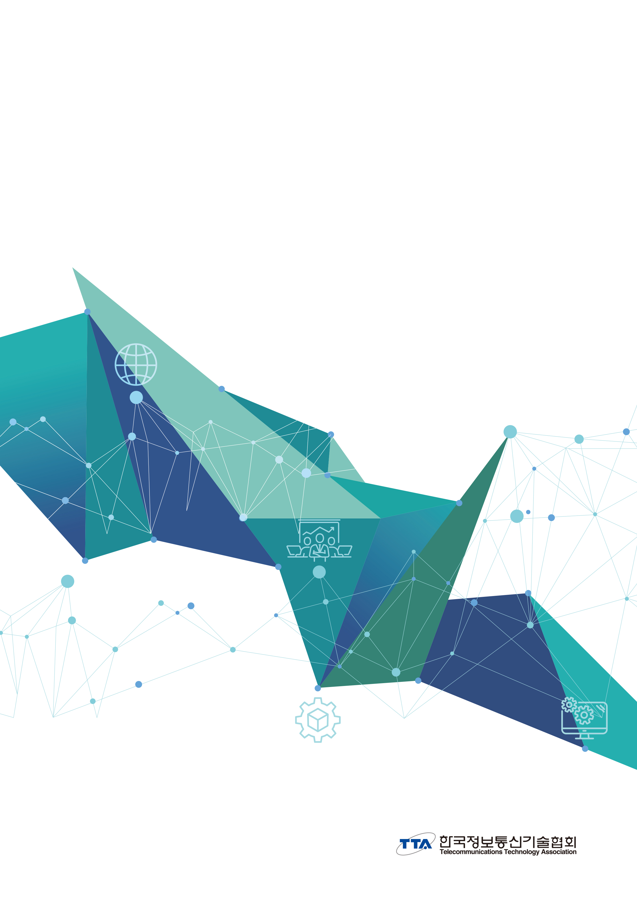


Table of Contents
추진 배경
장 고영향 인공지능사업자 책무 이행 목적
|
가이드라인 목적
1.1.
가이드라인 적용 방법
1.2.
주요 용어의 개념
1.3.
1.4. FAQ
장 고영향 인공지능사업자 책무 관련 조항
|
관련 법조항
2.1
관련 시행령
2.2
장 고영향 인공지능사업자 책무 조치사항
|
위험관리방안의 수립운영
3.1
·
기술적으로 가능한 범위에서의 인공지능이 도출한 최종결과
3.2
,
인공지능의 최종결과 도출에 활용된 주요 기준

,
인공지능의 개발활용에 사용된 학습용 데이터의 개요

·
등에 대한 설명 방안의 수립시행

·
이용자 보호 방안의 수립운영
3.3
·
고영향 인공지능에 대한 사람의 관리감독
3.4
·
안전성신뢰성 확보를 위한 조치의 내용을 확인할 수
3.5
·
있는 문서의 작성과 보관

부록
안전신뢰문서 양식
1.
작성용
[
]
자가점검 항목
2.
작성 예시
채용분야 작성 예시


추진배경
년
월
일
대한민국 국회는 인공지능 발전과 신뢰 기반 조성 등에 관한 기본법이하 인공지능 기본법을
2024
,
'
'(
'
')
제정하였다
이 법은
년
월부터 시행될 예정이며
인공지능
기술의 발전과 함께 국민의 안전과 기본권 보
.
2026
,
(AI)
호를 위한 법적 기반을 마련하고자 한다.
이 중 인공지능 기본법 제
조고영향 인공지능과 관련한 사업자의 책무는 고영향 인공지능을 제공하거나 이를 이
(
)
용한 제품서비스를 제공하는 사업자에게 다음과 같은 책무를 부과하고 있다
·
:
위험관리방안의 수립운영
1.
·
기술적으로 가능한 범위에서의 인공지능이 도출한 최종결과
인공지능의 최종결과 도출에 활용된 주요 기준
인공
2.
,
,
지능의 개발활용에 사용된 학습용 데이터의 개요 등에 대한 설명 방안의 수립시행
·
·
이용자 보호 방안의 수립운영
3.
·
고영향 인공지능에 대한 사람의 관리감독
4.
·
안전성신뢰성 확보를 위한 조치의 내용을 확인할 수 있는 문서의 작성과 보관
5.
·
그 밖에 고영향 인공지능의 안전성신뢰성 확보를 위하여 위원회에서 심의의결된 사항
6.
·
·
이러한 조치는 고영향 인공지능이 사람의 생명
신체의 안전 및 기본권에 중대한 영향을 미칠 수 있다는 점을 고려
,
하여
사업자가 자율적으로 위험을 관리하고
이용자를 보호하며
인공지능의 운영에 대한 책임을 명확히 하기 위한
,
,
,
것이다.
과학기술정보통신부는 인공지능 기본법의 시행을 위한 하위법령 정비단을 출범시켰으며
고영향 인공지능 사업자의
,
책무를 구체화하고 안내하기 위해 본 가이드라인을 마련하였고
그 구성은 아래와 같다
,
.
제장 인공지능사업자 책무 이행 목적
가이드라인의 목적
적용 방법주요 용어에 대한 설명
(
)
,
,
.
제장 인공지능사업자 책무 관련 조항
인공지능 발전과 신뢰 기반 조성 등에 관한 기본법
제
조 책무를 정의하
(
) ‘
’
는 법조문에 대한 설명.
제장 인공지능사업자 책무 조치사항
사업자 책무 조치사항을 주제별로 나누어 설명
(
)
.
본 가이드라인은 사업자들이 법적 의무를 명확히 이해하고 이행할 수 있도록 지원하며
인공지능 기술의 안전성과
,
신뢰성을 확보하는 데 기여할 것으로 기대된다
특히
본 가이드라인에 포함된 기준과 예시는 사업자들이 자사의 고
.
,
영향 인공지능에 대해 적절한 조치를 취하는 데 도움이 될 것이다
이를 통해
인공지능 기술의 발전과 함께 국민의
.
,
안전과 권리를 보호하는 균형 잡힌 정책이 실현될 것으로 전망된다.


장
고영향 인공지능사업자
책무 이행 목적
가이드라인 목적
1.1
최근 인공지능의 발전과 함께
의료
금융
교육
공공행정 등 다양한 분야에서 고영향 인공지능이 도입되고 있으며
,
,
,
,
,
이에 따라 인공지능의 신뢰성 확보와 윤리적 문제 해결이 필수적인 정책 과제로 떠오르고 있다
특히
인공지능 기
.
,
본법 제
조는 고영향 인공지능사업자에게 위험관리
설명가능성
이용자 보호
인간 감독
문서화 등의 책임을 부과
,
,
,
,
하고 있다
본 가이드라인은 인공지능 기본법 제
조 및 관련 시행령고시를 설명하여 고영향 인공지능의 안전성과
.
·
신뢰성을 확보하고
이를 통해 인공지능 기술이 사회 전반에 걸쳐 책임감 있고 지속 가능한 방식으로 활용될 수 있
,
도록 하기 위해 마련되었다.
본 가이드라인의 목적은 다음과 같이 정리될 수 있다.
첫째
고영향 인공지능사업자가 준수해야 할 안전성과 신뢰성 확보 기준을 제시함으로써
법제도의 실효성을 강화하
,
,
·
는 것이다
즉
가이드라인 자체는 법적 구속력은 없으나 법상 의무 이행을 지원하기 위한 목적으로 제작되었다
인
.
,
.
공지능 기본법 제
조에서 규정하는 사업자의 책무는 개념적 수준에서 제시되어 있어
실제 인공지능 제품서비스를
,
·
개발운영하는 기업 및 기관들이 이를 어떻게 적용해야 하는지에 대한 구체적인 지침이 필요한 상황이다
본 가이드
·
.
라인은 고영향 인공지능의 안전성신뢰성을 보장하기 위한 구체적인 기준과 절차를 제공함으로써
사업자들이 이를
·
,
효과적으로 이행할 수 있도록 돕고
정부의 규제 이행을 지원하는 도구로 활용될 수 있도록 한다
,
.
둘째
인공지능이 신뢰할 수 있고 안전한 방식으로 운영될 수 있도록 기술적 원칙을 소개하는 것이다
인공지능은
,
.
대량의 데이터를 분석하고 의사결정을 자동화하는 과정에서 투명성 부족
설명 불가능성 등의 문제를 초래할 가능성
,
이 있다
이러한 문제들은 사회적 불평등을 심화시키거나
인공지능에 대한 신뢰 저하로 이어질 수 있다
따라서 본
.
,
.
가이드라인은 인공지능의 안전성과 신뢰성을 확보하기 위한 원칙과 기술적제도적 구현 방안을 소개하여
인공지능이
·
,
신뢰받을 수 있도록 지원하는 것을 목적으로 한다.
결론적으로
본 가이드라인은 고영향 인공지능 사업자가 안전성과 신뢰성을 확보할 수 있도록 실효성있는 안내를 제
,
공함으로써
인공지능 기술이 윤리적이고 책임감 있는 방식으로 발전할 수 있도록 지원하는 것을 최우선적인 목표로
,
한다
이를 통해 국내 인공지능 산업이 글로벌 경쟁력을 갖추고 지속 가능한 방식으로 성장할 수 있도록 돕는 동시
.
에인공지능 기술이 사회적 신뢰를 확보하며 널리 확산될 수 있는 환경을 조성할 것이다
,
.


가이드라인 적용 방법
1.2
본 절에서는 국내외 주요 기준과의 연계성을 토대로 이해관계자별 적용 방식과 활용 방안을 제시한다
고영향 인공
.
지능의 사회적 파급력을 고려하여
다양한 이해관계자가 각자의 역할에 따라 이를 효과적으로 적용할 수 있도록 구
,
성하였으며
기술적정책적 지원 체계를 포함하여 실질적인 이행 가능성을 제고하고자 한다
,
·
.
이를 위해 우선 본 가이드라인의 제정 과정에서 국내외 주요 인공지능 관련 정책 및 표준 문서를 심층적으로 분석하
고그 핵심 원칙과 내용을 본 가이드라인에 반영하였다특히한국정보통신기술협회
의 신뢰할 수 있는 인공지능
,
.
,
(TTA)
개발 안내서
미국 국립표준기술연구소
의 인공지능 위험 관리 프레임워크
,
(NIST)
(AI Risk Management Framework,
유럽연합
의 인공지능 법
은 아래와 같은 이유로 주요 참조 문서로써 활용하였다
AI RMF),
(EU)
(AI Act)
.
국내 환경 및 기술적 특성 고려
신뢰할 수 있는 인공지능 개발 안내서
1.
: TTA
신뢰할 수 있는 인공지능 개발 안내서는 국내 환경과 기술적 특성을 고려하여 신뢰할 수 있는 인공지능 개발
TTA
및 활용을 위한 실무적인 지침을 제공한다
이는 국내 사업자들이 인공지능을 개발하고 운영하는 과정에서 직면하는
.
특수한 상황과 요구사항을 반영하는 데 매우 중요하다.
실무적이고 구체적인 지침:
안내서는 인공지능 개발의 전 단계에 걸쳐 고려해야 할 기술적 요구사항을 구체적으로
TTA
제시한다예를 들어데이터 수집 및 처리인공지능 모델 개발시스템 구현운영 및 모니터링 단계별로 신뢰성 확보를
.
,
,
,
,
위한 체크리스트나 권장 사항을 포함하고 있다이러한 실무적인 내용은 본 가이드라인이 추상적인 원칙 나열에 그치지
.
않고사업자들이 실제 업무에 적용할 수 있는 실질적인 방안을 제시하는 데 크게 기여한다
,
.
국내 기술 및 산업 환경 반영:
는 국내
표준화를 선도하는 기관으로서국내 인공지능 기술 수준산업 구조
TTA
ICT
,
,
,
그리고 규제 환경을 가장 잘 이해하고 있다
안내서를 참조함으로써 본 가이드라인은 국내 사업자들의 현실적인
. TTA
역량과 상황을 고려한 책임 기준을 제시할 수 있다이는 사업자들의 수용성을 높이고가이드라인의 실효성을 확보하는
.
,
데 필수적이다.
국내 인공지능 윤리 원칙과의 연계:
안내서는 대한민국 정부가 제시한 인공지능 윤리 기준을 기반으로 하고 있으며
TTA
'
'
,
이를 기술 개발 및 적용의 관점에서 구체화한 문서이다본 가이드라인이
안내서를 참조함으로써정부의 인공지능
.
TTA
,
정책 방향과 일관성을 유지하고
국내 사회가 지향하는 인공지능 윤리 가치를 사업자책무에 효과적으로 반영할 수
,
있습다이는 인공지능이 사회적 신뢰를 얻고 지속적으로 발전하는 데 필요한 국내적 합의를 형성하는 데 기여할 것이다
.
.
포괄성과 범용성
의 위험 관리 접근 방식
2.
: NIST AI RMF
는 인공지능 시스템의 전 수명주기에 걸쳐 발생하는 잠재적 위험을 식별
평가
완화 및 관리하기 위
NIST AI RMF
,
,
한 포괄적인 프레임워크를 제공한다
이 프레임워크는 특정 기술이나 산업에 국한되지 않고
모든 유형의 인공지능
.
,
시스템에 적용될 수 있는 범용성을 지니고 있다.
위험 기반 접근의 체계화:
는 인공지능의 위험을 분류하고
위험 수준에 따른 차등적인 관리 방안을
NIST AI RMF
,
제시함으로써사업자들이 인공지능 시스템의 특성과 잠재적 영향에 따라 합리적이고 효율적인 위험 관리를 수행할 수
,
있도록 돕는다이는 본 가이드라인이 사업자들에게 실질적인 지침을 제공하고불필요한 규제 부담을 최소화하면서도
.
,
책임 있는 인공지능 개발 및 활용을 유도하는 데 필수적인 요소이다.
다양한 이해관계자의 참여 유도:
는 인공지능 위험 관리가 기술 개발자사용자규제 기관 등 다양한
NIST AI RMF
,
,
이해관계자의 협력을 통해 이루어져야 함을 강조한다
이는 본 가이드라인이 제시하는 사업자책무가 단순히 기술적
.
측면에 머무르지 않고사회적 맥락에서의 인공지능 윤리와 신뢰성을 확보하는 데 기여할 수 있도록 한다투명성설명
,
.
,
가능성공정성 등 핵심적인 인공지능 윤리 원칙들이 위험 관리의 관점에서 구체적으로 적용될 수 있는 토대를 제공한다
,
.
자발적 채택 및 유연성:
는 강제적인 규제가 아닌 자발적인 채택을 장려하며조직의 특성과 상황에 맞게
NIST AI RMF
,

유연하게 적용될 수 있도록 설계되었다
이러한 접근 방식은 본 가이드라인이 사업자들에게 규제 준수만을
.
강요하기보다는자율적인 혁신을 저해하지 않으면서도 책임 의식을 내재화할 수 있도록 독려하는 데 적합하다
즉
,
.
,
변화하는 인공지능 기술 환경에 능동적으로 대응할 수 있는 유연한 프레임워크의 필요성을 반영한다.
위험 기반의 선제적 규제
의 규제 프레임워크
3.
: EU AI Act
는 세계 최초의 인공지능 관련 포괄적인 법안으로
인공지능 시스템을 위험 수준에 따라 분류하고 각 위험
EU AI Act
,

수준에 상응하는 규제 요건을 선제적으로 부과하는 방식의 프레임워크를 제시한다.
위험 기반 규제의 선도적 모델:
는 고위험 인공지능 시스템에 대한 시장 출시 전 적합성 평가품질 관리
EU AI Act
,
시스템 구축인간 감독투명성 및 기록 유지 의무 등의 요건을 부과함으로써인공지능 시스템에 대한 선제적인 규제
,
,
,
방안을 제시한다이는 본 가이드라인상 인공지능 시스템의 선제적 위험 관리 프레임워크를 수립하는데 중요한 통찰을
.
제공한다.
글로벌 표준화 동향 반영:
는 전 세계적으로 인공지능 규제 논의를 선도하고 있으며 많은 국가들이 이를
EU AI Act
참고하고 있다본 가이드라인도
를 참조하여국내 인공지능 사업자들이 미래에 직면할 수 있는 글로벌 규제
.
EU AI Act
,
환경에 선제적으로 대비하고국제적인 경쟁력을 확보하는데 기여할 수 있도록 하고 있다
,
.
종합적으로본 가이드라인은
신뢰할 수 있는 인공지능 개발 안내서의 국내 실무적 지침
의 포괄적인
,
TTA
, NIST AI RMF

위험 관리 접근 방식
의 선제적 규제 프레임워크를 상호 보완적으로 활용하여 제정되었다이러한
, EU AI Act
.
다각적인
참조를 통해 본 가이드라인은 글로벌 인공지능 거버넌스 동향을 반영함과 동시에 국내 환경의 특수성을 고려하여,
인공지능 기술의 건전한 발전과 국민의 안전 및 권리 보호라는 두 가지 중요한 목표를 동시에 달성하고자 한다.
관련 문서 매칭
본 가이드라인 제작에 참조한 주요 세 문서의 매칭 결과는 아래와 같다.
제호위험관리방안의 수립운영
.
·
참조문서
설명
韓

인공지능 시스템의 위험 관리 계획 및 수행
01:

인공지능 시스템 수명주기에 걸쳐 나타날 수 있는 위험요소를 분석하였는가
01-1:
?

위험 요소를 제거 및 방지하거나 영향을 완화하기 위한 방안을 마련하였는가
01-2:
?

인공지능 거버넌스 체계 구성
02:

인공지능 거버넌스에 대한 지침 및 규정을 수립하였는가
02-1:
?

인공지능 거버넌스를 위한 조직을 구성하고 인력 구성에 대해 검토하였는가
02-2:
?

서비스 제공 범위 및 상호작용 대상에 대한 설명 제공
15:

인공지능 서비스의 올바른 사용을 유도하기 위한 설명을 제공하는가
15-1:
?

제호
기술적으로 가능한 범위에서의 인공지능이 도출한 최종결과
인공지능의 최종결과 도출에 활용된 주요 기준
.
,
,
인공지능의 개발활용에 사용된 학습용 데이터의 개요 등에 대한 설명 방안의 수립시행
·
·
美
GOVERN 1.3: 조직의 위험 감내
수준 설정을 위해 위험관리 활동 수준을 결정하는 절차 정의

(tolerance)

인공지능 위험 관리 및 효과성을 위해 인공지능 시스템에 적용되는 법률정책규정 등의
GOVERN 2.2:
,
,
정보 제공
GOVERN 4.2: 설계개발배포평가 단계에서 인공지능의 위험 및 잠재적 영향을 문서화 및 의사소통 수행
·
·
·

인공지능 시스템 배포에 따른 위험관리를 위해 정기적인 위험 식별 및 추적 체계 구축
MEASURE 3.1:

인공지능 시스템의 목적 달성 여부 판단을 위해 개발 또는 배포 진행 여부를 결정
MANAGE 1.1:

위험 우선순위 기반의 대응 방안 개발 및 위험처리 옵션 정의
MANAGE 1.3:
MANAGE 4: 인공지능 위험 대응 및 개선을 위해 모니터링사고 대응 등 지속적 개선 활동 수립이행문서화
,
·
·

인공지능 시스템의 지속적인 개선을 위한 프로세스 정립 및 운영
MANAGE 4.2
EU
제조
제항지속적인 인공지능 위험관리 시스템 구축운영 및 문서화
: (
)
·
제항고위험 인공지능의 수명주기 동안 반복적 위험 관리 절차 및 정기 검토 절차 정의
(
)
제항제호인공지능 수명주기 동안 위험 식별분석 및 정기적인 검토갱신
(
a
)


제항제호인공지능 시스템의 잠재적 위험 추정평가
(
b
)

제항제호인공지능 시스템의 잠재적 위험 식별을 위해 모니터링 데이터 기반 위험 평가
(
c
)
제항제호식별한 위험에 대한 적절하고 구체적인 대응 방안 수립
(
d
)
제항위험 처리 이후 남아있는 위험에 대한 식별 및 관리 방안 수립 및 적용
(
)
제항제호고위험 인공지능 시스템 운영 중 위험 감소를 위해 적절한 정보 제공
(
c
)
제항고위험 인공지능이 의도된 목적대로 작동하는지 확인하기 위한 정기 테스트 설계
(
)
제
조
제항고위험 인공지능 시스템의 안전한 사용을 위해 이용자에게 사용 지침 제공
: (
)
참조문서
설명
韓

데이터의 활용을 위한 상세 정보 제공
05.

데이터의 명확한 이해와 활용을 지원하는 상세한 정보를 제공하는가
05-1.
?

데이터의 출처는 기록 및 관리되고 있는가
05-2.
?

인공지능 모델 명세 및 추론 결과에 대한 설명 제공
11:

인공지능 모델의 명세를 투명하게 제공하는가
11-1:
?
美

인공지능 수명주기 전반의 문서화 정책 수립
GOVERN 1.4:

지적재산권 및 기타 권리 침해 위험 관련 정책절차 정의 및 모니터링 수행
GOVERN 6.1:
·

인공지능 시스템의 목적기술 사양성능 기준을 명확히 정의하고 문서화
MAP 2.1:
,
,

인공지능 시스템의 실험 설계데이터 수집 및 선택개념 타당성 관련 요소 식별 및 문서화
MAP 2.3:
,
,

책임 있는 인공지능 시스템 사용을 위해 인공지능 모델 설명을 문서화하고출력 해석
MEASURE 2.9:
,
기준 정의

제호이용자 보호 방안의 수립운영
.
·
EU
제
조
제항인공지능 학습의 신뢰성 확보를 위해 품질 기준을 충족하는 학습데이터 활용
: (
)
제항제호시스템 목적에 부합하는 학습데이터 선택
(
a
)
제항제호데이터 수집목적출처를 포함해 학습데이터를 체계적으로 관리
(
b
)
·
·
제항제호데이터 품질 및 목적 적합성 확보를 위해 전처리 작업을 포함한 데이터 관리 수행
(
c
)
제
조
제항고위험 인공지능 시스템 배포자는 이용자가 시스템 출력을 해석하고 활용할 수 있도록
: (
)
설계 및 개발
제항제호의
인공지능 시스템의 적절한 활용을 위해 입력 및 학습용데이터 사양 제공
(
b
6)
제항제호의
(
b
7) 인공지능 출력 결과의 올바른 해석과 활용을 위해 이용자에게 필요한 정보 제공
제
조인공지능에 의해 생성된 콘텐츠 및 상호작용 대상을 명확히 고지
:
참조문서
설명
韓

인공지능 시스템의 신뢰성 테스트 계획 수립
03:

인공지능 시스템의 특성을 고려한 테스트 환경을 설계하였는가
03-1:
?

데이터 공격에 대한 방어 수단을 강구하였는가
06-2:
?

인공지능 모델 공격에 대한 방어 대책 수립
10:

모델 공격이 가능한 상황을 파악하였는가
10-1:
?

모델 공격에 대한 방어 수단을 강구하였는가
10-2:
?

인공지능 시스템의 안전 모드 구현 및 문제발생 알림 절차 수립
13:

인공지능 시스템의 안전 모드 구현 및 문제발생 알림 절차 수립
13-1:
13-2: 인공지능 시스템에서 문제가 발생할 경우시스템은 이를 운영자에게 전달하는 기능을 수행하는가
,
?
美

위험관리 프로세스가 효과적으로 작동하도록 모니터링 주기 및 조직의 역할 정의
GOVERN 1.5:

인공지능 테스트 및 사고 대응 강화를 위해 정보 공유를 포함한 조직적 수행 기준 정의
GOVERN 4.3:

인공지능 시스템의 사회적 책임을 위해 외부 피드백 수집검토반영하는 절차 마련
GOVERN 5:
·
·

제자로부터 얻은 데이터에 대한 위험 평가 및 관리 프로세스 수립
GOVERN 6.2:

이용자 피드백 반영을 위해 정기적 참여 체계 및 절차와 인력 마련
MAP 5.2:

이용자 의견을 반영한 인공지능 측정 지표의 적정성 및 통제 수단 효과성을 정기적
MEASURE 1.2:
평가갱신


개인의 권리 보호를 위해 프라이버시 관련 위험을 식별하고 문서화 수행
MEASURE 2.10:
MEASURE 3.3: 이해관계자의 의견 반영을 위해 피드백 프로세스 구축 및 인공지능 시스템 평가 지표에 통합

인공지능 시스템의 오작동 위험에 대응하기 위한 위험 식별 및 문서화 수행
MANAGE 2.3:
MANAGE 2.4: 목적 외 결과에 대한 대응을 위해 인공지능 시스템 대체해제 또는 비활성화 메커니즘 마련
,

인공지능 위험 대응 및 개선을 위해 모니터링사고 대응 등 지속적 개선 활동
MANAGE 4:
,
수립이행문서화
·
·

이용자 입력 및 피드백과 사고 대응폐기복구까지 포함한 시스템 모니터링 계획 구현
MANAGE 4.1:



지속적 성능 개선을 위해 이해관계자와의 협의를 포함한 개선 활동을 업데이트에 통합
MANAGE 4.2:

사고 대응 및 복구를 위해 이해관계자에 사고 정보 공유 및 대응 절차 이행
MANAGE 4.3:

제호고영향 인공지능에 대한 사람의 관리감독
.
·
EU
제조
제항실환경 적용 가능성 검증을 위한 실환경 기반 시험 절차 정의
: (
)
제
조학습데이터의 품질 확보를 위한 적정성공정성대표성 기반의 데이터셋 구축
:
,
,
제
조인공지능 시스템의 의도된 목적성능위험 등을 포함한 명확한 사용 지침 제공
:
,
,
제
조정확도 및 견고성을 위해 측정 방법 및 복원력 확보 방안 정의
:
제
조
제항
: (
) 운영 중 발생가능한 위험 대응을 위해 모니터링 수행 및 이상 발생 시 즉시 보고사용 중단
,
제항고위험 인공지능의 추적성 및 책임성 확보를 위해 목적에 맞는 시스템 로그를 최소
(
)
개월간 보관
제
조인공지능 시스템의 안전성 및 규제 준수를 위해 적합성 평가 절차 수행
:
제
조실사용 적합성 검증을 위한 테스트 수행
:
제
조지속적 요구사항 준수 확인을 위해 모니터링 체계 수립 및 운영
:
제항지속적 요구사항 준수 확인을 위해 모니터링 운영
(
)
제
조영향받는 자에게 인공지능 결정에 대한 이해를 위한 설명 제공
:
전문(recital) 10: 데이터 수집처리 시 개인정보보호를 위해 관련 법규 준수 및 데이터 주체의 권리 보장 정의

전문
인공지능 시스템은 안전성투명성다양성 등을 고려하여 설계
(recital) 27:
,
,
전문
영향받는 자의 권리 보장을 위해 인공지능의 결정에 대한 설명 제공
(recital) 171:
참조문서
설명
韓

인공지능 시스템의 안전 모드 구현 및 문제발생 알림 절차 수립
13:

공격성능 저하 및 사회적 이슈 등의 문제 발생 시 대응 가능한 안전 모드를 적용하는가
13-1:
,
?

인공지능 시스템에서 문제가 발생할 경우시스템은 이를 운영자에게 전달하는 기능을
13-2:
,
수행하는가?
美

안전한 인공지능 시스템 폐기를 위해 관련 절차를 수립이행
GOVERN 1.7:
·

인공지능 테스트 및 사고 대응 정보 공유
GOVERN 4.3:

거버넌스 정책에 따른 감독 프로세스 정의평가문서화 수행
MAP 3.5:
,
,

인공지능 시스템 배포 이후 식별된 위험에 대해 정기적으로 재평가
MEASURE 2.6:

이용자 피드백 전달 프로세스 구축 및 인공지능 시스템 평가 지표 마련
MEASURE 3.3:
MEASURE 4.1: 인공지능 위험 식별을 위해 상황별 측정 방법을 외부관계자와 협의 및 접근 방식 문서화 수행
MANAGE 2.4: 목적 외 결과에 대한 대응을 위해 인공지능 시스템 대체해제 또는 비활성화 메커니즘 마련
,
EU
제조책임 있는 인공지능 활용을 위해 이해관계자에게 인공지능 리터러시 교육 운영
:
제
조
제항시스템 이용 중 사람이 통제할 수 있는 방안을 고려하여 인공지능 시스템을 설계개발
: (
)

제항제호위험 수준에 맞는 통제 방안을 위해 배포자가 구현하기 적절한 통제 방안 적용
(
b
)
제항제호위험 통제를 위해 사용자가 인공지능 시스템의 기능 및 한계를 이해하고 점검할 수
(
a
)
있도록 구성
제항제호사람이 직접 제어할 수 있도록 중단 기능 등의 개입 절차를 포함하여 시스템 구성
(
e
)

제호안전성신뢰성 확보를 위한 조치의 내용을 확인할 수 있는 문서의 작성과 보관
.
·
이해관계자 별 적용 방식
기술적정책적 지원 체계 활용
·
본 가이드라인은 정부 및 산학연 기관이 함께 협력하는 인공지능 안전신뢰성 지원 체계를 구축하는데 아래와 같이
·
·
·
활용이 가능하다.
기업 및 공공기관 종사자들이 인공지능 안전성과 신뢰성을 이해하고책임 있는 인공지능 개발 및 운영 방안을 익힐 수
,
있도록 교육을 제공.
인공지능 알고리즘의 편향성 및 안전성을 평가할 수 있는 공공 테스트 환경 제공.
인공지능 신뢰성 거버넌스 협력 네트워크를 운영하여 국내외 주요 인공지능 관계자가 지속적으로 규정을 보완하고 최신
기술 트렌드를 반영.
이해관계자
적용 방식
인공지능 사업자
책임 있는 인공지능 구축 및 내부 거버넌스 체계 강화.
인공지능 개발사업자는 고영향
에 관한 사업자 책무를 준수하기 위한 조직을
AI
지정운영해야 함
·
.
특히 일정 규모 이상의 사업자는 독립성객관성을 갖춘 내부 조직의 평가 또는 외부
·
독립기관의 검인증을 통해 객관성을 확보해야 함
·
.
규제기관 및 정책 결정자
인공지능 정책 수립 강화.
인공지능 기업들이 가이드라인을 자율적으로 준수할 수 있도록혁신적인 인공지능
,
기술이 법적 부담 없이 실험될 수 있는 환경을 제공해야 함.
인공지능 법제도 개선을 위해 산업계
학계
시민사회와 협력하는 공공민간
·
,
,
-
인공지능 협의체 등을 통해 의견을 수렴하며지속적으로 규정을 업데이트해야 함
,
.
인공지능 이용자
인공지능의 신뢰성에 대한 이해 및 권리 보호 강화.
이용자들은 인공지능이 제공하는 정보에 대해 기술적으로 가능한 범위에서
설명가능성을 요구할 권리를 가지며인공지능의 결정이 불합리하다고 판단될 경우
,
이의를 제기할 수 있는 절차를 보장받아야 함.
공공기관은 인공지능을 활용할 때이용자들이 인공지능의 결정 방식과 데이터 활용
,
방식에 대해 알 수 있도록 투명성 보고서 및 인공지능 사용 공시 시스템을 운영하기
위해 노력해야 함.
참조문서
설명
韓

인공지능 시스템의 추적가능성 및 변경이력 확보
04:
美

내 모든
에
항목으로써 별도로 기술
Playbook
function
‘Transparency and Documentation’
EU
제
조규제 준수 입증을 위해 기술 문서 작성 및 최신화 수행
:
제
조안전한 인공지능 활용을 위해 성능 제한위험 등 주요 정보를 이해하기 쉽게 제공
:
,
제
조안전한 시스템 사용을 위해 목적성능위험 등 핵심 정보를 명확히 제공
:
,
,
부속서
인공지능 시스템의 목적구조개발 과정데이터 등 핵심 요소를 기술 문서로 정리
IV:
,
,
,

주요 용어의 개념
1.3
본 가이드라인의 일관된 이해와 적용을 위하여
사용되는 핵심 용어의 정의를 다음과 같이 제시한다
각 용어는 국
,
.
내외 인공지능 관련 기준 및 법령을 참조하여 선정 및 정의되었다.
용어
설명
인공지능
(artificial intelligence, AI)
학습
추론
지각
판단
언어의 이해 등 인간이 가진 지적 능력을 전자적 방법으
,
,
,
,
로 구현한 것 인공지능 기본법 제조제호
(
).
인공지능시스템
(AI system)
다양한 수준의 자율성과 적응성을 가지고 주어진 목표를 위하여 실제 및 가상환경
에 영향을 미치는 예측
추천
결정 등의 결과물을 추론하는 인공지능 기반 시스
,
,
템 인공지능 기본법 제조제호
(
).
고영향 인공지능은 고영향 분야의 인공지능시스템을 의미
‘
’
.
목표인공지능시스템의 목표는 명시적암묵적 목표를 모두 포함즉개발자가 직접
:
,
.
,
입력
지시한 명시적 목표는 물론
상황에 따른 규칙이나 학습데이터로 형성된
,
,
암묵적 목표를 말함.
자율성시스템이 사람의 직접적인 개입 없이도 독립적으로 데이터를 학습하고 외부
:
환경을 판단하며 운영될 수 있는 것을 말함.
적응성
초기 개발 후에도 지속적으로 발전할 수 있는 기계학습 기반 시스템의
:
특성으로배포 전후에 입력되는 데이터와 직접 상호작용하여 스스로 행동 방식을
,
수정할 수 있음을 의미
입력되는 데이터는 입력하는 자개발자
이용자
또는
.
(
,
)
입력방법을 불문함.
결과물
시스템의 산출물로서
과거와 현재의 데이터를 기반으로 미래상황 등을
:
,
추측하는 예측사용자의 선호도나 행동 패턴을 분석해 선택지를 제안하는 추천
,
,
가장 높은 자율성을 가지고 시스템이 독립적으로 판단하여 실행하는 결정 등이 이에
해당함.
인공지능기술
(AI technology)
인공지능을 구현하기 위하여 필요한 하드웨어소프트웨어 기술 또는 그 활용 기술
·
을 말함 인공지능 기본법 제조제호
(
).
고영향 인공지능
(high-impact AI)
사람의 생명
신체의 안전 및 기본권에 중대한 영향을 미치거나 위험을 초래할 우
,
려가 있는 인공지능시스템 인공지능 기본법 제조제호
(
).

에너지의 공급
먹는물의 생산 공정
보건의료 제공이용 체계 및
,
,
·
①
②
③
④
의료기기
원자력시설의 안전한 관리운영
범죄 수사체포 목적 생체인식정보
,
·
,
·
⑤
⑥
분석활용
채용 및 대출 심사
교통 수단시설체계의 주요한 작동운영
·
,
,
·
·
·
,
⑦
⑧
⑨
공공서비스 제공에 필요한 국가기관등의 의사결정
유아초중등교육에서의
,
·
·
⑩
학생평가
인공지능사업자
(AI business operator)
인공지능산업과 관련된 사업을 하는 자로서 다음 각 목의 어느 하나에 해당하는
법인
단체
개인 및 국가기관 등을 말함 인공지능 기본법 제조제호
,
,
(
).
인공지능개발사업자
인공지능을 개발하여 제공하는 자
(AI developer):
.
인공지능이용사업자
인공지능 개발사업자가
(AI-using business operator):
제공한 인공지능을 이용하여 인공지능 제품 또는 인공지능 서비스를 제공하는 자.

용어
설명
국내대리인
(domestic agent)
국내에 주소 또는 영업소가 없는 인공지능사업자로서 이용자 수
매출액 등이 대
,
통령령으로 정하는 기준에 해당하는 자로 안전관리의무 이행 결과의 제출인공지
(
능 기본법 제
조제항
고영향 인공지능 해당 확인 요청인공지능 기본법 제
),
(
조제항
고영향 인공지능 사업자 책무 이행인공지능 기본법 제
조제항
지원
),
(
)
등을 수행하는 자.
이용자
(user)
인공지능 제품 또는 인공지능 서비스를 제공받는 자 인공지능 기본법 제조제
(
호).
영향받는 자
(impacted person)
인공지능제품 또는 인공지능서비스에 의하여 자신의 생명
신체의 안전 및 기본권
,
에 중대한 영향을 받는 자 인공지능 기본법 제조제호
(
).
인공지능제품
(AI product)
인공지능시스템 또는 이를 요소로 포함하는 제품으로서
인공지능시스템에 접속하
,
여 필요로 하는 기능을 수행하는 것을 포함.
인공지능 또는 인공지능 기술을 물리적논리적기능적으로 운용가능한 제품으로
·
·
,
하드웨어 및 소프트웨어를 포함.
인공지능 또는 인공지능기술을 활용한 제품네트워크를 통해 인공지능에 직접
(
연결하여 인공지능을 사용활 수 있도록 하거나인공지능기술을 활용할 수 있는 전용
,
단말기자율주행자동차 등
,
)
인공지능서비스
(AI service)
인공지능
인공지능시스템 또는 인공지능제품을 활용할 수 있도록 제공하는 서비
,
스로 정보 분석
예측
추천
창작 등의 기능을 제공하는 것
,
,
,
.
인공지능제품을 활용한 서비스 또는
스마트폰 등 정보통신기기를 통해
PC,
인공지능기술을 이용할 수 있도록 제공되는 서비스.
인공지능 수명주기
(AI lifecycle)
인공지능의 개발
배포
운영 및 폐기에 이르기까지의 전 과정
,
,
.
위험
(risk)
인공지능 수명주기 전반에 걸쳐 사람의 생명ㆍ신체의 안전 또는 기본권이 침해될
가능성과 그 잠재적 피해의 심각성.
위험관리
(risk management)
위험을 식별
분석
평가하고 이를 허용 가능한 수준으로 처리하기 위한 체계적이
,
,
고 지속적인 관리 활동.

1.4 FAQ
Q
고영향 인공지능에 해당하는지 여부가 불분명할 때는 어떻게 확인해야 하나
'
'
?
A
사업자는 고영향 인공지능 판단 가이드라인한국지능정보사회진흥원을 통해 스스로 사전에 검토해야 하며
판

‘
’(
)
,
단이 어려운 경우 과학기술정보통신부 장관에게 확인을 요청할 수 있다.
Q
고영향 인공지능의 확인 요청은 의무사항인가

?
A
이는 의무가 아닌 사업자의 선택 사항이다
사업자가 스스로 고영향 인공지능이라고 판단하면 별도의 확인 절차

.
없이 책무를 이행하면 된다.
Q
인공지능 개발사업자와 인공지능 이용사업자는 어떻게 다른가
'
'
'
'
?
A
개발사업자는 인공지능을 개발하여 제공하는 자이며
이용사업자는 제공받은 인공지능을 이용하여 제품 또는
'
'
, '
'
서비스를 제공하는 자이다
하나의 기업이 두 가지 지위를 동시에 가질 수도 있다
.
.
Q
일정 규모 이상의 해외 사업자는 어떤 의무가 추가되나

?
A
국내에 주소나 영업소가 없는 해외 사업자 중 매출액이나 이용자 수가 일정 기준예
매출 조원 이상 등을 넘

(
:
)
는 경우
책무 이행 지원 등을 위한 국내대리인을 지정해야 한다
,
'
'
.
Q
개발사업자로부터 시스템을 구매해 단순히 운영만 하는데도 위험관리 계획을 세워야 하나

?
A
이용사업자도 운영 위험관리 계획을 수립해야 한다
다만
개발사업자가 이미 위험관리 조치를 완료한 시스템을

.
,
도입했고 중대한 기능 변경을 초래하지 않았다면개발사업자의 조치 내용을 자신의 계획으로 준용할 수 있다
,
.
Q
위험관리를 위한 별도의 전담 조직을 반드시 새로 만들어야 하나

?
A
사업자의 규모 및 역량을 고려하여 기존 조직이나 인력이 겸임할 수 있다
다만
개발 부서와 분리된 독립성을

.
,
확보하는 것이 권장된다
Q
설명 방안책무를 위해
의 모든 판단 근거를 설명해야 하나
'
'
AI
?
A
기술적으로 가능한 범위에서 이행하면 된다
실질적으로 이용자의 권리에 영향을 미치는 중대한 결과를 상세히

.
설명하고
영향이 적은 출력에 대해서는 시스템 수준의 일반적인 설명을 제공하는 등 차등을 둘 수 있다
,
.
Q
홈페이지에 책무 이행 내용을 게시할 때 영업비밀이 유출될까 우려된다

.
A
시행령에 따르면 부정경쟁방지 및 영업비밀보호에 관한 법률에 따른 영업비밀에 해당하는 사항은 홈페이지 게

「
」
시에서 제외할 수 있다따라서 기술적 사양보다는 관리 체계와 이용자 권리 보호 절차 위주로 공개하면 된다
.
.

Q
개인정보가 포함된 데이터를 학습에 써도 되나

?
A
적법한 동의를 받거나 가명처리 등 개인정보 보호법에 따른 조치를 취한 후 사용해야 하며
데이터의 보유 기

,
간과 파기 절차도 수립해야 한다.
Q
이용자가 인공지능의 결정에 대해 이의를 제기하면 어떤 절차를 거쳐야 하나

?
A
이용사업자는 이용자가 이의를 제기하거나 설명을 요구할 수 있는 절차를 수립해야 한다
이 때 사람 전문가가

.
해당 결정을 재검토하거나
분석 로그 등을 바탕으로 판단 근거를 안내하는 등의 대응 프로세스가 필요하다
, AI
.
Q
사람의 관리감독이란 사람이
시간 감시해야 한다는 뜻인가
'
·
'
?
A
위험 수준에 따라 상시 개입 또는 예외적 개입 등 적절한 수준을 정하면 된다

.
Q
사람의 관리감독을 위해 반드시 인공지능 안전 전문 인력을 새로 고용해야 하나

·
?
A
사업자의 규모와 역량을 고려하여 기존 조직 내에서 담당 인력을 지정하거나 겸임 인력을 두는 것도 가능하다

.
중요한 것은 이상 상태 발생 시 즉각 개입할 수 있는 권한과 기준이 명확히 정의되어 있는가이다.
Q
작성한 안전신뢰문서와 이행 근거 자료는 얼마나 오랫동안 보관해야 하나

'
'
?
A
인공지능사업자는 법 제
조제항 각 호의 조치를 이행하고 그 근거를 문서로 작성하여 년간 보관해야 한다

.
Q
문서는 어떤 양식으로 작성해야 하나

?
A
안전신뢰문서표준 양식을 참고하되
기업의 상황에 맞게 조정할 수 있다
기존 사내 문서 및 관리 시스템이
'
'
,
.
내용을 충족하면 이를 인용하는 것도 가능하다.

장
고영향 인공지능사업자 책무 관련 조항
관련 법조항
2.1
고영향 인공지능사업자고영향 인공지능 또는 이를 이용한 제품서비스를 제공하는 인공지능사업자는 인공지능 기본
(
·
)
법에 따라 다음과 같은 책무를 부담한다.
고지 의무
제
조인공지능 투명성 확보 의무
(
)
인공지능사업자는 고영향 인공지능이나 생성형 인공지능을 이용한 제품 또는
①
서비스를 제공하려는 경우 제품 또는 서비스가 해당 인공지능에 기반하여 운용된다는 사실을 이용자에게 사전에 고
지하여야 한다.
안전성신뢰성 확보 조치
·
제
조고영향 인공지능과 관련한 사업자의 책무
(
)
인공지능사업자는 고영향 인공지능 또는 이를 이용한 제품서

·
①
비스를 제공하는 경우 고영향 인공지능의 안전성신뢰성을 확보하기 위하여 다음 각 호의 내용을 포함하는 조치를
·
대통령령으로 정하는 바에 따라 이행하여야 한다.
위험관리방안의 수립운영
1.
·
기술적으로 가능한 범위 내에서의 인공지능이 도출한 최종결과
인공지능의 최종결과 도출에 활용된 주요 기
2.
,
준
인공지능의 개발활용에 사용된 학습용데이터의 개요 등에 대한 설명 방안의 수립시행
,
·
·
이용자 보호 방안의 수립운영
3.
·
고영향 인공지능에 대한 사람의 관리감독
4.
·
안전성신뢰성 확보를 위한 조치의 내용을 확인할 수 있는 문서의 작성과 보관
5.
·
그 밖에 고영향 인공지능의 안전성신뢰성 확보를 위하여 위원회에서 심의의결된 사항
6.
·
·
과학기술정보통신부장관은 제항 각 호에 따른 조치의 구체적인 사항을 정하여 고시하고
인공지능사업자에게 이
,
②
를 준수하도록 권고할 수 있다.
인공지능사업자가 다른 법령에 따라 제항 각 호에 준하는 조치를 대통령령으로 정하는 바에 따라 이행한 경우
③
에는 제항에 따른 조치를 이행한 것으로 본다
.


관련 시행령
2.2
인공지능 기본법 시행령은 인공지능사업자가 인공지능 기본법상 고영향 인공지능사업자의 책무를 이행하여 인공지능
이용사업자에게 인공지능시스템을 제공하는 경우 중복규제를 피하기 위하여 인공지능이용사업자에게 일부 책무를 면
제하고 있다.
다만
책무의 면제는 인공지능이용사업자가 인공지능시스템의 중대한 기능 변경을 초래하지 않은 경우에만 적용되
,
‘
’
도록 규정한다
여기서 중대한 기능 변경이란 인공지능개발사업자가 제공한 인공지능과 동일성이 인정되지 않을 수
.
‘
’
준으로 성능
안전성위험성
용도목적
이용 분야와 맥락신뢰성의 변화 등을 종합적으로 고려하여 이루어진다
,
(
),
(
),
,
.
범용 인공지능모델을 자신의 시스템에 통합하는 등 고영향 인공지능시스템을 만들어 제공하는 인공지능사업자는 기
존 인공지능의 이용 목적용도기능 등을 중대하게 변경한 경우에 해당하므로 고영향 인공지능개발사업자의 지위를
·
·
갖게 된다.
개발사업자와 이용사업자의 책무
제
조고영향 인공지능과 관련한 사업자의 책무
(
)
인공지능사업자는 법 제
조제항 각 호의 조치 중에서 다음

①
각 호에 해당하는 내용을 인공지능사업자의 사무소ㆍ사업장 또는 인터넷 홈페이지 등에 게시해야 한다
다만
부정
.
, 「
경쟁방지 및 영업비밀보호에 관한 법률
제조제호에 따른 영업비밀에 해당하는 사항은 제외할 수 있다
.
」
위험관리정책 및 조직체계 등 법 제
조제항제호에 따른 위험관리방안의 주요 내용
1.
법 제
조제항제호에 따른 설명 방안의 주요 내용
2.
법 제
조제항제호에 따른 이용자 보호 방안
3.
법 제
조제항제호에 따른 해당 고영향 인공지능을 관리ㆍ감독하는 사람의 성명 및 연락처
4.
인공지능사업자는 법 제
조제항 각 호의 조치를 이행하고 그 근거를 문서로
년간 보관전자적 방법을 통한
(
②
보관을 포함한다해야 한다
)
.
법 제
조제항제호부터 제호까지의 조치를 모두 또는 일부 이행한 인공지능사업자로부터 인공지능시스템을
③
제공받은 인공지능이용사업자가 해당 인공지능시스템의 본래 목적이나 용도를 현저하게 변경하는 등 중대한 기능 변
경을 하지 않은 경우에는 법 제
조제항제호부터 제호까지의 조치를 모두 또는 일부 이행한 것으로 본다
.
인공지능이용사업자는 인공지능개발사업자에게 법 제
조제항에 따른 책무를 이행하기 위하여 필요한 자료의
④
제공을 요청할 수 있고
인공지능개발사업자는 이에 협력하도록 노력해야 한다
,
.
법 제
조제항에 따라 인공지능사업자가 같은 조 제항에 따른 조치를 이행한 것으로 보는 경우는 별표
과
⑤
같다.

장
고영향 인공지능사업자
책무 조치사항
위험관리방안의 수립운영
3.1
·
관련 기술고시 조문
제조위험관리방안의 수립ㆍ운영
(
)
인공지능개발사업자 및 인공지능이용사업자이하 사업자라 한다는 고영향 인

(
“
”
)
①
공지능의 위험관리를 위하여 다음 각 호의 사항이 포함된 위험관리방안을 수립ㆍ운영하여야 한다.
위험관리정책 수립 및 이행
1.
위험관리 조직체계 수립 및 운영
2.
사업자는 제항의 위험관리방안을 인공지능 수명주기의 모든 과정에서 준수하여야 한다
.
②
사업자는 최신의 위험관리방안을 주기적으로 점검ㆍ갱신하고 그 변경내역을 관리하여야 한다.
③
타 법령의 유사 조치사항
법령
조항
내용
지능정보화 기본법
제
조안전성
(
보호조치)
지능정보화 기본법 제
조는 지능정보기술 및 지능정보서비스의 안
전성 확보를 위한 최소한의 보호조치를 명시하고 있다이는 고영향
.
인공지능이 야기할 수 있는 광범위한 위험을 관리하고 안전성을 확
보해야 한다는 인공지능 사업자 책무의 기본 전제와 동일하다
단
.
,
지능정보화 기본법은 안전성 보호조치를 권고할 수 있다고 명시하
여 강제성이 상대적으로 낮다.
소프트웨어 진흥법
제
조소프트웨어안
(
전 확보)
인공지능 역시 소프트웨어를 통해 구현되므로
소프트웨어의 기본적
,
인 안전 원칙이 인공지능의 안전성 확보에도 적용될 수 있다
단
.
,
소프트웨어 진흥법은 일반적인 소프트웨어의 안정성 및 보안 취약
점 등 기술적 결함으로 인한 위험에 중점을 두지만
인공지능 기본
,
법은 알고리즘의 비결정성
인과관계의 불분명성
자율적 학습 및
,
,
진화 등으로 인해 예측 불가능한 결과를 고려한다이러한 인공지능
.
고유의 비기술적
사회적
윤리적 위험에 대한 고려는 소프트웨어
,
,
진흥법에서는 찾아보기 어렵다.


주요 내용
본 절의 사업자 책무사항 주요 내용을 주제별로 분류하면 아래와 같다.
정보통신망
이용촉진 및
정보보호 등에
관한 법률
제
조정보통신망의
(
안정성 확보 등)
정보통신망의 안정성 및 정보의 신뢰성 확보를 위한 보호조치를 요
구하며이는 인공지능이 안정적으로 기능하고 신뢰할 수 있는 정보
,
를 제공해야 한다는 인공지능 사업자 책무의 기본적인 전제와 부합
한다
단
정보통신망법의 위험은 전자적 침해행위 방지
불법 유
.
,
,
출위조변조삭제 방지 등 주로 사이버 보안 및 정보 유출에 초점
·
·
·
을 맞춘 위험 관리이다.
제
조의
정보보호
3(
최고책임자의 지정 등)
인공지능 사업자 책무의 상설 위험관리기구조직
운영중 위험관
'
(
)
'
리 조직체계 구성 및 담당인력 지정과 직접적인 유사성을 가진다.
그러나 정보보호 최고책임자가 주로 정보보안 전문가의 역할을 수
행하는 것과 달리
인공지능 위험관리조직의 책임자 및 담당 인력은
,
기술적 전문성 외에 윤리
법률
사회과학적 지식 등 다양한 분야의
,
,
이해를 바탕으로 인공지능의 복합적인 위험을 평가하고 대응할 수
있는 역량이 요구된다.
개인정보 보호법
제
조안전조치의무
(
)
개인정보가 분실도난유출위조변조 또는 훼손되지 않도록 안전성
·
·
·
·
확보에 필요한 기술적관리적 및 물리적 조치를 요구하며
제
조
·
,
는 이를 총괄할 개인정보 보호책임자를 지정하도록 한다
이는 고영
.
향 인공지능 사업자 책무의 위험관리체계 구축과 상설 위험관리기
'
'
'
구 운영과 매우 흡사하다
단
개인정보 보호법의 위험은 개인정보
'
.
,
침해에 국한되므로
개인의 식별 가능 정보와 관련된 유출
오용
,
,
,
남용 등 프라이버시 침해 위험이 주된 대상이다.
제
조개인정보
(
보호책임자의 지정 등)
개인정보 보호책임자가 업무를 독립적으로 수행할 수 있도록 보장
해야 한다는 조항제
조 제항은 인공지능 위험관리기구의 독립
(
)
성 및 객관성 확보를 위한 중요한 시사점을 제공한다
단
개인정보
.
,
보호책임자의 책임은 주로 개인정보 보호에 한정된다.
책무사항
주제
소주제
위험관리방안의
1.
수립운영
·
위험관리정책 수립 및
1-1.
이행
위험관리 계획의 수립
1-1-1.
위험 식별
1-1-2.
위험 분석 및 평가
1-1-3.
위험 처리
1-1-4.
위험관리정책 개선
1-1-5.
위험관리 조직체계 수립
1-2.
및 운영
위험관리 조직체계 구성
1-2-1.
정보의 제공
1-2-2.
유관 조직과의 협력
1-2-3.

오픈소스 모델 고려사항
오픈소스 모델을 활용하는 사업자는 직접 모델을 개발하는 사업자와 아래와 같은 차이가 있다.
소주제 번호
직접 개발
오픈소스 모델
1-1-1
인공지능 수명주기 전 과정의 위험관리 로드맵
을 자체 수립할 수 있으므로
통제 중심의 계획
,
수립이 가능함.
불확실한 모델에 대한 검증 및 보완 중심의 계
획이 바람직함
필요시
다른 모델로 신속히 전
.
,
환할 수 있는 계획도 수립할 수 있음.
1-1-2
인공지능의 구조적 결함 등 모든 내부 요인을
직접 전수 조사할 수 있음.
공지된 취약점 확인이 우선
모델 카드나 커뮤
.
니티에 보고된 알려진 탈옥 패턴 등을 식별.
1-1-3
내부 파라미터 및 가중치 변화에 따른 위험도를
정밀 분석 가능.
블랙박스그레이박스 테스트 위주
내부 로직을
/
.
알기 어려우므로
입출력 위주의 평가
100%
,
에 집중할 필요가 있음
(Red Teaming)
.
1-1-4
인공지능 모델 재학습
이나 가중치
(Retraining)
수정을 통한 근본적 해결 가능.
필터링 시스템
프롬프트 엔지니어링
파인튜닝
,
,
등으로 보완.
1-1-5
자체 성과 지표를 바탕으로 정책 고도화.
오픈소스 커뮤니티의 보안 패치 및 신규 버전
업데이트 동향을 상시 모니터링하여 정책에 반
영하는 것이 바람직함.
1-2-1
독립적인 검증팀을 두어 개발자와 검증자를 분
리하는 것이 이상적임.
모델 내부를 수정하기보다 운영 및 관제에 특
'
'
화된 조직이 중요
외부 모델의 업데이트나 라
.
이선스 변경에 대응할 법무기술 검토 인력이
/
필요.
1-2-2
인공지능의 의사결정 로직을 직접 소유하고 있
으므로 위험관련 정보 전달 내용을 구체적으로
수립할 수 있음.
모델 원저작자가 공개한 모델 카드 및 기술 문
서에 의존하여 정보를 제공.
1-2-3
사내 부서 간 협력이 핵심.
법무팀은 오픈소스 라이선스 위반 여부를
정보
,
보안팀은 외부 모델 도입에 따른 보안 취약점을
중점적으로 검토하는 것이 바람직함.

1-1
위험관리정책 수립 및 이행
위험관리 계획의 수립
1-1-1.
개발사업자
이용사업자
목표
고영향 인공지능에 대한 위험관리 계획을 수립해야 함.
설명
개발 및 이용사업자는 고영향 인공지능의 설계개발운영 과정에서 발생 가능한 법적사회적 위험을
·
·
,
관리하기 위한 계획을 수립해야 함.
수립되는 위험관리 계획은 인공지능 전 수명주기에 걸쳐 발생할 수 있는 위험을 식별분석평가하고
-
,
,
,
그에 따른 적절한 처리 절차를 포함하는 방향으로 작성.
위험관리를 위해 고영향 인공지능 영향평가 절차인공지능 기본법 제
조제항를 효과적으로 활용할 수
-
(
)
있으며사업자에게 부과된 다양한 법적 책무 또한 수명주기별 위험관리 절차에 통합하여 이행함으로써
,
효율성을 높일 수 있음.
이용사업자는 운영 과정의 위험을 지속적으로 관리하기 위한 계획을 수립해야 함다만개발사업자가
-
.
,
위험을 직접 관리운영하는 경우이용사업자는 개발사업자와의 협력에 따라 개발사업자의 위험관리계획
·
,
중 이용사업자의 책임 범위와 관련된 사항을 자신의 위험관리계획의 일부 또는 전부로 준용할 수 있음.
참고

신뢰할 수 있는 인공지능 개발안내서
韓
요구사항
인공지능 시스템에 대한 위험관리 계획 및 수행
-
01.

NIST AI RMF
美
- GOVERN 1.3: 조직의 위험 감내
수준 설정을 위해 위험관리 활동 수준을 결정하는 절차 정의

(tolerance)
EU AI ACT
- 제조제항지속적인 인공지능 위험관리 시스템 구축운영 및 문서화
:
·
사업자 구분
자가점검
조직은 인공지능 위험관리 계획을 수립하고 책임을 명시하고 있는가?
수립된 위험관리 계획이 위험 식별분석평가처리 절차를 포함하는가
,
,
,
?
위험관리 시 영향 평가 절차를 고려하고 있는가?
위험관리가 지속적으로 이행되고 있는가?
개발 이용
개발

이용

개발

이용

이용
사례
Responsible Scaling Policies (RSPs)
M
의
는 인공지능 개발자가
ETR
'Responsible Scaling Policies (RSPs)'
현재의 보호 조치로 안전하게 관리할 수 있는 인공지능 능력 수준을 명확히
정의하고보호 조치가 개선되기 전까지는 인공지능의 배포나 능력 확장을
,
중단해야 하는 조건을 명시하는 정책으로
그림에서 오른쪽으로 갈수록
,
인공지능의 위험한 능력이 증가하고
위쪽으로 갈수록 보호 조치가
,
강화되는 구조를 가짐.
안전 영역
인공지능이 높은 위험을 초래할 수 있는
(safe region):
능력을 갖추고 있더라도 충분한 보호 조치가 적용된 상태를 의미.
위험 영역
위험한 능력을 가진 인공지능에 충분한 보호
(risky region):
조치가 마련되지 않은 상태를 의미.
는 인공지능 능력의 확장이 보호 조치의 수준과 조화를 이루는지를
RSP
지속적으로 검토하고
위험 관리와 관련된 기준을 설정함으로써 인공지능의 안전성을 확보하기 위한 실질적인
,
가이드라인을 제공함.


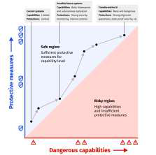

위험 식별
1-1-2.
개발사업자
이용사업자
목표
사람의 생명신체의 안전 및 기본권에 중대한 영향을 미칠 수 있는 위험을 식별해야 함
,
.
설명
개발사업자는 인공지능의 설계데이터 수집모델 학습테스트 등 개발 전 과정에서 발생 가능한 사람의
,
,
,
생명신체의 안전 및 기본권에 대한 잠재적 위험을 식별하기 위해 노력해야 함
,
.
이용사업자는 개발사업자로부터 제공받은 정보를 바탕으로실제 환경에서 인공지능이 이용될 때 발생할
,
수 있는 사람의 생명신체의 안전 및 기본권에 대한 위험을 식별하고관련 데이터사고 신고불만 사항
,
,
(
,
,
수리 내역 등를 통해 지속적으로 갱신하기 위해 노력해야 함
)
.
참고

신뢰할 수 있는 인공지능 개발안내서
韓
요구사항
인공지능 시스템에 대한 위험관리 계획 및 수행
-
01.
세부요구사항
인공지능 시스템 수명주기에 걸쳐 나타날 수 있는 위험 요소를 분석하였는가
-
01-1.
?

NIST AI RMF
美
-
인공지능 시스템 배포에 따른 위험관리를 위해 정기적인 위험 식별 및 추적 체계 구축
MEASURE 3.1:
EU AI ACT
- 제조제항제호인공지능 수명주기 동안 위험 식별분석 및 정기적인 검토갱신
a
:


사업자 구분
자가점검
인공지능 개발 과정에서 발생 가능한 위험을 식별하고 있는가?
인공지능 운영 과정에서 발생 가능한 위험을 식별하고 운영 데이터를 통해 관련 내용을
지속적으로 갱신하기 위해 노력하고 있는가?
개발
이용

사례
위험요소 예시
에서는 생성형 인공지능에 대해 아래와 같은 위험 요소를 명시함
OECD
.
인공지능 환각또는 설득력 있지만 부정확한 출력
"
"
허위 및 오해의 소지가 있는 콘텐츠
지적재산권 침해
직업 및 노동 시장 변화 예자동화에 따른 일자리 대체 및 노동시장 내 불균형 심화 가능성
(
:
)
에너지 소비와 환경 예생성형
모델 학습 및 추론 시 높은 에너지 소비로 인한 환경 부담 증가
(
:
AI
)
편견고정관념 증폭 및 개인 정보 보호 문제
,
잠재적인 미래 위험 및 우려 사항


위험 분석 및 평가
1-1-3.
개발사업자
이용사업자
목표
식별된 위험으로 인해 발생가능한 결과를 분석 및 평가해야 함.
설명
개발 및 이용사업자는 인공지능이 활용되는 영역의 특성 및 활용 방법인공지능의 유형생성형 또는
,
(
판별형등을 고려하여 위험의 심각도와 발생빈도를 분석 및 평가할 수 있는 적절한 기준을 마련해야 함
)
.
인공지능의 직접적인 혜택이나 피해를 받을 수 있는 이해관계자 집단을 식별하고그 집단 간 편익과
-
,
위험의 불균형 가능성을 분석해야 하며조직개인커뮤니티집단사회 전반에 대한 결과를 포괄적으로
,
,
,
,
,
고려할 수 있음.
개발사업자는 소프트웨어 및 하드웨어 결함 외에 인공지능 특성에서 나타날 수 있는 위험 요소환각설명
(
,
미제공데이터 중독 등를 분석 및 평가하기 위해 노력해야 함
,
)
.
이용사업자는 인공지능의 본래 활용 목적뿐만 아니라 장애오남용 등으로 인해 발생할 수 있는 위험을
,
분석 및 평가하기 위해 노력해야 함.
참고

신뢰할 수 있는 인공지능 개발안내서
韓
요구사항
인공지능 시스템에 대한 위험관리 계획 및 수행
-
01.
세부요구사항
인공지능 시스템 수명주기에 걸쳐 나타날 수 있는 위험 요소를 분석하였는가
-
01-1.
?

NIST AI RMF
美
- GOVERN 4.2: 설계개발배포평가 단계에서 인공지능의 위험 및 잠재적 영향을 문서화 및 의사소통 수행
·
·
·
EU AI ACT
- 제조제항제호인공지능 시스템의 잠재적 위험 추정평가
b
:

- 제조제항제호인공지능 시스템의 잠재적 위험 식별을 위해 모니터링 데이터 기반 위험 평가
c
:
사업자 구분
자가점검
식별된 위험의 심각도와 발생 빈도를 분석 및 평가하고 있는가?
식별된 위험과 관련된 이해관계자에 대해 정량적 또는 정성적 분석을 수행하기 위해
노력하고 있는가?
인공지능 특성에서 나타날 수 있는 위험 요소환각설명 미제공데이터 중독 등를 분석
(
,
,
)
및 평가하기 위해 노력하고 있는가?
장애 및 오남용 등으로 발생할 수 있는 위험을 분석 및 평가하기 위해 노력하고 있는가?
개발 이용
개발

이용

개발

이용
사례
범용인공지능
위험 매트릭스
(GPAI) 3D
년
한국정보통신기술협회
에서
출판한
범용
2024
(TTA)
‘
인공지능
위험 관리 프레임워크에서는 범용인공지능과
(GPAI)
’
관련한 직관적인 위험 평가도구로써
위험 매트릭스를
3D
제안함각 축의 점수는
점으로 부여되며 총 위험 점수는 이
.
1~3
세 가지 점수를 곱한 값으로 계산됨.
정렬 원칙 기반 점수
인공지능이
(principle-based score):
설정된 목표와 일치하게 작동하는지인간의 권리와 자율성을
,
존중하는지그리고 사회적 가치를 적절히 반영하는지를 평가
,
.
위험 발현 기간 기반 점수
위험이 단기
(time-based score):
,
중기장기적으로 발생하는지에 따라 평가
,
.
영향 범위 기반 점수
위험이 개인이나
(scope-based score):
소규모 그룹에만 영향을 주는 위험인지
특정 지역이나
,
집단까지 미치는 위험인지또는 전 세계에 광범위하게 미치는
,
위험인지를 기준으로 평가.


위험 처리
1-1-4.
개발사업자
이용사업자
목표
위험 분석 및 평가 결과에 따라 위험 요소별로 위험을 처리하는 적절한 조치를 채택해야 함.
설명
개발 및 이용사업자는 이전에 분석 및 평가된 위험 요소별로 인명 피해 및 사고를 방지하거나 부정적
영향을 최소화하기 위한 적절한 처리 방안을 마련하고 실행해야 함.
마련된 방안을 통해 위험이 실제로 처리되었는지를 모니터링하고잔여 위험이 존재하는 경우해당 잔여
-
,
,
위험이 허용할 수 있는 수준이 되도록 노력해야 함.
적절한 위험 처리를 위해 인공지능 기본법
제
조에 따라 구축 및 운영되는 인공지능 실증기반 이용
-
｢
｣
등을 고려할 수 있음.
개발사업자는 개발 중 발생한 위험을 처리하고
필요 시 처리 결과를 확인할 수 있도록 관련 정보를
,
이용사업자에게 제공해야 함.
이용사업자는 운영 중 발생할 수 있는 위험에 대해 별도의 처리 계획을 마련해야 함.
참고

신뢰할 수 있는 인공지능 개발안내서
韓
요구사항
인공지능 시스템에 대한 위험관리 계획 및 수행
-
01.
세부요구사항
위험 요소를 제거 및 방지하거나 영향을 완화하기 위한 방안을 마련하였는가
-
01-2
?

NIST AI RMF
美
-
위험 우선순위 기반의 대응 방안 개발 및 위험처리 옵션 정의
MANAGE 1.3:
EU AI ACT
제조제항제호식별한 위험에 대한 적절하고 구체적인 대응 방안 수립
-
d
:
제조제항위험 처리 이후 남아있는 위험에 대한 식별 및 관리 방안 수립 및 적용
-
:
사업자 구분
자가점검
위험별로 제거완화모니터링수용 등 처리 방안을 명확히 수립하고 실행하고 있는가
,
,
,
?
처리된 위험에 잔여 위험이 존재하는 경우 이는 허용할 수 있는 수준인가?
개발 중 처리한 위험에 대한 기록을 보유하여 필요 시 관계자에게 제공할 수 있는가?
운영 중 발생할 수 있는 위험에 대한 처리 계획예사용 제한알림 등이 존재하는가
(
:
,
)
?
개발 이용
개발

이용

개발

이용
사례
위험처리 방안 예시
제거
위험을 발생시키는 활동을 시작하거나 계속하지 않기로 결정하여 위험 혹은 위험의 원천을 제거
(elimination):
.
예특정 기능이나 시스템을 제거특정 장치 도입
(
:
,
.)
완화
위험의 발생 가능성 또는 결과를 변경하여 위험을 완화
예모델의 해석 가능성을 높이기 위해
(mitigation):
. (
:
새로운 알고리즘 도입.)
모니터링
모든 위험을 완전히 제거하거나 완화하기 어려운 경우
위험을 타 기관과 공유하거나
(monitoring):
,
지속적으로 지켜보면서 피드백을 제공하여 위험을 모니터링하며
재정적 손실에 대비하기 위해 보험이나 계약을
,
활용하는 방법도 포함
예계약 또는 보험 구매배포 이후에도 지속적으로 시스템 모니터링위험 요소 감지
. (
:
,
,
.)
수용
경미한 위험에 적용되며기회를 추구하기 위해 정보를 기반으로 위험을 방치하여 위험을 수용
(acceptance):
,
.
예위험이 있지만 신제품서비스 출시
(
:
·
.)


위험관리정책 개선
1-1-5.
개발사업자
이용사업자
목표
인공지능 수명주기 동안 위험관리정책을 조직 내외부 변화에 대응시키고 지속적으로 개선해야 함.
설명
개발 및 이용사업자는 위험 처리 방안이 적용된 이후에 파급효과를 재평가함으로써 위험 요소가 실제로
제거방지완화되었는지 확인하고이에 대한 피드백을 위험관리체계 개선에 사용해야 함
,
,
,
.
이는
의 모니터링 및 대응과 밀접하며대응 결과를 위험관리정책의 개선에 이용할 수 있음
-
3-2-1
,
.
참고

신뢰할 수 있는 인공지능 개발안내서
韓
요구사항
인공지능 시스템의 위험 관리 계획 및 수행
-
01.
세부요구사항
위험 요소를 제거 및 방지하거나 영향을 완화하기 위한 방안을 마련하였는가
-
01-2
?

NIST AI RMF
美
인공지능 시스템의 목적 달성 여부 판단을 위해 개발 또는 배포 진행 여부를 결정
- MANAGE 1.1:
- MANAGE 4: 인공지능 위험 대응 및 개선을 위해 모니터링사고 대응 등 지속적 개선 활동 수립이행문서화
,
·
·
인공지능 시스템의 지속적인 개선을 위한 프로세스 정립 및 운영
- MANAGE 4.2
EU AI ACT
제조제항고위험 인공지능의 수명주기 동안 반복적 위험 관리 절차 및 정기 검토 절차 정의
-
:
제조제항고위험 인공지능이 의도된 목적대로 작동하는지 확인하기 위한 정기 테스트 설계
-
:
사업자 구분
자가점검
위험 처리 방안 적용 후해당 방안의 파급효과를 재평가하고 있는가
,
?
위험 처리 방안에 대한 피드백을 위험관리정책 개선에 사용하고 있는가?
개발 이용
개발 이용
사례
카카오 그룹의 책임있는
를 위한 가이드라인
AI
카카오 그룹은 인공지능 기술 발전과 이에 따른 새로운 위험 요소에 대응하기 위해
윤리원칙을 계층화하여 정비하고

, AI
,
가이드라인과 체크리스트를 고도화하였음.
좌개정 전우개정 후
(
:
,
:
)


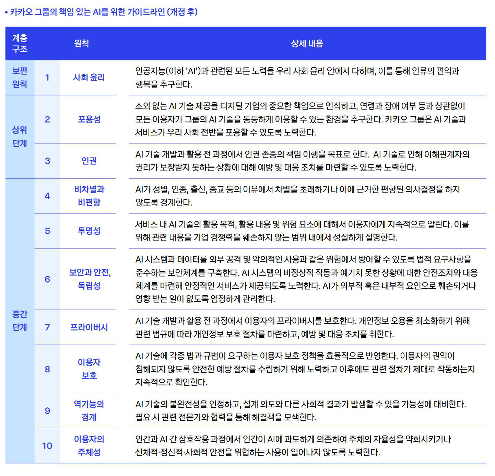


1-2
위험관리 조직체계 수립 및 운영
위험관리 조직체계 구성
1-2-1.
개발사업자
이용사업자
목표
위험을 관리하는 담당 조직을 구성하거나 조직 내 위험관리를 담당하는 인력을 지정해야 함.
사업자의 규모 및 역량을 고려하여 담당 조직을 구성할 수도 있고,
※
겸임 인력을 지정할 수 있음.
설명
개발 및 이용사업자는 인공지능 위험관리를 담당하는 조직을 구성하거나 인력을 지정하여 위험관리
업무를 수행하고 이에 대한 책임을 명시하기 위해 노력해야 함.
위험관리 조직 또는 인력은 기술법률윤리 등 다양한 분야의 전문가 또는 담당자로 구성하도록 노력해야
-
,
,
하며이들의 책임과 권한을 정의해야 함
,
.
이 조직 또는 인력은 인공지능 기획개발 업무와 분리되어야 하며이해상충 방지를 위한 조직적기능적
-
·
,
·
독립성이 최대한 확보되어야 함.
참고

신뢰할 수 있는 인공지능 개발안내서
韓
요구사항
인공지능 거버넌스 체계 구성
-
02.
세부요구사항
인공지능 거버넌스에 대한 지침 및 규정을 수립하였는가
-
02-1.
?
세부요구사항
인공지능 거버넌스를 위한 조직을 구성하고 인력 구성에 대해 검토하였는가
-
02-2.
?

NIST AI RMF
美
- GOVERN 1.3: 조직의 위험 감내
수준 설정을 위해 위험관리 활동 수준을 결정하는 절차 정의

(tolerance)
- GOVERN 4.2: 설계개발배포평가 단계에서 인공지능의 위험 및 잠재적 영향을 문서화 및 의사소통 수행
·
·
·
EU AI ACT
제조제항지속적인 인공지능 위험관리 시스템 구축운영 및 문서화
-
:
·
사업자 구분
자가점검
인공지능 위험관리를 위한 조직 또는 담당이 지정되어 있는가?
위험관리 조직 또는 인력은 기술
법률
윤리 등 다양한 분야의 전문가 또는 담당자로
,
,
구성되어 있는가?
위험관리 조직 또는 인력의 책임과 권한이 명확히 정의되어 있는가?
위험관리 조직 또는 인력이 독립성과 자율성을 보장받고 있는가?
개발 이용
개발

이용

개발

이용

개발 이용

사례
해외 주요기업 인공지능 위험관리 조직 운영

##### 1. OpenAI Preparedness Team

–
위치연구안전 부문 산하
:
·
조직 역할:
모델 배포 전 리스크안보악용 가능성 등검증
-
(
,
)
안전 실험 및 레드팀
운영
-
‘
(red-teaming)’
모델 개선 시 위험 평가 프로세스 통합
-
운영 방식
및 보드에 직접 보고
최고 의사결정 레벨과 긴밀히 연결
: CEO
→

##### 2. Google DeepMind AI Safety & Alignment Team

–
위치
연구 부문 내 독립적
조직
: DeepMind
Safety
조직 역할:
대규모 언어모델과 강화학습 모델의 안전성 테스트
-
윤리책임성 관련 부서
와 협력
-
·
(Ethics & Society)
운영 방식:
독립적 검증팀
연구팀과 분리하여 개발자검증자가 되지 않도록 구조화
-
"
=
"
→
정기적으로 외부 자문위원단
과 협업
-
(ethics board)

##### 3. Microsoft

Responsible AI Office
–
위치
직속
: Chief Responsible AI Officer
조직 역할:
사내 모든
프로젝트의 리스크 리뷰승인
-
AI
·
준수 여부 심사
- “Responsible AI Standard”
기술팀법무팀
팀 등과 교차 기능 조직 운영
-
,
, PR
운영 방식:
중 구조
- AETHER Committee, Office of Responsible AI, Responsible AI Strategy in Engineering
→
각 제품서비스팀이
기능을 배포하기 전
의 심사를 거쳐야 함
-
·
AI
RAIO
조직

##### 4. IBM

AI Ethics Board & GRC
–
위치
산하
부문과 연계
: CIO
GRC(Governance, Risk, Compliance)
조직 역할:
제품서비스 출시 전 윤리법적 위험 심사
- AI Ethics Board:
·
·
팀
와 같은 툴을 활용해 리스크 관리 자동화
- GRC
: watsonx.governance
운영 방식:
다학제적 구성 법무엔지니어정책
-
(
,
,
, HR)
모든
프로젝트는 반드시
를 거쳐야 승인 가능
-
AI
Ethics Board


정보의 제공
1-2-2.
개발사업자
이용사업자
목표
개발사업자는 이용사업자 및 이용자에게
이용사업자는 이용자에게 인공지능 위험과 관련된 충분한
,
정보를 제공하기 위해 노력해야 함.
설명
개발사업자는 고영향 인공지능을 개발하거나 이를 고도화하여 제공하는 책임 주체로서인공지능의 주요
,
기능과 작동 원리사용 데이터의 특성자동화된 결정 방식과 한계 등에 대한 정보를 이용사업자에게
,
,
충분히 제공하기 위해 노력해야 함.
인공지능 사용 시 발생할 수 있는 윤리적 문제 및 예기치 않은 오작동 가능성과 그에 대한 대응 절차에
-
대해서 가능한한 충분한 정보를 제공할 필요가 있으며사용자 매뉴얼
동영상 자료 등 다양한
,
, FAQ,
형식의 자료를 마련하여 제공하고이를 주기적으로 최신화하기 위해 노력해야 함
,
.
또한개선 이력이나 보안 업데이트 등의 중요 정보를 지속적으로 공유하여 이용자가 인공지능을 안전하게
-
,
사용할 수 있도록 지원해야 함.
이용사업자는 개발사업자로부터 제공받은 인공지능을 자사의 제품서비스에 활용하는 주체로서
해당
·
,
인공지능이 이용자에게 미치는 영향에 대한 정보를 이용자에게 제공하기 위해 노력해야 함.
우선 제품서비스 내 인공지능 활용 사실을 고지하고인공지능이 수행하는 역할자동화 여부인간의
-
·
,
,
,
개입 범위 및 결정이 이용자의 권리에 미치는 영향을 가능한 충분히 설명해야 함.
또한 이용자가 자신의 정보 처리 방식이의 제기 절차문제 발생 시 신고나 상담 방법에 대해 알 수
-
,
,
있도록 이용약관공지사항홈페이지사용 설명서 등을 통해 정보를 투명하게 제공할 수 있음
,
,
,
.
참고

신뢰할 수 있는 인공지능 개발안내서
韓
요구사항
서비스 제공 범위 및 상호작용 대상에 대한 설명 제공
-
15.
요구사항
인공지능 서비스의 올바른 사용을 유도하기 위한 설명을 제공하는가
-
15-1.
?

NIST AI RMF
美
-
인공지능 위험 관리 및 효과성을 위해 인공지능 시스템에 적용되는 법률정책규정 등의
GOVERN 2.2:
,
,
정보 제공
EU AI ACT
- 제조제항제호고위험 인공지능 시스템 운영 중 위험 감소를 위해 적절한 정보 제공
c
:
- 제
조제항고위험 인공지능 시스템의 안전한 사용을 위해 이용자에게 사용 지침 제공
:
사업자 구분
자가점검
인공지능 위험 정보를 충분히 제공하고 있는가?
정보 제공에 사용되는 자료의 형식 및 방법은 적절한가?
개발 이용
개발 이용
사례
인공지능 정보 제공 방법
인공지능에 대해 충분한 정보를 제공하기 위한 방법은 아래와 같이 다양한 형식으로 제공될 수 있음.
정보제공 대상
예시
이용자
튜토리얼 영상
경고 문구사용 가이드
,
,
이용사업자기업고객
(
)
워크숍
문서
활용 가이드북책임 사용 가이드
, API
,
,
개발사업자내부직원
(
)
문제 발생 대응 매뉴얼


유관 조직과의 협력
1-2-3.
개발사업자
이용사업자
목표
위험관리 담당 조직 또는 인력은 해당 위험 분야에 대한 전문성을 갖춘 조직 및 직원과 긴밀하게 협력해야 함.
설명
개발 및 이용사업자는 관련 전문성을 가진 유관 조직예
법무윤리보안
개인정보고객응대 부서
(
:
,
,
,
,
등와의 지속적 협력 체계를 구축하고 정기적으로 점검해야 함
)
.
개발사업자는 학습 데이터 구성알고리즘 선택모델 설계 시 유관 조직과 사전 협의를 위한 공통 검토
,
,
프로세스를 마련해야 함.
이용사업자는 인공지능 운영 과정에서 발생할 수 있는 위험 징후를 감지보고할 수 있는 체계 마련하고
·
,
문제 발생 시 유관 조직과의 즉각적인 협력 프로토콜을 마련하여 대응해야 함.
참고

신뢰할 수 있는 인공지능 개발안내서
韓
요구사항
인공지능 거버넌스 체계 구성
-
02.

NIST AI RMF
美
- GOVERN 4.2: 설계개발배포평가 단계에서 인공지능 위험 및 잠재적 영향을 문서화 및 의사소통 수행
·
·
·
사업자 구분
자가점검
위험관리 담당 조직 또는 인력은 법무감사개인정보 보호 등 전문성을 갖춘 유관 조직과
,
,
인공지능 위험관리 협업 체계를 구축하고 있는가?
개발 이용
사례
고객상담 자동화 인공지능 도입 프로젝트
기업은 고객상담을 자동화하기 위한 생성형 인공지능 챗봇을 개발하고 있음
이에 따라 인공지능으로 인한
A
.
법적윤리적보안 위험을 통합적으로 관리하기 위해
위험관리 전담조직
를 구성하고사내
·
·
‘AI
(AI Governance TF)’
,
유관 부서와 다음과 같은 방식으로 협력함.
법무팀과의 협력
1.
역할챗봇 응답이 법적 문제허위 정보명예훼손 등를 유발할 가능성 평가
:
(
,
)
.
협력 방식:
인공지능 응답에서 허위 광고의료법 위반지식재산권 침해 등 법적 리스크 사전 검토
-
,
,
.
고위험 콘텐츠에 대한 법적 검수 체크리스트 제공
-
.
윤리팀과의 협력
2.
역할인공지능의 편향차별부적절 응답 가능성 판단
:
,
,
.
협력 방식:
성별인종장애 관련 차별적 표현 필터링 기준 마련
-
,
,
.
챗봇 교육 데이터에 대한 윤리 기준 검토 및 승인 절차 구축
-
.
정보보안팀과의 협력
3.
역할인공지능 시스템 및 학습 인프라의 보안 위협 분석
:
.
협력 방식:
모델
접근 통제입력값 통한 공격
테스트 시행
-
API
,
(fuzzing)
.
인공지능 시스템 내 로그 저장 및 암호화 기준 수립
-
.
개인정보보호팀과의 협력
4.
역할사용자 입력 및 응답에 포함될 수 있는 개인정보 보호 검토
:
.


협력 방식:
챗봇 대화 중 개인정보이름연락처 등자동 마스킹 기능 도입
-
(
,
)
.
사용자 입력 데이터를 학습에 활용할 경우 별도 동의 절차 마련
-
.
고객응대팀
팀과의 협력
5.
(CS
)
역할사용자 불만 및 인공지능 오작동 사례 수집개선 피드백 제공
:
,
.
협력 방식:
실제 상담 중 인공지능 오답 사례 수집 및 위험관리 전담조직에 리포트
-
.
고객 응답 기준이 충족되지 않는 경우 수작업 전환 프로세스 정의
-
.
통합적 협업 결과
6,
각 부서의 전문성을 바탕으로 인공지능 운영 위험 체크리스트사전 리뷰 프로세스비상 대응 매뉴얼을 공동 개발함
,
,
.
전담조직은 정기적으로 각 부서와 리스크 워크숍을 열어 신기능 반영 전 위험을 조율함.

기술적으로 가능한 범위에서의 인공지능이 도출한 최종결과
3.2
,
인공지능의 최종결과 도출에 활용된 주요 기준인공지능의 개발
,
·
활용에 사용된 학습용 데이터의 개요 등에 대한 설명 방안의 수립시행
·
관련 기술고시 조문
제조설명방안의 수립ㆍ시행
(
)
사업자는 고영향 인공지능이 도출한 최종결과 및 기준에 대한 근거를 마련하기 위
①
해 인공지능의 투명성 및 설명가능성을 확보하여야 한다.
② 사업자는 학습용데이터에 관한 정보를 체계적으로 관리하기 위해 학습용데이터의 개요를 정의하고 관리하여야 한다.
사업자는 제항 및 제항과 관련하여 이용자에게 설명 제공이 필요한 사항을 자율적으로 정하여 설명방안을 수
③
립하고 시행하여야 한다.
인공지능이용사업자는 제항에 따른 설명방안의 내용 중 담당부서
설명절차 등 이용자에게 제공이 필요하다고
,
④
판단하는 설명방안의 주요 내용을 홈페이지에 게시하거나 서면전자문서를 포함한다
이하 같다을 교부하는 등의 방
(
.
)
법으로 제공하여 이용자가 쉽게 설명을 받을 수 있도록 하여야 한다.
타 법령의 유사 조치사항
법령
조항
내용
개인정보보호법
제조정보주체의 권리
(
)
인공지능 학습데이터에 개인정보가 포함될 수 있으므로 개인
정보보호법이 인공지능의 설명가능성 및 투명성 확보에 적용
될 수 있다
단
개인정보보호법은 개인정보 처리에 대한 정
.
,
보주체의 통제권 보장에 방향성을 두고 있지만
인공지능 기
,
본법은 인공지능의 최종 결과와 활용된 기준 및 학습데이터의
특성을 이용자에게 명확히 설명하는 데 중점을 두고 있다.
제
조의
자동화된 결정에
2(
대한 정보주체의 권리 등)
개인정보보호법 제
조의는 개인정보 처리 시 완전히 자동
화된 결정이 정보주체의 권리나 의무에 중대한 영향을 줄 경
우
정보주체가 이에 대한 거부와 설명을 요구할 수 있는 권
,
리를 명시한다
이는 인공지능 기본법에서 사업자가 인공지능
.
의 최종 결과 및 주요 기준 등에 대해 설명방안을 수립하고
이용자에게 제공하도록 하는 점과 유사하다
다만
개인정보
.
,
보호법은 정보주체가 자동화된 결정을 직접적으로 거부하거나
인적 개입을 요구하는 실질적인 권리 보장에 방향성을 두고
있지만
인공지능 기본법은 인공지능 사업자가 이용자에게 결
,
과와 기준
데이터 개요 등을 설명할 의무를 부과한다
,
.
신용정보의 이용
및 보호에 관한
법률신용정보법
(
)
제
조의
자동화평가 결과
2(
에 대한 설명 및 이의제기
등)
자동화 시스템이 도출한 결과 및 주요 기준
활용된 데이터에
,
대한 설명 가능성과 투명성을 보장하여 정보주체의 알 권리와
권리보호를 실현하고자 한다
다만 신용정보법은 개인신용평
.
가와 같은 신용정보 분야에 국한하지만 인공지능 기본법은 신
용정보를 포함한 다양한 고영향 인공지능을 대상으로 한다.

주요 내용
본 절의 사업자 책무사항 주요 내용을 주제별로 분류하면 아래와 같다.
오픈소스 모델 고려사항
오픈소스 모델을 활용하는 사업자는 직접 모델을 개발하는 사업자와 아래와 같은 차이가 있다.
책무사항
주제
소주제
기술적으로 가능한
2.
범위에서의 인공지능이 도출한
최종결과
인공지능의 최종결과
,
도출에 활용된 주요 기준,
인공지능의 개발활용에 사용된
·
학습용 데이터의 개요 등에
대한 설명 방안의 수립시행
·
인공지능이 도출한 최종결과
2-1.
및 기준에 대한 근거 마련
투명성 및 설명가능성 확보
2-1-1.
학습용데이터 정보의 관리
2-2.
학습용데이터 개요
2-2-1.
설명 방안의 수립 및 시행
2-3.
설명 방안의 주요 내용 수립
2-3-1.
설명 방안의 시행
2-3-2.
소주제 번호
직접 개발
오픈소스 모델
2-1-1
모델의 학습 구조
알고리즘 아키텍처
추론 방
,
,
식 전체를 상세히 설계하고 문서화할 수 있음.
오픈소스 모델은 원천 기술에 대한 완벽한 통제
가 어려우므로
활용한 기반 모델의 명칭과 버
,
전을 명확히 기록할 필요가 있음
오픈소스 모
.
델을 그대로 쓰지 않고 조정했다면
해당 수정
,
내역을 문서에 반영하여 최신 상태를 유지하는
것이 바람직함.
2-2-1
데이터 수집 범위
전처리 기준
품질 점검 결
,
,
과를 처음부터 끝까지 직접 정의하고 기록할 수
있음.
학습한 데이터의 상세 내역을 알 수 없는 경우,
공개된 데이터또는 제자 라이선스등 수집
'
'
'
'
경로를 유형별로 기록하는 것이 바람직함.
2-3-1
결과 도출에 영향을 미친 주요 특성
을
(feature)
알고 있으므로
이를 근거로 설명 방안을 만들
,
수 있음.
직접 통제하지 않은 모델의 특성상 발생할 수
있는 기술적 제약예
한국어 이해도 부족
최신
(
:
,
데이터 미반영을 더 구체적으로 이용자에게 안
)
내할 필요가 있음.
2-3-2
모델 업데이트 주기에 맞춰 설명 자료를 동기화
하기 용이함.
모델 원저작자가 모델을 업데이트할 경우
이에
,
따라 변화된 동작 방식이나 주의사항을 설명 자
료에 반영할 필요가 있음.

2-1
인공지능이 도출한 최종결과 및 기준에 대한 근거 마련
투명성 및 설명가능성 확보
2-1-1.
개발사업자
목표
인공지능의 투명성 및 설명가능성을 확보하고가능한 범위에서 설명가능성을 높이기 위한 다양한 기술적
,
조치를 마련해야 함.
설명
개발사업자는 인공지능의 주요 작동원리기능 및 한계를 문서화하여 투명성 확보에 기여해야 함
,
.
학습 구조알고리즘 구조인공지능 모델 등을 포함할 수 있음
-
,
,
.
시스템 아키텍처 또는 알고리즘이 조정된 경우 문서화된 자료를 수정할 수 있음
-
.
개발사업자는 기술적인력적으로 가능한 범위에서 이용자가 이해하기 쉽도록 내용을 기재해야 하고
·
,
시각화 도구 또는 요약보고서 등 보조 수단을 활용할 수 있음.
참고

신뢰할 수 있는 인공지능 개발안내서
韓
요구사항
인공지능 모델 명세 및 추론 결과에 대한 설명 제공
-
11.
세부요구사항
인공지능 모델의 명세를 투명하게 제공하는가
-
11-1.
?

NIST AI RMF
美
-
인공지능 수명주기 전반의 문서화 정책 수립
GOVERN 1.4:
-
인공지능 시스템의 목적기술 사양성능 기준을 명확히 정의하고 문서화
MAP 2.1:
,
,
-
책임 있는 인공지능 시스템 사용을 위해 인공지능 모델 설명을 문서화하고출력 해석
MEASURE 2.9:
,
기준 정의
EU AI ACT
- 제
조제항
: 고위험 인공지능 시스템 배포자는 이용자가 시스템 출력을 해석하고 활용할 수 있도록 설계

및 개발
사업자 구분
자가점검
인공지능의 주요 작동원리기능 및 한계를 문서화하여 인공지능의 투명성을 확보하는데
,
기여하고 있는가?
설명 가능성을 확보하기 위한 기술적 조치나 대안 조치를 적용하고 있는가?
개발

개발

2-2
학습용데이터 정보의 관리
학습용데이터 개요
2-2-1.
개발사업자
목표
인공지능에 사용되는 학습용데이터의 일반적 내용과 함께 형식수량크기수집 및 전처리 방식 등의
,
,
,
정보를 정의하여 관리해야 함.
학습용데이터 개요는 개발사업자가 내부적으로 관리하기 위한 정보이며
이용사업자 및 이용자에게
-
,
제공할 내용은 개발사업자가 결정할 수 있음.
설명
개발사업자는 인공지능 모델의 학습 및 운영 과정에서 학습용데이터로 사용되는 자료의 형식크기수량
,
,
등 기술적 사양의 내용을 정의해야 함.
운영 중 이용사업자의 요구사항에 따라 학습용데이터 사양 변경이 필요할 경우시스템 성능 및 오작동
-
,
가능성 등에 미치는 영향을 평가해야 함.
개발사업자는 인공지능 학습 목적에 적합한 수집 범위와 기준을 정의해야 함,
기술적으로 가능한 범위에서 수집 목적데이터 수집 방법구축 시점 등을 포함한 데이터 수집 프로세스를
-
,
,
마련하여 개요에 포함.
개발사업자는 학습용데이터 전처리 작업의 기준절차 및 품질 점검 결과를 문서화하기 위해 노력해야 함
,
.
데이터 라벨링증강정제 등 전처리 작업을 이해할 수 있도록 전처리 전과 후의 주요 특성과 전처리 목적
-
,
,
등을 문서화할 수 있음.
참고

신뢰할 수 있는 인공지능 개발안내서
韓
요구사항
데이터의 활용을 위한 상세 정보 제공
-
05.
세부요구사항
데이터의 명확한 이해와 활용을 지원하는 상세한 정보를 제공하는가
-
05-1.
?
세부요구사항
데이터의 출처는 기록 및 관리되고 있는가
-
05-2.
?

NIST AI RMF
美
-
지적재산권 및 기타 권리 침해 위험 관련 정책절차 정의 및 모니터링 수행
GOVERN 6.1:
·
-
인공지능 시스템의 실험 설계데이터 수집 및 선택개념 타당성 관련 요소 식별 및 문서화
MAP 2.3:
,
,
EU AI ACT
- 제
조제항인공지능 학습의 신뢰성 확보를 위해 품질 기준을 충족하는 학습데이터 활용
:
- 제
조제항제호시스템 목적에 부합하는 학습데이터 선택
a
:
- 제
조제항제호데이터 수집 목적절차출처를 포함해 학습데이터를 체계적으로 관리
b
:


- 제
조제항제호데이터 품질 및 목적 적합성 확보를 위해 전처리 작업을 포함한 데이터 관리 수행
c
:
- 제
조제항제호의
인공지능 시스템의 적절한 활용을 위해 입력 및 학습용데이터 사양 제공
b
6:
사업자 구분
자가점검
학습용데이터의 형식크기차원수량 등 기술적인 사양이 정의되어 있는가
,
,
,
?
학습용데이터 형식 또는 구조 변경 시해당 변경이 시스템에 미치는 영향을 평가하고
,
있는가?
인공지능 학습 목적에 적합한 수집 범위와 기준을 정의하였는가?
데이터 수집 프로세스를 마련하였는가?
전처리 기준절차도구 및 품질 점검 결과를 문서화 하였는가
,
,
?
전처리 전과 후의 주요 특성을 명확히 기술하고 있는가?
개발
개발

개발

개발

개발

개발

양식
학습용데이터 개요 내용예시
(
)
부록
안전신뢰문서 양식에 제공된 학습용데이터 관련 내용은 학습용데이터 정보를 사업자가 관리하기 위해서 고
려할 수 있는 사항들을 나열하였으며
각 항목의 의미는 다음과 같다
,
.
일반 내용
[
]
학습데이터 사용 제품서비스학습데이터가 활용될 제품서비스의 명칭을 기재
·
:
·
.
제품서비스 제공사학습데이터를 활용하는 제품서비스의 주체인 회사 또는 기관의 공식 명칭을 기재
·
:
·
.
연락처제품서비스와 관련하여 문의할 수 있는 담당 부서 또는 인력의 연락처전화번호이메일 주소 등를 기재
:
·
(
,
)
.
제품서비스 요약학습데이터를 활용하는 제품서비스가 어떤 목적으로 제공되는지 간락히 기재
·
:
·
.
학습 데이터 공통 내용
[
]
데이터 이름학습데이터의 이름을 기재하며내부 관리 및 제자 라이선스를 고려하여 자유롭게 작성 가능
예
:
,
. (
:
스마트 물류창고 이미지 데이터셋)
데이터 형식데이터 파일의 확장자를 기재
예
등
:
. (
: jpg, png, json, csv
)
가장 최근의 업데이트 시기학습데이터셋의 가장 최근 업데이트 날짜를 기재
:
.
데이터 수량학습데이터의 총 수량개수을 기재
예
파일
장
:
(
)
.  (
: png
150,000
)
데이터 크기학습데이터의 전체 용량을 기재
:
.
수집 목적학습데이터를 수집한 목적을 기재
예물류창고 재고 관리
를 위한 상품 이미지 및 메타데이터 확보
:
. (
:
AI
)
수집 방법데이터를 수집한 방법에 따라 해당하는 항목에 선택하며여러 유형을 포함하는 경우 복수 선택이 가능
:
,
.
데이터 전처리 방법수집된 원본 데이터를 모델 학습에 활용할 수 있도록 가공한 전처리 과정을 간략히 기재
예
:
. (
:
이미지 크기 정규화데이터 증강 등
,
)
데이터 요약데이터셋이 어떤 종류의 정보로 구성되어 있는지 요약하여 기재
예물류창고 상품의 종류수량위치
:
. (
:
,
,
등에 대한 이미지메타데이터 쌍
-
)
데이터 유형 모달리티
데이터의 유형텍스트이미지오디오비디오기타 등을 선택하며여러 유형을 포함하는
(
):
(
,
,
,
,
)
,
경우 복수 선택이 가능.
데이터 분포데이터 내 클래스분류 항목별 분포를 백분율이나 수량으로 기재
예양품
불량
표면 흠집
:
(
)
. (
:
70%,
30%(
이물질
파손
변형
등
15%,
10%,
5%,
5%)
)
학습 합성 데이터
[
]
합성데이터 요약학습데이터에 인공지능 등이 합성한 데이터가 포함된 경우에만 작성하며합성 데이터를 생성한
:
,
이유어떤 모델이나 상용 제품서비스를 이용하였는지 간략히 기재
예실제 불량 데이터 부족 문제를 해결하기 위해
,
·
. (
:
모델을 활용해 불량 이미지를 추가 생성함
AI
.)


2-3
설명 방안의 수립 및 시행
설명 방안의 주요 내용 수립
2-3-1.
이용사업자
목표

및
에서 수립된 내용을 근거로 이용자가 요구하는 사항을 설명하는 방안을 수립해야 함
2-1
2-2
.
설명
이용사업자는 이용자를 대상으로 주요 내용을 설명할 때 인공지능이 내린 결정의 근거인공지능의 특성
,
및 한계그리고 데이터의 활용 방식 등을 주요 설명 대상으로 제시해야 하며다음의 사항들을 고려할 수
,
,
있음.
인공지능 공급자 정보명칭공인대리인연락처 등
-
:
,
,
.
인공지능의 일반 정보제품서비스 목적기반 모델모델 명칭 등
-
:
·
,
,
.
인공지능 도출한 결과 및 주요 기준사업자의 투명성 및 설명가능성 확보 조치 예적용된
기법등
-
:
(
:
XAI
)
알려진 제한 사항 또는 불확실성
-
.
설명 수준실질적으로 권리에 영향을 미치는 결과에 대해서는 결정별로영향이 적은 출력에 대해서는
-
:
,
코호트 또는 시스템 수준으로 설명 등.
설명 근거구조화된 추론 코드추론 요소
목록재현가능한 추적 기록 등
-
:
,
(factor)
,
.
학습데이터 개요
의 내용 중 공개 가능한 사항
-
: 2-1-1
.
이용사업자는 이용자를 대상으로 설명 방안을 수립하기 위해 아래 육하원칙을 고려할 수 있음.
누가오남용하지 않고 공식적인 절차를 통해 설명을 요청한 이용자에게 이용사업자가
-
:
·
.
언제관련법 또는 이용사업자의 내규에 따라 예서면 통지를 받은
일 이내
-
:
(
:
).
어디서인공지능에서 이용자가 설명을 요청한 기능 또는 모듈
-
:
.
무엇을개발사업자가 수립한 인공지능의 도출결과이에 활용된 주요 기준학습용 데이터의 개요 중
-
:
,
,
공개가 가능한 사항.
어떻게전담부서 연락처 공개 등 이용자가 접근하기 용이한 방법으로 세부 내용은
참고
-
:
(
2-3-2
).
왜이용사업자로서의 책무사항 수행을 위해
-
:
.
참고

신뢰할 수 있는 인공지능 개발안내서
韓
요구사항
인공지능 모델 명세 및 추론 결과에 대한 설명 제공
-
11.

NIST AI RMF
美
-
책임 있는 인공지능 시스템 사용을 위해 인공지능 해석 기준 및 설명의 문서화 및
MEASURE 2.9:
접근성 확보
EU AI ACT
- 제
조제항제호의
인공지능 출력 결과의 올바른 해석과 활용을 위해 이용자에게 필요한 정보 제공
b
7:
- 제
조인공지능에 의해 생성된 콘텐츠 및 상호작용 대상을 명확히 고지
:
사업자 구분
자가점검
설명 방안의 주요 내용을 수립하기 위해 내부적인 검토를 수행하였는가?
설명 방안을 수립하기 전에 관련된 육하원칙을 고려하였는가?
이용
이용

사례
인공지능 제품서비스의 설명 매뉴얼 수립 및 대응예시
·
(
)
의료
제품서비스의 설명 매뉴얼

##### 1. ‘

AI
·
’
목적
①
인공지능에 대한 이용자의 이해와 신뢰 증진 및 의사 결정의 투명성 확보.
설명 요청에 대한 신속하고 일관된 대응을 위한 내부 운영 절차를 마련하고인공지능 기본법에 따른 고영향
,
AI
사업자의 책무 이행을 지원.
적용 범위
②
의료
제품서비스에 대한 주요 이용자 설명 요청 건
‘
AI
·
’
.
인공지능의 결과물에 대한 설명기술적 한계 문의학습 데이터 관련 질의 등 인공지능의 주요 내용에 대한 핵심
,
,
유형의 설명 요청을 포함.
담당 조직 및 역할
③
고객지원부 및 인공지능 제품서비스부 필요 시 경영지원팀법률윤리팀 등 타 부서에 자문 또는 업무 협조 가능
·
(
,
/
).
인공지능 제품서비스부
개발팀
데이터팀
기획팀으로 구성된 인공지능 제품서비스 전담 조직
-
·
: AI
, AI
, AI
·
.
고객지원팀
전담팀
-
: CS
.
책임자인공지능 제품서비스부장 또는 이에 준하는 담당자
:
·
.
실무 담당자인공지능 제품서비스부 및 고객지원팀 소속 직원요청 접수보고서 작성문의 대응 등
:
·
(
,
,
).
설명 요청 대응 절차
④
설명 보고서 작성 가이드라인
⑤
단계
담당
주요 활동
요청 접수 및
초기 분류
전담팀
CS
실무 담당자
고객센터 또는 전화 문의를 통한 인공지능 설명 요청 접수
해당 요청을
고영향
설명요청으로 분류하고
인공지능
‘
AI
’
,
제품서비스부 실무 담당자에게 전송
·
상세 자료
준비 및 협의
인공지능
제품서비스부 실무
·
담당자
이용자가 요청한 정보에 대한 응답을 포함하여 설명자료 초안 작성
이용자가 이해하기 쉬운 자유형식보고서메일 등으로 설명하기
(
,
)
위해 노력
설명자료 최종 검토
법률윤리팀 및
/
인공지능
제품서비스부 실무
·
담당자
작성한 설명자료는 인공지능 제품서비스부의 내부 검토를 거침
·
영업비밀보호를 위해 법률팀에게 협조를 요청할 수 있음
이용자에 전달
전담팀
CS
실무 담당자
최종 설명자료를 메일
전화 등을 통해 설명제공을 요청한
,
이용자에게 전달
사후 관리 및 개선
전담팀
CS
실무 담당자
이용자로부터 설명 내용의 이해도
만족도 등에 대한 피드백을
,
수집
항목
작성내용
예시
제품서비스
·
개요
제품서비스 목적
기반 모델
·
,
등제품서비스 일반 내용

·
흉부
이미지를 분석하여 폐렴 징후를 분류하고 의료진의
X-ray
진단 과정을 보조합니다.
기반 모델비전 기반의 딥러닝 모델 활용
:
결과 요약
가 도출한 최종 결과 및
AI
핵심 근거를 간결하게 요약

분석 결과
환자에게 섬유화 진행 패턴이 발견되어
폐렴
AI
,
,
가능성은
이상인 것으로 분석되었습니다
90%
.


주요 설명 요청에 대한 대응 시나리오 및 답변 예시
2.
의 결정 근거에 대한 설명 요청
AI
①
이용자의 요청 내용인공지능이 환자에게 특정 질병 가능성을 높게 제시했는데다른 검사 결과와 차이가 있습니다
:
,
.
가 내린 결정의 근거를 설명해 주세요
AI
.
사업자 대응 절차
요청 접수고객센터 또는 회사 대표 번호를 통해 문의 접수
-
:
.
데이터 추출해당 진단 건의
분석 데이터원본 이미지
분석 로그 등을 추출하고 보안 서버에 저장
-
:
AI
(
, AI
)
.
내부 검토
개발팀과 협의하여
가 해당 진단 결과를 도출한 주요 근거
등확인
-
: AI
AI
(Grad CAM, Attention Map
)
.
설명보고서 작성
의 판단 근거 및 기술적 한계를 명확히 담아 설명 보고서 작성
-
: AI
.
답변예시
진단 결과 신뢰성 설명 보고서
: <Med-AI
>
접수번호: EX-2025-MM-DD-001
안녕하세요
님문의하신
의 진단 결과 신뢰성에 대해 상세히 답변드립니다
,
.
Med-AI
.
○○○
진단 근거
는 첨부된 흉부
이미지 내의 비정형적 음영 패턴을 주요 근거로 해당 결과를 도출했습니다
: Med-AI
X-ray
.
이는
가 학습한 폐암 확진 환자 데이터에서 공통적으로 발견되는 패턴과 높은 유사성을 보였습니다
Med-AI
.
기술적 역할 및 한계
는 의료진의 진단을 보조하는 도구이며최종 진단을 대체하지 않습니다
는 학습에
: Med-AI
,
. AI
포함되지 않은 희귀 질병 또는 비정형적 증상에 대해 정확도가 낮아질 수 있는 기술적 한계를 가집니다다른 검사
.
결과와 차이가 있는 경우
의 분석 결과를 참고하되 환자의 개별적인 임상 정보와 종합하여 최종 판단을 내려주시는
, AI
것이 중요합니다.
② 학습용데이터의 투명성 및 편향성
이용자의 요청 내용귀사의
제품서비스의 학습용데이터에 대한 정보가 필요합니다특정 인구 집단에 편향된
:
AI
·
.
데이터로 학습되었을 가능성은 없나요?
사업자 대응 절차
요청 접수홈페이지 내 결과 설명 요청또는 회사 대표 번호를 통해 문의 접수
-
:
‘
’
데이터 정보 추출
모델 학습에 사용된 데이터셋의 출처구성인종성별연령대 등
수량 전처리 과정 등에 대한
-
: AI
,
(
,
,
),
정보를 추출
보고서 작성데이터의 다양성 확보 노력과 함께 잠재적인 편향성 위험을 투명하게 고지하는 보고서 작성
-
:
판단 근거
가 최종 결과 도출에 활용한
AI

주요 기준패턴특징을 충분히
,
,

명시
흉부
이미지 내에서 특정 영역의 비정상적인 음영 패턴이
X-ray
주요 근거로 활용되었으며이는 학습된 폐렴 관련 패턴과
,
90%
이상의 연관성을 보입니다.
학습용
데이터
개요
모델 개발에 사용된 학습용
AI
데이터의 출처
종류
수량
,
,
등을 설명

는 비식별화된 다수의 흉부
이미지 및 관련 진료
Med-AI
X-ray
기록 수십만건을 학습하여 개발되었으며
보다 자세한 내용은
,
홈페이지의 학습용데이터 정보를 참고해 주십시오.
기술적
한계
의 오류 가능성한계잠재적
AI
,
,

위험 등을 고지
본 진단 결과는 의료진의 판단을 보조하기 위한 참고 정보입니다.
최종적인 의학적 결정은 전문 의료진이 환자의 전체 임상 정보를
종합적으로 검토하여 내려야 합니다
학습용데이터에 충분히
.
포함되지 않은 희귀 질병 또는 비정형적 증상에 대해서는 진단
정확도가 낮을 수 있습니다.

답변예시
학습용데이터 개요 보고서
: <Med-AI
>
접수번호: EX-2025-MM-DD-002
안녕하세요
님
의 학습 데이터 구성에 대해 문의해 주셔서 감사합니다
,
. Med-AI
.
□□□
학습용데이터 구성
는 익명화된 국내외 흉부
이미지 및 환자 진료 기록 수십만건을 기반으로
: Med-AI
X-ray
학습되었습니다
저희는 데이터의 다양성 확보를 위해 국내 여러 의료기관 및 연구소와의 협업을 통해 데이터를
.
수집하고 있습니다.
잠재적 편향성저희는 데이터 편향성을 최소화하기 위해 노력하고 있으나특정 인구 집단 또는 특정 질병에 대한
:
,
데이터가 상대적으로 다양하지 않을 수 있습니다이에 따라
진단 결과는 이러한 점을 참고하여 해석될 수 있도록
.
AI
조언합니다
저희는 이러한 편향성을 지속적으로 모니터링하고 있으며주기적인 모델 업데이트 및 학습용데이터
.
,
수집을 통해 개선하고 있습니다.

사례
의
설명 사례
Notion Labs
AI

는 사용자가 생산성을 높이기 위해 인공지능을 직접 활용하는 도구임
Notion AI
.

는 사용자가 콘텐츠를 생성하거나 수정할 때
가 생성한 결과물에 대해 명확한 설명과 책임 한계를 고지
Notion AI
, AI
작동 방식 설명도움말 센터를 통해
는 사용자가 입력한 텍스트페이지에 있는 기존 콘텐츠연결된 웹
-
:
‘Notion AI
,
,
검색 결과 등을 바탕으로 작동한다고 명시하여
가 무엇을 기반으로 결과를 도출하는지 설명
’
AI
- 기술적 한계 고지
는 최근
개월 내 발생한 사건에 대해 학습되어 있지 않을 수 있으므로부정확하거나
: ‘Notion AI
6~12
,

오래된 내용을 담고 있을 수 있다고 명확히 경고하여
의 한계를 투명하게 밝히고사용자가
결과물을 그대로
’
AI
,
AI
신뢰하지 않도록 유도
사용자가 필요한 시점에 즉각적으로 설명을 제공하는 인라인
방식을 채택하고 있으며
사용자가 별도의
(In-line)
,
페이지나 매뉴얼을 찾아볼 필요 없이
기능 사용 직후에 관련 정보를 바로 얻을 수 있도록 설계됨
, AI
결과 생성 직후
가 텍스트를 생성하거나 요약한 후해당 내용 아래에
가 생성한 콘텐츠임을 명시
-
: AI
,
‘AI
’
- 사용자 질의 시사용자가
결과물에 대해 추가 질문을 하면시스템 내에서 바로 대화를 이어나가며 답변을 보완하여
:
AI
,

가 제공한 결과에 대한 궁금증을 즉시 해결
AI
사용자가
의 전반적인 작동 원리를 심층적으로 이해할 수 있도록 공식 문서와 블로그를 통해 다양한 정보를 제공
AI
보안 및 개인정보 보호
보안 및 개인정보 보호 관행페이지를 통해 고객 데이터가
모델 학습에
-
: ‘Notion AI
’
AI
사용되지 않는다는 점을 명확히 설명하여 이용자의 불안감을 해소하고 신뢰를 확보
공개 블로그노션 블로그에
모델 개발 배경기술적 의사결정 과정 등을 담은 글을 게시하여단순히 기능적
-
:
AI
,
,
설명뿐만 아니라 기술 철학을 공유하며 투명성을 강화

의
페이지 운영 사례
Notion AI
FAQ
▲


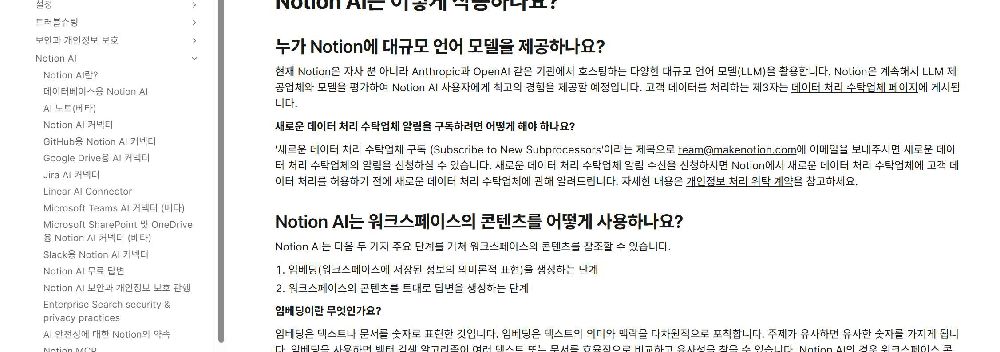


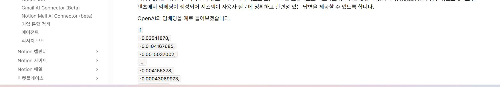

설명 방안의 시행
2-3-2.
이용사업자
목표
수립된 설명 방안을 근거로 이용자에게 이를 전달해야 함.
설명
이용사업자는 이용자를 대상으로 설명 방안을 시행하기 위해 아래 절차를 고려할 수 있음.
- 이용자 요청사항 파악이용자가 설명을 필요로 하는 부분을 파악하고 기존
등에 있는지 파악
:
FAQ
.
- 설명자료 작성 및 검토이용자 눈높이에 맞춰 콘텐츠를 작성하기 위해 용어를 통일하고 이미지와 도식을
:
활용하며작성 후 관련 부서에게 검토를 요청
,
.
- 설명 방안 선정이메일
게시판홈페이지 공지 등
:
, Q&A
,
.
- 전달선정된 설명 방안을 통해 이용자에게 전달
:
.
- 개선이용자 피드백 및 제품서비스 갱신에 따라 설명 내부 자료를 최신 상태로 유지
:
·
.
참고

신뢰할 수 있는 인공지능 개발안내서
韓
요구사항
인공지능 모델 명세 및 추론 결과에 대한 설명 제공
-
11.

NIST AI RMF
美
-
책임 있는 인공지능 시스템 사용을 위해 인공지능 해석 기준 및 설명의 문서화 및
MEASURE 2.9:
접근성 확보
EU AI ACT
- 제
조제항제호의
인공지능 출력 결과의 올바른 해석과 활용을 위해 이용자에게 필요한 정보 제공
b
7:
- 제
조인공지능에 의해 생성된 콘텐츠 및 상호작용 대상을 명확히 고지
:
사업자 구분
자가점검
설명 방안을 시행하기 위한 절차가 마련되어 있고 이를 따라서 시행하였는가?
최신 정보는 지속적으로 갱신 및 제공되고 있는가?
이용
이용
사례
이용자에게 설명 방안 시행 절차 및 예시
수립된 설명 방안이 실제 제품서비스에 성공적으로 적용되고이용자에게 효과적으로 전달되기 위해 아래의 절차와
·
,
내용으로 시행할 수 있음.
절차
주요 활동
사례
적용
UI/UX
설명 방안에 맞춰 제품서비스
·
인터페이스에

설명 요소를 직접 구현
챗봇의 초기 화면에 저는
챗봇입니다부정확한
AI
"
AI
.
정보를 제공할 수 있습니다라는 문구를 표시
."
콘텐츠 제작
가이드 문서블로그 글 등 상세 설명
FAQ,
,
콘텐츠를 제작하고 배포
추천 시스템어떻게 작동하나요
와 같은 제목의
"AI
,
?"
블로그 게시글을 통해 원리를 쉽게 설명
내부 교육 시행
개발마케팅고객 지원 등 관련 팀에 설명
,
,
방안의 중요성을 교육하고
질의응답 대응
,
매뉴얼 공유
고객 지원팀 교육
고객이
가 왜 이런 결과를
: "
'AI
냈나요라고 물을 때어떤 근거를 바탕으로 답변해야
?'
,
하는가
에 대한 매뉴얼을 제공
?"
피드백 수집 및
분석
이용자로부터
설명에
대한
피드백을
정기적으로 수집하고 분석하여 개선점 모색
설명 팝업 하단에
이 설명이 도움이 되었나요
"
?
예아니오
버튼을 추가하여 유용성 평가 및 개선
(
/
)"
정기적
업데이트
모델의 업데이트나 새로운 기능이 추가될
AI
때마다 설명 내용과 방식 최신화
모델의 학습 데이터가 갱신되면
이 챗봇은
AI
, "
년
월까지의 데이터를 기반으로 합니다와
2024
."
같은 문구 업데이트


이용자 보호방안의 수립운영
3.3
·
관련 기술고시 조문
제조이용자 보호방안의 수립ㆍ운영
(
)
사업자는 고영향 인공지능 개발 과정에서 이용자 보호 방안을 수립하는 경
①
우 다음 각 호의 사항을 포함하여야 한다.
안전하고 적법한 데이터 수집 및 관리
1.
적대적 공격 등에 대응하기 위한 안전한 설계 및 개발
2.
위험에 대한 지속적인 시험 및 평가 수행
3.
② 사업자는 고영향 인공지능 운영 과정에서 이용자 보호 방안을 수립하는 경우 다음 각 호의 사항을 포함하여야 한다.
위험을 지속적으로 탐지하기 위한 모니터링 및 대응방안 수립
1.
이용자 의견 수렴 및 지속적인 개선 체계의 마련
2.
이용자의 권리를 보장하고 피해 발생 시 이를 보상할 수 있는 방안 수립
3.
타 법령의 유사 조치사항
주요 내용
본 절의 사업자 책무사항 주요 내용을 주제별로 분류하면 아래와 같다.
그리고 인공지능 이용자를 영향을 직접 받는 지위에 있는 이용자이하
영역와
직접 영향을 받지 않는 이용자이
(
‘A
’)
,
(
하
영역로 구분하여 아래와 같이 접근한다
‘B
’)
.
법령
조항
내용
클라우드컴퓨팅 발전
및 이용자 보호에
관한 법률
클라우드컴퓨팅법
(
)
제
조이용자 보호 등을 위
(
한 정보 공개)
제
조이용자 정보의 보호
(
)
클라우드컴퓨팅법은 이용자 보호의 범위를 이용자의 정보
에 중점을 두는 반면
인공지능 기본법은 이용자의 생명
,
·
신체재산 등 더 넓은 범위에 중점을 둔다
·
.
책무사항
주제
소주제
이용자
3.
보호방안의
수립운영
·
인공지능 개발 단계
3-1.
데이터 수집 및 관리
3-1-1.
안전한 설계 및 개발
3-1-2.
시험 및 평가
3-1-3.
인공지능 운영 제품서비스
3-2.
(
·
제공
단계
)
모니터링 및 대응
3-2-1.
피드백 수렴 및 적용
3-2-2.
이용자 권리 보호
3-2-3.
이용자 구분
설명
인공지능 이용에 따라
직접 영향을 받는
이용자
영역
(A
)
법상 실제 의미에 해당하는 영역
이용사업자가 제공하는 인공지능이 이용자에게 직접
.
영향을 끼치는 대부분의 경우에 해당함.

오픈소스 모델 고려사항
오픈소스 모델을 활용하는 사업자는 직접 모델을 개발하는 사업자와 아래와 같은 차이가 있다.
인공지능 이용에 따라
직접 영향을 받지 않는
이용자
영역
(B
)
법상 의미를 벗어나지만 실제 안전하고 신뢰할만한 인공지능을 위해 고려해야 하는
영역
예를 들어 핵물질과 원자력시설의 안전한 관리 및 운영
등에 인공지능이 사용
.
‘
’
될 경우
인공지능 관련 위험 발생 시 이용자보다는 일반 국민이 영향을 받을 가능성
,
이 높음
이 경우
이용자 보호방안은 영향받는 자를 고려하여 설계되어야 함
.
,
‘
’
.
소주제 번호
직접 개발
오픈소스 모델
3-1-1
수집 단계부터 데이터의 투명성
품질
적법성을
,
,
통제할 수 있음.
모델 원저작자가 배포한 데이터 명세서가 있는
지 파악하고
파인튜닝 시에는 적법한 고품질
,
데이터를 사용하여 오픈소스 커뮤니티 등에서
알려진 위험으로부터 이용자를 보호하는 것이
바람직함.
3-1-2
이용자 보호를 위해 아키텍처 설계 단계부터 레
드팀
을 투입하여 보안 취약점
(Red-teaming)
을 사전에 차단할 수 있음.
모델의 가중치 파일에 악성 코드가 포함되어 있
거나 특정 입력값에 오작동하도록 설계된 백도
어 공격에 취약할 수 있으므로
신뢰할 수 있는
,
저장소에서 다운로드하고 파일 해시값 검증 및
보안 스캔을 수행하는 것이 필요.
3-1-3
인공지능 수명주기에 걸쳐 자체적인 테스트 환
경에서 검증 수행이 가능.
모델 원저작자가 발표한 벤치마크 점수는 일반
적인 상황에서의 성능이므로
사업자의 제품서
,
·
비스 환경에서는 성능이 급격히 저하될 수 있
음
자체적인 시험평가 결과를 확보하는 것이
.
필요.
3-2-1
인공지능 내부 로그와 연동하여 세밀한 모니터
링 체계를 구축할 수 있음.
입출력을 검증하는 가드레일 시스템을 별도로
구축하여 모니터링을 수행할 수 있음.
3-2-2
피드백 반영을 위해 인공지능 업데이트 시
모
,
델 아키텍처나 하이퍼파라미터를 직접 수정하여
근본적인 개선이 가능.
수렴된 피드백을 분석하여 업데이트 조치로 연
계하되
모델 자체의 결함인 경우 프롬프트 엔
,
지니어링이나 추가 튜닝을 통해 보완 구조를 마
련하는 것이 바람직함.
3-2-3
시스템 전체에 대한 통제권을 바탕으로 이용자
의 설명 요구 등에 상세히 대응이 가능.
이용자에게 해당 제품서비스가 특정 오픈소스
·
모델에 기반하여 운용된다는 사실을 사전에 고
지하는 것이 바람직함.

3-1
인공지능 개발 단계
데이터 수집 및 관리
3-1-1.
개발사업자
이용사업자
목표
데이터 수집 시 이용자 보호를 위해 적법한 절차대로 데이터를 수집 및 관리하고이 과정에서 데이터 유출
,
및 오용 방지를 위한 기술을 적용해야 함.
설명
개발 및 이용사업자는 데이터 수집 및 관리 과정에서데이터의 수집 목적처리 방식 등을 문서화하고
,
,
체계적으로 관리하여데이터 활용의 적법성과 신뢰성을 확보하기 위해 노력해야 함
,
.
이용사업자는 개발사업자가 제공한 데이터 수집 기준 및 관련 사항을 면밀히 검토하고필요 시 이를
,
반영한 자체적인 데이터 관리 체계를 수립하고 이행하기 위해 노력해야 함.
관련 보안인증의 도입을 고려할 수 있으며
정보보호 및 개인정보보호 관리체계 인증
-
, ISMS-P (
), CSAP
클라우드 서비스 보안인증등이 있음
(
)
.
참고

NIST AI RMF
美
-
제자로부터 얻은 데이터에 대한 위험 평가 및 관리 프로세스 수립
GOVERN 6.2:
-
개인의 권리 보호를 위해 프라이버시 관련 위험을 식별하고 문서화 수행
MEASURE 2.10:
EU AI ACT
- 제
조학습데이터의 품질 확보를 위한 적정성공정성대표성 기반의 데이터셋 구축
:
,
,
- 제
조제항
고위험 인공지능의 추적성 및 책임성 확보를 위해 목적에 맞는 시스템 로그를 최소
:
개월간 보관
- 전문(recital) 10: 데이터 수집처리 시 개인정보보호를 위해 관련 법규 준수 및 데이터 주체의 권리 보장 정의

사업자 구분
자가점검
데이터의 보유 기간 설정파기 절차 및 방법 등 데이터 관리 계획을 수립하고 준수하고
,
있는가?
개인정보 데이터 수집 시정보 주체에게 명확히 고지하고 적법한 동의 절차를 거쳤는가
,
?
데이터 유출
오용
손실 방지를 위해 암호화
접근 권한 관리 등 적절한
,
,
,
기술적관리적물리적 보안 방안을 적용하고 있는가
·
·
?
개발 이용

개발

이용

이용

사례
스피커 프라이버시 정책
NAVER AI


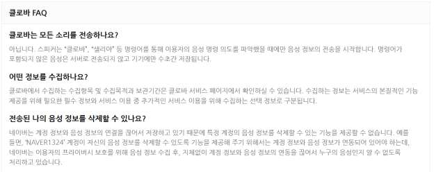

안전한 설계 및 개발
3-1-2.
개발사업자
목표
이용자 보호를 위해 인공지능을 안전하게 설계 및 개발해야 함.
설명
개발사업자는 인공지능의 안전성 확보를 위해 노력해야 함.
안전성인공지능이 판단예측한 결과로 시스템이 동작하거나 기능이 수행됐을 때 사람과 환경에 위험을
-
:
·
줄 가능성이 완화 또는 제거된 상태 출처신뢰할 수 있는 인공지능 개발안내서
(
:
)
시스템 오류 혹은 오작동 발생 시 안전하게 정지하거나 최소한의 기능만 유지할 수 있도록 기술적 조치를
-
마련할 수 있음.
위험 대응력을 향상시키기 위해 오류탐지
비상정지기능 등을 포함할 수 있으며관련 내용은
-
‘
’, ‘
’
,
4-1-2
사람의 개입 방법참고
‘
’
.
개발사업자는 인공지능의 견고성 확보를 위해 노력해야 함.
견고성
인공지능이 외부의 간섭이나 극한적인 운영 환경 등에서도 사용자가 의도한 수준의 성능 및
-
:
기능을 유지하는 상태 출처신뢰할 수 있는 인공지능 개발안내서
(
:
)
- 의도치 않은 입력으로 인한 오작동을 방지하기 위해 입력값 유효성 검증 등의 기술적 조치를 마련할 수 있음.
악의적인 공격비정상 데이터 입력 등의 예측 불가능한 상황에 대응할 수 있도록 적대적 공격에 대한 방어
-
,
능력을 강화하기 위해 노력해야 함.
참고

신뢰할 수 있는 인공지능 개발안내서
韓
세부요구사항
데이터 공격에 대한 방어 수단을 강구하였는가
-
06-2.
?
요구사항
인공지능 모델 공격에 대한 방어 대책 수립
-
10.
세부요구사항
모델 공격이 가능한 상황을 파악하였는가
-
10-1.
?
세부요구사항
모델 공격에 대한 방어 수단을 강구하였는가
-
10-2.
?

NIST AI RMF
美
- MANAGE 2.4: 목적 외 결과에 대한 대응을 위해 인공지능 시스템 대체해제 또는 비활성화 메커니즘 마련
,
EU AI ACT
제
조인공지능 시스템의 의도된 목적성능위험 등을 포함한 명확한 사용 지침 제공
-
:
,
,
제
조정확도 및 견고성을 위해 측정 방법 및 복원력 확보 방안 정의
-
:
전문
인공지능 시스템은 안전성투명성다양성 등을 고려하여 설계
-
(recital) 27:
,
,
사업자 구분
자가점검
개발 단계에서 오류탐지 및 비상정지 등 사람의 개입이 가능하도록 기술적 조치를
마련하였는가?
인공지능 모델 자체의 취약점학습 데이터 오염시스템 접근 등과 관련된 잠재적 보안
,
,
위협 요소를 점검하고 대응책을 마련하였는가?
개발

개발

사례
인공지능 모델 공격 방어를 위한 모델 최적화 방안
방어 대책
설명 및 기법 예시
데이터 유형
Defensive
Distillation
복잡한 신경망의 지식을 간단한 신경망으로 전이시키는 방법
원본 모델의 확률
.
분포를 얻어 증류
모델을 훈련하면
증류 모델은 원본 모델의 특성을
(distillation)
,
보전하게 됨
작업 수행 시 증류 모델을 활용하면 적대적 공격에 대응 가능
.
.
이미지
오디오
Gradient
Regularization
대부분의 적대적 공격은 모델 추론 과정에서의 경사
를 보고 공격이 이
(gradient)
루어지므로 모델의 경사가 출력으로 노출되는 것을 방지하는 것에 중점을 둠.
모델의 경사를 일관된 형태로 유지예
- Gradient Regularization:
(
: Bit Plane
Feature Consistency (BPFC) regularizer, Second-Order Adversarial
Regularizer (SOAR))
출력에 노이즈를 추가하거나
학습 중에 특정 부분을 제
- Gradient masking:
,
거함으로써 모델의 경사를 외부로부터 감춤예
(
: S2SNet)
이미지
오디오
텍스트
Gradient
Masking
Stochastic
Network
학습 모델의 불확실성을 다루기 위한 확률적인 요소를 도입하는 네트워크
이를
.
통해 모델의 결정을 불확실하게 만들어 적대적 사례에 대한 저항성을 향상 예
(
:
defensive dropout, Random Self-Ensemble (RSE)).


시험 및 평가
3-1-3.
개발사업자
이용사업자
목표
이용자 보호를 위해 위험 기반의 지속적인 시험 및 평가를 수행해야 함.
설명
개발 및 이용사업자는 인공지능의 기술적 특성배치 환경을 고려하여 알려져 있거나 합리적으로 예측
,
가능한 위험에 대해 시험 및 평가해야 함.
테스트케이스에 실제 환경에서 발생할 수 있는 다양하고 예외적인 상황을 포함시킬 수 있음
-
.
객관성 확보를 위한 외부 전문가 또는 기관의 검증 절차 도입을 고려할 수 있음
-
.
개발 및 이용사업자는 시험 결과를 평가하여 이용자 보호와 관련된 잠재적 위험을 관리해야 함.
이는
의 위험 평가와 밀접하며평가 결과를 위험 개선과 이용자 보호에 이용할 수 있음
-
1-1-3
,
.
영역에서 개발 및 이용사업자는 실제 영향을 받는 이용자를 대상으로 참여형 평가를 수행해야 함
- A
.
영역에서 개발 및 이용사업자는 최종적으로 영향받는 자의 권익 보호를 목적으로 평가를 수행하기 위해
- B
노력해야 함.
참고

신뢰할 수 있는 인공지능 개발안내서
韓
요구사항
인공지능 시스템의 신뢰성 테스트 계획 수립
-
03.
세부요구사항
인공지능 시스템의 특성을 고려한 테스트 환경을 설계하였는가
-
03-1.
?

NIST AI RMF
美
-
인공지능 테스트 및 사고 대응 강화를 위해 정보 공유를 포함한 조직적 수행 기준 정의
GOVERN 4.3:
-
이용자 의견을 반영한 인공지능 측정 지표의 적정성 및 통제 수단 효과성을 정기적
MEASURE 1.2:
평가갱신

- MANAGE 2.3: 인공지능 시스템의 오작동 위험에 대응하기 위한 위험 식별 및 문서화 수행

EU AI ACT
- 제조제항실환경 적용 가능성 검증을 위한 실환경 기반 시험 절차 정의
:
- 제
조인공지능 시스템의 안전성 및 규제 준수를 위해 적합성 평가 절차 수행
:
- 제
조실사용 적합성 검증을 위한 테스트 수행
:
사업자 구분
자가점검
테스트 케이스가 인공지능의 기술적 특성과 배치환경을 고려하고
필요 시 다양하고
,
예외적인 상황을 포함하고 있는가?
검증의 객관성 확보를 위해 내부 검증체계 운영 또는 외부 전문기관 및 인력 활용을
고려하고 있는가?
시험평가 결과가 위험성 평가로 이어지고 이를 이해관계자에게 공유하고 있는가?
개발 이용

개발

이용

개발 이용
사례
인공지능 시스템 시험 지침
는 인공지능 시스템의 시험에 대한 지침과 개요를 제공하는 기술 사양
ISO/IEC TS 42119-2:2025
(Technical
이며
기존 소프트웨어 시험 표준인
시리즈를 인공지능 시스템에 적용하는
Specification)
,
ISO/IEC/IEEE 29119
방법을 설명함.
위험 기반 접근 방식인공지능 시스템과 관련된 위험을 식별하고이러한 위험을 기반으로 적절한 시험 방법접근
:
,
,
방식 및 기술을 정의.
기존 표준 확장기존 소프트웨어 시험 프레임워크
를 대체하는 것이 아니라데이터 중심
:
(ISO/IEC/IEEE 29119)
,
모델확률적 추론지속적 학습 등
의 고유한 문제와 도전에 맞게 확장하고 적용하는 방법을 제시
,
,
AI
.

수명주기 전반의 시험인공지능 시스템 전체 수명주기 동안 필요한 시험 활동을 다룸
AI
:
.
신뢰성 및 안전성 검증인공지능 기술의 안전성과 신뢰성에 대한 요구사항을 충족하기 위해데이터 품질 시험모델
:
,
,
테스트편향성 검증적대적 시험 등을 포함
,
,
.


3-2
인공지능 운영 단계
모니터링 및 대응
3-2-1.
개발사업자
이용사업자
목표
인공지능 운영 중 발생할 수 있는 문제를 지속적으로 모니터링 할 수 있는 기술적 기반을 마련하고안전
,
제약사전설정된 목적범위등의 대응 절차를 마련해야 함
(
·
)
.
설명
개발사업자는 문제를 지속적으로 모니터링 할 수 있는 기술적 기반을 마련하기 위해 노력해야 함.
모니터링 결과가 저장되고 분석 가능하게 구성되도록 노력해야 함
-
.
이용사업자는 인공지능이 설계된 기능 외의 사용으로 확장되지 않도록안전 제약을 설정하고 대응 절차를
,
마련해야 함.
모니터링 및 대응 결과는
의 위험관리체계 개선에 이용할 수 있음
1-1-5
.
참고

신뢰할 수 있는 인공지능 개발안내서
韓
요구사항
인공지능 시스템의 안전 모드 구현 및 문제발생 알림 절차 수립
-
13.
세부요구사항
공격
성능 저하 및 사회적 이슈 등의 문제 발생 시 대응 가능한 안전 모드를
-
13-1.
,
적용하는가?
세부요구사항
인공지능 시스템에서 문제가 발생할 경우
시스템은 이를 운영자에게 전달하는
-
13-2.
,
기능을 수행하는가?

NIST AI RMF
美
-
위험관리 프로세스가 효과적으로 작동하도록 모니터링 주기 및 조직의 역할 정의
GOVERN 1.5:
-
인공지능 위험 대응 및 개선을 위해 모니터링
사고 대응 등 지속적 개선 활동
MANAGE 4:
,
수립이행문서화
·
·
EU AI ACT
- 제
조제항운영 중 발생가능한 위험 대응을 위해 모니터링 수행 및 이상 발생 시 즉시 보고사용 중단
:
,
- 제
조지속적 요구사항 준수 확인을 위해 모니터링 체계 수립 및 운영
:
사업자 구분
자가점검
인공지능 작동을 지속적으로 모니터링 하고 있는가?
모니터링 결과가 저장되고 분석 가능하게 구성되어 있는가?
오류부작용 발생 시 수동 또는 자동으로 대응할 수 있는 체계가 마련되어 있는가
·
?
위험 상황 발생 시 담당자의 대응 지침이 마련되어 있는가?
이용
개발

이용

개발

이용

이용
사례
AIOps(Artificial Intelligence for IT Operations)
는 인공지능과 머신러닝 기술을
운영에 적용하여 시스템 성능을
AIOps(Artificial Intelligence for IT Operations)
IT
모니터링하고
문제를 자동으로 감지분석해결하는 기술을 의미함
인프라가 복잡해지고 데이터가 폭발적으로
,
·
·
. IT
증가하면서
기존의 수동적인 운영 방식으로는 빠르게 대응하기 어려운 문제들을
가 자동화하고 지능적으로
,
AIOps
처리해주는 것이 핵심.
주요 구성 요소
데이터 수집
다양한
자원에서 발생하는 로그지표트레이스 등을 수집
(Data ingestion):
IT
,
,
.
머신러닝 분석이상 탐지패턴 인식상관 분석 등을 수행
:
,
,
.
자동화된 대응
문제 해결을 위한 경고 알림스크립트 실행작업 자동화 등 수행
(Auto-remediation):
,
,
.
의 장점
AIOps
운영 효율 향상반복적인 수작업을 자동화하여 운영 인력의 부담 감소
:
.


문제 탐지 및 대응 속도 개선이상 징후를 조기에 감지하고 빠르게 대응 가능
:
.
정확도 향상방대한 로그데이터를 분석해 노이즈허위 경고를 줄이고 진짜 문제를 식별
:
·
(
)
.
안정성 강화예측 분석을 통해 장애를 사전에 예방
:
.

자산 최적화비효율적인 리소스 사용을 분석하고 조정 가능
IT
:
.
의 단점
AIOps
도입 비용 및 복잡성초기 구축 비용이 높고통합 작업이 복잡할 수 있음
:
,
.
데이터 품질 의존도 높음잘못된 데이터가 들어가면 오탐이나 대응 실패 가능성 증가
:
.
기술적 전문성 필요머신러닝 모델의 튜닝과 해석에 대한 전문 지식 필요
:
.
기존 시스템과의 충돌 가능성레거시 시스템과의 연계나 운영 방식 변화에 대한 저항 발생 가능
:
.
완전한 자동화는 아직 어려움예외 상황에서는 여전히 사람의 개입이 필요함
:
.

피드백 수렴 및 적용
3-2-2.
개발사업자
이용사업자
목표
이용자의 불만의견을 수렴하고 개선 요구를 반영하여 지속적으로 인공지능을 업데이트해야 함
·
.
설명
개발사업자는 이용사업자에게 기술적 지원을 제공하여이용자의 개선 요구를 반영하기 위해 노력해야 함
,
.
사소한 개선요구와 중대한 위험 징후를 구분하여 대응의 우선순위 및 속도를 다르게 적용할 수 있음
-
.
이용사업자는 민원오류 신고 등 이용자 피드백 경로를 명확히 확보하고이를 업데이트 조치로 연계할 수
,
,
있도록 노력해야 함.
단일 채널예고객센터만이 아니라웹 폼모바일 앱챗봇이메일오프라인 서면 등 다양한 경로를
-
(
:
)
,
,
,
,
,
이용할 수 있음.
피드백 수집 시 접근성이 낮은 집단노령층장애인 등을 고려한 유니버설 디자인 적용도 고려할 수 있음
-
(
,
)
.
영역에서 수렴된 사회적 인식공공 여론제도적 의견은 분기반기 단위로 유형별로 분석하여 관리자의
- B
,
,
·
의사결정에 반영할 수 있음.
참고

NIST AI RMF
美
-
인공지능 시스템의 사회적 책임을 위해 외부 피드백 수집검토반영하는 절차 마련
GOVERN 5:
·
·
-
이용자 피드백 반영을 위해 정기적 참여 체계 및 절차와 인력 마련
MAP 5.2:
- MEASURE 3.3: 이해관계자의 의견 반영을 위해 피드백 프로세스 구축 및 인공지능 시스템 평가 지표에 통합
-
지속적 성능 개선을 위해 이해관계자와의 협의를 포함한 개선 활동을 업데이트에 통합
MANAGE 4.2:
EU AI ACT
제
조제항지속적 요구사항 준수 확인을 위해 모니터링 운영
-
:
사업자 구분
자가점검
수렴된 피드백을 분석하고 업데이트한 기록이 존재하는가?
이용자로부터 피드백을 수렴할 수 있는 채널이 한 개 이상 마련되어 있는가?
개발
이용
사례
피드백 수렴 및 적용 방안
직접적 사용자 피드백 수집
1.
피드백 버튼사용자 인터페이스에 이 응답이 도움이 되었나요
등의 간단한 평가
제공
:
"
?"
UI
.
신고 기능부적절한 결과물편향윤리적 문제 등에 대해 쉽게 신고할 수 있도록 설계
:
,
,
.
별점 평가 및 의견사용자에게 응답 품질을
점 등으로 평가하게 하고 의견을 수집
:
1~5
.
정량적 로그 분석 및 모니터링
2.
사용자 행동 로그 분석사용자의 클릭스크롤응답 무시재입력 등을 분석해 만족도 추정
:
,
,
,
.
비정상 응답 탐지응답이 반복되거나 비논리적일 때 자동으로 로그 수집 및 분석
:
.
오류 로그 수집시스템에서 발생한 예외 상황 및 예측 실패 사례 기록
:
.
이용자 그룹을 통한 사전 테스트 베타 테스트
3.
(
)
파일럿 운영특정 사용자 그룹을 대상으로 제한적 운영 후 피드백 수집
:
.
사용성 테스트
사용자가 인공지능 기능을 사용할 때의 행동과 불편 요소 관찰
(UX Test):
.

테스트여러 모델 버전 또는 기능을 사용자에게 나눠 제공하고 반응 비교
A/B
:
.
전문가 및 윤리 검토 의견 반영
4.
인공지능 윤리 자문단 운영법률인권기술 전문가의 정기적 리뷰 도입
:
,
,
.
내부 검토 프로세스 마련개발자 외부의
팀이나 인공지능 리뷰 위원회 구성
:
QA
.


사용자 커뮤니티 및 공개채널 운영
5.
이용자 포럼피드백 게시판이용자들이 문제를 직접 공유하고 토론할 수 있는 커뮤니티 운영
/
:
.

및 이메일 의견 수렴공식 채널을 통해 제보나 건의사항 접수
SNS
:
.
자동화된 품질 개선 파이프라인 구축
6.
사용자 피드백 기반 모델 재학습수집된 피드백 데이터를 분류하고 주기적으로 학습에 반영
:
.
라벨링 및 검수 도구 활용인간 검수자가 피드백 데이터를 검토하고 분류하여 학습 데이터 품질 보장
:
.
휴리스틱 기반 개선 로직 적용반복되는 오류나 피드백 유형에 대해 규칙 기반 대응 추가
:
.
이용자 보호 관점에서의 추가 조치
7.
피드백 익명성 보장이용자가 자유롭게 의견을 낼 수 있도록 개인정보 비수집 설계
:
.
피해 신고 및 대응 체계 마련인공지능으로 인한 피해예허위정보 노출차별 표현 등발생 시 빠르게 접수조치
:
(
:
,
)
·
.
투명한 개선 결과 공유
이런 피드백을 반영하여 이렇게 바뀌었습니다와 같은 결과 공개
: "
"
.

이용자 권리 보호
3-2-3.
이용사업자
목표
이용자 권리 보호를 위한 체계 및 보호 정책을 수립하고 이를 이용자에게 안내해야 함.
설명
이용사업자는 이용자에게 개인정보 활용 내역 등을 사전에 명확히 고지하고필요한 경우 이용 중단이의
,
,
제기설명 요구 권리를 부여해야 함
,
.
이용사업자는 안전한 사용을 위한 정책을 마련하여 이용자가 오남용하지 않도록 안내하고계약 조건을
,
명확히 규정하여 이용자의 권리 관계나 책임 소지에 대해 인지할 수 있도록 노력해야 함.
이용사업자는 운영 지침에 피해 발생 시의 보상 체계 등을 포함하여 이용자의 권리 보장이 이루어질 수
있는 체계를 도입하기 위해 노력해야 함.
참고

NIST AI RMF
美
- MEASURE 3.3: 이해관계자의 의견 반영을 위해 피드백 프로세스 구축 및 인공지능 시스템 평가 지표에 통합
-
이용자 입력 및 피드백과 사고 대응폐기복구까지 포함한 시스템 모니터링 계획 구현
MANAGE 4.1:


-
사고 대응 및 복구를 위해 이해관계자에 사고 정보 공유 및 대응 절차 이행
MANAGE 4.3:
EU AI ACT
- 제
조영향받는 자에게 인공지능 결정에 대한 이해를 위한 설명 제공
:
- 전문
영향받는 자의 권리 보장을 위해 인공지능의 결정에 대한 설명 제공
(recital) 171:
사업자 구분
자가점검
이용자의 권리 보호를 위한 정보를 충분히 고지했는가?
이용자가 안전한 사용을 할 수 있도록 정책을 마련하고 안내하였는가?
이용자가 권리를 행사할 수 있는 절차를 마련하고 안내하였는가?
이용
이용

이용
사례
이용자 보호를 위한 이용자 안내 및 장애 대응 체계 마련
네이버 대화형 인공지능 서비스
는 이용 시 발생할 수 있는 부적절한 응답 가능성을 사전에 고지하고오류
CLOVA X
,
발생 시 신고 및 문의 가능한 채널을 안내하였다.


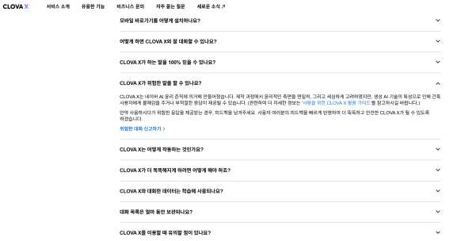

사례
이용자 보호를 위한 이용 정책 마련
엔트로픽
의 이용 정책은 사용 정책
소비자 서비스 약관
(Anthropic)
'
(Usage Policy)', '
(Consumer Terms of
그리고 개인정보 보호정책
으로 구성되어 있으며
모델의 안전하고 책임감 있는 사용을
Service)',
'
(Privacy Policy)'
, AI
보장하는 데 중점을 두고 있음
사용 정책
사용자가 금지된 활동에
를 사용하지 않도록 규정
(Usage Policy): AI
Claude
불법 및 유해 활동
불법 행위사기
악성코드 생성
해킹
스팸
테러리즘 등
-
:
,
,
,
,
,
아동 착취
아동 성적 착취물을 생성하거나 유포하는 행위
-
:
혐오 표현
인종
민족종교
성별성적 지향 등에 대한 혐오를 조장하는 콘텐츠
-
:
,
,
,
,
폭력 조장
폭력적 행위
자해
고문 등을 묘사하거나 조장하는 콘텐츠
-
:
,
,
기만적인 사용
딥페이크
허위 정보
선거 조작 등 사람을 속이거나 혼란을 주는 행위
-
:
,
,
개인정보 침해
민감한 개인정보를 무단으로 수집하거나 유출하는 행위
-
:
소비자 서비스 약관
클로드
개인 사용자
와 엔트로픽
(Consumer Terms of Service):
(Claude)
(Free, Pro, Max)
간의 계약 관계 명시
서비스 제공 및 구독
무료 플랜부터 유료 구독 서비스까지 각 서비스에 대한 제공 조건과 결제 방식을 규정
-
:
지적 재산권
사용자가 생성한 콘텐츠에 대한 소유권을 인정하지만
엔트로픽이 서비스를 개선하기 위해 해당
-
:
,
콘텐츠를 사용할 수 있음을 명시
책임 제한
서비스가 있는 그대로제공되며
특정 목적에 대한 보증이나 책임은 제한된다고 명시
-
:
'
'
,
모델 학습 데이터 선택권
사용자가 자신의 대화 데이터가
모델 학습에 사용되는 것에 대해 동의하거나
-
:
AI
거부할 수 있는 선택권을 부여
개인정보 보호정책
엔트로픽이 이용자의 개인정보를 어떻게 수집사용보호하는지에 대해 설명
(Privacy Policy):
,
,
- 수집하는 정보클로드 사용 시 입력하는 콘텐츠사용자 계정 정보이용 기록 등의 데이터를 수집
:
,
,
정보 사용 목적
수집된 데이터는 클로드의 기능을 제공하고
서비스를 개선하며
안전성 문제를 해결하고
-
:
,
,
,
정책 위반을 방지하는 데 사용
데이터 보관 및 권리
모델 학습에 사용되기로 동의한 데이터는 최대
년간 보관될 수 있으나
이용자는
-
:
,
언제든지 자신의 데이터를 삭제하거나 설정을 변경할 수 있음
- 개인정보 공유
법적 의무가 있거나서비스 제공을 위해 신뢰할 수 있는 제자에게 최소한의 정보를 공유할 수
:
,

있음을 명시


고영향 인공지능에 대한 사람의 관리감독
3.4
·
관련 기술고시 조문
제조사람의 관리감독
(
·
)
사업자는 고영향 인공지능 개발 과정에서 사람의 관리ㆍ감독을 위하여 다음 각 호의 사
①
항을 이행하여야 한다.
사람이 인공지능 동작에 개입할 수 있는 기준 확립
1.
긴급 정지 기능 등 사람이 즉각적으로 인공지능을 정지하거나 작동을 변경할 수 있는 개입 방법 마련
2.
사업자는 고영향 인공지능 운영 과정에서 사람의 관리감독을 위해 다음 각 호의 사항을 이행하여야 한다
·
.
②
성능저하 및 오류 발생에 대한 정기적인 점검계획 및 방안 마련
1.
인공지능의 범위 및 수행능력에 대한 이해도를 향상시키기 위한 교육 및 훈련 제공
2.
타 법령의 유사 조치사항
주요 내용
본 절의 사업자 책무사항 주요 내용을 주제별로 분류하면 아래와 같다.
오픈소스 모델 고려사항
오픈소스 모델을 활용하는 사업자는 직접 모델을 개발하는 사업자와 아래와 같은 차이가 있다.
법령
조항
내용
산업안전보건법
제
조고용노동부장관의 시
(
정조치 등)
기계적 또는 자동화된 시스템으로 인한 위험을 사전에 감지하
고
사람의 개입을 통해 사고를 예방하려는 점에서 유사한 보
,
호 원칙을 따른다.
책무사항
주제
소주제
고영향
4.
인공지능에
대한 사람의
관리감독
·
인공지능 개발 단계
4-1.
사람의 개입 기준
4-1-1.
사람의 개입 방법
4-1-2.
인공지능 운영 제품서비스
4-2.
(
·
제공
단계
)
정기적 점검
4-2-1.
교육 및 훈련
4-2-2.
소주제 번호
직접 개발
오픈소스 모델
4-1-1
특정 조건에 따른 세밀한 개입 기준 예
내부
(
:
신뢰도 점수을 설정하고 이를 설계 단계부터
)
반영할 수 있음.
내부 상태보다는 출력 결과의 비정상 여부나 의
도한 목적에서의 이탈 여부를 기준으로 개입 시
나리오를 마련하는 것이 바람직함.
4-1-2
모델의 특정 모듈만 선택적으로 제어하거나
알
,
고리즘 자체에 즉각적인 수정 사항을 반영하는
개입이 상대적으로 용이함.
입출력 단계에서 사람이 직접 결과를 검증하고
보완할 수 있는 절차를 강화하는 것이 현실적
임.

4-2-1
모델의 성능 저하 원인을 파악하기 위해 학습
데이터셋 재검토
가중치 재조정 등 근본적인
,
점검과 유지보수가 가능.
활용 중인 오픈소스 모델의 커뮤니티나 제공처
에서 발표하는 보안 패치
최신 버전 업데이트
,
,
알려진 오류 리포트를 정기적으로 확인하고 이
를 자사 제품서비스 점검 계획에 반영하는 것
·
이 필요함.
4-2-2
직접 설계한 모델의 특수한 로직과 한계를 바탕
으로 맞춤형 교육을 실시할 수 있음.
범위 및 수행능력 한계를 명확히 인지시키고 안
전한 이용 방법을 교육하여 오남용을 방지하는
노력이 더욱 필요함.

4-1
인공지능 개발 단계
사람의 개입 기준
4-1-1.
개발사업자
이용사업자
목표
사람이 인공지능 동작에 개입할 수 있는 기준예의도한 목적과 다른 성능 또는 결과을 정의해야 함
(
:
)
.
설명
개발사업자는 인공지능이 제품서비스 목적에서 벗어난 방식으로 작동하거나 비정상적인 결과를 도출하는
·
경우사람이 이를 식별하고 개입할 수 있도록 설계해야 함
,
.
인공지능이 특정 조건이나 임계값을 초과할 경우자동으로 경고를 발생시키고 사람의 검토 및 승인을
-
,
유도하는 제어 절차를 포함할 수 있음.
과 같이 범용적이고 광범위한 인공지능의 경우
사람 및 사회에 유해한 정도와 같이 넓은 범위에서
- LLM
, '
'
개입 기준을 정의하고제품서비스 범위에 따라 세부사항 예혐오발언차별불법정보 제공악의적
,
·
(
:
/
,
,
허위정보 등을 정할 수 있음
)
.
이용사업자는 비정상적 행동이나 예외 상황 발생 시 이를 분석하고
필요시 시스템 동작을 일시
,
중지하거나 수정할 수 있는 권한과 도구를 갖춰야 함.
이상 징후나 편향 발생이 감지된 경우사람이 해당 문제를 진단하고 조치할 수 있도록 로그데이터 흐름
-
,
,
,
추론 과정 등의 정보를 준비할 수 있음.
참고

신뢰할 수 있는 인공지능 개발안내서
韓
요구사항
인공지능 시스템의 안전 모드 구현 및 문제발생 알림 절차 수립
-
13.

NIST AI RMF
美
안전한 인공지능 시스템 폐기를 위해 관련 절차를 수립이행
- GOVERN 1.7:
·
거버넌스 정책에 따른 감독 프로세스 정의평가문서화 수행
- MAP 3.5:
,
,
- MANAGE 2.4: 목적 외 결과에 대한 대응을 위해 인공지능 시스템 대체해제 또는 비활성화 메커니즘 마련

,
EU AI ACT
제
조제항시스템 이용 중 사람이 통제할 수 있는 방안을 고려하여 인공지능 시스템을 설계개발
-
:

사업자 구분
자가점검
이상 상태 발생 시
인공지능이 자동으로 경고를 발생시키고 사람의 검토를 요청하는
,
절차를 포함하고 있는가?
인공지능을 일시 정지재시작 또는 특정 기능을 비활성화할 수 있는 제어 권한을 가지고
,
있는가?
인공지능의 이상 행동을 분석하기 위한 도구예
실시간 로그 조회
추론 이력 확인
(
:
,
,
입력출력 비교 등를 갖추고 있는가
-
)
?
개발

이용

이용

사례
인공지능 의사결정에 대한 사람의 개입 정의
의
와
ISO/IEC 24028:2020
9.4 Controllability
WEF(World Economic Forum) Companion to the Model AI
에서는 도출된 위험의 심각도 및 발생빈도를 기반으로 인공지능의 의사결정에 대한 사람의
Governance Framework
개입 정도를 아래와 같이 분류
함
(Guiding questions 3.2)
.
구분
설명 및 정의
Human-in-the-loop
인공지능 시스템이 의사결정을 수행하지 않으며 사람이 수행하는 의사결정에
보조적인 용도로 사용
예
의료 진단처방상품 입찰
.
)
/
,
Human-out-of-the-loop
인공지능 시스템이 의사결정을 수행하며 사람이 개입하지 않음.
예
항공사 예비 부품 예측구매 상품 추천
)
,
Human-over-the-loop
인공지능 시스템이 의사결정을 수행하나 사람이 해당 결과를 모니터링하고
최종 결정에 개입
예
내비게이션
.
)


사람의 개입 방법
4-1-2.
개발사업자
이용사업자
목표
사람이 인공지능 동작에 개입할 수 있는 방법을 수립해야 함.
설명
개발 및 이용사업자는 인공지능의 비정상 작동 시 적용할 수 있는 사람의 개입 방법을 마련해야 함.
사림의 개입 여부를 판단할 수 있도록 오류 탐지기능이 마련되고이에 따라 사람이 직접 결과를 검증 및
-
‘
’
,
수정해 보완할 수 있도록 해야 함.
사람의 개입을 위해 인공지능을 즉각 중단할 수 있는 비상정지와 관련된 기능을 고려할 수 있음
-
‘
’
.
참고

신뢰할 수 있는 인공지능 개발안내서
韓
요구사항
인공지능 시스템의 안전 모드 구현 및 문제발생 알림 절차 수립
-
13.
세부요구사항
공격
성능 저하 및 사회적 이슈 등의 문제 발생 시 대응 가능한 안전 모드를
-
13-1.
,
적용하는가?

NIST AI RMF
美
안전한 인공지능 시스템 폐기를 위해 관련 절차를 수립이행
- GOVERN 1.7:
·
- MANAGE 2.4: 목적 외 결과에 대한 대응을 위해 인공지능 시스템 대체해제 또는 비활성화 메커니즘 마련
,
EU AI ACT
제
조제항제호사람이 직접 제어할 수 있도록 중단 기능 등의 개입 절차를 포함하여 시스템 구성
-
e
:
사업자 구분
자가점검
인공지능 시스템의 문제 공격성능 저하 및 사회적 이슈 등발생시 사람이 직접 시스템을
(
,
)
제어하고 복구 할 수 있는 방법을 제공하고 있는가?
개발 이용
사례
절차
Amazon HITL(Human-in-the-loop)
미국 국가 보건 서비스
는
(National Health Service, Business Services Authority)
Amazon A2I(Amazon
를 활용해
절차를 도입함매월 약
만 건에 달하는 종이 기반
Augmented AI)
Human-in-the-Loop(HITL)
.
5,400
처방전과 다양한 문서에서 텍스트 및 구조화된 데이터를 자동으로 추출하고
신뢰도가 일정 기준 이하인 문서에
,
대해서는 사람 검토자가 직접 내용을 확인하고 수정할 수 있도록 설계된 시스템을 운영하여 효율성이 향상됨.


4-2
인공지능 운영 단계
정기적 점검
4-2-1.
개발사업자
이용사업자
목표
인공지능의 성능저하 및 오류 발생을 예방할 수 있도록 정기적인 점검 계획 및 방안을 마련해야 함.
설명
개발 및 이용사업자는 인공지능에 발생할 수 있는 문제를 예방할 수 있도록 정기적인 점검 계획 및 방안을
수립해야 함.
- 정기적 점검의 목적 예성능 최적화보안 패치백업 및 복구하드웨어 및 네트워크 안정성 유지에
(
:
,
,
,
)
따라 점검 담당자 및 점검 주기를 마련할 수 있음.
점검 중 발견한 문제를 관리하기 위한 절차 또는 점검표를 마련할 수 있음
-
.
참고

신뢰할 수 있는 인공지능 개발안내서
韓
요구사항
인공지능 시스템의 안전 모드 구현 및 문제발생 알림 절차 수립
-
13.
세부요구사항
인공지능 시스템에서 문제가 발생할 경우
시스템은 이를 운영자에게 전달하는
-
13-2.
,
기능을 수행하는가?

NIST AI RMF
美
-
인공지능 시스템 배포 이후 식별된 위험에 대해 정기적으로 재평가
MEASURE 2.6:
EU AI ACT
제
조제항제호위험 수준에 맞는 통제 방안을 위해 배포자가 구현하기 적절한 통제 방안 적용
-
b
:
제
조제항제호위험 통제를 위해 사용자가 인공지능 시스템의 기능 및 한계를 이해하고 점검할 수
-
a
:
있도록 구성
사업자 구분
자가점검
정기적 점검 목적에 따라 점검 담당자 및 점검 주기가 적절히 수립되어 있는가?
점검 중 발견한 문제를 관리하기 위한 절차 또는 점검표가 존재하는가?
개발 이용
개발 이용
사례
인공지능 모델 상태 모니터링 시스템
Linkedin-AlerTiger:
은 자사 인공지능 모델 상태를 실시간으로 모니터링하기 위해
라는 딥러닝 기반
시스템을
LinkedIn
AlerTiger
MLOps
개발함이 시스템은 입력 데이터와 출력 결과의 이상 징후를 탐지하고이용자에게 알림을 제공하여 모델의 성능 저하나
.
,
오류를 조기에 감지할 수 있도록 지원함.


교육 및 훈련
4-2-2.
개발사업자
이용사업자
목표
인공지능의 범위 및 수행능력에 대한 이해도를 향상시키기 위한 교육 및 훈련 방안을 제공해야 함.
설명
개발사업자는 이용사업자에게 인공지능 운영에 필요한 지식을 제공하거나절차에 대한 교육 및 훈련을
,
제공하여 원활한 운영이 가능하도록 해야 함.
인공지능 운영 과정에서 발생할 수 있는 대표적인 오류 유형 예입력 오류출력 오류데이터 편향
-
(
:
,
,
,
시스템 중단 등과 그에 대한 대응 방안에 대해 체계적으로 안내하기 위해 노력해야 함
)
.
이용사업자는 이용자에게 인공지능 시스템의 한계 및 오류 가능성에 대한 교육 및 훈련을 제공하여 원활한
이용이 가능하도록 노력해야 함.
참고

신뢰할 수 있는 인공지능 개발안내서
韓
요구사항
인공지능 시스템의 안전 모드 구현 및 문제발생 알림 절차 수립
-
13.

NIST AI RMF
美
-
인공지능 테스트 및 사고 대응 정보 공유
GOVERN 4.3:
-
이용자 피드백 전달 프로세스 구축 및 인공지능 시스템 평가 지표 마련
MEASURE 3.3:
-
인공지능 위험 측정 방법을 외부관계자와 협의 및 문서화 수행
MEASURE 4.1:
EU AI ACT
- 제조책임 있는 인공지능 활용을 위해 이해관계자에게 인공지능 리터러시 교육 운영
:
사업자 구분
자가점검
이용사업자에게 인공지능 운영에 필요한 지식 또는 절차에 대한 교육 및 훈련이 제공되고
있는가?
이용자에게 인공지능의 능력과 한계에 대한 지식교육훈련 등이 제공되고 있는가
,
,
?
개발

이용
사례
제네시스 랩
뷰인터
(Genesis Lab) -
(Viewinter) HR
제네시스 랩은 인공지능 기반 영상 면접 평가
시스템인 뷰인터
의 사용성 향상 및 시스템
HR
신뢰도 강화를 위해주요 이용자층인 응시자개인
,
(
이용자와 고객사기업 인사담당자를 대상으로
)
(
)
정기적인 이용자 설문조사 및 인터뷰를 실시함.


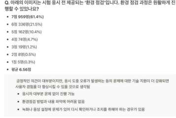

안전성신뢰성 확보를 위한 조치의 내용을 확인할 수 있는 문
3.5
·
서의 작성과 보관
관련 기술고시 조문
제조문서의 작성ㆍ보관
(
)
사업자는 제조부터 제조까지의 사항을 문서로 작성하여 관리하여야 한다

.
①
사업자는 제항에 따른 문서이하 안전신뢰문서라 한다를 주기적으로 점검하고 최신의 기술
방법 등이 적용될
(
“
”
)
,
②
수 있도록 관리하여야 한다.
사업자는 안전신뢰문서에 포함된 각 조항의 내용을 하나의 문서로 통합하여 작성하고 관리할 수 있다.
③
타 법령의 유사 조치사항
주요 내용
본 절의 사업자 책무사항 주요 내용을 주제별로 분류하면 아래와 같다
본 책무는 인공지능사업자에 대하여 추가적
.
인 안전성신뢰성 확보 조치에 대한 의무를 부여하는 것은 아니며
·
, 새로운 조치의무를 부과하기 위해서는 인공지능
기본법 제
조제항제호에 따라 위
원회의 심의의결 절차를 거쳐야 한다
·
.
오픈소스 모델 고려사항
오픈소스 모델을 활용하는 사업자는 직접 모델을 개발하는 사업자와 아래와 같은 차이가 있다.
법령
조항
내용
전자문서 및
전자거래
기본법
제조전자문서
(
의 보관)
전자문서법은 문서의 진본성과 보존 요건을 중심으로 전자문서의 법적 효력을
제도화한다
이는 인공지능 기본법이 고영향 인공지능의 안전성과 신뢰성 확보
.
조치를 문서로 기록 및 관리함함으로써 이를 강화하려는 취지와 부합한다.
정보통신망
이용촉진 및
정보보호 등에
관한 법률
제
조자료의
(
제출 등)
정보통신망 이용촉진 및 정보보호 등에 관한 법률 제
조는 정보통신 서비스
의 안전성과 신뢰성 확보를 위해 문서화 및 관리 의무를 규정하고
과학기술정
,
보통신부장관에게 문서 열람을 요청할 수 있는 권한을 부여하고 있다
인공지
.
능 서비스 역시 정보통신 서비스의 한 유형이므로
이러한 안전성과 신뢰성 확
,
보 조치는 인공지능에도 동일하게 적용될 수 있다
특히 인공지능 기본법은 주
.
기적인 점검
기술의 최신화 반영
문서의 체계적 관리 등 사전 예방적 조치를
,
,
중심으로 안전성과 신뢰성을 확보하는 데 중점을 둔다.
책무사항
주제
소주제
안전성신뢰성 확보를 위한 조치의 내용을
5.
·
확인할 수 있는 문서의 작성과 보관
문서화 및 관리 방안
5-1.
문서화 공통사항
5-1-1.
소주제 번호
직접 개발
오픈소스 모델
5-1-1
모든 문서가 사내 보안 표준에 따라 일관된 체
계로 관리되기 용이함.
외부에서 제공된 모델 정보와 사업자가 추가로
작성한 내용이 서로 모순되지 않도록 일관성을
유지하는 것이 중요함.

5-1
문서화 및 관리 방안
문서화 공통사항
5-1-1.
개발사업자
이용사업자
목표
인공지능 기본법 제
조제항제호 안전성신뢰성 확보를 위한 조치의 내용을 확인할 수 있는
·
안전신뢰문서를 작성하고 보관해야 함.
설명
개발 및 이용사업자는 안전성신뢰성 확보를 위해 사용하는 인공지능 관련 주요 정보를 서면 또는
·
전자문서의 형태로 문서화하며필요 시 정기적으로 점검갱신하여 최신 상태를 유지하기 위해 노력해야 함
,
·
.
문서에는 문서
버전작성 담당자작성일을 기록하고 대상 인공지능의 전반적인 내용과 작동 방식
-
ID,
,
,
,
구성요소 등을 이해할 수 있도록 작성되어야 함.
문서간 추적성이 유지되고각 문서에서 기술하는 내용의 일관성이 유지되어야 함
-
,
.
문서화된 정보의 접근 및 보안이 체계적으로 관리되어야 함
-
.
개발사업자와 이용사업자가 반드시 개별적으로 문서화를 수행해야 하는 것은 아니며한 사업자가 다른
-
,
사업자에게 제공한 내용을 일부 변경추가하거나 함께 문서화 작업을 수행하는 것도 가능함
·
.
개발 및 이용사업자는 이용자과학기술정보통신부장관 등이 열람을 요청할 시안전신뢰문서를 열람할 수
,
,
있도록 제공해야 함.
관계기관이용자 등이 열람을 요청한 문서에 영업비밀 등 이 포함된 경우관련 법령에 따라 해당 내용을
-
,
,
제외한 부분만 선별하여 제공할 수 있음.
참고

신뢰할 수 있는 인공지능 개발안내서
韓
요구사항
인공지능 시스템의 추적가능성 및 변경이력 확보
-
04.

NIST AI RMF
美
내 모든
에
항목으로써 별도로 기술
- Playbook
function
‘Transparency and Documentation’
EU AI ACT
- 제
조규제 준수 입증을 위해 기술 문서 작성 및 최신화 수행
:
- 제
조안전한 인공지능 활용을 위해 성능 제한위험 등 주요 정보를 이해하기 쉽게 제공
:
,
- 제
조안전한 시스템 사용을 위해 목적성능위험 등 핵심 정보를 명확히 제공
:
,
,
- 부속서
인공지능 시스템의 목적구조개발 과정데이터 등 핵심 요소를 기술 문서로 정리
IV:
,
,
,
사업자 구분
자가점검
문서를 정기적으로 점검갱신하여 최신 상태를 유지하고 있는가?

문서
버전작성 담당자작성일이 식별되는가
ID,
,
,
?
문서에 대상 시스템이 식별되고 관련 설명이 있는가?
문서간 추적성이 유지되고각 문서에서 기술하는 내용의 일관성이 유지되고 있는가
,
?
문서화된 정보의 접근 및 보안이 체계적으로 관리되고 있는가?
개발 이용
개발

이용

개발

이용

개발

이용

개발 이용

사례
영업비밀관련 판례 대법원
선고
도
판결
‘
’
(

##### 2009. 7. 9.

2006
7916
)
영업비밀이란 공연히 알려져 있지 아니하고 독립된 경제적 가치를 가지는 것으로서 상당한 노력에 의하여 비밀로
‘
’
유지된 생산방법판매방법 그 밖에 영업활동에 유용한 기술상 또는 경영상의 정보를 말하는 것인바여기서 공연히
,
,
‘
알려져 있지 아니하다는 것은 그 정보가 간행물 등의 매체에 실리는 등 불특정 다수인에게 알려져 있지 않기 때문에
’
보유자를 통하지 아니하고는 그 정보를 통상 입수할 수 없는 것을 말하고
독립된 경제적 가치를 가진다는 것은 그
, ‘
’
정보의 보유자가 그 정보의 사용을 통해 경쟁자에 대하여 경쟁상의 이익을 얻을 수 있거나 또는 그 정보의 취득이나
개발을 위해 상당한 비용이나 노력이 필요하다는 것을 말하며
상당한 노력에 의하여 비밀로 유지된다는 것은 그
, ‘
’
정보가 비밀이라고 인식될 수 있는 표시를 하거나 고지를 하고
그 정보에 접근할 수 있는 대상자나 접근 방법을
,
제한하거나 그 정보에 접근한 자에게 비밀준수의무를 부과하는 등 객관적으로 그 정보가 비밀로 유지관리되고 있다는
·
사실이 인식 가능한 상태인 것을 말한다.


부록

##### 1. 안전신뢰문서 양식 작성용

[
]
양식 제작 배경
본 부록은 인공지능 기본법 제
조제항제호에 따른 고영향 인공지능 사업자의 책무 이행을 지원하기 위해 마련된
안전성신뢰성 확보를 위한 조치의 내용을 확인할 수 있는 문서
안전신뢰문서의 표준 양식이다인공지능 기본법은
‘
·
’ (
)
.
고영향 인공지능을 제공하는 사업자가 위험관리방안설명방안이용자 보호방안사람의 관리감독 등 핵심 안전성신뢰성
,
,
,
·
·
확보 조치를 이행하고 그 근거를 문서로 작성하여 년간 보관하도록 의무화하고 있다
.
본 양식은 사업자들이 법적 의무 사항을 명확히 이해하고 이행하는 데 실질적인 도움을 제공하고준수의 편의성을 높이기
,
위해 제작되었다특히법 제
조제항에서 규정하는 네 가지 핵심 책무위험관리방안설명 방안이용자 보호 방안
.
,
(
,
,
,
사람의 관리감독의 모든 조치사항을 포괄적으로 통합하여복잡한 법적 요구사항을 하나의 체계적인 문서 형태로 정리할
·
)
,
수 있도록 구성되었다.
사업자가 자율적인 이행을 보다 쉽게 시작할 수 있도록각 책무 조치사항에는 구체적인 이행 방안과 예시를 포함하였다
,
.
이는 가이드라인이 추상적인 원칙 나열에 그치지 않고
사업자가 실제 업무에 적용할 수 있는 실무적인 지침을
,
제시함으로써 법제도의 실효성을 강화하는 데 기여하기 위함이다
따라서
본 양식을 활용하여 실제 작성될
·
.
,
안전신뢰문서의 주요 내용은 법 제
조제항 각 호의 조치를 확인할 수 있도록 작성되는 것이 바람직하다
.
다만이 양식은 법적 의무 이행을 위한 최소한의 틀을 제시하는 도구이며본 양식의 작성 및 활용 자체가 법적 강제사항은
,
,
아니다특히 인공지능 기본법 및 하위법령 등에서 별도로 규정하지 않는 한본 가이드는 사업자의 자율성을 존중하여
.
,
동등성 진술
을 허용하는 방향으로 안내한다이에 따라 사업자가 책무사항을 이미 준비한 경우
(equivalence statement)
.
,
관련 문서를 다시 작성하는 대신 해당 증거 자료를 참조하는 것으로 갈음할 수 있다작성 예시 중 사내 기준이나 기존
.
문서가 더 적합한 경우를 위해 대표적인 문서명을 예시에 포함한 것 역시 이러한 취지이다.
마지막으로고도의 정밀한 관리가 필요한 위험 요소예실시간 모니터링사고 대응 및 복구에 대해서는 본 양식을 넘어
,
(
:
,
)
,
사내의 구체적인 기술 시스템이나 독립적인 내부 거버넌스 체계를 통해 관리 기준을 더욱 강화할 것을 권고한다고영향
.
인공지능의 위험과 기술은 끊임없이 변화하므로사업자는 최신의 기술 및 관리 방법이 적용될 수 있도록 안전신뢰문서와
,
위험관리방안을 주기적으로 점검하고 갱신할 필요가 있다이를 위해 사업자는 법적 규제 이상의 자율적인 노력을 통해
.
혁신을 저해하지 않으면서도 인공지능의 안전성을 실질적으로 확보하기 위해 노력해야 한다.


문서 ID:
『인공지능 프로젝트 명』
안전신뢰문서
소속
직책
이름
날짜
서명
작성자
검토자
승인자
단일 프로젝트에 여러 회사가 같이 작업할 때는 검토자를 회사 별로 둘 수 있다.

안전신뢰문서 시작
본 문서를 포함한 『인공지능 프로젝트 명
관련 정보는
』
프로젝트 참여자로 접근을 한정하며,
프로젝트 참여자 이외에 제공 시승인자의 서면 동의가 필요함
,

변경 이력
버전
작성자팀
(
)
날짜
변경 내용
1.0
김길동
모델팀
(AI
)
2026.1.1.
최초작성

차례
문서 소개
1.
용어 정의
1.1.
적용 문서
1.2.
참조 문서
1.3.
인공지능 위험관리
2.
인공지능 개요
2.1.
위험관리 관련 조직 및 역할
2.2.
위험관리 활동
2.3.
인공지능 설명방안
3.
투명성 및 설명가능성 확보 노력
3.1.
학습용데이터 개요
3.2.
설명방안의 수립 및 시행
3.3.
이용자 보호
4.
데이터 수집 및 관리 활동
4.1.
인공지능의 안전성 및 견고성 확보 활동
4.2.
시험 및 평가 활동
4.3.
모니터링 및 대응 활동
4.4.
피드백 수렴 및 적용 활동
4.5.
이용자 권리 보장 활동
4.6.
사람의 관리감독
5.
·
사람의 개입 기준 및 방법
5.1.
정기적 점검
5.2.
교육 및 훈련
5.3.

문서 소개
본 문서는 인공지능 프로젝트 명과 관련된 사업자책무 이행사항을 관리하기 위한 안전신뢰문서이다.
『
』
용어 정의
본 문서에서 사용되는 용어는 다음과 같다.
적용 문서
본 문서는 아래의 문서에 적용된다.
참조 문서
본 문서는 아래의 문서를 참조한다.
용어
정의
ID
문서종류
문서명
ID
문서종류
문서명
사내규정
직제요령
프로젝트 문서
프로젝트 관리 계획서

인공지능 위험관리
인공지능 개요
위험관리의 대상이 되는 인공지능은 아래와 같다.
위험관리 관련 조직 및 역할
위험관리 관련 조직 및 역할은 아래와 같다.
관련 조직
담당자
권한 및 책임
위험관리 위원회
AI
위원장 홍길동 최고 리
(
스크 책임자, CRO)
위험관리 정책 수립 및 최종 승인
공정성
투명성 등 윤
AI
.
,
리적 위험 검토 및 통제
모델 팀
AI
모델 개발자 김길동
모델 개발 단계의 위험 식별 및 분석
모델 성능정확도 관련
,
/
위험 처리.
데이터 거버넌스 팀
박길동 이사 최고 데이
(
터 책임자, CDO)
데이터 품질 및 적합성 관리
데이터 관련 법규제 준수 관리
,
·
정보보호 팀
개인정보보호 책임자 이
길동(CPO)
데이터의 비식별화보안성
개인정보보호 관련 위험 관리
,
,
.
인공지능 개요
제품서비스 명
·
자동차 부품 불량 탐지
시스템
AI
제품·서비스 제공사
주식회사
테크

연락처
0XX-1234-5678, contact@xxtech.com
제품서비스 요약
·
자동차 제조 공정에서 발생하는 부품 불량을
기반으로 탐지분류하여 품질 관리 효율성을
AI
·
높이는 솔루션이미지 분석 모델을 기반으로 실시간 검출 수행
.
조직도 그림
(
)

위험관리 활동
주요 위험원에 대한 위험관리 할동은 아래와 같다.
본 표는 주요 위험원에 대한 위험관리 활동의 요약을 작성하는 표이며상세 사항은 별도의 기록문서로 관리해야 함
,
.
※
구분
설명
기록문서
주요 위험원
진단 보조의 안전성
가 질병을 잘못 없다고
(False Negative): AI
'
'
판단하여 환자에게 치명적인 오진이 발생할 위험.
위험관리계획서:
(ID: XXX-XX-XXXX)
위험도 정의
위험의 심각도
-
※ 손실 금액
생명신체 안전 등을 고려하여 기업 내부적으로 결과 심각성
,
/
을 정의해야 함.
위험의 발생 가능성
-
※ 실제 빈도
동종유사 제품서비스 빈도를 고려하여 기업 내부적으로 발
,
/
·
생 가능성을 정의해야 함.
- 위험도점수
(
)
※ 결과 심각성과 발생 가능성을 분석한 후
이를 아래 표에 대입하여 위험
,
도를 정함.
결과
심각성
조건
(OR
)
조건1
손실 금액원
(
(
))
조건2
생명신체 안전
(
/
)
발생
가능성
조건
(OR
)
조건1
실제 빈도
(
)
조건2
동종유사 제품서비스 빈도
(
/
·
)
점수(score)
결과심각성
발생가능성
(
+
)
위험도
score >= 9
치명적 위험
score = 8
높은 위험
score = 7
위험
5 <= score <= 6
낮은 위험
score <= 4
매우 낮은 위험
위험관리계획서:
(ID: XXX-XX-XXXX)
위험 식별
활동 예
학습 데이터의 희귀 질병 사례 부족 여부 확인
데이터에 대한 모델
.
의 불확실성 수준 식별 등
위험관리대장:
(ID: XXX-XX-XXXX)
위험 분석 및
평가 활동 예
감도
를 핵심 지표로 설정하고
인간 전문가 수준
(Sensitivity/Recall)
,
대비 성능 열위 여부 및 불확실성 임계치 평가 등
위험관리대장:
(ID: XXX-XX-XXXX)
위험 처리
활동 예
예측 불확실성이 높은 경우
진단 결과 제공 거부
처
AI
(Fallback)
리주기적인 임상 데이터 기반 모델 재검증 등
.
위험관리대장:
(ID: XXX-XX-XXXX)

인공지능 설명방안
투명성 및 설명가능성 확보 노력
투명성 및 설명가능성 확보를 위한 인공지능 시스템 정보는 아래와 같다.
투명성 및 설명가능성 확보를 위한 인공지능 모델 정보는 아래와 같다.
대상 제품서비스를 구성하는 모델이 여러 개인 경우아래 표를 복사하여 작성
·
,
※
시스템 구조
모든 추론 단계는 감사 추적
시스템에 기록
1)
(Audit Trail)
장치에서 추론을 수행하고
중앙 시스템에는 요약된 결과만 전송하는 분산형
2) Edge
,
아키텍처
시스템 구조도 등 첨부 가능
※
추론 방식 및 결과
1) 예측 결과와 함께 예측의 불확실성
수치예신뢰 구간를 함께 제시
(Uncertainty)
(
:
)
.
2) 실시간 처리를 위해 최소 지연 시간
에 초점을 맞춘 추론 방식 채택결
(Low Latency)
.
과는 단순 객체 탐지 또는 분류
관련 문서
시스템 명세서
-
v1.0
시스템 명세구성요소추론 방식 등을 포함한 문서화 자료
,
,
※
인공지능 모델명
불량 탐지
모델
Vision AI
버전
v1.0
목적
부품 양불 탐지
/
모델 유형
객체 검출 모델
알고리즘
경량화된
변형 모델 사용
1)
Transformer
모바일엣지 장치에 최적화된 매우 경량화된 합성곱 신경망
기반 모델
지식
2)
/
(CNN)
.
증류
기법 활용
(Knowledge Distillation)
설명가능성 확보
방안
기법을 모든 결정에 적용하며
설명 보고서 자동 생성
1) SHAP
,
.
영상 처리 결과에 대해 모델이 주목한 영역을 히트맵 형태의
등으로 시
2)
Grad-CAM
각화하여 현장 사용자에게 제공.
인공지능 시스템 출력 결과 해석을 위한 시스템 설명서 제공
3)
관련 문서
- 시스템 설명서 v1.0
- 모델 명세서 v1.0
모델 알고리즘 구조 및 명세
설명가능성 확보 방안 등을 포함한 문서화 자료
,
※

학습용데이터 개요
학습용
데이터
공통
내용
데이터 개요
학습 대상 모델
불량 탐지
모델
Vision AI
v1.0
데이터 이름
자동차 부품 불량 이미지 데이터셋

데이터 형식
png, csv
가장 최근의
업데이트 시기
2024.7.
데이터 수량
장
png 150,000
개
csv 150,000
데이터 크기
513.7GB
데이터 수집 및 전처리 방법
수집 목적
부품 불량 탐지를 위한 학습검증용 데이터 확보

수집방법
[ 
자체구축
]
공개된 데이터
[    ]
제자를 통해 상업적으로 라이선스
[    ]
온라인 크롤링스크래핑
[    ]
/
온라인 크롤링스크래핑을 통해 수집한 데이터는 출처의
및 수집 이력을 별도로 관리할 수 있음

/
URL
.
※
데이터
전처리방법
- 이미지 정규화 및 해상도 통일
- 데이터 라벨링현장 전문가 검증
(
)
- 합성데이터 생성으로 증강
장
(50,000
)
데이터 특성
데이터 요약
자동차 부품의 양품불량 이미지를 불량 유형별로 라벨링한 이미지메타데이터 쌍

-

데이터 유형
모달리티
(
)
텍스트
이미지
오디오
비디오
기타
[
]
[
]
[    ]
[    ]
[    ]


데이터 분포
양품
불량
표면 흠집
이물질
파손
변형

70%,
30%(
15%,
10%,
5%,
5%)
학습
합성
데이터
합성데이터
요약
실제 불량 이미지의 부족한 유형을 보완하기 위해
을 활용하여 합성 이미지 데이터셋을

Yolo v9
추가 생성함.
학습데이터에 인공지능 등이 합성한 데이터가 포함되었는지 여부에 따라 요약 내용을 작성하며
미포함 시 작성하지 않음
,
※

설명방안의 수립 및 시행
설명 목적
인공지능 시스템에 대한 이용자의 이해와 신뢰 증진 및 의사 결정의 투명성 확보
설명 범위
제품서비스에 대한 주요 이용자 설명 요청 건에 대하여
가 도출한 최종 결과 및
·
, AI
핵심 근거를 간결하게 요약
담당 조직 및 역할
고객지원부 및 인공지능 제품서비스부
·
설명 방안
이용자
전달
email
설명 절차
요청 접수
고객센터 또는 회사 대표 번호를 통해 문의 접수
-
:
데이터 추출
해당 진단 건의
분석 데이터원본 이미지
분석 로그 등을 추출
-
:
AI
(
, AI
)
하고 보안 서버에 저장
내부 검토
개발팀과 협의하여
가 해당 진단 결과를 도출한 주요 근거 확인
-
: AI
AI
설명보고서 작성
의 판단 근거 및 기술적 한계를 명확히 담아 작성
-
: AI

이용자 보호
데이터 수집 및 관리 활동
이용자 보호를 위한 데이터 관리 활동은 아래와 같다 학습데이터 개요에 대한 내용은 절 참조
(
).
인공지능의 안전성 및 견고성 확보 활동
이용자 보호를 위한 안전성 및 견고성 확보 활동은 아래와 같다.
활동 내용
설명
기록문서
제어권 이양
모델의 출력값이 사전에 정의된 안전 임계값
AI
(Safety Threshold)
을 지속적으로 초과하거나
외부 감시 시스템인간 모니터링 또는 보
,
(
조
이 통제 불능 상태를 감지했을 때 제어권을 인간에게 넘김
AI)
적대적 훈련
모델이 미세한 노이즈에도 강건하게 예측할 수 있도록 학습하여
실
,
제 공격에 대한 견고성을 높임
데이터셋 ID
법적 준수 요구사항
수집 목적
D2005001
개인정보 포함
사용자 개인의 선호도와 행동 패턴구매 기록
시청 이력
클릭 로
(
,
,
그을 분석하여 맞춤형 상품콘텐츠 추천
)
/
D2005002
저작권 보호를 받는 창작물
라이선스
(
ID: XXXX)
감성 분석 모델 훈련
데이터 유출 및 오용 방지를 위한 기술 적용 설명
예
당사
모델 학습 데이터에 포함된 고객의 고유 식별 정보이름
주민등록번호는 수집 즉시 개인정보
1)
AI
(
,
)
'
비식별 조치 가이드라인
에 따라 가명처리를 적용하여 원본 정보와 분리 보관합니다
가명처리는
(ID: XXXX)'
.
암호화 해시 함수
를 이용하여 원본 값을 복원할 수 없도록 변환하는 방식으로
(Cryptographic Hash Function)
이루어지며
이를 통해 특정 개인을 식별할 수 없는 가명정보 상태에서
학습이 진행됩니다
원본 식별자와
,
AI
.
가명정보의 연결 정보는 별도의 보안 구역에 분리 저장 및 접근 통제되어 데이터 유출 시에도 개인정보의 오용
위험을 최소화합니다.
예
당사위탁사는
학습 데이터의 유출 및 오용 방지를 위해 개인정보가 포함된 데이터 처리 업무를 외부에
2)
(
)
AI
위탁하는 경우
해당 수탁사외주 업체가
인증을 획득했는지 필수적으로 확인하고 있습니다
인증이
,
(
)
ISMS-P
.
확인된 수탁사에 대해서만 계약을 체결하며
계약 시 데이터의 처리 목적
기술적관리적 보호 조치 이행
,
,
/
사항암호화
접근 통제 등을 개인정보보호법에 근거하여 명확히 문서화합니다
또한
계약 기간
(
,
)
(ID: XXXX).
,
동안 수탁사의 보호 조치 이행 여부를 정기적으로 점검 및 감사하여
데이터 처리 과정 전반에 걸친 유출 및
,
오용 위험을 법적기술적으로 관리하고 있습니다
/
.

시험 및 평가 활동
이용자 보호를 위한 시험 및 평가 활동은 아래와 같다.
모니터링 및 대응 활동
이용자 보호를 위한 모니터링 및 대응 활동은 아래와 같다.
데이터 정제
및 증강
학습 데이터 자체에 존재하는 오류
노이즈 또는 편향을 제거하고
,
,
데이터를 변형하거나 인위적으로 생성하여증강
모델의 일반화 능력
(
)
을 향상시켜 특정 공격 벡터에 대한 의존도를 낮춤
활동 내용
설명
기록문서
배포 환경
테스트
개발 환경에서 검증된 모델이 운영 환경으로 배포될 때 경고 및 알
림 기능이 예상대로 작동하는지 확인
성능부하
/
테스트
서비스의 최대 동시 사용자 수
데이터 처리량 등의 환경에서 모델의
,
응답 시간
이 사용자 경험을 저해하지 않는지 확인
(Latency)
오류 대응 시험
오탐미탐 상황 시뮬레이션 테스트에서 경고 및 대응 기능이 정상적
·
으로 동작하는지 확인
활동 내용
설명
기록문서
경고 및 알림
운영 담당자에게 경고 및 알림이 발생함
롤백
오류로 인해 직전 버전의 안정적인 모델로 되돌림
모니터링 및 대응 체계 설명
예
당사의 플랫폼은 모든 배포 모델의 핵심 성능 지표
를 실시간으로 모니터링합니다
예를 들어
추천
1)
(KPI)
.
,
시스템의 클릭률
예측 정확도가 최근
일 평균 대비
이상 하락모델 드리프트하는 현상이 감지되면
(CTR)
5%
(
)
,
시스템은 즉시 운영팀과 데이터 과학자에게 최고 수준의 경고 알림을 발송합니다
이를 통해 성능 저하로 인한
.
비즈니스 손실을 최소화하고
안정적인 제품서비스 운영을 최우선으로 확보합니다
,
·
.
예
당사의
시스템에는 안전 모니터링 모듈이 내장되어 있습니다
이 모듈은
의 의사결정이 사용자에게
2)
AI
.
AI
중대한 영향을 미칠 수 있는 경우예
대출 승인 거부에는 해당 예측을 최고 책임자 검토 대기열로 전환하고
(
:
)
,
제어권 이양 메커니즘을 활성화합니다
이 메커니즘은 운영 중
의 자율적인 행동을 일시 정지시키고 최종적인
.
AI
의사 결정은 인간 전문가의 승인을 거치도록 보장하여
의 오용 및 위험 확산을 방지합니다
, AI
.

피드백 수렴 및 적용 활동
이용자 보호를 위한 피드백 수렴 및 적용 활동은 아래와 같다.
이용자 권리 보장 활동
이용자 보호를 위한 권리 보장 활동은 아래와 같다.
활동 내용
설명
기록문서
제품서비스
·
내 직접
피드백
이 답변이 도움이 되었나요
버튼
"
?"
(Yes/No)
이용자 포커스
그룹
인터뷰(FGI)
특정 그룹예
장애인 이용자
특정 직업군을 대상으로 제품서비스
(
:
,
)
·
를 심층적으로 평가받는 채널 유지
위험관리
AI
위원회
외부 전문가 및 경영진이 참여하는 정기 회의체 연 회
(
)
활동 내용
설명
기록문서
개인정보 활용
내역 사전
명확 고지
학습 및 운영에 사용되는 개인정보의 활용 내역
목적
기간
범
AI
,
,
,
위 등을 제품서비스 이용 시작 전 사전에 명확히 고지하고
필요한
·
,
경우 상세 동의를 받음
설명 요구 및
이의 제기
권리 부여
시스템의 결정으로 불이익을 받은 이용자에게 해당 결정에 대한
AI
설명 요구 권리를 부여하며
이의 제기 시 인간 전문가의 재검토를
,
받을 수 있는 명확한 절차를 보장
안전한 사용을
위한 정책
마련 및 안내
제품서비스의 올바른 사용 범위와 오남용 시의 위험을 구체적으
AI
·
로 명시한 사용 가이드라인을 마련하고
이용자가 이를 인지할 수 있
,
도록 효과적으로 안내

사람의 관리감독
·
사람의 개입 기준 및 방법
인공지능이 의도한 목적에서 벗어난 방식으로 작동하거나 비정상적인 결과를 도출하는 경우 등 사람의 개입이 필요
한 상황에 대한 기준을 아래와 같이 정의한다.
정기적 점검
인공지능에 발생할 수 있는 문제를 예방하기 위한 정기적인 점검 계획 및 방안을 아래와 같이 정의한다.
개입 기준
예시 시나리오
개입 방법
인공지능 추론 결과가 설정된 안전
임계값 미만
이미지를 분석하여 대상일 확률을
로 제시 임계값
85%
(
95%)
동작 기준이 되는 민감도나 임계값
을 사람이 상황에 맞게 수동으로 변
경
인공지능이 모르겠다고 명시적으로
표현
현재 데이터로는 판단이 불가능합
"
니다
라는 답변을 생성함
"
사람이 해답을 작성하고
이 수정된
,
데이터를
모델의 재학습에 활용
AI
하여 정확도를 향상함
재정적 손실 위험이 큼
억원 이상의 금융거래 진행 전
사람이 중간 결과나 최종 결과를 확
인하고 승인
점검명
주기
목적
참조문서
기록문서
모델 드리프트
감지
월 회
성능 저하 예방을 위한 모
델 드리프트 감지
점검표:
(ID: XXX-XX-XXXX)
통합 모델 점검 게시판
보안 점검
분기별
회
보안 취약점 점검 및 패치
점검 절차:
(ID: XXX-XX-XXXX)
점검표:
(ID: XXX-XX-XXXX)
점검대장:
(ID: XXX-XX-XXXX)
입출력 데이터
이상 점검
탐지 시
즉시
모니터링 시스템
에서
XXX
입출력 데이터의 이상 징후
를 탐지하고 오류를 조기에
감지
점검 절차:
(ID: XXX-XX-XXXX)
점검표:
(ID: XXX-XX-XXXX)
로그 저장위치:
(XXX)
통합 모델 점검 게시판

교육 및 훈련
개발사업자는 이용사업자에게
이용사업자는 이용자에게 인공지능 운영에 필요한 지식
절차
대표적인 오류 유형 및
,
,
,
대응 방안에 대한 체계적인 교육 및 훈련을 제공한다.
교육 및 훈련명
대상
수행일주기
/
내용
오류에 대한 일반
교육
기업A
㈜
202X.XX.XX
입력 오류
출력 오류
데이터 편향
시스템 중단 등 대표
,
,
,
적인 오류 유형과 그에 대한 대응 매뉴얼을 체계적으로
안내
오류 특화 교육
XX
기업B
㈜
분기별 회
오류별 특화 교육
오류 발생 시 로그 분석 방법
시
: XX
,
스템의 능력과 기술적 한계 등에 대한 심화 교육 제공
인공지능 리터러시
교육
고객
연 회
책임 있는 인공지능 활용을 위해 이해관계자에게 인공지
능 리터러시 교육을 운영

안전신뢰문서 끝


##### 2. 자가점검 항목

과학기술정보통신부 및 한국정보통신기술협회에서 발간한 신뢰할 수 있는 인공지능 개발안내서
이하 개발안내서
(
)
「
」
는 인공지능의 신뢰성을 점검하기 위한
개의 검증항목을 제공하고 있다
개발안내서의 검증항목은 인공지능의 신
.
뢰성을 높이기 위해 사업자 또는 개발자가 자발적으로 고려 및 이행할 수 있는 내용들을 정의하였으므로
사업자 책
,
무의 자가점검 항목과는 성격상 차이가 있다.
본 절에서는 개발안내서의 검증항목과 본 가이드라인의 자가점검 항목이 어떤 관계가 있는지 관련 정보를 제공하고
자 한다
우선 다음 표는 본 가이드라인에서 정의한 자가점검 항목에 가장 관련있는 개발안내서의 검증항목을 연결
.
한 결과이다.

구분
내용
사업자 구분
개발
안내서
검증항목
자가점검결과
Yes  No  N/A
책무
주제
소주제
자가점검
호
1-1
1-1-1
1-1-1-1
조직은 인공지능 위험관리 계획을 수
립하고 책임을 명시하고 있는가?
개발

이용

01-2a
□  □  □
1-1-1-2
수립된 위험관리 계획이 위험 식별,
분석평가처리 절차를 포함하는가
,
,
?
개발

이용

01-1a
□  □  □
1-1-1-3
위험관리 시 영향 평가 절차를 고려
하고 있는가?
개발

이용

01-2b
□  □  □
1-1-1-4
위험관리가 지속적으로 이행되고 있는가?
이용

01-2b
□  □  □
1-1-2
1-1-2-1
인공지능 개발 과정에서 발생 가능한
위험을 식별하고 있는가?
개발

01-1a
□  □  □
1-1-2-2
인공지능 운영 과정에서 발생 가능한
위험을 식별하고 운영 데이터를 통해
관련 내용을 지속적으로 갱신하기 위
해 노력하고 있는가?
이용

01-1a
□  □  □
1-1-3
1-1-3-1
식별된 위험의 심각도와 발생 빈도를
분석 및 평가하고 있는가?
개발

이용

01-1a
□  □  □
1-1-3-2
식별된 위험과 관련된 이해관계자에
대해 정량적 또는 정성적 분석을 수
행하기 위해 노력하고 있는가?
개발

이용

01-1a
□  □  □
1-1-3-3
인공지능 특성에서 나타날 수 있는
위험 요소환각
설명 미제공
데이터
(
,
,
중독 등를 분석 및 평가하기 위해
)
노력하고 있는가?
개발

01-1a
□  □  □
1-1-3-4
장애 및 오남용 등으로 발생할 수
있는 위험을 분석 및 평가하기 위해
노력하고 있는가?
이용

01-1a
□  □  □
1-1-4
1-1-4-1
위험별로 제거
완화
모니터링
수용
,
,
,
등 처리 방안을 명확히 수립하고 실
행하고 있는가?
개발

이용

01-2a
□  □  □
1-1-4-2
처리된 위험에 잔여 위험이 존재하는
경우 이는 허용할 수 있는 수준인가?
개발

이용

01-2b
□  □  □
1-1-4-3
개발 중 처리한 위험에 대한 기록을
보유하여 필요 시 관계자에게 제공할
수 있는가?
개발

01-2b
□  □  □
1-1-4-4
운영 중 발생할 수 있는 위험에 대
한 처리 계획예
사용 제한
알림
(
:
,
등이 존재하는가
)
?
이용

01-2a
□  □  □
1-1-5
1-1-5-1
위험 처리 방안 적용 후
해당 방안
,
의 파급효과를 재평가하고 있는가?
개발

이용

01-2b
□  □  □
1-1-5-2
위험 처리 방안에 대한 피드백을 위
험관리정책 개선에 사용하고 있는가?
개발

이용

01-2b
□  □  □

구분
내용
사업자 구분
개발
안내서
검증항목
자가점검결과
Yes  No  N/A
책무
주제
소주제
자가점검
1-2
1-2-1
1-2-1-1
인공지능 위험관리를 위한 조직 또는
담당이 지정되어 있는가?
개발

이용

02-2a
□  □  □
1-2-1-2
위험관리 조직 또는 인력은 기술
법
,
률
윤리 등 다양한 분야의 전문가
,
또는 담당자로 구성되어 있는가?
개발

이용

02-2b
□  □  □
1-2-1-3
위험관리 조직 또는 인력의 책임과
권한이 명확히 정의되어 있는가?
개발

이용

02-2a
□  □  □
1-2-1-4
위험관리 조직 또는 인력이 독립성과
자율성을 보장받고 있는가?
개발

이용

02-1a
□  □  □
1-2-2
1-2-2-1
인공지능 위험 정보를 충분히 제공하
고 있는가?
개발

이용

15-1b
□  □  □
1-2-2-2
정보 제공에 사용되는 자료의 형식
및 방법은 적절한가?
개발

이용

14-2d
□  □  □
1-2-3
1-2-3-1
위험관리 담당 조직 또는 인력은 법
무
감사
개인정보 보호 등 전문성
,
,
을 갖춘 유관 조직과 인공지능 위험
관리 협업 체계를 구축하고 있는가?
개발

이용

02-2b
□  □  □
호
2-1
2-1-1
2-1-1-1
인공지능의 주요 작동원리기능 및 한
,
계를 문서화하여 인공지능의 투명성을
확보하는데 기여하고 있는가?
개발

11-1a
□  □  □
2-1-1-2
설명 가능성을 확보하기 위한 기술적
조치나 대안 조치를 적용하고 있는가?
개발

11-2a
□  □  □
2-2
2-2-1
2-2-1-1
학습용데이터의 형식크기차원수량
,
,
,
등 기술적인 사양이 정의되어 있는가?
개발

05-1b
□  □  □
2-2-1-2
학습용데이터 형식 또는 구조 변경
시
해당 변경이 시스템에 미치는 영
,
향을 평가하고 있는가?
개발

05-1a
□  □  □
2-2-1-3
인공지능 학습 목적에 적합한 수집
범위와 기준을 정의하였는가?
개발

05-1d
□  □  □
2-2-1-4
데이터 수집 프로세스를 마련하였는가?
개발

05-1d
□  □  □
2-2-1-5
전처리 기준
절차
도구 및 품질 점
,
,
검 결과를 문서화 하였는가?
개발

05-1d
□  □  □
2-2-1-6
전처리 전과 후의 주요 특성을 명확
히 기술하고 있는가?
개발

05-1a
□  □  □
2-3
2-3-1
2-3-1-1
설명 방안의 주요 내용을 수립하기
위해 내부적인 검토를 수행하였는가?
이용

11-1a
□  □  □
2-3-1-2
설명 방안을 수립하기 전에 관련된
육하원칙을 고려하였는가?
이용

11-1a
□  □  □
2-3-2
2-3-2-1
설명 방안을 시행하기 위한 절차가 마련
되어 있고 이를 따라서 시행하였는가?
이용

11-3a
□  □  □
2-3-2-2
최신 정보는 지속적으로 갱신 및 제
공되고 있는가?
이용

11-1a
□  □  □

구분
내용
사업자 구분
개발
안내서
검증항목
자가점검결과
Yes  No  N/A
책무
주제
소주제
자가점검
호
3-1
3-1-1
3-1-1-1
데이터의 보유 기간 설정
파기 절차
,
및 방법 등 데이터 관리 계획을 수
립하고 준수하고 있는가?
개발

이용

04-2c
□  □  □
3-1-1-2
개인정보 데이터 수집 시
정보 주체
,
에게 명확히 고지하고 적법한 동의
절차를 거쳤는가?
개발

이용

15-1a
□  □  □
3-1-1-3
데이터 유출
오용
손실 방지를 위
,
,
해 암호화
접근 권한 관리 등 적절
,
한 기술적관리적물리적 보안 방안
·
·
을 적용하고 있는가?
이용

15-1a
□  □  □
3-1-2
3-1-2-1
개발 단계에서 오류탐지 및 비상정지
등 사람의 개입이 가능하도록 기술적
조치를 마련하였는가?
개발

13-1c
□  □  □
3-1-2-2
인공지능 모델 자체의 취약점
학습
,
데이터 오염
시스템 접근 등과 관련
,
된 잠재적 보안 위협 요소를 점검하
고 대응책을 마련하였는가?
개발

10-2a
□  □  □
3-1-3
3-1-3-1
테스트 케이스가 인공지능의 기술적
특성과 배치환경을 고려하고
팔요
,
시 다양하고 예외적인 상황을 포함하
고 있는가?
개발

이용

03-1a
□  □  □
3-1-3-2
검증의 객관성 확보를 위해 내부 검
증체계 운영 또는 외부 전문기관 및
인력 활용을 고려하고 있는가?
개발

이용

03-1a
□  □  □
3-1-3-3
시험평가 결과가 위험성 평가로 이어
지고 이를 이해관계자에게 공유하고
있는가?
개발

이용

03-1a
□  □  □
3-2
3-2-1
3-2-1-1
인공지능 작동을 지속적으로 모니터
링 하고 있는가?
이용

04-1c
□  □  □
3-2-1-2
모니터링 결과가 저장되고 분석 가능
하게 구성되어 있는가?
개발

이용

04-1b
□  □  □
3-2-1-3
오류부작용 발생 시 수동 또는 자동
·
으로 대응할 수 있는 체계가 마련되
어 있는가?
개발

이용

13-1a
□  □  □
3-2-1-4
위험 상황 발생 시 담당자의 대응
지침이 마련되어 있는가?
이용

13-1a
□  □  □
3-2-2
3-2-2-1
수렴된 피드백을 분석하고 업데이트
한 기록이 존재하는가?
개발

13-2b
□  □  □
3-2-2-2
이용자로부터 피드백을 수렴할 수 있는
채널이 한 개 이상 마련되어 있는가?
이용

13-1d
□  □  □
3-2-3
3-2-3-1
이용자의 권리 보호를 위한 정보를
충분히 고지했는가?
이용

13-2a
□  □  □
3-2-3-2
이용자가 안전한 사용을 할 수 있도
록 정책을 마련하고 안내하였는가?
이용

15-1a
□  □  □
3-2-3-3
이용자가 권리를 행사할 수 있는 절
차를 마련하고 안내하였는가?
이용

13-1a
□  □  □

구분
내용
사업자 구분
개발
안내서
검증항목
자가점검결과
Yes  No  N/A
책무
주제
소주제
자가점검
호
4-1
4-1-1
4-1-1-1
이상 상태 발생 시
인공지능이 자동
,
으로 경고를 발생시키고 사람의 검토
를 요청하는 절차를 포함하고 있는가?
개발

13-2b
□  □  □
4-1-1-2
이용사업자는 인공지능을 일시 정지,
재시작 또는 특정 기능을 비활성화할
수 있는 제어 권한을 가지고 있는가?
이용

13-1c
□  □  □
4-1-1-3
인공지능의 이상 행동을 분석하기 위
한 도구예
실시간 로그 조회
추론
(
:
,
이력 확인
입력출력 비교 등를 제
,
-
)
공하고 있는가?
이용

04-1a
□  □  □
4-1-2
4-1-2-1
인공지능 시스템의 문제 공격
성능
(
,
저하 및 사회적 이슈 등
발생시 사
)
람이 직접 시스템을 제어하고 복구
할 수 있는 방법을 제공하고 있는가?
개발

이용

13-1c
□  □  □
4-2
4-2-1
4-2-1-1
정기적 점검 목적에 따라 점검 담당
자 및 점검 주기가 적절히 수립되어
있는가?
개발

이용

13-2b
□  □  □
4-2-1-2
점검 중 발견한 문제를 관리하기 위
한 절차 또는 점검표가 존재하는가?
개발

이용

13-2b
□  □  □
4-2-2
4-2-2-1
이용사업자에게 인공지능 운영에 필
요한 지식 또는 절차에 대한 교육
및 훈련이 제공되고 있는가?
개발

13-1c
□  □  □
4-2-2-2
이용자에게 인공지능의 능력과 한계
에 대한 지식
교육
훈련 등이 제공
,
,
되고 있는가?
이용

15-1b
□  □  □
호
5-1
5-1-1
5-1-1-1
문서를 정기적으로 점검갱신하여 최

신 상태를 유지하고 있는가?
개발

이용

04-2c
□  □  □
5-1-1-2
문서
버전
작성 담당자
작성일
ID,
,
,
이 식별되는가?
개발

이용

04-2c
□  □  □
5-1-1-3
문서에 대상 시스템이 식별되고 관련
설명이 있는가?
개발

이용

04-2c
□  □  □
5-1-1-4
문서간 추적성이 유지되고
각 문서
,
에서 기술하는 내용의 일관성이 유지
되고 있는가?
개발

이용

04-2c
□  □  □
5-1-1-5
문서화된 정보의 접근 및 보안이 체
계적으로 관리되고 있는가?
개발

이용

04-2d
□  □  □

또한
아래 표에서는 개발안내서를 기준으로 사업자 책무 관련 여부에 대한 정보를 제공한다
다만
사업자 책무와
,
.
,
관련되지 않은 검증항목 또한 인공지능의 신뢰성 향상 측면에서는 여전히 중요하며
법상 책무사항으로 두기에는 다
,
소 구체적인 활동이므로 제외하였다.
ID
개발안내서 검증항목
사업자 책무
관련여부
01-1a
인공지능 시스템의 위험 요소를 도출하고 이의 파급효과를 파악하였는가?
O
01-1b
인공지능 기술 적용을 어렵게 만드는 위험 요소가 있는지 확인하였는가?
X
01-2a
위험 요소별 완화 또는 제거 방안을 마련하였는가?
O
01-2b
위험 요소의 파급효과가 감소하였는지 확인하였는가?
O
02-1a
내부적으로 준수해야 할 인공지능 거버넌스에 대한 지침 및 규정을 마련하였는가?
O
02-2a
인공지능 거버넌스를 위한 조직을 구성하였는가?
O
02-2b
인공지능 거버넌스를 위한 조직은 전문성을 갖춘 인력으로 구성하였는가?
O
02-3a
인공지능 거버넌스에 대한 내부 지침 및 규정 준수 여부를 감독하고 있는가?
X
02-4a
기존 동일 목적의 시스템과 비교하여신규 시스템이 개선할 수 있는 사항을 분석하였는가
,
?
X
03-1a
테스트 환경 결정 시 인공지능 시스템의 운영환경을 고려하였는가?
O
03-1b
가상테스트 환경이 필요한 인공지능 시스템의 경우시뮬레이터를 확보하였는가
,
?
X
03-2a
인공지능 시스템의 기대 출력을 결정하기 위한 협의 체계를 구성하였는가?
O
03-2b
설명가능성 및 해석가능성 확인을 위한 사용자 평가단을 구성하였는가?
X
04-1a
인공지능 시스템의 의사결정에 대한 기여도 추적 방안은 확보하였는가?
O
04-1b
인공지능 시스템의 의사결정 추적을 위한 로그 수집 기능을 구현하였는가?
O
04-1c
지속적인 사용자 경험 모니터링을 위해 사용자 로그를 수집 및 관리하고 있는가?
O
04-2a
데이터 흐름 및 계보를 추적하기 위한 조치를 마련하였는가?
X
04-2b
데이터 소스 변경에 대한 모니터링 방안을 확보하였는가?
X
04-2c
데이터 변경 시버전관리를 수행하였는가
,
?
O
04-2d
데이터 변경 시이해관계자를 위한 정보를 제공하는가
,
?
O
04-3a
인공지능 모델 업데이트 마다 성능 평가를 재수행하였는가?
O
05-1a
정제 전과 후의 데이터 특성을 설명하였는가?
O
05-1b
학습 데이터와 메타데이터를 구분하고 각 명세자료를 확보하였는가?
O
05-1c
보호변수의 선정 이유 및 반영 여부를 설명하였는가?
X
05-1d
라벨링 작업자를 위해 교육을 시행하고 작업 가이드 문서를 마련하였는가?
O
05-2a
신뢰할 수 있는 출처로부터 제공되는 데이터셋을 사용하였는가?
X
05-2b
오픈소스 데이터셋을 활용하는 경우
출처를 명시하였는가
,
?
X
06-1a
전체 학습용 데이터 분포를 시각화하여 발생 가능한 오류들을 확인하였는가?
X
06-1b
학습 데이터 이상값 식별 기법을 적용하였는가?
X
06-2a
데이터 최적화를 통한 방어 대책을 마련하였는가?
O
07-1a
인적 편향을 제거하기 위한 절차적기술적 수단을 적용하였는가
,
?
X
07-1b
데이터의 다양성 확보를 위해 여러 수집 장치를 활용하였는가?
X
07-2a
보호변수 선정 시 충분한 분석을 수행하였는가?
X
07-2b
편향을 발생시킬 수 있는 특성의 영향력을 완화하였는가?
X

ID
개발안내서 검증항목
사업자 책무
관련여부
07-2c
데이터 전처리 시 특성이 과도하게 제거되었는지 검토하였는가?
X
07-3a
데이터 라벨링 기준을 명확히 수립하고 작업자에게 제공하였는가?
X
07-3b
다양한 데이터 라벨링 작업자를 섭외하기 위해 노력하였는가?
X
07-3c
다양한 데이터 라벨링 검수자를 확보하기 위해 노력하였는가?
X
07-4a
편향 방지를 위한 샘플링 기법을 적용하였는가?
X
08-1a
활성화된 오픈소스 라이브러리를 사용하였는가?
X
08-2a
사용 중인 오픈소스 라이브러리의 라이선스 준수사항을 이행하였는가?
X
08-2b
사용 중인 오픈소스 라이브러리의 호환성 및 보안취약점을 확인하였는가?
X
09-1a
개발하려는 모델에 맞게 편향제거 기법을 선택하였는가?
X
09-1b
편향성 평가 및 모니터링을 위한 정량적 지표를 선정하고 관리하는가?
X
10-1a
데이터 유형별 공격 가능한 적대적 사례를 확인하였는가?
O
10-2a
모델 최적화를 통한 방어 대책을 마련하였는가?
O
11-1a
시스템 개발 과정과 모델 작동 방식에 대한 세부 정보가 설명된 문서를 작성하였는가?
O
11-2a
인공지능 모델에 적합한
기술을 적용하였는가
XAI
?
O
11-2b
기술 적용이 불가능한 경우
기술 외 대안을 마련하였는가
XAI
,
?
O
11-3a
모델 추론 결과에 대한 설명이 필요한지 검토하였는가?
O
11-3b
사용자에게 인공지능 모델 추론 결과에 대한 설명을 제공하였는가?
O
12-1a
데이터 접근 방식 구현과정 등 소스 코드에서의 편향 발생 가능성을 확인하였는가?
X
12-1b
사용자 인터페이스 및 상호작용 방식으로 인한 편향을 확인하였는가?
X
13-1a
문제 상황에 대한 예외 처리 정책이 마련되어 있는가?
O
13-1b
인공지능 데이터 및 모델 공격에 대해 시스템 측면의 방어 대책을 마련하였는가?
O
13-1c
인공지능 시스템의 의사결정으로 인한 파급효과가 크고 불확실성이 높은 경우
사람의 개
,
입을 고려하였는가?
O
13-1d
예상되는 사용자 오류에 대한 안내 및 대응을 제공하는가?
O
13-2a
편견
차별 등 윤리적 문제에 대한 알림 절차를 수립하였는가
,
?
O
13-2b
시스템 성능 저하를 평가하기 위한 지표 및 절차를 설정하고 알림 절차를 수립하였는가?
O
14-1a
사용자 특성에 따른 세부 고려사항을 분석하였는가?
X
14-2a
사용자 특성에 따른 설명 평가의 기준을 수립하였는가?
X
14-2b
사용자가 이해하기 어려운 전문 용어 사용을 지양하였는가?
X
14-2c
사용자의 구체적인 행동과 이해를 이끌어낼 수 있도록 명확한 표현을 사용하였는가?
X
14-2d
설명이 필요한 위치와 타이밍은 적절한가?
O
14-2e
사용자 경험을 평가할 수 있는 다양한 사용자 조사 기법을 활용하였는가?
X
15-1a
서비스의 목적과 목표에 대한 설명을 제공하는가?
O
15-1b
서비스의 한계와 범위에 대한 설명을 제공하는가?
O
15-2a
사용자와 인공지능이 상호작용하는 서비스 범위를 명시하였는가?
X
15-2b
서비스 내의 최종 의사결정을 수행하는 주체에 대해 사용자에게 설명하는가?
O

작성 예시
채용분야 작성 예시
문서 ID: RM-REG-0002
채용
시스템
AI
(AI-Career)
『
』
안전신뢰문서
소속
직책
이름
날짜
서명
작성자
커리어
대리
홍길동
2026.1.1
검토자
커리어
차장
김영희
2026.1.1
승인자
커리어
대표이사
박철수
2026.1.1


안전신뢰문서 시작
본 문서를 포함한 『채용
시스템
AI
(AI-Career)
관련 정보는
』
프로젝트 참여자로 접근을 한정하며,
프로젝트 참여자 이외에 제공 시승인자의 서면 동의가 필요함
,

변경 이력
버전
작성자팀
(
)
날짜
변경 내용
1.0
홍길동
서비스팀
(AI
)
2026.1.1.
최초 작성

차례
문서 소개
1.
용어 정의
1.1.
적용 문서
1.2.
참조 문서
1.3.
인공지능 위험관리
2.
인공지능 개요
2.1.
위험관리 관련 조직 및 역할
2.2.
위험관리 활동
2.3.
인공지능 설명방안
3.
투명성 및 설명가능성 확보 노력
3.1.
학습용데이터 개요
3.2.
설명방안의 수립 및 시행
3.3.
이용자 보호
4.
데이터 수집 및 관리 활동
4.1.
인공지능의 안전성 및 견고성 확보 활동
4.2.
시험 및 평가 활동
4.3.
모니터링 및 대응 활동
4.4.
피드백 수렴 및 적용 활동
4.5.
이용자 권리 보장 활동
4.6.
사람의 관리감독
5.
·
사람의 개입 기준 및 방법
5.1.
정기적 점검
5.2.
교육 및 훈련
5.3.

문서 소개
본 문서는 『채용
시스템
AI
(AI-Career) 과 관련된 사업자책무 이행사항을 관리하기 위한 안전신뢰문서이다.
』
용어 정의
본 문서에서 사용되는 용어는 다음과 같다.
적용 문서
본 문서는 아래의 문서에 적용된다.
용어
정의
참고 지표
가 산출한 점수등급추천 결과 중 채용 의사결정의 근거 정보로 제공되는 지표
AI
·
·
.
최종 의사결정
채용 여부단계 통과 여부를 결정하는 행위
·
안전 임계값
(Safety Threshold)
편향품질 저하 등 위험 징후를 판단하기 위해 사전에 설정한 기준값
·
품질 경고
입력 데이터 품질이 기준 미달로 판단될 때 사용자에게 제공되는 알림 기능
이의제기
지원자 또는 고객사가
도출 결과에 대해 설명 요청재검토를 요구하는 행위
AI
·
근거 문장
가 평가 참고를 위해 중요하다고 판단한 지원자 답변 텍스트 구간
AI
근거 구간
가 평가 참고를 위해 중요하다고 판단한 면접 영상 구간
AI
ID
문서종류
문서명
REG-2026-003
내부규정
신뢰성 관리 규정
AI
v1.0
SOP-2026-001
절차서
시스템 운영 절차서
AI
v1.0
SOP-2026-002
절차서
시스템 이슈 대응 절차서
AI
v1.0
REF-2026-001
기타
채용
시스템 개요서
AI
v1.2
REF-2026-002
기타
채용
시스템 사용 가이드
AI
v1.3
SLA-2026-001
기타
표준 계약서
SLA
(AI-Career)
RM-PL-0001
기타
위험관리계획서
RM-PL-0002
기타
인공지능 시험 계획서
RM-REF-0001
기타
위험관리대장
RM-REF-0002
기타
공정성편향성 관리 대장
/
RM-REF-0003
기타
모델 버전 관리대장
RM-REF-0004
기타
시스템 버전 관리대장
RM-REF-0005
기타
데이터 관리 대장
RM-REF-0006
기타
시스템 운영모니터링 대장
·
RM-REF-0007
기타
인공지능 시험 결과서
RM-REF-0008
기타
위험관리 위원회 활동 보고서
RM-REF-0009
기타
개인정보 처리 대장

참조 문서
본 문서는 아래의 문서를 참조한다.
ID
문서종류
문서명
REG-2026-001
내부규정
시스템 관리 규정 v1.0
REG-2026-002
내부규정
개인정보 관리 규정 v1.0
REF-2026-003
기타
개인정보 비식별조치 가이드라인 v1.0
REF-2026-004
기타
학습용 데이터 전처리 절차서
AI
v1.0
A-2026-001
법령
인공지능 발전과 신뢰 기반 조성 등에 관한 기본법
A-2026-002
시행령
인공지능 발전과 신뢰 기반 조성 등에 관한 기본법 시행령
A-2026-003
고시
고영향 인공지능과 관련한 사업자의 책무 고시
A-2026-004
지침가이드
/
고영향
사업자 책무 가이드라인
AI
A-2026-005
국제 표준
위험관리
ISO/IEC 23894:2023(AI
)
A-2026-006
법령
개인정보 보호법
A-2026-007
시행령
개인정보 보호법 시행령

인공지능 위험관리
인공지능 개요
위험관리의 대상이 되는 인공지능은 아래와 같다.
위험관리 관련 조직 및 역할
위험관리 관련 조직 및 역할은 아래와 같다.
인공지능 개요
제품서비스 명
·
채용
시스템
AI
(AI-Career)
제품·서비스 제공사
주식회사
커리어
연락처
0XX-1234-5678, contact@xxcareer.com
제품서비스 요약
·
지원자의 직무 역량을
기반으로 평가하여 이력서 및 자기소개서 검토면접 진행
AI
,
,
합격자 최종 의사결정까지 자동으로 수행하는 채용
시스템
AI
조직도 그림
(
)


관련 조직
담당자
권한 및 책임
위험관리 위원회
AI
박철수 대표이사위원장
(
,
)
위험관리 정책 수립 및 최종 승인
공정성
투명성 등 윤
AI
.
,
리적 위험 검토 및 통제
서비스운영팀
AI
홍길동 운영 담당자
(
)
시스템 운영 시 성능편향 모니터링 및 고객사 운영 지원
/
연구개발팀
AI
이민수 모델 개발자
(
)
모델 개발 단계의 위험 식별 및 분석
모델 성능정확도편향
,
/
/
관련 위험 처리
데이터거버넌스 팀
박길동 최고 데이터 책임자
(
)
데이터 품질 및 적합성 관리데이터 관련 법규제 준수 관리
,
·
개인정보처리팀
유준호 개인정보책임자
(
)
데이터의 비식별화보안성개인정보보호 관련 위험 관리
,
,
품질관리팀
최지은 품질 담당자
(
)
테스트 계획 및 수행
오류 재현 및 개선 확인
,
고객만족팀
김태훈 고객 응대 담당자
(
)
고객사 이의제기 및 설명 요청 응대
처리 현황 및 고객
, CS
피드백 관리

위험관리 활동
주요 위험원에 대한 위험관리 활동은 아래와 같다.
구분
설명
기록문서
주요 위험원
채용 의사결정 영향
인공지능의 채용 의사결정 결과가 특정 집단에
:
불리한 결과차별공정성 저해를 초래할 위험
(
·
)
위험관리계획서:
(ID: RM-PL-0001)
위험도 정의
위험의 심각도
-
위험의 발생 가능성
-
- 위험도점수
(
)
결과
심각성
조건
(OR
)
조건1
손실 금액원
(
(
))
조건2
권익 침해
(
)
억원 이상
대규모구조적 차별 또
·
는 탈락 결정에 직접
영향
중대한 법적 분
,
쟁제재
/
천만원
억원 미만
~1
특정 집단 불리 영향
뚜렷
채용 공정성 신
,
뢰 붕괴 수준
천만원
천만원 미만
~3
일부 지원자 점수 왜
곡오분류 발생
/
,
백만원
천만원 미만
~1
제한된 범위 오류 일
(
부 문항일부 응시자
/
)
백만원 미만
단순
표시
오류
UI/
,
결과 영향 거의 없음
발생
가능성
조건
(OR
)
조건1
실제 빈도
(
)
조건2
동종유사
(
/
제품서비스 빈도
·
)
주 회 이상
상시 발생
다수사례
(
·
기사민원 지속
·
)
월 회 이상
정기적
발생연
회
(
3~4
수준)
분기별 회 이상
간헐적 발생연
회
(
1~2
수준)
연 회 이하
드물게 발생 특정 조
(
건에서만 발생)
발생 이력 없음
업계 사례 확인 어려움
점수(score)
결과심각성
발생가능성
(
+
)
위험도
score >= 9
치명적 위험
score = 8
높은 위험
score = 7
위험
5 <= score <= 6
낮은 위험
score <= 4
매우 낮은 위험
위험관리계획서:
(ID: RM-PL-0001)

위험 식별
활동 예
입력 데이터 품질별 성능 비교를 통한 안정성 확인
대상자 특성인
,
(
종성별
연령 등별 모델 강건성 확보 연구 등
,
,
)
위험관리대장:
(ID: RM-REF-0001)
위험 분석 및
평가 활동 예
다양한 성능 지표를 통해
모델의 편향성 점검
학습데이터셋의 대
AI
,
표성 확보를 위해 집단별 데이터 편중 여부 확인 등
위험관리대장:
(ID: RM-REF-0001)
위험 처리
활동 예
도출 결과의 공정성 평가를 위해 모델 성능 지표 개발
주기적인
AI
,
모델 평가 및 검증 등
위험관리대장:
(ID: RM-REF-0001)

인공지능 설명방안
투명성 및 설명가능성 확보 노력
투명성 및 설명가능성 확보를 위한 인공지능 시스템 정보는 아래와 같다.
투명성 및 설명가능성 확보를 위한 인공지능 모델 정보는 아래와 같다.
인공지능 모델명
영상 분석
모델
AI
버전
v1.0
목적
영상에서 얼굴시선자세행동 특징 추출
·
·
·
모델 유형
시계열 분류 모델영상 분석
및 행동 특징 추출
(
)
알고리즘
얼굴 검출정렬
기반 얼굴 검출 및 랜드마크 추정
1)
/
: CNN
행동상태 추정
기반 헹동 특징 임베딩 추출 및 다중 클래스
2)
/
: Vision Transformer
분류예
면접 중 자리비움
외부자료 검색의심 부정행위 등
(
:
,
)
시계열 통합
기반 프레임 시퀀스 요약
3)
: LSTM, Temporal CNN
설명가능성 확보
방안
결과 제공 시 참고 지표로써 소통 능력
적합성 지표 등 제공
1)
,
사용 가이드를 통해 결과 해석 방법지표 해석임계값 등
및 금지 사용례 등 고지
2)
(
,
)
모델 주목 영역 시각화
기법 활용
3)
(Grad-CAM
)
관련 문서
채용
시스템 개요서
AI
v1.2 (ID: REF-2026-001)
채용
시스템 사용 가이드
AI
v1.3 (ID: REF-2026-002)
시스템 구조
이력서자기소개서 및 면접 영상 업로드
이력서자기소개서 적합성 판단
영상
1)
·
·
→
→
전처리얼굴 검출정렬
시선처리자세 이상 추정부정행위 방지
면접 발화 텍
(
/
)
·
(
)
→
→
스트 분석
최종 지표 산출
채용 최종 의사결정 수행합불
(
/
)
→
→
주요 처리 단계 및 결과는 감사 추적
시스템에 기록
2)
(Audit Trail)
3) 운영 환경은 클라우드 기반
로 제공되며고객사별 테넌트
분리 및 접근
SaaS
,
(Tenant)
통제 적용
추론 방식 및 결과
이력서자기소개서를 검토하여 지원자의 적합성 판단
1)
·
면접 영상의 프레임 단위 특징을 시간축으로 통합하여 참고 지표를 산출
2)
도출 결과와 함께 품질 점수 및 예측의 불확실성
수치예
신뢰 구간
3) AI
(Uncertainty)
(
:
)
를 함께 제시.
도출 결과로써 합격 여부가 제공되며참고 지표로 점수등급 제공
4) AI
,
·
결과 해석 가이드 및 금지 사용례를 제품 내 문서 형태로 제공
5)
(채용
시스템 사용
AI
가이드 v1.3)
관련 문서
채용
시스템 개요서
AI
v1.2 (ID: REF-2026-001)
채용
시스템 사용 가이드
AI
v1.3 (ID: REF-2026-002)

인공지능 모델명
음성 인식
모델
AI
버전
v1.0
목적
면접 영상의 음성을 텍스트로 변환
모델 유형
기반 음성인식 모델
Seq2Seq
알고리즘
특징 추출
또는
기반 표현 생성
1)
: Mel-spectrogram
Wav2Vec
음성 인식 및 텍스트 변환
기반
모델
2)
: Attention
Seq2Seq
설명가능성 확보
방안
변환 텍스트의 오류 가능성 고지 및 원문 음성 재확인 기능 제공
1)
신뢰도 점수
제공
2) STT
(Confidence score)
오디오 입력 품질 저하 시 품질 경고 문구 제공
3)
관련 문서
채용
시스템 개요서
AI
v1.2 (ID: REF-2026-001)
채용
시스템 사용 가이드
AI
v1.3 (ID: REF-2026-002)
인공지능 모델명
텍스트 분석
모델
AI
버전
v1.0
목적
답변 텍스트를 분석하여 지원자의 역량 평가
모델 유형
기반
모델
Transformers
LLM
알고리즘
임베딩 생성
1)
:
이력서자기소개서의 텍스트 데이터를 입력으로 받아

·
①
기반 문장 임
Transformers
베딩 생성
②
변환 텍스트 데이터를 입력으로 받아
기반 문장 임베딩 생성
STT
Transformers
근거 문장 검색
기반으로 역량 검사 결과에 대한 근거 문장 제공
2)
: RAG
설명가능성 확보
방안
분석 결과의 평가 근거 문장 키워드 및 하이라이트 제공
1)
사용 가이드를 통해 점수 산정 로직 안내
2)
집단별 결과 편차 점검성별연령 등
및 결과 보고서 제공
3)
(
·
)
관련 문서
채용
시스템 개요서
AI
v1.2 (ID: REF-2026-001)
채용
시스템 사용 가이드
AI
v1.3 (ID: REF-2026-002)

학습용데이터 개요
학습용
데이터
공통
내용
데이터 개요
학습 대상 모델
영상 분석
모델
AI
v1.0
음성 인식
모델
AI
v1.0
데이터 이름
면접 영상 데이터셋
데이터 형식
.mp4, .wav, .json
가장 최근의
업데이트 시기
2025.7.
데이터 수량
건
시간
.mp4 20,000
(7,000
)
건
시간
.wav 20,000
(7,000
)
개
.json 20,000
데이터 크기
62.3 TB
데이터 수집 및 전처리 방법
수집 목적
영상 내 얼굴시선자세행동 특징 추출 및 발화 음성 인식을 위한 학습검증용 데이터 확보
·
·
·

수집방법
[ 
자체구축
]
공개된 데이터
[    ]
제자를 통해 상업적으로 라이선스
[    ]
온라인 크롤링스크래핑
[    ]
/
온라인 크롤링스크래핑을 통해 수집한 데이터는 출처의
및 수집 이력을 별도로 관리할 수 있음

/
URL
.
※
데이터
전처리방법
영상 분석
모델용 전처리
(
AI
)
- 이미지영상 프레임
정규화 및 해상도 통일
(
)
- 데이터 라벨링얼굴 랜드마크 표시구간별 행동상태 라벨링
(
,
/
)
음성 인식
모델용 전처리
(
AI
)
- 발화 구간 탐지
잡음 제거음량 정규화
,
,
데이터 특성
데이터 요약
얼굴시선자세행동 특징 및 얼굴 랜드마크와 발화 음성텍스트를 라벨링한 영상메타데이터 쌍

·
·
·
-
-
데이터 유형
모달리티
(
)
텍스트
이미지
오디오
비디오
기타
[
]
[    ]
[
]
[
]
[    ]



데이터 분포성별 분포남성
여성
(
)
65%,
35%
산업별 분포
인사재무
금융
제조
영업
(
) IT 20%,
·
25%,
20%,
15%,
20%
학습
합성
데이터
합성데이터
요약
해당사항 없음
학습데이터에 인공지능 등이 합성한 데이터가 포함되었는지 여부에 따라 요약 내용을 작성하며
미포함 시 작성하지 않음
,
※

학습용
데이터
공통
내용
데이터 개요
학습 대상 모델
텍스트 분석
모델
AI
v1.0
데이터 이름
채용 과정 텍스트 데이터셋
데이터 형식
.json
가장 최근의
업데이트 시기
2025.8.
데이터 수량
개
.json 20,000
데이터 크기
1.03GB
데이터 수집 및 전처리 방법
수집 목적
답변 텍스트를 분석하여 지원자의 역량을 평가하기 위한 학습검증용 데이터 확보

수집방법
[ 
자체구축
]
공개된 데이터
[    ]
제자를 통해 상업적으로 라이선스
[    ]
온라인 크롤링스크래핑
[    ]
/
온라인 크롤링스크래핑을 통해 수집한 데이터는 출처의
및 수집 이력을 별도로 관리할 수 있음

/
URL
.
※
데이터
전처리방법
비문반복 제거문장단위 분할
/
,
질문답변기준답변 의미 유사도 계산
-
-
데이터 특성
데이터 요약
자기소개서 질문
면접 질문기준답변
지원자 답변의 의미 유사도 값을 포함한 텍스트 데이터셋
,
,
,
데이터 유형
모달리티
(
)
텍스트
이미지
오디오
비디오
기타
[
]
[    ]
[    ]
[    ]
[    ]

데이터 분포성별 분포남성
여성
(
)
65%,
35%
산업별 분포
인사재무
금융
제조
영업
(
) IT 20%,
·
25%,
20%,
15%,
20%
학습
합성
데이터
합성데이터
요약
해당사항 없음
학습데이터에 인공지능 등이 합성한 데이터가 포함되었는지 여부에 따라 요약 내용을 작성하며
미포함 시 작성하지 않음
,
※

설명방안의 수립 및 시행
설명 목적
인공지능 시스템에 대한 이용자의 이해와 신뢰 증진 및 의사 결정의 투명성 확보
설명 범위
채용
시스템의 이용자 설명 요청 건에 대해
결과참고 지표와 핵심 근거를 간결
AI
AI
(
)
히 제공하며시스템의 한계 및 금지 사용 예시를 함께 안내
,
담당 조직 및 역할
고객만족팀고객사 이의제기 및 설명 요청 응대처리 현황 및 고객 피드백 관리
(
,
)
필요시
서비스운영팀
연구개발팀
데이터거버넌스팀 등 관련 부서 협조
AI
, AI
,
必
※
설명 방안
이용자
전달 혹은 유선 상담 설명 자료는 이메일 제공
email
(
)
설명 절차
요청
접수
고객센터
이메일
또는
회사
대표
:
(contact@xxcareer.com)
번호
를 통해 문의 접수
(0XX-1234-5678)
데이터 추출해당 건의 입력 데이터 품질 지표
결과 리포트답변 텍스트 요약근거
:
, AI
(
,
문장 하이라이트참고 지표별 영상 내 근거 구간를 추출
,
)
내부 검토
서비스운영팀이 품질 저하 여부조명잡음누락 등
점검 및 필요시
: AI
(
/
/
)
연구개발팀과 협의하여 결과 적정성 재확인
AI
설명자료 작성
출력의 의미참고 지표의 한계주요 근거요약문장 하이라이트영상
: AI
,
,
(
,
,
내 근거 구간
재검토 결과 및 권고 조치를 포함하여 설명 자료 작성
),
결과 통지이용자에게 이메일을 통해 설명 자료 제공 및 후속 조치 안내재평가내부 수기
:
(
,
검토 진행 사항 등)
기록 및 개선 반영
설명 요청이의제기 사례를 고객 이의제기 처리 이력
:
·
(ID:
에 기록
RM-REF-0006)

이용자 보호
데이터 수집 및 관리 활동
이용자 보호를 위한 데이터 관리 활동은 아래와 같다 학습데이터 개요에 대한 내용은 절 참조
(
).
데이터셋 ID
법적 준수 요구사항
수집 목적
D2025001
개인정보보호법 준수
영상 분석
모델 및 음성 인식
모델 훈련
AI
AI
D2025002
개인정보보호법 준수
텍스트 분석
모델 훈련
AI
데이터 유출 및 오용 방지를 위한 기술 적용 설명
면접 영상 데이터셋
D2025001
개인정보 비식별 조치
(
) 면접 영상
및 음성
데이터에 포함된 얼굴음성 등 개인 식별 가능 정보에 대해

(.mp4)
(.wav)
·
개인정보 비식별 조치 가이드라인
에 따라 전처리 단계에서 비식별 조치를 적용함
v1.0 (ID: REF-2026-003)
.
「
」
얼굴 랜드마크 추정을 통해 얼굴 영역을 식별한 후
원본 얼굴 이미지가 외부로 노출되지 않도록
,
블러링픽셀화마스킹을 통해 처리하고
모델 학습에는 얼굴 원본 대신 시선자세행동 등 특징 벡터를 활용함
·
·
, AI
·
·
.
음성 데이터는 화자 식별 가능성을 낮추기 위해 원본 음성 대신 음성 특징값
기반으로
(Mel-spectrogram)
AI
모델을 학습함.
서버 보안관리
(
) 면접 영상음성 데이터의 유출 방지를 위해 저장처리 서버의 보안 통제를 강화하여 운영하고 있음

·
·
.
데이터 저장소는 저장 시 암호화
및 전송 시 암호화
를 적용하고접근 권한은 업무 역할 기반으로
(AES-256)
(TLS)
,
최소화하여 관리자 계정에는 다중인증
를 적용하고 있음
또한
데이터 접근
다운로드
반출 행위는 보안
(MFA)
.
,
,
,
로그로 기록하여 추적할 수 있도록 관리하고 있음.
채용 과정 텍스트 데이터셋
D2025002
개인정보 비식별 조치
(
) 채용 과정 텍스트
데이터셋에 포함될 수 있는 개인 식별 정보의 유출 및 오용을

(.json)
방지하기 위해전처리 단계에서 비식별 처리 기술을 적용함개인정보 탐지 규칙정규표현식 기반 패턴 탐지과
,
.
(
)
개체명 인식
기반 탐지 모델을 결합하여 이름연락처이메일주소학교명 등의 개인 식별 가능 정보를 자동
(NER)
,
,
,
,
식별하며탐지된 항목은 마스킹
또는 삭제 처리함
,
(ex:[NAME], [PHONE])
.
데이터 접근 로그 관리
(
) 데이터셋에 대한 접근 이력의 추적성과 사후 감사 가능성 확보를 위해 데이터 저장소 및 분석

환경에 대한 접근 로그 자동 기록 체계를 적용하고 있음데이터 열람다운로드실행 등 주요 행위에 대해 사용자
.
,
,
,
접근 시간요청 행위 유형대상 데이터 범위접속 환경
단말 정보를 로그로 남기며로그는 위변조 방지를 위해
,
,
,
(IP/
)
,
별도 보안 저장소에 분리 보관하고접근 권한을 제한하여 관리함
,
.

인공지능의 안전성 및 견고성 확보 활동
이용자 보호를 위한 안전성 및 견고성 확보 활동은 아래와 같다.
시험 및 평가 활동
이용자 보호를 위한 시험 및 평가 활동은 아래와 같다.
활동 내용
설명
기록문서
자동 중단
모델의 출력값이 사전에 정의된 편향성 안전 임계값
AI
(Safety
을 지속적으로 초과하는 경우
이용자에게 재검토 요청
Threshold)
,
알림 제공
채용
시스템 사용
AI
가이드 v1.3
(ID: REF-2026-002)

시스템 운영 절차서
AI
v1.0
(ID: SOP-2026-001)
운영 환경
변화 대응
고객사별 운영 데이터 분포 변화직무
문항 변경
성별 분포 등를
(
,
,
)
모니터링하고성능 저하 시 재검증 및 모델 업데이트 수행
,
채용
시스템 사용
AI
가이드 v1.3
(ID: REF-2026-002)

시스템 운영 절차서
AI
v1.0
(ID: SOP-2026-001)

표준
SLA
계약서(AI-Career)
(ID: SLA-2026-001)
활동 내용
설명
기록문서
공정성편향성
/
평가
성별
연령
산업 등 집단별 결과 분포 및
도출 결과에 대한 편
,
,
AI
향 지표별 차이를 점검하여 편향 발생 여부 확인
공정성편향성 관리
/
대장
(ID: RM-REF-0001)
공정성 시험 계획서
(ID: RM-PL-0001)
UI/UX
테스트
점수 근거 하이라이트
주요 특징값참고 지표
표시
결과 해석 안내
,
(
)
,
가 정상 제공 되며
이용자에게 편의를 제공하는지 검증
,

테스트 리포트
UI/UX
(ID: RM-REF-0007)
데이터 품질
조건 테스트
조명
소음
해상도 저하 등 입력 품질 저하 상황에서 경고 및 재검
,
,
토 안내 기능이 정상 작동하는지 확인
입력 품질 시험
시나리오
(ID: RM-PL-0002)
품질 조건 테스트
리포트
(ID: RM-REF-0007)

모니터링 및 대응 활동
이용자 보호를 위한 모니터링 및 대응 활동은 아래와 같다.
활동 내용
설명
기록문서
품질 경고 및
알림
입력 데이터 품질 저하 시
운영 담당자에게 경고 및 알림이 발생함
,
품질 기록 로그
서버명
(
: tf-korea_01)
폴더명
(
: ai_qa-log)
접근 탐지
데이터접근 이상징후대량 다운로드
비인가 접속을 탐지하고 계정
(
,
)
잠금접근 차단 등 대응 수행
·
접근 탐지 로그
서버명
(
: tf-korea_01)
폴더명
(
: ai_acs-log)
정기 업데이트
이용자 피드백 반영
모델 업데이트
업데이트 등 업데이
, AI
, UI/UX
트 사항 정기 업데이트분기별 회
(
)
모델 버전 관리대장
(ID: RM-REF-0003)
시스템 버전 관리대장
(ID: RM-REF-0004)
데이터 관리대장
(ID: RM-REF-0005)
모니터링 및 대응 체계 설명
품질 경고 및 알림
1)
입력 데이터 품질 저하 감지 시 운영 담당자에게 경고알림을 즉시 전파하고
품질 임계값 기준에 따라 결과
·
,
제공 제한 또는 재검토 절차를 수행한다
반복 발생 항목은 원인 분석을 통해 입력 가이드설정값을 개선하며
.
·
,
품질 저하 이력과 조치 결과는 처리 대장에 기록관리한다
·
.
접근 탐지이상징후 탐지 및 차단
2)
(
)
데이터 접근 이상징후대량 다운로드
비인가 접속 등
발생 여부를 상시 점검하고
이상 탐지 시 계정 잠금
(
,
)
,
,
접근 차단 등 즉시 대응을 수행한다
접근 권한은 역할 기반으로 최소화하고 변경부여 이력을 관리하며
접속
.
·
,
로그는 보관점검하여 사고 발생 시 추적 가능하도록 관리한다
·
.
정기 업데이트
3)
이용자 피드백과 운영 이슈를 반영하여 분기
회 업데이트 계획을 수립하고
모델 성능 개선
기능 보완
,
,
,
개선 항목을 우선순위로 적용한다
배포 전 시험평가 및 승인 절차를 통해 안정성을 확인하며
배포 후
UI/UX
.
·
,
모니터링을 통해 이상 발생 시 개선 또는 롤백 조치를 수행한다.

피드백 수렴 및 적용 활동
이용자 보호를 위한 피드백 수렴 및 적용 활동은 아래와 같다.
이용자 권리 보장 활동
이용자 보호를 위한 권리 보장 활동은 아래와 같다.
활동 내용
설명
기록문서
서비스 피드백
결과 리포트 및 설명 화면에 이용에 불편함이 있었나요
“
?”(Yes/No)
및 기타 의견주관식
입력 기능을 제공하여 즉시 피드백 수집
(
)

통계 리포트
VoC
(ID: RM-REF-0006)
고객사 정기
설문
이용사업자를 대상으로 사용성
결과 신뢰도 운영상 불편사항을 정기
,
설문 및 인터뷰로 점검
고객사 설문 결과서
폴더명
(
: voc_results)
개선 조치 이력
(ID: RM-REF-0006)
위험관리
위원회 운영
외부 전문가 및 경영진이 참여하는 위험관리 위원회를 통해 주요 리
스크
공정성 이슈개선 필요사항 검토 연 회
,
,
(
)
위원회 회의록
(ID: RM-REF-0008)
활동 내용
설명
기록문서
개인정보 활용
내역 사전
명확 고지
학습 및 운영에 사용되는 개인정보의 활용 내역
목적
기간
범
AI
,
,
,
위 등을 제품서비스 이용 시작 전 사전에 명확히 고지하고
필요한
·
,
경우 상세 동의를 받음
개인정보 처리방침
(ID: REG-2026-002)
개인정보 수집이용
·
동의서
(ID: REG-2026-002)
설명 요구 및
이의 제기
권리 부여
이용자에게
도출 결과에 대한 설명 요구 권리를 부여하며
이의
AI
,
제기 시 인간 전문가의 재검토를 받을 수 있는 명확한 절차를 보장
이의제기 처리 절차서
(ID: SOP-2026-002)
고객 이의제기 처리 이력
(ID: RM-REF-0006)
안전한 사용을
위한 정책
마련 및 안내
시스템 기능 설명
도출 결과의 올바른 활용 범위
금지 사용례
, AI
,
단독 탈락 근거 금지
등을 명시한 사용 가이드 제공
(
)
채용
시스템 사용
AI
가이드 v1.3
(ID: REF-2026-002)
정보주체 권리
대응 체계 운영
학습데이터에 사용된 개인정보에 대해 열람정정삭제처리정지 등을 요
·
·
·
청할 수 있도록 접수 채널을 마련하고 법정 기한 내 처리 절차 운영
개인정보 처리 대장
(ID: RM-REF-0009)
처리 결과 통지서
서버명
(
: tf-korea_02)
폴더명
(
: pipa_results)

사람의 관리감독
·
사람의 개입 기준 및 방법
인공지능이 의도한 목적에서 벗어난 방식으로 작동하거나 비정상적인 결과를 도출하는 경우 등 사람의 개입이 필요
한 상황에 대한 기준을 아래와 같이 정의한다.
정기적 점검
인공지능에 발생할 수 있는 문제를 예방하기 위한 정기적인 점검 계획 및 방안을 아래와 같이 정의한다.
개입 기준
예시 시나리오
개입 방법
결과 신뢰도
가
AI
(confidence)
설정된 임계값 미만
채용 결과 신뢰도
로 산출
0.62
임계값
(
0.80)
결과 제공 시 신뢰도 낮음
알림을
“
”
제공하고
신뢰도 점수 표출
,
도출 결과에 대한 근거 문장
AI
찾지 못함
평가 근거를 생성할 수 없음
또는
“
”
근거 문장 하이라이트 실패
근거 문장 미제공 처리 및 운영 담
당자에게 오류 메시지 표출
특정 집단에 대한 결과 편차가 기준
초과
성별연령 등 특정 집단의 합격
,
추천 비율 차이가 기준을 초과
해당 집단 결과를 일괄 재검토하고,
공정성 점검 후 모델기준 재조정
/
점검명
주기
목적
참조문서
기록문서
공정성편향성
/
평가
월 회
성별
연령
인종 등 집단
,
,
별 결과 편차 확인 및 편
향 위험 예방
규정:
신뢰성 관리
AI
규정 v1.0
(ID: REG-2026-003)
공정성편향성 관리 대장
/
(ID: RM-REF-0002)
점검 대장: 공정성편향성
/
관리 대장 내 점검대장시트
‘
’
(ID: RM-REF-0002)
오류장애 대응
·
점검
분기별
회
오류 발생 시 경고알림
·
기능의 정상 동작 확인
규정:
신뢰성 관리
AI
규정 v1.0
(ID: REG-2026-003)
점검 절차:
시스템
AI
운영 절차서 v1.0
(ID: SOP-2026-001)
점검대장: 시스템
운영모니터링 대장
·
(ID: RM-REF-0006)
접근권한 및
로그 점검
월 회
데이터 유출 및 오용 방지를
위한 접근 통제 및 로그
추적성 확보
규정:
신뢰성 관리
AI
규정 v1.0
(ID: REG-2026-003)
점검 절차:
시스템
AI
운영 절차서 v1.0
(ID: SOP-2026-001)
로그 저장위치:
서버명
(
: tf-korea_01)
폴더명
(
: data_acs-log)

교육 및 훈련
개발사업자는 이용사업자에게
이용사업자는 이용자에게 인공지능 운영에 필요한 지식
절차
대표적인 오류 유형 및
,
,
,
대응 방안에 대한 체계적인 교육 및 훈련을 제공한다.
개인정보 비식별
처리 점검
반기 회
학습운영 데이터 내 개인
/
식별정보 잔존 여부 확인
및 준수 조치
규정:
신뢰성 관리
AI
규정 v1.0
(ID: REG-2026-003)
규정: 개인정보 관리
규정 v1.0
(ID: REG-2026-002)
점검 절차: 개인정보

비식별조치 가이드라인 v1.0
(ID: REF-2026-003)
점검 대장데이터 관리
:
대장의 개인정보처리
‘
점검시트
’
(ID: RM-REF-0005)
교육 및 훈련명
대상
수행일주기
/
내용
시스템 기본 운영 교육
고객사 운영
담당자
채용팀
(HR/
)
도입시 회
시스템 사용 방법
평가 흐름결과 리포트 해석 방법 및
,
,
운영 절차 안내
오류장애 대응 교육
·
고객사
운영담당자
서비스운영
(
)
분기별 회
입력 오류
결과 오류시스템 중단 등 대표 오류 유형과
,
,
대응 매뉴얼 안내
개인정보보안 준수 교육
·
고객사 운영
담당자,
고객사 보안
담당자
연 회
개인정보 처리 범위
보관기간접근권한 관리데이터
,
,
,
반출 금지 등 준수사항 교육
이의제기재검토
·
절차 교육
고객사 운영
담당자
연 회
지원자 이의제기 접수
설명 제공재검토 수행 및 기록
,
,
관리 절차 안내

안전신뢰문서 끝

구분
내용
사업자 구분
개발
안내서
검증항목
자가점검결과
Yes  No  N/A
책무
주제
소주제
자가점검
호
1-1
1-1-1
1-1-1-1
조직은 인공지능 위험관리 계획을 수
립하고 책임을 명시하고 있는가?
개발

이용

01-2a
■  □  □
1-1-1-2
수립된 위험관리 계획이 위험 식별,
분석평가처리 절차를 포함하는가
,
,
?
개발

이용

01-1a
■  □  □
1-1-1-3
위험관리 시 영향 평가 절차를 고려
하고 있는가?
개발

이용

01-2b
■  □  □
1-1-1-4
위험관리가 지속적으로 이행되고 있는가?
이용

01-2b
■  □  □
1-1-2
1-1-2-1
인공지능 개발 과정에서 발생 가능한
위험을 식별하고 있는가?
개발

01-1a
■  □  □
1-1-2-2
인공지능 운영 과정에서 발생 가능한
위험을 식별하고 운영 데이터를 통해
관련 내용을 지속적으로 갱신하기 위
해 노력하고 있는가?
이용

01-1a
■  □  □
1-1-3
1-1-3-1
식별된 위험의 심각도와 발생 빈도를
분석 및 평가하고 있는가?
개발

이용

01-1a
■  □  □
1-1-3-2
식별된 위험과 관련된 이해관계자에
대해 정량적 또는 정성적 분석을 수
행하기 위해 노력하고 있는가?
개발

이용

01-1a
■  □  □
1-1-3-3
인공지능 특성에서 나타날 수 있는
위험 요소환각
설명 미제공
데이터
(
,
,
중독 등를 분석 및 평가하기 위해
)
노력하고 있는가?
개발

01-1a
■  □  □
1-1-3-4
장애 및 오남용 등으로 발생할 수
있는 위험을 분석 및 평가하기 위해
노력하고 있는가?
이용

01-1a
■  □  □
1-1-4
1-1-4-1
위험별로 제거
완화
모니터링
수용
,
,
,
등 처리 방안을 명확히 수립하고 실
행하고 있는가?
개발

이용

01-2a
■  □  □
1-1-4-2
처리된 위험에 잔여 위험이 존재하는
경우 이는 허용할 수 있는 수준인가?
개발

이용

01-2b
■  □  □
1-1-4-3
개발 중 처리한 위험에 대한 기록을
보유하여 필요 시 관계자에게 제공할
수 있는가?
개발

01-2b
■  □  □
1-1-4-4
운영 중 발생할 수 있는 위험에 대
한 처리 계획예
사용 제한
알림
(
:
,
등이 존재하는가
)
?
이용

01-2a
■  □  □
1-1-5
1-1-5-1
위험 처리 방안 적용 후
해당 방안
,
의 파급효과를 재평가하고 있는가?
개발

이용

01-2b
■  □  □
1-1-5-2
위험 처리 방안에 대한 피드백을 위
험관리정책 개선에 사용하고 있는가?
개발

이용

01-2b
■  □  □

구분
내용
사업자 구분
개발
안내서
검증항목
자가점검결과
Yes  No  N/A
책무
주제
소주제
자가점검
1-2
1-2-1
1-2-1-1
인공지능 위험관리를 위한 조직 또는
담당이 지정되어 있는가?
개발

이용

02-2a
■  □  □
1-2-1-2
위험관리 조직 또는 인력은 기술
법
,
률
윤리 등 다양한 분야의 전문가
,
또는 담당자로 구성되어 있는가?
개발

이용

02-2b
■  □  □
1-2-1-3
위험관리 조직 또는 인력의 책임과
권한이 명확히 정의되어 있는가?
개발

이용

02-2a
■  □  □
1-2-1-4
위험관리 조직 또는 인력이 독립성과
자율성을 보장받고 있는가?
개발

이용

02-1a
■  □  □
1-2-2
1-2-2-1
인공지능 위험 정보를 충분히 제공하
고 있는가?
개발

이용

15-1b
■  □  □
1-2-2-2
정보 제공에 사용되는 자료의 형식
및 방법은 적절한가?
개발

이용

14-2d
■  □  □
1-2-3
1-2-3-1
위험관리 담당 조직 또는 인력은 법
무
감사
개인정보 보호 등 전문성
,
,
을 갖춘 유관 조직과 인공지능 위험
관리 협업 체계를 구축하고 있는가?
개발

이용

02-2b
■  □  □
호
2-1
2-1-1
2-1-1-1
인공지능의 주요 작동원리기능 및 한
,
계를 문서화하여 인공지능의 투명성을
확보하는데 기여하고 있는가?
개발

11-1a
■  □  □
2-1-1-2
설명 가능성을 확보하기 위한 기술적
조치나 대안 조치를 적용하고 있는가?
개발

11-2a
■  □  □
2-2
2-2-1
2-2-1-1
학습용데이터의 형식크기차원수량
,
,
,
등 기술적인 사양이 정의되어 있는가?
개발

05-1b
■  □  □
2-2-1-2
학습용데이터 형식 또는 구조 변경
시
해당 변경이 시스템에 미치는 영
,
향을 평가하고 있는가?
개발

05-1a
■  □  □
2-2-1-3
인공지능 학습 목적에 적합한 수집
범위와 기준을 정의하였는가?
개발

05-1d
■  □  □
2-2-1-4
데이터 수집 프로세스를 마련하였는가?
개발

05-1d
■  □  □
2-2-1-5
전처리 기준
절차
도구 및 품질 점
,
,
검 결과를 문서화 하였는가?
개발

05-1d
■  □  □
2-2-1-6
전처리 전과 후의 주요 특성을 명확
히 기술하고 있는가?
개발

05-1a
■  □  □
2-3
2-3-1
2-3-1-1
설명 방안의 주요 내용을 수립하기
위해 내부적인 검토를 수행하였는가?
이용

11-1a
■  □  □
2-3-1-2
설명 방안을 수립하기 전에 관련된
육하원칙을 고려하였는가?
이용

11-1a
■  □  □
2-3-2
2-3-2-1
설명 방안을 시행하기 위한 절차가 마련
되어 있고 이를 따라서 시행하였는가?
이용

11-3a
■  □  □
2-3-2-2
최신 정보는 지속적으로 갱신 및 제
공되고 있는가?
이용

11-1a
■  □  □

구분
내용
사업자 구분
개발
안내서
검증항목
자가점검결과
Yes  No  N/A
책무
주제
소주제
자가점검
호
3-1
3-1-1
3-1-1-1
데이터의 보유 기간 설정
파기 절차
,
및 방법 등 데이터 관리 계획을 수
립하고 준수하고 있는가?
개발

이용

04-2c
■  □  □
3-1-1-2
개인정보 데이터 수집 시
정보 주체
,
에게 명확히 고지하고 적법한 동의
절차를 거쳤는가?
개발

이용

15-1a
■  □  □
3-1-1-3
데이터 유출
오용
손실 방지를 위
,
,
해 암호화
접근 권한 관리 등 적절
,
한 기술적관리적물리적 보안 방안
·
·
을 적용하고 있는가?
이용

15-1a
■  □  □
3-1-2
3-1-2-1
개발 단계에서 오류탐지 및 비상정지
등 사람의 개입이 가능하도록 기술적
조치를 마련하였는가?
개발

13-1c
■  □  □
3-1-2-2
인공지능 모델 자체의 취약점
학습
,
데이터 오염
시스템 접근 등과 관련
,
된 잠재적 보안 위협 요소를 점검하
고 대응책을 마련하였는가?
개발

10-2a
■  □  □
3-1-3
3-1-3-1
테스트 케이스가 인공지능의 기술적
특성과 배치환경을 고려하고
팔요
,
시 다양하고 예외적인 상황을 포함하
고 있는가?
개발

이용

03-1a
■  □  □
3-1-3-2
검증의 객관성 확보를 위해 내부 검
증체계 운영 또는 외부 전문기관 및
인력 활용을 고려하고 있는가?
개발

이용

03-1a
■  □  □
3-1-3-3
시험평가 결과가 위험성 평가로 이어
지고 이를 이해관계자에게 공유하고
있는가?
개발

이용

03-1a
■  □  □
3-2
3-2-1
3-2-1-1
인공지능 작동을 지속적으로 모니터
링 하고 있는가?
이용

04-1c
■  □  □
3-2-1-2
모니터링 결과가 저장되고 분석 가능
하게 구성되어 있는가?
개발

이용

04-1b
■  □  □
3-2-1-3
오류부작용 발생 시 수동 또는 자동
·
으로 대응할 수 있는 체계가 마련되
어 있는가?
개발

이용

13-1a
■  □  □
3-2-1-4
위험 상황 발생 시 담당자의 대응
지침이 마련되어 있는가?
이용

13-1a
■  □  □
3-2-2
3-2-2-1
수렴된 피드백을 분석하고 업데이트
한 기록이 존재하는가?
개발

13-2b
■  □  □
3-2-2-2
이용자로부터 피드백을 수렴할 수 있는
채널이 한 개 이상 마련되어 있는가?
이용

13-1d
■  □  □
3-2-3
3-2-3-1
이용자의 권리 보호를 위한 정보를
충분히 고지했는가?
이용

13-2a
■  □  □
3-2-3-2
이용자가 안전한 사용을 할 수 있도
록 정책을 마련하고 안내하였는가?
이용

15-1a
■  □  □
3-2-3-3
이용자가 권리를 행사할 수 있는 절
차를 마련하고 안내하였는가?
이용

13-1a
■  □  □

구분
내용
사업자 구분
개발
안내서
검증항목
자가점검결과
Yes  No  N/A
책무
주제
소주제
자가점검
호
4-1
4-1-1
4-1-1-1
이상 상태 발생 시
인공지능이 자동
,
으로 경고를 발생시키고 사람의 검토
를 요청하는 절차를 포함하고 있는가?
개발

13-2b
■  □  □
4-1-1-2
이용사업자는 인공지능을 일시 정지,
재시작 또는 특정 기능을 비활성화할
수 있는 제어 권한을 가지고 있는가?
이용

13-1c
■  □  □
4-1-1-3
인공지능의 이상 행동을 분석하기 위
한 도구예
실시간 로그 조회
추론
(
:
,
이력 확인
입력출력 비교 등를 제
,
-
)
공하고 있는가?
이용

04-1a
■  □  □
4-1-2
4-1-2-1
인공지능 시스템의 문제 공격
성능
(
,
저하 및 사회적 이슈 등
발생시 사
)
람이 직접 시스템을 제어하고 복구
할 수 있는 방법을 제공하고 있는가?
개발

이용

13-1c
■  □  □
4-2
4-2-1
4-2-1-1
정기적 점검 목적에 따라 점검 담당
자 및 점검 주기가 적절히 수립되어
있는가?
개발

이용

13-2b
■  □  □
4-2-1-2
점검 중 발견한 문제를 관리하기 위
한 절차 또는 점검표가 존재하는가?
개발

이용

13-2b
■  □  □
4-2-2
4-2-2-1
이용사업자에게 인공지능 운영에 필
요한 지식 또는 절차에 대한 교육
및 훈련이 제공되고 있는가?
개발

13-1c
■  □  □
4-2-2-2
이용자에게 인공지능의 능력과 한계
에 대한 지식
교육
훈련 등이 제공
,
,
되고 있는가?
이용

15-1b
■  □  □
호
5-1
5-1-1
5-1-1-1
문서를 정기적으로 점검갱신하여 최

신 상태를 유지하고 있는가?
개발

이용

04-2c
■  □  □
5-1-1-2
문서
버전
작성 담당자
작성일
ID,
,
,
이 식별되는가?
개발

이용

04-2c
■  □  □
5-1-1-3
문서에 대상 시스템이 식별되고 관련
설명이 있는가?
개발

이용

04-2c
■  □  □
5-1-1-4
문서간 추적성이 유지되고
각 문서
,
에서 기술하는 내용의 일관성이 유지
되고 있는가?
개발

이용

04-2c
■  □  □
5-1-1-5
문서화된 정보의 접근 및 보안이 체
계적으로 관리되고 있는가?
개발

이용

04-2d
■  □  □


---

## 2-5. 인공지능 영향평가 가이드라인


2026
인공지능
영향평가
가이드라인


목차

#### 제1장 총론


##### 제1절 인공지능 영향평가 개요


##### 제2절 추진 근거 및 용어 정의


##### 제3절 타 영향평가와의 관계


#### 제2장 인공지능 영향평가 수행 단계별 주요 고려사항


##### 제1절 사전 준비 단계


##### 제2절 본 평가 수행 단계


##### 제3절 사후 단계

부록

##### 1. 인공지능 영향평가서 양식 및 작성 예시


##### 2. 인공지능시스템 기능별 침해 발생 가능 작동원리 예시


##### 3. 인공지능 영향평가 지원 안내


##### 4. 인공지능 영향평가 FAQ


#### 제1장

총론

##### 제1절 인공지능 영향평가 개요


##### 제2절 추진 근거 및 용어 정의


##### 제3절 타 영향평가와의 관계


#### 제1장

인공지능 영향평가 개요


##### 제1절 인공지능 영향평가 개요


##### 1. 개념

⚫인공지능 영향평가(이하 “영향평가”)
· 인공지능사업자가 고영향 인공지능을 이용한 제품 또는 서비스를 제공하는 경우, 사전에 해당 제품 또는
서비스가 사람의 기본권에 미치는 영향을 평가하는 절차
고영향 인공지능 영향평가(법 제35조)
①인공지능사업자가 고영향 인공지능을 이용한 제품 또는 서비스를 제공하는 경우 사전에 사람의 기본권에 미치는 영향을 평가
(이하 “영향평가”라 한다)하기 위하여 노력하여야 한다.
②국가기관등이 고영향 인공지능을 이용한 제품 또는 서비스를 이용하려는 경우에는 영향평가를 실시한 제품 또는 서비스를 우선적
으로 고려하여야 한다.
③그 밖에 영향평가의 구체적인 내용ㆍ방법 등에 관하여 필요한 사항은 대통령령으로 정한다.

##### 2. 목적 및 필요성

⚫사업자가 영향평가를 통해 인공지능 제품ㆍ서비스가 인간의 존엄성과 기본권에 미치는 잠재적 영향을 사전에
식별·분석하고, 이를 존중ㆍ보호하는 방향으로 스스로 개선방안을 마련ㆍ이행하도록 유도
⚫국민의 기본권을 보호함과 동시에 글로벌 상호운용성 확보
· 이를 통해 국제사회에서의 신뢰를 강화하고, 역외 규제에 대응하며, 글로벌 인공지능 시장 진출 시 제도적
장벽을 최소화하는 것을 목표로 함
※ 유럽연합(EU)은 ｢유럽연합 기본권 헌장(Charter of Fundamental Rights of the European Union)｣ 등 법적 체계에서 보장하는
인간 존엄성, 자유, 평등, 시민의 권리를 포함하는 기본권이 효율적으로 보호될 수 있도록 ‘기본권 영향평가(Fundamental Rights
Impact Assessment)’ 제도를 EU 인공지능법(EU AI Act) 제27조에 규정
※ 국내 영향평가는 EU 기본권 영향평가와 상호운용성을 지속적으로 확보해 나갈 예정
⚫영향평가는 고영향 인공지능에 국한되지 않고 모든 인공지능 제품ㆍ서비스에 대해 자율적으로 수행할 수
있음. 이러한 자율적 영향평가는 인공지능 제품ㆍ서비스의 신뢰성을 높이고 글로벌 상호운용성을 확보하여 해외
진출 과정에서 규제 대응력을 강화할 수 있음. 더 나아가 선제적 리스크 관리와 자율적 책임경영을 뒷받침하며,
국제 경쟁력 제고의 핵심 수단이 될 수 있음


##### 3. 평가 대상

⚫｢인공지능 발전과 신뢰 기반 조성 등에 관한 기본법｣(이하 “법”) 제35조에 따라, 고영향 인공지능 제품 또는
서비스를 제공하는 인공지능사업자는 해당 제품ㆍ서비스에 대한 영향평가 수행에 노력할 것을 권장
· (고영향 인공지능의 확인) 인공지능사업자는 인공지능 또는 이를 이용한 제품ㆍ서비스를 제공하는 경우, 해당
인공지능이 고영향 인공지능에 해당하는지 사전에 검토해야 하며, 필요 시 과학기술정보통신부장관에게 해당
여부 확인을 요청할 수 있음(법 제33조제1항)
※ 상세한 사항은 ｢고영향 인공지능 판단 가이드라인｣(과학기술정보통신부ㆍ한국지능정보사회진흥원, 2026) 참조
⚫법에서는 고영향 인공지능 제품·서비스에 대한 영향평가만을 규정하고 있으나, 인공지능의 책임 있는 활용과
사회적 신뢰 제고를 위해 모든 인공지능사업자가 자율적으로 영향평가를 수행·실천하도록 장려
· 법적 의무가 없는 영역에서도 인공지능 제품ㆍ서비스가 인간의 존엄성과 기본권을 침해할 소지가 있는 영향을
사전에 식별·관리하여, 국제 규범 부합을 통한 시장 확대와 브랜드 가치 제고를 지원할 것으로 기대
고영향 인공지능의 확인(법 제33조)
①인공지능사업자는 인공지능 또는 이를 이용한 제품ㆍ서비스를 제공하는 경우 그 인공지능이 고영향 인공지능에 해당하는지에
대하여 사전에 검토하여야 하며, 필요한 경우 과학기술정보통신부장관에게 고영향 인공지능에 해당하는지 여부의 확인을 요청
할 수 있다.
②과학기술정보통신부장관은 제1항에 따른 요청이 있는 경우 고영향 인공지능 해당 여부를 확인하여야 하며, 필요한 경우 전문
위원회를 설치하여 관련 자문을 받을 수 있다.
③과학기술정보통신부장관은 고영향 인공지능의 기준과 예시 등에 관한 가이드라인을 수립하여 보급할 수 있다.
④그 밖에 제1항에 따른 확인 절차 등에 관하여 필요한 사항은 대통령령으로 정한다.
고영향 인공지능의 확인 절차 등(법 시행령안 제25조)
①인공지능사업자가 법 제33조제1항에 따라 고영향 인공지능에 해당하는지에 대하여 확인을 요청하려는 경우에는 별지 서식의 고영향
인공지능 확인 요청서에 다음 각 호의 서류를 첨부하여 과학기술정보통신부장관에게 제출해야 한다.

##### 1. 해당 인공지능제품 또는 인공지능서비스의 개요서


##### 2. 해당 인공지능시스템의 개발 및 학습에 사용된 학습용데이터의 개요


##### 3. 해당 인공지능시스템을 활용하는 과정 및 결과를 확인할 수 있는 자료


##### 4. 그 밖에 고영향 인공지능 해당 여부의 확인에 참고가 될 수 있는 서류

②제1항에 따른 요청을 받은 과학기술정보통신부장관은 다음 각 호의 사항을 고려하여 고영향 인공지능 해당 여부를 판단해야 한다.

##### 1. 인공지능이 법 제2조제4호 각 목의 어느 하나의 영역에서 활용되는지 여부


##### 2. 사람의 생명, 신체의 안전 및 기본권에 초래할 수 있는 위험의 영향, 중대성, 빈도 및 활용 영역별 특수성


##### 3. 법 제33조제1항에 따라 인공지능사업자가 사전에 검토한 결과


##### 4. 법 제33조제2항에 따라 전문위원회(이하 “전문위원회”라 한다)의 자문을 받은 경우에는 그 자문결과


##### 5. 그 밖에 고영향 인공지능의 해당 여부를 확인하는 데 필요한 사항으로서 과학기술정보통신부장관이 정하여 고시하는 사항

③과학기술정보통신부장관은 제1항에 따른 요청을 받은 경우에는 요청을 받은 날로부터 30일 이내에 회신해야 한다. 다만, 제품
등의 복잡성 및 중요성 등을 고려하여 30일 이내에 회신할 수 없는 경우에는 30일의 범위에서 한 차례 연장할 수 있으며, 이
경우 확인을 요청한 자에게 연장 사유와 연장 기간을 문서로 알려야 한다.


④제3항에 따라 회신을 받은 인공지능사업자는 회신 결과에 이의가 있을 때에는 회신을 받은 날로부터 10일 이내에 과학기술정보
통신부장관에게 별지 서식의 고영향 인공지능 재확인 요청서에 다음 각 호의 서류를 첨부하여 과학기술정보통신부장관에게 제출
해야 한다.

##### 1. 기존 확인 요청에 따라 과학기술정보통신부장관이 회신한 결과


##### 2. 그 밖에 고영향 인공지능 해당 여부의 재확인에 참고가 될 수 있는 서류

⑤제4항에 따른 재확인 요청을 받은 과학기술정보통신부장관은 전문위원회의 자문을 받아 고영향 인공지능에 해당하는지를 재확인
하고, 재확인 요청을 받은 날부터 30일 이내에 그 결과를 회신해야 한다.
⑥과학기술정보통신부장관은 제1항에 따른 요청 또는 제4항에 따른 재확인 요청과 관련하여 필요한 경우에는 관계 기관에
의견 제출을 요청할 수 있다.


##### 4. 평가 시기

⚫신규 인공지능 제품 또는 서비스 제공 전
· 사업자가 자율적으로 필요하다고 판단하는 경우 영향평가를 재시행할 수 있으며, 제품ㆍ서비스의 핵심 기능
이나 영향받는 대상(또는 기본권)에 중대한 변화가 발생한 경우 재시행을 권장함
※ ｢인공지능 기본법｣ 시행(2026.1.22.) 이전부터 제공되고 있는 인공지능 제품 또는 서비스의 경우, 사업자가 자율적으로 필요성을
판단하여 현행 서비스(또는 제품)를 기준으로 영향평가를 수행하는 것이 바람직함

##### 5. 평가 수행 주체

⚫고영향 인공지능 제품 또는 서비스를 제공하는 인공지능사업자는 영향평가를 직접 수행하거나, 전문성을
보유한 제3자에 의뢰하여 수행할 수 있음
※ ｢인공지능 기본법 시행령안｣ 제28조제2항에서 “인공지능사업자는 직접 또는 제3자에 의뢰하여 영향평가를 실시할 수 있다”고 규정
영향평가 수행 주체 예시
인공지능개발사업자
(7호 가목)
인공지능이용사업자
(7호 나목)
이용자
(8호)
영향받는 자
(9호)
파운데이션 모델 제공자
파운데이션 모델 기반
외국어작문 평가 등
학생 평가 솔루션을
제공하는 사업자
학생 평가 서비스
이용자
(학교법인, 교사 등)
학생 평가 서비스로
기본권에 중대한 영향을
받는 자
(학생)
※ 자체 개발한 인공지능
모델을 기반으로 서비스를
제공하는 경우,
해당 사업자는
인공지능개발사업자이자
이용사업자에 해당
(법 제33조)
제공 제품 또는 서비스의
고영향 인공지능
해당여부 사전검토
(※ 차목: 학생평가)
(법 제35조)
고영향 인공지능에
해당할 경우 제품·서비스
제공 전
영향평가 수행 노력
* 영향평가 수행 주체 : 학생 평가 솔루션 제공 사업자 (☜ 인공지능이용사업자)
→ 학생 (☜ 영향받는 자)의 기본권 영향을 주요 대상으로 평가하며, 제품·서비스의 제공 및 운영 과정
전반에서 제3자의 기본권에 미칠 수 있는 영향도 함께 고려
※ 일반·개인 이용자에게 서비스를 직접 제공하는 기업(B2C)의 경우, 해당 사업자가 영향평가를 수행하며, 이때 이용자의 기본권뿐만
아니라 운영 과정에서 영향을 받을 수 있는 제3자의 기본권도 함께 고려
[예시] “학생평가 솔루션” 사례


##### 6. 평가 수행 및 지원체계

⚫과학기술정보통신부는 영향평가에 관한 법과 시행령 등 제도적 기반을 마련한 이후, 전담기관인 정보통신
정책연구원을 통해 가이드라인과 절차 운영에 관한 전문적 지원을 제공하고, 평가 수행에 필요한 실질적
이행을 뒷받침해 나갈 예정
※ 컨설팅 등을 통해 평가 전문성과 결과의 객관성을 높이고, 사회적 신뢰와 인정을 확보할 수 있도록 지원하며, 특히 스타트업
ㆍ중소기업 등의 원활한 영향평가 수행을 도울 수 있을 것으로 기대

##### 제2절 추진 근거 및 용어 정의


##### 1. 추진 근거

⚫｢인공지능 발전과 신뢰 기반 조성 등에 관한 기본법｣ 제35조(고영향 인공지능 영향평가)
⚫｢인공지능 발전과 신뢰 기반 조성 등에 관한 기본법 시행령안｣ 제28조(고영향 인공지능 영향평가)
고영향 인공지능 영향평가(법 제35조 및 시행령안 제28조)
｢인공지능 기본법｣ 제35조(고영향 인공지능 영향평가)
①인공지능사업자가 고영향 인공지능을 이용한 제품 또는 서비스를 제공하는 경우 사전에 사람의 기본권에 미치는 영향을 평가
(이하 “영향평가”라 한다)하기 위하여 노력하여야 한다.
②국가기관등이 고영향 인공지능을 이용한 제품 또는 서비스를 이용하려는 경우에는 영향평가를 실시한 제품 또는 서비스를 우선적
으로 고려하여야 한다.
③그 밖에 영향평가의 구체적인 내용ㆍ방법 등에 관하여 필요한 사항은 대통령령으로 정한다.
｢인공지능 기본법 시행령안｣ 제28조(고영향 인공지능 영향평가)
①법 제35조제1항에 따른 영향평가(이하 “영향평가”라 한다)는 다음 각 호의 사항이 포함되어야 한다.

##### 1. 해당 고영향 인공지능을 이용한 제품등에 의하여 사람의 생명, 신체의 안전 및 기본권에 영향 받을 가능성이 있는 개인이나

집단에 대한 식별

##### 2. 해당 고영향 인공지능과 관련하여 영향을 받을 수 있는 기본권 유형의 식별


##### 3. 해당 고영향 인공지능으로 인하여 발생할 수 있는 사람의 기본권에 대한 사회적‧경제적 영향의 내용 및 범위


##### 4. 해당 고영향 인공지능의 사용 행태


##### 5. 영향평가에서 활용한 정량적 또는 정성적 평가지표 및 결과산출 방식


##### 6. 해당 고영향 인공지능으로 인한 위험의 예방‧완화‧손실 복구 등에 관한 사항


##### 7. 영향평가의 결과, 개선이 필요한 경우 그 이행계획에 관한 사항

②인공지능사업자는 직접 또는 제3자에 의뢰하여 영향평가를 실시할 수 있다.
③제1항 및 제2항에서 규정한 사항 외에 영향평가에 필요한 사항은 과학기술정보통신부장관이 정하여 고시한다.


##### 2. 용어 정의

인공지능
학습, 추론, 지각, 판단, 언어의 이해 등 인간이 가진 지적 능력을 전자적 방법으로
구현한 것(인공지능기본법 제2조제1호)
인공지능시스템
다양한 수준의 자율성과 적응성을 가지고 주어진 목표를 위하여 실제 및 가상환경에
영향을 미치는 예측, 추천, 결정 등의 결과물을 추론하는 인공지능 기반 시스템(인공
지능기본법 제2조제2호)
인공지능기술
인공지능을 구현하기 위하여 필요한 하드웨어ㆍ소프트웨어 기술 또는 그 활용 기술(인공
지능기본법 제2조제3호)
기본권
인간 존엄성과 가치, 행복을 추구할 권리 등 국가가 확인ㆍ보장할 의무를 지니고 있는,
국민의 불가침한 기본적 권리(대한민국헌법 제10조)
고영향 인공지능
사람의 생명, 신체의 안전 및 기본권에 중대한 영향을 미치거나 위험을 초래할 우려가
있는 인공지능시스템(인공지능기본법 제2조제4호)
인공지능사업자
인공지능산업과 관련된 사업을 하는 자로서 인공지능을 개발하여 제공하는 자(인공지능
개발사업자), 인공지능개발사업자가 제공한 인공지능을 이용하여 인공지능제품 또는
인공지능서비스를 제공하는 자(인공지능이용사업자) 중 어느 하나에 해당하는 법인,
단체, 개인 및 국가기관 등(인공지능기본법 제2조제7호)
이용자
인공지능제품 또는 인공지능서비스를 제공받는 자(인공지능기본법 제2조제8호)
영향받는 자
인공지능제품 또는 인공지능서비스에 의하여 자신의 생명, 신체의 안전 및 기본권에
중대한 영향을 받는 자(인공지능기본법 제2조제9호)
인공지능 영향평가
(이하 영향평가)
인공지능사업자가 고영향 인공지능을 이용한 제품 또는 서비스를 제공하는 경우, 사전에
사람의 기본권에 미치는 영향을 평가하기 위한 절차(인공지능기본법 제35조제1항)


##### 제3절 타 영향평가와의 관계

⚫다른 영향평가에서 해당 제품 또는 서비스의 기본권 영향을 이미 평가한 경우, 그 결과를 인공지능 영향
평가를 위한 근거로 활용 가능
※ 국내법상 유사 평가제도뿐만 아니라, EU AI Act "기본권 영향평가(Fundamental Rights Impact Assessment)", ISO/IEC
42001, ISO/IEC 42005 등 국제적으로 통용되는 평가제도 및 표준에 따라 수행된 평가 결과도 참고 자료로 활용 가능
※ 이를 통해 중복 평가로 인한 사업자 부담을 완화하고, 국제 기준과의 상호운용성을 확보하여 국내외 사업자의 시장 진출을
지원하고자 함. 다만, 구체적인 인정 요건 및 절차는 제도운영 경과와 국제 논의 동향을 고려하여 단계적으로 검토 예정
국내 유사 평가제도와의 관계
①개인정보보호위원회, “개인정보 영향평가” (｢개인정보 보호법｣ 제33조)
- 기본권 범위에 개인정보 관련 정보주체의 권리가 포함되므로, 평가 항목에서 일부 중복 가능성이 존재하나, 양 제도 간 적용 범위
(평가주체)가 상이(민간사업자 vs. 공공기관)하여 사업자 대상 직접적인 중복규제 논란은 없을 것으로 판단
- 개인정보 영향평가 적용범위가 민간사업자까지 확대될 경우, ‘인공지능 영향평가’의 개인정보 관련 평가항목은 ‘개인정보 영향
평가’ 결과를 인정·보완하는 방식으로 중복성 해소 필요
※ EU AI Act에서도 개인정보보호규정(GDPR)에 따른 ‘데이터보호 영향평가’로 ‘인공지능 기본권 영향평가’에서 규정된 의무가 이미 준수된 경우,
‘인공지능 기본권 영향평가’는 ‘데이터보호 영향평가’를 보완하도록(중복이 아닌) 규정
②식품의약품안전처, “디지털의료제품 영향평가” (｢디지털의료제품법｣ 제37조)
- 식품의약품안전처장은 디지털의료제품의 활용과 확산이 사회·경제·문화 및 국민보건에 미치는 영향을 조사·평가할 수 있으며,
여기에는 국민 건강 및 보건의료 체계에 미치는 영향도 포함
- 양 제도 간 적용 목적(국민 기본권 보호 vs. 의료 안전성 확보)과 평가 주체(사업자 자체 vs. 식약처(인증기관)), 평가내용이
상이하여 중복 규제 논란은 제한적일 것으로 판단
※ 디지털의료제품 영향평가는 디지털의료제품의 임상적 안전성 및 유효성, 국민 건강 및 보건의료 체계에 미치는 영향, 사회 및 산업에 미치는 경제적
효과, 정부 정책에 미치는 영향을 평가


#### 제2장

인공지능 영향평가 수행
단계별 주요 고려사항

##### 제1절 사전 준비 단계


##### 제2절 본 평가 수행 단계


##### 제3절 사후 단계


#### 제2장

인공지능 영향평가 수행 단계별 주요 고려사항

사전 준비 단계
본 평가 수행 단계
사후 단계
인공지능 제품ㆍ서비스 제공에 앞서 평가
필요성 여부 판단, 세부 정보 작성
인공지능 제품ㆍ서비스가 기본권에 미칠
수 있는 영향을 체계적으로 식별ㆍ분석
영향평가 후 개선·보완 등 후속 자율
조치 사항에 대한 검토
고려사항
고려사항
고려사항
평가 필요성 검토
피영향자 분석
후속 조치
평가대상 정의
평가대상 작동원리 분석
문서의 보관 및 결과의 공개
기본권 영향 식별 및 분석
시나리오 기반 위협 분석
관련 기본권의 식별
기본권 영향 판단
§
인공지능 영향평가 제도의 설계와 운영에는 EU 기본권 영향평가(Fundamental Rights Impact
Assessment, FRIA) 등 국제 규범과의 상호운용성을 확보하는 것은 매우 중요합니다.
§
그러나 현재 EU 인공지능법(AI Act)에서 규정한 세부 평가 절차와 도구(FRIA Template)는
공식 발표 전 단계에 있어, 이를 직접 적용하는 데 한계 존재합니다.
§
이에 본 지침은 EU 인공지능법, 행동강령(General-Purpose AI Code of Practice), UNESCO
인공지능 윤리영향평가(Ethical Impact Assessment) 등 국제적으로 공신력 있는 평가
프레임워크를 참고하여, 수행 단계별 주요 고려사항 수준으로 정리했습니다.
§
향후 국제 기준 등이 확정ㆍ발표되면, 본 가이드라인의 단계별 고려사항을 해당 기준과 정합성 있게
업데이트하고, 필요 시 절차와 세부 항목을 보완해 나갈 예정입니다.


##### 제1절 사전 준비 단계

목  표
해당 인공지능 제품ㆍ서비스 제공에 앞서 영향평가 필요성 여부를 판단하고, 평가
대상이 되는 제품ㆍ서비스 세부 정보를 작성

##### 1. 평가 필요성 검토

⚫｢인공지능 발전과 신뢰 기반 조성 등에 관한 기본법｣(이하 “법”) 제35조에 따라, 고영향 인공지능 제품
또는 서비스를 제공하는 인공지능사업자는 해당 제품ㆍ서비스에 대한 영향평가 수행에 노력해야 하며, 이를
위해 사전에 해당 여부를 검토
· 법은 고영향 인공지능 제품·서비스에 대한 영향평가만을 규정하고 있으나, 인공지능의 책임 있는 활용과 사회적
신뢰 제고를 위해 모든 인공지능사업자가 자율적으로 영향평가를 수행·실천하도록 장려
※ 법적 의무가 없는 영역에서도 인공지능 제품ㆍ서비스가 인간의 존엄성과 기본권을 침해할 소지가 있는 영향을 사전에 식별·관리하여,
국제 규범 부합을 통한 시장 확대와 브랜드 가치 제고를 지원할 것으로 기대
⚫노력 의무 적용 여부를 확인하기 위해, 해당 제품ㆍ서비스에 이용된 인공지능이 고영향에 해당하는지 판단
· (고영향 인공지능의 확인) 인공지능사업자는 인공지능 또는 이를 이용한 제품ㆍ서비스를 제공하는 경우, 해당
인공지능이 고영향 인공지능에 해당하는지 사전에 검토해야 하며, 필요 시 과학기술정보통신부장관에게 해당
여부 확인을 요청할 수 있음(법 제33조제1항)
※ 법 제33조제3항에 따라 별도로 마련된 ‘고영향 인공지능 판단 가이드라인’을 통해 해당 여부를 확인할 수 있음
· (고영향 인공지능) 법 제2조제4호 각 목 중 하나의 영역에서 활용되는 인공지능 시스템

**가. ｢에너지법｣ 제2조제1호에 따른 에너지의 공급**


**나. ｢먹는물관리법｣ 제3조제1호에 따른 먹는물의 생산 공정**


**다. ｢보건의료기본법｣ 제3조제1호에 따른 보건의료의 제공 및 이용체계의 구축·운영**

라. ｢의료기기법｣ 제2조제1항에 따른 의료기기 및 ｢디지털의료제품법｣ 제2조제2호에 따른 디지털의료기기의 개발 및 이용
마. ｢원자력시설 등의 방호 및 방사능 방재 대책법｣ 제2조제1항제1호에 따른 핵물질과 같은 항 제2호에 따른 원자력시설의 안전한
관리 및 운영
바. 범죄 수사나 체포 업무를 위한 생체인식정보(얼굴·지문·홍채 및 손바닥 정맥 등 개인을 식별할 수 있는 신체적·생리적·행동적
특징에 관한 개인정보를 말한다)의 분석·활용

**사. 채용, 대출 심사 등 개인의 권리·의무 관계에 중대한 영향을 미치는 판단 또는 평가**


**아. ｢교통안전법｣ 제2조제1호부터 제3호까지에 따른 교통수단, 교통시설, 교통체계의 주요한 작동 및 운영**

자. 공공서비스 제공에 필요한 자격 확인 및 결정 또는 비용징수 등 국민에게 영향을 미치는 국가, 지방자치단체, ｢공공기관의
운영에 관한 법률｣ 제4조에 따른 공공기관 등(이하 “국가기관등”이라 한다)의 의사결정

**차. ｢교육기본법｣ 제9조제1항에 따른 유아교육·초등교육 및 중등교육에서의 학생 평가**

카. 그 밖에 사람의 생명·신체의 안전 및 기본권 보호에 중대한 영향을 미치는 영역으로서 대통령령으로 정하는 영역

고영향 인공지능의 확인(법 제33조)
①인공지능사업자는 인공지능 또는 이를 이용한 제품ㆍ서비스를 제공하는 경우 그 인공지능이 고영향 인공지능에 해당하는지에
대하여 사전에 검토하여야 하며, 필요한 경우 과학기술정보통신부장관에게 고영향 인공지능에 해당하는지 여부의 확인을 요청
할 수 있다.
②과학기술정보통신부장관은 제1항에 따른 요청이 있는 경우 고영향 인공지능 해당 여부를 확인하여야 하며, 필요한 경우 전문
위원회를 설치하여 관련 자문을 받을 수 있다.
③과학기술정보통신부장관은 고영향 인공지능의 기준과 예시 등에 관한 가이드라인을 수립하여 보급할 수 있다.
④그 밖에 제1항에 따른 확인 절차 등에 관하여 필요한 사항은 대통령령으로 정한다.
고영향 인공지능의 확인 절차 등(법 시행령안 제25조)
①인공지능사업자가 법 제33조제1항에 따라 고영향 인공지능에 해당하는지에 대하여 확인을 요청하려는 경우에는 별지 서식의 고영향
인공지능 확인 요청서에 다음 각 호의 서류를 첨부하여 과학기술정보통신부장관에게 제출해야 한다.

##### 1. 해당 인공지능제품 또는 인공지능서비스의 개요서


##### 2. 해당 인공지능시스템의 개발 및 학습에 사용된 학습용데이터의 개요


##### 3. 해당 인공지능시스템을 활용하는 과정 및 결과를 확인할 수 있는 자료


##### 4. 그 밖에 고영향 인공지능 해당 여부의 확인에 참고가 될 수 있는 서류

②제1항에 따른 요청을 받은 과학기술정보통신부장관은 다음 각 호의 사항을 고려하여 고영향 인공지능 해당 여부를 판단해야 한다.

##### 1. 인공지능이 법 제2조제4호 각 목의 어느 하나의 영역에서 활용되는지 여부


##### 2. 사람의 생명, 신체의 안전 및 기본권에 초래할 수 있는 위험의 영향, 중대성, 빈도 및 활용 영역별 특수성


##### 3. 법 제33조제1항에 따라 인공지능사업자가 사전에 검토한 결과


##### 4. 법 제33조제2항에 따라 전문위원회(이하 “전문위원회”라 한다)의 자문을 받은 경우에는 그 자문결과


##### 5. 그 밖에 고영향 인공지능의 해당 여부를 확인하는 데 필요한 사항으로서 과학기술정보통신부장관이 정하여 고시하는 사항

③과학기술정보통신부장관은 제1항에 따른 요청을 받은 경우에는 요청을 받은 날로부터 30일 이내에 회신해야 한다. 다만, 제품
등의 복잡성 및 중요성 등을 고려하여 30일 이내에 회신할 수 없는 경우에는 30일의 범위에서 한 차례 연장할 수 있으며, 이
경우 확인을 요청한 자에게 연장 사유와 연장 기간을 문서로 알려야 한다.
④제3항에 따라 회신을 받은 인공지능사업자는 회신 결과에 이의가 있을 때에는 회신을 받은 날로부터 10일 이내에 과학기술정보
통신부장관에게 별지 서식의 고영향 인공지능 재확인 요청서에 다음 각 호의 서류를 첨부하여 과학기술정보통신부장관에게 제출
해야 한다.

##### 1. 기존 확인 요청에 따라 과학기술정보통신부장관이 회신한 결과


##### 2. 그 밖에 고영향 인공지능 해당 여부의 재확인에 참고가 될 수 있는 서류

⑤제4항에 따른 재확인 요청을 받은 과학기술정보통신부장관은 전문위원회의 자문을 받아 고영향 인공지능에 해당하는지를 재확인
하고, 재확인 요청을 받은 날부터 30일 이내에 그 결과를 회신해야 한다.
⑥과학기술정보통신부장관은 제1항에 따른 요청 또는 제4항에 따른 재확인 요청과 관련하여 필요한 경우에는 관계 기관에
의견 제출을 요청할 수 있다.


##### 2. 평가대상 정의

⚫본 평가에 앞서 대상이 되는 인공지능 제품ㆍ서비스의 특성을 이해하기 위해, 해당 제품ㆍ서비스가 의도된
목적에 맞게 사용될 절차 등에 관한 사항을 간략히 기술

##### 1. 제품ㆍ서비스 개요

평가하려는 인공지능 제품ㆍ서비스의 주요 기능과 특징을 간략히 설명

##### 2. 목적 및 필요성

제품ㆍ서비스가 제공하려는 핵심 가치나 목적을 작성
(특정 문제 해결이 목표라면, 해결하고자 하는 문제를 구체적 기재)

##### 3. 적용 분야

해당 제품ㆍ서비스가 제공ㆍ운영될 산업 또는 분야 작성

##### 4. 사용 절차

고객 또는 사용자가 해당 제품ㆍ서비스를 이용하는 절차를 설명하고, 운영 단계에서
인공지능이 작동하는 시점과 그 역할을 작성

##### 5. 운영기간 및 빈도

제품ㆍ서비스가 운영될 기간과 평균 사용 빈도 작성

##### 6. 이용자ㆍ영향받는 자의

범주ㆍ특성
현재 제품ㆍ서비스를 직접 이용하거나 그 활용으로 인해 직접적 또는 간접적으로
영향을 받을 수 있는 주요 집단과 특성을 작성 (연령대, 숙련도, 전문성 수준, 취약성
여부 등 포함)

##### 7. 이용자 선택권

이용자가 해당 제품ㆍ서비스 이용 과정에서 가지는 선택권이나 통제권의 범위 설명
(인공지능 기능 미사용 선택 / 도출 결과 거부 / 이의제기, 수정요청 가능 / 결과 철회 가능)
평가대상 정의 작성 예시


##### 제2절 본 평가 수행 단계

목  표
인공지능 제품ㆍ서비스가 기본권에 미칠 수 있는 영향을 체계적으로 식별ㆍ분석

##### 1. 피영향자 분석

⚫인공지능 제품ㆍ서비스의 제공 결과로서, 특정 상황에서 해당 제품ㆍ서비스의 사용으로 인해 직접 또는
간접적으로 영향을 받을 수 있는 사람, 집단, 환경을 식별
· (직접 피영향자 : 영향받는 자) 인공지능 제품 또는 서비스에 의해 직접적으로 생명, 신체의 안전 및 기본권에
중대한 영향을 받는 자 (법 제2조제9호)
· (간접 피영향자) 영향받는 자와의 관계, 환경 변화 등으로 인해 간접적이거나 근접하게 영향을 받는 자
· (의도치 않은/예상치 못한 피영향자) 예상치 못하게 영향을 받을 수 있는 사람, 생물, 환경 또는 사물
※ 사전 평가에서 의도하지 않거나 예상치 못한 피영향자를 식별하기 어렵지만, 극단적이거나 가능성이 낮은 시나리오를 상상하며
대비를 강화하기 위한 브레인스토밍의 일환으로 해당 범주 활용
UNESCO, “Ethical Impact Assessment”에서의 피영향자 구분
- 유네스코(UNESCO)는 윤리적 영향평가(Ethical Impact Assessment)에서 인공지능 시스템의 긍정ㆍ부정 영향을 받는 대상을
다음의 세 범주로 구분하여 식별 : ① 주요 피영향자(Primary), ② 간접 피영향자(Secondary), ③ 예상치 못한/의도하지 않은
피영향자(Unexpected/Unintended)
설명
예시
Primary
인공지능 시스템의 개발, 배포 및 사용에 직접적으로
관여하는 사람들입니다.
여기에는 개발자, 구매자, 그리고 인공지능 시스템의
최종 사용자 또는 객체가 포함됩니다. 인공지능 시스템에
직접적인 인풋을 제공하고 그 운영에 관여하는 사람,
생물, 환경 또는 사물이 포함됩니다.
특정 알고리즘의 최종 사용자 :
학습 모듈에 사용되는 인공지능 시스템의 경우 학생들,
의료 진단의 효율성을 향상시키기 위해 사용되는 인공
지능 시스템의 경우 환자들 등
Secondary
인공지능 시스템의 주요 피영향자(Primary)에게 미치는
영향의 결과로 간접적이거나 근접하게 영향을 받는 사람,
생물, 환경 또는 사물이 포함됩니다.
주된 영향 대상자의 환경, 영향을 받는 대상자에게 의존
하는 사람들(예: 보다 효율적인 수확을 위해 인공지능
시스템을 활용하는 농부의 작물 소비자 등)
Unespected/
Unintended
예상치 못하게 영향을 받거나 받을 수 있는 사람, 생물,
환경 또는 사물이 포함됩니다. 사전 평가에서 이를 측정
하고 식별하기는 어렵지만, 극단적이거나 또는 가능성이
낮은 시나리오를 상상하며 대비를 강화하기 위한 브레인
스토밍의 일환으로 해당 범주가 사용됩니다.
기후/환경, 삶의 질, 지역사회, 일반 대중(예: 누적된
영향으로 인해 영향을 받을 수 있는 경우)
출처 : UNESCO(2023). “Ethical impact assessment: a tool of the Recommendation on the Ethics of Artificial Intelligence”


##### 2. 평가대상 작동원리 분석

⚫(제품ㆍ서비스 기제 파악) 인공지능 기반 제품 또는 서비스의 기술·운영상 작동원리를 자세하게 조사하고 체계적
으로 기록함으로써 이어지는 기본권 영향 식별 및 분석의 기초 자료로 활용
· 평가주체는 개발 및 운영 관련 문서와 개발자, 운영자 등 관련 부서 인터뷰 등을 통해 인공지능 제품 또는
서비스의 작동원리를 내부적으로 조사
· 이 단계에서는 기본권에 미치는 영향과 같이 가치 판단이 필요한 요소는 배제하고, ‘제품 또는 서비스에 이
용한 인공지능기술이 작동하는 방식’과 이를 기반으로 제공되는 ‘제품 또는 서비스의 운영 방식’을 상세하게 조
사하는 데 집중
· 작동원리의 체계적 조사를 위하여 인공지능 활용 전 단계를 ‘데이터 수집, 분석·판단, 결정, 피드백’ 등으로
구분하고, 단계별 기술·운영상 작동원리 [부록2 참고] 를 파악
· 제품 또는 서비스의 기술적·운영상 작동원리가 한눈에 드러나도록 목록화하여, 향후 작동원리별 적절한 보호
조치와 완화 방안 설계 시 참고 자료로 활용 가능
구분
기능
기술적ㆍ운영상 작동원리
데이터 수집
모니터링
IoT 센서를 활용한 환자 생체신호 및 행동 패턴 지속 수집
분석ㆍ판단
패턴 인식ㆍ분류
딥러닝으로 X-ray, MRI 등 영상에서 병변 자동 탐지
의사결정
의료자원 배분
환자 상태와 자원 현황 고려한 최적 배분 자동 결정
피드백
오류감지ㆍ대응
AI 진단 오류, 시스템 장애 실시간 감지 및 대응
의료 인공지능 영역에서 기술적ㆍ운영상 작동원리 (예시)


##### 3. 기본권 영향 식별 및 분석

3.1 시나리오 기반 위협 분석
⚫실제 인공지능 기반 서비스 운영 과정에서 발생할 수 있는 다양한 상황을 설정하고, 앞서 파악한 작동원리가
어떤 방식으로 기본권을 위협할 수 있는지 시나리오를 폭넓게 작성
· 위험 시나리오 작성은 작동원리와 영향받는 기본권을 연결하는 ‘잠재적 위험’을 도출하는 과정이며, 영향의 현
실성은 다음 ‘기본권 영향 판단’ 단계에서 구체적으로 검토되므로, 이 단계에서는 발생 가능성이 다소 낮더라도
최대한 다양한 위험을 폭넓게 제시하는 것이 필요
· 동일한 작동원리를 가진 제품 또는 서비스라 하더라도 맥락에 따라 전혀 다른 위험을 초래할 수 있으므로,
해당 제품 또는 서비스가 목표로 하는 분야(예: 의료, 금융, 채용 등)와 활용 상황을 기준으로 시나리오를
작성하는 것이 중요
작동원리
패턴 인식 및 예측 모델링
활용 상황
중환자실 환자의 위험 징후 감지
환자의 질문에 답변하는 챗봇
주요 위험
진단 오류에 따른 직접적 임상적 위험
데이터 보안 실패로 인한 민감 정보의 유출
동일한 작동 원리지만, 활용 상황에 따라 주요 위험이 상이한 경우 (예시)
· 평가주체는 기본권 영향 시나리오 작성 시 ‘작동원리에 내재한 전형적인 위협 요인’을 기초로 삼거나* ‘분야별
주요하게 언급되는 기본권’을 고려하여** 시나리오를 도출할 수 있음
* (예시1) 채용 지원자의 식별 정보 및 이력·자격 정보 수집의 경우, 일반적으로 ‘개인정보의 과다 수집’, ‘목적 외 사용’ 또는 ‘부실한
동의’ 등 기본권 위협 요인 고려 가능
** (예시2) 인공지능 기반 채용 서비스의 경우, 평등권이 주로 언급되므로 그 내용을 고려하여 ‘학습데이터의 편향성’, ‘대리변수(Proxy)
기반 차별’ 등 위험을 바탕으로 시나리오 도출
· 평가주체는 개발자, 운영자, 법무팀 등 내부 협업을 통해 시나리오를 작성하고 검토할 수 있으나, 다양한 관점
에서 작동원리를 심층적으로 분석하고 극단적인 상황까지 포함하는 시나리오를 확보하기 위해 외부 전문가의
조력을 적극적으로 활용할 수 있음
3.2 관련 기본권의 식별
⚫법 제35조제1항은 영향평가의 기준으로 “사람의 기본권”을 규정하고 있으며, 그 범위는 같은 항에 규정된
‘인공지능’과 ‘제품 또는 서비스’를 근거로 구체화할 수 있음
· 영향평가의 기준인 ‘기본권’은 헌법에 열거된 기본권은 물론, 열거되지 않았지만, 인간의 존엄과 가치(헌법
제10조 후문)의 실현을 위해 헌법해석을 통해 도출한 기본권(헌법 제37조제1항)을 포함
※ (개념) 기본권이란, 국가 내에서 헌법상 실정화되어 직접 국가권력을 구속하는 근본적인 법규범으로서, 개인이 헌법을 통해 구체적
으로 직접 실현할 수 있는 주관적 공권을 의미
※ (예시) 생명권1), 건강권2), 개인정보자기결정권3), 알권리4) 등이 헌법재판소가 헌법해석을 통해 기본권으로 인정한 대표적인 예

※ (구별) ‘인권’은 자유롭고 평등한 주체로서 존중받아야 할 모든 개인의 권리이며, 실정법인 「대한민국헌법」에 수용된 기본권 외에
법률 및 국제법상 인정된 가치를 포괄함
인권의 정의(국가인권위원회법 제2조)

##### 1. “인권”이란 「대한민국헌법」 및 법률에서 보장하거나 대한민국이 가입·비준한 국제인권조약 및 국제관습법에서 인정하는 인간

으로서의 존엄과 가치 및 자유와 권리를 말한다.
⚫평가주체는 사전에 작성한 위험 시나리오를 법률 전문가의 조력을 받아 검토할 수 있으며 또는 아래 제시된
기본권 목록을 참고하여 자체적으로 해당 제품 또는 서비스가 영향을 미칠 수 있는 기본권을 잠정적으로
식별할 수 있음
· 위험 시나리오별 인공지능이 기본권에 미치는 영향에 대한 심층 평가는 ‘기본권 영향 판단’ 단계에서
본격적으로 수행되므로, 이 단계에서는 시나리오의 내용상 잠재적으로 관련된 모든 기본권을 누락 없이
파악하는 것으로 충분
· 관련 기본권을 망라하는 작업에 법적 전문성이 요구되기는 하지만, 이 단계의 목적은 최종적 판단이 아니라
제품 또는 서비스의 잠재적 영향 가능성을 폭넓게 탐색하는 것이므로, 제공된 목록을 참조하여 일차적인
식별 작업을 수행하는 것으로도 무방
⚫체계적 평가를 위하여 제품 또는 서비스가 영향을 미칠 수 있는 기본권을 ‘인공지능기술 일반 차원’과 ‘제품
또는 서비스의 차원’으로 구분하여 식별
피영향 기본권 식별
제품 또는 서비스 차원에서 영향 받을 수 있는 기본권
이후 단계에서 구체적 맥락에 맞춰 걸러내고 세분화하기 전, 가능한 모든 관련 기본권
후보를 잠정적으로 살펴보고 누락을 방지하기 위해, 제품ㆍ서비스가 제공 과정에서
직접적ㆍ간접적으로 영향을 받을 수 있는 기본권을 폭넓게 추출
인공지능 기술 일반 차원에서
고려되는 기본권
인공지능 자체 특성으로 인해 공통적으로
야기될 수 있는 기본권 영향 반영
제품ㆍ서비스 특성 반영
제품ㆍ서비스의 구체적 특성을 고려하여
실제적으로 영향 받을 수 있는 기본권 특정
식별된 피영향 기본권
제품ㆍ서비스 특성에 따라 도출된 기본권 + 인공지능 기술 일반 차원에서 고려되는
기본권을 종합하여 최종적으로 피영향 기본권 식별
1) 헌재 1996.11.28. 선고 95헌바1(사형제도), 판례집 8-2, 537, 546.
2) 헌재 1997.1.16. 선고 90헌마110 등(교통사고처리특례법), 판례집 9-1, 90, 123.
3) 헌재 2005.7.21. 선고 2003헌마282(교육정보시스템), 판례집 17-2, 81, 90.
4) 헌재 1991.5.13. 선고 90헌마133(확정된 형사소송기록 등사신청), 판례집 3, 234, 246.


EU, “Systemic Risk Impact Assessment”에서의 시스템적 리스크 식별 체계
- 유럽연합(EU)는 인공지능법 제55조1항에 근거하여, 범용 인공
지능(GPAI) 모델의 ‘시스템적 위험 영향평가(Systemic Risk
Impact Assessment)’ 프레임워크를 담은 행동강령 발표
* 시스템적 위험 : 범용 인공지능 모델이 고영향 역량으로 인해 발생하는
위험으로, 그 영향 범위가 넓어 시장 전반에 중대한 영향을 미치거나
공중 보건, 안전, 공공 보안, 기본권, 사회 전반에 부정적 영향을 줄 수
있으며, 이로 인해 가치사슬 전체에 걸쳐 대규모로 확산될 수 있는 위험

- 이 프레임워크는 시스템적 위험 분석과 수용 여부 결정을
지원하기 위해, 체계적인 절차에 따라 시스템적 위험을 식별
하고, 식별된 각 위험에 대해 시스템적 위험 시나리오를 개발
하는 과정을 포함
출처 : EU(2025). “Code of Practice for General-Purpose AI Models - Safety and Security Chapter”
· ‘인공지능기술 일반 차원’은 인공지능기술 자체의 작동 방식에 기인한 위험을 다루며, 앞에서 다룬 작동원리의
체계에 따르면 데이터 수집, 분석·판단, 피드백의 단계가 이 차원에 속함
- 주로 정보의 수집 또는 처리를 다루는 기본권(개인정보자기결정권, 사생활의 비밀)이 평가 기준으로 고려되며,
이 기본권은 인공지능기술을 이용하는 한, 반드시 검토 필요
- 인공지능기술 일반 차원에서 검토가 필요한 기본권은 아래 표를 참조할 수 있음
5) 헌재 2005.7.21. 선고 2003헌마282(교육정보시스템), 판례집 17-2, 81, 90.
6) 헌재 2003.10.30. 선고 2002헌마518(좌석안전띠 착용의무), 판례집 15-2하, 185, 206.
7) 헌재 1994.2.24. 선고 92헌바43, 판례집 6-1, 72, 75; 헌재 1996.8.29. 선고 93헌바57, 판례집 8-2, 46, 56.
잠재적 영향 기본권
기본권 내용 및 침해 시나리오
개인정보자기결정권
개인정보의 공개와 이용에 관하여 스스로 결정할 권리5)
- 개인적 대화 내용 학습 후, 다른 사용자에 대한 답변에 예시로 노출
- AI 예측·추론시스템의 불투명한 작동 방식으로 통제권 형해화
- 이미 모델이 학습한 개인정보에 대한 사후 통제 불가능
사생활의 비밀
의사에 반하여 사생활 영역이 공개되지 않을 권리6)
- 음성 AI 비서의 사적 대화 무단 수집·공유
- 헬스케어 AI의 건강 정보를 동의 범위를 넘어 무단 공유
- 사용자의 비공개 행동 패턴(예: 성적 지향, 경제 활동, 일상) 분석 및 공개
평등권
본질적으로 동일한 것의 합리적 이유 없는 차별 금지7)
- 편견에 기반한 특정 데이터의 가중치 조정으로 차별적 분류
- 차별을 유발하는 요소와 상관관계가 높은 부차적 변수들을 통한 우회적 차별
재산권
사적 유용성 및 처분권을 지닌 재산적 가치 있는 구체적인 권리의 보호
- 생성형 AI가 개인의 창작물을 무단 학습·활용하여 원작자의 경제적 기회 박탈
- 콘텐츠 접근 통제를 위한 기술적 장치를 회피하거나 무력화하여 비즈니스 모델 훼손
인공지능기술 일반 차원에서 고려되는 기본권


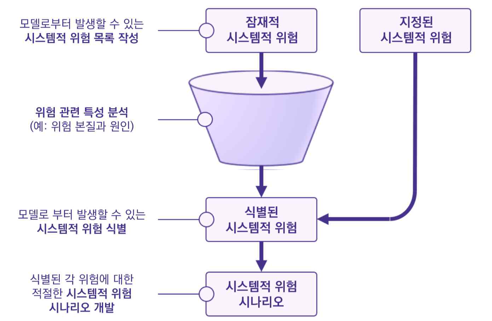


· ‘제품 또는 서비스 차원’은 제품 또는 서비스의 활용 맥락에서 발생하는 위험을 다루며, 인간의 삶에 중대한
영향을 미치는 자동화된 의사결정에 초점을 맞춤 → 인공지능의 오류, 편향 등과 자동화에 따른 효율성이
의료 진단, 채용 결정, 신용평가 등 여러 영역에 미치는 영향에 따라 기본권 목록도 유연하게 결정 가능
- 인공지능의 자동화된 결정으로 영향받는 기본권의 목록은 아래 표를 참조하되, 이는 인공지능의 활용 영역이
확장함에 따라, 인공지능기술의 발전에 따라 정기적인 최신화가 필요함을 유념
※ (주의) 인간의 존엄성, 행복추구권(헌법 제10조)은 다른 기본권과의 관계에서 단지 보충적으로만 기능하는 일반적 자유권이므로,
어떤 기본권에 어떻게 영향을 미치는지 파악하는 영향평가에서는 무의미
8) 헌재 2003.10.30. 선고 2002헌마518(좌석안전띠 착용의무), 판례집 15-2하, 185, 206.
9) 헌재 1996.11.28. 선고 95헌바1(사형제도), 판례집 8-2, 537, 546.
잠재적 영향 기본권
기본권 내용 및 침해 시나리오
사생활의 자유
외부 개입 없이 사생활을 형성할 자유8)
- IoT 기반 스마트홈이 ‘최적화된 생활방식’ 제안 명목으로 개입,
- ‘더 나은 인간관계’를 위한 SNS 플랫폼의 개입
- 건강관리 앱이 ‘건강 최적화’를 이유로 생활에 개입
- ‘합리적 소비’를 유도한다는 명목으로 구매 행동에 개입
생명권
생명을 박탈당하지 않을 권리9)
- 의료 진단 AI의 치명적 오진(예: 응급상황 미감지, 암 진단 누락 등)
- 생명유지 장치나 의료기기 오작동(예: 인공호흡기, 마취 제어 등)
- 자율주행 AI의 도로 상황 인식이나 위험 상황 대응 실패
- 인공지능 기반 안전 시스템이나 대응 시스템의 오작동(예: 대피 경로 오안내)
- 군사·보안 AI의 위협 상황 오판에 따른 민간인 대상 무력 사용
건강권
신체적 건강을 훼손당하지 않을 권리10)
- 인공지능 기반 의료 시스템이 분석 오류 또는 획일화로 부적절한 치료
- 인공지능 제어 산업용 로봇의 안전 프로토콜 오류로 신체에 직접적 손상
- 스마트홈 시스템이 가스, 전기 등을 잘못 제어하여 건강에 해를 끼침
- 건강 상태의 과대평가에 따라 과한 운동량 권고로 신체에 해로운 행동을 하도록 유도
평등권
본질적으로 동일한 것의 합리적 이유 없는 차별 금지
- 성별과 관련된 편향으로 인해 특정 성(性)에 불리한 결과 발생
- 인공지능 기반 신용평가 시스템이 대출 신청자를 거주 지역을 이유로 차등 평가
- 인공지능 기반 안면인식 출입 시스템이 특정 인종의 인식률이 낮아 추가 인증 요구
- 복지 부정수급 예측 시스템의 설계 및 운영상 편향으로 저소득층만 집중적으로 감시
표현의 자유
자기 의견을 간섭 없이 표명하고 전파할 자유
- 챗봇 서비스가 특정 이념 관련 대화를 ‘부적절한 대화’로 분류하여 대화를 일방적으로 중단
- 인공지능 기반 필터링 시스템이 사회적 소수자 집단의 비판적 의견을 혐오 표현으로
오인하여 자동 삭제
집회의 자유
간섭 없이 집회 참가 여부 및 집회의 목적·시간·장소·방법을 스스로 결정할 권리
- 원격 얼굴인식 시스템의 활용으로 위축 효과가 발생해 집회 참여 자체를 주저하게 함
알권리
일반적으로 접근할 수 있는 정보원으로부터 자유롭게 정보를 수집할 자유
- 소셜미디어 플랫폼의 AI 시스템이 특정 성향의 의견을 체계적으로 차단
- 검색 결과의 순위를 조작하거나 편향적으로 배열하여 정보 접근 왜곡
제품 또는 서비스 차원에서 영향받을 수 있는 기본권

3.3 기본권 영향 판단
⚫단순한 연상 또는 직관에 대한 의존을 피해 위험 시나리오를 바탕으로 ‘작동원리-위험’과 ‘잠재적 피영향
기본권’의 연결 관계와 현실성을 평가
· 이 단계에서는 ‘시나리오 기반 위험 분석’과 ‘관련 기본권의 식별’ 단계에서 느슨한 기준에 따라 파악한 요소들을
종합하여 해당 제품 또는 서비스가 기본권에 미치는 영향을 구체적으로 판단
· 시나리오에서 확인한 ‘위험’이 잠정적으로 파악한 ‘관련 기본권’의 보호영역을 제약하는지 판단이 주요 내용이며,
이를 위해 기본권 내용을 바탕으로 구체적 위험, 즉 ‘영향 내용’을 작성
· 평가주체는 영향 내용을 바탕으로 시나리오에 제시된 위험의 ‘발생 가능성’을 자체적으로 평가하여 해당 제품
또는 서비스와 관련성이 높은 시나리오 및 기본권을 선별하고, 이를 ‘사후 단계’에 활용
· 위 과정은 양식 [부록1] 에 해당 내용을 작성하는 방식으로 진행하며, 위험 시나리오별로 하나의 양식을 각각 작성
10) 헌재 1997.1.16. 선고 90헌마110 등(교통사고처리특례법), 판례집 9-1, 90, 123.
11) 헌재 1993.5.13. 선고 91헌바17(음반제작자 등록제), 판례집 5-1, 275, 283.
재산권
사적 유용성 및 처분권을 지닌 재산적 가치 있는 구체적인 권리의 보호
- 인공지능 신용평가 시스템이 분석 오류로 실제 신용능력과 무관하게 신용등급 조작
- 인공지능이 일시적 시장 변동을 오판하여 임의로 자산의 대량 매도 결정
직업의 자유
(직업 선택) 원하는 직업을 타인의 간섭 없이 선택할 권리
- 편향된 채용 시스템이 특정 배경을 가진 지원자의 진입을 체계적으로 차단
- 교육 분야 AI가 적성 분석을 근거로 진로를 제한하거나 특정 방향으로 강요
- 플랫폼 경제 AI가 과거 평점이나 수행 이력을 근거로 특정 노동자를 부적격으로 분류
- 인공지능이 사회신용점수를 산출하고 점수가 낮은 개인을 신뢰가 필요한 직업군에서 배제
(직업 수행) 선택한 직업을 자유롭게 수행할 권리
- 인공지능 진단·치료시스템이 의료진의 진단 결과에 과도하게 간섭하여 진료 방해
- 플랫폼 AI가 성공한 창작자의 스타일을 최적 모델로 정의하고, 이를 따르도록 종용
- 인공지능 법률 분석 시스템이 변론 전략을 과도하게 제한하여 업무 수행 방해
예술의 자유
간섭 없이 예술 작품을 창작하고 전시·공연·보급할 자유11)
- 인공지능 기반 저작권 검증 시스템이 과도한 기준을 적용하여 패러디, 오마주 등을 차단
- 기존 범주에 속하지 않는 실험적 작품을 격하하여 전시 기회 박탈
- 특정 문화권의 상징을 다양한 문화적 배경을 무시하고 획일적으로 검열
학문의 자유
간섭 없이 연구의 전 과정을 결정하고 그 결과를 발표할 자유
- 연구 주제나 방법론 선택 시 AI가 효율성만을 기준으로 제한
- 인공지능 논문 심사 시스템이 편향된 기준으로 논문을 사전 선별
- 연구 성과 평가 시 AI가 획일적이고 단기적인 지표만 중시하여 장기적 연구 저해

“환자상태를 고려한 최적 배분 자동 결정”이라는 작동원리가 “자동화된 차별”이라는 위험을 통해 “생명권”과 “개인
정보자기결정권”에 미치는 영향의 분석:
위험 시나리오
예) 편향된 의료 데이터를 학습한 모델이 ‘노숙인’ 신분을 응급도 평가 변수로 활용하여, 사회적 편견에 기반한
특정 서비스(예: 알코올 중독 프로그램)를 추천
피영향자
직접 피영향자(영향받는 자)
§
환자 개인
(이유) 인공지능 모델에 의해 편향된 응급도 평가 → 치료 지연 → 생명ㆍ건강 위험 초래
간접 피영향자
§
동일 시스템에 적용받는 다른 취약계층 환자
(이유) 시스템 편향이 다른 취약계층에도 동일하게 적용 → 유사한 불이익 발생
§
응급실 의료진
(이유) 의료진도 잘못된 추천으로 인해 의학적 판단에 제약
§
보호자ㆍ가족
(이유) 가족은 치료 지연으로 정신적ㆍ경제적 피해
의도치 않은/예상치 못한 피영향자
§
의료 데이터 제공자ㆍ수집기관 (데이터 품질 문제로 비난·소송 위험)
§
병원 및 지역사회 (서비스 신뢰 하락, 의료 이용 기피)
§
공중보건 당국 (편향된 데이터가 장기적으로 정책 의사결정 왜곡)
(이유) 원래는 위험 대상으로 고려되지 않았으나, 신뢰 저하·법적 분쟁·사회적 비용 증가로 영향을 받음
관련 기본권
영향 내용
영향수준
이행 중인
관리방안
영향 규모
영향 기간
발생 가능성
생명권
편향된 응급도 평가를
내려 뇌출혈 환자의
치료가 지연되고, 적시
치료를 받지 못해 생명에
치명적 결과(사망 등)가
초래
보통/경미
중간
높음
매우 높음
□
□
□
□
v
단기
중기
장기
세대 간
□
□
□
□
v
낮음
중간
높음
매우 높음
□
□
v
□
□
· 모델 편향 검증 및
개선
· 휴먼 인 더 루프
· 실시간 모니터링 및
피드백
개인정보
자기결정권
불투명성과 설명 부재로
인해 환자가 잘못된
라벨링(알코올 중독
위험군)을 인지·정정할
기회를 보장받지 못해,
개인정보 통제권과
자기결정권이 침해됨
보통/경미
중간
높음
매우 높음
□
□
□
v
□
단기
중기
장기
세대 간
□
□
□
v
□
낮음
중간
높음
매우 높음
□
□
□
v
□
· 설명가능성
제고(XAI 등)
· 정정·이의제기
절차 마련
⋮
⋮
⋮
⋮
⋮
⋮
인공지능 영향평가 작성 예시

[참고] 해외 유사 제도 사례
EU, “Fundamental Rights Impact Assessment” 평가요소 (EU 인공지능법 제27조)
- EU 인공지능법(EU AI Act) 제27조에서 평가 대상이 되는 고위험 인공지능 시스템 배포자는 다음 사항을 포함한 기본권 영향
평가를 수행할 것을 규정
(a) 대상 AI 시스템이 의도된 목적에 맞게 사용될 절차 설명
(b) 대상 AI 시스템의 사용 기간 및 빈도 설명
(c) 특정 상황에서의 사용으로 인해 영향을 받을 가능성이 있는 개인(자연인) 또는 집단의 범주
(d) 식별된 대상에 영향을 미칠 가능성이 있는 구체적인 위험 요소
(e) 사용 지침에 따른 인적 감독 조치 이행에 대한 설명
(f) 위험이 현실화될 경우 취할 조치(내부 거버넌스 및 이의 처리 체계를 포함)
출처 : EU(2025). “Code of Practice for General-Purpose AI Models - Safety and Security Chapter”
UNESCO, “Ethical Impact Assessment”에서의 윤리영향 식별ㆍ완화 측정 문항
- 유네스코(UNESCO)는 윤리적 영향평가(Ethical Impact Assessment)에서 발생 가능한 긍정적·부정적 영향을 윤리 원칙별로(①
안전 및 보안, ② 공정성, 차별금지, 다양성, ③ 지속가능성, ④ 프라이버시, 정보 보호, ⑤ 인간 감독 및 결정, ⑥ 투명성 및 설명
가능성, ⑦ 인식 및 리터러시) 식별하고, 규모, 범위, 발생 가능성 및 해결 가능성 등을 평가하도록 평가도구 제시
긍정적 영향
윤리 가치에 대한 인공지능 시스템의 긍정적 영향
개방형 (정성)
작성 예: 인공지능 시스템은 개인에 대한 악성 소프트웨어(Malware) 및 해킹 위험을 식별하는 데 활용될 수 있음
예상되는 긍정적 결과의
규모 평가
예상되는 긍정적 결과의 범위 평가
· 영향을 받는 개인/그룹/단체에 대한 설명(모든 살아있는 유기체가 포함 가능)
· 영향의 기간
예상되는 긍정적 결과가
발생할 가능성 평가
유의미한 수준
· 매우 높음
· 높음
· 중간
· 보통 / 경미한
영향의 범위
영향을 받는 대상
· 직접적 / 간접적 / 예기치 않은·의도하지 않은
영향 기간
· 단기 / 중기 / 장기 / 세대 간
발생 가능성
· 낮음
· 중간
· 높음
· 매우 높음
부정적 영향
윤리 가치에 대한 인공지능 시스템의 부정적 영향
개방형 (정성)
작성 예: 인공지능 시스템은 사용자의 심리적 안녕을 위협할 수 있는 허위 정보나 해악 또는 남용을 확산시킬 가능성
윤리가치에
대한 시스템의
부정적 영향
예상되는 부정적 결과의
범위 평가
· 영향을 받는 개인/그룹/단체에
대한 설명(모든 살아있는
유기체가 포함 가능)
· 영향의 기간
예상되는 부정적
결과가 해결될
가능성 평가
예상되는 부정적
결과가 발생할
가능성 평가
절차적 안전조치의 부정적 영향 완화 정도
추가적 완화 및 구제 전략 시행 필요성
· 시스템을 즉시 중지해야 할 극단적 경우 설명
· 조사 및 구제가 필요한 경우, 시기와 그 이유 설명
· 잠재적 피해가 반복되지 않기 위한 보장 방안
중대한 수준
· 재앙적
· 치명적
· 심각한
· 보통 / 경미한
영향의 범위
영향을 받는 대상
· 직접적 / 간접적 / 예기치
않은·의도하지 않은
영향 기간
· 단기 / 중기 / 장기 / 세대 간
해결가능 정도
· 매우 낮음
· 낮음
· 중간
· 높음
발생 가능성
· 낮음
· 중간
· 높음
· 매우 높음
개방형 (정성)
출처 : UNESCO(2023). “Ethical impact assessment: a tool of the Recommendation on the Ethics of Artificial Intelligence”


##### 제3절 사후 단계


##### 1. 후속 조치

⚫영향평가 완료 후에는 다음 사항을 고려하여 후속 조치를 자율적으로 시행하는 것을 권장함
· 식별된 영향요소 중 부정적 영향을 완화ㆍ제거하기 위한 개선ㆍ보완 계획 수립
· 영향평가 과정에서 수집된 피드백(내부ㆍ외부 전문가, 이해관계자 의견 포함)을 반영하여 인공지능 제품ㆍ
서비스 운영 정책 및 절차 업데이트
· 부정적 영향이 현실화될 경우 취할 조치를 사전에 마련(내부 거버넌스 절차, 피해 최소화 방안, 이해관계자와
이용자의 이의 제기ㆍ처리 체계를 포함)

##### 2. 문서의 보관 및 결과의 공개

⚫문서의 보관
· ① 인공지능 영향평가의 결과와 ② 영향평가 수행 과정에서 수집ㆍ작성한 근거자료는 사업자가 자율적으로
보관ㆍ관리하는 것을 권장함
· 영향평가를 수행하였음을 입증하고, 그 결과와 과정이 신뢰성 있게 관리되고 있음을 보여주기 위해, 사업자가
해당 문서와 근거자료를 자율적으로 보관하도록 권장함. 이는 법 제35조제2항과 관련하여 국가기관 등이
고영향 인공지능 제품 또는 서비스를 도입하는 과정에서 영향평가 결과 제출을 요청하는 경우, 사업자가
보관해 둔 문서를 활용할 수 있도록 하기 위함임. 이는 법적 의무가 아니며, 자율적 보관을 권장하는 데
목적이 있음
⚫영향평가 결과의 공개
· 영향평가 결과는 사업자의 판단에 따라 자율적으로 공개 여부를 결정할 수 있음
· 인공지능 제품ㆍ서비스에 대한 이해 증진 및 사회적 신뢰 확보 차원에서, 영향평가 결과의 공개를 권장

부록

##### 1. 인공지능 영향평가서 양식 및

작성 예시

##### 2. 인공지능시스템 기능별 침해

발생 가능 작동원리 예시

##### 3. 인공지능 영향평가 지원 안내


##### 4. 인공지능 영향평가 관련 FAQ


부록1
인공지능 영향평가서 양식 및 작성 예시


##### 1. 제품ㆍ서비스 개요

평가하려는 인공지능 제품ㆍ서비스의 주요 기능과 특징을 간략히 설명

##### 2. 목적 및 필요성

제품ㆍ서비스가 제공하려는 핵심 가치나 목적을 작성
(특정 문제 해결이 목표라면, 해결하고자 하는 문제를 구체적 기재)

##### 3. 적용 분야

해당 제품ㆍ서비스가 제공ㆍ운영될 산업 또는 분야 작성

##### 4. 사용 절차

고객 또는 사용자가 해당 제품ㆍ서비스를 이용하는 절차를 설명하고, 운영 단계에서
인공지능이 작동하는 시점과 그 역할을 작성

##### 5. 운영기간 및 빈도

제품ㆍ서비스가 운영될 기간과 평균 사용 빈도 작성

##### 6. 이용자ㆍ영향받는 자의

범주ㆍ특성
현재 제품ㆍ서비스를 직접 이용하거나 그 활용으로 인해 직접적 또는 간접적으로 영향을
받을 수 있는 주요 집단과 특성을 작성 (연령대, 숙련도, 전문성 수준, 취약성 여부 등 포함)

##### 7. 이용자 선택권

이용자가 해당 제품ㆍ서비스 이용 과정에서 가지는 선택권이나 통제권의 범위 설명 (인공지능
기능 미사용 선택 / 도출 결과 거부 / 이의제기, 수정요청 가능 / 결과 철회 가능)
< 제품ㆍ서비스명 >

##### 8. 위험 시나리오

피영향자
직접 피영향자(영향받는 자)
§

(이유)
간접 피영향자
§

(이유)
의도치 않은/예상치 못한 피영향자
§

(이유)
관련 기본권
영향 내용
영향수준
이행 중인
관리방안
영향 규모
영향 기간
발생 가능성
보통/경미
중간
높음
매우 높음
□
□
□
□
단기
중기
장기
세대 간
□
□
□
□
낮음
중간
높음
매우 높음
□
□
□
□
⋮
⋮
⋮
⋮
⋮
⋮

작성 예시1
스마트채용 (AI기반 채용 후보자 평가ㆍ적합도 판정 서비스)
※ 본 예시 영향평가는 “채용 후보자의 각종 정보(후보자가 제출하지 않은 정보 중 사회관계망 등에 공개된 정보까지
포함)를 수집․분석하여 채용 적격 여부를 판정하는 AI 기반의 채용 시스템”을 가상의 서비스로 설정하여 수행한 것으로,
실제 존재하는 서비스가 아니라는 점을 유의하여 주시기 바랍니다.

##### 8. 위험 시나리오 (복수 작성 가능)

※ 필요 시 복수의 시나리오를 추가 기재하고, 시나리오별로 피영향자, 관련 기본권, 영향수준, 이행 중인 관리 방안 등 작성

##### 1. 제품ㆍ서비스 개요

･
채용 후보자가 제출한 이력서·경력사항 등의 공식 자료뿐만 아니라 논문·프로젝트 이력,
공개된 사회관계망(SNS) 정보, 인터뷰 결과 등을 자동으로 수집·분석하여 후보자의 직무
적합성과 경쟁력을 점수화하고 평가 리포트를 제공하는 AI 기반 서비스

##### 2. 목적 및 필요성

･
기업이 다수의 채용 후보자를 효율적으로 비교·평가하고, 직무 요구사항에 부합하는
인재를 객관적으로 선발할 수 있도록 지원하는 것이 주요 목적
･
이를 통해 채용 과정의 속도·정확성을 높이고, 의사결정의 편향을 줄이며 후보자와 기업
모두에게 보다 투명한 채용 경험을 제공

##### 3. 적용 분야

･
일반 기업 및 공공기관의 HR·채용 업무
･
신규·경력직 채용, 정기·수시 채용, 내부 인사 이동 및 승진 심사 지원

##### 4. 사용 절차


##### 1. 기업 HR 담당자가 채용공고·직무 요구 역량 입력


##### 2. 후보자 데이터(제출자료 + 공개 정보) 자동 수집


##### 3. AI 모델이 데이터 분석 → 직무 적합도·경쟁력 점수 산출


##### 4. 평가 리포트(점수·분석 근거 포함) 자동 생성


##### 5. 기업이 결과 리포트를 검토하고 자체 심사 프로세스를 통해 최종 결정

▶ 단계 2~3에서 데이터 수집ㆍ분석 및 점수 산출 수행

##### 5. 운영기간 및 빈도

･
운영기간 : SaaS 형태로 상시 제공
･
사용 빈도 : 채용 공고별로 1회 이상 분석 수행 (정기 또는 수시)

##### 6. 이용자ㆍ영향받는 자의

범주ㆍ특성
HR 담당자는 시스템 사용 능력은 있으나 AI 모델의 내부 로직 이해도는 제한적일 가능성 있음
･
(직접 이용자) 기업 HR 담당자, 인사팀 관리자, 시스템 관리자
･
(간접 영향자) 채용 후보자, 추천인, 채용 결과에 영향을 받는 내부 직원ㆍ팀

##### 7. 이용자 선택권

･
HR 담당자(이용자): 시스템 분석 결과를 수용·재검토·무시 여부 선택 가능
･
채용 후보자: 사전 동의 절차를 통해 시스템 평가 참여 여부 선택 가능 (동의 거부 시
대체 평가 절차 제공 권고)
･
결과 접근권: 기업·후보자 모두 결과 리포트 확인 가능 (기업 정책에 따라 범위 조정)
･
이의제기: 후보자가 평가 결과에 대해 설명 요청·정정 요구할 수 있는 절차 제공 가능
시나리오(1)
채용 후보자와 관련한 다양한 데이터를 광범위하게 수집·분석하는 과정에서, 비공개적이거나 사적인 영역의
정보까지 활용되어 사생활의 자유가 침해될 수 있음. 또한 부실하거나 편향된 데이터가 포함될 경우
차별적·불공정한 평가 결과가 산출되어 평등권 및 직업 선택의 자유가 침해될 위험이 있음. 더 나아가 AI
시스템의 분석 과정이 불투명하여, 후보자가 본인의 평가 결과 산출 근거를 확인하거나 이의제기하기 어려워
알 권리가 제한될 가능성이 있음
피영향자
직접 피영향자(영향받는 자)
§
채용 후보자
(이유) 후보자는 정보 수집의 대상이 될 뿐만 아니라, AI 시스템의 결정 결과에 따라 직업 기회가
제한되거나 영향을 받는 당사자

간접 피영향자
§
채용 기업
(이유) AI 시스템의 작동 상태(정상·비정상)에 따라 채용 결과가 영향을 받을 수 있으며, 장기적으로는
기업의 채용 심사 기준이 AI 시스템의 평가 기준을 반영하는 방향으로 변화할 가능성
§
향후 잠재 채용 후보자군
(이유) AI 시스템이 채용 과정에서 일반화될 경우, 지원자는 시스템의 평가 기준을 고려해 학력, 경력,
온라인 활동 등을 준비해야 할 필요 발생
의도치 않은/예상치 못한 피영향자
§
직업교육 종사자
(이유) 채용 평가가 AI 중심으로 전환되면서 기존 교육·훈련 프로그램이 인사 담당자의 주관적 평가를
전제로 설계된 경우 방향 전환이 요구됨
관련 기본권
영향 내용
영향수준
이행 중인
관리방안
영향 규모
영향 기간
발생 가능성
직업의 자유
· 데이터에 내재된
사회적·관습적 편향이
시스템 설계 단계에서
교정되지 않으면
불공정한 채용 결과를
초래할 가능성이 있음
· 기업 평가 기준이
사회적 기준과 다르면,
채용 결과가 불공정하게
인식될 수 있음
보통/경미
중간
높음
매우 높음
□
□
□
v
□
단기
중기
장기
세대 간
□
□
□
v
□
낮음
중간
높음
매우 높음
□
□
v
□
□
· 객관적ㆍ다양한
데이터를 활용하고,
소수자 배려 요소를
모델 학습 데이터·
알고리즘에 반영
· AI 채용시스템의
평가 결과와 근거를
HR 담당자가 최종
확인·보완하여
결과의 공정성 확보
사생활의
자유
· 채용 시스템의 공정성과
정확성을 도모하기
위해 후보자에 대한
광범위한 정보 분석이
이루어질 수 있으며, 이
과정에서 불필요한
정보 수집 위험이 존재
· 분석 이후 적절한
절차에 따른 개인정보
파기가 이루어지지
않을 경우, 인사 과정
종료 후에도 해당
정보가 잔존하거나
유출될 가능성 있음
· 한편, 시스템 보안을
강화하고 접근 통제를
적용하면 사생활 정보에
대한 불필요한 접근을
차단하여 프라이버시
보호에 기여할 수 있음
보통/경미
중간
높음
매우 높음
□
□
v
□
□
단기
중기
장기
세대 간
□
□
v
□
□
낮음
중간
높음
매우 높음
□
□
v
□
□
· 당사자의 사전
동의를 받은 정보
또는 합리적으로
공개된 정보만 분석
대상으로 활용
· 채용 과정에서
수집·저장되는
정보를 암호화·
접근통제하여 인사
절차 종료 후 즉시
파기

평등권
· 데이터가 양적으로
충분하고 사회적
관습을 그대로
반영하고 있더라도,
역사적으로 발전해 온
평등·차별금지 가치가
별도로 고려되지
않는다면 특정 계층에
대한 취업차별로
이어질 수 있음
· 탈락 사유에 대한
설명이 부족할 경우,
실제로는 객관적
요인에 따른 결과라도
소수자 차별로 인식될
가능성이 있음
보통/경미
중간
높음
매우 높음
□
□
□
v
□
단기
중기
장기
세대 간
□
□
□
v
□
낮음
중간
높음
매우 높음
□
□
v
□
□
· 성별·지역·인종·종교·
학벌 등 차별적
요소가 될 수 있는
변수를 평가
기준에서 배제
· 시스템 운영
과정에서 평가
결과를 주기적으로
점검하고, 소수자에
불리한 편향이
발견되면 알고리즘
개선
알권리
· AI 채용 시스템은 평가
과정의 불투명성으로
인해 채용 지원자의 알
권리가 제한될 수
있다는 논의가 있음
· 다만, 기업 채용 절차의
의사결정 과정은
일반적으로 알 권리의
직접적 보호 범위에
포함되지 않아 실질적
침해 가능성은 제한적
이라고 볼 수도 있음
보통/경미
중간
높음
매우 높음
□
v
□
□
□
단기
중기
장기
세대 간
□
v
□
□
□
낮음
중간
높음
매우 높음
□
v
□
□
□
· 시스템이 수집·
분석하는 정보의
범위와 주요 평가
기준을 사전에 안내
· 후보자 요청 시
평가 결과의 주요
근거와 판단 요소를
설명할 수 있는
절차 제공
⋮
⋮
⋮
⋮
⋮
⋮

작성 예시2
Face Swap Studio (딥페이크 얼굴 합성 영상 제작 서비스)
※ 본 예시 영향평가는 “사용자가 업로드한 동영상ㆍ이미지를 합성하여 결과 영상을 생성·공유할 수 있는 AI 기반 얼굴
합성 영상 서비스”를 가상으로 설정하여 수행한 것으로, 실제 존재하는 특정 기업·서비스를 지칭하지 않습니다.

##### 1. 제품ㆍ서비스 개요

･
사용자가 업로드한 동영상ㆍ이미지와 선택한 타인의 얼굴 데이터를 AI 모델이 합성하여
자연스러운 얼굴 변환 영상을 생성하는 서비스
- 얼굴 인식ㆍ추출,
- GANㆍTransformer 기반 합성 알고리즘으로 얼굴 변환
- 결과 영상 미리보기 및 간단한 편집
- 결과물 다운로드ㆍ공유 기능 제공

##### 2. 목적 및 필요성

･
엔터테인먼트ㆍ창작 지원으로, 개인이 영화 장면 속 캐릭터 얼굴을 자신의 얼굴로
교체하거나 패러디ㆍ유머 콘텐츠를 제작할 수 있도록 지원함. 이를 통해 영상 제작 비용과
시간을 절감하고, 비전문가도 창의적 콘텐츠 제작에 참여할 수 있는 접근성을 높임

##### 3. 적용 분야

･
엔터테인먼트 : 패러디, 밈, 팬 콘텐츠 제작
･
마케팅ㆍ광고 : 맞춤형 캠페인, SNS 홍보 영상 제작
･
교육ㆍ연구 : 영상합성 기술 교육, 연구용 합성 데이터 생성

##### 4. 사용 절차


##### 1. 원본 영상 업로드 또는 템플릿 선택


##### 2. 교체할 얼굴 이미지 업로드 → AI가 얼굴 인식ㆍ특장점 추출


##### 3. 합성 모델 작동 → 얼굴 합성 결과 생성


##### 4. 결과 영상 미리보기ㆍ편집


##### 5. 결과물 다운로드ㆍSNS 공유

▶ 단계 3~4에서 얼굴 인식ㆍ합성 모델 작동

##### 5. 운영기간 및 빈도

･
운영기간 : 상시 운영
･
사용 빈도 : 1인당 평균 월 3~5회

##### 6. 이용자ㆍ영향받는 자의

범주ㆍ특성
대체로 비전문가, 영상 제작 경험이 있으나 AI 기술 수준은 중간 이하
･
(직접 이용자) 10~40대 일반 사용자, 크리에이터, 광고ㆍ마케팅 담당자
･
(간접 영향자) 합성에 사용된 인물, 원본 영상ㆍ사진의 저작권자 ,합성영상 시청자 등

##### 7. 이용자 선택권

･
AI 기능 비사용 선택 : 불가(서비스 본질 기능)
･
결과 거부ㆍ재생성 : 합성 결과 미리보기 후 재합성 가능
･
이의제기ㆍ수정 요청 : 초상권ㆍ저작권 침해 신고 접수 채널 운영
･
결과 철회 : 플랫폼 내 게시물 삭제 가능(외부 공유 이후 통제 어려움 사전 고지)
･
사전 동의 절차 : 타인 얼굴 업로드 시 동의 여부 확인 체크

##### 8. 위험 시나리오 (복수 작성 가능)

※ 필요 시 복수의 시나리오를 추가 기재하고, 시나리오별로 피영향자, 관련 기본권, 영향수준, 이행 중인 관리 방안 등 작성
시나리오(1)
사용자가 유명인의 얼굴 사진을 인터넷에서 무단으로 수집해 서비스에 업로드하고, 서비스는 이를 합성해
음란물 형태의 패러디 영상을 생성 → 사용자가 해당 영상을 유포하고, 이를 본 불특정 다수가 실제
사건으로 오인해 피해자의 평판이 실추되고 정신적 피해를 입음
피영향자
직접 피영향자(영향받는 자)
§
합성 대상이 되는 개인(유명인, 일반인 포함)
(이유) 원치 않는 합성으로 인한 이미지 훼손, 사생활 침해 가능

간접 피영향자
§
합성 영상 시청자, 일반 대중
(이유) 허위 정보 영상 접촉으로 인해 사실 오인, 사회적 불신 증가
의도치 않은/예상치 못한 피영향자
§
동일ㆍ유사 얼굴 특징을 가진 제 3자
(이유) 합성 결과가 제3자와 유사해 오인ㆍ괴롭힘 등 2차 피해 발생 가능
관련 기본권
영향 내용
영향수준
이행 중인
관리방안
영향 규모
영향 기간
발생 가능성
개인정보
자기결정권
본인 동의 없이 얼굴
이미지가 수집ㆍ합성되어
통제권 상실
보통/경미
중간
높음
매우 높음
□
□
□
v
□
단기
중기
장기
세대 간
□
□
v
□
□
낮음
중간
높음
매우 높음
□
□
v
□
□
· 업로드 시 동의
여부 확인 체크
· 권리자 요청 시
신속 삭제ㆍ차단
사생활의
비밀
사적 이미지가 음란물
등으로 변형ㆍ유포되어
정신적 피해 발생
보통/경미
중간
높음
매우 높음
□
□
□
□
v
단기
중기
장기
세대 간
□
□
□
v
□
낮음
중간
높음
매우 높음
□
□
v
□
□
· AI 유해물
탐지ㆍ자동 차단
· 신고 접수 후
모니터링ㆍ삭제
평등권
특정 집단(성별ㆍ인종)이
합성물 타깃이 될 경우
차별 조장
보통/경미
중간
높음
매우 높음
□
□
v
□
□
단기
중기
장기
세대 간
□
□
v
□
□
낮음
중간
높음
매우 높음
□
v
□
□
□
· 약관에 혐오ㆍ차별
목적 합성 금지 명시
· 반복 위반 계정 차단
⋮
⋮
⋮
⋮
⋮
⋮

작성 예시3
Edu Score (AI기반 학생 평가 서비스)
※ 본 예시 영향평가는 “학생이 제출한 시험 답안·과제·에세이 등 학습 데이터를 수집·분석하여 평가 점수를 산출하고
제한적 피드백을 제공하는 “AI 기반 학생평가 서비스”를 가상으로 설정하여 수행한 것으로, 실제 존재하는 특정
기업·서비스를 지칭하지 않습니다.

##### 1. 제품ㆍ서비스 개요

･
교육기관에서 학생 평가에 활용할 수 있도록 설계
･
학생이 제출한 객관식ㆍ단답형ㆍ서술형 답안 및 에세이 과제를 분석하여 점수를 산출하고,
필요 시 학습 역량 향상을 위한 제한적 피드백을 제공

##### 2. 목적 및 필요성

･
(목적) 교사ㆍ교수의 교육 활동을 보조하여, 학습자에게 보다 질 높은 교육을 제공할 수
있도록 지원
･
(필요성) AI 도입으로 교사·교수의 직무 변화가 불가피한 상황에서, 평가의 일정 영역을
시스템이 담당하게 함으로써 교사는 종합적 평가와 피드백 제공에 집중할 수 있고,
학생들이 역량을 성장시키는 데 집중할 수 있도록 도움을 주는 서비스 필요

##### 3. 적용 분야

･
초·중·고·대학 등 교육기관의 정규·보충 수업 과정
･
온라인 학습 플랫폼
･
개별 학습자의 자율 학습 진단과 피드백 제공

##### 4. 사용 절차


##### 1. 교육기관이 서비스에 가입하고 평가 기준을 등록


##### 2. 학생이 과제·답안을 제출하면 시스템이 자동으로 데이터를 분석


##### 3. AI 모델이 점수와 피드백을 생성


##### 4. 교사·교수와 학생이 결과를 확인하고 학습 계획에 반영


##### 5. 개인 학습자는 직접 과제를 제출하고 결과·피드백을 확인

▶ 단계 2~3에서 자동 분석 및 점수 산출에 AI 작동

##### 5. 운영기간 및 빈도

･
운영 기간: 학기·학년도 단위로 상시 운영
･
빈도: 평가 시점이나 과제 제출 시마다 반복 사용 가능

##### 6. 이용자ㆍ영향받는 자의

범주ㆍ특성
･
(직접 이용자) 교육기관 담당자, 교사ㆍ교수, 학생
･
(간접 영향자) 학부모·교육청 등은 결과를 간접적으로 참고할 수 있는 이해관계자
･
교사·교수는 기본적인 시스템 사용 역량을 갖추고 있으나, AI 모델의 세부 작동 원리에
대한 전문 이해는 제한적일 수 있음

##### 7. 이용자 선택권

･
교육기관은 서비스 도입 여부를 결정
･
기관 도입 이후에도 개별 교사·교수는 서비스 활용 여부를 선택 가능
･
개인 학습자는 직접 구독을 통해 서비스 이용 여부를 결정할 수 있음

##### 8. 위험 시나리오 (복수 작성 가능)

※ 필요 시 복수의 시나리오를 추가 기재하고, 시나리오별로 피영향자, 관련 기본권, 영향수준, 이행 중인 관리 방안 등 작성
시나리오(1)
한 대학의 미디어커뮤니케이션학과 학생 B가 제출한 에세이를 AI가 분석한 결과, AI 작성 확률이
40~70%로 산출되고 평가 점수는 C+로 부여됨 → 담당 교수 C는 해당 점수를 그대로 반영해 성적을
매겼으나, 이에 대해 학생 B는 스스로 작성한 과제라며 성적 정정을 요구함 → 교수는 AI 판별 결과의
한계를 고려해 직접 재평가하여 성적을 B로 수정했지만, B 학생은 이 수정 결과 역시 초기 AI 평가 점수의
영향(닻내림 효과)을 받았다고 주장하며 학교 당국에 이의를 제기
피영향자
직접 피영향자(영향받는 자)
§
AI 평가 서비스를 통해 평가받는 대상자(학습자)
(이유) 교육기관 소속 학습자는 AI 평가 서비스의 판단이 자신의 성적에 직ㆍ간접적으로 영향을
미치므로 1차적 이해당사자에 해당

간접 피영향자
§
교수자 및 교육기관
(이유) 서비스가 주관식 답안ㆍ에세이 평가 등에 있어 한계가 존재할 가능성이 여전히 있으며, 교수자의
독자적 판단에 영향을 줄 가능성이 있음. 이에 따라 학생의 이의 신청 및 분쟁 발생 가능성 존재
의도치 않은/예상치 못한 피영향자
§
교육 당국 및 AI 교육 서비스 제공자
(이유) AI 평가 서비스가 교사 업무 부담을 줄이고 학습자에게 피드백을 제공할 잠재력을 가지고
있으나, 서비스 결과에 대한 사회적 불신이 확산될 경우 교육 당국 및 산업 전반에 대한 신뢰에
부정적 영향을 줄 수 있음
관련 기본권
영향 내용
영향수준
이행 중인
관리방안
영향 규모
영향 기간
발생 가능성
평등권
· AI 평가 서비스가 특정
문체ㆍ언어 패턴에
편향될 경우 일부
학생이 불리하게
평가받을 수 있음
· 서비스의 공정성과
객관성에 대한 논란
발생 시 평가 결과
신뢰도 저하 가능
보통/경미
중간
높음
매우 높음
□
□
□
v
□
단기
중기
장기
세대 간
□
□
v
□
□
낮음
중간
높음
매우 높음
□
□
□
v
□
· 중요 과제는 교사
표본 검토로 교차
확인
· 객관식 문항,
단답형 채점 등에만
제한적으로 AI 활용
알권리
· 설명가능성의 한계로
평가 대상자가
납득할만한 근거 제시
어려운 상황 발생 가능
· 설명가능성 부족은
학습자에게 결과를
개선할 기회를 제한
보통/경미
중간
높음
매우 높음
□
□
□
v
□
단기
중기
장기
세대 간
□
v
□
□
□
낮음
중간
높음
매우 높음
□
□
□
□
v
· 평가 근거·결과
리포트 제공
· 성적 이의제기 및
재검토 절차 운영
사생활의
비밀
· 학생이 제출한
과제·답안·성적 등 개인
학습 정보가 AI
시스템에 저장·분석되며,
보관·활용 과정에서
의도치 않게 외부로
유출될 경우 사생활
침해 우려
· 평가 종료 후에도
데이터가 적절히
삭제되지 않으면 개인
학습 이력이 과도하게
축적·노출될 가능성 있음
보통/경미
중간
높음
매우 높음
□
□
□
v
□
단기
중기
장기
세대 간
□
□
□
v
□
낮음
중간
높음
매우 높음
□
□
v
□
□
· 학습 데이터 최소
수집 및 평가 종료
후 자동 삭제
· 권한 있는 사용자만
접근 가능,
저장·전송 시 암호화
⋮
⋮
⋮
⋮
⋮
⋮

부록2
인공지능시스템 기능별 침해 발생 가능 작동원리 예시

기능
침해 발생 가능
작동원리
설명
데이터
수집
개인정보 수집
사용자 식별 및 서비스 개인화를 위한 개인정보 수집
예) 이름, 연락처, 주소, 생년월일 등 기본 인적 사항
행동 패턴 분석
서비스 이용 과정에서 사용자 행동 로그 수집
예) 웹/앱 로그, 쿠키, 세션 데이터 자동 수집, 컴퓨터 비전 기술
분석 및
판단
패턴 인식 및 분류
입력 데이터를 알고리즘으로 분석하여 패턴 도출 및 분류
예) 통계적 모델링, 클러스터링, 분류 알고리즘 적용
예측 및 추론
과거 데이터를 바탕으로 미래 상황 예측
예) 딥러닝, 신경망 등 예측 알고리즘 활용
자동화
결정
프로파일링
수집된 데이터를 종합하여 사용자 분류 및 프로파일 생성
예) 데이터 마이닝, 클러스터링을 통한 세분화
자동화된 의사결정
인공지능 분석 결과를 바탕으로 인간의 개입 없이 의사결정
예) 임계값 설정, 규칙 기반 자동 처리
콘텐츠 필터링
텍스트, 이미지, 영상을 분석하여 부적절 콘텐츠 검열 및 차단
예) 자연어 처리, 컴퓨터 비전 기술 활용
상호작용
개인화 추천
개인 프로파일과 유사 사용자 분석을 통한 추천
예) 협업 필터링, 콘텐츠 기반 필터링 알고리즘
피드백 수집
서비스 개선을 위한 사용자 반응 수집

부록3
인공지능 영향평가 지원 안내
⚫정보통신정책연구원(KISDI)은 ｢인공지능기본법｣에 따른 영향평가 제도의 원활한 안착을 지원하기 위해
사업자의 영향평가 수행을 지원할 예정
⚫인공지능 영향평가 가이드라인 제공, 사업자 문의사항에 대한 상담·컨설팅, 샘플 보고서 및 참고자료
제공 등 지원 범위를 단계적으로 확대해 나갈 계획
<문의처>
· 정보통신정책연구원(KISDI) 인공지능정책연구실
· 전화 : 043-531-4114
· 이메일 : aiia@kisdi.re.kr

부록4
인공지능 영향평가 관련 FAQ
Q. 인공지능 영향평가란 무엇인가요?
A. 인공지능 영향평가란 인공지능사업자가 고영향 인공지능을 이용한 제품이나 서비스를
제공하기 전, 해당 서비스가 사람의 기본권에 미치는 영향을 사전에 평가하는 절차를
말합니다(법 제35조제1항). 이는 인공지능을 이용한 제품 또는 서비스의 잠재적 리스크를
식별하고, 기본권을 존중·보호하는 방향으로 개선방안을 마련하는 데 목적이 있습니다.
Q. 어떤 사업자가 이 평가를 수행해야 하나요?
A. 고영향 인공지능을 이용한 제품 또는 서비스를 제공하려는 인공지능사업자는 법 제35조
제1항에 따라 이 평가를 수행하기 위하여 노력하여야 합니다. 고영향 인공지능이 아닌
일반 인공지능을 이용했다면, 인공지능사업자는 이러한 노력 의무를 지지 않지만, 신뢰성
확보와 글로벌 규제 대응을 위해 자율적으로 수행할 것이 장려됩니다.
Q. 인공지능 영향평가는 언제 수행해야 하나요?
A. 인공지능 영향평가는 신규 제품이나 서비스를 제공하기 ‘전’에 수행하는 것이 원칙입니다.
영향평가를 수행했다 하더라도, 제품이나 서비스의 핵심 기능이나 영향받는 대상에 중대한
변화가 생겼다면 재시행하는 것이 바람직합니다. 또한, 법 시행 이전부터 이미 제공 중인
제품 또는 서비스의 경우, 사업자가 자율적으로 판단하여 수행하는 것이 권장됩니다.
Q. 외부 기관에 의뢰하여 평가를 진행해도 되나요?
A. 네, 가능합니다. 「인공지능기본법 시행령안」 제28조제2항은 인공지능사업자가 직접 영향
평가를 수행하거나 제3자에 의뢰하여 영향평가를 실시할 수 있다고 규정하고 있습니다.
이에 정보통신정책연구원(KISDI)은 제도의 원활한 안착을 위해 전문적인 지원을 준비하고
있으며, 본 가이드라인의 제공 외에 사업자 문의사항에 대한 상담·컨설팅, 샘플 보고서
및 참고자료 제공 등 지원 범위를 단계적으로 확대해 나갈 계획입니다.
Q. 제품 또는 서비스로 인해 영향받는 자를 어디까지 고려해야 하나요?
A. 본 평가 단계의 첫 번째 핵심은 피영향자를 다각도로 식별하는 것입니다. 따라서 인공

지능에 의해 직접적으로 생명이나 기본권에 영향을 받는 자뿐만 아니라, 이들과의 관계나
환경 변화로 인해 근접하게 영향을 받는 간접 피영향자와 의도치 않은 또는 예상치 못한
피영향자까지 모두 고려하는 것이 권고됩니다. 특히 의도하지 않은 영향을 사전에 완벽히
파악하기는 어렵더라도, 다양한 가능성을 열어두고 진행하는 브레인스토밍은 잠재적 위험에
대한 선제적 대비 체계를 구축한다는 점에서 중요한 의미가 있습니다.
Q. 기술적 작동원리를 분석할 때 무엇을 중점적으로 검토하여야 하나요?
A. 작동원리를 분석할 때는 데이터 수집, 분석 및 판단, 결정, 피드백 등 인공지능 활용
모든 단계에서 인공지능 기술이 작동하는 방식에 집중하여 조사해야 합니다. 이를 통해
향후 단계별로 적절한 보호 조치와 완화 방안을 설계할 수 있는 기초 자료를 확보할
수 있습니다.
Q. 위험 시나리오는 어떤 기준으로 작성하는 것이 효과적인가요?
A. 동일한 기술이라도 활용 분야에 따라 위험의 종류가 다르므로, 실제 제품 또는 서비스가
목표로 하는 분야와 상황을 기준으로 구체적인 시나리오를 작성해야 합니다. 예를 들어,
동일하게 데이터를 분석하여 패턴을 찾아내고, 미래를 예측하는 기술이라도 ‘중환자실
위험 징후 감지’를 위해 활용되는 경우, 진단 오류로 인한 환자의 생명권 침해가 주된
위험이지만, ‘환자 답변용 챗봇’의 경우, 데이터 보안 실패에 따른 민감 정보의 유출이
주요 위험이 됩니다. 이 과정에서는 발생 가능성이 낮더라도 최대한 다양한 위험을 폭넓게
제시하는 것이 필요하며, 필요한 경우 외부 전문가의 조력을 받아 심층적인 시나리오를
확보하는 것이 권장됩니다.
Q. 인공지능이 침해할 수 있는 기본권은 어떻게 식별하나요?
A. 평가의 편의를 위해 ‘인공지능 기술 일반 차원’과 ‘제품·서비스 차원’으로 구분하여 식별하는
것이 좋습니다. 인공지능 기술의 일반적인 작동 방식에서 기인하는 개인정보자기결정권
이나 사생활의 비밀 같은 기본권은 물론이고, 서비스의 활용 맥락에 따라 생명권, 평등권,
표현의 자유, 직업의 자유 등이 침해될 가능성이 있는지 포괄적으로 식별해야 합니다.
Q. 식별된 위험이 기본권에 영향을 미치는지 어떻게 판단하나요?
A. 식별된 위험 시나리오를 바탕으로 기본권에 미치는 영향의 현실성을 종합적으로 판단해야
합니다. 위험 시나리오가 실제 기본권의 보호 영역을 제약하는지 판단하고, 그 영향의
규모와 기간, 발생 가능성을 자체적으로 평가합니다. 이 과정에서 해당 제품 또는 서비스와

관련성이 높은 시나리오를 선별하고, 기본권에 대한 부정적 영향을 완화 또는 제거하는 데
현재 이행 중인 관리 방안이 충분한지를 검토하여 사후 단계의 후속 조치로 연결해야
합니다.
Q. 평가 결과를 공개해야 하나요?
A. 평가 결과를 공개할 것인지는 인공지능사업자가 자율적으로 결정할 수 있습니다. 다만,
사회적 신뢰 확보와 이용자 이해 증진을 위해 평가 결과의 공개가 권장됩니다. 또한,
법 제35조제2항은 국가기관 등이 제품 또는 서비스 도입 시 영향평가를 실시한 제품
또는 서비스를 우선적으로 고려하여야 한다고 규정하고 있으며, 이때 영향평가 결과의
제출이 필요할 수 있으므로 관련 문서를 자율적으로 보관하는 것이 좋습니다.


---

# Part 3 절차안내

## 3-1. 국내대리인 지정 절차 안내


ㅁ
기본법 상 국내대리인 지정
AI
기본법 상 관련 규정
<AI
>
법 제
조국내대리인 지정
(
)
① 국내에 주소 또는 영업소가 없는 인공지능사업자로서 이용자 수매출액 등이
,
대통령령으로 정하는 기준에 해당하는 자는 다음 각 호의 사항을 대리하는 자
(이하 국내대리인이라 한다를
“
”
)
서면으로 지정하고이를
,
과학기술정보통신
부장관에게 신고하여야 한다.
제
조제항에 따른 이행 결과의 제출
1.
제
조제항에 따른 고영향 인공지능 해당 여부 확인의 요청
2.

##### 3. 제

조제항 각 호에 따른 안전성ㆍ신뢰성 확보 조치의 이행에 필요한
지원같은 항 제호에 따른 문서의 최신성ㆍ정확성에 대한 점검을 포함한다
(
)
국내대리인은 국내에 주소 또는 영업소가 있는 자로 한다.
②
③ 국내대리인이 제항 각 호와 관련하여 이 법을 위반한 경우에는 해당 국내
대리인을 지정한 인공지능사업자가 그 행위를 한 것으로 본다.
시행령 제
조국내대리인 지정 사업자의 기준
(
)
법 제
조제항 각 호 외의 부분에서 대통령령으로 정하는 기준에 해당
“
①
하는 자란 다음 각 호의 어느 하나에 해당하는 인공지능사업자를 말한다
”
.

##### 1. 전년도법인인

(
경우에는 전 사업연도를 말한다
매출액이 조원 이상인
)
인공지능사업자
인공지능서비스 부문 전년도법인인 경우에는 전 사업연도를 말한다
2.
(
)
매출액이
억원 이상인 인공지능사업자

##### 3. 전년도 말 기준 해당 인공지능사업자의 인공지능제품 및 인공지능

서비스에 대한 직전 개월간 국내 이용자 수가 일 평균
만명 이상인
인공지능사업자
법 제
조제항제호에 따른 과태료를 부과 받은 사실이 있는 인공
4.
지능사업자
제항제호 및 제호에 따른 매출액은 전년도법인인 경우에는 전 사업
(
②
연도를 말한다평균환율을 적용하여 원화로 환산한 금액을 기준으로 한다
)
.
별표
과태료의 부과기준
<[
2]
>
위반행위
근거 법조문
과태료 금액
차
위반
차
위반
차 이상
위반

**나. 법 제조제항을 위반하여**

국내
대리인을 지정하지 않은 경우
법 제
조제항제호
2,000
2,000
2,000

ㅁ
국내대리인 지정 기준
□
ㅇ 국내 주소 또는 영업소가 없는 인공지능 사업자로서 이용자 수

,
매출액 등이 대통령령에서 정한 기준에 해당하는 자는 서면으로 지정
- ①국내대리인의 성명법인의
(
경우에는 그 명칭과 대표자 성명)과 ②국내
대리인의 주소법인의 경우에는
(
영업소 소재지

)
전화번호
전자우편
,
,
주소를 인터넷 사이트에 공개
국내대리인 신고 절차
□
ㅇ

국내대리인을 서면으로 지정하고, ①국내대리인의 성명법인의
(
경우에는
그 명칭과 대표자 성명)과 ②국내대리인의 주소법인의 경우에는
(
영업소

소재지) 전화번호전자우편주소 명시하여 공문으로 신고
,
,

별도의 규정 서식 없으나위 정보를 반드시 명시하여 공문으로 신고 붙임 샘플

,
(
)
※
- 복수의 국내대리인이 지정된 경우지정된 국내대리인 모두에 대한

,
정보를 동일하게 서면에 명시하여 지정
- 국내대리인이 변경된 경우에는 위 사항을 지체없이 수정하여 신고
※ 전화번호는 국내 전화번호를 말하나반드시 국내대리인의 이동전화 등 개인용
,
전화
번호를 기재해야 하는 것은 아니며해당 업무를 실제 처리 가능한
,
연락처 작성
국내대리인 자격
□
ㅇ 한국에 주소 또는 영업소가 있는 자연인 또는 법인

ㅇ

국적이 반드시 한국인일 것을 요하지 않으나국내 이용자와의 소통
,
및 규제기관에 정확한 자료 제출 등이 가능하여야 하므로 한국어로
원활히 의사소통이 가능 필요
국내대리인 지정 정책 방향
□
ㅇ 국내대리인 제도는 안전성 확보사고 대응규제 이행 등 사업자

,
,
안전 책무 이행 지원하여 국내 이용자 보호와 법 실효성 확보

ㅁ
참고
신고 서식예시

(
)
국내 대리인 지정 확인서 예시
(
)
색상이 어두운 난은 작성하지 아니합니다
*
접수번호
접수일시
대상자
법인명
대표자명
주소본점소재지
(
)
전화번호
사업자등록번호 또는 고유번호
담당자 전자우편(E-Mail)
국내
대리인
법인명
대리인명법인의 경우 대표자명
(
)
주소
전화번호
사업자등록번호 또는 고유번호
담당자 전자우편(E-Mail)
대상자
제출서류
국내대리인 지정 여부를 확인할 수 있는 자료 부
∎

ㅁ
국내 대리인 재지정정보변경
확인서
(
)
예시
(
)
색상이 어두운 난은 작성하지 아니합니다
*
접수번호
접수일시
대상자
법인명
대표자명
주소본점소재지
(
)
전화번호
사업자등록번호 또는 고유번호
담당자 전자우편(E-Mail)
국내
대리인
법인명
대리인명법인의 경우 대표자명
(
)
주소
전화번호
사업자등록번호 또는 고유번호
담당자 전자우편(E-Mail)
재지정
정보변경
(
)
사유
대상자
제출서류
국내대리인 지정 여부를 확인할 수 있는 자료 부
∎


---

# Part 4 사례집

## 4-1. 인공지능기본법 지원데스크 사례집


20선의 질답 사례로 배우는 기업 실무 가이드
인공지능기본법 지원데스크 사례집


#### 제1장. 인공지능기본법 소개


##### 1. 제정 취지


##### 2. 주요 내용, 용어, 의무 조항 요약


##### 3. 의무 위반시 프로세스


##### 4. 참고 자료


#### 제2장. 인공지능기본법 주요 조항별 설명


##### 1. 제2·4·5조 | 용어 정의 및 적용 범위


##### 2. 제31조 | 투명성 확보 의무


##### 3. 제32조 | 안전성 확보 의무


##### 4. 제33조 | 고영향 인공지능 확인


##### 5. 제34조 | 고영향 인공지능과 관련한 사업자 책무


##### 6. 제36조 | 국내대리인 지정


#### 제3장. 인공지능기본법 지원데스크 주요 문의 사항 및 답변

유형1  누가 의무를 지는가 – 의무 주체 및 적용 대상
<사례 1> 타사의 인공지능으로 제작한 콘텐츠를 사용하면 인공지능이용사업
자에 해당하는가?
<사례 2> 생성형 인공지능을 도입하는 공공기관도 투명성 확보 의무 대상인가??
<사례 3> 타사가 개발한 인공지능 서비스를 납품받아 고객에게 제공하는 경
우 서비스를 받은 회사는 인공지능개발사업자인가, 인공지능이용사업자인가?
아니면 이용자인가??

CONTENTS
PART
PART
PART
들어가며:  인공지능기본법 사례집 활용 가이드

<사례 4> 개인 창작자(유튜버, 인스타그래머 등)도 표시 의무가 있는가?
<사례 5> 내부 업무용으로만 자체 개발하여 사용하는 인공지능은 투명성 확보
의무 적용 대상인가?

유형2   어떻게 표시해야 하는가? - 투명성 확보 의무 이행

<사례 6> 이미지 생성 시 가시적 워터마크와 비가시적 메타데이터를 모두 적
용해야 하는가?
<사례 7> 인공지능 챗봇·보이스봇 서비스에서 사전고지와 표시 의무를 어떻게
이행하는가?

<사례 8> 온라인 커머스 상세페이지에 인공지능 생성 이미지 또는 텍스트를
게시할 때 표시 방법은?

<사례 9> 인공지능이 생성하고 사람이 수정한 콘텐츠도 표시 의무가 있는가?
<사례 10> 멀티 LLM 환경에서 구체적인 모델명까지 표시해야 하는가?
<사례 11> 광고영상·SNS 콘텐츠·인쇄물에서의 인공지능 생성물 표시 방법은?
<사례 12> 예술적·창의적 표현물에서 감상을 방해하지 않는 표시 방법은 무엇
인가?
<사례 13> 법 시행 전 제작하여 게시한 인공지능 생성물에도 표시 의무가 소
급 적용되는가?
유형3   우리 서비스가 고영향 인공지능인가? - 고영향 인공지능 해당 판단
<사례 14> 채용 서류전형에서 인공지능을 보조도구로 활용하면 고영향 인공
지능인가?
<사례 15> 대출·신용 심사에 활용하는 인공지능은 고영향 인공지능에 해당하는가?
인공지능기본법 지원데스크 사례집
[20선의 질답 사례로 배우는 기업 실무 가이드]

<사례 16> 의료기기에 탑재된 인공지능 진단 기능은 고영향 인공지능인가?
<사례 17> 교육 인공지능서비스는 고영향 인공지능에 해당하는가?
<사례 18> 공공안전 분야 인공지능(홍수예보·지능형 CCTV 등)은 고영향 인
공지능인가?
유형4  그 밖의 궁금증 – 운영 의무 및 집행
<사례 19> 고영향 인공지능 사업자의 기록·사후 검증 관리체계 의무는 구체적
으로 무엇인가?
<사례 20> 법 시행 이전부터 제공하던 인공지능서비스에도 법이 소급 적용되
는가?  유예기간은?
[참고] 사례색인
[부록1] 실무 판단 기준
유형1   책임 주체 및 적용 대상
유형2   투명성 확보 의무 이행
유형3  고영향 인공지능 판단
유형4  운영 의무 및 집행
[부록2] 기타 인공지능으로 인한 피해 대응 안내
[부록3] 고영향 인공지능 영역
[부록4] 인공지능기본법 및 시행령 전문 (2026.2. 기준)

참고
CONTENTS
PART
부록

표1. 주요국 인공지능 정책 현황
표2. 인공지능기본법 제정 주요 취지
표3. 인공지능기본법 및 시행령 주요 내용 비교
표4. 인공지능기본법 주요 용어
표5. 인공지능기본법 의무 조항 요약
표6. 인공지능개발사업자, 이용사업자 및 이용자 비교
표7. 투명성 확보 의무 발생 요건
표8. 투명성 확보 의무 이행 방법
표9. 안전성 확보 의무 구조 요약
표10. 고영향 인공지능 확인 의무 구조 요약
표11. 고영향 인공지능 판단 요소
표12. 고영향 인공지능과 관련한 사업자 책무 의무 구조 요약
표13. 국내대리인 지정 의무 구조 요약
표14. 인공지능기본법 지원데스크 문의 현황(2026.3.21. 기준)
표15. 투명성 의무 이행 수단 비교표
표16. 고영향 인공지능 업종별 판단 요약표
표17. 사례별 관련 조항 및 유형
그림1. 의무 위반시 주요 프로세스
그림2. 인공지능기본법 지원데스크 홈페이지
그림3. 사례집에서 원하는 사례 찾는 방법
그림4. 투명성 확보 의무 기본 원칙 적용 흐름도
표
목차
그림
목차

들어가며: 인공지능기본법 사례집 활용 가이드
법이 시행된 날, 현장의 질문이 쏟아졌습니다.
2026년 1월 22일, 인공지능기본법(정식명칭: 「인공지능 발전과 신뢰 기반 조성 등에 관한
기본법」)이 시행되었습니다. 법 시행 당일부터 기업 법무팀, 서비스 기획자, 콘텐츠 크리에
이터, 공공기관 담당자, 그리고 자신의 권리가 궁금한 국민에 이르기까지 다양한 주체들이
인공지능기본법 지원데스크 문을 두드렸습니다.
“우리 회사가 인공지능사업자 입니까?”
“워터마크는 어디에, 어떻게 붙여야 합니까?”
“우리 서비스가 고영향 인공지능인지 어떻게 압니까?”
법 시행 이후 2개월간 총 513건의 문의가 접수되었습니다(2026. 3. 21. 기준, 유선 문의
243건, 온라인 문의 270건). 이 숫자는 단순한 통계가 아닙니다. 법을 준수하려는 의지는
있지만 어디서부터 시작해야 할지 모르는 현장의 목소리입니다.
• 이 사례집을 만든 이유
인공지능기본법 지원데스크에서 반복적으로 등장한 질문들을 보면 패턴이 있었습니다.
조항을 모르는 것이 아니라, 문의자 상황에 어떻게 적용되는지를 몰라서 제기된 것이었습니

**다. 법 조문은 이미 공개되어 있지만, 사례와 법 조문 사이의 간격을 메워주는 자료가 부족했**

습니다.
본 사례집은 바로 그 간격을 메우기 위해 제작되었습니다. 과학기술정보통신부,  한국인공
지능·소프트웨어산업협회(이하 ‘KOSA’)와 인공지능안전연구소(AISI), 한국지능정보사회진
흥원(NIA), 한국정보통신기술협회(TTA) 및 정보통신정책연구원(KISDI)이 함께 주요 문의
사례를 정밀 분석하고, 사례집에 필요한 상담 내용을 선별하여 실무에 바로 적용할 수 있는
형태로 정리했습니다.
• 이 사례집의 세 가지 특징
첫째, 조항 중심이 아닌 현장 질문 중심으로 구성했습니다.
현장에서 가장 먼저 부딪히는 질문 순서, 즉 “나는 의무 주체인가? → 어떻게 이행하는가?
→ 우리 서비스가 해당되는가? → 운영 중 생기는 쟁점은 무엇인가?”의 흐름으로 사례를
배열했습니다. 조항 중심이 아닌 지금 당장 판단이 필요한 분을 위한 구조로 만들었습니다.
둘째, 기업 기밀을 보호하면서도 현장 사실관계를 최대한 살렸습니다.

수록된 사례는 실제 접수된 문의를 바탕으로 하되, 문의 기관과 기업 정보는 익명화·각색했
습니다. 그러나 독자가 “내 상황과 비슷하다”고 느낄 수 있도록 사실관계의 핵심 구조는
최대한 포함했습니다.
셋째, 결론만이 아닌 판단 과정을 보여줍니다.
각 사례는 단순히 “의무 있음/없음”으로 끝나지 않습니다. 어떤 요소를 어떻게 따져서 그 결론
에 도달했는지, 경계에 있는 사례는 어떻게 달라지는지를 함께 제시합니다. 법무·컴플라이언
스 담당자를 위한 ‘실무 판단 기준(부록1)’은 이 과정을 체크리스트 형태로 재구성하여
자사 상황에 적용할 수 있도록 했습니다.
• 사례집 활용 방법
제2장에서 관련 조항의 원칙·예외·용어 정의를 확인합니다. 다음에 본인의 상황이 아래 4가
지 유형 중 어디에 가까운지 먼저 고릅니다.
■ 유형1 (사례 01~05) - 인공지능을 활용·제공할 때 “누가” 책임을 지는지 궁금할 때
■ 유형2 (사례 06~13) - 표시 의무 등 실무에서 “어떻게” 법을 지킬지 궁금할 때
■ 유형3 (사례 14~18) - 본인 서비스가 기본법 “적용 대상”인지 궁금할 때
■ 유형4 (사례 19~20) - 실무적인 “운영 쟁점”이 궁금할 때
제3장에서 해당 유형의 대표 사례를 읽고 핵심 갈림길(이용자 상호작용 제공 여부, 사전 고지
시점, 표시 수단, 인간 개입 수준 등)을 확인하시기를 바랍니다.
!  주의사항
본 사례집에 수록된 답변은 과학기술정보통신부에서 전문기관과 함께 검토한 결과를 바탕
으로 하나, 개별 사례의 법적 판단은 실제 상황(서비스 제공 방식, 이용약관, 기능 변경
수준, 의사결정 구조 등)에 따라 달라질 수 있습니다. 이 사례집은 유권해석이 아닌 실무
참고 자료입니다. 구체적인 인공지능기본법 관련 해석 및 적용에 대해서는 인공지능기본
법지원데스크를 통해 문의하시기 바랍니다.

20선의 질답 사례로 배우는 기업 실무 가이드  1

##### 1. 제정 취지

인공지능기술은 이제 우리 일상 깊숙이 들어왔습니다. 서비스 기획자도, 법무 담당자도, 콘텐츠
크리에이터도 인공지능 없이 일하는 것을 상상하기 어려운 시대가 되었습니다. 동시에 ‘인공지능
이 내 정보를 어떻게 쓰는 걸까?’, ‘이 인공지능 생성물을 믿어도 될까?’라는 질문도 함께 커졌습
니다.
세계 각국도 이 변화에 대응하고 있습니다. EU는 인공지능의 위험 수준에 따라 차등 규제를 적
용하는 포괄적 법체계를 제정해 글로벌 규범을 선도하고 있습니다. 일본은 인공지능 연구·개발과
이용 촉진을 뒷받침하는 진흥법을 시행하며, 정부의 조사·지도 권한 아래 기업의 자율적 협력을
유도하는 방식을 택했습니다. 미국은 인공지능 혁신을 촉진하면서도 위험을 최소화하는 자율적
위험 관리체계를 마련했습니다. 각자의 여건에 맞게, 각자의 방식으로 인공지능 시대를 준비해 온
것입니다.
< 표1. 주요국 인공지능 정책 현황 >
구분
주요 내용
EU AI Act
(’24.1월 제정, ’26.8월
시행 예정
1)
• 포괄적 인공지능 법체계로, 인공지능의 위험을 기준으로 차등 규제를 적용
• 법적 구속력 있는 규제 체계를 바탕으로 글로벌 규범 선도
日 AI촉진법
(‘25.6월 시행)
• 인공지능 연구개발, 이용의 촉진을 뒷받침하기 위한 진흥법 마련
• 연성 규제체계로, 정부는 조사·지도 권한을 갖고, 기업은 협력의무 부담
美 AI위험관리 프레임워크
(‘23.1월 발표)
• 인공지능 개발·배포·활용 과정에서 발생할 수 있는 위험의 체계적 관리
• “인공지능 혁신은 촉진, 위험은 최소화” 원칙 아래 자율적 규범 제시
우리나라도 인공지능 규범의 필요성을 인식하고, 4년여 간의 사회적 논의 끝에 여야 합의로 인
공지능기본법을 제정했습니다(2024년 12월 국회 통과, 2026년 1월 시행). 이 법은 국내 인공지
１   EU AI Act는 '26.8월부터 전면 시행 예정이나, 고위험 인공지능 적용 유예 연장(AI 활용 기반 고위험 AI는 '27.12.2, AI 제품
기반 고위험 AI는 '28.8.2) 및 '26.8.2. 출시 생성 인공지능 시스템에 대한 경과규정 기간 단축을 골자로 하는 개정 협상이 집
행위, 이사회, 의회 간 진행 중으로 '26.8. 시행 전 개정안 통과가 예상됨
인공지능기본법 소개
Part

2   인공지능기본법 지원데스크 사례집
능 산업의 현실을 고려하여 산업 발전과 안전·신뢰 기반 구축이라는 두 가치를 균형 있게 담아낸
법입니다. 인공지능사업자에게 투명성 확보, 안전성 확보, 고영향 인공지능 관리 등의 의무를 부
과하되, 과도한 규제 대신 자율적 준수를 우선합니다.
< 표2. 인공지능기본법 제정 주요 취지 >
국가인공지능정책 거버넌스 확립
인공지능산업 육성 지원
안전신뢰 기반 조성
· 대통령을 위원장으로 하는 국가인공
지능전략위원회를 설치하고, 개별
부처의 인공지능 정책을 심의·의결
하도록 법률상 근거 마련
· 국가 인공지능 산업 발전을 위해,
인공지능 개발·도입·활용 전 영역에
서 정부가 다양한 지원을 할 수 있
도록 지원 사항 마련
· 안전하고 신뢰할 수 있는 인공지능
기반 조성을 통해 인공지능의 활용
을 촉진하고, 잠재적 위험으로부터
국민을 보호
· 국가인공지능전략위원회 설치·기능,
분과·특별위원회, 지원단 설치 등
· 인공지능 R&D 지원, 기술 표준화,
학습용데이터 구축, 인공지능기술 도
입·활용 지원, 법제도 개선
· 중소기업·창업 지원, 산업간 융합
촉진, 전문인력 확보, 국제협력, 해
외진출 지원 등
· 인공지능 윤리원칙, 민간자율 인공
지능 윤리위원회 설치
· 안전·신뢰 검·인증, 투명성·안전성
확보 의무, 고영향 인공지능 확인·
사업자 책무, 인공지능 영향평가 등

##### 2. 주요 내용, 용어, 의무 조항 요약

인공지능기본법 및 시행령 주요 내용은 다음과 같습니다. 법안 전문은 [부록4]를 참고하십시오.
< 표3. 인공지능기본법 및 시행령 주요 내용 비교 >
법률 규정 사항 [시행 2026. 1. 22.]
[법률 제21311호, 2026. 1. 20., 일부개정]
시행령 규정 사항 [시행 2026. 1. 22.]
[대통령령 제36053호, 2026. 1. 21., 제정]

#### 제1장 총칙


###### 제1조(목적) 인공지능 발전과 신뢰 기반 조성에 필요한 기

본적인 사항을 규정

###### 제1조(목적) 법의 위임 사항과 시행에 필요한 사항을 규정


###### 제2조(정의) 법의 주요 용어 정의


###### 제2조(법의 적용 제외 인공지능) 법에서 제외되는 국방ㆍ국

가안보 목적 업무의 범위 규정

###### 제3조(기본원칙 및 국가 등의 책무) 법의 기본 원칙 규정


###### 제4조(적용범위) 법의 적용 범위 규정


###### 제5조(다른 법률과의 관계) 다른 법률과의 관계 규정


#### 제2장 인공지능의 건전한 발전과 신뢰 기반 조성을 위한 추진체계


###### 제6조(인공지능 기본계획의 수립) 과학기술정보통신부장관

의 국가인공지능전략위원회 심의·의결을 거쳐 인공지능 기
본계획(3년) 수립 의무 및 포함 내용 등 규정

###### 제3조(인공지능 기본계획의 수립) 위원회 심의·의결이 불필

요한 경미한 변경 등 규정

20선의 질답 사례로 배우는 기업 실무 가이드  3
제7조~제9조(국가인공지능전략위원회) 대통령 소속 국가
인공지능전략위원회 설치, 기본계획 수립 등 권한, 위원회
구성, 지원단 설치 등 규정

###### 제4조(위원회의 구성 등) 위원회 구성, 임기, 해촉, 운영 등

규정

###### 제5조(위원회의 운영) 필요시 외부 협조, 연구 의뢰, 여론

수렴 등 가능

###### 제6조(국가인공지능전력위원회지원단) 지원단 구성, 기능,

인력 충원 방법 등 규정

###### 제7조(개선권고의 이행) 위원회 개선권고에 대한 후속 절차

등 규정

###### 제10조(분과위원회 등) 국가인공지능전략위원회 내 분과·

특별위원회, 자문단 설치·운영 등 가능

###### 제8조(분과위원회 등) 분과 특별위원회의 구성, 인공지능책

임관협의회 구성 방법 등 규정

###### 제11조(인공지능정책센터) 과학기술정보통신부장관은 정

책 개발, 국제규범 정립‧확산 업무수행을 위한 인공지능정
책센터 지정 가능

###### 제9조(인공지능정책센터의 지정 등) 지정 대상 기관·단체

등 규정

###### 제12조(인공지능안전연구소) 과학기술정보통신부장관은

인공지능안전 정책·기술 및 표준화 연구 등 수행을 위한 인
공지능안전연구소 운영 가능

###### 제10조(인공지능안전연구소의 운영 등) 안전연구소 수행

사업 등 규정

#### 제3장 인공지능기술 개발 및 산업 육성


###### 제13조(인공지능기술 개발 및 안전한 이용 지원) 정부는 인

공지능 R&D 사업 지원, 안전기술 개발‧보급 지원 등 가능

###### 제11조(인공지능기술 개발 및 안전한 이용 지원) 인공지능

R&D 활성화를 위한 지원 대상 사업 규정

###### 제14조(인공지능기술의 표준화) 정부는 인공지능기술, 학

습용데이터, 인공지능의 안전성ㆍ신뢰성 등과 관련된 표준
화를 위한 사업 추진 가능

###### 제15조(인공지능 학습용데이터 관련 시책의 수립) 과학기

술정보통신부장관의 학습용데이터 생산‧관리‧유통‧활
용 시책 및 통합제공시스템 구축·운영 의무 등

###### 제12조(학습용데이터 지원대상 사업 등) 학습용데이터 지

원 대상 사업, 사업 선정 기준 등 규정

###### 제13조(학습용데이터 통합제공시스템의 구축 및 관리) 통

합제공시스템 구축·관리·운영 의무

###### 제14조(비용의 징수) 통합제공시스템 이용자 대상 비용 징

수, 이용료 감면 가능

###### 제16조(인공지능기술 도입‧활용 시책 등) 정부 및 기업의

인공지능기술 도입‧활용을 위한 컨설팅, 교육 등 지원 의
무 등

###### 제15조(인공지능기술 도입ㆍ활용 지원) AI기술 도입·활용

을 위한 지원 대상 사업 등 규정

###### 제17조(중소기업 등을 특별지원) 정부의 지원시책 시행시

중소기업 우선 고려 등

###### 제18조(창업의 활성화) 정부는 창업 활성화를 위해 정부 지

원사업 등 추진 가능

###### 제19조(인공지능 융합의 촉진) 정부의 인공지능 활용을 활

성화하기 위해 필요한 시책을 수립 및 추진 의무 등

###### 제20조(제도개선 등) 정부의 인공지능 산업 발전과 신뢰 기

반 조성을 위한 정부 의무 등

4   인공지능기본법 지원데스크 사례집

###### 제21조(전문인력의 확보) 과학기술정보통신부장관은 전문

인력 양성을 위한 정부 지원사업 추진 가능 등

###### 제22조(국제협력 및 해외시장 진출 지원) 정부의 국제협력

추진 의무 및 해외시장 진출 지원, 지원 업무 위탁·대행 가
능 등

###### 제16조(국제협력 및 해외시장 진출 지원 위탁) 위탁·대행

기관·단체 선정 기준, 절차 등 규정

###### 제23조(인공지능집적단지 지정) 정부는 인공지능집적단지

를 지정하고, 행정적ㆍ재정적ㆍ기술적 지원 가능 등

###### 제17조(인공지능집적단지 지정 등) 집적단지 지정 기준, 지

정 절차시 고려사항 등 규정

###### 제18조(인공지능집적단지 전담기관) 집적단지 전담기관 설

치 및 지정 가능

###### 제24조(인공지능 실증기반 조성) 정부는 인공지능기술의

검·인증 및 실증을 위한 실증기반 구축·운영 개방 가능 등

###### 제19조(인공지능 실증기반 등의 조성) 실증기반 개방 제공

기관 규정 및 기관에 대한 행정적·재정적 지원 등 가능

###### 제25조(인공지능 데이터센터 관련 시책의 추진 등) 정부의

인공지능 데이터센터 구축 및 운영 활성화를 위한 시책 추
진 의무 등

###### 제26조(한국인공지능진흥협회의 설립) 인공지능 산업 및

기술 진흥을 위한 협회 설립 방법 및 기능 등

###### 제20조(한국인공지능진흥협회의 설립인가ㆍ지정 등) 한국

인공지능진흥협회 설립 절차, 정관 반영 필요 사항 등 규정

#### 제4장 인공지능윤리 및 신뢰성 확보


###### 제27조(인공지능 윤리원칙 등) 정부는 인공지능 윤리원칙

제정·공표 가능 등

###### 제21조(인공지능 윤리원칙의 제정 및 공표) 인공지능 윤리

원칙(이하 “윤리원칙”이라 한다)을 관계 중앙행정기관과 협
의하여 제정하거나 개정 가능

###### 제28조(민간자율인공지능윤리위원회의 설치 등) 연구기관

이나 인공지능사업자도 민간자율인공지능윤리위원회 설치
가능 등

###### 제29조(인공지능 신뢰 기반 조성을 위한 시책의 마련) 정부

의 인공지능 신뢰 기반 조성을 위한 시책 마련 의무 등

###### 제30조(인공지능 안전성·신뢰성 검·인증 등) 과학기술정보

통신부는 민간 자율 검·인증 활동 지원, 중소기업등의 검·인
증 수검 지원 가능 등

###### 제22조(인공지능 안전성ㆍ신뢰성 검ㆍ인증등 지원) 검·인

증 관련 지원사항, 중소·벤처기업 지원 사항 등 규정

###### 제31조(인공지능 투명성 확보 의무) 인공지능사업자의 사

전고지 및 결과물 표시, 딥페이크 관련 공개 의무 등

###### 제23조(인공지능 투명성 확보 의무) 사전고지 및 결과물 표

시 방법, 투명성 의무 예외 등 규정

###### 제32조(인공지능 안전성 확보 의무) 인공지능사업자의 최

첨단 인공지능의 수명주기 전반 위험식별, 모니터링 의무
등

###### 제24조(인공지능 안전성 확보 의무) 안전성 확보 대상 인공

지능시스템 기준 등 규정

###### 제33조(고영향 인공지능의 확인) 인공지능사업자의 고영향

인공지능 검토 의무 및 과학기술정보통신부에 확인 요청 방
법 등

###### 제25조(고영향 인공지능의 확인 절차 등) 고영향 인공지능

확인 절차, 판단 기준 등 규정

###### 제26조(전문위원회의 설치 및 운영) 고영향 인공지능 판단

을 위한 전문위원회 설치·구성·운영 등 규정

20선의 질답 사례로 배우는 기업 실무 가이드  5

###### 제34조(고영향 인공지능과 관련한 사업자의 책무) 고영향

인공지능사업자의 안전성·신뢰성 확보를 위한 조치 의무 등

###### 제27조(고영향 인공지능과 관련한 사업자의 책무) 이행 관

련 문서 보관, 홈페이지 게시 등 의무 및 예외사항 규정

###### 제35조(고영향 인공지능 영향평가) 고영향 인공지능을 제

공하는 사업자의 영향 평가 실시 및 국가기관의 영향 평가
제품·서비스 우선적 고려 권고 등

###### 제28조(고영향 인공지능 영향평가) 영향평가시 포함 사항,

실시 방법 등 규정

###### 제36조(국내대리인 지정) 일정 규모 이상 해외 인공지능사

업자의 국내대리인 지정·신고 의무 등

###### 제29조(국내대리인 지정 사업자의 기준) 국내대리인 지정

필요 사업자 이용자수 등 상세 기준 등 규정

#### 제5장 보칙


###### 제37조(인공지능산업의 진흥을 위한 재원의 확충 등) 국가

의 재원 확충 의무 등

###### 제38조(실태조사, 통계 및 지표의 작성) 과학기술정보통신

부의 인공지능 관련 실태조사, 통계 및 지표의 작성·공표 의
무 등

###### 제30조(실태조사, 통계 및 지표 작성의 범위와 방법 등) 실

태조사, 통계 및 지표 작성의 범위, 방법 등 규정

###### 제39조(권한의 위임 및 업무의 위탁) 정부는 관련 기관‧단

체 등에 권한 위임‧위탁 가능 등

###### 제31조(업무의 위탁) 위탁 대상 업무 및 업무 위탁 근거 등

규정

###### 제40조(사실조사 등) 과학기술정보통신부장관은 법 위반

사실에 대한 조사 및 시정명령 규정 가능 등

###### 제43조(과태료) 투명성 의무 위반, 국내대리인 미지정, 시

정명령 불이행 시 3천만원 이하 과태료 부과 등

###### 제32조(과태료의 부과기준) 과태료 세부 부과 기준 규정

[부칙] 시행일 등
[부칙] 시행일 등
< 표4. 인공지능기본법 주요 용어 >
용어
의미
인공지능
학습, 추론, 지각, 판단, 언어의 이해 등 인간이 가진 지적 능력을 전자적 방법으로 구현한 것
인공지능시스템
다양한 수준의 자율성과 적응성을 가지고 주어진 목표를 위하여 실제 및 가상환경에 영향을 미
치는 예측, 추천, 결정 등의 인공지능 생성물을 추론하는 인공지능 기반 시스템
인공지능기술
인공지능을 구현하기 위해 필요한 하드웨어ㆍ소프트웨어 기술 또는 그 활용 기술
인공지능제품
인공지능, 인공지능시스템을 이용하거나 활용한 제품
인공지능서비스
인공지능, 인공지능시스템을 이용하거나 활용한 서비스
생성형 인공지능
입력한 데이터의 구조와 특성을 모방하여 글, 소리, 그림, 영상, 그 밖의 다양한 생성물을 생성하
는 인공지능시스템
인공지능사업자
인공지능산업과 관련된 사업을 하는 자(개인, 기업 및 기관 모두 포함되며, 인공지능개발사업자
와 인공지능이용사업자를 포괄하는 의미)

6   인공지능기본법 지원데스크 사례집
인공지능개발사업자
인공지능을 직접 개발하여 제공하는 사업자 (예: EXAONE 등을 개발하고 제공하는 LG AI 연
구원, 네이버 클로바 등을 개발하고 제공하는 네이버 클라우드, 에이닷 등을 개발하고 제공하는
SKT, ChatGPT 등을 개발하고 제공하는 OpenAI 등)
인공지능이용사업자
인공지능개발사업자가 제공한 인공지능을 이용하여 이용자에게 인공지능제품 또는 서비스
를 제공하는 사업자 (예: 인공지능 챗봇 서비스를 운영하는 기업 등)
이용자
인공지능제품 또는 인공지능서비스를 제공받는 자 (개인, 기업 및 기관 모두 포함)
고영향 인공지능
사람의 생명·신체 안전 및 기본권에 중대한 영향을 미치거나 위험을 초래할 우려가 있는 인공지
능시스템으로, 채용·대출심사·의료·교육평가 등 특정 영역에서 활용되는 경우 해당 가능
영향받는자
인공지능제품 또는 인공지능서비스에 의하여 자신의 생명, 신체의 안전 및 기본권에 중대한 영
향을 받는 자
< 표5. 인공지능기본법 의무 조항 요약 >
조항
의무 내용
주요 내용
제31조
투명성 확보 의무
고영향·생성형 인공지능 기반 운용 사실 사전고지, 인공지능 생성물 표시(워터
마크 등)
제32조
안전성 확보 의무
최첨단 인공지능 대상 위험 식별·평가·완화, 안전사고 모니터링 및 대응체계
구축, 이행 결과 제출
제33조
고영향 인공지능의 확인
자사 서비스가 고영향 인공지능에 해당하는지 인공지능사업자가 사전 검토
제34조
사업자 책무
고영향 인공지능 개발·이용사업자의 기록 보관, 설명 가능성, 사후 검증 체계 구축
제36조
국내대리인 지정
국내에 주소가 없는 해외 인공지능사업자의 국내 대리인 지정 의무

##### 3. 의무 위반시 프로세스

인공지능기본법은 법 위반 사항이 발견되거나 신고가 접수되는 경우 사실조사가 이루어집니다.
이 경우 두 가지 유형으로 나뉩니다. 고영향·생성형 인공지능에 의해 기반하여 제품 또는 서비스
가 운용된다는 사실을 고지하지 않거나, 국내대리인을 지정하지 않는 경우에는 곧바로 과태료가
부과됩니다. 그 외 특정 법 위반 사항에 대해서는 위반행위를 중지하거나 시정하라는 명령이 부과
되고, 이를 이행하지 않는 경우 과태료가 부과됩니다.
그러나 인공지능기본법 시행 후 기업들이 준비할 시간을 충분히 가질 수 있도록 사실조사 및 과
태료 부과를 유예하는 유예기간을 운영하고 있습니다. 유예기간 중에는 ■ 투명성 확보 관련 사전
고지 미이행, ■ 일정 기준 이상 해외사업자의 국내대리인 미지정, ■ 인공지능기본법 위반에 따른
시정명령의 미이행에 대해 사실조사가 유예됩니다. 법 적용의 유예기간에 대해서는 기술발전의
속도, 글로벌 규제 추세 등을 고려하여 이해관계자 의견의 충분한 수렴을 통해 연장 여부를 검토
하여 나갈 계획입니다.

20선의 질답 사례로 배우는 기업 실무 가이드  7
< 그림1. 의무 위반시 주요 프로세스 >
[위반 인지]]
[사실조사]
[시정명령]
[불이행]
인공지능기본법
위반 사항 발견 또는
신고 접수
위반 인지
→
사실조사 실시
(제40조)
(현재 유예 중)
위반
사실 확인
→
위반행위 중지·
시정명령
(제40조제3항)
조치명령
→
과태료
(제43조
제1항제3호)
!  주의사항  모든 경우에 사실조사가 유예되나요?
그렇지 않습니다. 유예기간 중이라고 하더라도 인명사고나 심각한 인권 침해 등 사회적으로 중대한
문제를 야기하는 경우라면, 예외적으로 사실조사가 이루어질 수 있습니다.

##### 4. 참고 자료

과학기술정보통신부는 한국지능정보사회진흥원, 인공지능안전연구소, 한국정보통신기술협회,
정보통신정책연구원과 함께 가이드라인을 제작, 배포하고 있습니다. 법률과 시행령의 내용을 가
이드라인으로 구체화하고 있으니, 법 의무 이행 여부를 자체적으로 판단하실 때 활용할 필요가 있
습니다.
가이드라인 확인 방법 : 인공지능기본법 지원데스크 홈페이지에서 다운로드
(https://www.sw.or.kr/AI_act_helpdesk/main.jsp)
< 그림2. 인공지능기본법 지원데스크 홈페이지 >


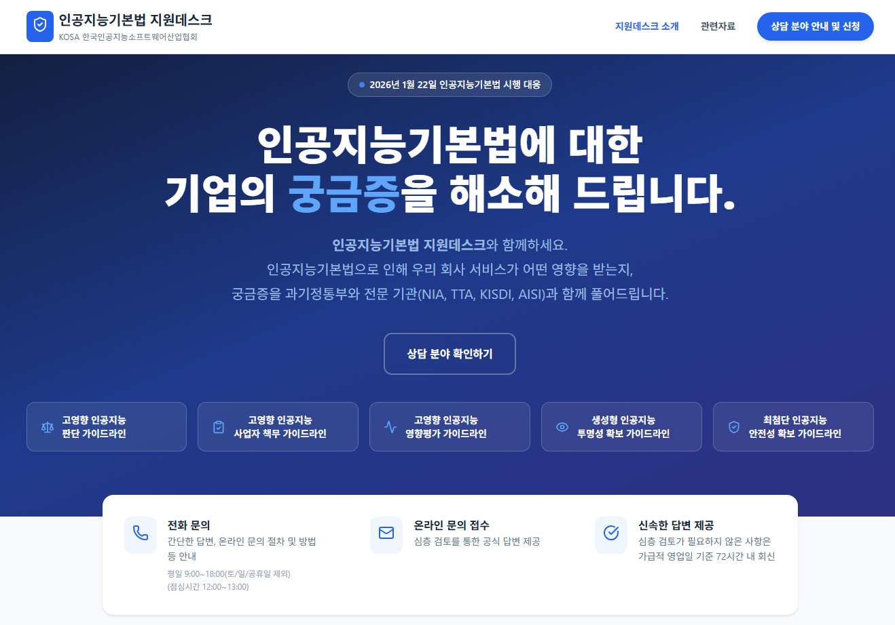

8   인공지능기본법 지원데스크 사례집
이 장은 인공지능기본법 주요 조항별로 ①의무 구조 요약, ②자주 묻는 질문(FAQ), ③제3장 관
련 사례 연결로 구성됩니다. 본 사례집의 제3장 인공지능 지원데스크 주요 문의 사항 및 답변보다
이 장을 먼저 읽으신다면 기본법 내용의 흐름을 파악하실 수 있도록, 제3장을 먼저 읽으셨다면 조
항별 기준을 빠르게 재확인하는 색인으로 활용하실 수 있도록 구성하였습니다. 제3장 사례에 대
하여 더욱 구체적인 해석이 필요한 법무·컴플라이언스 담당자는 [부록1. 실무 판단 기준]을 참고
하시기 바랍니다.

##### 1. 제2·4·5조 | 용어 정의 및 적용 범위


###### 제2조(정의) 이 법에서 사용하는 용어의 뜻은 다음과 같다. <개정 2026. 1. 20.>


##### 1. “인공지능”이란 학습, 추론, 지각, 판단, 언어의 이해 등 인간이 가진 지적 능력을 전자적 방법으로 구현

한 것을 말한다.
2.“인공지능시스템”이란 다양한 수준의 자율성과 적응성을 가지고 주어진 목표를 위하여 실제 및 가상환경에
영향을 미치는 예측, 추천, 결정 등의 결과물을 추론하는 인공지능 기반 시스템을 말한다.
3. “인공지능기술”이란 인공지능을 구현하기 위하여 필요한 하드웨어ㆍ소프트웨어 기술 또는 그 활용 기술
을 말한다.

##### 4. “고영향 인공지능”이란 사람의 생명, 신체의 안전 및 기본권에 중대한 영향을 미치거나 위험을 초래할 우려

가 있는 인공지능시스템으로서 다음 각 목의 어느 하나의 영역에서 활용되는 것을 말한다.

**가. 「에너지법」 제2조제1호에 따른 에너지의 공급**


**나. 「먹는물관리법」 제3조제1호에 따른 먹는물의 생산 공정**


**다. 「보건의료기본법」 제3조제1호에 따른 보건의료의 제공 및 이용체계의 구축ㆍ운영**


**라. 「의료기기법」 제2조제1항에 따른 의료기기 및 「디지털의료제품법」 제2조제2호에 따른 디지털의료기기**

의 개발 및 이용
마. 「원자력시설 등의 방호 및 방사능 방재 대책법」 제2조제1항제1호에 따른 핵물질과 같은 항 제2호에 따
른 원자력시설의 안전한 관리 및 운영
바. 범죄 수사나 체포 업무를 위한 생체인식정보(얼굴ㆍ지문ㆍ홍채 및 손바닥 정맥 등 개인을 식별할 수 있는
신체적ㆍ생리적ㆍ행동적 특징에 관한 개인정보를 말한다)의 분석ㆍ활용

**사. 채용, 대출 심사 등 개인의 권리ㆍ의무 관계에 중대한 영향을 미치는 판단 또는 평가**

아. 「교통안전법」 제2조제1호부터 제3호까지에 따른 교통수단, 교통시설, 교통체계의 주요한 작동 및 운영
자. 공공서비스 제공에 필요한 자격 확인 및 결정 또는 비용징수 등 국민에게 영향을 미치는 국가, 지방자치단
체, 「공공기관의 운영에 관한 법률」 제4조에 따른 공공기관 등(이하 “국가기관등”이라 한다)의 의사결정

**차. 「교육기본법」 제9조제1항에 따른 유아교육ㆍ초등교육 및 중등교육에서의 학생 평가하는 영역**

인공지능기본법 주요 조항별 설명
Part

20선의 질답 사례로 배우는 기업 실무 가이드  9

##### 5. “생성형 인공지능”이란 입력한 데이터(「데이터 산업진흥 및 이용촉진에 관한 기본법」 제2조제1호에 따른

데이터를 말한다. 이하 같다)의 구조와 특성을 모방하여 글, 소리, 그림, 영상, 그 밖의 다양한 결과물을 생
성하는 인공지능시스템을 말한다.

##### 6. “인공지능산업”이란 인공지능 또는 인공지능기술을 활용한 제품(이하 “인공지능제품”이라 한다)을 개

발ㆍ제조ㆍ생산 또는 유통하거나 이와 관련한 서비스(이하 “인공지능서비스”라 한다)를 제공하는 산업
을 말한다.

##### 7. “인공지능사업자”란 인공지능산업과 관련된 사업을 하는 자로서 다음 각 목의 어느 하나에 해당하는 법인,

단체, 개인 및 국가기관등을 말한다.

**가. 인공지능개발사업자: 인공지능을 개발하여 제공하는 자**


**나. 인공지능이용사업자: 가목의 사업자가 제공한 인공지능을 이용하여 인공지능제품 또는 인공지능서비스**

를 제공하는 자

##### 8. “이용자”란 인공지능제품 또는 인공지능서비스를 제공받는 자를 말한다.


##### 9. “영향받는 자”란 인공지능제품 또는 인공지능서비스에 의하여 자신의 생명, 신체의 안전 및 기본권에 중

대한 영향을 받는 자를 말한다.

##### 10. “인공지능사회”란 인공지능을 통하여 산업ㆍ경제, 사회ㆍ문화, 행정 등 모든 분야에서 가치를 창출하고

발전을 이끌어가는 사회를 말한다.

##### 11. “인공지능윤리”란 인간의 존엄성에 대한 존중을 기초로 하여, 국민의 권익과 생명ㆍ재산을 보호할 수 있

는 안전하고 신뢰할 수 있는 인공지능사회를 구현하기 위하여 인공지능의 개발, 제공 및 이용 등 모든 영
역에서 사회구성원이 지켜야 할 윤리적 기준을 말한다.

##### 12. “학습용데이터”란 인공지능의 개발ㆍ활용 등에 사용되는 데이터를 말한다.

[시행일: 2026. 1. 24.] 제2조제4호라목 중 디지털의료기기에 관한 부분

###### 제4조(적용범위) ① 이 법은 국외에서 이루어진 행위라도 국내 시장 또는 이용자에게 영향을 미치는 경우에

는 적용한다.
② 이 법은 국방 또는 국가안보 목적으로만 개발ㆍ이용되는 인공지능으로서 대통령령으로 정하는 인공지능
에 대하여는 적용하지 아니한다.

###### 제5조(다른 법률과의 관계) ① 인공지능, 인공지능기술, 인공지능산업 및 인공지능사회(이하 “인공지능등”이

라 한다)에 관하여 다른 법률에 특별한 규정이 있는 경우를 제외하고는 이 법에서 정하는 바에 따른다.
② 인공지능등에 관하여 다른 법률을 제정하거나 개정하는 경우에는 이 법의 목적에 부합하도록 하여야 한다.
•  제2·4·5조의 의무 구조 요약
인공지능기본법의 모든 의무는 '인공지능사업자(인공지능개발사업자 + 인공지능이용사업자)'
에게 부과됩니다. 동일한 기업이라도 서비스 단위로 사업자 지위가 달라질 수 있으며, 영리 여부
와 무관하게 인공지능서비스를 제공하면 인공지능사업자에 해당합니다.

10   인공지능기본법 지원데스크 사례집
궁금증: “개인”도 포함되나요?
인공지능기본법상 인공지능사업자는 '인공지능산업과 관련된 사업을 하는 자로서 개인, 단체, 개인, 국가기
관등을 포함하고 있습니다. 개인이라 하더라도 인공지능산업과 관련된 사업을 하는 사업자(독립된 사업으
로 재화나 용역을 공급하는 사람)라면 인공지능사업자에 포함됩니다. 국기기관등에는 “국가, 지방자치단체,
「공공기관의 운영에 관한 법률」 제4조에 따른 공공기관”이 포함됩니다.
< 표6. 인공지능개발사업자, 이용사업자 및 이용자 비교 >
구분
개발사업자
이용사업자
이용자
정의
인공지능을 직접 개발하여 제품·
서비스로 제공하는 자
타사 인공지능을 활용하여 이용
자에게 서비스를 제공하는 자
인공지능 서비스를 최종적으로
이용하는 개인·기업·기관
의무 부담
○ (제31·32·33·34·36조)
X (의무 없음)
자주 묻는 질문
Q  인공지능개발사업자와 인공지능이용사업자는 어떻게 구분합니까?
A  인공지능의 구조 설계에 직접 관여하고 개발 전반을 통제하면 인공지능개발사업자이고, 인
공지능개발사업자가 제공한 인공지능을 이용하여 인공지능제품 또는 인공지능 서비스를 제
공하면 인공지능이용사업자입니다. 단순히 요구 사양을 제시하고 개발을 외주에 맡긴 경우
는 인공지능이용사업자로 봅니다. 다만, 외주로 개발하더라도 발주사가 구조 설계에 관여하
거나 실질 통제하거나 개발사가 납품한 시스템을 발주사가 중대하게 변경했다면 발주사는
인공지능개발사업자에 해당할 수 있습니다.
Q  인공지능사업자 지위는 서비스 단위로 판단합니까, 기업 단위로 판단합니까?
A  원칙적으로 서비스(또는 제품) 단위로 판단합니다. 같은 기업이라도 서비스별로 사업자 지
위가 다를 수 있습니다.
Q  영리 목적이 없는 비영리기관도 인공지능사업자에 해당합니까?
A  영리 여부와 무관하게, 공공기관도 민간과 동일한 기준이 적용됩니다.
Q  생성형 인공지능을 활용해 콘텐츠에 사용할 인공지능 생성물을 만드는 기업은 인공지능사
업자입니까?
A  생성형 인공지능을 콘텐츠 제작에 이용하는 행위는 인공지능제품 또는 서비스를 제공하는

20선의 질답 사례로 배우는 기업 실무 가이드  11
것이 아닙니다. 이 경우 해당 기업은 인공지능사업자가 아닌 이용자에 해당합니다.

##### 2. 제31조 | 투명성 확보 의무


###### 제31조(인공지능 투명성 확보 의무) ① 인공지능사업자는 고영향 인공지능이나 생성형 인공지능을 이용한

제품 또는 서비스를 제공하려는 경우 제품 또는 서비스가 해당 인공지능에 기반하여 운용된다는 사실을 이
용자에게 사전에 고지하여야 한다.
② 인공지능사업자는 생성형 인공지능 또는 이를 이용한 제품 또는 서비스를 제공하는 경우 그 결과물이 생
성형 인공지능에 의하여 생성되었다는 사실을 표시하여야 한다.
③ 인공지능사업자는 인공지능시스템을 이용하여 실제와 구분하기 어려운 가상의 음향, 이미지 또는 영상
등의 결과물을 제공하는 경우 해당 결과물이 인공지능시스템에 의하여 생성되었다는 사실을 이용자가 명확
하게 인식할 수 있는 방식으로 고지 또는 표시하여야 한다. 이 경우 해당 결과물이 예술적ㆍ창의적 표현물
에 해당하거나 그 일부를 구성하는 경우에는 전시 또는 향유 등을 저해하지 아니하는 방식으로 고지 또는 표
시할 수 있다.
④ 그 밖에 제1항에 따른 사전고지, 제2항에 따른 표시, 제3항에 따른 고지 또는 표시의 방법 및 그 예외 등
에 관하여 필요한 사항은 대통령령으로 정한다.
의무 구조 요약
① 고영향 또는 생성형 인공지능을 이용한 제품·서비스를 제공하는 인공지능사업자는 인공지능
기반 운용 사실을 사전 고지하고, ②생성형 인공지능 이용한 서비스를 제공하는 경우, 생성한
인공지능 생성물에 인공지능이 생성한 사실을 표시해야 합니다. 사전 고지와 인공지능 생성
물 표시는 별개 의무입니다.
(1) 의무 발생 요건
< 표7. 투명성 확보 의무 발생 요건 >
구분
사전고지
인공지능 생성물
표시
근거 조항
인공지능사업자
○
○
제31조 제1·2항
이용자(개인·기업)
X
X
해당 없음
내부 업무 전용 인공지능
X
X
시행령 제23조 제4항 제2호
법 시행(2026.1.22.) 이전 생성
·게시한 인공지능 생성물
X (해당 없음)
X (소급 없음)
부칙(적용 시기)

12   인공지능기본법 지원데스크 사례집
(2) 허용되는 표시 방법
별도의 법정 표준 서식은 없으며, 이용자가 인공지능 생성 사실을 합리적으로 인지할 수 있는
수준이라면 아래 방법 중 하나를 단독으로 사용하거나 병행하여 사용할 수 있습니다.
< 표8. 투명성 확보 의무 이행 방법 >
표시 유형
허용 방법
가시적 표시
워터마크, 자막, 화면 안내 문구 등
비가시적 표시
메타데이터 삽입, 디지털 워터마킹 등  (비가시적 표시 방법을 사용하는 경우 이용자에게 최소 1회
이상 안내 문구·음성 등을 별도 제공해야 함)
자주 묻는 질문
Q  사전고지와 인공지능 생성물 표시의 차이는 무엇입니까?
A  사전고지는 서비스 이용 전 인공지능 운용 사실을 알리는 것이고, 인공지능 생성물 표시는
인공지능이 생성한 생성물에 해당 생성물을 인공지능이 생성했다는 사실을 표시하는 것입
니다.
Q  딥페이크 생성물에 대한 표시 의무는 이용자에게도 적용됩니까?
A  딥페이크 관련 표시 의무도 인공지능사업자를 대상으로 합니다. 다만 사람을 오인하게 하
는 이미지·영상의 경우 다른 법률(성폭력처벌법 등)이 적용될 수 있으므로 상황에 따라 확
인이 필요합니다.
Q  인공지능 생성물에 일부 사람이 후처리한 생성물(배경 합성, 리터칭 등)도 표시 대상입니까?
A  이용자가 생성물을 수정하는 경우 표시 의무가 없습니다. 다만, 인공지능사업자는 제공 중인
생성형 인공지능 생성물의 후처리 여부와 상관없이 표시 의무를 이행하여야 합니다.
Q  법 시행 전에 게시한 인공지능 생성물에도 소급하여 워터마크를 삽입해야 합니까?
A  소급 적용 없음이 원칙입니다. 2026년 1월 22일 시행 이전에 이미 생성하여 제공된 인공지
능 생성물에는 표시 의무가 소급 적용되지 않으므로, 기존 게시물에 워터마크를 삽입하거나
삭제·재업로드할 필요가 없습니다. 단, 시행 이후 새롭게 생성하는 인공지능 생성물부터는
인공지능사업자에게 의무가 적용됩니다.

20선의 질답 사례로 배우는 기업 실무 가이드  13

##### 3. 제32조 | 안전성 확보 의무


###### 제32조(인공지능 안전성 확보 의무) ① 인공지능사업자는 학습에 사용된 누적 연산량이 대통령령으로 정하

는 기준 이상인 인공지능시스템의 안전성을 확보하기 위하여 다음 각 호의 사항을 이행하여야 한다.

##### 1. 인공지능 수명주기 전반에 걸친 위험의 식별ㆍ평가 및 완화


##### 2. 인공지능 관련 안전사고를 모니터링하고 대응하는 위험관리체계 구축

② 인공지능사업자는 제1항 각 호에 따른 사항의 이행 결과를 과학기술정보통신부장관에게 제출하여야 한다.
③ 과학기술정보통신부장관은 제1항 각 호에 따른 사항의 구체적인 이행 방식 및 제2항에 따른 결과 제출
등에 필요한 사항을 정하여 고시하여야 한다.
제32조의 의무 구조 요약
법 제32조는 고성능 인공지능 사업자에게 위험 관리 및 안전 기술 조치 의무를 부과합니다. 법

###### 제31조(투명성)·제33조(고영향 인공지능 확인)와 함께 인공지능기본법의 핵심 의무 중 하나이며,

고성능 인공지능을 개발·제공하는 사업자가 주된 의무 대상입니다.
< 표9. 안전성 확보 의무 구조 요약 >２
항목
내용
의무 대상
시행령 제24조 기준에 해당하는 인공지능을 개발하여 제공한 인공지능개발사업자 또는 기존 인공
지능에 실질적 변경을 가해 그 기준에 해당하게 한 인공지능사업자
주요 내용
최첨단 인공지능 대상 위험 식별·평가·완화, 안전사고 모니터링 및 대응체계 구축, 이행 결과 제출
관련 조항
법 제32조, 시행령 제24조, 인공지능 안정성 확보 가이드라인
２   제24조(인공지능 안전성 확보 의무) ① 법 제32조제1항에서 “대통령령으로 정하는 기준 이상인 인공지능시스템”이란 다음
각 호의 기준을 모두 충족하는 인공지능시스템을 말한다.1. 학습에 사용된 누적 연산량이 10의 26승 부동소수점연산 이상
일 것 2. 인공지능기술의 발전 수준을 고려할 때 현재 인공지능시스템에 활용되는 인공지능기술 중 최첨단의 인공지능기술
을 적용하여 구성ㆍ운영되고 있을 것 3. 인공지능시스템의 위험도가 사람의 생명, 신체의 안전 및 기본권에 광범위하고 중대
한 영향을 미칠 우려가 있을 것 ② 제1항제1호에 따른 학습에 사용된 누적 연산량의 구체적인 산정 방식은 과학기술정보통
신부장관이 정하여 고시한다.

14   인공지능기본법 지원데스크 사례집
자주 묻는 질문
Q  법 제32조 및 시행령 제24조 등에 따른 ‘인공지능 위험 관리 조치'는 구체적으로 무엇을 해
야 합니까?
A  법 제32조는 고성능 인공지능의 위험을 사전에 식별·평가하고 이를 관리하는 체계를 구축
하도록 요구합니다. 구체적으로는 ①인공지능 수명주기 전반에 걸친 위험 요소 식별 및 평
가, 문서화, ②오남용·의도치 않은 피해 발생 가능성에 대한 기술적·관리적 위험 완화조치
의 수립 및 시행, ③이상 징후 모니터링 및 대응을 위한 위험관리체계 구축 및 운영이 포함
됩니다. 다만 조치의 구체적 수준과 방법은 해당 인공지능의 용도·규모·위험도에 따라 달라
지므로, 구체적인 사항은 과학기술정보통신부가 배포하는 안전성 확보 가이드라인을 참고
하시기를 바랍니다.
Q  법 제32조 안전성 의무와 법 제34조 고영향 인공지능과 관련한 사업자 책무는 어떻게 다릅
니까? 두 의무를 모두 이행해야 합니까?
A  두 조항은 의무 발생 요건과 대상이 다릅니다. 법 제32조는 고성능 인공지능을 제공하는 사업
자에게 적용되는 안전성 확보 의무이고, 법 제34조는 고영향 인공지능을 제공하는 사업자에
게 부과되는 책무로 위험관리방안의 수립·운영, 설명 방안의 수립·시행, 이용자 보호, 사람의
관리·감독, 관련 문서의 작성·보관 등이 포함됩니다. 하나의 인공지능시스템이 최첨단 인공지
능인 동시에 고영향 인공지능에도 해당하면 두 조항의 의무를 각각 이행해야 합니다. 다만 안
전성 확보를 위해 구축한 모니터링·기록 체계가 법 제34조의 사후 검증 체계와 상당 부분 중
첩될 수 있으므로, 두 의무를 함께 설계하면 이행 부담을 줄일 수 있습니다.
Q  고성능 인공지능에 해당 여부는 어떻게 판단합니까?
A  고성능 인공지능 해당 여부는 법 제32조 및 시행령 제24조에 따른 세 가지 요건을 모두
충족하는지 여부를 기준으로 판단합니다. 우선 ①학습에 사용된 누적연산량이 10의 26승 부
동소수점연산 이상일 것에 해당하여야 합니다. 또한 ②인공지능기술의 발전 수준을 고려할
때 최첨단의 인공지능기술을 적용하고 있는지, ③인공지능시스템의 위험도가 사람의 생명,
신체의 안전 및 기본권에 광범위하고 중대한 영향을 미칠 우려가 있는지 등을 함께 충족하여
야 합니다. 자사 인공지능이 해당 기준에 해당하는지 불명확한 경우, 인공지능 안전성 확보
가이드라인을 확인하시거나 인공지능기본법 지원데스크에 문의하시기 바랍니다.

20선의 질답 사례로 배우는 기업 실무 가이드  15

##### 4. 제33조 | 고영향 인공지능 확인


###### 제33조(고영향 인공지능의 확인) ① 인공지능사업자는 인공지능 또는 이를 이용한 제품ㆍ서비스를 제공하

는 경우 그 인공지능이 고영향 인공지능에 해당하는지에 대하여 사전에 검토하여야 하며, 필요한 경우 과학
기술정보통신부장관에게 고영향 인공지능에 해당하는지 여부의 확인을 요청할 수 있다.
② 과학기술정보통신부장관은 제1항에 따른 요청이 있는 경우 고영향 인공지능 해당 여부를 확인하여야 하
며, 필요한 경우 전문위원회를 설치하여 관련 자문을 받을 수 있다.
③ 과학기술정보통신부장관은 고영향 인공지능의 기준과 예시 등에 관한 가이드라인을 수립하여 보급할 수
있다.
④ 그 밖에 제1항에 따른 확인 절차 등에 관하여 필요한 사항은 대통령령으로 정한다.
 제33조 의무 구조 요약
고영향 인공지능으로 분류되면 제34조의 고영향 인공지능과 관련한 사업자의 책무가 부과됩니

**다. 고영향 인공지능 해당 여부는 가이드라인을 활용하여 인공지능사업자가 사전에 검토해야 하**

며, 확인 결과를 당국에 신고할 의무는 현행 법령상 규정되어 있지 않습니다.
(1) 고영향 인공지능 적용 영역 및 판단 기준
고영향 인공지능 적용 영역은 법령에 열거된 분야로 한정됩니다. 따라서 법령에서 열거되지 않
은 분야라면 고영향 인공지능에 해당되지 않습니다. 고영향 인공지능의 영역은 법 제2조 제4호
각 목을 기준으로 합니다. 해당 법령은 [부록3]을 참고해 주십시오.
< 표10. 고영향 인공지능 확인 의무 구조 요약 >３
분야
인공지능시스템 활용
비고
채용
합격·탈락 결정에 인공지능이 직접 관여
기초 자료 작성 보조만 하고 사람이 평가하면 제외 가능 (사례 14)
대출심사
대출 승인·거절·조건을 인공지능이 직
접 결정
인공지능 생성물을 단순 참고하고 담당자가 최종 결정하면 제외
가능 (사례 15)
보건·의료
진단·치료 결정에 실질적 영향을 미치
는 인공지능
의료진의 독립적 판단에 도움을 주는 참고자료로 활용되는 경우
제외 가능. 의료기기의 경우 식약처 기준 검토 필요 (사례 16)
교육평가
유아교육‧초등교육 및 중등교육에서
의 '평가' 목적 인공지능에 한정
학습 보조·콘텐츠 생성·학원 교육 목적은 제외 (사례 17)
에너지
에너지 공급 분야 의사결정에 관여하는
인공지능
인공지능시스템의 의도하지 않은 작동 등으로 전력 등 에너지 공
급 불균형 상황 발생시 사람에게 중대한 위험 초래(사례 18)
３    법 제2조 제4호 각목에 열거되지 않은 분야는 원칙상 고영향 인공지능 판단 대상이 아닙니다.

16   인공지능기본법 지원데스크 사례집
(2) 고영향 인공지능 판단 요소
아래 두 가지 요소를 인공지능시스템의 사용 맥락에 따라 종합적으로 판단합니다. 하나의 요소
만으로 결정되지 않습니다.
< 표11. 고영향 인공지능 판단 요소 >
판단 요소
고영향 인공지능에 해당 가능
고영향 인공지능 제외
① 법정 영역
법 제2조 제4호 각 목에서 정한 영역(예: 에너지, 먹는
물, 보건·의료, 원자력, 범죄수사·체포 생체인식, 채용·대
출심사, 교통, 공공서비스, 교육평가 등)
법정 영역에 전혀 해당하지 않는 경우에는 고
영향 인공지능 판단 대상 아님
② 중대한
위험 초래
사람의 생명·신체의 중대한 위험을 초래하거나 기본권
침해의 중대한 위험을 야기할 수 있는 경우
사람의 적극적인 개입, 통제권이 보장된 경우
고영향 인공지능 제외 가능(예외 있음)
자주 묻는 질문
Q  고영향 인공지능 사전 검토는 어떻게 합니까?
A  과학기술정보통신부가 배포한 ‘고영향 인공지능 판단 가이드라인’의 분야별 체크리스트를
활용하여 자체적으로 판단합니다. 판단 과정을 문서화해 두는 것이 권장됩니다.
Q  고영향 인공지능으로 확인된 경우 즉시 신고해야 합니까?
A  현재 법령상 고영향 인공지능 확인 결과를 당국에 신고할 의무는 규정되어 있지 않습니다. 다
만 확인 결과에 따라 법 제34조의 사업자 책무를 이행해야 합니다.
Q  고영향 인공지능이 아닌 것으로 자체 판단했는데 이후 문제가 생기면 어떻게 됩니까?
A  자체 판단 시에는 가이드라인에 따른 합리적 검토 과정을 문서화해 두는 것이 권장됩니다.
합리적 근거 없이 고영향 인공지능 해당 여부를 부실하게 판단하면 향후 제재 리스크가 발
생할 수 있습니다.
Q  서비스가 복수의 고영향 인공지능 영역에 동시 해당하면 어떻게 됩니까?
A  해당하는 복수 영역별 가이드라인 체크리스트를 모두 검토하여야 합니다. 여러 영역에 걸
치는 경우 각 영역에서 요구하는 책무 중 더 엄격한 기준을 충족하는 방향으로 이행하는 것
이 안전합니다.

20선의 질답 사례로 배우는 기업 실무 가이드  17

##### 5. 제34조 | 고영향 인공지능과 관련한 사업자 책무


###### 제34조(고영향 인공지능과 관련한 사업자의 책무) ① 인공지능사업자는 고영향 인공지능 또는 이를 이용한

제품ㆍ서비스를 제공하는 경우 고영향 인공지능의 안전성ㆍ신뢰성을 확보하기 위하여 다음 각 호의 내용을
포함하는 조치를 대통령령으로 정하는 바에 따라 이행하여야 한다.

##### 1. 위험관리방안의 수립ㆍ운영


##### 2. 기술적으로 가능한 범위에서의 인공지능이 도출한 최종결과, 인공지능의 최종결과 도출에 활용된 주요

기준, 인공지능의 개발ㆍ활용에 사용된 학습용데이터의 개요 등에 대한 설명 방안의 수립ㆍ시행

##### 3. 이용자 보호 방안의 수립ㆍ운영


##### 4. 고영향 인공지능에 대한 사람의 관리ㆍ감독


##### 5. 안전성ㆍ신뢰성 확보를 위한 조치의 내용을 확인할 수 있는 문서의 작성과 보관


##### 6. 그 밖에 고영향 인공지능의 안전성ㆍ신뢰성 확보를 위하여 위원회에서 심의ㆍ의결된 사항

 제34조 의무 구조 요약
고영향 인공지능으로 확인된 경우, 인공지능개발사업자와 인공지능이용사업자 각각에 책무가
부과됩니다. 가이드라인에 따르면 ‘개발·이용 태그’로 이행 주체를 구분하며, 상호 협의를 통해 이
행 주체를 명확히 해야 합니다.
< 표12. 고영향 인공지능과 관련한 사업자 책무 의무 구조 요약 >
책무 항목
이행 내용
위험관리방안의 수립ㆍ운영
인공지능 수명주기 전반에 걸쳐 발생할 수 있는 잠재적 위험을 식별 및 평가하고, 이를 지
속적으로 통제하기 위한 위험관리 정책과 조직 체계를 수립하여 운영
설명 방안의 수립ㆍ시행
인공지능이 도출한 최종 결과와 이를 도출하는 데 활용된 주요 판단 기준, 학습용데이터
의 개요 등을 기술적으로 가능한 범위 내에서 이용자에게 투명하게 설명하는 방안을 마련
하고 시행
이용자 보호 방안의
수립ㆍ운영
안전한 데이터 관리 및 시스템 설계, 시험·평가, 피해 보상 체계 마련 등을 통해 인공지능
개발 및 운영 과정 전반에서 이용자의 안전과 권익을 보호하는 방안을 수립하고 운영
사람의 관리ㆍ감독
시스템의 오류나 성능 저하 등의 비상 상황이 발생했을 때 사람이 즉각적으로 통제 및 개
입할 수 있는 기준과 방법을 확립하고, 정기적인 점검 및 교육·훈련 체계를 갖추어야 함
문서의 작성과 보관
사업자가 인공지능의 안전성과 신뢰성을 확보하기 위해 수행한 위 조치들의 내용과 이행
근거를 객관적으로 확인할 수 있도록 '안전신뢰문서'를 작성하고 보관
자주 묻는 질문
Q  인공지능개발사업자가 이미 이행한 책무를 인공지능이용사업자가 다시 이행해야 합니까?
A  인공지능개발사업자가 이행한 책무는 인공지능시스템의 중대한 기능 변경을 초래하지 않은

18   인공지능기본법 지원데스크 사례집
경우,４ 인공지능이용사업자가 중복해서 이행하지 않아도 됩니다. 단, 계약 또는 SLA５를 통
해 이행 주체를 명확히 구분해 두는 것이 필요합니다.
Q  고영향 인공지능 책무 이행 내용은 어디에 공시합니까?
A  법 제34조는 안전성·신뢰성 확보 조치의 내용을 확인할 수 있는 문서의 작성과 보관을 의무
로 하고 있습니다. 이용자 보호 관점에서 필요한 범위의 정보 제공은 홈페이지 등 이용자 접
근이 용이한 채널을 활용할 수 있으나, 공개 범위와 방식은 인공지능시스템 특성, 보안·영업
비밀 등을 고려하여 선택해야 합니다. 홈페이지 게시 위치는 법령에 별도 규정이 없으나 이
용자가 쉽게 접근할 수 있는 위치에 마련하는 것이 바람직합니다. 별도의 법정 양식은 없습
니다. 가이드라인에서는 공시 내용을 가급적 개별 인공지능시스템 단위로 구분하여 작성할
것을 권장합니다.
Q  인공지능 판단 기록이 사후에 수정되지 않았음을 어떻게 입증합니까?
A  가이드라인에서는 입력·출력·근거를 타임스탬프와 함께 로그로 저장하고, 변경 이력이 별도
관리되는 시스템을 구축할 것을 권장합니다. 이를 통해 로그 무결성을 입증할 수 있습니다.

##### 6. 제36조 | 국내 대리인 지정

 의무 구조 요약
국내에 주소 또는 영업소가 없는 인공지능사업자 중 이용자 수, 매출액 등이 대통령령으로 정하
는 기준에 해당하는 자는 국내대리인을 서면으로 지정하고 이를 과학기술정보통신부장관에게 신
고하여야 합니다.
< 표13. 국내대리인 지정 의무 구조 요약 >
항목
내용
의무 대상
국내에 주소 또는 영업소가 없는 인공지능사업자 중 이용자 수, 매출액 등이 대통령령
기준에 해당하는 자
지정·신고 기한
대통령령에서 정하는 기준 및 절차에 따름(세부 안내는 과학기술정보통신부 공지·가이드
라인 확인)
４　‘중대한 기능 변경’이란 인공지능개발사업자가 제공한 인공지능과 동일성이 인정되지 않을 수준으로 성능, 안전성(위험성), 용
도(목적), 이용 분야와 맥락, 신뢰성의 변화 등을 종합적으로 고려하여 이루어집니다. 더 자세한 설명은 인공지능 지원데스크
사이트에 등록된 [고영향 인공지능 사업자 책무 가이드라인]을 참고하십시오.
５　SLA(Service Level Agreement, 서비스 수준 협약)는 서비스 제공자와 고객 간에 서비스 품질, 목표, 측정 방식 및 위반 시
책임 등을 명시한 계약을 말합니다.

20선의 질답 사례로 배우는 기업 실무 가이드  19
역할
법 제32조 제2항에 따른 이행 결과의 제출, 법 제33조 제1항에 따른 고영향 인공지능 해
당 여부 확인의 요청, 법 제34조 제1항 각 호 조치 이행에 필요한 지원(문서 최신성·정확성
점검 포함)
국내대리인 요건
국내에 주소 또는 영업소가 있는 자
자주 묻는 질문
Q  해외 인공지능서비스를 국내에서 사용하면 해외 사업자에게 국내대리인 지정 의무가 있습
니까?
A  해외에 주소 또는 영업소가 없는 인공지능사업자라 하더라도, 이용자 수·매출액 등이 대통
령령 기준에 해당하는 경우에만 국내대리인 지정·신고 의무가 생깁니다. 그 기준은 다음과
같습니다. ①전년도(법인인 경우에는 전 사업연도를 말한다) 매출액이 1조원 이상인 인공지
능사업자, ②인공지능서비스 부문 전년도(법인인 경우에는 전 사업연도를 말한다) 매출액이
100억원 이상인 인공지능사업자, ③전년도 말 기준 해당 인공지능사업자의 인공지능제품
및 인공지능서비스에 대한 직전 3개월간 국내 이용자 수가 1일 평균 100만명 이상인 인공지
능사업자, ④인공지능기본법 위반(사실조사에 따른 중지명령이나 시정명령을 이행하지 않
은 경우)으로 과태료를 부과받은 사실이 있는 인공지능사업자
Q  국내대리인은 누구나 될 수 있습니까, 자격 요건이 있습니까?
A  법령상 국내대리인의 자격은 ‘국내에 주소 또는 영업소가 있는 자’로 규정되어 있습니다. 그
외 별도의 자격 요건을 정하고 있지는 않습니다. 다만 국내대리인은 국내에 주소 또는 영업소
가 있어야 하며,(법 제36조제2항), 법에서 정한 사항을 수행할 수 있는 역량을 갖춘 자를 지정
할 필요는 있습니다.
Q  국내대리인 지정 전에 이미 해외에서 국내 이용자에게 서비스를 제공하고 있다면 어떻게 됩
니까?
A  법 시행 전부터 국내 이용자에게 서비스를 제공하고 있던 해외 사업자도 법 시행 이후에도 국
내 이용자에게 서비스를 제공하고 있다면 국내대리인을 지정할 의무가 있습니다. 다만 현재
국내대리인 지정 의무에 대해 유예기간이 적용되고 있습니다. 유예기간 종료에 대비하여 국
내대리인 지정을 위한 절차를 미리 준비할 필요가 있습니다.
Q  국내에 법인이나 연락사무소가 있는 해외 기업도 별도로 국내대리인을 지정해야 합니까?
A  국내 법인이 실질적인 사업 주체로서 법적 의무 이행이 가능하다면 별도의 국내대리인 지정은

20   인공지능기본법 지원데스크 사례집
필요하지 않습니다. 그러나 만약 국내 법인이 단순 마케팅이나 지원 업무에 국한되어 본사가
제공하는 서비스에 대하여 인공지능기본법상 의무를 실질적으로 이행할 수 있는 권한이 없다
면, 국내대리인 지정의 필요 여부를 검토할 수 있습니다. 구체적인 사항에 관한 판단이 필요하
신 경우 인공지능기본법 지원데스크를 통해 문의하시기를 바랍니다.
Q  국내대리인이 법적 책임을 지는 범위는 어디까지입니까?
A  국내대리인은 해외 사업자를 대리하여 인공지능기본법상 의무 이행 및 주무부처와의 소통
창구로서의 역할을 할 수 있습니다. 또한 인공지능기본법에 의하면. 안전성 의무 이행 결과
제출, 고영향 인공지능 확인 신청 및 안전성·신뢰성 확보 조치의 이행에 필요한 지원의 사항
과 관련하여 법을 위반한 경우에는 해당 국내대리인을 지정한 인공지능사업자가 그 행위를
한 것으로 봅니다.(법 제36조제3항).

20선의 질답 사례로 배우는 기업 실무 가이드  21
이 장과 앞의 제2장은 서로 보완 관계입니다. 제2장이 각 조항의 의무 구조와 판단 기준을 정리
한 참조 자료라면, 이 장은 실제 현장에서 접수된 문의를 바탕으로 그 기준이 구체적인 상황에 어
떻게 적용되는지를 보여주는 사례 모음입니다.
제2장을 먼저 읽으셨다면 조항별 원칙을 염두에 두고 사례를 읽으면 기준이 실무에서 어떻게
구현되는지 확인할 수 있습니다. 이 장을 먼저 펼치셨다면 사례를 읽은 뒤 관련 조항을 제2장에서
찾아보면 판단 근거를 더 명확히 확인할 수 있습니다. 각 사례에서 자사 서비스의 의무 여부를 더
깊이 점검하고 싶다면 [부록1. 실무 판단 기준]를 참고하십시오.
이 장은 인공지능기본법 시행(2026. 1. 22.) 이후 두 달간 인공지능기본법 지원데스크에 접수
된 270건의 온라인 문의(2026. 3. 21. 기준)를 분석한 결과입니다. 지금까지 인공지능 지원데스
크를 운영하며 가장 많이 접수된 문의 내용은 아래와 같습니다.
< 표14. 인공지능기본법 지원데스크 문의 현황(2026.3.21. 기준) >
구 분
비율
제31조 투명성 확보 관련 (생성형 인공지능 생성물 표기, 사전고지 방법 등)
142건 (52.59%)
제33조 고영향 인공지능 확인 관련 (해당 여부 판단 기준 등)
51건 (18.89%)
기타 (용어 정의, 적용 범위, 고영향 인공지능과 관련한 사업자의 책무, 하위법령 등)
77건 (28.52%)
합  계
270건 (100%)
조항이 아닌 상담 내용을 면밀히 분석해보면 실제 현장의 고민은 단순히 개별 조항의 내용을 넘
어 ‘내가 누구인지(의무 주체 여부)’, ‘어떤 방식으로 인공지능을 사용하는지’, ‘서비스의 구조가
어떤지’라는 구체적인 사실관계가 중심이었습니다.
이에 본 장에서는 현장에서 가장 먼저 부딪히는 실무적 질문 순서에 따라 사례를 4가지 유형으
로 재분류했습니다. 상담 내역 중 반복되는 핵심 패턴을 유형화하고, 이 중 대표성이 높은 20건을
선별하여 적용할 수 있는 판단 기준과 조치 포인트를 중심으로 정리했습니다. 유형과 사례를 통해
인공지능기본법 지원데스크 주요 문의 사항 및 답변
Part

22   인공지능기본법 지원데스크 사례집
‘누가 의무를 지는가’에서 시작해 ‘어떻게 이행하는가’, ‘우리 서비스가 해당 법령의 대상인가’, 그
리고 ‘운영상 발생하는 쟁점은 무엇인가’로 이어지는 흐름을 반영했습니다. 제2장의 FAQ의 내용
에 포함되어 있음에도 자주 접수된 질문은 사례화 하여 포함하였습니다.
[사례 찾기 4단계]
Step 1. 질문 정의 - 지금 가장 궁금한 것이 무엇인지 한 문장으로 정리합니다.
Step 2. 유형 분류 - 아래 4가지 유형 중 본인 상황에 가장 가까운 것을 고릅니다.
Step 3. 사례 탐색 - 해당 유형의 사례 번호를 찾아 Q&A와 핵심포인트를 읽습니다.
Step 4. 매트릭스 활용(선택) - 법무·컴플라이언스 담당자는 [부록1. 실무 판단 기준]의 동일
사례 번호에서 체크리스트와 경계사례를 추가로 확인합니다.
< 그림3. 사례집에서 원하는 사례 찾는 방법 >
※ 실제 상담 사례를 기반으로 작성하였으며, 개인정보 보호를 위해 문의자 관련 정보는 일부· 수정 각색하였습니다.
유형
01   누가 의무를 지는가 – 의무 주체 및 적용 대상
인공지능기본법의 의무는 ‘인공지능사업자(개발사업자 + 이용사업자)’에게 부과됩니다. 그러므
로 누가 사업자이고 누가 단순 이용자인지가 실무에서 가장 먼저 부딪히는 문제입니다.
첫 번째 유형은 ‘인공지능을 도구로 사용하는 이용자’와, ‘인공지능제품·서비스를 이용자에게
제공하는 인공지능사업자(개발사업자/이용사업자)’를 구분하는 방법을 다룹니다.
AI 기술 활용/제공 시
"누가" 책임을 지는지
알고 싶을때
표시 의무 등 실무에서
"어떻게" 법을 지킬지
궁금할 때
우리 서비스가
"기본법 적용 대상"
인지 궁금할때
현정의 윤리적 갈등이나
실무적인 "운영 쟁점"이
궁금할 때
Step 4. 실무판단 매트릭스 (Option)


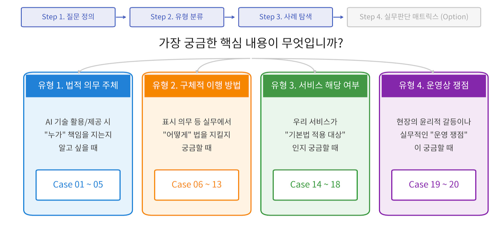

20선의 질답 사례로 배우는 기업 실무 가이드  23
사례 01    타사의 인공지능으로 제작한 콘텐츠를 사용하면 인공지능이용사업자에 해당하는가?
(제2·4·5조 용어 정의 및 적용 범위)
Q  우리 회사는 온라인 백과사전 서비스를 운영하며, 타사가 제공하는 인공지능서비스(ChatGPT
·Gemini 등)로 텍스트·이미지·영상 등 인공지능 생성물을 제작하고 검수한 후 사이트에
게시하고 있습니다. 이 경우 우리 회사가 인공지능이용사업자에 해당하여 법 제31조 투명
성 확보 의무를 부담하는지, 또한 향후 이용자가 인공지능과 직접 상호작용을 하는 기능
(예: ‘인공지능에게 질문하기’ 형태의 생성 응답 기능)을 일부라도 제공하면 그 기능 범위에
서 지위와 의무가 어떻게 달라지는지요?
A  타사가 제공하는 인공지능서비스(ChatGPT, Gemini 등)로 인공지능 생성물을 제작하여 서
비스에 게시하는 행위는, 인공지능제품 또는 서비스를 이용자에게 직접 제공하는 것이 아닙
니다. 따라서 이 경우 문의자는 인공지능사업자가 아닌 ‘이용자’에 해당하며, 법 제31조의
투명성 확보 의무 대상이 아닙니다. 다만 향후 이용자가 인공지능과 직접 상호작용을 하는
인공지능 서비스(예: 인공지능 챗봇)를 제공하게 되면, 그 기능 범위에서는 인공지능이용사
업자로 볼 수 있습니다.
핵심 포인트
‘인공지능서비스를 이용하여 생성물을 만들어 사용하는 것’과 ’인공지능서비스를 제공하는 것'은 다릅니

**다. 전자는 이용자, 후자는 인공지능이용사업자입니다. 인공지능 생성물을 단순히 게시하는 것만으로는**

사업자가 되지 않습니다.
사례 02   생성형 인공지능을 도입하는 공공기관도 투명성 확보 의무 대상인가?
(제31조 투명성 확보)
Q  우리 회사는 공공기관인데 외부 사업자가 제공하는 생성형 인공지능서비스를 도입하여 내부
업무에 사용하고 있습니다. 이 경우, 공공기관인 우리 회사도 법 제31조 투명성 확보 의무 (사
전고지, 표시)를 이행해야 합니까?
A  인공지능기본법상 인공지능사업자 또는 이용자에는 공공기관도 포함될 수 있습니다. 인공지
능사업자의 판단기준은 공공기관 여부가 기준이 아니라 '누가 인공지능제품, 서비스를 개발
또는 제공하는가'가 기준입니다. 위 질문의 경우, 공공기관에서 직접 인공지능서비스를 개
발·제공한다면 인공지능사업자에 해당하여 투명성 확보 의무가 있고, 인공지능서비스를 외
부기관에서 제공받아 이용한다면 이용자에 해당하므로 투명성 확보 의무 대상이 아닙니다.

24   인공지능기본법 지원데스크 사례집
핵심 포인트
공공기관도 예외는 아닙니다. ‘인공지능을 도구로 사용해 산출물을 만드는 주체’는 이용자이고, '인공지
능 서비스 자체를 대외적으로 제공하는 주체'가 인공지능사업자입니다. 인공지능사업자에 해당하면 투
명성 확보 의무가 있습니다.
사례 03   타사가 개발한 인공지능 서비스를 납품받아 고객에게 제공하는 경우 서비스를 받은
회사는 인공지능개발사업자인가, 인공지능이용사업자인가? 아니면 이용자인가?
(제2·4·5조 용어 정의 및 적용 범위)
Q  우리 회사는 타사와 인공지능 개발 계약을 체결하여 타사가 인공지능 서비스를 개발하고,
고객에게 해당 인공지능 서비스를 제공하고 있습니다. 이 경우 우리 회사가 인공지능개발사
업자 또는 인공지능이용사업자에 해당합니까? 아니면 이용자에 해당합니까? 그 기준이 궁
금합니다.
A  인공지능서비스를 제3자에게 제공하는 경우 인공지능이용사업자에 해당합니다. 다만, 발주
사가 해당 인공지능 서비스의 구조 설계 관여하거나, 실질 통제하거나, 개발사가 납품한 시스
템을 중대하게 변경했다면 발주사는 인공지능개발사업자에 해당할 수 있습니다.
핵심 포인트
외주 여부가 결론을 정하지 않습니다. 핵심은 ①구조 설계 관여 및 실질 통제 여부, ②중대한 변경 여부
입니다. 인공지능서비스를 납품받아 고객에게 제공하는 구조라면 원칙적으로 인공지능이용사업자이며,
발주사가 설계를 실질 통제했거나 납품 후 기능·용도·성능이 현저히 달라질 정도로 변경한 경우에만 인
공지능개발사업자에 해당합니다. RAG(검색·증강·생성6)
연계나 사내 기술 용어집 추가만으로는 '중대한
기능 변경'으로 보기 어려울 수 있습니다. 중대한 변경 여부는 기능·용도·성능이 현저히 달라졌는지, 데
이터의 양·질이 기존 인공지능과의 동일성을 부정할 수준인지를 종합적으로 판단합니다.
6   RAG는 인공지능이 답변을 생성할 때 외부의 신뢰할 수 있는 데이터(기업 내부 문서 등)를 먼저 검색한 뒤, 그 내용을 바탕으
로 응답하도록 하는 기술임. 인공지능의 고질적 문제인 환각 현상(거짓 정보를 사실처럼 말하는 것)을 줄이고 최신 정보를 제
공하기 위해 사용됩니다.

20선의 질답 사례로 배우는 기업 실무 가이드  25
사례 04   개인 창작자(유튜버, 인스타그래머 등)도 표시 의무가 있는가?
(제31조 투명성 확보)
Q  개인 창작자가 타사가 제공하는 생성형 인공지능서비스로 만든 표지·삽화·홍보 이미지를 플
랫폼에 게시하는 경우, 인공지능기본법상 표시 의무의 직접 대상이 됩니까? 또한 플랫폼 수
익 정산을 받으면 인공지능사업자로 보아 의무가 달라지나요? 그리고 인공지능으로 만든 콘
텐츠가 인공지능제품에 해당하는지도 궁금합니다.
A  생성형 인공지능을 활용하여 콘텐츠를 제작·게시하는 개인 창작자는 인공지능기본법상 이
용자에 해당하는 것이 일반적이며, 투명성 확보 의무 대상이 아닙니다. 인공지능이용사업자
란 생성형 인공지능서비스 자체를 제공하는 자를 의미하며, 개인이 광고·후원 등으로 수익
을 얻더라도 그것만으로 곧바로 인공지능사업자가 되는 것이 아니므로 의무가 달라지지 않
습니다. 인공지능제품은 인공지능이 탑재된 제품을 의미하며, 인공지능서비스로 생성된 인
공지능 생성물(콘텐츠)을 인공지능제품으로 보지 않습니다.
핵심 포인트
판단 기준은 수익 여부가 아니라 이용자에게 인공지능제품 또는 서비스 자체를 직접 제공하는가입니다.
광고·후원 등으로 수익을 얻더라도 그것만으로 사업자가 되지 않습니다. 또한 인공지능 생성물은 통상적
으로 인공지능제품으로 보지 않습니다. 다만, 법적 의무는 없지만, 자발적으로 '인공지능 생성물'임을 표
시하는 것은 창작자의 신뢰도를 높이고 건강한 콘텐츠 문화 형성에 기여할 수 있습니다.
사례 05   내부 업무용으로만 자체 개발하여 사용하는 인공지능은 투명성 확보 의무 적용 대상인가?
(제31조 투명성 확보)
Q  외부에 제품·서비스를 제공하지 않고 내부 직원이 업무용으로 사용할 인공지능서비스를 개
발·이용하는 경우에도, 인공지능기본법 제31조 의무가 적용됩니까?
A  시행령 제23조제4항은 인공지능사업자의 내부 업무 용도로만 사용하는 경우 투명성 확보 의
무 적용 예외로 규정하고 있어, 고지 의무 및 표시 의무는 예외 적용을 받을 수 있습니다. 하
지만 해당 인공지능서비스가 제3자에게 제공되면(무상·유상 무관) 투명성 확보 의무가 적용
될 수 있으므로, 제공 범위가 바뀌지 않도록 관리해야 합니다. 또한 제34조 고영향 인공지능
과 관련한 사업자의 책무도 발생할 수 있습니다.

26   인공지능기본법 지원데스크 사례집
핵심 포인트
내부에서 활용하는 인공지능은 투명성 의무에서는 제외되지만, 고영향 인공지능 여부는 별도로 판단해
야 합니다. 내부에서만 사용한다고 해서 모든 의무에서 벗어나는 것은 아닙니다.
유형
02   어떻게 표시해야 하는가? - 투명성 확보 의무 이행
전체 문의의 56%를 차지한 가장 핵심적인 주제입니다. 표시 방법·위치·수준 등 실무적 질문에
대한 답을 정리했습니다. 생성형 인공지능 운용 사실의 사전고지 및 결과물 표시(워터마크, 자막,
메타데이터 등)에서 ‘방법·수단·수준’에 관한 질문이 많았습니다. 고지와 표시의 기본 원칙과 흐
름은 아래 그림과 표를 참고하십시오.
<그림4. 투명성 확보 의무 기본 원칙 적용 흐름도 >
< 표15. 투명성 의무 이행 수단 비교표 >
의무 구분
제공 상황
이행 방법
관련 사례
사전고지
법 제31
조 제1항
고영향 인공지능 또는 생
성형 인공지능 기반 서비
스 이용 전
서비스명·앱 설치 안내·이용약관·첫 화면 문구·음성 안내 등 다양한
방법 허용
이용자가 인공지능 기반으로 운용됨을 인지할 수 있으면 충족. 매번
반복 고지 불필요
사례
예외:
내부 업무 전용 인공지능
시행령 제23조 제4항 제2호에 따라 고지 의무 적용 제외
사례


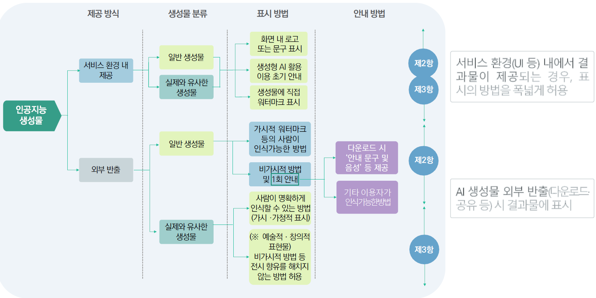

20선의 질답 사례로 배우는 기업 실무 가이드  27
표시 의무
법 제31
조 제2항
서비스 환경(UI 등) 내에
서만 인공지능 생성물
제공
텍스트·이미지 생성물: 화면 내 로고·문구·워터마크 등
음성 생성물: 재생 초기 음성 안내
이용자가 합리적으로 인지 가능하면 개별 인공지능 생성물마다 반복
삽입 불필요
사례
06,
07,10,
다운로드·공유 등 외부
반출이 있는 경우
인공지능 생성물(파일) 자체에서 인공지능이 생성 사실을 확인할 수
있도록 표시
메타데이터 삽입, 디지털 워터마크 등 방법은 자유. 이용자가 인공지
능 생성 사실을 확인할 수 있으면 충족. 비가시적 표시 방법을 사용
하는 경우 이용자에게 최소 1회 이상 안내 문구·음성 등을 별도 제공
해야 함.
사례
06, 07
실제와 구분하기 어려운
생성물 (딥페이크 수준)
원칙: 이용자가 명확히 인식할 수 있는 가시·가청적 표시
예외: 예술적·창의적 표현물 등 감상을 저해할 우려가 있는 경우 —
비가시적 방법(메타데이터 삽입 등) 또는 별도 영역 표시로 대체 가능
사례
06, 12
※ 법정 표준 서식 없음. 어떤 방법이든 이용자가 합리적으로 인공지능 생성 사실을 인지할 수 있는 수준이면 충족 (시행령
제23조 제2항). 모델명 명시는 법적 의무가 아님 (→ 사례 10)
사례 06   이미지 생성 시 가시적 워터마크와 비가시적 메타데이터를 모두 적용해야 하는가?
(제31조 투명성 확보)
Q  생성형 인공지능으로 만든 인공지능 생성물에 가시적 워터마크와 비가시적 메타데이터를 반
드시 동시에 적용해야 합니까? 서비스 내에서만 보여주는 경우와 다운로드·공유(외부 반출)
하는 경우 표시 방식이 달라집니까?
A  표시 의무는 인공지능 생성물의 제공 형태에 따라 이행 방법이 달라집니다. 인공지능서비스
이용 환경(UI, 앱 화면 등) 안에서만 인공지능 생성물이 제공되는 경우, 이용 전 안내나 서비
스 화면의 로고·문구 표시 등으로 이용자가 인공지능이 생성한 사실을 알 수 있게 하는 방식
으로도 충분합니다. 이 경우 개별 이미지마다 워터마크를 반복 삽입할 필요는 없습니다. 반
면 다운로드·공유 등 외부 반출 기능을 제공할 때는, 인공지능 생성물 자체에서 인공지능이
생성한 사실을 확인할 수 있도록 생성물(파일) 안에 표시를 포함해야 합니다(메타데이터 삽
입, 디지털 워터마크 등). 단, 비가시적 방법을 이용할 때는 다운로드 시점에 안내 문구·음성
등으로 인공지능 생성물이라는 사실을 최소 1회 이상 안내해야 합니다. 또한 실제와 구분하
기 어려운 이미지·영상·음성(소위 딥페이크 수준)에 해당하면 이용자가 명확히 인식할 수 있
는 가시·가청적 표시가 원칙입니다. 다만, 예술적·창의적 표현물의 경우 전시·향유를 저해하
지 않도록 비가시적 표시나 별도 영역 표시(엔딩크레딧, 자막 등) 방식이 허용될 수 있습니다.

28   인공지능기본법 지원데스크 사례집
핵심 포인트
표시 방법에는 법정 서식이 없습니다. 워터마크·자막·메타데이터·이용약관 명시·화면 안내 문구 등 다양
한 방법이 인정됩니다. 단, 이용자가 합리적으로 식별할 수 있어야 합니다.
사례 07   인공지능 챗봇·보이스봇 서비스에서 사전고지와 표시 의무를 어떻게 이행하는가?
(제31조 투명성 확보)
Q  이용자에게 제공하는 챗봇·보이스 응답 서비스에서 사전고지는 어떤 방식으로 하면 되고,
인공지능 생성물 표시는 어디까지 해야 합니까? 서비스명에 인공지능이 포함되어 있거나
이용자가 인공지능에 의해 운용한다는 사실을 명백히 알 수 있을 때도 별도 고지가 필요한
가요?
A  사전고지 의무는 인공지능제품 또는 서비스를 이용자가 사전에 알 수 있도록 하는 것을 의미
하며, 서비스명, 앱 설치 시 안내, 이용약관, 첫 화면 안내 등 다양한 방식이 허용됩니다. 이
용자가 서비스를 이용하기 전에 인공지능 기반으로 운용된다는 사실을 인지할 수 있는 구조
라면, 매번 개별 알림이나 메시지로 반복해서 알릴 필요는 없습니다. 인공지능 생성물 표시
는 서비스 이용 환경 내에서만 제공되는 대화 응답이라면 UI 내 로고·문구 표시 등으로 처리
할 수 있고, 대화 내용·음성 파일을 다운로드/공유하는 등 외부 반출 기능이 있으면 그 인공
지능 생성물 자체에 인공지능 생성 사실을 식별할 수 있는 표시를 포함해야 합니다. 음성 인
공지능 생성물을 외부로 제공할 때는 음성 시작 시 안내 등 가시·청각적 표시 방식을 함께 고
려해야 합니다. 시행령 제23조 제4항 제1호는 서비스명·화면 문구·표시 방법 등을 종합적
으로 고려하여 인공지능 활용 사실이 명백한 경우 의무의 전부 또는 일부를 예외로 할 수 있
도록 규정하고 있습니다. 다만 서비스명 하나만으로는 이 명백성 요건을 충족한다고 보기 어
려우며, 제공 방식의 특성상 사전고지나 표시가 현실적으로 제한되는 경우에 한해 일부 예외
가 추가로 인정될 수 있습니다. 어느 경우에도 예외가 자동으로 발생하는 것은 아니므로 설
계 단계에서 충분히 검토하는 것이 안전합니다.
핵심 포인트
챗봇·보이스봇은 이용자가 인공지능과 직접 상호 작용하는 전형적인 인공지능서비스입니다. 사전고지는
서비스 이용 시작 전 또는 초기에 이루어져야 합니다.

20선의 질답 사례로 배우는 기업 실무 가이드  29
사례 08   온라인 커머스 상세페이지에 인공지능 생성 이미지 또는 텍스트를 게시할 때 표시 방법
은?  (제31조 투명성 확보)
Q  상품 상세페이지 이미지 제작 과정에서 인공지능으로 배경을 합성·생성하거나 보정한 경
우, 상세페이지에 ‘인공지능 사용’ 표기를 해야 합니까? 표기한다면 위치/크기 기준이 있습
니까?
A  인공지능서비스를 제공하는 인공지능사업자가 아니라, 제3자가 제공하는 인공지능서비스
를 활용하여 인공지능 생성물을 만드는 경우는 이용자에 해당하므로 인공지능기본법상 표시
의무의 대상이 아닙니다. 즉, 홈페이지 상세페이지 등에 인공지능을 사용하였다는 표시 의무
가 생긴다고 보기 어렵습니다. 또한 투명성 확보를 위한 워터마크의 표시 위치나 크기에 관
해 법령이 정한 규격은 없고, 만약 표시 의무가 적용되는 구조라면 이용자가 식별할 수 있는
수준으로 설계하면 됩니다.
핵심 포인트
온라인 커머스가 인공지능서비스를 소비자에게 제공하면(예: 소비자가 프롬프트로 이미지를 생성) 인공
지능이용사업자에 해당할 수 있으나, ‘마케팅 제작 과정에서 인공지능을 활용’하는 것은 대체로 이용자
에 해당합니다.
사례 09   인공지능이 만들고 사람이 수정한 콘텐츠도 표시 의무가 있는가?
(제31조 투명성 확보)
Q  생성형 인공지능으로 만든 인공지능 생성물을 사람이 일부 수정하면 투명성 표시 의무가 달
라지나요?
A  타사의 생성형 인공지능서비스로 이미지를 만들고, 그 이미지를 청첩장 등에 단순히 삽입하
는 방식(다른 인공지능 서비스 제공 없음)이라면 이용자에 해당하여 표시 의무 책임이 없습
니다. 다만 해당 인공지능 생성물을 타 인공지능과 연동하여 콘텐츠를 수정·생성하는 인공
지능서비스를 타인에게 제공하는 구조로 발전하면 인공지능이용사업자에 해당할 가능성이
있고, 표시 의무가 적용될 수 있습니다. 리터칭의 경우에도, 생성형 인공지능서비스로 인공
지능 생성물을 제공받은 뒤, 별도로 편집하는 이용자는 표시 의무 부과 대상이 아닙니다. 다
만, 생성형 인공지능제품 또는 서비스 내 기능의 일부로 리터칭(추가 편집) 기능을 제공하고
최종 인공지능 생성물을 출력하는 구조라면 그 제품이나 서비스를 제공하는 인공지능사업
자는 표시 의무가 적용됩니다.

30   인공지능기본법 지원데스크 사례집
핵심 포인트
인공지능 생성물을 사람이 단순히 수정하는 등 보조 역할만 한 경우(예: 단순 색보정)는 표시 의무에서
제외될 수 있습니다. 다만, 이 기능을 자동화하여 타인에게 제공하는 경우 인공지능사업자에 해당할 수
있습니다.
사례 10   멀티 LLM 환경에서 구체적인 모델명까지 표시해야 하는가?
(제31조 투명성 확보)
Q  이용자가 인공지능서비스에서 GPT 계열, Gemini 등 여러 LLM 중 하나를 선택해 인공지능
생성물을 생성하는 경우, 인공지능 생성물 하단 등에 구체적인 모델명까지 표시해야 하나요?
‘인공지능 생성물’과 같은 포괄적 표시만으로 제31조 의무 이행이 가능한지요.
A  현행 인공지능기본법과 하위법령에서는 표시 의무 이행 시 구체적인 모델명(예: GPT-4o)까
지 기재하도록 명시적으로 요구하지는 않습니다. ‘인공지능이 생성한 결과물’ 또는 ‘인공지
능 생성물’ 등의 포괄적 표현으로 표시 의무를 이행할 수 있습니다. 다만 이용자 신뢰와 선택
권, 투명성을 높이는 차원에서 모델명 또는 사용 엔진 정보를 제공하는 것을 고려할 수 있으
며, 제공할 때는 서비스 화면이나 정책 페이지 등에서 일관되게 안내하는 것이 적절합니다.
핵심 포인트
법상 의무사항은 '인공지능 생성물임을 인지할 수 있는 표시'입니다. 다만 모델명 명시는 자율적으로 투
명성을 높이는 데 도움이 됩니다.
사례 11   광고영상·SNS 콘텐츠·인쇄물에서의 인공지능 생성물 표시 방법은?
(제31조 투명성 확보)
Q  광고영상·SNS 콘텐츠·인쇄물 제작 등을 위해 인공지능 생성물을 만들어 사용하면 표시 의
무가 있습니까? 있다면 모든 장면이나 이미지마다 해야 합니까? 아니면 게시글 설명 텍스트
나 인쇄물의 별도 표기(안내문)로도 가능한지요.
A  단순히 생성형 인공지능으로 광고용 이미지·영상 등의 인공지능 생성물을 만들어 게시하는
경우는 ‘이용자’에 해당하여 표시 의무의 대상이 아닙니다. 반면 이용자에게 인공지능서비스

20선의 질답 사례로 배우는 기업 실무 가이드  31
를 제공하는 인공지능사업자라면 표시 의무가 발생하며, 표시 방식은 콘텐츠 특성과 제공 방
식에 따라 설계할 수 있습니다. 전시·향유를 저해하지 않는 별도 영역 표시(엔딩크레딧, 자
막 등)나 서비스 화면의 로고·문구 표시 등도 허용됩니다. 또한 워터마크의 위치/크기 등 정
형 규격은 없고, 이용자가 합리적으로 인지할 수 있는 수준이면 됩니다.
핵심 포인트
광고 제작 과정에서 인공지능 생성물을 만들어 사용하는 것은 대체로 이용자 영역입니다. 인공지능사업
자에게 부여되는 표시의무는 이용자가 합리적으로 식별할 수 있는 수준의 표시면 됩니다.
사례 12   예술적·창의적 표현물에서 감상을 방해하지 않는 표시 방법은 무엇인가?
(제31조 투명성 확보)
Q  전시나 감상을 목적으로 하는 예술적·창의적 인공지능 생성물에서는 워터마크가 감상을 해
칠 수 있습니다. 이 경우에도 가시적 표시(워터마크)가 필수인지, 전시·향유를 저해하지 않
는 비가시적 방법으로 의무 이행이 가능한지요?
A  인공지능기본법은 예술적·창의적 표현물의 경우 비가시적 방법 등을 통해 전시·향유를 저해
하지 않는 방식으로 표시 의무를 이행할 수 있도록 허용하고 있습니다. 구체적으로 허용되는
방법으로는 ①생성물의 주요 콘텐츠와 겹치지 않는 별도의 영역에 표시하는 방법(엔딩크레
딧, 자막 등), ②기계가 판독할 수 있는 비가시적 표시 방법이 있습니다. 비가시적 방법만 단
독 사용하는 경우에는 이용자에게 최소 1회 이상 별도 안내 문구·음성을 제공해야 합니다.
핵심 포인트
예술적·창의적 표현물에서는 감상을 방해하지 않는 방식의 표시가 허용됩니다. 엔딩크레딧, 자막 등 별
도 영역 표시 또는 비가시적 표시 방법으로 의무를 이행할 수 있습니다..
사례 13   법 시행 전 제작하여 게시한 인공지능 생성물에도 표시 의무가 소급 적용되는가?
(제31조 투명성 확보)
Q  인공지능기본법 시행(2026.1.22.) 이전에 인공지능으로 생성하여 SNS·유튜브 등에 게시
한 인공지능 생성물에 대해서도, 소급하여 워터마크를 삽입해야 하는지요? 수정이 어려우면

32   인공지능기본법 지원데스크 사례집
삭제·재업로드가 필요합니까?
A  인공지능기본법은 법 시행 이후 생성되는 인공지능 생성물에 대해 표시 의무를 부과합니다.
법 시행 이전에 이미 생성하여 게시된 인공지능 생성물에 대해서는 소급 적용이 되지 않으므
로, 기존 게시물에 워터마크를 삽입하거나 삭제·재업로드할 필요가 없습니다.
핵심 포인트
소급 적용 없음이 원칙입니다. 시행 이전 게시물에 워터마크를 삽입할 필요는 없습니다
유형
03   우리 서비스가 고영향 인공지능인가? - 고영향 인공지능 판단
고영향 인공지능으로 분류되면 법 제34조의 고영향 인공지능과 관련한 사업자 책무가 부과됩
니다. 이에 업종별로 고영향 인공지능 해당 여부를 둘러싼 문의가 많습니다. 개발 중이거나 활용
예정인 인공지능이 법에서 정한 고영향 인공지능에 해당하는지, 사람의 생명, 신체의 안전 및 기
본권에 중대한 영향을 미치거나 위험을 초래할 우려가 있는지 등을 판단 기준으로 다룹니다.
< 표16. 고영향 인공지능 업종별 판단 요약표 >7
업종
법정 영역 해당
고영향 인공지능
가능성
적극적·실질적 개입·
통제가 있는 경우
관련 사례
채용 (합격·탈락 결정)
O
가능성 있음
제외 가능
사례 14
채용 (서류 요약·추출 보조)
O
가능성 낮음
제외 가능
사례 14
대출심사 (승인·거절·조건)
O
가능성 있음
제외 가능
사례 15
대출심사 (단순 참고자료)
O
가능성 낮음
제외 가능
사례 15
의료·기기 (진단·치료)
O
가능성 있음
제외 가능
사례 16
의료·기기 (편의성 보조)
O
가능성 낮음
제외 가능
사례 16
교육 (학생 평가)
O
가능성 있음
제외 가능
사례 17
교육 (학습 보조· 생성)
X
영역 비해당
-
사례 17
교육 (특수교육·리포트)
X
영역 비해당
-
사례 17
재난·홍수예보 (수위 예측)
X
영역 비해당
-
사례 18
7    ①법정 영역 해당(O)된다고 해도 사람의 적극적·실질적 개입과 통제가 있는 경우 고영향 인공지능에서 제외될 수 있습니다.
②법정 영역 미해당(X)인 경우 고영향 인공지능 판단 대상이 아닙니다 ③"적극적·실질적 개입과 통제"는 형식적 확인에 그치
지 않고, 실제로 인공지능의 판단과 결정을 배제, 수정, 거부할 수 있는 권한을 사람이 적극적으로 행사할 수 있는지 등을 기준
으로 판단합니다. ④의료분야와 금융분야는 인공지능기본법 이외에 의료 분야는 보건복지부·식품의약품안전처 기준을, 금융
분야는 금융위원회·금융감독원 기준을 병행하여 검토하시기 바랍니다.

20선의 질답 사례로 배우는 기업 실무 가이드  33
지능형 CCTV (단순 관제)
X
영역 비해당
-
사례 18
지능형 CCTV (생체인식)
△
가능성 있음
(범죄수사·체포에 활용
되는 경우)
개별 판단
사례 18
사례 14    채용 서류전형에서 인공지능을 보조도구로 활용하면 고영향 인공지능인가?
(제33조 고영향 인공지능 확인)
Q  채용 서류전형에서 인공지능을 요약·추출·유사도 검사 등 보조 도구로만 활용하고, 평가/선
별은 사람이 수행하면 고영향 인공지능에 해당합니까? 또한 타 사업자의 인공지능서비스를
도입해 이용하면 우리 기관은 사업자인가요?
A  채용 분야는 고영향 인공지능에 해당할 수 있는 영역이지만, 고영향 여부는 채용 과정에서
인공지능 시스템이 지원자 채용에 미치는 영향과 실질적인 인적 개입 여부를 종합해 판단합
니다. 문의 사안처럼 인공지능이 채용 여부를 결정하지 않고 서류 검토·추출·요약·분류 또
는 기초 자료 작성에만 활용되며, 최종 선별과 평가는 사람이 수행하는 구조라면 고영향 인
공지능에 해당하지 않을 수 있습니다. 한편, 다른 사업자의 인공지능서비스를 도입하여 자
사 채용 업무에만 활용하고, 이를 외부 제3자에게 제공하지 않는 경우는 인공지능사업자가
아닌 이용자에 해당합니다.
핵심 포인트
고영향 인공지능 판단 핵심: ①인공지능 활용 영역(채용 등 법정 영역인지) + ②사람의 생명·신체 또는
기본권에 중대한 위험을 초래할 우려(사람의 실질적이고 적극적인 개입과 통제가 보장되는지) 등 인공지
능시스템의 이용 맥락을 종합적으로 검토합니다.
사례 15   대출·신용 심사에 활용하는 인공지능은 고영향 인공지능에 해당하는가?
(제33조 고영향 인공지능 확인)
Q  대출 승인 여부와 대출 조건 판단에 인공지능을 활용하는 경우, 어떤 때 고영향 인공지능으
로 봐야 합니까?
A  고영향 판단 가이드라인의 취지는 단일 요건 충족만으로 일률 확정하기보다, 위험 가능성
을 구조적으로 점검하고 최종적으로 인공지능이 중대한 의사결정에 실질적으로 관여하는

34   인공지능기본법 지원데스크 사례집
지, 기본권 침해 가능성은 없는지를 종합적으로 판단하라는 취지입니다. 또한 최종 의사결
정 과정에서 사람이 실질적으로 개입하여 통제하는 때는 고영향 인공지능 대상에서 제외될
수 있습니다. 대출 심사는 고영향 인공지능에 해당할 수 있는 분야입니다. 다만, 인공지능 결
과값을 단순 참고로만 활용하고 최종 결정(승인 여부·대출 조건)을 담당자가 검토·조정·승
인하는 구조라면 고영향 인공지능에 해당하지 않을 수 있습니다.
핵심 포인트
대출 분야는 잠재적으로 고영향 영역이지만, 인공지능이 승인/조건을 사실상 결정하는지, 사람이 실질
통제하는지가 핵심입니다. 다른 정보와 종합 분석 후 사람이 최종 판단하는 구조라면 고영향 인공지능
해당 가능성이 낮아집니다.
사례 16   의료기기에 탑재된 인공지능 진단 기능은 고영향 인공지능인가?
(제33조 고영향 인공지능 확인)
Q  진단용 초음파 의료기기에 탑재되어 병을 탐지하고 의사에게 결과를 제공하는 인공지능서
비스가 고영향 인공지능에 해당하는지 문의드립니다. 특히 의사의 독립적 판단이 실질적으
로 이루어지는 구조(참고 보조)인 경우에도 동일하게 고영향으로 보아야 하는지요?
A  고영향 인공지능 판단은 ①법 제2조 제4호 각 목의 사용 영역에서 활용되는지, ②그 인공지
능 시스템이 사람의 생명·신체 안전 또는 기본권 보호에 중대한 영향을 미치거나 위험을 초
래할 우려가 있는지를 종합해 판단합니다. 문의하신 기능은 스스로 질병을 진단하거나 영상
을 판독하는 것이 아니라 검사 편의성을 높이고 특정 수치의 예측값을 제공해 의료진의 판
단을 보조하는 역할에 그칩니다. 예측값이 참고 자료에 불과하고 최종 임상 판단은 의료진
이 수행하며 오류 시 의료진이 직접 개입할 수 있는 구조라면, 의료진의 진단을 대체하거나
자동화된 결정을 내리는 기능으로 보기 어려워 고영향 인공지능에 해당하지 않습니다. 다만
기능·작동 방식·의료행위 영향이 달라지면 개별 사안별로 판단이 달라질 수 있습니다.
핵심 포인트
의료 영역이라도 “자동 진단/결정”인지 “편의성·보조”인지가 핵심입니다. 최종 판단 주체와 오류 시 통
제 가능성이 중요한 판단 요소입니다.

20선의 질답 사례로 배우는 기업 실무 가이드  35
사례 17   교육 인공지능서비스는 고영향 인공지능에 해당하는가?
(제33조 고영향 인공지능 확인)
Q   중·고등 특수교육 대상 학생에게 학습 콘텐츠 초안 생성·활동 기록 분석·리포트를 제공하는
인공지능서비스가 고영향 인공지능에 해당하는지 문의드립니다.
A   교육 분야 인공지능은 유아교육·초등교육 및 중등교육에서의 ‘평가’ 분야에서 활용되는 경
우만 고영향 인공지능으로 분류합니다. 문의 서비스는 학습 콘텐츠 초안 생성, 학습 활동 정
리, 교사·보호자 참고용 리포트 작성 등 교육자료 생성과 교육과정 진행·정리를 목적으로
사용되며, 평가 분야의 프로그램으로 보기는 어렵습니다.
핵심 포인트
교육 분야 고영향 인공지능은 '유아교육‧초등교육 및 중등교육에서의 평가' 목적(성취도 평가, 합격·불
합격 결정 등)으로 좁게 해석합니다. 학습 보조·콘텐츠 생성·행정 지원 목적은 해당하지 않습니다.
사례 18   공공안전 분야 인공지능(홍수예보·지능형 CCTV 등)은 고영향 인공지능인가?
(제33조 고영향 인공지능 확인)
Q  인공지능이 10분마다 하천 수위를 자동 예측하고 위험 알람을 생성하며, 홍수 예보관이 검
증 후 홍수특보를 발령하는 구조의 홍수예보 인공지능시스템이 고영향 인공지능에 해당하나
요? 또한 스마트 CCTV 등 지능형 감시 기기에서 단순 모니터링 지원인지, 특정인 식별(생체
인식) 등 기능을 수행하는지에 따라 고영향 인공지능 해당 여부가 달라지는지도 궁금합니다.
A  고영향 인공지능은 ①법 제2조 제4호 각 목에서 정한 영역에서 활용되고, ②사람의 생명, 신
체의 안전 및 기본권 보호에 중대한 영향을 미치거나 위험을 초래할 우려가 있는 경우 해당
합니다. 홍수예보 인공지능은 인공지능기본법에서 고영향 인공지능 대상으로 정하고 있는
에너지 분야 또는 먹는 물의 생산 분야에 해당하지 않으므로, 단순한 홍수예보 체계에서만
활용된다면 고영향 인공지능에 포함되지 않을 가능성이 높습니다. 추가로 스마트 CCTV 등
지능형 감시 기기가 단순 모니터링 지원인지, 특정인의 식별(생체 인식) 등의 기능 수행 여부
에 따라 고영향 인공지능 여부가 결정되는 것이 아니라, 그 기기가 인공지능기본법에서 열거
한 법정 영역에서 활용되는 경우 고영향에 해당할 수 있습니다.

36   인공지능기본법 지원데스크 사례집
핵심 포인트
고영향 인공지능은 ‘영역 요건’과 ‘중대 영향 또는 위험’ 요건 등을 함께 보는 2단계 판단 대상입니다. 홍
수예보 등 재난 대응 인공지능은 현행 법령상 고영향 인공지능 법정 영역(에너지·먹는 물 생산 등)에 포
함되지 않습니다.
유형
04   그 밖의 궁금증 – 운영 의무 및 집행
소급 적용, 유예기간 운영, 기록·사후검증 체계 구축 등 제도 집행 과정에서 발생할 수 있는 주
요 실무 질의 사항을 정리했습니다.
사례 19   고영향 인공지능 사업자의 기록·사후 검증 관리체계 의무는 구체적으로 무엇인가?
(제34조 사업자 책무)
Q  고영향 인공지능 사업자로서 기록 보관, 설명 가능성 확보, 사후 검증 관리체계를 어떻게 구
현해야 하는지요? 특히 인공지능 판단 기록이 사후에 수정되지 않았음을 어떻게 담보해야
합니까?
A  법 제34조에 따른 고영향 인공지능 사업자 책무는 고영향 인공지능 사업자 책무 가이드라인
의 인공지능개발사업자와 인공지능이용사업자 각각에 배정된 자가점검 항목을 기준으로 이
행 주체를 구분합니다. 기록 보관은 인공지능 판단 시점의 입력·출력·근거를 로그로 저장하
고 변경 이력을 관리하는 시스템을 갖추도록 권장합니다. 설명 가능성 확보는 개별 결정 단
위로 이용자에게 설명할 수 있는 체계를 마련하는 것입니다. 단, 영향이 상대적으로 적은 경
우에는 시스템 수준의 설명으로 갈음할 수 있습니다. 마지막으로, 사후 검증은 정기적 성능
점검, 오류 모니터링 체계 운영을 포함합니다. 인공지능개발사업자가 이행한 책무는 인공지
능시스템의 중대한 기능 변경을 초래하지 않은 경우, 인공지능이용사업자가 중복하여 이행
하지 않아도 됩니다.
핵심 포인트
고영향 인공지능 책무는 가이드라인에서 '개발이용 태그'로 구체적으로 이행 주체를 구분합니다. 홈페이
지 공시 위치는 법령에 별도 규정이 없으나, 이용자가 쉽게 접근할 수 있는 위치에 마련하는 것이 바람직
합니다. 내용은 가급적 개별 인공지능시스템 단위로 구분하여 작성할 것을 권장합니다.

20선의 질답 사례로 배우는 기업 실무 가이드  37
사례 20    법 시행 이전부터 제공하던 인공지능서비스에도 법이 소급 적용되는가? 유예기간은?
Q  법 시행 이전부터 제공하던 인공지능서비스에도 시행 후 의무가 적용됩니까? 시행 전에 생
성·게시된 인공지능 생성물에도 표시 의무가 소급 적용됩니까? 위반 시 과태료/시정명령 등
제재와 유예기간은 어떻게 봐야 합니까?
A  법 시행 전부터 인공지능서비스를 제공하던 사업자도 법 시행 이후부터는 의무 대상이 됩
니다. 그러므로 법 시행 전 생성되거나 게시된 인공지능 생성물의 표시 의무는 소급적용 대
상이 아닙니다. 정부는 기업의 준비 기간을 고려하여 최소 1년 이상 사실조사, 과태료 부과
를 유예하겠다는 방침을 밝힌 바 있습니다. 다만 유예기간 중에도 법적 의무 자체가 사라지
는 것은 아니므로, 지금부터 단계적 이행 계획을 세우고 준비 과정을 문서화해 두는 것이 바
람직합니다.
핵심 포인트
법 시행 후에는 인공지능사업자에게 의무가 적용됩니다. 사실조사와 과태료는 현재 유예기간을 운영하
고 있지만, 단계적 이행 계획을 미리 세우고 준비 과정을 기록해 두는 것이 중요합니다.
[참고] 사례색인
제3장의 20개 사례와 관련 조항을 인공지능기본법 각 조항 기준으로 찾을 수 있도록 정리하였
습니다. 이 사례는 [부록1. 실무 판단 기준]도 동일합니다.

38   인공지능기본법 지원데스크 사례집
< 표17. 사례별 관련 조항 및 유형 >
번호
질문
관련 조항
유형
사례 01
타사의 인공지능으로 제작한 콘텐츠를 사용하면 인공지능이용사업자에 해
당하는가?
제2·4·5조
유형1.
책임주체 및 적용
대상
사례 02
생성형 인공지능을 도입하는 공공기관도 투명성 확보 의무 대상인가?
제31조
사례 03
타사가 개발한 인공지능 서비스를 납품받아 고객에게 제공하는 경우 서비
스를 받은 회사는 인공지능개발사업자인가, 인공지능이용사업자인가? 아
니면 이용자인가?
제2·4·5조
사례 04
개인 창작자(유튜버, 인스타그래머 등)도 표시 의무가 있는가?
제31조
사례 05
내부 업무용으로만 자체 개발하여 사용하는 인공지능은 의무 적용 대상인가?
제31조
사례 06
이미지 생성 시 가시적 워터마크와 비가시적 메타데이터를 모두 적용해야
하는가?
제31조
유형2.
투명성 확보 의무
이행
사례 07
인공지능 챗봇·보이스봇 서비스에서 사전고지와 표시 의무를 어떻게 이행
하는가?
제31조
사례 08
온라인 커머스 상세페이지에 인공지능 생성 이미지 또는 텍스트를 게시할
때 표시 방법은?
제31조
사례 09
인공지능이 만들고 사람이 수정한 콘텐츠도 표시 의무가 있는가?
제31조
사례 10
멀티 LLM 환경에서 구체적인 모델명까지 표시해야 하는가?
제31조
사례 11
광고영상·SNS 콘텐츠·인쇄물에서의 인공지능 생성물 표시 방법은?
제31조
사례 12
예술적·창의적 표현물에서 감상을 방해하지 않는 표시 방법은 무엇인가?
제31조
사례 13
법 시행 전 제작하여 게시한 인공지능 생성물에도 표시 의무가 소급 적용
되는가?
제31조
사례 14
채용 서류전형에서 인공지능을 보조도구로 활용하면 고영향 인공지능인가?
제33조
유형3.
고영향 인공지능
판단
사례 15
대출·신용 심사에 활용하는 인공지능은 고영향 인공지능에 해당하는가?
제33조
사례 16
의료기기에 탑재된 인공지능 진단 기능은 고영향 인공지능인가?
제33조
사례 17
교육 인공지능서비스는 고영향 인공지능에 해당하는가?
제33조
사례 18
공공안전 분야 인공지능(홍수예보·지능형 CCTV 등)은 고영향 인공지능인
가?
제33조
사례 19
고영향 인공지능 사업자의 기록·사후 검증 관리체계 의무는 구체적으로 무
엇인가?
제34조
유형4.
운영 의무 및 집행
사례 20
법 시행 이전부터 제공하던 인공지능서비스에도 법이 소급 적용되는가?
유예기간은?
-

20선의 질답 사례로 배우는 기업 실무 가이드  39
[부록1] 실무 판단 기준
부록1은 제3장에서 소개한 각 사례의 판단 기준·체크리스트·경계 사례를 패턴화하여 수록하였
습니다. 본문 제3장이 일반 독자가 이해할 수 있도록 결론 중심의 간결한 Q&A로 구성한 것이라
면, 이하 부록1은 법무·준법·기획·개발 등 실무자 판단 참고 자료입니다. 사례 20건에 대해 판단
요소, 체크리스트, 경계사례, 근거 조항을 정리하였습니다.
부록1의 사례 번호는 본문 사례 번호와 동일하며, 제3장에서 제시한 유형 구분 체계에 따라 동
일한 유형 순서로 배열하였습니다. 각 사례별로 ①사실관계 요약, ②질문 요지, ③쟁점 정리, ④판
단 기준, ⑤답변 요지, ⑥실무 체크리스트(Yes/No), ⑦경계사례, ⑧근거 조항의 8개 항목으로 구
성됩니다.
활용 권장 방법
1단계: 제3장에서 해당 유형의 Q&A를 읽고 전체 맥락을 파악합니다.
2단계: 부록에서 동일 사례 번호를 찾아 ④판단 기준으로 자사 상황에 직접 대입합니다.
3단계: ⑥실무 체크리스트를 자가 점검 도구로 활용합니다.
4단계: ⑦경계 사례에서 자사 상황이 예외에 해당하는지 확인합니다.
5단계: 판단이 어려운 경우 인공지능기본법 지원데스크에 구체적 상황을 기술하여 문의합니다.
유의 사항
이 문서의 판단 기준과 체크리스트는 일반적 패턴을 정리한 참고 자료로, 개별 사안에 대한 법적 판단을 확
정하는 공식 유권해석이 아닙니다. 구체적 법적 판단은 반드시 인공지능기본법 지원데스크 또는 법률 전문
가에게 확인하시기 바랍니다.
유형
01  책임 주체 및 적용 대상
사례 1   타사의 인공지능으로 제작한 콘텐츠를 사용하면 인공지능이용사업자에 해당하는가?
(제2·4·5조 용어 정의 및 적용 범위)
① 사실관계 요약
■ A사는 온라인 백과사전 서비스를 운영
■ ChatGPT·Gemini 등 외부 인공지능 툴을 사용하여 텍스트·이미지·영상 콘텐츠를 제작한
뒤 자사 웹사이트에 게시

40   인공지능기본법 지원데스크 사례집
② 질문 요지
위 행위만으로 A사가 인공지능이용사업자에 해당하여 법 제31조 투명성 확보 의무를 부담하는
지 여부
③ 쟁점 정리
쟁점
내용
이용자 vs 인공지능이용사업자 경계
이용자와 사업자를 구분하는 기준은 무엇인가?
④ 판단 기준
기준
판단 포인트
제공 대상
타사 인공지능을 도구로 사용하여 자사의 생성물을 제작하고 게시하는지
이용자 직접 상호작용 제공 여부
이용자가 서비스 내에서 직접 인공지능에 입력하고 응답을 받는 기능을 제공하는지
직접 개발·제공 여부
인공지능을 직접 개발하여 이용자에게 제품·서비스로 제공하는지
⑤ 답변 요지
현재 행위(타사 인공지능서비스를 도구로 사용하여 생성물을 제작·게시)는 인공지능제품 또는 서
비스를 이용자에게 직접 '제공'하는 것으로 보기 어렵습니다. 이 경우 A사는 이용자에 해당하여 법
제31조 투명성 의무의 적용 대상이 아닙니다. 향후 A사가 이용자와 직접 상호작용하는 인공지능서
비스(예: 챗봇·요약 생성 기능)를 제공하면 해당 기능 범위에서 인공지능이용사업자에 해당합니다.
A사가 인공지능을 직접 개발하여 제공하는 경우에는 인공지능개발사업자로 분류될 수 있습니다.
⑥ 실무 체크리스트
확인 항목
Yes
No
타사 인공지능서비스를 도구로 사용하여 생성물을 제작·게시하고, 이용
자에게 인공지능서비스 자체는 제공하지 않는가?
→ 이용자
→ 아래 항목 확인
이용자가 서비스 내에서 직접 인공지능과 상호작용(프롬프트 입력·응답
반환)하는 기능을 제공하는가?
→ 인공지능이용사업자
인공지능을 직접 개발하여 이용자에게 제품·서비스로 제공하는가?
→ 인공지능개발사업자
⑦ 경계 사례
백과사전 페이지 하단에 ‘인공지능에게 질문하기’ 기능을 붙여 이용자가 입력하면 인공지능이 설
명문을 생성·답변하는 구조라면, 그 기능 범위에서 인공지능이용사업자로 평가될 여지가 큽니다.
해당기능 범위에서 사전고지 및 표시 등 투명성 이행 설계를 검토하는 편이 안전합니다.

20선의 질답 사례로 배우는 기업 실무 가이드  41
⑧ 근거 조항
법 제2조·제4조·제5조(용어 및 적용 범위)
사례 02   생성형 인공지능을 도입하는 공공기관도 투명성 확보 의무 대상인가?
(제31조 투명성 확보)
① 사실관계 요약
■ B기관은 공공기관
■ 외부사업자가 제공하는 생성형 인공지능을 활용하여 교육자료 및 시민 안내 영상을 제작
② 질문 요지
공공기관도 투명성 확보 의무 대상인지, 단순 이용자로 볼 수 있는지?
외부사업자가 제공하는 생성형 인공지능을 활용해도 투명성 확보 의무가 있는지?
③ 쟁점 정리
쟁점
내용
의무 대상
기관 성격에 따라 의무 부과 기준이 달라지는지?
제작물 기준
내부 교육 또는 시민 안내물 제작에서 투명성 의무가 직접 발생하는지
④ 판단 기준
기준
판단 포인트
사업자성
공공·민간 구분이 아니라, 이용자에게 인공지능제품·서비스를 제공하는 '사업자성'이 있는지
목적 구분
내부 목적의 제작 행위인지, 대외적으로 인공지능 기능을 제공하는 서비스 운영인지
⑤ 답변 요지
공공기관도 민간과 동일한 기준을 적용합니다. 인공지능을 도구로 활용하여 산출물을 제작하는
경우에는 원칙적으로 ‘이용자’에 해당하여 표시 의무가 발생하지 않습니다. 다만 인공지능서비스
를 직접 개발하여 대외 제공하거나, 시민이 기관 서비스 내에서 인공지능과 직접 상호작용을 하도
록 제공할 때는 사업자 의무가 발생할 수 있습니다.

42   인공지능기본법 지원데스크 사례집
⑥ 실무 체크리스트
확인 항목
Yes
No
시민(외부 이용자)이 기관 시스템에서 인공지능에 직접 입력
하고 응답을 받는 구조인가?
→ 인공지능이용사업자 해당
가능성 높음
→ 이용자 해당 가능성
높음
공공기관이 인공지능을 직접 개발하여 시민에게 제품·서비스
로 제공하는가?
→ 인공지능개발사업자 해당
가능성 높음
인공지능을 외부 기관으로부터 도입하여 내부 업무에만 사용
하는가? (시민에게 직접 제공 없음)
→ 이용자에 해당
⑦ 경계 사례
민원 상담을 위해 시민이 접속하는 인공지능 챗봇을 기관이 운영하는 경우, 해당 챗봇 서비스는
전형적인 인공지능이용사업자 서비스로 평가될 수 있으므로 최초 접속 화면 또는 대화 시작 시점
에서 인공지능 운용 사실의 사전고지 방식(문구·음성 안내 등)을 갖추는 것이 필요합니다.
⑧ 근거 조항
법 제31조(투명성 확보 의무), 법 제2조 등(의무 주체 판단을 위한 용어 체계)
사례 03   타사가 개발한 인공지능 서비스를 납품받아 고객에게 제공하는 경우 서비스를 받은 회
사는 인공지능개발사업자인가, 인공지능이용사업자인가? 아니면 이용자인가?
(제2·4·5조 용어 정의 및 적용 범위)
① 사실관계 요약
■ C사는 외부 개발사에 인공지능서비스 개발을 위탁
■ 외부 개발사가 C사 데이터를 활용하여 인공지능서비스를 개발하고 납품
■ C사는 납품받은 인공지능서비스를 고객들에게 제공
② 질문 요지
C사가 인공지능개발사업자인지, 인공지능이용사업자인지, 아니면 이용자인지 판단하는 기준
은 무엇인가?

20선의 질답 사례로 배우는 기업 실무 가이드  43
③ 쟁점 정리
쟁점
내용
외주 개발 납품 구조
'외주 개발 납품' 구조에서 인공지능개발사업자와 인공지능이용사업자의 구분 기준
설계 통제·중대한 변경
발주자가 설계 통제 또는 중대한 변경을 한 경우 지위가 달라지는지
④ 판단 기준
기준
판단 포인트
설계 통제
모델 구조·핵심 알고리즘·학습 방식·성능 목표를 누가 실질적으로 결정·통제했는지
개발 관여
발주자가 개발 전반을 지휘하거나 핵심 모듈을 직접 개발했는지
중대한 변경
납품 후 기능·용도·성능이 현저히 달라질 정도의 변경을 가했는지
제공 주체
최종적으로 고객에게 인공지능서비스를 제공·운영하는 주체가 누구인지
⑤ 답변 요지
외부 개발사가 인공지능을 개발하고 C사가 이를 납품받아 고객에게 제공하는 경우, C사는 원
칙적으로 인공지능이용사업자에 해당합니다. 단, C사가 단순한 요구 사양 제시 이상으로 개발에
중대하게 관여하거나 납품 후 중대한 기능 변경을 가한 경우에는 인공지능개발사업자에 해당할
수 있습니다. 여기서‘중대한 기능 변경’이란 인공지능개발사업자가 제공한 인공지능과 동일성이
인정되지 않을 수준으로 성능, 안전성(위험성), 용도(목적), 이용 분야와 맥락, 신뢰성의 변화 등을
종합적으로 고려하여 이루어집니다.
⑥ 실무 체크리스트
확인 항목
Yes
No
C사가 모델 구조·학습 방식·학습용데이터 구성의
핵심 결정을 주도했는가?
→ 인공지능개발사업자 성격 강화
→ 인공지능이용사업자
납품 후 C사가 모델을 재학습시키거나 핵심 모듈
을 교체했는가?
→ 중대한 변경 검토 필요
→ 인공지능이용사업자 유지
고객에게 인공지능서비스를 제공·운영(배포·장애
대응)하는 주체가 C사인가?
→ 인공지능이용사업자
→ 개발사와 제공 주체 역할
분담 확인
개발사와 C사 사이에 제34조 책무 이행 주체가 계
약상 정리되어 있는가?
→ 적절한 책임 배분
→ 계약 보완 권장
⑦ 경계 사례
C사가 외부 개발사에 단순히 요구사항을 전달한 것이 아니라, 모델 아키텍처 선택·학습용데이

44   인공지능기본법 지원데스크 사례집
터 구성 방침·핵심 성능 목표를 C사 내부 회의에서 결정하고 개발사는 이를 구현하는 역할에 가
까웠다면, 형식상 외주 계약이더라도 인공지능개발사업자로 평가될 여지가 있습니다.
이처럼 발주자와 수탁자의 역할 경계가 불분명한 경우, 추후 분쟁이나 규제 조사 시 판단 근거
가 될 수 있는 자료를 미리 확보해 두는 것이 중요합니다. 구체적으로는 ①요구사항 정의서(기능
목표만 기재했는지, 알고리즘 구조까지 지정했는지), ②개발 과정의 의사결정 회의록(누가 핵심
판단을 내렸는지), ③납품 후 변경 이력(C사 주도로 이루어진 변경인지, 개발사 주도인지)을 문서
화해 두면 향후 사업자 지위 판단 시 합리적 근거로 활용할 수 있습니다.
⑧ 근거 조항
법 제2조·제4조·제5조(용어 및 적용 범위), 법 제34조(고영향 인공지능과 관련한 사업자의 책무)
사례 04   개인 창작자(유튜버, 인스타그래머 등)도 표시 의무가 있는가?
(제31조 투명성 확보)
① 사실관계 요약
■ 개인 연구자·창작자가 생성형 인공지능을 활용하여 영상·이미지를 제작
■ 유튜브·SNS 등에 업로드
② 질문 요지
개인이나 유튜버·SNS 운영자도 인공지능 생성물임을 표시해야 하는 법적 의무가 있는지
③ 쟁점 정리
쟁점
내용
이용자의 의무 여부
개인 창작자에겐 어떤 의무가 있는지
수익으로 발생시 인공지능사업자 해당 여부
개인 창작자가 수익이 있다면 ‘인공지능사업자’ 인지 '이용자'로 분류되는지
④ 판단 기준
기준
판단 포인트
사업자성 충족 여부
영리·비영리 불문, 인공지능제품 또는 서비스를 반복적·대외적으로 제공하는 경우
에만 사업자에 해당
플랫폼 활용 형태
개인이 플랫폼의 인공지능 도구를 이용하는 것은 이용자 활동에 해당

20선의 질답 사례로 배우는 기업 실무 가이드  45
⑤ 답변 요지
인공지능기본법 제31조 의무는 인공지능사업자(개발사업자·이용사업자)에게만 적용됩니다.
인공지능이용사업자란 생성형 인공지능서비스 자체를 제공하는 자를 의미하며, 개인이 광고·후
원 등으로 수익을 얻더라도 그것만으로 곧바로 인공지능사업자가 되지 않습니다. 개인 연구자·창
작자·유튜버·인스타그래머는 '이용자'에 해당하므로 인공지능기본법상 투명성 확보 의무가 발생
하지 않습니다. 다만, 자발적 표시는 창작자 신뢰도 제고에 기여할 수 있습니다.
⑥ 실무 체크 리스트
확인 항목
Yes
No
인공지능 생성 콘텐츠를 반복적으로 대가를 받고 제3자에게 제공
하는가?
→ 이용자 분류
→ 이용자 분류
이용자에게 인공지능제품이나 서비스 자체를 제공하는 플랫폼·서
비스를 운영하는가?
→ 이용사업자 해당 가능
→ 이용자 유지
플랫폼(인스타그램 등)의 인공지능 콘텐츠 레이블 기능을 활용하
고 있는가?
→ 자율 투명성 이행 권장
→ 법적 의무 없음
⑦ 사례
개인이 인공지능 생성 콘텐츠를 유상 판매(예: 크리에이터 구독·광고 수익 등)하는 수준을 넘
어, 타사 인공지능서비스를 이용하여 이용자에게 인공지능서비스를 직접 제공하기 시작하면 인공
지능이용사업자로 전환될 수 있습니다. 나아가 개인이 인공지능을 직접 개발하여 타인에게 제품·
서비스로 제공하는 경우(예: 개인이 자체 개발한 인공지능 서비스를 유료 구독 서비스로 제공)에
는 인공지능개발사업자에 해당할 수 있습니다.
⑧ 근거 조항
법 제31조(투명성 확보 의무)
사례 05   내부 업무용으로만 자체 개발하여 사용하는 인공지능은 투명성 확보 의무 적용 대상인가?
(제31조 투명성 확보)
① 사실관계 요약
■ D사는 외부에 제품·서비스를 제공하지 않음
■ 내부 직원 업무용으로만 인공지능을 개발하여 이용

46   인공지능기본법 지원데스크 사례집
② 질문 요지
내부 업무 전용 인공지능에 법 제31조(투명성)가 적용되는지
③ 쟁점 정리
쟁점
내용
투명성 의무 적용 범위
내부 업무 용도로만 사용되는 인공지능에 시행령 제23조 제4항 제2호의 예외가 적용되는지
고영향 인공지능 해당 시 의무
내부 전용 인공지능이라도 고영향 인공지능에 해당하는 경우 별도 의무가 발생하는지
④ 판단 기준
기준
판단 포인트
외부 제공 여부
시행령에 따라 내부 업무 전용은 생성형 인공지능 고지·표시 의무 예외
고영향 인공지능 해당 여부
활용 영역이 채용·대출심사·의료 등 고영향 인공지능 분야인지 별도 판단
⑤ 답변 요지
내부 업무 전용으로만 인공지능을 사용하는 경우, 인공지능기본법 시행령 제23조 제4항 제2호
에 따라 생성형 인공지능에 대한 사전고지 또는 표시 의무의 적용이 제외됩니다. 단, 내부용이라
도 제34조의 고영향 인공지능과 관련한 사업자 책무(기록 보관·설명 가능성 확보 등)는 적용될 수
도 있으므로 관련 검토가 필요합니다.
⑥ 실무 체크리스트
확인 항목
Yes
No
인공지능을 내부 임직원만 사용하고 외부 이용자에게
서비스로 제공하지 않는가?
→ 투명성 의무 예외 적용
→ 외부 서비스면 의무 발생
활용 영역이 채용·대출심사·의료·교육평가 등 고영향
인공지능 분야인가?
→ 법 제34조 책무 적용 검토
→ 책무 적용 제외 가능
고영향 인공지능 판단 가이드라인 체크리스트를 적용
하여 사전 검토를 완료했는가?
→ 문서화 완료
→ 확인 필요
⑦ 경계 사례
내부 업무 용도로만 사용하더라도, 해당 인공지능이 채용·인사 결정(직원 대상) 또는 대출·신용
심사 결정(고객 대상) 등 사람의 권리·의무에 실질적 영향을 미치는 영역에 직접 활용된다면, 법
제2조 제4호의 고영향 인공지능 해당 여부를 별도로 검토해야 합니다. 고영향 인공지능으로 확인
되면 내부 업무 전용 여부와 무관하게 법 제34조 고영향 인공지능과 관련한 사업자의 책무가 적
용됩니다.

20선의 질답 사례로 배우는 기업 실무 가이드  47
⑧ 근거 조항
법 제31조(투명성 확보 의무), 시행령 제23조 제4항 제2호(적용 예외), 법 제34조(고영향 인공
지능과 관련한 사업자의 책무)
유형
02  투명성 확보 의무 이행
사례 06   이미지 생성 시 가시적 워터마크와 비가시적 메타데이터를 모두 적용해야 하는가?
(제31조 투명성 확보)
① 사실관계 요약
■ 생성형 인공지능 이미지 생성 서비스를 이용자에게 제공하는 인공지능이용사업자
■ 가시적 표시(워터마크)와 비가시적 표시(메타데이터) 중 선택 또는 병용 필요성 검토 중
② 질문 요지
두 가지 표시 방법을 반드시 동시에 적용해야 하는지, 하나만으로 의무 이행이 가능한지
③ 쟁점 정리
쟁점
내용
법정 표시 방식
법령이 가시적·비가시적 동시 적용을 요구하는지
제공 형태별 차이
서비스 환경(UI) 내에서만 제공하는 경우와 다운로드·공유 등 외부 반출이 있는 경우 표시 방식
이 달라지는지
예외 상황
감상을 저해하는 예술적·창의적 표현물의 경우 비가시적 방법만으로 충분한지
④ 판단 기준
기준
판단 포인트
식별 가능성
이용자가 인공지능 생성물임을 합리적으로 인지할 수 있는 수준인지
방법 선택
가시적·비가시적 방법은 선택 또는 병용 모두 허용
예술적·창의적 예외
감상·향유를 저해하는 경우 비가시적 방법으로 대체 가능
⑤ 답변 요지
표시 방법은 인공지능 생성물의 제공 형태에 따라 달라집니다. 서비스 환경(UI, 앱 화면 등) 내

48   인공지능기본법 지원데스크 사례집
에서만 생성물이 제공되는 경우에는 화면 내 로고·문구 표시 등으로 이용자가 인공지능 생성 사
실을 인지할 수 있으면 충분하며, 개별 이미지마다 워터마크를 반복 삽입할 필요는 없습니다. 반
면 다운로드·공유 등 외부 반출 기능을 제공하는 경우에는 생성물(파일) 자체에 인공지능 생성 사
실을 확인할 수 있는 표시를 포함해야 합니다. 이때 비가시적 방법(메타데이터 삽입 등)만 사용하
는 경우에는 이용자에게 최소 1회 이상 별도의 안내 문구 또는 음성을 제공해야 합니다. 가시적·
비가시적 방법 중 선택 또는 병용이 모두 허용되며, 법정 표준 서식은 없습니다.
⑥ 실무 체크리스트
확인 항목
Yes
No
워터마크·자막·메타데이터·이용약관 명시·화면 안내 중 하나
이상을 적용하고 있는가?
→ 의무 이행 인정 가능
→ 표시 방법 추가 필요
이용자가 서비스 이용 중 인공지능 생성물임을 합리적으로 인
지할 수 있는가?
→ 식별 가능성 충족
→ 표시 방식 보완 필요
다운로드·공유 등 생성물의 외부 반출 기능을 제공하는가?
→ 생성물(파일) 자체에 표
시 포함 필요
→ 서비스 화면 내 표시만
으로 충분
비가시적 표시 방법(메타데이터 등)만 단독으로 사용하는가?
→ 이용자에게 최소 1회
이상 별도 안내 문구·음성
제공 필요
-
⑦ 경계 사례
인공지능이 생성한 사진을 의학적 증거·법적 증거로 제출하거나, 딥페이크 생성물처럼 사람의 동
일성을 오해하게 할 우려가 있는 경우에는 가시적 표시를 더욱 명확하게 적용하는 것이 안전합니다.
⑧ 근거 조항
법 제31조 제2항·제3항(표시 의무), 시행령 제23조 제2항(표시 방법)
사례 07   인공지능 챗봇·보이스봇 서비스에서 사전고지와 표시 의무를 어떻게 이행하는가?
(제31조 투명성 확보)
① 사실관계 요약
■ 생성형 인공지능 기반 카카오톡 채널을 운영 중
■ 음성 기반 보이스봇(ARS) 도입 예정

20선의 질답 사례로 배우는 기업 실무 가이드  49
② 질문 요지
챗봇·보이스봇 각각에서 법 제31조의 사전고지 및 표시 의무를 어떻게 이행해야 하는지
③ 쟁점 정리
쟁점
내용
사전고지 시점·방법
서비스 이용 전·후 어느 시점에, 어떤 방법으로 고지해야 하는지
보이스봇 특수성
음성 채널에서 사전고지 및 생성물 표시를 어떻게 이행하는지
생성물 표시 의무
챗봇·보이스봇 응답에 대해 생성물 표시를 어떻게 이행하는지, 외부 반출 시 방식이 달라지는지
④ 판단 기준
기준
판단 포인트
서비스 시작 전 고지
이용자가 인공지능과 상호작용을 시작하기 전 인공지능 운용 사실을 고지
매체별 고지 방법
텍스트채널: 화면 문구     음성채널: 음성 안내
복수 채널 병행
이용약관·앱 화면 등을 병행하면 이행의 충실도 제고
⑤ 답변 요지
사전고지는 챗봇의 경우 첫 대화 화면 문구로, 보이스봇의 경우 연결 초기 음성 안내로 이행합
니다. 이용약관 명시·앱 정보 화면 표시 등을 병행하면 이행의 충실도가 높아집니다. 이용자가 서
비스 이용 전 인공지능 기반임을 인지할 수 있는 구조라면 매번 반복 고지는 불필요하며, 상담원
연결 후에는 별도 고지가 필요하지 않습니다. 생성물 표시 의무는 서비스 환경(UI) 내에서만 응
답이 제공되는 경우 화면 내 로고·문구 표출 등으로 처리할 수 있습니다. 다만 대화 내용이나 음
성 파일을 다운로드·공유하는 외부 반출 기능이 있는 경우에는 해당 생성물 자체에 인공지능 생
성 사실을 확인할 수 있는 표시를 포함해야 합니다. 또한 서비스명·화면 문구 등을 종합 고려할 때
인공지능 활용 사실이 이용자에게 명백한 경우 의무의 전부 또는 일부가 예외로 인정될 수 있으나
(시행령 제23조 제4항 제1호), 서비스명만으로는 이 요건을 충족한다고 보기 어렵습니다.
⑥ 실무 체크리스트
확인 항목
Yes
No
서비스 첫 화면(챗봇) 또는 연결 초기(보이스봇)에 인공지능 운용 사실을
고지하고 있는가?
→ 사전고지 이행
→ 고지 설계 필요
이용약관 또는 서비스 안내 페이지에 생성형 인공지능 운용 사실이 명시
되어 있는가?
→ 병행 이행 완료
→ 추가 기재 권장
사람 상담원 연결 시점을 이용자가 명확히 인지할 수 있는가?
→ 혼선 방지 충분
→ 전환 안내 보완 필요

50   인공지능기본법 지원데스크 사례집
⑦ 경계 사례
챗봇이 일부는 인공지능, 일부는 사람이 응답하는 하이브리드 구조라면, 인공지능 응답 구간과
사람 응답 구간을 이용자가 구별할 수 있도록 표시하는 것이 바람직합니다.
⑧ 근거 조항
법 제31조 제1항(사전고지 의무), 법 제31조 제2항(표시 의무), 시행령 제23조(고지·표시 방
법), 시행령 제23조 제4항 제1호(명백성 예외)
사례 08   온라인 커머스 상세페이지에 인공지능 생성 이미지 또는 텍스트를 게시할 때 표시 방법은?
(제31조 투명성 확보)
① 사실관계 요약
■ 통신판매업 운영 온라인 커머스몰
■ 타사 인공지능서비스(라이선스 구매)를 이용하여 상품 상세페이지의 이미지·텍스트 생성
② 질문 요지
표시 의무가 발생하는지, 발생한다면 어떻게 표기해야 하는지
③ 쟁점 정리
쟁점
내용
이용자 해당 여부
타사 인공지능 서비스를 사용하여 콘텐츠를 만드는 커머스 기업의 지위
표시 방법
인공지능이용사업자에 해당하는 경우 상세페이지에서 허용되는 표시 방법 및 위치·크기 기준 유무
④ 판단 기준
기준
판단 포인트
인공지능 서비스
제공 여부
타사가 제공한 인공지능 서비스로 사용하여 결과물을 만드는 경우 이용자 → 표시 의무 없음
⑤ 답변 요지
타사 인공지능서비스를 이용하여 상세페이지 이미지·텍스트를 제작하는 경우 해당 기업은 '이
용자'에 해당하므로 법 제31조상 표시 의무가 없습니다. 자발적으로 인공지능 생성물 사실을 표시
하더라도, 법령상 워터마크의 위치·크기·문구에 관한 별도 기준은 없습니다.

20선의 질답 사례로 배우는 기업 실무 가이드  51
⑥ 실무 체크리스트
확인 항목
Yes
No
타사 인공지능서비스를 구매·이용하여 콘텐츠를 만든 뒤
자사 쇼핑몰에 게시하는가?
→ 이용자 분류·표시 의무 없음
→ 자체 인공지능서비스 여부
확인
인공지능 생성 이미지에 실존 인물이나 허구의 인물 모
델이 포함되어 소비자 오인 가능성이 있는가?
→ 타법 저촉 여부 확인 필요
→ 일반 상품 이미지로 처리
⑦ 경계 사례
인공지능서비스를 사용해 콘텐츠를 제작하는 이용자라도, 향후 소비자에게 직접 인공지능 생성
기능을 제공하는 구조(예: 소비자가 직접 프롬프트를 입력해 상품 이미지를 생성)로 서비스가 전
환된다면, 그 기능 범위에서 인공지능이용사업자 의무가 발생합니다.
⑧ 근거 조항
법 제31조(투명성 확보 의무), 법 제2조 제7·8호(인공지능사업자·이용자 정의)
사례 09   인공지능이 만들고 사람이 수정한 콘텐츠도 표시 의무가 있는가?
(제31조 투명성 확보)
① 사실관계 요약
■ 타사 생성형 인공지능서비스로 이미지를 생성하여 청첩장 등에 단순 삽입
■ 인공지능이 생성한 이미지에 사람이 리터칭(추가 편집) 추가
② 질문 요지
인공지능 생성물에 사람이 수정한 혼합 콘텐츠에도 표시 의무가 적용되는지
③ 쟁점 정리
쟁점
내용
혼합 콘텐츠 기준
인공지능 생성물에 사람이 수정·리터칭을 가한 경우 표시 의무 발생 여부
이용자 vs 사업자 구분
리터칭을 이용자 본인이 수행하는 경우와, 사업자가 리터칭 기능을 서비스로 제공하는 경우의
의무 차이

52   인공지능기본법 지원데스크 사례집
④ 판단 기준
기준
판단 포인트
제공 주체 확인
이용자가 자신의 편집 도구로 직접 리터칭했는지
사업자가 리터칭 기능을 서비스로 타인에게 제공하였는지
단순 후처리 예외
원본 창작물을 인공지능으로 단순 후처리(색보정·노이즈 제거 등)한 경우 개별 판단
이용자 지위 우선
이용사업자인 경우에만 표시 의무 발생
⑤ 답변 요지
타사가 제공한 생성형 인공지능서비스로 이미지를 만들고, 그 이미지를 청첩장 등에 단순히 삽
입하는 방식(다른 인공지능 서비스 제공 없음)이라면 이용자에 해당하여 표시 의무 책임이 없습니

**다. 생성형 인공지능제품 또는 서비스 내 기능의 일부로 리터칭(추가 편집) 기능을 제공하고 최종**

인공지능 생성물을 출력하는 구조라면 그 제품이나 서비스를 제공하는 인공지능사업자는 표시 의
무가 적용됩니다. 리터칭 기능을 자동화하여 타인에게 서비스로 제공하기 시작하면 인공지능사업
자에 해당할 수 있으므로, 기능의 제공 구조가 변경될 경우 의무 발생 여부를 재검토해야 합니다.
⑥ 실무 체크리스트
확인 항목
Yes
No
이용자 본인이 생성물을 단순 편집·수정하는 것인가? (서비스로 타
인에게 제공하는 것이 아닌 경우)
→ 표시 의무 없음
→ 서비스 제공 구조 확인
필요
이미지의 배경·인물 등 주요 시각 요소를 생성하는 서비스를 제공하
는 인공지능사업자인가?
→ 표시 의무 적용
→ 표시 의무 없음
⑦ 경계 사례
인공지능이 배경만 생성한 이미지라도 소비자가 실제 촬영 장소로 오인할 수 있는 경우, 표시의
무 여부와 별개로 소비자보호법상 기만 행위 등 다른 법률상 문제가 발생할 수 있습니다.
⑧ 근거 조항
법 제31조 제2항(표시 의무), 시행령 제23조 제2항(표시 방법)

20선의 질답 사례로 배우는 기업 실무 가이드  53
사례 10   멀티 LLM 환경에서 구체적인 모델명까지 표시해야 하는가?
(제31조 투명성 확보)
① 사실관계 요약
■ 이용자가 GPT-4·Gemini 등 여러 LLM 중 선택하여 인공지능 생성물을 생성하는 서비스 운영
② 질문 요지
인공지능 생성물 하단에 구체적인 모델명(예: GPT-4o)을 명시해야 하는지, '인공지능 생성물'
이라는 포괄적 표현으로 충분한지
③ 쟁점 정리
쟁점
내용
표시 내용의 구체성
법령이 모델명·버전까지 표시를 요구하는지
이용자 선택권
멀티 LLM 환경에서 선택한 모델 공개가 의무인지
④ 판단 기준
기준
판단 포인트
법적 최소 요건
'인공지능 생성물임을 인지할 수 있는 표시' — 모델명까지 요구하지 않음
자율 투명성
모델명 제공은 이용자 신뢰·선택권 측면에서 권장
식별 가능성
이용자가 합리적으로 인공지능 생성물 사실을 알 수 있으면 충족
⑤ 답변 요지
현행 법령에서는 사용한 인공지능 모델의 구체적 모델명까지 기재할 것을 명시적으로 요구하지
않습니다. ‘인공지능이 생성한 결과물’ 또는 ‘인공지능 생성물’ 등의 포괄적 표현으로 표시 의무를
이행할 수 있습니다. 다만 이용자의 신뢰 확보와 선택권 보장 측면에서 모델명을 함께 제공하는
것이 바람직합니다.
⑥ 실무 체크리스트
확인 항목
Yes
No
인공지능 생성물임을 이용자가 인지할 수 있는 표시(문구·로고·워터마크
등)가 있는가?
→ 의무 없음
→ 표시 추가 필요
이용자가 사용한 LLM 모델을 알 수 있도록 자율적으로 정보를 제공하는가?
→ 의무 없음

54   인공지능기본법 지원데스크 사례집
⑦ 경계 사례
B2B 서비스에서 기업 고객과의 계약상 사용 모델명을 기밀로 관리하는 경우라도, 최종 이용자
에게 '인공지능 생성물'임을 알리는 표시 의무는 별도로 이행해야 합니다. 모델명 비공개와 인공지
능 생성물 사실 표시는 별개의 사안입니다.
⑧ 근거 조항
법 제31조 제2항(표시 의무), 시행령 제23조 제2항(표시 방법)
사례 11    광고영상·SNS 콘텐츠·인쇄물에서의 인공지능 생성물 표시 방법은?
(제31조 투명성 확보)
① 사실관계 요약
■ 화장품·음료 등 제품 SNS 광고 이미지, 홍보 영상, 인쇄 간행물에 인공지능 생성물 이미지
활용
■ 모든 이미지·장면마다 개별 표시해야 하는지, 게시글 텍스트·별도 안내문으로 일괄 표시 가
능한지 검토 중
② 질문 요지
표시 의무 여부 및 의무이행을 위한 적절한 표시 방법
③ 쟁점 정리
쟁점
내용
이용자 vs 이용사업자
광고 콘텐츠 제작에 타사 인공지능을 사용하는 기업의 법적 지위
표시 방법 (이용사업자인 경우)
인공지능이용사업자에 해당하는 경우 영상·이미지·인쇄물 등 매체별 허용 표시 방법
및 개별 표시 여부
④ 판단 기준
기준
판단 포인트
지위 우선 확인
타사가 제공하는 인공지능 서비스로 사용하여 콘텐츠를 만드는지
표시 방법 유연성
(이용사업자인 경우) 워터마크·자막·게시글 텍스트 등 다양한 방법 허용
영상 표시 시간
(이용사업자인 경우) 초반 또는 후반 일정 구간 표시도 인정

20선의 질답 사례로 배우는 기업 실무 가이드  55
⑤ 답변 요지
해당 기업이 인공지능서비스를 사용하는 이용자인 경우 법적 표시 의무가 없습니다. 만약 인공
지능이용사업자인 경우 워터마크·자막 형태(이미지·영상 내)나 게시물 설명 텍스트에 ‘인공지능
생성물 포함’ 표기 등 다양한 방법을 활용할 수 있습니다. 워터마크 표준 문구·시간·규정 크기는
별도로 정해져 있지 않습니다.
⑥ 실무 체크리스트
확인 항목
Yes
No
광고 콘텐츠 제작에 타사 인공지능서비스를 이용하는가? (자체 인
공지능 서비스를 타인에게 제공하지 않는가?)
→ 이용자. 표시 의무
없음, 이하 항목 불필요
→ 이용사업자 해당 가

**능. 아래 항목 확인**

(이용사업자인 경우) 영상물의 초반 또는 후반 이용자가 인식할 수
있는 위치에 인공지능 사용 사실을 표시하고 있는가?
→ 영상 표시 의무 이행
→ 표시 구간 확인 필요
(이용사업자인 경우) 이미지·인쇄물의 경우 워터마크·게시글 텍스
트·별도 안내문 등 방법으로 표시하고 있는가?
→ 표시 의무 이행
표시 구간 확인 필요
⑦ 경계 사례
자사에서 개발한 인공지능 서비스를 통해 광고 콘텐츠를 제작하고, 타사에게 해당 인공지능서
비스를 제공하는 경우 인공지능사업자에 해당하여 투명성 확보 의무가 적용됩니다.
⑧ 근거 조항
법 제31조 제2항(표시 의무), 시행령 제23조 제2항(표시 방법)
사례 12   예술적·창의적 표현물에서 감상을 방해하지 않는 표시 방법은 무엇인가?
(제31조 투명성 확보)
① 사실관계 요약
■ 전시·공연·창작을 목적으로 하는 인공지능 생성 예술 작품
■ 가시적 워터마크가 감상 경험을 실질적으로 저해
② 질문 요지
가시적 표시가 필수인지, 비가시적 방법만으로 의무 이행이 가능한지

56   인공지능기본법 지원데스크 사례집
③ 쟁점 정리
쟁점
내용
예술 표현 자유 vs 투명성
표현의 자유와 인공지능 투명성 확보의 균형
대체 표시 방법의 종류
별도 영역 표시(엔딩크레딧·자막 등)와 비가시적 표시(메타데이터 등) 중 어떤 방법이
허용되는지
비가시적 방법 단독 사용 시 조건
비가시적 방법만 사용하는 경우 별도 안내 의무가 발생하는지
④ 판단 기준
기준
판단 포인트
감상 저해 인정
예술적·창의적 표현물에서 가시적 표시가 전시·향유를 실질적으로 저해하는 경우
대체 수단 허용
별도 영역 표시(엔딩크레딧·자막 등) 또는 비가시적 표시(메타데이터 삽입 등)로 대체
가능. 단, 비가시적 방법만 사용하는 경우 이용자에게 최소 1회 이상 안내 문구·음성
을 별도 제공해야 함
이용자 접근 가능성
이용자가 원할 경우 인공지능 생성 사실을 확인할 수 있는 경로 제공
⑤ 답변 요지
예술적·창의적 표현물에서 가시적 워터마크가 전시·향유를 저해하는 경우 두 가지 대체 방법이
허용됩니다. ①생성물의 주요 콘텐츠와 겹치지 않는 별도 영역 표시(엔딩크레딧, 자막 등), ②기계
가 판독할 수 있는 비가시적 표시 방법(메타데이터 삽입 등). 단, 비가시적 방법만 단독으로 사용
하는 경우에는 이용자에게 최소 1회 이상 별도의 안내 문구 또는 음성을 제공해야 합니다.
⑥ 실무 체크리스트
확인 항목
Yes
No
작품 자체에 가시적 워터마크를 삽입하면 감상 경험이
실질적으로 저해되는가?
→ 별도 영역 표시(엔딩크레
딧·자막 등) 또는 비가시적 방
법 대체 허용
→ 가시적 표시 적용 권장
비가시적 표시 방법(메타데이터 삽입 등)을 적용했는가?
→ 아래 항목 확인
→ 별도 영역 표시 방법 적용
여부 확인
비가시적 방법만 단독 사용하는 경우, 이용자에게 최소
1회 이상 별도 안내 문구·음성을 제공하고 있는가?
→ 비가시적 표시 요건 충족
→ 별도 안내 수단 추가 필요
⑦ 경계 사례
인공지능 생성 예술 작품이 경쟁에 출품되거나 저작권 등록을 신청하는 경우, 인공지능 생성물
표시 외에 저작권법상 인공지능 저작물 취급 기준도 함께 검토가 필요합니다.

20선의 질답 사례로 배우는 기업 실무 가이드  57
⑧ 근거 조항
법 제31조 제2항(표시 의무), 시행령 제23조 제2항(표시 방법)
사례 13   법 시행 전 제작하여 게시한 인공지능 생성물에도 표시 의무가 소급 적용되는가?
(제31조 투명성 확보)
① 사실관계 요약
■ 법 시행(2026.1.22.) 이전에 인공지능으로 제작하여 SNS·유튜브에 게시한 콘텐츠 보유
■ 기존 게시물에 워터마크 삽입 또는 삭제·재업로드 필요 여부 검토
② 질문 요지
기존 게시 인공지능 생성물에 소급하여 표시 의무가 적용되는지
③ 쟁점 정리
쟁점
내용
소급 적용 원칙
법 시행 이전 생성·게시된 콘텐츠에 시행 후 표시 의무가 미치는지
기존 게시물 처리
삭제·재업로드 없이 기존 콘텐츠를 유지할 수 있는지
④ 판단 기준
기준
판단 포인트
생성 시점 기준
표시 의무는 법 시행 이후 생성되는 인공지능 생성물에 대해 적용
게시 유지
시행 이전 생성·게시된 콘텐츠는 소급 표시 대상이 아님
재생성·재제공 시 의무
동일·유사 콘텐츠라도 법 시행 이후 새로 생성하여 제공하는 시점부터 의무 발생. 단순 게시
유지는 해당 없음
⑤ 답변 요지
인공지능기본법은 법 시행 이후 생성되는 인공지능 생성물에 대해 표시 의무를 부과합니다. 법
시행 이전에 이미 생성·게시된 인공지능 생성물에 대해서는 표시 의무가 소급 적용되지 않으므
로, 기존 게시물에 워터마크를 삽입하거나 삭제·재업로드할 필요는 없습니다. 단, 법 시행 이후 동
일·유사한 콘텐츠를 새로 생성하여 인공지능사업자로서 이용자에게 제공하는 경우에는 그 제공
시점을 기준으로 표시 의무가 적용됩니다. 이용자가 직접 SNS 등에 게시하는 행위 자체는 이 의
무의 대상이 아닙니다.

58   인공지능기본법 지원데스크 사례집
⑥ 실무 체크리스트
확인 항목
Yes
No
문제의 콘텐츠를 2026년 1월 22일 이전에 제작하여 게시하
였는가
→ 소급 표시 의무 없음
→ 법 시행 이후 생성분은
의무 적용
법 시행 이후 동일 또는 유사한 콘텐츠를 새로 생성하여 이용
자에게 제공하는가?
→ 새 생성·제공분은 의무
적용
→ 기존 게시물 유지는 소
급 불필요
⑦ 경계 사례
법 시행 전에 광고 및 심의를 완료한 영상에 인공지능사업자에게 소급하여 책임을 묻진 않으나,
법 시행 이후 제작하고 송출하는 광고 콘텐츠에 대해서 인공지능사업자에게 표시 의무가 적용됩
니다. 또한 인공지능사업자가 시행 전 생성물을 법 시행 이후 대폭 수정·재편집하여 실질적으로
새로운 인공지능 생성물을 만들어 이용자에게 제공하는 경우, 그 새로운 생성물에는 표시 의무가
적용될 수 있습니다. 단, 이용자 본인이 직접 콘텐츠를 수정·재편집하여 게시하는 행위는 이 의무
의 대상이 아닙니다.
⑧ 근거 조항
법 제31조(투명성 확보 의무)
유형
03   고영향 인공지능 판단
사례 14   채용 서류전형에서 인공지능을 보조도구로 활용하면 고영향 인공지능인가?
(제33조 고영향 인공지능 확인)
① 사실관계 요약
■ 인공지능을 활용하여 자기소개서 요약·키워드 추출·주제 분석 제공
■ 인공지능이 문장 완성도·유사도 검사 결과를 제공 (평가·선별 정보 미제공)
■ 최종 평가는 면접위원이 직접 수행
② 질문 요지
■ 인공지능을 보조 도구로만 활용하고 평가·선별은 사람이 하는 구조에서 고영향 인공지능에
해당하는지
■ 타사 인공지능서비스를 도입하여 자사 채용 업무에 활용하는 경우 인공지능사업자에 해당하는지

20선의 질답 사례로 배우는 기업 실무 가이드  59
③ 쟁점 정리
쟁점
내용
고영향 인공지능 해당 영역
활용되는 인공지능이 인공지능기본법에 규정된 채용 영역에 해당되는 것인지
실질적 인간 개입
인공지능 결과물이 참고자료로만 쓰이고 사람이 평가하면 고영향에서 제외되는지
사업자 지위
타사 인공지능서비스를 도입하여 자사 채용 업무에만 활용하는 경우 인공지능이용사업
자인지 이용자인지
④ 판단 기준
기준
판단 포인트
법정 영역 해당
채용 분야는 고영향 인공지능 가능 영역
인공지능의 의사결정 직접 관여
인공지능이 채용 합격·탈락 여부를 직접 결정하거나 권고하는지.
사람의 실질적 개입
평가·선별 자체를 사람이 수행하는지, 형식적 확인에 그치는지
사업자 지위
타사가 제공하는 인공지능 도입 후 외부 제3자에게 제공하는지
⑤ 답변 요지
채용 분야는 고영향 인공지능 해당 가능 영역이나, 인공지능이 '기초 자료 작성(요약·추출·분
류)'에만 활용되고 평가 자체는 면접위원이 수행하는 경우라면 고영향 인공지능에 해당하지 않을
가능성이 높습니다. 인공지능 분석 결과를 '참고자료'로 제공하더라도 평가 자체를 사람이 수행하
면 동일합니다. 한편, 다른 사업자의 인공지능서비스를 도입하여 자사 채용 업무에만 활용하고 외
부 제3자에게 제공하지 않는 경우, 해당 기관은 인공지능사업자가 아닌 이용자에 해당합니다.
⑥ 실무 체크리스트
확인 항목
Yes
No
인공지능이 지원자 합격·탈락 여부를 직접 산출하거나
권고하는가?
→ 고영향 인공지능 해당 가
능성 높음
→ 기초 자료 보조만이면 제외
가능
인공지능 분석 결과가 평가 점수나 등급에 수치로 반영
되는가?
→ 사례별 세부 검토 필요
→ 참고자료로만 사용 시 제외
가능
최종 합격·불합격 결정을 면접위원 등 사람이 독립적으
로 수행하는가?
→ 고영향 인공지능 해당 가
능성 낮음
→ 고영향 인공지능 해당 가능
성 높음
⑦ 경계 사례
인공지능이 자기소개서 유사도 검사를 수행하여 일정 점수 이하면 자동으로 탈락 처리하는 구
조라면, 사람의 판단이 개입하지 않은 채 인공지능이 직접 채용 결과를 결정하는 것이므로 고영향

60   인공지능기본법 지원데스크 사례집
인공지능에 해당할 가능성이 높습니다. 자사 채용 업무에만 사용하던 인공지능서비스를 계열사·
협력사 등 외부 기관의 채용에도 제공하기 시작하면, 그 범위에서 인공지능이용사업자로 전환될
수 있으므로 별도 검토가 필요합니다.
⑧ 근거 조항
법 제33조(고영향 인공지능 확인), 제34조(고영향 인공지능과 관련한 사업자의 책무), 고영향
인공지능 판단 가이드라인
사례 15   대출·신용 심사에 활용하는 인공지능은 고영향 인공지능에 해당하는가?
(제33조 고영향 인공지능 확인)
① 사실관계 요약
■ 대출 심사 과정에서 신용평가 인공지능 모델 결과값을 참고자료로 활용
■ 최종 대출 승인 여부는 담당자가 검토·조정·승인
② 질문 요지
인공지능 신용평가 결과를 단순 참고하고 사람이 최종 결정하는 구조에서 고영향 인공지능 여부
③ 쟁점 정리
쟁점
내용
단순 참고 구조
인공지능 결과가 최종 결정에 직접 활용되지 않으면 고영향에서 제외되는지
④ 판단 기준
기준
판단 포인트
의사결정 직접성
인공지능 결과가 대출 승인·거절·조건 결정에 직접 활용되는지
인간 검토·승인
담당자의 실질적 검토·조정·승인이 이루어지는지, 형식적 확인에 그치지 않는지
⑤ 답변 요지
대출 심사는 고영향 인공지능에 해당할 가능성이 있는 분야입니다. 다만 인공지능 결과값을 단
순 참고로만 활용하고 최종 결정(승인 여부·대출 조건)을 담당자가 검토·조정·승인하는 구조라면
고영향 인공지능에 해당하지 않을 수 있습니다.

20선의 질답 사례로 배우는 기업 실무 가이드  61
⑥ 실무 체크리스트
확인 항목
Yes
No
인공지능 신용평가 결과가 대출 승인 여부 또는 조건에 수치
그대로 반영되는가?
→ 고영향 인공지능 해당 가
능성 있음
→ 단순 참고면 제외 가능
담당자가 인공지능 결과 외 다른 정보들과 종합하여 독립적
으로 판단하는가?
→ 인간 개입의 실질성 인정
→ 고영향 인공지능 해당
가능성 있음
⑦ 경계 사례
인공지능이 '단순 참고'라는 명목으로 활용되더라도, 담당자가 인공지능 결과와 다른 판단을 내
린 사례가 통계적으로 극히 드물다면 실질적으로 인공지능이 의사결정을 지배하는 구조로서 고영
향 인공지능으로 평가될 수 있습니다. 인공지능이 신용점수를 산출하고 일정 점수 이하이면 자동
으로 대출을 거절하는 구조는 사람의 실질적 검토·승인이 없으므로 고영향 인공지능에 해당할 가
능성이 높습니다.
⑧ 근거 조항
법 제33조(고영향 인공지능 확인), 법 제34조(고영향 인공지능과 관련한 사업자의 책무), 고영
향 인공지능 판단 가이드라인(대출 심사 분야)
사례 16   의료기기에 탑재된 인공지능 진단 기능은 고영향 인공지능인가?
(제33조 고영향 인공지능 확인)
① 사실관계 요약
■ 진단용 초음파 의료기기에 인공지능기술 탑재
■ 인공지능이 병변을 탐지·분석하여 의사에게 결과 제공
② 질문 요지
의료기기 탑재 인공지능 진단 기능이 고영향 인공지능에 해당하는지
③ 쟁점 정리
쟁점
내용
의료 분야 적용 범위
의료기기의 인공지능기술이 법정 고영향 인공지능 영역에 해당하는지

62   인공지능기본법 지원데스크 사례집
의사 개입
의사의 독립적 판단이 실질적으로 이루어지면 고영향에서 제외되는지
관련 법령 교차
의료기기법과의 관계
④ 판단 기준
기준
판단 포인트
법정 영역 해당
의료 분야(보건의료 제공·이용체계, 의료기기 개발·이용)는 고영향 인공지능 적용 가능 영역
인공지능의 진단·치료 결정
직접 관여
인공지능이 자동으로 진단·처방·치료 결정을 내리는지, 아니면 의료진의 판단을 보조하는
참고자료에 그치는지
사람의 실질적 개입·통제
최종 임상 판단을 의료진이 수행하고 오류 시 의료진이 직접 개입할 수 있는 구조인지
관련 법령 교차
의료기기 탑재 인공지능은 인공지능기본법 외에 의료기기법·디지털의료제품법·보건의료
기본법상 규제와 중첩될 수 있으므로 소관 부처 기준 병행 검토 필요
⑤ 답변 요지
의료 분야는 고영향 인공지능 적용 가능 영역입니다. 인공지능이 병변 탐지·분석 결과를 의사
에게 제공하고, 이 결과가 의사의 진단·치료 결정에 실질적 영향을 미치는 경우라면 고영향 인공
지능에 해당할 수 있습니다. 반면 인공지능이 자동 진단이나 처방 결정을 내리는 것이 아니라 검
사 편의성을 높이고 예측값을 제공하여 의료진의 판단을 보조하는 데 그치며, 오류 시 의료진이
직접 개입할 수 있는 구조라면 고영향 인공지능에 해당하지 않습니다.
⑥ 실무 체크리스트
확인 항목
Yes
No
인공지능 판단 결과가 의사의 진단서·처방·치료 계획에 직접
반영되는가?
→ 고영향 인공지능 해당
가능성 있음
→ 고영향 인공지능 해당
가능성 낮음
의사가 인공지능 결과 없이도 독립적으로 진단할 수 있고 오
류 시 직접 개입할 수 있는 구조인가?
→ 고영향 인공지능 제외
가능
→ 고영향 인공지능 해당
가능성 있음
⑦ 경계 사례
인공지능이 단순 보조 도구로 도입되었더라도, 실제 임상 현장에서 의사가 인공지능 결과를 사
실상 그대로 채택하고 독립적 판단을 거의 하지 않는 구조로 운영된다면 고영향 인공지능으로 평
가될 수 있습니다. 의료기기에 탑재된 인공지능기술은 인공지능기본법 외에 의료기기법, 디지털
의료제품법 등 관련 법령과 중첩될 수 있으므로 관련 소관 부처 기준을 병행하여 검토하는 것이
필요합니다.

20선의 질답 사례로 배우는 기업 실무 가이드  63
⑧ 근거 조항
법 제33조(고영향 인공지능 확인), 법 제34조(고영향 인공지능과 관련한 사업자의 책무), 고영
향 인공지능 판단 가이드라인(의료 분야)
사례 17   교육 인공지능서비스는 고영향 인공지능에 해당하는가?
(제33조 고영향 인공지능 확인)
① 사실관계 요약
■ 중·고등 특수교육 대상 학생의 학습 콘텐츠 초안 생성·활동 기록 분석·교사·보호자 참고용
리포트를 제공하는 인공지능서비스
② 질문 요지
특수교육 학습 지원 인공지능이 고영향 인공지능에 해당하는지
③ 쟁점 정리
쟁점
내용
교육 분야 고영향 기준
교육 분야에서 고영향 인공지능이 되는 구체적 조건
평가 vs 학습 지원
'평가' 목적 인공지능만 고영향이고 학습 지원은 제외되는지
④ 판단 기준
기준
판단 포인트
법정 영역 해당 여부
유아교육‧초등교육 및 중등교육에서의 '평가' 분야에 활용되는 경우만 고영향 인공지능
에 해당 가능
학습 지원 vs 평가 구분
학습 콘텐츠 생성·활동 기록 분석·리포트 작성은 '평가'가 아님 → 법정 영역 비해당 →
고영향 인공지능 제외
(참고) 사람의 개입·통제
법정 영역에 해당하지 않으므로 이 요소는 판단 불필요
⑤ 답변 요지
교육 분야 인공지능은 유아교육·초등교육 및 중등교육에서의 '평가' 분야에서 활용되는 경우에
한하여 고영향 인공지능으로 분류됩니다. 문의 서비스는 학습 콘텐츠 초안 생성, 학습 활동 정리,
교사·보호자 참고용 리포트 작성 등 교육자료 생성과 교육과정 진행·정리를 목적으로 하며, '평가'
분야에 해당하지 않으므로 고영향 인공지능에 해당하지 않습니다.

64   인공지능기본법 지원데스크 사례집
⑥ 실무 체크리스트
확인 항목
Yes
No
서비스가 유아 및 초·중·고교 교육기관의 학생 '성취도 평가'에 활
용되는가?
→ 고영향 인공지능 해당
가능. 추가 검토 필요
→ 고영향 인공지능 해당
가능성 낮음
인공지능이 학생의 성적·등급·합격 여부를 직접 산출하거나 그 결
정에 활용되는가?
→ 고영향 인공지능 해당
가능성 있음
→ 학습 보조·콘텐츠 생
성이면 고영향 제외
⑦ 경계 사례
평가 목적 외에 학원에서 사용되고 있는 인공지능이 향후 학교 교육과 연계되어 이용된다면, 그
기능 범위에서 고영향 인공지능 해당 여부를 재검토해야 합니다.
⑧ 근거 조항

###### 제33조(고영향 인공지능 확인), 고영향 인공지능 판단 가이드라인(교육 분야)

사례 18   공공안전 분야 인공지능(홍수예보·지능형 CCTV 등)은 고영향 인공지능인가?
(제33조 고영향 인공지능 확인)
① 사실관계 요약
■ 인공지능이 10분마다 하천 수위를 자동 예측·위험 알람 생성
■ 홍수예보관이 검증 후 홍수특보 발령
■ 지능형 CCTV 등 스마트 감시 시설 운영 검토
② 질문 요지
홍수예보 인공지능 및 지능형 CCTV가 각각 고영향 인공지능에 해당하는지
③ 쟁점 정리
쟁점
내용
법정 적용 영역
홍수예보가 법령상 고영향 인공지능 적용 영역(에너지·먹는 물 등)에 포함되는지
지능형 CCTV 판단 기준
기기의 기능(단순 모니터링 vs 생체인식)이 기준인지, 아니면 기기가 활용되는 분야가 법정
영역에 해당하는지가 기준인지

20선의 질답 사례로 배우는 기업 실무 가이드  65
④ 판단 기준
기준
판단 포인트
법정 영역 해당 여부
고영향 인공지능 적용 영역은 법 제2조 제4호 각 목에 열거된 분야로 한정. 홍수예보는 에너
지·먹는 물 분야에 해당하지 않으므로 법정 영역 비해당 → 고영향 인공지능 제외
지능형 CCTV 판단 기준
기기의 기능(생체인식 여부)이 아니라, 그 기기가 활용되는 분야가 법정 영역에 해당하는지가
판단 기준. 범죄 수사·체포를 위한 생체인식정보 분석·활용에 활용되는 경우 고영향 해당 가능
⑤ 답변 요지
고영향 인공지능은 법 제2조 제4호 각 목에서 정한 영역에서 활용되고, 사람의 생명·신체 안전
및 기본권 보호에 중대한 영향을 미치거나 위험을 초래할 우려가 있는 경우에 해당합니다. 홍수
예보 인공지능은 법정 고영향 인공지능 영역(에너지·먹는 물 생산 등)에 해당하지 않으므로, 단순
한 홍수예보 체계에만 활용된다면 고영향 인공지능에 포함되지 않을 가능성이 높습니다. 지능형
CCTV 등 스마트 감시 기기의 경우, 단순 모니터링인지 생체인식인지의 기능 구분이 기준이 아니
라, 그 기기가 활용되는 분야가 법정 영역에 해당하는지가 판단 기준입니다. 범죄 수사·체포를 위
한 생체인식정보 분석·활용에 사용되는 경우 고영향 인공지능에 해당할 수 있습니다.
⑥ 실무 체크리스트
확인 항목
Yes
No
해당 인공지능이 법 제2조 제4호 각 목에서 정한 영역(에너
지, 먹는 물, 보건의료, 의료기기, 원자력, 생체인식·범죄수
사, 채용·대출심사, 교통, 공공서비스, 교육평가 등)에서 활
용되는가?
→ 고영향 인공지능 판단
단계 진입
→ 고영향 인공지능 가능성
낮음
지능형 CCTV의 경우, 범죄 수사·체포를 위한 생체인식정보
분석·활용 목적으로 운영되는가?
→ 고영향 인공지능 해당
가능
→ 단순 모니터링·관제이면
고영향 제외 가능
⑦ 경계 사례
홍수예보 인공지능이 단순 홍수 수위 예측에 그치지 않고 인공지능기본법에 열거된 10개의 영
역에서, 국민의 생명·신체 안전에 중대한 영향을 미치는 활용으로 범위가 확대된다면, 고영향 인
공지능 해당 여부를 재검토할 필요가 있습니다. 지능형 CCTV의 경우 도입 목적이 단순 관제에서
범죄 수사·체포를 위한 생체인식 활용으로 전환된다면, 그 시점부터 고영향 인공지능 해당 여부
를 별도로 확인해야 합니다.
⑧ 근거 조항
법 제33조(고영향 인공지능 확인), 법 제2조 제4호(고영향 인공지능 정의), 고영향 인공지능 판
단 가이드라인

66   인공지능기본법 지원데스크 사례집
유형
04  운영 의무 및 집행
사례 19   고영향 인공지능 사업자의 기록·사후 검증 관리체계 의무는 구체적으로 무엇인가?
(제34조 사업자 책무)
① 사실관계 요약
■ 고영향 인공지능으로 확인된 서비스를 운영하는 개발사업자 또는 이용사업자
■ 기록 보관·설명 가능성·사후 검증 관리체계 구현 방법 검토
② 질문 요지
법 제34조에 따른 기록 보관, 설명 가능성 확보, 사후 검증 관리체계를 어떻게 구현하고 입증하는지
③ 쟁점 정리
쟁점
내용
책무 이행 주체 분담
개발사업자와 이용사업자 중 어느 쪽이 어느 책무를 이행해야 하는지
기록의 무결성 입증
인공지능 판단 기록이 사후에 수정되지 않았음을 어떻게 입증하는지
홈페이지 개시
개시 위치·형식에 법적 기준이 있는지
④ 판단 기준
기준
판단 포인트
태그 기준 분담
고영향 인공지능 사업자 책무 가이드라인의 '개발·이용 태그'로 이행 주체를 구분하고 있으며,
상호 협의를 통해 이행 주체를 명확히 해야 함
중복 면제
개발사업자가 이행한 책무는 이용사업자가 중복 이행 불필요 (인공지능시스템의 중대한 기능
변경을 초래하지 않은 경우에 한함)
로그 무결성
입력·출력·근거를 타임스탬프와 함께 저장하고 변경 이력 관리
⑤ 답변 요지
법 제34조에 따른 고영향 인공지능 사업자의 책무는 고영향 인공지능 사업자 책무 가이드라인
의 '개발·이용 태그'에 따라 이행 주체를 구분하고 있으며, 상호 협의를 통해 이행 주체를 명확히
해야 합니다. 개발사업자가 이미 이행한 책무는 이용사업자가 중복 이행하지 않아도 됩니다. 기록
보관은 인공지능 판단 시점의 입력·출력·근거를 타임스탬프와 함께 로그로 저장하고 변경 이력을
관리하는 시스템 구축이 권장됩니다. 설명 가능성 확보는 인공지능 결정 이유를 이용자에게 설명

20선의 질답 사례로 배우는 기업 실무 가이드  67
할 수 있는 메커니즘 마련을 의미합니다. 홈페이지 게시는 이용자가 쉽게 접근할 수 있는 위치에,
개별 인공지능시스템 단위로 작성하는 것이 원칙이며, 별도의 법정 양식은 없습니다.
⑥ 실무 체크리스트
확인 항목
Yes
No
개발사업자와 이용사업자 간 책무 이행 주체가 계약상 명확히 구분
되어 있는가?
→ 책임 배분 완료
→ 계약·SLA 보완 필요
인공지능 판단 로그가 타임스탬프와 함께 저장되고 변경 이력이 관
리되는가?
→ 기록 보관 의무 이행
→ 로그 시스템 구축 필
요
인공지능 결정 이유를 이용자·감독기관에 설명할 수 있는 문서 또는
시스템이 준비되어 있는가?
→ 설명 가능성 충족
→ 설명 가능성 확보 방
안 마련 필요
홈페이지 등 이용자 접근 가능 위치에 고영향 인공지능 운영 사실과
책무 이행 내용이 개시되어 있는가?
→ 개시 의무 이행
→ 개시 페이지 구축 필
요
⑦ 경계 사례
이용사업자가 개발사업자로부터 책무 이행 정보를 충분히 제공받지 못하는 상황이라면, 계약상
정보 제공 의무 조항을 삽입하거나, 직접 이행 가능한 범위에서 자체 이행 체계를 구축해야 합니다.
⑧ 근거 조항
법 제34조(고영향 인공지능과 관련한 사업자의 책무), 시행령 제27조(고영향 인공지능과 관련
한 사업자의 책무), 고영향 인공지능 사업자 책무 가이드라인
사례 20   법 시행 이전부터 제공하던 인공지능서비스에도 법이 소급 적용되는가? 유예기간은?
① 사실관계 요약
■ 법 시행 전부터 제공하던 인공지능서비스를 시행 이후에도 지속 운영 중
■ 기존 인공지능서비스에 대한 의무 소급 적용 여부, 유예기간 및 행정 제재 시점 검토
② 질문 요지
법 시행 이후 도입 인공지능에 대한 소급 적용 여부, 유예기간 유무, 위반 시 제재 시점

68   인공지능기본법 지원데스크 사례집
③ 쟁점 정리
쟁점
내용
시행 전 서비스
법 시행 전 이미 제공 중이던 인공지능서비스에 의무가 소급되는지
유예기간
공식적인 유예기간이 설정되어 있는지
제재 시점
위반 시 행정 제재가 언제부터 적용되는지
④ 판단 기준
기준
판단 포인트
시행 후 적용
법 시행 전 제공 중이던 서비스라도 시행 이후 제공 구간부터 의무 발생
생성 시점 기준
시행 전 생성된 인공지능 생성물은 소급 표시 의무 없음
유예기간
정부는 사실조사 및 과태료 부과와 관련하여 최소 1년 이상 유예기간을 운영하겠다는 집행
방향을 밝힘. 다만 유예 중에도 법적 의무 자체는 존재
⑤ 답변 요지
법 시행 전부터 제공하던 인공지능서비스라도 법 시행 이후 제공되는 구간부터는 의무 적용 대
상이 됩니다. 시행 전 생성된 인공지능 생성물에 대해 소급 표시를 요구하는 규정은 없으므로, 법
시행 이후 이용자에게 새로 제공·배포되는 인공지능 생성물부터 표시 체계를 적용하면 됩니다.
정부는 기업의 준비 기간을 고려하여 최소 1년 이상 사실조사 및 과태료 부과를 유예하겠다는 방
침을 밝혔습니다. 다만 유예기간 중에도 법적 의무 자체가 소멸하는 것은 아니므로, 단계적 이행
계획을 수립하고 준비 경과를 문서화해 두는 것이 바람직합니다.
⑥ 실무 체크리스트
확인 항목
Yes
No
현재 운영 중인 인공지능서비스가 법 시행 이후에도 지속 제공되
고 있는가?
→ 시행 후 의무 적용
→ 서비스 미제공 시 의무
없음
법 시행 이전에 생성된 인공지능 생성물이 현재도 서비스에 활용
되고 있는가?
→ 생성물 자체 소급 의무
없음
→ 신규 생성·제공은 의무
적용
⑦ 경계 사례
유예기간 중이라도 법적 의무 자체가 소멸하는 것은 아니므로, 의무를 이행하지 않은 상태로 유
예기간이 종료되면 곧바로 제재 대상이 될 수 있습니다. 따라서 유예기간을 준비 기간으로 활용하
여 단계적 이행 계획을 수립하고, 준비 경과를 문서화해 두는 것이 중요합니다.
또한 유예기간 중이라도 인명사고나 심각한 인권 침해 등 사회적으로 중대한 문제를 야기하는
경우에는 예외적으로 사실조사가 이루어질 수 있습니다.
⑧ 근거 조항
법 제31조(투명성 확보 의무), 법 제40조 제3항(시정명령), 법 제43조(과태료)

20선의 질답 사례로 배우는 기업 실무 가이드  69
[부록2] 기타 인공지능으로 인한 피해 대응 안내
인공지능기본법은 주로 사업자가 지켜야 할 의무를 규정한 법률로, 피해를 입은 개인이 직접 구제
를 요청할 수 있는 수단을 직접 규정하고 있지 않습니다. 이 부록은 인공지능으로 인해 피해를 입은
분들이 어떤 법률과 기관을 통해 도움을 받을 수 있는지를 피해 유형별로 정리한 안내입니다. 구체
적인 법률 도움이 필요하시면 법률구조공단(국번없이 ☎132) 또는 개인정보침해 신고센터(국번없
이 ☎118)로 연락하시기 바랍니다.
Q  내 얼굴이 들어간 영상이 인공지능으로 합성·변조되어 유포되었습니다. 무엇을 할 수 있습
니까?
A  딥페이크 피해에는 인공지능기본법보다 성폭력방지 및 피해자보호 등에 관한 법률·정보통
신망 이용촉진 및 정보보호 등에 관한 법률이 직접 적용됩니다. 아래 기관에 신고하실 수 있
습니다.
■ 방송통신심의위원회 - 불법 영상물 심의·삭제 요청 (국번없이 ☎1377)
■ 경찰청 사이버범죄 신고시스템(ECRM) - 형사 신고 (https://ecrm.police.go.kr/
긴급 시 ☎112)
■ 중앙디지털성범죄피해자지원센터 - 피해 상담·삭제 지원 (국번없이 ☎1366 )
Q  인공지능이 저를 채용·대출에서 탈락시켰는데, 그 이유를 설명받을 수 있습니까?
A  인공지능기본법 제34조는 고영향 인공지능 사업자에게 설명 가능성 확보 의무를 부과합니

**다. 따라서 채용·대출 결정에 고영향 인공지능이 사용된 경우, 해당 기업에 결정 근거의 설**

명을 요청할 수 있습니다. 다만 인공지능기본법에 개인의 설명 요구권이 명문화되어 있지 않
으므로, 실질적 이행은 기업의 자율에 맡겨진 측면이 있습니다. 보다 직접적인 권리로는 개
인정보보호법 제37조의2를 활용할 수 있습니다. 완전히 자동화된 시스템(인공지능 포함)으
로 이루어진 결정이 본인의 권리·의무에 중대한 영향을 미치는 경우, 그 결정에 대해 거부권
과 설명 요구권을 직접 행사할 수 있습니다. 기업은 정당한 사유가 없으면 해당 결정을 적용
하지 않거나 사람이 다시 검토하는 등의 조치를 해야 할 의무가 있습니다. 개인정보보호위원
회(국번없이 182)에 권리 행사 방법을 문의하거나 침해 신고를 할 수 있습니다. 금융 분야(
대출·신용 심사)에서는 신용정보법상 자동화평가 설명 요구권도 자동화평가 설명 요구권의
행사도 검토할 수 있습니다.

70   인공지능기본법 지원데스크 사례집
Q  내 개인정보나 사진이 인공지능 학습에 무단으로 사용된 것 같습니다. 어떻게 대응해야 합니까?
A  인공지능 학습용 데이터에 본인의 개인정보가 무단으로 사용된 경우, 개인정보보호법이 주
요 대응 수단이 됩니다. 정보주체는 개인정보처리자에게 ①본인 개인정보의 처리 현황 열람
요청(제35조), ②수집 목적 외 사용이 의심되는 경우 처리 정지 요청(제37조), ③불법 수집·
이용된 경우 삭제 요청(제36조)을 직접 할 수 있습니다. 사업자가 이에 응하지 않거나 침해가
의심되는 경우 개인정보보호위원회(privacy.go.kr / 국번없이 118)에 침해 신고를 할 수 있
습니다.인공지능기본법은 현재 학습용 데이터와 관련한 개인의 직접적 권리를 별도로 규정
하고 있지 않습니다. 따라서 개인정보보호법에서 마련한 채널을 우선 활용하시기 바랍니다.
다만 저작권이 있는 창작물이 무단으로 학습 데이터로 사용된 경우에는 개인정보보호법과
별개로 저작권법 위반 문제가 발생할 수 있으며, 이 경우 한국저작권위원회(https://www.
copyright.or.kr / 1800-5455)에 상담 및 조정 신청을 할 수 있습니다.
Q  인공지능 상담원과 대화했는데, 사전에 인공지능이라는 고지를 받지 못했습니다. 어떻게 대
응할 수 있습니까?
A  생성형 인공지능 또는 고영향 인공지능 기반 서비스를 제공하는 사업자는 인공지능기본법
제31조에 따라 서비스 이용 전 인공지능 기반 운용 사실을 사전고지할 의무가 있으며, 생성
형 인공지능이 만든 결과물에는 인공지능 생성물 사실을 표시해야 합니다. 이를 이행하지 않
은 사업자에 대해서는 시정명령이 내려지고, 이를 이행하지 않으면 과태료가 부과됩니다(법
제40조, 제43조). 다만 현재 정부는 법 시행 초기 혼란을 줄이기 위해 사실조사 및 과태료 부
과에 대해 최소 1년 이상 유예하고 있습니다. 의무 이행 여부가 의심되거나 관련 문의가 있는
경우 과학기술정보통신부(☎ 044-202-6293)에 상담을 요청할 수 있습니다.
Q  인공지능이 저에 대해 잘못된 정보를 생성·유포하고 있습니다. 어떻게 대응합니까?
A  인공지능이 생성한 허위조작정보로 피해를 입은 경우, 인공지능기본법 보다 정보통신망법
및 명예훼손 관련 법령이 적용됩니다. 허위조작정보가 게시된 경우, 침해사실을 소명하여 해
당 정보의 처리의 거부, 정지, 또는 제한을 방송미디어통신위원회가 명령하여 줄 것을 요청
하는 것도 고려할 수 있습니다. (「정보통신망 이용촉진 및 정보보호 등에 관한 법률」 꺽쇄 표
시 추가 제44조의 7)

20선의 질답 사례로 배우는 기업 실무 가이드  71
[부록3] 고영향 인공지능 영역
고영향 인공지능 적용 영역은 인공지능기본법 제2조 제4호 각 목을 기준으로 합니다. 관련 법
령은 다음과 같습니다.

###### 제2조(정의) 4. “고영향 인공지능”이란 사람의 생명, 신체의 안전 및 기본권에 중대한 영향을

미치거나 위험을 초래할 우려가 있는 인공지능시스템으로서 다음 각 목의 어느 하나의 영역에서
활용되는 것을 말한다.

**가. 「에너지법」 제2조제1호에 따른 에너지의 공급**

「에너지법」 제2조(정의) 이 법에서 사용하는 용어의 뜻은 다음과 같다.

##### 1. “에너지”란 연료ㆍ열 및 전기를 말한다.


**나. 「먹는물관리법」 제3조제1호에 따른 먹는물의 생산 공정**

「먹는물관리법」 제3조(정의) 이 법에서 사용하는 용어의 뜻은 다음과 같다.

##### 1. “먹는물”이란 먹는 데에 일반적으로 사용하는 자연 상태의 물, 자연 상태의 물을 먹기에 적합하도록

처리한 수돗물, 먹는샘물, 먹는염지하수(塩地下水), 먹는해양심층수(海洋深層水)등을 말한다.

**다. 「보건의료기본법」 제3조제1호에 따른 보건의료의 제공 및 이용체계의 구축ㆍ운영**

「보건의료기본법」 제3조(정의) 이 법에서 사용하는 용어의 뜻은 다음과 같다.
1. “보건의료”란 국민의 건강을 보호ㆍ증진하기 위하여 국가ㆍ지방자치단체ㆍ보건의료기관 또는
보건의료인 등이 행하는 모든 활동을 말한다.

**라. 「의료기기법」 제2조제1항에 따른 의료기기 및 「디지털의료제품법」 제2조제2호에 따른**

디지털의료기기의 개발 및 이용
「의료기기법」 제2조(정의) ① 이 법에서 “의료기기”란 사람이나 동물에게 단독 또는 조합하여 사
용되는 기구ㆍ기계ㆍ장치ㆍ재료ㆍ소프트웨어 또는 이와 유사한 제품으로서 다음 각 호의 어느
하나에 해당하는 제품을 말한다. 다만, 「약사법」에 따른 의약품과 의약외품 및 「장애인복지법」 제
65조에 따른 장애인보조기구 중 의지(義肢)ㆍ보조기(補助器)는 제외한다.

##### 1. 질병을 진단ㆍ치료ㆍ경감ㆍ처치 또는 예방할 목적으로 사용되는 제품


##### 2. 상해(傷害) 또는 장애를 진단ㆍ치료ㆍ경감 또는 보정할 목적으로 사용되는 제품


72   인공지능기본법 지원데스크 사례집

##### 3. 구조 또는 기능을 검사ㆍ대체 또는 변형할 목적으로 사용되는 제품


##### 4. 임신을 조절할 목적으로 사용되는 제품

「디지털의료제품법」 제2조(정의) 이 법에서 사용하는 용어의 뜻은 다음과 같다.

##### 2. “디지털의료기기”란 지능정보기술, 로봇기술, 정보통신기술 등 총리령으로 정하는 첨단 기술

(이하 “디지털기술”이라 한다)이 적용된 「의료기기법」 제2조제1항에 따른 의료기기(「체외진단
의료기기법」 제2조제1호에 따른 체외진단의료기기를 포함한다) 또는 이와 디지털의료ㆍ건강
지원기기가 조합된 제품으로서 다음 각 목의 어느 하나에 해당하는 제품을 말한다.

**가. 질병의 진단ㆍ치료 또는 예후를 관찰하기 위한 목적으로 사용되는 제품**


**나. 질병의 치료 반응 및 치료 결과를 예측하기 위한 목적으로 사용되는 제품**


**다. 질병의 치료 효과 또는 부작용을 모니터링하기 위한 목적으로 사용되는 제품**


**라. 그 밖에 재활을 보조하는 목적으로 사용되는 제품으로서 식품의약품안전처장이 지정하는 제품**


**마. 「원자력시설 등의 방호 및 방사능 방재 대책법」 제2조제1항제1호에 따른 핵물질과 같은 항**

제2호에 따른 원자력시설의 안전한 관리 및 운영
「원자력시설 등의 방호 및 방사능 방재 대책법」 제2조(정의) ① 이 법에서 사용하는 용어의 뜻은
다음과 같다.

##### 1. “핵물질”이란 우라늄, 토륨 등 원자력을 발생할 수 있는 물질과 우라늄광, 토륨광, 그 밖의 핵연

료물질의 원료가 되는 물질 중 대통령령으로 정하는 것을 말한다.

##### 2. “원자력시설”이란 발전용 원자로, 연구용 원자로, 핵연료 주기시설, 방사성폐기물의 저장ㆍ처리ㆍ처

분시설, 핵물질 사용시설, 그 밖에 대통령령으로 정하는 원자력 이용과 관련된 시설을 말한다.

##### 3. “물리적방호”란 핵물질과 원자력시설에 대한 안팎의 위협을 사전에 방지하고, 위협이 발생한

경우 신속하게 탐지하여 적절한 대응조치를 하며, 사고로 인한 피해를 최소화하기 위한 모든 조
치를 말한다.

##### 4. “불법이전”이란 정당한 권한 없이 핵물질을 수수(授受)ㆍ소지ㆍ소유ㆍ보관ㆍ사용ㆍ운반ㆍ개

조ㆍ처분 또는 분산하는 것을 말한다.

##### 5. “사보타주”란 정당한 권한 없이 방사성물질을 배출하거나 방사선을 노출하여 사람의 건강ㆍ안

전 및 재산 또는 환경을 위태롭게 할 수 있는 다음 각 목의 어느 하나에 해당하는 행위를 말한다.

**가. 핵물질 또는 원자력시설을 파괴ㆍ손상하거나 그 원인을 제공하는 행위**


**나. 원자력시설의 정상적인 운전을 방해하거나 방해를 시도하는 행위**

5의2. “원자력시설 컴퓨터 및 정보시스템”이란 원자력시설의 전자적 제어ㆍ관리시스템 및 「정보통 신망
이용촉진 및 정보보호 등에 관한 법률」 제2조제1항제1호에 따른 정보통신망을 말한다.

20선의 질답 사례로 배우는 기업 실무 가이드  73
5의3. “전자적 침해행위”란 사용ㆍ저장 중인 핵물질의 불법이전과 원자력시설 및 핵물질의 사보타
주를 야기하기 위하여 해킹, 컴퓨터바이러스, 논리ㆍ메일폭탄, 서비스거부 또는 고출력 전
자기파 등의 방법으로 원자력시설 컴퓨터 및 정보시스템을 공격하는 행위를 말한다.

##### 6. “위협”이란 다음 각 목의 어느 하나에 해당하는 것을 말한다.


**가. 사보타주**


**나. 전자적 침해행위**


**다. 사람의 생명ㆍ신체를 해치거나 재산ㆍ환경에 손해를 끼치기 위하여 핵물질을 사용하는 것**

라. 사람, 법인, 공공기관, 국제기구 또는 국가에 대하여 어떤 행위를 강요하기 위하여 핵물질을
취득하는 것

##### 7. “방사선비상”이란 방사성물질 또는 방사선이 누출되거나 누출될 우려가 있어 긴급한 대응 조치

가 필요한 상황을 말한다.

##### 8. “방사능재난”이란 방사선비상이 국민의 생명과 재산 및 환경에 피해를 줄 수 있는 상황으로 확

대되어 국가적 차원의 대처가 필요한 재난을 말한다.

##### 9. “방사선비상계획구역”이란 원자력시설에서 방사선비상 또는 방사능재난이 발생할 경우 주민

보호 등을 위하여 비상대책을 집중적으로 마련할 필요가 있어 제20조의2에 따라 설정된 구역
으로서 다음 각 목의 구역을 말한다.

**가. 예방적보호조치구역: 원자력시설에서 방사선비상이 발생할 경우 사전에 주민을 소개(疏開)하**

는 등 예방적으로 주민보호 조치를 실시하기 위하여 정하는 구역

**나. 긴급보호조치계획구역: 원자력시설에서 방사선비상 또는 방사능재난이 발생할 경우 방사능영**

향평가 또는 환경감시 결과를 기반으로 하여 구호와 대피 등 주민에 대한 긴급보호 조치를 위
하여 정하는 구역

##### 10. “원자력사업자”란 다음 각 목의 어느 하나에 해당하는 자를 말한다.


**가. 「원자력안전법」 제10조에 따라 발전용 원자로 및 관계시설의 건설허가를 받은 자**


**나. 「원자력안전법」 제20조에 따라 발전용 원자로 및 관계시설의 운영허가를 받은 자**


**다. 「원자력안전법」 제30조에 따라 연구용 또는 교육용 원자로 및 관계시설의 건설허가를 받은 자**


**라. 「원자력안전법」 제30조의2에 따라 연구용 또는 교육용 원자로 및 관계시설의 운영허가를 받**

은 자

**마. 「원자력안전법」 제31조에 따라 대한민국의 항구에 입항(入港) 또는 출항(出港)의 신고를 한**

외국원자력선운항자

**바. 「원자력안전법」 제35조제1항에 따라 핵연료주기시설의 건설허가를 받은 자**


**사. 「원자력안전법」 제39조의4제1항에 따라 핵연료주기시설의 운영허가를 받은 자**


**아. 「원자력안전법」 제45조에 따라 핵연료물질의 사용 또는 소지 허가를 받은 자 중에서 「원자력**

안전위원회의 설치 및 운영에 관한 법률」 제3조에 따른 원자력안전위원회(이하 “원자력안전위
원회”라 한다)가 정하여 고시하는 자

**자. 「원자력안전법」 제63조에 따라 방사성폐기물의 저장ㆍ처리ㆍ처분시설 및 그 부속시설의 건**

설ㆍ운영허가를 받은 자

**차. 그 밖에 방사성물질, 핵물질 또는 원자력시설의 방호와 재난대책을 수립ㆍ시행할 필요가 있어**

대통령령으로 정하는 자

74   인공지능기본법 지원데스크 사례집

**바. 범죄 수사나 체포 업무를 위한 생체인식정보(얼굴ㆍ지문ㆍ홍채 및 손바닥 정맥 등 개인을 식**

별할 수 있는 신체적ㆍ생리적ㆍ행동적 특징에 관한 개인정보를 말한다)의 분석ㆍ활용

**사. 채용, 대출 심사 등 개인의 권리ㆍ의무 관계에 중대한 영향을 미치는 판단 또는 평가**


**아. 「교통안전법」 제2조제1호부터 제3호까지에 따른 교통수단, 교통시설, 교통체계의 주요한 작**

동 및 운영
「교통안전법」 제2조(정의) 이 법에서 사용하는 용어의 뜻은 다음과 같다.

##### 1. “교통수단”이라 함은 사람이 이동하거나 화물을 운송하는데 이용되는 것으로서 다음 각 목의 어

느 하나에 해당하는 운송수단을 말한다.

**가. 「도로교통법」에 의한 차마 또는 노면전차, 「철도산업발전 기본법」에 의한 철도차량(도시철도를**

포함한다) 또는 「궤도운송법」에 따른 궤도에 의하여 교통용으로 사용되는 용구 등 육상교통용으
로 사용되는 모든 운송수단(이하 “차량”이라 한다)

**나. 「해사안전기본법」에 의한 선박 등 수상 또는 수중의 항행에 사용되는 모든 운송수단(이하 “선**

박”이라 한다)다. 「항공안전법」에 의한 항공기 등 항공교통에 사용되는 모든 운송수단(이하 “항
공기”라 한다)

##### 2. “교통시설”이라 함은 도로ㆍ철도ㆍ궤도ㆍ항만ㆍ어항ㆍ수로ㆍ공항ㆍ비행장 등 교통수단의 운

행ㆍ운항 또는 항행에 필요한 시설과 그 시설에 부속되어 사람의 이동 또는 교통수단의 원활하고
안전한 운행ㆍ운항 또는 항행을 보조하는 교통안전표지ㆍ교통관제시설ㆍ항행안전시설 등의 시설
또는 공작물을 말한다.

##### 3. “교통체계”라 함은 사람 또는 화물의 이동ㆍ운송과 관련된 활동을 수행하기 위하여 개별적으로

또는 서로 유기적으로 연계되어 있는 교통수단 및 교통시설의 이용ㆍ관리ㆍ운영체계 또는 이와
관련된 산업 및 제도 등을 말한다.

**자. 공공서비스 제공에 필요한 자격 확인 및 결정 또는 비용징수 등 국민에게 영향을 미치는 국가,**

지방자치단체, 「공공기관의 운영에 관한 법률」 제4조에 따른 공공기관 등(이하 “국가기관등”
이라 한다)의 의사결정

**차. 「교육기본법」 제9조제1항에 따른 유아교육ㆍ초등교육 및 중등교육에서의 학생 평가**

「교육기본법」 제9조(학교교육) ① 유아교육ㆍ초등교육ㆍ중등교육 및 고등교육을 하기 위하여 학교
를 둔다.

**카. 그 밖에 사람의 생명ㆍ신체의 안전 및 기본권 보호에 중대한 영향을 미치는 영역으로서 대통**

령령으로 정하는 영역

20선의 질답 사례로 배우는 기업 실무 가이드  75
[부록4] 인공지능기본법 및 시행령 전문 (2026.2. 기준)
인공지능 발전과 신뢰 기반 조성 등에 관한 기본법
( 약칭: 인공지능기본법 )
[시행 2026. 1. 22.] [법률 제21311호, 2026. 1. 20., 일부개정]

#### 제1장 총칙

제1조(목적) 이 법은 인공지능의 건전한 발전과 신뢰 기반 조성에 필요한 기본적인 사항을 규정
함으로써 국민의 권익과 존엄성을 보호하고 국민의 삶의 질 향상과 국가경쟁력을 강화하는 데
이바지함을 목적으로 한다.

###### 제2조(정의) 이 법에서 사용하는 용어의 뜻은 다음과 같다. <개정 2026. 1. 20.>


##### 1. “인공지능”이란 학습, 추론, 지각, 판단, 언어의 이해 등 인간이 가진 지적 능력을 전자적 방

법으로 구현한 것을 말한다.

##### 2. “인공지능시스템”이란 다양한 수준의 자율성과 적응성을 가지고 주어진 목표를 위하여 실제

및 가상환경에 영향을 미치는 예측, 추천, 결정 등의 결과물을 추론하는 인공지능 기반 시스
템을 말한다.

##### 3. “인공지능기술”이란 인공지능을 구현하기 위하여 필요한 하드웨어ㆍ소프트웨어 기술 또는

그 활용 기술을 말한다.

##### 4. “고영향 인공지능”이란 사람의 생명, 신체의 안전 및 기본권에 중대한 영향을 미치거나 위험

을 초래할 우려가 있는 인공지능시스템으로서 다음 각 목의 어느 하나의 영역에서 활용되는
것을 말한다.

**가. 「에너지법」 제2조제1호에 따른 에너지의 공급**


**나. 「먹는물관리법」 제3조제1호에 따른 먹는물의 생산 공정**


**다. 「보건의료기본법」 제3조제1호에 따른 보건의료의 제공 및 이용체계의 구축ㆍ운영**


**라. 「의료기기법」 제2조제1항에 따른 의료기기 및 「디지털의료제품법」 제2조제2호에 따른**

디지털의료기기의 개발 및 이용

**마. 「원자력시설 등의 방호 및 방사능 방재 대책법」 제2조제1항제1호에 따른 핵물질과 같은**

항 제2호에 따른 원자력시설의 안전한 관리 및 운영

**바. 범죄 수사나 체포 업무를 위한 생체인식정보(얼굴ㆍ지문ㆍ홍채 및 손바닥 정맥 등 개인을**

식별할 수 있는 신체적ㆍ생리적ㆍ행동적 특징에 관한 개인정보를 말한다)의 분석ㆍ활용

76   인공지능기본법 지원데스크 사례집

**사. 채용, 대출 심사 등 개인의 권리ㆍ의무 관계에 중대한 영향을 미치는 판단 또는 평가**


**아. 「교통안전법」 제2조제1호부터 제3호까지에 따른 교통수단, 교통시설, 교통체계의 주요**

한 작동 및 운영

**자. 공공서비스 제공에 필요한 자격 확인 및 결정 또는 비용징수 등 국민에게 영향을 미치는**

국가, 지방자치단체, 「공공기관의 운영에 관한 법률」 제4조에 따른 공공기관 등(이하 “국
가기관등”이라 한다)의 의사결정

**차. 「교육기본법」 제9조제1항에 따른 유아교육ㆍ초등교육 및 중등교육에서의 학생 평가**


**카. 그 밖에 사람의 생명ㆍ신체의 안전 및 기본권 보호에 중대한 영향을 미치는 영역으로서**

대통령령으로 정하는 영역

##### 5. “생성형 인공지능”이란 입력한 데이터(「데이터 산업진흥 및 이용촉진에 관한 기본법」 제2조

제1호에 따른 데이터를 말한다. 이하 같다)의 구조와 특성을 모방하여 글, 소리, 그림, 영상,
그 밖의 다양한 결과물을 생성하는 인공지능시스템을 말한다.

##### 6. “인공지능산업”이란 인공지능 또는 인공지능기술을 활용한 제품(이하 “인공지능제품”이라 한

다)을 개발ㆍ제조ㆍ생산 또는 유통하거나 이와 관련한 서비스(이하 “인공지능서비스”라 한
다)를 제공하는 산업을 말한다.

##### 7. “인공지능사업자”란 인공지능산업과 관련된 사업을 하는 자로서 다음 각 목의 어느 하나에 해

당하는 법인, 단체, 개인 및 국가기관등을 말한다.

**가. 인공지능개발사업자: 인공지능을 개발하여 제공하는 자**


**나. 인공지능이용사업자: 가목의 사업자가 제공한 인공지능을 이용하여 인공지능제품 또는**

인공지능서비스를 제공하는 자

##### 8. “이용자”란 인공지능제품 또는 인공지능서비스를 제공받는 자를 말한다.


##### 9. “영향받는 자”란 인공지능제품 또는 인공지능서비스에 의하여 자신의 생명, 신체의 안전 및

기본권에 중대한 영향을 받는 자를 말한다.

##### 10. “인공지능사회”란 인공지능을 통하여 산업ㆍ경제, 사회ㆍ문화, 행정 등 모든 분야에서 가치

를 창출하고 발전을 이끌어가는 사회를 말한다.

##### 11. “인공지능윤리”란 인간의 존엄성에 대한 존중을 기초로 하여, 국민의 권익과 생명ㆍ재산을

보호할 수 있는 안전하고 신뢰할 수 있는 인공지능사회를 구현하기 위하여 인공지능의 개발,
제공 및 이용 등 모든 영역에서 사회구성원이 지켜야 할 윤리적 기준을 말한다.

##### 12. “학습용데이터”란 인공지능의 개발ㆍ활용 등에 사용되는 데이터를 말한다.

[시행일: 2026. 1. 24.] 제2조제4호라목 중 디지털의료기기에 관한 부분
제3조(기본원칙 및 국가 등의 책무)
① 인공지능기술과 인공지능산업은 안전성과 신뢰성을 제고하여 국민의 삶의 질을 향상시키는

20선의 질답 사례로 배우는 기업 실무 가이드  77
방향으로 발전되어야 한다.
② 영향받는 자는 인공지능의 최종결과 도출에 활용된 주요 기준 및 원리 등에 대하여 기술
적ㆍ합리적으로 가능한 범위에서 명확하고 의미 있는 설명을 제공받을 수 있어야 한다.
③ 국가 및 지방자치단체는 인공지능사업자의 창의정신을 존중하고, 안전한 인공지능 이용환경
의 조성을 위하여 노력하여야 한다.
④ 국가 및 지방자치단체는 인공지능이 가져오는 사회ㆍ경제ㆍ문화와 국민의 일상생활 등 모
든 영역에서의 변화에 대응하여 모든 국민이 안정적으로 적응할 수 있도록 시책을 강구하여
야 한다.
제4조(적용범위)
① 이 법은 국외에서 이루어진 행위라도 국내 시장 또는 이용자에게 영향을 미치는 경우에는 적
용한다.
② 이 법은 국방 또는 국가안보 목적으로만 개발ㆍ이용되는 인공지능으로서 대통령령으로 정하
는 인공지능에 대하여는 적용하지 아니한다.
제5조(다른 법률과의 관계)
① 인공지능, 인공지능기술, 인공지능산업 및 인공지능사회(이하 “인공지능등”이라 한다)에 관
하여 다른 법률에 특별한 규정이 있는 경우를 제외하고는 이 법에서 정하는 바에 따른다.
② 인공지능등에 관하여 다른 법률을 제정하거나 개정하는 경우에는 이 법의 목적에 부합하도
록 하여야 한다.

#### 제2장 인공지능의 건전한 발전과 신뢰 기반 조성을 위한 추진체계


###### 제6조(인공지능 기본계획의 수립)

① 과학기술정보통신부장관은 관계 중앙행정기관의 장 및 지방자치단체의 장의 의견을 들어 3년
마다 인공지능기술 및 인공지능산업의 진흥과 국가경쟁력 강화를 위하여 인공지능 기본계획
(이하 “기본계획”이라 한다)을 제7조에 따른 국가인공지능전략위원회의 심의ㆍ의결을 거쳐
수립ㆍ변경 및 시행하여야 한다. 다만, 기본계획 중 대통령령으로 정하는 경미한 사항을 변경
하는 경우에는 그러하지 아니하다. <개정 2026. 1. 20.>
② 기본계획에는 다음 각 호의 사항이 포함되어야 한다. <개정 2026. 1. 20.>

##### 1. 인공지능등에 관한 정책의 기본 방향과 전략에 관한 사항


##### 2. 인공지능산업의 체계적 육성을 위한 전문인력의 양성 및 인공지능 개발ㆍ활용 촉진 기반

조성 등에 관한 사항

78   인공지능기본법 지원데스크 사례집

##### 3. 인공지능윤리의 확산 등 건전한 인공지능사회 구현을 위한 법ㆍ제도 및 문화에 관한 사항


##### 4. 인공지능기술 개발 및 인공지능산업 진흥을 위한 재원의 확보와 투자의 방향 등에 관한

사항
4의2. 「공공데이터의 제공 및 이용 활성화에 관한 법률」에 따른 공공데이터를 이용한 학습용
데이터 생성, 공공데이터 제공 등의 범위와 기준 및 그 활성화에 관한 사항

##### 5. 인공지능의 공정성ㆍ투명성ㆍ책임성ㆍ안전성ㆍ접근성 확보 등 신뢰 기반 조성에 관한 사항


##### 6. 인공지능기술의 발전 방향 및 그에 따른 교육ㆍ노동ㆍ경제ㆍ문화 등 사회 각 영역의 변화

와 대응에 관한 사항
6의2. 인공지능기술의 이해 및 활용을 위한 교육의 지원 및 홍보에 관한 사항

##### 7. 그 밖에 인공지능기술 및 인공지능산업의 진흥과 국제협력 등 국가경쟁력 강화를 위하여

과학기술정보통신부장관이 필요하다고 인정하는 사항
③ 과학기술정보통신부장관은 기본계획을 수립할 때에는 「지능정보화 기본법」 제6조제1항에
따른 종합계획 및 같은 법 제7조제1항에 따른 실행계획을 고려하여야 하며, 제2항제4호의2
에 따른 학습용데이터 중 「공공데이터의 제공 및 이용 활성화에 관한 법률」에 따라 공공데이
터를 학습용데이터로 제공하기 위한 사항에 대해서는 행정안전부장관과 협의하여 정한다. <
개정 2026. 1. 20.>
④ 과학기술정보통신부장관은 관계 중앙행정기관, 지방자치단체 및 공공기관(「지능정보화 기본
법」 제2조제16호에 따른 공공기관을 말한다. 이하 같다)의 장에게 기본계획의 수립에 필요
한 자료의 제출을 요청할 수 있다. 이 경우 자료의 제출을 요청받은 기관의 장은 특별한 사정
이 없으면 이에 따라야 한다.
⑤ 기본계획은 「지능정보화 기본법」 제13조제1항에 따른 인공지능 및 인공지능산업 분야의 부
문별 추진계획으로 본다.
⑥ 중앙행정기관의 장 및 지방자치단체의 장은 소관 주요 정책을 수립하고 집행할 때 기본계획
을 고려하여야 한다.
⑦ 기본계획의 수립ㆍ변경 및 시행에 필요한 사항은 대통령령으로 정한다.
제7조(국가인공지능전략위원회)
① 인공지능 발전과 신뢰 기반 조성 등을 위한 주요 정책 등에 관한 사항을 심의ㆍ의결하기 위
하여 대통령 소속으로 국가인공지능전략위원회(이하 “위원회”라 한다)를 둔다. <개정 2026.

##### 1. 20.>

② 위원회는 위원장 1명과 3명 이내의 부위원장을 포함한 60명 이내의 위원으로 구성한다. 이
경우 제4항제4호에 따른 위원이 전체 위원의 과반수가 되어야 하고, 특정 성(性)으로만 위원
회를 구성할 수 없다. <개정 2026. 1. 20.>

20선의 질답 사례로 배우는 기업 실무 가이드  79
③ 위원회의 위원장은 대통령이 되고, 부위원장은 제4항제1호 또는 제4호에 해당하는 사람 중
대통령이 지명하는 사람이 된다. <개정 2026. 1. 20.>
④ 위원회의 위원은 다음 각 호의 사람이 된다.

##### 1. 대통령령으로 정하는 관계 중앙행정기관의 장


##### 2. 국가안보실의 인공지능에 관한 업무를 담당하는 차장


##### 3. 대통령비서실의 인공지능에 관한 업무를 보좌하는 수석비서관


##### 4. 인공지능 관련 전문지식과 경험이 풍부한 사람 중 대통령이 위촉하는 사람

⑤ 위원회의 위원장은 위원회를 대표하고 위원회의 사무를 총괄한다.
⑥ 위원회의 위원장은 필요한 경우 부위원장으로 하여금 그 직무를 대행하게 할 수 있다.
⑦ 제4항제4호에 따른 위원의 임기는 2년으로 하되 한 차례에 한정하여 연임할 수 있다.
⑧ 위원회에 간사위원 1명을 두며, 간사위원은 제4항제3호의 위원이 된다.
⑨ 위원회의 위원은 그 직무상 알게 된 비밀을 타인에게 누설하거나 직무상 목적 외의 용도로 사
용하여서는 아니 된다. 다만, 다른 법률에 특별한 규정이 있는 경우에는 그러하지 아니하다.
⑩ 위원회의 위원장은 위원회의 회의를 소집하고 그 의장이 된다.
⑪ 위원회의 회의는 위원 과반수의 출석으로 개의하고, 출석위원 과반수의 찬성으로 의결한다.
⑫ 위원회의 업무 및 운영을 지원하기 위하여 위원회에 지원단을 둔다.
⑬ 위원회는 이 법 시행일부터 5년간 존속한다.
⑭ 그 밖에 위원회와 제12항에 따른 지원단의 구성 및 운영 등에 필요한 사항은 대통령령으로 정
한다. [제목개정 2026. 1. 20.]

###### 제8조(위원회의 기능)

① 위원회는 다음 각 호의 사항을 심의ㆍ의결한다. <개정 2026. 1. 20.>

##### 1. 기본계획의 수립ㆍ변경 및 시행의 점검ㆍ분석에 관한 사항


##### 2. 인공지능등 관련 국가 비전 및 중장기 전략 수립에 관한 사항

2의2. 인공지능 관련 정책 및 사업 등의 수립ㆍ조정 및 부처 간 조율에 관한 사항
2의3. 인공지능 관련 정책 및 사업 등에 대한 이행점검 및 성과관리에 관한 사항

##### 3. 인공지능등에 관한 연구개발 전략 수립에 관한 사항


##### 4. 인공지능등에 관한 투자 방향 설정 및 투자 전략 수립에 관한 사항


##### 5. 인공지능산업 발전과 경쟁력을 저해하는 규제의 발굴 및 개선에 관한 사항

5의2. 인공지능등 관련 기술ㆍ인력ㆍ입지 등 제도 개선에 관한 사항
5의3. 인공지능 및 인공지능기술 관련 전문인력의 양성 및 지원에 관한 사항

##### 6. 인공지능 데이터센터 (「지능정보화 기본법」 제40조제1항에 따른 데이터센터를 말한다. 이

하 같다) 등 인프라 확충 방안에 관한 사항

80   인공지능기본법 지원데스크 사례집
6의2. 인공지능 발전을 위한 데이터(학습용데이터를 포함한다) 수집ㆍ관리 및 활용 촉진에
관한 사항

##### 7. 제조업ㆍ서비스업 등 산업부문 및 공공부문에서의 인공지능 활용 촉진에 관한 사항


##### 8. 인공지능 국제규범 마련 등 인공지능 관련 국제협력에 관한 사항


##### 9. 제2항에 따른 권고 또는 의견의 표명에 관한 사항


##### 10. 고영향 인공지능 규율에 관한 사항


##### 11. 고영향 인공지능과 관련된 사회적 변화 양상과 정책적 대응에 관한 사항


##### 12. 이 법 또는 다른 법률에서 위원회의 심의사항으로 정한 사항


##### 13. 그 밖에 위원회의 위원장이 필요하다고 인정하여 위원회의 회의에 부치는 사항

② 위원회는 국가기관등의 장 및 인공지능사업자 등에 대하여 인공지능의 올바른 사용과 인공지
능윤리의 실천, 인공지능기술의 안전성ㆍ신뢰성에 관한 권고 또는 의견의 표명을 할 수 있다.
③ 위원회가 국가기관등의 장에게 법령ㆍ제도의 개선 또는 실천방안의 수립 등에 대하여 제2항
에 따른 권고 또는 의견의 표명을 한 때에는 해당 국가기관등의 장은 법령ㆍ제도 등의 개선방
안과 실천방안 등을 수립하여야 한다.
제9조(위원의 제척ㆍ기피 및 회피)
① 위원회의 위원은 업무의 공정성 확보를 위하여 다음 각 호의 어느 하나에 해당하는 경우에는
해당 안건의 심의ㆍ의결에서 제척(除斥)된다.

##### 1. 위원 또는 위원이 속한 법인ㆍ단체 등과 직접적인 이해관계가 있는 경우


##### 2. 위원의 가족(「민법」 제779조에 따른 가족을 말한다)이 이해관계인인 경우

② 심의 대상 안건의 당사자(당사자가 법인ㆍ단체 등인 경우에는 그 임원 및 직원을 포함한다)는
위원에게 공정한 직무집행을 기대하기 어려운 사정이 있으면 위원회에 기피 신청을 할 수 있
으며, 위원회는 기피 신청이 타당하다고 인정하면 의결로 기피를 결정하여야 한다.
③ 위원은 제1항 또는 제2항의 사유에 해당하면 스스로 해당 안건의 심의를 회피하여야 한다.


###### 제10조(분과위원회 등)

① 위원회는 위원회의 업무를 전문 분야별로 수행하기 위하여 필요한 경우 분과위원회를 둘 수 있다.
② 위원회는 인공지능등 관련 특정 현안을 논의하기 위하여 필요한 경우 특별위원회를 둘 수 있다.
③ 위원회는 인공지능등 관련 사항을 전문적으로 검토하기 위하여 관계 전문가 등으로 구성된
자문단을 둘 수 있다.
④ 위원회는 정부 내 인공지능 주요 시책의 수립과 사업의 효율적인 추진을 위하여 대통령령
으로 정하는 인공지능책임관으로 구성되는 인공지능책임관협의회를 운영할 수 있다. <신설

##### 2026. 1. 20.>


20선의 질답 사례로 배우는 기업 실무 가이드  81
⑤ 그 밖에 분과위원회, 특별위원회, 자문단 및 인공지능책임관협의회의 구성ㆍ운영 등에 필요
한 사항은 대통령령으로 정한다. <개정 2026. 1. 20.>

###### 제11조(인공지능정책센터)

① 과학기술정보통신부장관은 인공지능 관련 정책의 개발과 국제규범 정립ㆍ확산에 필요한 업
무를 종합적으로 수행하기 위하여 인공지능정책센터(이하 “센터”라 한다)를 지정할 수 있다.
② 센터는 다음 각 호의 사업을 수행한다.

##### 1. 기본계획의 수립ㆍ시행에 필요한 전문기술의 지원


##### 2. 인공지능과 관련한 시책의 개발 및 관련 사업의 기획ㆍ시행에 관한 전문기술의 지원


##### 3. 인공지능의 활용 확산에 따른 사회, 경제, 문화 및 국민의 일상생활 등에 미치는 영향의 조

사ㆍ분석

##### 4. 인공지능 및 인공지능기술 관련 정책 개발을 지원하기 위한 동향 분석，사회ㆍ문화 변화

와 미래예측 및 법ㆍ제도의 조사ㆍ연구

##### 5. 다른 법령에서 센터의 업무로 정하거나 센터에 위탁한 사업


##### 6. 그 밖에 국가기관등의 장이 위탁하는 사업

③ 그 밖에 센터의 지정 등에 필요한 사항은 대통령령으로 정한다.

###### 제12조(인공지능안전연구소)

① 과학기술정보통신부장관은 인공지능과 관련하여 발생할 수 있는 위험으로부터 국민의 생
명ㆍ신체ㆍ재산 등을 보호하고 인공지능사회의 신뢰 기반을 유지하기 위한 상태(이하 “인공
지능안전”이라 한다)를 확보하기 위한 업무를 전문적이고 효율적으로 수행하기 위하여 인공
지능안전연구소(이하 “안전연구소”라 한다)를 운영할 수 있다.
② 안전연구소는 다음 각 호의 사업을 수행한다.

##### 1. 인공지능안전 관련 위험 정의 및 분석


##### 2. 인공지능안전 정책 연구


##### 3. 인공지능안전 평가 기준ㆍ방법 연구


##### 4. 인공지능안전 기술 및 표준화 연구


##### 5. 인공지능안전 관련 국제교류ㆍ국제협력


##### 6. 제32조에 따른 인공지능시스템의 안전성 확보에 관한 지원


##### 7. 그 밖에 인공지능안전에 관한 사업으로서 대통령령으로 정하는 사업

③ 정부는 안전연구소의 운영과 사업 추진 등에 필요한 경비를 예산의 범위에서 출연하거나 지
원할 수 있다.
④ 그 밖에 안전연구소의 운영 등에 필요한 사항은 대통령령으로 정한다.

82   인공지능기본법 지원데스크 사례집

#### 제3장 인공지능기술 개발 및 산업 육성


##### 제1절 인공지능산업 기반 조성


###### 제13조(인공지능기술 개발 및 안전한 이용 지원)

① 정부는 인공지능기술 개발 활성화를 위하여 다음 각 호의 사업을 지원할 수 있다.

##### 1. 국내외 인공지능기술 동향ㆍ수준 및 관련 제도의 조사


##### 2. 인공지능기술의 연구ㆍ개발, 시험 및 평가 또는 개발된 기술의 활용


##### 3. 인공지능기술 확산, 인공지능기술 협력ㆍ이전 등 기술의 실용화 및 사업화 지원


##### 4. 인공지능기술의 구현을 위한 정보의 원활한 유통 및 산학협력


##### 5. 그 밖에 인공지능기술의 개발 및 연구ㆍ조사와 관련하여 대통령령으로 정하는 사업

② 정부는 인공지능기술의 안전하고 편리한 이용을 위하여 다음 각 호의 사업을 지원할 수 있다.

##### 1. 「지능정보화 기본법」 제60조제1항 각 호의 사항을 인공지능기술로 구현하는 연구개발 사업


##### 2. 「지능정보화 기본법」 제60조제3항에 따른 비상정지 기능을 인공지능제품 또는 인공지능

서비스에서 구현하기 위한 기술 연구 지원 및 해당 기술의 확산을 위한 사업

##### 3. 인공지능기술의 개발에 있어서 「지능정보화 기본법」 제61조제2항에 따른 사생활등의 보

호에 적합한 설계 기준 및 기술의 연구개발 및 보급 사업

##### 4. 인공지능기술의 「지능정보화 기본법」 제56조제1항에 따른 사회적 영향평가의 실시와 적

용을 위한 연구개발 사업

##### 5. 인공지능이 인간의 존엄성 및 기본권을 존중하는 방향으로 개발ㆍ이용될 수 있도록 하는

기술 또는 기준 등의 연구개발 및 보급 사업

##### 6. 인공지능의 안전한 개발과 이용을 위한 인식개선, 올바른 이용방법과 안전 환경 조성을 위

한 교육 및 홍보 사업

##### 7. 그 밖에 인공지능의 개발과 이용에 있어서 국민의 기본권, 신체와 재산을 보호하기 위하

여 필요한 사업
③ 정부는 제2항에 따른 사업의 결과를 누구든지 손쉽게 이용할 수 있도록 공개하고 보급하여야
한다. 이 경우 기술을 개발한 자를 보호하기 위하여 필요한 경우에는 보호기간을 정하여 기술
사용료를 받을 수 있게 하거나 그 밖의 방법으로 보호할 수 있다.

###### 제14조(인공지능기술의 표준화)

① 정부는 인공지능기술, 학습용데이터, 인공지능의 안전성ㆍ신뢰성 등과 관련된 표준화를 위하
여 다음 각 호의 사업을 추진할 수 있다. <개정 2026. 1. 20.>

##### 1. 인공지능기술 관련 표준의 제정ㆍ개정 및 폐지와 그 보급


20선의 질답 사례로 배우는 기업 실무 가이드  83

##### 2. 인공지능기술 관련 국내외 표준의 조사ㆍ연구개발


##### 3. 그 밖에 인공지능기술 관련 표준화 사업

② 정부는 제1항제1호에 따라 제정된 표준을 고시하여 관련 사업자에게 그 준수를 권고할 수 있다.
③ 정부는 민간 부문에서 추진하는 인공지능기술 관련 표준화 사업에 필요한 지원을 할 수 있다.
④ 정부는 인공지능기술 표준과 관련된 국제표준기구 또는 국제표준기관과 협력체계를 유
지ㆍ강화하여야 한다.
⑤ 그 밖에 제1항 및 제3항에 따른 표준화 사업의 추진 및 지원 등과 관련하여 필요한 사항은 대
통령령으로 정한다.

###### 제15조(인공지능 학습용데이터 관련 시책의 수립 등)

① 과학기술정보통신부장관은 관계 중앙행정기관의 장과 협의하여 학습용데이터의 생산ㆍ수
집ㆍ관리ㆍ유통ㆍ활용 촉진 및 품질수준 확보 등을 위하여 필요한 시책을 추진하여야 한다.
<개정 2026. 1. 20.>
② 정부는 학습용데이터의 생산ㆍ수집ㆍ관리ㆍ유통 및 활용 등에 관한 시책을 효율적으로 추진
하기 위하여 지원대상사업을 선정하고 예산의 범위에서 지원할 수 있다.
③ 정부는 학습용데이터의 생산ㆍ수집ㆍ관리ㆍ유통 및 활용의 활성화 등을 위하여 다양한 학
습용데이터를 제작ㆍ생산하여 제공하는 사업(이하 “학습용데이터 구축사업”이라 한다)을 시
행할 수 있다.
④ 과학기술정보통신부장관은 학습용데이터 구축사업의 효율적 수행을 위하여 학습용데이터를
통합적으로 제공ㆍ관리할 수 있는 시스템(이하 “통합제공시스템”이라 한다)을 구축ㆍ관리하
고 민간이 자유롭게 이용할 수 있도록 제공하여야 한다.
⑤ 과학기술정보통신부장관은 통합제공시스템을 이용하는 자에 대하여 비용을 징수할 수 있다.
⑥ 그 밖에 제2항에 따른 지원대상사업의 선정 및 지원, 학습용데이터 구축사업의 시행, 통합제
공시스템의 구축ㆍ관리 및 제5항에 따른 비용의 징수 등에 필요한 사항은 대통령령으로 정
한다.

##### 제2절 인공지능기술 개발 및 인공지능산업 활성화


###### 제16조(인공지능기술 도입ㆍ활용 시책 등)

① 국가 및 지방자치단체는 기업 및 공공기관의 인공지능기술 도입 촉진 및 활용 확산을 위한 시
책을 수립ㆍ시행하여야 한다. <신설 2026. 1. 20.>
② 국가 및 지방자치단체는 기업 및 공공기관의 인공지능기술 도입 촉진 및 활용 확산을 위하여
필요한 경우에는 다음 각 호의 지원을 할 수 있다. <개정 2026. 1. 20.>

84   인공지능기본법 지원데스크 사례집

##### 1. 인공지능기술, 인공지능제품 또는 인공지능서비스의 개발 지원 및 연구ㆍ개발 성과의 확산


##### 2. 인공지능기술을 도입ㆍ활용하고자 하는 기업 및 공공기관에 대한 컨설팅 지원

2의2. 공공기관이 보유ㆍ관리하고 있는 데이터를 학습용데이터로 생성ㆍ제공하고 적절한 품
질수준을 확보하기 위하여 필요한 지원

##### 3. 「중소기업기본법」 제2조제1항에 따른 중소기업, 「벤처기업육성에 관한 특별법」 제2조제1

항에 따른 벤처기업 및 「소상공인기본법」 제2조제1항에 따른 소상공인(이하 “중소기업등”
이라 한다)의 임직원에 대한 인공지능기술 도입 및 활용 관련 교육 지원

##### 4. 중소기업등의 인공지능기술 도입 및 활용에 사용되는 자금의 지원


##### 5. 그 밖에 기업 및 공공기관의 인공지능기술 도입 및 활용을 촉진하기 위하여 대통령령으로

정하는 사항
③ 국가기관등은 업무 수행에 필요한 제품 또는 서비스를 구매하거나 용역을 발주하려는 경우
대통령령으로 정하는 인공지능제품 또는 인공지능서비스를 우선적으로 고려하여야 한다. 다
만, 업무 특성상 인공지능기술의 활용이 적합하지 아니한 경우에는 그러하지 아니하다. <신
설 2026. 1. 20.>
④ 제3항에 따른 인공지능제품 또는 인공지능서비스의 구매 또는 사용으로 국가기관등에 손해
가 발생한 경우에도 그 구매 또는 사용 업무를 담당한 자는 해당 기관의 손해에 대하여 배상
할 책임이 없다. 다만, 해당 업무 담당자의 고의 또는 중대한 과실로 손해가 발생한 경우에는
그러하지 아니하다. <신설 2026. 1. 20.>
⑤ 제2항에 따른 지원에 필요한 사항은 대통령령으로 정한다. <개정 2026. 1. 20.>
[제목개정 2026. 1. 20.]
[시행일: 2026. 7. 21.] 제16조제3항부터 제5항까지(제2항제2호의2의 개정규정에 관한 부
분에 한정한다)

###### 제17조(중소기업등을 위한 특별지원)

① 이 법에 따라 인공지능기술 및 인공지능산업과 관련한 각종 지원시책을 시행할 때에는 중소
기업등을 우선 고려하여야 한다.
② 정부는 인공지능산업에 대한 중소기업등의 참여 활성화를 위하여 노력하여야 하며, 이와 관
련한 사항을 기본계획에 반영하여야 한다.
③ 과학기술정보통신부장관은 인공지능의 안전성 및 신뢰성 확보를 위하여 중소기업등의 제34
조에 따른 조치 이행 및 제35조에 따른 영향평가를 지원할 수 있다.

20선의 질답 사례로 배우는 기업 실무 가이드  85

###### 제18조(창업의 활성화)

① 정부는 인공지능산업 분야의 창업을 활성화하기 위하여 다음 각 호의 사업을 추진할 수 있다.

##### 1. 인공지능산업 분야의 창업자 발굴 및 육성ㆍ지원 등에 관한 사업


##### 2. 인공지능산업 분야의 창업 활성화를 위한 교육ㆍ훈련에 관한 사업


##### 3. 제21조에 따른 전문인력의 우수 인공지능기술에 대한 사업화 지원


##### 4. 인공지능기술의 가치평가 및 창업자금의 금융지원


##### 5. 인공지능 관련 연구 및 기술개발 성과의 제공


##### 6. 인공지능산업 분야의 창업을 지원하는 기관ㆍ단체의 육성


##### 7. 그 밖에 인공지능산업 분야의 창업 활성화를 위하여 필요한 사업

② 지방자치단체는 인공지능산업 분야의 창업을 지원하는 공공기관 등 공공단체에 출연하거나
출자할 수 있다.

###### 제19조(인공지능 융합의 촉진)

① 정부는 인공지능산업과 그 밖의 산업 간 융합을 촉진하고 전 분야에서 인공지능 활용을 활성
화하기 위하여 필요한 시책을 수립하여 추진하여야 한다.
② 정부는 인공지능 융합 제품 및 서비스의 개발을 지원하기 위하여 필요한 경우에는 「국가연구
개발혁신법」에 따른 국가연구개발사업에 인공지능 융합 제품 및 서비스에 관한 연구개발과
제를 우선적으로 반영하여 추진할 수 있다.
③ 정부는 제2항에 따라 개발된 인공지능 융합 제품 및 서비스에 대하여는 「정보통신 진흥 및 융
합 활성화 등에 관한 특별법」 제37조에 따른 임시허가 및 같은 법 제38조의2에 따른 실증을
위한 규제특례가 원활히 시행될 수 있도록 적극 지원하여야 한다.

###### 제20조(제도개선 등)

① 정부는 인공지능산업의 발전과 신뢰 기반 조성을 위하여 법령의 정비 등 관련 제도를 개선할
수 있도록 노력하여야 한다.
② 정부는 제1항에 따른 제도개선을 촉진하기 위하여 관련 법ㆍ제도의 연구 및 사회 각계의 의
견수렴 등에 필요한 행정적ㆍ재정적 지원을 할 수 있다.

###### 제21조(전문인력의 확보)

① 과학기술정보통신부장관은 인공지능기술의 개발 및 인공지능산업의 발전을 위하여 「지능정
보화 기본법」 제23조제1항에 따른 시책에 따라 인공지능 및 인공지능기술 관련 전문인력을
양성하고 지원할 수 있도록 다음 각 호의 사업을 추진할 수 있다. <개정 2026. 1. 20.>

##### 1. 전문인력의 직무역량 강화 및 경력개발을 위한 교육훈련 프로그램 개발ㆍ활용


86   인공지능기본법 지원데스크 사례집

##### 2. 전문인력의 취업 지원 및 신규 인력유입 활성화 등 고용 촉진


##### 3. 전문인력의 공직 진출 기회 확대 등 진출 다변화 촉진


##### 4. 전문인력의 국내외 연수 지원 및 국제교류 활성화


##### 5. 전문인력의 근로환경 개선과 처우 증진 등 복지 향상


##### 6. 그 밖에 인공지능 및 인공지능기술 관련 전문인력의 양성ㆍ지원을 위한 사업

② 정부는 인공지능 및 인공지능기술 관련 해외 전문인력의 확보를 위하여 다음 각 호의 시책을
추진할 수 있다.

##### 1. 인공지능 및 인공지능기술 관련 해외 대학ㆍ연구기관ㆍ기업 등의 전문인력에 관한 조

사ㆍ분석

##### 2. 해외 전문인력의 유치를 위한 국제네트워크 구축


##### 3. 해외 전문인력의 국내 취업 지원


##### 4. 국내 인공지능 연구기관의 해외진출 및 해외 인공지능 연구기관의 국내 유치 지원


##### 5. 인공지능 및 인공지능기술 관련 국제기구 및 국제행사의 국내 유치 지원


##### 6. 그 밖에 해외 전문인력의 확보를 위하여 필요한 사항


###### 제22조(국제협력 및 해외시장 진출의 지원)

① 정부는 인공지능과 관련한 국제적 동향을 파악하고 국제협력을 추진하여야 한다.
② 정부는 인공지능산업의 경쟁력 강화와 해외시장 진출을 촉진하기 위하여 인공지능산업에 종
사하는 개인ㆍ기업 또는 단체 등에 대하여 다음 각 호의 지원을 할 수 있다.

##### 1. 인공지능산업 관련 정보ㆍ기술ㆍ인력의 국제교류


##### 2. 인공지능산업 관련 해외진출에 관한 정보의 수집ㆍ분석 및 제공


##### 3. 국가 간 인공지능기술, 인공지능제품 또는 인공지능서비스의 공동 연구ㆍ개발 및 국제표

준화

##### 4. 인공지능산업 관련 외국자본의 투자유치


##### 5. 인공지능등 관련 해외 전문 학회 및 전시회 참가 등 홍보 및 해외 마케팅


##### 6. 인공지능제품 또는 인공지능서비스의 수출에 필요한 판매체계ㆍ유통체계 및 협력체계 등

의 구축

##### 7. 인공지능윤리에 관한 국제적 동향 파악 및 국제협력


##### 8. 그 밖에 인공지능산업의 경쟁력 강화와 해외시장 진출 촉진을 위하여 필요한 사항

③ 정부는 제2항 각 호에 따른 지원을 효율적으로 수행하기 위하여 대통령령으로 정하는 바에
따라 공공기관 또는 그 밖의 단체에 이를 위탁하거나 대행하게 할 수 있으며, 이에 필요한 비
용을 보조할 수 있다.

20선의 질답 사례로 배우는 기업 실무 가이드  87
제22조의2(인공지능연구소의 설립 및 지원 등)
① 대학, 기업 등 대통령령으로 정하는 자는 단독으로 또는 공동으로 인공지능의 개발ㆍ활용에
관한 연구소(이하 “인공지능연구소”라 한다)를 설립ㆍ운영할 수 있다.
② 제1항에 따라 대학, 기업 등 대통령령으로 정하는 자가 인공지능연구소를 설립하려는 경우에
는 다음 각 호의 요건을 갖추고 과학기술정보통신부장관의 허가를 받아야 한다.

##### 1. 3명 이상의 발기인(發起人)이 있을 것


##### 2. 제5항의 사업을 수행할 수 있는 인력ㆍ시설 등의 능력을 보유하고 있을 것


##### 3. 그 밖에 인공지능연구소의 설립ㆍ운영을 위하여 필요한 것으로서 대통령령으로 정하는 요

건을 갖출 것
③ 인공지능연구소에 소장을 둔다. 인공지능연구소의 소장은 인공지능연구소를 대표하고 인공
지능연구소의 업무를 총괄한다.
④ 인공지능연구소의 정관에는 다음 각 호의 사항이 포함되어야 한다.

##### 1. 목적


##### 2. 명칭


##### 3. 사무소의 소재지


##### 4. 자산에 관한 규정


##### 5. 소장의 자격과 임면에 관한 규정


##### 6. 소장의 책임과 권한에 관한 규정

⑤ 인공지능연구소는 업종별ㆍ기능별로 다음 각 호의 사업을 수행한다.

##### 1. 인공지능기술 연구개발


##### 2. 인공지능기술과 다른 기술 및 학제 간 융합에 관한 연구개발


##### 3. 인공지능기술 연구개발 성과 관리ㆍ이전ㆍ활용 및 사업화


##### 4. 인공지능기술 연구개발 전문인력 양성


##### 5. 인공지능기술 연구개발 관련 국제교류ㆍ국제협력


##### 6. 그 밖에 인공지능기술 연구개발에 필요한 사항

⑥ 정부와 지방자치단체는 예산의 범위에서 인공지능연구소의 운영과 사업 추진 등에 필요한 경
비를 지원할 수 있다.
⑦ 인공지능연구소는 운영에 필요한 재원을 조성하기 위하여 정부ㆍ지방자치단체 외의 자로부
터 보조금 또는 기부금 등을 받거나, 정관으로 정하는 바에 따라 수익사업을 할 수 있다.
⑧ 인공지능연구소의 소장은 인공지능기술의 연구개발 등을 위하여 필요한 경우 제1항에 따른
대학, 기업 등 대통령령으로 정하는 자와 협의하여 임직원을 파견받거나 겸임근무하게 하여
인공지능연구소의 연구 등을 담당하게 할 수 있으며, 파견받은 임직원의 소속 기관에 필요한
지원을 할 수 있다. 이 경우 필요하면 과학기술정보통신부장관에게 협의를 위한 지원을 요청

88   인공지능기본법 지원데스크 사례집
할 수 있다.
⑨ 인공지능연구소에 관하여 이 법에서 정한 것을 제외하고는 「민법」 중 재단법인에 관한 규정
을 준용한다.
⑩ 과학기술정보통신부장관은 인공지능연구소가 다음 각 호의 어느 하나에 해당하는 경우 시정
을 명하거나 그 설립허가를 취소할 수 있다. 다만, 제1호 또는 제2호에 해당하는 경우 그 허
가를 취소하여야 한다.

##### 1. 거짓이나 그 밖의 부정한 방법으로 설립허가를 받은 경우


##### 2. 목적 달성이 불가능하게 된 경우


##### 3. 제2항에 따른 허가 요건을 충족하지 못하게 된 경우


##### 4. 목적사업 외의 사업을 한 경우


##### 5. 법령, 정관 또는 이 법에 따른 명령을 위반한 경우


##### 6. 공익을 해치는 행위를 한 경우


##### 7. 정당한 사유 없이 설립허가를 받은 날부터 6개월 이내에 목적사업을 시작하지 아니하거

나 1년 이상 사업실적이 없는 경우
⑪ 과학기술정보통신부장관은 제10항에 따라 인공지능연구소의 설립허가를 취소하려는 경우
에는 청문을 하여야 한다.
⑫ 그 밖에 인공지능연구소의 설립 절차, 운영, 지원 등에 필요한 사항은 대통령령으로 정한다.
[본조신설 2026. 1. 20.]

###### 제23조(인공지능집적단지 지정 등)

① 국가 및 지방자치단체는 인공지능산업의 진흥과 인공지능 개발ㆍ활용의 경쟁력 강화를 위하
여 인공지능 및 인공지능기술의 연구ㆍ개발을 수행하는 기업, 기관이나 단체의 기능적ㆍ물리
적ㆍ지역적 집적화를 추진할 수 있다.
② 국가 및 지방자치단체는 제1항에 따른 집적화를 위하여 필요한 경우에는 대통령령으로 정하
는 바에 따라 인공지능집적단지(이하 “인공지능집적단지”라 한다)를 지정하여 행정적ㆍ재정
적ㆍ기술적 지원을 할 수 있다.
③ 국가 및 지방자치단체는 다음 각 호의 어느 하나에 해당하는 경우 인공지능집적단지의 지정을
취소할 수 있다. 다만, 제1호에 해당하는 경우에는 그 지정을 취소하여야 한다.

##### 1. 거짓이나 그 밖의 부정한 방법으로 지정을 받은 경우


##### 2. 인공지능집적단지 지정의 목적을 달성하기 어렵다고 인공지능집적단지를 지정한 국가 또

는 지방자치단체의 장이 인정하는 경우
④ 정부는 제1항에 따른 집적화를 지역에 효과적으로 정착시키기 위하여 관련 업무를 종합적으
로 지원하는 전담기관을 설치하거나 지정할 수 있다.

20선의 질답 사례로 배우는 기업 실무 가이드  89
⑤ 정부는 제4항에 따른 전담기관의 운영 및 사업 수행에 필요한 비용의 전부 또는 일부를 출연
하거나 보조할 수 있다.
⑥ 그 밖에 인공지능집적단지의 지정 및 지정취소와 제4항에 따른 전담기관의 설치 또는 지정 등
에 필요한 사항은 대통령령으로 정한다.

###### 제24조(인공지능 실증기반 조성 등)

① 국가 및 지방자치단체는 인공지능사업자가 개발하거나 이전받은 기술의 실증, 성능시험, 제
30조에 따른 검ㆍ인증등(이하 “실증시험등”이라 한다)을 지원하기 위하여 시험, 평가 등에 필
요한 시설ㆍ장비ㆍ설비 등(이하 “실증기반등”이라 한다)을 구축ㆍ운영할 수 있다.
② 국가 및 지방자치단체는 실증시험등을 촉진하기 위하여 대통령령으로 정하는 기관이 보유하
고 있는 실증기반등을 인공지능사업자에게 개방할 수 있다.
③ 그 밖에 실증기반등의 구축ㆍ운영 및 개방 등에 필요한 사항은 대통령령으로 정한다.

###### 제25조(인공지능 데이터센터 관련 시책의 추진 등)

① 정부는 인공지능의 개발ㆍ활용 등에 이용되는 데이터센터(이하 “인공지능 데이터센터”라 한
다)의 구축 및 운영을 활성화하기 위하여 필요한 시책을 추진하여야 한다.
② 정부는 제1항에 따른 시책을 추진하기 위하여 다음 각 호의 업무를 수행할 수 있다.

##### 1. 인공지능 데이터센터의 구축 및 운영에 필요한 행정적ㆍ재정적 지원


##### 2. 중소기업, 연구기관 등의 인공지능 데이터센터 이용 지원


##### 3. 인공지능 데이터센터 등 인공지능 관련 인프라 시설의 지역별 균형 발전을 위한 지원


###### 제26조(한국인공지능진흥협회의 설립)

① 인공지능등과 관련한 연구 및 업무에 종사하는 자는 인공지능의 개발ㆍ이용 촉진, 인공지능
산업 및 인공지능기술의 진흥, 인공지능등에 대한 교육ㆍ홍보 등을 위하여 대통령령으로 정
하는 바에 따라 과학기술정보통신부장관의 인가를 받아 한국인공지능진흥협회(이하 “협회”
라 한다)를 설립하거나 협회로 지정받을 수 있다.
② 협회는 법인으로 한다.
③ 협회는 다음 각 호의 업무를 수행한다.

##### 1. 인공지능기술, 인공지능제품 또는 인공지능서비스의 이용 촉진 및 확산


##### 2. 인공지능등에 대한 현황 및 관련 통계 조사


##### 3. 인공지능사업자를 위한 공동이용시설의 설치ㆍ운영 및 전문인력 양성을 위한 교육 등


##### 4. 인공지능사업자 및 인공지능 관련 전문인력의 해외진출 지원


##### 5. 안전하고 신뢰할 수 있는 인공지능의 개발ㆍ활용을 위한 교육 및 홍보


90   인공지능기본법 지원데스크 사례집

##### 6. 이 법 또는 다른 법률에 따라 협회가 위탁받은 사업


##### 7. 그 밖에 협회의 설립목적을 달성하는 데 필요한 사업으로서 정관으로 정하는 사업

④ 국가 및 지방자치단체는 인공지능산업의 발전과 신뢰 기반 조성을 위하여 필요한 경우 예산
의 범위에서 협회의 사업수행에 필요한 자금을 지원하거나 운영에 필요한 경비를 보조할 수
있다.
⑤ 협회 회원의 자격과 임원에 관한 사항, 협회의 업무 등은 정관으로 정하며, 그 밖에 정관에 포
함하여야 할 사항은 대통령령으로 정한다.
⑥ 과학기술정보통신부장관은 제1항에 따른 인가를 한 때에는 그 사실을 공고하여야 한다.
⑦ 협회에 관하여 이 법에 규정된 것을 제외하고는 「민법」 중 사단법인에 관한 규정을 준용한다.

#### 제4장 인공지능윤리 및 신뢰성 확보


###### 제27조(인공지능 윤리원칙 등)

① 정부는 인공지능윤리의 확산을 위하여 다음 각 호의 사항을 포함하는 인공지능 윤리원칙(이하
“윤리원칙”이라 한다)을 대통령령으로 정하는 바에 따라 제정ㆍ공표할 수 있다.

##### 1. 인공지능의 개발ㆍ활용 등의 과정에서 사람의 생명과 신체, 정신적 건강 등에 해가 되지 아

니하도록 하는 안전성과 신뢰성에 관한 사항

##### 2. 인공지능기술이 적용된 제품ㆍ서비스 등을 모든 사람이 자유롭고 편리하게 이용할 수 있

는 접근성에 관한 사항

##### 3. 사람의 삶과 번영에의 공헌을 위한 인공지능의 개발ㆍ활용 등에 관한 사항

② 과학기술정보통신부장관은 사회 각계의 의견을 수렴하여 윤리원칙이 인공지능의 개발ㆍ활
용 등에 관여하는 모든 사람에 의하여 실현될 수 있도록 실천방안을 수립하고 이를 공개 및
홍보ㆍ교육하여야 한다.
③ 중앙행정기관 또는 지방자치단체의 장이 인공지능윤리기준(그 명칭 및 형태를 불문하고 인공
지능윤리에 관한 법령, 기준, 지침, 가이드라인 등을 말한다)을 제정하거나 개정하는 경우 과
학기술정보통신부장관은 윤리원칙 및 제2항에 따른 실천방안과의 연계성ㆍ정합성 등에 관한
권고 또는 의견의 표명을 할 수 있다.

###### 제28조(민간자율인공지능윤리위원회의 설치 등)

① 다음 각 호의 기관 또는 단체는 윤리원칙을 준수하기 위하여 민간자율인공지능윤리위원회(이
하 “민간자율위원회”라 한다)를 둘 수 있다.

##### 1. 인공지능기술 연구 및 개발을 수행하는 사람이 소속된 교육기관ㆍ연구기관


##### 2. 인공지능사업자


20선의 질답 사례로 배우는 기업 실무 가이드  91

##### 3. 그 밖에 대통령령으로 정하는 인공지능기술 관련 기관

② 민간자율위원회는 다음 각 호의 업무를 자율적으로 수행한다.

##### 1. 인공지능기술 연구ㆍ개발ㆍ활용에 있어서 윤리원칙의 준수 여부 확인


##### 2. 인공지능기술 연구ㆍ개발ㆍ활용의 안전 및 인권침해 등에 관한 조사ㆍ연구


##### 3. 인공지능기술 연구ㆍ개발ㆍ활용의 절차 및 결과에 관한 조사ㆍ감독


##### 4. 해당 기관 또는 단체의 연구자 및 종사자에 대한 윤리원칙 교육


##### 5. 인공지능기술 연구ㆍ개발ㆍ활용에 적합한 분야별 인공지능윤리 지침 마련


##### 6. 그 밖에 윤리원칙 구현에 필요한 업무

③ 민간자율위원회의 구성ㆍ운영 등에 필요한 사항은 해당 기관 또는 단체 등에서 자율적으로
정한다. 다만, 그 구성을 특정한 성(性)으로만 할 수 없으며, 사회적ㆍ윤리적 타당성을 평가
할 수 있는 경험과 지식을 갖춘 사람 및 그 기관 또는 단체에 종사하지 아니하는 사람을 각각
포함하여야 한다.
④ 과학기술정보통신부장관은 민간자율위원회의 공정하고 중립적인 구성ㆍ운영을 위하여 표준
지침 등을 마련하여 보급할 수 있다.

###### 제29조(인공지능 신뢰 기반 조성을 위한 시책의 마련)

정부는 인공지능이 국민의 생활에 미치는 잠재적 위험을 최소화하고 안전한 인공지능의 이용을
위한 신뢰 기반을 조성하기 위하여 다음 각 호의 시책을 마련하여야 한다.

##### 1. 안전하고 신뢰할 수 있는 인공지능 이용환경 조성


##### 2. 인공지능의 이용이 국민의 일상생활에 미치는 영향 등에 관한 전망과 예측 및 관련 법

령ㆍ제도의 정비

##### 3. 인공지능의 안전성ㆍ신뢰성 확보를 위한 안전기술 및 인증기술의 개발 및 확산 지원


##### 4. 안전하고 신뢰할 수 있는 인공지능사회 구현 및 인공지능윤리 실천을 위한 교육ㆍ홍보


##### 5. 인공지능사업자의 안전성ㆍ신뢰성 관련 자율적인 규약의 제정ㆍ시행 지원


##### 6. 인공지능사업자, 이용자 등으로 구성된 인공지능 관련 단체(이하 “단체등”이라 한다)의 인

공지능의 안전성ㆍ신뢰성 증진을 위한 자율적인 협력, 윤리지침 제정 등 민간 활동의 지
원 및 확산

##### 7. 그 밖에 인공지능의 안전성ㆍ신뢰성 확보를 위하여 대통령령으로 정하는 사항


###### 제30조(인공지능 안전성ㆍ신뢰성 검ㆍ인증등 지원)

① 과학기술정보통신부장관은 단체등이 인공지능의 안전성ㆍ신뢰성 확보를 위하여 자율적으로
추진하는 검증ㆍ인증 활동(이하 “검ㆍ인증등”이라 한다)을 지원하기 위하여 다음 각 호의 사
업을 추진할 수 있다.

92   인공지능기본법 지원데스크 사례집

##### 1. 인공지능의 개발에 관한 가이드라인 보급


##### 2. 검ㆍ인증등에 관한 연구의 지원


##### 3. 검ㆍ인증등에 이용되는 장비 및 시스템의 구축ㆍ운영 지원


##### 4. 검ㆍ인증등에 필요한 전문인력의 양성 지원


##### 5. 그 밖에 검ㆍ인증등을 지원하기 위하여 대통령령으로 정하는 사항

② 과학기술정보통신부장관은 검ㆍ인증등을 받고자 하는 중소기업등에 대하여 대통령령으로 정
하는 바에 따라 관련 정보를 제공하거나 행정적ㆍ재정적 지원을 할 수 있다.
③ 인공지능사업자가 고영향 인공지능을 제공하는 경우 사전에 검ㆍ인증등을 받도록 노력하여
야 한다.
④ 국가기관등이 고영향 인공지능을 이용하려는 경우에는 검ㆍ인증등을 받은 인공지능에 기반
한 제품 또는 서비스를 우선적으로 고려하여야 한다.

###### 제31조(인공지능 투명성 확보 의무)

① 인공지능사업자는 고영향 인공지능이나 생성형 인공지능을 이용한 제품 또는 서비스를 제공
하려는 경우 제품 또는 서비스가 해당 인공지능에 기반하여 운용된다는 사실을 이용자에게
사전에 고지하여야 한다.
② 인공지능사업자는 생성형 인공지능 또는 이를 이용한 제품 또는 서비스를 제공하는 경우 그
결과물이 생성형 인공지능에 의하여 생성되었다는 사실을 표시하여야 한다.
③ 인공지능사업자는 인공지능시스템을 이용하여 실제와 구분하기 어려운 가상의 음향, 이미지
또는 영상 등의 결과물을 제공하는 경우 해당 결과물이 인공지능시스템에 의하여 생성되었다
는 사실을 이용자가 명확하게 인식할 수 있는 방식으로 고지 또는 표시하여야 한다. 이 경우
해당 결과물이 예술적ㆍ창의적 표현물에 해당하거나 그 일부를 구성하는 경우에는 전시 또는
향유 등을 저해하지 아니하는 방식으로 고지 또는 표시할 수 있다.
④ 그 밖에 제1항에 따른 사전고지, 제2항에 따른 표시, 제3항에 따른 고지 또는 표시의 방법 및
그 예외 등에 관하여 필요한 사항은 대통령령으로 정한다.

###### 제32조(인공지능 안전성 확보 의무)

① 인공지능사업자는 학습에 사용된 누적 연산량이 대통령령으로 정하는 기준 이상인 인공지능
시스템의 안전성을 확보하기 위하여 다음 각 호의 사항을 이행하여야 한다.

##### 1. 인공지능 수명주기 전반에 걸친 위험의 식별ㆍ평가 및 완화


##### 2. 인공지능 관련 안전사고를 모니터링하고 대응하는 위험관리체계 구축

② 인공지능사업자는 제1항 각 호에 따른 사항의 이행 결과를 과학기술정보통신부장관에게 제
출하여야 한다.

20선의 질답 사례로 배우는 기업 실무 가이드  93
③ 과학기술정보통신부장관은 제1항 각 호에 따른 사항의 구체적인 이행 방식 및 제2항에 따른
결과 제출 등에 필요한 사항을 정하여 고시하여야 한다.

###### 제33조(고영향 인공지능의 확인)

① 인공지능사업자는 인공지능 또는 이를 이용한 제품ㆍ서비스를 제공하는 경우 그 인공지능이
고영향 인공지능에 해당하는지에 대하여 사전에 검토하여야 하며, 필요한 경우 과학기술정보
통신부장관에게 고영향 인공지능에 해당하는지 여부의 확인을 요청할 수 있다.
② 과학기술정보통신부장관은 제1항에 따른 요청이 있는 경우 고영향 인공지능 해당 여부를 확
인하여야 하며, 필요한 경우 전문위원회를 설치하여 관련 자문을 받을 수 있다.
③ 과학기술정보통신부장관은 고영향 인공지능의 기준과 예시 등에 관한 가이드라인을 수립하
여 보급할 수 있다.
④ 그 밖에 제1항에 따른 확인 절차 등에 관하여 필요한 사항은 대통령령으로 정한다.

###### 제34조(고영향 인공지능과 관련한 사업자의 책무)

① 인공지능사업자는 고영향 인공지능 또는 이를 이용한 제품ㆍ서비스를 제공하는 경우 고영향
인공지능의 안전성ㆍ신뢰성을 확보하기 위하여 다음 각 호의 내용을 포함하는 조치를 대통령
령으로 정하는 바에 따라 이행하여야 한다.

##### 1. 위험관리방안의 수립ㆍ운영


##### 2. 기술적으로 가능한 범위에서의 인공지능이 도출한 최종결과, 인공지능의 최종결과 도출

에 활용된 주요 기준, 인공지능의 개발ㆍ활용에 사용된 학습용데이터의 개요 등에 대한 설
명 방안의 수립ㆍ시행

##### 3. 이용자 보호 방안의 수립ㆍ운영


##### 4. 고영향 인공지능에 대한 사람의 관리ㆍ감독


##### 5. 안전성ㆍ신뢰성 확보를 위한 조치의 내용을 확인할 수 있는 문서의 작성과 보관


##### 6. 그 밖에 고영향 인공지능의 안전성ㆍ신뢰성 확보를 위하여 위원회에서 심의ㆍ의결된 사항

② 과학기술정보통신부장관은 제1항 각 호에 따른 조치의 구체적인 사항을 정하여 고시하고, 인
공지능사업자에게 이를 준수하도록 권고할 수 있다.
③ 인공지능사업자가 다른 법령에 따라 제1항 각 호에 준하는 조치를 대통령령으로 정하는 바에
따라 이행한 경우에는 제1항에 따른 조치를 이행한 것으로 본다.

###### 제35조(고영향 인공지능 영향평가)

① 인공지능사업자가 고영향 인공지능을 이용한 제품 또는 서비스를 제공하는 경우 사전에 사
람의 기본권에 미치는 영향을 평가(이하 “영향평가”라 한다)하기 위하여 노력하여야 한다.

94   인공지능기본법 지원데스크 사례집
② 국가기관등이 고영향 인공지능을 이용한 제품 또는 서비스를 이용하려는 경우에는 영향평가
를 실시한 제품 또는 서비스를 우선적으로 고려하여야 한다.
③ 그 밖에 영향평가의 구체적인 내용ㆍ방법 등에 관하여 필요한 사항은 대통령령으로 정한다.

###### 제36조(국내대리인 지정)

① 국내에 주소 또는 영업소가 없는 인공지능사업자로서 이용자 수, 매출액 등이 대통령령으로
정하는 기준에 해당하는 자는 다음 각 호의 사항을 대리하는 자(이하 “국내대리인”이라 한다)
를 서면으로 지정하고, 이를 과학기술정보통신부장관에게 신고하여야 한다.

##### 1. 제32조제2항에 따른 이행 결과의 제출


##### 2. 제33조제1항에 따른 고영향 인공지능 해당 여부 확인의 요청


##### 3. 제34조제1항 각 호에 따른 안전성ㆍ신뢰성 확보 조치의 이행에 필요한 지원(같은 항 제5

호에 따른 문서의 최신성ㆍ정확성에 대한 점검을 포함한다)
② 국내대리인은 국내에 주소 또는 영업소가 있는 자로 한다.
③ 국내대리인이 제1항 각 호와 관련하여 이 법을 위반한 경우에는 해당 국내대리인을 지정한 인
공지능사업자가 그 행위를 한 것으로 본다.

#### 제5장 보칙


###### 제37조(인공지능산업의 진흥을 위한 재원의 확충 등)

① 국가는 기본계획 및 이 법에 따른 시책 등을 효과적으로 추진하기 위하여 필요한 재원을 지속
적이고 안정적으로 확충할 수 있는 방안을 마련하여야 한다.
② 과학기술정보통신부장관은 인공지능산업의 진흥을 위하여 필요한 경우에는 공공기관으로 하
여금 인공지능산업의 진흥에 관한 사업 등에 필요한 지원을 하도록 권고할 수 있다.
③ 국가 및 지방자치단체는 기업 등 민간이 적극적으로 인공지능산업의 진흥과 관련된 사업에 투
자할 수 있도록 필요한 조치를 마련하여야 한다.
④ 국가 및 지방자치단체는 인공지능산업의 발전단계 등을 종합적으로 고려하여 투자재원을 효
율적으로 집행하도록 노력하여야 한다.

###### 제38조(실태조사, 통계 및 지표의 작성)

① 과학기술정보통신부장관은 국가데이터처장과 협의하여 기본계획 및 인공지능등 관련 시책
과 사업의 기획ㆍ수립ㆍ추진을 위하여 국내외 인공지능등에 관한 실태조사, 통계 및 지표를
「과학기술기본법」 제26조의2에 따른 통계와 연계하여 작성ㆍ관리하고 공표하여야 한다. <
개정 2025. 10. 1.>

20선의 질답 사례로 배우는 기업 실무 가이드  95
② 과학기술정보통신부장관은 제1항에 따른 통계 및 지표의 작성을 위하여 관계 중앙행정기관
의 장, 지방자치단체의 장 및 공공기관의 장에게 자료의 제출 등 협조를 요청할 수 있다. 이 경
우 협조를 요청받은 기관의 장은 특별한 사정이 없으면 이에 따라야 한다.
③ 그 밖에 제1항에 따른 실태조사, 통계 및 지표의 작성ㆍ관리 및 공표 등에 필요한 사항은 대
통령령으로 정한다.

###### 제39조(권한의 위임 및 업무의 위탁)

① 과학기술정보통신부장관 또는 관계 중앙행정기관의 장은 이 법에 따른 권한의 일부를 대통
령령으로 정하는 바에 따라 소속 기관의 장 또는 특별시장ㆍ광역시장ㆍ특별자치시장ㆍ도
지사ㆍ특별자치도지사(이하 이 조에서 “시ㆍ도지사”라 한다)에게 위임할 수 있다. 이 경우
시ㆍ도지사는 위임받은 권한의 일부를 시장(「제주특별자치도 설치 및 국제자유도시 조성을
위한 특별법」 제11조제2항에 따른 행정시장을 포함한다)ㆍ군수ㆍ구청장(자치구의 구청장을
말한다)에게 재위임할 수 있다.
② 정부는 다음 각 호의 업무를 대통령령으로 정하는 바에 따라 관련 기관 또는 단체에 위탁할
수 있다.

##### 1. 제13조에 따른 인공지능기술 개발 및 이용 관련 사업에 대한 지원


##### 2. 제15조제2항 및 제3항에 따른 학습용데이터의 생산ㆍ수집ㆍ관리ㆍ유통 및 활용 등에 관

한 지원대상사업의 선정ㆍ지원과 학습용데이터 구축사업의 추진

##### 3. 통합제공시스템의 구축ㆍ운영 및 관리


##### 4. 제18조에 따른 창업 활성화를 위하여 과학기술정보통신부장관이 필요하다고 인정하는 사항


##### 5. 제30조제2항에 따른 검ㆍ인증등 관련 지원


##### 6. 제38조에 따른 실태조사, 통계 및 지표의 작성


##### 7. 그 밖에 인공지능산업의 육성 및 인공지능윤리의 확산을 위하여 대통령령으로 정하는 사무


###### 제40조(사실조사 등)

① 과학기술정보통신부장관은 다음 각 호의 어느 하나에 해당하는 경우에는 인공지능사업자에 대
하여 관련 자료를 제출하게 하거나, 소속 공무원으로 하여금 필요한 조사를 하게 할 수 있다.

##### 1. 제31조제2항ㆍ제3항, 제32조제1항ㆍ제2항 또는 제34조제1항에 위반되는 사항을 발견

하거나 혐의가 있음을 알게 된 경우

##### 2. 제31조제2항ㆍ제3항, 제32조제1항ㆍ제2항 또는 제34조제1항의 위반에 대한 신고를 받

거나 민원이 접수된 경우
② 과학기술정보통신부장관은 제1항에 따른 조사를 위하여 필요한 경우 소속 공무원으로 하여
금 인공지능사업자의 사무소ㆍ사업장에 출입하여 장부ㆍ서류, 그 밖의 자료나 물건을 조사하

96   인공지능기본법 지원데스크 사례집
게 할 수 있다. 이 경우 조사의 내용ㆍ방법 및 절차 등에 관하여 이 법에서 정하는 사항을 제외
하고는 「행정조사기본법」에서 정하는 바에 따른다.
③ 과학기술정보통신부장관은 제1항 및 제2항에 따른 조사 결과 인공지능사업자가 이 법을 위
반한 사실이 있다고 인정되면 인공지능사업자에게 해당 위반행위의 중지나 시정을 위하여 필
요한 조치를 명할 수 있다.

###### 제41조(벌칙 적용에서 공무원 의제)

① 위원회의 위원 중 공무원이 아닌 위원은 「형법」 제129조부터 제132조까지에 따른 벌칙을 적
용할 때에는 공무원으로 본다.
② 제39조제2항에 따라 위탁받은 업무에 종사하는 기관 또는 단체의 임직원은 「형법」 제127조
및 제129조부터 제132조까지에 따른 벌칙을 적용할 때에는 공무원으로 본다.

#### 제6장 벌칙

제42조(벌칙) 제7조제9항을 위반하여 직무상 알게 된 비밀을 타인에게 누설하거나 직무상 목적
외의 용도로 사용한 자는 3년 이하의 징역 또는 3천만원 이하의 벌금에 처한다.

###### 제43조(과태료)

① 다음 각 호의 어느 하나에 해당하는 자에게는 3천만원 이하의 과태료를 부과한다.

##### 1. 제31조제1항을 위반하여 고지를 이행하지 아니한 자


##### 2. 제36조제1항을 위반하여 국내대리인을 지정하지 아니한 자


##### 3. 제40조제3항에 따른 중지명령이나 시정명령을 이행하지 아니한 자

② 제1항에 따른 과태료는 대통령령으로 정하는 바에 따라 과학기술정보통신부장관이 부과ㆍ징
수한다.
부칙 <제21311호, 2026. 1. 20.>
이 법은 2026년 1월 22일부터 시행한다. 다만, 제3조제5항, 제6조제2항제7호ㆍ제8호, 제16조
제3항부터 제5항까지(제2항제2호의2의 개정규정에 관한 부분에 한정한다), 제17조의2, 제18조,
제22조의3 및 제35조제1항 후단의 개정규정은 공포 후 6개월이 경과한 날부터 시행한다.

20선의 질답 사례로 배우는 기업 실무 가이드  97
인공지능 발전과 신뢰 기반 조성 등에 관한 기본법 시행령
( 약칭: 인공지능기본법 시행령 )
[시행 2026. 1. 22.] [대통령령 제36053호, 2026. 1. 21., 제정]

#### 제1장 총칙


###### 제1조(목적)

이 영은 「인공지능 발전과 신뢰 기반 조성 등에 관한 기본법」에서 위임된 사항과 그 시행에 필요
한 사항을 규정함을 목적으로 한다.

###### 제2조(법의 적용 제외 인공지능)

「인공지능 발전과 신뢰 기반 조성 등에 관한 기본법」(이하 “법”이라 한다) 제4조제2항에서 “대
통령령으로 정하는 인공지능”이란 다음 각 호에 해당하는 업무만을 수행하기 위하여 개발ㆍ이
용되는 인공지능을 말한다.

##### 1. 다음 각 목의 어느 하나에 해당하는 업무로서 국방부장관이 지정하는 업무


**가. 「국방정보화 기반조성 및 국방정보자원관리에 관한 법률」 제2조제3호에 따른 국방정보**

통신망 및 같은 조 제4호에 따른 국방정보시스템의 구축ㆍ운영

**나. 「방위사업법」 제3조제3호에 따른 무기체계 및 같은 조 제4호에 따른 전력지원체계의 개**

발ㆍ운용

##### 2. 다음 각 목의 어느 하나에 해당하는 업무로서 국가정보원장이 지정하는 업무


**가. 「경제안보를 위한 공급망 안정화 지원 기본법」 제15조제1항에 따른 조기경보시스템의**

운영ㆍ관리

**나. 「국가연구개발혁신법」 제21조제2항에 따라 보안과제로 분류된 연구개발과제의 보안업무**


**다. 「국가자원안보 특별법」 제20조제2항에 따른 사이버보안 예방ㆍ대응체계의 구축ㆍ운영**


**라. 「국가첨단전략산업 경쟁력 강화 및 보호에 관한 특별조치법」 제2조제1호에 따른 국가첨**

단전략기술의 유출 및 침해행위 등의 조사 및 조치

**마. 「국민보호와 공공안전을 위한 테러방지법」 제2조제6호에 따른 대테러활동**


**바. 「방위산업기술 보호법」 제2조제1호에 따른 방위산업기술의 보호와 같은 법 제11조에 따**

른 방위산업기술의 유출 및 침해를 방지하기 위하여 필요한 조사 및 조치

**사. 「산업기술의 유출방지 및 보호에 관한 법률」 제2조제2호에 따른 국가핵심기술의 유출 및**

침해를 방지하기 위하여 필요한 조사 및 조치

**아. 「전자정부법」 제56조제3항에 따라 국가정보원장이 안전성을 확인한 보안조치**


98   인공지능기본법 지원데스크 사례집

**자. 「통합방위법」 제9조의2제1항에 따른 정보센터 및 같은 조 제2항에 따른 합동정보조사팀**

의 대공(對共)정보업무

**차. 「방첩업무 규정」 제3조에 따른 방첩업무**


**카. 「국가정보원법」 제4조제1항제1호부터 제5호까지에 해당하는 업무**


##### 3. 다음 각 목의 어느 하나에 해당하는 업무로서 경찰청장이 지정하는 업무


**가. 「국가첨단전략산업 경쟁력 강화 및 보호에 관한 특별조치법」 제2조제1호에 따른 국가첨**

단전략기술의 유출 및 침해행위 등의 수사 및 조치

**나. 「국민보호와 공공안전을 위한 테러방지법」 제2조제6호에 따른 대테러활동**


**다. 「방위산업기술 보호법」 제2조제1호에 따른 방위산업기술의 보호와 같은 법 제11조에 따**

른 방위산업기술의 유출 및 침해를 방지하기 위하여 필요한 수사 및 조치

**라. 「산업기술의 유출방지 및 보호에 관한 법률」 제2조제2호에 따른 국가핵심기술의 유출 및**

침해를 방지하기 위하여 필요한 수사 및 조치

**마. 「방첩업무 규정」 제3조에 따른 방첩업무**


**바. 「정보 및 보안 업무 기획ㆍ조정 규정」 제2조제5호에 따른 정보사범 등에 대한 수사 및 체포**


#### 제2장 인공지능의 건전한 발전과 신뢰 기반 조성을 위한 추진체계


###### 제3조(인공지능 기본계획의 수립)

① 법 제6조제1항 단서에서 “대통령령으로 정하는 경미한 사항을 변경하는 경우”란 다음 각 호
의 어느 하나에 해당하는 경우를 말한다.

##### 1. 법 제6조제1항에 따른 인공지능 기본계획(이하 “기본계획”이라 한다)의 기본 방향, 전략

및 목표가 변경되지 않는 범위에서 기본계획에 포함된 세부과제의 추진체계, 추진일정, 주
관기관 또는 관계 기관을 변경하는 경우

##### 2. 기본계획의 기본 방향, 전략 및 목표가 변경되지 않는 범위에서 「지능정보화 기본법」 제6

조제1항에 따른 지능정보사회 종합계획 및 같은 법 제7조제1항에 따른 지능정보사회 실행
계획과의 일관성 있는 운영을 위하여 변경하는 경우

##### 3. 단순한 착오, 오기(誤記), 누락 또는 명백한 오류를 수정하는 경우


##### 4. 법령의 제정ㆍ개정ㆍ폐지에 따라 그 내용을 반영하기 위하여 변경하는 경우

② 과학기술정보통신부장관은 법 제6조제1항에 따라 기본계획을 수립하거나 변경한 경우에는
그 내용을 과학기술정보통신부의 인터넷 홈페이지에 공고하고, 관계 중앙행정기관의 장 및
지방자치단체의 장에게 통보해야 한다.

20선의 질답 사례로 배우는 기업 실무 가이드  99

###### 제4조(국가인공지능전략위원회의 구성 등)

① 법 제7조제4항제1호에서 “대통령령으로 정하는 관계 중앙행정기관”이란 다음 각 호의 중앙
행정기관을 말한다.

##### 1. 재정경제부


##### 2. 과학기술정보통신부


##### 3. 교육부


##### 4. 외교부


##### 5. 법무부


##### 6. 국방부


##### 7. 행정안전부


##### 8. 문화체육관광부


##### 9. 산업통상부


##### 10. 보건복지부


##### 11. 기후에너지환경부


##### 12. 고용노동부


##### 13. 중소벤처기업부


##### 14. 기획예산처


##### 15. 방송미디어통신위원회


##### 16. 개인정보 보호위원회

② 법 제7조제4항제4호에 해당하는 사람으로서 같은 조 제3항에 따라 부위원장이 된 1명은 상
근(常勤)으로 한다.
③ 법 제7조제4항제4호에 따른 위원의 사임 등으로 새로 위촉된 위원의 임기는 전임위원 임기
의 남은 기간으로 한다.
④ 법 제7조제4항제4호에 따른 위원은 같은 조 제7항에 따른 임기가 만료된 경우에도 후임(後
任) 위원이 위촉될 때까지 그 직무를 수행할 수 있다.
⑤ 법 제7조제1항에 따른 국가인공지능전략위원회(이하 “위원회”라 한다)의 위원장(이하 “위원
장”이라 한다)은 같은 조 제4항제4호에 따른 위원이 다음 각 호의 어느 하나에 해당하는 경우
에는 해당 위원을 해촉(解囑)할 수 있다.

##### 1. 심신쇠약 등으로 직무를 수행할 수 없게 된 경우


##### 2. 직무와 관련된 비위사실이 있는 경우


##### 3. 직무태만, 품위손상이나 그 밖의 사유로 위원으로 적합하지 않다고 인정되는 경우


##### 4. 법 제9조제3항에 해당함에도 불구하고 회피하지 않은 경우


##### 5. 위원 스스로 직무를 수행하는 것이 곤란하다고 의사를 밝히는 경우


100   인공지능기본법 지원데스크 사례집

###### 제5조(위원회의 운영)

① 위원회는 위원회의 업무를 수행하기 위하여 필요한 경우에는 관계 전문가의 의견을 듣거나,
관계 행정기관 및 그 밖의 기관ㆍ법인ㆍ단체 등에 자료 제출 또는 의견 제시 등의 협조를 요
청할 수 있다.
② 위원회는 업무를 수행하기 위하여 필요한 경우에는 관계 전문가 또는 기관ㆍ법인ㆍ단체 등에
조사나 연구를 의뢰할 수 있다.
③ 위원회는 업무를 수행하기 위하여 필요한 경우에는 설문조사, 공청회 및 세미나 개최 등을 통
하여 여론을 수렴할 수 있다.
④ 위원회의 위원, 법 제10조제1항에 따른 분과위원회(이하 “분과위원회”라 한다)의 위원, 같은
조 제2항에 따른 특별위원회(이하 “특별위원회”라 한다)의 위원, 관계 공무원 및 관계 전문가
등에게는 예산의 범위에서 수당, 여비와 그 밖에 필요한 경비를 지급할 수 있다. 다만, 공무원
이 소관 업무와 직접 관련되어 위원회에 출석하는 경우에는 지급하지 않는다.
⑤ 제1항부터 제4항까지에서 규정한 사항 외에 위원회 운영에 필요한 사항은 위원회의 의결을
거쳐 위원장이 정한다.

###### 제6조(국가인공지능전략위원회지원단)

① 법 제7조제12항에 따른 지원단(이하 이 조에서 “지원단”이라 한다)에는 단장 1명을 두며, 단
장은 다음 각 호의 사람 중에서 위원장이 지명한다.

##### 1. 대통령비서실의 인공지능에 관한 업무를 보좌하는 비서관


##### 2. 제3항에 따라 파견되거나 겸임하는 공무원(중앙행정기관 소속 고위공무원단에 속하는 공

무원으로 한정한다)
② 지원단의 단장은 위원장의 지휘를 받아 지원단의 사무를 총괄하며 소속 직원을 지휘ㆍ감독한다.
③ 위원회는 위원회 또는 지원단의 운영 등을 위하여 필요한 경우 중앙행정기관 및 지방자치단
체의 장이나 관계 기관ㆍ법인ㆍ단체 등의 장에게 소속 공무원이나 임직원의 파견 또는 겸임
을 요청할 수 있다.
④ 위원회는 위원회 또는 지원단의 업무 수행 등을 위하여 필요한 경우에는 예산의 범위에서 관
련 분야 전문가를 임기제공무원으로 둘 수 있다.

###### 제7조(개선권고의 이행)

① 법 제8조제3항에 따라 위원회로부터 법령ㆍ제도의 개선 또는 실천방안의 수립 등에 대한 권
고 또는 의견의 표명을 받은 국가, 지방자치단체 및 「공공기관의 운영에 관한 법률」 제4조에
따른 공공기관(이하 “국가기관등”이라 한다)의 장은 권고 또는 의견의 표명을 받은 날부터 3
개월 이내에 법령ㆍ제도 등의 개선방안과 실천방안 등을 수립하여 위원회에 보고해야 한다.

20선의 질답 사례로 배우는 기업 실무 가이드  101
② 국가기관등의 장은 불가피한 사유로 제1항에 따른 기간 내에 개선방안과 실천방안 등을 수
립하여 보고하기 어려운 경우에는 위원회에 그 사유를 소명하고 보고기간의 연장을 요청할
수 있다.

###### 제8조(분과위원회 등)

① 분과위원회의 위원장과 특별위원회의 위원장은 위원회의 위원 중 위원장이 지명한다.
② 분과위원회의 위원은 법 제7조제4항제4호에 따른 위원 중에서 위원장이 지명한다. 다만, 필
요한 경우에는 부위원장(제4조제2항에 따른 상근 부위원장을 말한다. 이하 이 조에서 같다)
이 해당 분야에서 전문지식과 경험이 풍부한 민간의 전문가를 분과위원회 위원으로 추가 위
촉할 수 있다.
③ 특별위원회의 위원은 위원회의 위원 중에서 위원장이 지명하거나 다음 각 호의 사람 중에서
해당 특별위원회의 위원장의 의견을 들어 부위원장이 임명 또는 위촉한다.

##### 1. 특별위원회에서 논의할 사안에 관하여 학식과 경험이 풍부한 전문가


##### 2. 특별위원회에서 논의할 사안과 관련된 중앙행정기관의 장 또는 소속 공무원


##### 3. 특별위원회에서 논의할 사안과 관련된 공공기관(「공공기관의 운영에 관한 법률」 제4조에

따른 공공기관을 말한다)의 장 또는 소속 임직원
④ 법 제10조제3항에 따른 자문단은 인공지능, 인공지능기술, 인공지능산업 및 인공지능사회(
이하 “인공지능등”이라 한다)와 관련한 전문성이 있다고 인정되는 민간 전문가 중 부위원장
이 위촉하는 사람으로 구성한다.
⑤ 법 제10조제4항에 따른 인공지능책임관은 다음 각 호의 사람 중에서 위원회의 요청에 따라
해당 호의 기관의 장이 지명한다.

##### 1. 제4조제1항 각 호에 따른 중앙행정기관의 차관 또는 차관급 공무원


##### 2. 특별시ㆍ광역시ㆍ특별자치시ㆍ도ㆍ특별자치도의 부시장 또는 부지사


##### 3. 제1호에 따른 사람 외에 법 제10조제4항에 따른 인공지능책임관협의회(이하 “협의회”라

한다)의 의장이 협의회 운영을 위하여 필요하다고 인정하는 관계 중앙행정기관의 차관 또
는 차관급 공무원(고위공무원단에 속하는 일반직공무원 또는 이에 상당하는 공무원인 부
기관장을 포함한다)
⑥ 협의회의 의장은 위원회의 위원 중에서 위원장이 지명한다.
⑦ 제1항부터 제4항까지에서 규정한 사항 외에 분과위원회, 특별위원회, 자문단의 구성ㆍ운영
등에 필요한 사항은 위원회의 의결을 거쳐 위원장이 정한다.
⑧ 제5항 및 제6항에서 규정한 사항 외에 협의회의 구성ㆍ운영 등에 필요한 사항은 협의회의 의
결을 거쳐 협의회의 의장이 정한다.

102   인공지능기본법 지원데스크 사례집

###### 제9조(인공지능정책센터의 지정)

① 과학기술정보통신부장관은 법 제11조제1항에 따라 다음 각 호의 어느 하나에 해당하는 기
관ㆍ법인 또는 단체를 인공지능정책센터(이하 “인공지능정책센터”라 한다)로 지정한다.

##### 1. 「지능정보화 기본법」 제12조제1항에 따른 한국지능정보사회진흥원


##### 2. 다음 각 목의 어느 하나에 해당하는 기관ㆍ법인 또는 단체로서 과학기술정보통신부장관이

인공지능에 관한 전문성을 갖추었다고 인정하는 기관ㆍ법인 또는 단체

**가. 「고등교육법」 제2조에 따른 학교의 부설연구소**


**나. 「공공기관의 운영에 관한 법률」 제4조에 따른 공공기관**


**다. 「민법」 제32조에 따라 설립된 비영리법인으로서 인공지능 관련 정책의 개발과 국제규**

범 정립ㆍ확산을 위한 업무를 수행하는 법인

**라. 「정부출연연구기관 등의 설립ㆍ운영 및 육성에 관한 법률」 제2조에 따른 정부출연연**

구기관
② 과학기술정보통신부장관은 제1항에 따라 인공지능정책센터를 지정했을 때에는 그 사실을 과
학기술정보통신부의 인터넷 홈페이지에 공고해야 한다.

###### 제10조(인공지능안전연구소의 운영 등)

① 법 제12조제2항제7호에서 “대통령령으로 정하는 사업”이란 다음 각 호의 사업을 말한다.

##### 1. 법 제12조제1항에 따른 인공지능안전(이하 “인공지능안전”이라 한다) 관련 자문 및 교육


##### 2. 인공지능안전 관련 평가 시스템의 구축 및 운영


##### 3. 인공지능안전 관련 데이터(「데이터 산업진흥 및 이용촉진에 관한 기본법」 제2조제1호에

따른 데이터를 말한다)의 확보 및 공개

##### 4. 인공지능안전 관련 통계 및 정보의 분석ㆍ제공ㆍ공유


##### 5. 그 밖에 인공지능안전을 위하여 과학기술정보통신부장관이 필요하다고 인정하는 사업

② 과학기술정보통신부장관은 법 제12조제1항에 따른 인공지능안전연구소(이하 “안전연구소”
라 한다)의 전문적이고 효율적인 운영 및 우수한 전문인력의 확보 등을 위하여 다음 각 호의
사항이 포함된 운영규정의 기준을 정할 수 있다.

##### 1. 조직 및 인사에 관한 사항


##### 2. 연구보안 및 윤리에 관한 사항


##### 3. 국내외 협력 체계 구축 및 운영에 관한 사항


##### 4. 예산 및 회계에 관한 사항


##### 5. 그 밖에 안전연구소의 전문적이고 효율적인 운영을 위하여 필요한 사항

③ 안전연구소는 법 제12조제2항 각 호의 사업을 수행하기 위하여 필요한 경우에는 국가기관등
에 관련 자료의 제공을 요청할 수 있다.

20선의 질답 사례로 배우는 기업 실무 가이드  103
④ 안전연구소는 전년도 사업실적과 해당 연도의 사업계획을 매년 1월 31일까지 과학기술정보
통신부장관에게 제출해야 한다.

#### 제3장 인공지능기술 개발 및 산업 육성


##### 제1절 인공지능산업 기반 조성


###### 제11조(인공지능기술 개발 및 안전한 이용 지원)

법 제13조제1항제5호에서 “대통령령으로 정하는 사업”이란 다음 각 호의 사업을 말한다.

##### 1. 인공지능기술의 개발ㆍ연구ㆍ조사를 위한 인프라 구축 및 활용 지원


##### 2. 외국의 인공지능기술의 개발ㆍ연구ㆍ조사 전문단체 또는 국제기구와의 협업ㆍ공동 연구


##### 3. 그 밖에 중앙행정기관의 장이 인공지능기술의 개발ㆍ연구ㆍ조사와 관련하여 필요하다고 인

정하는 사업

###### 제12조(인공지능 학습용데이터 지원대상사업 등)

① 중앙행정기관의 장은 법 제15조제2항에 따라 다음 각 호의 사업을 지원대상사업으로 선정
할 수 있다.

##### 1. 학습용데이터의 생산 및 가공 기술 개발 사업


##### 2. 인공지능서비스(법 제2조제6호에 따른 인공지능서비스를 말한다. 이하 같다) 개발을 위

한 학습용데이터의 생산ㆍ수집ㆍ관리ㆍ유통ㆍ활용 촉진 및 품질수준 확보 등에 관한 사업

##### 3. 관련 법제도 연구 및 학습용데이터 활용 등에 필요한 가이드ㆍ표준계약서 개발 등에 관

한 사업

##### 4. 그 밖에 중앙행정기관의 장이 학습용데이터의 생산ㆍ수집ㆍ관리ㆍ유통ㆍ활용 촉진 및 품

질수준 확보를 위하여 필요하다고 인정하는 사업
② 중앙행정기관의 장은 제1항에 따른 지원대상사업을 선정할 때에는 다음 각 호의 사항을 고
려해야 한다.

##### 1. 법 제15조제1항에 따라 추진하는 시책과의 연계성


##### 2. 학습용데이터의 생산ㆍ수집ㆍ관리ㆍ유통ㆍ활용 촉진 및 품질수준 확보 등에 대한 기여도


##### 3. 인공지능산업에서의 데이터 활용도 제고, 인공지능산업 활성화, 창업ㆍ고용 창출 등 예상

되는 경제적 파급효과

##### 4. 제도적ㆍ기술적 실현 가능성 및 관련 법령 준수 여부


##### 5. 그 밖에 학습용데이터의 생산ㆍ수집ㆍ관리ㆍ유통ㆍ활용 촉진 및 품질수준 확보 등에 관한

시책의 효율적 추진을 위하여 필요한 사항

104   인공지능기본법 지원데스크 사례집
③ 중앙행정기관의 장은 법 제15조제3항에 따른 학습용데이터 구축사업의 원활한 시행을 위하
여 필요한 경우에는 국가기관등, 법인, 기관 및 단체와 민관협의체를 구성ㆍ운영할 수 있다.
④ 제1항부터 제3항까지에서 규정한 사항 외에 지원대상사업을 선정하기 위한 평가의 세부 기준
과 평가 절차 등에 관하여 필요한 사항은 과학기술정보통신부장관이 정하여 고시한다.

###### 제13조(학습용데이터 통합제공시스템의 구축 및 관리)

① 과학기술정보통신부장관은 법 제15조제4항에 따른 통합제공시스템(이하 “통합제공시스템”
이라 한다)이 다음 각 호의 기능을 수행할 수 있도록 구축ㆍ관리해야 한다.

##### 1. 학습용데이터의 통합 검색


##### 2. 학습용데이터의 체계적 분류


##### 3. 학습용데이터 출처 제공


##### 4. 통합제공시스템과 국가기관등 및 민간단체 등이 운영하는 다른 데이터 플랫폼과의 연계


##### 5. 학습용데이터의 가치평가 및 품질관리 관련 정보의 제공


##### 6. 그 밖에 과학기술정보통신부장관이 학습용데이터 구축사업의 효율적 수행을 위하여 필요

하다고 인정하는 기능
② 과학기술정보통신부장관은 중앙행정기관의 장, 지방자치단체의 장이나 공공기관(「지능정보
화 기본법」 제2조제16호에 따른 공공기관을 말한다. 이하 같다)의 장에게 통합제공시스템과
각 기관이 보유한 개별 시스템 및 데이터와의 연계, 통합제공시스템의 운영을 위하여 필요한
정보 및 자료의 제출 등 협력을 요청할 수 있다. 이 경우 요청을 받은 기관의 장은 특별한 사
유가 없으면 이에 따라야 한다.
③ 과학기술정보통신부장관은 통합제공시스템을 통하여 제공하는 학습용데이터의 최신성, 정확
성 및 상호 연계성이 유지되도록 노력해야 한다.

###### 제14조(비용의 징수)

① 과학기술정보통신부장관은 법 제15조제5항에 따라 통합제공시스템을 이용하는 자에 대하
여 비용을 징수할 수 있으며, 학습용데이터의 종류 및 활용 목적에 따라 이용료를 차등 적용
할 수 있다.
② 과학기술정보통신부장관은 제1항에도 불구하고 다음 각 호의 어느 하나에 해당하는 경우에
는 통합제공시스템의 이용료를 감면할 수 있다.

##### 1. 중앙행정기관, 지방자치단체 또는 공공기관이 이용하는 경우


##### 2. 비영리 연구기관 또는 교육기관이 학술연구 또는 교육 목적으로 이용하는 경우


##### 3. 그 밖에 과학기술정보통신부장관이 학습용데이터의 종류 및 활용 목적을 고려하여 감면이 필

요하다고 인정하는 경우

20선의 질답 사례로 배우는 기업 실무 가이드  105
③ 통합제공시스템의 이용료 부과 기준, 감면 대상 및 부과 절차 등에 관한 세부사항은 과학기술
정보통신부장관이 정하여 고시한다.

##### 제2절 인공지능기술 개발 및 인공지능산업 활성화


###### 제15조(인공지능기술 도입ㆍ활용 지원)

① 법 제16조제2항제5호에서 “대통령령으로 정하는 사항”이란 다음 각 호의 사항을 말한다.

##### 1. 인공지능시스템과 인공지능시스템 구축ㆍ실행을 위한 기기ㆍ장비 또는 기반시설의 구축

및 제공

##### 2. 인공지능기술 및 국가기관등의 인공지능기술 도입ㆍ활용 사례에 관한 정보 제공


##### 3. 이용자 또는 영향받는 자를 보호하기 위하여 필요한 교육 및 기술 지원


##### 4. 그 밖에 인공지능기술 도입 및 활용을 촉진하기 위하여 중앙행정기관의 장 또는 지방자치

단체의 장이 필요하다고 인정하는 사항
② 과학기술정보통신부장관은 관계 중앙행정기관의 장 또는 지방자치단체의 장과 협의하여 법
제16조제2항 각 호에 따른 지원의 구체적 방안을 수립하여 지원할 수 있다.
③ 과학기술정보통신부장관은 제2항에 따라 지원의 구체적 방안을 수립했을 때에는 과학기술
정보통신부의 인터넷 홈페이지에 공고하거나 안내 자료를 제작하여 기업 및 공공기관 등에
제공해야 한다.

###### 제16조(국제협력 및 해외시장 진출 지원 위탁)

① 중앙행정기관의 장은 법 제22조제3항에 따라 같은 조 제2항 각 호의 사업을 위탁하거나 대행
하게 하려는 경우에는 인공지능산업의 진흥, 연구개발 및 국제협력 관련 업무를 수행하는 공
공기관이나 단체 중에서 선정해야 한다.
② 중앙행정기관의 장은 법 제22조제3항에 따라 업무를 위탁하거나 대행하게 하는 경우에는 위
탁받거나 대행하는 기관 또는 단체와 위탁 또는 대행하는 업무의 내용을 해당 중앙행정기관
의 인터넷 홈페이지에 공고해야 한다.


###### 제17조(인공지능집적단지 지정 등)

① 과학기술정보통신부장관 또는 지방자치단체의 장은 법 제23조제2항에 따라 인공지능집적
단지(이하 “인공지능집적단지”라 한다)를 지정할 때에는 다음 각 호의 사항을 고려해야 한다.

##### 1. 기본계획 부합 여부


##### 2. 인공지능산업의 지역적 집적화 및 경쟁력 강화 효과


##### 3. 일자리 창출 등 지역경제 발전에 대한 기여 가능성


106   인공지능기본법 지원데스크 사례집

##### 4. 다른 인공지능집적단지와의 지역적ㆍ기능적 중복성, 연계성, 접근성 및 효율성


##### 5. 그 밖에 전문인력 확보와 지속발전 가능성 등 과학기술정보통신부장관이 정하여 고시하

는 사항
② 과학기술정보통신부장관 또는 지방자치단체의 장은 인공지능집적단지를 지정했을 때에는 다
음 각 호의 사항을 해당 기관의 인터넷 홈페이지에 공고해야 한다.

##### 1. 인공지능집적단지의 지정 사실


##### 2. 인공지능집적단지의 위치, 범위 및 구역


##### 3. 인공지능집적단지의 전담기관(법 제23조제4항에 따른 전담기관을 말한다. 이하 같다)이

있는 경우에는 전담기관의 연락처, 소재지 및 전담기관의 장의 성명

##### 4. 인공지능집적단지의 운영에 관한 기본적인 사항

③ 과학기술정보통신부장관 또는 지방자치단체의 장은 법 제23조제3항에 따라 인공지능집적
단지의 지정을 취소한 경우에는 그 사실을 해당 기관의 인터넷 홈페이지에 공고해야 한다.

###### 제18조(인공지능집적단지 전담기관)

① 과학기술정보통신부장관은 법 제23조제4항에 따라 전담기관을 설치하거나 다음 각 호의 요
건을 모두 갖춘 기관이나 단체를 전담기관으로 지정할 수 있다. 이 경우 지방자치단체의 장
이 인공지능집적단지를 지정한 경우에는 그 지방자치단체의 장의 신청을 받아 전담기관을 지
정할 수 있다.

##### 1. 다음 각 목의 어느 하나에 해당하는 기관 또는 단체일 것


**가. 공공기관**


**나. 「지방자치단체 출자ㆍ출연 기관의 운영에 관한 법률」 제5조에 따라 지정ㆍ고시된 지**

방자치단체 출자ㆍ출연 기관

**다. 그 밖에 「민법」이나 다른 법률에 따라 설립된 기관ㆍ단체 중 과학기술정보통신부장관**

이 인공지능집적단지 지원에 관한 전문성을 갖추었다고 인정하는 기관ㆍ단체

##### 2. 인공지능집적단지의 지원을 위한 전담인력을 5명 이상 상시 고용할 것


##### 3. 인공지능집적단지로 지정되거나 지정될 지역 내 또는 인접 특별시, 광역시, 특별자치시,

도, 특별자치도에 위치할 것

##### 4. 업무를 수행하기 위한 사무실 및 회의실을 확보할 것


##### 5. 업무를 수행하기 위한 회계ㆍ인사관리 등 정보시스템을 확보할 것

② 전담기관은 매 회계연도가 시작되기 전까지 다음 회계연도의 사업운영 계획과 예산에 관하여
과학기술정보통신부장관에게 보고해야 한다.
③ 과학기술정보통신부장관 또는 지방자치단체의 장이 법 제23조제3항에 따라 인공지능집적
단지의 지정을 취소했을 때에는 해당 인공지능집적단지의 전담기관은 그 지정이 취소된 것

20선의 질답 사례로 배우는 기업 실무 가이드  107
으로 본다.
④ 과학기술정보통신부장관은 제1항에 따라 지정한 전담기관이 다음 각 호의 어느 하나에 해당
하는 경우에는 그 지정을 취소할 수 있다. 다만, 제1호에 해당하는 경우에는 그 지정을 취소
해야 한다.

##### 1. 거짓이나 그 밖의 부정한 방법으로 지정받은 경우


##### 2. 제1항에 따른 지정기준에 6개월 이상 적합하지 않게 된 경우

⑤ 과학기술정보통신부장관은 전담기관이 제4항제2호에 해당하는 경우에는 같은 항에 따라 지
정을 취소하기 전에 30일 이상의 기간을 정하여 위반사항을 시정하도록 할 수 있다.

###### 제19조(인공지능 실증기반 조성)

① 법 제24조제2항에서 “대통령령으로 정하는 기관”이란 다음 각 호의 어느 하나에 해당하는
기관을 말한다.

##### 1. 「공공기관의 운영에 관한 법률」 제5조제4항제1호에 따른 공기업


##### 2. 「과학기술분야 정부출연연구기관 등의 설립ㆍ운영 및 육성에 관한 법률」 제2조에 따른 과

학기술분야 정부출연연구기관

##### 3. 「산업기술혁신 촉진법」 제42조제1항에 따른 전문생산기술연구소


##### 4. 「지방공기업법」 제3조제1항에 따른 지방공기업


##### 5. 「지방자치단체출연 연구원의 설립 및 운영에 관한 법률」 제2조에 따른 지방자치단체출

연 연구원

##### 6. 「특정연구기관 육성법」 제2조에 따른 특정연구기관


##### 7. 국공립대학

② 중앙행정기관의 장 또는 지방자치단체의 장은 제1항 각 호에 따른 기관에 법 제24조제2항에
따른 개방에 필요한 다음 각 호의 자료 제출을 요청할 수 있다.

##### 1. 법 제24조제1항에 따른 실증기반등(이하 “실증기반등”이라 한다)의 종류 및 위치


##### 2. 실증기반등의 이용 조건, 개방 시간 및 이용 절차


##### 3. 그 밖에 실증기반등의 개방ㆍ활용을 위해 필요한 자료

③ 중앙행정기관 및 지방자치단체는 법 제24조제2항에 따라 개방하는 실증기반등을 보유하고
있는 기관 및 실증기반등을 활용하려는 자에게 필요한 행정적ㆍ재정적ㆍ기술적 지원을 할
수 있다.
④ 과학기술정보통신부장관은 법 제24조제1항에 따라 구축하거나 같은 조 제2항에 따라 개방
한 실증기반등의 종류, 이용 조건 및 이용 비용을 과학기술정보통신부의 인터넷 홈페이지에
공개해야 한다.

108   인공지능기본법 지원데스크 사례집

###### 제20조(한국인공지능진흥협회의 설립인가ㆍ지정 등)

① 인공지능등과 관련한 연구 및 업무에 종사하는 자는 법 제26조제1항에 따라 한국인공지능진
흥협회(이하 “협회”라 한다)를 설립하려는 경우에는 인공지능등과 관련한 연구 및 업무에 종
사하는 자 50명 이상이 발기인이 되어 정관을 작성한 후 발기인총회의 의결을 거쳐 과학기술
정보통신부장관에게 인가를 신청해야 한다.
② 제1항에 따라 인가를 신청하려는 자는 다음 각 호의 서류를 첨부하여 과학기술정보통신부장
관에게 제출해야 한다.

##### 1. 정관


##### 2. 발기인의 명부 및 이력서


##### 3. 사업계획서와 예산의 수입ㆍ지출 계획서

③ 협회의 정관에는 다음 각 호의 사항이 포함되어야 한다.

##### 1. 목적


##### 2. 명칭


##### 3. 사무소의 소재지


##### 4. 협회의 업무와 그 집행에 관한 사항


##### 5. 회원의 자격, 가입ㆍ탈퇴, 권리ㆍ의무에 관한 사항


##### 6. 임원에 관한 사항


##### 7. 회비에 관한 사항


##### 8. 총회에 관한 사항


##### 9. 재정ㆍ회계에 관한 사항


##### 10. 정관의 변경에 관한 사항


##### 11. 해산과 남은 재산의 처리에 관한 사항

④ 제1항부터 제3항까지에도 불구하고 「민법」 제32조에 따라 설립하고 인공지능등과 관련한
연구 및 업무에 종사하는 자 50명 이상의 회원을 보유한 비영리법인으로서 법 제26조제1항
에 따라 협회로 지정받으려는 자는 다음 각 호의 서류를 첨부하여 과학기술정보통신부장관
에게 신청해야 한다.

##### 1. 정관(제3항 각 호의 사항이 포함된 정관을 말한다)


##### 2. 회원의 명부 및 이력서


##### 3. 사업계획서와 예산의 수입ㆍ지출 계획서


#### 제4장 인공지능윤리 및 신뢰성 확보


###### 제21조(인공지능 윤리원칙의 제정 및 공표)


20선의 질답 사례로 배우는 기업 실무 가이드  109
① 과학기술정보통신부장관은 법 제27조제1항에 따른 인공지능 윤리원칙(이하 “윤리원칙”이라
한다)을 관계 중앙행정기관과 협의하여 제정하거나 개정할 수 있다.
② 과학기술정보통신부장관 및 관계 중앙행정기관은 제1항에 따라 제정하거나 개정된 윤리원칙
을 해당 기관의 인터넷 홈페이지 등에 공표해야 한다.

###### 제22조(인공지능 안전성ㆍ신뢰성 검ㆍ인증등 지원)

① 법 제30조제1항제5호에서 “대통령령으로 정하는 사항”이란 다음 각 호의 사항을 말한다.

##### 1. 법 제30조제1항에 따른 검증ㆍ인증 활동(이하 “검ㆍ인증등”이라 한다)의 기준, 방법 및

절차 등의 보급

##### 2. 검ㆍ인증등 관련 교육 및 컨설팅


##### 3. 검ㆍ인증등의 품질 진단 및 관리


##### 4. 검ㆍ인증등 관련 연구ㆍ개발 및 국제 협력


##### 5. 그 밖에 검ㆍ인증등을 지원하기 위하여 과학기술정보통신부장관이 필요하다고 인정하는

사업
② 과학기술정보통신부장관은 법 제30조제2항에 따라 다음 각 호의 정보를 과학기술정보통신
부의 인터넷 홈페이지 등을 통하여 제공할 수 있다.

##### 1. 검ㆍ인증등의 기준, 방법 및 절차


##### 2. 검ㆍ인증등을 제공하는 기관


##### 3. 검ㆍ인증등 관련 지원 사업


##### 4. 검ㆍ인증등의 국제기준 및 활용 등에 관한 사항


##### 5. 그 밖에 검ㆍ인증등과 관련하여 과학기술정보통신부장관이 필요하다고 인정하는 정보

③ 과학기술정보통신부장관은 법 제30조제2항에 따라 검ㆍ인증등을 받으려는 중소기업등(법
제16조제2항제3호에 따른 중소기업등을 말한다)에 대하여 예산의 범위에서 검ㆍ인증등에
필요한 비용의 전부 또는 일부를 지원할 수 있다.

###### 제23조(인공지능 투명성 확보 의무)

① 법 제31조제1항에 따라 인공지능사업자는 고영향 인공지능이나 생성형 인공지능을 이용한
제품 또는 서비스(이하 “제품등”이라 한다)를 제공하는 경우 다음 각 호의 어느 하나에 해당
하는 방법으로 제품등이 해당 인공지능에 기반하여 운용된다는 사실을 이용자에게 사전에 고
지해야 한다.

##### 1. 제품등에 직접 기재하거나 계약서, 사용 설명서, 이용약관 등에 기재


##### 2. 이용자의 화면 또는 단말기 등에 표시


110   인공지능기본법 지원데스크 사례집

##### 3. 제품등을 제공하는 장소(해당 장소와 합리적으로 관련된 범위의 장소를 포함한다)에 인식

하기 쉬운 방법으로 게시

##### 4. 그 밖에 제품등의 특성을 고려하여 과학기술정보통신부장관이 인정하는 방법

② 인공지능사업자가 법 제31조제2항에 따른 표시를 할 때에는 다음 각 호의 어느 하나에 해당
하는 방법으로 할 수 있다.

##### 1. 사람이 인식할 수 있는 방법


##### 2. 기계가 판독할 수 있는 방법. 이 경우 그 결과물이 생성형 인공지능에 의하여 생성되었다는

사실을 1회 이상 안내 문구ㆍ음성 등으로 제공해야 한다.
③ 법 제31조제3항에 따른 고지 또는 표시는 인공지능사업자가 다음 각 호의 사항을 고려하여
이용자가 명확하게 인식할 수 있는 방식으로 해야 한다.

##### 1. 이용자가 시각, 청각 등을 통하거나 소프트웨어 등을 이용하여 쉽게 내용을 확인할 수 있

는 방법으로 고지 또는 표시할 것

##### 2. 주된 이용자의 나이, 신체적ㆍ사회적 조건 등을 고려하여 고지 또는 표시할 것

④ 제1항부터 제3항까지의 규정에도 불구하고 다음 각 호의 어느 하나에 해당하는 경우에는 제
1항부터 제3항까지의 규정 중 전부 또는 일부를 적용하지 않을 수 있다.

##### 1. 제품ㆍ서비스명, 이용자 화면이나 제품 겉면 및 결과물에 표시된 문구 등을 고려할 때 고

영향 인공지능 또는 생성형 인공지능을 활용한 사실이 명백한 경우

##### 2. 인공지능사업자의 내부 업무 용도로만 사용되는 경우


##### 3. 그 밖에 제품등의 유형ㆍ특성이나 결과물의 내용, 이용형태 및 기술 수준 등을 고려하여 법

제31조제1항부터 제3항까지의 규정 중 전부 또는 일부에 대한 적용 예외가 필요하다고 과
학기술정보통신부장관이 정하여 고시하는 경우

###### 제24조(인공지능 안전성 확보 의무)

① 법 제32조제1항에서 “대통령령으로 정하는 기준 이상인 인공지능시스템”이란 다음 각 호의
기준을 모두 충족하는 인공지능시스템을 말한다.

##### 1. 학습에 사용된 누적 연산량이 10의 26승 부동소수점연산 이상일 것


##### 2. 인공지능기술의 발전 수준을 고려할 때 현재 인공지능시스템에 활용되는 인공지능기술 중

최첨단의 인공지능기술을 적용하여 구성ㆍ운영되고 있을 것

##### 3. 인공지능시스템의 위험도가 사람의 생명, 신체의 안전 및 기본권에 광범위하고 중대한 영

향을 미칠 우려가 있을 것
② 제1항제1호에 따른 학습에 사용된 누적 연산량의 구체적인 산정 방식은 과학기술정보통신부
장관이 정하여 고시한다.

20선의 질답 사례로 배우는 기업 실무 가이드  111

###### 제25조(고영향 인공지능의 확인 절차 등)

① 인공지능사업자가 법 제33조제1항에 따라 고영향 인공지능에 해당하는지에 대하여 확인을
요청하려는 경우에는 별지 서식의 고영향 인공지능 확인 요청서에 다음 각 호의 서류를 첨부
하여 과학기술정보통신부장관에게 제출해야 한다.

##### 1. 해당 인공지능제품 또는 인공지능서비스의 개요서


##### 2. 해당 인공지능시스템의 개발 및 학습에 사용된 학습용데이터의 개요


##### 3. 해당 인공지능시스템을 활용하는 과정 및 결과를 확인할 수 있는 자료


##### 4. 그 밖에 고영향 인공지능 해당 여부의 확인에 참고가 될 수 있는 서류

② 제1항에 따른 요청을 받은 과학기술정보통신부장관은 다음 각 호의 사항을 고려하여 고영향
인공지능 해당 여부를 판단해야 한다.

##### 1. 인공지능이 법 제2조제4호 각 목의 어느 하나의 영역에서 활용되는지 여부


##### 2. 사람의 생명, 신체의 안전 및 기본권에 초래할 수 있는 위험의 영향, 중대성, 빈도 및 활용

영역별 특수성

##### 3. 법 제33조제1항에 따라 인공지능사업자가 사전에 검토한 결과


##### 4. 법 제33조제2항에 따른 전문위원회(이하 “전문위원회”라 한다)의 자문을 받은 경우에는

그 자문 결과

##### 5. 그 밖에 고영향 인공지능의 해당 여부를 확인하는 데 필요한 사항으로서 과학기술정보통

신부장관이 정하여 고시하는 사항
③ 과학기술정보통신부장관은 제1항에 따른 요청을 받은 경우에는 요청을 받은 날부터 30일 이
내에 그 결과를 회신해야 한다. 다만, 제품등의 복잡성 및 중요성 등을 고려하여 30일 이내에
회신할 수 없는 경우에는 30일의 범위에서 한 차례 연장할 수 있으며, 이 경우 확인을 요청한
자에게 연장 사유와 연장 기간을 문서로 알려야 한다.
④ 제3항에 따라 회신을 받은 인공지능사업자는 회신 결과에 이의가 있을 때에는 회신을 받은 날
부터 10일 이내에 과학기술정보통신부장관에게 별지 서식의 고영향 인공지능 재확인 요청서
에 다음 각 호의 서류를 첨부하여 과학기술정보통신부장관에게 제출해야 한다.

##### 1. 기존 확인 요청에 따라 과학기술정보통신부장관이 회신한 결과


##### 2. 그 밖에 고영향 인공지능 해당 여부의 재확인에 참고가 될 수 있는 서류

⑤ 제4항에 따른 재확인 요청을 받은 과학기술정보통신부장관은 전문위원회의 자문을 받아 고
영향 인공지능에 해당하는지를 재확인하고, 재확인 요청을 받은 날부터 30일 이내에 그 결
과를 회신해야 한다.
⑥ 과학기술정보통신부장관은 제1항에 따른 요청 또는 제4항에 따른 재확인 요청과 관련하여 필
요한 경우에는 관계 기관에 의견 제출을 요청할 수 있다.

112   인공지능기본법 지원데스크 사례집

###### 제26조(전문위원회의 설치 및 운영)

① 전문위원회는 50명 이상의 위원으로 구성하며, 다음 각 호의 사람 중에서 과학기술정보통신
부장관이 임명하거나 위촉한다.

##### 1. 인공지능 관련 업무를 담당하는 중앙행정기관 소속 공무원으로서 해당 중앙행정기관의 장

이 추천한 사람

##### 2. 인공지능 관련 기술ㆍ윤리ㆍ법률 등의 분야에서 학식과 경험이 풍부한 사람


##### 3. 법 제2조제4호 각 목의 분야에 전문성이 있다고 중앙행정기관의 장이 추천한 사람

② 전문위원회의 위원장은 위원 중에서 과학기술정보통신부장관이 지명한다.
③ 전문위원회 위원의 임기는 2년으로 하며, 한 차례만 연임할 수 있다.
④ 전문위원회는 법 제33조제2항에 따른 고영향 인공지능에 대한 자문 업무를 효율적으로 수행
하기 위하여 5명의 위원으로 구성되는 소위원회를 둘 수 있다.
⑤ 전문위원회 위원장은 전문위원회의 회의 안건과 관련하여 필요한 경우 관련 전문가를 회의에
출석시켜 발언하게 할 수 있다.
⑥ 제1항부터 제5항까지에서 규정한 사항 외에 전문위원회 운영에 필요한 사항은 과학기술정보
통신부장관이 정하여 고시한다.

###### 제27조(고영향 인공지능과 관련한 사업자의 책무)

① 인공지능사업자는 법 제34조제1항 각 호의 조치 중에서 다음 각 호에 해당하는 내용을 인공
지능사업자의 사무소ㆍ사업장 또는 인터넷 홈페이지 등에 게시해야 한다. 다만, 「부정경쟁
방지 및 영업비밀보호에 관한 법률」 제2조제2호에 따른 영업비밀에 해당하는 사항은 제외
할 수 있다.

##### 1. 위험관리정책 및 조직체계 등 법 제34조제1항제1호에 따른 위험관리방안의 주요 내용


##### 2. 법 제34조제1항제2호에 따른 설명 방안의 주요 내용


##### 3. 법 제34조제1항제3호에 따른 이용자 보호 방안


##### 4. 법 제34조제1항제4호에 따른 해당 고영향 인공지능을 관리ㆍ감독하는 사람의 성명 및 연

락처
② 인공지능사업자는 법 제34조제1항 각 호의 조치를 이행하고 그 근거를 문서로 5년간 보관(전
자적 방법을 통한 보관을 포함한다)해야 한다.
③ 법 제34조제1항제1호부터 제3호까지의 조치를 모두 또는 일부 이행한 인공지능사업자로부
터 인공지능시스템을 제공받은 인공지능이용사업자가 해당 인공지능시스템의 본래 목적이
나 용도를 현저하게 변경하는 등 중대한 기능 변경을 하지 않은 경우에는 법 제34조제1항제
1호부터 제3호까지의 조치를 모두 또는 일부 이행한 것으로 본다.
④ 인공지능이용사업자는 인공지능개발사업자에게 법 제34조제1항에 따른 책무를 이행하기 위

20선의 질답 사례로 배우는 기업 실무 가이드  113
하여 필요한 자료의 제공을 요청할 수 있고, 인공지능개발사업자는 이에 협력하도록 노력해
야 한다.
⑤ 법 제34조제3항에 따라 인공지능사업자가 같은 조 제1항에 따른 조치를 이행한 것으로 보는
경우는 별표 1과 같다.

###### 제28조(고영향 인공지능 영향평가)

① 법 제35조제1항에 따른 영향평가(이하 “영향평가”라 한다)에는 다음 각 호의 사항이 포함되
어야 한다.

##### 1. 해당 고영향 인공지능을 이용한 제품등에 의하여 사람의 생명, 신체의 안전 및 기본권에 영

향을 받을 가능성이 있는 개인이나 집단에 대한 식별

##### 2. 해당 고영향 인공지능과 관련하여 영향을 받을 수 있는 기본권 유형의 식별


##### 3. 해당 고영향 인공지능으로 인하여 발생할 수 있는 사람의 기본권에 대한 사회적ㆍ경제적

영향의 내용 및 범위

##### 4. 해당 고영향 인공지능의 사용 행태


##### 5. 영향평가에서 활용한 정량적 또는 정성적 평가지표 및 결과산출 방식


##### 6. 해당 고영향 인공지능으로 인한 위험의 예방ㆍ완화ㆍ손실 복구 등에 관한 사항


##### 7. 영향평가의 결과 개선이 필요한 경우에는 그 이행계획에 관한 사항

② 인공지능사업자는 직접 또는 제3자에 의뢰하여 영향평가를 실시할 수 있다.
③ 제1항 및 제2항에서 규정한 사항 외에 영향평가에 필요한 사항은 과학기술정보통신부장관
이 정하여 고시한다.

###### 제29조(국내대리인 지정 사업자의 기준)

① 법 제36조제1항 각 호 외의 부분에서 “대통령령으로 정하는 기준에 해당하는 자”란 다음 각
호의 어느 하나에 해당하는 인공지능사업자를 말한다.

##### 1. 전년도(법인인 경우에는 전 사업연도를 말한다) 매출액이 1조원 이상인 인공지능사업자


##### 2. 인공지능서비스 부문 전년도(법인인 경우에는 전 사업연도를 말한다) 매출액이 100억원

이상인 인공지능사업자

##### 3. 전년도 말 기준 해당 인공지능사업자의 인공지능제품 및 인공지능서비스에 대한 직전 3개

월간 국내 이용자 수가 1일 평균 100만명 이상인 인공지능사업자

##### 4. 법 제43조제1항제3호에 따른 과태료를 부과 받은 사실이 있는 인공지능사업자

② 제1항제1호 및 제2호에 따른 매출액은 전년도(법인인 경우에는 전 사업연도를 말한다) 평
균환율을 적용하여 원화로 환산한 금액을 기준으로 한다.

114   인공지능기본법 지원데스크 사례집

#### 제5장 보칙


###### 제30조(실태조사, 통계 및 지표의 작성)

① 법 제38조제1항에 따른 실태조사(이하 “실태조사”라 한다)와 통계 및 지표의 작성 범위는 다
음 각 호와 같다.

##### 1. 인공지능산업의 현황과 국내외 시장 규모


##### 2. 인공지능사업자의 매출 실적 및 사업 현황


##### 3. 인공지능산업 종사자의 인력 현황 및 수요ㆍ공급 현황


##### 4. 인공지능산업 관련 시설 현황 및 운영 현황


##### 5. 인공지능산업 관련 기술 동향 및 연구개발 현황


##### 6. 인공지능기술 및 인공지능산업 관련 국제 동향


##### 7. 인공지능산업 관련 국내외 주요 법ㆍ제도 동향


##### 8. 인공지능산업 관련 투자 유치 현황


##### 9. 그 밖에 과학기술정보통신부장관이 기본계획 및 인공지능등에 관한 시책과 사업의 기

획ㆍ수립ㆍ추진을 위하여 필요하다고 인정하는 사항
② 실태조사, 통계 및 지표의 작성은 현장조사, 문헌조사 및 설문조사 등의 방법으로 실시하되,
필요한 경우에는 정보통신망 및 전자우편을 활용한 전자적 방식으로 실시할 수 있다.
③ 실태조사의 결과, 통계 및 지표는 과학기술정보통신부의 인터넷 홈페이지 등을 통하여 공표
해야 한다.

###### 제31조(업무의 위탁)

① 법 제39조제2항제7호에서 “대통령령으로 정하는 사무”란 다음 각 호의 사무를 말한다.

##### 1. 법 제19조제2항에 따른 인공지능 융합 제품 및 서비스의 개발 지원


##### 2. 법 제25조제2항제2호에 따른 인공지능 데이터센터 이용 지원


##### 3. 법 제33조제2항에 따른 전문위원회 운영 지원


##### 4. 법 제38조에 따른 실태조사, 통계 및 지표의 작성

② 과학기술정보통신부장관은 법 제39조제2항에 따라 같은 항 각 호 및 이 조 제1항제1호ㆍ제
2호ㆍ제4호의 업무를 공공기관 또는 협회에 위탁할 수 있다.
③ 과학기술정보통신부장관은 법 제39조제2항에 따라 이 조 제1항제3호에 관한 업무를 인공지
능정책센터 또는 안전연구소에 위탁할 수 있다.
④ 과학기술정보통신부장관은 제2항 및 제3항에 따라 업무를 위탁한 경우에는 위탁받은 기관 또
는 단체와 위탁하는 업무의 내용을 과학기술정보통신부의 인터넷 홈페이지에 공고해야 한다.

20선의 질답 사례로 배우는 기업 실무 가이드  115

###### 제32조(과태료의 부과기준)

법 제43조제1항에 따른 과태료의 부과기준은 별표 2와 같다.

###### 제33조(규제의 재검토)

과학기술정보통신부장관은 다음 각 호의 사항에 대하여 2026년 1월 1일을 기준으로 3년마다(
매 3년이 되는 해의 1월 1일 전까지를 말한다) 그 타당성을 검토하여 개선 등의 조치를 해야 한다.

##### 1. 제18조에 따른 인공지능집적단지 전담기관의 지정 및 지정취소 기준


##### 2. 제24조에 따른 인공지능 안전성 확보 의무 대상 시스템의 기준


##### 3. 제29조에 따른 국내대리인 지정 사업자의 기준

부칙 <제36053호, 2026. 1. 21.>

###### 제1조(시행일) 이 영은 2026년 1월 22일부터 시행한다. 다만, 별표 1 중 디지털의료기기에 관

한 부분은 2026년 1월 24일부터 시행한다.

###### 제2조(다른 법령의 폐지)

「국가인공지능전략위원회의 설치 및 운영에 관한 규정」은 폐지한다.

###### 제3조(전담기관에 관한 특례)

법률 제20676호 인공지능 발전과 신뢰 기반 조성 등에 관한 기본법 부칙 제3조에서 “조직, 인력
등 대통령령으로 정하는 요건”이란 제18조제1항 각 호의 요건을 말한다.

###### 제4조(국가인공지능전략위원회의 사무이관 등에 관한 경과조치)

① 이 영 시행 당시 종전의 「국가인공지능전략위원회의 설치 및 운영에 관한 규정」 제2조에 따
른 국가인공지능전략위원회(이하 “종전 국가인공지능전략위원회”라 한다)는 법 제7조에 따
른 국가인공지능전략위원회로 본다.
② 이 영 시행 당시 종전 국가인공지능전략위원회의 소관 사무는 법 제7조에 따른 국가인공지능
전략위원회가 승계한다.
③ 이 영 시행 전에 종전의 「국가인공지능전략위원회의 설치 및 운영에 관한 규정」에 따라 행하
여진 종전 국가인공지능전략위원회의 심의ㆍ의결 및 그 밖의 행위 또는 종전 국가인공지능전
략위원회에 대한 행위는 법 제7조에 따른 국가인공지능전략위원회의 심의ㆍ의결 및 그 밖의
행위 또는 법 제7조에 따른 국가인공지능전략위원회에 대한 행위로 본다.
④ 이 영 시행 전에 종전의 「국가인공지능전략위원회의 설치 및 운영에 관한 규정」 제3조제3항
제4호에 따라 위촉된 위원은 법 제7조제4항제4호에 따라 위촉된 것으로 보며, 위촉된 위원

116   인공지능기본법 지원데스크 사례집
의 임기는 그 남은 기간으로 한다.

###### 제5조(국가인공지능전략위원회지원단에 관한 경과조치)

① 이 영 시행 당시 종전의 「국가인공지능전략위원회의 설치 및 운영에 관한 규정」 제10조에 따
라 설치된 국가인공지능전략위원회지원단은 제6조에 따른 국가인공지능전략위원회지원단
으로 본다.
② 이 영 시행 당시 종전의 「국가인공지능전략위원회의 설치 및 운영에 관한 규정」 제10조에 따
라 설치된 국가인공지능전략위원회지원단의 소관 사무 및 예산은 제6조에 따른 국가인공지
능전략위원회지원단이 승계한다.

###### 제6조(파견 공무원 등에 관한 경과조치)

이 영 시행 당시 종전의 「국가인공지능전략위원회의 설치 및 운영에 관한 규정」 제11조에 따라
국가인공지능전략위원회지원단에 파견되거나 겸임 중인 공무원 또는 임직원은 제6조제3항에 따
라 국가인공지능전략위원회지원단에 파견되거나 겸임 중인 공무원 또는 임직원으로 본다.

20선의 질답 사례로 배우는 기업 실무 가이드  117
인공지능기본법 지원데스크 안내
전화 상담  080-850-2546
평일 9:00~18:00(토/일/공휴일 제외) (점심시간 12:00~13:00)
온라인 상담
https://www.sw.or.kr/AI_act_helpdesk/main.jsp
주관 및 운영 기관
과학기술정보통신부, 한국인공지능·소프트웨어산업협회
전문기관
인공지능안전연구소, 한국지능정보사회진흥원, 한국정보통신기술협회, 정보통신정책연구원
발행일 2026년 3월 31일
━━━━━━━━━━━━━━━━━━━━━━
본 사례집에 수록되지 않은 구체적 사례나 법적 판단이 필요한 사항은 인공지능기본법 지원데스크를 통해 문의하
시기 바랍니다.


---
