# 디지털헬스케어 보안모델_part1

> Converted: 2026-04-08 19:32
> Engine: pdfplumber + pymupdf
> Ref ID: dhc-part1

---
<!-- Page 1 -->
디지털
헬스케어
보안모델
2020. 12

|  |
| --- |
|  |
|  |
|  |
|  |
|  |

---
<!-- Page 2 -->
CONTENTS

## 제1장 개요 6

### 1. 배경 및 목적 6

### 2. 범위 및 구성 8

## 제2장 디지털헬스케어 서비스 모델 12

### 1. 디지털헬스케어 서비스 구성요소 20

### 2. 디지털헬스케어 서비스 예시 29

## 제3장 디지털헬스케어 보안위협 40

### 1. 디지털헬스케어 기기 관련 보안위협 40

### 2. 디지털헬스케어 서비스 관련 보안위협 45

### 3. 유형별 보안위협 51

## 제4장 디지털헬스케어 기기 보안요구사항

및 보안대책 56

### 1. 인증 및 인가 60

### 2. 암호 85

### 3. 데이터 보안 90

### 4. 안전한 통신 101

### 5. 안전한 기기 관리 106

### 6. 물리적 보호 124

---
<!-- Page 3 -->

## 제5장 디지털헬스케어 서비스 보안요구사항

및 보안대책 128
제1절 디지털헬스케어 서비스 모바일 앱 128

### 1. 인증 130

### 2. 암호 137

### 3. 데이터 보안 138

### 4. 플랫폼 보안 144

제2절 디지털헬스케어 서비스 웹 서비스 153

### 1. 입력값 검증 154

### 2. 인증 관리 158

### 3. 암호 관리 161

### 4. 보안 관리 163

제3절 디지털헬스케어 서비스 인프라 165

### 1. 서버 보안 167

### 2. WEB 서버 보안 197

### 3. DBMS 보안 206

부 록 참고문헌 232

|  |  |  |  |  |  |
| --- | --- | --- | --- | --- | --- |
|  |  |  |  |  |  |

---
<!-- Page 4 -->

|  |
| --- |
|  |

|  |
| --- |
|  |

|  |
| --- |
|  |

---
<!-- Page 5 -->
제1장
개요

### 1. 배경 및 목적

### 2. 범위 및 구성

---
<!-- Page 6 -->

## 제1장 개요

1 | 배경 및 목적
2016년 세계경제포럼에서 처음 사용된 용어인 디지털헬스케어(Digital Healthcare)는 인공지능(AI,
Artificial Intelligence), 사물인터넷(IoT, Internet of Things), 빅데이터, 클라우드, 블록체인 등의
정보통신기술(ICT, Information and Communications Technologies)과 헬스케어를 연결하여 언제
어디서나 개인 건강 및 질환을 관리하는 산업영역으로 정의할 수 있다. 질병, 부상, 신체적·정신적 장애의
예방, 진단, 치료, 사후 관리를 통한 건강 유지 또는 개선을 의미하는 헬스케어(Healthcare)는 전통적인 병원
운영 시스템에 기반한 원내 치료 중심에서 개인 건강기록(PHR, Personal Health Record)에 기반한 맞춤형
서비스를 제공하는 건강 생활 관리 영역으로 빠르게 진화하고 있다.
최근 디지털헬스케어 기기·서비스는 소프트웨어 및 네트워크 연결성이 강화되면서 네트워크 프로토콜
기반의 보안사고가 증가하고 있다.
이에 따라, 디지털헬스케어 기기·서비스 개발단계부터 보안을 고려하여 안전하게 개발하는 것이 필요하며,
서비스 제공시에도 보안을 고려하여 안전하게 관리 및 서비스를 제공할 수 있도록 하는 것이 필요하다.
따라서, 본 가이드에서는 디지털헬스케어 서비스 제공을 위한 구성요소를 기반으로 대표적인 서비스
사례를 제시하고, 디지털헬스케어 기기·서비스 개발단계부터 운영단계까지 전체 수명주기에 대한
보안요구사항을 제시하고자 한다. 본 가이드를 통해 디지털헬스케어 기기·서비스의 안전성을 제고하고,
식품의약품안전처의 의료기기 사이버보안 허가·심사에 도움을 줄 수 있을 것으로 기대한다.

---
<!-- Page 7 -->

## 제1장 개요 | 7

및
보안대책
및
보안대책
개요
디지털헬스케어
서비스
모델
디지털헬스케어
보안위협
디지털헬스케어
기기
보안요구사항
디지털헬스케어
서비스
보안요구사항
참고문헌
제1장
제2장
제3장
제4장
제5장
부록
표 1-1 디지털헬스케어 기기·서비스 보안사고 사례
년도 월 보안사고 사례
FDA에서 GE Healthcare 사의 일부 의료기기가 원격으로 제어되어 환자에게 위험을 초래할 수
1
있음을 발표
2020
3 FDA에서 SweynTooth 사이버보안 취약점은 특정 의료기기에 영향을 미칠수 있음을 발표
미 국토안보부에서 Medtronic 사의 체내 이식형 세동 제거기가 안전이 보장되지 않은
3
프로토콜을 사용하여 수집된 민감 정보에 공격받을 가능성이 있음을 발표
2019
FDA에서 Medtronic 사의 인슐린 펌프에 무선으로 연결된 다른 기기를 통해 펌프를 제어할 수
6
있음을 발표
미 UC San diego Cybermed Conference에서 의료장비에 가상 랜섬웨어로 공격하는
2019 11
시뮬레이션 시연
FDA에서 Medtronic 사의 이식형 심장 장치와 관련된 사이버보안 취약점에 대해 환자 및 의료
서비스 제공자에게 통신 발표
2018 10
Zingbox에서 방사선학, X-Ray 및 기타 영상 시스템을 포함한 연결된 의료기기의 오류 메시지를
활용하여 민감한 정보를 얻을 수 있음을 발표
FDA에서 St. Jude Medical 사의 몸속에 이식된 심장박동기와 가정에 설치된 심장박동기
1
게이트웨이에 심각한 사이버보안 취약점이 있음을 발표
2017
DEFCON에서 정맥 펌프의 해킹을 시연하고, 환자에게 약물 투여량 조절, 개인 정보 탈취에
7
따른 2차 위협 등이 발생할 수 있음을 발표
2016 10 Johnson&Johnson에서 최초로 인슐린 펌프에 대한 사이버보안 취약점이 있음을 발표
FDA에서 Hospira LifeCare PCA3와 PCA4 Infusion Pump System에 대한 취약점을
2015 5
이용하여 소프트웨어 코드가 조작될 경우 비인가 사용자가 해당 펌프를 조정할 수 있음을 발표
TrapX Lab 보고서에서 구버전 Windows를 사용하는 혈액 가스 분석기에 백도어를 설치하여
2015 6
보건의료기관에 대한 공격을 할 수 있음을 발표
POC Conference 2014에서 생명과 직결된 의료장비에 침투하여 환자 상태를 마음대로
2014 11
조작하고 다른 화면으로 변경할 수 있음을 발표
FDA에서 생화학 자동 분석 장치 COBAS INTEGRA 400 분석기의 ORACLE SW 취약점을
1
이용하여 기기 DB에 원격으로 접근할 수 있음을 발표
2013
ICS-CERT에서 의료기기 내부에 하드 코딩된 암호에 대한 취약점을 이용하여 인공호흡기, 약물
6
주입 펌프 등의 수술 장비를 원격으로 조작할 수 있음을 발표
BreakPoint 2012 Security Conference에서 맥박 조정기에 대한 사이버 보안 취약점이
2012 10
있음을 발표
인슐린 펌프에 탑재된 무선기능의 취약점을 이용하여 투여되는 인슐린양을 외부에서 조작할 수
2011 10
있음을 발표

| 년도 | 월 | 보안사고 사례 |
| --- | --- | --- |
|  | 1 |  |
|  | 3 |  |
|  | 3 |  |
|  | 6 |  |
|  | 11 |  |
|  | 10 |  |
|  | 1 |  |
|  | 7 |  |
|  | 10 |  |
|  | 5 |  |
|  | 6 |  |
|  | 11 |  |
|  | 1 |  |
|  | 6 |  |
|  | 10 |  |
|  | 10 |  |

---
<!-- Page 8 -->
2 | 범위 및 구성
범위
본 문서는 디지털헬스케어 기기와 디지털헬스케어 기기를 기반으로 하는 디지털헬스케어 서비스를
대상으로 한다.
구성
본 문서는 크게 다섯 부분으로 구성되어 있다.
제1장에서는 디지털헬스케어 보안모델 개발 배경 및 목적, 적용 범위 및 문서 구성에 대해 설명한다.
제2장에서는 디지털헬스케어 서비스 구성요소, 디지털헬스케어 서비스 예시에 대해 설명한다.
제3장에서는 디지털헬스케어 기기 및 서비스에 대한 보안위협에 대해 설명한다.
제4장에서는 디지털헬스케어 기기 보안요구사항 및 보안대책에 대해 설명한다.
제5장에서는 디지털헬스케어 서비스 보안요구사항 및 보안대책에 대해 설명한다.

---
<!-- Page 9 -->
디지털헬스케어
보안모델

---
<!-- Page 10 -->

|  |
| --- |
|  |

|  |
| --- |
|  |

|  |
| --- |
|  |

---
<!-- Page 11 -->
제2장
디지털헬스케어
서비스 모델

### 1. 디지털헬스케어 서비스 구성요소

### 2. 디지털헬스케어 서비스 예시

---
<!-- Page 12 -->

## 제2장 디지털헬스케어

서비스 모델
디지털헬스케어 서비스는 개인의 질병에 대한 예방, 개인 맞춤, 관리 중심의 의료서비스 형태로서 의료
기술과 ICT 기술이 융합된 기술을 활용하여 시간과 장소가 갖는 한계를 극복하고 언제 어디서나 개인의 건강
상태를 실시간으로 측정하여 환자 또는 사용자에게 최적화된 맞춤형 의료서비스를 통칭한다.
미래 의료는 4P 의료, 즉 예측의료(Predictive Medicine), 맞춤의료(Personalized Medicine), 예방의료
(Prventive Medicine), 참여의료(Participatory Medicine)로 질병의 사전 예방 및 예측, 환자 개인에 대한
맞춤형 그리고 환자의 역할 확대로 변할 것이라고 예측하고 있으며, 디지털헬스케어 서비스는 이를 구현할 수
있는 개념이라고도 할 수 있다.
디지털헬스케어 서비스는 디지털헬스케어 기기들이 디지털헬스케어 기기 또는 진료정보시스템 또는 IT
시스템 등과의 연계를 통해 제공되기 때문에 디지털헬스케어 기기의 역할이 매주 중요하다. 미국의 의료분야
비영리기관인 IHE(Integrating the Healthcare Enterprise)는 디지털헬스케어 기기의 기본 구조를 다음
그림과 같이 하드웨어, 상용 운영체제, 기기 관리 및 제어 영역으로 구분하여 제시하였다.
하드웨어 영역은 일반적으로 성능, 기능, 실시간이 중요하며, 입출력(I/O), 기기 상태, 기기 소프트웨어
구성요소를 포함한다. 상용 운영체제 영역에는 인터페이스, 사용자 인터페이스, 네트워크, 저장소 및 메모리,
기타 상용 소프트웨어, 기기 소프트웨어 구성요소를 포함한다. 기기의 운영체제 환경(및 실행되는 관련 상용
아키텍처 하드웨어 플랫폼)은 일반적으로 기기의 상위 기능을 수행하지만 성능 및 실시간 중요도가 낮다.
운영체제는 상용 하드웨어 구성요소 (마더보드 또는 컴퓨터)나 맞춤형 설계 플랫폼에서 실행될 수 있다.
마지막으로 기기 관리 및 제어 영역은 기능 오류에도 안전하게 동작할 수 있도록 하는 역할을 담당하며,
시험·측정, 모니터링·로그생성, 실패 안전 관리, 설정(형상)·버전 구성요소를 포함한다.

---
<!-- Page 13 -->

## 제2장 디지털헬스케어 서비스 모델 | 13

및
보안대책
및
보안대책
개요
디지털헬스케어
서비스
모델
디지털헬스케어
보안위협
디지털헬스케어
기기
보안요구사항
디지털헬스케어
서비스
보안요구사항
참고문헌
제1장
제2장
제3장
제4장
제5장
부록
그림 2-1 디지털헬스케어 기기 구조 (출처: IHE Medical Device Cybersecurity)
디지털헬스케어 기기
관리/제어 시험/측정 모니터링/로그생성 실패 안전 관리 설정/버전
운영체제 인터페이스 사용자 인터페이스 네트워크 기타 상용 제품
기기
소프트웨어
하드웨어 기기 상태 I/O
하드웨어 영역
• 입·출력(I/O) : 전용 입·출력 연산으로, 실제 기기 기능으로 여길 수 있음 (예, 입력 : 전극, 센서, 다이얼, 스위치
으로부터의 입력, 출력: 모터, 자극기, 신호 발생기로의 출력)
• 기기 상태 : 설정을 저장하고 이벤트를 기록하거나 기타 상태 또는 제어 데이터를 유지하는 데 사용되는 레지스터
또는 메모리
• 기기 소프트웨어 : 일반적으로 기기 하드웨어나 펌웨어에 가까움. 상위 소프트웨어(예, 운영체제)와 하위 소프트웨어
(예, 기기 펌웨어)간 통합 및 인터페이싱 뿐만 아니라, 기기 기능, 신호 입·출력, 기기 상태 제어 및 레지스터를
제어하고 관리하며, 시간이 중요함
상용 운영체제 영역
• 인터페이스(I/F) : 일반적인 입·출력 기능에 대한 표준 기반 인터페이스(예, USB, 블루투스)
• 사용자 인터페이스(U/I) : 일반적으로 키보드, 마우스, 디스플레이, 터치 스크린과 같은 사용자 인터페이스
• 네트워크 : 표준 기반 유·무선 네트워크 연결
• 저장소 및 메모리 : 기기의 휘발성(예, RAM) 및 비휘발성(예, 하드디스크) 저장소와 메모리 구성요소
• 기타 상용 소프트웨어(비-운영체제) : 운영체제 외에 상용 소프트웨어 구성요소(예, 데이터베이스, 자바가상머신 등)
• 기기 소프트웨어 : 일반적으로 상용 프로그래밍 언어로 작성되고 정보 전송, 기기 관리 등과 같은 기기의 상위
기능을 처리하는 어플리케이션 소프트웨어
관리·제어 영역
• 시험 및 측정 : 기기의 정상작동 여부 시험 및 교정 필요 여부 측정
• 모니터링 및 로그 생성 : 에러에 대한 모니터링 및 로그 생성
• 실패 안전 관리 : 기기 실패시에도 안전하게 기기가 동작할 수 있도록 관리
• 설정 및 버전 : 기기 설정(형상) 및 버전 관리

| 관리/제어 시험/측정 모니터링/로그생성 실패 안전 관리 설정/버전 |  |
| --- | --- |
| 운영체제 인터페이스 사용자 인터페이스 네트워크 기타 상용 제품 기기 |  |
| 하드웨어 | 소프트웨어 기기 상태 I/O |

---
<!-- Page 14 -->
디지털헬스케어 기기는 개인의료정보 및 생체정보를 측정 및 수집하고, 의료기관 등에 전송 및 저장하여
의사가 진단가능하게 도와주는 진단 및 예방관리의 목적으로 사용할 수 있으며, 환자를 수술 및 치료하기
위한 목적으로 사용할 수 있다. 또한, 환자의 생명유지를 위한 목적이나 사용자의 건강 관리를 위한 목적으로
사용할 수도 있다.
[참고 2-1] 개인의료정보 (출처: 의료기기의 사이버 보안 허가·심사 가이드라인)
■ 개 인의료정보는 환자의 신체적, 정신적 건강과 관련되어 당사자를 식별 가능한 개인에 대한 정보, 개인에
대한 의료 서비스 제공 내역과 다음 사항의 정보를 포함함
• 의료 서비스를 위한 환자등록정보
• 환자의료에 대한 적격성이나 비용 지불에 대한 정보
• 의료 서비스 목적으로 환자를 식별할 수 있도록 지정된 숫자·심벌·기타 사항
• 환자에게 의료 서비스를 제공하기 위하여 수집된 개인의 정보
• 신체부위나 신체적출물의 검사나 시험으로 얻어진 정보
• 환자에게 의료 서비스를 제공하는 사람(의료인 등)에 대한 정보
디지털헬스케어 기기의 역할에 따라 수술 및 치료, 감시, 분석, 진단, 건강관리 등으로 분류할 수 있으며,
다음과 같이 기기 역할에 따라 사용자 및 사용 장소 등을 구분할 수 있다.
표 2-1 디지털헬스케어 기기의 역할에 따른 분류
구분 수술·치료 감시·측정 분석 진단 건강관리
• 환자 • 환자
대상 • 환자 • 환자 • 일반인
• 일반인 • 일반인
조작 • 의사 • 의사 등 의료인 • 의사 등 의료인 • 의사 • 일반인
• 자기공명전산화단층
• 로봇수술기
• 의료영상진단보조장치 촬영장치
관련 • 레이저수술기 • 환자감시장치 • 자동혈압계
• 의료영상검출보조장치 • X선 촬영장치
기기 • 치료용X선조사장치 • 인공호흡기 등 • 전자체온계 등
• 혈구세척원심분리기 등 • 초음파영상진단장치
• 고출력심장충격기 등
• 진단지원시스템 등
사용 • 병원 • 병원 • 병원
• 병원 • 가정(홈)
장소 • 이동형 진료소 • 서비스 제공자 • 이동형 진료소

| 구분 | 수술·치료 | 감시·측정 | 분석 | 진단 | 건강관리 |
| --- | --- | --- | --- | --- | --- |
|  | • 환자 | • 환자 | • 환자 • 일반인 | • 환자 • 일반인 |  |
|  | • 의사 | • 의사 등 의료인 | • 의사 등 의료인 | • 의사 |  |
|  | • 로봇수술기 • 레이저수술기 • 치료용X선조사장치 • 고출력심장충격기 등 | • 환자감시장치 • 인공호흡기 등 | • 의료영상진단보조장치 • 의료영상검출보조장치 • 혈구세척원심분리기 등 | • 자기공명전산화단층 촬영장치 • X선 촬영장치 • 초음파영상진단장치 • 진단지원시스템 등 |  |
|  | • 병원 | • 병원 • 이동형 진료소 | • 병원 • 서비스 제공자 | • 병원 • 이동형 진료소 |  |

---
<!-- Page 15 -->

## 제2장 디지털헬스케어 서비스 모델 | 15

및
보안대책
및
보안대책
개요
디지털헬스케어
서비스
모델
디지털헬스케어
보안위협
디지털헬스케어
기기
보안요구사항
디지털헬스케어
서비스
보안요구사항
참고문헌
제1장
제2장
제3장
제4장
제5장
부록
디지털헬스케어 서비스 제공을 위한 구성요소는‘ICT 융합 표준 프레임워크 – 스마트헬스(2019.12,
ETRI)’, ‘유헬스 서비스 참조모델(2014.4.10., TTAK.KO-10.0463/R1)’, ‘스마트의료 서비스 참조 모델의
보안위협(2017.11.9., TTAR-12.0026)’등에서 사용자, 서비스 공급자, 병원 등으로 제시하고 있으며, 최근
발간된 ETRI 자료에서는 병원 도메인에 이동 진료소를 포함시키고 있다.
[참고 2-2] 스마트헬스 모델 (출처: ICT 융합 표준 프레임워크 : 스마트 헬스)
서비스 제공자 병원
서비스 수혜자
서비스 지불자 공공기관
■ C onsumers(보건의료 서비스 수혜자) 도메인
• 의료 서비스 소비
■ Hospital(병원) 도메인
• 환자에 대한 진료 정보 생성 및 교류
• 환자에게 진료 서비스 및 약 처방
• 검사를 통해 진단에 도움이 되는 정보 생성
• 임상시험기록지에 필요한 정보를 생성, 실시기관에 제공
■ Providers(보건의료 서비스 제공자) 도메인
• 환자 및 일반인의 의료·건강 관리를 위한 정보 서비스 제공
■ Payers(보건의료 서비스 지불자) 도메인
• 의료기관으로부터 환자의 치료 경과 자료 확인
• 의료기관의 의료서비스 내역 수신 등
■ Regulators(보건의료 관련 공공기관) 도메인
• 환자 진료비에 대한 청구를 건강보험법이 인정하는 기준 적합성 심사
• 의약품의 품질 및 안전관리
• 의료기관으로부터 암 발생 및 치료 내용에 대한 자료 수집 등

---
<!-- Page 16 -->
[참고 2-3] 유헬스서비스 참조 모델 (출처: 유헬스 서비스 참조모델)
유헬스 사용자 유헬스 공급자 의료기관
유관기관
개인용 건강정보
유헬스 서버 유헬스 서비스
건강단말부 중계부
연계 서비스
유헬스 공급자
■ 유 헬스 사용자
• 개인용 건강단말부(혈압, 맥박, 혈당, 심전도, 산소포화도 등과 같은 생체정보를 측정하는 전용 기기), 건강정보
중계부(개인용 건강단말부로 부터 수집된 정보를 유헬스 서버에 전송하는 부분으로 통신기능 및 사용자
프로토콜을 포함)로 구성
• 개인용 건강단말을 이용해 건강정보를 측정하고 측정된 정보는 건강정보 중계부로 전송되어 유헬스 서버에 전달
■ 유헬스 공급자
• 시스템 관점에서 유헬스 서버(유헬스 사용자로부터 전송된 사용자 정보, 측정된 생체정보, 서비스 요청을
처리하고 사용자들을 위한 다양한 응용 서비스를 제공하며 개인의 건강관리 정보를 저장 및 관리), 유헬스
서비스(사용자에게 제공되는 다양한 응용 서비스로 서버간 통신망으로 연결된 다수의 서버에서 관리될 수 있음),
연계서비스 프로토콜(P-5, 유헬스 서비스 공급자에 의해 제공 되는 유헬스 데이터 및 서비스를 다양한 외부
플랫폼과 연동)로 구성되며, 유헬스 서비스의 실질적인 운영을 가능하게 하는 통합 시스템 영역임
• 유헬스 사용자는 여러 서비스 공급자와 연결될 수 있으며. 유헬스 공급자는 각각의 사용자에 대해 서로 다른
서비스 제공
■ 의 료기관
• 병원, 약국 등 의료 서비스와 직접적으로 관련이 있는 기관
■ 유관기관
• 보건복지부, 보험회사 등 유헬스 서비스와 직간접적으로 관련이 있는 외부기관
■ 프 로토콜(P)
• 건강정보 중계부 프로토콜(P-1) : 개인용 건강단말과 중계부의 양방향 통신을 통해 기기등록, 연결, 대기, 종료,
측정요청, 측정결과 전송 등을 제공하기 위한 통신규약으로 표준화된 프로토콜
• 서버 프로토콜(P-2) : 중계단말과 유헬스 서버와의 통신 규약으로 유헬스 사용자와 유헬스 공급자간의 데이터
교환에 대해 정의
• 의료기관 프로토콜(P-3) : 유헬스 서비스를 제공하는 공급자와 의료기관의 데이터 교환을 위한 프로토콜
• 유관기관 프토토콜(P-4) : 유헬스 서비스를 제공하는 공급자와 보건 복지, 건강보험관리공단, 보험회사 등
서비스에 대한 관리/감독 기관 및 이용 현황에 대한 정보를 제공해야 하는 외부 기관과의 프로토콜

---
<!-- Page 17 -->

## 제2장 디지털헬스케어 서비스 모델 | 17

및
보안대책
및
보안대책
개요
디지털헬스케어
서비스
모델
디지털헬스케어
보안위협
디지털헬스케어
기기
보안요구사항
디지털헬스케어
서비스
보안요구사항
참고문헌
제1장
제2장
제3장
제4장
제5장
부록
[참고 2-4] 스마트의료 서비스 참조모델 (출처: 스마트의료 서비스 참조 모델의 보안위협)
1 사용자
1-1
인터넷 인터넷
1-2
2 기반 공급자 3 서비스 공급자
2-1 인터넷 3-1
디지털병원
서비스 플랫폼
3-2
분석기관
2-2
서비스 3-3
기타 기관
■ 사용자
• 사용자 센서 : 사용자의 생체정보 등을 측정하는 센서 등(예, 혈압센서,혈당센서등)
• 사용자 통신단말 : 사용자 센서로 부터 정보를 취득하여 인터넷을 통해 정보를 전송하는 단말(예, 스마트폰,
통신모뎀, IoT허브 등)
■ 기반 공급자
• 서비스 플랫폼 : 스마트의료서비스 제공을 위한 공통 플랫폼(예, 서비스 서버, 데이터베이스(DB), 클라우드 등)
• 서비스 : 사용자에게 제공하는 스마트의료 기반 서비스(예, 인증, 과금, 정보서비스(분석, 저장, 표출) 등)
■ 서비스 공급자
• 디지털병원 : 사용자의 생체정보를 이용하여 진료행위를 수행하는 기관(예, 병원)
• 분석기관 : 사용자의 생체정보를 다양한 기법을 이용하여 분석하는 기관(예, 병리연구소, 건강증진센터, 기타
분석 기관·업 등)
• 기타기관 : 서비스 제공을 위해 사용자의 생체정보를 이용하는 기관 및 하위 서비스 공급자(예, 보험, 연금, 서비스
공급자 등)
■ 네트워크
• PAN : 사용자 센서(1-1)와 사용자 통신 단말(1-2)을 연결하는 통신 수단(예, Bluetooth, Zigbee, NFC, Wi-Fi 등)
• 인터넷 : 스마트의료 서비스 각 구성 구간 간의 정보전송을 수행하는 네트워크 구간(예, 이동통신(3G/LTE/5G
등), Ethernet 등)

|  | 1 | 사용자 |

| 1-1 |
| --- |
|  |

| 1-2 |
| --- |
|  |

| 제2장 |  |

| 3 서비스 공급자 |
| --- |
| 3-1 디지털병원 3-2 분석기관 3-3 기타 기관 |

| 2-1 |
| --- |
| 서비스 플랫폼 |

| 3-2 |
| --- |
| 분석기관 |

| 2-2 |
| --- |
| 서비스 |

| 3-3 |
| --- |
| 기타 기관 |

---
<!-- Page 18 -->
이를 기반으로 다양한 목적의 디지털헬스케어 기기 및 의료정보시스템 등을 기반으로 디지털헬스케어
서비스를 제공하기 위한 구성요소를 다음 그림과 같이 홈, 이동형 진료소, 병원, 서비스 제공자와 같이
재구성할 수 있다.
그림 2-2 디지털헬스케어 서비스 구성요소
서비스 제공자 홈
혈압 측정기
원격진료 서비스
혈액투석기 활동량 측정기
자동 음성인식
의료정보 기록 서비스
AI주치의 서비스/ 3D 프린터 서비스 체외용
AI 구급활동 혈당 측정기 인슐린 주입기 수면 추적기
지원서비스
자동 진단 보조 시스템
CDSS
EMR/EHR/PHR
관리 서비스 스마트폰/앱
원격 진료용 컴퓨터
클라우드
게이트웨이
전용회선, 인터넷 등
(유/무선 인터넷, 5G/LTE 등
모바일 인터넷)
병원 이동형 진료소
내부망 OCS
/EDI
5G LTE 게이트웨이
원격 진료 서비스 시스템
원격 진료 서비스 시스템
PHR
의료용 게이트웨이
치료 장비
EMR/EHR
환자 검사 장비 (혈액, 소변, 혈압)
모니터링
주치의 PC 장비 PACS
환자 모니터링 장비
진료 장비
진단 장비
이동형 X-Ray
스마트폰 등 헬스케어 의료 기기
유선통신 무선통신 유·무선유통신

|  |  |

---
<!-- Page 19 -->

## 제2장 디지털헬스케어 서비스 모델 | 19

및
보안대책
및
보안대책
개요
디지털헬스케어
서비스
모델
디지털헬스케어
보안위협
디지털헬스케어
기기
보안요구사항
디지털헬스케어
서비스
보안요구사항
참고문헌
제1장
제2장
제3장
제4장
제5장
부록
표 2-2 디지털헬스케어 기기의 역할에 따른 분류
구성요소 설명 서비스 및 기기 예시
• 기능: 개인 의료 정보 수집 및 전송
• 역 할: 사용자와 사용자가 사용하는 단말을 구성하는 사용자
애플리케이션, 진료정보I/F, 통신 모듈, 그리고 사용자의 건강 상태 • 스마트 기기, PHD,
홈 측정을 위한 PHD 등으로 구성됨. 사용자는 PHD를 통해 건강 상태를 헬스케어 IoT, 웨어러블
측정하여, 사용자 단말을 통해 외부와 연동하며, 또한 사용자 단말의 기기, Home IoT 기기 등
애플리케이션을 이용하여 원격 서비스를 제공받음
• PHD: Personal Health Data
• 원격진료 서비스 시스템,
• 기능: 원격 의료서비스
이동형 진료소 생명 유지용 의료기기, AI
• 역 할: 비대면으로 환자를 진단 및 치료 수행하고, 이동 중인 환자의
(구급차 포함) 이동 진료소, 구급차,
상태를 감시할 수 있음
보건소 등
• 기능: 의료서비스
• 역할: 환자를 진료하며, 원격진료 시스템을 이용하여 외부 사용자들과
연동하며 환자의 개인정보 보호를 위해 시스템들은 내부망을
이용하며 통신 G/W를 통해서 외부 도메인에 위치한 시스템들과
연결됨. 의료인, 진료 장비, 검사장비, 원격진료 서비스 시스템, • 진료 장비, 진단 장비, 뷰어
원격진료 서비스 클라이언트, PACS, CDSS, EMR, 진료정보 I/F, (3D모델 뷰어 포함),
병원 통신 G/W 등으로 구성됨 원격진료 서비스 시스템,
※ OCS: Order communication system PACS, CAD/FMS, EMR/
※ EMR: Electronic Medical Record
EHR, EDI, OCS
※ EHR: Electronic Health Records
※ EDI: Electronic data interchange
※ CAD/FMS: 3D 파일관리시스템
※ PACS: 의료영상저장전송시스템
※ CDSS: Clinical Decision Support System
• 기능: 서비스 공급 • 자동 진단보조 시스템,
• 역 할: 건강관리와 관련 정보 서비스를 제공하는 것으로, 병원 외부 빅데이터 기반의 CDSS,
서비스는 시험기관 시험시스템, 의료 빅데이터, PGHD 및 PHR, 자동음성인식
MyData 시스템, 3D 프린팅 출력소, 3D 프린팅 보철 제작소, 공공 의료정보기록 시스템,
데이터 시스템 등으로 구성되고 내부 서비스는 자동진단 보조 시스템, 인공지능주치의 시스템,
빅데이터 기반의 CDSS, 자동 음성인식 의료 정보 기록 시스템, 3D 프린팅 임플란트,
서비스 제공자
인공지능 주치의, 만성질환 케어 에이전트, 3D 임플란트 프린팅, 비삽입형 3D 프린팅,
비삽입형 3D 프린팅, 3D 프린팅 클라우드 중계, 개인맞춤형 보철 3D 만성질환 케어
프린팅, 치과 교정 및 CAD 자동화 등으로 구성됨 에이전트시스템, MyData,
※ PHR: Patient Health Record PGHD, 3D프린팅 출력소,
※ PGHD: Patient-Generated Health Data 3D 프린팅 보철 제작,
※ CDSS: Clinical Decision Support System 공공데이터, 의료빅데이터

| 구성요소 | 설명 | 서비스 및 기기 예시 |
| --- | --- | --- |
|  | • 기능: 개인 의료 정보 수집 및 전송 • 역 할: 사용자와 사용자가 사용하는 단말을 구성하는 사용자 애플리케이션, 진료정보I/F, 통신 모듈, 그리고 사용자의 건강 상태 측정을 위한 PHD 등으로 구성됨. 사용자는 PHD를 통해 건강 상태를 측정하여, 사용자 단말을 통해 외부와 연동하며, 또한 사용자 단말의 애플리케이션을 이용하여 원격 서비스를 제공받음 • PHD: Personal Health Data |  |
|  | • 기능: 원격 의료서비스 • 역 할: 비대면으로 환자를 진단 및 치료 수행하고, 이동 중인 환자의 상태를 감시할 수 있음 |  |
|  | • 기능: 의료서비스 • 역할: 환자를 진료하며, 원격진료 시스템을 이용하여 외부 사용자들과 연동하며 환자의 개인정보 보호를 위해 시스템들은 내부망을 이용하며 통신 G/W를 통해서 외부 도메인에 위치한 시스템들과 연결됨. 의료인, 진료 장비, 검사장비, 원격진료 서비스 시스템, 원격진료 서비스 클라이언트, PACS, CDSS, EMR, 진료정보 I/F, 통신 G/W 등으로 구성됨 ※ OCS: Order communication system ※ EMR: Electronic Medical Record ※ EHR: Electronic Health Records ※ EDI: Electronic data interchange ※ CAD/FMS: 3D 파일관리시스템 ※ PACS: 의료영상저장전송시스템 ※ CDSS: Clinical Decision Support System |  |
|  | • 기능: 서비스 공급 • 역 할: 건강관리와 관련 정보 서비스를 제공하는 것으로, 병원 외부 서비스는 시험기관 시험시스템, 의료 빅데이터, PGHD 및 PHR, MyData 시스템, 3D 프린팅 출력소, 3D 프린팅 보철 제작소, 공공 데이터 시스템 등으로 구성되고 내부 서비스는 자동진단 보조 시스템, 빅데이터 기반의 CDSS, 자동 음성인식 의료 정보 기록 시스템, 인공지능 주치의, 만성질환 케어 에이전트, 3D 임플란트 프린팅, 비삽입형 3D 프린팅, 3D 프린팅 클라우드 중계, 개인맞춤형 보철 3D 프린팅, 치과 교정 및 CAD 자동화 등으로 구성됨 ※ PHR: Patient Health Record ※ PGHD: Patient-Generated Health Data ※ CDSS: Clinical Decision Support System |  |

---
<!-- Page 20 -->
가. 홈(Home)
디지털헬스케어 서비스를 제공하기 위한 구성요소 중 홈은 개인이 디지털헬스케어 기기를 기반으로
디지털헬스케어 서비스를 제공받는 도메인이다. 홈은 개인의료정보 및 개인건강정보를 수집(센싱), 전송,
분석 요청, 검색 기능을 수행하고 서비스를 제공한다. 사용자는 디지털헬스케어 기기를 통해 자신의 건강
상태를 측정하고, 측정된 정보를 서비스 제공자에게 전송하여 분석된 정보를 제공받을 수 있다. 또한
디지털헬스케어 기기의 애플리케이션을 이용하여 원격의료 서비스를 제공받을 수 있다.
홈 도메인에서 사용될 수 있는 디지털헬스케어 기기는 다음 그림과 같이 혈당측정기, 체외용 인슐린
주입기, 혈압 측정기 등이 있으며, 스마트폰(앱)을 통해 디지털헬스케어 기기를 연동하거나 정보를 조회할 수
있다. 디지털헬스케어 기기가 직접 또는 게이트웨이를 통해 외부로 데이터를 전송할 수 있다.
그림 2-3 디지털헬스케어 서비스 구성요소 : 홈
혈압 측정기
혈액투석기
활동량 측정기
체외용
인슐린 주입기
혈당 측정기
수면 추적기
스마트폰/앱
원격 진료용 컴퓨터
게이트웨이
유선통신 무선통신 유·무선유통신

|  |  |

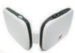

---
<!-- Page 21 -->

## 제2장 디지털헬스케어 서비스 모델 | 21

및
보안대책
및
보안대책
개요
디지털헬스케어
서비스
모델
디지털헬스케어
보안위협
디지털헬스케어
기기
보안요구사항
디지털헬스케어
서비스
보안요구사항
참고문헌
제1장
제2장
제3장
제4장
제5장
부록
홈 관련 기기
사용자 또는 환자가 착용하거나 근거리 통신이 가능한 거리에서 사용되며, 주로 사용되는 통신 방식은
댁내에 구성된 무선 네트워크로 Wi-Fi, Bluetooth, ZigBee, NFC 등의 통신 방식이 일반적이다. 원격
서비스 또는 클라우드에 접속하는 경우 광대역 네트워크인 5G, LTE, 3G망을 이용할 수 있으며, 소규모
네트워크를 구성하고 있는 Wi-Fi, Bluetooth, ZigBee, NFC 등은 게이트웨이 또는 스마트 기기를 이용하여
개인의료정보 또는 개인건강정보를 전송한다. 스마트 기기(스마트폰, 태블릿 PC 등), 게이트웨이 등 연동(
- 전송) 목적의 기기를 제외한 의료 및 웰니스 목적의 기기는 대부분 저사양의 MCU로 구성되어 운영체제가
없는 펌웨어 또는 RTOS(Real-Time Operating System)로 구현되어 있다.
표 2-3 홈과 관련된 디지털헬스케어 기기 유형
분류 관련 기기 운영체제 통신인터페이스 비고
Bluetooth, Wi-Fi, IRDA,
인슐린 펌프, 혈당측정기, 의료기기
의료 펌웨어, RTOS, Sub-Giga RF, USB,
심박계, 혈압측정기 (측정 등)
RS232, Ethernet
5G, LTE, 3G, Bluetooth,
활동량계, 체온계, 혈당계, 개인건강을 위한
웰니스 펌웨어, RTOS Wi-Fi, IRDA, Sub-Giga
혈압계, 체지방 측정계 기기
RF, USB, RS232, Ethernet
이동형 스마트 기기 윈도우즈, 5G, LTE, 3G, Bluetooth,
연계 기기와 연계을 위한
(스마트폰), 홈게이트웨이, 안드로이드, 리눅스, Wi-Fi, IRDA, USB, RS232,
(전송) 일반 스마트 기기
스마트와치 등 펌웨어 등 Ethernet
홈 관련 서비스
홈 관련 디지털헬스케어 기기는 개인의료정보 및 개인건강정보를 수집(센싱), 전송, 분석 요청, 검색
기능을 수행을 수행하기 때문에 주로 병원 데이터베이스, 원격진료를 위한 의료서비스 제공자와의 연계
서비스를 제공한다.
홈 관련 기기 기반의 대표적인 디지털헬스케어 서비스는 다음 같다.
주치의 및 인공지능 주치의와의 원격진료 서비스
환자 모니터링에 따른 병원 또는 서비스 제공자로부터 제공받는 응급의료 서비스
병원 및 서비스 제공자 데이터베이스를 이용한 혈당, 혈압, 간수치 모니터링을 위한 데이터 전송이
수반되는 만성질환 모니터링 서비스
피트니스 등 개인건강관리를 위한 건강정보 모니터링 및 개인 트레이닝 서비스

| 분류 | 관련 기기 | 운영체제 | 통신인터페이스 | 비고 |
| --- | --- | --- | --- | --- |
|  | 인슐린 펌프, 혈당측정기, 심박계, 혈압측정기 | 펌웨어, RTOS, | Bluetooth, Wi-Fi, IRDA, Sub-Giga RF, USB, RS232, Ethernet |  |
|  | 활동량계, 체온계, 혈당계, 혈압계, 체지방 측정계 | 펌웨어, RTOS | 5G, LTE, 3G, Bluetooth, Wi-Fi, IRDA, Sub-Giga RF, USB, RS232, Ethernet |  |
|  | 이동형 스마트 기기 (스마트폰), 홈게이트웨이, 스마트와치 등 | 윈도우즈, 안드로이드, 리눅스, 펌웨어 등 | 5G, LTE, 3G, Bluetooth, Wi-Fi, IRDA, USB, RS232, Ethernet |  |

---
<!-- Page 22 -->
나. 이동형 진료소
디지털헬스케어 서비스를 제공하기 위한 구성요소 중 이동형 진료소는 이동성이 고려된 디지털헬스케어
기기를 기반으로 간소화되거나 응급 형태의 디지털헬스케어 서비스를 제공하는 도메인이다. 이동형 진료소는
도서지역의 비대면 진단 및 치료와 이동(이송) 중인 환자의 상태를 모니터링하며 치료 서비스를 제공할 수
있다. 대표적 서비스 모델로는 구급차 내 설치된 디지털헬스케어 기기와 운영 시스템을 볼 수 있다.
이동형 진료소 도메인에서 사용될 수 있는 디지털헬스케어 기기는 다음 그림과 같이 심전도, 맥박 등과
같은 환자 모니터링 장비와 이동형 X-ray, 혈액 등 검사장비 등이 있다. 또한, 이동형 원격진료 서비스
시스템을 통해 병원의 전문의로부터 응급처지 방법, 화상 진료 등 의료서비스를 제공받을 수 있다. 홈
도메인과 같이 디지털헬스케어 기기가 직접 또는 게이트웨이를 통해 외부로 데이터를 전송할 수 있다.
그림 2-4 디지털헬스케어 서비스 구성요소 : 이동형 진료소
5G LTE 게이트웨이
원격 진료 서비스 시스템
의료용 게이트웨이
검사 장비 (혈액, 소변, 혈압)
환자 모니터링 장비 이동형 X-Ray
유선통신 무선통신 유·무선유통신

|  |
| --- |
|  |

---
<!-- Page 23 -->

## 제2장 디지털헬스케어 서비스 모델 | 23

및
보안대책
및
보안대책
개요
디지털헬스케어
서비스
모델
디지털헬스케어
보안위협
디지털헬스케어
기기
보안요구사항
디지털헬스케어
서비스
보안요구사항
참고문헌
제1장
제2장
제3장
제4장
제5장
부록
이동형 진료소 관련 기기
이동형 진료소 관련 디지털헬스케어 기기는 이동형 진료 장비, 이동형 환자 모니터링 장비, 원격진료
서비스 시스템(병원과 실시간 응급환자(구급차 이송)의 진료를 연결해 주는 시스템), 게이트웨이・스마트
기기가 있을 수 있다. 이동성이 고려되어야 하는 이동형 진료소 관련 디지털헬스케어 기기 특성상 다양한
무선 통신 방식이 제공되어야 한다. 구급차 등 이동(이송) 중 환경에서는 이동(이송) 중 진단 및 치료의 실시간
서비스가 제공되어야 하기 때문에 광대역 이동통신망인 5G, LTE, 3G 네트워크를 이용하며, 구급차
내부에서는 Wi-Fi, Bluetooth 등의 무선 통신과 Ethernet, USB, RS485 등의 근거리 통신 방식을
복합적으로 이용할 수 있다. 이동형 진료 기기에 근거리 통신 방식의 기능만 보유한 기기들의 경우는 차량용
광대역망 게이트웨이인 이동형 모뎀 등을 이용하여 네트워크를 구성할 수 있다.
표 2-4 이동형 진료소 관련 디지털헬스케어 기기 유형
분류 관련 기기 운영체제 통신인터페이스 비고
휴대용 간이 5G, LTE, 3G,
윈도우즈, 안드로이드, 수술, 치료를 위해
이동형 인공호흡장치, Bluetooth, Wi-Fi,
리눅스, 유닉스, 사용되는
진료 장비 자동심장충격기, 실시간 IRDA, GPS, USB,
RTOS, 펌웨어 등 장비 및 시스템
영상 전송 장치 RS232, Ethernet
5G, LTE, 3G,
산소포화/ 윈도우즈, 안드로이드,
이동형환자 Bluetooth, Wi-Fi, 이동 중 환자 상태
심전도 측정기, 리눅스, 유닉스,
모니터링 장비 IRDA, GPS, USB, 파악을 위한 시스템
수액 주입기 등 RTOS, 펌웨어 등
RS232, Ethernet
이동형 응급구조 원격진료 실시간 응급환자
윈도우즈, 안드로이드, 5G, 4G, 3G,
원격진료 프로그램 등 (구급차 연계 포함)
리눅스, 유닉스 등 Ethernet
서비스 시스템 (서버·PC, 스마트 기기) 진료 등
5G, LTE, 3G,
윈도우즈, 안드로이드, 외부 서비스와의
연계 이동형 스마트 기기 Bluetooth, Wi-Fi,
리눅스, 연계를 위한 스마트
(전송) (스마트폰), 게이트웨이 등 IRDA, USB, RS232,
펌웨어 등 기기
Ethernet
이동형 진료소 관련 서비스
이동형 진료소 관련 디지털헬스케어 기기는 환자 이동(이송) 시 진료와 치료를 수행하거나 환자 상태를
확인하며 원격에서 의사의 도움을 받아 현장에서 의료 행위가 수행되기 때문에 주로 병원 원격 시스템과
연계되거나 서비스 제공자의 데이터베이스와 연계된 서비스를 제공한다.

| 분류 | 관련 기기 | 운영체제 | 통신인터페이스 | 비고 |
| --- | --- | --- | --- | --- |
|  | 휴대용 간이 인공호흡장치, 자동심장충격기, 실시간 영상 전송 장치 | 윈도우즈, 안드로이드, 리눅스, 유닉스, RTOS, 펌웨어 등 | 5G, LTE, 3G, Bluetooth, Wi-Fi, IRDA, GPS, USB, RS232, Ethernet |  |
|  | 산소포화/ 심전도 측정기, 수액 주입기 등 | 윈도우즈, 안드로이드, 리눅스, 유닉스, RTOS, 펌웨어 등 | 5G, LTE, 3G, Bluetooth, Wi-Fi, IRDA, GPS, USB, RS232, Ethernet |  |
|  | 응급구조 원격진료 프로그램 등 (서버·PC, 스마트 기기) | 윈도우즈, 안드로이드, 리눅스, 유닉스 등 | 5G, 4G, 3G, Ethernet |  |
|  | 이동형 스마트 기기 (스마트폰), 게이트웨이 등 | 윈도우즈, 안드로이드, 리눅스, 펌웨어 등 | 5G, LTE, 3G, Bluetooth, Wi-Fi, IRDA, USB, RS232, Ethernet |  |

---
<!-- Page 24 -->
이동형 진료소 관련 기기 기반의 대표적인 디지털헬스케어 서비스는 다음 같다.
응급환자 이송 중 5G 네트워크 등을 이용한 실시간 환자 진료 및 이동식 수술 로봇을 이용한 응급 수술
등의 원격의료 서비스
병원 또는 서비스 제공자의 환자 상태 모니터링을 통해 현장 인원(예, 구급대원)에게 응급처치 매뉴얼
제공 등의 응급의료 서비스
다. 병원
디지털헬스케어 서비스를 제공하기 위한 구성요소 중 병원은 디지털헬스케어 서비스 제공에 있어 중추적인
역할을 담당하고 있다. 디지털헬스케어 서비스 구성요소에 속한 모든 디지털헬스케어 기기와 연계하여
개인의료정보가 전송 및 저장되고 다양한 디지털헬스케어 서비스를 제공한다. 병원에서는 기본적으로 대면
진료를 기반으로 서비스가 제공되고, 환자의 상태를 진단하기 위하여 MRI, CT, X-ray 등의 다양한
디지털헬스케어 기기를 사용한다. 현재, 우리나라의 원격의료 서비스는 초기 단계에 머물러 있으나, 국외
디지털헬스케어 서비스는 초고속 정보통신기술을 기반으로 비대면 및 원격의료 서비스로 진화하고 있다.
그림 2-5 디지털헬스케어 서비스 구성요소 : 병원
내부망
OCS/EDI
원격 진료 서비스 시스템
PHR
치료 장비
EMR/EHR
환자 모니터링
주치의 PC 장비
PACS
진료 장비
진단 장비
스마트폰 등 헬스케어 의료 기기
유선통신 무선통신 유·무선유통신

| 내부망 OCS/EDI 원격 진료 서비스 시스템 PHR 치료 장비 EMR/EHR 환자 모니터링 주치의 PC 장비 PACS 진료 장비 진단 장비 스마트폰 등 헬스케어 의료 기기 |  |

---
<!-- Page 25 -->

## 제2장 디지털헬스케어 서비스 모델 | 25

및
보안대책
및
보안대책
개요
디지털헬스케어
서비스
모델
디지털헬스케어
보안위협
디지털헬스케어
기기
보안요구사항
디지털헬스케어
서비스
보안요구사항
참고문헌
제1장
제2장
제3장
제4장
제5장
부록
병원 관련 기기
병원에 구축된 디지털헬스케어 기기는 의료정보시스템, 진료장비, 수술・치료장비, 모니터링 장비, 기기
관리 시스템, 원격진료 서비스 시스템, 네트워크 인프라 등이 있다. 관련 디지털헬스케어 기기는 대면 또는
비대면(원격진료) 등 진단, 치료 등의 기능을 수행하거나 지원하는 역할을 하며, EMR, HER, PHR, PACS 등
의료 정보 저장 및 분석을 지원하는 기능도 수행한다. 최근에는 고도화된 수술 장비인 다빈치 로봇을 이용한
수술도 진행되고 있다.
디지털헬스케어 관련 시스템이 도입되기 전에는 의료 서비스는 병원 내부에서만 이루어졌고, 의료정보는
종이 문서 기반으로 처리되었다. 그러나, 디지털헬스케어 기기 및 의료정보시스템 등 정보통신기술이
의료분야에 도입되면서 의료서비스의 디지털화가 진행되었다. 병원 내에서 운영되는 진료 기기, 치료 기기,
모니터링 기기는 고사양의 윈도우즈 운영체제 기반의 제품에서부터 8-비트 MCU로 구성된 펌웨어 기반의
다양한 기기들로 구성되어 있으며, 네트워크 통신은 RS485 시리얼 통신부터 광대역 통신망인 5G 통신에
이르기까지 다양한 통신방식을 제공하고 있다.
표 2-5 병원 관련 디지털헬스케어 기기 유형
분류 관련 기기 운영체제 통신인터페이스 비고
주치의 온라인 문진 진료,
주치의 PC 프로그램,
Windows, 개인 의료기기 정보기반
원격진료 응급구조 원격진료 5G, 4G, 3G,
안드로이드, 리눅스, 원격진료, 실시간
서비스 프로그램 등(서버, Ethernet
유닉스 등 응급환자(앰뷸런스 연계
스마트 기기기반)
- 포함) 진료 정보 등
Windows,
EMR/HER/ 5G, 4G, 3G, 전자의료기록,
PC, 서버, 웹서버 안드로이드, 리눅스,
PHR/PACS Ethernet 임상의사결정 지원 정보
유닉스 등
골밀도 촬영기, MRI, Windows, 5G, LTE, 3G,
CT, X-ray, 초음파 안드로이드, 리눅스, Bluetooth, Wi-Fi,
진료 장비 환자 진료 정보 진단기, 안압 유닉스, RTOS, IRDA, USB,
측정기심혈관 촬영기 등 펌웨어 등 RS232, Ethernet
Windows, 5G, LTE, 3G,
환자 산소/심박 측정기, 안드로이드, 리눅스, Bluetooth, Wi-Fi,
환자 입원 후 상태 정보
모니터링장비 수액 주입기등 유닉스, RTOS, IRDA, USB,
펌웨어 등 RS232, Ethernet

| 분류 | 관련 기기 | 운영체제 | 통신인터페이스 | 비고 |
| --- | --- | --- | --- | --- |
|  | 주치의 PC 프로그램, 응급구조 원격진료 프로그램 등(서버, 스마트 기기기반) | Windows, 안드로이드, 리눅스, 유닉스 등 | 5G, 4G, 3G, Ethernet |  |
|  | PC, 서버, 웹서버 | Windows, 안드로이드, 리눅스, 유닉스 등 | 5G, 4G, 3G, Ethernet |  |
|  | 골밀도 촬영기, MRI, CT, X-ray, 초음파 진단기, 안압 측정기심혈관 촬영기 등 | Windows, 안드로이드, 리눅스, 유닉스, RTOS, 펌웨어 등 | 5G, LTE, 3G, Bluetooth, Wi-Fi, IRDA, USB, RS232, Ethernet |  |
|  | 산소/심박 측정기, 수액 주입기등 | Windows, 안드로이드, 리눅스, 유닉스, RTOS, 펌웨어 등 | 5G, LTE, 3G, Bluetooth, Wi-Fi, IRDA, USB, RS232, Ethernet |  |

---
<!-- Page 26 -->
분류 관련 기기 운영체제 통신인터페이스 비고
다빈치 로봇, 레이저
Windows, 5G, LTE, 3G,
주사기, 충격파 치료기,
안드로이드, 리눅스, Bluetooth, Wi-Fi, 수술, 치료 필요 정보 및
환자 치료 장비 수술모니터링 시스템,
유닉스, RTOS, IRDA, USB, 치료 결과 정보
방사선 치료기,
펌웨어 등 RS232, Ethernet
심박쇄동기 등
5G, LTE, 3G,
이동형 스마트기기 Windows,
Bluetooth, Wi-Fi, 개인 건강상태 정보,
스마트기기 (스마트폰 류), 안드로이드, 리눅스,
IRDA, USB, 운동량 및 활동량 정보
홈게이트웨이 펌웨어 등
RS232, Ethernet
Bluetooth, Wi-Fi,
인슐린 펌프,
환자 웨어러블 IRDA, Sub-Giga 병원내 환자 상태 및 의료
혈당측정기, 심박계, 펌웨어, RTOS,
기기 RF, USB, RS232, 정보
혈압 측정기
Ethernet
병원 관련 서비스
병원은 디지털헬스케어 서비스 제공을 위한 중추적인 역할을 담당하고 있으며, 서비스 구성요소에 속한
디지털헬스케어 기기들이 매우 복잡하게 연계되어 다양한 서비스를 제공하고 있다. 병원은 일반적으로
폐쇄된 내부망으로 구성된 구조가 기본이지만 디지털헬스케어 기기에 대한 원격지원 및 업데이트를 위해
제한적으로 외부망 연결이 제공된다. 최근에는 비대면진료에 대한 요구가 증가하면서 병원의 원격진료
시스템이 홈 및 이동형 진료소와 연계된 서비스가 제공될 수 있으며, 의료정보에 대한 분석을 위한 서비스
제공자와 AI 기반의 빅데이터 분석 시스템과의 연계된 서비스가 제공될 수 있다.
병원 관련 기기 기반의 대표적인 디지털헬스케어 서비스는 다음 같다.
주치의 원격진료 서비스 및 다빈치 로봇 등을 이용한 원격수술 서비스
원격에서 만성질환 환자의 상태를 모니터링하는 만성질환 관리 서비스
병원 내부 또는 서비스 제공자와 연계한 AI 기반의 의료정보 분석 서비스
이송 중인 응급환자에 대한 실시간 모니터링을 통한 응급처치 매뉴얼 전송 등 응급의료 서비스

| 분류 | 관련 기기 | 운영체제 | 통신인터페이스 | 비고 |
| --- | --- | --- | --- | --- |
|  | 다빈치 로봇, 레이저 주사기, 충격파 치료기, 수술모니터링 시스템, 방사선 치료기, 심박쇄동기 등 | Windows, 안드로이드, 리눅스, 유닉스, RTOS, 펌웨어 등 | 5G, LTE, 3G, Bluetooth, Wi-Fi, IRDA, USB, RS232, Ethernet |  |
|  | 이동형 스마트기기 (스마트폰 류), 홈게이트웨이 | Windows, 안드로이드, 리눅스, 펌웨어 등 | 5G, LTE, 3G, Bluetooth, Wi-Fi, IRDA, USB, RS232, Ethernet |  |
|  | 인슐린 펌프, 혈당측정기, 심박계, 혈압 측정기 | 펌웨어, RTOS, | Bluetooth, Wi-Fi, IRDA, Sub-Giga RF, USB, RS232, Ethernet |  |

---
<!-- Page 27 -->

## 제2장 디지털헬스케어 서비스 모델 | 27

및
보안대책
및
보안대책
개요
디지털헬스케어
서비스
모델
디지털헬스케어
보안위협
디지털헬스케어
기기
보안요구사항
디지털헬스케어
서비스
보안요구사항
참고문헌
제1장
제2장
제3장
제4장
제5장
부록
라. 서비스 제공자
디지털헬스케어 서비스를 제공하기 위한 구성요소 중 서비스 제공자는 홈, 이동형 진료소, 병원으로부터
전송된 개인의료정보, 개인건강정보, 환자 정보 등에 대한 저장 및 분석 서비스를 제공하는 도메인이다.
서비스 제공자는 의료정보기록 서비스, 빅데이터 기반의 임상 의료결정 지원 시스템(Clinical Decision
Support System, CDSS), 인공지능 주치의 서비스, 자동진단 보조 시스템, 3D 프린트 서비스 등
개인의료정보 또는 개인건강정보에 대한 다양한 분석 서비스를 제공한다. 향후, 디지털헬스케어 영역의
확대와 기술의 고도화로 더 많은 양질의 서비스가 제공될 것으로 전망된다.
서비스 제공자 도메인에서 제공되는 대부분의 서비스는 다음 그림과 같이 데이터 기록 및 저장, 분석,
정보제공 등으로 구성되기 때문에 고성능 서버 및 웹서버, 데이터베이스 등의 장비로 구성된다. 또한
대용량의 데이터 처리 및 사용자 접속을 고려하여 클라우드 기반의 서비스가 제공될 수 있다.
그림 2-6 디지털헬스케어 서비스 구성요소 : 서비스 제공자
원격진료 서비스
자동 음성인식
의료정보 기록 서비스
AI주치의 서비스/ 3D 프린터 서비스
AI 구급활동 지원서비스
자동 진단 보조 시스템
CDSS
EMR/EHR/PHR 관리 서비스
클라우드
유선통신 무선통신 유·무선유통신

---
<!-- Page 28 -->
서비스 제공자 관련 기기
서비스 제공자의 서비스 특성상 주로 웹서버 또는 데이터베이스 서버 등을 기반으로 개인의료정보 및
개인건강정보를 저장하고 관련 AI 알고리즘을 통해 분석한 정보를 제공(예, AI 주치의 등)하기 때문에 별도의
의료기기 보다는 고사양의 서버와 데이터베이스 시스템이 주축이 되고 있다. 네트워크 기술은 원격에서 접속
및 서비스가 가능해야 하기 때문에 광대역 통신망인 5G, LTE, 3G 망을 비롯하여 유선 Ethernet이
사용된다.
표 2-6 서비스 제공자 관련 디지털헬스케어 기기 유형
분류 관련 기기 운영체제 통신인터페이스 비고
의료정보 기록 PC, 서버, 윈도우즈, 안드로이드, 5G, 4G, 3G,
서비스 웹서버 리눅스, 유닉스 등 Ethernet
빅데이터 기반의 PC, 서버, 윈도우즈, 안드로이드, 5G, 4G, 3G,
CDSS 웹서버 리눅스, 유닉스 등 Ethernet 의료정보제공, 빅데이터 기반의, AI
주치의 서비스는 물리적으로 병원,
EMR/EHR/
PC, 서버, 윈도우즈, 안드로이드, 5G, 4G, 3G, 댁내 시스템에 필수적으로 통합되지
PHR
웹서버 리눅스, 유닉스 등 Ethernet 않는 유동적 시스템으로 대개 서비스
관리 서비스
제공 기업 서버를 통해 서비스가
인공지능 주치의 PC, 서버, 윈도우즈, 안드로이드, 5G, 4G, 3G, 제공됨
서비스 웹서버 리눅스, 유닉스 등 Ethernet
자동진단 보조 PC, 서버, 윈도우즈, 안드로이드, 5G, 4G, 3G,
시스템 웹서버 리눅스, 유닉스 등 Ethernet
의료용 3D 프린터는 단독 또는 PC와
3D 프린터 3D 프린터, 윈도우즈, 안드로이드, 5G, 4G, 3G,
연동 하는 구조
서비스 PC, 서버 등 리눅스, 펌웨어, RTOS Ethernet
(치과, 정형외과, 성형외과 등)
서비스 제공자 관련 서비스
서비스 제공자 관련 서비스는 개인의료정보 및 개인건강정보 등 데이터 처리 기반의 서비스가 제공된다.
서비스 제공자 관련 기기 기반의 대표적인 디지털헬스케어 서비스는 다음 같다.
개인의료정보에 대한 빅데이터 분석 등을 통한 AI 주치의 서비스 또는 진단 지원 서비스
병원 등 진단 데이터를 기반으로 3D 프린팅 디자인, 의료기기 제작 등 3D 프린팅 서비스
개인건강정보 수집 및 분석을 통한 개인 맞춤형 건강관리 서비스

| 분류 | 관련 기기 | 운영체제 | 통신인터페이스 | 비고 |
| --- | --- | --- | --- | --- |
|  | PC, 서버, 웹서버 | 윈도우즈, 안드로이드, 리눅스, 유닉스 등 | 5G, 4G, 3G, Ethernet |  |
|  | PC, 서버, 웹서버 | 윈도우즈, 안드로이드, 리눅스, 유닉스 등 | 5G, 4G, 3G, Ethernet |  |
|  | PC, 서버, 웹서버 | 윈도우즈, 안드로이드, 리눅스, 유닉스 등 | 5G, 4G, 3G, Ethernet |  |
|  | PC, 서버, 웹서버 | 윈도우즈, 안드로이드, 리눅스, 유닉스 등 | 5G, 4G, 3G, Ethernet |  |
|  | PC, 서버, 웹서버 | 윈도우즈, 안드로이드, 리눅스, 유닉스 등 | 5G, 4G, 3G, Ethernet |  |
|  | 3D 프린터, PC, 서버 등 | 윈도우즈, 안드로이드, 리눅스, 펌웨어, RTOS | 5G, 4G, 3G, Ethernet |  |

---
<!-- Page 29 -->

## 제2장 디지털헬스케어 서비스 모델 | 29

및
보안대책
및
보안대책
개요
디지털헬스케어
서비스
모델
디지털헬스케어
보안위협
디지털헬스케어
기기
보안요구사항
디지털헬스케어
서비스
보안요구사항
참고문헌
제1장
제2장
제3장
제4장
제5장
부록
최근 국내에서 개발되거나 제공되고 있는 디지털헬스케어 서비스로는 원격진료 서비스, 개인 맞춤형
헬스케어 서비스, AI 기반 응급의료 서비스, AI 기반 정밀의료 서비스 등이 있다.
가. 원격진료 서비스
원격진료 서비스는 서비스 제공자의 서비스 방식에 따라 다양한 방법으로 구현가능하다. 예를 들어 서비스
서버 중심으로 의사와 환자가 각각의 계정을 갖고 서버에 접속하여 진료를 하는 방식과 의사와 환자가 직접
연결하여 진료를 받는 방식 등이 있을 수 있다. A사의 미국거주 한인대상으로 제공되는 원격진료 서비스가
대표적인 사례로, 일반적인 의료 서비스 방식인 서버 기반의 원격진료 서비스를 제공한다.
그림 2-7 원격진료 서비스 사례 : A사 플랫폼 서비스
A사 원격진료 서비스는 다음 그림과 같이 서버를 중심으로 진료가 진행되며 환자와 의사 모두 서버에
접속하여 본인의 계정에 로그인하는 절차로 시작된다.

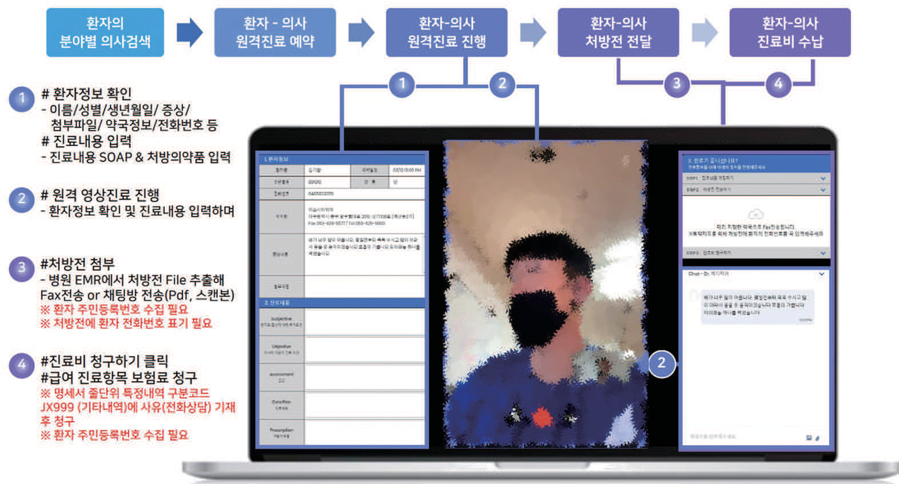

---
<!-- Page 30 -->
그림 2-8 원격진료 서비스 사례 : A사 서비스 절차
- ① 의사와 환자는 스마트폰 또는 개인 스마트 기기로 원격진료 서비스 서버에 접속
- ② 의사는 의사 계정으로, 환자는 환자 계정으로 로그인
- ③ 의사에게 환자 정보가 로딩되기까지 환자는 대기
- ④ 환자 정보 로딩 후 의사와 환자 접속되고 원격진료가 수행
- ⑤ 진료 후 의사는 진료 결과와 처방 전을 원격진료 서비스로 전송한다. 필요 시 환자의료 기록은 의료기록 서비스
제공자와 병원 내 EMR 서버 등에 저장
- ⑥ 원격의료 서비스 서버는 수신 받은 의료정보를 기반으로 처방전을 환자에게 전송하고, 환자는 진료비를 수납
- ⑦ 진료 완료 후 의사와 환자는 로그아웃하고 진료를 종료
홈 서비스 제공자 병원
원격 진료 원격 진료
서비스 서버 1 2 접속 시스템
1 2 5
홈네트워크 기기
6
진단 진료 장비
4 7 (주치의 PC) 3 4
스마트폰 EMR/EHR/PHR
관리 서비스
5 PACS/OCS/EDI
4 7
필요 시
PC, 스마트 기기
5
필요 시
내부망 외부망

|  |  |

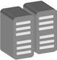

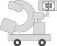

---
<!-- Page 31 -->

## 제2장 디지털헬스케어 서비스 모델 | 31

및
보안대책
및
보안대책
개요
디지털헬스케어
서비스
모델
디지털헬스케어
보안위협
디지털헬스케어
기기
보안요구사항
디지털헬스케어
서비스
보안요구사항
참고문헌
제1장
제2장
제3장
제4장
제5장
부록
나. 개인 맞춤형 헬스케어 서비스
개인 맞춤형 헬스케어 서비스는 개인 디지털헬스케어 기기를 사용하는 대표적인 서비스 모델로 볼 수
있다. 휴대용 인슐린 펌프는 만성질환 치료 및 모니터링 장비의 대표 제품으로 혈당 모니터링부터 주기적인
인슐린 주입까지 만성 당뇨병 환자들에게 필수적인 제품이다. 또한 개인에게 전달받은 의료정보는 원격진료
서비스 시스템을 통하여 EMR, EHR, PHR 등의 시스템을 통하여 환자 정보를 저장하고 관리 할 수 있다.
개인 맞춤형 헬스케어의 대표적인 서비스는 B사 서비스이다.
그림 2-9 개인 맞춤형 헬스케어 서비스 사례 : B사 서비스
B사의 서비스는 다음 그림과 같이 스마트폰 앱에서 개인의 건강정보와 활동량 등을 수집하여 EHR 등
서비스 제공자에게 전송되고, 전송된 정보는 사용자(또는 환자)와 연계된 병원 또는 의료기관에서 데이터
기반 개인 건강관리 서비스를 제공한다.

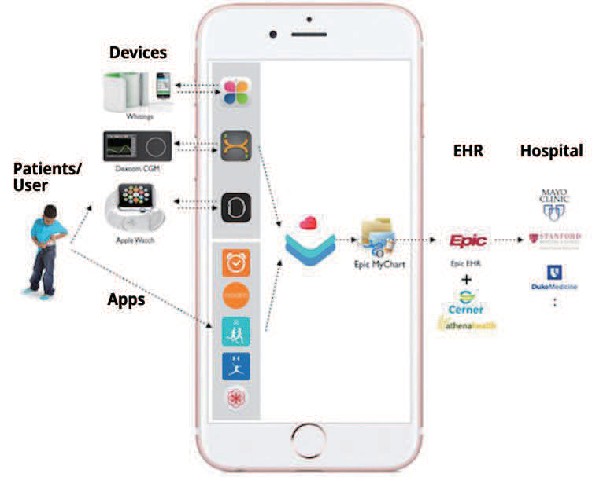

---
<!-- Page 32 -->
그림 2-10 개인 맞춤형 헬스케어 서비스 사례 : B사 서비스 절차
- ① 일반인/만성질환 환자의 스마트기기에 연결된 디지털헬스케어 기기는 건강정보와 활동량 정보를 센싱
- ② 센싱된 건강정보 또는 활동량 정보는 스마트 기기로 전송
- ③ 전송된 센싱 정보는 스마트기기에 설치된 애플리케이션에 전송
- ④ 애플리캐이션에 수신된 건강정보는 연계된 서비스 제공자에게 전송
- ⑤ 서비스 제공자에게 전송된 개인 건강정보는 EMR/EHR/PHR 등의 기능에 맞추어 저장
- ⑥ 저장된 개인 건강정보는 사용자(또는 만성질환 환자)와 연계된 병원 또는 의료기관에서 개인(또는 만성질환환자)의
정보를 요청
- ⑦ 서비스 제공자는 사용자(또는 만성질환 환자)와 연계된 병원 또는 의료기관임을 확인하고, 요청 데이터를 전송
- ⑧ 전송된 개인 건강정보는 사용자의 경우 건강관리 서비스를 제공되고, 만성질환 환자의 건강정보는 병원에서 수집되어
환자 진료나 치료에 사용
홈 서비스 제공자 병원 건강관리 기관
EMR/EHR/PHR 주치의 또는
1
관리 서비스 건강관리전문가
4 6 7 8
스마트 와치
1 5
스마트폰 앱
전자식 체온계 8 PACS/OCS/EDI
2 8
1
3
혈당측정기
1 EMR/EHR/PHR
8
7
인슐린 펌프
1
전자식 혈압계
내부망 외부망

---
<!-- Page 33 -->

## 제2장 디지털헬스케어 서비스 모델 | 33

및
보안대책
및
보안대책
개요
디지털헬스케어
서비스
모델
디지털헬스케어
보안위협
디지털헬스케어
기기
보안요구사항
디지털헬스케어
서비스
보안요구사항
참고문헌
제1장
제2장
제3장
제4장
제5장
부록
다. 응급의료 서비스
응급의료 서비스는 긴급환자 이송 시 제공되는 서비스 모델로 이동성과 실시간성이 중요한 디지털
헬스케어 서비스이다. 응급의료 서비스의 데이터 흐름은 응급환자 상태 정보와 만성질환자의 진료 정보를
수집하여 응급의료 시스템 전송하는 것으로부터 시작한다.
응급의료 서비스의 대표 사례는 C기관의 디지털헬스케어 프로젝트의 응급의료시스템이다.
그림 2-11 응급의료 서비스 사례 : C기관 프로젝트의 응급의료 시스템
응급의료 시스템은 다음 그림과 같이 응급 상황 발생부터 시작하여 환자가 병원 응급실에 도착 시까지
진행된다.

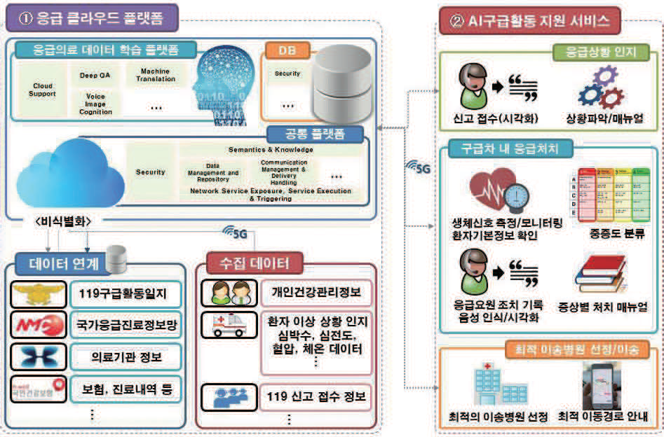

---
<!-- Page 34 -->
그림 2-12 응급의료 서비스 사례 : C기관 프로젝트의 응급의료 시스템 서비스 절차
- ① 환자의 건강상태 및 만성질환 여부를 서비스 제공자의 EMR/EHR/PHR에 요청
- ② 서비스 제공자의 EMR/EHR/PHR 시스템에서 조회된 환자의 확인된 결과를 구급차에 전송
- ③ 환자 상태 정보 AI 구급 서비스로 전송
- ④ AI 구급 서비스는 환자 데이터 수신 및 최적 응급처치 매뉴얼 분석과 환자 응급처치 가능 최적 병원선정 및 최적 경로
분석 후 전송
- ⑤ 구급차는 구급 매뉴얼 수신 후 매뉴얼에 따라 환자 응급 처치 수행
- ⑥ 구급차의 환자 상태 전송 시스템을 이용하여 환자의 실시간 영상 전송
- ⑦ 병원은 환자 실시간 영상 수신에 따라 응급처치 수행 (수신된 혼자 정보는 병원 환자정보관리 시스템으로 전송)
- ⑧ 병원 응급실 도착
서비스 제공자 이동형 진료 서비스 (구급차) 병원
AI 구급활동 원격 진료 원격 진료
지원서비스 서비스 시스템 서비스 시스템
3 2 7
1 4
8
6
진단 진료 장비
환자 모니터링 장비 (응급 전문의)
EMR/EHR/PHR 5
관리 서비스
1
PACS/OCS/EDI
환자 모니터링 장비
5
EMR/EHR
내부망 외부망

|  |
| --- |
|  |

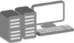

---
<!-- Page 35 -->

## 제2장 디지털헬스케어 서비스 모델 | 35

및
보안대책
및
보안대책
개요
디지털헬스케어
서비스
모델
디지털헬스케어
보안위협
디지털헬스케어
기기
보안요구사항
디지털헬스케어
서비스
보안요구사항
참고문헌
제1장
제2장
제3장
제4장
제5장
부록
라. 정밀의료 서비스
정밀의료 솔루션 서비스는 여러 의료기관들로부터 생성된 의료 데이터를 통합하고 연계시키기 위해,
지능형 소프트웨어 개발·학습과 서비스 제공을 위한 클라우드 환경에서 질환별, 병원별로 독립적으로
운영되며 데이터뱅크 영역, 질환별 학습데이터 영역, 서비스 연계 영역으로 구성된다.
정밀의료 서비스의 대표 서비스는 D사 정밀의료 솔루션이다.
그림 2-13 정밀의료 서비스 사례 : D사 정밀의료 솔루션
정밀의료 솔루션은 정밀의료 솔루션 플랫폼에 연계된 병원과 의료기관에서 연구된 결과의 빅데이터를
적재하는 것으로부터 시작된다.

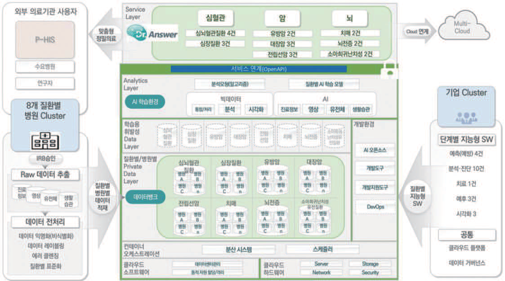

---
<!-- Page 36 -->
그림 2-14 정밀의료 서비스 사례 : D사 정밀의료 솔루션의 서비스 절차
- ① 8개 질환 병원 클러스터에서 담당 질병 관련 정보를 전송과 기업클러스터에서 분석소프트웨어 개발하여 플랫폼 구축
- ② 수집 빅데이터와 AI 분석 소프트웨어를 이용하여 질병 분석
- ③ 질병 분석 후 정밀 의료 분석
- ④ 외부 의료기관에서 질환 별 정밀의료 서비스 요청
- ⑤ AI 기반 정밀의료 분석 결과 전송
- ⑥ 외부 의료기관의 정밀 분석 결과 활용
(서비스 사용)
서비스 제공자 데이터 수집 병원
외부 의료기관 병원
AI 기반 정밀 의료 서비스
진단/진료 장비 (주치의 PC) EMR/EHR/PHR
2 4
5
3 AI Platform 1
PACS/OCS/EDI PACS/OCS/EDI
6
Big Data
EMR/EHR/PHR
6
내부망 외부망

|  |  |  |  |

---
<!-- Page 37 -->
디지털헬스케어
보안모델

---
<!-- Page 38 -->

|  |
| --- |
|  |

|  |
| --- |
|  |

|  |
| --- |
|  |

---
<!-- Page 39 -->
제3장
디지털헬스케어
보안위협

### 1. 디지털헬스케어 기기 관련 보안위협

### 2. 디지털헬스케어 서비스 관련 보안위협

### 3. 유형별 보안위협

---
<!-- Page 40 -->

## 제3장 디지털헬스케어

보안위협
본 장에서는 제2장에서 정의한 디지털헬스케어 서비스 모델에 기반하여 홈, 병원, 이동형진료소 등에서
사용될 수 있는 디지털헬스케어 기기 및 서비스에 특화된 보안위협에 대해 제1절과 제2절에서 설명하고, 제3
절에서는 디지털헬스케어 기기·서비스 전반에 발생 가능한 보안위협들을 유형별로 정의하고 해당 위협에
대응할 수 있는 보안대책을 제시한다.
디지털헬스케어 기기는 홈, 이동형 진료소, 병원, 서비스 제공자 등 디지털헬스케어 서비스 구성요소별로
사용될 수 있으며, 수술 및 치료, 감시, 분석, 진단, 건강관리 등의 기능을 수행한다.
미국의 의료분야 비영리기관인 IHE는 디지털헬스케어 기기를 하드웨어, 운영체제, 관리/제어 영역으로
구분하고 구성요소를 정의하였으며, 각 영역 및 구성요소별 관련된 주요 보안위협을 제시하였다. 각 보안
위협은 다음 참고 사항에 기술되어 있으며, 해당 보안위협은 인증, 통신, 패치(업데이트), 무결성 등의
유형으로 구분할 수 있다.

---
<!-- Page 41 -->

## 제3장 디지털헬스케어 보안위협 | 41

및
보안대책
및
보안대책
개요
디지털헬스케어
서비스
모델
디지털헬스케어
보안위협
디지털헬스케어
기기
보안요구사항
디지털헬스케어
서비스
보안요구사항
참고문헌
제1장
제2장
제3장
제4장
제5장
부록
[참고 3-1] 디지털헬스케어 기기 보안위협 (출처: IHE Medical Device Cybersecurity)
디지털헬스케어 기기
관리/제어 시험/측정 모니터링/로그생성 실패 안전 관리 설정/버전
운영체제 인터페이스 사용자 인터페이스 네트워크 기타 상용 제품
기기
소프트웨어
하드웨어 기기 상태 I/O
■ 디지털헬스케어 기기 자체에 대한 보안위협
• 기기 분실 또는 도난으로 인해 기기에 저장된 PHI(Protected Health Information) 유출
■ 하드웨어 영역 관련 보안위협
• I/O : 통신시 특정 인증이 요구되지 않는 경우, 각 프로토콜 분석을 통한 재사용으로 기기의 특정 I/O 포트를
악용할 수 있음
■ 상용 운영체제 영역 관련 보안위협
• 상용 운영체제 자체 : 제로데이 취약점, 패치 수준 취약점, 디폴트 관리자 계정 등
• 인터페이스(I/F) : air-gap 공격*, 웜 등
* 네트워크를 포함하지 않는 시스템으로의 경로를 사용하는 공격으로, 이동매체(예, USB, CD 등)를 통해 실행될 수 있음
• 사용자 인터페이스(U/I) : 내부자 공격 및 인증 취약점* 등
* 사용자 인증의 보안수준이 높으면 응급상황에 환자치료에 영향을 미칠 수 있으며, 단순한 인증의 경우 권한이 없는
사용자가 기기 설정(예, 약물 주입 속도)을 변경할 수 있음
• 네트워크 : HTTP(S), (S)FTP, UDP, TCP 등 네트워크 프로토콜 악용(예, Heartbleed SSL 취약점)
• 저장소 및 메모리 : 버퍼오버플로우 및 메모리 악용* 등
* 개발에 사용된 프로그래밍 언어에 종속적인 보안위협으로 메모리 할당, 초기화 에러 등으로 발생할 수 있으며 의도하지
않은 시스템 오동작이 발생할 수 있음
• 기타 상용 소프트웨어(비-운영체제) : 운영체제, 자바 등을 포함한 소프트웨어의 취약점은 기존 IT 영역에서
존재하는 취약점과 유사함
■ 관리·제어 영역 관련 보안위협
• 실패 안전 관리 및 측정(교정) : 안전 또는 측정(교정) 기능을 제어하는 시스템 내의 설정값이 임의로 변경*될 수
있는 보안위협
* 설정값 변경시, 안전 또는 측정(교정) 관련 기능이 비활성화되거나 안전 한계를 초과하는 상황이 발생할 수 있어
환자에게 위해를 끼칠 수 있음

| 관리/제어 시험/측정 모니터링/로그생성 실패 안전 관리 설정/버전 |
| --- |
| 운영체제 인터페이스 사용자 인터페이스 네트워크 기타 상용 제품 기기 |
| 소프트웨어 하드웨어 기기 상태 I/O |

---
<!-- Page 42 -->
최근 인슐린 펌프, 이식형 심장 제세동기, 이식형 심혈관 제세동기 디지털헬스케어 기기와 관련하여
보고된 보안위협 및 취약점은 다음 표와 같다.
표 3-1 디지털헬스케어 관련 보안위협·취약점 사례
일자 기기 유형 관련 보안위협/취약점 리콜
MDhex
* C yberMDX연구팀이 기기의 워크스테이션에서 6가지 취약점을
발견함

### 1. SSH 취약점

원격 측정 서버,
`20.01.23 2. SMB 취약점 -
환자 모니터링 장치

### 3. MultiMouse / Kavoom KM 취약점

### 4. VNC 취약점

5. webmin 취약점

### 6. 업데이트 관리 취약점

1,117개
`19.11.05 인슐린 펌프 무선 RF 통신 프로토콜이 인증 또는 권한 보호 기능이 없음
회수
URGENT/11
* VxWorks RTOS의 IPnet이라는 타사 네트워크 통신 소프트웨어에서
11가지 취약점이 발견됨

### 1. IPv4구문 분석시 스택 오버플로우

2~5. TCP 긴급 포인터 필드 처리 과정 중 발생하는 4가지 메모리
특정 의료기기 및 손상 취약점
`19.10.01 -
병원 네트워크 6. DHCP / ACK 구문 분석 힙 오버플로우

### 7. 잘못된 옵션을 통한 TCP 연결

### 8. 요청하지 않은 ARP 응답 처리

### 9. DHCP 클라이언트에 의한 IPv4 할당의 결함

### 10. IGMP 구문 분석에서 NULL값 참조를 통한 DoS

### 11. IGMPv3 특정 회원 보고서를 통한 IGMP 정보 유출

이식형 심장 제세동기,
`19.03.21 심장 재동기화 치료 무선 원격 측정 시스템 프로토콜의 암호화 및 인증 권한 미사용 -
제세동기
이식형 심혈관 제세동기,
인증키 및 타임 스탬프가 포함된 장치의 인증이 손상되거나 우회될
`18.04.17 심장 재동기화 치료 -
수 있어 공격자가 RF 통신을 통해 제세동기에 무단 명령 실행 가능
제세동기
무선 송신기에서 MITM(Man-In-The-Middle) 취약점으로 접근할
`17.01.09 이식 가능한 심장 장치 -
수 있는 채널 발견
공개키 및 개인키가 무선 장치에 일반 텍스트로 저장되고 장치에 대한
`15.07.31 약물 주입 펌프 시스템 -
권한 검사가 부족하여 서비스 공격 및 원격에 대한 취약점이 있음
인증 없이 FTP서버 및 CGI를 접근할 수 있는 내장 웹서버 발견.
`15.05.13 약물 주입 펌프 시스템 -
펌프에 무선 네트워크를 연결하는 무선키를 일반 텍스트로 저장

| 일자 | 기기 유형 | 관련 보안위협/취약점 | 리콜 |
| --- | --- | --- | --- |
|  | 원격 측정 서버, 환자 모니터링 장치 | MDhex * C yberMDX연구팀이 기기의 워크스테이션에서 6가지 취약점을 발견함 1. SSH 취약점 2. SMB 취약점 3. MultiMouse / Kavoom KM 취약점 4. VNC 취약점 5. webmin 취약점 6. 업데이트 관리 취약점 |  |
|  | 인슐린 펌프 | 무선 RF 통신 프로토콜이 인증 또는 권한 보호 기능이 없음 |  |
|  | 특정 의료기기 및 병원 네트워크 | URGENT/11 * VxWorks RTOS의 IPnet이라는 타사 네트워크 통신 소프트웨어에서 11가지 취약점이 발견됨 1. IPv4구문 분석시 스택 오버플로우 2~5. TCP 긴급 포인터 필드 처리 과정 중 발생하는 4가지 메모리 손상 취약점 6. DHCP / ACK 구문 분석 힙 오버플로우 7. 잘못된 옵션을 통한 TCP 연결 8. 요청하지 않은 ARP 응답 처리 9. DHCP 클라이언트에 의한 IPv4 할당의 결함 10. IGMP 구문 분석에서 NULL값 참조를 통한 DoS 11. IGMPv3 특정 회원 보고서를 통한 IGMP 정보 유출 |  |
|  | 이식형 심장 제세동기, 심장 재동기화 치료 제세동기 | 무선 원격 측정 시스템 프로토콜의 암호화 및 인증 권한 미사용 |  |
|  | 이식형 심혈관 제세동기, 심장 재동기화 치료 제세동기 | 인증키 및 타임 스탬프가 포함된 장치의 인증이 손상되거나 우회될 수 있어 공격자가 RF 통신을 통해 제세동기에 무단 명령 실행 가능 |  |
|  | 이식 가능한 심장 장치 | 무선 송신기에서 MITM(Man-In-The-Middle) 취약점으로 접근할 수 있는 채널 발견 |  |
|  | 약물 주입 펌프 시스템 | 공개키 및 개인키가 무선 장치에 일반 텍스트로 저장되고 장치에 대한 권한 검사가 부족하여 서비스 공격 및 원격에 대한 취약점이 있음 |  |
|  | 약물 주입 펌프 시스템 | 인증 없이 FTP서버 및 CGI를 접근할 수 있는 내장 웹서버 발견. 펌프에 무선 네트워크를 연결하는 무선키를 일반 텍스트로 저장 |  |

---
<!-- Page 43 -->

## 제3장 디지털헬스케어 보안위협 | 43

및
보안대책
및
보안대책
개요
디지털헬스케어
서비스
모델
디지털헬스케어
보안위협
디지털헬스케어
기기
보안요구사항
디지털헬스케어
서비스
보안요구사항
참고문헌
제1장
제2장
제3장
제4장
제5장
부록
IHE에서 제시한 보안위협과 최근에 발견되거나 보고된 보안위협·취약점들은 인증 및 허가, 암호, 데이터
보안 및 안전한 통신, 안전한 기기 관리 및 물리적 보호 유형으로 분류할 수 있다.
표 3-2 암호 유형의 보안위협
보안위협 유형 관련 보안위협·취약점
인증 및 허가 • 디폴트 관리자 계정, 부적절한 인증 또는 인증 메커니즘 부재, 부적절한 권한 부여 등
암호 • 취약한 암호알고리즘 사용 등
데이터 보안 • 네트워크 프로토콜 악용, 전송・전송데이터 유출 및 위변조 등
안전한 통신 • 재사용 공격 등
• 제로데이 취약점, 업데이트 관련 취약점, air-gap 공격, 웜, 버퍼오버플로우, 안전 관련
안전한 기기 관리
설정값 변경, 암호키 평문 저장 등
물리적 보호 • 기기 분실 또는 도난에 따른 기기에 저장된 PHI 유출
[사례 3-1] 인슐린 펌프 (출처: 미국 FDA Cybersecurity Safety Communications)
2019년 6월에 미국 FDA는 E사의 인슐린 펌프의 무선 프로토콜에 대한 보안위협에 대해 발표했다.
■ 관련 보안위협
무선 RF 통신 프로토콜이 인증 또는 권한 보호 기능이 없음
■ 주요 내용
해당 보안위협이 존재하는 인슐린 펌프에 권한이 없는 사람(환자, 환자 간병인, 의료서비스 제공자 이외의 사람)
이 무선으로 연결할 수 있음
권한이 없는 사람에 의해 임의로 펌프 설정이 변경될 수 있으며, 임의 설정 변경으로 인해 환자에게 과도하게
인슐린이 주입되어 저혈당(저혈증)이 발생되거나 인슐린 주입이 중단되어 고혈당 및 당뇨병성 케톤산증을
유발될 수 있음
■ 조치사항
인슐린 펌프와 펌프에 연결된 장치는 가능한 한 항상 통제 범위 내에서 유지해야 함
펌프 일련번호 공유 금지해야 함
펌프 알림, 경보 및 경고에 주의해야 함
혈당 수치를 면밀히 모니터링하고 적절하게 행동해야 함
의도하지 않은 볼 루스를 즉시 취소해야 함
펌프에서 데이터를 다운로드하는 데 사용하지 않을 때는 컴퓨터에서 USB 장치를 분리해야 함

| 보안위협 유형 | 관련 보안위협·취약점 |

---
<!-- Page 44 -->
[사례 3-2] 이식형 심장 제세동기 (출처: 미국 FDA Cybersecurity Safety Communications)
2019년 3월에 미국 FDA는 F사의 이식형 심장 제세동기(ICD) 및 심장 재동기화 치료 제세동기(CRT-D)*의
암호화 및 인증에 대한 보안위협에 대해 발표했다.
* ICD 및 CRT-D는 느린 심장 박동 및 전기 충격에 대한 페이싱을 제공하거나 위험할 정도로 빠른 심장 박동을 중지하기
위한 페이싱을 제공하는 장치임
■ 관련 보안위협
무선 원격 측정 시스템 프로토콜의 암호화 및 인증 권한 미사용
■ 주요 내용
ICD, CRT-D, 클리닉 프로그래머 및 가정용 모니터 간의 통신 방법의 일부로 사용되는 Conexus 무선 원격
측정 프로토콜은 암호화, 인증, 권한부여를 사용하지 않음
권한이 없는 사람(예, 환자 주치의가 아닌 사람)이 이식형 장치, 클리닉 프로그래머, 홈 모니터에 접근하여
임의로 조작할 수 있음
■ 조치사항
시스템의 무결성을 보장하기 위해 의료 제공자 또는 제조업체에서 직접 얻은 원격 모니터만 사용해야 함
의료 서비스 제공자가 프로그래밍한 무선 CareAlert와 자동으로 예약된 원격 전송이 적시에 이루어지도록
원격 모니터를 항상 연결 상태로 유지해야 함
원격 모니터를 추적해야 함
현기증, 현기증, 의식 상실, 흉통 또는 심한 숨가쁨이 있는 경우 즉시 의학적 도움을 받아야 함

---
<!-- Page 45 -->

## 제3장 디지털헬스케어 보안위협 | 45

및
보안대책
및
보안대책
개요
디지털헬스케어
서비스
모델
디지털헬스케어
보안위협
디지털헬스케어
기기
보안요구사항
디지털헬스케어
서비스
보안요구사항
참고문헌
제1장
제2장
제3장
제4장
제5장
부록
본 절에서는 디지텔헬스케어 서비스 중 원격진료 서비스, 개인 맞춤형 헬스케어 서비스, 응급의료 서비스,
정밀의료 서비스에 대한 주요 보안위협을 설명한다.
가. 원격진료 서비스
원격진료 서비스는 병원이 아닌 환자의 거주지에서 스마트폰이나 개인용 컴퓨터를 이용하여 주치의와
화상으로 접속하여 진료 서비스를 받는 행위로 진료를 받는 환자나 진료를 하는 의사 모두 원격진료 서버에
접속 후 서비스가 가능해진다. 원격진료 서비스 관련해서 다음 그림과 같이 보안위협이 발생할 수 있다.
그림 3-1 원격진료 서비스 구성요소별 주요 보안위협 및 시나리오
• 서비스 거부 원격진료 서비스
• 데이터 노출 및 변조 서비스 제공자
• 취약한 암호화 및 취약한 암호 알고리즘 자동 음성인식
의료정보 기록 서비스
• 취약한 3rd party 모듈/라이브러리
AI주치의 서비스/ 3D 프린터 서비스
AI 구급활동 지원서비스
자동 진단 보조 시스템
CDSS
EMR/EHR/PHR 관리 서비스
홈
클라우드
• 데이터 노출 및 변조
• 취약한 암호화 및
• 비인가된 기기 연결 유선통신 무선통신 유·무선유통신
취약한 암호 알고리즘
• 인증정보 노출 및 유출 혈압 측정기
• 데이터 노출 및 변조
• 취약한 비밀번호
혈액투석기 활동량 측정기 • 취약한 암호화 및
• 안전하지 않은 업데이트
전용회선, 인터넷 등 취약한 암호 알고리즘
체외용
인슐린 주입기 (유/무선 인터넷, 5G/LTE 등
혈당 측정기 수면 추적기 모바일 인터넷) 병원
• 데이터 노출 및 변조
내부망
스마트폰/앱 • 취약한 암호화 및 OCS/EDI
취약한 암호 알고리즘
원격 진료 서비스 시스템
원격 진료용 컴퓨터
게이트웨이 PHR
• 비인가된 기기 연결
유선통신 무선통신 유·•무 선인유통증신정보 노출 및 유출 치료 장비
EMR/EHR
• 취약한 비밀번호
• 안전하지 않은 업데이트 환자 모니터링
주치의 PC 장비
PACS
• 서비스 거부
진료 장비
• 데이터 노출 및 변조 진단 장비 내부망 • 취약한 암호화 및 취약한 암호 알고리즘 스마트폰 등 헬스케어 의료 기기
외부망 • 취약한 3rd party 모듈/라이브러리
유선통신 무선통신 유·무선유통신

|  | 유선통신 무선통신 유·무선유통신 |

|  |  |

| 유선통신 무선통신 | 유·•무 선인유통증신정보 |

| • 서비스 거부 • 데이터 노출 및 변조 • 취약한 암호화 및 취약한 암호 알고리즘 • 취약한 3rd party 모듈/라이브러리 | 알고리즘 |  |
| --- | --- | --- |
|  |  | 유선통신 무선통신 유·무선유통신 |

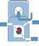

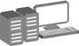

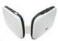

---
<!-- Page 46 -->
홈과 관련 보안위협
• 스 마트폰/앱 : 비인가된 기기가 연결될 수 있으며, 암호화되지 않은 인증정보 노출 및 유출될 수 있음. 또한, 취약한
비밀번호로 쉽게 유추하여 로그인할 수 있음. 악성코드가 포함된 업데이트 파일이 적용될 수 있음
• 게 이트웨이 : 게이트웨이가 수신 및 전송하는 데이터에 대한 암호화가 되지 않아 데이터가 노출될 수 있으며, PHI
정보를 안전하지 않게 저장하는 경우 노출 및 변조될 수 있음
병원 관련 보안위협
• 주 치의 PC : 비인가된 기기가 연결될 수 있으며, 암호화되지 않은 인증정보 노출 및 유출될 수 있음. 또한, 취약한
비밀번호로 쉽게 유추하여 로그인할 수 있음. 악성코드가 포함된 업데이트 파일이 적용될 수 있음
• P HR/EMR/EHR : 암호화되지 않은 데이터가 노출 및 유출될 수 있으며, 개발시 또는 구동시 취약한 3rd party
모듈/라이브러리 사용에 따라 안전하지 않은 서비스를 제공할 수 있음. 또한, 서비스 요청이 증가하거나 시스템
오동작으로 서비스 지연 등 정상적인 서비스가 제공되지 않을 수 있음
서비스 제공자 관련 보안위협
• 자 동음성인식 의료정보 기록서비스, 원격진료 서비스, PHR/EMR/EHR 관리 서비스 : 암호화되지 않은 데이터가
노출 및 유출될 수 있으며, 개발시 또는 구동시 취약한 3rd party 모듈/라이브러리 사용에 따라 안전하지 않은
서비스를 제공할 수 있음. 또한, 서비스 요청이 증가하거나 시스템 오동작으로 서비스 지연 등 정상적인 서비스가
제공되지 않을 수 있음
위에서 설명한 보안위협을 유형별을 다음과 같이 분류할 수 있다.
표 3-3 원격의료 서비스 보안위협 분류
유형 주요 보안위협
인증 및 허가 비인가된 기기 연결, 인증정보 노출 및 유추, 취약한 비밀번호 등
암호 취약한 암호화, 취약한 암호 알고리즘 등
데이터 보안 및 안전한 통신 데이터 노출 및 변조 등
서비스 거부, 안전하지 않은 업데이트, 악성행위, 취약한 3rd party 모듈/
안전한 기기 관리 및 물리적 보호
라이브러리 사용 등
나. 개인 맞춤형 헬스케어 서비스
개인 맞춤형 헬스케어 서비스는 웨어러블 기기와 웰니스 기기의 활용이 가장 많은 응용분야로 볼 수 있다.
뿐만 아니라 전문 의료가 아닌 피트니스에서도 많이 활용되는 분야로 개인 건강정보의 탈취가 쉽게 탈취될
가능성이 높은 기기로 구성되었다고 볼 수 있다. 개인 맞춤형 헬스케어 서비스 관련해서 다음 그림과 같이
보안위협이 발생할 수 있다.

| 유형 | 주요 보안위협 |

---
<!-- Page 47 -->

## 제3장 디지털헬스케어 보안위협 | 47

및
보안대책
및
보안대책
개요
디지털헬스케어
서비스
모델
디지털헬스케어
보안위협
디지털헬스케어
기기
보안요구사항
디지털헬스케어
서비스
보안요구사항
참고문헌
제1장
제2장
제3장
제4장
제5장
부록
그림 3-2 개인 맞춤형 헬스케어 서비스 구성요소별 주요 보안위협 및 시나리오
원격진료 서비스
• 서비스 거부
서비스 제공자
• 데이터 노출 및 변조 자동 음성인식
의료정보 기록 서비스
• 취약한 3rd party 모듈/라이브러리
AI주치의 서비스/ 3D 프린터 서비스
AI 구급활동 지원서비스
• 데이터 노출 및 변조
자동 진단 보조 시스템
홈 CDSS
EMR/EHR/PHR 관리 서비스
혈압 측정기
클라우드
혈액투석기 활동량 측정기 전용회선, 인터넷 등
유선통신 무선통신 유·무선유통신 인슐 체 린 외 주 용 입기 (유/무선 인터넷, 5G/LTE 등 • 데이터 노출 및 변조
혈당 측정기 모바일 인터넷) 병원
스마트폰/앱
• 데이터 노출 및 변조 내부망 OCS/EDI
수면 추적기 대형종합병원
원격 진료 서비스 시스템
원격 진료용 컴퓨터 • 비인가된 기기 연결 PHR
게이트웨이
• 인증정보 노출 및 유출
치료 장비
유선통신 무선통신 유·무선유통신 • 취약한 비밀번호 EMR/EHR
• 안전하지 않은 업데이트 환자 모니터링
주치의 PC 장비
• 사용자 세션 탈취 PACS
• 악성코드/바이러스 주입 공격 • 서비스 거부 진료 장비
진단 장비
내부망 • 데이터 노출 및 변조 스마트폰 등 헬스케어 의료 기기
• 취약한 3rd party 모듈/라이브러리
외부망 유선통신 무선통신 유·무선유통신
홈과 관련 보안위협
• 혈 당측정기, 혈압측정기 등 : 병원 또는 서비스 제공자로 개인의료정보 또는 개인건강정보 전송에 사용되는 통신
채널이 암호화되지 않았거나 세션 재사용이 가능한 경우 사용자 세션을 탈취할 수 있음. 또한, 개인 맞춤형 헬스케어
서비스를 제공받는 기기에 악성코드·바이러스가 설치되어 오동작할 수 있음
• 게 이트웨이 : 게이트웨이가 수신 및 전송하는 데이터에 대한 암호화가 되지 않아 데이터가 노출될 수 있으며, PHI
정보를 안전하지 않게 저장하는 경우 노출 및 변조될 수 있음
병원 관련 보안위협
• 주 치의 PC : 비인가된 기기가 연결될 수 있으며, 암호화되지 않은 인증정보 노출 및 유출될 수 있음. 또한, 취약한
비밀번호로 쉽게 유추하여 로그인할 수 있음. 악성코드가 포함된 업데이트 파일이 적용될 수 있음
• P HR/EMR/EHR : 암호화되지 않은 데이터가 노출 및 유출될 수 있으며, 개발시 또는 구동시 취약한 3rd party
모듈/라이브러리 사용에 따라 안전하지 않은 서비스를 제공할 수 있음. 또한, 서비스 요청이 증가하거나 시스템
오동작으로 서비스 지연 등 정상적인 서비스가 제공되지 않을 수 있음
서비스 제공자 관련 보안위협
• A I 주치의 서비스, AI 구급활동 지원서비스, PHR/EMR/EHR 관리 서비스 : 암호화되지 않은 데이터가 노출 및
유출될 수 있으며, 개발시 또는 구동시 취약한 3rd party 모듈/라이브러리 사용에 따라 안전하지 않은 서비스를
제공할 수 있음. 또한, 서비스 요청이 증가하거나 시스템 오동작으로 서비스 지연 등 정상적인 서비스가 제공되지
않을 수 있음

|  | 유선통신 무선통신 유·무선유통신 |

| • 서비스 거부 • 데이터 노출 및 변조 • 취약한 3rd party 모듈/라이브러리 |  |  |
| --- | --- | --- |
|  | 리 | 유선통신 무선통신 유·무선유통신 |

---
<!-- Page 48 -->
위에서 설명한 보안위협을 유형별을 다음과 같이 분류할 수 있다.
표 3-4 개인 맞춤형 헬스케어 서비스 보안위협 분류
유형 주요 보안위협
인증 및 허가 인증우회, 비인가된 기기 연결, 취약한 비밀번호 등
암호 취약한 암호화, 취약한 암호 알고리즘 등
데이터 보안 및 안전한 통신 데이터 노출 및 변조, 사용자 세션 탈취 등
서비스 거부, 안전하지 않은 업데이트, 악성행위, 취약한 3rd party 모듈/
안전한 기기 관리 및 물리적 보호
라이브러리 사용 등
다. 응급의료 서비스
응급의료 서비스는 응급 상황 발생 시 현장에 있는 구급대원이 응급환자를 직접 처치해야 하는 상황에서
이동형 진료 및 진단 장비와 환자모니터링 기기를 사용하기 때문에 보안보다는 시급성을 요구하는
시스템으로 구성되어 있어 보안취약점에 노출되기 쉽다. 응급의료 서비스 관련해서 다음 그림과 같이
보안위협이 발생할 수 있다.
그림 3-3 응급의료 서비스 구성요소별 주요 보안위협 및 시나리오
내부망
• 서비스 거부 원격진료 서비스
• 데이터 노출 및 변조 서비스 제공자 외부망
자동 음성인식
• 취약한 암호화 및 취약한 암호 알고리즘 의료정보 기록 서비스
• 취약한 3rd party 모듈/라이브러리 AI주치의 서비스/ 3D 프린터 서비스
AI 구급활동 지원서비스
• 비인가된 기기 연결 자동 진단 보조 시스템 • 비인가된 기기 연결
• 인증정보 노출 및 유출 CDSS • 인증정보 노출 및 유출
• 취약한 비밀번호 EMR/EHR/PHR 관리 서비스 • 취약한 비밀번호
• 안전하지 않은 업데이트
클라우드
• 악성행위
유선통신 무선통신 유·무선유통신
병원 이동형 진료소(구급차)
내부망 OCS/EDI
대형종합병원 5G LTE 게이트웨이 원격 진료 서비스 시스템
원격 진료 서비스 시스템 전용회선, 인터넷 등
PHR (유/무선 인터넷, 5G/LTE 등
모바일 인터넷)
치료 장비 의료용 게이트웨이
EMR/EHR
주치의 PC 장 환 비 자 모니터링• 비인가된 기기 연결
PACS
• 인증정보 노출 및 유출
환자 모니터링 장비 진단 장비 진료 장비
진료 장비 • 취약한 비밀번호 • 데이터 노출 및 변조
진단 장비
스마트폰 등 헬스케어 의료 기기• 안전하지 않은 업데이트 • 취약한 암호화 및
유선통신 무선통신 • 악성유행·무위선유통신 취약한 암호 알고리즘 유선통신 무선통신 유·무선유통신

| 유형 | 주요 보안위협 |

|  |  |

|  |  |  |
| --- | --- | --- |
| 유선통신 무선 | 통 | 신 유·무선유통신 |

| 내부망 OCS/EDI 대형종 원격 진료 서비스 시스템 PHR 치료 장비 EMR/EHR 주치의 PC 장 환 비 자 모니터링• 비인가된 기기 연 PACS • 인증정보 노출 및 진료 장비 • 취약한 비밀번호 진단 장비 스마트폰 등 헬스케어 의료 기기• 안전하지 않은 업 |  |
| --- | --- |
|  | • 비인가된 기기 연 PACS • 인증정보 노출 및 • 취약한 비밀번호 진단 장비 기기• 안전하지 않은 업 |

| 유선통신 무선통신 | • 악성유행·무위선유통신 |

---
<!-- Page 49 -->

## 제3장 디지털헬스케어 보안위협 | 49

및
보안대책
및
보안대책
개요
디지털헬스케어
서비스
모델
디지털헬스케어
보안위협
디지털헬스케어
기기
보안요구사항
디지털헬스케어
서비스
보안요구사항
참고문헌
제1장
제2장
제3장
제4장
제5장
부록
이동형 진료소 관련 보안위협
• 환자 모니터링 장비, 진단·진료 장비 : 등록되지 않은 기기가 연결되어 개인의료정보가 유출 등이 될 수 있으며,
암호화되지 않은 인증정보가 노출 및 유출될 수 있음. 또한, 취약한 비밀번호로 쉽게 유추하여 로그인할 수 있으며,
악성코드가 포함된 업데이트 파일이 적용되어 악성행위를 할 수 있음
병원 관련 보안위협
• 주 치의 PC : 비인가된 기기가 연결될 수 있으며, 암호화되지 않은 인증정보 노출 및 유출될 수 있음. 또한, 취약한
비밀번호로 쉽게 유추하여 로그인할 수 있음. 악성코드가 포함된 업데이트 파일이 적용될 수 있음
서비스 제공자 관련 보안위협
• A I 주치의 서비스, AI 구급활동 지원서비스, PHR/EMR/EHR 관리 서비스 : 암호화되지 않은 데이터가 노출 및
유출될 수 있으며, 개발시 또는 구동시 취약한 3rd party 모듈/라이브러리 사용에 따라 안전하지 않은 서비스를
제공할 수 있음. 또한, 서비스 요청이 증가하거나 시스템 오동작으로 서비스 지연 등 정상적인 서비스가 제공되지
않을 수 있음
위에서 설명한 보안위협을 유형별을 다음과 같이 분류할 수 있다.
표 3-5 응급의료 서비스 보안위협 분류
유형 주요 보안위협
인증 및 허가 비인가된 기기 연결, 응급상황 대응 제한 등
암호 취약한 암호화, 취약한 암호 알고리즘 등
데이터 보안 및 안전한 통신 입력값 검증 부재, 데이터 노출 및 변조, 사용자 세션 탈취 등
서비스 거부, 안전하지 않은 업데이트, 악성행위, 취약한 3rd party 모듈/
안전한 기기 관리 및 물리적 보호
라이브러리 사용 등
라. 정밀의료 서비스
정밀의료 솔루션은 병원과 클라우드 기반의 AI 시스템이 구축된 플랫폼으로 이루어진 시스템으로
대형병원에서 수집된 데이터를 기반으로 빅데이터와 머신러닝을 이용한 AI 시스템이다. 그리고 일반 개인
환자에게 서비스가 제공되지 않고 외부 의료기관의 연구자들과 수요 병원에서 활용된다. 다소 폐쇄적인
시스템으로 구성되었으나 내부 구축된 소프트웨어 또는 오픈소스 등에서 보안위협들이 발견될 수 있다.
응급의료 서비스 관련해서 다음 그림과 같이 보안위협이 발생할 수 있다.

| 유형 | 주요 보안위협 |

---
<!-- Page 50 -->
그림 3-4 정밀의료 서비스 구성요소별 주요 보안위협 및 시나리오
서비스 제공자 원격진료 서비스 • 인증 우회 및 비인가된 기기 연결 외부 의료기관 사용자
• 취약한 암호화 및 취약한 암호 알고리즘 소규모개인병원
자동 음성인식 • 서비스 거부
의료정보 기록 서비스
PHR
• 데이터 노출 및 변조
AI기반 정밀 3D 프린터 서비스
의료 솔루션 • 악성 행위
자동 진단 보조 시스템 EMR/EHR
CDSS • 취약한 3rd party 모듈/라이브러리 치료 장비 진료 장비 진단 장비 주치의 PC
EMR/EHR/PHR 관리 서비스
유선통신 무선통신 유·무선유통신
클라우드
병원
유선통신 무선통신 유·무선유통신
내부망 OCS/EDI
대형종합병원
원격 진료 서비스 시스템
PHR
전용회선, 인터넷 등
치료 장비
(유/무선 인터넷, 5G/LTE 등 EMR/EHR
모바일 인터넷) 환자 모니터링
주치의 PC 장비
PACS
• 데이터 노출 및 변조 • 데이터 노출 및 변조 진료 장비
진단 장비
내부망 • 취약한 암호화 및 • 취약한 암호화 및 스마트폰 등 헬스케어 의료 기기
외부망 취약한 암호 알고리즘 취약한 암호 알고리즘 유선통신 무선통신 유·무선유통신
병원 관련 보안위협
• O CS/EDI, PACS, PHR/EMR/EHR : 암호화되지 않은 데이터가 노출 및 유출될 수 있으며, 취약한 암호알고리즘
사용에 따라 암호화된 데이터가 노출되거나 위변조될 수 있음
서비스 제공자 관련 보안위협
• A I 기반 정밀 의료 솔루션 : 인증기능 부재 또는 부적절한 인증 메커니즘으로 인증이 우회되어 권한이 없는 사용자가
접근할 수 있으며, 취약한 암호알고리즘 사용에 따라 암호화된 데이터가 노출되거나 위변조될 수 있음. 또한,
암호화되지 않은 데이터가 노출 및 유출될 수 있으며, 개발시 또는 구동시 취약한 3rd party 모듈/라이브러리 사용에
따라 안전하지 않은 서비스를 제공할 수 있음. 서비스 요청이 증가하거나 시스템 오동작으로 서비스 지연 등
정상적인 서비스가 제공되지 않을 수 있음
위에서 설명한 보안위협을 유형별을 다음과 같이 분류할 수 있다.
표 3-6 정밀진료 서비스 보안위협 분류
유형 주요 보안위협
인증 및 허가 인증우회, 비인가된 기기 연결 등
암호 취약한 암호화, 취약한 암호 알고리즘 등
데이터 보안 및 안전한 통신 데이터 노출 및 변조 등
서비스 거부, 안전하지 않은 업데이트, 악성행위, 취약한 운영체제, 취약한 3rd
안전한 기기 관리 및 물리적 보호
party 모듈/라이브러리 사용 등

|  | 내부망 OCS/EDI 대형종합 원격 진료 서비스 시스템 PHR 치료 장비 EMR/EHR 환자 모니터링 주치의 PC 장비 PACS 진료 장비 진단 장비 스마트폰 등 헬스케어 의료 기기 |  |  | OCS/EDI 대형종합 PHR EMR/EHR |
| --- | --- | --- | --- | --- |
| • 데이터 노출 및 변조 • 취약한 암호화 및 취약한 암호 알고리즘 |  |  |  |  |
|  |  |  | 유선통신 무선통신 유·무선유통신 |  |

| 유형 | 주요 보안위협 |

---
<!-- Page 51 -->

## 제3장 디지털헬스케어 보안위협 | 51

및
보안대책
및
보안대책
개요
디지털헬스케어
서비스
모델
디지털헬스케어
보안위협
디지털헬스케어
기기
보안요구사항
디지털헬스케어
서비스
보안요구사항
참고문헌
제1장
제2장
제3장
제4장
제5장
부록
3 | 유형별 보안위협
본 절에서는 제1절 및 제2절에서 설명한 디지털헬스케어 기기 및 서비스 관련 보안위협을 인증 및 허가
유형, 암호 유형, 데이터 보안 및 안전한 통신 유형, 안전한 기기 관리 및 물리적 보호 유형으로 정리해서
관련 보안위협을 설명하고 해당 보안위협에 대한 보안대책을 제시한다. 보안대책의 세부 내용은 제4장 및
제5장을 참조한다.
인증 및 허가 유형의 보안위협은 다음 표와 같다.
표 3-7 인증 및 허가 유형의 보안위협
보안위협 설명 관련 보안대책
인가되지 않은 사용자가 디지털헬스케어 기기나 서비스에 접근할 수
사용자 인증,
인증우회 있으며, 기기에 저장된 개인의료정보, 기기 설정파일 등 중요 데이터에
접근통제
임의로 접근할 수 있음
비인가된 디지털헬스케어 기기로의 비인가된 기기가 접근하거나, 비인가된 기기 기기 인증,
기기 연결 또는 서버로의 개인의료정보 등을 전송할 수 있음 접근통제,
과도하거나 불필요한 권한 부여로 공격자는 디지털헬스케어 기기가
과도한 권한 부여 접근통제
허용하는 모든 기능과 접근이 제한된 개인의료정보 등에 접근할 수 있음
인가되지 않은 사용자가 연속적으로 인증을 시도하여 인가된 사용자
연속된 인증시도 접근통제
권한을 획득할 수 있음
응급상황 발생시 디지털헬스케어 기기 사용의 어려움으로 인해 적절한
응급상황 대응 제한 접근통제
응급처치를 하지 못할 수 있음
동시접속에 따른
관리자 계정으로 동시 접속시 중요 기능 설정이 임의로 변경될 수 있음 접근통제
정책 일관성 오류
비밀번호 등 인증정보가 하드코딩 또는 평문으로 저장되거나, 로그인을
인증정보 노출 안전한 비밀번호
위해 인증정보(예: 비밀번호) 입력 시 평문으로 출력되거나, 구체적인 인증
및 유추 메커니즘
실패 사유에 대한 피드백으로 되어 인증정보가 노출되거나 유추될 수 있음
비밀번호의 디폴트값 이용 등 관리가 미흡한 비밀번호를 획득하거나, 낮은 안전한 비밀번호
취약한 비밀번호
수준의 비밀번호 조합규칙이 적용된 경우 인가된 사용자로 위장할 수 있음 메커니즘
인증 결과 안전한 비밀번호
인증 결과(예, 성공, 실패) 변조로 인증 기능이 우회될 수 있음
변조 메커니즘

| 보안위협 | 설명 | 관련 보안대책 |
| --- | --- | --- |
|  | 인가되지 않은 사용자가 디지털헬스케어 기기나 서비스에 접근할 수 있으며, 기기에 저장된 개인의료정보, 기기 설정파일 등 중요 데이터에 임의로 접근할 수 있음 |  |
|  | 디지털헬스케어 기기로의 비인가된 기기가 접근하거나, 비인가된 기기 또는 서버로의 개인의료정보 등을 전송할 수 있음 |  |
|  | 과도하거나 불필요한 권한 부여로 공격자는 디지털헬스케어 기기가 허용하는 모든 기능과 접근이 제한된 개인의료정보 등에 접근할 수 있음 |  |
|  | 인가되지 않은 사용자가 연속적으로 인증을 시도하여 인가된 사용자 권한을 획득할 수 있음 |  |
|  | 응급상황 발생시 디지털헬스케어 기기 사용의 어려움으로 인해 적절한 응급처치를 하지 못할 수 있음 |  |
|  | 관리자 계정으로 동시 접속시 중요 기능 설정이 임의로 변경될 수 있음 |  |
|  | 비밀번호 등 인증정보가 하드코딩 또는 평문으로 저장되거나, 로그인을 위해 인증정보(예: 비밀번호) 입력 시 평문으로 출력되거나, 구체적인 인증 실패 사유에 대한 피드백으로 되어 인증정보가 노출되거나 유추될 수 있음 |  |
|  | 비밀번호의 디폴트값 이용 등 관리가 미흡한 비밀번호를 획득하거나, 낮은 수준의 비밀번호 조합규칙이 적용된 경우 인가된 사용자로 위장할 수 있음 |  |
|  | 인증 결과(예, 성공, 실패) 변조로 인증 기능이 우회될 수 있음 |  |

---
<!-- Page 52 -->
암호 유형의 보안위협은 다음 표와 같다.
표 3-8 암호 유형의 보안위협
보안위협 설명 관련 보안대책
안전한 암호 알고리즘
취약한 암호 알고리즘, 불충분한 암호키, 유추 가능한 난수 사용
취약한 암호화 사용, 안전한 암호키 관리,
으로 중요데이터를 적절하게 보호하지 못 할 수 있음
안전한 난수 생성
취약한 암호 취약한 암호 알고리즘을 사용하는 트래픽을 분석하여 키 정보를
안전한 암호 알고리즘 사용
알고리즘 유추하거나 통신암호문의 내용을 알아낼 수 있음
데이터 보안 및 안전한 통신 유형의 보안위협은 다음 표와 같다.
표 3-9 데이터 보안 및 안전한 통신 유형의 보안위협
보안위협 설명 관련 보안대책
입력값 검증 부재 입력값에 대한 검증 부재로 디지털헬스케어 기기가 오작동할 수 있음 인터페이스 입력값 검증
신뢰할 수 없는 신뢰할 수 없는 데이터 송수신으로 디지털헬스케어 기기가 오작동을
정보흐름통제
데이터 송수신 유발하거나 악성코드를 전파할 수 있음
저장데이터 보호,
디지털헬스케어 기기에서 전송되거나 저장되는 개인의료정보, 기기
전송데이터 보호,
데이터 노출 및 변조 설정, 암호키 등 중요 데이터가 외부에 노출되어 악용되거나, 변조될
개인정보보호,
수 있음
보안통신
정상적으로 세션 종료되지 않은 인가된 사용자 세션을 이용하여
사용자 세션 탈취 권한을 탈취하거나, 기기별로 동일한 암호키 사용에 따라 세션을 세션관리
탈취할 수 있음

| 보안위협 | 설명 | 관련 보안대책 |
| --- | --- | --- |
|  | 취약한 암호 알고리즘, 불충분한 암호키, 유추 가능한 난수 사용 으로 중요데이터를 적절하게 보호하지 못 할 수 있음 |  |
|  | 취약한 암호 알고리즘을 사용하는 트래픽을 분석하여 키 정보를 유추하거나 통신암호문의 내용을 알아낼 수 있음 |  |

| 보안위협 | 설명 | 관련 보안대책 |
| --- | --- | --- |
|  | 입력값에 대한 검증 부재로 디지털헬스케어 기기가 오작동할 수 있음 |  |
|  | 신뢰할 수 없는 데이터 송수신으로 디지털헬스케어 기기가 오작동을 유발하거나 악성코드를 전파할 수 있음 |  |
|  | 디지털헬스케어 기기에서 전송되거나 저장되는 개인의료정보, 기기 설정, 암호키 등 중요 데이터가 외부에 노출되어 악용되거나, 변조될 수 있음 |  |
|  | 정상적으로 세션 종료되지 않은 인가된 사용자 세션을 이용하여 권한을 탈취하거나, 기기별로 동일한 암호키 사용에 따라 세션을 탈취할 수 있음 |  |

---
<!-- Page 53 -->

## 제3장 디지털헬스케어 보안위협 | 53

및
보안대책
및
보안대책
개요
디지털헬스케어
서비스
모델
디지털헬스케어
보안위협
디지털헬스케어
기기
보안요구사항
디지털헬스케어
서비스
보안요구사항
참고문헌
제1장
제2장
제3장
제4장
제5장
부록
안전한 기기 관리 및 물리적 보호 유형의 보안위협은 다음 표와 같다.
표 3-10 안전한 기기 관리 및 물리적 보호 유형의 보안위협
보안위협 설명 관련 보안대책
안전하지 않은 원하는 업데이트 파일이 다운로드 되지 않거나 출처를 알 수 없는
안전한 업데이트
업데이트 변조된 업데이트 파일이 실행될 수 있음
업데이트 진행 중 오류발생으로 디지털헬스케어 기기가 정상적으로
업데이트 실패 안전한 업데이트
동작하지 않을 수 있음
안전한 서비스 제공,
디지털헬스케어 기기의 주요 실행코드 또는 설정값의 임의 변조에
무결성 오류 인터페이스에 대한
따라 오작동할 수 있음
물리적 보호
디지털헬스케어 기기 기능의 오작동 또는 서비스 거부 공격으로
서비스 거부 안전한 서비스 제공
디지털헬스케어 기기의 가용성이 제한될 수 있음
디지털헬스케거 기기·서비스의 목적에 맞지 않은 기능이 존재하여 안전한 서비스 제공,
악성행위
악성 행위를 할 수 있음 보안취약점 탐지 및 대응
잔여정보 암호연산, 인증, 데이터 전송을 위해 사용된 암호키, 비밀번호, 민감
안전한 서비스 제공
악용 데이터 등이 메모리에 남아 있어 악용될 수 있음
디지털헬스케어 기기 및 서버에 대한 보안관리 부재로 중요 설정이
중요 설정 임의 변경 기기 설정 관리
임의로 변경되어 안전하지 않은 서비스를 제공할 수 있음
디지털헬스케어 기기·서비스에서 발생하는 오류, 악성행위 등에 대한 감사기록,
오류 대응
적절한 탐지 및 대응 부재로 안전하지 않은 서비스를 제공할 수 있음 보안취약점 탐지 및 대응
디지털헬스케어 기기·서비스 설계 및 구현과정에서 잠재적인 보안
소프트웨어 개발보안,
안전하지 않은 개발 취약점이 포함될 수 있으며, 시험과정에서 이에 대한 검증 및 대응이
보안취약점 탐지 및 대응
부재하거나 적절하지 않을 수 있음
모바일 디바이스가 루팅/탈옥되었거나 취약한 운영체제 환경에서 앱
취약한 운영체제 소프트웨어 개발보안
동작 시 앱의 보안 기능이 무력화되거나 우회될 수 있음
취약한 3rd party
취약한 3rd party 모듈/라이브러리 사용으로 공격자가 해당 모듈/
모듈/라이브러리 소프트웨어 개발보안
라이브러리를 호출할 수 있음
사용
시스템 로그에 시스템 로그에 민감한 정보가 기록되어 공격자에 의해 해당 정보가
소프트웨어 개발보안
민감한 정보 기록 노출되어 악용될 수 있음
소프트웨어 개발보안,
디버깅을 통한 디지털헬스케어 기기·서비스 릴리즈 및 배포 시 로그생성 및 디버깅
인터페이스에 대한
중요정보 노출 기능을 통해 중요정보가 유출되어 악용될 수 있음
물리적 보호
비인가된 물리적 디지털헬스케어 기기에 비인가된 물리적 접속으로 기기를 임의로 인터페이스에 대한
접근 변경할 수 있음 물리적 보호

| 보안위협 | 설명 | 관련 보안대책 |
| --- | --- | --- |
|  | 원하는 업데이트 파일이 다운로드 되지 않거나 출처를 알 수 없는 변조된 업데이트 파일이 실행될 수 있음 |  |
|  | 업데이트 진행 중 오류발생으로 디지털헬스케어 기기가 정상적으로 동작하지 않을 수 있음 |  |
|  | 디지털헬스케어 기기의 주요 실행코드 또는 설정값의 임의 변조에 따라 오작동할 수 있음 |  |
|  | 디지털헬스케어 기기 기능의 오작동 또는 서비스 거부 공격으로 디지털헬스케어 기기의 가용성이 제한될 수 있음 |  |
|  | 디지털헬스케거 기기·서비스의 목적에 맞지 않은 기능이 존재하여 악성 행위를 할 수 있음 |  |
|  | 암호연산, 인증, 데이터 전송을 위해 사용된 암호키, 비밀번호, 민감 데이터 등이 메모리에 남아 있어 악용될 수 있음 |  |
|  | 디지털헬스케어 기기 및 서버에 대한 보안관리 부재로 중요 설정이 임의로 변경되어 안전하지 않은 서비스를 제공할 수 있음 |  |
|  | 디지털헬스케어 기기·서비스에서 발생하는 오류, 악성행위 등에 대한 적절한 탐지 및 대응 부재로 안전하지 않은 서비스를 제공할 수 있음 |  |
|  | 디지털헬스케어 기기·서비스 설계 및 구현과정에서 잠재적인 보안 취약점이 포함될 수 있으며, 시험과정에서 이에 대한 검증 및 대응이 부재하거나 적절하지 않을 수 있음 |  |
|  | 모바일 디바이스가 루팅/탈옥되었거나 취약한 운영체제 환경에서 앱 동작 시 앱의 보안 기능이 무력화되거나 우회될 수 있음 |  |
|  | 취약한 3rd party 모듈/라이브러리 사용으로 공격자가 해당 모듈/ 라이브러리를 호출할 수 있음 |  |
|  | 시스템 로그에 민감한 정보가 기록되어 공격자에 의해 해당 정보가 노출되어 악용될 수 있음 |  |
|  | 디지털헬스케어 기기·서비스 릴리즈 및 배포 시 로그생성 및 디버깅 기능을 통해 중요정보가 유출되어 악용될 수 있음 |  |
|  | 디지털헬스케어 기기에 비인가된 물리적 접속으로 기기를 임의로 변경할 수 있음 |  |

---
<!-- Page 54 -->

|  |
| --- |
|  |

|  |
| --- |
|  |

|  |
| --- |
|  |

---
<!-- Page 55 -->
제4장
디지털헬스케어 기기
보안요구사항 및 보안대책

### 1. 인증 및 인가

### 2. 암호

### 3. 데이터 보안

### 4. 안전한 통신

### 5. 안전한 기기 관리

### 6. 물리적 보호

---
<!-- Page 56 -->

## 제4장 디지털헬스케어 기기

보안요구사항 및 보안대책
본 장에서는 제3장에서 설명한 디지털헬스케어 관련 보안위협에 대응할 수 있는 디지털헬스케어 기기에
대한 보안요구사항에 대해 설명한다.
(1) ‘인증 및 허가’ 유형
보안항목 보안요구사항
1.1.1 디지털헬스케어 기기 운영 및 관리 기능 접근 시 사용자 인증을 해야 한다.
1.1.2 민감 데이터에 접근 시 사용자 인증을 해야 한다.
사용자 인증
1.1.3 필요 시 암호학적으로 강력한 인증 기술이나 다중인증 방법 등을 사용해야 한다.
1.1.4 디지털헬스케어 기기는 원격/무선 접근 시 사용자 인증 후 접근을 허용해야 한다.
1.2.1 디지털헬스케어 기기에 대한 기기인증을 통해 비인가된 접근을 통제해야 한다.
디지털헬스케어 기기는 다른 기기나 서버와 중요정보 전송/수신 시 혹은 기기 제어를
1.2.2
위한 상호연결 수행 시 인증이 선행되어야 한다.
디지털헬스케어 기기는 기본적으로 외부 통신이 "거부(deny)"되도록 설정되어 있어야
기기 인증 1.2.3
한다.
디지털헬스케어 기기에 접속하는 다른 기기의 MAC 주소, IP 주소 등을 제한하여야
1.2.4
한다.
1.2.5 디지털헬스케어 기기별로 고유 ID가 할당되어야 한다.
1.3.1 디지털헬스케어 기기에 대한 비 인가된 접근을 제한해야 한다.
접근통제
디지털헬스케어 기기는 비밀번호, 암호키 등 중요데이터에 비인가된 접근을 제한해야
1.3.2
한다.

| 보안항목 | 보안요구사항 |
| --- | --- |
|  | 1.1.1 |
|  | 1.1.2 |
|  | 1.1.3 |
|  | 1.1.4 |
|  | 1.2.1 |
|  | 1.2.2 |
|  | 1.2.3 |
|  | 1.2.4 |
|  | 1.2.5 |
|  | 1.3.1 |
|  | 1.3.2 |

---
<!-- Page 57 -->

## 제4장 디지털헬스케어 기기 보안요구사항 및 보안대책 | 57

및
보안대책
및
보안대책
개요
디지털헬스케어
서비스
모델
디지털헬스케어
보안위협
디지털헬스케어
기기
보안요구사항
디지털헬스케어
서비스
보안요구사항
참고문헌
제1장
제2장
제3장
제4장
제5장
부록
보안항목 보안요구사항
1.3.3 디지털헬스케어 기기의 모든 사용자 계정에 대해 최소 권한의 원칙을 적용해야 한다.
1.3.4 역할 기반 접근제어 시, 사용자 역할 및 기기 기능에 따른 권한을 부여할 수 있어야 한다.
디지털헬스케어 기기는 반복된 인증시도에 대하여 인증 제한 등의 방법으로 대응해야
1.3.5
한다.
접근통제
1.3.6 비상시 디지털헬스케어 기기 접근을 허용하는 방법을 마련해야 한다.
1.3.7 사용자 계정의 유효기간 만료 시 접근을 제한해야 한다.
1.3.8 관리자 계정에 대해서는 동시 접속을 제한해야 한다.
1.3.9 디지털헬스케어 기기는 비인가된 네트워크 접속을 제한 할 수 있어야 한다.
1.4.1 비밀번호는 하드코딩되지 않아야 한다.
디지털헬스케어 기기는 비밀번호 입력 등 화면에 표시하는 경우 마스킹 처리를 해야
1.4.2
한다.
1.4.3 비밀번호에 대한 안전한 저장 방법을 제공해야 한다.
1.4.4 비밀번호는 길이, 복잡도, 업데이트 주기를 고려하여 설정되어야 한다.
안전한 비밀번호
메커니즘
디지털헬스케어 기기는 인증 실패메시지로 인증 실패 사유와 비밀번호를 유추할 수 있는
1.4.5
정보를 제공하지 않아야 한다.
디지털헬스케어 기기는 제품 사용 초기에 인증정보를 설정하도록 요구하거나, 초기
1.4.6
인증정보를 변경하도록 요구해야 한다.
디지털헬스케어 기기가 서버/클라이언트 형태로 구성된 경우, 비밀번호는 서버에서
1.4.7
검증해야 한다.
(2) ‘암호’ 유형
보안항목 보안요구사항
안전한 암호 디지털헬스케어 기기에 적용되는 암호 알고리즘은 안전성이 검증된 알고리즘을
2.1.1
알고리즘 사용 사용하여야 한다.
2.2.1 암호키의 생명주기를 고려하여 안전하게 관리되어야 한다.
안전한 암호키
관리
2.2.2 암호 연산 목적에 따라 별도의 암호키를 사용하여야 한다.
안전한 난수 생성 2.3.1 난수 생성 시 난수성이 검증된 알고리즘을 이용해야 한다.

| 보안항목 | 보안요구사항 |
| --- | --- |
|  | 1.3.3 |
|  | 1.3.4 |
|  | 1.3.5 |
|  | 1.3.6 |
|  | 1.3.7 |
|  | 1.3.8 |
|  | 1.3.9 |
|  | 1.4.1 |
|  | 1.4.2 |
|  | 1.4.3 |
|  | 1.4.4 |
|  | 1.4.5 |
|  | 1.4.6 |
|  | 1.4.7 |

| 보안항목 | 보안요구사항 |
| --- | --- |
|  | 2.1.1 |
|  | 2.2.1 |
|  | 2.2.2 |
|  | 2.3.1 |

---
<!-- Page 58 -->
(3) ‘데이터 보안’ 유형
보안항목 보안요구사항
3.1.1 디지털헬스케어 기기는 기능 동작에 사용되는 모든 입력값을 검증해야 한다.
디지털헬스케어 기기는 통신인터페이스를 통해 유입되는 민감 데이터에 대해 무결성을
인터페이스 3.1.2
확인해야 한다.
입력값 검증
디지털헬스케어 기기가 서버/클라이언트 형태로 구성된 경우, 기기 동작을 위해
3.1.3
서버에서 유입되어 사용되는 모든 매개변수는 서버에서 검증해야 한다.
디지털헬스케어 기기의 구성요소가 2개 이상인 경우, 구성요소 간 송·수신되는 정보
정보흐름통제 3.2.1
흐름을 통제할 수 있어야 한다.
디지털헬스케어 기기에 의해 저장되는 모든 민감 데이터와 개인식별 정보에 대한
3.3.1
기밀성과 무결성을 보장해야 한다.
저장데이터 보호
3.3.2 디지털헬스케어 기기에 저장되는 민감데이터에 대한 비인가된 접근을 차단해야 한다.
3.3.3 디지털헬스케어 기기에 저장되는 암호키 등 안전 관련 데이터 보호를 제공해야 한다.
디지털헬스케어 기기에 의해 전송되는 모든 민감 데이터와 개인식별 정보에 대한
3.4.1
기밀성과 무결성을 보장해야 한다.
전송데이터 보호
환자의 부상이나 사망을 초래할 수 있는 디지털헬스케어 기기 조작 명령어 등에 대한
3.4.2
전송데이터에 대한 기밀성 및 무결성을 보장해야 한다.
개인정보보호 3.5.1 디지털헬스케어 기기는 개인의료정보를 저장하지 않아야 한다.
(4) ‘안전한 통신’ 유형
보안항목 보안요구사항
4.1.1 디지털 헬스케어 기기에 동일 사용자가 다중 접속이 되지 않도록 제한해야 한다.
디지털 헬스케어 기기는 세션 연결 후 일정 시간동안 미사용 또는 설정한 시간 경과 시
4.1.2
세션을 잠그거나 종료시켜야 한다.
세션 관리
4.1.3 세션 종료 후 재접속하기 위해서는 재인증을 통해 접속을 허용해야 한다.
4.1.4 디지털헬스케어 기기는 기기별로 유일한 암호화 통신키를 사용해야 한다.
디지털헬스케어 기기는 통신 대상 기기와 서버 간의 통신방식을 고려하여 안전한 통신을
보안 통신 4.2.1
제공해야 한다.

| 보안항목 | 보안요구사항 |
| --- | --- |
|  | 3.1.1 |
|  | 3.1.2 |
|  | 3.1.3 |
|  | 3.2.1 |
|  | 3.3.1 |
|  | 3.3.2 |
|  | 3.3.3 |
|  | 3.4.1 |
|  | 3.4.2 |
|  | 3.5.1 |

| 보안항목 | 보안요구사항 |
| --- | --- |
|  | 4.1.1 |
|  | 4.1.2 |
|  | 4.1.3 |
|  | 4.1.4 |
|  | 4.2.1 |

---
<!-- Page 59 -->

## 제4장 디지털헬스케어 기기 보안요구사항 및 보안대책 | 59

및
보안대책
및
보안대책
개요
디지털헬스케어
서비스
모델
디지털헬스케어
보안위협
디지털헬스케어
기기
보안요구사항
디지털헬스케어
서비스
보안요구사항
참고문헌
제1장
제2장
제3장
제4장
제5장
부록
(5) ‘안전한 기기 관리’ 유형
보안항목 보안요구사항
5.1.1 디지털헬스케어 기기는 업데이트 기능을 제공하여야 한다.
5.1.2 업데이트 파일에 대한 버전, 배포자, 무결성을 검증할 수 있어야 한다.
안전한 업데이트
5.1.3 인가된 사용자에 의해 업데이트가 수행될 수 있도록 해야 한다.
5.1.4 디지털헬스케어 기기는 롤백 기능을 제공하여야 한다.
디지털헬스케어 기기의 안전 및 필수 성능을 보장하기 위해 실행코드 및 설정값 등에
5.2.1
대한 무결성을 보장해야 한다.
5.2.2 디지털헬스케어 기기의 펌웨어 및 소프트웨어를 검증할 수 있어야 한다.
안전한 서비스
제공 5.2.3 디지털헬스케어 기기 서비스에 대한 가용성을 보장해야 한다.
5.2.4 디지털헬스케어 기기의 불필요한 서비스는 제거되거나 비활성화 되어야 한다.
5.2.5 디지털헬스케어 기기 파기 시에는 기기에 있는 모든 데이터를 완전 삭제할 수 있어야 한다.
5.3.1 디지털헬스케어 기기의 설정을 위해서는 안전한 관리 수단을 제공해야 한다.
기기 설정 관리
5.3.2 디지털헬스케어 기기의 서버에 사용자 접근 차단을 설정할 수 있어야 한다.
디지털헬스케어 기기는 중요 시스템 이벤트나 상태가 발생할 경우 자동으로 알람을
5.4.1
발생시켜야 한다.
감사기록 디지털헬스케어 기기는 주요 이벤트를 탐지하여 감시기록을 생성 및 검토할 수 있는
5.4.2
기능을 제공해야 한다.
5.4.3 감사기록을 안전하게 보호할 수 있어야 한다.
소프트웨어 개발 디지털헬스케어 기기 개발과정에서 소스코드 보안 취약점이 존재하지 않도록
5.5.1
보안 개발하여야 한다.
5.6.1 악성코드로부터 보호할 수 있어야 한다. 보안취약점 탐지
및 대응
5.6.2 보안취약점 존재 여부를 확인하고 제거하여야 한다.
(6) ‘물리적 보호’ 유형
보안항목 보안요구사항
6.1.1 디지털헬스케어 기기의 불필요한 인터페이스는 물리적으로 접근을 제한해야 한다.
인터페이스에
대한 물리적 보호 디지털헬스케어 기기에 대한 비인가된 물리적 접근을 탐지하고, 대응기능을 제공해야
6.1.2
한다.

| 보안항목 | 보안요구사항 |
| --- | --- |
|  | 5.1.1 |
|  | 5.1.2 |
|  | 5.1.3 |
|  | 5.1.4 |
|  | 5.2.1 |
|  | 5.2.2 |
|  | 5.2.3 |
|  | 5.2.4 |
|  | 5.2.5 |
|  | 5.3.1 |
|  | 5.3.2 |
|  | 5.4.1 |
|  | 5.4.2 |
|  | 5.4.3 |
|  | 5.5.1 |
|  | 5.6.1 |
|  | 5.6.2 |

| 보안항목 | 보안요구사항 |
| --- | --- |
|  | 6.1.1 |
|  | 6.1.2 |

---
<!-- Page 60 -->
1 | 인증 및 인가

#### 1.1 사용자 인증

1.1.1 디지털헬스케어 기기 운영 및 관리 기능 접근 시 사용자 인증을 해야 한다.
보안위협 및 취약점(제3장 참조)
인가되지 않은 사용자가 디지털헬스케어 기기나 서비스에 접근할 수 있으며, 기기에 저장된 개인의료정보, 기기
설정파일 등 중요 데이터에 임의로 접근할 수 있다.
보안요구사항 및 보안대책
비인가된 사용자(의료기기)의 접속을 제한할 수 있어야 한다.
기기의 보안에 영향을 미치는 제품 운영, 환경설정 변경, 관리 서비스 접근 전 사용자 인증 수행해야 하며, 사용자
인증 후 기능 수행 및 접근을 허용해야 한다.
* (사용자 인증 예시) 사용자 아이디 및 비밀번호, 스마트 카드, 생체 인식
중요한 기능은 권한에 맞는 사용자에 의해 실행될 수 있는지 확인해야 한다.
점검방법
디지털헬스케어 기기의 중요정보에 접근을 시도하고 인증을 요구하는지 확인한다.
중요정보의 중요도에 따라 적절한 인증 메커니즘을 사용하는지 확인한다.
계정사용 시 계정에 부여된 권한을 통해 관리자와 일반 사용자를 구분하는 경우, 중요정보에 접근 권한이
있는계정으로 로그인하여 중요정보에 접근이 가능한지 확인한다.
해당 계정 로그아웃 후 일반 사용자 계정(중요정보에 접근 권한이 없는 계정)으로 로그인하여 중요정보에 접근이
거부되는지 확인한다.

| 보안위협 및 취약점(제3장 참조) |
| --- |
| 인가되지 않은 사용자가 디지털헬스케어 기기나 서비스에 접근할 수 있으며, 기기에 저장된 개인의료정보, 기기 설정파일 등 중요 데이터에 임의로 접근할 수 있다. |
| 보안요구사항 및 보안대책 |
| 비인가된 사용자(의료기기)의 접속을 제한할 수 있어야 한다. 기기의 보안에 영향을 미치는 제품 운영, 환경설정 변경, 관리 서비스 접근 전 사용자 인증 수행해야 하며, 사용자 인증 후 기능 수행 및 접근을 허용해야 한다. * (사용자 인증 예시) 사용자 아이디 및 비밀번호, 스마트 카드, 생체 인식 중요한 기능은 권한에 맞는 사용자에 의해 실행될 수 있는지 확인해야 한다. |
| 점검방법 |
| 디지털헬스케어 기기의 중요정보에 접근을 시도하고 인증을 요구하는지 확인한다. 중요정보의 중요도에 따라 적절한 인증 메커니즘을 사용하는지 확인한다. 계정사용 시 계정에 부여된 권한을 통해 관리자와 일반 사용자를 구분하는 경우, 중요정보에 접근 권한이 있는계정으로 로그인하여 중요정보에 접근이 가능한지 확인한다. 해당 계정 로그아웃 후 일반 사용자 계정(중요정보에 접근 권한이 없는 계정)으로 로그인하여 중요정보에 접근이 거부되는지 확인한다. |

---
<!-- Page 61 -->

## 제4장 디지털헬스케어 기기 보안요구사항 및 보안대책 | 61

및
보안대책
및
보안대책
개요
디지털헬스케어
서비스
모델
디지털헬스케어
보안위협
디지털헬스케어
기기
보안요구사항
디지털헬스케어
서비스
보안요구사항
참고문헌
제1장
제2장
제3장
제4장
제5장
부록
관리자 권한 분리기능 및 인증기능 검증 예시
참고문헌
• U .S. FDA, “(Draft) Content of Premarket Submissions for Management of Cybersecurity in Medical
Devices”, 2018.
• H ealth Canada, “Pre-market Requirements for Medical Device Cybersecurity”, 2019.
• U L, “Software Cybersecurity for Network-Connctable Products, Part 1: General Requirements”, ANSI/
CAN/UL 2900-1:2017, 2017.
• U L, “Software Cybersecurity for Network-Connctable Products, Part 2-1: Particular Requirements for
Network Connectable Components of Healthcare and Wellness Systems”, ANSI/CAN/UL 2900-2-
1:2018, 2018.
• D TSec, “Protection Profile for Connected Diabetes Devices (CDD)”, Version 2.0, 2017.11.25.
• B SI, “Cyber Security Requirements for Network-Connected Medical Devices”, BSI-CS 132, Version
1.1, 2018.11.13.
• K ISA, “사물인터넷(IoT) 보안 시험·인증 기준 해설서”, 2019.

| 관리자 권한 분리기능 및 인증기능 검증 예시 |
| --- |
| 참고문헌 |
| • U .S. FDA, “(Draft) Content of Premarket Submissions for Management of Cybersecurity in Medical Devices”, 2018. • H ealth Canada, “Pre-market Requirements for Medical Device Cybersecurity”, 2019. • U L, “Software Cybersecurity for Network-Connctable Products, Part 1: General Requirements”, ANSI/ CAN/UL 2900-1:2017, 2017. • U L, “Software Cybersecurity for Network-Connctable Products, Part 2-1: Particular Requirements for Network Connectable Components of Healthcare and Wellness Systems”, ANSI/CAN/UL 2900-2- 1:2018, 2018. • D TSec, “Protection Profile for Connected Diabetes Devices (CDD)”, Version 2.0, 2017.11.25. • B SI, “Cyber Security Requirements for Network-Connected Medical Devices”, BSI-CS 132, Version 1.1, 2018.11.13. • K ISA, “사물인터넷(IoT) 보안 시험·인증 기준 해설서”, 2019. |

| 제4장 |  |

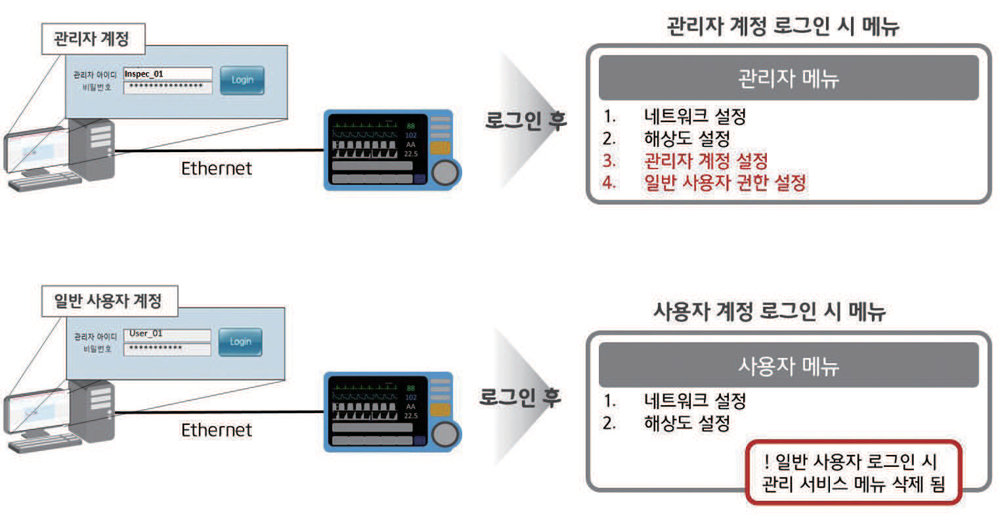

---
<!-- Page 62 -->
1.1.2 민감 데이터에 접근 시 사용자 인증을 해야 한다.
보안위협 및 취약점(제3장 참조)
인가되지 않은 사용자가 디지털헬스케어 기기나 서비스에 접근할 수 있으며, 기기에 저장된 개인의료정보, 기기
설정파일 등 중요 데이터에 임의로 접근할 수 있다.
보안요구사항 및 보안대책
허가된 사용자(또는 기관)에 환자정보에 대한 가용성을 보장해야 한다.
식별 및 인증에 기반하여 사용자(의료기기) 역할에 따른 접근 권한 부여가 가능하고 접근 권한에 따라 인가된
데이터에만 접근 가능해야 한다.
점검방법
디지털헬스케어 기기의 민감정보에 접근을 시도하고 인증을 요구하는지 확인한다.
민감정보의 중요도에 따라 적절한 인증 메커니즘을 사용하는지 확인한다.
계정사용 시 계정에 부여된 권한을 통해 관리자와 일반 사용자를 구분하는 경우, 중요정보에 접근 권한이 있는
계정으로 로그인하여 민감정보에 접근이 가능한지 확인한다.
해당 계정 로그아웃 후 일반 사용자 계정(민감정보에 접근 권한이 없는 계정)으로 로그인하여 중요정보에 접근이
거부되는지 확인한다.
일반 계정의 관리자계정 접근통제 검증 예시
참고문헌
• U.S. FDA, “(Draft) Medical Device Manufacturer Internet of Things (IoT) Code of Conduct”, 2020.
• 식품의약품안전처, “의료기기의 사이버 보안 허가·심사 가이드라인(민원인 안내서)”, 2019.
• KISA, “사물인터넷(IoT) 보안 시험·인증 기준 해설서”, 2019.

| 보안위협 및 취약점(제3장 참조) |
| --- |
| 인가되지 않은 사용자가 디지털헬스케어 기기나 서비스에 접근할 수 있으며, 기기에 저장된 개인의료정보, 기기 설정파일 등 중요 데이터에 임의로 접근할 수 있다. |
| 보안요구사항 및 보안대책 |
| 허가된 사용자(또는 기관)에 환자정보에 대한 가용성을 보장해야 한다. 식별 및 인증에 기반하여 사용자(의료기기) 역할에 따른 접근 권한 부여가 가능하고 접근 권한에 따라 인가된 데이터에만 접근 가능해야 한다. |
| 점검방법 |
| 디지털헬스케어 기기의 민감정보에 접근을 시도하고 인증을 요구하는지 확인한다. 민감정보의 중요도에 따라 적절한 인증 메커니즘을 사용하는지 확인한다. 계정사용 시 계정에 부여된 권한을 통해 관리자와 일반 사용자를 구분하는 경우, 중요정보에 접근 권한이 있는 계정으로 로그인하여 민감정보에 접근이 가능한지 확인한다. 해당 계정 로그아웃 후 일반 사용자 계정(민감정보에 접근 권한이 없는 계정)으로 로그인하여 중요정보에 접근이 거부되는지 확인한다. 일반 계정의 관리자계정 접근통제 검증 예시 |
| 참고문헌 |
| • U.S. FDA, “(Draft) Medical Device Manufacturer Internet of Things (IoT) Code of Conduct”, 2020. • 식품의약품안전처, “의료기기의 사이버 보안 허가·심사 가이드라인(민원인 안내서)”, 2019. • KISA, “사물인터넷(IoT) 보안 시험·인증 기준 해설서”, 2019. |

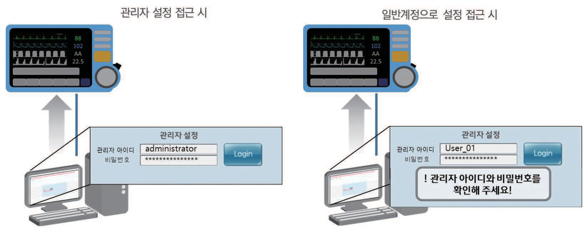

---
<!-- Page 63 -->

## 제4장 디지털헬스케어 기기 보안요구사항 및 보안대책 | 63

및
보안대책
및
보안대책
개요
디지털헬스케어
서비스
모델
디지털헬스케어
보안위협
디지털헬스케어
기기
보안요구사항
디지털헬스케어
서비스
보안요구사항
참고문헌
제1장
제2장
제3장
제4장
제5장
부록
1.1.3 필요 시 암호학적으로 강력한 인증 기술이나 다중인증 방법 등을 사용해야 한다.
보안위협 및 취약점(제3장 참조)
인가되지 않은 사용자가 디지털헬스케어 기기나 서비스에 접근할 수 있으며, 기기에 저장된 개인의료정보, 기기
설정파일 등 중요 데이터에 임의로 접근할 수 있다.
보안요구사항 및 보안대책
디지털헬스케어 기기의 기능 중 환자의 사망을 초래할 수 있는 기능의 경우, 비인가된 사용자에 의한 기기 조작을
방지하기 위한 강력한 인증 메커니즘을 적용할 수 있다.
* (강력한 인증 메커니즘 예) PKI 기반의 인증, 스마트카드 기반의 인증 등
암호화 인증을 사용하여 직원, 메시지, 명령 및 기타 모든 통신 경로를 인증해야 한다.
사용자가 개입할 때 보안을 보장하는 추가 메커니즘을 지원해야 한다.
* (추가 메커니즘 예) 2개 이상의 인증 기법(아이디/비밀번호+지문인식 등) 사용 등
점검방법
디지털헬스케어 기기의 조작에 따라 환자의 부상이나 사망을 초래할 수 있는지 확인한다.
디지털헬스케어 기기의 중요정보(예, 기기 설정 정보 등), 민감정보(예, 개인의료정보 등)에 따라 환자의 부상이나
사망을 초래할 수 있는지 확인한다.
적용된 인증방법의 적절성을 확인한다.
참고문헌
• U.S. FDA, “(Draft) Content of Premarket Submissions for Management of Cybersecurity in Medical
Devices”, 2018.
• BSI, “Cyber Security Requirements for Network-Connected Medical Devices”, BSI-CS 132, Version
1.1, 2018.11.13.
• KISA, “사물인터넷(IoT) 보안 시험・인증 기준 해설서”, 2019.

| 보안위협 및 취약점(제3장 참조) |
| --- |
| 인가되지 않은 사용자가 디지털헬스케어 기기나 서비스에 접근할 수 있으며, 기기에 저장된 개인의료정보, 기기 설정파일 등 중요 데이터에 임의로 접근할 수 있다. |
| 보안요구사항 및 보안대책 |
| 디지털헬스케어 기기의 기능 중 환자의 사망을 초래할 수 있는 기능의 경우, 비인가된 사용자에 의한 기기 조작을 방지하기 위한 강력한 인증 메커니즘을 적용할 수 있다. * (강력한 인증 메커니즘 예) PKI 기반의 인증, 스마트카드 기반의 인증 등 암호화 인증을 사용하여 직원, 메시지, 명령 및 기타 모든 통신 경로를 인증해야 한다. 사용자가 개입할 때 보안을 보장하는 추가 메커니즘을 지원해야 한다. * (추가 메커니즘 예) 2개 이상의 인증 기법(아이디/비밀번호+지문인식 등) 사용 등 |
| 점검방법 |
| 디지털헬스케어 기기의 조작에 따라 환자의 부상이나 사망을 초래할 수 있는지 확인한다. 디지털헬스케어 기기의 중요정보(예, 기기 설정 정보 등), 민감정보(예, 개인의료정보 등)에 따라 환자의 부상이나 사망을 초래할 수 있는지 확인한다. 적용된 인증방법의 적절성을 확인한다. |
| 참고문헌 |
| • U.S. FDA, “(Draft) Content of Premarket Submissions for Management of Cybersecurity in Medical Devices”, 2018. • BSI, “Cyber Security Requirements for Network-Connected Medical Devices”, BSI-CS 132, Version 1.1, 2018.11.13. • KISA, “사물인터넷(IoT) 보안 시험・인증 기준 해설서”, 2019. |

| 제4장 |  |

---
<!-- Page 64 -->
1.1.4 디지털헬스케어 기기는 원격/무선 접근 시 사용자 인증 후 접근을 허용해야 한다.
보안위협 및 취약점(제3장 참조)
인가되지 않은 사용자가 디지털헬스케어 기기나 서비스에 접근할 수 있으며, 기기에 저장된 개인의료정보, 기기
설정파일 등 중요 데이터에 임의로 접근할 수 있다.
보안요구사항 및 보안대책
원격/무선 인터페이스를 통한 접근 가능한 서비스에 대한 사용자 인증 후 접근을 허용해야 한다.
원격 디바이스와 연결을 위한 사용자 인증해야 한다.
점검방법
지정되지 않은 IP 등으로 접근 또는 안전하지 않은 채널로 접근 시, 원격관리 서비스가 가능한지 확인한다.
원격관리 서비스 접근 시 사용자 인증 여부를 확인하고, 안전한 인증 방법 또는 안전한 원격 접근 프로토콜
사용여부를 확인한다.
원격접근 통제기능 검증 예시

| 보안위협 및 취약점(제3장 참조) |
| --- |
| 인가되지 않은 사용자가 디지털헬스케어 기기나 서비스에 접근할 수 있으며, 기기에 저장된 개인의료정보, 기기 설정파일 등 중요 데이터에 임의로 접근할 수 있다. |
| 보안요구사항 및 보안대책 |
| 원격/무선 인터페이스를 통한 접근 가능한 서비스에 대한 사용자 인증 후 접근을 허용해야 한다. 원격 디바이스와 연결을 위한 사용자 인증해야 한다. |
| 점검방법 |
| 지정되지 않은 IP 등으로 접근 또는 안전하지 않은 채널로 접근 시, 원격관리 서비스가 가능한지 확인한다. 원격관리 서비스 접근 시 사용자 인증 여부를 확인하고, 안전한 인증 방법 또는 안전한 원격 접근 프로토콜 사용여부를 확인한다. 원격접근 통제기능 검증 예시 |

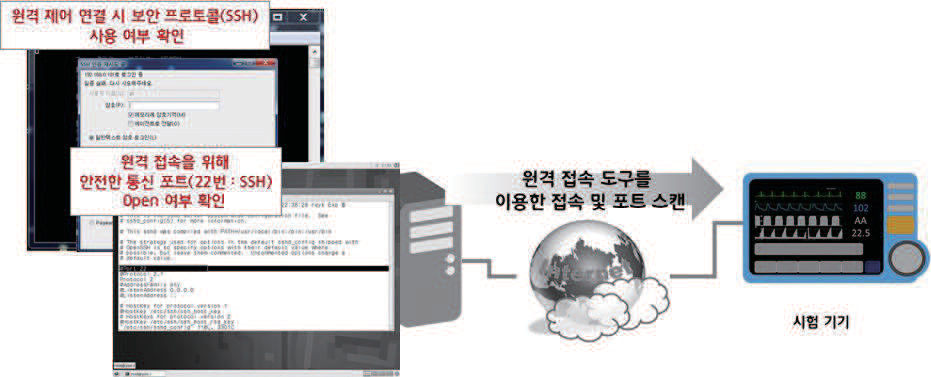
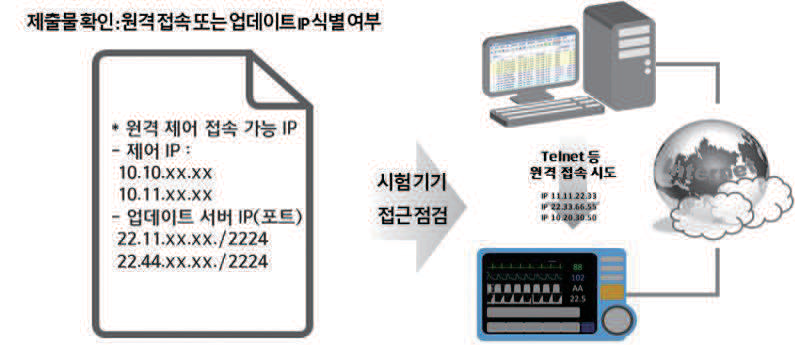

---
<!-- Page 65 -->

## 제4장 디지털헬스케어 기기 보안요구사항 및 보안대책 | 65

및
보안대책
및
보안대책
개요
디지털헬스케어
서비스
모델
디지털헬스케어
보안위협
디지털헬스케어
기기
보안요구사항
디지털헬스케어
서비스
보안요구사항
참고문헌
제1장
제2장
제3장
제4장
제5장
부록
참고문헌
• UL, “Software Cybersecurity for Network-Connctable Products, Part 1: General Requirements”, ANSI/
CAN/UL 2900-1:2017, 2017.
• UL, “Software Cybersecurity for Network-Connctable Products, Part 2-1: Particular Requirements for
Network Connectable Components of Healthcare and Wellness Systems”, ANSI/CAN/UL 2900-2-
1:2018, 2018.
• DTSec, “Protection Profile for Connected Diabetes Devices (CDD)”, Version 2.0, 2017.11.25.
• U.S. FDA, “(Draft) Content of Premarket Submissions for Management of Cybersecurity in Medical
Devices”, 2018.
• KISA, “사물인터넷(IoT) 보안 시험·인증 기준 해설서”, 2019.

| 참고문헌 |
| --- |
| • UL, “Software Cybersecurity for Network-Connctable Products, Part 1: General Requirements”, ANSI/ CAN/UL 2900-1:2017, 2017. • UL, “Software Cybersecurity for Network-Connctable Products, Part 2-1: Particular Requirements for Network Connectable Components of Healthcare and Wellness Systems”, ANSI/CAN/UL 2900-2- 1:2018, 2018. • DTSec, “Protection Profile for Connected Diabetes Devices (CDD)”, Version 2.0, 2017.11.25. • U.S. FDA, “(Draft) Content of Premarket Submissions for Management of Cybersecurity in Medical Devices”, 2018. • KISA, “사물인터넷(IoT) 보안 시험·인증 기준 해설서”, 2019. |

---
<!-- Page 66 -->

#### 1.2 기기 인증

1.2.1 디지털헬스케어 기기에 대한 기기인증을 통해 비인가된 접근을 통제해야 한다.
보안위협 및 취약점(제3장 참조)
디지털헬스케어 기기로의 비인가된 기기가 접근하거나, 비인가된 기기 또는 서버로의 개인의료정보 등을 전송할
수 있다.
보안요구사항 및 보안대책
연결 가능한 다른 구성요소 식별 여부 확인 및 잘못된 구성요소가 연결될 경우 통제해야 한다.
점검방법
디지털헬스케어 기기의 통신인터페이스를 확인하고 기기 간 데이터 송·수신 기능을 확인한다.
인가되지 않은 기기로부터 데이터 전송과 수신되는 것을 확인한다.
체온계 고유 식별번호 확인 예시
기기 간 보안모드 인증 절차 검증 예시 (BLE 4.2 : 보안모드1 레벨 4)
참고문헌
• IMDRF, “Principles and Practices for Medical Device Cybersecurity”, 2020.
• BSI, “Cyber Security Requirements for Network-Connected Medical Devices”, BSI-CS 132, Version
1.1, 2018.11.13.

| 보안위협 및 취약점(제3장 참조) |
| --- |
| 디지털헬스케어 기기로의 비인가된 기기가 접근하거나, 비인가된 기기 또는 서버로의 개인의료정보 등을 전송할 수 있다. |
| 보안요구사항 및 보안대책 |
| 연결 가능한 다른 구성요소 식별 여부 확인 및 잘못된 구성요소가 연결될 경우 통제해야 한다. |
| 점검방법 |
| 디지털헬스케어 기기의 통신인터페이스를 확인하고 기기 간 데이터 송·수신 기능을 확인한다. 인가되지 않은 기기로부터 데이터 전송과 수신되는 것을 확인한다. 체온계 고유 식별번호 확인 예시 기기 간 보안모드 인증 절차 검증 예시 (BLE 4.2 : 보안모드1 레벨 4) |
| 참고문헌 |
| • IMDRF, “Principles and Practices for Medical Device Cybersecurity”, 2020. • BSI, “Cyber Security Requirements for Network-Connected Medical Devices”, BSI-CS 132, Version 1.1, 2018.11.13. |

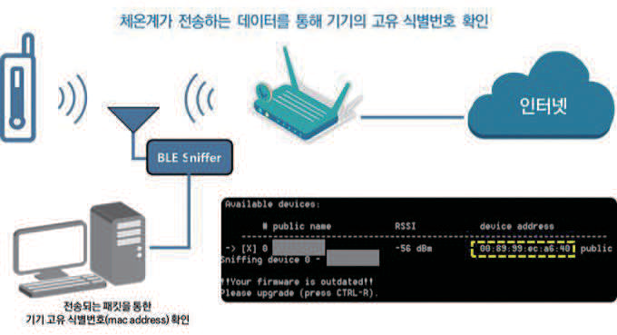
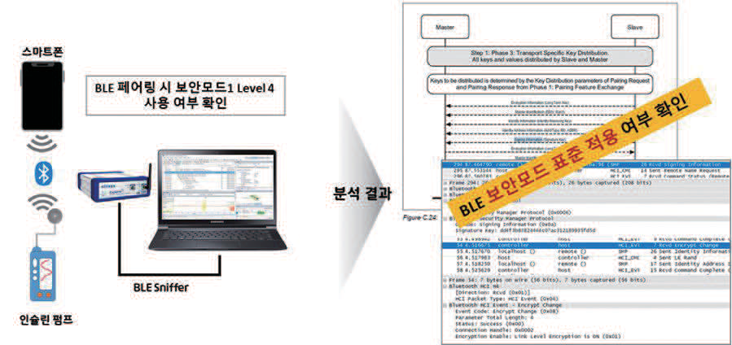

---
<!-- Page 67 -->

## 제4장 디지털헬스케어 기기 보안요구사항 및 보안대책 | 67

및
보안대책
및
보안대책
개요
디지털헬스케어
서비스
모델
디지털헬스케어
보안위협
디지털헬스케어
기기
보안요구사항
디지털헬스케어
서비스
보안요구사항
참고문헌
제1장
제2장
제3장
제4장
제5장
부록
디지털헬스케어 기기는 다른 기기나 서버와 중요정보 전송/수신 시 혹은 기기 제어를
1.2.2
위한 상호연결 수행 시 인증이 선행되어야 한다.
보안위협 및 취약점(제3장 참조)
디지털헬스케어 기기로의 비인가된 기기가 접근하거나, 비인가된 기기 또는 서버로의 개인의료정보 등을 전송할
수 있다.
보안요구사항 및 보안대책
제조업체는 기기가 다른 기기나 네트워크와 어떻게 인터페이스할 것인지 고려해야 한다.
* 인터페이스는 유선 연결 및/또는 무선 통신을 포함해야 한다.
각 유형의 인터페이스에 대해 제조업체는 기기가 사용자(예: 환자 또는 의료 전문가), 다른 의료기기/센서 또는
의료시스템과 통신하는데 사용할 방법을 결정해야 한다.
* (인터페이스 방법의 예) Wi-Fi, 이더넷, Bluetooth, USB 등
제조업체는 무단 수정 및 중단을 방지하기 위해 기기와의 데이터 전송 보안 방법을 고려해야 한다.
제조업체는 기기/시스템의 상호인증 방법을 결정해야 한다.
점검방법
제품 간 중요정보 전송시 인증을 수행하는지 확인한다.
제품 간 제어 정보 전송시 인증을 수행하는지 확인한다.
* 단, 제품에서 적용되는 표준 프로토콜에서 단방향 인증만 제공하여 상호인증을 적용할 수 없는 경우, 상호인증을 단방향
인증으로 대체할 수 있다.
기기 간 보안모드 인증 절차 검증 예시 (BLE 4.2 : 보안모드1 레벨 4)
참고문헌
• Health Canada,“Pre-market Requirements for Medical Device Cybersecurity”, 2019.
• KISA, “사물인터넷(IoT) 보안 시험・인증 기준 해설서”, 2019.

| 보안위협 및 취약점(제3장 참조) |
| --- |
| 디지털헬스케어 기기로의 비인가된 기기가 접근하거나, 비인가된 기기 또는 서버로의 개인의료정보 등을 전송할 수 있다. |
| 보안요구사항 및 보안대책 |
| 제조업체는 기기가 다른 기기나 네트워크와 어떻게 인터페이스할 것인지 고려해야 한다. * 인터페이스는 유선 연결 및/또는 무선 통신을 포함해야 한다. 각 유형의 인터페이스에 대해 제조업체는 기기가 사용자(예: 환자 또는 의료 전문가), 다른 의료기기/센서 또는 의료시스템과 통신하는데 사용할 방법을 결정해야 한다. * (인터페이스 방법의 예) Wi-Fi, 이더넷, Bluetooth, USB 등 제조업체는 무단 수정 및 중단을 방지하기 위해 기기와의 데이터 전송 보안 방법을 고려해야 한다. 제조업체는 기기/시스템의 상호인증 방법을 결정해야 한다. |
| 점검방법 |
| 제품 간 중요정보 전송시 인증을 수행하는지 확인한다. 제품 간 제어 정보 전송시 인증을 수행하는지 확인한다. * 단, 제품에서 적용되는 표준 프로토콜에서 단방향 인증만 제공하여 상호인증을 적용할 수 없는 경우, 상호인증을 단방향 인증으로 대체할 수 있다. 기기 간 보안모드 인증 절차 검증 예시 (BLE 4.2 : 보안모드1 레벨 4) |
| 참고문헌 |
| • Health Canada,“Pre-market Requirements for Medical Device Cybersecurity”, 2019. • KISA, “사물인터넷(IoT) 보안 시험・인증 기준 해설서”, 2019. |

| 제4장 |  |

---
<!-- Page 68 -->
1.2.3 디지털헬스케어 기기는 기본적으로 외부 통신이 "거부(deny)"되도록 설정되어 있어야 한다.
보안위협 및 취약점(제3장 참조)
디지털헬스케어 기기로의 비인가된 기기가 접근하거나, 비인가된 기기 또는 서버로의 개인의료정보 등을 전송할
수 있다.
보안요구사항 및 보안대책
제품에서 특정 포트 오픈이 필요할 경우, 기본적으로 모든 트래픽을 거부(Deny)로 설정해야 하며, 사용자의
요구에 의해 특정 포트를 허가(allow)해야 한다.
점검방법
디지털헬스케어 기기에 외부 통신이 가능한 인터페이스를 확인한다.
네트워크 트래픽 허용 및 차단 목록을 확인하고, 기본 설정이 “거부(Deny)”로 설정을 확인한다.
참고문헌
• U.S. FDA, “(Draft) Content of Premarket Submissions for Management of Cybersecurity in Medical
Devices”, 2018.
• BSI, “Cyber Security Requirements for Network-Connected Medical Devices”, BSI-CS 132, Version
1.1, 2018.11.13.
• KISA, “사물인터넷(IoT) 보안 시험·인증 기준 해설서”, 2019.

| 보안위협 및 취약점(제3장 참조) |
| --- |
| 디지털헬스케어 기기로의 비인가된 기기가 접근하거나, 비인가된 기기 또는 서버로의 개인의료정보 등을 전송할 수 있다. |
| 보안요구사항 및 보안대책 |
| 제품에서 특정 포트 오픈이 필요할 경우, 기본적으로 모든 트래픽을 거부(Deny)로 설정해야 하며, 사용자의 요구에 의해 특정 포트를 허가(allow)해야 한다. |
| 점검방법 |
| 디지털헬스케어 기기에 외부 통신이 가능한 인터페이스를 확인한다. 네트워크 트래픽 허용 및 차단 목록을 확인하고, 기본 설정이 “거부(Deny)”로 설정을 확인한다. |
| 참고문헌 |
| • U.S. FDA, “(Draft) Content of Premarket Submissions for Management of Cybersecurity in Medical Devices”, 2018. • BSI, “Cyber Security Requirements for Network-Connected Medical Devices”, BSI-CS 132, Version 1.1, 2018.11.13. • KISA, “사물인터넷(IoT) 보안 시험·인증 기준 해설서”, 2019. |

---
<!-- Page 69 -->

## 제4장 디지털헬스케어 기기 보안요구사항 및 보안대책 | 69

및
보안대책
및
보안대책
개요
디지털헬스케어
서비스
모델
디지털헬스케어
보안위협
디지털헬스케어
기기
보안요구사항
디지털헬스케어
서비스
보안요구사항
참고문헌
제1장
제2장
제3장
제4장
제5장
부록
1.2.4 디지털헬스케어 기기에 접속하는 다른 기기의 MAC 주소, IP 주소 등을 제한하여야 한다.
보안위협 및 취약점(제3장 참조)
디지털헬스케어 기기로의 비인가된 기기가 접근하거나, 비인가된 기기 또는 서버로의 개인의료정보 등을 전송할
수 있다.
보안요구사항 및 보안대책
기기에 접근이 허용된 객체(예, IP, MAC 등)만 접근할 수 있도록 필터링 기능을 제공하는 것이 필요하다.
SNMP를 사용하는 제품의 경우, SNMP V3 이상의 버전을 적용해야 한다.
• S NMP V3: SNMP V1, V2와는 다르게 비밀번호를 암호화하여 전송함. 무작위 대입공격에 취약하지 않도록,
디폴트명 사용 금지 및 비밀번호 조합규칙 준수가 필요하며, 사용하는 암호알고리즘은 암호 유형 기준을 따름
• S NMP V1, V2를 사용해야 하는 경우, 쓰기(write) 방지(read 권한만 제공), 디폴트 및 공개된 커뮤니티 이름
사용 금지(예: public, admin 등), 디폴트 패스워드 사용 및 평문저장 금지, MIB 데이터 내 기밀정보 사용 삭제
등의 보안 방법을 적용해야 함
네트워크 접근 인터페이스 식별 검증 예시
점검방법
네트워크 트래픽 허용 및 차단 목록을 확인한다.
허가된 프로토콜 목록 및 등록사유를 확인한다.
참고문헌
• BSI, “Cyber Security Requirements for Network-Connected Medical Devices”, BSI-CS 132, Version
1.1, 2018.11.13.
• KISA, “사물인터넷(IoT) 보안 시험·인증 기준 해설서”, 2019.

| 보안위협 및 취약점(제3장 참조) |
| --- |
| 디지털헬스케어 기기로의 비인가된 기기가 접근하거나, 비인가된 기기 또는 서버로의 개인의료정보 등을 전송할 수 있다. |
| 보안요구사항 및 보안대책 |
| 기기에 접근이 허용된 객체(예, IP, MAC 등)만 접근할 수 있도록 필터링 기능을 제공하는 것이 필요하다. SNMP를 사용하는 제품의 경우, SNMP V3 이상의 버전을 적용해야 한다. • S NMP V3: SNMP V1, V2와는 다르게 비밀번호를 암호화하여 전송함. 무작위 대입공격에 취약하지 않도록, 디폴트명 사용 금지 및 비밀번호 조합규칙 준수가 필요하며, 사용하는 암호알고리즘은 암호 유형 기준을 따름 • S NMP V1, V2를 사용해야 하는 경우, 쓰기(write) 방지(read 권한만 제공), 디폴트 및 공개된 커뮤니티 이름 사용 금지(예: public, admin 등), 디폴트 패스워드 사용 및 평문저장 금지, MIB 데이터 내 기밀정보 사용 삭제 등의 보안 방법을 적용해야 함 네트워크 접근 인터페이스 식별 검증 예시 |
| 점검방법 |
| 네트워크 트래픽 허용 및 차단 목록을 확인한다. 허가된 프로토콜 목록 및 등록사유를 확인한다. |
| 참고문헌 |
| • BSI, “Cyber Security Requirements for Network-Connected Medical Devices”, BSI-CS 132, Version 1.1, 2018.11.13. • KISA, “사물인터넷(IoT) 보안 시험·인증 기준 해설서”, 2019. |

---
<!-- Page 70 -->
1.2.5 디지털헬스케어 기기별로 고유 ID가 할당되어야 한다.
보안위협 및 취약점(제3장 참조)
디지털헬스케어 기기로의 비인가된 기기가 접근하거나, 비인가된 기기 또는 서버로의 개인의료정보 등을 전송할
수 있다.
보안요구사항 및 보안대책
의료정보시스템, 의료기기에 고유 ID, 즉 고유 식별번호를 할당해야 한다.
* 유추 불가능한 고유하고 변경할 수 없는 고유 식별번호를 보유해야 한다.
고유 식별번호는 네트워크 및 스마트 디바이스 분야에서 아래와 같이 사용되고 있다.
구분 설명
MAC Address • 네트워크 세그먼트의 데이터 링크 계층에서 통신을 위한 네트워크 인터페이스에
(Media Access Control Address) 할당된 고유 식별자(48bit)
Home ID (Z-wave) • Z -wave 네트워크의 ID를 지칭함 (32bit)
IMEI (International Mobile • 스마트폰 제품의 고유번호로 사용됨
Equipment Identity, 국제 모바일 • 제조업체가 휴대폰 출고 시 부여됨
단말기 인증번호) • 승인코드 8자리, 모델 일련번호 6자리, 검증용 숫자 1자리 (총 15자리)
점검방법
기기 제조업체의 고유 식별번호 정책을 확인하고, 해당 정책에 따라 식별번호가 주어지는지 확인한다.
체온계 고유 식별번호 검증 예시
참고문헌
• IMDRF, “Principles and Practices for Medical Device Cybersecurity”, 2020.
• KISA, “사물인터넷(IoT) 보안 시험·인증 기준 해설서”, 2019.
• TTA, “사물인터넷 기기 등급 분류 및 보안 요구사항”, TTAK.KO-12.0298, 2016.

| 보안위협 및 취약점(제3장 참조) |
| --- |
| 디지털헬스케어 기기로의 비인가된 기기가 접근하거나, 비인가된 기기 또는 서버로의 개인의료정보 등을 전송할 수 있다. |
| 보안요구사항 및 보안대책 |
| 의료정보시스템, 의료기기에 고유 ID, 즉 고유 식별번호를 할당해야 한다. * 유추 불가능한 고유하고 변경할 수 없는 고유 식별번호를 보유해야 한다. 고유 식별번호는 네트워크 및 스마트 디바이스 분야에서 아래와 같이 사용되고 있다. 구분 설명 MAC Address • 네트워크 세그먼트의 데이터 링크 계층에서 통신을 위한 네트워크 인터페이스에 (Media Access Control Address) 할당된 고유 식별자(48bit) Home ID (Z-wave) • Z -wave 네트워크의 ID를 지칭함 (32bit) IMEI (International Mobile • 스마트폰 제품의 고유번호로 사용됨 Equipment Identity, 국제 모바일 • 제조업체가 휴대폰 출고 시 부여됨 단말기 인증번호) • 승인코드 8자리, 모델 일련번호 6자리, 검증용 숫자 1자리 (총 15자리) |
| 점검방법 |
| 기기 제조업체의 고유 식별번호 정책을 확인하고, 해당 정책에 따라 식별번호가 주어지는지 확인한다. 체온계 고유 식별번호 검증 예시 |
| 참고문헌 |
| • IMDRF, “Principles and Practices for Medical Device Cybersecurity”, 2020. • KISA, “사물인터넷(IoT) 보안 시험·인증 기준 해설서”, 2019. • TTA, “사물인터넷 기기 등급 분류 및 보안 요구사항”, TTAK.KO-12.0298, 2016. |

| 구분 | 설명 |

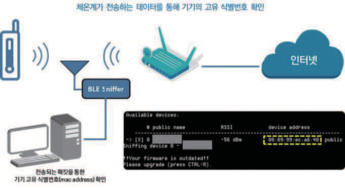

---
<!-- Page 71 -->

## 제4장 디지털헬스케어 기기 보안요구사항 및 보안대책 | 71

및
보안대책
및
보안대책
개요
디지털헬스케어
서비스
모델
디지털헬스케어
보안위협
디지털헬스케어
기기
보안요구사항
디지털헬스케어
서비스
보안요구사항
참고문헌
제1장
제2장
제3장
제4장
제5장
부록

#### 1.3 접근통제

1.3.1 디지털헬스케어 기기에 대한 비 인가된 접근을 제한해야 한다.
보안위협 및 취약점(제3장 참조)
인가되지 않은 사용자가 디지털헬스케어 기기나 서비스에 접근할 수 있으며, 기기에 저장된 개인의료정보, 기기
설정파일 등 중요 데이터에 임의로 접근할 수 있다.
디지털헬스케어 기기로의 비인가된 기기가 접근하거나, 비인가된 기기 또는 서버로의 개인의료정보 등을 전송할
수 있다.
보안요구사항 및 보안대책
디지털헬스케어 기기의 기능에 따라 사용자의 역할을 구분해야 한다. 구분된 역할에 따라 접근 권한을 부여하여,
권한이 부여되지 않은 기능은 실행되어서는 안 된다.
권한이 부여된 데이터만 접근할 수 있어야 하며, 권한이 부여되지 않은 데이터는 접근이 금지되어야 한다.
역할에 따른 인증 시 사용하는 데이터에 대해서는 암호학적인 방법을 사용해야 한다.
* (암호학적인 방법의 예) 아이디/비밀번호 방식, 스마트카드, 생체 인식 등
점검방법
디지털헬스케어에서 제공하는 역할별 사용자를 확인하여, 구분된 역할에 따른 실행 가능한 기능 및 접근을 할 수
있는 데이터를 확인한다.
역할별 사용자로 기기에 접속하여 정의된 역할 이외의 기능이 수행하거나, 접근이 금지된 데이터에 접근을 시도
하여, 기능이 수행되지 않고, 데이터에 접근할 수 없는 것을 확인한다.
역할에 따른 인증 방법을 확인하여, 아이디/비밀번호 방식, 스마트카드, 생체 인식 등이 안전한 방법으로 사용
하는지 확인한다.
관리자계정과 일반계정의 허가된 기능 검증 예시

| 보안위협 및 취약점(제3장 참조) |
| --- |
| 인가되지 않은 사용자가 디지털헬스케어 기기나 서비스에 접근할 수 있으며, 기기에 저장된 개인의료정보, 기기 설정파일 등 중요 데이터에 임의로 접근할 수 있다. 디지털헬스케어 기기로의 비인가된 기기가 접근하거나, 비인가된 기기 또는 서버로의 개인의료정보 등을 전송할 수 있다. |
| 보안요구사항 및 보안대책 |
| 디지털헬스케어 기기의 기능에 따라 사용자의 역할을 구분해야 한다. 구분된 역할에 따라 접근 권한을 부여하여, 권한이 부여되지 않은 기능은 실행되어서는 안 된다. 권한이 부여된 데이터만 접근할 수 있어야 하며, 권한이 부여되지 않은 데이터는 접근이 금지되어야 한다. 역할에 따른 인증 시 사용하는 데이터에 대해서는 암호학적인 방법을 사용해야 한다. * (암호학적인 방법의 예) 아이디/비밀번호 방식, 스마트카드, 생체 인식 등 |
| 점검방법 |
| 디지털헬스케어에서 제공하는 역할별 사용자를 확인하여, 구분된 역할에 따른 실행 가능한 기능 및 접근을 할 수 있는 데이터를 확인한다. 역할별 사용자로 기기에 접속하여 정의된 역할 이외의 기능이 수행하거나, 접근이 금지된 데이터에 접근을 시도 하여, 기능이 수행되지 않고, 데이터에 접근할 수 없는 것을 확인한다. 역할에 따른 인증 방법을 확인하여, 아이디/비밀번호 방식, 스마트카드, 생체 인식 등이 안전한 방법으로 사용 하는지 확인한다. 관리자계정과 일반계정의 허가된 기능 검증 예시 |

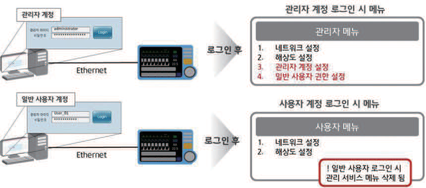

---
<!-- Page 72 -->
참고문헌
• 식 품의약품안전처, “의료기기의 사이버 보안 허가·심사 가이드라인(민원인 안내서)”, 2019.
• I MDRF, “Principles and Practices for Medical Device Cybersecurity”, 2020.
• U .S. FDA, “(Draft) Content of Premarket Submissions for Management of Cybersecurity in Medical
Devices”, 2018.
1.3.1 디지털헬스케어 기기는 비밀번호, 암호키 등 중요데이터에 비인가된 접근을 제한해야 한다.
보안위협 및 취약점(제3장 참조)
인가되지 않은 사용자가 디지털헬스케어 기기나 서비스에 접근할 수 있으며, 기기에 저장된 개인의료정보, 기기
설정파일 등 중요 데이터에 임의로 접근할 수 있다.
보안요구사항 및 보안대책
기기의 주요 권한 접근에 사용되는 비밀번호에 대한 비 인가된 접근을 제한하기 위하여 비밀번호에 접근할 수 있는
불필요한 API를 제거하고, 기기에 저장되는 비밀번호는 암호화 등 안전한 방법을 사용한다.
기기의 입력된 비밀번호는 평문으로 비교되지 않는 것을 권고한다.
점검방법
기기에서 사용하는 비밀번호의 저장 방법을 확인하여 하드코딩이 아닌 암호화(예, 일방향 암호화) 등의 안전한
방법을 사용했는지 확인한다.
저장된 비밀정보에 접근할 수 있는 API를 모두 확인하여 불필요한 API가 없는지 확인한다.
비밀번호 비교 시에는 평문의 비밀번호가 사용되지 않는 것을 확인한다.
참고문헌
• U.S. FDA, “(Draft) Content of Premarket Submissions for Management of Cybersecurity in Medical
Devices”, 2018.

| 참고문헌 |
| --- |
| • 식 품의약품안전처, “의료기기의 사이버 보안 허가·심사 가이드라인(민원인 안내서)”, 2019. • I MDRF, “Principles and Practices for Medical Device Cybersecurity”, 2020. • U .S. FDA, “(Draft) Content of Premarket Submissions for Management of Cybersecurity in Medical Devices”, 2018. |

| 보안위협 및 취약점(제3장 참조) |
| --- |
| 인가되지 않은 사용자가 디지털헬스케어 기기나 서비스에 접근할 수 있으며, 기기에 저장된 개인의료정보, 기기 설정파일 등 중요 데이터에 임의로 접근할 수 있다. |
| 보안요구사항 및 보안대책 |
| 기기의 주요 권한 접근에 사용되는 비밀번호에 대한 비 인가된 접근을 제한하기 위하여 비밀번호에 접근할 수 있는 불필요한 API를 제거하고, 기기에 저장되는 비밀번호는 암호화 등 안전한 방법을 사용한다. 기기의 입력된 비밀번호는 평문으로 비교되지 않는 것을 권고한다. |
| 점검방법 |
| 기기에서 사용하는 비밀번호의 저장 방법을 확인하여 하드코딩이 아닌 암호화(예, 일방향 암호화) 등의 안전한 방법을 사용했는지 확인한다. 저장된 비밀정보에 접근할 수 있는 API를 모두 확인하여 불필요한 API가 없는지 확인한다. 비밀번호 비교 시에는 평문의 비밀번호가 사용되지 않는 것을 확인한다. |
| 참고문헌 |
| • U.S. FDA, “(Draft) Content of Premarket Submissions for Management of Cybersecurity in Medical Devices”, 2018. |

---
<!-- Page 73 -->

## 제4장 디지털헬스케어 기기 보안요구사항 및 보안대책 | 73

및
보안대책
및
보안대책
개요
디지털헬스케어
서비스
모델
디지털헬스케어
보안위협
디지털헬스케어
기기
보안요구사항
디지털헬스케어
서비스
보안요구사항
참고문헌
제1장
제2장
제3장
제4장
제5장
부록
1.3.3 디지털헬스케어 기기의 모든 사용자 계정에 대해 최소 권한의 원칙을 적용해야 한다.
보안위협 및 취약점(제3장 참조)
과도하거나 불필요한 권한 부여로 공격자는 디지털헬스케어 기기가 허용하는 모든 기능과 접근이 제한된 개인의료
정보 등에 접근할 수 있다.
보안요구사항 및 보안대책
디지털헬스케어 기기를 개발하는 접근통제 업체는 어떤 주체가 언제, 어디서, 어떤 객체에 대하여, 어떠한 행위를
하도록 허용 또는 거부할 것인지를 정의하여 주체별 업무수행에 필요한 최소한의 권한만을 부여한다.
* (최소 권한의 예) 관리자 권한과 사용자 권한으로 분리된 경우 사용자 권한에 관리자 권한에 해당되는 기능이 제공되지
않아야 하며, 사용자에 필요한 기능만 접근 가능해야 한다.
점검방법
디지털헬스케어 기기 개발자가 정의한 주체별 최소한의 권한을 확인하여 정의되지 않은 권한에 대해 접근 및
변경을 할 수 있는지 확인한다.
참고문헌
• MDCG, “Guidance on Cybersecurity for medical devices”, MDCG 2019-16, 2019.11.
• U.S. FDA, “(Draft) Content of Premarket Submissions for Management of Cybersecurity in Medical
Devices”, 2018.
• UL, “Software Cybersecurity for Network-Connctable Products, Part 1: General Requirements”, ANSI/
CAN/UL 2900-1:2017, 2017.
• UL, “Software Cybersecurity for Network-Connctable Products, Part 2-1: Particular Requirements for
Network Connectable Components of Healthcare and Wellness Systems”, ANSI/CAN/UL 2900-2-
1:2018, 2018.

| 보안위협 및 취약점(제3장 참조) |
| --- |
| 과도하거나 불필요한 권한 부여로 공격자는 디지털헬스케어 기기가 허용하는 모든 기능과 접근이 제한된 개인의료 정보 등에 접근할 수 있다. |
| 보안요구사항 및 보안대책 |
| 디지털헬스케어 기기를 개발하는 접근통제 업체는 어떤 주체가 언제, 어디서, 어떤 객체에 대하여, 어떠한 행위를 하도록 허용 또는 거부할 것인지를 정의하여 주체별 업무수행에 필요한 최소한의 권한만을 부여한다. * (최소 권한의 예) 관리자 권한과 사용자 권한으로 분리된 경우 사용자 권한에 관리자 권한에 해당되는 기능이 제공되지 않아야 하며, 사용자에 필요한 기능만 접근 가능해야 한다. |
| 점검방법 |
| 디지털헬스케어 기기 개발자가 정의한 주체별 최소한의 권한을 확인하여 정의되지 않은 권한에 대해 접근 및 변경을 할 수 있는지 확인한다. |
| 참고문헌 |
| • MDCG, “Guidance on Cybersecurity for medical devices”, MDCG 2019-16, 2019.11. • U.S. FDA, “(Draft) Content of Premarket Submissions for Management of Cybersecurity in Medical Devices”, 2018. • UL, “Software Cybersecurity for Network-Connctable Products, Part 1: General Requirements”, ANSI/ CAN/UL 2900-1:2017, 2017. • UL, “Software Cybersecurity for Network-Connctable Products, Part 2-1: Particular Requirements for Network Connectable Components of Healthcare and Wellness Systems”, ANSI/CAN/UL 2900-2- 1:2018, 2018. |

---
<!-- Page 74 -->
1.3.4 역할 기반 접근제어 시, 사용자 역할 및 기기 기능에 따른 권한을 부여 할 수 있어야 한다.
보안위협 및 취약점(제3장 참조)
과도하거나 불필요한 권한 부여로 공격자는 디지털헬스케어 기기가 허용하는 모든 기능과 접근이 제한된 개인의료
정보 등에 접근할 수 있다.
보안요구사항 및 보안대책
사용자 역할에 따른 권한을 부여할 수 있는 관리기능이 제공되어야 한다.
간병인, 시스템 관리자 등 사용자의 역할에 따라 기기의 기능에 차별적으로 접근할 수 있는 메커니즘을 사용하여야
한다.
점검방법
디지털헬스케어 기기의 모든 역할 및 관련 권한을 확인한다.
역할별 사용자의 접근 권한을 부여하는 방법을 확인하여 관리자의 권한을 다른 역할에 부여하지 못하게 되어
있는지 확인한다.
참고문헌
• U.S. FDA, “(Draft) Content of Premarket Submissions for Management of Cybersecurity in Medical
Devices”, 2018.
• UL, “Software Cybersecurity for Network-Connctable Products, Part 1: General Requirements”, ANSI/
CAN/UL 2900-1:2017, 2017.
• UL, “Software Cybersecurity for Network-Connctable Products, Part 2-1: Particular Requirements for
Network Connectable Components of Healthcare and Wellness Systems”, ANSI/CAN/UL 2900-2-
1:2018, 2018.
• Health Canada,“Pre-market Requirements for Medical Device Cybersecurity”, 2019.

| 보안위협 및 취약점(제3장 참조) |
| --- |
| 과도하거나 불필요한 권한 부여로 공격자는 디지털헬스케어 기기가 허용하는 모든 기능과 접근이 제한된 개인의료 정보 등에 접근할 수 있다. |
| 보안요구사항 및 보안대책 |
| 사용자 역할에 따른 권한을 부여할 수 있는 관리기능이 제공되어야 한다. 간병인, 시스템 관리자 등 사용자의 역할에 따라 기기의 기능에 차별적으로 접근할 수 있는 메커니즘을 사용하여야 한다. |
| 점검방법 |
| 디지털헬스케어 기기의 모든 역할 및 관련 권한을 확인한다. 역할별 사용자의 접근 권한을 부여하는 방법을 확인하여 관리자의 권한을 다른 역할에 부여하지 못하게 되어 있는지 확인한다. |
| 참고문헌 |
| • U.S. FDA, “(Draft) Content of Premarket Submissions for Management of Cybersecurity in Medical Devices”, 2018. • UL, “Software Cybersecurity for Network-Connctable Products, Part 1: General Requirements”, ANSI/ CAN/UL 2900-1:2017, 2017. • UL, “Software Cybersecurity for Network-Connctable Products, Part 2-1: Particular Requirements for Network Connectable Components of Healthcare and Wellness Systems”, ANSI/CAN/UL 2900-2- 1:2018, 2018. • Health Canada,“Pre-market Requirements for Medical Device Cybersecurity”, 2019. |

---
<!-- Page 75 -->

## 제4장 디지털헬스케어 기기 보안요구사항 및 보안대책 | 75

및
보안대책
및
보안대책
개요
디지털헬스케어
서비스
모델
디지털헬스케어
보안위협
디지털헬스케어
기기
보안요구사항
디지털헬스케어
서비스
보안요구사항
참고문헌
제1장
제2장
제3장
제4장
제5장
부록
1.3.5 디지털헬스케어 기기는 반복된 인증시도에 대하여 인증 제한 등의 방법으로 대응해야 한다.
보안위협 및 취약점(제3장 참조)
인가되지 않은 사용자가 연속적으로 인증을 시도하여 인가된 사용자 권한을 획득할 수 있다.
점검방법
디지털헬스케어 기기의 인증 로직 구현 시 인증 시도 횟수를 제한한다.
인증실패 초과 시 계정 잠금 또는 추가 인증과정을 수행한다.
점검방법
디지털헬스케어 기기의 인증 로직을 확인하여 인증 시도 횟수를 제한하고 있는지 확인한다.
정해진 인증 시도 횟수 이상의 인증 시도에 대하여 계정 잠금 또는 추가 인증과정을 요구하는지 확인한다.
반복 인증시도 제한 검증 예시
참고문헌
• BSI, “Cyber Security Requirements for Network-Connected Medical Devices”, BSI-CS 132, Version
1.1, 2018.11.13.
• UL, “Software Cybersecurity for Network-Connctable Products, Part 1: General Requirements”, ANSI/
CAN/UL 2900-1:2017, 2017.
• UL, “Software Cybersecurity for Network-Connctable Products, Part 2-1: Particular Requirements for
Network Connectable Components of Healthcare and Wellness Systems”, ANSI/CAN/UL 2900-2-
1:2018, 2018.

| 보안위협 및 취약점(제3장 참조) |
| --- |
| 인가되지 않은 사용자가 연속적으로 인증을 시도하여 인가된 사용자 권한을 획득할 수 있다. |
| 점검방법 |
| 디지털헬스케어 기기의 인증 로직 구현 시 인증 시도 횟수를 제한한다. 인증실패 초과 시 계정 잠금 또는 추가 인증과정을 수행한다. |
| 점검방법 |
| 디지털헬스케어 기기의 인증 로직을 확인하여 인증 시도 횟수를 제한하고 있는지 확인한다. 정해진 인증 시도 횟수 이상의 인증 시도에 대하여 계정 잠금 또는 추가 인증과정을 요구하는지 확인한다. 반복 인증시도 제한 검증 예시 |
| 참고문헌 |
| • BSI, “Cyber Security Requirements for Network-Connected Medical Devices”, BSI-CS 132, Version 1.1, 2018.11.13. • UL, “Software Cybersecurity for Network-Connctable Products, Part 1: General Requirements”, ANSI/ CAN/UL 2900-1:2017, 2017. • UL, “Software Cybersecurity for Network-Connctable Products, Part 2-1: Particular Requirements for Network Connectable Components of Healthcare and Wellness Systems”, ANSI/CAN/UL 2900-2- 1:2018, 2018. |

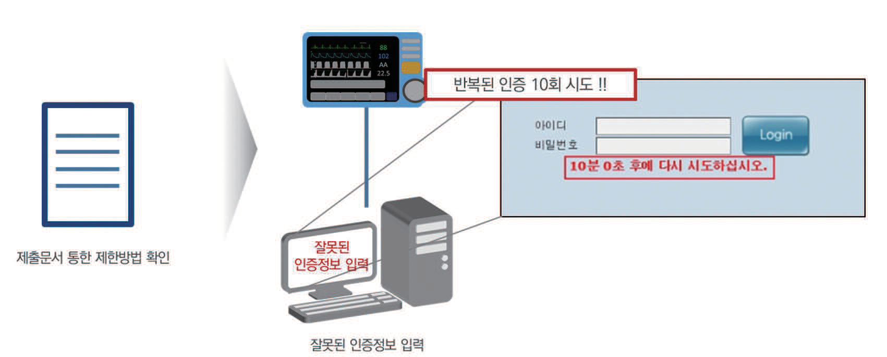

---
<!-- Page 76 -->
1.3.6 비상시 디지털헬스케어 기기 접근을 허용하는 방법을 마련해야 한다.
보안위협 및 취약점(제3장 참조)
응급상황 발생시 디지털헬스케어 기기 사용의 어려움으로 인해 적절한 응급처치를 하지 못할 수 있다.
보안요구사항 및 보안대책
비상시 디지털헬스케어 기기가 제공할 수 있는 응급처치 기능을 정의한다.
비상시 사용자가 디지털헬스케어 기기를 이용하여 응급처치를 할 수 있는방법을 구현하여 사용할 수 있도록 해야
한다.
점검방법
디지털헬스케어 기기를 비상시에 사용할 수 있는 사용자가 정의되어 있는지 확인한다.
인증 제한 등의 이유로 기기에 접근하지 못하는 상황을 발생시켜 비상시에 기기의 기능을 사용할 수 있는지
확인한다.
참고문헌
• IMDRF, “Principles and Practices for Medical Device Cybersecurity”, 2020.
1.3.7 사용자 계정의 유효기간 만료 시 접근을 제한해야 한다.
보안위협 및 취약점(제3장 참조)
인가되지 않은 사용자가 디지털헬스케어 기기나 서비스에 접근할 수 있으며, 기기에 저장된 개인의료정보, 기기
설정파일 등 중요 데이터에 임의로 접근할 수 있다.
보안요구사항 및 보안대책
사용자 계정의 유효기간을 설정할 수 있는 기능을 구현한다.
설정된 유효기간이 지난 사용자 계정을 통해 기기로의 접근이 제한하도록 접근통제 기능을 구현한다.
점검방법
디지털헬스케어 기기에서 사용자 계정에 유효기간을 설정할 수 있는 기능을 제공하는지 확인한다.
설정된 유효기간 이후에 사용자 계정으로 기기에 접근이 불가능한 것을 확인한다.
참고문헌
• 식품의약품안전처, “의료기기의 사이버 보안 허가·심사 가이드라인(민원인 안내서)”, 2019.

| 보안위협 및 취약점(제3장 참조) |
| --- |
| 응급상황 발생시 디지털헬스케어 기기 사용의 어려움으로 인해 적절한 응급처치를 하지 못할 수 있다. |
| 보안요구사항 및 보안대책 |
| 비상시 디지털헬스케어 기기가 제공할 수 있는 응급처치 기능을 정의한다. 비상시 사용자가 디지털헬스케어 기기를 이용하여 응급처치를 할 수 있는방법을 구현하여 사용할 수 있도록 해야 한다. |
| 점검방법 |
| 디지털헬스케어 기기를 비상시에 사용할 수 있는 사용자가 정의되어 있는지 확인한다. 인증 제한 등의 이유로 기기에 접근하지 못하는 상황을 발생시켜 비상시에 기기의 기능을 사용할 수 있는지 확인한다. |
| 참고문헌 |
| • IMDRF, “Principles and Practices for Medical Device Cybersecurity”, 2020. |

| 보안위협 및 취약점(제3장 참조) |
| --- |
| 인가되지 않은 사용자가 디지털헬스케어 기기나 서비스에 접근할 수 있으며, 기기에 저장된 개인의료정보, 기기 설정파일 등 중요 데이터에 임의로 접근할 수 있다. |
| 보안요구사항 및 보안대책 |
| 사용자 계정의 유효기간을 설정할 수 있는 기능을 구현한다. 설정된 유효기간이 지난 사용자 계정을 통해 기기로의 접근이 제한하도록 접근통제 기능을 구현한다. |
| 점검방법 |
| 디지털헬스케어 기기에서 사용자 계정에 유효기간을 설정할 수 있는 기능을 제공하는지 확인한다. 설정된 유효기간 이후에 사용자 계정으로 기기에 접근이 불가능한 것을 확인한다. |
| 참고문헌 |
| • 식품의약품안전처, “의료기기의 사이버 보안 허가·심사 가이드라인(민원인 안내서)”, 2019. |

---
<!-- Page 77 -->

## 제4장 디지털헬스케어 기기 보안요구사항 및 보안대책 | 77

및
보안대책
및
보안대책
개요
디지털헬스케어
서비스
모델
디지털헬스케어
보안위협
디지털헬스케어
기기
보안요구사항
디지털헬스케어
서비스
보안요구사항
참고문헌
제1장
제2장
제3장
제4장
제5장
부록
1.3.8 관리자 계정에 대해서는 동시 접속을 제한해야 한다.
보안위협 및 취약점(제3장 참조)
관리자 계정으로 동시 접속시 중요 기능 설정이 임의로 변경될 수 있다.
보안요구사항 및 보안대책
디지털헬스케어 기기의 관리자 권한은 유일한 계정으로 설정하며, 중복 접속시에는 이전 접속 혹은 새로운 접속을
차단하여 동시 접속을 허용하지 않도록 한다.
* 정책 변경 등이 가능한 권한에 대해 적용되어야 하며, 단순 모니터링의 경우 동시 접속을 허용할 수 있다.
점검방법
디지털헬스케어 기기에서 제공하는 관리자 계정을 확인하여 관리자 계정이 유일한지를 확인한다.
관리자 계정으로 디지털헬스케어 기기에 접속한 이후에 동시 접속을 시도하여 동시 접속을 허용 하지 않는 것을
확인한다.
참고문헌
• 식품의약품안전처, “의료기기의 사이버 보안 허가·심사 가이드라인(민원인 안내서)”, 2019.
1.3.9 디지털헬스케어 기기는 비인가된 네트워크 접속을 제한 할 수 있어야 한다.
보안위협 및 취약점(제3장 참조)
디지털헬스케어 기기로의 비인가된 기기가 접근하거나, 비인가된 기기 또는 서버로의 개인의료정보 등을 전송할
수 있다.
보안요구사항 및 보안대책
디지털헬스케어 기기에 네트워크를 통한 접근은 식별 및 인증이 우선시 되어야 한다.
점검방법
디지털헬스케어 기기에 접근할 수 있는 모든 네트워크를 식별한다.
식별된 네트워크에서 기기로의 접속은 식별 및 인증과정이 우선시 되는지 확인한다.
참고문헌
• 식품의약품안전처, “의료기기의 사이버 보안 허가·심사 가이드라인(민원인 안내서)”, 2019.

| 보안위협 및 취약점(제3장 참조) |
| --- |
| 관리자 계정으로 동시 접속시 중요 기능 설정이 임의로 변경될 수 있다. |
| 보안요구사항 및 보안대책 |
| 디지털헬스케어 기기의 관리자 권한은 유일한 계정으로 설정하며, 중복 접속시에는 이전 접속 혹은 새로운 접속을 차단하여 동시 접속을 허용하지 않도록 한다. * 정책 변경 등이 가능한 권한에 대해 적용되어야 하며, 단순 모니터링의 경우 동시 접속을 허용할 수 있다. |
| 점검방법 |
| 디지털헬스케어 기기에서 제공하는 관리자 계정을 확인하여 관리자 계정이 유일한지를 확인한다. 관리자 계정으로 디지털헬스케어 기기에 접속한 이후에 동시 접속을 시도하여 동시 접속을 허용 하지 않는 것을 확인한다. |
| 참고문헌 |
| • 식품의약품안전처, “의료기기의 사이버 보안 허가·심사 가이드라인(민원인 안내서)”, 2019. |

| 보안위협 및 취약점(제3장 참조) |
| --- |
| 디지털헬스케어 기기로의 비인가된 기기가 접근하거나, 비인가된 기기 또는 서버로의 개인의료정보 등을 전송할 수 있다. |
| 보안요구사항 및 보안대책 |
| 디지털헬스케어 기기에 네트워크를 통한 접근은 식별 및 인증이 우선시 되어야 한다. |
| 점검방법 |
| 디지털헬스케어 기기에 접근할 수 있는 모든 네트워크를 식별한다. 식별된 네트워크에서 기기로의 접속은 식별 및 인증과정이 우선시 되는지 확인한다. |
| 참고문헌 |
| • 식품의약품안전처, “의료기기의 사이버 보안 허가·심사 가이드라인(민원인 안내서)”, 2019. |

---
<!-- Page 78 -->

#### 1.4 안전한 비밀번호 메커니즘

1.4.1 비밀번호는 하드코딩되지 않아야 한다.
보안위협 및 취약점(제3장 참조)
비밀번호 등 인증정보가 하드코딩 또는 평문으로 저장되거나, 로그인을 위해 인증정보 입력 시 평문으로 출력
되거나, 구체적인 인증 실패 사유에 대한 피드백으로 되어 인증정보가 노출되거나 유추될 수 있다.
보안요구사항 및 보안대책
비밀번호는 소스코드 등에 하드코딩하지 않는다.
비밀번호는 암호화하여 별도의 파일이나 DB에 안전하게 저장하여 사용한다.
최초 로그인 시에 디지털헬스케어 기기의 관리자나 사용자가 직접 비밀번호를 입력하여 사용하도록 설계한다.
점검방법
최초 로그인 시에 관리자나 사용자가 직접 비밀번호를 입력하여 변경하도록 설계되어 있는지 확인한다.
비밀번호를 저장하는 별도의 파일이 사용되고 있는지 확인한다.
비밀번호 하드코딩 확인 검증 예시
참고문헌
• 식품의약품안전처, “의료기기의 사이버 보안 허가·심사 가이드라인(민원인 안내서)”, 2019.
• UL, “Software Cybersecurity for Network-Connctable Products, Part 1: General Requirements”, ANSI/
CAN/UL 2900-1:2017, 2017.
• UL, “Software Cybersecurity for Network-Connctable Products, Part 2-1: Particular Requirements for
Network Connectable Components of Healthcare and Wellness Systems”, ANSI/CAN/UL 2900-2-
1:2018, 2018.

| 보안위협 및 취약점(제3장 참조) |
| --- |
| 비밀번호 등 인증정보가 하드코딩 또는 평문으로 저장되거나, 로그인을 위해 인증정보 입력 시 평문으로 출력 되거나, 구체적인 인증 실패 사유에 대한 피드백으로 되어 인증정보가 노출되거나 유추될 수 있다. |
| 보안요구사항 및 보안대책 |
| 비밀번호는 소스코드 등에 하드코딩하지 않는다. 비밀번호는 암호화하여 별도의 파일이나 DB에 안전하게 저장하여 사용한다. 최초 로그인 시에 디지털헬스케어 기기의 관리자나 사용자가 직접 비밀번호를 입력하여 사용하도록 설계한다. |
| 점검방법 |
| 최초 로그인 시에 관리자나 사용자가 직접 비밀번호를 입력하여 변경하도록 설계되어 있는지 확인한다. 비밀번호를 저장하는 별도의 파일이 사용되고 있는지 확인한다. 비밀번호 하드코딩 확인 검증 예시 |
| 참고문헌 |
| • 식품의약품안전처, “의료기기의 사이버 보안 허가·심사 가이드라인(민원인 안내서)”, 2019. • UL, “Software Cybersecurity for Network-Connctable Products, Part 1: General Requirements”, ANSI/ CAN/UL 2900-1:2017, 2017. • UL, “Software Cybersecurity for Network-Connctable Products, Part 2-1: Particular Requirements for Network Connectable Components of Healthcare and Wellness Systems”, ANSI/CAN/UL 2900-2- 1:2018, 2018. |

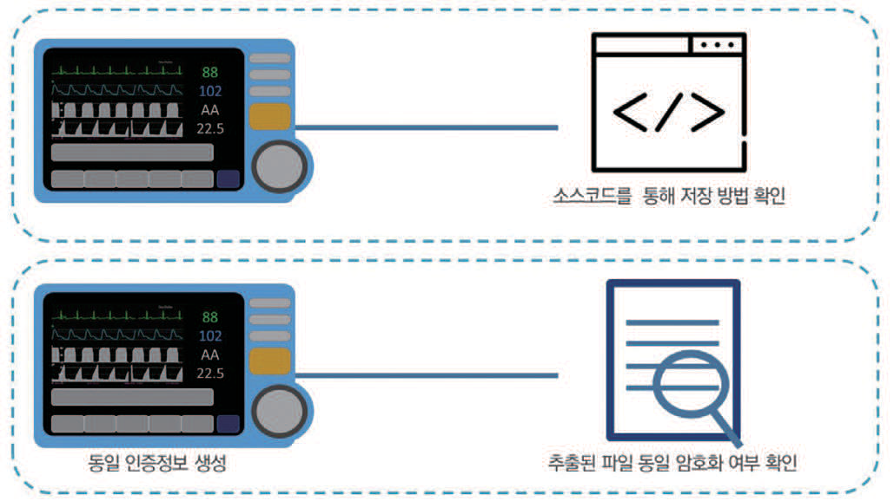

---
<!-- Page 79 -->

## 제4장 디지털헬스케어 기기 보안요구사항 및 보안대책 | 79

및
보안대책
및
보안대책
개요
디지털헬스케어
서비스
모델
디지털헬스케어
보안위협
디지털헬스케어
기기
보안요구사항
디지털헬스케어
서비스
보안요구사항
참고문헌
제1장
제2장
제3장
제4장
제5장
부록
1.4.2 디지털헬스케어 기기는 비밀번호 입력 등 화면에 표시하는 경우 마스킹 처리를 해야 한다.
보안위협 및 취약점(제3장 참조)
비밀번호 등 인증정보가 하드코딩 또는 평문으로 저장되거나, 로그인을 위해 인증정보 입력 시 평문으로 출력
되거나, 구체적인 인증 실패 사유에 대한 피드백으로 되어 인증정보가 노출되거나 유추될 수 있다.
보안요구사항 및 보안대책
디지털헬스케어 기기에 비밀번호를 입력할 때는 ‘*’등의 방법으로 치환하여 노출되지 않게 해야 한다.
점검방법
디지털헬스케어 기기에 관리자나 사용자 계정으로 로그인을 시도하여 입력하는 패스워드가 ‘*’등의 방법으로 노출
되지 않는지 확인한다.
비밀번호 마스킹 처리 검증 예시
참고문헌
• 식 품의약품안전처, “의료기기의 사이버 보안 허가·심사 가이드라인(민원인 안내서)”, 2019.

| 보안위협 및 취약점(제3장 참조) |
| --- |
| 비밀번호 등 인증정보가 하드코딩 또는 평문으로 저장되거나, 로그인을 위해 인증정보 입력 시 평문으로 출력 되거나, 구체적인 인증 실패 사유에 대한 피드백으로 되어 인증정보가 노출되거나 유추될 수 있다. |
| 보안요구사항 및 보안대책 |
| 디지털헬스케어 기기에 비밀번호를 입력할 때는 ‘*’등의 방법으로 치환하여 노출되지 않게 해야 한다. |
| 점검방법 |
| 디지털헬스케어 기기에 관리자나 사용자 계정으로 로그인을 시도하여 입력하는 패스워드가 ‘*’등의 방법으로 노출 되지 않는지 확인한다. 비밀번호 마스킹 처리 검증 예시 |
| 참고문헌 |
| • 식 품의약품안전처, “의료기기의 사이버 보안 허가·심사 가이드라인(민원인 안내서)”, 2019. |

| 제4장 |  |

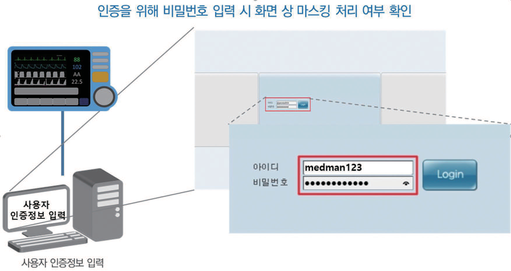

---
<!-- Page 80 -->
1.4.3 비밀번호에 대한 안전한 저장 방법을 제공해야 한다.
보안위협 및 취약점(제3장 참조)
비밀번호 등 인증정보가 하드코딩 또는 평문으로 저장되거나, 로그인을 위해 인증정보 입력 시 평문으로
출력되거나, 구체적인 인증 실패 사유에 대한 피드백으로 되어 인증정보가 노출되거나 유추될 수 있다.
보안요구사항 및 보안대책
비밀번호가 파일 혹은 DB에 저장될 때 최신의 암호학적인 방법을 사용하여 암호화를 하거나 해시 하여 저장한다.
비밀번호를 암호학적으로 안전성이 보장된 보안 매체에 저장한다.
점검방법
비밀번호가 저장되는 파일 혹은 DB를 확인하여 암호화 혹은 해시 하여 저장하는지 확인한다.
비밀번호를 보안 매체에 저장할 경우 보안 매체의 암호학적 안전성을 확인한다.
안전한 비밀번호 저장 예시
참고문헌
• UL, “Software Cybersecurity for Network-Connctable Products, Part 1: General Requirements”, ANSI/
CAN/UL 2900-1:2017, 2017.
• UL, “Software Cybersecurity for Network-Connctable Products, Part 2-1: Particular Requirements for
Network Connectable Components of Healthcare and Wellness Systems”, ANSI/CAN/UL 2900-2-
1:2018, 2018.
• BSI, “Cyber Security Requirements for Network-Connected Medical Devices”, BSI-CS 132, Version
1.1, 2018.11.13.
• IMDRF, “Principles and Practices for Medical Device Cybersecurity”, 2020.

| 보안위협 및 취약점(제3장 참조) |
| --- |
| 비밀번호 등 인증정보가 하드코딩 또는 평문으로 저장되거나, 로그인을 위해 인증정보 입력 시 평문으로 출력되거나, 구체적인 인증 실패 사유에 대한 피드백으로 되어 인증정보가 노출되거나 유추될 수 있다. |
| 보안요구사항 및 보안대책 |
| 비밀번호가 파일 혹은 DB에 저장될 때 최신의 암호학적인 방법을 사용하여 암호화를 하거나 해시 하여 저장한다. 비밀번호를 암호학적으로 안전성이 보장된 보안 매체에 저장한다. |
| 점검방법 |
| 비밀번호가 저장되는 파일 혹은 DB를 확인하여 암호화 혹은 해시 하여 저장하는지 확인한다. 비밀번호를 보안 매체에 저장할 경우 보안 매체의 암호학적 안전성을 확인한다. 안전한 비밀번호 저장 예시 |
| 참고문헌 |
| • UL, “Software Cybersecurity for Network-Connctable Products, Part 1: General Requirements”, ANSI/ CAN/UL 2900-1:2017, 2017. • UL, “Software Cybersecurity for Network-Connctable Products, Part 2-1: Particular Requirements for Network Connectable Components of Healthcare and Wellness Systems”, ANSI/CAN/UL 2900-2- 1:2018, 2018. • BSI, “Cyber Security Requirements for Network-Connected Medical Devices”, BSI-CS 132, Version 1.1, 2018.11.13. • IMDRF, “Principles and Practices for Medical Device Cybersecurity”, 2020. |

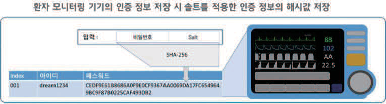

---
<!-- Page 81 -->

## 제4장 디지털헬스케어 기기 보안요구사항 및 보안대책 | 81

및
보안대책
및
보안대책
개요
디지털헬스케어
서비스
모델
디지털헬스케어
보안위협
디지털헬스케어
기기
보안요구사항
디지털헬스케어
서비스
보안요구사항
참고문헌
제1장
제2장
제3장
제4장
제5장
부록
1.4.4 비밀번호는 길이, 복잡도, 업데이트 주기를 고려하여 설정되어야 한다.
보안위협 및 취약점(제3장 참조)
비밀번호의 디폴트값 이용 등 관리가 미흡한 비밀번호를 획득하거나, 낮은 수준의 비밀번호 조합규칙이 적용된
경우 인가된 사용자로 위장할 수 있다.
보안요구사항 및 보안대책
디지털헬스케어 기기의 설정 변경, 중요기능 접근 등을 위해 사용하는 비밀번호의 안전성을 고려하여 적절한
수준의 조합규칙을 고려해야 한다. 단, 위험관리에 따라 IT시스템에 적용되는 수준을 완화하여 적용할 수 있다.
* 예) 영대소문자, 숫자, 특수문자 등 3가지 문자를 조합하여 9자리 이상이 되고, 중복된 문자 및 오름차순/내림차순과
같이 연속하는 문자 사용을 제한한다.
한국인터넷진흥원흥원(KISA)의 ‘패스워드 선택 및 이용 안내서’를 참조하여 업데이트 주기를 설정하여 사용 기간
만료 때는 새로운 비밀번호로의 변경을 유도한다.
점검방법
한국인터넷진흥원(KISA)의 ‘패스워드 선택 및 이용 안내서’에서 권고하는 ‘두 종류 이상 문자 구성과 8자리 이상
길이로 구성된 패스워드’ 혹은 ‘10자리 이상의 길이로 구성된 패스워드’로 디지털헬스케어 기기의 비밀번호를
설정할 수 있는지 확인한다.
비밀번호의 업데이트 주기가 설정되어 있는지 확인하고, 사용기간 만료 시에는 새로운 비밀번호로 변경을 유도
하는지 확인한다.
비밀번호 길이, 복잡도 설정 예시
참고문헌
• U L, “Software Cybersecurity for Network-Connctable Products, Part 1: General Requirements”, ANSI/
CAN/UL 2900-1:2017, 2017.
• U L, “Software Cybersecurity for Network-Connctable Products, Part 2-1: Particular Requirements for
Network Connectable Components of Healthcare and Wellness Systems”, ANSI/CAN/UL 2900-2-
1:2018, 2018.
• 식 품의약품안전처, “의료기기의 사이버 보안 허가·심사 가이드라인(민원인 안내서)”, 2019.

| 보안위협 및 취약점(제3장 참조) |
| --- |
| 비밀번호의 디폴트값 이용 등 관리가 미흡한 비밀번호를 획득하거나, 낮은 수준의 비밀번호 조합규칙이 적용된 경우 인가된 사용자로 위장할 수 있다. |
| 보안요구사항 및 보안대책 |
| 디지털헬스케어 기기의 설정 변경, 중요기능 접근 등을 위해 사용하는 비밀번호의 안전성을 고려하여 적절한 수준의 조합규칙을 고려해야 한다. 단, 위험관리에 따라 IT시스템에 적용되는 수준을 완화하여 적용할 수 있다. * 예) 영대소문자, 숫자, 특수문자 등 3가지 문자를 조합하여 9자리 이상이 되고, 중복된 문자 및 오름차순/내림차순과 같이 연속하는 문자 사용을 제한한다. 한국인터넷진흥원흥원(KISA)의 ‘패스워드 선택 및 이용 안내서’를 참조하여 업데이트 주기를 설정하여 사용 기간 만료 때는 새로운 비밀번호로의 변경을 유도한다. |
| 점검방법 |
| 한국인터넷진흥원(KISA)의 ‘패스워드 선택 및 이용 안내서’에서 권고하는 ‘두 종류 이상 문자 구성과 8자리 이상 길이로 구성된 패스워드’ 혹은 ‘10자리 이상의 길이로 구성된 패스워드’로 디지털헬스케어 기기의 비밀번호를 설정할 수 있는지 확인한다. 비밀번호의 업데이트 주기가 설정되어 있는지 확인하고, 사용기간 만료 시에는 새로운 비밀번호로 변경을 유도 하는지 확인한다. 비밀번호 길이, 복잡도 설정 예시 |
| 참고문헌 |
| • U L, “Software Cybersecurity for Network-Connctable Products, Part 1: General Requirements”, ANSI/ CAN/UL 2900-1:2017, 2017. • U L, “Software Cybersecurity for Network-Connctable Products, Part 2-1: Particular Requirements for Network Connectable Components of Healthcare and Wellness Systems”, ANSI/CAN/UL 2900-2- 1:2018, 2018. • 식 품의약품안전처, “의료기기의 사이버 보안 허가·심사 가이드라인(민원인 안내서)”, 2019. |

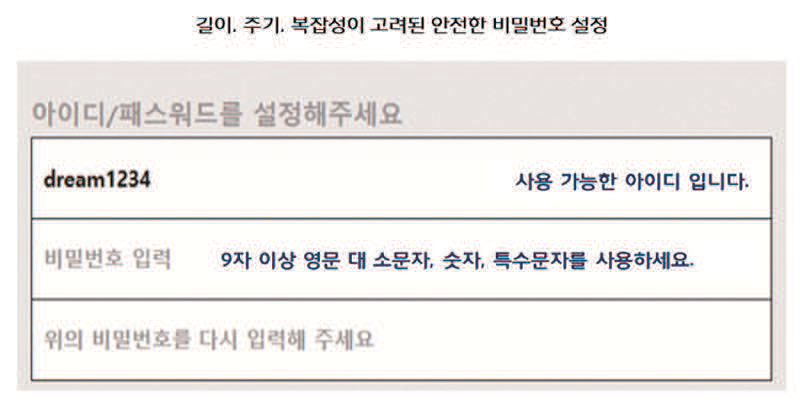

---
<!-- Page 82 -->
디지털헬스케어 기기는 인증 실패메시지로 인증 실패 사유와 비밀번호를 유추할 수
1.4.5
있는 정보를 제공하지 않아야 한다.
보안위협 및 취약점(제3장 참조)
비밀번호 등 인증정보가 하드코딩 또는 평문으로 저장되거나, 로그인을 위해 인증정보 입력 시 평문으로 출력
되거나, 구체적인 인증 실패 사유에 대한 피드백으로 되어 인증정보가 노출되거나 유추될 수 있다.
보안요구사항 및 보안대책
인증실패 메시지에 구체적인 인증 실패 사유를 포함시키지 않아야 한다.
* (예) ‘아이디가 일치하지 않습니다.’, ‘비밀번호가 일치하지 않습니다.’ 등
인증실패 메시지에 비밀번호를 유추할 수 있는 정보를 포함시키지 않아야 한다.
점검방법
디지털헬스케어 기기에서 제공하는 인증기능을 확인하여 인증 실패 메시지에 인증실패 사유와 비밀번호를 유추할
수 있는 민감한 정보가 제공되는지 확인한다.
인증실패 사유 미제공 예시
참고문헌
• BSI, “Cyber Security Requirements for Network-Connected Medical Devices”, BSI-CS 132, Version
1.1, 2018.11.13.
• UL, “Software Cybersecurity for Network-Connctable Products, Part 1: General Requirements”, ANSI/
CAN/UL 2900-1:2017, 2017.
• UL, “Software Cybersecurity for Network-Connctable Products, Part 2-1: Particular Requirements for
Network Connectable Components of Healthcare and Wellness Systems”, ANSI/CAN/UL 2900-2-
1:2018, 2018.

| 보안위협 및 취약점(제3장 참조) |
| --- |
| 비밀번호 등 인증정보가 하드코딩 또는 평문으로 저장되거나, 로그인을 위해 인증정보 입력 시 평문으로 출력 되거나, 구체적인 인증 실패 사유에 대한 피드백으로 되어 인증정보가 노출되거나 유추될 수 있다. |
| 보안요구사항 및 보안대책 |
| 인증실패 메시지에 구체적인 인증 실패 사유를 포함시키지 않아야 한다. * (예) ‘아이디가 일치하지 않습니다.’, ‘비밀번호가 일치하지 않습니다.’ 등 인증실패 메시지에 비밀번호를 유추할 수 있는 정보를 포함시키지 않아야 한다. |
| 점검방법 |
| 디지털헬스케어 기기에서 제공하는 인증기능을 확인하여 인증 실패 메시지에 인증실패 사유와 비밀번호를 유추할 수 있는 민감한 정보가 제공되는지 확인한다. 인증실패 사유 미제공 예시 |
| 참고문헌 |
| • BSI, “Cyber Security Requirements for Network-Connected Medical Devices”, BSI-CS 132, Version 1.1, 2018.11.13. • UL, “Software Cybersecurity for Network-Connctable Products, Part 1: General Requirements”, ANSI/ CAN/UL 2900-1:2017, 2017. • UL, “Software Cybersecurity for Network-Connctable Products, Part 2-1: Particular Requirements for Network Connectable Components of Healthcare and Wellness Systems”, ANSI/CAN/UL 2900-2- 1:2018, 2018. |

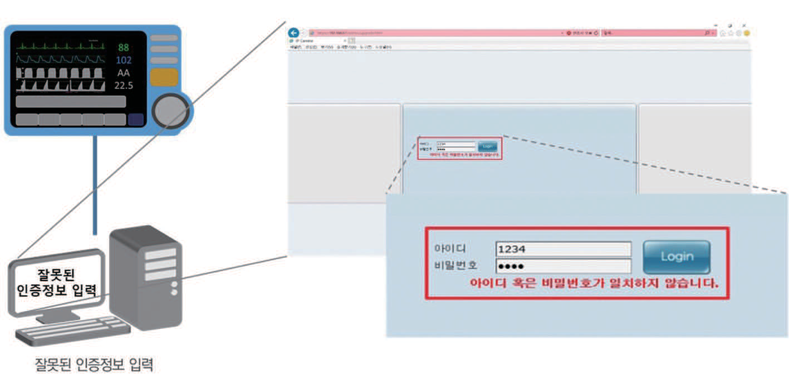

---
<!-- Page 83 -->

## 제4장 디지털헬스케어 기기 보안요구사항 및 보안대책 | 83

및
보안대책
및
보안대책
개요
디지털헬스케어
서비스
모델
디지털헬스케어
보안위협
디지털헬스케어
기기
보안요구사항
디지털헬스케어
서비스
보안요구사항
참고문헌
제1장
제2장
제3장
제4장
제5장
부록
디지털헬스케어 기기는 제품 사용 초기에 인증정보를 설정하도록 요구하거나, 초기
1.4.6
인증정보를 변경하도록 요구해야 한다.
보안위협 및 취약점(제3장 참조)
비밀번호의 디폴트값 이용 등 관리가 미흡한 비밀번호를 획득하거나, 낮은 수준의 비밀번호 조합규칙이 적용된
경우 인가된 사용자로 위장할 수 있다.
보안요구사항 및 보안대책
디지털헬스케어 기기는 처음 사용할 때 인증정보를 입력받거나 초기 인증정보를 변경할 수 있는 기능이 있어야
한다.
인증정보 변경 기능은 설치 후 처음 사용할 때 활성화가 되어야 한다.
점검방법
디지털헬스케어 기기를 처음 구동하여 인증정보를 입력 받거나 초기 인증정보를 변경 할 수 있는 기능이 활성화
되는지 확인한다.
초기 인증정보 설정(강제 변경) 예시
참고문헌
• U L, “Software Cybersecurity for Network-Connctable Products, Part 1: General Requirements”, ANSI/
CAN/UL 2900-1:2017, 2017.
• U L, “Software Cybersecurity for Network-Connctable Products, Part 2-1: Particular Requirements for
Network Connectable Components of Healthcare and Wellness Systems”, ANSI/CAN/UL 2900-2-
1:2018, 2018.

| 보안위협 및 취약점(제3장 참조) |
| --- |
| 비밀번호의 디폴트값 이용 등 관리가 미흡한 비밀번호를 획득하거나, 낮은 수준의 비밀번호 조합규칙이 적용된 경우 인가된 사용자로 위장할 수 있다. |
| 보안요구사항 및 보안대책 |
| 디지털헬스케어 기기는 처음 사용할 때 인증정보를 입력받거나 초기 인증정보를 변경할 수 있는 기능이 있어야 한다. 인증정보 변경 기능은 설치 후 처음 사용할 때 활성화가 되어야 한다. |
| 점검방법 |
| 디지털헬스케어 기기를 처음 구동하여 인증정보를 입력 받거나 초기 인증정보를 변경 할 수 있는 기능이 활성화 되는지 확인한다. 초기 인증정보 설정(강제 변경) 예시 |
| 참고문헌 |
| • U L, “Software Cybersecurity for Network-Connctable Products, Part 1: General Requirements”, ANSI/ CAN/UL 2900-1:2017, 2017. • U L, “Software Cybersecurity for Network-Connctable Products, Part 2-1: Particular Requirements for Network Connectable Components of Healthcare and Wellness Systems”, ANSI/CAN/UL 2900-2- 1:2018, 2018. |

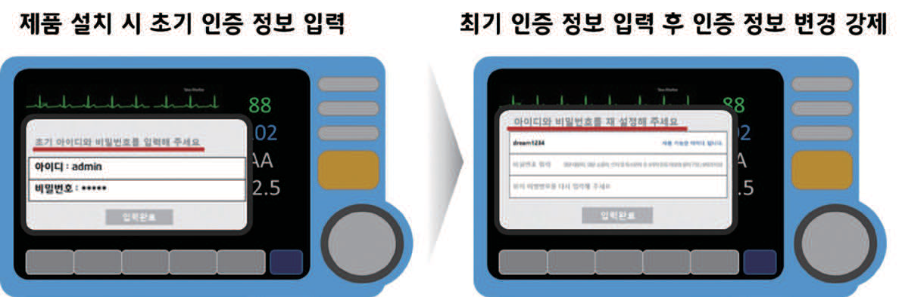

---
<!-- Page 84 -->
디지털헬스케어 기기가 서버/클라이언트 형태로 구성된 경우, 비밀번호는 서버에서
1.4.7
검증해야 한다.
보안위협 및 취약점(제3장 참조)
인증 결과 변조로 인증 기능이 우회될 수 있다.
보안요구사항 및 보안대책
디지털헬스케어 기기의 운영 환경이 서버/클라이언트 형태로 구성되었으면 디지털헬스케어 기기의 비밀번호
검증을 위한 검증 값은 서버에 저장해야 한다.
디지털헬스케어 기기는 입력된 비밀번호를 서버에 전달하여 서버에서 비밀번호 검증하도록 한다.
* 서버로 비밀번호 전송시 평문으로 전송하지 않아야 한다.
점검방법
디지털헬스케어 기기의 운영 환경이 서버/클라이언트 형태로 구성되었으면 디지털헬스케어 기기의 비밀번호
검증을 클라이언트 운영 환경에서 하지 않고, 서버에서 검증을 하는지를 확인한다.
서버로 전송되는 비밀번호가 평문으로 전송되는지 확인한다.
참고문헌
• BSI, “Cyber Security Requirements for Network-Connected Medical Devices”, BSI-CS 132, Version 1.1,
2018.11.13.

| 보안위협 및 취약점(제3장 참조) |
| --- |
| 인증 결과 변조로 인증 기능이 우회될 수 있다. |
| 보안요구사항 및 보안대책 |
| 디지털헬스케어 기기의 운영 환경이 서버/클라이언트 형태로 구성되었으면 디지털헬스케어 기기의 비밀번호 검증을 위한 검증 값은 서버에 저장해야 한다. 디지털헬스케어 기기는 입력된 비밀번호를 서버에 전달하여 서버에서 비밀번호 검증하도록 한다. * 서버로 비밀번호 전송시 평문으로 전송하지 않아야 한다. |
| 점검방법 |
| 디지털헬스케어 기기의 운영 환경이 서버/클라이언트 형태로 구성되었으면 디지털헬스케어 기기의 비밀번호 검증을 클라이언트 운영 환경에서 하지 않고, 서버에서 검증을 하는지를 확인한다. 서버로 전송되는 비밀번호가 평문으로 전송되는지 확인한다. |
| 참고문헌 |
| • BSI, “Cyber Security Requirements for Network-Connected Medical Devices”, BSI-CS 132, Version 1.1, 2018.11.13. |

---
<!-- Page 85 -->

## 제4장 디지털헬스케어 기기 보안요구사항 및 보안대책 | 85

및
보안대책
및
보안대책
개요
디지털헬스케어
서비스
모델
디지털헬스케어
보안위협
디지털헬스케어
기기
보안요구사항
디지털헬스케어
서비스
보안요구사항
참고문헌
제1장
제2장
제3장
제4장
제5장
부록
2 | 암호

#### 2.1 안전한 암호 알고리즘 사용

디지털헬스케어 기기에 적용되는 암호 알고리즘은 안전성이 검증된 알고리즘을 사용
2.1.1
하여야 한다.
보안위협 및 취약점(제3장 참조)
취약한 암호 알고리즘, 불충분한 암호키, 유추 가능한 난수 사용으로 중요데이터를 적절하게 보호하지 못 할 수
있다.
취약한 암호 알고리즘을 사용하는 트래픽을 분석하여 키 정보를 유추하거나 통신암호문의 내용을 알아낼 수 있다.
보안요구사항 및 보안대책
안전성(Safety)*, 신뢰성(Dependability)**, 상호운용성(Interoperability)***에서 적합성을 검증받은 국내·외
표준 암호 알고리즘을 사용하여야 한다.
* 암호의 기밀성, 무결성, 가용성 측면에서 안전해야 한다.
** 동일한 상황에서 동일 키 방식으로 암호화를 적용했을 때 랜덤성 확보가 가능해야 한다.
*** 암호가 체계 내에서 체계의 다른 기능에 영향을 주지 않아야 한다.
< 국내·외 표준 암호 알고리즘 >
분류 암호 알고리즘 예
대칭키암호 AES, 3DES 또는 TDES, SEED, HIGHT, ARIA, LEA
키 공유 DH, ECDH
공개키암호 암·복호화 RSA, RSAES
전자서명 RSA, DSA, ECDSA, ECDSA
해시함수 SHA-2, SHA-3, LSH
국내·외에서 권고하는 보안 강도 이상의 암호 알고리즘을 사용하여야 한다.
각 표준 암호 알고리즘의 테스트 벡터값을 활용하여 구현의 정확성을 검증한 후 사용하여야 한다.
부채널 분석*에 대한 대응기법을 적용한 암호 알고리즘의 사용을 권고한다.
* 암호 알고리즘 연산 시 발생하는 부가정보(전력, 전자파 등)를 통해 암호키 정보 탈취 가능

| 보안위협 및 취약점(제3장 참조) |
| --- |
| 취약한 암호 알고리즘, 불충분한 암호키, 유추 가능한 난수 사용으로 중요데이터를 적절하게 보호하지 못 할 수 있다. 취약한 암호 알고리즘을 사용하는 트래픽을 분석하여 키 정보를 유추하거나 통신암호문의 내용을 알아낼 수 있다. |
| 보안요구사항 및 보안대책 |
| 안전성(Safety)*, 신뢰성(Dependability)**, 상호운용성(Interoperability)***에서 적합성을 검증받은 국내·외 표준 암호 알고리즘을 사용하여야 한다. * 암호의 기밀성, 무결성, 가용성 측면에서 안전해야 한다. ** 동일한 상황에서 동일 키 방식으로 암호화를 적용했을 때 랜덤성 확보가 가능해야 한다. *** 암호가 체계 내에서 체계의 다른 기능에 영향을 주지 않아야 한다. < 국내·외 표준 암호 알고리즘 > 분류 암호 알고리즘 예 대칭키암호 AES, 3DES 또는 TDES, SEED, HIGHT, ARIA, LEA 키 공유 DH, ECDH 공개키암호 암·복호화 RSA, RSAES 전자서명 RSA, DSA, ECDSA, ECDSA 해시함수 SHA-2, SHA-3, LSH 국내·외에서 권고하는 보안 강도 이상의 암호 알고리즘을 사용하여야 한다. 각 표준 암호 알고리즘의 테스트 벡터값을 활용하여 구현의 정확성을 검증한 후 사용하여야 한다. 부채널 분석*에 대한 대응기법을 적용한 암호 알고리즘의 사용을 권고한다. * 암호 알고리즘 연산 시 발생하는 부가정보(전력, 전자파 등)를 통해 암호키 정보 탈취 가능 |

| 제4장 |  |

| 분류 |  | 암호 알고리즘 예 |
| --- | --- | --- |
| 대칭키암호 |  | AES, 3DES 또는 TDES, SEED, HIGHT, ARIA, LEA |
| 공개키암호 | 키 공유 | DH, ECDH |
|  | 암·복호화 | RSA, RSAES |
|  | 전자서명 | RSA, DSA, ECDSA, ECDSA |
| 해시함수 |  | SHA-2, SHA-3, LSH |

---
<!-- Page 86 -->
< 국내·외 표준 암호 알고리즘 >
공개키 암호
보안강도 대칭키 암호 해시함수 이산대수 유지기간
인수분해 타원곡선
공개키 개인키
112-비트 112 112 2048 2048 224 224 ~ 2030년
128-비트 128 128 3072 3072 256 256
192-비트 192 192 7680 7680 384 384 2030년 이후
256-비트 256 256 15360 15360 512 512
안전성이 검증된 알고리즘 사용 여부 검증 예시
점검방법
KS X ISO/IEC 19790 또는 FIPS140-2의 검증대상 알고리즘 여부를 확인한다.
KISA 또는 NIST에서 제시한 테스트 벡터값을 적용하여 구현 정확성을 검증한다.
참고문헌
• U.S. FDA, “(Draft) Content of Premarket Submissions for Management of Cybersecurity in Medical
Devices”, 2018.
• BSI, “Cyber Security Requirements for Network-Connected Medical Devices”, BSI-CS 132, Version
1.1, 2018.11.13.
• 식품의약품안전처, “의료기기의 사이버 보안 허가·심사 가이드라인(민원인 안내서)”, 2019.
• UL, “Software Cybersecurity for Network-Connctable Products, Part 1: General Requirements”, ANSI/
CAN/UL 2900-1:2017, 2017.
• UL, “Software Cybersecurity for Network-Connctable Products, Part 2-1: Particular Requirements for
Network Connectable Components of Healthcare and Wellness Systems”, ANSI/CAN/UL 2900-2-
1:2018, 2018.
• DTSec, “Protection Profile for Connected Diabetes Devices (CDD)”, Version 2.0, 2017.11.25.

| < 국내·외 표준 암호 알고리즘 > 공개키 암호 보안강도 대칭키 암호 해시함수 이산대수 유지기간 인수분해 타원곡선 공개키 개인키 112-비트 112 112 2048 2048 224 224 ~ 2030년 128-비트 128 128 3072 3072 256 256 192-비트 192 192 7680 7680 384 384 2030년 이후 256-비트 256 256 15360 15360 512 512 안전성이 검증된 알고리즘 사용 여부 검증 예시 |
| --- |
| 점검방법 |
| KS X ISO/IEC 19790 또는 FIPS140-2의 검증대상 알고리즘 여부를 확인한다. KISA 또는 NIST에서 제시한 테스트 벡터값을 적용하여 구현 정확성을 검증한다. |
| 참고문헌 |
| • U.S. FDA, “(Draft) Content of Premarket Submissions for Management of Cybersecurity in Medical Devices”, 2018. • BSI, “Cyber Security Requirements for Network-Connected Medical Devices”, BSI-CS 132, Version 1.1, 2018.11.13. • 식품의약품안전처, “의료기기의 사이버 보안 허가·심사 가이드라인(민원인 안내서)”, 2019. • UL, “Software Cybersecurity for Network-Connctable Products, Part 1: General Requirements”, ANSI/ CAN/UL 2900-1:2017, 2017. • UL, “Software Cybersecurity for Network-Connctable Products, Part 2-1: Particular Requirements for Network Connectable Components of Healthcare and Wellness Systems”, ANSI/CAN/UL 2900-2- 1:2018, 2018. • DTSec, “Protection Profile for Connected Diabetes Devices (CDD)”, Version 2.0, 2017.11.25. |

| 보안강도 | 대칭키 암호 | 해시함수 | 공개키 암호 |  |  |  | 유지기간 |
| --- | --- | --- | --- | --- | --- | --- | --- |
|  |  |  | 인수분해 | 이산대수 |  | 타원곡선 |  |
|  |  |  |  | 공개키 | 개인키 |  |  |
| 112-비트 | 112 | 112 | 2048 | 2048 | 224 | 224 | ~ 2030년 |
| 128-비트 | 128 | 128 | 3072 | 3072 | 256 | 256 | 2030년 이후 |
| 192-비트 | 192 | 192 | 7680 | 7680 | 384 | 384 |  |
| 256-비트 | 256 | 256 | 15360 | 15360 | 512 | 512 |  |

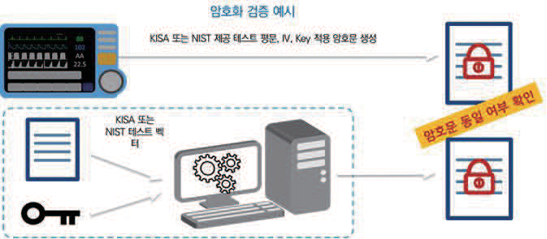

---
<!-- Page 87 -->

## 제4장 디지털헬스케어 기기 보안요구사항 및 보안대책 | 87

및
보안대책
및
보안대책
개요
디지털헬스케어
서비스
모델
디지털헬스케어
보안위협
디지털헬스케어
기기
보안요구사항
디지털헬스케어
서비스
보안요구사항
참고문헌
제1장
제2장
제3장
제4장
제5장
부록

#### 2.2 안전한 암호키 관리

2.2.1 암호키의 생명주기를 고려하여 안전하게 관리되어야 한다.
보안위협 및 취약점(제3장 참조)
취약한 암호 알고리즘, 불충분한 암호키, 유추 가능한 난수 사용으로 중요데이터를 적절하게 보호하지 못 할 수 있다.
보안요구사항 및 보안대책
안전성이 검증된 방법(안전한 난수 발생기 등)을 이용하여 암호키를 생성하여야 한다.
암호키 저장 또는 전송 시 기밀성을 보장하여야 한다.
* 단, 공개키는 반드시 기밀성을 보장할 필요는 없다.
암호키 저장 또는 전송 시 무결성을 보장하여야 한다.
데이터 중요도, 노출 가능성, 노출 시 위험 수준 등을 고려하여 암호키 사용 기간 설정 및 암호키 갱신을 수행
하여야 한다.
NIST에서 권고하는 암호키 사용 유효기간에 따라 암호키를 사용하여야 한다.
< 암호키 사용 유효기간 >
사용 유효기간
키 종류
송신자 사용기간 수신자 사용기간
대칭키암호 비밀키 최대 2년 최대 5년*
암호화 공개키 최대 2년
복호화 개인키 최대 2년
공개키암호
검증용 공개키 최소 2년
서명용 개인키 최대 2년
* 수신자의 경우 송신자가 전송한 암호화된 데이터를 수신한 후 필요시에 복호화할 수 있으므로 송신자보다 오랫동안
비밀키를 사용할 수 있다.
사용 기간이 만료되거나 무결성이 훼손된 암호키는 즉시 파기하여야 한다.
암호키 파기 시 암호키 생성 관련 정보도 함께 파기하여야 한다.
점검방법
안전한 난수 생성 알고리즘 및 생성 절차에 따라 생성되는지 암호키 생성 프로세스를 확인한다.
암호키 정보가 평문으로 전송되지 않는지 확인
참고문헌
• (한국) 의료기기의 사이버보안 허가심사 가이드라인 > 식별(Identify), 보호(Protect) > 안전한 알고리즘 사용

| 보안위협 및 취약점(제3장 참조) |
| --- |
| 취약한 암호 알고리즘, 불충분한 암호키, 유추 가능한 난수 사용으로 중요데이터를 적절하게 보호하지 못 할 수 있다. |
| 보안요구사항 및 보안대책 |
| 안전성이 검증된 방법(안전한 난수 발생기 등)을 이용하여 암호키를 생성하여야 한다. 암호키 저장 또는 전송 시 기밀성을 보장하여야 한다. * 단, 공개키는 반드시 기밀성을 보장할 필요는 없다. 암호키 저장 또는 전송 시 무결성을 보장하여야 한다. 데이터 중요도, 노출 가능성, 노출 시 위험 수준 등을 고려하여 암호키 사용 기간 설정 및 암호키 갱신을 수행 하여야 한다. NIST에서 권고하는 암호키 사용 유효기간에 따라 암호키를 사용하여야 한다. < 암호키 사용 유효기간 > 사용 유효기간 키 종류 송신자 사용기간 수신자 사용기간 대칭키암호 비밀키 최대 2년 최대 5년* 암호화 공개키 최대 2년 복호화 개인키 최대 2년 공개키암호 검증용 공개키 최소 2년 서명용 개인키 최대 2년 * 수신자의 경우 송신자가 전송한 암호화된 데이터를 수신한 후 필요시에 복호화할 수 있으므로 송신자보다 오랫동안 비밀키를 사용할 수 있다. 사용 기간이 만료되거나 무결성이 훼손된 암호키는 즉시 파기하여야 한다. 암호키 파기 시 암호키 생성 관련 정보도 함께 파기하여야 한다. |
| 점검방법 |
| 안전한 난수 생성 알고리즘 및 생성 절차에 따라 생성되는지 암호키 생성 프로세스를 확인한다. 암호키 정보가 평문으로 전송되지 않는지 확인 |
| 참고문헌 |
| • (한국) 의료기기의 사이버보안 허가심사 가이드라인 > 식별(Identify), 보호(Protect) > 안전한 알고리즘 사용 |

| 키 종류 |  | 사용 유효기간 |  |
| --- | --- | --- | --- |
|  |  | 송신자 사용기간 | 수신자 사용기간 |
| 대칭키암호 | 비밀키 | 최대 2년 | 최대 5년* |
| 공개키암호 | 암호화 공개키 | 최대 2년 |  |
|  | 복호화 개인키 | 최대 2년 |  |
|  | 검증용 공개키 | 최소 2년 |  |
|  | 서명용 개인키 | 최대 2년 |  |

---
<!-- Page 88 -->
2.2.2 암호 연산 목적에 따라 별도의 암호키를 사용하여야 한다.
보안위협 및 취약점(제3장 참조)
취약한 암호 알고리즘, 불충분한 암호키, 유추 가능한 난수 사용으로 중요데이터를 적절하게 보호하지 못 할 수
있다.
보안요구사항 및 보안대책
암호 연산 목적에 따라 암호키는 별도로 사용되어야 하며, 사용되는 키의 목적을 명확하게 하여야 한다.
점검방법
각 암호키에 대한 사용 목적을 명확하게 기술하고, 사용 목적에 따라 별도의 암호키가 사용되는지 확인하여야
한다.
참고문헌
• UL, “Software Cybersecurity for Network-Connctable Products, Part 1: General Requirements”, ANSI/CAN/
UL 2900-1:2017, 2017.
• UL, “Software Cybersecurity for Network-Connctable Products, Part 2-1: Particular Requirements for
Network Connectable Components of Healthcare and Wellness Systems”, ANSI/CAN/UL 2900-2-1:2018,
2018.

| 보안위협 및 취약점(제3장 참조) |
| --- |
| 취약한 암호 알고리즘, 불충분한 암호키, 유추 가능한 난수 사용으로 중요데이터를 적절하게 보호하지 못 할 수 있다. |
| 보안요구사항 및 보안대책 |
| 암호 연산 목적에 따라 암호키는 별도로 사용되어야 하며, 사용되는 키의 목적을 명확하게 하여야 한다. |
| 점검방법 |
| 각 암호키에 대한 사용 목적을 명확하게 기술하고, 사용 목적에 따라 별도의 암호키가 사용되는지 확인하여야 한다. |
| 참고문헌 |
| • UL, “Software Cybersecurity for Network-Connctable Products, Part 1: General Requirements”, ANSI/CAN/ UL 2900-1:2017, 2017. • UL, “Software Cybersecurity for Network-Connctable Products, Part 2-1: Particular Requirements for Network Connectable Components of Healthcare and Wellness Systems”, ANSI/CAN/UL 2900-2-1:2018, 2018. |

---
<!-- Page 89 -->

## 제4장 디지털헬스케어 기기 보안요구사항 및 보안대책 | 89

및
보안대책
및
보안대책
개요
디지털헬스케어
서비스
모델
디지털헬스케어
보안위협
디지털헬스케어
기기
보안요구사항
디지털헬스케어
서비스
보안요구사항
참고문헌
제1장
제2장
제3장
제4장
제5장
부록

#### 2.3 안전한 난수 생성

2.3.1 난수 생성 시 난수성이 검증된 알고리즘을 이용해야 한다.
보안위협 및 취약점(제3장 참조)
취약한 암호 알고리즘, 불충분한 암호키, 유추 가능한 난수 사용으로 중요데이터를 적절하게 보호하지 못 할 수
있다.
보안요구사항 및 보안대책
안전성, 신뢰성, 상호운용성에서 적합성을 검증받은 국내·외 표준 난수 생성 알고리즘을 사용하여야 한다.
각 표준 난수 생성 알고리즘의 테스트 벡터값을 활용하여 구현의 정확성을 검증한 후 사용하여야 한다.
점검방법
KS X ISO/IEC 19790 또는 FIPS140-2의 검증대상 알고리즘 여부를 확인한다.
국가정보원 또는 NIST에서 제시한 테스트 벡터값을 적용하여 구현 정확성을 검증한다.
일반 계정의 관리자계정 접근통제 예시
참고문헌
• D TSec, “Protection Profile for Connected Diabetes Devices (CDD)”, Version 2.0, 2017.11.25.

| 보안위협 및 취약점(제3장 참조) |
| --- |
| 취약한 암호 알고리즘, 불충분한 암호키, 유추 가능한 난수 사용으로 중요데이터를 적절하게 보호하지 못 할 수 있다. |
| 보안요구사항 및 보안대책 |
| 안전성, 신뢰성, 상호운용성에서 적합성을 검증받은 국내·외 표준 난수 생성 알고리즘을 사용하여야 한다. 각 표준 난수 생성 알고리즘의 테스트 벡터값을 활용하여 구현의 정확성을 검증한 후 사용하여야 한다. |
| 점검방법 |
| KS X ISO/IEC 19790 또는 FIPS140-2의 검증대상 알고리즘 여부를 확인한다. 국가정보원 또는 NIST에서 제시한 테스트 벡터값을 적용하여 구현 정확성을 검증한다. 일반 계정의 관리자계정 접근통제 예시 |
| 참고문헌 |
| • D TSec, “Protection Profile for Connected Diabetes Devices (CDD)”, Version 2.0, 2017.11.25. |

|  |  | 제4장 |  |
| --- | --- | --- | --- |
|  | 사항 디지 |  |  |

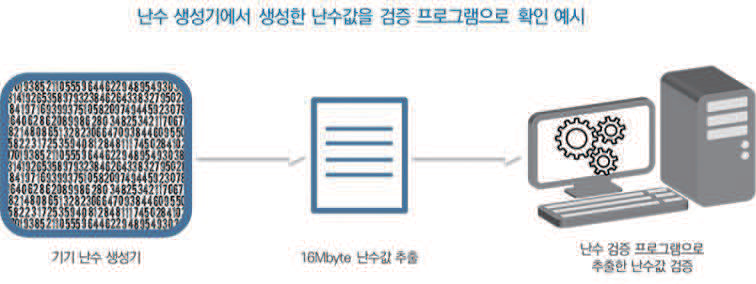

---
<!-- Page 90 -->
3 | 데이터 보안

#### 3.1 인터페이스 입력값 검증

3.1.1 디지털헬스케어 기기는 기능 동작에 사용되는 모든 입력값을 검증해야 한다.
보안위협 및 취약점(제3장 참조)
입력값에 대한 검증 부재로 디지털헬스케어 기기가 오작동할 수 있다.
보안요구사항 및 보안대책
기기 입력값에 대한 유효성 검증 체계를 갖추고 유효하지 않은 값에 대한 처리 방법을 구현해야 한다.
* ‘소프트웨어 개발보안 가이드(행정안전부, KISA)’의 입력데이터 검증 및 표현 참조
인터페이스 특성을 고려하여 데이터를 입력 받아야 한다.
* (인터페이스 예시) Wi-Fi, 이더넷, 블루투스, USB 등
제조업체는 모든 입력(외부뿐만 아니라)을 검증하도록 설계를 고려해야 하고, 안전하지 않은 통신을 지원하는
기기와 환경을 고려해야 한다.
외부입력값을 이용하여 시스템자원(IP, PORT 번호, 프로세스, 메모리, 파일 등)을 식별하는 경우 허가되지 않은
자원이 사용되지 않도록 해야 한다
서버 프로그램 안에서 쉘을 생성하여 명령어를 실행해야 하는 경우 외부 입력 값에 의해 악의적인 명령어가
실행되지 않도록 해야 한다.
점검방법
기기 외부에서 연결되어 기기 동작에 영향을 주는 인터페이스를 모두 확인한다.
기기에 정의된 입력값과 데이터 형태를 확인하고 입력데이터에 대하여 검증하는 기능을 확인한다.
외부 입력 값에 대한 유효성 검증 없이 내부 자원 또는 기능 동작에 직접적으로 사용되는지 확인한다.
소스코드 점검도구로 메모리 버퍼오버플로우 등에 취약한 코드 및 API 사용 여부를 확인한다.
참고문헌
• IMDRF, “Principles and Practices for Medical Device Cybersecurity”, 2020.
• BSI, “Cyber Security Requirements for Network-Connected Medical Devices”, BSI-CS 132, Version 1.1,
2018.11.13.
• OWASP, “OWASP Top 10–2017, The Ten Most Critical Web Application Security Risks”, 2017.
• KISA, “소프트웨어 개발보안가이드”, 11-1311000-000330-10, 2019.

| 보안위협 및 취약점(제3장 참조) |
| --- |
| 입력값에 대한 검증 부재로 디지털헬스케어 기기가 오작동할 수 있다. |
| 보안요구사항 및 보안대책 |
| 기기 입력값에 대한 유효성 검증 체계를 갖추고 유효하지 않은 값에 대한 처리 방법을 구현해야 한다. * ‘소프트웨어 개발보안 가이드(행정안전부, KISA)’의 입력데이터 검증 및 표현 참조 인터페이스 특성을 고려하여 데이터를 입력 받아야 한다. * (인터페이스 예시) Wi-Fi, 이더넷, 블루투스, USB 등 제조업체는 모든 입력(외부뿐만 아니라)을 검증하도록 설계를 고려해야 하고, 안전하지 않은 통신을 지원하는 기기와 환경을 고려해야 한다. 외부입력값을 이용하여 시스템자원(IP, PORT 번호, 프로세스, 메모리, 파일 등)을 식별하는 경우 허가되지 않은 자원이 사용되지 않도록 해야 한다 서버 프로그램 안에서 쉘을 생성하여 명령어를 실행해야 하는 경우 외부 입력 값에 의해 악의적인 명령어가 실행되지 않도록 해야 한다. |
| 점검방법 |
| 기기 외부에서 연결되어 기기 동작에 영향을 주는 인터페이스를 모두 확인한다. 기기에 정의된 입력값과 데이터 형태를 확인하고 입력데이터에 대하여 검증하는 기능을 확인한다. 외부 입력 값에 대한 유효성 검증 없이 내부 자원 또는 기능 동작에 직접적으로 사용되는지 확인한다. 소스코드 점검도구로 메모리 버퍼오버플로우 등에 취약한 코드 및 API 사용 여부를 확인한다. |
| 참고문헌 |
| • IMDRF, “Principles and Practices for Medical Device Cybersecurity”, 2020. • BSI, “Cyber Security Requirements for Network-Connected Medical Devices”, BSI-CS 132, Version 1.1, 2018.11.13. • OWASP, “OWASP Top 10–2017, The Ten Most Critical Web Application Security Risks”, 2017. • KISA, “소프트웨어 개발보안가이드”, 11-1311000-000330-10, 2019. |

---
<!-- Page 91 -->

## 제4장 디지털헬스케어 기기 보안요구사항 및 보안대책 | 91

및
보안대책
및
보안대책
개요
디지털헬스케어
서비스
모델
디지털헬스케어
보안위협
디지털헬스케어
기기
보안요구사항
디지털헬스케어
서비스
보안요구사항
참고문헌
제1장
제2장
제3장
제4장
제5장
부록
디지털헬스케어 기기는 통신인터페이스를 통해 유입되는 민감 데이터에 대해 무결성을
3.1.2
확인해야 한다.
보안위협 및 취약점(제3장 참조)
입력값에 대한 검증 부재로 디지털헬스케어 기기가 오작동할 수 있다.
보안요구사항 및 보안대책
데이터 조작방지를 위해 외부 인터페이스를 통해 유입되는 입력값에 대한 검증을 수행해야 한다.
원격 인터페이스를 통해 전송되는 민감 데이터의 무결성을 보장해야 한다.
* (예) 디지털 서명, 메시지 인증 코드(MAC) 등
점검방법
민감 데이터의 유입이 가능한 통신인터페이스를 식별한다.
통신인터페이스를 통해 유입되는 데이터에 대한 무결성을 확인할 수 있는 기능이 구현되었는지 확인한다.
무결성을 보장하기 위한 적절하고 안전한 방법을 사용하였는지 확인한다.
* (예1) 디지털 서명, 메시지 인증 코드(MAC) 등
* (예2) 전송데이터에 대한 무결성을 제공해주는 OpenSSL 등 사용
무결성 오류시에 대한 대응기능을 확인한다.
* (예) 재전송 요청, 사용자에게 무결성 오류 알람, 무결성 오류 복구 등
참고문헌
• U.S. FDA, “(Draft) Content of Premarket Submissions for Management of Cybersecurity in Medical Devices”,
2018.
• UL, “Software Cybersecurity for Network-Connctable Products, Part 1: General Requirements”, ANSI/CAN/
UL 2900-1:2017, 2017.
• UL, “Software Cybersecurity for Network-Connctable Products, Part 2-1: Particular Requirements for
Network Connectable Components of Healthcare and Wellness Systems”, ANSI/CAN/UL 2900-2-1:2018,
2018.
• DTSec, “Protection Profile for Connected Diabetes Devices (CDD)”, Version 2.0, 2017.11.25.
• BSI, “Cyber Security Requirements for Network-Connected Medical Devices”, BSI-CS 132, Version 1.1,
2018.11.13.
• KISA, “소프트웨어 개발보안가이드”, 11-1311000-000330-10, 2019.

| 보안위협 및 취약점(제3장 참조) |
| --- |
| 입력값에 대한 검증 부재로 디지털헬스케어 기기가 오작동할 수 있다. |
| 보안요구사항 및 보안대책 |
| 데이터 조작방지를 위해 외부 인터페이스를 통해 유입되는 입력값에 대한 검증을 수행해야 한다. 원격 인터페이스를 통해 전송되는 민감 데이터의 무결성을 보장해야 한다. * (예) 디지털 서명, 메시지 인증 코드(MAC) 등 |
| 점검방법 |
| 민감 데이터의 유입이 가능한 통신인터페이스를 식별한다. 통신인터페이스를 통해 유입되는 데이터에 대한 무결성을 확인할 수 있는 기능이 구현되었는지 확인한다. 무결성을 보장하기 위한 적절하고 안전한 방법을 사용하였는지 확인한다. * (예1) 디지털 서명, 메시지 인증 코드(MAC) 등 * (예2) 전송데이터에 대한 무결성을 제공해주는 OpenSSL 등 사용 무결성 오류시에 대한 대응기능을 확인한다. * (예) 재전송 요청, 사용자에게 무결성 오류 알람, 무결성 오류 복구 등 |
| 참고문헌 |
| • U.S. FDA, “(Draft) Content of Premarket Submissions for Management of Cybersecurity in Medical Devices”, 2018. • UL, “Software Cybersecurity for Network-Connctable Products, Part 1: General Requirements”, ANSI/CAN/ UL 2900-1:2017, 2017. • UL, “Software Cybersecurity for Network-Connctable Products, Part 2-1: Particular Requirements for Network Connectable Components of Healthcare and Wellness Systems”, ANSI/CAN/UL 2900-2-1:2018, 2018. • DTSec, “Protection Profile for Connected Diabetes Devices (CDD)”, Version 2.0, 2017.11.25. • BSI, “Cyber Security Requirements for Network-Connected Medical Devices”, BSI-CS 132, Version 1.1, 2018.11.13. • KISA, “소프트웨어 개발보안가이드”, 11-1311000-000330-10, 2019. |

---
<!-- Page 92 -->
디지털헬스케어 기기가 서버/클라이언트 형태로 구성된 경우, 기기 동작을 위해 서버
3.1.3
에서 유입되어 사용되는 모든 매개변수는 서버에서 검증해야 한다.
보안위협 및 취약점(제3장 참조)
입력값에 대한 검증 부재로 디지털헬스케어 기기가 오작동할 수 있다.
보안요구사항 및 보안대책
사용자의 역할·권한을 결정하는 정보는 서버에서 관리해야 한다.
환경변수, 매개변수 등 보안 수단으로 사용되는 모든 매개 변수를 서버에서 검증해야 한다.
상태정보나 인증·인가 권한에 관련된 중요정보는 서버 측의 세션이나 DB에 저장해서 사용하도록 설계한다.
서버에서 수행하는 입력값 검증은 ‘3.1.1’ 요구사항을 참조한다.
점검방법
디지털헬스케어 기기의 서비스 구성요소와 구조(예, 클라이언트·서버)를 확인한다.
기기와 서버구조에서, 기기의 중요 기능(예, 인증, 인가 등) 수행을 위해 사용되는 외부 입력값이 서버에 전송되어
유효성이 검사되어 사용되는지 확인한다.,
참고문헌
• BSI, “Cyber Security Requirements for Network-Connected Medical Devices”, BSI-CS 132, Version 1.1,
2018.11.13.
• KISA, “소프트웨어 개발보안가이드”, 11-1311000-000330-10, 2019.

| 보안위협 및 취약점(제3장 참조) |
| --- |
| 입력값에 대한 검증 부재로 디지털헬스케어 기기가 오작동할 수 있다. |
| 보안요구사항 및 보안대책 |
| 사용자의 역할·권한을 결정하는 정보는 서버에서 관리해야 한다. 환경변수, 매개변수 등 보안 수단으로 사용되는 모든 매개 변수를 서버에서 검증해야 한다. 상태정보나 인증·인가 권한에 관련된 중요정보는 서버 측의 세션이나 DB에 저장해서 사용하도록 설계한다. 서버에서 수행하는 입력값 검증은 ‘3.1.1’ 요구사항을 참조한다. |
| 점검방법 |
| 디지털헬스케어 기기의 서비스 구성요소와 구조(예, 클라이언트·서버)를 확인한다. 기기와 서버구조에서, 기기의 중요 기능(예, 인증, 인가 등) 수행을 위해 사용되는 외부 입력값이 서버에 전송되어 유효성이 검사되어 사용되는지 확인한다., |
| 참고문헌 |
| • BSI, “Cyber Security Requirements for Network-Connected Medical Devices”, BSI-CS 132, Version 1.1, 2018.11.13. • KISA, “소프트웨어 개발보안가이드”, 11-1311000-000330-10, 2019. |

---
<!-- Page 93 -->

## 제4장 디지털헬스케어 기기 보안요구사항 및 보안대책 | 93

및
보안대책
및
보안대책
개요
디지털헬스케어
서비스
모델
디지털헬스케어
보안위협
디지털헬스케어
기기
보안요구사항
디지털헬스케어
서비스
보안요구사항
참고문헌
제1장
제2장
제3장
제4장
제5장
부록

#### 3.2 정보흐름통제

디지털헬스케어 기기의 구성요소가 2개 이상인 경우, 구성요소 간 송·수신되는 정보
3.2.1
흐름을 통제할 수 있어야 한다.
보안위협 및 취약점(제3장 참조)
신뢰할 수 없는 데이터 송수신으로 디지털헬스케어 기기가 오작동을 유발하거나 악성코드를 전파할 수 있다.
보안요구사항 및 보안대책
구성요소(예, BGM, CDD 등)로/에서 유입 또는 발신되는 정보(예, 개인혈당측정값 등 개인의료정보, 기기 제어
정보 등) 흐름을 통제해야 한다.
* BGM(Blood Glucose Monitors): 혈당모니터, CDD(Connected Diabetes Devices): 연결된 당뇨장치
* (정보흐름 통제 예) 등록된 센서에서 전송되는 데이터만 수신 허용 등
네트워크 기능을 보유하는 제품의 경우, 허가되지 않은 네트워크 트래픽을 차단하는 기능을 제공해야 한다.
데이터의 흐름도 확인 및 잘못된 방향으로 데이터가 흘러 가지 않아야 한다.
기기에서 특정 포트 오픈이 필요할 경우, 기본적으로 모든 트래픽을 거부(Deny)로 설정해야 하며, 사용자의
요구에 의해 특정 포트를 허가(allow)해야 한다.
사전에 통신이 허용된 기기를 등록하고, 등록되지 않은 기기로부터 전송되는 데이터를 통제할 수 있는 기능을
구현한다.
점검방법
네트워트 트래픽을 허용하는 기기 목록 등 네트워크 트래픽을 허용 및 차단 목록을 확인한다.
허가된 프로토콜 목록 및 등록 사유를 확인한다.
정보흐름 통제 정책에 따라 정보가 통제(허용 또는 차단)되는지 확인한다.
참고문헌
• DTSec, “Protection Profile for Connected Diabetes Devices (CDD)”, Version 2.0, 2017.11.25.
• KISA, “소프트웨어 개발보안가이드”, 11-1311000-000330-10, 2019.

| 보안위협 및 취약점(제3장 참조) |
| --- |
| 신뢰할 수 없는 데이터 송수신으로 디지털헬스케어 기기가 오작동을 유발하거나 악성코드를 전파할 수 있다. |
| 보안요구사항 및 보안대책 |
| 구성요소(예, BGM, CDD 등)로/에서 유입 또는 발신되는 정보(예, 개인혈당측정값 등 개인의료정보, 기기 제어 정보 등) 흐름을 통제해야 한다. * BGM(Blood Glucose Monitors): 혈당모니터, CDD(Connected Diabetes Devices): 연결된 당뇨장치 * (정보흐름 통제 예) 등록된 센서에서 전송되는 데이터만 수신 허용 등 네트워크 기능을 보유하는 제품의 경우, 허가되지 않은 네트워크 트래픽을 차단하는 기능을 제공해야 한다. 데이터의 흐름도 확인 및 잘못된 방향으로 데이터가 흘러 가지 않아야 한다. 기기에서 특정 포트 오픈이 필요할 경우, 기본적으로 모든 트래픽을 거부(Deny)로 설정해야 하며, 사용자의 요구에 의해 특정 포트를 허가(allow)해야 한다. 사전에 통신이 허용된 기기를 등록하고, 등록되지 않은 기기로부터 전송되는 데이터를 통제할 수 있는 기능을 구현한다. |
| 점검방법 |
| 네트워트 트래픽을 허용하는 기기 목록 등 네트워크 트래픽을 허용 및 차단 목록을 확인한다. 허가된 프로토콜 목록 및 등록 사유를 확인한다. 정보흐름 통제 정책에 따라 정보가 통제(허용 또는 차단)되는지 확인한다. |
| 참고문헌 |
| • DTSec, “Protection Profile for Connected Diabetes Devices (CDD)”, Version 2.0, 2017.11.25. • KISA, “소프트웨어 개발보안가이드”, 11-1311000-000330-10, 2019. |

| 제4장 |  |

---
<!-- Page 94 -->

#### 3.3 저장데이터 보호

디지털헬스케어 기기에 의해 저장되는 모든 민감 데이터와 개인식별 정보에 대한
3.3.1
기밀성과 무결성을 보장해야 한다.
보안위협 및 취약점(제3장 참조)
디지털헬스케어 기기에서 전송되거나 저장되는 개인의료정보, 기기 설정, 암호키 등 중요 데이터가 외부에
노출되어 악용되거나, 변조될 수 있다.
보안요구사항 및 보안대책
기기에 저장되는 중요 데이터(예: 의료기기 설정값, 의료기기 동작 명령어 등), 민감 데이터(예: 개인의료정보 등)에
대한 무단 접근, 변조 등을 방지할 수 있도록 암호화하여 저장해야 한다.
* 암호화 요구사항은 2.1~2.2 요구사항을 참조한다.
환자의 개인정보는 저장하지 않아야 하며, 저장 필요시 기술적인 보안조치를 하여 저장해야 한다.
* 개인정보를 기반으로 서비스를 제공하거나 서버에 개인정보를 저장하는 경우, 개인정보 보호법 및 동법 시행령 등
관련법규의 요구사항을 만족해야 한다.
개인 영상정보와 같이 저장 용량이 큰 정보의 경우, 특정영역 마스킹 또는 부분 암호화 적용, 자체인코딩(BASE64
등 알려진 단순한 인코딩 제외)을 통해 중요정보 암호화 요구사항 및/또는 비식별화 요구사항을 대체할 수 있다.
* (비식별화 예) 가명처리, 총계처리, 데이터 삭제, 데이터 범주화(Data Suppression), 데이터 마스킹 등
* 개인정보 비식별 조치 가이드라인, 빅데이터 개인정보보호 가이드라인 해설서 등 참조
점검방법
저장되는 환자관련 민감정보에 대한 목록을 확인한다.
저장되는 개인정보와 민감 정보에 대하여 기밀성과 무결성 적용여부를 확인한다.
환자 정보에 대하여 비식별화 수행 시 비식별화 방법이 적절하게 되었는지 확인한다.
기밀성과 무결성이 필요한 정보에 대하여 적절한 암호 알고리즘을 사용했는지 확인한다.
안전한 암호화방식 사용 검증 예시

| 보안위협 및 취약점(제3장 참조) |
| --- |
| 디지털헬스케어 기기에서 전송되거나 저장되는 개인의료정보, 기기 설정, 암호키 등 중요 데이터가 외부에 노출되어 악용되거나, 변조될 수 있다. |
| 보안요구사항 및 보안대책 |
| 기기에 저장되는 중요 데이터(예: 의료기기 설정값, 의료기기 동작 명령어 등), 민감 데이터(예: 개인의료정보 등)에 대한 무단 접근, 변조 등을 방지할 수 있도록 암호화하여 저장해야 한다. * 암호화 요구사항은 2.1~2.2 요구사항을 참조한다. 환자의 개인정보는 저장하지 않아야 하며, 저장 필요시 기술적인 보안조치를 하여 저장해야 한다. * 개인정보를 기반으로 서비스를 제공하거나 서버에 개인정보를 저장하는 경우, 개인정보 보호법 및 동법 시행령 등 관련법규의 요구사항을 만족해야 한다. 개인 영상정보와 같이 저장 용량이 큰 정보의 경우, 특정영역 마스킹 또는 부분 암호화 적용, 자체인코딩(BASE64 등 알려진 단순한 인코딩 제외)을 통해 중요정보 암호화 요구사항 및/또는 비식별화 요구사항을 대체할 수 있다. * (비식별화 예) 가명처리, 총계처리, 데이터 삭제, 데이터 범주화(Data Suppression), 데이터 마스킹 등 * 개인정보 비식별 조치 가이드라인, 빅데이터 개인정보보호 가이드라인 해설서 등 참조 |
| 점검방법 |
| 저장되는 환자관련 민감정보에 대한 목록을 확인한다. 저장되는 개인정보와 민감 정보에 대하여 기밀성과 무결성 적용여부를 확인한다. 환자 정보에 대하여 비식별화 수행 시 비식별화 방법이 적절하게 되었는지 확인한다. 기밀성과 무결성이 필요한 정보에 대하여 적절한 암호 알고리즘을 사용했는지 확인한다. 안전한 암호화방식 사용 검증 예시 |

---
<!-- Page 95 -->

## 제4장 디지털헬스케어 기기 보안요구사항 및 보안대책 | 95

및
보안대책
및
보안대책
개요
디지털헬스케어
서비스
모델
디지털헬스케어
보안위협
디지털헬스케어
기기
보안요구사항
디지털헬스케어
서비스
보안요구사항
참고문헌
제1장
제2장
제3장
제4장
제5장
부록
개인 민감정보 암호화 처리검증 예시
참고문헌
• T MBIA, “適用於製造廠之醫療器材網路安全指引(제조업체에 적용 가능한 의료기기에 대한 사이버 보안 지침)”, 2019.
• H ealth Canada,“Pre-market Requirements for Medical Device Cybersecurity”, 2019.
• U L, “Software Cybersecurity for Network-Connctable Products, Part 1: General Requirements”, ANSI/CAN/
UL 2900-1:2017, 2017.
• U L, “Software Cybersecurity for Network-Connctable Products, Part 2-1: Particular Requirements for
Network Connectable Components of Healthcare and Wellness Systems”, ANSI/CAN/UL 2900-2-1:2018,
2018.
• U .S. FDA, “(Draft) Medical Device Manufacturer Internet of Things (IoT) Code of Conduct”, 2020.
• M DCG, “Guidance on Cybersecurity for medical devices”, MDCG 2019-16, 2019.11.

| 개인 민감정보 암호화 처리검증 예시 |
| --- |
| 참고문헌 |
| • T MBIA, “適用於製造廠之醫療器材網路安全指引(제조업체에 적용 가능한 의료기기에 대한 사이버 보안 지침)”, 2019. • H ealth Canada,“Pre-market Requirements for Medical Device Cybersecurity”, 2019. • U L, “Software Cybersecurity for Network-Connctable Products, Part 1: General Requirements”, ANSI/CAN/ UL 2900-1:2017, 2017. • U L, “Software Cybersecurity for Network-Connctable Products, Part 2-1: Particular Requirements for Network Connectable Components of Healthcare and Wellness Systems”, ANSI/CAN/UL 2900-2-1:2018, 2018. • U .S. FDA, “(Draft) Medical Device Manufacturer Internet of Things (IoT) Code of Conduct”, 2020. • M DCG, “Guidance on Cybersecurity for medical devices”, MDCG 2019-16, 2019.11. |

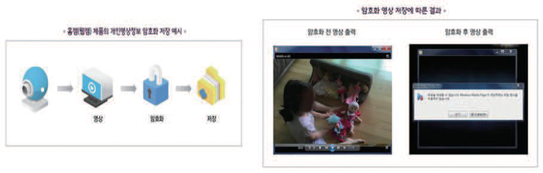

---
<!-- Page 96 -->
3.3.2 디지털헬스케어 기기에 저장되는 민감데이터에 대한 비인가된 접근을 차단해야 한다.
보안위협 및 취약점(제3장 참조)
디지털헬스케어 기기에서 전송되거나 저장되는 개인의료정보, 기기 설정, 암호키 등 중요 데이터가 외부에 노출
되어 악용되거나, 변조될 수 있다.
보안요구사항 및 보안대책
기기에 저장되는 민감데이터(예, 개인의료정보 등)에 비인가된 접근을 차단하기 위해 접근통제 기능을 제공해야
한다.
* (예) 아이디/비밀번호 기반 인증이후 사용자 접근권한에 따라 접근 허가 및 차단 등
계정에 부여된 권한에 따라 기기 기능 관리서비스, 민감데이터, 중요정보(환경설정 파일 등)에 대한 접근을 허용
하는 경우 일반 사용자 등 다른 권한들과 분리하여 해당 권한을 관리해야 한다.
점검방법
디지터헬스케어 기기에서 처리되는 개인정보의 종류를 확인한다.
디지터헬스케어 기기의 민감 데이터에 접근 시도시 인증을 요구하는지 확인한다.
계정에 부여된 권한을 통해 관리자와 일반 사용자를 구분하는 경우, 민감데이터에 대한 접근 권한이 있는 계정으로
로그인하여 민감데이터에 접근이 가능한지 확인한다.
해당 계정 로그아웃 후 일반 사용자 계정(민감데이터에 접근 권한이 없는 계정)으로 로그인하여 민감데이터에
접근이 거부되는지 확인한다.
구현된 인증 및 접근통제 메커니즘의 정상동작 여부를 확인한다.
참고문헌
• BSI, “Cyber Security Requirements for Network-Connected Medical Devices”, BSI-CS 132, Version 1.1,
2018.11.13.
• KISA, “사물인터넷(IoT) 보안 시험・인증 기준 해설서”, 2019.

| 보안위협 및 취약점(제3장 참조) |
| --- |
| 디지털헬스케어 기기에서 전송되거나 저장되는 개인의료정보, 기기 설정, 암호키 등 중요 데이터가 외부에 노출 되어 악용되거나, 변조될 수 있다. |
| 보안요구사항 및 보안대책 |
| 기기에 저장되는 민감데이터(예, 개인의료정보 등)에 비인가된 접근을 차단하기 위해 접근통제 기능을 제공해야 한다. * (예) 아이디/비밀번호 기반 인증이후 사용자 접근권한에 따라 접근 허가 및 차단 등 계정에 부여된 권한에 따라 기기 기능 관리서비스, 민감데이터, 중요정보(환경설정 파일 등)에 대한 접근을 허용 하는 경우 일반 사용자 등 다른 권한들과 분리하여 해당 권한을 관리해야 한다. |
| 점검방법 |
| 디지터헬스케어 기기에서 처리되는 개인정보의 종류를 확인한다. 디지터헬스케어 기기의 민감 데이터에 접근 시도시 인증을 요구하는지 확인한다. 계정에 부여된 권한을 통해 관리자와 일반 사용자를 구분하는 경우, 민감데이터에 대한 접근 권한이 있는 계정으로 로그인하여 민감데이터에 접근이 가능한지 확인한다. 해당 계정 로그아웃 후 일반 사용자 계정(민감데이터에 접근 권한이 없는 계정)으로 로그인하여 민감데이터에 접근이 거부되는지 확인한다. 구현된 인증 및 접근통제 메커니즘의 정상동작 여부를 확인한다. |
| 참고문헌 |
| • BSI, “Cyber Security Requirements for Network-Connected Medical Devices”, BSI-CS 132, Version 1.1, 2018.11.13. • KISA, “사물인터넷(IoT) 보안 시험・인증 기준 해설서”, 2019. |

---
<!-- Page 97 -->

## 제4장 디지털헬스케어 기기 보안요구사항 및 보안대책 | 97

및
보안대책
및
보안대책
개요
디지털헬스케어
서비스
모델
디지털헬스케어
보안위협
디지털헬스케어
기기
보안요구사항
디지털헬스케어
서비스
보안요구사항
참고문헌
제1장
제2장
제3장
제4장
제5장
부록
3.3.3 디지털헬스케어 기기에 저장되는 암호키 등 안전 관련 데이터 보호를 제공해야 한다.
보안위협 및 취약점(제3장 참조)
디지털헬스케어 기기에서 전송되거나 저장되는 개인의료정보, 기기 설정, 암호키 등 중요 데이터가 외부에 노출
되어 악용되거나, 변조될 수 있다.
보안요구사항 및 보안대책
기기에 저장되는 안전(Security) 관련 데이터를 식별한다.
* (예) 암호키, 비밀번호, PIN 등
* 암호화 요구사항은 2.1~2.2 요구사항을 참조한다.
안전 관련 데이터를 암호화하기 위해 정보가 저장된 저장소를 암호화하거나 해당 정보만 암호화할 수 있다.
점검방법
저장되는 안전 관련 데이터 목록을 확인한다.
안전 관련 데이터를 암호화한 암호 알고리즘을 확인한다.
저장 방법이 무엇인지 확인한다.
안전 관련 데이터 확인 예시
참고문헌
• I MDRF, “Principles and Practices for Medical Device Cybersecurity”, 2020.
• H ealth Canada,“Pre-market Requirements for Medical Device Cybersecurity”, 2019.
• K ISA, “사물인터넷(IoT) 보안 시험・인증 기준 해설서”, 2019.

| 보안위협 및 취약점(제3장 참조) |
| --- |
| 디지털헬스케어 기기에서 전송되거나 저장되는 개인의료정보, 기기 설정, 암호키 등 중요 데이터가 외부에 노출 되어 악용되거나, 변조될 수 있다. |
| 보안요구사항 및 보안대책 |
| 기기에 저장되는 안전(Security) 관련 데이터를 식별한다. * (예) 암호키, 비밀번호, PIN 등 * 암호화 요구사항은 2.1~2.2 요구사항을 참조한다. 안전 관련 데이터를 암호화하기 위해 정보가 저장된 저장소를 암호화하거나 해당 정보만 암호화할 수 있다. |
| 점검방법 |
| 저장되는 안전 관련 데이터 목록을 확인한다. 안전 관련 데이터를 암호화한 암호 알고리즘을 확인한다. 저장 방법이 무엇인지 확인한다. 안전 관련 데이터 확인 예시 |
| 참고문헌 |
| • I MDRF, “Principles and Practices for Medical Device Cybersecurity”, 2020. • H ealth Canada,“Pre-market Requirements for Medical Device Cybersecurity”, 2019. • K ISA, “사물인터넷(IoT) 보안 시험・인증 기준 해설서”, 2019. |

| 제4장 |  |

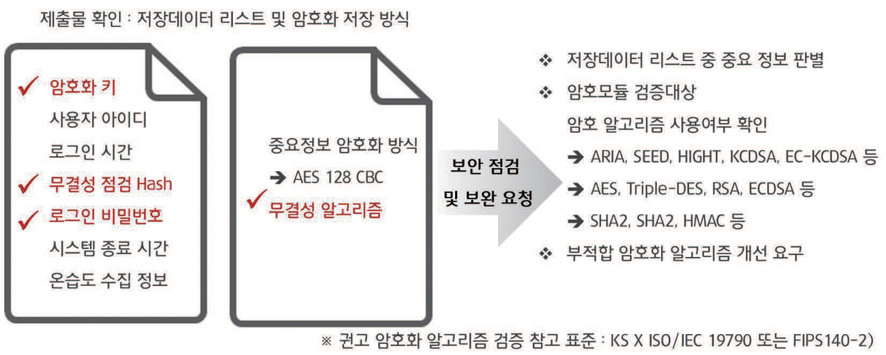

---
<!-- Page 98 -->

#### 3.4 전송데이터 보호

디지털헬스케어 기기에 의해 전송되는 모든 민감 데이터와 개인식별 정보에 대한
3.4.1
기밀성과 무결성을 보장해야 한다.
보안위협 및 취약점(제3장 참조)
디지털헬스케어 기기에서 전송되거나 저장되는 개인의료정보, 기기 설정, 암호키 등 중요 데이터가 외부에 노출
되어 악용되거나, 변조될 수 있다.
보안요구사항 및 보안대책
기기에서 전송되는 중요 데이터(예: 의료기기 설정값, 의료기기 동작 명령어 등), 민감 데이터(예: 개인의료정보 등)
에 대한 유노출, 변조 등을 방지할 수 있도록 안전하게 암호화하여 전송해야 한다.
* 암호화 요구사항은 2.1~2.2 요구사항을 참조한다.
네트워크를 통하여 개인의료정보를 주고받을 경우 적절한 암호화 및 복호화 방식을 활용하여 기밀성과 무결성을
보장해야한다.
점검방법
전송되는 민감 데이터 목록을 확인한다.
민감 데이터에 대한 기밀성과 무결성 적용여부를 확인한다.
기밀성과 무결성이 필요한 정보에 대하여 적절한 전송 암호알고리즘을 사용했는지 확인한다.
통신 채널별 보안 프로토콜의 적합성을 확인한다.
전송되는 민감 데이터에 대한 검증 예
참고문헌
• TMBIA, “適用於製造廠之醫療器材網路安全指引(제조업체에 적용 가능한 의료기기에 대한 사이버 보안 지침)”, 2019.
• Health Canada,“Pre-market Requirements for Medical Device Cybersecurity”, 2019.

| 보안위협 및 취약점(제3장 참조) |
| --- |
| 디지털헬스케어 기기에서 전송되거나 저장되는 개인의료정보, 기기 설정, 암호키 등 중요 데이터가 외부에 노출 되어 악용되거나, 변조될 수 있다. |
| 보안요구사항 및 보안대책 |
| 기기에서 전송되는 중요 데이터(예: 의료기기 설정값, 의료기기 동작 명령어 등), 민감 데이터(예: 개인의료정보 등) 에 대한 유노출, 변조 등을 방지할 수 있도록 안전하게 암호화하여 전송해야 한다. * 암호화 요구사항은 2.1~2.2 요구사항을 참조한다. 네트워크를 통하여 개인의료정보를 주고받을 경우 적절한 암호화 및 복호화 방식을 활용하여 기밀성과 무결성을 보장해야한다. |
| 점검방법 |
| 전송되는 민감 데이터 목록을 확인한다. 민감 데이터에 대한 기밀성과 무결성 적용여부를 확인한다. 기밀성과 무결성이 필요한 정보에 대하여 적절한 전송 암호알고리즘을 사용했는지 확인한다. 통신 채널별 보안 프로토콜의 적합성을 확인한다. 전송되는 민감 데이터에 대한 검증 예 |
| 참고문헌 |
| • TMBIA, “適用於製造廠之醫療器材網路安全指引(제조업체에 적용 가능한 의료기기에 대한 사이버 보안 지침)”, 2019. • Health Canada,“Pre-market Requirements for Medical Device Cybersecurity”, 2019. |

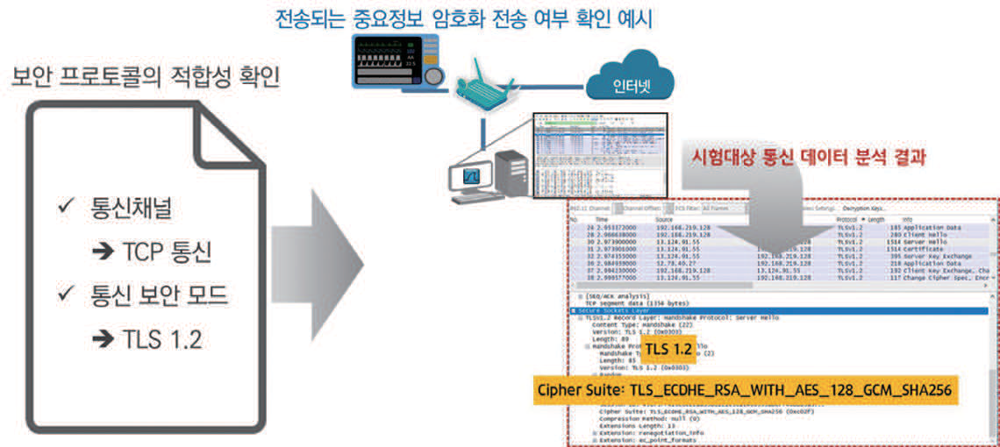

---
<!-- Page 99 -->

## 제4장 디지털헬스케어 기기 보안요구사항 및 보안대책 | 99

및
보안대책
및
보안대책
개요
디지털헬스케어
서비스
모델
디지털헬스케어
보안위협
디지털헬스케어
기기
보안요구사항
디지털헬스케어
서비스
보안요구사항
참고문헌
제1장
제2장
제3장
제4장
제5장
부록
• UL, “Software Cybersecurity for Network-Connctable Products, Part 1: General Requirements”, ANSI/
CAN/UL 2900-1:2017, 2017.
• UL, “Software Cybersecurity for Network-Connctable Products, Part 2-1: Particular Requirements for
Network Connectable Components of Healthcare and Wellness Systems”, ANSI/CAN/UL 2900-2-
1:2018, 2018.
• U.S. FDA, “(Draft) Medical Device Manufacturer Internet of Things (IoT) Code of Conduct”, 2020.
• MDCG, “Guidance on Cybersecurity for medical devices”, MDCG 2019-16, 2019.11.
• BSI, “Cyber Security Requirements for Network-Connected Medical Devices”, BSI-CS 132, Version
1.1, 2018.11.13.
• IMDRF, “Principles and Practices for Medical Device Cybersecurity”, 2020.
• Health Canada,“Pre-market Requirements for Medical Device Cybersecurity”, 2019.
• KISA, “사물인터넷(IoT) 보안 시험・인증 기준 해설서”, 2019.
환자의 부상이나 사망을 초래할 수 있는 디지털헬스케어 기기 조작 명령어 등에 대한
3.4.2
전송데이터에 대한 기밀성 및 무결성을 보장해야 한다.
보안위협 및 취약점(제3장 참조)
디지털헬스케어 기기에서 전송되거나 저장되는 개인의료정보, 기기 설정, 암호키 등 중요 데이터가 외부에 노출
되어 악용되거나, 변조될 수 있다.
보안요구사항 및 보안대책
네트워크를 통하여 기기 제어정보를 주고 받을 경우 적절한 암호화 및 복호화 방식을 활용하여 기밀성과 무결성을
보장해야 한다.
점검방법
전송되는 기기 제어(조작) 명령어 등 목록을 확인한다.
제어 명령어 등 전송데이터에 대한 기밀성 및 무결성 적용 여부를 확인한다.
기밀성과 무결성이 필요한 정보에 대하여 적절한 전송 암호알고리즘을 사용했는지 확인한다.
통신 채널별 보안 프로토콜의 적합성을 확인한다.
참고문헌
• 식품의약품안전처, “의료기기의 사이버 보안 허가·심사 가이드라인(민원인 안내서)”, 2019.
• BSI, “Cyber Security Requirements for Network-Connected Medical Devices”, BSI-CS 132, Version 1.1,
2018.11.13.
• KISA, “사물인터넷(IoT) 보안 시험·인증 기준 해설서”, 2019.

| 보안위협 및 취약점(제3장 참조) |
| --- |
| 디지털헬스케어 기기에서 전송되거나 저장되는 개인의료정보, 기기 설정, 암호키 등 중요 데이터가 외부에 노출 되어 악용되거나, 변조될 수 있다. |
| 보안요구사항 및 보안대책 |
| 네트워크를 통하여 기기 제어정보를 주고 받을 경우 적절한 암호화 및 복호화 방식을 활용하여 기밀성과 무결성을 보장해야 한다. |
| 점검방법 |
| 전송되는 기기 제어(조작) 명령어 등 목록을 확인한다. 제어 명령어 등 전송데이터에 대한 기밀성 및 무결성 적용 여부를 확인한다. 기밀성과 무결성이 필요한 정보에 대하여 적절한 전송 암호알고리즘을 사용했는지 확인한다. 통신 채널별 보안 프로토콜의 적합성을 확인한다. |
| 참고문헌 |
| • 식품의약품안전처, “의료기기의 사이버 보안 허가·심사 가이드라인(민원인 안내서)”, 2019. • BSI, “Cyber Security Requirements for Network-Connected Medical Devices”, BSI-CS 132, Version 1.1, 2018.11.13. • KISA, “사물인터넷(IoT) 보안 시험·인증 기준 해설서”, 2019. |

| 제4장 |  |

---
<!-- Page 100 -->

#### 3.5 개인정보보호

3.5.1 디지털헬스케어 기기는 개인의료정보를 저장하지 않아야 한다.
보안위협 및 취약점(제3장 참조)
디지털헬스케어 기기에서 전송되거나 저장되는 개인의료정보, 기기 설정, 암호키 등 중요 데이터가 외부에 노출
되어 악용되거나, 변조될 수 있다.
보안요구사항 및 보안대책
의료기관 외부에서 사용되는 측정기기 또는 게이트웨이에는 개인 의료정보를 저장하지 않아야 한다.
* 필요한 경우, 암호화하여 저장하는 등 개인정보 보호법 및 동법 시행령 등 관련 법규의 요구사항을 만족해야 한다.
점검방법
측정기기의 경우, 개인 의료정보를 생성한 이후 해당 정보를 전송한 이후 파일 시스템이나 데이터베이스에 저장
하는지 확인한다.
게이트웨이의 경우, 측정기기 등을 통해 전송받은 개인 의료정보를 서버 등으로 전송한 이후 파일 시스템이나
데이터베이스에 저장하는지 확인한다.
참고문헌
• 식품의약품안전처, “의료기기의 사이버 보안 허가·심사 가이드라인(민원인 안내서)”, 2019.

| 보안위협 및 취약점(제3장 참조) |
| --- |
| 디지털헬스케어 기기에서 전송되거나 저장되는 개인의료정보, 기기 설정, 암호키 등 중요 데이터가 외부에 노출 되어 악용되거나, 변조될 수 있다. |
| 보안요구사항 및 보안대책 |
| 의료기관 외부에서 사용되는 측정기기 또는 게이트웨이에는 개인 의료정보를 저장하지 않아야 한다. * 필요한 경우, 암호화하여 저장하는 등 개인정보 보호법 및 동법 시행령 등 관련 법규의 요구사항을 만족해야 한다. |
| 점검방법 |
| 측정기기의 경우, 개인 의료정보를 생성한 이후 해당 정보를 전송한 이후 파일 시스템이나 데이터베이스에 저장 하는지 확인한다. 게이트웨이의 경우, 측정기기 등을 통해 전송받은 개인 의료정보를 서버 등으로 전송한 이후 파일 시스템이나 데이터베이스에 저장하는지 확인한다. |
| 참고문헌 |
| • 식품의약품안전처, “의료기기의 사이버 보안 허가·심사 가이드라인(민원인 안내서)”, 2019. |

---
<!-- Page 101 -->

## 제4장 디지털헬스케어 기기 보안요구사항 및 보안대책 | 101

및
보안대책
및
보안대책
개요
디지털헬스케어
서비스
모델
디지털헬스케어
보안위협
디지털헬스케어
기기
보안요구사항
디지털헬스케어
서비스
보안요구사항
참고문헌
제1장
제2장
제3장
제4장
제5장
부록
4 | 안전한 통신

#### 4.1 세션 관리

4.1.1 디지털헬스케어 기기에 동일 사용자가 다중 접속이 되지 않도록 제한해야 한다.
보안위협 및 취약점(제3장 참조)
정상적으로 세션 종료되지 않은 인가된 사용자 세션을 이용하여 권한을 탈취하거나, 기기별로 동일한 암호키
사용에 따라 세션을 탈취할 수 있다.
보안요구사항 및 보안대책
환자에 영향을 미칠 수 있는 기기 기능을 실행하거나, 설정파일을 수정할 수 있는 권한을 가진 사용자가 동시에
다중으로 접속되지 않도록 먼저 접속한 사용자 세션을 종료하거나 나중에 접속을 시도하는 사용자 접속을
허용하지 않아야 한다.
점검방법
동일한 계정으로 시간차를 두고 접속을 시도하여 다중 접속이 허용되는지 확인한다.
* 단, 모니터링 계정(조회만 가능)인 경우 기기 설정 및 동작에 영향을 미치지 않으므로 다중 접속을 예외적으로 허용할 수
있다.
참고문헌
• BSI, “Cyber Security Requirements for Network-Connected Medical Devices”, BSI-CS 132, Version 1.1,
2018.11.13.
• 식품의약품안전처, “의료기기의 사이버 보안 허가·심사 가이드라인(민원인 안내서)”, 2019.

| 보안위협 및 취약점(제3장 참조) |
| --- |
| 정상적으로 세션 종료되지 않은 인가된 사용자 세션을 이용하여 권한을 탈취하거나, 기기별로 동일한 암호키 사용에 따라 세션을 탈취할 수 있다. |
| 보안요구사항 및 보안대책 |
| 환자에 영향을 미칠 수 있는 기기 기능을 실행하거나, 설정파일을 수정할 수 있는 권한을 가진 사용자가 동시에 다중으로 접속되지 않도록 먼저 접속한 사용자 세션을 종료하거나 나중에 접속을 시도하는 사용자 접속을 허용하지 않아야 한다. |
| 점검방법 |
| 동일한 계정으로 시간차를 두고 접속을 시도하여 다중 접속이 허용되는지 확인한다. * 단, 모니터링 계정(조회만 가능)인 경우 기기 설정 및 동작에 영향을 미치지 않으므로 다중 접속을 예외적으로 허용할 수 있다. |
| 참고문헌 |
| • BSI, “Cyber Security Requirements for Network-Connected Medical Devices”, BSI-CS 132, Version 1.1, 2018.11.13. • 식품의약품안전처, “의료기기의 사이버 보안 허가·심사 가이드라인(민원인 안내서)”, 2019. |

---
<!-- Page 102 -->
디지털헬스케어 기기는 세션 연결 후 일정 시간 동안 미사용 또는 설정한 시간 경과 시
4.1.2
세션을 잠그거나 종료시켜야 한다.
보안위협 및 취약점(제3장 참조)
정상적으로 세션 종료되지 않은 인가된 사용자 세션을 이용하여 권한을 탈취하거나, 기기별로 동일한 암호키
사용에 따라 세션을 탈취할 수 있다.
보안요구사항 및 보안대책
설정된 시간을 초과하여 미사용시 세션을 잠그거나 종료시켜야 한다.
사용 환경에 적합한 경우 시스템 내에서 세션을 종료하려면 자동 시간 지정 방법을 사용한다.
세션 잠금 또는 종료 이후 기기 사용을 하고자 할 때 재인증을 요구해야 한다.
점검방법
세션 연결의 시간 초과 기능 또는 세션 연결 시간을 설정 할 수 있는지 확인한다.
세션 연결 이후 설정된 시간이 초과할 때까지 기기를 사용하지 않았을 때 세션이 잠기거나 종료되는지 확인한다.
세션 잠금 또는 종료 이후 다시 기기 사용을 위해 재인증을 요구하는지 확인한다.
세션 자동 종료 예시
참고문헌
• 식품의약품안전처, “의료기기의 사이버 보안 허가·심사 가이드라인(민원인 안내서)”, 2019.
• UL, “Software Cybersecurity for Network-Connctable Products, Part 1: General Requirements”, ANSI/
CAN/UL 2900-1:2017, 2017.
• UL, “Software Cybersecurity for Network-Connctable Products, Part 2-1: Particular Requirements for
Network Connectable Components of Healthcare and Wellness Systems”, ANSI/CAN/UL 2900-2-
1:2018, 2018.
• BSI, “Cyber Security Requirements for Network-Connected Medical Devices”, BSI-CS 132, Version
1.1, 2018.11.13.
• U.S. FDA, “(Draft) Content of Premarket Submissions for Management of Cybersecurity in Medical
Devices”, 2018.

| 보안위협 및 취약점(제3장 참조) |
| --- |
| 정상적으로 세션 종료되지 않은 인가된 사용자 세션을 이용하여 권한을 탈취하거나, 기기별로 동일한 암호키 사용에 따라 세션을 탈취할 수 있다. |
| 보안요구사항 및 보안대책 |
| 설정된 시간을 초과하여 미사용시 세션을 잠그거나 종료시켜야 한다. 사용 환경에 적합한 경우 시스템 내에서 세션을 종료하려면 자동 시간 지정 방법을 사용한다. 세션 잠금 또는 종료 이후 기기 사용을 하고자 할 때 재인증을 요구해야 한다. |
| 점검방법 |
| 세션 연결의 시간 초과 기능 또는 세션 연결 시간을 설정 할 수 있는지 확인한다. 세션 연결 이후 설정된 시간이 초과할 때까지 기기를 사용하지 않았을 때 세션이 잠기거나 종료되는지 확인한다. 세션 잠금 또는 종료 이후 다시 기기 사용을 위해 재인증을 요구하는지 확인한다. 세션 자동 종료 예시 |
| 참고문헌 |
| • 식품의약품안전처, “의료기기의 사이버 보안 허가·심사 가이드라인(민원인 안내서)”, 2019. • UL, “Software Cybersecurity for Network-Connctable Products, Part 1: General Requirements”, ANSI/ CAN/UL 2900-1:2017, 2017. • UL, “Software Cybersecurity for Network-Connctable Products, Part 2-1: Particular Requirements for Network Connectable Components of Healthcare and Wellness Systems”, ANSI/CAN/UL 2900-2- 1:2018, 2018. • BSI, “Cyber Security Requirements for Network-Connected Medical Devices”, BSI-CS 132, Version 1.1, 2018.11.13. • U.S. FDA, “(Draft) Content of Premarket Submissions for Management of Cybersecurity in Medical Devices”, 2018. |

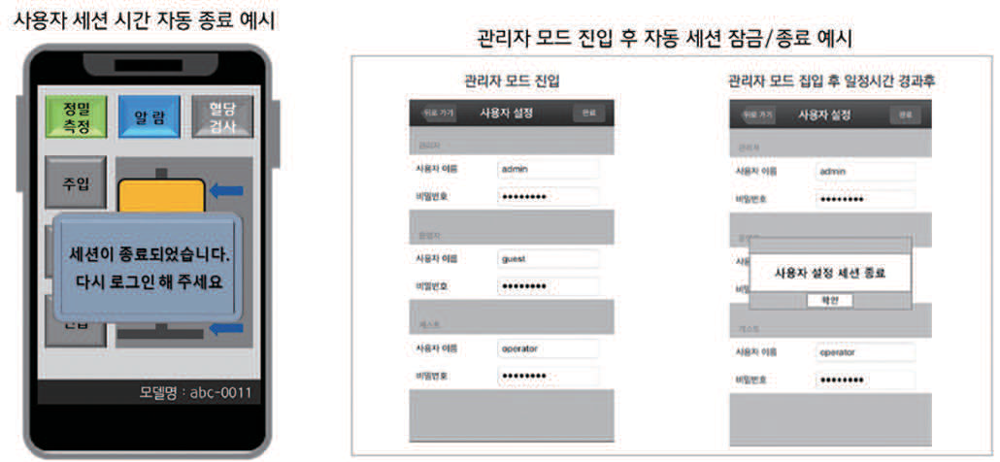

---
<!-- Page 103 -->

## 제4장 디지털헬스케어 기기 보안요구사항 및 보안대책 | 103

및
보안대책
및
보안대책
개요
디지털헬스케어
서비스
모델
디지털헬스케어
보안위협
디지털헬스케어
기기
보안요구사항
디지털헬스케어
서비스
보안요구사항
참고문헌
제1장
제2장
제3장
제4장
제5장
부록
4.1.3 세션 종료 후 재접속하기 위해서는 재인증을 통해 접속을 허용해야 한다.
보안위협 및 취약점(제3장 참조)
정상적으로 세션 종료되지 않은 인가된 사용자 세션을 이용하여 권한을 탈취하거나, 기기별로 동일한 암호키
사용에 따라 세션을 탈취할 수 있다.
보안요구사항 및 보안대책
원격 통신을 포함하여 세션 종료 이후 기기에 재접속하는 경우 재인증을 요구해야 한다.
이전 세션에서 저장된 데이터는 새로운 세션이 생성되는 동안 인증/인가 메커니즘을 우회하는데 사용되지 않아야 한다.
점검방법
세션 종료 이후 기기에 재접속 시 재인증을 요구하는지 확인한다.
참고문헌
• UL, “Software Cybersecurity for Network-Connctable Products, Part 1: General Requirements”, ANSI/
CAN/UL 2900-1:2017, 2017.
• UL, “Software Cybersecurity for Network-Connctable Products, Part 2-1: Particular Requirements for
Network Connectable Components of Healthcare and Wellness Systems”, ANSI/CAN/UL 2900-2-
1:2018, 2018.
• DTSec, “Protection Profile for Connected Diabetes Devices (CDD)”, Version 2.0, 2017.11.25.
4.1.4 디지털헬스케어 기기는 기기별로 유일한 암호화 통신키를 사용해야 한다.
보안위협 및 취약점(제3장 참조)
정상적으로 세션 종료되지 않은 인가된 사용자 세션을 이용하여 권한을 탈취하거나, 기기별로 동일한 암호키
사용에 따라 세션을 탈취할 수 있다.
보안요구사항 및 보안대책
하나의 키에 대한 지식을 활용하여 여러 장치에 접근하는 것을 방지하기 위해 기기별로 유일한 암호화 통신키를
생성하여 사용해야 한다.
점검방법
기기별로 사용되는 암호화 통신키 생성 메커니즘을 확인한다.
기기와 통신하는 패킷을 재사용할 수 있는지 프록시 도구를 사용하여 확인한다.
참고문헌
• U.S. FDA, “(Draft) Content of Premarket Submissions for Management of Cybersecurity in Medical
Devices”, 2018.

| 보안위협 및 취약점(제3장 참조) |
| --- |
| 정상적으로 세션 종료되지 않은 인가된 사용자 세션을 이용하여 권한을 탈취하거나, 기기별로 동일한 암호키 사용에 따라 세션을 탈취할 수 있다. |
| 보안요구사항 및 보안대책 |
| 원격 통신을 포함하여 세션 종료 이후 기기에 재접속하는 경우 재인증을 요구해야 한다. 이전 세션에서 저장된 데이터는 새로운 세션이 생성되는 동안 인증/인가 메커니즘을 우회하는데 사용되지 않아야 한다. |
| 점검방법 |
| 세션 종료 이후 기기에 재접속 시 재인증을 요구하는지 확인한다. |
| 참고문헌 |
| • UL, “Software Cybersecurity for Network-Connctable Products, Part 1: General Requirements”, ANSI/ CAN/UL 2900-1:2017, 2017. • UL, “Software Cybersecurity for Network-Connctable Products, Part 2-1: Particular Requirements for Network Connectable Components of Healthcare and Wellness Systems”, ANSI/CAN/UL 2900-2- 1:2018, 2018. • DTSec, “Protection Profile for Connected Diabetes Devices (CDD)”, Version 2.0, 2017.11.25. |

| 보안위협 및 취약점(제3장 참조) |
| --- |
| 정상적으로 세션 종료되지 않은 인가된 사용자 세션을 이용하여 권한을 탈취하거나, 기기별로 동일한 암호키 사용에 따라 세션을 탈취할 수 있다. |
| 보안요구사항 및 보안대책 |
| 하나의 키에 대한 지식을 활용하여 여러 장치에 접근하는 것을 방지하기 위해 기기별로 유일한 암호화 통신키를 생성하여 사용해야 한다. |
| 점검방법 |
| 기기별로 사용되는 암호화 통신키 생성 메커니즘을 확인한다. 기기와 통신하는 패킷을 재사용할 수 있는지 프록시 도구를 사용하여 확인한다. |
| 참고문헌 |
| • U.S. FDA, “(Draft) Content of Premarket Submissions for Management of Cybersecurity in Medical Devices”, 2018. |

---
<!-- Page 104 -->

#### 4.2 보안 통신

디지털헬스케어 기기는 통신 대상 기기와 서버 간의 통신방식을 고려하여 안전한
4.2.1
통신을 제공해야 한다.
보안위협 및 취약점(제3장 참조)
디지털헬스케어 기기에서 전송되거나 저장되는 개인의료정보, 기기 설정, 암호키 등 중요 데이터가 외부에
노출되어 악용되거나, 변조될 수 있다.
보안요구사항 및 보안대책
기기는 통신 대상인 다른 기기와 서버의 보안 수준에 따라 안전한 통신 방식 기능이 제공해야 한다.
기기는 다른 기기와 서버 간의 안전한 통신을 제공하기 위해 상호인증을 고려해야 한다.
보안 프로토콜을 사용하는 경우 신뢰된 보안 프로토콜을 사용해야 한다.
보안 수준이 낮거나 보안 통제가 없는 기기와 통신을 고려한 보안 통제를 제공해야 한다.
점검방법
기기가 다른 기기와 서버 간 통신 시 사용하는 인터페이스를 확인한다.
* 인터페이스 방식: Wi-Fi, 이더넷, 블루투스, USB 등
기기가 제공하는 인터페이스가 안전한 통신 방식인지 확인한다.
사용하는 보안 프로토콜의 적합성을 확인한다.
* Bluetooth: BLE(Blutooth Low Energy)는 BLE 4.0/4.1를 포함하여 낮은 버전의 제품은 보안모드 1의 보안레벨 3(
암호화된 인증 페어링)을 적용해야하고, BLE 4.2 제품 및 서비스는 보안모드 1의 보안레벨 4(암호화된 저전력
보안연결 인증)를 적용해야 함
* Wi-Fi: WPA2 방식을 적용해야 함
* SSL/TLS: TLS 최신 버전(예: TLS 1.2 및 TLS 1.3 활성화 및 TLS 1.1 이하 비활성화)을 사용하고, 안전한
암호알고리즘 조합을 적용해야 함
■ 안전한 암호 알고리즘 조합
• T LS_ECDHE_ECDSA_WITH_AES_128_GCM_SHA256
• T LS_ECDHE_ECDSA_WITH_AES_256_GCM_SHA384
• T LS_ECDHE_ECDSA_WITH_AES_128_CBC_SHA256
• T LS_ECDHE_ECDSA_WITH_AES_128_CBC_SHA384
• T LS_ECDHE_RSA_WITH_AES_128_GCM_SHA256 등

| 보안위협 및 취약점(제3장 참조) |
| --- |
| 디지털헬스케어 기기에서 전송되거나 저장되는 개인의료정보, 기기 설정, 암호키 등 중요 데이터가 외부에 노출되어 악용되거나, 변조될 수 있다. |
| 보안요구사항 및 보안대책 |
| 기기는 통신 대상인 다른 기기와 서버의 보안 수준에 따라 안전한 통신 방식 기능이 제공해야 한다. 기기는 다른 기기와 서버 간의 안전한 통신을 제공하기 위해 상호인증을 고려해야 한다. 보안 프로토콜을 사용하는 경우 신뢰된 보안 프로토콜을 사용해야 한다. 보안 수준이 낮거나 보안 통제가 없는 기기와 통신을 고려한 보안 통제를 제공해야 한다. |
| 점검방법 |
| 기기가 다른 기기와 서버 간 통신 시 사용하는 인터페이스를 확인한다. * 인터페이스 방식: Wi-Fi, 이더넷, 블루투스, USB 등 기기가 제공하는 인터페이스가 안전한 통신 방식인지 확인한다. 사용하는 보안 프로토콜의 적합성을 확인한다. * Bluetooth: BLE(Blutooth Low Energy)는 BLE 4.0/4.1를 포함하여 낮은 버전의 제품은 보안모드 1의 보안레벨 3( 암호화된 인증 페어링)을 적용해야하고, BLE 4.2 제품 및 서비스는 보안모드 1의 보안레벨 4(암호화된 저전력 보안연결 인증)를 적용해야 함 * Wi-Fi: WPA2 방식을 적용해야 함 * SSL/TLS: TLS 최신 버전(예: TLS 1.2 및 TLS 1.3 활성화 및 TLS 1.1 이하 비활성화)을 사용하고, 안전한 암호알고리즘 조합을 적용해야 함 ■ 안전한 암호 알고리즘 조합 • T LS_ECDHE_ECDSA_WITH_AES_128_GCM_SHA256 • T LS_ECDHE_ECDSA_WITH_AES_256_GCM_SHA384 • T LS_ECDHE_ECDSA_WITH_AES_128_CBC_SHA256 • T LS_ECDHE_ECDSA_WITH_AES_128_CBC_SHA384 • T LS_ECDHE_RSA_WITH_AES_128_GCM_SHA256 등 |

---
<!-- Page 105 -->

## 제4장 디지털헬스케어 기기 보안요구사항 및 보안대책 | 105

및
보안대책
및
보안대책
개요
디지털헬스케어
서비스
모델
디지털헬스케어
보안위협
디지털헬스케어
기기
보안요구사항
디지털헬스케어
서비스
보안요구사항
참고문헌
제1장
제2장
제3장
제4장
제5장
부록
보안 수준이 낮거나 보안 통제가 없는 기기와 통신 시 보안 통제 적용 여부를 확인한다.
안전한 통신 프로토콜 검증(TCP/IP) 예
안전한 통신 프로토콜 검증(BLE) 예
참고문헌
• DTSec, “Protection Profile for Connected Diabetes Devices (CDD)”, Version 2.0, 2017.11.25.
• Health Canada,“Pre-market Requirements for Medical Device Cybersecurity”, 2019.
• KISA, “사물인터넷(IoT) 보안 시험·인증 기준 해설서”, 2019.
• IMDRF, “Principles and Practices for Medical Device Cybersecurity”, 2020.
• U.S. FDA, “(Draft) Content of Premarket Submissions for Management of Cybersecurity in Medical
Devices”, 2018.

| 보안 수준이 낮거나 보안 통제가 없는 기기와 통신 시 보안 통제 적용 여부를 확인한다. 안전한 통신 프로토콜 검증(TCP/IP) 예 안전한 통신 프로토콜 검증(BLE) 예 |
| --- |
| 참고문헌 |
| • DTSec, “Protection Profile for Connected Diabetes Devices (CDD)”, Version 2.0, 2017.11.25. • Health Canada,“Pre-market Requirements for Medical Device Cybersecurity”, 2019. • KISA, “사물인터넷(IoT) 보안 시험·인증 기준 해설서”, 2019. • IMDRF, “Principles and Practices for Medical Device Cybersecurity”, 2020. • U.S. FDA, “(Draft) Content of Premarket Submissions for Management of Cybersecurity in Medical Devices”, 2018. |

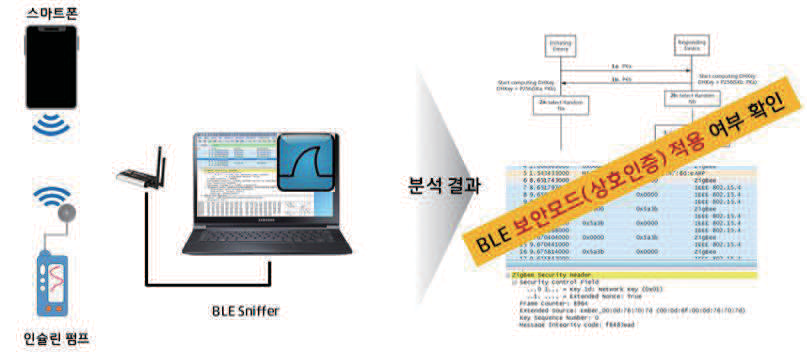

---
<!-- Page 106 -->
5 | 안전한 기기 관리

#### 5.1 안전한 업데이트

5.1.1 디지털헬스케어 기기는 업데이트 기능을 제공하여야 한다.
보안위협 및 취약점(제3장 참조)
원하는 업데이트 파일이 다운로드 되지 않거나 출처를 알 수 없는 변조된 업데이트 파일이 실행될 수 있다.
보안요구사항 및 보안대책
새로 발견된 보안 취약점으로부터 기기를 보호하기 위해 기기의 펌웨어 업데이트 기능을 제공해야 한다.
디지털헬스케어 기기의 운영체제(OS), 3rd Party Lib., 오픈소스 소프트웨어를 업데이트 기능 또는 업데이트
방법을 제공해야 한다.
점검방법
기기가 업데이트 기능을 제공하는지 확인한다.
* 업데이트 방식: 온라인으로 업데이트를 수행하는 방법, 오프라인으로 업데이트를 수행하는 방법
* 업데이트 대상: 디지털헬스케어 기기의 펌웨어, 운영체제(OS), 3rd Party Lib. 등
기기 동작에 필요한 운영체제(OS), 3rd Party Lib. 에 대한 업데이트 기능 제공 여부를 확인한다. 다만, 온라인
업데이트 기능을 제공하지 않는 경우 오프라인 등의 업데이트 방법을 제공해야 한다.
참고문헌
• IMDRF, “Principles and Practices for Medical Device Cybersecurity”, 2020.
• UL, “Software Cybersecurity for Network-Connctable Products, Part 1: General Requirements”, ANSI/CAN/
UL 2900-1:2017, 2017.
• UL, “Software Cybersecurity for Network-Connctable Products, Part 2-1: Particular Requirements for
Network Connectable Components of Healthcare and Wellness Systems”, ANSI/CAN/UL 2900-2-1:2018,
2018.
• Health Canada,“Pre-market Requirements for Medical Device Cybersecurity”, 2019.
• BSI, “Cyber Security Requirements for Network-Connected Medical Devices”, BSI-CS 132, Version 1.1,
2018.11.13.
• KISA, “사물인터넷(IoT) 보안 시험·인증 기준 해설서”, 2019.

| 보안위협 및 취약점(제3장 참조) |
| --- |
| 원하는 업데이트 파일이 다운로드 되지 않거나 출처를 알 수 없는 변조된 업데이트 파일이 실행될 수 있다. |
| 보안요구사항 및 보안대책 |
| 새로 발견된 보안 취약점으로부터 기기를 보호하기 위해 기기의 펌웨어 업데이트 기능을 제공해야 한다. 디지털헬스케어 기기의 운영체제(OS), 3rd Party Lib., 오픈소스 소프트웨어를 업데이트 기능 또는 업데이트 방법을 제공해야 한다. |
| 점검방법 |
| 기기가 업데이트 기능을 제공하는지 확인한다. * 업데이트 방식: 온라인으로 업데이트를 수행하는 방법, 오프라인으로 업데이트를 수행하는 방법 * 업데이트 대상: 디지털헬스케어 기기의 펌웨어, 운영체제(OS), 3rd Party Lib. 등 기기 동작에 필요한 운영체제(OS), 3rd Party Lib. 에 대한 업데이트 기능 제공 여부를 확인한다. 다만, 온라인 업데이트 기능을 제공하지 않는 경우 오프라인 등의 업데이트 방법을 제공해야 한다. |
| 참고문헌 |
| • IMDRF, “Principles and Practices for Medical Device Cybersecurity”, 2020. • UL, “Software Cybersecurity for Network-Connctable Products, Part 1: General Requirements”, ANSI/CAN/ UL 2900-1:2017, 2017. • UL, “Software Cybersecurity for Network-Connctable Products, Part 2-1: Particular Requirements for Network Connectable Components of Healthcare and Wellness Systems”, ANSI/CAN/UL 2900-2-1:2018, 2018. • Health Canada,“Pre-market Requirements for Medical Device Cybersecurity”, 2019. • BSI, “Cyber Security Requirements for Network-Connected Medical Devices”, BSI-CS 132, Version 1.1, 2018.11.13. • KISA, “사물인터넷(IoT) 보안 시험·인증 기준 해설서”, 2019. |

---
<!-- Page 107 -->

## 제4장 디지털헬스케어 기기 보안요구사항 및 보안대책 | 107

및
보안대책
및
보안대책
개요
디지털헬스케어
서비스
모델
디지털헬스케어
보안위협
디지털헬스케어
기기
보안요구사항
디지털헬스케어
서비스
보안요구사항
참고문헌
제1장
제2장
제3장
제4장
제5장
부록
5.1.2 업데이트 파일에 대한 버전, 배포자, 무결성을 검증할 수 있어야 한다.
보안위협 및 취약점(제3장 참조)
원하는 업데이트 파일이 다운로드 되지 않거나 출처를 알 수 없는 변조된 업데이트 파일이 실행될 수 있다.
보안요구사항 및 보안대책
배포되는 업데이트 파일의 버전을 식별할 수 있어야 한다.
업데이트 파일 배포시 전자서명을 적용하고, 업데이트 파일 다운로드시 전자서명을 검증하는 기능을 제공해야 한다.
업데이트 파일 다운로드 후 업데이트 파일에 대한 무결성 검증 이후 업데이트를 수행해야 한다.
* 무결성 오류가 발생한 경우 업데이트 수행 취소 등과 같은 대응방법을 고려해야 한다.
점검방법
업데이트 파일의 버전이 식별 가능한지 확인한다.
업데이트 파일의 배포자 신원을 검증 후 업데이트를 진행하는지 확인한다.
업데이트 수행 전 업데이트 파일에 대한 무결성 검사를 수행하는지 확인하고, 무결성 오류시 업데이트가
진행되는지 확인한다.
* 무결성 검증 매커니즘 : 예, MAC, 해시 생성 등
참고문헌
• 식 품의약품안전처, “의료기기의 사이버 보안 허가·심사 가이드라인(민원인 안내서)”, 2019.
• U L, “Software Cybersecurity for Network-Connctable Products, Part 1: General Requirements”, ANSI/
CAN/UL 2900-1:2017, 2017.
• U L, “Software Cybersecurity for Network-Connctable Products, Part 2-1: Particular Requirements for
Network Connectable Components of Healthcare and Wellness Systems”, ANSI/CAN/UL 2900-2-
1:2018, 2018.
• U.S. FDA, “(Draft) Content of Premarket Submissions for Management of Cybersecurity in Medical
Devices”, 2018.
• I MDRF, “Principles and Practices for Medical Device Cybersecurity”, 2020.

| 보안위협 및 취약점(제3장 참조) |
| --- |
| 원하는 업데이트 파일이 다운로드 되지 않거나 출처를 알 수 없는 변조된 업데이트 파일이 실행될 수 있다. |
| 보안요구사항 및 보안대책 |
| 배포되는 업데이트 파일의 버전을 식별할 수 있어야 한다. 업데이트 파일 배포시 전자서명을 적용하고, 업데이트 파일 다운로드시 전자서명을 검증하는 기능을 제공해야 한다. 업데이트 파일 다운로드 후 업데이트 파일에 대한 무결성 검증 이후 업데이트를 수행해야 한다. * 무결성 오류가 발생한 경우 업데이트 수행 취소 등과 같은 대응방법을 고려해야 한다. |
| 점검방법 |
| 업데이트 파일의 버전이 식별 가능한지 확인한다. 업데이트 파일의 배포자 신원을 검증 후 업데이트를 진행하는지 확인한다. 업데이트 수행 전 업데이트 파일에 대한 무결성 검사를 수행하는지 확인하고, 무결성 오류시 업데이트가 진행되는지 확인한다. * 무결성 검증 매커니즘 : 예, MAC, 해시 생성 등 |
| 참고문헌 |
| • 식 품의약품안전처, “의료기기의 사이버 보안 허가·심사 가이드라인(민원인 안내서)”, 2019. • U L, “Software Cybersecurity for Network-Connctable Products, Part 1: General Requirements”, ANSI/ CAN/UL 2900-1:2017, 2017. • U L, “Software Cybersecurity for Network-Connctable Products, Part 2-1: Particular Requirements for Network Connectable Components of Healthcare and Wellness Systems”, ANSI/CAN/UL 2900-2- 1:2018, 2018. • U.S. FDA, “(Draft) Content of Premarket Submissions for Management of Cybersecurity in Medical Devices”, 2018. • I MDRF, “Principles and Practices for Medical Device Cybersecurity”, 2020. |

---
<!-- Page 108 -->
5.1.3 인가된 사용자에 의해 업데이트가 수행될 수 있도록 해야 한다.
보안위협 및 취약점(제3장 참조)
원하는 업데이트 파일이 다운로드 되지 않거나 출처를 알 수 없는 변조된 업데이트 파일이 실행될 수 있다.
보안요구사항 및 보안대책
업데이트 수행 전 인가된 사용자 여부를 확인하여야 한다.
점검방법
업데이트는 인가된 사용자에 의해서만 수행될 수 있도록 업데이트 수행 전 사용자 인증 기능을 제공하는지
확인한다.
* 사용자 인증 방법: ID/PW 인증, PIN 입력, 소유자 보유 카드 태깅 등 사용
사용자 인증 절차가 없을 경우, 관리자가 인지할 수 있는 거리에서 보안이 보장되는 방법으로 업데이트를
수행하여야 한다.
비인가자 업데이트 시도 시 접근제어 예시
비인가 사용자 업데이트 대응 예

| 보안위협 및 취약점(제3장 참조) |
| --- |
| 원하는 업데이트 파일이 다운로드 되지 않거나 출처를 알 수 없는 변조된 업데이트 파일이 실행될 수 있다. |
| 보안요구사항 및 보안대책 |
| 업데이트 수행 전 인가된 사용자 여부를 확인하여야 한다. |
| 점검방법 |
| 업데이트는 인가된 사용자에 의해서만 수행될 수 있도록 업데이트 수행 전 사용자 인증 기능을 제공하는지 확인한다. * 사용자 인증 방법: ID/PW 인증, PIN 입력, 소유자 보유 카드 태깅 등 사용 사용자 인증 절차가 없을 경우, 관리자가 인지할 수 있는 거리에서 보안이 보장되는 방법으로 업데이트를 수행하여야 한다. 비인가자 업데이트 시도 시 접근제어 예시 비인가 사용자 업데이트 대응 예 |

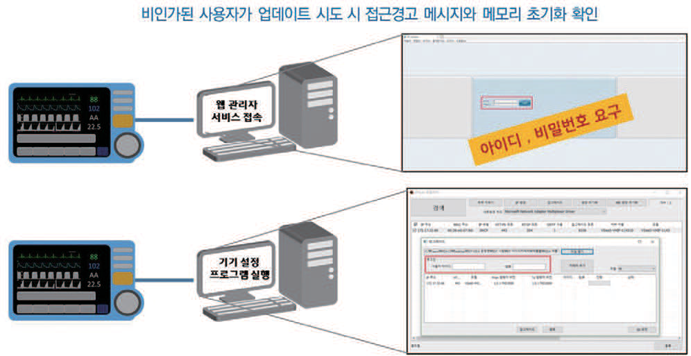
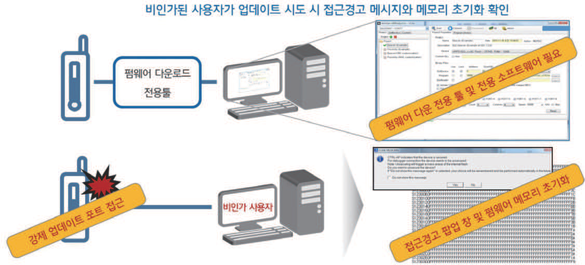

---
<!-- Page 109 -->

## 제4장 디지털헬스케어 기기 보안요구사항 및 보안대책 | 109

및
보안대책
및
보안대책
개요
디지털헬스케어
서비스
모델
디지털헬스케어
보안위협
디지털헬스케어
기기
보안요구사항
디지털헬스케어
서비스
보안요구사항
참고문헌
제1장
제2장
제3장
제4장
제5장
부록
참고문헌
• U.S. FDA, “(Draft) Content of Premarket Submissions for Management of Cybersecurity in Medical
Devices”, 2018.
• 식품의약품안전처, “의료기기의 사이버 보안 허가·심사 가이드라인(민원인 안내서)”, 2019
• KISA, “사물인터넷(IoT) 보안 시험·인증 기준 해설서”, 2019.
5.1.4 디지털헬스케어 기기는 롤백 기능을 제공하여야 한다.
보안위협 및 취약점(제3장 참조)
업데이트 진행 중 오류발생으로 디지털헬스케어 기기가 정상적으로 동작하지 않을 수 있다.
보안요구사항 및 보안대책
업데이트 실패 시 안전한 상태로 복구될 수 있도록 롤백 기능을 제공해야 한다.
점검방법
기기의 업데이트 수행 중 오류 발생 시 롤백 기능이 제공되는지 확인한다.
롤백 기능 수행 후 디지털헬스케어 기기의 기능이 정상적으로 동작하는지 확인한다.
업데이트 롤백 기능 검증 예시
참고문헌
• UL, “Software Cybersecurity for Network-Connctable Products, Part 1: General Requirements”, ANSI/
CAN/UL 2900-1:2017, 2017.
• UL, “Software Cybersecurity for Network-Connctable Products, Part 2-1: Particular Requirements for
Network Connectable Components of Healthcare and Wellness Systems”, ANSI/CAN/UL 2900-2-
1:2018, 2018.

| 참고문헌 |
| --- |
| • U.S. FDA, “(Draft) Content of Premarket Submissions for Management of Cybersecurity in Medical Devices”, 2018. • 식품의약품안전처, “의료기기의 사이버 보안 허가·심사 가이드라인(민원인 안내서)”, 2019 • KISA, “사물인터넷(IoT) 보안 시험·인증 기준 해설서”, 2019. |

| 보안위협 및 취약점(제3장 참조) |
| --- |
| 업데이트 진행 중 오류발생으로 디지털헬스케어 기기가 정상적으로 동작하지 않을 수 있다. |
| 보안요구사항 및 보안대책 |
| 업데이트 실패 시 안전한 상태로 복구될 수 있도록 롤백 기능을 제공해야 한다. |
| 점검방법 |
| 기기의 업데이트 수행 중 오류 발생 시 롤백 기능이 제공되는지 확인한다. 롤백 기능 수행 후 디지털헬스케어 기기의 기능이 정상적으로 동작하는지 확인한다. 업데이트 롤백 기능 검증 예시 |
| 참고문헌 |
| • UL, “Software Cybersecurity for Network-Connctable Products, Part 1: General Requirements”, ANSI/ CAN/UL 2900-1:2017, 2017. • UL, “Software Cybersecurity for Network-Connctable Products, Part 2-1: Particular Requirements for Network Connectable Components of Healthcare and Wellness Systems”, ANSI/CAN/UL 2900-2- 1:2018, 2018. |

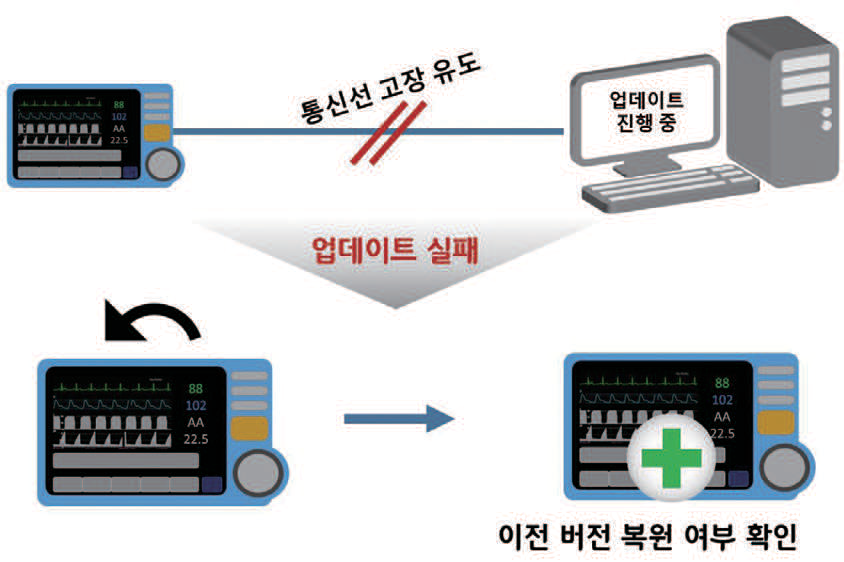

---
<!-- Page 110 -->

#### 5.2 안전한 서비스 제공

디지털헬스케어 기기의 안전 및 필수 성능을 보장하기 위해 실행 코드 및 설정값 등에
5.2.1
대한 무결성을 보장해야 한다.
보안위협 및 취약점(제3장 참조)
디지털헬스케어 기기의 주요 실행코드 또는 설정값의 임의 변조에 따라 오작동할 수 있다.
보안요구사항 및 보안대책
디지털헬스케어 기기의 정상동작을 보장하기 위해서 실행코드 및 설정값에 대한 무결성이 보장되어야 한다.
기기 시동 시, 사용자 요청 또는 주기적으로 무결성 검증을 수행하는 기능이 제공되어야 한다.
* 무결성 검증 대상: 디지털헬스케어 기기/환경 설정 값, 실행코드(실행파일), 소프트웨어, 펌웨어 등
* 무결성 검증 방법: HMAC, RSA 서명 방식, SHA-2
무결성 검증 실패 시 적절한 대응 절차를 수행하여야 한다.
* 무결성 검증 실패 시 대응 절차: 관리자에게 알림(이메일, 팝업, 경고음 등), 무결성 오류 이전 실행코드 및 설정값으로
복구, 제품에서 제공하는 기능 잠금 및 서비스 중단, 공장초기화 수행 등
점검방법
기기의 무결성 검증 방법을 확인한다.
시동 시 무결성 점검 기능이 실행되는지 확인한다.
사용자 요청 또는 주기적으로 무결성 점검 기능이 실행되는지 확인한다.
무결성 검증 실패 시 적절한 대응 절차를 수행하는지 확인한다.
무결성 수행 방법 예

| 보안위협 및 취약점(제3장 참조) |
| --- |
| 디지털헬스케어 기기의 주요 실행코드 또는 설정값의 임의 변조에 따라 오작동할 수 있다. |
| 보안요구사항 및 보안대책 |
| 디지털헬스케어 기기의 정상동작을 보장하기 위해서 실행코드 및 설정값에 대한 무결성이 보장되어야 한다. 기기 시동 시, 사용자 요청 또는 주기적으로 무결성 검증을 수행하는 기능이 제공되어야 한다. * 무결성 검증 대상: 디지털헬스케어 기기/환경 설정 값, 실행코드(실행파일), 소프트웨어, 펌웨어 등 * 무결성 검증 방법: HMAC, RSA 서명 방식, SHA-2 무결성 검증 실패 시 적절한 대응 절차를 수행하여야 한다. * 무결성 검증 실패 시 대응 절차: 관리자에게 알림(이메일, 팝업, 경고음 등), 무결성 오류 이전 실행코드 및 설정값으로 복구, 제품에서 제공하는 기능 잠금 및 서비스 중단, 공장초기화 수행 등 |
| 점검방법 |
| 기기의 무결성 검증 방법을 확인한다. 시동 시 무결성 점검 기능이 실행되는지 확인한다. 사용자 요청 또는 주기적으로 무결성 점검 기능이 실행되는지 확인한다. 무결성 검증 실패 시 적절한 대응 절차를 수행하는지 확인한다. 무결성 수행 방법 예 |

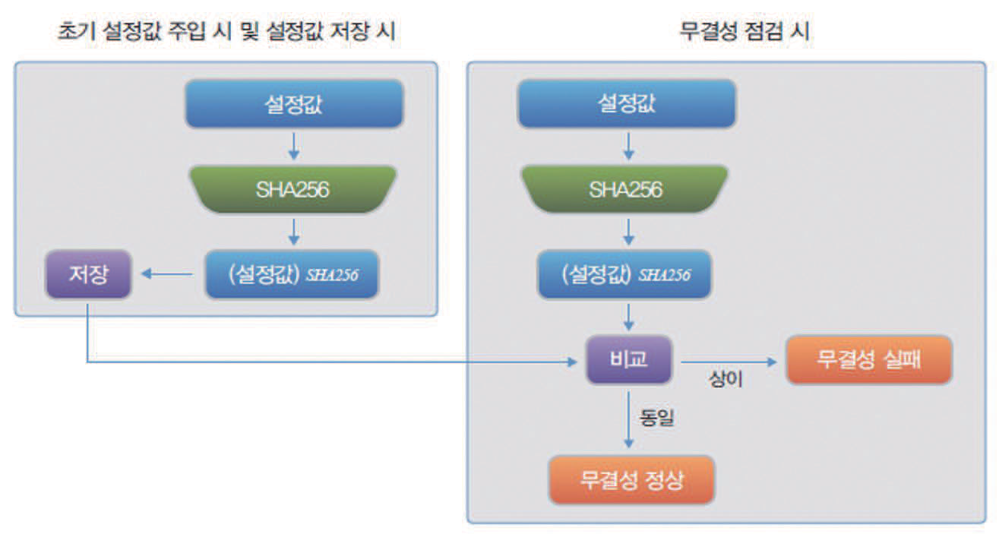

---
<!-- Page 111 -->

## 제4장 디지털헬스케어 기기 보안요구사항 및 보안대책 | 111

및
보안대책
및
보안대책
개요
디지털헬스케어
서비스
모델
디지털헬스케어
보안위협
디지털헬스케어
기기
보안요구사항
디지털헬스케어
서비스
보안요구사항
참고문헌
제1장
제2장
제3장
제4장
제5장
부록
환자 모니터링 기기의 무결성 검사 실패 예
참고문헌
• IMDRF, “Principles and Practices for Medical Device Cybersecurity”, 2020.
• BSI, “Cyber Security Requirements for Network-Connected Medical Devices”, BSI-CS 132, Version 1.1,
2018.11.13.
• DTSec, “Protection Profile for Connected Diabetes Devices (CDD)”, Version 2.0, 2017.11.25.
• U.S. FDA, “(Draft) Content of Premarket Submissions for Management of Cybersecurity in Medical Devices”,
2018.
• MDCG, “Guidance on Cybersecurity for medical devices”, MDCG 2019-16, 2019.11.
• KISA, “사물인터넷(IoT) 보안 시험・인증 기준 해설서”, 2019.

| 환자 모니터링 기기의 무결성 검사 실패 예 |
| --- |
| 참고문헌 |
| • IMDRF, “Principles and Practices for Medical Device Cybersecurity”, 2020. • BSI, “Cyber Security Requirements for Network-Connected Medical Devices”, BSI-CS 132, Version 1.1, 2018.11.13. • DTSec, “Protection Profile for Connected Diabetes Devices (CDD)”, Version 2.0, 2017.11.25. • U.S. FDA, “(Draft) Content of Premarket Submissions for Management of Cybersecurity in Medical Devices”, 2018. • MDCG, “Guidance on Cybersecurity for medical devices”, MDCG 2019-16, 2019.11. • KISA, “사물인터넷(IoT) 보안 시험・인증 기준 해설서”, 2019. |

---
<!-- Page 112 -->
5.2.2 디지털헬스케어 기기의 펌웨어 및 소프트웨어를 검증할 수 있어야 한다.
보안위협 및 취약점(제3장 참조)
디지털헬스케어 기기의 주요 실행코드 또는 설정값의 임의 변조에 따라 오작동할 수 있다.
보안요구사항 및 보안대책
기기의 펌웨어 및 소프트웨어를 검증하는 기능을 제공하여야 한다.
* 검증 방법: 소프트웨어 버전정보, MAC, 전자서명, 펌웨어/소프트웨어 컨텐츠 등 확인
검증 실패 시 적절한 대응 절차를 수행하는지 확인한다.
* 검증 실패 시 대응 절차: 관리자에게 알림(이메일, 팝업, 경고음 등), 제품에서 제공하는 기능 잠금 및 서비스 중단, 공장
초기화 수행 등
점검방법
기기의 펌웨어 및 소프트웨어를 검증 방법을 확인한다.
기기의 펌웨어 및 소프트웨어를 검증을 정상적으로 수행하는지 확인한다.
검증 실패 시 적절한 대응 절차를 수행하는지 확인한다.
참고문헌
• U.S. FDA, “(Draft) Content of Premarket Submissions for Management of Cybersecurity in Medical
Devices”, 2018.
5.2.3 디지털헬스케어 기기 서비스에 대한 가용성을 보장해야 한다.
보안위협 및 취약점(제3장 참조)
디지털헬스케어 기기 기능의 오작동 또는 서비스 거부 공격으로 디지털헬스케어 기기의 가용성이 제한될 수 있다.
보안요구사항 및 보안대책
서비스 거부 공격을 방지하는 조치가 적용되어 있어야 한다.
서비스 거부 공격이 발생한 후에도 기기의 서비스가 정상적으로 동작하여야 한다.
점검방법
기기의 서비스 거부 공격을 방지하는 방법을 확인한다.
기기에 서비스 거부 공격을 발생시켜 기기의 서비스가 정상적으로 동작하는지 확인한다.
참고문헌
• U.S. FDA, “(Draft) Medical Device Manufacturer Internet of Things (IoT) Code of Conduct”, 2020.
• BSI, “Cyber Security Requirements for Network-Connected Medical Devices”, BSI-CS 132, Version
1.1, 2018.11.13.
• 식품의약품안전처, “의료기기의 사이버 보안 허가·심사 가이드라인(민원인 안내서)”, 2019.

| 보안위협 및 취약점(제3장 참조) |
| --- |
| 디지털헬스케어 기기의 주요 실행코드 또는 설정값의 임의 변조에 따라 오작동할 수 있다. |
| 보안요구사항 및 보안대책 |
| 기기의 펌웨어 및 소프트웨어를 검증하는 기능을 제공하여야 한다. * 검증 방법: 소프트웨어 버전정보, MAC, 전자서명, 펌웨어/소프트웨어 컨텐츠 등 확인 검증 실패 시 적절한 대응 절차를 수행하는지 확인한다. * 검증 실패 시 대응 절차: 관리자에게 알림(이메일, 팝업, 경고음 등), 제품에서 제공하는 기능 잠금 및 서비스 중단, 공장 초기화 수행 등 |
| 점검방법 |
| 기기의 펌웨어 및 소프트웨어를 검증 방법을 확인한다. 기기의 펌웨어 및 소프트웨어를 검증을 정상적으로 수행하는지 확인한다. 검증 실패 시 적절한 대응 절차를 수행하는지 확인한다. |
| 참고문헌 |
| • U.S. FDA, “(Draft) Content of Premarket Submissions for Management of Cybersecurity in Medical Devices”, 2018. |

| 보안위협 및 취약점(제3장 참조) |
| --- |
| 디지털헬스케어 기기 기능의 오작동 또는 서비스 거부 공격으로 디지털헬스케어 기기의 가용성이 제한될 수 있다. |
| 보안요구사항 및 보안대책 |
| 서비스 거부 공격을 방지하는 조치가 적용되어 있어야 한다. 서비스 거부 공격이 발생한 후에도 기기의 서비스가 정상적으로 동작하여야 한다. |
| 점검방법 |
| 기기의 서비스 거부 공격을 방지하는 방법을 확인한다. 기기에 서비스 거부 공격을 발생시켜 기기의 서비스가 정상적으로 동작하는지 확인한다. |
| 참고문헌 |
| • U.S. FDA, “(Draft) Medical Device Manufacturer Internet of Things (IoT) Code of Conduct”, 2020. • BSI, “Cyber Security Requirements for Network-Connected Medical Devices”, BSI-CS 132, Version 1.1, 2018.11.13. • 식품의약품안전처, “의료기기의 사이버 보안 허가·심사 가이드라인(민원인 안내서)”, 2019. |

---
<!-- Page 113 -->

## 제4장 디지털헬스케어 기기 보안요구사항 및 보안대책 | 113

및
보안대책
및
보안대책
개요
디지털헬스케어
서비스
모델
디지털헬스케어
보안위협
디지털헬스케어
기기
보안요구사항
디지털헬스케어
서비스
보안요구사항
참고문헌
제1장
제2장
제3장
제4장
제5장
부록
5.2.4 디지털헬스케어 기기의 불필요한 서비스는 제거되거나 비활성화 되어야 한다.
보안위협 및 취약점(제3장 참조)
디지털헬스케거 기기·서비스의 목적에 맞지 않은 기능이 존재하여 악성 행위를 할 수 있다.
보안요구사항 및 보안대책
제품에서 제공하는 필수 서비스를 정의해야 한다.
기기 운영에 불필요한 서비스는 제거되거나 비활성화 해야 한다.
불필요한 외부 접속을 위한 포트 등은 비활성화 해야 한다.
인가된 사용자만 서비스를 활성화하도록 제한해야 한다.
점검방법
제품에서 제공하는 서비스 및 기기 운영에 필수적인 서비스를 확인한다.
포트 스캔 등을 통해 불필요한 서비스가 존재하는지 확인한다.
외부 접속을 위한 포트의 디폴트 설정값(비활성화)을 확인한다.
외부 접속을 위한 포트가 활성화 될 경우 추가적인 보안 조치가 적용 여부를 확인한다.
* 보안 조치 방법: 비밀번호 설정, IP 제한 등
인가된 사용자만 서비스를 활성화할 수 있는지 여부를 확인한다.
불필요한 네트워크 포트 점검 예시
참고문헌
• BSI, “Cyber Security Requirements for Network-Connected Medical Devices”, BSI-CS 132, Version
1.1, 2018.11.13.
• 식품의약품안전처, “의료기기의 사이버 보안 허가·심사 가이드라인(민원인 안내서)”, 2019.
• KISA, “사물인터넷(IoT) 보안 시험·인증 기준 해설서”, 2019.

| 보안위협 및 취약점(제3장 참조) |
| --- |
| 디지털헬스케거 기기·서비스의 목적에 맞지 않은 기능이 존재하여 악성 행위를 할 수 있다. |
| 보안요구사항 및 보안대책 |
| 제품에서 제공하는 필수 서비스를 정의해야 한다. 기기 운영에 불필요한 서비스는 제거되거나 비활성화 해야 한다. 불필요한 외부 접속을 위한 포트 등은 비활성화 해야 한다. 인가된 사용자만 서비스를 활성화하도록 제한해야 한다. |
| 점검방법 |
| 제품에서 제공하는 서비스 및 기기 운영에 필수적인 서비스를 확인한다. 포트 스캔 등을 통해 불필요한 서비스가 존재하는지 확인한다. 외부 접속을 위한 포트의 디폴트 설정값(비활성화)을 확인한다. 외부 접속을 위한 포트가 활성화 될 경우 추가적인 보안 조치가 적용 여부를 확인한다. * 보안 조치 방법: 비밀번호 설정, IP 제한 등 인가된 사용자만 서비스를 활성화할 수 있는지 여부를 확인한다. 불필요한 네트워크 포트 점검 예시 |
| 참고문헌 |
| • BSI, “Cyber Security Requirements for Network-Connected Medical Devices”, BSI-CS 132, Version 1.1, 2018.11.13. • 식품의약품안전처, “의료기기의 사이버 보안 허가·심사 가이드라인(민원인 안내서)”, 2019. • KISA, “사물인터넷(IoT) 보안 시험·인증 기준 해설서”, 2019. |

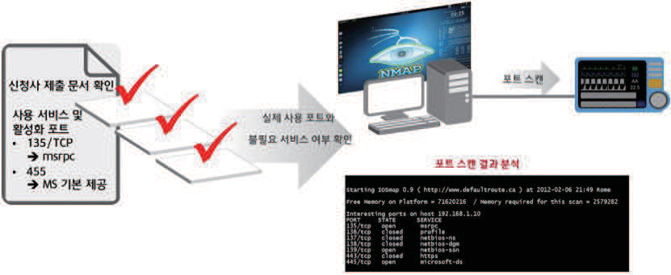

---
<!-- Page 114 -->
5.2.5 디지털헬스케어 기기 파기 시에는 기기에 있는 모든 데이터를 완전삭제 할 수 있어야 한다.
보안위협 및 취약점(제3장 참조)
암호연산, 인증, 데이터 전송을 위해 사용된 암호키, 비밀번호, 민감 데이터 등이 메모리에 남아 있어 악용될 수
있다.
보안요구사항 및 보안대책
기기 파기 시 모든 설정 데이터, 민감 데이터, 개인 식별 데이터 등을 완전삭제하는 기능을 제공해야 한다.
* 완전 삭제 방법: 미국 NIST SP 800-88, 독일 VISITR, 호주 ACSI 33 표준 등을 따르기를 권고함. 적용이 어려울 경우
임의의 데이터로 덮어쓰기 3회 이상 수행
점검방법
기기에 저장되는 모든 데이터를 확인한다.
기기의 완전 삭제 방법을 확인한다.
기기의 데이터 완전 삭제 기능이 정상적으로 수행하는지 확인한다.
참고문헌
• UL, “Software Cybersecurity for Network-Connctable Products, Part 1: General Requirements”, ANSI/
CAN/UL 2900-1:2017, 2017.
• UL, “Software Cybersecurity for Network-Connctable Products, Part 2-1: Particular Requirements for
Network Connectable Components of Healthcare and Wellness Systems”, ANSI/CAN/UL 2900-2-
1:2018, 2018.
• KISA, “사물인터넷(IoT) 보안 시험·인증 기준 해설서”, 2019.

| 보안위협 및 취약점(제3장 참조) |
| --- |
| 암호연산, 인증, 데이터 전송을 위해 사용된 암호키, 비밀번호, 민감 데이터 등이 메모리에 남아 있어 악용될 수 있다. |
| 보안요구사항 및 보안대책 |
| 기기 파기 시 모든 설정 데이터, 민감 데이터, 개인 식별 데이터 등을 완전삭제하는 기능을 제공해야 한다. * 완전 삭제 방법: 미국 NIST SP 800-88, 독일 VISITR, 호주 ACSI 33 표준 등을 따르기를 권고함. 적용이 어려울 경우 임의의 데이터로 덮어쓰기 3회 이상 수행 |
| 점검방법 |
| 기기에 저장되는 모든 데이터를 확인한다. 기기의 완전 삭제 방법을 확인한다. 기기의 데이터 완전 삭제 기능이 정상적으로 수행하는지 확인한다. |
| 참고문헌 |
| • UL, “Software Cybersecurity for Network-Connctable Products, Part 1: General Requirements”, ANSI/ CAN/UL 2900-1:2017, 2017. • UL, “Software Cybersecurity for Network-Connctable Products, Part 2-1: Particular Requirements for Network Connectable Components of Healthcare and Wellness Systems”, ANSI/CAN/UL 2900-2- 1:2018, 2018. • KISA, “사물인터넷(IoT) 보안 시험·인증 기준 해설서”, 2019. |

---
<!-- Page 115 -->

## 제4장 디지털헬스케어 기기 보안요구사항 및 보안대책 | 115

및
보안대책
및
보안대책
개요
디지털헬스케어
서비스
모델
디지털헬스케어
보안위협
디지털헬스케어
기기
보안요구사항
디지털헬스케어
서비스
보안요구사항
참고문헌
제1장
제2장
제3장
제4장
제5장
부록

#### 5.3 기기 설정 관리

5.3.1 디지털헬스케어 기기의 설정을 위해서는 안전한 관리 수단을 제공해야 한다.
보안위협 및 취약점(제3장 참조)
디지털헬스케어 기기 및 서버에 대한 보안관리 부재로 중요 설정이 임의로 변경되어 안전하지 않은 서비스를
제공할 수 있다.
보안요구사항 및 보안대책
인가된 사용자만 기기에 접근 허용할 수 있도록 사용자 계정을 관리하는 기능을 제공하여야 한다.
인가된 관리자만 기기의 설정 관리 기능에 접근하도록 제한하여야 한다.
점검방법
기기에 접근이 가능한 사용자 계정을 관리하는 기능을 제공하는지 확인한다.
기기 접근통제를 관리하는 기능을 제공하는지 확인한다.
인가된 관리자만 관리 기능에 접근하여 설정 추가·변경·삭제가 가능한지 확인한다.
관리자 설정 메뉴 접근 시 접근제어 예시
참고문헌
• BSI, “Cyber Security Requirements for Network-Connected Medical Devices”, BSI-CS 132, Version
1.1, 2018.11.13.
• MDCG, “Guidance on Cybersecurity for medical devices”, MDCG 2019-16, 2019.11.
• UL, “Software Cybersecurity for Network-Connctable Products, Part 1: General Requirements”, ANSI/
CAN/UL 2900-1:2017, 2017.
• UL, “Software Cybersecurity for Network-Connctable Products, Part 2-1: Particular Requirements for
Network Connectable Components of Healthcare and Wellness Systems”, ANSI/CAN/UL 2900-2-
1:2018, 2018.

| 보안위협 및 취약점(제3장 참조) |
| --- |
| 디지털헬스케어 기기 및 서버에 대한 보안관리 부재로 중요 설정이 임의로 변경되어 안전하지 않은 서비스를 제공할 수 있다. |
| 보안요구사항 및 보안대책 |
| 인가된 사용자만 기기에 접근 허용할 수 있도록 사용자 계정을 관리하는 기능을 제공하여야 한다. 인가된 관리자만 기기의 설정 관리 기능에 접근하도록 제한하여야 한다. |
| 점검방법 |
| 기기에 접근이 가능한 사용자 계정을 관리하는 기능을 제공하는지 확인한다. 기기 접근통제를 관리하는 기능을 제공하는지 확인한다. 인가된 관리자만 관리 기능에 접근하여 설정 추가·변경·삭제가 가능한지 확인한다. 관리자 설정 메뉴 접근 시 접근제어 예시 |
| 참고문헌 |
| • BSI, “Cyber Security Requirements for Network-Connected Medical Devices”, BSI-CS 132, Version 1.1, 2018.11.13. • MDCG, “Guidance on Cybersecurity for medical devices”, MDCG 2019-16, 2019.11. • UL, “Software Cybersecurity for Network-Connctable Products, Part 1: General Requirements”, ANSI/ CAN/UL 2900-1:2017, 2017. • UL, “Software Cybersecurity for Network-Connctable Products, Part 2-1: Particular Requirements for Network Connectable Components of Healthcare and Wellness Systems”, ANSI/CAN/UL 2900-2- 1:2018, 2018. |

| 제4장 |  |

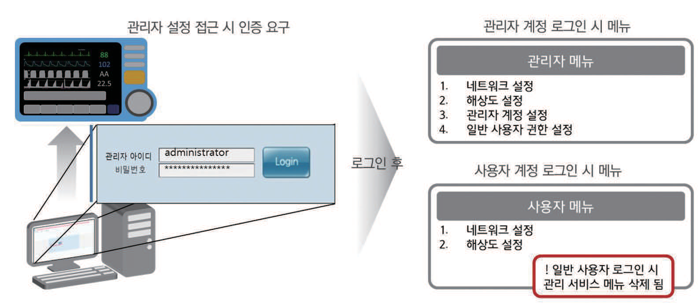

---
<!-- Page 116 -->
5.3.2 디지털헬스케어 기기의 서버에 사용자 접근 차단을 설정할 수 있어야 한다.
보안위협 및 취약점(제3장 참조)
디지털헬스케어 기기 및 서버에 대한 보안관리 부재로 중요 설정이 임의로 변경되어 안전하지 않은 서비스를
제공할 수 있다.
보안요구사항 및 보안대책
디지털헬스케어 서비스를 제공하는 서버는 사용자 계정 관리 기능을 제공해야 한다.
디지털헬스케어 서비스를 제공하는 서버는 사용자 계정을 기반으로 비인가된 사용자의 접근을 차단할 수 있어야
한다.
점검방법
사용자 계정 관리 기능을 제공하는지 확인한다.
비인가된 사용자, 정상 사용자가 서버에 접근한지 여부를 확인한다.
참고문헌
• 식품의약품안전처, “의료기기의 사이버 보안 허가·심사 가이드라인(민원인 안내서)”, 2019.

| 보안위협 및 취약점(제3장 참조) |
| --- |
| 디지털헬스케어 기기 및 서버에 대한 보안관리 부재로 중요 설정이 임의로 변경되어 안전하지 않은 서비스를 제공할 수 있다. |
| 보안요구사항 및 보안대책 |
| 디지털헬스케어 서비스를 제공하는 서버는 사용자 계정 관리 기능을 제공해야 한다. 디지털헬스케어 서비스를 제공하는 서버는 사용자 계정을 기반으로 비인가된 사용자의 접근을 차단할 수 있어야 한다. |
| 점검방법 |
| 사용자 계정 관리 기능을 제공하는지 확인한다. 비인가된 사용자, 정상 사용자가 서버에 접근한지 여부를 확인한다. |
| 참고문헌 |
| • 식품의약품안전처, “의료기기의 사이버 보안 허가·심사 가이드라인(민원인 안내서)”, 2019. |

---
<!-- Page 117 -->

## 제4장 디지털헬스케어 기기 보안요구사항 및 보안대책 | 117

및
보안대책
및
보안대책
개요
디지털헬스케어
서비스
모델
디지털헬스케어
보안위협
디지털헬스케어
기기
보안요구사항
디지털헬스케어
서비스
보안요구사항
참고문헌
제1장
제2장
제3장
제4장
제5장
부록

#### 5.4 감사기록

디지털헬스케어 기기는 중요 시스템 이벤트나 상태가 발생할 경우 자동으로 알람을
5.4.1
발생시켜야 한다.
보안위협 및 취약점(제3장 참조)
디지털헬스케어 기기·서비스에서 발생하는 오류, 악성행위 등에 대한 적절한 탐지 및 대응 부재로 안전하지 않은
서비스를 제공할 수 있다.
보안요구사항 및 보안대책
기기에 중요한 시스템 이벤트 또는 상태가 발생한 경우 관리자에게 알람 기능을 제공하여야 한다.
* 알람 방법: 알림 팝업, 소리, 메일 발송 등
점검방법
기기에서 정의하는 중요한 시스템 이벤트와 상태를 확인한다.
중요한 시스템 이벤트 또는 상태 발생 시 알람 기능이 정상적으로 동작하는지 확인한다.
참고문헌
• BSI, “Cyber Security Requirements for Network-Connected Medical Devices”, BSI-CS 132, Version
1.1, 2018.11.13.
디지털헬스케어 기기는 주요 이벤트를 탐지하여 감시기록을 생성 및 검토할 수 있는
5.4.2
기능을 제공해야 한다.
보안위협 및 취약점(제3장 참조)
디지털헬스케어 기기·서비스에서 발생하는 오류, 악성행위 등에 대한 적절한 탐지 및 대응 부재로 안전하지 않은
서비스를 제공할 수 있다.
보안요구사항 및 보안대책
기기에서 발생하는 주요 이벤트에 대해 감시기록을 생성하는 기능을 제공하여 기기의 이상행위를 탐지 및 추적할
수 있도록 해야 한다.
* 감사기록 대상: 인증 성공/실패, 환자 데이터 접근/조회, 기기 접속 기록, 데이터 생성/변경/삭제 행위, 비밀번호 변경,
업데이트 성공/실패 등
* 감사기록에 포함되지 않아야 하는 정보: 비밀번호, 암호키 등 민감한 정보 등
인가된 사용자가 해석할 수 있도록 조회 및 검토할 수 있는 기능을 제공해야 한다.
* 감사기록을 제품에 저장하지 않고 외부 서버 또는 기타 저장장치로 전송할 수 있음

| 보안위협 및 취약점(제3장 참조) |
| --- |
| 디지털헬스케어 기기·서비스에서 발생하는 오류, 악성행위 등에 대한 적절한 탐지 및 대응 부재로 안전하지 않은 서비스를 제공할 수 있다. |
| 보안요구사항 및 보안대책 |
| 기기에 중요한 시스템 이벤트 또는 상태가 발생한 경우 관리자에게 알람 기능을 제공하여야 한다. * 알람 방법: 알림 팝업, 소리, 메일 발송 등 |
| 점검방법 |
| 기기에서 정의하는 중요한 시스템 이벤트와 상태를 확인한다. 중요한 시스템 이벤트 또는 상태 발생 시 알람 기능이 정상적으로 동작하는지 확인한다. |
| 참고문헌 |
| • BSI, “Cyber Security Requirements for Network-Connected Medical Devices”, BSI-CS 132, Version 1.1, 2018.11.13. |

| 보안위협 및 취약점(제3장 참조) |
| --- |
| 디지털헬스케어 기기·서비스에서 발생하는 오류, 악성행위 등에 대한 적절한 탐지 및 대응 부재로 안전하지 않은 서비스를 제공할 수 있다. |
| 보안요구사항 및 보안대책 |
| 기기에서 발생하는 주요 이벤트에 대해 감시기록을 생성하는 기능을 제공하여 기기의 이상행위를 탐지 및 추적할 수 있도록 해야 한다. * 감사기록 대상: 인증 성공/실패, 환자 데이터 접근/조회, 기기 접속 기록, 데이터 생성/변경/삭제 행위, 비밀번호 변경, 업데이트 성공/실패 등 * 감사기록에 포함되지 않아야 하는 정보: 비밀번호, 암호키 등 민감한 정보 등 인가된 사용자가 해석할 수 있도록 조회 및 검토할 수 있는 기능을 제공해야 한다. * 감사기록을 제품에 저장하지 않고 외부 서버 또는 기타 저장장치로 전송할 수 있음 |

---
<!-- Page 118 -->
점검방법
기기에서 정의한 감사기록 대상 범위를 확인한다.
기기에서 주요 이벤트를 발생하여 감사기록 생성 여부를 확인한다.
외부 서버로 감사기록을 전송하는 경우 정상적으로 전송 및 저장되는지 확인한다.
보안 이벤트를 수행 후 감사기록 로그 생성 예시
참고문헌
• MDCG, “Guidance on Cybersecurity for medical devices”, MDCG 2019-16, 2019.11.
• BSI, “Cyber Security Requirements for Network-Connected Medical Devices”, BSI-CS 132, Version
1.1, 2018.11.13.
• IMDRF, “Principles and Practices for Medical Device Cybersecurity”, 2020.
• 식품의약품안전처, “의료기기의 사이버 보안 허가·심사 가이드라인(민원인 안내서)”, 2019.
• UL, “Software Cybersecurity for Network-Connctable Products, Part 1: General Requirements”, ANSI/
CAN/UL 2900-1:2017, 2017.
• UL, “Software Cybersecurity for Network-Connctable Products, Part 2-1: Particular Requirements for
Network Connectable Components of Healthcare and Wellness Systems”, ANSI/CAN/UL 2900-2-
1:2018, 2018.
• KISA, “사물인터넷(IoT) 보안 시험·인증 기준 해설서”, 2019.

| 점검방법 |
| --- |
| 기기에서 정의한 감사기록 대상 범위를 확인한다. 기기에서 주요 이벤트를 발생하여 감사기록 생성 여부를 확인한다. 외부 서버로 감사기록을 전송하는 경우 정상적으로 전송 및 저장되는지 확인한다. 보안 이벤트를 수행 후 감사기록 로그 생성 예시 |
| 참고문헌 |
| • MDCG, “Guidance on Cybersecurity for medical devices”, MDCG 2019-16, 2019.11. • BSI, “Cyber Security Requirements for Network-Connected Medical Devices”, BSI-CS 132, Version 1.1, 2018.11.13. • IMDRF, “Principles and Practices for Medical Device Cybersecurity”, 2020. • 식품의약품안전처, “의료기기의 사이버 보안 허가·심사 가이드라인(민원인 안내서)”, 2019. • UL, “Software Cybersecurity for Network-Connctable Products, Part 1: General Requirements”, ANSI/ CAN/UL 2900-1:2017, 2017. • UL, “Software Cybersecurity for Network-Connctable Products, Part 2-1: Particular Requirements for Network Connectable Components of Healthcare and Wellness Systems”, ANSI/CAN/UL 2900-2- 1:2018, 2018. • KISA, “사물인터넷(IoT) 보안 시험·인증 기준 해설서”, 2019. |

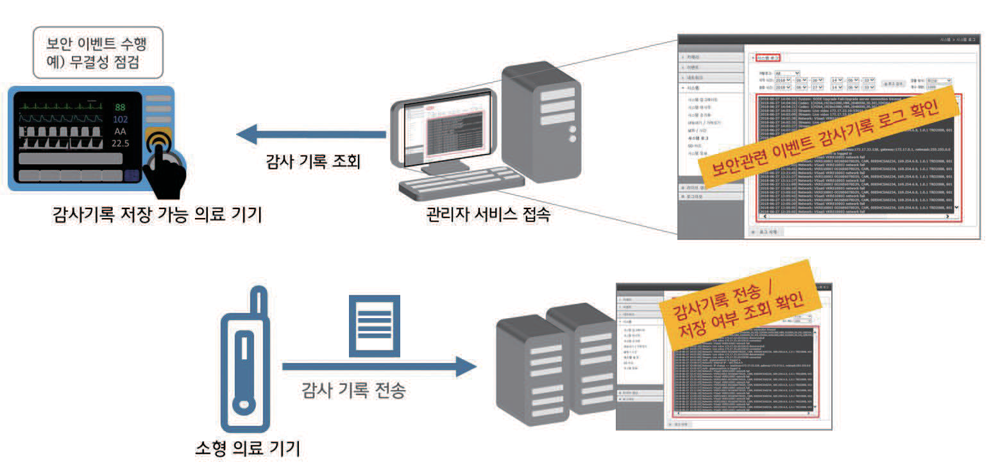

---
<!-- Page 119 -->

## 제4장 디지털헬스케어 기기 보안요구사항 및 보안대책 | 119

및
보안대책
및
보안대책
개요
디지털헬스케어
서비스
모델
디지털헬스케어
보안위협
디지털헬스케어
기기
보안요구사항
디지털헬스케어
서비스
보안요구사항
참고문헌
제1장
제2장
제3장
제4장
제5장
부록
5.4.3 감사기록을 안전하게 보호할 수 있어야 한다.
보안위협 및 취약점(제3장 참조)
디지털헬스케어 기기·서비스에서 발생하는 오류, 악성행위 등에 대한 적절한 탐지 및 대응 부재로 안전하지 않은
서비스를 제공할 수 있다.
보안요구사항 및 보안대책
비인가자가 감사기록에 접근하지 못하도록 통제하여야 한다.
감사기록의 유실 및 비인가된 변경·삭제 행위를 차단하기 위한 감사기록 보호 기능을 제공해야 한다.
* 감사 기록 보호 조치: 저장 공간 포화 시 오래된 감사기록 덮어쓰기 또는 인가된 사용자에게 경고 알람을 통해 저장 공간
확보
감사기록에 대한 비인가된 삭제 또는 변경이 가능한 사용자 인터페이스를 제공하지 않는다.
* 클라우드 등 안전성이 검증된 외부저장소로 감사기록을 보관할 수 있음
점검방법
감사기록을 보호하는 방법을 확인한다.
비인가자가 감사기록에 접근이 가능한지 확인한다.
감사기록을 변경·삭제하는 기능이 제공되는지 확인한다.
감사기록을 안전성이 검증된 외부저장소로 전송하는 기능 제공 여부를 확인한다.
참고문헌
• UL, “Software Cybersecurity for Network-Connctable Products, Part 1: General Requirements”, ANSI/
CAN/UL 2900-1:2017, 2017.
• UL, “Software Cybersecurity for Network-Connctable Products, Part 2-1: Particular Requirements for
Network Connectable Components of Healthcare and Wellness Systems”, ANSI/CAN/UL 2900-2-
1:2018, 2018.
• KISA, “사물인터넷(IoT) 보안 시험·인증 기준 해설서”, 2019.

| 보안위협 및 취약점(제3장 참조) |
| --- |
| 디지털헬스케어 기기·서비스에서 발생하는 오류, 악성행위 등에 대한 적절한 탐지 및 대응 부재로 안전하지 않은 서비스를 제공할 수 있다. |
| 보안요구사항 및 보안대책 |
| 비인가자가 감사기록에 접근하지 못하도록 통제하여야 한다. 감사기록의 유실 및 비인가된 변경·삭제 행위를 차단하기 위한 감사기록 보호 기능을 제공해야 한다. * 감사 기록 보호 조치: 저장 공간 포화 시 오래된 감사기록 덮어쓰기 또는 인가된 사용자에게 경고 알람을 통해 저장 공간 확보 감사기록에 대한 비인가된 삭제 또는 변경이 가능한 사용자 인터페이스를 제공하지 않는다. * 클라우드 등 안전성이 검증된 외부저장소로 감사기록을 보관할 수 있음 |
| 점검방법 |
| 감사기록을 보호하는 방법을 확인한다. 비인가자가 감사기록에 접근이 가능한지 확인한다. 감사기록을 변경·삭제하는 기능이 제공되는지 확인한다. 감사기록을 안전성이 검증된 외부저장소로 전송하는 기능 제공 여부를 확인한다. |
| 참고문헌 |
| • UL, “Software Cybersecurity for Network-Connctable Products, Part 1: General Requirements”, ANSI/ CAN/UL 2900-1:2017, 2017. • UL, “Software Cybersecurity for Network-Connctable Products, Part 2-1: Particular Requirements for Network Connectable Components of Healthcare and Wellness Systems”, ANSI/CAN/UL 2900-2- 1:2018, 2018. • KISA, “사물인터넷(IoT) 보안 시험·인증 기준 해설서”, 2019. |

---
<!-- Page 120 -->

#### 5.5 소프트웨어 개발 보안

디지털헬스케어 기기 개발과정에서 소스코드 보안 취약점이 존재하지 않도록 개발
5.5.1
하여야 한다.
보안위협 및 취약점(제3장 참조)
디지털헬스케어 기기·서비스 설계 및 구현과정에서 잠재적인 보안취약점이 포함될 수 있으며, 시험과정에서 이에
대한 검증 및 대응이 부재하거나 적절하지 않을 수 있다.
모바일 디바이스가 루팅/탈옥되었거나 취약한 운영체제 환경에서 앱 동작 시 앱의 보안 기능이 무력화되거나 우회될
수 있다.
취약한 3rd party 모듈/라이브러리 사용으로 공격자가 해당 모듈/라이브러리를 호출할 수 있다.
시스템 로그에 민감한 정보가 기록되어 공격자에 의해 해당 정보가 노출되어 악용될 수 있다.
디지털헬스케어 기기·서비스 릴리즈 및 배포 시 로그생성 및 디버깅 기능을 통해 중요정보가 유출되어 악용될 수 있다.
보안요구사항 및 보안대책
기기의 소프트웨어 개발 생명주기 단계별로 요구되는 보안 활동을 수행하여야 한다.
* (관련 표준) IEC 60601-1 14절, IEC 62304 등
* `소프트웨어 개발보안 가이드(행정안전부, 한국인터넷진흥원)` 참고
< 소프트웨어 개발 수명주기의 단계별 보안 활동 >
단계 보안 활동
요구사항 분석 • 요구사항 중 보안 항목 식별
• 위협원 도출을 위한 위협모델링
설계 • 보안설계 검토 및 보안설계서 작성
• 보안 통제 수립
• 표준코딩 정의서 및 소프트웨어 개발보안 가이드를 준수하여 개발
구현
• 소스코드 보안 취약점 진단 및 개선
테스트 • 모의침투 시험 또는 동적분석을 통한 보안 취약점 진단 및 개선
• 지속적인 개선
유지보수
• 보안 패치
최신 보안패치가 적용된 운영 환경, 라이브러리 등을 사용하여야 한다.
기기가 사이버보안 공격을 탐지하고 대응 및 복구할 수 있는 보안통제를 고려하여 설계하여야 한다.
기술적으로 가능한 경우, 자동화된 코드 검토가 소프트웨어 개발과정에 필수적으로 포함되어야 한다.

| 보안위협 및 취약점(제3장 참조) |
| --- |
| 디지털헬스케어 기기·서비스 설계 및 구현과정에서 잠재적인 보안취약점이 포함될 수 있으며, 시험과정에서 이에 대한 검증 및 대응이 부재하거나 적절하지 않을 수 있다. 모바일 디바이스가 루팅/탈옥되었거나 취약한 운영체제 환경에서 앱 동작 시 앱의 보안 기능이 무력화되거나 우회될 수 있다. 취약한 3rd party 모듈/라이브러리 사용으로 공격자가 해당 모듈/라이브러리를 호출할 수 있다. 시스템 로그에 민감한 정보가 기록되어 공격자에 의해 해당 정보가 노출되어 악용될 수 있다. 디지털헬스케어 기기·서비스 릴리즈 및 배포 시 로그생성 및 디버깅 기능을 통해 중요정보가 유출되어 악용될 수 있다. |
| 보안요구사항 및 보안대책 |
| 기기의 소프트웨어 개발 생명주기 단계별로 요구되는 보안 활동을 수행하여야 한다. * (관련 표준) IEC 60601-1 14절, IEC 62304 등 * `소프트웨어 개발보안 가이드(행정안전부, 한국인터넷진흥원)` 참고 < 소프트웨어 개발 수명주기의 단계별 보안 활동 > 단계 보안 활동 요구사항 분석 • 요구사항 중 보안 항목 식별 • 위협원 도출을 위한 위협모델링 설계 • 보안설계 검토 및 보안설계서 작성 • 보안 통제 수립 • 표준코딩 정의서 및 소프트웨어 개발보안 가이드를 준수하여 개발 구현 • 소스코드 보안 취약점 진단 및 개선 테스트 • 모의침투 시험 또는 동적분석을 통한 보안 취약점 진단 및 개선 • 지속적인 개선 유지보수 • 보안 패치 최신 보안패치가 적용된 운영 환경, 라이브러리 등을 사용하여야 한다. 기기가 사이버보안 공격을 탐지하고 대응 및 복구할 수 있는 보안통제를 고려하여 설계하여야 한다. 기술적으로 가능한 경우, 자동화된 코드 검토가 소프트웨어 개발과정에 필수적으로 포함되어야 한다. |

| 단계 | 보안 활동 |
| --- | --- |
| 요구사항 분석 | • 요구사항 중 보안 항목 식별 |
| 설계 | • 위협원 도출을 위한 위협모델링 • 보안설계 검토 및 보안설계서 작성 • 보안 통제 수립 |
| 구현 | • 표준코딩 정의서 및 소프트웨어 개발보안 가이드를 준수하여 개발 • 소스코드 보안 취약점 진단 및 개선 |
| 테스트 | • 모의침투 시험 또는 동적분석을 통한 보안 취약점 진단 및 개선 |
| 유지보수 | • 지속적인 개선 • 보안 패치 |

---
<!-- Page 121 -->

## 제4장 디지털헬스케어 기기 보안요구사항 및 보안대책 | 121

및
보안대책
및
보안대책
개요
디지털헬스케어
서비스
모델
디지털헬스케어
보안위협
디지털헬스케어
기기
보안요구사항
디지털헬스케어
서비스
보안요구사항
참고문헌
제1장
제2장
제3장
제4장
제5장
부록
점검방법
소스코드 보안 취약점 분석 도구를 이용하여 소프트웨어에 대한 보안 취약점을 점검하여야 한다.
소스코드 시큐어코딩 점검 예시
최신 보안패치 적용 점검 예시
참고문헌
• BSI, “Cyber Security Requirements for Network-Connected Medical Devices”, BSI-CS 132, Version
1.1, 2018.11.13.
• Health Canada,“Pre-market Requirements for Medical Device Cybersecurity”, 2019.
• IMDRF, “Principles and Practices for Medical Device Cybersecurity”, 2020.

| 점검방법 |
| --- |
| 소스코드 보안 취약점 분석 도구를 이용하여 소프트웨어에 대한 보안 취약점을 점검하여야 한다. 소스코드 시큐어코딩 점검 예시 최신 보안패치 적용 점검 예시 |
| 참고문헌 |
| • BSI, “Cyber Security Requirements for Network-Connected Medical Devices”, BSI-CS 132, Version 1.1, 2018.11.13. • Health Canada,“Pre-market Requirements for Medical Device Cybersecurity”, 2019. • IMDRF, “Principles and Practices for Medical Device Cybersecurity”, 2020. |

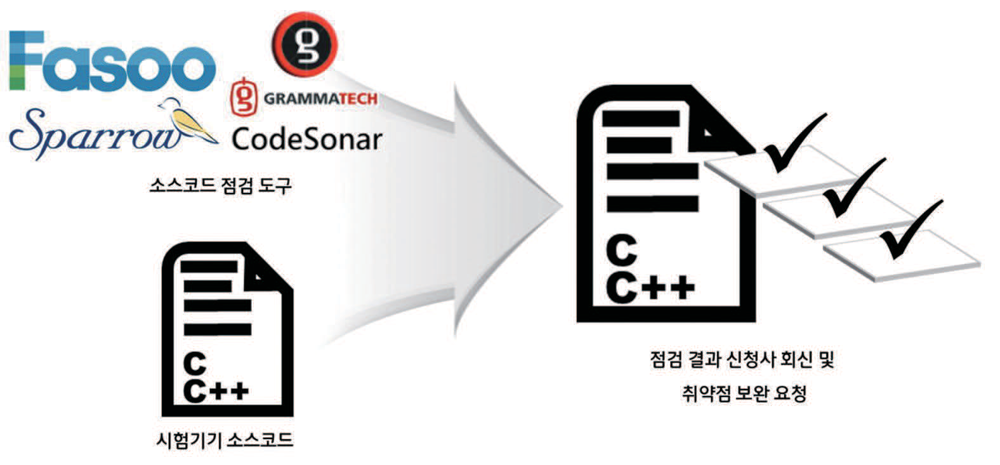
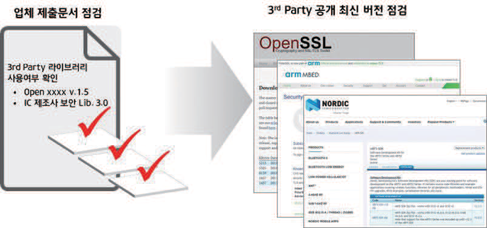

---
<!-- Page 122 -->

#### 5.6 보안 취약점 탐지 및 대응

5.6.1 악성코드로부터 보호할 수 있어야 한다.
보안위협 및 취약점(제3장 참조)
디지털헬스케거 기기·서비스의 목적에 맞지 않은 기능이 존재하여 악성 행위를 할 수 있다.
디지털헬스케어 기기·서비스에서 발생하는 오류, 악성행위 등에 대한 적절한 탐지 및 대응 부재로 안전하지 않은
서비스를 제공할 수 있다.
디지털헬스케어 기기·서비스 설계 및 구현과정에서 잠재적인 보안취약점이 포함될 수 있으며, 시험과정에서 이에
대한 검증 및 대응이 부재하거나 적절하지 않을 수 있다.
보안요구사항 및 보안대책
랜섬웨어, 스파이웨어 등 다양한 형태의 악성코드가 기기에서 실행되는 것을 방지하기 위해 악성 소프트웨어 방지
등과 같은 보안통제를 고려하여야 한다.
위험에 노출된 경우를 탐지하고 보호하는 조치를 고려하여야 한다.
악성코드로부터 중요한 데이터를 보호하여야 한다.
점검방법
악성코드 분석 도구를 이용하여 보안 위협을 실시간으로 탐지하고 보호하여야 한다.
참고문헌
• U.S. FDA, “(Draft) Medical Device Manufacturer Internet of Things (IoT) Code of Conduct”, 2020.
• IMDRF, “Principles and Practices for Medical Device Cybersecurity”, 2020.
• BSI, “Cyber Security Requirements for Network-Connected Medical Devices”, BSI-CS 132, Version
1.1, 2018.11.13.

| 보안위협 및 취약점(제3장 참조) |
| --- |
| 디지털헬스케거 기기·서비스의 목적에 맞지 않은 기능이 존재하여 악성 행위를 할 수 있다. 디지털헬스케어 기기·서비스에서 발생하는 오류, 악성행위 등에 대한 적절한 탐지 및 대응 부재로 안전하지 않은 서비스를 제공할 수 있다. 디지털헬스케어 기기·서비스 설계 및 구현과정에서 잠재적인 보안취약점이 포함될 수 있으며, 시험과정에서 이에 대한 검증 및 대응이 부재하거나 적절하지 않을 수 있다. |
| 보안요구사항 및 보안대책 |
| 랜섬웨어, 스파이웨어 등 다양한 형태의 악성코드가 기기에서 실행되는 것을 방지하기 위해 악성 소프트웨어 방지 등과 같은 보안통제를 고려하여야 한다. 위험에 노출된 경우를 탐지하고 보호하는 조치를 고려하여야 한다. 악성코드로부터 중요한 데이터를 보호하여야 한다. |
| 점검방법 |
| 악성코드 분석 도구를 이용하여 보안 위협을 실시간으로 탐지하고 보호하여야 한다. |
| 참고문헌 |
| • U.S. FDA, “(Draft) Medical Device Manufacturer Internet of Things (IoT) Code of Conduct”, 2020. • IMDRF, “Principles and Practices for Medical Device Cybersecurity”, 2020. • BSI, “Cyber Security Requirements for Network-Connected Medical Devices”, BSI-CS 132, Version 1.1, 2018.11.13. |

---
<!-- Page 123 -->

## 제4장 디지털헬스케어 기기 보안요구사항 및 보안대책 | 123

및
보안대책
및
보안대책
개요
디지털헬스케어
서비스
모델
디지털헬스케어
보안위협
디지털헬스케어
기기
보안요구사항
디지털헬스케어
서비스
보안요구사항
참고문헌
제1장
제2장
제3장
제4장
제5장
부록
5.6.2 보안 취약점 존재 여부를 확인하고 제거하여야 한다.
보안위협 및 취약점(제3장 참조)
디지털헬스케거 기기·서비스의 목적에 맞지 않은 기능이 존재하여 악성 행위를 할 수 있다.
디지털헬스케어 기기·서비스 설계 및 구현과정에서 잠재적인 보안취약점이 포함될 수 있으며, 시험과정에서 이에
대한 검증 및 대응이 부재하거나 적절하지 않을 수 있다.
보안요구사항 및 보안대책
공개 영역(예: KrCERT, CVE, NVD 등)을 통해 기기와 관련된 보안 취약점 존재 여부를 확인하고 제거해야 한다.
* (대상 예) 프로토콜, 라이브러리, API 등
* (확인방법) 퍼징 시험, 침투 시험 등을 통해 존재 여부를 확인할 수 있다.
점검방법
상용 또는 신뢰할 수 있는 공개용 보안 취약점 점검 도구를 사용하여 기기의 보안 취약점을 점검하고 제거하여야
한다.
알려진 취약점 점검 방법 예시
참고문헌
• BSI, “Cyber Security Requirements for Network-Connected Medical Devices”, BSI-CS 132, Version
1.1, 2018.11.13.

| 보안위협 및 취약점(제3장 참조) |
| --- |
| 디지털헬스케거 기기·서비스의 목적에 맞지 않은 기능이 존재하여 악성 행위를 할 수 있다. 디지털헬스케어 기기·서비스 설계 및 구현과정에서 잠재적인 보안취약점이 포함될 수 있으며, 시험과정에서 이에 대한 검증 및 대응이 부재하거나 적절하지 않을 수 있다. |
| 보안요구사항 및 보안대책 |
| 공개 영역(예: KrCERT, CVE, NVD 등)을 통해 기기와 관련된 보안 취약점 존재 여부를 확인하고 제거해야 한다. * (대상 예) 프로토콜, 라이브러리, API 등 * (확인방법) 퍼징 시험, 침투 시험 등을 통해 존재 여부를 확인할 수 있다. |
| 점검방법 |
| 상용 또는 신뢰할 수 있는 공개용 보안 취약점 점검 도구를 사용하여 기기의 보안 취약점을 점검하고 제거하여야 한다. 알려진 취약점 점검 방법 예시 |
| 참고문헌 |
| • BSI, “Cyber Security Requirements for Network-Connected Medical Devices”, BSI-CS 132, Version 1.1, 2018.11.13. |

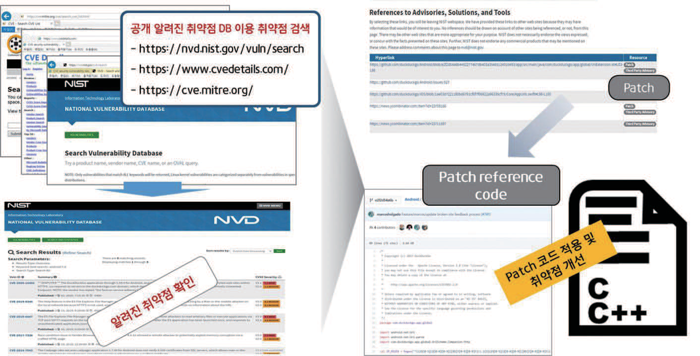

---
<!-- Page 124 -->
6 | 물리적 보호

#### 6.1 인터페이스에 대한 물리적 보호

6.1.1 디지털헬스케어 기기의 불필요한 인터페이스는 물리적으로 접근을 제한해야 한다.
보안위협 및 취약점(제3장 참조)
디지털헬스케어 기기의 주요 실행코드 또는 설정값의 임의 변조에 따라 오작동할 수 있다.
디지털헬스케어 기기·서비스 릴리즈 및 배포 시 로그생성 및 디버깅 기능을 통해 중요정보가 유출되어 악용될 수
있다.
디지털헬스케어 기기에 비인가된 물리적 접속으로 기기를 임의로 변경할 수 있다.
보안요구사항 및 보안대책
외부에 노출된 모든 인터페이스 종류와 기능을 식별한다.
불필요한 외부 인터페이스에 대하여 비활성화 대책이 마련되어야 한다.
* (예) 불필요한 외부 인터페이스 제거하거나 서비스를 비활성화 시킴
점검방법
외부에 노출된 인터페이스의 필요 여부를 확인한다.
불필요한 외부 인터페이스가 존재할 경우 제거하거나 비활성화 가능 여부를 확인한다.
알려진 취약점 점검 방법 예시

| 보안위협 및 취약점(제3장 참조) |
| --- |
| 디지털헬스케어 기기의 주요 실행코드 또는 설정값의 임의 변조에 따라 오작동할 수 있다. 디지털헬스케어 기기·서비스 릴리즈 및 배포 시 로그생성 및 디버깅 기능을 통해 중요정보가 유출되어 악용될 수 있다. 디지털헬스케어 기기에 비인가된 물리적 접속으로 기기를 임의로 변경할 수 있다. |
| 보안요구사항 및 보안대책 |
| 외부에 노출된 모든 인터페이스 종류와 기능을 식별한다. 불필요한 외부 인터페이스에 대하여 비활성화 대책이 마련되어야 한다. * (예) 불필요한 외부 인터페이스 제거하거나 서비스를 비활성화 시킴 |
| 점검방법 |
| 외부에 노출된 인터페이스의 필요 여부를 확인한다. 불필요한 외부 인터페이스가 존재할 경우 제거하거나 비활성화 가능 여부를 확인한다. 알려진 취약점 점검 방법 예시 |

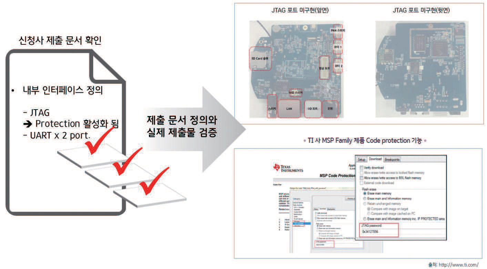

---
<!-- Page 125 -->

## 제4장 디지털헬스케어 기기 보안요구사항 및 보안대책 | 125

및
보안대책
및
보안대책
개요
디지털헬스케어
서비스
모델
디지털헬스케어
보안위협
디지털헬스케어
기기
보안요구사항
디지털헬스케어
서비스
보안요구사항
참고문헌
제1장
제2장
제3장
제4장
제5장
부록
참고문헌
• U.S. FDA, “(Draft) Content of Premarket Submissions for Management of Cybersecurity in Medical
Devices”, 2018.
• 식품의약품안전처, “의료기기의 사이버 보안 허가·심사 가이드라인(민원인 안내서)”, 2019.
• Health Canada,“Pre-market Requirements for Medical Device Cybersecurity”, 2019.
• DTSec, “Protection Profile for Connected Diabetes Devices (CDD)”, Version 2.0, 2017.11.25.
• IMDRF, “Principles and Practices for Medical Device Cybersecurity”, 2020.
6.1.2 디지털헬스케어 기기에 대한 비인가된 물리적 접근을 탐지하고, 대응기능을 제공해야 한다.
보안위협 및 취약점(제3장 참조)
디지털헬스케어 기기의 주요 실행코드 또는 설정값의 임의 변조에 따라 오작동할 수 있다.
디지털헬스케어 기기에 비인가된 물리적 접속으로 기기를 임의로 변경할 수 있다.
보안요구사항 및 보안대책
인가되지 않은 접근 방지를 위해 접근통제 기능을 제공하여야 한다.
점검방법
인가되지 않은 접근을 방지하기 위한 접근통제 기능이 적용되었는지 확인한다.
무단 조작 후 메모리 초기화대응 기능 예시
참고문헌
• DTSec, “Protection Profile for Connected Diabetes Devices (CDD)”, Version 2.0, 2017.11.25.

| 참고문헌 |
| --- |
| • U.S. FDA, “(Draft) Content of Premarket Submissions for Management of Cybersecurity in Medical Devices”, 2018. • 식품의약품안전처, “의료기기의 사이버 보안 허가·심사 가이드라인(민원인 안내서)”, 2019. • Health Canada,“Pre-market Requirements for Medical Device Cybersecurity”, 2019. • DTSec, “Protection Profile for Connected Diabetes Devices (CDD)”, Version 2.0, 2017.11.25. • IMDRF, “Principles and Practices for Medical Device Cybersecurity”, 2020. |

| 보안위협 및 취약점(제3장 참조) |
| --- |
| 디지털헬스케어 기기의 주요 실행코드 또는 설정값의 임의 변조에 따라 오작동할 수 있다. 디지털헬스케어 기기에 비인가된 물리적 접속으로 기기를 임의로 변경할 수 있다. |
| 보안요구사항 및 보안대책 |
| 인가되지 않은 접근 방지를 위해 접근통제 기능을 제공하여야 한다. |
| 점검방법 |
| 인가되지 않은 접근을 방지하기 위한 접근통제 기능이 적용되었는지 확인한다. 무단 조작 후 메모리 초기화대응 기능 예시 |
| 참고문헌 |
| • DTSec, “Protection Profile for Connected Diabetes Devices (CDD)”, Version 2.0, 2017.11.25. |

---
<!-- Page 126 -->

|  |
| --- |
|  |

|  |
| --- |
|  |

|  |
| --- |
|  |

---
<!-- Page 127 -->
제5장
디지털헬스케어 서비스
보안요구사항 및 보안대책
제1절 디지털헬스케어 서비스 모바일 앱
제2절 디지털헬스케어 서비스 웹 서비스
제3절 디지털헬스케어 서비스 인프라

---
<!-- Page 128 -->

## 제5장 디지털헬스케어 서비스

보안요구사항 및 보안대책
본 장에서는 디지털헬스케어 서비스를 제공하는 모바일 앱, 웹 서비스, 디지털헬스케어 서비스 인프라를
대상으로 준수해야 할 보안요구사항에 대해 설명한다.
제1절 디지털헬스케어 서비스 모바일 앱
(1) ‘인증’ 유형
보안항목 보안요구사항
처음 제품을 사용할 때 인증정보를 설정하도록 요구하거나, 초기 인증정보를 변경
01
하도록 요구해야 한다.
관리서비스 및 중요정보 접근 시 사용자 신원을 검증하기 위해 식별 및 인증이 선행
02
되어야 한다.
사용자 인증
03 잘못된 인증정보를 통한 반복된 인증 시도를 제한해야 한다.
04 제품에서 사용되는 사용자 계정 및 권한에 대한 관리 기능을 제공해야 한다.
05 길이, 주기, 복잡성을 고려하여 안전한 비밀번호로 설정되도록 해야 한다.
01 인증정보는 하드코딩 되거나 평문으로 저장되지 않아야 한다.
인증 정보의 안전한
02 인증을 위한 비밀번호 입력 시 화면에 노출되지 않도록 마스킹 처리해야 한다.
사용
03 인증 실패 시 실패 사유에 대한 피드백 정보를 제공하지 않아야 한다.
제품 간 중요정보 전송 시 혹은 제품 제어를 위한 상호연결 수행 시 상호인증이
제품 인증 01
선행되어야 한다.

| 보안항목 | 보안요구사항 |
| --- | --- |
|  | 01 |
|  | 02 |
|  | 03 |
|  | 04 |
|  | 05 |
|  | 01 |
|  | 02 |
|  | 03 |
|  | 01 |

---
<!-- Page 129 -->

## 제5장 디지털헬스케어 서비스 보안요구사항 및 보안대책 | 129

및
보안대책
및
보안대책
개요
디지털헬스케어
서비스
모델
디지털헬스케어
보안위협
디지털헬스케어
기기
보안요구사항
디지털헬스케어
서비스
보안요구사항
참고문헌
제1장
제2장
제3장
제4장
제5장
부록
(2) ‘암호’ 유형
보안항목 보안요구사항
안전한 암호
01 중요정보 전송 또는 저장 시 안전한 암호 알고리즘을 사용해야 한다.
알고리즘 사용
(3) ‘데이터 보호’ 유형
보안항목 보안요구사항
01 제품 간 전송되는 중요정보는 암호화해야 한다.
전송데이터 보호
02 알려진 프로토콜 기반으로 통신채널 생성 시 안전한 보안 모드를 사용해야 한다.
저장데이터 보호 01 제품에 저장되는 중요정보는 암호화해야 한다.
정보흐름 통제 01 허가되지 않은 네트워크 트래픽 차단 기능을 제공해야 한다.
안전한 세션관리 01 세션 연결 후 일정 시간동안 미사용 시, 세션을 잠그거나 종료시켜야 한다.
개인정보 보호 01 제품에서 처리하는 개인정보는 비식별화 조치되어야 한다.
(4) ‘플랫폼 보호’ 유형
보안항목 시험 기준
01 보안약점이 존재하지 않도록 시큐어코딩을 적용해야 한다.
소프트웨어 보안
02 알려진 보안취약점 존재여부를 확인하고 제거하여야 한다.
01 소스코드 분석 방지를 위해 난독화를 적용해야 한다.
소프트웨어
보안 02 주요 설정 값 및 실행코드에 대한 무결성 검증 기능을 지원해야 한다.
01 업데이트 수행 전 인가된 사용자 여부를 확인해야 한다.
안전한 업데이트
02 업데이트 수행 전 무결성을 검사해야 한다.
01 불필요한 서비스는 제거하거나 비활성화해야 한다.
보안 관리 02 원격관리는 신뢰할 수 있는 환경에서 수행되어야 한다.
03 3rd party 라이브러리 사용 시 최신 보안패치가 적용된 버전을 사용해야 한다.
01 보안과 관련된 이벤트는 감사기록을 생성해야 한다.
감사기록
02 감사기록에 대한 보호 기능을 제공해야 한다.

| 보안항목 | 보안요구사항 |
| --- | --- |
|  | 01 |

| 보안항목 | 보안요구사항 |
| --- | --- |
|  | 01 |
|  | 02 |
|  | 01 |
|  | 01 |
|  | 01 |
|  | 01 |

| 보안항목 | 시험 기준 |
| --- | --- |
|  | 01 |
|  | 02 |
|  | 01 |
|  | 02 |
|  | 01 |
|  | 02 |
|  | 01 |
|  | 02 |
|  | 03 |
|  | 01 |
|  | 02 |

| 제5장 |  |

---
<!-- Page 130 -->
1 | 인증

#### 1.1 사용자 인증

처음 제품을 사용할 때 인증정보를 설정하도록 요구하거나, 초기 인증정보를 변경
1.1.1
하도록 요구해야 한다.
위협 및 취약점
초기 인증을 진행하지 않을 경우 인가되지 않은 사용자가 특정 사용자에 대한 정보 열람, 유출, 계정 탈취 등과
같은 행위에 위험성이 존재한다.
요구사항 및 보안대책
초기 인증정보를 사용하지 않는 경우 인증정보를 새롭게 설정하도록 해야 하며, 초기 인증정보를 사용하는 경우
초기 인증정보 입력 후 해당 인증정보를 변경할 수 있도록 구현해야 한다.
IoT 제품의 사용자 인증이 필요한 기능을 처음 사용할 때에는 사용자가 인증정보를 설정하거나 초기 인증정보를
변경하도록 요구하는 단계를 거친 후, 해당 기능이 사용 가능하도록 구현해야 한다.
인증 정보 변경 시 초기 혹은 이전 인증정보와 동일한 값으로 설정할 수 없도록 구현해야 한다.
점검방법
새로운 IoT 제품을 시동하여 사용자 인증이 필요한 기능에 접근을 시도한 후, 인증정보를 설정하도록 요구하거나
초기 인증정보를 입력하도록 요구하는 지 확인한다.
초기 인증정보의 입력을 요구하는 경우 초기 인증 후에 이를 변경하도록 요구하는 지 확인한다.
인증정보 변경 시 초기 인증정보와 동일한 값으로 설정을 시도하여 이를 허용하는지 확인한다.
인증정보 설정 혹은 초기 인증번호를 변경하지 않고 우회하여 사용자 인증이 필요한 기능에 접근할 수 있는지
확인한다.

| 위협 및 취약점 |
| --- |
| 초기 인증을 진행하지 않을 경우 인가되지 않은 사용자가 특정 사용자에 대한 정보 열람, 유출, 계정 탈취 등과 같은 행위에 위험성이 존재한다. |
| 요구사항 및 보안대책 |
| 초기 인증정보를 사용하지 않는 경우 인증정보를 새롭게 설정하도록 해야 하며, 초기 인증정보를 사용하는 경우 초기 인증정보 입력 후 해당 인증정보를 변경할 수 있도록 구현해야 한다. IoT 제품의 사용자 인증이 필요한 기능을 처음 사용할 때에는 사용자가 인증정보를 설정하거나 초기 인증정보를 변경하도록 요구하는 단계를 거친 후, 해당 기능이 사용 가능하도록 구현해야 한다. 인증 정보 변경 시 초기 혹은 이전 인증정보와 동일한 값으로 설정할 수 없도록 구현해야 한다. |
| 점검방법 |
| 새로운 IoT 제품을 시동하여 사용자 인증이 필요한 기능에 접근을 시도한 후, 인증정보를 설정하도록 요구하거나 초기 인증정보를 입력하도록 요구하는 지 확인한다. 초기 인증정보의 입력을 요구하는 경우 초기 인증 후에 이를 변경하도록 요구하는 지 확인한다. 인증정보 변경 시 초기 인증정보와 동일한 값으로 설정을 시도하여 이를 허용하는지 확인한다. 인증정보 설정 혹은 초기 인증번호를 변경하지 않고 우회하여 사용자 인증이 필요한 기능에 접근할 수 있는지 확인한다. |

---
<!-- Page 131 -->

## 제5장 디지털헬스케어 서비스 보안요구사항 및 보안대책 | 131

및
보안대책
및
보안대책
개요
디지털헬스케어
서비스
모델
디지털헬스케어
보안위협
디지털헬스케어
기기
보안요구사항
디지털헬스케어
서비스
보안요구사항
참고문헌
제1장
제2장
제3장
제4장
제5장
부록
관리서비스 및 중요정보 접근 시 사용자 신원을 검증하기 위해 식별 및 인증이 선행
1.1.2
되어야 한다.
위협 및 취약점
관리 서비스 및 중요정보 접근 시 사용자의 신원이 검증되지 않을 경우 비인가자에 관리서비스 불법 접근 후 특정
행위가 가능하다
요구사항 및 보안대책
사용자 계정 및 권한 관리 등의 관리서비스 접근 시 사용자에 대한 식별 및 인증을 수행해야 한다.
개인을 식별할 수 있는 영상정보와 같은 중요정보 접근 시 사용자에 대한 식별 및 인증을 수행하도록 구현해야
한다.
계정에 부여된 권한에 따라 관리서비스 및 중요 정보에 대한 접근을 허용하는 경우, 일반 사용자 등 다른 권한들과
분리하여 해당 권한을 관리해야 한다.
점검방법
관리서비스에 접근을 시도하여 인증을 요구하는지 확인한다.
계정에 부여된 권한을 통해 관리자와 일반 사용자를 구분하는 경우, 관리자 계정으로 로그인하여 관리서비스에
접근이 가능한지 확인하고 관리자 계정 로그아웃 후 일반 사용자 계정으로 로그인하여 관리서비스 접근이
거부되는지 확인한다

| 위협 및 취약점 |
| --- |
| 관리 서비스 및 중요정보 접근 시 사용자의 신원이 검증되지 않을 경우 비인가자에 관리서비스 불법 접근 후 특정 행위가 가능하다 |
| 요구사항 및 보안대책 |
| 사용자 계정 및 권한 관리 등의 관리서비스 접근 시 사용자에 대한 식별 및 인증을 수행해야 한다. 개인을 식별할 수 있는 영상정보와 같은 중요정보 접근 시 사용자에 대한 식별 및 인증을 수행하도록 구현해야 한다. 계정에 부여된 권한에 따라 관리서비스 및 중요 정보에 대한 접근을 허용하는 경우, 일반 사용자 등 다른 권한들과 분리하여 해당 권한을 관리해야 한다. |
| 점검방법 |
| 관리서비스에 접근을 시도하여 인증을 요구하는지 확인한다. 계정에 부여된 권한을 통해 관리자와 일반 사용자를 구분하는 경우, 관리자 계정으로 로그인하여 관리서비스에 접근이 가능한지 확인하고 관리자 계정 로그아웃 후 일반 사용자 계정으로 로그인하여 관리서비스 접근이 거부되는지 확인한다 |

---
<!-- Page 132 -->
1.1.3 잘못된 인증정보를 통한 반복된 인증 시도를 제한해야 한다.
위협 및 취약점
잘못된 인증정보를 통한 반복된 인증 시도를 허용할 경우 무차별 대입 공격(Brute Force Attack)에 취약할 수
있으므로, IoT 제품/앱은 잘못된 인증정보를 통한 지속적인 인증 시도에 대해 이를 적절하게 대응하는 기능을
제공한다.
요구사항 및 보안대책
인증 시도 횟수를 제한하여 정해진 인증 시도 횟수 초과 시 계정 잠금 혹은 일정 시간 인증 기능을 비활성화한다.
정해진 인증 시도 횟수 초과 시 허가되지 않은 네트워크 트래픽으로 판단하여 자동 차단목록에 추가한다.
캡챠(CAPTCHA) 방식을 활용하여 반복된 인증 시도를 제한한다.
점검방법
잘못된 인증정보를 통한 반복된 인증 시도 시 이를 제한하는 방법을 확인하고, 제출문서에 기재된 방법이 요구
사항을 대응하기에 적절한지 확인한다.
일정 횟수 이상 인증 실패 시 계정 잠금 혹은 일정 기간 인증 기능이 비활성화 되는지 확인한다.

| 위협 및 취약점 |
| --- |
| 잘못된 인증정보를 통한 반복된 인증 시도를 허용할 경우 무차별 대입 공격(Brute Force Attack)에 취약할 수 있으므로, IoT 제품/앱은 잘못된 인증정보를 통한 지속적인 인증 시도에 대해 이를 적절하게 대응하는 기능을 제공한다. |
| 요구사항 및 보안대책 |
| 인증 시도 횟수를 제한하여 정해진 인증 시도 횟수 초과 시 계정 잠금 혹은 일정 시간 인증 기능을 비활성화한다. 정해진 인증 시도 횟수 초과 시 허가되지 않은 네트워크 트래픽으로 판단하여 자동 차단목록에 추가한다. 캡챠(CAPTCHA) 방식을 활용하여 반복된 인증 시도를 제한한다. |
| 점검방법 |
| 잘못된 인증정보를 통한 반복된 인증 시도 시 이를 제한하는 방법을 확인하고, 제출문서에 기재된 방법이 요구 사항을 대응하기에 적절한지 확인한다. 일정 횟수 이상 인증 실패 시 계정 잠금 혹은 일정 기간 인증 기능이 비활성화 되는지 확인한다. |

---
<!-- Page 133 -->

## 제5장 디지털헬스케어 서비스 보안요구사항 및 보안대책 | 133

및
보안대책
및
보안대책
개요
디지털헬스케어
서비스
모델
디지털헬스케어
보안위협
디지털헬스케어
기기
보안요구사항
디지털헬스케어
서비스
보안요구사항
참고문헌
제1장
제2장
제3장
제4장
제5장
부록
1.1.4 제품에서 사용되는 사용자 계정 및 권한에 대한 관리 기능을 제공해야 한다.
위협 및 취약점
사용자 계정에 대해 권한 부여가 잘못되어 있을 경우 사용자 계정을 가입 한 후 관리자 계정에 부여된 권한을 탈취
하여 악의적인 행위가 가능하다.
요구사항 및 보안대책
사용자 계정(관리자 계정 등 모든 계정 포함)에 대해 사용자 계정 추가, 제거, 권한 부여 등의 관리를 수행해야
한다.
역할 기반의 접근통제 모델을 사용하는 경우, IoT 제품의 모든 기능에 대해 접근 권한을 명확하게 정의하고 이에
따라 권한을 부여하도록 해야한다.
점검방법
제품에서 사용되는 사용자 계정 및 권한에 대한 관리 기능을 제공하는지 확인
관리자 계정 외에 추가적인 사용자 계정을 지원하는 경우, 사용자 계정에 대한 생성 및 제거, 접근권한 부여가
접근권한 관리자에 의해서만 수행되는지 확인한다.
1.1.5 길이, 주기, 복잡성을 고려하여 안전한 비밀번호로 설정되도록 해야 한다.
위협 및 취약점
사용자 계정 또는 관리자 계정에 비밀번호가 안전하지 않은 비밀번호로 설정되어 있을 경우 Brute force 공격등의
자동화 공격으로 인해 사용자 비밀번호 습득이 가능하며 이후 계정 탈취와 같은 위험성이 존재한다.
요구사항 및 보안대책
사용자가 비밀번호 설정할 때 아래와 같이 길이, 주기, 복잡성을 고려하여 안전한 비밀번호로 설정되도록 기능을
제공해야 한다.
특정 제품에 대한 제품 규격이 공시되어 해당 규격을 통해 비밀번호 설정 기준이 제시된 경우 이를 준수하도록
한다. (예: 공공기관 납품용 CCTV의 경우 15자리 이상의 비밀번호를 요구)
점검방법
비밀번호 생성 규칙을 확인하고, 해당 규칙이 적절하게 적용되어 있는지 확인한다.

| 위협 및 취약점 |
| --- |
| 사용자 계정에 대해 권한 부여가 잘못되어 있을 경우 사용자 계정을 가입 한 후 관리자 계정에 부여된 권한을 탈취 하여 악의적인 행위가 가능하다. |
| 요구사항 및 보안대책 |
| 사용자 계정(관리자 계정 등 모든 계정 포함)에 대해 사용자 계정 추가, 제거, 권한 부여 등의 관리를 수행해야 한다. 역할 기반의 접근통제 모델을 사용하는 경우, IoT 제품의 모든 기능에 대해 접근 권한을 명확하게 정의하고 이에 따라 권한을 부여하도록 해야한다. |
| 점검방법 |
| 제품에서 사용되는 사용자 계정 및 권한에 대한 관리 기능을 제공하는지 확인 관리자 계정 외에 추가적인 사용자 계정을 지원하는 경우, 사용자 계정에 대한 생성 및 제거, 접근권한 부여가 접근권한 관리자에 의해서만 수행되는지 확인한다. |

| 위협 및 취약점 |
| --- |
| 사용자 계정 또는 관리자 계정에 비밀번호가 안전하지 않은 비밀번호로 설정되어 있을 경우 Brute force 공격등의 자동화 공격으로 인해 사용자 비밀번호 습득이 가능하며 이후 계정 탈취와 같은 위험성이 존재한다. |
| 요구사항 및 보안대책 |
| 사용자가 비밀번호 설정할 때 아래와 같이 길이, 주기, 복잡성을 고려하여 안전한 비밀번호로 설정되도록 기능을 제공해야 한다. 특정 제품에 대한 제품 규격이 공시되어 해당 규격을 통해 비밀번호 설정 기준이 제시된 경우 이를 준수하도록 한다. (예: 공공기관 납품용 CCTV의 경우 15자리 이상의 비밀번호를 요구) |
| 점검방법 |
| 비밀번호 생성 규칙을 확인하고, 해당 규칙이 적절하게 적용되어 있는지 확인한다. |

---
<!-- Page 134 -->

#### 1.2 인증정보의 안전한 사용

1.2.1 인증정보는 하드코딩 되거나 평문으로 저장되지 않아야 한다.
위협 및 취약점
인증정보 등이 하드코딩되어 있을 경우 소스코드 디컴파일을 통해 소스내 하드코딩된 인증정보가 노출되며, 평문
으로 모바일 앱 내에 저장될 경우 해당 파일 탈취로 인해 인증정보 탈취가 가능하다.
요구사항 및 보안대책
사용자 인증 시 사용되는 인증정보는 하드코딩하거나 평문으로 저장하지 않아야한다.
사용자 계정(및 중요 설정정보)을 파일 형태로 추출(export) 하는 기능이 있는 경우, 평문으로 생성하지 않아야 한다.
인증정보는 솔트를 추가하여 해시 함수 또는 암호 알고리즘을 사용하여 저장해야 하며, 해쉬함수나 암호 알고리즘의
보안 강도는 112비트 이상의 보안강도를 권장한다.
점검방법
모바일 기기 및 소스코드 내에 저장된 인증정보를 확인하여 하드코딩 되거나 평문으로 저장하고 있는지 확인한다.
사용자 계정(및 중요 설정정보)을 파일 형태로 추출(export) 하는 기능이 있는 경우, 추출된 파일이 평문으로 되어
있는지 확인한다.
동일한 두 개의 인증정보를 생성하여 저장된 인증정보의 형태가 다른지 확인한다.
1.2.2 인증을 위한 비밀번호 입력 시 화면에 노출되지 않도록 마스킹 처리해야 한다.
위협 및 취약점
비밀번호가 평문으로 표시될 경우 ‘어깨너머 공격’ 등에 취약하며 비밀번호 입력 시 근처에 있는 사람에게 비밀번호
노출될 위험성이 존재한다.
요구사항 및 보안대책
비밀번호가 평문으로 표시될 경우 ‘어깨너머 공격’ 등에 취약할 수 있으므로, 비밀번호 입력 시 화면에 평문으로
노출되지 않도록 “*”등 의 기호를 사용하여 마스킹 처리해야한다.
점검방법
IoT 제품에서 제공하고 있는 모든 인증 기능에 대해 아이디/비밀번호 매커니즘을 사용하는 경우, 비밀번호가
화면에 평문으로 노출되는지 확인한다.

| 위협 및 취약점 |
| --- |
| 인증정보 등이 하드코딩되어 있을 경우 소스코드 디컴파일을 통해 소스내 하드코딩된 인증정보가 노출되며, 평문 으로 모바일 앱 내에 저장될 경우 해당 파일 탈취로 인해 인증정보 탈취가 가능하다. |
| 요구사항 및 보안대책 |
| 사용자 인증 시 사용되는 인증정보는 하드코딩하거나 평문으로 저장하지 않아야한다. 사용자 계정(및 중요 설정정보)을 파일 형태로 추출(export) 하는 기능이 있는 경우, 평문으로 생성하지 않아야 한다. 인증정보는 솔트를 추가하여 해시 함수 또는 암호 알고리즘을 사용하여 저장해야 하며, 해쉬함수나 암호 알고리즘의 보안 강도는 112비트 이상의 보안강도를 권장한다. |
| 점검방법 |
| 모바일 기기 및 소스코드 내에 저장된 인증정보를 확인하여 하드코딩 되거나 평문으로 저장하고 있는지 확인한다. 사용자 계정(및 중요 설정정보)을 파일 형태로 추출(export) 하는 기능이 있는 경우, 추출된 파일이 평문으로 되어 있는지 확인한다. 동일한 두 개의 인증정보를 생성하여 저장된 인증정보의 형태가 다른지 확인한다. |

| 위협 및 취약점 |
| --- |
| 비밀번호가 평문으로 표시될 경우 ‘어깨너머 공격’ 등에 취약하며 비밀번호 입력 시 근처에 있는 사람에게 비밀번호 노출될 위험성이 존재한다. |
| 요구사항 및 보안대책 |
| 비밀번호가 평문으로 표시될 경우 ‘어깨너머 공격’ 등에 취약할 수 있으므로, 비밀번호 입력 시 화면에 평문으로 노출되지 않도록 “*”등 의 기호를 사용하여 마스킹 처리해야한다. |
| 점검방법 |
| IoT 제품에서 제공하고 있는 모든 인증 기능에 대해 아이디/비밀번호 매커니즘을 사용하는 경우, 비밀번호가 화면에 평문으로 노출되는지 확인한다. |

---
<!-- Page 135 -->

## 제5장 디지털헬스케어 서비스 보안요구사항 및 보안대책 | 135

및
보안대책
및
보안대책
개요
디지털헬스케어
서비스
모델
디지털헬스케어
보안위협
디지털헬스케어
기기
보안요구사항
디지털헬스케어
서비스
보안요구사항
참고문헌
제1장
제2장
제3장
제4장
제5장
부록
1.2.3 인증 실패 시 실패 사유에 대한 피드백 정보를 제공하지 않아야 한다.
위협 및 취약점
인증 실패 메시지에 아이디 오류, 비밀번호 오류 등의 메시지를 출력할 경우 입력한 계정정보에 대한 오류를
확인하여 입력 값 검증이 가능함으로 계정 탈취에 위험성이 존재한다.
요구사항 및 보안대책
인증 실패의 사유 혹은 피드백 제공 시, 공격자에게 유용한 정보가 노출될 수 있으므로, 결과값을 제공하지 않아야
한다.
점검방법
잘못된 인증정보 입력으로 인증실패 유도 후 생성되는 알림 메시지가 인증 실패 사유 혹은 피드백을 제공하고
있는지 확인한다.

| 위협 및 취약점 |
| --- |
| 인증 실패 메시지에 아이디 오류, 비밀번호 오류 등의 메시지를 출력할 경우 입력한 계정정보에 대한 오류를 확인하여 입력 값 검증이 가능함으로 계정 탈취에 위험성이 존재한다. |
| 요구사항 및 보안대책 |
| 인증 실패의 사유 혹은 피드백 제공 시, 공격자에게 유용한 정보가 노출될 수 있으므로, 결과값을 제공하지 않아야 한다. |
| 점검방법 |
| 잘못된 인증정보 입력으로 인증실패 유도 후 생성되는 알림 메시지가 인증 실패 사유 혹은 피드백을 제공하고 있는지 확인한다. |

---
<!-- Page 136 -->

#### 1.3 제품인증

제품 간 중요정보 전송 시 혹은 제품 제어를 위한 상호연결 수행 시 상호인증이 선행
1.3.1
되어야 한다
위협 및 취약점
중요정보 전송 시 암호화가 적용되지 않을 경우 같은 네트워크 대역대에 구현된 PC를 통해 중간자 공격이 가능
하여 계정 정보나 중요정보 노출에 위험성이 존재한다.
요구사항 및 보안대책
공개키 암호 방식의 개인키를 이용한 상호인증을 수행해야 한다.
보안속성 값(UID, Key 등), 보안칩 기반의 상호인증을 수행해야 한다.
경량통신프로토콜인 MQTT에 TLS 적용하여 데이터를 전송해야 한다.
사전 등록된 서버로 접속하여 서버에서 인증코드를 발급받아 인증하는 방식을 사용해야 한다.
점검방법
통신을 통해 중요 정보 전송을 시도하여, 상호인증을 수행하는지 확인한다.
통신을 통해 제품 제어를 시도하여, 상호인증을 수행하는지 확인한다.

| 위협 및 취약점 |
| --- |
| 중요정보 전송 시 암호화가 적용되지 않을 경우 같은 네트워크 대역대에 구현된 PC를 통해 중간자 공격이 가능 하여 계정 정보나 중요정보 노출에 위험성이 존재한다. |
| 요구사항 및 보안대책 |
| 공개키 암호 방식의 개인키를 이용한 상호인증을 수행해야 한다. 보안속성 값(UID, Key 등), 보안칩 기반의 상호인증을 수행해야 한다. 경량통신프로토콜인 MQTT에 TLS 적용하여 데이터를 전송해야 한다. 사전 등록된 서버로 접속하여 서버에서 인증코드를 발급받아 인증하는 방식을 사용해야 한다. |
| 점검방법 |
| 통신을 통해 중요 정보 전송을 시도하여, 상호인증을 수행하는지 확인한다. 통신을 통해 제품 제어를 시도하여, 상호인증을 수행하는지 확인한다. |

---
<!-- Page 137 -->

## 제5장 디지털헬스케어 서비스 보안요구사항 및 보안대책 | 137

및
보안대책
및
보안대책
개요
디지털헬스케어
서비스
모델
디지털헬스케어
보안위협
디지털헬스케어
기기
보안요구사항
디지털헬스케어
서비스
보안요구사항
참고문헌
제1장
제2장
제3장
제4장
제5장
부록
2 | 암호

#### 2.1 안전한 암호 알고리즘 사용

2.1.1 중요정보 전송 또는 저장 시 안전한 암호 알고리즘을 사용해야 한다.
위협 및 취약점
중요정보 전송 시 암호화가 적용되지 않을 경우 같은 네트워크 대역대에 구현된 PC를 통해 중간자 공격이 가능
하여 계정 정보나 중요정보 노출에 위험성이 존재한다.
평문으로 저장될 경우 저장된 해당 파일 탈취로 인해 인증정보 노출의 위험성이 존재한다.
요구사항 및 보안대책
암호모듈 검증대상(KS X ISO/IEC 19790* 또는 FIPS140-2**) 암호 알고리즘 사용한다.
비검증 대상 암호 알고리즘 지원 시 기본값을 비활성화한다.
보안강도 112bit이상 암호 알고리즘 사용 권고한다.
점검방법
KS X ISO/IEC 19790* 또는 FIPS140-2의 검증대상 알고리즘 사용 여부를 확인한다.
안전한 암호화 알고리즘을 적용하였는지 확인한다.

| 위협 및 취약점 |
| --- |
| 중요정보 전송 시 암호화가 적용되지 않을 경우 같은 네트워크 대역대에 구현된 PC를 통해 중간자 공격이 가능 하여 계정 정보나 중요정보 노출에 위험성이 존재한다. 평문으로 저장될 경우 저장된 해당 파일 탈취로 인해 인증정보 노출의 위험성이 존재한다. |
| 요구사항 및 보안대책 |
| 암호모듈 검증대상(KS X ISO/IEC 19790* 또는 FIPS140-2**) 암호 알고리즘 사용한다. 비검증 대상 암호 알고리즘 지원 시 기본값을 비활성화한다. 보안강도 112bit이상 암호 알고리즘 사용 권고한다. |
| 점검방법 |
| KS X ISO/IEC 19790* 또는 FIPS140-2의 검증대상 알고리즘 사용 여부를 확인한다. 안전한 암호화 알고리즘을 적용하였는지 확인한다. |

---
<!-- Page 138 -->
3 | 데이터 보안

#### 3.1 전송데이터 보호

3.1.1 제품 간 전송되는 중요정보는 암호화해야 한다.
위협 및 취약점
중요정보 전송 시 암호화가 적용되지 않을 경우 같은 네트워크 대역대에 구현된 PC를 통해 중간자 공격이
가능하여 계정 정보나 중요정보 노출에 위험성이 존재한다.
요구사항 및 보안대책
암호모듈 검증대상(KS X ISO/IEC 19790* 또는 FIPS140-2**) 암호 알고리즘 사용한다.
비검증 대상 암호 알고리즘 지원 시 기본값 비활성화한다.
보안강도 112bit이상 암호 알고리즘 사용 권고한다.
점검방법
KS X ISO/IEC 19790* 또는 FIPS140-2의 검증대상 알고리즘 사용 여부를 확인한다.
안전한 암호화 알고리즘을 적용하였는지 확인한다.

| 위협 및 취약점 |
| --- |
| 중요정보 전송 시 암호화가 적용되지 않을 경우 같은 네트워크 대역대에 구현된 PC를 통해 중간자 공격이 가능하여 계정 정보나 중요정보 노출에 위험성이 존재한다. |
| 요구사항 및 보안대책 |
| 암호모듈 검증대상(KS X ISO/IEC 19790* 또는 FIPS140-2**) 암호 알고리즘 사용한다. 비검증 대상 암호 알고리즘 지원 시 기본값 비활성화한다. 보안강도 112bit이상 암호 알고리즘 사용 권고한다. |
| 점검방법 |
| KS X ISO/IEC 19790* 또는 FIPS140-2의 검증대상 알고리즘 사용 여부를 확인한다. 안전한 암호화 알고리즘을 적용하였는지 확인한다. |

---
<!-- Page 139 -->

## 제5장 디지털헬스케어 서비스 보안요구사항 및 보안대책 | 139

및
보안대책
및
보안대책
개요
디지털헬스케어
서비스
모델
디지털헬스케어
보안위협
디지털헬스케어
기기
보안요구사항
디지털헬스케어
서비스
보안요구사항
참고문헌
제1장
제2장
제3장
제4장
제5장
부록
3.1.2 알려진 프로토콜 기반으로 통신채널 생성 시 안전한 보안 모드를 사용해야 한다.
위협 및 취약점
신뢰되지 않은 프로토콜을 사용할 경우 프로토콜 제작자의 악의적인 행위가 실행될 가능성이 존재하며 해당
행위는 제작자 임의기 때문에 어떠한 행위가 진행될지 예측 불가능하다.
요구사항 및 보안대책
중요정보 암호화 전송 시 보안 프로토콜을 사용하는 경우에는 신뢰된 보안 프로토콜을 사용해야 한다.
신뢰할 수 있는 보안 프로토콜을 사용하는 경우라도, 버전, 모드, 옵션 등에 따라 취약성이 존재하므로 안전하게
설정해야 한다.
점검방법
전송되는 중요한 정보 목록을 확인한다.
통신 채널 별 보안 프로토콜의 적합성을 확인한다.
중요정보를 암호화한 암호 알고리즘을 확인한다.

| 위협 및 취약점 |
| --- |
| 신뢰되지 않은 프로토콜을 사용할 경우 프로토콜 제작자의 악의적인 행위가 실행될 가능성이 존재하며 해당 행위는 제작자 임의기 때문에 어떠한 행위가 진행될지 예측 불가능하다. |
| 요구사항 및 보안대책 |
| 중요정보 암호화 전송 시 보안 프로토콜을 사용하는 경우에는 신뢰된 보안 프로토콜을 사용해야 한다. 신뢰할 수 있는 보안 프로토콜을 사용하는 경우라도, 버전, 모드, 옵션 등에 따라 취약성이 존재하므로 안전하게 설정해야 한다. |
| 점검방법 |
| 전송되는 중요한 정보 목록을 확인한다. 통신 채널 별 보안 프로토콜의 적합성을 확인한다. 중요정보를 암호화한 암호 알고리즘을 확인한다. |

---
<!-- Page 140 -->

#### 3.2 저장데이터 보호

3.2.1 제품에 저장되는 중요정보는 암호화해야 한다.
위협 및 취약점
중요정보 등이 하드코딩되어 있을 경우 소스코드 디컴파일을 통해 소스내 하드코딩된 중요정보 노출되며, 평문
으로 모바일 앱 내에 저장될 경우 해당 파일 탈취로 인해 중요정보 탈취가 가능하다.
요구사항 및 보안대책
사용자의 중요정보는 하드코딩하거나 평문으로 저장하지 않아야한다.
인증정보는 솔트를 추가하여 해시 함수 또는 암호 알고리즘을 사용하여 저장해야 하며, 해쉬함수나 암호
알고리즘의 보안 강도는 112비트 이상의 보안강도를 권장한다.
점검방법
모바일 기기 내에 저장된 중요정보를 확인하여 평문으로 저장하고 있는지 확인한다.
동일한 두 개의 인증정보를 생성하여 저장된 인증정보의 형태가 다른지 확인한다.

| 위협 및 취약점 |
| --- |
| 중요정보 등이 하드코딩되어 있을 경우 소스코드 디컴파일을 통해 소스내 하드코딩된 중요정보 노출되며, 평문 으로 모바일 앱 내에 저장될 경우 해당 파일 탈취로 인해 중요정보 탈취가 가능하다. |
| 요구사항 및 보안대책 |
| 사용자의 중요정보는 하드코딩하거나 평문으로 저장하지 않아야한다. 인증정보는 솔트를 추가하여 해시 함수 또는 암호 알고리즘을 사용하여 저장해야 하며, 해쉬함수나 암호 알고리즘의 보안 강도는 112비트 이상의 보안강도를 권장한다. |
| 점검방법 |
| 모바일 기기 내에 저장된 중요정보를 확인하여 평문으로 저장하고 있는지 확인한다. 동일한 두 개의 인증정보를 생성하여 저장된 인증정보의 형태가 다른지 확인한다. |

---
<!-- Page 141 -->

## 제5장 디지털헬스케어 서비스 보안요구사항 및 보안대책 | 141

및
보안대책
및
보안대책
개요
디지털헬스케어
서비스
모델
디지털헬스케어
보안위협
디지털헬스케어
기기
보안요구사항
디지털헬스케어
서비스
보안요구사항
참고문헌
제1장
제2장
제3장
제4장
제5장
부록

#### 3.3 정보흐름 통제

3.3.1 허가되지 않은 네트워크 트래픽 차단 기능을 제공해야 한다.
위협 및 취약점
허가되지 않은 트래픽을 차단하지 않을 경우 해당 모바일 앱 또는 제품에서 사용되는 프로토콜 중 알려진 취약점을
통해 악의적인 행위 실행에 대한 위험성이 존재한다.
요구사항 및 보안대책
네트워크 기능을 보유하는 제품의 경우, 허가되지 않은 네트워크 트래픽을 차단하는 기능을 제공해야 한다.
제품에서 특정 포트 오픈이 필요할 경우, 기본적으로 모든 트래픽을 거부(Deny)로 설정해야 하며, 사용자의
요구에 의해 특정 포트를 허가(allow)해야 한다.
특정 프로토콜을 사용할 경우 최신 보안패치된 버전의 포로토콜을 사용한다.
점검방법
네트워크 트래픽 허용 및 차단 목록을 확인한다.
허가된 프로토콜 목록 및 등록사유를 확인한다.

| 위협 및 취약점 |
| --- |
| 허가되지 않은 트래픽을 차단하지 않을 경우 해당 모바일 앱 또는 제품에서 사용되는 프로토콜 중 알려진 취약점을 통해 악의적인 행위 실행에 대한 위험성이 존재한다. |
| 요구사항 및 보안대책 |
| 네트워크 기능을 보유하는 제품의 경우, 허가되지 않은 네트워크 트래픽을 차단하는 기능을 제공해야 한다. 제품에서 특정 포트 오픈이 필요할 경우, 기본적으로 모든 트래픽을 거부(Deny)로 설정해야 하며, 사용자의 요구에 의해 특정 포트를 허가(allow)해야 한다. 특정 프로토콜을 사용할 경우 최신 보안패치된 버전의 포로토콜을 사용한다. |
| 점검방법 |
| 네트워크 트래픽 허용 및 차단 목록을 확인한다. 허가된 프로토콜 목록 및 등록사유를 확인한다. |

---
<!-- Page 142 -->

#### 3.4 안전한 세션관리

3.4.1 세션 연결 후 일정 시간동안 미사용 시, 세션을 잠그거나 종료시켜야 한다.
위협 및 취약점
세션 연결 후 일정 시간 미사용 시 세션이 종료되지 않을 경우 XSS 취약점을 통해 세션을 탈취하여 지속적인
로그인이 가능하며, 그 외 취약점을 통해 계정 탈취가 가능하다.
요구사항 및 보안대책
세션 생성 및 연결(예, 로그인) 이후 일정 시간동안 세션을 사용하지 않는 경우, 제품은 세션을 잠그거나 세션을
종료해야한다.
세션 잠금 및 세션이 종료된 후, 재접속 할 경우에는 재인증을 수행해야 한다.
점검방법
세션 잠금 또는 세션 종료 시간(제품 특성에 적합 여부)을 확인한다.
세션 잠금·종료 후 재접속 시, 재인증 수행 여부를 확인한다.

| 위협 및 취약점 |
| --- |
| 세션 연결 후 일정 시간 미사용 시 세션이 종료되지 않을 경우 XSS 취약점을 통해 세션을 탈취하여 지속적인 로그인이 가능하며, 그 외 취약점을 통해 계정 탈취가 가능하다. |
| 요구사항 및 보안대책 |
| 세션 생성 및 연결(예, 로그인) 이후 일정 시간동안 세션을 사용하지 않는 경우, 제품은 세션을 잠그거나 세션을 종료해야한다. 세션 잠금 및 세션이 종료된 후, 재접속 할 경우에는 재인증을 수행해야 한다. |
| 점검방법 |
| 세션 잠금 또는 세션 종료 시간(제품 특성에 적합 여부)을 확인한다. 세션 잠금·종료 후 재접속 시, 재인증 수행 여부를 확인한다. |

---
<!-- Page 143 -->

## 제5장 디지털헬스케어 서비스 보안요구사항 및 보안대책 | 143

및
보안대책
및
보안대책
개요
디지털헬스케어
서비스
모델
디지털헬스케어
보안위협
디지털헬스케어
기기
보안요구사항
디지털헬스케어
서비스
보안요구사항
참고문헌
제1장
제2장
제3장
제4장
제5장
부록

#### 3.5 개인정보 보호

3.5.1 제품에서 처리하는 개인정보는 비식별화 조치되어야 한다.
위협 및 취약점
개인정보 비식별화가 적용되지 않을 경우 SQL 인젝션 또는 서버 탈취로 인해 서버 장악 후 이용자의 개인정보를
탈취하여 추가 피해 가능성이 존재한다.
요구사항 및 보안대책
제품에서 처리하는 개인정보는 중요정보로 분류되며, 저장 및 전송 시 비식별화 조치되어야 한다.
비식별화 조치 방법으로는 가명처리(Pseudonymization), 총계처리(Aggregation), 데이터 삭제(Data
Reduction), 데이터 범주화(Data Suppression), 데이터 마스킹(Data Masking) 등이 있다.
개인정보를 기반으로 서비스를 제공하거나 서버에 개인정보를 저장하는 경우, 개인정보 보호법 및 동법 시행령 등
관련법규의 요구사항을 만족해야한다.
점검방법
제품에서 처리되는 개인정보의 종류를 확인한다.
개인정보 비식별화 방법의 적절성을 확인한다.

| 위협 및 취약점 |
| --- |
| 개인정보 비식별화가 적용되지 않을 경우 SQL 인젝션 또는 서버 탈취로 인해 서버 장악 후 이용자의 개인정보를 탈취하여 추가 피해 가능성이 존재한다. |
| 요구사항 및 보안대책 |
| 제품에서 처리하는 개인정보는 중요정보로 분류되며, 저장 및 전송 시 비식별화 조치되어야 한다. 비식별화 조치 방법으로는 가명처리(Pseudonymization), 총계처리(Aggregation), 데이터 삭제(Data Reduction), 데이터 범주화(Data Suppression), 데이터 마스킹(Data Masking) 등이 있다. 개인정보를 기반으로 서비스를 제공하거나 서버에 개인정보를 저장하는 경우, 개인정보 보호법 및 동법 시행령 등 관련법규의 요구사항을 만족해야한다. |
| 점검방법 |
| 제품에서 처리되는 개인정보의 종류를 확인한다. 개인정보 비식별화 방법의 적절성을 확인한다. |

---
<!-- Page 144 -->
4 | 플랫폼 보안

#### 4.1 소프트웨어 보안

4.1.1 보안약점이 존재하지 않도록 시큐어코딩을 적용해야 한다.
위협 및 취약점
해당 제품에 시큐어코딩이 적용되지 않을 경우 다수의 취약점이 발견되며 발견되는 취약점의 특징에 따라 크게는
서버 탈취 후 이용자 정보 유출 등의 위험성이 존재한다.
요구사항 및 보안대책
보안항목을 고려하여 제품을 설계하고, 보안약점을 최소화하여 안전하게 구현하는 것을 목적으로 한다.
제품은 ‘소프트웨어 개발보안 가이드(행정안전부/한국인터넷진흥원)’를 참고하여시큐어코딩을 적용해야 한다.
점검방법
개발기관에서 자체적으로 소스코드 보안약점 점검 및 보완조치한 결과가 적절한지 확인한다.
소스코드 보안약점 분석 도구를 이용하여 소프트웨어에 대한 보안약점을 점검하고, 보안약점이 존재하는지
확인한다.

| 위협 및 취약점 |
| --- |
| 해당 제품에 시큐어코딩이 적용되지 않을 경우 다수의 취약점이 발견되며 발견되는 취약점의 특징에 따라 크게는 서버 탈취 후 이용자 정보 유출 등의 위험성이 존재한다. |
| 요구사항 및 보안대책 |
| 보안항목을 고려하여 제품을 설계하고, 보안약점을 최소화하여 안전하게 구현하는 것을 목적으로 한다. 제품은 ‘소프트웨어 개발보안 가이드(행정안전부/한국인터넷진흥원)’를 참고하여시큐어코딩을 적용해야 한다. |
| 점검방법 |
| 개발기관에서 자체적으로 소스코드 보안약점 점검 및 보완조치한 결과가 적절한지 확인한다. 소스코드 보안약점 분석 도구를 이용하여 소프트웨어에 대한 보안약점을 점검하고, 보안약점이 존재하는지 확인한다. |

---
<!-- Page 145 -->

## 제5장 디지털헬스케어 서비스 보안요구사항 및 보안대책 | 145

및
보안대책
및
보안대책
개요
디지털헬스케어
서비스
모델
디지털헬스케어
보안위협
디지털헬스케어
기기
보안요구사항
디지털헬스케어
서비스
보안요구사항
참고문헌
제1장
제2장
제3장
제4장
제5장
부록
4.1.2 알려진 보안취약점 존재여부를 확인하고 제거하여야 한다.
위협 및 취약점
기존에 알려진 보안취약점을 조치하지 않을 경우 다수의 취약점이 발견되며 발견되는 취약점의 특징에 따라
크게는 서버 탈취 후 이용자 정보 유출 등의 위험성이 존재한다.
요구사항 및 보안대책
기존에 알려진 보안취약점을 내포한 프로토콜, 라이브러리, API, 패키지, 오픈소스 등을 사용하여 개발된 소프트
웨어의 경우, 펌웨어, 운영체제도 보안에 취약할 수 있으므로 제품을 점검하여 보안 취약점을 제거해야한다.
알려진 보안취약점 공개영역(예, KrCERT, CVE, NVD, Security Focus, 논문 등)을 통해 제품에 해당하는
보안취약점 존재 여부를 확인하고 제거해야한다.
점검방법
상용 또는 신뢰할 수 있는 공개용 보안취약점 점검도구를 사용하여 개발 제품의 보안 취약점 점검 및 제거 여부를
확인한다.
4.1.3 소스코드 분석 방지를 위해 난독화를 적용해야 한다.
위협 및 취약점
소스코드 난독화가 적용되지 않을 경우 소스코드의 구조, 동작 원리, 중요정보 등이 디컴파일 도구를 통해 노출
되어 취약점 조사에 중요한 정보 수집이 가능하다.
요구사항 및 보안대책
공개된 역공학 도구를 통해 중요 로직이나 키 정보 등을 추출할 수 있으므로 적절한 수준의 보호방법을 적용해야
한다.
소스 코드 난독화 도구(또는 컴파일러 옵션을 활용한 난독화)를 적용하여 메모리 보호 기법을 적용해야 한다.
패키지 구성요소 중 중요 정보를 선별하여 난독화를 해야 한다.
펌웨어의 경우, 필수적으로 난독화 적용이 어려울 경우 선택적으로 난독화 적용을 권고한다.
점검방법
난독화 적용 방법(난독화 도구 등)을 확인한다.
제품에 대한 소스코드 복원을 시도하여 난독화 여부를 확인한다.

| 위협 및 취약점 |
| --- |
| 기존에 알려진 보안취약점을 조치하지 않을 경우 다수의 취약점이 발견되며 발견되는 취약점의 특징에 따라 크게는 서버 탈취 후 이용자 정보 유출 등의 위험성이 존재한다. |
| 요구사항 및 보안대책 |
| 기존에 알려진 보안취약점을 내포한 프로토콜, 라이브러리, API, 패키지, 오픈소스 등을 사용하여 개발된 소프트 웨어의 경우, 펌웨어, 운영체제도 보안에 취약할 수 있으므로 제품을 점검하여 보안 취약점을 제거해야한다. 알려진 보안취약점 공개영역(예, KrCERT, CVE, NVD, Security Focus, 논문 등)을 통해 제품에 해당하는 보안취약점 존재 여부를 확인하고 제거해야한다. |
| 점검방법 |
| 상용 또는 신뢰할 수 있는 공개용 보안취약점 점검도구를 사용하여 개발 제품의 보안 취약점 점검 및 제거 여부를 확인한다. |

| 위협 및 취약점 |
| --- |
| 소스코드 난독화가 적용되지 않을 경우 소스코드의 구조, 동작 원리, 중요정보 등이 디컴파일 도구를 통해 노출 되어 취약점 조사에 중요한 정보 수집이 가능하다. |
| 요구사항 및 보안대책 |
| 공개된 역공학 도구를 통해 중요 로직이나 키 정보 등을 추출할 수 있으므로 적절한 수준의 보호방법을 적용해야 한다. 소스 코드 난독화 도구(또는 컴파일러 옵션을 활용한 난독화)를 적용하여 메모리 보호 기법을 적용해야 한다. 패키지 구성요소 중 중요 정보를 선별하여 난독화를 해야 한다. 펌웨어의 경우, 필수적으로 난독화 적용이 어려울 경우 선택적으로 난독화 적용을 권고한다. |
| 점검방법 |
| 난독화 적용 방법(난독화 도구 등)을 확인한다. 제품에 대한 소스코드 복원을 시도하여 난독화 여부를 확인한다. |

---
<!-- Page 146 -->
4.1.4 주요 설정 값 및 실행코드에 대한 무결성 검증 기능을 지원해야 한다.
위협 및 취약점
주요 설정 값 및 실행코드에 대한 무결성 검증이 적용되지 않을 경우 모바일 앱에 설정된 값을 수정하여 공격자
목적에 맞는 행위를 실행 가능하며, 소스코드 수정을 통해 실행코드를 수정하여 특정 행위가 실행될 수 있는
위험성이 존재한다.
요구사항 및 보안대책
IoT 제품의 정상동작을 보장하기 위해서는 주요 설정 값 및 실행코드에 대한 무결성 검증이 수반되어야 한다.
제품 시동 시(필수), 사용자 요청 또는 주기적으로(선택) 무결성 검증을 수행해야 한다.
무결성 검증 실패(오류) 시 적절한 대응 절차를 수행해야 한다.
점검방법
모바일 앱 실행 시 무결성 기능이 실행되는지 확인한다.
사용자 요청 시 또는 주기적으로 무결성 기능이 실행되는지 확인한다.
무결성 검증 실패 시 적절한 대응 절차를 수행하는지 확인한다

| 위협 및 취약점 |
| --- |
| 주요 설정 값 및 실행코드에 대한 무결성 검증이 적용되지 않을 경우 모바일 앱에 설정된 값을 수정하여 공격자 목적에 맞는 행위를 실행 가능하며, 소스코드 수정을 통해 실행코드를 수정하여 특정 행위가 실행될 수 있는 위험성이 존재한다. |
| 요구사항 및 보안대책 |
| IoT 제품의 정상동작을 보장하기 위해서는 주요 설정 값 및 실행코드에 대한 무결성 검증이 수반되어야 한다. 제품 시동 시(필수), 사용자 요청 또는 주기적으로(선택) 무결성 검증을 수행해야 한다. 무결성 검증 실패(오류) 시 적절한 대응 절차를 수행해야 한다. |
| 점검방법 |
| 모바일 앱 실행 시 무결성 기능이 실행되는지 확인한다. 사용자 요청 시 또는 주기적으로 무결성 기능이 실행되는지 확인한다. 무결성 검증 실패 시 적절한 대응 절차를 수행하는지 확인한다 |

---
<!-- Page 147 -->

## 제5장 디지털헬스케어 서비스 보안요구사항 및 보안대책 | 147

및
보안대책
및
보안대책
개요
디지털헬스케어
서비스
모델
디지털헬스케어
보안위협
디지털헬스케어
기기
보안요구사항
디지털헬스케어
서비스
보안요구사항
참고문헌
제1장
제2장
제3장
제4장
제5장
부록

#### 4.2 안전한 업데이트

4.2.1 업데이트 수행 전 인가된 사용자 여부를 확인해야 한다.
위협 및 취약점
업데이트 시 인가되지 않은 사용자가 수행 시도할 경우 업데이트 서버에 불법적인 접근 및 악의적인 업데이트 파일
다운/업로드 등의 위험성이 존재한다.
요구사항 및 보안대책
인가된 사용자(관리자)에 의해 업데이트가 진행되어야 한다.
업데이트 서버 연결 시 연결된 서버가 인가된 서버인지 검증해야 한다.
점검방법
업데이트는 인가된 사용자(관리자)에 의해서만 수행될 수 있도록 업데이트 수행 전 사용자 인증 기능을
제공하는지 확인한다.
업데이트 시 인가된 사용자의 정보가 전송되어 노출 위험성이 존재하는지 확인해야 한다.

| 위협 및 취약점 |
| --- |
| 업데이트 시 인가되지 않은 사용자가 수행 시도할 경우 업데이트 서버에 불법적인 접근 및 악의적인 업데이트 파일 다운/업로드 등의 위험성이 존재한다. |
| 요구사항 및 보안대책 |
| 인가된 사용자(관리자)에 의해 업데이트가 진행되어야 한다. 업데이트 서버 연결 시 연결된 서버가 인가된 서버인지 검증해야 한다. |
| 점검방법 |
| 업데이트는 인가된 사용자(관리자)에 의해서만 수행될 수 있도록 업데이트 수행 전 사용자 인증 기능을 제공하는지 확인한다. 업데이트 시 인가된 사용자의 정보가 전송되어 노출 위험성이 존재하는지 확인해야 한다. |

---
<!-- Page 148 -->
4.2.2 업데이트 수행 전 무결성을 검사해야 한다.
위협 및 취약점
업데이트 시 업데이트 파일에 대한 무결성을 점검하지 않는 경우 위변조된 업데이트파일이 실행되어 안전하지
않은 서비스를 제공할 수 있는 위험성이 존재한다.
요구사항 및 보안대책
업데이트 알림 기능을 제공하는 경우, 사용자가 업데이트를 적용할 수 있도록 해야 한다.
업데이트 서버 주소는 주요 설정 값에 포함되므로, 서버 주소 변경 여부가 확인되어야 한다.
업데이트 파일 다운로드 후, 업데이트 파일 설치 전 업데이트 파일에 대한 무결성 검증을 수행하여 무결성에
오류가 발생한 경우 설치를 금지해야 한다.
점검방법
업데이트 알림 기능 제공 여부 및 사용자에 의해 업데이트를 적용할 수 있는지 확인한다.
업데이트 서버 주소를 포함한 주요 설정값에 대한 무결성 검사가 수행되는지 확인한다.
업데이트 수행 전 업데이트 파일에 대한 무결성 검사를 수행하는지 확인하고, 무결성 오류 시에도 업데이트가
진행되는지 확인한다.

| 위협 및 취약점 |
| --- |
| 업데이트 시 업데이트 파일에 대한 무결성을 점검하지 않는 경우 위변조된 업데이트파일이 실행되어 안전하지 않은 서비스를 제공할 수 있는 위험성이 존재한다. |
| 요구사항 및 보안대책 |
| 업데이트 알림 기능을 제공하는 경우, 사용자가 업데이트를 적용할 수 있도록 해야 한다. 업데이트 서버 주소는 주요 설정 값에 포함되므로, 서버 주소 변경 여부가 확인되어야 한다. 업데이트 파일 다운로드 후, 업데이트 파일 설치 전 업데이트 파일에 대한 무결성 검증을 수행하여 무결성에 오류가 발생한 경우 설치를 금지해야 한다. |
| 점검방법 |
| 업데이트 알림 기능 제공 여부 및 사용자에 의해 업데이트를 적용할 수 있는지 확인한다. 업데이트 서버 주소를 포함한 주요 설정값에 대한 무결성 검사가 수행되는지 확인한다. 업데이트 수행 전 업데이트 파일에 대한 무결성 검사를 수행하는지 확인하고, 무결성 오류 시에도 업데이트가 진행되는지 확인한다. |

---
<!-- Page 149 -->

## 제5장 디지털헬스케어 서비스 보안요구사항 및 보안대책 | 149

및
보안대책
및
보안대책
개요
디지털헬스케어
서비스
모델
디지털헬스케어
보안위협
디지털헬스케어
기기
보안요구사항
디지털헬스케어
서비스
보안요구사항
참고문헌
제1장
제2장
제3장
제4장
제5장
부록

#### 4.3 보안관리

4.3.1 불필요한 서비스는 제거하거나 비활성화해야 한다.
위협 및 취약점
불필요한 서비스가 존재할 경우 해당 서비스는 관리대상에서 제외될 가능성이 크며 예시로 FTP 서비스일 경우
기본 제공되는 관리자 계정을 통해 해당 서버에 접근하여 악성 파일 업로드 후 악성파일로 인해 특정 행위가
실행될 위험성이 존재한다.
요구사항 및 보안대책
제품에서 제공하는 필요 서비스를 정의해야 한다.
불필요한 서비스(예, Telnet, FTP, UPnP, SNMP)는 비활성화 해야 한다.
외부 접속을 허용할 경우 접근 IP 제한, 접근 비밀번호 설정 등의 추가적인 보안 조치를 수행해야 한다.
인가된 사용자에 의해서만 서비스 활성화 기능이 수행되어야 한다.
점검방법
제품에서 제공하는 서비스(포트) 및 목적, 용도 등을 확인한다.
포트 스캔 등을 통해 불필요한 서비스가 존재하는지 확인한다.
외부 접속 포트 사용 시, 해당 포트 접근을 위한 추가적인 보안 조치를 확인한다.
인가된 사용자에 의해 서비스 활성화 가능 여부를 확인한다.

| 위협 및 취약점 |
| --- |
| 불필요한 서비스가 존재할 경우 해당 서비스는 관리대상에서 제외될 가능성이 크며 예시로 FTP 서비스일 경우 기본 제공되는 관리자 계정을 통해 해당 서버에 접근하여 악성 파일 업로드 후 악성파일로 인해 특정 행위가 실행될 위험성이 존재한다. |
| 요구사항 및 보안대책 |
| 제품에서 제공하는 필요 서비스를 정의해야 한다. 불필요한 서비스(예, Telnet, FTP, UPnP, SNMP)는 비활성화 해야 한다. 외부 접속을 허용할 경우 접근 IP 제한, 접근 비밀번호 설정 등의 추가적인 보안 조치를 수행해야 한다. 인가된 사용자에 의해서만 서비스 활성화 기능이 수행되어야 한다. |
| 점검방법 |
| 제품에서 제공하는 서비스(포트) 및 목적, 용도 등을 확인한다. 포트 스캔 등을 통해 불필요한 서비스가 존재하는지 확인한다. 외부 접속 포트 사용 시, 해당 포트 접근을 위한 추가적인 보안 조치를 확인한다. 인가된 사용자에 의해 서비스 활성화 가능 여부를 확인한다. |

| 제5장 |  |

---
<!-- Page 150 -->
4.3.2 원격관리는 신뢰할 수 있는 환경에서 수행되어야 한다.
위협 및 취약점
원격관리가 미흡할 경우 인가되지 않은 사용자의 원격접속이 허용되며 인가되지 않은 사용자가 해당 서버에
원격접속하여 서버 중요파일(dbconnect 파일, 소스코드 등) 탈취로 추가 공격에 대한 정보수집이 가능하다.
요구사항 및 보안대책
관리자는 원격관리를 신뢰할 수 있는 환경에서 수행해야 한다.
원격 프로토콜의 경우 주기적인 계정 및 로그 분석을 수행해야 한다.
점검방법
지정되지 않은 IP로 접근 또는 안전하지 않은 채널로 접근 시, 원격관리 서비스가 가능한지 확인한다.
4.3.3 3rd party 라이브러리 사용 시 최신 보안패치가 적용된 버전을 사용해야 한다.
위협 및 취약점
개발 시 사용되는 3rd party 라이브러리 및 모듈의 최신 버전을 사용하지 않을 경우 취약 버전 모듈의 존재하는
취약점을 통해 해당 모바일 앱에 치명적인 제로데이 공격이 발생할 수 있다.
요구사항 및 보안대책
개발 시 사용되는 3rd party 라이브러리 및 모듈은 알려진 취약점이나 결함이 존재하지 않는 최신 버전을
사용하여야 한다.
3rd Party 소프트웨어는 최신 보안패치가 적용된 버전을 사용하여야 하며, 사용자(관리자) 매뉴얼에 안전한
운영환경을 제공해야 한다.
점검방법
소프트웨어 정보 홈페이지를 통해 최신 소프트웨어 버전의 사용 여부를 확인한다.
제품에 적용된 3rd party 소프트웨어(라이브러리)가 IoT 보안인증기간이 변경되는 경우, 신청업체로부터 패치
일정을 받아서 해당 요구사항을 처리할 수 있다.

| 위협 및 취약점 |
| --- |
| 원격관리가 미흡할 경우 인가되지 않은 사용자의 원격접속이 허용되며 인가되지 않은 사용자가 해당 서버에 원격접속하여 서버 중요파일(dbconnect 파일, 소스코드 등) 탈취로 추가 공격에 대한 정보수집이 가능하다. |
| 요구사항 및 보안대책 |
| 관리자는 원격관리를 신뢰할 수 있는 환경에서 수행해야 한다. 원격 프로토콜의 경우 주기적인 계정 및 로그 분석을 수행해야 한다. |
| 점검방법 |
| 지정되지 않은 IP로 접근 또는 안전하지 않은 채널로 접근 시, 원격관리 서비스가 가능한지 확인한다. |

| 위협 및 취약점 |
| --- |
| 개발 시 사용되는 3rd party 라이브러리 및 모듈의 최신 버전을 사용하지 않을 경우 취약 버전 모듈의 존재하는 취약점을 통해 해당 모바일 앱에 치명적인 제로데이 공격이 발생할 수 있다. |
| 요구사항 및 보안대책 |
| 개발 시 사용되는 3rd party 라이브러리 및 모듈은 알려진 취약점이나 결함이 존재하지 않는 최신 버전을 사용하여야 한다. 3rd Party 소프트웨어는 최신 보안패치가 적용된 버전을 사용하여야 하며, 사용자(관리자) 매뉴얼에 안전한 운영환경을 제공해야 한다. |
| 점검방법 |
| 소프트웨어 정보 홈페이지를 통해 최신 소프트웨어 버전의 사용 여부를 확인한다. 제품에 적용된 3rd party 소프트웨어(라이브러리)가 IoT 보안인증기간이 변경되는 경우, 신청업체로부터 패치 일정을 받아서 해당 요구사항을 처리할 수 있다. |

---
<!-- Page 151 -->

## 제5장 디지털헬스케어 서비스 보안요구사항 및 보안대책 | 151

및
보안대책
및
보안대책
개요
디지털헬스케어
서비스
모델
디지털헬스케어
보안위협
디지털헬스케어
기기
보안요구사항
디지털헬스케어
서비스
보안요구사항
참고문헌
제1장
제2장
제3장
제4장
제5장
부록

#### 4.4 감사 기록

4.4.1 보안과 관련된 이벤트는 감사기록을 생성해야 한다.
위협 및 취약점
감사기록을 생성하지 않을 경우 악의적인 행위가 수행될 경우 즉각 발견이 어려우며 공격자의 공격으로 인해
피해가 발생한 후 원인파악 및 대응이 난처해진다.
요구사항 및 보안대책
감사기록 생성 기능을 구현해야 하며, 제품의 이상행위를 탐지 및 추적할 수 있어야 한다.
감사기록은 사건발생 일시, 유형, 사건을 발생시킨 주체의 신원, 작업내역 및 결과(성공/실패) 등을 고려하도록
권고한다.
인가된 사용자(관리자)가 해석 할 수 있도록 감사기록을 생성하고, 검토할 수 있는 기능을 제공해야한다.
감사기록(로그)을 제품에 저장하지 않고 외부 서버 또는 기타 저장장치로 전송할 수 있어야 한다.
점검방법
보안관련 이벤트를 수행한 후 감사기록 로그를 확인한다.
외부 서버로 감시기록(로그)을 전송하는 경우 정상적으로 전송 및 저장되는지 확인한다.

| 위협 및 취약점 |
| --- |
| 감사기록을 생성하지 않을 경우 악의적인 행위가 수행될 경우 즉각 발견이 어려우며 공격자의 공격으로 인해 피해가 발생한 후 원인파악 및 대응이 난처해진다. |
| 요구사항 및 보안대책 |
| 감사기록 생성 기능을 구현해야 하며, 제품의 이상행위를 탐지 및 추적할 수 있어야 한다. 감사기록은 사건발생 일시, 유형, 사건을 발생시킨 주체의 신원, 작업내역 및 결과(성공/실패) 등을 고려하도록 권고한다. 인가된 사용자(관리자)가 해석 할 수 있도록 감사기록을 생성하고, 검토할 수 있는 기능을 제공해야한다. 감사기록(로그)을 제품에 저장하지 않고 외부 서버 또는 기타 저장장치로 전송할 수 있어야 한다. |
| 점검방법 |
| 보안관련 이벤트를 수행한 후 감사기록 로그를 확인한다. 외부 서버로 감시기록(로그)을 전송하는 경우 정상적으로 전송 및 저장되는지 확인한다. |

---
<!-- Page 152 -->
4.4.2 감사기록에 대한 보호 기능을 제공해야 한다.
위협 및 취약점
감사기록을 보호하지 않을 경우 기록의 유실 및 비인가된 변경 또는 삭제가 발생할 가능성이 존재하며 공격자의
공격으로 인해 피해가 발생한 후 원인파악 및 대응이 난처해진다.
요구사항 및 보안대책
감사기록의 유실 및 비인가된 변경(삭제 포함)에 대비하기 위해 감사기록을 보호하는 장치를 마련해야 한다.
비인가된 삭제 또는 변경이 발생하지 않도록 보호해야한다.
클라우드 등 안전성이 검증된 외부 저장소를 사용하여 감사기록을 저장해야 한다.
점검방법
감사기록 보호 기능이 존재하는지 확인한다.
감사기록 삭제 기능 존재 여부를 확인한다.

| 위협 및 취약점 |
| --- |
| 감사기록을 보호하지 않을 경우 기록의 유실 및 비인가된 변경 또는 삭제가 발생할 가능성이 존재하며 공격자의 공격으로 인해 피해가 발생한 후 원인파악 및 대응이 난처해진다. |
| 요구사항 및 보안대책 |
| 감사기록의 유실 및 비인가된 변경(삭제 포함)에 대비하기 위해 감사기록을 보호하는 장치를 마련해야 한다. 비인가된 삭제 또는 변경이 발생하지 않도록 보호해야한다. 클라우드 등 안전성이 검증된 외부 저장소를 사용하여 감사기록을 저장해야 한다. |
| 점검방법 |
| 감사기록 보호 기능이 존재하는지 확인한다. 감사기록 삭제 기능 존재 여부를 확인한다. |

---
<!-- Page 153 -->

## 제5장 디지털헬스케어 서비스 보안요구사항 및 보안대책 | 153

및
보안대책
및
보안대책
개요
디지털헬스케어
서비스
모델
디지털헬스케어
보안위협
디지털헬스케어
기기
보안요구사항
디지털헬스케어
서비스
보안요구사항
참고문헌
제1장
제2장
제3장
제4장
제5장
부록
제2절 디지털헬스케어 서비스 웹 서비스
(1) ‘입력값 검증’ 유형
보안항목 보안요구사항
SQL 인젝션 01 입력값 검증을 통해 DB 정보 유출 및 타 사용자 권한이 유출되지 않도록 해야 한다.
크로스사이트 특수문자 필터링 등을 통해 악의적인 스크립트가 실행되어 타인 계정 탈취 등이
02
스크립팅 발생하지 않도록 차단해야 한다.
파일 업로드 구간에서 악성코드가 삽입된 실행파일이 업로드 되지 않도록 차단해야
파일 업로드 03
한다.
경로 추적 및 파일
04 권한이 없는 사용자가 중요파일 및 시스템 파일을 열람할 수 없도록 해야 한다.
다운로드
(2) ‘인증관리’ 유형
보안항목 보안요구사항
불충분한 관리 또는 개별 메뉴 접근 시 사용자 신원을 검증하기 위해 식별 및 인증이 선행되어야
01
인증 및 인가 한다.
계정 최소화의 원칙 02 모든 사용자 계정에 대해 최소 권한의 원칙을 적용해야 한다.
관리자 페이지
03 관리자 계정에 대해서는 동시 접속 제한 및 접근 기록을 남겨두어야 한다.
접근 차단
(3) ‘암호관리’ 유형
보안항목 시험 기준
데이터 평문전송 01 제품 및 서비스 간 전송되는 중요정보는 암호화해야 한다.
취약한 패스워드 복구 02 길이, 주기, 복잡성을 고려하여 안전한 비밀번호를 설정되도록 해야 한다
(4) ‘보안관리’ 유형
보안항목 시험 기준
디렉터리 인덱싱 01 웹 어플리케이션의 파일 위치 및 정보가 노출되지 않도록 설정해야 한다.
서버 정보, 디폴트로 설정된 에러 페이지 등 웹 페이지의 민감 정보가 노출되지 않도록
정보누출 02
설정해야 한다.

| 보안항목 | 보안요구사항 |
| --- | --- |
|  | 01 |
|  | 02 |
|  | 03 |
|  | 04 |

| 보안항목 | 보안요구사항 |
| --- | --- |
|  | 01 |
|  | 02 |
|  | 03 |

| 보안항목 | 시험 기준 |
| --- | --- |
|  | 01 |
|  | 02 |

| 보안항목 | 시험 기준 |
| --- | --- |
|  | 01 |
|  | 02 |

---
<!-- Page 154 -->
1 | 입력값 검증

#### 1.1 인젝션

1.1.1 입력값 검증을 통해 DB 정보 유출 및 타 사용자 권한이 유출되지 않도록 해야 한다.
위협 및 취약점
해당 취약점이 존재하는 경우 비정상적인 SQL Query로 DBMS 및 데이터를 열람하거나 조작 가능하므로
사용자의 입력값에 대한 필터링 구현이 필요하다.
요구사항 및 보안대책
문자열 유효성 검증 로직을 구현하여 주요 특수문자를 사용자 입력값으로 지정하지 못하도록 해야 한다.
Dynamic SQL 구문을 사용하지 말아야 한다.
오류에 대한 예외처리를 통해 DBMS에서 제공하는 에러 코드가 노출되지 않도록 해야 한다.
웹 방화벽에 인젝션 공격 관련 차단 룰셋을 적용해야 한다.
필터링 등 입력 값 검증 프로세스는 Client side script가 아닌, Server 페이지로 구현해야 한다.
점검방법
애플리케이션 인수 값에 특수문자나 임의의 SQL 쿼리를 전달하여 DB 에러 페이지가 반환되는지 확인한다.
애플리케이션 인수 값에 임의의 SQL 참, 거짓 쿼리를 전달하여 참, 거짓 쿼리에 따라 반환되는 페이지가 다른지
확인한다.
로그인 창에 참이 되는 SQL Query를 전달하여 로그인 가능한지 확인한다.

| 위협 및 취약점 |
| --- |
| 해당 취약점이 존재하는 경우 비정상적인 SQL Query로 DBMS 및 데이터를 열람하거나 조작 가능하므로 사용자의 입력값에 대한 필터링 구현이 필요하다. |
| 요구사항 및 보안대책 |
| 문자열 유효성 검증 로직을 구현하여 주요 특수문자를 사용자 입력값으로 지정하지 못하도록 해야 한다. Dynamic SQL 구문을 사용하지 말아야 한다. 오류에 대한 예외처리를 통해 DBMS에서 제공하는 에러 코드가 노출되지 않도록 해야 한다. 웹 방화벽에 인젝션 공격 관련 차단 룰셋을 적용해야 한다. 필터링 등 입력 값 검증 프로세스는 Client side script가 아닌, Server 페이지로 구현해야 한다. |
| 점검방법 |
| 애플리케이션 인수 값에 특수문자나 임의의 SQL 쿼리를 전달하여 DB 에러 페이지가 반환되는지 확인한다. 애플리케이션 인수 값에 임의의 SQL 참, 거짓 쿼리를 전달하여 참, 거짓 쿼리에 따라 반환되는 페이지가 다른지 확인한다. 로그인 창에 참이 되는 SQL Query를 전달하여 로그인 가능한지 확인한다. |

---
<!-- Page 155 -->

## 제5장 디지털헬스케어 서비스 보안요구사항 및 보안대책 | 155

및
보안대책
및
보안대책
개요
디지털헬스케어
서비스
모델
디지털헬스케어
보안위협
디지털헬스케어
기기
보안요구사항
디지털헬스케어
서비스
보안요구사항
참고문헌
제1장
제2장
제3장
제4장
제5장
부록

#### 1.2 크로스사이트 스크립팅

특수문자 필터링 등을 통해 악의적인 스크립트가 실행되어 타인 계정 탈취 등이 발생
1.2.1
하지 않도록 차단해야 한다.
위협 및 취약점
웹 애플리케이션에서 사용자 입력 인수 값에 대한 필터링이 제대로 이루어지지 않을 경우, 사용자 인수값을 받는
의료진용 웹 게시판, URL 등에 악의적인 스크립트(자바스크립트, VB 스크립트, ActiveX, 플래시 등)를 삽입
하여 게시글이나 이 메일을 읽는 사용자의 쿠키(세션)를 도용하거나 악성코드(URL 리다이렉트)를 유포할 위험이
존재한다.
요구사항 및 보안대책
게시물에 HTML이나 자바 스크립트에 해당되는 태그 사용을 사전에 제한하고, 사용자가 입력한 인수 값에 대한
필터링을 수행해야 한다.
게시물의 본문뿐만 아니라 제목, 댓글, 검색어 입력 창, 그 외 사용자 측에서 넘어오는 값을 신뢰하는 모든 form과
인수 값에 대해서 필터링을 수행해야 한다.
입력 값에 대한 필터링 로직 구현 시 공백 문자를 제거하는 trim, replace 함수를 사용하여 반드시 서버 측에서
구현해야 한다.
(예) 필터링 조치 대상 입력 값
• 스크립트 정의어 : <SCRIPT>, <OBJECT>, <APPLET>, <EMBED>, <FORM>, <IFRAME> 등
• 특수문자 : <, >, “, ‘, &, %, %00(null) 등
URLDecoder 클래스에 존재하는 decode 메소드를 통해 URL 인코딩이 적용된 사용자 입력 값을
디코딩함으로써 우회 공격을 차단한다.
웹 방화벽에 모든 사용자 입력 폼(회원정보 변경, 게시판, 댓글, 자료실, 검색, URL 등)을 대상으로 특수문자, 특수
구문 필터링하도록 룰셋을 적용해야 한다.
점검방법
사용자 인수 값을 입력받는 애플리케이션(회원정보 변경, 게시판, 댓글, 자료실 등)에 스크립트 입력 후 실행
되는지 확인한다.
사용자 인수 값을 입력받는 애플리케이션(검색, URL)에 스크립트 입력 후 실행되는지 확인한다.

| 위협 및 취약점 |
| --- |
| 웹 애플리케이션에서 사용자 입력 인수 값에 대한 필터링이 제대로 이루어지지 않을 경우, 사용자 인수값을 받는 의료진용 웹 게시판, URL 등에 악의적인 스크립트(자바스크립트, VB 스크립트, ActiveX, 플래시 등)를 삽입 하여 게시글이나 이 메일을 읽는 사용자의 쿠키(세션)를 도용하거나 악성코드(URL 리다이렉트)를 유포할 위험이 존재한다. |
| 요구사항 및 보안대책 |
| 게시물에 HTML이나 자바 스크립트에 해당되는 태그 사용을 사전에 제한하고, 사용자가 입력한 인수 값에 대한 필터링을 수행해야 한다. 게시물의 본문뿐만 아니라 제목, 댓글, 검색어 입력 창, 그 외 사용자 측에서 넘어오는 값을 신뢰하는 모든 form과 인수 값에 대해서 필터링을 수행해야 한다. 입력 값에 대한 필터링 로직 구현 시 공백 문자를 제거하는 trim, replace 함수를 사용하여 반드시 서버 측에서 구현해야 한다. (예) 필터링 조치 대상 입력 값 • 스크립트 정의어 : <SCRIPT>, <OBJECT>, <APPLET>, <EMBED>, <FORM>, <IFRAME> 등 • 특수문자 : <, >, “, ‘, &, %, %00(null) 등 URLDecoder 클래스에 존재하는 decode 메소드를 통해 URL 인코딩이 적용된 사용자 입력 값을 디코딩함으로써 우회 공격을 차단한다. 웹 방화벽에 모든 사용자 입력 폼(회원정보 변경, 게시판, 댓글, 자료실, 검색, URL 등)을 대상으로 특수문자, 특수 구문 필터링하도록 룰셋을 적용해야 한다. |
| 점검방법 |
| 사용자 인수 값을 입력받는 애플리케이션(회원정보 변경, 게시판, 댓글, 자료실 등)에 스크립트 입력 후 실행 되는지 확인한다. 사용자 인수 값을 입력받는 애플리케이션(검색, URL)에 스크립트 입력 후 실행되는지 확인한다. |

---
<!-- Page 156 -->

#### 1.3 파일 업로드

파일 업로드 구간에서 악성코드가 삽입된 실행 파일이 업로드되지 않도록 차단해야
1.3.1
한다.
위협 및 취약점
해당 취약점 존재 시 공격자가 조작된 Server Side Script 파일을 업로드하고 실행하여, 쉘 권한 획득 후
홈페이지를 통해 시스템 명령어를 실행하고, 웹 브라우저를 통해 그 결과 값을 보며, 시스템 관리자 권한 획득
또는 인접 서버에 대한 침입 시도 가능성이 존재한다.
요구사항 및 보안대책
사용자가 파일을 업로드할 수 있는 모든 모듈에 화이트리스트 방식으로 허용된 확장자만 업로드 가능하도록 한다.
업로드되는 파일을 디렉터리에 저장할 때 파일명과 확장자를 외부 사용자가 추측할 수 없는 문자열로 변경하여
저장(파일 이름은 DB에 저장)한다.
업로드 파일을 위한 전용 디렉터리를 별도로 생성하여 httpd.conf와 같은 웹 서버 데몬 설정파일에서 실행 설정을
제거함으로써, Server Side Script가 업로드 되더라도 웹 엔진이 실행하지 않는 환경을 설정한다.
파일 업로드 필드를 대상으로 특수문자 필터링하도록 웹 방화벽 룰셋을 적용한다.
점검방법
첨부 기능이 존재하는 경우, 확장자가 jsp, php, asp, cgi 등 Server Side Script 프로그램들의 파일들이 업로드
가능한지 확인(클라이언트 프로그램에서 JavaScript VBScript 등의 스크립트로 파일 첨부를 차단하는 경우 차단
기능을 수정하여 파일을 첨부)한다.
홈페이지에 있는 디렉터리 정보를 이용하여 첨부한 Server Side Script 프로그램의 위치를 조사한 후 브라우저
주소 창에서 해당 프로그램의 실행이 가능한지 확인한다.

| 위협 및 취약점 |
| --- |
| 해당 취약점 존재 시 공격자가 조작된 Server Side Script 파일을 업로드하고 실행하여, 쉘 권한 획득 후 홈페이지를 통해 시스템 명령어를 실행하고, 웹 브라우저를 통해 그 결과 값을 보며, 시스템 관리자 권한 획득 또는 인접 서버에 대한 침입 시도 가능성이 존재한다. |
| 요구사항 및 보안대책 |
| 사용자가 파일을 업로드할 수 있는 모든 모듈에 화이트리스트 방식으로 허용된 확장자만 업로드 가능하도록 한다. 업로드되는 파일을 디렉터리에 저장할 때 파일명과 확장자를 외부 사용자가 추측할 수 없는 문자열로 변경하여 저장(파일 이름은 DB에 저장)한다. 업로드 파일을 위한 전용 디렉터리를 별도로 생성하여 httpd.conf와 같은 웹 서버 데몬 설정파일에서 실행 설정을 제거함으로써, Server Side Script가 업로드 되더라도 웹 엔진이 실행하지 않는 환경을 설정한다. 파일 업로드 필드를 대상으로 특수문자 필터링하도록 웹 방화벽 룰셋을 적용한다. |
| 점검방법 |
| 첨부 기능이 존재하는 경우, 확장자가 jsp, php, asp, cgi 등 Server Side Script 프로그램들의 파일들이 업로드 가능한지 확인(클라이언트 프로그램에서 JavaScript VBScript 등의 스크립트로 파일 첨부를 차단하는 경우 차단 기능을 수정하여 파일을 첨부)한다. 홈페이지에 있는 디렉터리 정보를 이용하여 첨부한 Server Side Script 프로그램의 위치를 조사한 후 브라우저 주소 창에서 해당 프로그램의 실행이 가능한지 확인한다. |

---
<!-- Page 157 -->

## 제5장 디지털헬스케어 서비스 보안요구사항 및 보안대책 | 157

및
보안대책
및
보안대책
개요
디지털헬스케어
서비스
모델
디지털헬스케어
보안위협
디지털헬스케어
기기
보안요구사항
디지털헬스케어
서비스
보안요구사항
참고문헌
제1장
제2장
제3장
제4장
제5장
부록

#### 1.4 경로 추적 및 파일 다운로드

1.4.1 권한이 없는 사용자가 중요파일 및 시스템 파일을 열람할 수 없도록 해야 한다.
위협 및 취약점
해당 취약점이 존재하는 경우, 공격자가 웹 사이트의 파일 다운로드 관련 애플리케이션의 인수 값을 조작하여 웹
사이트의 중요한 파일이나 웹 사이트를 운용 중인 의료진 웹서버 루트에 있는 중요한 설정 파일을 다운로드할 수
있다.
요구사항 및 보안대책
파일 다운로드의 취약성은 주로 파일의 이름을 조작하는 데서 비롯되므로 다운로드 파일 이름을 데이터베이스에
저장하고 다운로드 수행 시 요청 파일 이름과 비교하여 적절한지 확인하여 사용자가 조작할 수 있는 변수를
제거해야 한다.
다운로드 애플리케이션 소스 파일을 수정하여 파일을 다운받을 수 있는 디렉터리를 특정 디렉터리로 한정하고 이
외의 다른 디렉터리에서는 파일을 다운받을 수 없도록 ..\ 등의 상위 경로 접근이 제한 되도록 설정해야 한다.
PHP를 사용하는 경우 php.ini 에서 magic_quotes_gpc를 On으로 설정하여 .\./ 와 같은 역슬래시 문자 입력 시
치환되도록 설정해야 한다.
파일 다운로드의 절대 경로 설정 및 DocBase의 상위경로 또는, 타 드라이브로 설정을 변경해야 한다.
다운로드 경로 정보를 자바스크립트나 js 소스에서 확인 가능하지 않게 제한하며, 웹 서버 서블릿 내부 또는
별도의 설정 파일에서 관리해야 한다.
다운로드를 제공하는 페이지의 유효 세션 체크 로직을 필수 적용해야 한다.
다운로드 인수 값을 대상으로 특수문자 필터링하도록 웹 방화벽 룰셋을 적용해야 한다.
점검방법
의료진 웹의 파일 다운로드 애플리케이션의 인수 값을 웹 서버(웹 사이트 포함) 중요한 파일의 상대 경로(../)로
치환한 후 전송했을 때 해당 경로 파일들을 다운로드 가능한지 확인한다.
(예) 상대경로 치환 예시
• ../../../../../../../../../../../etc/passwd
• ../../../../../../../../../../../winnt/win.ini
• ../../../../../../../../../../../boot.ini
변조하여 전송한 애플리케이션 인수 값을 아래의 인코딩(또는 치환, 종단문자 추가)을 적용하고 전송하여 인수
값으로 전송한 해당 경로 파일의 내용이 웹 브라우저에 표시되거나 파일로 다운로드 되는지 확인
• URL 인코딩 - .(%2e), /(%2f), \(%5c)
• 16bit 유니코드 인코딩 - .(%u002e), /(%u2215), \(%u2216)
• 더블URL 인코딩 - .(%252e), /(%252f), \(%255c)
• 경로 치환 - ....//, ....\\, ....\/, ..../\
• 종단 문자 추가 - [파일명]%00.jpg, [파일명]%0a.jpg

| 위협 및 취약점 |
| --- |
| 해당 취약점이 존재하는 경우, 공격자가 웹 사이트의 파일 다운로드 관련 애플리케이션의 인수 값을 조작하여 웹 사이트의 중요한 파일이나 웹 사이트를 운용 중인 의료진 웹서버 루트에 있는 중요한 설정 파일을 다운로드할 수 있다. |
| 요구사항 및 보안대책 |
| 파일 다운로드의 취약성은 주로 파일의 이름을 조작하는 데서 비롯되므로 다운로드 파일 이름을 데이터베이스에 저장하고 다운로드 수행 시 요청 파일 이름과 비교하여 적절한지 확인하여 사용자가 조작할 수 있는 변수를 제거해야 한다. 다운로드 애플리케이션 소스 파일을 수정하여 파일을 다운받을 수 있는 디렉터리를 특정 디렉터리로 한정하고 이 외의 다른 디렉터리에서는 파일을 다운받을 수 없도록 ..\ 등의 상위 경로 접근이 제한 되도록 설정해야 한다. PHP를 사용하는 경우 php.ini 에서 magic_quotes_gpc를 On으로 설정하여 .\./ 와 같은 역슬래시 문자 입력 시 치환되도록 설정해야 한다. 파일 다운로드의 절대 경로 설정 및 DocBase의 상위경로 또는, 타 드라이브로 설정을 변경해야 한다. 다운로드 경로 정보를 자바스크립트나 js 소스에서 확인 가능하지 않게 제한하며, 웹 서버 서블릿 내부 또는 별도의 설정 파일에서 관리해야 한다. 다운로드를 제공하는 페이지의 유효 세션 체크 로직을 필수 적용해야 한다. 다운로드 인수 값을 대상으로 특수문자 필터링하도록 웹 방화벽 룰셋을 적용해야 한다. |
| 점검방법 |
| 의료진 웹의 파일 다운로드 애플리케이션의 인수 값을 웹 서버(웹 사이트 포함) 중요한 파일의 상대 경로(../)로 치환한 후 전송했을 때 해당 경로 파일들을 다운로드 가능한지 확인한다. (예) 상대경로 치환 예시 • ../../../../../../../../../../../etc/passwd • ../../../../../../../../../../../winnt/win.ini • ../../../../../../../../../../../boot.ini 변조하여 전송한 애플리케이션 인수 값을 아래의 인코딩(또는 치환, 종단문자 추가)을 적용하고 전송하여 인수 값으로 전송한 해당 경로 파일의 내용이 웹 브라우저에 표시되거나 파일로 다운로드 되는지 확인 • URL 인코딩 - .(%2e), /(%2f), \(%5c) • 16bit 유니코드 인코딩 - .(%u002e), /(%u2215), \(%u2216) • 더블URL 인코딩 - .(%252e), /(%252f), \(%255c) • 경로 치환 - ....//, ....\\, ....\/, ..../\ • 종단 문자 추가 - [파일명]%00.jpg, [파일명]%0a.jpg |

| 제5장 |  |

---
<!-- Page 158 -->
2 | 인증 관리

#### 2.1 불충분한 인증 및 인가

관리 또는 개별 메뉴 접근 시 사용자 신원을 검증하기 위해 식별 및 인증이 선행되어야
2.1.1
한다.
위협 및 취약점
중요 정보 페이지 접근을 위한 인증 로직이 구현되지 않을 경우, 비인가 사용자의 페이지에 접근 및 중요 정보의
열람 및 변조가 가능하다.
요구사항 및 보안대책
민감한 중요 데이터에 대한 접근 페이지에서 인증을 위한 로직이 구현되지 않았다면, 세션을 통한 인증 및
사용자에게 확인을 위한 인증 값 입력을 통한 인증 절차를 구현하여 정상적인 로그인 사용자인지 또는 권한이
허용된 사용자인지 여부를 확인 후 해당 페이지에 접근할 수 있도록 설정한다.
페이지별 권한 매트릭스를 작성하여, 페이지에 부여된 권한의 타당성을 체크 후에 권한 매트릭스를 기준으로 하여
전 페이지에서 권한 체크가 이뤄지도록 구현한다.
- 예) // 서버로 전달된 파라미터를 변수에 저장
String userID = request.getParameter(“userid”);
// 사용자의 세션 정보를 반환
HttpSession session = request.getSession(true);
// 세션에 존재하는 userID 정보를 반환
String sessionID = session.getAttribute(“userID”);
// 세션 정보와 파라미터 값을 비교 (사용자 검증)
if ( !sessionID.equals(userID) ) {
... ... // 에러 메시지 출력 (인증 실패)
}
점검방법
비밀 게시글(또는 개인 정보 수정, 패스워드 변경 등) 페이지에서 다른 사용자와의 구분을 ID, 일련번호 등의
단순한 값을 사용하는지 조사한다.
게시글을 구분하는 인수 값을 변경하는 것만으로 다른 사용자의 비밀 게시글(또는 개인 정보 변경, 패스워드 변경
등)에 접근 가능한지 확인한다.

| 위협 및 취약점 |
| --- |
| 중요 정보 페이지 접근을 위한 인증 로직이 구현되지 않을 경우, 비인가 사용자의 페이지에 접근 및 중요 정보의 열람 및 변조가 가능하다. |
| 요구사항 및 보안대책 |
| 민감한 중요 데이터에 대한 접근 페이지에서 인증을 위한 로직이 구현되지 않았다면, 세션을 통한 인증 및 사용자에게 확인을 위한 인증 값 입력을 통한 인증 절차를 구현하여 정상적인 로그인 사용자인지 또는 권한이 허용된 사용자인지 여부를 확인 후 해당 페이지에 접근할 수 있도록 설정한다. 페이지별 권한 매트릭스를 작성하여, 페이지에 부여된 권한의 타당성을 체크 후에 권한 매트릭스를 기준으로 하여 전 페이지에서 권한 체크가 이뤄지도록 구현한다. 예) // 서버로 전달된 파라미터를 변수에 저장 String userID = request.getParameter(“userid”); // 사용자의 세션 정보를 반환 HttpSession session = request.getSession(true); // 세션에 존재하는 userID 정보를 반환 String sessionID = session.getAttribute(“userID”); // 세션 정보와 파라미터 값을 비교 (사용자 검증) if ( !sessionID.equals(userID) ) { ... ... // 에러 메시지 출력 (인증 실패) } |
| 점검방법 |
| 비밀 게시글(또는 개인 정보 수정, 패스워드 변경 등) 페이지에서 다른 사용자와의 구분을 ID, 일련번호 등의 단순한 값을 사용하는지 조사한다. 게시글을 구분하는 인수 값을 변경하는 것만으로 다른 사용자의 비밀 게시글(또는 개인 정보 변경, 패스워드 변경 등)에 접근 가능한지 확인한다. |

---
<!-- Page 159 -->

## 제5장 디지털헬스케어 서비스 보안요구사항 및 보안대책 | 159

및
보안대책
및
보안대책
개요
디지털헬스케어
서비스
모델
디지털헬스케어
보안위협
디지털헬스케어
기기
보안요구사항
디지털헬스케어
서비스
보안요구사항
참고문헌
제1장
제2장
제3장
제4장
제5장
부록

#### 2.2 계정 최소화의 원칙

2.2.1 모든 사용자 계정에 대해 최소 권한의 원칙을 적용해야 한다.
위협 및 취약점
각 계정의 목적에 부합하지 않는 과도한 권한이 부여될 경우 사용자가 해당 권한을 악용할 가능성이 존재한다.
요구사항 및 보안대책
최소 권한의 원칙을 적용하여 주체의 역할 혹은 정해진 목적에 따라 필요한 정보와 리소스에만 접근하도록
설정한다.
목적 및 역할에 따른 기능별 접근 권한을 명확하게 지정하여 과도한 권한이 부여된 계정이 존재하지 않도록 주기적으로
점검한다.
점검방법
제품에서 제공하는 모든 기능별 접근 가능한 권한을 확인한다.
목적 및 역할에 따른 기능별 접근 권한 부여 여부를 확인하고, 과도하게 부여된 경우는 없는지 확인한다.

| 위협 및 취약점 |
| --- |
| 각 계정의 목적에 부합하지 않는 과도한 권한이 부여될 경우 사용자가 해당 권한을 악용할 가능성이 존재한다. |
| 요구사항 및 보안대책 |
| 최소 권한의 원칙을 적용하여 주체의 역할 혹은 정해진 목적에 따라 필요한 정보와 리소스에만 접근하도록 설정한다. 목적 및 역할에 따른 기능별 접근 권한을 명확하게 지정하여 과도한 권한이 부여된 계정이 존재하지 않도록 주기적으로 점검한다. |
| 점검방법 |
| 제품에서 제공하는 모든 기능별 접근 가능한 권한을 확인한다. 목적 및 역할에 따른 기능별 접근 권한 부여 여부를 확인하고, 과도하게 부여된 경우는 없는지 확인한다. |

---
<!-- Page 160 -->

#### 2.3 관리자페이지 접근 차단

2.3.1 관리자 계정에 대해서는 동시 접속 제한 및 접근 기록을 남겨두어야 한다.
위협 및 취약점
의료진 웹 관리자의 권한이 노출될 경우 홈페이지의 변조뿐만 아니라 취약성 정도에 따라서 웹 서버의 권한까지도
노출될 가능성이 존재한다.
요구사항 및 보안대책
일반 사용자의 접근이 불필요한 관리자 로그인 페이지 주소를 유추하기 어려운 이름으로 변경하고 관리자 페이지
접근 포트도 변경한다.
관리자 페이지 주소를 직접 입력하여 접근하지 못하도록 관리자 페이지 각각에 대하여 관리자 인증을 위한 세션을
관리한다.
중요한 정보를 가진 웹 서버의 특정 페이지들은 관리자 또는, 특정 사용자만 접근할 필요가 있으므로 이러한 주요
페이지들은 웹 서버에서 적절한 설정을 통하여 특정 사용자만 접근이 가능하도록 사용자 접근 제한을 설정한다.
웹 방화벽을 이용하여 특정 IP만 접근 가능하도록 제한한다.
점검방법
추측하기 쉬운(/admin, /manager, /master, /system, /administrator 등)의 명칭을 사용하는 디렉터리 및
파일 관리자 페이지 존재 여부를 확인한다.
추측하기 쉬운(7001, 8080, 8443, 8888 등) 포트의 접속으로 관리자 페이지가 노출되는지 확인한다.
관리자 페이지의 로그인 창에 기본 관리자 계정(admin, administrator, manager) 및 패스워드를 입력하여
로그인 되는지 확인한다.
사용자 인증 후 접근한 관리자 페이지 메인 페이지나 하위 메뉴 페이지 등 중간 페이지(/admin/main.asp, /
admin/menu.html 등) URL으로 인증 과정 없이 직접 접근 가능한지 확인한다.

| 위협 및 취약점 |
| --- |
| 의료진 웹 관리자의 권한이 노출될 경우 홈페이지의 변조뿐만 아니라 취약성 정도에 따라서 웹 서버의 권한까지도 노출될 가능성이 존재한다. |
| 요구사항 및 보안대책 |
| 일반 사용자의 접근이 불필요한 관리자 로그인 페이지 주소를 유추하기 어려운 이름으로 변경하고 관리자 페이지 접근 포트도 변경한다. 관리자 페이지 주소를 직접 입력하여 접근하지 못하도록 관리자 페이지 각각에 대하여 관리자 인증을 위한 세션을 관리한다. 중요한 정보를 가진 웹 서버의 특정 페이지들은 관리자 또는, 특정 사용자만 접근할 필요가 있으므로 이러한 주요 페이지들은 웹 서버에서 적절한 설정을 통하여 특정 사용자만 접근이 가능하도록 사용자 접근 제한을 설정한다. 웹 방화벽을 이용하여 특정 IP만 접근 가능하도록 제한한다. |
| 점검방법 |
| 추측하기 쉬운(/admin, /manager, /master, /system, /administrator 등)의 명칭을 사용하는 디렉터리 및 파일 관리자 페이지 존재 여부를 확인한다. 추측하기 쉬운(7001, 8080, 8443, 8888 등) 포트의 접속으로 관리자 페이지가 노출되는지 확인한다. 관리자 페이지의 로그인 창에 기본 관리자 계정(admin, administrator, manager) 및 패스워드를 입력하여 로그인 되는지 확인한다. 사용자 인증 후 접근한 관리자 페이지 메인 페이지나 하위 메뉴 페이지 등 중간 페이지(/admin/main.asp, / admin/menu.html 등) URL으로 인증 과정 없이 직접 접근 가능한지 확인한다. |

---
<!-- Page 161 -->

## 제5장 디지털헬스케어 서비스 보안요구사항 및 보안대책 | 161

및
보안대책
및
보안대책
개요
디지털헬스케어
서비스
모델
디지털헬스케어
보안위협
디지털헬스케어
기기
보안요구사항
디지털헬스케어
서비스
보안요구사항
참고문헌
제1장
제2장
제3장
제4장
제5장
부록
3 | 암호 관리

#### 3.1 데이터 평문전송

3.1.1 제품 및 서비스 간 전송되는 중요정보는 암호화해야 한다.
위협 및 취약점
서버와 클라이언트 간에 암호화 프로세스를 구현하지 않으면 간단한 도청(Sniffing)을 통해 정보 탈취 및 도용
가능성이 존재한다.
요구사항 및 보안대책
중요 정보의 전송을 최소화하여야 하며, 중요 정보에 대해서는 반드시 SSL 등의 암호화 통신을 사용하여
도청으로부터의 위험을 제거한다.
쿠키와 같이 클라이언트 측에서 노출되는 곳에 비밀번호, 인증인식 값, 개인정보 등의 정보를 기재하지 않아야 한다.
안전한 112비트 이상의 보안 강도를 가지는 해쉬함수를 변경할 것을 권고한다.
점검방법
중요 정보(인증정보, 개인정보 등)를 송수신하는 페이지의 존재여부를 확인한다.
중요 정보 송수신 페이지가 암호화 통신(https, 데이터 암호화 등)을 하는지 확인한다.

| 위협 및 취약점 |
| --- |
| 서버와 클라이언트 간에 암호화 프로세스를 구현하지 않으면 간단한 도청(Sniffing)을 통해 정보 탈취 및 도용 가능성이 존재한다. |
| 요구사항 및 보안대책 |
| 중요 정보의 전송을 최소화하여야 하며, 중요 정보에 대해서는 반드시 SSL 등의 암호화 통신을 사용하여 도청으로부터의 위험을 제거한다. 쿠키와 같이 클라이언트 측에서 노출되는 곳에 비밀번호, 인증인식 값, 개인정보 등의 정보를 기재하지 않아야 한다. 안전한 112비트 이상의 보안 강도를 가지는 해쉬함수를 변경할 것을 권고한다. |
| 점검방법 |
| 중요 정보(인증정보, 개인정보 등)를 송수신하는 페이지의 존재여부를 확인한다. 중요 정보 송수신 페이지가 암호화 통신(https, 데이터 암호화 등)을 하는지 확인한다. |

| 제5장 |  |

---
<!-- Page 162 -->

#### 3.2 취약한 패스워드 복구

3.2.1 길이, 주기, 복잡성을 고려하여 안전한 비밀번호를 설정되도록 해야 한다.
위협 및 취약점
취약한 패스워드 복구 로직(패스워드 찾기 등)으로 인하여 공격자가 불법적으로 다른 사용자의 패스워드를 획득,
변경 가능하다.
요구사항 및 보안대책
사용자의 개인 정보(연락처, 주소, 메일 주소 등)로 패스워드를 생성하지 말아야 하며, 난수를 이용한 불규칙적
이고 최소 길이(8자 이상 권고) 이상의 패턴이 없는 패스워드를 발급한다.
사용자 패스워드를 발급해주거나 확인해줄 때 웹 사이트 화면에 바로 출력해주는 것이 아니라 인증된 사용자 메일이나
SMS로 전송하도록 구현한다.
점검방법
재설정(또는 패스워드 찾기)되는 패스워드 몇 개를 획득하여 사용자의 연락처, 주소, 메일 주소, 일정 패턴을
패스워드로 이용하고 있는지 확인하고 재설정된 패스워드를 인증된 사용자 메일이나 SMS로 전송하는지
확인한다.

| 위협 및 취약점 |
| --- |
| 취약한 패스워드 복구 로직(패스워드 찾기 등)으로 인하여 공격자가 불법적으로 다른 사용자의 패스워드를 획득, 변경 가능하다. |
| 요구사항 및 보안대책 |
| 사용자의 개인 정보(연락처, 주소, 메일 주소 등)로 패스워드를 생성하지 말아야 하며, 난수를 이용한 불규칙적 이고 최소 길이(8자 이상 권고) 이상의 패턴이 없는 패스워드를 발급한다. 사용자 패스워드를 발급해주거나 확인해줄 때 웹 사이트 화면에 바로 출력해주는 것이 아니라 인증된 사용자 메일이나 SMS로 전송하도록 구현한다. |
| 점검방법 |
| 재설정(또는 패스워드 찾기)되는 패스워드 몇 개를 획득하여 사용자의 연락처, 주소, 메일 주소, 일정 패턴을 패스워드로 이용하고 있는지 확인하고 재설정된 패스워드를 인증된 사용자 메일이나 SMS로 전송하는지 확인한다. |

---
<!-- Page 163 -->

## 제5장 디지털헬스케어 서비스 보안요구사항 및 보안대책 | 163

및
보안대책
및
보안대책
개요
디지털헬스케어
서비스
모델
디지털헬스케어
보안위협
디지털헬스케어
기기
보안요구사항
디지털헬스케어
서비스
보안요구사항
참고문헌
제1장
제2장
제3장
제4장
제5장
부록
4 | 보안 관리

#### 4.1 디렉터리 인덱싱

4.1.1 웹 어플리케이션의 파일 위치 및 정보가 노출되지 않도록 설정해야 한다.
위협 및 취약점
브라우저를 통해 특정 디렉터리 내 파일 리스트를 노출하여 응용 시스템의 구조를 외부에 허용할 수 있고, 민감한
정보가 포함된 설정 파일등이 노출될 경우 보안상 심각한 위험을 초래할 가능성이 존재한다.
요구사항 및 보안대책
Apache
Httpd.conf 파일 내 DocumentRoot 항목의 Options에서 Indexes 제거
(Indexes가 해당 디렉터리의 파일 목록을 보여주는 지시자)
설정 전
<Directory “/var/www/html”>
Options Indexes
<Directory>
설정 후
<Directory “/var/www/html”>
Options
</Directory>
IIS 7.0
설정 > 제어판 > 관리도구 > “인터넷 서비스 관리자” 선택 후 해당 웹 사이트에서 우클릭 후 등록 정보 >
[홈 디렉터리] 탭 > [디렉터리 검색] 체크 해제
IIS 7.5/8.0
IIS(인터넷 정보 서비스) 관리자 > [해당 웹 사이트] > [IIS] > [디렉터리 검색] 선택
우측의 [사용 안 함] 버튼을 눌러 비활성화
점검방법
URL 경로 중 확인하고자 하는 디렉터리까지만 주소창에 입력하여 인덱싱 여부를 확인한다.
디렉터리 끝에 %3f.jsp 문자열을 붙여 디렉터리 인덱싱이 되는지 확인한다.

| 위협 및 취약점 |
| --- |
| 브라우저를 통해 특정 디렉터리 내 파일 리스트를 노출하여 응용 시스템의 구조를 외부에 허용할 수 있고, 민감한 정보가 포함된 설정 파일등이 노출될 경우 보안상 심각한 위험을 초래할 가능성이 존재한다. |
| 요구사항 및 보안대책 |
| Apache Httpd.conf 파일 내 DocumentRoot 항목의 Options에서 Indexes 제거 (Indexes가 해당 디렉터리의 파일 목록을 보여주는 지시자) 설정 전 <Directory “/var/www/html”> Options Indexes <Directory> 설정 후 <Directory “/var/www/html”> Options </Directory> IIS 7.0 설정 > 제어판 > 관리도구 > “인터넷 서비스 관리자” 선택 후 해당 웹 사이트에서 우클릭 후 등록 정보 > [홈 디렉터리] 탭 > [디렉터리 검색] 체크 해제 IIS 7.5/8.0 IIS(인터넷 정보 서비스) 관리자 > [해당 웹 사이트] > [IIS] > [디렉터리 검색] 선택 우측의 [사용 안 함] 버튼을 눌러 비활성화 |
| 점검방법 |
| URL 경로 중 확인하고자 하는 디렉터리까지만 주소창에 입력하여 인덱싱 여부를 확인한다. 디렉터리 끝에 %3f.jsp 문자열을 붙여 디렉터리 인덱싱이 되는지 확인한다. |

---
<!-- Page 164 -->

#### 4.2 정보누출

서버 정보, 디폴트로 설정된 에러 페이지 등 웹 페이지의 민감 정보가 노출되지 않도록
4.2.1
설정해야 한다.
위협 및 취약점
웹 사이트 내 적절한 에러 페이지가 마련되지 않은 경우 오류 메시지에서 웹 사이트의 민감한 정보가 노출되어
공격자들의 2차 공격을 위한 정보로 활용될 가능성이 존재한다.
요구사항 및 보안대책
html 소스 단에 기록되는 정보는 사용자가 웹 브라우저의 소스보기 기능만을 사용해도 간단히 내용을 볼 수 있으
므로, html 소스 레벨에서 중요 정보를 코멘트 처리하거나 hidden 등의 값으로 기재하지 않아야 한다.
일반적으로 웹에서 발생하는 에러 메시지는 400, 500번대의 에러코드를 리턴하게 되는데 이러한 에러 코드에 대해
별도의 에러 페이지로 Redirect하거나 적절한 에러 처리 루틴을 설정하여 처리(전체적인 통합 에러 페이지를 작성한 후
모든 에러코드에 대해 통합 에러 페이지로 리다이렉트 되도록 설정)한다.
점검방법
html 소스 내에 개인정보, 인증정보, DB 접속정보 등의 중요 정보가 노출되고 있는지 확인한다.
에러 메시지에서 중요 정보가 노출되는지 확인한다.

| 위협 및 취약점 |
| --- |
| 웹 사이트 내 적절한 에러 페이지가 마련되지 않은 경우 오류 메시지에서 웹 사이트의 민감한 정보가 노출되어 공격자들의 2차 공격을 위한 정보로 활용될 가능성이 존재한다. |
| 요구사항 및 보안대책 |
| html 소스 단에 기록되는 정보는 사용자가 웹 브라우저의 소스보기 기능만을 사용해도 간단히 내용을 볼 수 있으 므로, html 소스 레벨에서 중요 정보를 코멘트 처리하거나 hidden 등의 값으로 기재하지 않아야 한다. 일반적으로 웹에서 발생하는 에러 메시지는 400, 500번대의 에러코드를 리턴하게 되는데 이러한 에러 코드에 대해 별도의 에러 페이지로 Redirect하거나 적절한 에러 처리 루틴을 설정하여 처리(전체적인 통합 에러 페이지를 작성한 후 모든 에러코드에 대해 통합 에러 페이지로 리다이렉트 되도록 설정)한다. |
| 점검방법 |
| html 소스 내에 개인정보, 인증정보, DB 접속정보 등의 중요 정보가 노출되고 있는지 확인한다. 에러 메시지에서 중요 정보가 노출되는지 확인한다. |

---
<!-- Page 165 -->

## 제5장 디지털헬스케어 서비스 보안요구사항 및 보안대책 | 165

및
보안대책
및
보안대책
개요
디지털헬스케어
서비스
모델
디지털헬스케어
보안위협
디지털헬스케어
기기
보안요구사항
디지털헬스케어
서비스
보안요구사항
참고문헌
제1장
제2장
제3장
제4장
제5장
부록
제3절 디지털헬스케어 서비스 인프라
(1) ‘서버 보안’ 유형
보안항목 보안요구사항
패스워드 정책
- 패스워드 복잡성 설정
01 - 패스워드 최소 길이 설정
- 패스워드 최대 사용기간 설정
계정관리
- 패스워드 최소 사용기간 설정
02 불필요한 계정 관리
03 Session Timeout 설정
01 Root 홈, 패스 디렉터리 권한 및 패스 설정
파일 소유자 및 권한 설정
- /etc/passwd
02 - /etc/shadow
파일 및 디렉터리
- /etc/hosts
관리
- /etc/syslog.conf
03 사용자, 시스템 시작파일 및 환경파일 소유자 및 권한 설정
04 접속 IP 및 포트 제한
01 Anonymous FTP 비활성화
02 Dos 공격에 취약한 서비스 비활성화
03 DNS Zone Transfer 설정
서비스 관리
04 디렉터리 리스팅 제거
05 불필요한 파일 제거
06 파일 업로드 및 다운로드 제한
01 최신 보안패치 및 벤더 권고사항 적용
패치 관리
02 백신 프로그램 업데이트
01 로그의 정기적 검토 및 보고
로그 관리
02 정책에 따른 시스템 로깅 설정

| 보안항목 | 보안요구사항 |
| --- | --- |
|  | 01 |
|  | 02 |
|  | 03 |
|  | 01 |
|  | 02 |
|  | 03 |
|  | 04 |
|  | 01 |
|  | 02 |
|  | 03 |
|  | 04 |
|  | 05 |
|  | 06 |
|  | 01 |
|  | 02 |
|  | 01 |
|  | 02 |

| 제5장 |  |

---
<!-- Page 166 -->
(2) ‘WEB 서버 보안’ 유형
보안항목 보안요구사항
01 프로세스 권한 제한
접근제어
02 디렉터리 쓰기 권한을 제한
01 불필요한 파일 제거
02 응답 메시지 헤더 정보 숨기기
03 MultiViews 옵션 비활성화
보안 설정
04 HTTP Method 제한
05 파일 업로드 및 다운로드 제한
06 로그 설정 관리
보안 패치 01 최신 패치 적용
(3) ‘DBMS 보안’ 유형
보안항목 보안요구사항
01 기본 계정의 패스워드, 정책 등을 변경하여 사용
계정 관리 02 패스워드의 사용기간 및 복잡도 기관 정책에 맞도록 설정
03 데이터베이스 관리자 권한을 꼭 필요한 계정 및 그룹에 허용
01 원격에서 DB서버로의 접속 제한
접근 관리 02 DBA이외의 인가되지 않은 사용자 시스템 테이블 접근 제한 설정
03 일정 횟수의 로그인 실패 시 잠금 정책 설정
옵션 관리 01 응용 프로그램 또는 DBA 계정의 Role이 Public으로 설정되지 않도록 조정
01 최신 패치 적용 점검
패치 관리
02 데이터베이스의 접근, 변경, 삭제 등의, 감사기록이 감사기록 정책에 적합하도록 설정
로그 관리 01 Audit Table은 데이터베이스 관리자 계정에 속해 있도록 설정

| 보안항목 | 보안요구사항 |
| --- | --- |
|  | 01 |
|  | 02 |
|  | 01 |
|  | 02 |
|  | 03 |
|  | 04 |
|  | 05 |
|  | 06 |
|  | 01 |

| 보안항목 | 보안요구사항 |
| --- | --- |
|  | 01 |
|  | 02 |
|  | 03 |
|  | 01 |
|  | 02 |
|  | 03 |
|  | 01 |
|  | 01 |
|  | 02 |
|  | 01 |

---
<!-- Page 167 -->

## 제5장 디지털헬스케어 서비스 보안요구사항 및 보안대책 | 167

및
보안대책
및
보안대책
개요
디지털헬스케어
서비스
모델
디지털헬스케어
보안위협
디지털헬스케어
기기
보안요구사항
디지털헬스케어
서비스
보안요구사항
참고문헌
제1장
제2장
제3장
제4장
제5장
부록
1 | 서버 보안

#### 1.1 계정관리

1.1.1 패스워드 정책(복잡성, 최소길이, 최대 사용기간, 최소 사용기간)을 설정해야 한다.
위협 및 취약점
비인가자의 각종 공격(무작위 대입 공격, 사전 대입 공격 등)에 취약하여 계정 패스워드 유출될 가능성이 존재한다.
요구사항 및 보안대책
SOLARIS
패스워드 복잡성 설정
#/etc/default/passwd 내용을 내부 정책에 맞도록 편집
• 사용자에게 3주~4주 사이에 암호를 변경하도록 요구
maxweeks = 4(최대 사용 기간 설정)
minweeks = 3(최소 사용 기간 설정)
• 최소 8자 이상의 암호를 요구
passlength = 8(최소 길이 설정)
• SOLARIS 10부터 추가 적용된 설정값
HISTORY = 10(패스워드 기억 개수)
MINDIFF = 4 (이전 암호 글자 수 차이 요구)
MINALPHA = 1(최소 1자 이상 문자 요구)
MINNONALPHA = 1(최소 1자 이상 숫자 또는 특수문자 요구)
• DIGIT 이나 SPECIAL 이 설정되어 있을 경우 NONALPHA 설정 불가
MINUPPER=1(최소 1자 이상 대문자 요구)
MINLOWER=1(최소 1자 이상 소문자 요구)
MAXREPEATS=0(연속문자 사용 불가)
MINSPECIAL=1(최소 1자 이상 특수문자 요구)
MINDIGIT=1(최소 1자 이상 숫자 요구)

| 위협 및 취약점 |
| --- |
| 비인가자의 각종 공격(무작위 대입 공격, 사전 대입 공격 등)에 취약하여 계정 패스워드 유출될 가능성이 존재한다. |
| 요구사항 및 보안대책 |
| SOLARIS 패스워드 복잡성 설정 #/etc/default/passwd 내용을 내부 정책에 맞도록 편집 • 사용자에게 3주~4주 사이에 암호를 변경하도록 요구 maxweeks = 4(최대 사용 기간 설정) minweeks = 3(최소 사용 기간 설정) • 최소 8자 이상의 암호를 요구 passlength = 8(최소 길이 설정) • SOLARIS 10부터 추가 적용된 설정값 HISTORY = 10(패스워드 기억 개수) MINDIFF = 4 (이전 암호 글자 수 차이 요구) MINALPHA = 1(최소 1자 이상 문자 요구) MINNONALPHA = 1(최소 1자 이상 숫자 또는 특수문자 요구) • DIGIT 이나 SPECIAL 이 설정되어 있을 경우 NONALPHA 설정 불가 MINUPPER=1(최소 1자 이상 대문자 요구) MINLOWER=1(최소 1자 이상 소문자 요구) MAXREPEATS=0(연속문자 사용 불가) MINSPECIAL=1(최소 1자 이상 특수문자 요구) MINDIGIT=1(최소 1자 이상 숫자 요구) |

---
<!-- Page 168 -->
LINUX - RHEL5
패스워드 복잡성 설정 파일 확인
#/etc/pam.d/system-auth, /etc/login.defs 내용을 내부 정책에 맞도록 편집
“/etc/pam.d/system-auth” 파일 설정
• 다음 라인에 패스워드 정책을 설정(패스워드 정책 설정 예시)
password requisite /lib/security/$ISA/pam_cracklib.so retry=3 minlen=8
lcredit=-1 ucredit=-1 dcredit=-1 ocredit=-1
• 각 변수에 대한 설명(각 항목에서 –1 값은 반드시 해당하는 문자를 포함시켜야한다는 의미)
credit=-1(소문자 최소 1자 이상 요구)
ucredit=-1(최소 대문자 1자 이상 요구)
dcredit=-1(최소 숫자 1자 이상 요구)
ocredit=-1(최소 특수문자 1자 이상 요구)
minlen=8(최소 8자리 이상 설정)
retry=3(3번 패스워드 재입력 가능)
difok=N(기존 패스워드와 비교. 기본값 10(50%))
“/etc/login.defs” 파일 설정
pass_warn_age = 7(7일이 남은 시점부터 패스워드 변경 알림)
pass_max_days = 60(설정일로부터 60일까지 사용 가능)
pass_min_day = 1(최소 1일 경과 후 패스워드 변경 가능)
AIX
패스워드 복잡성 설정 파일 확인
#/etc/security/user 파일 내용을 내부 정책에 맞도록 설정
dictionlist = /usr/share/dict/words 으로 설정
dictionlist = (패스워드에 unix 명령어가 포함되지 않도록 설정)
histexpire = 26(26주 후에 동일한 패스워드 사용 가능)
histsize = 20(최근 20개 패스워드는 재사용할 수 없음)
maxage = 4(최대 패스워드 사용 기간 4주로 설정)
minage = 1(최소 1주 이후에 패스워드 변경 가능)
maxexpired = 2(최대 패스워드 사용 기간 경과 후 2주 이내에 패스워드 변경 가능)
maxrepeats = 2(최대 2자까지 반복 사용 가능)
minalpha = 2(최소 2개 영문자 포함)
minother = 2(영문자 외 다른 문자 최소 2개 필요)
mindiff = 4(최소 4개 문자 반복 금지)
minlen = 8(패스워드 최소 8자리)
pwdwarntime = 5(5일전부터 패스워드 변경 알림)

| 패스워드 복잡성 설정 파일 확인 #/etc/pam.d/system-auth, /etc/login.defs 내용을 내부 정책에 맞도록 편집 |
| --- |
| “/etc/pam.d/system-auth” 파일 설정 • 다음 라인에 패스워드 정책을 설정(패스워드 정책 설정 예시) password requisite /lib/security/$ISA/pam_cracklib.so retry=3 minlen=8 lcredit=-1 ucredit=-1 dcredit=-1 ocredit=-1 • 각 변수에 대한 설명(각 항목에서 –1 값은 반드시 해당하는 문자를 포함시켜야한다는 의미) credit=-1(소문자 최소 1자 이상 요구) ucredit=-1(최소 대문자 1자 이상 요구) dcredit=-1(최소 숫자 1자 이상 요구) ocredit=-1(최소 특수문자 1자 이상 요구) minlen=8(최소 8자리 이상 설정) retry=3(3번 패스워드 재입력 가능) difok=N(기존 패스워드와 비교. 기본값 10(50%)) |
| “/etc/login.defs” 파일 설정 pass_warn_age = 7(7일이 남은 시점부터 패스워드 변경 알림) pass_max_days = 60(설정일로부터 60일까지 사용 가능) pass_min_day = 1(최소 1일 경과 후 패스워드 변경 가능) |

---
<!-- Page 169 -->

## 제5장 디지털헬스케어 서비스 보안요구사항 및 보안대책 | 169

및
보안대책
및
보안대책
개요
디지털헬스케어
서비스
모델
디지털헬스케어
보안위협
디지털헬스케어
기기
보안요구사항
디지털헬스케어
서비스
보안요구사항
참고문헌
제1장
제2장
제3장
제4장
제5장
부록
HP-UX
패스워드 복잡성 설정
#/etc/defauIt/security 내용을 내부 정책에 맞도록 편집
INACTMTY_MAXDAYS = 100(100일 동안 계정 사용이 없을 경우 만료)
PASSWORD.MINDAYS = 1(최소 1일 이후 패스워드 변경 가능)
PASSWORD.MAXDAYS =90(최대 90일까지 패스워드 사용 가능)
PASSWORD.WARNDAYS = 15(암호 만료 15일 전부터 알림)
MIN_PASSWORD_LENGTH = 8(최소 패스워드 길이 8)
PASSWORD_MIN_UPPER_CASE_CHARS = 1(최소 1개의 대문자 필요)
PASSWORD_MIN_LOWER_CASE_CHARS = 1(최소 1개의 소문자 필요)
PASSWORD_MIN_DIGIT_CHARS = 1(최소 1개의 숫자 필요)
PASSWORD_MIN_SPECIAL_CHARS = 1(최소 1개의 특수문자 필요)
점검방법
OS별 점검 파일 위치 및 점검 방법
SOLARIS, LINUX, HP-UX “/etc/shadow” 파일 내 설정된 패스워드 점검
AIX “/etc/security/passwd” 파일 내 설정된 패스워드 점검
※ OS별 점검 파일을 열어 패스워드를 확인한 후 조치방안에 따라 설정을 변경한다.
부적절한 패스워드 유형
• 사전에 나오는 단어나 이들의 조합
• 길이가 너무 짧거나, NULL(공백)인 패스워드
• 키보드 자판의 일련의 나열
- (예)abed, qwert, etc
• 계정 정보에서 유추 가능한 단어들
- (예)지역명, 부서명, 계정명, 사용자 이름의 이니셜, root, root root, root123, admin 등
패스워드 관리 방법
• 영문, 숫자, 특수문자를 조합하여 계정명과 상이한 8자 이상의 패스워드 설정
- 다음 각 목의 문자 종류 중 2종류 이상을 조합하여 최소 10자리 이상 또는, 3종류 이상을 조합하여 최소 8자리 이상의
길이로 구성(공공기관 9자리 이상)
(1) 영문 대문자(26개) (2) 영문 소문자(26개) (3) 숫자(10개) (4) 특수문자(32개)
• 시스템마다 상이한 패스워드 사용
• 패스워드를 기록해 놓을 경우 변형하여 기록
• 가급적 자주 패스워드를 변경할 것

| HP-UX 패스워드 복잡성 설정 #/etc/defauIt/security 내용을 내부 정책에 맞도록 편집 INACTMTY_MAXDAYS = 100(100일 동안 계정 사용이 없을 경우 만료) PASSWORD.MINDAYS = 1(최소 1일 이후 패스워드 변경 가능) PASSWORD.MAXDAYS =90(최대 90일까지 패스워드 사용 가능) PASSWORD.WARNDAYS = 15(암호 만료 15일 전부터 알림) MIN_PASSWORD_LENGTH = 8(최소 패스워드 길이 8) PASSWORD_MIN_UPPER_CASE_CHARS = 1(최소 1개의 대문자 필요) PASSWORD_MIN_LOWER_CASE_CHARS = 1(최소 1개의 소문자 필요) PASSWORD_MIN_DIGIT_CHARS = 1(최소 1개의 숫자 필요) PASSWORD_MIN_SPECIAL_CHARS = 1(최소 1개의 특수문자 필요) |
| --- |
| 점검방법 |
| OS별 점검 파일 위치 및 점검 방법 SOLARIS, LINUX, HP-UX “/etc/shadow” 파일 내 설정된 패스워드 점검 AIX “/etc/security/passwd” 파일 내 설정된 패스워드 점검 ※ OS별 점검 파일을 열어 패스워드를 확인한 후 조치방안에 따라 설정을 변경한다. 부적절한 패스워드 유형 • 사전에 나오는 단어나 이들의 조합 • 길이가 너무 짧거나, NULL(공백)인 패스워드 • 키보드 자판의 일련의 나열 - (예)abed, qwert, etc • 계정 정보에서 유추 가능한 단어들 - (예)지역명, 부서명, 계정명, 사용자 이름의 이니셜, root, root root, root123, admin 등 패스워드 관리 방법 • 영문, 숫자, 특수문자를 조합하여 계정명과 상이한 8자 이상의 패스워드 설정 - 다음 각 목의 문자 종류 중 2종류 이상을 조합하여 최소 10자리 이상 또는, 3종류 이상을 조합하여 최소 8자리 이상의 길이로 구성(공공기관 9자리 이상) (1) 영문 대문자(26개) (2) 영문 소문자(26개) (3) 숫자(10개) (4) 특수문자(32개) • 시스템마다 상이한 패스워드 사용 • 패스워드를 기록해 놓을 경우 변형하여 기록 • 가급적 자주 패스워드를 변경할 것 |

| SOLARIS, LINUX, HP-UX | “/etc/shadow” 파일 내 설정된 패스워드 점검 |
| --- | --- |
| AIX | “/etc/security/passwd” 파일 내 설정된 패스워드 점검 |

---
<!-- Page 170 -->
1.1.2 불필요한 계정을 관리해야 한다.
위협 및 취약점
OS나 Package 설치 시 Default로 생성되는 계정 및 불필요한 계정들은 비인가자의 공격(무작위 대입 공격, 사전
대입 공격)에 의해 패스워드가 유출될 위험이 존재한다.
요구사항 및 보안대책
SOLARIS, LINUX, HP-UX
실증 서버에 등록된 불필요한 사용자 계정 확인
userdel 명령으로 불필요한 사용자 계정 삭제
#userdel <user_name>
※ “/etc/passwd” 파일에서 계정 앞에 #을 삽입하여도 주석처리가 되지 않으므로 조치 시에는 반드시 계정을
삭제하도록 권고한다.
AIX
실증 서버에 등록된 불필요한 사용자 계정 확인
rmuser 명령으로 불필요한 사용자 계정 삭제
#rmuser <user_name>
기본적으로 차단하는 Default 계정
• adm, Ip, sync, shutdown, halt, news, uucp, operator, games, gopher, nfsnobody, squid 등
adm 시스템 관리자를 위한 별도의 계정
lp 프린터를 사용할 수 있는 계정
shutdown, halt 시스템 종료 및 재부팅에 사용하는 계정
news news 서비스를 사용할 수 있는 계정
다른 유닉스 시스템들 간에 파일을 복사하고, 다른 시스템 상에서 실행될 명령어들을
uucp
전송하는 서비스에 사용하는 계정
시스템 백업 등과 같이 특수한 목적으로 할당된 계정으로 다수의 사용자가 시스템을
operator
관리할 때 이용할 계정
games X-windows에서 사용할 수 있는 게임 및 유틸리티 계정
gopher 의료진 웹 서비스 이전에 사용되어 거의 존재하지 않는 서비스
nscd 네임 서비스에 대한 캐시를 관리하는 데몬
nfsnobody NFS(Network File System) 시스템을 이용할 수 있는 기본 계정
squid 프록시 서버

| 위협 및 취약점 |
| --- |
| OS나 Package 설치 시 Default로 생성되는 계정 및 불필요한 계정들은 비인가자의 공격(무작위 대입 공격, 사전 대입 공격)에 의해 패스워드가 유출될 위험이 존재한다. |
| 요구사항 및 보안대책 |
| SOLARIS, LINUX, HP-UX 실증 서버에 등록된 불필요한 사용자 계정 확인 userdel 명령으로 불필요한 사용자 계정 삭제 #userdel <user_name> ※ “/etc/passwd” 파일에서 계정 앞에 #을 삽입하여도 주석처리가 되지 않으므로 조치 시에는 반드시 계정을 삭제하도록 권고한다. AIX 실증 서버에 등록된 불필요한 사용자 계정 확인 rmuser 명령으로 불필요한 사용자 계정 삭제 #rmuser <user_name> 기본적으로 차단하는 Default 계정 • adm, Ip, sync, shutdown, halt, news, uucp, operator, games, gopher, nfsnobody, squid 등 adm 시스템 관리자를 위한 별도의 계정 lp 프린터를 사용할 수 있는 계정 shutdown, halt 시스템 종료 및 재부팅에 사용하는 계정 news news 서비스를 사용할 수 있는 계정 다른 유닉스 시스템들 간에 파일을 복사하고, 다른 시스템 상에서 실행될 명령어들을 uucp 전송하는 서비스에 사용하는 계정 시스템 백업 등과 같이 특수한 목적으로 할당된 계정으로 다수의 사용자가 시스템을 operator 관리할 때 이용할 계정 games X-windows에서 사용할 수 있는 게임 및 유틸리티 계정 gopher 의료진 웹 서비스 이전에 사용되어 거의 존재하지 않는 서비스 nscd 네임 서비스에 대한 캐시를 관리하는 데몬 nfsnobody NFS(Network File System) 시스템을 이용할 수 있는 기본 계정 squid 프록시 서버 |

| 실증 서버에 등록된 불필요한 사용자 계정 확인 |
| --- |
| userdel 명령으로 불필요한 사용자 계정 삭제 #userdel <user_name> |

| 실증 서버에 등록된 불필요한 사용자 계정 확인 |
| --- |
| rmuser 명령으로 불필요한 사용자 계정 삭제 #rmuser <user_name> |

| adm | 시스템 관리자를 위한 별도의 계정 |
| --- | --- |
| lp | 프린터를 사용할 수 있는 계정 |
| shutdown, halt | 시스템 종료 및 재부팅에 사용하는 계정 |
| news | news 서비스를 사용할 수 있는 계정 |
| uucp | 다른 유닉스 시스템들 간에 파일을 복사하고, 다른 시스템 상에서 실행될 명령어들을 전송하는 서비스에 사용하는 계정 |
| operator | 시스템 백업 등과 같이 특수한 목적으로 할당된 계정으로 다수의 사용자가 시스템을 관리할 때 이용할 계정 |
| games | X-windows에서 사용할 수 있는 게임 및 유틸리티 계정 |
| gopher | 의료진 웹 서비스 이전에 사용되어 거의 존재하지 않는 서비스 |
| nscd | 네임 서비스에 대한 캐시를 관리하는 데몬 |
| nfsnobody | NFS(Network File System) 시스템을 이용할 수 있는 기본 계정 |
| squid | 프록시 서버 |

---
<!-- Page 171 -->

## 제5장 디지털헬스케어 서비스 보안요구사항 및 보안대책 | 171

및
보안대책
및
보안대책
개요
디지털헬스케어
서비스
모델
디지털헬스케어
보안위협
디지털헬스케어
기기
보안요구사항
디지털헬스케어
서비스
보안요구사항
참고문헌
제1장
제2장
제3장
제4장
제5장
부록
점검방법
OS별 점검 파일 점검 방법
미사용 계정 및 의심스러운 계정 존재 여부 확인
SOLARIS, LINUX, #cat /etc/passwd
AIX, HP-UX 사용하지 않는 Default 계정 점검(Ip, uucp, nuucp 계정 존재 확인 예시)
#cat /etc/passwd | egrep “lp | uucp | nuucp”
최근 로그인하지 않은 계정 및 의심스러운 계정 확인
#cat /var/adm/wtmp(SOLARIS, AIX, HP-UX)
#cat /var/log/wtmp(LINUX)
#cat /var/adm/authlog(AIX, HP-UX)
LOG를 통한 확인
#cat /var/log/authlog(SOLARIS)
#cat /var/adm/sulog(SOLARIS, AIX, HP-UX)
#cat /var/log/sulog(LINUX)
※ 파일의 위치는 버전마다 다를 수 있다.
※ 위에 제시한 점검 방법에 의해 불필요한 계정 발견 시 조치방안에 따라 조치한다.

| 점검방법 |
| --- |
| OS별 점검 파일 점검 방법 미사용 계정 및 의심스러운 계정 존재 여부 확인 SOLARIS, LINUX, #cat /etc/passwd AIX, HP-UX 사용하지 않는 Default 계정 점검(Ip, uucp, nuucp 계정 존재 확인 예시) #cat /etc/passwd | egrep “lp | uucp | nuucp” 최근 로그인하지 않은 계정 및 의심스러운 계정 확인 #cat /var/adm/wtmp(SOLARIS, AIX, HP-UX) #cat /var/log/wtmp(LINUX) #cat /var/adm/authlog(AIX, HP-UX) LOG를 통한 확인 #cat /var/log/authlog(SOLARIS) #cat /var/adm/sulog(SOLARIS, AIX, HP-UX) #cat /var/log/sulog(LINUX) ※ 파일의 위치는 버전마다 다를 수 있다. ※ 위에 제시한 점검 방법에 의해 불필요한 계정 발견 시 조치방안에 따라 조치한다. |

| SOLARIS, LINUX, AIX, HP-UX | 미사용 계정 및 의심스러운 계정 존재 여부 확인 #cat /etc/passwd 사용하지 않는 Default 계정 점검(Ip, uucp, nuucp 계정 존재 확인 예시) #cat /etc/passwd | egrep “lp | uucp | nuucp” |
| --- | --- |
| LOG를 통한 확인 | 최근 로그인하지 않은 계정 및 의심스러운 계정 확인 #cat /var/adm/wtmp(SOLARIS, AIX, HP-UX) #cat /var/log/wtmp(LINUX) #cat /var/adm/authlog(AIX, HP-UX) #cat /var/log/authlog(SOLARIS) #cat /var/adm/sulog(SOLARIS, AIX, HP-UX) #cat /var/log/sulog(LINUX) ※ 파일의 위치는 버전마다 다를 수 있다. |

---
<!-- Page 172 -->
1.1.3 Session Timeout을 설정해야 한다.
위협 및 취약점
Session Timeout 값이 설정되지 않은 경우 유휴 시간 내 비인가자의 시스템 접근으로 인해 불필요한 내부 정보의
노출 위험이 존재한다.
요구사항 및 보안대책
SOLARIS, LINUX, HP-UX
• sh(born shell), ksh(korn shell), bash(born again shell)을 사용하는 경우
vi 편집기를 이용하여 “/etc/profile(.profiIe)” 파일 열기
아래와 같이 수정 또는, 추가
TMOUT=600(단위 : 초)
export TMOUT
• csh 을 사용하는 경우
vi 편집기를 이용하여 “/etc/csh.login” 또는, “/etc/csh.cshrc” 파일 열기
아래와 같이 수정 또는, 추가
set autologout=10(단위 : 분)
점검방법
OS별 점검 파일 점검 방법
sh, ksh, bash 사용 시
#cat /etc/profile(.profile)
TMOUT=600
SOLARIS, LINUX, export TMOUT
HP-UX, AIX
csh 사용 시
#cat /etc/csh. login 또는, #cat /etc/csh.cshrc
set autologout=10
※ 위에 제시한 설정이 해당 파일에 적용되지 않은 경우 조치방안에 따라 설정을 변경한다.

| 위협 및 취약점 |
| --- |
| Session Timeout 값이 설정되지 않은 경우 유휴 시간 내 비인가자의 시스템 접근으로 인해 불필요한 내부 정보의 노출 위험이 존재한다. |
| 요구사항 및 보안대책 |
| SOLARIS, LINUX, HP-UX • sh(born shell), ksh(korn shell), bash(born again shell)을 사용하는 경우 vi 편집기를 이용하여 “/etc/profile(.profiIe)” 파일 열기 아래와 같이 수정 또는, 추가 TMOUT=600(단위 : 초) export TMOUT • csh 을 사용하는 경우 vi 편집기를 이용하여 “/etc/csh.login” 또는, “/etc/csh.cshrc” 파일 열기 아래와 같이 수정 또는, 추가 set autologout=10(단위 : 분) |
| 점검방법 |
| OS별 점검 파일 점검 방법 sh, ksh, bash 사용 시 #cat /etc/profile(.profile) TMOUT=600 SOLARIS, LINUX, export TMOUT HP-UX, AIX csh 사용 시 #cat /etc/csh. login 또는, #cat /etc/csh.cshrc set autologout=10 ※ 위에 제시한 설정이 해당 파일에 적용되지 않은 경우 조치방안에 따라 설정을 변경한다. |

| vi 편집기를 이용하여 “/etc/profile(.profiIe)” 파일 열기 |
| --- |
| 아래와 같이 수정 또는, 추가 TMOUT=600(단위 : 초) export TMOUT |

| vi 편집기를 이용하여 “/etc/csh.login” 또는, “/etc/csh.cshrc” 파일 열기 |
| --- |
| 아래와 같이 수정 또는, 추가 set autologout=10(단위 : 분) |

| SOLARIS, LINUX, HP-UX, AIX | sh, ksh, bash 사용 시 #cat /etc/profile(.profile) TMOUT=600 export TMOUT csh 사용 시 #cat /etc/csh. login 또는, #cat /etc/csh.cshrc set autologout=10 |

---
<!-- Page 173 -->

## 제5장 디지털헬스케어 서비스 보안요구사항 및 보안대책 | 173

및
보안대책
및
보안대책
개요
디지털헬스케어
서비스
모델
디지털헬스케어
보안위협
디지털헬스케어
기기
보안요구사항
디지털헬스케어
서비스
보안요구사항
참고문헌
제1장
제2장
제3장
제4장
제5장
부록

#### 1.2 파일 및 디렉터리 관리

1.2.1 Root 홈, 패스 디렉터리 권한 및 패스를 설정해야 한다.
위협 및 취약점
관리자가 명령어(예: Is, mv, cp등)를 수행했을 때 root 계정의 PATH 환경변수에 “.”(현재 디렉터리 지칭)이
포함되어 있으면 현재 디렉터리에 명령어와 같은 이름의 악성파일이 실행되어 악의적인 행위가 발생 가능하다.
요구사항 및 보안대책
SOLARIS, LINUX, AIX, HP-UX
vi 편집기를 이용하여 root 계정의 설정파일(/.profile 과 /etc/profile) 열기
#vi /etc/profile
아래와 같이 수정
(수정 전)PATH= . : $PATH: $HOME/bin
(수정 후)PATH=$PATH: $HOME/bin:
※ 환경변수 파일은 OS별로 약간씩 다를 수 있다.
점검방법
OS별 점검 파일 위치 및 점검 방법
#echo $PATH
SOLARIS, LINUX, /usr/local/sbin: /sbin: /usr/sbin: /bin: /usr/bin/X11: /usr/local/bin: /usr/bin:
AIX, HP-UX /usr/X11R6/bin: /root/bin
위와 같이 출력되는 PATH 변수 내에 “.” 또는, “::” 포함 여부 확인
※ PATH 변수 내에 “.”, “::” 이 맨 앞에 존재하는 경우 조치방안에 따라 설정을 변경한다.
SHELL에 따라 참조되는 환경 설정파일
/bin/sh /etc/profile, $HOME/.profile
/bin/csh $HOME/.cshrc, $HOME/.login, /etc/.login
/bin/ksh /etc/profile, $HOME/.profile, $HOME/kshrc
/bin/bash /etc/profile, $HOME/.bash_profile
※ 홈 디렉터리에 설정된 값이 가장 늦게 적용되어 최종 PATH로 설정된다.

| 위협 및 취약점 |
| --- |
| 관리자가 명령어(예: Is, mv, cp등)를 수행했을 때 root 계정의 PATH 환경변수에 “.”(현재 디렉터리 지칭)이 포함되어 있으면 현재 디렉터리에 명령어와 같은 이름의 악성파일이 실행되어 악의적인 행위가 발생 가능하다. |
| 요구사항 및 보안대책 |
| SOLARIS, LINUX, AIX, HP-UX vi 편집기를 이용하여 root 계정의 설정파일(/.profile 과 /etc/profile) 열기 #vi /etc/profile 아래와 같이 수정 (수정 전)PATH= . : $PATH: $HOME/bin (수정 후)PATH=$PATH: $HOME/bin: ※ 환경변수 파일은 OS별로 약간씩 다를 수 있다. |
| 점검방법 |
| OS별 점검 파일 위치 및 점검 방법 #echo $PATH SOLARIS, LINUX, /usr/local/sbin: /sbin: /usr/sbin: /bin: /usr/bin/X11: /usr/local/bin: /usr/bin: AIX, HP-UX /usr/X11R6/bin: /root/bin 위와 같이 출력되는 PATH 변수 내에 “.” 또는, “::” 포함 여부 확인 ※ PATH 변수 내에 “.”, “::” 이 맨 앞에 존재하는 경우 조치방안에 따라 설정을 변경한다. SHELL에 따라 참조되는 환경 설정파일 /bin/sh /etc/profile, $HOME/.profile /bin/csh $HOME/.cshrc, $HOME/.login, /etc/.login /bin/ksh /etc/profile, $HOME/.profile, $HOME/kshrc /bin/bash /etc/profile, $HOME/.bash_profile ※ 홈 디렉터리에 설정된 값이 가장 늦게 적용되어 최종 PATH로 설정된다. |

| vi 편집기를 이용하여 root 계정의 설정파일(/.profile 과 /etc/profile) 열기 #vi /etc/profile |
| --- |
| 아래와 같이 수정 (수정 전)PATH= . : $PATH: $HOME/bin (수정 후)PATH=$PATH: $HOME/bin: |

| SOLARIS, LINUX, AIX, HP-UX | #echo $PATH /usr/local/sbin: /sbin: /usr/sbin: /bin: /usr/bin/X11: /usr/local/bin: /usr/bin: /usr/X11R6/bin: /root/bin 위와 같이 출력되는 PATH 변수 내에 “.” 또는, “::” 포함 여부 확인 |

| /bin/sh | /etc/profile, $HOME/.profile |
| --- | --- |
| /bin/csh | $HOME/.cshrc, $HOME/.login, /etc/.login |
| /bin/ksh | /etc/profile, $HOME/.profile, $HOME/kshrc |
| /bin/bash | /etc/profile, $HOME/.bash_profile |

---
<!-- Page 174 -->
1.2.2 주요 파일의 소유자 및 권한을 설정해야 한다.
위협 및 취약점
“/etc/passwd” 파일의 변조가 가능할 경우 shell 변조, 사용자 추가/삭제, root를 포함한 사용자 권한 획득 시도가
가능하다.
“/etc/shadow” 파일에 대한 권한 관리가 이루어지지 않을 시 ID 및 패스워드 정보가 외부로 노출될 수 있다.
“/etc/hosts” 파일에 비인가자 쓰기 권한이 부여된 경우, 공격자는 hosts파일에 악의적인 시스템을 등록하여, 이를
통해 정상적인 DNS를 우회하여 악성사이트로의 접속을 유도하는 파밍공격 등에 악용될 수 있다.
“/etc/syslog.conf” 파일의 접근권한이 적절하지 않을 경우, 임의적인 파일 변조로 인해 침입자의 흔적 또는, 시스템
오류 사항을 분석하기 위해 반드시 필요한 시스템 로그가 정상적으로 기록되지 않을 가능성 존재한다.
요구사항 및 보안대책
/etc/passwd 파일 소유자가 root이고, 권한 644 이하로 설정한다.
/etc/shadow 파일 소유자가 root이고, 권한 400로 설정한다.
etc/hosts 파일 소유자가 root이고, 권한 600로 설정한다.
/etc/syslog.conf 파일 소유자가 root(또는 bin, sys)이고, 권한 644 이하로 설정한다.
점검방법
/etc/passwd 점검 방법
“/etc/passwd” 파일의 소유자 및 권한 확인
SOLARIS, LINUX,
#ls -l /etc/passwd
AIX, HP-UX
rw-r--r-- root <passwd 파일>
※ “passwd” 파일의 소유자가 root가 아니거나 파일의 권한이 644 이하가 아닌 경우 조치방안에 따라 설정을 변경한다.
/etc/shadow 점검 방법
# ls -l /etc/shadow
SOLARIS, LINUX
r------- root <shadow 파일>
# Is -Id /etc/security/passwd
AIX
r------- root <passwd 파일>
# Is -Id /tcb/files/auth
HP-UX
r------- root <auth 디렉터리>
※ 위에 제시된 파일 및 디렉터리의 소유자가 root가 아니거나 파일의 권한이 400이 아닌 경우 조치방안에 따라 설정을
변경한다.

| 위협 및 취약점 |
| --- |
| “/etc/passwd” 파일의 변조가 가능할 경우 shell 변조, 사용자 추가/삭제, root를 포함한 사용자 권한 획득 시도가 가능하다. “/etc/shadow” 파일에 대한 권한 관리가 이루어지지 않을 시 ID 및 패스워드 정보가 외부로 노출될 수 있다. “/etc/hosts” 파일에 비인가자 쓰기 권한이 부여된 경우, 공격자는 hosts파일에 악의적인 시스템을 등록하여, 이를 통해 정상적인 DNS를 우회하여 악성사이트로의 접속을 유도하는 파밍공격 등에 악용될 수 있다. “/etc/syslog.conf” 파일의 접근권한이 적절하지 않을 경우, 임의적인 파일 변조로 인해 침입자의 흔적 또는, 시스템 오류 사항을 분석하기 위해 반드시 필요한 시스템 로그가 정상적으로 기록되지 않을 가능성 존재한다. |
| 요구사항 및 보안대책 |
| /etc/passwd 파일 소유자가 root이고, 권한 644 이하로 설정한다. /etc/shadow 파일 소유자가 root이고, 권한 400로 설정한다. etc/hosts 파일 소유자가 root이고, 권한 600로 설정한다. /etc/syslog.conf 파일 소유자가 root(또는 bin, sys)이고, 권한 644 이하로 설정한다. |
| 점검방법 |
| /etc/passwd 점검 방법 “/etc/passwd” 파일의 소유자 및 권한 확인 SOLARIS, LINUX, #ls -l /etc/passwd AIX, HP-UX rw-r--r-- root <passwd 파일> ※ “passwd” 파일의 소유자가 root가 아니거나 파일의 권한이 644 이하가 아닌 경우 조치방안에 따라 설정을 변경한다. /etc/shadow 점검 방법 # ls -l /etc/shadow SOLARIS, LINUX r------- root <shadow 파일> # Is -Id /etc/security/passwd AIX r------- root <passwd 파일> # Is -Id /tcb/files/auth HP-UX r------- root <auth 디렉터리> ※ 위에 제시된 파일 및 디렉터리의 소유자가 root가 아니거나 파일의 권한이 400이 아닌 경우 조치방안에 따라 설정을 변경한다. |

| SOLARIS, LINUX, AIX, HP-UX | “/etc/passwd” 파일의 소유자 및 권한 확인 #ls -l /etc/passwd rw-r--r-- root <passwd 파일> |

| SOLARIS, LINUX | # ls -l /etc/shadow r------- root <shadow 파일> |
| --- | --- |
| AIX | # Is -Id /etc/security/passwd r------- root <passwd 파일> |
| HP-UX | # Is -Id /tcb/files/auth r------- root <auth 디렉터리> |

---
<!-- Page 175 -->

## 제5장 디지털헬스케어 서비스 보안요구사항 및 보안대책 | 175

및
보안대책
및
보안대책
개요
디지털헬스케어
서비스
모델
디지털헬스케어
보안위협
디지털헬스케어
기기
보안요구사항
디지털헬스케어
서비스
보안요구사항
참고문헌
제1장
제2장
제3장
제4장
제5장
부록
/etc/hosts 점검 방법
SOLARIS, LINUX, # Is -l /etc/hosts
AIX, HP-UX rw------root <hosts 파일>
※ “hosts” 파일의 소유자가 root가 아니거나 파일의 권한이 600이 아닌 경우 조치방안에 따라 설정을 변경한다.
/etc/syslog.conf 점검 방법
“/etc/syslog.conf” 파일의 소유자 및 권한 확인
SOLARIS, LINUX,
#ls -l /etc/syslog.conf
AIX, HP-UX
rw-r一r-- root <syslog.conf 파일>
※ “syslog.conf” 파일의 소유자가 root가 아니거나 파일의 권한이 644가 아닌 경우 조치방안에 따라 설정을 변경한다.

| SOLARIS, LINUX, AIX, HP-UX | # Is -l /etc/hosts rw------root <hosts 파일> |

| SOLARIS, LINUX, AIX, HP-UX | “/etc/syslog.conf” 파일의 소유자 및 권한 확인 #ls -l /etc/syslog.conf rw-r一r-- root <syslog.conf 파일> |

---
<!-- Page 176 -->
1.2.3 사용자, 시스템 시작파일 및 환경파일 소유자 및 권한 설정을 해야한다.
위협 및 취약점
홈 디렉터리 내의 사용자 파일 및 사용자별 시스템 시작파일 등과 같은 환경 변수 파일의 접근권한 설정이
적절하지 않을 경우 비인가자가 환경변수 파일을 변조하여 정상 사용 중인 사용자의 의료서비스가 제한될 수 있다.
요구사항 및 보안대책
홈 디렉터리 환경변수 파일 소유자가 root 또는, 해당 계정으로 지정되어 있고, 홈 디렉터리 환경변수 파일에 root
와 소유자만 쓰기 권한을 부여한다.
SOLARIS, LINUX, AIX, HP-UX
소유자 변경 방법
#chown <user name> <file name>
일반 사용자 쓰기 권한 제거 방법
#chmod o-w <file name>
점검방법
ls –l 명령어를 이용하여 .profile, .kshrc, .cshrc, .bashrc, .bash_profile, .login, .exrc, .netrc 등 홈 디렉터리
환경변수 파일의 권한을 확인한다.
OS별 점검 파일 위치 및 점검 방법
SOLARIS, LINUX, 홈 디렉터리 환경변수 파일의 소유자 및 권한 확인
AIX, HP-UX #ls -l <홈 디렉터리 환경변수 파일>
※ 홈 디렉터리 환경변수 파일의 소유자가 root 또는, 해당 계정으로 설정되어 있는지 확인 후 소유자 이외의 사용자에게
쓰기 권한이 부여되어 있을 경우 조치방안에 따라 설정을 변경한다.

| 위협 및 취약점 |
| --- |
| 홈 디렉터리 내의 사용자 파일 및 사용자별 시스템 시작파일 등과 같은 환경 변수 파일의 접근권한 설정이 적절하지 않을 경우 비인가자가 환경변수 파일을 변조하여 정상 사용 중인 사용자의 의료서비스가 제한될 수 있다. |
| 요구사항 및 보안대책 |
| 홈 디렉터리 환경변수 파일 소유자가 root 또는, 해당 계정으로 지정되어 있고, 홈 디렉터리 환경변수 파일에 root 와 소유자만 쓰기 권한을 부여한다. SOLARIS, LINUX, AIX, HP-UX 소유자 변경 방법 #chown <user name> <file name> 일반 사용자 쓰기 권한 제거 방법 #chmod o-w <file name> |
| 점검방법 |
| ls –l 명령어를 이용하여 .profile, .kshrc, .cshrc, .bashrc, .bash_profile, .login, .exrc, .netrc 등 홈 디렉터리 환경변수 파일의 권한을 확인한다. OS별 점검 파일 위치 및 점검 방법 SOLARIS, LINUX, 홈 디렉터리 환경변수 파일의 소유자 및 권한 확인 AIX, HP-UX #ls -l <홈 디렉터리 환경변수 파일> ※ 홈 디렉터리 환경변수 파일의 소유자가 root 또는, 해당 계정으로 설정되어 있는지 확인 후 소유자 이외의 사용자에게 쓰기 권한이 부여되어 있을 경우 조치방안에 따라 설정을 변경한다. |

| 소유자 변경 방법 #chown <user name> <file name> |
| --- |
| 일반 사용자 쓰기 권한 제거 방법 #chmod o-w <file name> |

| SOLARIS, LINUX, AIX, HP-UX | 홈 디렉터리 환경변수 파일의 소유자 및 권한 확인 #ls -l <홈 디렉터리 환경변수 파일> |

---
<!-- Page 177 -->

## 제5장 디지털헬스케어 서비스 보안요구사항 및 보안대책 | 177

및
보안대책
및
보안대책
개요
디지털헬스케어
서비스
모델
디지털헬스케어
보안위협
디지털헬스케어
기기
보안요구사항
디지털헬스케어
서비스
보안요구사항
참고문헌
제1장
제2장
제3장
제4장
제5장
부록
1.2.4 접속 IP 및 포트를 제한해야 한다.
위협 및 취약점
허용할 호스트에 대한 IP 및 포트제한이 적용되지 않은 경우, Telnet, FTP같은 보안에 취약한 네트워크 서비스를
통하여 불법적인 접근 및 시스템 침해사고가 발생할 수 있다.
요구사항 및 보안대책
Telnet, FTP같은 보안에 취약한 네트워크 서비스를 통하여 불법적인 접근 및 시스템 침해사고가 발생할 수
있으므로 접속 허용할 특정 호스트에 대한 IP 주소 및 포트 제한 설정을 해야한다.
IPtables 사용하는 경우
iptables 명령어를 통해 접속할 IP 및 포트 정책 추가
(예)SSH 서비스 제한
#iptables —A INPUT -p tcp —s 192.168.1.0/24 —dport 22 -j ACCEPT
#iptables -A INPUT -p tcp --dport 22 - j DROP
iptables 설정 저장
#/etc/rc.d/init.d/iptables save
IPfilter 사용하는 경우
vi 편집기를 이용하여 “/etc/ipf/ipf.conf” 파일 열기
접속할 IP 및 포트 정책 추가
(예)SSH 서비스 제한
pass in quick proto tcp from 192.168.1.0/24 to any port = 22 keep state
block in quick proto tcp from any to any port = 22 keep state
IPfilter 서비스 재시작
TCP Wrapper 사용하는 경우
• TCP Wrapper 접근제어 가능 서비스
- SYSTAT, FINGER, FTP, TELNET, RLOGIN, RSH, TALK, EXEC, TFTP, SSH
• TCP Wrapper는 다음 두 파일에 의해 접근 제어 가능
- /etc/hosts.deny(시스템 접근을 제한할 IP 설정)
- /etc/hosts.allow(시스템 접근을 허용할 IP 설정)
- not in either(모든 접근 허용)
vi 편집기를 이용하여 “/etc/hosts.deny” 파일 열기(해당 파일이 없을 경우 새로 생성)

| 위협 및 취약점 |
| --- |
| 허용할 호스트에 대한 IP 및 포트제한이 적용되지 않은 경우, Telnet, FTP같은 보안에 취약한 네트워크 서비스를 통하여 불법적인 접근 및 시스템 침해사고가 발생할 수 있다. |
| 요구사항 및 보안대책 |
| Telnet, FTP같은 보안에 취약한 네트워크 서비스를 통하여 불법적인 접근 및 시스템 침해사고가 발생할 수 있으므로 접속 허용할 특정 호스트에 대한 IP 주소 및 포트 제한 설정을 해야한다. IPtables 사용하는 경우 iptables 명령어를 통해 접속할 IP 및 포트 정책 추가 (예)SSH 서비스 제한 #iptables —A INPUT -p tcp —s 192.168.1.0/24 —dport 22 -j ACCEPT #iptables -A INPUT -p tcp --dport 22 - j DROP iptables 설정 저장 #/etc/rc.d/init.d/iptables save IPfilter 사용하는 경우 vi 편집기를 이용하여 “/etc/ipf/ipf.conf” 파일 열기 접속할 IP 및 포트 정책 추가 (예)SSH 서비스 제한 pass in quick proto tcp from 192.168.1.0/24 to any port = 22 keep state block in quick proto tcp from any to any port = 22 keep state IPfilter 서비스 재시작 TCP Wrapper 사용하는 경우 • TCP Wrapper 접근제어 가능 서비스 - SYSTAT, FINGER, FTP, TELNET, RLOGIN, RSH, TALK, EXEC, TFTP, SSH • TCP Wrapper는 다음 두 파일에 의해 접근 제어 가능 - /etc/hosts.deny(시스템 접근을 제한할 IP 설정) - /etc/hosts.allow(시스템 접근을 허용할 IP 설정) - not in either(모든 접근 허용) vi 편집기를 이용하여 “/etc/hosts.deny” 파일 열기(해당 파일이 없을 경우 새로 생성) |

| iptables 명령어를 통해 접속할 IP 및 포트 정책 추가 (예)SSH 서비스 제한 #iptables —A INPUT -p tcp —s 192.168.1.0/24 —dport 22 -j ACCEPT #iptables -A INPUT -p tcp --dport 22 - j DROP |
| --- |
| iptables 설정 저장 #/etc/rc.d/init.d/iptables save |

| vi 편집기를 이용하여 “/etc/ipf/ipf.conf” 파일 열기 |
| --- |
| 접속할 IP 및 포트 정책 추가 (예)SSH 서비스 제한 pass in quick proto tcp from 192.168.1.0/24 to any port = 22 keep state block in quick proto tcp from any to any port = 22 keep state |
| IPfilter 서비스 재시작 |

| 제5장 |  |

---
<!-- Page 178 -->
아래와 같이 수정 또는, 신규 삽입(ALL Deny 설정)
(수정 전)설정 없음
(수정 후)ALLALL
vi 편집기를 이용하여 “/etc/hosts.allow” 파일 열기(해당 파일이 없을 경우 생성)
(수정 전)설정 없음
(수정 후)sshd : 192.168.0.148, 192.168.0.6
※ 다른 의료서비스들도 위와 동일한 방식으로 설정
HP-UX
• HP-UX 실증 서버의 경우 "/var/adm/inetd.sec" 파일을 이용하여 실증 서버 자체적으로 접근제어를 할 수
있으며, 해당 파일이 존재하지 않을 경우 “/usr/newconfig/var/adm/inetd.sec” 샘플 파일을 복사하여 사용
vi 편집기를 이용하여 "/var/adm/inetd.sec" 파일 열기(해당 파일이 없을 경우 새로 생성)
아래와 같이 수정 또는, 신규 삽입(ALL Deny 설정)
telnet deny *.*.*.*(telnet 으로의 모든 접속 차단)
telnet allow [telnet 접속 허용 IP 등록](telnet 접속을 허용할 IP 등록)
※ 다른 의료서비스들도 위와 동일한 방식으로 설정
점검방법
/etc/hosts.deny, /etc/hosts.allow 파일 내 접속 제한을 설정하였는지 확인한다.
iptables –L 명령어를 이용하여 규칙을 확인한다.
OS별 점검 파일 위치 및 점검 방법
TCP Wrapper 사용할 경우(All deny 적용 확인 및 접근 허용 IP 적절성 확인)
#cat /etc/hosts.deny
#cat /etc/hosts.allow
IPtables 사용할 경우(Linux)
#iptables -L
SOLARIS,
IPfilter 사용할 경우(SOLARIS)
LINUX, AIX
#cat /etc/ipf/ipf.conf
TCP Warrper(SOLARIS 10 이상)
# inetadm –p
tcp wrappers=true(현재 실행되어 있는 상태)
tcp wrappers=false(현재 정지된 상태)
All deny 적용 확인 및 서비스 접근 가능 IP 확인
HP-UX
#cat /var/adm/inetd.sec
※ 위에 제시한 파일이 존재하지 않거나 All deny 설정이 적용되지 않은 경우 또는, 시스템 접근 제한 IP 설정 필요 시
조치방안에 따라 설정을 변경한다.

| 아래와 같이 수정 또는, 신규 삽입(ALL Deny 설정) (수정 전)설정 없음 (수정 후)ALLALL vi 편집기를 이용하여 “/etc/hosts.allow” 파일 열기(해당 파일이 없을 경우 생성) (수정 전)설정 없음 (수정 후)sshd : 192.168.0.148, 192.168.0.6 ※ 다른 의료서비스들도 위와 동일한 방식으로 설정 HP-UX • HP-UX 실증 서버의 경우 "/var/adm/inetd.sec" 파일을 이용하여 실증 서버 자체적으로 접근제어를 할 수 있으며, 해당 파일이 존재하지 않을 경우 “/usr/newconfig/var/adm/inetd.sec” 샘플 파일을 복사하여 사용 vi 편집기를 이용하여 "/var/adm/inetd.sec" 파일 열기(해당 파일이 없을 경우 새로 생성) 아래와 같이 수정 또는, 신규 삽입(ALL Deny 설정) telnet deny *.*.*.*(telnet 으로의 모든 접속 차단) telnet allow [telnet 접속 허용 IP 등록](telnet 접속을 허용할 IP 등록) ※ 다른 의료서비스들도 위와 동일한 방식으로 설정 |
| --- |
| 점검방법 |
| /etc/hosts.deny, /etc/hosts.allow 파일 내 접속 제한을 설정하였는지 확인한다. iptables –L 명령어를 이용하여 규칙을 확인한다. OS별 점검 파일 위치 및 점검 방법 TCP Wrapper 사용할 경우(All deny 적용 확인 및 접근 허용 IP 적절성 확인) #cat /etc/hosts.deny #cat /etc/hosts.allow IPtables 사용할 경우(Linux) #iptables -L SOLARIS, IPfilter 사용할 경우(SOLARIS) LINUX, AIX #cat /etc/ipf/ipf.conf TCP Warrper(SOLARIS 10 이상) # inetadm –p tcp wrappers=true(현재 실행되어 있는 상태) tcp wrappers=false(현재 정지된 상태) All deny 적용 확인 및 서비스 접근 가능 IP 확인 HP-UX #cat /var/adm/inetd.sec ※ 위에 제시한 파일이 존재하지 않거나 All deny 설정이 적용되지 않은 경우 또는, 시스템 접근 제한 IP 설정 필요 시 조치방안에 따라 설정을 변경한다. |

| 아래와 같이 수정 또는, 신규 삽입(ALL Deny 설정) (수정 전)설정 없음 (수정 후)ALLALL |
| --- |
| vi 편집기를 이용하여 “/etc/hosts.allow” 파일 열기(해당 파일이 없을 경우 생성) (수정 전)설정 없음 (수정 후)sshd : 192.168.0.148, 192.168.0.6 ※ 다른 의료서비스들도 위와 동일한 방식으로 설정 |

| vi 편집기를 이용하여 "/var/adm/inetd.sec" 파일 열기(해당 파일이 없을 경우 새로 생성) |
| --- |
| 아래와 같이 수정 또는, 신규 삽입(ALL Deny 설정) telnet deny *.*.*.*(telnet 으로의 모든 접속 차단) telnet allow [telnet 접속 허용 IP 등록](telnet 접속을 허용할 IP 등록) ※ 다른 의료서비스들도 위와 동일한 방식으로 설정 |

| SOLARIS, LINUX, AIX | TCP Wrapper 사용할 경우(All deny 적용 확인 및 접근 허용 IP 적절성 확인) #cat /etc/hosts.deny #cat /etc/hosts.allow IPtables 사용할 경우(Linux) #iptables -L IPfilter 사용할 경우(SOLARIS) #cat /etc/ipf/ipf.conf TCP Warrper(SOLARIS 10 이상) # inetadm –p tcp wrappers=true(현재 실행되어 있는 상태) tcp wrappers=false(현재 정지된 상태) |
| --- | --- |
| HP-UX | All deny 적용 확인 및 서비스 접근 가능 IP 확인 #cat /var/adm/inetd.sec |

---
<!-- Page 179 -->

## 제5장 디지털헬스케어 서비스 보안요구사항 및 보안대책 | 179

및
보안대책
및
보안대책
개요
디지털헬스케어
서비스
모델
디지털헬스케어
보안위협
디지털헬스케어
기기
보안요구사항
디지털헬스케어
서비스
보안요구사항
참고문헌
제1장
제2장
제3장
제4장
제5장
부록

#### 1.3 서비스 관리

1.3.1 Anonymous FTP를 비활성화해야 한다.
위협 및 취약점
Anonymous FTP(익명 FTP)를 사용 시 anonymous 계정으로 로그인 후 디렉터리에 쓰기 권한이 설정되어
있다면 악의적인 사용자가 local exploit을 사용하여 시스템에 대한 공격 가능하다.
요구사항 및 보안대책
Anonymous FTP(익명 FTP)를 사용 시 악의적인 가 local exploit을 사용하여 시스템에 대한 공격이 가능하므로
Anonymous FTP(익명 ftp) 접속을 차단해야 한다.
SOLARIS, LINUX, AIX, HP-UX
일반 FTP - Anonymous FTP 접속 제한 설정 방법
“etc/passwd” 파일에서 ftp 또는, anonymous 계정 삭제
SOLARIS, LINUX, HP-UX 설정 : #userdel ftp
AIX 설정 : #rmuser ftp
ProFTP - Anonymous FTP 접속 제한 설정 방법
“/etc/passwd” 파일에서 ftp 계정 삭제
SOLARIS, LINUX, HP-UX 설정: #userdel ftp
AIX 설정: #rmuser ftp
vsFTP - Anonymous FTP 접속 제한 설정 방법
vsFTP 설정파일("/etc/vsftpd/vsftpd.conf" 또는, "/etc/vsftpd.conf")
anonymous_enable=NO 설정
점검방법
cat /etc/passwd | grep “ftp” 명령어를 이용하여 계정이 존재하는지 확인한다.

| 위협 및 취약점 |
| --- |
| Anonymous FTP(익명 FTP)를 사용 시 anonymous 계정으로 로그인 후 디렉터리에 쓰기 권한이 설정되어 있다면 악의적인 사용자가 local exploit을 사용하여 시스템에 대한 공격 가능하다. |
| 요구사항 및 보안대책 |
| Anonymous FTP(익명 FTP)를 사용 시 악의적인 가 local exploit을 사용하여 시스템에 대한 공격이 가능하므로 Anonymous FTP(익명 ftp) 접속을 차단해야 한다. SOLARIS, LINUX, AIX, HP-UX 일반 FTP - Anonymous FTP 접속 제한 설정 방법 “etc/passwd” 파일에서 ftp 또는, anonymous 계정 삭제 SOLARIS, LINUX, HP-UX 설정 : #userdel ftp AIX 설정 : #rmuser ftp ProFTP - Anonymous FTP 접속 제한 설정 방법 “/etc/passwd” 파일에서 ftp 계정 삭제 SOLARIS, LINUX, HP-UX 설정: #userdel ftp AIX 설정: #rmuser ftp vsFTP - Anonymous FTP 접속 제한 설정 방법 vsFTP 설정파일("/etc/vsftpd/vsftpd.conf" 또는, "/etc/vsftpd.conf") anonymous_enable=NO 설정 |
| 점검방법 |
| cat /etc/passwd | grep “ftp” 명령어를 이용하여 계정이 존재하는지 확인한다. |

| 일반 FTP - Anonymous FTP 접속 제한 설정 방법 “etc/passwd” 파일에서 ftp 또는, anonymous 계정 삭제 SOLARIS, LINUX, HP-UX 설정 : #userdel ftp AIX 설정 : #rmuser ftp |
| --- |
| ProFTP - Anonymous FTP 접속 제한 설정 방법 “/etc/passwd” 파일에서 ftp 계정 삭제 SOLARIS, LINUX, HP-UX 설정: #userdel ftp AIX 설정: #rmuser ftp |
| vsFTP - Anonymous FTP 접속 제한 설정 방법 vsFTP 설정파일("/etc/vsftpd/vsftpd.conf" 또는, "/etc/vsftpd.conf") anonymous_enable=NO 설정 |

---
<!-- Page 180 -->
1.3.2 Dos 공격에 취약한 서비스 비활성화해야 한다.
위협 및 취약점
해당 서비스가 활성화되어 있는 경우 시스템 정보 유출 및 DoS(서비스 거부 공격)의 대상이 될 수 있는 가능성
존재한다.
요구사항 및 보안대책
시스템 정보 유출 및 DoS(서비스 거부 공격)의 대상이 될 수 있는 가능성을 방지하기 위해 사용하지 않는 DoS
공격에 취약한 서비스를 비활성화해야 한다.
SOLARIS
echo 서비스 비활성화 설정
#svcs -a |grep echo
#svcadm disable svc:/network/echo:dgrm
#svcadm disable svc:/network/echo:stream
discard 서비스 비활성화 설정
#svcs -a |grep daytime
#svcadm disable svc:/network/daytime:dgram
#svcadm disable svc:/network/daytime:stream
daytime 서비스 비활성화 설정
#svcs -a |grep discard
#svcadm disable svc:/network/discard:dgram
#svcadm disable svc:/network/discard:stream
chargen 서비스 비활성화 설정
#svcs -a |grep chargen
#svcadm disable svc:/network/chargen:dgram
#svcadm disable svc:/network/chargen:stream
AIX
vi편집기를 이용하여 echo, discard, daytime, chargen 필드 주석처리
#vi /etc/inetd.conf
#echo stream tcp nowait root internal
#discard stream tcp nowait root internal
#chargen stream tcp nowait root internal
#daytime stream tcp nowait root internal
#echo dgram udp wait root internal
#discard dgram udp wait root internal
#chargen dgram udp wait root internal
#daytime dgram udp wait root internal

| 위협 및 취약점 |
| --- |
| 해당 서비스가 활성화되어 있는 경우 시스템 정보 유출 및 DoS(서비스 거부 공격)의 대상이 될 수 있는 가능성 존재한다. |
| 요구사항 및 보안대책 |
| 시스템 정보 유출 및 DoS(서비스 거부 공격)의 대상이 될 수 있는 가능성을 방지하기 위해 사용하지 않는 DoS 공격에 취약한 서비스를 비활성화해야 한다. SOLARIS echo 서비스 비활성화 설정 #svcs -a |grep echo #svcadm disable svc:/network/echo:dgrm #svcadm disable svc:/network/echo:stream discard 서비스 비활성화 설정 #svcs -a |grep daytime #svcadm disable svc:/network/daytime:dgram #svcadm disable svc:/network/daytime:stream daytime 서비스 비활성화 설정 #svcs -a |grep discard #svcadm disable svc:/network/discard:dgram #svcadm disable svc:/network/discard:stream chargen 서비스 비활성화 설정 #svcs -a |grep chargen #svcadm disable svc:/network/chargen:dgram #svcadm disable svc:/network/chargen:stream AIX vi편집기를 이용하여 echo, discard, daytime, chargen 필드 주석처리 #vi /etc/inetd.conf #echo stream tcp nowait root internal #discard stream tcp nowait root internal #chargen stream tcp nowait root internal #daytime stream tcp nowait root internal #echo dgram udp wait root internal #discard dgram udp wait root internal #chargen dgram udp wait root internal #daytime dgram udp wait root internal |

| echo 서비스 비활성화 설정 #svcs -a |grep echo #svcadm disable svc:/network/echo:dgrm #svcadm disable svc:/network/echo:stream |
| --- |
| discard 서비스 비활성화 설정 #svcs -a |grep daytime #svcadm disable svc:/network/daytime:dgram #svcadm disable svc:/network/daytime:stream |
| daytime 서비스 비활성화 설정 #svcs -a |grep discard #svcadm disable svc:/network/discard:dgram #svcadm disable svc:/network/discard:stream |
| chargen 서비스 비활성화 설정 #svcs -a |grep chargen #svcadm disable svc:/network/chargen:dgram #svcadm disable svc:/network/chargen:stream |

---
<!-- Page 181 -->

## 제5장 디지털헬스케어 서비스 보안요구사항 및 보안대책 | 181

및
보안대책
및
보안대책
개요
디지털헬스케어
서비스
모델
디지털헬스케어
보안위협
디지털헬스케어
기기
보안요구사항
디지털헬스케어
서비스
보안요구사항
참고문헌
제1장
제2장
제3장
제4장
제5장
부록
필드 주석처리 후 재가동
#refresh -s inetd
HP-UX
vi편집기를 이용하여 echo, discard, daytime, chargen 필드 주석처리
#vi /etc/inetd.conf
#daytime stream udp 6 nowait root internal
#daytime dgram udp 6 nowait root internal
#echo stream tcp6 nowait root internal
#echo dgram udp 6 nowait root internal
#discard stream tcp6 nowait root internal
#discard dgram udp 6 nowait root internal
#chargen stream tcp6 nowait root internal
#chargen dgram udp 6 nowait root internal
필드 주석처리 후 재가동
# inetd c
SOLARIS 5.10 이상 버전
기타 서비스 데몬 확인
#inetadm | grep echo
enabled online svc:/network/echo:dgram
enabled online svc:/network/echo:stream
#inetadm | grep daytime
enabled online svc:/network/daytime:dgram
enabled online svc:/network/daytime:stream
#inetadm | grep discard
enabled online svc:/network/discard:dgram
enabled online svc:/network/discard:stream
#inetadm | grep chargen
enabled online svc:/network/chargen:dgram
enabled online svc:/network/chargen:stream
inetadm –d “중지하고자 하는 데몬” 명령으로 서비스 데몬 중지
#inetadm -d svc:/network/echo:stream

| vi편집기를 이용하여 echo, discard, daytime, chargen 필드 주석처리 #vi /etc/inetd.conf #daytime stream udp 6 nowait root internal #daytime dgram udp 6 nowait root internal #echo stream tcp6 nowait root internal #echo dgram udp 6 nowait root internal #discard stream tcp6 nowait root internal #discard dgram udp 6 nowait root internal #chargen stream tcp6 nowait root internal #chargen dgram udp 6 nowait root internal |
| --- |
| 필드 주석처리 후 재가동 # inetd c |

| 기타 서비스 데몬 확인 #inetadm | grep echo enabled online svc:/network/echo:dgram enabled online svc:/network/echo:stream #inetadm | grep daytime enabled online svc:/network/daytime:dgram enabled online svc:/network/daytime:stream #inetadm | grep discard enabled online svc:/network/discard:dgram enabled online svc:/network/discard:stream #inetadm | grep chargen enabled online svc:/network/chargen:dgram enabled online svc:/network/chargen:stream |
| --- |
| inetadm –d “중지하고자 하는 데몬” 명령으로 서비스 데몬 중지 #inetadm -d svc:/network/echo:stream |

---
<!-- Page 182 -->
LINUX(Xinetd 일 경우)
vi 편집기를 이용하여 "/etc/xinetd.d/" 디렉터리 내 echo, discard, daytime, chargen 파일 열기
아래와 같이 설정(Disable = yes 설정)
• /etc/xinetd.d/echo 파일(echo-dgram, echo-stream)
• /etc/xinetd.d/discard 파일(discard-dgram, discard-stream)
• /etc/xinetd.d/daytime 파일(daytime-dgram, daytime-stream)
• /etc/xinetd. d/chargen 파일(chargen-dgram, chargen-stream)
service echo
{
disable = yes
id = echo-stream
type = internal
wait = no
socket type =stream
}
xinetd 서비스 재시작
#service xinetd restart
점검방법
/etc/xinetd.d/ 내의 echo, discard, daytime, chargen 파일에 disable = yes 설정이 적용되어 있는지
확인한다.
OS별 점검 파일 점검 방법
echo, discard, daytime, chargen 서비스 활성 여부 확인
#svcs -a | grep echo
SOLARIS #svcs -a | grep daytime
#svcs -a | grep discard
#svcs -a | grep chargen
echo, discard, daytime, chargen 필드 주석처리 확인
AIX, HP-UX
#vi /etc/inetd.conf
SOLARIS 5.10 아래 명령으로 기타 서비스 데몬 확인
이상 버전 #inetadm | grep enable | egrep “echo|discard|daytime|chargen”
※ 아래 제시된 DoS 공격에 취약한 서비스 중 사용하지 않는 서비스가 활성화 된 경우 조치방안에 따라 서비스 중지한다.

| LINUX(Xinetd 일 경우) vi 편집기를 이용하여 "/etc/xinetd.d/" 디렉터리 내 echo, discard, daytime, chargen 파일 열기 아래와 같이 설정(Disable = yes 설정) • /etc/xinetd.d/echo 파일(echo-dgram, echo-stream) • /etc/xinetd.d/discard 파일(discard-dgram, discard-stream) • /etc/xinetd.d/daytime 파일(daytime-dgram, daytime-stream) • /etc/xinetd. d/chargen 파일(chargen-dgram, chargen-stream) service echo { disable = yes id = echo-stream type = internal wait = no socket type =stream } xinetd 서비스 재시작 #service xinetd restart |
| --- |
| 점검방법 |
| /etc/xinetd.d/ 내의 echo, discard, daytime, chargen 파일에 disable = yes 설정이 적용되어 있는지 확인한다. OS별 점검 파일 점검 방법 echo, discard, daytime, chargen 서비스 활성 여부 확인 #svcs -a | grep echo SOLARIS #svcs -a | grep daytime #svcs -a | grep discard #svcs -a | grep chargen echo, discard, daytime, chargen 필드 주석처리 확인 AIX, HP-UX #vi /etc/inetd.conf SOLARIS 5.10 아래 명령으로 기타 서비스 데몬 확인 이상 버전 #inetadm | grep enable | egrep “echo|discard|daytime|chargen” ※ 아래 제시된 DoS 공격에 취약한 서비스 중 사용하지 않는 서비스가 활성화 된 경우 조치방안에 따라 서비스 중지한다. |

| vi 편집기를 이용하여 "/etc/xinetd.d/" 디렉터리 내 echo, discard, daytime, chargen 파일 열기 |
| --- |
| 아래와 같이 설정(Disable = yes 설정) • /etc/xinetd.d/echo 파일(echo-dgram, echo-stream) • /etc/xinetd.d/discard 파일(discard-dgram, discard-stream) • /etc/xinetd.d/daytime 파일(daytime-dgram, daytime-stream) • /etc/xinetd. d/chargen 파일(chargen-dgram, chargen-stream) service echo { disable = yes id = echo-stream type = internal wait = no socket type =stream } |
| xinetd 서비스 재시작 #service xinetd restart |

| SOLARIS | echo, discard, daytime, chargen 서비스 활성 여부 확인 #svcs -a | grep echo #svcs -a | grep daytime #svcs -a | grep discard #svcs -a | grep chargen |
| --- | --- |
| AIX, HP-UX | echo, discard, daytime, chargen 필드 주석처리 확인 #vi /etc/inetd.conf |
| SOLARIS 5.10 이상 버전 | 아래 명령으로 기타 서비스 데몬 확인 #inetadm | grep enable | egrep “echo|discard|daytime|chargen” |

---
<!-- Page 183 -->

## 제5장 디지털헬스케어 서비스 보안요구사항 및 보안대책 | 183

및
보안대책
및
보안대책
개요
디지털헬스케어
서비스
모델
디지털헬스케어
보안위협
디지털헬스케어
기기
보안요구사항
디지털헬스케어
서비스
보안요구사항
참고문헌
제1장
제2장
제3장
제4장
제5장
부록
DoS 공격에 취약한 서비스 예시
echo(7) 클라이언트에서 보내는 메시지를 단순히 재전송
discard(9) 수신되는 임의 의 데이터를 폐기하는 서비스
daytime(13) 클라이언트의 질의에 응답하여 아스키 형태로 현재 시간과 날짜를 출력하는 데몬
chargen(19) 임의 길이의 문자열을 반환하는 서비스
NTP(123) 네트워크로 연결되어 있는 컴퓨터들끼리 클록 시각을 동기화시키는데 사용되는 서비스
호스트의 도메인 이름을 호스트의 네트워크 주소로 바꾸거나 그 반대의 변환을
DNS(53)
수행하는데 사용되는 서비스
네트워크 장비들로부터 필요한 정보를 가져와 장비 상태를 모니터링하거나 설정값을
SNMP(161/162)
변경하는 등의 작업을 하여 네트워크 장비를 관리하는데 사용되는 서비스
SMTP(25) 인터넷에서 메일을 보내기 위해 사용되는 서비스

| echo(7) | 클라이언트에서 보내는 메시지를 단순히 재전송 |
| --- | --- |
| discard(9) | 수신되는 임의 의 데이터를 폐기하는 서비스 |
| daytime(13) | 클라이언트의 질의에 응답하여 아스키 형태로 현재 시간과 날짜를 출력하는 데몬 |
| chargen(19) | 임의 길이의 문자열을 반환하는 서비스 |
| NTP(123) | 네트워크로 연결되어 있는 컴퓨터들끼리 클록 시각을 동기화시키는데 사용되는 서비스 |
| DNS(53) | 호스트의 도메인 이름을 호스트의 네트워크 주소로 바꾸거나 그 반대의 변환을 수행하는데 사용되는 서비스 |
| SNMP(161/162) | 네트워크 장비들로부터 필요한 정보를 가져와 장비 상태를 모니터링하거나 설정값을 변경하는 등의 작업을 하여 네트워크 장비를 관리하는데 사용되는 서비스 |
| SMTP(25) | 인터넷에서 메일을 보내기 위해 사용되는 서비스 |

---
<!-- Page 184 -->
1.3.3 DNS Zone Transfer 설정을 해야한다.
위협 및 취약점
비인가자 Zone Transfer를 이용해 Zone 정보를 전송받아 호스트 정보, 시스템 정보, 네트워크 구성 형태 등의
많은 정보를 파악할 수 있다.
요구사항 및 보안대책
시스템 정보 유출 및 DoS(서비스 거부 공격)의 대상이 될 수 있는 가능성을 방지하기 위해 사용하지 않는 DoS
공격에 취약한 서비스를 비활성화해야 한다.
DNS 서비스를 사용할 경우
• BIND 8 DNS 설정(named.conf) 수정 예
Options {
allow-transfer(Zone 파일 전송을 허용하고자 하는 IP;);
};
• BIND 4.9 DNS 설정(named.conf) 수정 예
Options
xfrnets 허용하고자 하는 IP
DNS 서비스를 사용하지 않는 경우
• LINUX, ADC, HP-UX, SOLARIS 5.9 이하 버전
DNS 서비스 데몬 중지
#kill -9 [PID]
• SOLARIS 5.10 이상 버전
DNS 서비스 데몬 확인
enabled 16:22:31 svc:/network/dns/server:default
svcadm disable “중지하고자 하는 데몬” 명령으로 서비스 데몬 중지
#svcadm disable svc:/network/dns/server:default

| 위협 및 취약점 |
| --- |
| 비인가자 Zone Transfer를 이용해 Zone 정보를 전송받아 호스트 정보, 시스템 정보, 네트워크 구성 형태 등의 많은 정보를 파악할 수 있다. |
| 요구사항 및 보안대책 |
| 시스템 정보 유출 및 DoS(서비스 거부 공격)의 대상이 될 수 있는 가능성을 방지하기 위해 사용하지 않는 DoS 공격에 취약한 서비스를 비활성화해야 한다. DNS 서비스를 사용할 경우 • BIND 8 DNS 설정(named.conf) 수정 예 Options { allow-transfer(Zone 파일 전송을 허용하고자 하는 IP;); }; • BIND 4.9 DNS 설정(named.conf) 수정 예 Options xfrnets 허용하고자 하는 IP DNS 서비스를 사용하지 않는 경우 • LINUX, ADC, HP-UX, SOLARIS 5.9 이하 버전 DNS 서비스 데몬 중지 #kill -9 [PID] • SOLARIS 5.10 이상 버전 DNS 서비스 데몬 확인 enabled 16:22:31 svc:/network/dns/server:default svcadm disable “중지하고자 하는 데몬” 명령으로 서비스 데몬 중지 #svcadm disable svc:/network/dns/server:default |

| DNS 서비스 데몬 확인 enabled 16:22:31 svc:/network/dns/server:default |
| --- |
| svcadm disable “중지하고자 하는 데몬” 명령으로 서비스 데몬 중지 #svcadm disable svc:/network/dns/server:default |

---
<!-- Page 185 -->

## 제5장 디지털헬스케어 서비스 보안요구사항 및 보안대책 | 185

및
보안대책
및
보안대책
개요
디지털헬스케어
서비스
모델
디지털헬스케어
보안위협
디지털헬스케어
기기
보안요구사항
디지털헬스케어
서비스
보안요구사항
참고문헌
제1장
제2장
제3장
제4장
제5장
부록
점검방법
/etc/xinetd.d/ 내의 echo, discard, daytime, chargen 파일에 disable = yes 설정이 적용되어 있는지
확인한다.
#cat /etc/named.conf | grep “allow-transfer”#cat /etc/named.boot | grep “xfrnets”
OS별 점검 파일 점검 방법
• DNS 서비스를 사용할 경우
DNS 서비스 사용 시 “/etc/named.conf” 파일의 allow-transfer 및 xfrnets 확인
SOLARIS,
#ps -ef | grep named | grep –v “grep”
LINUX, AIX,
#cat /etc/named.conf | grep ‘allow-transfer’
HP-UX
#cat /etc/named.boot | grep “xfrnets”
※ “DNS” 서비스 사용 시 위에 제시된 파일의 DNS 설정을 조치방안에 따라 수정한다.
• DNS 서비스를 사용하지 않는 경우
LINUX, AIX,
DNS 서비스 데몬 확인(DNS 동작 SID 확인)
HP-UX,
#ps -ef | grep named
SOLARIS 5.9
root 3809 3721 0 08:44:40 ? 0 : 00 /usr/sbin/in. named
이하 버전
SOLARIS 5.10
#svcs -a | egrep “dns”
이상 버전
※ “DNS” 서비스를 사용하지 않는 경우 서비스 데몬을 중지한다.

| 점검방법 |
| --- |
| /etc/xinetd.d/ 내의 echo, discard, daytime, chargen 파일에 disable = yes 설정이 적용되어 있는지 확인한다. #cat /etc/named.conf | grep “allow-transfer”#cat /etc/named.boot | grep “xfrnets” OS별 점검 파일 점검 방법 • DNS 서비스를 사용할 경우 DNS 서비스 사용 시 “/etc/named.conf” 파일의 allow-transfer 및 xfrnets 확인 SOLARIS, #ps -ef | grep named | grep –v “grep” LINUX, AIX, #cat /etc/named.conf | grep ‘allow-transfer’ HP-UX #cat /etc/named.boot | grep “xfrnets” ※ “DNS” 서비스 사용 시 위에 제시된 파일의 DNS 설정을 조치방안에 따라 수정한다. • DNS 서비스를 사용하지 않는 경우 LINUX, AIX, DNS 서비스 데몬 확인(DNS 동작 SID 확인) HP-UX, #ps -ef | grep named SOLARIS 5.9 root 3809 3721 0 08:44:40 ? 0 : 00 /usr/sbin/in. named 이하 버전 SOLARIS 5.10 #svcs -a | egrep “dns” 이상 버전 ※ “DNS” 서비스를 사용하지 않는 경우 서비스 데몬을 중지한다. |

| SOLARIS, LINUX, AIX, HP-UX | DNS 서비스 사용 시 “/etc/named.conf” 파일의 allow-transfer 및 xfrnets 확인 #ps -ef | grep named | grep –v “grep” #cat /etc/named.conf | grep ‘allow-transfer’ #cat /etc/named.boot | grep “xfrnets” |

| LINUX, AIX, HP-UX, SOLARIS 5.9 이하 버전 | DNS 서비스 데몬 확인(DNS 동작 SID 확인) #ps -ef | grep named root 3809 3721 0 08:44:40 ? 0 : 00 /usr/sbin/in. named |
| --- | --- |
| SOLARIS 5.10 이상 버전 | #svcs -a | egrep “dns” |

---
<!-- Page 186 -->
1.3.4 디렉터리 리스팅 기능을 제거해야 한다.
위협 및 취약점
디렉터리 검색 기능이 활성화 되어 있을 경우, WEB 구조 노출뿐만 아니라 백업 파일이나 소스파일, 공개되어서는
안되는 파일 등이 노출 가능하다.
요구사항 및 보안대책
디렉터리 검색 기능이 활성화 되어 있을 경우, WEB 구조 노출뿐만 아니라 백업 파일이나 소스파일, 공개
되어서는 안되는 파일 등이 노출 가능하므로 디렉터리 검색 기능을 사용하지 않아야 한다.
SOLARIS, LINUX, AIX, HP-UX
vi 편집기를 이용하여 /[Apache_home]/conf/httpd.conf 파일 열기
#vi /[Apache_home]/conf/httpd.conf
설정된 모든 디렉터리의 Options 지시자에서 Indexes 옵션 제거
(수정 전)Option 지시자에 Indexes 옵션이 설정
<Directory />
Options Indexes FollowSymLinks
AllowOverride None
Order allow, deny
Allow from all
</Directory>
(수정 후)Option 지시자에 None 변경 후 저장
<Directory />
Options None
AllowOverride None
Order allow, deny
Allow from all
</Directory>
점검방법
/[Apache home]/conf/httpd.conf 내 Indexes 옵션이 제거되었는지 확인한다.
OS별 점검 파일 위치 및 점검 방법
SOLARIS, Indexes 옵션 사용 여부 확인
LINUX, AIX, #vi /[Apache home]/conf/httpd.conf
HP-UX Options Indexes FollowSymLinks
※ 위에 제시한 파일에 "Indexes" 옵션이 설정된 경우 조치방안에 따라 옵션 설정 변경한다.

| 위협 및 취약점 |
| --- |
| 디렉터리 검색 기능이 활성화 되어 있을 경우, WEB 구조 노출뿐만 아니라 백업 파일이나 소스파일, 공개되어서는 안되는 파일 등이 노출 가능하다. |
| 요구사항 및 보안대책 |
| 디렉터리 검색 기능이 활성화 되어 있을 경우, WEB 구조 노출뿐만 아니라 백업 파일이나 소스파일, 공개 되어서는 안되는 파일 등이 노출 가능하므로 디렉터리 검색 기능을 사용하지 않아야 한다. SOLARIS, LINUX, AIX, HP-UX vi 편집기를 이용하여 /[Apache_home]/conf/httpd.conf 파일 열기 #vi /[Apache_home]/conf/httpd.conf 설정된 모든 디렉터리의 Options 지시자에서 Indexes 옵션 제거 (수정 전)Option 지시자에 Indexes 옵션이 설정 <Directory /> Options Indexes FollowSymLinks AllowOverride None Order allow, deny Allow from all </Directory> (수정 후)Option 지시자에 None 변경 후 저장 <Directory /> Options None AllowOverride None Order allow, deny Allow from all </Directory> |
| 점검방법 |
| /[Apache home]/conf/httpd.conf 내 Indexes 옵션이 제거되었는지 확인한다. OS별 점검 파일 위치 및 점검 방법 SOLARIS, Indexes 옵션 사용 여부 확인 LINUX, AIX, #vi /[Apache home]/conf/httpd.conf HP-UX Options Indexes FollowSymLinks ※ 위에 제시한 파일에 "Indexes" 옵션이 설정된 경우 조치방안에 따라 옵션 설정 변경한다. |

| vi 편집기를 이용하여 /[Apache_home]/conf/httpd.conf 파일 열기 #vi /[Apache_home]/conf/httpd.conf |
| --- |
| 설정된 모든 디렉터리의 Options 지시자에서 Indexes 옵션 제거 (수정 전)Option 지시자에 Indexes 옵션이 설정 <Directory /> Options Indexes FollowSymLinks AllowOverride None Order allow, deny Allow from all </Directory> (수정 후)Option 지시자에 None 변경 후 저장 <Directory /> Options None AllowOverride None Order allow, deny Allow from all </Directory> |

| SOLARIS, LINUX, AIX, HP-UX | Indexes 옵션 사용 여부 확인 #vi /[Apache home]/conf/httpd.conf Options Indexes FollowSymLinks |

---
<!-- Page 187 -->

## 제5장 디지털헬스케어 서비스 보안요구사항 및 보안대책 | 187

및
보안대책
및
보안대책
개요
디지털헬스케어
서비스
모델
디지털헬스케어
보안위협
디지털헬스케어
기기
보안요구사항
디지털헬스케어
서비스
보안요구사항
참고문헌
제1장
제2장
제3장
제4장
제5장
부록
1.3.5 불필요한 파일을 제거해야 한다.
위협 및 취약점
Apache 설치 시 htdocs 디렉터리 내에 매뉴얼 파일은 시스템 관련정보를 노출하거나 해킹에 악용할 수 있다.
요구사항 및 보안대책
Apache 설치 시 htdocs 디렉터리 내에 매뉴얼 파일은 시스템 관련정보를 노출하거나 해킹에 악용될 수 있으
므로 기본으로 생성되는 불필요한 파일 및 디렉터리를 제거해야 한다.
SOLARIS, LINUX, AIX, HP-UX
#ls 명령어로 확인된 매뉴얼 디렉터리 및 파일 제거
#rm -rf /[Apache home]/htdocs/manual
#rm -rf /[Apache home]/manual
#ls 명령어로 정상적인 제거 확인
#ls -Id /[Apache home]/htdocs/manual
#ls -Id /[Apache home]/manual
추가적으로 의료진 웹 운영에 불필요한 파일이나 디렉터리가 있을 시 제거
점검방법
불필요한 파일 디렉터리 존재 여부를 확인한다.
#ls -Id /[Apache home]/htdocs/manual
#ls -Id /[Apache home]/manual

| 위협 및 취약점 |
| --- |
| Apache 설치 시 htdocs 디렉터리 내에 매뉴얼 파일은 시스템 관련정보를 노출하거나 해킹에 악용할 수 있다. |
| 요구사항 및 보안대책 |
| Apache 설치 시 htdocs 디렉터리 내에 매뉴얼 파일은 시스템 관련정보를 노출하거나 해킹에 악용될 수 있으 므로 기본으로 생성되는 불필요한 파일 및 디렉터리를 제거해야 한다. SOLARIS, LINUX, AIX, HP-UX #ls 명령어로 확인된 매뉴얼 디렉터리 및 파일 제거 #rm -rf /[Apache home]/htdocs/manual #rm -rf /[Apache home]/manual #ls 명령어로 정상적인 제거 확인 #ls -Id /[Apache home]/htdocs/manual #ls -Id /[Apache home]/manual 추가적으로 의료진 웹 운영에 불필요한 파일이나 디렉터리가 있을 시 제거 |
| 점검방법 |
| 불필요한 파일 디렉터리 존재 여부를 확인한다. #ls -Id /[Apache home]/htdocs/manual #ls -Id /[Apache home]/manual |

| #ls 명령어로 확인된 매뉴얼 디렉터리 및 파일 제거 #rm -rf /[Apache home]/htdocs/manual #rm -rf /[Apache home]/manual |
| --- |
| #ls 명령어로 정상적인 제거 확인 #ls -Id /[Apache home]/htdocs/manual #ls -Id /[Apache home]/manual |
| 추가적으로 의료진 웹 운영에 불필요한 파일이나 디렉터리가 있을 시 제거 |

---
<!-- Page 188 -->
1.3.6 파일 업로드 및 다운로드를 제한해야 한다.
위협 및 취약점
악의적 목적을 가진 가 반복 업로드 및 웹 쉘 공격 등으로 시스템 권한을 탈취하거나 대용량 파일의 반복 업로드로
자원을 고갈시키는 공격의 위험이 존재한다.
요구사항 및 보안대책
반복 업로드 및 웹 쉘 공격 등으로 시스템 권한을 탈취하거나 자원을 고갈시키는 공격의 위험이 존재하므로 파일
업로드 및 다운로드를 제한해야 한다.
SOLARIS, LINUX, AIX, HP-UX
vi 편집기를 이용하여 /[Apache_home]/conf/httpd.conf 파일 열기
#vi /[Apache home]/conf/httpd.conf
설정된 모든 디렉터리의 LimitRequestBody 지시자에서 파일 사이즈 용량 제한 설정
(예)
<Directory />
LimitRequestBody 5000000(“\”는 모든 파일 사이즈를 5M로 제한하는 설정 단위:byte)
</Directory>
점검방법
OS별 점검 파일 점검 방법
LimitRequestBody 파일 사이즈 용량 제한 설정 여부 확인
SOLARIS,
#vi /[Apache home]/conf/httpd.conf
LINUX, AIX,
LimitRequestBody 5000000
HP-UX
※ 업로드 및 다운로드 파일이 5M를 넘지 않도록 설정 권고한다.
※ 위에 제시한 설정이 적용되지 않은 경우 조치방안에 따라 설정을 변경한다.

| 위협 및 취약점 |
| --- |
| 악의적 목적을 가진 가 반복 업로드 및 웹 쉘 공격 등으로 시스템 권한을 탈취하거나 대용량 파일의 반복 업로드로 자원을 고갈시키는 공격의 위험이 존재한다. |
| 요구사항 및 보안대책 |
| 반복 업로드 및 웹 쉘 공격 등으로 시스템 권한을 탈취하거나 자원을 고갈시키는 공격의 위험이 존재하므로 파일 업로드 및 다운로드를 제한해야 한다. SOLARIS, LINUX, AIX, HP-UX vi 편집기를 이용하여 /[Apache_home]/conf/httpd.conf 파일 열기 #vi /[Apache home]/conf/httpd.conf 설정된 모든 디렉터리의 LimitRequestBody 지시자에서 파일 사이즈 용량 제한 설정 (예) <Directory /> LimitRequestBody 5000000(“\”는 모든 파일 사이즈를 5M로 제한하는 설정 단위:byte) </Directory> |
| 점검방법 |
| OS별 점검 파일 점검 방법 LimitRequestBody 파일 사이즈 용량 제한 설정 여부 확인 SOLARIS, #vi /[Apache home]/conf/httpd.conf LINUX, AIX, LimitRequestBody 5000000 HP-UX ※ 업로드 및 다운로드 파일이 5M를 넘지 않도록 설정 권고한다. ※ 위에 제시한 설정이 적용되지 않은 경우 조치방안에 따라 설정을 변경한다. |

| vi 편집기를 이용하여 /[Apache_home]/conf/httpd.conf 파일 열기 #vi /[Apache home]/conf/httpd.conf |
| --- |
| 설정된 모든 디렉터리의 LimitRequestBody 지시자에서 파일 사이즈 용량 제한 설정 (예) <Directory /> LimitRequestBody 5000000(“\”는 모든 파일 사이즈를 5M로 제한하는 설정 단위:byte) </Directory> |

| SOLARIS, LINUX, AIX, HP-UX | LimitRequestBody 파일 사이즈 용량 제한 설정 여부 확인 #vi /[Apache home]/conf/httpd.conf LimitRequestBody 5000000 ※ 업로드 및 다운로드 파일이 5M를 넘지 않도록 설정 권고한다. |

---
<!-- Page 189 -->

## 제5장 디지털헬스케어 서비스 보안요구사항 및 보안대책 | 189

및
보안대책
및
보안대책
개요
디지털헬스케어
서비스
모델
디지털헬스케어
보안위협
디지털헬스케어
기기
보안요구사항
디지털헬스케어
서비스
보안요구사항
참고문헌
제1장
제2장
제3장
제4장
제5장
부록

#### 1.4 패치 관리

1.4.1 최신 보안패치 및 벤더 권고사항을 적용해야 한다.
위협 및 취약점
최신 보안패치가 적용되지 않을 경우, 이미 알려진 취약점을 통하여 공격자에 의해 시스템 침해사고 발생 가능성이
존재한다.
요구사항 및 보안대책
패치 적용 정책을 수립하여 주기적으로 패치관리를 하고 있으며, 패치 관련 내용을 확인 및 적용해야 한다.
점검방법
SOLARIS
“showrev –p” 실증 서버에 적용되어 있는 패치 리스트 확인
아래 사이트에 접속하여 패치를 찾아 적용
https://supportoracle.com
• 패치를 검색하는 방법
1) Patches & Updates(패치 및 업데이트) 탭을 클릭
2) Patch Search(표H치 검색) 섹션에서 Product or the Family (Advanced Search)(제품 또는 제품군
(고급 검색)) 옵션을 클릭
3) 제품으로 Solaris Operating System(Solaris 운영 체제)을 선택
4) 릴리스로 Solaris xx Operating System(Solaris xx 운영 체제)을 선택
5) 유형으로 Patch(패치) 또는 Patchset(패치 세트) 또는 둘 다 선택
6) Search(검색)을 클릭 후 파일 다운로드
• 패치 적용 방법
MOS(My Oracle Support) 웹 사이트에서 패치 파일(119784-17.zip)을 다운로드 했다고 가정
1) 슈퍼유저 권한 획득
2) 패치 파일을 임시 디렉터리에 복사
#cp /<patch download location>/119784-17.zip /tmp
3) 패치 파일의 압축 풀기
#cd /tmp
#unzip 119784-17.zip

| 위협 및 취약점 |
| --- |
| 최신 보안패치가 적용되지 않을 경우, 이미 알려진 취약점을 통하여 공격자에 의해 시스템 침해사고 발생 가능성이 존재한다. |
| 요구사항 및 보안대책 |
| 패치 적용 정책을 수립하여 주기적으로 패치관리를 하고 있으며, 패치 관련 내용을 확인 및 적용해야 한다. |
| 점검방법 |
| SOLARIS “showrev –p” 실증 서버에 적용되어 있는 패치 리스트 확인 아래 사이트에 접속하여 패치를 찾아 적용 https://supportoracle.com • 패치를 검색하는 방법 1) Patches & Updates(패치 및 업데이트) 탭을 클릭 2) Patch Search(표H치 검색) 섹션에서 Product or the Family (Advanced Search)(제품 또는 제품군 (고급 검색)) 옵션을 클릭 3) 제품으로 Solaris Operating System(Solaris 운영 체제)을 선택 4) 릴리스로 Solaris xx Operating System(Solaris xx 운영 체제)을 선택 5) 유형으로 Patch(패치) 또는 Patchset(패치 세트) 또는 둘 다 선택 6) Search(검색)을 클릭 후 파일 다운로드 • 패치 적용 방법 MOS(My Oracle Support) 웹 사이트에서 패치 파일(119784-17.zip)을 다운로드 했다고 가정 1) 슈퍼유저 권한 획득 2) 패치 파일을 임시 디렉터리에 복사 #cp /<patch download location>/119784-17.zip /tmp 3) 패치 파일의 압축 풀기 #cd /tmp #unzip 119784-17.zip |

| “showrev –p” 실증 서버에 적용되어 있는 패치 리스트 확인 |
| --- |
| 아래 사이트에 접속하여 패치를 찾아 적용 https://supportoracle.com • 패치를 검색하는 방법 1) Patches & Updates(패치 및 업데이트) 탭을 클릭 2) Patch Search(표H치 검색) 섹션에서 Product or the Family (Advanced Search)(제품 또는 제품군 (고급 검색)) 옵션을 클릭 3) 제품으로 Solaris Operating System(Solaris 운영 체제)을 선택 4) 릴리스로 Solaris xx Operating System(Solaris xx 운영 체제)을 선택 5) 유형으로 Patch(패치) 또는 Patchset(패치 세트) 또는 둘 다 선택 6) Search(검색)을 클릭 후 파일 다운로드 • 패치 적용 방법 MOS(My Oracle Support) 웹 사이트에서 패치 파일(119784-17.zip)을 다운로드 했다고 가정 1) 슈퍼유저 권한 획득 2) 패치 파일을 임시 디렉터리에 복사 #cp /<patch download location>/119784-17.zip /tmp 3) 패치 파일의 압축 풀기 #cd /tmp #unzip 119784-17.zip |

---
<!-- Page 190 -->
4) 패치를 적용
#patchadd 119784-17
5) (옵션)패치가 적용되었는지 확인
#patchadd -p | grep 119784-17
※ 패치 시 주의점
patchadd -M 명령이 개선되어 더 이상 정확한 설치 순서로 패치ID를 지정할 필요가 없고 디렉터리의 모든
패치가 시스템에 설치
LINUX(Red Hat 일 경우)
• LINUX는 실증 서버에 설치된 패치 리스트의 관리가 불가능하므로 rpm 패키지 별 버그가 Fix된 최신 버전
설치가 필요
• LINUX는 오픈되고, 커스터마이징 된 0S이므로 LINUX를 구입한 벤더에 따라 rpm 패키지가 다를 수 있으며,
아래의 사이트는 Red Hat LINUX 에 대한 버그 Fix 관련 사이트
다음의 사이트에서 해당 버전을 찾음
http://www.redhat.com/security/updates/
http://www.redhat.com/security/updates/eol/(Red Hat LINUX 9 이하 버전)
발표된 Update 중 현재 사용 중인 보안 관련 Update 찾아 해당 Update Download
Update 설치
#rpm —Uvh <pakage-name>
SOLARIS
“oslevel -s, instfix-i |grep ML, instfix -i |grep ML, instfix -i |grep SP”로 실증 서버에 적용되어 있는
패치 리스트 확인
아래 사이트에 접속하여 패치를 찾아 적용
http://techsupport.services.ibm.com/server/mlfixes/43/
• 패치 적용 방법
1) 패치를 다운로드 후 실증 서버에 파일 업로드 한 뒤 “installp”를 이용하여 OS패치 설치
#smitty installp
2) install Software 선택 후 INPUT device / directory for software에서 패치파일 업로드 한 경로 입력
3) SOFTWARE to install 항목은 all-latest 선택

| 다음의 사이트에서 해당 버전을 찾음 http://www.redhat.com/security/updates/ http://www.redhat.com/security/updates/eol/(Red Hat LINUX 9 이하 버전) |
| --- |
| 발표된 Update 중 현재 사용 중인 보안 관련 Update 찾아 해당 Update Download |
| Update 설치 #rpm —Uvh <pakage-name> |

| “oslevel -s, instfix-i |grep ML, instfix -i |grep ML, instfix -i |grep SP”로 실증 서버에 적용되어 있는 패치 리스트 확인 |
| --- |
| 아래 사이트에 접속하여 패치를 찾아 적용 http://techsupport.services.ibm.com/server/mlfixes/43/ • 패치 적용 방법 1) 패치를 다운로드 후 실증 서버에 파일 업로드 한 뒤 “installp”를 이용하여 OS패치 설치 #smitty installp 2) install Software 선택 후 INPUT device / directory for software에서 패치파일 업로드 한 경로 입력 3) SOFTWARE to install 항목은 all-latest 선택 |

---
<!-- Page 191 -->

## 제5장 디지털헬스케어 서비스 보안요구사항 및 보안대책 | 191

및
보안대책
및
보안대책
개요
디지털헬스케어
서비스
모델
디지털헬스케어
보안위협
디지털헬스케어
기기
보안요구사항
디지털헬스케어
서비스
보안요구사항
참고문헌
제1장
제2장
제3장
제4장
제5장
부록
4) PREVIEW only?(install operation will NOT occur) 항목을 yes로 설정할 경우 실제 설치가 아닌 사전
설치가 진행되고 문제 발생 시 Failed 결과값 출력함
5) COMMIT software updates? 항목을 no로 설정할 경우 Apply설치가 진행되고 향후 이전버전의 OS
Patch 단계로 롤백이 가능. YES로 설정 시 롤백 불가
6) ACCEPT new license agreements? 항목은 YES로 설정해야만 설치 진행
※ 패치 시 문제가 발생한 경우 Apply 설치에 한해 기본버전으로 재설정 가능
Apply, commit 된 패키지 확인은 "Islpp -I"로 확인 가능
#smitty install_rej ect

### 1. SOFTWARE name 항목에서 Apply설치된 OS Patch를 선택

### 2. Preview 항목을 Yes로 설정

### 3. 소프트웨어 제거에 문제가 없는지 확인 후 진행

HP-UX
‘swlist -l product’로 실증 서버에 적용된 패치 리스트 확인
아래 사이트에 접속하여 패치를 찾아 적용
http://techsupport.services.ibm.com/server/mlfixes/43/
• 패치를 검색하는 방법
1) 유지보수 및 지원(hp 제품) 에서 "개별패치"를 선택
2) patch database main에서 원하는 패치 database를 선택(여기서 firmware 부분 선택)
3) search for patches 에서 원하는 항목을 선택(여기서 CPU 선택)
4) 검색할 키워드에서 원하는 항목을 선택 후 search 클릭
5) most recently에서 체크박스에 체크하고 add to selected patch list 버튼 클릭
6) selected patch list가 나오면 패치의 체크박스 선택 후 download patch 버튼 클릭 후 다운로드
(설치되는 방법을 보고 싶다면 패치이름의 링크 클릭)
• 패치 적용 방법
1) patch 파일을 /tmp 밑에 다운로드 받음
- 파일명을 patch_10으로 가정
2) HP-UX에서 shell archive를 품
#sh patch_10
- patch_10.depot와 patch_10.text가 생성
3) patch_10.depot 설치
#swinstall -s /tmp/patch_10. depot (경로는 절대경로를 써야함)
tswinstall ?x autoreboot=true ?x patch_match_target=true \ -s /tmp/patch_10.depot

| ‘swlist -l product’로 실증 서버에 적용된 패치 리스트 확인 |
| --- |
| 아래 사이트에 접속하여 패치를 찾아 적용 http://techsupport.services.ibm.com/server/mlfixes/43/ • 패치를 검색하는 방법 1) 유지보수 및 지원(hp 제품) 에서 "개별패치"를 선택 2) patch database main에서 원하는 패치 database를 선택(여기서 firmware 부분 선택) 3) search for patches 에서 원하는 항목을 선택(여기서 CPU 선택) 4) 검색할 키워드에서 원하는 항목을 선택 후 search 클릭 5) most recently에서 체크박스에 체크하고 add to selected patch list 버튼 클릭 6) selected patch list가 나오면 패치의 체크박스 선택 후 download patch 버튼 클릭 후 다운로드 (설치되는 방법을 보고 싶다면 패치이름의 링크 클릭) • 패치 적용 방법 1) patch 파일을 /tmp 밑에 다운로드 받음 - 파일명을 patch_10으로 가정 2) HP-UX에서 shell archive를 품 #sh patch_10 - patch_10.depot와 patch_10.text가 생성 3) patch_10.depot 설치 #swinstall -s /tmp/patch_10. depot (경로는 절대경로를 써야함) tswinstall ?x autoreboot=true ?x patch_match_target=true \ -s /tmp/patch_10.depot |

---
<!-- Page 192 -->
서버 별 최신 버전
Solaris 11.4
Solaris
Solaris 10(1/13)
Red Hat Enterprise Linux 8.3, 2020-11-03 (kernel 4.18.0-240)
Linux (RedHat) Red Hat Enterprise Linux 7.9, 2020-09-29 (kernel 3. 10.0-1160)
Red Hat Enterprise Linux 6.10, 2018-06-19 (kernel 2. 6.32-754)
CentOS 8.0-1905 / x86_64 / 4.18.0-80 / 2019-09-24
CentOS 7.7-1908 / x86_64 / 3.10.0-1062 / 2019-08-06
Linux (CentOS)
CentOS 7.6-1810 / x86_64 / 3.10.0-957 / 2018-12-03 (지원중)
CentOS 6.10 / i386, x86_64 / 2.6.32-754 / 2017-07-03 (지원중)
AIX AIX® 7.2 Technology Level 5 2020-11-13
11i v3 (B.11.31) / HP 9000 only / 2021-03-31 (End-of-life date)
HP-UX
11i v3 (B.11.31) / Integrity only / 2025-12-31 (End-of-life date)
1.4.2 백신 프로그램을 업데이트해야 한다.
위협 및 취약점
백신이 지속적, 주기적으로 업데이트 되지 않은 경우 계속되는 신종 바이러스의 출현으로 인한 시스템 공격의
우려가 존재한다.
요구사항 및 보안대책
Window NT, 2000, 2003, 2008, 2012
백신 프로그램 버전 확인(최신 엔진 업데이트 확인)
정기적인 업데이트를 통해 검색엔진을 최신 버전으로 유지하고, 백신 사에서 발표하는 경보 주시
- 백신 프로그램의 자동 업데이트 기능을 이용하면 온라인을 통해 변동 사항을 자동으로 업데이트 하여 알 수 있음
- 긴급한 경우 수시로 업데이트 진행 (백신 종류마다 다소 차이는 있으나 매주 업데이트가 진행됨)
※ 백신 업체는 대체로 긴급 시 수시 업데이트 및 실시간 업데이트 기능 제공
※ 사용중인 백신의 환경설정에서 업데이트 기능 활성화 여부 확인
점검방법
백신 프로그램의 최신 엔진 업데이트가 적용되었는지 확인한다.

| Solaris | Solaris 11.4 Solaris 10(1/13) |
| --- | --- |
| Linux (RedHat) | Red Hat Enterprise Linux 8.3, 2020-11-03 (kernel 4.18.0-240) Red Hat Enterprise Linux 7.9, 2020-09-29 (kernel 3. 10.0-1160) Red Hat Enterprise Linux 6.10, 2018-06-19 (kernel 2. 6.32-754) |
| Linux (CentOS) | CentOS 8.0-1905 / x86_64 / 4.18.0-80 / 2019-09-24 CentOS 7.7-1908 / x86_64 / 3.10.0-1062 / 2019-08-06 CentOS 7.6-1810 / x86_64 / 3.10.0-957 / 2018-12-03 (지원중) CentOS 6.10 / i386, x86_64 / 2.6.32-754 / 2017-07-03 (지원중) |
| AIX | AIX® 7.2 Technology Level 5 2020-11-13 |
| HP-UX | 11i v3 (B.11.31) / HP 9000 only / 2021-03-31 (End-of-life date) 11i v3 (B.11.31) / Integrity only / 2025-12-31 (End-of-life date) |

| 위협 및 취약점 |
| --- |
| 백신이 지속적, 주기적으로 업데이트 되지 않은 경우 계속되는 신종 바이러스의 출현으로 인한 시스템 공격의 우려가 존재한다. |
| 요구사항 및 보안대책 |
| Window NT, 2000, 2003, 2008, 2012 백신 프로그램 버전 확인(최신 엔진 업데이트 확인) 정기적인 업데이트를 통해 검색엔진을 최신 버전으로 유지하고, 백신 사에서 발표하는 경보 주시 - 백신 프로그램의 자동 업데이트 기능을 이용하면 온라인을 통해 변동 사항을 자동으로 업데이트 하여 알 수 있음 - 긴급한 경우 수시로 업데이트 진행 (백신 종류마다 다소 차이는 있으나 매주 업데이트가 진행됨) ※ 백신 업체는 대체로 긴급 시 수시 업데이트 및 실시간 업데이트 기능 제공 ※ 사용중인 백신의 환경설정에서 업데이트 기능 활성화 여부 확인 |
| 점검방법 |
| 백신 프로그램의 최신 엔진 업데이트가 적용되었는지 확인한다. |

| 백신 프로그램 버전 확인(최신 엔진 업데이트 확인) |
| --- |
| 정기적인 업데이트를 통해 검색엔진을 최신 버전으로 유지하고, 백신 사에서 발표하는 경보 주시 - 백신 프로그램의 자동 업데이트 기능을 이용하면 온라인을 통해 변동 사항을 자동으로 업데이트 하여 알 수 있음 - 긴급한 경우 수시로 업데이트 진행 (백신 종류마다 다소 차이는 있으나 매주 업데이트가 진행됨) |

---
<!-- Page 193 -->

## 제5장 디지털헬스케어 서비스 보안요구사항 및 보안대책 | 193

및
보안대책
및
보안대책
개요
디지털헬스케어
서비스
모델
디지털헬스케어
보안위협
디지털헬스케어
기기
보안요구사항
디지털헬스케어
서비스
보안요구사항
참고문헌
제1장
제2장
제3장
제4장
제5장
부록

#### 1.5 로그 관리

1.5.1 로그의 정기적 검토 및 보고를 해야한다.
위협 및 취약점
로그의 검토 및 보고 절차가 없는 경우 외부 침입 시도에 대한 식별이 누락 될 수 있고, 침입 시도가 의심되는 사례
발견 시 관련 자료를 분석하여 해당 장비에 대한 접근을 차단하는 등의 추가 조치에 어려움이 발생한다.
요구사항 및 보안대책
SOLARIS, LINUX, AIX, HP-UX
• 정기적인 로그 분석을 위하여 아래와 같은 절차 수립
정기적인 로그 검토 및 분석 주기 수립
• utmp, wtmp ,btmp 등의 로그를 확인하여 마지막 로그인 시간, 접속 IP, 실패한 이력 등을 확인하여 계정
탈취 공격 및 시스템 해킹 여부를 검토
• sulog를 확인하여 허용된 계정 외에 su 명령어를 통해 권한상승을 시도하였는지 검토
• xferlog를 확인하여 비인가자의 ftp 접근 여부를 검토
로그 분석에 대한 결과 보고서 작성
로그 분석 결과보고서 보고 체계 수립
점검방법
로그 분석 계획 수립 여부 및 로그 분석 결과를 점검한다.

| 위협 및 취약점 |
| --- |
| 로그의 검토 및 보고 절차가 없는 경우 외부 침입 시도에 대한 식별이 누락 될 수 있고, 침입 시도가 의심되는 사례 발견 시 관련 자료를 분석하여 해당 장비에 대한 접근을 차단하는 등의 추가 조치에 어려움이 발생한다. |
| 요구사항 및 보안대책 |
| SOLARIS, LINUX, AIX, HP-UX • 정기적인 로그 분석을 위하여 아래와 같은 절차 수립 정기적인 로그 검토 및 분석 주기 수립 • utmp, wtmp ,btmp 등의 로그를 확인하여 마지막 로그인 시간, 접속 IP, 실패한 이력 등을 확인하여 계정 탈취 공격 및 시스템 해킹 여부를 검토 • sulog를 확인하여 허용된 계정 외에 su 명령어를 통해 권한상승을 시도하였는지 검토 • xferlog를 확인하여 비인가자의 ftp 접근 여부를 검토 로그 분석에 대한 결과 보고서 작성 로그 분석 결과보고서 보고 체계 수립 |
| 점검방법 |
| 로그 분석 계획 수립 여부 및 로그 분석 결과를 점검한다. |

| 정기적인 로그 검토 및 분석 주기 수립 • utmp, wtmp ,btmp 등의 로그를 확인하여 마지막 로그인 시간, 접속 IP, 실패한 이력 등을 확인하여 계정 탈취 공격 및 시스템 해킹 여부를 검토 • sulog를 확인하여 허용된 계정 외에 su 명령어를 통해 권한상승을 시도하였는지 검토 • xferlog를 확인하여 비인가자의 ftp 접근 여부를 검토 |
| --- |
| 로그 분석에 대한 결과 보고서 작성 |
| 로그 분석 결과보고서 보고 체계 수립 |

---
<!-- Page 194 -->
1.5.2 정책에 따른 시스템 로깅 설정을 해야한다.
위협 및 취약점
로깅 설정이 되어 있지 않을 경우 원인 규명이 어려우며, 법적 대응을 위한 충분한 증거로 사용할 수 없는 어려움이
발생한다.
요구사항 및 보안대책
SOLARIS
vi 편집기를 이용하여 “/etc/syslog.conf” 파일 열기
#vi /etc/syslog.conf
아래와 같이 수정 또는, 신규 삽입
mail.debug /var/log/mail.log
*.info /var/log/syslog.log
*.alert /var/log/syslog.log
*.alert /dev/console
*.alert root
*.emerg *
위와 같이 설정 후 SYSLOG 데몬 재시작
• SOLARIS 9 이하 버전
#ps -ef | grep syslogd
root 7524 6970 0 Apr 23 - 0 : 02 /usr/sbin/syslogd
#kill –HUP [PID]
• SOLARIS 10 이상 버전
#svcs -a | grep system-log
online 16:23:03 svc:/system/system-log:default
#svcadm disable svc:/system/system-log:default
#svcadm enable svc:/system/system-log:default
LINUX
vi 편집기를 이용하여 “/etc/syslog.conf” 파일 열기
#vi /etc/syslog.conf
※ CentOS 6.x 이상 버전의 로그파일명: rsyslog.conf

| 위협 및 취약점 |
| --- |
| 로깅 설정이 되어 있지 않을 경우 원인 규명이 어려우며, 법적 대응을 위한 충분한 증거로 사용할 수 없는 어려움이 발생한다. |
| 요구사항 및 보안대책 |
| SOLARIS vi 편집기를 이용하여 “/etc/syslog.conf” 파일 열기 #vi /etc/syslog.conf 아래와 같이 수정 또는, 신규 삽입 mail.debug /var/log/mail.log *.info /var/log/syslog.log *.alert /var/log/syslog.log *.alert /dev/console *.alert root *.emerg * 위와 같이 설정 후 SYSLOG 데몬 재시작 • SOLARIS 9 이하 버전 #ps -ef | grep syslogd root 7524 6970 0 Apr 23 - 0 : 02 /usr/sbin/syslogd #kill –HUP [PID] • SOLARIS 10 이상 버전 #svcs -a | grep system-log online 16:23:03 svc:/system/system-log:default #svcadm disable svc:/system/system-log:default #svcadm enable svc:/system/system-log:default LINUX vi 편집기를 이용하여 “/etc/syslog.conf” 파일 열기 #vi /etc/syslog.conf ※ CentOS 6.x 이상 버전의 로그파일명: rsyslog.conf |

| vi 편집기를 이용하여 “/etc/syslog.conf” 파일 열기 #vi /etc/syslog.conf |
| --- |
| 아래와 같이 수정 또는, 신규 삽입 mail.debug /var/log/mail.log *.info /var/log/syslog.log *.alert /var/log/syslog.log *.alert /dev/console *.alert root *.emerg * |
| 위와 같이 설정 후 SYSLOG 데몬 재시작 • SOLARIS 9 이하 버전 #ps -ef | grep syslogd root 7524 6970 0 Apr 23 - 0 : 02 /usr/sbin/syslogd #kill –HUP [PID] • SOLARIS 10 이상 버전 #svcs -a | grep system-log online 16:23:03 svc:/system/system-log:default #svcadm disable svc:/system/system-log:default #svcadm enable svc:/system/system-log:default |

---
<!-- Page 195 -->

## 제5장 디지털헬스케어 서비스 보안요구사항 및 보안대책 | 195

및
보안대책
및
보안대책
개요
디지털헬스케어
서비스
모델
디지털헬스케어
보안위협
디지털헬스케어
기기
보안요구사항
디지털헬스케어
서비스
보안요구사항
참고문헌
제1장
제2장
제3장
제4장
제5장
부록
아래와 같이 수정 또는, 신규 삽입
*.info;mail.none;authpriv.none;cron.none /var/log/messages
authpriv.* /var/log/secure
mail.* /var/log/maillog
cron.* /var/log/cron
*.alert /dev/console
*.emerg *
위와 같이 설정 후 SYSLOG 데몬 재시작
#ps -ef | grep syslogd
root 7524 6970 0 Apr 23 - 0:02 /usr/sbin/syslogd
#kill -HUP [PID]
AIX
vi 편집기를 이용하여 “/etc/syslog.conf” 파일 열기
#vi /etc/syslog.conf
아래와 같이 수정 또는, 신규 삽입
*.emerg *
*.alert /dev/console
*.alert /var/adm/alert.log
* .err /var/adm/error.log
mail.info /var/adm/mail.log
auth.info /var/adm/auth.log
daemon.info /var/adm/daemon.log
*.emerg;*.alert;*.crit;*.err;*.warning;.notice;*.info /var/adm/messages
위와 같이 설정 후 SYSLOG 데몬 재시작
#refresh -s syslogd 또는, #ps -ef |grep syslogd
root 7524 6970 0 Apr 23 - 0 : 02 /usr/sbin/syslogd
#kill -HUP [PID]
AIX
vi 편집기를 이용하여 “/etc/syslog.conf” 파일 열기
#vi /etc/syslog.conf

| 아래와 같이 수정 또는, 신규 삽입 *.info;mail.none;authpriv.none;cron.none /var/log/messages authpriv.* /var/log/secure mail.* /var/log/maillog cron.* /var/log/cron *.alert /dev/console *.emerg * |
| --- |
| 위와 같이 설정 후 SYSLOG 데몬 재시작 #ps -ef | grep syslogd root 7524 6970 0 Apr 23 - 0:02 /usr/sbin/syslogd #kill -HUP [PID] |

| vi 편집기를 이용하여 “/etc/syslog.conf” 파일 열기 #vi /etc/syslog.conf |
| --- |
| 아래와 같이 수정 또는, 신규 삽입 *.emerg * *.alert /dev/console *.alert /var/adm/alert.log * .err /var/adm/error.log mail.info /var/adm/mail.log auth.info /var/adm/auth.log daemon.info /var/adm/daemon.log *.emerg;*.alert;*.crit;*.err;*.warning;.notice;*.info /var/adm/messages |
| 위와 같이 설정 후 SYSLOG 데몬 재시작 #refresh -s syslogd 또는, #ps -ef |grep syslogd root 7524 6970 0 Apr 23 - 0 : 02 /usr/sbin/syslogd #kill -HUP [PID] |

---
<!-- Page 196 -->
아래와 같이 수정 또는, 신규 삽입
*.notice /var/adm/syslog/syslog.log
*.alert /dev/console
*.emerg *
위와 같이 설정 후 SYSLOG 데몬 재시작
#/sbin/init.d/syslogd start 또는, #ps -ef |grep syslogd
root 7524 6970 0 Apr 23 - 0 : 02 /usr/sbin/syslogd
#kill -HUP [PID]
OS별 점검 파일 점검 방법
메시지 설명
auth 로그인 등의 인증 프로그램 유형이 발생한 메시지
authpriv 개인 인증을 요구하는 프로그램 유형이 발생한 메시지
cron cron, at 데몬에서 발생한 메시지
daemon elnet, ftpd 등과 같은 데몬이 발생한 메시지
kern 커널이 발생한 메시지
Ipr 메일 시스템에서 발생한 메시지
mai 메일 시스템에서 발생한 메시지
news 유즈넷 뉴스 프로그램 유형이 발생한 메시지
syslog syslog 프로그램 유형이 발생한 메시지
user 프로세스 관련 메시지
uucp 시스템이 발생한 메시지
local0 여분으로 남겨둔 유형
alert 즉각적으로 조치를 취해야 할 상황
crit 급한 상황은 아니지만, 치명적인 시스템 문제 발생 시
debug 프로그램 실행 오류 발생 시
emerg 매우 위험한 상황
err 에러 발생 시
info 단순한 프로그램에 대한 정보 메시지
notice 에러가 아닌 알림에 관한 메시지
warning 주의를 요하는 메시지
점검방법
로그 기록 정책에 따른 syslog.conf 파일 설정을 확인한다.

| 아래와 같이 수정 또는, 신규 삽입 *.notice /var/adm/syslog/syslog.log *.alert /dev/console *.emerg * 위와 같이 설정 후 SYSLOG 데몬 재시작 #/sbin/init.d/syslogd start 또는, #ps -ef |grep syslogd root 7524 6970 0 Apr 23 - 0 : 02 /usr/sbin/syslogd #kill -HUP [PID] OS별 점검 파일 점검 방법 메시지 설명 auth 로그인 등의 인증 프로그램 유형이 발생한 메시지 authpriv 개인 인증을 요구하는 프로그램 유형이 발생한 메시지 cron cron, at 데몬에서 발생한 메시지 daemon elnet, ftpd 등과 같은 데몬이 발생한 메시지 kern 커널이 발생한 메시지 Ipr 메일 시스템에서 발생한 메시지 mai 메일 시스템에서 발생한 메시지 news 유즈넷 뉴스 프로그램 유형이 발생한 메시지 syslog syslog 프로그램 유형이 발생한 메시지 user 프로세스 관련 메시지 uucp 시스템이 발생한 메시지 local0 여분으로 남겨둔 유형 alert 즉각적으로 조치를 취해야 할 상황 crit 급한 상황은 아니지만, 치명적인 시스템 문제 발생 시 debug 프로그램 실행 오류 발생 시 emerg 매우 위험한 상황 err 에러 발생 시 info 단순한 프로그램에 대한 정보 메시지 notice 에러가 아닌 알림에 관한 메시지 warning 주의를 요하는 메시지 |
| --- |
| 점검방법 |
| 로그 기록 정책에 따른 syslog.conf 파일 설정을 확인한다. |

| 아래와 같이 수정 또는, 신규 삽입 *.notice /var/adm/syslog/syslog.log *.alert /dev/console *.emerg * |
| --- |
| 위와 같이 설정 후 SYSLOG 데몬 재시작 #/sbin/init.d/syslogd start 또는, #ps -ef |grep syslogd root 7524 6970 0 Apr 23 - 0 : 02 /usr/sbin/syslogd #kill -HUP [PID] |

| 메시지 | 설명 |
| --- | --- |
| auth | 로그인 등의 인증 프로그램 유형이 발생한 메시지 |
| authpriv | 개인 인증을 요구하는 프로그램 유형이 발생한 메시지 |
| cron | cron, at 데몬에서 발생한 메시지 |
| daemon | elnet, ftpd 등과 같은 데몬이 발생한 메시지 |
| kern | 커널이 발생한 메시지 |
| Ipr | 메일 시스템에서 발생한 메시지 |
| mai | 메일 시스템에서 발생한 메시지 |
| news | 유즈넷 뉴스 프로그램 유형이 발생한 메시지 |
| syslog | syslog 프로그램 유형이 발생한 메시지 |
| user | 프로세스 관련 메시지 |
| uucp | 시스템이 발생한 메시지 |
| local0 | 여분으로 남겨둔 유형 |
| alert | 즉각적으로 조치를 취해야 할 상황 |
| crit | 급한 상황은 아니지만, 치명적인 시스템 문제 발생 시 |
| debug | 프로그램 실행 오류 발생 시 |
| emerg | 매우 위험한 상황 |
| err | 에러 발생 시 |
| info | 단순한 프로그램에 대한 정보 메시지 |
| notice | 에러가 아닌 알림에 관한 메시지 |
| warning | 주의를 요하는 메시지 |

---
<!-- Page 197 -->

## 제5장 디지털헬스케어 서비스 보안요구사항 및 보안대책 | 197

및
보안대책
및
보안대책
개요
디지털헬스케어
서비스
모델
디지털헬스케어
보안위협
디지털헬스케어
기기
보안요구사항
디지털헬스케어
서비스
보안요구사항
참고문헌
제1장
제2장
제3장
제4장
제5장
부록
2 | WEB 실증 서버 보안

#### 2.1 접근 제어

2.1.1 프로세스 권한을 제한해야 한다.
위협 및 취약점
웹 프로세스 취약점 공격으로 Apache 권한이 탈취 당할 경우 Apache 프로세스의 권한이 root 이면 시스템
전체의 제어권을 탈취 당해 피해범위가 확산될 가능성 존재한다.
요구사항 및 보안대책
OS별 보안 설정 방법
OS별 점검 방법 설명
Apache 데몬 구동 권한(User 및 Group) 확인
SunOS, LINUX, #vi /[Apache_home]/conf/httpd.conf
AIX, HP-UX User [root가 아닌 별도 계정명]
Group [root가 아닌 별도 계정명]
• 위에 제시한 설정이 적용되지 않은 경우 아래의 보안설정방법에 따라 설정을 변경함
SunOS, LINUX, AIX, HP-UX

### 1. 데몬 User & Group 변경

User & Group 부분에 root가 아닌 별도 계정으로 변경
User [root가 아닌 별도 계정명]
Group [root가 아닌 별도 계정명]

### 2. Apache 서비스 재시작

점검방법
vi /[Apache home]/conf/httpd.conf 내 User, Group 값이 root인지 확인한다.

| 위협 및 취약점 |
| --- |
| 웹 프로세스 취약점 공격으로 Apache 권한이 탈취 당할 경우 Apache 프로세스의 권한이 root 이면 시스템 전체의 제어권을 탈취 당해 피해범위가 확산될 가능성 존재한다. |
| 요구사항 및 보안대책 |
| OS별 보안 설정 방법 OS별 점검 방법 설명 Apache 데몬 구동 권한(User 및 Group) 확인 SunOS, LINUX, #vi /[Apache_home]/conf/httpd.conf AIX, HP-UX User [root가 아닌 별도 계정명] Group [root가 아닌 별도 계정명] • 위에 제시한 설정이 적용되지 않은 경우 아래의 보안설정방법에 따라 설정을 변경함 SunOS, LINUX, AIX, HP-UX 1. 데몬 User & Group 변경 User & Group 부분에 root가 아닌 별도 계정으로 변경 User [root가 아닌 별도 계정명] Group [root가 아닌 별도 계정명] 2. Apache 서비스 재시작 |
| 점검방법 |
| vi /[Apache home]/conf/httpd.conf 내 User, Group 값이 root인지 확인한다. |

| OS별 점검 방법 | 설명 |
| --- | --- |
| SunOS, LINUX, AIX, HP-UX | Apache 데몬 구동 권한(User 및 Group) 확인 #vi /[Apache_home]/conf/httpd.conf User [root가 아닌 별도 계정명] Group [root가 아닌 별도 계정명] |

---
<!-- Page 198 -->
2.1.2 디렉터리 쓰기 권한을 제한해야 한다.
위협 및 취약점
비인가자가 관리 실증 서버 및 의료진 웹 소스 디렉터리에 접근 하여 파일 삭제 및 백도어 삽입을 할 수 있다.
요구사항 및 보안대책
비인가자가 관리 실증 서버 및 의료진 웹 소스 디렉터리에 접근하여 파일 삭제 및 백도어 삽입이 가능하므로 전용
Web Server 계정을 소유해야 하며 755(rwxr-xr-x) 권한을 설정해야 한다.
디렉터리에 일반의 쓰기 권한을 제거
• 관 리 실증 서버 홈 디렉터리
# /$Apache_HOME/conf/httpd.conf
Server Root : (디렉토리)
// 위 설정된 디렉토리에 쓰기 권한을 제거
• 의 료진 웹 소스 디렉터리
# /$Apache_HOME/conf/httpd.conf
DocumentRoot : (디렉토리)
// 위 설정된 디렉토리에 쓰기 권한을 제거
• 전 용 계정 소유, 755(drwxr-xr-x) 권한
점검방법
Server Root, DocumentRoot 디렉터리 소유주 및 권한을 확인한다.

| 위협 및 취약점 |
| --- |
| 비인가자가 관리 실증 서버 및 의료진 웹 소스 디렉터리에 접근 하여 파일 삭제 및 백도어 삽입을 할 수 있다. |
| 요구사항 및 보안대책 |
| 비인가자가 관리 실증 서버 및 의료진 웹 소스 디렉터리에 접근하여 파일 삭제 및 백도어 삽입이 가능하므로 전용 Web Server 계정을 소유해야 하며 755(rwxr-xr-x) 권한을 설정해야 한다. 디렉터리에 일반의 쓰기 권한을 제거 • 관 리 실증 서버 홈 디렉터리 # /$Apache_HOME/conf/httpd.conf Server Root : (디렉토리) // 위 설정된 디렉토리에 쓰기 권한을 제거 • 의 료진 웹 소스 디렉터리 # /$Apache_HOME/conf/httpd.conf DocumentRoot : (디렉토리) // 위 설정된 디렉토리에 쓰기 권한을 제거 • 전 용 계정 소유, 755(drwxr-xr-x) 권한 |
| 점검방법 |
| Server Root, DocumentRoot 디렉터리 소유주 및 권한을 확인한다. |

---
<!-- Page 199 -->

## 제5장 디지털헬스케어 서비스 보안요구사항 및 보안대책 | 199

및
보안대책
및
보안대책
개요
디지털헬스케어
서비스
모델
디지털헬스케어
보안위협
디지털헬스케어
기기
보안요구사항
디지털헬스케어
서비스
보안요구사항
참고문헌
제1장
제2장
제3장
제4장
제5장
부록

#### 2.2 보안 설정

2.2.1 불필요한 파일을 제거해야 한다.
위협 및 취약점
Apache 설치 시 htdocs 디렉터리 내에 매뉴얼 파일은 시스템 관련정보를 노출하거나 해킹에 악용할 수 있다.
요구사항 및 보안대책
Apache 설치 시 htdocs 디렉터리 내에 매뉴얼 파일은 시스템 관련정보를 노출하거나 해킹에 악용될 수
있으므로 기본으로 생성되는 불필요한 파일 및 디렉터리를 제거해야 한다.
Manual 디렉터리 삭제
• /$Apache_HOME/manual/
설정파일에서 매뉴얼에 관한 설정 삭제/주석 처리 (Apache 2.2.x 버전)
# Local access to the Apache HTTP Server Manual
# Include conf/extra/httpd-manual.conf
※ httpd-maunal.conf : 아파치 웹 서버의 매뉴얼 제공에 대한 설정 파일
기본 CGI 스크립트 삭제
/$Apache_HOME/cgi-bin/printenv
/$Apache_HOME/cgi-bin/test-cgi
점검방법
불필요한 파일 디렉터리 존재 여부를 확인한다.
#ls -Id /[Apache home]/htdocs/manual
#ls -Id /[Apache home]/manual

| 위협 및 취약점 |
| --- |
| Apache 설치 시 htdocs 디렉터리 내에 매뉴얼 파일은 시스템 관련정보를 노출하거나 해킹에 악용할 수 있다. |
| 요구사항 및 보안대책 |
| Apache 설치 시 htdocs 디렉터리 내에 매뉴얼 파일은 시스템 관련정보를 노출하거나 해킹에 악용될 수 있으므로 기본으로 생성되는 불필요한 파일 및 디렉터리를 제거해야 한다. Manual 디렉터리 삭제 • /$Apache_HOME/manual/ 설정파일에서 매뉴얼에 관한 설정 삭제/주석 처리 (Apache 2.2.x 버전) # Local access to the Apache HTTP Server Manual # Include conf/extra/httpd-manual.conf ※ httpd-maunal.conf : 아파치 웹 서버의 매뉴얼 제공에 대한 설정 파일 기본 CGI 스크립트 삭제 /$Apache_HOME/cgi-bin/printenv /$Apache_HOME/cgi-bin/test-cgi |
| 점검방법 |
| 불필요한 파일 디렉터리 존재 여부를 확인한다. #ls -Id /[Apache home]/htdocs/manual #ls -Id /[Apache home]/manual |

---
<!-- Page 200 -->
2.2.2 응답 메시지 헤더의 정보를 숨겨야 한다.
위협 및 취약점
불필요한 정보가 노출될 경우 해당 정보를 이용하여 시스템의 취약점을 수집할 수 있다.
요구사항 및 보안대책
불필요한 정보가 노출될 경우 해당 정보를 이용하여 시스템의 취약점을 수집할 수 있으므로 httpd.conf 파일 내
ServerTokens Prod, ServerSignature 옵션을 Off로 설정해야 한다.
ServerTokens 설정
• /$Apache_HOME/conf/httpd.conf 파일에 ServerTokens Prod or ProductOnly 설정 권고
//httpd.conf
....
ServerTokens Prod
....
※ httpd.conf에서 /extra 디렉터리의 httpd-default.conf 파일을 Include 하여 사용할 경우 /extra/httpd-default.
conf 파일에서 설정 (2.2.x 버전의 경우)
※ ServerTokens이 httpd.conf에 없을 경우 ServerTokens Full이 적용되므로 반드시 설정이 필요함
ServerSignature 설정
• /$Apache_HOME/conf/httpd.conf 파일에 ServerSignature off로 설정 권고
//httpd.conf
....
ServerSignature Off
※ httpd.conf에서 /extra 디렉터리의 httpd-default.conf 파일을 Include 하여 사용할 경우 /extra/httpd-default.
conf 파일에서 설정 (2.2.x 버전의 경우)
옵션 설명
Prod or ProductOnly 웹서버의 이름만 공개(Apache)
Major 웹서버 이름과 Major 버전번호 공개(Apache2)
Minor 웹서버 이름과 Minor 버전까지 공개(Apache2.4)
Min 웹서버 이름과 Minimum 버전까지 공개(Apache2.4.6)
OS 웹서버의 이름과 버전, OS정보 공개(Apache2.4.6(Unix))
Full 최대한의 정보를 공개(Apache2.4.6(Unix) Resin/4.x.x)
점검방법
httpd.conf 파일 내 ServerTokens, ServerSignature 옵션 설정 여부를 확인한다.

| 위협 및 취약점 |
| --- |
| 불필요한 정보가 노출될 경우 해당 정보를 이용하여 시스템의 취약점을 수집할 수 있다. |
| 요구사항 및 보안대책 |
| 불필요한 정보가 노출될 경우 해당 정보를 이용하여 시스템의 취약점을 수집할 수 있으므로 httpd.conf 파일 내 ServerTokens Prod, ServerSignature 옵션을 Off로 설정해야 한다. ServerTokens 설정 • /$Apache_HOME/conf/httpd.conf 파일에 ServerTokens Prod or ProductOnly 설정 권고 //httpd.conf .... ServerTokens Prod .... ※ httpd.conf에서 /extra 디렉터리의 httpd-default.conf 파일을 Include 하여 사용할 경우 /extra/httpd-default. conf 파일에서 설정 (2.2.x 버전의 경우) ※ ServerTokens이 httpd.conf에 없을 경우 ServerTokens Full이 적용되므로 반드시 설정이 필요함 ServerSignature 설정 • /$Apache_HOME/conf/httpd.conf 파일에 ServerSignature off로 설정 권고 //httpd.conf .... ServerSignature Off ※ httpd.conf에서 /extra 디렉터리의 httpd-default.conf 파일을 Include 하여 사용할 경우 /extra/httpd-default. conf 파일에서 설정 (2.2.x 버전의 경우) 옵션 설명 Prod or ProductOnly 웹서버의 이름만 공개(Apache) Major 웹서버 이름과 Major 버전번호 공개(Apache2) Minor 웹서버 이름과 Minor 버전까지 공개(Apache2.4) Min 웹서버 이름과 Minimum 버전까지 공개(Apache2.4.6) OS 웹서버의 이름과 버전, OS정보 공개(Apache2.4.6(Unix)) Full 최대한의 정보를 공개(Apache2.4.6(Unix) Resin/4.x.x) |
| 점검방법 |
| httpd.conf 파일 내 ServerTokens, ServerSignature 옵션 설정 여부를 확인한다. |

| 옵션 | 설명 |
| --- | --- |
| Prod or ProductOnly | 웹서버의 이름만 공개(Apache) |
| Major | 웹서버 이름과 Major 버전번호 공개(Apache2) |
| Minor | 웹서버 이름과 Minor 버전까지 공개(Apache2.4) |
| Min | 웹서버 이름과 Minimum 버전까지 공개(Apache2.4.6) |
| OS | 웹서버의 이름과 버전, OS정보 공개(Apache2.4.6(Unix)) |
| Full | 최대한의 정보를 공개(Apache2.4.6(Unix) Resin/4.x.x) |

---
<!-- Page 201 -->

## 제5장 디지털헬스케어 서비스 보안요구사항 및 보안대책 | 201

및
보안대책
및
보안대책
개요
디지털헬스케어
서비스
모델
디지털헬스케어
보안위협
디지털헬스케어
기기
보안요구사항
디지털헬스케어
서비스
보안요구사항
참고문헌
제1장
제2장
제3장
제4장
제5장
부록
2.2.3 MultiViews 옵션을 비활성화해야 한다.
위협 및 취약점
다중 확장자를 업로드 하여 실증 서버 측 스크립트로 실행 가능하다.
요구사항 및 보안대책
설정파일에서 MultiViews 제거
• /$Apache_HOME/conf/httpd.conf 파일에 설정된 모든 디렉터리 별로 Options 항목에서 MultiViews를
제거하거나
• MultiViews 옵션으로 설정
※ 다음과 같은 설정에서 MultiViews 옵션을 제거
- 예) Options –MultiViews 또는 제거
점검방법
httpd.conf 파일 내 MultiViews 옵션 제거 여부를 확인한다.
2.2.4 HTTP Method를 제한해야 한다.
위협 및 취약점
클라이언트에서 GET, POST 이외의 method로 작업 요청 시 보안문제가 발생할 수 있으며 PUT, DELETE 등의
method 로 인해 파일 변조 및 삭제를 당하는 등 악의적인 이용으로 피해가 발생할 수 있다.
요구사항 및 보안대책
HTTP Method 를 일부 항목으로 제한
• Apache 웹 서버는 GET, POST, PUT, DELETE, CONNECT, OPTIONS, PATCH, PROPFIND, PROPPATCH,
MKCOL, COPY, MOVE, LOCK, UNLOCK 등의 다양한 Method 를 지원함 이 Method 들은 WebDAV 나
telnet 을 이용해 해당 Method 를 요청하는 경우 실증 서버에 임의의 파일을 생성하거나, 삭제 가능
Trace Method 제한
• Trace Method에 대한 설정은 httpd.conf파일에서 TraceEnable Off 설정(설정이 없으면 Default 값으로 허용)
# vi /$Apache_HOME/conf/httpd.conf
........
TraceEnable Off

| 위협 및 취약점 |
| --- |
| 다중 확장자를 업로드 하여 실증 서버 측 스크립트로 실행 가능하다. |
| 요구사항 및 보안대책 |
| 설정파일에서 MultiViews 제거 • /$Apache_HOME/conf/httpd.conf 파일에 설정된 모든 디렉터리 별로 Options 항목에서 MultiViews를 제거하거나 • MultiViews 옵션으로 설정 ※ 다음과 같은 설정에서 MultiViews 옵션을 제거 예) Options –MultiViews 또는 제거 |
| 점검방법 |
| httpd.conf 파일 내 MultiViews 옵션 제거 여부를 확인한다. |

| 위협 및 취약점 |
| --- |
| 클라이언트에서 GET, POST 이외의 method로 작업 요청 시 보안문제가 발생할 수 있으며 PUT, DELETE 등의 method 로 인해 파일 변조 및 삭제를 당하는 등 악의적인 이용으로 피해가 발생할 수 있다. |
| 요구사항 및 보안대책 |
| HTTP Method 를 일부 항목으로 제한 • Apache 웹 서버는 GET, POST, PUT, DELETE, CONNECT, OPTIONS, PATCH, PROPFIND, PROPPATCH, MKCOL, COPY, MOVE, LOCK, UNLOCK 등의 다양한 Method 를 지원함 이 Method 들은 WebDAV 나 telnet 을 이용해 해당 Method 를 요청하는 경우 실증 서버에 임의의 파일을 생성하거나, 삭제 가능 Trace Method 제한 • Trace Method에 대한 설정은 httpd.conf파일에서 TraceEnable Off 설정(설정이 없으면 Default 값으로 허용) # vi /$Apache_HOME/conf/httpd.conf ........ TraceEnable Off |

---
<!-- Page 202 -->
Trace를 제외한 다른 불필요 Method 제한(PUT, DELETE 등)
• /$Apache_HOME/conf/httpd.conf 설정 파일에서 Dav On 비활성화 (Dav On 설정이 없으면 Default
값으로 제한)
※ httpd.conf에서 /extra 디렉터리의 httpd-userdir.conf, httpd-dav.conf 파일을 Include 하여 사용할 경우 해당
파일에서도 설정
• /$Apache_HOME/conf/httpd.conf에서 “Limit” or “LimitExcept”로 Method 제한
// httpd.conf
<Limit OPTIONS PROPFIND>
Order allow,deny
Allow from all
</Limit>
<LimitExcept GET POST>
Order deny,allow
Deny from all
</LimitExcept>
</Directory>
정상적인 메소드 외 다른 메소드를 차단하기 위해 $CATALINA_HOME(톰캣 홈 디렉터리)/conf/web.xml
파일의 <web-app> 필드 내에 위와 같은 설정을 추가하여 악의적으로 이용할 수 있는 메소드를 차단
<security-constraint>
<display-name>Forbidden</display-name>
<web-resource-collection>
<web-resource-name>Protected Context</web-resource-name>
<url-pattern>/*</url-pattern>
<http-method>OPTIONS</http-method>
<http-method>DELETE</http-method>
<http-method>TRACE</http-method>
<http-method>PUT</http-method>
</web-resource-collection>
<auth-constraint></auth-constraint>
</security-constraint>
점검방법
httpd.conf 파일 내 GET, POST 외 불필요 Method 제한 여부를 확인한다.

| Trace를 제외한 다른 불필요 Method 제한(PUT, DELETE 등) • /$Apache_HOME/conf/httpd.conf 설정 파일에서 Dav On 비활성화 (Dav On 설정이 없으면 Default 값으로 제한) ※ httpd.conf에서 /extra 디렉터리의 httpd-userdir.conf, httpd-dav.conf 파일을 Include 하여 사용할 경우 해당 파일에서도 설정 • /$Apache_HOME/conf/httpd.conf에서 “Limit” or “LimitExcept”로 Method 제한 // httpd.conf <Limit OPTIONS PROPFIND> Order allow,deny Allow from all </Limit> <LimitExcept GET POST> Order deny,allow Deny from all </LimitExcept> </Directory> 정상적인 메소드 외 다른 메소드를 차단하기 위해 $CATALINA_HOME(톰캣 홈 디렉터리)/conf/web.xml 파일의 <web-app> 필드 내에 위와 같은 설정을 추가하여 악의적으로 이용할 수 있는 메소드를 차단 <security-constraint> <display-name>Forbidden</display-name> <web-resource-collection> <web-resource-name>Protected Context</web-resource-name> <url-pattern>/*</url-pattern> <http-method>OPTIONS</http-method> <http-method>DELETE</http-method> <http-method>TRACE</http-method> <http-method>PUT</http-method> </web-resource-collection> <auth-constraint></auth-constraint> </security-constraint> |
| --- |
| 점검방법 |
| httpd.conf 파일 내 GET, POST 외 불필요 Method 제한 여부를 확인한다. |

---
<!-- Page 203 -->

## 제5장 디지털헬스케어 서비스 보안요구사항 및 보안대책 | 203

및
보안대책
및
보안대책
개요
디지털헬스케어
서비스
모델
디지털헬스케어
보안위협
디지털헬스케어
기기
보안요구사항
디지털헬스케어
서비스
보안요구사항
참고문헌
제1장
제2장
제3장
제4장
제5장
부록
2.2.5 파일 업로드 및 다운로드를 제한해야 한다.
위협 및 취약점
악의적 목적을 가진 가 반복 업로드 및 웹 쉘 공격 등으로 시스템 권한을 탈취하거나 대용량 파일의 반복 업로드로
실증 서버자원을 고갈시키는 공격의 위험이 존재한다.
요구사항 및 보안대책
반복 업로드 및 웹 쉘 공격 등으로 시스템 권한을 탈취하거나 실증 서버자원을 고갈시키는 공격의 위험이 존재
하므로 파일 업로드 및 다운로드를 제한해야 한다.
실증 서버 업/다운로드 용량 설정
아래와 같이 용량을 설정 해줌 (시스템에 따라 용량을 설정)
<Directory />
LimitRequestBody 5000000
</Directory>
<Directory /home/userdir/>
LimitRequestBody 10240000
</Directory>
• 위와 같이 LimitRequestBody 를 설정하면 아파치 웹 실증 서버를 이용하여 ( / )는 모든 파일의 사이즈를 5M로
제한하고 /home/userdir/ 폴더에 대해서는 10M로 제한
점검방법
LimitRequestBody 파일 사이즈의 용량을 제한하였는지 확인한다.#vi /[Apache home]/conf/httpd.conf 내
LimitRequestBody 확인

| 위협 및 취약점 |
| --- |
| 악의적 목적을 가진 가 반복 업로드 및 웹 쉘 공격 등으로 시스템 권한을 탈취하거나 대용량 파일의 반복 업로드로 실증 서버자원을 고갈시키는 공격의 위험이 존재한다. |
| 요구사항 및 보안대책 |
| 반복 업로드 및 웹 쉘 공격 등으로 시스템 권한을 탈취하거나 실증 서버자원을 고갈시키는 공격의 위험이 존재 하므로 파일 업로드 및 다운로드를 제한해야 한다. 실증 서버 업/다운로드 용량 설정 아래와 같이 용량을 설정 해줌 (시스템에 따라 용량을 설정) <Directory /> LimitRequestBody 5000000 </Directory> <Directory /home/userdir/> LimitRequestBody 10240000 </Directory> • 위와 같이 LimitRequestBody 를 설정하면 아파치 웹 실증 서버를 이용하여 ( / )는 모든 파일의 사이즈를 5M로 제한하고 /home/userdir/ 폴더에 대해서는 10M로 제한 |
| 점검방법 |
| LimitRequestBody 파일 사이즈의 용량을 제한하였는지 확인한다.#vi /[Apache home]/conf/httpd.conf 내 LimitRequestBody 확인 |

---
<!-- Page 204 -->
2.2.6 로깅 설정을 해야한다.
위협 및 취약점
로그 기록이 없을 경우 공격에 대한 증거 및 법적 효력을 잃을 수 있다.
요구사항 및 보안대책
로그 기록이 없을 경우 공격에 대한 증거 미흡으로 인한 법적 효력을 잃을 수 있으므로 로깅 설정을 해야한다.
ErrorLog가 설정되어 있고 CustromLog에 Combined로 설정해야 한다.
/$Apache_HOME/conf/httpd.conf 에서 ErrorLog 및 CustomLog 설정
ErrorLog 로그파일명[절대경로 표시]
CustomLog로그파일명[절대경로 표시] Combined
CustomLog 설정 부분에서 Combined로 설정
- 예) CustomLog "logs/access.log" combined
※ httpd.conf에서 /extra 디렉터리의 httpd-vhosts.conf 파일을 Include 하여 사용할 경우 해당 파일에서도 설정 가능
※ LogFormat 지시어
지시어 로그형식
LogFormat “%h %I %u %t \”%r\“ %>s %b common
Common
CustomLog /access_log common
LogFormat "%h %l %u %t \"%r\" %>s %b \"%{Referer}i\"” common_ref
Common_ref
CustomLog log/access_log common_ref
LogFormat "%h %l %u %t \"%r\" %>s %b \"%{Referer}i\" \"%{User-
Combined agent}i\"" combined
CustomLog log/access_log combined
점검방법
vi /[Apache home]/conf/httpd.conf 내 Log 설정을 확인한다.

| 위협 및 취약점 |
| --- |
| 로그 기록이 없을 경우 공격에 대한 증거 및 법적 효력을 잃을 수 있다. |
| 요구사항 및 보안대책 |
| 로그 기록이 없을 경우 공격에 대한 증거 미흡으로 인한 법적 효력을 잃을 수 있으므로 로깅 설정을 해야한다. ErrorLog가 설정되어 있고 CustromLog에 Combined로 설정해야 한다. /$Apache_HOME/conf/httpd.conf 에서 ErrorLog 및 CustomLog 설정 ErrorLog 로그파일명[절대경로 표시] CustomLog로그파일명[절대경로 표시] Combined CustomLog 설정 부분에서 Combined로 설정 예) CustomLog "logs/access.log" combined ※ httpd.conf에서 /extra 디렉터리의 httpd-vhosts.conf 파일을 Include 하여 사용할 경우 해당 파일에서도 설정 가능 ※ LogFormat 지시어 지시어 로그형식 LogFormat “%h %I %u %t \”%r\“ %>s %b common Common CustomLog /access_log common LogFormat "%h %l %u %t \"%r\" %>s %b \"%{Referer}i\"” common_ref Common_ref CustomLog log/access_log common_ref LogFormat "%h %l %u %t \"%r\" %>s %b \"%{Referer}i\" \"%{User- Combined agent}i\"" combined CustomLog log/access_log combined |
| 점검방법 |
| vi /[Apache home]/conf/httpd.conf 내 Log 설정을 확인한다. |

| 지시어 | 로그형식 |
| --- | --- |
| Common | LogFormat “%h %I %u %t \”%r\“ %>s %b common CustomLog /access_log common |
| Common_ref | LogFormat "%h %l %u %t \"%r\" %>s %b \"%{Referer}i\"” common_ref CustomLog log/access_log common_ref |
| Combined | LogFormat "%h %l %u %t \"%r\" %>s %b \"%{Referer}i\" \"%{User- agent}i\"" combined CustomLog log/access_log combined |

---
<!-- Page 205 -->

## 제5장 디지털헬스케어 서비스 보안요구사항 및 보안대책 | 205

및
보안대책
및
보안대책
개요
디지털헬스케어
서비스
모델
디지털헬스케어
보안위협
디지털헬스케어
기기
보안요구사항
디지털헬스케어
서비스
보안요구사항
참고문헌
제1장
제2장
제3장
제4장
제5장
부록

#### 2.3 보안 패치

2.3.1 최신 패치를 적용해야 한다.
위협 및 취약점
최신 패치 미적용 시, 알려진 취약점을 통한 실증 서버 침해 발생 가능성이 존재한다.
요구사항 및 보안대책
최신 패치 미적용 시, 구버전에 남아있는 취약점을 통한 실증 서버 침해 발생 가능성이 존재하므로 최신 패치를
적용해야 한다.
최신 버전과 패치를 확인 후 업그레이드 및 패치를 수행해야 한다.
점검방법
현재 적용된 패치 버전과 최신 패치 버전을 확인한다.

| 위협 및 취약점 |
| --- |
| 최신 패치 미적용 시, 알려진 취약점을 통한 실증 서버 침해 발생 가능성이 존재한다. |
| 요구사항 및 보안대책 |
| 최신 패치 미적용 시, 구버전에 남아있는 취약점을 통한 실증 서버 침해 발생 가능성이 존재하므로 최신 패치를 적용해야 한다. 최신 버전과 패치를 확인 후 업그레이드 및 패치를 수행해야 한다. |
| 점검방법 |
| 현재 적용된 패치 버전과 최신 패치 버전을 확인한다. |

---
<!-- Page 206 -->
3 | DBMS 보안

#### 3.1 계정 관리

3.1.1 기본 계정의 패스워드, 정책 등을 변경하여 사용해야 한다.
위협 및 취약점
DBMS 기본 계정 디폴트 패스워드 및 권한 정책을 변경하지 않을 경우 비인가자가 인터넷 통해 DBMS 기본
계정의 디폴트 패스워드를 획득하여 디폴트 패스워드를 그대로 사용하고 있는 DB에 접근하여 기본 계정에 부여된
권한의 취약점을 이용하여 DB 정보를 유출 할 수 있는 위험이 존재한다.
요구사항 및 보안대책
ORACLE
사용되는 계정인 경우 계정의 기본 패스워드 변경 후 사용
SQL> alter user username identified by new_passwd;
• 그 이외에 객체 권한 부여 , 기본 role 확인 및 변경 수행
• DBSNMP 파일의 접근권한 설정이 필요chmod 700 snmp_rw.ora (결과값 –rwx------snmp_rw.ora)
Oracle 설치 시 생성되는 디폴트 계정 정보
User Paaword User Password
scott tiger or tigger system manager
dbsnmp dbsnmp sys changeon_install
tracesvr trace outln outln
ordplugins ordplugis ordsys ordsys
ctxsys ctxsys mdsys mdsys
adams wood blake papr
clark clth jones steel
lbacsys lbacsys
MSSQL
sa 계정 패스워드 변경
Alter login sa with password=’new password’;
MySQL
root 계정 패스워드 변경
mysql> use mysql;
mysql> update user set password=password('new password') where user=’root’;
mysql> flush privileges; 또는,
mysql> set password for root=password ('new password') ;

| 위협 및 취약점 |
| --- |
| DBMS 기본 계정 디폴트 패스워드 및 권한 정책을 변경하지 않을 경우 비인가자가 인터넷 통해 DBMS 기본 계정의 디폴트 패스워드를 획득하여 디폴트 패스워드를 그대로 사용하고 있는 DB에 접근하여 기본 계정에 부여된 권한의 취약점을 이용하여 DB 정보를 유출 할 수 있는 위험이 존재한다. |
| 요구사항 및 보안대책 |
| ORACLE 사용되는 계정인 경우 계정의 기본 패스워드 변경 후 사용 SQL> alter user username identified by new_passwd; • 그 이외에 객체 권한 부여 , 기본 role 확인 및 변경 수행 • DBSNMP 파일의 접근권한 설정이 필요chmod 700 snmp_rw.ora (결과값 –rwx------snmp_rw.ora) Oracle 설치 시 생성되는 디폴트 계정 정보 User Paaword User Password scott tiger or tigger system manager dbsnmp dbsnmp sys changeon_install tracesvr trace outln outln ordplugins ordplugis ordsys ordsys ctxsys ctxsys mdsys mdsys adams wood blake papr clark clth jones steel lbacsys lbacsys MSSQL sa 계정 패스워드 변경 Alter login sa with password=’new password’; MySQL root 계정 패스워드 변경 mysql> use mysql; mysql> update user set password=password('new password') where user=’root’; mysql> flush privileges; 또는, mysql> set password for root=password ('new password') ; |

| Oracle 설치 시 생성되는 디폴트 계정 정보 |  |  |  |
| --- | --- | --- | --- |
| User | Paaword | User | Password |
| scott | tiger or tigger | system | manager |
| dbsnmp | dbsnmp | sys | changeon_install |
| tracesvr | trace | outln | outln |
| ordplugins | ordplugis | ordsys | ordsys |
| ctxsys | ctxsys | mdsys | mdsys |
| adams | wood | blake | papr |
| clark | clth | jones | steel |
| lbacsys | lbacsys |  |  |

---
<!-- Page 207 -->

## 제5장 디지털헬스케어 서비스 보안요구사항 및 보안대책 | 207

및
보안대책
및
보안대책
개요
디지털헬스케어
서비스
모델
디지털헬스케어
보안위협
디지털헬스케어
기기
보안요구사항
디지털헬스케어
서비스
보안요구사항
참고문헌
제1장
제2장
제3장
제4장
제5장
부록
Altibase
• 조치방법 1.
다음 명령어를 통해 패스워드 정책 설정 여부 확인
select * from system_. sys_users_;
alter user 명령어로 패스워드 변경
알티베이스 실증 서버에 sys 유저로 접속 후 alter user 명령어로 패스워드를 변경
ALTER USER sys IDENTIFIED BY “New_passwd”;
• 조치방법 2.
altipasswd 명령어로 패스워드 변경
알티베이스 실증 서버 온라인 상태에서 수행
$ altipasswd
Previous Password : old_password
New Password : new_password
Retype New Password : new_password
Tibero
sys 계정 패스워드 변경
ALTER USER sys IDENTIFIED BY “New_passwd”;
패스워드 관리 방법
• 영문, 숫자, 특수문자를 조합하여 계정명과 상이한 8자 이상의 패스워드 설정(다음 각 목의 문자 종류 중 2종류
이상을 조합하여 최소 10자리 이상 또는, 3종류 이상을 조합하여 최소 8자리 이상의 길이로 구성)
- 영문 대문자(26개)
- 영문 소문자(26개)
- 숫자(10개)
- 특수문자(32개)
• 의료시스템마다 상이한 패스워드 사용
• 패스워드를 기록해 놓을 경우 변형하여 기록
• 가급적 자주 패스워드를 변경할 것
점검방법
생성되는 디폴트 계정을 확인 후, 사용하는 계정은 기본 패스워드 변경 후 사용하는지 확인한다.
사용하지 않는 디폴트 계정의 경우 삭제, 기본 패스워드 변경, 비활성화 등의 조치를 적용했는지 확인한다.

| Altibase • 조치방법 1. 다음 명령어를 통해 패스워드 정책 설정 여부 확인 select * from system_. sys_users_; alter user 명령어로 패스워드 변경 알티베이스 실증 서버에 sys 유저로 접속 후 alter user 명령어로 패스워드를 변경 ALTER USER sys IDENTIFIED BY “New_passwd”; • 조치방법 2. altipasswd 명령어로 패스워드 변경 알티베이스 실증 서버 온라인 상태에서 수행 $ altipasswd Previous Password : old_password New Password : new_password Retype New Password : new_password Tibero sys 계정 패스워드 변경 ALTER USER sys IDENTIFIED BY “New_passwd”; 패스워드 관리 방법 • 영문, 숫자, 특수문자를 조합하여 계정명과 상이한 8자 이상의 패스워드 설정(다음 각 목의 문자 종류 중 2종류 이상을 조합하여 최소 10자리 이상 또는, 3종류 이상을 조합하여 최소 8자리 이상의 길이로 구성) - 영문 대문자(26개) - 영문 소문자(26개) - 숫자(10개) - 특수문자(32개) • 의료시스템마다 상이한 패스워드 사용 • 패스워드를 기록해 놓을 경우 변형하여 기록 • 가급적 자주 패스워드를 변경할 것 |
| --- |
| 점검방법 |
| 생성되는 디폴트 계정을 확인 후, 사용하는 계정은 기본 패스워드 변경 후 사용하는지 확인한다. 사용하지 않는 디폴트 계정의 경우 삭제, 기본 패스워드 변경, 비활성화 등의 조치를 적용했는지 확인한다. |

| 다음 명령어를 통해 패스워드 정책 설정 여부 확인 select * from system_. sys_users_; |
| --- |
| alter user 명령어로 패스워드 변경 알티베이스 실증 서버에 sys 유저로 접속 후 alter user 명령어로 패스워드를 변경 ALTER USER sys IDENTIFIED BY “New_passwd”; |

---
<!-- Page 208 -->
3.1.2 패스워드의 사용기간 및 복잡도 기관 정책에 맞도록 설정해야 한다.
위협 및 취약점
DBMS 기본 계정 디폴트 패스워드 및 권한 정책을 변경하지 않을 경우 비인가자가 인터넷 통해 DBMS 기본
계정의 디폴트 패스워드를 획득하여 디폴트 패스워드를 그대로 사용하고 있는 DB에 접근하여 기본 계정에 부여된
권한의 취약점을 이용하여 DB 정보를 유출 할 수 있는 위험이 존재한다.
요구사항 및 보안대책
ORACLE
PASSWORD_LIFE_TIME 프로파일 파라미터 변경
SQL> ALTER PROFILE LIMIT PASSWORD_LIFE_TIME xx;
프로파일 값과 관련된 사용자 변경
SQL> ALTER USER PROFILE;
패스워드 설정 변경
SQL> CREATE PROFILE grace_5 LIMIT;
FAILED_LOGIN_ATTEMPTS 3(패스워드 실패 3번까지만 가능)
PASSWORD_LIFE_TIME 30(30일 동안만 패스워드 사용 가능)
PASSWORD_REUSE_TIME 30(사용한 패스워드 30일 후부터 재사용 가능)
PASSWORD_VERIFY_FUNCTION verify_function
PASSWORD_GRACE_TIME 5;(life time이 끝나고 5일 동안 메시지를 출력)
MSSQL
패스워드 변경 주기가 60일 이내로 설정되지 않은 경우 패스워드 변경 주기 설정
MSSQL에서 '암호 만료 강제 적용'을 체크함으로써 주기적으로 변경이 가능하며, 변경기간은 OS의 '
암호정책'에서 적용 받으므로 '암호 정책 > 최대 암호 사용 기간' 설정도 같이 변경
암호 만료 강제 적용
[보안]> [로그인]> [각 로그인 계정]> [속성]> 암호 만료 강제 적용: 설정(체크) 확인
OS의 암호 정책 설정
[관리도구]> [로컬 보안 정책]> [보안 설정]> [계정 정책]> [암호 정책]> '최대 암호 사용 기간 : '60일' 설정
MySQL
패스워드 설정 규칙 적용
패스워드 설정 규칙에 맞추어 패스워드를 설정할 수 있도록 시스템 차원에서 기능 제공

| 위협 및 취약점 |
| --- |
| DBMS 기본 계정 디폴트 패스워드 및 권한 정책을 변경하지 않을 경우 비인가자가 인터넷 통해 DBMS 기본 계정의 디폴트 패스워드를 획득하여 디폴트 패스워드를 그대로 사용하고 있는 DB에 접근하여 기본 계정에 부여된 권한의 취약점을 이용하여 DB 정보를 유출 할 수 있는 위험이 존재한다. |
| 요구사항 및 보안대책 |
| ORACLE PASSWORD_LIFE_TIME 프로파일 파라미터 변경 SQL> ALTER PROFILE LIMIT PASSWORD_LIFE_TIME xx; 프로파일 값과 관련된 사용자 변경 SQL> ALTER USER PROFILE; 패스워드 설정 변경 SQL> CREATE PROFILE grace_5 LIMIT; FAILED_LOGIN_ATTEMPTS 3(패스워드 실패 3번까지만 가능) PASSWORD_LIFE_TIME 30(30일 동안만 패스워드 사용 가능) PASSWORD_REUSE_TIME 30(사용한 패스워드 30일 후부터 재사용 가능) PASSWORD_VERIFY_FUNCTION verify_function PASSWORD_GRACE_TIME 5;(life time이 끝나고 5일 동안 메시지를 출력) MSSQL 패스워드 변경 주기가 60일 이내로 설정되지 않은 경우 패스워드 변경 주기 설정 MSSQL에서 '암호 만료 강제 적용'을 체크함으로써 주기적으로 변경이 가능하며, 변경기간은 OS의 ' 암호정책'에서 적용 받으므로 '암호 정책 > 최대 암호 사용 기간' 설정도 같이 변경 암호 만료 강제 적용 [보안]> [로그인]> [각 로그인 계정]> [속성]> 암호 만료 강제 적용: 설정(체크) 확인 OS의 암호 정책 설정 [관리도구]> [로컬 보안 정책]> [보안 설정]> [계정 정책]> [암호 정책]> '최대 암호 사용 기간 : '60일' 설정 MySQL 패스워드 설정 규칙 적용 패스워드 설정 규칙에 맞추어 패스워드를 설정할 수 있도록 시스템 차원에서 기능 제공 |

| PASSWORD_LIFE_TIME 프로파일 파라미터 변경 SQL> ALTER PROFILE LIMIT PASSWORD_LIFE_TIME xx; |
| --- |
| 프로파일 값과 관련된 사용자 변경 SQL> ALTER USER PROFILE; |
| 패스워드 설정 변경 SQL> CREATE PROFILE grace_5 LIMIT; FAILED_LOGIN_ATTEMPTS 3(패스워드 실패 3번까지만 가능) PASSWORD_LIFE_TIME 30(30일 동안만 패스워드 사용 가능) PASSWORD_REUSE_TIME 30(사용한 패스워드 30일 후부터 재사용 가능) PASSWORD_VERIFY_FUNCTION verify_function PASSWORD_GRACE_TIME 5;(life time이 끝나고 5일 동안 메시지를 출력) |

| 패스워드 변경 주기가 60일 이내로 설정되지 않은 경우 패스워드 변경 주기 설정 MSSQL에서 '암호 만료 강제 적용'을 체크함으로써 주기적으로 변경이 가능하며, 변경기간은 OS의 ' 암호정책'에서 적용 받으므로 '암호 정책 > 최대 암호 사용 기간' 설정도 같이 변경 |
| --- |
| 암호 만료 강제 적용 [보안]> [로그인]> [각 로그인 계정]> [속성]> 암호 만료 강제 적용: 설정(체크) 확인 |
| OS의 암호 정책 설정 [관리도구]> [로컬 보안 정책]> [보안 설정]> [계정 정책]> [암호 정책]> '최대 암호 사용 기간 : '60일' 설정 |

---
<!-- Page 209 -->

## 제5장 디지털헬스케어 서비스 보안요구사항 및 보안대책 | 209

및
보안대책
및
보안대책
개요
디지털헬스케어
서비스
모델
디지털헬스케어
보안위협
디지털헬스케어
기기
보안요구사항
디지털헬스케어
서비스
보안요구사항
참고문헌
제1장
제2장
제3장
제4장
제5장
부록
패스워드 관리 적용
패스워드 신규 적용 및 초기화 시 설정 규칙에 맞추어 관리하고, 저장 시에는 일방향 암호 알고리즘을 통한
암호화 처리(One-Way Encryption)
패스워드 변경기능 구현
사용자가 패스워드 설정규칙 내에서 스스로 패스워드를 변경할 수 있도록 기능 제공 패스워드 설정은 다음과
같은 방법으로 가능
mysql> use mysql;
mysql> update user set password=password ('new password') where user=‘user name’;
mysql> flush privileges; 또는,
mysql> set password for ’user name’@’%’=password('new password');
mysql> flush privileges;
Altibase
• 조치방법 1. 환자 및 의료관계자별 패스워드 정책 변경
다음 명령어를 통해 패스워드 정책 설정 여부 확인
select * from system_.sys_users_;
아래 프로퍼티에 대해 패스워드 정책 설정
CASE_SENSITIVE_PASSWORD
FAILED_LOGIN_ATTEMPTS
PASSWORD_LOCK_TIME
PASSWORD_LIFE_TIME
PASSWORD_GRACE_TIME
PASSWORD_REUSE_TIME
PASSWORD_REUSE_MAX
PASSWORD_VERIFY_FUNCTION
정책 적용 시 다음 명령어를 사용
ALTER USER 유저명 LIMIT (프러퍼티 숫자);
적용 예) ALTER USER TESTUSER LIMIT(FAILED LOGIN ATTEMPTS 7, PASSWORD LOCK TIME 7) ;
• 조치방법 2. ALTIBASE HDB 프러퍼티 파일
$ALTIBASE_HOME/conf/altibase.properties를 변경
• ALTIBASE HDB 서버가 실행되지 않은 상태에서 할 수 있는 정적인 환경 설정 방법
• 프로퍼티 파일에서 해당 구성 요소를 특정 값으로 설정한 후 ALTIBASE HDB 서버를 재구동해야 수정된
값이 ALTIBASE HDB 서버에 반영

| 패스워드 관리 적용 패스워드 신규 적용 및 초기화 시 설정 규칙에 맞추어 관리하고, 저장 시에는 일방향 암호 알고리즘을 통한 암호화 처리(One-Way Encryption) |
| --- |
| 패스워드 변경기능 구현 사용자가 패스워드 설정규칙 내에서 스스로 패스워드를 변경할 수 있도록 기능 제공 패스워드 설정은 다음과 같은 방법으로 가능 mysql> use mysql; mysql> update user set password=password ('new password') where user=‘user name’; mysql> flush privileges; 또는, mysql> set password for ’user name’@’%’=password('new password'); mysql> flush privileges; |

| 다음 명령어를 통해 패스워드 정책 설정 여부 확인 select * from system_.sys_users_; |
| --- |
| 아래 프로퍼티에 대해 패스워드 정책 설정 CASE_SENSITIVE_PASSWORD FAILED_LOGIN_ATTEMPTS PASSWORD_LOCK_TIME PASSWORD_LIFE_TIME PASSWORD_GRACE_TIME PASSWORD_REUSE_TIME PASSWORD_REUSE_MAX PASSWORD_VERIFY_FUNCTION 정책 적용 시 다음 명령어를 사용 ALTER USER 유저명 LIMIT (프러퍼티 숫자); 적용 예) ALTER USER TESTUSER LIMIT(FAILED LOGIN ATTEMPTS 7, PASSWORD LOCK TIME 7) ; |

---
<!-- Page 210 -->
Tibero
환자 및 의료관계자별 패스워드 프로파일 적용 여부 확인
select * from dba users;
설정되어 있을 경우 프로파일 설정 내용 확인
select * from dba_profiles;
설정되어 있지 않을 경우 프로파일 생성 시(또는 수정 시 alter profile) 패스워드 정책 설정 정책 적용 시 다음
명령어를 사용
CREATE PROFILE prof LIMIT
적용 예) CREATE PROFILE prof LIMIT
failed_login_attempts 3
password_lock_time 1/1440
password_life_time 90
password_reuse_time unlimited
password_reuse_max 10
password_grace_time 10
password_verify_function verify_function;
점검방법
계정의 패스워드 사용기간, 복잡도 등이 설정되었는지 확인한다.
PASSWORD_LIFE_TIME 프로파일 파라미터 변경되었는지 확인한다.
ALTER PROFILE LIMIT PASSWORD_LIFE_TIME xx;
프로파일 값과 관련된 사용자가 변경되었는지 확인한다.
ALTER USER PROFILE;
패스워드 설정 변경이 적절하게 적용됐는지 확인한다.
CREATE PROFILE grace_5 LIMIT;
FAILED_LOGIN_ATTEMPTS 3(패스워드 실패 3번까지만 가능)
PASSWORD_LIFE_TIME 30(30일 동안만 패스워드 사용 가능)
PASSWORD_REUSE_TIME 30(30일 후부터 재사용 가능)
PASSWORD_VERIFY_FUNCTION verify_function
PASSWORD_GRACE_TIME 5;(5일 동안 메시지를 출력)

| Tibero 환자 및 의료관계자별 패스워드 프로파일 적용 여부 확인 select * from dba users; 설정되어 있을 경우 프로파일 설정 내용 확인 select * from dba_profiles; 설정되어 있지 않을 경우 프로파일 생성 시(또는 수정 시 alter profile) 패스워드 정책 설정 정책 적용 시 다음 명령어를 사용 CREATE PROFILE prof LIMIT 적용 예) CREATE PROFILE prof LIMIT failed_login_attempts 3 password_lock_time 1/1440 password_life_time 90 password_reuse_time unlimited password_reuse_max 10 password_grace_time 10 password_verify_function verify_function; |
| --- |
| 점검방법 |
| 계정의 패스워드 사용기간, 복잡도 등이 설정되었는지 확인한다. PASSWORD_LIFE_TIME 프로파일 파라미터 변경되었는지 확인한다. ALTER PROFILE LIMIT PASSWORD_LIFE_TIME xx; 프로파일 값과 관련된 사용자가 변경되었는지 확인한다. ALTER USER PROFILE; 패스워드 설정 변경이 적절하게 적용됐는지 확인한다. CREATE PROFILE grace_5 LIMIT; FAILED_LOGIN_ATTEMPTS 3(패스워드 실패 3번까지만 가능) PASSWORD_LIFE_TIME 30(30일 동안만 패스워드 사용 가능) PASSWORD_REUSE_TIME 30(30일 후부터 재사용 가능) PASSWORD_VERIFY_FUNCTION verify_function PASSWORD_GRACE_TIME 5;(5일 동안 메시지를 출력) |

| 환자 및 의료관계자별 패스워드 프로파일 적용 여부 확인 select * from dba users; |
| --- |
| 설정되어 있을 경우 프로파일 설정 내용 확인 select * from dba_profiles; |
| 설정되어 있지 않을 경우 프로파일 생성 시(또는 수정 시 alter profile) 패스워드 정책 설정 정책 적용 시 다음 명령어를 사용 CREATE PROFILE prof LIMIT 적용 예) CREATE PROFILE prof LIMIT failed_login_attempts 3 password_lock_time 1/1440 password_life_time 90 password_reuse_time unlimited password_reuse_max 10 password_grace_time 10 password_verify_function verify_function; |

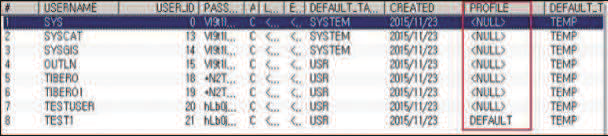
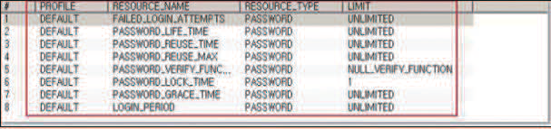

---
<!-- Page 211 -->

## 제5장 디지털헬스케어 서비스 보안요구사항 및 보안대책 | 211

및
보안대책
및
보안대책
개요
디지털헬스케어
서비스
모델
디지털헬스케어
보안위협
디지털헬스케어
기기
보안요구사항
디지털헬스케어
서비스
보안요구사항
참고문헌
제1장
제2장
제3장
제4장
제5장
부록
3.1.3 데이터베이스 관리자 권한을 꼭 필요한 계정 및 그룹에만 허용해야 한다.
위협 및 취약점
관리자 권한이 필요한 계정 및 그룹에만 관리자 권한을 부여하지 않을 경우 관리자 권한이 부여된 계정이 비인가자
에게 유출될 경우 DB에 접근 할 수 있는 위험이 존재한다.
요구사항 및 보안대책
ORACLE
SYSDBA 권한 점검
SQL〉SELECT USERNAME FROM V$PWFILE_USERS WHERE USERNAME NOT IN (SELECT
GRANTEE FROM DBA_ROLE_PRIVS WHERE GRANTED_ROLE='DBA') and USERNAME
!=‘INTERNAL’ and sysdba=‘TRUE’; (어떠한 계정이 라도 나오는 경우 취약)
Admin에 부적합 계정 존재 여부 점검
SQL> select grantee, privilege from dba_sys_privs where grantee not in (‘SYS’, ‘SYSTEM’, ‘AQ_
ADMINISTRATOR_ROLE’, ‘DBA’, ‘MDSYS’, ‘LBACSYS’, ‘ SCHEDULER_ADMIN’, ‘WMSYS’) and
admin_option=‘YES’ and grantee not in (select grantee from dba_role_privs where granted_
role=‘DBA’); (어떠한 계정이라도 나오는 경우 취약)
관리자 권한이 불필요한 계정에서 관련 권한을 제거
• 불필요하게 시스템 권한을 부여한 계정의 권한 변경 필요
• 시스템 권한 부여가 필요한 경우 필요한 테이블별 권한 부여
• 인가된 사용자는 관리자 권한에 role을 grant 한 후, 시스템 권한을 grant 하고 role을 인가된 사용자에게
grant
MSSQL
sysadmin 서버 역할의 계정 목록을 확인 후 해당 실증 서버 역할에 불필요한 계정이 있는 경우 역할에서
삭제
sysadmin 역할에서 불필요한 계정 삭제
(명령어)Exec sp_droprolemember ‘user_name’, ‘sysadmin’;
(예)Exec sp_dropsrvrolemember ‘user01’, ‘sysadmin’;
(user01 계정을 sysadmin 역할에서 삭제)

| 위협 및 취약점 |
| --- |
| 관리자 권한이 필요한 계정 및 그룹에만 관리자 권한을 부여하지 않을 경우 관리자 권한이 부여된 계정이 비인가자 에게 유출될 경우 DB에 접근 할 수 있는 위험이 존재한다. |
| 요구사항 및 보안대책 |
| ORACLE SYSDBA 권한 점검 SQL〉SELECT USERNAME FROM V$PWFILE_USERS WHERE USERNAME NOT IN (SELECT GRANTEE FROM DBA_ROLE_PRIVS WHERE GRANTED_ROLE='DBA') and USERNAME !=‘INTERNAL’ and sysdba=‘TRUE’; (어떠한 계정이 라도 나오는 경우 취약) Admin에 부적합 계정 존재 여부 점검 SQL> select grantee, privilege from dba_sys_privs where grantee not in (‘SYS’, ‘SYSTEM’, ‘AQ_ ADMINISTRATOR_ROLE’, ‘DBA’, ‘MDSYS’, ‘LBACSYS’, ‘ SCHEDULER_ADMIN’, ‘WMSYS’) and admin_option=‘YES’ and grantee not in (select grantee from dba_role_privs where granted_ role=‘DBA’); (어떠한 계정이라도 나오는 경우 취약) 관리자 권한이 불필요한 계정에서 관련 권한을 제거 • 불필요하게 시스템 권한을 부여한 계정의 권한 변경 필요 • 시스템 권한 부여가 필요한 경우 필요한 테이블별 권한 부여 • 인가된 사용자는 관리자 권한에 role을 grant 한 후, 시스템 권한을 grant 하고 role을 인가된 사용자에게 grant MSSQL sysadmin 서버 역할의 계정 목록을 확인 후 해당 실증 서버 역할에 불필요한 계정이 있는 경우 역할에서 삭제 sysadmin 역할에서 불필요한 계정 삭제 (명령어)Exec sp_droprolemember ‘user_name’, ‘sysadmin’; (예)Exec sp_dropsrvrolemember ‘user01’, ‘sysadmin’; (user01 계정을 sysadmin 역할에서 삭제) |

| SYSDBA 권한 점검 SQL〉SELECT USERNAME FROM V$PWFILE_USERS WHERE USERNAME NOT IN (SELECT GRANTEE FROM DBA_ROLE_PRIVS WHERE GRANTED_ROLE='DBA') and USERNAME !=‘INTERNAL’ and sysdba=‘TRUE’; (어떠한 계정이 라도 나오는 경우 취약) |
| --- |
| Admin에 부적합 계정 존재 여부 점검 SQL> select grantee, privilege from dba_sys_privs where grantee not in (‘SYS’, ‘SYSTEM’, ‘AQ_ ADMINISTRATOR_ROLE’, ‘DBA’, ‘MDSYS’, ‘LBACSYS’, ‘ SCHEDULER_ADMIN’, ‘WMSYS’) and admin_option=‘YES’ and grantee not in (select grantee from dba_role_privs where granted_ role=‘DBA’); (어떠한 계정이라도 나오는 경우 취약) |
| 관리자 권한이 불필요한 계정에서 관련 권한을 제거 • 불필요하게 시스템 권한을 부여한 계정의 권한 변경 필요 • 시스템 권한 부여가 필요한 경우 필요한 테이블별 권한 부여 • 인가된 사용자는 관리자 권한에 role을 grant 한 후, 시스템 권한을 grant 하고 role을 인가된 사용자에게 grant |

---
<!-- Page 212 -->
MySQL
mysql.user 테이블에 적용된 권한은 모든 데이터베이스에 적용되므로 host, user, password를 제외한
나머지 권한은 허용하지 않음('N')으로 설정
• 사용자 등록
mysql> insert into mysql.user (host, name, password) values (‘%’, ‘user name’, password
(‘password’); 디폴트로 모든 권한 ‘N’ 설정
• 권한 변경
mysql> update mysql.user set <권한>=‘N’ where user=‘user namer’;
각 사용자는 접근하고자 하는 DB를 mysql.db에 등록 후 접근 권한을 부여하여 사용
• DB등록 시 권한 부여
mysql〉insert into mysql.db values (‘%’, ‘DB name’, ‘username’ , ‘Y’, ‘Y’, ‘Y’, ‘Y’, ‘Y’, ‘Y’, ‘Y’, ‘Y’, ‘Y’,
‘Y’, ‘Y’, ‘Y’, ‘Y’, ‘Y’, ‘Y’, ‘Y’, ‘Y’);
mysql> flush privileges;
• DB권한 업데이트
mysql> update mysql.db set <권한>=‘Y’ where db=<DB name> and user=‘user
name’;
mysql> flush privileges;
Altibase
계정별 부여된 시스템 권한 목록 확인 후, 아래 명령어 모두 입력
select * from system_.sys_grant_system_;
select * from system_.sys_users_;
select * from system_.sys_privileges_;
sys_users_ 결과값에서 user_id 확인
sys_grant_system_ 결과값에서 user_id와 동일한 grantee_id 확인하여 priv_id 확인
일반사용자 계정 생성 시 시스템에 의해 부여되는 기본 권한 외 입력되어 있을 경우 해당 권한 삭제
시스템에 의해 자동으로 부여되는 권한 privileged_id
create session 215
create table 217
create sequence 210
create procedure 205
create view 229
create trigger 241
create synonym 245
create materialized view 252
create library 256

| mysql.user 테이블에 적용된 권한은 모든 데이터베이스에 적용되므로 host, user, password를 제외한 나머지 권한은 허용하지 않음('N')으로 설정 • 사용자 등록 mysql> insert into mysql.user (host, name, password) values (‘%’, ‘user name’, password (‘password’); 디폴트로 모든 권한 ‘N’ 설정 • 권한 변경 mysql> update mysql.user set <권한>=‘N’ where user=‘user namer’; |
| --- |
| 각 사용자는 접근하고자 하는 DB를 mysql.db에 등록 후 접근 권한을 부여하여 사용 • DB등록 시 권한 부여 mysql〉insert into mysql.db values (‘%’, ‘DB name’, ‘username’ , ‘Y’, ‘Y’, ‘Y’, ‘Y’, ‘Y’, ‘Y’, ‘Y’, ‘Y’, ‘Y’, ‘Y’, ‘Y’, ‘Y’, ‘Y’, ‘Y’, ‘Y’, ‘Y’, ‘Y’); mysql> flush privileges; • DB권한 업데이트 mysql> update mysql.db set <권한>=‘Y’ where db=<DB name> and user=‘user name’; mysql> flush privileges; |

| 계정별 부여된 시스템 권한 목록 확인 후, 아래 명령어 모두 입력 select * from system_.sys_grant_system_; select * from system_.sys_users_; select * from system_.sys_privileges_; |
| --- |
| sys_users_ 결과값에서 user_id 확인 |
| sys_grant_system_ 결과값에서 user_id와 동일한 grantee_id 확인하여 priv_id 확인 |
| 일반사용자 계정 생성 시 시스템에 의해 부여되는 기본 권한 외 입력되어 있을 경우 해당 권한 삭제 시스템에 의해 자동으로 부여되는 권한 privileged_id create session 215 create table 217 create sequence 210 create procedure 205 create view 229 create trigger 241 create synonym 245 create materialized view 252 create library 256 |

| 시스템에 의해 자동으로 부여되는 권한 | privileged_id |
| --- | --- |
| create session | 215 |
| create table | 217 |
| create sequence | 210 |
| create procedure | 205 |
| create view | 229 |
| create trigger | 241 |
| create synonym | 245 |
| create materialized view | 252 |
| create library | 256 |

---
<!-- Page 213 -->

## 제5장 디지털헬스케어 서비스 보안요구사항 및 보안대책 | 213

및
보안대책
및
보안대책
개요
디지털헬스케어
서비스
모델
디지털헬스케어
보안위협
디지털헬스케어
기기
보안요구사항
디지털헬스케어
서비스
보안요구사항
참고문헌
제1장
제2장
제3장
제4장
제5장
부록
Tibero
계정별 부여된 시스템 권한 목록 확인 후, 아래 명령어 모두 입력
select * from dba_users;
select * from dba_sys_privs;
dbs.users 결과값에서 시스템 계정, 일반 계정 확인
dba_sys_privs 결과값에서 일반 계정임에도 시스템 권한을 불필요하게 부여받고 있는지 확인
일반 계정에 불필요한 시스템 권한이 부여되어 있을 경우 권한 삭제
점검방법
SYSDBA 권한 점검
SQL〉SELECT USERNAME FROM V$PWFILE_USERS WHERE USERNAME NOT IN (SELECT
GRANTEE FROM DBA_ROLE_PRIVS WHERE GRANTED_ROLE='DBA') and USERNAME
!=‘INTERNAL’ and sysdba=‘TRUE’;
Admin에 부적합 계정 존재 여부 점검
select grantee, privilege from dba_sys_privs where grantee not in (‘SYS’, ‘SYSTEM’, ‘AQ_
ADMINISTRATOR_ROLE’, ‘DBA’, ‘MDSYS’, ‘LBACSYS’, ‘ SCHEDULER_ADMIN’, ‘WMSYS’) and admin_
option=‘YES’ and grantee not in (select grantee from dba_role_privs where granted_role=‘DBA’);

| Tibero 계정별 부여된 시스템 권한 목록 확인 후, 아래 명령어 모두 입력 select * from dba_users; select * from dba_sys_privs; dbs.users 결과값에서 시스템 계정, 일반 계정 확인 dba_sys_privs 결과값에서 일반 계정임에도 시스템 권한을 불필요하게 부여받고 있는지 확인 일반 계정에 불필요한 시스템 권한이 부여되어 있을 경우 권한 삭제 |
| --- |
| 점검방법 |
| SYSDBA 권한 점검 SQL〉SELECT USERNAME FROM V$PWFILE_USERS WHERE USERNAME NOT IN (SELECT GRANTEE FROM DBA_ROLE_PRIVS WHERE GRANTED_ROLE='DBA') and USERNAME !=‘INTERNAL’ and sysdba=‘TRUE’; Admin에 부적합 계정 존재 여부 점검 select grantee, privilege from dba_sys_privs where grantee not in (‘SYS’, ‘SYSTEM’, ‘AQ_ ADMINISTRATOR_ROLE’, ‘DBA’, ‘MDSYS’, ‘LBACSYS’, ‘ SCHEDULER_ADMIN’, ‘WMSYS’) and admin_ option=‘YES’ and grantee not in (select grantee from dba_role_privs where granted_role=‘DBA’); |

| 계정별 부여된 시스템 권한 목록 확인 후, 아래 명령어 모두 입력 select * from dba_users; select * from dba_sys_privs; |
| --- |
| dbs.users 결과값에서 시스템 계정, 일반 계정 확인 |
| dba_sys_privs 결과값에서 일반 계정임에도 시스템 권한을 불필요하게 부여받고 있는지 확인 |
| 일반 계정에 불필요한 시스템 권한이 부여되어 있을 경우 권한 삭제 |

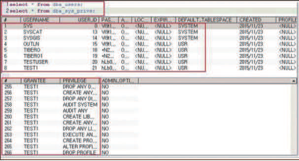

---
<!-- Page 214 -->

#### 3.2 접근 관리

3.2.1 원격에서 DB서버로의 접속을 제한해야 한다.
위협 및 취약점
DB 접속 시 IP주소 제한이 적용되지 않은 경우 비인가자가 내·외부망 위치에 상관없이 DB 서버에 접근할 수 있는
위험이 존재한다.
요구사항 및 보안대책
OS
특정 IP주소에서만 접속 가능하도록 방화벽 등이 설정되어 있는지 확인
시작> 제어판> 보안 센터> windows 방화벽 설정
• 예외 tab -> 포트추가 -> 1433 -> TCP 추가 -> 범위 변경
• 예외 tab -> 포트추가 -> 135 -> TCP 추가 -> 범위 변경
• 예외 tab -> 포트추가 -> 1434 -> UDP 추가 -> 범위 변경
Oracle
원격 OS 인증 방식이 불필요한 경우, SYS 계정으로 접속하여 'REMDTE_OS_AUTHEOT^FALSE'로 설정
• spfile 사용하는 경우 아래와 같이 설정
SQL> ALTER SYSTEM SET REMOTE_OS_AUTHENT=FALSE SCOPE=spfile;
• pfile 사용하는 경우 init<SID>.ora 파일 안에 아래와 같이 설정
SQL> ALTER SYSTEM SET REMOTE_OS_AUTHENT=FALSE ;
OS 원격 인증 방식이 필요한 경우
• 방화벽을 통한 원격 접근 IP주소 제한
• NAT(Network Address Translation)를 사용하여 비공인 IP주소 부여 후 외부 접근 제한

| 위협 및 취약점 |
| --- |
| DB 접속 시 IP주소 제한이 적용되지 않은 경우 비인가자가 내·외부망 위치에 상관없이 DB 서버에 접근할 수 있는 위험이 존재한다. |
| 요구사항 및 보안대책 |
| OS 특정 IP주소에서만 접속 가능하도록 방화벽 등이 설정되어 있는지 확인 시작> 제어판> 보안 센터> windows 방화벽 설정 • 예외 tab -> 포트추가 -> 1433 -> TCP 추가 -> 범위 변경 • 예외 tab -> 포트추가 -> 135 -> TCP 추가 -> 범위 변경 • 예외 tab -> 포트추가 -> 1434 -> UDP 추가 -> 범위 변경 Oracle 원격 OS 인증 방식이 불필요한 경우, SYS 계정으로 접속하여 'REMDTE_OS_AUTHEOT^FALSE'로 설정 • spfile 사용하는 경우 아래와 같이 설정 SQL> ALTER SYSTEM SET REMOTE_OS_AUTHENT=FALSE SCOPE=spfile; • pfile 사용하는 경우 init<SID>.ora 파일 안에 아래와 같이 설정 SQL> ALTER SYSTEM SET REMOTE_OS_AUTHENT=FALSE ; OS 원격 인증 방식이 필요한 경우 • 방화벽을 통한 원격 접근 IP주소 제한 • NAT(Network Address Translation)를 사용하여 비공인 IP주소 부여 후 외부 접근 제한 |

| 원격 OS 인증 방식이 불필요한 경우, SYS 계정으로 접속하여 'REMDTE_OS_AUTHEOT^FALSE'로 설정 • spfile 사용하는 경우 아래와 같이 설정 SQL> ALTER SYSTEM SET REMOTE_OS_AUTHENT=FALSE SCOPE=spfile; • pfile 사용하는 경우 init<SID>.ora 파일 안에 아래와 같이 설정 SQL> ALTER SYSTEM SET REMOTE_OS_AUTHENT=FALSE ; |
| --- |
| OS 원격 인증 방식이 필요한 경우 • 방화벽을 통한 원격 접근 IP주소 제한 • NAT(Network Address Translation)를 사용하여 비공인 IP주소 부여 후 외부 접근 제한 |

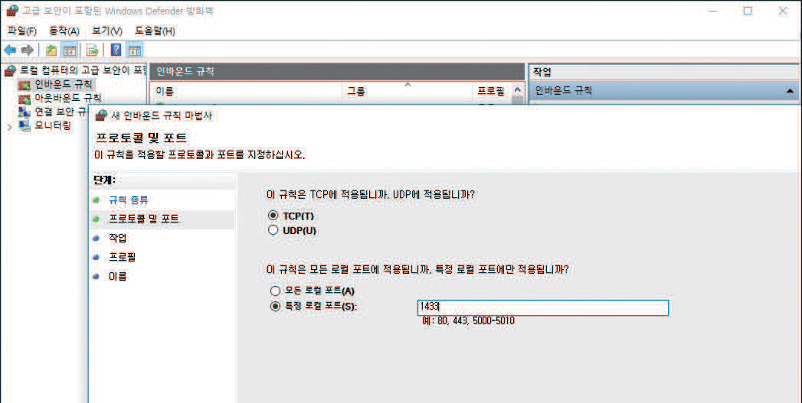

---
<!-- Page 215 -->

## 제5장 디지털헬스케어 서비스 보안요구사항 및 보안대책 | 215

및
보안대책
및
보안대책
개요
디지털헬스케어
서비스
모델
디지털헬스케어
보안위협
디지털헬스케어
기기
보안요구사항
디지털헬스케어
서비스
보안요구사항
참고문헌
제1장
제2장
제3장
제4장
제5장
부록
MySQL
mysql.user 테이블과 mysql.db 테이블을 조회하여 host가 "%"인 필드 삭제하고 접속 IP주소를 지정하여
등록
mysql> delete from user where host=‘%’ ;
mysql> delete from db where host=‘%’ ;
Altibase
• ALTIBASE HDB 프러퍼티 파일을 수정하여 접근제어를 적용
$ALTIBASE_HOME/conf/altibase.properties 변경
IP access control lists 에서 내부 정책에 맞게 수정
• ALTIBASE HDB 서버가 실행되지 않은 상태에서 할 수 있는 정적인 환경 설정 방법
• 프로퍼티 파일에서 해당 구성 요소를 특정 값으로 설정한 후 ALTIBASE HDB 서버를 재구동해야 수정된
값이 ALTIBASE HDB 서버에 반영
Tibero
• 초기화 파라미터에 설정된 IP 주소에 따라 클라이언트의 네트워크 접속을 허용하거나 차단
• $TB_SID 는 tibero 설치 시 입력한 데이터베이스 이름과 동일 / c:/tibero/tibero5/config/데이터베이스.tip
- 조치방법 1. LSNR_INVITED_IP(특정한 IP 주소를 갖는 클라이언트는 허용, 그 외 차단)
$TB_SID.tip 파일 안에 다음 예시 내용을 참조하여 입력
LSNR_INVITED_IP=192.168.1.1;192.168.2.0/24;192.1.0.0/16
※ LSNRJNVITEDJP의 최대 길이는 255자이다. 256 이상의 IP 주소를 설정할 경우에는 LSNR_INVITED_IP_
FILE을 사용한다.

| $ALTIBASE_HOME/conf/altibase.properties 변경 |
| --- |
| IP access control lists 에서 내부 정책에 맞게 수정 • ALTIBASE HDB 서버가 실행되지 않은 상태에서 할 수 있는 정적인 환경 설정 방법 • 프로퍼티 파일에서 해당 구성 요소를 특정 값으로 설정한 후 ALTIBASE HDB 서버를 재구동해야 수정된 값이 ALTIBASE HDB 서버에 반영 |

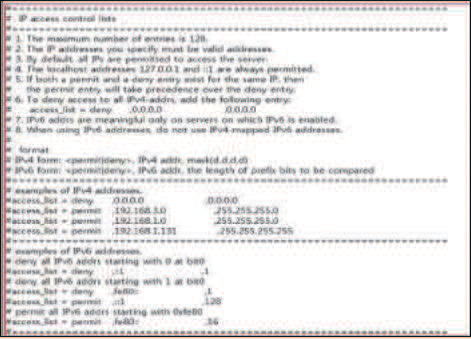

---
<!-- Page 216 -->
- 조치방법 2. L SNR_INVITED_IP_FILE(특정 파일에 접속을 허용하는 IP 주소 목록을 기재한 후 해당 파일의
절대 경로를 적어주면 그 파일을 읽어서 INVITED_IP를 설정)
/home/tibero/invitedjp.txt 파일에 다음 예시 내용을 참조하여 입력
192.168.1.1
192.168.2.0/24
192.1.0.0/16
$TB_SID.tip 파일에 invited_ip.txt 파일의 전체 경로를 입력
LSNR_INVITED_IP_FILE=/home/tibero/invited_ip. txt
- 조치방법 3. LSNR_DENIED_IP(특정한 IP 주소를 갖는 클라이언트의 네트워크 접속은 차단, 그 밖의 접속은 허용)
$TB_SID.tip 파일 안에 다음 예시 내용을 참조하여 입력
LSNR_DENIED_IP=192.168.1.1;192.168.2.0/24;192.1.0.0/16
- 조치방법 4. LSNR_DENIED_IP_FILE(특정 파일에 접속을 허용하지 않는 IP 주소 목록을 기재한 후 해당 파일의
절대 경로를 적어주면 그 파일을 읽어서 DENITED_IP를 설정)
/home/tibero/deniedJp.txt 파일에 다음 예시 내용을 참조하여 입력
192.168.1.1
192.168.2.0/24
192.1.0.0/16
$TB_SID.tip 파일에 denied_ip.txt 파일의 전체 경로를 입력
LSNR_DENIED_IP_FILE=/home/tibero/denied ip.txt
※ $TB_SID.tip 파일에 LSNR_INVITED_IP와 LSNR_DENIED_IP가 모두 설정되어 있는 경우 LSNR_DENIED_IP의
설정은 무시되며 LSNR_INVITED_IP만 적용된다. 즉, LSNR_INVITED_IP에 설정된 IP 주소의 클라이언트를
제외하고는 모든 접속이 차단된다.
※ $TB_SID.tip 파일에 LSNR_INVITED_IP와 LSNR_DENIED_IP가 모두 설정되지 않은 경우 모든 클라이언트의
네트워크 접속이 허용된다.
※ 루프백 주소(loopback address, 127.0.0.1)에서 접속하는 경우 LSNR_INVITED_IP 또는 LSNR_DENED_IP의
설정과는 무관하게 항상 허용된다.
※ Tibero 서버를 운영하는 중에 실증 서버를 다시 기동하지 않고 LSNR_INVITED_IP 또는 LSNR_DENIED_IP의 설정을
변경하려는 경우 우선 $TB_SID.tip 파일에 LSNR_INVITED_IP 또는 LSNR_DENIED_IP의 설정을 변경한 후 파일을
저장하고 다음의 명령을 실행한다.alter system listener parameter reload;위의 명령을 실행하면 $TB_SID.tip
파일에서 LSNR_INVITED_IP 또는 LSNR_DENIED_IP의 내용을 다시 읽어 변경된 내용을 실시간으로 적용한다.
점검방법
원격 OS 인증 방식이 불필요한 경우, SYS 계정으로 접속하여 'REMDTE_OS_AUTHEOT^FALSE'로 설정되었는지
확인한다.
spfile 사용하는 경우 ALTER SYSTEM SET REMOTE_OS_AUTHENT=FALSE SCOPE=spfile;로 설정되었는지
확인한다.
pfile 사용하는 경우 init<SID>.ora 파일 안에 ALTER SYSTEM SET REMOTE_OS_AUTHENT=FALSE; 같이
설정되었는지 확인한다.

| - 조치방법 2. L SNR_INVITED_IP_FILE(특정 파일에 접속을 허용하는 IP 주소 목록을 기재한 후 해당 파일의 절대 경로를 적어주면 그 파일을 읽어서 INVITED_IP를 설정) /home/tibero/invitedjp.txt 파일에 다음 예시 내용을 참조하여 입력 192.168.1.1 192.168.2.0/24 192.1.0.0/16 $TB_SID.tip 파일에 invited_ip.txt 파일의 전체 경로를 입력 LSNR_INVITED_IP_FILE=/home/tibero/invited_ip. txt - 조치방법 3. LSNR_DENIED_IP(특정한 IP 주소를 갖는 클라이언트의 네트워크 접속은 차단, 그 밖의 접속은 허용) $TB_SID.tip 파일 안에 다음 예시 내용을 참조하여 입력 LSNR_DENIED_IP=192.168.1.1;192.168.2.0/24;192.1.0.0/16 - 조치방법 4. LSNR_DENIED_IP_FILE(특정 파일에 접속을 허용하지 않는 IP 주소 목록을 기재한 후 해당 파일의 절대 경로를 적어주면 그 파일을 읽어서 DENITED_IP를 설정) /home/tibero/deniedJp.txt 파일에 다음 예시 내용을 참조하여 입력 192.168.1.1 192.168.2.0/24 192.1.0.0/16 $TB_SID.tip 파일에 denied_ip.txt 파일의 전체 경로를 입력 LSNR_DENIED_IP_FILE=/home/tibero/denied ip.txt ※ $TB_SID.tip 파일에 LSNR_INVITED_IP와 LSNR_DENIED_IP가 모두 설정되어 있는 경우 LSNR_DENIED_IP의 설정은 무시되며 LSNR_INVITED_IP만 적용된다. 즉, LSNR_INVITED_IP에 설정된 IP 주소의 클라이언트를 제외하고는 모든 접속이 차단된다. ※ $TB_SID.tip 파일에 LSNR_INVITED_IP와 LSNR_DENIED_IP가 모두 설정되지 않은 경우 모든 클라이언트의 네트워크 접속이 허용된다. ※ 루프백 주소(loopback address, 127.0.0.1)에서 접속하는 경우 LSNR_INVITED_IP 또는 LSNR_DENED_IP의 설정과는 무관하게 항상 허용된다. ※ Tibero 서버를 운영하는 중에 실증 서버를 다시 기동하지 않고 LSNR_INVITED_IP 또는 LSNR_DENIED_IP의 설정을 변경하려는 경우 우선 $TB_SID.tip 파일에 LSNR_INVITED_IP 또는 LSNR_DENIED_IP의 설정을 변경한 후 파일을 저장하고 다음의 명령을 실행한다.alter system listener parameter reload;위의 명령을 실행하면 $TB_SID.tip 파일에서 LSNR_INVITED_IP 또는 LSNR_DENIED_IP의 내용을 다시 읽어 변경된 내용을 실시간으로 적용한다. |
| --- |
| 점검방법 |
| 원격 OS 인증 방식이 불필요한 경우, SYS 계정으로 접속하여 'REMDTE_OS_AUTHEOT^FALSE'로 설정되었는지 확인한다. spfile 사용하는 경우 ALTER SYSTEM SET REMOTE_OS_AUTHENT=FALSE SCOPE=spfile;로 설정되었는지 확인한다. pfile 사용하는 경우 init<SID>.ora 파일 안에 ALTER SYSTEM SET REMOTE_OS_AUTHENT=FALSE; 같이 설정되었는지 확인한다. |

| /home/tibero/invitedjp.txt 파일에 다음 예시 내용을 참조하여 입력 192.168.1.1 192.168.2.0/24 192.1.0.0/16 |
| --- |
| $TB_SID.tip 파일에 invited_ip.txt 파일의 전체 경로를 입력 LSNR_INVITED_IP_FILE=/home/tibero/invited_ip. txt |

| /home/tibero/deniedJp.txt 파일에 다음 예시 내용을 참조하여 입력 192.168.1.1 192.168.2.0/24 192.1.0.0/16 |
| --- |
| $TB_SID.tip 파일에 denied_ip.txt 파일의 전체 경로를 입력 LSNR_DENIED_IP_FILE=/home/tibero/denied ip.txt |

---
<!-- Page 217 -->

## 제5장 디지털헬스케어 서비스 보안요구사항 및 보안대책 | 217

및
보안대책
및
보안대책
개요
디지털헬스케어
서비스
모델
디지털헬스케어
보안위협
디지털헬스케어
기기
보안요구사항
디지털헬스케어
서비스
보안요구사항
참고문헌
제1장
제2장
제3장
제4장
제5장
부록
3.2.2 DBA 이외의 인가되지 않은 사용자 시스템 테이블 접근을 제한해야한다.
위협 및 취약점
시스템 테이블의 일반 사용자 계정 접근 제한 설정이 되어 있지 않을 경우 객체, 사용자, 테이블 및 뷰, 작업 내역
등의 시스템 테이블에 저장된 정보가 누출될 위험이 존재한다.
요구사항 및 보안대책
객체, 사용자, 테이블 및 뷰, 작업 내역 등의 시스템 테이블에 저장된 정보를 안전하게 보호하기 위해 시스템
테이블에 DBA만 접근 가능하도록 설정해야 한다.
점검방법
DBA만 접근 가능한 테이블의 권한을 확인한다.
select grantee, privilege, owner, table_name from dba_tab_privs where (owner=‘SYS’ or table_
name like ‘DBA_%’) and privilege <> ‘EXECUTE’ and grantee not in (‘PUBLIC’, ‘AQ_
ADMINISTRATOR_ROLE’, ‘AQ_USER_ROLE’, ‘AURORA$JIS$UTILITY$’, ‘OSE$HTTP$ADMIN’,
‘TRACESVR’, ‘CTXSYS’, ‘DBA’, ‘DELETE_CATALOG_ROLE’, ‘EXECUTE_CATALOG_ROLE’, ‘EXP_
FULL_DATABASE’, ‘GATHER_SYSTEM_STATISTICS’， ‘HS_ADMIN_ROLE’, ‘IMP_FULL_DATABASE’,
‘LOGSTDBY_ADMINISTRATOR’, ‘MDSYS’, ‘ODM’, 'OEM_MONITOR’, ‘OLAPSYS’, ‘ORDSYS’,
‘OUTLN’, ‘RECOVERY_CATALOG_OWNER’, ‘SELECT_CATALOG_ROLE’, ‘SNMPAGENT’, 'SYSTEM’,
‘WKSYS’, ‘WKUSER’, ‘WMSYS’, ‘WM_ADMIN_ROLE’, ‘XDB’, ‘LBACSYS’,‘PERFSTAT’, ‘XDBADMIN’)
and grantee not in (select grantee from dba_role_privs where granted_role=‘DBA’) order by grantee;

| 위협 및 취약점 |
| --- |
| 시스템 테이블의 일반 사용자 계정 접근 제한 설정이 되어 있지 않을 경우 객체, 사용자, 테이블 및 뷰, 작업 내역 등의 시스템 테이블에 저장된 정보가 누출될 위험이 존재한다. |
| 요구사항 및 보안대책 |
| 객체, 사용자, 테이블 및 뷰, 작업 내역 등의 시스템 테이블에 저장된 정보를 안전하게 보호하기 위해 시스템 테이블에 DBA만 접근 가능하도록 설정해야 한다. |
| 점검방법 |
| DBA만 접근 가능한 테이블의 권한을 확인한다. select grantee, privilege, owner, table_name from dba_tab_privs where (owner=‘SYS’ or table_ name like ‘DBA_%’) and privilege <> ‘EXECUTE’ and grantee not in (‘PUBLIC’, ‘AQ_ ADMINISTRATOR_ROLE’, ‘AQ_USER_ROLE’, ‘AURORA$JIS$UTILITY$’, ‘OSE$HTTP$ADMIN’, ‘TRACESVR’, ‘CTXSYS’, ‘DBA’, ‘DELETE_CATALOG_ROLE’, ‘EXECUTE_CATALOG_ROLE’, ‘EXP_ FULL_DATABASE’, ‘GATHER_SYSTEM_STATISTICS’， ‘HS_ADMIN_ROLE’, ‘IMP_FULL_DATABASE’, ‘LOGSTDBY_ADMINISTRATOR’, ‘MDSYS’, ‘ODM’, 'OEM_MONITOR’, ‘OLAPSYS’, ‘ORDSYS’, ‘OUTLN’, ‘RECOVERY_CATALOG_OWNER’, ‘SELECT_CATALOG_ROLE’, ‘SNMPAGENT’, 'SYSTEM’, ‘WKSYS’, ‘WKUSER’, ‘WMSYS’, ‘WM_ADMIN_ROLE’, ‘XDB’, ‘LBACSYS’,‘PERFSTAT’, ‘XDBADMIN’) and grantee not in (select grantee from dba_role_privs where granted_role=‘DBA’) order by grantee; |

---
<!-- Page 218 -->
3.2.3 일정 횟수의 로그인 실패 시 잠금 정책을 설정해야 한다.
위협 및 취약점
일정한 횟수의 로그인 실패 횟수를 설정하여 제한하지 않으면 자동화된 방법으로 계정 및 패스워드를 획득하여
데이터베이스에 접근하여 정보를 유출할 수 있다.
요구사항 및 보안대책
Oracle
접근 횟수 제한을 위해 파라미터 설정
Failed_login_attempts 프로파일 파라미터 수정
SQL> ALTER PROFILE LIMIT FAILED_LOGIN_ATTEMPTS XXX;
(XXX회 이하로 설정)
프로파일 적용
SQL> connect / as sysdba
SQL> @$Ora_Home/rdbms /admin/utlpwdmg. sql
또는, default profile에 unlimited로 설정하고 이 default 값을 적용하고자 하는 profile에 적용
SQL> Alter profile default limit password_lock_time unlimited;
SQL> Alter profile [profile name] limit password_lock_time default;
Altibase
• 조치방법 1. 환자 및 의료관계자별 패스워드 정책 변경
다음 명령어를 통해 패스워드 정책 설정 여부 확인
select * from system_.sys_users_;
아래 프로퍼티에 대해 패스워드 정책 설정
CASE_SENSITIVE_PASSWORD
FAILED_LOGIN_ATTEMPTS
PASSWORD_LOCK_TIME
PASSWORD_LIFE_TIME
PASSWORD_GRACE_TIME
PASSWORD_REUSE_TIME
PASSWORD_REUSE_MAX
PASSWORD_VERIFY_FUNCTION
※ 정책 적용 시 다음 명령어를 사용
ALTER USER 유저명 LIMIT (프러퍼티 숫자);
적용 예) ALTER USER TESTUSER LIMIT (FAILED_LOGIN_ATTEMPTS 7);

| 위협 및 취약점 |
| --- |
| 일정한 횟수의 로그인 실패 횟수를 설정하여 제한하지 않으면 자동화된 방법으로 계정 및 패스워드를 획득하여 데이터베이스에 접근하여 정보를 유출할 수 있다. |
| 요구사항 및 보안대책 |
| Oracle 접근 횟수 제한을 위해 파라미터 설정 Failed_login_attempts 프로파일 파라미터 수정 SQL> ALTER PROFILE LIMIT FAILED_LOGIN_ATTEMPTS XXX; (XXX회 이하로 설정) 프로파일 적용 SQL> connect / as sysdba SQL> @$Ora_Home/rdbms /admin/utlpwdmg. sql 또는, default profile에 unlimited로 설정하고 이 default 값을 적용하고자 하는 profile에 적용 SQL> Alter profile default limit password_lock_time unlimited; SQL> Alter profile [profile name] limit password_lock_time default; Altibase • 조치방법 1. 환자 및 의료관계자별 패스워드 정책 변경 다음 명령어를 통해 패스워드 정책 설정 여부 확인 select * from system_.sys_users_; 아래 프로퍼티에 대해 패스워드 정책 설정 CASE_SENSITIVE_PASSWORD FAILED_LOGIN_ATTEMPTS PASSWORD_LOCK_TIME PASSWORD_LIFE_TIME PASSWORD_GRACE_TIME PASSWORD_REUSE_TIME PASSWORD_REUSE_MAX PASSWORD_VERIFY_FUNCTION ※ 정책 적용 시 다음 명령어를 사용 ALTER USER 유저명 LIMIT (프러퍼티 숫자); 적용 예) ALTER USER TESTUSER LIMIT (FAILED_LOGIN_ATTEMPTS 7); |

| 접근 횟수 제한을 위해 파라미터 설정 Failed_login_attempts 프로파일 파라미터 수정 SQL> ALTER PROFILE LIMIT FAILED_LOGIN_ATTEMPTS XXX; (XXX회 이하로 설정) |
| --- |
| 프로파일 적용 SQL> connect / as sysdba SQL> @$Ora_Home/rdbms /admin/utlpwdmg. sql 또는, default profile에 unlimited로 설정하고 이 default 값을 적용하고자 하는 profile에 적용 SQL> Alter profile default limit password_lock_time unlimited; SQL> Alter profile [profile name] limit password_lock_time default; |

| 다음 명령어를 통해 패스워드 정책 설정 여부 확인 select * from system_.sys_users_; |
| --- |
| 아래 프로퍼티에 대해 패스워드 정책 설정 CASE_SENSITIVE_PASSWORD FAILED_LOGIN_ATTEMPTS PASSWORD_LOCK_TIME PASSWORD_LIFE_TIME PASSWORD_GRACE_TIME PASSWORD_REUSE_TIME PASSWORD_REUSE_MAX PASSWORD_VERIFY_FUNCTION |

---
<!-- Page 219 -->

## 제5장 디지털헬스케어 서비스 보안요구사항 및 보안대책 | 219

및
보안대책
및
보안대책
개요
디지털헬스케어
서비스
모델
디지털헬스케어
보안위협
디지털헬스케어
기기
보안요구사항
디지털헬스케어
서비스
보안요구사항
참고문헌
제1장
제2장
제3장
제4장
제5장
부록
• 조치방법 2. ALTIBASE HDB 프러퍼티 파일
ALTIBASE HDB 프러퍼티 파일
$ALTlBASE_HOME/conf/altibase.properties를 변경
※ ALTIBASE HDB 서버가 실행되지 않은 상태에서 할 수 있는 정적인 환경 설정 방법
※ 프로퍼티 파일에서 해당 구성 요소를 특정 값으로 설정한 후 ALTIBASE HDB 서버를 재구동해야 수정된 값이
ALTIBASE HDB 서버에 반영
Tibero
사용자별 패스워드 프로파일 적용 여부 확인
select * from dba_users;
설정되어 있을 경우 프로파일 설정 내용 확인
select * from dba_profiles;
설정되어 있지 않을 경우 프로파일 생성 시(또는 수정 시 alter profile) 패스워드 정책 설정
※ 정책 적용 시 다음 명령어를 사용
CREATE PROFILE prof LIMIT
적용 예) CREATE PROFILE prof LIMIT
failed_login_attempts 3
password_lock_time 1/1440
password_life_time 90
password_reuse_time unlimited
password_reuse_max 10
password_grace_time 10
password_verify_function verify_function;
점검방법
접근 횟수 제한을 위해 파라미터(Failed_login_attempts) 설정했는지 확인한다.ALTER PROFILE LIMIT FAILED_
LOGIN_ATTEMPTS ##;

| • 조치방법 2. ALTIBASE HDB 프러퍼티 파일 ALTIBASE HDB 프러퍼티 파일 $ALTlBASE_HOME/conf/altibase.properties를 변경 ※ ALTIBASE HDB 서버가 실행되지 않은 상태에서 할 수 있는 정적인 환경 설정 방법 ※ 프로퍼티 파일에서 해당 구성 요소를 특정 값으로 설정한 후 ALTIBASE HDB 서버를 재구동해야 수정된 값이 ALTIBASE HDB 서버에 반영 Tibero 사용자별 패스워드 프로파일 적용 여부 확인 select * from dba_users; 설정되어 있을 경우 프로파일 설정 내용 확인 select * from dba_profiles; 설정되어 있지 않을 경우 프로파일 생성 시(또는 수정 시 alter profile) 패스워드 정책 설정 ※ 정책 적용 시 다음 명령어를 사용 CREATE PROFILE prof LIMIT 적용 예) CREATE PROFILE prof LIMIT failed_login_attempts 3 password_lock_time 1/1440 password_life_time 90 password_reuse_time unlimited password_reuse_max 10 password_grace_time 10 password_verify_function verify_function; |
| --- |
| 점검방법 |
| 접근 횟수 제한을 위해 파라미터(Failed_login_attempts) 설정했는지 확인한다.ALTER PROFILE LIMIT FAILED_ LOGIN_ATTEMPTS ##; |

| 사용자별 패스워드 프로파일 적용 여부 확인 select * from dba_users; |
| --- |
| 설정되어 있을 경우 프로파일 설정 내용 확인 select * from dba_profiles; |
| 설정되어 있지 않을 경우 프로파일 생성 시(또는 수정 시 alter profile) 패스워드 정책 설정 ※ 정책 적용 시 다음 명령어를 사용 CREATE PROFILE prof LIMIT 적용 예) CREATE PROFILE prof LIMIT failed_login_attempts 3 password_lock_time 1/1440 password_life_time 90 password_reuse_time unlimited password_reuse_max 10 password_grace_time 10 password_verify_function verify_function; |

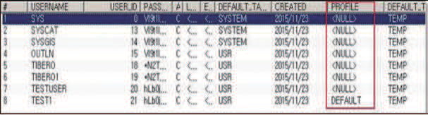
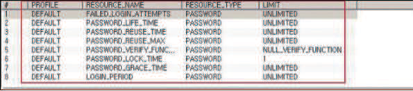

---
<!-- Page 220 -->

#### 3.3 옵션 관리

3.3.1 응용 프로그램 또는 DBA 계정의 Role이 Public으로 설정되지 않도록 조정해야 한다.
위협 및 취약점
응용프로그램 또는 DBA 계정의 Role이 Public으로 설정되어 있으면, 일반 계정에서도 응용프로그램 테이블 및
DBA 테이블로 접근할 수 있어 주요 정보 유출이 발생할 수 있다.
요구사항 및 보안대책
Oracle
DBA Role 설정 확인(SQL*Plus)
SQL> Select granted_role from dba_role_privs where grantee=‘PUBLIC’;
위와 같이 롤(Role)이 설정되어 있는 경우 취약
public 그룹의 권한 취소(SQL*Plus)
SQL> Revoke role from public;
MSSQL
각 Object의 사용 권한이 불필요하게 Public, Guest에 부여된 경우 권한 제거
Use database name
• 권한 제거
REVOKE <권한> on <object> FROM public | guest;
• 권한 부여
GRANT <권한> on <object> TO public | guest;
(예) syscolumns 테이블에 대한 SELECT 권한 제거 USE masterREVOKE select on sys.syscolumns FROM
public;
※ Object 사용 권한이 Public에 부여된 경우, 사용 권한이 없는 모든 계정이 Object에 접근 가능하여 Object의 정보를
획득할 수 있으므로 Object 사용 권한을 Public에 부여하는 것을 제한하여야 한다.
Altibase
사용자 정보를 조회하여 객체 권한, 시스템 권한이 public 또는 guest 에게 부여되어 있는지 확인
select * from system_.sys_users_;
select * from system_.sys_grant_object_;
select * from system_.sys_grant_system_;
GRANTOR_ID : 권 한을 부여한 사용자의 식별자로, SYS_USERS_ 메타 테이블의 한 USER_ID 값과 동일
GRANTEE_ID : 권한을 부여받은 사용자의 식별자로, SYS_USERS_ 메타 테이블의 한 USER_ID 값과
동일(단, 객체 권한을 public 에게 부여한 경우, SYS_USERS_ 메타 테이블에 존재하지
않는 USER_ID 값인 ”0”이 칼럼에 나타난다.)

| 위협 및 취약점 |
| --- |
| 응용프로그램 또는 DBA 계정의 Role이 Public으로 설정되어 있으면, 일반 계정에서도 응용프로그램 테이블 및 DBA 테이블로 접근할 수 있어 주요 정보 유출이 발생할 수 있다. |
| 요구사항 및 보안대책 |
| Oracle DBA Role 설정 확인(SQL*Plus) SQL> Select granted_role from dba_role_privs where grantee=‘PUBLIC’; 위와 같이 롤(Role)이 설정되어 있는 경우 취약 public 그룹의 권한 취소(SQL*Plus) SQL> Revoke role from public; MSSQL 각 Object의 사용 권한이 불필요하게 Public, Guest에 부여된 경우 권한 제거 Use database name • 권한 제거 REVOKE <권한> on <object> FROM public | guest; • 권한 부여 GRANT <권한> on <object> TO public | guest; (예) syscolumns 테이블에 대한 SELECT 권한 제거 USE masterREVOKE select on sys.syscolumns FROM public; ※ Object 사용 권한이 Public에 부여된 경우, 사용 권한이 없는 모든 계정이 Object에 접근 가능하여 Object의 정보를 획득할 수 있으므로 Object 사용 권한을 Public에 부여하는 것을 제한하여야 한다. Altibase 사용자 정보를 조회하여 객체 권한, 시스템 권한이 public 또는 guest 에게 부여되어 있는지 확인 select * from system_.sys_users_; select * from system_.sys_grant_object_; select * from system_.sys_grant_system_; GRANTOR_ID : 권 한을 부여한 사용자의 식별자로, SYS_USERS_ 메타 테이블의 한 USER_ID 값과 동일 GRANTEE_ID : 권한을 부여받은 사용자의 식별자로, SYS_USERS_ 메타 테이블의 한 USER_ID 값과 동일(단, 객체 권한을 public 에게 부여한 경우, SYS_USERS_ 메타 테이블에 존재하지 않는 USER_ID 값인 ”0”이 칼럼에 나타난다.) |

| DBA Role 설정 확인(SQL*Plus) SQL> Select granted_role from dba_role_privs where grantee=‘PUBLIC’; 위와 같이 롤(Role)이 설정되어 있는 경우 취약 |
| --- |
| public 그룹의 권한 취소(SQL*Plus) SQL> Revoke role from public; |

---
<!-- Page 221 -->

## 제5장 디지털헬스케어 서비스 보안요구사항 및 보안대책 | 221

및
보안대책
및
보안대책
개요
디지털헬스케어
서비스
모델
디지털헬스케어
보안위협
디지털헬스케어
기기
보안요구사항
디지털헬스케어
서비스
보안요구사항
참고문헌
제1장
제2장
제3장
제4장
제5장
부록
불필요 권한 회수
revoke 권한 on 객체 from 유저
Tibero
사용자 정보를 조회하여 role 부여가 적절한지 확인
select * from dba_role_privs;
select * from user_role_privs;
불필요 권한 회수
revoke 권한 from 유저;
※ USER_ROLE_PRIVS : 현재 사용자나 PUBLIC 사용자에 부여된 역할의 정보를 조회하는 뷰
점검방법
DBA Role 설정을 확인하여 PUBLIC으로 출력되는 결과를 점검한다.Select granted_role from dba_role_
privs where grantee=‘PUBLIC’;

| 불필요 권한 회수 revoke 권한 on 객체 from 유저 Tibero 사용자 정보를 조회하여 role 부여가 적절한지 확인 select * from dba_role_privs; select * from user_role_privs; 불필요 권한 회수 revoke 권한 from 유저; ※ USER_ROLE_PRIVS : 현재 사용자나 PUBLIC 사용자에 부여된 역할의 정보를 조회하는 뷰 |
| --- |
| 점검방법 |
| DBA Role 설정을 확인하여 PUBLIC으로 출력되는 결과를 점검한다.Select granted_role from dba_role_ privs where grantee=‘PUBLIC’; |

| 사용자 정보를 조회하여 role 부여가 적절한지 확인 select * from dba_role_privs; select * from user_role_privs; |
| --- |
| 불필요 권한 회수 revoke 권한 from 유저; |

---
<!-- Page 222 -->

#### 3.4 패치 관리

3.4.1 최신 패치를 적용해야 한다.
위협 및 취약점
데이터베이스의 주요 보안 패치 등을 설치하지 않은 경우, 공격자가 알려진 취약점을 이용하여 데이터베이스에
접근 가능하다.
요구사항 및 보안대책
Oracle
ORACLE_HOME에 설치된 Oracle 제품 컴포넌트를 조회하거나, 적용된 임시 패치를 조회할 때는
Isinventory 명령어를 사용
- Oracle 제공 패치 명령을 이용하여 확인
$opatchlsinventory [ -all ] [ -detail ]
[ -invPtrLoc ]
[ -jre ] [ -oh ]
all : ORACLE_BASE 밑에 설치된 모든 ORACLE_HOME 정보를 표시
detail : 설치된 패치 내에 포함된 라이브러리 파일까지 표시하므로 패치 적용 시 충돌되는 객체 파일을 확인
가능
• Unix 시스템
$ORACLE_HOME/OPatch/opat chi s inventory —detail
• Windows 시스템
%ORACLE_HOME%\OPatch\opatchlsinventory -detail
http://metalink.oracle.com에서 최신 패치 버전 확인 후 opatch 명령을 통해 도출
된 결과를 비교
- 버전이 9.2.0, 10.2.0, or 10.1.0이 아니면 아주 취약
- Oracle 10g Release 2의 patchset level이 10.2.0.1 이나 이후 버전이 아니면 취약
- Oracle 10g Release 1의 patchset level이 10.1.0.4이나 이후 버전이 아니면 취약
- Oracle 9i Release 2의 patchset level이 9.2.0.6이나 이후 버전이 아니면 취약
- Oracle 9.0이 Oracle 9iAS 또는 Oracle AS10g를 지원하기 위해 사용되면 취약
DBMS 버전 적용 패치 버전
Oracle 21c 21.1
Oracle 19c 19.1.0 // 12.2.0.3
Oracle 18c 18.1.0 // 12.2.0.2
Oracle 12c Release 2 12.2.0.1
Oracle 12c Release 1 12.1.0.2
Oracle 11g Release 2 11.2.0.4
Oracle 10g Release 2 10.2.0.5 Windows 64bit itanum
Oracle 9i Release 2 9.2.0.8
Oracle 8i Release 3 8.1.7.4
※ 참고사이트 http://www.oracle.com/technetwork/database/enterprise-edition/downloads/index.html

| 위협 및 취약점 |
| --- |
| 데이터베이스의 주요 보안 패치 등을 설치하지 않은 경우, 공격자가 알려진 취약점을 이용하여 데이터베이스에 접근 가능하다. |
| 요구사항 및 보안대책 |
| Oracle ORACLE_HOME에 설치된 Oracle 제품 컴포넌트를 조회하거나, 적용된 임시 패치를 조회할 때는 Isinventory 명령어를 사용 - Oracle 제공 패치 명령을 이용하여 확인 $opatchlsinventory [ -all ] [ -detail ] [ -invPtrLoc ] [ -jre ] [ -oh ] all : ORACLE_BASE 밑에 설치된 모든 ORACLE_HOME 정보를 표시 detail : 설치된 패치 내에 포함된 라이브러리 파일까지 표시하므로 패치 적용 시 충돌되는 객체 파일을 확인 가능 • Unix 시스템 $ORACLE_HOME/OPatch/opat chi s inventory —detail • Windows 시스템 %ORACLE_HOME%\OPatch\opatchlsinventory -detail http://metalink.oracle.com에서 최신 패치 버전 확인 후 opatch 명령을 통해 도출 된 결과를 비교 - 버전이 9.2.0, 10.2.0, or 10.1.0이 아니면 아주 취약 - Oracle 10g Release 2의 patchset level이 10.2.0.1 이나 이후 버전이 아니면 취약 - Oracle 10g Release 1의 patchset level이 10.1.0.4이나 이후 버전이 아니면 취약 - Oracle 9i Release 2의 patchset level이 9.2.0.6이나 이후 버전이 아니면 취약 - Oracle 9.0이 Oracle 9iAS 또는 Oracle AS10g를 지원하기 위해 사용되면 취약 DBMS 버전 적용 패치 버전 Oracle 21c 21.1 Oracle 19c 19.1.0 // 12.2.0.3 Oracle 18c 18.1.0 // 12.2.0.2 Oracle 12c Release 2 12.2.0.1 Oracle 12c Release 1 12.1.0.2 Oracle 11g Release 2 11.2.0.4 Oracle 10g Release 2 10.2.0.5 Windows 64bit itanum Oracle 9i Release 2 9.2.0.8 Oracle 8i Release 3 8.1.7.4 ※ 참고사이트 http://www.oracle.com/technetwork/database/enterprise-edition/downloads/index.html |

| DBMS 버전 | 적용 패치 버전 |
| --- | --- |
| Oracle 21c | 21.1 |
| Oracle 19c | 19.1.0 // 12.2.0.3 |
| Oracle 18c | 18.1.0 // 12.2.0.2 |
| Oracle 12c Release 2 | 12.2.0.1 |
| Oracle 12c Release 1 | 12.1.0.2 |
| Oracle 11g Release 2 | 11.2.0.4 |
| Oracle 10g Release 2 | 10.2.0.5 Windows 64bit itanum |
| Oracle 9i Release 2 | 9.2.0.8 |
| Oracle 8i Release 3 | 8.1.7.4 |

---
<!-- Page 223 -->

## 제5장 디지털헬스케어 서비스 보안요구사항 및 보안대책 | 223

및
보안대책
및
보안대책
개요
디지털헬스케어
서비스
모델
디지털헬스케어
보안위협
디지털헬스케어
기기
보안요구사항
디지털헬스케어
서비스
보안요구사항
참고문헌
제1장
제2장
제3장
제4장
제5장
부록
MSSQL
DBMS 버전 적용 패치 버전
SQL Server 2019 CU8 (15.0.4073.23, October 2020)
SQL Server 2017 CU22 (14.0.3356.20, September 2020)
SQL Server 2016 SP2 13.0.5026.0 CU15
SQL Server 2016 SP1 13.0.4001.0 CU15
SQL Server 2014 SP3 12.0.6024.0 CU4
SQL Server 2014 SP2 12.0.5000.0 CU18
SQL Server 2014 SP1 12.0.4100.1 CU13
SQL Server 2012 SP4 11.0.7001.0
SQL Server 2012 SP3 11.0.6020.0 CU10
SQL Server 2012 SP2 11.0.5058.0 CU16
SQL Server 2012 SP1 11.0.3000.0 CU16
※ 참고 사이트 http://supportmicrosoft.com/kb/321185/en-us
MySQL
• Enterprise Release
Version Last Version
8.0 8.0.22 2020-10-19
5.7 5.7.32 2020-10-19
5.6 5.6.50 2020-10-19
5.5 5.5.62 2018-10-22
5.1 5.1.73 2013-12-03
※ 참고 사이트
버그 패치 된 릴리즈 사이트 : http://downloads.mysql.com/archives.php
버그 현황 사이트 : http://bugs.mysql.com/bugstats.php

| DBMS 버전 | 적용 패치 버전 |
| --- | --- |
| SQL Server 2019 | CU8 (15.0.4073.23, October 2020) |
| SQL Server 2017 | CU22 (14.0.3356.20, September 2020) |
| SQL Server 2016 SP2 | 13.0.5026.0 CU15 |
| SQL Server 2016 SP1 | 13.0.4001.0 CU15 |
| SQL Server 2014 SP3 | 12.0.6024.0 CU4 |
| SQL Server 2014 SP2 | 12.0.5000.0 CU18 |
| SQL Server 2014 SP1 | 12.0.4100.1 CU13 |
| SQL Server 2012 SP4 | 11.0.7001.0 |
| SQL Server 2012 SP3 | 11.0.6020.0 CU10 |
| SQL Server 2012 SP2 | 11.0.5058.0 CU16 |
| SQL Server 2012 SP1 | 11.0.3000.0 CU16 |

| Version | Last Version |
| --- | --- |
| 8.0 | 8.0.22 2020-10-19 |
| 5.7 | 5.7.32 2020-10-19 |
| 5.6 | 5.6.50 2020-10-19 |
| 5.5 | 5.5.62 2018-10-22 |
| 5.1 | 5.1.73 2013-12-03 |

---
<!-- Page 224 -->
Altibase
시스템에서 제품 버전 현황 확인
select * from v$database;
Altibase 최신 패치 노트 확인
http://support.Altibase.com/kr/patch-note
패키지 인스톨러를 이용한 제품 패치
※ A ltibase HDB는 제품 패치를 위한 설치 파일이 따로 존재하지 않는다. 인스톨러를 시작할 때 설치 형태를 풀
(full) 패키지 또는 패치로 선택할 수 있다. Altibase 고객지원서비스 포털(http://support.Altibase.com/)을
방문하여 본인의 운영 체제에 적합한 인스톨러를 다운로드 가능하다.
Tibero
시스템에서 제품 버전 현황 확인
tbboot -v
Tibero 최신 패치 노트 확인
http://technet.tmaxsoft.com/
※ Tibero 패치 정책(2015.02)
매 분기 초 픽스셋 발표(년간 총 4회 배포/fixset: hot fix 모음)
점검방법
lsinventory -all –oh <OracleHome> 명령으로 패치 여부를 조회한다.

| Altibase 시스템에서 제품 버전 현황 확인 select * from v$database; Altibase 최신 패치 노트 확인 http://support.Altibase.com/kr/patch-note 패키지 인스톨러를 이용한 제품 패치 ※ A ltibase HDB는 제품 패치를 위한 설치 파일이 따로 존재하지 않는다. 인스톨러를 시작할 때 설치 형태를 풀 (full) 패키지 또는 패치로 선택할 수 있다. Altibase 고객지원서비스 포털(http://support.Altibase.com/)을 방문하여 본인의 운영 체제에 적합한 인스톨러를 다운로드 가능하다. Tibero 시스템에서 제품 버전 현황 확인 tbboot -v Tibero 최신 패치 노트 확인 http://technet.tmaxsoft.com/ ※ Tibero 패치 정책(2015.02) 매 분기 초 픽스셋 발표(년간 총 4회 배포/fixset: hot fix 모음) |
| --- |
| 점검방법 |
| lsinventory -all –oh <OracleHome> 명령으로 패치 여부를 조회한다. |

| 시스템에서 제품 버전 현황 확인 select * from v$database; |
| --- |
| Altibase 최신 패치 노트 확인 http://support.Altibase.com/kr/patch-note |
| 패키지 인스톨러를 이용한 제품 패치 ※ A ltibase HDB는 제품 패치를 위한 설치 파일이 따로 존재하지 않는다. 인스톨러를 시작할 때 설치 형태를 풀 (full) 패키지 또는 패치로 선택할 수 있다. Altibase 고객지원서비스 포털(http://support.Altibase.com/)을 방문하여 본인의 운영 체제에 적합한 인스톨러를 다운로드 가능하다. |

| 시스템에서 제품 버전 현황 확인 tbboot -v |
| --- |
| Tibero 최신 패치 노트 확인 http://technet.tmaxsoft.com/ |

---
<!-- Page 225 -->

## 제5장 디지털헬스케어 서비스 보안요구사항 및 보안대책 | 225

및
보안대책
및
보안대책
개요
디지털헬스케어
서비스
모델
디지털헬스케어
보안위협
디지털헬스케어
기기
보안요구사항
디지털헬스케어
서비스
보안요구사항
참고문헌
제1장
제2장
제3장
제4장
제5장
부록
데이터베이스의 접근, 변경, 삭제 등의 감사기록이 감사기록 정책에 적합하도록 설정
3.4.2
해야 한다.
위협 및 취약점
감 사기록 정책이 설정되어 있지 않을 경우, 데이터베이스에 문제 발생 시 원인을 규명할 수 있는 자료가 존재하지
않아 이에 대한 원활한 대처 및 개선이 불가하다.
요구사항 및 보안대책
Oracle
데이터베이스 감사 기록 정책 및 백업 정책 수립
MSSQL
• MSSQL 2008 / 2012 / 2016 / 2019
[의료시스템 이름]> [오른쪽 마우스 클릭]> [속성]> [보안탭]> [로그인 감사] 옵션>
'실패한 로그인과 성공한 로그인 모두' 선택
[의료시스템 이름]> [오른쪽 마우스 클릭]> [속성]> [Security]> [Login auditing]> ‘Both failed and seuccessful
logins’ 선택

| 위협 및 취약점 |
| --- |
| 감 사기록 정책이 설정되어 있지 않을 경우, 데이터베이스에 문제 발생 시 원인을 규명할 수 있는 자료가 존재하지 않아 이에 대한 원활한 대처 및 개선이 불가하다. |
| 요구사항 및 보안대책 |
| Oracle 데이터베이스 감사 기록 정책 및 백업 정책 수립 MSSQL • MSSQL 2008 / 2012 / 2016 / 2019 [의료시스템 이름]> [오른쪽 마우스 클릭]> [속성]> [보안탭]> [로그인 감사] 옵션> '실패한 로그인과 성공한 로그인 모두' 선택 [의료시스템 이름]> [오른쪽 마우스 클릭]> [속성]> [Security]> [Login auditing]> ‘Both failed and seuccessful logins’ 선택 |

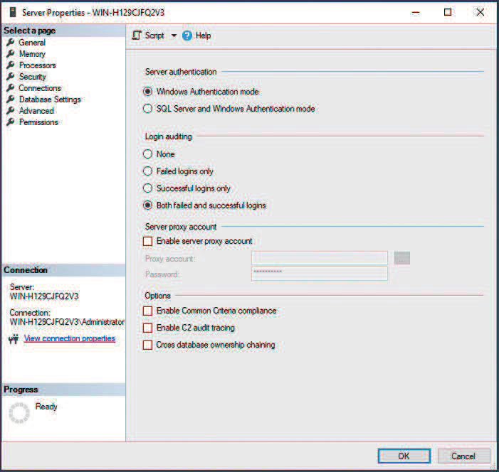

---
<!-- Page 226 -->
Altibase
• Altibase HDB 서버 내에서 실행되고 있는 특정 구문 또는 모든 구문을 실시간으로 추적하고, 로그를 남기는 것을
감사(Audit)라고 하며, SYS 사용자만이 이 구문을 사용해서 감사 조건을 설정 가능
AUDIT 구문으로 감사 정책을 설정
정책 설정 후 감사 조건 적용
ALTER SYSTEM STOP AUDIT;
ALTER SYSTEM START AUDIT;
ALTER SYSTEM RELOAD AUDIT;
Tibero
• 감사 기능은 감사의 대상에 따라 두 종류로 구분
- 스키마 객체에 대한 감사지정된 스키마 객체에 수행되는 모든 동작 기록 가능
- 시스템 특권에 대한 감사지정된 스키마 특권을 사용하는 모든 동작 기록 가능
※ 감사를 설정하거나 해제하려면 다음 명령을 사용audit(감사 설정)/noaudit(감사 해제)
• 감사 설정
스키마 객체에 대한 감사
다른 사용자가 소유한 스키마의 객체 또는 디렉터리 객체를 감사하기 위해서는 AUDIT ANY 시스템 특권
부여 필요
• 감사 설정 예시
AUDIT delete ON t BY SESSION WHENEVER SUCCESSFUL;
(테이블에 수행되는 모든 delete 문이 성공하는 경우에만 감사 기록을 남김)
시스템 특권에 대한 감사
시스템 특권을 감사하기 위해서는 AUDIT SYSTEM 시스템 특권 부여 필요
• 감사 설정 예시
AUDIT create table BY Tibero;
(Tibero라는 사용자가 테이블을 생성하려고 할 때 그것이 성공하든 실패하든 관계없이 감사 기록을 남김)

| AUDIT 구문으로 감사 정책을 설정 |
| --- |
| 정책 설정 후 감사 조건 적용 ALTER SYSTEM STOP AUDIT; ALTER SYSTEM START AUDIT; ALTER SYSTEM RELOAD AUDIT; |

| 스키마 객체에 대한 감사 다른 사용자가 소유한 스키마의 객체 또는 디렉터리 객체를 감사하기 위해서는 AUDIT ANY 시스템 특권 부여 필요 • 감사 설정 예시 AUDIT delete ON t BY SESSION WHENEVER SUCCESSFUL; (테이블에 수행되는 모든 delete 문이 성공하는 경우에만 감사 기록을 남김) |
| --- |
| 시스템 특권에 대한 감사 시스템 특권을 감사하기 위해서는 AUDIT SYSTEM 시스템 특권 부여 필요 • 감사 설정 예시 AUDIT create table BY Tibero; (Tibero라는 사용자가 테이블을 생성하려고 할 때 그것이 성공하든 실패하든 관계없이 감사 기록을 남김) |

---
<!-- Page 227 -->

## 제5장 디지털헬스케어 서비스 보안요구사항 및 보안대책 | 227

및
보안대책
및
보안대책
개요
디지털헬스케어
서비스
모델
디지털헬스케어
보안위협
디지털헬스케어
기기
보안요구사항
디지털헬스케어
서비스
보안요구사항
참고문헌
제1장
제2장
제3장
제4장
제5장
부록
• 감사 설정
스키마 객체에 대한 감사 해제
다른 사용자가 소유한 스키마의 객체 또는 디렉터리 객체의 감사를 해제하기 위해서는 AUDIT ANY 시스템
특권 부여 필요
• 감사 해제 예시
NOAUDIT delete ON t BY SESSION WHENEVER SUCCESSFUL;
(테이블에 수행되는 모든 delete 문에 대해 더 이상 감사 기록을 남기지 않음)
시스템 특권에 대한 감사 해제
시스템 특권의 감사를 해제하기 위해서는 AUDIT SYSTEM 시스템 특권 부여 필요
• 감사 해제 예시
NOAUDIT create table BY Tibero;
(Tibero라는 사용자가 테이블을 생성할 때 더 이상 감사 기록을 남기지 않음)
• SYS 사용자 감사 설정 방법
$TB_SID.tip 파일을 아래 내용처럼 입력 또는 수정
• SYS 사용자 감사 설정 예시
AUDIT_SYS_OPERATIONS=Y
AUDIT_FILE_DEST=/home/Tibero/audit/audit_trail.log
AUDIT_FILE_SIZE=10M
(SYS 사용자의 명령을 감사하도록 설정하면 수행한 모든 동작이 OS 파일에 기록되며 보안상의 이유로
데이터베이스에는 기록되지 않음)
점검방법
데이터베이스 감사 기록 정책 및 백업 정책 수립 여부를 확인한다.

| • 감사 설정 스키마 객체에 대한 감사 해제 다른 사용자가 소유한 스키마의 객체 또는 디렉터리 객체의 감사를 해제하기 위해서는 AUDIT ANY 시스템 특권 부여 필요 • 감사 해제 예시 NOAUDIT delete ON t BY SESSION WHENEVER SUCCESSFUL; (테이블에 수행되는 모든 delete 문에 대해 더 이상 감사 기록을 남기지 않음) 시스템 특권에 대한 감사 해제 시스템 특권의 감사를 해제하기 위해서는 AUDIT SYSTEM 시스템 특권 부여 필요 • 감사 해제 예시 NOAUDIT create table BY Tibero; (Tibero라는 사용자가 테이블을 생성할 때 더 이상 감사 기록을 남기지 않음) • SYS 사용자 감사 설정 방법 $TB_SID.tip 파일을 아래 내용처럼 입력 또는 수정 • SYS 사용자 감사 설정 예시 AUDIT_SYS_OPERATIONS=Y AUDIT_FILE_DEST=/home/Tibero/audit/audit_trail.log AUDIT_FILE_SIZE=10M (SYS 사용자의 명령을 감사하도록 설정하면 수행한 모든 동작이 OS 파일에 기록되며 보안상의 이유로 데이터베이스에는 기록되지 않음) |
| --- |
| 점검방법 |
| 데이터베이스 감사 기록 정책 및 백업 정책 수립 여부를 확인한다. |

| 스키마 객체에 대한 감사 해제 다른 사용자가 소유한 스키마의 객체 또는 디렉터리 객체의 감사를 해제하기 위해서는 AUDIT ANY 시스템 특권 부여 필요 • 감사 해제 예시 NOAUDIT delete ON t BY SESSION WHENEVER SUCCESSFUL; (테이블에 수행되는 모든 delete 문에 대해 더 이상 감사 기록을 남기지 않음) |
| --- |
| 시스템 특권에 대한 감사 해제 시스템 특권의 감사를 해제하기 위해서는 AUDIT SYSTEM 시스템 특권 부여 필요 • 감사 해제 예시 NOAUDIT create table BY Tibero; (Tibero라는 사용자가 테이블을 생성할 때 더 이상 감사 기록을 남기지 않음) |

---
<!-- Page 228 -->

#### 3.5 로그 관리

3.5.1 Audit Table은 데이터베이스 관리자 계정에 속해 있도록설정해야 한다.
위협 및 취약점
Audit Table 이 데이터베이스 관리자 계정에 속하지 않을 경우, 비인가자가 감사데이터의 수정, 삭제 등의 수행이
가능하다.
요구사항 및 보안대책
Oracle, Tibero
설정 확인(SQL*Plus)
SQL〉Select owner from dba_tables where table_name=1 AUD$';
SYS 또는 SYSTEM이 아닌 계정이 나올 경우 확인 후 권한 삭제
Audit table에 접근할 권한이 없는 계정이 확인 될 경우 권한 삭제
Altibase
• Altibase HDB 서버 내에서 실행되고 있는 특정 구문 또는 모든 구문을 실시간으로 추적하고, 로그를 남기는 것을
감사(Audit)라고 하며, SYS 사용자만이 이 구문을 사용해서 감사 조건을 설정 가능
사용자 계정을 조회하여 SYSTEM., SYS 의 USERJD 를 확인
select * from system_. sys_users_;
의료시스템 테이블 조회 내용 중 AUDIT 관련 테이블 정보의 TABLEJD 확인
(Step 1) 의 USERJD 와 동일한)
select * from system—. sys_tables_;
AUDIT 테이블에 권한 없는 계정이 부여되어 있을 경우 권한 삭제
Tibero
• 감사 기록은 $TB_SID.tip 파일에 설정된 AUDIT_TRAIL 파라미터에 따라 데이터베이스 내부 또는OS 파일에
저장할 수 있음. OS 파일에 감사 기록을 저장하는 경우 파일의 위치와 최대 크기를 각각 $TB_SID.tip파일의
AUDIT_FILE_DEST 파라미터와 AUDIT_FILE_SIZE 파라미터로 설정 가능

| 위협 및 취약점 |
| --- |
| Audit Table 이 데이터베이스 관리자 계정에 속하지 않을 경우, 비인가자가 감사데이터의 수정, 삭제 등의 수행이 가능하다. |
| 요구사항 및 보안대책 |
| Oracle, Tibero 설정 확인(SQL*Plus) SQL〉Select owner from dba_tables where table_name=1 AUD$'; SYS 또는 SYSTEM이 아닌 계정이 나올 경우 확인 후 권한 삭제 Audit table에 접근할 권한이 없는 계정이 확인 될 경우 권한 삭제 Altibase • Altibase HDB 서버 내에서 실행되고 있는 특정 구문 또는 모든 구문을 실시간으로 추적하고, 로그를 남기는 것을 감사(Audit)라고 하며, SYS 사용자만이 이 구문을 사용해서 감사 조건을 설정 가능 사용자 계정을 조회하여 SYSTEM., SYS 의 USERJD 를 확인 select * from system_. sys_users_; 의료시스템 테이블 조회 내용 중 AUDIT 관련 테이블 정보의 TABLEJD 확인 (Step 1) 의 USERJD 와 동일한) select * from system—. sys_tables_; AUDIT 테이블에 권한 없는 계정이 부여되어 있을 경우 권한 삭제 Tibero • 감사 기록은 $TB_SID.tip 파일에 설정된 AUDIT_TRAIL 파라미터에 따라 데이터베이스 내부 또는OS 파일에 저장할 수 있음. OS 파일에 감사 기록을 저장하는 경우 파일의 위치와 최대 크기를 각각 $TB_SID.tip파일의 AUDIT_FILE_DEST 파라미터와 AUDIT_FILE_SIZE 파라미터로 설정 가능 |

| 설정 확인(SQL*Plus) SQL〉Select owner from dba_tables where table_name=1 AUD$'; SYS 또는 SYSTEM이 아닌 계정이 나올 경우 확인 후 권한 삭제 |
| --- |
| Audit table에 접근할 권한이 없는 계정이 확인 될 경우 권한 삭제 |

| 사용자 계정을 조회하여 SYSTEM., SYS 의 USERJD 를 확인 select * from system_. sys_users_; |
| --- |
| 의료시스템 테이블 조회 내용 중 AUDIT 관련 테이블 정보의 TABLEJD 확인 (Step 1) 의 USERJD 와 동일한) select * from system—. sys_tables_; |
| AUDIT 테이블에 권한 없는 계정이 부여되어 있을 경우 권한 삭제 |

---
<!-- Page 229 -->

## 제5장 디지털헬스케어 서비스 보안요구사항 및 보안대책 | 229

및
보안대책
및
보안대책
개요
디지털헬스케어
서비스
모델
디지털헬스케어
보안위협
디지털헬스케어
기기
보안요구사항
디지털헬스케어
서비스
보안요구사항
참고문헌
제1장
제2장
제3장
제4장
제5장
부록
- 조치방법 1 데이터베이스 내부에 감사 기록 저장
<$TB_SID.tip> 파일에 아래 내용 입력
AUDIT_TRAIL=DB_EXTENDED
감사 기록에 포함되는 기본 정보 및 사용자가 실행한 SQL 문장까지 저장
※ 다 음 정적 뷰를 통해 감사 기록 조회가 가능DBA_AUDIT_TRAIL (select * from dba_audit_trail;)USER_
AUDIT_TRAIL (select * from user_audit_trail;)
- 조치방법 2 OS 파일에 감사 기록 저장
<$TB_SID.tip> 파일에 아래 내용 입력
AUDIT_TRAIL=OS
AUDIT_FILE_DEST=/home/Tibero/audit/audit_trail.log
AUDIT_FILE_SIZE=10M
위와 같이 설정하면 ’’/home/Tibero/audit/audit_trail. log”에 최대 10MB의 크기로 감사
기록이 저장
※ 감사 파일이 있는 디렉터리에는 일반사용자는 접근할 수 없도록 설정
점검방법
Audit Table의 권한 중 SYS 또는 SYSTEM이 아닌 계정이 나오는지 확인해야 한다.
Select owner from dba_tables where table_name=1 AUD$';

| - 조치방법 1 데이터베이스 내부에 감사 기록 저장 <$TB_SID.tip> 파일에 아래 내용 입력 AUDIT_TRAIL=DB_EXTENDED 감사 기록에 포함되는 기본 정보 및 사용자가 실행한 SQL 문장까지 저장 ※ 다 음 정적 뷰를 통해 감사 기록 조회가 가능DBA_AUDIT_TRAIL (select * from dba_audit_trail;)USER_ AUDIT_TRAIL (select * from user_audit_trail;) - 조치방법 2 OS 파일에 감사 기록 저장 <$TB_SID.tip> 파일에 아래 내용 입력 AUDIT_TRAIL=OS AUDIT_FILE_DEST=/home/Tibero/audit/audit_trail.log AUDIT_FILE_SIZE=10M 위와 같이 설정하면 ’’/home/Tibero/audit/audit_trail. log”에 최대 10MB의 크기로 감사 기록이 저장 ※ 감사 파일이 있는 디렉터리에는 일반사용자는 접근할 수 없도록 설정 |
| --- |
| 점검방법 |
| Audit Table의 권한 중 SYS 또는 SYSTEM이 아닌 계정이 나오는지 확인해야 한다. Select owner from dba_tables where table_name=1 AUD$'; |

---
<!-- Page 230 -->

|  |
| --- |
|  |

|  |
| --- |
|  |

|  |
| --- |
|  |

---
<!-- Page 231 -->
부록
참고문헌

---
<!-- Page 232 -->
부록 참고문헌
(1) ETRI, “ICT 융합 표준 프레임워크 : 스마트헬스”, ICT-SMHE-2019-1.0, 2019.
(2) TTA, “유헬스 서비스 참조모델 ”, TTAK.KO-10.0463/R1, 2014.
(3) TTA, “스마트의료서비스 보안 위협 (기술보고서)”, TTAR-12.0026, 2017.
(4) TTA, “의료기기 사이버보안 요구사항(기술보고서)”, TTAR-12.0040, 2019.
(5) TTA, “사물인터넷 기기 등급 분류 및 보안 요구사항”, TTAK.KO-12.0298, 2016.
(6) Medihere, “메디히어 원격진료 플랫폼 서비스 소개서 및 사용매뉴얼”, 2020.
(7) 정한민 외 3명, “개인 맞춤형 헬스케어 산업 기술 동향”, IITP 주간기술동향, 2020.
(8) 이준영, “디지털헬스케어 동향 및 시사점”, NIPA 이슈리포트 2019-03호, 2019.
(9) U .S. FDA Cybersecurity Safety Communications,https://www.fda.gov/medical-
devices/digital-health-center-excellence/cybersecurity
(10) 식품의약품안전처, “의료기기의 사이버 보안 허가·심사 가이드라인(민원인 안내서)”, 2019.
(11) IoT 보안얼라이언스, “스마트의료 사이버보안 가이드”, 2018.
(12) U.S. FDA, “Content of Premarket Submissions for Management of Cybersecurity
in Medical Devices”, 2014.
(13) U.S. FDA, “(Draft) Content of Premarket Submissions for Management of
Cybersecurity in Medical Devices”, 2018.
(14) U.S. FDA, “(Draft) Medical Device Manufacturer Internet of Things (IoT) Code of
Conduct”, 2020.

---
<!-- Page 233 -->
부록 참고문헌 | 233
및
보안대책
및
보안대책
개요
디지털헬스케어
서비스
모델
디지털헬스케어
보안위협
디지털헬스케어
기기
보안요구사항
디지털헬스케어
서비스
보안요구사항
참고문헌
제1장
제2장
제3장
제4장
제5장
부록
(15) U.S. FDA, “Postmarket Management of Cybersecurity in Medical Devices”, 2016.
(16) H ealth Canada,“Pre-market Requirements for Medical Device Cybersecurity”, 2019.
(17) BSI, “Cyber Security Requirements for Network-Connected Medical Devices”,
BSI-CS 132, Version 1.1, 2018.11.13.
(18) TGA, “Medical device cyber security guidance for industry”, 2019.
(19) MDCG, “Guidance on Cybersecurity for medical devices”, MDCG 2019-16,
2019.11.
(20) SFDA, “Guidance to Pre-Market Cybersecurity of Medical Devices”, MDS-G38,
V2.0, 2019.
(21) TMBIA, “適用於製造廠之醫療器材網路安全指引(제조업체에 적용 가능한 의료기기에 대한
사이버 보안 지침)”, 2019.
(22) IMDRF, “Principles and Practices for Medical Device Cybersecurity”, 2020.
(23) DTSec, “Protection Profile for Connected Diabetes Devices (CDD)”, Version 2.0,
2017.11.25.
(24) UL, “Software Cybersecurity for Network-Connctable Products, Part 1: General
Requirements”, ANSI/CAN/UL 2900-1:2017, 2017.
(25) UL, “Software Cybersecurity for Network-Connctable Products, Part 2-1:
Particular Requirements for Network Connectable Components of Healthcare
and Wellness Systems”, ANSI/CAN/UL 2900-2-1:2018, 2018.
(26) IEC, “Medical electrical equipment — Part 1: General requirements for basic
safety and essential performance”, IEC 60601-1, 2012.
(27) IEC, “Medical device software – Software life cycle processes ”, IEC 62304, 2015.
(28) KISA, “사물인터넷(IoT) 보안 시험・인증 기준 해설서”, 2019.
(29) KISA, “소프트웨어 개발보안가이드”, 11-1311000-000330-10, 2019.
(30) OWASP, “OWASP Top 10–2017, The Ten Most Critical Web Application Security
Risks”, 2017.

---
<!-- Page 234 -->
인 쇄 2020년 12월 인쇄
발 행 2020년 12월 발행
발행처 한국인터넷진흥원
주 소 58324 전라남도 나주시 진흥길 9 한국인터넷진흥원
TEL. 1433-25 / www.kisa.or.kr