# 디지털헬스케어 보안모델_part2

> Converted: 2026-04-08 19:33
> Engine: pdfplumber + pymupdf
> Ref ID: dhc-part2

---
<!-- Page 1 -->
디지털
헬스케어
보안모델
Ⅱ:
PART
서비스 유형별
2021. 12

|  |  |

---
<!-- Page 2 -->
CONTENTS

## 제1장 개요 6

### 1. 배경 및 목적 6

### 2. 범위 및 구성 8

## 제2장 디지털헬스케어 구성요소 및 보안 모델 개념 12

### 1. 디지털헬스케어 서비스 발전 동향 12

### 2. 디지털헬스케어 구성 요소 16

### 3. 디지털헬스케어 서비스 보안 모델 개념 19

## 제3장 디지털헬스케어 서비스 유형 24

### 1. 디지털헬스케어 서비스 유형 분류 24

### 2. 디지털헬스케어 서비스 유형 34

## 제4장 디지털헬스케어 서비스 보안 위협 58

### 1. 디지털헬스케어 서비스 유형별 보안 위협 58

### 2. 디지털헬스케어 서비스 보안 위협 분류 93

---
<!-- Page 3 -->
Ⅱ
PART : 서비스 유형별

## 제5장 디지털헬스케어 서비스 보안 요구사항 및

보안 대책 100

### 1. 디지털헬스케어 서비스 전체 보안 요구사항 100

### 2. 디지털헬스케어 서비스 유형별 보안 요구사항 136

### 3. 디지털헬스케어 서비스 보안 요구사항별 보안 대책 139

부 록 참고문헌 188

|  |  |  |  |  |  |
| --- | --- | --- | --- | --- | --- |
|  |  |  |  |  |  |

---
<!-- Page 4 -->
Ⅱ
PART : 서비스 유형별

|  |
| --- |
|  |

|  |
| --- |
|  |

|  |
| --- |
|  |

---
<!-- Page 5 -->
제1장
개요

### 1. 배경 및 목적

### 2. 범위 및 구성

---
<!-- Page 6 -->

## 제1장 개요

1 | 배경 및 목적
디지털헬스케어는 의료 서비스 분야에 ICT 기술이 접목되어 개인 건강 및 질환을 관리하는 산업 영역이다.
4차 산업혁명의 도래로 인하여 기존의 의료 서비스 대부분은 ICT 기술과 서비스가 융합된 형태로 진화하고
있다. 또한 전 세계적으로 환경 변화로 인한 만성 질환 환자 증가, 인구 고령화 등의 사회적 문제에 대한
효과적인 대안으로 디지털헬스케어가 급부상하고 있다. 특히 최근 COVID-19 팬데믹 상황으로 인해 전 산업
분야에서 비대면 서비스로의 전환이 가속화되면서 디지털헬스케어 서비스도 급속하게 활성화되었다.
과거 의료 서비스는 병원 폐쇄망 내 설치형 의료 기기를 활용한 치료 기반으로 이루어졌으나, 유무선
네트워킹 기술의 발달로 원격 검사 기기, 원격 건강 관리 기기, 원격 수술 로봇 등 원격 또는 비대면 의료
기기들이 개발되면서, 실시간으로 측정된 개인 생체 신호 정보를 기반으로 하는 디지털헬스케어 서비스가
가능해졌다. 비대면 의료 기기들은 IoT, 클라우드, 빅데이터, AI 기술과 융합하여 비대면 질병 관리 및 예측
서비스, 가상 병원 서비스, 원격 로봇 수술 등 다양한 비대면 의료 서비스로 발전하고 있다.
의료 영역의 보안 사고는 과거의 의료 기기 보안 취약점 공격에 따른 의료 사고가 대부분이었지만,
최근에는 [그림 1-1]과 같이 디지털헬스케어 서비스의 보안 취약점과 위협에 대한 보고가 잇따라 발표되고
있다. 이는 향후 의료 보안 사고로 이어질 가능성이 크므로 전문 의료진과 보안 전문가의 우려의 목소리가
높아지고 있다. 따라서 디지털헬스케어 서비스의 발전 방향에 따라 발생 가능한 보안 위협을 도출하고, 그에
대한 보안 대책 방안 마련이 매우 시급하다. 이는 향후 의료 사고로 인한 대국민의 생명 위협을 방지할 수
있어, 매우 의미 있는 일이라고 할 수 있다.

---
<!-- Page 7 -->

## 제1장 개요 | 7

및
보안
모델
개념
및
보안
대책
개요
디지털헬스케어
구성요소
디지털헬스케어
서비스
유형
디지털헬스케어
서비스
보안
위협
디지털헬스케어
서비스
보안
요구사항
참고문헌
제1장
제2장
제3장
제4장
제5장
부록
그림 1-1 디지털헬스케어 보안 사고 사례
쉍(cid:2658)(cid:1989)동(cid:1245) (cid:2212)(cid:3354)(cid:3295) 자동분석(cid:2658)치 국내 P(cid:80)(cid:36) 의료(cid:2658)비 인숺(cid:1853) (cid:3216)(cid:3280) 쉍(cid:2658)(cid:1989)동(cid:1245) 보안 이쉈형 쉍(cid:2658) (cid:2658)치
(cid:3303)(cid:3082) 발표 (cid:52)(cid:56) (cid:2946)(cid:2465)(cid:2684) 발표 (cid:3303)(cid:3082) (cid:2342)연 사(cid:2633)(cid:2017)보안 (cid:1155)고 (cid:2946)(cid:2465)성 발(cid:1148) 보안 (cid:2946)(cid:2465)(cid:2684) 발표
’12(cid:15)10 ’13(cid:15)01 ’14(cid:15)11 ’16(cid:15)10 ’17(cid:15)01 ’18(cid:15)10
’20(cid:15)0(cid:26) ’20(cid:15)04 ’20(cid:15)03 ’20(cid:15)01 ’1(cid:26)(cid:15)06 ’1(cid:26)(cid:15)03
국(cid:1977) (cid:1977)(cid:1088) 의료기관의 (cid:35)(cid:45)(cid:38) (cid:1942)(cid:2230) (cid:3134)쉉 인숺(cid:1853) (cid:3216)(cid:3280)
Health (cid:52)e(cid:83)(cid:87)i(cid:68)e(cid:84) 환자 (cid:1093)시 (cid:2658)치 이쉈형 (cid:2899)(cid:2241)동(cid:1245)
(cid:2583)(cid:1146)(cid:2685)(cid:2264) (cid:1173)(cid:1146) 기(cid:2303)의 12개의 사(cid:2633)(cid:2017)보안
(cid:1746)(cid:2235)(cid:2589)어 (cid:1173)(cid:1146) (cid:2946)(cid:2465)(cid:2684) (cid:3355)인 보안(cid:2946)(cid:2465)(cid:2684) 발표
(cid:9)R(cid:37)P터(cid:1413)(cid:1858)(cid:10) (cid:2946)(cid:2465)(cid:2684) (cid:3355)인 문제 (cid:3355)인
’20(cid:15)10 ’20(cid:15)10 ’20(cid:15)12 ’21(cid:15)01 ’21(cid:15)05 ’21(cid:15)08
(cid:1975) (cid:39)(cid:35)(cid:42) (cid:116)(cid:2045)(cid:2583)(cid:1628) 쉍(cid:2658) 관(cid:1778) 이쉈형 (cid:3303)(cid:2996), 헬스케어 서비스 (cid:2045)(cid:2583)(cid:1628)에 (cid:1093)(cid:2942)(cid:2771)
(cid:1577)(cid:2636) (cid:2045)(cid:2583) 시스(cid:3118) D(cid:42)(cid:58) 인공(cid:2944)(cid:2658),
전(cid:2193)(cid:1870) (cid:2190)이(cid:2017)(cid:1173)(cid:1146) 의료(cid:1245)(cid:1245) (cid:3303)(cid:3082) 후 비(cid:3167)(cid:3023)인 (cid:48)T 시스(cid:3118) PT(cid:52)에서
대상 (cid:1746)(cid:2235)(cid:2589)어 (cid:1173)(cid:1146) (cid:3303)(cid:3082) (cid:1945)(cid:2689) (cid:1122)(cid:1791)
급(cid:2768)(cid:117) (cid:1155)계(cid:1784) (cid:3303)(cid:3082) 보안(cid:2946)(cid:2465)(cid:2684) 발(cid:1148) (cid:2613)(cid:1789) (cid:1923)(cid:1095) 지(cid:2075) 요구 (cid:3242)(cid:1624)(cid:3189)이(cid:3212) (cid:2946)(cid:2465)(cid:2684) 발표
의료 서비스가 독립형(Stand-Alone) 의료 기기를 활용한 서비스에서 ICT 기술이 접목된 디지털헬스케어
서비스로 확장되어가고 있는 흐름에 따라, 향후 발생가능한 의료 서비스 영역의 다양한 보안 사고를 대비하기
위해서는 디지털헬스케어 서비스 영역에 대한 심층 연구를 기반으로 한 보안 대책 마련이 반드시 필요하다.
전세계에서는 급증하는 디지털헬스케어 서비스의 효과성과 안전성을 검증함과 동시에 미래에 제공할
디지털헬스케어 서비스에 대한 기획·설계가 진행 중이다. 따라서 향후 디지털헬스케어 서비스의 활용 영역과
그 범위가 더욱 광범위해지고, 적용되는 기술과 서비스의 기능이 보다 더 다양해질 가능성이 매우 크다.
본 문서에서는 디지털헬스케어 서비스들에 대하여 유의미한 디지털헬스케어 서비스 유형을 분류하고,
서비스 유형별 보안 위협과 보안 요구사항에 대한 보안 대책을 제시한다. 이를 위해 전 세계에서 서비스
중이거나 기획 또는 시범 적용 중인 디지털헬스케어 서비스들에 대하여 기능 및 특징, 활용 분야, 그리고 의료
데이터 중요도 등 다양한 관점으로 연구 분석하였고, 의료 서비스의 패러다임 변화와 디지털헬스케어
서비스의 발전 방향 등을 고려하여 디지털헬스케어 서비스 보안 모델을 제시한다.
디지털헬스케어 서비스 제공자는 본 디지털헬스케어 서비스 보안 모델을 참고하여 서비스의 개발
단계부터 운영 단계까지 전 단계에 걸쳐 서비스의 안전성을 확보할 수 있을 것으로 기대한다.

---
<!-- Page 8 -->
2 | 범위 및 구성
본 문서는 디지털헬스케어 서비스를 대상으로 한다. 디지털헬스케어 서비스는 디지털헬스케어 기기를
활용한 서비스, 플랫폼과 같이 독립적으로 제공되는 서비스, 타 서비스와 연동하는 서비스 등 다양한 형태로
제공될 수 있다. Bluetooth, 5G 등 네트워크 기술이 발전함에 따라 디지털헬스케어 기기와 디지털헬스케어
서비스와 연결성이 강화되면서, 디지털헬스케어 서비스는 전문 의료 서비스 뿐 아니라 개인의 일상에서의
자가 건강 관리와 질병 예측 및 증상 완화를 위한 서비스로 그 활용 범위가 개인 일상 영역으로 급속히
확장되고 있다. 따라서, 병원 내 폐쇄망 내에서가 아닌 5G 등을 통해 인터넷망을 이용하여 제공되는
서비스들의 보안 위협, 의료 정보의 수집 및 전송, 저장 및 활용 단계에서 발생할 수 있는 보안 위협을
예측하고 그에 대한 보안 요구사항을 정의하여, 각 보안 요구사항에 대한 상세한 보안 대책을 제시하고자
한다.
본 문서는 총 5장으로 구성된다. 제1장에서는 디지털헬스케어 보안 모델 고도화 배경 및 목적, 적용 범위
및 구성에 관해 설명한다.
제2장에서는 디지털헬스케어 서비스 발전 동향에 따른 디지털헬스케어 보안 대책 마련을 위해,
디지털헬스케어 서비스의 구성 요소를 재정의하고, 기 개발된 디지털헬스케어 보안 모델 현황을 설명한다.
이어서 의료 기기 보안 요구사항이 주요 내용인 현재 디지털헬스케어 보안 모델을 서비스 영역으로 확장한
디지털헬스케어 서비스 보안 모델에 대해 설명한다.

## 제3장 1절에서는 효과적이고 실효성 있는 디지털헬스케어 서비스 보안 모델 마련을 위해 광범위하게

서비스되고 있는 디지털헬스케어 서비스의 유형 분류에 대해 설명한다. 미국, 일본, 중국 등 해외
디지털헬스케어 서비스와 국내 디지털헬스케어 서비스들에 대해서 특화 기능, 의료 정보 중요도, 활용성 등
다양한 관점으로 분석하여 거시적으로는 4개의 디지털헬스케어 서비스 그룹으로 구분하고, 각 그룹에
포함되는 서비스들을 보안 관점에서 총 10개의 디지털헬스케어 서비스 유형으로 세분화한다. 제3장 2
절에서는 각 서비스 유형에 대하여 주요 기능 및 절차, 대표 사례를 소개하여 서비스 유형에 대한 상세히
설명한다. 디지털헬스케어 서비스 제공자는 각 서비스 유형에 대한 상세 설명을 참고하여 해당 서비스 유형을
판단할 수 있고, 각 서비스 유형별 보안 위협에 대해서는 제4장에서 확인할 수 있다.

---
<!-- Page 9 -->

## 제1장 개요 | 9

및
보안
모델
개념
및
보안
대책
개요
디지털헬스케어
구성요소
디지털헬스케어
서비스
유형
디지털헬스케어
서비스
보안
위협
디지털헬스케어
서비스
보안
요구사항
참고문헌
제1장
제2장
제3장
제4장
제5장
부록
제4장에서는 앞서 분류한 디지털헬스케어 서비스 유형별 보안 위협에 관해 설명한다. 각 서비스 유형별로
인트라넷, Bluetooth, 5G 등 다양한 네트워크를 통해 전송되는 의료 정보 흐름에 따라 존재할 수 있는 보안
위협에 대하여 설명한다.
제5장에서는 제4장에서 설명한 디지털헬스케어 서비스 유형별 보안 위협에 대한 보안 요구사항을
정의하고, 디지털헬스케어 서비스 제공자가 서비스 유형별 보안 요구사항을 준수하기 위한 상세 보안 대책
방안을 설명한다.

---
<!-- Page 10 -->
Ⅱ
PART : 서비스 유형별

|  |
| --- |
|  |

|  |
| --- |
|  |

|  |
| --- |
|  |

---
<!-- Page 11 -->
제2장
디지털헬스케어
구성요소 및 보안 모델 개념

### 1. 디지털헬스케어 서비스 발전 동향

### 2. 디지털헬스케어 구성 요소

### 3. 디지털헬스케어 서비스 보안 모델 개념

---
<!-- Page 12 -->

## 제2장 디지털헬스케어

구성요소 및 보안 모델 개념
디지털헬스케어는 4차 산업혁명의 핵심 기술인 사물인터넷(IoT, Internet of Things), 클라우드 컴퓨팅,
빅데이터 및 인공지능(AI, Artificial Intelligence) 등 정보통신 기술을 활용하여 언제 어디서나 개인 건강 및
질환을 관리하는 산업 영역을 의미한다. 의료 서비스에 정보통신 기술이 적용되면서 원격 의료(tele-Health)
개념이 생겨나고, 유무선 네트워킹 기술의 발달과 ICT 기술이 급속히 발전하면서 [표2-1]과 같이 시기별로
이-헬스(e-Health), 유-헬스(u-Health)로 발전해 왔다. 2010년 이후 스마트폰의 보급이 확산되면서
smart-Health와 혼용하여 불리다가 의료 패러다임의 변화로 디지털헬스케어 영역이 전문 의료 영역에서
일반 개인 영역으로까지 확대되면서 디지털헬스케어(Digital-Healthcare)라는 광의의 개념으로 확대되었다.
디지털헬스케어 서비스는 의료 영역에 IT 기술을 적용하여 병원 내 환자 의료 정보를 정보시스템화 하고,
이러한 의료정보시스템들을 연동함으로써 디지털헬스케어에 활용하는 텔레헬스(tele-Health)로
발전하였다. 인터넷 기술이 발전하면서다른 의료 기관의 의료정보시스템과의 연동을 통해 의료 정보를
공유하고 커뮤니케이션이 가능한 이-헬스(e-Health)로 확장되었다. 이후 유무선 네트워킹 기술과 다양한
ICT 기술이 비약적으로 발달하고 스마트 기기가 대중화되면서, 언제 어디서나 의료 서비스가 가능한 유-헬스
(u-Health) 단계를 거쳐 디지털헬스케어로 진화하였다. 오늘날 디지털헬스케어는 최근 의료 서비스
패러다임이 기존의 질병 치료에서 질병 예측 및 개인 건강 관리로 변화하고 ICT 기술 발전이 급속하게
이루어지면서, 자가 건강 관리를 통해 질병을 예방함으로써 개인의 삶의 질을 향상시킬 수 있는 서비스를
의미한다.
디지털헬스케어는 [그림 2-1]과 같이 이들 모두를 포괄하는 개념이며, 디지털헬스케어 서비스에는 비대면
진료(tele-Medicine), 비대면 상담(tele-Consultation), 비대면 수술(tele-Surgery), 디지털 치료제(digital-
Therapeutics), 가상 병원(Virtual Hospital) 등 다양한 기능의 서비스들로 제공되고 있다.

---
<!-- Page 13 -->

## 제2장 디지털헬스케어 구성요소 및 보안 모델 개념 | 13

및
보안
모델
개념
및
보안
대책
개요
디지털헬스케어
구성요소
디지털헬스케어
서비스
유형
디지털헬스케어
서비스
보안
위협
디지털헬스케어
서비스
보안
요구사항
참고문헌
제1장
제2장
제3장
제4장
제5장
부록
표 2-1 디지털헬스케어 발전 방향
구분 tele-Health e-Health u-Health Digital-Health
시기 1990년 중반 2000년 2006년 2010년 이후
서비스 치료, 의료 정보화 자가 건강 측정 및 관리,
원내 치료 치료, 예방 및 관리
내용 서비스 질환 관리 및 예방
서비스 병원, ICT 기업,
병원 병원, ICT 기업 병원, ICT 기업
주체 서비스 제공자
사용자 의료인 의료인, 환자 의료인, 환자, 일반인 의료인, 환자, 일반인
통신 광대역 유무선 네트워팅 기술
병원 내 폐쇄망 전용선 인터넷 유무선 네트워크
기술 (3G, Bluetooth, 5G)
개인건강기록(PHR6))
주요 병원정보시스템 의무기록 전자건강기록
개인 맞춤형 서비스,
시스템 HIS1), PACS2), OCS3) EMR4) EHR5)
인공지능 연계 서비스
그림 2-1 디지털헬스케어 개념
(cid:1245)(cid:1502)
P(cid:41)R (cid:37)(cid:74)(cid:72)(cid:74)(cid:85)(cid:66)(cid:77) (cid:41)(cid:70)(cid:66)(cid:77)(cid:85)(cid:73)(cid:68)(cid:66)(cid:83)(cid:70)
개인
(cid:9)P(cid:70)(cid:83)(cid:84)(cid:80)(cid:79)(cid:66)(cid:77) (cid:41)(cid:70)(cid:66)(cid:77)(cid:85)(cid:73) R(cid:70)(cid:68)(cid:80)(cid:83)(cid:69)(cid:10)
건강관리
비대(cid:1910) (cid:2771)료 비대(cid:1910) 상(cid:1528)
(tele-(cid:78)e(cid:69)i(cid:68)i(cid:79)e) (tele-(cid:68)(cid:80)(cid:79)(cid:84)ultati(cid:80)(cid:79))
전자 의(cid:1942)
비대(cid:1910) (cid:2299)(cid:2303) 디지털 치료제
기(cid:1790) 활용
(cid:70)(cid:14)(cid:41)(cid:70)(cid:66)(cid:77)(cid:85)(cid:73) (tele-(cid:52)u(cid:83)ge(cid:83)(cid:90)) ((cid:69)igital-(cid:53)he(cid:83)a(cid:81)euti(cid:68)(cid:84))
가상 (cid:2045)(cid:2583) (cid:2529)(cid:1732)인 (cid:2465)국
(cid:2771)료지(cid:2583)
(cid:2342)스(cid:3118) (cid:85)(cid:70)(cid:77)(cid:70)(cid:14)(cid:41)(cid:70)(cid:66)(cid:77)(cid:85)(cid:73) ((cid:55)i(cid:83)tual H(cid:80)(cid:84)(cid:81)ital) ((cid:48)(cid:79)li(cid:79)e-(cid:49)ha(cid:83)(cid:78)a(cid:68)(cid:90))
(의료기기연(cid:1586)) PA(cid:36)(cid:52) (cid:48)(cid:36)(cid:52)
전(cid:3134)적
(cid:54)(cid:14)(cid:41)(cid:70)(cid:66)(cid:77)(cid:85)(cid:73)
의료기기 의료 서비스
유선(cid:3236)(cid:2279)(cid:1870) 유(cid:1942)선 3(cid:40) (cid:35)luet(cid:80)(cid:80)th 5(cid:40) (cid:1422)(cid:3167)(cid:2581)(cid:3068)
1) HIS 의료정보시스템(HIS, Healthcare Information System)
2) PACS 영상의료전달시스템(PACS, Picture Archiving Communication System)
3) OCS 처방전달시스템(OCS, Order Communication System)
4) EMR 전자의무기록(EMR, Electronic Medical Record)
5) EHR 전자건강기록(EHR, Electronic Health Records)
6) PHR 개인건강정보(Personal Health Record)

| 구분 | tele-Health | e-Health | u-Health | Digital-Health |
| --- | --- | --- | --- | --- |
|  | 1990년 중반 | 2000년 | 2006년 |  |
|  | 원내 치료 | 치료, 의료 정보화 서비스 | 치료, 예방 및 관리 |  |
|  | 병원 | 병원, ICT 기업 | 병원, ICT 기업 |  |
|  | 의료인 | 의료인, 환자 | 의료인, 환자, 일반인 |  |
|  | 병원 내 폐쇄망 | 전용선 인터넷 | 유무선 네트워크 |  |
|  | 병원정보시스템 HIS1), PACS2), OCS3) | 의무기록 EMR4) | 전자건강기록 EHR5) |  |

---
<!-- Page 14 -->
디지털헬스케어 서비스 영역에서는 최근 IoT 기반의 PHR, 클라우드, 빅데이터, AI 등의 기술들을 활용한
매우 다양한 디지털헬스케어 서비스들이 폭발적으로 증가하고 있으므로, 디지털헬스케어 서비스를 하나의
특정 서비스로 정의하기는 어렵다. 기존의 독립 설치형 의료 기기의 네트워크 연결성이 강화되면서, 의료
서비스는 시공간의 제약을 벗어나 다양한 형태의 디지털 의료 서비스로 발전하고 있다.
공공보건의료재단에서는 의료 서비스 라이프사이클을 [그림 2-2]와 같이 세 단계의 순환 구조로 정의하고
있다. 의료 서비스는 의료 전 단계(Pre-Medical)인 개인 건강 관리를 통한 질환 예방에서 의료 단계(Medical
Practice)인 진찰 및 진단, 치료 및 관리, 그리고 의료 사후 단계(Post-Medical)인 예후 모니터링 및 대응
단계 순으로 순환한다.
그림 2-2 의료 서비스 단계 정의 (공공보건의료재단)
의료 전(cid:9)(cid:6648)(cid:10) (cid:1521)(cid:1157) 의료 (cid:1521)(cid:1157) 의료 (cid:2190)후(cid:9)(cid:7974)(cid:10) (cid:1521)(cid:1157)
(cid:9)P(cid:83)(cid:70)(cid:14)(cid:46)(cid:70)(cid:69)(cid:74)(cid:68)(cid:66)(cid:77)(cid:10) (cid:9)(cid:46)(cid:70)(cid:69)(cid:74)(cid:68)(cid:66)(cid:77) P(cid:83)(cid:66)(cid:68)(cid:85)(cid:74)(cid:68)(cid:70)(cid:10) (cid:9)P(cid:80)(cid:84)(cid:85)(cid:14)(cid:46)(cid:70)(cid:69)(cid:74)(cid:68)(cid:66)(cid:77)(cid:10)
예(cid:2001) 및 건강 관리 진(cid:2868) 및 진(cid:1521) 치료 및 진(cid:1521) 예후 모(cid:1508)터(cid:1858) 및 대응
정기 건강 (cid:1128)(cid:2771) 의(cid:3295)적 치료(cid:16)(cid:3365)(cid:2050) 관리 (cid:2636)(cid:2342)적 재(cid:3094) (cid:1088)(cid:3344)
개인 건강 관리 포(cid:1178)적 (cid:2465)(cid:1947) 치료 요(cid:2472) (cid:2342)(cid:2232) (cid:2633)용
건강 관리 상(cid:1528) 및 (cid:3023)인 (cid:2299)(cid:2303) (cid:1633) (cid:2555)과적 치료 (cid:1861)성 질환 모(cid:1508)(cid:3104)(cid:1858)
의료 서비스 라이프사이클 전반에서 서비스되고, 활용되고 있는 디지털헬스케어 서비스는 매우 다양하다.
[표 2-2]은 전세계의 대표적인 디지털헬스케어 서비스 사례이다.

---
<!-- Page 15 -->

## 제2장 디지털헬스케어 구성요소 및 보안 모델 개념 | 15

및
보안
모델
개념
및
보안
대책
개요
디지털헬스케어
구성요소
디지털헬스케어
서비스
유형
디지털헬스케어
서비스
보안
위협
디지털헬스케어
서비스
보안
요구사항
참고문헌
제1장
제2장
제3장
제4장
제5장
부록
표 2-2 디지털헬스케어 서비스 사례
국가 서비스 주요 기능
닥터앤서 의료 빅데이터 분석을 통해 의사 진료·진단을 지원하는 AI 의사
정밀의료 병원 정보 심층분석 AI 서비스로 개인의 유전체, 임상, 생활 습관 등 다양한 정보를
시스템 (P-HIS) 진단부터 치료까지 맞춤형 의료 서비스 제공
환자가 직접 의사를 선택하여 전화, 또는 화상 진료를 받을 수 있는 모바일
닥터 나우
중국 앱서비스
중증질환 예측 및 치료 여정 전 과정에서의 자가 관리 서비스를 제공하고,
라이프시맨티스
병원, 정부, 기업에 헬스케어 데이터 통합 표준을 제공
병원에서 처방받은 혈당계, 혈압계 등의 IoT 기기와 연동하여 상급 종합
닥터 콜
병원의 주치의의 질환 관리를 제공하는 의료 서비스
외부의 다양한 디바이스와 앱을 연계하여 개인 건강 정보를 수집, 정보통합
애플 HealthKit
및 관리 서비스
다양한 기기에서 생성된 각종 피트니스 정보를 하나의 플랫폼에 통합이
구글 Fit
가능하도록 하고, 다른 앱이 접근하여 데이터 활용 가능
심장 혈관에 관한 MRI 영상을 AI 분석을 통해 심장이 뛰고 있는 상태인 3D
Arterys 애니메이션을 자동으로 작성하여 의료진의 의료 진단을 지원하는 의료
미국
서비스
X선 화상, MRI 영상, CT 스캔 화상, 초음파 화상 등을 AI 분석을 통한 정밀
Enlitic
의료 서비스
Ingestible sensor, iPiLL 약물 복용 여부 확인 및 복약 지도, 필요시 약물 배송
심전도 및 심박수 모니터링, 심장질환 진단을 통해 응급 상황 발생 시 알람 및
NUVANT MCT
의료진에 데이터 전송
알리헬스(阿里健康) 모바일 앱을 통한 원격 진료 서비스
텐센트 헬스( 健康) 위챗과 연동된 모바일 앱을 통해 의료자문, 의료 상담
腾讯
중국 핑안굿닥터 중국 최대 온라인 원격 진료 플랫폼으로 온라인 진료, 전자 처방전, 약배송
(平安健康醫療技術) 서비스 제공
아이플라이텍(科大 ) 음성인식 기술을 이용해 코로나19 관련 방제 지식 제공
讯飞
국내에서는 대표적으로 닥터앤서, 정밀의료 병원 정보 시스템 등이 서비스 중이다. 과학기술정보통신부에
따르면, 우리나라는 이미 지속적으로 의료 기술과 인프라 및 데이터를 축적하고 있으며, 국내 전자의무기록
(EMR, Electronic Medical Record) 보급률은 92%로 미국(60%), 유럽(84%)보다 높은 수준을 보인다.
이를 기반으로 국내에서 다양한 디지털헬스케어 서비스 개발 및 확대가 훨씬 용이한 상황이며, 최근 국내
대형 병원 중심으로 디지털헬스케어 서비스를 병원 시스템 전반에 구현하려는 노력을 기울이고 있다.

| 국가 | 서비스 | 주요 기능 |
| --- | --- | --- |
|  | 닥터앤서 |  |
|  | 정밀의료 병원 정보 시스템 (P-HIS) |  |
|  | 닥터 나우 |  |
|  | 라이프시맨티스 |  |
|  | 닥터 콜 |  |
|  | 애플 HealthKit |  |
|  | 구글 Fit |  |
|  | Arterys |  |
|  | Enlitic |  |
|  | Ingestible sensor, iPiLL |  |
|  | NUVANT MCT |  |
|  | 알리헬스(阿里健康) |  |
|  | 텐센트 헬스( 健康) |  |
|  | 腾讯 핑안굿닥터 (平安健康醫療技術) |  |
|  | 아이플라이텍(科大 ) 讯飞 |  |

---
<!-- Page 16 -->
디지털헬스케어는 [그림 2-3]과 같이 의료 기기와 의료 서비스로 구성된다. 의료 기기에는 MRI, X-Ray
등 전통적인 독립형(Stand-Alone) 의료 기기 뿐 아니라 먹는 센서, 뇌전증 측정 웨어러블 기기와 같은
하드웨어 기반 디지털 의료 기기를 포함한다. 의료 서비스에는 디지털 치료제와 같은 소프트웨어 의료기기
(SaMD, Software as Medical Device), 비대면 진료 및 건강검진 서비스, 원격 수술 서비스, 인공지능 의사,
정밀 의료 서비스 등 다양한 기능의 서비스들이 있다. 디지털헬스케어 서비스는 독립적인 의료 기기 서비스와
온라인 소프트웨어 서비스, 그리고 의료 기기와 연동하여 개인건강기록(PHR) 기반의 개인 맞춤형 의료
서비스 등 다양한 형태의 의료 서비스를 모두 포함한다.
그림 2-3 디지털헬스케어 서비스 구성 요소
의료 (cid:1245)(cid:1245)
디지털헬스케어
싥(cid:3221)(cid:3181)(cid:2976) (cid:9)(cid:1457)(cid:2681)(cid:2768)(cid:1)(cid:2959)(cid:2687)(cid:1)(cid:2589)(cid:2479)(cid:1758)(cid:2102)(cid:10)
(cid:3294)(cid:1624)(cid:2589)어 기(cid:1992)
싕라이(cid:2099)(cid:3023)어 (cid:9)(cid:2348)(cid:2681)(cid:1576)(cid:1)(cid:2959)(cid:2687)(cid:1)(cid:1086)(cid:2695)(cid:10)
의료 기기
(cid:3280)(cid:1789)(cid:3114)(cid:2571)스 (cid:9)(cid:2050)(cid:1860)(cid:1)(cid:2959)(cid:2687)(cid:2570)(cid:1)(cid:1889)(cid:1495)(cid:1)(cid:2243)(cid:2226)(cid:10)
서비스
디지털 치료(cid:2689)
(cid:3323)(cid:1624) 스(cid:3221)이스 (cid:3221)어 ((cid:2746)(cid:1577) 치료 (cid:2460)) 슭(cid:3078)리 ((cid:1137)임 치료)
(cid:1760)(cid:3075)(cid:3212) ((cid:2516)상 (cid:2460)) 어(cid:3282)라이(cid:1624) (cid:55)R ((cid:2771)(cid:3134) (cid:3372)과 (cid:55)(cid:51)) (cid:2045)(cid:2583) (cid:2232)치형
(cid:9)(cid:1523)(cid:1851)(cid:1245)(cid:1)(cid:1917)(cid:1508)(cid:3104)(cid:1858)(cid:1)(cid:2460)(cid:10) 의료 (cid:1245)(cid:1245)
쉁(cid:1856)쉒이(cid:3071) AI 의(cid:2190) (cid:9)(cid:46)RI(cid:13) (cid:36)T(cid:13) P(cid:38)T(cid:13)
(cid:9)(cid:2299)(cid:1910)(cid:1)(cid:1917)(cid:1508)(cid:3104)(cid:1858)(cid:1)(cid:2460)(cid:10) (cid:57)(cid:14)RA(cid:58) (cid:1633)(cid:10)
쌓쉀 지(cid:2099)라 (cid:1899)디(cid:3000) I(cid:37)(cid:57)
(cid:1519)터싣서 ((cid:2448)환자 (cid:2771)료 보(cid:2705)) ((cid:2497)스레(cid:2633) 기(cid:3409) (cid:1633)) (당(cid:1463)성 (cid:1870)(cid:1860)(cid:2045)(cid:2768))
(cid:9)(cid:34)(cid:42)(cid:1)(cid:2687)(cid:1979)(cid:2628)(cid:1808)(cid:1)(cid:2226)(cid:2106)(cid:2333)(cid:10)
가상 (cid:2045)(cid:2583) (cid:3282)(cid:1750)(cid:3244)
(cid:3289)(cid:3202) 슨(cid:3240)(cid:3114)(cid:2976) 케모 (cid:2243)(cid:3181)케어
((cid:2890)방(cid:2465) (cid:2003)(cid:2272)) ((cid:2705)제 (cid:1789)(cid:2056)) ((cid:2465) (cid:2050)용 (cid:2444)림(cid:16)(cid:2003)(cid:2937))
의료 기기에 펌웨어 등의 소프트웨어 및 네트워크 기능이 추가되면서 보안 위협이 증가하고 이에 따른
보안 사고가 발생하면서, 국외에서는 의료 기기에 대한 보안 대책 수립 및 의료 기기의 시판 전·후의 보안
가이드를 마련하여 운영하고 있다. 국내에서도 식품의약품안전처의 의료 기기 보안 허가·심사 가이드라인과
과학기술정보통신부의 스마트 의료 사이버 보안 가이드를 제공하고 있다.

---
<!-- Page 17 -->

## 제2장 디지털헬스케어 구성요소 및 보안 모델 개념 | 17

및
보안
모델
개념
및
보안
대책
개요
디지털헬스케어
구성요소
디지털헬스케어
서비스
유형
디지털헬스케어
서비스
보안
위협
디지털헬스케어
서비스
보안
요구사항
참고문헌
제1장
제2장
제3장
제4장
제5장
부록
최근 의료 서비스에 정보통신 기술이 접목되어 의료 정보가 디지털화되고, 네트워크 기술이 급속히
발전하면서 의료 기기와 의료정보시스템 간의 의료 정보 전송은 디지털헬스케어 서비스를 위한 필수 요소가
되었다. 특히 최근 ICT 기술의 비약적인 발달로 인해 IoT 기술을 활용한 건강 생체 신호를 실시간으로
측정하여 원격지의 전문 의료진에 전송함으로써, 시공간의 제약 없이 진료 및 진단, 질환 예측이 가능해지는
등 디지털헬스케어 서비스의 범위는 매우 광범위해지고 있다. 또한 스마트 기기가 보편화되면서 개인의 건강
관리를 위해 디지털헬스케어 서비스 활용이 급증하고 있다. 이처럼 의료 기기와 의료 서비스 간 네트워크
통신으로 개인의료정보 전송·저장·활용을 기반으로 한 디지털헬스케어 서비스가 증가하면서, 서비스에 대한
보안위협과 보안 취약점 공격도 증가하고 있다.
[참고 2-1] 개인의료정보 정의
환자의 신체적, 정신적 건강과 관련되어 당사자를 식별 가능한 그 개인에 대한 정보, 개인에 대한 의료 서비스
제공내역 및 다음 사항의 정보를 포함
• 의료 서비스를 위한 환자등록정보
• 환자 의료에 대한 적격성이나 비용 지불에 대한 정보
• 의료 서비스 목적으로 환자를 식별할 수 있도록 지정된 숫자·심벌·기타 사항
• 환자에게 의료 서비스를 제공하기 위하여 수집된 그 개인의 정보
• 신체부위나 신체적출물의 검사나 시험으로 얻어진 정보
• 환자에게 의료 서비스를 제공하는 사람(의료인 등)에 대한 정보
출처: 식품의약품안전처 『의료기기의 사이버 보안 허가·심사 가이드라인』
디지털헬스케어 서비스의 보안 위협이 증가함에 따라 이를 위한 보안 대책으로 국내에서는
디지털헬스케어 보안 모델을 개발하고 있다. 현재 디지털헬스케어 보안 모델은 디지털헬스케어 분야에서
여전히 많이 활용되고 있는 의료 기기 중심으로 보안 요구사항을 정의하였다. 의료 기기 관점의
디지털헬스케어 보안 모델은 [그림 2-4] 와 같이 디지털헬스케어 서비스 제공을 위한 구성 요소를 홈, 서비스
제공자, 병원, 이동형 진료소로 정의하여, 각 구성 요소 별 보안 위협을 도출하였다. 도출된 디지털헬스케어
의료 기기 보안 위협 전반에 대한 보안 요구사항을 인증 및 인가, 암호, 데이터 보안, 안전한 통신, 안전한
기기 관리, 물리적 보호로 구분하였다.

---
<!-- Page 18 -->
그림 2-4 디지털헬스케어 의료 기기 보안 모델(’20 )
디지털헬스케어 서비스 제공자는 ‘20년 디지털헬스케어 보안 모델에서 의료 기기에 대한 보안 요구사항과
상세 보안 대책을 참고할 수 있으며, 서비스 영역에 대해서는 정보 시스템의 공통 구성 요소인 웹서비스,
모바일 앱서비스, 서비스 인프라에 대한 보안 요구사항 및 보안 대책을 참고할 수 있다.
본 문서에서는 디지털헬스케어 보안 모델을 서비스 영역으로 대폭 확장하여, 디지털헬스케어 서비스
관점의 보안 위협에 대한 요구사항과 상세 보안 대책 방안을 제시하고자 한다.
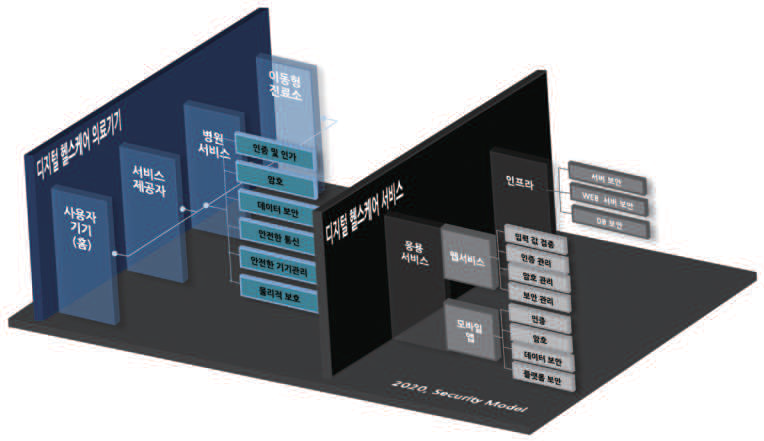

---
<!-- Page 19 -->

## 제2장 디지털헬스케어 구성요소 및 보안 모델 개념 | 19

및
보안
모델
개념
및
보안
대책
개요
디지털헬스케어
구성요소
디지털헬스케어
서비스
유형
디지털헬스케어
서비스
보안
위협
디지털헬스케어
서비스
보안
요구사항
참고문헌
제1장
제2장
제3장
제4장
제5장
부록
최근 코로나 바이러스 확산 등으로 인해 전세계적으로 비대면 의료 서비스 요구가 급증하고 있고, 미국·
중국·일본 등 많은 국가에서 다양한 비대면 의료서비스를 자국민을 대상으로 제공하고 있다. 하지만,
디지털헬스케어 서비스와 같은 비대면 의료서비스는 네트워크를 통해 환자의 정보가 실시간으로 전송되기
때문에, 기존 네트워크 취약점을 기반으로 하는 보안 위협 및 관련 보안사고가 발생하고 있다. 이에 따라,
디지털헬스케어 보안모델도 디지털헬스케어 기기 위주의 보안 요구사항에서 디지털헬스케어 서비스 기반의
보안 요구사항 도출 및 관련 보안 대책 마련이 필요한 실정이다. 본 문서에서는 디지털헬스케어 서비스
분야를 다양한 관점으로 재조명하여 분석하였고, 디지털헬스케어 서비스의 특징인 다양성과 기능 확장성 및
ICT 기술 접목 등을 고려한 디지털헬스케어 서비스 보안 모델을 설명한다.
디지털헬스케어 서비스 맞춤형 보안 요구사항을 제시하기 위해서는 디지털헬스케어 서비스에 대한
명확한 정의가 선행되어야 한다. 그러나, 디지털헬스케어 서비스는 전통적으로 독립 설치형 의료 기기를
활용한 오프라인 서비스에서, 네트워크 연결성이 강화되고 IoT, AI, 빅데이터 등 다양한 ICT 신기술들이
접목되면서, 점차 시공간의 제약을 벗어나 매우 다양한 형태의 서비스로 발전하고 있으므로, 하나의 특정
서비스로 정의하기는 매우 어렵다. 따라서, 디지털헬스케어 서비스를 각 기능적 특성, 적용 기술, 활용 분야
및 의료 정보 보호 및 다양한 보안 관점으로 서비스 유형을 분류하여 각 유형별 보안 대책을 마련하였다.
그림 2-5 디지털헬스케어 서비스 보안 모델 프레임워크

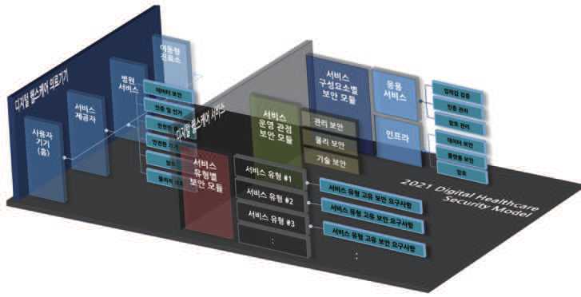

---
<!-- Page 20 -->
[그림 2-5]는 의료 기기 중심의 디지털헬스케어 보안 모델을 서비스 영역으로 확장하기 위해, 서비스
유형별 보안 요구사항과 서비스 운영 시 고려해야 하는 보안 요구사항을 추가한 디지털헬스케어 서비스 보안
모델 프레임워크이다.
본 디지털헬스케어 서비스 보안 모델은 디지털헬스케어 서비스 영역을 중심으로 한 보안 모델로써,
디지털헬스케어 서비스 제공자가 설계 및 개발 단계에서부터 제공하고자 하는 서비스 맞춤형 보안
요구사항과 상세 보안 대책을 참고하여, 안전한 디지털헬스케어 서비스를 제공하는데 도움을 주기 위한
목적으로 개발된다.
디지털헬스케어 서비스의 형태는 디지털헬스케어 의료 기기와 연동하는 서비스, 또는 의료정보시스템이나
플랫폼과 같이 독립적인 서비스로 제공될 수 있으며, 각 서비스들은 네트워크를 통해 유기적으로 연계하여
다양한 디지털헬스케어 서비스를 제공할 수 있다.
현재 다양한 ICT 기술이 빠르게 발전함과 동시에 이들 기술들을 접목한 다양한 디지털헬스케어 서비스가
개발되어 운영되고 있다. 이러한 디지털헬스케어 서비스 발전 방향을 고려했을 때 향후에는 더욱 다양한
형태의 디지털헬스케어 서비스가 개발되어, 의료 영역 전반에서의 활용도 또한 급속하게 증가할 것이다.
따라서, 디지털헬스케어 서비스 보안 모델 수립을 위해서는 서비스의 발전 방향과 기능 및 활용 범위, 그리고
보안 관점에서 유의미한 디지털헬스케어 서비스 유형을 분류하는 것이 매우 중요하다.
디지털헬스케어 서비스 중심의 보안 모델 수립을 위해 다양한 디지털헬스케어 서비스들을 보안 취약점,
의료 정보 중요도, 네트워크 보안 등 다양한 보안 관점으로 서비스의 유형을 분류하였다. 또한, 서비스
제공자가 해당하는 서비스 유형을 판단할 수 있도록 각 유형에 대한 상세 정의와 대표 사례등을 제시하고, 각
유형별 보안 위협과 보안 요구사항 및 보안 대책을 상세히 설명한다.

## 제3장 1절에서는 디지털헬스케어 서비스 유형 분류에 대해 설명하고, 제3장 2절에서는 각 서비스 유형에

관한 사례와 함께 상세한 설명을 한다. 이를 통해 디지털헬스케어 서비스 제공자는 해당하는 서비스 유형을
판단하고, 제4장과 제5장에서 서비스 유형별 보안 위협과 보안 요구사항 및 보안 대책을 참고할 수 있다.

---
<!-- Page 21 -->
디지털헬스케어
보안모델
Ⅱ
PART : 서비스 유형별

---
<!-- Page 22 -->
Ⅱ
PART : 서비스 유형별

|  |
| --- |
|  |

|  |
| --- |
|  |

|  |
| --- |
|  |

---
<!-- Page 23 -->
제3장
디지털헬스케어
서비스 유형

### 1. 디지털헬스케어 서비스 유형 분류

### 2. 디지털헬스케어 서비스 유형

#### 2.1 자가 건강 관리 서비스

#### 2.2 비대면 진료 및 상담 서비스

#### 2.3 비대면 건강 검진 서비스

#### 2.4 질환 예후 관리 서비스

#### 2.5 온라인 약배송 서비스

#### 2.6 비대면 복약 관리 서비스

#### 2.7 온라인 디지털치료 서비스

#### 2.8 환자 이송 및 비대면 응급 진료 서비스

#### 2.9 비대면 시술 및 수술 서비스

#### 2.10 의료 빅데이터 AI 분석 서비스

---
<!-- Page 24 -->

## 제3장 디지털헬스케어

서비스 유형
현재 다양한 ICT 기술이 빠르게 발전함과 동시에 이들 신기술을 접목한 다양한 디지털헬스케어
서비스들이 개발되고 있으며, 향후에는 더욱 다양한 기능의 서비스들이 다양한 형태로 개발되어 제공될
것이다. 따라서, 이러한 디지털헬스케어 서비스 발전 방향과, 서비스의 기능 및 형태 등을 고려하여
디지털헬스케어 서비스 맞춤형 보안 대책 마련을 위해서는, 의료 정보보안 관점으로 디지털헬스케어 서비스
유형을 분류하여 정의하는 것은 매우 중요하다.
디지털헬스케어 서비스들에 대해 다양한 관점으로 서비스 유형을 분류하기 위해 [그림 3-1]과 같이
디지털헬스케어 서비스 유형 분류 프레임워크를 수립하였다.
그림 3-1 디지털헬스케어 서비스 유형 분류 프레임워크

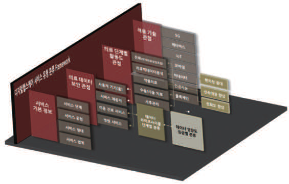

---
<!-- Page 25 -->

## 제3장 디지털헬스케어 서비스 유형 | 25

및
보안
모델
개념
및
보안
대책
개요
디지털헬스케어
구성요소
디지털헬스케어
서비스
유형
디지털헬스케어
서비스
보안
위협
디지털헬스케어
서비스
보안
요구사항
참고문헌
제1장
제2장
제3장
제4장
제5장
부록
디지털헬스케어 서비스 유형 분류를 위해 현재 서비스 중이거나, 기획·개발 단계의 약 1,500여 개의
디지털헬스케어 서비스에 대한 정보를 수집하였고, 앞서 수립한 [그림 3-1] 유형 분류 프레임워크에
적용하여 분석하였다.
디지털헬스케어 서비스 유형 분류를 위해 [그림 3-2]와 같이 전체 의료 단계에서 활용도가 높은 서비스
중에서, 향후에도 ICT 기술이 발전함에 따라 신기술이 접목되면서 더욱 다양한 기능들로 발전 가능성이 높은
서비스들을 선별하였다.
그림 3-2 활용성과 발전 가능성 상위 서비스 선별
서10 ((cid:26)(cid:15)86, 25(cid:15)16)
디지털 헬스케어 서비스 (cid:3357)(cid:2570) 분싁 분(cid:3240)(cid:1576) 비4 진료(cid:62)온라인(cid:2045)(cid:2583)(cid:3282)(cid:1750)(cid:3244)
스
(cid:3357) (3(cid:15)(cid:26)1, (cid:26)(cid:15)43)
(cid:60)치료 (cid:1521)(cid:1157)(cid:62)온라인 (cid:2045)(cid:2583)
(cid:2570)
건강관리](cid:2529)(cid:1732)인 (cid:2045)(cid:2583) (cid:2771)료](cid:2583)(cid:1146) 헬스 케어 (cid:3023)(cid:2975) 성
(cid:3282)(cid:1750)(cid:3244), 2(cid:15)04 서비스, 2(cid:15)04 3
(2(cid:15)88, 4(cid:15)32)
의료 빅데이터 AI 분석 (2(cid:15)(cid:26)(cid:26), 8(cid:15)51)
치료((cid:2465)(cid:1947))](cid:2529)(cid:1732)인 (cid:2045)(cid:2583) (cid:3282)(cid:1750)(cid:3244), 온라인 약(cid:1204)
3(cid:15)(cid:26)1 의료(cid:2107)(cid:1560)(cid:2633)(cid:3104)분(cid:2227)]
(cid:2529)(cid:1732)인 (cid:2045)(cid:2583) (cid:3282)(cid:1750)(cid:3244), (cid:2771)료](cid:2529)(cid:1732)인 (cid:2465)국 (cid:2771)료](cid:2529)(cid:1732)인 치료 (2(cid:15)04, 4(cid:15)76)
1(cid:15)62 (cid:3282)(cid:1750)(cid:3244), 1(cid:15)36 서비스, 1(cid:15)36 2 진료(cid:62)(cid:2583)(cid:1146)헬스케어(cid:3023)(cid:2975) 서비스
(2(cid:15)04, 6(cid:15)12)
치료((cid:2465)(cid:1947))]의료 건강관리] (cid:60)개인건강관리(cid:62)온라인 (cid:2045)(cid:2583) 건강관리] (cid:2107)(cid:1560)(cid:2633)(cid:3104) (cid:2529)(cid:1732)인 (3(cid:15)(cid:26)1, (cid:26)(cid:15)43)
치료((cid:2465)(cid:1947))](cid:2529)(cid:1732)인 (cid:2465)국 (cid:3282)(cid:1750)(cid:3244), (cid:2583)(cid:1146) 헬스 (cid:2771)료](cid:2937)(cid:2193) (cid:3282)(cid:1750)(cid:3244), 0(cid:15)(cid:26)2 치료(cid:15)(cid:15)(cid:15) 치료(cid:14)약(cid:1947)(cid:62)온라인(cid:2045)(cid:2583)(cid:3282)(cid:1750)(cid:3244) (1(cid:15)62, 5(cid:15)22)
2(cid:15)(cid:26)(cid:26) 케어 (cid:3023)(cid:2975) 관리 의료 온라인 (cid:2045)(cid:2583) (cid:1394) 쉍(cid:2965) 분석 (cid:3282)(cid:1750)(cid:3244)
서비스,1(cid:15)02 서비스, 1(cid:15)02건강관리]의료(cid:2107)(cid:1560) 사(cid:3377)관 1 (1(cid:15)36, 4(cid:15)08)
(cid:2937) 관 (cid:2193) 리(cid:15)(cid:15)(cid:15) 치 (cid:2633) 료 (cid:3104)분(cid:15)(cid:15)(cid:15) 의(cid:15)(cid:15) 리 (cid:15) ](cid:2529) 건 (cid:15)(cid:15) (cid:15) (cid:15) (cid:15)(cid:15) ( (cid:2583) 1 (cid:1146) (cid:15)0 2 헬 , 스 2 (cid:15) 케 38 어 ) (cid:3023)(cid:2975) 진료(cid:62)온라인약(cid:1204)(cid:3282)(cid:1750)(cid:3244) ( 온 1 라 (cid:15)0 인 2, 진 1 료 0(cid:15) 2 예 ) 약 (cid:2771)료]의료 (cid:2771)료](cid:2771)료 치료 ((cid:2465)(cid:15)(cid:15)(cid:15) 진(cid:1521) 시 의료 빅데이터 AI 분석
의료(cid:2107)(cid:1560)(cid:2633)(cid:3104)분(cid:2227)]의료 (cid:2107)(cid:1560)(cid:2633)(cid:3104) (cid:2107)(cid:1560)(cid:2633)(cid:3104) 예(cid:2465) 서비스, ((cid:2299)(cid:2303))] 건 사(cid:15)(cid:15)(cid:15) (cid:2583)(cid:1146) (cid:2937)(cid:2193) 관리
(cid:2771)료](cid:2529)(cid:1732)인 (cid:2045)(cid:2583) (cid:3282)(cid:1750)(cid:3244), (cid:26)(cid:15)86 (cid:3282)(cid:1750)(cid:3244), 2(cid:15)88 (cid:3282)(cid:1750)(cid:3244), 1(cid:15)021(cid:15)02 (cid:2529)(cid:1732)인(cid:15)(cid:15)(cid:15) 사(cid:15)(cid:15)(cid:15)강(cid:15)(cid:15)(cid:15) 사(cid:15)(cid:15)(cid:15) 0
0 1 2 3 4 5 6 7 8 (cid:26) 10 25
서비스 (cid:1975)(cid:1744) 지향성

|  |  |  |  |  |  |  |  | ((cid:26)(cid:15) 진료 | 86, 25(cid:15)16) (cid:62)온라인(cid:2045)(cid:2583)(cid:3282)(cid:1750)(cid:3244) |
| --- | --- | --- | --- | --- | --- | --- | --- | --- | --- |
|  |  |  |  |  |  |  |  | (3(cid:15) (cid:60)치 | (cid:26)1, (cid:26)(cid:15)43) 료 (cid:1521)(cid:1157)(cid:62)온라인 (cid:2045)(cid:2583) |
|  |  | (2 의 (2 진 | (cid:15)88, 4(cid:15)32 료 빅데이 (cid:15)04, 4(cid:15)76 료(cid:62)(cid:2583)(cid:1146)헬 | ) 터 AI 분석 ) 스케어(cid:3023)(cid:2975) | 서비스 |  |  | (2(cid:15)(cid:26)(cid:26), 온라인 약 | 8(cid:15)51) (cid:1204) |
|  | (3(cid:15)(cid:26)1, (cid:26) 치료(cid:14)약(cid:1947) | (cid:15)43) (cid:62)온라인(cid:2045) | (cid:2583)(cid:3282)(cid:1750)(cid:3244) (1 | (cid:15)36, 4(cid:15)08) | (2(cid:15) (cid:60)개 (1(cid:15)62, 5 온라인 (cid:2045) | 04, 6(cid:15)12 인건강관리 (cid:15)22) (cid:2583) (cid:1394) 쉍(cid:2965) | ) (cid:62)온라인 (cid:2045) 분석 (cid:3282)(cid:1750) | (cid:2583) (cid:3244) |  |
|  |  | (1(cid:15)02, 2 (cid:2583)(cid:1146) 헬스 진(cid:1521) 시 의 (cid:2583)(cid:1146) (cid:2937)(cid:2193) | 진 (cid:15)38) 케어 (cid:3023)(cid:2975) 료 빅데이 관리 | 료(cid:62)온라인 터 AI 분석 | 약(cid:1204)(cid:3282)(cid:1750)(cid:3244) |  |  |  |  |

| (cid:2771)료](cid:2529)(cid:1732)인 (cid:2045)(cid:2583) (cid:3282)(cid:1750)(cid:3244), (cid:26)(cid:15)86 | 치료((cid:2465)(cid:1947))](cid:2529)(cid:1732)인 (cid:2045)(cid:2583) (cid:3282)(cid:1750)(cid:3244), 3(cid:15)(cid:26)1 | 건강관리](cid:2529)(cid:1732)인 (cid:2045)(cid:2583) (cid:3282)(cid:1750)(cid:3244), 2(cid:15)04 |  |  | (cid:2771)료](cid:2583)(cid:1146) 헬스 케어 (cid:3023)(cid:2975) 서비스, 2(cid:15)04 |  |  |  |
| --- | --- | --- | --- | --- | --- | --- | --- | --- |
|  |  | 의료(cid:2107)(cid:1560)(cid:2633)(cid:3104)분(cid:2227)] (cid:2529)(cid:1732)인 (cid:2045)(cid:2583) (cid:3282)(cid:1750)(cid:3244), 1(cid:15)62 |  | (cid:2771)료](cid:2529)(cid:1732)인 (cid:2465)국 (cid:3282)(cid:1750)(cid:3244), 1(cid:15)36 |  | (cid:2771)료](cid:2529)(cid:1732)인 치료 서비스, 1(cid:15)36 |  |  |
|  | 치료((cid:2465)(cid:1947))](cid:2529)(cid:1732)인 (cid:2465)국 (cid:3282)(cid:1750)(cid:3244), 2(cid:15)(cid:26)(cid:26) |  |  |  |  |  |  |  |
|  |  | 건강관리] (cid:2583)(cid:1146) 헬스 케어 (cid:3023)(cid:2975) 서비스,1(cid:15)02 | (cid:2771)료](cid:2937)(cid:2193) 관리 의료 서비스, 1(cid:15)02 |  | 치료((cid:2465)(cid:1947))]의료 (cid:2107)(cid:1560)(cid:2633)(cid:3104) (cid:3282)(cid:1750)(cid:3244), 0(cid:15)(cid:26)2 |  | 건강관리] (cid:2529)(cid:1732)인 치료(cid:15)(cid:15)(cid:15) |  |
|  |  |  |  |  | 건강관리] (cid:2937)(cid:2193) 관리(cid:15)(cid:15)(cid:15) | 의료(cid:2107)(cid:1560) (cid:2633)(cid:3104)분(cid:15)(cid:15)(cid:15) |  | 사(cid:3377)관 리](cid:2529)(cid:15)(cid:15)(cid:15) |
|  | 의료(cid:2107)(cid:1560)(cid:2633)(cid:3104)분(cid:2227)]의료 (cid:2107)(cid:1560)(cid:2633)(cid:3104) (cid:3282)(cid:1750)(cid:3244), 2(cid:15)88 |  |  |  |  |  |  |  |
|  |  | (cid:2771)료]의료 (cid:2107)(cid:1560)(cid:2633)(cid:3104) (cid:3282)(cid:1750)(cid:3244), 1(cid:15)02 | (cid:2771)료](cid:2771)료 예(cid:2465) 서비스, 1(cid:15)02 |  |  |  |  |  |
|  |  |  |  |  |  | 치료 ((cid:2465)(cid:15)(cid:15)(cid:15) | 의(cid:15)(cid:15) | (cid:15) 건(cid:15)(cid:15)(cid:15) |
|  |  |  |  |  | 치료 ((cid:2299)(cid:2303))] (cid:2529)(cid:1732)인(cid:15)(cid:15)(cid:15) |  |  |  |
|  |  |  |  |  |  | 사(cid:15)(cid:15)(cid:15) | 건 강(cid:15)(cid:15)(cid:15) | 사(cid:15)(cid:15)(cid:15) |
|  |  |  |  |  |  |  |  | 사(cid:15)(cid:15)(cid:15) |

---
<!-- Page 26 -->
선별된 서비스들은 [그림 3-3]과 같이 건강 관리, 건강 검진, 디지털 치료, 의료 빅데이터 AI 분석
그룹으로 분류할 수 있었다.
그림 3-3 디지털헬스케어 서비스 그룹
디지털 치료 건강관리
Digital-(cid:78)e(cid:69)i(cid:68)i(cid:79)e (cid:49)(cid:83)e-(cid:46)e(cid:69)i(cid:68)al
디지털 헬스케어
Digital-Health(cid:68)a(cid:83)e
건강검진
의료 빅데이터 AI 분석
(cid:49)(cid:80)(cid:84)t-(cid:46)e(cid:69)i(cid:68)al
(cid:46)e(cid:69)i(cid:68)al (cid:35)igData (cid:34)(cid:42) (cid:34)(cid:79)al(cid:90)(cid:84)i(cid:84)
건강 관리에 속하는 디지털헬스케어 서비스는 사용자 개인의 건강관리 또는 질병 예방 및 악화 방지 등을
위해 사용하는 서비스들이다. 또한 건강 검진 그룹에 속하는 디지털헬스케어 서비스는 비대면으로 정기·수시
건강 검진을 수행하고, 필요 시 비대면 디지털 치료를 받을 수 있는 서비스이다. 의료 빅데이터 AI 분석
서비스 그룹에 포함되는 디지털헬스케어 서비스들은 건강 관리, 건강 검진, 디지털 치료 등 의료 서비스 전
단계에서 인공지능 분석을 통한 정밀 의료 정보를 제공하여 의료진의 신속·정확한 진단을 지원하며, 개인의
건강 관리를 위한 맞춤형 의료 정보를 제공하는 등 다양한 형태로 활용된다.
디지털헬스케어 서비스 그룹에 대한 정의는 [표 3-1]과 같다.
표 3-1 디지털헬스케어 서비스 그룹 정의
No 서비스 그룹 정 의
건강 유지·증진과 질병 사전 예방·악화 방지를 목적으로, 위해한 생활 습관을 개선하고
1 건강 관리
올바른 건강 관리 유도를 위한 서비스 (출처: 보건복지부)
건강상태 확인과 질병의 예방 및 조기발견을 목적으로 정보통신기술을 활용하여 원격으로
2 건강 검진
검진하는 서비스 (출처: 건강검진기본법)
의료인이 질병이나 의학적 장애를 예방, 관리, 치료하기 위하여 고품질의 소프트웨어를
3 디지털 치료
이용하여 증거 기반으로 치료하는 모든 의학적 서비스 (출처: 디지털치료연합)
의료 빅데이터 의료기관, 개인, 기업 등이 수집하는 의료 데이터를 연계하여 분산된 데이터의 통합적으로
4
AI 분석 분석하는 서비스

| No | 서비스 그룹 | 정 의 |
| --- | --- | --- |
|  | 건강 관리 |  |
|  | 건강 검진 |  |
|  | 디지털 치료 |  |
|  | 의료 빅데이터 AI 분석 |  |

---
<!-- Page 27 -->

## 제3장 디지털헬스케어 서비스 유형 | 27

및
보안
모델
개념
및
보안
대책
개요
디지털헬스케어
구성요소
디지털헬스케어
서비스
유형
디지털헬스케어
서비스
보안
위협
디지털헬스케어
서비스
보안
요구사항
참고문헌
제1장
제2장
제3장
제4장
제5장
부록
디지털헬스케어 서비스 그룹은 병원, 이동형 응급 진료소, 그리고 약국으로 대표되는 전문 의료 기관과,
홈으로 대표되는 개인 건강 관리 영역에 대하여 [그림 3-4]와 같이 구성된다.
그림 3-4 디지털헬스케어 서비스 그룹 구성도
2 디지털 치료
의료(cid:2771) (cid:2771)료 (cid:15) 상(cid:1528) (cid:2465)(cid:1947) (cid:15) 주사 치료
(cid:2771)단 (cid:1128)사 (cid:2299)(cid:2303) (cid:15) (cid:2342)(cid:2303) 치료
치료 (cid:3377) 예(cid:3377) 관리 재활 (cid:15) (cid:1947)리 치료 (cid:2621)(cid:1241) 환자 (cid:2890)치
(cid:2621)(cid:1241) 상(cid:3359) 대(cid:2621) 3
(cid:2045)(cid:2583)
(cid:2621)(cid:1241) 환자 (cid:2633)(cid:1586) 건
강
1 이동형 응급 진료소
검
건 4 의료 빅데이터 분석
개인 건강 관리 진
강
활(cid:1586) (cid:1789)그 모(cid:1508)(cid:3104)(cid:1858) 질(cid:2045) 예(cid:2959) 관
리 자가 질환 예(cid:2959) 인공지능 (cid:1519)(cid:3104)
(cid:1871)(cid:2938)형 의료정보
(cid:3349) (cid:9)(cid:2190)(cid:2570)자(cid:10)
1 건강 관리
(cid:2045)(cid:2583) (cid:2890)방전 (cid:1633)(cid:1790) 2 디지털 치료
(cid:2890)방(cid:2465) (cid:2705)제 3 건강 (cid:1128)(cid:2771)
(cid:2050)(cid:2465) 지도 4 의료 (cid:2107)(cid:1560)(cid:2633)(cid:3104) 분(cid:2227)
디지털헬스케어
약(cid:1204) 구성 (cid:1576)(cid:1899)인
건강 관리 그룹에 속하는 디지털헬스케어 서비스들의 주요 기능은 개인 건강 관리, 활동 로그 모니터링,
자가 질환 예측 등으로 댁내에서 건강 및 질환 예방을 지원하는 서비스들이다. 진료, 진단, 처방, 수술·약물
치료 등 전문 의료 기관과 의료진의 치료에 활용되는 디지털헬스케어 서비스는 디지털 치료 그룹에 속한다.
댁내 자가 건강 검진, 비대면 건강 검진, 응급 의료 환자 검진 등 비대면 디지털 건강 검진 서비스는 건강 검진
그룹에 속하는 서비스이다. 건강 관리, 건강 검진, 디지털 치료 그룹에 속하는 모든 디지털헬스케어
서비스들은 오프라인에서만 가능한 임상 검사, 수술, 물리 치료, 약물 주입 등 일부 의료 서비스를 제외한
모든 의료 서비스를 포함할 수 있으며, 향후 발전된 IT 기술을 접목한 다양하고 확장된 기능의
디지털헬스케어 서비스가 개발되어도, [그림 3-4]의 네 개 디지털헬스케어 서비스 그룹 안에 포함될 것이다.
현재 서비스 중이거나 설계 및 개발 단계의 디지털헬스케어 서비스들에 대하여 앞서 수립한 [그림 3-1]의
서비스 유형 분류 프레임워크에 적용하여 총 10개 서비스 유형으로 분류하였다. 총 10개의 디지털헬스케어
서비스 유형은, [그림 3-5]와 같이 개인의 건강 관리와 질환 예방 및 치료 단계별로 활용되며, 각 서비스의
대분류라고 할 수 있는 디지털헬스케어 서비스 그룹은 서로 유기적으로 연계한다.

|  |  | 치료 (cid:3377) 예(cid:3377) 관리 재활 (cid:15) (cid:1947)리 치료 (cid:2621) (cid:2621) (cid:2045)(cid:2583) (cid:2621) 이동 4 의료 빅데이터 분석 질(cid:2045) 예(cid:2959) |
| --- | --- | --- |
|  | 자가 질환 예(cid:2959) |  |
| (cid:3349) (cid:9)(cid:2190)(cid:2570)자(cid:10) |  |  |

| 치료 (cid:3377) 예(cid:3377) 관리 재활 (cid:15) (cid:1947)리 치료 |
| --- |
| (cid:2045)(cid:2583) |

|  |  |
| --- | --- |
| 개 | 인 건강 관리 |

| 이동 | 형 응급 진료소 |

| 인공지능 (cid:1519)(cid:3104) |
| --- |
| (cid:1871)(cid:2938)형 의료정보 |

| (cid:2045)(cid:2583) (cid:2890)방전 (cid:1633)(cid:1790) |
| --- |
| (cid:2890)방(cid:2465) (cid:2705)제 (cid:2050)(cid:2465) 지도 |

| 1 | 건강 관리 |
| --- | --- |
| 2 디지털 치료 |  |

---
<!-- Page 28 -->
그림 3-5 개인 건강 관리와 질환 예방 및 치료 단계별 연계
1 자가 건강 관리
건강 관리
(cid:30052) 자가 건강 관리 서비스 유형
3 전(cid:1945) 의료 서비스 의료 AI 빅데이터 분석 2 (cid:9)(cid:2687)(cid:1245).수시(cid:10)건강 검진
(cid:30061) 의료 (cid:2107)(cid:1560)(cid:2633)(cid:3104) (cid:34)(cid:42) 분(cid:2227) 서비스 유형
디지털 치료 건강 검진
(cid:30055) (cid:2529)(cid:1732)인 디지털 치료 서비스 유형 (cid:30053) 비대(cid:1910) (cid:2771)료 및 상(cid:1528) 서비스 유형
(cid:30056) 비대(cid:1910) (cid:2342)(cid:2303) 및 (cid:2299)(cid:2303) 서비스 유형 (cid:30054) 비대(cid:1910) (cid:1128)(cid:2771) 서비스 유형
(cid:30057) 질환 예(cid:3377) 관리 서비스 유형
(cid:30058) (cid:2529)(cid:1732)인 (cid:2465)(cid:2003)(cid:2272) 서비스 유형
3 전(cid:1945) 의료 서비스
(cid:30059) 비대(cid:1910) (cid:2050)(cid:2465) 관리 서비스 유형
(cid:30060) 비대(cid:1910) (cid:2633)(cid:1586) 및 (cid:2621)(cid:1241) (cid:2771)료 서비스 유형
디지털헬스케어 서비스 그룹 (cid:1088) 연계
(cid:2107)(cid:1560)(cid:2633)(cid:3104) (cid:34)(cid:42) 분(cid:2227) 서비스 활용 연계
개인의 건강 관리와 질환 예방 및 치료는 자가 건강 관리, 정기·수시 건강 검진, 전문 의료 서비스인 약물·
수술 치료 단계 순으로 순환하며 이루어진다. 개인은 디지털헬스케어 기기와 서비스를 활용하여 자가 건강
관리 및 질환 예방을 수행하고, 정기〮 수시로 비대면 디지털 건강 검사 기기를 활용하여 건강 검진을 받는다.
자가 건강 관리 수행 중 치료가 필요한 경우, 또는 건강 검진 및 검사 결과 이상 증상이 발견되면 전문 치료
서비스 단계로 넘어간다. 기존에는 병원 등 의료 기관을 내원하여 받았던 전문 치료 서비스를 다양한
디지털헬스케어 치료 서비스를 통해, 실시간으로 전문 의료진과 연결하여 비대면 의료 서비스를 받을 수
있으며, 처방 약을 비대면으로 신속하게 배송받게 된다. 수술 및 시술 치료의 경우에도 기존의 한정된
공간에서만 수술이 이루어진 것에서 발전하여 수술 로봇, 나노 로봇 등을 활용한 비대면 수술 및 시술이
이루어지고 있으며, 화학적 물리적 처방에 국한되었던 의료진의 처방에서 디지털 미디어 콘텐츠를 통한
새로운 작용으로 치료를 가능하게 하는 디지털 치료제의 개발도 증가하고 있다.
개인의 건강 관리와 질환 예방 및 치료 단계별로 활용되는 10개의 디지털헬스케어 서비스 유형에 대한
정의는, 향후 발전된 ICT 기술을 적용하여 다양한 기능의 디지털헬스케어 서비스가 개발될 것을 고려하여,
가능한 모든 디지털헬스케어 서비스를 포괄할 수 있도록 [그림 3-6]과 같이 정의하였다.

---
<!-- Page 29 -->

## 제3장 디지털헬스케어 서비스 유형 | 29

및
보안
모델
개념
및
보안
대책
개요
디지털헬스케어
구성요소
디지털헬스케어
서비스
유형
디지털헬스케어
서비스
보안
위협
디지털헬스케어
서비스
보안
요구사항
참고문헌
제1장
제2장
제3장
제4장
제5장
부록
그림 3-6 디지털헬스케어 서비스 유형 정의
개인 건강관리
(cid:30052) 자가 건강 관리 (cid:2573)(cid:1586), 식(cid:2633), (cid:2299)(cid:1910), 스(cid:3167)레스, 비(cid:1861), 체(cid:1777), 체(cid:3319) (cid:1633) 개인의 건강 관리를 (cid:2583)(cid:1146)(cid:2613)(cid:1789) (cid:2959)정한
서비스 개인의 신체 신(cid:3344) (cid:1560)(cid:2633)(cid:3104) 및 사용자가 (cid:2641)(cid:1777)한 (cid:1560)(cid:2633)(cid:3104)를 기(cid:1992)(cid:2613)(cid:1789) 한 개인 (cid:1871)(cid:2938)형 건강 관리 서비스
건강 검진
(cid:30053) 비대면 검진 환자가 (cid:2770)(cid:2685) (cid:2045)(cid:2583)(cid:2616) 방문(cid:3294)지 (cid:2443)고 비대(cid:1910) (cid:1128)사 기기를 사용(cid:3294)(cid:2504) 자가 (cid:1128)사를 (cid:2346)(cid:2342)(cid:3294)고,
서비스 비대(cid:1910)(cid:2613)(cid:1789) 의사의 (cid:2771)료를 (cid:1993)도(cid:1790) 지(cid:2583)(cid:3294)(cid:1495) 서비스
디지털 치료
(cid:30054) 비대면 진료 및 (cid:1537)내에 (cid:2232)치(cid:1595) 다기능 건강 (cid:1128)사기(cid:1789) (cid:3334)(cid:2449), (cid:1875)(cid:1989) (cid:1633) 질(cid:2045) (cid:1128)(cid:2771)에 (cid:3289)요한 건강 상(cid:3093) 항(cid:1918)(cid:1628)(cid:2616) (cid:2959)정(cid:3294)(cid:2504) (cid:2045)(cid:2583)(cid:2613)(cid:1789)
상담 서비스 (cid:1422)(cid:3167)워크(cid:1870)(cid:2616) (cid:3134)(cid:3303) 전(cid:2272)(cid:3294)고, 비대(cid:1910) 서비스를 (cid:3134)(cid:3303) 의사와 건강 (cid:1128)(cid:2771) (cid:1150)과 상(cid:1528) 및 (cid:2890)방(cid:2616) (cid:1993)(cid:2616) (cid:2299) (cid:2643)(cid:1495) 서비스
의(cid:2465)(cid:3263)(cid:2890)(cid:1762) 임상(cid:2342)(cid:3319)(cid:2616) (cid:3134)한 치료 (cid:3372)과 (cid:1128)(cid:2768), (cid:1231)제 당국의 (cid:2348)사, 의사의 (cid:2890)방, 보(cid:3319) 적용(cid:2616) (cid:1122)치지(cid:1861), (cid:34)(cid:51)(cid:16)(cid:55)(cid:51),
(cid:30055) 온라인 디지털
(cid:1137)임, (cid:2881)(cid:2056), (cid:2455)(cid:3282)리케(cid:2633)(cid:2252) (cid:1633)(cid:2613)(cid:1789) 환자의 (cid:2768)상(cid:2616) (cid:2771)단, 치료, 예방, (cid:2542)(cid:3354) (cid:1633)(cid:2616) (cid:1918)적(cid:2613)(cid:1789) 한 디지털 치료 서비스
치료 서비스
(cid:3354)(cid:3295)적, (cid:1947)리적 (cid:2648)용(cid:1861)(cid:2613)(cid:1789)(cid:1495) (cid:2346)(cid:3333) (cid:2075)가능한 의료 분(cid:2464)에 디지털 (cid:3025)(cid:3116)(cid:2958)와 기기(cid:1789) (cid:2204)(cid:1789)(cid:2573) (cid:2648)용(cid:2616) (cid:3134)한 치료 서비스
(cid:30056) 비대면 시술 및 (cid:2555)과의가 (cid:2583)(cid:1146)지의 환자 주위에 (cid:2232)치 되어 (cid:2643)(cid:1495) (cid:1789)(cid:2056)(cid:2616) (cid:2052)인의 사(cid:1942)(cid:2346)에 (cid:2232)치(cid:1595) 제어기 안에서 (cid:2705)정(cid:3294)(cid:2504)
수술 서비스 (cid:2583)(cid:1122)리에서 (cid:2342)(cid:2303)(cid:2616) (cid:3294)(cid:1495) (cid:2299)(cid:2303) 방(cid:2024)
(cid:30057) 질환 예후 고(cid:3334)(cid:2449), 당(cid:1463)(cid:2045) (cid:1633) (cid:1861)성질환(cid:2616) 개인의 (cid:2771)료기(cid:1790), (cid:1128)(cid:2771)기(cid:1790), (cid:2050)(cid:2465)정보, (cid:1732)(cid:2633)프(cid:1789)그 (cid:1633) 건강 정보 분(cid:2227)(cid:3294)(cid:2504)
관리 서비스 제공(cid:3294)(cid:1495) (cid:1871)(cid:2938)형 질환 관리 서비스
(cid:30058) 온라인 약배송 환자 (cid:1688)(cid:1495) (cid:2045)(cid:2583)에서 (cid:2890)방전(cid:2616) (cid:2465)국에 전(cid:1523)(cid:3294)(cid:1910), (cid:2465)국에서 전(cid:2272) (cid:1993)(cid:2615) (cid:2890)방전에 (cid:1646)(cid:1732) (cid:2465)(cid:2616) (cid:2705)제(cid:3294)(cid:2504) 환자 (cid:1537)내에
서비스 신(cid:2264)(cid:3428) (cid:2003)(cid:2272)(cid:3294)(cid:1495) 서비스
(cid:1122)(cid:1586)(cid:2633) (cid:2075)(cid:3230)한 환자, 의(cid:2465)(cid:3263) 구(cid:1874)가 용(cid:2633)(cid:3294)지 (cid:2443)(cid:1495) 환(cid:1155)의 소비자 및 대국(cid:1977)(cid:2616) 대상(cid:2613)(cid:1789) 서비스(cid:1789) 제공
(cid:30059) 비대면 복약 적(cid:2682)(cid:3294)고 정(cid:3355)한 (cid:2050)(cid:2465)(cid:2616) (cid:3297) (cid:2299) (cid:2643)도(cid:1790) 도(cid:2577)(cid:2616) 주(cid:1495) (cid:2050)(cid:2465) 스케(cid:2740) 기(cid:1992) 스(cid:1859)(cid:3167) (cid:2050)(cid:2465) 관리 서비스(cid:1789) (cid:2658)기(cid:1088) (cid:2465)(cid:2050)용(cid:2633)
관리 서비스 (cid:3289)요한 (cid:3139)(cid:2583) 환자 (cid:1688)(cid:1495) (cid:1861)성질환자, 고(cid:1784)자를 위(cid:3294)(cid:2504) 인(cid:3104)(cid:1428)(cid:2616) (cid:3134)한 (cid:2045)(cid:2583), (cid:2465)국, 환자 사(cid:2633)의 (cid:2890)방전 관리,
(cid:2583)(cid:1146)지의 환자 (cid:2465) (cid:2050)용 (cid:2959)정 (cid:1633) (cid:2583)(cid:1146) (cid:2465) (cid:2050)용 관리 서비스가 제공
(cid:30060) 비대면 이동 및 구(cid:1241)(cid:2864), 헬기, 함정 (cid:1633) (cid:2633)(cid:1586) (cid:2746)인 (cid:2621)(cid:1241) 환자에 대(cid:3303) (cid:3354)상 (cid:3134)신, (cid:2516)상 전(cid:2272) (cid:1633) (cid:42)(cid:36)(cid:53) 기(cid:2303)(cid:2616) 활용(cid:3294)(cid:2504)
응급 진료 서비스 의사가 환자의 상(cid:3093)를 (cid:2346)(cid:2342)(cid:1088)(cid:2613)(cid:1789) (cid:2771)단(cid:3294)고, 적(cid:2682)한 (cid:2621)(cid:1241) (cid:2890)치를 (cid:3294)(cid:1495) 서비스
빅데이터 분석
의료기관, 개인, 기(cid:2488) (cid:1633)(cid:2633) (cid:2299)(cid:2776)(cid:3294)(cid:1495) (cid:1977)(cid:1088) 의료 (cid:1560)(cid:2633)(cid:3104), 공공(cid:2516)역에서 (cid:2299)(cid:2776)(cid:3294)(cid:1495) 의료 (cid:1560)(cid:2633)(cid:3104) (cid:1633) 분(cid:2193)(cid:1595) (cid:1560)(cid:2633)(cid:3104)를
(cid:30061) 의료 빅데이터
(cid:2299)(cid:2776)(cid:3294)(cid:2504) (cid:1888)신(cid:1758)(cid:1516)((cid:46)(cid:45), (cid:46)a(cid:68)hi(cid:79)e (cid:45)ea(cid:83)(cid:79)i(cid:79)g)과 (cid:1641)(cid:1758)(cid:1516)(D(cid:45), Dee(cid:81) (cid:45)(cid:83)a(cid:83)(cid:79)i(cid:79)g) (cid:1633) 인공지능 분(cid:2227)(cid:2616) (cid:3134)(cid:3303) 사용자
분석 서비스
(cid:1871)(cid:2938)형 정보를 제공(cid:3294)(cid:1495) 서비스
건강 관리 그룹을 대표하는 서비스 유형은 자가 건강 관리 서비스 유형이다. 최근 워치, 헬스 키트 등
스마트폰 앱과 연계하는 웨어러블 디지털헬스케어 기기의 보급이 확대되면서, 개인이 일상에서 자가 건강
관리를 위한 서비스들이 다양하게 제공되고 있다. 이들 서비스는 디지털헬스케어 기기를 통해 수집된 개인
건강 신호를 분석하여 개인 맞춤형 건강 관리를 위한 정보를 제공한다.

| 제3장 |  |

---
<!-- Page 30 -->
건강 검진 그룹에는 대표적으로 비대면 디지털 건강 검진 서비스 유형이 있다. 전통적인 건강 검진
서비스는 의료진과 의료 지원 인력이 병원 내 설치형 건강 검진 기기를 사용하여 내원한 환자에 대해 직접
검진을 실시하였다. 그러나 디지털헬스케어 건강 검진 서비스는 원격지의 환자에게 비대면 건강 검진 키트를
제공하거나, 건강 검진 키오스크 등의 위치와 함께 검진 시기, 방법 등을 알려주어 환자가 자가 건강 검진을
실시하도록 지원한다. 각 건강 검사 기기는 환자의 검사 결과를 주치의에게 자동으로 전송하여, 주치의가
비대면으로 환자에게 건강 검진 결과와 함께 사후 처치를 처방을 할 수 있다.
디지털 치료 그룹에 포함되는 디지털헬스케어 서비스 유형은 매우 다양하다. 비대면 치료, 비대면 수술,
질환 예후 관리 서비스와 같이 의료진의 진료, 처방을 지원하는 비대면 진료, 디지털 치료제, 그리고 로봇
기술을 활용한 비대면 수술 치료 및 치료 사후 관리 서비스가 포함된다. 또한 직접 처방약을 수령하기 힘든
환자들을 위한 온라인 약배송 서비스와 지속적인 복약 관리가 필요한 환자를 위한 비대면 복약 관리 서비스
유형이 포함된다. 수요 병원과 수요 약국을 연계하는 온라인 병원, 온라인 약국 서비스는 이미 의료 분야의
법적 규제가 완화된 여러 국가에서 서비스 중이다. 응급 환자 이동 진료 서비스 유형은 5G 네트워킹을
기반으로, 구급차, 구급 헬기, 구급 함정 등으로 이송 중인 응급 환자 상태 정보를 AI 분석 등을 통해 적절한
현장 대응 매뉴얼을 제공하고, 최적 이송 병원 및 최단 이송 병원 경로 정보 등을 제공한다. 또한 환자의 상태
정보를 영상 등으로 의료진에게 실시간 전송하여 적시에 적절한 대응을 할 수 있도록 지원하여 응급 환자의
골든타임 확보에 기여한다. 사실상 디지털헬스케어 산업은 다른 산업에 비해 이해관계가 민감하게 얽혀있고,
개인 의료 정보 보호와 관련한 규제로 인해 그 변화 속도가 느린 편이었으나, 최근 5G 기술 및 데이터 경제
3법(개인정보보호법, 정보통신망법, 신용정보보호법)이 개정되고, 최근 코로나19 팬데믹으로 인해 원격
(비대면) 진료를 포함한 디지털헬스케어 산업 규제가 한시적으로 허용되는 등 디지털헬스케어 산업의 발전
가능성은 매우 크다.
의료 빅데이터 AI 분석 서비스는 개인의 건강 생체 정보, 개인 의료 정보, 전문 의료 정보 등 여러 기관에서
수집된 빅데이터를 머신러닝(ML, Machine Learning), 딥러닝(DL, Deep Learning)을 통해 심층 분석하여
맞춤형 의료 정보를 제공하는 서비스 유형이다. 의료 빅데이터 AI 분석을 통해 건강 관리, 건강 검진, 치료의
각 의료 단계에서 정확도와 정밀도를 높여줄 뿐 아니라, 응급 의료 상황에서도 신속하고 정확한 대응이
가능하도록 지원한다. 또한 독립적인 디지털헬스케어 서비스로 정밀 의료 분석 서비스, 의료 빅데이터 AI
분석 플랫폼 등과 같은 형태로 서비스되고 있다.
10개 유형의 디지털헬스케어 서비스 유형은 [그림 3-7]과 같이 의료 서비스의 주요 영역에 대하여 디지털
헬스케어로 활용된다.

---
<!-- Page 31 -->

## 제3장 디지털헬스케어 서비스 유형 | 31

및
보안
모델
개념
및
보안
대책
개요
디지털헬스케어
구성요소
디지털헬스케어
서비스
유형
디지털헬스케어
서비스
보안
위협
디지털헬스케어
서비스
보안
요구사항
참고문헌
제1장
제2장
제3장
제4장
제5장
부록
그림 3-7 디지털헬스케어 서비스 유형 활용 범위
건강 관리(cid:2190) 심(cid:1157) 의료 (cid:1245)관
1 자가 건강 관리 서비스 2 비대면 진료 및 상담 서비스
건강 관리사 (cid:2299)요 (cid:2045)(cid:2583)
식단 관리사 3 비대면 건강 검진 서비스 7 온라인 디지털 치료 서비스 (cid:2299)요 (cid:2465)국
(cid:2516)(cid:2472)사 4 질환 예후 관리 서비스 9 비대면 시술.수술 치료 서비스 의료인
전문 의료인
빅데이터 심(cid:1157) 전문 의료 연구가
개인 의료진
(cid:1947)리치료사
빅데이터 (cid:2689)(cid:1173) (cid:1245)관 건강 관리 진료.치료
공공(cid:15)(cid:1977)(cid:1088) 의료 기관 의료보(cid:2705)사
공공 (cid:1560)(cid:2633)(cid:3104) 포(cid:3086) 전문(cid:1088)(cid:2045)인
임상 연구 기관 건강 관리 전문가
(cid:47)(cid:80)(cid:79)-(cid:53)(cid:83)a(cid:69)iti(cid:80)(cid:79)al (cid:1560)(cid:2633)(cid:3104)
(cid:3303)(cid:2555) (cid:45)(cid:48)D (cid:1560)(cid:2633)(cid:3104) 10의료 빅데이터 의료 기기 전문 (cid:2488)체
인(cid:1173)지(cid:1502)(cid:9)AI(cid:10) 분석 서비스
제(cid:2465) (cid:3365)사
빅데이터 쉉(cid:2898) (cid:1245)관
헬스케어 전문 (cid:2003)(cid:2272) (cid:2488)체
공공(cid:15)(cid:1977)(cid:1088) 의료기관 활용
의(cid:3295) 연구 기관 활용 응급 및 구급
복약 관리
(cid:3083) 헬스케어 (cid:3282)(cid:1750)(cid:3244) 이동 진료 심(cid:1157) 약(cid:1204) 및 싙(cid:2899)
(cid:2465)국
응급 의료 (cid:1245)관 8 비대면 이동 응급 진료 서비스 5 온라인 약배송 서비스 제(cid:2465) (cid:3365)사
(cid:2621)(cid:1241) (cid:2633)(cid:1586) (cid:2771)료소 헬스케어 전문 (cid:2003)(cid:2272) (cid:2488)체
6 비대면 복약 관리 서비스
(cid:2621)(cid:1241) 의료 (cid:2243)(cid:3104)
보건 (cid:2621)(cid:1241) 의료과
※ Non-Tracitional 데이터 : 헬스케어 기기, BIO 데이터, SNS 등에서 수집된 데이터
※ LOD 데이터 : 개방형 웹 데이터 (LOD, Linked Open Data)
임상 검사, 수술 치료, 물리 치료, 약물 주입 등 일부 오프라인 의료 서비스를 제외하면 기존 의료 서비스
대부분은 디지털헬스케어 기기를 활용한 디지털헬스케어 서비스로 전환되고 있다. 디지털헬스케어 서비스는
환자의 의료 정보 제공 동의를 통하여 수요 병원의 EMR, EHR 또는 PHR 등과 연계하고, 수요 약국을 통해
환자의 처방 약 배송 등의 서비스를 제공한다.
의료 빅데이터 AI 분석 서비스는 공공의 의료 관련 기관, 의료기관, 해외 LOD(Linked Open Data)
데이터 등 다양한 기관 및 연구 센터 등으로부터 비식별화된 진료 정보, 임상 정보, Bio 정보 등 의료정보를
수집하여 빅데이터를 구축한다. 수집된 정보를 AI 분석을 하여 데이터 기반 질병 진단 및 예측, 인공지능
의사, 맞춤형 의료 정보 제공 서비스 등 다양한 의료 정보를 제공한다.

| 전문(cid:1088)(cid:2045)인 |
| --- |
| 건강 관리 전문가 |

|  |  |
| --- | --- |
| 빅데이터 쉉(cid:2898) (cid:1245)관 공공(cid:15)(cid:1977)(cid:1088) 의료기관 활용 의(cid:3295) 연구 기관 활용 (cid:3083) 헬스케어 (cid:3282)(cid:1750)(cid:3244) |  |

---
<!-- Page 32 -->
제2장에서 수립한 [그림 2-5]의 디지털헬스케어 서비스 보안모델 프레임워크에 본 연구에서 도출한 총
10개의 디지털헬스케어 서비스 유형을 반영한 디지털헬스케어 서비스 보안 모델은 [그림 3-8]과 같다.
그림 3-8 디지털헬스케어 서비스 보안 모델 프레임워크
서비스 영역을 확장한 디지털헬스케어 보안 모델은 전체적으로 기기 보안 영역과 서비스 보안 영역으로
구성된다. 서비스 보안 영역은 다시 서비스 유형별 보안, 서비스 운영 보안, 서비스 구성 요소별 보안으로
세분화하였다. 서비스제공자는 디지털헬스케어 서비스 유형별 보안 요구사항을 참고하여, 신규 서비스를
개발하는 단계에서부터 제공하고자 하는 서비스가 어느 유형인지 파악하여 서비스 설계·개발 단계에서부터
운영 단계에 이르는 전 단계에서 고려해야 하는 보안 요구사항을 손쉽게 확인하고 보안 대책을 마련할 수
있다.
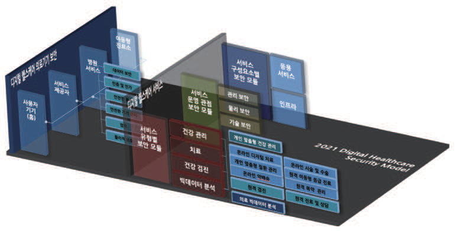

---
<!-- Page 33 -->

## 제3장 디지털헬스케어 서비스 유형 | 33

및
보안
모델
개념
및
보안
대책
개요
디지털헬스케어
구성요소
디지털헬스케어
서비스
유형
디지털헬스케어
서비스
보안
위협
디지털헬스케어
서비스
보안
요구사항
참고문헌
제1장
제2장
제3장
제4장
제5장
부록
[참고 3-1] 디지털헬스케어 서비스 용어 정의
용어 용어 정의
환자의 용태를 관찰하여 병상 및 병명을 규명하고 판단하는 것.
진찰 현대 의학 측면에서 보아 신뢰할 만한 환자의 상태를 토대로 특정 진단이나 처방 등을
내릴 수 있을 정도의 행위 (출처: 의료법 제17조)
의사가 환자가 지니고 있는 이상상태를 정확하게 파악하고 이에 따라서 적절한 처치를
진단
내리기 위한 근거를 얻는 것
진료 검진과 요양을 의미
건강 상태 확인과 질병의 예방 및 조기발견을 목적으로 진찰 및 상담, 진단검사 등
건강 검진
의학적 검진을 시행하는 것 (출처: 건강검진기본법)
검사 상병에 관한 자료를 모으는 활동
치료 질병의 완화, 치료를 목적으로 이루어지는 모든 의학적 수법
의약품의 명칭, 용법ㆍ용량, 효능ㆍ효과, 저장 방법, 부작용, 상호 작용이나 성상(性
복약 지도
狀) 등의 정보를 제공하는 것 (출처: 약사법)
의료인이 컴퓨터·화상통신 등 정보통신기술을 활용하여 원격지의 의료인에 대하여
원격 의료
의료지식 또는 기술을 지원하는 의료 행위 (출처: 의료법)
치료 작용기전에 대한 과학적·임상적 근거를 바탕으로 질병의 예방·관리·치료를
디지털 치료제
목적으로 사용하는 소프트웨어 의료기기 (출처: 식품의약품안전처)
의료 로봇 로봇 기술을 사용하는 의료용 기기 또는 시스템 (출처: 식품의약품안전처)
외과의가 원격지의 환자 주위에 설치되어 있는 로봇을 본인의 사무실에 설치된 제어기
원격 로봇 수술
안에서 조정하여 원거리에서 시술을 하는 수술 방법

| 용어 | 용어 정의 |

---
<!-- Page 34 -->
본 절에서는 서비스 제공자가 해당 서비스를 판단할 수 있도록, 10개의 디지털헬스케어 서비스 유형별
상세 정보를 제공하고자 한다. 디지털헬스케어 서비스에서 사용되는 기기는 헬스케어 기기와 스마트
기기이며 각 정의는 [참고 3-2]와 같다.
[참고 3-2] 디지털헬스케어 서비스 기기 정의
용어 용어 정의
신체와 접촉하여 건강 상태 정보를 센싱하고, 스마트 기기와 연동을 통해 다양한
헬스케어 기기
형태의 헬스케어를 지원하는 기기
Bluetooth와 같은 다른 무선 프로토콜을 통해 다른 장치 또는 네트워크에 연결되어
스마트 기기
자율적 또는 상호의존적으로 작동하는 전자 장치

#### 2.1 자가 건강 관리 서비스

자가 건강 관리 서비스 유형은 운동, 식이, 수면, 스트레스, 비만, 체력, 체형 등 개인의 건강 관리를 위한
서비스이다. 디지털헬스케어 기기가 측정한 신체 신호 정보와 사용자가 입력한 건강 관리 정보를 기반으로 한
개인 맞춤형 건강 관리를 위한 정보를 제공한다.
자가 건강 관리 서비스 유형은 다양한 디지털헬스케어 기기들로부터 수집된 개인 건강 정보를 분석하여
개인 건강을 효율적으로 관리할 수 있도록 하는 디지털헬스케어 서비스를 중심으로 이루어진다. 서비스는
사용자 건강 관리를 위한 디지털헬스케어 기기와 모바일 앱이 같이 제공되거나, 모바일 앱 서비스로 사용자가
운동량, 식단 등 건강 관리 정보를 입력하여 관리하는 서비스로 제공된다. 운영 절차는 아래 [그림 3-9]와
같이 사용자가 디지털헬스케어 기기와 사용자 인증 후 서비스에 접속하는 것으로 시작한다.

| 용어 | 용어 정의 |

---
<!-- Page 35 -->

## 제3장 디지털헬스케어 서비스 유형 | 35

및
보안
모델
개념
및
보안
대책
개요
디지털헬스케어
구성요소
디지털헬스케어
서비스
유형
디지털헬스케어
서비스
보안
위협
디지털헬스케어
서비스
보안
요구사항
참고문헌
제1장
제2장
제3장
제4장
제5장
부록
그림 3-9 자가 건강 관리 서비스 절차
➀-➁ 사용자는 디지털헬스케어 기기 인증 및 사용자 인증을 통해 서비스에 접속 (사용자별 권한 계정으로 접속)
➂-➃ 사용자에 연결된 디지털헬스케어 기기는 기능에 따라 사용자의 건강 생체 신호를 센싱하여 서비스에 전송 (
수신받은 건강 생체 신호는 서비스 DB에 저장)
➄-➅ 사용자는 디지털헬스케어 기기로 식단, 운동시간 등 건강 관리 목표 등 건강 관리 계획 입력하여 서비스에 전송
(수신받은 건강 계획 정보는 서비스 DB에 저장)
➆ 자가 건강 관리 서비스의 패턴 분석 시스템은 수신 받은 의료 생체 정보를 기반으로 사용자에게 맞춤형 건강 코칭
가이드 제공
(cid:3349)
(cid:3326)스(cid:3006)(cid:2479) (cid:1245)(cid:1245) (cid:19) (cid:2190)(cid:2570)(cid:2647) (cid:2635)(cid:2768) (cid:3377) (cid:2685)(cid:2264) (cid:2647)(cid:1086) (cid:1124)(cid:1098) (cid:1177)(cid:1851) (cid:2243)(cid:3104)
(cid:18) (cid:1245)(cid:1245) (cid:2635)(cid:2768) (cid:3377) (cid:22)(cid:40) (cid:22) (cid:1124)(cid:1098) (cid:1177)(cid:1851) (cid:1157)(cid:3366) (cid:2232)(cid:2687)
(cid:1245)(cid:1245) (cid:1633)(cid:1790) (cid:21) (cid:1104)(cid:2635) (cid:2212)(cid:2899) (cid:2687)(cid:2049) (cid:2679)(cid:2658)
사(cid:2570)자
(cid:23) (cid:1124)(cid:1098) (cid:1157)(cid:3366) (cid:2679)(cid:2658) (cid:24) (cid:3201)(cid:3106) (cid:2073)(cid:2227) (cid:1150)(cid:1175) 및
(cid:3357)(cid:1586)(cid:1757) (cid:2959)(cid:2687) (cid:1245)(cid:1245) (cid:3334)(cid:2449)(cid:1157) (cid:2348)(cid:1989)(cid:2299) (cid:2959)(cid:2687) (cid:1124)(cid:1098) (cid:3023)(cid:2975) (cid:1086)(cid:2633)(cid:1624) 생체 쉉(cid:3344) 패턴 분석
시스(cid:3118)
(cid:20) (cid:2212)(cid:2899) (cid:2959)(cid:2687) (cid:2687)(cid:2049) (cid:2647)(cid:1586) (cid:2681)(cid:2272)
(cid:2299)(cid:1910) (cid:2959)(cid:2687)(cid:1157) (cid:3334)(cid:1532)(cid:1157) (cid:2681)자 (cid:2899)(cid:2746)(cid:1157) (cid:46)(cid:80)(cid:67)(cid:74)(cid:77)(cid:70) (cid:34)(cid:81)(cid:81) 서비스 플랫폼
(cid:1942)(cid:2230)통쉉 시스(cid:3118)내(cid:2071) 통쉉
자가 건강 관리 서비스 유형에 속하는 서비스 사례로는 [표3-2]와 같이 다양한 서비스가 있으며,
국내에서는 대표적으로 삼성 HealthKit 가 서비스 중이다.
표 3-2 자가 건강 관리 서비스 사례
서비스 내용
Apple HealthKit / • 건강데이터 통합 및 시각화, 카테고리별 데이터 저장, 소스 및 접근권한 관리
Google Fit • 저장된 건강데이터를 공유할 수 있는 API를 제공
• 활동량, 운동 강도, 수면 상태, 심박, 스트레스, 혈중 산소 등 매일의 상태 기록을 통한 건강 관리
삼성 HealthKit
• 워치를 통해 Life Fitness, Technogym, Corehealth 등의 장비와 쉽게 연결하여 운동 기록 연동
Microsoft • 병원과의 연계를 통해 사용자 개개인의 진료기록을 통합 관리할 수 있는 환경을 제공
HealthVault • 혈압, 혈당, 활동량계에서 측정된 건강 데이터 실시간 관리
The Dossia Health, • 개인의 알러지 정보, 복약정보, 예방접종, 방문기록, 시술, 임상보고서 등을 통합관리
Manager System • Health Application Portal : 건강콘텐츠, 의료비 적정가이드라인, 자가진단도구 등 제공

| 서비스 | 내용 |

---
<!-- Page 36 -->
[그림 3-10]는 대표적인 자가 건강 관리 서비스의 사례이다.
그림 3-10 자가 건강 관리 서비스 사례 (C사 플랫폼 사례)
(cid:2636)상(cid:2212)(cid:3357) (cid:2264)(cid:2496)서 2 (cid:1560)(cid:2633)(cid:3104) 비(cid:2343)별(cid:3354) 상(cid:3093)(cid:1789) (cid:2299)(cid:2776)
(cid:18) (cid:2190)(cid:2570)(cid:2647)(cid:2628) 측정데이터
(cid:2344)(cid:2899)(cid:2680)(cid:18363)(cid:2348)(cid:1851)(cid:2680)
(cid:1124)(cid:1098)상(cid:3093)(cid:2540) GATEWA(cid:58) 슱(cid:3344)화 자동전(cid:2272) 연계
(cid:1177)(cid:1778)(cid:3296) (cid:2687)(cid:2049)(cid:1843) Ser(cid:87)er 의료기관(의원, 병원)
(서(cid:2017) 슱(cid:3344)화) 원(cid:1146) (cid:1917)(cid:1508)터(cid:1858)
혈압계, 혈당계, 체성분계, 스트레스, (cid:3026)레스테(cid:1792), 활동량계 (cid:20) (cid:2681)(cid:1945)(cid:2769)(cid:2343)(cid:1175) (cid:1155)(cid:3319)(cid:1245)(cid:1992)(cid:2628) (cid:1518)(cid:2472)(cid:3296) (cid:2444)(cid:1162)(cid:1851)(cid:2765)
(cid:9)(cid:3025)(cid:3116)(cid:2958)(cid:10)(cid:2616) (cid:3357)(cid:2570)(cid:18363)(cid:2073)(cid:2227)(cid:3294)(cid:2504) (cid:2190)(cid:2570)(cid:2647)(cid:1086) (cid:2633)(cid:3303)
(cid:1086)(cid:1502)(cid:3296) (cid:2769)(cid:2299) (cid:9)(cid:2344)(cid:2899) (cid:1377)(cid:2633)(cid:13) (cid:1752)(cid:3082)(cid:13) 스(cid:3167)(cid:1768)스(cid:13)
(cid:41)(cid:48)(cid:46)(cid:38) (cid:9)(cid:56)AR(cid:38)A(cid:35)(cid:45)(cid:38)(cid:10) (cid:2571)(cid:2574)(cid:13) (cid:3286)(cid:1789)(cid:1576) (cid:1633)(cid:10) 형(cid:3093)(cid:2628) (cid:2687)(cid:2049)(cid:1789) (cid:2689)(cid:1173)(cid:3294)면서
(cid:1536)(cid:2202)자
(cid:2594) (cid:1245)(cid:1992) (cid:2583)(cid:1146)(cid:1124)(cid:1098)(cid:1177)(cid:1851) (cid:2342)스(cid:3118)
체성분분석계 혈압계
(cid:56)(cid:38)(cid:35)(cid:13) APP
(cid:21) (cid:2244)(cid:3280)(cid:3006)(cid:2479) (cid:3025)(cid:3116)(cid:2958) GATEWA(cid:58) (cid:1560)(cid:2633)(cid:3104) (cid:3355)(cid:2635)
및 (cid:1177)(cid:1851)(cid:2647)(cid:2628) 혈당계 활동량계
(cid:1518)(cid:2472)(cid:3296) (cid:1901)(cid:3127)(cid:1858)(cid:13)
(cid:1899)(cid:1508)(cid:2679)(cid:1890)(cid:3167) (cid:1633) (cid:2583)(cid:1146)(cid:1124)(cid:1098)(cid:1177)(cid:1851)(cid:2243)(cid:3104) (cid:52)(cid:38)(cid:45)(cid:39)(cid:14)(cid:36)AR(cid:38) (cid:36)(cid:48)(cid:47)T(cid:38)(cid:47)T(cid:52) (cid:1177)(cid:1851)(cid:2647) (cid:36)(cid:48)(cid:47)T(cid:38)(cid:47)T(cid:52)
(cid:3326)스(cid:3006)(cid:2479)서비스 (cid:9)(cid:56)(cid:70)(cid:77)(cid:77)(cid:79)(cid:70)(cid:84)(cid:84) (cid:36)(cid:70)(cid:79)(cid:85)(cid:70)(cid:83)(cid:10) (cid:2647)(cid:1245)(cid:1177)(cid:1851) (cid:16) (cid:1124)(cid:1098)(cid:3134)(cid:1157) (cid:1124)(cid:1098)상담
(cid:2689)(cid:1173) (cid:2959)(cid:2687)(cid:1150)(cid:1175) (cid:1560)(cid:2633)(cid:3104) (cid:2073)(cid:2227)자(cid:1808) 자가 (cid:2959)(cid:2687)(cid:2687)(cid:2049) (cid:1871)(cid:2938) (cid:2890)(cid:2001) (cid:2573)(cid:1586)
- (cid:1470)(cid:2680)그(cid:1744)(cid:3280)(cid:13) (cid:1859)(cid:2633)(cid:1560)(cid:2633)(cid:3104)(cid:13) - (cid:2959)(cid:2687)(cid:1150)(cid:1175) (cid:2346)(cid:2342)(cid:1088) (cid:1917)(cid:1508)(cid:3104)(cid:1858)
(cid:2681)(cid:1945)가 (cid:2073)(cid:2227) 건강 리(cid:3240)(cid:3167) - (cid:2212)(cid:3357)(cid:2339)관 (cid:2073)(cid:2227) (cid:1986) (cid:3357)(cid:1586) (cid:1918)표 (cid:2689)(cid:2342)
건강(cid:2202)(cid:1528) SE(cid:51)VICE (cid:2959) - 건 (cid:2687) 강 (cid:1560) 플 (cid:2633) (cid:1744) (cid:3104) (cid:1409) (cid:2342)(cid:1967)(cid:1768)(cid:2633)(cid:2252) - (cid:1104) (cid:1218) (cid:2635) (cid:2658) (cid:1871) (cid:2573) (cid:2938) (cid:1586) (cid:3339) (cid:16) (cid:1198) (cid:2343) (cid:2605) (cid:1521) (cid:3025) (cid:2202) (cid:3116) (cid:1528) (cid:2958)
FEEDBACK (cid:46)(cid:80)(cid:85)(cid:74)(cid:87)(cid:66)(cid:85)(cid:74)(cid:80)(cid:79) ((cid:1240)(cid:2507)(cid:16)(cid:2441)(cid:2687)(cid:16)(cid:3431)(cid:1858))
- (cid:52)(cid:46)(cid:52) (cid:1155)(cid:1162)(cid:16)(cid:1918)표 (cid:2232)(cid:2687) - 건강 (cid:2687)(cid:2049) (cid:2689)(cid:1173)
- 건강 (cid:2687)(cid:2049) (cid:2689)(cid:1173) - (cid:3326)스(cid:3006)(cid:2479) (cid:1150)(cid:1175) 건강 (cid:2202)(cid:1528)
(cid:46)(cid:48)(cid:35)(cid:42)(cid:45)(cid:38) (cid:7) (cid:56)(cid:38)(cid:35) (cid:52)(cid:38)(cid:51)(cid:55)(cid:42)C(cid:38) (cid:1732)(cid:2633)(cid:3280)(cid:3006)(cid:2479) (cid:3431)(cid:1858)(cid:2635)(cid:1561)스
C사는 댁내용 디지털헬스케어 기기 또는 비대면 키오스크 등으로 측정된 다양한 건강 생체 측정 항목
(운동량, 수면 패턴, 심박수, 심전도 등)들을 수집·분석하여 WEB, APP을 통해 맞춤형 건강 관리 서비스를
제공한다.

#### 2.2 비대면 진료 및 상담 서비스

비대면 진료 및 상담 서비스는 웹/앱 채팅, 화상 채팅 등 ICT 기술을 활용하여 환자가 비대면으로 의료진의
진료를 제공하는 서비스이다.
환자가 의사에게 비대면 진료를 요청하면, 의사는 병원이나 약국 등과 연계하여, 환자의 과거 의료 정보를
참고하여 비대면 진료를 수행한다. 서비스는 [그림 3-11]과 같이 환자와 의사가 권한별로 인증 후 서비스에
접속하는 절차로 시작한다.

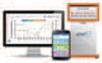

---
<!-- Page 37 -->

## 제3장 디지털헬스케어 서비스 유형 | 37

및
보안
모델
개념
및
보안
대책
개요
디지털헬스케어
구성요소
디지털헬스케어
서비스
유형
디지털헬스케어
서비스
보안
위협
디지털헬스케어
서비스
보안
요구사항
참고문헌
제1장
제2장
제3장
제4장
제5장
부록
그림 3-11 비대면 진료 및 상담 서비스 절차
➀ 환자는 인증 후 서비스 접속 (사용자별 권한 계정으로 접속)
➁-➂ 환자는 주치의 비대면 진료 요청 후 진료 대기 (환자 접속 및 진료 요청 내용은 서비스 DB에 저장)
➃-➄ 비대면 진료 서비스 시스템은 주치의에게 진료 요청하고, 의사는 인증 후 서비스에 접속하여 대기 중인 환자에
응답
➅-➆-➇ 환자의 주치의 진료 접수가 이루어지며, 의사는 병원 정보 시스템으로부터 환자의 과거 진료 기록이
로딩되면, 환자와 비대면 진료 수행
➈-➉ 의사의 진료 내용과 처방은 병원정보시스템에 저장되며 진료 이력 등 Log 정보는 서비스 DB에 저장
비대면 진료 및 상담 서비스 시스템은 수신받은 의료정보를 기반으로 처방전을 환자에게 전송하고, 환자는 진료비를
수납
(cid:2045)(cid:2583)
서비스 (cid:2342)스(cid:3118) (cid:9)(cid:2628)(cid:2190)(cid:10) 비대면 진(cid:1808) (cid:3356)(cid:1155)
(cid:3349)
3 (cid:3356)(cid:2647) (cid:2685)(cid:2264)(cid:13) (cid:2563)(cid:2898) (cid:21) (cid:9)서비스(cid:10)
비대면 진(cid:1808).(cid:2202)(cid:1528) (cid:1245)(cid:1245) (cid:1394)(cid:2570) (cid:45)(cid:80)(cid:72) (cid:2679)(cid:2658) 진(cid:1808) (cid:2563)(cid:2898) 비대면 진(cid:1808) (cid:1245)(cid:1245)
(cid:18) (cid:9)(cid:3356)(cid:2647)(cid:10) (cid:2635)(cid:2768) (cid:3377) (cid:2681)(cid:2272) (cid:2628)사
(cid:18)(cid:17) 진료 (cid:1394)(cid:2505)
(cid:3356)(cid:2647) 서비스 (cid:2685)(cid:2264) (cid:2583)(cid:1146) 비대면 (cid:45)(cid:80)(cid:72) (cid:2679)(cid:2658) (cid:2628)(cid:2190) 진(cid:1808) (cid:2658)비
(cid:3349) 2 (cid:9)(cid:3356)(cid:2647)(cid:10) (cid:2737)(cid:2966)(cid:2628) 서비스 (cid:2594)(cid:16)(cid:2460) 서(cid:2017) (cid:22) (cid:9)(cid:2628)(cid:2190)(cid:10) (cid:22)(cid:40)(cid:13) (cid:45)(cid:53)(cid:38)
(cid:1137)(cid:2633)(cid:3167)(cid:2589)(cid:2633) 진(cid:1808) (cid:2563)(cid:2898) (cid:1986) (cid:1137)(cid:2633)(cid:3167)(cid:2589)(cid:2633)
(cid:2635)(cid:2768) (cid:3377)
비대면 진(cid:1808)
대(cid:1245) 비대면 진(cid:1808) (cid:54)(cid:42) (cid:16) (cid:54)(cid:57) 서 (cid:2685) 비 (cid:2264) 스 (cid:24) (cid:3356)(cid:2647) 진료 P(cid:41)R (cid:1245)(cid:1992) (cid:2628)(cid:1808) (cid:2342)스(cid:3118) (cid:1245)(cid:1992) (cid:1245)(cid:1790) (cid:1789)(cid:1644)
(cid:23) (cid:2737)(cid:2966)(cid:2628)
(cid:25) (cid:9)(cid:2628)(cid:2190).(cid:3356)(cid:2647)(cid:10) 비대면 진(cid:1808) (cid:2299)(cid:3311) 진료 (cid:2685)(cid:2299)
(cid:22)(cid:40)
(cid:1945)진 (cid:3280)(cid:1789)(cid:2241)스 (cid:1394)(cid:2071)(cid:1870)
(cid:1124)(cid:1098)(cid:1177)(cid:1851)(cid:1245)(cid:1790) (cid:1851)(cid:2093) (cid:26) 진료 및 (cid:2890)(cid:2001) (cid:1394)(cid:2570) (cid:2679)(cid:2658)
진료 및 (cid:2890)(cid:2001)
(cid:2045)(cid:2583) (cid:2687)(cid:2049) (cid:2342)스(cid:3118)
(cid:18)(cid:18) (cid:9)서비스(cid:10) (cid:2890)(cid:2001)(cid:2681) (cid:2681)(cid:2272)
(cid:1942)선 (cid:3134)신 유(cid:18363)(cid:1942)선 (cid:3134)신 시스템(cid:1394)부 (cid:3134)신 (cid:38)(cid:46)(cid:51)(cid:16)(cid:41)(cid:42)(cid:52) (cid:48)(cid:36)(cid:52) (cid:49)A(cid:36)(cid:52)
비대면 진료 및 상담 서비스 유형에 속하는 서비스 사례로는 정밀 의료 병원정보시스템 (P-HIS),
98point6, 핑안굿닥터, 웨이닥터 등이 있다.

---
<!-- Page 38 -->
그림 3-12 비대면 진료 및 상담 서비스 사례 (미국 A사 서비스 사례)
(cid:2628)(cid:1808)(cid:2635)
(cid:38)(cid:46)R (cid:1986) (cid:2628)(cid:1808) (cid:3025)(cid:3116)(cid:2958) (cid:2507)(cid:1586) (cid:2583)(cid:1146) (cid:2628)(cid:1808) (cid:2769)(cid:2583)
((cid:41)(cid:45)(cid:24)(cid:13) (cid:39)(cid:41)(cid:42)(cid:51) (cid:7) (cid:36)(cid:36)(cid:37)A (cid:3252)(cid:2739) (cid:1245)(cid:1992)) (진료 (cid:3280)(cid:1789)(cid:2241)스(cid:13)
P(cid:77)(cid:86)(cid:72)(cid:14)(cid:74)(cid:79)
(cid:1155)(cid:1175) (cid:1917)(cid:1508)(cid:3104)(cid:1858)(cid:13) (cid:3336)진 (cid:1633))
(cid:2583)(cid:1146)(cid:2628)(cid:1808)
(cid:52)(cid:44)(cid:37)(cid:2689)(cid:1173)
(cid:3326)스(cid:3006)(cid:2479) 서비스 (cid:2190)(cid:2570)(cid:2647) (cid:2583)(cid:1146)(cid:2628)(cid:1808) 서비스 (cid:3282)(cid:1750)(cid:3244)
(cid:1518)(cid:2875)(cid:1413) 서비스 (cid:2583)(cid:1146)진(cid:1808) 서비스 (cid:1917)(cid:1621)
(cid:2635)(cid:3104)(cid:3221)(cid:2633)스
((cid:56)(cid:70)(cid:67)(cid:16)A(cid:81)(cid:81)(cid:13) A(cid:49)(cid:42) (cid:36)(cid:80)(cid:79)(cid:79)(cid:70)(cid:68)(cid:85)(cid:74)(cid:87)(cid:74)(cid:85)(cid:90))
(cid:2621)(cid:1241)(cid:2769)(cid:2583) (cid:2263)(cid:2439)(cid:1175) (cid:1457)(cid:2708)(cid:2768)
3(cid:83)(cid:69)(cid:14)P(cid:66)(cid:83)(cid:85)(cid:90)
(cid:3326)스(cid:3006)(cid:2479) (cid:1635)(cid:1988)(cid:2633)스
(cid:1986) (cid:52)(cid:56) (cid:2267)(cid:1814)(cid:2252)
(cid:2507)(cid:1586) (cid:2769)(cid:2583) (cid:1124)(cid:1098) (cid:1917)(cid:1508)(cid:3104)(cid:1858) (cid:2687)(cid:2344)(cid:2628)료 (cid:1861)(cid:2239)(cid:2773)(cid:3356)
출처: NIPA “해외 디지털 헬스케어 규제개선 동향”
[그림 3-12]은 미국 A사의 비대면 진료 및 상담 서비스 사례이다. A사의 비대면 진료 및 상담 서비스는
ICT 서비스 플랫폼을 기반으로, 환자와 의사 간에 모바일 및 웹 환경에서 비대면의료를 수행한다. 전체
질병이 아닌 긴급 의료, 소아 의료, 뇌졸중(Stroke), 생활건강관리, 정신의학, 만성질환관리로 제한하여
비대면 진료가 가능하다.

#### 2.3 비대면 건강 검진 서비스

비대면 건강 검진 서비스는 환자의 건강 상태 확인과 질병의 예방 및 조기 발견을 목적으로, 사용자가
의료기관 외부의 원격지에 설치된 비대면 검사 기기를 이용해 검사를 실시하고, 검사 결과를 의료 기관에
전송하여 비대면으로 의사의 진단과 사후 처치를 받는 서비스이다.

|  |  |

---
<!-- Page 39 -->

## 제3장 디지털헬스케어 서비스 유형 | 39

및
보안
모델
개념
및
보안
대책
개요
디지털헬스케어
구성요소
디지털헬스케어
서비스
유형
디지털헬스케어
서비스
보안
위협
디지털헬스케어
서비스
보안
요구사항
참고문헌
제1장
제2장
제3장
제4장
제5장
부록
그림 3-13 비대면 건강 검진 서비스 절차
➀-➁-➂ 환자는 비대면 건강 검사 기기에 사용자 인증 후 접속 (환자 인증 및 접속 로그는 서비스 DB에 저장)
➃-➄ 환자에 연결된 비대면 검사 기기는 기능별로 검사를 수행하여 측정 정보를 서비스를 통해 주치의에게 전송
➅-➆-➇ 서비스 서버에 수집된 환자의 검사 측정 결과 수치는 서비스 DB에 저장되었다가, 주치의에게 전송 후 파기
(검사 로그는 서비스 DB에 저장)
➈-➉- 의사는 환자의 검사 결과 정보 로딩을 기다렸다가, 환자의 건강 검진에 대해 진단하고, 검진 결과 소견을
환자에게 전송 (의사에게 전송된 검사 결과와 의사 건강 검진 결과 소견은 병원정보시스템에 저장)
(cid:2045)(cid:2583)
2 (cid:9)(cid:1245)(cid:1245)(cid:10) 환(cid:2647) 서비스 (cid:2342)스(cid:3118)
(cid:1124)(cid:1098) (cid:1128)(cid:2190)(cid:2570) (cid:3326)스(cid:3006)(cid:2479) (cid:1245)(cid:1245) (cid:2635)(cid:2768) (cid:2681)(cid:2272)
(cid:20) (cid:3356)(cid:2647) (cid:2635)(cid:2768) (cid:45)(cid:80)(cid:72) (cid:2679)(cid:2658)
(cid:22) (cid:9)(cid:1245)(cid:1245)(cid:10) (cid:1128)(cid:2190)
(cid:2959)(cid:2687) (cid:1150)(cid:1175) (cid:2681)(cid:2272) (cid:23) 검사 (cid:45)(cid:80)(cid:72) (cid:2679)(cid:2658)
(cid:22)(cid:40)(cid:13) (cid:45)(cid:53)(cid:38) (cid:22)(cid:40) (cid:24) 검사 (cid:1150)(cid:1175) (cid:2681)(cid:2272) (cid:3377) (cid:3189)(cid:1245)
(cid:3356)(cid:2647) (cid:1137)(cid:2633)(cid:3167)(cid:2589)(cid:2633)
(cid:18) (cid:9)환(cid:2647)(cid:10) (cid:2635)(cid:2768) 후 (cid:18)2 (cid:9)서비스(cid:10)
(cid:40)(cid:66)(cid:85)(cid:70)(cid:88)(cid:66)(cid:90) (cid:2594)(cid:16)(cid:2460) 서(cid:2017)
(cid:1245)(cid:1245) (cid:2685)(cid:2264) (cid:1128)(cid:2190) (cid:2771)(cid:1521)
4 (cid:9)환(cid:2647)(cid:10) 비(cid:1536)(cid:1910) (cid:3403)대(cid:2570) 검사 (cid:1245)(cid:1245) 검진 (cid:3075)(cid:2527)스(cid:3068) (cid:1150)(cid:1175) (cid:2681)(cid:2272) P(cid:41)R (cid:1245)(cid:1992) (cid:2628)(cid:1808) (cid:2342)스(cid:3118) (cid:1245)(cid:1992)
(cid:1128)(cid:2190) (cid:2299)(cid:3311)
(cid:25) (서비스) (cid:18)(cid:18) (cid:9)(cid:2628)(cid:2190)(cid:10) (cid:1128)(cid:2190) (cid:2771)(cid:1521) (cid:1150)(cid:1175) (cid:3365)(cid:2344)
검사 (cid:2959)(cid:2687) (cid:9)(cid:2628)(cid:2190) 서(cid:1914) (cid:3240)(cid:3299)(cid:10)
(cid:1150)(cid:1175) (cid:2681)(cid:2272)
사(cid:3377) 진(cid:1808) (cid:2520)(cid:2465)
사(cid:3377) (cid:1177)(cid:1851) (cid:1218)(cid:1162)
(cid:2628)(cid:2190) (cid:2771)(cid:1808) (cid:2658)비
(cid:2633)(cid:1586)(cid:3339) 검진 (cid:1245)(cid:1245) 대(cid:3354)(cid:3339) 검진 (cid:1245)(cid:1245) (cid:1394)(cid:2071)(cid:1870)
(cid:18)(cid:17) ((cid:2628)사) (cid:26) 검사 진(cid:1521)
검사 (cid:1150)(cid:1175) (cid:1394)(cid:2570) (cid:2679)(cid:2658)
진(cid:1521)(cid:1394)(cid:2570)
(cid:2045)(cid:2583) (cid:2687)(cid:2049) (cid:2342)스(cid:3118)
(cid:2681)(cid:2272) (cid:1986)
(cid:2679)(cid:2658)
(cid:38)(cid:46)(cid:51)(cid:16)(cid:41)(cid:42)(cid:52) (cid:48)(cid:36)(cid:52) (cid:49)(cid:34)(cid:36)(cid:52)
(cid:1942)선 통신 유(cid:18363)(cid:1942)선 통신 시스템내부 통신 (cid:2628)사
환자는 지정된 장소에 설치된 비대면 검사 기기를 통해 자가 건강 검사를 실시한다. 비대면 검사 기기는
검사 측정 결과를 주치의에 전송하고, 주치의는 환자의 과거 진료 기록과 의료 정보를 참고하고, 검사 측정
결과에 대한 진단 결과를 환자에게 회신한다. 서비스는 환자가 건강 검진 서비스 접수 후 비대면 건강 검사
기기의 위치를 안내받거나 휴대용 검사 기기를 수령하여, 사용자 인증 후 검사 기기에 접속을 하는 것으로
시작한다. 비대면 검사 기기는 휴대형, 설치형이 있을 수 있으며, 측정된 환자의 검사 정보는 서비스를 통해서
의료진에게 전달된다.
비대면 건강 검진 서비스 유형에 속하는 서비스 사례로는 길병원의 스마트 건강 검진 시스템 ‘메디링스’,
유비케어 ‘의사랑 건강검진’ 앱 서비스, iDoctorCloud의 셀프 검진 키오스크 등이 있다.

| 제3장 |  |

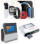
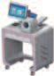
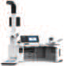

---
<!-- Page 40 -->
그림 3-14 비대면 건강 검진 서비스 사례 (영국 B사 플랫폼 사례)
(cid:2628)(cid:1808)(cid:2635)(cid:9)(cid:2628)(cid:2190)(cid:10) (cid:2583)(cid:1146)(cid:2628)(cid:1808) 서비스 (cid:1422)(cid:3068)(cid:2581)(cid:3068)
(cid:2190)(cid:2570)(cid:2647) 환(cid:1155) (cid:1917)(cid:1988)(cid:2636) (cid:2460)
(cid:2583)(cid:1146)(cid:2202)(cid:1528) (cid:1986) (cid:2771)(cid:1521)(cid:2769)(cid:2583)
(cid:2583)(cid:1146)(cid:2202)(cid:1528) ((cid:36)(cid:37)(cid:52)(cid:52)(cid:13) (cid:36)(cid:77)(cid:74)(cid:79)(cid:74)(cid:68)(cid:66)(cid:77) (cid:37)(cid:70)(cid:68)(cid:74)(cid:84)(cid:74)(cid:80)(cid:79) (cid:52)(cid:86)(cid:81)(cid:81)(cid:80)(cid:83)(cid:85) (cid:52)(cid:90)(cid:84)(cid:85)(cid:70)(cid:78))
사(cid:2570)(cid:2647)(cid:2540) (cid:2628)사 (cid:1088) 1(cid:27)1
(cid:2583)(cid:1146) (cid:2202)(cid:1528)
(cid:35)(cid:66)(cid:67)(cid:90)(cid:77)(cid:80)(cid:79) (cid:41)(cid:70)(cid:66)(cid:77)(cid:85)(cid:73) 서비스 (cid:3282)(cid:1750)(cid:3244)
(cid:2647)(cid:1086)(cid:2771)(cid:1521)
사(cid:2570)(cid:2647)(cid:2540) (cid:2881)(cid:2056) (cid:1088) 대(cid:3354)(cid:3339)
(cid:1945)진 (cid:1986) (cid:34)(cid:42)(cid:1843) (cid:3357)(cid:2570)(cid:3296) 진(cid:1521)
(cid:2583)(cid:1146)(cid:2202)(cid:1528)
(cid:1124)(cid:1098)(cid:1576) (cid:2959)(cid:2687) (cid:2640)(cid:2202)(cid:1560)(cid:2633)(cid:3104)
사(cid:2570)(cid:2647)(cid:2540) (cid:2881)(cid:2056) (cid:1088) 대(cid:3354)(cid:3339) (cid:2073)(cid:1832)(cid:2899)(cid:1157)
(cid:1945)진 (cid:1986) (cid:34)(cid:42)(cid:1843) (cid:3357)(cid:2570)(cid:3296) (cid:1986) (cid:1917)(cid:1563)(cid:1858)
(cid:2881)(cid:2056)
건강(cid:1576) (cid:2959)(cid:2687)
(cid:9)(cid:36)(cid:73)(cid:66)(cid:85)(cid:67)(cid:80)(cid:85)(cid:10)
(cid:2212)(cid:3357)(cid:2339)관 (cid:1917)(cid:1508)(cid:3104)(cid:1858) (cid:2640)(cid:2202)(cid:1560)(cid:2633)(cid:3104)
사(cid:2570)(cid:2647)(cid:2540) (cid:2589)(cid:2479)(cid:1758)(cid:2102) (cid:1635)(cid:1988)(cid:2633)스 (cid:2628)(cid:1808) (cid:3336)(cid:2488) (cid:3365)(cid:2583) (cid:9)(cid:2045)(cid:2583)(cid:16)(cid:2628)(cid:2190) (cid:37)(cid:35)(cid:10)
(cid:1986) 사(cid:2570)(cid:2647) (cid:2641)(cid:1777)(cid:2616) (cid:3134)(cid:3296) (cid:2881)(cid:2056) (cid:1245)(cid:1157)(cid:3295)(cid:2339) (cid:1986) (cid:1104)(cid:2635) (cid:1124)(cid:1098) (cid:1245)(cid:1790) (cid:9)P(cid:41)R(cid:10)
(cid:2212)(cid:3357) 건강 (cid:1917)(cid:1508)(cid:3104)(cid:1858) (cid:2689)(cid:1173) (cid:9)(cid:36)(cid:73)(cid:66)(cid:85)(cid:67)(cid:80)(cid:85)(cid:10) (cid:2934)(cid:1791) (cid:1917)(cid:1563) (cid:1104)(cid:2635)별 (cid:2212)(cid:3357)(cid:2339)관 (cid:1560)(cid:2633)(cid:3104)
출처: NIPA “해외 디지털 헬스케어 규제개선 동향”
[그림 3-14]는 B사의 비대면 건강 검진 서비스 사례이다. B사의 비대면 건강 검진 플랫폼은 여러 가지
이유로 의료인을 활용한 대면 진료가 어려운 경우, 환자는 챗봇을 통한 자가 검사 가이드를 확인하고 이를
따라 자가 검사를 수행한다. 검사 결과에 대해 의료진과의 1:1 비대면 상담 및 진료를 수행한다. 영국의 공공
건강 서비스인 B사 플랫폼은 온라인 진료 및 상담 기능을 부분 대체를 위해 검사 결과에서 자가 진단 챗봇
서비스를 제공하기도 한다.

#### 2.4 질환 예후 관리 서비스

질환 예후 관리 서비스는 고혈압, 당뇨병 등 모니터링을 통한 지속적 관리가 필요한 환자군에 대하여
환자의 진료 기록, 검진 기록, 복약 정보 등에 대한 모니터링 정보를 분석하여 맞춤형 질환 관리 서비스를
제공한다.

---
<!-- Page 41 -->

## 제3장 디지털헬스케어 서비스 유형 | 41

및
보안
모델
개념
및
보안
대책
개요
디지털헬스케어
구성요소
디지털헬스케어
서비스
유형
디지털헬스케어
서비스
보안
위협
디지털헬스케어
서비스
보안
요구사항
참고문헌
제1장
제2장
제3장
제4장
제5장
부록
그림 3-15 질환 예후 관리 서비스 절차
➀ 환자는 병원 진료 후 댁내용 질환 관리 기기를 병원 또는 약국으로부터 수령
➁-➂-➃ 환자는 댁내용 질환 관리 기기에 사용자 인증 후 접속(환자 인증 및 접속 로그는 서비스 DB에 저장)
➄-➅-➆ 환자에 연결된 댁내용 질환 관리 기기는 기능별로 생체 측정을 수행하여 측정 정보를 서비스 서버에 전송(
질환 측정 정보는 서비스 DB 에 저장되며, 주치의에 전송 후 파기)
➇-➈-➉ 서비스의 의료 빅데이터 AI 분석 플랫폼은 질환 측정 수치가 경계·위험인 경우 주치의에게 측정 정보를 전송
(의사에게 전송된 질환 측정 결과는 병원정보시스템에 저장)
- 의사는 환자의 질환 측정 결과 정보 로딩 후, 진단을 수행하며 진단 결과를 환자에게 전송(의사 진단 소견은
병원정보시스템에 저장)
(cid:2465)(cid:1204)
(cid:2045)(cid:2583)
(cid:18) (cid:9)(cid:3356)(cid:2647)(cid:10) (cid:2890)(cid:2001)(cid:1595) (cid:2773)(cid:3356) (cid:1177)(cid:1851) (cid:1245)(cid:1245) (cid:2299)(cid:1784)
서비스 (cid:2342)스(cid:3118)
(cid:3349)
(cid:21) 환(cid:2647) (cid:2635)(cid:2768) (cid:45)(cid:80)(cid:72) (cid:2679)(cid:2658)
(cid:20) (cid:9)(cid:1245)(cid:1245)(cid:10) (cid:3356)(cid:2647) (cid:2635)(cid:2768)
(cid:2773)(cid:3356) (cid:1177)(cid:1851)(cid:2570) (cid:3326)스(cid:3006)(cid:2479) (cid:1245)(cid:1245) (cid:24) 질환 (cid:2959)(cid:2687) (cid:2687)(cid:2049) (cid:2679)(cid:2658)
(cid:23) (cid:9)(cid:1245)(cid:1245)(cid:10) (cid:2959)(cid:2687)(cid:1095) (cid:2681)(cid:2272) ((cid:2737)(cid:2966)(cid:2628)(cid:2496) (cid:2681)(cid:2272) 후 (cid:3189)(cid:1245))
(cid:2594)(cid:16)(cid:2460) 서(cid:2017)
(cid:22)(cid:40)
환(cid:2647) (cid:2628)(cid:1808) (cid:2107)(cid:1560)(cid:2633)(cid:3104)
(cid:19) (cid:9)(cid:3356)(cid:2647)(cid:10) (cid:2635)(cid:2768) (cid:3377) (cid:2348)(cid:2681)(cid:1576)(cid:1157) (cid:3334)(cid:1532)(cid:1157) (cid:2899)(cid:2555)(cid:2771)(cid:1521)(cid:1245)(cid:1245) (cid:40)(cid:66)(cid:85)(cid:70)(cid:88)(cid:66)(cid:90) (cid:18)(cid:20) (cid:9) (cid:1150) 서 (cid:1175) 비 (cid:2681) 스 (cid:2272) (cid:10) (cid:1128)(cid:2190) (cid:2771)(cid:1521) A(cid:42) (cid:2073)(cid:2227) (cid:3282)(cid:1750)(cid:3244) (cid:25) 질 ((cid:1155) 환 (cid:1157) (cid:2959) (cid:16)(cid:2596) (cid:2687) (cid:3319) (cid:1150) (cid:2342) (cid:1175) (cid:26) (cid:2073) (cid:2019) (cid:2227) (cid:2771)(cid:3311))
(cid:1245)(cid:1245) (cid:2685)(cid:2264)
(cid:22) (cid:9)(cid:3356)(cid:2647)(cid:10) (cid:2773)(cid:3356) P(cid:41)R (cid:1245)(cid:1992) (cid:2628)(cid:1808) (cid:2342)스(cid:3118) (cid:1245)(cid:1992)
(cid:1177)(cid:1851) (cid:2299)(cid:3311)
(cid:26) (서비스) (cid:18)(cid:19) (cid:9)(cid:2628)(cid:2190)(cid:10) (cid:1128)(cid:2190) (cid:2771)(cid:1521) (cid:1150)(cid:1175) (cid:3365)(cid:2344)
(cid:2899)(cid:2239)(cid:2073)(cid:1157) (cid:2635)(cid:2329)(cid:1853)(cid:3216)(cid:3280) (cid:3334)(cid:2449)(cid:1157)
질환 (cid:2959)(cid:2687) (cid:9)(cid:2628)(cid:2190) 서(cid:1914) (cid:3240)(cid:3299)(cid:10)
(cid:1150)(cid:1175) (cid:2681)(cid:2272)
(cid:2771)(cid:1808) 예(cid:2465)
비(cid:1536)(cid:1910) (cid:2771)(cid:1808) (cid:1218)(cid:1162)
(cid:2628)(cid:2190) (cid:2771)(cid:1808) (cid:2658)비 (cid:1394)(cid:2071)(cid:1870) (cid:2890)(cid:2001)(cid:2681) (cid:1994)(cid:3311)
(cid:18)(cid:18)((cid:2628)사)
(cid:18)(cid:17) 질환 (cid:2959)(cid:2687)
(cid:1128)사 (cid:2771)(cid:1521) (cid:1394)(cid:2570) (cid:2679)(cid:2658)
(cid:1150)(cid:1175) (cid:2681)(cid:2272)
(cid:1986) (cid:2679)(cid:2658) (cid:2045)(cid:2583) (cid:2687)(cid:2049) (cid:2342)스(cid:3118)
(cid:1942)(cid:2230) 통쉉 유(cid:18363)(cid:1942)(cid:2230) 통쉉 쉇스(cid:3118)내(cid:2071) 통쉉 (cid:2628)사 E(cid:46)(cid:51)(cid:16)(cid:41)(cid:42)(cid:52) (cid:48)(cid:36)(cid:52) (cid:49)(cid:34)(cid:36)(cid:52)
고혈압, 당뇨와 등과 같이 치료 후 지속적인 관리가 필요한 환자의 질환 관리를 목적으로 하는 서비스로,
환자는 치료 약물 등과 함께 댁내용 질환 관리 기기를 처방 받아 건강 모니터링을 수행한다. 서비스의 의료
빅데이터 AI 분석 플랫폼은 질환 측정 정보를 분석하여 경계·이상 수치 발생 시 환자에게 알림을 주고,
의료진에게 전송한다. 질환 측정 경계·이상 수치 정보는 서비스 서버를 통해 주치의에게 전달되며, 주치의는
증상에 대한 비대면 진료를 수행한다. 서비스 절차는 환자가 병원 진료 후 처방받은 댁내용 질환 관리 기기를
수령하고, 인증 절차를 거쳐 기기에 접속하는 것으로 시작한다.

|  | 제3장 |  |

---
<!-- Page 42 -->
환자는 처방받은 댁내용 질환 관리 기기를 통해 댁내에서 질환 관리를 수행하며, 서비스는 환자의 질환
관리 모니터링 결과를 빅데이터 분석하여 AI 의사를 통해 질환 관리에 대해 피드백을 줄 수 있다. 또는 질환
관리 모니터링 정보를 서비스를 통해 의료진에게 전달하여 의료진이 비대면으로 진료를 수행하는 형태 등
다양한 형태의 서비스가 가능하다.
그림 3-16 질환 예후 관리 서비스 사례 (E사 서비스 사례)
출처: ETRI “개인중심 건강관리 플랫폼 동향 분석”
[그림 3-16]은 E사의 개인 맞춤형 질환 관리 서비스 사례이다. E사의 질환 예후 관리 서비스는
질환자에게 ICT 기술을 기반으로 하는 질환 관리 서비스를 제공하기 위한 플랫폼이다. 병원, 피트니스센터,
건강검진센터, 라이프로그 서비스 기업 등 환자와 관련된 여러 기관과 연계하여 개인 질환 관리를 개인이
주도적이고, 효과적으로 수행하도록 하고, 개인 맞춤형 질환 관리 서비스를 제공한다.
질환 예후 관리 서비스 유형에 속하는 서비스 사례로는 블록체인 기술 기반인 강원도형 만성질환 통합
플랫폼과 일차 의료 기관의 만성 질환 관리 서비스 등이 있다.
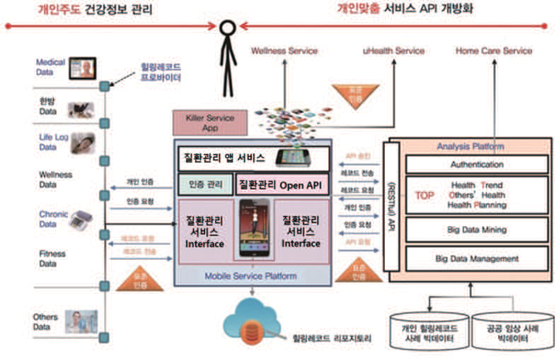

---
<!-- Page 43 -->

## 제3장 디지털헬스케어 서비스 유형 | 43

및
보안
모델
개념
및
보안
대책
개요
디지털헬스케어
구성요소
디지털헬스케어
서비스
유형
디지털헬스케어
서비스
보안
위협
디지털헬스케어
서비스
보안
요구사항
참고문헌
제1장
제2장
제3장
제4장
제5장
부록

#### 2.5 온라인 약배송 서비스

온라인 약배송 서비스는 인터넷 약국의 형태로 환자가 인터넷으로 처방전을 전달하거나, 환자의 처방전 제
3자 제공 동의 후 병원에서 약국으로 처방전을 직접 전달하면, 약국에서는 전송받은 처방전에 따라 약을
조제하여 배송하는 서비스이다.
그림 3-17 온라인 약배송 서비스 절차
➀-➁ 의사는 진료 환자의 처방전을 발행하고, 환자는 병원에서 약국으로 처방전을 전송하는 것에 동의하는 절차 수행
➂-➃ 병원은 진료 환자의 처방전을 지정 약국으로 전송(처방전 전송 로그는 서비스 DB에 저장)
➄-➅ 약사는 처방약을 조제하고, 환자 주소지로 조제약을 약배송 업체에게 배송 요청하고 조제약을 배송 업체에게
전달 (약국으로 전송된 처방전은 약국 시스템에 저장)
➆-➇ 약배송 서비스 시스템은 배송 업체 인증 후 환자의 배송 정보 전송(배송 시작 로그는 서비스 DB에 저장)
➈-➉ 약배송 업체는 환자에게 조제약 배송하고, 환자는 본인 인증 후 약 수령
(cid:18) (cid:9)(cid:2628)(cid:2190)(cid:10) (cid:3356)(cid:2647) (cid:2771)(cid:1808) (cid:3377) (cid:2465)(cid:1204)
(cid:2465)(cid:2890)(cid:2001)(cid:2681) (cid:1994)(cid:3311)
서비스 (cid:2342)스(cid:3118)
(cid:2045)(cid:2583)
(cid:19) (cid:9)(cid:3356)(cid:2647)(cid:10) (cid:2890)(cid:2001)(cid:2681) (cid:2689)(cid:20)(cid:2647) (cid:20) (cid:9)(cid:2045)(cid:2583)(cid:10) (cid:3356)(cid:2647) (cid:2465)(cid:2890)(cid:2001)(cid:2681) (cid:2681)(cid:2272)
(cid:2689)(cid:1173) (cid:1586)(cid:2628) (cid:21) (cid:3356)(cid:2647) (cid:2890)(cid:2001)(cid:2681)
(cid:2681)송 (cid:1789)그 (cid:2679)(cid:2658)
(cid:3349) (cid:22)(cid:40) (cid:22)(cid:40)(cid:13) (cid:45)(cid:53)(cid:38)
(cid:2465)(cid:2003)(cid:2272) (cid:2488)(cid:2899) (cid:1137)(cid:2633)(cid:3167)(cid:2589)(cid:2633) (cid:25) 배송 (cid:1789)그 (cid:2679)(cid:2658)
(cid:24) (cid:9)서비스(cid:10) (cid:2003)(cid:2272)
(cid:2488)(cid:2899) (cid:2635)(cid:2768) (cid:3377)
(cid:2003)(cid:2272) (cid:2687)(cid:2049) (cid:2681)(cid:2272)
(cid:23) (cid:2890)(cid:2001)약 (cid:2465)(cid:2190)(cid:2570) (cid:2658)비
(cid:3356)(cid:2647) 배송 (cid:2563)(cid:2898)
(cid:1394)(cid:2071)(cid:1870)
약사
(cid:18)(cid:17) (cid:9)(cid:2003)(cid:2272)(cid:2770)(cid:2583)(cid:10) (cid:26) (cid:9)(cid:2003)(cid:2272)(cid:2190)(cid:10) (cid:2689)(cid:2705)(cid:2465) (cid:2003)(cid:2272)
(cid:3356)(cid:2647) (cid:2052)(cid:2635) (cid:2635)(cid:2768) (cid:3377) (cid:2465)(cid:1204) (cid:2342)스(cid:3118)
(cid:2890)(cid:2001)(cid:2465) (cid:2299)(cid:1784) (cid:22) (cid:3356)(cid:2647) (cid:2890)(cid:2001)(cid:2681) (cid:2679)(cid:2658)
(cid:1942)(cid:2230) (cid:3134)(cid:2344) 유(cid:18363)(cid:1942)(cid:2230) (cid:3134)(cid:2344) 시스(cid:3118)(cid:1394)(cid:2071) (cid:3134)(cid:2344) (cid:2527)(cid:3280)라인 배송
약물의 특수성을 고려한 배송 방법, 약배송 수령 시 환자 인증, 처방전 발송에 대한 사용자 동의를 받는 등
의료정보 제공 시의 보안 대책이 매우 중요한 서비스이다. 서비스는 환자가 병원 진료 후 처방전을 발급받고,
처방전을 약국(제3자)에 제공하는 것에 대한 동의 후 약국으로 처방전을 전송하는 것으로 시작한다.
온라인 약배송 서비스 유형에 속하는 서비스 사례로는 중국의 알리 건강 대약방, 미국의 BigFoot Unity이
있으며, 한국에는 닥터 나우가 서비스 중이다.

---
<!-- Page 44 -->
그림 3-18 온라인 약배송 서비스 사례 (D사 서비스 사례)
(cid:2890)(cid:2001)(cid:2465) (cid:2003)(cid:1523) (cid:2563)(cid:2898) (cid:2890)(cid:2001)(cid:2465) (cid:1150)(cid:2689) (cid:2890)(cid:2001)(cid:2681) (cid:2681)(cid:2272) (cid:2890)(cid:2001)(cid:2465) (cid:2003)(cid:2272)
[그림 3-18]은 D사의 온라인 약배송 서비스 사례이다. D사의 온라인 약배송 서비스는 온라인 또는
오프라인으로 의료진의 진찰을 받은 후 발행된 약처방전에 대해 온라인으로 결제를 진행한다. 서비스는
환자에게 30분 이내로 배송이 가능한 약국을 선별하여 처방전을 전송하고, 가장 빠른 시간 안에 환자에게
약을 배송한다.
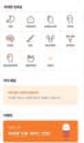
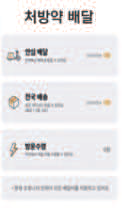
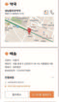
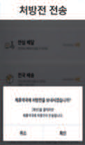
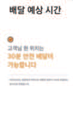

---
<!-- Page 45 -->

## 제3장 디지털헬스케어 서비스 유형 | 45

및
보안
모델
개념
및
보안
대책
개요
디지털헬스케어
구성요소
디지털헬스케어
서비스
유형
디지털헬스케어
서비스
보안
위협
디지털헬스케어
서비스
보안
요구사항
참고문헌
제1장
제2장
제3장
제4장
제5장
부록

#### 2.6 비대면 복약 관리 서비스

비대면 복약 관리 서비스는 댁내용 복약 관리 기기를 처방받은 환자의 복약 정보를 의료진에게 전달하여
의사가 처방한 투약일시와 용량을 확인하는 모니터링을 통해 적절한 복약 관리를 제공하는 서비스이다.
그림 3-19 비대면 복약 관리 서비스 절차
➀ 환자는 병원 진료 후 처방받은 댁내용 복약 관리 기기를 병원 또는 약국에서 수령
➁-➂-➃ 환자는 댁내용 복약 관리 기기에 사용자 인증 후 접속(환자 인증 및 접속 로그는 서비스 DB에 저장)
➄-➅-➆ 환자가 처방약을 복용하면, 복약 관리 기기는 복약 시간, 용량 등의 내용을 서비스 시스템에 전송 (환자 복용
정보는 서비스 DB에 저장되며, 주치의에 전송 후 파기)
➇-➈-➉ 서비스 서버에 전송된 복약 정보가 경고·이상 수치인 경우, 환자의 복약 내역을 주치의에 전송 (환자의 복약
내역은 병원정보시스템에 저장)
- 주치의는 환자의 과거 진료 및 처방 정보 등의 의료 정보를 참고하여, 환자 복약 모니터링 정보에 대해 복약 지도
내용을 환자에게 전송
(cid:2465)(cid:1204)
(cid:2045)(cid:2583)
(cid:18) (cid:9)(cid:3356)(cid:2647)(cid:10) (cid:2890)(cid:2001)(cid:1595) (cid:2050)(cid:2465) (cid:1177)(cid:1851) (cid:1245)(cid:1245) (cid:2299)(cid:1784)
서비스 (cid:2342)스(cid:3118)
(cid:3349) 복약 관리 (cid:1245)(cid:1245)
(cid:21) (cid:3356)(cid:2647) 인(cid:2768) (cid:1789)그 (cid:2679)(cid:2658)
(cid:20) (cid:9)(cid:1245)(cid:1245)(cid:10) (cid:3356)(cid:2647) 인(cid:2768) (cid:2681)(cid:2272) 7 (cid:3356)(cid:2647) 복(cid:2570) (cid:2687)보 (cid:2679)(cid:2658)
(cid:2050)(cid:2465) (cid:1177)(cid:1851)(cid:2570) 헬스케어 (cid:1245)(cid:1245)
(cid:23) (cid:9)(cid:1245)(cid:1245)(cid:10) (cid:2050)(cid:2465) (cid:2687)(cid:2049) (cid:2681)(cid:2272)
(cid:25) (cid:2633)(cid:2202) 복(cid:2570) 시 (cid:26) (cid:2019) (cid:2771)(cid:3311) (cid:22)(cid:40) (cid:2594)(cid:16)(cid:2460) 서(cid:2017) (cid:3377) 복(cid:2570) (cid:2687)보 (cid:3189)(cid:1245)
(cid:3356)(cid:2647)
(cid:18)2 (cid:9)서비스(cid:10)
2 (cid:9)(cid:3356)(cid:2647)(cid:10) 인(cid:2768) (cid:3377) (cid:40)(cid:66)(cid:85)(cid:70)(cid:88)(cid:66)(cid:90) (cid:2050)(cid:2465) 지(cid:1576) (cid:2681)(cid:2272) (cid:1245)(cid:1245) (cid:2685)(cid:2264) P(cid:41)R (cid:1245)(cid:1992) (cid:2628)료 (cid:2342)스(cid:3118) (cid:1245)(cid:1992)
(cid:22) (cid:9)(cid:3356)(cid:2647)(cid:10) (cid:2890)(cid:2001)(cid:2465)
(cid:2050)(cid:2570) (cid:26) (서비스) (cid:18)2 (cid:9)(cid:2628)(cid:2190)(cid:10) (cid:2050)(cid:2465)지(cid:1576) (cid:3365)(cid:2344)(cid:9)(cid:2628)(cid:2190) 서(cid:1914) (cid:3240)(cid:3299)(cid:10)
(cid:3356)(cid:2647) 복약
(cid:1394)(cid:2505) (cid:2681)(cid:2272) 복약 지(cid:1576) (cid:1086)(cid:2633)(cid:1624)
약(cid:1947) 복(cid:2570) (cid:2001)(cid:2024) (cid:1086)(cid:2633)(cid:1624)
((cid:3289)요시) (cid:2771)료 예약 (cid:1218)고
(cid:2628)(cid:2190) (cid:2771)료 (cid:2658)비
(cid:1394)(cid:2071)(cid:1870)
(cid:18)(cid:18)((cid:2628)사)
(cid:18)(cid:17) 복약 (cid:1394)(cid:2505) (cid:2679)(cid:2658)
복약지(cid:1576)
(cid:2681)(cid:2272) 및
(cid:2679)(cid:2658) (cid:2045)(cid:2583) (cid:2687)(cid:2049) (cid:2342)스(cid:3118)
(cid:1942)(cid:2230) 통쉉 유(cid:18363)(cid:1942)(cid:2230) 통쉉 시스템내부 통쉉
(cid:38)(cid:46)(cid:51)(cid:16)(cid:41)(cid:42)(cid:52) (cid:48)(cid:36)(cid:52) P(cid:34)(cid:36)(cid:52) (cid:2628)사
비대면 복약 관리 서비스는 환자의 댁내 복약 내용을 모니터링하고, 이상 복용 정보 발생 시 서비스는
의료진에게 복약 내용을 전달하여 의사가 환자에게 비대면으로 복약 관리 지도하는 서비스이다. 서비스는
[그림 3-19]과 같이 환자가 병원 진료 후 처방된 복약 기기를 수령한 후, 사용자 인증을 통해 기기에 접속하는
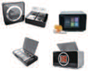

---
<!-- Page 46 -->
것으로 시작한다.
비대면 복약 관리 서비스 유형의 주요 기능은 정확한 약복용에 대한 모니터링이 필요한 만성질환자의 복약
순응도 향상을 위해 복약 스케줄 알림, 복약 모니터링을 하여 처방 약 오용 및 과복용을 방지하는 기능이다.
비대면 복약 관리 서비스 유형에 속하는 서비스의 사례로 미국의 PillStation, 국내의 스마트 약상자
(Smart PillBox), 파프리카 케어 등이 있다.
그림 3-20 온라인 복약 관리 서비스 사례 (P사 서비스 사례)
(cid:2925)(cid:1236) (cid:2771)료 (cid:2045)(cid:2583)(cid:1175)
(cid:2890)(cid:2001)(cid:2681) (cid:1633)(cid:1790)(cid:16)(cid:2681)(cid:2272) (cid:2465)(cid:2190)(cid:2496)(cid:1137) (cid:2050)(cid:2465) (cid:1945)(cid:2628) (cid:2890)(cid:2001)(cid:2681) (cid:1918)(cid:1790)
(cid:2465)(cid:1204) (cid:2687)(cid:2049) (cid:2705)(cid:3365)
(cid:2890)(cid:2001)(cid:2681)(cid:2616) (cid:50)(cid:51) 스(cid:2986)(cid:2613)(cid:1789) 복약 시 (cid:1214)(cid:1240)(cid:3296) (cid:1394)(cid:2570)(cid:2616) (cid:2925)(cid:1236) (cid:2001)문(cid:3296) (cid:2045)(cid:2583)(cid:1175) 약(cid:1204) (cid:2771)(cid:1521) (cid:1245)(cid:1790) 및 (cid:2890)(cid:2001) (cid:2633)(cid:1777) (cid:2705)(cid:3365)
약(cid:1204)(cid:2496) (cid:2681)(cid:2272)(cid:15) (cid:1150)(cid:2660)(cid:2071)(cid:3104) (cid:2681)(cid:2272)(cid:3294)(cid:1910) 약사(cid:1495) (cid:2460)(cid:2616) (cid:3134)(cid:3303) (cid:2687)보(cid:1843) (cid:3296)(cid:1472)(cid:2496) (cid:3355)인
(cid:2705)(cid:2689)(cid:1257)지 (cid:2346)시(cid:1088) (cid:3355)인 (cid:1529)(cid:2040)
[그림 3-20]는 P사의 온라인 복약 관리 서비스 사례이다. P사의 복약 관리 서비스는 약국이 제공하는
의약품 복용 방법(복약 지도)을 실시간으로 제공해 주는 것이 주요 기능으로, 복약 알림, 의약품 유의사항과
같은 정보를 사용자의 스마트 기기로 자동 전송한다. 또한 국내 약국 절반 이상이 사용하는 약국관리
프로그램(PM2000)과 연계하여 사용자가 손쉽게 복약 관리 서비스를 받을 수 있도록 한다.
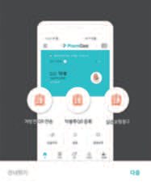
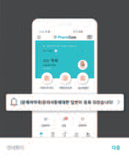
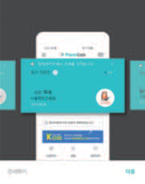
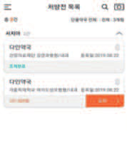

---
<!-- Page 47 -->

## 제3장 디지털헬스케어 서비스 유형 | 47

및
보안
모델
개념
및
보안
대책
개요
디지털헬스케어
구성요소
디지털헬스케어
서비스
유형
디지털헬스케어
서비스
보안
위협
디지털헬스케어
서비스
보안
요구사항
참고문헌
제1장
제2장
제3장
제4장
제5장
부록

#### 2.7 온라인 디지털 치료 서비스

온라인 디지털 치료 서비스는 AR/VR, 모바일 앱, 인공지능 등을 활용한 소프트웨어 콘텐츠를 통한 환자
치료 서비스이다. 소프트웨어 치료 콘텐츠를 포함한 디지털 치료 기기는 진단, 치료, 예방, 완화 등을
목적으로 한 소프트웨어 형태의 의료 서비스로 화학적, 물리적 작용만으로는 실현 불가능한 의료 분야에
디지털로 새로운 작용을 통한 치료 서비스이다.
디지털 치료제는 [그림 3-21]과 같이 게임 치료제, 음악 치료제, 소프트웨어 프로그램 등 다양한 형태의
치료 방법이 있다. 알약이나 캡슐 형태, 또는 주사제로 제공되는 기존의 화학적 치료를 넘어, IT 기술을 활용한
환자의 반응 분석과 행동 방식의 변화를 유도함으로서 질환을 치료하는 새로운 방안으로 떠오르고 있다.
그림 3-21 온라인 디지털 치료 서비스 종류 예시
(cid:36)(cid:48)P(cid:37) 및 (cid:2892)(cid:2343)(cid:2616) 개(cid:2230)(cid:3294)고 비디(cid:2527) (cid:1137)(cid:2640) (cid:1155)(cid:3319)(cid:2616) (cid:3134)(cid:3303) (cid:2681)(cid:1523)(cid:1594)(cid:1495)
(cid:1124)(cid:1098) 관리(cid:1843) (cid:2925)(cid:2680)(cid:3354) (cid:3294)(cid:1245) 위(cid:3296) (cid:34)(cid:37)(cid:41)(cid:37) 치료(cid:1843) 위(cid:3296) (cid:2680)(cid:2621)(cid:2680) (cid:1093)(cid:1087)
디지털 (cid:3280)(cid:1789)그(cid:1748) (cid:2647)(cid:1235) 소(cid:3280)(cid:3167)(cid:2589)어 디지털 치료(cid:2689)
약(cid:1947)(cid:2746)(cid:1577) (cid:1633)(cid:2496) 대(cid:3296) 인지(cid:3311)(cid:1586)치료((cid:36)(cid:35)(cid:53)) (cid:1245)(cid:2303)(cid:2616)
(cid:2555)(cid:1744) 치료 (cid:3280)(cid:1789)그(cid:1748) (cid:1099)(cid:2936) (cid:2299)(cid:1910) 개(cid:2230) (cid:3280)(cid:1789)그(cid:1748)
2(cid:3339) (cid:1532)(cid:1463)(cid:13) 고(cid:3334)(cid:2449)(cid:13) 비(cid:1861) (cid:3356)(cid:2647) 소(cid:2439) (cid:3311)(cid:1586) (cid:1124)(cid:1098) 관리(cid:2570) (cid:34)(cid:42)(cid:1245)(cid:1992)
대(cid:2202) (cid:2773)(cid:1910) 관리 (cid:3280)(cid:1789)그(cid:1748) 디지털 (cid:2771)(cid:1521) 및 (cid:1871)(cid:2938)(cid:3339) 치료(cid:2689)
(cid:1457)(cid:2708)(cid:2768)(cid:16)(cid:2344)(cid:1155)(cid:2266)(cid:2202)(cid:2613)(cid:1789) 인(cid:3296) (cid:2573)(cid:1586)(cid:13)
(cid:1861)성 (cid:1236)(cid:2605)(cid:3134) (cid:3356)(cid:2647)(cid:1843) 위(cid:3296) (cid:2573)(cid:1586)(cid:13)
(cid:2481)어 및 인지(cid:2658)(cid:2455)(cid:1843) (cid:3303)(cid:1150)(cid:3294)(cid:1495)
(cid:3311)(cid:1586) 요(cid:2024) (cid:1198)(cid:2605)(cid:2570) 디지털 (cid:3025)(cid:3116)(cid:2958)
(cid:2618)(cid:2440) 치료 (cid:3280)(cid:1789)그(cid:1748)
(cid:1532)(cid:1463) 및 (cid:1245)(cid:3083) (cid:1861)성 (cid:2773)(cid:3356)(cid:2628) (cid:1994)(cid:2045)(cid:2616)
(cid:1457)(cid:2771)(cid:3092) (cid:3356)(cid:2647) 인지 (cid:3379)(cid:1778)(cid:2616) 위(cid:3296) 2(cid:3339) (cid:1532)(cid:1463) 인(cid:2329)(cid:1853) (cid:2570)(cid:1757) (cid:1157)(cid:2193)
예(cid:2001)(cid:3294)(cid:1495) 개인 (cid:1871)(cid:2938)(cid:3339) 디지털
치료 (cid:3280)(cid:1789)그(cid:1748) (cid:3280)(cid:1789)그(cid:1748)
(cid:3280)(cid:1789)그(cid:1748)
소(cid:2439) (cid:34)(cid:37)(cid:41)(cid:37) 치료 (cid:1137)(cid:2640) (cid:38)(cid:55)(cid:48) (cid:1457)(cid:2266)(cid:2202) 시(cid:1087) (cid:2658)(cid:2455) (cid:55)(cid:51) 치료(cid:2689) 약(cid:1947)(cid:2746)(cid:1577) 치료 (cid:2460) (cid:83)(cid:70)(cid:52)(cid:38)(cid:53)
출처: KISTEP“디지털치료제(Digital Therapeutics)”
온라인 디지털 치료 서비스는 소프트웨어 콘텐츠 치료제로 의사의 처방을 받은 컨텐츠를 환자는 처방 기간
동안 AR/VR 기기 등 관련 기기에 다운로드를 받아 자가 치료를 수행한다. 서비스는 사용자가 시스템에
접속하여 본인 인증 후 처방 앱을 다운로드 받는 것으로 시작한다.

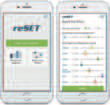

---
<!-- Page 48 -->
그림 3-22 온라인 디지털 치료 서비스 절차
➀-➁ 환자는 사용자 인증 후 서비스에 접속하여 처방 받은 디지털 치료제를 다운로드 (환자 인증 및 처방앱 다운로드
로그는 서비스 DB 에 저장)
➂-➃ 환자는 치료 앱을 실행하여 치료를 수행. 디지털 치료 앱은 환자의 반응을 서비스 시스템에 자동 전송하거나,
환자가 직접 답변 입력 시 환자가 전송 수락을 하면 서비스 시스템에 답변 전송 (환자 반응과 답변 내용은 서비스 DB에
저장되며, 주치의에 전송 후 파기)
➄-➅ 환자의 치료 내역을 주치의에 전송하여, 주치의의 치료 진행 상태에 대한 진단 후 처방전 변경 및 추가 처방 발행
(환자의 치료 내역과 의사의 진단 결과는 병원정보시스템에 저장)
➆-➇ 의사의 디지털 치료에 대한 진단은 환자에게 전송
(cid:3349) (cid:2045)(cid:2583)
서비스 (cid:2342)스(cid:3118)
(cid:1921)(cid:2641)형 (cid:2966)(cid:1808) (cid:1245)(cid:1245)
(cid:18) (cid:9)(cid:3356)(cid:2647)(cid:10) (cid:2635)(cid:2768) (cid:3377) 서비스
(cid:2685)(cid:2264) (cid:3377) (cid:2890)(cid:2001) (cid:2460) (cid:1518)(cid:2573)(cid:1789)(cid:1624) (cid:19) (cid:3356)(cid:2647) 인(cid:2768) 및 (cid:2460) (cid:1518)(cid:2573)(cid:1789)(cid:1624) (cid:1789)그 (cid:2679)(cid:2658)
스(cid:1859)(cid:3167) (cid:1245)(cid:1245)
(cid:20) (cid:9)(cid:3356)(cid:2647)(cid:10) (cid:2966)(cid:1808) (cid:2460) (cid:2346)(cid:3311) (cid:3377) (cid:21) (cid:3356)(cid:2647) (cid:2202)(cid:3093) 및 (cid:2621)(cid:1529) (cid:1394)(cid:2505) (cid:2679)(cid:2658)
(cid:3356)(cid:2647) (cid:2594) ((cid:52)(cid:47)(cid:52) 서비스) (cid:22)(cid:40) (cid:3356)(cid:2647) (cid:2202)(cid:3093) (cid:1986) (cid:2621)(cid:1529) (cid:2681)(cid:2272) (cid:2594)(cid:16)(cid:2460) 서(cid:2017) ((cid:2737)치(cid:2628)(cid:2496) (cid:2681)(cid:2272) (cid:3377) (cid:3189)(cid:1245))
인(cid:3104)(cid:1769)(cid:3181)(cid:2099) (cid:41)(cid:16)(cid:56)
(cid:40)(cid:66)(cid:85)(cid:70)(cid:88)(cid:66)(cid:90)
(cid:25) (cid:9)서비스(cid:10) (cid:2628)(cid:2190) (cid:2771)(cid:1521) (cid:49)(cid:41)(cid:51) (cid:1245)(cid:1992) (cid:2628)(cid:1808) (cid:2342)스(cid:3118) (cid:1245)(cid:1992)
인(cid:3104)(cid:1769)(cid:3181)(cid:2099) (cid:1137)(cid:2640) (cid:1245)(cid:1245) (cid:1150)(cid:1175) (cid:2681)(cid:2272)
(cid:22) (서비스) (cid:24) (cid:9)(cid:2628)(cid:2190)(cid:10) (cid:2966)(cid:1808) (cid:2771)(cid:3311) (cid:2202)(cid:3093) (cid:2771)(cid:1521)
(cid:57)(cid:51) (A(cid:51) (cid:12) (cid:55)(cid:51) (cid:12) (cid:46)(cid:51)) (cid:1245)(cid:1245) (cid:3356)(cid:2647) 치료 (cid:1150)(cid:1175) (cid:3365)(cid:2344) (cid:9)(cid:2628)(cid:2190) 서(cid:1914) (cid:3240)(cid:3299)(cid:10)
(cid:1394)(cid:2505) (cid:2681)(cid:2272)
(cid:2890)(cid:2001) (cid:1245)(cid:1088) (cid:2040)(cid:1155)
(cid:2934)(cid:1086) (cid:2890)(cid:2001) (cid:1994)(cid:3311)
(cid:2628)(cid:2190) (cid:2771)(cid:1808) (cid:2658)비 치료 사(cid:3377) (cid:1177)(cid:1851) 지(cid:2342)
(cid:1394)(cid:2071)(cid:1870)
(cid:18)(cid:18)(cid:18)(cid:18)((cid:2628)사) (cid:23)(cid:23) (cid:3356)(cid:2647) 치료 (cid:1394)(cid:2505) 및
치료 (cid:1150)(cid:1175) (cid:2628)사 (cid:2771)(cid:1521) (cid:1150)(cid:1175) (cid:2679)(cid:2658)
(cid:2771)(cid:1521) (cid:1394)(cid:2570)
(cid:2045)(cid:2583) (cid:2687)(cid:2049) (cid:2342)스(cid:3118)
(cid:2681)(cid:2272) 및
(cid:2679)(cid:2658)
(cid:1942)(cid:2230) (cid:3134)(cid:2344) 유·(cid:1942)(cid:2230) (cid:3134)(cid:2344) (cid:2342)스(cid:3118)(cid:1394)부 (cid:3134)(cid:2344)
(cid:38)(cid:46)(cid:51)(cid:16)(cid:41)(cid:42)(cid:52) (cid:48)(cid:36)(cid:52) (cid:49)A(cid:36)(cid:52)
(cid:2628)사
온라인 디지털 치료 서비스 유형에 속하는 서비스 사례로는 미국의 약물중독 치료 모바일 앱‘리셋(reSET),
Voluntis, LifeSemantics 등 암 예방 관리 치료제, Omada Health, Noom, WellDoc 등 만성질환 예방 및
관리 치료제, MedRhytms, Cognoa Kaia-health 등 운동·언어·인지기능 장애 음악 치료제와 EndeavorRx
등 ADHD 게임 치료제가 있으며, 한국에는 뉴냅 비전(Nunap Vision) 이 서비스 중이다.

| 스(cid:1859)(cid:3167) (cid:1245)(cid:1245) |
| --- |
| (cid:2594) ((cid:52)(cid:47)(cid:52) 서비스) |

| 인(cid:3104)(cid:1769)(cid:3181)(cid:2099) (cid:1137)(cid:2640) (cid:1245)(cid:1245) |
| --- |
| (cid:57)(cid:51) (A(cid:51) (cid:12) (cid:55)(cid:51) (cid:12) (cid:46)(cid:51)) (cid:1245)(cid:1245) |

---
<!-- Page 49 -->

## 제3장 디지털헬스케어 서비스 유형 | 49

및
보안
모델
개념
및
보안
대책
개요
디지털헬스케어
구성요소
디지털헬스케어
서비스
유형
디지털헬스케어
서비스
보안
위협
디지털헬스케어
서비스
보안
요구사항
참고문헌
제1장
제2장
제3장
제4장
제5장
부록
그림 3-23 온라인 디지털 치료제 서비스 사례 (A사 서비스 사례)
[그림 3-23]은 A사의 온라인 디지털 치료제 서비스 사례이다. A사의 불면증 대상 디지털 치료제는 의사의
진료 후 디지털 치료제를 처방받아 댁내에서 치료제 앱을 다운받아 처방받은 방법으로 자가 치료를 수행한다.
치료제에 대한 실시간 환자 반응 또는 응답을 저장하고 분석하여 환경이나 행동 조절 또는 치료 요소 변경 등
의료진의 실시간 진료가 제공된다. 치료 종료 후 분석 결과와 임상 결과 피드백 등 통합적인 치료 결과를 통해
지속 치료 또는 효과 지속성 동기 유지 등 추가 진료를 진행 할 수 있다. A사의 불면증 대상 디지털 치료제는
식약처 지원을 받아 서울대학교병원, 삼성서울병원, 고려대안암병원과 함께 개발했다.

#### 2.8 환자 이송 및 비대면 응급 진료 서비스

환자 이송 및 비대면 응급 진료 서비스는 구급차, 함정, 헬기 등 이동 중인 응급 환자에 대해 ICT 기술을
활용하여 의사가 환자의 상태를 화상 통신, 영상 전송 등을 통해 병원에 전송하여 의료진의 응급 대응 처치
방법을 지시받아, 적절한 시점에 적합한 응급 처치를 하도록 하는 서비스이다.
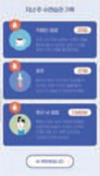

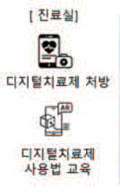
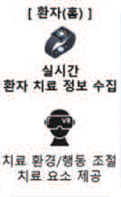
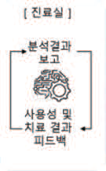
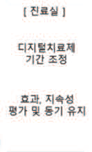

---
<!-- Page 50 -->
그림 3-24 비대면 이동 및 응급 의료 서비스 절차
➀-➁ 환자는 구급 센터에 이동형 응급 진료 서비스를 요청하면, 센터는 구급 차량을 출동시키고, 구급 센터의 이동형
응급 의료 서비스 연계 시스템은 응급 환자 수용 가능 병원 정보 전송
➂-➃ 구급대원은 사용자 인증 후 이동형 응급 의료 서비스에 접속하고, 응급 환자 등록 및 환자의 상태와 응급 상황을
전송 (구급대원과 환자 인증 로그는 서비스 DB에 저장)
➄-➅-➆ 환자에 연결된 모니터링 장비는 환자의 상태 센싱 정보 서비스 시스템에 전송하고, 서비스 시스템은 환자
상태와 환자 모니터링 데이터를 수용 예정 병원 의료진에 전송 (환자 상태와 모니터링 정보는 서비스 DB에 저장. 지정
병원에 전송 후 파기)
➇-➈-➉ 의사는 환자의 상태와 환자 신체 모니터링 결과를 확인하고 응급 처치 지시 (환자 상태 및 모니터링 데이터,
의사의 응급 처치 지시 내용은 병원정보시스템에 저장)
- 구급대원은 의사의 응급 처치 지시에 따라 환자 구급 활동을 수행하며 병원 도착 후 응급 환자를 응급실로 이관
(cid:2045)(cid:2583)
(cid:18) (cid:9)(cid:3356)(cid:2647)(cid:10) (cid:2633)(cid:1586)형 (cid:2621)(cid:1241) (cid:2771)(cid:1808) (cid:2563)(cid:2898)
(cid:1203)(cid:1241) (cid:2243)(cid:3104)
서비스 (cid:2342)스(cid:3118)
환자 (cid:2633)(cid:1586)형 (cid:2621)(cid:1241) (cid:2628)(cid:1808) 서비스
(cid:2507)(cid:1157) (cid:2342)스(cid:3118)
(cid:19) (cid:9)서비스(cid:10) (cid:1203)(cid:1241) (cid:2864)(cid:1757) (cid:2937)(cid:1586) (cid:1986) (cid:23) 사(cid:2570)자 (cid:2635)(cid:2768) (cid:45)(cid:80)(cid:72) (cid:2679)(cid:2658)
(cid:2621)(cid:1241) (cid:3356)(cid:2647) (cid:2299)(cid:2570) (cid:1086)(cid:1502) (cid:2045)(cid:2583) (cid:2687)(cid:2049) (cid:2689)(cid:1173)
(cid:24) 환자 (cid:2202)(cid:3093) 및 모(cid:1508)(cid:3104)(cid:1858)
(cid:2687)보 (cid:2679)(cid:2658)
(cid:2633)(cid:1586)형 (cid:1203)(cid:1241) (cid:2771)(cid:1808) (cid:2864)(cid:1757) 서(cid:2017) (지(cid:2687) (cid:2045)(cid:2583) (cid:2681)송 (cid:3377) (cid:3189)기)
(cid:9)(cid:1203)(cid:1241)(cid:2864)(cid:13) 헬(cid:1245)(cid:13) (cid:3299)(cid:2687)(cid:10) (cid:21) (cid:9)(cid:1203)(cid:1241)(cid:1536)(cid:2583)(cid:10)
(cid:3356)(cid:2647) (cid:2202)(cid:3093) (cid:1986) (cid:2621)(cid:1241) (cid:2202)(cid:3359) (cid:2681)(cid:2272)
(cid:20) (cid:9)(cid:1203)(cid:1241)(cid:1536)(cid:2583)(cid:13) (cid:3356)(cid:2647)(cid:10) (cid:2633)(cid:1586)형 (cid:2621)(cid:1241) (cid:2628)(cid:1808) 서비스
(cid:2635)(cid:2768) (cid:3377) 서비스 (cid:2507)(cid:1157) (cid:2342)스(cid:3118) (cid:22) (cid:9)(cid:1245)(cid:1245)(cid:10) (cid:2346)(cid:2342)(cid:1088) (cid:3356)(cid:2647) (cid:2202)(cid:3093) (cid:2681)(cid:2272)
(cid:2685)(cid:2264) (cid:1986) (cid:3356)(cid:2647) (cid:1633)(cid:1790) (cid:49)(cid:41)(cid:51) (cid:1245)(cid:1992) (cid:2628)(cid:1808) (cid:2342)스(cid:3118) (cid:1245)(cid:1992)
(cid:25) (서비스)
구급대(cid:2583) 환자 (cid:2202)(cid:3093) (cid:26) (cid:9)(cid:2628)(cid:2190)(cid:10) (cid:2621)(cid:1241) (cid:2890)(cid:2966) 지(cid:2342) (cid:2681)(cid:2272)
(cid:2681)송
(cid:3356)(cid:2647) (cid:1917)(cid:1508)(cid:3104)(cid:1858) (cid:1245)(cid:1245) (cid:2628)(cid:2190) (cid:2771)(cid:1808) (cid:2658)비
(cid:1394)(cid:2071)(cid:1870)
(cid:18)(cid:17)((cid:2628)사)
(cid:18)(cid:18) (cid:9)서비스(cid:10)
환자 (cid:2202)(cid:3093) 및
(cid:2628)(cid:2190) (cid:2621)(cid:1241) (cid:2890)(cid:2966) 지(cid:2342) (cid:2681)(cid:2272)
응급 (cid:2890)지 지(cid:2342) (cid:2679)(cid:2658)
환자 (cid:2045)(cid:2583) (cid:2687)(cid:2049) (cid:2342)스(cid:3118)
(cid:18)(cid:19) (cid:9)(cid:2621)(cid:1241)(cid:2864)(cid:1757)(cid:10) (cid:2045)(cid:2583) (cid:2633)(cid:2272)
(cid:1942)(cid:2230) 통신 유(cid:18363)(cid:1942)(cid:2230) 통신 (cid:2628)사 (cid:38)(cid:46)(cid:51)(cid:16)(cid:41)(cid:42)(cid:52) (cid:48)(cid:36)(cid:52) (cid:49)(cid:34)(cid:36)(cid:52)
시스템(cid:1394)부 통신 (cid:2527)(cid:3280)(cid:1732)인 이동

|  |
| --- |
|  |

---
<!-- Page 51 -->

## 제3장 디지털헬스케어 서비스 유형 | 51

및
보안
모델
개념
및
보안
대책
개요
디지털헬스케어
구성요소
디지털헬스케어
서비스
유형
디지털헬스케어
서비스
보안
위협
디지털헬스케어
서비스
보안
요구사항
참고문헌
제1장
제2장
제3장
제4장
제5장
부록
구급대원은 이동형 응급 진료소 안에 탑승한 환자에 모니터링 기기를 연결하고, 응급 의료 서비스를 통해
환자의 상태를 실시간으로 병원에 전송한다. 서비스의 AI 분석 시스템은 응급 환자 대응 매뉴얼 정보를
제공하고, 환자의 상태를 전송받은 의료진 현장에서 실시할 수 있는 진료 및 응급 의료 방법을 지시한다. 환자
이송 및 비대면 응급 진료 서비스는 이동 중인 응급 환자에 대한 정확하고, 신속한 대응이 매우 중요하므로,
이동형 진료소의 모니터링 기기의 통신 안전성, 서비스 제공자의 병원 의료진과 구급대원과의 신속한 통신의
안전성이 매우 중요한 서비스이다. 서비스는 구급대원이 환자 인증 후 모니터링 기기 연결 후 응급 의료
서비스에 사용자 인증 후 접속을 하고, 환자를 등록하는 것으로 시작한다.
환자 이송 및 비대면 응급 진료 서비스 유형에 속하는 서비스 사례로는 AI기반 응급의료 시스템(NIPA),
코르티Corti (덴마크), 99가사넷(일본) 등이 있다.
그림 3-25 환자 이송 및 비대면 응급 진료 서비스 사례 (N기관 서비스사례)
(cid:1203)(cid:1241) (cid:1521)(cid:1157) (cid:2045)(cid:2583) (cid:1521)(cid:1157)
(cid:2687)(cid:2049) (cid:1173)유 (cid:2687)(cid:2049) (cid:1173)유
구급(cid:3357)(cid:1586) (cid:2636)지 구급(cid:3357)(cid:1586) (cid:2636)지
(cid:2346)(cid:2342)(cid:1088) (cid:2202)(cid:3359) (cid:2346)(cid:2342)(cid:1088) (cid:2202)(cid:3359)
응급 자(cid:2583) (cid:2687)보 응급 자(cid:2583) (cid:2687)보
(cid:2633)(cid:2272) (cid:1150)(cid:2687) (cid:2299)(cid:2570) (cid:1150)(cid:2687)
(cid:18)(cid:18)(cid:26)구급대 응급(cid:2628)료 (cid:2243)(cid:3104)
이송 (cid:1086)(cid:1502) (cid:2504)(cid:2071) 응급(cid:2346) (cid:2299)(cid:2570) (cid:2504)(cid:2071)
(cid:2925)(cid:2680) 이송 (cid:2045)(cid:2583) (cid:2681)(cid:2583) (cid:2504)(cid:2071)
(cid:2687)(cid:2049) (cid:2507)(cid:1157) (cid:2687)(cid:2049) (cid:2507)(cid:1157)
응급 환자 고(cid:2604) (cid:42)(cid:37) ((cid:3071)(cid:1732)(cid:2571)(cid:1624)) 응급 환자 고(cid:2604) (cid:42)(cid:37)
(cid:2621)(cid:1241) (cid:34)(cid:42) 서비스
응급환자 (cid:2746)(cid:2768)(cid:1576) (cid:2073)(cid:1832)
구급(cid:2636)지 자(cid:1586) 기(cid:1790)
구급 (cid:3252)(cid:2739) (cid:1874)(cid:1487)(cid:2484) (cid:2689)(cid:1173)
(cid:38)(cid:46)(cid:52) (cid:44)(cid:42)(cid:48)(cid:52)(cid:44) (cid:2925)(cid:2680) 이송(cid:2045)(cid:2583) (cid:2230)(cid:2687) (cid:38)(cid:51) (cid:44)(cid:42)(cid:48)(cid:52)(cid:44)
응급(cid:2346) (cid:3240)(cid:3354)(cid:1576) (cid:2687)보 (cid:2689)(cid:1173)
[그림 3-25]은 N기관의 환자 이송 및 비대면 응급 진료 서비스 사례이다. 응급의료 시스템은 응급 상황이
발생한 시점부터 환자가 병원 응급실에 도착할 때까지 실시간으로 의료진에게 상황을 전달 받아 응급 처치 등
이동형 진료가 진행된다.

|  |  |

---
<!-- Page 52 -->

#### 2.9 비대면 시술 및 수술 서비스

비대면 시술 및 수술 서비스는 외과의가 원격지의 환자 주위에 설치되어 있는 로봇을 의사의 진료실에
설치된 제어 시스템으로 원격지의 로봇을 조정하여 수술 치료를 진행하는 서비스이다.
그림 3-26 비대면 시술 및 수술 서비스 절차
➀-➁ 환자 사이드에서는 의사 인증 후 서비스 접속하여, 환자 인증 후 환자-수술로봇 간 연결. 의사 사이드에서는 의사
인증 후 서비스에 접속하고, 수술 로봇 제어 시스템 인증 (의사, 환자, 로봇 기기, 로봇 제어 기기 인증 로그는 서비스 DB
에 저장)
➂-➃-➄ 환자에 연결된 모니터링 기기는 환자의 생체 신호를 실시간으로 서비스 시스템에 전송하여, 경고·이상 수치
발생 시 의사에게 전송 (환자 실시간 모니터링 정보는 서비스 DB에 저장되며, 병원정보시스템에 전송 후 파기)
➅-➆ 수술 로봇과 로봇 제어 시스템 간의 반복적인 통신 테스트를 수행하여 통신 안전성을 검증 (통신 안전성 검증 과정
로그는 서비스 DB에 저장)
➇-➈-➉- 의사는 로봇 수술 제어 시스템을 조정하여 비대면 로봇 수술 수행하며, 모든 수술 내역은 서비스
시스템에 전송 (모든 수술 내역은 서비스 DB에 저장되며, 병원정보시스템에 전송 후 파기)
의사는 수술 종료 후 수술 결과 확인 및 사후 처치 지시 (의사의 사후 처지 지시 내역은 병원정보시스템에 저장)
(cid:2045)(cid:2583) (cid:9)(cid:2628)(cid:2190) (cid:2190)(cid:2633)(cid:1624)(cid:10)
(cid:22)(cid:40)
(cid:2045)(cid:2583) (cid:9)(cid:3356)(cid:2647) (cid:2190)(cid:2633)(cid:1624)(cid:10) 수술 (cid:1789)(cid:2056) (cid:2689)싐 시스(cid:3118)
(cid:18) (cid:9)(cid:3356)(cid:2647)(cid:13) (cid:1245)(cid:1245)(cid:10) (cid:2635)(cid:2768) (cid:3377) 서비스 (cid:2685)(cid:2264)
(cid:2628)사
수술 (cid:1789)(cid:2056) 시스(cid:3118)
(cid:2628)(cid:2190) (cid:2771)(cid:1808) (cid:2658)비
(cid:23) (cid:2299)(cid:2303)(cid:1789)(cid:2056)(cid:14)(cid:2689)어(cid:1245) (cid:2342)스(cid:3118)(cid:1088)
(cid:3134)(cid:2344) (cid:3114)스(cid:3167) (cid:2299)(cid:3311)
(cid:24) (cid:9)(cid:2628)(cid:2190)(cid:10) (cid:2299)(cid:2303)(cid:1789)(cid:2056)(cid:14)(cid:2689)어 (cid:2342)스(cid:3118) (cid:1088)
(cid:3134)(cid:2344) (cid:2441)(cid:2681)(cid:2239) (cid:1128)(cid:2768)
(cid:18)(cid:19) (cid:2299)(cid:2303) (cid:1150)(cid:1175) (cid:3355)(cid:2635) (cid:1986)
(cid:25) (cid:9)(cid:2628)(cid:2190)(cid:10) (cid:3356)(cid:2647) (cid:2299)(cid:2303) (cid:2299)(cid:3311)
(cid:2299)(cid:2303) (cid:2190)(cid:3377) (cid:2890)(cid:2966) 지(cid:2342)
(cid:26) (cid:9)서비스(cid:10) 수술 수(cid:3311) (cid:1394)싪 (cid:2681)(cid:2272)
(cid:18) (cid:9)(cid:2628)(cid:2190)(cid:13) (cid:1245)(cid:1245)(cid:10) (cid:22) (cid:3356)(cid:2647) (cid:1917)(cid:1508)(cid:3104)(cid:1858)
(cid:2635)(cid:2768) (cid:3377) (cid:1155)(cid:1162)(cid:18363)(cid:2633)(cid:2202) 수(cid:2966) (cid:2681)(cid:2272)
서비스 (cid:2685)(cid:2264)
(cid:1917)(cid:1508)(cid:3104)(cid:1858) (cid:1245)(cid:1245)
(cid:1394)(cid:2071)(cid:1870)
비대면 수술 서비스 시스(cid:3118)
(cid:25) (cid:18)(cid:18)
(cid:19) (cid:2190)(cid:2570)(cid:2647)(cid:13) (cid:1245)(cid:1245) 수술 (cid:1394)싪 및
(cid:2628)사 (cid:20) (cid:9)(cid:1245)(cid:1245)(cid:10) (cid:3356)(cid:2647) (cid:2212)(cid:2899) 쉉(cid:3344) (cid:1917)(cid:1508)(cid:3104)(cid:1858) (cid:1150)(cid:1175) (cid:2681)(cid:2272) (cid:2635)(cid:2768) (cid:1789)그 (cid:2679)(cid:2658) (cid:3356)(cid:2647) (cid:1917)(cid:1508)(cid:3104)(cid:1858)
(cid:2687)(cid:2049) (cid:2679)(cid:2658)
(cid:21) (cid:18)(cid:17) (cid:2045)(cid:2583) (cid:2687)(cid:2049) (cid:2342)스(cid:3118)
(cid:3356)(cid:2647) (cid:1917)(cid:1508)(cid:3104)(cid:1858)(cid:13) 수술
(cid:1394)싪 (cid:2679)(cid:2658)(병원정보
시스템에 전송 후 파기) (cid:38)(cid:46)(cid:51)(cid:16)(cid:41)(cid:42)(cid:52) (cid:48)(cid:36)(cid:52) (cid:49)(cid:34)(cid:36)(cid:52)
(cid:1942)(cid:2230) 통신 유·(cid:1942)(cid:2230) 통신 시스템내부 통신

|  |  | (cid:23) (cid:2299)(cid:2303)(cid:1789)(cid:2056)(cid:14)(cid:2689)어(cid:1245) (cid:2342)스(cid:3118)(cid:1088) (cid:3134)(cid:2344) (cid:3114)스(cid:3167) (cid:2299)(cid:3311) (cid:24) (cid:9)(cid:2628)(cid:2190)(cid:10) (cid:2299)(cid:2303)(cid:1789)(cid:2056)(cid:14)(cid:2689)어 (cid:2342)스(cid:3118) (cid:1088) |  |
| --- | --- | --- | --- |
|  |  | (cid:3134)(cid:2344) (cid:2441)(cid:2681)(cid:2239) (cid:1128)(cid:2768) (cid:25) (cid:9)(cid:2628)(cid:2190)(cid:10) (cid:3356)(cid:2647) (cid:2299)(cid:2303) (cid:2299)(cid:3311) |  |
|  |  | (cid:26) (cid:9)서비스(cid:10) 수술 수(cid:3311) (cid:1394)싪 (cid:2681)(cid:2272) |  |

---
<!-- Page 53 -->

## 제3장 디지털헬스케어 서비스 유형 | 53

및
보안
모델
개념
및
보안
대책
개요
디지털헬스케어
구성요소
디지털헬스케어
서비스
유형
디지털헬스케어
서비스
보안
위협
디지털헬스케어
서비스
보안
요구사항
참고문헌
제1장
제2장
제3장
제4장
제5장
부록
비대면 시술 및 수술 서비스는 실제 환자의 수술을 집도하는 서비스이므로 의사와 환자에 대한 인증
외에도 환자에 연결된 기기 인증이 기본적으로 이루어져야 한다. 또한, 로봇 제어 시스템과 원격지의 환자
수술 로봇 간의 통신 안전성과 수술 중인 환자의 상태 모니터링에 전송에 대한 통신 안전성이 매우 중요하다.
또한 수술 전 과정에서 환자 사이드에 응급 인력 대기 등 수술 중 응급 상황 발생 시에 대한 사전 대비가
동시에 이루어져야 한다.
서비스 사례로는 미국의 다빈치 Xi, 베르시우스, 코패스 시스템 등이 있고, 중국의 톈지(天津) 로봇,
Beijing Surgerii 수술용 로봇 팔 등이 있다.
그림 3-27 비대면 시술 및 수술 서비스 사례 (프랑스 사례)
(cid:3280)(cid:1740)스 (cid:2263)(cid:3354)(cid:1245)(cid:2448)(cid:2507)(cid:1203)(cid:2263)(cid:2628) (cid:2583)(cid:1146) (cid:1789)(cid:2056)(cid:2299)(cid:2303) (cid:2190)(cid:1785)
(cid:2583)(cid:1146)지 (cid:2299)(cid:2303) (cid:27) (cid:2583)(cid:1146)지 (cid:2628)사(cid:1086) 수술 (cid:3356)(cid:2647) (cid:2190)(cid:2633)(cid:1624) (cid:2299)(cid:2303)(cid:2346) (cid:27) (cid:3356)(cid:2647)싡 심(cid:1150)(cid:1595)
(cid:1789)(cid:2056) (cid:2705)(cid:2687)(cid:1245)(cid:1843) (cid:2633)(cid:2570)(cid:3303) 수술 (cid:2776)(cid:1576) (cid:1789)(cid:2056)(cid:2613)(cid:1789)(cid:3311) (cid:2583)(cid:1146)지 (cid:2628)사(cid:2628) 수술 (cid:2771)(cid:3311)
(cid:3025)(cid:2267) (cid:27) (cid:2628)사(cid:2628) 수술 (cid:2776)(cid:1576) (cid:1394)(cid:2570)(cid:2616)
(cid:2583)(cid:1146)지(cid:2628) 수술 (cid:1789)(cid:2056)싡 (cid:2681)(cid:2272)
(cid:2299)(cid:2303) (cid:1560)(cid:2633)(cid:3104) (cid:3134)(cid:2344)
(cid:1487)(cid:2564) (cid:2628)(cid:2190)(cid:14)(cid:3356)(cid:2647)(cid:1088) (cid:24)(cid:13)(cid:17)(cid:17)(cid:17)(cid:76)(cid:78) 스(cid:3167)(cid:1732)스(cid:2071)(cid:1840)
[그림 3-27]는 프랑스의 소화기암연구소의 원격 로봇 수술 사례이다. 스트라스부르의 환자에 연결된 수술
로봇은 시술자의 양손을 로봇이 대신하여 시술 동착을 로봇이 따라하도록 개발되었으며, 뉴욕의 외과 의사는
로봇 수술 조종 기기를 이용하여 원격 수술을 집도한다. 의사 사이드의 로봇 조종기 콘솔과 환자 사이드의
수술 로봇의 콘솔 간에는 실시간 수술 집도 내용과 환자 상태 데이터를 전송한다.

|  |  |

---
<!-- Page 54 -->

#### 2.10 의료 빅데이터 AI 서비스

의료 빅데이터 AI 분석 서비스는 의료기관, 개인, 기업 등이 수집하는 민간 영역의 보건의료 데이터뿐만
아니라 공공영역에서 수집하는 의료 데이터를 연계하여 분산된 데이터를 머신러닝(ML, Machine Learning)
과 딥러닝(DL, Deep Learning) 등 인공지능 분석을 통해 사용자 맞춤형 정보를 제공하는 서비스이다.
의료 빅데이터 AI 분석 서비스 유형은 서비스 제공자, 빅데이터 제공 기관, 빅데이터 활용기관으로
구성된다. 서비스는 빅데이터 기반으로 질병 진단 및 예측 서비스와 사용자의 맞춤 의료 정보 분석 서비스를
제공한다. 의료진은 의료 빅데이터 AI 분석 서비스를 통해 진단의 정확도와 정밀성, 그리고 신속성을 확보할
수 있고, 일반 사용자는 키워드 중심의 의료 정보 검색 서비스를 이용할 수 있다.
그림 3-28 의료 빅데이터 AI 분석 서비스 절차
➀ 의료 빅데이터 제공 기관으로부터 비식별화된 의료 데이터셋 수집
➁-➂ 사용자는 인증 후 서비스에 접속하여 AI 분석 키워드를 전송하거나, 헬스케어 기기는 센싱된 데이터를 자동
전송하여 AI 분석을 요청
➃ 의료 빅데이터 AI 분석 시스템은 맞춤형 분석 결과를 사용자에게 전송
➄ 의료 빅데이터 요청이 있을 경우 해당 기관에 비식별화된 데이터 제공
의료 빅데이터 (cid:2689)(cid:1173) (cid:1245)(cid:1177)
1 비(cid:2343)별(cid:3354) (cid:1595)
(cid:1173)(cid:1173) (cid:1245)(cid:1177) 데이터(cid:2247) (cid:2299)(cid:2776)
의료 빅데이터 AI (cid:2073)(cid:2227) (cid:2342)스(cid:3118)
보(cid:1124)(cid:2050)지(cid:2071)
(cid:1093)(cid:2511)(cid:2045)(cid:13) (cid:1124)(cid:1098)(cid:1128)(cid:2771)(cid:13) (cid:2212)(cid:3357)(cid:2339)(cid:1177)(cid:13)
(cid:1204)(cid:1856) (cid:2448) (cid:2243)터 (cid:2771) (cid:2520) 료 (cid:2001) (cid:2685) (cid:1394) (cid:2713) (cid:2505) (cid:13) (cid:1633) (cid:3144)(cid:2465) (cid:1394)(cid:2505)(cid:13) 데이터 (cid:1245)(cid:1992) (cid:2773)(cid:2045) (cid:2771)(cid:1521)(cid:15)(cid:2520)(cid:2959) 2 (cid:9)(cid:2190)(cid:2570)(cid:2647)(cid:10) 사(cid:2570)(cid:2647)
(cid:1204)(cid:1856) (cid:2746)(cid:2452) 의료원 (cid:2045)(cid:2583) (cid:2687)(cid:2049) (cid:2342)스(cid:3118) 데이터 사(cid:2570)(cid:2647) (cid:1871)(cid:2938) 의료 (cid:2687)보 분석 (cid:2635)(cid:2768) (cid:3377) (cid:2685)(cid:2264) 스(cid:1859)(cid:3167) (cid:1245)(cid:1245)
(cid:1124)(cid:1098) 보(cid:3319) (cid:2348)사 (cid:3235)(cid:1086)원 ((cid:38)(cid:46)(cid:51)(cid:13) (cid:49)A(cid:36)(cid:52)(cid:13) (cid:48)(cid:36)(cid:52)(cid:13) (cid:49)(cid:41)(cid:51) (cid:1633))
(cid:2640)(cid:2202) 문헌 (cid:2687)보(cid:13) (cid:20) (cid:9)(cid:2190)(cid:2570)(cid:2647)(cid:10)
(cid:1173)(cid:1173) 데이터 (cid:3240)(cid:3086) (cid:2640)(cid:2202) (cid:2771)료 지(cid:2972)(cid:13) AI (cid:2073)(cid:2227) (cid:3075)(cid:2581)(cid:1624) (cid:2681)(cid:2272)
의료((cid:2465)) (cid:2689)(cid:3263)(cid:2687)보 (cid:1633)
(cid:1977)(cid:1088) 의료 (cid:1245)(cid:1177) (cid:3349) 모(cid:1508)터(cid:1858)(cid:13) 비대(cid:1910) 의료(cid:13)
(cid:2243)서 및 헬스케어 (cid:1245)(cid:1245) (cid:21) AI (cid:2073)(cid:2227) (cid:1150)(cid:1175) (cid:2681)(cid:2272)
(cid:2640)(cid:2202) (cid:2507)(cid:1203) (cid:1245)(cid:1177) (cid:2299)(cid:2776)
(cid:2687)보 (cid:1633) 분석(cid:1150)(cid:1175) (cid:46)(cid:45)(cid:16)(cid:37)(cid:45) AI 분석
빅데이터
(cid:3303)(cid:2555) (cid:45)(cid:48)(cid:37) 데이터 (cid:2679)(cid:2658) (cid:37)(cid:35) (cid:3295)(cid:2339) (cid:2498)(cid:2771) (cid:2342)스(cid:3118) (cid:56)(cid:66)(cid:83)(cid:70)(cid:73)(cid:80)(cid:86)(cid:84)(cid:70)
(cid:22) 비(cid:2343)별(cid:3354) (cid:1595)
(cid:47)(cid:80)(cid:79)(cid:14)T(cid:83)(cid:66)(cid:69)(cid:74)(cid:85)(cid:74)(cid:80)(cid:79)(cid:66)(cid:77) 데이터 빅데이터 (cid:2689)(cid:1173)
의료 빅데이터 (cid:2344)(cid:2898) (cid:1245)(cid:1177)
(cid:41)(cid:80)(cid:78)(cid:70) (cid:37)(cid:70)(cid:87)(cid:74)(cid:68)(cid:70)(cid:84) (cid:3357)(cid:1586) (cid:45)(cid:74)(cid:71)(cid:70)(cid:77)(cid:80)(cid:72) 빅데이터 (cid:2681)(cid:2890)(cid:1851) 및 비(cid:2343)(cid:2041)(cid:3354) 모(cid:1621)
(cid:35)I(cid:48) (cid:51)(cid:70)(cid:81)(cid:80)(cid:84)(cid:74)(cid:85)(cid:80)(cid:83)(cid:90) (cid:40)(cid:70)(cid:79)(cid:80)(cid:78)(cid:74)(cid:68)(cid:84)
(cid:37)(cid:66)(cid:74)(cid:77)(cid:90) (cid:36)(cid:80)(cid:79)(cid:69)(cid:74)(cid:85)(cid:74)(cid:80)(cid:79) (cid:51)(cid:53)(cid:45)(cid:52) 의료 빅데이터 (cid:2299)(cid:2776) (cid:39)(cid:83)(cid:66)(cid:78)(cid:70)(cid:88)(cid:80)(cid:83)(cid:76)
((cid:51)(cid:70)(cid:66)(cid:77)-(cid:85)(cid:74)(cid:78)(cid:70)
(cid:52)(cid:80)(cid:68)(cid:74)(cid:66)(cid:77) (cid:46)(cid:70)(cid:69)(cid:74)(cid:66) (cid:77)(cid:80)(cid:68)(cid:66)(cid:85)(cid:74)(cid:79)(cid:72) (cid:84)(cid:90)(cid:84)(cid:85)(cid:70)(cid:78))
무선 통신 유(cid:18363)무선 통신 시스템내부 통신

| (cid:41)(cid:80)(cid:78)(cid:70) (cid:37)(cid:70)(cid:87)(cid:74)(cid:68)(cid:70)(cid:84) |
| --- |
| (cid:35)I(cid:48) (cid:51)(cid:70)(cid:81)(cid:80)(cid:84)(cid:74)(cid:85)(cid:80)(cid:83)(cid:90) |
| (cid:37)(cid:66)(cid:74)(cid:77)(cid:90) (cid:36)(cid:80)(cid:79)(cid:69)(cid:74)(cid:85)(cid:74)(cid:80)(cid:79) |
| (cid:52)(cid:80)(cid:68)(cid:74)(cid:66)(cid:77) (cid:46)(cid:70)(cid:69)(cid:74)(cid:66) |

---
<!-- Page 55 -->

## 제3장 디지털헬스케어 서비스 유형 | 55

및
보안
모델
개념
및
보안
대책
개요
디지털헬스케어
구성요소
디지털헬스케어
서비스
유형
디지털헬스케어
서비스
보안
위협
디지털헬스케어
서비스
보안
요구사항
참고문헌
제1장
제2장
제3장
제4장
제5장
부록
의료 빅데이터 AI 분석 서비스 제공자는 보유하고 있는 빅데이터를 신청하는 기관에 빅데이터를
비식별화하여 제공할 수 있다.
의료 빅데이터 AI 분석 서비스 유형에 속하는 서비스 사례로는 한국의 정밀 의료 병원정보시스템(P-HIS)
닥터앤서, 보건의료 빅데이터 플랫폼 등이 서비스 중이며, 미국의 ET 메디컬 브레인, MS 클라우드 포
헬스케어, 중국의 유이클라우드 渡科技, YIDU Cloud), 인퍼비전(首 , Infervision) 등이 있다.
医 页
그림 3-29 의료 빅데이터 AI 분석 서비스 사례 (K의료원 서비스 사례)
(cid:2299)(cid:2563)(cid:2045)(cid:2583) (cid:2628)(cid:1808) (cid:2107)(cid:1560)(cid:2633)(cid:3104) (cid:3282)(cid:1750)(cid:3244) 분(cid:2227) (cid:1859)(cid:3012)
(cid:36)(cid:77)(cid:80)(cid:86)(cid:69) (cid:41)(cid:42)(cid:52) 1(cid:2864) (cid:2045)(cid:2583) (cid:41)(cid:42)(cid:52)
(cid:2771)(cid:1808) (cid:2583)(cid:1942) (cid:2771)(cid:1808)
(cid:2628)(cid:1808)(cid:2771)(cid:16)(cid:2073)(cid:2227)(cid:1086)
(cid:2555)(cid:1744)(cid:2771)(cid:1808) (cid:2641)(cid:2583)(cid:2771)(cid:1808) (cid:2771)(cid:1808)(cid:1245)(cid:1790) (cid:2746)(cid:3356)(cid:2647) (cid:3356)(cid:2647)(cid:1177)(cid:1851) (cid:2555)(cid:1744)(cid:2771)(cid:1808)
(cid:2555)(cid:1744)(cid:1088)(cid:3344) (cid:2045)(cid:1586)(cid:1088)(cid:3344) (cid:2628)(cid:1942)(cid:1245)(cid:1790) (cid:2073)(cid:1861)(cid:2346) (cid:2771)(cid:1808)비(cid:1177)(cid:1851) (cid:2771)(cid:1808)(cid:1245)(cid:1790)
(cid:2299)(cid:2303)(cid:16)(cid:1518)(cid:2946) 주(cid:2190)(cid:2346) (cid:1093)(cid:2511)(cid:1177)(cid:1851) (cid:2344)(cid:2212)(cid:2439)(cid:2346) 보(cid:3319)
(cid:45)(cid:80)(cid:68)(cid:66)(cid:77) (cid:2342)스(cid:3118)
(cid:9)(cid:49)(cid:34)(cid:36)(cid:52)(cid:13) (cid:36)(cid:52) (cid:1633)(cid:10) (cid:1088)(cid:3344)(cid:3311)(cid:2687) (cid:2746)(cid:2452)(cid:1173)(cid:1241) (cid:2621)(cid:1241)(cid:2346) (cid:3144)(cid:2227)(cid:2346) (cid:2190)(cid:3365)(cid:2190)(cid:2488) (cid:2583)(cid:1942)
(cid:3365)(cid:2050)(cid:2346) (cid:1086)(cid:2687)(cid:1088)(cid:3344) (cid:3356)(cid:2647)(cid:1633)(cid:1790)(cid:15)(cid:2520)(cid:2465) (cid:2635) (cid:2107) (cid:1173) (cid:1560) 지 (cid:2633) (cid:1502) (cid:3104)
(cid:2555)(cid:2071) (cid:2190)(cid:2570)(cid:2647)
(cid:2771)(cid:1808)비 (cid:2681)(cid:1945)(cid:1086)
(cid:2771)(cid:1808)지(cid:2583) (cid:46)(cid:42)(cid:52) (cid:1173)(cid:3134) (cid:2689)(cid:2768)(cid:1914) (cid:2687)(cid:1979)(cid:2628)(cid:1808)
(cid:2516)(cid:2202)(cid:2628)(cid:3295) (cid:2045)(cid:1851) (cid:2636)(cid:1992)(cid:1128)(cid:2771) (cid:2635)(cid:2190)(cid:16)(cid:1241)(cid:2504) (cid:1173)(cid:3134)(cid:1177)(cid:1851) 개(cid:2635)(cid:2687)보(cid:1177)(cid:1851) 서비스
(cid:2689)(cid:1173)
(cid:2771)(cid:1521)(cid:1128)(cid:2190) (cid:2516)(cid:2472) (cid:3168)(cid:2299)(cid:1128)(cid:2771) (cid:2660)(cid:1942)(cid:1177)(cid:1851) (cid:1218)(cid:3296)(cid:1177)(cid:1851) (cid:2190)(cid:2488)(cid:3354)
(cid:2771)(cid:1808) (cid:9) (cid:2687) (cid:41) 보 (cid:38)(cid:10) (cid:1198)(cid:1832) (cid:2465)(cid:2689) (cid:2001)(cid:2190)(cid:2230)(cid:2746)(cid:2452) (cid:2713)(cid:3300)(cid:1128)(cid:2771) (cid:1203)(cid:1874)(cid:2660)(cid:1162) (cid:1173)(cid:3134) (cid:2689)(cid:2465)(cid:3365)(cid:2190)
(cid:2660)(cid:3357)(cid:2966)(cid:1808) 협(cid:1777)(cid:2243)(cid:3104) (cid:3304)(cid:2628)(cid:3295)(cid:2899)(cid:1394) (cid:2555)(cid:1173)(cid:1245)(cid:2303) (cid:1173)(cid:3134)(cid:1177)(cid:1851)
(cid:3289)(cid:2299)(cid:1917)(cid:1621)
(cid:2071)(cid:1086)(cid:1245)(cid:1502)(cid:1859)(cid:3012) (cid:1245)(cid:1502)(cid:1128)(cid:2190) (cid:3304)(cid:2628)(cid:3295)(cid:2899)(cid:2555) (cid:2920)(cid:1942) (cid:1218)(cid:3296)(cid:1177)(cid:1851) (cid:2230)(cid:3094)(cid:1917)(cid:1621)
(cid:2570)어(cid:3252)(cid:2739)(cid:16)(cid:2687)보(cid:1198)(cid:1833) (cid:1204)(cid:2689)(cid:3252)(cid:2739) (cid:2507) (cid:36)(cid:77) (cid:1203) (cid:80)(cid:86) (cid:1560) (cid:69) (cid:2633) (cid:41)(cid:42) (cid:3104) (cid:52) (cid:2687) (cid:2571) (cid:1979) (cid:2574) (cid:2555) (cid:2768) (cid:1808) (cid:2771) (cid:1560) (cid:1521) (cid:2633) 보 (cid:3104) (cid:2705) (cid:2507) (cid:1203) (cid:2342) (cid:3282) 스 (cid:1750) (cid:3118) (cid:3244) (cid:2628) (cid:2681) (cid:1808) (cid:1945) (cid:1245) (cid:2488) (cid:1245) (cid:2899)
유(cid:2681)(cid:2899) (cid:1560)(cid:2633)(cid:3104) (cid:42)(cid:79)(cid:85)(cid:70)(cid:83)(cid:66)(cid:68)(cid:85)(cid:74)(cid:87)(cid:70) (cid:1205)(cid:2776)(cid:1560)(cid:2633)(cid:3104) (cid:2934)(cid:2937)
(cid:2746)(cid:2263) 개 형 (cid:1994) (cid:2190) (cid:52)(cid:56) (cid:2071)(cid:1086) (cid:46)(cid:80)(cid:67)(cid:74)(cid:77)(cid:70) (cid:35)(cid:46)(cid:51) (cid:2045)(cid:2583)(cid:2555)(cid:2071) (cid:1560)(cid:2633)(cid:3104) (cid:2507)(cid:1157) (cid:9)(cid:2448)(cid:2190)(cid:2488)(cid:1521) (cid:2507)(cid:1157)(cid:10) (cid:1536)(cid:2658)(cid:2511) (cid:1560)(cid:2633)(cid:3104) (cid:2073)(cid:2227) (cid:2342)스(cid:3118) (cid:2448) (cid:2190)(cid:2488)(cid:1521)
개(cid:1994) (cid:1245)(cid:1502) 보(cid:3319) (cid:2348)(cid:2190) (cid:2635)(cid:2768) (cid:1917)(cid:1621) 스(cid:1859)(cid:3167) (cid:2621)(cid:1241)(cid:2555)(cid:1808) (cid:2507)(cid:1157) (cid:1917)(cid:1621) (cid:2073)(cid:2227) (cid:1150)(cid:1175)
(cid:3192)(cid:1874)
(cid:2687)보보(cid:3344)(cid:2899)(cid:1157) (cid:2024)(cid:15)(cid:2689)(cid:1576) (cid:1128)(cid:3127)(cid:16)(cid:2073)(cid:2227) (cid:41)(cid:49)(cid:49)(cid:34) (cid:1128)(cid:3127) 보안 (cid:1086)(cid:2633)(cid:1624)(cid:1732)(cid:2635) 개(cid:1994) 보안 (cid:2267)(cid:1814)(cid:2252) (cid:1128)(cid:3127)
(cid:9)보안 (cid:3280)(cid:1768)(cid:2640)(cid:2581)(cid:3068)(cid:10)
스(cid:3083)(cid:3167)(cid:2488) (cid:1986) (cid:2448) (cid:3356)(cid:2647)
개(cid:1994)(cid:2647) (cid:77)(cid:66)(cid:66)(cid:52)(cid:9)(cid:49)(cid:86)(cid:67)(cid:77)(cid:74)(cid:68) (cid:36)(cid:77)(cid:80)(cid:86)(cid:69) (cid:16) (cid:49)(cid:66)(cid:66)(cid:52)(cid:9)(cid:49)(cid:66)(cid:66)(cid:52)-(cid:53)(cid:34) (cid:2680)(cid:2570) (cid:1986) (cid:1175)(cid:1240) (cid:2899)(cid:1157)(cid:10) 유(cid:2681)(cid:2899) (cid:2687)보
(cid:42)(cid:79)(cid:85)(cid:70)(cid:83)(cid:71)(cid:66)(cid:68)(cid:70)
(cid:39)(cid:83)(cid:66)(cid:78)(cid:70)(cid:88)(cid:80)(cid:83)(cid:76)
(cid:42)(cid:79)(cid:85)(cid:70)(cid:83)(cid:71)(cid:66)(cid:68)(cid:70) (cid:39)(cid:83)(cid:66)(cid:78)(cid:70)(cid:88)(cid:80)(cid:83)(cid:76)
(cid:42)(cid:79)(cid:85)(cid:70)(cid:83)(cid:71)(cid:66)(cid:68)(cid:70)
(cid:39)(cid:83)(cid:66)(cid:78)(cid:70)(cid:88)(cid:80)(cid:83)(cid:76)
분(cid:2227)서비스
(cid:2621)(cid:1241)(cid:3356)(cid:2647) (cid:2746)(cid:2768)(cid:1576) (cid:2520)(cid:2959)
(cid:2640)(cid:2202) 유(cid:2681)(cid:2899) (cid:1150)(cid:1175)지 (cid:1203)(cid:2705)(cid:3354)
(cid:2348)(cid:3334)(cid:1177) (cid:1861)(cid:2239)(cid:2773)(cid:3356)(cid:2647) (cid:2202)(cid:3093)(cid:2440)(cid:3354) (cid:2520)(cid:2959)
(cid:1198)(cid:2605)
(cid:2507)(cid:1203)
유(cid:2681)(cid:2647)
(cid:2073)(cid:2227)(cid:2687)보
[그림 3-29]는 K의료원 의료 빅데이터 AI 분석 서비스 사례이다. K의료원의 정밀 의료 서비스는 개인의
유전체 및 임상정보, 생활 환경 및 습관 정보 등을 AI 및 빅데이터 분석하여 환자에게 맞춤형 의료서비스
(예방·진단·치료)를 제공하기 위해 다양한 의료 데이터 분석 환경 및 병원 간 데이터 교류 체계를 구축하였다.

|  |  |  | (cid:42)(cid:79)(cid:85)(cid:70)(cid:83)(cid:71)(cid:66)(cid:68)(cid:70) (cid:39)(cid:83)(cid:66)(cid:78)(cid:70)(cid:88)(cid:80)(cid:83)(cid:76) |
| --- | --- | --- | --- |
| (cid:2570)어(cid:3252)(cid:2739)(cid:16)(cid:2687)보(cid:1198)(cid:1833) (cid:1204)(cid:2689)(cid:3252)(cid:2739) |  |  |  |
| (cid:42)(cid:79)(cid:85)(cid:70)(cid:83)(cid:71)(cid:66)(cid:68)(cid:70) (cid:39)(cid:83)(cid:66)(cid:78)(cid:70)(cid:88)(cid:80)(cid:83)(cid:76) |  |  |  |
|  | (cid:46)(cid:80)(cid:67)(cid:74)(cid:77)(cid:70) (cid:35)(cid:46)(cid:51) | (cid:2045)(cid:2583)(cid:2555)(cid:2071) (cid:1560)(cid:2633)(cid:3104) (cid:2507)(cid:1157) |  |

| 제3장 |  |

| (cid:2768) (cid:2771)(cid:1521) 보(cid:2705) (cid:2342)스(cid:3118) |
| --- |
| (cid:68)(cid:85)(cid:74)(cid:87)(cid:70) (cid:1205)(cid:2776)(cid:1560)(cid:2633)(cid:3104) (cid:2934)(cid:2937) |
| (cid:2511) (cid:1560)(cid:2633)(cid:3104) (cid:2073)(cid:2227) (cid:2342)스(cid:3118) |

| (cid:2687)보보(cid:3344)(cid:2899)(cid:1157) 안 (cid:3280)(cid:1768)(cid:2640)(cid:2581)(cid:3068)(cid:10) | (cid:2024)(cid:15)(cid:2689)(cid:1576) (cid:1128)(cid:3127)(cid:16)(cid:2073)(cid:2227) (cid:41)(cid:49)(cid:49)(cid:34) (cid:1128)(cid:3127) 보안 (cid:1086)(cid:2633)(cid:1624)(cid:1732)(cid:2635) 개(cid:1994) 보안 (cid:2267)(cid:1814)(cid:2252) (cid:1128)(cid:3127) |

---
<!-- Page 56 -->
Ⅱ
PART : 서비스 유형별

|  |
| --- |
|  |

|  |
| --- |
|  |

|  |
| --- |
|  |

---
<!-- Page 57 -->
제4장
디지털헬스케어
서비스 보안 위협

### 1. 디지털헬스케어 서비스 유형별 보안 위협

### 2. 디지털헬스케어 서비스 보안 위협 분류

---
<!-- Page 58 -->

## 제4장 디지털헬스케어

서비스 보안 위협
본 장에서는 제3장에서 정의한 디지털헬스케어 서비스 유형별 중요정보 흐름도 기반으로 보안 위협에
대해 제1절에서는 디지털헬스케어 서비스 유형별로 발생 가능한 주요 보안 위협에 대해 설명하고, 제2절에서
디지털헬스케어 서비스 전체에서 발생 가능한 보안 위협에 대해 설명한다.
1 | 서비스 유형별 보안 위협
본 절에서는 디지털헬스케어 서비스 10가지 유형에 대해 서비스 절차를 토대로 발생 가능한 주요 보안
위협을 설명한다. 다음 그림은 10가지 서비스 유형별에서 발생 가능한 주요 보안 위협에 대해 요약 정리한
내용이다.
그림 4-1 디지털헬스케어 서비스 유형별 주요 보안 위협
(cid:8607) (cid:2263)(cid:3280)(cid:3167)(cid:2589)어 (cid:1150)(cid:3299) (cid:8607) (cid:1128)(cid:2771) (cid:1150)(cid:1175) 위.(cid:2040)(cid:2705) (cid:8607) (cid:1560)이(cid:3104) (cid:2343)별(cid:3354) (cid:8607) (cid:9)(cid:2460)의 (cid:1155)(cid:2571)(cid:10) (cid:2263)스(cid:3023)(cid:1624) (cid:1442)(cid:2937) (cid:8607) (cid:3356)(cid:2647)(cid:16)의(cid:2190) (cid:2190)용(cid:2647) (cid:2635)(cid:2768) (cid:2071)(cid:2660)
(cid:8607) (cid:2075)(cid:3289)요한 서비스 (cid:3357)(cid:2239)(cid:3354) (cid:8607) 정보 (cid:3189)기 (cid:1177)리 (cid:1975)(cid:3418) (cid:8607) (cid:2652)(cid:1925)(cid:1595) (cid:1560)이(cid:3104) (cid:3295)(cid:2339) (cid:8607) 중요정보 (cid:3235)(cid:1945)(cid:2679)장 (cid:8607) (cid:2190)용(cid:2647)별 (cid:1218)한 설정 (cid:2071)(cid:2660)
(cid:1124)(cid:1098) (cid:1177)(cid:1851)(cid:2190) (cid:2507)(cid:1157) (cid:2628)(cid:1808) (cid:1245)(cid:1177)
1 (cid:2647)(cid:1086) (cid:1124)(cid:1098) (cid:1177)(cid:1851) 서비스 2 비(cid:1536)(cid:1910) (cid:2771)(cid:1808) (cid:1986) (cid:2202)(cid:1528) 서비스
(cid:1124)(cid:1098) (cid:1177)(cid:1851)(cid:2190) (cid:2299)요 (cid:2045)(cid:2583)
(cid:2343)(cid:1521) (cid:1177)(cid:1851)(cid:2190) (cid:20) 비(cid:1536)(cid:1910) (cid:1124)(cid:1098) (cid:1128)(cid:2771) 서비스 (cid:24) (cid:2529)(cid:1732)(cid:2635) 디지털 (cid:2966)(cid:1808) 서비스 (cid:2299)요 (cid:2465)(cid:1204)
(cid:2516)(cid:2472)(cid:2190)
(cid:21) (cid:2773)(cid:3356) (cid:2520)(cid:3377) (cid:1177)(cid:1851) 서비스 (cid:26) 비(cid:1536)(cid:1910) (cid:2342)(cid:2303).(cid:2299)(cid:2303) (cid:2966)(cid:1808) 서비스 (cid:2628)(cid:1808)(cid:2635)
(cid:2681)(cid:1945) (cid:2628)(cid:1808)(cid:2635)
(cid:2107)(cid:1560)(cid:2633)(cid:3104) (cid:2507)(cid:1157) (cid:2681)(cid:1945) (cid:2628)(cid:1808) (cid:2507)(cid:1203)(cid:1086)
(cid:2107)(cid:1560)(cid:2633)(cid:3104) (cid:2689)(cid:1173) (cid:1245)(cid:1177) (cid:1104)(cid:2635) (cid:2628)(cid:1808)(cid:2771) (cid:1947)(cid:1851)(cid:2966)(cid:1808)(cid:2190)
(cid:1173)(cid:1173)(cid:15)(cid:1977)(cid:1088) (cid:2628)(cid:1808) (cid:1245)(cid:1177) (cid:1124)(cid:1098) (cid:1177)(cid:1851) (cid:2771)(cid:1808).(cid:2966)(cid:1808)
(cid:1173)(cid:1173) (cid:1560)(cid:2633)(cid:3104) (cid:3240)(cid:3086) (cid:2628)(cid:1808)보(cid:2705)(cid:2190)
(cid:2640)(cid:2202) (cid:2507)(cid:1203) (cid:1245)(cid:1177) (cid:8607) 서비스 (cid:1122)(cid:2071) (cid:1173)(cid:1146) (cid:2681)(cid:1945)(cid:1088)(cid:2045)(cid:2635)
(cid:47)(cid:80)(cid:79)-(cid:53)(cid:83)(cid:66)(cid:69)(cid:74)(cid:85)(cid:74)(cid:80)(cid:79)(cid:66)(cid:77) (cid:1560)(cid:2633)(cid:3104) (cid:8607) (cid:2652)(cid:1925)(cid:1595) (cid:1560)이(cid:3104) (cid:3295)(cid:2339) (cid:1124)(cid:1098) (cid:1177)(cid:1851) (cid:2681)(cid:1945)(cid:1086)
(cid:3303)(cid:2555) (cid:45)(cid:48)(cid:37) (cid:1560)(cid:2633)(cid:3104) 1(cid:17)(cid:2628)(cid:1808) (cid:2107)(cid:1560)(cid:2633)(cid:3104)
(cid:2635)(cid:1173)지(cid:1502)(cid:9)A(cid:42)(cid:10) 분(cid:2227) 서비스 (cid:2628)(cid:1808) (cid:1245)(cid:1245) (cid:2681)(cid:1945) (cid:2488)(cid:2899)
(cid:1173)(cid:1173) (cid:2107) (cid:15) (cid:1560) (cid:1977) (cid:2633) (cid:1088) (cid:3104) (cid:2628) (cid:2344) (cid:1808) (cid:2898) (cid:1245) (cid:1177) (cid:1245) (cid:1177) (cid:3357)(cid:2570) (cid:2689)(cid:2465) (cid:3365)(cid:2190)
(cid:2628)(cid:3295) (cid:2507)(cid:1203) (cid:1245)(cid:1177) (cid:3357)(cid:2570) 헬스케어 (cid:2681)(cid:1945) (cid:2003)(cid:2272) (cid:2488)(cid:2899)
(cid:2621)(cid:1241) (cid:1986) (cid:1203)(cid:1241)
(cid:3083) 헬스케어 (cid:3282)(cid:1750)(cid:3244) (cid:2050)(cid:2465) (cid:1177)(cid:1851)
(cid:2633)(cid:1586) (cid:2771)(cid:1808)
(cid:2621)(cid:1241) (cid:2628)(cid:1808) (cid:1245)(cid:1177) (cid:2507)(cid:1157) (cid:2465)(cid:1204) (cid:1986) (cid:2488)(cid:2899)
(cid:2621)(cid:1241) (cid:2633)(cid:1586) (cid:2771)(cid:1808)(cid:2263) (cid:25) 비(cid:1536)(cid:1910) (cid:2633)(cid:1586) (cid:2621)(cid:1241) (cid:2771)(cid:1808) 서비스 (cid:22) (cid:2529)(cid:1732)(cid:2635) (cid:2465)(cid:2003)(cid:2272) 서비스 (cid:2465)(cid:1204)
(cid:2621)(cid:1241) (cid:2628)(cid:1808) (cid:2243)(cid:3104) (cid:2689)(cid:2465) (cid:3365)(cid:2190)
(cid:23) 비(cid:1536)(cid:1910) (cid:2050)(cid:2465) (cid:1177)(cid:1851) 서비스
보(cid:1124) (cid:2621)(cid:1241) (cid:2628)(cid:1808)(cid:1175) 헬스케어 (cid:2681)(cid:1945) (cid:2003)(cid:2272) (cid:2488)(cid:2899)
(cid:156) (cid:47)(cid:80)(cid:79)(cid:14)(cid:53)(cid:83)(cid:66)(cid:68)(cid:74)(cid:85)(cid:74)(cid:80)(cid:79)(cid:66)(cid:77) (cid:1560)이(cid:3104) (cid:27) 헬스케어 기기, (cid:35)(cid:42)(cid:48) (cid:1560)이(cid:3104), (cid:52)(cid:47)(cid:52) (cid:1633)에서 (cid:2299)(cid:2776)(cid:1595) (cid:1560)이(cid:3104)
(cid:156) (cid:45)(cid:48)(cid:37) (cid:1560)이(cid:3104) (cid:27) (cid:1104)(cid:2001)형 (cid:2594) (cid:1560)이(cid:3104) (cid:9)(cid:45)(cid:48)(cid:37), (cid:45)(cid:74)(cid:79)(cid:76)(cid:70)(cid:69) (cid:48)(cid:81)(cid:70)(cid:79) (cid:37)(cid:66)(cid:85)(cid:66)(cid:10)
(cid:8607) (cid:2652)(cid:1925)(cid:1595) (cid:1560)이(cid:3104) (cid:3295)(cid:2339) (cid:8607) (cid:1203)(cid:1241)대(cid:2583) (cid:2241)(cid:2252) (cid:3086)(cid:2946) (cid:8607) 안전하지 (cid:2443)은 서비스 (cid:2190)용 (cid:8607) (cid:2299)(cid:3084)(cid:2190) (cid:1177)리 (cid:1093)(cid:1577) (cid:1975)(cid:3418)
(cid:8607) 제3(cid:2647) 정보 제(cid:1173) (cid:2024)(cid:2680) (cid:2739)(cid:1122)(cid:2239) 위(cid:2003) (cid:8607) (cid:2890)(cid:2966) 내(cid:2505) (cid:1986) (cid:1104)(cid:2635)정보 (cid:3235)(cid:1945)전(cid:2272) (cid:8607) (cid:2890)(cid:2001)정보 위.(cid:2040)(cid:2705) (cid:8607) 제3(cid:2647) 정보 제(cid:1173) (cid:2024)(cid:2680) (cid:2739)(cid:1122)(cid:2239) 위(cid:2003)

---
<!-- Page 59 -->

## 제4장 디지털헬스케어 서비스 보안 위협 | 59

및
보안
모델
개념
및
보안
대책
개요
디지털헬스케어
구성요소
디지털헬스케어
서비스
유형
디지털헬스케어
서비스
보안
위협
디지털헬스케어
서비스
보안
요구사항
참고문헌
제1장
제2장
제3장
제4장
제5장
부록

#### 1.1 자가 건강 관리 서비스

자가 건강 관리 서비스는 웨어러블 디지털헬스케어 기기를 통해 일상 생활의 건강 관련 생체 신호를
모니터링 하거나 식단, 신체 정보 등을 입력하여 개인 건강을 관리하는 서비스 유형이다. 해당 유형에서의
서비스 제공자는 사용자에게 디지털헬스케어 기기 또는 단말기 등에서 직·간접적으로 건강 정보를 수집하고
측정 및 분석을 통해 건강 관리 가이드 정보를 제공하는 기관, 업체 등을 포함한다. 자가 건강 관리 서비스에
특화된 보안 위협의 경우 서비스 및 기기를 제공하는 업체의 기기와 관련하여 보안 적용 및 통제를 어떻게
수행하고 있는지의 여부이다. 해당 유형은 다른 서비스에 비해 서비스 생산 및 제공량이 많아 사용자의
활용도 및 접근성이 다른 서비스에 비해 높은 편이다. 그러나 서비스 개발 시 논리적 오류, 개발자 실수
등으로 인한 소프트웨어 결함이 발생할 경우 서비스를 정상적으로 제공할 수 없거나 공격자가 잔존하는 보안
취약점을 이용해 서비스를 무력화시킬 수 있다. 또한 서비스를 구성하는 서버 또는 DB 원격 제어 포트 오픈
등 보안 설정이 미흡할 경우 공격자는 오픈된 원격 포트를 통해 서버 또는 DB에 접근하여 서비스를 장악할
수 있다. 다음 그림은 건강 관리 서비스와 관련하여 발생 가능한 주요 보안 위협에 대해 나타낸 것이다.
그림 4-2 자가 건강 관리 서비스 주요 보안 위협
(cid:8607) 취약한 (cid:2573)(cid:2516)체제 사용 (cid:8607) 사용자 인(cid:2768) 부(cid:2660) (cid:8607) 측정정보 (cid:3235)(cid:1945)(cid:2681)(cid:2272)
(cid:8607) 안(cid:2681)하지 (cid:2443)은 서비스 사용 (cid:8607) 취약한 비(cid:1979)(cid:2019)호 (cid:2705)(cid:3300) (cid:1231)(cid:2967) (cid:8607) 측정정보 (cid:3235)(cid:1945)(cid:2679)장
(cid:8607) 비(cid:1979)(cid:2019)호 (cid:3235)(cid:1945)(cid:2681)(cid:2272) (cid:8607) 측정정보 위·(cid:2040)(cid:2705)
(cid:8607) 사용자 (cid:2241)(cid:2252) (cid:3086)취
(cid:3349)
자가 건강 관리 (cid:2243)(cid:3104)
스(cid:1859)(cid:3167) (cid:1245)(cid:1245) (cid:19) (cid:2190)(cid:2570)자 (cid:1986) (cid:1245)(cid:1245) (cid:2635)(cid:2768) (cid:3377) (cid:2685)(cid:2264)
사(cid:2570)자 (cid:1633)(cid:1790)
(cid:2959)(cid:2687) (cid:2687)보 (cid:2679)(cid:2658)
(cid:20) (cid:2959)(cid:2687) (cid:2687)보 (cid:2681)(cid:2272)(cid:9)자(cid:1586)(cid:16)(cid:2299)(cid:1586)(cid:10)
사(cid:2570)자 (cid:18) (cid:1245)(cid:1245) (cid:1633)(cid:1790)
(cid:2959)(cid:2687) (cid:2687)보 (cid:2073)(cid:2227)
헬스케어 (cid:1245)(cid:1245)
건강 케어 (cid:2687)보 (cid:2689)(cid:1173)
(cid:21) 자가 건강 케어 (cid:2687)보 (cid:2681)(cid:2272)
(cid:22) (cid:2687)보 보관 (cid:1986) (cid:3189)(cid:1245)
(cid:3357)(cid:1586)(cid:1757) (cid:2959)(cid:2687) (cid:1245)(cid:1245) (cid:3334)(cid:2449)(cid:1157) (cid:2348)(cid:1989)(cid:2299) (cid:2959)(cid:2687) (cid:8607) 측정정보 (cid:3235)(cid:1945)(cid:2681)(cid:2272) (cid:8607) (cid:2746)요정보 (cid:3235)(cid:1945)(cid:2679)장
(cid:8607) (cid:2746)요정보 화(cid:1910) (cid:1442)(cid:2937) (cid:8607) 취약한 (cid:2448)호화 적용
(cid:8607) 정보 (cid:3189)기 (cid:2682)(cid:2864) 자가 건강 관리 및
(cid:2299)(cid:1910) (cid:2959)(cid:2687)(cid:1157) (cid:3334)(cid:1532)(cid:1157) (cid:2681)자 (cid:2899)(cid:2746)(cid:1157) 생(cid:2875) 신호 분석 시스(cid:3118) 관리 미흡
(cid:1560)이터 이(cid:1586) 사용자 직접 (cid:2507)결(cid:9)사용(cid:10)
자가 건강 관리 서비스에서 위의 그림에서 도출된 서비스 주요 보안 위협과 관련하여 다음과 같이
절차별로 보안 위협을 구체화할 수 있다.

---
<!-- Page 60 -->
표 4-1 자가 건강 관리 서비스 보안 위협
서비스 절차 상세 설명 보안 위협
자가 건강 관리 기기 자가 건강 관리용 디지털헬스케어 기기를 사용자가 취약한 운영체제 사용
➀
등록 보유한 스마트 기기에 등록한다. 안전하지 않은 서비스 사용
사용자 인증 부재
인증 결과 우회
연속된 인증 시도
자가 건강 관리 센터에서 제공하는 서비스에 접근하기 권한 설정 부재
사용자 및 기기 인증
➁ 위해 사용자는 보유하고 있는 스마트 기기를 이용하여 취약한 비밀번호 조합 규칙
후 접속
사용자 및 기기 인증 후 등록을 시도한다. 허용
비밀번호 평문전송
추측 가능한 세션 ID 발급
사용자 세션 탈취
디지털헬스케어 기기와 스마트 기기에서 자가 건강 관리 측정정보 평문전송
자가 건강 관리 측정 및 생체 신호 분석 시스템으로 측정 정보를 자동 또는
➂ 측정정보 평문저장
정보 전송(자동/수동) 수동으로 보낸다. (수동의 경우, 사용자가 스마트 기기를
활용하여 측정 정보 값을 직접 입력하는 경우를 말한다.) 측정정보 위·변조
자가 건강 관리 센터에서 전송된 측정 정보를 활용하여 측정정보 평문전송
자가 건강 케어 정보
➃ 분석을 한 후 사용자에게 맞는 건강 케어 정보를
전송 중요정보 화면 노출
제공한다.
중요정보 평문저장
자가 건강 관리 서비스 사용 종료 후 필요 정보에 대해
자가 건강 관리 정보
➄ 저장 및 보관하고 사용 시점이 완료된 정보의 경우 취약한 암호화 적용
보관 및 파기
파기한다.
정보 파기 절차 관리 미흡
소프트웨어 결함
자가 건강 관리 센터에서 앱 또는 웹 서비스를 개발 및 소스코드 노출
- 공통 개발 영역
도입하고 서비스에 대한 유지 보수를 한다. 취약한 외부 소프트웨어 사용
불분명한 업데이트 파일 적용
로그 관리 미흡
서비스 거부 공격
자가 건강 관리 센터에서 시스템(서버, DB, 보안장비 등) 불필요한 서비스 활성화
- 공통 운영 영역
및 서비스를 운영한다. 암호키 관리 미흡
비인가된 물리적 접근
서비스 중요설정 임의 변경

| 서비스 절차 |  | 상세 설명 | 보안 위협 |
| --- | --- | --- | --- |
|  | 자가 건강 관리 기기 등록 | 자가 건강 관리용 디지털헬스케어 기기를 사용자가 보유한 스마트 기기에 등록한다. |  |
|  | 사용자 및 기기 인증 후 접속 | 자가 건강 관리 센터에서 제공하는 서비스에 접근하기 위해 사용자는 보유하고 있는 스마트 기기를 이용하여 사용자 및 기기 인증 후 등록을 시도한다. |  |
|  | 자가 건강 관리 측정 정보 전송(자동/수동) | 디지털헬스케어 기기와 스마트 기기에서 자가 건강 관리 및 생체 신호 분석 시스템으로 측정 정보를 자동 또는 수동으로 보낸다. (수동의 경우, 사용자가 스마트 기기를 활용하여 측정 정보 값을 직접 입력하는 경우를 말한다.) |  |
|  | 자가 건강 케어 정보 전송 | 자가 건강 관리 센터에서 전송된 측정 정보를 활용하여 분석을 한 후 사용자에게 맞는 건강 케어 정보를 제공한다. |  |
|  | 자가 건강 관리 정보 보관 및 파기 | 자가 건강 관리 서비스 사용 종료 후 필요 정보에 대해 저장 및 보관하고 사용 시점이 완료된 정보의 경우 파기한다. |  |
|  | 공통 개발 영역 | 자가 건강 관리 센터에서 앱 또는 웹 서비스를 개발 및 도입하고 서비스에 대한 유지 보수를 한다. |  |
|  | 공통 운영 영역 | 자가 건강 관리 센터에서 시스템(서버, DB, 보안장비 등) 및 서비스를 운영한다. |  |

---
<!-- Page 61 -->

## 제4장 디지털헬스케어 서비스 보안 위협 | 61

및
보안
모델
개념
및
보안
대책
개요
디지털헬스케어
구성요소
디지털헬스케어
서비스
유형
디지털헬스케어
서비스
보안
위협
디지털헬스케어
서비스
보안
요구사항
참고문헌
제1장
제2장
제3장
제4장
제5장
부록

#### 1.2 비대면 진료 및 상담 서비스

비대면 진료 및 상담 서비스는 스마트 기기 등을 통해 원격지의 의료진과 진료 대상자 간의 의료 상담 및
진료를 받는 서비스 유형이다. 해당 유형에서의 서비스 제공자는 비대면 진료 대상자에게 단말기를 통해 진료
및 상담을 병원에서 수행할 수 있도록 서비스를 제공하는 업체 및 기관을 포함하며 해당 서비스는 병원 내
시스템에 구축되어 있거나 업체에서 별도로 시스템을 구축하여 병원에 서비스로 제공할 수 있다. 비대면 진료
및 상담 서비스에 특화된 보안 위협은 의료진을 식별하고 인증하는 구간에서 주요 취약점이 발생할 수 있다.
해당 유형은 비대면으로 진료 및 상담이 이루어지므로 반드시 자격이 주어진 의사가 진료 및 상담을 수행해야
하지만 의사에 대한 추가 인증을 수행하지 않거나 의사 권한별 자격이 합당한지 확인하지 않을 경우
비인가자에 의해 오진 등의 의료 사고가 발생할 수 있다. 또한 통신 구간에서 진료 및 상담 내용이 평문으로
전송되는 경우 의료 및 민감정보가 외부로 유·노출될 수 있다. 다음 그림은 비대면 진료 및 상담 서비스와
관련하여 발생 가능한 주요 보안 위협에 대해 나타낸 것이다.
그림 4-3
(cid:8607) 사용자 인증 부재 (cid:8607) 권한 설정 부재
(cid:8607) 비밀번호 평문전송 (cid:8607) 추측 가능한 세션 ID 발급
(cid:2045)(cid:2583)
(cid:18) (cid:3356)(cid:2647) (cid:2635)(cid:2768) (cid:3377) (cid:2685)(cid:2264)
(cid:3349) (cid:3356)(cid:2647) (cid:1633)(cid:1790) (cid:8607) 의사 권한 설정
(cid:19) 비(cid:1536)(cid:1910) (cid:2771)(cid:1808) (cid:2563)(cid:2898) 부재
(cid:2771)(cid:1808) 요(cid:2898) (cid:3355)(cid:2635) (cid:8607) 상담 및 개인정보 (cid:2628)사
비(cid:1536)(cid:1910) (cid:2771)(cid:1808)(cid:15)(cid:2202)(cid:1528)(cid:2570) (cid:1245)(cid:1245) 화면 노출
(cid:1528)(cid:1532) (cid:2628)사 (cid:2003)(cid:2687) (cid:20) (cid:2628)(cid:2190) (cid:2635)(cid:2768) (cid:3377)
(cid:3356)(cid:2647) 서비스 (cid:2685)(cid:2264)
(cid:21) (cid:3356)(cid:2647) (cid:1945)(cid:2771) (cid:1986) (cid:2768)(cid:2202)(cid:13) (cid:2628)사 비대(cid:1910) (cid:2771)(cid:1808) (cid:2299)(cid:1733) 비(cid:1536)(cid:1910) (cid:2771)(cid:1808) (cid:2658)비
(cid:2202)(cid:1528) (cid:1394)(cid:2570) (cid:2641)(cid:1777) (cid:22) (cid:3356)(cid:2647) (cid:2768)(cid:2202)
(cid:3356)(cid:2647) (cid:2768)상 (cid:2687)보 (cid:2679)(cid:2658)
(cid:3356)(cid:2647) (cid:3355)(cid:2635) (cid:1986) 비(cid:1536)(cid:1910)
(cid:8607) 상담 및 개인정보 (cid:2771)(cid:1808) (cid:2299)(cid:3311)
진료 및 상담 진(cid:3311)
평문전송
(cid:23) (cid:2890)(cid:2001)(cid:2681) (cid:1994)(cid:1241)
(cid:2890)(cid:2001) (cid:3377) 비대면 진료 (cid:2713)료
(cid:24) (cid:2771)(cid:1808) (cid:1150)(cid:1175) (cid:1986) (cid:2890)(cid:2001)(cid:2681) (cid:2681)(cid:2272) (cid:25) (cid:2687)보 보(cid:1177) (cid:1986) (cid:3189)(cid:1245) (cid:8607) 처방전 평문전송
(cid:8607) 처방전 위.변조
(cid:8607) 처방전 및 개인정보 평문전송
(cid:8607) 처방전 및 개인정보 화면 노출 (cid:8607) 중요정보 평문 저장
(cid:8607) 취약한 암호화 적용
비대면 진료 및 상담 (cid:8607) 정보 파기 절차 관리 미흡
(cid:1560)데이이(cid:3104)(cid:3104) 이이(cid:1586)(cid:1586) 사사용용자자 (cid:2770)(cid:2770)(cid:2685)접 (cid:2507)연(cid:1150)결(cid:9)(사사용용(cid:10)) 서비스 시스템
비대면 진료 및 상담 서비스에서 위의 그림에서 도출된 서비스 주요 보안 위협과 관련하여 다음과 같이
절차별로 보안 위협을 구체화할 수 있다.

| (cid:19) 비(cid:1536)(cid:1910) (cid:2771)(cid:1808) (cid:2563)(cid:2898) |
| --- |
| (cid:21) (cid:3356)(cid:2647) (cid:1945)(cid:2771) (cid:1986) (cid:2768)(cid:2202)(cid:13) (cid:2202)(cid:1528) (cid:1394)(cid:2570) (cid:2641)(cid:1777) |

---
<!-- Page 62 -->
표 4-2 비대면 진료 및 상담 서비스 보안 위협
서비스 절차 상세 설명 보안 위협
취약한 운영체제 사용
환자 및 의료진 인증 부재
인증 결과 우회
연속된 인증 시도
➀ 환자 및 의사 인증 및 환자 및 의사는 비대면 진료 및 상담용 기기를 이용하여
➂ 서비스 접속 사용자 인증 후 병원에서 제공하는 서비스에 접속한다. 권한 설정 부재
취약한 비밀번호 조합 규칙
허용
비밀번호 평문전송
추측 가능한 세션 ID 발급
환자 등록 완료 후 비대면 진료 요청을 실시한다.
➁ 비대면 진료 요청 서비스에 환자의 비대면 진료 요청이 확인되면 담당 사용자 세션 탈취
의사가 배정되고 의사는 비대면 진료를 수락한다.
환자 문진 및 증상, 환자는 기기를 통해 문진 및 증상, 상담 내용을 입력하여
➃ 상담 및 개인정보 평문전송
상담 내용 입력 서비스에 전송한다.
의사 권한 설정 부재
환자 증상 확인 및 의사는 진료 장비를 통해 환자가 입력한 증상을 확인하고
➄
비대면 진료 수행 비대면 진료를 수행한다.
상담 및 개인정보 화면 노출
처방전 평문전송
비대면 진료 및 상담이 완료된 후 의사는 서비스에
➅ 처방전 발급
접속하여 처방전을 발급한다.
처방전 위·변조
처방전 및 개인정보 평문전송
진료 결과 및 처방전 비대면 진료 및 상담 서비스 시스템은 환자에게 진료
➆
전송 결과 및 처방전을 전송하고 진료를 종료한다.
처방전 및 개인정보 화면 노출
중요정보 평문저장
비대면 진료 및 상담 서비스 사용이 종료된 후 필요
비대면 진료 및 상담
➇ 정보에 대해 저장 및 보관하고 사용 시점이 완료된 취약한 암호화 적용
정보 보관 및 파기
정보의 경우 파기한다.
정보 파기 절차 관리 미흡

| 서비스 절차 |  | 상세 설명 | 보안 위협 |
| --- | --- | --- | --- |
|  | 환자 및 의사 인증 및 서비스 접속 | 환자 및 의사는 비대면 진료 및 상담용 기기를 이용하여 사용자 인증 후 병원에서 제공하는 서비스에 접속한다. |  |
|  | 비대면 진료 요청 | 환자 등록 완료 후 비대면 진료 요청을 실시한다. 서비스에 환자의 비대면 진료 요청이 확인되면 담당 의사가 배정되고 의사는 비대면 진료를 수락한다. |  |
|  | 환자 문진 및 증상, 상담 내용 입력 | 환자는 기기를 통해 문진 및 증상, 상담 내용을 입력하여 서비스에 전송한다. |  |
|  | 환자 증상 확인 및 비대면 진료 수행 | 의사는 진료 장비를 통해 환자가 입력한 증상을 확인하고 비대면 진료를 수행한다. |  |
|  | 처방전 발급 | 비대면 진료 및 상담이 완료된 후 의사는 서비스에 접속하여 처방전을 발급한다. |  |
|  | 진료 결과 및 처방전 전송 | 비대면 진료 및 상담 서비스 시스템은 환자에게 진료 결과 및 처방전을 전송하고 진료를 종료한다. |  |
|  | 비대면 진료 및 상담 정보 보관 및 파기 | 비대면 진료 및 상담 서비스 사용이 종료된 후 필요 정보에 대해 저장 및 보관하고 사용 시점이 완료된 정보의 경우 파기한다. |  |

---
<!-- Page 63 -->

## 제4장 디지털헬스케어 서비스 보안 위협 | 63

및
보안
모델
개념
및
보안
대책
개요
디지털헬스케어
구성요소
디지털헬스케어
서비스
유형
디지털헬스케어
서비스
보안
위협
디지털헬스케어
서비스
보안
요구사항
참고문헌
제1장
제2장
제3장
제4장
제5장
부록
서비스 절차 상세 설명 보안 위협
소프트웨어 결함
소스코드 노출
병원에서 앱 또는 웹 서비스를 개발 및 도입하고
- 공통 개발 영역
서비스에 대한 유지 보수를 한다.
취약한 외부 소프트웨어 사용
불분명한 업데이트 파일 적용
로그 관리 미흡
서비스 거부 공격
불필요한 서비스 활성화
병원에서 시스템(서버, DB, 보안장비 등) 및 서비스를
- 공통 운영 영역
운영한다.
암호키 관리 미흡
비인가된 물리적 접근
서비스 중요설정 임의 변경

| 서비스 절차 |  | 상세 설명 | 보안 위협 |
| --- | --- | --- | --- |
|  | 공통 개발 영역 | 병원에서 앱 또는 웹 서비스를 개발 및 도입하고 서비스에 대한 유지 보수를 한다. |  |
|  | 공통 운영 영역 | 병원에서 시스템(서버, DB, 보안장비 등) 및 서비스를 운영한다. |  |

---
<!-- Page 64 -->

#### 1.3 비대면 건강 검진 서비스

비대면 건강 검진 서비스는 검진 대상자가 주기적으로 건강 검진을 하거나 의료진의 진료에 따라 필요한
건강 검진을 비대면으로 진단하는 서비스 유형이다. 휴대용 또는 이동형 검진 기기에서 검진 대상자는 건강
검진을 수행하며 검진 결과를 서비스 및 의사에게 전달하여 인공지능 분석을 토대로 의사는 검진 대상자의
건강 상태를 확인한다. 해당 유형에서의 서비스 제공자는 검진 대상자에게 검진 기기를 통해 측정된 검진
결과를 수집·분석하여 결과를 제공하는 업체, 건강 검진 센터 또는 병원을 포함하며 센터 또는 병원 내
시스템에 구축되어 있거나 별도로 업체에서 시스템을 구축하여 서비스로 제공할 수 있다. 비대면 건강 검진
서비스에 특화된 보안 위협의 경우 검진 기기에서 수집 및 서비스로 전송되는 정보가 정확하지 않거나
비인가자에 의해 정보가 변조되는 경우 의료진은 잘못된 정보를 인지하게 되어 정확하지 않은 진단을 수행할
수 있다. 또한 검진 기기에 저장되는 검진 대상자의 정보는 기기를 사용할수록 축적될 수 있기 때문에 기기 내
정보가 평문으로 저장되거나 파기되지 않은 경우 기기 분실 시 정보가 외부로 유·노출될 수 있다. 다음 그림은
비대면 건강 검진 서비스와 관련하여 발생 가능한 주요 보안 위협에 대해 나타낸 것이다.
그림 4-4 비대면 건강 검진 서비스 주요 보안 위협
(cid:8607) 환자 인증 부재 (cid:8607) 인증 결과 우회 (cid:8607) 추측 가능한 세션 ID 발급
(cid:3349) (cid:2045)(cid:2583)
(cid:18) (cid:3356)(cid:2647)(cid:15)(cid:1245)(cid:1245) (cid:2635)(cid:2768) (cid:3377) (cid:2685)(cid:2264)
스(cid:1859)(cid:3167) (cid:1245)(cid:1245) (cid:3356)(cid:2647) (cid:1633)(cid:1790)
(cid:19) (cid:9)(cid:1245)(cid:1245)(cid:10) (cid:1128)(cid:2190) (cid:1150)(cid:1175) (cid:2681)(cid:2272)
(cid:2628)사
(cid:1128)사 (cid:1150)(cid:1175) (cid:2299)(cid:2776) (cid:8607) 잘못된
(cid:8607) 수집 정보, 개인정보 (cid:20) (cid:2635)(cid:1173)지(cid:1502) (cid:2073)(cid:2227) 데이터 학습
(cid:3356)(cid:2647) 평문전송 및 평문저장
(cid:156) (cid:9)(cid:3289)(cid:2563)(cid:2342)(cid:10) (cid:1245)(cid:1245) (cid:1633)(cid:1790) (cid:9)(cid:18)(cid:2864)(cid:10) (cid:1128)사 (cid:1150)(cid:1175) 스(cid:1859)(cid:3167) (cid:2073)(cid:2227) (cid:2771)(cid:1808)(cid:2570) (cid:2658)비
(cid:1124)(cid:1098) (cid:1128)(cid:2771)(cid:2570) 헬스케어 (cid:1245)(cid:1245) (cid:21) (cid:9)(cid:18)(cid:2864)(cid:10) (cid:1128)(cid:2190) (cid:1150)(cid:1175) (cid:22) (cid:2299)(cid:2966) (cid:2633)(cid:2202)
(cid:2073)(cid:2227) (cid:1394)(cid:2570) (cid:2681)(cid:2272) (cid:2504)(cid:2071) (cid:2444)(cid:1855)
(cid:2299)(cid:2966) (cid:2633)상 (cid:2504)(cid:2071) (cid:1093)지
(cid:8607) 검진 결과 및 개인정보 (cid:23) (cid:2628)(cid:1808)(cid:2771) (cid:2635)(cid:2768)
평문전송 (cid:3377) (cid:2685)(cid:2264)
(cid:1128)사 (cid:1150)(cid:1175) 진료 (cid:2299)(cid:3311)
(cid:8607) 의료진 인증 부재
(cid:25) (cid:9)(cid:19)(cid:2864)(cid:10) (cid:1128)(cid:2190) (cid:1986) (cid:2771)(cid:1521) (cid:8607) 의료진 권한 설정
(cid:1150)(cid:1175) (cid:2681)(cid:2272)
(cid:9)2(cid:2864)(cid:10) (cid:1128)사 및 진(cid:1521) (cid:1150)(cid:1175) (cid:2299)(cid:2776) 부재
(cid:3403)대(cid:2570) (cid:1128)진 (cid:2633)(cid:1586)형 (cid:24) (cid:2771)(cid:1521) (cid:1150)(cid:1175) (cid:8607) 의료진 세션 탈취
(cid:1128)사 (cid:1245)(cid:1245) (cid:3075)(cid:2527)스(cid:3068) (cid:1128)진 (cid:1245)(cid:1245) (cid:8607) 검진 결과 및 개인정보 평문전송 (cid:26) (cid:2687)보 보(cid:1177) (cid:1986) (cid:2681)(cid:1523)
(cid:8607) 환자 세션 탈취 (cid:3189)(cid:1245) (cid:8607) 검진 결과 및
개인정보 화면 노출
(cid:8607) 검진 결과 위.변조
(cid:8607) 중요정보 평문저장
건강 검진 및 (cid:8607) 취약한 암호화 적용
데이터 이(cid:1586) 사용자 (cid:2770)접 연결(사용) 스마트 검사 분석 시스템 (cid:8607) 정보 파기 절차 관리 미흡

| (cid:19) (cid:9)(cid:1245)(cid:1245)(cid:10) (cid:1128)(cid:2190) (cid:1150)(cid:1175) (cid:2681)(cid:2272) |
| --- |
| (cid:8607) 수집 정보, 개인정보 평문전송 및 평문저장 |
|  |

| (cid:8607) 검진 결과 및 개인정보 평문전송 |
| --- |
| (cid:25) (cid:9)(cid:19)(cid:2864)(cid:10) (cid:1128)(cid:2190) (cid:1986) (cid:2771)(cid:1521) (cid:1150)(cid:1175) (cid:2681)(cid:2272) |
|  |
| (cid:8607) 검진 결과 및 개인정보 (cid:8607) 환자 세션 탈취 |

| (cid:8607) 의료진 인증 부재 (cid:8607) 의료진 권한 설정 부재 (cid:8607) 의료진 세션 탈취 |  |

---
<!-- Page 65 -->

## 제4장 디지털헬스케어 서비스 보안 위협 | 65

및
보안
모델
개념
및
보안
대책
개요
디지털헬스케어
구성요소
디지털헬스케어
서비스
유형
디지털헬스케어
서비스
보안
위협
디지털헬스케어
서비스
보안
요구사항
참고문헌
제1장
제2장
제3장
제4장
제5장
부록
비대면 건강 검진 서비스에서 위의 그림에서 도출된 서비스 주요 보안 위협과 관련하여 다음과 같이
절차별로 보안 위협을 구체화할 수 있다.
표 4-2 비대면 진료 및 상담 서비스 보안 위협
서비스 절차 상세 설명 보안 위협
취약한 운영체제 사용
환자 인증 부재
인증 결과 우회
연속된 인증 시도
환자는 건강 검진을 받기 위해 비대면 건강 검진 기기 및
환자 및 기기 인증 후 환자별 권한 설정 부재
➀ 검진 서비스에 접속하여 환자 및 기기 인증 후 환자
접속
등록을 한다.
취약한 비밀번호 조합 규칙
허용
비밀번호 평문전송
추측 가능한 세션 ID 발급
환자 세션 탈취
수집 정보 및 개인정보
평문전송
(검진 기기) 검사 검진 기기 또는 스마트 기기에 수집된 검사 결과를 검진
➁
결과 전송 및 분석 시스템으로 전송한다.
수집 정보 및 개인정보
평문저장
수집된 검진 검사 결과를 인공지능을 통해 분석을
➂ 인공지능 분석 잘못된 데이터 학습 실시한다.
(1차) 검사 결과 분석 검진 및 분석 시스템은 인공지능을 통해 분석된 결과를 검진 결과 및 개인정보
➃
내용 전송 검진 기기 및 스마트 기기로 전송한다. 평문전송
인공지능을 통해 1차 분석된 검사 결과에서 이상 여부가
➄ 수치 이상 여부 알림 발견되는 경우 검진 및 분석 시스템은 이상 여부를 -
의료진에게 알린다.

| 서비스 절차 |  | 상세 설명 | 보안 위협 |
| --- | --- | --- | --- |
|  | 환자 및 기기 인증 후 접속 | 환자는 건강 검진을 받기 위해 비대면 건강 검진 기기 및 검진 서비스에 접속하여 환자 및 기기 인증 후 환자 등록을 한다. |  |
|  | (검진 기기) 검사 결과 전송 | 검진 기기 또는 스마트 기기에 수집된 검사 결과를 검진 및 분석 시스템으로 전송한다. |  |
|  | 인공지능 분석 | 수집된 검진 검사 결과를 인공지능을 통해 분석을 실시한다. |  |
|  | (1차) 검사 결과 분석 내용 전송 | 검진 및 분석 시스템은 인공지능을 통해 분석된 결과를 검진 기기 및 스마트 기기로 전송한다. |  |
|  | 수치 이상 여부 알림 | 인공지능을 통해 1차 분석된 검사 결과에서 이상 여부가 발견되는 경우 검진 및 분석 시스템은 이상 여부를 의료진에게 알린다. |  |

| 제4장 |  |

---
<!-- Page 66 -->
서비스 절차 상세 설명 보안 위협
의료진 인증 부재
인증 결과 우회
연속된 인증 시도
의료진 권한 설정 부재
의료진은 비대면 건강 검진 서비스에 의료진임을 취약한 비밀번호 조합 규칙
➅ 의료진 인증 후 접속 인증하고 서비스에 접근 후 검진 결과에 대한 진료를 허용
수행한다.
비밀번호 평문전송
추측 가능한 세션 ID 발급
의료진 세션 탈취
검진 결과 및 개인정보 화면
노출
검진 결과 및 개인정보
평문전송
의료진은 분석된 검사 및 진단 결과를 검진 및 분석
➆ 진단 결과 전달 검진 결과 및 개인정보 화면
시스템에 입력한다.
노출
검진 결과 위·변조
검진 결과 및 개인정보
평문전송
(2차) 검사 및 진단 검진 및 분석 시스템은 검진 기기 또는 스마트 기기를
➇ 검진 결과 및 개인정보 화면
결과 전송 통해 검사 및 진단 결과를 환자에게 전송한다.
노출
환자 세션 탈취
중요정보 평문저장
비대면 건강 검진 서비스 사용이 종료된 후 필요 정보에
비대면 건강 검진
➈ 대해 저장 및 보관하고 사용 시점이 완료된 정보의 경우 취약한 암호화 적용
정보 보관 및 파기
파기한다.
정보 파기 절차 관리 미흡

| 서비스 절차 |  | 상세 설명 | 보안 위협 |
| --- | --- | --- | --- |
|  | 의료진 인증 후 접속 | 의료진은 비대면 건강 검진 서비스에 의료진임을 인증하고 서비스에 접근 후 검진 결과에 대한 진료를 수행한다. |  |
|  | 진단 결과 전달 | 의료진은 분석된 검사 및 진단 결과를 검진 및 분석 시스템에 입력한다. |  |
|  | (2차) 검사 및 진단 결과 전송 | 검진 및 분석 시스템은 검진 기기 또는 스마트 기기를 통해 검사 및 진단 결과를 환자에게 전송한다. |  |
|  | 비대면 건강 검진 정보 보관 및 파기 | 비대면 건강 검진 서비스 사용이 종료된 후 필요 정보에 대해 저장 및 보관하고 사용 시점이 완료된 정보의 경우 파기한다. |  |

---
<!-- Page 67 -->

## 제4장 디지털헬스케어 서비스 보안 위협 | 67

및
보안
모델
개념
및
보안
대책
개요
디지털헬스케어
구성요소
디지털헬스케어
서비스
유형
디지털헬스케어
서비스
보안
위협
디지털헬스케어
서비스
보안
요구사항
참고문헌
제1장
제2장
제3장
제4장
제5장
부록
서비스 절차 상세 설명 보안 위협
소프트웨어 결함
소스코드 노출
병원에서 앱 또는 웹 서비스를 개발 및 도입하고
- 공통 개발 영역
서비스에 대한 유지 보수를 한다.
취약한 외부 소프트웨어 사용
불분명한 업데이트 파일 적용
로그 관리 미흡
서비스 거부 공격
불필요한 서비스 활성화
병원에서 시스템(서버, DB, 보안장비 등) 및 서비스를
- 공통 운영 영역
운영한다.
암호키 관리 미흡
비인가된 물리적 접근
서비스 중요설정 임의 변경

| 서비스 절차 |  | 상세 설명 | 보안 위협 |
| --- | --- | --- | --- |
|  | 공통 개발 영역 | 병원에서 앱 또는 웹 서비스를 개발 및 도입하고 서비스에 대한 유지 보수를 한다. |  |
|  | 공통 운영 영역 | 병원에서 시스템(서버, DB, 보안장비 등) 및 서비스를 운영한다. |  |

---
<!-- Page 68 -->

#### 1.4 질환 예후 관리 서비스

질환 예후 관리 서비스 유형은 스마트 기기 등을 통해 비대면으로 의사가 환자의 질환에 맞추어 관리
해주는 서비스 유형이다. 환자의 알려진 질환에 대해 기기를 통해 분석을 하고 추후 경과를 관찰하면서
환자의 이상 유무를 판단하고 진료하는 서비스이다. 해당 유형에서의 서비스 제공자는 환자의 질환 관련
기기에서 측정된 정보를 수집·분석하고 결과를 병원에 제공하는 업체, 병원을 포함하며 병원 내 시스템에
구축되어 있거나 별도로 업체에서 시스템을 구축하여 병원에 서비스로 제공할 수 있다. 질환 예후 관리 유형
서비스에 특화된 보안 위협의 경우 서비스 (앱 또는 웹) 및 기기에서 실시간으로 전송되는 건강 정보가 외적
요인으로 인해 변조되어 정확하지 않은 정보가 전송될 수 있다. 또한 서비스 및 기기에서 정보가 전송되어
인공지능을 통해 분석 시 잘못된 정보를 수집하고 분석하여 의사에게 환자의 상태와는 상이한 결과를
전송하는 경우이다. 그리고 환자가 아닌 간병인 등 제3자에게 환자의 정보를 제공할 경우 환자의 별도 동의
없이 정보를 제공하는 경우 법적 위배가 될 수 있다. 다음 그림은 질환 예후 관리 서비스와 관련하여 발생
가능한 주요 보안 위협에 대해 나타낸 것이다.
그림 4-5 질환 예후 관리 서비스 주요 보안 위협
(cid:8607) 취약한 운영체제 사용 (cid:8607) 안전하지 않은 서비스 사용 (cid:8607) 환자 인증 부재 (cid:8607) 인증 결과 우회 (cid:8607) 추측 가능한 세션 ID 발급
(cid:3349) (cid:2045)(cid:2583)
(cid:19) (cid:3356)(cid:2647) (cid:1986) (cid:1245)(cid:1245) 인(cid:2768) (cid:3377) (cid:2685)(cid:2264)
환(cid:2647) (cid:1633)(cid:1790)
스(cid:1859)(cid:3167) (cid:1245)(cid:1245)
(cid:20) (cid:1124)(cid:1098) (cid:2959)(cid:2687) (cid:2299)(cid:2966) (cid:2681)송
(cid:2628)사
질환 예후 모(cid:1508)(cid:3104)(cid:1858) (cid:2687)보 (cid:2299)(cid:2776) (cid:8607) 잘못된
(cid:8607) 수집 정보(cid:16)개인정보
평문전송 및 저장 (cid:21) 인(cid:1173)지(cid:1502) (cid:2073)(cid:2227) 데이터 학습
환(cid:2647) 모(cid:1508)(cid:3104)(cid:1858) (cid:2687)보 (cid:2679)(cid:2658) 및 (cid:34)(cid:42) (cid:2073)(cid:2227) (cid:2771)(cid:1808)(cid:2570) (cid:2658)비
1 (cid:1245)(cid:1245) (cid:1633)(cid:1790) (cid:8607) 질환 정보 평문전송 (cid:23) (cid:2633)(cid:2202) (cid:2299)(cid:2966)
(cid:2773)(cid:3356) (cid:1177)(cid:1851)(cid:2570) 헬스케어 (cid:1245)(cid:1245) (cid:1155)보 (cid:2681)송
5 (cid:2202)(cid:2342) (cid:2773)(cid:3356) (cid:1177)(cid:1851) (cid:2633)(cid:2202) (cid:1124)(cid:1098) (cid:2299)(cid:2966) (cid:1093)지
(cid:3023)(cid:2975) (cid:2687)보 (cid:2681)송 (cid:24) (cid:2628)(cid:2190) 인(cid:2768)
(cid:3377) (cid:2685)(cid:2264)
질환 예후 관리 (cid:2771)(cid:1808) (cid:2299)(cid:3311)
(cid:23) (cid:2633)(cid:2202) (cid:2299)(cid:2966) (cid:1155)보 (cid:2681)송 (cid:8607) 의사 인증 부재
(cid:2348)(cid:2681)(cid:1576)(cid:1157) (cid:3334)(cid:1532)(cid:1157) (cid:2899)(cid:2555)(cid:2771)(cid:1521)(cid:1245)(cid:1245) (cid:8607) 의사 권한 설정 부재
질환 관(cid:1778) (cid:2771)(cid:1521)(cid:15)(cid:2890)(cid:2001) (cid:2679)(cid:2658) (cid:8607) 추측 가능한 세션
(cid:26) (cid:2633)(cid:2202) (cid:2299)(cid:2966) (cid:2771)(cid:1521) (cid:1986) (cid:25) (cid:2773)(cid:3356) (cid:1177)(cid:1778) ID 발급
(cid:2890)(cid:2001) (cid:1394)(cid:2570) (cid:2681)송 1(cid:17) (cid:2687)보 보(cid:1177) (cid:2633)(cid:2202) (cid:2299)(cid:2966) (cid:2771)(cid:1521) (cid:1986) (cid:2890)(cid:2001)
(cid:2899)성(cid:2073)(cid:1157) 인(cid:2329)(cid:1853)(cid:3216)(cid:3280) (cid:3334)(cid:2449)(cid:1157) (cid:1986) (cid:3189)(cid:1245) (cid:8607) 진단 결과 및
(cid:8607) 제3자 정보 제공 법적 개인정보 평문전송
준거성 위배 (cid:8607) 진단 결과 위.변조
(cid:8607) 환자 세션 탈취
(cid:8607) 중요정보 평문저장
질환 예후 관리 서비스 및 (cid:8607) 취약한 암호화 적용
데이터 이동 사용자 (cid:2770)접 연결(사용) 의료 AI 분석 시스템 (cid:8607) 정보 파기 절차 관리 미흡

| (cid:8607) (cid:8607) | 수집 정보(cid:16)개인정보 평문전송 및 저장 질환 정보 평문전송 |
| --- | --- |
|  |  |

| (cid:8607) 의사 인증 부재 (cid:8607) 의사 권한 설정 부 (cid:8607) 추측 가능한 세션 ID 발급 | 재 |

| (cid:8607) 진단 결과 및 개인정보 평문전송 (cid:8607) 진단 결과 위.변조 |  |

---
<!-- Page 69 -->

## 제4장 디지털헬스케어 서비스 보안 위협 | 69

및
보안
모델
개념
및
보안
대책
개요
디지털헬스케어
구성요소
디지털헬스케어
서비스
유형
디지털헬스케어
서비스
보안
위협
디지털헬스케어
서비스
보안
요구사항
참고문헌
제1장
제2장
제3장
제4장
제5장
부록
질환 예후 관리 서비스에서 위의 그림에서 도출된 서비스 주요 보안 위협과 관련하여 다음과 같이
절차별로 보안 위협을 구체화할 수 있다.
표 4-4 질환 예후 관리 서비스 보안 위협
서비스 절차 상세 설명 보안 위협
취약한 운영체제 사용
질환 예후 관리 기기 환자는 질환 관리용 헬스케어 기기를 사용자가 보유한
➀
등록 스마트 기기에 등록한다.
안전하지 않은 서비스 사용
환자 인증 부재
인증 결과 우회
연속된 인증 시도
환자별 권한 설정 부재
환자 및 기기 인증 후 환자는 질환 예후 관리 서비스를 받기 위해 서비스에
➁
접속 접속하여 환자 및 기기 인증 후 환자 등록을 한다. 취약한 비밀번호 조합 규칙
허용
비밀번호 평문전송
추측 가능한 세션 ID 발급
환자 세션 탈취
수집 정보 및 개인정보
헬스케어 기기 또는 스마트 기기에 수집된 건강 측정 평문전송
➂ 건강 측정 수치 전송 수치를 질환 예후 관리 및 의료 AI 분석 시스템으로
전송한다. 수집 정보 및 개인정보
평문저장
수집된 검진 검사 결과를 인공지능을 통해 분석을
➃ 인공지능 분석 잘못된 데이터 학습
실시한다.
상시 질환 관리 코치 관리 및 분석 시스템은 인공지능을 통해 분석된 결과를
➄ 질환 정보 평문전송
정보 전송 헬스케어 기기 및 스마트 기기로 전송한다.
인공지능을 통한 1차 분석된 검사 결과에서 이상 여부가
➅ 이상 수치 경보 전송 발견되는 경우 이상 수치 경보를 환자 및 의사에게 -
전송한다.

| 서비스 절차 |  | 상세 설명 | 보안 위협 |
| --- | --- | --- | --- |
|  | 질환 예후 관리 기기 등록 | 환자는 질환 관리용 헬스케어 기기를 사용자가 보유한 스마트 기기에 등록한다. |  |
|  | 환자 및 기기 인증 후 접속 | 환자는 질환 예후 관리 서비스를 받기 위해 서비스에 접속하여 환자 및 기기 인증 후 환자 등록을 한다. |  |
|  | 건강 측정 수치 전송 | 헬스케어 기기 또는 스마트 기기에 수집된 건강 측정 수치를 질환 예후 관리 및 의료 AI 분석 시스템으로 전송한다. |  |
|  | 인공지능 분석 | 수집된 검진 검사 결과를 인공지능을 통해 분석을 실시한다. |  |
|  | 상시 질환 관리 코치 정보 전송 | 관리 및 분석 시스템은 인공지능을 통해 분석된 결과를 헬스케어 기기 및 스마트 기기로 전송한다. |  |
|  | 이상 수치 경보 전송 | 인공지능을 통한 1차 분석된 검사 결과에서 이상 여부가 발견되는 경우 이상 수치 경보를 환자 및 의사에게 전송한다. |  |

---
<!-- Page 70 -->
서비스 절차 상세 설명 보안 위협
의사 인증 부재
인증 결과 우회
연속된 인증 시도
의사 권한 설정 부재
취약한 비밀번호 조합 규칙
의사는 질환 예후 관리 서비스에 의사임을 인증하고
➆ 의사 인증 후 접속 허용
서비스에 접근 후 질환 예후 관리 진료를 수행한다.
비밀번호 평문전송
추측 가능한 세션 ID 발급
의사 세션 탈취
질환 정보 및 개인정보 화면
노출
진단 결과 및 개인정보
평문전송
의사는 환자의 질환 관련 이상 수치에 대해 이상 여부를
질환 관련 이상 수치
➇ 확인하는 등 진료를 실시하고 관리 및 분석 시스템을 진단 결과 및 개인정보 화면
진단 및 처방
이용하여 처방을 내린다. 노출
진단 결과 위·변조
진단 결과 및 개인정보
평문전송
관리 및 분석 시스템은 질환 관리용 헬스케어 기기 또는
진단 결과 및 개인정보 화면
스마트 기기를 통해 진단 및 처방 내용을 환자에게
이상 수치 진단 및 노출
➈ 전송한다.
처방 내용 전송
※ 환자가 간병인을 고용한 경우 환자 동의 하에
제3자 정보 제공 법적 준거성
간병인에게도 환자 진단 및 처방 내용을 전달한다.
위배
환자 세션 탈취
중요정보 평문저장
질환 예후 관리 서비스 사용이 종료된 후 필요 정보에
질환 예후 관리 정보
➉ 대해 저장 및 보관하고 사용 시점이 완료된 정보의 경우 취약한 암호화 적용
보관 및 파기
파기한다.
정보 파기 절차 관리 미흡

| 서비스 절차 |  | 상세 설명 | 보안 위협 |
| --- | --- | --- | --- |
|  | 의사 인증 후 접속 | 의사는 질환 예후 관리 서비스에 의사임을 인증하고 서비스에 접근 후 질환 예후 관리 진료를 수행한다. |  |
|  | 질환 관련 이상 수치 진단 및 처방 | 의사는 환자의 질환 관련 이상 수치에 대해 이상 여부를 확인하는 등 진료를 실시하고 관리 및 분석 시스템을 이용하여 처방을 내린다. |  |
|  | 이상 수치 진단 및 처방 내용 전송 | 관리 및 분석 시스템은 질환 관리용 헬스케어 기기 또는 스마트 기기를 통해 진단 및 처방 내용을 환자에게 전송한다. ※ 환자가 간병인을 고용한 경우 환자 동의 하에 간병인에게도 환자 진단 및 처방 내용을 전달한다. |  |
|  | 질환 예후 관리 정보 보관 및 파기 | 질환 예후 관리 서비스 사용이 종료된 후 필요 정보에 대해 저장 및 보관하고 사용 시점이 완료된 정보의 경우 파기한다. |  |

---
<!-- Page 71 -->

## 제4장 디지털헬스케어 서비스 보안 위협 | 71

및
보안
모델
개념
및
보안
대책
개요
디지털헬스케어
구성요소
디지털헬스케어
서비스
유형
디지털헬스케어
서비스
보안
위협
디지털헬스케어
서비스
보안
요구사항
참고문헌
제1장
제2장
제3장
제4장
제5장
부록
서비스 절차 상세 설명 보안 위협
소프트웨어 결함
소스코드 노출
병원에서 앱 또는 웹 서비스를 개발 및 도입하고
- 공통 개발 영역
서비스에 대한 유지 보수를 한다.
취약한 외부 소프트웨어 사용
불분명한 업데이트 파일 적용
로그 관리 미흡
서비스 거부 공격
불필요한 서비스 활성화
병원 또는 약국에서 시스템(서버, DB, 보안장비 등) 및
- 공통 운영 영역
서비스를 운영한다.
암호키 관리 미흡
비인가된 물리적 접근
서비스 중요설정 임의 변경

| 서비스 절차 |  | 상세 설명 | 보안 위협 |
| --- | --- | --- | --- |
|  | 공통 개발 영역 | 병원에서 앱 또는 웹 서비스를 개발 및 도입하고 서비스에 대한 유지 보수를 한다. |  |
|  | 공통 운영 영역 | 병원 또는 약국에서 시스템(서버, DB, 보안장비 등) 및 서비스를 운영한다. |  |

---
<!-- Page 72 -->

#### 1.5 온라인 약배송 서비스

온라인 약배송 서비스 유형은 스마트 기기 등을 통해 병원에서 처방된 정보를 약국으로 전송하여 환자에게
배달하는 서비스 유형이다. 해당 유형에서의 서비스 제공자는 병원에서 처방된 약에 대해 환자에게 배달할 수
있도록 서비스를 제공하는 업체 및 의료기관(약국, 병원)을 포함하며 해당 서비스는 의료기관에 시스템으로
구축되어 있거나 업체에서 별도로 시스템을 구축하여 병원에서 서비스로 제공할 수 있다. 온라인 약배송
서비스의 경우 다른 서비스와는 차별화된 점은 약 배송 업체를 이용하기 때문에 해당 영역에서 특화된 보안
위협이 발생할 수 있다. 약배송에 대한 배달을 위탁하는 경우, 수탁사에 대한 보안 관리가 미흡으로 인해
환자의 질병 정보 및 개인정보가 외부로 유출될 수 있다. 또한 배송의 경우 의료 행위와는 관계가 없는
활동으로 환자에게 배송 관련 시 개인정보 활용에 대한 제3자 제공 동의를 받지 않은 경우 개인정보보호법에
위배될 수 있다. 그리고 환자가 질환에 대해 정보를 허위로 입력하거나 정보가 변조되는 경우 약물이 잘못
배급되거나 오남용될 수 있다. 다음 그림은 온라인 약배송 서비스와 관련하여 발생 가능한 주요 보안 위협에
대해 나타낸 것이다.
그림 4-6 온라인 약배송 서비스 주요 보안 위협
약(cid:1204)
(cid:2045)(cid:2583)
1 (cid:2771)(cid:1808) (cid:3377) (cid:2890)(cid:2001)(cid:2681) (cid:1994)(cid:3311) (cid:21) 약(cid:2190) 인(cid:2768) (cid:3377) (cid:2685)(cid:2264)
약사
(cid:19) (cid:2890)(cid:2001)(cid:2681) (cid:2689)(cid:20)(cid:2647) (cid:2689)(cid:1173) (cid:2890)(cid:2001)(cid:2681) (cid:1994)(cid:3311) (cid:2628)사 (cid:20) (cid:2890)(cid:2001)(cid:2681) (cid:2681)송 환(cid:2647) (cid:1633)(cid:1790)
(cid:1586)(cid:2628) (cid:2504)(cid:2071) (cid:3355)인
(cid:3349) (cid:2890)(cid:2001)(cid:2681) 약(cid:1204) (cid:2689)(cid:1173) (cid:1586)(cid:2628) (cid:2890)(cid:2001)(cid:2681) (cid:1633)(cid:1790)
스(cid:1859)(cid:3167) (cid:1245)(cid:1245)
(cid:2890)(cid:2001)(cid:2681) 약(cid:1204) (cid:2681)송 (cid:2890)(cid:2001) 약 (cid:2689)(cid:2705)
(cid:2890)(cid:2001) 약(cid:15)(cid:1245)(cid:1245) 배송
(cid:23) (cid:2890)(cid:2001) 약.(cid:1245)(cid:1245) 배송 (cid:2563)(cid:2898)
환(cid:2647) 5 (cid:2687)보 (cid:2679)(cid:2658)(cid:13)
보(cid:1177) (cid:1986) (cid:3189)(cid:1245)
배송 (cid:2488)(cid:2899)
1(cid:17) (cid:3356)(cid:2647) 인(cid:2768) (cid:1986) (cid:2299)(cid:1784) (cid:3355)인
배송 모(cid:1508)(cid:3104)(cid:1858)
약(cid:1204) (cid:2342)스(cid:3118)
및 배송 관리
(cid:24) (cid:2890)(cid:2001) 약.(cid:1245)(cid:1245) 배송
데데이이터터 이이동동 사사용용자자 (cid:2770)(cid:2770)접접 연연결결((사사용용)) 오프라인

---
<!-- Page 73 -->

## 제4장 디지털헬스케어 서비스 보안 위협 | 73

및
보안
모델
개념
및
보안
대책
개요
디지털헬스케어
구성요소
디지털헬스케어
서비스
유형
디지털헬스케어
서비스
보안
위협
디지털헬스케어
서비스
보안
요구사항
참고문헌
제1장
제2장
제3장
제4장
제5장
부록
온라인 약배송 서비스에서 위의 그림에서 도출된 서비스 주요 보안 위협과 관련하여 다음과 같이 절차별로
보안 위협을 구체화할 수 있다.
표 4-5 온라인 약배송 서비스 보안 위협
서비스 절차 상세 설명 보안 위협
환자 인증 부재
인증 결과 우회
연속된 인증 시도
환자별 권한 설정 부재
환자는 온라인 약배송 서비스를 받기 위해 처방약 배송
➀ 환자 인증 후 접속
서비스에 환자 인증 후 접속한다. 취약한 비밀번호 조합 규칙
허용
비밀번호 평문전송
추측 가능한 세션 ID 발급
환자 세션 탈취
환자 배송 정보 제3
환자는 처방약 또는 기기를 수령받을 때 배송 정보에 제3자 정보 제공 법적 준거성
➁ 자 제공 동의 여부
대한 제3자 제공 동의 여부를 진행한다. 위배
확인
의사 인증 부재
인증 결과 우회
연속된 인증 시도
의사 권한 설정 부재
의사는 온라인 약배송 서비스에서 진료 및 처방전을 취약한 비밀번호 조합 규칙
➂ 의사 인증 후 접속 발행하기 위해 처방약 배송 서비스에 의사 인증 후 허용
접속한다.
비밀번호 평문전송
추측 가능한 세션 ID 발급
의사 세션 탈취
질환 정보 및 개인정보 화면
노출

| 서비스 절차 |  | 상세 설명 | 보안 위협 |
| --- | --- | --- | --- |
|  | 환자 인증 후 접속 | 환자는 온라인 약배송 서비스를 받기 위해 처방약 배송 서비스에 환자 인증 후 접속한다. |  |
|  | 환자 배송 정보 제3 자 제공 동의 여부 확인 | 환자는 처방약 또는 기기를 수령받을 때 배송 정보에 대한 제3자 제공 동의 여부를 진행한다. |  |
|  | 의사 인증 후 접속 | 의사는 온라인 약배송 서비스에서 진료 및 처방전을 발행하기 위해 처방약 배송 서비스에 의사 인증 후 접속한다. |  |

---
<!-- Page 74 -->
서비스 절차 상세 설명 보안 위협
처방전 및 개인정보 평문전송
진료 내용 및 의사는 환자의 진료 내역을 확인하고 진료하여 처방약
➃ 처방전 및 개인정보 화면 노출
처방 전송 배송 시스템을 통해 처방전을 발행한다.
처방전 위·변조
처방약 배송 시스템은 환자에게 처방전이 약국으로
처방전 제3자 제공 제3자 정보 제공 법적 준거성
➄ 전송될 경우 처방전에 대한 제3자 제공 동의 여부를
동의 여부 확인 위배
진행한다.
처방약 배송 시스템은 의사에게서 발행된 처방전을
➅ 처방전 전송 처방전 및 개인정보 평문전송
지정된 약국으로 전송한다.
약사 인증 부재
인증 결과 우회
연속된 인증 시도
약사 권한 설정 부재
약사는 온라인 약배송 서비스에서 발행된 처방전을
확인하기 위해 서비스에 약사 인증 후 접속한다. 인증이 취약한 비밀번호 조합 규칙
➆ 약사 인증 후 접속
완료된 후 약국 시스템에 환자 및 처방전을 등록하고 허용
처방약을 제조한다.
비밀번호 평문전송
추측 가능한 세션 ID 발급
약사 세션 탈취
처방전 및 개인정보 화면 노출
처방 약·기기 약사는 발급된 처방약·기기를 환자에게 전달하기 위해
➈ 수탁사 관리 감독 미흡
배송 요청 배송 업체를 이용하여 배송 서비스를 실시한다.
환자는 배송 업체를 통해 전달받은 약과 기기가 처방된
환자 인증 및 수령
➉ 내용과 동일한지 확인하기 위해 처방약 배송 서비스에 수령자 확인 절차 미흡
확인
접근하여 일치 여부를 확인한다.
중요정보 평문저장
온라인 약배송 서비스 사용이 종료된 후 필요 정보에
➇ 온라인 약배송 정보
대해 저장 및 보관하고 사용 시점이 완료된 정보의 경우 취약한 암호화 적용
보관 및 파기
파기한다.
정보 파기 절차 관리 미흡

| 서비스 절차 |  | 상세 설명 | 보안 위협 |
| --- | --- | --- | --- |
|  | 진료 내용 및 처방 전송 | 의사는 환자의 진료 내역을 확인하고 진료하여 처방약 배송 시스템을 통해 처방전을 발행한다. |  |
|  | 처방전 제3자 제공 동의 여부 확인 | 처방약 배송 시스템은 환자에게 처방전이 약국으로 전송될 경우 처방전에 대한 제3자 제공 동의 여부를 진행한다. |  |
|  | 처방전 전송 | 처방약 배송 시스템은 의사에게서 발행된 처방전을 지정된 약국으로 전송한다. |  |
|  | 약사 인증 후 접속 | 약사는 온라인 약배송 서비스에서 발행된 처방전을 확인하기 위해 서비스에 약사 인증 후 접속한다. 인증이 완료된 후 약국 시스템에 환자 및 처방전을 등록하고 처방약을 제조한다. |  |
|  | 처방 약·기기 배송 요청 | 약사는 발급된 처방약·기기를 환자에게 전달하기 위해 배송 업체를 이용하여 배송 서비스를 실시한다. |  |
|  | 환자 인증 및 수령 확인 | 환자는 배송 업체를 통해 전달받은 약과 기기가 처방된 내용과 동일한지 확인하기 위해 처방약 배송 서비스에 접근하여 일치 여부를 확인한다. |  |
|  | 온라인 약배송 정보 보관 및 파기 | 온라인 약배송 서비스 사용이 종료된 후 필요 정보에 대해 저장 및 보관하고 사용 시점이 완료된 정보의 경우 파기한다. |  |

---
<!-- Page 75 -->

## 제4장 디지털헬스케어 서비스 보안 위협 | 75

및
보안
모델
개념
및
보안
대책
개요
디지털헬스케어
구성요소
디지털헬스케어
서비스
유형
디지털헬스케어
서비스
보안
위협
디지털헬스케어
서비스
보안
요구사항
참고문헌
제1장
제2장
제3장
제4장
제5장
부록
서비스 절차 상세 설명 보안 위협
소프트웨어 결함
소스코드 노출
병원에서 앱 또는 웹 서비스를 개발 및 도입하고
- 공통 개발 영역
서비스에 대한 유지 보수를 한다.
취약한 외부 소프트웨어 사용
불분명한 업데이트 파일 적용
로그 관리 미흡
서비스 거부 공격
불필요한 서비스 활성화
병원 또는 약국에서 시스템(서버, DB, 보안장비 등) 및
- 공통 운영 영역
서비스를 운영한다.
암호키 관리 미흡
비인가된 물리적 접근
서비스 중요설정 임의 변경

| 서비스 절차 |  | 상세 설명 | 보안 위협 |
| --- | --- | --- | --- |
|  | 공통 개발 영역 | 병원에서 앱 또는 웹 서비스를 개발 및 도입하고 서비스에 대한 유지 보수를 한다. |  |
|  | 공통 운영 영역 | 병원 또는 약국에서 시스템(서버, DB, 보안장비 등) 및 서비스를 운영한다. |  |

---
<!-- Page 76 -->

#### 1.6 비대면 복약 관리 서비스

비대면 복약 관리 서비스는 의사가 환자에게 비대면으로 복약 관리를 스마트 기기 또는 웹 브라우저를
통해 환자의 건강 관리를 해주는 서비스 유형이다. 해당 유형의 서비스 제공자는 환자에게 비대면으로 복약
관리를 할 수 있도록 기기 및 서비스를 제공하는 의료 기관 및 업체를 포함한다. 비대면 복약 관리 서비스에
특화된 보안 위협의 경우 환자 질환 및 중증 정도에 맞게 정확한지 그리고 적당량의 약을 복용하고 있는지의
유무를 파악해야 한다. 따라서 기기의 잘못된 작동 결과로 정확하지 않은 복약 정보가 전송될 경우 환자의
건강 상태를 정확히 파악하지 못한 상태에서 의사는 복약을 지도할 수 있다. 또한 서비스 및 기기 접근 시
인가된 사용자가 아닌 비인가자가 복약 정보를 수정할 경우 환자는 실제 복약량이 아닌 잘못된 복약량을
섭취하여 약물을 기준치보다 적게 복용하거나 약물 남용함으로써 위급 상황이 발생할 수 있다. 다음 그림은
비대면 복약 관리 서비스와 관련하여 발생 가능한 주요 보안 위협에 대해 나타낸 것이다.
그림 4-7 비대면 복약 관리 서비스 주요 보안 위협
(cid:8607) 취약한 운영체제 사용 (cid:8607) 안전하지 않은 서비스 사용 (cid:8607) 환자 인증 부재 (cid:8607) 인증 결과 우회 (cid:8607) 추측 가능한 세션 ID 발급
(cid:3349) (cid:2045)(cid:2583)
(cid:19) (cid:3356)(cid:2647) (cid:1986) (cid:1245)(cid:1245) (cid:2635)(cid:2768) (cid:3377) (cid:2685)(cid:2264)
스(cid:1859)(cid:3167) (cid:1245)(cid:1245) (cid:3356)(cid:2647) (cid:1633)(cid:1790)
(cid:20) (cid:2050)(cid:2465) (cid:2687)보 (cid:2681)(cid:2272) (cid:8607) 잘못된 데이터 학습
(cid:2628)사
복약 모(cid:1508)(cid:3104)(cid:1858) (cid:2687)보 (cid:2299)(cid:2776)
(cid:8607) 복약 정보(cid:16)개인정보 (cid:21) (cid:2635)(cid:1173)지(cid:1502) (cid:2073)(cid:2227)
평문전송 및 저장
(cid:3356)(cid:2647) 모(cid:1508)(cid:3104)(cid:1858) (cid:2687)보 (cid:2679)(cid:2658) 및 스(cid:1859)(cid:3167) (cid:2073)(cid:2227) (cid:2771)(cid:1808)(cid:2570) (cid:2658)비
(cid:18) (cid:1245)(cid:1245) (cid:1633)(cid:1790)
(cid:22) (cid:2633)(cid:2202) (cid:2050)(cid:2465)
(cid:2050)(cid:2465) (cid:1177)(cid:1851)(cid:2570) 헬스케어 (cid:1245)(cid:1245) (cid:22) (cid:2633)(cid:2202) (cid:2050)(cid:2465) (cid:1155)보 (cid:2681)(cid:2272) (cid:1155)보 (cid:2681)(cid:2272)
(cid:2633)(cid:2202) 복약 (cid:2299)(cid:2966) (cid:1093)지
(cid:23) (cid:2628)(cid:2190) (cid:2635)(cid:2768)
(cid:3377) (cid:2685)(cid:2264)
(cid:2652)(cid:1925)(cid:1595) 복약 (cid:1992)(cid:2621) (cid:2771)(cid:1808) (cid:2299)(cid:3311)
(cid:25) (cid:2633)(cid:2202) (cid:2299)(cid:2966) (cid:2771)(cid:1521) (cid:1986)
(cid:2890)(cid:2001) (cid:1394)(cid:2570) (cid:2681)(cid:2272) (cid:24) (cid:2771)(cid:1521) (cid:1986) (cid:2890)(cid:2001)
(cid:2771)(cid:1521)(cid:15)(cid:2890)(cid:2001) (cid:2679)(cid:2658)
(cid:8607) 의사 인증 부재
(cid:8607) 처방 정보 및 개인정보 (cid:26) (cid:2687)보 보(cid:1177) (cid:8607) 의사 권한 설정 부재
화면 노출 (cid:1986) (cid:3189)(cid:1245) (cid:8607) 추측 가능한 세션 ID 발급
(cid:8607) 환자 세션 탈취
(cid:8607) 처방 정보 및 개인정보 평문전송
(cid:8607) 처방 정보 위.변조
(cid:8607) 중요정보 평문 저장
복약 관리 서비스 및
의료 AI 분석 시스템 (cid:8607) 취약한 암호화 적용
데이터 이(cid:1586) 사용자 (cid:2770)접 연결(사용)
(cid:8607) 정보 파기 절차 관리 미흡
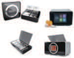

---
<!-- Page 77 -->

## 제4장 디지털헬스케어 서비스 보안 위협 | 77

및
보안
모델
개념
및
보안
대책
개요
디지털헬스케어
구성요소
디지털헬스케어
서비스
유형
디지털헬스케어
서비스
보안
위협
디지털헬스케어
서비스
보안
요구사항
참고문헌
제1장
제2장
제3장
제4장
제5장
부록
비대면 복약 관리 서비스에서 위의 그림에서 도출된 서비스 주요 보안 위협과 관련하여 다음과 같이
절차별로 보안 위협을 구체화할 수 있다.
표 4-6 비대면 복약 관리 서비스 보안 위협
서비스 절차 상세 설명 보안 위협
취약한 운영체제 사용
환자는 복약 관리용 헬스케어 기기를 사용자가 보유한
➀ 복약 관리 기기 등록
스마트 기기에 등록한다.
안전하지 않은 서비스 사용
환자 인증 부재
인증 결과 우회
연속된 인증 시도
환자별 권한 설정 부재
환자 및 기기 인증 후 환자는 복약 관리 서비스를 받기 위해 서비스에 접속하여
➁
접속 환자 및 기기 인증 후 환자 등록을 한다. 취약한 비밀번호 조합 규칙
허용
비밀번호 평문전송
추측 가능한 세션 ID 발급
환자 세션 탈취
복약 정보 및 개인정보
평문전송
헬스케어 기기 또는 스마트 기기에 수집된 복약 수치를
➂ 복약 정보 전송
복약 관리 및 의료 AI 분석 시스템으로 전송한다.
복약 정보 및 개인정보
평문저장
수집된 복약 수치 결과를 인공지능을 통해 분석을
➃ 인공지능 분석 잘못된 데이터 학습
실시한다.
인공지능을 통한 1차 분석된 검사 결과에서 이상 여부가
➄ 이상 복약 경보 전송 발견되는 경우 이상 수치 경보를 환자 및 의사에게 -
전송한다.

| 서비스 절차 |  | 상세 설명 | 보안 위협 |
| --- | --- | --- | --- |
|  | 복약 관리 기기 등록 | 환자는 복약 관리용 헬스케어 기기를 사용자가 보유한 스마트 기기에 등록한다. |  |
|  | 환자 및 기기 인증 후 접속 | 환자는 복약 관리 서비스를 받기 위해 서비스에 접속하여 환자 및 기기 인증 후 환자 등록을 한다. |  |
|  | 복약 정보 전송 | 헬스케어 기기 또는 스마트 기기에 수집된 복약 수치를 복약 관리 및 의료 AI 분석 시스템으로 전송한다. |  |
|  | 인공지능 분석 | 수집된 복약 수치 결과를 인공지능을 통해 분석을 실시한다. |  |
|  | 이상 복약 경보 전송 | 인공지능을 통한 1차 분석된 검사 결과에서 이상 여부가 발견되는 경우 이상 수치 경보를 환자 및 의사에게 전송한다. |  |

---
<!-- Page 78 -->
서비스 절차 상세 설명 보안 위협
의사 인증 부재
인증 결과 우회
연속된 인증 시도
의사 권한 설정 부재
취약한 비밀번호 조합 규칙
의사는 복약 관리 서비스에 의사임을 인증하고 서비스에
➅ 의사 인증 후 접속 허용
접근 후 복약 관리 진료를 수행한다.
비밀번호 평문전송
추측 가능한 세션 ID 발급
의사 세션 탈취
질환 정보 및 개인정보 화면
노출
처방 정보 및 개인정보
평문전송
의사는 환자의 복약 관련 이상 수치에 대해 이상 여부를
➆ 진단 및 처방 확인하는 등 진료를 실시하고 관리 및 분석 시스템을 처방 정보 및 개인정보 화면
이용하여 처방을 내린다. 노출
처방 정보 위·변조
처방 정보 및 개인정보
평문전송
이상 수치 진단 및 관리 및 분석 시스템은 복약 관리용 헬스케어 기기 또는
➇ 처방 정보 및 개인정보 화면
처방 내용 전송 스마트 기기를 통해 복약 내용을 환자에게 전송한다.
노출
환자 세션 탈취
중요정보 평문저장
복약 관리 서비스 사용이 종료된 후 필요 정보에 대해
복약 정보 보관 및
➈ 저장 및 보관하고 사용 시점이 완료된 정보의 경우 취약한 암호화 적용
파기
파기한다.
정보 파기 절차 관리 미흡

| 서비스 절차 |  | 상세 설명 | 보안 위협 |
| --- | --- | --- | --- |
|  | 의사 인증 후 접속 | 의사는 복약 관리 서비스에 의사임을 인증하고 서비스에 접근 후 복약 관리 진료를 수행한다. |  |
|  | 진단 및 처방 | 의사는 환자의 복약 관련 이상 수치에 대해 이상 여부를 확인하는 등 진료를 실시하고 관리 및 분석 시스템을 이용하여 처방을 내린다. |  |
|  | 이상 수치 진단 및 처방 내용 전송 | 관리 및 분석 시스템은 복약 관리용 헬스케어 기기 또는 스마트 기기를 통해 복약 내용을 환자에게 전송한다. |  |
|  | 복약 정보 보관 및 파기 | 복약 관리 서비스 사용이 종료된 후 필요 정보에 대해 저장 및 보관하고 사용 시점이 완료된 정보의 경우 파기한다. |  |

---
<!-- Page 79 -->

## 제4장 디지털헬스케어 서비스 보안 위협 | 79

및
보안
모델
개념
및
보안
대책
개요
디지털헬스케어
구성요소
디지털헬스케어
서비스
유형
디지털헬스케어
서비스
보안
위협
디지털헬스케어
서비스
보안
요구사항
참고문헌
제1장
제2장
제3장
제4장
제5장
부록
서비스 절차 상세 설명 보안 위협
소프트웨어 결함
소스코드 노출
병원에서 앱 또는 웹 서비스를 개발 및 도입하고
- 공통 개발 영역
서비스에 대한 유지 보수를 한다.
취약한 외부 소프트웨어 사용
불분명한 업데이트 파일 적용
로그 관리 미흡
서비스 거부 공격
불필요한 서비스 활성화
병원에서 시스템(서버, DB, 보안장비 등) 및 서비스를
- 공통 운영 영역
운영한다.
암호키 관리 미흡
비인가된 물리적 접근
서비스 중요설정 임의 변경

| 서비스 절차 |  | 상세 설명 | 보안 위협 |
| --- | --- | --- | --- |
|  | 공통 개발 영역 | 병원에서 앱 또는 웹 서비스를 개발 및 도입하고 서비스에 대한 유지 보수를 한다. |  |
|  | 공통 운영 영역 | 병원에서 시스템(서버, DB, 보안장비 등) 및 서비스를 운영한다. |  |

---
<!-- Page 80 -->

#### 1.7 온라인 디지털 치료 서비스

온라인 디지털 치료 서비스 유형은 온라인 상에서 디지털 콘텐츠 치료 기기를 통해 의사가 환자를
치료하는 서비스로 환자의 질병 및 건강을 체크하여 지속적인 치료하는 서비스이다. 해당 유형의 서비스
제공자는 환자에게 온라인 디지털 치료 기기와 소프트웨어를 같이 제공하는 업체 및 의료기관을 포함하며
해당 서비스는 의료기관에 시스템으로 구축되어 있거나 업체에서 별도로 시스템을 구축하여 병원에서
서비스로 제공할 수 있다. 치료 온라인 디지털 치료 서비스에 특화된 보안 위협의 경우 서비스 및 기기 내
건강 상태, 치료 등 민감정보를 보유하여 보안 취약점에 노출 또는 타겟이 되기 쉽다. 또한 환자에게 제공되는
소프트웨어 또는 기기의 개발에서 보안이 취약하거나 앱으로 서비스 제공 시 앱에 대한 난독화 미적용으로
소스코드 원본이 노출되는 경우 해당 취약점을 악용하여 서비스를 공격할 수 있다. 다음 그림은 온라인
디지털 치료 서비스와 관련하여 발생 가능한 주요 보안 위협에 대해 나타낸 것이다.
그림 4-8 온라인 디지털 치료 서비스 주요 보안 위협
(cid:8607) 의사 인증 부재 (cid:8607) 의사 권한 설정 부재 (cid:8607) 의사 세션 탈취
(cid:8607) 환자 인증 부재
(cid:18) (cid:3356)(cid:2647)(cid:15)(cid:2628)(cid:2190) (cid:1088) (cid:2771)(cid:1808) (cid:2299)(cid:3311) (cid:8607) 인증 결과 우회
(cid:8607) 연속된 인증 시도 (cid:2045)(cid:2583)
(cid:19) (cid:2628)(cid:2190) (cid:2635)(cid:2768) (cid:3377) (cid:2685)(cid:2264)
(cid:3349)
디지털 치료(cid:2689) 소(cid:3280)(cid:3167)(cid:2589)어 (cid:1633)(cid:1790)
(cid:20) (cid:3356)(cid:2647) (cid:1986) (cid:1245)(cid:1245) (cid:2635)(cid:2768) (cid:3377)
디지털 (cid:2966)(cid:1808)(cid:2689) (cid:8607) 치료 정보 및
(cid:1921)(cid:2641)형 (cid:2966)(cid:1808) (cid:1245)(cid:1245) (cid:1518)(cid:2573)(cid:1789)(cid:1624) 개인정보 평문전송 (cid:2628)사
디지털 치료(cid:2689) 및 치료(cid:1245)(cid:1088) (cid:2890)(cid:2001)
스(cid:1859)(cid:3167)(cid:3242)
(cid:21) (cid:2346)(cid:2342)(cid:1088) (cid:3356)(cid:2647) (cid:1992)(cid:2621) (cid:2681)(cid:2272) (cid:21) (cid:2346)(cid:2342)(cid:1088) (cid:3356)(cid:2647) (cid:1992)(cid:2621) (cid:2681)(cid:2272)
디지털 치료 (cid:1992)(cid:2621) (cid:2299)(cid:2776) 및 (cid:2679)(cid:2658)
(cid:3356)(cid:2647) (cid:2594) (cid:9)(cid:52)(cid:47)(cid:52) 서비스(cid:10) (기기 자동 전송 또는 환자 (cid:22) (cid:2647)(cid:1086) 디지털 (cid:2771)(cid:1808)(cid:2570) (cid:2658)비
응(cid:1529) 입력 시 전송) (cid:9)(cid:2966)(cid:1808) (cid:1245)(cid:1088) (cid:1861)(cid:1808) (cid:3377)(cid:10)
(cid:2966)(cid:1808) (cid:1992)(cid:2621)
인(cid:3104)(cid:1769)(cid:3181)(cid:2099) (cid:41)(cid:16)(cid:56)
치료 (cid:1992)(cid:2621)(cid:2496) 대(cid:3296) (cid:2771)료 (cid:2299)(cid:3311) (cid:1394)(cid:2505) (cid:2681)(cid:2272)
인(cid:3104)(cid:1769)(cid:3181)(cid:2099) (cid:1137)(cid:2640) (cid:1245)(cid:1245) (cid:23) (cid:2771)(cid:1808) (cid:1150)(cid:1175) (cid:1986)
(cid:24) 디지털 (cid:2966)(cid:1808) (cid:1150)(cid:1175) (cid:2681)(cid:2272) (cid:2890)(cid:2001) (cid:1394)(cid:2570)
디지털 치료 (cid:1150)(cid:1175) (cid:2679)(cid:2658) (cid:2681)(cid:2272)
(cid:57)(cid:51) (cid:9)(cid:34)(cid:51) (cid:12) (cid:55)(cid:51) (cid:12) (cid:46)(cid:51)(cid:10)
(cid:8607) 처방 결과 및 개인정보 화면 노출 (cid:8607) 처방 결과 및 개인정보
(cid:8607) 환자 세션 탈취 (cid:25) (cid:2687)보 보(cid:1177) (cid:1986) (cid:3189)(cid:1245) 평문전송
(cid:8607) 처방 결과 위.변조
(cid:8607) 중요정보 평문저장
(cid:8607) 취약한 암호화 적용
(cid:8607) 정보 파기 절차 관리 미흡
디지털 치료 서비스 시스템
데이(cid:3104) 이동 사용자 (cid:2770)접 연결(사용)
온라인 디지털 치료 서비스에서 위의 그림에서 도출된 서비스 주요 보안 위협과 관련하여 다음과 같이
절차별로 보안 위협을 구체화할 수 있다.

| (cid:8607) 환자 인증 부재 (cid:8607) 인증 결과 우회 |
| --- |
| (cid:8607) 연속된 인증 시도 |

| 디지털 치료(cid:2689) 소(cid:3280)(cid:3167)(cid:2589)어 (cid:1633)(cid:1790) |  |
| --- | --- |
|  | (cid:8607) 치료 정보 및 개인정보 평문전송 |
| 디지털 치료(cid:2689) 및 치료(cid:1245)(cid:1088) (cid:2890)(cid:2001) |  |

|  | (cid:2346)(cid:2342)(cid:1088) (cid:3356)(cid:2647) (cid:1992)(cid:2621) (cid:2681)(cid:2272) |  |  |
| --- | --- | --- | --- |
|  | (cid:21) (기기 자동 전송 또는 환자 응(cid:1529) 입력 시 전송) (cid:24) 디지털 (cid:2966)(cid:1808) (cid:1150)(cid:1175) (cid:2681)(cid:2272) |  |  |
|  |  |  |  |
|  | (cid:8607) 처방 결과 및 개인정보 (cid:8607) 환자 세션 탈취 |  | 화면 노출 |

---
<!-- Page 81 -->

## 제4장 디지털헬스케어 서비스 보안 위협 | 81

및
보안
모델
개념
및
보안
대책
개요
디지털헬스케어
구성요소
디지털헬스케어
서비스
유형
디지털헬스케어
서비스
보안
위협
디지털헬스케어
서비스
보안
요구사항
참고문헌
제1장
제2장
제3장
제4장
제5장
부록
표 4-7 온라인 디지털 치료 서비스 보안 위협
서비스 절차 상세 설명 보안 위협
환자-의사 간 온라인 디지털 치료 서비스를 이용하기 위해 사전에
➀ -
진료 수행 환자와 의사 간에 진료를 수행한다.
의사 인증 부재
인증 결과 우회
연속된 인증 시도
의사는 디지털 치료 서비스에 의사임을 인증하고 의사 권한 설정 부재
서비스에 접근 후 환자에게 맞는 디지털 치료제
➁ 의사 인증 후 접속
소프트웨어를 디지털 치료 서비스에 등록한다. 그리고 취약한 비밀번호 조합 규칙
치료제 및 치료 기간을 처방한다. 허용
비밀번호 평문전송
추측 가능한 세션 ID 발급
의사 세션 탈취
환자 인증 부재
인증 결과 우회
연속된 인증 시도
환자별 권한 설정 부재
환자 및 기기 인증 후 환자는 온라인 디지털 치료 서비스를 받기 위해 디지털
➂ 디지털 치료제 치료 서비스에 환자 및 기기 인증 후 디지털 치료제를
취약한 비밀번호 조합 규칙
다운로드 다운로드 한다.
허용
비밀번호 평문전송
추측 가능한 세션 ID 발급
환자 세션 탈취
실시간 환자 반응 치료 기간 동안 디지털 치료 시스템은 환자의 반응을 치료 정보 및 개인정보
➃
전송 수집한다. 평문전송
자가 디지털 치료 치료 기간 동안 디지털 치료 시스템은 수집된 환자의 치료 정보 및 개인정보
➄
반응 내역 전송 반응을 의사에게 전달한다. 평문전송

| 서비스 절차 |  | 상세 설명 | 보안 위협 |
| --- | --- | --- | --- |
|  | 환자-의사 간 진료 수행 | 온라인 디지털 치료 서비스를 이용하기 위해 사전에 환자와 의사 간에 진료를 수행한다. |  |
|  | 의사 인증 후 접속 | 의사는 디지털 치료 서비스에 의사임을 인증하고 서비스에 접근 후 환자에게 맞는 디지털 치료제 소프트웨어를 디지털 치료 서비스에 등록한다. 그리고 치료제 및 치료 기간을 처방한다. |  |
|  | 환자 및 기기 인증 후 디지털 치료제 다운로드 | 환자는 온라인 디지털 치료 서비스를 받기 위해 디지털 치료 서비스에 환자 및 기기 인증 후 디지털 치료제를 다운로드 한다. |  |
|  | 실시간 환자 반응 전송 | 치료 기간 동안 디지털 치료 시스템은 환자의 반응을 수집한다. |  |
|  | 자가 디지털 치료 반응 내역 전송 | 치료 기간 동안 디지털 치료 시스템은 수집된 환자의 반응을 의사에게 전달한다. |  |

| 제4장 |  |

---
<!-- Page 82 -->
서비스 절차 상세 설명 보안 위협
처방 결과 및 개인정보
평문전송
진료 결과 및 처방 의사는 환자의 치료 내역을 확인하고 진료하여 디지털
➅ 처방 결과 및 개인정보 화면
내용 전송 치료 시스템에 진료 및 처방 내역을 입력한다.
노출
처방 결과 위·변조
처방 결과 및 개인정보
평문전송
디지털 치료 결과 환자는 디지털 치료 시스템을 통해 의사가 처방한 결과를
➆ 처방 결과 및 개인정보 화면
전송 확인한다.
노출
환자 세션 탈취
중요정보 평문저장
온라인 디지털 치료 서비스 사용이 종료된 후 필요
온라인 디지털 치료
➇ 정보에 대해 저장 및 보관하고 사용 시점이 완료된 취약한 암호화 적용
정보 보관 및 파기
정보의 경우 파기한다.
정보 파기 절차 관리 미흡
소프트웨어 결함
소스코드 노출
병원에서 앱 또는 웹 서비스를 개발 및 도입하고
- 공통 개발 영역
서비스에 대한 유지 보수를 한다.
취약한 외부 소프트웨어 사용
불분명한 업데이트 파일 적용
로그 관리 미흡
서비스 거부 공격
불필요한 서비스
병원에서 시스템(서버, DB, 보안장비 등) 및 서비스를
- 공통 운영 영역 활성화
운영한다.
암호키 관리 미흡
비인가된 물리적 접근
서비스 중요설정 임의 변경

| 서비스 절차 |  | 상세 설명 | 보안 위협 |
| --- | --- | --- | --- |
|  | 진료 결과 및 처방 내용 전송 | 의사는 환자의 치료 내역을 확인하고 진료하여 디지털 치료 시스템에 진료 및 처방 내역을 입력한다. |  |
|  | 디지털 치료 결과 전송 | 환자는 디지털 치료 시스템을 통해 의사가 처방한 결과를 확인한다. |  |
|  | 온라인 디지털 치료 정보 보관 및 파기 | 온라인 디지털 치료 서비스 사용이 종료된 후 필요 정보에 대해 저장 및 보관하고 사용 시점이 완료된 정보의 경우 파기한다. |  |
|  | 공통 개발 영역 | 병원에서 앱 또는 웹 서비스를 개발 및 도입하고 서비스에 대한 유지 보수를 한다. |  |
|  | 공통 운영 영역 | 병원에서 시스템(서버, DB, 보안장비 등) 및 서비스를 운영한다. |  |

---
<!-- Page 83 -->

## 제4장 디지털헬스케어 서비스 보안 위협 | 83

및
보안
모델
개념
및
보안
대책
개요
디지털헬스케어
구성요소
디지털헬스케어
서비스
유형
디지털헬스케어
서비스
보안
위협
디지털헬스케어
서비스
보안
요구사항
참고문헌
제1장
제2장
제3장
제4장
제5장
부록

#### 1.8 환자 이송 및 비대면 응급 진료 서비스

환자 이송 및 비대면 응급 진료 서비스 유형은 스마트 기기 등을 통해 원격지의 의료진과 증상에 대한 상담
및 진료를 받는 서비스 유형이다. 위급 상황 발생 시 이동형 구급차를 이용하여 환자를 이송시키며 긴급
진료가 필요한 경우 병원과의 소통 채널을 통해 구급차 내에서 진료를 수행할 수 있다. 해당 유형의 서비스
제공자는 병원과 이동형 구급차 간에 정보가 전송될 수 있도록 서비스를 제공하는 업체 및 의료기관을
포함하며, 해당 서비스는 의료기관에 시스템으로 구축되어 있거나 업체에서 별도로 시스템을 구축하여
병원에서 서비스로 제공할 수 있다. 환자 이송 및 비대면 응급 진료 서비스에 특화된 보안 위협의 경우,
구급차와 병원 간의 통신 구간에서 정보가 전송되므로 암호화가 적용되지 않은 경우 서비스 공격에 주요
타겟이 될 수 있다. 또한 외적 요인으로 인해 서비스의 가용성에 문제가 발생하여 정보가 신속하게 전달되지
않을 경우 병원과의 소통 문제 발생으로 인해 환자에게 심각한 위급 상황이 발생할 수 있다. 수집 및 가공된
데이터에 대해 인공지능으로 분석 시 필터링에 대한 정보를 잘못 적용하는 경우 잘못 분석된 데이터가 응급
처치에 사용될 수 있다. 다음 그림은 환자 이송 및 비대면 응급 진료 서비스와 관련하여 발생 가능한 주요
보안 위협에 대해 나타낸 것이다.
그림 4-9 환자 이송 및 비대면 응급 진료 서비스 주요 보안 위협
(cid:8607) 취약한 운영체제 사용 (cid:18) (cid:2633)(cid:1586)형 (cid:2621)(cid:1241) (cid:2771)(cid:1808) (cid:2563)(cid:2898) (cid:1203)(cid:1241) (cid:2243)(cid:3104)
(cid:8607) 의료진 인증 부재
(cid:8607) 인증 결과 우회 환자 (cid:19) (cid:1203)(cid:1241) (cid:2633)(cid:1586) (cid:2299)(cid:1521) (cid:2937)(cid:1586) 응급 진료 요(cid:2898) (cid:2685)(cid:2299)
(cid:2633)(cid:1586)형 (cid:1203)(cid:1241) (cid:2771)(cid:1808)(cid:2263)
(cid:9)(cid:1203)(cid:1241)(cid:2864)(cid:13)헬(cid:1245)(cid:13)(cid:3299)(cid:2687)(cid:10) 응급 환자 (cid:2299)(cid:2570) (cid:1086)(cid:1502) (cid:2045)(cid:2583) 지(cid:2687)
(cid:20) (cid:1203)(cid:1241)(cid:1536)(cid:2583) (cid:2635)(cid:2768) (cid:3377) 서비스 (cid:2685)(cid:2264)
(cid:8607) 환자 상태 및 개인정보 (cid:2045)(cid:2583)
스(cid:1859)(cid:3167) (cid:1245)(cid:1245) 응급 (cid:2890)(cid:2966) 및 환자 (cid:1633)(cid:1790) 평문전송
환자 진료 (cid:1394)(cid:2505) 및 (cid:2773)환 (cid:2687)보 (cid:2705)(cid:3365)
(cid:21) 지(cid:2687) (cid:2045)(cid:2583) (cid:2687)보 (cid:2681)(cid:2272)
(cid:8607) 의사 인증 부재
지(cid:2687) (cid:2045)(cid:2583)(cid:2613)(cid:1789) 환자 이송 (cid:8607) 인증 결과 우회
응급 환자 (cid:2202)(cid:3093) (cid:2687)보 (cid:2299)(cid:2776)
(cid:8607) 의사 세션 탈취 (cid:2628)사
(cid:22) (cid:1917)(cid:1508)(cid:3104)(cid:1858) (cid:2202)(cid:3093) (cid:2681)(cid:2272)
응급 환자 (cid:2202)(cid:3093) 모(cid:1508)(cid:3104)(cid:1858)
응급 (cid:2890)(cid:2966) 지(cid:2342) (cid:2771)(cid:1808)(cid:2570) (cid:2658)비
(cid:24) (cid:2628)(cid:2190) (cid:2635)(cid:2768)
환자 응급 (cid:2890)(cid:2966) (cid:2299)(cid:3311) (cid:3377) (cid:2685)(cid:2264)
(cid:9)(cid:1247)급 (cid:2342)(cid:10) (cid:1155)보 (cid:2444)(cid:1855) 및 (cid:2628)사 진료
(cid:23) (cid:2621)(cid:1241) (cid:2890)(cid:2966) 지(cid:2342) (cid:2681)(cid:2272)
(cid:25) (cid:2621)(cid:1241) (cid:3356)(cid:2647)
구급대(cid:2583) 응급 환자 (cid:2045)(cid:2583) 이송 (cid:2542)료 (cid:2771)(cid:1808) (cid:1986)
응급 환자 (cid:2299)(cid:2570)
(cid:18)(cid:17) (cid:2621)(cid:1241) (cid:3356)(cid:2647) (cid:2045)(cid:2583) (cid:2633)(cid:2272) (cid:2771)(cid:1521)
(cid:26) (cid:2687)보 보(cid:1177) (cid:1986) (cid:8607) 처방 내역 및
(cid:8607) 처치 내역 및
(cid:3189)(cid:1245) 개인정보 평문전송
개인정보 평문전송
(cid:8607) 처방 내역 위.변조
(cid:8607) 구급대원 세션 탈취
(cid:8607) 중요정보 평문저장
(cid:8607) 취약한 암호화 적용
데이터 이동 유·(cid:1942)(cid:2230) 통(cid:2344) (cid:2527)프라인 이동 의 비 료 대 (cid:34) 면 I 이 분 동 석 및 서 비 응 스 급 시 진 스 료 템 , (cid:8607) 정보 파기 절차 관리 미흡

| 제4장 |  |

|  |  | 환자 진료 (cid:1394)(cid:2505) 및 (cid:2773)환 (cid:2687)보 (cid:2705)(cid:3365) |  |
| --- | --- | --- | --- |
|  | 응급 환자 (cid:2202)(cid:3093) (cid:2687)보 (cid:2299)(cid:2776) |  | (cid:8607) 의사 인증 부재 (cid:8607) 인증 결과 우회 (cid:8607) 의사 세션 탈취 |

|  |
| --- |
|  |

---
<!-- Page 84 -->
환자 이송 및 비대면 응급 진료 서비스에서 위의 그림에서 도출된 서비스 주요 보안 위협과 관련하여
다음과 같이 절차별로 보안 위협을 구체화할 수 있다.
표 4-8 환자 이송 및 비대면 응급 진료 서비스 보안 위협
서비스 절차 상세 설명 보안 위협
이동형 응급 진료 환자는 위급상황 발생 시 구급 센터에 이동형 응급
➀ -
요청 진료를 요청한다.
구급 센터는 응급 진료 요청을 접수하고 환자에게
➁ 구급 이동 수단 출동 -
이동형 구급 진료소를 출동시킨다.
취약한 운영체제 사용
의료진 인증 부재
인증 결과 우회
연속된 인증 시도
구급대원은 이동 및 응급 진료 서비스에 의료진임을
구급대원 인증 후 의료진 권한 설정 부재
➂ 인증하고 서비스에 접속 후 응급 처치 및 환자 등록을
서비스 접속
실시한다.
취약한 비밀번호 조합 규칙
허용
비밀번호 평문전송
추측 가능한 세션 ID 발급
의료진 세션 탈취
구급 센터는 응급 환자 수용이 가능한 병원을 지정한 후
➃ 지정 병원 정보 전송 -
이동형 구급 진료소에게 전달한다.
이동형 구급 진료소에서는 응급 환자 상태에 대해 응급 환자 상태 및 개인정보
➄ 모니터링 상태 전송
진료 서비스로 환자 상태 정보를 전송한다. 평문전송
비대면 이동 및 응급 서비스는 인공지능 분석을 기반으로
➅ 인공지능 분석 잘못된 데이터 학습
처방된 응급 처치 지시를 구급대원에게 전송한다.
처치 내역 및 개인정보
비대면 이동 및 응급 진료 시스템에서 전달받은 진료 및 평문전송
➆ 응급 처치 지시 전송
처치 내역을 기반으로 응급 처치를 수행한다.
구급대원 세션 탈취

| 서비스 절차 |  | 상세 설명 | 보안 위협 |
| --- | --- | --- | --- |
|  | 이동형 응급 진료 요청 | 환자는 위급상황 발생 시 구급 센터에 이동형 응급 진료를 요청한다. |  |
|  | 구급 이동 수단 출동 | 구급 센터는 응급 진료 요청을 접수하고 환자에게 이동형 구급 진료소를 출동시킨다. |  |
|  | 구급대원 인증 후 서비스 접속 | 구급대원은 이동 및 응급 진료 서비스에 의료진임을 인증하고 서비스에 접속 후 응급 처치 및 환자 등록을 실시한다. |  |
|  | 지정 병원 정보 전송 | 구급 센터는 응급 환자 수용이 가능한 병원을 지정한 후 이동형 구급 진료소에게 전달한다. |  |
|  | 모니터링 상태 전송 | 이동형 구급 진료소에서는 응급 환자 상태에 대해 응급 진료 서비스로 환자 상태 정보를 전송한다. |  |
|  | 인공지능 분석 | 비대면 이동 및 응급 서비스는 인공지능 분석을 기반으로 처방된 응급 처치 지시를 구급대원에게 전송한다. |  |
|  | 응급 처치 지시 전송 | 비대면 이동 및 응급 진료 시스템에서 전달받은 진료 및 처치 내역을 기반으로 응급 처치를 수행한다. |  |

---
<!-- Page 85 -->

## 제4장 디지털헬스케어 서비스 보안 위협 | 85

및
보안
모델
개념
및
보안
대책
개요
디지털헬스케어
구성요소
디지털헬스케어
서비스
유형
디지털헬스케어
서비스
보안
위협
디지털헬스케어
서비스
보안
요구사항
참고문헌
제1장
제2장
제3장
제4장
제5장
부록
서비스 절차 상세 설명 보안 위협
의사 인증 부재
인증 결과 우회
연속된 인증 시도
의사 권한 설정 부재
구급대원은 이동 및 응급 진료 서비스에 의료진임을
➇ 의사 인증 후 접속 인증하고 서비스에 접속 후 응급 처치 및 환자 등록을
취약한 비밀번호 조합 규칙
실시한다.
허용
비밀번호 평문전송
추측 가능한 세션 ID 발급
의사 세션 탈취
처치 내역 및 개인정보
평문전송
의사는 수집된 응급 환자 상태의 정보를 확인하고
응급 환자 진료 및
➈ 진료하여 이동 및 응급 진료 시스템에 진료 및 처치 처치 내역 및 개인정보 화면
진단
내역을 입력한다. 노출
처치 내역 위·변조
이동형 구급 진료소는 응급 환자가 수용 가능한 병원으로
➉ 응급 환자 병원 이송 환자를 이송시키고 병원에서는 응급 환자를 수용한 뒤 -
진료를 시작한다.
중요정보 평문저장
온라인 디지털 치료 서비스 사용이 종료된 후 필요
이동/응급 진료 정보
정보에 대해 저장 및 보관하고 사용 시점이 완료된 취약한 암호화 적용
보관 및 파기
정보의 경우 파기한다.
정보 파기 절차 관리 미흡
소프트웨어 결함
소스코드 노출
병원에서 앱 또는 웹 서비스를 개발 및 도입하고
- 공통 개발 영역
서비스에 대한 유지 보수를 한다.
취약한 외부 소프트웨어 사용
불분명한 업데이트 파일 적용

| 서비스 절차 |  | 상세 설명 | 보안 위협 |
| --- | --- | --- | --- |
|  | 의사 인증 후 접속 | 구급대원은 이동 및 응급 진료 서비스에 의료진임을 인증하고 서비스에 접속 후 응급 처치 및 환자 등록을 실시한다. |  |
|  | 응급 환자 진료 및 진단 | 의사는 수집된 응급 환자 상태의 정보를 확인하고 진료하여 이동 및 응급 진료 시스템에 진료 및 처치 내역을 입력한다. |  |
|  | 응급 환자 병원 이송 | 이동형 구급 진료소는 응급 환자가 수용 가능한 병원으로 환자를 이송시키고 병원에서는 응급 환자를 수용한 뒤 진료를 시작한다. |  |
|  | 이동/응급 진료 정보 보관 및 파기 | 온라인 디지털 치료 서비스 사용이 종료된 후 필요 정보에 대해 저장 및 보관하고 사용 시점이 완료된 정보의 경우 파기한다. |  |
|  | 공통 개발 영역 | 병원에서 앱 또는 웹 서비스를 개발 및 도입하고 서비스에 대한 유지 보수를 한다. |  |

---
<!-- Page 86 -->
서비스 절차 상세 설명 보안 위협
로그 관리 미흡
서비스 거부 공격
불필요한 서비스 활성화
병원에서 시스템(서버, DB, 보안장비 등) 및 서비스를
- 공통 운영 영역
운영한다.
암호키 관리 미흡
비인가된 물리적 접근
서비스 중요설정 임의 변경

| 서비스 절차 |  | 상세 설명 | 보안 위협 |
| --- | --- | --- | --- |
|  | 공통 운영 영역 | 병원에서 시스템(서버, DB, 보안장비 등) 및 서비스를 운영한다. |  |

---
<!-- Page 87 -->

## 제4장 디지털헬스케어 서비스 보안 위협 | 87

및
보안
모델
개념
및
보안
대책
개요
디지털헬스케어
구성요소
디지털헬스케어
서비스
유형
디지털헬스케어
서비스
보안
위협
디지털헬스케어
서비스
보안
요구사항
참고문헌
제1장
제2장
제3장
제4장
제5장
부록

#### 1.9 비대면 시술 및 수술 서비스

비대면 시술 및 수술 서비스는 온라인 상에서 기계를 원격으로 조종하여 환자의 시술 및 수술하는
서비스이다. 해당 유형의 서비스 제공자는 환자에게 기기 및 단말기를 통해 시술 및 치료 서비스를 제공하는
업체, 병원, 구급차 등이 포함되며 병원에서 자체 개발하여 서비스를 제공하거나 업체를 통해 개발하여 병원
시스템으로 제공할 수 있다. 비대면 시술 및 수술 서비스에 특화된 보안 위협의 경우 시술 및 수술 행위가
이루어지는 만큼 인가자에 대한 정확한 인증이 수행되지 않는 경우 비인가자가 시술 및 수술을 하는 심각한
위협이 존재한다. 또한 인공지능기반의 로봇을 이용하여 수술을 하는 경우 시술 및 수술에 대한 정확성이
부족하거나 취약점이 존재하는 경우 이를 악용하여 시술 및 수술 행위를 방해할 수 있다. 다음 그림은 비대면
시술 및 수술 서비스와 관련하여 발생 가능한 주요 보안 위협에 대해 나타낸 것이다.
그림 4-10 비대면 시술 및 수술 서비스 주요 보안 위협
(cid:8607) 서비스 거부 공격 (cid:8607) 비인가된 물리적 접근
(cid:2045)(cid:2583) (cid:9)(cid:3356)(cid:2647) (cid:2190)(cid:2633)(cid:1624)(cid:10) (cid:2045)(cid:2583) (cid:9)(cid:2628)(cid:2190) (cid:2190)(cid:2633)(cid:1624)(cid:10)
(cid:19) (cid:2299)(cid:2303)(cid:1789)(cid:2056)(cid:15) (cid:18) (cid:2628)(cid:2190) (cid:2635)(cid:2768) (cid:3377) (cid:2685)(cid:2264)
(cid:3356)(cid:2647) (cid:2771)(cid:1808) (cid:1394)싪 및 (cid:2773)(cid:3356) (cid:2687)보 (cid:3355)(cid:2635) (cid:1789)(cid:2056)(cid:2689)어(cid:1245) (cid:1088) 수술 (cid:1789)(cid:2056) (cid:2689)어(cid:1245) (cid:2685)(cid:2264)
(cid:3134)(cid:2344) (cid:3114)스(cid:3167)
(cid:2687)보 (cid:2681)(cid:2272)
(cid:3356)(cid:2647) 시술(cid:15)수술 (cid:2739)비 (cid:3356)(cid:2647) 사(cid:2633)(cid:1624) 수술 (cid:1789)(cid:2056) (cid:3134)쉉 (cid:3114)스(cid:3167)
(cid:8607) 환자 정보
평문전송
수술(cid:1789)(cid:2056)-(cid:1789)(cid:2056)(cid:2689)어(cid:1245) (cid:1088)
수술 (cid:1789)(cid:2056)-(cid:3356)(cid:2647) (cid:1088) 심(cid:1150) (cid:3134)쉉 안(cid:2681)성 (cid:1128)(cid:2768) (cid:20) (cid:2346)(cid:2342)(cid:1088) (cid:3356)(cid:2647)
(cid:20) (cid:2346)(cid:2342)(cid:1088) (cid:3356)(cid:2647) (cid:2202)(cid:3093) (cid:2687)보
(cid:2202)(cid:3093) (cid:2687)보 시술(cid:15)수술 (cid:2681) (cid:3356)(cid:2647) (cid:2202)(cid:3093) (cid:2679)(cid:2658) (cid:2681)(cid:2272) (cid:2681)(cid:2272)
(cid:2628)사 사(cid:2633)(cid:1624) (cid:1789)(cid:2056) (cid:2689)어(cid:1245)쌍
(cid:2628)사 (cid:3134)쉉 (cid:3114)스(cid:3167) (cid:2628)사
시술(cid:15)수술 (cid:2739)비 (cid:2202)(cid:3093) (cid:3355)(cid:2635)
(cid:2771)(cid:1808)(cid:2570) (cid:2658)비 쉋시(cid:1088) (cid:3356)(cid:2647) (cid:2202)(cid:3093) 모(cid:1508)(cid:3104)(cid:1858) 시술(cid:15)수술 쉋시 (cid:2771)(cid:1808)(cid:2570) (cid:2658)비
(cid:18) (cid:2628)(cid:2190) (cid:2635)(cid:2768) (cid:3377) (cid:2685)(cid:2264) (cid:21) (cid:2346)(cid:2342)(cid:1088) (cid:2342)(cid:2303)(cid:15) (cid:21) (cid:2346)(cid:2342)(cid:1088)
(cid:2299)(cid:2303) (cid:1394)(cid:2570) (cid:2681)(cid:2272) 시술(cid:15)수술 (cid:1394)싪 (cid:2679)(cid:2658) (cid:2342)(cid:2303)(cid:15)
(cid:2299)(cid:2303)
(cid:22) (cid:2687)보 보(cid:1177) (cid:1986) (cid:1394)(cid:2570) (cid:2681)(cid:2272)
(cid:8607) 잘못된 데이터 학습 (cid:3189)(cid:1245)
(cid:8607) 의사 인증 부재 (cid:8607) 시술 및 수술 정보
(cid:8607) 의사 권한 설정 부재 평문전송
(cid:8607) 중요정보 평문저장 (cid:8607) 의사 세션 탈취
(cid:8607) 취약한 암호화 적용
(cid:8607) 안전하지 않은 서비스 사용 (cid:8607) 정보 파기 절차 관리 미흡
비대면 시술 및 수술
데이터 이(cid:1586) 서비스 시스템

| 제4장 |  |

|  |  | (cid:8607) 환자 정보 평문전송 (cid:20) (cid:2346)(cid:2342)(cid:1088) (cid:3356)(cid:2647) (cid:2202)(cid:3093) (cid:2687)보 (cid:2681)(cid:2272) |  |
| --- | --- | --- | --- |
| 쉋시(cid:1088) (cid:3356)(cid:2647) (cid:2202)(cid:3093) 모(cid:1508)(cid:3104)(cid:1858) |  |  |  |
|  |  | (cid:21) (cid:2346)(cid:2342)(cid:1088) (cid:2342)(cid:2303)(cid:15) (cid:2299)(cid:2303) (cid:1394)(cid:2570) (cid:2681)(cid:2272) |  |
|  |  | (cid:8607) 잘못된 데이터 학 (cid:8607) 시술 및 수술 정보 | 습 |

| 시술(cid:15)수술 쉋시 |  |
| --- | --- |
|  |  |
| (cid:21) 시술(cid:15)수술 (cid:1394)싪 (cid:2679)(cid:2658) |  |

---
<!-- Page 88 -->
비대면 시술 및 수술 서비스에서 위의 그림에서 도출된 서비스 주요 보안 위협과 관련하여 다음과 같이
절차별로 보안 위협을 구체화할 수 있다.
표 4-9 비대면 시술 및 수술 서비스 보안 위협
서비스 절차 상세 설명 보안 위협
의사 인증 부재
인증 결과 우회
연속된 인증 시도
의사 권한 설정 부재
의사는 비대면 시술 및 수술 서비스에 의사임을 인증하고
서비스에 접속 후 환자 진료 내역 및 질환 정보를
의사 인증 후 서비스 취약한 비밀번호 조합 규칙
➀ 확인한다.
접속 허용
정보가 확인되면 환자 시술 또는 수술을 준비를 위해
수술 로봇과 환자와 연결한다.
비밀번호 평문전송
추측 가능한 세션 ID 발급
의사 세션 탈취
안전하지 않은 서비스 사용
수술로봇- 환자 사이드의 수술 로봇과 의사 사이드의 수술 로봇의 서비스 거부 공격
➁ 로봇제어기 간 통신 통신 이상 유무를 확인하여 통신 안전성 검증을
테스트 정보 전송 실시한다. 비인가된 물리적 접근
시술 또는 수술이 시작되기 전 환자 상태를 의사
실시간 환자 상태
➂ 사이드에 전송하고 의사는 진료용 장비를 통해 환자 상태 환자 정보 평문전송
정보 전송
확인 후 시술 또는 수술을 준비한다.
시술 또는 수술이 시작되면 환자 사이드와 의사 사이드 잘못된 데이터 학습
실시간 시술·수술
➃ 간의 실시간 시술 또는 수술 내용이 전송하면서 치료를
내용 전송
실시한다. 시술 및 수술 정보 평문전송
중요정보 평문저장
비대면 시술 및 수술 서비스 사용이 종료된 후 필요
비대면 시술/수술
➄ 정보에 대해 저장 및 보관하고 사용 시점이 완료된 취약한 암호화 적용
정보 보관 및 파기
정보의 경우 파기한다.
정보 파기 절차 관리 미흡

| 서비스 절차 |  | 상세 설명 | 보안 위협 |
| --- | --- | --- | --- |
|  | 의사 인증 후 서비스 접속 | 의사는 비대면 시술 및 수술 서비스에 의사임을 인증하고 서비스에 접속 후 환자 진료 내역 및 질환 정보를 확인한다. 정보가 확인되면 환자 시술 또는 수술을 준비를 위해 수술 로봇과 환자와 연결한다. |  |
|  | 수술로봇- 로봇제어기 간 통신 테스트 정보 전송 | 환자 사이드의 수술 로봇과 의사 사이드의 수술 로봇의 통신 이상 유무를 확인하여 통신 안전성 검증을 실시한다. |  |
|  | 실시간 환자 상태 정보 전송 | 시술 또는 수술이 시작되기 전 환자 상태를 의사 사이드에 전송하고 의사는 진료용 장비를 통해 환자 상태 확인 후 시술 또는 수술을 준비한다. |  |
|  | 실시간 시술·수술 내용 전송 | 시술 또는 수술이 시작되면 환자 사이드와 의사 사이드 간의 실시간 시술 또는 수술 내용이 전송하면서 치료를 실시한다. |  |
|  | 비대면 시술/수술 정보 보관 및 파기 | 비대면 시술 및 수술 서비스 사용이 종료된 후 필요 정보에 대해 저장 및 보관하고 사용 시점이 완료된 정보의 경우 파기한다. |  |

---
<!-- Page 89 -->

## 제4장 디지털헬스케어 서비스 보안 위협 | 89

및
보안
모델
개념
및
보안
대책
개요
디지털헬스케어
구성요소
디지털헬스케어
서비스
유형
디지털헬스케어
서비스
보안
위협
디지털헬스케어
서비스
보안
요구사항
참고문헌
제1장
제2장
제3장
제4장
제5장
부록
서비스 절차 상세 설명 보안 위협
소프트웨어 결함
소스코드 노출
병원에서 앱 또는 웹 서비스를 개발 및 도입하고
- 공통 개발 영역
서비스에 대한 유지 보수를 한다.
취약한 외부 소프트웨어 사용
불분명한 업데이트 파일 적용
로그 관리 미흡
서비스 거부 공격
불필요한 서비스 활성화
병원에서 시스템(서버, DB, 보안장비 등) 및 서비스를
- 공통 운영 영역
운영한다.
암호키 관리 미흡
비인가된 물리적 접근
서비스 중요설정 임의 변경

| 서비스 절차 |  | 상세 설명 | 보안 위협 |
| --- | --- | --- | --- |
|  | 공통 개발 영역 | 병원에서 앱 또는 웹 서비스를 개발 및 도입하고 서비스에 대한 유지 보수를 한다. |  |
|  | 공통 운영 영역 | 병원에서 시스템(서버, DB, 보안장비 등) 및 서비스를 운영한다. |  |

---
<!-- Page 90 -->

#### 1.10 의료 빅데이터 AI 분석 서비스

의료 빅데이터 AI 분석 서비스는 공공/민간/해외 의료정보를 수집ㆍ분석하여 필요시 데이터 수요 기관/
업체/사용자에게 가공된 정보를 제공하는 서비스이다. 해당 유형의 서비스 제공자는 데이터 제공
기관으로부터 자료를 수집·분석 후 결과를 가공하고 수집 기관에 맞춤형 자료를 제공하는 업체, 의료기관,
연구기관 등을 포함하며 분석 시스템을 자체 운영하거나 별도로 기관, 업체 등에 서비스로 제공할 수 있다.
의료 빅데이터 AI 분석 서비스에 특화된 보안 위협의 경우 데이터가 수집되고 가공되는 과정 중에서 실제
데이터가 식별화되어 중요정보가 외부로 유출될 수 있다. 또한 데이터 보관 시 데이터의 집합으로 인해
비식별화된 데이터가 식별될 수 있으며, 데이터를 평문으로 저장할 경우 대량의 정보가 외부로 유출되는
사고가 발생할 수 있다. 그리고 수집 및 가공된 데이터에 대해 인공지능으로 분석 시 필터링에 대한 정보를
잘못 적용하는 경우 정확하지 않은 분석 데이터가 수요기관 및 업체에 제공될 수 있다. 다음 그림은 의료
빅데이터 AI 분석 서비스와 관련하여 발생 가능한 주요 보안 위협은 다음과 같다.
그림 4-11 의료 빅데이터 AI 분석 서비스 주요 보안 위협
(cid:8607) 사용자 인증 부재
(cid:8607) 인증 결과 우회
(cid:8607) 사용자 권한 설정 부재 1 사용자 인증 (cid:3377) 접(cid:2264) 의(cid:1808) (cid:2107)데이터 A(cid:42) 분(cid:2227) (cid:2342)스(cid:3118)
(cid:8607) 사용자 세션 탈취
4 의(cid:1808) (cid:2107)데이터
의료 (cid:35)(cid:74)(cid:72)(cid:37)(cid:66)(cid:85)(cid:66) 데이터(cid:2247) (cid:2299)(cid:2776) (cid:2299)(cid:2776) 데이터 제(cid:1173) 기관
(cid:8607) 중요정보 평문전송
빅데이터 (cid:2681)(cid:2890)(cid:1851)
(cid:8607) 데이터 식별화
사(cid:2570)(cid:2647)
의료 빅데이터 (cid:2635)(cid:1173)지(cid:1502) (cid:3295)(cid:2339) (cid:2299)(cid:3311)
스(cid:1859)트 기기 2 A(cid:42) 분(cid:2227) (cid:3075)(cid:2581)(cid:1624) 전(cid:2272) (cid:9)(cid:46)(cid:45)(cid:13) A(cid:86)(cid:85)(cid:80)(cid:46)(cid:45)(cid:13) (cid:37)(cid:45)(cid:10) 6 의 제 (cid:1808) (cid:1173) (cid:2107)데이터
데이터 (cid:2344)(cid:2898) 기관
5 인(cid:1173)지능 (cid:3295)(cid:2339) (cid:1986) 분(cid:2227)
3 A(cid:42) 분(cid:2227) (cid:1150)(cid:1175) 전(cid:2272)
(cid:2635)(cid:1173)지(cid:1502) 분석 (cid:1150)(cid:1175) (cid:2679)(cid:2658)
(cid:8607) 잘못된 데이터 학습
(cid:8607) 중요정보 평문전송
(cid:24) (cid:2687)보 보관 (cid:1986) (cid:3189)기
(cid:8607) 데이터 식별화
(cid:8607) 중요정보 평문저장
(cid:8607) 취약한 암호화 적용
의료 빅데이터 AI 분석 시스템 (cid:8607) 정보 파기 절차 관리 미흡
데이터 이동 수시 전송 구간

|  |  |  |
| --- | --- | --- |
| (cid:8607) 중요정보 평문전송 (cid:8607) 데이터 식별화 |  |  |

| (cid:8607) 잘못된 데이터 학 | 습 |

| (cid:8607) 중 (cid:8607) 취 (cid:8607) 정 | 요정보 평문저장 약한 암호화 적용 보 파기 절차 관리 미흡 |

---
<!-- Page 91 -->

## 제4장 디지털헬스케어 서비스 보안 위협 | 91

및
보안
모델
개념
및
보안
대책
개요
디지털헬스케어
구성요소
디지털헬스케어
서비스
유형
디지털헬스케어
서비스
보안
위협
디지털헬스케어
서비스
보안
요구사항
참고문헌
제1장
제2장
제3장
제4장
제5장
부록
의료 빅데이터 AI 분석 서비스에서 위의 그림에서 도출된 서비스 주요 보안 위협과 관련하여 다음과 같이
절차별로 보안 위협을 구체화할 수 있다.
표 4-10 의료 빅데이터 AI 분석 서비스 보안 위협
서비스 절차 상세 설명 보안 위협
사용자 인증 부재
인증 결과 우회
연속된 인증 시도
사용자 권한 설정 부재
사용자는 의료 빅데이터 AI 분석 서비스에 사용자임을
➀ 사용자 인증 후 접속
인증하고 서비스에 접속한다. 취약한 비밀번호 조합 규칙
허용
비밀번호 평문전송
추측 가능한 세션 ID 발급
사용자 세션 탈취
사용자는 의료 빅데이터 AI 분석 시스템에 필요한
➁ AI 분석 키워드 전송 -
자료를 요청하기 위해 키워드를 전송한다.
중요정보 평문전송
의료 빅데이터 AI 분석 시스템은 사용자가 요청한
➂ AI 분석 결과 전송
자료를 전송한다.
데이터 식별화
중요정보 평문전송
의료 시스템과 관련된 자료를 의료기관, 연구기관, 업체
➃ 의료 빅데이터 수집
등에 요청하여 수집한다.
데이터 식별화
인공지능 학습 및 수집된 빅데이터를 인공지능을 통해 학습 및 분석을
➄ 잘못된 데이터 학습
분석 실시한다.
중요정보 평문전송
➅ 의료 빅데이터 제공 자료를 요청하는 기관 및 업체에 해당 자료를 전송한다.
데이터 식별화
중요정보 평문저장
의료 빅데이터 AI 서비스 사용이 종료된 후 필요 정보에
의료 빅데이터 정보
➆ 대해 저장 및 보관하고 사용 시점이 완료된 정보의 경우 취약한 암호화 적용
보관 및 파기
파기한다.
정보 파기 절차 관리 미흡

| 서비스 절차 |  | 상세 설명 | 보안 위협 |
| --- | --- | --- | --- |
|  | 사용자 인증 후 접속 | 사용자는 의료 빅데이터 AI 분석 서비스에 사용자임을 인증하고 서비스에 접속한다. |  |
|  | AI 분석 키워드 전송 | 사용자는 의료 빅데이터 AI 분석 시스템에 필요한 자료를 요청하기 위해 키워드를 전송한다. |  |
|  | AI 분석 결과 전송 | 의료 빅데이터 AI 분석 시스템은 사용자가 요청한 자료를 전송한다. |  |
|  | 의료 빅데이터 수집 | 의료 시스템과 관련된 자료를 의료기관, 연구기관, 업체 등에 요청하여 수집한다. |  |
|  | 인공지능 학습 및 분석 | 수집된 빅데이터를 인공지능을 통해 학습 및 분석을 실시한다. |  |
|  | 의료 빅데이터 제공 | 자료를 요청하는 기관 및 업체에 해당 자료를 전송한다. |  |
|  | 의료 빅데이터 정보 보관 및 파기 | 의료 빅데이터 AI 서비스 사용이 종료된 후 필요 정보에 대해 저장 및 보관하고 사용 시점이 완료된 정보의 경우 파기한다. |  |

---
<!-- Page 92 -->
서비스 절차 상세 설명 보안 위협
소프트웨어 결함
소스코드 노출
병원에서 앱 또는 웹 서비스를 개발 및 도입하고
- 공통 개발 영역
서비스에 대한 유지 보수를 한다.
취약한 외부 소프트웨어 사용
불분명한 업데이트 파일 적용
로그 관리 미흡
서비스 거부 공격
불필요한 서비스
병원에서 시스템(서버, DB, 보안장비 등) 및 서비스를
- 공통 운영 영역 활성화
운영한다.
암호키 관리 미흡
비인가된 물리적 접근
서비스 중요설정 임의 변경

| 서비스 절차 |  | 상세 설명 | 보안 위협 |
| --- | --- | --- | --- |
|  | 공통 개발 영역 | 병원에서 앱 또는 웹 서비스를 개발 및 도입하고 서비스에 대한 유지 보수를 한다. |  |
|  | 공통 운영 영역 | 병원에서 시스템(서버, DB, 보안장비 등) 및 서비스를 운영한다. |  |

---
<!-- Page 93 -->

## 제4장 디지털헬스케어 서비스 보안 위협 | 93

및
보안
모델
개념
및
보안
대책
개요
디지털헬스케어
구성요소
디지털헬스케어
서비스
유형
디지털헬스케어
서비스
보안
위협
디지털헬스케어
서비스
보안
요구사항
참고문헌
제1장
제2장
제3장
제4장
제5장
부록
본 절에서는 디지털헬스케어 관련 위협 동향들과 서비스 유형별 흐름을 분석하여 발생할 수 있는 위협을
서비스 유형 및 운영 특화 관점에서 비교 분석한 보안 위협에 대해 총 30개의 보안 위협으로 통합하였다. 각
보안 위협별 관련 보안대책을 제시하며 보안대책의 세부 내용은 제5장을 참조한다.
(1) ‘사용자 인증’ 관점의 보안 위협
보안 위협 설명 관련 보안대책
서비스 이용을 위한 사용자 인증 부재 시 비인가자가
안전한
1 사용자 인증 부재 서비스에 접속하여 허가되지 않은 정보를 유출하거나
사용자 인증
허용되지 않은 서비스를 이용할 수 있다.
안전한 비밀번호
서버에서 사용자 인증에 대한 검증을 수행하지 않고 사용자
메커니즘 적용,
2 인증 결과 우회 측에서 수행하는 경우 인증 결과 변조를 통해 인증 절차를
인증 결과 검증 로직
우회하여 서비스에 접근할 수 있다.
구현
인가되지 않은 사용자가 서비스에 연속적으로 인증을 반복된 인증 시도
3 연속된 인증 시도
시도하여 서비스 내 인가된 사용자의 권한을 획득할 수 있다. 제한
과도하거나 불필요한 권한 설정으로 서비스 내 모든 기능이
4 권한 설정 부재 허용되거나 접근이 제한된 메뉴에 접근이 가능하여 정보가 서비스 권한 설정
유ㆍ노출되거나 변조될 수 있다.
사용자에게 긴급 약물 또는 기기 전달 시 비인가자에게
수령자 확인 절차
5 수령자 확인 절차 미흡 전달되거나 적시에 배송되지 않아 의도치 않은 의료 사고가
구현
발생할 수 있다.

| 보안 위협 |  | 설명 | 관련 보안대책 |
| --- | --- | --- | --- |
|  | 사용자 인증 부재 | 서비스 이용을 위한 사용자 인증 부재 시 비인가자가 서비스에 접속하여 허가되지 않은 정보를 유출하거나 허용되지 않은 서비스를 이용할 수 있다. |  |
|  | 인증 결과 우회 | 서버에서 사용자 인증에 대한 검증을 수행하지 않고 사용자 측에서 수행하는 경우 인증 결과 변조를 통해 인증 절차를 우회하여 서비스에 접근할 수 있다. |  |
|  | 연속된 인증 시도 | 인가되지 않은 사용자가 서비스에 연속적으로 인증을 시도하여 서비스 내 인가된 사용자의 권한을 획득할 수 있다. |  |
|  | 권한 설정 부재 | 과도하거나 불필요한 권한 설정으로 서비스 내 모든 기능이 허용되거나 접근이 제한된 메뉴에 접근이 가능하여 정보가 유ㆍ노출되거나 변조될 수 있다. |  |
|  | 수령자 확인 절차 미흡 | 사용자에게 긴급 약물 또는 기기 전달 시 비인가자에게 전달되거나 적시에 배송되지 않아 의도치 않은 의료 사고가 발생할 수 있다. |  |

---
<!-- Page 94 -->
(2) ‘암호화’ 관점의 보안 위협
보안 위협 설명 관련 보안대책
취약한 비밀번호 조합 규칙 아이디, 비밀번호 기반의 사용자 인증 시 취약한 비밀번호 안전한 비밀번호
6
허용 조합 규칙을 허용할 경우 무작위 대입 공격에 취약할 수 있다. 메커니즘 적용
중요정보를 전송하는 통신구간에서 암호화를 적용하지 않을
7 중요정보 평문전송 전송 데이터 보호
경우 중요정보가 평문으로 유·노출될 수 있다.
기기 및 서비스 내 정보를 평문으로 저장할 경우 중요정보가
8 중요정보 평문저장 저장 데이터 보호
외부로 유·노출될 수 있다.
취약한 암호 알고리즘, 불충분한 암호키, 유추 가능한 난수
9 취약한 암호화 적용 저장 데이터 보호
사용으로 중요정보가 외부에 유·노출될 수 있다.
서비스 및 기기에서 전송된 측정된 정보가 평문으로
중요정보 위ㆍ변조
10 중요정보 위·변조 전송되거나 강도가 약한 암호화가 적용된 경우 결과가
방지
변조될 수 있다.
강도가 약한 암호키 생성, 평문으로 암호키 저장, 암호키
11 암호키 관리 미흡 사용후 미삭제 등 암호키 관리 미흡으로 인해 암호키가 안전한 암호키 관리
유출되어 암호화된 중요정보가 노출될 수 있다.
(3) ‘데이터 보호’ 관점의 보안 위협
보안 위협 설명 관련 보안대책
개인식별정보 등 중요정보가 사용자가 확인하는 단말기에서 중요정보 마스킹
12 중요정보 화면 노출
평문으로 노출될 수 있다. 처리
제3자 정보 제공 법적 제3자에게 환자 의료 정보 제공 시 제3자 제공 동의를 받지 제3자 제공 시 법적
13
준거성 위배 않을 경우 개인정보보호법에 위배될 수 있다. 의무 준수
빅데이터에서 데이터 송수신 시 비식별화된 정보 또는
데이터 비식별화
14 데이터 식별화 정보가 취합될 때 식별 가능한 정보로 인해 중요정보가
조치
식별될 수 있다.
사용 기간 외 정보를 저장하여 보관하는 경우 정보가 안전한 데이터 보호
15 정보 파기 절차 관리 미흡
관리되지 않아 외부로 유출될 수 있다. 설정

| 보안 위협 |  | 설명 | 관련 보안대책 |
| --- | --- | --- | --- |
|  | 취약한 비밀번호 조합 규칙 허용 | 아이디, 비밀번호 기반의 사용자 인증 시 취약한 비밀번호 조합 규칙을 허용할 경우 무작위 대입 공격에 취약할 수 있다. |  |
|  | 중요정보 평문전송 | 중요정보를 전송하는 통신구간에서 암호화를 적용하지 않을 경우 중요정보가 평문으로 유·노출될 수 있다. |  |
|  | 중요정보 평문저장 | 기기 및 서비스 내 정보를 평문으로 저장할 경우 중요정보가 외부로 유·노출될 수 있다. |  |
|  | 취약한 암호화 적용 | 취약한 암호 알고리즘, 불충분한 암호키, 유추 가능한 난수 사용으로 중요정보가 외부에 유·노출될 수 있다. |  |
|  | 중요정보 위·변조 | 서비스 및 기기에서 전송된 측정된 정보가 평문으로 전송되거나 강도가 약한 암호화가 적용된 경우 결과가 변조될 수 있다. |  |
|  | 암호키 관리 미흡 | 강도가 약한 암호키 생성, 평문으로 암호키 저장, 암호키 사용후 미삭제 등 암호키 관리 미흡으로 인해 암호키가 유출되어 암호화된 중요정보가 노출될 수 있다. |  |

| 보안 위협 |  | 설명 | 관련 보안대책 |
| --- | --- | --- | --- |
|  | 중요정보 화면 노출 | 개인식별정보 등 중요정보가 사용자가 확인하는 단말기에서 평문으로 노출될 수 있다. |  |
|  | 제3자 정보 제공 법적 준거성 위배 | 제3자에게 환자 의료 정보 제공 시 제3자 제공 동의를 받지 않을 경우 개인정보보호법에 위배될 수 있다. |  |
|  | 데이터 식별화 | 빅데이터에서 데이터 송수신 시 비식별화된 정보 또는 정보가 취합될 때 식별 가능한 정보로 인해 중요정보가 식별될 수 있다. |  |
|  | 정보 파기 절차 관리 미흡 | 사용 기간 외 정보를 저장하여 보관하는 경우 정보가 관리되지 않아 외부로 유출될 수 있다. |  |

---
<!-- Page 95 -->

## 제4장 디지털헬스케어 서비스 보안 위협 | 95

및
보안
모델
개념
및
보안
대책
개요
디지털헬스케어
구성요소
디지털헬스케어
서비스
유형
디지털헬스케어
서비스
보안
위협
디지털헬스케어
서비스
보안
요구사항
참고문헌
제1장
제2장
제3장
제4장
제5장
부록
(4) ‘접근 통제’ 관점의 보안 위협
보안 위협 설명 관련 보안대책
사용자 인증 시 추측 가능한 세션 ID를 사용하는 경우
추측 가능한 세션 세션 ID
16 공격자에 의해 세션이 도용되거나 탈취되어 비인가자가
ID 발급 재사용 방지
서비스에 접근할 수 있다.
세션 타임아웃을 길게 설정하거나 비정상적인 세션 종료에도 세션 통제,
17 사용자 세션 탈취 세션이 유지되는 경우, 공격자는 인가된 사용자의 세션을 실시간 추가 인증
재사용하여 서비스에 접근할 수 있다. 구현
서버, DB 등 서비스 제공자가 사용하는 인프라의 불필요한
18 불필요한 서비스 활성화 서비스 포트 오픈으로 인해 공격자는 서비스에 임의 접근을 서비스 접근 통제
허용하여 DB 등 중요정보에 접근할 수 있다.
(5) ‘소프트웨어 보안’ 관점의 보안 위협
보안 위협 설명 관련 보안대책
서비스 개발 시 소프트웨어에 결함이 될 수 있는 논리적인
19 소프트웨어 결함 오류나 버그, 개발자의 실수 등으로 서비스가 동작하지 시큐어코딩 적용
않거나 공격자에 의해 서비스가 공격당할 수 있다.
앱의 소스코드가 난독화되지 않은 경우, 소스코드 및
20 소스코드 노출 소스코드 난독화
소스코드 내 중요정보가 유출될 수 있다.
취약한 외부 소프트웨어를 사용하는 경우 공격자에 의해
취약한 외부 안전한 제3자
21 서비스 제공 서버로의 임의 접근이 가능하거나 관리자
소프트웨어 사용 소프트웨어 사용
권한이 탈취되는 등 취약한 서비스가 제공될 수 있다.
최신 보안 업데이트
서비스와 연동된 앱 또는 웹 사용 시 출처가 불분명한 파일로
불분명한 적용,
22 업데이트를 수행할 경우 서비스 목적에 맞지 않는 기능이
업데이트 파일 적용 업데이트 파일
추가될 수 있다.
무결성 검증

| 보안 위협 |  | 설명 | 관련 보안대책 |
| --- | --- | --- | --- |
|  | 추측 가능한 세션 ID 발급 | 사용자 인증 시 추측 가능한 세션 ID를 사용하는 경우 공격자에 의해 세션이 도용되거나 탈취되어 비인가자가 서비스에 접근할 수 있다. |  |
|  | 사용자 세션 탈취 | 세션 타임아웃을 길게 설정하거나 비정상적인 세션 종료에도 세션이 유지되는 경우, 공격자는 인가된 사용자의 세션을 재사용하여 서비스에 접근할 수 있다. |  |
|  | 불필요한 서비스 활성화 | 서버, DB 등 서비스 제공자가 사용하는 인프라의 불필요한 서비스 포트 오픈으로 인해 공격자는 서비스에 임의 접근을 허용하여 DB 등 중요정보에 접근할 수 있다. |  |

| 보안 위협 |  | 설명 | 관련 보안대책 |
| --- | --- | --- | --- |
|  | 소프트웨어 결함 | 서비스 개발 시 소프트웨어에 결함이 될 수 있는 논리적인 오류나 버그, 개발자의 실수 등으로 서비스가 동작하지 않거나 공격자에 의해 서비스가 공격당할 수 있다. |  |
|  | 소스코드 노출 | 앱의 소스코드가 난독화되지 않은 경우, 소스코드 및 소스코드 내 중요정보가 유출될 수 있다. |  |
|  | 취약한 외부 소프트웨어 사용 | 취약한 외부 소프트웨어를 사용하는 경우 공격자에 의해 서비스 제공 서버로의 임의 접근이 가능하거나 관리자 권한이 탈취되는 등 취약한 서비스가 제공될 수 있다. |  |
|  | 불분명한 업데이트 파일 적용 | 서비스와 연동된 앱 또는 웹 사용 시 출처가 불분명한 파일로 업데이트를 수행할 경우 서비스 목적에 맞지 않는 기능이 추가될 수 있다. |  |

---
<!-- Page 96 -->
(6) ‘보안 기능’ 관점의 보안 위협
보안 위협 설명 관련 보안대책
감사기록 생성,
서비스와 관련된 서버, DB 등의 로그 관리 미흡으로
23 로그 관리 미흡 감사기록 위·변조
침해사고 발생 시 추적성 확보가 어렵다.
방지
침해사고 모니터링,
실시간 서비스 거부 공격으로 디지털헬스케어 서비스의
24 서비스 거부 공격 침해사고 대응 방안
가용성이 제한될 수 있다.
마련
사용자의 서비스 사용 미숙으로 인해 잘못된 정보를
안전한 서비스
25 안전하지 않은 서비스 사용 제공하거나 응급상황 발생 시 서비스 사용의 어려움으로
사용법 제공
인해 응급처치를 하지 못할 수 있다.
배송 서비스를 수탁사에 위탁하는 경우 수탁사에 대해 관리
수탁사 관리 감독
26 수탁사 관리 감독 미흡 감독 미수행 시 수탁사를 통한 보안사항 유출 및 침해사고가
의무화
발생할 수 있다.
기기 및 서비스 내 비인가된 물리적 접근을 허용할 경우
비인가자 물리적
27 비인가된 물리적 접근 서비스 설정값을 임의로 변경하거나 기기 내 저장된
접근 차단
중요정보를 탈취할 수 있다.
서비스 중요설정 주요 설정파일 및 실행파일이 위ㆍ변조 되는 경우 서비스가 안전한 서비스 설정
28
임의 변경 정상동작하지 않을 수 있다. 관리
사용자의 스마트 기기가 루팅/탈옥되었거나 취약한 운영체제
29 취약한 운영체제 사용 환경에서 앱/웹 동작 시 서비스에 적용된 보안 기능이 보안 통제 기능 구현
무력화되거나 우회될 수 있다.
인공지능으로 분석 시 필터링 되지 않은 데이터로 학습할
인공지능 데이터
30 잘못된 데이터 학습 경우 잘못된 결과가 도출되어 사용자에게 정확하지 않은
학습
의료정보를 제공할 수 있다.

| 보안 위협 |  | 설명 | 관련 보안대책 |
| --- | --- | --- | --- |
|  | 로그 관리 미흡 | 서비스와 관련된 서버, DB 등의 로그 관리 미흡으로 침해사고 발생 시 추적성 확보가 어렵다. |  |
|  | 서비스 거부 공격 | 실시간 서비스 거부 공격으로 디지털헬스케어 서비스의 가용성이 제한될 수 있다. |  |
|  | 안전하지 않은 서비스 사용 | 사용자의 서비스 사용 미숙으로 인해 잘못된 정보를 제공하거나 응급상황 발생 시 서비스 사용의 어려움으로 인해 응급처치를 하지 못할 수 있다. |  |
|  | 수탁사 관리 감독 미흡 | 배송 서비스를 수탁사에 위탁하는 경우 수탁사에 대해 관리 감독 미수행 시 수탁사를 통한 보안사항 유출 및 침해사고가 발생할 수 있다. |  |
|  | 비인가된 물리적 접근 | 기기 및 서비스 내 비인가된 물리적 접근을 허용할 경우 서비스 설정값을 임의로 변경하거나 기기 내 저장된 중요정보를 탈취할 수 있다. |  |
|  | 서비스 중요설정 임의 변경 | 주요 설정파일 및 실행파일이 위ㆍ변조 되는 경우 서비스가 정상동작하지 않을 수 있다. |  |
|  | 취약한 운영체제 사용 | 사용자의 스마트 기기가 루팅/탈옥되었거나 취약한 운영체제 환경에서 앱/웹 동작 시 서비스에 적용된 보안 기능이 무력화되거나 우회될 수 있다. |  |
|  | 잘못된 데이터 학습 | 인공지능으로 분석 시 필터링 되지 않은 데이터로 학습할 경우 잘못된 결과가 도출되어 사용자에게 정확하지 않은 의료정보를 제공할 수 있다. |  |

---
<!-- Page 97 -->
디지털헬스케어
보안모델
Ⅱ
PART : 서비스 유형별

---
<!-- Page 98 -->
Ⅱ
PART : 서비스 유형별

|  |
| --- |
|  |

|  |
| --- |
|  |

|  |
| --- |
|  |

---
<!-- Page 99 -->
제5장
디지털헬스케어 서비스
보안 요구사항 및 보안 대책

### 1. 디지털헬스케어 서비스별 보안 요구사항

### 2. 디지털헬스케어 서비스 전체 보안 요구사항

### 3. 디지털헬스케어 서비스 보안 요구사항별 보안 대책

---
<!-- Page 100 -->

## 제5장 디지털헬스케어 서비스

보안 요구사항
본 장에서는 디지털헬스케어 서비스 보안 요구사항과 상세 보안 대책을 설명한다. 1절에서는
디지털헬스케어 서비스 유형별 보안 요구사항에 대해 설명하고, 2절에서는 디지털헬스케어 서비스 전체 보안
요구사항을 설명한다. 3절에서는 각 보안 요구사항에 대한 보안 대책 방법을 상세히 설명한다.
앞서 제4장 1절에서는 디지털헬스케어 서비스 유형별로 서비스 절차상에서 의료정보 흐름에 따라 발생
가능한 보안 위협과, 서비스 개발 단계에서부터 운영 단계 전반에 걸친 보안 위협에 대해 설명하였다. 그리고

## 제4장 2절에서는 모든 서비스 유형에 존재하는 보안 위협 전체를 통합하여, 보안 관점으로 분류한 결과 총

30개의 보안 위협으로 정제하여 제시하였다. 이는 디지털헬스케어 서비스의 절차와 의료정보 흐름이 매우
다양하여, 보안 관점에서는 동일하다고 보이는 하나의 보안 위협이 각 서비스에서는 서비스 절차 상 여러
구간에서 조금씩 다른 형태로 중복 발생하는 특징을 보완한 것이다.
따라서, 본 장에서는 1절에서는 디지털헬스케어 서비스 유형별로 서비스 절차 상 존재할 수 있는 보안
위협과 관련 보안 요구사항을 제시한다. 향후 디지털헬스케어 서비스 제공자는 1절에서 서비스의 어느
절차에서 어떠한 보안 위협이 존재하는지, 그리고 서비스 개발 단계에서부터 운영 단계까지 각 단계에서
고려해야 하는 보안 요구사항을 파악할 수 있다. 2절에서 디지털헬스케어 서비스 전체 보안 위협에 대한 보안
요구사항을 한 눈에 파악할 수 있도록 제시하고, 각 보안 요구사항에 대한 보안 대책을 3절에서 확인할 수
있도록 보안 요구사항에 숫자를 부여한다. 3절에서 관련 보안 요구사항에 대한 상세 보안 대책 방법을 참고할
수 있다.

---
<!-- Page 101 -->

## 제5장 디지털헬스케어 서비스 보안 요구사항 및 보안 대책 | 101

및
보안
모델
개념
및
보안
대책
개요
디지털헬스케어
구성요소
디지털헬스케어
서비스
유형
디지털헬스케어
서비스
보안
위협
디지털헬스케어
서비스
보안
요구사항
참고문헌
제1장
제2장
제3장
제4장
제5장
부록
본 절에서는 각 서비스별 도출된 보안 위협에 대해 매핑되는 보안 요구사항을 각각 제시함으로써 서비스별
기본적으로 준수해야 할 요구사항에 대해 설명한다.

#### 1.1 자가 건강 관리 서비스

자가 건강 관리 서비스는 소프트웨어 결함 및 취약한 외부 라이브러리를 사용할 경우 보안이 고려되지
않기 때문에 사용자에게 취약한 서비스를 제공할 수 있으며, 공격자는 해당 취약점을 통해 서비스를
무력화시킬 수 있다. 따라서 시큐어 코딩 적용 및 안전한 외부 라이브러리를 사용함으로써 사용자에게
제공하는 서비스의 보안 기능을 보완하여 사용자에게 안전한 서비스를 제공할 수 있다. 또한 서비스 제공자가
일반 업체일 가능성이 크므로 서버 관리에 대한 미흡한 부분이 발생되는데 서버 및 DB 원격 제어 포트를
아예 차단하되, 부득이하게 필요할 경우 오픈하여 인가된 사용자만 접근할 수 있도록 허용해야 한다. 다음
그림은 자가 건강 관리 서비스 주요 보안 위협과 관련된 주요 보안 요구사항을 나타낸 그림이다.
그림 5-1 자가 건강 관리 서비스 주요 보안 요구사항
(cid:8607) 보안 통제 기능 구현 (cid:8607) 안전한 사용자 인증 (cid:8607) 전송 데이터 보호
(cid:8607) 안전한 서비스 사용법 제공 (cid:8607) 안전한 비밀번호 매커니즘 적용 (cid:8607) 저장 데이터 보호
(cid:8607) 전송 데이터 보호 (cid:8607) 중요정보 위.변조 방지
(cid:3349) (cid:8607) 세션 통제
자가 건강 관리 (cid:2243)(cid:3104)
스(cid:1859)(cid:3167) (cid:1245)(cid:1245) (cid:19) 사(cid:2570)(cid:2647) 및 (cid:1245)(cid:1245) (cid:2635)(cid:2768) (cid:3377) (cid:2685)(cid:2264)
사(cid:2570)자 (cid:1633)(cid:1790)
(cid:2959)(cid:2687) (cid:2687)보 (cid:2679)(cid:2658)
(cid:20) (cid:2959)(cid:2687) (cid:2687)보 (cid:2681)(cid:2272)(cid:9)(cid:2647)(cid:1586)(cid:16)(cid:2299)(cid:1586)(cid:10) 사(cid:2570)자 (cid:18) (cid:1245)(cid:1245) (cid:1633)(cid:1790)
(cid:2959)(cid:2687) (cid:2687)보 (cid:2073)(cid:2227)
헬스케어 (cid:1245)(cid:1245)
건강 케어 (cid:2687)보 (cid:2689)(cid:1173)
(cid:21) (cid:2647)(cid:1086) (cid:1124)(cid:1098) 케어 (cid:2687)보 (cid:2681)(cid:2272)
(cid:22) (cid:2687)보 보(cid:1177) 및 (cid:3189)(cid:1245)
(cid:3357)(cid:1586)(cid:1757) (cid:2959)(cid:2687) (cid:1245)(cid:1245) (cid:3334)(cid:2449)(cid:1157) (cid:2348)(cid:1989)(cid:2299) (cid:2959)(cid:2687)
(cid:8607) 전송 데이터 보호 (cid:8607) 저장 데이터 보호
(cid:8607) 중요정보 마스킹 처리 (cid:8607) 안전한 데이터
보호 설정
자가 건강 관리 및
(cid:2299)(cid:1910) (cid:2959)(cid:2687)(cid:1157) (cid:3334)(cid:1532)(cid:1157) (cid:2681)자 (cid:2899)(cid:2746)(cid:1157) 생(cid:2875) (cid:2344)(cid:3344) 분(cid:2227) 시스(cid:3118)
데이터 이동 사용자 직접 연결(사용)

| (cid:8607) 안전한 사용자 인증 (cid:8607) 안전한 비밀번호 매커니즘 적용 (cid:8607) 전송 데이터 보호 (cid:8607) 세션 통제 | (cid:8607) 전송 데이터 보호 (cid:8607) 저장 데이터 보호 (cid:8607) 중요정보 위.변조 방지 |
| --- | --- |
| (cid:19) 사(cid:2570)(cid:2647) 및 (cid:1245)(cid:1245) (cid:2635)(cid:2768) (cid:3377) (cid:2685)(cid:2264) |  |

| 제5장 |  |

| (cid:8607) 저장 데 (cid:8607) 안전한 보호 설 | 이터 보호 데이터 정 |

---
<!-- Page 102 -->
표 5-1 자가 건강 관리 서비스 보안 요구사항
서비스 절차 보안 위협 관련 보안 요구사항
취약한 운영체제

#### 6.10 보안 통제 기능 구현

사용
자가 건강 관리 기기
➀
등록
안전하지 않은

#### 6.9 안전한 서비스 사용법 제공

서비스 사용
사용자 인증 부재 1.1~1.3 안전한 사용자 인증

#### 1.7 안전한 비밀번호 매커니즘 적용

인증 결과 우회

#### 1.8 인증 결과 검증 로직 구현

연속된 인증 시도 1.4 반복된 인증 시도 제한
권한 설정 부재 1.5~1.6 서비스 권한 설정
사용자 및 기기 인증
➁ 취약한 비밀번호
후 접속 1.7 안전한 비밀번호 매커니즘 적용
조합 규칙 허용
비밀번호 평문전송 2.2~2.3 전송 데이터 보호
추측 가능한 세션 ID

#### 4.1 세션 ID 재사용 방지

발급
4.2~4.4 세션 통제
사용자 세션 탈취

#### 4.5 실시간 추가 인증 구현

측정정보 평문전송 2.2~2.3 전송 데이터 보호
자가 건강 관리 측정
➂ 측정정보 평문저장 2.1 저장 데이터 보호
정보 전송(자동/수동)
측정정보 위·변조 2.4 중요정보 위·변조 방지
측정정보 평문전송 2.2 전송 데이터 보호
자가 건강 케어 정보
➃
전송
중요정보 화면 노출 3.1 중요정보 마스킹 처리

| 서비스 절차 |  | 보안 위협 | 관련 보안 요구사항 |
| --- | --- | --- | --- |
|  | 자가 건강 관리 기기 등록 | 취약한 운영체제 사용 | 6.10 |
|  |  | 안전하지 않은 서비스 사용 | 6.9 |
|  | 사용자 및 기기 인증 후 접속 | 사용자 인증 부재 | 1.1~1.3 |
|  |  | 인증 결과 우회 | 1.7 |
|  |  |  | 1.8 |
|  |  | 연속된 인증 시도 | 1.4 |
|  |  | 권한 설정 부재 | 1.5~1.6 |
|  |  | 취약한 비밀번호 조합 규칙 허용 | 1.7 |
|  |  | 비밀번호 평문전송 | 2.2~2.3 |
|  |  | 추측 가능한 세션 ID 발급 | 4.1 |
|  |  | 사용자 세션 탈취 | 4.2~4.4 |
|  |  |  | 4.5 |
|  | 자가 건강 관리 측정 정보 전송(자동/수동) | 측정정보 평문전송 | 2.2~2.3 |
|  |  | 측정정보 평문저장 | 2.1 |
|  |  | 측정정보 위·변조 | 2.4 |
|  | 자가 건강 케어 정보 전송 | 측정정보 평문전송 | 2.2 |
|  |  | 중요정보 화면 노출 | 3.1 |

---
<!-- Page 103 -->

## 제5장 디지털헬스케어 서비스 보안 요구사항 및 보안 대책 | 103

및
보안
모델
개념
및
보안
대책
개요
디지털헬스케어
구성요소
디지털헬스케어
서비스
유형
디지털헬스케어
서비스
보안
위협
디지털헬스케어
서비스
보안
요구사항
참고문헌
제1장
제2장
제3장
제4장
제5장
부록
서비스 절차 보안 위협 관련 보안 요구사항
중요정보 평문저장 2.1 저장 데이터 보호
자가 건강 관리 정보 취약한 암호화 적용 2.1 저장 데이터 보호
➄
보관 및 파기
정보 파기 절차 관리
3.4~3.5 안전한 데이터 보호 설정
미흡
소프트웨어 결함 5.1~5.3 시큐어코딩 적용
소스코드 노출 5.4 소스코드 난독화
취약한 외부
- 공통 개발 영역 5.5 안전한 제3자 소프트웨어 사용
소프트웨어 사용

#### 5.6 최신 보안 업데이트 적용

불분명한 업데이트
파일 적용

#### 5.7 업데이트 파일 무결성 검증

6.1~6.2 감사기록 생성
로그 관리 미흡

#### 6.3 감사기록 위·변조 방지

#### 6.4 침해사고 모니터링

서비스 거부 공격

#### 6.5 침해사고 대응 방안 마련

불필요한 서비스
- 공통 운영 영역 4.6~4.8 서비스 접근 통제
활성화
암호키 관리 미흡 2.5 안전한 암호키 관리
비인가된 물리적

#### 6.7 비인가자 물리적 접근 차단

접근
서비스 중요설정

#### 6.8 안전한 서비스 설정 관리

임의 변경

| 서비스 절차 |  | 보안 위협 | 관련 보안 요구사항 |
| --- | --- | --- | --- |
|  | 자가 건강 관리 정보 보관 및 파기 | 중요정보 평문저장 | 2.1 |
|  |  | 취약한 암호화 적용 | 2.1 |
|  |  | 정보 파기 절차 관리 미흡 | 3.4~3.5 |
|  | 공통 개발 영역 | 소프트웨어 결함 | 5.1~5.3 |
|  |  | 소스코드 노출 | 5.4 |
|  |  | 취약한 외부 소프트웨어 사용 | 5.5 |
|  |  | 불분명한 업데이트 파일 적용 | 5.6 |
|  |  |  | 5.7 |
|  | 공통 운영 영역 | 로그 관리 미흡 | 6.1~6.2 |
|  |  |  | 6.3 |
|  |  | 서비스 거부 공격 | 6.4 |
|  |  |  | 6.5 |
|  |  | 불필요한 서비스 활성화 | 4.6~4.8 |
|  |  | 암호키 관리 미흡 | 2.5 |
|  |  | 비인가된 물리적 접근 | 6.7 |
|  |  | 서비스 중요설정 임의 변경 | 6.8 |

---
<!-- Page 104 -->

#### 1.2 비대면 진료 및 상담 서비스

비대면 진료 및 상담 서비스는 비대면으로 진료 및 상담이 이루어지므로 비인가자가 환자 또는 의사로
가장하여 진료 및 상담 서비스가 수행됨으로써 정확하지 않은 결과가 도출될 수 있다. 따라서 인가된
사용자만이 서비스에 접근하여 진료 및 상담을 수행해야 하므로 올바른 사용자 인증을 통해 사용자를 식별 및
인증하고 실시간 추가 인증을 구현함으로써 처음 접속한 비대면 진료 대상자와 의사가 맞는지 주기적으로
확인해야 한다. 또한 진료 시에도 의사의 권한별로 진료 내역이 상이할 수 있으므로 서비스 접근 시 역할
구분을 명확히 하여 실제 진료를 할 수 있는 인가된 사용자만 접근하도록 허용해야 한다. 그리고 진료 및 상담
서비스에 민감 정보 및 개인정보 등 중요정보가 포함되어 전송되므로 통신구간에 암호화를 적용하거나
정보에 암호화 알고리즘을 적용함으로써 외부에 유·노출되지 않도록 주의해야 한다. 다음 그림은 비대면 진료
및 상담 서비스 주요 보안 위협과 관련된 주요 보안 요구사항을 나타낸 그림이다.
그림 5-2 비대면 진료 및 상담 서비스 주요 보안 요구사항
(cid:8607) 안전한 사용자 인증 (cid:8607) 서비스 권한 설정
(cid:8607) 전송 데이터 보호 (cid:8607) 세션 ID 재사용 방지
(cid:2045)(cid:2583)
(cid:18) (cid:3356)(cid:2647) (cid:2635)(cid:2768) (cid:3377) (cid:2685)(cid:2264)
(cid:3349) (cid:3356)(cid:2647) (cid:1633)(cid:1790)
(cid:19) 비대(cid:1910) (cid:2771)(cid:1808) 요(cid:2898)
진료 요(cid:2898) (cid:3355)(cid:2635) (cid:8607) 서비스 권한 설정 (cid:2628)사
비대(cid:1910) (cid:2771)(cid:1808)(cid:15)(cid:2202)(cid:1528)(cid:2570) (cid:1245)(cid:1245) (cid:8607) 중요정보 마스킹 처리
담(cid:1532) (cid:2628)사 (cid:2003)(cid:2687)
(cid:20) (cid:2628)사 (cid:2635)(cid:2768) (cid:3377)
(cid:3356)(cid:2647) 서비스 (cid:2685)(cid:2264)
(cid:21) (cid:3356)(cid:2647) (cid:1945)(cid:2771) 및 (cid:2768)(cid:2202)(cid:13) (cid:2628)사 비대면 진료 (cid:2299)(cid:1733) 비대(cid:1910) (cid:2771)(cid:1808) (cid:2658)비
(cid:2202)(cid:1528) (cid:1394)(cid:2570) (cid:2641)(cid:1777) (cid:22) (cid:3356)(cid:2647) (cid:2768)(cid:2202)
(cid:3356)(cid:2647) (cid:2768)상 (cid:2687)보 (cid:2679)(cid:2658)
(cid:3356)(cid:2647) (cid:3355)(cid:2635) 및 비대(cid:1910)
(cid:8607) 전송 데이터 보호 (cid:2771)(cid:1808) (cid:2299)(cid:3311)
진료 및 상담 진(cid:3311)
(cid:23) (cid:2890)(cid:2001)(cid:2681) (cid:1994)(cid:1241)
(cid:2890)(cid:2001) (cid:3377) 비대면 진료 (cid:2713)료
(cid:24) (cid:2771)(cid:1808) (cid:1150)(cid:1175) 및 (cid:2890)(cid:2001)(cid:2681) (cid:2681)(cid:2272) (cid:25) (cid:2687)보 보(cid:1177) 및 (cid:3189)(cid:1245) (cid:8607) 전송 데이터 보호
(cid:8607) 중요정보 위.변조 방지
(cid:8607) 전송 데이터 보호
(cid:8607) 중요정보 마스킹 처리 (cid:8607) 저장 데이터 보호
(cid:8607) 안전한 데이터 보호 설정
비대면 진료 및 상담
데데이이터터 이이(cid:1586)(cid:1586) 사사용용자자 직직접접 연연결결(cid:9)(cid:9)사사용용(cid:10)(cid:10) 서비스 시스(cid:3118)

| (cid:19) 비대(cid:1910) (cid:2771)(cid:1808) 요(cid:2898) |
| --- |
| (cid:21) (cid:3356)(cid:2647) (cid:1945)(cid:2771) 및 (cid:2768)(cid:2202)(cid:13) (cid:2202)(cid:1528) (cid:1394)(cid:2570) (cid:2641)(cid:1777) |

---
<!-- Page 105 -->

## 제5장 디지털헬스케어 서비스 보안 요구사항 및 보안 대책 | 105

및
보안
모델
개념
및
보안
대책
개요
디지털헬스케어
구성요소
디지털헬스케어
서비스
유형
디지털헬스케어
서비스
보안
위협
디지털헬스케어
서비스
보안
요구사항
참고문헌
제1장
제2장
제3장
제4장
제5장
부록
표 5-2 비대면 진료 및 상담 서비스 보안 요구사항
서비스 절차 보안 위협 관련 보안 요구사항
취약한 운영체제

#### 6.10 보안 통제 기능 구현

사용
환자 및 의료진 인증
1.1~1.3 안전한 사용자 인증
부재

#### 1.7 안전한 비밀번호 매커니즘 적용

인증 결과 우회

#### 1.8 인증 결과 검증 로직 구현

➀ 환자 및 의사 인증 후
연속된 인증 시도 1.4 반복된 인증 시도 제한
➂ 서비스 접속
권한 설정 부재 1.5~1.6 서비스 권한 설정
취약한 비밀번호

#### 1.7 안전한 비밀번호 매커니즘 적용

조합 규칙 허용
비밀번호 평문전송 2.2~2.3 전송 데이터 보호
추측 가능한 세션 ID

#### 4.1 세션 ID 재사용 방지

발급
4.2~4.4 세션 통제
➁ 비대면 진료 요청 사용자 세션 탈취

#### 4.5 실시간 추가 인증 구현

환자 문진 및 증상, 상담 및 개인정보
➃ 2.2~2.3 전송 데이터 보호
상담 내용 입력 평문전송
의사 권한 설정 부재 1.5~1.6 서비스 권한 설정
환자 증상 확인 및
➄
비대면 진료 수행 상담 및 개인정보

#### 3.1 중요정보 마스킹 처리

화면 노출
처방전 평문전송 2.2 전송 데이터 보호
➅ 처방전 발급
처방전 위·변조 2.4 중요정보 위·변조 방지
처방전 및 개인정보

#### 2.2 전송 데이터 보호

평문전송
진료 결과 및 처방전
➆
전송 처방전 및 개인정보

#### 3.1 중요정보 마스킹 처리

화면 노출

| 서비스 절차 |  | 보안 위협 | 관련 보안 요구사항 |
| --- | --- | --- | --- |
|  | 환자 및 의사 인증 후 서비스 접속 | 취약한 운영체제 사용 | 6.10 |
|  |  | 환자 및 의료진 인증 부재 | 1.1~1.3 |
|  |  | 인증 결과 우회 | 1.7 |
|  |  |  | 1.8 |
|  |  | 연속된 인증 시도 | 1.4 |
|  |  | 권한 설정 부재 | 1.5~1.6 |
|  |  | 취약한 비밀번호 조합 규칙 허용 | 1.7 |
|  |  | 비밀번호 평문전송 | 2.2~2.3 |
|  |  | 추측 가능한 세션 ID 발급 | 4.1 |
|  | 비대면 진료 요청 | 사용자 세션 탈취 | 4.2~4.4 |
|  |  |  | 4.5 |
|  | 환자 문진 및 증상, 상담 내용 입력 | 상담 및 개인정보 평문전송 | 2.2~2.3 |
|  | 환자 증상 확인 및 비대면 진료 수행 | 의사 권한 설정 부재 | 1.5~1.6 |
|  |  | 상담 및 개인정보 화면 노출 | 3.1 |
|  | 처방전 발급 | 처방전 평문전송 | 2.2 |
|  |  | 처방전 위·변조 | 2.4 |
|  | 진료 결과 및 처방전 전송 | 처방전 및 개인정보 평문전송 | 2.2 |
|  |  | 처방전 및 개인정보 화면 노출 | 3.1 |

---
<!-- Page 106 -->
서비스 절차 보안 위협 관련 보안 요구사항
중요정보 평문저장 2.1 저장 데이터 보호
비대면 진료 및 상담 취약한 암호화 적용 2.1 저장 데이터 보호
➇
정보 보관 및 파기
정보 파기 절차 관리
3.4~3.5 안전한 데이터 보호 설정
미흡
소프트웨어 결함 5.1~5.3 시큐어코딩 적용
소스코드 노출 5.4 소스코드 난독화
취약한 외부
- 공통 개발 영역 5.5 안전한 제3자 소프트웨어 사용
소프트웨어 사용

#### 5.6 최신 보안 업데이트 적용

불분명한 업데이트
파일 적용

#### 5.7 업데이트 파일 무결성 검증

6.1~6.2 감사기록 생성
로그 관리 미흡

#### 6.3 감사기록 위·변조 방지

#### 6.4 침해사고 모니터링

서비스 거부 공격

#### 6.5 침해사고 대응 방안 마련

불필요한 서비스
- 공통 운영 영역 4.6~4.8 서비스 접근 통제
활성화
암호키 관리 미흡 2.5 안전한 암호키 관리
비인가된 물리적

#### 6.7 비인가자 물리적 접근 차단

접근
서비스 중요설정

#### 6.8 안전한 서비스 설정 관리

임의 변경

| 서비스 절차 |  | 보안 위협 | 관련 보안 요구사항 |
| --- | --- | --- | --- |
|  | 비대면 진료 및 상담 정보 보관 및 파기 | 중요정보 평문저장 | 2.1 |
|  |  | 취약한 암호화 적용 | 2.1 |
|  |  | 정보 파기 절차 관리 미흡 | 3.4~3.5 |
|  | 공통 개발 영역 | 소프트웨어 결함 | 5.1~5.3 |
|  |  | 소스코드 노출 | 5.4 |
|  |  | 취약한 외부 소프트웨어 사용 | 5.5 |
|  |  | 불분명한 업데이트 파일 적용 | 5.6 |
|  |  |  | 5.7 |
|  | 공통 운영 영역 | 로그 관리 미흡 | 6.1~6.2 |
|  |  |  | 6.3 |
|  |  | 서비스 거부 공격 | 6.4 |
|  |  |  | 6.5 |
|  |  | 불필요한 서비스 활성화 | 4.6~4.8 |
|  |  | 암호키 관리 미흡 | 2.5 |
|  |  | 비인가된 물리적 접근 | 6.7 |
|  |  | 서비스 중요설정 임의 변경 | 6.8 |

---
<!-- Page 107 -->

## 제5장 디지털헬스케어 서비스 보안 요구사항 및 보안 대책 | 107

및
보안
모델
개념
및
보안
대책
개요
디지털헬스케어
구성요소
디지털헬스케어
서비스
유형
디지털헬스케어
서비스
보안
위협
디지털헬스케어
서비스
보안
요구사항
참고문헌
제1장
제2장
제3장
제4장
제5장
부록

#### 1.3 비대면 건강 검진 서비스

비대면 건강 검진 서비스는 기기와 단말기에서 수집 및 전송되는 정보가 변조되어 검진 분석 서비스와
의료진에게 제공되는 경우 잘못된 정보를 토대로 검진을 수행하기 때문에 비대면 건강 검진 대상자의 실제
건강 상태가 아닌 정확하지 않은 건강 상태로 검진 결과가 나올 수 있다. 따라서 올바른 검진 정보가 전달되어
정확한 건강 상태를 파악해야 하므로 검진 정보가 위·변조되지 않도록 안전한 암호화 통신 또는 암호화
알고리즘을 적용함으로써 검진 정보가 정확히 전달될 수 있도록 구현해야 한다. 또한, 검진 기기 내 정보를
저장하는 경우 검진 기기를 사용하는 대상자가 많을수록 정보가 많이 축적되므로 사용 기간 내에 기기에
저장되는 정보는 평문이 아닌 안전한 암호화 알고리즘을 적용하여 저장해야 하며 사용 기간 외에는 즉시
파기함으로써 기기 분실 또는 도난 시에도 정보가 외부에 유·노출되지 않도록 주의해야 한다. 다음 그림은
비대면 건강 검진 서비스 주요 보안 위협과 관련된 주요 보안 요구사항을 나타낸 그림이다.
그림 5-3 비대면 건강 검진 서비스 주요 보안 요구사항
(cid:8607) 안전한 사용자 인증 (cid:8607) 인증 결과 검증 로직 구현 (cid:8607) 세션 ID 재사용 방지
(cid:3349) (cid:2045)(cid:2583)
(cid:18) (cid:3356)(cid:2647)(cid:15)(cid:1245)(cid:1245) (cid:2635)(cid:2768) (cid:3377) (cid:2685)(cid:2264)
스(cid:1859)(cid:3167) (cid:1245)(cid:1245) (cid:3356)(cid:2647) (cid:1633)(cid:1790)
(cid:19) (cid:9)(cid:1245)(cid:1245)(cid:10) (cid:1128)사 (cid:1150)(cid:1175) (cid:2681)(cid:2272)
(cid:2628)(cid:1808)진
검사 (cid:1150)(cid:1175) (cid:2299)(cid:2776)
(cid:8607) 전송 데이터 보호 (cid:20) (cid:2635)(cid:1173)지(cid:1502) (cid:2073)(cid:2227) (cid:8607) 인공지능 데이터 학습
(cid:3356)(cid:2647) (cid:8607) 저장 데이터 보호
(cid:156) (cid:9)(cid:3289)요(cid:2342)(cid:10) (cid:1245)(cid:1245) (cid:1633)(cid:1790) (cid:9)(cid:18)(cid:2864)(cid:10) 검사 (cid:1150)(cid:1175) 스(cid:1859)(cid:3167) (cid:2073)(cid:2227) (cid:2771)(cid:1808)(cid:2570) (cid:2658)비
(cid:1124)(cid:1098) (cid:1128)(cid:2771)(cid:2570) 헬스케어 (cid:1245)(cid:1245) (cid:21) (cid:9)(cid:18)(cid:2864)(cid:10) (cid:1128)사 (cid:1150)(cid:1175) (cid:22) (cid:2299)(cid:2966) (cid:2633)(cid:2202)
(cid:2073)(cid:2227) (cid:1394)(cid:2570) (cid:2681)(cid:2272) (cid:2504)(cid:2071) (cid:2444)(cid:1855)
(cid:2299)(cid:2966) (cid:2633)(cid:2202) (cid:2504)(cid:2071) (cid:1093)지
(cid:23) (cid:2628)(cid:1808)(cid:2771) (cid:2635)(cid:2768)
(cid:3377) (cid:2685)(cid:2264)
검사 (cid:1150)(cid:1175) 진(cid:1808) (cid:2299)(cid:3311)
(cid:8607) 안전한 사용자
(cid:25) (cid:9)(cid:19)(cid:2864)(cid:10) (cid:1128)사 및 (cid:2771)(cid:1521) 인증
(cid:1150)(cid:1175) (cid:2681)(cid:2272) (cid:9)(cid:19)(cid:2864)(cid:10) 검사 및 진(cid:1521) (cid:1150)(cid:1175) (cid:2299)(cid:2776) (cid:8607) 권한 설정 부재
(cid:3403)대(cid:2570) 검진 (cid:2633)(cid:1586)형 (cid:24) (cid:2771)(cid:1521) (cid:1150)(cid:1175) (cid:8607) 세션 통제
검사 (cid:1245)(cid:1245) (cid:3075)(cid:2527)스(cid:3068) 검진 (cid:1245)(cid:1245) (cid:8607) 전송 데이터 보호 (cid:26) (cid:2687)보 보(cid:1177) 및 (cid:2681)(cid:1523)
(cid:8607) 세션 통제 (cid:3189)(cid:1245) (cid:8607) 중요정보 마스킹 처리
(cid:8607) 실시간 추가 인증 구현 (cid:8607) 중요정보 위.변조 방지
(cid:8607) 저장 데이터 보호
건강 검진 및 (cid:8607) 안전한 데이터 보호 설정
스마트 검사 분석 시스(cid:3118)
데이터 이(cid:1586) 사용자 직접 연결(사용)

|  | (cid:19) (cid:9)(cid:1245)(cid:1245)(cid:10) (cid:1128)사 (cid:1150)(cid:1175) (cid:2681)(cid:2272) |  |
| --- | --- | --- |
|  | (cid:8607) (cid:8607) | 전송 데이터 보호 저장 데이터 보호 |
|  |  |  |
|  |  |  |
|  |  |  |
|  |  |  |

|  | (cid:8607) 안전한 사용자 인증 (cid:8607) 권한 설정 부재 (cid:8607) 세션 통제 |

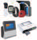

---
<!-- Page 108 -->
표 5-3 비대면 건강 검진 서비스 보안 요구사항
서비스 절차 보안 위협 관련 보안 요구사항
취약한 운영체제

#### 6.10 보안 통제 기능 구현

사용
환자 인증 부재 1.1~1.3 안전한 사용자 인증

#### 1.7 안전한 비밀번호 매커니즘 적용

인증 결과 우회

#### 1.8 인증 결과 검증 로직 구현

연속된 인증 시도 1.4 반복된 인증 시도 제한
환자별 권한 설정
환자 및 기기 인증 후 1.5~1.6 서비스 권한 설정
➀ 부재
접속
취약한 비밀번호

#### 1.7 안전한 비밀번호 매커니즘 적용

조합 규칙 허용
비밀번호 평문전송 2.2~2.3 전송 데이터 보호
추측 가능한 세션 ID

#### 4.1 세션 ID 재사용 방지

발급
4.2~4.4 세션 통제
환자 세션 탈취

#### 4.5 실시간 추가 인증 구현

수집 정보 및
2.2~2.3 전송 데이터 보호
개인정보 평문전송
(검진 기기) 검사
➁
결과 전송
수집 정보 및

#### 2.1 저장 데이터 보호

개인정보 평문저장
➂ 인공지능 분석 잘못된 데이터 학습 6.11 인공지능 데이터 학습
(1차) 검사 결과 분석 검진 결과 및
➃ 2.2 전송 데이터 보호
내용 전송 개인정보 평문전송
➄ 수치 이상 여부 알림 - - -

| 서비스 절차 |  | 보안 위협 | 관련 보안 요구사항 |
| --- | --- | --- | --- |
|  | 환자 및 기기 인증 후 접속 | 취약한 운영체제 사용 | 6.10 |
|  |  | 환자 인증 부재 | 1.1~1.3 |
|  |  | 인증 결과 우회 | 1.7 |
|  |  |  | 1.8 |
|  |  | 연속된 인증 시도 | 1.4 |
|  |  | 환자별 권한 설정 부재 | 1.5~1.6 |
|  |  | 취약한 비밀번호 조합 규칙 허용 | 1.7 |
|  |  | 비밀번호 평문전송 | 2.2~2.3 |
|  |  | 추측 가능한 세션 ID 발급 | 4.1 |
|  |  | 환자 세션 탈취 | 4.2~4.4 |
|  |  |  | 4.5 |
|  | (검진 기기) 검사 결과 전송 | 수집 정보 및 개인정보 평문전송 | 2.2~2.3 |
|  |  | 수집 정보 및 개인정보 평문저장 | 2.1 |
|  | 인공지능 분석 | 잘못된 데이터 학습 | 6.11 |
|  | (1차) 검사 결과 분석 내용 전송 | 검진 결과 및 개인정보 평문전송 | 2.2 |
|  | 수치 이상 여부 알림 | - | - |

---
<!-- Page 109 -->

## 제5장 디지털헬스케어 서비스 보안 요구사항 및 보안 대책 | 109

및
보안
모델
개념
및
보안
대책
개요
디지털헬스케어
구성요소
디지털헬스케어
서비스
유형
디지털헬스케어
서비스
보안
위협
디지털헬스케어
서비스
보안
요구사항
참고문헌
제1장
제2장
제3장
제4장
제5장
부록
서비스 절차 보안 위협 관련 보안 요구사항
의료진 인증 부재 1.1~1.3 안전한 사용자 인증

#### 1.7 안전한 비밀번호 매커니즘 적용

인증 결과 우회

#### 1.8 인증 결과 검증 로직 구현

연속된 인증 시도 1.4 반복된 인증 시도 제한
의료진 권한 설정
1.5~1.6 서비스 권한 설정
부재
취약한 비밀번호

#### 1.7 안전한 비밀번호 매커니즘 적용

➅ 의료진 인증 후 접속 조합 규칙 허용
비밀번호 평문전송 2.2~2.3 전송 데이터 보호
추측 가능한 세션 ID

#### 4.1 세션 ID 재사용 방지

발급
4.2~4.4 세션 통제
의료진 세션 탈취

#### 4.5 실시간 추가 인증 구현

검진 결과 및

#### 3.1 중요정보 마스킹 처리

개인정보 화면 노출
검진 결과 및

#### 2.2 전송 데이터 보호

개인정보 평문전송
➆ 진단 결과 전달 검진 결과 및

#### 3.1 중요정보 마스킹 처리

개인정보 화면 노출
검진 결과 위·변조 2.4 중요정보 위·변조 방지
검진 결과 및

#### 2.2 전송 데이터 보호

개인정보 평문전송
검진 결과 및
(2차) 검사 및 진단 3.1 중요정보 마스킹 처리
➇ 개인정보 화면 노출
결과 전송
4.2~4.4 세션 통제
환자 세션 탈취

#### 4.5 실시간 추가 인증 구현

| 서비스 절차 |  | 보안 위협 | 관련 보안 요구사항 |
| --- | --- | --- | --- |
|  | 의료진 인증 후 접속 | 의료진 인증 부재 | 1.1~1.3 |
|  |  | 인증 결과 우회 | 1.7 |
|  |  |  | 1.8 |
|  |  | 연속된 인증 시도 | 1.4 |
|  |  | 의료진 권한 설정 부재 | 1.5~1.6 |
|  |  | 취약한 비밀번호 조합 규칙 허용 | 1.7 |
|  |  | 비밀번호 평문전송 | 2.2~2.3 |
|  |  | 추측 가능한 세션 ID 발급 | 4.1 |
|  |  | 의료진 세션 탈취 | 4.2~4.4 |
|  |  |  | 4.5 |
|  |  | 검진 결과 및 개인정보 화면 노출 | 3.1 |
|  | 진단 결과 전달 | 검진 결과 및 개인정보 평문전송 | 2.2 |
|  |  | 검진 결과 및 개인정보 화면 노출 | 3.1 |
|  |  | 검진 결과 위·변조 | 2.4 |
|  | (2차) 검사 및 진단 결과 전송 | 검진 결과 및 개인정보 평문전송 | 2.2 |
|  |  | 검진 결과 및 개인정보 화면 노출 | 3.1 |
|  |  | 환자 세션 탈취 | 4.2~4.4 |
|  |  |  | 4.5 |

---
<!-- Page 110 -->
서비스 절차 보안 위협 관련 보안 요구사항
중요정보 평문저장 2.1 저장 데이터 보호
비대면 건강 검진 취약한 암호화 적용 2.1 저장 데이터 보호
➈
정보 보관 및 파기
정보 파기 절차 관리
3.4~3.5 안전한 데이터 보호 설정
미흡
소프트웨어 결함 5.1~5.3 시큐어코딩 적용
소스코드 노출 5.4 소스코드 난독화
취약한 외부
- 공통 개발 영역 5.5 안전한 제3자 소프트웨어 사용
소프트웨어 사용

#### 5.6 최신 보안 업데이트 적용

불분명한 업데이트
파일 적용

#### 5.7 업데이트 파일 무결성 검증

6.1~6.2 감사기록 생성
로그 관리 미흡

#### 6.3 감사기록 위·변조 방지

#### 6.4 침해사고 모니터링

서비스 거부 공격

#### 6.5 침해사고 대응 방안 마련

불필요한 서비스
- 공통 운영 영역 4.6~4.8 서비스 접근 통제
활성화
암호키 관리 미흡 2.5 안전한 암호키 관리
비인가된 물리적

#### 6.7 비인가자 물리적 접근 차단

접근
서비스 중요설정

#### 6.8 안전한 서비스 설정 관리

임의 변경

| 서비스 절차 |  | 보안 위협 | 관련 보안 요구사항 |
| --- | --- | --- | --- |
|  | 비대면 건강 검진 정보 보관 및 파기 | 중요정보 평문저장 | 2.1 |
|  |  | 취약한 암호화 적용 | 2.1 |
|  |  | 정보 파기 절차 관리 미흡 | 3.4~3.5 |
|  | 공통 개발 영역 | 소프트웨어 결함 | 5.1~5.3 |
|  |  | 소스코드 노출 | 5.4 |
|  |  | 취약한 외부 소프트웨어 사용 | 5.5 |
|  |  | 불분명한 업데이트 파일 적용 | 5.6 |
|  |  |  | 5.7 |
|  | 공통 운영 영역 | 로그 관리 미흡 | 6.1~6.2 |
|  |  |  | 6.3 |
|  |  | 서비스 거부 공격 | 6.4 |
|  |  |  | 6.5 |
|  |  | 불필요한 서비스 활성화 | 4.6~4.8 |
|  |  | 암호키 관리 미흡 | 2.5 |
|  |  | 비인가된 물리적 접근 | 6.7 |
|  |  | 서비스 중요설정 임의 변경 | 6.8 |

---
<!-- Page 111 -->

## 제5장 디지털헬스케어 서비스 보안 요구사항 및 보안 대책 | 111

및
보안
모델
개념
및
보안
대책
개요
디지털헬스케어
구성요소
디지털헬스케어
서비스
유형
디지털헬스케어
서비스
보안
위협
디지털헬스케어
서비스
보안
요구사항
참고문헌
제1장
제2장
제3장
제4장
제5장
부록

#### 1.4 질환 예후 관리 서비스

질환 예후 관리 서비스는 기기에서 전송된 정보를 인공지능이 분석하여 건강 이상 유무에 대해 상시
피드백을 해주는데 인공지능의 분석이 잘못된 경우 환자의 건강에 이상이 발생했음에도 불구하고 피드백을
주지 않거나 이상이 없는데도 인공지능의 잘못된 학습으로 이상 유무를 계속 알려주는 등의 서비스 가용성에
문제가 발생할 수 있다. 따라서 인공지능 학습 시 편향된 정보로만 학습하지 않고 인공지능 관련 사용 지침 및
가이드라인을 기반으로 학습시켜야 한다. 또한 환자가 사용하는 측정 기기에서 정확한 정보가 전송될 수
있도록 통신 구간 암호화 적용 또는 암호화 알고리즘을 적용함으로써 질환 예후 정보에 대한 무결성을
확보한다. 그리고 환자 스스로 간호하지 못하여 간병인을 사용할 경우 제3자에게 환자의 질환 정보 등
민감정보를 제공하는 것이므로 개인정보보호법에 위배되지 않도록 환자에게 제3자 제공 동의를 받아야 한다.
그림 5-4 질환 예후 관리 서비스 주요 보안 요구사항
(cid:8607) 보안 통제 기능 구현 (cid:8607) 안전한 서비스 사용법 제공 (cid:8607) 안전한 사용자 인증 (cid:8607) 인증 결과 검증 로직 구현 (cid:8607) 세션 ID 재사용 방지
(cid:3349) (cid:2045)(cid:2583)
(cid:19) (cid:3356)(cid:2647) 및 (cid:1245)(cid:1245) (cid:2635)(cid:2768) (cid:3377) (cid:2685)(cid:2264)
환(cid:2647) (cid:1633)(cid:1790)
스(cid:1859)(cid:3167) (cid:1245)(cid:1245)
(cid:20) (cid:1124)(cid:1098) (cid:2959)(cid:2687) (cid:2299)(cid:2966) (cid:2681)(cid:2272) (cid:2628)사
질환 예후 모(cid:1508)(cid:3104)(cid:1858) (cid:2687)보 (cid:2299)(cid:2776) (cid:8607) 인공지능
(cid:21) (cid:2635)(cid:1173)지(cid:1502) (cid:2073)(cid:2227) 데이터 학습
(cid:8607) 전송 데이터 보호
환(cid:2647) (cid:18) (cid:1245)(cid:1245) (cid:1633)(cid:1790) (cid:8607) 저장 데이터 보호 모(cid:1508)(cid:3104)(cid:1858) (cid:2687)보 (cid:2679)(cid:2658) 및 (cid:34)(cid:42) (cid:2073)(cid:2227) (cid:2771)(cid:1808)(cid:2570) (cid:2658)비
(cid:23) (cid:2633)(cid:2202) (cid:2299)(cid:2966)
(cid:2773)(cid:3356) (cid:1177)(cid:1851)(cid:2570) 헬스케어 (cid:1245)(cid:1245) (cid:1155)보 (cid:2681)(cid:2272)
(cid:2633)(cid:2202) (cid:1124)(cid:1098) (cid:2299)(cid:2966) (cid:1093)지
(cid:22) (cid:2202)(cid:2342) (cid:2773)(cid:3356) (cid:1177)(cid:1851)
(cid:3023)(cid:2975) (cid:2687)보 (cid:2681)(cid:2272) (cid:24) (cid:2628)사 (cid:2635)(cid:2768)
(cid:3377) (cid:2685)(cid:2264)
질환 예후 관리 (cid:2771)(cid:1808) (cid:2299)(cid:3311)
(cid:23) (cid:2633)(cid:2202) (cid:2299)(cid:2966) (cid:1155)보 (cid:2681)(cid:2272) (cid:8607) 안전한 사용자 인증
(cid:2348)(cid:2681)(cid:1576)(cid:1157) (cid:3334)(cid:1532)(cid:1157) (cid:2899)(cid:2555)(cid:2771)(cid:1521)(cid:1245)(cid:1245) (cid:8607) 서비스 권한 설정
질환 관(cid:1778) (cid:2771)(cid:1521)(cid:15)(cid:2890)(cid:2001) (cid:2679)(cid:2658) (cid:8607) 세션 ID 재사용 방지
(cid:26) (cid:2633)(cid:2202) (cid:2299)(cid:2966) (cid:2771)(cid:1521) 및 (cid:25) (cid:2773)(cid:3356) (cid:1177)(cid:1778)
(cid:2890)(cid:2001) (cid:1394)(cid:2570) (cid:2681)(cid:2272) (cid:18)(cid:17) (cid:2687)보 보(cid:1177) (cid:2633)(cid:2202) (cid:2299)(cid:2966) (cid:2771)(cid:1521) 및 (cid:2890)(cid:2001)
(cid:2899)성(cid:2073)(cid:1157) (cid:2635)(cid:2329)(cid:1853)(cid:3216)(cid:3280) (cid:3334)(cid:2449)(cid:1157) 및 (cid:3189)(cid:1245)
(cid:8607) 제3자 제공 시 법적 (cid:8607) 전송 데이터 보호
의무 준수 (cid:8607) 중요정보 위.변조 방지
(cid:8607) 세션 통제
(cid:8607) 저장 데이터 보호
(cid:8607) 안전한 데이터 보호 설정
질환 예후 관리 서비스 및
의(cid:1808) (cid:34)I 분석 시스(cid:3118)
데이터 이(cid:1586) 사용자 직접 연결(cid:9)사용(cid:10)

| (cid:20) (cid:1124)(cid:1098) (cid:2959)(cid:2687) (cid:2299)(cid:2966) (cid:2681)(cid:2272) |  |
| --- | --- |
| (cid:8607) 전송 데이터 보호 (cid:8607) 저장 데이터 보호 |  |
|  |  |

| (cid:8607) 안전한 사용자 인증 (cid:8607) 서비스 권한 설정 (cid:8607) 세션 ID 재사용 방지 |  |

| 제5장 |  |

---
<!-- Page 112 -->
표 5-4 질환 예후 관리 서비스 보안 요구사항
서비스 절차 보안 위협 관련 보안 요구사항
취약한 운영체제

#### 6.10 보안 통제 기능 구현

사용
질환 예후 관리 기기
➀
등록
안전하지 않은

#### 6.9 안전한 서비스 사용법 제공

서비스 사용
환자 인증 부재 1.1~1.3 안전한 사용자 인증

#### 1.7 안전한 비밀번호 매커니즘 적용

인증 결과 우회

#### 1.8 인증 결과 검증 로직 구현

연속된 인증 시도 1.4 반복된 인증 시도 제한
환자별 권한 설정
1.5~1.6 서비스 권한 설정
부재
환자 및 기기 인증 후
➁
접속 취약한 비밀번호

#### 1.7 안전한 비밀번호 매커니즘 적용

조합 규칙 허용
비밀번호 평문전송 2.2~2.3 전송 데이터 보호
추측 가능한 세션 ID

#### 4.1 세션 ID 재사용 방지

발급
4.2~4.4 세션 통제
환자 세션 탈취

#### 4.5 실시간 추가 인증 구현

수집 정보 및
2.2~2.3 전송 데이터 보호
개인정보 평문전송
➂ 건강 측정 수치 전송
수집 정보 및

#### 2.1 저장 데이터 보호

개인정보 평문저장
➃ 인공지능 분석 잘못된 데이터 학습 6.11 인공지능 데이터 학습
상시 질환 관리 코치
➄ 질환 정보 평문전송 2.2~2.3 전송 데이터 보호
정보 전송
➅ 이상 수치 경보 전송 - - -

| 서비스 절차 |  | 보안 위협 | 관련 보안 요구사항 |
| --- | --- | --- | --- |
|  | 질환 예후 관리 기기 등록 | 취약한 운영체제 사용 | 6.10 |
|  |  | 안전하지 않은 서비스 사용 | 6.9 |
|  | 환자 및 기기 인증 후 접속 | 환자 인증 부재 | 1.1~1.3 |
|  |  | 인증 결과 우회 | 1.7 |
|  |  |  | 1.8 |
|  |  | 연속된 인증 시도 | 1.4 |
|  |  | 환자별 권한 설정 부재 | 1.5~1.6 |
|  |  | 취약한 비밀번호 조합 규칙 허용 | 1.7 |
|  |  | 비밀번호 평문전송 | 2.2~2.3 |
|  |  | 추측 가능한 세션 ID 발급 | 4.1 |
|  |  | 환자 세션 탈취 | 4.2~4.4 |
|  |  |  | 4.5 |
|  | 건강 측정 수치 전송 | 수집 정보 및 개인정보 평문전송 | 2.2~2.3 |
|  |  | 수집 정보 및 개인정보 평문저장 | 2.1 |
|  | 인공지능 분석 | 잘못된 데이터 학습 | 6.11 |
|  | 상시 질환 관리 코치 정보 전송 | 질환 정보 평문전송 | 2.2~2.3 |
|  | 이상 수치 경보 전송 | - | - |

---
<!-- Page 113 -->

## 제5장 디지털헬스케어 서비스 보안 요구사항 및 보안 대책 | 113

및
보안
모델
개념
및
보안
대책
개요
디지털헬스케어
구성요소
디지털헬스케어
서비스
유형
디지털헬스케어
서비스
보안
위협
디지털헬스케어
서비스
보안
요구사항
참고문헌
제1장
제2장
제3장
제4장
제5장
부록
서비스 절차 보안 위협 관련 보안 요구사항
의사 인증 부재 1.1~1.3 안전한 사용자 인증

#### 1.7 안전한 비밀번호 매커니즘 적용

인증 결과 우회

#### 1.8 인증 결과 검증 로직 구현

연속된 인증 시도 1.4 반복된 인증 시도 제한
의사 권한 설정 부재 1.5~1.6 서비스 권한 설정
취약한 비밀번호

#### 1.7 안전한 비밀번호 매커니즘 적용

조합 규칙 허용
➆ 의사 인증 후 접속
비밀번호 평문전송 2.2~2.3 전송 데이터 보호
추측 가능한 세션 ID

#### 4.1 세션 ID 재사용 방지

발급
4.2~4.4 세션 통제
의사 세션 탈취

#### 4.5 실시간 추가 인증 구현

질환 정보 및

#### 3.1 중요정보 마스킹 처리

개인정보 화면 노출
진단 결과 및

#### 2.2 전송 데이터 보호

개인정보 평문전송
질환 관련 이상 수치
➇ 진단 결과 및
진단 및 처방 3.1 중요정보 마스킹 처리
개인정보 화면 노출
진단 결과 위·변조 2.4 중요정보 위·변조 방지
진단 결과 및

#### 2.2 전송 데이터 보호

개인정보 평문전송
진단 결과 및

#### 3.1 중요정보 마스킹 처리

개인정보 화면 노출
이상 수치 진단 및
➈
처방 내용 전송 제3자 정보 제공

#### 3.2 제3자 제공 시 법적 의무 준수

법적 준거성 위배
4.2~4.4 세션 통제
환자 세션 탈취

#### 4.5 실시간 추가 인증 구현

| 서비스 절차 |  | 보안 위협 | 관련 보안 요구사항 |
| --- | --- | --- | --- |
|  | 의사 인증 후 접속 | 의사 인증 부재 | 1.1~1.3 |
|  |  | 인증 결과 우회 | 1.7 |
|  |  |  | 1.8 |
|  |  | 연속된 인증 시도 | 1.4 |
|  |  | 의사 권한 설정 부재 | 1.5~1.6 |
|  |  | 취약한 비밀번호 조합 규칙 허용 | 1.7 |
|  |  | 비밀번호 평문전송 | 2.2~2.3 |
|  |  | 추측 가능한 세션 ID 발급 | 4.1 |
|  |  | 의사 세션 탈취 | 4.2~4.4 |
|  |  |  | 4.5 |
|  |  | 질환 정보 및 개인정보 화면 노출 | 3.1 |
|  | 질환 관련 이상 수치 진단 및 처방 | 진단 결과 및 개인정보 평문전송 | 2.2 |
|  |  | 진단 결과 및 개인정보 화면 노출 | 3.1 |
|  |  | 진단 결과 위·변조 | 2.4 |
|  | 이상 수치 진단 및 처방 내용 전송 | 진단 결과 및 개인정보 평문전송 | 2.2 |
|  |  | 진단 결과 및 개인정보 화면 노출 | 3.1 |
|  |  | 제3자 정보 제공 법적 준거성 위배 | 3.2 |
|  |  | 환자 세션 탈취 | 4.2~4.4 |
|  |  |  | 4.5 |

---
<!-- Page 114 -->
서비스 절차 보안 위협 관련 보안 요구사항
중요정보 평문저장 2.1 저장 데이터 보호
질환 예후 관리 정보 취약한 암호화 적용 2.1 저장 데이터 보호
➉
보관 및 파기
정보 파기 절차 관리
3.4~3.5 안전한 데이터 보호 설정
미흡
소프트웨어 결함 5.1~5.3 시큐어코딩 적용
소스코드 노출 5.4 소스코드 난독화
취약한 외부
- 공통 개발 영역 5.5 안전한 제3자 소프트웨어 사용
소프트웨어 사용

#### 5.6 최신 보안 업데이트 적용

불분명한 업데이트
파일 적용

#### 5.7 업데이트 파일 무결성 검증

6.1~6.2 감사기록 생성
로그 관리 미흡

#### 6.3 감사기록 위·변조 방지

#### 6.4 침해사고 모니터링

서비스 거부 공격

#### 6.5 침해사고 대응 방안 마련

불필요한 서비스
- 공통 운영 영역 4.6~4.8 서비스 접근 통제
활성화
암호키 관리 미흡 2.5 안전한 암호키 관리
비인가된 물리적

#### 6.7 비인가자 물리적 접근 차단

접근
서비스 중요설정

#### 6.8 안전한 서비스 설정 관리

임의 변경

| 서비스 절차 |  | 보안 위협 | 관련 보안 요구사항 |
| --- | --- | --- | --- |
|  | 질환 예후 관리 정보 보관 및 파기 | 중요정보 평문저장 | 2.1 |
|  |  | 취약한 암호화 적용 | 2.1 |
|  |  | 정보 파기 절차 관리 미흡 | 3.4~3.5 |
|  | 공통 개발 영역 | 소프트웨어 결함 | 5.1~5.3 |
|  |  | 소스코드 노출 | 5.4 |
|  |  | 취약한 외부 소프트웨어 사용 | 5.5 |
|  |  | 불분명한 업데이트 파일 적용 | 5.6 |
|  |  |  | 5.7 |
|  | 공통 운영 영역 | 로그 관리 미흡 | 6.1~6.2 |
|  |  |  | 6.3 |
|  |  | 서비스 거부 공격 | 6.4 |
|  |  |  | 6.5 |
|  |  | 불필요한 서비스 활성화 | 4.6~4.8 |
|  |  | 암호키 관리 미흡 | 2.5 |
|  |  | 비인가된 물리적 접근 | 6.7 |
|  |  | 서비스 중요설정 임의 변경 | 6.8 |

---
<!-- Page 115 -->

## 제5장 디지털헬스케어 서비스 보안 요구사항 및 보안 대책 | 115

및
보안
모델
개념
및
보안
대책
개요
디지털헬스케어
구성요소
디지털헬스케어
서비스
유형
디지털헬스케어
서비스
보안
위협
디지털헬스케어
서비스
보안
요구사항
참고문헌
제1장
제2장
제3장
제4장
제5장
부록

#### 1.5 온라인 약배송 서비스

온라인 약배송 서비스는 약 배송 업체를 이용하여 환자에게 약을 배송할 때 관리가 미흡할 경우 제3자에
의한 환자 정보 유·노출과 잘못된 환자에게 약을 배송시킬 때 의도치 않은 의료 사고가 발생할 수 있다.
따라서 서비스 제공자는 약 배송 업체에게 배송 업무를 위탁할 경우 해당 수탁사를 이용한다는 것을 환자에게
고지하고 환자의 동의를 얻어야 한다. 그리고 제공자는 수탁사가 기본적으로 준수해야 할 보안 관리를 적절히
수행하고 있는지 주기적으로 확인해야 한다. 또한 서비스 제공자는 환자의 정보가 수탁사 DB 등에 평문으로
저장되어 있거나 사용 기간 외의 정보가 저장되어 있는지 반드시 확인해야 한다. 온라인 약배송 서비스는 약
배송의 무결성 및 신속성이 보장되어야 하므로 환자가 복용해야 할 약이 정상적으로 배송되었는지 확인하는
절차를 의무화함으로써 약이 적시에 인가된 사용자에게 배송되었는지 확인해야 한다. 다음 그림은 온라인
약배송 서비스 주요 보안 위협과 관련된 보안 요구사항을 나타낸 그림이다.
그림 5-5 온라인 약배송 서비스 주요 보안 요구사항
(cid:8607) 안전한 사용자 인증 (cid:8607) 인증 결과 검증 로직 구현
(cid:8607) 서비스 권한 설정 (cid:8607) 세션 ID 재사용 방지 (cid:8607) 세션 통제 (cid:2465)(cid:1204)
(cid:18) (cid:3356)(cid:2647) (cid:2635)(cid:2768) (cid:3377) (cid:2685)(cid:2264)
(cid:19) (cid:3356)(cid:2647) (cid:2003)(cid:2272) (cid:2687)보 (cid:2045)(cid:2583) (cid:24) (cid:2465)사 (cid:2635)(cid:2768) (cid:3377)
(cid:2689)(cid:20)(cid:2647) (cid:2689)(cid:1173) (cid:1586)(cid:2628) (cid:2504)(cid:2071) (cid:3355)(cid:2635) (cid:2685)(cid:2264)
(cid:3356)(cid:2647) (cid:1633)(cid:1790) (cid:23) (cid:2890)(cid:2001)(cid:2681) 약사
(cid:8607) 제3자 제공 시 법적
의무 준수 (cid:20) (cid:2628)사 (cid:2635)(cid:2768) (cid:3377) (cid:2681)(cid:2272) (cid:3356)(cid:2647) (cid:1633)(cid:1790)
(cid:3356)(cid:2647) (cid:2771)(cid:1808) (cid:1394)(cid:2505) (cid:3355)인 (cid:2685)(cid:2264) (cid:2628)사
(cid:3349) (cid:2771)(cid:1808)(cid:2570) (cid:2658)비 (cid:8607) 전송 (cid:2890)(cid:2001)(cid:2681) (cid:1633)(cid:1790)
(cid:2890)(cid:2001)(cid:2681) (cid:1994)(cid:3311) 데이터
스(cid:1859)(cid:3167) (cid:1245)(cid:1245) (cid:21) (cid:2771)(cid:1808) (cid:1394)(cid:2570) 보호 (cid:2890)(cid:2001) 약 (cid:2689)(cid:2705)
(cid:2890)(cid:2001)(cid:2681) 약(cid:1204) (cid:2689)(cid:1173) (cid:1586)(cid:2628) 및 (cid:2890)(cid:2001)
(cid:22) (cid:2890)(cid:2001)(cid:2681) (cid:2689)(cid:20)(cid:2647) (cid:2681)(cid:2272) (cid:2890)(cid:2001) 약(cid:15)(cid:1245)(cid:1245) 배송
(cid:3356)(cid:2647) (cid:2689)(cid:1173) (cid:1586)(cid:2628) (cid:2890)(cid:2001)(cid:2681) 약(cid:1204) (cid:2681)송
(cid:2504)(cid:2071) (cid:3355)(cid:2635) (cid:8607)(cid:8607) 중중요요정정보보 마마스스킹킹 처처리리
(cid:3356)(cid:2647) 배송(cid:2687)보 (cid:2636)(cid:2966) (cid:2504)(cid:2071) (cid:3355)인 (cid:8607)(cid:8607) 중중요요정정보보 위위..변변조조 방방지지 (cid:25) (cid:2687)보 보(cid:1177)
(cid:18)(cid:17) (cid:3356)(cid:2647) (cid:2635)(cid:2768) 및 및 (cid:3189)(cid:1245)
(cid:18)(cid:18) (cid:2687)보 보(cid:1177) 및 (cid:3189)(cid:1245)
(cid:2299)(cid:1784) (cid:3355)(cid:2635) (cid:26) (cid:2890)(cid:2001) (cid:2465)(cid:15)(cid:1245)(cid:1245)
약(cid:1204)
(cid:8607) 저장 데이터 보호 (cid:2003)(cid:2272) 요(cid:2898) (cid:2342)스(cid:3118)
(cid:8607) 수령자 확인 절차 구현 (cid:8607) 안전한 데이터 보호 설정
처방약 배송 서비스 시스(cid:3118) (cid:8607) 수탁사 관리
감독 의무화 (cid:2003)(cid:2272) (cid:2488)(cid:2899)
배송 모(cid:1508)(cid:3104)(cid:1858)
(cid:2890)(cid:2001) 약(cid:15)(cid:1245)(cid:1245) 배송 및 배송 (cid:1177)(cid:1851)
데데이이터터 이이동동 사사용용자자 직직접접 연연결결(cid:9)(cid:9)사사용용(cid:10)(cid:10) (cid:2527)프라인

|  |  |
| --- | --- |
| (cid:8607) 전송 데이터 보호 |  |
|  |  |
| (cid:26) (cid:2890)(cid:2001) (cid:2465)(cid:15)(cid:1245)(cid:1245) (cid:2003)(cid:2272) 요(cid:2898) |  |

| 제5장 |  |

---
<!-- Page 116 -->
표 5-5 온라인 약배송 서비스 보안 요구사항
서비스 절차 보안 위협 관련 보안 요구사항
환자 인증 부재 1.1~1.3 안전한 사용자 인증

#### 1.7 안전한 비밀번호 매커니즘 적용

인증 결과 우회

#### 1.8 인증 결과 검증 로직 구현

연속된 인증 시도 1.4 반복된 인증 시도 제한
환자별 권한 설정
1.5~1.6 서비스 권한 설정
부재
➀ 환자 인증 후 접속
취약한 비밀번호

#### 1.7 안전한 비밀번호 매커니즘 적용

조합 규칙 허용
비밀번호 평문전송 2.2~2.3 전송 데이터 보호
추측 가능한 세션 ID

#### 4.1 세션 ID 재사용 방지

발급
4.2~4.4 세션 통제
환자 세션 탈취

#### 4.5 실시간 추가 인증 구현

환자 배송 정보
제3자 정보 제공
➁ 제3자 제공 동의 3.2 제3자 제공 시 법적 의무 준수
법적 준거성 위배
여부 확인
의사 인증 부재 1.1~1.3 안전한 사용자 인증

#### 1.7 안전한 비밀번호 매커니즘 적용

인증 결과 우회

#### 1.8 인증 결과 검증 로직 구현

연속된 인증 시도 1.4 반복된 인증 시도 제한
의사 권한 설정 부재 1.5~1.6 서비스 권한 설정
취약한 비밀번호

#### 1.7 안전한 비밀번호 매커니즘 적용

조합 규칙 허용
➂ 의사 인증 후 접속
비밀번호 평문전송 2.2~2.3 전송 데이터 보호
추측 가능한 세션 ID

#### 4.1 세션 ID 재사용 방지

발급
4.2~4.4 세션 통제
의사 세션 탈취

#### 4.5 실시간 추가 인증 구현

질환 정보 및

#### 3.1 중요정보 마스킹 처리

개인정보 화면 노출

| 서비스 절차 |  | 보안 위협 | 관련 보안 요구사항 |
| --- | --- | --- | --- |
|  | 환자 인증 후 접속 | 환자 인증 부재 | 1.1~1.3 |
|  |  | 인증 결과 우회 | 1.7 |
|  |  |  | 1.8 |
|  |  | 연속된 인증 시도 | 1.4 |
|  |  | 환자별 권한 설정 부재 | 1.5~1.6 |
|  |  | 취약한 비밀번호 조합 규칙 허용 | 1.7 |
|  |  | 비밀번호 평문전송 | 2.2~2.3 |
|  |  | 추측 가능한 세션 ID 발급 | 4.1 |
|  |  | 환자 세션 탈취 | 4.2~4.4 |
|  |  |  | 4.5 |
|  | 환자 배송 정보 제3자 제공 동의 여부 확인 | 제3자 정보 제공 법적 준거성 위배 | 3.2 |
|  | 의사 인증 후 접속 | 의사 인증 부재 | 1.1~1.3 |
|  |  | 인증 결과 우회 | 1.7 |
|  |  |  | 1.8 |
|  |  | 연속된 인증 시도 | 1.4 |
|  |  | 의사 권한 설정 부재 | 1.5~1.6 |
|  |  | 취약한 비밀번호 조합 규칙 허용 | 1.7 |
|  |  | 비밀번호 평문전송 | 2.2~2.3 |
|  |  | 추측 가능한 세션 ID 발급 | 4.1 |
|  |  | 의사 세션 탈취 | 4.2~4.4 |
|  |  |  | 4.5 |
|  |  | 질환 정보 및 개인정보 화면 노출 | 3.1 |

---
<!-- Page 117 -->

## 제5장 디지털헬스케어 서비스 보안 요구사항 및 보안 대책 | 117

및
보안
모델
개념
및
보안
대책
개요
디지털헬스케어
구성요소
디지털헬스케어
서비스
유형
디지털헬스케어
서비스
보안
위협
디지털헬스케어
서비스
보안
요구사항
참고문헌
제1장
제2장
제3장
제4장
제5장
부록
서비스 절차 보안 위협 관련 보안 요구사항
처방전 및 개인정보

#### 2.2 전송 데이터 보호

평문전송
진료 내용 및
➃ 처방전 및 개인정보
처방 전송 3.1 중요정보 마스킹 처리
화면 노출
처방전 위·변조 2.4 중요정보 위·변조 방지
처방전 제3자 제공 제3자 정보 제공
➄ 3.2 제3자 제공 시 법적 의무 준수
동의 여부 확인 법적 준거성 위배
처방전 및 개인정보
➅ 처방전 전송 2.2 전송 데이터 보호
평문전송
약사 인증 부재 1.1~1.3 안전한 사용자 인증

#### 1.7 안전한 비밀번호 매커니즘 적용

인증 결과 우회

#### 1.8 인증 결과 검증 로직 구현

연속된 인증 시도 1.4 반복된 인증 시도 제한
약사 권한 설정 부재 1.5~1.6 서비스 권한 설정
취약한 비밀번호

#### 1.7 안전한 비밀번호 매커니즘 적용

조합 규칙 허용
➆ 약사 인증 후 접속
비밀번호 평문전송 2.2~2.3 전송 데이터 보호
추측 가능한 세션 ID

#### 4.1 세션 ID 재사용 방지

발급
4.2~4.4 세션 통제
약사 세션 탈취

#### 4.5 실시간 추가 인증 구현

처방전 및 개인정보

#### 3.1 중요정보 마스킹 처리

화면 노출
처방 약·기기 수탁사 관리 감독
➈ 6.6 수탁사 관리 감독 의무화
배송 요청 미흡
환자 인증 및 수령 수령자 확인 절차
➉ 1.9 수령자 확인 절차 구현
확인 미흡
중요정보 평문저장 2.1 저장 데이터 보호
➇ 온라인 약배송 정보 취약한 암호화 적용 2.1 저장 데이터 보호
보관 및 파기
정보 파기 절차 관리
3.4~3.5 안전한 데이터 보호 설정
미흡

| 서비스 절차 |  | 보안 위협 | 관련 보안 요구사항 |
| --- | --- | --- | --- |
|  | 진료 내용 및 처방 전송 | 처방전 및 개인정보 평문전송 | 2.2 |
|  |  | 처방전 및 개인정보 화면 노출 | 3.1 |
|  |  | 처방전 위·변조 | 2.4 |
|  | 처방전 제3자 제공 동의 여부 확인 | 제3자 정보 제공 법적 준거성 위배 | 3.2 |
|  | 처방전 전송 | 처방전 및 개인정보 평문전송 | 2.2 |
|  | 약사 인증 후 접속 | 약사 인증 부재 | 1.1~1.3 |
|  |  | 인증 결과 우회 | 1.7 |
|  |  |  | 1.8 |
|  |  | 연속된 인증 시도 | 1.4 |
|  |  | 약사 권한 설정 부재 | 1.5~1.6 |
|  |  | 취약한 비밀번호 조합 규칙 허용 | 1.7 |
|  |  | 비밀번호 평문전송 | 2.2~2.3 |
|  |  | 추측 가능한 세션 ID 발급 | 4.1 |
|  |  | 약사 세션 탈취 | 4.2~4.4 |
|  |  |  | 4.5 |
|  |  | 처방전 및 개인정보 화면 노출 | 3.1 |
|  | 처방 약·기기 배송 요청 | 수탁사 관리 감독 미흡 | 6.6 |
|  | 환자 인증 및 수령 확인 | 수령자 확인 절차 미흡 | 1.9 |
|  | 온라인 약배송 정보 보관 및 파기 | 중요정보 평문저장 | 2.1 |
|  |  | 취약한 암호화 적용 | 2.1 |
|  |  | 정보 파기 절차 관리 미흡 | 3.4~3.5 |

| 제5장 |  |

---
<!-- Page 118 -->
서비스 절차 보안 위협 관련 보안 요구사항
소프트웨어 결함 5.1~5.3 시큐어코딩 적용
소스코드 노출 5.4 소스코드 난독화
취약한 외부
- 공통 개발 영역 5.5 안전한 제3자 소프트웨어 사용
소프트웨어 사용

#### 5.6 최신 보안 업데이트 적용

불분명한 업데이트
파일 적용

#### 5.7 업데이트 파일 무결성 검증

6.1~6.2 감사기록 생성
로그 관리 미흡

#### 6.3 감사기록 위·변조 방지

#### 6.4 침해사고 모니터링

서비스 거부 공격

#### 6.5 침해사고 대응 방안 마련

불필요한 서비스
4.6~4.8 서비스 접근 통제
- 공통 운영 영역
활성화
암호키 관리 미흡 2.5 안전한 암호키 관리
비인가된 물리적

#### 6.7 비인가자 물리적 접근 차단

접근
서비스 중요설정

#### 6.8 안전한 서비스 설정 관리

임의 변경

| 서비스 절차 |  | 보안 위협 | 관련 보안 요구사항 |
| --- | --- | --- | --- |
|  | 공통 개발 영역 | 소프트웨어 결함 | 5.1~5.3 |
|  |  | 소스코드 노출 | 5.4 |
|  |  | 취약한 외부 소프트웨어 사용 | 5.5 |
|  |  | 불분명한 업데이트 파일 적용 | 5.6 |
|  |  |  | 5.7 |
|  | 공통 운영 영역 | 로그 관리 미흡 | 6.1~6.2 |
|  |  |  | 6.3 |
|  |  | 서비스 거부 공격 | 6.4 |
|  |  |  | 6.5 |
|  |  | 불필요한 서비스 활성화 | 4.6~4.8 |
|  |  | 암호키 관리 미흡 | 2.5 |
|  |  | 비인가된 물리적 접근 | 6.7 |
|  |  | 서비스 중요설정 임의 변경 | 6.8 |

---
<!-- Page 119 -->

## 제5장 디지털헬스케어 서비스 보안 요구사항 및 보안 대책 | 119

및
보안
모델
개념
및
보안
대책
개요
디지털헬스케어
구성요소
디지털헬스케어
서비스
유형
디지털헬스케어
서비스
보안
위협
디지털헬스케어
서비스
보안
요구사항
참고문헌
제1장
제2장
제3장
제4장
제5장
부록

#### 1.6 비대면 복약 관리 서비스

비대면 복약 관리 서비스는 복약 기기에서 전송되는 복약 정보가 정확하지 않을 경우 환자가 복용해야 할
약의 적정량보다 적게 복용하거나 남용하여 복용함으로써 환자의 건강 상태에 위중을 가할 수 있다. 따라서
서비스 제공자는 복약 기기에서 전송되는 정보의 신뢰성을 보장하기 위해 환자에게는 올바른 기기 사용법을
제공함으로써 약물을 적정량 복용할 수 있도록 해야 한다. 그리고 기기에서 복약 정보를 비대면 복약 관리
서비스에 전송하거나 의료진이 환자의 복약 정보를 수정할 경우 안전한 암호화 알고리즘 적용 또는 안전한
암호화 통신을 적용함으로써 복약 정보가 변경되는 등의 무결성이 위배되지 않도록 확인해야 한다. 다음
그림은 비대면 복약 관리 서비스 주요 보안 위협과 관련된 보안 요구사항을 나타낸 그림이다.
그림 5-6 비대면 복약 관리 서비스 주요 보안 요구사항
(cid:8607) 보안 통제 기능 구현 (cid:8607) 안전한 서비스 사용법 제공 (cid:8607) 안전한 사용자 인증 (cid:8607) 인증 결과 검증 로직 구현 (cid:8607) 세션 ID 재사용 방지
(cid:3349) (cid:2045)(cid:2583)
(cid:19) (cid:3356)(cid:2647) 및 (cid:1245)(cid:1245) (cid:2635)(cid:2768) (cid:3377) (cid:2685)(cid:2264)
스(cid:1859)(cid:3167) (cid:1245)(cid:1245) (cid:3356)(cid:2647) (cid:1633)(cid:1790)
(cid:8607) 인공지능 데이터 학습
(cid:20) (cid:2050)(cid:2465) (cid:2687)보 (cid:2681)(cid:2272)
(cid:2628)사
복약 모(cid:1508)(cid:3104)(cid:1858) (cid:2687)보 (cid:2299)(cid:2776)
(cid:8607) 전송 데이터 보호 (cid:21) (cid:2635)(cid:1173)지(cid:1502) (cid:2073)(cid:2227)
(cid:8607) 저장 데이터 보호
(cid:3356)(cid:2647) 모(cid:1508)(cid:3104)(cid:1858) (cid:2687)보 (cid:2679)(cid:2658) 및 스(cid:1859)(cid:3167) (cid:2073)(cid:2227) (cid:2771)(cid:1808)(cid:2570) (cid:2658)비
(cid:18) (cid:1245)(cid:1245) (cid:1633)(cid:1790)
(cid:22) (cid:2633)(cid:2202) (cid:2050)(cid:2465)
(cid:2050)(cid:2465) (cid:1177)(cid:1851)(cid:2570) 헬스케어 (cid:1245)(cid:1245) (cid:22) (cid:2633)(cid:2202) (cid:2050)(cid:2465) (cid:1155)보 (cid:2681)(cid:2272) (cid:1155)보 (cid:2681)(cid:2272) (cid:2633)(cid:2202) 복약 (cid:2299)(cid:2966) (cid:1093)지
(cid:23) (cid:2628)사 (cid:2635)(cid:2768)
(cid:3377) (cid:2685)(cid:2264)
(cid:2652)(cid:1925)(cid:1595) 복약 (cid:1992)(cid:2621) (cid:2771)(cid:1808) (cid:2299)(cid:3311)
(cid:25) (cid:2633)(cid:2202) (cid:2299)(cid:2966) (cid:2771)(cid:1521) 및
(cid:2890)(cid:2001) (cid:1394)(cid:2570) (cid:2681)(cid:2272) (cid:24) (cid:2771)(cid:1521) 및 (cid:2890)(cid:2001)
(cid:2771)(cid:1521)(cid:15)(cid:2890)(cid:2001) (cid:2679)(cid:2658)
(cid:8607) 안전한 사용자 인증
(cid:8607) 중요정보 마스킹 처리 (cid:26) (cid:2687)보 보(cid:1177) (cid:8607) 증서비스 권한 설정
(cid:8607) 세션 통제 및 (cid:3189)(cid:1245) (cid:8607) 세션 ID 재사용 방지
(cid:8607) 실시간 추가 인증 구현
(cid:8607) 전송 데이터 보호
(cid:8607) 중요정보 위.변조 방지
(cid:8607) 저장 데이터 보호
복약 관리 서비스 및 의(cid:1808) (cid:34)I 분석 시스(cid:3118) (cid:8607) 안전한 데이터 보호 설정
데이터 이(cid:1586) 사용자 직접 연결(cid:9)사용(cid:10)

|  | (cid:8607) 안전한 사용자 인증 (cid:8607) 증서비스 권한 설정 (cid:8607) 세션 ID 재사용 방지 |

---
<!-- Page 120 -->
표 5-6 비대면 복약 관리 서비스 보안 요구사항
서비스 절차 보안 위협 관련 보안 요구사항
취약한 운영체제

#### 6.10 보안 통제 기능 구현

사용
➀ 복약 관리 기기 등록
안전하지 않은

#### 6.9 안전한 서비스 사용법 제공

서비스 사용
환자 인증 부재 1.1~1.3 안전한 사용자 인증

#### 1.7 안전한 비밀번호 매커니즘 적용

인증 결과 우회

#### 1.8 인증 결과 검증 로직 구현

연속된 인증 시도 1.4 반복된 인증 시도 제한
환자별 권한 설정
1.5~1.6 서비스 권한 설정
부재
환자 및 기기 인증 후
➁
접속
취약한 비밀번호

#### 1.7 안전한 비밀번호 매커니즘 적용

조합 규칙 허용
비밀번호 평문전송 2.2~2.3 전송 데이터 보호

#### 4.1 세션 ID 재사용 방지

추측 가능한 세션 ID
발급
4.2~4.4 세션 통제
환자 세션 탈취 4.5 실시간 추가 인증 구현
복약 정보 및
2.2~2.3 전송 데이터 보호
개인정보 평문전송
➂ 복약 정보 전송
복약 정보 및

#### 2.1 저장 데이터 보호

개인정보 평문저장
➃ 인공지능 분석 잘못된 데이터 학습 6.11 인공지능 데이터 학습
➄ 이상 복약 경보 전송 -

| 서비스 절차 |  | 보안 위협 | 관련 보안 요구사항 |
| --- | --- | --- | --- |
|  | 복약 관리 기기 등록 | 취약한 운영체제 사용 | 6.10 |
|  |  | 안전하지 않은 서비스 사용 | 6.9 |
|  | 환자 및 기기 인증 후 접속 | 환자 인증 부재 | 1.1~1.3 |
|  |  | 인증 결과 우회 | 1.7 |
|  |  |  | 1.8 |
|  |  | 연속된 인증 시도 | 1.4 |
|  |  | 환자별 권한 설정 부재 | 1.5~1.6 |
|  |  | 취약한 비밀번호 조합 규칙 허용 | 1.7 |
|  |  | 비밀번호 평문전송 | 2.2~2.3 |
|  |  | 추측 가능한 세션 ID 발급 | 4.1 |
|  |  |  | 4.2~4.4 |
|  |  | 환자 세션 탈취 | 4.5 |
|  | 복약 정보 전송 | 복약 정보 및 개인정보 평문전송 | 2.2~2.3 |
|  |  | 복약 정보 및 개인정보 평문저장 | 2.1 |
|  | 인공지능 분석 | 잘못된 데이터 학습 | 6.11 |
|  | 이상 복약 경보 전송 | - |  |

---
<!-- Page 121 -->

## 제5장 디지털헬스케어 서비스 보안 요구사항 및 보안 대책 | 121

및
보안
모델
개념
및
보안
대책
개요
디지털헬스케어
구성요소
디지털헬스케어
서비스
유형
디지털헬스케어
서비스
보안
위협
디지털헬스케어
서비스
보안
요구사항
참고문헌
제1장
제2장
제3장
제4장
제5장
부록
서비스 절차 보안 위협 관련 보안 요구사항
의사 인증 부재 1.1~1.3 안전한 사용자 인증

#### 1.7 안전한 비밀번호 매커니즘 적용

인증 결과 우회

#### 1.8 인증 결과 검증 로직 구현

연속된 인증 시도 1.4 반복된 인증 시도 제한
의사 권한 설정 부재 1.5~1.6 서비스 권한 설정
취약한 비밀번호

#### 1.7 안전한 비밀번호 매커니즘 적용

조합 규칙 허용
➅ 의사 인증 후 접속
비밀번호 평문전송 2.2~2.3 전송 데이터 보호
추측 가능한 세션 ID

#### 4.1 세션 ID 재사용 방지

발급
4.2~4.4 세션 통제
의사 세션 탈취

#### 4.5 실시간 추가 인증 구현

질환 정보 및

#### 3.1 중요정보 마스킹 처리

개인정보 화면 노출
처방 정보 및

#### 2.2 전송 데이터 보호

개인정보 평문전송
➆ 진단 및 처방 처방 정보 및

#### 3.1 중요정보 마스킹 처리

개인정보 화면 노출
처방 정보 위·변조 2.4 중요정보 위·변조 방지
처방 정보 및

#### 2.2 전송 데이터 보호

개인정보 평문전송
처방 정보 및
이상 수치 진단 및 3.1 중요정보 마스킹 처리
➇ 개인정보 화면 노출
처방 내용 전송
4.2~4.4 세션 통제
환자 세션 탈취

#### 4.5 실시간 추가 인증 구현

| 서비스 절차 |  | 보안 위협 | 관련 보안 요구사항 |
| --- | --- | --- | --- |
|  | 의사 인증 후 접속 | 의사 인증 부재 | 1.1~1.3 |
|  |  | 인증 결과 우회 | 1.7 |
|  |  |  | 1.8 |
|  |  | 연속된 인증 시도 | 1.4 |
|  |  | 의사 권한 설정 부재 | 1.5~1.6 |
|  |  | 취약한 비밀번호 조합 규칙 허용 | 1.7 |
|  |  | 비밀번호 평문전송 | 2.2~2.3 |
|  |  | 추측 가능한 세션 ID 발급 | 4.1 |
|  |  | 의사 세션 탈취 | 4.2~4.4 |
|  |  |  | 4.5 |
|  |  | 질환 정보 및 개인정보 화면 노출 | 3.1 |
|  | 진단 및 처방 | 처방 정보 및 개인정보 평문전송 | 2.2 |
|  |  | 처방 정보 및 개인정보 화면 노출 | 3.1 |
|  |  | 처방 정보 위·변조 | 2.4 |
|  | 이상 수치 진단 및 처방 내용 전송 | 처방 정보 및 개인정보 평문전송 | 2.2 |
|  |  | 처방 정보 및 개인정보 화면 노출 | 3.1 |
|  |  | 환자 세션 탈취 | 4.2~4.4 |
|  |  |  | 4.5 |

---
<!-- Page 122 -->
서비스 절차 보안 위협 관련 보안 요구사항
중요정보 평문저장 2.1 저장 데이터 보호
복약 정보 보관 및 취약한 암호화 적용 2.1 저장 데이터 보호
➈
파기
정보 파기 절차 관리
3.4~3.5 안전한 데이터 보호 설정
미흡
소프트웨어 결함 5.1~5.3 시큐어코딩 적용
소스코드 노출 5.4 소스코드 난독화
취약한 외부
- 공통 개발 영역 5.5 안전한 제3자 소프트웨어 사용
소프트웨어 사용

#### 5.6 최신 보안 업데이트 적용

불분명한 업데이트
파일 적용

#### 5.7 업데이트 파일 무결성 검증

6.1~6.2 감사기록 생성
로그 관리 미흡

#### 6.3 감사기록 위·변조 방지

#### 6.4 침해사고 모니터링

서비스 거부 공격

#### 6.5 침해사고 대응 방안 마련

불필요한 서비스
- 공통 운영 영역 4.6~4.8 서비스 접근 통제
활성화
암호키 관리 미흡 2.5 안전한 암호키 관리
비인가된 물리적

#### 6.7 비인가자 물리적 접근 차단

접근
서비스 중요설정

#### 6.8 안전한 서비스 설정 관리

임의 변경

| 서비스 절차 |  | 보안 위협 | 관련 보안 요구사항 |
| --- | --- | --- | --- |
|  | 복약 정보 보관 및 파기 | 중요정보 평문저장 | 2.1 |
|  |  | 취약한 암호화 적용 | 2.1 |
|  |  | 정보 파기 절차 관리 미흡 | 3.4~3.5 |
|  | 공통 개발 영역 | 소프트웨어 결함 | 5.1~5.3 |
|  |  | 소스코드 노출 | 5.4 |
|  |  | 취약한 외부 소프트웨어 사용 | 5.5 |
|  |  | 불분명한 업데이트 파일 적용 | 5.6 |
|  |  |  | 5.7 |
|  | 공통 운영 영역 | 로그 관리 미흡 | 6.1~6.2 |
|  |  |  | 6.3 |
|  |  | 서비스 거부 공격 | 6.4 |
|  |  |  | 6.5 |
|  |  | 불필요한 서비스 활성화 | 4.6~4.8 |
|  |  | 암호키 관리 미흡 | 2.5 |
|  |  | 비인가된 물리적 접근 | 6.7 |
|  |  | 서비스 중요설정 임의 변경 | 6.8 |

---
<!-- Page 123 -->

## 제5장 디지털헬스케어 서비스 보안 요구사항 및 보안 대책 | 123

및
보안
모델
개념
및
보안
대책
개요
디지털헬스케어
구성요소
디지털헬스케어
서비스
유형
디지털헬스케어
서비스
보안
위협
디지털헬스케어
서비스
보안
요구사항
참고문헌
제1장
제2장
제3장
제4장
제5장
부록

#### 1.7 온라인 디지털 치료 서비스

온라인 디지털 치료 서비스는 치료가 실제로 수반되는 서비스로 서비스 및 기기 내 환자의 개인정보 및
질환 정보, 치료 정보 등의 중요정보가 저장될 수 있다. 따라서 해당 정보가 안전한 알고리즘을 적용받아
저장되고 있는지 그리고 사용 기간 외에는 정확히 파기되고 있는지 확인해야 한다. 만약 파기되지 않은
상태에서 계속 평문으로 저장되어 있다면 대량의 민감정보가 외부로 유·노출될 수 있는 가능성이 높아진다.
그리고 환자에게 제공한 서비스 및 기기 내 소프트웨어가 안전하게 개발되지 않을 경우 기기 오작동을
일으키거나 잘못된 정보를 전송하는 등 잔존 취약점으로 인해 제 2차 피해가 발생할 수 있으므로 안전하게
개발하여 제공해야 한다. 또한 앱으로 서비스를 제공할 경우 앱에 난독화가 적용되어 있지 않으며 주요
소스코드가 외부로 유출되어 이를 악용할 수 있기 때문에 반드시 난독화하여 환자에게 앱을 제공해야 한다.
다음 그림은 온라인 디지털 치료 서비스 주요 보안 위협과 관련된 보안 요구사항을 나타낸 그림이다.
그림 5-7 온라인 디지털 치료 서비스 주요 보안 요구사항
(cid:8607) 안전한 사용자 인증 (cid:8607) 서비스 권한 설정 (cid:8607) 세션 통제
(cid:8607) 안전한 사용자 인증
(cid:18) (cid:3356)(cid:2647)(cid:15)(cid:2628)사 (cid:1088) (cid:2771)(cid:1808) (cid:2299)(cid:3311) (cid:8607) 인증 결과 검증 로직 구현
(cid:2045)(cid:2583)
(cid:8607) 반복된 인증 시도 제한
(cid:19) (cid:2628)사 (cid:2635)(cid:2768) (cid:3377) (cid:2685)(cid:2264)
(cid:3349) 디지털 치료(cid:2689) 소(cid:3280)(cid:3167)(cid:2589)어 (cid:1633)(cid:1790)
(cid:20) (cid:3356)(cid:2647) 및 (cid:1245)(cid:1245) (cid:2635)(cid:2768) (cid:3377)
디지털 (cid:2966)(cid:1808)(cid:2689)
(cid:1921)(cid:2641)형 (cid:2966)(cid:1808) (cid:1245)(cid:1245) (cid:1518)(cid:2573)(cid:1789)(cid:1624) (cid:8607) 전송 데이터 보호 (cid:2628)사
디지털 치료(cid:2689) 및 치료(cid:1245)(cid:1088) (cid:2890)(cid:2001)
스(cid:1859)(cid:3167)(cid:3242) (cid:21) (cid:2346)(cid:2342)(cid:1088) (cid:3356)(cid:2647) (cid:1992)(cid:2621) (cid:2681)(cid:2272)
(cid:21) (cid:2346)(cid:2342)(cid:1088) (cid:3356)(cid:2647) (cid:1992)(cid:2621) (cid:2681)(cid:2272)
디지털 치료 (cid:1992)(cid:2621) (cid:2299)(cid:2776) 및 (cid:2679)(cid:2658) (cid:2771)(cid:1808)(cid:2570) (cid:2658)비
(cid:3356)(cid:2647) (cid:2594) (cid:9)(cid:52)(cid:47)(cid:52) 서비스(cid:10) (cid:9)기기 자(cid:1586) 전송 (cid:1688)(cid:1495) 환자 (cid:22) (cid:2647)(cid:1086) 디지털
응(cid:1529) (cid:2641)(cid:1777) 시 전송(cid:10) (cid:9)(cid:2966)(cid:1808) (cid:1245)(cid:1088) (cid:1861)(cid:1808) (cid:3377)(cid:10) (cid:2966)(cid:1808) (cid:1992)(cid:2621)
인(cid:3104)(cid:1769)(cid:3181)(cid:2099) (cid:41)(cid:16)(cid:56) (cid:1394)(cid:2505) (cid:2681)(cid:2272)
치료 (cid:1992)(cid:2621)(cid:2496) (cid:1536)(cid:3296) (cid:2771)료 (cid:2299)(cid:3311)
(cid:23) (cid:2771)(cid:1808) (cid:1150)(cid:1175) 및
인(cid:3104)(cid:1769)(cid:3181)(cid:2099) (cid:1137)(cid:2640) (cid:1245)(cid:1245) (cid:24) 디지털 (cid:2966)(cid:1808) (cid:1150)(cid:1175) (cid:2681)(cid:2272) (cid:2890)(cid:2001) (cid:1394)(cid:2570)
디지털 치료 (cid:1150)(cid:1175) (cid:2679)(cid:2658) (cid:2681)(cid:2272)
(cid:57)(cid:51) (cid:9)(cid:34)(cid:51) (cid:12) (cid:55)(cid:51) (cid:12) (cid:46)(cid:51)(cid:10)
(cid:8607) 중요정보 마스킹 처리 (cid:8607) 전송 데이터 보호
(cid:8607) 세션 통제 (cid:25) (cid:2687)보 보(cid:1177) 및 (cid:3189)(cid:1245) (cid:8607) 중요정보 위.변조 방지
(cid:8607) 저장 데이터 보호
(cid:8607) 안전한 데이터 보호 설정
디지털 치료 서비스 시스(cid:3118)
데이터 이(cid:1586) 사용자 직접 연결(cid:9)사용(cid:10)

|  | (cid:8607) 안전한 사용자 인증 (cid:8607) 인증 결과 검증 로직 구현 |
| --- | --- |
|  | (cid:8607) 반복된 인증 시도 제한 |

|  | (cid:2346)(cid:2342)(cid:1088) (cid:3356)(cid:2647) (cid:1992)(cid:2621) (cid:2681)(cid:2272) |  |  |
| --- | --- | --- | --- |
|  | (cid:21) (cid:9)기기 자(cid:1586) 전송 (cid:1688)(cid:1495) 환자 응(cid:1529) (cid:2641)(cid:1777) 시 전송(cid:10) (cid:24) 디지털 (cid:2966)(cid:1808) (cid:1150)(cid:1175) (cid:2681)(cid:2272) |  |  |
|  |  |  |  |
|  |  | (cid:8607) 중요정보 마스킹 처리 (cid:8607) 세션 통제 |  |

---
<!-- Page 124 -->
표 5-7 온라인 디지털 치료 서비스 보안 요구사항
서비스 절차 보안 위협 관련 보안 요구사항
환자-의사 간
➀ - - -
진료 수행
의사 인증 부재 1.1~1.3 안전한 사용자 인증

#### 1.7 안전한 비밀번호 매커니즘 적용

인증 결과 우회

#### 1.8 인증 결과 검증 로직 구현

연속된 인증 시도 1.4 반복된 인증 시도 제한
의사 권한 설정 부재 1.5~1.6 서비스 권한 설정
취약한 비밀번호
➁ 의사 인증 후 접속 1.7 안전한 비밀번호 매커니즘 적용
조합 규칙 허용
비밀번호 평문전송 2.2~2.3 전송 데이터 보호
추측 가능한 세션 ID

#### 4.1 세션 ID 재사용 방지

발급
4.2~4.4 세션 통제
의사 세션 탈취

#### 4.5 실시간 추가 인증 구현

환자 인증 부재 1.1~1.3 안전한 사용자 인증
인증 결과 우회 1.7 안전한 비밀번호 매커니즘 적용

#### 1.8 인증 결과 검증 로직 구현

연속된 인증 시도

#### 1.4 반복된 인증 시도 제한

환자별 권한 설정
1.5~1.6 서비스 권한 설정
환자 및 기기 인증 후 부재
➂ 디지털 치료제 취약한 비밀번호

#### 1.7 안전한 비밀번호 매커니즘 적용

다운로드 조합 규칙 허용
비밀번호 평문전송 2.2~2.3 전송 데이터 보호
추측 가능한 세션 ID

#### 4.1 세션 ID 재사용 방지

발급
4.2~4.4 세션 통제
환자 세션 탈취

#### 4.5 실시간 추가 인증 구현

실시간 환자 반응 치료 정보 및
➃ 2.2~2.3 전송 데이터 보호
전송 개인정보 평문전송
자가 디지털 치료 치료 정보 및
➄ 2.2 전송 데이터 보호
반응 내역 전송 개인정보 평문전송

| 서비스 절차 |  | 보안 위협 | 관련 보안 요구사항 |
| --- | --- | --- | --- |
|  | 환자-의사 간 진료 수행 | - | - |
|  | 의사 인증 후 접속 | 의사 인증 부재 | 1.1~1.3 |
|  |  | 인증 결과 우회 | 1.7 |
|  |  |  | 1.8 |
|  |  | 연속된 인증 시도 | 1.4 |
|  |  | 의사 권한 설정 부재 | 1.5~1.6 |
|  |  | 취약한 비밀번호 조합 규칙 허용 | 1.7 |
|  |  | 비밀번호 평문전송 | 2.2~2.3 |
|  |  | 추측 가능한 세션 ID 발급 | 4.1 |
|  |  | 의사 세션 탈취 | 4.2~4.4 |
|  |  |  | 4.5 |
|  | 환자 및 기기 인증 후 디지털 치료제 다운로드 | 환자 인증 부재 | 1.1~1.3 |
|  |  | 인증 결과 우회 | 1.7 |
|  |  | 연속된 인증 시도 | 1.8 |
|  |  |  | 1.4 |
|  |  | 환자별 권한 설정 부재 | 1.5~1.6 |
|  |  | 취약한 비밀번호 조합 규칙 허용 | 1.7 |
|  |  | 비밀번호 평문전송 | 2.2~2.3 |
|  |  | 추측 가능한 세션 ID 발급 | 4.1 |
|  |  | 환자 세션 탈취 | 4.2~4.4 |
|  |  |  | 4.5 |
|  | 실시간 환자 반응 전송 | 치료 정보 및 개인정보 평문전송 | 2.2~2.3 |
|  | 자가 디지털 치료 반응 내역 전송 | 치료 정보 및 개인정보 평문전송 | 2.2 |

---
<!-- Page 125 -->

## 제5장 디지털헬스케어 서비스 보안 요구사항 및 보안 대책 | 125

및
보안
모델
개념
및
보안
대책
개요
디지털헬스케어
구성요소
디지털헬스케어
서비스
유형
디지털헬스케어
서비스
보안
위협
디지털헬스케어
서비스
보안
요구사항
참고문헌
제1장
제2장
제3장
제4장
제5장
부록
서비스 절차 보안 위협 관련 보안 요구사항
처방 결과 및

#### 2.2 전송 데이터 보호

개인정보 평문전송
진료 결과 및 처방
➅ 처방 결과 및
내용 전송 3.1 중요정보 마스킹 처리
개인정보 화면 노출
처방 결과 위·변조 2.4 중요정보 위·변조 방지
처방 결과 및

#### 2.2 전송 데이터 보호

개인정보 평문전송
처방 결과 및
디지털 치료 결과
➆ 3.1 중요정보 마스킹 처리 개인정보 화면 노출 전송
4.2~4.4 세션 통제
환자 세션 탈취

#### 4.5 실시간 추가 인증 구현

중요정보 평문저장 2.1 저장 데이터 보호
온라인 디지털 치료 취약한 암호화 적용 2.1 저장 데이터 보호
➇
정보 보관 및 파기
정보 파기 절차 관리
3.4~3.5 안전한 데이터 보호 설정
미흡
소프트웨어 결함 5.1~5.3 시큐어코딩 적용
소스코드 노출 5.4 소스코드 난독화
취약한 외부
- 공통 개발 영역 5.5 안전한 제3자 소프트웨어 사용
소프트웨어 사용

#### 5.6 최신 보안 업데이트 적용

불분명한 업데이트
파일 적용

#### 5.7 업데이트 파일 무결성 검증

6.1~6.2 감사기록 생성
로그 관리 미흡

#### 6.3 감사기록 위·변조 방지

#### 6.4 침해사고 모니터링

서비스 거부 공격

#### 6.5 침해사고 대응 방안 마련

불필요한 서비스
4.6~4.8 서비스 접근 통제
- 공통 운영 영역
활성화
암호키 관리 미흡 2.5 안전한 암호키 관리
비인가된 물리적

#### 6.7 비인가자 물리적 접근 차단

접근
서비스 중요설정

#### 6.8 안전한 서비스 설정 관리

임의 변경

| 서비스 절차 |  | 보안 위협 | 관련 보안 요구사항 |
| --- | --- | --- | --- |
|  | 진료 결과 및 처방 내용 전송 | 처방 결과 및 개인정보 평문전송 | 2.2 |
|  |  | 처방 결과 및 개인정보 화면 노출 | 3.1 |
|  |  | 처방 결과 위·변조 | 2.4 |
|  | 디지털 치료 결과 전송 | 처방 결과 및 개인정보 평문전송 | 2.2 |
|  |  | 처방 결과 및 개인정보 화면 노출 | 3.1 |
|  |  | 환자 세션 탈취 | 4.2~4.4 |
|  |  |  | 4.5 |
|  | 온라인 디지털 치료 정보 보관 및 파기 | 중요정보 평문저장 | 2.1 |
|  |  | 취약한 암호화 적용 | 2.1 |
|  |  | 정보 파기 절차 관리 미흡 | 3.4~3.5 |
|  | 공통 개발 영역 | 소프트웨어 결함 | 5.1~5.3 |
|  |  | 소스코드 노출 | 5.4 |
|  |  | 취약한 외부 소프트웨어 사용 | 5.5 |
|  |  | 불분명한 업데이트 파일 적용 | 5.6 |
|  |  |  | 5.7 |
|  | 공통 운영 영역 | 로그 관리 미흡 | 6.1~6.2 |
|  |  |  | 6.3 |
|  |  | 서비스 거부 공격 | 6.4 |
|  |  |  | 6.5 |
|  |  | 불필요한 서비스 활성화 | 4.6~4.8 |
|  |  | 암호키 관리 미흡 | 2.5 |
|  |  | 비인가된 물리적 접근 | 6.7 |
|  |  | 서비스 중요설정 임의 변경 | 6.8 |

| 제5장 |  |

---
<!-- Page 126 -->

#### 1.8 환자 이송 및 비대면 응급 진료 서비스

환자 이송 및 비대면 응급 진료 서비스는 구급차와 병원 간의 의사소통 체계를 마련하고 실시간으로 응급
처치 및 환자의 정보를 전송하고 있기 때문에 환자의 민감 정보 및 개인정보 등이 외부로 유출되지 않도록
암호화 통신 구간을 마련하거나 전송되는 데이터에 암호화 알고리즘을 적용해야 한다. 또한 구급차 내에서
긴급 상황으로 진료가 수행되는 경우 의사와의 비대면 연결을 통해 의료진이 진료를 대행해야 하므로
비인가자가 아닌 진료 권한을 갖춘 의사가 맞는지 신속하게 정보를 확인해야 하며 중간에 세션이 끊길 경우를
대비해 추가 인증을 수행함으로써 통신이 끊기더라도 비인가자가 의사를 대행해서 진료 행위를 지시할 수
없도록 보안을 구현해야 한다. 단, 위급상황을 고려하여 의료진의 인증은 간편하면서도 신속하게 인증을 할
수 있도록 구현해야 한다. 다음 그림은 환자 이송 및 비대면 응급 진료 서비스 주요 보안 위협과 관련된 보안
요구사항을 나타낸 그림이다.
그림 5-8 환자 이송 및 비대면 응급 진료 서비스 주요 보안 요구사항
(cid:8607) 보안 통제 기능 구현 (cid:18) (cid:2633)(cid:1586)형 (cid:2621)(cid:1241) (cid:2771)(cid:1808) 요(cid:2898) 구(cid:1241) (cid:2243)(cid:3104)
(cid:8607) 안전한 사용자 인증
(cid:8607) 인증 결과 검증 로직 구현 환자 (cid:19) 구(cid:1241) (cid:2633)(cid:1586) (cid:2299)(cid:1521) (cid:2937)(cid:1586) 응급 진료 요(cid:2898) (cid:2685)(cid:2299)
(cid:2633)(cid:1586)형 구(cid:1241) (cid:2771)(cid:1808)(cid:2263)
(cid:9)구(cid:1241)(cid:2864)(cid:13)헬(cid:1245)(cid:13)(cid:3299)(cid:2687)(cid:10) 응급 환자 (cid:2299)(cid:2570) (cid:1086)(cid:1502) (cid:2045)(cid:2583) 지(cid:2687) (cid:8607) 안전한 사용자 인증
(cid:8607) 인증 결과 검증 로직 구현
(cid:20) 구(cid:1241)대(cid:2583) (cid:2635)(cid:2768) (cid:3377) 서비스 (cid:2685)(cid:2264)
(cid:2045)(cid:2583)
스(cid:1859)(cid:3167) (cid:1245)(cid:1245) 응급 (cid:2890)(cid:2966) 및 환자 (cid:1633)(cid:1790) (cid:8607) 전송 데이터 보호
환자 진료 (cid:1394)(cid:2505) 및 (cid:2773)환 (cid:2687)보 (cid:2705)(cid:3365)
(cid:21) 지(cid:2687) (cid:2045)(cid:2583) (cid:2687)보 (cid:2681)(cid:2272) (cid:8607) 인공지능 데이터 학습
지(cid:2687) (cid:2045)(cid:2583)(cid:2613)(cid:1789) 환자 이송
응급 환자 (cid:2202)(cid:3093) (cid:2687)보 (cid:2299)(cid:2776)
(cid:2628)사
(cid:22) (cid:1917)(cid:1508)(cid:3104)(cid:1858) (cid:2202)(cid:3093) (cid:2681)(cid:2272) (cid:23) (cid:2635)(cid:1173)지(cid:1502) (cid:2073)(cid:2227)
응급 환자 (cid:2202)(cid:3093) 모(cid:1508)(cid:3104)(cid:1858)
응급 (cid:2890)(cid:2966) (cid:2346)(cid:2342) (cid:2771)(cid:1808)(cid:2570) (cid:2658)비
(cid:25) (cid:2628)사 (cid:2635)(cid:2768)
환자 응급 (cid:2890)(cid:2966) (cid:2299)(cid:3311) (cid:3377) (cid:2685)(cid:2264)
(cid:9)(cid:1247)급 (cid:2342)(cid:10) (cid:1155)보 (cid:2444)(cid:1855) 및 (cid:2628)사 진료
(cid:24) (cid:2621)(cid:1241) (cid:2890)(cid:2966) 지(cid:2342) (cid:2681)(cid:2272)
(cid:26) (cid:2621)(cid:1241) (cid:3356)(cid:2647)
구급대(cid:2583) 응급 환자 (cid:2045)(cid:2583) 이송 (cid:2542)료 (cid:2771)(cid:1808) 및
응급 환자 (cid:2299)(cid:2570)
(cid:18)(cid:17) (cid:2621)(cid:1241) (cid:3356)(cid:2647) (cid:2045)(cid:2583) (cid:2633)(cid:2272) (cid:2771)(cid:1521)
(cid:18)(cid:18)(cid:2687)보 보(cid:1177) 및
(cid:8607) 전송 데이터 보호 (cid:8607) 전송 데이터 보호
(cid:8607) 세션 통제 (cid:3189)(cid:1245) (cid:8607) 중요정보 위.변조
(cid:8607) 실시간 추가 인증 구현 방지
(cid:8607) 저장 데이터 보호
비대면 이동 및 응급 진료(cid:13) (cid:8607) 안전한 데이터 보호 설정
데이터 이동 (cid:2604)·무(cid:2230) 통신 (cid:2527)프(cid:1732)인 이동 의료 (cid:34)I 분석 서비스 시스(cid:3118)

|  |
| --- |
|  |
| (cid:8607) 전송 데이터 보호 (cid:8607) 세션 통제 (cid:8607) 실시간 추가 인증 구현 |

---
<!-- Page 127 -->

## 제5장 디지털헬스케어 서비스 보안 요구사항 및 보안 대책 | 127

및
보안
모델
개념
및
보안
대책
개요
디지털헬스케어
구성요소
디지털헬스케어
서비스
유형
디지털헬스케어
서비스
보안
위협
디지털헬스케어
서비스
보안
요구사항
참고문헌
제1장
제2장
제3장
제4장
제5장
부록
표 5-8 환자 이송 및 비대면 응급 진료 서비스 보안 요구사항
서비스 절차 보안 위협 관련 보안 요구사항
이동형 응급 진료
➀ - - -
요청
➁ 구급 이동 수단 출동 - - -
취약한 운영체제

#### 6.10 보안 통제 기능 구현

사용
의료진 인증 부재 1.1~1.3 안전한 사용자 인증

#### 1.7 안전한 비밀번호 매커니즘 적용

인증 결과 우회

#### 1.8 인증 결과 검증 로직 구현

연속된 인증 시도 1.4 반복된 인증 시도 제한
의료진 권한 설정
구급대원 인증 후 1.5~1.6 서비스 권한 설정
➂ 부재
서비스 접속
취약한 비밀번호

#### 1.7 안전한 비밀번호 매커니즘 적용

조합 규칙 허용
비밀번호 평문전송 2.2~2.3 전송 데이터 보호
추측 가능한 세션 ID

#### 4.1 세션 ID 재사용 방지

발급
4.2~4.4 세션 통제
의료진 세션 탈취

#### 4.5 실시간 추가 인증 구현

➃ 지정 병원 정보 전송 -
환자 상태 및
➄ 모니터링 상태 전송 2.2~2.3 전송 데이터 보호
개인정보 평문전송
➅ 인공지능 분석 잘못된 데이터 학습 6.11 인공지능 데이터 학습

| 서비스 절차 |  | 보안 위협 | 관련 보안 요구사항 |
| --- | --- | --- | --- |
|  | 이동형 응급 진료 요청 | - | - |
|  | 구급 이동 수단 출동 | - | - |
|  | 구급대원 인증 후 서비스 접속 | 취약한 운영체제 사용 | 6.10 |
|  |  | 의료진 인증 부재 | 1.1~1.3 |
|  |  | 인증 결과 우회 | 1.7 |
|  |  |  | 1.8 |
|  |  | 연속된 인증 시도 | 1.4 |
|  |  | 의료진 권한 설정 부재 | 1.5~1.6 |
|  |  | 취약한 비밀번호 조합 규칙 허용 | 1.7 |
|  |  | 비밀번호 평문전송 | 2.2~2.3 |
|  |  | 추측 가능한 세션 ID 발급 | 4.1 |
|  |  | 의료진 세션 탈취 | 4.2~4.4 |
|  |  |  | 4.5 |
|  | 지정 병원 정보 전송 | - |  |
|  | 모니터링 상태 전송 | 환자 상태 및 개인정보 평문전송 | 2.2~2.3 |
|  | 인공지능 분석 | 잘못된 데이터 학습 | 6.11 |

---
<!-- Page 128 -->
서비스 절차 보안 위협 관련 보안 요구사항
처치 내역 및

#### 2.2 전송 데이터 보호

개인정보 평문전송
➆
응급 처치 지시 전송
➉ 4.2~4.4 세션 통제
구급대원 세션 탈취

#### 4.5 실시간 추가 인증 구현

의사 인증 부재 1.1~1.3 안전한 사용자 인증

#### 1.7 안전한 비밀번호 매커니즘 적용

인증 결과 우회

#### 1.8 인증 결과 검증 로직 구현

연속된 인증 시도 1.4 반복된 인증 시도 제한
의사 권한 설정 부재 1.5~1.6 서비스 권한 설정
➇ 의사 인증 후 접속 취약한 비밀번호

#### 1.7 안전한 비밀번호 매커니즘 적용

조합 규칙 허용
비밀번호 평문전송 2.2~2.3 전송 데이터 보호
추측 가능한 세션 ID

#### 4.1 세션 ID 재사용 방지

발급
4.2~4.4 세션 통제
의사 세션 탈취

#### 4.5 실시간 추가 인증 구현

처치 내역 및

#### 2.2 전송 데이터 보호

개인정보 평문전송
응급 환자 진료 및
➈ 처치 내역 및
진단 3.1 중요정보 마스킹 처리
개인정보 화면 노출
처치 내역 위·변조 2.4 중요정보 위·변조 방지
➉ 응급 환자 병원 이송 - - -
중요정보 평문저장 2.1 저장 데이터 보호
이동/응급 진료 정보 취약한 암호화 적용 2.1 저장 데이터 보호
보관 및 파기
정보 파기 절차 관리
3.4~3.5 안전한 데이터 보호 설정
미흡

| 서비스 절차 |  | 보안 위협 | 관련 보안 요구사항 |
| --- | --- | --- | --- |
|  | 응급 처치 지시 전송 | 처치 내역 및 개인정보 평문전송 | 2.2 |
|  |  | 구급대원 세션 탈취 | 4.2~4.4 |
|  |  |  | 4.5 |
|  | 의사 인증 후 접속 | 의사 인증 부재 | 1.1~1.3 |
|  |  | 인증 결과 우회 | 1.7 |
|  |  |  | 1.8 |
|  |  | 연속된 인증 시도 | 1.4 |
|  |  | 의사 권한 설정 부재 | 1.5~1.6 |
|  |  | 취약한 비밀번호 조합 규칙 허용 | 1.7 |
|  |  | 비밀번호 평문전송 | 2.2~2.3 |
|  |  | 추측 가능한 세션 ID 발급 | 4.1 |
|  |  | 의사 세션 탈취 | 4.2~4.4 |
|  |  |  | 4.5 |
|  | 응급 환자 진료 및 진단 | 처치 내역 및 개인정보 평문전송 | 2.2 |
|  |  | 처치 내역 및 개인정보 화면 노출 | 3.1 |
|  |  | 처치 내역 위·변조 | 2.4 |
|  | 응급 환자 병원 이송 | - | - |
|  | 이동/응급 진료 정보 보관 및 파기 | 중요정보 평문저장 | 2.1 |
|  |  | 취약한 암호화 적용 | 2.1 |
|  |  | 정보 파기 절차 관리 미흡 | 3.4~3.5 |

---
<!-- Page 129 -->

## 제5장 디지털헬스케어 서비스 보안 요구사항 및 보안 대책 | 129

및
보안
모델
개념
및
보안
대책
개요
디지털헬스케어
구성요소
디지털헬스케어
서비스
유형
디지털헬스케어
서비스
보안
위협
디지털헬스케어
서비스
보안
요구사항
참고문헌
제1장
제2장
제3장
제4장
제5장
부록
서비스 절차 보안 위협 관련 보안 요구사항
소프트웨어 결함 5.1~5.3 시큐어코딩 적용
소스코드 노출 5.4 소스코드 난독화
취약한 외부
- 공통 개발 영역 5.5 안전한 제3자 소프트웨어 사용
소프트웨어 사용

#### 5.6 최신 보안 업데이트 적용

불분명한 업데이트
파일 적용

#### 5.7 업데이트 파일 무결성 검증

6.1~6.2 감사기록 생성
로그 관리 미흡

#### 6.3 감사기록 위·변조 방지

#### 6.4 침해사고 모니터링

서비스 거부 공격

#### 6.5 침해사고 대응 방안 마련

불필요한 서비스
- 공통 운영 영역 4.6~4.8 서비스 접근 통제
활성화
암호키 관리 미흡 2.5 안전한 암호키 관리
비인가된 물리적

#### 6.7 비인가자 물리적 접근 차단

접근
서비스 중요설정

#### 6.8 안전한 서비스 설정 관리

임의 변경

| 서비스 절차 |  | 보안 위협 | 관련 보안 요구사항 |
| --- | --- | --- | --- |
|  | 공통 개발 영역 | 소프트웨어 결함 | 5.1~5.3 |
|  |  | 소스코드 노출 | 5.4 |
|  |  | 취약한 외부 소프트웨어 사용 | 5.5 |
|  |  | 불분명한 업데이트 파일 적용 | 5.6 |
|  |  |  | 5.7 |
|  | 공통 운영 영역 | 로그 관리 미흡 | 6.1~6.2 |
|  |  |  | 6.3 |
|  |  | 서비스 거부 공격 | 6.4 |
|  |  |  | 6.5 |
|  |  | 불필요한 서비스 활성화 | 4.6~4.8 |
|  |  | 암호키 관리 미흡 | 2.5 |
|  |  | 비인가된 물리적 접근 | 6.7 |
|  |  | 서비스 중요설정 임의 변경 | 6.8 |

---
<!-- Page 130 -->

#### 1.9 비대면 시술 및 수술 서비스

비대면 시술 및 수술 서비스는 로봇수술기기에 대한 의존성이 높으므로 기기 미작동 또는 오작동으로 인해
치명적인 의료 사고가 발생할 가능성이 높을 수 있다. 따라서 기기 개발 시 보안 약점이 잔존하지 않도록
개발해야 하며 취약점을 통해 공격자가 공격하지 못하도록 안전한 기기를 제공해야 한다. 또한 사용자는
기기에 대한 충분한 매뉴얼 습득을 통해 로봇수술기기를 활용 시 위급상황에서도 신속하게 대처할 수 있도록
준비해야 한다. 그리고 시술 및 수술 도중에 기기 이상행위 탐지 모니터링, 의사 및 의료진 등 참여자 실시간
인증 등을 주기적으로 실시함으로써 시술 및 수술 시 인가된 행위만 허용되고 있는지 확인해야 한다. 다음
그림은 비대면 시술 및 수술 서비스 주요 보안 위협과 관련된 보안 요구사항을 나타낸 그림이다.
그림 5-9 비대면 시술 및 수술 서비스 주요 보안 요구사항
(cid:8607) 침해사고 모니터링 (cid:8607) 비인가자 물리적 접근 차단
(cid:2045)(cid:2583) (cid:9)(cid:3356)(cid:2647) 사(cid:2633)(cid:1624)(cid:10) (cid:2045)(cid:2583) (cid:9)(cid:2628)사 사(cid:2633)(cid:1624)(cid:10)
(cid:19) (cid:2299)(cid:2303)(cid:1789)(cid:2056)(cid:15) (cid:18) (cid:2628)사 (cid:2635)(cid:2768) (cid:3377) (cid:2685)(cid:2264)
(cid:3356)(cid:2647) (cid:2771)(cid:1808) (cid:1394)싪 및 (cid:2773)(cid:3356) (cid:2687)보 (cid:3355)(cid:2635) (cid:1789)(cid:2056)(cid:2689)어(cid:1245) (cid:1088) 수술 (cid:1789)(cid:2056) (cid:2689)어(cid:1245) (cid:2685)(cid:2264)
(cid:3134)(cid:2344) (cid:3114)스(cid:3167)
(cid:2687)보 (cid:2681)(cid:2272)
(cid:3356)(cid:2647) 시술(cid:15)수술 (cid:2739)비 (cid:3356)(cid:2647) 사(cid:2633)(cid:1624) 수술 (cid:1789)(cid:2056) (cid:3134)쉉 (cid:3114)스(cid:3167)
(cid:8607) 환자 정보
평문전송
수술(cid:1789)(cid:2056)-(cid:1789)(cid:2056)(cid:2689)어(cid:1245) (cid:1088)
수술 (cid:1789)(cid:2056)-(cid:3356)(cid:2647) (cid:1088) 심(cid:1150) (cid:3134)쉉 안(cid:2681)성 (cid:1128)(cid:2768) (cid:20) (cid:2346)(cid:2342)(cid:1088) (cid:3356)(cid:2647)
(cid:20) (cid:2346)(cid:2342)(cid:1088) (cid:3356)(cid:2647) (cid:2202)(cid:3093) (cid:2687)보
(cid:2202)(cid:3093) (cid:2687)보 시술(cid:15)수술 (cid:2681) (cid:3356)(cid:2647) (cid:2202)(cid:3093) (cid:2679)(cid:2658) (cid:2681)(cid:2272)
(cid:2681)(cid:2272)
(cid:2628)사 사(cid:2633)(cid:1624) (cid:1789)(cid:2056) (cid:2689)어(cid:1245)쌍
(cid:2628)사 (cid:3134)쉉 (cid:3114)스(cid:3167) (cid:2628)사
시술(cid:15)수술 (cid:2739)비 (cid:2202)(cid:3093) (cid:3355)(cid:2635)
(cid:2771)(cid:1808)(cid:2570) (cid:2658)비 쉋시(cid:1088) (cid:3356)(cid:2647) (cid:2202)(cid:3093) 모(cid:1508)(cid:3104)(cid:1858) 시술(cid:15)수술 쉋시 (cid:2771)(cid:1808)(cid:2570) (cid:2658)비
(cid:18) (cid:2628)사 (cid:2635)(cid:2768) (cid:3377) (cid:2685)(cid:2264) (cid:21) (cid:2346)(cid:2342)(cid:1088) (cid:2342)(cid:2303)(cid:15) (cid:21) (cid:2346)(cid:2342)(cid:1088)
(cid:2299)(cid:2303) (cid:1394)(cid:2570) (cid:2681)(cid:2272) 시술(cid:15)수술 (cid:1394)싪 (cid:2679)(cid:2658) (cid:2342)(cid:2303)(cid:15)
(cid:2299)(cid:2303)
(cid:22) (cid:2687)보 보(cid:1177) 및 (cid:1394)(cid:2570) (cid:2681)(cid:2272)
(cid:8607) 인공지능 데이터 학습 (cid:3189)(cid:1245)
(cid:8607) 안전한 사용자 인증 (cid:8607) 전송 데이터 보호
(cid:8607) 서비스 권한 설정
(cid:8607) 저장 데이터 보호
(cid:8607) 세션 통제
(cid:8607) 안전한 데이터 보호 설정
(cid:8607) 안전한 서비스 사용법 제공
비대면 시술 및 수술
데이터 이(cid:1586) 서비스 시스(cid:3118)

|  |  | (cid:8607) 환자 정보 평문전송 (cid:20) (cid:2346)(cid:2342)(cid:1088) (cid:3356)(cid:2647) (cid:2202)(cid:3093) (cid:2687)보 (cid:2681)(cid:2272) |  |
| --- | --- | --- | --- |
| 쉋시(cid:1088) (cid:3356)(cid:2647) (cid:2202)(cid:3093) 모(cid:1508)(cid:3104)(cid:1858) |  |  |  |
|  |  | (cid:21) (cid:2346)(cid:2342)(cid:1088) (cid:2342)(cid:2303)(cid:15) (cid:2299)(cid:2303) (cid:1394)(cid:2570) (cid:2681)(cid:2272) |  |
|  |  | (cid:8607) 인공지능 데이터 학 (cid:8607) 전송 데이터 보호 | 습 |

| 시술(cid:15)수술 쉋시 |  |
| --- | --- |
|  |  |
| (cid:21) 시술(cid:15)수술 (cid:1394)싪 (cid:2679)(cid:2658) |  |

---
<!-- Page 131 -->

## 제5장 디지털헬스케어 서비스 보안 요구사항 및 보안 대책 | 131

및
보안
모델
개념
및
보안
대책
개요
디지털헬스케어
구성요소
디지털헬스케어
서비스
유형
디지털헬스케어
서비스
보안
위협
디지털헬스케어
서비스
보안
요구사항
참고문헌
제1장
제2장
제3장
제4장
제5장
부록
표 5-9 비대면 시술 및 수술 서비스 보안 요구사항
서비스 절차 보안 위협 관련 보안 요구사항
의사 인증 부재 1.1~1.3 안전한 사용자 인증

#### 1.7 안전한 비밀번호 매커니즘 적용

인증 결과 우회

#### 1.8 인증 결과 검증 로직 구현

연속된 인증 시도 1.4 반복된 인증 시도 제한
의사 권한 설정 부재 1.5~1.6 서비스 권한 설정
취약한 비밀번호

#### 1.7 안전한 비밀번호 매커니즘 적용

의사 인증 후 서비스 조합 규칙 허용
➀
접속
비밀번호 평문전송 2.2~2.3 전송 데이터 보호
추측 가능한 세션 ID

#### 4.1 세션 ID 재사용 방지

발급
4.2~4.4 세션 통제
의사 세션 탈취

#### 4.5 실시간 추가 인증 구현

안전하지 않은

#### 6.9 안전한 서비스 사용법 제공

서비스 사용

#### 6.4 침해사고 모니터링

서비스 거부 공격
수술로봇-

#### 6.5 침해사고 대응 방안 마련

➁ 로봇제어기 간 통신
테스트 정보 전송
비인가된 물리적

#### 6.7 비인가자 물리적 접근 차단

접근
실시간 환자 상태
➂ 환자 정보 평문전송 2.2 전송 데이터 보호
정보 전송
잘못된 데이터 학습 6.11 인공지능 데이터 학습
실시간 시술·수술
➃
내용 전송 시술 및 수술 정보

#### 2.2 전송 데이터 보호

평문전송

| 서비스 절차 |  | 보안 위협 | 관련 보안 요구사항 |
| --- | --- | --- | --- |
|  | 의사 인증 후 서비스 접속 | 의사 인증 부재 | 1.1~1.3 |
|  |  | 인증 결과 우회 | 1.7 |
|  |  |  | 1.8 |
|  |  | 연속된 인증 시도 | 1.4 |
|  |  | 의사 권한 설정 부재 | 1.5~1.6 |
|  |  | 취약한 비밀번호 조합 규칙 허용 | 1.7 |
|  |  | 비밀번호 평문전송 | 2.2~2.3 |
|  |  | 추측 가능한 세션 ID 발급 | 4.1 |
|  |  | 의사 세션 탈취 | 4.2~4.4 |
|  |  |  | 4.5 |
|  |  | 안전하지 않은 서비스 사용 | 6.9 |
|  | 수술로봇- 로봇제어기 간 통신 테스트 정보 전송 | 서비스 거부 공격 | 6.4 |
|  |  |  | 6.5 |
|  |  | 비인가된 물리적 접근 | 6.7 |
|  | 실시간 환자 상태 정보 전송 | 환자 정보 평문전송 | 2.2 |
|  | 실시간 시술·수술 내용 전송 | 잘못된 데이터 학습 | 6.11 |
|  |  | 시술 및 수술 정보 평문전송 | 2.2 |

| 제5장 |  |

---
<!-- Page 132 -->
서비스 절차 보안 위협 관련 보안 요구사항
중요정보 평문저장 2.1 저장 데이터 보호
비대면 시술/수술 취약한 암호화 적용 2.1 저장 데이터 보호
➄
정보 보관 및 파기
정보 파기 절차 관리
3.4~3.5 안전한 데이터 보호 설정
미흡
소프트웨어 결함 5.1~5.3 시큐어코딩 적용
소스코드 노출 5.4 소스코드 난독화
취약한 외부
- 공통 개발 영역 5.5 안전한 제3자 소프트웨어 사용
소프트웨어 사용

#### 5.6 최신 보안 업데이트 적용

불분명한 업데이트
파일 적용

#### 5.7 업데이트 파일 무결성 검증

6.1~6.2 감사기록 생성
로그 관리 미흡

#### 6.3 감사기록 위·변조 방지

#### 6.4 침해사고 모니터링

서비스 거부 공격

#### 6.5 침해사고 대응 방안 마련

불필요한 서비스
- 공통 운영 영역 4.6~4.8 서비스 접근 통제
활성화
암호키 관리 미흡 2.5 안전한 암호키 관리
비인가된 물리적

#### 6.7 비인가자 물리적 접근 차단

접근
서비스 중요설정

#### 6.8 안전한 서비스 설정 관리

임의 변경

| 서비스 절차 |  | 보안 위협 | 관련 보안 요구사항 |
| --- | --- | --- | --- |
|  | 비대면 시술/수술 정보 보관 및 파기 | 중요정보 평문저장 | 2.1 |
|  |  | 취약한 암호화 적용 | 2.1 |
|  |  | 정보 파기 절차 관리 미흡 | 3.4~3.5 |
|  | 공통 개발 영역 | 소프트웨어 결함 | 5.1~5.3 |
|  |  | 소스코드 노출 | 5.4 |
|  |  | 취약한 외부 소프트웨어 사용 | 5.5 |
|  |  | 불분명한 업데이트 파일 적용 | 5.6 |
|  |  |  | 5.7 |
|  | 공통 운영 영역 | 로그 관리 미흡 | 6.1~6.2 |
|  |  |  | 6.3 |
|  |  | 서비스 거부 공격 | 6.4 |
|  |  |  | 6.5 |
|  |  | 불필요한 서비스 활성화 | 4.6~4.8 |
|  |  | 암호키 관리 미흡 | 2.5 |
|  |  | 비인가된 물리적 접근 | 6.7 |
|  |  | 서비스 중요설정 임의 변경 | 6.8 |

---
<!-- Page 133 -->

## 제5장 디지털헬스케어 서비스 보안 요구사항 및 보안 대책 | 133

및
보안
모델
개념
및
보안
대책
개요
디지털헬스케어
구성요소
디지털헬스케어
서비스
유형
디지털헬스케어
서비스
보안
위협
디지털헬스케어
서비스
보안
요구사항
참고문헌
제1장
제2장
제3장
제4장
제5장
부록

#### 1.10 의료 빅데이터 AI 분석 서비스

의료 빅데이터 AI 분석 서비스는 외부에서 제공받은 데이터 내 특정인을 식별할 수 있는 데이터가
포함되어 있거나 데이터 가공 및 분석 시 데이터 간의 집합으로 인해 특정인을 식별하는 데이터가 가공되는
경우 해당 정보가 유출되는 등의 제 2차 피해가 발생할 수 있다. 따라서 데이터 수집·가공·분석 시 데이터가
식별화되지 않도록 1차 정보를 제공 받을 때 비식별화된 데이터를 수집해야 하며, 서비스 내에서 가공 및
분석 시 주기적으로 데이터의 중요도를 확인함으로써 데이터 집합으로 인한 특정 정보가 집체되지 않도록
구현해야 한다. 그리고 인공지능 데이터 학습 시 편향된 데이터로만 인공지능 서비스를 학습하지 않고 안전한
사용 지침 및 가이드라인을 준수하여 인공지능을 학습시킴으로써 데이터 수요 기관 및 업체에 정확한 정보를
전달할 수 있도록 서비스를 구현해야 한다. 다음 그림은 의료 빅데이터 AI 분석 서비스 주요 보안 위협과
관련된 보안 요구사항을 나타낸 그림이다.
그림 5-10 의료 빅데이터 AI 분석 서비스 주요 보안 요구사항
• 안전한 사용자 인증
• 인증 결과 검증
로직 구현 1 사용자 인증 후 접속 의료 빅데이터 AI (cid:2073)(cid:2227) 시스템
• 서비스 권한 설정
4 의료 빅데이터
• 세션 통제
의료 (cid:35)(cid:74)(cid:72)(cid:37)ata 데이터(cid:2247) 수집 수집 데이터 제공 기관
• 전송 데이터 보호
빅데이터 전처리 • 데이터 비식별화
사(cid:2570)(cid:2647)
의료 빅데이터 인공지능 텔(cid:2339) 수행 6 의료 빅데이터
스마트 기기 2 AI (cid:2073)(cid:2227) 키워드 전송 (cid:9)(cid:46)(cid:45), A(cid:86)t(cid:80)(cid:46)(cid:45), (cid:37)(cid:45)(cid:10) 제공
데이터 신(cid:2898) 기관
5 인공지능 학습 및 (cid:2073)(cid:2227)
3 AI (cid:2073)(cid:2227) 결과 전송
인공지능 분석 결과 (cid:2679)장
• 인공지능 데이터
• 전송 데이터 보호 7 정보 보관 및 파기 학습
• 데이터 비식별화
• 저장 데이터 보호
• 안전한 데이터 보호 설정
의료 빅데이터 AI 분석 시스템
데이터 이동 수시 전송 구간

|  |  |  |  |
| --- | --- | --- | --- |
| • 전송 데이터 보호 • 데이터 비식별화 |  |  |  |

---
<!-- Page 134 -->
표 5-10 의료 빅데이터 AI 분석 서비스 보안 요구사항
서비스 절차 보안 위협 관련 보안 요구사항
사용자 인증 부재 1.1~1.3 안전한 사용자 인증

#### 1.7 안전한 비밀번호 매커니즘 적용

인증 결과 우회

#### 1.8 인증 결과 검증 로직 구현

연속된 인증 시도 1.4 반복된 인증 시도 제한
사용자 권한 설정
1.5~1.6 서비스 권한 설정
부재
➀ 사용자 인증 후 접속
취약한 비밀번호

#### 1.7 안전한 비밀번호 매커니즘 적용

조합 규칙 허용
비밀번호 평문전송 2.2~2.3 전송 데이터 보호
추측 가능한 세션 ID

#### 4.1 세션 ID 재사용 방지

발급
4.2~4.4 세션 통제
사용자 세션 탈취

#### 4.5 실시간 추가 인증 구현

➁ AI 분석 키워드 전송 - - -
중요정보 평문전송 2.2 전송 데이터 보호
➂ AI 분석 결과 전송
데이터 식별화 3.3 데이터 비식별화 조치
중요정보 평문전송 2.2 전송 데이터 보호
➃ 의료 빅데이터 수집
데이터 식별화 3.3 데이터 비식별화 조치
인공지능 학습 및
➄ 잘못된 데이터 학습 6.11 인공지능 데이터 학습
분석
중요정보 평문전송 2.2 전송 데이터 보호
➅ 의료 빅데이터 제공
데이터 식별화 3.3 데이터 비식별화 조치

| 서비스 절차 |  | 보안 위협 | 관련 보안 요구사항 |
| --- | --- | --- | --- |
|  | 사용자 인증 후 접속 | 사용자 인증 부재 | 1.1~1.3 |
|  |  | 인증 결과 우회 | 1.7 |
|  |  |  | 1.8 |
|  |  | 연속된 인증 시도 | 1.4 |
|  |  | 사용자 권한 설정 부재 | 1.5~1.6 |
|  |  | 취약한 비밀번호 조합 규칙 허용 | 1.7 |
|  |  | 비밀번호 평문전송 | 2.2~2.3 |
|  |  | 추측 가능한 세션 ID 발급 | 4.1 |
|  |  | 사용자 세션 탈취 | 4.2~4.4 |
|  |  |  | 4.5 |
|  | AI 분석 키워드 전송 | - | - |
|  | AI 분석 결과 전송 | 중요정보 평문전송 | 2.2 |
|  |  | 데이터 식별화 | 3.3 |
|  | 의료 빅데이터 수집 | 중요정보 평문전송 | 2.2 |
|  |  | 데이터 식별화 | 3.3 |
|  | 인공지능 학습 및 분석 | 잘못된 데이터 학습 | 6.11 |
|  | 의료 빅데이터 제공 | 중요정보 평문전송 | 2.2 |
|  |  | 데이터 식별화 | 3.3 |

---
<!-- Page 135 -->

## 제5장 디지털헬스케어 서비스 보안 요구사항 및 보안 대책 | 135

및
보안
모델
개념
및
보안
대책
개요
디지털헬스케어
구성요소
디지털헬스케어
서비스
유형
디지털헬스케어
서비스
보안
위협
디지털헬스케어
서비스
보안
요구사항
참고문헌
제1장
제2장
제3장
제4장
제5장
부록
서비스 절차 보안 위협 관련 보안 요구사항
중요정보 평문저장 2.1 저장 데이터 보호
의료 빅데이터 정보 취약한 암호화 적용 2.1 저장 데이터 보호
➆
보관 및 파기
정보 파기 절차 관리
3.4~3.5 안전한 데이터 보호 설정
미흡
소프트웨어 결함 5.1~5.3 시큐어코딩 적용
소스코드 노출 5.4 소스코드 난독화
취약한 외부
- 공통 개발 영역 5.5 안전한 제3자 소프트웨어 사용
소프트웨어 사용

#### 5.6 최신 보안 업데이트 적용

불분명한 업데이트
파일 적용

#### 5.7 업데이트 파일 무결성 검증

6.1~6.2 감사기록 생성
로그 관리 미흡

#### 6.3 감사기록 위·변조 방지

#### 6.4 침해사고 모니터링

서비스 거부 공격

#### 6.5 침해사고 대응 방안 마련

불필요한 서비스
- 공통 운영 영역 4.6~4.8 서비스 접근 통제
활성화
암호키 관리 미흡 2.5 안전한 암호키 관리
비인가된 물리적

#### 6.7 비인가자 물리적 접근 차단

접근
서비스 중요설정

#### 6.8 안전한 서비스 설정 관리

임의 변경

| 서비스 절차 |  | 보안 위협 | 관련 보안 요구사항 |
| --- | --- | --- | --- |
|  | 의료 빅데이터 정보 보관 및 파기 | 중요정보 평문저장 | 2.1 |
|  |  | 취약한 암호화 적용 | 2.1 |
|  |  | 정보 파기 절차 관리 미흡 | 3.4~3.5 |
|  | 공통 개발 영역 | 소프트웨어 결함 | 5.1~5.3 |
|  |  | 소스코드 노출 | 5.4 |
|  |  | 취약한 외부 소프트웨어 사용 | 5.5 |
|  |  | 불분명한 업데이트 파일 적용 | 5.6 |
|  |  |  | 5.7 |
|  | 공통 운영 영역 | 로그 관리 미흡 | 6.1~6.2 |
|  |  |  | 6.3 |
|  |  | 서비스 거부 공격 | 6.4 |
|  |  |  | 6.5 |
|  |  | 불필요한 서비스 활성화 | 4.6~4.8 |
|  |  | 암호키 관리 미흡 | 2.5 |
|  |  | 비인가된 물리적 접근 | 6.7 |
|  |  | 서비스 중요설정 임의 변경 | 6.8 |

---
<!-- Page 136 -->
디지털헬스케어 서비스 전체 보안 위협에 대한 보안 요구사항은 아래와 같이 총 45개로 분류하였으며 각
요구사항에 대해 설명한다.
표 5-11 디지털헬스케어 서비스 전체 보안 요구사항
유형 보안 요구사항
디지털헬스케어 서비스에 관련된 기능 접근 시 사용자 인증을 해야
1.1
한다.
안전한 진료 등 의료 행위를 수행하는 사용자를 식별할 수 있는 기능 추가하여
1.2
사용자 인증 운영해야 한다.
사용자가 의료진인 경우 의료 행위에 대한 부인방지 기능을 적용해야
1.3
한다.
반복된 인증 시도 제한 1.4 반복된 인증 시도를 제한해야 한다.
사용자 1.5 사용자 역할 및 서비스 기능에 따른 권한을 부여해야 한다.
인증
서비스 권한 설정
높은 권한이 요구되는 기능 접근 시 강력한 보안 인증 수단을 제공해야
1.6
한다.
안전한 비밀번호

#### 1.7 안전한 비밀번호 작성 규칙을 적용해야 한다.

메커니즘 적용
인증 결과 검증 로직 비밀번호 또는 인증 데이터를 검증하기 위한 로직은 서버 측에 구현해야
1.8
구현 한다.
배송 약물 및 기기를 사용 전 수령자가 수령물을 확인하는 절차를 구현
수령자 확인 절차 구현 1.9
및 운영해야 한다.
저장 데이터 보호 2.1 중요정보 저장 시 안전한 암호화 알고리즘을 적용하여 저장해야 한다.

#### 2.2 중요정보 전송 시 통신 구간에 반드시 암호화를 적용해야 한다.

전송 데이터 보호
안전이 보장되지 못하는 네트워크 등을 활용하여 서비스를 운영하는
2.3
암호화 경우 사용자 정보를 보호할 수 있는 대책을 마련하고 적용해야 한다.
중요정보 전송되는 구간에서 중요정보가 변조되지 않도록 변조 방지
중요정보 위·변조 방지 2.4
대책을 마련해야 한다.
안전한 암호키 관리 2.5 암호키의 생명주기를 고려하여 안전하게 관리되어야 한다.

| 유형 |  | 보안 요구사항 |
| --- | --- | --- |
|  | 안전한 사용자 인증 | 1.1 |
|  |  | 1.2 |
|  |  | 1.3 |
|  | 반복된 인증 시도 제한 | 1.4 |
|  | 서비스 권한 설정 | 1.5 |
|  |  | 1.6 |
|  | 안전한 비밀번호 메커니즘 적용 | 1.7 |
|  | 인증 결과 검증 로직 구현 | 1.8 |
|  | 수령자 확인 절차 구현 | 1.9 |
|  | 저장 데이터 보호 | 2.1 |
|  | 전송 데이터 보호 | 2.2 |
|  |  | 2.3 |
|  | 중요정보 위·변조 방지 | 2.4 |
|  | 안전한 암호키 관리 | 2.5 |

---
<!-- Page 137 -->

## 제5장 디지털헬스케어 서비스 보안 요구사항 및 보안 대책 | 137

및
보안
모델
개념
및
보안
대책
개요
디지털헬스케어
구성요소
디지털헬스케어
서비스
유형
디지털헬스케어
서비스
보안
위협
디지털헬스케어
서비스
보안
요구사항
참고문헌
제1장
제2장
제3장
제4장
제5장
부록
유형 보안 요구사항
비밀번호 등 중요정보가 불필요하게 화면에 노출되지 않도록 마스킹
중요정보 마스킹 처리 3.1
처리를 해야 한다.
디지털헬스케어 서비스 제공자가 사용자가 아닌 제3자에게 정보를
제3자 제공 시 법적

#### 3.2 제공할 경우 개인정보보호 제3자 제공 동의(개인정보보호법 제17조)를

의무 준수
이행하는지 확인해야 한다.
데이터
빅데이터 정보 활용 시 수집한 정보에 의료정보, 개인정보 등이
보호
데이터 비식별화 조치 3.3 포함되어 처리되지 않도록 수집 및 가공 과정에서 데이터를
비식별화해야 한다.

#### 3.4 서비스에 저장되는 중요정보에 대한 비인가된 접근을 차단해야 한다.

안전한 데이터 보호
서비스에는 의료 및 개인정보가 배제된 필요 정보만을 저장해야 하며
설정
3.5
사용 기간 외에는 저장하지 않도록 파기해야 한다.
세션 ID 재사용 방지 4.1 세션 ID가 재사용되거나 유추할 수 없도록 생성되어야 한다.

#### 4.2 서비스에 동일 사용자가 다중 접속이 되지 않도록 제한해야 한다.

서비스 세션 연결 후 일정 시간 동안 사용하지 않거나 설정한 시간이
세션 통제 4.3
경과된 경우 세션을 잠그거나 종료해야 한다.

#### 4.4 사용자 계정의 유효기간 만료 시 접근을 제한해야 한다.

접근
서비스를 연속해서 이용 시 세션 탈취에 대비하여 사용자 추가 인증
통제
실시간 추가 인증 구현 4.5
방안을 구현해야 한다.
관리목적으로 서비스에 원격 접근 시 사용자 인증 후 접근을 허용해야
4.6
한다.
서비스
접근 통제 4.7 서비스 서버에 사용자 접근 차단을 설정해야 한다.

#### 4.8 서비스 관리자 계정에 대해서는 동시 접속을 제한해야 한다.

서비스 개발과정에서 취약점이 존재하지 않도록 시큐어코딩을 적용하여
5.1
개발해야 한다.
시큐어코딩 적용

#### 5.2 서비스에 유입되어 사용되는 모든 입력값은 서버에서 검증해야 한다.

#### 5.3 서비스 내 악성코드가 업로드되지 않도록 구현해야 한다.

소프트 소스코드 난독화 5.4 앱 소스코드가 노출되지 않도록 난독화를 적용해야 한다.
웨어
안전한 제3자
보안 5.5 제3자 소프트웨어 사용 시 최신 보안패치가 적용되도록 해야 한다.
소프트웨어 사용
최신 보안 업데이트 신규 위협에서 서비스를 보호하기 위해 주기적으로 업데이트 기능을
5.6
적용 제공해야 한다.
업데이트 파일 무결성

#### 5.7 업데이트 파일에 대한 버전, 배포자, 무결성을 검증할 수 있어야 한다.

검증

| 유형 |  | 보안 요구사항 |
| --- | --- | --- |
|  | 중요정보 마스킹 처리 | 3.1 |
|  | 제3자 제공 시 법적 의무 준수 | 3.2 |
|  | 데이터 비식별화 조치 | 3.3 |
|  | 안전한 데이터 보호 설정 | 3.4 |
|  |  | 3.5 |
|  | 세션 ID 재사용 방지 | 4.1 |
|  | 세션 통제 | 4.2 |
|  |  | 4.3 |
|  |  | 4.4 |
|  | 실시간 추가 인증 구현 | 4.5 |
|  | 서비스 접근 통제 | 4.6 |
|  |  | 4.7 |
|  |  | 4.8 |
|  | 시큐어코딩 적용 | 5.1 |
|  |  | 5.2 |
|  |  | 5.3 |
|  | 소스코드 난독화 | 5.4 |
|  | 안전한 제3자 소프트웨어 사용 | 5.5 |
|  | 최신 보안 업데이트 적용 | 5.6 |
|  | 업데이트 파일 무결성 검증 | 5.7 |

---
<!-- Page 138 -->
유형 보안 요구사항
서비스 가용 시 중요 시스템 이벤트나 상태가 발생할 경우 자동으로
6.1
알람을 발생시켜야 한다.
감사기록 생성
주요 이벤트에 대한 감시기록을 생성 및 검토할 수 있는 기능을
6.2
제공해야 한다.
감사기록 위ㆍ변조

#### 6.3 감사 기록이 임의로 변경되거나 삭제되지 않도록 관리해야 한다.

방지
서비스 및 단말기에서 발생하는 오류, 악성행위 등에 대한 적절한 탐지
침해사고 모니터링 6.4
및 모니터링이 되어야 한다.
침해사고 대응 방안

#### 6.5 사이버 공격에 대응하기 위해 침해사고 대응 방안을 마련해야 한다.

마련
수탁사 관리 감독 디지털헬스케어 서비스 제공자가 수탁사 이용 시 수탁사 관리 감독을
보안 6.6
의무화 철저히 해야 한다.
기능
비인가자 물리적 접근 서비스 인프라에 대한 비인가된 물리적 접근을 탐지하고, 대응기능을
6.7
차단 제공해야 한다.
안전한 서비스 설정 서비스 내 기능 중 환자에게 위해를 가할 수 있는 기능에 대한 설정은
6.8
관리 사용자가 임의로 변경할 수 없도록 구현해야 한다.
디지털헬스케어 서비스 접근 후 인증을 통하여 정당한 기기와
안전한 서비스 사용법

#### 6.9 연동되는지 확인하고 사용자가 사용법을 숙지할 수 있도록 매뉴얼하여

제공
제공해야 한다.
서비스 보안 통제를 강제화하기 위하여 서비스 접근 시 보안 기능을
보안 통제 기능 구현 6.10
구현하고 마련해야 한다.
편향된 데이터로 인공지능 서비스를 학습시키지 않고 올바른 인공지능
인공지능 데이터 학습 6.11
사용 지침 및 가이드라인을 기반으로 인공지능을 학습시켜야 한다.

| 유형 |  | 보안 요구사항 |
| --- | --- | --- |
|  | 감사기록 생성 | 6.1 |
|  |  | 6.2 |
|  | 감사기록 위ㆍ변조 방지 | 6.3 |
|  | 침해사고 모니터링 | 6.4 |
|  | 침해사고 대응 방안 마련 | 6.5 |
|  | 수탁사 관리 감독 의무화 | 6.6 |
|  | 비인가자 물리적 접근 차단 | 6.7 |
|  | 안전한 서비스 설정 관리 | 6.8 |
|  | 안전한 서비스 사용법 제공 | 6.9 |
|  | 보안 통제 기능 구현 | 6.10 |
|  | 인공지능 데이터 학습 | 6.11 |

---
<!-- Page 139 -->

## 제5장 디지털헬스케어 서비스 보안 요구사항 및 보안 대책 | 139

및
보안
모델
개념
및
보안
대책
개요
디지털헬스케어
구성요소
디지털헬스케어
서비스
유형
디지털헬스케어
서비스
보안
위협
디지털헬스케어
서비스
보안
요구사항
참고문헌
제1장
제2장
제3장
제4장
제5장
부록
본 절에서는 제5장 1절에서 설명한 디지털헬스케어 서비스 보안 요구사항 48개에 대해 각 보안
요구사항별로 상세 보안 대책을 설명한다.

#### 1.1 디지털헬스케어 서비스에 관련된 기능 접근 시 사용자 인증을 해야 한다.

\
위협 및 취약점
서비스 이용 시 사용자 인증 없이 서비스 접근이 가능할 경우 인가되지 않은 사용자가 서비스에 접근할 수 있으며,
중요 데이터에 대한 열람 및 수정 등의 허가되지 않은 행위가 발생할 수 있다.
요구사항 및 보안대책
서비스에 등록된 사용자만 메뉴에 접근할 수 있도록 사용자 인증 기능을 구현해야 한다.
존재하지 않는 사용자가 접근이 불가하도록 검증하는 기능을 구현해야 한다.
사용자별 접근 가능 서비스에 따른 권한 분류체계를 만들고 비인가된 서비스에 접근할 수 없도록 세션 기반의
권한 검증 로직을 구현해야 한다.
권한 별 사용자의 허가된 기능 검증 예시

| 위협 및 취약점 |
| --- |
| 서비스 이용 시 사용자 인증 없이 서비스 접근이 가능할 경우 인가되지 않은 사용자가 서비스에 접근할 수 있으며, 중요 데이터에 대한 열람 및 수정 등의 허가되지 않은 행위가 발생할 수 있다. |
| 요구사항 및 보안대책 |
| 서비스에 등록된 사용자만 메뉴에 접근할 수 있도록 사용자 인증 기능을 구현해야 한다. 존재하지 않는 사용자가 접근이 불가하도록 검증하는 기능을 구현해야 한다. 사용자별 접근 가능 서비스에 따른 권한 분류체계를 만들고 비인가된 서비스에 접근할 수 없도록 세션 기반의 권한 검증 로직을 구현해야 한다. 권한 별 사용자의 허가된 기능 검증 예시 |

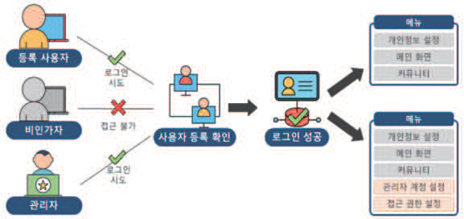

---
<!-- Page 140 -->
점검방법
사용자 등록, 로그인, OTP 등 서비스 접근 시 사용자 인증 기능이 구현되었는지 확인한다.
시스템에 등록되지 않은 사용자로 내부 서비스에 접근이 불가능하도록 구현되었는지 확인한다.
사용자에게 부여된 권한 외 서비스에 접근이 불가하도록 설정되었는지 확인한다.

#### 1.2 진료 등 의료 행위를 수행하는 사용자를 식별할 수 있는 기능 추가하여 운영해야 한다.

\
위협 및 취약점
사용자가 아닌 비인가자가 의료 행위를 실시하거나 잘못된 약물을 처방하는 등의 의료 사고가 발생할 수 있다.
요구사항 및 보안대책
사용자(의료진)에게 계정 발급 시 사용자가 의료 행위를 행할 수 있는 자격이 주어져 있는지 확인해야 한다.
사용자 확인 시 대면 식별 기능을 추가하거나 2차 인증 등 대면 식별 대체 수단을 활용하여 본인 확인을 해야
한다.
본인 확인 기능을 우회하여 서비스에 접근이 불가하도록 검증 로직을 추가해야 한다.
점검방법
사용자 서비스 계정 발급 시 대면 식별 기능을 수행하는지 확인한다.
대면 확인 후 발급된 사용자 계정을 사용할 경우 대면한 본인이 맞는지 체크하는 로직이 구현되어 있는지
확인한다.
대면 식별 기능 운영 시 타인의 데이터로 우회하여 불법적인 접근이 가능한지 확인한다.

| 점검방법 |
| --- |
| 사용자 등록, 로그인, OTP 등 서비스 접근 시 사용자 인증 기능이 구현되었는지 확인한다. 시스템에 등록되지 않은 사용자로 내부 서비스에 접근이 불가능하도록 구현되었는지 확인한다. 사용자에게 부여된 권한 외 서비스에 접근이 불가하도록 설정되었는지 확인한다. |

| 위협 및 취약점 |
| --- |
| 사용자가 아닌 비인가자가 의료 행위를 실시하거나 잘못된 약물을 처방하는 등의 의료 사고가 발생할 수 있다. |
| 요구사항 및 보안대책 |
| 사용자(의료진)에게 계정 발급 시 사용자가 의료 행위를 행할 수 있는 자격이 주어져 있는지 확인해야 한다. 사용자 확인 시 대면 식별 기능을 추가하거나 2차 인증 등 대면 식별 대체 수단을 활용하여 본인 확인을 해야 한다. 본인 확인 기능을 우회하여 서비스에 접근이 불가하도록 검증 로직을 추가해야 한다. |
| 점검방법 |
| 사용자 서비스 계정 발급 시 대면 식별 기능을 수행하는지 확인한다. 대면 확인 후 발급된 사용자 계정을 사용할 경우 대면한 본인이 맞는지 체크하는 로직이 구현되어 있는지 확인한다. 대면 식별 기능 운영 시 타인의 데이터로 우회하여 불법적인 접근이 가능한지 확인한다. |

---
<!-- Page 141 -->

## 제5장 디지털헬스케어 서비스 보안 요구사항 및 보안 대책 | 141

및
보안
모델
개념
및
보안
대책
개요
디지털헬스케어
구성요소
디지털헬스케어
서비스
유형
디지털헬스케어
서비스
보안
위협
디지털헬스케어
서비스
보안
요구사항
참고문헌
제1장
제2장
제3장
제4장
제5장
부록

#### 1.3 사용자가 의료진인 경우 의료 행위에 대한 부인방지 기능을 적용해야 한다.

\
위협 및 취약점
잘못된 의료 행위가 진행되어 의료 사고 발생 시 의료진의 의료 행위 부인으로 인해 의료 사고에 대한 책임 추적성
확보가 되지 않을 수 있다.
요구사항 및 보안대책
의료진이 의료 행위 시행 시 전자서명 등의 방법을 통한 부인방지 기능을 구현해야 한다.
부인방지 기능을 우회하여 의료 행위를 수행할 수 없도록 설계해야 한다.
부인방지 기능 적용 로직 예시
점검방법
의료진의 권한으로 접근하여 의료 행위를 수행하는 기능에 전자서명, 생체인증, 타임스탬프 적용 등 부인방지
기술이 적용되어 있는지 점검한다.
서비스 제공 시 부인방지 기능을 우회하여 진료 등의 의료 행위가 가능한지 점검한다.

| 위협 및 취약점 |
| --- |
| 잘못된 의료 행위가 진행되어 의료 사고 발생 시 의료진의 의료 행위 부인으로 인해 의료 사고에 대한 책임 추적성 확보가 되지 않을 수 있다. |
| 요구사항 및 보안대책 |
| 의료진이 의료 행위 시행 시 전자서명 등의 방법을 통한 부인방지 기능을 구현해야 한다. 부인방지 기능을 우회하여 의료 행위를 수행할 수 없도록 설계해야 한다. 부인방지 기능 적용 로직 예시 |
| 점검방법 |
| 의료진의 권한으로 접근하여 의료 행위를 수행하는 기능에 전자서명, 생체인증, 타임스탬프 적용 등 부인방지 기술이 적용되어 있는지 점검한다. 서비스 제공 시 부인방지 기능을 우회하여 진료 등의 의료 행위가 가능한지 점검한다. |

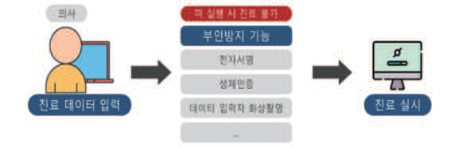

---
<!-- Page 142 -->

#### 1.4 반복된 인증 시도를 제한해야 한다.

\
위협 및 취약점
인가되지 않은 사용자가 연속적으로 인증을 시도하여 인가된 사용자 권한을 획득하거나 정상적인 사용자의 계정이
잠금 처리되어 정상적인 서비스 이용이 제한될 수 있다.
요구사항 및 보안대책
인증 기능 구현 시 인증 실패 임계치를 설정하여 무분별한 인증 시도를 방지해야 한다.
자동화된 툴을 이용한 반복 인증 시도를 방지하기 위하여 캡챠 기법 등 인증 시 입력되는 값을 검증하는 로직을
구현해야 한다.
반복된 인증 시도에 대한 인증 제한 예시
점검방법
임 의로 아이디, 비밀번호를 다르게 입력하여 인증 횟수 제한(인증 실패 임계치 값)이 설정되어 있는지 확인한다.
인 증 실패 임계치에 도달했을 경우 일정 시간동안 인증 제한, 캡챠 기법 등을 통한 반복적인 인증 제한을 하는 등
보안 정책이 마련되어 있는지 확인한다.
인 증 실패 임계치 값이 설정되어 있지 않은 경우 웹 프록시 도구, 무작위 대입 공격 프로그램 등을 활용해도
로그인이 실패되는지 확인한다.

| 위협 및 취약점 |
| --- |
| 인가되지 않은 사용자가 연속적으로 인증을 시도하여 인가된 사용자 권한을 획득하거나 정상적인 사용자의 계정이 잠금 처리되어 정상적인 서비스 이용이 제한될 수 있다. |
| 요구사항 및 보안대책 |
| 인증 기능 구현 시 인증 실패 임계치를 설정하여 무분별한 인증 시도를 방지해야 한다. 자동화된 툴을 이용한 반복 인증 시도를 방지하기 위하여 캡챠 기법 등 인증 시 입력되는 값을 검증하는 로직을 구현해야 한다. 반복된 인증 시도에 대한 인증 제한 예시 |
| 점검방법 |
| 임 의로 아이디, 비밀번호를 다르게 입력하여 인증 횟수 제한(인증 실패 임계치 값)이 설정되어 있는지 확인한다. 인 증 실패 임계치에 도달했을 경우 일정 시간동안 인증 제한, 캡챠 기법 등을 통한 반복적인 인증 제한을 하는 등 보안 정책이 마련되어 있는지 확인한다. 인 증 실패 임계치 값이 설정되어 있지 않은 경우 웹 프록시 도구, 무작위 대입 공격 프로그램 등을 활용해도 로그인이 실패되는지 확인한다. |

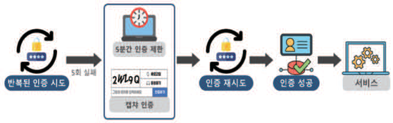

---
<!-- Page 143 -->

## 제5장 디지털헬스케어 서비스 보안 요구사항 및 보안 대책 | 143

및
보안
모델
개념
및
보안
대책
개요
디지털헬스케어
구성요소
디지털헬스케어
서비스
유형
디지털헬스케어
서비스
보안
위협
디지털헬스케어
서비스
보안
요구사항
참고문헌
제1장
제2장
제3장
제4장
제5장
부록

#### 1.5 사용자 역할 및 서비스 기능에 따른 권한을 부여해야 한다.

\
위협 및 취약점
사용자 유형별 제공되는 서비스가 다른 경우 서비스 이용 시 사용자 유형에 따른 권한을 별도로 부여하지 않으면
비인가자가 접근이 불가한 메뉴에 접근하여 중요정보 열람 또는 변조를 시도할 수 있다.
요구사항 및 보안대책
디지털헬스케어 서비스를 개발하는 접근통제 업체는 어떤 주체가 언제, 어디서, 어떤 객체에 대하여, 어떠한
행위를 하도록 허용 또는 거부할 것인지를 정의하여 주체별 업무수행에 필요한 최소한의 권한만을 부여한다.
서비스에서 제공되는 메뉴별 권한이 다를 경우 사용자 유형에 따라 권한을 분류해야 한다.
사용자 역할에 따른 권한 부여 시 권한에 따른 접근 가능 서비스의 차등화를 두어야 한다.
파라미터 변조 등을 통해 타인의 권한을 탈취할 수 없도록 검증하는 기능을 구현해야 한다.
사용자별 역할에 따른 권한 부여 예시
점검방법
디지털헬스케어 서비스 개발자가 정의한 주체별 최소한의 권한을 확인하여 정의되지 않은 권한에 대해 접근 및
변경을 할 수 있는지 확인한다.
서비스 내 사용자 역할에 따른 권한 체계가 마련되어 있는지 확인한다.
회원 유형별 서비스 접근 시 사용자 권한과 무관한 서비스가 메뉴 등을 통해 노출 및 제공되지 않도록 구현되어
있는지 확인한다.
웹 프록시 도구 등을 활용하여 회원별로 부여되는 회원 값에 대한 값 변조가 불가능하도록 구현되어 있거나
변조되더라도 서버의 세션 값과 비교하여 접근을 차단하는지 확인한다.
기능 오작동 또는 웹 프록시 도구 등을 활용하여 기능 우회를 통해 접근이 허용되지 않은 메뉴에 비인가자의
접근을 차단하고 있도록 구현되어 있는지 확인한다.

| 위협 및 취약점 |
| --- |
| 사용자 유형별 제공되는 서비스가 다른 경우 서비스 이용 시 사용자 유형에 따른 권한을 별도로 부여하지 않으면 비인가자가 접근이 불가한 메뉴에 접근하여 중요정보 열람 또는 변조를 시도할 수 있다. |
| 요구사항 및 보안대책 |
| 디지털헬스케어 서비스를 개발하는 접근통제 업체는 어떤 주체가 언제, 어디서, 어떤 객체에 대하여, 어떠한 행위를 하도록 허용 또는 거부할 것인지를 정의하여 주체별 업무수행에 필요한 최소한의 권한만을 부여한다. 서비스에서 제공되는 메뉴별 권한이 다를 경우 사용자 유형에 따라 권한을 분류해야 한다. 사용자 역할에 따른 권한 부여 시 권한에 따른 접근 가능 서비스의 차등화를 두어야 한다. 파라미터 변조 등을 통해 타인의 권한을 탈취할 수 없도록 검증하는 기능을 구현해야 한다. 사용자별 역할에 따른 권한 부여 예시 |
| 점검방법 |
| 디지털헬스케어 서비스 개발자가 정의한 주체별 최소한의 권한을 확인하여 정의되지 않은 권한에 대해 접근 및 변경을 할 수 있는지 확인한다. 서비스 내 사용자 역할에 따른 권한 체계가 마련되어 있는지 확인한다. 회원 유형별 서비스 접근 시 사용자 권한과 무관한 서비스가 메뉴 등을 통해 노출 및 제공되지 않도록 구현되어 있는지 확인한다. 웹 프록시 도구 등을 활용하여 회원별로 부여되는 회원 값에 대한 값 변조가 불가능하도록 구현되어 있거나 변조되더라도 서버의 세션 값과 비교하여 접근을 차단하는지 확인한다. 기능 오작동 또는 웹 프록시 도구 등을 활용하여 기능 우회를 통해 접근이 허용되지 않은 메뉴에 비인가자의 접근을 차단하고 있도록 구현되어 있는지 확인한다. |

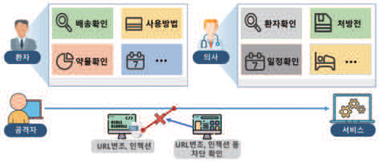

---
<!-- Page 144 -->

#### 1.6 높은 권한이 요구되는 기능 접근 시 강력한 보안 인증 수단을 제공해야 한다.

\
위협 및 취약점
역할별 메뉴 사용 권한이 설정된 기능 이용 시 강력한 보안 인증을 제공하지 않거나 별도의 추가 인증을 도입하지
않은 경우, 접근이 허용되지 않은 사용자가 의료진 등 높은 권한이 부여된 메뉴에 무작위적으로 접근하여 의료 사고
등을 유발할 수 있다.
요구사항 및 보안대책
의료진 등 주요 직무자에게 높은 강도의 보안 인증을 적용하도록 권한별 사용자를 분류해야 한다.
서비스 관리자, 의료진 등 높은 권한을 부여받은 사용자에게는 서비스 이용 시 추가 인증 수단을 적용하는 등
강력한 보안 통제를 적용해야 한다.
구분 인증수단
인증서(PKI)
소유기반 OTP
스마트 카드
생체기반 지문, 홍채 등 생체정보
접근 가능한 기기의 MAC 통제
통제기반
VPN을 이용한 접근 통제
점검방법
사용자의 역할에 맞게 권한 분류가 적절하게 되었는지 확인해야 한다.
중요 기능에 접근 가능한 사용자에게 취약한 보안 인증이 적용된 사례가 존재하는지 확인한다.
낮은 권한의 사용자와 높은 권한의 사용자에게 차등된 방식의 보안 인증을 적용했는지 확인한다.
높은 권한 사용자에게는 아이디/비밀번호 인증 방식이 아닌 2차 인증 방식 등의 추가 인증 방식이 도입되어
있는지 확인한다.
서비스 관리자의 경우 지정된 IP 또는 MAC 통제가 적용 되었는지 확인하고 적용된 IP와 MAC으로만 접근이
가능한지 확인한다.

| 위협 및 취약점 |
| --- |
| 역할별 메뉴 사용 권한이 설정된 기능 이용 시 강력한 보안 인증을 제공하지 않거나 별도의 추가 인증을 도입하지 않은 경우, 접근이 허용되지 않은 사용자가 의료진 등 높은 권한이 부여된 메뉴에 무작위적으로 접근하여 의료 사고 등을 유발할 수 있다. |
| 요구사항 및 보안대책 |
| 의료진 등 주요 직무자에게 높은 강도의 보안 인증을 적용하도록 권한별 사용자를 분류해야 한다. 서비스 관리자, 의료진 등 높은 권한을 부여받은 사용자에게는 서비스 이용 시 추가 인증 수단을 적용하는 등 강력한 보안 통제를 적용해야 한다. 구분 인증수단 인증서(PKI) 소유기반 OTP 스마트 카드 생체기반 지문, 홍채 등 생체정보 접근 가능한 기기의 MAC 통제 통제기반 VPN을 이용한 접근 통제 |
| 점검방법 |
| 사용자의 역할에 맞게 권한 분류가 적절하게 되었는지 확인해야 한다. 중요 기능에 접근 가능한 사용자에게 취약한 보안 인증이 적용된 사례가 존재하는지 확인한다. 낮은 권한의 사용자와 높은 권한의 사용자에게 차등된 방식의 보안 인증을 적용했는지 확인한다. 높은 권한 사용자에게는 아이디/비밀번호 인증 방식이 아닌 2차 인증 방식 등의 추가 인증 방식이 도입되어 있는지 확인한다. 서비스 관리자의 경우 지정된 IP 또는 MAC 통제가 적용 되었는지 확인하고 적용된 IP와 MAC으로만 접근이 가능한지 확인한다. |

| 구분 | 인증수단 |
| --- | --- |
| 소유기반 | 인증서(PKI) |
|  | OTP |
|  | 스마트 카드 |
| 생체기반 | 지문, 홍채 등 생체정보 |
| 통제기반 | 접근 가능한 기기의 MAC 통제 |
|  | VPN을 이용한 접근 통제 |

---
<!-- Page 145 -->

## 제5장 디지털헬스케어 서비스 보안 요구사항 및 보안 대책 | 145

및
보안
모델
개념
및
보안
대책
개요
디지털헬스케어
구성요소
디지털헬스케어
서비스
유형
디지털헬스케어
서비스
보안
위협
디지털헬스케어
서비스
보안
요구사항
참고문헌
제1장
제2장
제3장
제4장
제5장
부록

#### 1.7 안전한 비밀번호 작성 규칙을 적용해야 한다.

\
위협 및 취약점
서비스 내 취약한 비밀번호 설정을 허용할 경우, 공격자는 비밀번호 무작위 공격(디폴트 비밀번호, 추측 가능한
비밀번호 입력)을 통해 사용자의 비밀번호를 탈취하여 서비스에 접근할 수 있다.
요구사항 및 보안대책
취약한 비밀번호 설정 시 계정 탈취의 가능성이 존재하므로 다음과 같이 비밀번호 작성 규칙을 적용해야 한다.

### 1. 다음 각 목의 문자 종류 중 2종류 이상을 조합하여 최소 10자리 이상 또는 3종류 이상을 조합하여 최소 8

자리 이상의 길이로 구성한다.
· 영문 대문자(26 개)
· 영문 소문자(26 개)
· 숫자(10 개)
· 특수문자(32 개)

### 2. 연속적인 숫자나 생일, 전화번호 등 추측하기 쉬운 개인정보 및 아이디와 비슷한 비밀번호는 사용하지

않는 것을 권고한다.

### 3. 비밀번호에 유효기간을 설정하여 반기 별 1회 이상 변경하도록 설정한다.

비밀번호 검증 로직을 서버 측에서 구현하여 우회되지 않도록 해야한다.
안전한 비밀번호 작성 규칙 적용 예시
점검방법
한국인터넷진흥원(KISA)의 ‘패스워드 선택 및 이용 안내서’에서 권고하는 비밀번호 조합 규칙(두 종류 이상의
문자로 구성 시 8자리 이상 길이로 설정 등)을 준수하여 서비스 비밀번호를 설정하고 있는지 확인한다.
회원가입 뿐 아니라 회원정보 변경 등 비밀번호를 입력하는 구간에서 비밀번호 작성규칙에 맞게 설정할 수
있도록 기능이 구현되었는지 확인한다.
비밀번호 검증 로직이 서버 측에 구현되었는지 확인한다.

| 위협 및 취약점 |
| --- |
| 서비스 내 취약한 비밀번호 설정을 허용할 경우, 공격자는 비밀번호 무작위 공격(디폴트 비밀번호, 추측 가능한 비밀번호 입력)을 통해 사용자의 비밀번호를 탈취하여 서비스에 접근할 수 있다. |
| 요구사항 및 보안대책 |
| 취약한 비밀번호 설정 시 계정 탈취의 가능성이 존재하므로 다음과 같이 비밀번호 작성 규칙을 적용해야 한다. 1. 다음 각 목의 문자 종류 중 2종류 이상을 조합하여 최소 10자리 이상 또는 3종류 이상을 조합하여 최소 8 자리 이상의 길이로 구성한다. · 영문 대문자(26 개) · 영문 소문자(26 개) · 숫자(10 개) · 특수문자(32 개) 2. 연속적인 숫자나 생일, 전화번호 등 추측하기 쉬운 개인정보 및 아이디와 비슷한 비밀번호는 사용하지 않는 것을 권고한다. 3. 비밀번호에 유효기간을 설정하여 반기 별 1회 이상 변경하도록 설정한다. 비밀번호 검증 로직을 서버 측에서 구현하여 우회되지 않도록 해야한다. 안전한 비밀번호 작성 규칙 적용 예시 |
| 점검방법 |
| 한국인터넷진흥원(KISA)의 ‘패스워드 선택 및 이용 안내서’에서 권고하는 비밀번호 조합 규칙(두 종류 이상의 문자로 구성 시 8자리 이상 길이로 설정 등)을 준수하여 서비스 비밀번호를 설정하고 있는지 확인한다. 회원가입 뿐 아니라 회원정보 변경 등 비밀번호를 입력하는 구간에서 비밀번호 작성규칙에 맞게 설정할 수 있도록 기능이 구현되었는지 확인한다. 비밀번호 검증 로직이 서버 측에 구현되었는지 확인한다. |

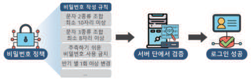

---
<!-- Page 146 -->

#### 1.8 비밀번호 또는 인증 데이터를 검증하기 위한 로직은 서버 측에 구현해야 한다.

\
위협 및 취약점
비밀번호를 서버에서 검증하지 않는 경우 인증 결과 값 변조가 가능하여 사용자 단에서 비밀번호를 우회하여 접근할
수 있다.
요구사항 및 보안대책
안전한 비밀번호 작성 규칙이 서비스 내 회원가입, 회원정보 수정, 게시글 작성 등 비밀번호 작성 구간에
적용되어야 한다.
안전한 비밀번호 작성 규칙에 의해 적절한 비밀번호가 설정되었는지 확인하기 위하여 검증 로직을 구현해야 한다.
비밀번호 검증 로직을 사용자단에서 검증할 경우 이를 우회할 수 있으므로, 서버 측에서 검증하도록 구현해야
한다.
비밀번호 검증 로직을 클라이언트 측에서 이루어지는 경우
비밀번호 검증 로직을 서버 측에서 이루어지는 경우
점검방법
취 약한 비밀번호 입력 시 이를 검증하는 로직이 존재하는지 확인한다.
웹 프록시 도구 등을 활용하여 비밀번호 입력값 검증 로직 프로세스 등을 우회하여 약한 문자열의 비밀번호로
변경되거나 비밀번호 작성 규칙을 벗어난 비밀번호로 변경되는지 확인한다.

| 위협 및 취약점 |
| --- |
| 비밀번호를 서버에서 검증하지 않는 경우 인증 결과 값 변조가 가능하여 사용자 단에서 비밀번호를 우회하여 접근할 수 있다. |
| 요구사항 및 보안대책 |
| 안전한 비밀번호 작성 규칙이 서비스 내 회원가입, 회원정보 수정, 게시글 작성 등 비밀번호 작성 구간에 적용되어야 한다. 안전한 비밀번호 작성 규칙에 의해 적절한 비밀번호가 설정되었는지 확인하기 위하여 검증 로직을 구현해야 한다. 비밀번호 검증 로직을 사용자단에서 검증할 경우 이를 우회할 수 있으므로, 서버 측에서 검증하도록 구현해야 한다. 비밀번호 검증 로직을 클라이언트 측에서 이루어지는 경우 비밀번호 검증 로직을 서버 측에서 이루어지는 경우 |
| 점검방법 |
| 취 약한 비밀번호 입력 시 이를 검증하는 로직이 존재하는지 확인한다. 웹 프록시 도구 등을 활용하여 비밀번호 입력값 검증 로직 프로세스 등을 우회하여 약한 문자열의 비밀번호로 변경되거나 비밀번호 작성 규칙을 벗어난 비밀번호로 변경되는지 확인한다. |

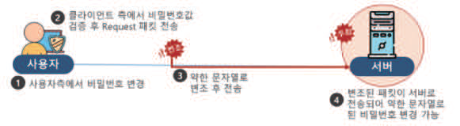
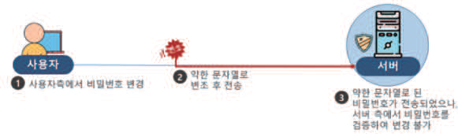

---
<!-- Page 147 -->

## 제5장 디지털헬스케어 서비스 보안 요구사항 및 보안 대책 | 147

및
보안
모델
개념
및
보안
대책
개요
디지털헬스케어
구성요소
디지털헬스케어
서비스
유형
디지털헬스케어
서비스
보안
위협
디지털헬스케어
서비스
보안
요구사항
참고문헌
제1장
제2장
제3장
제4장
제5장
부록

#### 1.9 배송 약물 및 기기를 사용 전 수령자가 수령물을 확인하는 절차를 구현 및 운영해야 한다.

\
위협 및 취약점
잘못된 약물 또는 기기가 환자에게 배송되어 환자의 건강에 위해를 가하는 위급 상황이 발생할 수 있다.
요구사항 및 보안대책
약물 및 기기 오배송, 내용물 바꿔치기 등으로 인한 피해를 방지하기 위하여 배송된 약물 및 기기를 확인 후
사용할 수 있도록 체계를 마련해야 한다.
약물 및 기기를 배송받는 환자가 의사의 확인 후 이를 이용할 수 있도록 확인 과정을 명확하게 인지시켜야 한다.
배송되는 약물 및 기기의 포장에 확인 과정을 명시하여 환자가 이를 확인할 수 있도록 해야 한다.
배송받을 약물 또는 기기 확인 및 사용 절차 안내 예시
점검방법
서비스 내 배송받은 약물 또는 기기를 확인하는 기능이 있는지 존재한다.
약물의 경우, 처방전을 발급한 의사 또는 약을 배급한 약사에게 약물의 사진을 배송하거나 화상 채팅을 통해
올바른 약이 배송되었는지 확인하는 절차를 마련한다.
기기의 경우, 기기 인증 및 사용자 인증을 수행함으로써 사용자에게 올바른 기기가 배송되었는지의 절차를
마련한다.
사용자에게 배송받은 약물 및 기기의 사용 절차에 대해 안내하는 체계가 존재하는지 확인한다.

| 위협 및 취약점 |
| --- |
| 잘못된 약물 또는 기기가 환자에게 배송되어 환자의 건강에 위해를 가하는 위급 상황이 발생할 수 있다. |
| 요구사항 및 보안대책 |
| 약물 및 기기 오배송, 내용물 바꿔치기 등으로 인한 피해를 방지하기 위하여 배송된 약물 및 기기를 확인 후 사용할 수 있도록 체계를 마련해야 한다. 약물 및 기기를 배송받는 환자가 의사의 확인 후 이를 이용할 수 있도록 확인 과정을 명확하게 인지시켜야 한다. 배송되는 약물 및 기기의 포장에 확인 과정을 명시하여 환자가 이를 확인할 수 있도록 해야 한다. 배송받을 약물 또는 기기 확인 및 사용 절차 안내 예시 |
| 점검방법 |
| 서비스 내 배송받은 약물 또는 기기를 확인하는 기능이 있는지 존재한다. 약물의 경우, 처방전을 발급한 의사 또는 약을 배급한 약사에게 약물의 사진을 배송하거나 화상 채팅을 통해 올바른 약이 배송되었는지 확인하는 절차를 마련한다. 기기의 경우, 기기 인증 및 사용자 인증을 수행함으로써 사용자에게 올바른 기기가 배송되었는지의 절차를 마련한다. 사용자에게 배송받은 약물 및 기기의 사용 절차에 대해 안내하는 체계가 존재하는지 확인한다. |

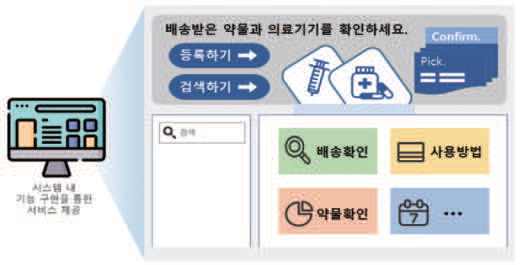

---
<!-- Page 148 -->

#### 2.1 중요정보 저장 시 안전한 암호화 알고리즘을 적용하여 저장해야 한다.

\
위협 및 취약점
의료정보, 비밀번호, 개인정보 등 중요정보가 평문으로 저장되거나 안전하지 않은 암호화 알고리즘이 적용되어
저장된 경우 침해사고 등으로 인하여 대량의 중요정보가 유·노출될 수 있다.
요구사항 및 보안대책
디지털헬스케어 서비스에서 사용되는 중요정보(의료정보, 비밀번호, 개인정보 등)는 안전하게 저장해야 한다.
DB에 자료 저장 시 각 정보 유형별 법적 준거성을 충족하는 암호화 알고리즘을 사용해야 한다.
비밀번호 저장 시 복호화되지 않도록 일방향 암호화 알고리즘을 사용해야 한다.
※ 암호화 알고리즘에 관한 상세 내용은 KISA 암호이용활성화(https://seed.kisa.or.kr)에서 참조
구분 암호화 알고리즘
SEED
ARIA-128
ARIA-192
대칭키 암호
ARIA-256
알고리즘
AES-128
AES-192
AES-256
RSA
공개키 암호
RSAES-OAEP
알고리즘
RSAES-PKCS1
SHA-224
일방향 암호 SHA-256
알고리즘 SHA-384
SHA-512
점검방법
DB에 자료 저장 시 중요정보 유형별로 중요도를 고려한 암호화 알고리즘을 적용하는지 확인한다.
DB에 자료 저장 시 사용되는 암호화 알고리즘이 법적 기준을 준수하는 안전한 암호화 알고리즘인지 확인한다.
비밀번호 저장 시 사용하는 암호화 알고리즘이 복호화가 불가능한 일방향 암호화 알고리즘인지 확인한다.
취약한 암호화 알고리즘 사용 여부를 확인하기 위해 복호화 프로그램을 이용하여 저장되는 중요정보 값에 대한
검증을 실시한다.

| 위협 및 취약점 |
| --- |
| 의료정보, 비밀번호, 개인정보 등 중요정보가 평문으로 저장되거나 안전하지 않은 암호화 알고리즘이 적용되어 저장된 경우 침해사고 등으로 인하여 대량의 중요정보가 유·노출될 수 있다. |
| 요구사항 및 보안대책 |
| 디지털헬스케어 서비스에서 사용되는 중요정보(의료정보, 비밀번호, 개인정보 등)는 안전하게 저장해야 한다. DB에 자료 저장 시 각 정보 유형별 법적 준거성을 충족하는 암호화 알고리즘을 사용해야 한다. 비밀번호 저장 시 복호화되지 않도록 일방향 암호화 알고리즘을 사용해야 한다. ※ 암호화 알고리즘에 관한 상세 내용은 KISA 암호이용활성화(https://seed.kisa.or.kr)에서 참조 구분 암호화 알고리즘 SEED ARIA-128 ARIA-192 대칭키 암호 ARIA-256 알고리즘 AES-128 AES-192 AES-256 RSA 공개키 암호 RSAES-OAEP 알고리즘 RSAES-PKCS1 SHA-224 일방향 암호 SHA-256 알고리즘 SHA-384 SHA-512 |
| 점검방법 |
| DB에 자료 저장 시 중요정보 유형별로 중요도를 고려한 암호화 알고리즘을 적용하는지 확인한다. DB에 자료 저장 시 사용되는 암호화 알고리즘이 법적 기준을 준수하는 안전한 암호화 알고리즘인지 확인한다. 비밀번호 저장 시 사용하는 암호화 알고리즘이 복호화가 불가능한 일방향 암호화 알고리즘인지 확인한다. 취약한 암호화 알고리즘 사용 여부를 확인하기 위해 복호화 프로그램을 이용하여 저장되는 중요정보 값에 대한 검증을 실시한다. |

| 구분 | 암호화 알고리즘 |
| --- | --- |
| 대칭키 암호 알고리즘 | SEED |
|  | ARIA-128 |
|  | ARIA-192 |
|  | ARIA-256 |
|  | AES-128 |
|  | AES-192 |
|  | AES-256 |
| 공개키 암호 알고리즘 | RSA |
|  | RSAES-OAEP |
|  | RSAES-PKCS1 |
| 일방향 암호 알고리즘 | SHA-224 |
|  | SHA-256 |
|  | SHA-384 |
|  | SHA-512 |

---
<!-- Page 149 -->

## 제5장 디지털헬스케어 서비스 보안 요구사항 및 보안 대책 | 149

및
보안
모델
개념
및
보안
대책
개요
디지털헬스케어
구성요소
디지털헬스케어
서비스
유형
디지털헬스케어
서비스
보안
위협
디지털헬스케어
서비스
보안
요구사항
참고문헌
제1장
제2장
제3장
제4장
제5장
부록

#### 2.2 중요정보 전송 시 통신 구간에 반드시 암호화를 적용해야 한다.

\
위협 및 취약점
중요정보 송수신 구간에서 암호화 알고리즘을 적용하지 않거나, 취약한 암호화 알고리즘을 적용할 경우 공격자에
의하여 중요정보가 쉽게 탈취될 수 있다.
요구사항 및 보안대책
중요정보 또는 민감한 데이터를 전송할 때 관련 정보를 반드시 암호화하여 전송해야 한다.
TLS(Transport Layer Security) 서버를 구축하여 데이터 전송구간을 암호화해야 한다.
낮은 버전의 TLS을 적용할 경우 취약점을 통해 사고가 발생할 수 있으므로 최신 버전의 TLS (1.2 버전 이상)을
적용해야 한다.
TLS을 구축하지 못할 경우, 통신 구간에 중요정보 유형에 맞는 암호화 알고리즘을 적용해야 한다.
※ 암호화 알고리즘에 관한 상세 내용은 KISA 암호이용활성화(https://seed.kisa.or.kr)에서 참조
통신구간에 암호화를 적용하지 않은 경우
통신구간에 암호화를 적용한 경우
점검방법
중요정보 통신 구간에 SSL이 적용되었는지 확인한다.
SSL 1.0, 2.0, 3.0 / TLS 1.0, 1.1과 같이 낮은 버전의 프로토콜 적용 여부를 확인한다.
인터넷 프로그램에 개발자 도구 > 네트워크 또는 웹 프록시 도구를 활용하여 중요정보를 전송하는 통신 구간에
TLS이 적용되어 있는지 확인한다.※ 예시) 통신 구간 암호화 적용 시 https://www.kisa.or.kr/login.do로 확인
취약한 암호화 알고리즘 사용 여부를 확인하기 위해 복호화 프로그램을 이용하여 전송되는 중요정보 값에 대한
검증을 실시한다.

| 위협 및 취약점 |
| --- |
| 중요정보 송수신 구간에서 암호화 알고리즘을 적용하지 않거나, 취약한 암호화 알고리즘을 적용할 경우 공격자에 의하여 중요정보가 쉽게 탈취될 수 있다. |
| 요구사항 및 보안대책 |
| 중요정보 또는 민감한 데이터를 전송할 때 관련 정보를 반드시 암호화하여 전송해야 한다. TLS(Transport Layer Security) 서버를 구축하여 데이터 전송구간을 암호화해야 한다. 낮은 버전의 TLS을 적용할 경우 취약점을 통해 사고가 발생할 수 있으므로 최신 버전의 TLS (1.2 버전 이상)을 적용해야 한다. TLS을 구축하지 못할 경우, 통신 구간에 중요정보 유형에 맞는 암호화 알고리즘을 적용해야 한다. ※ 암호화 알고리즘에 관한 상세 내용은 KISA 암호이용활성화(https://seed.kisa.or.kr)에서 참조 통신구간에 암호화를 적용하지 않은 경우 통신구간에 암호화를 적용한 경우 |
| 점검방법 |
| 중요정보 통신 구간에 SSL이 적용되었는지 확인한다. SSL 1.0, 2.0, 3.0 / TLS 1.0, 1.1과 같이 낮은 버전의 프로토콜 적용 여부를 확인한다. 인터넷 프로그램에 개발자 도구 > 네트워크 또는 웹 프록시 도구를 활용하여 중요정보를 전송하는 통신 구간에 TLS이 적용되어 있는지 확인한다.※ 예시) 통신 구간 암호화 적용 시 https://www.kisa.or.kr/login.do로 확인 취약한 암호화 알고리즘 사용 여부를 확인하기 위해 복호화 프로그램을 이용하여 전송되는 중요정보 값에 대한 검증을 실시한다. |

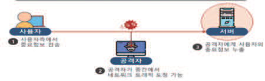
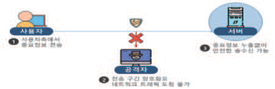

---
<!-- Page 150 -->
안전이 보장되지 못하는 네트워크 등을 활용하여 서비스를 운영하는 경우 사용자
2.3
정보를 보호할 수 있는 대책을 마련하고 적용해야 한다.
위협 및 취약점
환자의 홈 네트워크 또는 AD-HOC 같은 보안에 취약한 통신망을 활용하여 서비스를 이용하는 경우, 공격자가
네트워크 해킹 등을 통하여 사용자에 대한 중요정보를 획득하여 유출하거나, 악의적으로 활용하여 의료 사고 등을
유발시킬 수 있다.
요구사항 및 보안대책
사용자의 의료정보가 안전을 보장할 수 없는 네트워크를 활용하는 경우, 암호화 통신 등 보안기능을 추가하는 등
안전한 대책이 마련되어야 한다.
Eco System 활용 하는 등 추가적 보안 기능 적용이 불가능한 경우에는 비식별 조치와 같은 보완 통제를
마련한다.
적용 사례
사용자 홈 네트워크 활용하는 서비스와 같이 서비스 제공자가 사용자의 환경에 보안 통제를 강제 할 수 없는
경우 안전한 배송 서비스 운영을 위하여 비식별 조치 실시
기기 성능 등의 이슈로 인하여 암호화 처리 등 중요한 보안 기능을 적용하지 못할 경우 비식별 조치를 통해
보완 통제 적용
MDM 등을 적용하고, 통신 구간 암호화 등 가능한 보안 통제를 구현하였지만, 수집·이용되는 데이터의
중요도 또는 민감도가 매우 높아, 추가 통제를 적용하기 위하여 비식별 조치 적용
점검방법
사용자의 개인정보가 무분별하게 노출되지 않도록 적절한 대책(비식별화 조치, MAM 적용, 암호화 적용 등)을
마련하여 적용하고 있는지 확인한다.

| 위협 및 취약점 |
| --- |
| 환자의 홈 네트워크 또는 AD-HOC 같은 보안에 취약한 통신망을 활용하여 서비스를 이용하는 경우, 공격자가 네트워크 해킹 등을 통하여 사용자에 대한 중요정보를 획득하여 유출하거나, 악의적으로 활용하여 의료 사고 등을 유발시킬 수 있다. |
| 요구사항 및 보안대책 |
| 사용자의 의료정보가 안전을 보장할 수 없는 네트워크를 활용하는 경우, 암호화 통신 등 보안기능을 추가하는 등 안전한 대책이 마련되어야 한다. Eco System 활용 하는 등 추가적 보안 기능 적용이 불가능한 경우에는 비식별 조치와 같은 보완 통제를 마련한다. 적용 사례 사용자 홈 네트워크 활용하는 서비스와 같이 서비스 제공자가 사용자의 환경에 보안 통제를 강제 할 수 없는 경우 안전한 배송 서비스 운영을 위하여 비식별 조치 실시 기기 성능 등의 이슈로 인하여 암호화 처리 등 중요한 보안 기능을 적용하지 못할 경우 비식별 조치를 통해 보완 통제 적용 MDM 등을 적용하고, 통신 구간 암호화 등 가능한 보안 통제를 구현하였지만, 수집·이용되는 데이터의 중요도 또는 민감도가 매우 높아, 추가 통제를 적용하기 위하여 비식별 조치 적용 |
| 점검방법 |
| 사용자의 개인정보가 무분별하게 노출되지 않도록 적절한 대책(비식별화 조치, MAM 적용, 암호화 적용 등)을 마련하여 적용하고 있는지 확인한다. |

| 적용 사례 |
| --- |
| 사용자 홈 네트워크 활용하는 서비스와 같이 서비스 제공자가 사용자의 환경에 보안 통제를 강제 할 수 없는 경우 안전한 배송 서비스 운영을 위하여 비식별 조치 실시 |
| 기기 성능 등의 이슈로 인하여 암호화 처리 등 중요한 보안 기능을 적용하지 못할 경우 비식별 조치를 통해 보완 통제 적용 |
| MDM 등을 적용하고, 통신 구간 암호화 등 가능한 보안 통제를 구현하였지만, 수집·이용되는 데이터의 중요도 또는 민감도가 매우 높아, 추가 통제를 적용하기 위하여 비식별 조치 적용 |

---
<!-- Page 151 -->

## 제5장 디지털헬스케어 서비스 보안 요구사항 및 보안 대책 | 151

및
보안
모델
개념
및
보안
대책
개요
디지털헬스케어
구성요소
디지털헬스케어
서비스
유형
디지털헬스케어
서비스
보안
위협
디지털헬스케어
서비스
보안
요구사항
참고문헌
제1장
제2장
제3장
제4장
제5장
부록
중요정보 전송되는 구간에서 중요정보가 변조되지 않도록 변조 방지 대책을 마련해야
2.4
한다.
위협 및 취약점
처방전, 진료정보 등 의료 행위에 대한 정보나 개인정보가 외부에 노출되어 공격자에 의해 변조되거나 악용될 경우
위급 상황 발생, 중요정보 외부 노출 등 2차 피해가 발생할 수 있다.
요구사항 및 보안대책
변조된 중요정보를 통해 서비스 내 기능을 우회하거나 타인의 정보에 접근하는 등의 취약점을 방지하기 위하여
사용되는 중요정보의 진위 여부임의 변경 여부 또는 위변조 여부를 검증하는 로직을 추가해야 한다.
데이터 진위 여부 검증 로직이 구현된 경우
점검방법
중요정보 전송 구간에서 사용되는 정보를 변조하여 기능을 우회하거나 타인의 데이터에 접근하는 등 인가되지
않은 행위가 가능한지 확인한다.
웹 프록시 도구 등을 활용하여 쿠키 및 세션 변조 시 중요정보 사용 구간에서 정보가 변조 가능한지 확인한다.

| 위협 및 취약점 |
| --- |
| 처방전, 진료정보 등 의료 행위에 대한 정보나 개인정보가 외부에 노출되어 공격자에 의해 변조되거나 악용될 경우 위급 상황 발생, 중요정보 외부 노출 등 2차 피해가 발생할 수 있다. |
| 요구사항 및 보안대책 |
| 변조된 중요정보를 통해 서비스 내 기능을 우회하거나 타인의 정보에 접근하는 등의 취약점을 방지하기 위하여 사용되는 중요정보의 진위 여부임의 변경 여부 또는 위변조 여부를 검증하는 로직을 추가해야 한다. 데이터 진위 여부 검증 로직이 구현된 경우 |
| 점검방법 |
| 중요정보 전송 구간에서 사용되는 정보를 변조하여 기능을 우회하거나 타인의 데이터에 접근하는 등 인가되지 않은 행위가 가능한지 확인한다. 웹 프록시 도구 등을 활용하여 쿠키 및 세션 변조 시 중요정보 사용 구간에서 정보가 변조 가능한지 확인한다. |

| 제5장 |  |

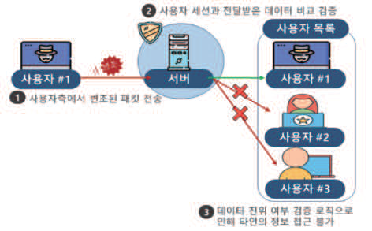

---
<!-- Page 152 -->

#### 2.5 암호키의 생명주기를 고려하여 안전하게 관리되어야 한다.

\
위협 및 취약점
암호키 관리 소홀로 암호키가 노출되어 중요정보가 대량으로 유출되는 등 중요정보를 적절하게 보호하지 못할 수 있다.
요구사항 및 보안대책
암호키 생성, 이용, 보관, 배포, 파기를 고려한 관리 방안을 마련해야 한다.
사용되는 암호키의 중요도, 변경 시 발생하는 금액 등을 파악하여 적절한 암호키 유효기간을 설정해야 한다.
생성된 암호키 이용 및 보관 시 접근 가능한 인력을 최소화해야 한다.
암호키는 별도의 매체에 저장하여 보관하고, 암호키 손상 등으로 인해 필요할 경우 적시에 사용할 수 있도록
관리해야 한다.
사용되는 암호키의 현황을 파악할 수 있도록 솔루션을 사용하거나 암호키 관리대장 등을 작성하여 관리해야 한다.
키 관리 시스템을 활용하여 암호키 생성, 분배, 접근, 파기 등 암호키 생명주기 동안 모든 암호키 관련 기능을
관리해야 한다.
암호화 관리 방안 예시
점검방법
암 호키 생성, 분배, 접근, 파기 등 안전하게 암호키 생명주기를 관리할 수 있는 방법을 설계해서 이를 준수해야
한다.
암 호키의 생명주기를 고려한 관리 정책 등이 존재하는지 확인한다.
암 호키 유효기간 및 접근 인력이 과도하게 설정되지 않았는지 확인한다.
암 호키 현황을 파악할 수 있는 솔루션, 관리대장 등이 존재하는지 확인하고 현행 상황과 동일한지 확인한다.

| 위협 및 취약점 |
| --- |
| 암호키 관리 소홀로 암호키가 노출되어 중요정보가 대량으로 유출되는 등 중요정보를 적절하게 보호하지 못할 수 있다. |
| 요구사항 및 보안대책 |
| 암호키 생성, 이용, 보관, 배포, 파기를 고려한 관리 방안을 마련해야 한다. 사용되는 암호키의 중요도, 변경 시 발생하는 금액 등을 파악하여 적절한 암호키 유효기간을 설정해야 한다. 생성된 암호키 이용 및 보관 시 접근 가능한 인력을 최소화해야 한다. 암호키는 별도의 매체에 저장하여 보관하고, 암호키 손상 등으로 인해 필요할 경우 적시에 사용할 수 있도록 관리해야 한다. 사용되는 암호키의 현황을 파악할 수 있도록 솔루션을 사용하거나 암호키 관리대장 등을 작성하여 관리해야 한다. 키 관리 시스템을 활용하여 암호키 생성, 분배, 접근, 파기 등 암호키 생명주기 동안 모든 암호키 관련 기능을 관리해야 한다. 암호화 관리 방안 예시 |
| 점검방법 |
| 암 호키 생성, 분배, 접근, 파기 등 안전하게 암호키 생명주기를 관리할 수 있는 방법을 설계해서 이를 준수해야 한다. 암 호키의 생명주기를 고려한 관리 정책 등이 존재하는지 확인한다. 암 호키 유효기간 및 접근 인력이 과도하게 설정되지 않았는지 확인한다. 암 호키 현황을 파악할 수 있는 솔루션, 관리대장 등이 존재하는지 확인하고 현행 상황과 동일한지 확인한다. |

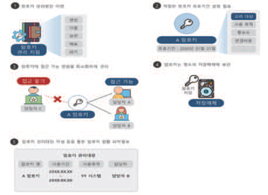

---
<!-- Page 153 -->

## 제5장 디지털헬스케어 서비스 보안 요구사항 및 보안 대책 | 153

및
보안
모델
개념
및
보안
대책
개요
디지털헬스케어
구성요소
디지털헬스케어
서비스
유형
디지털헬스케어
서비스
보안
위협
디지털헬스케어
서비스
보안
요구사항
참고문헌
제1장
제2장
제3장
제4장
제5장
부록

#### 3.1 비밀번호 등 중요정보가 불필요하게 화면에 노출되지 않도록 마스킹 처리를 해야 한다.

\
위협 및 취약점
서비스가 제공되는 화면에서 중요정보가 마스킹처리 없이 노출될 경우, 화면 캡쳐, 원격 모니터링 툴을 통해 중요정보
노출이 발생할 수 있다.
요구사항 및 보안대책
사용자가 사용하는 스마트 기기, PC 등 단말기 내에서 비밀번호 등 중요정보가 무분별하게 노출되지 않도록
설계해야 하며, 부득이하게 화면에 노출될 경우 마스킹 처리해야 한다.
※ 마스킹 처리 방식에 대한 상세한 설명은 한국인터넷진흥원의 ‘개인정보 보호조치 적용 안내서’ 참조
중요정보 화면 노출 시 마스킹 처리 예시
점검방법
서비스 제공 시 화면을 통해 중요정보가 불필요하게 노출되는 구간이 있는지 확인한다.
부득이하게 중요정보가 노출되어야 하는 경우 서비스를 제공하는 화면에서 중요정보 일부가 마스킹 처리가 되어
있는지 확인한다.

| 위협 및 취약점 |
| --- |
| 서비스가 제공되는 화면에서 중요정보가 마스킹처리 없이 노출될 경우, 화면 캡쳐, 원격 모니터링 툴을 통해 중요정보 노출이 발생할 수 있다. |
| 요구사항 및 보안대책 |
| 사용자가 사용하는 스마트 기기, PC 등 단말기 내에서 비밀번호 등 중요정보가 무분별하게 노출되지 않도록 설계해야 하며, 부득이하게 화면에 노출될 경우 마스킹 처리해야 한다. ※ 마스킹 처리 방식에 대한 상세한 설명은 한국인터넷진흥원의 ‘개인정보 보호조치 적용 안내서’ 참조 중요정보 화면 노출 시 마스킹 처리 예시 |
| 점검방법 |
| 서비스 제공 시 화면을 통해 중요정보가 불필요하게 노출되는 구간이 있는지 확인한다. 부득이하게 중요정보가 노출되어야 하는 경우 서비스를 제공하는 화면에서 중요정보 일부가 마스킹 처리가 되어 있는지 확인한다. |

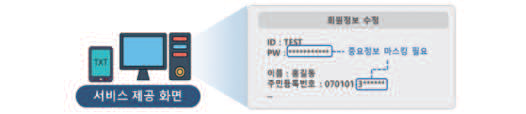

---
<!-- Page 154 -->
디지털헬스케어 서비스 제공자가 사용자가 아닌 제3자에게 정보를 제공할 경우
3.2
개인정보보호 제3자 제공 동의(개인정보보호법 제17조)를 이행하는지 확인해야 한다.
\
위협 및 취약점
제3자에게 정보 제공 시 정보주체의 동의를 받지 않을 경우, 법적 준거성을 위배하게 되며 무분별한 개인정보 제3자
제공으로 인한 개인정보 유출사고 발생 가능성이 존재한다.
요구사항 및 보안대책
개인정보 수집 시 수집 목적을 명확하게 정의하고 목적에 필요한 최소한의 개인정보를 수집해야 한다.
수집한 개인정보를 수집 목적 외 제3자에게 제공할 경우, 정보주체에게 아래의 사항을 포함한 내용을
정보주체에게 고지하고 동의를 받아야 한다.
개인정보 제3자 제공 시 필수 안내 사항
개인정보를 제공받는 자
개인정보를 제공받는 자의 개인정보 이용 목적
제공하는 개인정보의 항목
개인정보를 제공받는 자의 개인정보 보유 및 이용 기간
동의를 거부할 권리가 있다는 사실
동의 거부 시 불이익이 있을 경우, 불이익과 관련된 내용
개인정보 제3자 제공 시 정보주체에게 안내한 사항 중 변경이 발생한 경우, 발생한 내용을 정보 주체에게
고지하고 재동의를 받아야 한다.
개인정보 제3자 제공 시 정보주체 동의 수집 예시

| 위협 및 취약점 |
| --- |
| 제3자에게 정보 제공 시 정보주체의 동의를 받지 않을 경우, 법적 준거성을 위배하게 되며 무분별한 개인정보 제3자 제공으로 인한 개인정보 유출사고 발생 가능성이 존재한다. |
| 요구사항 및 보안대책 |
| 개인정보 수집 시 수집 목적을 명확하게 정의하고 목적에 필요한 최소한의 개인정보를 수집해야 한다. 수집한 개인정보를 수집 목적 외 제3자에게 제공할 경우, 정보주체에게 아래의 사항을 포함한 내용을 정보주체에게 고지하고 동의를 받아야 한다. 개인정보 제3자 제공 시 필수 안내 사항 개인정보를 제공받는 자 개인정보를 제공받는 자의 개인정보 이용 목적 제공하는 개인정보의 항목 개인정보를 제공받는 자의 개인정보 보유 및 이용 기간 동의를 거부할 권리가 있다는 사실 동의 거부 시 불이익이 있을 경우, 불이익과 관련된 내용 개인정보 제3자 제공 시 정보주체에게 안내한 사항 중 변경이 발생한 경우, 발생한 내용을 정보 주체에게 고지하고 재동의를 받아야 한다. 개인정보 제3자 제공 시 정보주체 동의 수집 예시 |

| 개인정보 제3자 제공 시 필수 안내 사항 |
| --- |
| 개인정보를 제공받는 자 |
| 개인정보를 제공받는 자의 개인정보 이용 목적 |
| 제공하는 개인정보의 항목 |
| 개인정보를 제공받는 자의 개인정보 보유 및 이용 기간 |
| 동의를 거부할 권리가 있다는 사실 |
| 동의 거부 시 불이익이 있을 경우, 불이익과 관련된 내용 |

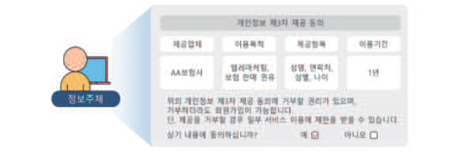

---
<!-- Page 155 -->

## 제5장 디지털헬스케어 서비스 보안 요구사항 및 보안 대책 | 155

및
보안
모델
개념
및
보안
대책
개요
디지털헬스케어
구성요소
디지털헬스케어
서비스
유형
디지털헬스케어
서비스
보안
위협
디지털헬스케어
서비스
보안
요구사항
참고문헌
제1장
제2장
제3장
제4장
제5장
부록
점검방법
개인정보 수집 시 수집 목적을 명확하게 정의하고 있는지 확인한다.
수집한 개인정보를 수집 목적 외 제3자에게 제공할 경우, 정보 주체에게 관련 내용을 안내하고 동의를 받고
있는지 확인한다.
개인정보 제3자 제공 시 정보주체에게 필수적으로 안내해야 할 사항 중 일부 내용이 누락되지 않았는지
확인한다.
개인정보 제3자 제공 시 정보주체에게 안내한 사항과 관련하여 변경이 발생한 경우, 관련 내용을 정보주체에게
안내 후 재동의를 받는지 확인한다.

| 점검방법 |
| --- |
| 개인정보 수집 시 수집 목적을 명확하게 정의하고 있는지 확인한다. 수집한 개인정보를 수집 목적 외 제3자에게 제공할 경우, 정보 주체에게 관련 내용을 안내하고 동의를 받고 있는지 확인한다. 개인정보 제3자 제공 시 정보주체에게 필수적으로 안내해야 할 사항 중 일부 내용이 누락되지 않았는지 확인한다. 개인정보 제3자 제공 시 정보주체에게 안내한 사항과 관련하여 변경이 발생한 경우, 관련 내용을 정보주체에게 안내 후 재동의를 받는지 확인한다. |

---
<!-- Page 156 -->
빅데이터 정보 활용 시 수집한 정보에 의료정보, 개인정보 등이 포함되어 처리되지
3.3
않도록 수집 및 가공 과정에서 데이터를 비식별화해야 한다.
\
위협 및 취약점
빅데이터 활용을 위한 중요정보(의료정보, 개인정보 등) 수집 및 가공 시 비식별화 처리하지 않을 경우, 중요정보가
무분별하게 노출될 수 있다.
요구사항 및 보안대책
의료정보, 개인정보 등이 포함된 정보를 빅데이터 정보로 활용할 경우, 식별이 불가하도록 비식별화 조치를
해야한다.
비식별된 데이터를 조합하여 중요 정보가 재식별되지 않도록 해야 한다.
추가적인 데이터 수집 등으로 인해 비식별된 데이터의 재식별 가능성이 존재할 수 있으므로 주기적으로 모니터링
해야 한다.
※ 개인정보 비식별화에 대한 상세 내용은 한국인터넷진흥원의 ‘개인정보 비식별 조치 가이드라인’ 참고
점검방법
수집한 정보를 빅데이터 정보로 활용 시 개인정보 등이 노출되지 않도록 적절하게 비식별 조치를 수행하는지
확인한다.
비식별된 데이터를 가공 및 정제하여 재조합 시 재식별이 되는지 확인한다.
비식별된 데이터의 재식별 가능성을 주기적으로 점검하는지 확인한다.

| 위협 및 취약점 |
| --- |
| 빅데이터 활용을 위한 중요정보(의료정보, 개인정보 등) 수집 및 가공 시 비식별화 처리하지 않을 경우, 중요정보가 무분별하게 노출될 수 있다. |
| 요구사항 및 보안대책 |
| 의료정보, 개인정보 등이 포함된 정보를 빅데이터 정보로 활용할 경우, 식별이 불가하도록 비식별화 조치를 해야한다. 비식별된 데이터를 조합하여 중요 정보가 재식별되지 않도록 해야 한다. 추가적인 데이터 수집 등으로 인해 비식별된 데이터의 재식별 가능성이 존재할 수 있으므로 주기적으로 모니터링 해야 한다. ※ 개인정보 비식별화에 대한 상세 내용은 한국인터넷진흥원의 ‘개인정보 비식별 조치 가이드라인’ 참고 |
| 점검방법 |
| 수집한 정보를 빅데이터 정보로 활용 시 개인정보 등이 노출되지 않도록 적절하게 비식별 조치를 수행하는지 확인한다. 비식별된 데이터를 가공 및 정제하여 재조합 시 재식별이 되는지 확인한다. 비식별된 데이터의 재식별 가능성을 주기적으로 점검하는지 확인한다. |

---
<!-- Page 157 -->

## 제5장 디지털헬스케어 서비스 보안 요구사항 및 보안 대책 | 157

및
보안
모델
개념
및
보안
대책
개요
디지털헬스케어
구성요소
디지털헬스케어
서비스
유형
디지털헬스케어
서비스
보안
위협
디지털헬스케어
서비스
보안
요구사항
참고문헌
제1장
제2장
제3장
제4장
제5장
부록

#### 3.4 서비스에 저장되는 중요정보에 대한 비인가된 접근을 차단해야 한다.

\
위협 및 취약점
인가되지 않은 사용자가 디지털헬스케어 서비스에 접근할 수 있으며, 서비스 내 저장된 개인의료정보 등 중요
데이터에 임의로 접근할 수 있다.
요구사항 및 보안대책
중요정보에 대한 비 인가된 접근을 제한하기 위하여 중요정보에 접근할 수 있는 불필요한 API를 제거하고,
서비스에 저장되는 중요정보는 암호화 등 안전한 방법을 사용한다.
서비스 접근 시 입력된 비밀번호는 평문으로 비교되지 않는 것을 권고한다.
점검방법
서비스에서 사용하는 비밀번호의 저장 방법을 확인하여 하드코딩이 아닌 암호화(예, 일방향 암호화) 등의 안전한
방법을 사용했는지 확인한다.
저장된 비밀정보에 접근할 수 있는 API를 모두 확인하여 불필요한 API가 없는지 확인한다.
비밀번호 비교 시에는 평문의 비밀번호가 사용되지 않는 것을 확인한다.

| 위협 및 취약점 |
| --- |
| 인가되지 않은 사용자가 디지털헬스케어 서비스에 접근할 수 있으며, 서비스 내 저장된 개인의료정보 등 중요 데이터에 임의로 접근할 수 있다. |
| 요구사항 및 보안대책 |
| 중요정보에 대한 비 인가된 접근을 제한하기 위하여 중요정보에 접근할 수 있는 불필요한 API를 제거하고, 서비스에 저장되는 중요정보는 암호화 등 안전한 방법을 사용한다. 서비스 접근 시 입력된 비밀번호는 평문으로 비교되지 않는 것을 권고한다. |
| 점검방법 |
| 서비스에서 사용하는 비밀번호의 저장 방법을 확인하여 하드코딩이 아닌 암호화(예, 일방향 암호화) 등의 안전한 방법을 사용했는지 확인한다. 저장된 비밀정보에 접근할 수 있는 API를 모두 확인하여 불필요한 API가 없는지 확인한다. 비밀번호 비교 시에는 평문의 비밀번호가 사용되지 않는 것을 확인한다. |

---
<!-- Page 158 -->
서비스에는 의료 및 개인정보가 배제된 필요 정보만을 저장해야 하며 사용 기간 외에는
3.5
저장하지 않도록 파기해야 한다.
\
위협 및 취약점
환자의 의료 및 개인정보가 활용 기간 외에 서비스 내에 저장된 경우 서비스 해킹 사고 또는 내부자의 소행 등으로
인한 보안 사고 발생 시 대량으로 정보가 유출되어 제2차 피해가 발생할 수 있다.
요구사항 및 보안대책
사용 기간 외 서비스에는 의료정보 등 중요정보가 저장되지 않도록 해야 한다.
사용 기간 내 서비스에 의료 및 개인정보 등 중요정보가 부득이하게 저장되어야 하는 경우 중요정보 유형별 암호화
알고리즘을 적용하여 저장해야 한다.
점검방법
서비스 흐름도, 설계 문서 등을 통하여 플랫폼 서비스에 의료 및 개인정보 등 중요정보가 저장되는 영역이 없는지
확인한다.
주기적인 DB 전수 조사 등을 통하여 플랫폼 서비스에 의료 및 개인정보 등 중요정보가 저장되는지 여부를
확인한다.

| 위협 및 취약점 |
| --- |
| 환자의 의료 및 개인정보가 활용 기간 외에 서비스 내에 저장된 경우 서비스 해킹 사고 또는 내부자의 소행 등으로 인한 보안 사고 발생 시 대량으로 정보가 유출되어 제2차 피해가 발생할 수 있다. |
| 요구사항 및 보안대책 |
| 사용 기간 외 서비스에는 의료정보 등 중요정보가 저장되지 않도록 해야 한다. 사용 기간 내 서비스에 의료 및 개인정보 등 중요정보가 부득이하게 저장되어야 하는 경우 중요정보 유형별 암호화 알고리즘을 적용하여 저장해야 한다. |
| 점검방법 |
| 서비스 흐름도, 설계 문서 등을 통하여 플랫폼 서비스에 의료 및 개인정보 등 중요정보가 저장되는 영역이 없는지 확인한다. 주기적인 DB 전수 조사 등을 통하여 플랫폼 서비스에 의료 및 개인정보 등 중요정보가 저장되는지 여부를 확인한다. |

---
<!-- Page 159 -->

## 제5장 디지털헬스케어 서비스 보안 요구사항 및 보안 대책 | 159

및
보안
모델
개념
및
보안
대책
개요
디지털헬스케어
구성요소
디지털헬스케어
서비스
유형
디지털헬스케어
서비스
보안
위협
디지털헬스케어
서비스
보안
요구사항
참고문헌
제1장
제2장
제3장
제4장
제5장
부록

#### 4.1 세션 ID가 재사용되거나 유추할 수 없도록 생성되어야 한다.

\
위협 및 취약점
추측 가능한 세션 ID를 발급하거나 재사용되는 경우 이를 악용하여 공격자가 탈취한 세션을 통해 서비스에 접근할 수
있다.
요구사항 및 보안대책
로그인 시 생성되는 세션 ID는 추측이 불가하도록 난수 기반으로 발급되어야 한다.
로그인 시 동일한 세션이 발급되지 않아야 하며, 매번 다른 세션 ID가 발급되도록 구현해야 한다.
추측 불가 세션 발급 점검 예시
점검방법
서비스 이용 시 발급되는 세션이 고정된 값인지 확인한다.
로그인 시 발급되는 세션 ID가 추측 가능한지 확인한다.
개발자 도구에서 수집한 세션 정보를 통해 기존에 발급된 세션의 재사용을 통해 서비스에 접근 가능한지 확인한다.
웹 프록시 도구 등을 활용하여 세션 변조를 통해 서비스에 정상적으로 접근 가능한지 확인한다.

| 위협 및 취약점 |
| --- |
| 추측 가능한 세션 ID를 발급하거나 재사용되는 경우 이를 악용하여 공격자가 탈취한 세션을 통해 서비스에 접근할 수 있다. |
| 요구사항 및 보안대책 |
| 로그인 시 생성되는 세션 ID는 추측이 불가하도록 난수 기반으로 발급되어야 한다. 로그인 시 동일한 세션이 발급되지 않아야 하며, 매번 다른 세션 ID가 발급되도록 구현해야 한다. 추측 불가 세션 발급 점검 예시 |
| 점검방법 |
| 서비스 이용 시 발급되는 세션이 고정된 값인지 확인한다. 로그인 시 발급되는 세션 ID가 추측 가능한지 확인한다. 개발자 도구에서 수집한 세션 정보를 통해 기존에 발급된 세션의 재사용을 통해 서비스에 접근 가능한지 확인한다. 웹 프록시 도구 등을 활용하여 세션 변조를 통해 서비스에 정상적으로 접근 가능한지 확인한다. |

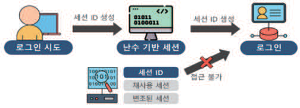

---
<!-- Page 160 -->

#### 4.2 서비스에 동일 사용자가 다중 접속이 되지 않도록 제한해야 한다.

\
위협 및 취약점
서비스 사용자의 동일 계정으로 다중 접속이 허용될 경우, 공격자에 의해 사용자가 기존에 설정한 값을 임의로 변경될
수 있다.
요구사항 및 보안대책
디지털 헬스케어 서비스 내 계정으로 중복 접속 시에는 이전 접속 혹은 새로운 접속을 차단하여 동시 접속을
허용하지 않도록 한다.
점검방법
디지털 헬스케어 서비스에 접속한 이후, 동시 접속을 시도하여 동시 접속을 허용하지 않는 것을 확인한다.
동시 접속이 확인되는 경우, 기존 접속 또는 신규 접속에 대한 알림을 제공하는지 확인한다.
동시 접속 시 접속을 차단하고 추가적으로 인증을 요구하는 기능이 구현되어 있는지 확인한다.

| 위협 및 취약점 |
| --- |
| 서비스 사용자의 동일 계정으로 다중 접속이 허용될 경우, 공격자에 의해 사용자가 기존에 설정한 값을 임의로 변경될 수 있다. |
| 요구사항 및 보안대책 |
| 디지털 헬스케어 서비스 내 계정으로 중복 접속 시에는 이전 접속 혹은 새로운 접속을 차단하여 동시 접속을 허용하지 않도록 한다. |
| 점검방법 |
| 디지털 헬스케어 서비스에 접속한 이후, 동시 접속을 시도하여 동시 접속을 허용하지 않는 것을 확인한다. 동시 접속이 확인되는 경우, 기존 접속 또는 신규 접속에 대한 알림을 제공하는지 확인한다. 동시 접속 시 접속을 차단하고 추가적으로 인증을 요구하는 기능이 구현되어 있는지 확인한다. |

---
<!-- Page 161 -->

## 제5장 디지털헬스케어 서비스 보안 요구사항 및 보안 대책 | 161

및
보안
모델
개념
및
보안
대책
개요
디지털헬스케어
구성요소
디지털헬스케어
서비스
유형
디지털헬스케어
서비스
보안
위협
디지털헬스케어
서비스
보안
요구사항
참고문헌
제1장
제2장
제3장
제4장
제5장
부록
서비스 세션 연결 후 일정 시간 동안 사용하지 않거나 설정한 시간이 경과된 경우
4.3
세션을 잠그거나 종료해야 한다.
\
위협 및 취약점
정상적으로 세션 종료되지 않은 인가된 사용자 세션을 이용하여 권한을 탈취하거나, 기기별로 동일한 암호키 사용에
따라 세션을 탈취할 수 있다.
요구사항 및 보안대책
설정된 시간을 초과하여 미사용시 세션을 잠그거나 종료시켜야 한다.
사용 환경에 적합한 경우 시스템 내에서 세션을 종료하려면 자동 시간 지정 방법을 사용한다.
세션 잠금 또는 종료 이후 기기 사용을 하고자 할 때 재인증을 요구해야 한다.
점검방법
세션 연결의 시간 초과 기능 또는 세션 연결 시간을 설정할 수 있는지 확인한다.
세션 연결 이후 설정된 시간이 초과할 때까지 기기를 사용하지 않았을 때 세션이 잠기거나 종료되는지 확인한다.
세션 잠금 또는 종료 이후 다시 기기 사용을 위해 재인증을 요구하는지 확인한다.

| 위협 및 취약점 |
| --- |
| 정상적으로 세션 종료되지 않은 인가된 사용자 세션을 이용하여 권한을 탈취하거나, 기기별로 동일한 암호키 사용에 따라 세션을 탈취할 수 있다. |
| 요구사항 및 보안대책 |
| 설정된 시간을 초과하여 미사용시 세션을 잠그거나 종료시켜야 한다. 사용 환경에 적합한 경우 시스템 내에서 세션을 종료하려면 자동 시간 지정 방법을 사용한다. 세션 잠금 또는 종료 이후 기기 사용을 하고자 할 때 재인증을 요구해야 한다. |
| 점검방법 |
| 세션 연결의 시간 초과 기능 또는 세션 연결 시간을 설정할 수 있는지 확인한다. 세션 연결 이후 설정된 시간이 초과할 때까지 기기를 사용하지 않았을 때 세션이 잠기거나 종료되는지 확인한다. 세션 잠금 또는 종료 이후 다시 기기 사용을 위해 재인증을 요구하는지 확인한다. |

---
<!-- Page 162 -->

#### 4.4 사용자 계정의 유효기간 만료 시 접근을 제한해야 한다.

위협 및 취약점
사용자 계정의 유효기간 미 설정 시, 장기간 미사용 중인 계정이나 퇴직자의 계정 등 불필요한 계정을 탈취하여 해당
계정으로 서비스를 이용할 수 있다.
요구사항 및 보안대책
사용자 계정의 유효기간을 설정하여 장기간 접속하지 않은 사용자를 구분해야 한다.
장기간 미접속으로 인해 설정된 유효기간이 만료될 경우 접근이 불가하도록 설정해야 한다.
장기 미접속자 접근통제 예시
점검방법
유 효기간이 만료된 계정으로 서비스에 접근 가능한지 확인한다.
유 효기간이 만료된 계정으로 서비스 접근 시 유효기간을 연장시키는 기능이 존재할 경우, 사용자 추가 인증 등
적절한 검증 로직이 존재하는지 확인한다.

| 위협 및 취약점 |
| --- |
| 사용자 계정의 유효기간 미 설정 시, 장기간 미사용 중인 계정이나 퇴직자의 계정 등 불필요한 계정을 탈취하여 해당 계정으로 서비스를 이용할 수 있다. |
| 요구사항 및 보안대책 |
| 사용자 계정의 유효기간을 설정하여 장기간 접속하지 않은 사용자를 구분해야 한다. 장기간 미접속으로 인해 설정된 유효기간이 만료될 경우 접근이 불가하도록 설정해야 한다. 장기 미접속자 접근통제 예시 |
| 점검방법 |
| 유 효기간이 만료된 계정으로 서비스에 접근 가능한지 확인한다. 유 효기간이 만료된 계정으로 서비스 접근 시 유효기간을 연장시키는 기능이 존재할 경우, 사용자 추가 인증 등 적절한 검증 로직이 존재하는지 확인한다. |

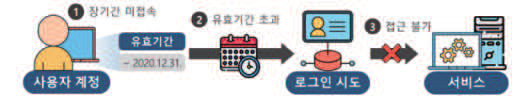

---
<!-- Page 163 -->

## 제5장 디지털헬스케어 서비스 보안 요구사항 및 보안 대책 | 163

및
보안
모델
개념
및
보안
대책
개요
디지털헬스케어
구성요소
디지털헬스케어
서비스
유형
디지털헬스케어
서비스
보안
위협
디지털헬스케어
서비스
보안
요구사항
참고문헌
제1장
제2장
제3장
제4장
제5장
부록
서비스를 연속해서 이용 시 세션 탈취에 대비하여 사용자 추가 인증 방안을 구현해야
4.5
한다.
위협 및 취약점
서비스 사용 시 세션 션이 탈취되어 사용자 본인이 아닌 공격자가 서비스에 접근할 경우 의도적으로 잘못된 의료 행위가
진행되도록 유도할 수 있으며 이로 인해 위급 상황이 발생할 수 있다.
요구사항 및 보안대책
비인가자의 불법적인 처방 및 치료를 방지하기 위하여 지속적으로 사용자 본인임을 확인할 수 있는 기능을
구현해야 한다.
기능구현 예시 상세 설명
1회 이상 대면 서비스가 선행되었던 경우, 화상을 통한 서비스를 진행함으로써
화상 회의 기능 활용
서비스 사용자의 지속적 확인이 가능할 수 있도록 구현
세션 타임아웃을 짧게 하고 서비스 중간에 본인 확인 질문을 할 수 있는 기능을
본인 확인 질문 활용
구현
화상 서비스 요구사항 예시
점검방법
서비스 이용 시 실시간으로 본인 확인 기능이 구현되어 있는지 확인한다.
세션이 중단되거나 끊길 경우 해당 세션을 이용해 서비스 재접속이 가능한지 확인한다.
파라미터, URL 변조, 인젝션 등을 통해 지속적 본인 확인 기능을 우회할 수 없도록 구현되어 운영되고 있는지
확인한다.

| 위협 및 취약점 |
| --- |
| 서비스 사용 시 세션 션이 탈취되어 사용자 본인이 아닌 공격자가 서비스에 접근할 경우 의도적으로 잘못된 의료 행위가 진행되도록 유도할 수 있으며 이로 인해 위급 상황이 발생할 수 있다. |
| 요구사항 및 보안대책 |
| 비인가자의 불법적인 처방 및 치료를 방지하기 위하여 지속적으로 사용자 본인임을 확인할 수 있는 기능을 구현해야 한다. 기능구현 예시 상세 설명 1회 이상 대면 서비스가 선행되었던 경우, 화상을 통한 서비스를 진행함으로써 화상 회의 기능 활용 서비스 사용자의 지속적 확인이 가능할 수 있도록 구현 세션 타임아웃을 짧게 하고 서비스 중간에 본인 확인 질문을 할 수 있는 기능을 본인 확인 질문 활용 구현 화상 서비스 요구사항 예시 |
| 점검방법 |
| 서비스 이용 시 실시간으로 본인 확인 기능이 구현되어 있는지 확인한다. 세션이 중단되거나 끊길 경우 해당 세션을 이용해 서비스 재접속이 가능한지 확인한다. 파라미터, URL 변조, 인젝션 등을 통해 지속적 본인 확인 기능을 우회할 수 없도록 구현되어 운영되고 있는지 확인한다. |

| 기능구현 예시 | 상세 설명 |
| --- | --- |
| 화상 회의 기능 활용 | 1회 이상 대면 서비스가 선행되었던 경우, 화상을 통한 서비스를 진행함으로써 서비스 사용자의 지속적 확인이 가능할 수 있도록 구현 |
| 본인 확인 질문 활용 | 세션 타임아웃을 짧게 하고 서비스 중간에 본인 확인 질문을 할 수 있는 기능을 구현 |

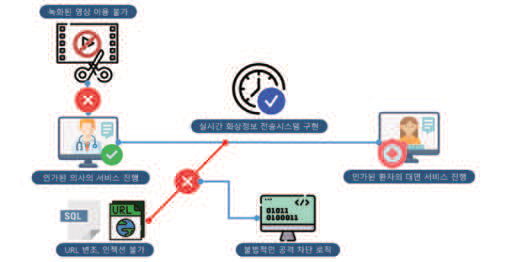

---
<!-- Page 164 -->

#### 4.6 관리목적으로 서비스에 원격 접근 시 사용자 인증 후 접근을 허용해야 한다.

위협 및 취약점
서비스에 인가되지 않은 원격 접근 허용 시 무단으로 중요 정보에 접근하거나 서비스를 이용할 수 있다.
요구사항 및 보안대책
관리자는 최대한 원격 접근을 자제해야 하며 부득이한 경우에만 허용해야 한다.
원격 접근 시 취약한 보안 설정으로 인해 권한 탈취를 방지하기 위하여 원격에서 서비스 접근 시 사용자 인증
기능을 추가해야 한다.
원격에서 접속할 경우 인증서, OTP 등을 활용한 안전한 인증 수단을 적용하거나 VPN을 활용한 안전한 접근
방법을 적용해야 한다.
원격지의 단말기에 관리자 단말기에 적용하는 모든 보안 통제 적용이 강제 되어야 한다.
서비스 원격 접속 시 로깅 기능을 활성화하여 비인가자의 접속이 없었는지 점검해야 한다.
원격 서비스 접근 보안점검 예시
점검방법
원 격으로 서비스 접근 시 인가받지 않은 서비스에 접근 가능한지 확인한다.
주 기적인 포트 점검 또는 포트 자동 점검 도구를 이용하여 원격 접근 포트가 오픈되어 있는지 확인한다.
원 격 접근 시 안전한 인증 수단 또는 안전한 접근 방법이 적용되었는지 확인한다.
원 격으로 서비스 접근 시 신원 검증을 위한 식별 기능 및 인증 기능이 존재하는지 확인한다.
원 격 접속 기록을 로깅하고 주기적으로 점검하여 운영하는지 확인한다.

| 위협 및 취약점 |
| --- |
| 서비스에 인가되지 않은 원격 접근 허용 시 무단으로 중요 정보에 접근하거나 서비스를 이용할 수 있다. |
| 요구사항 및 보안대책 |
| 관리자는 최대한 원격 접근을 자제해야 하며 부득이한 경우에만 허용해야 한다. 원격 접근 시 취약한 보안 설정으로 인해 권한 탈취를 방지하기 위하여 원격에서 서비스 접근 시 사용자 인증 기능을 추가해야 한다. 원격에서 접속할 경우 인증서, OTP 등을 활용한 안전한 인증 수단을 적용하거나 VPN을 활용한 안전한 접근 방법을 적용해야 한다. 원격지의 단말기에 관리자 단말기에 적용하는 모든 보안 통제 적용이 강제 되어야 한다. 서비스 원격 접속 시 로깅 기능을 활성화하여 비인가자의 접속이 없었는지 점검해야 한다. 원격 서비스 접근 보안점검 예시 |
| 점검방법 |
| 원 격으로 서비스 접근 시 인가받지 않은 서비스에 접근 가능한지 확인한다. 주 기적인 포트 점검 또는 포트 자동 점검 도구를 이용하여 원격 접근 포트가 오픈되어 있는지 확인한다. 원 격 접근 시 안전한 인증 수단 또는 안전한 접근 방법이 적용되었는지 확인한다. 원 격으로 서비스 접근 시 신원 검증을 위한 식별 기능 및 인증 기능이 존재하는지 확인한다. 원 격 접속 기록을 로깅하고 주기적으로 점검하여 운영하는지 확인한다. |

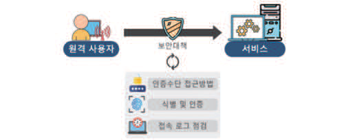

---
<!-- Page 165 -->

## 제5장 디지털헬스케어 서비스 보안 요구사항 및 보안 대책 | 165

및
보안
모델
개념
및
보안
대책
개요
디지털헬스케어
구성요소
디지털헬스케어
서비스
유형
디지털헬스케어
서비스
보안
위협
디지털헬스케어
서비스
보안
요구사항
참고문헌
제1장
제2장
제3장
제4장
제5장
부록
서비스 서버에 사용자 접근 차단을 설정해야 한다.
4.7
(서비스 서버에 사용자 접근 권한 기능을 설정해야 한다.)
위협 및 취약점
디지털헬스케어 서비스 서버에 대한 인가되지 않은 사용자 접근 허용시, 개인의료정보, 서비스 설정 등이 임의로 변경될
수 있다.
요구사항 및 보안대책
디지털헬스케어 서비스를 제공하는 서버는 사용자 계정 관리 기능을 제공해야 한다.
디지털헬스케어 서비스를 제공하는 서버는 사용자 계정을 기반으로 비인가된 사용자의 접근을 차단할 수 있어야
한다.
인가된 사용자가 접근 시
비인가된 사용자가 접근 시
점검방법
사용자 계정 관리 기능을 제공하는지 확인한다.
비인가된 사용자, 정상 사용자가 서버에 접근 가능한지 여부를 확인한다.

| 위협 및 취약점 |
| --- |
| 디지털헬스케어 서비스 서버에 대한 인가되지 않은 사용자 접근 허용시, 개인의료정보, 서비스 설정 등이 임의로 변경될 수 있다. |
| 요구사항 및 보안대책 |
| 디지털헬스케어 서비스를 제공하는 서버는 사용자 계정 관리 기능을 제공해야 한다. 디지털헬스케어 서비스를 제공하는 서버는 사용자 계정을 기반으로 비인가된 사용자의 접근을 차단할 수 있어야 한다. 인가된 사용자가 접근 시 비인가된 사용자가 접근 시 |
| 점검방법 |
| 사용자 계정 관리 기능을 제공하는지 확인한다. 비인가된 사용자, 정상 사용자가 서버에 접근 가능한지 여부를 확인한다. |

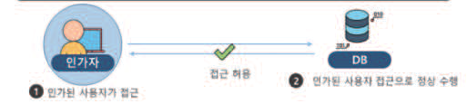
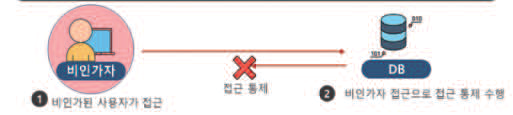

---
<!-- Page 166 -->

#### 4.8 서비스 관리자 계정에 대해서는 동시 접속을 제한해야 한다.

위협 및 취약점
쓰기 권한이 있는 관리자 계정에 대한 동시 접속 허용시, 설정 및 정책 관리에 대한 일관성이 결여될 수 있다.
요구사항 및 보안대책
디지털헬스케어 서비스의 관리자 권한은 유일한 계정으로 설정하며, 중복 접속시에는 이전 접속 혹은 새로운
접속을 차단하여 동시 접속을 허용하지 않도록 한다.
점검방법
디지털헬스케어 서비스에서 제공하는 관리자 계정을 확인하여 관리자 계정이 유일한지를 확인한다.
관리자 계정으로 디지털헬스케어 서비스에 접속한 이후에 동시 접속을 시도하여 동시 접속을 허용하지 않는 것을
확인한다.

| 위협 및 취약점 |
| --- |
| 쓰기 권한이 있는 관리자 계정에 대한 동시 접속 허용시, 설정 및 정책 관리에 대한 일관성이 결여될 수 있다. |
| 요구사항 및 보안대책 |
| 디지털헬스케어 서비스의 관리자 권한은 유일한 계정으로 설정하며, 중복 접속시에는 이전 접속 혹은 새로운 접속을 차단하여 동시 접속을 허용하지 않도록 한다. |
| 점검방법 |
| 디지털헬스케어 서비스에서 제공하는 관리자 계정을 확인하여 관리자 계정이 유일한지를 확인한다. 관리자 계정으로 디지털헬스케어 서비스에 접속한 이후에 동시 접속을 시도하여 동시 접속을 허용하지 않는 것을 확인한다. |

---
<!-- Page 167 -->

## 제5장 디지털헬스케어 서비스 보안 요구사항 및 보안 대책 | 167

및
보안
모델
개념
및
보안
대책
개요
디지털헬스케어
구성요소
디지털헬스케어
서비스
유형
디지털헬스케어
서비스
보안
위협
디지털헬스케어
서비스
보안
요구사항
참고문헌
제1장
제2장
제3장
제4장
제5장
부록

#### 5.1 서비스 개발과정에서 취약점이 존재하지 않도록 시큐어코딩을 적용하여 개발해야 한다.

위협 및 취약점
서비스 개발 과정 중 설계 및 구현 단계에서 보안약점이 잔존할 경우, 서비스 운영 시 서비스 대상으로 잔존된 보안약점을
통해 취약점 공격이 발생할 수 있다.
요구사항 및 보안대책
서비스의 소프트웨어 개발 생명주기 단계별로 요구되는 보안 활동을 수행해야 한다.
단계 보안활동
요구사항 분석 • 요구사항 중 보안 항목 식별
• 위협원 도출을 위한 위협모델링
설계 • 보안설계 검토 및 보안설계서 작성
• 보안 통제 수립
• 표준코딩 정의서 및 소프트웨어 개발보안 가이드 준수
구현
• 소프코드 보안 취약점 진단 및 개서
테스트 • 모의침투 시험 또는 동적분석을 통한 진단 및 개선
• 지속적인 개선
유지보수
• 보안 패치
코딩 완료 후 소스코드를 검증하여 적절하게 시큐어코딩이 적용되었는지 검토해야 한다.
소스코드 보안 취약점 분석 도구를 이용하여 소프트웨어에 대한 보안 취약점을 점검하여야 한다.
※ 설계 및 구현 단계에서의 시큐어코딩 적용 상세 방안은 한국인터넷진흥원의 ‘소프트웨어 보안약점 진단가이드’ 참조
소프트웨어 개발 과정 시 시큐어 코딩 적용
점검방법
오픈소스 점검 도구 또는 상용 도구를 활용하여 사용자에게 제공하는 서비스에 시큐어코딩이 적절하게
적용되었는지 확인한다.

| 위협 및 취약점 |
| --- |
| 서비스 개발 과정 중 설계 및 구현 단계에서 보안약점이 잔존할 경우, 서비스 운영 시 서비스 대상으로 잔존된 보안약점을 통해 취약점 공격이 발생할 수 있다. |
| 요구사항 및 보안대책 |
| 서비스의 소프트웨어 개발 생명주기 단계별로 요구되는 보안 활동을 수행해야 한다. 단계 보안활동 요구사항 분석 • 요구사항 중 보안 항목 식별 • 위협원 도출을 위한 위협모델링 설계 • 보안설계 검토 및 보안설계서 작성 • 보안 통제 수립 • 표준코딩 정의서 및 소프트웨어 개발보안 가이드 준수 구현 • 소프코드 보안 취약점 진단 및 개서 테스트 • 모의침투 시험 또는 동적분석을 통한 진단 및 개선 • 지속적인 개선 유지보수 • 보안 패치 코딩 완료 후 소스코드를 검증하여 적절하게 시큐어코딩이 적용되었는지 검토해야 한다. 소스코드 보안 취약점 분석 도구를 이용하여 소프트웨어에 대한 보안 취약점을 점검하여야 한다. ※ 설계 및 구현 단계에서의 시큐어코딩 적용 상세 방안은 한국인터넷진흥원의 ‘소프트웨어 보안약점 진단가이드’ 참조 소프트웨어 개발 과정 시 시큐어 코딩 적용 |
| 점검방법 |
| 오픈소스 점검 도구 또는 상용 도구를 활용하여 사용자에게 제공하는 서비스에 시큐어코딩이 적절하게 적용되었는지 확인한다. |

| 단계 | 보안활동 |
| --- | --- |
| 요구사항 분석 | • 요구사항 중 보안 항목 식별 |
| 설계 | • 위협원 도출을 위한 위협모델링 • 보안설계 검토 및 보안설계서 작성 • 보안 통제 수립 |
| 구현 | • 표준코딩 정의서 및 소프트웨어 개발보안 가이드 준수 • 소프코드 보안 취약점 진단 및 개서 |
| 테스트 | • 모의침투 시험 또는 동적분석을 통한 진단 및 개선 |
| 유지보수 | • 지속적인 개선 • 보안 패치 |

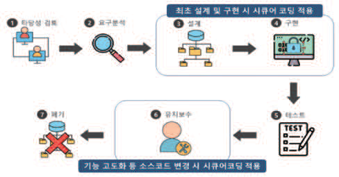

---
<!-- Page 168 -->

#### 5.2 서비스에 유입되어 사용되는 모든 입력값은 서버에서 검증해야 한다.

위협 및 취약점
사용자가 입력한 값을 검증하지 않거나 사용자 단에서 검증하는 경우 입력값을 변조하여 서비스에 비정상적인 기능을
유발시킬 수 있다.
요구사항 및 보안대책
사용자의 역할·권한을 결정하는 정보는 서버에서 관리해야 한다.
환경변수, 매개변수 등 보안 수단으로 사용되는 모든 매개 변수를 서버에서 검증해야 한다.
상태정보나 인증·인가 권한에 관련된 중요정보는 서버 측의 세션이나 DB에 저장해서 사용하도록 설계한다.
입력값 검증이 클라이언트 측에서 이루어지는 경우
입력값 검증이 서버 측에서 이루어지는 경우
점검방법
사 용자 입력 폼을 통해 전달되는 데이터에 특수문자, 예약어 등을 입력하여 권한 우회, 인젝션과 같은 공격이
수행되는지 확인한다.
사 용자 입력값이 전송되는 구간에서 웹 프록시 도구를 이용하여 입력값을 공격 가능한 구문으로 변조하였을 경우
서버 측에서 검증을 수행하는지 확인한다.

| 위협 및 취약점 |
| --- |
| 사용자가 입력한 값을 검증하지 않거나 사용자 단에서 검증하는 경우 입력값을 변조하여 서비스에 비정상적인 기능을 유발시킬 수 있다. |
| 요구사항 및 보안대책 |
| 사용자의 역할·권한을 결정하는 정보는 서버에서 관리해야 한다. 환경변수, 매개변수 등 보안 수단으로 사용되는 모든 매개 변수를 서버에서 검증해야 한다. 상태정보나 인증·인가 권한에 관련된 중요정보는 서버 측의 세션이나 DB에 저장해서 사용하도록 설계한다. 입력값 검증이 클라이언트 측에서 이루어지는 경우 입력값 검증이 서버 측에서 이루어지는 경우 |
| 점검방법 |
| 사 용자 입력 폼을 통해 전달되는 데이터에 특수문자, 예약어 등을 입력하여 권한 우회, 인젝션과 같은 공격이 수행되는지 확인한다. 사 용자 입력값이 전송되는 구간에서 웹 프록시 도구를 이용하여 입력값을 공격 가능한 구문으로 변조하였을 경우 서버 측에서 검증을 수행하는지 확인한다. |

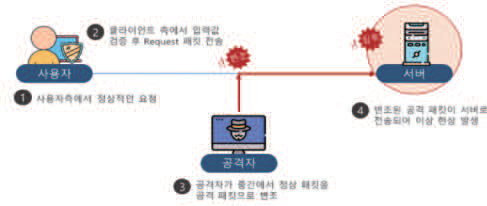
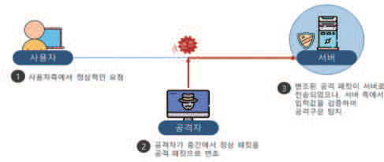

---
<!-- Page 169 -->

## 제5장 디지털헬스케어 서비스 보안 요구사항 및 보안 대책 | 169

및
보안
모델
개념
및
보안
대책
개요
디지털헬스케어
구성요소
디지털헬스케어
서비스
유형
디지털헬스케어
서비스
보안
위협
디지털헬스케어
서비스
보안
요구사항
참고문헌
제1장
제2장
제3장
제4장
제5장
부록

#### 5.3 서비스 내 악성코드가 업로드되지 않도록 구현해야 한다.

위협 및 취약점
실행 가능한 파일의 업로드를 허용하는 경우 웹쉘 공격 등으로 인해 공격자는 서비스 정보 탈취 및 서버 장악을 시도할 수
있다.
요구사항 및 보안대책
서비스 내 파일 업로드가 가능한 구간을 파악하여 불필요한 파일이 업로드 되지 않도록 확장자 기반의 검증 로직을
구현해야 한다.
확장자 검증 로직 구현 시 우회가 불가하도록 서버 측에서 구현해야 한다.
확장자 검증 로직 구현 시 화이트 리스트 기반의 검증 로직을 구현하여 불필요한 확장자 파일의 업로드를 차단해야
한다.
불필요한 확장자 파일 업로드
점검방법
파일 업로드가 가능한 구간에서 불필요한 확장자 파일이 업로드 되는지 확인한다.
파일 업로드 시 검증 로직이 서버 측에 구현되었는지 확인한다.
웹 프록시 도구 등을 활용하여 허용된 확장자 외의 파일이 업로드되는지 확인한다.
업로드 된 파일이 저장되는 폴더에 허용되지 않은 확장자의 파일이 저장되어 있는지 주기적으로 확인한다.
악성코드가 삽입된 파일이 실행되는지 여부를 확인하기 위해 파일이 저장되는 폴더에 실행 권한이 허용되어
있는지 확인한다.

| 위협 및 취약점 |
| --- |
| 실행 가능한 파일의 업로드를 허용하는 경우 웹쉘 공격 등으로 인해 공격자는 서비스 정보 탈취 및 서버 장악을 시도할 수 있다. |
| 요구사항 및 보안대책 |
| 서비스 내 파일 업로드가 가능한 구간을 파악하여 불필요한 파일이 업로드 되지 않도록 확장자 기반의 검증 로직을 구현해야 한다. 확장자 검증 로직 구현 시 우회가 불가하도록 서버 측에서 구현해야 한다. 확장자 검증 로직 구현 시 화이트 리스트 기반의 검증 로직을 구현하여 불필요한 확장자 파일의 업로드를 차단해야 한다. 불필요한 확장자 파일 업로드 |
| 점검방법 |
| 파일 업로드가 가능한 구간에서 불필요한 확장자 파일이 업로드 되는지 확인한다. 파일 업로드 시 검증 로직이 서버 측에 구현되었는지 확인한다. 웹 프록시 도구 등을 활용하여 허용된 확장자 외의 파일이 업로드되는지 확인한다. 업로드 된 파일이 저장되는 폴더에 허용되지 않은 확장자의 파일이 저장되어 있는지 주기적으로 확인한다. 악성코드가 삽입된 파일이 실행되는지 여부를 확인하기 위해 파일이 저장되는 폴더에 실행 권한이 허용되어 있는지 확인한다. |

---
<!-- Page 170 -->

#### 5.4 앱 소스코드가 노출되지 않도록 난독화를 적용해야 한다.

위협 및 취약점
소스코드가 난독화되지 않은 경우, 소스코드 내 포함된 디렉토리 정보, 중요 기능의 로직 정보 등의 정보가 노출되며
노출된 정보를 통해 2차 공격이 발생할 수 있다.
요구사항 및 보안대책
소스코드는 외부에서 분석하지 못하도록 중요 기능은 네이티브 라이브러리로 구현해야 한다.
모바일 앱 디컴파일을 통해 소스코드 변환 및 애플리케이션 구조 노출을 방지하기 위하여 모바일 앱 배포 전
소스코드 난독화 도구를 사용하여 패키징을 해야 한다.
※ 모바일 앱 난독화 적용 여부 확인 및 적용 상세 내용은 한국인터넷진흥원 ‘모바일 대민서비스 보안취약점 점검 가이드’
참조
소스코드 난독화 적용 전
소스코드 난독화 적용 후
점검방법
A PK, IPA 파일을 디컴파일 후 소스코드 난독화가 적용되었는지 확인한다.
소 스코드 난독화가 일부만 적용되어 중요 기능의 로직을 분석할 수 있는지 확인한다.

| 위협 및 취약점 |
| --- |
| 소스코드가 난독화되지 않은 경우, 소스코드 내 포함된 디렉토리 정보, 중요 기능의 로직 정보 등의 정보가 노출되며 노출된 정보를 통해 2차 공격이 발생할 수 있다. |
| 요구사항 및 보안대책 |
| 소스코드는 외부에서 분석하지 못하도록 중요 기능은 네이티브 라이브러리로 구현해야 한다. 모바일 앱 디컴파일을 통해 소스코드 변환 및 애플리케이션 구조 노출을 방지하기 위하여 모바일 앱 배포 전 소스코드 난독화 도구를 사용하여 패키징을 해야 한다. ※ 모바일 앱 난독화 적용 여부 확인 및 적용 상세 내용은 한국인터넷진흥원 ‘모바일 대민서비스 보안취약점 점검 가이드’ 참조 소스코드 난독화 적용 전 소스코드 난독화 적용 후 |
| 점검방법 |
| A PK, IPA 파일을 디컴파일 후 소스코드 난독화가 적용되었는지 확인한다. 소 스코드 난독화가 일부만 적용되어 중요 기능의 로직을 분석할 수 있는지 확인한다. |

---
<!-- Page 171 -->

## 제5장 디지털헬스케어 서비스 보안 요구사항 및 보안 대책 | 171

및
보안
모델
개념
및
보안
대책
개요
디지털헬스케어
구성요소
디지털헬스케어
서비스
유형
디지털헬스케어
서비스
보안
위협
디지털헬스케어
서비스
보안
요구사항
참고문헌
제1장
제2장
제3장
제4장
제5장
부록

#### 5.5 제3자 소프트웨어 사용 시 최신 보안패치가 적용되도록 해야 한다.

위협 및 취약점
서비스 개발 시 취약한 외부 소프트웨어를 사용할 경우 해당 소프트웨어의 취약점을 이용하여 안전하지 않은 서비스를
제공할 수 있다.
요구사항 및 보안대책
3rd party 모듈 및 라이브러리를 사용할 경우 소프트웨어 최신 업데이트 여부를 주기적으로 확인하여 패치해야
한다.
3rd party 모듈 및 라이브러리 패치로 인한 취약점이 발생할 수 있으므로 패치 이전 테스트 서버에서 패치를 선
진행하여 영향도를 파악해야 한다.
3rd party 소프트웨어 최신 업데이트 패치 예시
점검방법
3rd party 모듈 및 라이브러리의 최신 업데이트 여부를 확인하고 주기적으로 패치를 진행하는지 확인한다.
3rd party 모듈 및 라이브러리를 서비스에 적용하기 위한 업데이트 전 서비스에 미칠 영향도를 파악하여 패치를
진행하는지 확인한다.

| 위협 및 취약점 |
| --- |
| 서비스 개발 시 취약한 외부 소프트웨어를 사용할 경우 해당 소프트웨어의 취약점을 이용하여 안전하지 않은 서비스를 제공할 수 있다. |
| 요구사항 및 보안대책 |
| 3rd party 모듈 및 라이브러리를 사용할 경우 소프트웨어 최신 업데이트 여부를 주기적으로 확인하여 패치해야 한다. 3rd party 모듈 및 라이브러리 패치로 인한 취약점이 발생할 수 있으므로 패치 이전 테스트 서버에서 패치를 선 진행하여 영향도를 파악해야 한다. 3rd party 소프트웨어 최신 업데이트 패치 예시 |
| 점검방법 |
| 3rd party 모듈 및 라이브러리의 최신 업데이트 여부를 확인하고 주기적으로 패치를 진행하는지 확인한다. 3rd party 모듈 및 라이브러리를 서비스에 적용하기 위한 업데이트 전 서비스에 미칠 영향도를 파악하여 패치를 진행하는지 확인한다. |

---
<!-- Page 172 -->

#### 5.6 신규 위협에서 서비스를 보호하기 위해 주기적으로 업데이트 기능을 제공해야 한다.

위협 및 취약점
알려진 취약점이 적용된 서비스를 제공할 경우 해당 취약점을 악용하여 서비스에 위협을 가할 수 있다.
요구사항 및 보안대책
주기적으로 소프트웨어의 취약점이 존재하는지 확인하고 미흡한 부분을 점검하여 서비스 패치 버전을 출시해야
한다.
기능 업데이트 등을 위한 패치 출시 전, 새롭게 개발된 기능 내 취약점이 존재하는지 취약점 점검을 실시하여
확인해야 한다.
제로데이 취약점을 통한 침해사고를 방지하기 위하여 서비스 패치 출시 이후 이상행위가 존재하지 않는지
모니터링을 면밀하게 실시해야 한다.
소프트웨어 패치 예시
점검방법
서 비스 패치를 주기적으로 출시하는지 확인한다.
서 비스 패치 출시 이전 취약점 점검을 수행했는지 확인한다.
서 비스 패치 출시 이후 모니터링을 진행하는지 확인한다.

| 위협 및 취약점 |
| --- |
| 알려진 취약점이 적용된 서비스를 제공할 경우 해당 취약점을 악용하여 서비스에 위협을 가할 수 있다. |
| 요구사항 및 보안대책 |
| 주기적으로 소프트웨어의 취약점이 존재하는지 확인하고 미흡한 부분을 점검하여 서비스 패치 버전을 출시해야 한다. 기능 업데이트 등을 위한 패치 출시 전, 새롭게 개발된 기능 내 취약점이 존재하는지 취약점 점검을 실시하여 확인해야 한다. 제로데이 취약점을 통한 침해사고를 방지하기 위하여 서비스 패치 출시 이후 이상행위가 존재하지 않는지 모니터링을 면밀하게 실시해야 한다. 소프트웨어 패치 예시 |
| 점검방법 |
| 서 비스 패치를 주기적으로 출시하는지 확인한다. 서 비스 패치 출시 이전 취약점 점검을 수행했는지 확인한다. 서 비스 패치 출시 이후 모니터링을 진행하는지 확인한다. |

---
<!-- Page 173 -->

## 제5장 디지털헬스케어 서비스 보안 요구사항 및 보안 대책 | 173

및
보안
모델
개념
및
보안
대책
개요
디지털헬스케어
구성요소
디지털헬스케어
서비스
유형
디지털헬스케어
서비스
보안
위협
디지털헬스케어
서비스
보안
요구사항
참고문헌
제1장
제2장
제3장
제4장
제5장
부록

#### 5.7 업데이트 파일에 대한 버전, 배포자, 무결성을 검증할 수 있어야 한다.

위협 및 취약점
출처를 알 수 없는 업데이트 파일로 업데이트할 경우 비정상적인 작동을 유발하여 목적과는 다른 서비스를 제공하거나
사용자의 정보를 유출시킬 수 있다.
요구사항 및 보안대책
패치 파일 업데이트 버전 배포 시 비인가자에 의해 변조된 파일이 배포되지 않도록 확인하기 쉬운 곳에 파일 버전,
배포자 등을 명시해야 한다.
정식으로 배포된 업데이트 파일인지 확인하기 위하여 무결성 검증 기능을 제공해야 한다.
업데이트 파일에 대한 무결성 검증 방안 예시
점검방법
패치 업데이트 파일 제공 시 파일에 대한 무결성 검증을 위해 홈페이지에 제공하는 파일에 대한 해쉬값과 실제
업데이트 파일의 해쉬값을 비교해본다.
업데이트 진행 시 공식 버전, 파일 배포자 등을 사용자가 확인할 수 있도록 명시했는지 확인한다.
업데이트 파일의 무결성 검증 기능을 통해 변조된 업데이트 파일을 구별할 수 있는지 확인한다.

| 위협 및 취약점 |
| --- |
| 출처를 알 수 없는 업데이트 파일로 업데이트할 경우 비정상적인 작동을 유발하여 목적과는 다른 서비스를 제공하거나 사용자의 정보를 유출시킬 수 있다. |
| 요구사항 및 보안대책 |
| 패치 파일 업데이트 버전 배포 시 비인가자에 의해 변조된 파일이 배포되지 않도록 확인하기 쉬운 곳에 파일 버전, 배포자 등을 명시해야 한다. 정식으로 배포된 업데이트 파일인지 확인하기 위하여 무결성 검증 기능을 제공해야 한다. 업데이트 파일에 대한 무결성 검증 방안 예시 |
| 점검방법 |
| 패치 업데이트 파일 제공 시 파일에 대한 무결성 검증을 위해 홈페이지에 제공하는 파일에 대한 해쉬값과 실제 업데이트 파일의 해쉬값을 비교해본다. 업데이트 진행 시 공식 버전, 파일 배포자 등을 사용자가 확인할 수 있도록 명시했는지 확인한다. 업데이트 파일의 무결성 검증 기능을 통해 변조된 업데이트 파일을 구별할 수 있는지 확인한다. |

---
<!-- Page 174 -->
서비스 가용 시 중요 시스템 이벤트나 상태가 발생할 경우 자동으로 알람을 발생시켜야
6.1
한다.
위협 및 취약점
디지털헬스케어 서비스에서 발생하는 오류, 악성행위 등에 대한 적절한 탐지 및 대응 부재로 안전하지 않은 서비스를
제공할 수 있다.
요구사항 및 보안대책
기기에 중요한 시스템 이벤트 또는 상태가 발생한 경우 관리자에게 알람 기능을 제공하여야 한다.
기능구현 예시 상세 설명
서비스 및 단말기 고장 등 오작동 발생 시, 환자의 데이터를 전송하는 모니터링
서비스 및 단말기
형태의 기기의 경우 전송 기능을 중단하여 환자의 건강에 영향이 가지 않도록
기능 차단
구현
환자에 치료 등의 행위를 하는 서비스 및 단말기의 경우, 오작동 시 빠르게 알람을
서비스 및 단말기
띄우고, 기기 교체 등을 할 수 있을 수 있는 시간까지의 적정한 시간 동안은 변동
기능 보호
없이 치료 행위 등을 지속적으로 할 수 있도록 구현
환자의 상태를 지속적으로 서비스에 백업해두었을 경우, 오작동 시 백업된
백업 데이터 활용
데이터를 복구 해서 활용하여 환자에 영향을 최소화 하도록 구현
점검방법
기기에서 정의하는 중요한 시스템 이벤트와 상태를 확인한다.
중요한 시스템 이벤트 또는 상태 발생 시 알람 기능이 정상적으로 동작하는지 확인한다.

| 위협 및 취약점 |
| --- |
| 디지털헬스케어 서비스에서 발생하는 오류, 악성행위 등에 대한 적절한 탐지 및 대응 부재로 안전하지 않은 서비스를 제공할 수 있다. |
| 요구사항 및 보안대책 |
| 기기에 중요한 시스템 이벤트 또는 상태가 발생한 경우 관리자에게 알람 기능을 제공하여야 한다. 기능구현 예시 상세 설명 서비스 및 단말기 고장 등 오작동 발생 시, 환자의 데이터를 전송하는 모니터링 서비스 및 단말기 형태의 기기의 경우 전송 기능을 중단하여 환자의 건강에 영향이 가지 않도록 기능 차단 구현 환자에 치료 등의 행위를 하는 서비스 및 단말기의 경우, 오작동 시 빠르게 알람을 서비스 및 단말기 띄우고, 기기 교체 등을 할 수 있을 수 있는 시간까지의 적정한 시간 동안은 변동 기능 보호 없이 치료 행위 등을 지속적으로 할 수 있도록 구현 환자의 상태를 지속적으로 서비스에 백업해두었을 경우, 오작동 시 백업된 백업 데이터 활용 데이터를 복구 해서 활용하여 환자에 영향을 최소화 하도록 구현 |
| 점검방법 |
| 기기에서 정의하는 중요한 시스템 이벤트와 상태를 확인한다. 중요한 시스템 이벤트 또는 상태 발생 시 알람 기능이 정상적으로 동작하는지 확인한다. |

| 기능구현 예시 | 상세 설명 |
| --- | --- |
| 서비스 및 단말기 기능 차단 | 서비스 및 단말기 고장 등 오작동 발생 시, 환자의 데이터를 전송하는 모니터링 형태의 기기의 경우 전송 기능을 중단하여 환자의 건강에 영향이 가지 않도록 구현 |
| 서비스 및 단말기 기능 보호 | 환자에 치료 등의 행위를 하는 서비스 및 단말기의 경우, 오작동 시 빠르게 알람을 띄우고, 기기 교체 등을 할 수 있을 수 있는 시간까지의 적정한 시간 동안은 변동 없이 치료 행위 등을 지속적으로 할 수 있도록 구현 |
| 백업 데이터 활용 | 환자의 상태를 지속적으로 서비스에 백업해두었을 경우, 오작동 시 백업된 데이터를 복구 해서 활용하여 환자에 영향을 최소화 하도록 구현 |

---
<!-- Page 175 -->

## 제5장 디지털헬스케어 서비스 보안 요구사항 및 보안 대책 | 175

및
보안
모델
개념
및
보안
대책
개요
디지털헬스케어
구성요소
디지털헬스케어
서비스
유형
디지털헬스케어
서비스
보안
위협
디지털헬스케어
서비스
보안
요구사항
참고문헌
제1장
제2장
제3장
제4장
제5장
부록

#### 6.2 주요 이벤트애 대한 감사 기록을 생성 및 검토할 수 있는 기능을 제공해야 한다.

위협 및 취약점
보안사고 발생을 대비하여 감사 기록을 생성하거나 검토하지 않는 경우 침해사고 발생 시 문제 발생 규명 및 책임
추적성을 확보할 수가 없다.
요구사항 및 보안대책
주요 이벤트 발생 시 이를 탐지하여 감사 기록을 생성할 수 있도록 기능을 설정해야 한다.
감사기록 생성 후 저장 시 저장공간을 확보하여 감사 기록이 원활하게 저장되도록 관리해야 한다.
이상징후를 적시에 탐지할 수 있도록 작성된 감사 기록을 주기적으로 검토해야 한다.
모니터링 감사기록 기능 예시
점검방법
감사 기록을 생성하고 주기적으로 검토하는지 확인한다.
생성되는 감사 기록에 주요 이벤트가 누락되어 있는지 확인한다.
용량 문제로 인하여 감사 기록이 일부 누락되거나 저장되지 않은 케이스가 존재하는지 확인한다.

| 위협 및 취약점 |
| --- |
| 보안사고 발생을 대비하여 감사 기록을 생성하거나 검토하지 않는 경우 침해사고 발생 시 문제 발생 규명 및 책임 추적성을 확보할 수가 없다. |
| 요구사항 및 보안대책 |
| 주요 이벤트 발생 시 이를 탐지하여 감사 기록을 생성할 수 있도록 기능을 설정해야 한다. 감사기록 생성 후 저장 시 저장공간을 확보하여 감사 기록이 원활하게 저장되도록 관리해야 한다. 이상징후를 적시에 탐지할 수 있도록 작성된 감사 기록을 주기적으로 검토해야 한다. 모니터링 감사기록 기능 예시 |
| 점검방법 |
| 감사 기록을 생성하고 주기적으로 검토하는지 확인한다. 생성되는 감사 기록에 주요 이벤트가 누락되어 있는지 확인한다. 용량 문제로 인하여 감사 기록이 일부 누락되거나 저장되지 않은 케이스가 존재하는지 확인한다. |

| 제5장 |  |

---
<!-- Page 176 -->

#### 6.3 감사 기록이 임의로 변경되거나 삭제되지 않도록 관리해야 한다.

위협 및 취약점
인가되지 않은 사용자에 의해 감사기록이 변조되는 경우 보안 사고 발생 시 책임 추적 및 확인이 불가하다.
요구사항 및 보안대책
감사 기록에 대한 진위성 및 유효성 검증을 위하여 기록이 변조되지 않도록 관리해야 한다.
감사 기록에 대한 접근 제어를 수행해야 한다.
중요한 서비스의 경우 감사 기록의 무결성 검증을 주기적으로 수행해야 한다.
모니터링 기록 변조 예방 방법 예시
점검방법
감 사 기록에 대한 접근 제어를 설정하고 있는지 확인한다.
중 요한 서비스의 경우 감사 기록의 무결성 검증을 주기적으로 수행하는지 확인한다.

| 위협 및 취약점 |
| --- |
| 인가되지 않은 사용자에 의해 감사기록이 변조되는 경우 보안 사고 발생 시 책임 추적 및 확인이 불가하다. |
| 요구사항 및 보안대책 |
| 감사 기록에 대한 진위성 및 유효성 검증을 위하여 기록이 변조되지 않도록 관리해야 한다. 감사 기록에 대한 접근 제어를 수행해야 한다. 중요한 서비스의 경우 감사 기록의 무결성 검증을 주기적으로 수행해야 한다. 모니터링 기록 변조 예방 방법 예시 |
| 점검방법 |
| 감 사 기록에 대한 접근 제어를 설정하고 있는지 확인한다. 중 요한 서비스의 경우 감사 기록의 무결성 검증을 주기적으로 수행하는지 확인한다. |

---
<!-- Page 177 -->

## 제5장 디지털헬스케어 서비스 보안 요구사항 및 보안 대책 | 177

및
보안
모델
개념
및
보안
대책
개요
디지털헬스케어
구성요소
디지털헬스케어
서비스
유형
디지털헬스케어
서비스
보안
위협
디지털헬스케어
서비스
보안
요구사항
참고문헌
제1장
제2장
제3장
제4장
제5장
부록
서비스 및 단말기에서 발생하는 오류, 악성행위 등에 대한 적절한 탐지 및 모니터링이
6.4
되어야 한다.
위협 및 취약점
악성행위, 오류 등에 대한 탐지 및 모니터링이 되지 않는 경우 잘못된 서비스 제공으로 인한 의료사고가 발생할 수 있다.
요구사항 및 보안대책
악성 행위를 적시에 탐지하기 위하여 로그 기반의 모니터링, 보안 관제 등 탐지 방안을 마련해야 한다.
오류, 악성행의 탐지 예시
점검방법
악성행위 탐지를 위한 탐지 방안이 마련되어 있는지 확인한다.
사용자 스마트 기기가 루팅/탈옥된 경우 이를 인지하여 앱이 설치되지 못하도록 차단한다.
사용자 단말기가 취약한 운영체제를 사용할 경우 안전한 운영체제 버전을 설치하도록 권고한다.
서비스 이상 여부가 발생할 경우 서비스 제공자가 이를 제대로 모니터링할 수 있도록 보안장비가 마련되어 있거나
설정되어 있는지 확인한다.(이상 여부 알림 서비스 등 사용)
서비스 이용 시 비이상적인 행위가 발생한 경우 해당 사용자의 서비스 사용을 일시 중단하는 등의 대책을
마련한다.

| 위협 및 취약점 |
| --- |
| 악성행위, 오류 등에 대한 탐지 및 모니터링이 되지 않는 경우 잘못된 서비스 제공으로 인한 의료사고가 발생할 수 있다. |
| 요구사항 및 보안대책 |
| 악성 행위를 적시에 탐지하기 위하여 로그 기반의 모니터링, 보안 관제 등 탐지 방안을 마련해야 한다. 오류, 악성행의 탐지 예시 |
| 점검방법 |
| 악성행위 탐지를 위한 탐지 방안이 마련되어 있는지 확인한다. 사용자 스마트 기기가 루팅/탈옥된 경우 이를 인지하여 앱이 설치되지 못하도록 차단한다. 사용자 단말기가 취약한 운영체제를 사용할 경우 안전한 운영체제 버전을 설치하도록 권고한다. 서비스 이상 여부가 발생할 경우 서비스 제공자가 이를 제대로 모니터링할 수 있도록 보안장비가 마련되어 있거나 설정되어 있는지 확인한다.(이상 여부 알림 서비스 등 사용) 서비스 이용 시 비이상적인 행위가 발생한 경우 해당 사용자의 서비스 사용을 일시 중단하는 등의 대책을 마련한다. |

---
<!-- Page 178 -->

#### 6.5 사이버 공격에 대응하기 위해 침해사고 대응 방안을 마련해야 한다.

위협 및 취약점
서비스 대상으로 서비스 거부 공격, 제로데이 공격 등 침해사고 발생 시 신속한 대응을 하지 못하여 급속한 피해 확산 등
막대한 피해가 발생할 수 있다.
요구사항 및 보안대책
침해사고 발생 시 적시에 대응하기 위한 침해사고 대응 방안을 마련하고 탐지 즉시 침해사고 대응 방안에 따라
조치한다.
침해사고 대응 방안 내에는 침해사고 발생 시 담당팀 또는 담당자, 유관 부서, 대응 로직, 비상 연락망 등의 내용이
포함되어야 한다.
침해사고 대응 방안이 적절한지 확인하기 위하여 침해사고 대응 모의훈련을 주기적으로 실시해야 한다.
침해사고 대응방안 점검 예시
점검방법
침 해사고 대응 매뉴얼 존재 여부를 확인해야 한다.
침 해사고 대응 매뉴얼 내 침해사고 발생 시 담당팀 또는 담당자, 유관 부서, 대응 로직, 비상 연락망 등의 내용이
포함되었는지 확인한다.
침 해사고 대응 모의훈련을 주기적으로 실시하는지 확인한다.

| 위협 및 취약점 |
| --- |
| 서비스 대상으로 서비스 거부 공격, 제로데이 공격 등 침해사고 발생 시 신속한 대응을 하지 못하여 급속한 피해 확산 등 막대한 피해가 발생할 수 있다. |
| 요구사항 및 보안대책 |
| 침해사고 발생 시 적시에 대응하기 위한 침해사고 대응 방안을 마련하고 탐지 즉시 침해사고 대응 방안에 따라 조치한다. 침해사고 대응 방안 내에는 침해사고 발생 시 담당팀 또는 담당자, 유관 부서, 대응 로직, 비상 연락망 등의 내용이 포함되어야 한다. 침해사고 대응 방안이 적절한지 확인하기 위하여 침해사고 대응 모의훈련을 주기적으로 실시해야 한다. 침해사고 대응방안 점검 예시 |
| 점검방법 |
| 침 해사고 대응 매뉴얼 존재 여부를 확인해야 한다. 침 해사고 대응 매뉴얼 내 침해사고 발생 시 담당팀 또는 담당자, 유관 부서, 대응 로직, 비상 연락망 등의 내용이 포함되었는지 확인한다. 침 해사고 대응 모의훈련을 주기적으로 실시하는지 확인한다. |

---
<!-- Page 179 -->

## 제5장 디지털헬스케어 서비스 보안 요구사항 및 보안 대책 | 179

및
보안
모델
개념
및
보안
대책
개요
디지털헬스케어
구성요소
디지털헬스케어
서비스
유형
디지털헬스케어
서비스
보안
위협
디지털헬스케어
서비스
보안
요구사항
참고문헌
제1장
제2장
제3장
제4장
제5장
부록

#### 6.6 디지털헬스케어 서비스 제공자가 수탁사 이용 시 수탁사 관리 감독을 철저히 해야 한다.

위협 및 취약점
수탁사(약물 및 기기 배송 대행 업체 등)에 대해 관리 감독 미수행 시 수탁사를 통한 중요정보 유출 및 침해사고가 발생할
수 있다.
요구사항 및 보안대책
수탁사에게 제공되는 중요정보의 경우 정보 유형에 맞게 관리·보관되어야 한다.
수탁사에게 제공되는 중요정보 접근 통제를 적절히 구현하여 비인가자가 접근하지 못하도록 해야 한다.
보존기간이 경과된 정보가 수탁사 내부에 보관되어 있지 않도록 중요정보 파기 절차를 준수하고 있는지 확인한다.
수탁사 안전의무조치 실태 점검 예시
※ 수탁사 : 개인정보보호법에 근거하여 개인정보 처리 업무를 위탁받아 처리하는 업체를 의미하며 해당 가이드라인에서는
약물 및 기기 배송 업체 등이 포함
점검방법
수탁사에게 제공된 자료에 대한 수집, 저장, 제공, 이용 등 개인정보 생명주기 절차에 맞게 보호되고 있는
주기적으로 검토해야 한다.
연 1회 이상 수탁사에 대한 정기적인 점검 또는 감사를 통해 제공된 정보가 제대로 관리되고 있는지 파악해야
한다.
수탁사 점검 시 사용자의 중요 정보가 DB, 수탁사의 PC 등에 평문으로 저장되어 있거나 사용 기간 외에 저장되어
있는지 확인한다.

| 위협 및 취약점 |
| --- |
| 수탁사(약물 및 기기 배송 대행 업체 등)에 대해 관리 감독 미수행 시 수탁사를 통한 중요정보 유출 및 침해사고가 발생할 수 있다. |
| 요구사항 및 보안대책 |
| 수탁사에게 제공되는 중요정보의 경우 정보 유형에 맞게 관리·보관되어야 한다. 수탁사에게 제공되는 중요정보 접근 통제를 적절히 구현하여 비인가자가 접근하지 못하도록 해야 한다. 보존기간이 경과된 정보가 수탁사 내부에 보관되어 있지 않도록 중요정보 파기 절차를 준수하고 있는지 확인한다. 수탁사 안전의무조치 실태 점검 예시 ※ 수탁사 : 개인정보보호법에 근거하여 개인정보 처리 업무를 위탁받아 처리하는 업체를 의미하며 해당 가이드라인에서는 약물 및 기기 배송 업체 등이 포함 |
| 점검방법 |
| 수탁사에게 제공된 자료에 대한 수집, 저장, 제공, 이용 등 개인정보 생명주기 절차에 맞게 보호되고 있는 주기적으로 검토해야 한다. 연 1회 이상 수탁사에 대한 정기적인 점검 또는 감사를 통해 제공된 정보가 제대로 관리되고 있는지 파악해야 한다. 수탁사 점검 시 사용자의 중요 정보가 DB, 수탁사의 PC 등에 평문으로 저장되어 있거나 사용 기간 외에 저장되어 있는지 확인한다. |

---
<!-- Page 180 -->

#### 6.7 서비스 인프라에 대한 비인가된 물리적 접근을 탐지하고, 대응기능을 제공해야 한다.

위협 및 취약점
서비스에 비인가된 물리적 접근을 허용할 경우 서비스 설정값을 임의로 변경하거나 중요정보를 탈취할 수 있다.
요구사항 및 보안대책
주요 시스템, 정보 등을 보관하는 장소에는 비인가자가 접근하지 못하도록 물리적 출입 통제 방안을 마련해야
한다.
비인가자의 불법적인 접근을 탐지하기 위하여 출입 및 접근 이력을 주기적으로 검토해야 한다.
물리적 장소에 대한 출입통제 수립 및 운영 예시
점검방법
주 요 시스템, 정보 등을 보관하는 장소에 물리적 출입 통제가 적용되었는지 확인한다.
물 리적 출입 통제 적용 이후 접근 기록 관리 및 검토가 이루어지는지 확인한다.

| 위협 및 취약점 |
| --- |
| 서비스에 비인가된 물리적 접근을 허용할 경우 서비스 설정값을 임의로 변경하거나 중요정보를 탈취할 수 있다. |
| 요구사항 및 보안대책 |
| 주요 시스템, 정보 등을 보관하는 장소에는 비인가자가 접근하지 못하도록 물리적 출입 통제 방안을 마련해야 한다. 비인가자의 불법적인 접근을 탐지하기 위하여 출입 및 접근 이력을 주기적으로 검토해야 한다. 물리적 장소에 대한 출입통제 수립 및 운영 예시 |
| 점검방법 |
| 주 요 시스템, 정보 등을 보관하는 장소에 물리적 출입 통제가 적용되었는지 확인한다. 물 리적 출입 통제 적용 이후 접근 기록 관리 및 검토가 이루어지는지 확인한다. |

---
<!-- Page 181 -->

## 제5장 디지털헬스케어 서비스 보안 요구사항 및 보안 대책 | 181

및
보안
모델
개념
및
보안
대책
개요
디지털헬스케어
구성요소
디지털헬스케어
서비스
유형
디지털헬스케어
서비스
보안
위협
디지털헬스케어
서비스
보안
요구사항
참고문헌
제1장
제2장
제3장
제4장
제5장
부록
서비스 내 기능 중 환자에게 위해를 가할 수 있는 기능에 대한 설정은 사용자가 임의로
6.8
변경할 수 없도록 구현해야 한다.
위협 및 취약점
개발된 서비스 내 중요 기능 설정에 사용자가 접근이 가능하거나 임의로 변경이 가능한 경우 우, 해당 서비스에서 잘못된
데이터가 전송되거나 서비스 이용이 불가할 수 있다.
요구사항 및 보안대책
서비스 내 중요 기능 설정에 서비스 제공자 및 관리자 외에는 접근하지 못하도록 구현해야 한다.
중요 기능 설정 변경으로 서비스 및 단말기가 정상적으로 동작하지 않더라도 환자에게 영향을 끼칠 수 있는 기능이
보호될 수 있도록 설계해야 한다.
기능구현 예시 상세 설명
서비스 및 단말기 고장 등 오작동 발생 시, 환자의 데이터를 전송하는 모니터링
서비스 및 단말기
형태의 기기의 경우 전송 기능을 중단하여 환자의 건강에 영향이 가지 않도록
기능 차단
구현
환자에 치료 등의 행위를 하는 서비스 및 단말기의 경우, 오작동 시 빠르게 알람을
서비스 및 단말기
띄우고, 기기 교체 등을 할 수 있을 수 있는 시간까지의 적정한 시간 동안은 변동
기능 보호
없이 치료 행위 등을 지속적으로 할 수 있도록 구현
환자의 상태를 지속적으로 서비스에 백업해두었을 경우, 오작동 시 백업된
백업 데이터 활용
데이터를 복구 해서 활용하여 환자에 영향을 최소화 하도록 구현
서비스 오작동 등 비상 상황에 즉각 대응할 수 있는 대책이 마련되어 있어야 한다.
점검방법
서비스 내 중요 설정 파일 등에 사용자가 임의로 접근 및 설정값 변경이 가능한지 확인한다.
단말기의 정상 동작 유무와 관계없이 일관성 있는 기능 제공 및 데이터 보존을 위한 설계 및 기능 구현이 되어
있는지 확인 한다.
서비스를 강제 종료하거나 비정상적인 방법으로 실행시켰을 때 기존 데이터가 변조되거나 삭제되는지 확인한다.
서비스 오작동 등의 비상 상황에 대한 대책이 마련되어 있는지에 대한 여부 및 적정한지 평가한다.

| 위협 및 취약점 |
| --- |
| 개발된 서비스 내 중요 기능 설정에 사용자가 접근이 가능하거나 임의로 변경이 가능한 경우 우, 해당 서비스에서 잘못된 데이터가 전송되거나 서비스 이용이 불가할 수 있다. |
| 요구사항 및 보안대책 |
| 서비스 내 중요 기능 설정에 서비스 제공자 및 관리자 외에는 접근하지 못하도록 구현해야 한다. 중요 기능 설정 변경으로 서비스 및 단말기가 정상적으로 동작하지 않더라도 환자에게 영향을 끼칠 수 있는 기능이 보호될 수 있도록 설계해야 한다. 기능구현 예시 상세 설명 서비스 및 단말기 고장 등 오작동 발생 시, 환자의 데이터를 전송하는 모니터링 서비스 및 단말기 형태의 기기의 경우 전송 기능을 중단하여 환자의 건강에 영향이 가지 않도록 기능 차단 구현 환자에 치료 등의 행위를 하는 서비스 및 단말기의 경우, 오작동 시 빠르게 알람을 서비스 및 단말기 띄우고, 기기 교체 등을 할 수 있을 수 있는 시간까지의 적정한 시간 동안은 변동 기능 보호 없이 치료 행위 등을 지속적으로 할 수 있도록 구현 환자의 상태를 지속적으로 서비스에 백업해두었을 경우, 오작동 시 백업된 백업 데이터 활용 데이터를 복구 해서 활용하여 환자에 영향을 최소화 하도록 구현 서비스 오작동 등 비상 상황에 즉각 대응할 수 있는 대책이 마련되어 있어야 한다. |
| 점검방법 |
| 서비스 내 중요 설정 파일 등에 사용자가 임의로 접근 및 설정값 변경이 가능한지 확인한다. 단말기의 정상 동작 유무와 관계없이 일관성 있는 기능 제공 및 데이터 보존을 위한 설계 및 기능 구현이 되어 있는지 확인 한다. 서비스를 강제 종료하거나 비정상적인 방법으로 실행시켰을 때 기존 데이터가 변조되거나 삭제되는지 확인한다. 서비스 오작동 등의 비상 상황에 대한 대책이 마련되어 있는지에 대한 여부 및 적정한지 평가한다. |

| 기능구현 예시 | 상세 설명 |
| --- | --- |
| 서비스 및 단말기 기능 차단 | 서비스 및 단말기 고장 등 오작동 발생 시, 환자의 데이터를 전송하는 모니터링 형태의 기기의 경우 전송 기능을 중단하여 환자의 건강에 영향이 가지 않도록 구현 |
| 서비스 및 단말기 기능 보호 | 환자에 치료 등의 행위를 하는 서비스 및 단말기의 경우, 오작동 시 빠르게 알람을 띄우고, 기기 교체 등을 할 수 있을 수 있는 시간까지의 적정한 시간 동안은 변동 없이 치료 행위 등을 지속적으로 할 수 있도록 구현 |
| 백업 데이터 활용 | 환자의 상태를 지속적으로 서비스에 백업해두었을 경우, 오작동 시 백업된 데이터를 복구 해서 활용하여 환자에 영향을 최소화 하도록 구현 |

---
<!-- Page 182 -->
디지털헬스케어 서비스 접근 후 인증을 통하여 정당한 기기와 연동되는지 확인하고
6.9
사용자가 사용법을 숙지할 수 있도록 매뉴얼하여 제공해야 한다.
위협 및 취약점
디지털헬스케어 서비스 접근 후 정당한 기기와의 연동 기능을 제공하지 않을 경우, 불법 복제품을 통한 비인가적인 연동
및 접근이 가능하여 서비스에 악영향을 미칠 수 있다.
요구사항 및 보안대책
디지털헬스케어 서비스 접근 후 기기와 연동하는 기능이 존재하는지 확인한다.
디지털헬스케어 서비스와 기기의 연동 시 정품 기기를 이용하여 인증하였는지 확인하는 기능을 추가하여 불법 복제
기기와의 연동을 방지해야 한다.
기기 인증 시 사용되는 제품번호, 보안문자 등을 유추하기 어렵게 지정해야 하며, 여러 번의 인증 실패 시 인증 기능을
일시적으로 제한해야 한다.
환자가 사용 방법을 확인할 수 있도록 서비스 내 사용 매뉴얼을 내재화해야 한다.
사용 매뉴얼은 누구나 이해하기 쉽게 만들어야 하며, 사용자가 원할 때 언제 어디서든 확인할 수 있도록 해야한다.
점검방법
서비스 내 매뉴얼을 확인할 수 있는 기능을 구현했는지 확인한다.
사용자 매뉴얼을 알기 쉽게 작성하였는지 확인한다.
사용자 매뉴얼을 확인하기 쉽도록 누구나 찾기 쉬운 위치에 구현하였는지 확인한다.
서비스 이용 시 기기 및 사용자 인증을 통해 정상적인 경로로 구매하였는지 사용법을 숙지하고 있는지 확인한다.

| 위협 및 취약점 |
| --- |
| 디지털헬스케어 서비스 접근 후 정당한 기기와의 연동 기능을 제공하지 않을 경우, 불법 복제품을 통한 비인가적인 연동 및 접근이 가능하여 서비스에 악영향을 미칠 수 있다. |
| 요구사항 및 보안대책 |
| 디지털헬스케어 서비스 접근 후 기기와 연동하는 기능이 존재하는지 확인한다. 디지털헬스케어 서비스와 기기의 연동 시 정품 기기를 이용하여 인증하였는지 확인하는 기능을 추가하여 불법 복제 기기와의 연동을 방지해야 한다. 기기 인증 시 사용되는 제품번호, 보안문자 등을 유추하기 어렵게 지정해야 하며, 여러 번의 인증 실패 시 인증 기능을 일시적으로 제한해야 한다. 환자가 사용 방법을 확인할 수 있도록 서비스 내 사용 매뉴얼을 내재화해야 한다. 사용 매뉴얼은 누구나 이해하기 쉽게 만들어야 하며, 사용자가 원할 때 언제 어디서든 확인할 수 있도록 해야한다. |
| 점검방법 |
| 서비스 내 매뉴얼을 확인할 수 있는 기능을 구현했는지 확인한다. 사용자 매뉴얼을 알기 쉽게 작성하였는지 확인한다. 사용자 매뉴얼을 확인하기 쉽도록 누구나 찾기 쉬운 위치에 구현하였는지 확인한다. 서비스 이용 시 기기 및 사용자 인증을 통해 정상적인 경로로 구매하였는지 사용법을 숙지하고 있는지 확인한다. |

---
<!-- Page 183 -->

## 제5장 디지털헬스케어 서비스 보안 요구사항 및 보안 대책 | 183

및
보안
모델
개념
및
보안
대책
개요
디지털헬스케어
구성요소
디지털헬스케어
서비스
유형
디지털헬스케어
서비스
보안
위협
디지털헬스케어
서비스
보안
요구사항
참고문헌
제1장
제2장
제3장
제4장
제5장
부록
서비스 보안 통제를 강제화하기 위하여 서비스 접근 시 보안 기능을 구현하고 마련해야
6.10
한다.
위협 및 취약점
서비스 사용 시 단말기에 대한 보안 통제가 적절하지 않은 경우, 서비스 내 보안 취약점을 활용하여 비인가자가 서비스에
접근하며 중요정보 열람 및 수정이 가능하다.
요구사항 및 보안대책
사용자 단말기에서 서비스 이용 시 보안프로그램 설치, 단말기 보안 설정 정책 활성화 등 적절한 보안 통제가
이루어지도록 해야 한다.
보안 통제 예시
가정 등 보안 환경이 취약한 곳에서 서비스를 이용하는 경우를 대비하여, 앱 실행 시 백신 프로그램 자동 실행,
MAM(Mobile application management) 통제 등의 방안을 구현해야 한다.
※ MAM(Mobile application management) : 서비스되는 모바일 애플리케이션과 관련된 데이터만 액세스를 통제하는
기술
웹 페이지로 서비스를 제공하는 경우, 키로깅 방지를 위한 보안프로그램 설치, 화상 키보드를 통한 중요정보 입력
등의 방안을 구현해야 한다.
환자 사용 채널의 보안대책 예시

| 위협 및 취약점 |
| --- |
| 서비스 사용 시 단말기에 대한 보안 통제가 적절하지 않은 경우, 서비스 내 보안 취약점을 활용하여 비인가자가 서비스에 접근하며 중요정보 열람 및 수정이 가능하다. |
| 요구사항 및 보안대책 |
| 사용자 단말기에서 서비스 이용 시 보안프로그램 설치, 단말기 보안 설정 정책 활성화 등 적절한 보안 통제가 이루어지도록 해야 한다. 보안 통제 예시 가정 등 보안 환경이 취약한 곳에서 서비스를 이용하는 경우를 대비하여, 앱 실행 시 백신 프로그램 자동 실행, MAM(Mobile application management) 통제 등의 방안을 구현해야 한다. ※ MAM(Mobile application management) : 서비스되는 모바일 애플리케이션과 관련된 데이터만 액세스를 통제하는 기술 웹 페이지로 서비스를 제공하는 경우, 키로깅 방지를 위한 보안프로그램 설치, 화상 키보드를 통한 중요정보 입력 등의 방안을 구현해야 한다. 환자 사용 채널의 보안대책 예시 |

---
<!-- Page 184 -->
점검방법
식별된 기기에서 비밀번호 설정, 보안프로그램 설치 등 보안 통제 적용 후 서비스 이용이 가능하도록 구현되었는지
확인한다.
최초 보안 통제 적용 후 중간에 사용자가 임의로 보안 통제 해제 시 이를 정상적으로 인식하여 보안 통제를
재설정하도록 강제하는 기능이 구현되었는지 확인한다.
모바일 앱, 웹 페이지 등으로 서비스 접근 시 보안프로그램 설치 및 실행, 중요정보 입력 시 화상 키보드 이용 등의
통제방안을 구현했는지 확인한다.

| 점검방법 |
| --- |
| 식별된 기기에서 비밀번호 설정, 보안프로그램 설치 등 보안 통제 적용 후 서비스 이용이 가능하도록 구현되었는지 확인한다. 최초 보안 통제 적용 후 중간에 사용자가 임의로 보안 통제 해제 시 이를 정상적으로 인식하여 보안 통제를 재설정하도록 강제하는 기능이 구현되었는지 확인한다. 모바일 앱, 웹 페이지 등으로 서비스 접근 시 보안프로그램 설치 및 실행, 중요정보 입력 시 화상 키보드 이용 등의 통제방안을 구현했는지 확인한다. |

---
<!-- Page 185 -->

## 제5장 디지털헬스케어 서비스 보안 요구사항 및 보안 대책 | 185

및
보안
모델
개념
및
보안
대책
개요
디지털헬스케어
구성요소
디지털헬스케어
서비스
유형
디지털헬스케어
서비스
보안
위협
디지털헬스케어
서비스
보안
요구사항
참고문헌
제1장
제2장
제3장
제4장
제5장
부록
편향된 데이터로 인공지능 서비스를 학습시키지 않고 올바른 인공지능 사용 지침 및
6.11
가이드라인을 기반으로 인공지능을 학습시켜야 한다.
위협 및 취약점
편향된 데이터를 이용하여 인공지능 서비스를 학습시킬 경우, 편향된 데이터를 통한 서비스 제공으로 인해 서비스 품질
저하 및 잘못된 정보를 제공할 수 있다.
요구사항 및 보안대책
인공지능 서비스의 학습을 위해 데이터 수집 시 수집 경로, 수집 방법 등 체계를 수립해야 한다.
수집하는 원시 데이터는 개인정보보호, 저작권 등 각종 법ㆍ제도를 만족해야 한다.
수집하는 원시 데이터는 지역, 사회, 인종, 성별 등 편향적인 특성이 제거되어야 한다.
인공지능 서비스의 학습용 데이터셋 중 시험용 데이터셋을 제거해야 한다.
인공지능 서비스의 학습 시 관련 지침 및 가이드라인을 준수해야 한다.
※ 인공지능 서비스 학습 관련한 상세 내용은 한국지능정보사회진흥원의 ‘인공지능 학습용 데이터 품질관리 가이드라인’
참조
점검방법
인공지능 서비스의 학습을 위한 데이터 수집 체계가 마련되었는지 확인한다.
인공지능 서비스를 위해 수집된 데이터 중 법적 준거성을 위배하는 요소가 존재하는지 확인한다.
인공지능 서비스를 위해 수집된 데이터 중 편향적 특성, 시험용 데이터셋 등 인공지능 활성화를 저해하는 요소가
존재하는지 확인한다.

| 위협 및 취약점 |
| --- |
| 편향된 데이터를 이용하여 인공지능 서비스를 학습시킬 경우, 편향된 데이터를 통한 서비스 제공으로 인해 서비스 품질 저하 및 잘못된 정보를 제공할 수 있다. |
| 요구사항 및 보안대책 |
| 인공지능 서비스의 학습을 위해 데이터 수집 시 수집 경로, 수집 방법 등 체계를 수립해야 한다. 수집하는 원시 데이터는 개인정보보호, 저작권 등 각종 법ㆍ제도를 만족해야 한다. 수집하는 원시 데이터는 지역, 사회, 인종, 성별 등 편향적인 특성이 제거되어야 한다. 인공지능 서비스의 학습용 데이터셋 중 시험용 데이터셋을 제거해야 한다. 인공지능 서비스의 학습 시 관련 지침 및 가이드라인을 준수해야 한다. ※ 인공지능 서비스 학습 관련한 상세 내용은 한국지능정보사회진흥원의 ‘인공지능 학습용 데이터 품질관리 가이드라인’ 참조 |
| 점검방법 |
| 인공지능 서비스의 학습을 위한 데이터 수집 체계가 마련되었는지 확인한다. 인공지능 서비스를 위해 수집된 데이터 중 법적 준거성을 위배하는 요소가 존재하는지 확인한다. 인공지능 서비스를 위해 수집된 데이터 중 편향적 특성, 시험용 데이터셋 등 인공지능 활성화를 저해하는 요소가 존재하는지 확인한다. |

---
<!-- Page 186 -->
Ⅱ
PART : 서비스 유형별

|  |
| --- |
|  |

|  |
| --- |
|  |

|  |
| --- |
|  |

---
<!-- Page 187 -->
부록
참고문헌

---
<!-- Page 188 -->
부록 참고문헌
(1) ETRI, “ICT 융합 표준 프레임워크 : 스마트헬스”, ICT-SMHE-2019-1.0, 2019.
(2) TTA, “유헬스 서비스 참조모델 ”, TTAK.KO-10.0463/R1, 2014.
(3) TTA, “스마트의료서비스 보안 위협 (기술보고서)”, TTAR-12.0026, 2017.
(4) TTA, “의료기기 사이버보안 요구사항(기술보고서)”, TTAR-12.0040, 2019.
(5) TTA, “사물인터넷 기기 등급 분류 및 보안 요구사항”, TTAK.KO-12.0298, 2016.
(6) Medihere, “메디히어 원격진료 플랫폼 서비스 소개서 및 사용매뉴얼”, 2020.
(7) 정한민 외 3명, “개인 맞춤형 헬스케어 산업 기술 동향”, IITP 주간기술동향, 2020.
(8) 이준영, “디지털헬스케어 동향 및 시사점”, NIPA 이슈리포트 2019-03호, 2019.
(9) U.S. FDA Cybersecurity Safety Communications,https://www.fda.gov/medical-
devices/digital-health-center-excellence/cybersecurity
(10) 식품의약품안전처, “의료기기의 사이버 보안 허가·심사 가이드라인(민원인 안내서)”, 2019.
(11) IoT 보안얼라이언스, “스마트의료 사이버보안 가이드”, 2018.
(12) U.S. FDA, “Content of Premarket Submissions for Management of Cybersecurity
in Medical Devices”, 2014.
(13) U.S. FDA, “(Draft) Content of Premarket Submissions for Management of
Cybersecurity in Medical Devices”, 2018.
(14) U.S. FDA, “(Draft) Medical Device Manufacturer Internet of Things (IoT) Code of
Conduct”, 2020.
(15) U.S. FDA, “Postmarket Management of Cybersecurity in Medical Devices”, 2016.

---
<!-- Page 189 -->
부록 참고문헌 | 189
및
보안
모델
개념
및
보안
대책
개요
디지털헬스케어
구성요소
디지털헬스케어
서비스
유형
디지털헬스케어
서비스
보안
위협
디지털헬스케어
서비스
보안
요구사항
참고문헌
제1장
제2장
제3장
제4장
제5장
부록
(16) Health Canada,“Pre-market Requirements for Medical Device Cybersecurity”, 2019.
(17) BSI, “Cyber Security Requirements for Network-Connected Medical Devices”,
BSI-CS 132, Version 1.1, 2018.11.13.
(18) TGA, “Medical device cyber security guidance for industry”, 2019.
(19) MDCG, “Guidance on Cybersecurity for medical devices”, MDCG 2019-16,
2019.11.
(20) SFDA, “Guidance to Pre-Market Cybersecurity of Medical Devices”, MDS-G38,
V2.0, 2019.
(21) TMBIA, “適用於製造廠之醫療器材網路安全指引(제조업체에 적용 가능한 의료기기에 대한
사이버 보안 지침)”, 2019.
(22) IMDRF, “Principles and Practices for Medical Device Cybersecurity”, 2020.
(23) DTSec, “Protection Profile for Connected Diabetes Devices (CDD)”, Version 2.0,
2017.11.25.
(24) UL, “Software Cybersecurity for Network-Connctable Products, Part 1: General
Requirements”, ANSI/CAN/UL 2900-1:2017, 2017.
(25) UL, “Software Cybersecurity for Network-Connctable Products, Part 2-1:
Particular Requirements for Network Connectable Components of Healthcare
and Wellness Systems”, ANSI/CAN/UL 2900-2-1:2018, 2018.
(26) IEC, “Medical electrical equipment — Part 1: General requirements for basic
safety and essential performance”, IEC 60601-1, 2012.
(27) IEC, “Medical device software – Software life cycle processes ”, IEC 62304, 2015.
(28) KISA, “사물인터넷(IoT) 보안 시험・인증 기준 해설서”, 2019.
(29) KISA, “소프트웨어 개발보안가이드”, 11-1311000-000330-10, 2019.
(30) OWASP, “OWASP Top 10–2017, The Ten Most Critical Web Application Security
Risks”, 2017.
(31) KISA, 모바일 대민서비스 보안취약점 점검 가이드“, 2014
(32) NIA, “인공지능 학습용 데이터 품질관리 가이드라인”, 2021

---
<!-- Page 190 -->
Ⅱ
PART : 서비스 유형별
인 쇄 2021년 12월 인쇄
발 행 2021년 12월 발행
발행처 한국인터넷진흥원
주 소 58324 전라남도 나주시 진흥길 9 한국인터넷진흥원
TEL. 1433-25 / www.kisa.or.kr